# 支撑向量机 

---

## 简介

支撑向量机（Support Vector Machine）

在逻辑回归中，决策边界不唯一的问题被称为“**不适定问题**”

找到一条决策边界，使得这条决策边界离我们的分类样本都尽可能的远，这样的决策边界泛化能力就会比较好

在SVM其实有两根平行的线，这两根平行的线划分的中间区域就是SVM划分的中线。进而得知，SVM尝试寻找一个最优的决策边界。这个决策边界距离两个类别的最近的样本最远。且上边界离决策边界的距离和下边界离决策边界的距离相等（如红色点到线和蓝色点到线的距离）。

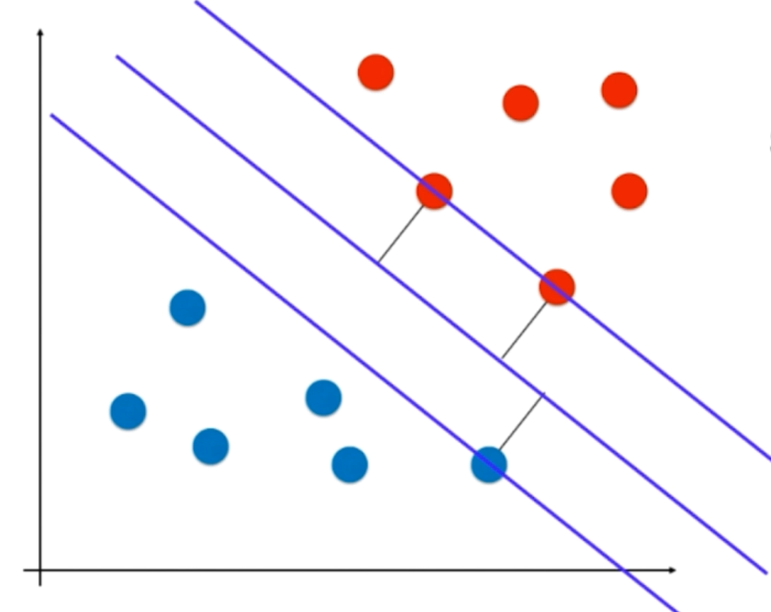

对于最近的样本被称为：支撑向量

离决策边界最近的那些点到决策边界的距离为d

* Hard Margin SVM ：切切实实找到一根边界，这个边界没有错误的将所有样本点进行划分，同时最大化了这个margin
* Soft Margin SVM：这是在Hard Margin的基础上进行改进

## SVM背后的最优化问题

在解析几何中，点到直线的距离计算公式：

(x, y)  到 Ax + By + C 的距离
$$
\frac{Ax + By + C}{\sqrt{A^2 + B^2}}
$$
拓展到n维空间

* 相当于把θ0 x0这一项单独拿出来，用b来表示；用将样本真实的特征前面的系数用 向量w 表示（weight 权值），这个向量相当于给x这个特征向量每一个特征附上了一个权值。

$$
\theta^Tx_b = 0 \ => \  w^tx + b = 0
$$

那么从(x, y)到w^tx + b = 0的距离就为：
$$
\frac{w^Tx + b}{||w||} \\
||w|| = \sqrt{w_1^2 + w_2^2 + w_3^2 + ... + w_n^2}
$$
要满足支撑向量机的条件相应的有两个式子

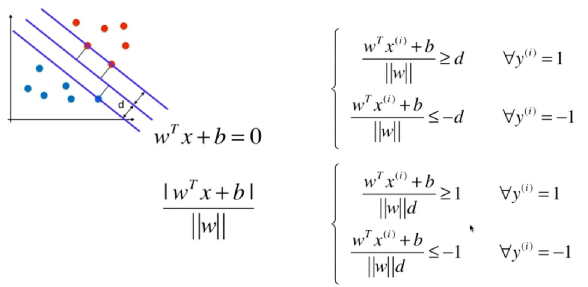

将上列的第二个分段函数再进行化简，得到意思差不多的分段函数，在图中就可以得到上下两个线的函数

在上述式子中w_d 和 b_d 与第一个分段函数式子就差一个1 / ||w||d，在中间那条直线中，因为式子右侧为0，所以可以替换为w_d 和 b_d

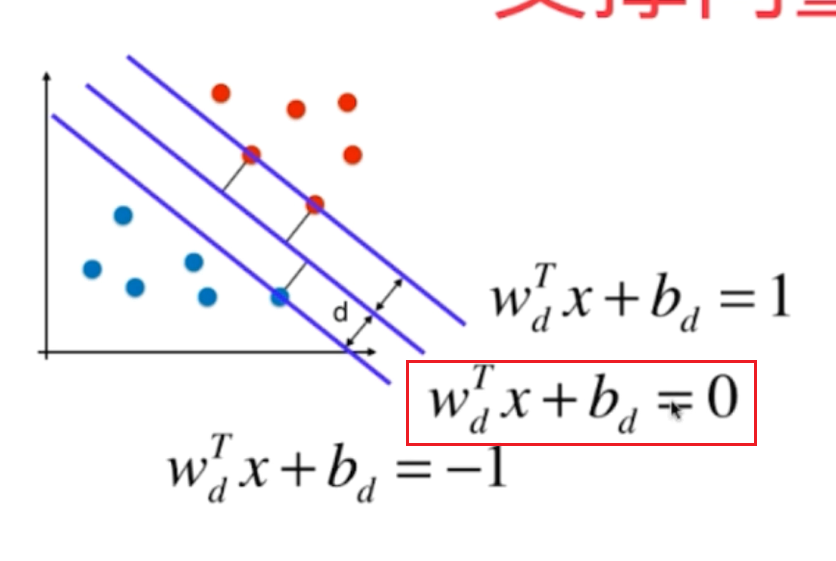

为了方便阅读，可以为这个分段函数的w_d 和 b_d 进行**再一次命名**，命名为 w 和 b，从此这个w和b和一开始的w和b是不一样的数。

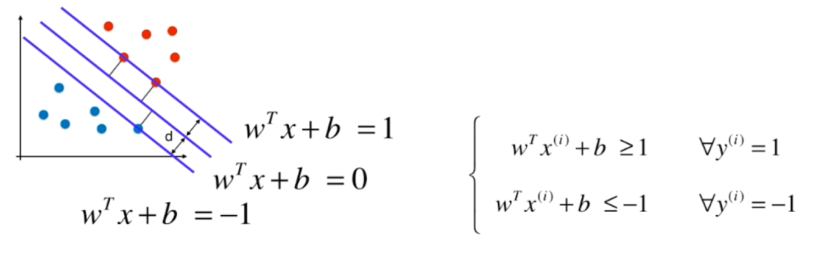

可以使用学习逻辑回归时用到的合并式子的技巧，合并上述的分段函数。

* 最大化d相当于最大化下列式子

$$
max\frac{|w^tx + b|}{||w||}
$$

* 因为最大化的目标是1或者-1，加上了绝对值之后，最大化的目标都是1，相当于求

$$
max \frac{1}{||w||} \\
相当于：min||w|| \\
实际上：min\frac{1}{2}||w||^2
$$

整个支撑向量机的算法就变成下列的最优化问题（且这是一个有条件最优化问题）：
$$
min \frac{1}{2}||w||^2 \\
y^{(i)}(w^Tx^{(i)}+b) \ge 1
$$

## Soft Margin SVM

ζ ：表示这个SVM有一定的容错空间【在图中相当于红色样本的那条线可以向下容忍，蓝色那边可以向上容忍】

对于 ζ 来说，不是固定的，而是每一个y^(i)都有一个不固定的 ζ。但是这个 ζ 的容错空间不是无穷大，为了保证它的容错空间不能太大，可以最小化的方程加上所有 ζ 和

 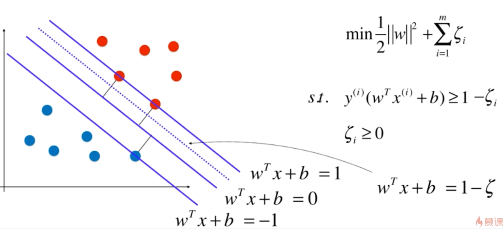

这样操作，相当于在Soft Margin SVM中加入L1正则

L1正则和L2正则的区别在于 ζ

在逻辑回归和线性回归中C是放在损失函数上，SVM的C是放在正则项上；C越小说明有更大的容错空间

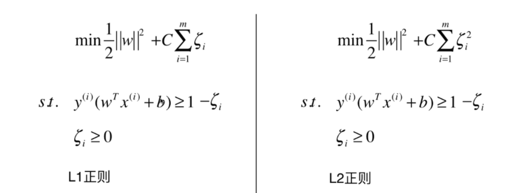

## 核函数

首先将最优化问题进行转换

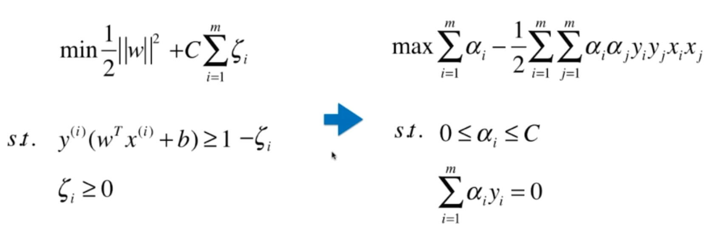

在右边的最优化问题中有个比较重要的一项

然后给x_i和x_j添加多项式特征

如果有一个函数可以表示转换为多项式特征的函数K

### 多项式核函数

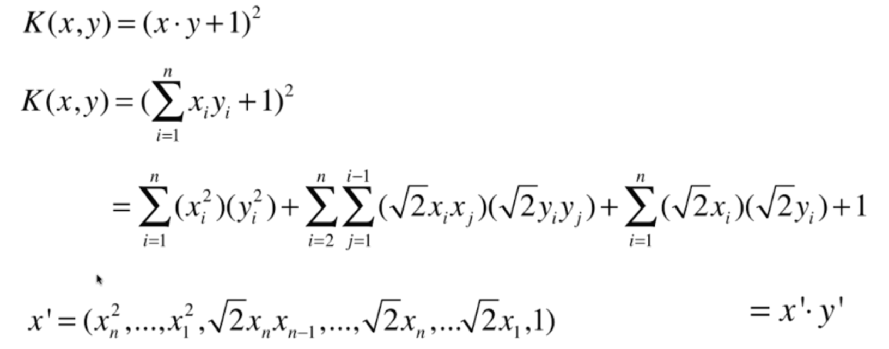

所以回到函数，只要转换一下K函数即可

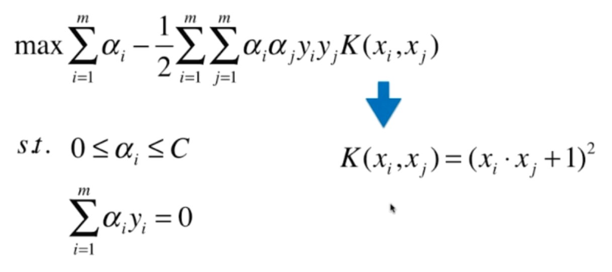

### 线性核函数

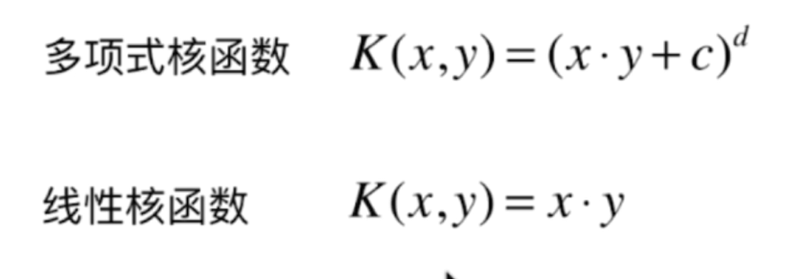

### 高斯核函数

K(x, y) 表示x和y的点乘，将每一个样本点映射到一个无穷维的特征空间

* gamma越大，高斯分布越窄
* gamma越小，高斯分布越宽

$$
K(x,y) = e^{-\gamma}||x-y||^2
$$
高斯函数
$$
g(x) = \frac{1}{\sigma \sqrt{2\pi}}e^{-\frac{1}{2}(\frac{x-\mu}{\sigma})^2}
$$
高斯核函数有时候被称为RBF核（Radial Basis Function Kernel）

#### 回顾多项式特征

依靠升维使得原本线性不可分的数据线性可分

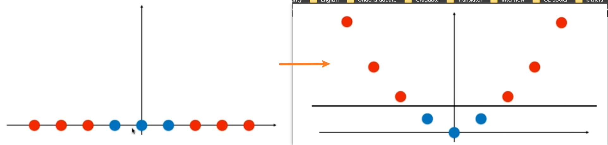

#### 高斯核

对于每一个数据点都是landmark

m*n的数据映射成m * m的数据

## 解决回归问题

