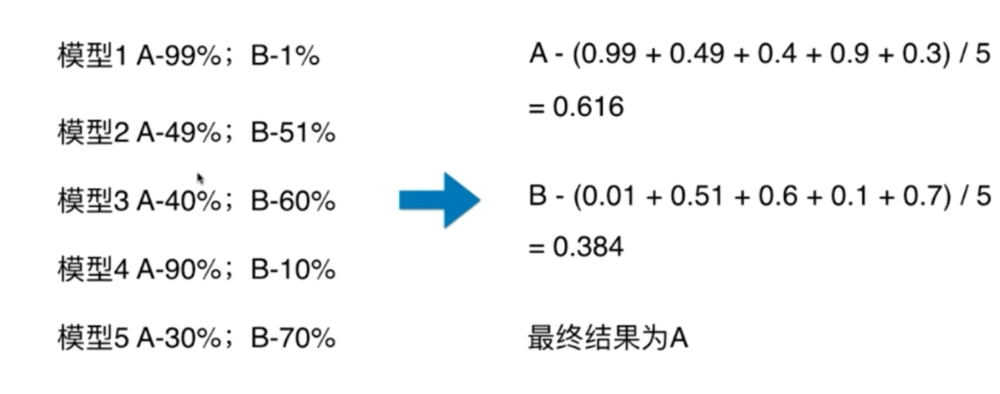
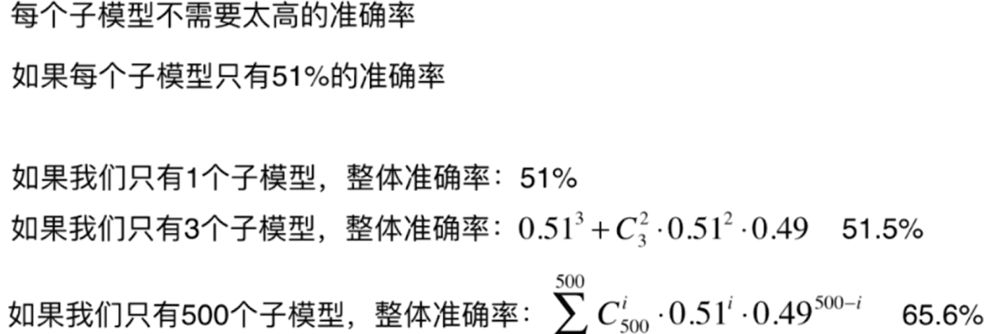
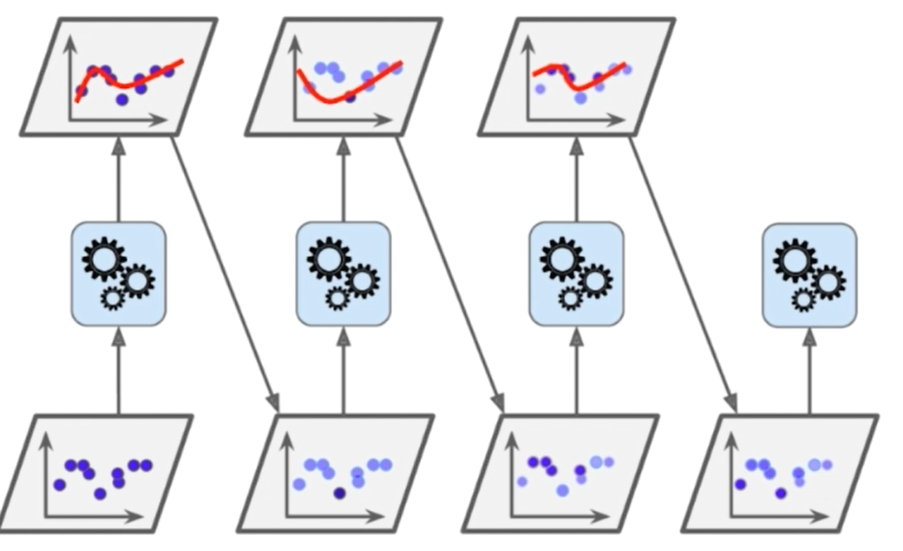
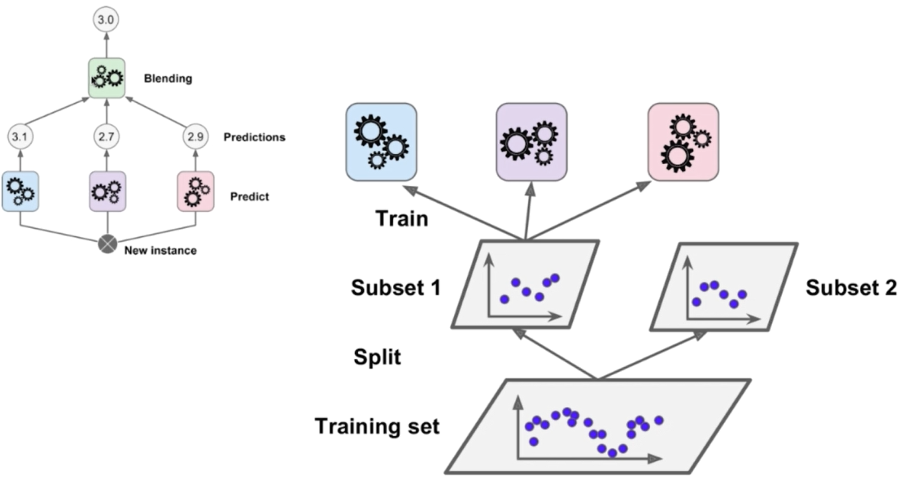

# 集成学习和随机森林

---

通俗例子理解集成学习：

买东西找别人推荐：三个人有两个人推荐，一个人不推荐。因为每个人经历不同，视角不同，给出的意见自然就不同。

## Soft Voting

## Bagging 和 Pasting

如何创建差异性？

每个子模型只看样本数据的一部分。例如一共有500个样本数据；每个子模型只看100个样本数据，每个子模型不需要太高的准确率

取样；放回取样，不放回取样

放回去样：Bagging  不放回取样：Pasting

Bagging更常用

### OOB Out-of-Bag

放回去样导致一部分样本很有可能没有取到，平均大约有37%的样本没有取到

不适应测试数据集，而使用这部分没有取到的样本做测试

Bagging的思路极易并行化处理（n_jobs）

### Bagging更多探讨

针对特征进行随机采样：Random Subspaces

既针对样本，又针对特征进行随机采样：Random Patches

## 随机森林

决策树再节点划分上，在随机的特征子集上寻找最优划分特征

## Extra Trees

决策树再节点划分上，使用随机的特征和随机的阈值

提高额外的随机性，一直过拟合，但增大了bias

更快的训练速度

## Boosting

集成多个模型

每个模型都在尝试增强（Boosting）整体的效果

### Ada Boosting

让上一个模型一些没有被很好学习的点让它的权值增大一些，学习很好的点权值增小，进而形成新的模型

### Gradient Boosting

思想：

训练一个模型m1，产生错误e1

针对e1训练第二个模型m2，产生错误e2

针对e2训练第三个模型m3，产生错误e3…….

最终预测结果是：m1 + m2 + m3 + …

## Stacking

把一份模型分为两份，对于其中的一份首先训练三个模型，第二份的意义在于训练另外一个模型（图中最上角），也就是把第二份模型扔到第一份模型训练好的三份模型内，从而三份模型就有了输出结果，三份模型和上一层的第二份模型的真值就有了新的数据集，再用这个数据集训练第四个模型，最终形成Stacking

### 更加复杂的Stacking

第一层的三个模型相应的可以得到输出，把这三个输出作为输入，可以分别把这三个输出作为输入训练到下一层的三个模型，第二层模型可以把第一层的输入作为输出分别又可以得到三个输出，分别再以第二层的输出作为第三层这个模型的输入，第三层得到的结果作为整个集成模型的Stacking的结果（相似神经网络）

