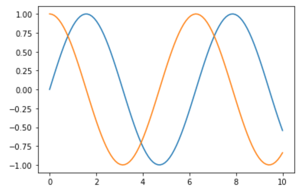
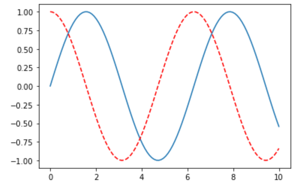
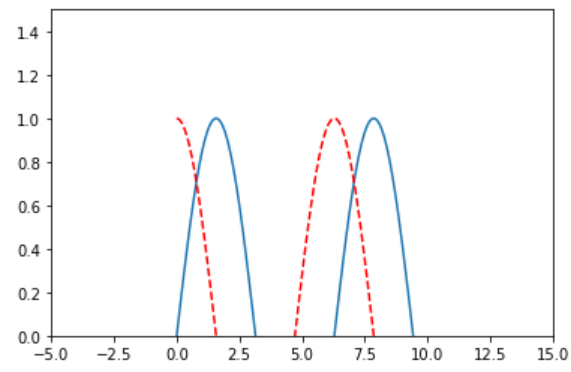
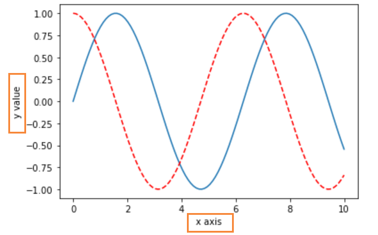
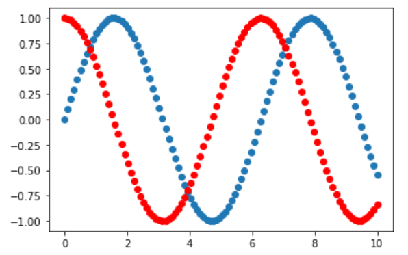

# numpy基础

---

## 引入原因

---

* 列表（[]）中可以引入任意的数据类型，这样python每次都需要检查数据类型，降低了执行效率

> [0, 1, 2, 3, 4, 'machine learning', 6, 7, 8, 9]

* 引入array后，存储方式是数组或者二维数组，没有把数据看作是向量或者矩阵，没有


## 创建数组和矩阵方法

---

### array 创建

> numpy.array()

```python
numpy.array([i for i in range(10)])
```


### dtype 查看类型

> nparr = np.array([i for i in range(10)])

```python
nparr2.dtype
```


### zeros 创建 0 向量

```python
numpy.zeros(10) # 创建一个一维向量，默认是浮点型
np.zeros(10, dtype='int') # 创建一个整数型的一维向量
np.zeros((3,5)) # 创建一个3行5列的向量，默认是浮点型
np.zeros(shape=(3,5), dtype='int')# 创建一个3行5列的向量，整数型

# result
array([[0, 0, 0, 0, 0],
       [0, 0, 0, 0, 0],
       [0, 0, 0, 0, 0]])
```

### ones 创建 1 向量

同理0

```python
np.ones((3,5))

#result
array([[1., 1., 1., 1., 1.],
       [1., 1., 1., 1., 1.],
       [1., 1., 1., 1., 1.]])
```

### full 创建一个自定义的向量

```python
np.full(shape=(3,5), fill_value=666)

#result
array([[666, 666, 666, 666, 666],
       [666, 666, 666, 666, 666],
       [666, 666, 666, 666, 666]])
```

### arange

在python中for创建一个列表：

> [i for i in range(0, 20, 2)]

numpy也提供了这样的方法：

```python
np.arange(0, 20, 2)
np.arange(0, 10)
np.arange(10)

# result
array([0, 1, 2, 3, 4, 5, 6, 7, 8, 9])
```

### linspace

> 返回设定范围内，固定间隔的数值

```python
np.linspace(0, 20, 5)
# result
array([ 0.,  5., 10., 15., 20.])

np.linspace(0, 20, 6)
#result
array([ 0.,  4.,  8., 12., 16., 20.])
```

### random

> randint(x, y) 返回一个x-(y-1)的数

```python
np.random.randint(0, 10)
```

> randint(x, y, size = n) 指定一个大小为n的数组，同时可以使用()形式指定一个

```python
np.random.randint(0, 1, 10)
#result
array([0, 0, 0, 0, 0, 0, 0, 0, 0, 0])

np.random.randint(4, 8, size = 10)
#result
array([7, 5, 4, 6, 7, 6, 6, 5, 6, 5])

np.random.randint(0, 10, size=(3,5))
#result
array([[6, 4, 4, 2, 0],
       [7, 0, 3, 0, 5],
       [1, 9, 0, 6, 7]])
```

> np.random.seed(n) 创建一个随机种子，这个将会固定随机值

```python
np.random.seed(666)
np.random.randint(0, 10, size=(3,5))
#result
array([[2, 6, 9, 4, 3],
       [1, 0, 8, 7, 5],
       [2, 5, 5, 4, 8]])
```

> 使用np.random.random创建一个浮点随机数或是浮点矩阵

```python
np.random.random()
#result
0.8888993137763092

np.random.random(10)
#result
array([0.62640453, 0.81887369, 0.54734542, 0.41671201, 0.74304719,
       0.36959638, 0.07516654, 0.77519298, 0.21940924, 0.07934213])

np.random.random((3,5))
#result
array([[0.48678052, 0.1536739 , 0.82846513, 0.19136857, 0.27040895],
       [0.56103442, 0.90238039, 0.85178834, 0.41808196, 0.39347627],
       [0.01622051, 0.29921337, 0.35377822, 0.89350267, 0.78613657]])
```

> np.random.normal() 返回一组符合高斯分布的概率密度随机数

```python
np.random.normal(10, 100)
#result
154.77350573628146

np.random.normal(0, 1, (3,5))
#result
array([[-0.1963061 ,  1.51814514,  0.07722188, -0.06399132,  0.94592341],
       [ 1.20409101, -0.45124074, -1.58744651, -1.86885548,  0.10037737],
       [-3.09487059,  3.39351678, -0.12666878, -0.93713026,  0.56552529]])
```

### 通过帮助函数查看官方文档

> 语法：help(函数)

```
help(np.random.normal)

Help on built-in function normal:

normal(...) method of numpy.random.mtrand.RandomState instance
    normal(loc=0.0, scale=1.0, size=None)
    
    Draw random samples from a normal (Gaussian) distribution.
    
    The probability density function of the normal distribution, first
    derived by De Moivre and 200 years later by both Gauss and Laplace
    independently [2]_, is often called the bell curve because of
    its characteristic shape (see the example below).
    
    The normal distributions occurs often in nature.  For example, it
    describes the commonly occurring distribution of samples influenced
    by a large number of tiny, random disturbances, each with its own
    unique distribution [2]_.
    
    .. note::
        New code should use the ``normal`` method of a ``default_rng()``
        instance instead; please see the :ref:`random-quick-start`.
    
    Parameters
    ----------
    loc : float or array_like of floats
        Mean ("centre") of the distribution.
    scale : float or array_like of floats
        Standard deviation (spread or "width") of the distribution. Must be
        non-negative.
    size : int or tuple of ints, optional
        Output shape.  If the given shape is, e.g., ``(m, n, k)``, then
        ``m * n * k`` samples are drawn.  If size is ``None`` (default),
        a single value is returned if ``loc`` and ``scale`` are both scalars.
        Otherwise, ``np.broadcast(loc, scale).size`` samples are drawn.
    
    Returns
    -------
    out : ndarray or scalar
        Drawn samples from the parameterized normal distribution.
    
    See Also
    --------
```


## 基本属性

---

前提：

```python
x = np.arange(10)
x
# array([0, 1, 2, 3, 4, 5, 6, 7, 8, 9])

X = np.arange(15).reshape(3, 5)
X
# array([[ 0,  1,  2,  3,  4],
#        [ 5,  6,  7,  8,  9],
#        [10, 11, 12, 13, 14]])
```

### ndim 查看数组和维度

```python
x.ndim
# 1

X.ndim
# 2
```

### shape 查看各位维度大小的元组

```python
x.shape
# (10,)

X.shape
# (3, 5)  3行5列
```

### size 返回元素个数

```python
x.size
# 10

X.size
# 15
```


## 数据访问

---

前提：

```python
x = np.arange(10)
x
# array([0, 1, 2, 3, 4, 5, 6, 7, 8, 9])

X = np.arange(15).reshape(3, 5)
X
# array([[ 0,  1,  2,  3,  4],
#        [ 5,  6,  7,  8,  9],
#        [10, 11, 12, 13, 14]])
```

### 基本访问

访问一维数组：

```python
x[0]
# 0
x[-1]
# 9
x[0:5]
# array([0, 1, 2, 3, 4])
x[:5]
# array([0, 1, 2, 3, 4])
x[5:]
# array([5, 6, 7, 8, 9])
x[::2]  # 步数
# array([0, 2, 4, 6, 8])
x[::-1]
# array([9, 8, 7, 6, 5, 4, 3, 2, 1, 0])
```

访问二维数组/矩阵：

```python
X[0][0] # 不建议使用
# 0
X[2, 2] # 建议使用
# 12
X[:2, :3]
# array([[0, 1, 2],
#        [5, 6, 7]])
X[::-1, ::-1]
# array([[14, 13, 12, 11, 10],
#        [ 9,  8,  7,  6,  5],
#        [ 4,  3,  2,  1,  0]])
X[0]
# array([0, 1, 2, 3, 4])
X[0, :]
# array([0, 1, 2, 3, 4])
X[:, 1]
# array([ 1,  6, 11])
X[:, 2]
# array([ 2,  7, 12])
```

为什么不建议使用的原因：

```python
X[:2][:3] #下列解析为什么不建议
# array([[0, 1, 2, 3, 4],
#        [5, 6, 7, 8, 9]])

X[:2] #前两行
# array([[0, 1, 2, 3, 4],
#        [5, 6, 7, 8, 9]])

X[:2][:3]  # 解释X[:2]数组中的前3行元素，但是这个元素已经只有2行了！
# array([[0, 1, 2, 3, 4],
#        [5, 6, 7, 8, 9]])
```

### 改变数值

如果不使用copy进行数值改变：

```python
subX = X[:2, :3]
# array([[0, 1, 2],
#        [5, 6, 7]])

subX[0,0] = 100
# array([[100,   1,   2],
#        [  5,   6,   7]])

# result
# array([[100,   1,   2,   3,   4],
#        [  5,   6,   7,   8,   9],
#        [ 10,  11,  12,  13,  14]])
```

使用copy函数，原矩阵数值不变：

```python
subX = X[:2, :3].copy()
# array([[0, 1, 2],
#       [5, 6, 7]])

subX[0, 0] = 100
# array([[100,   1,   2],
#        [  5,   6,   7]])

# result
# array([[ 0,  1,  2,  3,  4],
#        [ 5,  6,  7,  8,  9],
#        [10, 11, 12, 13, 14]])
```

### reshape函数

前提：

```python
x = np.arange(10)
x
# array([0, 1, 2, 3, 4, 5, 6, 7, 8, 9])
```

使用reshape:

```python
x.reshape(2,5)
# array([[0, 1, 2, 3, 4],
#        [5, 6, 7, 8, 9]])

B = x.reshape(1, 10)
# array([[0, 1, 2, 3, 4, 5, 6, 7, 8, 9]])
B.ndim
# 2
B.shape
# (1, 10)
x.shape
# (10,)
```

只关心行或者列的写法：

```python
x.reshape(10, -1) #只用关心行数，列数不管
# array([[0],
#        [1],
#        [2],
#        [3],
#        [4],
#        [5],
#        [6],
#        [7],
#        [8],
#        [9]])

x.reshape(-1, 10)
# array([[0, 1, 2, 3, 4, 5, 6, 7, 8, 9]])

x.reshape(3, -1) # 10不能被3整除
# 错误
```


## 合并和分割

---

### 合并

前提：

```python
x = np.array([1,2,3])
y = np.array([3,2,1])
z = np.array([666,666,666])

# x --- array([1, 2, 3])
# y --- array([3, 2, 1])
```

#### concatenate合并

合并一维数组：

```python
np.concatenate([x,y])
# array([1, 2, 3, 3, 2, 1])

np.concatenate([x,y,z])
# array([  1,   2,   3,   3,   2,   1, 666, 666, 666])
```

合并矩阵：

Ⅰ. 沿着垂直方向合并

```python
A = np.array([[1,2,3],
          [4,5,6]])
np.concatenate([A, A])
# array([[1, 2, 3],
#        [4, 5, 6],
#        [1, 2, 3],
#        [4, 5, 6]])
```

Ⅱ. 沿着水平方向合并

```python
np.concatenate([A,A], axis=1) # 沿着列的方向拼接
# array([[1, 2, 3, 1, 2, 3],
#        [4, 5, 6, 4, 5, 6]])
```

Ⅲ. 如果出现维度不一样的，将无法合并

```python
np.concatenate([A, z]) # 维数不一样
```

Ⅳ. 使用reshape中-1的方法进行自动改变维度再合并

```python
np.concatenate([A, z.reshape(1, -1)]) # z转换为列数不用管
# array([[  1,   2,   3],
#        [  4,   5,   6],
#        [666, 666, 666]])
```

#### stack的合并

##### vstack

```python
A = np.array([[1,2,3],
          [4,5,6]])
z = np.array([666,666,666])

np.vstack([A, z]) # 垂直方向智能的拼接在一起
# array([[  1,   2,   3],
#        [  4,   5,   6],
#        [666, 666, 666]])
```

##### hstack

```python
B = np.full((2,2), 100)
# array([[100, 100],
#        [100, 100]])

np.hstack([A, B]) # 水平方向智能拼接在一起
# array([[  1,   2,   3, 100, 100],
#        [  4,   5,   6, 100, 100]])
```

如果维度不同，垂直(vstack)可以，水平（hstack）不可以

```python
np.hstack([A, z]) # 垂直可以，水平不可以的情况（因为z是一维数组）
```

### 分割

前提：

```python
x = np.arange(10)
# array([0, 1, 2, 3, 4, 5, 6, 7, 8, 9])
```

#### split分割

##### 分割一维数组

```python
np.split(x, [3, 7])
# [array([0, 1, 2]), array([3, 4, 5, 6]), array([7, 8, 9])]
```

##### 分割矩阵

前提：

```python
A = np.arange(16).reshape(4, 4)
# array([[ 0,  1,  2,  3],
#        [ 4,  5,  6,  7],
#        [ 8,  9, 10, 11],
#        [12, 13, 14, 15]])
```

分割成两半（按行分割）：

```python
A1, A2 = np.split(A, [2])
# A1
# array([[0, 1, 2, 3],
#       [4, 5, 6, 7]])

# A2
# array([[ 8,  9, 10, 11],
#        [12, 13, 14, 15]])
```

按列分割：

```python
A1, A2 = np.split(A, [2], axis=1) # 列方向分割

#A1
# array([[ 0,  1],
#        [ 4,  5],
#        [ 8,  9],
#        [12, 13]])

# A2
# array([[ 2,  3],
#        [ 6,  7],
#        [10, 11],
#        [14, 15]])
```

#### v/hsplit分割

```python
np.vsplit(A, [2])
# [array([[0, 1, 2, 3],
#         [4, 5, 6, 7]]),
#  array([[ 8,  9, 10, 11],
#         [12, 13, 14, 15]])]

left, right = np.hsplit(A, [2])
# left
# array([[ 0,  1],
#        [ 4,  5],
#        [ 8,  9],
#        [12, 13]])

# right
# array([[ 2,  3],
#        [ 6,  7],
#        [10, 11],
#        [14, 15]])
```

### 意义

例如下列data，前3列可能代表3个同一种特征，最后一列表示和前3列不同的特征。 运行时就要进行分隔开。

```python
data = np.arange(16).reshape((4,4))
# array([[ 0,  1,  2,  3],
#        [ 4,  5,  6,  7],
#        [ 8,  9, 10, 11],
#        [12, 13, 14, 15]])

x, y = np.hsplit(data, [-1])
# x
# array([[ 0,  1,  2],
#        [ 4,  5,  6],
#        [ 8,  9, 10],
#        [12, 13, 14]])

# y
# array([[ 3],
#        [ 7],
#        [11],
#        [15]])

y[:, 0]
array([ 3,  7, 11, 15])
```


## 矩阵的运算

---

### 使用原生列表进行运算

如果两个列表直接相乘，得到的结果只是两个合并在一起：

```python
n = 10
L = [i for i in range(n)]
2 * L
# [0, 1, 2, 3, 4, 5, 6, 7, 8, 9, 0, 1, 2, 3, 4, 5, 6, 7, 8, 9]
```

如果要对数据进行运算，需要逐个相乘再加入：

```python
A = []
for e in L:
    A.append(2 * e)
# [0, 2, 4, 6, 8, 10, 12, 14, 16, 18]
```

在本次实验中，列表所用到的时间如下：

```python
n = 1000000
%%time
A = []
for e in L:
    A.append(e * 2)
# Wall time: 118 ms

%%time
A = [2*e for e in L]
# Wall time: 60.4 ms
```

### 使用numpy解决运算问题

```python
L = np.arange(n) # n = 1000000
%%time
A = np.array(2*e for e in L)
# Wall time: 7.97 ms

%%time
A = 2 * L
# Wall time: 998 µs
```

在numpy中使用2*数组不会出现后面再增值一个数组的问题：

```python
n = 10
L = np.arange(n)
2 * L
# array([ 0,  2,  4,  6,  8, 10, 12, 14, 16, 18])
```

### Universal Functions

前提：

>X = np.arange(1, 16).reshape((3,5))
>
>```python
>array([[ 1,  2,  3,  4,  5],
>       [ 6,  7,  8,  9, 10],
>       [11, 12, 13, 14, 15]])
>```

对矩阵进行常用运算如下：

* +
* -
* *
* /
* //
* **
* %
* 1 / 
* abs
* sin
* cos
* tan
* exp
* power
* log
* log2
* log10

举个栗子：

```python
np.log10(X)
# array([[0.        , 0.30103   , 0.47712125, 0.60205999, 0.69897   ],
#        [0.77815125, 0.84509804, 0.90308999, 0.95424251, 1.        ],
#        [1.04139269, 1.07918125, 1.11394335, 1.14612804, 1.17609126]])

np.power(3, X)
# array([[       3,        9,       27,       81,      243],
#        [     729,     2187,     6561,    19683,    59049],
#        [  177147,   531441,  1594323,  4782969, 14348907]], dtype=int32)
```

### 矩阵运算

前提：

```python
A = np.arange(4).reshape(2, 2)
# array([[0, 1],
#        [2, 3]])

B = np.full((2, 2), 10)
# array([[10, 10],
#        [10, 10]])
```

#### 普通运算

对于+、-、*、/来说，只是对应的矩阵进行运算，举个栗子：

```python
A + B # 仅仅是0 + 10， 1 + 10， 2+ 10 ....
# array([[10, 11],
#        [12, 13]])
```

#### 矩阵乘法

```python
A.dot(B) # 矩阵乘法
# array([[10, 10],
#        [50, 50]])
```

#### 矩阵的转置

```python
A.T # 转置
# array([[0, 2],
#        [1, 3]])
```

#### 非法运算

对于两个大小不同的矩阵，是不能直接运算的，例如创建一个（3，3）的矩阵

```python
C = np.full((3,3), 666)
# array([[666, 666, 666],
#        [666, 666, 666],
#        [666, 666, 666]])

A + C # A是一个（2，2）的矩阵，会报错！
A.dot(C) # 同样，矩阵的乘法也会报错
```

### 向量和矩阵的运算

前提：

```python
v = np.array([1, 2])
# array([1, 2])

# A
# array([[0, 1],
#        [2, 3]])
```

#### 直接进行相加

```python
v + A # 如果熟练使用numpy，使用这个也是可以的
# array([[1, 3],
#        [3, 5]])
```

#### 使用stack函数解决

```python
np.vstack([v] * A.shape[0]) # 把v向量叠两次，成为和A向量维度相同的矩阵
# 此时的v就是
# array([[1, 2],
#        [1, 2]])

np.vstack([v] * A.shape[0]) + A
# array([[1, 3],
#        [3, 5]])
```

#### 使用tile堆叠函数解决

```python
np.tile(v, (2, 1)) # 堆叠函数，第二个参数的的意思是：在行向量堆叠两次，列向量堆叠一次
# array([[1, 2],
#        [1, 2]])

np.tile(v, (2, 1)) + A
# array([[1, 3],
#        [3, 5]])
```

#### 向量和矩阵的乘法

也会出现以前的状况，只是对应的相乘，解决矩阵乘法就是**向量*矩阵**，当然，numpy也提供了相应的行向量转换为列向量，以此可以让矩阵乘以向量。

```python
v * A
array([[0, 2],
       [2, 6]])

# solution
v.dot(A)
# array([4, 7])

# numpy可以将v这个行向量自动转换为列向量
A.dot(v)
# array([2, 8])
```

### 矩阵的逆运算

前提：

```python
# A
array([[0, 1],
       [2, 3]])
```

#### 逆矩阵-inalg.inv

线性代数的英文：**<font color="#2980b9">linear algebra</font>**

```python
invA = np.linalg.inv(A) #linalg是线性代数的缩写，inv是逆转
# array([[-1.5,  0.5],
#        [ 1. ,  0. ]])

invA.dot(A) # 矩阵和逆矩阵相乘为单位矩阵
# array([[1., 0.],
#        [0., 1.]])
```

当然也有非法的情况，例如不是方阵的常规情况：

```python
X = np.arange(16).reshape((2, 8))
# array([[ 0,  1,  2,  3,  4,  5,  6,  7],
#        [ 8,  9, 10, 11, 12, 13, 14, 15]])

# ↓ 非法，报错！
np.linalg.inv(X) # 2 * 8矩阵是不行的，必须是方阵
```

#### 伪逆矩阵-inalg.pinv

对于上述的非法情况也有解决方案，就是建立伪逆矩阵：

```python
pinX = np.linalg.pinv(X) # 求伪逆矩阵
array([[-1.35416667e-01,  5.20833333e-02],
       [-1.01190476e-01,  4.16666667e-02],
       [-6.69642857e-02,  3.12500000e-02],
       [-3.27380952e-02,  2.08333333e-02],
       [ 1.48809524e-03,  1.04166667e-02],
       [ 3.57142857e-02, -4.96086088e-18],
       [ 6.99404762e-02, -1.04166667e-02],
       [ 1.04166667e-01, -2.08333333e-02]])

pinX.shape
(8, 2)

X.dot(pinX) # 矩阵和伪逆矩阵相乘也是一个方阵
array([[ 1.00000000e+00, -2.60208521e-16],
       [ 9.71445147e-17,  1.00000000e+00]])
```


## 聚合运算

---

### python自带的聚合运算和numpy比较

```python
big_array = np.random.rand(1000000)
%timeit sum(big_array)
%timeit np.sum(big_array)
# 64.1 ms ± 6.33 ms per loop (mean ± std. dev. of 7 runs, 10 loops each)
# 788 µs ± 47.4 µs per loop (mean ± std. dev. of 7 runs, 1000 loops each)
```

### numpy带的聚合运算整理

* min()
* max()
* sum

前提：

```python
import numpy as np
big_array = np.random.rand(1000000)
```

对于一维数组，举个栗子：

```python
big_array.min()
# 1.0944166173310066e-07
```

对于矩阵来说：

```python
X = np.arange(16).reshape(4, -1)
# array([[ 0,  1,  2,  3],
#        [ 4,  5,  6,  7],
#        [ 8,  9, 10, 11],
#        [12, 13, 14, 15]])

np.sum(X)
# 120

np.sum(X, axis=0) # 每一列的和
# array([24, 28, 32, 36])

np.sum(X, axis=1) # 每一行的和
# array([ 6, 22, 38, 54])

np.prod(X) # 计算所有元素的乘积
# 0

np.prod(X + 1) # 都加1了之后，计算所有元素的乘积
# 2004189184

np.mean(X) #平均数
# 7.5

np.median(X) # 中位数
# 7.5

np.percentile(big_array, q=50) # 求百分位，意思是50%都是小于0.499的
# 0.4993312930261587

for percent in [0, 25, 50, 75, 100]:
    print(np.percentile(big_array, q=percent))
    
np.var(big_array) #方差
# 0.0833898252494499

np.std(big_array) # 标准差
# 0.2887729648866907

x = np.random.normal(0, 1, size=1000000) # 均值为0，标准差为1的正态分布
```

新增的几个函数：

* prod 乘积
* mean 平均数
* median 中位数
* percentile 百分位
* var 方差
* std 标准差


## 索引

---

前提：

```python
# x
array([ 1.80793697, -0.23658344, -0.13697839, ..., -0.65258733,
        0.07083716,  0.20496639])

np.min(x)
# -5.033120274005173
```

### 获取最小值索引

<font color="#2ecc71">**numpy.argmin()**</font>

```python
np.argmin(x) # 最小值的索引
# 466894
# ↓ 验证
x[630547]
# -5.240820586489809
```

### 获取最大值索引

<font color="#2ecc71">**numpy.argmax()**</font>

```python
np.argmax(x)
# 585452
x[585452] # 4.751668785613369
```


## 排序和使用索引

---

前提：

```python
x = np.arange(16)
# array([ 0,  1,  2,  3,  4,  5,  6,  7,  8,  9, 10, 11, 12, 13, 14, 15])
```

### shuffle 打乱顺序

<font color="#2ecc71">**numpy.random.shuffle()**</font>

```python
np.random.shuffle(x) # 打乱顺序
# array([ 4,  2,  0, 13,  1, 11,  3, 15, 10,  6,  5, 14,  9,  7,  8, 12])
```

### sort 排序

<font color="#2ecc71">**numpy.sort()**</font>

对于一维数组：

```python
np.sort(x) # 排序
# array([ 0,  1,  2,  3,  4,  5,  6,  7,  8,  9, 10, 11, 12, 13, 14, 15])
```

对于矩阵来说：

```python
X = np.random.randint(10, size=(4, 4))
# array([[0, 3, 0, 6],
#        [7, 0, 9, 7],
#        [2, 2, 7, 4],
#        [4, 6, 9, 1]])

np.sort(X) # 每一行进行排序
# array([[0, 0, 3, 6],
#        [0, 7, 7, 9],
#        [2, 2, 4, 7],
#        [1, 4, 6, 9]])
```

* <font color="#2980b9">axis = 1</font> 按行进行排序
* <font color="#2980b9">axis = 0</font> 按列进行排序

```python
np.sort(X, axis=1) # 按行进行排序
# array([[0, 0, 3, 6],
#        [0, 7, 7, 9],
#        [2, 2, 4, 7],
#        [1, 4, 6, 9]])

np.sort(X, axis=0) # 按列进行排序
# array([[0, 0, 0, 1],
#        [2, 2, 7, 4],
#        [4, 3, 9, 6],
#        [7, 6, 9, 7]])
```

### argsort 索引排序

<font color="#2ecc71">**numpy.argsort ()**</font>

再次打乱顺序：

```python
np.random.shuffle(x)
# array([ 5,  4,  3, 14,  8,  0, 11,  6,  2, 12,  7,  9, 13, 15,  1, 10])
```

进行索引排序：

此时索引为5即为最小的 “0”

```python
np.argsort(x) # 索引排序
# array([ 5, 14,  8,  2,  1,  0,  7, 10,  4, 11, 15,  6,  9, 12,  3, 13],
      # dtype=int64)
```

### partition 快速排序的划分

<font color="#2ecc71">**numpy.partition()**</font>

<font color="#2ecc71">**numpy.argpartition()**</font>

```python
np.partition(x, 3) # 快速排序部分,3前面的数据都比3小，3后面的数据都比3大
# array([ 1,  0,  2,  3,  5,  4,  6, 11,  8, 12,  7,  9, 13, 15, 14, 10])

np.argpartition(x, 3) # 快速排序部分，索引模式
# array([14,  5,  8,  2,  0,  1,  7,  6,  4,  9, 10, 11, 12, 13,  3, 15],
       # dtype=int64)
```

如果为矩阵：

```python
# X
# array([[0, 3, 0, 6],
#        [7, 0, 9, 7],
#        [2, 2, 7, 4],
#        [4, 6, 9, 1]])

np.argsort(X, axis=1) # 按行排序
# array([[0, 2, 1, 3],
#        [1, 0, 3, 2],
#        [0, 1, 3, 2],
#        [3, 0, 1, 2]], dtype=int64)

np.argsort(X, axis=0)
# array([[0, 1, 0, 3],
#        [2, 2, 2, 2],
#        [3, 0, 1, 0],
#        [1, 3, 3, 1]], dtype=int64)

np.argpartition(X, 2, axis=1)
# array([[0, 2, 1, 3],
#        [1, 0, 3, 2],
#        [0, 1, 3, 2],
#        [3, 0, 1, 2]], dtype=int64)

np.argpartition(X, 2, axis=0)
# array([[0, 1, 0, 3],
#        [2, 2, 2, 2],
#        [3, 0, 1, 0],
#        [1, 3, 3, 1]], dtype=int64)
```

## Fancy Indexing

前提：

```python
x = np.arange(16)
# array([ 0,  1,  2,  3,  4,  5,  6,  7,  8,  9, 10, 11, 12, 13, 14, 15])
```

如果直接使用分片，智能得到有规律的：

```python
x[3:9:2]
# array([3, 5, 7])
```

如果要得到3，5，8这样无规律的，就需要使用到Fancy Indexing：

```python
[x[3], x[5], x[8]] # solution 1
# [3, 5, 8]

ind = [3, 5, 8] # solution 2
x[ind]
# array([3, 5, 8])
```

也可以通过矩阵对应到一维数组：

```python
ind = np.array([[0,2],
                [1,3]])
x[ind] # 按照矩阵，把x的数值索引到矩阵中来
array([[0, 2],
       [1, 3]]) # 0 对应一维数组的0索引 -- 0
```

也可以通过数组和数组获取到想要矩阵中的元素：

```python
X = x.reshape(4, -1)
# array([[ 0,  1,  2,  3],
#        [ 4,  5,  6,  7],
#        [ 8,  9, 10, 11],
#        [12, 13, 14, 15]])

row = np.array([0,1,2])
col = np.array([1,2,3])
X[row,col] # 对某个数组对应的索引感兴趣，比如矩阵中[0,1]--1，[1,2]--6
# array([ 1,  6, 11])

X[0, col]
# array([1, 2, 3])

X[:2,col]
# array([[1, 2, 3],
#        [5, 6, 7]])
```

可以通过True或者False控制是否想要矩阵中的元素：

```python
col = [True, False, True, True] # 如果列是True或False，False就不存在

X[1:3, col] # col = np.array([1,2,3])
# array([[ 4,  6,  7],
#        [ 8, 10, 11]])
```

## numpy.array 的比较

前提：

```python
x = np.arange(16)
# array([ 0,  1,  2,  3,  4,  5,  6,  7,  8,  9, 10, 11, 12, 13, 14, 15])
```

可以通过逻辑比较，筛选出True或者False，举个栗子：

```python
x < 3
# array([ True,  True,  True, False, False, False, False, False, False,
#       False, False, False, False, False, False, False])

x != 3
# array([ True,  True,  True, False,  True,  True,  True,  True,  True,
#         True,  True,  True,  True,  True,  True,  True])

2 * x == 24 - 4 * 4
# array([False, False, False, False,  True, False, False, False, False,
#        False, False, False, False, False, False, False])
```

矩阵也同理：

```python
# array([[ 0,  1,  2,  3],
#        [ 4,  5,  6,  7],
#        [ 8,  9, 10, 11],
#        [12, 13, 14, 15]])

X < 6
# array([[ True,  True,  True,  True],
#        [ True,  True, False, False],
#        [False, False, False, False],
#        [False, False, False, False]])
```

### 应用

前提：

```python
# x
# array([ 0,  1,  2,  3,  4,  5,  6,  7,  8,  9, 10, 11, 12, 13, 14, 15])

# X
# array([[ 0,  1,  2,  3],
#        [ 4,  5,  6,  7],
#        [ 8,  9, 10, 11],
#        [12, 13, 14, 15]])
```

#### sum 的逻辑运算符

```python
np.sum(x <= 3)
# 4

np.sum(X % 2 == 0)
# 8

np.sum(X % 2 == 0, axis = 1) # 每一行有多少偶数
# array([2, 2, 2, 2])

np.sum(X % 2 == 0, axis = 0) # 每一列有多少偶数
# array([4, 0, 4, 0])
```

对于位运算符的操作：

```python
np.sum((x > 3) & (x < 10)) # 注意：位运算符,左右比较的式子都是数组，得到的结果是一个索引，如果使用&&，比较的是逻辑，就会报错
# 6

# 错误范例
np.sum((x > 3) && (x < 10))
```

或运算符：

```python
np.sum((x%2 == 0) | (x > 10))
# 11

np.sum(~(x==0))
# 15
```

#### count_nonzero 没有0的个数

```python
np.count_nonzero(x <= 3) # 没有0的元素
# 4
```

#### any

```python
np.any(x == 0) # 是否有任何的非0元素
# True

np.any(x < 0)
# False

np.all(X > 0, axis = 1)
# array([False,  True,  True,  True])
```

#### all

```python
np.all(x >= 0) # 所有的元素都>=0
# True
np.all(x > 0) 
# False
```

#### 直接在括号中逻辑判断

```python
x[x < 5] # 小于5
# array([0, 1, 2, 3, 4])

x[x % 2 == 0]
# array([ 0,  2,  4,  6,  8, 10, 12, 14])

X[X[:,3] % 3 == 0, :] # 抽出最后一列能被3整除的行，和所有列
# array([[ 0,  1,  2,  3],
#        [12, 13, 14, 15]])
```


## matplotlib 数据可视化基础

---

### 导入库

```python
import matplotlib.pyplot as plt
```

前提：

```python
x = np.linspace(0, 10, 100)
array([ 0.        ,  0.1010101 ,  0.2020202 ,  0.3030303 ,  0.4040404 ,
        0.50505051,  0.60606061,  0.70707071,  0.80808081,  0.90909091,
        1.01010101,  1.11111111,  1.21212121,  1.31313131,  1.41414141,
        1.51515152,  1.61616162,  1.71717172,  1.81818182,  1.91919192,
        2.02020202,  2.12121212,  2.22222222,  2.32323232,  2.42424242,
        2.52525253,  2.62626263,  2.72727273,  2.82828283,  2.92929293,
        3.03030303,  3.13131313,  3.23232323,  3.33333333,  3.43434343,
        3.53535354,  3.63636364,  3.73737374,  3.83838384,  3.93939394,
        4.04040404,  4.14141414,  4.24242424,  4.34343434,  4.44444444,
        4.54545455,  4.64646465,  4.74747475,  4.84848485,  4.94949495,
        5.05050505,  5.15151515,  5.25252525,  5.35353535,  5.45454545,
        5.55555556,  5.65656566,  5.75757576,  5.85858586,  5.95959596,
        6.06060606,  6.16161616,  6.26262626,  6.36363636,  6.46464646,
        6.56565657,  6.66666667,  6.76767677,  6.86868687,  6.96969697,
        7.07070707,  7.17171717,  7.27272727,  7.37373737,  7.47474747,
        7.57575758,  7.67676768,  7.77777778,  7.87878788,  7.97979798,
        8.08080808,  8.18181818,  8.28282828,  8.38383838,  8.48484848,
        8.58585859,  8.68686869,  8.78787879,  8.88888889,  8.98989899,
        9.09090909,  9.19191919,  9.29292929,  9.39393939,  9.49494949,
        9.5959596 ,  9.6969697 ,  9.7979798 ,  9.8989899 , 10.        ])

siny = np.sin(x)
array([ 0.        ,  0.10083842,  0.20064886,  0.2984138 ,  0.39313661,
        0.48385164,  0.56963411,  0.64960951,  0.72296256,  0.78894546,
        0.84688556,  0.8961922 ,  0.93636273,  0.96698762,  0.98775469,
        0.99845223,  0.99897117,  0.98930624,  0.96955595,  0.93992165,
        0.90070545,  0.85230712,  0.79522006,  0.73002623,  0.65739025,
        0.57805259,  0.49282204,  0.40256749,  0.30820902,  0.21070855,
        0.11106004,  0.01027934, -0.09060615, -0.19056796, -0.28858706,
       -0.38366419, -0.47483011, -0.56115544, -0.64176014, -0.7158225 ,
       -0.7825875 , -0.84137452, -0.89158426, -0.93270486, -0.96431712,
       -0.98609877, -0.99782778, -0.99938456, -0.99075324, -0.97202182,
       -0.94338126, -0.90512352, -0.85763861, -0.80141062, -0.73701276,
       -0.66510151, -0.58640998, -0.50174037, -0.41195583, -0.31797166,
       -0.22074597, -0.12126992, -0.0205576 ,  0.0803643 ,  0.18046693,
        0.27872982,  0.37415123,  0.46575841,  0.55261747,  0.63384295,
        0.7086068 ,  0.77614685,  0.83577457,  0.8868821 ,  0.92894843,
        0.96154471,  0.98433866,  0.99709789,  0.99969234,  0.99209556,
        0.97438499,  0.94674118,  0.90944594,  0.86287948,  0.8075165 ,
        0.74392141,  0.6727425 ,  0.59470541,  0.51060568,  0.42130064,
        0.32770071,  0.23076008,  0.13146699,  0.03083368, -0.07011396,
       -0.17034683, -0.26884313, -0.36459873, -0.45663749, -0.54402111])

cosy = np.cos(x)
```

### 绘画一个图

```python
plt.plot(x, siny) # 以x为横轴，y为纵轴的图像
```


### 绘制两个图、展示

```python
plt.plot(x, siny)
plt.plot(x, cosy)
plt.show() # 展示
```



### 更换线条颜色

```python
plt.plot(x, siny)
plt.plot(x, cosy, color='red') # color颜色控制
plt.show()
```


### 更换线条形状

```python
plt.plot(x, siny)
plt.plot(x, cosy, color='red', linestyle='--') # linestyle 线条控制
plt.show()
```



### 调节x轴位置

```python
plt.plot(x, siny)
plt.plot(x, cosy, color='red', linestyle='--')
plt.xlim(-5, 15) # 调节 x 
plt.show()
```


### 调节y轴位置

```python
plt.plot(x, siny)
plt.plot(x, cosy, color='red', linestyle='--')
plt.xlim(-5, 15)
plt.ylim(0, 1.5) # 调节y
plt.show()
```



### 同时调节x、y轴位置

```python
plt.plot(x, siny)
plt.plot(x, cosy, color='red', linestyle='--')
plt.axis([-1, 11, -2, 2]) # 调节 x y
plt.show()
```


### 添加横纵轴描述

```python
plt.plot(x, siny)
plt.plot(x, cosy, color='red', linestyle='--')
plt.xlabel('x axis') # 横轴添加描述
plt.ylabel('y value') # 纵轴添加描述
plt.show()
```



### 添加标签提示

```python
plt.plot(x, siny, label='sin(x)') # label添加 标签
plt.plot(x, cosy, color='red', linestyle='--', label='cos(x)')# label添加 标签
plt.xlabel('x axis')
plt.ylabel('y value')
plt.legend() # 添加标签后
plt.show()
```


### 添加标题

```python
plt.plot(x, siny, label='sin(x)')
plt.plot(x, cosy, color='red', linestyle='--', label='cos(x)')
plt.xlabel('x axis')
plt.ylabel('y value')
plt.legend()
plt.title('Welcome to ML world!') # 标题
plt.show()
```


### 散点图

```python
plt.scatter(x, siny)
plt.scatter(x, cosy, color='red')
plt.show()
```



```python
x = np.random.normal(0, 1, 10000)
y = np.random.normal(0, 1, 10000)

plt.scatter(x, y, alpha=0.1) # alpha透明度
plt.show()
```


