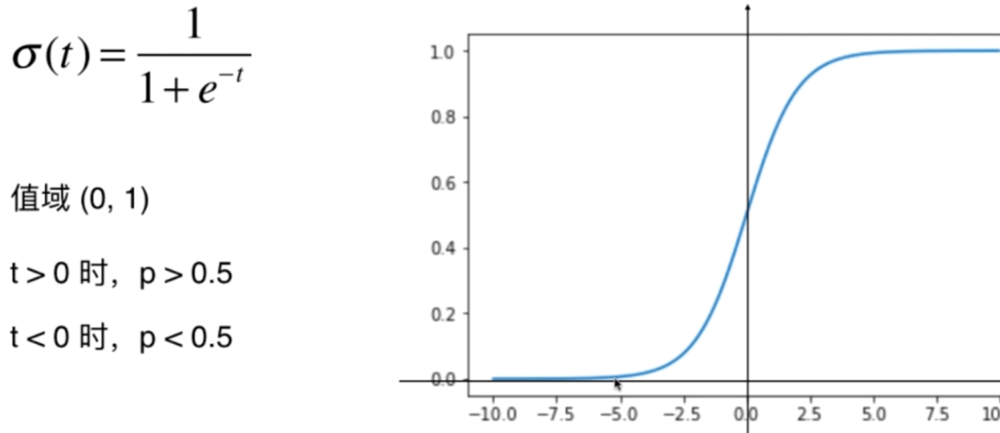
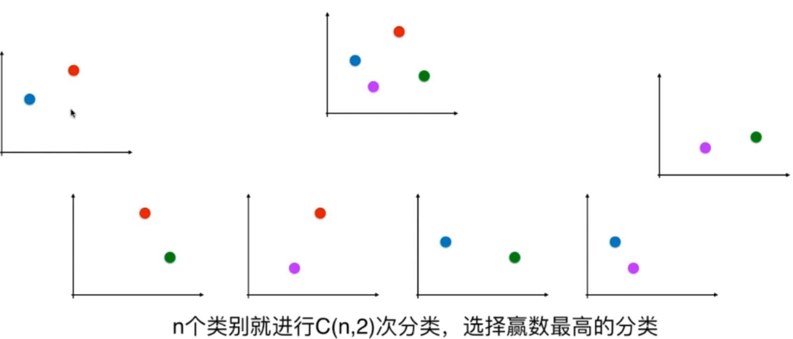

# 逻辑回归

---

逻辑回归：解决分类问题

逻辑回归既可以看作是回归算法，也可以看作是分类算法。通常作为分类算法用，只可以解决二分类问题。


回归问题怎么解决分类问题？

将样本的特征和样本发生的概率联系起来，概率是一个数。

## 什么是逻辑回归

对于机器学习的本质就是求出：
$$
\hat y = f(x)
$$
通过f的计算就可以得到预测值 y

比如：

1. 如果要预测房价，那么这个预测的房价的值就是y
2. 如果要预测学生的成绩，那么这个y就是学生的成绩


但在逻辑回归中，本质得到的是一个概率值：
$$
\hat p = f(x)
$$
之后计算出概率值p后进行分类：
$$
\hat y = \begin{cases}
1, \hat p \geq 0.5 \\
0, \hat p \leq 0.5 \\
\end{cases}
$$
在线性回归中有
$$
\hat y = f(x) => \hat y = \theta ^T \cdot x_b
$$
该式子的值域为（-infinity, +infinity）

但是对概率的来说，限制值域为[0,1]，为了解决这个问题，利用线性回归再做一个特征值σ
$$
\hat p = \sigma(\theta^T \cdot x_b)
$$

### Sigmoid函数

$$
\sigma(t) = \frac{1}{1+e^{-t}}
$$



代码实现：

```python
def sigmoid(t):
    return 1. / (1. + np.exp(-t))
```

就可以得出以下结论：
$$
\hat p = \sigma(\theta ^ T \cdot x_b) = \frac{1}{1+e^{-\theta ^ T \cdot x_b}} \\
\hat y = \begin{cases}
1, \hat p \geq 0.5 \\
0, \hat p \leq 0.5 \\
\end{cases}
$$
【框架】举个栗子：比如判断病人是患有良性肿瘤还是恶性肿瘤

首先通过训练得到一组θ值，这样每来一组新的病人的肿瘤数据，我们就用这组数据组前面加上一个T和θ做点乘，点乘结果得到一个数再把这个数给Sigmoid函数，得到的结果就是这个病人患有恶性肿瘤的概率，如果概率≥0.5，说明这个病人很大概率是恶性肿瘤，如果≤0.5，则这个病人很大可能是良性肿瘤。


## 损失函数

如何建模求出θ？

在线性回归中，

1. θ · xb之后就是估计值，估计值 - 真值 =  估计的好坏
2. 这个差（估计值 - 真值）的平方和再进行平均，也就是MSE，作为损失函数，只要找到这个损失函数的最小值即可


$$
cost = \begin{cases}
如果y=1,p越小,cost越大 \\
如果y=0,p越大,cost越大 \\
\end{cases}
\\
cost = \begin{cases}
-log(\hat p)\quad if \quad y=1  \\
-log(1 - \hat p)\quad if \quad y=0 \\
\end{cases}
$$

分析：

当y = 1，损失函数就是-log(hat p)，当p = 0时，此时的cost趋近于正无穷，我们会把这个样本分类为0这类，但这个样本实际上是1这一类，显然分类错误，就会对它进行惩罚，这个惩罚是正无穷。

随着p逐渐增大，损失越来越小，当p到达1时，  此时它这个样本和它分类的真实样本y=1是一致的，此时-log p取0没有任何损失。


  

在这根曲线上（-log(1-p)），如果给定的p == 1 话，函数趋近于正无穷，是因为当p == 1此时算法就会把它分类为hat y == 1 但是 y 的实际值 == 0，所以给它一个正无穷的惩罚

随着p的逐渐减小，这个惩罚会越来越低，当p == 0 时，此时会把它分类为 hat y == 0，而y的真值 == 0 ，此时分类正确，在这个情况下没有惩罚。


### 合并函数

一个样本
$$
cost = -ylog(\hat p) - (1 - y)log(1 - \hat p)
$$
m个样本
$$
J(\theta) = - \frac{1}{m} \sum\limits^m_{i=1} y^{(i)}log(\hat p^{(i)})+(1-y^{(i)})log(1 - \hat p^{(i)})
$$
hat p
$$
\hat p = \sigma(\theta ^ T \cdot X^{(i)}_b) = \frac{1}{1+e^{-\theta ^ T \cdot X^{(i)}}} \\
$$
所以得到式子：

* 未知量是θ
* 没有公式解，只能使用梯度下降法求解

$$
J(\theta) = - \frac{1}{m} \sum\limits^m_{i=1} y^{(i)}log(\sigma(\theta ^ T \cdot X^{(i)}_b))+(1-y^{(i)})log(1 - \sigma(\theta ^ T \cdot X^{(i)}_b))
$$


## 决策边界

在原来式子中，决策边界是：
$$
\theta ^ T \cdot x_b = 0
$$


## 逻辑回归中使用正则化

超参数C实际上是α的倒数


## OvR (one vs rest)


## OvO (one vs one)

一对一的进行比较

现在有4个点，每次挑出两个类别，进行二分类任务（整个过程进行的次数是排列组合）



