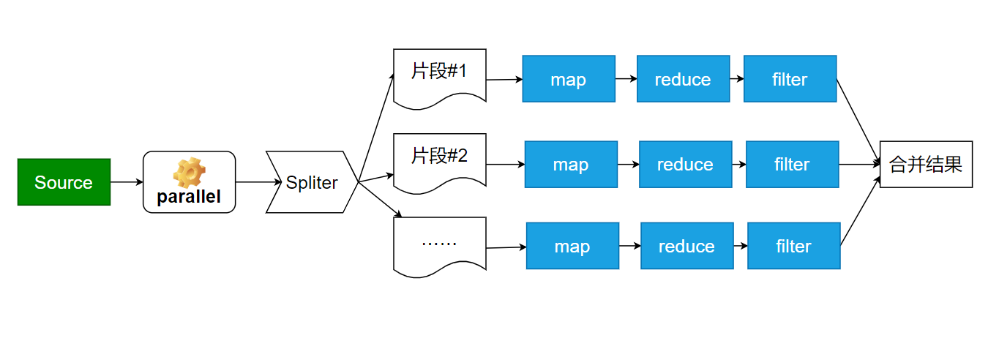

# Java8 Steam

## 简介

流：随着时间产生的数据序列

特点：

1. 支持函数式编程
2. 提供管道运算能力
3. 提供并行(parallel)计算能力
4. 提供大量的操作


管道计算过程：


## 基础用法

```java
@Test
public void test_mapfilter() {
    Stream.of(1, 2, 3, 4, 5, 6)
        .map(x -> x.toString())
        .map(x -> x + x)
        .map(x -> x + x + x)
        .map(Integer::parseInt)
        .forEach(x -> {
            System.out.println(x);
        });
}

@Test
public void test_mapfilterreduce() {
    var result = Stream.of(1,2,3,4,5,6)
        .map(x -> x * x)
        .filter(x -> x < 20)
        .reduce(Math::max);
    //        System.out.println(result.get());

    System.out.println(result.isPresent());
    System.out.println(result.orElseGet(() -> 0));
}
```


## 有状态和无状态

通过有状态和无状态可以分为

有状态：
sorted
skip
limit
任何触发状态变化的程序


无状态：

map
reduce

```java
@Test
public void test_sorted() {
    Stream.of(1, 3, 2, 24, 15, 66).sorted().forEach(x -> System.out.println(x));
}
```


## 纯函数

通过有无副作用可以分为

* 纯函数(pure function)
* 非纯函数

> 纯函数

```java
int add(int a, int b) {
    return a + b;
}
```

> 非纯函数

```java
int c = 0;
int add(int a, int b) {
    // Side effect
    c++;
    return a + b;
}
```


## 利用flatMap去重

```java
@Test
public void test_flatMap() {
    var set = Stream.of("My", "Mine")
        .flatMap(str -> str.chars().mapToObj(i -> (char) i))
        .collect(Collectors.toSet());
    System.out.println(set.stream().collect(Collectors.toList()));
}
```


## 使用parallelStream并行计算

小知识点：

* boxed 装箱

```java
@Test
public void test_parallel() {

    var r = new Random();
    var list = IntStream.range(0, 1_000_000)
        .map(x -> r.nextInt(10_000_000))
        // int --> integer 打包
        .boxed()
        .collect(Collectors.toList());
    var t0 = System.currentTimeMillis();
    System.out.println(list.stream().max((a, b) -> a -b));
    System.out.println("time:" + (System.currentTimeMillis() - t0));

    // 并行
    var t1 = System.currentTimeMillis();
    list.parallelStream().max((a, b) -> a-b);
    list.stream().parallel().max((a, b) -> a - b);

    System.out.println(Runtime.getRuntime().availableProcessors());
    System.out.println("time: " + (System.currentTimeMillis() - t1));
}
```




## 函数式编程总结

* int String -----> toString
* (int) --> int[] -----> int[]::new    【Java11】
* 高阶函数：int -> int -> int  ----->  Integer::max
* 类型类


## 构造流计算的基石：Monad

定义：构造流计算(管道运算)

* 泛型计算
* 不改变泛型
* 类型不变（option就是option，Stream就是Stream）


### 自涵子（EndFunctor)

描述A->B的函数

```java
public class Event<T> {

    T data;
    public Event(T data){
        this.data = data;
    }

    static class EventData {
        Integer id;
        String msg;

        public EventData(Integer id, String msg) {
            this.id = id;
            this.msg = msg;
        }

        @Override
        public String toString() {
            return super.toString();
        }
    }

    static class Transforms {

        static EventData transforms(Integer id) {
            switch (id){
                case 0:
                    return new EventData(id, "Start");
                case 1:
                    return new EventData(id, "Running");
                case 2:
                    return new EventData(id, "Done");
                case 3:
                    return new EventData(id, "Fail");
                default:
                    return new EventData(id, "Error");
            }
        }
    }


    @FunctionalInterface
    interface FN<A, B> {
        B apply(A a);
    }

}
```

