- [八股文学习技巧](#八股文学习技巧)
- [Java基础](#java基础)
- [框架](#框架)
  - [Spring](#spring)
- [微服务](#微服务)
- [JVM](#jvm)
- [JUC](#juc)
- [数据库](#数据库)
  - [RabbitMQ](#rabbitmq)
  - [MySql](#mysql)
- [数据结构和算法](#数据结构和算法)
- [操作系统](#操作系统)
- [计算机网络](#计算机网络)
- [设计模式](#设计模式)
- [安全](#安全)
- [杂项](#杂项)
  - [最新技术](#最新技术)
  - [RBAC](#rbac)

# 八股文学习技巧

* [八股文学习路线及攻略](https://leetcode-cn.com/circle/discuss/2Ypo9Z/) 
* [论如何4个月高效刷满 500 题并形成长期记忆](https://leetcode-cn.com/circle/discuss/jq9Zke/ ) 

# Java基础

> 讲讲hashmap，底层原理是什么？ 

**JDK1.8 之前**

<font color='#e67e22'>JDK1.8 之前 HashMap 底层是 **数组和链表** 结合在一起使用也就是 链表散列</font>。HashMap 通过 key 的 hashCode 经过扰动函数处理过后得到 hash 值，然后通过 (n - 1) & hash 判断当前元素存放的位置（这里的 n 指的是数组的长度），如果当前位置存在元素的话，就判断该元素与要存入的元素的 hash 值以及 key 是否相同，如果相同的话，直接覆盖，<u>不相同就通过拉链法解决冲突</u>。

所谓扰动函数指的就是 HashMap 的 hash 方法。使用 hash 方法也就是扰动函数是为了防止一些实现比较差的 hashCode() 方法 换句话说使用扰动函数之后可以减少碰撞。

JDK 1.8 HashMap 的 hash 方法源码:

JDK 1.8 的 hash 方法 相比于 JDK 1.7 hash 方法更加简化，但是原理不变。

```java
    static final int hash(Object key) {
      int h;
      // key.hashCode()：返回散列值也就是hashcode
      // ^ ：按位异或
      // >>>:无符号右移，忽略符号位，空位都以0补齐
      return (key == null) ? 0 : (h = key.hashCode()) ^ (h >>> 16);
  }
```

对比一下 JDK1.7 的 HashMap 的 hash 方法源码.

```java
static int hash(int h) {
    // This function ensures that hashCodes that differ only by
    // constant multiples at each bit position have a bounded
    // number of collisions (approximately 8 at default load factor).

    h ^= (h >>> 20) ^ (h >>> 12);
    return h ^ (h >>> 7) ^ (h >>> 4);
}
```

相比于 JDK1.8 的 hash 方法 ，JDK 1.7 的 hash 方法的性能会稍差一点点，因为毕竟扰动了 4 次。

所谓 **“拉链法”** 就是：将链表和数组相结合。也就是说创建一个链表数组，数组中每一格就是一个链表。若遇到哈希冲突，则将冲突的值加到链表中即可。


**JDK1.8 之后**

相比于之前的版本， JDK1.8 之后在解决哈希冲突时有了较大的变化，当链表长度大于阈值（默认为 8）（将链表转换成红黑树前会判断，如果当前数组的长度小于 64，那么会选择先进行数组扩容，而不是转换为红黑树）时，<font color='#fdcb6e'>将链表转化为红黑树，以减少搜索时间</font>。


TreeMap、TreeSet 以及 JDK1.8 之后的 HashMap 底层都用到了红黑树。红黑树就是为了解决二叉查找树的缺陷，因为二叉查找树在某些情况下会退化成一个线性结构。


> stringbuilder有用过吗？
>
> stringbuilder和stringbuffer什么区别？
>

可变性

`String` 是不可变的（后面会详细分析原因）。

`StringBuilder` 与 `StringBuffer` 都继承自 `AbstractStringBuilder` 类，在 `AbstractStringBuilder` 中也是使用字符数组保存字符串，不过没有使用 `final` 和 `private` 关键字修饰，最关键的是这个 `AbstractStringBuilder` 类还提供了很多修改字符串的方法比如 `append` 方法。

```java
abstract class AbstractStringBuilder implements Appendable, CharSequence {
    char[] value;
    public AbstractStringBuilder append(String str) {
        if (str == null)
            return appendNull();
        int len = str.length();
        ensureCapacityInternal(count + len);
        str.getChars(0, len, value, count);
        count += len;
        return this;
    }
      //...
}
```

**【重要】线程安全性**

`String` 中的对象是不可变的，也就可以理解为常量，线程安全。`AbstractStringBuilder` 是 `StringBuilder` 与 `StringBuffer` 的公共父类，定义了一些字符串的基本操作，如 `expandCapacity`、`append`、`insert`、`indexOf` 等公共方法。`StringBuffer` 对方法加了同步锁或者对调用的方法加了同步锁，所以是线程安全的。`StringBuilder` 并没有对方法进行加同步锁，所以是非线程安全的。

小结：

- String 不可变，因此是线程安全的
- StringBuilder 不是线程安全的
- StringBuffer 是线程安全的，内部使用 synchronized 进行同步

**性能**

每次对 `String` 类型进行改变的时候，都会生成一个新的 `String` 对象，然后将指针指向新的 `String` 对象。`StringBuffer` 每次都会对 `StringBuffer` 对象本身进行操作，而不是生成新的对象并改变对象引用。相同情况下使用 `StringBuilder` 相比使用 `StringBuffer` 仅能获得 10%~15% 左右的性能提升，但却要冒多线程不安全的风险。

**对于三者使用的总结：**

1. 操作少量的数据: 适用 `String`
2. 单线程操作字符串缓冲区下操作大量数据: 适用 `StringBuilder`
3. 多线程操作字符串缓冲区下操作大量数据: 适用 `StringBuffer`


> stringbuilder为什么线程不安全？底层原理是什么？


> 深拷贝和浅拷贝区别，工作原理

1. 浅拷贝：对引用数据类型进行引用传递般的拷贝，此为浅拷贝。
2. 深拷贝：对基本数据类型进行值传递，对引用数据类型，创建一个新的对象，并复制其内容，此为深拷贝。

深拷贝的另一种方式，使用序列化和反序列化，获取一个新对象。

浅拷贝的示例代码如下，我们这里实现了 `Cloneable` 接口，并重写了 `clone()` 方法。

`clone()` 方法的实现很简单，直接调用的是父类 `Object` 的 `clone()` 方法。

```java
public class Address implements Cloneable{
    private String name;
    // 省略构造函数、Getter&Setter方法
    @Override
    public Address clone() {
        try {
            return (Address) super.clone();
        } catch (CloneNotSupportedException e) {
            throw new AssertionError();
        }
    }
}

public class Person implements Cloneable {
    private Address address;
    // 省略构造函数、Getter&Setter方法
    @Override
    public Person clone() {
        try {
            Person person = (Person) super.clone();
            return person;
        } catch (CloneNotSupportedException e) {
            throw new AssertionError();
        }
    }
}
```


**深拷贝**

这里我们简单对 `Person` 类的 `clone()` 方法进行修改，连带着要把 `Person` 对象内部的 `Address` 对象一起复制。

```java
@Override
public Person clone() {
    try {
        Person person = (Person) super.clone();
        person.setAddress(person.getAddress().clone());
        return person;
    } catch (CloneNotSupportedException e) {
        throw new AssertionError();
    }
}

```


> 序列化和反序列化的概念，方式，例子

如果我们需要持久化 Java 对象比如将 Java 对象保存在文件中，或者在网络传输 Java 对象，这些场景都需要用到序列化。

简单来说：

- **序列化**： 将数据结构或对象转换成二进制字节流的过程
- **反序列化**：将在序列化过程中所生成的二进制字节流转换成数据结构或者对象的过程

对于 Java 这种面向对象编程语言来说，我们序列化的都是对象（Object）也就是实例化后的类(Class)，但是在 C++这种半面向对象的语言中，struct(结构体)定义的是数据结构类型，而 class 对应的是对象类型。

维基百科是如是介绍序列化的：

> **序列化**（serialization）在计算机科学的数据处理中，是指将数据结构或对象状态转换成可取用格式（例如存成文件，存于缓冲，或经由网络中发送），以留待后续在相同或另一台计算机环境中，能恢复原先状态的过程。依照序列化格式重新获取字节的结果时，可以利用它来产生与原始对象相同语义的副本。对于许多对象，像是使用大量引用的复杂对象，这种序列化重建的过程并不容易。面向对象中的对象序列化，并不概括之前原始对象所关系的函数。这种过程也称为对象编组（marshalling）。从一系列字节提取数据结构的反向操作，是反序列化（也称为解编组、deserialization、unmarshalling）。

综上：**序列化的主要目的是通过网络传输对象或者说是将对象存储到文件系统、数据库、内存中。**


例子：

```java
/*
     * 使用序列化和反序列化创建对象，这种方式其实是根据既有的对象进行复制，这个需要事先将可序列化的对象线存到文件里
     */  
@SuppressWarnings("resource")  
public static Worker createWorker4(String objectPath) {  
    ObjectInput input = null;  
    Worker worker = null;  
    try {  
        input = new ObjectInputStream(new FileInputStream(objectPath));  
        worker = (Worker) input.readObject();  
    } catch (FileNotFoundException e) {  
        e.printStackTrace();  
    } catch (IOException e) {  
        e.printStackTrace();  
    } catch (ClassNotFoundException e) {  
        e.printStackTrace();  
    }  
    return worker;  
}  

/*
     * 将创建的对象存入到文件内
     */  
public static void storeObject2File(String objectPath) {  
    Worker worker = new Worker();  
    ObjectOutputStream objectOutputStream;  
    try {  
        objectOutputStream = new ObjectOutputStream(new FileOutputStream(  
            objectPath));  
        objectOutputStream.writeObject(worker);  
    } catch (FileNotFoundException e) {  
        // TODO Auto-generated catch block  
        e.printStackTrace();  
    } catch (IOException e) {  
        // TODO Auto-generated catch block  
        e.printStackTrace();  
    }  
}  
```


> 异常分类，Exception分类，受检异常和非受检异常区别，自定义异常优点

Java异常类层次结构图：


程序本身可以捕获并且可以处理的异常。Exception 这种异常又分为两类：运行时异常和编译时异常。

- **运行时异常**

都是RuntimeException类及其子类异常，如NullPointerException(空指针异常)、IndexOutOfBoundsException(下标越界异常)等，这些异常是不检查异常，程序中可以选择捕获处理，也可以不处理。这些异常一般是由程序逻辑错误引起的，程序应该从逻辑角度尽可能避免这类异常的发生。

运行时异常的特点是Java编译器不会检查它，也就是说，当程序中可能出现这类异常，即使没有用try-catch语句捕获它，也没有用throws子句声明抛出它，也会编译通过。

- **非运行时异常** （编译异常）

是RuntimeException以外的异常，类型上都属于Exception类及其子类。从程序语法角度讲是必须进行处理的异常，如果不处理，程序就不能编译通过。如IOException、SQLException等以及用户自定义的Exception异常，一般情况下不自定义检查异常。


受检异常 ：需要用 try...catch... 语句捕获并进行处理，并且可以从异常中恢复；

非受检异常 ：是程序运行时错误，例如除 0 会引发 Arithmetic Exception，此时程序崩溃并且无法恢复


> 有没有用过自定义异常，声明式异常工作流程，和return区别，项目中自定义异常工作流程


> 类的生命周期，什么时候回收

其中类加载的过程包括了`加载`、`验证`、`准备`、`解析`、`初始化`五个阶段。在这五个阶段中，`加载`、`验证`、`准备`和`初始化`这四个阶段发生的顺序是确定的，*而`解析`阶段则不一定，它在某些情况下可以在初始化阶段之后开始，这是为了支持Java语言的运行时绑定(也成为动态绑定或晚期绑定)*。另外注意这里的几个阶段是按顺序开始，而不是按顺序进行或完成，因为这些阶段通常都是互相交叉地混合进行的，通常在一个阶段执行的过程中调用或激活另一个阶段。

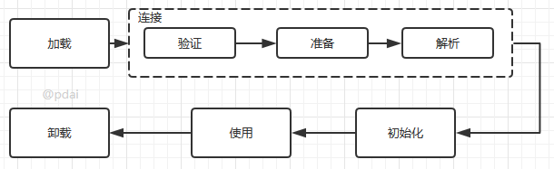


**Java虚拟机将结束生命周期的几种情况**

- 执行了System.exit()方法
- 程序正常执行结束
- 程序在执行过程中遇到了异常或错误而异常终止
- 由于操作系统出现错误而导致Java虚拟机进程终止


> NIO和AIO

**NIO (Non-blocking/New I/O)**

---

Java 中的 NIO 于 Java 1.4 中引入，对应 `java.nio` 包，提供了 `Channel` , `Selector`，`Buffer` 等抽象。NIO 中的 N 可以理解为 Non-blocking，不单纯是 New。它是支持面向缓冲的，基于通道的 I/O 操作方法。 对于高负载、高并发的（网络）应用，应使用 NIO 。

Java 中的 NIO 可以看作是 **I/O 多路复用模型**。也有很多人认为，Java 中的 NIO 属于同步非阻塞 IO 模型。

跟着我的思路往下看看，相信你会得到答案！

我们先来看看 **同步非阻塞 IO 模型**。

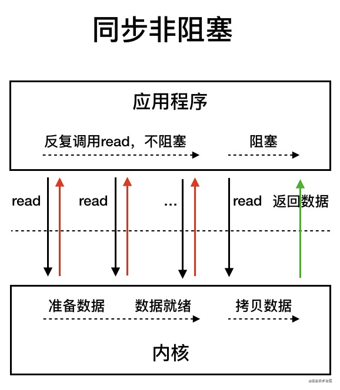

同步非阻塞 IO 模型中，应用程序会一直发起 read 调用，等待数据从内核空间拷贝到用户空间的这段时间里，线程依然是阻塞的，直到在内核把数据拷贝到用户空间。

相比于同步阻塞 IO 模型，同步非阻塞 IO 模型确实有了很大改进。通过轮询操作，避免了一直阻塞。

但是，这种 IO 模型同样存在问题：**应用程序不断进行 I/O 系统调用轮询数据是否已经准备好的过程是十分消耗 CPU 资源的。**

这个时候，**I/O 多路复用模型** 就上场了。


IO 多路复用模型中，线程首先发起 select 调用，询问内核数据是否准备就绪，等内核把数据准备好了，用户线程再发起 read 调用。read 调用的过程（数据从内核空间 -> 用户空间）还是阻塞的。

> 目前支持 IO 多路复用的系统调用，有 select，epoll 等等。select 系统调用，目前几乎在所有的操作系统上都有支持。
>
> - **select 调用** ：内核提供的系统调用，它支持一次查询多个系统调用的可用状态。几乎所有的操作系统都支持。
> - **epoll 调用** ：linux 2.6 内核，属于 select 调用的增强版本，优化了 IO 的执行效率。

**IO 多路复用模型，通过减少无效的系统调用，减少了对 CPU 资源的消耗。**

Java 中的 NIO ，有一个非常重要的**选择器 ( Selector )** 的概念，也可以被称为 **多路复用器**。通过它，只需要一个线程便可以管理多个客户端连接。当客户端数据到了之后，才会为其服务。


**AIO**

---

AIO 也就是 NIO 2。Java 7 中引入了 NIO 的改进版 NIO 2,它是异步 IO 模型。

异步 IO 是基于事件和回调机制实现的，也就是应用操作之后会直接返回，不会堵塞在那里，当后台处理完成，操作系统会通知相应的线程进行后续的操作。


目前来说 AIO 的应用还不是很广泛。Netty 之前也尝试使用过 AIO，不过又放弃了。这是因为，Netty 使用了 AIO 之后，在 Linux 系统上的性能并没有多少提升。

最后，来一张图，简单总结一下 Java 中的 BIO、NIO、AIO。

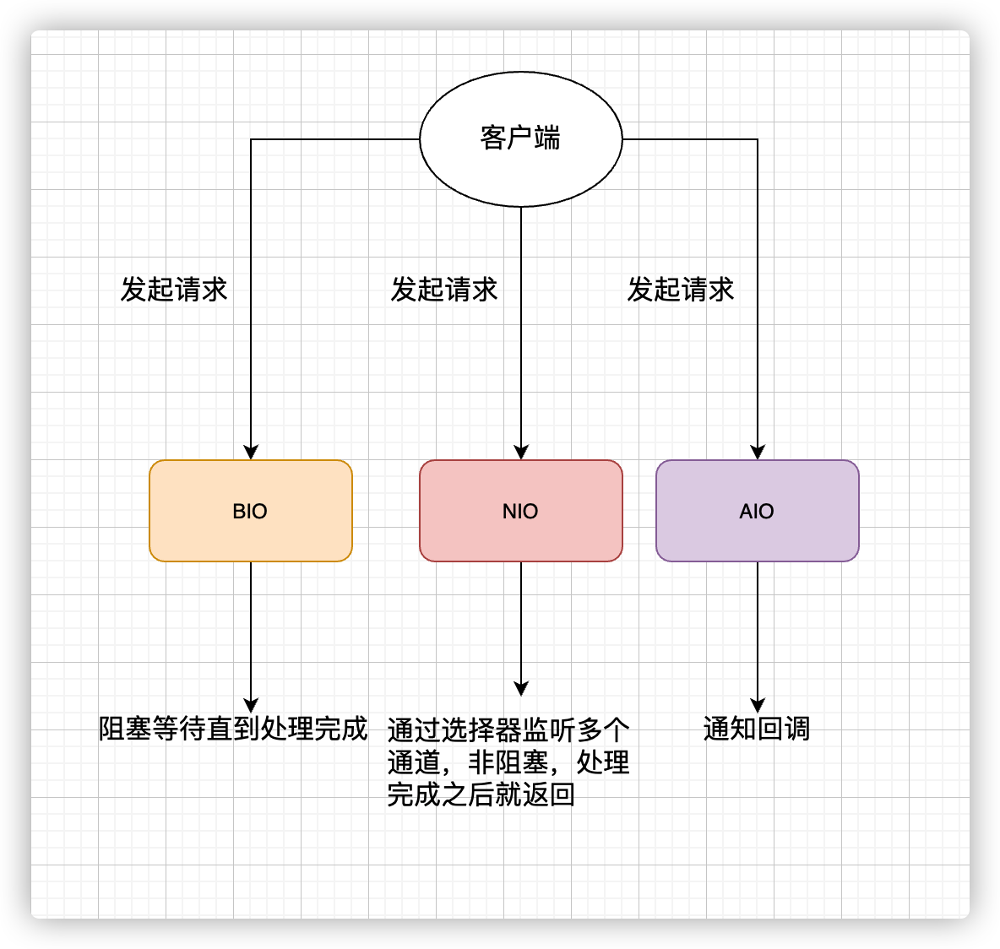

> Java多态概念，实现原理

多态分为编译时多态和运行时多态:

- 编译时多态主要指方法的重载
- 运行时多态指程序中定义的对象引用所指向的具体类型在运行期间才确定

运行时多态有三个条件:

- 继承
- 覆盖(重写)
- 向上转型

下面的代码中，乐器类(Instrument)有两个子类: Wind 和 Percussion，它们都覆盖了父类的 play() 方法，并且在 main() 方法中使用父类 Instrument 来引用 Wind 和 Percussion 对象。在 Instrument 引用调用 play() 方法时，会执行实际引用对象所在类的 play() 方法，而不是 Instrument 类的方法。

```java
public class Instrument {
    public void play() {
        System.out.println("Instument is playing...");
    }
}

public class Wind extends Instrument {
    public void play() {
        System.out.println("Wind is playing...");
    }
}

public class Percussion extends Instrument {
    public void play() {
        System.out.println("Percussion is playing...");
    }
}

public class Music {
    public static void main(String[] args) {
        List<Instrument> instruments = new ArrayList<>();
        instruments.add(new Wind());
        instruments.add(new Percussion());
        for(Instrument instrument : instruments) {
            instrument.play();
        }
    }
}
```


> NIO的buffer区是双向的吗？

是双向的

数据缓存区: 在JAVA NIO 框架中，为了保证每个通道的数据读写速度JAVA NIO 框架为每一种需要支持数据读写的通道集成了Buffer的支持。

这句话怎么理解呢? 例如ServerSocketChannel通道它只支持对OP_ACCEPT事件的监听，所以它是不能直接进行网络数据内容的读写的。所以ServerSocketChannel是没有集成Buffer的。

Buffer有两种工作模式: 写模式和读模式。在读模式下，应用程序只能从Buffer中读取数据，不能进行写操作。但是在写模式下，应用程序是可以进行读操作的，这就表示可能会出现脏读的情况。所以一旦您决定要从Buffer中读取数据，一定要将Buffer的状态改为读模式。

如下图:


- position: 缓存区目前这在操作的数据块位置
- limit: 缓存区最大可以进行操作的位置。缓存区的读写状态正式由这个属性控制的。
- capacity: 缓存区的最大容量。这个容量是在缓存区创建时进行指定的。由于高并发时通道数量往往会很庞大，所以每一个缓存区的容量最好不要过大。

在下文JAVA NIO框架的代码实例中，我们将进行Buffer缓存区操作的演示


# 常用框架

## Spring

> 对spring和springboot的理解


> springboot是怎么加载redis的，为什么比不用springboot更方便呢?


> 加载的redis或者bean是单例还是多例

默认单例


> springboot是怎么实现单例模式的呢？


> Spring bean启动流程和生命周期


生命周期

---

**Bean的完整生命周期经历了各种方法调用，这些方法可以划分为以下几类**：

- **Bean自身的方法**： 这个包括了Bean本身调用的方法和通过配置文件中`<bean>`的init-method和destroy-method指定的方法
- **Bean级生命周期接口方法**： 这个包括了BeanNameAware、BeanFactoryAware、ApplicationContextAware；当然也包括InitializingBean和DiposableBean这些接口的方法（可以被@PostConstruct和@PreDestroy注解替代)
- **容器级生命周期接口方法**： 这个包括了InstantiationAwareBeanPostProcessor 和 BeanPostProcessor 这两个接口实现，一般称它们的实现类为“后处理器”。
- **工厂后处理器接口方法**： 这个包括了AspectJWeavingEnabler, ConfigurationClassPostProcessor, CustomAutowireConfigurer等等非常有用的工厂后处理器　　接口的方法。工厂后处理器也是容器级的。在应用上下文装配配置文件之后立即调用。


**具体而言，流程如下**

- 如果 BeanFactoryPostProcessor 和 Bean 关联, 则调用postProcessBeanFactory方法.(即首**先尝试从Bean工厂中获取Bean**)

- 如果 InstantiationBeanPostProcessor 和 Bean 关联，则调用postProcessBeforeInitialzation方法

- 根据配置情况调用 Bean 构造方法**实例化 Bean**。

- 利用依赖注入完成 Bean 中所有**属性值的配置注入**。

- 如果 InstantiationBeanPostProcessor 和 Bean 关联，则调用postProcessAfterInitialization方法和postProcessProperties

- 调用xxxAware接口

   (上图只是给了几个例子)

  - 第一类Aware接口
    - 如果 Bean 实现了 BeanNameAware 接口，则 Spring 调用 Bean 的 setBeanName() 方法传入当前 Bean 的 id 值。
    - 如果 Bean 实现了 BeanClassLoaderAware 接口，则 Spring 调用 setBeanClassLoader() 方法传入classLoader的引用。
    - 如果 Bean 实现了 BeanFactoryAware 接口，则 Spring 调用 setBeanFactory() 方法传入当前工厂实例的引用。
  - 第二类Aware接口
    - 如果 Bean 实现了 EnvironmentAware 接口，则 Spring 调用 setEnvironment() 方法传入当前 Environment 实例的引用。
    - 如果 Bean 实现了 EmbeddedValueResolverAware 接口，则 Spring 调用 setEmbeddedValueResolver() 方法传入当前 StringValueResolver 实例的引用。
    - 如果 Bean 实现了 ApplicationContextAware 接口，则 Spring 调用 setApplicationContext() 方法传入当前 ApplicationContext 实例的引用。
    - ...

- 如果 BeanPostProcessor 和 Bean 关联，则 Spring 将调用该接口的预初始化方法 postProcessBeforeInitialzation() 对 Bean 进行加工操作，此处非常重要，Spring 的 AOP 就是利用它实现的。

- 如果 Bean 实现了 InitializingBean 接口，则 Spring 将调用 afterPropertiesSet() 方法。(或者有执行@PostConstruct注解的方法)

- 如果在配置文件中通过 **init-method** 属性指定了初始化方法，则调用该初始化方法。

- 如果 BeanPostProcessor 和 Bean 关联，则 Spring 将调用该接口的初始化方法 postProcessAfterInitialization()。此时，Bean 已经可以被应用系统使用了。

- 如果在 `<bean>` 中指定了该 Bean 的作用范围为 scope="singleton"，则将该 Bean 放入 Spring IoC 的缓存池中，将触发 Spring 对该 Bean 的生命周期管理；如果在 `<bean>` 中指定了该 Bean 的作用范围为 scope="prototype"，则将该 Bean 交给调用者，调用者管理该 Bean 的生命周期，Spring 不再管理该 Bean。

- 如果 Bean 实现了 DisposableBean 接口，则 Spring 会调用 destory() 方法将 Spring 中的 Bean 销毁；(或者有执行@PreDestroy注解的方法)

- 如果在配置文件中通过 **destory-method** 属性指定了 Bean 的销毁方法，则 Spring 将调用该方法对 Bean 进行销毁。


# 微服务、分布式

> 讲讲微服务

以前所有的代码都放在同一个工程中、部署在同一个服务器、同一项目的不同模块不同功能互相抢占资源，微服务就是将工程根据不同的业务规则拆分成微服务，部署在不同的服务器上，服务之间相互调用，java中有的微服务有dubbo(只能用来做微服务)、springcloud( 提供了服务的发现、断路器等)。


> 微服务两台机器怎么通信呢?


> 两台机器如何用HTTP怎么找到对方？


> 微服务都有什么部分呢


> 注册中心是什么讲讲


> 网关是什么呢


> 分布式登录怎么保持状态吗


> 分布式系统中，本地缓存和Redis中的数据是否是每台服务器上都备份同样的数据


> 分布式系统相关概念，序列化在分布式系统中的应用，讲一下thrift

# JVM

> Java static关键字，生命周期，static变量存在JVM哪个区域和生命周期


# JUC

> 线程能不能start两次，线程池中的线程为什么能循环利用


> 利用多线程时最大的难点是什么，怎么解决多线程安全问题


> 怎么保证多线程下面单例模式安全

双重校验锁 + volatile


> concurrentMap和hashmap有什么区别

`ConcurrentHashMap` 和 `Hashtable` 的区别主要体现在实现线程安全的方式上不同。

- **底层数据结构：** JDK1.7 的 `ConcurrentHashMap` 底层采用 **分段的数组+链表** 实现，JDK1.8 采用的数据结构跟 `HashMap1.8` 的结构一样，数组+链表/红黑二叉树。`Hashtable` 和 JDK1.8 之前的 `HashMap` 的底层数据结构类似都是采用 **数组+链表** 的形式，数组是 HashMap 的主体，链表则是主要为了解决哈希冲突而存在的；
- **实现线程安全的方式（重要）：** ① **在 JDK1.7 的时候，`ConcurrentHashMap`（分段锁）** 对整个桶数组进行了分割分段(`Segment`)，每一把锁只锁容器其中一部分数据，多线程访问容器里不同数据段的数据，就不会存在锁竞争，提高并发访问率。 **到了 JDK1.8 的时候已经摒弃了 `Segment` 的概念，而是直接用 `Node` 数组+链表+红黑树的数据结构来实现，并发控制使用 `synchronized` 和 CAS 来操作。（JDK1.6 以后 对 `synchronized` 锁做了很多优化）** 整个看起来就像是优化过且线程安全的 `HashMap`，虽然在 JDK1.8 中还能看到 `Segment` 的数据结构，但是已经简化了属性，只是为了兼容旧版本；② **`Hashtable`(同一把锁)** :使用 `synchronized` 来保证线程安全，效率非常低下。当一个线程访问同步方法时，其他线程也访问同步方法，可能会进入阻塞或轮询状态，如使用 put 添加元素，另一个线程不能使用 put 添加元素，也不能使用 get，竞争会越来越激烈效率越低。

**两者的对比图：**

**Hashtable:**


**JDK1.7 的 ConcurrentHashMap：**


**JDK1.8 的 ConcurrentHashMap：**


JDK1.8 的 `ConcurrentHashMap` 不再是 **Segment 数组 + HashEntry 数组 + 链表**，而是 **Node 数组 + 链表 / 红黑树**。不过，Node 只能用于链表的情况，红黑树的情况需要使用 **`TreeNode`**。当冲突链表达到一定长度时，链表会转换成红黑树。


> ConcurrentHashMap 线程安全的具体实现方式/底层具体实现

JDK1.7（上面有示意图）

首先将数据分为一段一段的存储，然后给每一段数据配一把锁，当一个线程占用锁访问其中一个段数据时，其他段的数据也能被其他线程访问。

**`ConcurrentHashMap` 是由 `Segment` 数组结构和 `HashEntry` 数组结构组成**。

Segment 实现了 `ReentrantLock`,所以 `Segment` 是一种可重入锁，扮演锁的角色。`HashEntry` 用于存储键值对数据。

```java
static class Segment<K,V> extends ReentrantLock implements Serializable {
}
```

一个 `ConcurrentHashMap` 里包含一个 `Segment` 数组。`Segment` 的结构和 `HashMap` 类似，是一种数组和链表结构，一个 `Segment` 包含一个 `HashEntry` 数组，每个 `HashEntry` 是一个链表结构的元素，每个 `Segment` 守护着一个 `HashEntry` 数组里的元素，当对 `HashEntry` 数组的数据进行修改时，必须首先获得对应的 `Segment` 的锁。

JDK1.8 （上面有示意图）

`ConcurrentHashMap` 取消了 `Segment` 分段锁，采用 CAS 和 `synchronized` 来保证并发安全。数据结构跟 HashMap1.8 的结构类似，数组+链表/红黑二叉树。Java 8 在链表长度超过一定阈值（8）时将链表（寻址时间复杂度为 O(N)）转换为红黑树（寻址时间复杂度为 O(log(N))）

`synchronized` 只锁定当前链表或红黑二叉树的首节点，这样只要 hash 不冲突，就不会产生并发，效率又提升 N 倍。


> 线程安全是什么概念

一个类在可以被多个线程安全调用时就是线程安全的。

线程安全不是一个非真即假的命题，可以将共享数据按照安全程度的强弱顺序分成以下五类: 不可变、绝对线程安全、相对线程安全、线程兼容和线程对立


> hashmap为什么多线程不安全，能举出例子来吗


> 怎么保证线程安全


> volatile和synchronize有什么区别？

`synchronized` 关键字和 `volatile` 关键字是两个互补的存在，而不是对立的存在！

- **`volatile` 关键字**是线程同步的**轻量级实现**，所以 **`volatile `性能肯定比`synchronized`关键字要好** 。但是 **`volatile` 关键字只能用于变量而 `synchronized` 关键字可以修饰方法以及代码块** 。
- **`volatile` 关键字能保证数据的可见性，但不能保证数据的原子性。`synchronized` 关键字两者都能保证。**
- **`volatile`关键字主要用于解决变量在多个线程之间的可见性，而 `synchronized` 关键字解决的是多个线程之间访问资源的同步性**


> volatile能保证i++安全吗  /  i++为什么不能保证原子性?

对于原子性，需要强调一点，也是大家容易误解的一点：对volatile变量的单次读/写操作可以保证原子性的，如long和double类型变量，但是并不能保证i++这种操作的原子性，因为本质上i++是读、写两次操作。 现在我们就通过下列程序来演示一下这个问题：

```java
public class VolatileTest01 {
    volatile int i;

    public void addI(){
        i++;
    }

    public static void main(String[] args) throws InterruptedException {
        final  VolatileTest01 test01 = new VolatileTest01();
        for (int n = 0; n < 1000; n++) {
            new Thread(new Runnable() {
                @Override
                public void run() {
                    try {
                        Thread.sleep(10);
                    } catch (InterruptedException e) {
                        e.printStackTrace();
                    }
                    test01.addI();
                }
            }).start();
        }
        Thread.sleep(10000);//等待10秒，保证上面程序执行完成
        System.out.println(test01.i);
    }
}
```

大家可能会误认为对变量i加上关键字volatile后，这段程序就是线程安全的。大家可以尝试运行上面的程序。下面是我本地运行的结果：981 可能每个人运行的结果不相同。不过应该能看出，volatile是无法保证原子性的(否则结果应该是1000)。原因也很简单，i++其实是一个复合操作，包括三步骤：

- 读取i的值。
- 对i加1。
- 将i的值写回内存。 volatile是无法保证这三个操作是具有原子性的，我们可以通过AtomicInteger或者Synchronized来保证+1操作的原子性。 注：上面几段代码中多处执行了Thread.sleep()方法，目的是为了增加并发问题的产生几率，无其他作用。


> 乐观锁和悲观锁，具体实现

**悲观锁**

`悲观锁`对应于生活中悲观的人，悲观的人总是想着事情往坏的方向发展。

举个生活中的例子，假设厕所只有一个坑位了，悲观锁上厕所会第一时间把门反锁上，这样其他人上厕所只能在门外等候，这种状态就是「阻塞」了。

回到代码世界中，一个共享数据加了悲观锁，那线程每次想操作这个数据前都会假设其他线程也可能会操作这个数据，所以每次操作前都会上锁，这样其他线程想操作这个数据拿不到锁只能阻塞了。


在 Java 语言中 `synchronized` 和 `ReentrantLock`等就是典型的悲观锁，还有一些使用了 synchronized 关键字的容器类如 `HashTable` 等也是悲观锁的应用。

**乐观锁**

`乐观锁` 对应于生活中乐观的人，乐观的人总是想着事情往好的方向发展。

举个生活中的例子，假设厕所只有一个坑位了，乐观锁认为：这荒郊野外的，又没有什么人，不会有人抢我坑位的，每次关门上锁多浪费时间，还是不加锁好了。你看乐观锁就是天生乐观！

回到代码世界中，乐观锁操作数据时不会上锁，在更新的时候会判断一下在此期间是否有其他线程去更新这个数据。

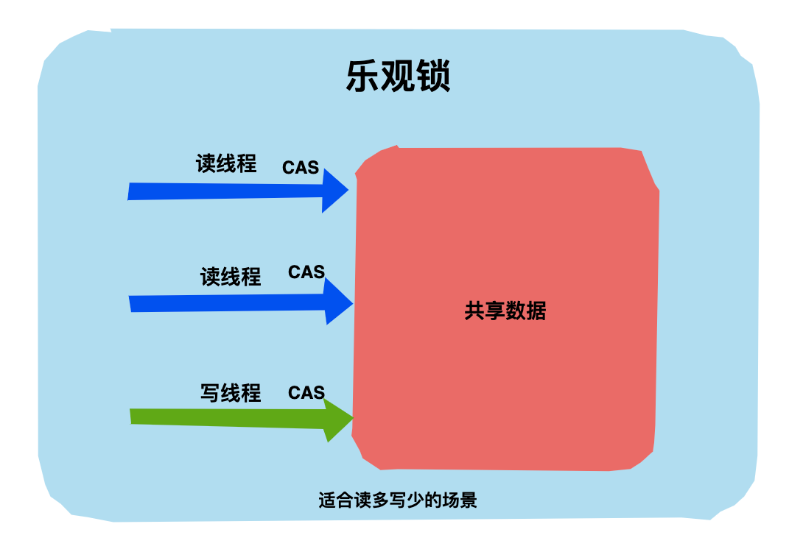

乐观锁可以使用`版本号机制`和`CAS算法`实现。在 Java 语言中 `java.util.concurrent.atomic`包下的原子类就是使用CAS 乐观锁实现的。

**两种锁的使用场景**

悲观锁和乐观锁没有孰优孰劣，有其各自适应的场景。

乐观锁适用于写比较少（冲突比较小）的场景，因为不用上锁、释放锁，省去了锁的开销，从而提升了吞吐量。

如果是写多读少的场景，即冲突比较严重，线程间竞争激励，使用乐观锁就是导致线程不断进行重试，这样可能还降低了性能，这种场景下使用悲观锁就比较合适。


> 线程池参数，工作流程，阻塞队列中的任务怎么加载到线程中？

**参数**

---

```java
public ThreadPoolExecutor(int corePoolSize,
                              int maximumPoolSize,
                              long keepAliveTime,
                              TimeUnit unit,
                              BlockingQueue<Runnable> workQueue,
                              RejectedExecutionHandler handler)
```

- `corePoolSize` 线程池中的核心线程数，当提交一个任务时，线程池创建一个新线程执行任务，直到当前线程数等于corePoolSize, 即使有其他空闲线程能够执行新来的任务, 也会继续创建线程；如果当前线程数为corePoolSize，继续提交的任务被保存到阻塞队列中，等待被执行；如果执行了线程池的prestartAllCoreThreads()方法，线程池会提前创建并启动所有核心线程。
- `workQueue` 用来保存等待被执行的任务的阻塞队列. 在JDK中提供了如下阻塞队列:  具体可以参考[JUC 集合: BlockQueue详解]()
  - `ArrayBlockingQueue`: 基于数组结构的有界阻塞队列，按FIFO排序任务；
  - `LinkedBlockingQuene`: 基于链表结构的阻塞队列，按FIFO排序任务，吞吐量通常要高于ArrayBlockingQuene；
  - `SynchronousQuene`: 一个不存储元素的阻塞队列，每个插入操作必须等到另一个线程调用移除操作，否则插入操作一直处于阻塞状态，吞吐量通常要高于LinkedBlockingQuene；
  - `PriorityBlockingQuene`: 具有优先级的无界阻塞队列；

`LinkedBlockingQueue`比`ArrayBlockingQueue`在插入删除节点性能方面更优，但是二者在`put()`, `take()`任务的时均需要加锁，`SynchronousQueue`使用无锁算法，根据节点的状态判断执行，而不需要用到锁，其核心是`Transfer.transfer()`.

- `maximumPoolSize` 线程池中允许的最大线程数。如果当前阻塞队列满了，且继续提交任务，则创建新的线程执行任务，前提是当前线程数小于maximumPoolSize；当阻塞队列是无界队列, 则maximumPoolSize则不起作用, 因为无法提交至核心线程池的线程会一直持续地放入workQueue.
- `keepAliveTime` 线程空闲时的存活时间，即当线程没有任务执行时，该线程继续存活的时间；默认情况下，该参数只在线程数大于corePoolSize时才有用, 超过这个时间的空闲线程将被终止；
- `unit` keepAliveTime的单位
- `threadFactory` 创建线程的工厂，通过自定义的线程工厂可以给每个新建的线程设置一个具有识别度的线程名。默认为DefaultThreadFactory
- `handler` 线程池的饱和策略，当阻塞队列满了，且没有空闲的工作线程，如果继续提交任务，必须采取一种策略处理该任务，线程池提供了4种策略:
  - `AbortPolicy`: 直接抛出异常，默认策略；
  - `CallerRunsPolicy`: 用调用者所在的线程来执行任务；
  - `DiscardOldestPolicy`: 丢弃阻塞队列中靠最前的任务，并执行当前任务；
  - `DiscardPolicy`: 直接丢弃任务；

当然也可以根据应用场景实现RejectedExecutionHandler接口，自定义饱和策略，如记录日志或持久化存储不能处理的任务。


> ThreadLocal 关键字

通常情况下，我们创建的变量是可以被任何一个线程访问并修改的。**如果想实现每一个线程都有自己的专属本地变量该如何解决呢？** JDK 中提供的`ThreadLocal`类正是为了解决这样的问题。 **`ThreadLocal`类主要解决的就是让每个线程绑定自己的值，可以将`ThreadLocal`类形象的比喻成存放数据的盒子，盒子中可以存储每个线程的私有数据。**

**如果你创建了一个`ThreadLocal`变量，那么访问这个变量的每个线程都会有这个变量的本地副本，这也是`ThreadLocal`变量名的由来。他们可以使用 `get（）` 和 `set（）` 方法来获取默认值或将其值更改为当前线程所存的副本的值，从而避免了线程安全问题。**

再举个简单的例子：

比如有两个人去宝屋收集宝物，这两个共用一个袋子的话肯定会产生争执，但是给他们两个人每个人分配一个袋子的话就不会出现这样的问题。如果把这两个人比作线程的话，那么 ThreadLocal 就是用来避免这两个线程竞争的


工作原理

---

当一个任务提交至线程池之后:

1. 线程池首先当前运行的线程数量是否少于corePoolSize。如果是，则创建一个新的工作线程来执行任务。如果都在执行任务，则进入2.
2. 判断BlockingQueue是否已经满了，倘若还没有满，则将线程放入BlockingQueue。否则进入3.
3. 如果创建一个新的工作线程将使当前运行的线程数量超过maximumPoolSize，则交给RejectedExecutionHandler来处理任务。

当ThreadPoolExecutor创建新线程时，通过CAS来更新线程池的状态ctl.


> CAS是什么，原理，原子性怎么保证

什么是CAS？

---

CAS（Compare-And-Swap）是`比较并交换`的意思，它是一条 CPU 并发原语，用于判断内存中某个值是否为预期值，如果是则更改为新的值，这个过程是`原子`的。下面用一个小示例解释一下。

CAS机制当中使用了3个基本操作数：内存地址V，旧的预期值A，计算后要修改后的新值B。

（1）初始状态：在内存地址V中存储着变量值为 1


（2）线程1想要把内存地址为 V 的变量值增加1。这个时候对线程1来说，旧的预期值A=1，要修改的新值B=2。


（3）在线程1要提交更新之前，线程2捷足先登了，已经把内存地址V中的变量值率先更新成了2。


（4）线程1开始提交更新，首先将预期值A和内存地址V的实际值比较（Compare），发现A不等于V的实际值，提交失败。


（5）线程1重新获取内存地址 V 的当前值，并重新计算想要修改的新值。此时对线程1来说，A=2，B=3。这个重新尝试的过程被称为`自旋`。如果多次失败会有多次自旋。


（6）线程 1 再次提交更新，这一次没有其他线程改变地址 V 的值。线程1进行Compare，发现预期值 A 和内存地址 V的实际值是相等的，进行 Swap 操作，将内存地址 V 的实际值修改为 B。


总结：更新一个变量的时候，只有当变量的预期值 A 和内存地址 V 中的实际值相同时，才会将内存地址 V 对应的值修改为 B，这整个操作就是`CAS`。


CAS 基本原理

---

CAS 主要包括两个操作：`Compare`和`Swap`，有人可能要问了：两个操作能保证是原子性吗？可以的。

CAS 是一种`系统原语`，原语属于操作系统用语，原语由若干指令组成，用于完成某个功能的一个过程，并且原语的执行必须是连续的，在执行过程中不允许被中断，也就是说 CAS 是一条 CPU 的原子指令，由操作系统硬件来保证。

> 在 Intel 的 CPU 中，使用 cmpxchg 指令。

回到 Java 语言，JDK 是在 1.5 版本后才引入 CAS 操作，在`sun.misc.Unsafe`这个类中定义了 CAS 相关的方法。

```java
public final native boolean compareAndSwapObject(Object o, long offset, Object expected, Object x);

public final native boolean compareAndSwapInt(Object o, long offset, int expected, int x);

public final native boolean compareAndSwapLong(Object o, long offset, long expected, long x);
```

可以看到方法被声明为`native`，如果对 C++ 比较熟悉可以自行下载 OpenJDK 的源码查看 unsafe.cpp，这里不再展开分析。


CAS 在 Java 语言中的应用：

在 Java 编程中我们通常不会直接使用到 CAS，都是通过 JDK 封装好的并发工具类来间接使用的，这些并发工具类都在`java.util.concurrent`包中。

> J.U.C 是`java.util.concurrent`的简称，也就是大家常说的 Java 并发编程工具包，面试常考，非常非常重要。

目前 CAS 在 JDK 中主要应用在 J.U.C 包下的 Atomic 相关类中。


比如说 AtomicInteger 类就可以解决 i++ 非原子性问题，通过查看源码可以发现主要是靠 volatile 关键字和 CAS 操作来实现，具体原理和源码分析后面的文章会展开分析。


只能保证单个变量的原子性

---

当对一个共享变量执行操作时，可以使用 CAS 来保证原子性，但是如果要对多个共享变量进行操作时，CAS 是无法保证原子性的，比如需要将 i 和 j 同时加 1：

i++；j++；

这个时候可以使用 synchronized 进行加锁，有没有其他办法呢？有，将多个变量操作合成一个变量操作。从 JDK1.5 开始提供了`AtomicReference` 类来保证引用对象之间的原子性，你可以把多个变量放在一个对象里来进行CAS操作。


> JMM是什么？

Java 内存模型抽象了线程和主内存之间的关系，就比如说线程之间的共享变量必须存储在主内存中。Java 内存模型主要目的是为了屏蔽系统和硬件的差异，避免一套代码在不同的平台下产生的效果不一致。

在 JDK1.2 之前，Java 的内存模型实现总是从**主存**（即共享内存）读取变量，是不需要进行特别的注意的。而在当前的 Java 内存模型下，线程可以把变量保存**本地内存**（比如机器的寄存器）中，而不是直接在主存中进行读写。这就可能造成一个线程在主存中修改了一个变量的值，而另外一个线程还继续使用它在寄存器中的变量值的拷贝，造成**数据的不一致**。

> - **主内存** ：所有线程创建的实例对象都存放在主内存中，不管该实例对象是成员变量还是方法中的本地变量(也称局部变量)
> - **本地内存** ：每个线程都有一个私有的本地内存来存储共享变量的副本，并且，每个线程只能访问自己的本地内存，无法访问其他线程的本地内存。本地内存是 JMM 抽象出来的一个概念，存储了主内存中的共享变量副本。


要解决这个问题，就需要把变量声明为 **`volatile`** ，这就指示 JVM，这个变量是共享且不稳定的，每次使用它都到主存中进行读取。

所以，**`volatile` 关键字 除了防止 JVM 的指令重排 ，还有一个重要的作用就是保证变量的可见性。**


> 多进程与多线程，多线程与单线程比较（CPU密集，IO密集）

从任务的优先级，任务的执行时间长短，任务的性质(CPU密集/ IO密集)，任务的依赖关系这四个角度来分析。并且近可能地使用有界的工作队列。

性质不同的任务可用使用不同规模的线程池分开处理:

- CPU密集型: 尽可能少的线程，Ncpu+1
- IO密集型: 尽可能多的线程, Ncpu*2，比如数据库连接池
- 混合型: CPU密集型的任务与IO密集型任务的执行时间差别较小，拆分为两个线程池；否则没有必要拆分。


# 数据库

## Redis

> 简单介绍一下 Redis

简单来说 **Redis 就是一个使用 C 语言开发的数据库**，不过与传统数据库不同的是 **Redis 的数据是存在内存中的** ，也就是它是内存数据库，所以读写速度非常快，因此 Redis 被广泛应用于缓存方向。

另外，**Redis 除了做缓存之外，也经常用来做分布式锁，甚至是消息队列。**

**Redis 提供了多种数据类型来支持不同的业务场景。Redis 还支持事务 、持久化、Lua 脚本、多种集群方案。**


> Redis怎么统计在线用户

见下一个问题的`bitmap`的使用场景


> Redis的数据结构讲一讲 + 使用场景

你可以自己本机安装 redis 或者通过 redis 官网提供的[在线 redis 环境](https://try.redis.io/)。

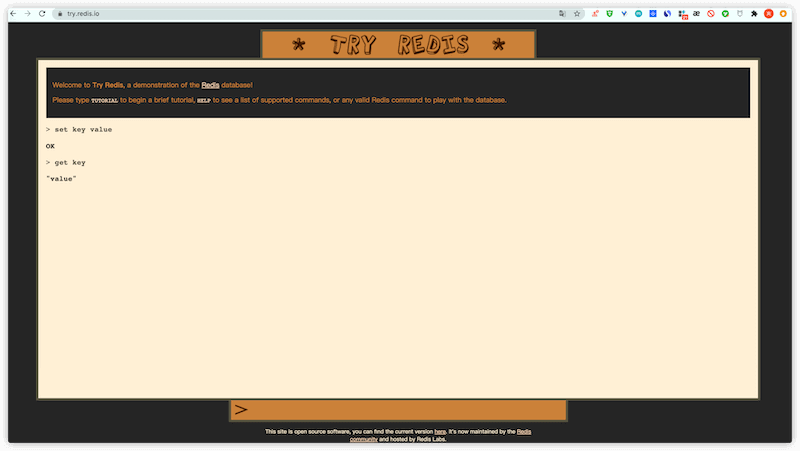

 string

---

1. **介绍** ：string 数据结构是简单的 key-value 类型。虽然 Redis 是用 C 语言写的，但是 Redis 并没有使用 C 的字符串表示，而是自己构建了一种 **简单动态字符串**（simple dynamic string，**SDS**）。相比于 C 的原生字符串，Redis 的 SDS 不光可以保存文本数据还可以保存二进制数据，并且获取字符串长度复杂度为 O(1)（C 字符串为 O(N)）,除此之外，Redis 的 SDS API 是安全的，不会造成缓冲区溢出。
2. **常用命令：** `set,get,strlen,exists,decr,incr,setex` 等等。
3. **应用场景：** 一般常用在需要计数的场景，比如用户的访问次数、热点文章的点赞转发数量等等。

下面我们简单看看它的使用！

**普通字符串的基本操作：**

```sh
127.0.0.1:6379> set key value #设置 key-value 类型的值
OK
127.0.0.1:6379> get key # 根据 key 获得对应的 value
"value"
127.0.0.1:6379> exists key  # 判断某个 key 是否存在
(integer) 1
127.0.0.1:6379> strlen key # 返回 key 所储存的字符串值的长度。
(integer) 5
127.0.0.1:6379> del key # 删除某个 key 对应的值
(integer) 1
127.0.0.1:6379> get key
(nil)
```

**批量设置** :

```sh
127.0.0.1:6379> mset key1 value1 key2 value2 # 批量设置 key-value 类型的值
OK
127.0.0.1:6379> mget key1 key2 # 批量获取多个 key 对应的 value
1) "value1"
2) "value2"
```

**计数器（字符串的内容为整数的时候可以使用）：**

```sh
127.0.0.1:6379> set number 1
OK
127.0.0.1:6379> incr number # 将 key 中储存的数字值增一
(integer) 2
127.0.0.1:6379> get number
"2"
127.0.0.1:6379> decr number # 将 key 中储存的数字值减一
(integer) 1
127.0.0.1:6379> get number
"1"
```

**过期（默认为永不过期）**：

```sh
127.0.0.1:6379> expire key  60 # 数据在 60s 后过期
(integer) 1
127.0.0.1:6379> setex key 60 value # 数据在 60s 后过期 (setex:[set] + [ex]pire)
OK
127.0.0.1:6379> ttl key # 查看数据还有多久过期
(integer) 56
```

list

---

1. **介绍** ：**list** 即是 **链表**。链表是一种非常常见的数据结构，特点是易于数据元素的插入和删除并且可以灵活调整链表长度，但是链表的随机访问困难。许多高级编程语言都内置了链表的实现比如 Java 中的 **LinkedList**，但是 C 语言并没有实现链表，所以 Redis 实现了自己的链表数据结构。Redis 的 list 的实现为一个 **双向链表**，即可以支持反向查找和遍历，更方便操作，不过带来了部分额外的内存开销。
2. **常用命令:** `rpush,lpop,lpush,rpop,lrange,llen` 等。
3. **应用场景:** 发布与订阅或者说消息队列、慢查询。

下面我们简单看看它的使用！

**通过 `rpush/lpop` 实现队列：**

```sh
127.0.0.1:6379> rpush myList value1 # 向 list 的头部（右边）添加元素
(integer) 1
127.0.0.1:6379> rpush myList value2 value3 # 向list的头部（最右边）添加多个元素
(integer) 3
127.0.0.1:6379> lpop myList # 将 list的尾部(最左边)元素取出
"value1"
127.0.0.1:6379> lrange myList 0 1 # 查看对应下标的list列表， 0 为 start,1为 end
1) "value2"
2) "value3"
127.0.0.1:6379> lrange myList 0 -1 # 查看列表中的所有元素，-1表示倒数第一
1) "value2"
2) "value3"
```

**通过 `rpush/rpop` 实现栈：**

```sh
127.0.0.1:6379> rpush myList2 value1 value2 value3
(integer) 3
127.0.0.1:6379> rpop myList2 # 将 list的头部(最右边)元素取出
"value3"
```

我专门画了一个图方便小伙伴们来理解：

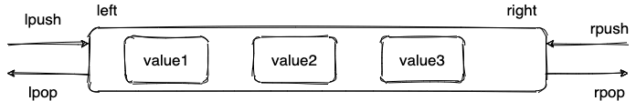

**通过 `lrange` 查看对应下标范围的列表元素：**

```sh
127.0.0.1:6379> rpush myList value1 value2 value3
(integer) 3
127.0.0.1:6379> lrange myList 0 1 # 查看对应下标的list列表， 0 为 start,1为 end
1) "value1"
2) "value2"
127.0.0.1:6379> lrange myList 0 -1 # 查看列表中的所有元素，-1表示倒数第一
1) "value1"
2) "value2"
3) "value3"
```

通过 `lrange` 命令，你可以基于 list 实现分页查询，性能非常高！

**通过 `llen` 查看链表长度：**

```sh
127.0.0.1:6379> llen myList
(integer) 3
```


hash

---

1. **介绍** ：hash 类似于 JDK1.8 前的 HashMap，内部实现也差不多(数组 + 链表)。不过，Redis 的 hash 做了更多优化。另外，hash 是一个 string 类型的 field 和 value 的映射表，**特别适合用于存储对象**，后续操作的时候，你可以直接仅仅修改这个对象中的某个字段的值。 比如我们可以 hash 数据结构来存储用户信息，商品信息等等。
2. **常用命令：** `hset,hmset,hexists,hget,hgetall,hkeys,hvals` 等。
3. **应用场景:** 系统中对象数据的存储。

下面我们简单看看它的使用！

```sh
127.0.0.1:6379> hmset userInfoKey name "guide" description "dev" age "24"
OK
127.0.0.1:6379> hexists userInfoKey name # 查看 key 对应的 value中指定的字段是否存在。
(integer) 1
127.0.0.1:6379> hget userInfoKey name # 获取存储在哈希表中指定字段的值。
"guide"
127.0.0.1:6379> hget userInfoKey age
"24"
127.0.0.1:6379> hgetall userInfoKey # 获取在哈希表中指定 key 的所有字段和值
1) "name"
2) "guide"
3) "description"
4) "dev"
5) "age"
6) "24"
127.0.0.1:6379> hkeys userInfoKey # 获取 key 列表
1) "name"
2) "description"
3) "age"
127.0.0.1:6379> hvals userInfoKey # 获取 value 列表
1) "guide"
2) "dev"
3) "24"
127.0.0.1:6379> hset userInfoKey name "GuideGeGe" # 修改某个字段对应的值
127.0.0.1:6379> hget userInfoKey name
"GuideGeGe"
```


set

---

1. **介绍 ：** set 类似于 Java 中的 `HashSet`  。Redis 中的 set 类型是一种无序集合，集合中的元素没有先后顺序。当你需要存储一个列表数据，又不希望出现重复数据时，set  是一个很好的选择，并且 set 提供了判断某个成员是否在一个 set 集合内的重要接口，这个也是 list 所不能提供的。可以基于 set  轻易实现交集、并集、差集的操作。比如：你可以将一个用户所有的关注人存在一个集合中，将其所有粉丝存在一个集合。Redis  可以非常方便的实现如共同关注、共同粉丝、共同喜好等功能。这个过程也就是求交集的过程。
2. **常用命令：** `sadd,spop,smembers,sismember,scard,sinterstore,sunion` 等。
3. **应用场景:** 需要存放的数据不能重复以及需要获取多个数据源交集和并集等场景

下面我们简单看看它的使用

```sh
127.0.0.1:6379> sadd mySet value1 value2 # 添加元素进去
(integer) 2
127.0.0.1:6379> sadd mySet value1 # 不允许有重复元素
(integer) 0
127.0.0.1:6379> smembers mySet # 查看 set 中所有的元素
1) "value1"
2) "value2"
127.0.0.1:6379> scard mySet # 查看 set 的长度
(integer) 2
127.0.0.1:6379> sismember mySet value1 # 检查某个元素是否存在set 中，只能接收单个元素
(integer) 1
127.0.0.1:6379> sadd mySet2 value2 value3
(integer) 2
127.0.0.1:6379> sinterstore mySet3 mySet mySet2 # 获取 mySet 和 mySet2 的交集并存放在 mySet3 中
(integer) 1
127.0.0.1:6379> smembers mySet3
1) "value2"
```


sorted set

---

1. **介绍：** 和 set 相比，sorted set 增加了一个权重参数 score，使得集合中的元素能够按 score 进行有序排列，还可以通过 score 的范围来获取元素的列表。有点像是 Java 中 HashMap 和 TreeSet 的结合体。
2. **常用命令：** `zadd,zcard,zscore,zrange,zrevrange,zrem` 等。
3. **应用场景：** 需要对数据根据某个权重进行排序的场景。比如在直播系统中，实时排行信息包含直播间在线用户列表，各种礼物排行榜，弹幕消息（可以理解为按消息维度的消息排行榜）等信息。

```sh
127.0.0.1:6379> zadd myZset 3.0 value1 # 添加元素到 sorted set 中 3.0 为权重
(integer) 1
127.0.0.1:6379> zadd myZset 2.0 value2 1.0 value3 # 一次添加多个元素
(integer) 2
127.0.0.1:6379> zcard myZset # 查看 sorted set 中的元素数量
(integer) 3
127.0.0.1:6379> zscore myZset value1 # 查看某个 value 的权重
"3"
127.0.0.1:6379> zrange  myZset 0 -1 # 顺序输出某个范围区间的元素，0 -1 表示输出所有元素
1) "value3"
2) "value2"
3) "value1"
127.0.0.1:6379> zrange  myZset 0 1 # 顺序输出某个范围区间的元素，0 为 start  1 为 stop
1) "value3"
2) "value2"
127.0.0.1:6379> zrevrange  myZset 0 1 # 逆序输出某个范围区间的元素，0 为 start  1 为 stop
1) "value1"
2) "value2"
```


bitmap

---

1. **介绍：** bitmap 存储的是连续的二进制数字（0 和 1），通过 bitmap, 只需要一个 bit 位来表示某个元素对应的值或者状态，key 就是对应元素本身 。我们知道 8 个 bit 可以组成一个 byte，所以 bitmap 本身会极大的节省储存空间。
2. **常用命令：** `setbit` 、`getbit` 、`bitcount`、`bitop`
3. **应用场景：** 适合需要保存状态信息（比如是否签到、是否登录...）并需要进一步对这些信息进行分析的场景。比如用户签到情况、活跃用户情况、用户行为统计（比如是否点赞过某个视频）。

```sh
# SETBIT 会返回之前位的值（默认是 0）这里会生成 7 个位
127.0.0.1:6379> setbit mykey 7 1
(integer) 0
127.0.0.1:6379> setbit mykey 7 0
(integer) 1
127.0.0.1:6379> getbit mykey 7
(integer) 0
127.0.0.1:6379> setbit mykey 6 1
(integer) 0
127.0.0.1:6379> setbit mykey 8 1
(integer) 0
# 通过 bitcount 统计被被设置为 1 的位的数量。
127.0.0.1:6379> bitcount mykey
(integer) 2
```

针对上面提到的一些场景，这里进行进一步说明。

**使用场景一：用户行为分析** 很多网站为了分析你的喜好，需要研究你点赞过的内容。

```sh
# 记录你喜欢过 001 号小姐姐
127.0.0.1:6379> setbit beauty_girl_001 uid 1
```

**使用场景二：统计活跃用户**

使用时间作为 key，然后用户 ID 为 offset，如果当日活跃过就设置为 1

那么我该如何计算某几天/月/年的活跃用户呢(暂且约定，统计时间内只要有一天在线就称为活跃)，有请下一个 redis 的命令

```sh
# 对一个或多个保存二进制位的字符串 key 进行位元操作，并将结果保存到 destkey 上。
# BITOP 命令支持 AND 、 OR 、 NOT 、 XOR 这四种操作中的任意一种参数
BITOP operation destkey key [key ...]
```

初始化数据：

```sh
127.0.0.1:6379> setbit 20210308 1 1
(integer) 0
127.0.0.1:6379> setbit 20210308 2 1
(integer) 0
127.0.0.1:6379> setbit 20210309 1 1
(integer) 0
```

统计 20210308~20210309 总活跃用户数: 1

```sh
127.0.0.1:6379> bitop and desk1 20210308 20210309
(integer) 1
127.0.0.1:6379> bitcount desk1
(integer) 1
```

统计 20210308~20210309 在线活跃用户数: 2

```sh
127.0.0.1:6379> bitop or desk2 20210308 20210309
(integer) 1
127.0.0.1:6379> bitcount desk2
(integer) 2
```

**使用场景三：用户在线状态**

对于获取或者统计用户在线状态，使用 bitmap 是一个节约空间且效率又高的一种方法。

只需要一个 key，然后用户 ID 为 offset，如果在线就设置为 1，不在线就设置为 0。


> Zset里面跳表是什么


> 讲讲缓存一致性问题

- **问题来源**

使用redis做一个缓冲操作，让请求先访问到redis，而不是直接访问MySQL等数据库：

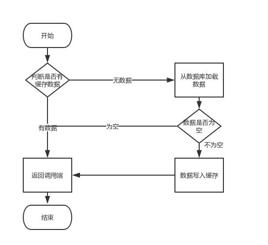

著作权归https://pdai.tech所有。 链接：https://www.pdai.tech/md/db/nosql-redis/db-redis-x-cache.html

读取缓存步骤一般没有什么问题，但是一旦涉及到数据更新：数据库和缓存更新，就容易出现缓存(Redis)和数据库（MySQL）间的数据一致性问题。

**不管是先写MySQL数据库，再删除Redis缓存；还是先删除缓存，再写库，都有可能出现数据不一致的情况**。举一个例子：

1.如果删除了缓存Redis，还没有来得及写库MySQL，另一个线程就来读取，发现缓存为空，则去数据库中读取数据写入缓存，此时缓存中为脏数据。

2.如果先写了库，在删除缓存前，写库的线程宕机了，没有删除掉缓存，则也会出现数据不一致情况。

因为写和读是并发的，没法保证顺序,就会出现缓存和数据库的数据不一致的问题


> 脏读幻读的问题

脏读

---

T1 修改一个数据，T2 随后读取这个数据。如果 T1 撤销了这次修改，那么 T2 读取的数据是脏数据。


幻读

---

T1 读取某个范围的数据，T2 在这个范围内插入新的数据，T1 再次读取这个范围的数据，此时读取的结果和和第一次读取的结果不同。


> 不仅从redis角度，同时从数据库并发可能产生问题角度答答

除了上述问题的脏读和幻读还有

丢失修改

---

T1 和 T2 两个事务都对一个数据进行修改，T1 先修改，T2 随后修改，T2 的修改覆盖了 T1 的修改。


不可重复读

---

T2 读取一个数据，T1 对该数据做了修改。如果 T2 再次读取这个数据，此时读取的结果和第一次读取的结果不同。


产生并发不一致性问题主要原因是破坏了事务的隔离性，解决方法是通过并发控制来保证隔离性。并发控制可以通过封锁来实现，但是封锁操作需要用户自己控制，相当复杂。数据库管理系统提供了事务的隔离级别，让用户以一种更轻松的方式处理并发一致性问题


> redis高并发


> redis高可用

[高可用：主从复制详解](https://www.pdai.tech/md/db/nosql-redis/db-redis-x-copy.html)

[高可用：哨兵机制（Redis Sentinel）详解](https://www.pdai.tech/md/db/nosql-redis/db-redis-x-sentinel.html)


> redis主从是怎么做的

> 主从复制，是指将一台Redis服务器的数据，复制到其他的Redis服务器。前者称为主节点(master)，后者称为从节点(slave)；数据的复制是单向的，只能由主节点到从节点。

**主从复制的作用**主要包括：

- **数据冗余**：主从复制实现了数据的热备份，是持久化之外的一种数据冗余方式。
- **故障恢复**：当主节点出现问题时，可以由从节点提供服务，实现快速的故障恢复；实际上是一种服务的冗余。
- **负载均衡**：在主从复制的基础上，配合读写分离，可以由主节点提供写服务，由从节点提供读服务（即写Redis数据时应用连接主节点，读Redis数据时应用连接从节点），分担服务器负载；尤其是在写少读多的场景下，通过多个从节点分担读负载，可以大大提高Redis服务器的并发量。
- **高可用基石**：除了上述作用以外，主从复制还是哨兵和集群能够实施的基础，因此说主从复制是Redis高可用的基础。

主从库之间采用的是**读写分离**的方式。

- 读操作：主库、从库都可以接收；
- 写操作：首先到主库执行，然后，主库将写操作同步给从库。


原理

---

> 注意：在2.8版本之前只有全量复制，而2.8版本后有全量和增量复制：

- `全量（同步）复制`：比如第一次同步时
- `增量（同步）复制`：只会把主从库网络断连期间主库收到的命令，同步给从库


全量复制

---

当我们启动多个 Redis 实例的时候，它们相互之间就可以通过 replicaof（Redis 5.0 之前使用 slaveof）命令形成主库和从库的关系，之后会按照三个阶段完成数据的第一次同步。

- **确立主从关系**

例如，现在有实例 1（ip：172.16.19.3）和实例 2（ip：172.16.19.5），我们在实例 2 上执行以下这个命令后，实例 2 就变成了实例 1 的从库，并从实例 1 上复制数据：

```bash
replicaof 172.16.19.3 6379
```

- **全量复制的三个阶段**

你可以先看一下下面这张图，有个整体感知，接下来我再具体介绍


著作权归https://pdai.tech所有。 链接：https://www.pdai.tech/md/db/nosql-redis/db-redis-x-copy.html

**第一阶段是主从库间建立连接、协商同步的过程**，主要是为全量复制做准备。在这一步，从库和主库建立起连接，并告诉主库即将进行同步，主库确认回复后，主从库间就可以开始同步了。

具体来说，从库给主库发送 psync 命令，表示要进行数据同步，主库根据这个命令的参数来启动复制。psync 命令包含了主库的 runID 和复制进度 offset 两个参数。runID，是每个 Redis 实例启动时都会自动生成的一个随机 ID，用来唯一标记这个实例。当从库和主库第一次复制时，因为不知道主库的 runID，所以将 runID 设为“？”。offset，此时设为 -1，表示第一次复制。主库收到 psync 命令后，会用 FULLRESYNC 响应命令带上两个参数：主库 runID 和主库目前的复制进度 offset，返回给从库。从库收到响应后，会记录下这两个参数。这里有个地方需要注意，FULLRESYNC 响应表示第一次复制采用的全量复制，也就是说，主库会把当前所有的数据都复制给从库。

**第二阶段，主库将所有数据同步给从库**。从库收到数据后，在本地完成数据加载。这个过程依赖于内存快照生成的 RDB 文件。

具体来说，主库执行 bgsave 命令，生成 RDB 文件，接着将文件发给从库。从库接收到 RDB 文件后，会先清空当前数据库，然后加载 RDB 文件。这是因为从库在通过 replicaof 命令开始和主库同步前，可能保存了其他数据。为了避免之前数据的影响，从库需要先把当前数据库清空。在主库将数据同步给从库的过程中，主库不会被阻塞，仍然可以正常接收请求。否则，Redis 的服务就被中断了。但是，这些请求中的写操作并没有记录到刚刚生成的 RDB 文件中。为了保证主从库的数据一致性，主库会在内存中用专门的 replication buffer，记录 RDB 文件生成后收到的所有写操作。

**第三个阶段，主库会把第二阶段执行过程中新收到的写命令，再发送给从库**。具体的操作是，当主库完成 RDB 文件发送后，就会把此时 replication buffer 中的修改操作发给从库，从库再重新执行这些操作。这样一来，主从库就实现同步了


增量复制

---

> 在 Redis 2.8 版本引入了增量复制。

- **为什么会设计增量复制**？

如果主从库在命令传播时出现了网络闪断，那么，从库就会和主库重新进行一次全量复制，开销非常大。从 Redis 2.8 开始，网络断了之后，主从库会采用增量复制的方式继续同步。

- **增量复制的流程**

你可以先看一下下面这张图，有个整体感知，接下来我再具体介绍。

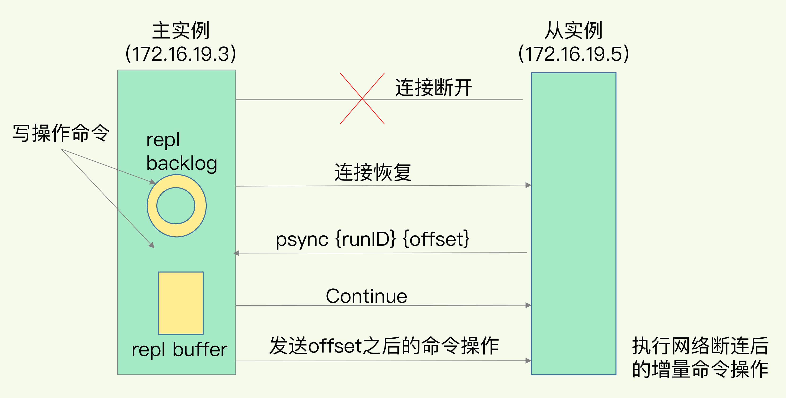

著作权归https://pdai.tech所有。 链接：https://www.pdai.tech/md/db/nosql-redis/db-redis-x-copy.html

先看两个概念： `replication buffer` 和 `repl_backlog_buffer`

`repl_backlog_buffer`：它是为了从库断开之后，如何找到主从差异数据而设计的环形缓冲区，从而避免全量复制带来的性能开销。如果从库断开时间太久，repl_backlog_buffer环形缓冲区被主库的写命令覆盖了，那么从库连上主库后只能乖乖地进行一次全量复制，所以**repl_backlog_buffer配置尽量大一些，可以降低主从断开后全量复制的概率**。而在repl_backlog_buffer中找主从差异的数据后，如何发给从库呢？这就用到了replication buffer。

`replication buffer`：Redis和客户端通信也好，和从库通信也好，Redis都需要给分配一个 内存buffer进行数据交互，客户端是一个client，从库也是一个client，我们每个client连上Redis后，Redis都会分配一个client buffer，所有数据交互都是通过这个buffer进行的：Redis先把数据写到这个buffer中，然后再把buffer中的数据发到client socket中再通过网络发送出去，这样就完成了数据交互。所以主从在增量同步时，从库作为一个client，也会分配一个buffer，只不过这个buffer专门用来传播用户的写命令到从库，保证主从数据一致，我们通常把它叫做replication buffer。

- **如果在网络断开期间，repl_backlog_size环形缓冲区写满之后，从库是会丢失掉那部分被覆盖掉的数据，还是直接进行全量复制呢**？

对于这个问题来说，有两个关键点：

1. 一个从库如果和主库断连时间过长，造成它在主库repl_backlog_buffer的slave_repl_offset位置上的数据已经被覆盖掉了，此时从库和主库间将进行全量复制。
2. 每个从库会记录自己的slave_repl_offset，每个从库的复制进度也不一定相同。在和主库重连进行恢复时，从库会通过psync命令把自己记录的slave_repl_offset发给主库，主库会根据从库各自的复制进度，来决定这个从库可以进行增量复制，还是全量复制。


总结：

在使用读写分离之前，可以考虑其他方法增加Redis的读负载能力：如尽量优化主节点（减少慢查询、减少持久化等其他情况带来的阻塞等）提高负载能力；使用Redis集群同时提高读负载能力和写负载能力等。如果使用读写分离，可以使用哨兵，使主从节点的故障切换尽可能自动化，并减少对应用程序的侵入。


> 缓存雪崩，缓存击穿，缓存穿透

缓存雪崩

---

实际上，缓存雪崩描述的就是这样一个简单的场景：缓存在同一时间大面积的失效，后面的请求都直接落到了数据库上，造成数据库短时间内承受大量请求。 这就好比雪崩一样，摧枯拉朽之势，数据库的压力可想而知，可能直接就被这么多请求弄宕机了。

举个例子：系统的缓存模块出了问题比如宕机导致不可用。造成系统的所有访问，都要走数据库。

还有一种缓存雪崩的场景是：有一些被大量访问数据（热点缓存）在某一时刻大面积失效，导致对应的请求直接落到了数据库上。 这样的情况，有下面几种解决办法：

举个例子 ：秒杀开始 12 个小时之前，我们统一存放了一批商品到 Redis 中，设置的缓存过期时间也是 12 个小时，那么秒杀开始的时候，这些秒杀的商品的访问直接就失效了。导致的情况就是，相应的请求直接就落到了数据库上，就像雪崩一样可怕。

- **问题来源**

缓存雪崩是指缓存中**数据大批量到过期时间，而查询数据量巨大，引起数据库压力过大甚至down机**。和缓存击穿不同的是，缓存击穿指并发查同一条数据，缓存雪崩是不同数据都过期了，很多数据都查不到从而查数据库。

- **解决方案**

1. 缓存数据的过期时间设置随机，防止同一时间大量数据过期现象发生。
2. 如果缓存数据库是分布式部署，将热点数据均匀分布在不同的缓存数据库中。
3. 设置热点数据永远不过期


缓存击穿

---

- **问题来源**

缓存击穿是指**缓存中没有但数据库中有的数据**（一般是缓存时间到期），这时由于并发用户特别多，同时读缓存没读到数据，又同时去数据库去取数据，引起数据库压力瞬间增大，造成过大压力。

- **解决方案**

1、设置热点数据永远不过期。

2、接口限流与熔断，降级。重要的接口一定要做好限流策略，防止用户恶意刷接口，同时要降级准备，当接口中的某些 服务  不可用时候，进行熔断，失败快速返回机制。

3、加互斥锁


缓存穿透

---

缓存穿透说简单点就是大量请求的 key 根本不存在于缓存中，导致请求直接到了数据库上，根本没有经过缓存这一层。举个例子：某个黑客故意制造我们缓存中不存在的 key 发起大量请求，导致大量请求落到数据库。

* **问题来源**

缓存穿透是指**缓存和数据库中都没有的数据**，而用户不断发起请求。由于缓存是不命中时被动写的，并且出于容错考虑，如果从存储层查不到数据则不写入缓存，这将导致这个不存在的数据每次请求都要到存储层去查询，失去了缓存的意义。

在流量大时，可能DB就挂掉了，要是有人利用不存在的key频繁攻击我们的应用，这就是漏洞。

如发起为id为“-1”的数据或id为特别大不存在的数据。这时的用户很可能是攻击者，攻击会导致数据库压力过大。

- **解决方案**

1. 接口层增加校验，如用户鉴权校验，id做基础校验，id<=0的直接拦截；
2. 从缓存取不到的数据，在数据库中也没有取到，这时也可以将key-value对写为key-null，缓存有效时间可以设置短点，如30秒（设置太长会导致正常情况也没法使用）。这样可以防止攻击用户反复用同一个id暴力攻击
3. 布隆过滤器。bloomfilter就类似于一个hash set，用于快速判某个元素是否存在于集合中，其典型的应用场景就是快速判断一个key是否存在于某容器，不存在就直接返回。布隆过滤器的关键就在于hash算法和容器大小，


> 缓存有哪些，Ehcache和Redis区别，Ehcache为什么效率高


> Redis分布式集群是怎么实现的

分布式缓存的话，使用的比较多的主要是 **Memcached** 和 **Redis**。不过，现在基本没有看过还有项目使用 **Memcached** 来做缓存，都是直接用 **Redis**。

Memcached 是分布式缓存最开始兴起的那会，比较常用的。后来，随着 Redis 的发展，大家慢慢都转而使用更加强大的 Redis 了。

分布式缓存主要解决的是单机缓存的容量受服务器限制并且无法保存通用信息的问题。因为，本地缓存只在当前服务里有效，比如如果你部署了两个相同的服务，他们两者之间的缓存数据是无法共同的


## MySql

> 有用mysql做过什么东西吗（开放话题）| 此处写的是如何优化MySQL

1.对查询进行优化，要尽量避免全表扫描，首先应考虑在 where 及 order by 涉及的列上建立索引。

2.应尽量避免在 where 子句中对字段进行 null 值判断，否则将导致引擎放弃使用索引而进行全表扫描，如：

```mysql
select id from t where num is null
```

最好不要给数据库留NULL，尽可能的使用 NOT NULL填充数据库.

备注、描述、评论之类的可以设置为 NULL，其他的，最好不要使用NULL。

不要以为 NULL 不需要空间，比如：char(100) 型，在字段建立时，空间就固定了， 不管是否插入值（NULL也包含在内），都是占用 100个字符的空间的，如果是varchar这样的变长字段， null 不占用空间。

可以在num上设置默认值0，确保表中num列没有null值，然后这样查询：

```mysql
select id from t where num = 0
```

3.应尽量避免在 where 子句中使用 != 或 <> 操作符，否则将引擎放弃使用索引而进行全表扫描。

4.应尽量避免在 where 子句中使用 or 来连接条件，如果一个字段有索引，一个字段没有索引，将导致引擎放弃使用索引而进行全表扫描，如：

```mysql
select id from t where num=10 or Name = 'admin'
```

可以这样查询：

```mysql
select id from t where num = 10
union all
select id from t where Name = 'admin'
```

5.in 和 not in 也要慎用，否则会导致全表扫描，如：

```mysql
select id from t where num in(1,2,3)
```

对于连续的数值，能用 between 就不要用 in 了：

```mysql
select id from t where num between 1 and 3
```

很多时候用 exists 代替 in 是一个好的选择：

```mysql
select num from a where num in(select num from b)
```

用下面的语句替换：

```mysql
select num from a where exists(select 1 from b where num=a.num)
```

6.下面的查询也将导致全表扫描：

```mysql
select id from t where name like ‘%abc%’
```

若要提高效率，可以考虑全文检索。

7.如果在 where 子句中使用参数，也会导致全表扫描。因为SQL只有在运行时才会解析局部变量，但优化程序不能将访问计划的选择推迟到运行时；它必须在编译时进行选择。然 而，如果在编译时建立访问计划，变量的值还是未知的，因而无法作为索引选择的输入项。如下面语句将进行全表扫描：

```sql
select id from t where num = @num
```

可以改为强制查询使用索引：

```sql
select id from t with(index(索引名)) where num = @num
```

应尽量避免在 where 子句中对字段进行表达式操作，这将导致引擎放弃使用索引而进行全表扫描。如：

```sql
select id from t where num/2 = 100
```

应改为:

```sql
select id from t where num = 100*2
```

9.应尽量避免在where子句中对字段进行函数操作，这将导致引擎放弃使用索引而进行全表扫描。如：

```sql
select id from t where substring(name,1,3) = ’abc’       -–name以abc开头的id
select id from t where datediff(day,createdate,’2005-11-30′) = 0    -–‘2005-11-30’    --生成的id
```

应改为:

```sql
select id from t where name like 'abc%'
select id from t where createdate >= '2005-11-30' and createdate < '2005-12-1'
```

10.不要在 where 子句中的“=”左边进行函数、算术运算或其他表达式运算，否则系统将可能无法正确使用索引。 

11.在使用索引字段作为条件时，如果该索引是复合索引，那么必须使用到该索引中的第一个字段作为条件时才能保证系统使用该索引，否则该索引将不会被使用，并且应尽可能的让字段顺序与索引顺序相一致。

 12.不要写一些没有意义的查询，如需要生成一个空表结构：

```sql
select col1,col2 into #t from t where 1=0
```

这类代码不会返回任何结果集，但是会消耗系统资源的，应改成这样：

```sql
create table #t(…)
```

13.Update 语句，如果只更改1、2个字段，不要Update全部字段，否则频繁调用会引起明显的性能消耗，同时带来大量日志。

14.对于多张大数据量（这里几百条就算大了）的表JOIN，要先分页再JOIN，否则逻辑读会很高，性能很差。

15.select count(*) from table；这样不带任何条件的count会引起全表扫描，并且没有任何业务意义，是一定要杜绝的。

16.索引并不是越多越好，索引固然可以提高相应的 select 的效率，但同时也降低了 insert 及 update 的效率，因为 insert 或 update 时有可能会重建索引，所以怎样建索引需要慎重考虑，视具体情况而定。一个表的索引数最好不要超过6个，若太多则应考虑一些不常使用到的列上建的索引是否有 必要。

17.应尽可能的避免更新 clustered 索引数据列，因为 clustered 索引数据列的顺序就是表记录的物理存储顺序，一旦该列值改变将导致整个表记录的顺序的调整，会耗费相当大的资源。若应用系统需要频繁更新 clustered 索引数据列，那么需要考虑是否应将该索引建为 clustered 索引。

18.尽量使用数字型字段，若只含数值信息的字段尽量不要设计为字符型，这会降低查询和连接的性能，并会增加存储开销。这是因为引擎在处理查询和连 接时会逐个比较字符串中每一个字符，而对于数字型而言只需要比较一次就够了。

19.尽可能的使用 varchar/nvarchar 代替 char/nchar ，因为首先变长字段存储空间小，可以节省存储空间，其次对于查询来说，在一个相对较小的字段内搜索效率显然要高些。

20.任何地方都不要使用 select * from t ，用具体的字段列表代替“*”，不要返回用不到的任何字段。

21.尽量使用表变量来代替临时表。如果表变量包含大量数据，请注意索引非常有限（只有主键索引）。

22.避免频繁创建和删除临时表，以减少系统表资源的消耗。临时表并不是不可使用，适当地使用它们可以使某些例程更有效，例如，当需要重复引用大型表或常用表中的某个数据集时。但是，对于一次性事件， 最好使用导出表。

23.在新建临时表时，如果一次性插入数据量很大，那么可以使用 select into 代替 create table，避免造成大量 log ，以提高速度；如果数据量不大，为了缓和系统表的资源，应先create table，然后insert。

24.如果使用到了临时表，在存储过程的最后务必将所有的临时表显式删除，先 truncate table ，然后 drop table ，这样可以避免系统表的较长时间锁定。

25.尽量避免使用游标，因为游标的效率较差，如果游标操作的数据超过1万行，那么就应该考虑改写。

26.使用基于游标的方法或临时表方法之前，应先寻找基于集的解决方案来解决问题，基于集的方法通常更有效。

27.与临时表一样，游标并不是不可使用。对小型数据集使用 FAST_FORWARD 游标通常要优于其他逐行处理方法，尤其是在必须引用几个表才能获得所需的数据时。在结果集中包括“合计”的例程通常要比使用游标执行的速度快。如果开发时 间允许，基于游标的方法和基于集的方法都可以尝试一下，看哪一种方法的效果更好。

28.在所有的存储过程和触发器的开始处设置 SET NOCOUNT ON ，在结束时设置 SET NOCOUNT OFF 。无需在执行存储过程和触发器的每个语句后向客户端发送 DONE_IN_PROC 消息。

29.尽量避免大事务操作，提高系统并发能力。

30.尽量避免向客户端返回大数据量，若数据量过大，应该考虑相应需求是否合理。


> Mysql sql执行过程，用JDBC时sql执行流程


> Mysql监听binlog，binlog是什么

那 `binlog` 到底是用来干嘛的？

可以说`MySQL`数据库的**数据备份、主备、主主、主从**都离不开`binlog`，需要依靠`binlog`来同步数据，保证数据一致性。


`binlog`会记录所有涉及更新数据的逻辑操作，并且是顺序写。


记录格式：

`binlog` 日志有三种格式，可以通过`binlog_format`参数指定。

- **statement**
- **row**
- **mixed**

指定`statement`，记录的内容是`SQL`语句原文，比如执行一条`update T set update_time=now() where id=1`，记录的内容如下。


同步数据时，会执行记录的`SQL`语句，但是有个问题，`update_time=now()`这里会获取当前系统时间，直接执行会导致与原库的数据不一致。

为了解决这种问题，我们需要指定为`row`，记录的内容不再是简单的`SQL`语句了，还包含操作的具体数据，记录内容如下。


`row`格式记录的内容看不到详细信息，要通过`mysqlbinlog`工具解析出来。

`update_time=now()`变成了具体的时间`update_time=1627112756247`，条件后面的@1、@2、@3 都是该行数据第 1 个~3 个字段的原始值（**假设这张表只有 3 个字段**）。

这样就能保证同步数据的一致性，通常情况下都是指定为`row`，这样可以为数据库的恢复与同步带来更好的可靠性。

但是这种格式，需要更大的容量来记录，比较占用空间，恢复与同步时会更消耗`IO`资源，影响执行速度。

所以就有了一种折中的方案，指定为`mixed`，记录的内容是前两者的混合。

`MySQL`会判断这条`SQL`语句是否可能引起数据不一致，如果是，就用`row`格式，否则就用`statement`格式。


写入机制：

`binlog`的写入时机也非常简单，事务执行过程中，先把日志写到`binlog cache`，事务提交的时候，再把`binlog cache`写到`binlog`文件中。

因为一个事务的`binlog`不能被拆开，无论这个事务多大，也要确保一次性写入，所以系统会给每个线程分配一个块内存作为`binlog cache`。

我们可以通过`binlog_cache_size`参数控制单个线程 binlog cache 大小，如果存储内容超过了这个参数，就要暂存到磁盘（`Swap`）。

`binlog`日志刷盘流程如下


- **上图的 write，是指把日志写入到文件系统的 page cache，并没有把数据持久化到磁盘，所以速度比较快**
- **上图的 fsync，才是将数据持久化到磁盘的操作**

`write`和`fsync`的时机，可以由参数`sync_binlog`控制，默认是`0`。

为`0`的时候，表示每次提交事务都只`write`，由系统自行判断什么时候执行`fsync`。


虽然性能得到提升，但是机器宕机，`page cache`里面的 binlog 会丢失。

为了安全起见，可以设置为`1`，表示每次提交事务都会执行`fsync`，就如同 **redo log 日志刷盘流程** 一样。

最后还有一种折中方式，可以设置为`N(N>1)`，表示每次提交事务都`write`，但累积`N`个事务后才`fsync`。


在出现`IO`瓶颈的场景里，将`sync_binlog`设置成一个比较大的值，可以提升性能。

同样的，如果机器宕机，会丢失最近`N`个事务的`binlog`日志。


> redolog和binlog的区别

`redo log` 它是物理日志，记录内容是“在某个数据页上做了什么修改”，属于 `InnoDB` 存储引擎。

而 `binlog` 是逻辑日志，记录内容是语句的原始逻辑，类似于“给 ID=2 这一行的 c 字段加 1”，属于`MySQL Server` 层。

不管用什么存储引擎，只要发生了表数据更新，都会产生 `binlog` 日志。


> Mysql里面为什么用B+树？B+树和二叉树区别？那能不能用哈希呢？

使用B+树而不是二叉搜索树或者红黑树的原因是，由于存储介质的特性，磁盘本身存取就比主存慢很多，每次搜索的磁盘IO的开销过大，而B+树可以使用较少次的磁盘IO搜索到对象。

- B-Tree中一次检索最多需要h-1次I/O（根节点常驻内存），渐进复杂度为O(h)=O(logdN)。
- 红黑树这种结构，h明显要深的多。效率明显比B-Tree差很多。


哈希表是键值对的集合，通过键(key)即可快速取出对应的值(value)，因此哈希表可以快速检索数据（接近 O（1））。

**为何能够通过 key 快速取出 value呢？** 原因在于 **哈希算法**（也叫散列算法）。通过哈希算法，我们可以快速找到 key 对应的 index，找到了 index 也就找到了对应的 value。

```java
hash = hashfunc(key)
index = hash % array_size
```


但是！哈希算法有个 **Hash 冲突** 问题，也就是说多个不同的 key 最后得到的 index 相同。通常情况下，我们常用的解决办法是 **链地址法**。链地址法就是将哈希冲突数据存放在链表中。就比如 JDK1.8 之前 `HashMap` 就是通过链地址法来解决哈希冲突的。不过，JDK1.8 以后`HashMap`为了减少链表过长的时候搜索时间过长引入了红黑树。


为了减少 Hash 冲突的发生，一个好的哈希函数应该“均匀地”将数据分布在整个可能的哈希值集合中。

既然哈希表这么快，**为什么MySQL 没有使用其作为索引的数据结构呢？**

**1.Hash 冲突问题** ：我们上面也提到过Hash 冲突了，不过对于数据库来说这还不算最大的缺点。

**2.Hash 索引不支持顺序和范围查询(Hash 索引不支持顺序和范围查询是它最大的缺点：** 假如我们要对表中的数据进行排序或者进行范围查询，那 Hash 索引可就不行了。

试想一种情况:

```java
SELECT * FROM tb1 WHERE id < 500;
```

在这种范围查询中，优势非常大，直接遍历比 500 小的叶子节点就够了。而 Hash 索引是根据 hash 算法来定位的，难不成还要把 1 - 499 的数据，每个都进行一次 hash 计算来定位吗?这就是 Hash 最大的缺点了.


> 什么是MVCC？

MVCC，全称Multi-Version Concurrency Control，即多版本并发控制。MVCC是一种并发控制的方法，一般在数据库管理系统中，实现对数据库的并发访问，在编程语言中实现事务内存。

在Mysql的InnoDB引擎中就是指在已提交读(READ COMMITTD)和可重复读(REPEATABLE READ)这两种隔离级别下的事务对于SELECT操作会访问版本链中的记录的过程。

这就使得别的事务可以修改这条记录，反正每次修改都会在版本链中记录。SELECT可以去版本链中拿记录，这就实现了读-写，写-读的并发执行，提升了系统的性能。


**MySQL的InnoDB引擎实现MVCC的3个基础点**

MVCC的目的就是多版本并发控制，在数据库中的实现，就是为了解决读写冲突，它的实现原理主要是依赖记录中的 3个隐式字段，undo日志 ，Read View 来实现的。


1. 隐式字段：

每行记录除了我们自定义的字段外，还有数据库隐式定义的DB_TRX_ID,DB_ROLL_PTR,DB_ROW_ID等字段

- **DB_ROW_ID** 6byte, 隐含的自增ID（隐藏主键），如果数据表没有主键，InnoDB会自动以DB_ROW_ID产生一个聚簇索引
- **DB_TRX_ID** 6byte, 最近修改(修改/插入)事务ID：记录创建这条记录/最后一次修改该记录的事务ID
- **DB_ROLL_PTR** 7byte, 回滚指针，指向这条记录的上一个版本（存储于rollback segment里）
- **DELETED_BIT** 1byte, 记录被更新或删除并不代表真的删除，而是删除flag变了


如上图，DB_ROW_ID是数据库默认为该行记录生成的唯一隐式主键；DB_TRX_ID是当前操作该记录的事务ID； 而DB_ROLL_PTR是一个回滚指针，用于配合undo日志，指向上一个旧版本；delete flag没有展示出来


2. undo日志

InnoDB把这些为了回滚而记录的这些东西称之为undo log。这里需要注意的一点是，由于查询操作（SELECT）并不会修改任何用户记录，所以在查询操作执行时，并不需要记录相应的undo log。undo log主要分为3种：

- **Insert undo log** ：插入一条记录时，至少要把这条记录的主键值记下来，之后回滚的时候只需要把这个主键值对应的记录删掉就好了。

- **Update undo log**：修改一条记录时，至少要把修改这条记录前的旧值都记录下来，这样之后回滚时再把这条记录更新为旧值就好了。

- Delete undo log

  ：删除一条记录时，至少要把这条记录中的内容都记下来，这样之后回滚时再把由这些内容组成的记录插入到表中就好了。

  - 删除操作都只是设置一下老记录的DELETED_BIT，并不真正将过时的记录删除。
  - 为了节省磁盘空间，InnoDB有专门的purge线程来清理DELETED_BIT为true的记录。为了不影响MVCC的正常工作，purge线程自己也维护了一个read view（这个read view相当于系统中最老活跃事务的read view）;如果某个记录的DELETED_BIT为true，并且DB_TRX_ID相对于purge线程的read view可见，那么这条记录一定是可以被安全清除的。

对MVCC有帮助的实质是**update undo log** ，undo log实际上就是存在rollback segment中旧记录链，它的执行流程如下：

1. **比如一个有个事务插入persion表插入了一条新记录，记录如下，name为Jerry, age为24岁，隐式主键是1，事务ID和回滚指针，我们假设为NULL**

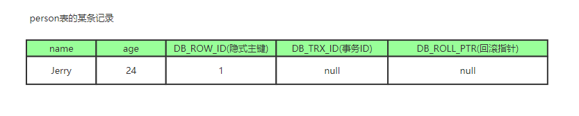

2. **现在来了一个事务1对该记录的name做出了修改，改为Tom**
   1. 在事务1修改该行(记录)数据时，数据库会先对该行加排他锁
   2. 然后把该行数据拷贝到undo log中，作为旧记录，既在undo log中有当前行的拷贝副本
   3. 拷贝完毕后，修改该行name为Tom，并且修改隐藏字段的事务ID为当前事务1的ID, 我们默认从1开始，之后递增，回滚指针指向拷贝到undo log的副本记录，既表示我的上一个版本就是它
   4. 事务提交后，释放锁


3. **又来了个事务2修改person表的同一个记录，将age修改为30岁**
   1. 在事务2修改该行数据时，数据库也先为该行加锁
   2. 然后把该行数据拷贝到undo log中，作为旧记录，发现该行记录已经有undo log了，那么最新的旧数据作为链表的表头，插在该行记录的undo log最前面
   3. 修改该行age为30岁，并且修改隐藏字段的事务ID为当前事务2的ID, 那就是2，回滚指针指向刚刚拷贝到undo log的副本记录
   4. 事务提交，释放锁


从上面，我们就可以看出，不同事务或者相同事务的对同一记录的修改，会导致该记录的undo log成为一条记录版本线性表，既链表，undo log的链首就是最新的旧记录，链尾就是最早的旧记录（当然就像之前说的该undo log的节点可能是会purge线程清除掉，向图中的第一条insert undo log，其实在事务提交之后可能就被删除丢失了，不过这里为了演示，所以还放在这里）


3. Read View(读视图)

什么是Read View，说白了Read View就是事务进行快照读操作的时候生产的读视图(Read View)，在该事务执行的快照读的那一刻，会生成数据库系统当前的一个快照，记录并维护系统当前活跃事务的ID(当每个事务开启时，都会被分配一个ID, 这个ID是递增的，所以最新的事务，ID值越大)

所以我们知道 Read View主要是用来做可见性判断的, 即当我们某个事务执行快照读的时候，对该记录创建一个Read View读视图，把它比作条件用来判断当前事务能够看到哪个版本的数据，既可能是当前最新的数据，也有可能是该行记录的undo log里面的某个版本的数据。

Read View遵循一个可见性算法，主要是将要被修改的数据的最新记录中的DB_TRX_ID（即当前事务ID）取出来，与系统当前其他活跃事务的ID去对比（由Read View维护），如果DB_TRX_ID跟Read View的属性做了某些比较，不符合可见性，那就通过DB_ROLL_PTR回滚指针去取出Undo Log中的DB_TRX_ID再比较，即遍历链表的DB_TRX_ID（从链首到链尾，即从最近的一次修改查起），直到找到满足特定条件的DB_TRX_ID, 那么这个DB_TRX_ID所在的旧记录就是当前事务能看见的最新老版本

那么这个判断条件是什么呢？


如上，它是一段MySQL判断可见性的一段源码，即changes_visible方法（不完全哈，但能看出大致逻辑），该方法展示了我们拿DB_TRX_ID去跟Read View某些属性进行怎么样的比较

在展示之前，我先简化一下Read View，我们可以把Read View简单的理解成有三个全局属性

> - **trx_list** 未提交事务ID列表，用来维护Read View生成时刻系统正活跃的事务ID
> - **up_limit_id** 记录trx_list列表中事务ID最小的ID
> - **low_limit_id** ReadView生成时刻系统尚未分配的下一个事务ID，也就是目前已出现过的事务ID的最大值+1

- 首先比较DB_TRX_ID < up_limit_id, 如果小于，则当前事务能看到DB_TRX_ID 所在的记录，如果大于等于进入下一个判断
- 接下来判断 DB_TRX_ID 大于等于 low_limit_id , 如果大于等于则代表DB_TRX_ID 所在的记录在Read View生成后才出现的，那对当前事务肯定不可见，如果小于则进入下一个判断
- 判断DB_TRX_ID 是否在活跃事务之中，trx_list.contains(DB_TRX_ID)，如果在，则代表我Read View生成时刻，你这个事务还在活跃，还没有Commit，你修改的数据，我当前事务也是看不见的；如果不在，则说明，你这个事务在Read View生成之前就已经Commit了，你修改的结果，我当前事务是能看见的


整体流程：

著作权归https://pdai.tech所有。 链接：https://www.pdai.tech/md/db/sql-mysql/sql-mysql-mvcc.html

我们在了解了隐式字段，undo log， 以及Read View的概念之后，就可以来看看MVCC实现的整体流程是怎么样了

整体的流程是怎么样的呢？我们可以模拟一下

当事务2对某行数据执行了快照读，数据库为该行数据生成一个Read View读视图，假设当前事务ID为2，此时还有事务1和事务3在活跃中，事务4在事务2快照读前一刻提交更新了，所以Read View记录了系统当前活跃事务1，3的ID，维护在一个列表上，假设我们称为trx_list

| 事务1    | 事务2    | 事务3    | 事务4        |
| -------- | -------- | -------- | ------------ |
| 事务开始 | 事务开始 | 事务开始 | 事务开始     |
| …        | …        | …        | 修改且已提交 |
| 进行中   | 快照读   | 进行中   |              |
| …        | …        | …        |              |

Read View不仅仅会通过一个列表trx_list来维护事务2执行快照读那刻系统正活跃的事务ID，还会有两个属性up_limit_id（记录trx_list列表中事务ID最小的ID），low_limit_id(记录trx_list列表中下一个事务ID，也就是目前已出现过的事务ID的最大值+1)；所以在这里例子中up_limit_id就是1，low_limit_id就是4 + 1 = 5，trx_list集合的值是1,3，Read View如下图


我们的例子中，只有事务4修改过该行记录，并在事务2执行快照读前，就提交了事务，所以当前该行当前数据的undo log如下图所示；我们的事务2在快照读该行记录的时候，就会拿该行记录的DB_TRX_ID去跟up_limit_id,low_limit_id和活跃事务ID列表(trx_list)进行比较，判断当前事务2能看到该记录的版本是哪个。


所以先拿该记录DB_TRX_ID字段记录的事务ID 4去跟Read View的的up_limit_id比较，看4是否小于up_limit_id(1)，所以不符合条件，继续判断 4 是否大于等于 low_limit_id(5)，也不符合条件，最后判断4是否处于trx_list中的活跃事务, 最后发现事务ID为4的事务不在当前活跃事务列表中, 符合可见性条件，所以事务4修改后提交的最新结果对事务2快照读时是可见的，所以事务2能读到的最新数据记录是事务4所提交的版本，而事务4提交的版本也是全局角度上最新的版本


也正是Read View生成时机的不同，从而造成RC,RR级别下快照读的结果的不同


> MVCC版本查看，为什么还会出现幻读?

先解释一下什么是，幻读(间隙锁)

对“幻读”做一个说明：

1. 在可重复读隔离级别下，普通的查询是快照读，是不会看到别的事务插入的数据的。因此，幻读在“当前读”下才会出现。
2. session B的修改结果，被session A之后的select语句用“当前读”看到，不能称为幻读。 **幻读仅专指“新插入的行**”。


session A里执行了三次查询，分别是Q1、 Q2和Q3。 它们的SQL语句相同，都是select * from t where d=5 for update。 表示查所有d=5的行，而且使用的是当前读，并且加上写锁。 
 其中，Q3读到id=1这一行的现象，被称为“幻读”。 也就是说，幻读指的是一个事务在前后两次查询同一个范围的时候，后一次查询看到了前一次查询没有看到的行

幻读会导致数据一致性的问题。 锁的设计是为了保证数据的一致性。 而这个一致性，不止是数据库内部数据状态在此刻的一致性，还包含了数据和日志在逻辑上的一致性。

1. 在可重复读隔离级别下，普通的查询是快照读，是不会看到别的事务插入的数据的。 因此，幻读在“当前读”下才会出现。
2. 上面session B的修改结果，被session A之后的select语句用“当前读”看到，不能称为幻读。幻读仅专指“新插入的行”


尝试解决幻读，把所有语句都上锁，查询语句改成`select * from t for update`。但是仍然无法解决插入新语句出现的幻读现象。


如何解决幻读？

InnoDB引入新的锁，也就是间隙锁(Gap Lock)。在一行行扫描的过程中，不仅将给行加上了行锁，还给行两边的空隙，也加上了间隙锁。

间隙锁之间的冲突：跟间隙锁存在冲突关系的，是“往这个间隙中插入一个记录”这个操作。 间隙锁之间都不存在冲突关系。

间隙锁和行锁合称next-key lock，每个next-key lock是前开后闭区间。

- 如果用`select * from t for update`要把整个表所有记录锁起来，就形成了7个next-key lock，分别是 (-∞,0]、 (0,5]、 (5,10]、 (10,15]、 (15,20]、 (20, 25]、 (25, +supremum]。
- InnoDB给每个索引加了一个不存在的最大值supremum。

间隙锁的引入，可能会导致同样的语句锁住更大的范围，这其实是影响了并发度的。


> sql慢查询（优化），如果没有索引怎么办？加了索引也比较慢怎么办？


> 什么是事务？事务ACID特性，隔离级别，隔离级别对应问题对其描述

事务指的是满足 ACID 特性的一组操作，可以通过 Commit 提交一个事务，也可以使用 Rollback 进行回滚。


**事务基本特性ACID**?：

- **A原子性(atomicity)** 指的是一个事务中的操作要么全部成功，要么全部失败。
- **C一致性(consistency)** 指的是数据库总是从一个一致性的状态转换到另外一个一致性的状态。比如A转账给B100块钱，假设中间sql执行过程中系统崩溃A也不会损失100块，因为事务没有提交，修改也就不会保存到数据库。
- **I隔离性(isolation)** 指的是一个事务的修改在最终提交前，对其他事务是不可见的。
- **D持久性(durability)** 指的是一旦事务提交，所做的修改就会永久保存到数据库中。

#### 

- **未提交读(READ UNCOMMITTED)** 事务中的修改，即使没有提交，对其它事务也是可见的。
- **提交读(READ COMMITTED)** 一个事务只能读取已经提交的事务所做的修改。换句话说，一个事务所做的修改在提交之前对其它事务是不可见的。
- **可重复读(REPEATABLE READ)** 保证在同一个事务中多次读取同样数据的结果是一样的。
- **可串行化(SERIALIZABLE)** 强制事务串行执行。

| 隔离级别 | 脏读 | 不可重复读 | 幻影读 |
| :------: | :--: | :--------: | :----: |
| 未提交读 |  √   |     √      |   √    |
|  提交读  |  ×   |     √      |   √    |
| 可重复读 |  ×   |     ×      |   √    |
| 可串行化 |  ×   |     ×      |   ×    |


> 能说下myisam 和 innodb的区别吗？

myisam引擎是5.1版本之前的默认引擎，支持全文检索、压缩、空间函数等，但是不支持事务和行级锁，所以一般用于有大量查询少量插入的场景来使用，而且myisam不支持外键，并且索引和数据是分开存储的。 

innodb是基于B+Tree索引建立的，和myisam相反它支持事务、外键，并且通过MVCC来支持高并发，索引和数据存储在一起。


> 了解mysql的索引吗？为什么要用b+树索引？树的高度是多少？ 

首先，索引是在**存储引擎层实现**的，而不是在服务器层实现的，所以不同存储引擎具有不同的索引类型和实现。

有哪些？

- **B+Tree 索引**
  - 是大多数 MySQL 存储引擎的默认索引类型。
- **哈希索引**
  - 哈希索引能以 O(1) 时间进行查找，但是失去了有序性；
  - InnoDB 存储引擎有一个特殊的功能叫“自适应哈希索引”，当某个索引值被使用的非常频繁时，会在 B+Tree 索引之上再创建一个哈希索引，这样就让 B+Tree 索引具有哈希索引的一些优点，比如快速的哈希查找。
- **全文索引**
  - MyISAM 存储引擎支持全文索引，用于查找文本中的关键词，而不是直接比较是否相等。查找条件使用 MATCH AGAINST，而不是普通的 WHERE。
  - 全文索引一般使用倒排索引实现，它记录着关键词到其所在文档的映射。
  - InnoDB 存储引擎在 MySQL 5.6.4 版本中也开始支持全文索引。
- **空间数据索引**
  - MyISAM 存储引擎支持空间数据索引(R-Tree)，可以用于地理数据存储。空间数据索引会从所有维度来索引数据，可以有效地使用任意维度来进行组合查询。


**什么是B+Tree?**

B+ Tree 是基于 B Tree 和叶子节点顺序访问指针进行实现，它具有 B Tree 的平衡性，并且通过顺序访问指针来提高区间查询的性能。在 B+ Tree 中，一个节点中的 key 从左到右非递减排列，如果某个指针的左右相邻 key 分别是 keyi 和 keyi+1，且不为 null，则该指针指向节点的所有 key 大于等于 keyi 且小于等于 keyi+1。


**为什么是B+Tree**?

- 为了减少磁盘读取次数，决定了树的高度不能高，所以必须是先B-Tree；
- 以页为单位读取使得一次 I/O 就能完全载入一个节点，且相邻的节点也能够被预先载入；所以数据放在叶子节点，本质上是一个Page页；
- 为了支持范围查询以及关联关系， 页中数据需要有序，且页的尾部节点指向下个页的头部；


# 中间件

## 消息队列

> 什么是消息队列

我们可以把消息队列看作是一个存放消息的容器，当我们需要使用消息的时候，直接从容器中取出消息供自己使用即可。


消息队列是分布式系统中重要的组件之一。使用消息队列主要是为了通过异步处理提高系统性能和削峰、降低系统耦合性。

我们知道队列 Queue 是一种先进先出的数据结构，所以消费消息时也是按照顺序来消费的。


> 为什么要用消息队列

通常来说，使用消息队列能为我们的系统带来下面三点好处：

1. **通过异步处理提高系统性能（减少响应所需时间）。**
2. **削峰/限流**
3. **降低系统耦合性。**

如果在面试的时候你被面试官问到这个问题的话，一般情况是你在你的简历上涉及到消息队列这方面的内容，这个时候推荐你结合你自己的项目来回答。


通过异步处理提高系统性能（减少响应所需时间）


将用户的请求数据存储到消息队列之后就立即返回结果。随后，系统再对消息进行消费。

因为用户请求数据写入消息队列之后就立即返回给用户了，但是请求数据在后续的业务校验、写数据库等操作中可能失败。因此，**使用消息队列进行异步处理之后，需要适当修改业务流程进行配合**，比如用户在提交订单之后，订单数据写入消息队列，不能立即返回用户订单提交成功，需要在消息队列的订单消费者进程真正处理完该订单之后，甚至出库后，再通过电子邮件或短信通知用户订单成功，以免交易纠纷。这就类似我们平时手机订火车票和电影票


削峰/限流

**先将短时间高并发产生的事务消息存储在消息队列中，然后后端服务再慢慢根据自己的能力去消费这些消息，这样就避免直接把后端服务打垮掉。**

举例：在电子商务一些秒杀、促销活动中，合理使用消息队列可以有效抵御促销活动刚开始大量订单涌入对系统的冲击。如下图所示：


降低系统耦合性

使用消息队列还可以降低系统耦合性。我们知道如果模块之间不存在直接调用，那么新增模块或者修改模块就对其他模块影响较小，这样系统的可扩展性无疑更好一些。还是直接上图吧：


生产者（客户端）发送消息到消息队列中去，接受者（服务端）处理消息，需要消费的系统直接去消息队列取消息进行消费即可而不需要和其他系统有耦合，这显然也提高了系统的扩展性。

**消息队列使用发布-订阅模式工作，消息发送者（生产者）发布消息，一个或多个消息接受者（消费者）订阅消息。** 从上图可以看到**消息发送者（生产者）和消息接受者（消费者）之间没有直接耦合**，消息发送者将消息发送至分布式消息队列即结束对消息的处理，消息接受者从分布式消息队列获取该消息后进行后续处理，并不需要知道该消息从何而来。**对新增业务，只要对该类消息感兴趣，即可订阅该消息，对原有系统和业务没有任何影响，从而实现网站业务的可扩展性设计**。

消息接受者对消息进行过滤、处理、包装后，构造成一个新的消息类型，将消息继续发送出去，等待其他消息接受者订阅该消息。因此基于事件（消息对象）驱动的业务架构可以是一系列流程。

另外，为了避免消息队列服务器宕机造成消息丢失，会将成功发送到消息队列的消息存储在消息生产者服务器上，等消息真正被消费者服务器处理后才删除消息。在消息队列服务器宕机后，生产者服务器会选择分布式消息队列服务器集群中的其他服务器发布消息。

**备注：**  不要认为消息队列只能利用发布-订阅模式工作，只不过在解耦这个特定业务环境下是使用发布-订阅模式的。除了发布-订阅模式，还有点对点订阅模式（一个消息只有一个消费者），我们比较常用的是发布-订阅模式。另外，这两种消息模型是 JMS 提供的，AMQP 协议还提供了 5 种消息模型。


> RabbitMQ讲讲对RabbitMQ的了解

RabbitMQ  整体上是一个生产者与消费者模型，主要负责接收、存储和转发消息。可以把消息传递的过程想象成：当你将一个包裹送到邮局，邮局会暂存并最终将邮件通过邮递员送到收件人的手上，RabbitMQ就好比由邮局、邮箱和邮递员组成的一个系统。从计算机术语层面来说，RabbitMQ 模型更像是一种交换机模型。

RabbitMQ 的整体模型架构：


> RabbitMQ的交换机和队列是怎样一个联系

在 RabbitMQ 中，消息并不是直接被投递到 **Queue(消息队列)** 中的，中间还必须经过 **Exchange(交换器)** 这一层，**Exchange(交换器)** 会把我们的消息分配到对应的 **Queue(消息队列)** 中。

**Exchange(交换器)** 用来接收生产者发送的消息并将这些消息路由给服务器中的队列中，如果路由不到，或许会返回给 **Producer(生产者)** ，或许会被直接丢弃掉 。这里可以将RabbitMQ中的交换器看作一个简单的实体。

**RabbitMQ 的 Exchange(交换器) 有4种类型，不同的类型对应着不同的路由策略**：**direct(默认)**，**fanout**, **topic**, 和 **headers**，不同类型的Exchange转发消息的策略有所区别。这个会在介绍 **Exchange Types(交换器类型)** 的时候介绍到。

Exchange(交换器) 示意图如下：


生产者将消息发给交换器的时候，一般会指定一个 **RoutingKey(路由键)**，用来指定这个消息的路由规则，而这个 **RoutingKey 需要与交换器类型和绑定键(BindingKey)联合使用才能最终生效**。

RabbitMQ 中通过 **Binding(绑定)** 将 **Exchange(交换器)** 与 **Queue(消息队列)** 关联起来，在绑定的时候一般会指定一个 **BindingKey(绑定建)** ,这样 RabbitMQ 就知道如何正确将消息路由到队列了,如下图所示。一个绑定就是基于路由键将交换器和消息队列连接起来的路由规则，所以可以将交换器理解成一个由绑定构成的路由表。Exchange 和 Queue 的绑定可以是多对多的关系。

Binding(绑定) 示意图：


生产者将消息发送给交换器时，需要一个RoutingKey,当 BindingKey 和 RoutingKey  相匹配时，消息会被路由到对应的队列中。在绑定多个队列到同一个交换器的时候，这些绑定允许使用相同的 BindingKey。BindingKey  并不是在所有的情况下都生效，它依赖于交换器类型，比如fanout类型的交换器就会无视，而是将消息路由到所有绑定到该交换器的队列中。


# 数据结构和算法

> LRU介绍，底层数据结构，高并发情况下如何设计LRU

[146. LRU 缓存](https://leetcode-cn.com/problems/lru-cache/)


# 操作系统

> 进程和线程的区别

👨‍💻**面试官**: 好的！我明白了！那你再说一下： **进程和线程的区别**。

🙋 **我：** 好的！ 下图是 Java 内存区域，我们从 JVM 的角度来说一下线程和进程之间的关系吧！


从上图可以看出：一个进程中可以有多个线程，多个线程共享进程的**堆**和**方法区 (JDK1.8 之后的元空间)\**资源，但是每个线程有自己的\**程序计数器**、**虚拟机栈** 和 **本地方法栈**。

**总结：** 线程是进程划分成的更小的运行单位,一个进程在其执行的过程中可以产生多个线程。线程和进程最大的不同在于基本上各进程是独立的，而各线程则不一定，因为同一进程中的线程极有可能会相互影响。线程执行开销小，但不利于资源的管理和保护；而进程正相反


> 【高频】进程线程都怎么通信

👨‍💻**面试官** ：**进程间的通信常见的的有哪几种方式呢?**

🙋 **我** ：大概有 7 种常见的进程间的通信方式。

> 下面这部分总结参考了:[《进程间通信 IPC (InterProcess Communication)》](https://www.jianshu.com/p/c1015f5ffa74)

1. **管道/匿名管道(Pipes)** ：用于具有亲缘关系的父子进程间或者兄弟进程之间的通信。
2. **有名管道(Names Pipes)** : 匿名管道由于没有名字，只能用于亲缘关系的进程间通信。为了克服这个缺点，提出了有名管道。有名管道严格遵循**先进先出(first in first out)**。有名管道以磁盘文件的方式存在，可以实现本机任意两个进程通信。
3. **信号(Signal)** ：信号是一种比较复杂的通信方式，用于通知接收进程某个事件已经发生；
4. **消息队列(Message Queuing)**  ：消息队列是消息的链表,具有特定的格式,存放在内存中并由消息队列标识符标识。管道和消息队列的通信数据都是先进先出的原则。与管道（无名管道：只存在于内存中的文件；命名管道：存在于实际的磁盘介质或者文件系统）不同的是消息队列存放在内核中，只有在内核重启(即，操作系统重启)或者显式地删除一个消息队列时，该消息队列才会被真正的删除。消息队列可以实现消息的随机查询,消息不一定要以先进先出的次序读取,也可以按消息的类型读取.比 FIFO 更有优势。**消息队列克服了信号承载信息量少，管道只能承载无格式字 节流以及缓冲区大小受限等缺点。**
5. **信号量(Semaphores)** ：信号量是一个计数器，用于多进程对共享数据的访问，信号量的意图在于进程间同步。这种通信方式主要用于解决与同步相关的问题并避免竞争条件。
6. **共享内存(Shared memory)** ：使得多个进程可以访问同一块内存空间，不同进程可以及时看到对方进程中对共享内存中数据的更新。这种方式需要依靠某种同步操作，如互斥锁和信号量等。可以说这是最有用的进程间通信方式。
7. **套接字(Sockets)** : 此方法主要用于在客户端和服务器之间通过网络进行通信。套接字是支持 TCP/IP 的网络通信的基本操作单元，可以看做是不同主机之间的进程进行双向通信的端点，简单的说就是通信的两方的一种约定，用套接字中的相关函数来完成通信过程。


> 进程的状态

👨‍💻**面试官** ： 那你再说说**进程有哪几种状态?**

🙋 **我** ：我们一般把进程大致分为 5 种状态，这一点和[线程](https://github.com/Snailclimb/JavaGuide/blob/master/docs/java/Multithread/JavaConcurrencyBasicsCommonInterviewQuestionsSummary.md#6-说说线程的生命周期和状态)

很像！

- **创建状态(new)** ：进程正在被创建，尚未到就绪状态。
- **就绪状态(ready)** ：进程已处于准备运行状态，即进程获得了除了处理器之外的一切所需资源，一旦得到处理器资源(处理器分配的时间片)即可运行。
- **运行状态(running)** ：进程正在处理器上上运行(单核 CPU 下任意时刻只有一个进程处于运行状态)。
- **阻塞状态(waiting)** ：又称为等待状态，进程正在等待某一事件而暂停运行如等待某资源为可用或等待 IO 操作完成。即使处理器空闲，该进程也不能运行。
- **结束状态(terminated)** ：进程正在从系统中消失。可能是进程正常结束或其他原因中断退出运行。

> 订正：下图中 running 状态被 interrupt 向 ready 状态转换的箭头方向反了。


> 了解操作系统的锁吗？讲讲操作系统实现锁的底层原理


> 生产者和消费者模式怎么理解，举个例子


> 进程调度有哪些算法？

👨‍💻**面试官** ：**你知道操作系统中进程的调度算法有哪些吗?**

🙋 **我** ：嗯嗯！这个我们大学的时候学过，是一个很重要的知识点！

为了确定首先执行哪个进程以及最后执行哪个进程以实现最大 CPU 利用率，计算机科学家已经定义了一些算法，它们是：

- **先到先服务(FCFS)调度算法** : 从就绪队列中选择一个最先进入该队列的进程为之分配资源，使它立即执行并一直执行到完成或发生某事件而被阻塞放弃占用 CPU 时再重新调度。
- **短作业优先(SJF)的调度算法** : 从就绪队列中选出一个估计运行时间最短的进程为之分配资源，使它立即执行并一直执行到完成或发生某事件而被阻塞放弃占用 CPU 时再重新调度。
- **时间片轮转调度算法** : 时间片轮转调度是一种最古老，最简单，最公平且使用最广的算法，又称 RR(Round robin)调度。每个进程被分配一个时间段，称作它的时间片，即该进程允许运行的时间。
- **多级反馈队列调度算法** ：前面介绍的几种进程调度的算法都有一定的局限性。如**短进程优先的调度算法，仅照顾了短进程而忽略了长进程** 。多级反馈队列调度算法既能使高优先级的作业得到响应又能使短作业（进程）迅速完成。，因而它是目前**被公认的一种较好的进程调度算法**，UNIX 操作系统采取的便是这种调度算法。
- **优先级调度** ： 为每个流程分配优先级，首先执行具有最高优先级的进程，依此类推。具有相同优先级的进程以 FCFS 方式执行。可以根据内存要求，时间要求或任何其他资源要求来确定优先级。


细分

---

**批处理系统**

<details open="">
<summary>先来先服务 first-come first-serverd（FCFS）</summary>
<p dir="auto">按照请求的顺序进行调度。非抢占式，开销小，无饥饿问题，响应时间不确定（可能很慢）；</p>
<p dir="auto">对短进程不利，对IO密集型进程不利。</p>
</details>

<details open="">
<summary>最短作业优先 shortest job first（SJF）</summary>
<p dir="auto">按估计运行时间最短的顺序进行调度。非抢占式，吞吐量高，开销可能较大，可能导致饥饿问题；</p>
<p dir="auto">对短进程提供好的响应时间，对长进程不利。</p>
</details>

<details open="">
<summary>最短剩余时间优先 shortest remaining time next（SRTN）</summary>
<p dir="auto">按剩余运行时间的顺序进行调度。(最短作业优先的抢占式版本)。吞吐量高，开销可能较大，提供好的响应时间；</p>
<p dir="auto">可能导致饥饿问题，对长进程不利。</p>
</details>

<details open="">
<summary>最高响应比优先 Highest Response Ratio Next（HRRN）</summary>
<p dir="auto">响应比 = 1+ 等待时间/处理时间。同时考虑了等待时间的长短和估计需要的执行时间长短，很好的平衡了长短进程。非抢占，吞吐量高，开销可能较大，提供好的响应时间，无饥饿问题。</p>
</details>


**交互式系统**
 交互式系统有大量的用户交互操作，在该系统中调度算法的目标是快速地进行响应。

<details open="">
<summary>时间片轮转 Round Robin</summary>
<p dir="auto">将所有就绪进程按 FCFS 的原则排成一个队列，用完时间片的进程排到队列最后。抢占式（时间片用完时），开销小，无饥饿问题，为短进程提供好的响应时间；</p>
<p dir="auto">若时间片小，进程切换频繁，吞吐量低；若时间片太长，实时性得不到保证。</p>
</details>

<details open="">
<summary>优先级调度算法</summary>
<p dir="auto">为每个进程分配一个优先级，按优先级进行调度。为了防止低优先级的进程永远等不到调度，可以随着时间的推移增加等待进程的优先级。</p>
</details>

<details open="">
<summary>多级反馈队列调度算法 Multilevel Feedback Queue</summary>
<p dir="auto">设置多个就绪队列1、2、3...，优先级递减，时间片递增。只有等到优先级更高的队列为空时才会调度当前队列中的进程。如果进程用完了当前队列的时间片还未执行完，则会被移到下一队列。</p>
<p dir="auto">抢占式（时间片用完时），开销可能较大，对IO型进程有利，可能会出现饥饿问题。</p>
</details>


> Linux里进程通信有几种方式？

分为消息传递模型和共享内存模型


> 进程同步有几种方式？

👨‍💻**面试官** ：**那线程间的同步的方式有哪些呢?**

🙋 **我** ：线程同步是两个或多个共享关键资源的线程的并发执行。应该同步线程以避免关键的资源使用冲突。操作系统一般有下面三种线程同步的方式：

1. **互斥量(Mutex)**：采用互斥对象机制，只有拥有互斥对象的线程才有访问公共资源的权限。因为互斥对象只有一个，所以可以保证公共资源不会被多个线程同时访问。比如 Java 中的 synchronized 关键词和各种 Lock 都是这种机制。
2. **信号量(Semaphore)** ：它允许同一时刻多个线程访问同一资源，但是需要控制同一时刻访问此资源的最大线程数量。
3. **事件(Event)** :Wait/Notify：通过通知操作的方式来保持多线程同步，还可以方便的实现多线程优先级的比较操作。


# 计算机网络

> 计算机网络输入URL到看到网页

百度好像最喜欢问这个问题。


打开一个网页，整个过程会使用哪些协议？

图解（图片来源：《图解 HTTP》）：


> 上图有一个错误，请注意，是 OSPF 不是 OPSF。 OSPF（Open Shortest Path First，ospf）开放最短路径优先协议, 是由 Internet 工程任务组开发的路由选择协议

总体来说分为以下几个过程:

1. DNS 解析
2. TCP 连接
3. 发送 HTTP 请求
4. 服务器处理请求并返回 HTTP 报文
5. 浏览器解析渲染页面
6. 连接结束

详细：https://segmentfault.com/a/1190000006879700


> 三次握手四次挥手

如下图所示，下面的两个机器人通过 3 次握手确定了对方能正确接收和发送消息(图片来源：《图解 HTTP》)。


**简单示意图：**


- 客户端–发送带有 SYN 标志的数据包–一次握手–服务端
- 服务端–发送带有 SYN/ACK 标志的数据包–二次握手–客户端
- 客户端–发送带有带有 ACK 标志的数据包–三次握手–服务端

**详细示意图（图片来源不详）**


> 为什么要三次握手？ / 为什么不能两次握手

**三次握手的目的是建立可靠的通信信道，说到通讯，简单来说就是数据的发送与接收，而三次握手最主要的目的就是双方确认自己与对方的发送与接收是正常的。**

第一次握手：Client 什么都不能确认；Server 确认了对方发送正常，自己接收正常

第二次握手：Client 确认了：自己发送、接收正常，对方发送、接收正常；Server 确认了：对方发送正常，自己接收正常

第三次握手：Client 确认了：自己发送、接收正常，对方发送、接收正常；Server 确认了：自己发送、接收正常，对方发送、接收正常

所以三次握手就能确认双方收发功能都正常，缺一不可


> url解析过程


> 七层协议

**OSI 七层模型** 是国际标准化组织提出一个网络分层模型，其大体结构以及每一层提供的功能如下图所示：


每一层都专注做一件事情，并且每一层都需要使用下一层提供的功能比如传输层需要使用网络层提供的路由和寻址功能，这样传输层才知道把数据传输到哪里去。

**OSI 的七层体系结构概念清楚，理论也很完整，但是它比较复杂而且不实用，而且有些功能在多个层中重复出现。**

上面这种图可能比较抽象，再来一个比较生动的图片。下面这个图片是我在国外的一个网站上看到的，非常赞！


**既然 OSI 七层模型这么厉害，为什么干不过 TCP/IP 四 层模型呢？**

的确，OSI 七层模型当时一直被一些大公司甚至一些国家政府支持。这样的背景下，为什么会失败呢？我觉得主要有下面几方面原因：

1. OSI 的专家缺乏实际经验，他们在完成 OSI 标准时缺乏商业驱动力
2. OSI 的协议实现起来过分复杂，而且运行效率很低
3. OSI 制定标准的周期太长，因而使得按 OSI 标准生产的设备无法及时进入市场（20 世纪 90 年代初期，虽然整套的 OSI 国际标准都已经制定出来，但基于 TCP/IP 的互联网已经抢先在全球相当大的范围成功运行了）
4. OSI 的层次划分不太合理，有些功能在多个层次中重复出现。

OSI 七层模型虽然失败了，但是却提供了很多不错的理论基础。为了更好地去了解网络分层，OSI 七层模型还是非常有必要学习的。

最后再分享一个关于 OSI 七层模型非常不错的总结图片！


- Physical, Data Link, Network, Transport, Application
- 应用层：常见协议：
  - FTP(21端口)：文件传输协议
  - SSH(22端口)：远程登陆
  - TELNET(23端口)：远程登录
  - SMTP(25端口)：发送邮件
  - POP3(110端口)：接收邮件
  - HTTP(80端口)：超文本传输协议
  - DNS(53端口)：运行在UDP上，域名解析服务
- 传输层：TCP/UDP
- 网络层：IP、ARP、NAT、RIP...


> TCP的底层原理知道吗？TCP是怎么实现通信的？ 


>  TCP, UDP 协议的区别【腾讯光子工作室】

UDP 在传送数据之前不需要先建立连接，远地主机在收到 UDP 报文后，不需要给出任何确认。虽然 UDP 不提供可靠交付，但在某些情况下 UDP 却是一种最有效的工作方式（一般用于即时通信），比如： QQ 语音、 QQ 视频 、直播等等

TCP 提供面向连接的服务。在传送数据之前必须先建立连接，数据传送结束后要释放连接。 TCP 不提供广播或多播服务。由于 TCP 要提供可靠的，面向连接的传输服务（TCP 的可靠体现在 TCP 在传递数据之前，会有三次握手来建立连接，而且在数据传递时，有确认、窗口、重传、拥塞控制机制，在数据传完后，还会断开连接用来节约系统资源），这难以避免增加了许多开销，如确认，流量控制，计时器以及连接管理等。这不仅使协议数据单元的首部增大很多，还要占用许多处理机资源。TCP 一般用于文件传输、发送和接收邮件、远程登录等场景


> TCP 协议如何保证可靠传输【腾讯光子工作室】

1. 应用数据被分割成 TCP 认为最适合发送的数据块。
2. TCP 给发送的每一个包进行编号，接收方对数据包进行排序，把有序数据传送给应用层。
3. **校验和：** TCP 将保持它首部和数据的检验和。这是一个端到端的检验和，目的是检测数据在传输过程中的任何变化。如果收到段的检验和有差错，TCP 将丢弃这个报文段和不确认收到此报文段。
4. TCP 的接收端会丢弃重复的数据。
5. **流量控制：** TCP 连接的每一方都有固定大小的缓冲空间，TCP  的接收端只允许发送端发送接收端缓冲区能接纳的数据。当接收方来不及处理发送方的数据，能提示发送方降低发送的速率，防止包丢失。TCP  使用的流量控制协议是可变大小的滑动窗口协议。 （TCP 利用滑动窗口实现流量控制）
6. **拥塞控制：** 当网络拥塞时，减少数据的发送。
7. **ARQ 协议：** 也是为了实现可靠传输的，它的基本原理就是每发完一个分组就停止发送，等待对方确认。在收到确认后再发下一个分组。
8. **超时重传：** 当 TCP 发出一个段后，它启动一个定时器，等待目的端确认收到这个报文段。如果不能及时收到一个确认，将重发这个报文段。


ARQ 协议

**自动重传请求**（Automatic Repeat-reQuest，ARQ）是 OSI  模型中数据链路层和传输层的错误纠正协议之一。它通过使用确认和超时这两个机制，在不可靠服务的基础上实现可靠的信息传输。如果发送方在发送后一段时间之内没有收到确认帧，它通常会重新发送。ARQ 包括停止等待 ARQ 协议和连续 ARQ 协议。


停止等待 ARQ 协议

停止等待协议是为了实现可靠传输的，它的基本原理就是每发完一个分组就停止发送，等待对方确认（回复 ACK）。如果过了一段时间（超时时间后），还是没有收到 ACK 确认，说明没有发送成功，需要重新发送，直到收到确认后再发下一个分组。

在停止等待协议中，若接收方收到重复分组，就丢弃该分组，但同时还要发送确认。

**优缺点：**

- **优点：** 简单
- **缺点：** 信道利用率低，等待时间长

**1) 无差错情况:**

发送方发送分组, 接收方在规定时间内收到, 并且回复确认. 发送方再次发送。

**2) 出现差错情况（超时重传）:**

停止等待协议中超时重传是指只要超过一段时间仍然没有收到确认，就重传前面发送过的分组（认为刚才发送过的分组丢失了）。因此每发送完一个分组需要设置一个超时计时器，其重传时间应比数据在分组传输的平均往返时间更长一些。这种自动重传方式常称为 **自动重传请求 ARQ** 。另外在停止等待协议中若收到重复分组，就丢弃该分组，但同时还要发送确认。**连续 ARQ 协议** 可提高信道利用率。发送维持一个发送窗口，凡位于发送窗口内的分组可连续发送出去，而不需要等待对方确认。接收方一般采用累积确认，对按序到达的最后一个分组发送确认，表明到这个分组位置的所有分组都已经正确收到了。

**3) 确认丢失和确认迟到**

- **确认丢失** ：确认消息在传输过程丢失。当 A 发送 M1 消息，B 收到后，B 向 A 发送了一个 M1 确认消息，但却在传输过程中丢失。而 A  并不知道，在超时计时过后，A 重传 M1 消息，B 再次收到该消息后采取以下两点措施：1. 丢弃这个重复的 M1 消息，不向上层交付。 2. 向 A 发送确认消息。（不会认为已经发送过了，就不再发送。A 能重传，就证明 B 的确认消息丢失）。
- **确认迟到** ：确认消息在传输过程中迟到。A 发送 M1 消息，B 收到并发送确认。在超时时间内没有收到确认消息，A 重传 M1 消息，B  仍然收到并继续发送确认消息（B 收到了 2 份 M1）。此时 A 收到了 B 第二次发送的确认消息。接着发送其他数据。过了一会，A 收到了 B  第一次发送的对 M1 的确认消息（A 也收到了 2 份确认消息）。处理如下：1. A 收到重复的确认后，直接丢弃。2. B 收到重复的 M1  后，也直接丢弃重复的 M1。


连续 ARQ 协议

连续 ARQ 协议可提高信道利用率。发送方维持一个发送窗口，凡位于发送窗口内的分组可以连续发送出去，而不需要等待对方确认。接收方一般采用累积确认，对按序到达的最后一个分组发送确认，表明到这个分组为止的所有分组都已经正确收到了。

**优缺点：**

- **优点：** 信道利用率高，容易实现，即使确认丢失，也不必重传。
- **缺点：** 不能向发送方反映出接收方已经正确收到的所有分组的信息。 比如：发送方发送了 5 条 消息，中间第三条丢失（3  号），这时接收方只能对前两个发送确认。发送方无法知道后三个分组的下落，而只好把后三个全部重传一次。这也叫 Go-Back-N（回退  N），表示需要退回来重传已经发送过的 N 个消息。


滑动窗口和流量控制

**TCP 利用滑动窗口实现流量控制。流量控制是为了控制发送方发送速率，保证接收方来得及接收。** 接收方发送的确认报文中的窗口字段可以用来控制发送方窗口大小，从而影响发送方的发送速率。将窗口字段设置为 0，则发送方不能发送数据。


拥塞控制

在某段时间，若对网络中某一资源的需求超过了该资源所能提供的可用部分，网络的性能就要变坏。这种情况就叫拥塞。拥塞控制就是为了防止过多的数据注入到网络中，这样就可以使网络中的路由器或链路不致过载。拥塞控制所要做的都有一个前提，就是网络能够承受现有的网络负荷。拥塞控制是一个全局性的过程，涉及到所有的主机，所有的路由器，以及与降低网络传输性能有关的所有因素。相反，流量控制往往是点对点通信量的控制，是个端到端的问题。流量控制所要做到的就是抑制发送端发送数据的速率，以便使接收端来得及接收。

为了进行拥塞控制，TCP 发送方要维持一个 **拥塞窗口(cwnd)** 的状态变量。拥塞控制窗口的大小取决于网络的拥塞程度，并且动态变化。发送方让自己的发送窗口取为拥塞窗口和接收方的接受窗口中较小的一个。

TCP 的拥塞控制采用了四种算法，即 **慢开始** 、 **拥塞避免** 、**快重传** 和 **快恢复**。在网络层也可以使路由器采用适当的分组丢弃策略（如主动队列管理 AQM），以减少网络拥塞的发生。

- **慢开始：**  慢开始算法的思路是当主机开始发送数据时，如果立即把大量数据字节注入到网络，那么可能会引起网络阻塞，因为现在还不知道网络的符合情况。经验表明，较好的方法是先探测一下，即由小到大逐渐增大发送窗口，也就是由小到大逐渐增大拥塞窗口数值。cwnd 初始值为 1，每经过一个传播轮次，cwnd 加倍。
- **拥塞避免：** 拥塞避免算法的思路是让拥塞窗口 cwnd 缓慢增大，即每经过一个往返时间 RTT 就把发送放的 cwnd 加 1.
- **快重传与快恢复：** 在 TCP/IP 中，快速重传和恢复（fast retransmit and  recovery，FRR）是一种拥塞控制算法，它能快速恢复丢失的数据包。没有 FRR，如果数据包丢失了，TCP  将会使用定时器来要求传输暂停。在暂停的这段时间内，没有新的或复制的数据包被发送。有了  FRR，如果接收机接收到一个不按顺序的数据段，它会立即给发送机发送一个重复确认。如果发送机接收到三个重复确认，它会假定确认件指出的数据段丢失了，并立即重传这些丢失的数据段。有了 FRR，就不会因为重传时要求的暂停被耽误。  当有单独的数据包丢失时，快速重传和恢复（FRR）能最有效地工作。当有多个数据信息包在某一段很短的时间内丢失时，它则不能很有效地工作


> TCP和HTTP有什么区别？

* HTTP 通常使用80端口  — 这是服务器“监听”或是从 Web 客户端接收的端口。 而TCP 不需要监听端口来工作。
* 与 TCP 相比，HTTP 更快，因为它以更高的速度运行并立即执行该过程。 TCP相对较慢。
* TCP 告诉目标计算机哪个应用程序应该接收数据并确保正确传递所述数据，而 HTTP通常 用于在Internet 上搜索和查找所需的文档。
* TCP 包含有关已收到或尚未收到哪些数据的信息，而 HTTP 包含有关在收到数据后如何读取和处理数据的具体说明。
* TCP 管理数据流，而 HTTP 描述流中的数据包含什么。
* TCP 作为三向通信协议运行，而 HTTP 是单向协议。

注 答案来自：https://www.goanywhere.com/blog/http-vs-tcp-whats-the-difference


> TCP的accept()函数发生在第几次握手（腾讯）

发生在三次握手之后


> 讲一下http：结构，和tcp关系等，状态码有什么

结构？？？


关系

对于 HTTP，在客户端和服务器可以交换 HTTP 请求/响应之前，它们必须先建立 TCP 连接。因此，HTTP 依赖于 TCP 标准才能成功完成其工作


状态码


* **100 Continue** : 表明到目前为止都很正常，客户端可以继续发送请求或者忽略这个响应。


- **200 OK**
- **204 No Content** : 请求已经成功处理，但是返回的响应报文不包含实体的主体部分。一般在只需要从客户端往服务器发送信息，而不需要返回数据时使用。
- **206 Partial Content** : 表示客户端进行了范围请求，响应报文包含由 Content-Range 指定范围的实体内容。


- **301 Moved Permanently** : 永久性重定向
- **302 Found** : 临时性重定向
- **303 See Other** : 和 302 有着相同的功能，但是 303 明确要求客户端应该采用 GET 方法获取资源。
- 注: 虽然 HTTP 协议规定 301、302 状态下重定向时不允许把 POST 方法改成 GET 方法，但是大多数浏览器都会在 301、302 和 303 状态下的重定向把 POST 方法改成 GET 方法。
- **304 Not Modified** : 如果请求报文首部包含一些条件，例如: If-Match，If-Modified-Since，If-None-Match，If-Range，If-Unmodified-Since，如果不满足条件，则服务器会返回 304 状态码。
- **307 Temporary Redirect** : 临时重定向，与 302 的含义类似，但是 307 要求浏览器不会把重定向请求的 POST 方法改成 GET 方法。


- **400 Bad Request** : 请求报文中存在语法错误。
- **401 Unauthorized** : 该状态码表示发送的请求需要有认证信息(BASIC 认证、DIGEST 认证)。如果之前已进行过一次请求，则表示用户认证失败。
- **403 Forbidden** : 请求被拒绝。
- **404 Not Found**


- **500 Internal Server Error** : 服务器正在执行请求时发生错误。
- **503 Service Unavailable** : 服务器暂时处于超负载或正在进行停机维护，现在无法处理请求

> HTTP和HTTPs的区别

- **端口号** ：HTTP 默认是 80，HTTPS 默认是 443。
- **URL 前缀** ：HTTP 的 URL 前缀是 `http://`，HTTPS 的 URL 前缀是 `https://`。
- **安全性和资源消耗** ： HTTP 协议运行在 TCP 之上，所有传输的内容都是明文，客户端和服务器端都无法验证对方的身份。HTTPS 是运行在 SSL/TLS  之上的 HTTP 协议，SSL/TLS 运行在 TCP  之上。所有传输的内容都经过加密，加密采用对称加密，但对称加密的密钥用服务器方的证书进行了非对称加密。所以说，HTTP 安全性没有 HTTPS  高，但是 HTTPS 比 HTTP 耗费更多服务器资源。


> HTTPS加密过程

HTTP 有以下安全性问题:

- 使用明文进行通信，内容可能会被窃听；
- 不验证通信方的身份，通信方的身份有可能遭遇伪装；
- 无法证明报文的完整性，报文有可能遭篡改。

HTTPs 并不是新协议，而是让 HTTP 先和 SSL(Secure Sockets Layer)通信，再由 SSL 和 TCP 通信，也就是说 HTTPs 使用了隧道进行通信。

通过使用 SSL，HTTPs 具有了加密(防窃听)、认证(防伪装)和完整性保护(防篡改)。


加密

---

1. 对称密钥加密

对称密钥加密(Symmetric-Key Encryption)，加密和解密使用同一密钥。

- 优点: 运算速度快；
- 缺点: 无法安全地将密钥传输给通信方。

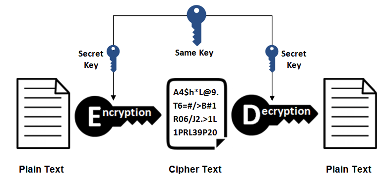


2. 非对称密钥加密

非对称密钥加密，又称公开密钥加密(Public-Key Encryption)，加密和解密使用不同的密钥。

公开密钥所有人都可以获得，通信发送方获得接收方的公开密钥之后，就可以使用公开密钥进行加密，接收方收到通信内容后使用私有密钥解密。

非对称密钥除了用来加密，还可以用来进行签名。因为私有密钥无法被其他人获取，因此通信发送方使用其私有密钥进行签名，通信接收方使用发送方的公开密钥对签名进行解密，就能判断这个签名是否正确。

- 优点: 可以更安全地将公开密钥传输给通信发送方；
- 缺点: 运算速度慢。


3. 【答案】HTTPs 采用的加密方式

HTTPs 采用混合的加密机制，使用非对称密钥加密用于传输对称密钥来保证传输过程的安全性，之后使用对称密钥加密进行通信来保证通信过程的效率。(下图中的 Session Key 就是对称密钥)


简化版本


> https数字证书交换的过程详细说一下？

数字证书认证机构(CA，Certificate Authority)是客户端与服务器双方都可信赖的第三方机构。

服务器的运营人员向 CA 提出公开密钥的申请，CA 在判明提出申请者的身份之后，会对已申请的公开密钥做数字签名，然后分配这个已签名的公开密钥，并将该公开密钥放入公开密钥证书后绑定在一起。

进行 HTTPs 通信时，服务器会把证书发送给客户端。客户端取得其中的公开密钥之后，先使用数字签名进行验证，如果验证通过，就可以开始通信了。

通信开始时，客户端需要使用服务器的公开密钥将自己的私有密钥传输给服务器，之后再进行对称密钥加密。


> DNS解析过程，给个URL一层一层具体分析

.com.fi国际金融域名DNS解析的步骤一共分为9步，如果每次解析都要走完9个步骤，大家浏览网站的速度也不会那么快，现在之所以能保持这么快的访问速度，其实一般的解析都是跑完第4步就可以了。除非一个地区完全是第一次访问（在都没有缓存的情况下）才会走完9个步骤，这个情况很少。

- 1、本地客户机提出域名解析请求，查找本地HOST文件后将该请求发送给本地的域名服务器。
- 2、将请求发送给本地的域名服务器。
- 3、当本地的域名服务器收到请求后，就先查询本地的缓存。
- 4、如果有该纪录项，则本地的域名服务器就直接把查询的结果返回浏览器。
- 5、如果本地DNS缓存中没有该纪录，则本地域名服务器就直接把请求发给根域名服务器。
- 6、然后根域名服务器再返回给本地域名服务器一个所查询域（根的子域）的主域名服务器的地址。
- 7、本地服务器再向上一步返回的域名服务器发送请求，然后接受请求的服务器查询自己的缓存，如果没有该纪录，则返回相关的下级的域名服务器的地址。
- 8、重复第7步，直到找到正确的纪录。
- 9、本地域名服务器把返回的结果保存到缓存，以备下一次使用，同时还将结果返回给客户机。


注意事项：

**递归查询**：在该模式下DNS服务器接收到客户机请求，必须使用一个准确的查询结果回复客户机。如果DNS服务器本地没有存储查询DNS信息，那么该服务器会询问其他服务器，并将返回的查询结果提交给客户机。

**迭代查询**：DNS所在服务器若没有可以响应的结果，会向客户机提供其他能够解析查询请求的DNS服务器地址，当客户机发送查询请求时，DNS服务器并不直接回复查询结果，而是告诉客户机另一台DNS服务器地址，客户机再向这台DNS服务器提交请求，依次循环直到返回查询的结果为止。


# 系统设计

## 安全

> 讲讲JWT

JWT（Json Web Token）, 是为了在网络应用环境间传递声明而执行的一种基于JSON的开放标准。JWT一般被用来在身份提供者和服务提供者间传递被认证的用户身份信息，以便于从资源服务器获取资源，也可以增加一些额外的其它业务逻辑所必须的声明信息，该token也可直接被用于认证，也可被加密。


一般用它来替换掉Session实现数据共享。

使用基于 Token 的身份验证方法，在服务端不需要存储用户的登录记录。大概的流程是这样的：

- 1、客户端通过用户名和密码登录服务器；
- 2、服务端对客户端身份进行验证；
- 3、服务端对该用户生成Token，返回给客户端；
- 4、客户端将Token保存到本地浏览器，一般保存到cookie中；
- 5、客户端发起请求，需要携带该Token；
- 6、服务端收到请求后，首先验证Token，之后返回数据。


如上图为Token实现方式，浏览器第一次访问服务器，根据传过来的唯一标识userId，服务端会通过一些算法，如常用的HMAC-SHA256算法，然后加一个密钥，生成一个token，然后通过BASE64编码一下之后将这个token发送给客户端；客户端将token保存起来，下次请求时，带着token，服务器收到请求后，然后会用相同的算法和密钥去验证token，如果通过，执行业务操作，不通过，返回不通过信息。

可以对比下图session实现方式，流程大致一致。


**优点**：

- 无状态、可扩展 ：在客户端存储的Token是无状态的，并且能够被扩展。基于这种无状态和不存储Session信息，负载均衡器能够将用户信息从一个服务传到其他服务器上。
- 安全：请求中发送token而不再是发送cookie能够防止CSRF(跨站请求伪造)。
- 可提供接口给第三方服务：使用token时，可以提供可选的权限给第三方应用程序。
- 多平台跨域


JWT可以用在单点登录的系统中

传统的JavaWeb项目，利用HttpSession保存用户的登陆凭证。如果后端系统采用了负载均衡设计，当用户在A节点成功登陆，那么登陆凭证保存在A节点的HttpSession中。如果用户下一个请求被负载均衡到了B节点，因为B节点上面没有用户的登陆凭证，所以需要用户重新登录，这个体验太糟糕了。


如果用户的登陆凭证经过加密（`Token`）保存在客户端，客户端每次提交请求的时候，把`Token`上传给后端服务器节点。即便后端项目使用了负载均衡，每个后端节点接收到客户端上传的Token之后，经过检测，是有效的`Token`，于是就断定用户已经成功登陆，接下来就可以提供后端服务了。

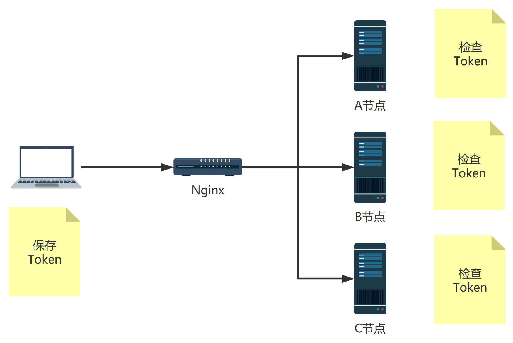

JWT兼容更多的客户端

传统的`HttpSession`依靠浏览器的`Cookie`存放`SessionId`，所以要求客户端必须是浏览器。现在的JavaWeb系统，客户端可以是浏览器、APP、小程序，以及物联网设备。为了让这些设备都能访问到JavaWeb项目，就必须要引入JWT技术。JWT的`Token`是纯字符串，至于客户端怎么保存，没有具体要求。只要客户端发起请求的时候，附带上`Token`即可。所以像物联网设备，我们可以用`SQLite`存储`Token`数据。


> RBAC是什么？怎么实现的？

RBAC的基本思想是，对系统操作的各种权限不是直接授予具体的用户，而是在用户集合与权限集合之间建立一个角色集合。每一种角色对应一组相应的权限。一旦用户被分配了适当的角色后，该用户就拥有此角色的所有操作权限。这样做的好处是，不必在每次创建用户时都进行分配权限的操作，只要分配用户相应的角色即可，而且角色的权限变更比用户的权限变更要少得多，这样将简化用户的权限管理，减少系统的开销。


RBAC模型中的权限是由模块和行为合并在一起而产生的，在MySQL中，有`模块表（tb_module）`和`行为表（tb_action）`，这两张表的记录合并在一起就行程了权限记录，保存在`权限表（tb_permission）`中。


现在知道了权限记录是怎么来的，下面我们看看怎么把权限关联到角色中。传统一点的做法是创建一个交叉表，记录角色拥有什么权限。但是现在`MySQL5.7`之后引入了`JSON`数据类型，所以我在`角色表（tb_role）`中设置的permissions字段，类型是JSON格式的。


到目前为止，JSON类型已经支持索引机制，所以我们不用担心存放在JSON字段中的数据检索速度慢了。MySQL为JSON类型配备了很多函数，我们可以很方便的读写JSON字段中的数据。

接下来我们看看角色是怎么关联到用户的，其实我在`用户表（tb_user）`上面设置role字段，类型依旧是JSON的。这样我就可以把多个角色关联到某个用户身上了。


如何查询用户的权限列表？

```sql
<select id="searchUserPermissions" parameterType="int" resultType="String">
    SELECT p.permission_name
    FROM tb_user u
    JOIN tb_role r ON JSON_CONTAINS(u.role, CAST(r.id AS CHAR))
    JOIN tb_permission p ON JSON_CONTAINS(r.permissions, CAST(p.id AS CHAR))
    WHERE u.id = #{userId} AND u.status = 1;
</select>
```


## 设计模式

> 你能说说设计模式吗

24大设计模式和7个原则


7个原则

单一职责原则【SINGLE RESPONSIBILITY PRINCIPLE】: 一个类负责一项职责。

里氏替换原则【LISKOV SUBSTITUTION PRINCIPLE】: 继承与派生的规则。

依赖倒置原则【DEPENDENCE INVERSION PRINCIPLE】: 高层模块不应该依赖低层模块，二者都应该依赖其抽象；抽象不应该依赖细节；细节应该依赖抽象。即针对接口编程，不要针对实现编程。

接口隔离原则【INTERFACE SEGREGATION PRINCIPLE】: 建立单一接口，不要建立庞大臃肿的接口，尽量细化接口，接口中的方法尽量少。

迪米特法则【LOW OF DEMETER】: 低耦合，高内聚。

开闭原则【OPEN CLOSE PRINCIPLE】: 一个软件实体如类、模块和函数应该对扩展开放，对修改关闭。

组合/聚合复用原则【Composition/Aggregation Reuse Principle(CARP) 】: 尽量使用组合和聚合少使用继承的关系来达到复用的原则


24大设计模式


> 为什么设计模式更好，你能说说用和不用的区别吗


> 举个例子讲讲设计模式的好


> 设计模式？哪些框架有设计模式？每个模式是什么样的？


> 会什么设计模式，讲一下模板方法设计模式，应用


# 问题解答选取的github仓库

如果不是在github上查找到的答案会给予标注

1. https://github.com/Snailclimb/JavaGuide 「Java学习+面试指南」一份涵盖大部分 Java 程序员所需要掌握的核心知识。准备 Java 面试，首选 JavaGuide！ 
1. [Java 全栈知识体系](https://www.pdai.tech/)
1. https://github.com/rbmonster/learning-note java开发 面试八股文（个人的面试及工作总结）
1. https://github.com/CoderLeixiaoshuai/java-eight-part 『Java八股文』Java面试套路

