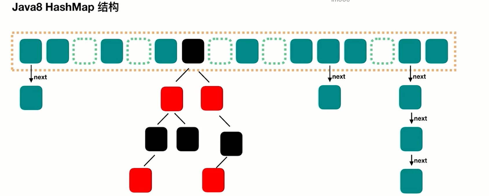

# 线程池
## 线程池的好处
* 加快响应速度
* 合理利用CPU和内存
* 统一管理

## 应用场景
* 服务器接受到大量请求（大大减少线程的创建和销毁次数）
* 需要创建5个以上的线程就可以使用线程池

## 创建线程池

### 参数
* corePoolSize 核心线程数
* maxPoolSize 最大线程数
* keepAliveTime 保持存活事件
* workQueue 任务存储队列
* threadFactory 线程工厂
* Handler 拒绝策略

### 添加线程规则
1. 如果线程数 < corePoolSize, 即使其他工作线程处于空闲状态，也会创建一个线程来运行新任务
2. 如果线程数 >= corePoolSize，但少于maximumPoolSize，则将任务放入队列
3. 如果队列已满，并且线程数 < maxPoolSize，则创建一个新线程来运行任务
4. 如果队列已满，并且线程数 > maxPoolSize，则拒绝该任务

### 添加线程顺序
* corePoolSize
* workQueue
* maxPoolSize

> 例子 核心池大小为5，最大池大小为10，队列为100  
因为线程中的请求最多会创建5个,然后任务将被添加到队列中，直到达到100。当队列已满时,将创建最新的线程maxPoolSize ,最多到10个线程,如果再来任务,就拒绝。

### 特点
1. 通过设置corePoolSize和maximumPoolSize相同,就可以 创建固定大小的线程池。
2. 线程池希望保持较少的线程数,并且只有在负载变得很大时才增加它。
3. 通过设置maximumPoolSize为很高的值,例如 Integer.MAX_ VALUE，可以允许线程池容纳任意数量的并发任务。
4. 是只有在队列填满时才创建多于corePoolSize的线程,所以如果你使用的是无界队列(例如LinkedBlockingQueue ) ,那么线程数就不会超过corePoolSize。

### newFixedThreadPool
由于传进去的LinkedBlockingQueue是没有容量上限的 所以当请求数越来越多, 并且无法及时处理完毕的时候， 也就是请求堆积的时候,会容易造成占用大量的内存,可能会导致OOM。
> 代码示例
```java
public class FixedThreadPoolOOM {
    private static ExecutorService executorService = Executors.newFixedThreadPool(1);

    public static void main(String[] args) {
        for (int i = 0; i < Integer.MAX_VALUE; i++) {
            executorService.execute(new SubThread());
        }
    }
}

class SubThread implements Runnable{

    @Override
    public void run() {
        try {
            Thread.sleep(10000000);
        } catch (InterruptedException e) {
            e.printStackTrace();
        }
    }
}
```

> 结果
> Exception in thread "main" java.lang.OutOfMemoryError: GC overhead limit exceeded

### newSingleThreadExecutor
可以看出,这里和刚才的newFixedThreadPool的原理基本一样,只不过把线程数直接设置成了1 ,所以这也会导致同样的问题,也就是当请求堆积的时候，可能会占用大量的内存。

> 代码示例
```java
public class SingleThreadExecutor {

    public static void main(String[] args) {
        ExecutorService executorService = Executors.newSingleThreadExecutor();
        for (int i = 0; i < 1000; i++) {
            executorService.execute(new Task());
        }
    }
}
```

> 结果  
```text
pool-1-thread-1  
pool-1-thread-1  
pool-1-thread-1  
pool-1-thread-1  
pool-1-thread-1  
pool-1-thread-1  
pool-1-thread-1
```

### newCachedThreadPool
这里的弊端在于第二个参数maximumPoolSize被设置为了Integer.MAX_ _VALUE ,这可能会创建数量非常多的线程,甚至导致OOM。

> 代码示例
```java
public class CacheThreadPool {

    public static void main(String[] args) {
        ExecutorService executorService = Executors.newCachedThreadPool();
        for (int i = 0; i < 1000; i++) {
            executorService.execute(new Task());
        }
    }
}
```
可以从源码看到,它设置默认的最大为Integer的最大值
```java
public static ExecutorService newCachedThreadPool() {
        return new ThreadPoolExecutor(0, Integer.MAX_VALUE,
                                      60L, TimeUnit.SECONDS,
                                      new SynchronousQueue<Runnable>());
    }
```

### ScheduledThreadPool
* 支持定时、周期性任务执行的线程池

> 代码示例
```java
public class ScheduledThreadPoolTest {

    public static void main(String[] args) {
        ScheduledExecutorService threadPool = Executors.newScheduledThreadPool(10);
//        threadPool.schedule(new Task(), 5, TimeUnit.SECONDS);
        threadPool.scheduleAtFixedRate(new Task(), 1, 3, TimeUnit.SECONDS);
    }
}
```

### 总结

| Paramter      | FixedThreadPool      | CachedThreadPool  | ScheduledThreadPool | SingleThreadPool |
| ------------- | -------------------- | ----------------- | ------------------- | ---------------- |
| corePoolSize  | constructor-arg      | 0                 | constructor-arg     | 1                |
| maxPoolSize   | same as corePoolSize | Integer.MAX_VALUE | Integer.MAX_VALUE   | 1                |
| keepAliveTime | 0 seconds            | 60 seconds        | 60 seconds          | 0 seconds        |


## 线程池里的线程数量设定为多少比较合适
* CPU密集型(加密、计算hash等) : 最佳线程数为CPU核心数的1-2倍左右。
* 耗时IO型(读写数据库、文件、网络读写等) : 最佳线程数一般会大于cpu核心数很多倍,以JVM线程监控显示繁忙情况为依据,保证线程空闲可以衔接上，参考Brain Goetz推荐的计算方法:
  * 线程数=CPU核心数* ( 1+平均等待时间/平均工作时间)


## 阻塞队列分析

FixedThreadPool和SingleThreadPool是LinkedBlockingQueue


## 停止线程池的正确方法

### shutdown

> 代码示例

```java
public class ShutDown {

    public static void main(String[] args) throws InterruptedException  {
        ExecutorService exectorService = Executors.newFixedThreadPool(10);
        for (int i = 0; i < 1000; i++) {
            exectorService.execute(new ShutDownTask());
        }
        Thread.sleep(1500);
        exectorService.shutdown();
    }
}

class ShutDownTask implements Runnable {
    @Override
    public void run() {
        try {
            Thread.sleep(500);
            System.out.println(Thread.currentThread().getName());
        } catch (InterruptedException e) {
            e.printStackTrace();
        }
    }
}
```

> 运行结果

可以看到进程一直在运行，在1.5s后并没有停止

```
pool-1-thread-1
pool-1-thread-5
pool-1-thread-8
pool-1-thread-6
pool-1-thread-10
pool-1-thread-3
pool-1-thread-9
pool-1-thread-2
pool-1-thread-7
pool-1-thread-7
pool-1-thread-5
pool-1-thread-9
pool-1-thread-1
..............
```


> 对代码进行改进，在main方法停止线程的后面加入

```
Thread.sleep(1500);
exectorService.shutdown();
exectorService.execute(new ShutDownTask())
```

可以看到成功触发了

```
pool-1-thread-3
pool-1-thread-1
pool-1-thread-4
pool-1-thread-2
pool-1-thread-7
pool-1-thread-9
pool-1-thread-10
pool-1-thread-5
pool-1-thread-6
Exception in thread "main" java.util.concurrent.RejectedExecutionException: Task threadpool.ShutDownTask@4b67cf4d rejected from java.util.concurrent.ThreadPoolExecutor@7ea987ac[Shutting down, pool size = 10, active threads = 10, queued tasks = 970, completed tasks = 20]
	at java.util.concurrent.ThreadPoolExecutor$AbortPolicy.rejectedExecution(ThreadPoolExecutor.java:2063)
	at java.util.concurrent.ThreadPoolExecutor.reject(ThreadPoolExecutor.java:830)
	at java.util.concurrent.ThreadPoolExecutor.execute(ThreadPoolExecutor.java:1379)
	at threadpool.ShutDown.main(ShutDown.java:15)
```


### isShutdown

调用shutdown()或shutdownNow()方法后返回为true。

> 那有没有什么办法可以在不创建新线程的条件下停止

```java
Thread.sleep(1500);
exectorService.shutdown();
System.out.println(exectorService.isShutdown());
//        exectorService.execute(new ShutDownTask());
```

可以看到，在打印了已经停止了之后线程还在进行，而是说明开始结束已经返回true了

```
pool-1-thread-4
pool-1-thread-5
pool-1-thread-9
true
pool-1-thread-4
pool-1-thread-8
pool-1-thread-7
```


### isTerminated

* 调用shutdown()方法后，并且所有提交的任务完成后返回为true
* 调用shutdownNow()方法后，成功停止后返回为true

> 再次对main进行修改

```java
public static void main(String[] args) throws InterruptedException {
    ExecutorService exectorService = Executors.newFixedThreadPool(10);
    for (int i = 0; i < 100; i++) {
        exectorService.execute(new ShutDownTask());
    }
    Thread.sleep(1500);
    exectorService.shutdown();
    //        System.out.println(exectorService.isShutdown());
    System.out.println(exectorService.isTerminated());
    Thread.sleep(10000);
    System.out.println(exectorService.isTerminated());
    //        exectorService.execute(new ShutDownTask());
}
```

可以看到第一个isTerminated返回false

```
pool-1-thread-9
pool-1-thread-6
false
pool-1-thread-6
pool-1-thread-10
```

第二个isTerminated返回true

```
pool-1-thread-8
pool-1-thread-4
pool-1-thread-3
pool-1-thread-7
true
```


> 注：当需要用到isTerminated()函数判断线程池中的所有线程是否执行完毕时候，不能直接使用该函数，必须在shutdown()方法关闭线程池之后才能使用，否则isTerminated()永不为TRUE，线程将一直阻塞在该判断的地方，导致程序最终崩溃。


### awaitTermination

1️⃣如果等待的时间超过指定的时间，但是线程池中的线程运行完毕，那么awaitTermination()返回true。执行分线程已结束。

2️⃣如果等待的时间超过指定的时间，但是线程池中的线程未运行完毕，那么awaitTermination()返回false。不执行分线程已结束。

3️⃣如果等待时间没有超过指定时间，等待！


> 程序未执行完 -- 返回false

```java
public class ShutDown {

    public static void main(String[] args) throws InterruptedException {
        ExecutorService exectorService = Executors.newFixedThreadPool(10);
        for (int i = 0; i < 100; i++) {
            exectorService.execute(new ShutDownTask());
        }
        Thread.sleep(1500);
        exectorService.shutdown();
        boolean b = exectorService.awaitTermination(3L, TimeUnit.SECONDS);
        System.out.println(b);
    }
}

class ShutDownTask implements Runnable {
    @Override
    public void run() {
        try {
            Thread.sleep(500);
            System.out.println(Thread.currentThread().getName());
        } catch (InterruptedException e) {
            e.printStackTrace();
        }
    }
}
```

```
pool-1-thread-1
pool-1-thread-6
false
pool-1-thread-6
pool-1-thread-5
```


> 程序执行完 -- 返回true

```java
public class ShutDown {

    public static void main(String[] args) throws InterruptedException {
        ExecutorService exectorService = Executors.newFixedThreadPool(10);
        for (int i = 0; i < 100; i++) {
            exectorService.execute(new ShutDownTask());
        }
        Thread.sleep(1500);
        exectorService.shutdown();
        boolean b = exectorService.awaitTermination(5L, TimeUnit.SECONDS);
        System.out.println(b);
    }
}

class ShutDownTask implements Runnable {
    @Override
    public void run() {
        try {
            Thread.sleep(500);
            System.out.println(Thread.currentThread().getName());
        } catch (InterruptedException e) {
            e.printStackTrace();
        }
    }
}
```


```java
..........
pool-1-thread-2
pool-1-thread-3
pool-1-thread-6
pool-1-thread-8
pool-1-thread-1
pool-1-thread-7
true
```


### shutdownNow

```java
public class ShutDown {

    public static void main(String[] args) throws InterruptedException {
        ExecutorService exectorService = Executors.newFixedThreadPool(10);
        for (int i = 0; i < 100; i++) {
            exectorService.execute(new ShutDownTask());
        }
        Thread.sleep(1500);
        List<Runnable> runnables = exectorService.shutdownNow();
    }
}

class ShutDownTask implements Runnable {
    @Override
    public void run() {
        try {
            Thread.sleep(500);
            System.out.println(Thread.currentThread().getName());
        } catch (InterruptedException e) {
            System.out.println(Thread.currentThread().getName() + "被中断了");
        }
    }
}
```


## 拒绝策略

* AbortPolicy
* DiscardPolicy
* DiscardOldestPolicy\
* CallerRunsPolicy

> 代码示例

```java
public class PauseableThreadPool  extends ThreadPoolExecutor {

    private boolean isPaused;
    private final ReentrantLock lock = new ReentrantLock();
    private Condition unpaused = lock.newCondition();

    public PauseableThreadPool(int corePoolSize, int maximumPoolSize, long keepAliveTime, TimeUnit unit, BlockingQueue<Runnable> workQueue) {
        super(corePoolSize, maximumPoolSize, keepAliveTime, unit, workQueue);
    }

    public PauseableThreadPool(int corePoolSize, int maximumPoolSize, long keepAliveTime, TimeUnit unit, BlockingQueue<Runnable> workQueue, ThreadFactory threadFactory) {
        super(corePoolSize, maximumPoolSize, keepAliveTime, unit, workQueue, threadFactory);
    }

    public PauseableThreadPool(int corePoolSize, int maximumPoolSize, long keepAliveTime, TimeUnit unit, BlockingQueue<Runnable> workQueue, RejectedExecutionHandler handler) {
        super(corePoolSize, maximumPoolSize, keepAliveTime, unit, workQueue, handler);
    }

    public PauseableThreadPool(int corePoolSize, int maximumPoolSize, long keepAliveTime, TimeUnit unit, BlockingQueue<Runnable> workQueue, ThreadFactory threadFactory, RejectedExecutionHandler handler) {
        super(corePoolSize, maximumPoolSize, keepAliveTime, unit, workQueue, threadFactory, handler);
    }

    @Override
    protected void beforeExecute(Thread t, Runnable r) {
        super.beforeExecute(t, r);
        lock.lock();
        try {
            while (isPaused) {
                unpaused.await();
            }
        } catch(InterruptedException e) {
            e.printStackTrace();
        } finally {
            lock.unlock();
        }
    }

    private void pause() {
        lock.lock();
        try {
            isPaused = true;
        } finally {
            lock.unlock();
        }
    }

    public void resume() {
        lock.lock();
        try {
            isPaused = false;
            unpaused.signalAll();
        } finally {
            lock.unlock();
        }
    }

    public static void main(String[] args) {
        PauseableThreadPool pool = new PauseableThreadPool(10, 20, 10L, TimeUnit.SECONDS, new LinkedBlockingDeque<>());
        Runnable runnable = new Runnable() {
            @Override
            public void run() {
                System.out.println("我被执行了");
                try {
                    Thread.sleep(10);
                } catch (InterruptedException e) {
                    e.printStackTrace();
                }
            }
        };
        for (int i = 0; i < 10000; i++) {
            pool.execute(runnable);
        }
        try {
            Thread.sleep(1500);
        } catch (InterruptedException e) {
            e.printStackTrace();
        }
        pool.pause();
        System.out.println("线程池被暂停了");
    }
}
```


## 线程池组成部分

* 线程池管理器
* 工作线程
* 任务队列
* 任务接口


### Executor家庭

* Executor
* ExecutorService
* Executors 工具类


## 线程池状态

* **RUNNING** 接受新任务并处理排队任务
* **SHUTDOWN** 不接受新任务，但处理排队任务
* **STOP** 不接受新任务，也不处理排队任务，并中断正在进行的任务
* **TIDYING** 所有任务都已终止，workerCount为0时，线程会转换到TIDYING状态，并将运行terminate()钩子方法
* **TERMINATED** terminate()运行完成


## 使用线程池的注意点

* 避免任务堆积
  * 任务特别多，对于多任务来者不拒的话如newFixedThreadPool，所有任务都可以放进去，那么任务越来越多就会导致内存不够
* 避免线程数过渡增加
* 排查线程泄漏


# ThreadLocal


## 两大使用场景

* 场景1：每个线程需要一个独享的对象（通常是工具类，典型需要使用类有SimpleDateFormat和Random）
* 场景2：每个线程内需要保存全局变量（例如在拦截器中获取用户信息），可以让不同方法直接使用，避免参数传递

### 场景1：每个线程需要一个独享的对象

通俗解释：教材只有一本，一起做笔记会导致线程安全问题。复印后就没有问题


> 代码示例

如果有两个线程想要用一个工具类`SimpleDateFormat`会怎样？


```java
public class ThreadLocalNormalUsage00 {

    public static void main(String[] args) {
        new Thread(new Runnable() {
            @Override
            public void run() {
                String date = new ThreadLocalNormalUsage00().date(10);
                System.out.println(date);
            }
        }).start();

        new Thread(new Runnable() {
            @Override
            public void run() {
                String date = new ThreadLocalNormalUsage00().date(104707);
                System.out.println(date);
            }
        }).start();
    }

    public String date(int seconds) {
        // 参数的单位是毫秒，从1970.1.1 00:00:00 GMT计时
        Date date = new Date(1000 * seconds);
        SimpleDateFormat dateFormat = new SimpleDateFormat("yyyy-MM-dd hh:mm:ss");
        return dateFormat.format(date);
    }
}
```

可以发现是正常打印的

```
1970-01-02 01:05:07
1970-01-01 08:00:10
```


> 升级需求：10个线程解决1000个任务

```java
/**
 * 描述： 1000个打印日期的任务，用线程池来执行
 */
public class ThreadLocalNormalUsage02 {

    public static ExecutorService threadPool = Executors.newFixedThreadPool(10);

    public static void main(String[] args) throws InterruptedException {

        for (int i = 0; i < 1000; i++) {
            int finalI = i;
            threadPool.submit(new Runnable() {
                @Override
                public void run() {
                    String date = new ThreadLocalNormalUsage02().date(finalI);
                    System.out.println(date);
                }
            });
        }
        threadPool.shutdown();
    }

    public String date(int seconds) {
        // 参数的单位是毫秒，从1970.1.1 00:00:00 GMT计时
        Date date = new Date(1000 * seconds);
        SimpleDateFormat dateFormat = new SimpleDateFormat("yyyy-MM-dd hh:mm:ss");
        return dateFormat.format(date);
    }
}
```

但是有一个问题是，1000个任务就会创建1000个dateFormat造成资源浪费，那么就可以把dateFormat换成静态方法，所有线程都只用一个dateFormat

```java
/**
 * 描述： 1000个打印日期的任务，用线程池来执行
 */
public class ThreadLocalNormalUsage03 {

    public static ExecutorService threadPool = Executors.newFixedThreadPool(10);

    static SimpleDateFormat dateFormat = new SimpleDateFormat("yyyy-MM-dd hh:mm:ss");

    public static void main(String[] args) throws InterruptedException {

        for (int i = 0; i < 1000; i++) {
            int finalI = i;
            threadPool.submit(new Runnable() {
                @Override
                public void run() {
                    String date = new ThreadLocalNormalUsage03().date(finalI);
                    System.out.println(date);
                }
            });
        }
        threadPool.shutdown();
    }

    public String date(int seconds) {
        // 参数的单位是毫秒，从1970.1.1 00:00:00 GMT计时
        Date date = new Date(1000 * seconds);
        return dateFormat.format(date);
    }
}
```

但是会发现打印的内容会有重复的

```
1970-01-01 08:15:11
1970-01-01 08:15:11
```

主要问题是在`dateFormat.format(date);` 所以把这行代码提取出来，然后使用`synchronized`加锁


> 更好的解决方案 -- ThreadLocal

创建方式为：

1. `public ThreadLocal<xxx> dateFormatThreadLocal = new ThreadLocal<xxx>()`, 接着在实例中Override -- initialValue
2. lambda写法：`public static ThreadLocal<SimpleDateFormat> dateFormatThreadLocal2 = ThreadLocal.withInitial(() -> xxx) `

```java
/**
 * 描述： 利用ThreadLocal给每个线程分配自己的dateformat对象，保证了线程安全，高效利用内存
 */
public class ThreadLocalNormalUsage05 {

    public static ExecutorService threadPool = Executors.newFixedThreadPool(10);

    public static void main(String[] args) throws InterruptedException {

        for (int i = 0; i < 1000; i++) {
            int finalI = i;
            threadPool.submit(new Runnable() {
                @Override
                public void run() {
                    String date = new ThreadLocalNormalUsage05().date(finalI);
                    System.out.println(date);
                }
            });
        }
        threadPool.shutdown();
    }

    public String date(int seconds) {
        // 参数的单位是毫秒，从1970.1.1 00:00:00 GMT计时
        Date date = new Date(1000 * seconds);
//        SimpleDateFormat dateFormat = ThreadSafeFormatter.dateFormatThreadLocal.get();
        SimpleDateFormat dateFormat2 = ThreadSafeFormatter.dateFormatThreadLocal2.get();
        return dateFormat2.format(date);
    }
}

class ThreadSafeFormatter {
    public static ThreadLocal<SimpleDateFormat> dateFormatThreadLocal = new ThreadLocal<SimpleDateFormat>() {
        @Override
        protected SimpleDateFormat initialValue() {
            return new SimpleDateFormat("yyyy-MM-dd hh:mm:ss");
        }
    };

    // 写法2：lambda
    public static ThreadLocal<SimpleDateFormat> dateFormatThreadLocal2 = ThreadLocal
            .withInitial(() -> new SimpleDateFormat("yyyy-MM-dd hh:mm:ss"));
}
```


### 小结

演变过程

1. 2个线程分别用自己的SimpleDateFormat
2. 延伸出10个，10个线程和10个SimpleDateFormat，写法不优雅
3. 当需求变为1000个，那么必须使用线程池
4. 所有线程都共有同一个SimpleDateFormat对象
   1. 发现线程不安全，出现了并发安全问题
5. 选择加锁，加锁后结果正常，但效率太低
   1. 解决方案ThreadLocal
   2. lambda表达式写法


### 场景2：每个线程内需要保存全局变量

主要是避免经常创建参数


#### 方法

* 用ThreadLocal保存一些业务内容（用户权限信息、从用户系统获取到的用户名、user ID等）
* 这些信息在同一个线程内相同，但是不同的线程使用的业务内容是不相同的
* 在线程生命周期内，都通过这个静态ThreadLocal实例的get()方法取得自己set过的对象，避免了将这个对象（例如user对象）作为参数传递的麻烦


> 想法：当前用户信息需要被线程内所有方法共享

当多线程同时工作时，我们需要保证线程安全，可以用synchronized，也可以使用ConcurrentHashMap，但无论用什么都会对性能有所影响


更好的办法是使用ThreadLocal，无需synchronized，可以在不影响性能的情况下，也无需层层传递参数，就可以到保存当前线程对应的用户信息的目的


#### 代码示例

```java
/**
 * 描述：演示ThreadLocal用法2：避免传递参数的麻烦
 */
public class ThreadLocalNormalUsage06 {

    public static void main(String[] args) {
        new Service1().process();
    }
}

class Service1 {

    public void process() {
        User user = new User("超哥");
        UserContextHolder.holder.set(user);
        new Service2().process();
    }
}

class Service2 {

    public void process() {
        User user = UserContextHolder.holder.get();
        System.out.println("Service2拿到用户名：" + user.name);
        new Service3().process();
    }
}

class Service3 {

    public void process() {
        User user = UserContextHolder.holder.get();
        System.out.println("Service3拿到用户名：" + user.name);
    }
}

class UserContextHolder {
    public static ThreadLocal<User> holder = new ThreadLocal<>();
}

class User {
    String name;

    public User(String name) {
        this.name = name;
    }
}
```


## 作用

1. 让某个需要用到的对象在线程间隔离（每个线程都有自己的独立的对象）
2. 在任何方法中都可以轻松获取到该对象
   1. 例如场景2的 `UserContextHolder.holder.get();`
   2. 场景1的 `ThreadSafeFormatter.dateFormatThreadLocal2.get();`


## 总结

* 场景1：`initialValue` 在ThreadLocal第一次get的时候把对象初始化出来，对象的初始化时机可以由我们控制
* 场景2：`set` 如果需要保存到ThreadLocal里的对象的生成时机不由我们随意控制，例如拦截器生成的用户信息，用ThreadLocal.set直接放到我们的ThreadLocal中去，以便后续使用


## 好处

* 线程安全
* 不需要加锁，提高执行效率
* 更高效地利用内存、节省开销
* 免去传参的繁琐：无论是场景一的工具类，还是场景二的用户名，都可以在任何地方直接通过ThreadLocal拿到，再也不需要每次都传同样的参数。ThreadLocal使得代码耦合度更低，更优雅


## 源码分析


通过Shift + Shift可以找到`Thread`类，然后查找到ThreadLocalMap

```java
/* ThreadLocal values pertaining to this thread. This map is maintained
     * by the ThreadLocal class. */
ThreadLocal.ThreadLocalMap threadLocals = null;
```


### initialValue

1. 该方法会返回当前线程对应的 “初始值”，这是一个延迟加载的方法，只有在调用get的时候，才会触发
2. 当线程第一次使用get方法访问变量时，将调用此方法，除非线程先前调用了set方法，在这种情况下，不会为线程调用本initialValue

可以从以前的代码看到，方法重写了initialValue，然后通过get调用了initialValue：

```java
public T get() {
    Thread t = Thread.currentThread();
    ThreadLocalMap map = getMap(t);
    if (map != null) {
        ThreadLocalMap.Entry e = map.getEntry(this);
        if (e != null) {
            @SuppressWarnings("unchecked")
            T result = (T)e.value;
            return result;
        }
    }
    return setInitialValue();
}
```

再查看setInitialValue，可以看到这里调用了initialValue

```java
private T setInitialValue() {
    T value = initialValue();
    Thread t = Thread.currentThread();
    ThreadLocalMap map = getMap(t);
    if (map != null) {
        map.set(this, value);
    } else {
        createMap(t, value);
    }
    if (this instanceof TerminatingThreadLocal) {
        TerminatingThreadLocal.register((TerminatingThreadLocal<?>) this);
    }
    return value;
}
```

再点进去看可以看到它初始化是一个null

```java
protected T initialValue() {
	return null;
}
```


> 情况2：当你已经set过了

在之前的`setInitialValue`方法就可以看到

```java
if (map != null) {
    ThreadLocalMap.Entry e = map.getEntry(this);
    if (e != null) {
        @SuppressWarnings("unchecked")
        T result = (T)e.value;
        return result;
    }
}
```


### get

> Returns the value in the current thread's copy of this thread-local variable.  If the variable has no value for the current thread, it is first initialized to the value returned by an invocation of the {@link #initialValue} method.
> @return the current thread's value of this thread-local
>
> 返回此线程局部变量的当前线程副本中的值。 如果变量没有当前线程的值，则首先将其初始化为调用 {@link #initialValue} 方法返回的值。
>
> @返回此线程本地的当前线程的值

```java
public T get() {
    Thread t = Thread.currentThread();
    ThreadLocalMap map = getMap(t);
    if (map != null) {
        ThreadLocalMap.Entry e = map.getEntry(this);
        if (e != null) {
            @SuppressWarnings("unchecked")
            T result = (T)e.value;
            return result;
        }
    }
    return setInitialValue();
}
```

1. 获取到当前线程
2. 看当前线程有没有获取到`ThreadLocalMap`

```java
ThreadLocalMap getMap(Thread t) {
    return t.threadLocals;
}
```

```java
/* ThreadLocal values pertaining to this thread. This map is maintained
     * by the ThreadLocal class. */
    ThreadLocal.ThreadLocalMap threadLocals = null;
```

可以看到返回的是一个线程都拥有的threadlocal

3. 就会判断当前线程有没有初始化过
   1. 如果没有初始化过就`setInitialValue`
   2. 如果初始化过
      1. 就先找到当前的threadlocal作为key，找到对应的值，那个值就是set进去的值，就拿到下图中ThreadLocal1右边的那个值
         1. this当前引用（threadlocal类）
         2. 返回e，e是一个Entry
      2. 然后就会得到一个result（对应的就是场景1的SimpleDateFormat；场景2的user）


### set

> ```
> Sets the current thread's copy of this thread-local variable to the specified value.  Most subclasses will have no need to override this method, relying solely on the {@link #initialValue} method to set the values of thread-locals.
> @param value the value to be stored in the current thread's copy of this thread-local.
> ```
>
> 将此线程局部变量的当前线程副本设置为指定值。 大多数子类不需要重写此方法，仅依靠 {@link #initialValue} 方法来设置线程局部变量的值。
>
> @参数 value 要存储在此线程本地的当前线程副本中的值。

```java
public void set(T value) {
    Thread t = Thread.currentThread();
    ThreadLocalMap map = getMap(t);
    if (map != null) {
        map.set(this, value);
    } else {
        createMap(t, value);
    }
}
```

1. 拿到当前线程的引用
2. 拿到ThreadLocalMap
3. 如果当前map不为空
   1. this是当前threadLocal
   2. value当前所想保存的值
4. 如果为空就创建一个map

```java
void createMap(Thread t, T firstValue) {
    t.threadLocals = new ThreadLocalMap(this, firstValue);
}
```


### remove

>     /**
>      * Removes the current thread's value for this thread-local
>      * variable.  If this thread-local variable is subsequently
>      * {@linkplain #get read} by the current thread, its value will be
>      * reinitialized by invoking its {@link #initialValue} method,
>      * unless its value is {@linkplain #set set} by the current thread
>      * in the interim.  This may result in multiple invocations of the
>      * {@code initialValue} method in the current thread.
>      *
>      * @since 1.5
>      */
>      删除此线程局部变量的当前线程值。 如果这个线程局部变量随后被当前线程 {@linkplain #get read}，它的值将通过调用它的 {@link #initialValue} 方法重新初始化，除非它的值是当前线程的 {@linkplain #set set} 在此期间线程。 这可能会导致在当前线程中多次调用 {@code initialValue} 方法。

```java
public void remove() {
    ThreadLocalMap m = getMap(Thread.currentThread());
    if (m != null) {
        m.remove(this);
    }
}
```

1. 获取到当前线程，接着传入当前线程，获取ThreadLocalMap
2. 判断是否为空，如果不为空，注意这里的删除不是删除全部ThreadLocalMap的值，而是传入this这个引用的值（某个ThreadLocal）那么它就不会删除全部，而是删除指定ThreadLocal的值


### ThreadLocalMap类

ThreadLocalMap类，也就是Thread.threadLocals

ThreadLocalMap类是每个线程Thread类里面的变量，里面最重要的是一个键值对数组Entry[] table ，可以认为是一个map,键值对：

* 键：这个ThreadLocal
* 值：实际需要的成员变量，比如user或者simpleDateFormat对象


这个类最最要的属性：

> private Entry[] table;


冲突：hashmap

java8 HashMap结构



**ThreadLocalMap采用的线性探测法**，也就是如果发生冲突，就继续找下一个空位置，而不是用链表拉链


## 主要方法

* T `initialValue`() 初始化
* void `set`(T t) 为这个线程设置一个新值
* T `get`() 得到这个线程对应的value。如果是首次调用get，则会调用这个initialize来得到这个值
* void `remove`() 删除对应这个线程的值


## 两种场景的总结

* 通过源码分析可以看出, setInitialValue和直接set最后都是利用map.set()方法来设置值
* 也就是说,最后都会对应到ThreadLocalMap的一个Entry ,只不过是起点和入口不一-样


## 注意点

> 内存泄露

