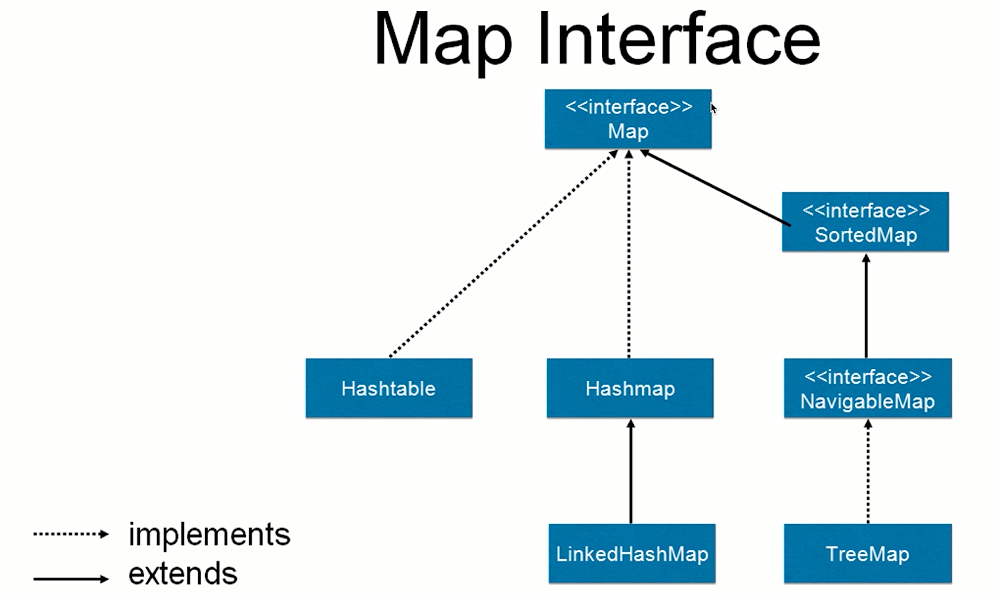
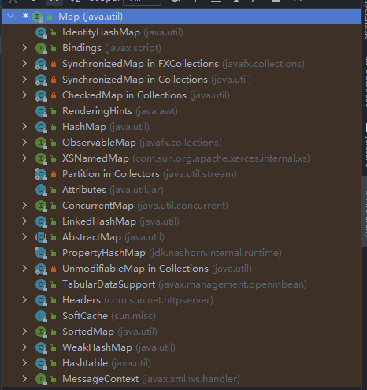
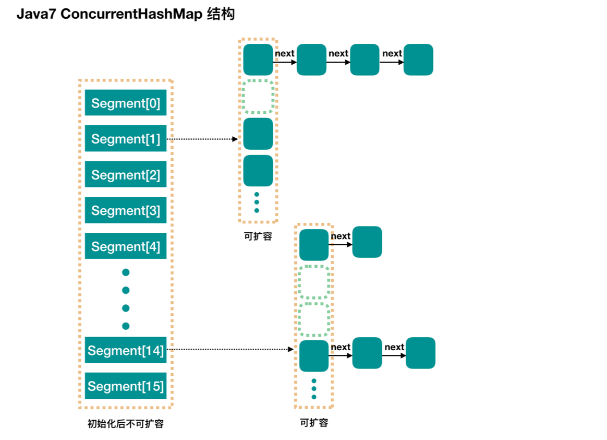

# 并发容器

概览

* **ConcurrentHashMap**：线程安全的HashMap
* **CopyOnWriteArrayList**：线程安全的List
* **BlockingQueue**：这是一个接口，表示阻塞队列，非常适合用于作为数据共享的队列
* ConcurrentLinkedQueue：高效的非阻塞并发队列，使用链表实现，可以看做一个线程安全的LinkedList

不常用的

* ConcurrentSkipListMap：是一个Map，使用跳表的数据结构进行快速查找


## 追溯历史

可以看到以前的并发容器：Vector和Hashtable

* 大幅度使用了`synchronized`所以导致了性能不好


## 前身：同步的HashMap和ArrayList

ArrayList原本是线程不安全的，那么如何将其更改为线程安全的呢？

```java
public class SynList {

    public static void main(String[] args) {
        List<Integer> list = Collections.synchronizedList(new ArrayList<Integer>());

        list.add(5);

        System.out.println(list.get(0));

    }
}
```

如何查看是怎样实现的呢？但是这样的实现效果也不尽人意

`Collections.synchronizedList(new ArrayList<Integer>());` --> `new SynchronizedRandomAccessList<>(list) :` -->   `extends SynchronizedList<E>` -->  `extends SynchronizedCollection<E>` 


经过上述的迭代就有了现在`ConcurrentHashMap`和`CopyOnWriteArrayList`

绝大多数并发情况下，ConcurrentHashMap和CopyOnWriteArrayList的性能都要更好


## Map简介

Map的接口






* HashMap
* Hashtable
* LinkedHashMap
* TreeMap


### HashMap

为什么HashMap是线程不安全的？

* 同时put碰撞导致数据丢失
* 同时put扩容导致数据丢失
* 死循环造成的CPU100%（主要存在于JDK7中）


如何更改JDK版本进行调试？

Project Settings （另外，如果可以针对每个module设置JDK版本，也是在project settings里面）


特点：

1. 非线程安全
2. 迭代时不允许修改内容
3. 只读的并发是安全的
4. 如果一定要把HashMap用在并发环境，用`Collections.synchronizedMap(new HashMap)`


## ConcurrentHashMap


### JDK 1.7

* Java 7中的ConcurrentHashMap最外层是多个segment ,每个segment的底层数据结构与HashMap类似,仍然是数组和链表组成的拉链法
* 每个segment独立上ReentrantLock锁,每个segment之间互不影响,提高了并发效率
* ConcurrentHashMap默认有16个Segments ,所以最多可以同时支持16个线程并发写(操作分别分布在不同的Segment上)。这个默认值可以在初始化的时候设置为其他值,但是一旦初始化以后,是不可以扩容的





### JDK1.8


两个重要的方法：

* put
* get


> putValue分析

1. 判断key value不为空

`if (key == null || value == null) throw new NullPointerException();`

2. 计算hash值

`int hash = spread(key.hashCode());`

3. 根据对应位置节点的类型来赋值，或者helpTransfer，或者增加链表，或者给红黑树增加节点

赋值

```java
else if ((f = tabAt(tab, i = (n - 1) & hash)) == null) {
                if (casTabAt(tab, i, null,
                             new Node<K,V>(hash, key, value, null)))
                    break;                   // no lock when adding to empty bin
            }
```

helpTransfer（MOVED -- 特殊节点）

```java
else if ((fh = f.hash) == MOVED)
    tab = helpTransfer(tab, f);
```

链表操作

```java
if (fh >= 0) {
    binCount = 1;
    for (Node<K,V> e = f;; ++binCount) {
        K ek;
        if (e.hash == hash &&
            ((ek = e.key) == key ||
             (ek != null && key.equals(ek)))) {
            oldVal = e.val;
            if (!onlyIfAbsent)
                e.val = value;
            break;
        }
        Node<K,V> pred = e;
        if ((e = e.next) == null) {
            pred.next = new Node<K,V>(hash, key,
                                      value, null);
            break;
        }
    }
}
```

红黑树

```java
else if (f instanceof TreeBin) {
    Node<K,V> p;
    binCount = 2;
    if ((p = ((TreeBin<K,V>)f).putTreeVal(hash, key,
                                          value)) != null) {
        oldVal = p.val;
        if (!onlyIfAbsent)
            p.val = value;
    }
}
```


4. 检查满足阈值就“红黑树化”

5. 返回oldVal

```java
if (binCount != 0) {
    if (binCount >= TREEIFY_THRESHOLD)
        treeifyBin(tab, i);
    if (oldVal != null)
        return oldVal;
    break;
}
```


> get流程

* 计算hash值

`int h = spread(key.hashCode());`

* 找到对应的位置，根据情况进行

```java
if ((eh = e.hash) == h) {
    if ((ek = e.key) == key || (ek != null && key.equals(ek)))
        return e.val;
}
```

* 直接取出

* 红黑树里找值

```java
else if (eh < 0)
    return (p = e.find(h, key)) != null ? p.val : null;
```

* 遍历链表取值

```java
while ((e = e.next) != null) {
    if (e.hash == h &&
        ((ek = e.key) == key || (ek != null && key.equals(ek))))
        return e.val;
}
```

* 回找到的结果


### 1.7和1.8区别

* 数据结构
  * 1.7：segment
  * 1.8：链表+红黑树
* Hash碰撞
  * 1.7：拉链法
  * 1.8：先拉链，达到条件转为红黑树
* 保证并发安全
* 查询复杂度
* 为什么超过8要转为红黑树？
  *  红黑树的每一个节点是链表空间的2倍，所以一开始使用占用空间更小的链表
  * 要达到红黑树为8其实很难，概率只有千万分之几


### 线程不安全的情况

`这样的例子不是表示concurrentHashMap不是线程安全，而是演示错误使用造成的线程不安全`

只能保证get、put的操作是线程安全的，如果在外边进行了线程不安全的操作再放进去那么就会造成线程不安全

```java
public class OptionsNotSafe implements Runnable {

    private static ConcurrentHashMap<String, Integer> scores = new ConcurrentHashMap<>();

    public static void main(String[] args) throws InterruptedException {
        scores.put("小明", 0);

        Thread t1 = new Thread(new OptionsNotSafe());
        Thread t2 = new Thread(new OptionsNotSafe());
        t1.start();
        t2.start();
        t1.join();
        t2.join();
        System.out.println(scores);
    }


    @Override
    public void run() {
        for (int i = 0; i < 1000; i++) {
            Integer score = scores.get("小明");
            Integer newScore = score + 1;
            scores.put("小明", newScore);
        }
    }
}
```

如何解决这样的困境呢？

把`scores.put("小明", newScore);` 替换为 `scores.replace("小明", score, newScore);`

