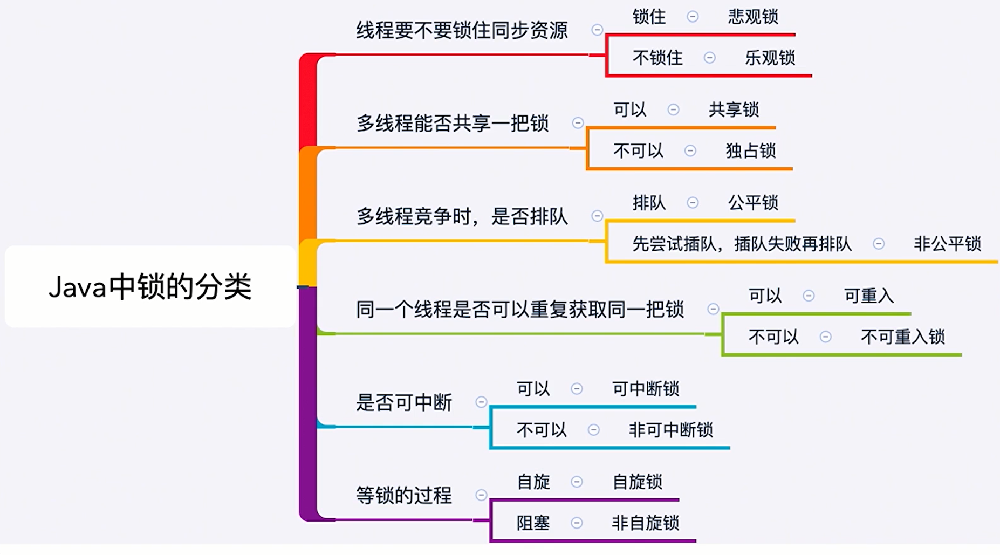

# 锁

## Lock
* lock()就是最普通的获取锁。如果锁已被其他线程获取,则进行等待 
* Lock不会像synchronized-样在异常时自动释放锁 
* 因此最佳实践是,在finally中释放锁,以保证发生异常时锁一定被释放 
* lock()方法不能被中断,这会带来很大的隐患:一旦陷入死锁, lock()就会陷入永久等待

> 代码演示
```java
/**
 * 描述：Lock不会像synchronized一样，异常的时候自动释放锁
 * 所以最佳实践是：finally中释放锁，以便保证发生异常的时候一定被释放
 */
public class MustUnlock {

    private static Lock lock = new ReentrantLock();

    public static void main(String[] args) {
        lock.lock();
        try {
            // 获取本锁保护的资源
            System.out.println(Thread.currentThread().getName() + "开始执行任务");
        } finally {
            lock.unlock();
        }
    }
}
```

## tryLock
* tryLock()用来尝试获取锁,如果当前锁没有被其他线程占用则获取成功,则返回true ,否则返回false ,代表获取锁失败
* 相比于lock ,这样的方法显然功能更强大了,我们可以根据是否能获取到锁来决定后续程序的行为 
* 该方法会立即返回,即便在拿不到锁时不会一直在那等

> 代码示例
```java
public class TryLockDeadlock implements Runnable{

    int flag = 1;
    static Lock lock1 = new ReentrantLock();
    static Lock lock2 = new ReentrantLock();

    public static void main(String[] args) {
        TryLockDeadlock r1 = new TryLockDeadlock();
        TryLockDeadlock r2 = new TryLockDeadlock();
        r1.flag = 1;
        r2.flag = 0;
        new Thread(r1).start();
        new Thread(r2).start();
    }

    @Override
    public void run() {
        for (int i = 0; i < 100; i++) {
            if (flag == 1) {
                try {
                    if (lock1.tryLock(800, TimeUnit.MILLISECONDS)) {
                        try {
                            System.out.println("线程1获取到了锁1");
                            Thread.sleep(new Random().nextInt(1000));
                            if (lock2.tryLock(800, TimeUnit.MILLISECONDS)) {
                                try {
                                    System.out.println("线程1获取到了锁2");
                                    System.out.println("线程1成功获取到了两把锁");
                                    break;
                                } finally {
                                    lock2.unlock();
                                }
                            } else {
                                System.out.println("线程1获取锁2失败，已重试");
                            }
                        } finally {
                            lock1.unlock();
                            Thread.sleep(new Random().nextInt(1000));
                        }
                    } else {
                        System.out.println("线程1获取锁1失败，已重试");
                    }
                } catch (InterruptedException e) {
                    e.printStackTrace();
                }
            }

            if (flag == 0) {
                try {
                    if (lock2.tryLock(3000, TimeUnit.MILLISECONDS)) {
                        try {
                            System.out.println("线程2获取到了锁2");
                            Thread.sleep(new Random().nextInt(1000));
                            if (lock1.tryLock(800, TimeUnit.MILLISECONDS)) {
                                try {
                                    System.out.println("线程2获取到了锁1");
                                    System.out.println("线程2成功获取到了两把锁");
                                    break;
                                } finally {
                                    lock1.unlock();
                                }
                            } else {
                                System.out.println("线程2获取锁1失败，已重试");
                            }
                        } finally {
                            lock2.unlock();
                            Thread.sleep(new Random().nextInt(1000));
                        }
                    } else {
                        System.out.println("线程2获取锁2失败，已重试");
                    }
                } catch (InterruptedException e) {
                    e.printStackTrace();
                }
            }
        }
    }
}
```

## 主要方法介绍
* tryLock(long time, TimeUnit unit)：超时就放弃
* lockInterruptibly()：相当于tryLock(long time, TimeUnit unit)把超时时间设置为无限。在等锁过程中，线程可以被中断
* unlock()：解锁


## 可见性保证
如果一个线程对于另外一个线程是可见的，那么这个线程的修改就能够被另一个线程立即感知到。

## 锁的分类


### 乐观锁和悲观锁

#### 悲观锁
如果我不锁住这个资源,别人就会来争抢,就会造成数据结果错误,所以每次悲观锁为了确保结果的正确性,会在每次获取并修改数据时,把数据锁住,让别人无法访问该数据,这样就可以确保数据内容万无一失

Java中的悲观锁的实现是synchronize和Lock相关类

两个线程都抢锁  --> 线程1抢到，线程2等待 --直到-->线程1释放锁，线程2拿到锁，执行完逻辑 --> 释放锁


#### 乐观锁
如果数据和我一开始拿到的不一样了,说明其他人在这段时间内改过数据,那我就不能继续刚才的更新数据过程了，我会选择放弃、报错、重试等策略

乐观锁的实现一般都是利用CAS算法来实现的

线程1和线程2直接获取资源并各自计算
* 线程1发现没人在甲酸期间修改资源，于是把自己的计算结果写到资源里
线程2计算完并判断资源是否已被修改
* 线程2发现在计算期间有人修改了资源，于是报错或重试

典型例子：原子类、并发容器等

#### 开销对比
悲观锁的原始开销要高于乐观锁,但是特点是一劳永逸 ,临界区持锁时间就算越来越差,也不会对互斥锁的开销造成影响

相反，虽然乐观锁一开始的开销比悲观锁小 ,但是如果自旋时间很长或者不停重试,那么消耗的资源也会越来越多

#### 使用场景
悲观锁:适合并发写入多的情况,适用于临界区持锁时间比较长的情况,悲观锁可以避免大量的无用自旋等消耗,典型情况:
1. 临界区有IO操作 
2. 临界区代码复杂或者循环量大 
3. 临界区竞争非常激烈

乐观锁:适合并发写入少,大部分是读取的场景,不加锁的能让读取性能大幅提高。

### 可重入锁和非可重入锁，ReentrantLock

> 代码示例1：电影院
由于上锁，线程必须一个一个等待
```java
public class CinemaBookSeat {

    private static ReentrantLock lock = new ReentrantLock();

    private static void bookSeat() {
        lock.lock();
        try {
            System.out.println(Thread.currentThread().getName() + "开始预定座位");
            Thread.sleep(1000);
            System.out.println(Thread.currentThread().getName() + "完成预定座位");
        } catch (InterruptedException e) {
            e.printStackTrace();
        } finally {
            lock.unlock();
        }
    }

    public static void main(String[] args) {
        new Thread(() ->bookSeat()).start();
        new Thread(() ->bookSeat()).start();
        new Thread(() ->bookSeat()).start();
        new Thread(() ->bookSeat()).start();
    }
}
```


> 代码示例2：打印字符串
如果不使用锁，多个线程会发生顺序错乱
```java
public class LockDemo {

    public static void main(String[] args) {
        new LockDemo().init();
    }

    private void init() {
        final Outputer outputer = new Outputer();
        new Thread(new Runnable() {
            @Override
            public void run() {
                while (true) {
                    try {
                        Thread.sleep(5);
                    } catch (InterruptedException e) {
                        e.printStackTrace();
                    }
                    outputer.output("悟空");
                }
            }
        }).start();

        new Thread(new Runnable() {
            @Override
            public void run() {
                while (true) {
                    try {
                        Thread.sleep(5);
                    } catch (InterruptedException e) {
                        e.printStackTrace();
                    }
                    outputer.output("大师兄");
                }
            }
        }).start();
    }

    static class Outputer {
        Lock lock = new ReentrantLock();

        public void output(String name) {

            int len = name.length();
//            lock.lock();
            try {
                for (int i = 0; i < len; i++) {
                    System.out.print(name.charAt(i));
                }
                System.out.println("");
            } finally {
//                lock.unlock();
            }
        }
    }
}
```

可以看到如果不使用锁的话会出现，排列组合的情况
```text
大师兄
悟空
大师兄
大师悟空
兄
```

#### 可重入性质
可重入就是说某个线程已经获得某个锁，可以再次获取锁而不会出现死锁
* 避免死锁
* 提升封装性


#### ReentrantLock的其他方法（不常用）
isHeldByCurrentThread 可以看出锁是否被当前线程持有

getQueueLength可以返回当前正在等待这把锁的队列有多长，一般这两个方法时开发和调试时候使用，上线后用到的不多

### 公平锁和非公平锁
公平指的是按照线程请求的顺序,来分配锁;非公平指的是,不完全按照请求的顺序,在一定情况下 ,可以插队。
注意:非公平也同样不提倡"插队”行为, 这里的非公平,指的是“在合适的时机”插队,而不是盲目插队。

什么是合适的时机呢?
火车票被插队的例子

非公平设计的理念：避免唤醒带来的空档期

#### 公平的情况和非公平情况
在下面这段代码修改true / false就可以改变公平情况和非公平情况
> private Lock queueLock = new ReentrantLock(false)
```java
public class FairLock {

    public static void main(String[] args) {
        PrintQueue printQueue = new PrintQueue();
        Thread thread[] = new Thread[10];
        for (int i = 0; i < 10; i++) {
            thread[i] = new Thread(new Job(printQueue));
        }
        for (int i = 0; i < 10; i++) {
            thread[i].start();
            try {
                Thread.sleep(100);
            } catch (InterruptedException e) {
                e.printStackTrace();
            }
        }
    }
}

class Job implements Runnable {

    PrintQueue printQueue;

    public Job(PrintQueue printQueue) {
        this.printQueue = printQueue;
    }

    @Override
    public void run() {
        System.out.println(Thread.currentThread().getName() + "开始打印");
        printQueue.printJob(new Object());
        System.out.println(Thread.currentThread().getName() + "打印完毕");
    }
}

class PrintQueue {

    private Lock queueLock = new ReentrantLock(false);

    public void printJob(Object document) {
        queueLock.lock();
        try {
            int duration = new Random().nextInt(10) + 1;
            System.out.println(Thread.currentThread().getName() + "正在打印，需要" + duration);
            Thread.sleep(duration * 1000);
        } catch (InterruptedException e) {
            e.printStackTrace();
        } finally {
            queueLock.unlock();
        }

        queueLock.lock();
        try {
            int duration = new Random().nextInt(10) + 1;
            System.out.println(Thread.currentThread().getName() + "正在打印，需要" + duration + "秒");
            Thread.sleep(duration * 1000);
        } catch (InterruptedException e) {
            e.printStackTrace();
        } finally {
            queueLock.unlock();
        }
    }
}
```

#### 特例
* 针对tryLock(方法,它是很猛的,它不遵守设定的公平的规则
* 例如,当有线程执行tryLock()的时候, 一旦有线程释放了锁,那么这个正在tryLock的线程就能获取到锁,即使在它之前已经有其他现在在等待队列里了

#### 对比优缺点


#### 源码分析


### 共享锁和排他锁
排他锁,又称为独占锁、独享锁
共享锁,又称为读锁,获得共享锁之后,可以查看但无法修改和删除数据,其他线程此时也可以获取到共享锁,也可以查看但无法修改和删除数据.
共享锁和排它锁的典型是读写锁ReentrantReadWriteLock ,其中读锁是共享锁,写锁是独享锁

#### 读写锁的作用
在没有读写锁之前,我们假设使用ReentrantLock ,那么虽然我们保证了线程安全,但是也浪费了一定的资源:多个读操作同时进行,并没有线程安全问题

在读的地方使用读锁,在写的地方使用写锁,灵活控制,如果没有写锁的情况下,读是无阻塞的，提高了程序的执行效率

#### 读写锁的规则
1. 多个线程只申请读锁,都可以申请到 
2. 如果有一个线程已经占用了读锁,则此时其他线程如果要申请写锁，则申请写锁的线程会一直等待释放读锁。 
3. 如果有一个线程已经占用了写锁,则此时其他线程如果申请写锁或者读锁,则申请的线程会- -直等待释放写锁。 
4. 一句话总结:要么是一个或多个线程同时有读锁,要么是一个线程有写锁,但是两者不会同时出现(要么多读,要多一-写 )

换一种思路更容易理解:读写锁只是一把锁,可以通过两种方式锁定:读锁定和写锁定。读写锁可以同时被一个或多个线程读锁定,也可以被单一线程写锁定。但是永远不能同时对这把锁进行读锁定和写锁定。
这里是把“获取写锁"理解为"把读写锁进行写锁定”, 相当于是换了一种思路,不过原则是不变的,就是要么是- -一个或多个线程同时有读锁(同时读锁定),要么是一 个线程有写锁(进行写锁定) , 但是两者不会同时出现

#### ReentrantReadWriteLock具体用法
