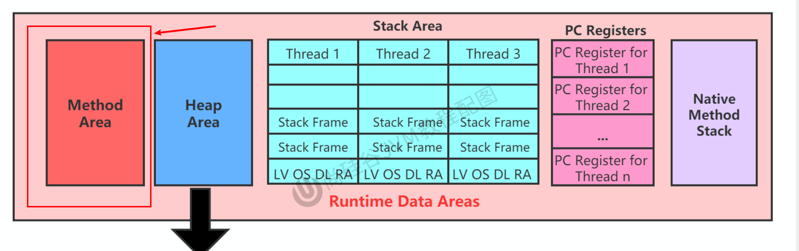
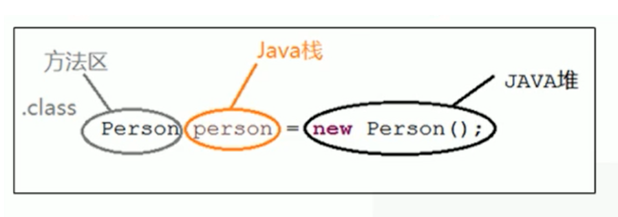
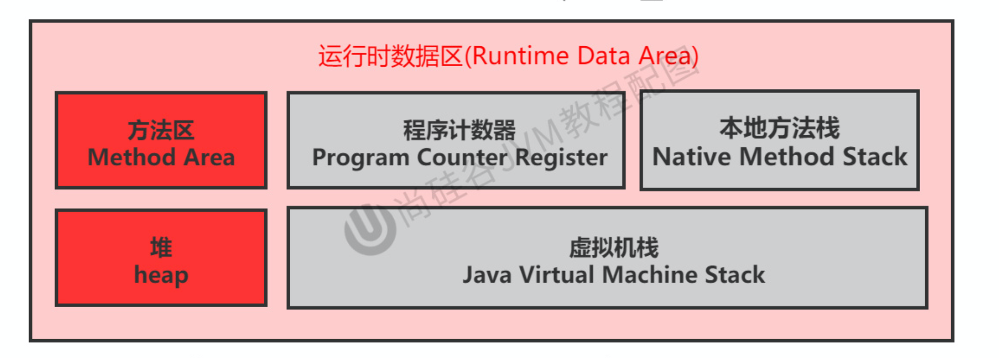

[TOC]

# 栈、堆、方法区的交互关系

> 从内存结构看



> 从线程共享与否的角度看


> 栈、堆、方法区的交互关系

- Person 类的 .class 信息存放在方法区中
- person 变量存放在 Java 栈的局部变量表中
- 真正的 person 对象存放在 Java 堆中



在 person 对象中，有个指针指向方法区中的 person 类型数据，表明这个 person 对象是用方法区中的 Person 类 new 出来的

回顾：下面这个图中左边的本地变量表（int、short、reference、double、float这些）每一个是一个slot，double和long占两个槽


# 方法区的理解

> 官方文档：https://docs.oracle.com/javase/specs/jvms/se8/html/jvms-2.html#jvms-2.5.4


## 方法区的位置

- 《Java虚拟机规范》中明确说明：尽管所有的方法区在逻辑上是属于堆的一部分，但一些简单的实现可能不会选择去进行垃圾收集或者进行压缩。
- 但对于HotSpotJVM而言，**方法区还有一个别名叫做Non-Heap**（非堆），目的就是要和堆分开。
- 所以，**方法区可以看作是一块独立于Java堆的内存空间**。




## 方法区的理解

**方法区主要存放的是 Class，而堆中主要存放的是实例化的对象**

- 方法区（Method Area）与Java堆一样，是**各个线程共享的内存区域**
- 多个线程同时加载统一个类时，只能有一个线程能加载该类，其他线程只能等等待该线程加载完毕，然后直接使用该类，即**类只能加载一次**。
- 方法区在JVM启动的时候被创建，并且它的实际物理内存空间和Java堆区一样都可以是**不连续**的。
- 方法区的大小，跟堆空间一样，可以选择**固定大小或者可扩展**。
- 方法区是接口，元空间或者永久代是方法区的实现
- 方法区的大小决定了系统可以保存多少个类，如果系统<u>定义了太多的类，导致方法区溢出</u>，虚拟机同样会抛出内存溢出错误：   
  - java.lang.OutofMemoryError:PermGen space（JDK7之前）
  - 或者 java.lang.OutOfMemoryError:Metaspace（JDK8之后）
- 举例说明方法区 OOM   
  - 加载大量的第三方的jar包
  - Tomcat部署的工程过多（30~50个）
  - 大量动态的生成反射类
- 关闭JVM就会释放这个区域的内存。


> 代码示例

```java
public class MethodAreaDemo {

    public static void main(String[] args) {
        System.out.println("start....");
        try {
            Thread.sleep(1000000);
        } catch (InterruptedException e) {
            e.printStackTrace();
        }
        System.out.println("end....");
    }
}
```

下图可以看到，加载一个简单的类远不止创建一个类


## Hotspot中方法区的演进过程

- **在 JDK7 及以前，习惯上把方法区，称为永久代。JDK8开始，使用元空间取代了永久代**。JDK 1.8之后，元空间存放在**堆外内存中**
- 我们可以将方法区类比为Java中的接口，将永久代或元空间类比为Java中具体的实现类
- 本质上，方法区和永久代并不等价。仅是对Hotspot而言的可以看作等价。《Java虚拟机规范》对如何实现方法区，不做统一要求。例如：BEAJRockit / IBM J9 中不存在永久代的概念。
- 现在来看，当年使用永久代，不是好的idea。导致Java程序更容易OOm（超过-XX:MaxPermsize上限）
- 而到了JDK8，终于完全废弃了永久代的概念，改用与JRockit、J9一样在本地内存中实现的元空间（Metaspace）来代替
- 元空间的本质和永久代类似，都是对JVM规范中方法区的实现。不过元空间与永久代最大的区别在于：**<font color='#e67e22'>元空间不在虚拟机设置的内存中，而是使用本地内存</font>**
- <u>永久代、元空间</u>二者并不只是名字变了，**内部结构也调整了**
- 根据《Java虚拟机规范》的规定，如果方法区无法满足新的内存分配需求时，将抛出OOM异常


# 设置方法区大小与OOM

方法区的大小不必是固定的，JVM可以根据应用的需要动态调整

## JDK7 永久代

- <font color='#2980b9'>通过-XX:Permsize来设置永久代初始分配空间。默认值是20.75M</font>
- <font color='#2980b9'>-XX:MaxPermsize来设定永久代最大可分配空间。32位机器默认是64M，64位机器模式是82M</font>
- 当JVM加载的类信息容量超过了这个值，会报异常OutofMemoryError:PermGen space。


如果在JDK8的环境下使用会出现以下状况，是因为JDK8中已经被弃用了


如果在JDK7的环境下运行命令


如果要在JDK 8的环境下运行可以使用以下命令：

> jinfo -flag MetaspaceSize xxxxx


## JDK8 元空间

- 元数据区大小可以使用参数 **-XX:MetaspaceSize** 和 **-XX:MaxMetaspaceSize** 指定

- 默认值依赖于平台，<font color='#e17055'>Windows下，-XX:MetaspaceSize 约为21M，**-XX:MaxMetaspaceSize的值是-1，即没有限制**</font>。

- 与永久代不同，如果不指定大小，默认情况下，虚拟机会耗尽所有的可用系统内存。如果元数据区发生溢出，虚拟机一样会抛出异常OutOfMemoryError:Metaspace

- -XX:MetaspaceSize：设置初始的元空间大小。对于一个 64位 的服务器端 JVM 来说，其默认的 -XX:MetaspaceSize值为21MB。这就是初始的高水位线，一旦触及这个水位线，Full GC将会被触发并卸载没用的类（即这些类对应的类加载器不再存活），

  然后这个高水位线将会重置

  。新的高水位线的值取决于GC后释放了多少元空间。   

  - 如果释放的空间不足，那么在不超过MaxMetaspaceSize时，适当提高该值。
  - 如果释放空间过多，则适当降低该值。

- 如果初始化的高水位线设置过低，上述高水位线调整情况会发生很多次。通过垃圾回收器的日志可以观察到Full GC多次调用。**为了避免频繁地GC，建议将-XX:MetaspaceSize设置为一个相对较高的值**。

> 配置元空间大小示例

```java
/**
 * 测试设置方法区大小参数的默认值
 *
 * jdk7及以前：
 * -XX:PermSize=100m -XX:MaxPermSize=100m
 *
 * jdk8及以后：
 * -XX:MetaspaceSize=100m  -XX:MaxMetaspaceSize=100m
 */
public class MethodAreaDemo {
    public static void main(String[] args) {
        System.out.println("start...");
        try {
            Thread.sleep(1000000);
        } catch (InterruptedException e) {
            e.printStackTrace();
        }

        System.out.println("end...");
    }
}

```

JVM参数

> -XX:MetaspaceSize=100m  -XX:MaxMetaspaceSize=100m

终端命令查看设置的元空间大小

> jps
> jinfo -flag MetaspaceSize xxx
> jinfo -flag MaxMetaspaceSize xxxx


可以通过计算得到

> 104857600 / 1024 / 1024 = 100M


## 方法区OOM

OOMTest 类继承 ClassLoader 类，获得 defineClass() 方法，可自己进行类的加载

```java
/**
 * jdk6/7中：
 * -XX:PermSize=10m -XX:MaxPermSize=10m
 *
 * jdk8中：
 * -XX:MetaspaceSize=10m -XX:MaxMetaspaceSize=10m
 */
public class OOMTest extends ClassLoader {
    public static void main(String[] args) {
        int j = 0;
        try {
            OOMTest test = new OOMTest();
            for (int i = 0; i < 10000; i++) {
                //创建ClassWriter对象，用于生成类的二进制字节码
                ClassWriter classWriter = new ClassWriter(0);
                //指明版本号，修饰符，类名，包名，父类，接口
                classWriter.visit(Opcodes.V1_8, Opcodes.ACC_PUBLIC, "Class" + i, null, "java/lang/Object", null);
                //返回byte[]
                byte[] code = classWriter.toByteArray();
                //类的加载
                test.defineClass("Class" + i, code, 0, code.length); //Class对象
                j++;
            }
        } finally {
            System.out.println(j);
        }
    }
}
```

如果不设置元空间上限结果为

> 10000

设置元空间上限 VM参数

> -XX:MetaspaceSize=10m -XX:MaxMetaspaceSize=10m

就会出现以下结果
```
3331
Exception in thread "main" java.lang.OutOfMemoryError: Compressed class space
	at java.lang.ClassLoader.defineClass1(Native Method)
	at java.lang.ClassLoader.defineClass(ClassLoader.java:756)
	at java.lang.ClassLoader.defineClass(ClassLoader.java:635)
	at cn.zhiyucs.java.OOMTest.main(OOMTest.java:26)
```


## 如何解决OOM

- 要解决OOM异常或heap space的异常，一般的手段是首先通过内存映像分析工具（如Eclipse Memory  Analyzer）对dump出来的堆转储快照进行分析，重点是确认内存中的对象是否是必要的，也就是要<font color='#fdcb6e'>先分清楚到底是出现了内存泄漏（Memory  Leak）还是内存溢出（Memory Overflow）</font>
- **内存泄漏就是有大量的引用指向某些对象，但是这些对象以后不会使用了**，但是因为它们还和GC ROOT有关联，所以导致以后这些对象也不会被回收，这就是内存泄漏的问题
- 如果是内存泄漏，可进一步通过工具查看泄漏对象到GC Roots的引用链。于是就能**找到泄漏对象是通过怎样的路径与GC Roots相关联并导致垃圾收集器无法自动回收它们的**。掌握了泄漏对象的类型信息，以及GC Roots引用链的信息，就可以比较准确地定位出泄漏代码的位置。
- 如果不存在内存泄漏，换句话说就是内存中的对象确实都还必须存活着，那就应当检查虚拟机的堆参数（-Xmx与-Xms），与机器物理内存对比看是否还可以调大，从代码上检查是否存在某些对象生命周期过长、持有状态时间过长的情况，尝试减少程序运行期的内存消耗。


# 方法区的内部结构

## 内部结构


<font color='#f1c40f'>方法区都存储了什么？</font>

《深入理解Java虚拟机》书中对方法区（Method Area）存储内容描述如下：它用于存储已被虚拟机**<font color='#fd79a8'>加载的类型信息、常量、静态变量、即时编译器编译后的代码缓存</font>**等。


### 类型信息

对每个加载的类型（类class、接口interface、枚举enum、注解annotation），JVM必须在方法区中存储以下类型信息：

- 这个类型的完整有效名称（全类名=包名.类名）
- 这个类型直接父类的完整有效名（对于interface或是java.lang.Object，都没有父类）
- 这个类型的修饰符（public，abstract，final的某个子集）
- 这个类型直接接口的一个有序列表


### 域（Field）信息

- JVM必须在方法区中保存类型的所有域的相关信息以及域的声明顺序。
- `域信息`通俗来讲是类的成员变量
- 域的相关信息包括：   
  - 域名称
  - 域类型
  - 域修饰符（public，private，protected，static，final，volatile，transient的某个子集）


### 方法（Method）信息

JVM必须保存所有方法的以下信息，同域信息一样包括声明顺序：

- 方法名称
- 方法的返回类型（包括 void 返回类型），void 在 Java 中对应的类为 void.class
- 方法参数的数量和类型（按顺序）
- 方法的修饰符（public，private，protected，static，final，synchronized，native，abstract的一个子集）
- 方法的字节码（bytecodes）、操作数栈、局部变量表及大小（abstract和native方法除外）
- 异常表（abstract和native方法除外）
  - 异常表记录每个异常处理的开始位置、结束位置、代码处理在程序计数器中的偏移地址、被捕获的异常类的常量池索引


### 代码举例

```java
/**
 * 测试方法区的内部构成
 */
public class MethodInnerStrucTest extends Object implements Comparable<String>, Serializable {
    //属性
    public int num = 10;
    private static String str = "测试方法的内部结构";

    //构造器没写

    //方法
    public void test1() {
        int count = 20;
        System.out.println("count = " + count);
    }

    public static int test2(int cal) {
        int result = 0;
        try {
            int value = 30;
            result = value / cal;
        } catch (Exception e) {
            e.printStackTrace();
        }
        return result;
    }

    @Override
    public int compareTo(String o) {
        return 0;
    }
}

```

反编译之后就可以看到

> 类型信息

- 在运行时方法区中，类信息中记录了哪个加载器加载了该类，同时类加载器也记录了它加载了哪些类
- 从反编译文件可以看出，字节码文件记录了 MethodInnerStrucTest 继承了哪些类，实现了哪些方法

```
public class cn.zhiyucs.java.MethodInnerStrucTest extends java.lang.Object implements java.lang.Comparable<java.lang.String>, java.io.Serializable
  minor version: 0
  major version: 52
  flags: ACC_PUBLIC, ACC_SUPER
```

> 域信息

- descriptor: I 表示字段类型为 Integer
- flags: ACC_PUBLIC 表示字段权限修饰符为 public

```
public int num;
    descriptor: I
    flags: ACC_PUBLIC

  private static java.lang.String str;
    descriptor: Ljava/lang/String;
    flags: ACC_PRIVATE, ACC_STATIC
```

> 方法信息（以test1为例）

- descriptor: ( )V 表示方法返回值类型为 void
- flags: ACC_PUBLIC 表示方法权限修饰符为 public
- stack=3 表示操作数栈深度为 3
- locals=2 表示局部变量个数为 2 个（实力方法包含 this）
- test1( ) 方法虽然没有参数，但是其 args_size=1 ，这是因为将 this 作为了参数

```
  public void test1();
    descriptor: ()V
    flags: ACC_PUBLIC
    Code:
      stack=3, locals=2, args_size=1
         0: bipush        20
         2: istore_1
         3: getstatic     #3                  // Field java/lang/System.out:Ljava/io/PrintStream;
         6: new           #4                  // class java/lang/StringBuilder
         9: dup
        10: invokespecial #5                  // Method java/lang/StringBuilder."<init>":()V
        13: ldc           #6                  // String count =
        15: invokevirtual #7                  // Method java/lang/StringBuilder.append:(Ljava/lang/String;)Ljava/lang/StringBuilder;
        18: iload_1
        19: invokevirtual #8                  // Method java/lang/StringBuilder.append:(I)Ljava/lang/StringBuilder;
        22: invokevirtual #9                  // Method java/lang/StringBuilder.toString:()Ljava/lang/String;
        25: invokevirtual #10                 // Method java/io/PrintStream.println:(Ljava/lang/String;)V
        28: return
      LineNumberTable:
        line 17: 0
        line 18: 3
        line 19: 28
      LocalVariableTable:
        Start  Length  Slot  Name   Signature
            0      29     0  this   Lcn/zhiyucs/java/MethodInnerStrucTest;
            3      26     1 count   I

```


## 域信息特殊情况

### non-final 类型的类变量

- **静态变量和类关联在一起，随着类的加载而加载**，他们成为类数据在逻辑上的一部分
- 类变量被类的所有实例共享，即使没有类实例时，你也可以访问它


> 代码示例

```java
/**
 * non-final的类变量
 */
public class MethodAreaTest {
    public static void main(String[] args) {
        Order order = null;
        order.hello();
        System.out.println(order.count);
    }
}

class Order {
    public static int count = 1;
    public static final int number = 2;


    public static void hello() {
        System.out.println("hello!");
    }
}
```

> 执行结果

```
hello!
1
```

如何体现：类变量被类的所有实例共享，即使没有类实例时，你也可以访问它？

```java
Order order = null;
order.hello();
```


### 全局常量：static final

- 全局常量就是使用 static final 进行修饰
- 被声明为final的类变量的处理方法则不同，每个全局常量在编译的时候就会被分配了。

> 代码示例

```java
class Order {
    public static int count = 1;
    public static final int number = 2;


    public static void hello() {
        System.out.println("hello!");
    }
}
```

通过反编译字节码可以看到区别：number 的值已经写死在字节码文件中了

```java
// Java文件
public static int count = 1;
public static final int number = 2;

// 字节码文件
  public static int count;
    descriptor: I
    flags: ACC_PUBLIC, ACC_STATIC

  public static final int number;
    descriptor: I
    flags: ACC_PUBLIC, ACC_STATIC, ACC_FINAL
    ConstantValue: int 2
```


## 运行时常量池

[点此进入官方文档](https://docs.oracle.com/javase/specs/jvms/se8/html/jvms-4.html)

> 运行时常量池 VS 常量池

- **方法区，内部包含了运行时常量池**
- **字节码文件，内部包含了常量池**
- 要弄清楚方法区，需要理解清楚ClassFile，因为加载类的信息都在方法区。
- 要弄清楚方法区的运行时常量池，需要理解清楚ClassFile中的常量池。


## 常量池

- 一个有效的字节码文件中除了包含类的版本信息、字段、方法以及接口等描述符信息外
- 还包含一项信息就是**常量池表**（**Constant Pool Table**），包括**各种字面量和对类型、域和方法的符号引用**


> 为什么需要常量池？

- 一个java源文件中的类、接口，编译后产生一个字节码文件。而Java中的字节码需要数据支持，通常这种数据会很大以至于不能直接存到字节码里，换另一种方式，可以存到常量池

- 这个字节码包含了指向常量池的引用。在动态链接的时候会用到运行时常量池，之前有介绍

  比如：如下的代码：

```java
public class SimpleClass {
    public void sayHello() {
        System.out.println("hello");
    }
}
```

- 虽然上述代码只有194字节，但是里面却使用了String、System、PrintStream及Object等结构。
- 如果不使用常量池，就需要将用到的类信息、方法信息等记录在当前的字节码文件中，造成文件臃肿
- 所以我们<font color='#e17055'>将所需用到的结构信息记录在常量池中</font>，并通过**<font color='#e74c3c'>引用的方式</font>**，来加载、调用所需的结构
- 这里的代码量其实很少了，如果代码多的话，引用的结构将会更多，这里就需要用到常量池了。


> 代码举例

```java
/**
 * 测试方法区的内部构成
 */
public class MethodInnerStrucTest extends Object implements Comparable<String>, Serializable {
    //属性
    public int num = 10;
    private static String str = "测试方法的内部结构";

    //构造器没写

    //方法
    public void test1() {
        int count = 20;
        System.out.println("count = " + count);
    }

    public static int test2(int cal) {
        int result = 0;
        try {
            int value = 30;
            result = value / cal;
        } catch (Exception e) {
            e.printStackTrace();
        }
        return result;
    }

    @Override
    public int compareTo(String o) {
        return 0;
    }
}
```

1. 反编译之后以静态字符串为例

> private static String str = "测试方法的内部结构";

```python
0 ldc #15 <测试方法的内部结构>
2 putstatic #16 <cn/zhiyucs/java/MethodInnerStrucTest.str : Ljava/lang/String;>
5 return
```

ldc是官方的JVM规范这样解释：从运行时常量池推送项目（Push item from run-time constant pool）

2. 再以test1为例

```java
public void test1() {
    int count = 20;
    System.out.println("count = " + count);
}
```

字节码为

```python
 0 bipush 20
 2 istore_1
 3 getstatic #3 <java/lang/System.out : Ljava/io/PrintStream;>
 6 new #4 <java/lang/StringBuilder>
 9 dup
10 invokespecial #5 <java/lang/StringBuilder.<init> : ()V>
13 ldc #6 <count = >
15 invokevirtual #7 <java/lang/StringBuilder.append : (Ljava/lang/String;)Ljava/lang/StringBuilder;>
18 iload_1
19 invokevirtual #8 <java/lang/StringBuilder.append : (I)Ljava/lang/StringBuilder;>
22 invokevirtual #9 <java/lang/StringBuilder.toString : ()Ljava/lang/String;>
25 invokevirtual #10 <java/io/PrintStream.println : (Ljava/lang/String;)V>
28 return
```

> getstatic #3为例

可以从常量池中看到，#3 调用了#54和#55


#54


#55


可以看到最后调用了#75


>  new #4 <java/lang/StringBuilder> 为例

#4


#56


