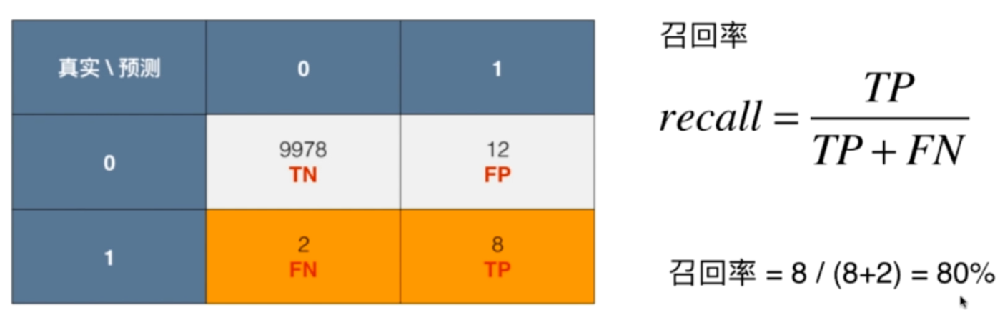
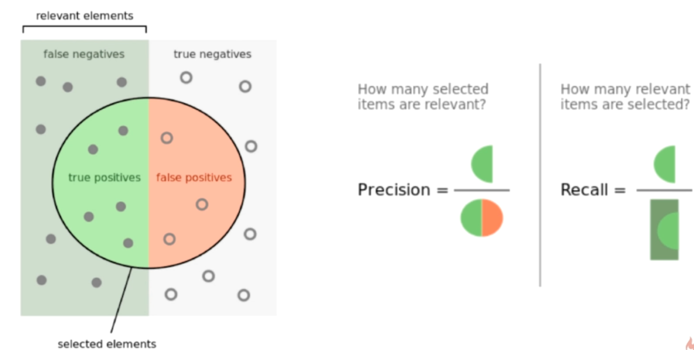
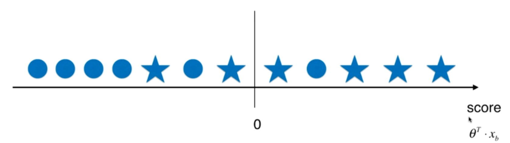
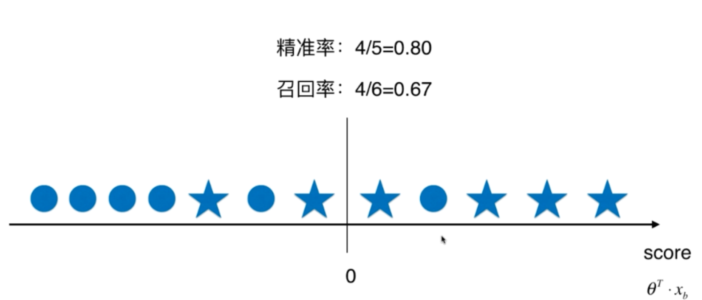
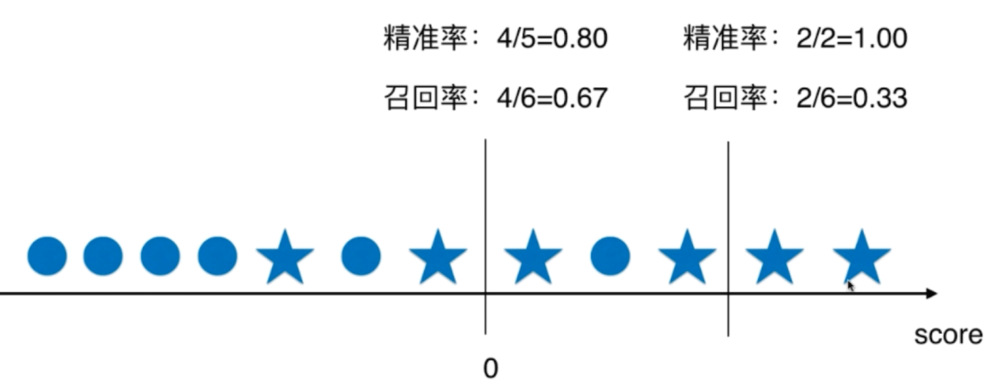
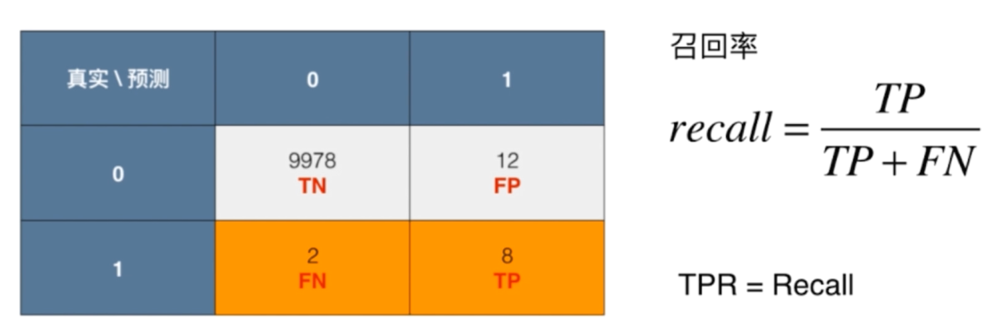
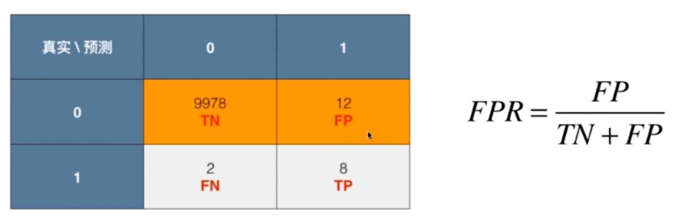
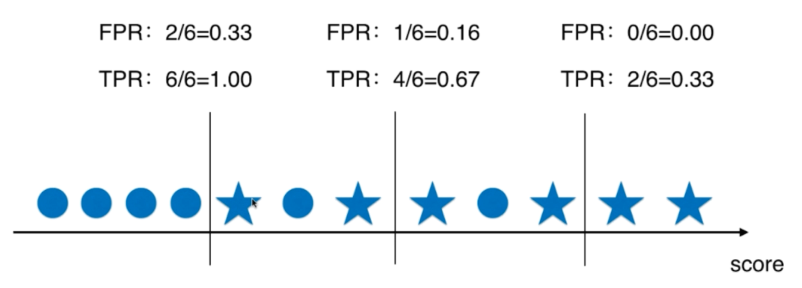

# 评价分类结果

---

## 分类准确度的问题

举个栗子：

一个癌症预测系统，输入体检信息，可以判断是否有癌症。

预测准确度：99.9%

是好的系统？还是坏的系统？

如果癌症产生的概率只有0.1%，我们的系统预测所有人都是健康，即可达到99.9%的准确率

如果癌症产生的概率只有0.01%，我们的系统预测所有人都是健康，可达到99.99的准确率

上述的例子说明：

对于**极度偏斜（Skewed Data）**的数据，只使用分类准确度是远远不够的

## 混淆矩阵（Confusion Matrix）

TN -- True Negative

FP -- False Positive

 9978 -- 没有患癌症，并且算法预测没有患癌症

12 -- 没有患癌症，但是算法错误的预测换了癌症

2 -- 患了癌症，但是算法错误预测没有患癌症

8 -- 患了癌症，算法的正确识别了患了癌症

## 精准率和召回率

### 精准率（precision）

预测关注的事件的成功率

例如：癌症预测系统，预测了有100个人有癌症，在这些预测当中有多少是准确的

### 召回率（recall）

 真实的发生中成功预测了多少

例如：癌症预测系统，实际上有100个癌症病人，这个系统则能在100个当中挑出多少个癌症病人

 

### 进一步理解

## F1 Score

既兼顾精准率，又兼顾召回率

计算式子：
$$
F1 = \frac{2 \cdot precision \cdot recall}{precision + recall}
$$
F1是 precision 和 recall 的调和平均值

调和平均值：
$$
\frac{1}{F1}=\frac{1}{2}(\frac{1}{precision}+\frac{1}{recall})
$$

* 如果一个值特别低，另外一个值特别高，那么得到的F1 Score得到的值特别低
* 只有两个值特别高才能得到高的F1 Score

通分1 / F1之后就能得到计算式子

## Precision & Recall 的平衡

精准率和召回率是两个矛盾是指标

### 回顾逻辑回归原理

通过训练找到一组参数，这个参数称为θ，这个θ它和样本向量x点乘之后，最后得到的结果和0进行比较，如果这个结果 ≥ 0，那么这个样本判别为类别1的概率是 ≥ 0.5
$$
\hat p = \sigma(\theta^T \cdot x_b) = \frac{1}{1+e^{-\theta^T\cdot x_b}}\\
\hat y = \begin{cases}
1, \hat p \geq 0.5 \\
0, \hat p \leq 0.5 \\
\end{cases}\\
决策边界：\theta^t \cdot x_b = 0
$$

### 平衡原理

假设有这样的样本，五角星为我们关注的样本，也就是分类为1的样本

如果按照0为基准，判断精准率和召回率

提高了threshold，将提高的那个threshold作为阈值划分后，得到的精准率和召回率如下

如果将分类阈值变小后

## ROC曲线

ROC（Receiver Operation Characteristic Curve）

### TPR

### FPR

### TPR 和 FPR的关系

## ROC 和 AUC的应用场景

例如以下场景，可以选择AUC（即面积）比较大的模型

