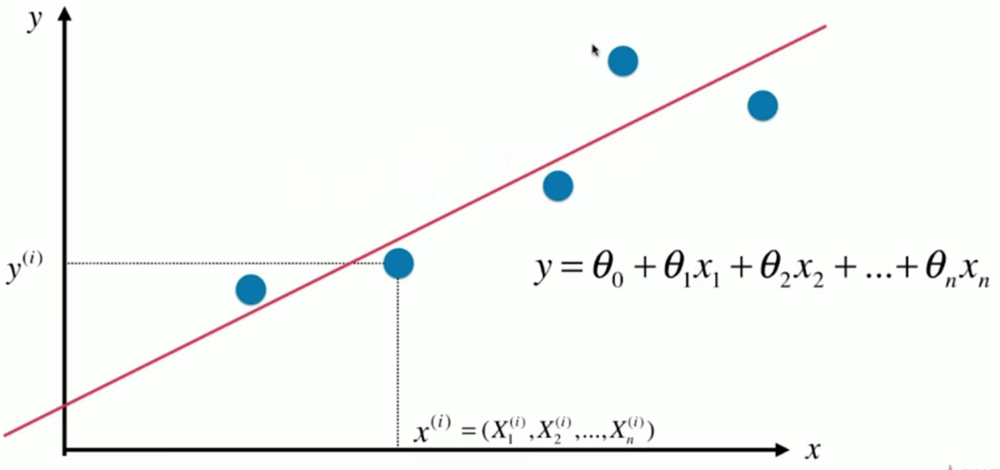

# 线性回归

---

## 简单的线性回归

### 线性回归算法

* 解决回归问题
* 思想简单，容易实现
* 许多强大的非线性模型的基础
* 结果具有很好的可解释性
* 蕴含机器学习中的很多重要思想

### 简单线性回归

> 简单线性回归：样本特征只有一个

假设我们找到了一个最佳拟合的直线方程；

y = ax + b

则对于每一个样本点
$$
x^{(i)}
$$
根据我们的直线方程，预测值为：
$$
\hat y^{(i)} = ax^{(i)} + b
$$
真值为：
$$
y^{(i)}
$$
我们希望
$$
y^{(i)}和\hat y^{(i)}
$$
的差距尽量小，表达差距的方式就有（*第一个公式、第二个公式排除*）：
$$
y^{(i)} - \hat y^{(i)}
$$

$$
|y^{(i)} - \hat y^{(i)}|
$$

$$
(y^{(i)} - \hat y^{(i)})^2
$$

考虑所有样本：
$$
\sum\limits_{i=1}^m (y^{(i)} - \hat y^{(i)})^2
$$
目标：使
$$
\sum\limits_{i=1}^m (y^{(i)} - \hat y^{(i)})^2
$$
尽可能的小，然后代入以下式子：
$$
\hat y^{(i)} = ax^{(i)} + b
$$
得到：
$$
\sum\limits_{i=1}^m (y^{(i)} - ax^{(i)} - b)^2
$$
结论：找到a和b，使得上述式子尽可能的小

典型的最小乘法问题：**最小化误差的平方**
$$
a=\frac{\sum\limits_{i=1}^m (x^{(i)} - \overline x)(y^{(i)} - \overline y)}{(x^{(i)} - \overline x)^2}
$$

$$
b = \overline y - a \overline x
$$


### 一类机器学习算法的基本思路

> 近乎所有参数学习算法都是这个套路

损失函数（loss function），例如上述式子：
$$
\sum\limits_{i=1}^m (y^{(i)} - ax^{(i)} - b)^2
$$
效用函数（utility function）

> 思想：通过分析问题，确定问题的损失函数或者效用函数；
>
> 通过最优化损失函数或者效用函数，获得机器学习的模型。


## 最小二乘法

推导：

> $$
> \sum\limits_{i=1}^m (y^{(i)} - ax^{(i)} - b)^2
> $$

令其为：

> J（a, b）

对a进行求导和b进行求导：
$$
\frac{\partial J(a,b)}{\partial a}=0
$$

$$
\frac{\partial J(a,b)}{\partial b}=0
$$

**对b先进行求导：**

* 因为b前面是 ‘-’ 所以要加上 -1

$$
\frac{\partial J(a,b)}{\partial b}=\sum\limits_{i=1}^m 2(y^{(i)} - ax^{(i)} - b)(-1)=0
$$

删除 ‘-2’ 不改变式子的性质
$$
原式=\sum\limits_{i=1}^m (y^{(i)} - ax^{(i)} - b)=0
$$
拿出求和式子
$$
\sum\limits_{i=1}^m y^{(i)} - a\sum\limits_{i=1}^m x^{(i)} - \sum\limits_{i=1}^m b=0
$$
因为b是一个常数，可以再进行整理
$$
\sum\limits_{i=1}^m y^{(i)} - a\sum\limits_{i=1}^m x^{(i)} - mb=0
$$

$$
\sum\limits_{i=1}^m y^{(i)} - a\sum\limits_{i=1}^m x^{(i)} = m b
$$

把m除过去，相当于求和式子除以整个式子的大小（简而言之：平均值）
$$
b = \overline y - a \overline x
$$
**对a进行求导：**
$$
\frac{\partial J(a,b)}{\partial a}=\sum\limits_{i=1}^m 2(y^{(i)} - ax^{(i)} - b)(-x^{(i)})=0
$$
同理
$$
\sum\limits_{i=1}^m (y^{(i)} - ax^{(i)} - b)(x^{(i)})=0
$$
把求出的b的式子带入其中，式子就只有a这个未知数
$$
\sum\limits_{i=1}^m (y^{(i)} - ax^{(i)} - \overline y + a \overline x)(x^{(i)})=0
$$
先把外边的x乘进去
$$
\sum\limits_{i=1}^m (x^{(i)} y^{(i)} - a(x^{(i)})^2 - x^{(i)} \overline y + a \overline x x^{(i)})=0
$$

$$
\sum\limits_{i=1}^m (x^{(i)} y^{(i)} - x^{(i)} \overline y - a(x^{(i)})^2 + a \overline x x^{(i)})=0
$$

前后两项分开
$$
\sum\limits_{i=1}^m (x^{(i)} y^{(i)} - x^{(i)} \overline y) - \sum\limits_{i=1}^m (a(x^{(i)})^2 - a \overline x x^{(i)})=0
$$
提取a
$$
\sum\limits_{i=1}^m (x^{(i)} y^{(i)} - x^{(i)} \overline y) - a \sum\limits_{i=1}^m ((x^{(i)})^2 - \overline x x^{(i)})=0
$$
就可以得出式子a
$$
a=\frac{\sum\limits_{i=1}^m (x^{(i)} y^{(i)} - x^{(i)} \overline y)}{\sum\limits_{i=1}^m ((x^{(i)})^2 - \overline x x^{(i)})}
$$
**对其（a）进行变形：**

因为y的均值是一个常数

* my 相当于 y的每一项去相加
* my·x又可以推到最后一个式子，因为x、y的均值都是常数

$$
\sum\limits_{i=1}^m x^{(i)} \overline y = \overline y \sum\limits_{i=1}^m x^{(i)}=m\overline y · \overline x \overline y x = \overline x \sum\limits_{i=1}^m y^{(i)}=\sum\limits_{i=1}^m \overline x y^{(i)} = \sum\limits_{i=1}^m \overline x · \overline y
$$

然后就可以进行以下变换：

* 分子分母后两项相加都是0

$$
\frac{\sum\limits_{i=1}^m (x^{(i)} y^{(i)} - x^{(i)} \overline y - \overline x y^{(i)} + \overline x · \overline y)}{\sum\limits_{i=1}^m ((x^{(i)})^2 - \overline x x^{(i)} - \overline x x^{(i)}  + \overline x^2)}
$$

进一步简化得到
$$
\frac {\sum\limits_{i=1}^m (x^{(i)} - \overline x)(y^{(i)} - \overline y)}{\sum\limits_{i=1}^m (x^{(i)} - \overline x)^2}
$$

## 向量化运算

观察a的分子和分母都属于一个模式：

* w和v每一个项对应的相乘然后再相加
* 对于分子来说 w是前者，v是后者
* 对于分母来说 w和v 都是一样的

$$
a= \frac {\sum\limits_{i=1}^m (x^{(i)} - \overline x)(y^{(i)} - \overline y)}{\sum\limits_{i=1}^m (x^{(i)} - \overline x)^2}
$$

$$
\sum\limits_{i=1}^m w^{(i)} · v^{(i)}
$$

化成向量后
$$
w=(w^{(1)},w^{(2)},...,w^{(m)})
$$

$$
v=(v^{(1)},v^{(2)},...,v^{(m)})
$$

相当于m,v点成
$$
w · v
$$


原先在实现线性回归的算法中是使用循环（for）：

```python
def fit(self, x_train, y_train):
    """根据训练数据集x_train,y_train性训练Simple Linear Regression模型"""
    # 一维向量
    assert x_train.ndim == 1, \
    "Simple Linear Regressor can only solve single feature training data."
    assert len(x_train) == len(y_train), \
    "the size of x_train must be equal to the size of y_train"

    x_mean = np.mean(x_train)
    y_mean = np.mean(y_train)

    num = 0.0 # 分子
    d = 0.0 # 分母
    for x, y in zip(x_train, y_train):
        num += (x - x_mean) * (y - y_mean)
        d += (x - x_mean) ** 2

    self.a_ = num / d
    self.b_ = y_mean - self.a_ * x_mean

    return self
```

改进成向量后：

```python
def fit(self, x_train, y_train):
    """根据训练数据集x_train,y_train性训练Simple Linear Regression模型"""
    # 一维向量
    assert x_train.ndim == 1, \
    "Simple Linear Regressor can only solve single feature training data."
    assert len(x_train) == len(y_train), \
    "the size of x_train must be equal to the size of y_train"

    x_mean = np.mean(x_train)
    y_mean = np.mean(y_train)

    num = (x_train - x_mean).dot(y_train - y_mean) # 分子 dot点乘
    d = (x_train - x_mean).dot(x_train - x_mean) # 分母

    self.a_ = num / d
    self.b_ = y_mean - self.a_ * x_mean

    return self
```

## 简单线性回归评测标准

目标：找到a和b，使得下列式子尽可能的小
$$
\sum\limits_{i=1}^m (y{^{(i)}_{train}} - ax{^{(i)}_{train}} - b)^2
$$

### 三种评价线性回归算法的标准

实际上可以看作，该式子也是**衡量标准**
$$
\sum\limits_{i=1}^m (y{^{(i)}_{train}} - \hat y{^{(i)}_{train}})^2
$$
得到a，b后，带入x test得到预测值 y test
$$
\hat y{^{(i)}_{test}} = a ax{^{(i)}_{test}} + b
$$
提高精确度，改进衡量标准 – **均方误差 MSE（Mean Squared Error）**
$$
\frac{1}{m} \sum\limits_{i=1}^m (y{^{(i)}_{test}} - \hat y{^{(i)}_{test}})^2
$$
**均方根误差 RMSE（Root Mean Squared Error）**：
$$
\sqrt {\frac{1}{m} \sum\limits_{i=1}^m (y{^{(i)}_{test}} - \hat y{^{(i)}_{test}})^2}
$$
**平均绝对误差 MAE（Mean Absolute Error）**：
$$
\frac{1}{m} \sum\limits_{i=1}^m |y{^{(i)}_{test}} - \hat y{^{(i)}_{test}}|
$$

### 实现标准

```python
def mean_squared_error(y_true, y_predict):
    """计算y_true和y_predict之间的MSE"""
    assert len(y_true) == len(y_predict), \
        "the size of y_true must be equal to the size of y_predict"

    return np.sum((y_true - y_predict)**2) / len(y_true)


def root_mean_squared_error(y_true, y_predict):
    """计算y_true和y_predict之间的RMSE"""

    return sqrt(mean_squared_error(y_true, y_predict))


def mean_absolute_error(y_true, y_predict):
    """计算y_true和y_predict之间的MAE"""

    return np.sum(np.absolute(y_true - y_predict)) / len(y_true)
```


## 最好的衡量线性回归指标

### R Squared

$$
R^2 = 1 - \frac{SS_{residual}}{SS_{total}}
$$

注：分子是Residual Sum of Squared

分母是Total Sum of Squared

### 计算方式

$$
R^2 = 1 - \frac{\sum\limits_i (\hat y^{(i)} - y^{(i)})^2}{\sum\limits_i(\overline y - y^{(i)})^2}
$$

* 分子：对于我们预测的结果和真实结果的差的平方和，描述的是：使用我们的模型预测产生的错误
* 分母：使用 y = (y的均值) 预测产生的错误（Baseline Model）
* 右边的分子分母意思是我们的模型所产生的错误，1减去这个式子就相当于我们的模型没有产生错误的指标

### 关于R²

* R² <= 1
* R² 越大越好。越接近于1我们的模型犯错越少，R² = 1 说明模型没有错误
* 如果R² < 0，说明我们学习到的模型还不如急转模型。此时说明我们的模型可能不存在任何线性关系

$$
R^2 = 1 - \frac{\sum\limits_i (\hat y^{(i)} - y^{(i)})^2}{\sum\limits_i(\overline y - y^{(i)})^2}=1-R^2 = 1 - \frac{(\sum\limits_i^m (\hat y^{(i)} - y^{(i)})^2) / m}{(\sum\limits_i^m (y^{(i)} - \overline y)^2) / m} \\ = 1 - \frac{MSE(\hat y, y)}{Var(y)}
$$


	## 多元线性回归方程

### 简介和推到

一元线性回归中，我们考虑的式子是：
$$
y = \theta_0 + \theta_1x
$$
而在多元线性回归方程中我们考虑的式子是：
$$
y = \theta_0 + \theta_1 x_1 + \theta_2 x_2 + ... + \theta_n x_n
$$


如果要获得**预测值 hat y**：
$$
\hat y = \theta_0 + \theta_1 X_1^{(i)} + \theta_2 X_2^{(i)} + ... + \theta_n X_n^{(i)}
$$
区别在于一元的x变化为了多个特征X(i)

对预测值的式子进行简化：
$$
\hat y = \theta_0 X_0^{(i)} + \theta_1 X_1^{(i)} + \theta_2 X_2^{(i)} + ... + \theta_n X_n^{(i)}, X_0^{(i)} \equiv 1 \\
X^{(i)} = (X_0^{(i)}, X_1^{(i)}, X_2^{(i)}, ..., X_n^{(i)}) \\
\hat y^{(i)} = X^{(i)} · \theta
$$
在此基础上进行推广可以得到
$$
X_b = 
\begin{bmatrix}
1&X_1^{(1)}&X_2^{(1)}&\cdots&X_n^{(1)}\\
1&X_1^{(2)}&X_2^{(2)}&\cdots&X_n^{(2)}\\
\vdots&\vdots&\vdots&\ddots&\vdots\\
1&X_1^{(m)}&X_2^{(m)}&\cdots&X_n^{(m)}\\
\end{bmatrix}
$$

$$
\theta = 
\begin{bmatrix}
\theta_0\\
\theta_1\\
\theta_2\\
\vdots\\
\theta_n
\end{bmatrix}
$$

所以预测值可以表示为：
$$
\hat y = X_b · \theta
$$
在一元线性回归中，我们力求下列式子尽可能的小：
$$
\sum\limits_{i=1}^m (y^{(i)} - \hat y^{(i)})^2
$$
所以多元回归方程目标是使下列式子尽可能的小：

* 前半部分本来是一个列向量，转置成为行向量

$$
(y - X_b · \theta)^T (y - X_b · \theta)
$$

### 正规方程解

推到出具体θ求解 – 多元线性回归方程的**正规方程解（Normal Equation）**：
$$
\theta = (X_b^T X_b)^{-1} X_b^T y
$$
问题：时间复杂度高：O(n^3)（优化O(n^2.4)）

优点：不需要对数据进行归一化处理（kNN算法需要做处理）

## 线性回归算法总结

* 典型的参数学习
  * 对比kNN：非参数学习
* 只能解决回归问题
  * 虽然很多分类方法中，线性回归是基础（如逻辑回归）
  * 对比kNN：既可以解决分类问题，又可以解决回归问题
* 对数据有假设：线性
  * 对比kNN：对数据没有假设
* 优点：对数据具有强解释性
