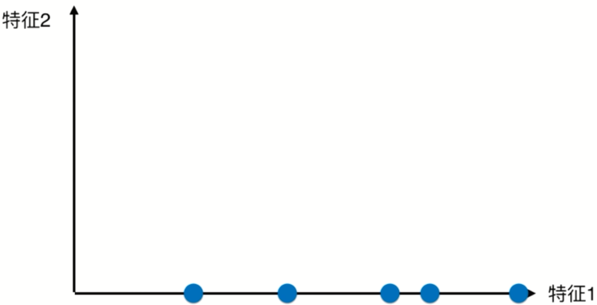
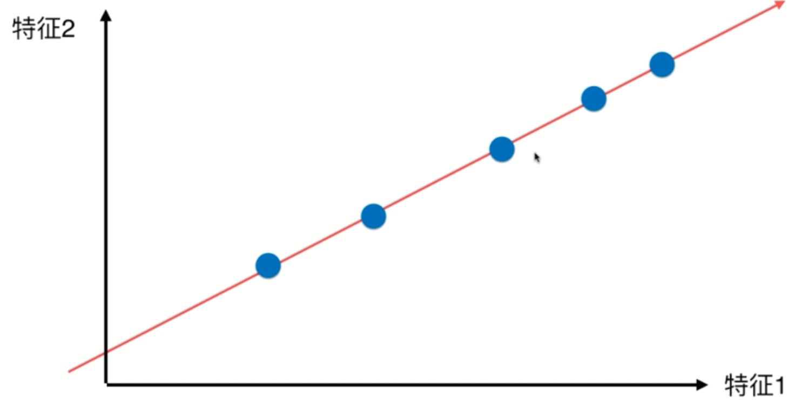
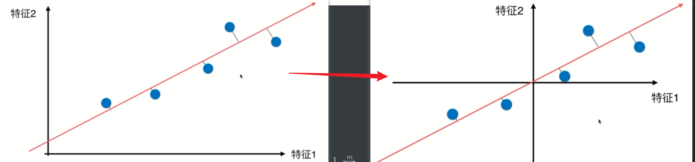
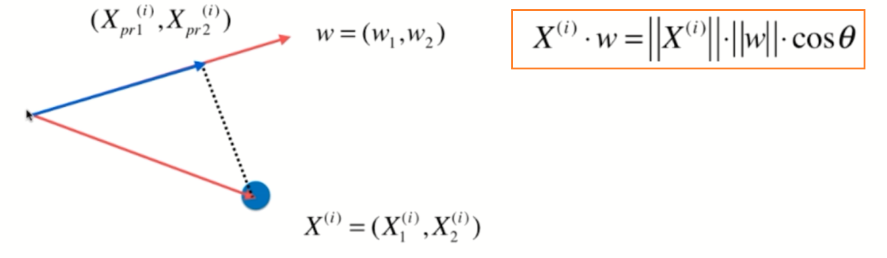

# 主成分分析法（Principal Component Analysis）

---

## 主成分分析法简介

* 一个非监督的机器学习算法
* 主要用于数据的降维
* 通过降维，可以发现更便于人类理解的特征
* 其他应用：可视化；去噪

举个栗子：

降维保留特征1，扔掉特征2，则点映射到x轴上

降维保留特征2，扔掉特征1，则点映射到y轴上

此时映射到x轴相对比较好，因为点与点之间相隔比较大。当然，还有更好的方案：把点映射到一个轴上，使得每个点的间距相比之前的更大更明显。

 问题：

1. 如何找到这个让样本间距最大的轴
2. 如何定义样本间间距

答案：方差（Variance）

方差的计算公式为：
$$
Var(x) = \frac{1}{m} \sum\limits_{i=1}^{m}(x_i - \hat x)^2
$$

### 具体实现步骤

1. 将样本的均值归为0（**demean**）

移动坐标轴，使之均值为0

此时样本的均值为0：
$$
Var(x) = \frac{1}{m} \sum\limits_{i=1}^{m}x_i^2 \\
\hat x = 0
$$
要求映射到一个轴的方向  w  =  (w1, w2)，使得我们所有的样本，映射到w以后，有：
$$
Var(x_{project}) = \frac{1}{m} \sum\limits_{i=1}^{m}||x_{project} - \hat x_{project}||^2
$$
最大

映射的方法就是点乘的定义：

此时w的模为1，则式子可以表示为：
$$
X^{(i)} · w = ||X^{(i)}|| · ||w|| · cos\theta \\
X^{(i)} · w = ||X^{(i)}_{project}||
$$
使之下列式子最大：
$$
Var(X_{project}) = \frac{1}{m} \sum\limits_{i=1}^{m}||X^{(i)} · w||^2
$$
展开之后可以得到：
$$
Var(X_{project}) = \frac{1}{m} \sum\limits_{i=1}^{m}(X^{(i)}_1 · w_1 + X^{(i)}_2 · w_2 + ... + X^{(i)}_n · w_n)^2
$$

### 得到定义

> 找到一个轴，使得样本空间的所有点映射到这个轴后，方差最大

### PCA和线性回归的区别

## 梯度上升法解决主成分分析法

目标：求w，使得下列式子最大
$$
f(X) = \frac{1}{m} \sum\limits_{i=1}^{m}(X^{(i)}_1 · w_1 + X^{(i)}_2 · w_2 + ... + X^{(i)}_n · w_n)^2
$$
在式子中w是未知数，X都是已知的
$$
\nabla f = 
\begin{bmatrix}
{\frac{\partial f}{\partial w_1}}\\
{\frac{\partial f}{\partial w_2}}\\
{\vdots}\\
{\frac{\partial f}{\partial w_n}}\\
\end{bmatrix}
=
\frac{2}{m}
\begin{bmatrix}
{\sum\limits_{i=1}^{m}(X^{(i)}_1 · w_1 + X^{(i)}_2 · w_2 + ... + X^{(i)}_n · w_n)X_1^{(i)}}\\
{\sum\limits_{i=1}^{m}(X^{(i)}_1 · w_1 + X^{(i)}_2 · w_2 + ... + X^{(i)}_n · w_n)X_2^{(i)}}\\
{\vdots}\\
{\sum\limits_{i=1}^{m}(X^{(i)}_1 · w_1 + X^{(i)}_2 · w_2 + ... + X^{(i)}_n · w_n)X_n^{(i)}}\\
\end{bmatrix}
\\ =
\frac{2}{m}
\begin{bmatrix}
{\sum\limits_{i=1}^{m}(X^{(i)} · w)X_1^{(i)}}\\
{\sum\limits_{i=1}^{m}(X^{(i)} · w)X_2^{(i)}}\\
{\vdots}\\
{\sum\limits_{i=1}^{m}(X^{(i)} · w)X_n^{(i)}}\\
\end{bmatrix}
$$
对上述式子再进行向量化的处理，相当于下列**两个向量相乘**
$$
\frac{2}{m} · (X^{1}w, X^{2}w, X^{3}w, ... X^{m}w,) \\
\begin{bmatrix}
{X_1^{(1)}}&{X_2^{(1)}}&{\cdots}&{X_n^{(1)}}\\
{X_1^{(2)}}&{X_2^{(2)}}&{\cdots}&{X_n^{(2)}}\\
{\vdots}&{\vdots}&{\ddots}&{\vdots}\\
{X_1^{(m)}}&{X_2^{(m)}}&{\cdots}&{X_n^{(m)}}\\
\end{bmatrix}
\\
= \frac {2}{m} · (Xw)^T · X
$$

## 求数据的前n个主成分

前提：向量的减法：

求出第一主成分以后，如何求出下一个主成分？

在新的数据上（X ’ ）重新求一下第一主成分。此时在X ’ 上求出的第一主成分就是原来的数据的第二主成分，以此类推可以求出第三、第四主成分。
