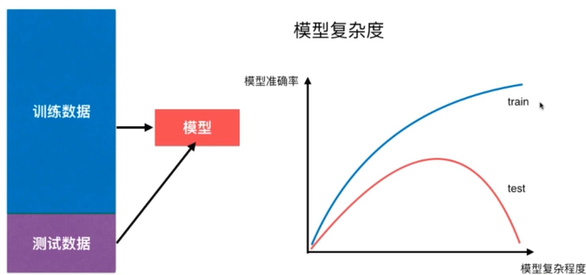
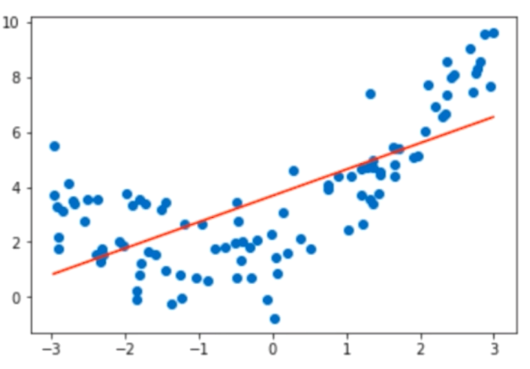
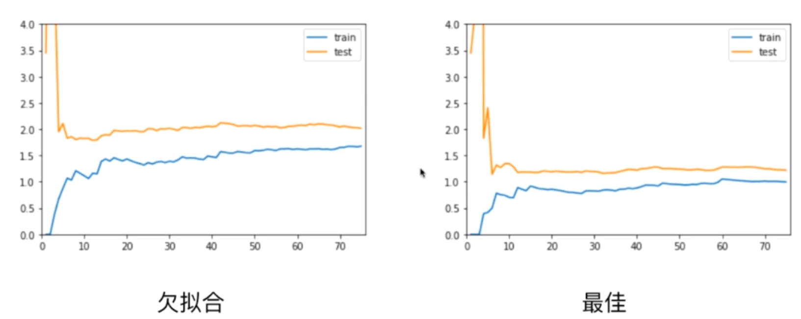
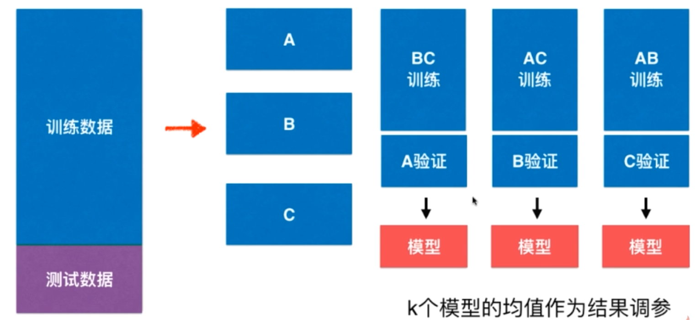
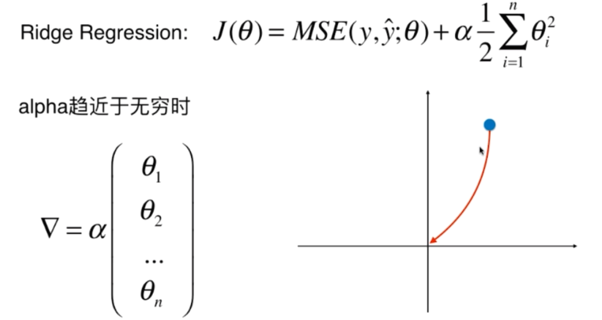
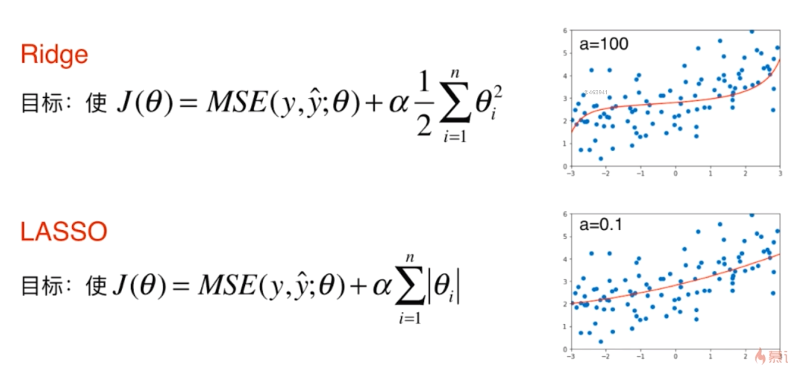
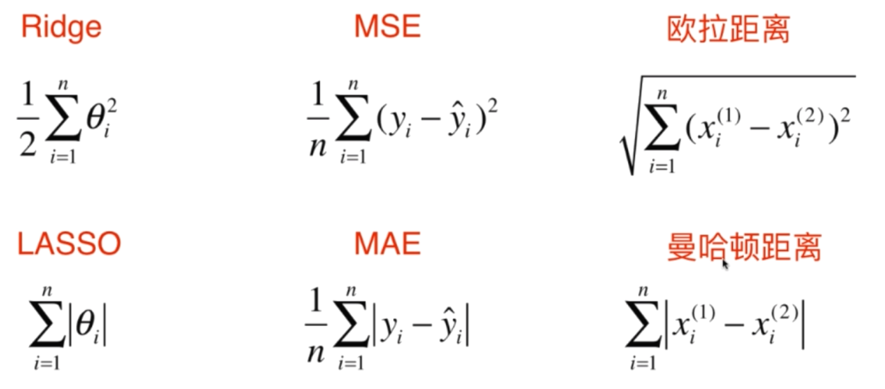
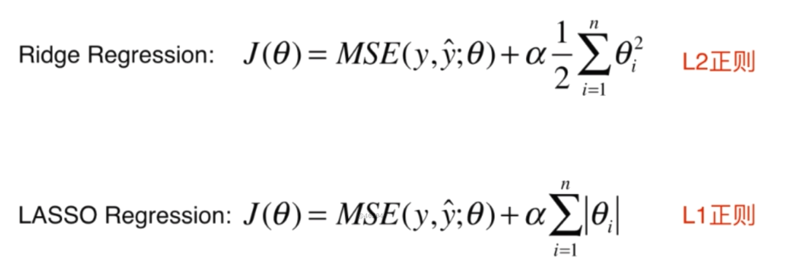

# 多项式回归

---

## 测试数据集的意义

寻找泛化能力最好的地方（test的峰值）

## 过拟合和欠拟合

>欠拟合（underfitting）
>
>算法所训练的数据不能完整表述数据关系

>过拟合（overfitting）
>
>算法所训练的模型过多地表达了数据间的噪音关系

通俗理解：在识别猫和狗当中

欠拟合：凡是有眼睛的动物都是狗（过于普遍）

过拟合：凡是毛发是黄色的都是狗（过于细节）

## 学习曲线

欠拟合和最佳位置相比较而言，欠拟合的train和test相差的位置要高一些，误差比较大

过拟合和最佳位置相比，误差相差不多，但是test数据集的误差比较大，test和train的误差比较大，说明模型的泛化能力不够好

## 交叉验证（k-folds）

把训练数据分成K份（称为k-folds cross validation）

缺点：每次训练k个模型，相当于整体性能慢了k倍

### 留一法 LOO-CV

把训练数据集分成m份，称为留一法（Leave-One-Out Cross Validation）

完全不受随机的影响，最接近模型真正的性能指标

缺点：计算量巨大

## 偏差方差的权衡

### 偏差和方差

### 模型误差

模型误差 = 偏差（Bias）+ 方差（Variance）+ 不可避免的误差

### 导致原因

导致偏差的主要原因：

对问题本身的假设不正确，如：非线性数据使用线性回归（欠拟合）

导致方差的主要原因：

数据的一点点扰动都会较大地影响模型。通常原因，使用的模型太复杂。如高阶多项式回归

有一些算法天生就是高方差算法：kNN

非参数学习通常都是高方差算法。因为不对数据进行任何假设

有些算法天生就是高偏差算法。如线性回归

参数学习通常都是高偏差算法。因为堆数据具有较强的假设

大多数算法具有相应的参数，可以调整偏差和方差：

* 如kNN算法中的k
* 如线性回归中使用多项式回归

偏差和方差通常是矛盾的：

* 降低偏差，会提供方差
* 降低方差，会提供偏差

机器学习的主要挑战来自方差。

解决高方差的通常手段：

* 降低模型复杂度
* 减少数据维度；降噪
* 增加样本数
* 使用验证集
* 模型正则化

## 模型正则化

目标使下列式子尽可能的小：
$$
\sum \limits _{i=1}^{m} (y^{(i)} - \theta_0 - \theta_1 X_1^{(i)} - \theta_2 X_2^{(i)} - ... - \theta_n X_n^{(i)})^2
$$
等同于求：使尽可能的小
$$
J(\theta) = MSE(y, \hat y;\theta)
$$
加入**模型正则化**，目标使下列式子尽可能的小【**岭回归 Ridge-Regression**】

* α 是超参数
* 1/2 需要对式子进行求导，后面的θ求导后会有2，与1/2相约

$$
J(\theta) = MSE(y, \hat y;\theta)+\alpha \frac{1}{2} \sum \limits _{i=1}^n \theta_i^2
$$

岭回归相当于引入了α值

### Ridge趋于无穷

## LASSO回归

LASSO (Least Absolute Shrinkage and Selection Operator Regression)

目标使以下式子尽可能的小
$$
J(\theta) = MSE(y, \hat y;\theta)+\alpha \frac{1}{2} \sum \limits _{i=1}^n | \theta_i |
$$

### 比较Ridge和LASSO

### Lasso特点

LASSO趋向于使得一部分θ值变为0，所以可作为特征选择用

### Lasso趋于无穷

## L1，L2和弹性网络

### 引入L1、L2正则项概念

### L0正则

这个式子的意义是让θ的个数尽量小（或者说描述非0 θ元素个数），使得得到的曲线不要太陡，这样泛化能力就得到提高
$$
J(\theta) = MSE(y, \hat y; \theta) + min(number - of - non - zero - \theta)
$$
实际用L1取代，因为L0正则的优化是一个NP难的问题

### 弹性网（Elastic Net）

$$
J(\theta) = MSE(y, \hat y;\theta)+r \alpha \sum \limits _{i=1}^n \theta_i^2+ \frac{1-r}{2} \alpha \sum \limits ^n _{i=1} \theta ^2 _i
$$

