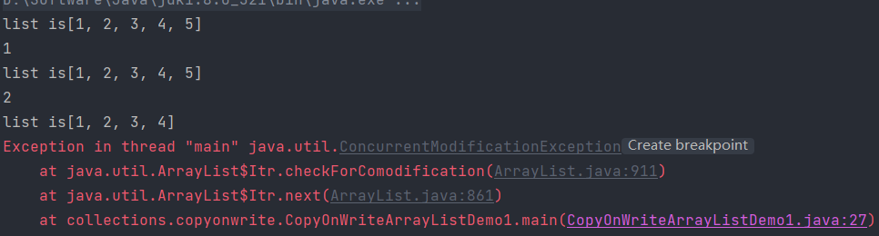
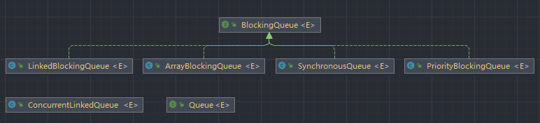
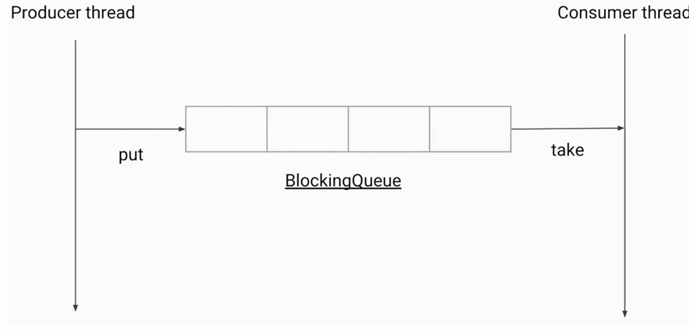

# 并发容器

概览

* **ConcurrentHashMap**：线程安全的HashMap
* **CopyOnWriteArrayList**：线程安全的List
* **BlockingQueue**：这是一个接口，表示阻塞队列，非常适合用于作为数据共享的队列
* ConcurrentLinkedQueue：高效的非阻塞并发队列，使用链表实现，可以看做一个线程安全的LinkedList

不常用的

* ConcurrentSkipListMap：是一个Map，使用跳表的数据结构进行快速查找


## 追溯历史

可以看到以前的并发容器：Vector和Hashtable

* 大幅度使用了`synchronized`所以导致了性能不好


## 前身：同步的HashMap和ArrayList

ArrayList原本是线程不安全的，那么如何将其更改为线程安全的呢？

```java
public class SynList {

    public static void main(String[] args) {
        List<Integer> list = Collections.synchronizedList(new ArrayList<Integer>());

        list.add(5);

        System.out.println(list.get(0));

    }
}
```

如何查看是怎样实现的呢？但是这样的实现效果也不尽人意

`Collections.synchronizedList(new ArrayList<Integer>());` --> `new SynchronizedRandomAccessList<>(list) :` -->   `extends SynchronizedList<E>` -->  `extends SynchronizedCollection<E>` 


经过上述的迭代就有了现在`ConcurrentHashMap`和`CopyOnWriteArrayList`

绝大多数并发情况下，ConcurrentHashMap和CopyOnWriteArrayList的性能都要更好


## Map简介

Map的接口


* HashMap
* Hashtable
* LinkedHashMap
* TreeMap


### HashMap

为什么HashMap是线程不安全的？

* 同时put碰撞导致数据丢失
* 同时put扩容导致数据丢失
* 死循环造成的CPU100%（主要存在于JDK7中）


如何更改JDK版本进行调试？

Project Settings （另外，如果可以针对每个module设置JDK版本，也是在project settings里面）


特点：

1. 非线程安全
2. 迭代时不允许修改内容
3. 只读的并发是安全的
4. 如果一定要把HashMap用在并发环境，用`Collections.synchronizedMap(new HashMap)`


## ConcurrentHashMap


### JDK 1.7

* Java 7中的ConcurrentHashMap最外层是多个segment ,每个segment的底层数据结构与HashMap类似,仍然是数组和链表组成的拉链法
* 每个segment独立上ReentrantLock锁,每个segment之间互不影响,提高了并发效率
* ConcurrentHashMap默认有16个Segments ,所以最多可以同时支持16个线程并发写(操作分别分布在不同的Segment上)。这个默认值可以在初始化的时候设置为其他值,但是一旦初始化以后,是不可以扩容的


### JDK1.8


两个重要的方法：

* put
* get


> putValue分析

1. 判断key value不为空

`if (key == null || value == null) throw new NullPointerException();`

2. 计算hash值

`int hash = spread(key.hashCode());`

3. 根据对应位置节点的类型来赋值，或者helpTransfer，或者增加链表，或者给红黑树增加节点

赋值

```java
else if ((f = tabAt(tab, i = (n - 1) & hash)) == null) {
                if (casTabAt(tab, i, null,
                             new Node<K,V>(hash, key, value, null)))
                    break;                   // no lock when adding to empty bin
            }
```

helpTransfer（MOVED -- 特殊节点）

```java
else if ((fh = f.hash) == MOVED)
    tab = helpTransfer(tab, f);
```

链表操作

```java
if (fh >= 0) {
    binCount = 1;
    for (Node<K,V> e = f;; ++binCount) {
        K ek;
        if (e.hash == hash &&
            ((ek = e.key) == key ||
             (ek != null && key.equals(ek)))) {
            oldVal = e.val;
            if (!onlyIfAbsent)
                e.val = value;
            break;
        }
        Node<K,V> pred = e;
        if ((e = e.next) == null) {
            pred.next = new Node<K,V>(hash, key,
                                      value, null);
            break;
        }
    }
}
```

红黑树

```java
else if (f instanceof TreeBin) {
    Node<K,V> p;
    binCount = 2;
    if ((p = ((TreeBin<K,V>)f).putTreeVal(hash, key,
                                          value)) != null) {
        oldVal = p.val;
        if (!onlyIfAbsent)
            p.val = value;
    }
}
```


4. 检查满足阈值就“红黑树化”

5. 返回oldVal

```java
if (binCount != 0) {
    if (binCount >= TREEIFY_THRESHOLD)
        treeifyBin(tab, i);
    if (oldVal != null)
        return oldVal;
    break;
}
```


> get流程

* 计算hash值

`int h = spread(key.hashCode());`

* 找到对应的位置，根据情况进行

```java
if ((eh = e.hash) == h) {
    if ((ek = e.key) == key || (ek != null && key.equals(ek)))
        return e.val;
}
```

* 直接取出

* 红黑树里找值

```java
else if (eh < 0)
    return (p = e.find(h, key)) != null ? p.val : null;
```

* 遍历链表取值

```java
while ((e = e.next) != null) {
    if (e.hash == h &&
        ((ek = e.key) == key || (ek != null && key.equals(ek))))
        return e.val;
}
```

* 回找到的结果


### 1.7和1.8区别

* 数据结构
  * 1.7：segment
  * 1.8：链表+红黑树
* Hash碰撞
  * 1.7：拉链法
  * 1.8：先拉链，达到条件转为红黑树
* 保证并发安全
* 查询复杂度
* 为什么超过8要转为红黑树？
  *  红黑树的每一个节点是链表空间的2倍，所以一开始使用占用空间更小的链表
  * 要达到红黑树为8其实很难，概率只有千万分之几


### 线程不安全的情况

`这样的例子不是表示concurrentHashMap不是线程安全，而是演示错误使用造成的线程不安全`

只能保证get、put的操作是线程安全的，如果在外边进行了线程不安全的操作再放进去那么就会造成线程不安全

```java
public class OptionsNotSafe implements Runnable {

    private static ConcurrentHashMap<String, Integer> scores = new ConcurrentHashMap<>();

    public static void main(String[] args) throws InterruptedException {
        scores.put("小明", 0);

        Thread t1 = new Thread(new OptionsNotSafe());
        Thread t2 = new Thread(new OptionsNotSafe());
        t1.start();
        t2.start();
        t1.join();
        t2.join();
        System.out.println(scores);
    }


    @Override
    public void run() {
        for (int i = 0; i < 1000; i++) {
            Integer score = scores.get("小明");
            Integer newScore = score + 1;
            scores.put("小明", newScore);
        }
    }
}
```

如何解决这样的困境呢？

把`scores.put("小明", newScore);` 替换为 `scores.replace("小明", score, newScore);`


## CopyOnWriteArrayList


### 适用场景

* 读操作可以尽可能地快,而写即使慢一些也没有太大关系
* 读多写少:黑名单,每日更新;监听器:迭代操作远多余修改操作


### 读写规则

* 回顾读写锁：读读共享、其他都互斥（写写互斥、读写互斥、写读互斥）
* 读写锁规则的升级：读取是完全不用加锁的，并且更厉害的是，写入也不会阻塞读取操作。只有写入和写出之间需要进行同步等待

> 代码演示

可以看到运行结果是，在运行过程中删除了5，所以导致

```java
public static void main(String[] args) {

    ArrayList<String> list = new ArrayList<>();


    list.add("1");
    list.add("2");
    list.add("3");
    list.add("4");
    list.add("5");

    Iterator<String> iterator = list.iterator();

    while (iterator.hasNext()) {
        System.out.println("list is" + list);
        String next = iterator.next();
        System.out.println(next);


        if (next.equals("2")) {
            list.remove("5");
        }
        if (next.equals("3")) {
            list.add("3 found");
        }
    }
}
```



如果修改为CopyOnWriteArrayList，原理就是先把写的拷贝一份出来，在新的进行操作；而读取的操作是在旧的上面

```java
public static void main(String[] args) {

    //        ArrayList<String> list = new ArrayList<>();
    CopyOnWriteArrayList<String> list = new CopyOnWriteArrayList<>();

    list.add("1");
    list.add("2");
    list.add("3");
    list.add("4");
    list.add("5");

    Iterator<String> iterator = list.iterator();

    while (iterator.hasNext()) {
        System.out.println("list is" + list);
        String next = iterator.next();
        System.out.println(next);


        if (next.equals("2")) {
            list.remove("5");
        }
        if (next.equals("3")) {
            list.add("3 found");
        }
    }
}
```

实现原理：

* 创建新副本，读写分离
* “不可变” 原理
* 迭代的时候


可以看到ArrayList的源码`writeObject`中

```java
if (modCount != expectedModCount) {
    throw new ConcurrentModificationException();
}
```


### 缺点

* 数据一致性问题：CopyOnWrite容器只能保证数据的最终一致性，不能保证数据的实时一致性。所以如果希望写入的数据马上读到，不要使用CopyOnWrite容器
* 内存占用问题：因为CopyOnWrite的写是复制机制，所以在进行写操作的时候，内存里会同时驻扎两个对象的内存。


### 源码分析

> 保存数组的

`private transient volatile Object[] array;`


> 如何上锁的

`final transient ReentrantLock lock = new ReentrantLock();`


> add操作分析

```java
public boolean add(E e) {
    final ReentrantLock lock = this.lock;
    lock.lock();
    try {
        Object[] elements = getArray();
        int len = elements.length;
        Object[] newElements = Arrays.copyOf(elements, len + 1);
        newElements[len] = e;
        setArray(newElements);
        return true;
    } finally {
        lock.unlock();
    }
}
```

1. 拿到锁
2. 上锁
3. 拿到原来数组
4. 查看长度
5. 复制新的数组
6. 把参数中的e加入到 len 位置
7. 复制到最后一个位置
8. 把引用塞进去 `setArray(newElements);`


> get操作分析

```java
private E get(Object[] a, int index) {
    return (E) a[index];
}
```

可以看到整个get过程没有进行加锁


## 并发队列

为什么要使用队列？

* 用队列可以在线程中传递数据
* 考虑到了线程安全问题


### 队列简介

* Queue
* BlockingQueue




### BlockingQueue

* LinkedBlockingQueue
* PriorityBlockingQueue
* SynchronousQueue


* 阻塞队列是具有阻塞功能的队列,所以它首先是一-个队列其次是具有阻塞功能。
* 通常，阻塞队列的一端是给生产者放数据用,另一端给消费者拿数据用。阻塞队列是线程安全的,所以生产者和消费者都可以是多线程的





* **take()方法**：获取并移除队列的头结点，一旦如果执行take的时候队列里无数据,则阻塞，直到队列里有数据
* **put()方法**：插入元素。但是如果队列已满,那么就无法继续插入,则阻塞，直到队列里有了空闲空间


* 是否有界(容量有多大) : 这是一-个非常重要的属性,无界队列意味着里面可以容纳非常多( Integer.MAX_ _VALUE ,约为2的31次,是非常大的一个数,可以近似认为是无限容量)
* 阻塞队列和线程池的关系:阻塞队列是线程池的重要组成部分


主要方法：

* put、take
* add、remove、element
* offer、poll、peek


#### ArrayBlockingQueue

* 有界
* 指定容量
* 公平：指定是否需要保证公平，如果想保证公平，那么等待了最长的线程被优先处理，不过这会同时带来一定的性能损耗

> 代码示例

```java
public class ArrayBlockingQueueDemo {

    public static void main(String[] args) {
        ArrayBlockingQueue<String> queue = new ArrayBlockingQueue<>(3);

        Interviewer r1 = new Interviewer(queue);
        Consumer r2 = new Consumer(queue);
        new Thread(r1).start();
        new Thread(r2).start();
    }
}

class Interviewer implements Runnable {

    BlockingQueue<String> queue;

    public Interviewer(BlockingQueue<String> queue) {
        this.queue = queue;
    }

    @Override
    public void run() {
        System.out.println("10个候选人都来了");
        for (int i = 0; i < 10; i++) {
            String condidate = "Candidate" + i;
            try {
                queue.put(condidate);
                System.out.println("安排好了 "+ condidate);
            } catch (InterruptedException e) {
                e.printStackTrace();
            }
        }

        try {
            queue.put("stop");
        } catch (InterruptedException e) {
            e.printStackTrace();
        }
    }
}

class Consumer implements Runnable {

    BlockingQueue<String> queue;

    public Consumer(BlockingQueue queue) {
        this.queue = queue;
    }

    @Override
    public void run() {
        try {
            Thread.sleep(1000);
        } catch (InterruptedException e) {
            e.printStackTrace();
        }
        String msg;
        try {
            while (!(msg = queue.take()).equals("stop")) {
                System.out.println(msg + " 到了");
            }
            System.out.println("所有候选人都结束了");
        } catch (InterruptedException e) {
            e.printStackTrace();
        }
    }
}
```


##### put源码分析

1. 查看传进来的值是否是空的
2. 使用`ReentrantLock`锁住
3. 看当前值是否已经满队列了，如果没有满就`enqueue(e)`
4. 最后释放锁

```java
public void put(E e) throws InterruptedException {
    checkNotNull(e);
    final ReentrantLock lock = this.lock;
    lock.lockInterruptibly();
    try {
        while (count == items.length)
            notFull.await();
        enqueue(e);
    } finally {
        lock.unlock();
    }
}
```


#### LinkedBlockingQueue

* 无界
* 容量`Integer.MAX_VALUE`
* 内部结构：Node、两把锁


#### PriorityBlockingQueue

* 支持优先级
* 自然顺序（而不是先进先出）
* 无界队列
* PriorityQueue的线程安全版本


#### SynchronousQueue

* 容量为0
* 需要注意的是, SynchronousQueue的容量不是1而是0 ,因为SynchronousQueue不需要去持有元素,它所做的就是直接传递( direct handoff )
* 效率很高


注意点

* SynchronousQueue没有peek等函数,因为peek的含义是取出头结点,但是SynchronousQueue的容量是0 ,所以连头结点都没有,也就没有peek方法。同理,没有iterate相关方法
* 是一个极好的用来直接传递的并发数据结构
* SynchronousQueue是线程池，Executors.newCachedThreadPool()使用的阻塞队列


#### DelayQueue

* 延迟队列，根据延迟时间排序
* 元素需要实现Delayed接口，规定排序规则


### 非阻塞并发队列

* 并发包中的非阻塞队列只有ConcurrentLinkedQueue这一种，ConcurrentLinkedQueue是使用链表作为其数据结构的，使用CAS非阻塞算法来实现线程安全（不具备阻塞功能），适合在对性能要求较高的并发场景。用的相对比较少一些
* 源码中offer方法有CAS思想，内有p.casNext方法，用了UNSAFE.compareAndSwapObject


### 如何选择适合的队列

* 考虑边界
  * 容量特别大（无边界）
  * 容量需要库扩容
* 考虑空间
  * SynchronousQueue是没有容量的
  * ArrayBlockingQueue内部是Array
* 考虑吞吐量
  * 从性能角度看，LinkedBlockingQueue优于ArrayBlockingQueue


## 并发容器总结

1. 为什么要使用队列
2. 阻塞队列
3. 非阻塞队列
4. 如何使用适合的队列


* java.util.concurrent包提供的容器,分为3类: Concurrent\*、CopyOnWrite\*、Blocking\*
* Concurrent的特点是大部分通过CAS实现并发,而CopyOnWrite*则是通过复制一份原数据来实现的, Blocking通过AQS实现的


