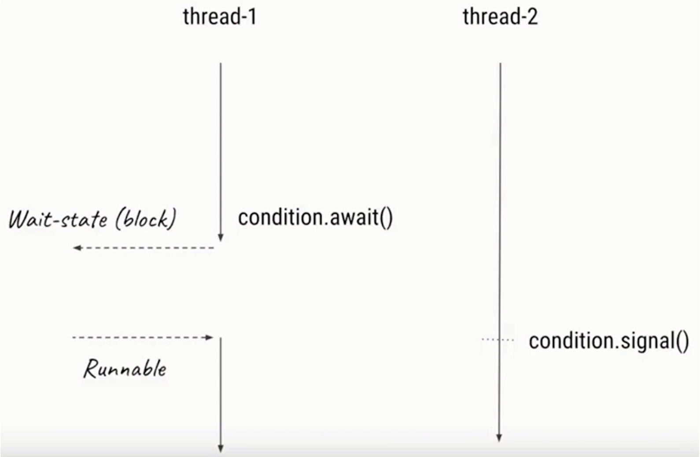

# 并发流程控制工具类

## CountDownLatch

* 倒数门栓
* 例子：购物拼团、游乐园过山车（人数到了才发车）
* 流程：倒数结束前，一直处于等待状态，直到倒计时结束了，此线程才继续工作


### 主要方法

>  CountDownLatch(int count) 
>
> 构造一个以给定计数count（倒数的数值）


> public void await() 
>
> 调用await方法的线程会被挂起，它会等待直到count = 0 才继续执行

导致当前线程等到锁存器计数到零，除非线程是[interrupted](https://www.mklab.cn/onlineapi/jdk_8_cn/java/lang/Thread.html#interrupt--) 。

 如果当前计数为零，则此方法立即返回。 

 如果当前计数大于零，则当前线程将被禁用以进行线程调度，并处于休眠状态，直至发生两件事情之一： 

-  由于[`countDown()`](https://www.mklab.cn/onlineapi/jdk_8_cn/java/util/concurrent/CountDownLatch.html#countDown--)方法的调用，计数达到零; 要么 
-  一些其他线程[interrupts](https://www.mklab.cn/onlineapi/jdk_8_cn/java/lang/Thread.html#interrupt--)当前线程。 

 如果当前线程： 

-  在进入该方法时设置了中断状态; 要么 
-  是[interrupted](https://www.mklab.cn/onlineapi/jdk_8_cn/java/lang/Thread.html#interrupt--)等待， 

然后[`InterruptedException`](https://www.mklab.cn/onlineapi/jdk_8_cn/java/lang/InterruptedException.html)被关上，当前线程的中断状态被清除。


> public void countDown() 
>
> 将count值-1，直到0时，等待的线程会被唤醒

减少锁存器的计数，如果计数达到零，释放所有等待的线程。

 如果当前计数大于零，则它将递减。 如果新计数为零，则所有等待的线程都将被重新启用以进行线程调度。 

 如果当前计数等于零，那么没有任何反应。 


### 图解

首先有多个线程

在这张图中，只有T1、T2、T3是在计数，而Ta可以看作是主线程，只有在计算为0的时候，Ta才会被唤醒执行。（注：这里的T1、T2、T3可以看作是过山车的工作人员）


### 两个典型用法及结合

> 用法1：一个线程等待多个线程执行完毕，再继续自己的工作

```java
/**
 * desc：工厂中，质检，5个工人检查，所有人都认为通过，才通过
 */
public class CountDownLatchDemo1 {

    public static void main(String[] args) throws InterruptedException {
        CountDownLatch latch = new CountDownLatch(5);
        ExecutorService service = Executors.newFixedThreadPool(5);

        for (int i = 0; i < 5; i++) {
            final int no = i + 1;
            Runnable runnable = new Runnable() {
                @Override
                public void run() {
                    try {
                        Thread.sleep((long) Math.random() * 10000);
                        System.out.println("No." + no + "完成了检查");
                    } catch (InterruptedException e) {
                        e.printStackTrace();
                    } finally {
                        latch.countDown();
                    }
                }
            };
            service.submit(runnable);
        }
        System.out.println("等待5个人检查完.......");
        latch.await();
        System.out.println("所有人都完成了工作，进入下一个环节");
    }
}
```


> 用法2：多个线程等待某一个线程的信号，同时开始执行

```java
/**
 * desc：模拟100米跑步，5名选手都准备好了，只等裁判一声令下，所有人同时开始跑步
 */
public class CountDownLatchDemo2 {

    public static void main(String[] args) throws InterruptedException {
        CountDownLatch begin = new CountDownLatch(1);
        ExecutorService service = Executors.newFixedThreadPool(5);
        for (int i = 0; i < 5; i++) {
            final int no = i + 1;
            Runnable runnable = new Runnable() {
                @Override
                public void run() {
                    System.out.println("No." + no + "准备完毕，等待发令枪");
                    try {
                        begin.await();
                        System.out.println("No." + no + "开始跑步了");
                    } catch (InterruptedException e) {
                        e.printStackTrace();
                    }
                }
            };
            service.submit(runnable);
        }

        // 裁判员检查发令枪
        Thread.sleep(5000);
        System.out.println("发令枪响，比赛开始！");
        begin.countDown();
    }
}
```


> 结合用法1和用法2

```java
/**
 * desc：模拟100米跑步，5名选手都准备好了，只等裁判一声令下，所有人同时开始跑步
 * 当所有人到达比赛终点时，比赛结束
 */
public class CountDownLatchDemo3 {

    public static void main(String[] args) throws InterruptedException {
        CountDownLatch begin = new CountDownLatch(1);

        CountDownLatch end = new CountDownLatch(5);
        ExecutorService service = Executors.newFixedThreadPool(5);
        for (int i = 0; i < 5; i++) {
            final int no = i + 1;
            Runnable runnable = new Runnable() {
                @Override
                public void run() {
                    System.out.println("No." + no + "准备完毕，等待发令枪");
                    try {
                        begin.await();
                        System.out.println("No." + no + "开始跑步了");
                        Thread.sleep((long) (Math.random() * 10000)); // 每个运动员的速度都不一致

                        System.out.println("No." + no + "跑到终点了");
                    } catch (InterruptedException e) {
                        e.printStackTrace();
                    } finally {
                        end.countDown();
                    }
                }
            };
            service.submit(runnable);
        }

        // 裁判员检查发令枪
        Thread.sleep(5000);
        System.out.println("发令枪响，比赛开始！");
        begin.countDown();

        end.await();
        System.out.println("所有人到达终点，比赛结束");
    }
}
```


### 注意点

扩展用法：多个线程等待多个线程完成执行后，再同时执行

CountDownLatch是不能够重用的，如果需要重新计数，可以考虑使用cyclicBarrier或者创建新的CountDownLatch实例


### 总结

* 掌握经典用法：一等多和多等一
* CountDownLatch类在创建实例的时候,需要传递倒数次数。倒数到0的时候，之前等待的线程会继续运行


## Semaphore信号量

* Semaphore可以用来限制或管理数量有限的资源的使用情况
* 信号量的作用是维护一个“许可证”的计数,线程可以“获取'许可证,那信号量剩余的许可证就减一, 线程也可以“释放”一个许可证,那信号量剩余的许可证就加一,当信号量所拥有的许可证数量为0,那么 下一个还想要获取许可证的线程,就需要等待,直到有另外的线程释放了许可证


### 用法

#### 使用流程

1. 初始化Semaphore并指定许可证的数量
2. 在需要被现在的代码前加acquire()或者acquireUninterruptibly()方法
3. 在任务执行结束后,调用release()来释放许可证


#### 重要方法

> public Semaphore(int permits, boolean fair)

创建一个`Semaphore`与给定数量的许可证和给定的公平设置。           

参数            

* `permits` - `permits`的初始许可证。该值可能为负数，在这种情况下，必须在任何获取被授予之前发布释放。
* `fair` - `true`如果这个信号量将保证首先在竞争中首先授予许可证，否则`false`            


> public void acquire()

从此信号量获取许可证，阻止直到可用，否则线程为[interrupted](https://www.matools.com/file/manual/jdk_api_1.8_google/java/lang/Thread.html#interrupt--) 。

 获得许可证，如果有可用并立即返回，则将可用许可证数量减少一个。 

 如果没有可用的许可证，那么当前线程将被禁用以进行线程调度，并且处于休眠状态，直至发生两件事情之一： 

-  一些其他线程调用此[信号量的`release()`](https://www.matools.com/file/manual/jdk_api_1.8_google/java/util/concurrent/Semaphore.html#release--)方法，当前线程旁边将分配一个许可证; 要么 
-  一些其他线程[interrupts](https://www.matools.com/file/manual/jdk_api_1.8_google/java/lang/Thread.html#interrupt--)当前线程。 

 如果当前线程： 

-  在进入该方法时设置了中断状态; 要么 
-  是[interrupted](https://www.matools.com/file/manual/jdk_api_1.8_google/java/lang/Thread.html#interrupt--)等候许可证， 

然后[`InterruptedException`](https://www.matools.com/file/manual/jdk_api_1.8_google/java/lang/InterruptedException.html)被关上，当前线程的中断状态被清除。


> public void acquireUninterruptibly()

 从这个信号灯获取许可证，阻止一个可用的。

获得许可证，如果有可用并立即返回，则将可用许可证数量减少一个。

如果没有许可证可用，那么当前线程将被禁用以进行线程调度，并且处于休眠状态，直到某个其他线程调用此信号量的release()方法，并且当前线程将被分配一个许可证。

如果当前线程是interrupted等待许可证，那么它将继续等待，但线程被分配许可证的时间可能会比接收到许可证的时间更改，而不会发生中断。 当该线程从该方法返回时，其中断状态将被设置。


> public boolean tryAcquire()

 从这个信号量获得许可证，只有在调用时可以使用该许可证。

获得许可证，如果有可用并立即返回，值为`true` ，将可用许可证数量减少一个。

如果没有许可证可用，那么该方法将立即返回值为`false` 。

即使这个信号量被设置为使用一个合理的订购策略，如果一个可用的话，那么呼叫`tryAcquire() `将立即获得许可，无论其他线程是否正在等待。 这种“趸船”行为在某些情况下是有用的，尽管它打破了公平。 如果要尊重公平性，请使用`tryAcquire(0, TimeUnit.SECONDS)` ，几乎相当于（也检测到中断）。

结果
    true如果获得许可证， false false 


> public void release()
>
> 用完许可证要调用release归还，不然会卡死

 释放许可证，将其返回到信号量。

发放许可证，将可用许可证的数量增加一个。 如果任何线程尝试获取许可证，那么选择一个被授予刚被释放的许可证。 （重新）线程调度用于线程调度。

没有要求发布许可证的线程必须通过调用acquire()获取该许可证。 信号量的正确使用通过应用程序中的编程惯例来确定。


### 注意点

1. 获取和释放的许可证数量必须一致,否则比如每次都获取2个但是只释放1个甚至不释放,随着时间的推移,到最后许可证数量不够用,会导致程序卡死。( 虽然信号量类并不对是否和获取的数量做规定,但是这是我们的编程规范，否则容易出错)
2. 注意在初始化Semaphore的时候设置公平性,一般设置为true会更合理
3. 并不是必须由获取许可证的线程释放那个许可证,事实上, 获取和释放许可证对线程并无要求 ,也许是A获取了 ,然后由B释放,只要逻辑合理即可。
4. 信号:量的作用,除了控制临界区最多同时有N个线程访问外，另一个作用是可以实现“条件等待”, 例如线程1需要在线程2完成准备_工作后才能开始工作,那么就线程1acquire() ,而线程2完成任务后release()，这样的话,相当于是轻量级的CountDownLatch。

```java
public class SemaphoreDemo {
    static Semaphore semaphore = new Semaphore(3, true);

    public static void main(String[] args) {
        ExecutorService service = Executors.newFixedThreadPool(50);

        for (int i = 0; i < 100; i++) {
            service.submit(new Task());
        }

        service.shutdown();
    }

    static class Task implements Runnable {

        @Override
        public void run() {
            try {
                semaphore.acquire();
            } catch (InterruptedException e) {
                e.printStackTrace();
            }
            System.out.println(Thread.currentThread().getName() + "拿到了许可证");

            try {
                Thread.sleep(2000);
            } catch (InterruptedException e) {
                e.printStackTrace();
            }
            System.out.println(Thread.currentThread().getName() + "释放了许可证");

            semaphore.release(3);
        }
    }
}
```


## Condition接口

* 当线程1需要等待某个条件的时候，它就去执行condition.await()方法，一旦执行了await()方法,线程就会进入阻塞状态
* 然后通常会有另外一-个线程,假设是线程2，去执行对应的条件，直到这个条件达成的时候,线程2就会去执行condition.signal()方法,这时JVM就会从被阻塞的线程里找，找到那些等待该condition的线程,当线程1就会收到可执行信号的时候,它的线程状态就会变成Runnable可执行状态




* signalAll：唤起所有正在等待的线程
* signal：公平的，只会唤起那个等待时间最长的线程


> 代码演示

```java
/**
 * desc: Condition的基本用法
 */
public class ConditionDemo1 {

    private ReentrantLock lock = new ReentrantLock();

    private Condition condition = lock.newCondition();

    void method1() throws InterruptedException {
        lock.lock();
        try {
            System.out.println("条件不满足，开始await");
            condition.await();
            System.out.println("条件满足了，开始执行后续的任务");
        } finally {
            lock.unlock();
        }
    }

    void method2() {
        lock.lock();
        try {
            System.out.println("准备工作完成，唤醒其他的线程");
            condition.signal();
        } finally {
            lock.unlock();
        }
    }

    public static void main(String[] args) throws InterruptedException {
        ConditionDemo1 conditionDemo1 = new ConditionDemo1();
        new Thread(new Runnable() {
            @Override
            public void run() {
                try {
                    Thread.sleep(1000);
                    conditionDemo1.method2();
                }catch (InterruptedException e) {
                    e.printStackTrace();
                }
            }
        }).start();

        conditionDemo1.method1();
//        conditionDemo1.method2();
    }
}
```


> 生产者和消费者模式

```java
/**
 * desc: 演示用Condition实现生产者消费者模式
 */
public class ConditionDemo2 {

    private int queueSize = 10;
    private PriorityQueue<Integer> queue = new PriorityQueue<>(queueSize);
    private Lock lock = new ReentrantLock();
    private Condition notFull = lock.newCondition();
    private Condition notEmpty = lock.newCondition();

    public static void main(String[] args) {
        ConditionDemo2 demo2 = new ConditionDemo2();

        Producer producer = demo2.new Producer();
        Consumer consumer = demo2.new Consumer();

        producer.start();
        consumer.start();
    }

    class Consumer extends Thread {
        @Override
        public void run() {
            consume();
        }

        private void consume() {
            while (true) {
                lock.lock();
                try {
                    while (queue.size() == 0) {
                        System.out.println("队列空，等待数据");

                        try {
                            notEmpty.await();
                        } catch (InterruptedException e) {
                            e.printStackTrace();
                        }
                    }
                    queue.poll();
                    notFull.signalAll();
                    System.out.println("从队列里取走了一个数据，队列剩余" + queue.size() + "个元素");
                } finally {
                    lock.unlock();
                }
            }
        }
    }

    class Producer extends Thread {
        @Override
        public void run() {
            produce();
        }

        private void produce() {
            while (true) {
                lock.lock();
                try {
                    while (queue.size() == queueSize) {
                        System.out.println("队列满，等待空余");

                        try {
                            notFull.await();
                        } catch (InterruptedException e) {
                            e.printStackTrace();
                        }
                    }
                    queue.offer(1);
                    notEmpty.signalAll();
                    System.out.println("向队列插入一个元素，队列剩余空间：" + (queueSize - queue.size()) + "个元素");
                } finally {
                    lock.unlock();
                }
            }
        }
    }
}
```


### 注意点

* 实际上,如果说Lock用来代替synchronized ,那么Condition就是用来代替相对应的Object.wait/notify的,所以在用法和性质上，几乎都- -样
* await方法会自动释放持有的Lock锁,和Object.wait一样,不需要自己手动先释放锁
* 调用await的时候，必须持有锁,否则会抛出异常,和Object.wait一样。


## CyclicBarrier 循环栅栏

* CyclicBarrier循环栅栏和CountDownL atch很类似,都能阻塞组线程
* 当有大量线程相互配合,分别计算不同任务,并且需要最后统，一汇总的时候,我们可以使用CyclicBarrier。CyclicBarrier可以构造一个集结点 ,当某一个线程执行完毕,它就会到集结点等待,直到所有线程都到了集结点,那么该栅栏就被撤销, 所有线程再统一出发,继续执行剩下的任务。
* 生活中的例子:“咱们3个人明天中午在学校碰面 ,都到齐后起讨论下学期的计划。


> 代码示例

```java
/**
 * desc: 演示CyclicBarrier
 */
public class CyclicBarrierDemo {

    public static void main(String[] args) {
        CyclicBarrier barrier = new CyclicBarrier(5, new Runnable() {
            @Override
            public void run() {
                System.out.println("所有人都到场，大家一起出发");
            }
        });

        for (int i = 0; i < 10; i++) {
            new Thread(new Task1(i, barrier)).start();
        }
    }

    static class Task1 implements Runnable {
        private int id;
        private CyclicBarrier barrier;

        public Task1(int id, CyclicBarrier barrier) {
            this.id = id;
            this.barrier = barrier;
        }

        @Override
        public void run() {
            System.out.println("线程" + id + "现在前往集合地点");
            try {
                Thread.sleep((long) (Math.random() * 10000));
                System.out.println("线程" + id + "到了集合地点，开始等待其他人到达");
                barrier.await();
                System.out.println("线程" + id + "出发了");
            } catch (InterruptedException e) {
                e.printStackTrace();
            } catch (BrokenBarrierException e) {
                e.printStackTrace();
            }
        }
    }
}
```


### CyclicBarrier和CountDownLatch的区别

* 作用不同: CyclicBarrier要等固定数量 的线程都到达了栅栏位置才能继续执行,而CountDownLatch只需等待数字到0 ,也就是说，CountDownLatch用于事件,但是CyclicBarrier是用于线程的。
* 可重用性不同: CountDownLatch在倒数到0并触发门闩打开后就不能再次使用了，除非新建新的实例;而CyclicBarrier可以重复使用。


## 总结

1. 什么事控制并发流程
2. CountDownLatch倒计时门栓
   1. 一等多
   2. 多等一
3. Semaphore信号量
   1. 重量级的服务限制访问量
4. Condition
5. CyclicBarrier
