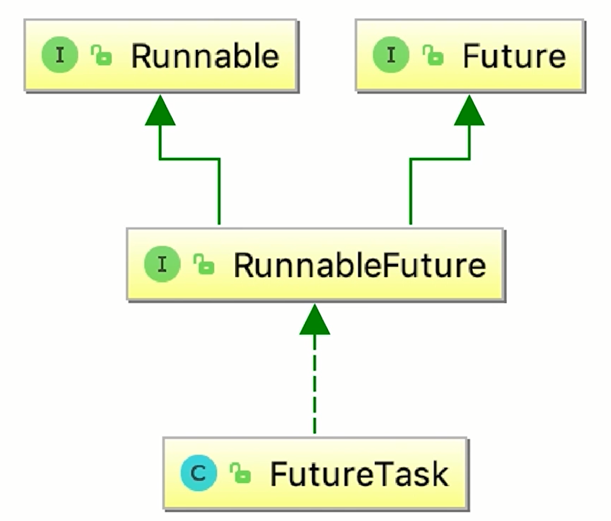

#  获取子线程的执行结果


## Runnable的缺陷
* 不能返回一个返回值
* 也不能抛出checked Exception

可以看到只能try/catch进行捕获异常
```java
public class RunnableCantThrowsException {

    public static void main(String[] args) {
        Runnable runnable = () -> {
            try {
                throw new Exception();
            } catch (Exception e) {
                e.printStackTrace();
            }
        };
    }
}
```

## Future的主要方法

* get
* cancell
* isDone：判断线程是否执行完毕
* isCancelled

### get方法：获取结果
get方法的行为取决于Callable任务的状态，只有以下5种情况：
1. 任务正常完成: get方法会立即返回结果
2. 任务尚未完成（任务还没开始或进行中）：get将阻塞并直到任务完成
3. 任务执行过程中抛出Exception：get方法会抛出ExecutionException : 这里的抛出异常,是call()执行时产生的那个异常,看到这个异常类型是java.util.concurrent. ExecutionException。不论call()执行时抛出的异常类型是什么,最后get方法抛出的异常类型都是ExecutionException。
4. 任务被取消：get方法会抛出CancellationException
5. 任务超时：get方法有一个重载方法，是传入一个延迟时间的，如果时间到了还没有获得结果，get方法就会抛出TimeoutException

get(long timeout, TimeUnit unit)：有超时的获取
* 超时的需求很常见
* 用get(long timeout, TimeUnit unit)方法时,如果call()在规定时间内完成了任务,那么就会正常获取到返回值;而如果再指定时间内没有计算出结果,那么就会抛出TimeoutException
* 超时不获取，任务需取消


#### 用法1：线程池的submit方法返回future对象


 首先,我们要给线程池提交我们的任务,提交时线程池会立刻返回给我们一个空的Future容器。 当线程的任务- 旦执行完毕也就是当我们可以获取结果的时候,线程池便会把该结果填入到之前给我们的那个Future中去(而不是创建一 个新的Future ) ,我们此时便可以从该Future中获得任务执行的结果


> 代码演示

```java
public class OneFuture {

    public static void main(String[] args) {

        ExecutorService service = Executors.newFixedThreadPool(10);
        Future<Integer> future = service.submit(new CallableTask());
        try {
            System.out.println(future.get());
        } catch (InterruptedException e) {
            e.printStackTrace();
        } catch (ExecutionException e) {
            e.printStackTrace();
        }
        service.shutdown();
    }

    static class CallableTask implements Callable<Integer> {

        @Override
        public Integer call() throws Exception {
            Thread.sleep(3000);
            return new Random().nextInt();
        }
    }
}
```

Lambda写法

```java
public class OneFutureLambda {

    public static void main(String[] args) {

        ExecutorService service = Executors.newFixedThreadPool(10);

        Callable<Integer> callable = () -> {
            Thread.sleep(3000);
            return new Random().nextInt();
        };

        Future<Integer> future = service.submit(callable);
        try {
            System.out.println(future.get());
        } catch (InterruptedException e) {
            e.printStackTrace();
        } catch (ExecutionException e) {
            e.printStackTrace();
        }
        service.shutdown();
    }
}
```

多个线程

```java
public class MultiFutures {

    public static void main(String[] args) throws InterruptedException {
        ExecutorService service = Executors.newFixedThreadPool(20);
        ArrayList<Future> futures = new ArrayList<>();
        for (int i = 0; i < 20; i++) {
            Future<Integer> future = service.submit(() -> {
                Thread.sleep(3000);
                return new Random().nextInt();
            });
            futures.add(future);
        }

        Thread.sleep(5000); // 20个线程一起并行执行，5s以后都已经执行完毕了，所以一起打印

        for (int i = 0; i < 20; i++) {
            Future<Integer> future = futures.get(i);

            try {
                Integer integer = future.get();
                System.out.println(integer);
            } catch (InterruptedException e) {
                e.printStackTrace();
            } catch (ExecutionException e) {
                e.printStackTrace();
            }
        }
    }
}
```


### cancel方法

* 取消任务的执行

正常情况下 `ad = future.get(2000, TimeUnit.MILLISECONDS);` 这个位置应该是4000，而且是`TimeUnit.SECONDS` ，当调试为2000，并且 为 `TimeUnit.MILLISECONDS` 的时候 && future.cancel() 为 FALSE，就会导致超时，cancel为TRUE导致中断

```java
/**
 * 演示get的超时方法，调用future.cancel
 * 演示cancel传入true和FALSE的区别，代表是否中断当前正在执行的任务
 *
 * 演示结果：cancel传入true，会被中断
 * 传入false，会超时
 */
public class Timeout {

    private static final Ad DEFAULT_AD = new Ad("无网络时候的默认广告");
    private static final ExecutorService exec = Executors.newFixedThreadPool(10);

    static class Ad {
        String name;

        public Ad(String name) {
            this.name = name;
        }

        @Override
        public String toString() {
            return "Ad{" +
                    "name='" + name + '\'' +
                    '}';
        }
    }

    static class FetchAdTask implements Callable<Ad> {

        @Override
        public Ad call() throws Exception {
            try {
                Thread.sleep(3000);
            } catch (InterruptedException e){
                System.out.println("sleep期间被中断了");
                return new Ad("被中断时候的默认广告");
            }
            return new Ad("旅游订票哪家强？找某程");
        }
    }

    public void printAd() {
        Future<Ad> future = exec.submit(new FetchAdTask());

        Ad ad;

        try {
            ad = future.get(2000, TimeUnit.MILLISECONDS);
        } catch (ExecutionException e) {
            ad = new Ad("被中断时候的默认广告");
        } catch (InterruptedException e) {
            ad = new Ad("异常时候的默认广告");
        } catch (TimeoutException e) {
            ad = new Ad("超时时候的默认广告");
            System.out.println("超时，未获取到广告");
            boolean cancel = future.cancel(true);
            System.out.println("cancel的结果:" + cancel);
        }

        exec.shutdown();
        System.out.println(ad);
    }

    public static void main(String[] args) {
        Timeout timeout = new Timeout();
        timeout.printAd();
    }
}
```


#### 用法1：取消任务的珍惜

1. 如果这个任务**还没有开始执行**,那么这种情况最简单,任务会被正常的取消,未来也不会被执行,方法返回true。
2. 如果任务**已完成**,或者**已取消**:那么cancel(方法会执行失败，方法返回false。
3. 如果这个**任务已经开始执行了**,那么这个取消方法将不会直接取消该任务,而是会根据我们填的参数mayInterruptIfRunning做判断:


Future.cancel(false) 仅用于避免启动尚未启动的任务，适用于：

1. 文鞥处理interrupt的任务
2. 不清楚任务是否支持取消
3. 需要等待已经开始的任务执行完成


#### 用法2：用FutureTask来创建Future

它既可以作为Runnable被线程执行，又可以作为Future得到Callable的返回值



> 代码演示

```java
public class FutureTaskDemo {

    public static void main(String[] args) {
        Task1 task = new Task1();
        FutureTask<Integer> futureTask = new FutureTask<>(task);
//        new Thread(futureTask).start();
        ExecutorService service = Executors.newCachedThreadPool();
        service.submit(futureTask);


        try {
            System.out.println("task运行结果：" + futureTask.get());
        } catch (InterruptedException e) {
            e.printStackTrace();
        } catch (ExecutionException e) {
            e.printStackTrace();
        }
    }

    static class Task1 implements Callable<Integer> {

        @Override
        public Integer call() throws Exception {
            System.out.println("子线程正在计算");
            Thread.sleep(3000);
            int sum = 0;
            for (int i = 0; i < 100; i++) {
                sum += i;
            }
            return sum;
        }
    }
}
```


### 注意点

* 当for循环批量获取future得结果时，容易发生一部分线程很慢的情况，get方法调用时应使用timeout限制
* Future的生命周期是不能后退的


