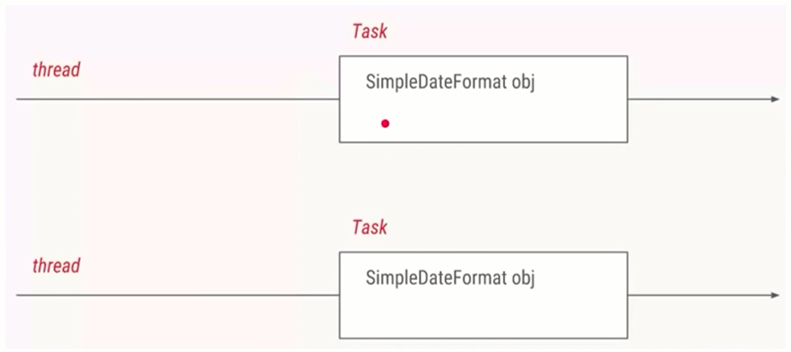

# ThreadLocal


## 两大使用场景

* 场景1：每个线程需要一个独享的对象（通常是工具类，典型需要使用类有SimpleDateFormat和Random）
* 场景2：每个线程内需要保存全局变量（例如在拦截器中获取用户信息），可以让不同方法直接使用，避免参数传递

### 场景1：每个线程需要一个独享的对象

通俗解释：教材只有一本，一起做笔记会导致线程安全问题。复印后就没有问题


> 代码示例

如果有两个线程想要用一个工具类`SimpleDateFormat`会怎样？



```java
public class ThreadLocalNormalUsage00 {

    public static void main(String[] args) {
        new Thread(new Runnable() {
            @Override
            public void run() {
                String date = new ThreadLocalNormalUsage00().date(10);
                System.out.println(date);
            }
        }).start();

        new Thread(new Runnable() {
            @Override
            public void run() {
                String date = new ThreadLocalNormalUsage00().date(104707);
                System.out.println(date);
            }
        }).start();
    }

    public String date(int seconds) {
        // 参数的单位是毫秒，从1970.1.1 00:00:00 GMT计时
        Date date = new Date(1000 * seconds);
        SimpleDateFormat dateFormat = new SimpleDateFormat("yyyy-MM-dd hh:mm:ss");
        return dateFormat.format(date);
    }
}
```

可以发现是正常打印的

```
1970-01-02 01:05:07
1970-01-01 08:00:10
```


> 升级需求：10个线程解决1000个任务

```java
/**
 * 描述： 1000个打印日期的任务，用线程池来执行
 */
public class ThreadLocalNormalUsage02 {

    public static ExecutorService threadPool = Executors.newFixedThreadPool(10);

    public static void main(String[] args) throws InterruptedException {

        for (int i = 0; i < 1000; i++) {
            int finalI = i;
            threadPool.submit(new Runnable() {
                @Override
                public void run() {
                    String date = new ThreadLocalNormalUsage02().date(finalI);
                    System.out.println(date);
                }
            });
        }
        threadPool.shutdown();
    }

    public String date(int seconds) {
        // 参数的单位是毫秒，从1970.1.1 00:00:00 GMT计时
        Date date = new Date(1000 * seconds);
        SimpleDateFormat dateFormat = new SimpleDateFormat("yyyy-MM-dd hh:mm:ss");
        return dateFormat.format(date);
    }
}
```

但是有一个问题是，1000个任务就会创建1000个dateFormat造成资源浪费，那么就可以把dateFormat换成静态方法，所有线程都只用一个dateFormat

```java
/**
 * 描述： 1000个打印日期的任务，用线程池来执行
 */
public class ThreadLocalNormalUsage03 {

    public static ExecutorService threadPool = Executors.newFixedThreadPool(10);

    static SimpleDateFormat dateFormat = new SimpleDateFormat("yyyy-MM-dd hh:mm:ss");

    public static void main(String[] args) throws InterruptedException {

        for (int i = 0; i < 1000; i++) {
            int finalI = i;
            threadPool.submit(new Runnable() {
                @Override
                public void run() {
                    String date = new ThreadLocalNormalUsage03().date(finalI);
                    System.out.println(date);
                }
            });
        }
        threadPool.shutdown();
    }

    public String date(int seconds) {
        // 参数的单位是毫秒，从1970.1.1 00:00:00 GMT计时
        Date date = new Date(1000 * seconds);
        return dateFormat.format(date);
    }
}
```

但是会发现打印的内容会有重复的

```
1970-01-01 08:15:11
1970-01-01 08:15:11
```

主要问题是在`dateFormat.format(date);` 所以把这行代码提取出来，然后使用`synchronized`加锁


> 更好的解决方案 -- ThreadLocal

创建方式为：

1. `public ThreadLocal<xxx> dateFormatThreadLocal = new ThreadLocal<xxx>()`, 接着在实例中Override -- initialValue
2. lambda写法：`public static ThreadLocal<SimpleDateFormat> dateFormatThreadLocal2 = ThreadLocal.withInitial(() -> xxx) `

```java
/**
 * 描述： 利用ThreadLocal给每个线程分配自己的dateformat对象，保证了线程安全，高效利用内存
 */
public class ThreadLocalNormalUsage05 {

    public static ExecutorService threadPool = Executors.newFixedThreadPool(10);

    public static void main(String[] args) throws InterruptedException {

        for (int i = 0; i < 1000; i++) {
            int finalI = i;
            threadPool.submit(new Runnable() {
                @Override
                public void run() {
                    String date = new ThreadLocalNormalUsage05().date(finalI);
                    System.out.println(date);
                }
            });
        }
        threadPool.shutdown();
    }

    public String date(int seconds) {
        // 参数的单位是毫秒，从1970.1.1 00:00:00 GMT计时
        Date date = new Date(1000 * seconds);
//        SimpleDateFormat dateFormat = ThreadSafeFormatter.dateFormatThreadLocal.get();
        SimpleDateFormat dateFormat2 = ThreadSafeFormatter.dateFormatThreadLocal2.get();
        return dateFormat2.format(date);
    }
}

class ThreadSafeFormatter {
    public static ThreadLocal<SimpleDateFormat> dateFormatThreadLocal = new ThreadLocal<SimpleDateFormat>() {
        @Override
        protected SimpleDateFormat initialValue() {
            return new SimpleDateFormat("yyyy-MM-dd hh:mm:ss");
        }
    };

    // 写法2：lambda
    public static ThreadLocal<SimpleDateFormat> dateFormatThreadLocal2 = ThreadLocal
            .withInitial(() -> new SimpleDateFormat("yyyy-MM-dd hh:mm:ss"));
}
```


### 小结

演变过程

1. 2个线程分别用自己的SimpleDateFormat
2. 延伸出10个，10个线程和10个SimpleDateFormat，写法不优雅
3. 当需求变为1000个，那么必须使用线程池
4. 所有线程都共有同一个SimpleDateFormat对象
   1. 发现线程不安全，出现了并发安全问题
5. 选择加锁，加锁后结果正常，但效率太低
   1. 解决方案ThreadLocal
   2. lambda表达式写法


### 场景2：每个线程内需要保存全局变量

主要是避免经常创建参数


#### 方法

* 用ThreadLocal保存一些业务内容（用户权限信息、从用户系统获取到的用户名、user ID等）
* 这些信息在同一个线程内相同，但是不同的线程使用的业务内容是不相同的
* 在线程生命周期内，都通过这个静态ThreadLocal实例的get()方法取得自己set过的对象，避免了将这个对象（例如user对象）作为参数传递的麻烦


> 想法：当前用户信息需要被线程内所有方法共享

当多线程同时工作时，我们需要保证线程安全，可以用synchronized，也可以使用ConcurrentHashMap，但无论用什么都会对性能有所影响


更好的办法是使用ThreadLocal，无需synchronized，可以在不影响性能的情况下，也无需层层传递参数，就可以到保存当前线程对应的用户信息的目的


#### 代码示例

```java
/**
 * 描述：演示ThreadLocal用法2：避免传递参数的麻烦
 */
public class ThreadLocalNormalUsage06 {

    public static void main(String[] args) {
        new Service1().process();
    }
}

class Service1 {

    public void process() {
        User user = new User("超哥");
        UserContextHolder.holder.set(user);
        new Service2().process();
    }
}

class Service2 {

    public void process() {
        User user = UserContextHolder.holder.get();
        System.out.println("Service2拿到用户名：" + user.name);
        new Service3().process();
    }
}

class Service3 {

    public void process() {
        User user = UserContextHolder.holder.get();
        System.out.println("Service3拿到用户名：" + user.name);
    }
}

class UserContextHolder {
    public static ThreadLocal<User> holder = new ThreadLocal<>();
}

class User {
    String name;

    public User(String name) {
        this.name = name;
    }
}
```


## 作用

1. 让某个需要用到的对象在线程间隔离（每个线程都有自己的独立的对象）
2. 在任何方法中都可以轻松获取到该对象
   1. 例如场景2的 `UserContextHolder.holder.get();`
   2. 场景1的 `ThreadSafeFormatter.dateFormatThreadLocal2.get();`


## 总结

* 场景1：`initialValue` 在ThreadLocal第一次get的时候把对象初始化出来，对象的初始化时机可以由我们控制
* 场景2：`set` 如果需要保存到ThreadLocal里的对象的生成时机不由我们随意控制，例如拦截器生成的用户信息，用ThreadLocal.set直接放到我们的ThreadLocal中去，以便后续使用


## 好处

* 线程安全
* 不需要加锁，提高执行效率
* 更高效地利用内存、节省开销
* 免去传参的繁琐：无论是场景一的工具类，还是场景二的用户名，都可以在任何地方直接通过ThreadLocal拿到，再也不需要每次都传同样的参数。ThreadLocal使得代码耦合度更低，更优雅


## 源码分析


通过Shift + Shift可以找到`Thread`类，然后查找到ThreadLocalMap

```java
/* ThreadLocal values pertaining to this thread. This map is maintained
     * by the ThreadLocal class. */
ThreadLocal.ThreadLocalMap threadLocals = null;
```


### initialValue

1. 该方法会返回当前线程对应的 “初始值”，这是一个延迟加载的方法，只有在调用get的时候，才会触发
2. 当线程第一次使用get方法访问变量时，将调用此方法，除非线程先前调用了set方法，在这种情况下，不会为线程调用本initialValue

可以从以前的代码看到，方法重写了initialValue，然后通过get调用了initialValue：

```java
public T get() {
    Thread t = Thread.currentThread();
    ThreadLocalMap map = getMap(t);
    if (map != null) {
        ThreadLocalMap.Entry e = map.getEntry(this);
        if (e != null) {
            @SuppressWarnings("unchecked")
            T result = (T)e.value;
            return result;
        }
    }
    return setInitialValue();
}
```

再查看setInitialValue，可以看到这里调用了initialValue

```java
private T setInitialValue() {
    T value = initialValue();
    Thread t = Thread.currentThread();
    ThreadLocalMap map = getMap(t);
    if (map != null) {
        map.set(this, value);
    } else {
        createMap(t, value);
    }
    if (this instanceof TerminatingThreadLocal) {
        TerminatingThreadLocal.register((TerminatingThreadLocal<?>) this);
    }
    return value;
}
```

再点进去看可以看到它初始化是一个null

```java
protected T initialValue() {
	return null;
}
```


> 情况2：当你已经set过了

在之前的`setInitialValue`方法就可以看到

```java
if (map != null) {
    ThreadLocalMap.Entry e = map.getEntry(this);
    if (e != null) {
        @SuppressWarnings("unchecked")
        T result = (T)e.value;
        return result;
    }
}
```


### get

> Returns the value in the current thread's copy of this thread-local variable.  If the variable has no value for the current thread, it is first initialized to the value returned by an invocation of the {@link #initialValue} method.
> @return the current thread's value of this thread-local
>
> 返回此线程局部变量的当前线程副本中的值。 如果变量没有当前线程的值，则首先将其初始化为调用 {@link #initialValue} 方法返回的值。
>
> @返回此线程本地的当前线程的值

```java
public T get() {
    Thread t = Thread.currentThread();
    ThreadLocalMap map = getMap(t);
    if (map != null) {
        ThreadLocalMap.Entry e = map.getEntry(this);
        if (e != null) {
            @SuppressWarnings("unchecked")
            T result = (T)e.value;
            return result;
        }
    }
    return setInitialValue();
}
```

1. 获取到当前线程
2. 看当前线程有没有获取到`ThreadLocalMap`

```java
ThreadLocalMap getMap(Thread t) {
    return t.threadLocals;
}
```

```java
/* ThreadLocal values pertaining to this thread. This map is maintained
     * by the ThreadLocal class. */
    ThreadLocal.ThreadLocalMap threadLocals = null;
```

可以看到返回的是一个线程都拥有的threadlocal

3. 就会判断当前线程有没有初始化过
   1. 如果没有初始化过就`setInitialValue`
   2. 如果初始化过
      1. 就先找到当前的threadlocal作为key，找到对应的值，那个值就是set进去的值，就拿到下图中ThreadLocal1右边的那个值
         1. this当前引用（threadlocal类）
         2. 返回e，e是一个Entry
      2. 然后就会得到一个result（对应的就是场景1的SimpleDateFormat；场景2的user）


### set

> ```
> Sets the current thread's copy of this thread-local variable to the specified value.  Most subclasses will have no need to override this method, relying solely on the {@link #initialValue} method to set the values of thread-locals.
> @param value the value to be stored in the current thread's copy of this thread-local.
> ```
>
> 将此线程局部变量的当前线程副本设置为指定值。 大多数子类不需要重写此方法，仅依靠 {@link #initialValue} 方法来设置线程局部变量的值。
>
> @参数 value 要存储在此线程本地的当前线程副本中的值。

```java
public void set(T value) {
    Thread t = Thread.currentThread();
    ThreadLocalMap map = getMap(t);
    if (map != null) {
        map.set(this, value);
    } else {
        createMap(t, value);
    }
}
```

1. 拿到当前线程的引用
2. 拿到ThreadLocalMap
3. 如果当前map不为空
   1. this是当前threadLocal
   2. value当前所想保存的值
4. 如果为空就创建一个map

```java
void createMap(Thread t, T firstValue) {
    t.threadLocals = new ThreadLocalMap(this, firstValue);
}
```


### remove

>     /**
>      * Removes the current thread's value for this thread-local
>      * variable.  If this thread-local variable is subsequently
>      * {@linkplain #get read} by the current thread, its value will be
>      * reinitialized by invoking its {@link #initialValue} method,
>      * unless its value is {@linkplain #set set} by the current thread
>      * in the interim.  This may result in multiple invocations of the
>      * {@code initialValue} method in the current thread.
>      *
>      * @since 1.5
>      */
>         删除此线程局部变量的当前线程值。 如果这个线程局部变量随后被当前线程 {@linkplain #get read}，它的值将通过调用它的 {@link #initialValue} 方法重新初始化，除非它的值是当前线程的 {@linkplain #set set} 在此期间线程。 这可能会导致在当前线程中多次调用 {@code initialValue} 方法。

```java
public void remove() {
    ThreadLocalMap m = getMap(Thread.currentThread());
    if (m != null) {
        m.remove(this);
    }
}
```

1. 获取到当前线程，接着传入当前线程，获取ThreadLocalMap
2. 判断是否为空，如果不为空，注意这里的删除不是删除全部ThreadLocalMap的值，而是传入this这个引用的值（某个ThreadLocal）那么它就不会删除全部，而是删除指定ThreadLocal的值


### ThreadLocalMap类

ThreadLocalMap类，也就是Thread.threadLocals

ThreadLocalMap类是每个线程Thread类里面的变量，里面最重要的是一个键值对数组Entry[] table ，可以认为是一个map,键值对：

* 键：这个ThreadLocal
* 值：实际需要的成员变量，比如user或者simpleDateFormat对象


这个类最最要的属性：

> private Entry[] table;


冲突：hashmap

java8 HashMap结构


**ThreadLocalMap采用的线性探测法**，也就是如果发生冲突，就继续找下一个空位置，而不是用链表拉链


## 主要方法

* T `initialValue`() 初始化
* void `set`(T t) 为这个线程设置一个新值
* T `get`() 得到这个线程对应的value。如果是首次调用get，则会调用这个initialize来得到这个值
* void `remove`() 删除对应这个线程的值


## 两种场景的总结

* 通过源码分析可以看出, setInitialValue和直接set最后都是利用map.set()方法来设置值
* 也就是说,最后都会对应到ThreadLocalMap的一个Entry ,只不过是起点和入口不一-样


## 注意点

> 内存泄露

弱引用的特点：如果这个对象只被弱引用关联（没有任何强引用关联），那么这个对象就可以被回收，所以弱引用不会阻止GC


Value的泄露：

* ThreadLocalMap 的每个`Entry`都是对key的弱引用，同时每个`Entry`都包含了一个对value的强引用
* 正常情况下，当线程终止，保存在ThreadLocal里的value会被垃圾回收，因为没有任何强引用
* 但是，如果线程不终止（比如线程需要保持很久），那么key对应的value就不能被回收，因为有以下调用链：
  * Thread --> ThreadLocalMap --> Entry (key == null) --> Value
* 因为value和Thread之间还存在这个强引用链路，所以导致value无法回收，就可能出现OOM
* JDK已经考虑到这个问题，所以在set, remove, rehash方法中会扫描key为null的Entry，并把对应的value设置为null，这样value对象就可以被回收
* 但是如果一个ThreadLocal不被使用，那么实际上set, remove, rehash方法也不会被调用，如果同时线程又不停止，那么调用链就一直存在，那么久导致value的内存泄漏


> 如何避免内存泄露

调用remove方法,就会删除对应的Entry对象,可以避免内存泄漏,所以使用完ThreadLocal之后,应该调用remove方法

比如以前代码

```java
class Service3 {

    public void process() {
        User user = UserContextHolder.holder.get();
        System.out.println("Service3拿到用户名：" + user.name);
        UserContextHolder.holder.remove(); // 删除Entry对象，防止内存泄露
    }
}
```


> 空指针异常

在进行get之前，必须先set

```java
public class ThreadLocalNPE {
    ThreadLocal<Long> longThreadLocal = new ThreadLocal<>();

    public void set() {
        longThreadLocal.set(Thread.currentThread().getId());
    }

    public long get() {
        return longThreadLocal.get();
    }

    public static void main(String[] args) {
        ThreadLocalNPE threadLocalNPE = new ThreadLocalNPE();

        System.out.println(threadLocalNPE.get());

        Thread thread = new Thread(new Runnable() {
            @Override
            public void run() {
                threadLocalNPE.set();
                System.out.println(threadLocalNPE.get());
            }
        });
        thread.start();
    }
}
```


> 共享对象

如果在每个线程中ThreadLocal.set(进去的东西本来就是多线程共享的同一个对象,比如static对象,那么多个线程的ThreadLocal.get()取得的还是这个共享对象本身,还是有并发访问问题


> 不要强调使用

如果可以不使用ThreadLocal就解决问题,那么不要强行使用例如在任务数很少的时候,在局部变量中可以新建对象就可以解决问题,那么就不需要使用到ThreadLocal


> 优先使用框架的支持

优先使用框架的支持,而不是自己创造
例如在Spring中,如果可以使用RequestContextHolder ,那么就不需要自己维护ThreadLocal ,因为自己可能会忘记调用remove()方法等,造成内存泄漏
