# docker

## 1.docker基础

课程链接：https://www.bilibili.com/video/BV1Ls411n7mx?p=1

### 1.docker简介

#### 1.docker是什么

1.为什么有docker出现

通常的逻辑是：开发在本地完成代码开发后，将代码或war包、jar包给运维拿去部署，但容易出现开发本地没问题，运维部署时出现bug的情况，这种情况大多数是因为二者的环境和配置不一致导致的。

docker的出现就是为了解决此痛点：

> 开发将代码、配置、环境、系统、数据整体打包给运维，运维便可以轻松部署，实现了软件带环境安装。相当于搬家时一次性把整栋楼都搬过去了

docker中的镜像技术：

> 打破了"代码即应用"的概念，从环境开始自底向上打包应员。

2.docker理念

实现一次封装，处处应用。

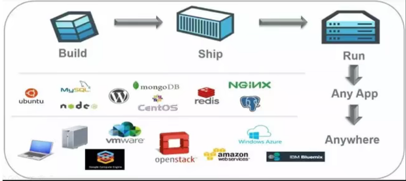

3.一句话总结

docker是一种解决了运行环境和配置问题软件容器，方便做持续集成并有助于整体发布的容器虚拟化技术。

#### 2.docker能干嘛

1.以前的虚拟机技术

虚拟机是带环境安装的一种解决方案。它可以在一种操作系统里面运行另一种操作系统，比如在Windows系统里面运行Linux系统。应用程序对此毫无感知，因为虚拟机看上去跟真实系统一模一样，而对于底层系统来说，虚拟机就是一个普通文件，不需要了就删掉，对其他部分毫无影响。这类虚拟机完美的运行了另一套系统，能够使应用程序，操作系统和硬件三者之间的逻辑不变。下图灰色部分即为宿主机，

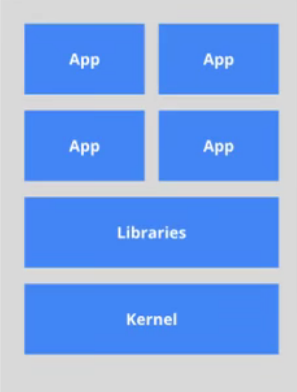

虚拟机缺点：占用资源多，冗余步骤多，启动慢，分钟级

2.容器虚拟化技术

由于前面虚拟机存在这些缺点，Linux发展出了另一种虚拟化技术：Linux器（Linux Containers，缩写为LXC）
Linux容器不是模拟一个完整的操作系统，而是对进程进行隔离。有了睿器，就可以将软件运行所需的所有资源打包到一个隔离的容器中。容器与虚拟机不同，不需要捆绑一整套操作系统，只需要软件工作所需的库资源和设置。系统因此而变得高效轻量并保证部署在任何环境中的软件都能始终如一地运行。

相比于传统虚拟机：

> 传统虚拟机技术是虚拟出一套硬件后，在其上运行一个完整操作系统，在该系统上再运行所需应用进程；
>
> 容器内的应用进程直接运行于宿主的内核，容器内没有自己的内核，且也不进行硬件虚拟。因此容器要比传统虚拟机更轻便。
> 每个容器之间互相隔离，每个容器有自己的文件系统，容器之间进程不会相互影响 能区分计算资源。耦合低

3.开发/运维（DevOps）--开发即运维

一次构建，随处运行：

- 更快速的应用交付和部署
- 更便捷的升级和扩缩容
- 更简单的系统运维
- 更高效的计算资源利用

#### 3.下载

docker容器的三大特征：镜像、容器、仓库

docker的镜像存储在docker-hub中

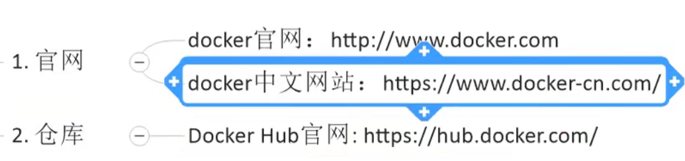

### 2.docker安装

#### 1.前提说明

docker仅支持centos6.5以上版本

#### 2.Docker的基本组成

docker的架构图

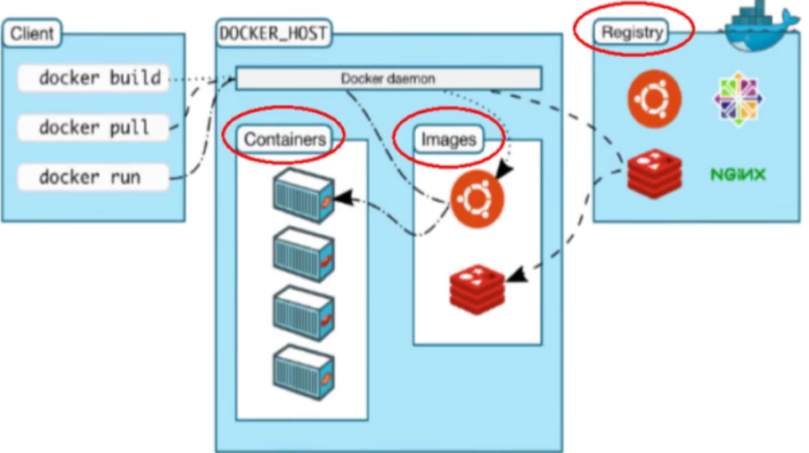

镜像（image）

> Docker镜像（Image）就是一个只读的模板。镜像可以用来创建Docker容器，**一个镜像可以创建很多容器**。
>
> 

容器（container）

> 镜像的一个实例。
>
> Docker利用容器（Container）独立运行的一个或一组应用。**容器是用镜像创建的运行实例**。
> 它可以被启动、开始、停止、删除。每个容器都是相互隔离的、保证安全的平台。
> **可以把容器看做是一个简易版的Linux环境**（包括root用户权限、进程空间、用户空间和网络空间等）和运行在其中的应用程序。
> 容器的定义和镜像几乎一模一样，也是一堆层的统一视角，唯一区别在于容器的最上面那一层是可读可写的。

仓库（Repository）

> 是**集中存放镜文件**的场所。
> 仓库（Repository）和仓库注册服务器（Registry）是有区别的。仓库注册服务器上往往存放着多个仓库，每个仓库中又包含了多个锐像，每个镜像有不同的标签（tag）
> 仓库分为公开仓库（Public）和私有仓库（Private）两种形式。
> 最大的公开仓库是Docker Hub（https://hub.docker.com/）
> 存放了数量庞大的镜像供用户下载。国内的公开仓库包括阿里云、网易云等

小总结

> 需要正确的理解仓储/镜像/容器这几个概念：
>
> Docker本身是一个**容器运行载体**或称之为**管理引擎**。我们把应用程序和配置依赖打包好形成一个可交付的运行环境，这个打包好的运行环境就似乎image镜像文件。只有通过这个镜像文件才能生成Docker容器。image文件可以看作是容器的模板。Docker根据image文件生成容器的实例。
>
> 同一个image文件，可以生成多个同时运行的容器实例。image文件用于生成容器实例，image本身也是一个文件，称为镜像文件。
>
> 一个容器运行一种服务，当我们需要的时候，就可以通过docker客户端创建一个对应的运行实例，也就是我们的容器
>
> 至于仓储，就是放了一堆镜像的地方，我们可以把镜像发布到仓储中，需要的时候从仓储中拉下来就可以了。

#### 3.安装过程

centos6.8安装docker步骤

> 1.yum install-y epel-release
> 2.yum install-y docker-io
> 3.安装后的配置文件：/etc/sysconfig/docker
>
> 
>
> 4.启动Dockar后台服务：service docker start
> 5.docker version验证

centos7安装docker

> https://docs.docker.com/engine/install/centos/#install-using-the-repository
>
> https://www.cnblogs.com/hellxz/p/11044012.html

镜像加速

在阿里云设置镜像加速器

https://cr.console.aliyun.com/cn-hangzhou/instances/mirrors

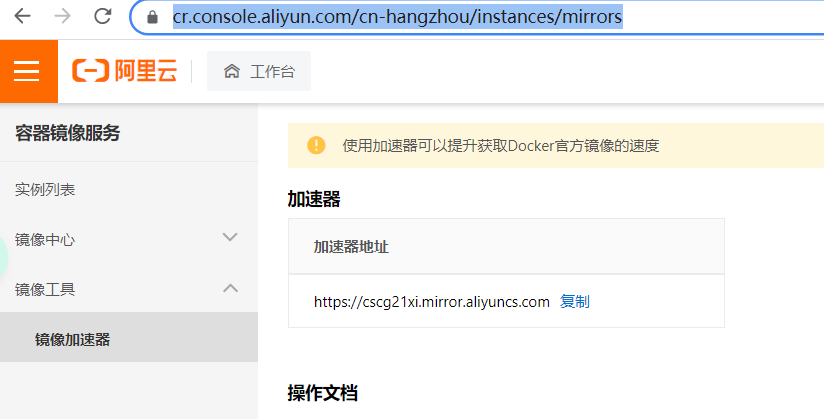

helloworld:

```shell
docker run hello-world
```

结果

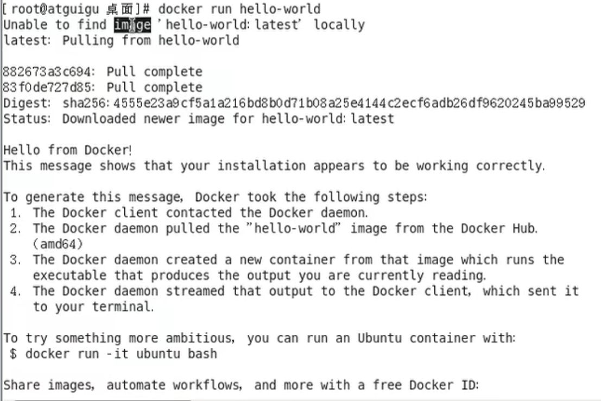

```properties
在本地查找hello-world的最新镜像，发现本地没有这个镜像
然后去仓库拉取hello-world的最新镜像
拉取中...
hello-world的最新镜像拉取完成
hello-world输出，docker运行成功
输出这段提示以后，hello world就会停止运行，容器自动终止。
```

run干了什么：


#### 4.底层原理

1.docker是怎么工作的

> Docker是一个Client-Server结构的系统，Docker守护进程运行在主机上，然后通过Socket连接从客户端访问，访问docker时，其实都是在和docker daemon这个守护进程交互，守护进程再从客户端接受命令并管理运行在主机上的容器。**容器，是一个运行时环境，就是我们前面说到的集装箱运行主机**

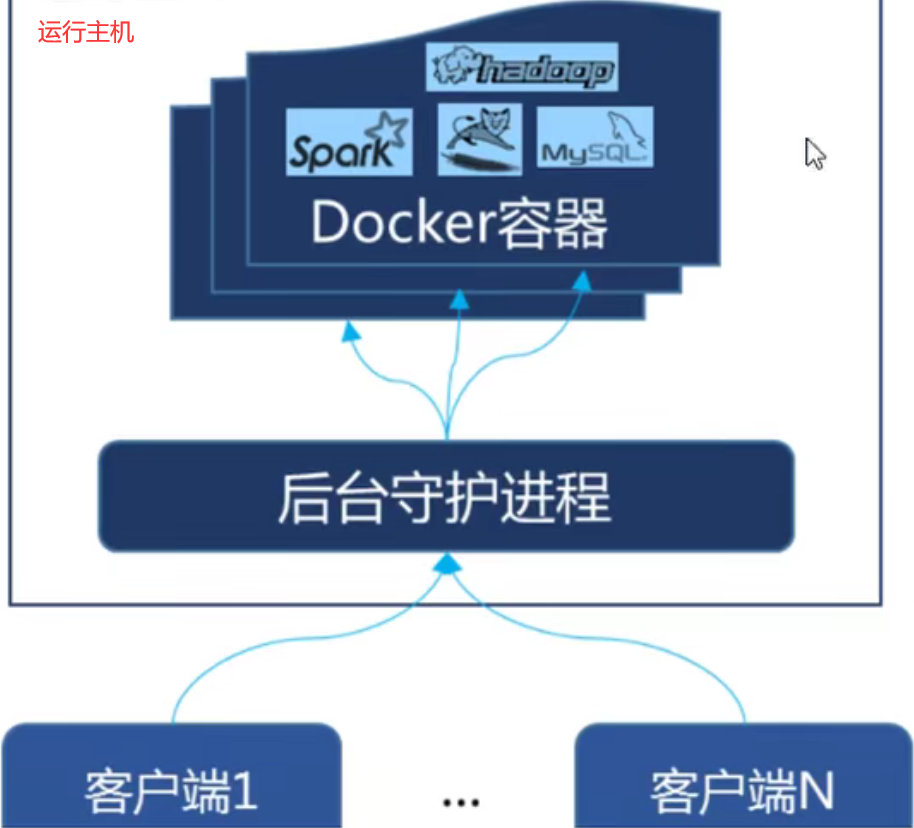

2.为什么docker比虚拟机快？

> （1）docker有着比虚拟机更少的抽象层。一个虚拟机是由软件+硬件组成，是一个完整的操作系统，故负担更多。由于docker不需要Hypervisor实现硬件资源虚拟化（Hypervisor接口实现虚拟机与宿主机的硬件进行交互），运行在docker容器上的程序直接使用际物理机的硬件资源，所以docker本身就比虚拟机“瘦”。因此在CPU、内存利用率上docker将会在效率上有明显优势。
>
> 
>
> （2）docker利用的是宿主机的内核，而不需要Guest OS。因此，当新建一个容器时，docker不需要和虚拟机一样重新加载一个操作系统。因而避免了引寻、加载操作系统内核这个比较费时费资源的过程，当新建一个虚拟机时，虚拟机软件需要加载Guest OS，整个新建过程是分钟级别的。而docker由于**直接利用宿主机的操作系统**，则省略了整个过程，因此新建一个docker容器只需要几秒钟。
>
> 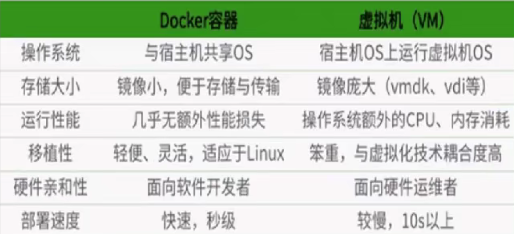

### 3.docker命令及使用

#### 1.帮助命令

> docker version：查看docker版本信息
>
> docker info：查看docker的详细信息，包含了当前docker里面的镜像、容器数量、docker磁盘信息等
>
> docker --help：docker命令查询

#### 2.镜像命令

蓝色大海：宿主机win10

鲸鱼：docker

集装箱：容器实例（来自于镜像模板）

常用命令

##### 1.docker images

列出**本地**主机上的镜像

> 各个选项说明：
>
> | REPOSITORY   | TAG        | IMAGE ID | CREATED      | SIZE     |
> | ------------ | ---------- | -------- | ------------ | -------- |
> | 镜像的仓库源 | 镜像的标签 | 镜像ID   | 镜像创建时间 | 镜像大小 |
>
> 同一仓库源可以有多个TAG，代表这个仓库源的不同个版本，我们使用REPOSITORY:TAG来定义不同的镜像。
>
> 如果你不指定一个镜像的版本标签，例如你只使用ubuntu，docker将默认使用ubuntu:latest镜像
>
> 参数说明：
>
> -a：列出本地所有镜像（含中间映像层）
>
> 
>
> -q：只显示镜像id
>
> 
>
> 组合操作-qa：查询所有镜像的id
>
> 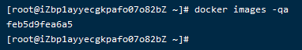
>
> --digests：显示镜像的摘要信息（过长的信息可能被截取）
>
> 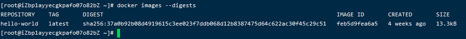
>
> --no-trunc:显示完整的镜像信息
>
> 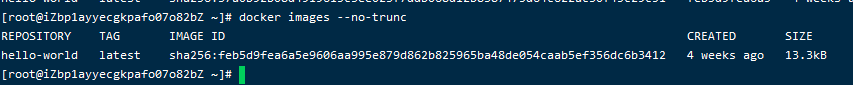

##### 2.docker search 某个镜像名字

去docker-hub查询这个名字的镜像

> 如果搜索tomcat镜像，存在多种镜像，OFFICIAL为官方版
>
> 
>
> 参数说明：
>
> docker search [OPTIONS] 镜像名字
>
> --no-trunc：显示完整的镜像描述
> -s：列出收藏数不小于指定值的镜像(已失效)
> --automated：只列automated build类型的镜像(已失效)

##### 3.docker pull 镜像名

下载指定名称的镜像

docker pull 镜像名[:版本号]

> 示例：下载tomcat最新版
>
> ```shell
> docker pull tomcat
> ```
>
> 
>
> 镜像下载完成，此时再查看，发现已经有tomcat的镜像了
>
> 

##### 4.docker rmi 镜像名ID

删除镜像（记得加上版本号）

> 删除hello-world镜像：docker rmi -f hello-world:latest（如果还存在此镜像对应的容器，则需要添加-f强制删除）
>
> 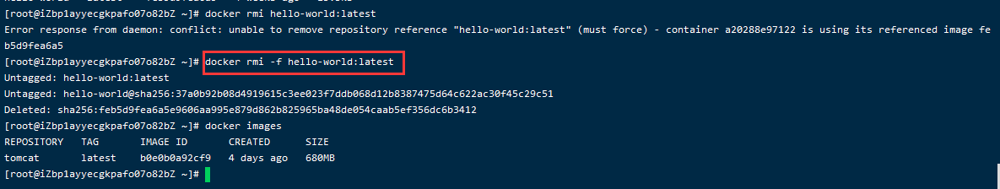
>
> 一次删除多个镜像：docker rmi -f hello-world:latest nginx:latest
>
> 
>
> 一次删除全部镜像（清空）：docker rmi -f $(docker images -qa)
>
> 这是一个组合命令：先查询出所有镜像的id，再删除这些id的镜像，达到全部删除镜像的目的

#### 3.容器命令

有镜像才能创建容器，这是根本前提（下载一个Centos镜像演示）,在docker上装一个centos：docker pull centos


##### 1.docker run

新建并启动容器：docker run [OPTIONS] IMAGE [COMMAND] [ARG...]

run:依照某个镜像，创建一个容器并启动改容器

> OPTIONS说明（常用）：有些是一个减号，有些是两个减号
> --name="容器新名字"：为容器指定一个名称；
> -d：后台运行容器，并返回容器ID，也即启动守护式容器；
> **-i：以交互模式运行容器，通常与-t同时使用；**
> **-t：为容器重新分配一个伪输入终端，通常与-i同时使用；**
> -P：随机端口映射；
> -p：指定端口映射，有以下四种格式
>
>     ip:hostPort:containerPort
>
>     ip::containerPort
>
>     **hostPort:containerPort**
>
>     containerPort

根据镜像创建一个容器运行起来

> docker run -it 镜像id：启动一个交互式容器
>
> 
>
> 已经完成了容器创建并进入了创建后的容器中。此时新开一个窗口查看
>
> 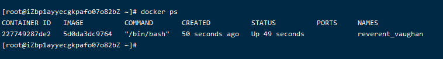
>
> 可以看到容器id与镜像id，names目前是docker随机分配的名字给此容器
>
> 指定名称： docker run -it --name mycentos0115 centos:latest
>
> 
>
> 此时查看容器，可见名字已改为指定名称：
>
> 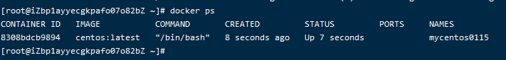

##### 2.docker ps

查看docker中运行着的容器

-a:所有容器，无论是否运行

> OPTIONS说明（常用）：
> -a：列出当前所有正在运行的容器+历史上运行过的
> -l：显示最近创建的容器。上一个被关闭的容器
> -n：显示最近n个创建的容器。
> -q：静默模式，只显示容器编号。（可用于批量删除容器）
> --no-trunc：不截断输出。

##### 3.退出容器

exit：容器停止退出
ctrl+P+Q：容器不停止退出

##### 4.启动容器

docker start  容器名/容器id

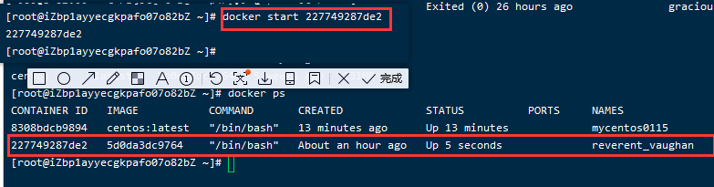

##### 5.重启容器

docker restart 容器名/容器id

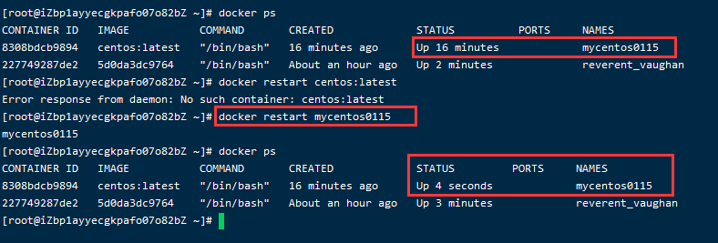

##### 6.停止容器

docker stop 容器名/容器id：相当于正常关机

> docker stop mycentos0115
>
> 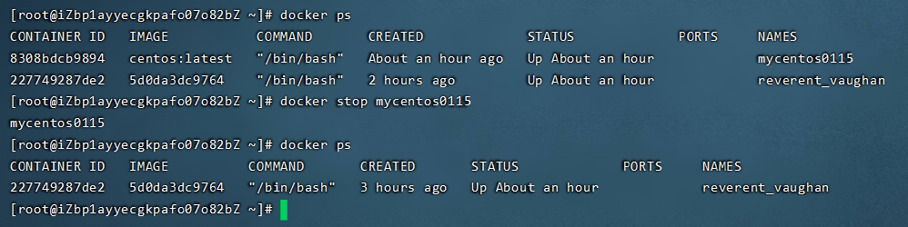

docker kill  容器名/容器id：相当于强制关机

##### 7.删除容器

docker rm 容器名/容器id：删除已经停止的容器

docker rm -f 容器名/容器id：强制删除容器，无论是否正在运行，都会被删除（其实还是先关停再删除）

docker rm -f $(docker ps -qa)：组合命令，一次性删除所有容器（找出当前全部容器的id，然后全部删除）

等价于：docker ps -qa|xargs docker rm

> docker rm mycentos0115
>
> 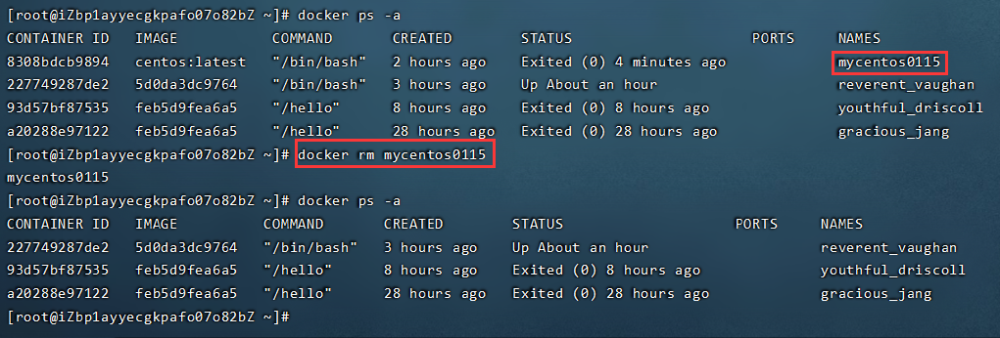

##### 8.以守护进程的方式启动

docker run -d 容器名

> #使用镜像centos:latest以后台模式启动一个容器
> docker run-d centos
>
> 问题：然后docker ps -a进行查看，会发现容器已经退出
> 很重要的要说明的一点：**Docker容器后台运行，就必须有一个前台进程**.
> 容器运行的命令如果不是那些**一直挂起**的命令（比如运行top，tail），就是会自动退出的。
> 这个是docker的机制问题，比如你的web容器，我们以nginx为例，正常情况下，我们配置启动服务只需要启动响应的service即可。例如service nginx start，但是这样做，nginx为后台进程模式运行，就导致**docker前台没有运行的应用**，这样的**容器后台启动后，会立即自杀**，因为他觉得他没事可做了
> 所以，最佳的解决方案是，**将你要运行的程序以前台进程的形式运行**

##### 9.查看容器日志

docker logs -f -t --tail 容器名/id

> -t：加入时间戳
> -f：跟随最新的日志打印
> -tail数字：显示最后多少条
>
> 执行：docker run -d centos /bin/sh -c "while true;do echo hello zzyy;sleep 2;done"
>
> 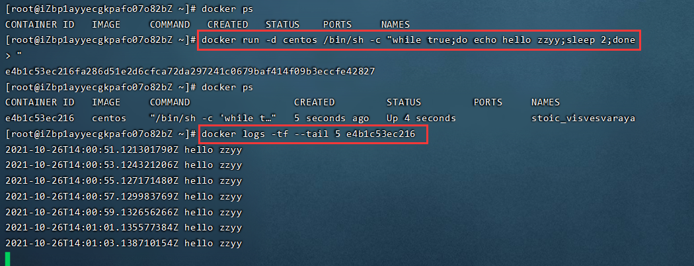
>
> 此shell命令含义：docker每两秒输出一次zzyy

##### 10.查看指定容器内运行的进程

docker top 容器名/id

> docker top e4b1c53ec216
>
> 

##### 11.查看容器内部细节

docker inspect 容器名/id：通过一个json串，说明了此容器的全部信息

> docker inspect e4b1c53ec216
>
> 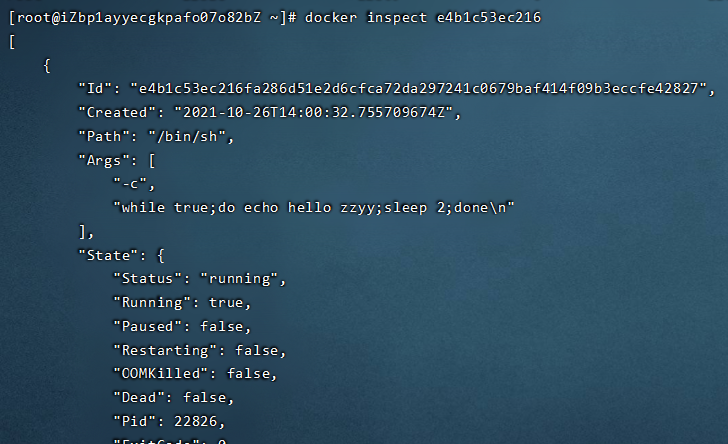

##### 12.进入正在运行中的容器，以命令行交互

docker attach 容器名/id

> docker attach 007589c880b1：进入id为007589c880b1的容器
>
> 

docker exec -t 007589c880b1 ls -l /tmp/：在宿主机中将ls -l /tmp/命令发送到id=007589c880b1的docker容器中去执行，但此客户端并不进如容器中

> docker exec -t 007589c880b1 ls -l /tmp/
>
> 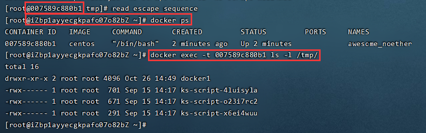

上述两个区别：

> attach直接进入容器启动命令的终端，不会启动新的进程
>
> exec是在容器中打开新的终端，并且可以启动新的进程

##### 13.从容器里面拷贝数据出来到宿主机

docker cp 容器id:容器内路径 目的主机路径

> 将容器中的test.py拷到宿主机上
>
> 

##### 14.从宿主机往docker复制文件

`PS C:\Users\mjn> docker cp E:\jdk-8u171-linux-x64.tar.gz hadoop1:/usr/java/`

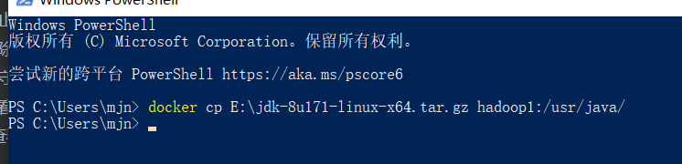

#### 4.总结

dockers常用命令

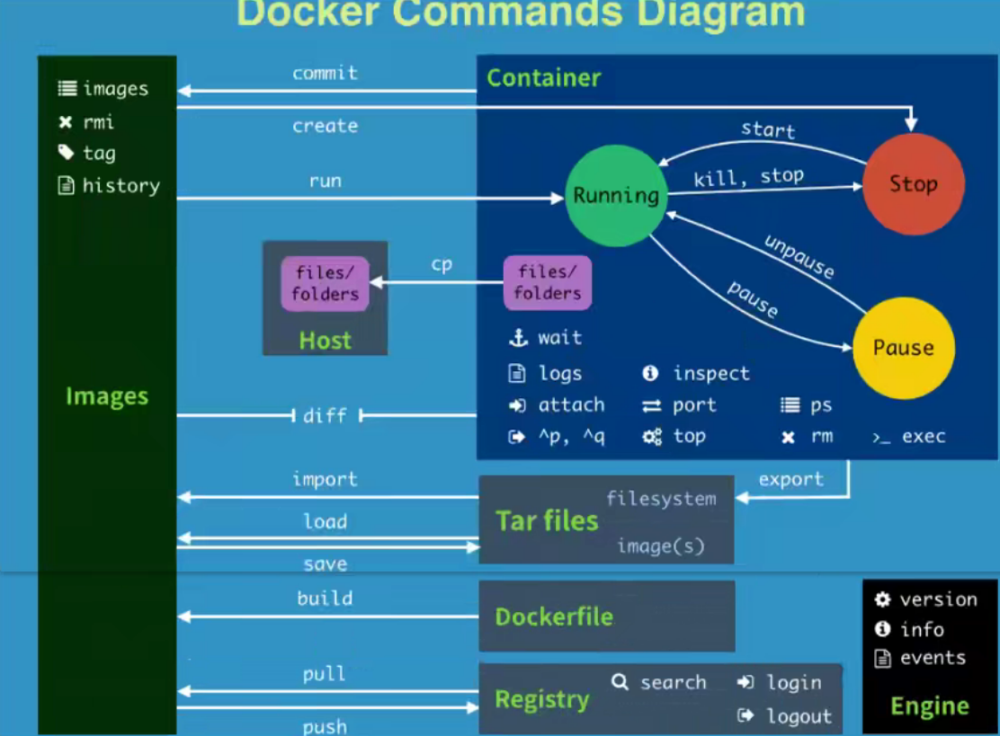

### 4.docker 镜像

镜像就是“千层饼”

#### 1.镜像是什么

> 镜像是一种轻量级、可执行的独立软件包，**用来打包软件运行环境和基于运行环境开发的软件**，它包含运行某个软件所需的所有内容，包括代码、运行时库、环境变量和配置文件。

##### 1.unionFS（联合文件系统）

> UnionFS（联合文件系统）：Union文件系统（UnionFS）是一种分层、轻量级并且高性能的文件系统，它支持**对文件系统的修改作为一次提交来一层层的叠加**，同时**可以将不同目录挂载到同一个虚拟文件系统下**（unite several directories into a single virtual filesystem），Union文件系统是Docker镜像的基础。**镜像可以通过分层来进行继承，基于基础镜像（没有父镜像），可以制作具体的应用镜像。**

特性：

> 一次同时加载多个文件系统，但从外面看起来，只能看到一个文件系统，**联合加载会把各层文件系统叠加起来**，这样**最终的文件系统会包含所有底层的文件和目录**。

##### 2.docker镜像加载原理

一个镜像是由多层打包出来的

> Docker镜像加载原理：
>
> **docker的镜像实际上由一层一层的文件系统组成**，这种层级的文件系统UnionFS。
>
> **bootfs（boot file system）**主要包含bootloader和kernel，bootloader主要是引导加载kernel，Linux刚启动时会加载bootfs文件系统，**在Docker镜像的最底层是bootfs**.这一层与我们典型的Linux/Unix系统是一样的，包含boot加载器和内核。当boot加载完成之后整个内核就都在内存中了，此时内存的使用权已由bootfs转交给内核，此时系统也会卸载bootfs.
> **rootfs（root fie system）**，在bootfs之上。包含的就是典型Linux系统中的/dev，/proc，/bin，letc等标准目录和文件。rootfs就是各种不同的操作系统发行版，比如Ubuntu，Centos等等（这些不同的重装系统，内核都相同）。
>
> 

平时我们安装进虚拟机的CentoS都是好几个G，为什么docker这里才200M？

> 对于一个精简的os，rootfs可以很小，只需要包括最基本的命令、工具和程序库就可以了，因为**底层直接用Host的kernel，自己只需要提供rootfs就行了**。由此可见**对于不同的linux发行版，bootfs基本是一致的，roofs会有差别，因此不同的发行版可以公用bootts**.

##### 3.分层的镜像

按照docker pull为例，可以看出docke的镜像下载是在按层下载


可以看出,redis 的镜像也是由多层构成的

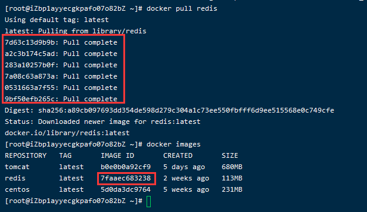

为什么上图中的tomcat达到680M？

> 因为这个tomcat是带了centos+jdk的镜像一起的
>
> 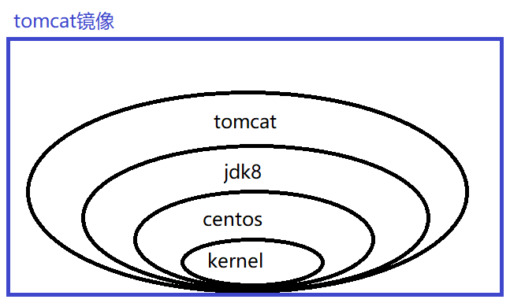

##### 4.为什么docker镜像选择分层结构

> 最大的一个好处就是-共享资源
> 比如：有**多个镜像都从相同的base镜像构建而来**，那么宿主机只需在磁盘上保存一份base镜像，同时内存中也只需加载一份base镜像，就可以为所有容器服务了。而且**每个镜像的每一层都可以被共享**。

#### 2.镜像的特点

> Docker镜像都是**只读**的
> 当容器启动时，一个新的可写层被加载到镜像的顶部--可以理解到作用到上图的tomcat层。
> 这一层通常被称作"容器层"，"容器层"之下的都叫"镜像层"。

#### 3.docker镜像commit操作

将修改后的容器生成为一份新的镜像

> docker commit 提交容器副本，使之成为一个新的镜像
>
> docker commit -m="提交的描述信息" -a="作者" 容器ID 要创建的目标镜像名称:[标签名/版本号]

案例演示

> 1.在hub上下载tomcat镜像到本地运行 docker run -it -p 8888:8080 tomcat
>
> - -p 主机端口：docker内的容器端口（如上，外界访问的是主机的8888端口，再映射到容器的8080端口）
> - -P随机分配端口
> - -i：交互
> - -t：终端
>
>   
>
>   通过主机的http://127.0.0.1:8888/可以访问到（现在需要先将容器中tomcat目录下的webapps.dist里面的内容全部复制到webapps下面才能访问到）
>
>   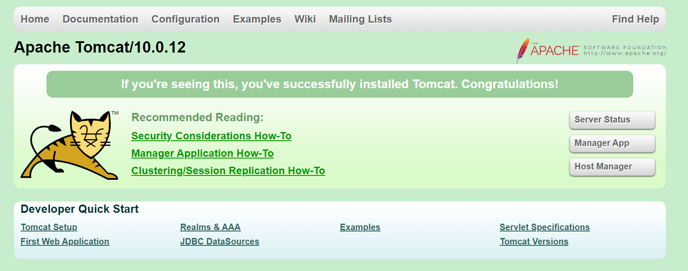
>
>   如果改为：docker run -it -P tomcat，则会随机分配一个端口来对应容器中的8080
>
>   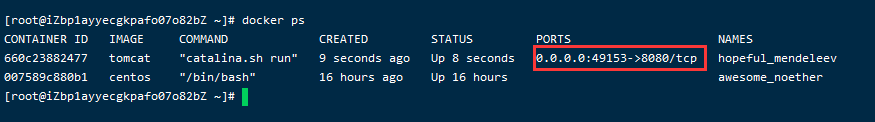

经过上述操作，对tomcat镜像生成的容器进行了一定修改，**以这个修改后的容器为目标，commit一个新的tomcat镜像mjn/tomcat02**：docker commit -a="mjn" -m="tomcat with doc page" 070aa9454531 mjn/mytomcat:1.2

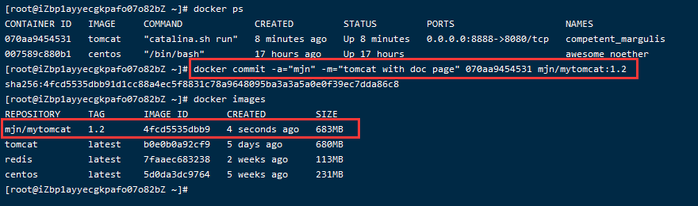

经过上述命令，本地出现了一个新的镜像：mjn/mytomcat

现在删除所有在运行的容器，重新用这个新镜像来创建一个容器，看看能否保持原样：

> docker rm -f $(docker ps -qa)：删除所有运行中的容器
>
> 
>
> docker run -it -p 8888:8080 mjn/mytomcat:1.2：指定端口映射的启动
>
> 
>
> 可见，启动成功，再次通过页面访问，可以访问：
>
> 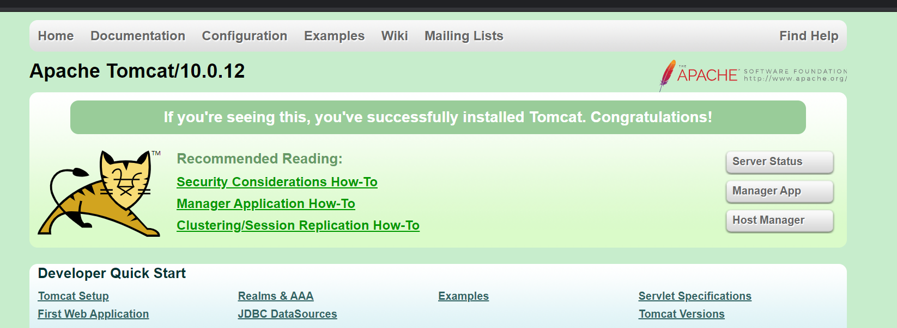

说明新的镜像保存成功！

#### 4.docker run -d的增加知识

将上述过程改为**docker run -it -p 8888:8080 mjn/mytomcat:1.2**启动

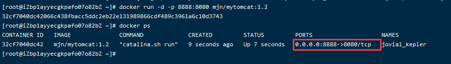

启动成功且未被关闭，可以访问

显示最后5行的运行Log: docker logs -f --tail 5 32cf7040dc42

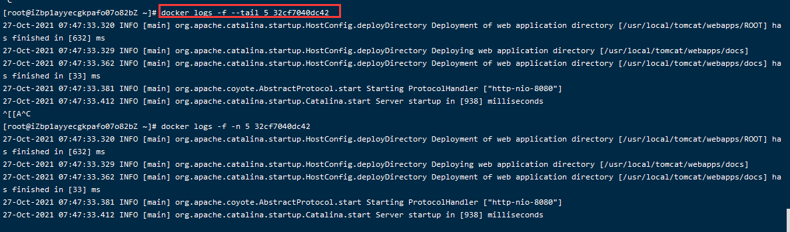

### 5.docker容器数据卷

#### 1.是什么

一句话：类似Redis的rdb和aof文件

> 先来看看Docker的理念：
> 将运用写运行的环境打包形成容器运行，运行可以伴随着容器，但是我们**对数据的要求希望是持久化的**
> 容器之间希望有可能**共享数据**
> Docker容器产生的数据，如果不通过docker commit生成新的镜像，使得数据做为镜像的一部分保存下来，那么当容器删除后，数据自然也就没有了。
> 为了能保存数据，在docker中我们使用卷。

#### 2.能干嘛

容器数据的持久化

容器间的继承+共享数据

> 卷：就是目录或文件，存在于一个或多个容器中，由docker挂载到容器，但不属于联合文件系统，因此能够绕过Union File Sys提供一些用于持续存储或共享数据的特性：
>
> 卷的设计**目的就是数据的持久化，完全独立于容器的生存周期**，因此Docker不会在容器删除时删除其挂载的数据卷
> 特点：
> 1：数据卷可在容器之间共享或重用数据
> 2：卷中的更改可以直接生效
> |3：数据卷中的更改不会包含在镜像的更新中
> 4：数据卷的生命周期一直持续到没有容器使用它为止

#### 3.数据卷

容器内添加：

##### 1.直接命令添加

容器内数据与宿主机完全共享

命令：

docker run -it -v /宿主机绝对路径:/容器内绝对路径 镜像名

> 启动一个容器，将容器的指定目录的数据存于宿主机的指定目录下
>
> 1.执行：docker run -it -v /myDataVolume:/dataVolumeContainer centos
>
> 执行后的情况
>
> 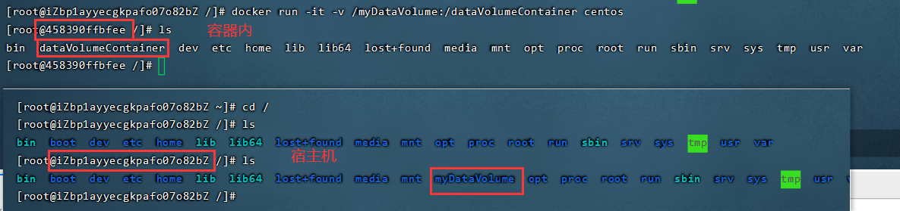
>
> 宿主机和容器内同时建立了对应的这两个文件夹
>
> 在宿主机查看该容器的详细信息：docker inspect 458390ffbfee
>
> 
>
> 可以看出绑定关系
>
> 2.在宿主机创建一个test.txt文件，可以看到容器内也自然能查看到该文件
>
> 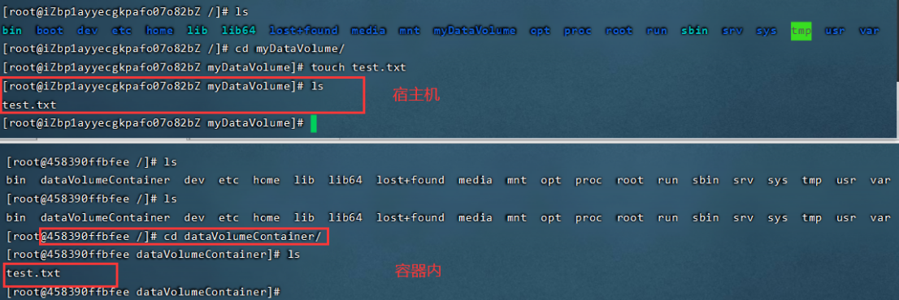
>
> 3.在容器内创建和修改文件，在宿主查看
>
> 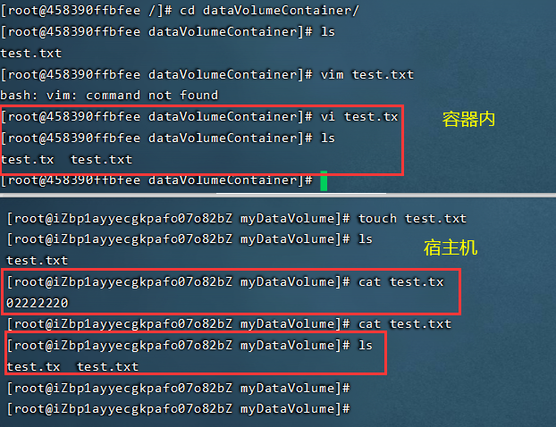
>
> 4.关闭容器，可以看到宿主机的文件夹和文件依旧存在
>
> 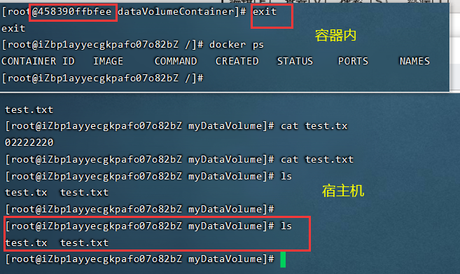
>
> 在宿主机新建一个test.02文件，重新启动之前的容器，会看到在该容器停止期间创建的内容也会在容器内展示出来
>
> 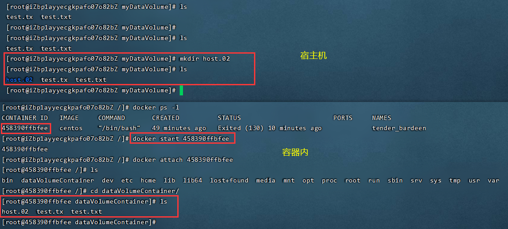

docker run -it -v /宿主机绝对路径:/容器内绝对路径：ro 镜像名

> 只读，容器内对此目录只读，不可写
>
> docker run -it -v /myDataVolume:/dataVolumeContainer:ro centos
>
> 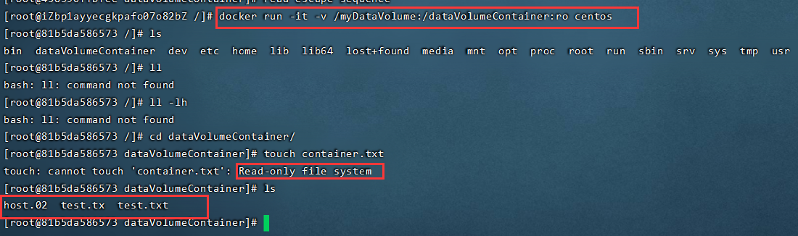
>
> 可见，宿主机的东西读取过来了，但是当容器想添加或修改内容时却被拒绝了。写操作被禁止了，无法进行增删改。
>
> 查看其容器信息docker inspect 81b5da586573，发现记录着“只读”，RW的值为False
>
> 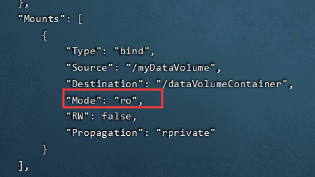

##### 2.DockerFile添加

是什么：是用来描述镜像的文件，是源码级别的描述。

1.根目录下新建mydocker文件夹并进入

2.可在dockerfile中使用VOLUME指令来给一个镜像添加一个或多个数据卷

> VOLUME["/dataVolumeContainer"，"/dataVolumeContainer2"，"/dataVolumeContainer3"]
> 说明：出于可移植和分享的考虑，用-v主机目录：容器目录这种方法不能够直接在Dockerfile中实现。
> 由于宿主机目录是依赖于特定宿主机的，并不能够保证在所有的宿主机上都存在这样的特定目录。上述代码的意思是将一个镜像与多个主机的目录绑定

3.File构建

> 直接在宿主机中编写dockerfile
>
> ```dockerfile
> # volume test 
> FROM centos #继承自centos镜像
> VOLUME ["/dataVolumeContainer1","/dataVolumeContainer2"] #在当前的容器下面新建两个文件夹
> CMD echo "finished, --------success1" #打印1行文字
> CMD /bin/bash #进入容器
> ```

4.build后生成镜像

build命令解析：

> docker build -f dockerfile的绝对路径 -t 镜像名 .：获得一个dockerfile定义的新镜像
>
> docker build -f /mydocker/Dockerfile -t mjn/centos .
>
> 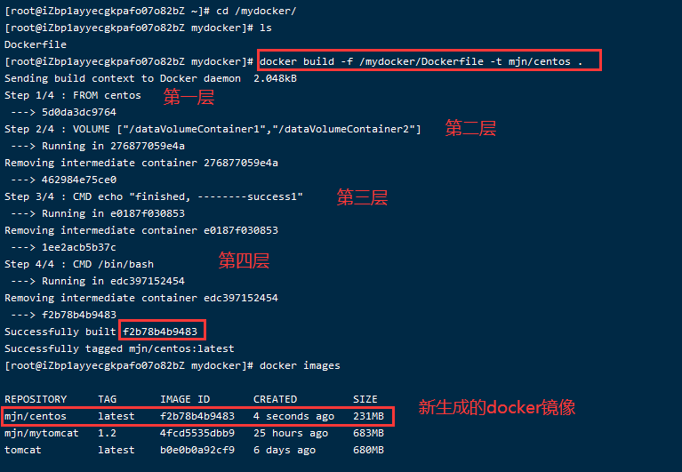

5.run容器

此时如果通过这个新镜像创建容器，则会在容器下新建两个数据卷

> docker run -it mjn/centos
>
> 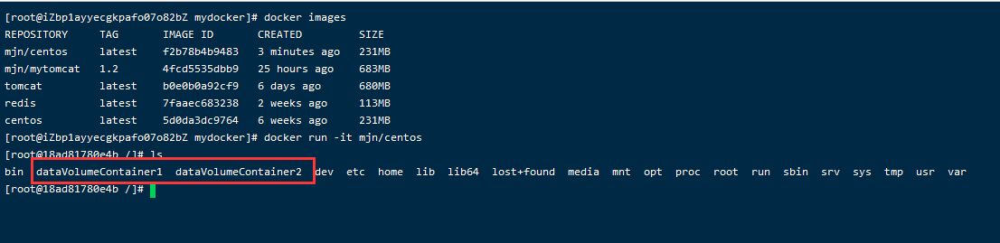
>
> 通过docker inspect 容器id可以看到其在宿主机默认的挂载地址：docker inspect 18ad81780e4b
>
> 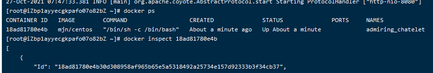
>
> 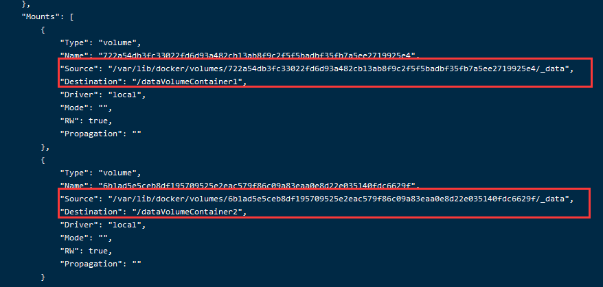
>
> 进入宿主机相关位置可以看到
>
> 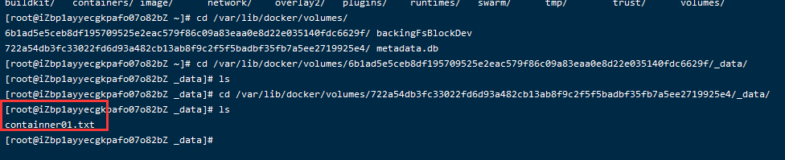

##### 3.备注

Docker挂载主机目录Docker访问出现cannot open directory.：Permission denied
解决办法：在挂载目录后多加一个--privileged=true参数即可

> docker run -it -v /myDataVolume:/dataVolumeContainer --privileged=true centos

#### 4.数据卷容器

##### 1.是什么

命名的容器挂载数据卷，其它容器通过挂载这个（父容器）实现数据共享，挂载数据卷的容器，称之为数据卷容器

##### 2.总体介绍

以上面新建的镜像mjn/centos为模板并运行容器dc01/dc02/dc03

他们已经自带容器卷：/dataVolumeContainer1，/dataVolumeContainer2

##### 3.容器间传递依赖的共享

--volumes-from

1.先启动父容器dc01，在其dataVolumeContainer2中新增内容

> docker run -it --name dc01 mjn/centos
>
> 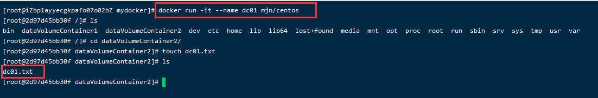

2.启动一个dc02，dc03，继承dc01的数据卷

> docker run -it --name dc02 --volumes-from dc01 mjn/centos
>
> 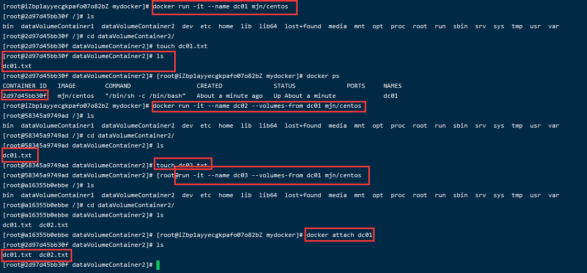
>
> 可见，docker01/02/03的数据是互通的

3.将dc02关闭后，可见dc01中的数据依旧存在

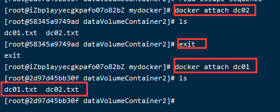

4.将dc01关闭，看到dc03中依然存在这两个文件夹，虽然dc01被关闭了，但2/3之间还是能继续修改和共享数据

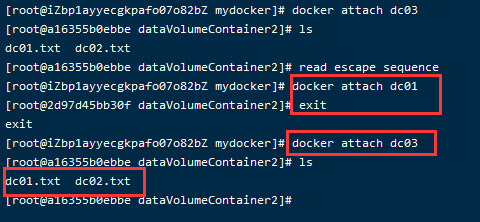

**结论：容器之间能置信息的传递，数据卷的生命周期一直持续到没有容器使用它为止**

只要还有一个容器与这个数据卷关联的，其所有功能都可以继续使用。

### 6.DockerFile解析

1.手动编写一个dockerfile文件（符合file规范的）

2.有此文件后，直接使用docker build命令执行，获得一个自定义 的镜像

3.直接run这个镜像

#### 1.是什么

dockerfile是用来构建Docker镜像的构建文件，是由一系列命令和参数构成的脚本。

构建步骤：写**dockerFile-->docker build-->docker run**

文件是什么样子的？以centos为例子

访问docker hub中centos的dockerfile网址：https://github.com/CentOS/sig-cloud-instance-images/blob/b2d195220e1c5b181427c3172829c23ab9cd27eb/docker/Dockerfile

可以看到其dockerfile内容

```dockerfile
FROM scratch #继承的镜像，scratch相当于java中的object类
ADD centos-7-x86_64-docker.tar.xz / #添加的包

LABEL \ #添加的备注
    org.label-schema.schema-version="1.0" \
    org.label-schema.name="CentOS Base Image" \
    org.label-schema.vendor="CentOS" \
    org.label-schema.license="GPLv2" \
    org.label-schema.build-date="20201113" \
    org.opencontainers.image.title="CentOS Base Image" \
    org.opencontainers.image.vendor="CentOS" \
    org.opencontainers.image.licenses="GPL-2.0-only" \
    org.opencontainers.image.created="2020-11-13 00:00:00+00:00"

CMD ["/bin/bash"] #最后运行的命令
```

#### 2.dockerfile构建过程解析

##### 1.dockerfile内容基础知识

> 1：每条保留字指令都必须为大写字母且后面要跟随至少一个参数（即每一个有颜色的命令后面都必须加一个参数，指明其作用对象，否则会出现空指针问题）
> 2：指令按照从上到下，顺序执行
> 3：#表示注释
> 4：**每条指令都会创建一个新的镜像层，并对镜像进行提交**

##### 2.dockerfile执行大致流程

> （1）docker从**基础镜像**运行下个容器（必须有一个基础镜像）
> （2）执行一条指令并对容器作出修改
> （3）执行类似docker commit的操作提交一个新的镜像层
> （4）docker再基于刚提交的镜像运行一个新容器
> （5）执行dockerfile中的下一条指令直到所有指令都执行完成
>
> 从应用软件的角度来看，Dockerfile，Docker镜像与Docker容器分别代表软件的三个不同阶段，
> **Dockerfile**是软件的**原材料**
> **Docker镜像**是软件的**交付品**
> **Docker容器**则可以认为是软件的**运行态**。
> **Dockerfile面向开发，Docker镜像成为交付标准，Docker容器则涉及部署与运维**，三者缺一不可，合力充当Docker体系的基石。
>
> 
>
> 1 Dockerfile，需要定义一个Dockerfile，**Dockerfile定义了进程需要的一切东西**。Dockerfile涉及的内容包括执行代码或者是文件、环境变量、依赖包、运行时环境、动态链接库、操作系统的发行版、服务进程和内核进程（当应用进程需要和系统服务和内核进程打交道，这时需要考虑如何设计namespace的权限控制）等等；
> 2 Docker镜像，在用Dockerfile定义一个文件之后，docker build时会产生一个Docker镜像，当运行Docker镜像时，会真正开始提供服务；
> 3 Docker容器，容器是直接提供服务的。

#### 3.dockerfile体系结构

docker的各种关键字

FROM：基础镜像，当前的新镜像是基于哪个镜像的

> FROM scratch #继承的镜像，scratch相当于java中的object类

MAINTAINER：镜像维护者的姓名和邮箱地址

> MAINTAINER https://github.com/CentOS/sig-cloud-instance-images

RUN：容器构建时需要运行的linux命令

> RUN groupadd -r -g 999 redis && useradd -r -g redis -u 999 redis

EXPOSE：该镜像生成容器后需要向外暴露的端口号

> EXPOSE 6379

WORKDIR：指定在创建容器后，终端默认登陆的进来工作目录，一个落脚点（进入容器后的默认所处于的容器内路径，默认根目录）

> WORKDIR /data

ENV：一用来在构建镜像过程中设置环境变量

> ENV MY_PATH /usr/mytest：这个环境变量MY_PATH可以在后续的任何RUN指令中使用，这就如同在命令前面指定了环境变量前缀一样；也可以在其它指令中直接使用这些环境变量，比如：WORKDIR $MY_PATH

ADD：复制+解压一个软件，将宿主机目录下的文件拷贝进镜像，且ADD命令会自动处理URL和解压tar压缩包

> ADD centos-7-x86_64-docker.tar.xz

COPY：类似ADD，从宿主机拷贝文件和目录到镜像中。将从构建上下文目录中<**源路径**>的文件/录复制到新的一层的镜像内的<目标路径>位置

> COPY src dest
>
> COPY ["src","dest"]

VOLUME：容器数据卷，用于数据保存和持久化工作

> VOLUME ["/dataVolumeContainer1","/dataVolumeContainer2"] #在当前的容器下面新建两个文件夹用于存储数据

CMD：指定一个容器启动时要运行的命令

> Dockefile中可以有多个CMD指令，但**只有最后一个生效**，CMD会被docker run之后的参数**替换**
>
> CMD ["redis-server"]
>
> 

ENTRYPOINT：指定一个容器启动时要运行的命令，其目的和CMD一样，都是在指定容器启动程序及参数，会将docker run之后的参数**追加**进来

ONBUILD：当构建一个被继承的Dockerfile时运行命令，父镜像在被子继承后父镜像的onbuild被触发

> 在自镜像运行开始后，父镜像要进行的动作可以卸载onbuild里面

总结：


#### 4.案例

##### 1.base镜像(scratch)

类似于Java中的object类的级别，Docker Hub 中 99%的镜像都是通t在base镜像中安装和配置需要的软件构建出来的

##### 2.自定义镜像-mycentos

1.编写

> hub默认的centos镜像是什么情况
>
> 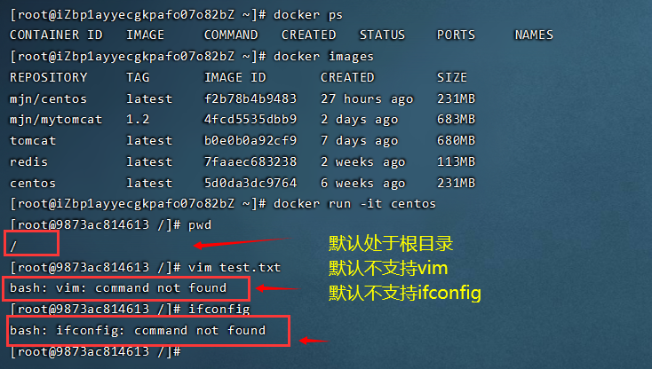
>
> 自定义mycentos目的使我们自己的镜像具备如下：
> 登陆后的默认路径+vim编辑器+查看网络配置ifconfig支持
>
> 回到宿主机的mydocker目录下开始编写dockerfile
>
> ```dockerfile
> FROM centos #继承centos的镜像
> MAINTAINER mjn<mjn1130.qq.com> #作者信息
>
> ENV MYPATH /usr/local # 新建一个MYPATH环境变量指向/usr/local地址
> WORKDIR $MYPATH #设置进入容器后的默认地址为/usr/local
>
> RUN yum -y install vim # 运行命令，安装vim软件
> RUN yum -y install net-tools # 运行命令，安装net-tools软件
>
> EXPOSE 80 #开启容器的80端口
>
> CMD echo $MYPATH #执行打印任务
> CMD echo "sucess----------ok"
> CMD /bin/bash
> ```

2.build构建

docker build -t 新镜像名字:TAG .

> docker build -f /mydocker/dockerfile2 -t mycentos:1.3 .
>
> 运行过程如下：
>
> | 开始                                                         | 结束                                                         |
> | ------------------------------------------------------------ | ------------------------------------------------------------ |
> | 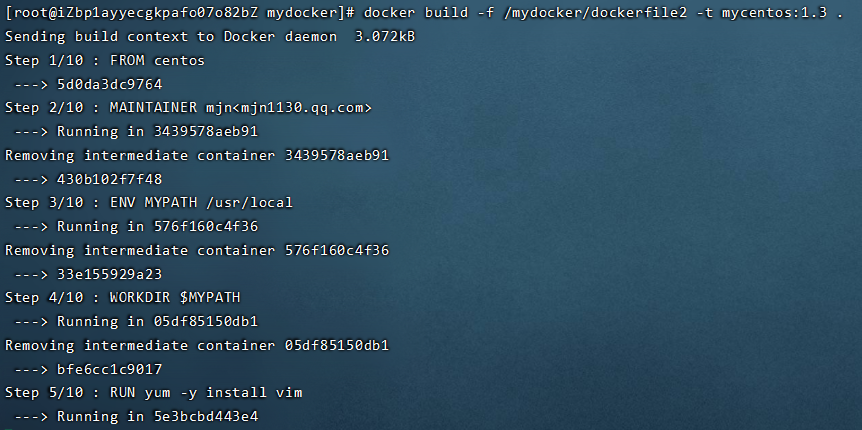 |  |
>
> 此时可见到新打包的mycentos1.3镜像了

3.运行

此时运行这个新的镜像

> docker run -it mycentos:1.3
>
> 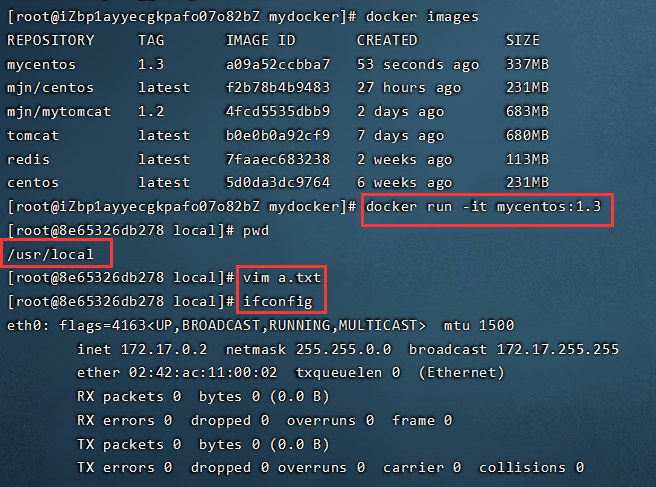
>
> 可以看出，和预期效果完全一样，默认访问目录+vim+ifconfig均已经是自动配置好的
>
> 通过在宿主机中查看构建记录可以看出其构建过程
>
> 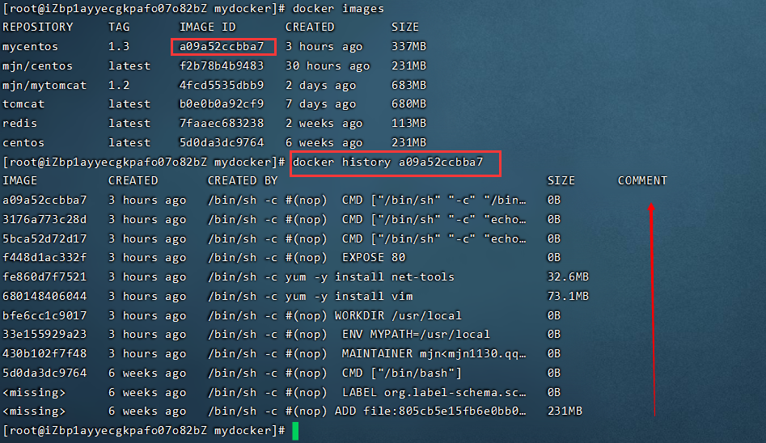

##### 3.CMD/ENTRYPOINT镜像案例

二者都是指定一个容器启动时要运行的命令

CMD

> Dockerfile中可以有多个CMD指令，但只有最后一个生效，CMD会被docker run之后的参数替换
>
> 对于tomcat镜像，其末尾包含如下命令
>
> ```dockerfile
> CMD ["catalina.sh", "run"]
> ```
>
> 但如果执行以下命令，则会发现tomcat没有启动，容器启动后自杀了。因为ls -l替换了上面的["catalina.sh", "run"]，所以去查看了容器内默认路径的目录内内容。
>
> docker run -it -p 8888:8080 tomcat ls -l
>
> 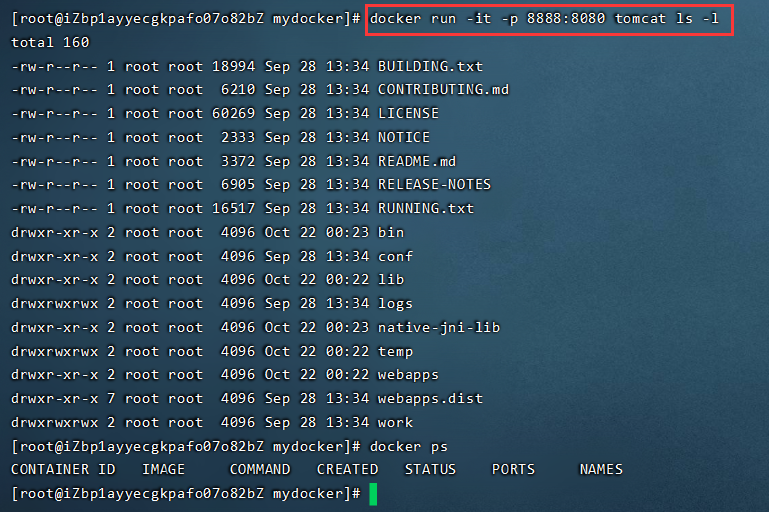

对于ENTRYPOINT

不会被替换，而是会被追加

> docker run之后的参数会被当做参数传递给ENTRYPOINT，之后形成新的命令组合
>
> 例：制作CMD版可以查询IP信息的容器
>
> ```dockerfile
> FROM centos
> RUN yum install -y curl
> CMD ["curl","-S","http://ip.cn"]
> ```
>
> curl命令可以用来执行下载、发送各种HTTP请求，指定HTTP头部等操作。
> 如果系统没有curl可以使用yum install curl安装，也可以下载安装。
> curl是将下载文件输出到stdout使用命令：curl http://www.baidu.com执行后，www.baidu.com的html就会显示在屏幕上了。这是最简单的使用方法。用这个命令获得了http://curl.haxx.se指向的页面，同样，如果这里的URL指向的是一个文件或者一幅图都可以直接下载到本地。如果下载的是HTML文档，那么缺省的将只显示文件头部，即HTML文档的header。要全部显示，请加参数-i
>
> 使用命令docker build -f /mydocker/dockerfile3 -t myip .构建
>
> 
>
> 使用命令docker run -it myip可以得到以下结果
>
> 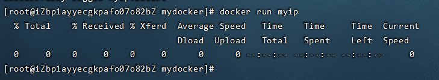
>
> 如果我们需要加一个-i显示curl的head信息：尝试直接docker run -it myip -i,会报错
>
> 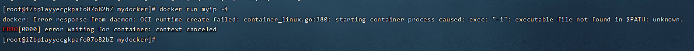
>
> 相当于将最后一句改为了CMD ["-i"]
>
> 我们可以看到可执行文件找不到的报错，executable file not found.之前我们说过，**跟在镜像名后面的是command，运行时会替换CMD的默认值**。因此这里的**-i替换了原来的CMD**，而不是添加在原来的curl-s http://ipcn后面。而-根本不是命令，所以自然找不到。那么如果我们希望加入-这参数，我们就必须重新完整的输入这个命令，就会看到所需效果：
> $ docker run myip curl -S http://ip.cn -i，**但此方法会导致最后一句的CMD失效**
>
> 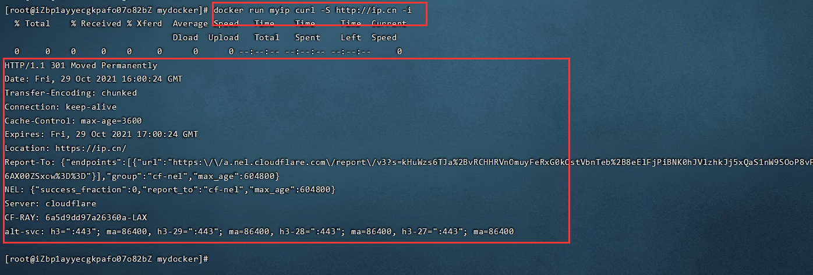

通过ENTRYPOINT来实现

> 编写dockerfile并构建
>
> ```dockerfile
> FROM centos
> RUN yum install -y curl
> ENTRYPOINT ["curl","-S","http://ip.cn"]
> ```
>
> 创建镜像如下
>
> 
>
> 此时如果直接执行，还是和之前一样
>
> 
>
> 但如果添加一个参数-i，即：docker run myip2 -i，即可达到之前重写命令的效果
>
> 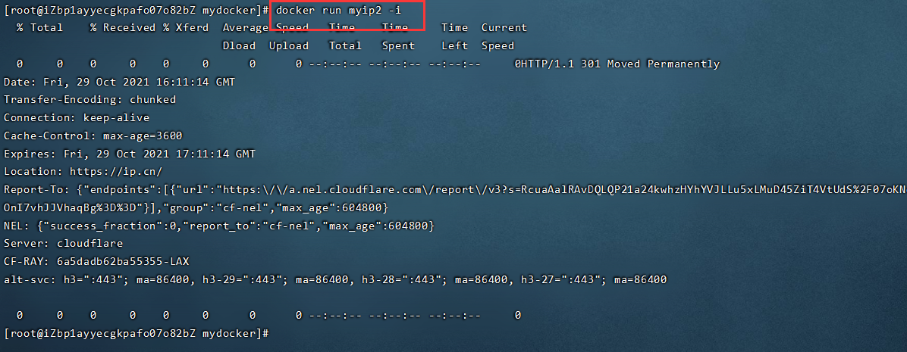
>
> 其相当于在最后一句追加了一个-i参数，相当于dockerfile最后一句被修改为
>
> ENTRYPOINT ["curl","-S","http://ip.cn","-i"]
>
> 然后再来执行此句，这也正是CMD与ENTRYPOINT 的区别所在

##### 4.ONBUILD

被继承后触发

> 对dockerfile4做如下修改
>
> ```dockerfile
> FROM centos
> RUN yum install -y curl
> ENTRYPOINT ["curl","-S","http://ip.cn"]
> ONBUILD RUN echo "father onbuild--------886" #被继承后运行此命令
> ```
>
> 然后重新build构建
>
> docker build -f dockerfile4 -t myip_father .
>
> 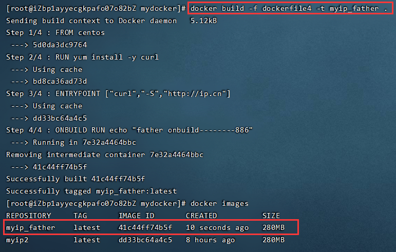
>
> 再构建一个dockerfile5
>
> ```dockerfile
> FROM myip_father
> RUN yum -y install curl
> CMD ["curl","-S","http://ip.cn"]
> ```
>
> docker build -f dockerfile5 -t myip_son .
>
> 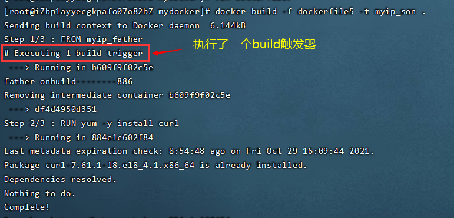
>
> 可以看到，输出显示此镜像的建立执行了一个触发器，触发器执行了dockerfile4中echo "father onbuild--------886"的内容

##### 5.自定义镜像tomcat9

手动制作一个tomcat版本

> 1.mkdir-p/zzyyuse/mydockerfile/tomcat9
>
> 2，在上述目录下touch c.txt
>
> 3，将jdk-8u171-linux-64.tar.gz和apache-tomcat-8.0.8.tar.gz安装的压缩包拷贝进上一步目录
>
> 4.编写dockerfile
>
> ```dockerfile
> FROM centos 
> MAINTAINER mjn<mjn@126.com>
> #把宿主机当前上下文的c.txt拷贝到容器/usr/local/路径下,并取名为cincontainer.txt
> COPY c.txt /usr/local/cincontainer.txt 
> #把java与tomcat添加到容器中
> ADD jdk-8u171-linux-x64.tar.gz /usr/ocal/
> ADD apache-tomcat-9.0.8.tar.gz /usr/local/
> #安装vim编辑器
> RUN yum-y install vim
> #设置工作访问时候的WORKDIR路径，登录落脚点
> ENV MYPATH /usr/local 
> WORKDIR $MYPATH
> #配置java与tomcat环境变量
> ENV JAVA_HOME /usr/localjdk 1.8.0_171
> ENV CLASSPATH $JAVA_HOME/lib/dt.jar;$JAVA_HOME/lib/tools.jar 
> ENV CATALINA_HOME /usr/local/apache-tomcat-9.0.8
> ENV CATALINA_BASE /usr/ocal/apache-tomcat-9.0.8
> ENV PATH $PATH;$JAVA_HOME/bin;$CATALINA_HOME/lib;$CATALINA_HOME/bin
> #容器运行时监听的端口
> EXPOSE 8080
> #启动时运行tomcat
> #ENTRYPOINT["/usr/local/apache-tomcat-9.0.8/bin/startup.sh"
> #CMD[/usr/local/apache-tomcat-9.0.8/bin/catalina.sh"，"run"]
> CMD /usr/local/apache-tomcat-9.0.8/bin/startup.sh && tail -F /usr/local/apache-tomcat-9.0.8/bin/logs/catalina.out
> ```
>
> 构建：docker build -t mjn/tomcat9 .
>
> 【注意】如果dockerfile的名字就是“Dockerfile”，而且就在当前路径下，可以不使用路径参数-f和指明文件路径，docker build会自动在当前目录下查找名为Dockerfile的文件来构建
>
> 
>
> 启动命令
>
> docker run -d -p 9080:8080 --name myt9 -v /mydocker/tomcat9/test:/usr/local/apache-tomcat-9.0.8/webapps/test -v /mydocker/tomcat9/tomcat9logs/:/usr/local/apache-tomcat-9.0.8/logs --privileged=true mjn/tomcat9
>
> -d指明后台运行
>
> -p指明端口映射
>
> -v指明了两个宿主数据卷与两个容器内数据卷的对应关系
>
> --privileged=true指明可读写
>
> 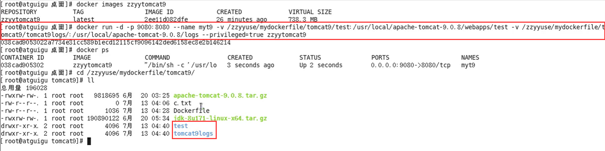
>
> 验证
>
> 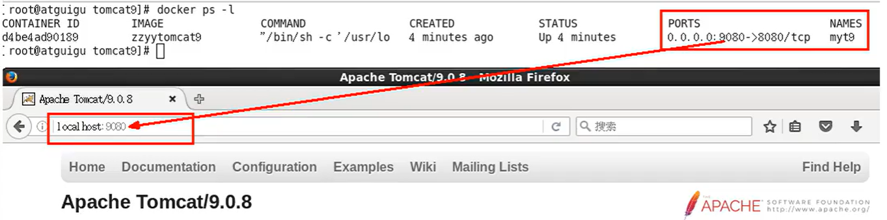

##### 6.结合前述的容器卷将测试的web服务test发布

总体概述

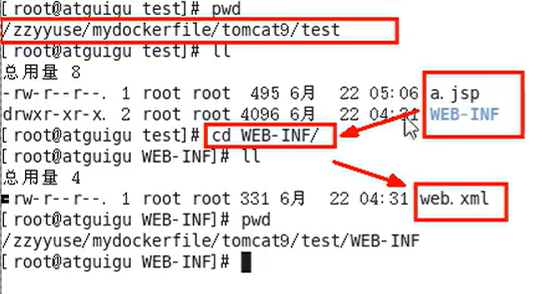

web.xml

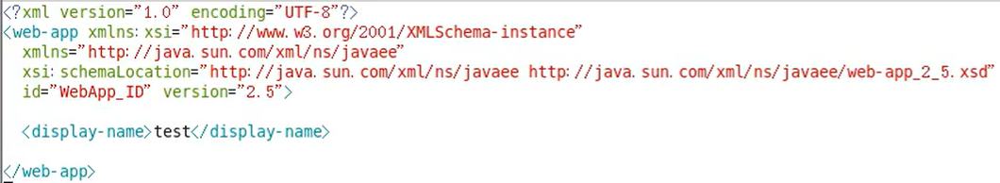

a.jsp

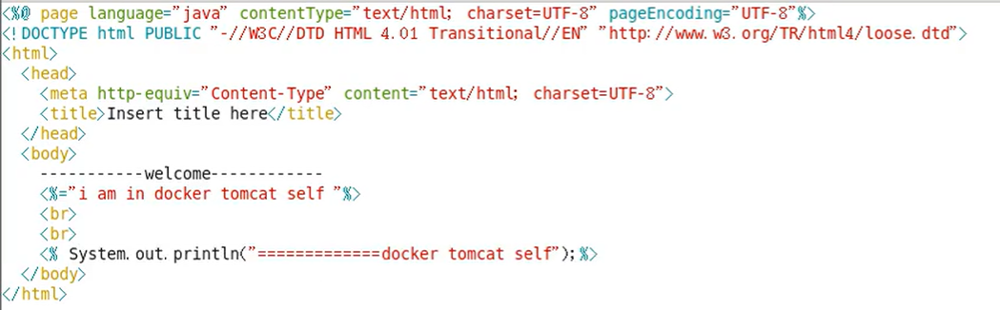

> 由于WEB-INFO文件夹和a.jsp是放置在test文件夹下的，再根据数据集的绑定，所以将**容器重启后，容器内webapps的test文件夹内也会出现此文件夹和jsp文件，启动tomcat之后可以访问到**
>
> 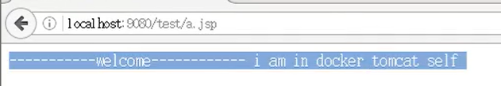
>
> **此时在宿主机内对此jsp文件修改，会直接在容器内体现出来**
>
> 查看宿主数据卷的日志，也会记录下容器内的日志
>
> 

#### 5.总结


### 7.Docker常用安装

拉取正确的镜像并安装和运行

#### 1.总体步骤

搜索镜像
拉取镜像
查看镜像
启动镜像
停止容器
移除容器

#### 2.安装tomcat

docker hub上面查找tomcat镜像  docker search tomcat
从docker hub上拉取tomcat镜像到本地  docker pull tomcat
docker images查看是否有拉取到的tomcat 1
使用tomcat镜像创建容器（也叫运行镜像）

> docker run-it-p 8080：8080 tomcat
> -p主机端口：docker容器端口
> -P随桃分配端口
> -i交互
> -t：终端

#### 3.安装mysql

docker hub上面查找mysql镜像

> docker search mysql
>
> 

从docker hub上（阿里云加速器）拉取mysal锐像到本地标签为5.6

> docker pull mysql:5.6
>
> 
>
> docker run -p 12345:3306 --name mysql -v /mydocker/mysql/conf:/etc/mysql/conf.d -v /mydocker/mysql/logs:/logs -v /mydocker/mysql/data:/var/lib/mysql -e MYSQL_ROOT_PASSWORD=123456 -d mysql:5.6
>
> 命令说明：
> -p 12345：3306：将主机的12345端口映射到docker容器的3306端口。
> --name mysql：运行服务名字
> -v /mydocker/mysq/conf:/etc/mysq/conf.d：将主机/mysql录下的conf/my.cnf挂载到容器的/etc/mysq/conf.d
> -v /mydocker/mysqllogs:/logs：将主机/mysq目录下的logs目录挂载到容器的Logs.
> -v /mydocker/mysq/data:/var/lib/mysq：将主机/zzyyuse/mysq目录下的data目录挂载到容器的Nar/ib/mysql
> -e MYSQL_ROOT_PASSWORD=123456：初始化root用户的密码。
> -d mysql：5.6：后台程序运行mysq15.6
>
> 
>
> 进入容器内的mysql，完全成功
>
> 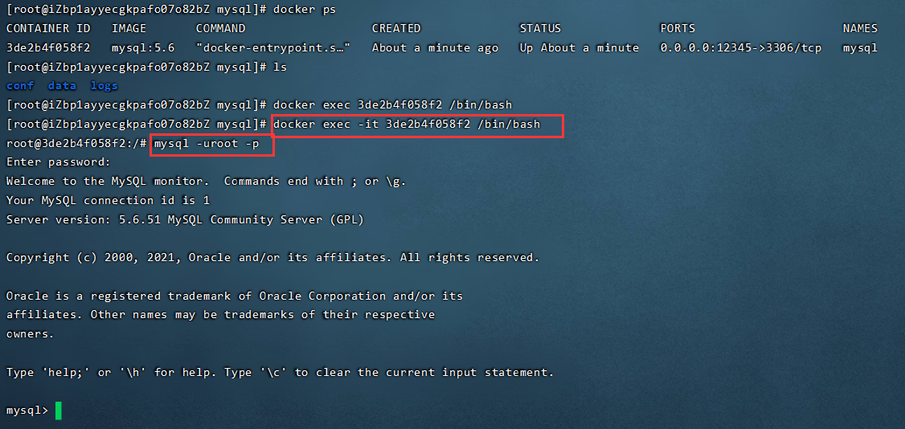
>
> 通过宿主机对docker容器内的Mysql备份
>
> docker exec 容器id sh -c 'exec mysqldump --all-databases -uroot -p"123456"' > /mydocker/mysql/all-databases.sql
>
> 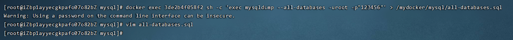
>
> 进入sql可以看到，所有数据均已备份
>
> 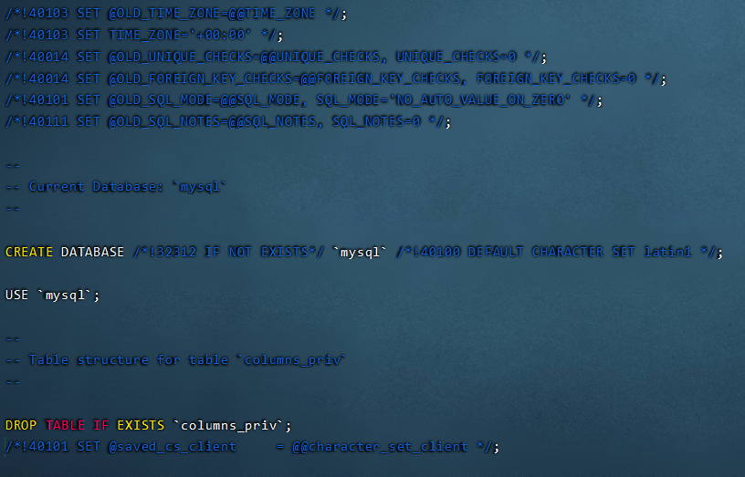

#### 4.安装redis

拉取redis3.2

> docker pull redis:3.2
>
> 
>
> 启动镜像
>
> docker run -p 6379:6379 -v /mydocker/redis/data:/data -v /mydocker/redis/conf/redis.conf:/usr/local/etc/redis/redis.conf -d redis:3.2 redis-server /usr/local/etc/redis/redis.conf --appendonly yes
>
> --appendonly yes:开启AOF持久化
>
> 
>
> 在主机/mydocker/redis/conf/redis.conf目录下新建redis.conf文件
> vim /mydocker/redis/conf/redis.conf/redis.conf
>
> ```conf
> # Both the hard or the soft limit can be disabled by setting them to zero.
> client-output-buffer-limit normal 0 0 0
> client-output-buffer-limit slave 256mb 64mb 60
> client-output-buffer-limit pubsub 32mb 8mb 60
> # Redis calls an internal function to perform many background tasks, like closing connections of clients in timeout, purging expired keys that are
> # never requested, and so forth.
> # Not all tasks are performed with the same frequency, but Redis checks for
> # tasks to perform according to the specified "hz"value.
> # By default "hz"is set to 10. Raising the value will use more CPU when Redis is idle, but at the same time will make Redis more responsive when
> # there are many keys expiring at the same time, and timeouts may be
> # handled with more precision.
> # The range is between 1 and 500, however a value over 100 is usually nota good idea. Most users should use # the default of 10 and raise this up to
> # 100 only in environments where very low latency is required
> hz 10
> # When a child rewrites the AOF file, if the following option is enabled
> # the file will be fsync-ed every 32 MB of data generated. This is useful in order to commit the file to the disk more incrementally and avoid big latency spikes.
> aof-rewrite-incremental-fsync yes
> ```
>
> 连接这个redis
>
> docker exec -it 运行着Redis服务的容器ID redis-cli
>
> 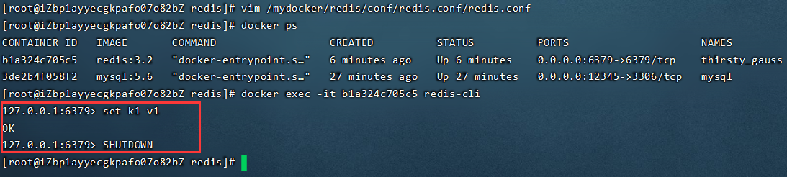
>
> 在宿主机查看持久化的情况，可以看到已经持久化到AOF了
>
> 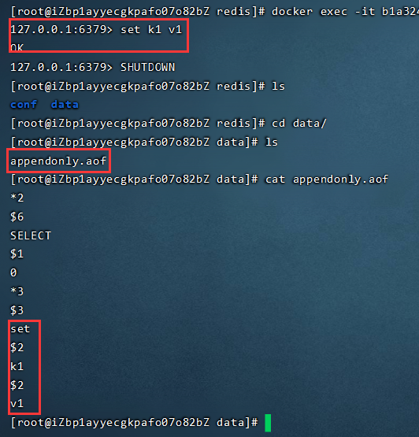

### 8.本地镜像推送到阿里云

#### 1.本地镜像发布到阿里云流程

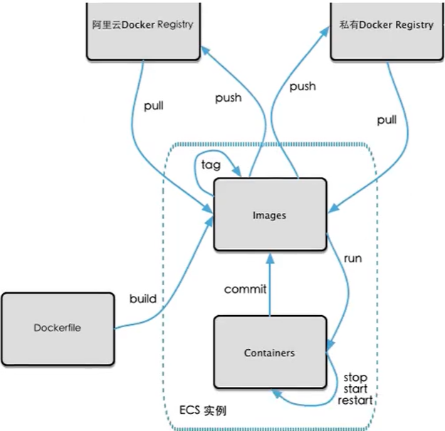

#### 2.镜像的生成方法

1.前面的DockFile

2.从容器创建一个新的镜像：docker commit [OPTIONS] 容器ID [REPOSITORY：TAG]

#### 3.将本地镜像推送到阿里云

1.在阿里云创建一个镜像仓库

2.将镜像推送到阿里云

仓库阿里云镜像仓库的【管理】的操作指南

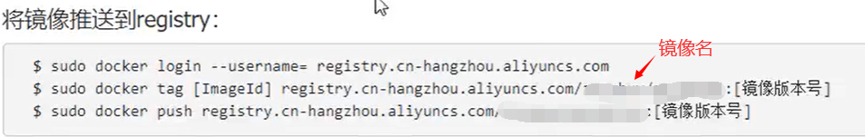

> 推送过程
>
> 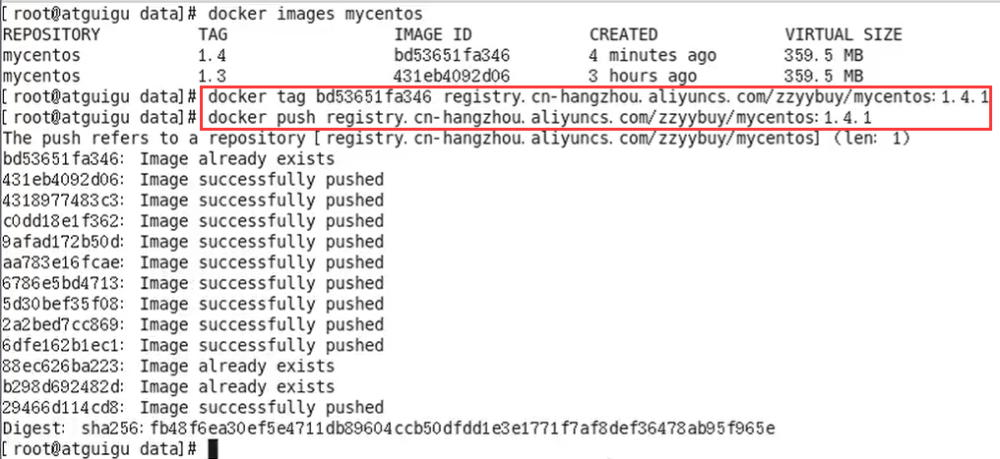
>
> 传上去后，就可以在阿里云的共有仓库查到了

#### 4.将阿里云上的镜像下载到本地

根据搜到的镜像链接即可pull到本地

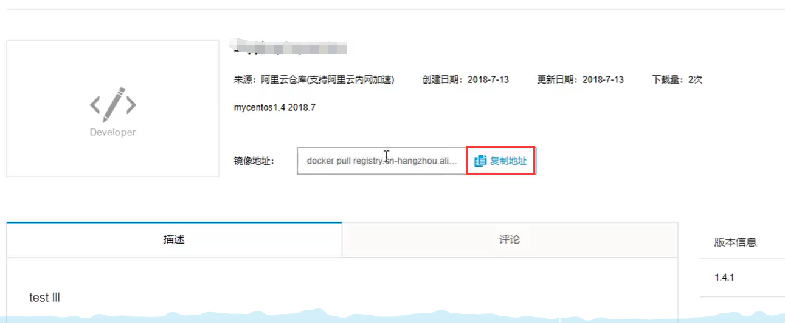

docker pull registry.cn-hangzhou.aliyuncs.com/zzyybuy/mycentos:版本号
