[TOC]

## 八股文学习技巧

- [八股文学习路线及攻略](https://leetcode-cn.com/circle/discuss/2Ypo9Z/)
- [论如何 4 个月高效刷满 500 题并形成长期记忆](https://leetcode-cn.com/circle/discuss/jq9Zke/)

## Java 基础

> 动态代理了解吗？说一下原理？

1. 什么是代理？

代理模式是一种比较好理解的设计模式。简单来说就是 **我们使用代理对象来代替对真实对象(real object)的访问，这样就可以在不修改原目标对象的前提下，提供额外的功能操作，扩展目标对象的功能。**

**代理模式的主要作用是扩展目标对象的功能，比如说在目标对象的某个方法执行前后你可以增加一些自定义的操作。**

举个例子：你找了小红来帮你问话，小红就可以看作是代理你的代理对象，代理的行为（方法）是问话。

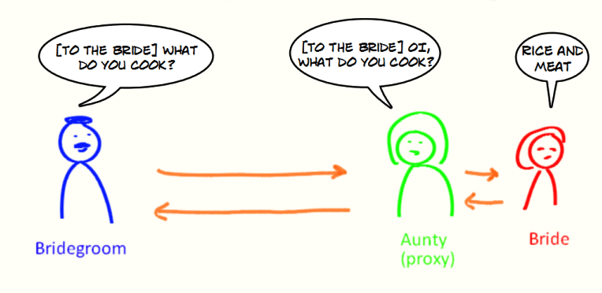

2. 静态代理

**静态代理中，我们对目标对象的每个方法的增强都是手动完成的，非常不灵活（\*比如接口一旦新增加方法，目标对象和代理对象都要进行修改\*）且麻烦(\*需要对每个目标类都单独写一个代理类\*)。** 实际应用场景非常非常少，日常开发几乎看不到使用静态代理的场景。

上面我们是从实现和应用角度来说的静态代理，从 JVM 层面来说， **静态代理在编译时就将接口、实现类、代理类这些都变成了一个个实际的 class 文件。**

静态代理实现步骤:

1. 定义一个接口及其实现类；
2. 创建一个代理类同样实现这个接口
3. 将目标对象注入进代理类，然后在代理类的对应方法调用目标类中的对应方法。这样的话，我们就可以通过代理类屏蔽对目标对象的访问，并且可以在目标方法执行前后做一些自己想做的事情。

3. 动态代理

相比于静态代理来说，动态代理更加灵活。我们不需要针对每个目标类都单独创建一个代理类，并且也不需要我们必须实现接口，我们可以直接代理实现类( *CGLIB 动态代理机制*)。

**从 JVM 角度来说，动态代理是在运行时动态生成类字节码，并加载到 JVM 中的。**

说到动态代理，Spring AOP、RPC 框架应该是两个不得不提的，它们的实现都依赖了动态代理。

**动态代理在我们日常开发中使用的相对较少，但是在框架中的几乎是必用的一门技术。学会了动态代理之后，对于我们理解和学习各种框架的原理也非常有帮助。**

就 Java 来说，动态代理的实现方式有很多种，比如 **JDK 动态代理**、**CGLIB 动态代理**等等。


3.1 机制介绍

**在 Java 动态代理机制中 `InvocationHandler` 接口和 `Proxy` 类是核心。**

`Proxy` 类中使用频率最高的方法是：`newProxyInstance()` ，这个方法主要用来生成一个代理对象。

```java
    public static Object newProxyInstance(ClassLoader loader,
                                          Class<?>[] interfaces,
                                          InvocationHandler h)
        throws IllegalArgumentException
    {
        ......
    }
```

这个方法一共有 3 个参数：

1. **loader** :类加载器，用于加载代理对象。
2. **interfaces** : 被代理类实现的一些接口；
3. **h** : 实现了 `InvocationHandler` 接口的对象；

要实现动态代理的话，还必须需要实现`InvocationHandler` 来自定义处理逻辑。 当我们的动态代理对象调用一个方法时，这个方法的调用就会被转发到实现`InvocationHandler` 接口类的 `invoke` 方法来调用。

```java
public interface InvocationHandler {

    /**
     * 当你使用代理对象调用方法的时候实际会调用到这个方法
     */
    public Object invoke(Object proxy, Method method, Object[] args)
        throws Throwable;
}
```

`invoke()` 方法有下面三个参数：

1. **proxy** :动态生成的代理类
2. **method** : 与代理类对象调用的方法相对应
3. **args** : 当前 method 方法的参数

也就是说：**你通过`Proxy` 类的 `newProxyInstance()` 创建的代理对象在调用方法的时候，实际会调用到实现`InvocationHandler` 接口的类的 `invoke()`方法。** 你可以在 `invoke()` 方法中自定义处理逻辑，比如在方法执行前后做什么事情

3.2 动态代理使用步骤

1. 定义一个接口及其实现类；

2. 自定义 `InvocationHandler` 并重写`invoke`方法，在 `invoke` 方法中我们会调用原生方法（被代理类的方法）并自定义一些处理逻辑；
3. 通过 `Proxy.newProxyInstance(ClassLoader loader,Class<?>[] interfaces,InvocationHandler h)` 方法创建代理对象

**1.定义发送短信的接口**

```java
public interface SmsService {
    String send(String message);
}
```

**2.实现发送短信的接口**

```java
public class SmsServiceImpl implements SmsService {
    public String send(String message) {
        System.out.println("send message:" + message);
        return message;
    }
}
```

**3.定义一个 JDK 动态代理类**

```java
import java.lang.reflect.InvocationHandler;
import java.lang.reflect.InvocationTargetException;
import java.lang.reflect.Method;

/**
 * @author shuang.kou
 * @createTime 2020年05月11日 11:23:00
 */
public class DebugInvocationHandler implements InvocationHandler {
    /**
     * 代理类中的真实对象
     */
    private final Object target;

    public DebugInvocationHandler(Object target) {
        this.target = target;
    }


    public Object invoke(Object proxy, Method method, Object[] args) throws InvocationTargetException, IllegalAccessException {
        //调用方法之前，我们可以添加自己的操作
        System.out.println("before method " + method.getName());
        Object result = method.invoke(target, args);
        //调用方法之后，我们同样可以添加自己的操作
        System.out.println("after method " + method.getName());
        return result;
    }
}
```

`invoke()` 方法: 当我们的动态代理对象调用原生方法的时候，最终实际上调用到的是 `invoke()` 方法，然后 `invoke()` 方法代替我们去调用了被代理对象的原生方法。


> 讲讲 hashmap，底层原理是什么？

**JDK1.8 之前**

<font color='#e67e22'>JDK1.8 之前 HashMap 底层是 **数组和链表** 结合在一起使用也就是 链表散列</font>。HashMap 通过 key 的 hashCode 经过扰动函数处理过后得到 hash 值，然后通过 (n - 1) & hash 判断当前元素存放的位置（这里的 n 指的是数组的长度），如果当前位置存在元素的话，就判断该元素与要存入的元素的 hash 值以及 key 是否相同，如果相同的话，直接覆盖，<u>不相同就通过拉链法解决冲突</u>。

所谓扰动函数指的就是 HashMap 的 hash 方法。使用 hash 方法也就是扰动函数是为了防止一些实现比较差的 hashCode() 方法 换句话说使用扰动函数之后可以减少碰撞。

JDK 1.8 HashMap 的 hash 方法源码:

JDK 1.8 的 hash 方法 相比于 JDK 1.7 hash 方法更加简化，但是原理不变。

```java
    static final int hash(Object key) {
      int h;
      // key.hashCode()：返回散列值也就是hashcode
      // ^ ：按位异或
      // >>>:无符号右移，忽略符号位，空位都以0补齐
      return (key == null) ? 0 : (h = key.hashCode()) ^ (h >>> 16);
  }
```

对比一下 JDK1.7 的 HashMap 的 hash 方法源码.

```java
static int hash(int h) {
    // This function ensures that hashCodes that differ only by
    // constant multiples at each bit position have a bounded
    // number of collisions (approximately 8 at default load factor).

    h ^= (h >>> 20) ^ (h >>> 12);
    return h ^ (h >>> 7) ^ (h >>> 4);
}
```

相比于 JDK1.8 的 hash 方法 ，JDK 1.7 的 hash 方法的性能会稍差一点点，因为毕竟扰动了 4 次。

所谓 **“拉链法”** 就是：将链表和数组相结合。也就是说创建一个链表数组，数组中每一格就是一个链表。若遇到哈希冲突，则将冲突的值加到链表中即可。


**JDK1.8 之后**

相比于之前的版本， JDK1.8 之后在解决哈希冲突时有了较大的变化，当链表长度大于阈值（默认为 8）（将链表转换成红黑树前会判断，如果当前数组的长度小于 64，那么会选择先进行数组扩容，而不是转换为红黑树）时，<font color='#fdcb6e'>将链表转化为红黑树，以减少搜索时间</font>。


TreeMap、TreeSet 以及 JDK1.8 之后的 HashMap 底层都用到了红黑树。红黑树就是为了解决二叉查找树的缺陷，因为二叉查找树在某些情况下会退化成一个线性结构。

> stringbuilder 有用过吗？
>
> stringbuilder 和 stringbuffer 什么区别？

可变性

`String` 是不可变的（后面会详细分析原因）。

`StringBuilder` 与 `StringBuffer` 都继承自 `AbstractStringBuilder` 类，在 `AbstractStringBuilder` 中也是使用字符数组保存字符串，不过没有使用 `final` 和 `private` 关键字修饰，最关键的是这个 `AbstractStringBuilder` 类还提供了很多修改字符串的方法比如 `append` 方法。

```java
abstract class AbstractStringBuilder implements Appendable, CharSequence {
    char[] value;
    public AbstractStringBuilder append(String str) {
        if (str == null)
            return appendNull();
        int len = str.length();
        ensureCapacityInternal(count + len);
        str.getChars(0, len, value, count);
        count += len;
        return this;
    }
      //...
}
```

**【重要】线程安全性**

`String` 中的对象是不可变的，也就可以理解为常量，线程安全。`AbstractStringBuilder` 是 `StringBuilder` 与 `StringBuffer` 的公共父类，定义了一些字符串的基本操作，如 `expandCapacity`、`append`、`insert`、`indexOf` 等公共方法。`StringBuffer` 对方法加了同步锁或者对调用的方法加了同步锁，所以是线程安全的。`StringBuilder` 并没有对方法进行加同步锁，所以是非线程安全的。

小结：

- String 不可变，因此是线程安全的
- StringBuilder 不是线程安全的
- StringBuffer 是线程安全的，内部使用 synchronized 进行同步

**性能**

每次对 `String` 类型进行改变的时候，都会生成一个新的 `String` 对象，然后将指针指向新的 `String` 对象。`StringBuffer` 每次都会对 `StringBuffer` 对象本身进行操作，而不是生成新的对象并改变对象引用。相同情况下使用 `StringBuilder` 相比使用 `StringBuffer` 仅能获得 10%~15% 左右的性能提升，但却要冒多线程不安全的风险。

**对于三者使用的总结：**

1. 操作少量的数据: 适用 `String`
2. 单线程操作字符串缓冲区下操作大量数据: 适用 `StringBuilder`
3. 多线程操作字符串缓冲区下操作大量数据: 适用 `StringBuffer`


> stringbuilder 为什么线程不安全？底层原理是什么？

`StringBuilder` 并没有对方法进行加同步锁

以StringBuffer为例，可以看到底层加入了同步锁

```java
@Override
    public synchronized int length() {
        return count;
    }

    @Override
    public synchronized int capacity() {
        return value.length;
    }
```

而StringBuilder则没有：

```java
    /**
     * Returns the length (character count).
     *
     * @return  the length of the sequence of characters currently
     *          represented by this object
     */
    @Override
    public int length() {
        return count;
    }

    /**
     * Returns the current capacity. The capacity is the amount of storage
     * available for newly inserted characters, beyond which an allocation
     * will occur.
     *
     * @return  the current capacity
     */
    public int capacity() {
        return value.length;
    }

```


底层原理：

StringBuilder无参构造方法默认在堆中创建16个长度的char[ ]数组，调用的是父类AbstractStringBuilder的构造方法，StringBuilder的有参构造方法在堆中创建参数的长度+16的char[ ]数组，添加的字符串依次从char[]数组前面为空的位置存入。当再次添加的字符串长度超过创建的char[ ]数组长度,就会进行扩容

```java
    /**
     * Constructs a string builder with no characters in it and an
     * initial capacity of 16 characters.
     */
    public StringBuilder() {
        super(16);
    }

    /**
     * Constructs a string builder with no characters in it and an
     * initial capacity specified by the {@code capacity} argument.
     *
     * @param      capacity  the initial capacity.
     * @throws     NegativeArraySizeException  if the {@code capacity}
     *               argument is less than {@code 0}.
     */
    public StringBuilder(int capacity) {
        super(capacity);
    }

    /**
     * Constructs a string builder initialized to the contents of the
     * specified string. The initial capacity of the string builder is
     * {@code 16} plus the length of the string argument.
     *
     * @param   str   the initial contents of the buffer.
     */
    public StringBuilder(String str) {
        super(str.length() + 16);
        append(str);
    }
```

扩容机制：

当要添加的字符串大于 > 当前字符数组的长度的时候扩容，扩容是： 原来长度*2+2 的方式扩容

```java
    /**
     * Returns a capacity at least as large as the given minimum capacity.
     * Returns the current capacity increased by the same amount + 2 if
     * that suffices.
     * Will not return a capacity greater than {@code MAX_ARRAY_SIZE}
     * unless the given minimum capacity is greater than that.
     *
     * @param  minCapacity the desired minimum capacity
     * @throws OutOfMemoryError if minCapacity is less than zero or
     *         greater than Integer.MAX_VALUE
     */
    private int newCapacity(int minCapacity) {
        // overflow-conscious code
        int newCapacity = (value.length << 1) + 2;
        if (newCapacity - minCapacity < 0) {
            newCapacity = minCapacity;
        }
        return (newCapacity <= 0 || MAX_ARRAY_SIZE - newCapacity < 0)
            ? hugeCapacity(minCapacity)
            : newCapacity;
    }
```


> 深拷贝和浅拷贝区别，工作原理

1. 浅拷贝：对引用数据类型进行引用传递般的拷贝，此为浅拷贝。
2. 深拷贝：对基本数据类型进行值传递，对引用数据类型，创建一个新的对象，并复制其内容，此为深拷贝。

深拷贝的另一种方式，使用序列化和反序列化，获取一个新对象。

浅拷贝的示例代码如下，我们这里实现了 `Cloneable` 接口，并重写了 `clone()` 方法。

`clone()` 方法的实现很简单，直接调用的是父类 `Object` 的 `clone()` 方法。

```java
public class Address implements Cloneable{
    private String name;
    // 省略构造函数、Getter&Setter方法
    @Override
    public Address clone() {
        try {
            return (Address) super.clone();
        } catch (CloneNotSupportedException e) {
            throw new AssertionError();
        }
    }
}

public class Person implements Cloneable {
    private Address address;
    // 省略构造函数、Getter&Setter方法
    @Override
    public Person clone() {
        try {
            Person person = (Person) super.clone();
            return person;
        } catch (CloneNotSupportedException e) {
            throw new AssertionError();
        }
    }
}
```

**深拷贝**

这里我们简单对 `Person` 类的 `clone()` 方法进行修改，连带着要把 `Person` 对象内部的 `Address` 对象一起复制。

```java
@Override
public Person clone() {
    try {
        Person person = (Person) super.clone();
        person.setAddress(person.getAddress().clone());
        return person;
    } catch (CloneNotSupportedException e) {
        throw new AssertionError();
    }
}

```


> 序列化和反序列化的概念，方式，例子

如果我们需要持久化 Java 对象比如将 Java 对象保存在文件中，或者在网络传输 Java 对象，这些场景都需要用到序列化。

简单来说：

- **序列化**： 将数据结构或对象转换成二进制字节流的过程
- **反序列化**：将在序列化过程中所生成的二进制字节流转换成数据结构或者对象的过程

对于 Java 这种面向对象编程语言来说，我们序列化的都是对象（Object）也就是实例化后的类(Class)，但是在 C++这种半面向对象的语言中，struct(结构体)定义的是数据结构类型，而 class 对应的是对象类型。

维基百科是如是介绍序列化的：

> **序列化**（serialization）在计算机科学的数据处理中，是指将数据结构或对象状态转换成可取用格式（例如存成文件，存于缓冲，或经由网络中发送），以留待后续在相同或另一台计算机环境中，能恢复原先状态的过程。依照序列化格式重新获取字节的结果时，可以利用它来产生与原始对象相同语义的副本。对于许多对象，像是使用大量引用的复杂对象，这种序列化重建的过程并不容易。面向对象中的对象序列化，并不概括之前原始对象所关系的函数。这种过程也称为对象编组（marshalling）。从一系列字节提取数据结构的反向操作，是反序列化（也称为解编组、deserialization、unmarshalling）。

综上：**序列化的主要目的是通过网络传输对象或者说是将对象存储到文件系统、数据库、内存中。**


例子：

```java
/*
     * 使用序列化和反序列化创建对象，这种方式其实是根据既有的对象进行复制，这个需要事先将可序列化的对象线存到文件里
     */
@SuppressWarnings("resource")
public static Worker createWorker4(String objectPath) {
    ObjectInput input = null;
    Worker worker = null;
    try {
        input = new ObjectInputStream(new FileInputStream(objectPath));
        worker = (Worker) input.readObject();
    } catch (FileNotFoundException e) {
        e.printStackTrace();
    } catch (IOException e) {
        e.printStackTrace();
    } catch (ClassNotFoundException e) {
        e.printStackTrace();
    }
    return worker;
}

/*
     * 将创建的对象存入到文件内
     */
public static void storeObject2File(String objectPath) {
    Worker worker = new Worker();
    ObjectOutputStream objectOutputStream;
    try {
        objectOutputStream = new ObjectOutputStream(new FileOutputStream(
            objectPath));
        objectOutputStream.writeObject(worker);
    } catch (FileNotFoundException e) {
        // TODO Auto-generated catch block
        e.printStackTrace();
    } catch (IOException e) {
        // TODO Auto-generated catch block
        e.printStackTrace();
    }
}
```

> 异常分类，Exception 分类，受检异常和非受检异常区别，自定义异常优点

Java 异常类层次结构图：

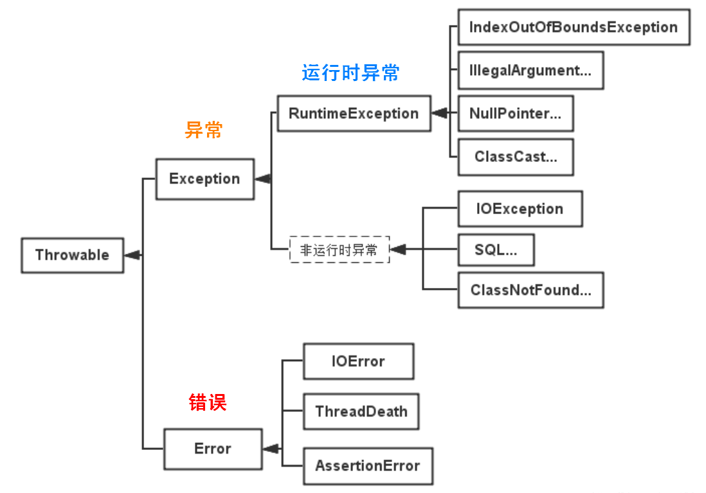

程序本身可以捕获并且可以处理的异常。Exception 这种异常又分为两类：运行时异常和编译时异常。

- **运行时异常**

都是 RuntimeException 类及其子类异常，如 NullPointerException(空指针异常)、IndexOutOfBoundsException(下标越界异常)等，这些异常是不检查异常，程序中可以选择捕获处理，也可以不处理。这些异常一般是由程序逻辑错误引起的，程序应该从逻辑角度尽可能避免这类异常的发生。

运行时异常的特点是 Java 编译器不会检查它，也就是说，当程序中可能出现这类异常，即使没有用 try-catch 语句捕获它，也没有用 throws 子句声明抛出它，也会编译通过。

- **非运行时异常** （编译异常）

是 RuntimeException 以外的异常，类型上都属于 Exception 类及其子类。从程序语法角度讲是必须进行处理的异常，如果不处理，程序就不能编译通过。如 IOException、SQLException 等以及用户自定义的 Exception 异常，一般情况下不自定义检查异常。

受检异常 ：需要用 try...catch... 语句捕获并进行处理，并且可以从异常中恢复；

非受检异常 ：是程序运行时错误，例如除 0 会引发 Arithmetic Exception，此时程序崩溃并且无法恢复

> 有没有用过自定义异常，声明式异常工作流程，和 return 区别，项目中自定义异常工作流程

> 类的生命周期，什么时候回收

其中类加载的过程包括了`加载`、`验证`、`准备`、`解析`、`初始化`五个阶段。在这五个阶段中，`加载`、`验证`、`准备`和`初始化`这四个阶段发生的顺序是确定的，_而`解析`阶段则不一定，它在某些情况下可以在初始化阶段之后开始，这是为了支持 Java 语言的运行时绑定(也成为动态绑定或晚期绑定)_。另外注意这里的几个阶段是按顺序开始，而不是按顺序进行或完成，因为这些阶段通常都是互相交叉地混合进行的，通常在一个阶段执行的过程中调用或激活另一个阶段。


**Java 虚拟机将结束生命周期的几种情况**

- 执行了 System.exit()方法
- 程序正常执行结束
- 程序在执行过程中遇到了异常或错误而异常终止
- 由于操作系统出现错误而导致 Java 虚拟机进程终止

> NIO 和 AIO

**NIO (Non-blocking/New I/O)**

---

Java 中的 NIO 于 Java 1.4 中引入，对应 `java.nio` 包，提供了 `Channel` , `Selector`，`Buffer` 等抽象。NIO 中的 N 可以理解为 Non-blocking，不单纯是 New。它是支持面向缓冲的，基于通道的 I/O 操作方法。 对于高负载、高并发的（网络）应用，应使用 NIO 。

Java 中的 NIO 可以看作是 **I/O 多路复用模型**。也有很多人认为，Java 中的 NIO 属于同步非阻塞 IO 模型。

跟着我的思路往下看看，相信你会得到答案！

我们先来看看 **同步非阻塞 IO 模型**。


同步非阻塞 IO 模型中，应用程序会一直发起 read 调用，等待数据从内核空间拷贝到用户空间的这段时间里，线程依然是阻塞的，直到在内核把数据拷贝到用户空间。

相比于同步阻塞 IO 模型，同步非阻塞 IO 模型确实有了很大改进。通过轮询操作，避免了一直阻塞。

但是，这种 IO 模型同样存在问题：**应用程序不断进行 I/O 系统调用轮询数据是否已经准备好的过程是十分消耗 CPU 资源的。**

这个时候，**I/O 多路复用模型** 就上场了。


IO 多路复用模型中，线程首先发起 select 调用，询问内核数据是否准备就绪，等内核把数据准备好了，用户线程再发起 read 调用。read 调用的过程（数据从内核空间 -> 用户空间）还是阻塞的。

> 目前支持 IO 多路复用的系统调用，有 select，epoll 等等。select 系统调用，目前几乎在所有的操作系统上都有支持。
>
> - **select 调用** ：内核提供的系统调用，它支持一次查询多个系统调用的可用状态。几乎所有的操作系统都支持。
> - **epoll 调用** ：linux 2.6 内核，属于 select 调用的增强版本，优化了 IO 的执行效率。

**IO 多路复用模型，通过减少无效的系统调用，减少了对 CPU 资源的消耗。**

Java 中的 NIO ，有一个非常重要的**选择器 ( Selector )** 的概念，也可以被称为 **多路复用器**。通过它，只需要一个线程便可以管理多个客户端连接。当客户端数据到了之后，才会为其服务。


**AIO**

---

AIO 也就是 NIO 2。Java 7 中引入了 NIO 的改进版 NIO 2,它是异步 IO 模型。

异步 IO 是基于事件和回调机制实现的，也就是应用操作之后会直接返回，不会堵塞在那里，当后台处理完成，操作系统会通知相应的线程进行后续的操作。


目前来说 AIO 的应用还不是很广泛。Netty 之前也尝试使用过 AIO，不过又放弃了。这是因为，Netty 使用了 AIO 之后，在 Linux 系统上的性能并没有多少提升。

最后，来一张图，简单总结一下 Java 中的 BIO、NIO、AIO。


> Java 多态概念，实现原理

多态分为编译时多态和运行时多态:

- 编译时多态主要指方法的重载
- 运行时多态指程序中定义的对象引用所指向的具体类型在运行期间才确定

运行时多态有三个条件:

- 继承
- 覆盖(重写)
- 向上转型

下面的代码中，乐器类(Instrument)有两个子类: Wind 和 Percussion，它们都覆盖了父类的 play() 方法，并且在 main() 方法中使用父类 Instrument 来引用 Wind 和 Percussion 对象。在 Instrument 引用调用 play() 方法时，会执行实际引用对象所在类的 play() 方法，而不是 Instrument 类的方法。

```java
public class Instrument {
    public void play() {
        System.out.println("Instument is playing...");
    }
}

public class Wind extends Instrument {
    public void play() {
        System.out.println("Wind is playing...");
    }
}

public class Percussion extends Instrument {
    public void play() {
        System.out.println("Percussion is playing...");
    }
}

public class Music {
    public static void main(String[] args) {
        List<Instrument> instruments = new ArrayList<>();
        instruments.add(new Wind());
        instruments.add(new Percussion());
        for(Instrument instrument : instruments) {
            instrument.play();
        }
    }
}
```

> NIO 的 buffer 区是双向的吗？

是双向的

数据缓存区: 在 JAVA NIO 框架中，为了保证每个通道的数据读写速度 JAVA NIO 框架为每一种需要支持数据读写的通道集成了 Buffer 的支持。

这句话怎么理解呢? 例如 ServerSocketChannel 通道它只支持对 OP_ACCEPT 事件的监听，所以它是不能直接进行网络数据内容的读写的。所以 ServerSocketChannel 是没有集成 Buffer 的。

Buffer 有两种工作模式: 写模式和读模式。在读模式下，应用程序只能从 Buffer 中读取数据，不能进行写操作。但是在写模式下，应用程序是可以进行读操作的，这就表示可能会出现脏读的情况。所以一旦您决定要从 Buffer 中读取数据，一定要将 Buffer 的状态改为读模式。

如下图:

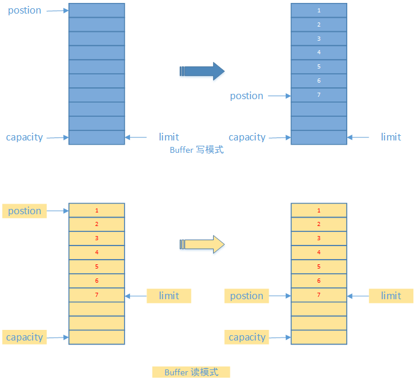

- position: 缓存区目前这在操作的数据块位置
- limit: 缓存区最大可以进行操作的位置。缓存区的读写状态正式由这个属性控制的。
- capacity: 缓存区的最大容量。这个容量是在缓存区创建时进行指定的。由于高并发时通道数量往往会很庞大，所以每一个缓存区的容量最好不要过大。

在下文 JAVA NIO 框架的代码实例中，我们将进行 Buffer 缓存区操作的演示


> 泛型有啥用？泛型擦除是啥？

泛型的本质是为了参数化类型（在不创建新的类型的情况下，通过泛型指定的不同类型来控制形参具体限制的类型）。也就是说在泛型使用过程中，操作的数据类型被指定为一个参数，这种参数类型可以用在类、接口和方法中，分别被称为泛型类、泛型接口、泛型方法。

引入泛型的意义在于：

- **适用于多种数据类型执行相同的代码**（代码复用）
- 泛型中的类型在使用时指定，不需要强制类型转换（**类型安全**，编译器会**检查类型**）

泛型擦除：

http://softlab.sdut.edu.cn/blog/subaochen/2017/01/generics-type-erasure/


## 常用框架

### Spring

> 对 spring 和 springboot 的理解（开放问题）

> springboot 是怎么加载 redis 的?

> 加载的 redis 或者 bean 是单例还是多例

默认单例

> springboot 是怎么实现单例模式的呢？

> Spring bean 启动流程和生命周期

长字版本启动流程：https://mp.weixin.qq.com/s/ut3mRwhfqXNjrBtTmI0oWg

1、实例化一个Bean－－也就是我们常说的new；

2、按照Spring上下文对实例化的Bean进行配置－－也就是IOC注入；

3、如果这个Bean已经实现了BeanNameAware接口，会调用它实现的setBeanName(String)方法，此处传递的就是Spring配置文件中Bean的id值

4、如果这个Bean已经实现了BeanFactoryAware接口，会调用它实现的setBeanFactory(setBeanFactory(BeanFactory)传递的是Spring工厂自身（可以用这个方式来获取其它Bean，只需在Spring配置文件中配置一个普通的Bean就可以）；

5、如果这个Bean已经实现了ApplicationContextAware接口，会调用setApplicationContext(ApplicationContext)方法，传入Spring上下文（同样这个方式也可以实现步骤4的内容，但比4更好，因为ApplicationContext是BeanFactory的子接口，有更多的实现方法）；

6、如果这个Bean关联了BeanPostProcessor接口，将会调用postProcessBeforeInitialization(Object obj, String s)方法，BeanPostProcessor经常被用作是Bean内容的更改，并且由于这个是在Bean初始化结束时调用那个的方法，也可以被应用于内存或缓存技术；

7、如果Bean在Spring配置文件中配置了init-method属性会自动调用其配置的初始化方法。

8、如果这个Bean关联了BeanPostProcessor接口，将会调用postProcessAfterInitialization(Object obj, String s)方法、；

`注：以上工作完成以后就可以应用这个Bean了，那这个Bean是一个Singleton的，所以一般情况下我们调用同一个id的Bean会是在内容地址相同的实例，当然在Spring配置文件中也可以配置非Singleton，这里我们不做赘述。`

9、当Bean不再需要时，会经过清理阶段，如果Bean实现了DisposableBean这个接口，会调用那个其实现的destroy()方法；

10、最后，如果这个Bean的Spring配置中配置了destroy-method属性，会自动调用其配置的销毁方法。


## 微服务、分布式

> 分布式事务了解吗？

**事务**是一个程序执行单元，里面的所有操作要么全部执行成功，要么全部执行失败。在分布式系统中，这些操作可能是位于不同的服务中，那么如果也能保证这些操作要么全部执行成功要么全部执行失败呢？这便是分布式事务要解决的问题。

**以一个网上的经典下单减库存例子为例**：

单体应用所有的业务都使用一个数据库，整个下单流程或许只用在一个方法里同一个事务下操作数据库即可。此时所有操作都在一个事务里，要么全部提交，要么全部回滚。


但随着业务量不断增长，业务服务化拆分，就会分离出订单中心、库存中心等。而这样就造成业务间相互隔离，每个业务都维护着自己的数据库，数据的交换只能进行服务调用。

用户再下单时，创建订单和扣减库存，需要同时对订单DB和库存DB进行操作。两步操作必须同时成功，否则就会造成业务混乱，可此时我们只能保证自己服务的数据一致性，无法保证调用其他服务的操作是否成功，所以为了保证整个下单流程的数据一致性，就需要分布式事务介入。


具体理解可以看：https://www.pdai.tech/md/arch/arch-z-transection.html#%E4%BB%80%E4%B9%88%E6%98%AF%E5%88%86%E5%B8%83%E5%BC%8F%E4%BA%8B%E5%8A%A1

以及后续可能会问到：说一下怎么实现的分布式事务？还有没有其他的解决方案？RocketMQ 能做分布式事务吗？


> rpc了解吗

**何为 RPC?**

---

RPC（Remote Procedure Call） 即远程过程调用，通过名字我们就能看出 RPC 关注的是远程调用而非本地调用。

为什么要 RPC ？ 因为，两个不同的服务器上的服务提供的方法不在一个内存空间，所以，需要通过网络编程才能传递方法调用所需要的参数。并且，方法调用的结果也需要通过网络编程来接收。但是，如果我们自己手动网络编程来实现这个调用过程的话工作量是非常大的，因为，我们需要考虑底层传输方式（TCP还是UDP）、序列化方式等等方面。

RPC 能帮助我们做什么呢？ 简单来说，通过 RPC 可以帮助我们调用远程计算机上某个服务的方法，这个过程就像调用本地方法一样简单。并且！我们不需要了解底层网络编程的具体细节。

举个例子：两个不同的服务 A、B 部署在两台不同的机器上，服务 A 如果想要调用服务 B 中的某个方法的话就可以通过 RPC 来做。

一言蔽之：RPC 的出现就是为了让你调用远程方法像调用本地方法一样简单。


**RPC 的原理是什么?**

---

为了能够帮助小伙伴们理解 RPC 原理，我们可以将整个 RPC的 核心功能看作是下面👇 6 个部分实现的：

1. **客户端（服务消费端）** ：调用远程方法的一端。
2. **客户端 Stub（桩）** ： 这其实就是一代理类。代理类主要做的事情很简单，就是把你调用方法、类、方法参数等信息传递到服务端。
3. **网络传输** ： 网络传输就是你要把你调用的方法的信息比如说参数啊这些东西传输到服务端，然后服务端执行完之后再把返回结果通过网络传输给你传输回来。网络传输的实现方式有很多种比如最近基本的 Socket或者性能以及封装更加优秀的 Netty（推荐）。
4. **服务端 Stub（桩）** ：这个桩就不是代理类了。我觉得理解为桩实际不太好，大家注意一下就好。这里的服务端 Stub 实际指的就是接收到客户端执行方法的请求后，去指定对应的方法然后返回结果给客户端的类。
5. **服务端（服务提供端）** ：提供远程方法的一端。

具体原理图如下，后面我会串起来将整个RPC的过程给大家说一下。


1. 服务消费端（client）以本地调用的方式调用远程服务；
2. 客户端 Stub（client stub） 接收到调用后负责将方法、参数等组装成能够进行网络传输的消息体（序列化）：`RpcRequest`；
3. 客户端 Stub（client stub） 找到远程服务的地址，并将消息发送到服务提供端；
4. 服务端 Stub（桩）收到消息将消息反序列化为Java对象: `RpcRequest`；
5. 服务端 Stub（桩）根据`RpcRequest`中的类、方法、方法参数等信息调用本地的方法；
6. 服务端 Stub（桩）得到方法执行结果并将组装成能够进行网络传输的消息体：`RpcResponse`（序列化）发送至消费方；
7. 客户端 Stub（client stub）接收到消息并将消息反序列化为Java对象:`RpcResponse` ，这样也就得到了最终结果。over!

相信小伙伴们看完上面的讲解之后，已经了解了 RPC 的原理。

虽然篇幅不多，但是基本把 RPC 框架的核心原理讲清楚了！另外，对于上面的技术细节，我会在后面的章节介绍到。

**最后，对于 RPC 的原理，希望小伙伴不单单要理解，还要能够自己画出来并且能够给别人讲出来。因为，在面试中这个问题在面试官问到 RPC 相关内容的时候基本都会碰到。**


> 讲讲微服务

什么是微服务？

---

- 微服务架构是一个分布式系统，按照业务进行划分成为不同的服务单元，解决单体系统性能等不足。
- 微服务是一种架构风格，一个大型软件应用由多个服务单元组成。系统中的服务单元可以单独部署，各个服务单元之间是松耦合的。

> 微服务两台机器怎么通信呢?

同步通信：dobbo通过 **RPC 远程过程调用、springcloud通过 REST 接口json调用** 等。

异步：消息队列，如：**RabbitMq、ActiveM、Kafka** 等。


> 两台机器如何用 HTTP 怎么找到对方？


> 微服务都有什么部分呢

这里调用阳哥PPT的神图


> 注册中心是什么讲讲

参考：

* https://www.nginx.com/blog/service-discovery-in-a-microservices-architecture/

服务发现：

 为了发出请求，您的代码需要知道服务实例的网络位置（IP 地址和端口），传统应用程序中，服务实例的网络位置是相对静态的。  例如，您的代码可以从偶尔更新的配置文件中读取网络位置。  然而，在现代的、基于云的微服务应用程序中，这是一个更难解决的问题，如下图所示：


使用注册中心服务实例具有动态分配的网络位置。  此外，服务实例集会因自动缩放、故障和升级而动态变化。

两种主要的服务发现模式：客户端发现和服务器端发现


客户端发现

客户端负责确定可用服务实例的网络位置（例如10.4.3.20:333）并在它们之间实现请求的负载平衡。  客户端查询服务注册表，注册表是可用服务实例的数据库。  然后客户端使用负载平衡算法来选择一个可用的服务实例并发出请求。


服务实例的网络位置在启动时向服务注册表注册；当实例终止时，它会从服务注册表中删除。 服务实例的注册通常使用心跳机制定期刷新。  

Netflix OSS 提供了一个很好的客户端发现模式示例。  Netflix Eureka 是一个服务注册中心。  它提供了一个 REST  API 来管理服务实例注册和查询可用实例。  Netflix Ribbon 是一个 IPC 客户端，它与 Eureka  一起在可用服务实例之间负载平衡请求。 


服务端发现


客户端通过负载均衡器向服务发出请求。  负载均衡器查询服务注册表并将每个请求路由到可用的服务实例。  与客户端发现一样，服务实例在服务注册表中注册和注销。


注册中心：

服务注册中心是服务发现的关键部分。  它是一个包含服务实例的网络位置的数据库。  服务注册中心需要高度可用并且是最新的。   客户端可以缓存从服务注册表获得的网络位置。  但是，该信息最终会过时，客户端将无法发现服务实例。   因此，服务注册中心由一组服务器组成，这些服务器使用复制协议来保持一致性。

Netflix Eureka 是服务注册中心的一个很好的例子。  它提供了一个用于注册和查询服务实例的 REST API。  服务实例使用  POST 请求注册其网络位置。  每 30 秒，它必须使用 PUT 请求刷新其注册。  通过使用 HTTP DELETE  请求或实例注册超时来删除注册。  客户端可以使用 HTTP GET 请求检索注册的服务实例。


> 网关是什么呢

何为网关？为什么要网关？

---


微服务背景下，一个系统被拆分为多个服务，但是像安全认证，流量控制，日志，监控等功能是每个服务都需要的，没有网关的话，我们就需要在每个服务中单独实现，这使得我们做了很多重复的事情并且没有一个全局的视图来统一管理这些功能。

综上：**一般情况下，网关都会提供请求转发、安全认证（身份/权限认证）、流量控制、负载均衡、容灾、日志、监控这些功能。**

上面介绍了这么多功能，实际上，网关主要做了一件事情：**请求过滤**

拓展：有哪些常见的网关系统？

Netflix Zuul

Zuul 是 Netflix 开发的一款提供动态路由、监控、弹性、安全的网关服务。

Zuul 主要通过过滤器（类似于 AOP）来过滤请求，从而实现网关必备的各种功能

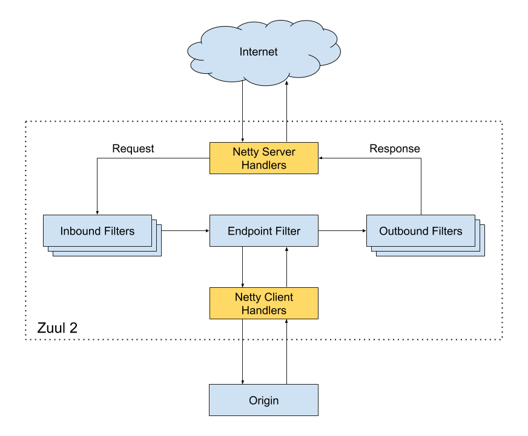

我们可以自定义过滤器来处理请求，并且，Zuul 生态本身就有很多现成的过滤器供我们使用。就比如限流可以直接用国外朋友写的 [spring-cloud-zuul-ratelimit](https://github.com/marcosbarbero/spring-cloud-zuul-ratelimit)

(这里只是举例说明，一般是配合 hystrix 来做限流)：

```xml
<dependency>
    <groupId>org.springframework.cloud</groupId>
    <artifactId>spring-cloud-starter-netflix-zuul</artifactId>
</dependency>
<dependency>
    <groupId>com.marcosbarbero.cloud</groupId>
    <artifactId>spring-cloud-zuul-ratelimit</artifactId>
    <version>2.2.0.RELEASE</version>
</dependency>
```

Zuul 1.x 基于同步 IO，性能较差。Zuul 2.x 基于 Netty 实现了异步 IO，性能得到了大幅改进。

- Github 地址 ： https://github.com/Netflix/zuul
- 官方 Wiki ： https://github.com/Netflix/zuul/wiki


Spring Cloud Gateway

---

SpringCloud Gateway 属于 Spring Cloud 生态系统中的网关，其诞生的目标是为了替代老牌网关 **Zuul **。准确点来说，应该是 Zuul 1.x。SpringCloud Gateway 起步要比 Zuul 2.x 更早。

为了提升网关的性能，SpringCloud Gateway 基于 Spring WebFlux 。Spring WebFlux 使用 Reactor 库来实现响应式编程模型，底层基于 Netty 实现异步 IO。

Spring Cloud Gateway 的目标，不仅提供统一的路由方式，并且基于 Filter 链的方式提供了网关基本的功能，例如：安全，监控/指标，和限流。

Spring Cloud Gateway 和 Zuul 2.x 的差别不大，也是通过过滤器来处理请求。不过，目前更加推荐使用 Spring Cloud Gateway 而非 Zuul，Spring Cloud 生态对其支持更加友好。

- Github 地址 ： https://github.com/spring-cloud/spring-cloud-gateway
- 官网 ： https://spring.io/projects/spring-cloud-gateway


Kong

---

Kong 是一款基于 [OpenResty](https://github.com/openresty/)

的高性能、云原生、可扩展的网关系统。

> OpenResty 是一个基于 Nginx 与 Lua 的高性能 Web 平台，其内部集成了大量精良的 Lua 库、第三方模块以及大多数的依赖项。用于方便地搭建能够处理超高并发、扩展性极高的动态 Web 应用、Web 服务和动态网关。

Kong 提供了插件机制来扩展其功能。比如、在服务上启用 Zipkin 插件

```bash
$ curl -X POST http://kong:8001/services/{service}/plugins \
    --data "name=zipkin"  \
    --data "config.http_endpoint=http://your.zipkin.collector:9411/api/v2/spans" \
    --data "config.sample_ratio=0.001"
```

- Github 地址： https://github.com/Kong/kong
- 官网地址 ： https://konghq.com/kong


APISIX

---

APISIX 是一款基于 Nginx 和 etcd 的高性能、云原生、可扩展的网关系统。

> *etcd*是使用 Go 语言开发的一个开源的、高可用的分布式 key-value 存储系统，使用 Raft 协议做分布式共识。

与传统 API 网关相比，APISIX 具有动态路由和插件热加载，特别适合微服务系统下的 API 管理。并且，APISIX 与 SkyWalking（分布式链路追踪系统）、Zipkin（分布式链路追踪系统）、Prometheus（监控系统） 等 DevOps 生态工具对接都十分方便。

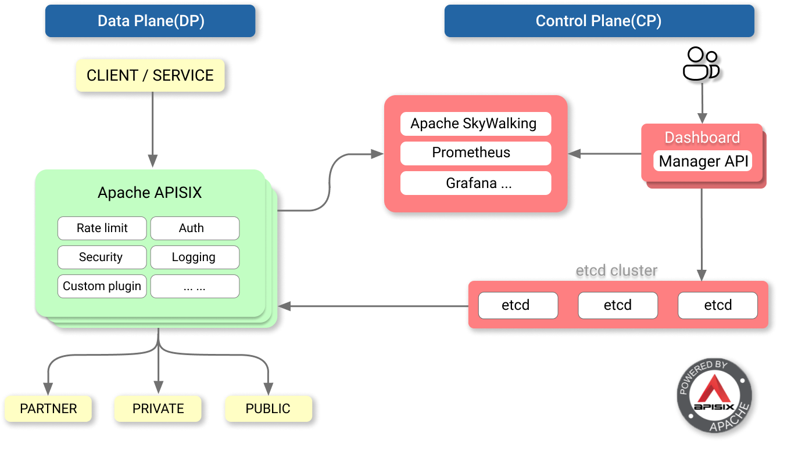

作为 NGINX 和 Kong 的替代项目，APISIX 目前已经是 Apache 顶级开源项目，并且是最快毕业的国产开源项目。国内目前已经有很多知名企业（比如金山、有赞、爱奇艺、腾讯、贝壳）使用 APISIX 处理核心的业务流量。

根据官网介绍：“APISIX 已经生产可用，功能、性能、架构全面优于 Kong”。

- Github 地址 ：https://github.com/apache/apisix
- 官网地址： https://apisix.apache.org/zh/

Shenyu

Shenyu 是一款基于 WebFlux 的可扩展、高性能、响应式网关，Apache 顶级开源项目。


Shenyu 通过插件扩展功能，插件是 ShenYu 的灵魂，并且插件也是可扩展和热插拔的。不同的插件实现不同的功能。Shenyu 自带了诸如限流、熔断、转发 、重写、重定向、和路由监控等插件。

- Github 地址： https://github.com/apache/incubator-shenyu
- 官网地址 ： https://shenyu.apache.org/


> dubbo了解吗？

**什么是 Dubbo?**

---


[Apache Dubbo](https://github.com/apache/dubbo) 是一款高性能、轻量级的开源 Java RPC 框架。

根据 [Dubbo 官方文档](https://dubbo.apache.org/zh/)

的介绍，Dubbo 提供了六大核心能力

1. 面向接口代理的高性能RPC调用。
2. 智能容错和负载均衡。
3. 服务自动注册和发现。
4. 高度可扩展能力。
5. 运行期流量调度。
6. 可视化的服务治理与运维。


简单来说就是： **Dubbo 不光可以帮助我们调用远程服务，还提供了一些其他开箱即用的功能比如智能负载均衡。**


**为什么要用 Dubbo?**

---

随着互联网的发展，网站的规模越来越大，用户数量越来越多。单一应用架构 、垂直应用架构无法满足我们的需求，这个时候分布式服务架构就诞生了。

分布式服务架构下，系统被拆分成不同的服务比如短信服务、安全服务，每个服务独立提供系统的某个核心服务。

我们可以使用 Java RMI（Java Remote Method  Invocation）、Hessian这种支持远程调用的框架来简单地暴露和引用远程服务。但是！当服务越来越多之后，服务调用关系越来越复杂。当应用访问压力越来越大后，负载均衡以及服务监控的需求也迫在眉睫。我们可以用 F5 这类硬件来做负载均衡，但这样增加了成本，并且存在单点故障的风险。

不过，Dubbo 的出现让上述问题得到了解决。**Dubbo 帮助我们解决了什么问题呢？**

1. **负载均衡** ： 同一个服务部署在不同的机器时该调用哪一台机器上的服务。
2. **服务调用链路生成** ： 随着系统的发展，服务越来越多，服务间依赖关系变得错踪复杂，甚至分不清哪个应用要在哪个应用之前启动，架构师都不能完整的描述应用的架构关系。Dubbo 可以为我们解决服务之间互相是如何调用的。
3. **服务访问压力以及时长统计、资源调度和治理** ：基于访问压力实时管理集群容量，提高集群利用率。
4. ......

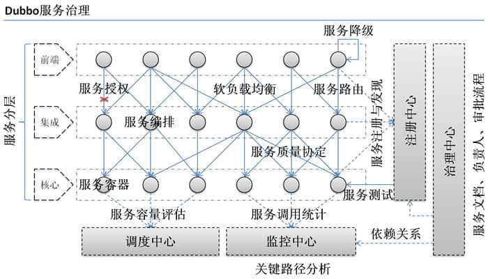

另外，Dubbo 除了能够应用在分布式系统中，也可以应用在现在比较火的微服务系统中。不过，由于 Spring Cloud 在微服务中应用更加广泛，所以，我觉得一般我们提 Dubbo 的话，大部分是分布式系统的情况。


> 分布式登录怎么保持状态吗

> 分布式系统中，本地缓存和 Redis 中的数据是否是每台服务器上都备份同样的数据

> 分布式系统相关概念，序列化在分布式系统中的应用，讲一下 thrift

## JVM

> Java static 关键字，生命周期，static 变量存在 JVM 哪个区域和生命周期

> GC 的几种算法（2022-04-11 携程）

标记-清除算法

---

该算法分为“标记”和“清除”阶段：首先标记出所有不需要回收的对象，在标记完成后统一回收掉所有没有被标记的对象。它是最基础的收集算法，后续的算法都是对其不足进行改进得到。这种垃圾收集算法会带来两个明显的问题：

1. **效率问题**
2. **空间问题（标记清除后会产生大量不连续的碎片）**

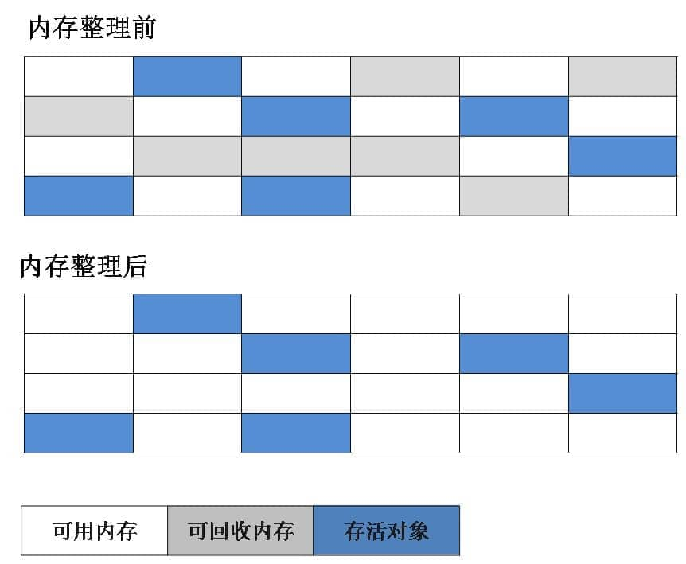

标记-复制算法

---

为了解决效率问题，“标记-复制”收集算法出现了。它可以将内存分为大小相同的两块，每次使用其中的一块。当这一块的内存使用完后，就将还存活的对象复制到另一块去，然后再把使用的空间一次清理掉。这样就使每次的内存回收都是对内存区间的一半进行回收。


标记-整理算法

---

根据老年代的特点提出的一种标记算法，标记过程仍然与“标记-清除”算法一样，但后续步骤不是直接对可回收对象回收，而是让所有存活的对象向一端移动，然后直接清理掉端边界以外的内存。


分代收集算法

---

当前虚拟机的垃圾收集都采用分代收集算法，这种算法没有什么新的思想，只是根据对象存活周期的不同将内存分为几块。一般将 java 堆分为新生代和老年代，这样我们就可以根据各个年代的特点选择合适的垃圾收集算法。

比如在新生代中，每次收集都会有大量对象死去，所以可以选择”标记-复制“算法，只需要付出少量对象的复制成本就可以完成每次垃圾收集。而老年代的对象存活几率是比较高的，而且没有额外的空间对它进行分配担保，所以我们必须选择“标记-清除”或“标记-整理”算法进行垃圾收集。

延伸面试问题： HotSpot 为什么要分为新生代和老年代？

根据上面的对分代收集算法的介绍回答。

> 谈谈你了解的几种垃圾回收器（2022-04-11 携程）

Serial 收集器

---

Serial（串行）收集器是最基本、历史最悠久的垃圾收集器了。大家看名字就知道这个收集器是一个单线程收集器了。它的 **“单线程”** 的意义不仅仅意味着它只会使用一条垃圾收集线程去完成垃圾收集工作，更重要的是它在进行垃圾收集工作的时候必须暂停其他所有的工作线程（ **"Stop The World"** ），直到它收集结束。

**新生代采用标记-复制算法，老年代采用标记-整理算法。**


虚拟机的设计者们当然知道 Stop The World 带来的不良用户体验，所以在后续的垃圾收集器设计中停顿时间在不断缩短（仍然还有停顿，寻找最优秀的垃圾收集器的过程仍然在继续）。

但是 Serial 收集器有没有优于其他垃圾收集器的地方呢？当然有，它**简单而高效（与其他收集器的单线程相比）**。Serial 收集器由于没有线程交互的开销，自然可以获得很高的单线程收集效率。Serial 收集器对于运行在 Client 模式下的虚拟机来说是个不错的选择。

ParNew 收集器

---

**ParNew 收集器其实就是 Serial 收集器的多线程版本，除了使用多线程进行垃圾收集外，其余行为（控制参数、收集算法、回收策略等等）和 Serial 收集器完全一样。**

**新生代采用标记-复制算法，老年代采用标记-整理算法。**

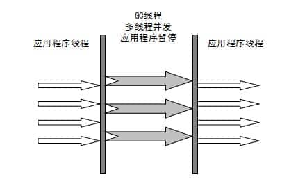

它是许多运行在 Server 模式下的虚拟机的首要选择，除了 Serial 收集器外，只有它能与 CMS 收集器（真正意义上的并发收集器，后面会介绍到）配合工作。

**并行和并发概念补充：**

- **并行（Parallel）** ：指多条垃圾收集线程并行工作，但此时用户线程仍然处于等待状态。
- **并发（Concurrent）**：指用户线程与垃圾收集线程同时执行（但不一定是并行，可能会交替执行），用户程序在继续运行，而垃圾收集器运行在另一个 CPU 上。

Parallel Scavenge 收集器

---

Parallel Scavenge 收集器也是使用标记-复制算法的多线程收集器，它看上去几乎和 ParNew 都一样。 **那么它有什么特别之处呢？**

```java
-XX:+UseParallelGC

    使用 Parallel 收集器+ 老年代串行

-XX:+UseParallelOldGC

    使用 Parallel 收集器+ 老年代并行

```

**Parallel Scavenge 收集器关注点是吞吐量（高效率的利用 CPU）。CMS 等垃圾收集器的关注点更多的是用户线程的停顿时间（提高用户体验）。所谓吞吐量就是 CPU 中用于运行用户代码的时间与 CPU 总消耗时间的比值。** Parallel Scavenge 收集器提供了很多参数供用户找到最合适的停顿时间或最大吞吐量，如果对于收集器运作不太了解，手工优化存在困难的时候，使用 Parallel Scavenge 收集器配合自适应调节策略，把内存管理优化交给虚拟机去完成也是一个不错的选择。

**新生代采用标记-复制算法，老年代采用标记-整理算法。**


**这是 JDK1.8 默认收集器**

使用 java -XX:+PrintCommandLineFlags -version 命令查看

```text
-XX:InitialHeapSize=262921408 -XX:MaxHeapSize=4206742528 -XX:+PrintCommandLineFlags -XX:+UseCompressedClassPointers -XX:+UseCompressedOops -XX:+UseParallelGC
java version "1.8.0_211"
Java(TM) SE Runtime Environment (build 1.8.0_211-b12)
Java HotSpot(TM) 64-Bit Server VM (build 25.211-b12, mixed mode)
```

JDK1.8 默认使用的是 Parallel Scavenge + Parallel Old，如果指定了-XX:+UseParallelGC 参数，则默认指定了-XX:+UseParallelOldGC，可以使用-XX:-UseParallelOldGC 来禁用该功能

Serial Old 收集器

---

**Serial 收集器的老年代版本**，它同样是一个单线程收集器。它主要有两大用途：一种用途是在 JDK1.5 以及以前的版本中与 Parallel Scavenge 收集器搭配使用，另一种用途是作为 CMS 收集器的后备方案。

Parallel Old 收集器

---

**Parallel Scavenge 收集器的老年代版本**。使用多线程和“标记-整理”算法。在注重吞吐量以及 CPU 资源的场合，都可以优先考虑 Parallel Scavenge 收集器和 Parallel Old 收集器。

CMS 收集器

---

**CMS（Concurrent Mark Sweep）收集器是一种以获取最短回收停顿时间为目标的收集器。它非常符合在注重用户体验的应用上使用。**

**CMS（Concurrent Mark Sweep）收集器是 HotSpot 虚拟机第一款真正意义上的并发收集器，它第一次实现了让垃圾收集线程与用户线程（基本上）同时工作。**

从名字中的**Mark Sweep**这两个词可以看出，CMS 收集器是一种 **“标记-清除”算法**实现的，它的运作过程相比于前面几种垃圾收集器来说更加复杂一些。整个过程分为四个步骤：

- **初始标记：** 暂停所有的其他线程，并记录下直接与 root 相连的对象，速度很快 ；
- **并发标记：** 同时开启 GC 和用户线程，用一个闭包结构去记录可达对象。但在这个阶段结束，这个闭包结构并不能保证包含当前所有的可达对象。因为用户线程可能会不断的更新引用域，所以 GC 线程无法保证可达性分析的实时性。所以这个算法里会跟踪记录这些发生引用更新的地方。
- **重新标记：** 重新标记阶段就是为了修正并发标记期间因为用户程序继续运行而导致标记产生变动的那一部分对象的标记记录，这个阶段的停顿时间一般会比初始标记阶段的时间稍长，远远比并发标记阶段时间短
- **并发清除：** 开启用户线程，同时 GC 线程开始对未标记的区域做清扫。


从它的名字就可以看出它是一款优秀的垃圾收集器，主要优点：**并发收集、低停顿**。但是它有下面三个明显的缺点：

- **对 CPU 资源敏感；**
- **无法处理浮动垃圾；**
- **它使用的回收算法-“标记-清除”算法会导致收集结束时会有大量空间碎片产生。**

G1 收集器

---

**G1 (Garbage-First) 是一款面向服务器的垃圾收集器,主要针对配备多颗处理器及大容量内存的机器. 以极高概率满足 GC 停顿时间要求的同时,还具备高吞吐量性能特征.**

被视为 JDK1.7 中 HotSpot 虚拟机的一个重要进化特征。它具备以下特点：

- **并行与并发**：G1 能充分利用 CPU、多核环境下的硬件优势，使用多个 CPU（CPU 或者 CPU 核心）来缩短 Stop-The-World 停顿时间。部分其他收集器原本需要停顿 Java 线程执行的 GC 动作，G1 收集器仍然可以通过并发的方式让 java 程序继续执行。
- **分代收集**：虽然 G1 可以不需要其他收集器配合就能独立管理整个 GC 堆，但是还是保留了分代的概念。
- **空间整合**：与 CMS 的“标记-清理”算法不同，G1 从整体来看是基于“标记-整理”算法实现的收集器；从局部上来看是基于“标记-复制”算法实现的。
- **可预测的停顿**：这是 G1 相对于 CMS 的另一个大优势，降低停顿时间是 G1 和 CMS 共同的关注点，但 G1 除了追求低停顿外，还能建立可预测的停顿时间模型，能让使用者明确指定在一个长度为 M 毫秒的时间片段内。

G1 收集器的运作大致分为以下几个步骤：

- **初始标记**
- **并发标记**
- **最终标记**
- **筛选回收**

**G1 收集器在后台维护了一个优先列表，每次根据允许的收集时间，优先选择回收价值最大的 Region(这也就是它的名字 Garbage-First 的由来)** 。这种使用 Region 划分内存空间以及有优先级的区域回收方式，保证了 G1 收集器在有限时间内可以尽可能高的收集效率（把内存化整为零）

ZGC 收集器

---

与 CMS 中的 ParNew 和 G1 类似，ZGC 也采用标记-复制算法，不过 ZGC 对该算法做了重大改进。

在 ZGC 中出现 Stop The World 的情况会更少！

详情可以看 ： [《新一代垃圾回收器 ZGC 的探索与实践》](https://tech.meituan.com/2020/08/06/new-zgc-practice-in-meituan.html)

> 想要在指定时间结束垃圾回收，选用哪种垃圾回收器（2022-04-11 携程）

G1


> 什么是GCROOT?

**在 Java 语言中，GC Roots 包括以下几类元素：**

- 虚拟机栈中引用的对象

  - 比如：各个线程被调用的方法中使用到的参数、局部变量等。

- 本地方法栈内 JNI（通常说的本地方法）引用的对象

- 方法区中类静态属性引用的对象

  - 比如：Java 类的引用类型静态变量

- 方法区中常量引用的对象

  - 比如：字符串常量池（String Table）里的引用

- 所有被同步锁 synchronized 持有的对象

- Java 虚拟机内部的引用。

- 基本数据类型对应的 Class 对象，一些常驻的异常对象（如：`NullPointerException`、`OutOfMemoryError`），系统类加载器。

- 反映 java 虚拟机内部情况的 JMXBean、JVMTI 中注册的回调、本地代码缓存等。

- 除了这些固定的 GC Roots 集合以外，根据用户所选用的垃圾收集器以及当前回收的内存区域不同，

  还可以有其他对象 “临时性” 地加入，共同构成完整 GC Roots 集合。比如：分代收集和局部回收

  （PartialGC）。

  - 如果只针对 Java 堆中的某一块区域进行垃圾回收（比如：典型的只针对新生代），必须考虑到内存区域是虚拟机自己的实现细节，更不是孤立封闭的，这个区域的对象完全有可能被其他区域的对象所引用，这时候就需要一并将关联的区域对象也加入 GCRoots 集合中去考虑，才能保证可达性分析的准确性。
  - 典型的只针对新生代：因为新生代除外，还有关联的老年代，所以需要将老年代也一并加入 GC Roots 集合中

- 小技巧

  - 由于 Root 采用栈方式存放变量和指针，所以如果一个指针，它保存了堆内存里面的对象，但是自己又不存放在堆内存里面，那它就是一个 Root。

红色的都没有被 GC Roots 所引用，所以都是垃圾


**注意**

- 如果要使用可达性分析算法来判断内存是否可回收，那么分析工作必须在一个能保障**一致性** (某一刻的静止状态) 的快照中进行。这点不满足的话分析结果的准确性就无法保证。
- 这点也是导致 GC 进行时必须 “stop The World” 的一个重要原因。
  - 即使是号称（几乎）不会发生停顿的 CMS 收集器中，枚举根节点时也是必须要停顿的。


> 如何判断一个对象是否该回收

具体可以查看：https://blog.csdn.net/eternal_yangyun/article/details/89787416


**引用计数法**

---

给对象增加一个计数器，当有引用它时，计数器就加一，当引用失效时，计数器就减一；

JVM并没有采用这种方式来判断对象是否已死

原因：循环引用会导致引用计数法失效，循环引用就是A类中一个属性引用了B类对象，B类中一个属性引用了A类对象，这样一来，就算你把A类和B类的实例对象引用置为null，它们还是不会被回收；


**可达性分析法**

---

- 可达性分析算法是以根对象集合（GCRoots）为起始点，按照从上至下的方式搜索被根对象集合所连接的目标对象是否可达。
- 使用可达性分析算法后，内存中的存活对象都会被根对象集合直接或间接连接着，搜索所走过的路径称为引用链（Reference Chain）。
- 如果目标对象没有任何引用链相连，则是不可达的，就意味着该对象己经死亡，可以标记为垃圾对象。
- 在可达性分析算法中，只有能够被根对象集合直接或者间接连接的对象才是存活对象。


**对象的自我拯救（覆写finalize（）方法）**

---

在Object类中，有这样一个方法：

```java
protected void finalize() throws Throwable { }
```

这是一个受保护的方法，是不能直接调用的；
这个方法到底有啥作用呢？
**这个方法是用来抵免一次垃圾回收的，注意只有一次，子类只需覆写该方法即可；**


具体过程：

判定一个对象 objA 是否可回收，至少要经历两次标记过程：

1. 如果对象 objA 到 GC Roots 没有引用链，则进行第一次标记。
2. 进行筛选，判断此对象是否有必要执行

方法

1. 如果对象 objA 没有重写 `finalize()` 方法，或者 `finalize()` 方法已经被虚拟机调用过，则虚拟机视为 “没有必要执行”，objA 被判定为不可触及的。
2. 如果对象 objA 重写了 `finalize()` 方法，且还未执行过，那么 objA 会被插入到 `F-Queue` 队列中，由一个虚拟机自动创建的、低优先级的 `Finalizer` 线程触发其 `finalize()` 方法执行。
3. `finalize()` 方法是对象逃脱死亡的最后机会，稍后 GC 会对 F-Queue 队列中的对象进行第二次标记。如果 objA 在 `finalize()` 方法中与引用链上的任何一个对象建立了联系，那么在第二次标记时，objA 会被移出 “即将回收” 集合。之后，对象如果再次出现没有引用存在的情况。在这个情况下， `finalize()` 方法不会被再次调用，对象会直接变成不可触及的状态，也就是说，**一个对象的 `finalize()` 方法只会被调用一次。**


## JUC

> 线程能不能 start 两次，线程池中的线程为什么能循环利用

首先 demo 眼见为实：

```java
/**
 * 描述：      对比start和run两种启动线程的方式
 */
public class StartAndRunMethod {

    public static void main(String[] args) {
        Runnable runnable = () -> {
            System.out.println(Thread.currentThread().getName());
        };

        runnable.run();

        new Thread(runnable).start();
    }
}
```

运行结果：


通过运行结果，我们可以总结出，run()方法只是一个普通的方法，start()是一个真正的启动线程的方法
一个线程调用两次 start()会发生什么？

我们还是先 demo：

```java
/**
 * 描述：      演示不能两次调用start方法，否则会报错
 */
public class CantStartTwice {
    public static void main(String[] args) {
        Thread thread = new Thread();
        thread.start();
        thread.start();
    }
}
```

运行结果：报非法的线程状态


原因分析：


问题 2：线程重用的核心是，线程池对 Thread 做了包装，不重复调用 thread.star，而是自己有一个 Runnable. Run0, run 方法里面循环在跑，跑的过程中不断检査我们是否有新加入的子 Runnable 对象有新的 Runnable 进来的话就调一下我们的 run0, 其实就一个大 run0 把其它小 run#1, run0#2, 给串联起来了。同一个 Thread 可以执行不同的 Runnable，主要原因是线程池把线程和 Runnablei 通过 Blockingqueue 给解耦了，线程可以从 Blockingqueuer 中不断获取新的任务

> 利用多线程时最大的难点是什么，怎么解决多线程安全问题（自由发挥）

> 怎么保证多线程下面单例模式安全

双重校验锁 + volatile

> concurrentMap 和 hashmap 有什么区别

`ConcurrentHashMap` 和 `Hashtable` 的区别主要体现在实现线程安全的方式上不同。

- **底层数据结构：** JDK1.7 的 `ConcurrentHashMap` 底层采用 **分段的数组+链表** 实现，JDK1.8 采用的数据结构跟 `HashMap1.8` 的结构一样，数组+链表/红黑二叉树。`Hashtable` 和 JDK1.8 之前的 `HashMap` 的底层数据结构类似都是采用 **数组+链表** 的形式，数组是 HashMap 的主体，链表则是主要为了解决哈希冲突而存在的；
- **实现线程安全的方式（重要）：** ① **在 JDK1.7 的时候，`ConcurrentHashMap`（分段锁）** 对整个桶数组进行了分割分段(`Segment`)，每一把锁只锁容器其中一部分数据，多线程访问容器里不同数据段的数据，就不会存在锁竞争，提高并发访问率。 **到了 JDK1.8 的时候已经摒弃了 `Segment` 的概念，而是直接用 `Node` 数组+链表+红黑树的数据结构来实现，并发控制使用 `synchronized` 和 CAS 来操作。（JDK1.6 以后 对 `synchronized` 锁做了很多优化）** 整个看起来就像是优化过且线程安全的 `HashMap`，虽然在 JDK1.8 中还能看到 `Segment` 的数据结构，但是已经简化了属性，只是为了兼容旧版本；② **`Hashtable`(同一把锁)** :使用 `synchronized` 来保证线程安全，效率非常低下。当一个线程访问同步方法时，其他线程也访问同步方法，可能会进入阻塞或轮询状态，如使用 put 添加元素，另一个线程不能使用 put 添加元素，也不能使用 get，竞争会越来越激烈效率越低。

**两者的对比图：**

**Hashtable:**


**JDK1.7 的 ConcurrentHashMap：**

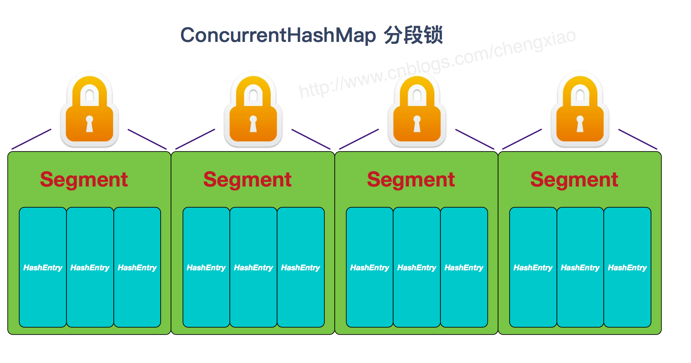

**JDK1.8 的 ConcurrentHashMap：**

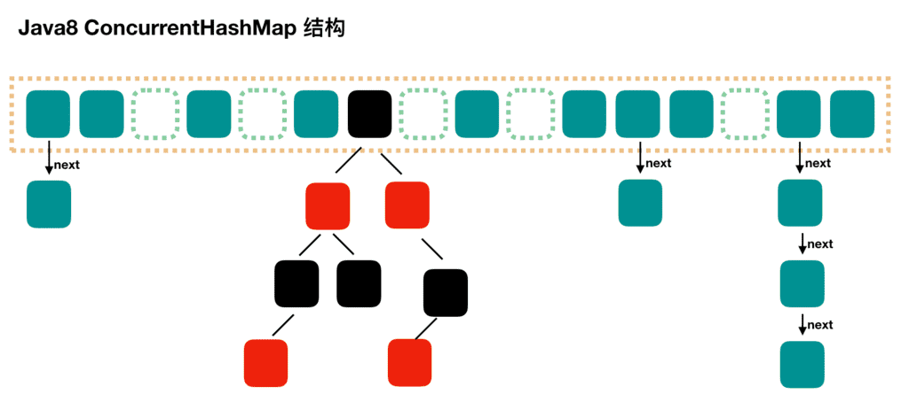

JDK1.8 的 `ConcurrentHashMap` 不再是 **Segment 数组 + HashEntry 数组 + 链表**，而是 **Node 数组 + 链表 / 红黑树**。不过，Node 只能用于链表的情况，红黑树的情况需要使用 **`TreeNode`**。当冲突链表达到一定长度时，链表会转换成红黑树。

> ConcurrentHashMap 线程安全的具体实现方式/底层具体实现

JDK1.7（上面有示意图）

首先将数据分为一段一段的存储，然后给每一段数据配一把锁，当一个线程占用锁访问其中一个段数据时，其他段的数据也能被其他线程访问。

**`ConcurrentHashMap` 是由 `Segment` 数组结构和 `HashEntry` 数组结构组成**。

Segment 实现了 `ReentrantLock`,所以 `Segment` 是一种可重入锁，扮演锁的角色。`HashEntry` 用于存储键值对数据。

```java
static class Segment<K,V> extends ReentrantLock implements Serializable {
}
```

一个 `ConcurrentHashMap` 里包含一个 `Segment` 数组。`Segment` 的结构和 `HashMap` 类似，是一种数组和链表结构，一个 `Segment` 包含一个 `HashEntry` 数组，每个 `HashEntry` 是一个链表结构的元素，每个 `Segment` 守护着一个 `HashEntry` 数组里的元素，当对 `HashEntry` 数组的数据进行修改时，必须首先获得对应的 `Segment` 的锁。

JDK1.8 （上面有示意图）

`ConcurrentHashMap` 取消了 `Segment` 分段锁，采用 CAS 和 `synchronized` 来保证并发安全。数据结构跟 HashMap1.8 的结构类似，数组+链表/红黑二叉树。Java 8 在链表长度超过一定阈值（8）时将链表（寻址时间复杂度为 O(N)）转换为红黑树（寻址时间复杂度为 O(log(N))）

`synchronized` 只锁定当前链表或红黑二叉树的首节点，这样只要 hash 不冲突，就不会产生并发，效率又提升 N 倍。

> 线程安全是什么概念

一个类在可以被多个线程安全调用时就是线程安全的。

线程安全不是一个非真即假的命题，可以将共享数据按照安全程度的强弱顺序分成以下五类: 不可变、绝对线程安全、相对线程安全、线程兼容和线程对立

> hashmap 为什么多线程不安全，能举出例子来吗

主要原因在于并发下的 Rehash 会造成元素之间会形成一个循环链表。不过，jdk 1.8 后解决了这个问题，但是还是不建议在多线程下使用 HashMap,因为多线程下使用 HashMap 还是会存在其他问题比如数据丢失。并发环境下推荐使用 ConcurrentHashMap 。

详情请查看：https://coolshell.cn/articles/9606.html

> 怎么保证线程安全

1. 互斥同步

synchronized 和 ReentrantLock。

初步了解你可以看：

- Java 并发 - 线程基础：线程互斥同步

详细分析请看：

- 关键字: Synchronized 详解
- JUC 锁: ReentrantLock 详解

2. 非阻塞同步

互斥同步最主要的问题就是线程阻塞和唤醒所带来的性能问题，因此这种同步也称为阻塞同步。

互斥同步属于一种悲观的并发策略，总是认为只要不去做正确的同步措施，那就肯定会出现问题。无论共享数据是否真的会出现竞争，它都要进行加锁(这里讨论的是概念模型，实际上虚拟机会优化掉很大一部分不必要的加锁)、用户态核心态转换、维护锁计数器和检查是否有被阻塞的线程需要唤醒等操作。

**(一)CAS**

随着硬件指令集的发展，我们可以使用基于冲突检测的乐观并发策略: 先进行操作，如果没有其它线程争用共享数据，那操作就成功了，否则采取补偿措施(不断地重试，直到成功为止)。这种乐观的并发策略的许多实现都不需要将线程阻塞，因此这种同步操作称为非阻塞同步。

乐观锁需要操作和冲突检测这两个步骤具备原子性，这里就不能再使用互斥同步来保证了，只能靠硬件来完成。硬件支持的原子性操作最典型的是: 比较并交换(Compare-and-Swap，CAS)。CAS 指令需要有 3 个操作数，分别是内存地址 V、旧的预期值 A 和新值 B。当执行操作时，只有当 V 的值等于 A，才将 V 的值更新为 B。

**(二)AtomicInteger**

J.U.C 包里面的整数原子类 AtomicInteger，其中的 compareAndSet() 和 getAndIncrement() 等方法都使用了 Unsafe 类的 CAS 操作。

以下代码使用了 AtomicInteger 执行了自增的操作。

```java
private AtomicInteger cnt = new AtomicInteger();

public void add() {
    cnt.incrementAndGet();
}
```

3. 无同步方案

要保证线程安全，并不是一定就要进行同步。如果一个方法本来就不涉及共享数据，那它自然就无须任何同步措施去保证正确性。

(一)栈封闭

多个线程访问同一个方法的局部变量时，不会出现线程安全问题，因为局部变量存储在虚拟机栈中，属于线程私有的。

> volatile 和 synchronize 有什么区别？ / volatile 和 synchronized

`synchronized` 关键字和 `volatile` 关键字是两个互补的存在，而不是对立的存在！

- **`volatile` 关键字**是线程同步的**轻量级实现**，所以 **`volatile `性能肯定比`synchronized`关键字要好** 。但是 **`volatile` 关键字只能用于变量而 `synchronized` 关键字可以修饰方法以及代码块** 。
- **`volatile` 关键字能保证数据的可见性，但不能保证数据的原子性。`synchronized` 关键字两者都能保证。**
- **`volatile`关键字主要用于解决变量在多个线程之间的可见性，而 `synchronized` 关键字解决的是多个线程之间访问资源的同步性**

(二)线程本地存储(Thread Local Storage)

如果一段代码中所需要的数据必须与其他代码共享，那就看看这些共享数据的代码是否能保证在同一个线程中执行。如果能保证，我们就可以把共享数据的可见范围限制在同一个线程之内，这样，无须同步也能保证线程之间不出现数据争用的问题。

符合这种特点的应用并不少见，大部分使用消费队列的架构模式(如“生产者-消费者”模式)都会将产品的消费过程尽量在一个线程中消费完。其中最重要的一个应用实例就是经典 Web 交互模型中的“一个请求对应一个服务器线程”(Thread-per-Request)的处理方式，这种处理方式的广泛应用使得很多 Web 服务端应用都可以使用线程本地存储来解决线程安全问题。

可以使用 java.lang.ThreadLocal 类来实现线程本地存储功能。

对于以下代码，thread1 中设置 threadLocal 为 1，而 thread2 设置 threadLocal 为 2。过了一段时间之后，thread1 读取 threadLocal 依然是 1，不受 thread2 的影响。

```java
public class ThreadLocalExample {
    public static void main(String[] args) {
        ThreadLocal threadLocal = new ThreadLocal();
        Thread thread1 = new Thread(() -> {
            threadLocal.set(1);
            try {
                Thread.sleep(1000);
            } catch (InterruptedException e) {
                e.printStackTrace();
            }
            System.out.println(threadLocal.get());
            threadLocal.remove();
        });
        Thread thread2 = new Thread(() -> {
            threadLocal.set(2);
            threadLocal.remove();
        });
        thread1.start();
        thread2.start();
    }
}
```

为了理解 ThreadLocal，先看以下代码:

```java
public class ThreadLocalExample1 {
    public static void main(String[] args) {
        ThreadLocal threadLocal1 = new ThreadLocal();
        ThreadLocal threadLocal2 = new ThreadLocal();
        Thread thread1 = new Thread(() -> {
            threadLocal1.set(1);
            threadLocal2.set(1);
        });
        Thread thread2 = new Thread(() -> {
            threadLocal1.set(2);
            threadLocal2.set(2);
        });
        thread1.start();
        thread2.start();
    }
}
```

它所对应的底层结构图为:


每个 Thread 都有一个 ThreadLocal.ThreadLocalMap 对象，Thread 类中就定义了 ThreadLocal.ThreadLocalMap 成员。

```java
/* ThreadLocal values pertaining to this thread. This map is maintained
 * by the ThreadLocal class. */
ThreadLocal.ThreadLocalMap threadLocals = null;
```

当调用一个 ThreadLocal 的 set(T value) 方法时，先得到当前线程的 ThreadLocalMap 对象，然后将 ThreadLocal->value 键值对插入到该 Map 中。

```java
public void set(T value) {
    Thread t = Thread.currentThread();
    ThreadLocalMap map = getMap(t);
    if (map != null)
        map.set(this, value);
    else
        createMap(t, value);
}
```

get() 方法类似。

```java
public T get() {
    Thread t = Thread.currentThread();
    ThreadLocalMap map = getMap(t);
    if (map != null) {
        ThreadLocalMap.Entry e = map.getEntry(this);
        if (e != null) {
            @SuppressWarnings("unchecked")
            T result = (T)e.value;
            return result;
        }
    }
    return setInitialValue();
}
```

ThreadLocal 从理论上讲并不是用来解决多线程并发问题的，因为根本不存在多线程竞争。

在一些场景 (尤其是使用线程池) 下，由于 ThreadLocal.ThreadLocalMap 的底层数据结构导致 ThreadLocal 有内存泄漏的情况，应该尽可能在每次使用 ThreadLocal 后手动调用 remove()，以避免出现 ThreadLocal 经典的内存泄漏甚至是造成自身业务混乱的风险。

更详细的分析看：Java 并发 - ThreadLocal 详解

**(三)可重入代码(Reentrant Code)**

这种代码也叫做纯代码(Pure Code)，可以在代码执行的任何时刻中断它，转而去执行另外一段代码(包括递归调用它本身)，而在控制权返回后，原来的程序不会出现任何错误。

可重入代码有一些共同的特征，例如不依赖存储在堆上的数据和公用的系统资源、用到的状态量都由参数中传入、不调用非可重入的方法等。

> volatile 能保证 i++安全吗 / i++为什么不能保证原子性?

对于原子性，需要强调一点，也是大家容易误解的一点：对 volatile 变量的单次读/写操作可以保证原子性的，如 long 和 double 类型变量，但是并不能保证 i++这种操作的原子性，因为本质上 i++是读、写两次操作。 现在我们就通过下列程序来演示一下这个问题：

```java
public class VolatileTest01 {
    volatile int i;

    public void addI(){
        i++;
    }

    public static void main(String[] args) throws InterruptedException {
        final  VolatileTest01 test01 = new VolatileTest01();
        for (int n = 0; n < 1000; n++) {
            new Thread(new Runnable() {
                @Override
                public void run() {
                    try {
                        Thread.sleep(10);
                    } catch (InterruptedException e) {
                        e.printStackTrace();
                    }
                    test01.addI();
                }
            }).start();
        }
        Thread.sleep(10000);//等待10秒，保证上面程序执行完成
        System.out.println(test01.i);
    }
}
```

大家可能会误认为对变量 i 加上关键字 volatile 后，这段程序就是线程安全的。大家可以尝试运行上面的程序。下面是我本地运行的结果：981 可能每个人运行的结果不相同。不过应该能看出，volatile 是无法保证原子性的(否则结果应该是 1000)。原因也很简单，i++其实是一个复合操作，包括三步骤：

- 读取 i 的值。
- 对 i 加 1。
- 将 i 的值写回内存。 volatile 是无法保证这三个操作是具有原子性的，我们可以通过 AtomicInteger 或者 Synchronized 来保证+1 操作的原子性。 注：上面几段代码中多处执行了 Thread.sleep()方法，目的是为了增加并发问题的产生几率，无其他作用。

> 乐观锁和悲观锁，具体实现

**悲观锁**

`悲观锁`对应于生活中悲观的人，悲观的人总是想着事情往坏的方向发展。

举个生活中的例子，假设厕所只有一个坑位了，悲观锁上厕所会第一时间把门反锁上，这样其他人上厕所只能在门外等候，这种状态就是「阻塞」了。

回到代码世界中，一个共享数据加了悲观锁，那线程每次想操作这个数据前都会假设其他线程也可能会操作这个数据，所以每次操作前都会上锁，这样其他线程想操作这个数据拿不到锁只能阻塞了。


在 Java 语言中 `synchronized` 和 `ReentrantLock`等就是典型的悲观锁，还有一些使用了 synchronized 关键字的容器类如 `HashTable` 等也是悲观锁的应用。

**乐观锁**

`乐观锁` 对应于生活中乐观的人，乐观的人总是想着事情往好的方向发展。

举个生活中的例子，假设厕所只有一个坑位了，乐观锁认为：这荒郊野外的，又没有什么人，不会有人抢我坑位的，每次关门上锁多浪费时间，还是不加锁好了。你看乐观锁就是天生乐观！

回到代码世界中，乐观锁操作数据时不会上锁，在更新的时候会判断一下在此期间是否有其他线程去更新这个数据。


乐观锁可以使用`版本号机制`和`CAS算法`实现。在 Java 语言中 `java.util.concurrent.atomic`包下的原子类就是使用 CAS 乐观锁实现的。

**两种锁的使用场景**

悲观锁和乐观锁没有孰优孰劣，有其各自适应的场景。

乐观锁适用于写比较少（冲突比较小）的场景，因为不用上锁、释放锁，省去了锁的开销，从而提升了吞吐量。

如果是写多读少的场景，即冲突比较严重，线程间竞争激励，使用乐观锁就是导致线程不断进行重试，这样可能还降低了性能，这种场景下使用悲观锁就比较合适。

> 线程池参数，工作流程，阻塞队列中的任务怎么加载到线程中？

**参数**

---

```java
public ThreadPoolExecutor(int corePoolSize,
                              int maximumPoolSize,
                              long keepAliveTime,
                              TimeUnit unit,
                              BlockingQueue<Runnable> workQueue,
                              RejectedExecutionHandler handler)
```

- `corePoolSize` 线程池中的核心线程数，当提交一个任务时，线程池创建一个新线程执行任务，直到当前线程数等于 corePoolSize, 即使有其他空闲线程能够执行新来的任务, 也会继续创建线程；如果当前线程数为 corePoolSize，继续提交的任务被保存到阻塞队列中，等待被执行；如果执行了线程池的 prestartAllCoreThreads()方法，线程池会提前创建并启动所有核心线程。
- `workQueue` 用来保存等待被执行的任务的阻塞队列. 在 JDK 中提供了如下阻塞队列: 具体可以参考 JUC 集合: BlockQueue 详解
  - `ArrayBlockingQueue`: 基于数组结构的有界阻塞队列，按 FIFO 排序任务；
  - `LinkedBlockingQuene`: 基于链表结构的阻塞队列，按 FIFO 排序任务，吞吐量通常要高于 ArrayBlockingQuene；
  - `SynchronousQuene`: 一个不存储元素的阻塞队列，每个插入操作必须等到另一个线程调用移除操作，否则插入操作一直处于阻塞状态，吞吐量通常要高于 LinkedBlockingQuene；
  - `PriorityBlockingQuene`: 具有优先级的无界阻塞队列；

`LinkedBlockingQueue`比`ArrayBlockingQueue`在插入删除节点性能方面更优，但是二者在`put()`, `take()`任务的时均需要加锁，`SynchronousQueue`使用无锁算法，根据节点的状态判断执行，而不需要用到锁，其核心是`Transfer.transfer()`.

- `maximumPoolSize` 线程池中允许的最大线程数。如果当前阻塞队列满了，且继续提交任务，则创建新的线程执行任务，前提是当前线程数小于 maximumPoolSize；当阻塞队列是无界队列, 则 maximumPoolSize 则不起作用, 因为无法提交至核心线程池的线程会一直持续地放入 workQueue.
- `keepAliveTime` 线程空闲时的存活时间，即当线程没有任务执行时，该线程继续存活的时间；默认情况下，该参数只在线程数大于 corePoolSize 时才有用, 超过这个时间的空闲线程将被终止；
- `unit` keepAliveTime 的单位
- `threadFactory` 创建线程的工厂，通过自定义的线程工厂可以给每个新建的线程设置一个具有识别度的线程名。默认为 DefaultThreadFactory
- `handler` 线程池的饱和策略，当阻塞队列满了，且没有空闲的工作线程，如果继续提交任务，必须采取一种策略处理该任务，线程池提供了 4 种策略:
  - `AbortPolicy`: 直接抛出异常，默认策略；
  - `CallerRunsPolicy`: 用调用者所在的线程来执行任务；
  - `DiscardOldestPolicy`: 丢弃阻塞队列中靠最前的任务，并执行当前任务；
  - `DiscardPolicy`: 直接丢弃任务；

当然也可以根据应用场景实现 RejectedExecutionHandler 接口，自定义饱和策略，如记录日志或持久化存储不能处理的任务。

> ThreadLocal 关键字

通常情况下，我们创建的变量是可以被任何一个线程访问并修改的。**如果想实现每一个线程都有自己的专属本地变量该如何解决呢？** JDK 中提供的`ThreadLocal`类正是为了解决这样的问题。 **`ThreadLocal`类主要解决的就是让每个线程绑定自己的值，可以将`ThreadLocal`类形象的比喻成存放数据的盒子，盒子中可以存储每个线程的私有数据。**

**如果你创建了一个`ThreadLocal`变量，那么访问这个变量的每个线程都会有这个变量的本地副本，这也是`ThreadLocal`变量名的由来。他们可以使用 `get（）` 和 `set（）` 方法来获取默认值或将其值更改为当前线程所存的副本的值，从而避免了线程安全问题。**

再举个简单的例子：

比如有两个人去宝屋收集宝物，这两个共用一个袋子的话肯定会产生争执，但是给他们两个人每个人分配一个袋子的话就不会出现这样的问题。如果把这两个人比作线程的话，那么 ThreadLocal 就是用来避免这两个线程竞争的

工作原理

---

当一个任务提交至线程池之后:

1. 线程池首先当前运行的线程数量是否少于 corePoolSize。如果是，则创建一个新的工作线程来执行任务。如果都在执行任务，则进入 2.
2. 判断 BlockingQueue 是否已经满了，倘若还没有满，则将线程放入 BlockingQueue。否则进入 3.
3. 如果创建一个新的工作线程将使当前运行的线程数量超过 maximumPoolSize，则交给 RejectedExecutionHandler 来处理任务。

当 ThreadPoolExecutor 创建新线程时，通过 CAS 来更新线程池的状态 ctl.

> CAS 是什么，原理，原子性怎么保证

什么是 CAS？

---

CAS（Compare-And-Swap）是`比较并交换`的意思，它是一条 CPU 并发原语，用于判断内存中某个值是否为预期值，如果是则更改为新的值，这个过程是`原子`的。下面用一个小示例解释一下。

CAS 机制当中使用了 3 个基本操作数：内存地址 V，旧的预期值 A，计算后要修改后的新值 B。

（1）初始状态：在内存地址 V 中存储着变量值为 1


（2）线程 1 想要把内存地址为 V 的变量值增加 1。这个时候对线程 1 来说，旧的预期值 A=1，要修改的新值 B=2。


（3）在线程 1 要提交更新之前，线程 2 捷足先登了，已经把内存地址 V 中的变量值率先更新成了 2。


（4）线程 1 开始提交更新，首先将预期值 A 和内存地址 V 的实际值比较（Compare），发现 A 不等于 V 的实际值，提交失败。


（5）线程 1 重新获取内存地址 V 的当前值，并重新计算想要修改的新值。此时对线程 1 来说，A=2，B=3。这个重新尝试的过程被称为`自旋`。如果多次失败会有多次自旋。


（6）线程 1 再次提交更新，这一次没有其他线程改变地址 V 的值。线程 1 进行 Compare，发现预期值 A 和内存地址 V 的实际值是相等的，进行 Swap 操作，将内存地址 V 的实际值修改为 B。


总结：更新一个变量的时候，只有当变量的预期值 A 和内存地址 V 中的实际值相同时，才会将内存地址 V 对应的值修改为 B，这整个操作就是`CAS`。

CAS 基本原理

---

CAS 主要包括两个操作：`Compare`和`Swap`，有人可能要问了：两个操作能保证是原子性吗？可以的。

CAS 是一种`系统原语`，原语属于操作系统用语，原语由若干指令组成，用于完成某个功能的一个过程，并且原语的执行必须是连续的，在执行过程中不允许被中断，也就是说 CAS 是一条 CPU 的原子指令，由操作系统硬件来保证。

> 在 Intel 的 CPU 中，使用 cmpxchg 指令。

回到 Java 语言，JDK 是在 1.5 版本后才引入 CAS 操作，在`sun.misc.Unsafe`这个类中定义了 CAS 相关的方法。

```java
public final native boolean compareAndSwapObject(Object o, long offset, Object expected, Object x);

public final native boolean compareAndSwapInt(Object o, long offset, int expected, int x);

public final native boolean compareAndSwapLong(Object o, long offset, long expected, long x);
```

可以看到方法被声明为`native`，如果对 C++ 比较熟悉可以自行下载 OpenJDK 的源码查看 unsafe.cpp，这里不再展开分析。

CAS 在 Java 语言中的应用：

在 Java 编程中我们通常不会直接使用到 CAS，都是通过 JDK 封装好的并发工具类来间接使用的，这些并发工具类都在`java.util.concurrent`包中。

> J.U.C 是`java.util.concurrent`的简称，也就是大家常说的 Java 并发编程工具包，面试常考，非常非常重要。

目前 CAS 在 JDK 中主要应用在 J.U.C 包下的 Atomic 相关类中。


比如说 AtomicInteger 类就可以解决 i++ 非原子性问题，通过查看源码可以发现主要是靠 volatile 关键字和 CAS 操作来实现，具体原理和源码分析后面的文章会展开分析。

=====================原理的精简回答===============================

CAS 叫做 CompareAndSwap，比较并交换，主要是通过处理器的指令来保证操作的原子性，它包含三个操作数：

1. 变量内存地址，V 表示
2. 旧的预期值，A 表示
3. 准备设置的新值，B 表示

当执行 CAS 指令时，只有当 V 等于 A 时，才会用 B 去更新 V 的值，否则就不会执行更新操作。

只能保证单个变量的原子性

---

当对一个共享变量执行操作时，可以使用 CAS 来保证原子性，但是如果要对多个共享变量进行操作时，CAS 是无法保证原子性的，比如需要将 i 和 j 同时加 1：

i++；j++；

这个时候可以使用 synchronized 进行加锁，有没有其他办法呢？有，将多个变量操作合成一个变量操作。从 JDK1.5 开始提供了`AtomicReference` 类来保证引用对象之间的原子性，你可以把多个变量放在一个对象里来进行 CAS 操作。

> JMM 是什么？ / JMM 内存模型？

Java 内存模型抽象了线程和主内存之间的关系，就比如说线程之间的共享变量必须存储在主内存中。Java 内存模型主要目的是为了屏蔽系统和硬件的差异，避免一套代码在不同的平台下产生的效果不一致。

在 JDK1.2 之前，Java 的内存模型实现总是从**主存**（即共享内存）读取变量，是不需要进行特别的注意的。而在当前的 Java 内存模型下，线程可以把变量保存**本地内存**（比如机器的寄存器）中，而不是直接在主存中进行读写。这就可能造成一个线程在主存中修改了一个变量的值，而另外一个线程还继续使用它在寄存器中的变量值的拷贝，造成**数据的不一致**。

> - **主内存** ：所有线程创建的实例对象都存放在主内存中，不管该实例对象是成员变量还是方法中的本地变量(也称局部变量)
> - **本地内存** ：每个线程都有一个私有的本地内存来存储共享变量的副本，并且，每个线程只能访问自己的本地内存，无法访问其他线程的本地内存。本地内存是 JMM 抽象出来的一个概念，存储了主内存中的共享变量副本。


要解决这个问题，就需要把变量声明为 **`volatile`** ，这就指示 JVM，这个变量是共享且不稳定的，每次使用它都到主存中进行读取。

所以，**`volatile` 关键字 除了防止 JVM 的指令重排 ，还有一个重要的作用就是保证变量的可见性。**


> 多进程与多线程，多线程与单线程比较（CPU 密集，IO 密集）

从任务的优先级，任务的执行时间长短，任务的性质(CPU 密集/ IO 密集)，任务的依赖关系这四个角度来分析。并且近可能地使用有界的工作队列。

性质不同的任务可用使用不同规模的线程池分开处理:

- CPU 密集型: 尽可能少的线程，Ncpu+1
- IO 密集型: 尽可能多的线程, Ncpu\*2，比如数据库连接池
- 混合型: CPU 密集型的任务与 IO 密集型任务的执行时间差别较小，拆分为两个线程池；否则没有必要拆分。

> 介绍一下 Java 不同层面的锁（2022-04-11 携程）

JVM 层面与 JDK 层面，就是 synchronized+Lock，优缺点、对比、AQS


> synchronized 有了为什么还要 ReentranLock ，有啥不一样？

两者都是可重入锁

**“可重入锁”**  指的是自己可以再次获取自己的内部锁。比如一个线程获得了某个对象的锁，此时这个对象锁还没有释放，当其再次想要获取这个对象的锁的时候还是可以获取的，如果是不可重入锁的话，就会造成死锁。同一个线程每次获取锁，锁的计数器都自增 1，所以要等到锁的计数器下降为 0 时才能释放锁。


synchronized 依赖于 JVM 而 ReentrantLock 依赖于 API

`synchronized` 是依赖于 JVM 实现的，前面我们也讲到了 虚拟机团队在 JDK1.6 为 `synchronized` 关键字进行了很多优化，但是这些优化都是在虚拟机层面实现的，并没有直接暴露给我们。`ReentrantLock` 是 JDK 层面实现的（也就是 API 层面，需要 lock() 和 unlock() 方法配合 try/finally 语句块来完成），所以我们可以通过查看它的源代码，来看它是如何实现的。


ReentrantLock 比 synchronized 增加了一些高级功能

相比`synchronized`，`ReentrantLock`增加了一些高级功能。主要来说主要有三点：

- **等待可中断** : `ReentrantLock`提供了一种能够中断等待锁的线程的机制，通过 `lock.lockInterruptibly()` 来实现这个机制。也就是说正在等待的线程可以选择放弃等待，改为处理其他事情。
- **可实现公平锁** : `ReentrantLock`可以指定是公平锁还是非公平锁。而`synchronized`只能是非公平锁。所谓的公平锁就是先等待的线程先获得锁。`ReentrantLock`默认情况是非公平的，可以通过 `ReentrantLock`类的`ReentrantLock(boolean fair)`构造方法来制定是否是公平的。
- **可实现选择性通知（锁可以绑定多个条件）**: `synchronized`关键字与`wait()`和`notify()`/`notifyAll()`方法相结合可以实现等待/通知机制。`ReentrantLock`类当然也可以实现，但是需要借助于`Condition`接口与`newCondition()`方法。

> `Condition`是 JDK1.5 之后才有的，它具有很好的灵活性，比如可以实现多路通知功能也就是在一个`Lock`对象中可以创建多个`Condition`实例（即对象监视器），**线程对象可以注册在指定的`Condition`中，从而可以有选择性的进行线程通知，在调度线程上更加灵活。 在使用`notify()/notifyAll()`方法进行通知时，被通知的线程是由 JVM 选择的，用`ReentrantLock`类结合`Condition`实例可以实现“选择性通知”** ，这个功能非常重要，而且是 Condition 接口默认提供的。而`synchronized`关键字就相当于整个 Lock 对象中只有一个`Condition`实例，所有的线程都注册在它一个身上。如果执行`notifyAll()`方法的话就会通知所有处于等待状态的线程这样会造成很大的效率问题，而`Condition`实例的`signalAll()`方法 只会唤醒注册在该`Condition`实例中的所有等待线程。

**如果你想使用上述功能，那么选择 ReentrantLock 是一个不错的选择。性能已不是选择标准**


## 数据库

### Redis

> 简单介绍一下 Redis

简单来说 **Redis 就是一个使用 C 语言开发的数据库**，不过与传统数据库不同的是 **Redis 的数据是存在内存中的** ，也就是它是内存数据库，所以读写速度非常快，因此 Redis 被广泛应用于缓存方向。

另外，**Redis 除了做缓存之外，也经常用来做分布式锁，甚至是消息队列。**

**Redis 提供了多种数据类型来支持不同的业务场景。Redis 还支持事务 、持久化、Lua 脚本、多种集群方案。**

> Redis 怎么统计在线用户

见下一个问题的`bitmap`的使用场景

> Redis 的数据结构讲一讲 + 使用场景

你可以自己本机安装 redis 或者通过 redis 官网提供的[在线 redis 环境](https://try.redis.io/)。


string

---

1. **介绍** ：string 数据结构是简单的 key-value 类型。虽然 Redis 是用 C 语言写的，但是 Redis 并没有使用 C 的字符串表示，而是自己构建了一种 **简单动态字符串**（simple dynamic string，**SDS**）。相比于 C 的原生字符串，Redis 的 SDS 不光可以保存文本数据还可以保存二进制数据，并且获取字符串长度复杂度为 O(1)（C 字符串为 O(N)）,除此之外，Redis 的 SDS API 是安全的，不会造成缓冲区溢出。
2. **常用命令：** `set,get,strlen,exists,decr,incr,setex` 等等。
3. **应用场景：** 一般常用在需要计数的场景，比如用户的访问次数、热点文章的点赞转发数量等等。

下面我们简单看看它的使用！

**普通字符串的基本操作：**

```sh
127.0.0.1:6379> set key value #设置 key-value 类型的值
OK
127.0.0.1:6379> get key # 根据 key 获得对应的 value
"value"
127.0.0.1:6379> exists key  # 判断某个 key 是否存在
(integer) 1
127.0.0.1:6379> strlen key # 返回 key 所储存的字符串值的长度。
(integer) 5
127.0.0.1:6379> del key # 删除某个 key 对应的值
(integer) 1
127.0.0.1:6379> get key
(nil)
```

**批量设置** :

```sh
127.0.0.1:6379> mset key1 value1 key2 value2 # 批量设置 key-value 类型的值
OK
127.0.0.1:6379> mget key1 key2 # 批量获取多个 key 对应的 value
1) "value1"
2) "value2"
```

**计数器（字符串的内容为整数的时候可以使用）：**

```sh
127.0.0.1:6379> set number 1
OK
127.0.0.1:6379> incr number # 将 key 中储存的数字值增一
(integer) 2
127.0.0.1:6379> get number
"2"
127.0.0.1:6379> decr number # 将 key 中储存的数字值减一
(integer) 1
127.0.0.1:6379> get number
"1"
```

**过期（默认为永不过期）**：

```sh
127.0.0.1:6379> expire key  60 # 数据在 60s 后过期
(integer) 1
127.0.0.1:6379> setex key 60 value # 数据在 60s 后过期 (setex:[set] + [ex]pire)
OK
127.0.0.1:6379> ttl key # 查看数据还有多久过期
(integer) 56
```

list

---

1. **介绍** ：**list** 即是 **链表**。链表是一种非常常见的数据结构，特点是易于数据元素的插入和删除并且可以灵活调整链表长度，但是链表的随机访问困难。许多高级编程语言都内置了链表的实现比如 Java 中的 **LinkedList**，但是 C 语言并没有实现链表，所以 Redis 实现了自己的链表数据结构。Redis 的 list 的实现为一个 **双向链表**，即可以支持反向查找和遍历，更方便操作，不过带来了部分额外的内存开销。
2. **常用命令:** `rpush,lpop,lpush,rpop,lrange,llen` 等。
3. **应用场景:** 发布与订阅或者说消息队列、慢查询。

下面我们简单看看它的使用！

**通过 `rpush/lpop` 实现队列：**

```sh
127.0.0.1:6379> rpush myList value1 # 向 list 的头部（右边）添加元素
(integer) 1
127.0.0.1:6379> rpush myList value2 value3 # 向list的头部（最右边）添加多个元素
(integer) 3
127.0.0.1:6379> lpop myList # 将 list的尾部(最左边)元素取出
"value1"
127.0.0.1:6379> lrange myList 0 1 # 查看对应下标的list列表， 0 为 start,1为 end
1) "value2"
2) "value3"
127.0.0.1:6379> lrange myList 0 -1 # 查看列表中的所有元素，-1表示倒数第一
1) "value2"
2) "value3"
```

**通过 `rpush/rpop` 实现栈：**

```sh
127.0.0.1:6379> rpush myList2 value1 value2 value3
(integer) 3
127.0.0.1:6379> rpop myList2 # 将 list的头部(最右边)元素取出
"value3"
```

我专门画了一个图方便小伙伴们来理解：


**通过 `lrange` 查看对应下标范围的列表元素：**

```sh
127.0.0.1:6379> rpush myList value1 value2 value3
(integer) 3
127.0.0.1:6379> lrange myList 0 1 # 查看对应下标的list列表， 0 为 start,1为 end
1) "value1"
2) "value2"
127.0.0.1:6379> lrange myList 0 -1 # 查看列表中的所有元素，-1表示倒数第一
1) "value1"
2) "value2"
3) "value3"
```

通过 `lrange` 命令，你可以基于 list 实现分页查询，性能非常高！

**通过 `llen` 查看链表长度：**

```sh
127.0.0.1:6379> llen myList
(integer) 3
```

hash

---

1. **介绍** ：hash 类似于 JDK1.8 前的 HashMap，内部实现也差不多(数组 + 链表)。不过，Redis 的 hash 做了更多优化。另外，hash 是一个 string 类型的 field 和 value 的映射表，**特别适合用于存储对象**，后续操作的时候，你可以直接仅仅修改这个对象中的某个字段的值。 比如我们可以 hash 数据结构来存储用户信息，商品信息等等。
2. **常用命令：** `hset,hmset,hexists,hget,hgetall,hkeys,hvals` 等。
3. **应用场景:** 系统中对象数据的存储。

下面我们简单看看它的使用！

```sh
127.0.0.1:6379> hmset userInfoKey name "guide" description "dev" age "24"
OK
127.0.0.1:6379> hexists userInfoKey name # 查看 key 对应的 value中指定的字段是否存在。
(integer) 1
127.0.0.1:6379> hget userInfoKey name # 获取存储在哈希表中指定字段的值。
"guide"
127.0.0.1:6379> hget userInfoKey age
"24"
127.0.0.1:6379> hgetall userInfoKey # 获取在哈希表中指定 key 的所有字段和值
1) "name"
2) "guide"
3) "description"
4) "dev"
5) "age"
6) "24"
127.0.0.1:6379> hkeys userInfoKey # 获取 key 列表
1) "name"
2) "description"
3) "age"
127.0.0.1:6379> hvals userInfoKey # 获取 value 列表
1) "guide"
2) "dev"
3) "24"
127.0.0.1:6379> hset userInfoKey name "GuideGeGe" # 修改某个字段对应的值
127.0.0.1:6379> hget userInfoKey name
"GuideGeGe"
```

set

---

1. **介绍 ：** set 类似于 Java 中的 `HashSet` 。Redis 中的 set 类型是一种无序集合，集合中的元素没有先后顺序。当你需要存储一个列表数据，又不希望出现重复数据时，set 是一个很好的选择，并且 set 提供了判断某个成员是否在一个 set 集合内的重要接口，这个也是 list 所不能提供的。可以基于 set 轻易实现交集、并集、差集的操作。比如：你可以将一个用户所有的关注人存在一个集合中，将其所有粉丝存在一个集合。Redis 可以非常方便的实现如共同关注、共同粉丝、共同喜好等功能。这个过程也就是求交集的过程。
2. **常用命令：** `sadd,spop,smembers,sismember,scard,sinterstore,sunion` 等。
3. **应用场景:** 需要存放的数据不能重复以及需要获取多个数据源交集和并集等场景

下面我们简单看看它的使用

```sh
127.0.0.1:6379> sadd mySet value1 value2 # 添加元素进去
(integer) 2
127.0.0.1:6379> sadd mySet value1 # 不允许有重复元素
(integer) 0
127.0.0.1:6379> smembers mySet # 查看 set 中所有的元素
1) "value1"
2) "value2"
127.0.0.1:6379> scard mySet # 查看 set 的长度
(integer) 2
127.0.0.1:6379> sismember mySet value1 # 检查某个元素是否存在set 中，只能接收单个元素
(integer) 1
127.0.0.1:6379> sadd mySet2 value2 value3
(integer) 2
127.0.0.1:6379> sinterstore mySet3 mySet mySet2 # 获取 mySet 和 mySet2 的交集并存放在 mySet3 中
(integer) 1
127.0.0.1:6379> smembers mySet3
1) "value2"
```

sorted set

---

1. **介绍：** 和 set 相比，sorted set 增加了一个权重参数 score，使得集合中的元素能够按 score 进行有序排列，还可以通过 score 的范围来获取元素的列表。有点像是 Java 中 HashMap 和 TreeSet 的结合体。
2. **常用命令：** `zadd,zcard,zscore,zrange,zrevrange,zrem` 等。
3. **应用场景：** 需要对数据根据某个权重进行排序的场景。比如在直播系统中，实时排行信息包含直播间在线用户列表，各种礼物排行榜，弹幕消息（可以理解为按消息维度的消息排行榜）等信息。

```sh
127.0.0.1:6379> zadd myZset 3.0 value1 # 添加元素到 sorted set 中 3.0 为权重
(integer) 1
127.0.0.1:6379> zadd myZset 2.0 value2 1.0 value3 # 一次添加多个元素
(integer) 2
127.0.0.1:6379> zcard myZset # 查看 sorted set 中的元素数量
(integer) 3
127.0.0.1:6379> zscore myZset value1 # 查看某个 value 的权重
"3"
127.0.0.1:6379> zrange  myZset 0 -1 # 顺序输出某个范围区间的元素，0 -1 表示输出所有元素
1) "value3"
2) "value2"
3) "value1"
127.0.0.1:6379> zrange  myZset 0 1 # 顺序输出某个范围区间的元素，0 为 start  1 为 stop
1) "value3"
2) "value2"
127.0.0.1:6379> zrevrange  myZset 0 1 # 逆序输出某个范围区间的元素，0 为 start  1 为 stop
1) "value1"
2) "value2"
```

bitmap

---

1. **介绍：** bitmap 存储的是连续的二进制数字（0 和 1），通过 bitmap, 只需要一个 bit 位来表示某个元素对应的值或者状态，key 就是对应元素本身 。我们知道 8 个 bit 可以组成一个 byte，所以 bitmap 本身会极大的节省储存空间。
2. **常用命令：** `setbit` 、`getbit` 、`bitcount`、`bitop`
3. **应用场景：** 适合需要保存状态信息（比如是否签到、是否登录...）并需要进一步对这些信息进行分析的场景。比如用户签到情况、活跃用户情况、用户行为统计（比如是否点赞过某个视频）。

```sh
# SETBIT 会返回之前位的值（默认是 0）这里会生成 7 个位
127.0.0.1:6379> setbit mykey 7 1
(integer) 0
127.0.0.1:6379> setbit mykey 7 0
(integer) 1
127.0.0.1:6379> getbit mykey 7
(integer) 0
127.0.0.1:6379> setbit mykey 6 1
(integer) 0
127.0.0.1:6379> setbit mykey 8 1
(integer) 0
# 通过 bitcount 统计被被设置为 1 的位的数量。
127.0.0.1:6379> bitcount mykey
(integer) 2
```

针对上面提到的一些场景，这里进行进一步说明。

**使用场景一：用户行为分析** 很多网站为了分析你的喜好，需要研究你点赞过的内容。

```sh
# 记录你喜欢过 001 号小姐姐
127.0.0.1:6379> setbit beauty_girl_001 uid 1
```

**使用场景二：统计活跃用户**

使用时间作为 key，然后用户 ID 为 offset，如果当日活跃过就设置为 1

那么我该如何计算某几天/月/年的活跃用户呢(暂且约定，统计时间内只要有一天在线就称为活跃)，有请下一个 redis 的命令

```sh
# 对一个或多个保存二进制位的字符串 key 进行位元操作，并将结果保存到 destkey 上。
# BITOP 命令支持 AND 、 OR 、 NOT 、 XOR 这四种操作中的任意一种参数
BITOP operation destkey key [key ...]
```

初始化数据：

```sh
127.0.0.1:6379> setbit 20210308 1 1
(integer) 0
127.0.0.1:6379> setbit 20210308 2 1
(integer) 0
127.0.0.1:6379> setbit 20210309 1 1
(integer) 0
```

统计 20210308~20210309 总活跃用户数: 1

```sh
127.0.0.1:6379> bitop and desk1 20210308 20210309
(integer) 1
127.0.0.1:6379> bitcount desk1
(integer) 1
```

统计 20210308~20210309 在线活跃用户数: 2

```sh
127.0.0.1:6379> bitop or desk2 20210308 20210309
(integer) 1
127.0.0.1:6379> bitcount desk2
(integer) 2
```

**使用场景三：用户在线状态**

对于获取或者统计用户在线状态，使用 bitmap 是一个节约空间且效率又高的一种方法。

只需要一个 key，然后用户 ID 为 offset，如果在线就设置为 1，不在线就设置为 0。

> Zset 里面跳表是什么


> 如何保证缓存和数据库数据的一致性？

细说的话可以扯很多，但是我觉得其实没太大必要（小声 BB：很多解决方案我也没太弄明白）。我个人觉得引入缓存之后，如果为了短时间的不一致性问题，选择让系统设计变得更加复杂的话，完全没必要。

下面单独对 **Cache Aside Pattern（旁路缓存模式）** 来聊聊。

Cache Aside Pattern 中遇到写请求是这样的：更新 DB，然后直接删除 cache 。

如果更新数据库成功，而删除缓存这一步失败的情况的话，简单说两个解决方案：

1. **缓存失效时间变短（不推荐，治标不治本）** ：我们让缓存数据的过期时间变短，这样的话缓存就会从数据库中加载数据。另外，这种解决办法对于先操作缓存后操作数据库的场景不适用。
2. **增加 cache 更新重试机制（常用）**： 如果 cache 服务当前不可用导致缓存删除失败的话，我们就隔一段时间进行重试，重试次数可以自己定。如果多次重试还是失败的话，我们可以把当前更新失败的 key 存入队列中，等缓存服务可用之后，再将缓存中对应的 key 删除即可。

相关文章推荐：[缓存和数据库一致性问题，看这篇就够了 - 水滴与银弹](https://mp.weixin.qq.com/s?__biz=MzIyOTYxNDI5OA==&mid=2247487312&idx=1&sn=fa19566f5729d6598155b5c676eee62d&chksm=e8beb8e5dfc931f3e35655da9da0b61c79f2843101c130cf38996446975014f958a6481aacf1&scene=178&cur_album_id=1699766580538032128#rd)


> 讲讲缓存一致性问题

- **问题来源**

使用 redis 做一个缓冲操作，让请求先访问到 redis，而不是直接访问 MySQL 等数据库：


读取缓存步骤一般没有什么问题，但是一旦涉及到数据更新：数据库和缓存更新，就容易出现缓存(Redis)和数据库（MySQL）间的数据一致性问题。

**不管是先写 MySQL 数据库，再删除 Redis 缓存；还是先删除缓存，再写库，都有可能出现数据不一致的情况**。举一个例子：

1.如果删除了缓存 Redis，还没有来得及写库 MySQL，另一个线程就来读取，发现缓存为空，则去数据库中读取数据写入缓存，此时缓存中为脏数据。

2.如果先写了库，在删除缓存前，写库的线程宕机了，没有删除掉缓存，则也会出现数据不一致情况。

因为写和读是并发的，没法保证顺序,就会出现缓存和数据库的数据不一致的问题

> 脏读幻读的问题

脏读

---

T1 修改一个数据，T2 随后读取这个数据。如果 T1 撤销了这次修改，那么 T2 读取的数据是脏数据。


幻读

---

T1 读取某个范围的数据，T2 在这个范围内插入新的数据，T1 再次读取这个范围的数据，此时读取的结果和和第一次读取的结果不同。

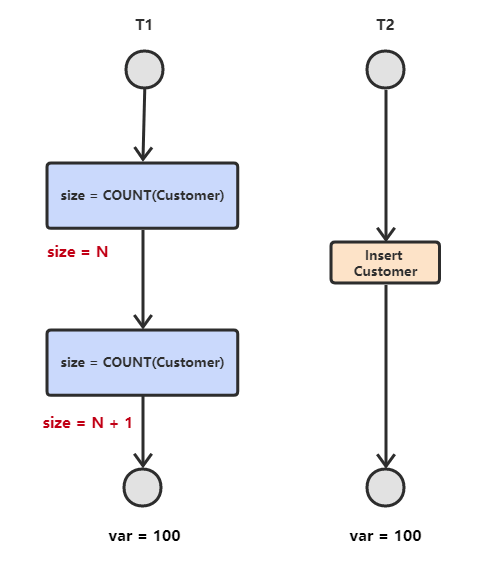

> 不仅从 redis 角度，同时从数据库并发可能产生问题角度答答

除了上述问题的脏读和幻读还有

丢失修改

---

T1 和 T2 两个事务都对一个数据进行修改，T1 先修改，T2 随后修改，T2 的修改覆盖了 T1 的修改。


不可重复读

---

T2 读取一个数据，T1 对该数据做了修改。如果 T2 再次读取这个数据，此时读取的结果和第一次读取的结果不同。


产生并发不一致性问题主要原因是破坏了事务的隔离性，解决方法是通过并发控制来保证隔离性。并发控制可以通过封锁来实现，但是封锁操作需要用户自己控制，相当复杂。数据库管理系统提供了事务的隔离级别，让用户以一种更轻松的方式处理并发一致性问题

> redis 高并发

> redis 高可用

[高可用：主从复制详解](https://www.pdai.tech/md/db/nosql-redis/db-redis-x-copy.html)

[高可用：哨兵机制（Redis Sentinel）详解](https://www.pdai.tech/md/db/nosql-redis/db-redis-x-sentinel.html)

> redis 主从是怎么做的

> 主从复制，是指将一台 Redis 服务器的数据，复制到其他的 Redis 服务器。前者称为主节点(master)，后者称为从节点(slave)；数据的复制是单向的，只能由主节点到从节点。

**主从复制的作用**主要包括：

- **数据冗余**：主从复制实现了数据的热备份，是持久化之外的一种数据冗余方式。
- **故障恢复**：当主节点出现问题时，可以由从节点提供服务，实现快速的故障恢复；实际上是一种服务的冗余。
- **负载均衡**：在主从复制的基础上，配合读写分离，可以由主节点提供写服务，由从节点提供读服务（即写 Redis 数据时应用连接主节点，读 Redis 数据时应用连接从节点），分担服务器负载；尤其是在写少读多的场景下，通过多个从节点分担读负载，可以大大提高 Redis 服务器的并发量。
- **高可用基石**：除了上述作用以外，主从复制还是哨兵和集群能够实施的基础，因此说主从复制是 Redis 高可用的基础。

主从库之间采用的是**读写分离**的方式。

- 读操作：主库、从库都可以接收；
- 写操作：首先到主库执行，然后，主库将写操作同步给从库。


原理

---

> 注意：在 2.8 版本之前只有全量复制，而 2.8 版本后有全量和增量复制：

- `全量（同步）复制`：比如第一次同步时
- `增量（同步）复制`：只会把主从库网络断连期间主库收到的命令，同步给从库

全量复制

---

当我们启动多个 Redis 实例的时候，它们相互之间就可以通过 replicaof（Redis 5.0 之前使用 slaveof）命令形成主库和从库的关系，之后会按照三个阶段完成数据的第一次同步。

- **确立主从关系**

例如，现在有实例 1（ip：172.16.19.3）和实例 2（ip：172.16.19.5），我们在实例 2 上执行以下这个命令后，实例 2 就变成了实例 1 的从库，并从实例 1 上复制数据：

```bash
replicaof 172.16.19.3 6379
```

- **全量复制的三个阶段**

你可以先看一下下面这张图，有个整体感知，接下来我再具体介绍


著作权归https://pdai.tech所有。 链接：https://www.pdai.tech/md/db/nosql-redis/db-redis-x-copy.html

**第一阶段是主从库间建立连接、协商同步的过程**，主要是为全量复制做准备。在这一步，从库和主库建立起连接，并告诉主库即将进行同步，主库确认回复后，主从库间就可以开始同步了。

具体来说，从库给主库发送 psync 命令，表示要进行数据同步，主库根据这个命令的参数来启动复制。psync 命令包含了主库的 runID 和复制进度 offset 两个参数。runID，是每个 Redis 实例启动时都会自动生成的一个随机 ID，用来唯一标记这个实例。当从库和主库第一次复制时，因为不知道主库的 runID，所以将 runID 设为“？”。offset，此时设为 -1，表示第一次复制。主库收到 psync 命令后，会用 FULLRESYNC 响应命令带上两个参数：主库 runID 和主库目前的复制进度 offset，返回给从库。从库收到响应后，会记录下这两个参数。这里有个地方需要注意，FULLRESYNC 响应表示第一次复制采用的全量复制，也就是说，主库会把当前所有的数据都复制给从库。

**第二阶段，主库将所有数据同步给从库**。从库收到数据后，在本地完成数据加载。这个过程依赖于内存快照生成的 RDB 文件。

具体来说，主库执行 bgsave 命令，生成 RDB 文件，接着将文件发给从库。从库接收到 RDB 文件后，会先清空当前数据库，然后加载 RDB 文件。这是因为从库在通过 replicaof 命令开始和主库同步前，可能保存了其他数据。为了避免之前数据的影响，从库需要先把当前数据库清空。在主库将数据同步给从库的过程中，主库不会被阻塞，仍然可以正常接收请求。否则，Redis 的服务就被中断了。但是，这些请求中的写操作并没有记录到刚刚生成的 RDB 文件中。为了保证主从库的数据一致性，主库会在内存中用专门的 replication buffer，记录 RDB 文件生成后收到的所有写操作。

**第三个阶段，主库会把第二阶段执行过程中新收到的写命令，再发送给从库**。具体的操作是，当主库完成 RDB 文件发送后，就会把此时 replication buffer 中的修改操作发给从库，从库再重新执行这些操作。这样一来，主从库就实现同步了

增量复制

---

> 在 Redis 2.8 版本引入了增量复制。

- **为什么会设计增量复制**？

如果主从库在命令传播时出现了网络闪断，那么，从库就会和主库重新进行一次全量复制，开销非常大。从 Redis 2.8 开始，网络断了之后，主从库会采用增量复制的方式继续同步。

- **增量复制的流程**

你可以先看一下下面这张图，有个整体感知，接下来我再具体介绍。


著作权归https://pdai.tech所有。 链接：https://www.pdai.tech/md/db/nosql-redis/db-redis-x-copy.html

先看两个概念： `replication buffer` 和 `repl_backlog_buffer`

`repl_backlog_buffer`：它是为了从库断开之后，如何找到主从差异数据而设计的环形缓冲区，从而避免全量复制带来的性能开销。如果从库断开时间太久，repl_backlog_buffer 环形缓冲区被主库的写命令覆盖了，那么从库连上主库后只能乖乖地进行一次全量复制，所以**repl_backlog_buffer 配置尽量大一些，可以降低主从断开后全量复制的概率**。而在 repl_backlog_buffer 中找主从差异的数据后，如何发给从库呢？这就用到了 replication buffer。

`replication buffer`：Redis 和客户端通信也好，和从库通信也好，Redis 都需要给分配一个 内存 buffer 进行数据交互，客户端是一个 client，从库也是一个 client，我们每个 client 连上 Redis 后，Redis 都会分配一个 client buffer，所有数据交互都是通过这个 buffer 进行的：Redis 先把数据写到这个 buffer 中，然后再把 buffer 中的数据发到 client socket 中再通过网络发送出去，这样就完成了数据交互。所以主从在增量同步时，从库作为一个 client，也会分配一个 buffer，只不过这个 buffer 专门用来传播用户的写命令到从库，保证主从数据一致，我们通常把它叫做 replication buffer。

- **如果在网络断开期间，repl_backlog_size 环形缓冲区写满之后，从库是会丢失掉那部分被覆盖掉的数据，还是直接进行全量复制呢**？

对于这个问题来说，有两个关键点：

1. 一个从库如果和主库断连时间过长，造成它在主库 repl_backlog_buffer 的 slave_repl_offset 位置上的数据已经被覆盖掉了，此时从库和主库间将进行全量复制。
2. 每个从库会记录自己的 slave_repl_offset，每个从库的复制进度也不一定相同。在和主库重连进行恢复时，从库会通过 psync 命令把自己记录的 slave_repl_offset 发给主库，主库会根据从库各自的复制进度，来决定这个从库可以进行增量复制，还是全量复制。

总结：

在使用读写分离之前，可以考虑其他方法增加 Redis 的读负载能力：如尽量优化主节点（减少慢查询、减少持久化等其他情况带来的阻塞等）提高负载能力；使用 Redis 集群同时提高读负载能力和写负载能力等。如果使用读写分离，可以使用哨兵，使主从节点的故障切换尽可能自动化，并减少对应用程序的侵入。

> 缓存雪崩，缓存击穿，缓存穿透

缓存雪崩

---

实际上，缓存雪崩描述的就是这样一个简单的场景：缓存在同一时间大面积的失效，后面的请求都直接落到了数据库上，造成数据库短时间内承受大量请求。 这就好比雪崩一样，摧枯拉朽之势，数据库的压力可想而知，可能直接就被这么多请求弄宕机了。

举个例子：系统的缓存模块出了问题比如宕机导致不可用。造成系统的所有访问，都要走数据库。

还有一种缓存雪崩的场景是：有一些被大量访问数据（热点缓存）在某一时刻大面积失效，导致对应的请求直接落到了数据库上。 这样的情况，有下面几种解决办法：

举个例子 ：秒杀开始 12 个小时之前，我们统一存放了一批商品到 Redis 中，设置的缓存过期时间也是 12 个小时，那么秒杀开始的时候，这些秒杀的商品的访问直接就失效了。导致的情况就是，相应的请求直接就落到了数据库上，就像雪崩一样可怕。

- **问题来源**

缓存雪崩是指缓存中**数据大批量到过期时间，而查询数据量巨大，引起数据库压力过大甚至 down 机**。和缓存击穿不同的是，缓存击穿指并发查同一条数据，缓存雪崩是不同数据都过期了，很多数据都查不到从而查数据库。

- **解决方案**

1. 缓存数据的过期时间设置随机，防止同一时间大量数据过期现象发生。
2. 如果缓存数据库是分布式部署，将热点数据均匀分布在不同的缓存数据库中。
3. 设置热点数据永远不过期

缓存击穿

---

- **问题来源**

缓存击穿是指**缓存中没有但数据库中有的数据**（一般是缓存时间到期），这时由于并发用户特别多，同时读缓存没读到数据，又同时去数据库去取数据，引起数据库压力瞬间增大，造成过大压力。

- **解决方案**

1、设置热点数据永远不过期。

2、接口限流与熔断，降级。重要的接口一定要做好限流策略，防止用户恶意刷接口，同时要降级准备，当接口中的某些 服务 不可用时候，进行熔断，失败快速返回机制。

3、加互斥锁

缓存穿透

---

缓存穿透说简单点就是大量请求的 key 根本不存在于缓存中，导致请求直接到了数据库上，根本没有经过缓存这一层。举个例子：某个黑客故意制造我们缓存中不存在的 key 发起大量请求，导致大量请求落到数据库。

- **问题来源**

缓存穿透是指**缓存和数据库中都没有的数据**，而用户不断发起请求。由于缓存是不命中时被动写的，并且出于容错考虑，如果从存储层查不到数据则不写入缓存，这将导致这个不存在的数据每次请求都要到存储层去查询，失去了缓存的意义。

在流量大时，可能 DB 就挂掉了，要是有人利用不存在的 key 频繁攻击我们的应用，这就是漏洞。

如发起为 id 为“-1”的数据或 id 为特别大不存在的数据。这时的用户很可能是攻击者，攻击会导致数据库压力过大。

- **解决方案**

1. 接口层增加校验，如用户鉴权校验，id 做基础校验，id<=0 的直接拦截；
2. 从缓存取不到的数据，在数据库中也没有取到，这时也可以将 key-value 对写为 key-null，缓存有效时间可以设置短点，如 30 秒（设置太长会导致正常情况也没法使用）。这样可以防止攻击用户反复用同一个 id 暴力攻击
3. 布隆过滤器。bloomfilter 就类似于一个 hash set，用于快速判某个元素是否存在于集合中，其典型的应用场景就是快速判断一个 key 是否存在于某容器，不存在就直接返回。布隆过滤器的关键就在于 hash 算法和容器大小，

> 缓存有哪些，Ehcache 和 Redis 区别，Ehcache 为什么效率高

> Redis 分布式集群是怎么实现的

分布式缓存的话，使用的比较多的主要是 **Memcached** 和 **Redis**。不过，现在基本没有看过还有项目使用 **Memcached** 来做缓存，都是直接用 **Redis**。

Memcached 是分布式缓存最开始兴起的那会，比较常用的。后来，随着 Redis 的发展，大家慢慢都转而使用更加强大的 Redis 了。

分布式缓存主要解决的是单机缓存的容量受服务器限制并且无法保存通用信息的问题。因为，本地缓存只在当前服务里有效，比如如果你部署了两个相同的服务，他们两者之间的缓存数据是无法共同的

### MySql

> sqlserver 和 MySQL 区别

> 有用 mysql 做过什么东西吗（开放话题）| 如何优化 MySQL

> Mysql sql 执行过程，用 JDBC 时 sql 执行流程

> Mysql 监听 binlog，binlog 是什么

那 `binlog` 到底是用来干嘛的？

可以说`MySQL`数据库的**数据备份、主备、主主、主从**都离不开`binlog`，需要依靠`binlog`来同步数据，保证数据一致性。


`binlog`会记录所有涉及更新数据的逻辑操作，并且是顺序写。

记录格式：

`binlog` 日志有三种格式，可以通过`binlog_format`参数指定。

- **statement**
- **row**
- **mixed**

指定`statement`，记录的内容是`SQL`语句原文，比如执行一条`update T set update_time=now() where id=1`，记录的内容如下。


同步数据时，会执行记录的`SQL`语句，但是有个问题，`update_time=now()`这里会获取当前系统时间，直接执行会导致与原库的数据不一致。

为了解决这种问题，我们需要指定为`row`，记录的内容不再是简单的`SQL`语句了，还包含操作的具体数据，记录内容如下。


`row`格式记录的内容看不到详细信息，要通过`mysqlbinlog`工具解析出来。

`update_time=now()`变成了具体的时间`update_time=1627112756247`，条件后面的@1、@2、@3 都是该行数据第 1 个~3 个字段的原始值（**假设这张表只有 3 个字段**）。

这样就能保证同步数据的一致性，通常情况下都是指定为`row`，这样可以为数据库的恢复与同步带来更好的可靠性。

但是这种格式，需要更大的容量来记录，比较占用空间，恢复与同步时会更消耗`IO`资源，影响执行速度。

所以就有了一种折中的方案，指定为`mixed`，记录的内容是前两者的混合。

`MySQL`会判断这条`SQL`语句是否可能引起数据不一致，如果是，就用`row`格式，否则就用`statement`格式。

写入机制：

`binlog`的写入时机也非常简单，事务执行过程中，先把日志写到`binlog cache`，事务提交的时候，再把`binlog cache`写到`binlog`文件中。

因为一个事务的`binlog`不能被拆开，无论这个事务多大，也要确保一次性写入，所以系统会给每个线程分配一个块内存作为`binlog cache`。

我们可以通过`binlog_cache_size`参数控制单个线程 binlog cache 大小，如果存储内容超过了这个参数，就要暂存到磁盘（`Swap`）。

`binlog`日志刷盘流程如下


- **上图的 write，是指把日志写入到文件系统的 page cache，并没有把数据持久化到磁盘，所以速度比较快**
- **上图的 fsync，才是将数据持久化到磁盘的操作**

`write`和`fsync`的时机，可以由参数`sync_binlog`控制，默认是`0`。

为`0`的时候，表示每次提交事务都只`write`，由系统自行判断什么时候执行`fsync`。


虽然性能得到提升，但是机器宕机，`page cache`里面的 binlog 会丢失。

为了安全起见，可以设置为`1`，表示每次提交事务都会执行`fsync`，就如同 **redo log 日志刷盘流程** 一样。

最后还有一种折中方式，可以设置为`N(N>1)`，表示每次提交事务都`write`，但累积`N`个事务后才`fsync`。

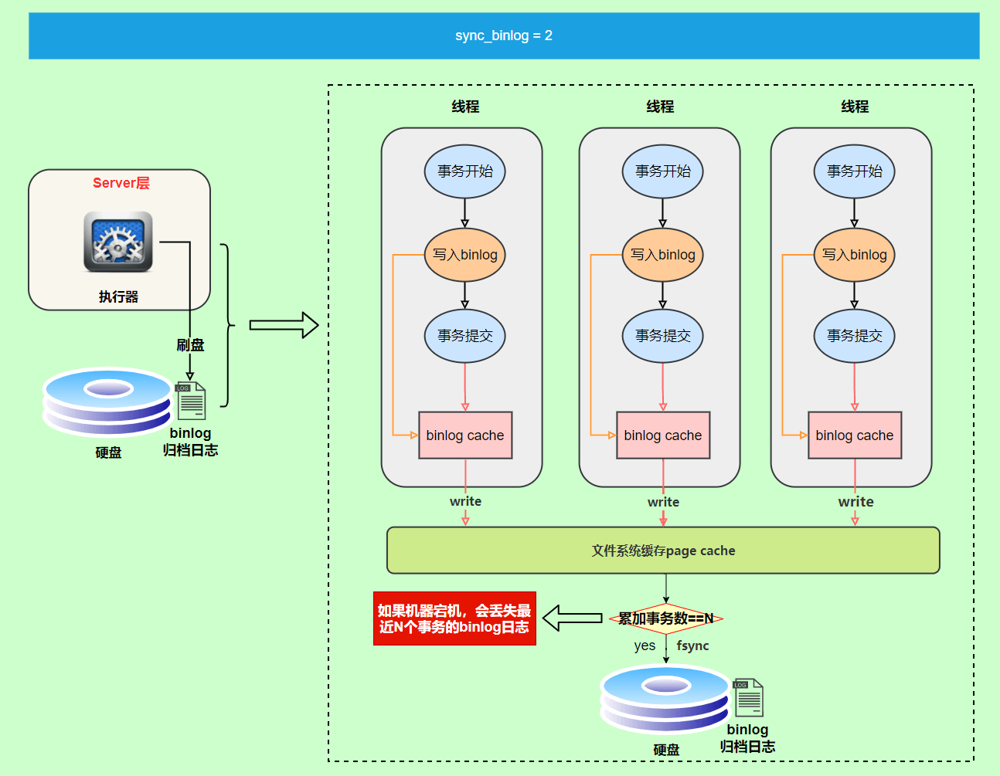

在出现`IO`瓶颈的场景里，将`sync_binlog`设置成一个比较大的值，可以提升性能。

同样的，如果机器宕机，会丢失最近`N`个事务的`binlog`日志。

> redo，undo，binlog

> redolog 和 binlog 的区别

`redo log` 它是物理日志，记录内容是“在某个数据页上做了什么修改”，属于 `InnoDB` 存储引擎。

而 `binlog` 是逻辑日志，记录内容是语句的原始逻辑，类似于“给 ID=2 这一行的 c 字段加 1”，属于`MySQL Server` 层。

不管用什么存储引擎，只要发生了表数据更新，都会产生 `binlog` 日志。

> Mysql 里面为什么用 B+树？B+树和二叉树区别？那能不能用哈希呢？

使用 B+树而不是二叉搜索树或者红黑树的原因是，由于存储介质的特性，磁盘本身存取就比主存慢很多，每次搜索的磁盘 IO 的开销过大，而 B+树可以使用较少次的磁盘 IO 搜索到对象。

- B-Tree 中一次检索最多需要 h-1 次 I/O（根节点常驻内存），渐进复杂度为 O(h)=O(logdN)。
- 红黑树这种结构，h 明显要深的多。效率明显比 B-Tree 差很多。

哈希表是键值对的集合，通过键(key)即可快速取出对应的值(value)，因此哈希表可以快速检索数据（接近 O（1））。

**为何能够通过 key 快速取出 value 呢？** 原因在于 **哈希算法**（也叫散列算法）。通过哈希算法，我们可以快速找到 key 对应的 index，找到了 index 也就找到了对应的 value。

```java
hash = hashfunc(key)
index = hash % array_size
```


但是！哈希算法有个 **Hash 冲突** 问题，也就是说多个不同的 key 最后得到的 index 相同。通常情况下，我们常用的解决办法是 **链地址法**。链地址法就是将哈希冲突数据存放在链表中。就比如 JDK1.8 之前 `HashMap` 就是通过链地址法来解决哈希冲突的。不过，JDK1.8 以后`HashMap`为了减少链表过长的时候搜索时间过长引入了红黑树。


为了减少 Hash 冲突的发生，一个好的哈希函数应该“均匀地”将数据分布在整个可能的哈希值集合中。

既然哈希表这么快，**为什么 MySQL 没有使用其作为索引的数据结构呢？**

**1.Hash 冲突问题** ：我们上面也提到过 Hash 冲突了，不过对于数据库来说这还不算最大的缺点。

**2.Hash 索引不支持顺序和范围查询(Hash 索引不支持顺序和范围查询是它最大的缺点：** 假如我们要对表中的数据进行排序或者进行范围查询，那 Hash 索引可就不行了。

试想一种情况:

```java
SELECT * FROM tb1 WHERE id < 500;
```

在这种范围查询中，优势非常大，直接遍历比 500 小的叶子节点就够了。而 Hash 索引是根据 hash 算法来定位的，难不成还要把 1 - 499 的数据，每个都进行一次 hash 计算来定位吗?这就是 Hash 最大的缺点了.

> 【高频问题】什么是 MVCC？

MVCC，全称 Multi-Version Concurrency Control，即多版本并发控制。MVCC 是一种并发控制的方法，一般在数据库管理系统中，实现对数据库的并发访问，在编程语言中实现事务内存。

在 Mysql 的 InnoDB 引擎中就是指在已提交读(READ COMMITTD)和可重复读(REPEATABLE READ)这两种隔离级别下的事务对于 SELECT 操作会访问版本链中的记录的过程。

这就使得别的事务可以修改这条记录，反正每次修改都会在版本链中记录。SELECT 可以去版本链中拿记录，这就实现了读-写，写-读的并发执行，提升了系统的性能。

**MySQL 的 InnoDB 引擎实现 MVCC 的 3 个基础点**

MVCC 的目的就是多版本并发控制，在数据库中的实现，就是为了解决读写冲突，它的实现原理主要是依赖记录中的 3 个隐式字段，undo 日志 ，Read View 来实现的。

1. 隐式字段：

每行记录除了我们自定义的字段外，还有数据库隐式定义的 DB_TRX_ID,DB_ROLL_PTR,DB_ROW_ID 等字段

- **DB_ROW_ID** 6byte, 隐含的自增 ID（隐藏主键），如果数据表没有主键，InnoDB 会自动以 DB_ROW_ID 产生一个聚簇索引
- **DB_TRX_ID** 6byte, 最近修改(修改/插入)事务 ID：记录创建这条记录/最后一次修改该记录的事务 ID
- **DB_ROLL_PTR** 7byte, 回滚指针，指向这条记录的上一个版本（存储于 rollback segment 里）
- **DELETED_BIT** 1byte, 记录被更新或删除并不代表真的删除，而是删除 flag 变了


如上图，DB_ROW_ID 是数据库默认为该行记录生成的唯一隐式主键；DB_TRX_ID 是当前操作该记录的事务 ID； 而 DB_ROLL_PTR 是一个回滚指针，用于配合 undo 日志，指向上一个旧版本；delete flag 没有展示出来

2. undo 日志

InnoDB 把这些为了回滚而记录的这些东西称之为 undo log。这里需要注意的一点是，由于查询操作（SELECT）并不会修改任何用户记录，所以在查询操作执行时，并不需要记录相应的 undo log。undo log 主要分为 3 种：

- **Insert undo log** ：插入一条记录时，至少要把这条记录的主键值记下来，之后回滚的时候只需要把这个主键值对应的记录删掉就好了。

- **Update undo log**：修改一条记录时，至少要把修改这条记录前的旧值都记录下来，这样之后回滚时再把这条记录更新为旧值就好了。

- Delete undo log

  ：删除一条记录时，至少要把这条记录中的内容都记下来，这样之后回滚时再把由这些内容组成的记录插入到表中就好了。

  - 删除操作都只是设置一下老记录的 DELETED_BIT，并不真正将过时的记录删除。
  - 为了节省磁盘空间，InnoDB 有专门的 purge 线程来清理 DELETED_BIT 为 true 的记录。为了不影响 MVCC 的正常工作，purge 线程自己也维护了一个 read view（这个 read view 相当于系统中最老活跃事务的 read view）;如果某个记录的 DELETED_BIT 为 true，并且 DB_TRX_ID 相对于 purge 线程的 read view 可见，那么这条记录一定是可以被安全清除的。

对 MVCC 有帮助的实质是**update undo log** ，undo log 实际上就是存在 rollback segment 中旧记录链，它的执行流程如下：

1. **比如一个有个事务插入 persion 表插入了一条新记录，记录如下，name 为 Jerry, age 为 24 岁，隐式主键是 1，事务 ID 和回滚指针，我们假设为 NULL**


2. **现在来了一个事务 1 对该记录的 name 做出了修改，改为 Tom**
   1. 在事务 1 修改该行(记录)数据时，数据库会先对该行加排他锁
   2. 然后把该行数据拷贝到 undo log 中，作为旧记录，既在 undo log 中有当前行的拷贝副本
   3. 拷贝完毕后，修改该行 name 为 Tom，并且修改隐藏字段的事务 ID 为当前事务 1 的 ID, 我们默认从 1 开始，之后递增，回滚指针指向拷贝到 undo log 的副本记录，既表示我的上一个版本就是它
   4. 事务提交后，释放锁


3. **又来了个事务 2 修改 person 表的同一个记录，将 age 修改为 30 岁**
   1. 在事务 2 修改该行数据时，数据库也先为该行加锁
   2. 然后把该行数据拷贝到 undo log 中，作为旧记录，发现该行记录已经有 undo log 了，那么最新的旧数据作为链表的表头，插在该行记录的 undo log 最前面
   3. 修改该行 age 为 30 岁，并且修改隐藏字段的事务 ID 为当前事务 2 的 ID, 那就是 2，回滚指针指向刚刚拷贝到 undo log 的副本记录
   4. 事务提交，释放锁


从上面，我们就可以看出，不同事务或者相同事务的对同一记录的修改，会导致该记录的 undo log 成为一条记录版本线性表，既链表，undo log 的链首就是最新的旧记录，链尾就是最早的旧记录（当然就像之前说的该 undo log 的节点可能是会 purge 线程清除掉，向图中的第一条 insert undo log，其实在事务提交之后可能就被删除丢失了，不过这里为了演示，所以还放在这里）

3. Read View(读视图)

什么是 Read View，说白了 Read View 就是事务进行快照读操作的时候生产的读视图(Read View)，在该事务执行的快照读的那一刻，会生成数据库系统当前的一个快照，记录并维护系统当前活跃事务的 ID(当每个事务开启时，都会被分配一个 ID, 这个 ID 是递增的，所以最新的事务，ID 值越大)

所以我们知道 Read View 主要是用来做可见性判断的, 即当我们某个事务执行快照读的时候，对该记录创建一个 Read View 读视图，把它比作条件用来判断当前事务能够看到哪个版本的数据，既可能是当前最新的数据，也有可能是该行记录的 undo log 里面的某个版本的数据。

Read View 遵循一个可见性算法，主要是将要被修改的数据的最新记录中的 DB_TRX_ID（即当前事务 ID）取出来，与系统当前其他活跃事务的 ID 去对比（由 Read View 维护），如果 DB_TRX_ID 跟 Read View 的属性做了某些比较，不符合可见性，那就通过 DB_ROLL_PTR 回滚指针去取出 Undo Log 中的 DB_TRX_ID 再比较，即遍历链表的 DB_TRX_ID（从链首到链尾，即从最近的一次修改查起），直到找到满足特定条件的 DB_TRX_ID, 那么这个 DB_TRX_ID 所在的旧记录就是当前事务能看见的最新老版本

那么这个判断条件是什么呢？


如上，它是一段 MySQL 判断可见性的一段源码，即 changes_visible 方法（不完全哈，但能看出大致逻辑），该方法展示了我们拿 DB_TRX_ID 去跟 Read View 某些属性进行怎么样的比较

在展示之前，我先简化一下 Read View，我们可以把 Read View 简单的理解成有三个全局属性

> - **trx_list** 未提交事务 ID 列表，用来维护 Read View 生成时刻系统正活跃的事务 ID
> - **up_limit_id** 记录 trx_list 列表中事务 ID 最小的 ID
> - **low_limit_id** ReadView 生成时刻系统尚未分配的下一个事务 ID，也就是目前已出现过的事务 ID 的最大值+1

- 首先比较 DB_TRX_ID < up_limit_id, 如果小于，则当前事务能看到 DB_TRX_ID 所在的记录，如果大于等于进入下一个判断
- 接下来判断 DB_TRX_ID 大于等于 low_limit_id , 如果大于等于则代表 DB_TRX_ID 所在的记录在 Read View 生成后才出现的，那对当前事务肯定不可见，如果小于则进入下一个判断
- 判断 DB_TRX_ID 是否在活跃事务之中，trx_list.contains(DB_TRX_ID)，如果在，则代表我 Read View 生成时刻，你这个事务还在活跃，还没有 Commit，你修改的数据，我当前事务也是看不见的；如果不在，则说明，你这个事务在 Read View 生成之前就已经 Commit 了，你修改的结果，我当前事务是能看见的

整体流程：

著作权归https://pdai.tech所有。 链接：https://www.pdai.tech/md/db/sql-mysql/sql-mysql-mvcc.html

我们在了解了隐式字段，undo log， 以及 Read View 的概念之后，就可以来看看 MVCC 实现的整体流程是怎么样了

整体的流程是怎么样的呢？我们可以模拟一下

当事务 2 对某行数据执行了快照读，数据库为该行数据生成一个 Read View 读视图，假设当前事务 ID 为 2，此时还有事务 1 和事务 3 在活跃中，事务 4 在事务 2 快照读前一刻提交更新了，所以 Read View 记录了系统当前活跃事务 1，3 的 ID，维护在一个列表上，假设我们称为 trx_list

| 事务 1   | 事务 2   | 事务 3   | 事务 4       |
| -------- | -------- | -------- | ------------ |
| 事务开始 | 事务开始 | 事务开始 | 事务开始     |
| …        | …        | …        | 修改且已提交 |
| 进行中   | 快照读   | 进行中   |              |
| …        | …        | …        |              |

Read View 不仅仅会通过一个列表 trx_list 来维护事务 2 执行快照读那刻系统正活跃的事务 ID，还会有两个属性 up_limit_id（记录 trx_list 列表中事务 ID 最小的 ID），low_limit_id(记录 trx_list 列表中下一个事务 ID，也就是目前已出现过的事务 ID 的最大值+1)；所以在这里例子中 up_limit_id 就是 1，low_limit_id 就是 4 + 1 = 5，trx_list 集合的值是 1,3，Read View 如下图

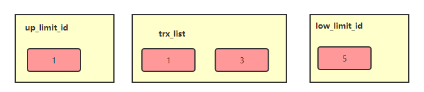

我们的例子中，只有事务 4 修改过该行记录，并在事务 2 执行快照读前，就提交了事务，所以当前该行当前数据的 undo log 如下图所示；我们的事务 2 在快照读该行记录的时候，就会拿该行记录的 DB_TRX_ID 去跟 up_limit_id,low_limit_id 和活跃事务 ID 列表(trx_list)进行比较，判断当前事务 2 能看到该记录的版本是哪个。


所以先拿该记录 DB_TRX_ID 字段记录的事务 ID 4 去跟 Read View 的的 up_limit_id 比较，看 4 是否小于 up_limit_id(1)，所以不符合条件，继续判断 4 是否大于等于 low_limit_id(5)，也不符合条件，最后判断 4 是否处于 trx_list 中的活跃事务, 最后发现事务 ID 为 4 的事务不在当前活跃事务列表中, 符合可见性条件，所以事务 4 修改后提交的最新结果对事务 2 快照读时是可见的，所以事务 2 能读到的最新数据记录是事务 4 所提交的版本，而事务 4 提交的版本也是全局角度上最新的版本


也正是 Read View 生成时机的不同，从而造成 RC,RR 级别下快照读的结果的不同

> MVCC 版本查看，为什么还会出现幻读?

先解释一下什么是，幻读(间隙锁)

对“幻读”做一个说明：

1. 在可重复读隔离级别下，普通的查询是快照读，是不会看到别的事务插入的数据的。因此，幻读在“当前读”下才会出现。
2. session B 的修改结果，被 session A 之后的 select 语句用“当前读”看到，不能称为幻读。 **幻读仅专指“新插入的行**”。


session A 里执行了三次查询，分别是 Q1、 Q2 和 Q3。 它们的 SQL 语句相同，都是 select \* from t where d=5 for update。 表示查所有 d=5 的行，而且使用的是当前读，并且加上写锁。
其中，Q3 读到 id=1 这一行的现象，被称为“幻读”。 也就是说，幻读指的是一个事务在前后两次查询同一个范围的时候，后一次查询看到了前一次查询没有看到的行

幻读会导致数据一致性的问题。 锁的设计是为了保证数据的一致性。 而这个一致性，不止是数据库内部数据状态在此刻的一致性，还包含了数据和日志在逻辑上的一致性。

1. 在可重复读隔离级别下，普通的查询是快照读，是不会看到别的事务插入的数据的。 因此，幻读在“当前读”下才会出现。
2. 上面 session B 的修改结果，被 session A 之后的 select 语句用“当前读”看到，不能称为幻读。幻读仅专指“新插入的行”


尝试解决幻读，把所有语句都上锁，查询语句改成`select * from t for update`。但是仍然无法解决插入新语句出现的幻读现象。

如何解决幻读？

InnoDB 引入新的锁，也就是间隙锁(Gap Lock)。在一行行扫描的过程中，不仅将给行加上了行锁，还给行两边的空隙，也加上了间隙锁。

间隙锁之间的冲突：跟间隙锁存在冲突关系的，是“往这个间隙中插入一个记录”这个操作。 间隙锁之间都不存在冲突关系。

间隙锁和行锁合称 next-key lock，每个 next-key lock 是前开后闭区间。

- 如果用`select * from t for update`要把整个表所有记录锁起来，就形成了 7 个 next-key lock，分别是 (-∞,0]、 (0,5]、 (5,10]、 (10,15]、 (15,20]、 (20, 25]、 (25, +supremum]。
- InnoDB 给每个索引加了一个不存在的最大值 supremum。

间隙锁的引入，可能会导致同样的语句锁住更大的范围，这其实是影响了并发度的。

> sql 慢查询（优化），如果没有索引怎么办？加了索引也比较慢怎么办？

加了索引页很慢，参考：https://mp.weixin.qq.com/s/pJQwnNOwRKw1MvcDTOrjqQ

在mysql的启动配置文件或命令行参数中增加`--log-queries-not-using-indexes`参数就可以启用未使用索引查询语句


> 什么是事务？事务 ACID 特性，隔离级别，隔离级别对应问题对其描述

事务指的是满足 ACID 特性的一组操作，可以通过 Commit 提交一个事务，也可以使用 Rollback 进行回滚。


**事务基本特性 ACID**?：

- **A 原子性(atomicity)** 指的是一个事务中的操作要么全部成功，要么全部失败。
- **C 一致性(consistency)** 指的是数据库总是从一个一致性的状态转换到另外一个一致性的状态。比如 A 转账给 B100 块钱，假设中间 sql 执行过程中系统崩溃 A 也不会损失 100 块，因为事务没有提交，修改也就不会保存到数据库。
- **I 隔离性(isolation)** 指的是一个事务的修改在最终提交前，对其他事务是不可见的。
- **D 持久性(durability)** 指的是一旦事务提交，所做的修改就会永久保存到数据库中。

####

- **未提交读(READ UNCOMMITTED)** 事务中的修改，即使没有提交，对其它事务也是可见的。
- **提交读(READ COMMITTED)** 一个事务只能读取已经提交的事务所做的修改。换句话说，一个事务所做的修改在提交之前对其它事务是不可见的。
- **可重复读(REPEATABLE READ)** 保证在同一个事务中多次读取同样数据的结果是一样的。
- **可串行化(SERIALIZABLE)** 强制事务串行执行。

| 隔离级别 | 脏读 | 不可重复读 | 幻影读 |
| :------: | :--: | :--------: | :----: |
| 未提交读 |  √   |     √      |   √    |
|  提交读  |  ×   |     √      |   √    |
| 可重复读 |  ×   |     ×      |   √    |
| 可串行化 |  ×   |     ×      |   ×    |

> 能说下 myisam 和 innodb 的区别吗？

myisam 引擎是 5.1 版本之前的默认引擎，支持全文检索、压缩、空间函数等，但是不支持事务和行级锁，所以一般用于有大量查询少量插入的场景来使用，而且 myisam 不支持外键，并且索引和数据是分开存储的。

innodb 是基于 B+Tree 索引建立的，和 myisam 相反它支持事务、外键，并且通过 MVCC 来支持高并发，索引和数据存储在一起。

> 了解 mysql 的索引吗？为什么要用 b+树索引？树的高度是多少？

首先，索引是在**存储引擎层实现**的，而不是在服务器层实现的，所以不同存储引擎具有不同的索引类型和实现。

有哪些？

- **B+Tree 索引**
  - 是大多数 MySQL 存储引擎的默认索引类型。
- **哈希索引**
  - 哈希索引能以 O(1) 时间进行查找，但是失去了有序性；
  - InnoDB 存储引擎有一个特殊的功能叫“自适应哈希索引”，当某个索引值被使用的非常频繁时，会在 B+Tree 索引之上再创建一个哈希索引，这样就让 B+Tree 索引具有哈希索引的一些优点，比如快速的哈希查找。
- **全文索引**
  - MyISAM 存储引擎支持全文索引，用于查找文本中的关键词，而不是直接比较是否相等。查找条件使用 MATCH AGAINST，而不是普通的 WHERE。
  - 全文索引一般使用倒排索引实现，它记录着关键词到其所在文档的映射。
  - InnoDB 存储引擎在 MySQL 5.6.4 版本中也开始支持全文索引。
- **空间数据索引**
  - MyISAM 存储引擎支持空间数据索引(R-Tree)，可以用于地理数据存储。空间数据索引会从所有维度来索引数据，可以有效地使用任意维度来进行组合查询。

**什么是 B+Tree?**

B+ Tree 是基于 B Tree 和叶子节点顺序访问指针进行实现，它具有 B Tree 的平衡性，并且通过顺序访问指针来提高区间查询的性能。在 B+ Tree 中，一个节点中的 key 从左到右非递减排列，如果某个指针的左右相邻 key 分别是 keyi 和 keyi+1，且不为 null，则该指针指向节点的所有 key 大于等于 keyi 且小于等于 keyi+1。


**为什么是 B+Tree**?

- 为了减少磁盘读取次数，决定了树的高度不能高，所以必须是先 B-Tree；
- 以页为单位读取使得一次 I/O 就能完全载入一个节点，且相邻的节点也能够被预先载入；所以数据放在叶子节点，本质上是一个 Page 页；
- 为了支持范围查询以及关联关系， 页中数据需要有序，且页的尾部节点指向下个页的头部；

> 什么时候是表锁


> 并发事务带来了哪些问题?

在典型的应用程序中，多个事务并发运行，经常会操作相同的数据来完成各自的任务（多个用户对同一数据进行操作）。并发虽然是必须的，但可能会导致以下的问题。

- **脏读（Dirty read）:** 当一个事务正在访问数据并且对数据进行了修改，而这种修改还没有提交到数据库中，这时另外一个事务也访问了这个数据，然后使用了这个数据。因为这个数据是还没有提交的数据，那么另外一个事务读到的这个数据是“脏数据”，依据“脏数据”所做的操作可能是不正确的。
- **丢失修改（Lost to modify）:**  指在一个事务读取一个数据时，另外一个事务也访问了该数据，那么在第一个事务中修改了这个数据后，第二个事务也修改了这个数据。这样第一个事务内的修改结果就被丢失，因此称为丢失修改。 例如：事务 1 读取某表中的数据 A=20，事务 2 也读取 A=20，事务 1 修改 A=A-1，事务 2 也修改 A=A-1，最终结果  A=19，事务 1 的修改被丢失。
- **不可重复读（Unrepeatable read）:** 指在一个事务内多次读同一数据。在这个事务还没有结束时，另一个事务也访问该数据。那么，在第一个事务中的两次读数据之间，由于第二个事务的修改导致第一个事务两次读取的数据可能不太一样。这就发生了在一个事务内两次读到的数据是不一样的情况，因此称为不可重复读。
- **幻读（Phantom read）:** 幻读与不可重复读类似。它发生在一个事务（T1）读取了几行数据，接着另一个并发事务（T2）插入了一些数据时。在随后的查询中，第一个事务（T1）就会发现多了一些原本不存在的记录，就好像发生了幻觉一样，所以称为幻读。

**不可重复读和幻读区别** ：不可重复读的重点是修改比如多次读取一条记录发现其中某些列的值被修改，幻读的重点在于新增或者删除比如多次查询同一条查询语句（DQL）时，记录发现记录增多或减少了。


> 问一下 MySQL 默认隔离级别，可以解决幻读吗？

在这之前要先了解数据库默认的隔离级别：

MySQL InnoDB 存储引擎的默认支持的隔离级别是 **REPEATABLE-READ（可重读）**。我们可以通过`SELECT @@tx_isolation;`命令来查看，MySQL 8.0 该命令改为`SELECT @@transaction_isolation;`

```sql
mysql> SELECT @@tx_isolation;
+-----------------+
| @@tx_isolation  |
+-----------------+
| REPEATABLE-READ |
+-----------------+
```

关于 MySQL 事务隔离级别的详细介绍，可以看看guide写的这篇文章：[MySQL 事务隔离级别详解](https://javaguide.cn/database/mysql/transaction-isolation-level.html)。

很显然，回顾上一个问题，幻读和不可重复读是差不多的，那么这个默认的可重复读就对立。


> MySQL 的隔离级别是基于锁实现的吗？

MySQL 的隔离级别基于锁和 MVCC 机制共同实现的。

SERIALIZABLE 隔离级别，是通过锁来实现的。除了 SERIALIZABLE 隔离级别，其他的隔离级别都是基于 MVCC 实现。

不过， SERIALIZABLE 之外的其他隔离级别可能也需要用到锁机制，就比如 REPEATABLE-READ 在当前读情况下需要使用加锁读来保证不会出现幻读。


## 中间件

### 消息队列

> 什么是消息队列

我们可以把消息队列看作是一个存放消息的容器，当我们需要使用消息的时候，直接从容器中取出消息供自己使用即可。


消息队列是分布式系统中重要的组件之一。使用消息队列主要是为了通过异步处理提高系统性能和削峰、降低系统耦合性。

我们知道队列 Queue 是一种先进先出的数据结构，所以消费消息时也是按照顺序来消费的。

> 为什么要用消息队列

通常来说，使用消息队列能为我们的系统带来下面三点好处：

1. **通过异步处理提高系统性能（减少响应所需时间）。**
2. **削峰/限流**
3. **降低系统耦合性。**

如果在面试的时候你被面试官问到这个问题的话，一般情况是你在你的简历上涉及到消息队列这方面的内容，这个时候推荐你结合你自己的项目来回答。

通过异步处理提高系统性能（减少响应所需时间）


将用户的请求数据存储到消息队列之后就立即返回结果。随后，系统再对消息进行消费。

因为用户请求数据写入消息队列之后就立即返回给用户了，但是请求数据在后续的业务校验、写数据库等操作中可能失败。因此，**使用消息队列进行异步处理之后，需要适当修改业务流程进行配合**，比如用户在提交订单之后，订单数据写入消息队列，不能立即返回用户订单提交成功，需要在消息队列的订单消费者进程真正处理完该订单之后，甚至出库后，再通过电子邮件或短信通知用户订单成功，以免交易纠纷。这就类似我们平时手机订火车票和电影票

削峰/限流

**先将短时间高并发产生的事务消息存储在消息队列中，然后后端服务再慢慢根据自己的能力去消费这些消息，这样就避免直接把后端服务打垮掉。**

举例：在电子商务一些秒杀、促销活动中，合理使用消息队列可以有效抵御促销活动刚开始大量订单涌入对系统的冲击。如下图所示：


降低系统耦合性

使用消息队列还可以降低系统耦合性。我们知道如果模块之间不存在直接调用，那么新增模块或者修改模块就对其他模块影响较小，这样系统的可扩展性无疑更好一些。还是直接上图吧：


生产者（客户端）发送消息到消息队列中去，接受者（服务端）处理消息，需要消费的系统直接去消息队列取消息进行消费即可而不需要和其他系统有耦合，这显然也提高了系统的扩展性。

**消息队列使用发布-订阅模式工作，消息发送者（生产者）发布消息，一个或多个消息接受者（消费者）订阅消息。** 从上图可以看到**消息发送者（生产者）和消息接受者（消费者）之间没有直接耦合**，消息发送者将消息发送至分布式消息队列即结束对消息的处理，消息接受者从分布式消息队列获取该消息后进行后续处理，并不需要知道该消息从何而来。**对新增业务，只要对该类消息感兴趣，即可订阅该消息，对原有系统和业务没有任何影响，从而实现网站业务的可扩展性设计**。

消息接受者对消息进行过滤、处理、包装后，构造成一个新的消息类型，将消息继续发送出去，等待其他消息接受者订阅该消息。因此基于事件（消息对象）驱动的业务架构可以是一系列流程。

另外，为了避免消息队列服务器宕机造成消息丢失，会将成功发送到消息队列的消息存储在消息生产者服务器上，等消息真正被消费者服务器处理后才删除消息。在消息队列服务器宕机后，生产者服务器会选择分布式消息队列服务器集群中的其他服务器发布消息。

**备注：** 不要认为消息队列只能利用发布-订阅模式工作，只不过在解耦这个特定业务环境下是使用发布-订阅模式的。除了发布-订阅模式，还有点对点订阅模式（一个消息只有一个消费者），我们比较常用的是发布-订阅模式。另外，这两种消息模型是 JMS 提供的，AMQP 协议还提供了 5 种消息模型。

> RabbitMQ 讲讲对 RabbitMQ 的了解

RabbitMQ 整体上是一个生产者与消费者模型，主要负责接收、存储和转发消息。可以把消息传递的过程想象成：当你将一个包裹送到邮局，邮局会暂存并最终将邮件通过邮递员送到收件人的手上，RabbitMQ 就好比由邮局、邮箱和邮递员组成的一个系统。从计算机术语层面来说，RabbitMQ 模型更像是一种交换机模型。

RabbitMQ 的整体模型架构：


> RabbitMQ 的交换机和队列是怎样一个联系

在 RabbitMQ 中，消息并不是直接被投递到 **Queue(消息队列)** 中的，中间还必须经过 **Exchange(交换器)** 这一层，**Exchange(交换器)** 会把我们的消息分配到对应的 **Queue(消息队列)** 中。

**Exchange(交换器)** 用来接收生产者发送的消息并将这些消息路由给服务器中的队列中，如果路由不到，或许会返回给 **Producer(生产者)** ，或许会被直接丢弃掉 。这里可以将 RabbitMQ 中的交换器看作一个简单的实体。

**RabbitMQ 的 Exchange(交换器) 有 4 种类型，不同的类型对应着不同的路由策略**：**direct(默认)**，**fanout**, **topic**, 和 **headers**，不同类型的 Exchange 转发消息的策略有所区别。这个会在介绍 **Exchange Types(交换器类型)** 的时候介绍到。

Exchange(交换器) 示意图如下：


生产者将消息发给交换器的时候，一般会指定一个 **RoutingKey(路由键)**，用来指定这个消息的路由规则，而这个 **RoutingKey 需要与交换器类型和绑定键(BindingKey)联合使用才能最终生效**。

RabbitMQ 中通过 **Binding(绑定)** 将 **Exchange(交换器)** 与 **Queue(消息队列)** 关联起来，在绑定的时候一般会指定一个 **BindingKey(绑定建)** ,这样 RabbitMQ 就知道如何正确将消息路由到队列了,如下图所示。一个绑定就是基于路由键将交换器和消息队列连接起来的路由规则，所以可以将交换器理解成一个由绑定构成的路由表。Exchange 和 Queue 的绑定可以是多对多的关系。

Binding(绑定) 示意图：


生产者将消息发送给交换器时，需要一个 RoutingKey,当 BindingKey 和 RoutingKey 相匹配时，消息会被路由到对应的队列中。在绑定多个队列到同一个交换器的时候，这些绑定允许使用相同的 BindingKey。BindingKey 并不是在所有的情况下都生效，它依赖于交换器类型，比如 fanout 类型的交换器就会无视，而是将消息路由到所有绑定到该交换器的队列中。


> kafka怎么保证消息可靠性的？

1. 消费顺序的保证：

我们在使用消息队列的过程中经常有业务场景需要严格保证消息的消费顺序，比如我们同时发了 2 个消息，这 2 个消息对应的操作分别对应的数据库操作是：

1. 更改用户会员等级。
2. 根据会员等级计算订单价格。

假如这两条消息的消费顺序不一样造成的最终结果就会截然不同。

我们知道 Kafka 中 Partition(分区)是真正保存消息的地方，我们发送的消息都被放在了这里。而我们的 Partition(分区) 又存在于 Topic(主题) 这个概念中，并且我们可以给特定 Topic 指定多个 Partition。


每次添加消息到 Partition(分区) 的时候都会采用尾加法，如上图所示。 **Kafka 只能为我们保证 Partition(分区) 中的消息有序。**

> 消息在被追加到 Partition(分区)的时候都会分配一个特定的偏移量（offset）。Kafka 通过偏移量（offset）来保证消息在分区内的顺序性。

所以，我们就有一种很简单的保证消息消费顺序的方法：**1 个 Topic 只对应一个 Partition**。这样当然可以解决问题，但是破坏了 Kafka 的设计初衷。

Kafka 中发送 1 条消息的时候，可以指定 topic, partition, key,data（数据） 4 个参数。如果你发送消息的时候指定了  Partition 的话，所有消息都会被发送到指定的 Partition。并且，同一个 key 的消息可以保证只发送到同一个  partition，这个我们可以采用表/对象的 id 来作为 key 。

总结一下，对于如何保证 Kafka 中消息消费的顺序，有了下面两种方法：

1. 1 个 Topic 只对应一个 Partition。
2. （推荐）发送消息的时候指定 key/Partition。

当然不仅仅只有上面两种方法，上面两种方法是我觉得比较好理解的


2. 保证消息不丢失

生产者丢失消息的情况：

生产者(Producer) 调用`send`方法发送消息之后，消息可能因为网络问题并没有发送过去。

所以，我们不能默认在调用`send`方法发送消息之后消息发送成功了。为了确定消息是发送成功，我们要判断消息发送的结果。但是要注意的是 Kafka 生产者(Producer) 使用 `send` 方法发送消息实际上是异步的操作，我们可以通过 `get()`方法获取调用结果，但是这样也让它变为了同步操作，示例代码如下：

> **详细代码见我的这篇文章：[Kafka系列第三篇！10 分钟学会如何在 Spring Boot 程序中使用 Kafka 作为消息队列?](https://mp.weixin.qq.com/s?__biz=Mzg2OTA0Njk0OA==&mid=2247486269&idx=2&sn=ec00417ad641dd8c3d145d74cafa09ce&chksm=cea244f6f9d5cde0c8eb233fcc4cf82e11acd06446719a7af55230649863a3ddd95f78d111de&token=1633957262&lang=zh_CN#rd)**

```java
SendResult<String, Object> sendResult = kafkaTemplate.send(topic, o).get();
if (sendResult.getRecordMetadata() != null) {
  logger.info("生产者成功发送消息到" + sendResult.getProducerRecord().topic() + "-> " + sendRe
              sult.getProducerRecord().value().toString());
}
```

但是一般不推荐这么做！可以采用为其添加回调函数的形式，示例代码如下：

```java
        ListenableFuture<SendResult<String, Object>> future = kafkaTemplate.send(topic, o);
        future.addCallback(result -> logger.info("生产者成功发送消息到topic:{} partition:{}的消息", result.getRecordMetadata().topic(), result.getRecordMetadata().partition()),
                ex -> logger.error("生产者发送消失败，原因：{}", ex.getMessage()));
```

如果消息发送失败的话，我们检查失败的原因之后重新发送即可！

**另外这里推荐为 Producer 的`retries `（重试次数）设置一个比较合理的值，一般是 3  ，但是为了保证消息不丢失的话一般会设置比较大一点。设置完成之后，当出现网络问题之后能够自动重试消息发送，避免消息丢失。另外，建议还要设置重试间隔，因为间隔太小的话重试的效果就不明显了，网络波动一次你3次一下子就重试完了**

消费者丢失消息的情况：

我们知道消息在被追加到 Partition(分区)的时候都会分配一个特定的偏移量（offset）。偏移量（offset)表示 Consumer  当前消费到的 Partition(分区)的所在的位置。Kafka 通过偏移量（offset）可以保证消息在分区内的顺序性。


当消费者拉取到了分区的某个消息之后，消费者会自动提交了 offset。自动提交的话会有一个问题，试想一下，当消费者刚拿到这个消息准备进行真正消费的时候，突然挂掉了，消息实际上并没有被消费，但是 offset 却被自动提交了。

**解决办法也比较粗暴，我们手动关闭自动提交 offset，每次在真正消费完消息之后再自己手动提交 offset 。** 但是，细心的朋友一定会发现，这样会带来消息被重新消费的问题。比如你刚刚消费完消息之后，还没提交 offset，结果自己挂掉了，那么这个消息理论上就会被消费两次。


3. 保证消息不重复

**kafka出现消息重复消费的原因：**

- 服务端侧已经消费的数据没有成功提交 offset（根本原因）。
- Kafka 侧 由于服务端处理业务时间长或者网络链接等等原因让 Kafka 认为服务假死，触发了分区 rebalance。

**解决方案：**

- 消费消息服务做幂等校验，比如 Redis 的set、MySQL 的主键等天然的幂等功能。这种方法最有效。

- 将 

  `enable.auto.commit`

   参数设置为 false，关闭自动提交，开发者在代码中手动提交 offset。那么这里会有个问题：

  什么时候提交offset合适？

  - 处理完消息再提交：依旧有消息重复消费的风险，和自动提交一样
  - 拉取到消息即提交：会有消息丢失的风险。允许消息延时的场景，一般会采用这种方式。然后，通过定时任务在业务不繁忙（比如凌晨）的时候做数据兜底。

## 数据结构和算法

> LRU 介绍，底层数据结构，高并发情况下如何设计 LRU or  LRU缓存原理？手写，要支持泛型

[146. LRU 缓存](https://leetcode-cn.com/problems/lru-cache/)


## 操作系统

> 进程和线程的区别

👨‍💻**面试官**: 好的！我明白了！那你再说一下： **进程和线程的区别**。

🙋 **我：** 好的！ 下图是 Java 内存区域，我们从 JVM 的角度来说一下线程和进程之间的关系吧！


从上图可以看出：一个进程中可以有多个线程，多个线程共享进程的**堆**和**方法区 (JDK1.8 之后的元空间)\*\*资源，但是每个线程有自己的\*\*程序计数器**、**虚拟机栈** 和 **本地方法栈**。

**总结：** 线程是进程划分成的更小的运行单位,一个进程在其执行的过程中可以产生多个线程。线程和进程最大的不同在于基本上各进程是独立的，而各线程则不一定，因为同一进程中的线程极有可能会相互影响。线程执行开销小，但不利于资源的管理和保护；而进程正相反

> 【高频】进程线程都怎么通信

👨‍💻**面试官** ：**进程间的通信常见的的有哪几种方式呢?**

🙋 **我** ：大概有 7 种常见的进程间的通信方式。

> 下面这部分总结参考了:[《进程间通信 IPC (InterProcess Communication)》](https://www.jianshu.com/p/c1015f5ffa74)

1. **管道/匿名管道(Pipes)** ：用于具有亲缘关系的父子进程间或者兄弟进程之间的通信。
2. **有名管道(Names Pipes)** : 匿名管道由于没有名字，只能用于亲缘关系的进程间通信。为了克服这个缺点，提出了有名管道。有名管道严格遵循**先进先出(first in first out)**。有名管道以磁盘文件的方式存在，可以实现本机任意两个进程通信。
3. **信号(Signal)** ：信号是一种比较复杂的通信方式，用于通知接收进程某个事件已经发生；
4. **消息队列(Message Queuing)** ：消息队列是消息的链表,具有特定的格式,存放在内存中并由消息队列标识符标识。管道和消息队列的通信数据都是先进先出的原则。与管道（无名管道：只存在于内存中的文件；命名管道：存在于实际的磁盘介质或者文件系统）不同的是消息队列存放在内核中，只有在内核重启(即，操作系统重启)或者显式地删除一个消息队列时，该消息队列才会被真正的删除。消息队列可以实现消息的随机查询,消息不一定要以先进先出的次序读取,也可以按消息的类型读取.比 FIFO 更有优势。**消息队列克服了信号承载信息量少，管道只能承载无格式字 节流以及缓冲区大小受限等缺点。**
5. **信号量(Semaphores)** ：信号量是一个计数器，用于多进程对共享数据的访问，信号量的意图在于进程间同步。这种通信方式主要用于解决与同步相关的问题并避免竞争条件。
6. **共享内存(Shared memory)** ：使得多个进程可以访问同一块内存空间，不同进程可以及时看到对方进程中对共享内存中数据的更新。这种方式需要依靠某种同步操作，如互斥锁和信号量等。可以说这是最有用的进程间通信方式。
7. **套接字(Sockets)** : 此方法主要用于在客户端和服务器之间通过网络进行通信。套接字是支持 TCP/IP 的网络通信的基本操作单元，可以看做是不同主机之间的进程进行双向通信的端点，简单的说就是通信的两方的一种约定，用套接字中的相关函数来完成通信过程。

> 进程的状态

👨‍💻**面试官** ： 那你再说说**进程有哪几种状态?**

🙋 **我** ：我们一般把进程大致分为 5 种状态，这一点和[线程](https://github.com/Snailclimb/JavaGuide/blob/master/docs/java/Multithread/JavaConcurrencyBasicsCommonInterviewQuestionsSummary.md#6-说说线程的生命周期和状态)

很像！

- **创建状态(new)** ：进程正在被创建，尚未到就绪状态。
- **就绪状态(ready)** ：进程已处于准备运行状态，即进程获得了除了处理器之外的一切所需资源，一旦得到处理器资源(处理器分配的时间片)即可运行。
- **运行状态(running)** ：进程正在处理器上上运行(单核 CPU 下任意时刻只有一个进程处于运行状态)。
- **阻塞状态(waiting)** ：又称为等待状态，进程正在等待某一事件而暂停运行如等待某资源为可用或等待 IO 操作完成。即使处理器空闲，该进程也不能运行。
- **结束状态(terminated)** ：进程正在从系统中消失。可能是进程正常结束或其他原因中断退出运行。

> 订正：下图中 running 状态被 interrupt 向 ready 状态转换的箭头方向反了。


> 了解操作系统的锁吗？讲讲操作系统实现锁的底层原理


> 生产者和消费者模式怎么理解，举个例子

下面我们利用信号量和 PV 操作来解决经典的进程同步和互斥问题：生产者和消费者问题。

【问题描述】：系统中有一组生产者进程和一组消费者进程，生产者进程每次生产一个产品放入缓冲区，消费者进程每次从缓冲区中取出一个产品并使用。任何时刻，只能有一个生产者或消费者可以访问缓冲区。


由题可知，生产者、消费者共享一个初始为空、大小为 n 的缓冲区，我们从题目中提炼出同步与互斥关系：

- 同步关系 1：只有缓冲区没满时（优先级高），生产者才能把产品放入缓冲区（优先级低），否则必须等待
- 同步关系 2：只有缓冲区不空时（优先级高），消费者才能从中取出产品（优先级低），否则必须等待
- 互斥关系：缓冲区是临界资源，各进程必须互斥地访问。

既然这个题目有两个同步关系和一个互斥关系，那么我们就需要两个同步信号量和一个互斥信号量：

- empty：同步信号量（对应同步关系 1），表示生产者还能生产多少，即还能放入缓冲区多少产品，该数量小于等于 0，则生产者不能进行生产。 初始化为 n。
- full：同步信号量（对应同步关系 2），表示消费者还能从缓冲区取出多少，即当前缓冲区已有产品的数量，该数量小于等于 0，则消费者不能进行读取。初始化为 0。
- mutex：互斥信号量，实现对缓冲区的互斥访问。初始化为 1。

代码如下，注意各个 PV 操作的配对：


> 进程调度有哪些算法？

👨‍💻**面试官** ：**你知道操作系统中进程的调度算法有哪些吗?**

🙋 **我** ：嗯嗯！这个我们大学的时候学过，是一个很重要的知识点！

为了确定首先执行哪个进程以及最后执行哪个进程以实现最大 CPU 利用率，计算机科学家已经定义了一些算法，它们是：

- **先到先服务(FCFS)调度算法** : 从就绪队列中选择一个最先进入该队列的进程为之分配资源，使它立即执行并一直执行到完成或发生某事件而被阻塞放弃占用 CPU 时再重新调度。
- **短作业优先(SJF)的调度算法** : 从就绪队列中选出一个估计运行时间最短的进程为之分配资源，使它立即执行并一直执行到完成或发生某事件而被阻塞放弃占用 CPU 时再重新调度。
- **时间片轮转调度算法** : 时间片轮转调度是一种最古老，最简单，最公平且使用最广的算法，又称 RR(Round robin)调度。每个进程被分配一个时间段，称作它的时间片，即该进程允许运行的时间。
- **多级反馈队列调度算法** ：前面介绍的几种进程调度的算法都有一定的局限性。如**短进程优先的调度算法，仅照顾了短进程而忽略了长进程** 。多级反馈队列调度算法既能使高优先级的作业得到响应又能使短作业（进程）迅速完成。，因而它是目前**被公认的一种较好的进程调度算法**，UNIX 操作系统采取的便是这种调度算法。
- **优先级调度** ： 为每个流程分配优先级，首先执行具有最高优先级的进程，依此类推。具有相同优先级的进程以 FCFS 方式执行。可以根据内存要求，时间要求或任何其他资源要求来确定优先级。

细分

---

**批处理系统**

<details open="">
<summary>先来先服务 first-come first-serverd（FCFS）</summary>
<p dir="auto">按照请求的顺序进行调度。非抢占式，开销小，无饥饿问题，响应时间不确定（可能很慢）；</p>
<p dir="auto">对短进程不利，对IO密集型进程不利。</p>
</details>

<details open="">
<summary>最短作业优先 shortest job first（SJF）</summary>
<p dir="auto">按估计运行时间最短的顺序进行调度。非抢占式，吞吐量高，开销可能较大，可能导致饥饿问题；</p>
<p dir="auto">对短进程提供好的响应时间，对长进程不利。</p>
</details>

<details open="">
<summary>最短剩余时间优先 shortest remaining time next（SRTN）</summary>
<p dir="auto">按剩余运行时间的顺序进行调度。(最短作业优先的抢占式版本)。吞吐量高，开销可能较大，提供好的响应时间；</p>
<p dir="auto">可能导致饥饿问题，对长进程不利。</p>
</details>

<details open="">
<summary>最高响应比优先 Highest Response Ratio Next（HRRN）</summary>
<p dir="auto">响应比 = 1+ 等待时间/处理时间。同时考虑了等待时间的长短和估计需要的执行时间长短，很好的平衡了长短进程。非抢占，吞吐量高，开销可能较大，提供好的响应时间，无饥饿问题。</p>
</details>

**交互式系统**
交互式系统有大量的用户交互操作，在该系统中调度算法的目标是快速地进行响应。

<details open="">
<summary>时间片轮转 Round Robin</summary>
<p dir="auto">将所有就绪进程按 FCFS 的原则排成一个队列，用完时间片的进程排到队列最后。抢占式（时间片用完时），开销小，无饥饿问题，为短进程提供好的响应时间；</p>
<p dir="auto">若时间片小，进程切换频繁，吞吐量低；若时间片太长，实时性得不到保证。</p>
</details>

<details open="">
<summary>优先级调度算法</summary>
<p dir="auto">为每个进程分配一个优先级，按优先级进行调度。为了防止低优先级的进程永远等不到调度，可以随着时间的推移增加等待进程的优先级。</p>
</details>

<details open="">
<summary>多级反馈队列调度算法 Multilevel Feedback Queue</summary>
<p dir="auto">设置多个就绪队列1、2、3...，优先级递减，时间片递增。只有等到优先级更高的队列为空时才会调度当前队列中的进程。如果进程用完了当前队列的时间片还未执行完，则会被移到下一队列。</p>
<p dir="auto">抢占式（时间片用完时），开销可能较大，对IO型进程有利，可能会出现饥饿问题。</p>
</details>

> Linux 里进程通信有几种方式？

分为消息传递模型和共享内存模型

> 进程同步有几种方式？

👨‍💻**面试官** ：**那线程间的同步的方式有哪些呢?**

🙋 **我** ：线程同步是两个或多个共享关键资源的线程的并发执行。应该同步线程以避免关键的资源使用冲突。操作系统一般有下面三种线程同步的方式：

1. **互斥量(Mutex)**：采用互斥对象机制，只有拥有互斥对象的线程才有访问公共资源的权限。因为互斥对象只有一个，所以可以保证公共资源不会被多个线程同时访问。比如 Java 中的 synchronized 关键词和各种 Lock 都是这种机制。
2. **信号量(Semaphore)** ：它允许同一时刻多个线程访问同一资源，但是需要控制同一时刻访问此资源的最大线程数量。
3. **事件(Event)** :Wait/Notify：通过通知操作的方式来保持多线程同步，还可以方便的实现多线程优先级的比较操作。

## 计算机网络

> 计算机网络输入 URL 到看到网页

百度好像最喜欢问这个问题。

打开一个网页，整个过程会使用哪些协议？

图解（图片来源：《图解 HTTP》）：

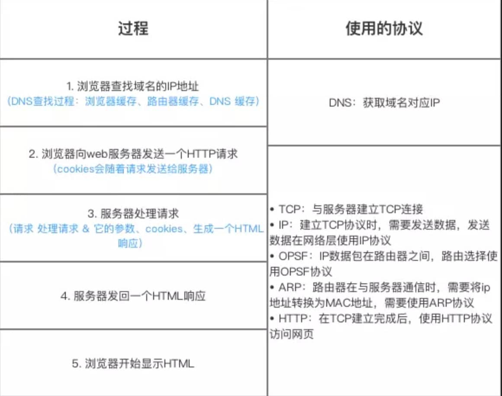

> 上图有一个错误，请注意，是 OSPF 不是 OPSF。 OSPF（Open Shortest Path First，ospf）开放最短路径优先协议, 是由 Internet 工程任务组开发的路由选择协议

总体来说分为以下几个过程:

1. DNS 解析
2. TCP 连接
3. 发送 HTTP 请求
4. 服务器处理请求并返回 HTTP 报文
5. 浏览器解析渲染页面
6. 连接结束

详细：https://segmentfault.com/a/1190000006879700

> 三次握手四次挥手

如下图所示，下面的两个机器人通过 3 次握手确定了对方能正确接收和发送消息(图片来源：《图解 HTTP》)。


**简单示意图：**


- 客户端–发送带有 SYN 标志的数据包–一次握手–服务端
- 服务端–发送带有 SYN/ACK 标志的数据包–二次握手–客户端
- 客户端–发送带有带有 ACK 标志的数据包–三次握手–服务端

**详细示意图（图片来源不详）**

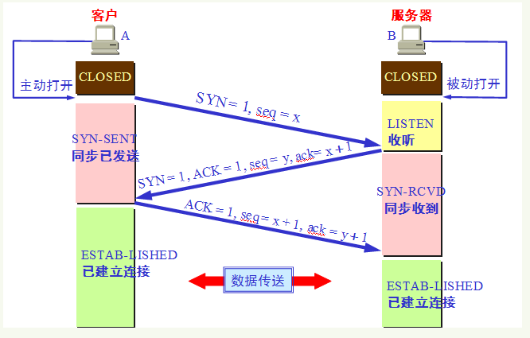

> tcp协议的四次挥手的详细过程（抖音）

建立一个 TCP 连接需要三次握手，而终止一个 TCP 连接要经过四次挥手（也有将四次挥手叫做四次握手的）。这是由于 TCP 的**半关闭**（half-close）特性造成的，TCP 提供了连接的一端在结束它的发送后还能接收来自另一端数据的能力。

TCP 连接的释放需要发送四个包（执行四个步骤），因此称为四次挥手(`Four-way handshake`)，**客户端或服务端均可主动发起挥手动作**。


回顾一下上图中符号的意思：

- `FIN` ：连接终止位
- `seq`：发送的第一个字节的序号
- `ACK`：确认报文段
- `ack`：确认号。希望收到的下一个数据的第一个字节的序号

刚开始双方都处于`ESTABLISHED` 状态，假设是客户端先发起关闭请求。四次挥手的过程如下：

**1）第一次挥手**：客户端发送一个 FIN 报文（请求连接终止：FIN = 1），报文中会指定一个序列号 seq = u。并**停止再发送数据，主动关闭 TCP 连接**。此时客户端处于 `FIN_WAIT1` 状态，等待服务端的确认。

`FIN-WAIT-1` - 等待远程TCP的连接中断请求，或先前的连接中断请求的确认；

**2）第二次挥手**：服务端收到 FIN 之后，会发送 ACK 报文，且把客户端的序号值 +1 作为 ACK 报文的序列号值，表明已经收到客户端的报文了，此时服务端处于 `CLOSE_WAIT` 状态。

`CLOSE-WAIT` - 等待从本地用户发来的连接中断请求；

**此时的 TCP 处于半关闭状态，客户端到服务端的连接释放**。客户端收到服务端的确认后，进入`FIN_WAIT2`（终止等待 2）状态，等待服务端发出的连接释放报文段。

`FIN-WAIT-2` - 从远程TCP等待连接中断请求；

**3）第三次挥手**：如果服务端也想断开连接了（没有要向客户端发出的数据），和客户端的第一次挥手一样，发送 FIN 报文，且指定一个序列号。此时服务端处于 `LAST_ACK` 的状态，等待客户端的确认。

`LAST-ACK` - 等待原来发向远程TCP的连接中断请求的确认；

**4）第四次挥手**：客户端收到 FIN 之后，一样发送一个 ACK 报文作为应答（ack = w+1），且把服务端的序列值 +1 作为自己 ACK 报文的序号值（seq=u+1），此时客户端处于 **`TIME_WAIT` （时间等待）状态**。

`TIME-WAIT` - 等待足够的时间以确保远程TCP接收到连接中断请求的确认；

🚨 注意 ！！！这个时候由服务端到客户端的 TCP 连接并未释放掉，**需要经过时间等待计时器设置的时间 2MSL（一个报文的来回时间） 后才会进入 `CLOSED` 状态**（这样做的目的是确保服务端收到自己的 ACK 报文。如果服务端在规定时间内没有收到客户端发来的 ACK 报文的话，服务端会重新发送 FIN 报文给客户端，客户端再次收到 FIN  报文之后，就知道之前的 ACK 报文丢失了，然后再次发送 ACK 报文给服务端）。服务端收到 ACK 报文之后，就关闭连接了，处于 `CLOSED` 状态。


> tcp协议的四次挥手当中第二步和第三步能否合并成一步

参考：https://www.zhihu.com/question/50646354

很多人有一个误区，即认为TCP连接是通信的全部，其实并不是这样，让我们来复习一下TCP连接断开的过程。

假定TCP client端主动发起断开连接

1. client端的application 接受用户断开TCP连接请求，这个是由用户触发的请求，以消息的方式到达client TCP
2. client TCP 发送 FIN=1 给 server 端 TCP
3. server 端TCP 接收到FIN=1 断开连接请求，需要咨询 application的意见，需要发消息给application，消息内容：对方要断开连接，请问您老人家还有数据要发送吗？如果有数据请告知，没有数据也请告知！然后就是等待application 的回应。既然需要等待application的回复，为何不早点把对client FIN 的ACK发出去呢？ 事实上TCP也是这么做的，收到对方的断开连接请求，立马发ACK予以确认，client --> server 方向连接断开。
4. 如果 server端有数据需要发送，则继续发送一直到数据发送完毕，然后application 发close消息给TCP，现在可以关闭连接，然后Server TCP 发FIN=1 断开 server -->client方向的连接。
   1. ·如果 server端没有数据发送，application回应close消息给TCP，现在可以关闭连接，然后Server TCP 发FIN=1 断开 server -->client方向的连接。


> 为什么要三次握手？ / 为什么不能两次握手

**三次握手的目的是建立可靠的通信信道，说到通讯，简单来说就是数据的发送与接收，而三次握手最主要的目的就是双方确认自己与对方的发送与接收是正常的。**

第一次握手：Client 什么都不能确认；Server 确认了对方发送正常，自己接收正常

第二次握手：Client 确认了：自己发送、接收正常，对方发送、接收正常；Server 确认了：对方发送正常，自己接收正常

第三次握手：Client 确认了：自己发送、接收正常，对方发送、接收正常；Server 确认了：自己发送、接收正常，对方发送、接收正常

所以三次握手就能确认双方收发功能都正常，缺一不可

> url 解析过程

不知道有没有同学会混淆域名和 URL 的概念，可以这样理解，URL 就是我们输入的网址，而网址里面含有域名。举个例子：`www.baidu.com/veal98` 是一个网址，而 `www.baidu.com` 就是服务器的域名。

URL 各元素的组成如下（当然，下述请求文件的路径名可以省略）：


这个 URL 请求的目标服务器上的文件路径就是：


那么首先，浏览器做的第一步就是解析 URL 得到里面的参数，将域名和需要请求的资源分离开来，从而了解需要请求的是哪个服务器，请求的是服务器上什么资源等等。


> 七层协议

**OSI 七层模型** 是国际标准化组织提出一个网络分层模型，其大体结构以及每一层提供的功能如下图所示：


每一层都专注做一件事情，并且每一层都需要使用下一层提供的功能比如传输层需要使用网络层提供的路由和寻址功能，这样传输层才知道把数据传输到哪里去。

**OSI 的七层体系结构概念清楚，理论也很完整，但是它比较复杂而且不实用，而且有些功能在多个层中重复出现。**

上面这种图可能比较抽象，再来一个比较生动的图片。下面这个图片是我在国外的一个网站上看到的，非常赞！


**既然 OSI 七层模型这么厉害，为什么干不过 TCP/IP 四 层模型呢？**

的确，OSI 七层模型当时一直被一些大公司甚至一些国家政府支持。这样的背景下，为什么会失败呢？我觉得主要有下面几方面原因：

1. OSI 的专家缺乏实际经验，他们在完成 OSI 标准时缺乏商业驱动力
2. OSI 的协议实现起来过分复杂，而且运行效率很低
3. OSI 制定标准的周期太长，因而使得按 OSI 标准生产的设备无法及时进入市场（20 世纪 90 年代初期，虽然整套的 OSI 国际标准都已经制定出来，但基于 TCP/IP 的互联网已经抢先在全球相当大的范围成功运行了）
4. OSI 的层次划分不太合理，有些功能在多个层次中重复出现。

OSI 七层模型虽然失败了，但是却提供了很多不错的理论基础。为了更好地去了解网络分层，OSI 七层模型还是非常有必要学习的。

最后再分享一个关于 OSI 七层模型非常不错的总结图片！


- Physical, Data Link, Network, Transport, Application
- 应用层：常见协议：
  - FTP(21 端口)：文件传输协议
  - SSH(22 端口)：远程登陆
  - TELNET(23 端口)：远程登录
  - SMTP(25 端口)：发送邮件
  - POP3(110 端口)：接收邮件
  - HTTP(80 端口)：超文本传输协议
  - DNS(53 端口)：运行在 UDP 上，域名解析服务
- 传输层：TCP/UDP
- 网络层：IP、ARP、NAT、RIP...

> TCP 的底层原理知道吗？TCP 是怎么实现通信的？


> TCP, UDP 协议的区别【腾讯光子工作室】

UDP 在传送数据之前不需要先建立连接，远地主机在收到 UDP 报文后，不需要给出任何确认。虽然 UDP 不提供可靠交付，但在某些情况下 UDP 却是一种最有效的工作方式（一般用于即时通信），比如： QQ 语音、 QQ 视频 、直播等等

TCP 提供面向连接的服务。在传送数据之前必须先建立连接，数据传送结束后要释放连接。 TCP 不提供广播或多播服务。由于 TCP 要提供可靠的，面向连接的传输服务（TCP 的可靠体现在 TCP 在传递数据之前，会有三次握手来建立连接，而且在数据传递时，有确认、窗口、重传、拥塞控制机制，在数据传完后，还会断开连接用来节约系统资源），这难以避免增加了许多开销，如确认，流量控制，计时器以及连接管理等。这不仅使协议数据单元的首部增大很多，还要占用许多处理机资源。TCP 一般用于文件传输、发送和接收邮件、远程登录等场景


> （长文）TCP 协议如何保证可靠传输【腾讯光子工作室】

短文回答参考：https://www.iamshuaidi.com/1298.html or https://github.com/wolverinn/Waking-Up/blob/master/Computer%20Network.md#TCP%E5%A6%82%E4%BD%95%E4%BF%9D%E8%AF%81%E4%BC%A0%E8%BE%93%E7%9A%84%E5%8F%AF%E9%9D%A0%E6%80%A7

下面是理解：

首先解释一下，什么是可靠传输：**可靠传输就是保证接收方收到的字节流和发送方发出的字节流是完全一样的**。

网络层是没有可靠传输机制的，尽自己最大的努力进行交付。而传输层使用 TCP 实现可靠传输，TCP 保证可靠传输的机制有如下几种：

- 1）校验和 Checksum（稍作了解即可）
- 2）序列号和确认应答机制（重要）
- 3）重传机制（重要）
- 4）流量控制（滑动窗口协议）（非常重要）
- 5）拥塞控制（重要）

以上除了校验和大家可以只稍作了解之外，其他都是非常重要的，务必烂熟于心


校验和

---

所谓 TCP 的校验和（Checksum）就是说：由发送端计算待发送 TCP 报文段的校验和，然后接收端对接收到的 TCP 报文段验证其校验和（TCP 的校验和是一个端到端的校验和）。**其目的是为了发现 TCP 的首部和数据在发送端到接收端之间是否发生了变动。如果接收方检测到校验和有差错，则该 TCP 报文段会被直接丢弃**。

关于校验和是如何计算和验证的，并非高频重点知识，本文就不详细解释了，感兴趣的童鞋可自行百度

TCP 在计算校验和时，需要加上一个 12 字节的**伪首部**。

其实 UDP 也有校验和机制，只不过是可选的，而 TCP 的校验和是必须的，TCP 和 UDP 在计算校验和时都需要加上一个 12 字节的伪首部。

解释下伪首部的概念，伪首部的数据是从 IP 数据报头获取的，共有 12 字节，包含如下信息：源 IP 地址、目的 IP 地址、保留字节 (置 0)、传输层协议号 (TCP 是 6)、TCP 报文长度 (首部 + 数据)：


**伪首部是为了增加 TCP 校验和的检错能力：如根据目的 IP 地址检查这个 TCP 报文是不是传给我的、根据传输层协议号检查传输层协议是否选对了...... 伪首部只在校验的时候使用**。


序列号和确认应答机制

---

TCP 报文段的首部中有一个序号字段：指的是该报文段第一个字节的序号（一个字节占一个序号）


确认应答机制就是**接收方收到 TCP 报文段后就会返回一个确认应答消息**：

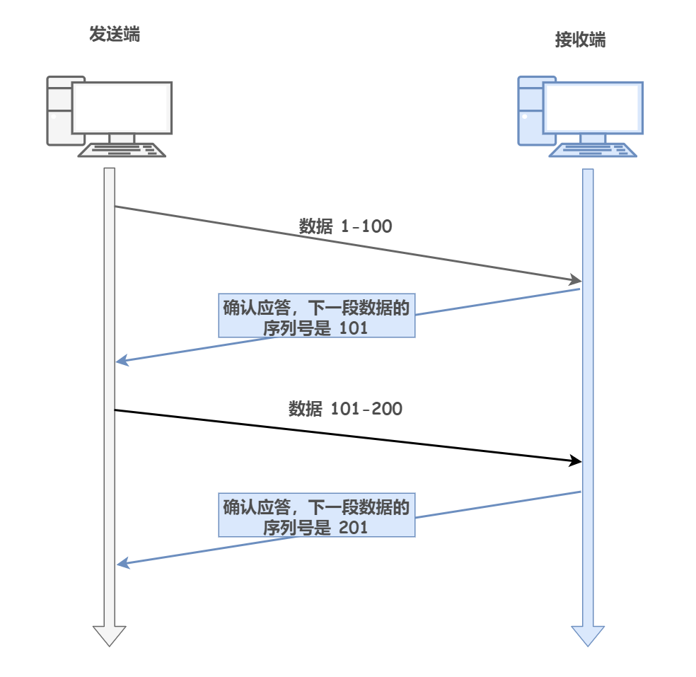

确认应答机制和重传机制不分家，两者紧密相连。


重传机制

---

在错综复杂的网络，并不一定能如上图那么顺利的传输报文，报文存在丢失的可能性。报文丢失的可能因素有很多种，包括应用故障，路由设备过载，或暂时的服务宕机。报文级别速度是很高的，**通常来说报文的丢失是暂时的，因此 TCP 能够发现和恢复报文丢失显得尤为重要**。

**重传机制**是 TCP 最基本的错误恢复功能，常见的重传机制有如下：

- 超时重传
- 快速重传


① 超时重传

大概一说到重传大家第一个想到的就是超时重传吧。超时重传就是 TCP 发送方在发送报文的时候，设定一个定时器，如果在规定的时间内没有收到接收方发来的 ACK 确认报文，发送方就会重传这个已发送的报文段。

对于发送方没有正确接收到接收方发来的 ACK 确认报文的情况，有以下两种（也就是在这两种情况下会发生超时重传）：

- 第一种情况：**报文段丢失**

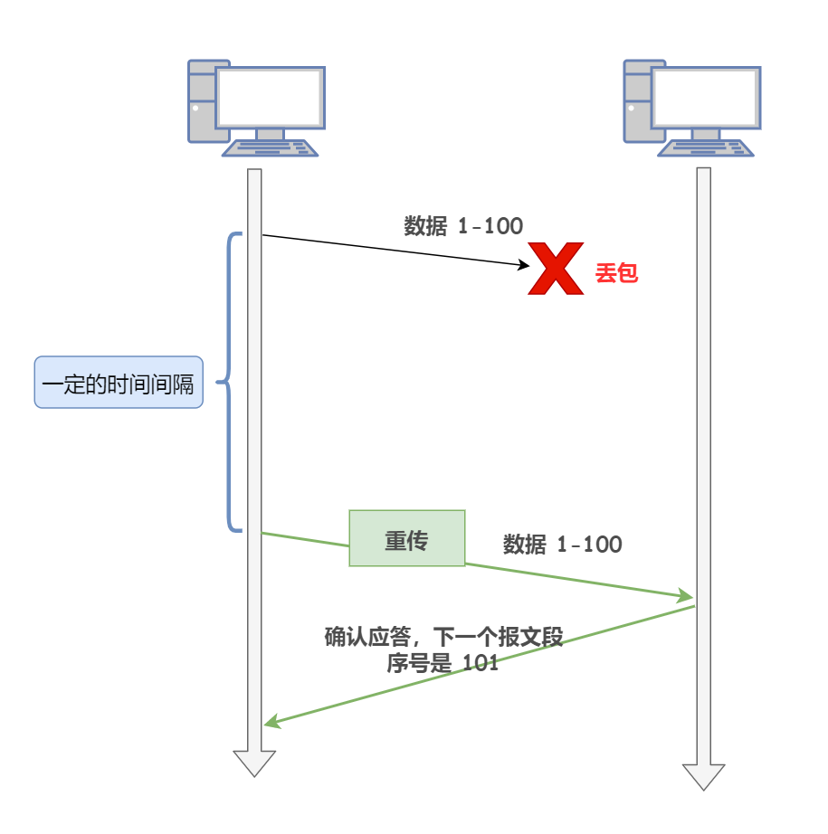

第二种情况：**接收方的 ACK 确认报文丢失**


超时重传时间我们一般用 **RTO**（Retransmission Timeout） 来表示，那么，这个 RTO 设置为多少最合适呢，也就是说经过多长时间进行重传最好？

在这之前，我们先讲解一下 **RTT（Round-Trip Time 往返时延）** 的概念：RTT 就是**数据从网络一端传送到另一端所需的时间**，也就是报文段的往返时间。


显然，⭐ **超时重传时间 RTO 的值应该略大于报文往返  RTT 的值**：

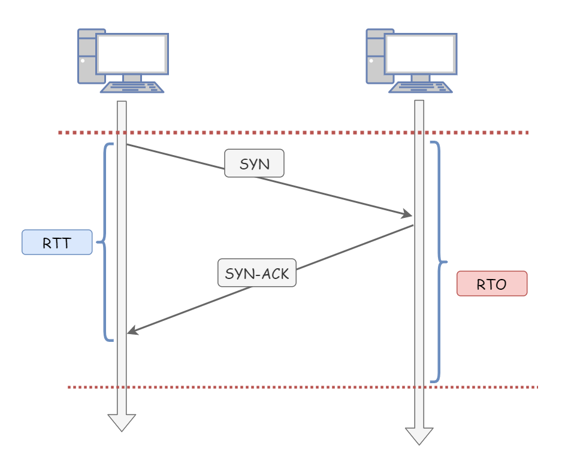

可以假想一下，如果超时重传时间 RTO 远大于或小于 RTT，会发生什么情况：

- **RTO 远大于 RTT**：网络的空闲时间增大，降低了网络传输效率

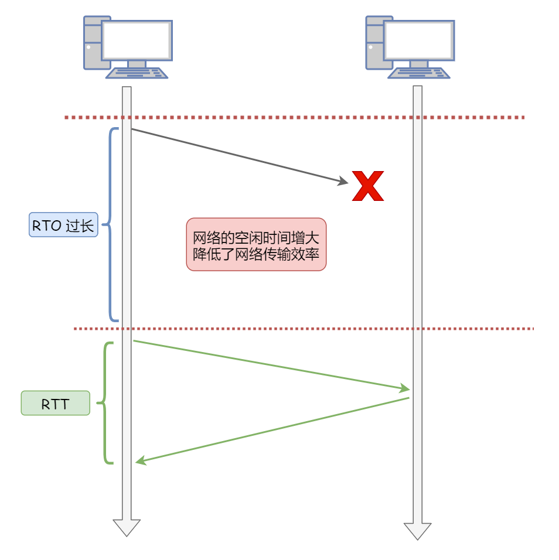

**RTO 小于 RTT**：不必要的重传，导致网络负荷增大


如果超时重传的数据又超时了该怎么办呢？TCP 的策略是**重传的超时间隔加倍**。

也就是说，**每进行一次超时重传，都会将下一次重传的超时时间间隔设为先前值的两倍**。

超时触发重传存在的问题是，超时周期可能相对较长。**有没有一种机制可以减少超时重传的等待时间呢**？于是 「快速重传」 机制应运而生


② 快速重传

**快速重传（Fast Retransmit）机制不以时间为驱动，而是以数据驱动重传**。

快速重传机制的原理：每当接收方收到比期望序号大的失序报文段到达时，就向发送方发送一个**冗余 ACK**，指明下一个期待字节的序号。

举个例子：发送方已经发送 1、2、3、4、5报文段

- 接收方收到报文段 1，返回 1 的 ACK 确认报文（确认号为报文段 2 的第一个字节）
- 接收方收到报文段 3，仍然返回 1 的 ACK 确认报文（确认号为报文段 2 的第一个字节）
- 接收方收到报文段 4，仍然返回 1 的 ACK 确认报文（确认号为报文段 2 的第一个字节）
- 接收方收到报文段 5，仍然返回 1 的 ACK 确认报文（确认号为报文段 2 的第一个字节）
- **接收方收到 3 个对于报文段 1 的冗余 ACK，认为报文段 2 丢失，于是重传报文段 2**
- 最后，接收方收到了报文段 2，此时因为报文段 3、4、5 都收到了，所以返回 5 的 ACK 确认报文（确认号为报文段 6 的第一个字节）

一图胜千言：


滑动窗口协议

---

可以说不知道滑动窗口协议 = 不知道 TCP。该知识点的分量之重，大家一定好好把握。

① 累积确认

上文讲快速重传的时候，不知道大家有没有注意到这句话 “最后，接收方收到了报文段 2，此时因为报文段 3、4、5 都收到了，所以返回 6 的 ACK 确认报文 ”。

**为什么这里会直接返回报文段 6 的确认应答呢**，之前我们不是说每发送一个 TCP 报文段，就进行一次确认应答吗（只有收到了上一个报文段的确认应答后才能发送下一个报文段的）？按照这个模式，我们应该先返回报文段 3 的确认应答啊。

其实只有收到了上一个报文段的确认应答后才能发送下一个报文段的这种模式效率非常低下。每个报文段的往返时间越长，网络的吞吐量就越低，通信的效率就越低。

举个例子：如果你说完一句话，我在处理其他事情，没有及时回复你，你就等着我做完其他事情后回复你，你才能说下一句话，很显然这不现实。

为此，TCP 引入了 **窗口** 的概念。对于发送方来说，窗口大小就是指**无需等待确认应答，可以连续发送数据的最大值**。

⭐ 窗口的实现实际上是操作系统开辟的一个**内核缓冲区**，发送方在等待确认应答报文返回之前，必须在缓冲区中保留已发送的数据。如果在规定时间间隔内收到确认应答报文，就可以将数据从缓冲区中清除。

假设窗口大小为 `5` 个 TCP 段，那么发送方就可以「连续发送」 `5` 个 TCP 段

还是上面那个例子：发送方已经发送 1、2、3、4、5报文段

- 接收方收到报文段 1，返回 1 的 ACK 确认报文（确认号为报文段 2 的第一个字节）
- 接收方收到报文段 3，仍然返回 1 的 ACK 确认报文（确认号为报文段 2 的第一个字节）
- 接收方收到报文段 4，仍然返回 1 的 ACK 确认报文（确认号为报文段 2 的第一个字节）
- 接收方收到报文段 5，仍然返回 1 的 ACK 确认报文（确认号为报文段 2 的第一个字节）
- **发送方收到 3 个对于报文段 1 的冗余 ACK（or 等待超时），认为报文段 2 丢失，于是重传报文段 2**
- 最后，接收方收到了报文段 2，此时因为报文段 3、4、5 都收到了，所以返回 6 的 ACK 确认报文（确认号为报文段 6 的第一个字节）

简单说，**只要发送方收到了 ACK 600 的确认应答，就意味着第 600 字节之前的所有数据「接收方」都收到了**。这个模式就叫**累积确认**或者**累积应答**。


② 发送方的滑动窗口

先来看看发送方的窗口，下图就是发送方的数据，根据处理的情况分成四个部分：

- 已发送并收到 ACK 确认应答的数据
- 已发送但未收到 ACK 确认应答的数据
- 未发送但总大小在接收方处理范围内的数据
- 未发送但总大小超过接收方处理范围的数据


当发送方把数据全部发送出去后，可用窗口的大小就为 0 了，表明可用窗口耗尽，在没收到 ACK 确认之前无法继续发送数据：


当收到之前发送的数据 `32~36` 字节的 ACK 确认应答后，如果发送窗口的大小没有变化，则**滑动窗口往右边移动 5 个字节，因为有 5 个字节的数据被确认应答**，接下来 `52~56` 字节又变成了可用窗口，那么后续也就可以发送 `52~56` 这 5 个字节的数据了：

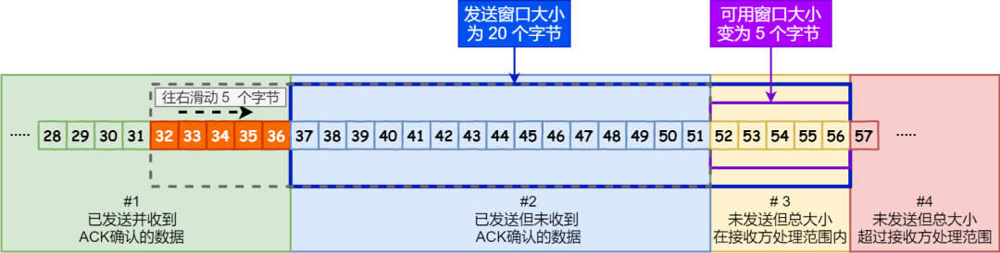

③ 接收方的滑动窗口

接收方的滑动窗口可分为三个部分：

- 已成功接收并确认的数据
- 未收到数据但可以接收的数据
- 未收到数据且不可以接收的数据（超出接收方窗口大小）


同样的，接收方的滑动窗口在成功接收并确认的数据后，窗口右移。


流量控制

---

想象一下这个场景：主机 A 一直向主机 B 发送数据，不考虑主机 B 的接收能力，则可能导致主机 B  的接收缓冲区满了而无法再接收数据，从而导致大量的数据丢包，引发重传机制。而在重传的过程中，若主机 B  的接收缓冲区情况仍未好转，则会将大量的时间浪费在重传数据上，降低传送数据的效率。

所以引入了流量控制机制，主机 B 通过告诉主机 A 自己接收缓冲区的大小，来使主机 A 控制发送的数据量。**总结来说：所谓流量控制就是控制发送方发送速率，保证接收方来得及接收**。

⭐ **TCP 实现流量控制主要就是通过 滑动窗口协议**。

上文我们提到了滑动窗口大小，但是没说窗口大小在哪里设置，其实这个和 TCP 报文首部中的 **窗口大小 Window** 字段有关。TCP 报文的首部格式，其中就有一个 16 位的 **窗口大小 Window** 字段：


该字段的含义是**指自己接收缓冲区的剩余大小**，于是发送端就可以根据这个接收端的处理能力来发送数据，而不会导致接收端处理不过来。

所以，通常来说**窗口大小是由接收方来决定的**。

💡 这段话大家一定要理解哦：接收端会在发送 ACK 确认应答报文时，将自己的即时窗口大小（接收窗口 `rwnd`）填入，并跟随 ACK 报文一起发送出去。而发送方根据接收到的 ACK 报文中的窗口大小的值改变自己的发送速度。如果接收到窗口大小的值为 0，那么发送方将停止发送数据。并定期的向接收端发送窗口探测数据段，提醒接收端把窗口大小告诉发送端。

一图胜前言：


拥塞控制

---

所谓拥塞就是说：在某段时间，对网络中某一资源的需求超过了该资源所能提供的可用部分（**即 需大于供**)，网络的性能变差。

如果网络出现拥塞，TCP 报文可能会大量丢失，此时就会大量触发重传机制，从而导致网络拥塞程度更高，严重影响传输。

其实只要「发送方」没有在规定时间内接收到 ACK 应答报文，也就是**触发了重传机制，就会认为网络出现了拥塞。**

因此当出现拥塞时，应当控制发送方的速率。这一点和流量控制很像，但是**出发点不同**。

流量控制是为了让接收方能来得及接收，而拥塞控制是为了降低整个网络的拥塞程度，**防止过多的数据注入到网络中。**

为了调节发送方所要发送数据的量，定义了「**拥塞窗口** `cwnd`」的概念。拥塞窗口是发送方维护的一个状态变量，它会根据**网络的拥塞程度动态变化**：

- 只要网络中出现了拥塞，`cwnd` 就会减少
- 若网络中没有出现拥塞，`cwnd` 就会增大

在引入拥塞窗口概念之前，发送窗口大小和接收窗口大小基本是相等的关系（取决于接收窗口大小）。**引入拥塞窗口后，发送窗口的大小就等于拥塞窗口和接收窗口的最小值**。

TCP 的拥塞控制采用了四种算法：

- 慢开始
- 拥塞避免
- 快重传
- 快恢复

下面详细讲解这四种算法 👇

① 慢开始

**慢开始**的思路就是：TCP 在刚建立连接完成后，如果立即把大量数据字节注入到网络，那么很有可能引起网络阻塞。好的方法是先探测一下，一点一点的提高发送数据包的数量，即由小到大逐渐增大拥塞窗口数值。**cwnd 初始值为 1，每经过一个传播轮次，cwnd 加倍**（指数增长）。


当然不能一直执行慢启动，这里会设置一个**慢启动轮限 ssthresh** 状态变量：

- 当 `cwnd < ssthresh` 时，继续使用慢启动算法
- 当 `cwnd >= ssthresh` 时，开始使用「拥塞避免算法」

② 拥塞避免

拥塞避免算法的思路是让拥塞窗口 cwnd 缓慢增大，即每经过一个往返时间 cwnd 加 1


🚨 注意，无论是慢开始阶段还是拥塞避免，只要出现了网络拥塞（**触发超时重传机制**），慢开始轮限 `sshresh` 和 拥塞窗口大小 `cwnd` 的值会发生变化（乘法减小）：

- `ssthresh` 设为 `cwnd/2`
- `cwnd` 重置为 `1`

由于拥塞窗口大小重置为 1 了，所以就会重新开始执行慢启动算法。


③ 快重传和快恢复

快速重传和快速恢复算法一般同时使用。

当触发快速重传机制，即接收方收到三个重复的 ACK 确认的时候，就会执行快重传算法（触发快速重传机制和超时重传机制的情况不同，TCP 认为触发快速重传的情况并不严重，因为大部分没丢，只丢了一小部分），快速重传做的事情有：

- `cwnd = cwnd/2`
- `ssthresh = cwnd`
- 重新进入拥塞避免阶段

后来的 “快速恢复” 算法是在上述的“快速重传”算法后添加的，当收到 3 个重复ACK时，TCP 最后进入的不是拥塞避免阶段，而是快速恢复阶段。

快速恢复的思想是“**数据包守恒**”原则，即同一个时刻在网络中的数据包数量是恒定的，只有当“老”数据包离开了网络后，才能向网络中发送一 个“新”的数据包，如果发送方收到一个重复的 ACK，那么根据 TCP 的 ACK 机制就表明有一个数据包离开了网络，于是 `cwnd` 加 1。如果能够严格按照该原则那么网络中很少会发生拥塞，事实上拥塞控制的目的也就在修正违反该原则的地方。

具体来说快速恢复的主要步骤是：

- 把 `cwnd` 设置为 `ssthresh` 的值加 3，然后重传丢失的报文段，加 3 的原因是因为收到 3 个重复的 ACK，表明有 3 个“老”的数据包离开了网络。
- 再收到重复的 ACK 时，拥塞窗口 `cwnd` 增加 1
- 当收到新的数据包的 ACK 时，把 `cwnd` 设置为第一步中的 `ssthresh` 的值。原因是因为该 ACK 确认了新的数据，说明从重复 ACK 时的数据都已收到，该恢复过程已经结束，可以回到恢复之前的状态了，也即再次进入拥塞避免状态。


> TCP 和 HTTP 有什么区别？

- HTTP 通常使用 80 端口 — 这是服务器“监听”或是从 Web 客户端接收的端口。 而 TCP 不需要监听端口来工作。
- 与 TCP 相比，HTTP 更快，因为它以更高的速度运行并立即执行该过程。 TCP 相对较慢。
- TCP 告诉目标计算机哪个应用程序应该接收数据并确保正确传递所述数据，而 HTTP 通常 用于在 Internet 上搜索和查找所需的文档。
- TCP 包含有关已收到或尚未收到哪些数据的信息，而 HTTP 包含有关在收到数据后如何读取和处理数据的具体说明。
- TCP 管理数据流，而 HTTP 描述流中的数据包含什么。
- TCP 作为三向通信协议运行，而 HTTP 是单向协议。

> TCP 的 accept()函数发生在第几次握手（腾讯）

发生在三次握手之后

> 讲一下 http：结构，和 tcp 关系等，状态码有什么

结构

---

HTTP的名字「超文本协议传输」，它可以拆成三个部分：

- 超文本
- 传输
- 协议


关系

---

​	**TPC/IP协议是传输层协议，主要解决数据如何在网络中传输，而HTTP是应用层协议，主要解决如何包装数据。**关于TCP/IP和HTTP协议的关系，网络有一段比较容易理解的介绍：“我们在传输数据时，可以只使用（传输层）TCP/IP协议，但是那样的话，如果没有应用层，便无法识别数据内容，如果想要使传输的数据有意义，则必须使用到应用层协议，应用层协议有很多，比如HTTP、FTP、TELNET等，也可以自己定义应用层协议。WEB使用HTTP协议作应用层协议，以封装HTTP 文本信息，然后使用TCP/IP做传输层协议将它发到网络上。”

​	把**IP想像成一种高速公路**，它允许其它协议在上面行驶并找到到其它电脑的出口。**TCP和UDP是高速公路上的“卡车”，它们携带的货物就是像HTTP**，文件传输协议FTP这样的协议等。 


状态码

---


`1xx` 类状态码属于**提示信息**，是协议处理中的一种中间状态，实际用到的比较少。

`2xx` 类状态码表示服务器**成功**处理了客户端的请求，也是我们最愿意看到的状态。

- 「**200 OK**」是最常见的成功状态码，表示一切正常。如果是非 `HEAD` 请求，服务器返回的响应头都会有 body 数据。
- 「**204 No Content**」也是常见的成功状态码，与 200 OK 基本相同，但响应头没有 body 数据。
- 「**206 Partial Content**」是应用于 HTTP 分块下载或断点续传，表示响应返回的 body 数据并不是资源的全部，而是其中的一部分，也是服务器处理成功的状态。

`3xx` 类状态码表示客户端请求的资源发生了变动，需要客户端用新的 URL 重新发送请求获取资源，也就是**重定向**。

- 「**301 Moved Permanently**」表示永久重定向，说明请求的资源已经不存在了，需改用新的 URL 再次访问。
- 「**302 Found**」表示临时重定向，说明请求的资源还在，但暂时需要用另一个 URL 来访问。

301 和 302 都会在响应头里使用字段 `Location`，指明后续要跳转的 URL，浏览器会自动重定向新的 URL。

- 「**304 Not Modified**」不具有跳转的含义，表示资源未修改，重定向已存在的缓冲文件，也称缓存重定向，也就是告诉客户端可以继续使用缓存资源，用于缓存控制。

`4xx` 类状态码表示客户端发送的**报文有误**，服务器无法处理，也就是错误码的含义。

- 「**400 Bad Request**」表示客户端请求的报文有错误，但只是个笼统的错误。
- 「**403 Forbidden**」表示服务器禁止访问资源，并不是客户端的请求出错。
- 「**404 Not Found**」表示请求的资源在服务器上不存在或未找到，所以无法提供给客户端。

`5xx` 类状态码表示客户端请求报文正确，但是**服务器处理时内部发生了错误**，属于服务器端的错误码。

- 「**500 Internal Server Error**」与 400 类型，是个笼统通用的错误码，服务器发生了什么错误，我们并不知道。
- 「**501 Not Implemented**」表示客户端请求的功能还不支持，类似“即将开业，敬请期待”的意思。
- 「**502 Bad Gateway**」通常是服务器作为网关或代理时返回的错误码，表示服务器自身工作正常，访问后端服务器发生了错误。
- 「**503 Service Unavailable**」表示服务器当前很忙，暂时无法响应客户端，类似“网络服务正忙，请稍后重试”的意思

> HTTP 和 HTTPs 的区别

- **端口号** ：HTTP 默认是 80，HTTPS 默认是 443。
- **URL 前缀** ：HTTP 的 URL 前缀是 `http://`，HTTPS 的 URL 前缀是 `https://`。
- **安全性和资源消耗** ： HTTP 协议运行在 TCP 之上，所有传输的内容都是明文，客户端和服务器端都无法验证对方的身份。HTTPS 是运行在 SSL/TLS 之上的 HTTP 协议，SSL/TLS 运行在 TCP 之上。所有传输的内容都经过加密，加密采用对称加密，但对称加密的密钥用服务器方的证书进行了非对称加密。所以说，HTTP 安全性没有 HTTPS 高，但是 HTTPS 比 HTTP 耗费更多服务器资源。

> HTTPS 加密过程

HTTP 有以下安全性问题:

- 使用明文进行通信，内容可能会被窃听；
- 不验证通信方的身份，通信方的身份有可能遭遇伪装；
- 无法证明报文的完整性，报文有可能遭篡改。

HTTPs 并不是新协议，而是让 HTTP 先和 SSL(Secure Sockets Layer)通信，再由 SSL 和 TCP 通信，也就是说 HTTPs 使用了隧道进行通信。

通过使用 SSL，HTTPs 具有了加密(防窃听)、认证(防伪装)和完整性保护(防篡改)。


加密

---

1. 对称密钥加密

对称密钥加密(Symmetric-Key Encryption)，加密和解密使用同一密钥。

- 优点: 运算速度快；
- 缺点: 无法安全地将密钥传输给通信方。


2. 非对称密钥加密

非对称密钥加密，又称公开密钥加密(Public-Key Encryption)，加密和解密使用不同的密钥。

公开密钥所有人都可以获得，通信发送方获得接收方的公开密钥之后，就可以使用公开密钥进行加密，接收方收到通信内容后使用私有密钥解密。

非对称密钥除了用来加密，还可以用来进行签名。因为私有密钥无法被其他人获取，因此通信发送方使用其私有密钥进行签名，通信接收方使用发送方的公开密钥对签名进行解密，就能判断这个签名是否正确。

- 优点: 可以更安全地将公开密钥传输给通信发送方；
- 缺点: 运算速度慢。

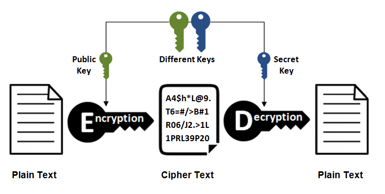

3. 【答案】HTTPs 采用的加密方式

HTTPs 采用混合的加密机制，使用非对称密钥加密用于传输对称密钥来保证传输过程的安全性，之后使用对称密钥加密进行通信来保证通信过程的效率。(下图中的 Session Key 就是对称密钥)

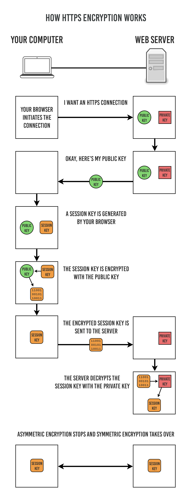

简化版本

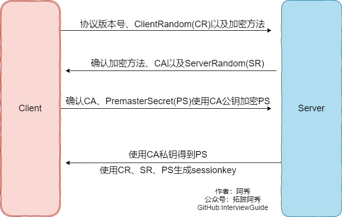

> https 数字证书交换的过程详细说一下？

数字证书认证机构(CA，Certificate Authority)是客户端与服务器双方都可信赖的第三方机构。

服务器的运营人员向 CA 提出公开密钥的申请，CA 在判明提出申请者的身份之后，会对已申请的公开密钥做数字签名，然后分配这个已签名的公开密钥，并将该公开密钥放入公开密钥证书后绑定在一起。

进行 HTTPs 通信时，服务器会把证书发送给客户端。客户端取得其中的公开密钥之后，先使用数字签名进行验证，如果验证通过，就可以开始通信了。

通信开始时，客户端需要使用服务器的公开密钥将自己的私有密钥传输给服务器，之后再进行对称密钥加密。

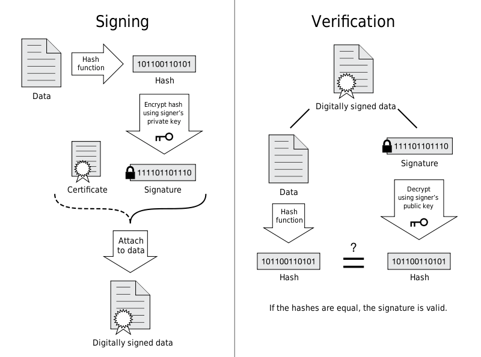

> DNS 解析过程，给个 URL 一层一层具体分析

.com.fi 国际金融域名 DNS 解析的步骤一共分为 9 步，如果每次解析都要走完 9 个步骤，大家浏览网站的速度也不会那么快，现在之所以能保持这么快的访问速度，其实一般的解析都是跑完第 4 步就可以了。除非一个地区完全是第一次访问（在都没有缓存的情况下）才会走完 9 个步骤，这个情况很少。

- 1、本地客户机提出域名解析请求，查找本地 HOST 文件后将该请求发送给本地的域名服务器。
- 2、将请求发送给本地的域名服务器。
- 3、当本地的域名服务器收到请求后，就先查询本地的缓存。
- 4、如果有该纪录项，则本地的域名服务器就直接把查询的结果返回浏览器。
- 5、如果本地 DNS 缓存中没有该纪录，则本地域名服务器就直接把请求发给根域名服务器。
- 6、然后根域名服务器再返回给本地域名服务器一个所查询域（根的子域）的主域名服务器的地址。
- 7、本地服务器再向上一步返回的域名服务器发送请求，然后接受请求的服务器查询自己的缓存，如果没有该纪录，则返回相关的下级的域名服务器的地址。
- 8、重复第 7 步，直到找到正确的纪录。
- 9、本地域名服务器把返回的结果保存到缓存，以备下一次使用，同时还将结果返回给客户机。


注意事项：

**递归查询**：在该模式下 DNS 服务器接收到客户机请求，必须使用一个准确的查询结果回复客户机。如果 DNS 服务器本地没有存储查询 DNS 信息，那么该服务器会询问其他服务器，并将返回的查询结果提交给客户机。

**迭代查询**：DNS 所在服务器若没有可以响应的结果，会向客户机提供其他能够解析查询请求的 DNS 服务器地址，当客户机发送查询请求时，DNS 服务器并不直接回复查询结果，而是告诉客户机另一台 DNS 服务器地址，客户机再向这台 DNS 服务器提交请求，依次循环直到返回查询的结果为止。

> 7 层网络，4 层网络，5 层网络，各层有哪些协议

OSI7 层：应用层（Application）、表示层（Presentation）、会话层（Session）、传输层（Transport）、网络层（Network）、数据链路层（Data Link）、物理层（Physical）

4 层是指 TCP/IP 四层模型，主要包括：应用层、运输层、网际层和网络接口层。

5 层（五层协议只是 OSI 和 TCP/IP 的综合，实际应用还是 TCP/IP 的四层结构）：应用层、运输层、网络层、数据链路层和物理层。

协议参考图：


> 已经封装好的消息，不考虑 DNS 等，怎么寻址

> 局域网内怎么寻址，网关怎么找到

> 网际路由协议，怎么确定最短路由

> DNS（DNS 过程，DNS 负载均衡）

解析过程（参照上面问题：DNS 解析过程，给个 URL 一层一层具体分析）

**DNS 负载均衡**

最早的负载均衡技术，利用域名解析实现负载均衡，在 DNS 服务器，配置多个 A 记录，这些 A 记录对应的服务器构成集群。大型网站总是部分使用 DNS 解析，作为第一级负载均衡。如下图：

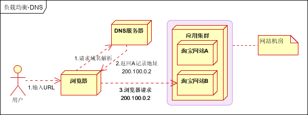

**实践建议**

将 DNS 作为第一级负载均衡，A 记录对应着内部负载均衡的 IP 地址，通过内部负载均衡将请求分发到真实的 Web 服务器上。一般用于互联网公司，复杂的业务系统不合适使用。如下图：


> 第三次握手失败会发生什么

第三次握手失败后：  

1. 在第二次握手，服务器端向客户端发送SYN+ACK报文后，就会启动一个定时器，等待客户端返回的ACK报文。  
2. 如果第三次握手失败的话，客户端给服务端返回了ACK报文，服务端并不能收到这个ACK报文。那么服务端就会启动超时重传机制，超过规定时间后重新发起第二次握手，向客户端发送SYN+ACK。重传次数根据/proc/sys/net/ipv4/tcp_synack_retries来指定，默认是5次。  
3. 如果重传指定次数到了后，仍然未收到ACK应答，那么一段时间后，服务端会自动关闭这个连接。但客户端认为这个连接已经建立，如果客户端向服务端写数据，服务端将回应RST包、强制关闭TCP连接，以防止SYN攻击。  

扩展：TCP为什么需要第三次握手？

https://www.iamshuaidi.com/675.html

原因： 

  1）两次握手是最基本的，一般情况下能保证tcp连接正常进行。

   2）需要第三次握手是为了防止已失效的请求报文段突然又传送到了服务端而产生连接的误判 。  

​      假如没有第三次握手，服务端接收到失效的请求报文段就会认为连接已建立，从而进入等待客户端发送数据的状态。但客户端并没有发出请求，所以不会发送数据。于是服务端就会一直处于等待状态，从而浪费资源。


## 系统设计

### 场景题

> 很多短任务线程，选择 synchronized 还是 lock（2022-04-11 携程）


> 多个人给一个主播打赏怎么设计？我说是一个高并发写的操作，对一个记录频繁写，分批操作，比如 10 个记录 操作一次。他说这个方案可以 但是有 100 个记录 怎么去做一个一个操作呢？我说如果在一个进程可以 分多个线程分批。他说还是不够快 我们是用的 MQ 多个消费者 一个打赏就发一个消息 （2022-6-3   58同城）

## 安全

> 讲讲 JWT

JWT（Json Web Token）, 是为了在网络应用环境间传递声明而执行的一种基于 JSON 的开放标准。JWT 一般被用来在身份提供者和服务提供者间传递被认证的用户身份信息，以便于从资源服务器获取资源，也可以增加一些额外的其它业务逻辑所必须的声明信息，该 token 也可直接被用于认证，也可被加密。

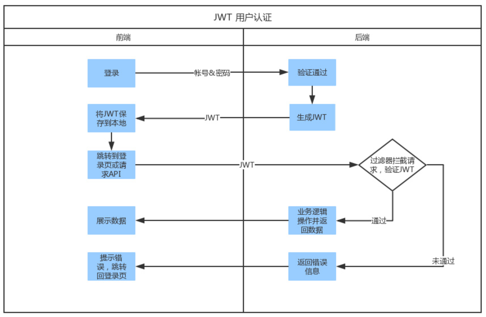

一般用它来替换掉 Session 实现数据共享。

使用基于 Token 的身份验证方法，在服务端不需要存储用户的登录记录。大概的流程是这样的：

- 1、客户端通过用户名和密码登录服务器；
- 2、服务端对客户端身份进行验证；
- 3、服务端对该用户生成 Token，返回给客户端；
- 4、客户端将 Token 保存到本地浏览器，一般保存到 cookie 中；
- 5、客户端发起请求，需要携带该 Token；
- 6、服务端收到请求后，首先验证 Token，之后返回数据。


如上图为 Token 实现方式，浏览器第一次访问服务器，根据传过来的唯一标识 userId，服务端会通过一些算法，如常用的 HMAC-SHA256 算法，然后加一个密钥，生成一个 token，然后通过 BASE64 编码一下之后将这个 token 发送给客户端；客户端将 token 保存起来，下次请求时，带着 token，服务器收到请求后，然后会用相同的算法和密钥去验证 token，如果通过，执行业务操作，不通过，返回不通过信息。

可以对比下图 session 实现方式，流程大致一致。


**优点**：

- 无状态、可扩展 ：在客户端存储的 Token 是无状态的，并且能够被扩展。基于这种无状态和不存储 Session 信息，负载均衡器能够将用户信息从一个服务传到其他服务器上。
- 安全：请求中发送 token 而不再是发送 cookie 能够防止 CSRF(跨站请求伪造)。
- 可提供接口给第三方服务：使用 token 时，可以提供可选的权限给第三方应用程序。
- 多平台跨域

JWT 可以用在单点登录的系统中

传统的 JavaWeb 项目，利用 HttpSession 保存用户的登陆凭证。如果后端系统采用了负载均衡设计，当用户在 A 节点成功登陆，那么登陆凭证保存在 A 节点的 HttpSession 中。如果用户下一个请求被负载均衡到了 B 节点，因为 B 节点上面没有用户的登陆凭证，所以需要用户重新登录，这个体验太糟糕了。


如果用户的登陆凭证经过加密（`Token`）保存在客户端，客户端每次提交请求的时候，把`Token`上传给后端服务器节点。即便后端项目使用了负载均衡，每个后端节点接收到客户端上传的 Token 之后，经过检测，是有效的`Token`，于是就断定用户已经成功登陆，接下来就可以提供后端服务了。


JWT 兼容更多的客户端

传统的`HttpSession`依靠浏览器的`Cookie`存放`SessionId`，所以要求客户端必须是浏览器。现在的 JavaWeb 系统，客户端可以是浏览器、APP、小程序，以及物联网设备。为了让这些设备都能访问到 JavaWeb 项目，就必须要引入 JWT 技术。JWT 的`Token`是纯字符串，至于客户端怎么保存，没有具体要求。只要客户端发起请求的时候，附带上`Token`即可。所以像物联网设备，我们可以用`SQLite`存储`Token`数据。

> RBAC 是什么？怎么实现的？

RBAC 的基本思想是，对系统操作的各种权限不是直接授予具体的用户，而是在用户集合与权限集合之间建立一个角色集合。每一种角色对应一组相应的权限。一旦用户被分配了适当的角色后，该用户就拥有此角色的所有操作权限。这样做的好处是，不必在每次创建用户时都进行分配权限的操作，只要分配用户相应的角色即可，而且角色的权限变更比用户的权限变更要少得多，这样将简化用户的权限管理，减少系统的开销。


RBAC 模型中的权限是由模块和行为合并在一起而产生的，在 MySQL 中，有`模块表（tb_module）`和`行为表（tb_action）`，这两张表的记录合并在一起就行程了权限记录，保存在`权限表（tb_permission）`中。


现在知道了权限记录是怎么来的，下面我们看看怎么把权限关联到角色中。传统一点的做法是创建一个交叉表，记录角色拥有什么权限。但是现在`MySQL5.7`之后引入了`JSON`数据类型，所以我在`角色表（tb_role）`中设置的 permissions 字段，类型是 JSON 格式的。


到目前为止，JSON 类型已经支持索引机制，所以我们不用担心存放在 JSON 字段中的数据检索速度慢了。MySQL 为 JSON 类型配备了很多函数，我们可以很方便的读写 JSON 字段中的数据。

接下来我们看看角色是怎么关联到用户的，其实我在`用户表（tb_user）`上面设置 role 字段，类型依旧是 JSON 的。这样我就可以把多个角色关联到某个用户身上了。


如何查询用户的权限列表？

```sql
<select id="searchUserPermissions" parameterType="int" resultType="String">
    SELECT p.permission_name
    FROM tb_user u
    JOIN tb_role r ON JSON_CONTAINS(u.role, CAST(r.id AS CHAR))
    JOIN tb_permission p ON JSON_CONTAINS(r.permissions, CAST(p.id AS CHAR))
    WHERE u.id = #{userId} AND u.status = 1;
</select>
```

## 设计模式

> 你能说说设计模式吗

24 大设计模式和 7 个原则

7 个原则

单一职责原则【SINGLE RESPONSIBILITY PRINCIPLE】: 一个类负责一项职责。

里氏替换原则【LISKOV SUBSTITUTION PRINCIPLE】: 继承与派生的规则。

依赖倒置原则【DEPENDENCE INVERSION PRINCIPLE】: 高层模块不应该依赖低层模块，二者都应该依赖其抽象；抽象不应该依赖细节；细节应该依赖抽象。即针对接口编程，不要针对实现编程。

接口隔离原则【INTERFACE SEGREGATION PRINCIPLE】: 建立单一接口，不要建立庞大臃肿的接口，尽量细化接口，接口中的方法尽量少。

迪米特法则【LOW OF DEMETER】: 低耦合，高内聚。

开闭原则【OPEN CLOSE PRINCIPLE】: 一个软件实体如类、模块和函数应该对扩展开放，对修改关闭。

组合/聚合复用原则【Composition/Aggregation Reuse Principle(CARP) 】: 尽量使用组合和聚合少使用继承的关系来达到复用的原则

24 大设计模式


> 为什么设计模式更好，你能说说用和不用的区别吗


> 设计模式？哪些框架有设计模式？每个模式是什么样的？


> 会什么设计模式，讲一下模板方法设计模式，应用


## 问题解答选取的 github 仓库

如果不是在 github 上查找到的答案会给予标注

1. https://github.com/Snailclimb/JavaGuide 「Java 学习+面试指南」一份涵盖大部分 Java 程序员所需要掌握的核心知识。准备 Java 面试，首选 JavaGuide！
1. [Java 全栈知识体系](https://www.pdai.tech/)
1. https://github.com/rbmonster/learning-note java 开发 面试八股文（个人的面试及工作总结）
1. https://github.com/CoderLeixiaoshuai/java-eight-part 『Java 八股文』Java 面试套路
1. https://github.com/doocs/advanced-java 互联网 Java 工程师进阶知识完全扫盲
1. https://www.iamshuaidi.com/ 帅地玩编程
1. https://github.com/xiaolincoder/CS-Base 小林 x 图解计算机基础
