[TOC]

## :fallen_leaf: 八股文精选集

整理自

1. 吴师兄的1000道Java 程序员必备面试题-V1版
2. JavaGuide突击版
3. 面试鸭
4. 小林coding
5. Java 全栈知识体系
6. CS-Wiki
7. Java 程序员进阶之路

选取理由：本着查缺补漏的木桶原理，只选取高频（:star:、🌠、🌟、✨、💫、🎇、🔥）和不会的，方便面试突袭


## :coffee: Java基础

### Java 8的接⼝新增了哪些特性？

增加了default⽅法和static⽅法，这2种⽅法可以有⽅法体


### 重载和重写的区别？

发生在同一个类中，方法名必须相同，参数类型不同、个数不同、顺序不同，方法返回值和访问
修饰符可以不同。
下面是《Java 核心技术》对重载这个概念的介绍：

综上：重载就是同一个类中多个同名方法根据不同的传参来执行不同的逻辑处理。
重写：
重写发生在运行期，是子类对父类的允许访问的方法的实现过程进行重新编写。

1. 返回值类型、方法名、参数列表必须相同，抛出的异常范围小于等于父类，访问修饰符范围
   大于等于父类。
2. 如果父类方法访问修饰符为 private/final/static 则子类就不能重写该方法，但是被 static 修饰
   的方法能够被再次声明。
3. 构造方法无法被重写
   综上：重写就是子类对父类方法的重新改造，外部样子不能改变，内部逻辑可以改变

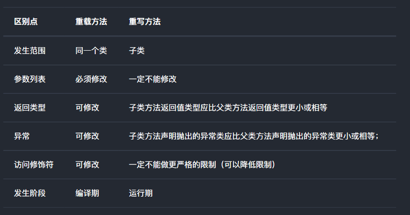


### 内部类了解吗？

在Java中，可以将⼀个类的定义放在另外⼀个类的定义内部，这就是 内部类 。内部类本身就 是类的⼀
个属性，与其他属性定义⽅式⼀致。

内部类可以分为四种：

成员内部类：在一个类中直接定义的内部类，成员内部类与普通类的成员没什么区别，可以与普通成员一样进行修饰和限制。

```java
class Circle {
    double radius = 0;
     
    public Circle(double radius) {
        this.radius = radius;
    }
     
    class Draw {     //内部类
        public void drawSahpe() {
            System.out.println("drawshape");
        }
    }
}
```

局部内部类：在方法中定义的内部类称为局部内部类。与局部变量类似

```java
class People{
    public People() {
         
    }
}
 
class Man{
    public Man(){
         
    }
     
    public People getWoman(){
        class Woman extends People{   //局部内部类
            int age =0;
        }
        return new Woman();
    }
}
```

匿名内部类：匿名内部类就是没有名字的内部类

静态内部类（**嵌套类**）：如果你不需要内部类对象与其外围类对象之间有联系，那你可以将内部类声明为static

```java
public class Test {
    public static void main(String[] args)  {
        Outter.Inner inner = new Outter.Inner();
    }
}
 
class Outter {
    public Outter() {
         
    }
     
    static class Inner {
        public Inner() {
             
        }
    }
}
```


### HashSet 如何检查重复

思路整理：hashcode相同 -> equals() 不同-> hash再散列

1. 当你把对象加⼊HashSet时，HashSet会先计算对象的hashcode值来判断对象加⼊的位置，同时也会与其他已经加⼊的对象的hashcode值作⽐较
2. 如果没有相符的hashcode，HashSet会假设对象没有重复出现。但是**如果发现有相同hashcode值的对象，这时会调⽤equals()⽅法**来检查hashcode相等的对象是否真的相同
3. 如果两者相同，HashSet就不会让其加⼊操作成功。如果不同的话，就会重新散列到其他位置。这样我们就⼤⼤减少了equals的次数，相应就⼤⼤提⾼了执⾏速度。


### 构造⽅法有哪些特性？

* 名字与类名相同
* 没有返回值，但不能⽤void声明构造函数
* ⽣成类的对象时⾃动执⾏，⽆需调⽤


### final,static,this,super 关键字总结

#### static

**static 关键字主要有以下四种使用场景：**

1. **修饰成员变量和成员方法:** 被 static 修饰的成员属于类，不属于单个这个类的某个对象，被类中所有对象共享，可以并且建议通过类名调用。被 static 声明的成员变量属于静态成员变量，静态变量 存放在 Java 内存区域的方法区。调用格式：`类名.静态变量名` `类名.静态方法名()`
2. **静态代码块:** 静态代码块定义在类中方法外, 静态代码块在非静态代码块之前执行(静态代码块—>非静态代码块—>构造方法)。 该类不管创建多少对象，静态代码块只执行一次.
3. **静态内部类（static 修饰类的话只能修饰内部类）：** 静态内部类与非静态内部类之间存在一个最大的区别:  非静态内部类在编译完成之后会隐含地保存着一个引用，该引用是指向创建它的外围类，但是静态内部类却没有。没有这个引用就意味着：1.  它的创建是不需要依赖外围类的创建。2. 它不能使用任何外围类的非 static 成员变量和方法。
4. **静态导包(用来导入类中的静态资源，1.5 之后的新特性):** 格式为：`import static` 这两个关键字连用可以指定导入某个类中的指定静态资源，并且不需要使用类名调用类中静态成员，可以直接使用类中静态成员变量和成员方法。


#### final

**final 关键字，意思是最终的、不可修改的，最见不得变化 ，用来修饰类、方法和变量，具有以下特点：**

1. final 修饰的类不能被继承，final 类中的所有成员方法都会被隐式的指定为 final 方法；
2. final 修饰的方法不能被重写；
3. final 修饰的变量是常量，如果是基本数据类型的变量，则其数值一旦在初始化之后便不能更改；如果是引用类型的变量，则在对其初始化之后便不能让其指向另一个对象。

说明：使用 final 方法的原因有两个。第一个原因是把方法锁定，以防任何继承类修改它的含义；第二个原因是效率。在早期的 Java 实现版本中，会将  final 方法转为内嵌调用。但是如果方法过于庞大，可能看不到内嵌调用带来的任何性能提升（现在的 Java 版本已经不需要使用 final  方法进行这些优化了）。类中所有的 private 方法都隐式地指定为 final。


#### this

this 关键字用于引用类的当前实例。 例如：

```java
class Manager {
    Employees[] employees;
    void manageEmployees() {
        int totalEmp = this.employees.length;
        System.out.println("Total employees: " + totalEmp);
        this.report();
    }
    void report() { }
}
```

在上面的示例中，this 关键字用于两个地方：

- this.employees.length：访问类 Manager 的当前实例的变量。
- this.report（）：调用类 Manager 的当前实例的方法。

此关键字是可选的，这意味着如果上面的示例在不使用此关键字的情况下表现相同。 但是，使用此关键字可能会使代码更易读或易懂。


#### super 关键字

super 关键字用于从子类访问父类的变量和方法。 例如：

```java
public class Super {
    protected int number;
    protected showNumber() {
        System.out.println("number = " + number);
    }
}
public class Sub extends Super {
    void bar() {
        super.number = 10;
        super.showNumber();
    }
}
```

在上面的例子中，Sub 类访问父类成员变量 number 并调用其父类 Super 的 `showNumber（）` 方法。

**使用 this 和 super 要注意的问题：**

- 在构造器中使用 `super()` 调用父类中的其他构造方法时，该语句必须处于构造器的首行，否则编译器会报错。另外，this 调用本类中的其他构造方法时，也要放在首行。
- this、super 不能用在 static 方法中。

**简单解释一下：**

被 static 修饰的成员属于类，不属于单个这个类的某个对象，被类中所有对象共享。而 this 代表对本类对象的引用，指向本类对象；而 super 代表对父类对象的引用，指向父类对象；所以， **this 和 super 是属于对象范畴的东西，而静态方法是属于类范畴的东西**。


### this与super的区别

* super:它引⽤当前对象的直接⽗类中的成员（⽤来访问直接⽗类中被隐藏的⽗类中成员数据或函数，基类与派⽣类中有相同成员定义时如：super.变量名super.成员函数据名（实参）
* this：它代表当前对象名（在程序中易产⽣⼆义性之处，应使⽤this来指明当前对象；如果函数的形参与类中的成员数据同名，这时需⽤this来指明成员变量名）
* 👻super()和this()类似，区别是：super()在⼦类中调⽤⽗类的构造⽅法，this()在本类内调⽤本类的其它构造⽅法。
* 👻super()和this()均需放在构造⽅法内第⼀⾏。
* 👻this和super不能同时出现在⼀个构造函数⾥⾯，因为this必然会调⽤其它的构造函数，其它的构造函数必然也会有super语句的存在，所以在同⼀个构造函数⾥⾯有相同的语句，就失去了语句的意义，编译器也不会通过。
* this()和super()都指的是对象，所以，均不可以在static环境中使⽤。包括：static变量,static⽅法，static语句块。
* 👻从本质上讲，this是⼀个指向本对象的指针,然⽽super是⼀个Java关键字。


### 动态代理具体是怎么实现


首先，动态代理它是代理模式的一种，所谓代理模式就是，使用代理对象来代替对真实对象的访问，这样就可以在不修改原目标对象的前提下，提供额外的功能操作，扩展目标对象的功能。代理模式有三大角色：

- Real Subject：真实类，也就是被代理类、委托类。用来真正完成业务服务功能
- Proxy：代理类。将自身的请求用 Real Subject 对应的功能来实现，代理类对象并不真正的去实现其业务功能
- Subject：定义 RealSubject 和 Proxy 角色都应该实现的接口

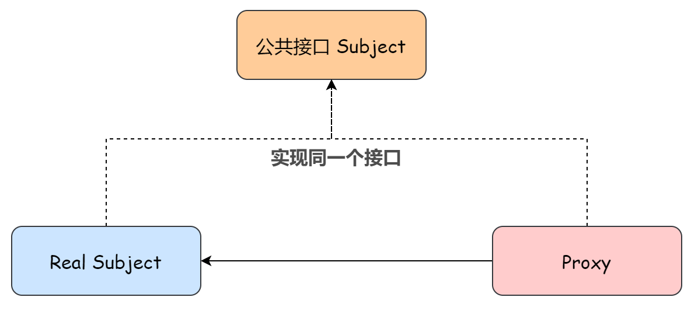

举个例子：你找了小红来帮你向小绿问话，小红就看作是代理我的代理类 Proxy，而你是 Real  Subject，因为小红要传达的话其实是你说的。那么你和小红都需要实现的接口（Subject）就是说话，由于你俩都能说话，在外界看来你俩就是一样的（滑稽，大家理解就好，不用较真）

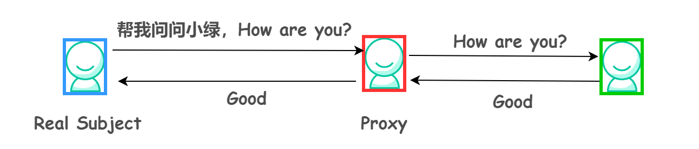


代理模式分为静态代理和动态代理。

先来说静态代理：

静态代理就是，对于你想要增强的委托类，我们需要新建一个代理类，这两个类实现一个同样的接口，然后将委托类注入进代理类中，在代理类的方法中调用委托类中的对应方法。这样，我们就可以通过代理类屏蔽对目标对象的访问，并且可以在目标方法执行前后做一些自己想做的事情。

从 JVM 层面来说， 静态代理就是在编译时就将接口、委托类、代理类这些都变成了一个个实际的 `.class` 文件。

静态代理的弊端很明显，一个委托类对应一个代理类，多个委托类就需要新建多个代理类，我们能不能将代理类做成一个通用的呢？

为此，动态代理应用而生。


动态代理的实现方式有很多种，常见的有：JDK 动态代理和 CGLIB 动态代理

先来说 JDK 动态代理：

同样的，JDK 动态代理需要委托类实现一个接口，不过代理类就不需要也实现同样的接口了，但是，JDK 动态代理机制中添加了一个新的角色，那就是处理类。具体来说，我们需要新建一个处理类，然后将委托类注入处理类，另外，这个处理类需要实现 `InvocationHandler` 接口，并重写其 `invoke` 方法，在 `invoke` 方法中可以利用反射机制调用委托类的方法，并可以在其前后添加一些额外的处理逻辑。最后，我们定义一个创建代理对象的工厂类（代理类），通过 `Proxy.newProxyInstance()` 创建委托类对象的代理对象


JDK 动态代理有一个最致命的问题是它只能代理实现了某个接口的实现类，并且代理类也只能代理接口中实现的方法，要是实现类中有自己私有的方法，而接口中没有的话，该方法就不能进行代理调用。


为了解决这个问题，我们可以用 CGLIB 动态代理机制，CGLIB（Code Generation Library）其实就是一个基于 ASM 的 Java 字节码生成框架。

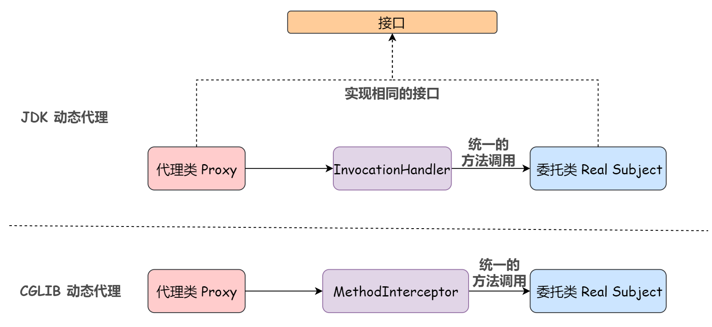

解释一下什么是字节码生成框架：

一个 `Class` 类对应一个 `.class` 字节码文件，对吧，也就是说字节码文件中存储了一个类的全部信息。字节码其实是二进制文件，内容是只有 JVM 能够识别的机器码。

JVM 解析字节码文件也就是加载类的过程是这样的：JVM 读取 `.class` 字节码文件，取出二进制数据，加载到内存中，解析字节码文件内的信息，然后生成对应的 `Class` 类对象。


显然，这个过程是在编译期就发生的。

那如果我们在运行期遵循 Java 编译系统组织 `.class` 字节码文件的格式和结构，生成相应的二进制数据（这就是字节码工具做的事情），然后再把这个二进制数据加载转换成对应的类。这样，我们不就完成了在运行时动态的创建一个类吗。这个思想其实也就是动态代理的思想。


简单来说，动态代理就是通过字节码技术生成一个子类，并在子类中拦截父类方法的调用（这也就是为什么说 CGLIB 是基于继承的了），织入额外的业务逻辑。关键词就是拦截，CGLIB 引入一个新的角色方法拦截器，让其实现接口 `MethodInterceptor`，并重写 `intercept` 方法，这里的 `intercept` 用于拦截并增强委托类的方法（和 JDK 动态代理 `InvocationHandler` 中的 `invoke` 方法类似），最后，通过 `Enhancer.create()` 创建委托类对象的代理对象。


那么什么情况下需要使用动态代理呢？

1. 设计模式中有一个设计原则是开闭原则，即对修改关闭，对扩展开放，我们在工作中有时会接手很多前人的代码，里面代码逻辑让人摸不着头脑，就很难去下手修改代码，那么这时我们就可以通过代理对类进行增强。
2. 我们在使用 RPC 框架的时候，框架本身并不能提前知道各个业务方要调用哪些接口的哪些方法。那么这个时候，就可用通过动态代理的方式来建立一个中间人给客户端使用，也方便框架进行搭建逻辑，某种程度上也是客户端代码和框架松耦合的一种表现。
3. Spring 的 AOP 机制同样也是采用了动态代理.....


### static{}静态代码块与{}非静态代码块(构造代码块)

**相同点**： 都是在 JVM 加载类时且在构造方法执行之前执行，在类中都可以定义多个，定义多个时按定义的顺序执行，一般在代码块中对一些 static 变量进行赋值。

**不同点**： 静态代码块在非静态代码块之前执行(静态代码块 -> 非静态代码块 -> 构造方法)。静态代码块只在第一次 new  执行一次，之后不再执行，而非静态代码块在每 new 一次就执行一次。 非静态代码块可在普通方法中定义(不过作用不大)；而静态代码块不行。

> 🐛 **修正**：静态代码块可能在第一次 new 对象的时候执行，但不一定只在第一次 new 的时候执行。比如通过 `Class.forName("ClassDemo")`创建 Class 对象的时候也会执行，即 new 或者 `Class.forName("ClassDemo")` 都会执行静态代码块。 一般情况下,如果有些代码比如一些项目最常用的变量或对象必须在项目启动的时候就执行的时候,需要使用静态代码块,这种代码是主动执行的。如果我们想要设计不需要创建对象就可以调用类中的方法，例如：`Arrays` 类，`Character` 类，`String` 类等，就需要使用静态方法, 两者的区别是 静态代码块是自动执行的而静态方法是被调用的时候才执行的.

Example：

```java
public class Test {
    public Test() {
        System.out.print("默认构造方法！--");
    }
    //非静态代码块
    {
        System.out.print("非静态代码块！--");
    }
    //静态代码块
    static {
        System.out.print("静态代码块！--");
    }
    private static void test() {
        System.out.print("静态方法中的内容! --");
        {
            System.out.print("静态方法中的代码块！--");
        }
    }
    public static void main(String[] args) {
        Test test = new Test();
        Test.test();//静态代码块！--静态方法中的内容! --静态方法中的代码块！--
    }
}
```

上述代码输出：

```text
静态代码块！--非静态代码块！--默认构造方法！--静态方法中的内容! --静态方法中的代码块！--
```

当只执行 `Test.test();` 时输出：

```text
静态代码块！--静态方法中的内容! --静态方法中的代码块！--
```

当只执行 `Test test = new Test();` 时输出：

```text
静态代码块！--非静态代码块！--默认构造方法！--
```

非静态代码块与构造函数的区别是：  非静态代码块是给所有对象进行统一初始化，而构造函数是给对应的对象初始化，因为构造函数是可以多个的，运行哪个构造函数就会建立什么样的对象，但无论建立哪个对象，都会先执行相同的构造代码块。也就是说，构造代码块中定义的是不同对象共性的初始化内容。


### char型变量中能否能不能存储⼀个中⽂汉字，为什么？

char可以存储⼀个中⽂汉字，因为Java中使⽤的编码是Unicode(不选择任何特定的编码，直接使⽤字符在字符集中的编号，这是统⼀的唯⼀⽅法），⼀个char类型占2个字节（16⽐特），所以放⼀个中⽂是没问题的。


### 是否可以继承String类？

String类是final类，不可以被继承。

补充：继承String本身就是⼀个错误的⾏为，对String类型最好的重⽤⽅式是关联关系（Has-A）和依赖关系（Use-A）⽽不是继承关系（Is-A）。


### 谈谈你对多态的理解？

多态的概念并不难，并且在实际编码中可以说是最最高频使用率。多态就是**使得同一个行为具有多个不同表现形式或形态的能力**。举个形象点的例子：对于 “打印” 这个行为，使用彩色打印机 “打印” 出来的效果就是彩色的，而使用黑白打印机 “打印” 出来的效果就是黑白的。我们就称 “打印” 这个行为是多态的，彩色打印效果和黑白打印效果就是 “打印” 这个行为的两个不同的表现形式。


还可以这样理解，**同一个行为在不同的对象上会产生不同的结果**。再举个形象点的例子：比如我们按下 F1 键这个行为：如果当前在 Word 下弹出的就是 Word 帮助和支持；在 Windows 下弹出的就是 Windows 帮助和支持。


#### 多态发生的三个必要条件

先看下面这段代码，首先，我们有一个基类 `Shape`，三个子类，并且都重写了基类的 `draw` 方法：

```java
class Shape {
    void draw() {}
}
 
class Circle extends Shape {
    void draw() {
        System.out.println("Circle.draw()");
    }
}
 
class Square extends Shape {
    void draw() {
        System.out.println("Square.draw()");
    }
}
 
class Triangle extends Shape {
    void draw() {
        System.out.println("Triangle.draw()");
    }
}
```

下面这几行代码就充分体现了多态性：

```java
Shape circle = new Circle();
Shape square = new Square();
Shape triangle = new Triangle();
```

大家应该不会太陌生，就是**向上转型**，没错，它就是多态的体现。同样的一个 draw 方法，在这三个不同的对象上产生了三种不同的行为，多态在此体现的淋漓尽致。

这里需要注意的是，当使用多态方式调用方法时，编译器会首先检查父类中是否有该方法，如果没有，则编译错误；如果父类中有该方法，并且被子类重写，就会调用子类的这个方法；如果父类的方法没有被子类重写，就会调用父类的方法。

```java
Shape circle = new Circle();
circle.draw(); // 调用的是 Circle 的 eat
```

简单来说：**当父类引用变量指向子类对象后（多态），只能使用父类已声明的方法，但方法如果被重写会执行子类的方法，如果方法未被重写那么将执行父类的方法**。

结合上述这段简单的代码，我们总结一下多态产生的必要条件：

- 1）继承
- 2）重写
- 3）父类引用指向子类对象：`Parent p = new Child();`

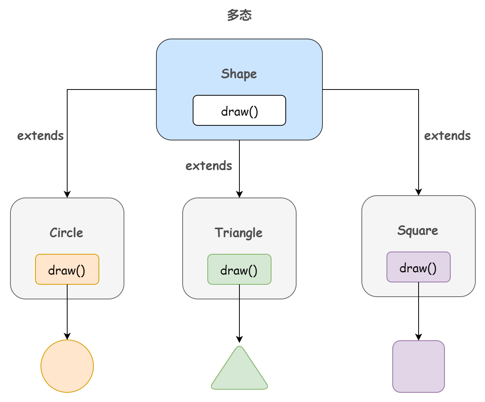

#### 多态是如何发生的

❓ 那么，多态到底是如何发生的？编译器是如何知道父类 Shape 引用指向的是 Circle 而不是 Triangle 或 Square 呢？

首先，我们需要了解静态绑定和动态绑定的概念。什么是**绑定**？将一个方法调用同一个方法主体关联起来的过程就称作绑定。

若绑定发生在程序运行前，叫做**静态绑定**，也称**前期绑定**。你可能从来没有听说这个术语，因为它是**面向过程**语言不需选择默认的绑定方式，例如在 C 语言中就只有前期绑定这一种方法调用。

那么对于这段代码：

```java
Shape circle = new Circle();
Shape square = new Square();
circle.draw(); 
```

Shape 即引用类型在编译期可知，不会被改变，而 Circle 作为实例对象类型在运行期才可知，可能会发生变化。所以如果使用前期绑定，在运行之前，编译器只知道有一个 Shape 引用，它无法得知究竟会调用哪个方法。

解决方法就是**动态绑定** Dynamic Binding，在运行时根据对象的类型自动的进行绑定，所以动态绑定也称**运行时绑定**。动态绑定是多态的基础。

注意：Java 中除了 `static`和 `final`方法（`private`方法属于 `final`方法）之外，其他所有方法都是动态绑定。这意味着通常情况下，我们不需要判断动态绑定是否会发生，它是自动发生的。

> `final` 和 `static` 关键字后续会单独出文章讲解，此处就笼统的概述一下为什么这两个关键字修饰的方法是静态绑定的：
>
> - `final` 不允许方法重写，而多态发生的条件之一就是重写，所以 `final` 方法会在编译期间就进行绑定，即静态绑定
> - `static` 方法是类直接拥有的的，与该类的任何一个对象都无关（该类的所有对象共同维护），所以也是静态绑定


#### 重载和重写

重载和重写在之前的文章中都说过了，此处正好借着多态这个主题将这两个容易混淆的概念总结一波。

方法的**重写 Overriding** 和**重载 Overloading** 都是是 Java 多态性的表现。

🔸 1）**方法重写是父类与子类之间多态性的表现**。其子类和父类方法的名字相同，参数个数相同，返回类型也相同，并且子类的访问权限不能比父类的严格，比如父类是 public，那么子类也只能是 public，不能比 public 更严格。也就是说，**方法重写，只有方法体是不一样的，访问权限可以有限制的修改**。

```java
class Shape {
    public void draw() {}
}
 
class Circle extends Shape {
    public void draw() {
        System.out.println("Circle.draw()");
    }
}
```

🚨 其实，上面说的返回类型完全相同并不严格正确。下面我们来解释一下。

首先，我们需要知道**方法的名字和参数列表称为方法的签名**。例如，`draw()`  和  `draw(String)` 是两个具有相同名字， 不同签名的方法。如果在子类中定义了一个与超类签名相同的方法， 那么子类中的这个方法就覆盖/重写了超类中的这个相同签名的方法。

不过，**返回类型不是签名的一部分**， 因此，在覆盖/重写方法时， 一定要保证返回类的兼容性。 **允许子类将覆盖方法的返回类型定义为原返回类型的子类型**。

例如， 假设 `Shape` 类有

```java
class Shape {
    public Shape draw() {
    	......
    }
}
```

在后面的子类 `Circle` 中， 可以按照如下所示的方式覆盖这个方法

```java
class Circle extends Shape {
    public Circle draw() {
        ......
    }
}
```

用专业术语来说，这两个 `draw` 方法具有**可协变的返回类型**。

🔸 2）方法重载并非多态的必要条件，不过可以理解成**某个类的多态性的表现**。所谓方法重载，就是一个类中定义了多个方法名相同，但是参数的数量或者类型不同。方法的返回类型和访问权限可以任意修改，不以它俩作为方法重载的标志。

```java
class Circle extends Shape {
    public void draw() {
        System.out.println("Circle.draw()");
    }
    
    public void draw(int i) {
        System.out.println("Circle.draw()" + i);
    }
}
```


总结一下方法重载和重写：

|            | 方法重载 |                      方法重写                      |
| :--------: | :------: | :------------------------------------------------: |
|   方法名   |   相同   |                        相同                        |
|  参数列表  | 必须不同 |                      必须相同                      |
|  返回类型  | 可以不同 | 子类方法的返回类型可以是原父类方法返回类型的子类型 |
| 访问修饰符 | 可以不同 |       子类不能做更严格的限制（可以降低限制）       |


#### main 方法是否可以重载

IBM 早些年出过这方面的题，考倒了一片人。首先，答案是肯定的，main 既然作为一个方法，那它当然可以被重载。

但是，**如果是作为程序的入口，那么 main 函数只有一种写法，Java 虚拟机在运行的时候只会调用带有参数是 String 数组的那个 `main()` 方法**，而其他重载的写法虚拟机是不认的，只能人为的调用。

举个例子：

```java
class Test {
	public static void main(String[] args) {
		main(1);
	}
	public static void main(int i) {
		System.out.println("重载的 main 方法");
	}
}
```

该程序运行结果如下：

```text
重载的 main 方法
```

可以看出第一个 main 方法正常调用了重载的第二个 main 方法，即 main 方法能够被完美重载。但是程序的入口仍然是第一个 main 方法即参数为 String 数组。


### 构造器（constructor）是否可被重写（override）？

构造器不能被继承，因此不能被重写，但可以被重载


### Java 中操作字符串都有哪些类？它们之间有什么区别？

操作字符串的类有：**String、StringBuffer、StringBuilder**。

第一点: 可变和适用范围。String对象是不可变的，而StringBuffer和StringBuilder是可变字符序列。每次对String的操作相当于生成一个新的String对象，而对StringBuffer和StringBuilder的操作是对对象本身的操作，而不会生成新的对象，所以对于频繁改变内容的字符串避免使用String，因为频繁的生成对象将会对系统性能产生影响。

第二点: 线程安全。String由于有final修饰，是immutable的，安全性是简单而纯粹的。StringBuilder和StringBuffer的区别在于StringBuilder不保证同步，也就是说如果需要线程安全需要使用StringBuffer，不需要同步的StringBuilder效率更高

|               | 可变性 | 线程安全                                                     |
| :-----------: | :----: | ------------------------------------------------------------ |
|    String     | 不可变 | 因为不可变，所以是线程安全的                                 |
| StringBuffer  |  可变  | 线程安全的，因为其内部大多数方法都使用 `synchronized`进行同步。其效率较低 |
| StringBuilder |  可变  | 不是线程安全的，因为没有使用 `synchronized`进行同步，这也是其效率高于 StringBuffer  的原因。单线程下，优先考虑使用 StringBuilder。 |


### String str = "i" 和String str = new String("1")⼀样吗？

不⼀样，因为内存的分配⽅式不⼀样。String str="i"的⽅式，JVM会将其分配到常量池中；⽽String str=new String("i")，JVM会将其分配到堆内存中。


### 什么是序列化?什么是反序列化?

如果我们需要持久化 Java 对象比如将 Java 对象保存在文件中，或者在网络传输 Java 对象，这些场景都需要用到序列化。

简单来说：

- **序列化**： 将数据结构或对象转换成二进制字节流的过程
- **反序列化**：将在序列化过程中所生成的二进制字节流转换成数据结构或者对象的过程

对于 Java 这种面向对象编程语言来说，我们序列化的都是对象（Object）也就是实例化后的类(Class)，但是在 C++这种半面向对象的语言中，struct(结构体)定义的是数据结构类型，而 class 对应的是对象类型。

维基百科是如是介绍序列化的：

> **序列化**（serialization）在计算机科学的数据处理中，是指将数据结构或对象状态转换成可取用格式（例如存成文件，存于缓冲，或经由网络中发送），以留待后续在相同或另一台计算机环境中，能恢复原先状态的过程。依照序列化格式重新获取字节的结果时，可以利用它来产生与原始对象相同语义的副本。对于许多对象，像是使用大量引用的复杂对象，这种序列化重建的过程并不容易。面向对象中的对象序列化，并不概括之前原始对象所关系的函数。这种过程也称为对象编组（marshalling）。从一系列字节提取数据结构的反向操作，是反序列化（也称为解编组、deserialization、unmarshalling）。

综上：**序列化的主要目的是通过网络传输对象或者说是将对象存储到文件系统、数据库、内存中。**


### final finally finalize的区别

* final可以修饰类、变量、⽅法，修饰类表示该类不能被继承、修饰⽅法表示该⽅法不能被重写、修饰变量表示该变量是⼀个常量不能被重新赋值。
* finally⼀般作⽤在try-catch代码块中，在处理异常的时候，通常我们将⼀定要执⾏的代码⽅法finally代码块中，表示不管是否出现异常，该代码块都会执⾏，⼀般⽤来存放⼀些关闭资源的代码。

>  :warning:特殊情况：当finally中包含return
>
> 

* finalize是⼀个⽅法，属于Object类的⼀个⽅法，⽽Object类是所有类的⽗类，该⽅法⼀般由垃圾回收器来调⽤，当我们调⽤System.gc()⽅法的时候，由垃圾回收器调⽤finalize()，回收垃圾，⼀个对象是否可回收的最后判断。

> :warning:注：
>
> - Java 语言提供了对象终止（finalization）机制来允许开发人员提供对象被销毁之前的自定义处理逻辑。
> - 当垃圾回收器发现没有引用指向一个对象，即：垃圾回收此对象之前，总会先调用这个对象的 `finalize( )` 方法。
> - `finalize( )` 方法允许在子类中被重写，用于在对象被回收时进行资源释放。通常在这个方法中进行一些资源释放和清理的工作，比如关闭文件、套接字和数据库连接等。
> - **永远不要主动调用某个对象的 finalize ( ) 方法，应该交给垃圾回收机制调用**。理由包括下面三点：   
>   - 在 `finalize( )` 执行时可能会导致对象复活。
>   - `finalize( )` 方法的执行时间是没有保障的，它完全由 GC 线程决定，极端情况下，若不发生 GC，则 `finalize( )` 方法将没有执行机会。
>   - 一个糟糕的 `finalize( )` 会严重影响 GC 的性能。
> - 从功能上来说，`finalize( )` 方法与 C++ 中的析构函数比较相似，但是 Java 采用的是基于垃圾回收器的自动内存管理机制，所以 `finalize( )` 方法在本质上不同于 C++ 中的析构函数。
> - 由于 `finalize( )` 方法的存在，虚拟机中的对象一般处于三种可能的状态


### ⭐Java有哪些数据类型

* 🔢 数值：byte，short，int，long
* 🧿 浮点：float，double
* 🔣 字符：char
* ☑️ 布尔：boolean

这八种基本类型都有对应的包装类分别为：Byte、Short、Integer、Long、Float、Double、Character、Boolean


#### 基本类型和包装类型的区别？

- 包装类型不赋值就是 `null` ，而基本类型有默认值且不是 `null`。
- 包装类型可用于泛型，而基本类型不可以。
- 基本数据类型的局部变量存放在 Java 虚拟机栈中的局部变量表中，基本数据类型的成员变量（未被 `static` 修饰 ）存放在 Java 虚拟机的堆中。包装类型属于对象类型，我们知道几乎所有对象实例都存在于堆中。
- 相比于对象类型， 基本数据类型占用的空间非常小。

**为什么说是几乎所有对象实例呢？** 这是因为 HotSpot 虚拟机引入了 JIT 优化之后，会对对象进行逃逸分析，如果发现某一个对象并没有逃逸到方法外部，那么就可能通过标量替换来实现栈上分配，而避免堆上分配内存

⚠️注意 ： **基本数据类型存放在栈中是一个常见的误区！** 基本数据类型的成员变量如果没有被 `static` 修饰的话（不建议这么使用，应该要使用基本数据类型对应的包装类型），就存放在堆中。

```java
class BasicTypeVar{
  private int x;
}
```


#### 包装类型的缓存机制了解么？

Java 基本数据类型的包装类型的大部分都用到了缓存机制来提升性能。

`Byte`,`Short`,`Integer`,`Long` 这 4 种包装类默认创建了数值 **[-128，127]** 的相应类型的缓存数据，`Character` 创建了数值在 **[0,127]** 范围的缓存数据，`Boolean` 直接返回 `True` or `False`。


#### :star:占用的空间大小

👨‍💻面试官 ： 它们的默认值和占用的空间大小知道不？

🙋 我 ：这 8 种基本数据类型的默认值以及所占空间的大小如下：

| 基本类型 | 位数 | 字节 | 默认值  |
| -------- | ---- | ---- | ------- |
| int      | 32   | 4    | 0       |
| short    | 16   | 2    | 0       |
| long     | 64   | 8    | 0L      |
| byte     | 8    | 1    | 0       |
| char     | 16   | 2    | 'u0000' |
| float    | 32   | 4    | 0f      |
| double   | 64   | 8    | 0d      |
| boolean  | 1    |      | false   |

另外，对于 boolean，官方文档未明确定义，它依赖于 JVM 厂商的具体实现。逻辑上理解是占用 1 位，但是实际中会考虑计算机高效存储因素。


### float f=3.4;是否正确？

不正确，赋值运算符 "=" 左右两边的精度类型不匹配。

Java中，有小数点的默认被存储为double类型，即双精度；而float类型的变量为单精度。

可以使用强转或加f，即 float f = (folat)3.4，float f = 3.4f。

测试：

```java
public static void main(String[] args) {
    float f = 3.14222222222222222222222;
    double d = 3.4;
    System.out.println(f);
    System.out.println(d);
}
-------------------------------------------
1.java:3: 错误: 不兼容的类型: 从double转换到float可能会有损失
float f = 3.14222222222222222222222;
      ^
1 个错误
```


> 拓展：Integer a = 1000，Integer b = 1000，a==b 的结果是什么？那如果 a，b 都为1，结果又是什么？

Integer a = 1000，Integer b = 1000，a==b 结果为**false**

Integer a = 1，Integer b = 1，a==b 结果为**true**

这道题主要考察 Integer 包装类缓存的范围,**在-128~127之间会缓存起来**,比较的是直接缓存的数据,在此之外比较的是对象


### 成员变量与局部变量的区别有哪些？

1. 从**语法形式上**看:成员变量是属于类的，而局部变量是在方法中定义的变量或是方法的参数；成员变量可以被public,private,static等修饰符所修饰，而局部变量不能被访问控制修饰符及static所修饰；但是，成员变量和局部变量都能被final所修饰。
2. 从变量**在内存中的存储方式**来看:如果成员变量是使用static修饰的，那么这个成员变量是属于类的，如果没有使用static修饰，这个成员变量是属于实例的。对象存于堆内存，如果局部变量类型为基本数据类型，那么存储在栈内存，如果为引用数据类型，那存放的是指向堆内存对象的引用或者是指向常量池中的地址。
3. 从变量在**内存中的生存时间上**看:成员变量是对象的一部分，它随着对象的创建而存在，而局部变量随着方法的调用而自动消失。
4. 成员变量**如果没有被赋初值**:则会自动以类型的默认值而赋值（一种情况例外:被final修饰的成员变量也必须显式地赋值），而局部变量则不会自动赋值。


### ⭐接口和抽象类的区别是什么？

1. 接口的方法默认是public，所有方法在接口中不能有实现(Java8开始接口方法可以有默认实现），而抽象类可以有非抽象的方法。
2. 接口中除了static、final变量，不能有其他变量，而抽象类中则不一定。
3. 一个类可以实现多个接口，但只能实现一个抽象类。接口自己本身可以通过extends关键字扩展多个接口。
4. 接口方法默认修饰符是public，抽象方法可以有public、protected和default这些修饰符（抽象方法就是为了被重写所以不能使用private关键字修饰！）。
5. 从设计层面来说，抽象是对类的抽象，是一种模板设计，而接口是对行为的抽象，是一种行为的规范。


### 🌠Java 泛型了解么？泛型的作用？什么是类型擦除？

**Java 泛型（Generics）** 是 JDK 5 中引入的一个新特性。使用泛型参数，可以增强代码的可读性以及稳定性。

编译器可以对泛型参数进行检测，并且通过泛型参数可以指定传入的对象类型。比如 `ArrayList<Persion> persons = new ArrayList<Persion>()` 这行代码就指明了该 `ArrayList` 对象只能传入 `Persion` 对象，如果传入其他类型的对象就会报错。

```java
ArrayList<E> extends AbstractList<E>
```

并且，原生 `List` 返回类型是 `Object` ，需要手动转换类型才能使用，使用泛型后编译器自动转换。


泛型一般有三种使用方式:**泛型类**、**泛型接口**、**泛型方法**。


Java泛型的实现采取了“伪泛型”的策略，即Java在语法上支持泛型，但是**在编译阶段会进行所谓的“类型擦除”（Type  Erasure）**，将所有的泛型表示（尖括号中的内容）都替换为具体的类型（其对应的原生态类型），就像完全没有泛型一样。理解**类型擦除**对于用好泛型是很有帮助的，尤其是一些看起来“疑难杂症”的问题，弄明白了类型擦除也就迎刃而解了。

泛型的类型擦除原则是：

- 消除类型参数声明，即删除`<>`及其包围的部分。
- 根据类型参数的上下界推断并替换所有的类型参数为原生态类型：如果类型参数是无限制通配符或没有上下界限定则替换为Object，如果存在上下界限定则根据子类替换原则取类型参数的最左边限定类型（即父类）。
- 为了保证类型安全，必要时插入强制类型转换代码。
- 自动产生“桥接方法”以保证擦除类型后的代码仍然具有泛型的“多态性”。

#### 擦除类定义中的类型参数

**无限制类型擦除**  当类定义中的类型参数没有任何限制时，在类型擦除中直接被替换为Object，即形如`<T>`和`<?>`的类型参数都被替换为Object


**有限制类型擦除**  当类定义中的类型参数存在限制（上下界）时，在类型擦除中替换为类型参数的上界或者下界，比如形如`<T extends Number>`和`<? extends Number>`的类型参数被替换为Number，`<? super  Number>`被替换为Object


#### 擦除方法定义中的类型参数

擦除方法定义中的类型参数原则和擦除类定义中的类型参数是一样的，这里仅以擦除方法定义中的有限制类型参数为例


#### 桥接方法和泛型的多态

http://softlab.sdut.edu.cn/blog/subaochen/2017/01/generics-type-erasure/

由于原文的篇幅过长，进行以下总结：

所谓的“桥接方法”（bridge method）来满足Java语法的要求，同时也保证了基于泛型的多态能够有效

运行的时候，会对`Child`类的方法表进行搜索，先分析一下`Child`类的方法表里有哪些东西：

```java
1. sayHello(Object value) : 从类型被擦除后的超类中继承过来
2. sayHello(String value) : 自己新增的方法，和超类毫无联系
```


#### 为了更深层次的理解类型擦除，选取了Stackoverflow的高赞回答

原帖：https://stackoverflow.com/questions/339699/java-generics-type-erasure-when-and-what-happens

> 😣问题是：**When does type erasure occur?** At compile time or runtime? When the class is loaded? When the class is instantiated?
>
> 类型擦除何时发生? 在编译时还是运行时? 当类被加载时? 当类被实例化时？

🧐类型擦除适用于泛型的使用。类文件中肯定有元数据来说明方法/类型是否是泛型，以及约束是什么等等。但是当使用泛型时，它们被转换为编译时检查和执行时强制转换。所以这个代码：

```java
List<String> list = new ArrayList<String>();
list.add("Hi");
String x = list.get(0);
```

被编译成

```java
List list = new ArrayList();
list.add("Hi");
String x = (String) list.get(0);
```

在执行时，没有办法找出列表对象的 T = String 这个信息已经消失了。但是 List < T > 界面本身仍然宣称自己是通用的。


原帖：https://stackoverflow.com/questions/313584/what-is-the-concept-of-erasure-in-generics-in-java

> 😣What is the concept of erasure in generics in Java?
>
> 在 Java的类型擦除中，擦除的概念是什么？

🧐这基本上是通过编译器技巧在 Java 中实现泛型的方式。编译后的泛型代码实际上只使用 java.lang。对象，而且有一些元数据（some metadata）可以告诉编译器它实际上是一个泛型类型。

当你针对一个泛型类型或方法编译一些代码时，编译器会计算出你的真正意思(例如 T 的类型参数是什么)  ，并在编译时验证你做的是正确的事情，但是发出的代码再次使用 java.lang。对象-编译器在必要时生成额外的强制转换。在执行时，List  < String > 和 List < Date > 完全相同; 编译器已经擦除了额外的类型信息。

比较一下 C # ，它在执行时保留信息，允许代码包含表达式，例如 typeof (T) ，它等价于 T  类——除非后者是无效的。(两者之间还有进一步的区别。NET 泛型和 Java 泛型，请注意。)在处理 Java  泛型时，类型擦除是许多“奇怪”警告/错误消息的来源。


> 🥱再看一个这个回答的实战内容

擦除，字面意思是从已编译的字节码中擦除源代码中存在的类型信息。让我们用一些代码来理解这一点。

```java
import java.util.ArrayList;
import java.util.Iterator;
import java.util.List;

public class GenericsErasure {
    public static void main(String args[]) {
        List<String> list = new ArrayList<String>();
        list.add("Hello");
        Iterator<String> iter = list.iterator();
        while(iter.hasNext()) {
            String s = iter.next();
            System.out.println(s);
        }
    }
}
```

如果您编译这段代码，然后用 Java 反编译器反编译它，您将得到类似下面的代码。注意，反编译的代码不包含原始源代码中显示的类型信息的跟踪。

```java
import java.io.PrintStream;
import java.util.*;

public class GenericsErasure
{

    public GenericsErasure()
    {
    }

    public static void main(String args[])
    {
        List list = new ArrayList();
        list.add("Hello");
        String s;
        for(Iterator iter = list.iterator(); iter.hasNext(); System.out.println(s))
            s = (String)iter.next();

    }
} 
```


### ⭐== 与 equals

对于**基本类型**来说，== 比较的是值是否相等；

对于**引用类型**来说，== 比较的是两个引用是否指向同一个对象地址（两者在内存中存放的地址（堆内存地址）是否指向同一个地方）；

对于引用类型（包括包装类型）来说

* equals 如果**没有被重写**，对比它们的**地址**是否相等
* 如果equals()方法被**重写**（例如 String），则比较的是**地址里的内容**


### hashCode 与 equals

1. 如果两个对象相等，则 hashcode 一定也是相同的
2. 两个对象相等,对两个 equals() 方法返回 true
3. 两个对象有相同的 hashcode 值，它们也不一定是相等的
4. 综上， equals() 方法被覆盖过，则 hashCode() 方法也必须被覆盖
5. hashCode() 的默认行为是对堆上的对象产生独特值。如果没有重写 hashCode() ，则该class 的两个对象无论如何都不会相等（即使这两个对象指向相同的数据）。


### 如何决定使用 HashMap 还是 TreeMap？

`TreeMap<K,V>`的Key值是要求实现java.lang.Comparable，所以迭代的时候TreeMap默认是按照Key值升序排序的；TreeMap的实现是基于红黑树结构。适用于按自然顺序或自定义顺序遍历键（key）。

`HashMap<K,V>`的Key值实现散列hashCode()，分布是散列的、均匀的，不支持排序；数据结构主要是桶(数组)，链表或红黑树。适用于在Map中插入、删除和定位元素。

**结论**
如果你需要得到一个有序的结果时就应该使用TreeMap（因为HashMap中元素的排列顺序是不固定的）。除此之外，由于HashMap有更好的性能，所以大多不需要排序的时候我们会使用HashMap。


### ⭐HashMap 的底层实现

#### JDK1.8 之前

JDK1.8 之前 `HashMap` 底层是 **数组和链表** 结合在一起使用也就是 **链表散列**。**HashMap 通过 key 的 hashCode 经过扰动函数处理过后得到 hash 值，然后通过 (n - 1) & hash  判断当前元素存放的位置（这里的 n 指的是数组的长度），如果当前位置存在元素的话，就判断该元素与要存入的元素的 hash 值以及 key  是否相同，如果相同的话，直接覆盖，不相同就通过拉链法解决冲突。**

**所谓扰动函数指的就是 HashMap 的 hash 方法。使用 hash 方法也就是扰动函数是为了防止一些实现比较差的 hashCode() 方法 换句话说使用扰动函数之后可以减少碰撞。**

**JDK 1.8 HashMap 的 hash 方法源码:**

JDK 1.8 的 hash 方法 相比于 JDK 1.7 hash 方法更加简化，但是原理不变。

```java
    static final int hash(Object key) {
      int h;
      // key.hashCode()：返回散列值也就是hashcode
      // ^ ：按位异或
      // >>>:无符号右移，忽略符号位，空位都以0补齐
      return (key == null) ? 0 : (h = key.hashCode()) ^ (h >>> 16);
  }
```

对比一下 JDK1.7 的 HashMap 的 hash 方法源码.

```java
static int hash(int h) {
    // This function ensures that hashCodes that differ only by
    // constant multiples at each bit position have a bounded
    // number of collisions (approximately 8 at default load factor).

    h ^= (h >>> 20) ^ (h >>> 12);
    return h ^ (h >>> 7) ^ (h >>> 4);
}
```

相比于 JDK1.8 的 hash 方法 ，JDK 1.7 的 hash 方法的性能会稍差一点点，因为毕竟扰动了 4 次。

所谓 **“拉链法”** 就是：将链表和数组相结合。也就是说创建一个链表数组，数组中每一格就是一个链表。若遇到哈希冲突，则将冲突的值加到链表中即可。

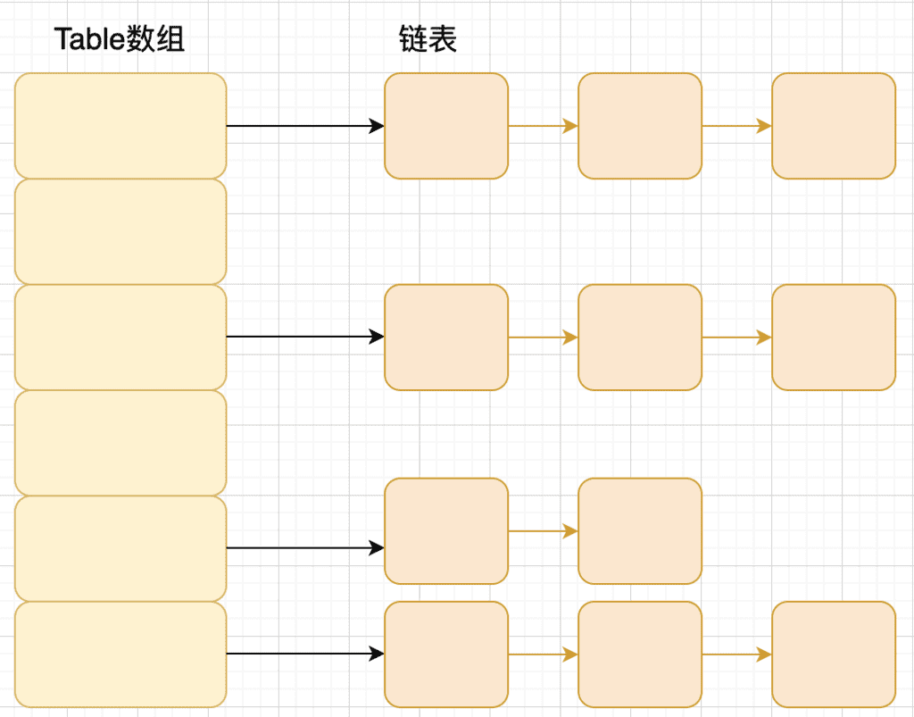

#### JDK1.8 之后

相比于之前的版本， JDK1.8 之后在解决哈希冲突时有了较大的变化，当链表长度大于阈值（默认为 8）（将链表转换成红黑树前会判断，如果当前数组的长度小于 64，那么会选择先进行数组扩容，而不是转换为红黑树）时，将链表转化为红黑树，以减少搜索时间。

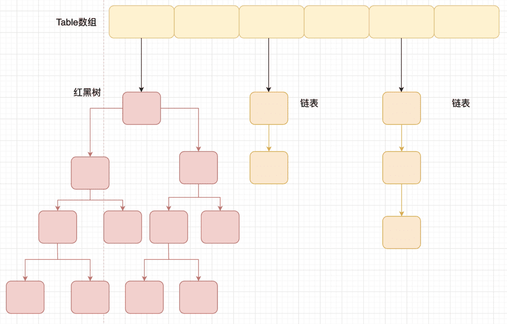

> TreeMap、TreeSet 以及 JDK1.8 之后的 HashMap 底层都用到了红黑树。红黑树就是为了解决二叉查找树的缺陷，因为二叉查找树在某些情况下会退化成一个线性结构。


### ⭐HashMap源码分析

#### get()

`get(Object key)`方法根据指定的`key`值返回对应的`value`，该方法调用了`getEntry(Object key)`得到相应的`entry`，然后返回`entry.getValue()`。因此`getEntry()`是算法的核心。 **算法思想**是首先通过`hash()`函数得到对应`bucket`的下标，然后依次遍历冲突链表，通过`key.equals(k)`方法来判断是否是要找的那个`entry`。


上图中`hash(k)&(table.length-1)`等价于`hash(k)%table.length`，原因是*HashMap*要求`table.length`必须是2的指数，因此`table.length-1`就是二进制低位全是1，跟`hash(k)`相与会将哈希值的高位全抹掉，剩下的就是余数了。

```java
//getEntry()方法
final Entry<K,V> getEntry(Object key) {
	......
	int hash = (key == null) ? 0 : hash(key);
    for (Entry<K,V> e = table[hash&(table.length-1)];//得到冲突链表
         e != null; e = e.next) {//依次遍历冲突链表中的每个entry
        Object k;
        //依据equals()方法判断是否相等
        if (e.hash == hash &&
            ((k = e.key) == key || (key != null && key.equals(k))))
            return e;
    }
    return null;
}
```

#### put()

`put(K key, V value)`方法是将指定的`key, value`对添加到`map`里。该方法首先会对`map`做一次查找，看是否包含该元组，如果已经包含则直接返回，查找过程类似于`getEntry()`方法；如果没有找到，则会通过`addEntry(int hash, K key, V value, int bucketIndex)`方法插入新的`entry`，插入方式为**头插法**。


```java
//addEntry()
void addEntry(int hash, K key, V value, int bucketIndex) {
    if ((size >= threshold) && (null != table[bucketIndex])) {
        resize(2 * table.length);//自动扩容，并重新哈希
        hash = (null != key) ? hash(key) : 0;
        bucketIndex = hash & (table.length-1);//hash%table.length
    }
    //在冲突链表头部插入新的entry
    Entry<K,V> e = table[bucketIndex];
    table[bucketIndex] = new Entry<>(hash, key, value, e);
    size++;
}


```

#### remove()

`remove(Object key)`的作用是删除`key`值对应的`entry`，该方法的具体逻辑是在`removeEntryForKey(Object key)`里实现的。`removeEntryForKey()`方法会首先找到`key`值对应的`entry`，然后删除该`entry`(修改链表的相应引用)。查找过程跟`getEntry()`过程类似。


```java
//removeEntryForKey()
final Entry<K,V> removeEntryForKey(Object key) {
	......
	int hash = (key == null) ? 0 : hash(key);
    int i = indexFor(hash, table.length);//hash&(table.length-1)
    Entry<K,V> prev = table[i];//得到冲突链表
    Entry<K,V> e = prev;
    while (e != null) {//遍历冲突链表
        Entry<K,V> next = e.next;
        Object k;
        if (e.hash == hash &&
            ((k = e.key) == key || (key != null && key.equals(k)))) {//找到要删除的entry
            modCount++; size--;
            if (prev == e) table[i] = next;//删除的是冲突链表的第一个entry
            else prev.next = next;
            return e;
        }
        prev = e; e = next;
    }
    return e;
}
```


### HashMap 的长度为什么是 2 的幂次方

为了能让 HashMap 存取高效，尽量较少碰撞，也就是要尽量把数据分配均匀。我们上面也讲到了过了，Hash  值的范围值-2147483648 到 2147483647，前后加起来大概 40  亿的映射空间，只要哈希函数映射得比较均匀松散，一般应用是很难出现碰撞的。但问题是一个 40  亿长度的数组，内存是放不下的。所以这个散列值是不能直接拿来用的。用之前还要先做对数组的长度取模运算，得到的余数才能用来要存放的位置也就是对应的数组下标。这个数组下标的计算方法是“ `(n - 1) & hash`”。（n 代表数组长度）。这也就解释了 HashMap 的长度为什么是 2 的幂次方。

**这个算法应该如何设计呢？**

我们首先可能会想到采用%取余的操作来实现。但是，重点来了：**“取余(%)操作中如果除数是 2 的幂次则等价于与其除数减一的与(&)操作（也就是说 hash%length==hash&(length-1)的前提是 length 是 2 的 n 次方；）。”** 并且 **采用二进制位操作 &，相对于%能够提高运算效率，这就解释了 HashMap 的长度为什么是 2 的幂次方。**


### HashMap 多线程操作导致死循环问题

主要原因在于并发下的 Rehash 会造成元素之间会形成一个循环链表。不过，jdk 1.8 后解决了这个问题，但是还是不建议在多线程下使用  HashMap,因为多线程下使用 HashMap 还是会存在其他问题比如数据丢失。并发环境下推荐使用 ConcurrentHashMap 。

详情请查看：https://coolshell.cn/articles/9606.html


### 为什么Java只有值传递

个人理解，不管在方法中如何调用都是只拷贝。例如（int a, int b）就是拷贝传入的值到另外一个地址；如果传入的是（int[] arr）或者（Integer a）则就是拷贝这个的地址到另外一个地址，实质上两个（原值和拷贝的地址）都指向同一个地址。


### 异常处理总结

finally 块不会被执行：

1. 在 try 或 finally 块中用了 System.exit(int) 退出程序。但是，如果 System.exit(int) 在异常
   语句之后， finally 还是会被执行
2. 程序所在的线程死亡。
3. 关闭 CPU。


下面这部分内容来自 issue:https://github.com/Snailclimb/JavaGuide/issues/190。
**注意：** 当 try 语句和 finally 语句中都有 return 语句时，在方法返回之前，finally 语句的内容将被执行，并且 finally 语句的返回值将会覆盖原始的返回值。如下：

```java
public static int f(int value) {
	try {
		return value * value;
	} finally {
	if (value == 2) {
		return 0;
	}
}
```

《java核心技术卷一》中提到过：当finally子句包含return 语句时（当然在设计原则上是不允许在finally块中抛出异常或者 执行return语句的），将会出现一种意想不到的结果。假设利用return语句从try 语句块中退出。在方法返回前，finally子句的内容将被执行。如果finally子句中也有一个return语句，这个返回值将会覆盖原始的返回值。


### ⭐BIO,NIO,AIO 有什么区别


> Java BIO[Blocking I/O] | 同步阻塞I/O模式

BIO 全称Block-IO 是一种同步且阻塞的通信模式。是一个比较传统的通信方式，模式简单，使用方便。但并发处理能力低，通信耗时，依赖网速


> Java NIO[New I/O] | 同步非阻塞模式

传统的NIO：

在非阻塞模式中，发出 Socket 的 `accept()` 和 `read()` 操作时，如果内核中的数据还没有准备好，那么它并不会阻塞用户进程，而是立刻返回一个信息。也就是说进程发起一个 read 操作后，并不需要一直阻塞等待，而是马上就得到了一个结果。 如果结果发现数据准备完毕就可以读取数据，然后拷贝到用户内存。如果结果发现数据没有就绪也会返回，进程继续不断的`主动询问`数据的准备情况是非阻塞模式的一个特点。


* **数据准备阶段：** 在这个阶段，网络数据包到达网卡，通过`DMA` 的方式将数据包拷贝到内存中，然后经过硬中断，软中断，接着通过内核线程`ksoftirqd`经过内核协议栈的处理，最终将数据发送到`内核Socket`的接收缓冲区中
* **数据拷贝阶段：** 当数据到达`内核Socket`的接收缓冲区中时，此时数据存在于`内核空间`中，需要将数据`拷贝`到`用户空间`中，才能够被应用程序读取。

可以看美团技术团队2016年写的文章：[Java NIO浅析](https://tech.meituan.com/2016/11/04/nio.html)

Java 中的 NIO 于 Java 1.4 中引入，对应 `java.nio` 包，提供了 `Channel` , `Selector`，`Buffer` 等抽象。NIO 中的 N 可以理解为 Non-blocking，不单纯是 New。它是支持面向缓冲的，基于通道的 I/O 操作方法。 对于高负载、高并发的（网络）应用，应使用 NIO 。

Java 中的 NIO 可以看作是 **I/O 多路复用模型**。也有很多人认为，Java 中的 NIO 属于同步非阻塞 IO 模型。

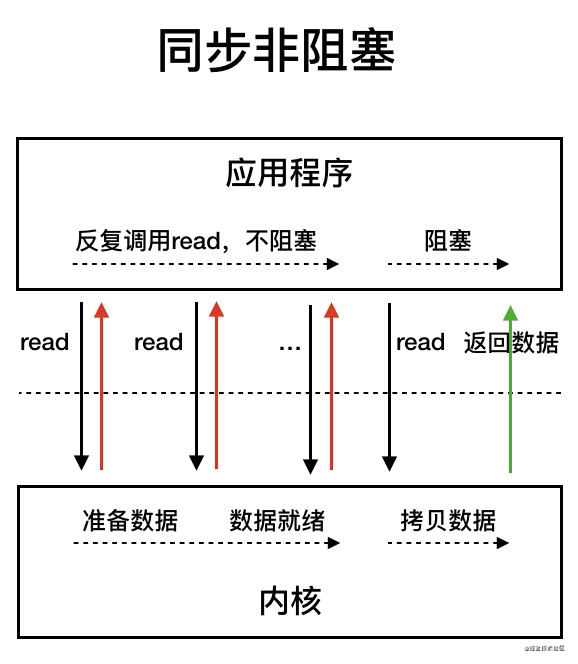

同步非阻塞 IO 模型中，应用程序会一直发起 read 调用，等待数据从内核空间拷贝到用户空间的这段时间里，线程依然是阻塞的，直到在内核把数据拷贝到用户空间。

相比于同步阻塞 IO 模型，同步非阻塞 IO 模型确实有了很大改进。通过轮询操作，避免了一直阻塞。

但是，这种 IO 模型同样存在问题：**应用程序不断进行 I/O 系统调用轮询数据是否已经准备好的过程是十分消耗 CPU 资源的。**

这个时候，**I/O 多路复用模型** 就上场了。


IO 多路复用模型中，线程**首先发起 select 调用，询问内核数据是否准备就绪**，等内核把数据准备好了，用户线程再发起 read 调用。**read 调用的过程（数据从内核空间 -> 用户空间）还是阻塞的**。

> 目前支持 IO 多路复用的系统调用，有 select，epoll 等等。select 系统调用，目前几乎在所有的操作系统上都有支持。
>
> - **select 调用** ：内核提供的系统调用，它支持一次查询多个系统调用的可用状态。几乎所有的操作系统都支持。
> - **epoll 调用** ：linux 2.6 内核，属于 select 调用的增强版本，优化了 IO 的执行效率。

**IO 多路复用模型，通过减少无效的系统调用，减少了对 CPU 资源的消耗。**

Java 中的 NIO ，有一个非常重要的**选择器 ( Selector )** 的概念，也可以被称为 **多路复用器**。通过它，只需要一个线程便可以管理多个客户端连接。当客户端数据到了之后，才会为其服务。


> Java AIO[Asynchronous I/O] | 异步非阻塞I/O模型

AIO 也就是 NIO 2。Java 7 中引入了 NIO 的改进版 NIO 2,它是异步 IO 模型。

异步 IO 是基于事件和回调机制实现的，也就是应用操作之后会直接返回，不会堵塞在那里，当后台处理完成，操作系统会通知相应的线程进行后续的操作。


目前来说 AIO 的应用还不是很广泛。Netty 之前也尝试使用过 AIO，不过又放弃了。这是因为，Netty 使用了 AIO 之后，在 Linux 系统上的性能并没有多少提升。

最后，来一张图，简单总结一下 Java 中的 BIO、NIO、AIO。


### ⭐Java集合类框架的基本接口有哪些？

Java中的集合分为value（Conllection），key-value(Map)两种存储结构

> 存储value有分为List 、Set、Queue

List：有序，可存储重复元素

Set：无序，元素不可重复。根据equals和hashcode判断（如果一个对象要存储在Set中，必须重写equals和hashCode方法）

Queue：队列

> 存储key-value的为map


### ⭐ Arraylist 与 LinkedList 区别

1. **是否保证线程安全**： ArrayList 和 LinkedList 都是不同步的，也就是不保证线程安全；
2. **底层数据结构**： Arraylist 底层使用的是 Object 数组； LinkedList 底层使用的是 双向链表数据结构（JDK1.6 之前为循环链表，JDK1.7 取消了循环。注意双向链表和双向循环链表的区别，下面有介绍到！）
3. **插入和删除是否受元素位置的影响**：①ArrayList采用数组存储，所以插入和删除元素的时间复杂度受元素位置的影响。比如：执行add(Ee)方法的时候，ArrayList会默认在将指定的元素追加到此列表的末尾，这种情况时间复杂度就是O(1)。但是如果要在指定位置i插入和删除元素的话（add(intindex,Eelement)）时间复杂度就为O(n-i)。因为在进行上述操作的时候集合中第i和第i个元素之后的(n-i)个元素都要执行向后位/向前移一位的操作。②LinkedList采用链表存储，所以对于add(Ee)方法的插入，删除元素时间复杂度不受元素位置的影响，近似O(1)，如果是要在指定位置i插入和删除元素的话（(add(intindex,Eelement)）时间复杂度近似为o(n))因为需要先移动到指定位置再插入。
4. **是否支持快速随机访问**：LinkedList不支持高效的随机元素访问，而ArrayList支持。快速随机访问就是通过元素的序号快速获取元素对象(对应于get(intindex)方法)。
5. **内存空间占用**：ArrayList的空间浪费主要体现在在list列表的结尾会预留一定的容量空间，而LinkedList的空间花费则体现在它的每一个元素都需要消耗比ArrayList更多的空间（因为要存放直接后继和直接前驱以及数据）。


### HashMap 的⻓度为什么是2的幂次方

​	为了能让HashMap存取高效，尽量较少碰撞，也就是要尽量把数据分配均匀。我们上面也讲到了过了，Hash值的范围值-2147483648到2147483647，前后加起来大概40亿的映射空间，只要哈希函数映射得比较均匀松散，一般应用是很难出现碰撞的。但问题是一个40亿⻓度的数组，内存是放不下的。所以这个散列值是不能直接拿来用的。用之前还要先做对数组的⻓度取模运算，得到的余数才能用来要存放的位置也就是对应的数组下标。这个数组下标的计算方法是“(n-1)&hash”。（n代表数组⻓度）。这也就解释了HashMap的⻓度为什么是2的幂次方。

算法如何设计？

​	我们首先可能会想到采用%取余的操作来实现。但是，重点来了：“取余(%)操作中如果除数是2的幂次则等价于与其除数减一的与(&)操作（也就是说hash%length==hash&(length-1)的前提是length是2的n次方；）。”并且采用二进制位操作&，相对于%能够提高运算效率，这就解释了HashMap的⻓度为什么是2的幂次方

🙋‍♂️笔者认为Guide写的这个摸棱两可，所以找了一个StackOverFlow中描述更为清楚的翻译为下：

> 🧚‍♂️原帖：https://stackoverflow.com/questions/53526790/why-are-hashmaps-implemented-using-powers-of-two
>
> 当你从一个幂为2的数字中减去1得到的是一个二进制表示都是1的数字。例如16是2的幂。如果从中减去1，得到15，它的二进制表示是1111。现在，如果你用1111对任何一个数字进行位 AND  运算，你将得到这个数字的最后4位，换句话说，它等于这个数字乘以16的模(除法运算通常是一个昂贵的运算。因此，位操作通常比除法更受欢迎)。最后的4位将计算为0到15之间的任意数字，这些数字是基础数组的索引。
>
> 你可以改成17。在这种情况下，从中减去1得到16也就是二进制的10000。现在你对一个16的数做 AND（与&）  运算，你会失去所有的位，除了从结尾开始的第5位。因此，无论取多少数，数组索引都是16或0。这意味着会有很多冲突，这反过来又意味着性能很差。您将需要 O (log n)而不是 O  (1)进行检索，因为当冲突发生时，给定桶中的所有节点都将存储在一个红黑色树中。不仅如此。如果您在一个多线程环境中使用  ConcurrentHashMap，那么您将经历大量的同步，因为所有新添加的内容最终都会以非常少的存储桶(在上述情况下只有2-0和16个)结束，并且当您在一个已经有其他节点的存储桶中添加新节点时，存储桶将被锁定，以避免由于多个线程的修改而导致的数据不一致。因此，尝试添加新节点的其他线程需要等待当前线程释放锁。
>
> 最后，我还应该提到，Java HashMap 实现还将键的哈希代码的16位向右移动，并在用(length-1)进行位 AND 之前对原哈希代码进行位异或操作，以确保高阶位的效果也被捕获。
>
> 因此，基本上要点是，如果大小是2的幂次方，那么与其他任何不是2的大小相比，键将更均匀地分布在整个数组中，最小的冲突将导致更好的检索性能(在ConcurrentHashMap 的情况下也更少的同步)。

为什么能减少碰撞？这是因为hashmap的hash值是hashCode右移16位得到的，这么做使得hash值的低位保留了高位的信息，所以只要低位就可以了。

一句话，HashMap的长度为2的幂次方的原因是为了减少Hash碰撞，尽量使Hash算法的结果均匀分布。（只有当长度是2^n时，长度-1的二进制低位才全部是1）


### ConcurrentHashMap 和 Hashtable 的区别

`ConcurrentHashMap` 和 `Hashtable` 的区别主要体现在实现线程安全的方式上不同。

底层数据结构：JDK1.7的`ConcurrentHashMap`底层采用**分段的数组+链表**实现，JDK1.8采用的数据结构跟`HashMap1.8`的结构一样，**数组+链表/红黑二叉树**。`Hashtable`和JDK1.8之前的`HashMap`的底层数据结构类似都是采用数组+链表的形式，数组是`HashMap`的主体，链表则是主要为了解决哈希冲突而存在的；

实现线程安全的方式（重要）：

1. 在JDK1.7的时候，ConcurrentHashMap（分段锁）对整个桶数组进行了分割分段(Segment)，每一把锁只锁容器其中一部分数据，多线程访问容器里不同数据段的数据，就不会存在锁竞争，提高并发访问率。到了JDK1.8的时候已经摒弃了Segment的概念，而是直接用Node数组+链表+红黑树的数据结构来实现，并发控制使用synchronized和CAS来操作。（JDK1.6以后对synchronized锁做了很多优化）整个看起来就像是优化过且线程安全的HashMap，虽然在JDK1.8中还能看到Segment的数据结构，但是已经简化了属性，只是为了兼容旧版本；
2. HashTable和HashMap的实现原理几乎一样，差别无非是**1.HashTable不允许key和value为null；2.HashTable是线程安全的。**但是HashTable线程安全的策略实现代价却太大了，简单粗暴，get/put所有相关操作都是synchronized的，这相当于给整个哈希表加了一把**大锁**，多线程访问时候，只要有一个线程访问或操作该对象，那其他线程只能阻塞，相当于将所有的操作**串行化**，在竞争激烈的并发场景中性能就会非常差。


JDK1.7 的 ConcurrentHashMap：

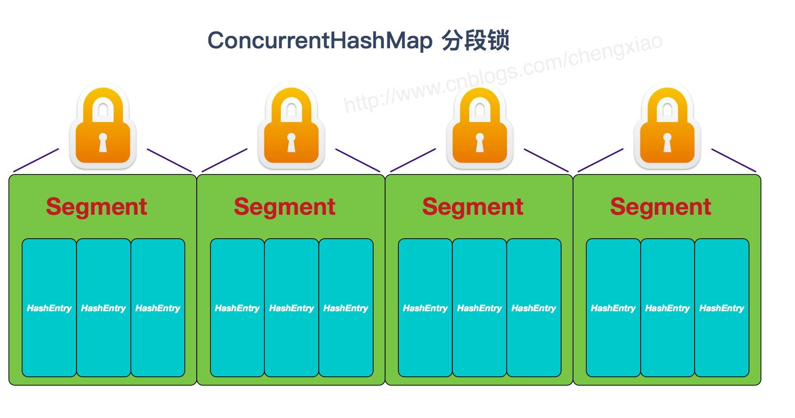

JDK1.8 的 ConcurrentHashMap：
JDK1.8 的 ConcurrentHashMap 不在是 Segment 数组 + HashEntry 数组 + 链表，而是 Node 数组 + 链表 / 红黑树。不过，Node 只能用于链表的情况，红黑树的情况需要使用 TreeNode 。当冲突链表达到一定⻓度时，链表会转换成红黑树。


### ⭐ConcurrentHashMap线程安全的具体实现方式/底层具体实现

#### JDK1.7


首先将数据分为一段一段的存储，然后给每一段数据配一把锁，当一个线程占用锁访问其中一个段数据时，其他段的数据也能被其他线程访问。

`ConcurrentHashMap` 是由`Segment `数组结构和 `HashEntry` 数组结构组成。

Segment实现了ReentrantLock,所以Segment是一种可重入锁，扮演锁的⻆色。HashEntry用于存储键值对数据。

```JAVA
static class Segment<K,V> extends ReentrantLock implements Serializable {
}
```

一个`ConcurrentHashMap`里包含一个`Segment`数组。`Segment`的结构和`HashMap`类似，是一种数组和链表结构，一个`Segment`包含一个`HashEntry`数组，每个`HashEntry`是一个链表结构的元素，每个Segment守护着一个`HashEntry`数组里的元素，当对`HashEntry`数组的数据进行修改时，必须首先获得对应的Segment的锁。


#### JDK1.8

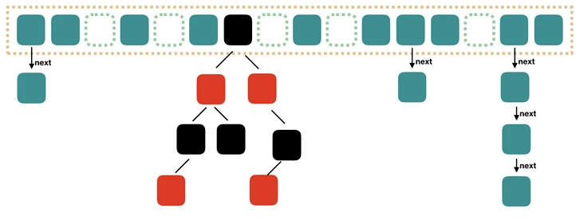

`ConcurrentHashMap`取消了Segment分段锁，采用`CAS`和`synchronized`来保证并发安全。数据结构跟`HashMap1.8`的结构类似，数组+链表/红黑二叉树。Java 8在链表⻓度超过一定阈值（8）时将链表（寻址时间复杂度为O(N)）转换为红黑树（寻址时间复杂度为O(log(N))）synchronized只锁定当前链表或红黑二叉树的首节点，这样只要hash不冲突，就不会产生并发，效率又提升N倍。


### 说一说Java反射？ 

> 反射机制：指在程序运行过程中，对任意一个类都能获取其所有属性和方法，并且对任意一个对象都能调用其任意一个方法。这种动态获取类和对象的信息，以及动态调用对象的方法的功能被称为Java语言的反射机制。

**优点** ： 可以让咱们的代码更加灵活、为各种框架提供开箱即用的功能提供了便利

**缺点** ：让我们在运行时有了分析操作类的能力，这同样也增加了安全问题。比如可以无视泛型参数的安全检查（泛型参数的安全检查发生在编译时）。另外，反射的性能也要稍差点，不过，对于框架来说实际是影响不大的

Java中的对象有两种类型：编译时类型和运行时类型。编译时类型指在声明对象时所采用的类型，运行时类型指为对象赋值时所采用的类型。在如下代码中，person对象的编译时类型为Person，运行时类型为Student，因此无法在编译时获取在Student类中定义的方法：

`Person person = new Student();`

因此，程序在编译期间无法预知该对象和类的真实信息，只能通过运行时信息来发现该对象和类的真实信息，而其真实信息（对象的属性和方法）通常通过反射机制来获取，这便是Java语言中反射机制的核心功能。

所以反射是一种能够在程序运行时动态访问、修改某个类中任意属性（状态）和方法（行为）的机制（包括private实例和方法），java反射机制提供了以下几个功能：

- 在运行时判断任意一个对象所属的类；
- 在运行时构造任意一个类的对象；
- 在运行时判断任意一个类所具有的成员变量和方法；
- 在运行时调用任意一个对象的方法。

反射有什么用？

- 操作因访问权限限制的属性和方法；
- 实现自定义注解；
- 动态加载第三方jar包，解决android开发中方法数不能超过65536个的问题；
- 按需加载类，节省编译和初始化APK的时间；

原理：

当我们编写完一个Java项目之后，每个java文件都会被编译成一个.class文件，这些Class对象承载了这个类的所有信息，包括父类、接口、构造函数、方法、属性等，这些class文件在程序运行时会被ClassLoader加载到虚拟机中。

当一个类被加载以后，Java虚拟机就会在内存中自动产生一个Class对象。我们通过new的形式创建对象实际上就是通过这些Class来创建，只是这个过程对于我们是不透明的而已。

反射的工作原理就是借助Class.java、Constructor.java、Method.java、Field.java这四个类在程序运行时动态访问和修改任何类的行为和状态。

> 小结

- 通过反射访问方法比实例慢很多；
- 有用到反射的类不能被混淆；
- 反射存在性能问题，但使用不频繁、按需使用时，对程序性能影响并不大；
- 反射存在安全性问题，因为可以随意修改类的所有状态和行为（包括private方法和实例）；
- 使用反射访问Android的API时需要注意因为不同API版本导致的兼容性问题；


## :clock10: 并发编程

### 请简要描述线程与进程的关系,区别及优缺点？

####  图解进程和线程的关系

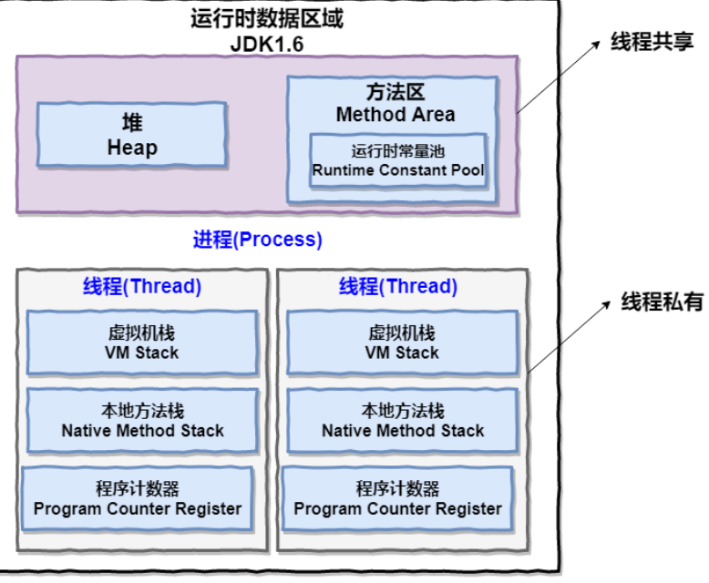

从上图可以看出：一个进程中可以有多个线程，多个线程共享进程的**堆和方法区(JDK1.8之后的元空间)**资源，但是每个线程有自己的**程序计数器、虚拟机栈和本地方法栈**。

总结：线程是进程划分成的更小的运行单位。线程和进程最大的不同在于基本上各进程是独立的，而各线程则不一定，因为同一进程中的线程极有可能会相互影响。线程执行开销小，但不利于资源的管理和保护；而进程正相反

#### 程序计数器为什么是私有的?

程序计数器主要有下面两个作用：

1. 字节码解释器通过改变程序计数器来依次读取指令，从而实现代码的流程控制，如：顺序执
   行、选择、循环、异常处理。
2. 在多线程的情况下，程序计数器用于记录当前线程执行的位置，从而当线程被切换回来的时
   候能够知道该线程上次运行到哪儿了。

需要注意的是，如果执行的是native方法，那么程序计数器记录的是undefined地址，只有执行的是Java代码时程序计数器记录的才是下一条指令的地址。所以，程序计数器私有主要是为了线程切换后能恢复到正确的执行位置。


#### 虚拟机栈和本地方法栈为什么是私有的?

* 虚拟机栈：每个Java方法在执行的同时会创建一个栈帧用于存储局部变量表、操作数栈、常量池引用等信息。从方法调用直至执行完成的过程，就对应着一个栈帧在Java虚拟机栈中入栈和出栈的过程。
* 本地方法栈：和虚拟机栈所发挥的作用非常相似，区别是：虚拟机栈为虚拟机执行Java方法（也就是字节码）服务，而本地方法栈则为虚拟机使用到的Native方法服务。在HotSpot虚拟机中和Java虚拟机栈合二为一。

所以，为了保证线程中的局部变量不被别的线程访问到，虚拟机栈和本地方法栈是线程私有的。


#### 一句话简单了解堆和方法区

堆和方法区是所有线程共享的资源，其中堆是进程中最大的一块内存，主要用于存放新创建的对象(所有对象都在这里分配内存)，方法区主要用于存放已被加载的类信息、常量、静态变量、即时编译器编译后的代码等数据。


> 精简版

**进程是系统资源分配和调度的基本单位**，它能并发执行较高系统资源的利用率.

**线程**是**比进程更小**的能独立运行的基本单位,创建、销毁、切换成本要小于进程,可以减少程序并发执行时的时间和空间开销，使得操作系统具有更好的并发性。


### 说说线程的生命周期和状态?

Java 线程在运行的生命周期中的指定时刻只可能处于下面 6 种不同状态的其中一个状态（图源《Java 并发编程艺术》4.1.4 节）。

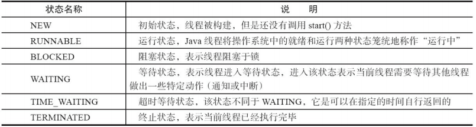

线程在生命周期中并不是固定处于某一个状态而是随着代码的执行在不同状态之间切换。Java 线程状态变迁如下图所示


由上图可以看出：线程创建之后它将处于 **NEW（新建）** 状态，调用 `start()` 方法后开始运行，线程这时候处于 **READY（可运行）** 状态。可运行状态的线程获得了 CPU 时间片（timeslice）后就处于 **RUNNING（运行）** 状态。

由上图可以看出：线程创建之后它将处于 **NEW（新建）** 状态，调用 `start()` 方法后开始运行，线程这时候处于 **READY（可运行）** 状态。可运行状态的线程获得了 CPU 时间片（timeslice）后就处于 **RUNNING（运行）** 状态。

> 在操作系统中层面线程有 READY 和 RUNNING 状态，而在 JVM 层面只能看到 RUNNABLE 状态（图源：[HowToDoInJava](https://howtodoinJava.com/)

：[Java Thread Life Cycle and Thread States](https://howtodoinJava.com/Java/multi-threading/Java-thread-life-cycle-and-thread-states/)

），所以 Java 系统一般将这两个状态统称为 **RUNNABLE（运行中）** 状态 。

**为什么 JVM 没有区分这两种状态呢？** （摘自：[java线程运行怎么有第六种状态？ - Dawell的回答](https://www.zhihu.com/question/56494969/answer/154053599)

>  ） 现在的**时分**（time-sharing）**多任务**（multi-task）操作系统架构通常都是用所谓的“**时间分片**（time quantum or time slice）”方式进行**抢占式**（preemptive）轮转调度（round-robin式）。这个时间分片通常是很小的，一个线程一次最多只能在 CPU 上运行比如 10-20ms 的时间（此时处于 running 状态），也即大概只有 0.01  秒这一量级，时间片用后就要被切换下来放入调度队列的末尾等待再次调度。（也即回到 ready  状态）。线程切换的如此之快，区分这两种状态就没什么意义了。


当线程执行 `wait()`方法之后，线程进入 **WAITING（等待）** 状态。进入等待状态的线程需要依靠其他线程的通知才能够返回到运行状态，而 **TIMED_WAITING(超时等待)** 状态相当于在等待状态的基础上增加了超时限制，比如通过 `sleep（long millis）`方法或 `wait（long millis）`方法可以将 Java 线程置于 TIMED_WAITING 状态。当超时时间到达后 Java 线程将会返回到 RUNNABLE 状态。当线程调用同步方法时，在没有获取到锁的情况下，线程将会进入到 **BLOCKED（阻塞）** 状态。线程在执行 Runnable 的`run()`方法之后将会进入到 **TERMINATED（终止）** 状态。

相关阅读：[挑错 |《Java 并发编程的艺术》中关于线程状态的三处错误](https://mp.weixin.qq.com/s/UOrXql_LhOD8dhTq_EPI0w)


### Java线程的创建方式

有四种方式可以用来创建线程：

- 继承Thread类
- 实现Runnable接口
- ExecutorService和Callable`<Class>`实现有返回值的线程
- Executor创建线程池

实现Runnable接口这种方式更受欢迎，因为这不需要继承Thread类。在应用设计中已经继承了别的对象的情况下，这需要多继承（而Java不支持多继承），只能实现接口。同时，线程池也是非常高效的，很容易实现和使用。


### JMM 是什么？

网上的概念鱼龙混杂，笔者直接摘录部分Java高并发核心编程和Java并发编程的艺术中的介绍：

> JMM（Java Memory Model and Thread Specification）：定义了一个线程对共享变量写入时，如何确保对另一个线程是可见的。实际上，JMM提供了合理的禁用缓存以及禁止重排序的方法，所以其核心的价值在于解决可见性和有序性。

​	Java内存模型规定所有的变量都存储在主存中，JMM的主存类似于物理内存，但有区别，还能包含部分共享缓存。每个Java线程都有自己的工作内存（类似于CPU高速缓存，但也有区别）

1. 主存：主要存储的是Java实例对象，所有线程创建的实例对象都存放在主存中，无论该实例对象是成员变量还是方法中的本地变量（也称局部变量），当然也包括共享的类信息、常量、静态变量。由于是共享数据区域，因此多条线程对同一个变量进行访问可能会发现线程安全问题。
2. 工作内存：主要存储当前方法的所有本地变量信息（工作内存中存储着主存中的变量副本），每个线程只能访问自己的工作内存，即线程中的本地变量对其他线程是不可见的，即使两个线程执行的是同一段代码，它们也会各自在自己的工作内存中创建属于当前线程的本地变量，当然也包括字节码行号指示器、相关Native方法的信息。注意，由于工作内存是每个线程的私有数据，线程间无法相互访问工作内存，因此存储在工作内存的数据不存在线程安全问题。

JMM规定：

1. 所有变量存储在主存中
2. 每个线程都有自己的工作内存，且对变量的操作都是在工作内存中进行的
3. 不同线程之间无法直接访问彼此工作内存中的变量，要想访问只能通过主存来传递。


​	JMM将所有的变量都存放在公共主存中，当线程使用变量时，会把公共主存中的变量复制到自己的工作内存（或者叫作私有内存）中，线程对变量的读写操作是自己的工作内存中的变量副本。因此，JMM模型也需要解决代码重排序和缓存可见性问题。JMM提供了一套自己的方案去禁用缓存以及禁止重排序来解决这些可见性和有序性问题。JMM提供的方案包括大家都很熟悉的volatile、synchronized、final等。JMM定义了一些内存操作的抽象指令集，然后将这些抽象指令包含到Java的volatile、synchronized等关键字的语义中，并要求JVM在实现这些关键字时必须具备其包含的JMM抽象指令的能力。


> 解决混淆问题：JVM和JMM的区别？

JMM（Java内存模型）看上去和JVM（Java内存结构）差不多，很多人会误以为两者是一回事，这也就导致面试过程中经常答非所问

JMM属于语言级别的内存模型，它确保了在不同的编译器和不同的CPU平台上为Java程序员提供一致的内存可见性保证和指令并发执行的有序性。

以Java为例，一个i++方法编译成字节码后，在JVM中是分成以下三个步骤运行的：

（1）从主存中复制i的值并复制到CPU的工作内存中。

（2）CPU取工作内存中的值，然后执行i++操作，完成后刷新到工作内存。

（3）将工作内存中的值更新到主存。

当多个线程同时访问该共享变量i时，每个线程都会将变量i复制到工作内存中进行修改，如果线程A读取变量i的值时，线程B正在修改i的值，问题就来了：线程B对变量i的修改对线程A而言就是不可见的。

这就是多线程并发访问共享变量所造成的结果不一致问题，该问题属于JMM需要解决的问题。

最后再附上JVM的运行时数据区


> 简洁版（大致意思合理即可）

👨‍💻JMM 是什么？

🙋‍♂️JMM是Java内存模型。Java线程之间的通信由Java内存模型控制，JMM决定一个线程对共享变量的写入何时对另一个线程可见。从抽象的角度来看，JMM定义了线程和主内存之间的抽象关系：线程之间的共享变量存储在主内存（Main Memory）中，每个线程都有一个私有的本地内存（Local Memory），本地内存中存储了该线程以读/写共享变量的副本。本地内存是JMM的一个抽象概念，并不真实存在。它涵盖了缓存、写缓冲区、寄存器以及其他的硬件和编译器优化。

举个:chestnut: 如果线程A与线程B之间要通信的话，必须要经历下面2个步骤。

1）线程A把本地内存A中更新过的共享变量刷新到主内存中去。

2）线程B到主内存中去读取线程A之前已更新过的共享变量。


从整体来看，这两个步骤实质上是线程A在向线程B发送消息，而且这个通信过程必须要经过主内存。JMM通过控制主内存与每个线程的本地内存之间的交互，来为Java程序员提供内存可见性保证。


### 聊聊volatile

先要从 **CPU 缓存模型** 说起

**为什么要弄一个 CPU 高速缓存呢？** **CPU Cache 缓存的是内存数据用于解决 CPU 处理速度和内存不匹配的问题，内存缓存的是硬盘数据用于解决硬盘访问速度过慢的问题。**

为了更好地理解，我画了一个简单的 CPU Cache 示意图如下（实际上，现代的 CPU Cache 通常分为三层，分别叫 L1,L2,L3 Cache）:


**CPU Cache 的工作方式：**

先复制一份数据到 CPU Cache 中，当 CPU 需要用到的时候就可以直接从 CPU Cache 中读取数据，当运算完成后，再将运算得到的数据写回 Main Memory 中。但是，这样存在 **内存缓存不一致性的问题** ！比如我执行一个 i++操作的话，如果两个线程同时执行的话，假设两个线程从 CPU Cache 中读取的 i=1，两个线程做了 1++运算完之后再写回 Main Memory 之后 i=2，而正确结果应该是 i=3。

**CPU 为了解决内存缓存不一致性问题可以通过制定缓存一致协议或者其他手段来解决。**

前面介绍过，为了解决CPU访问主存时主存读写性能的短板，在CPU中增加了高速缓存，但这带来了可见性问题。而Java的**volatile关键字可以保证共享变量的主存可见性，也就是将共享变量的改动值立即刷新回主存**。在正常情况下，系统操作并不会校验共享变量的缓存一致性，只有当共享变量用volatile关键字修饰了，该变量所在的缓存行才被要求进行缓存一致性的校验。


> 📖《Java并发编程实战》中这样说到：
>
> ​	Java语言提供了一种稍弱的同步机制，即volatile变量，用来确保将变量的更新操作通知到其他线程。当把变量声明为volatile类型后，编译器与运行时都会注意到这个变量是共享的，因此不会将该变量上的操作与其他内存操作一起重排序。volatile变量不会被缓存在寄存器或者对其他处理器不可见的地方，因此在读取volatile类型的变量时总会返回最新写入的值
>
> ​	volatile变量对可见性的影响比volatile变量本身更为重要。当线程A首先写入一个volatile变量并且线程B随后读取该变量时，在写入volatile变量之前对A可见的所有变量的值，在B读取了volatile变量后，对B也是可见的。因此，**从内存可见性的角度来看，写入volatile变量相当于退出同步代码块，而读取volatile变量就相当于进入同步代码块**。


### CAS 是什么？

cas 叫做 CompareAndSwap，**比较并交换**，很多地方使用到了它，比如锁升级中自旋锁就有用到，主要是**通过处理器的指令来保证操作的原子性**，它主要包含三个变量：

- **1.变量内存地址**
- **2.旧的预期值 A**
- **3.准备设置的新值 B**

当一个线程需要修改一个共享变量的值，完成这个操作需要先取出共享变量的值，赋给 A，基于 A 进行计算，得到新值 B，在用预期原值 A 和内存中的共享变量值进行比较，**如果相同就认为其他线程没有进行修改**，而将新值写入内存

**CAS的缺点**

- **CPU开销比较大**：在并发量比较高的情况下，如果许多线程反复尝试更新某一个变量，却又一直更新不成功，又因为**自旋**的时候会一直占用CPU，如果CAS一直更新不成功就会一直占用，造成CPU的浪费。
- **ABA 问题**：比如线程 A 去修改 1 这个值，修改成功了，但是中间 线程 B 也修改了这个值，但是修改后的结果还是 1，所以不影响 A 的操作，这就会有问题。可以用**版本号**来解决这个问题。
- **只能保证一个共享变量的原子性**

> 📖《offer来了》这样定义CAS的：**CAS（Compare And Swap）**指比较并交换。CAS算法CAS(V, E, N)包含3个参数，V表示要更新的变量，E表示预期的值，N表示新值。在且仅在V值等于 E值时，才会将V值设为 N，如果 V值和 E值不同，则说明已经有其他线程做了更新，当前线程什么都不做。最后，CAS返回当前V的真实值。
>
> * CAS的特性：乐观锁
> * CAS自旋等待：在JDK的原子包java.util.concurrent.atomic里面提供了一组原子类，这些原子类的基本特性就是在多线程环境下，在有多个线程同时执行这些类的实例包含的方法时，会有排他性。其内部便是基于CAS算法实现的，即在某个线程进入方法中执行其中的指令时，不会被其他线程打断；而别的线程就像自旋锁一样，一直等到该方法执行完成才由JVM从等待的队列中选择另一个线程进入。


### 什么是上下文切换？

多线程编程中一般线程的个数都大于CPU核心的个数，而一个CPU核心在任意时刻只能被一个线程使用，为了让这些线程都能得到有效执行，CPU采取的策略是为每个线程分配时间片并轮转的形式。当一个线程的时间片用完的时候就会重新处于就绪状态让给其他线程使用，这个过程就属于一次上下文切换。

概括来说就是：**当前任务在执行完CPU时间片切换到另一个任务之前会先保存自己的状态，以便下次再切换回这个任务时，可以再加载这个任务的状态。**任务从保存到再加载的过程就是一次上下文切换。

上下文切换通常是计算密集型的。也就是说，它需要相当可观的处理器时间，在每秒几十上百次的切换中，每次切换都需要纳秒量级的时间。所以，上下文切换对系统来说意味着消耗大量的CPU时间，事实上，可能是操作系统中时间消耗最大的操作。

Linux相比与其他操作系统（包括其他类Unix系统）有很多的优点，其中有一项就是，其上下文切换和模式切换的时间消耗非常少。


### 说说 sleep() 方法和 wait() 方法区别和共同点?

- 两者最主要的区别在于：**`sleep()` 方法没有释放锁，而 `wait()` 方法释放了锁** 。
- 两者都可以暂停线程的执行。
- `wait()` 通常被用于线程间交互/通信，`sleep() `通常被用于暂停执行。
- `wait()` 方法被调用后，线程不会自动苏醒，需要别的线程调用同一个对象上的 `notify() `或者 `notifyAll()` 方法。`sleep() `方法执行完成后，线程会自动苏醒。或者可以使用 `wait(long timeout)` 超时后线程会自动苏醒。


### 为什么我们调用 start() 方法时会执行 run() 方法，为什么我们不能直接调用 run() 方法？

这是另一个非常经典的 Java 多线程面试问题，而且在面试中会经常被问到。很简单，但是很多人都会答不上来！

new 一个 Thread，线程进入了新建状态。调用 `start()`方法，会启动一个线程并使线程进入了就绪状态，当分配到时间片后就可以开始运行了。 `start()` 会执行线程的相应准备工作，然后自动执行 `run()` 方法的内容，这是真正的多线程工作。 但是，直接执行 `run()` 方法，会把 `run()` 方法当成一个 main 线程下的普通方法去执行，并不会在某个线程中执行它，所以这并不是多线程工作。

**总结： 调用 `start()` 方法方可启动线程并使线程进入就绪状态，直接执行 `run()` 方法的话不会以多线程的方式执行。**


### synchronized汇总

#### 说一说自己对于 synchronized 关键字的了解

**`synchronized` 关键字解决的是多个线程之间访问资源的同步性，`synchronized`关键字可以保证被它修饰的方法或者代码块在任意时刻只能有一个线程执行。**

另外，在 Java 早期版本中，`synchronized` 属于 **重量级锁**，效率低下。

**为什么呢？**

因为监视器锁（monitor）是依赖于底层的操作系统的 `Mutex Lock` 来实现的，Java 的线程是映射到操作系统的原生线程之上的。如果要挂起或者唤醒一个线程，都需要操作系统帮忙完成，而操作系统实现线程之间的切换时需要从用户态转换到内核态，这个状态之间的转换需要相对比较长的时间，时间成本相对较高。

庆幸的是在 Java 6 之后 Java 官方对从 JVM 层面对 `synchronized` 较大优化，所以现在的 `synchronized` 锁效率也优化得很不错了。JDK1.6 对锁的实现引入了大量的优化，如自旋锁、适应性自旋锁、锁消除、锁粗化、偏向锁、轻量级锁等技术来减少锁操作的开销。

所以，你会发现目前的话，不论是各种开源框架还是 JDK 源码都大量使用了 `synchronized` 关键字。

> 笔者个人认为《offer来了》里面解释Java中的关键字是真的不错，上述截取的Guide，但是过于晦涩，所以截取了里面对synchronized 的解释：
>
> 🙋‍♂️**synchronized**关键字用于为Java对象、方法、代码块提供线程安全的操作。synchronized属于独占式的悲观锁，同时属于可重入锁。在使用synchronized修饰对象时，同一时刻只能有一个线程对该对象进行访问；在synchronized修饰方法、代码块时，同一时刻只能有一个线程执行该方法体或代码块，其他线程只有等待当前线程执行完毕并释放锁资源后才能访问该对象或执行同步代码块。Java中的每个对象都有个monitor对象，加锁就是在竞争monitor（监视器锁）对象。对代码块加锁是通过在前后分别加上monitorenter和monitorexit指令实现的，对方法是否加锁是通过一个标记位来判断的。


#### 讲一下 synchronized 关键字的底层原理

##### synchronized 同步语句块的情况

```java
public class SynchronizedDemo {
    public void method() {
        synchronized (this) {
            System.out.println("synchronized 代码块");
        }
    }
}
```

通过 JDK 自带的 `javap` 命令查看 `SynchronizedDemo` 类的相关字节码信息：首先切换到类的对应目录执行 `javac SynchronizedDemo.java` 命令生成编译后的 .class 文件，然后执行`javap -c -s -v -l SynchronizedDemo.class`。


从上面我们可以看出：**`synchronized` 同步语句块的实现使用的是 `monitorenter` 和 `monitorexit` 指令，其中 `monitorenter` 指令指向同步代码块的开始位置，`monitorexit` 指令则指明同步代码块的结束位置。**

当执行 `monitorenter` 指令时，线程试图获取锁也就是获取 **对象监视器 `monitor`** 的持有权。

> 在 Java 虚拟机(HotSpot)中，Monitor 是基于 C++实现的，由[ObjectMonitor](https://github.com/openjdk-mirror/jdk7u-hotspot/blob/50bdefc3afe944ca74c3093e7448d6b889cd20d1/src/share/vm/runtime/objectMonitor.cpp)

> 实现的。每个对象中都内置了一个 `ObjectMonitor`对象。
>
> 另外，`wait/notify`等方法也依赖于`monitor`对象，这就是为什么只有在同步的块或者方法中才能调用`wait/notify`等方法，否则会抛出`java.lang.IllegalMonitorStateException`的异常的原因。

在执行`monitorenter`时，会尝试获取对象的锁，如果锁的计数器为 0 则表示锁可以被获取，获取后将锁计数器设为 1 也就是加 1。


对象锁的的拥有者线程才可以执行 `monitorexit` 指令来释放锁。在执行 `monitorexit` 指令后，将锁计数器设为 0，表明锁被释放，其他线程可以尝试获取锁。

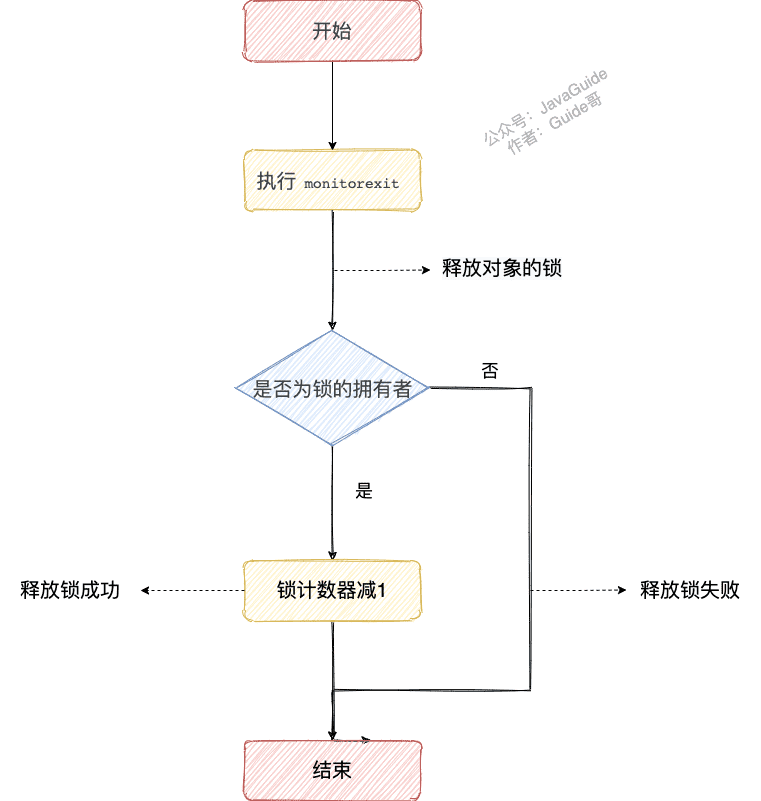

如果获取对象锁失败，那当前线程就要阻塞等待，直到锁被另外一个线程释放为止。


##### synchronized 修饰方法的的情况

```java
public class SynchronizedDemo2 {
    public synchronized void method() {
        System.out.println("synchronized 方法");
    }
}
```


`synchronized` 修饰的方法并没有 `monitorenter` 指令和 `monitorexit` 指令，取得代之的确实是 `ACC_SYNCHRONIZED` 标识，该标识指明了该方法是一个同步方法。JVM 通过该 `ACC_SYNCHRONIZED` 访问标志来辨别一个方法是否声明为同步方法，从而执行相应的同步调用。

如果是实例方法，JVM 会尝试获取实例对象的锁。如果是静态方法，JVM 会尝试获取当前 class 的锁。

##### 总结

`synchronized` 同步语句块的实现使用的是 `monitorenter` 和 `monitorexit` 指令，其中 `monitorenter` 指令指向同步代码块的开始位置，`monitorexit` 指令则指明同步代码块的结束位置。

`synchronized` 修饰的方法并没有 `monitorenter` 指令和 `monitorexit` 指令，取得代之的确实是 `ACC_SYNCHRONIZED` 标识，该标识指明了该方法是一个同步方法。

**不过两者的本质都是对对象监视器 monitor 的获取。**


#### 说说 synchronized 关键字和 volatile 关键字的区别

`synchronized` 关键字和 `volatile` 关键字是两个互补的存在，而不是对立的存在！

- **`volatile` 关键字**是线程同步的**轻量级实现**，所以 **`volatile `性能肯定比`synchronized`关键字要好** 。但是 **`volatile` 关键字只能用于变量而 `synchronized`   \**同步的\**  关键字可以修饰方法以及代码块** 。
- **`volatile` 关键字能保证数据的可见性，但不能保证数据的原子性。`synchronized` 关键字两者都能保证。**
- **`volatile`关键字主要用于解决变量在多个线程之间的可见性，而 `synchronized` 关键字解决的是多个线程之间访问资源的同步性。**


#### synchronized 锁升级的过程

在 Java1.6 之前的版本中，synchronized 属于重量级锁，效率低下，**锁是** cpu 一个**总量级的资源**，每次获取锁都要和 cpu 申请，非常消耗性能。

在 **jdk1.6 之后** Java 官方对从 JVM 层面对 synchronized 较大优化，所以现在的 synchronized 锁效率也优化得很不错了，Jdk1.6 之后，为了减少获得锁和释放锁所带来的性能消耗，引入了偏向锁和轻量级锁，**增加了锁升级的过程**，由无锁->偏向锁->自旋锁->重量级锁

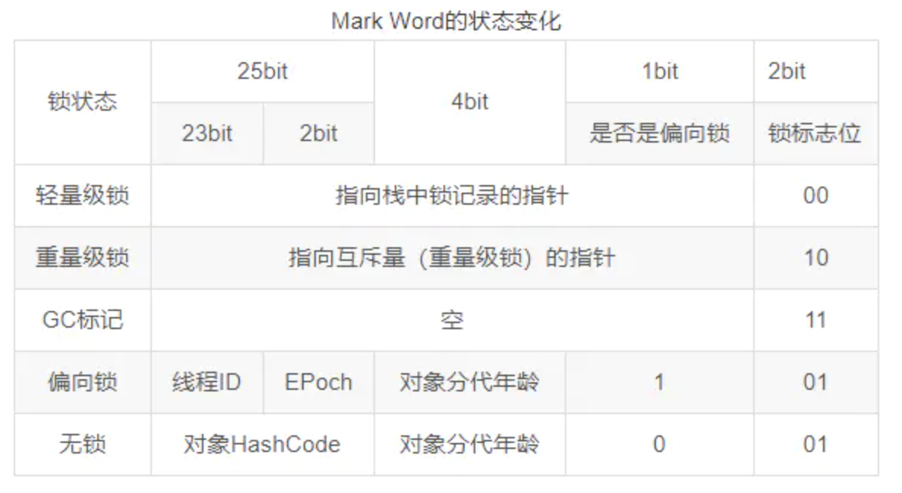

增加锁升级的过程主要是**减少用户态到核心态的切换，提高锁的效率，从 jvm 层面优化锁**


#### 谈谈 synchronized 和 ReentrantLock 的区别

##### 两者都是可重入锁

**“可重入锁”**  指的是自己可以再次获取自己的内部锁。比如一个线程获得了某个对象的锁，此时这个对象锁还没有释放，当其再次想要获取这个对象的锁的时候还是可以获取的，如果是不可重入锁的话，就会造成死锁。同一个线程每次获取锁，锁的计数器都自增 1，所以要等到锁的计数器下降为 0 时才能释放锁。

##### synchronized 依赖于 JVM 而 ReentrantLock 依赖于 API

`synchronized` 是依赖于 JVM 实现的，前面我们也讲到了 虚拟机团队在 JDK1.6 为 `synchronized` 关键字进行了很多优化，但是这些优化都是在虚拟机层面实现的，并没有直接暴露给我们。`ReentrantLock` 是 JDK 层面实现的（也就是 API 层面，需要 lock() 和 unlock() 方法配合 try/finally 语句块来完成），所以我们可以通过查看它的源代码，来看它是如何实现的。

##### ReentrantLock 比 synchronized 增加了一些高级功能

相比`synchronized`，`ReentrantLock`增加了一些高级功能。主要来说主要有三点：

- **等待可中断** : `ReentrantLock`提供了一种能够中断等待锁的线程的机制，通过 `lock.lockInterruptibly()` 来实现这个机制。也就是说正在等待的线程可以选择放弃等待，改为处理其他事情。
- **可实现公平锁** : `ReentrantLock`可以指定是公平锁还是非公平锁。而`synchronized`只能是非公平锁。所谓的公平锁就是先等待的线程先获得锁。`ReentrantLock`默认情况是非公平的，可以通过 `ReentrantLock`类的`ReentrantLock(boolean fair)`构造方法来制定是否是公平的。
- **可实现选择性通知（锁可以绑定多个条件）**: `synchronized`关键字与`wait()`和`notify()`/`notifyAll()`方法相结合可以实现等待/通知机制。`ReentrantLock`类当然也可以实现，但是需要借助于`Condition`接口与`newCondition()`方法。

> `Condition`是 JDK1.5 之后才有的，它具有很好的灵活性，比如可以实现多路通知功能也就是在一个`Lock`对象中可以创建多个`Condition`实例（即对象监视器），**线程对象可以注册在指定的`Condition`中，从而可以有选择性的进行线程通知，在调度线程上更加灵活。 在使用`notify()/notifyAll()`方法进行通知时，被通知的线程是由 JVM 选择的，用`ReentrantLock`类结合`Condition`实例可以实现“选择性通知”** ，这个功能非常重要，而且是 Condition 接口默认提供的。而`synchronized`关键字就相当于整个 Lock 对象中只有一个`Condition`实例，所有的线程都注册在它一个身上。如果执行`notifyAll()`方法的话就会通知所有处于等待状态的线程这样会造成很大的效率问题，而`Condition`实例的`signalAll()`方法 只会唤醒注册在该`Condition`实例中的所有等待线程。

**如果你想使用上述功能，那么选择 ReentrantLock 是一个不错的选择。性能已不是选择标准**


### ⭐ThreadLocal 原理

简化版：

**如果想实现每一个线程都有自己的专属本地变量该如何解决呢？** JDK 中提供的`ThreadLocal`类正是为了解决这样的问题。 **`ThreadLocal`类主要解决的就是让每个线程绑定自己的值，可以将`ThreadLocal`类形象的比喻成存放数据的盒子，盒子中可以存储每个线程的私有数据。**

下面是ThreadLocal的源码：

```java
public class Thread implements Runnable {
    //......
    //与此线程有关的ThreadLocal值。由ThreadLocal类维护
    ThreadLocal.ThreadLocalMap threadLocals = null;

    //与此线程有关的InheritableThreadLocal值。由InheritableThreadLocal类维护
    ThreadLocal.ThreadLocalMap inheritableThreadLocals = null;
    //......
}

```

可以看出 **最终的变量是放在了当前线程的 `ThreadLocalMap` 中，并不是存在 `ThreadLocal` 上，`ThreadLocal` 可以理解为只是`ThreadLocalMap`的封装，传递了变量值。** `ThrealLocal` 类中可以通过`Thread.currentThread()`获取到当前线程对象后，直接通过`getMap(Thread t)`可以访问到该线程的`ThreadLocalMap`对象。

**每个`Thread`中都具备一个`ThreadLocalMap`，而`ThreadLocalMap`可以存储以`ThreadLocal`为 key ，Object 对象为 value 的键值对。**

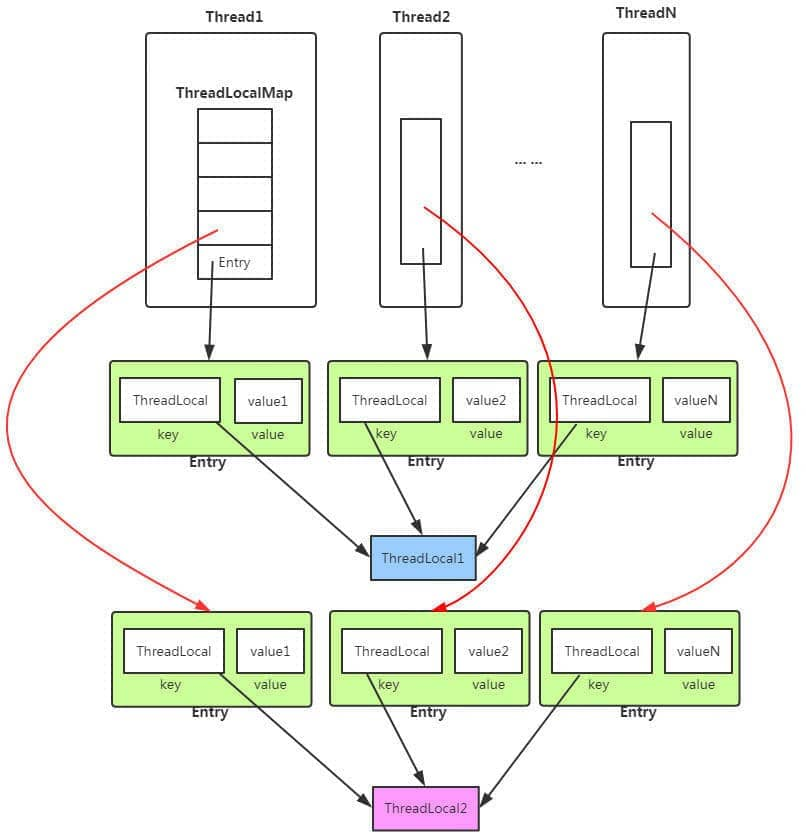

> 注：`ThreadLocalMap`是`ThreadLocal`的静态内部类。


【扩展】 ThreadLocal的内存泄露（简化版）：

具体详细看Guide：[ThreadLocal的内存泄露](https://javaguide.cn/java/concurrent/java-concurrent-questions-02.html#threadlocal-%E5%86%85%E5%AD%98%E6%B3%84%E9%9C%B2%E9%97%AE%E9%A2%98)

`ThreadLocalMap` 中使用的 key 为 `ThreadLocal` 的弱引用,而 value 是强引用。所以，如果 `ThreadLocal` 没有被外部强引用的情况下，在垃圾回收的时候，key 会被清理掉，而 value 不会被清理掉。


### 实现 Runnable 接口和 Callable 接口的区别

`Runnable`自 Java 1.0 以来一直存在，但`Callable`仅在 Java 1.5 中引入,目的就是为了来处理`Runnable`不支持的用例。**`Runnable` 接口** 不会返回结果或抛出检查异常，但是 **`Callable` 接口** 可以。所以，如果任务不需要返回结果或抛出异常推荐使用 **`Runnable` 接口** ，这样代码看起来会更加简洁。


### 执行 execute()方法和 submit()方法的区别是什么呢？

1. **`execute()`方法用于提交不需要返回值的任务，所以无法判断任务是否被线程池执行成功与否；**
2. **`submit()`方法用于提交需要返回值的任务。线程池会返回一个 `Future` 类型的对象，通过这个 `Future` 对象可以判断任务是否执行成功**，并且可以通过 `Future` 的 `get()`方法来获取返回值，`get()`方法会阻塞当前线程直到任务完成，而使用 `get(long timeout，TimeUnit unit)`方法则会阻塞当前线程一段时间后立即返回，这时候有可能任务没有执行完。

Execute()源码

```java
public void execute(Runnable command) {
  ...
}
```

submit大致源码

```java
public Future<?> submit(Runnable task) {
    if (task == null) throw new NullPointerException();
    RunnableFuture<Void> ftask = newTaskFor(task, null);
    execute(ftask);
    return ftask;
}

protected <T> RunnableFuture<T> newTaskFor(Runnable runnable, T value) {
    return new FutureTask<T>(runnable, value);
}

```

`newTaskFor` 方法返回了一个 `FutureTask` 对象。


扩展：

`execute()` VS `submit()`

- `execute()`方法用于提交不需要返回值的任务，所以无法判断任务是否被线程池执行成功与否；
- `submit()`方法用于提交需要返回值的任务。线程池会返回一个 Future 类型的对象，通过这个 Future 对象可以判断任务是否执行成功，

`shutdown()` VS `shutdownNow()`

- `shutdown()`: 关闭线程池，线程池的状态变为 SHUTDOWN。线程池不再接受新任务了，但是队列里的任务得执行完毕。
- `shutdownNow()`: 关闭线程池，线程的状态变为 STOP。线程池会终止当前正在运行的任务，并停止处理排队的任务并返回正在等待执行的 List。

`isTerminated()` VS `isShutdown()`

- `isShutDown` 当调用 `shutdown()` 方法后返回为 true。
- `isTerminated` 当调用 `shutdown()` 方法后，并且所有提交的任务完成后返回为 true


### ⭐如何创建线程池

《阿里巴巴 Java 开发手册》中强制线程池不允许使用 Executors 去创建，而是通过 ThreadPoolExecutor 的方式，这样的处理方式让写的同学更加明确线程池的运行规则，规避资源耗尽的风险

> Executors 返回线程池对象的弊端如下：
>
> - **FixedThreadPool 和 SingleThreadExecutor** ： 允许请求的队列长度为 Integer.MAX_VALUE ，可能堆积大量的请求，从而导致 OOM。
> - **CachedThreadPool 和 ScheduledThreadPool** ： 允许创建的线程数量为 Integer.MAX_VALUE ，可能会创建大量线程，从而导致 OOM。


源码：

```java
/**
 * 用给定的初始参数创建一个新的ThreadPoolExecutor。
 */
public ThreadPoolExecutor(int corePoolSize, //线程池的核心线程数量
                      int maximumPoolSize, //线程池的最大线程数
                      long keepAliveTime, //当线程数大于核心线程数时，多余的空闲线程存活的最长时间
                      TimeUnit unit, //时间单位
                      BlockingQueue<Runnable> workQueue, //任务队列，用来储存等待执行任务的队列
                      ThreadFactory threadFactory, //线程工厂，用来创建线程，一般默认即可
                      RejectedExecutionHandler handler //拒绝策略，当提交的任务过多而不能及时处理时，我们可以定制策略来处理任务
                         ) {
    if (corePoolSize < 0 ||
        maximumPoolSize <= 0 ||
        maximumPoolSize < corePoolSize ||
        keepAliveTime < 0)
            throw new IllegalArgumentException();
    if (workQueue == null || threadFactory == null || handler == null)
        throw new NullPointerException();
    this.corePoolSize = corePoolSize;
    this.maximumPoolSize = maximumPoolSize;
    this.workQueue = workQueue;
    this.keepAliveTime = unit.toNanos(keepAliveTime);
    this.threadFactory = threadFactory;
    this.handler = handler;
}

```

****

<details>
    <summary>ThreadPoolExecutor 3 个最重要的参数：</summary>
<p>
    corePoolSize : 核心线程数定义了最小可以同时运行的线程数量。
    </p>
<p>
    maximumPoolSize : 当队列中存放的任务达到队列容量的时候，当前可以同时运行的线程数量变为最大线程数。
    </p>
<p>
    workQueue: 当新任务来的时候会先判断当前运行的线程数量是否达到核心线程数，如果达到的话，新任务就会被存放在队列中。
    </p>
</details>


`ThreadPoolExecutor`其他常见参数:

1. **`keepAliveTime`**:当线程池中的线程数量大于 `corePoolSize` 的时候，如果这时没有新的任务提交，核心线程外的线程不会立即销毁，而是会等待，直到等待的时间超过了 `keepAliveTime`才会被回收销毁；
2. **`unit`** : `keepAliveTime` 参数的时间单位。
3. **`threadFactory`** :executor 创建新线程的时候会用到。
4. **`handler`** :拒绝策略
   1. `ThreadPoolExecutor.AbortPolicy`: 抛出 RejectedExecutionException来拒绝新任务的处理。
   2. `ThreadPoolExecutor.CallerRunsPolicy`: 提交任务的线程自己去执行该任务
   3. `ThreadPoolExecutor.DiscardPolicy`:  不处理新任务，直接丢弃掉。
   4. `ThreadPoolExecutor.DiscardOldestPolicy`:  此策略将丢弃最早的未处理的任务请求。


### JUC 包中的原子类是哪 4 类?

**基本类型**

使用原子的方式更新基本类型

- `AtomicInteger`：整型原子类
- `AtomicLong`：长整型原子类
- `AtomicBoolean`：布尔型原子类

**数组类型**

使用原子的方式更新数组里的某个元素

- `AtomicIntegerArray`：整型数组原子类
- `AtomicLongArray`：长整型数组原子类
- `AtomicReferenceArray`：引用类型数组原子类

**引用类型**

- `AtomicReference`：引用类型原子类
- `AtomicStampedReference`：原子更新带有版本号的引用类型。该类将整数值与引用关联起来，可用于解决原子的更新数据和数据的版本号，可以解决使用 CAS 进行原子更新时可能出现的 ABA 问题。
- `AtomicMarkableReference` ：原子更新带有标记位的引用类型

**对象的属性修改类型**

- `AtomicIntegerFieldUpdater`：原子更新整型字段的更新器
- `AtomicLongFieldUpdater`：原子更新长整型字段的更新器
- `AtomicReferenceFieldUpdater`：原子更新引用类型字段的更新器


### 能不能给我简单介绍一下 AtomicInteger 类

常用类

```java
public final int get() //获取当前的值
public final int getAndSet(int newValue)//获取当前的值，并设置新的值
public final int getAndIncrement()//获取当前的值，并自增
public final int getAndDecrement() //获取当前的值，并自减
public final int getAndAdd(int delta) //获取当前的值，并加上预期的值
boolean compareAndSet(int expect, int update) //如果输入的数值等于预期值，则以原子方式将该值设置为输入值（update）
public final void lazySet(int newValue)//最终设置为newValue,使用 lazySet 设置之后可能导致其他线程在之后的一小段时间内还是可以读到旧的值。
```

AtomicInteger 类主要利用 CAS (compare and swap) + volatile 和 native 方法来保证原子操作，从而避免 synchronized 的高开销，执行效率大为提升。

CAS 的原理是拿期望的值和原本的一个值作比较，如果相同则更新成新的值。UnSafe 类的 objectFieldOffset()  方法是一个本地方法，这个方法是用来拿到“原来的值”的内存地址，返回值是 valueOffset。另外 value 是一个 volatile  变量，在内存中可见，因此 JVM 可以保证任何时刻任何线程总能拿到该变量的最新值。


> 拓展：什么是CAS?
>
> CAS的全称为Compare-And-Swap，直译就是对比交换。是一条CPU的原子指令，其作用是让CPU先进行比较两个值是否相等，然后原子地更新某个位置的值，经过调查发现，其实现方式是基于硬件平台的汇编指令，就是说CAS是靠硬件实现的，JVM只是封装了汇编调用，那些AtomicInteger类便是使用了这些封装后的接口。  `简单解释：CAS操作需要输入两个数值，一个旧值(期望操作前的值)和一个新值，在操作期间先比较下在旧值有没有发生变化，如果没有发生变化，才交换成新值，发生了变化则不交换。`
>
> CAS操作是原子性的，所以多线程并发使用CAS更新数据时，可以不使用锁。JDK中大量使用了CAS来更新数据而防止加锁(synchronized 重量级锁)来保持原子更新。
>
> 相信sql大家都熟悉，类似sql中的条件更新一样：update set id=3 from table where id=2。因为单条sql执行具有原子性，如果有多个线程同时执行此sql语句，只有一条能更新成功。


### :fire: 请你说一下自己对于 AQS 原理的理解

整理：


一般从以下问题出发：

* 什么是AQS? 为什么它是核心?
* AQS的核心思想是什么? 它是怎么实现的? 底层数据结构等
* AQS有哪些核心的方法?
* AQS定义什么样的资源获取方式?

大纲：

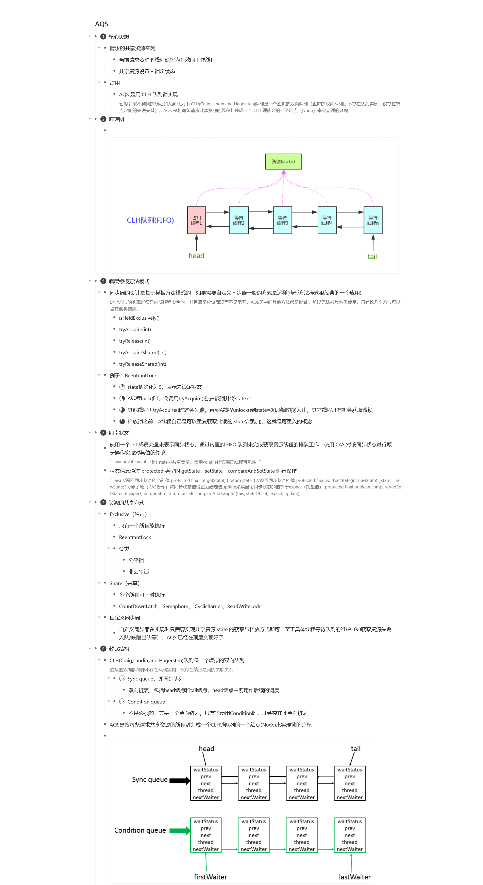

文字版：

**AQS  核心思想是，如果被请求的共享资源空闲，则将当前请求资源的线程设置为有效的工作线程，并且将共享资源设置为锁定状态。如果被请求的共享资源被占用，那么就需要一套线程阻塞等待以及被唤醒时锁分配的机制，这个机制 AQS 是用 CLH 队列锁实现的，即将暂时获取不到锁的线程加入到队列中。**

> CLH(Craig,Landin and Hagersten)队列是一个虚拟的双向队列（虚拟的双向队列即不存在队列实例，仅存在结点之间的关联关系）。AQS 是将每条请求共享资源的线程封装成一个 CLH 锁队列的一个结点（Node）来实现锁的分配。

看个 AQS(AbstractQueuedSynchronizer)原理图：

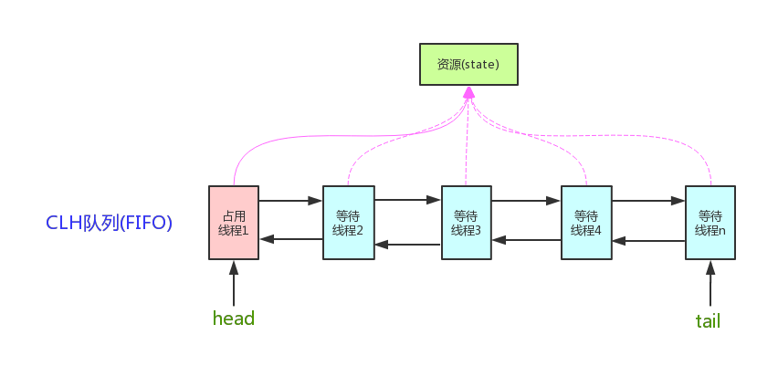

AQS 使用一个 int 成员变量来表示同步状态，通过内置的 FIFO 队列来完成获取资源线程的排队工作。AQS 使用 CAS 对该同步状态进行原子操作实现对其值的修改。

```java
private volatile int state;//共享变量，使用volatile修饰保证线程可见性
```

状态信息通过 protected 类型的 getState，setState，compareAndSetState 进行操作

```java
//返回同步状态的当前值
protected final int getState() {
    return state;
}
//设置同步状态的值
protected final void setState(int newState) {
    state = newState;
}
//原子地（CAS操作）将同步状态值设置为给定值update如果当前同步状态的值等于expect（期望值）
protected final boolean compareAndSetState(int expect, int update) {
    return unsafe.compareAndSwapInt(this, stateOffset, expect, update);
}
```


AQS定义两种资源共享方式

- Exclusive(独占)：只有一个线程能执行，如ReentrantLock。又可分为公平锁和非公平锁：
  - 公平锁：按照线程在队列中的排队顺序，先到者先拿到锁
  - 非公平锁：当线程要获取锁时，无视队列顺序直接去抢锁，谁抢到就是谁的
- Share(共享)：多个线程可同时执行，如Semaphore/CountDownLatch。Semaphore、CountDownLatCh、 CyclicBarrier、ReadWriteLock 我们都会在后面讲到。


### 聊聊 ReentrantLock

ReentrantLock 指的是一个线程能够对一个临界资源重复加锁。ReentrantLock继承了Lock接口并实现了在接口中定义的方法，是一个可重入的独占锁。ReentrantLock通过自定义队列同步器（Abstract Queued Sychronized，AQS）来实现锁的获取与释放。

> 独占锁指该锁在同一时刻只能被一个线程获取，而获取锁的其他线程只能在同步队列中等待；可重入锁指该锁能够支持一个线程对同一个资源执行多次加锁操作。

​	ReentrantLock不但提供了synchronized对锁的操作功能，还提供了诸如可响应中断锁、可轮询锁请求、定时锁等避免多线程死锁的方法。

​	ReentrantLock之所以被称为可重入锁，是因为ReentrantLock锁可以反复进入。即允许连续两次获得同一把锁，两次释放同一把锁。将上述代码中的注释部分去掉后，程序仍然可以正常执行。如果释放锁的次数少于获取锁的次数，该线程就会一直持有该锁，其他线程将无法获取锁资源。


敲黑板：可重入锁的一个好处是可一定程度避免死锁。

#### 避免死锁

**响应中断**  在synchronized中如果有一个线程尝试获取一把锁，则其结果是要么获取锁继续执行，要么保持等待。ReentrantLock还提供了可响应中断的可能，即在等待锁的过程中，线程可以根据需要取消对锁的请求。

**可轮询锁**  通过boolean tryLock()获取锁。如果有可用锁，则获取该锁并返回true，如果无可用锁，则立即返回false。

**定时锁**  通过boolean tryLock(long time,TimeUnit unit) throws InterruptedException获取定时锁。如果在给定的时间内获取到了可用锁，且当前线程未被中断，则获取该锁并返回true。如果在给定的时间内获取不到可用锁，将禁用当前线程，并且在发生以下三种情况之前，该线程一直处于休眠状态。

* 当前线程获取到了可用锁并返回true。
* 当前线程在进入此方法时设置了该线程的中断状态，或者当前线程在获取锁时被中断，则将抛出InterruptedException，并清除当前线程的已中断状态。
* 当前线程获取锁的时间超过了指定的等待时间，则将返回false。如果设定的时间小于等于0，则该方法将完全不等待。

#### 公平锁&非公平锁

ReentrantLock支持公平锁和非公平锁两种方式。公平锁指锁的分配和竞争机制是公平的，即遵循先到先得原则。非公平锁指JVM遵循随机、就近原则分配锁的机制。


## :recycle: JVM

回忆大纲图：


### 如何判断对象是否死亡

#### 引用计数法

在对象头维护着一个 counter 计数器，对象被引用一次则计数器 +1；若引用失效则计数器 -1。当计数器为 0 时，就认为该对象无效了。

引用计数算法的实现简单，判定效率也很高，在大部分情况下它都是一个不错的算法。但是主流的 Java 虚拟机里没有选用引用计数算法来管理内存，主要是因为它很难解决对象之间循环引用的问题。（虽然循环引用的问题可通过 Recycler 算法解决，但是在多线程环境下，引用计数变更也要进行昂贵的同步操作，性能较低，早期的编程语言会采用此算法。）


#### 可达性分析

可达性分析是通过一系列被称为 `GC Roots` 的根对象作为起始节点集，从这些节点开始，根据引用关系向下搜索，搜索过程所走过的路径被称为引用链（Reference Chain），如果某个对象到 `GC Roots` 间没有任何引用链相连，这代表 `GC Roots` 到该对象不可达， 此时证明此该对象不可能再被使用。

GC Roots 是指：

- Java 虚拟机栈（栈帧中的本地变量表）中引用的对象
- 本地方法栈中引用的对象
- 方法区中常量引用的对象
- 方法区中类静态属性引用的对象

GC Roots 并不包括堆中对象所引用的对象，这样就不会有循环引用的问题。

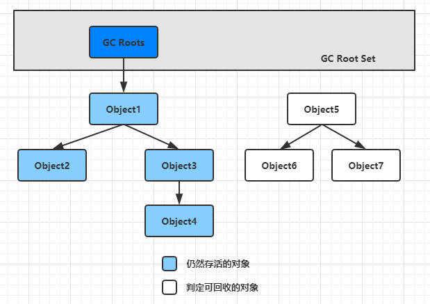


要真正宣告一个对象死亡，需要经过至少两次标记过程：

- 如果对象在进行可达性分析后发现 `GC Roots` 不可达，将会进行第一次标记；
- 随后进行一次筛选，筛选的条件是此对象是否有必要执行 `finalized()` 方法。如果对象没有覆盖 `finalized()` 方法，或者 `finalized()` 已经被虚拟机调用过，这两种情况都会视为没有必要执行。如果判定结果是有必要执行，此时对象会被放入名为 `F-Queue` 的队列，等待 Finalizer 线程执行其 `finalized()` 方法。在这个过程中，收集器会进行第二次小规模的标记，如果对象在 `finalized()` 方法中重新将自己与引用链上的任何一个对象进行了关联，如将自己（this 关键字）赋值给某个类变量或者对象的成员变量，此时它就实现了自我拯救，则第二次标记会将其移除 “即将回收” 的集合，否则该对象就将被真正回收，走向死亡。


### 虚引用与软引用和弱引用的区别

* **虚引用**：虚引用必须和引用队列（ReferenceQueue）联合使用。当垃圾回收器准备回收一个对象时，如果发现它还有虚引用，就会在回收对象的内存之前，把这个虚引用加入到与之关联的引用队列中。程序可以通过判断引用队列中是否已经加入了虚引用，来了解被引用的对象是否将要被垃圾回收。程序如果发现某个虚引用已经被加入到引用队列，那么就可以在所引用的对象的内存被回收之前采取必要的行动。
  * **虚引用主要用来跟踪对象被垃圾回收的活动**。

* **软引用**：如果内存空间足够，垃圾回收器就不会回收它，如果内存空间不足了，就会回收这些对象的内存
  * 实现内存敏感的高速缓存

* **弱引用**：只具有弱引用的对象拥有更短暂的生命周期。在垃圾回收器线程扫描它所管辖的内存区域的过程中，一旦发现了只具有弱引用的对象，不管当前内存空间足够与否，都会回收它的内存。不过，由于垃圾回收器是一个优先级很低的线程， 因此不一定会很快发现那些只具有弱引用的对象。


### 如何判断一个常量是废弃常量

1. JDK1.7 之前运行时常量池逻辑包含字符串常量池存放在方法区, 此时 hotspot 虚拟机对方法区的实现为永久代
2. JDK1.7 字符串常量池被从方法区拿到了堆中, 这里没有提到运行时常量池,也就是说字符串常量池被单独拿到堆,运行时常量池剩下的东西还在方法区, 也就是 hotspot 中的永久代
3. JDK1.8 hotspot 移除了永久代用元空间(Metaspace)取而代之, 这时候字符串常量池还在堆, 运行时常量池还在方法区, 只不过方法区的实现从永久代变成了元空间(Metaspace)


### 如何判断一个类是无用的类

- 该类所有的实例都已经被回收，也就是 Java 堆中不存在该类的任何实例。
- 加载该类的 `ClassLoader` 已经被回收。
- 该类对应的 `java.lang.Class` 对象没有在任何地方被引用，无法在任何地方通过反射访问该类的方法。


### 垃圾收集有哪些算法，各自的特点

- 标记-清除算法
- 标记-复制算法
- 标记-整理算法

#### 标记-清除算法，Mark-Sweep

它是最基础的垃圾收集算法，收集过程分为两个阶段：首先标记出所有需要回收的对象，在标记完成后，统一回收掉所有被标记的对象；也可以反过来，标记存活对象，统一回收所有未被标记的对象。

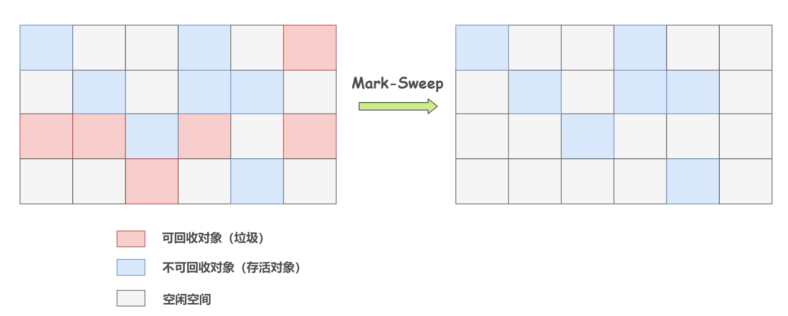

它主要有以下两个缺点：

- 执行效率不稳定：如果 Java 堆上包含大量需要回收的对象，则需要进行大量标记和清除动作；
- 内存空间碎片化：标记清除后会产生大量不连续的空间，从而可能导致无法为大对象分配足够的连续内存。


#### 标记-复制算法，Mark-Copy

标记-复制算法基于 ”半区复制“  算法：它将可用内存按容量划分为大小相等的两块，每次只使用其中一块，当这一块的内存使用完了，就将还存活着的对象复制到另外一块上面，然后再把已经使用过的那块内存空间一次性清理掉。其优点在于避免了内存空间碎片化的问题，其缺点如下：

- 如果内存中多数对象都是存活的，这种算法将产生大量的复制开销；
- 浪费内存空间，内存空间变为了原有的一半。

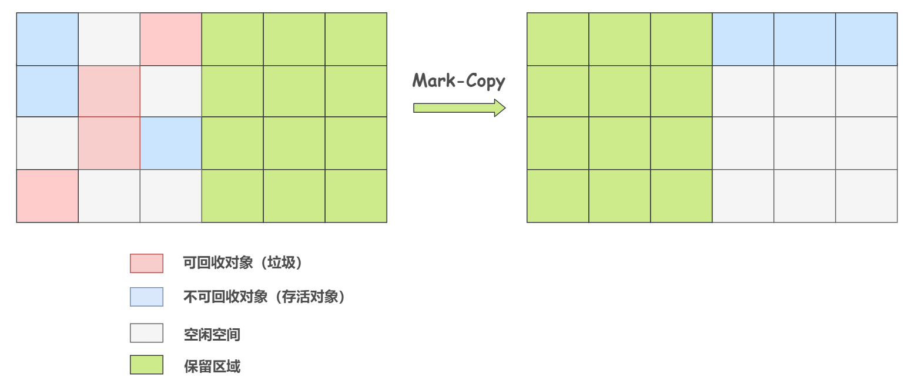

基于新生代 “朝生夕灭” 的特点，大多数虚拟机都不会按照 1:1 的比例来进行内存划分，例如 HotSpot 虚拟机会将内存空间划分为一块较大的 `Eden` 和 两块较小的 `Survivor` 空间，它们之间的比例是 8:1:1 。 每次分配时只会使用 `Eden` 和其中的一块 `Survivor` ，发生垃圾回收时，只需要将存活的对象一次性复制到另外一块 `Survivor` 上，这样只有 10% 的内存空间会被浪费掉。当 `Survivor` 空间不足以容纳一次 `Minor GC` 时，此时由其他内存区域（通常是老年代）来进行分配担保。

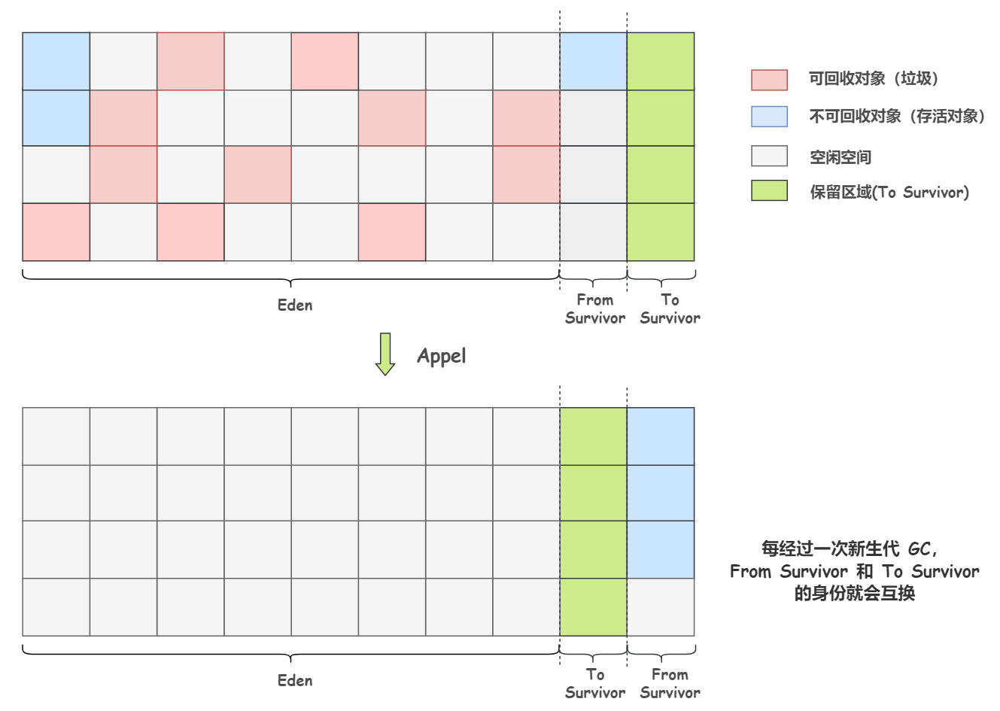


#### 标记-整理算法，Mark-Compact

标记-整理算法是在标记完成后，让所有存活对象都向内存的一端移动，然后直接清理掉边界以外的内存。其优点在于可以避免内存空间碎片化的问题，也可以充分利用内存空间；其缺点在于根据所使用的收集器的不同，在移动存活对象时可能要全程暂停用户程序：


### HotSpot 为什么要分为新生代和老年代

为了进行高效的垃圾回收，虚拟机把堆内存**逻辑上**划分成三块区域（分代的唯一理由就是优化 GC 性能）


### 常见的垃圾回收器有哪些

#### Serial 收集器

Serial（串行）收集器是最基本、历史最悠久的垃圾收集器了。大家看名字就知道这个收集器是一个单线程收集器了。它的 **“单线程”** 的意义不仅仅意味着它只会使用一条垃圾收集线程去完成垃圾收集工作，更重要的是它在进行垃圾收集工作的时候必须暂停其他所有的工作线程（ **"Stop The World"** ），直到它收集结束。

**新生代采用标记-复制算法，老年代采用标记-整理算法。**

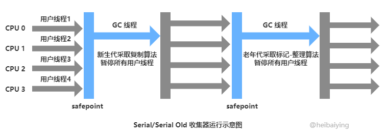


#### ParNew 收集器

**ParNew 收集器其实就是 Serial 收集器的多线程版本，除了使用多线程进行垃圾收集外，其余行为（控制参数、收集算法、回收策略等等）和 Serial 收集器完全一样。**

**新生代采用标记-复制算法，老年代采用标记-整理算法。**

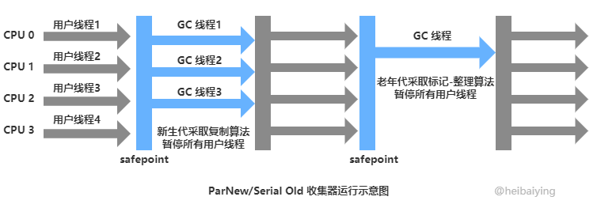


#### Parallel Scavenge 收集器

Parallel Scavenge 也是新生代收集器，基于 标记-复制 算法进行实现，它的目标是达到一个可控的吞吐量。这里的吞吐量指的是处理器运行用户代码的时间与处理器总消耗时间的比值：

```text
吞吐量 = 运行用户代码时间 \ (运行用户代码时间 + 运行垃圾收集时间)
```

Parallel Scavenge 收集器提供两个参数用于精确控制吞吐量：

- **-XX:MaxGCPauseMillis**：控制最大垃圾收集时间，假设需要回收的垃圾总量不变，那么降低垃圾收集的时间就会导致收集频率变高，所以需要将其设置为合适的值，不能一味减小。
- **-XX:MaxGCTimeRatio**：直接用于设置吞吐量大小，它是一个大于 0 小于 100 的整数。假设把它设置为 19，表示此时允许的最大垃圾收集时间占总时间的 5%（即 1/(1+19) ）；默认值为 99 ，即允许最大 1%（ 1/(1+99) ）的垃圾收集时间。


#### Serial Old 收集器

**Serial 收集器的老年代版本**，它同样是一个单线程收集器。它主要有两大用途：一种用途是在 JDK1.5 以及以前的版本中与 Parallel Scavenge 收集器搭配使用，另一种用途是作为 CMS 收集器的后备方案。


#### Paralled Old 收集器

**Parallel Scavenge 收集器的老年代版本**。使用多线程和“标记-整理”算法。在注重吞吐量以及 CPU 资源的场合，都可以优先考虑 Parallel Scavenge 收集器和 Parallel Old 收集器。

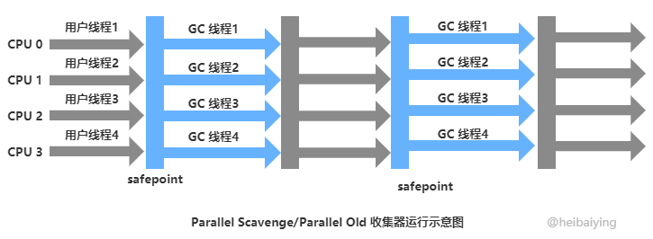


#### CMS 收集器 和 Garbage First 收集器（见下）


> 拓展


- 两个收集器间有连线，表明它们可以搭配使用：Serial/Serial Old、Serial/CMS、ParNew/Serial  Old、ParNew/CMS、Parallel Scavenge/Serial Old、Parallel Scavenge/Parallel  Old、G1。
- 其中 Serial Old 作为 CMS 出现"Concurrent Mode Failure"失败的后备预案。
- **（红色虚线）**由于维护和兼容性测试的成本，在 JDK 8 时将 Serial + CMS、ParNew + Serial Old 这两个组合声明为废弃（JEP173），并在 JDK 9 中完全取消了这些组合的支持（JEP214），即：移除。
- **（绿色虚线）**JDK 14 中：弃用 Parallel Scavenge 和 Serialold GC 组合（JEP366）。
- **（青色虚线）**JDK 14 中：删除 CMS 垃圾回收器（JEP363）。


### 介绍一下 CMS,G1 收集器

#### CMS

CMS（Concurrent Mark Sweep）收集器是一种以获取最短回收停顿时间为目标的收集器，基于 标记-清除 算法实现，整个收集过程分为以下四个阶段：

1. **初始标记 (inital mark)**：标记 `GC Roots` 能直接关联到的对象，耗时短但需要暂停用户线程；
2. **并发标记 (concurrent mark)**：从 `GC Roots` 能直接关联到的对象开始遍历整个对象图，耗时长但不需要暂停用户线程；
3. **重新标记 (remark)**：采用增量更新算法，对并发标记阶段因为用户线程运行而产生变动的那部分对象进行重新标记，耗时比初始标记稍长且需要暂停用户线程；
4. **并发清除 (inital sweep)**：并发清除掉已经死亡的对象，耗时长但不需要暂停用户线程。

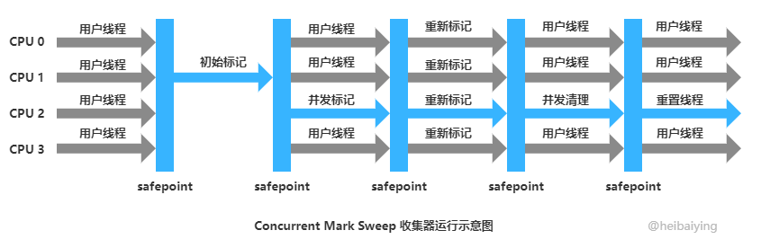

其优点在于耗时长的 并发标记 和 并发清除 阶段都不需要暂停用户线程，因此其停顿时间较短，其主要缺点如下：

- 由于涉及并发操作，因此对处理器资源比较敏感。
- 由于是基于 标记-清除 算法实现的，因此会产生大量空间碎片。
- 无法处理浮动垃圾（Floating Garbage）：由于并发清除时用户线程还是在继续，所以此时仍然会产生垃圾，这些垃圾就被称为浮动垃圾，只能等到下一次垃圾收集时再进行清理。


#### G1（Garbage First）

Garbage First（简称 G1）是一款面向服务端的垃圾收集器，也是 JDK 9  服务端模式下默认的垃圾收集器，它的诞生具有里程碑式的意义。G1 虽然也遵循分代收集理论，但不再以固定大小和固定数量来划分分代区域，而是把连续的  Java 堆划分为多个大小相等的独立区域（Region）。每一个 Region 都可以根据不同的需求来扮演新生代的 `Eden` 空间、`Survivor` 空间或者老年代空间，收集器会根据其扮演角色的不同而采用不同的收集策略。


上面还有一些 Region 使用 H 进行标注，它代表 Humongous，表示这些 Region 用于存储大对象（humongous object，H-obj），即大小大于等于 region 一半的对象。G1 收集器的运行大致可以分为以下四个步骤：

1. **初始标记 (Inital Marking)**：标记 `GC Roots` 能直接关联到的对象，并且修改 TAMS（Top at Mark Start）指针的值，让下一阶段用户线程并发运行时，能够正确的在 Reigin 中分配新对象。G1 为每一个 Reigin 都设计了两个名为 TAMS  的指针，新分配的对象必须位于这两个指针位置以上，位于这两个指针位置以上的对象默认被隐式标记为存活的，不会纳入回收范围；
2. **并发标记 (Concurrent Marking)**：从 `GC Roots` 能直接关联到的对象开始遍历整个对象图。遍历完成后，还需要处理 SATB  记录中变动的对象。SATB（snapshot-at-the-beginning，开始阶段快照）能够有效的解决并发标记阶段因为用户线程运行而导致的对象变动，其效率比 CMS 重新标记阶段所使用的增量更新算法效率更高；
3. **最终标记 (Final Marking)**：对用户线程做一个短暂的暂停，用于处理并发阶段结束后仍遗留下来的少量的 STAB 记录。虽然并发标记阶段会处理 SATB 记录，但由于处理时用户线程依然是运行中的，因此依然会有少量的变动，所以需要最终标记来处理；
4. **筛选回收 (Live Data Counting and Evacuation)**：负责更新 Regin 统计数据，按照各个 Regin 的回收价值和成本进行排序，在根据用户期望的停顿时间进行来指定回收计划，可以选择任意多个 Regin 构成回收集。然后将回收集中 Regin 的存活对象复制到空的 Regin 中，再清理掉整个旧的 Regin  。此时因为涉及到存活对象的移动，所以需要暂停用户线程，并由多个收集线程并行执行。

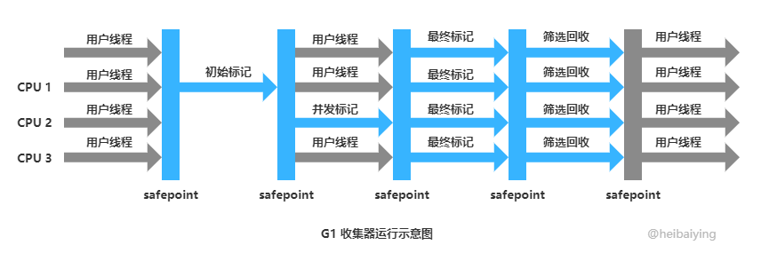


### Minor Gc 和 Full GC 有什么不同呢

新生代收集（Minor GC / Young GC）：只对新生代进行垃圾收集

整堆收集 (Full GC)：收集整个 Java 堆和方法区


### new 一个对象在堆中的历程

今天介绍两个 JVM 中的高频基础题：

1. 对象的创建过程（new 一个对象在堆中的历程）
2. 对象在堆上分配的两种方式

对象的创建过程分五步走，如下图：


> 简化版

1）类加载检查：具体来说，当 Java 虚拟机遇到一条字节码 new 指令时，它会首先检查根据 class  文件中的常量池表（Constant Pool  Table）能否找到这个类对应的符号引用，然后去方法区中的运行时常量池中查找该符号引用所指向的类是否已被 JVM 加载、解析和初始化过

- 如果没有，那就先执行相应的类加载过程
- 如果有，那么进入下一步，为新生对象分配内存

2）分配内存：就是在堆中给划分一块内存空间分配给这个新生对象用。具体的分配方式根据堆内存是否规整有两种方式：

- 堆内存规整的话采用的分配方式就是指针碰撞：所有被使用过的内存都被放在一边，空闲的内存被放在另一边，中间放着一个指针作为分界点的指示器，分配内存就是把这个指针向空闲空间方向挪动一段与对象大小相等的距离
- 堆内存不规整的话采用的分配方式就是空闲列表：所谓内存不规整就是已被使用的内存和空闲的内存相互交错在一起，那就没有办法简单地进行指针碰撞了，JVM  就必须维护一个列表，记录哪些内存块是可用的，在分配的时候从列表中找到一块足够大的连续空间划分给这个对象，并更新列表上的记录，这就是空闲列表的方式

3）初始化零值：对象在内存中的布局可以分为 3 块区域：对象头、实例数据和对齐填充，对齐填充仅仅起占位作用，没啥特殊意义，初始化零值这个操作就是初始化实例数据这个部分，比如 boolean 字段初始化为 false 之类的

4）设置对象头：这个步骤就是设置对象头中的一些信息

5）执行 init 方法：最后就是执行构造函数，构造函数即 Class 文件中的 `<init>()` 方法，一般来说，new 指令之后会接着执行 `<init>()` 方法，按照构造函数的意图对这个对象进行初始化，这样一个真正可用的对象才算完全地被构造出来了


> 详细版

#### 类加载检查

对象创建过程的第一步，所谓类加载检查，就是检测我们接下来要 new 出来的这个对象所属的类是否已经被 JVM 成功加载、解析和初始化过了（具体的类加载过程会在后续文章详细解释~）

具体来说，当 Java 虚拟机遇到一条字节码 new 指令时：

1）首先检查根据 class 文件中的常量池表（Constant Pool Table）能否找到这个类对应的符号引用

> 此处可以回顾一波**常量池表 (Constant Pool Table)** 的概念：
>
> 用于存放**编译期**生成的各种字面量（字面量相当于 Java 语言层面常量的概念，如文本字符串，声明为 final 的常量值等）与符号引用。有一些文章会把 class 常量池表称为**静态常量池**。
>
> 都是常量池，常量池表和方法区中的运行时常量池有啥关系吗？运行时常量池是干嘛的呢？
>
> **运行时常量池可以在运行期间将 class 常量池表中的符号引用解析为直接引用**。简单来说，class 常量池表就相当于一堆索引，运行时常量池根据这些索引来查找对应方法或字段所属的类型信息和名称及描述符信息

2）然后去方法区中的运行时常量池中查找该符号引用所指向的类是否已被 JVM 加载、解析和初始化过

- 如果没有，那就先执行相应的类加载过程
- 如果有，那么进入下一步，为新生对象分配内存


#### 分配内存

类加载检查通过后，这个对象待会儿要是被创建出来得有地方放他对吧？

所以接下来 JVM 会为新生对象分配内存空间。

至于 JVM 怎么知道这个空间得分配多大呢？事实上，对象所需内存的大小在类加载完成后就已经可以完全确定了。在 Hotspot 虚拟机中，对象在内存中的布局可以分为 3 块区域：**对象头**、**实例数据**和**对齐填充**。

1）Hotspot 虚拟机的对象头包括两部分信息：

- 第一部分用于存储对象自身的运行时数据（如哈希码（HashCode）、GC 分代年龄、锁状态标志、线程持有的锁、偏向线程 ID、偏向时间戳等，这部分数据的长度在 32 位和 64 位的虚拟机（未开启压缩指针）中分别为  32 个比特和 64 个比特，官方称它为 “Mark Word”。学过 synchronized 的小伙伴对这个一定不陌生~）
- 另一部分是类型指针，即对象指向它的类型元数据的指针，虚拟机通过这个指针来确定这个对象是哪个类的实例

2）**实例数据部分存储的是这个对象真正的有效信息**，即我们在程序代码里面所定义的各种类型的字段内容，无论是从父类继承下来的，还是在子类中定义的字段都必须记录起来。

3）**对齐填充部分不是必须的，也没有什么特别的含义，仅仅起占位作用**。 因为 Hotspot 虚拟机的自动内存管理系统要求对象起始地址必须是 8 字节的整数倍，换句话说就是对象的大小必须是 8 字节的整数倍。而对象头部分正好是 8 字节的倍数（1 倍或 2 倍），因此，当对象实例数据部分没有对齐时，就需要通过对齐填充来补全。


#### 对象在堆上的两种分配方式

**为对象分配内存空间的任务通俗来说把一块确定大小的内存块从 Java 堆中划分出来给这个对象用**。

根据堆中的内存是否规整，有两种划分方式，或者说对象在堆上的分配有两种方式：

1）**假设 Java 堆中内存是绝对规整的**，所有被使用过的内存都被放在一边，空闲的内存被放在另一边，中间放着一个指针作为分界点的指示器，那所分配内存就仅仅是把这个指针 向 空闲空间方向 挪动一段与对象大小相等的距离，这种分配方式称为 **指针碰撞**（Bump The Pointer）


2）**如果 Java 堆中的内存并不是规整的**，已被使用的内存和空闲的内存相互交错在一起，那就没有办法简单地进行指针碰撞了，虚拟机就必须维护一个列表，记录哪些内存块是可用的，在分配的时候从列表中找到一块足够大的连续空间划分给这个对象，并更新列表上的记录，这种分配方式称为 **空闲列表**（Free List）。

> 选择哪种分配方式由 Java 堆是否规整决定，那又有同学会问了，堆是否规整又由谁来决定呢？
>
> Java 堆是否规整由所采用的垃圾收集器是否带有空间压缩整理（Compact）的能力决定的（或者说由垃圾收集器采用的垃圾收集算法来决定的，具体垃圾收集算法见后续文章）：
>
> - 因此，当使用 Serial、ParNew 等带压缩整理过程的收集器时，系统采用的分配算法是指针碰撞，既简单又高效
> - 而当使用 CMS 这种基于清除（Sweep）算法的收集器时，理论上就只能采用较为复杂的空闲列表来分配内存


#### 对象创建时候的并发安全问题

另外，在为对象创建内存的时候，还需要考虑一个问题：**并发安全问题**。

对象创建在虚拟机中是非常频繁的行为，以上面介绍的指针碰撞法为例，即使只修改一个指针所指向的位置，在并发情况下也并不是线程安全的，可能出现某个线程正在给对象 A 分配内存，指针还没来得及修改，另一个线程创建了对象 B 又同时使用了原来的指针来分配内存的情况。

解决这个问题有两种可选方案：

- 方案 1：**CAS + 失败重试**：CAS 大伙应该都熟悉，比较并交换，乐观锁方案，如果失败就重试，直到成功为止
- 方案 2：**本地线程分配缓冲**（Thread Local Allocation Buffer，`TLAB`）：每个线程在堆中预先分配一小块内存，每个线程拥有的这一小块内存就称为 TLAB。哪个线程要分配内存了，就在哪个线程的 TLAB 中进行分配，这样各个线程之间互不干扰。如果某个线程的 TLAB  用完了，那么虚拟机就需要为它分配新的 TLAB，这时才需要进行同步锁定。可以通过 `-XX：+/-UseTLAB` 参数来设定是否使用 TLAB


#### 初始化零值

内存分配完成之后，**JVM 会将分配到的内存空间（当然不包括对象头啦）都初始化为零值**，比如 boolean 字段都初始化为 false 啊，int 字段都初始化为 0 啊之类的

这步操作保证了对象的实例字段在 Java 代码中可以不赋初始值就直接使用，使程序能访问到这些字段的数据类型所对应的零值。

> 如果使用了 TLAB 的话，初始化零值这项工作可以提前至 TLAB 分配时就顺便进行了


#### 设置对象头

上面我们说过，对象在内存中的布局可以分为 3 块区域：对象头（Object Header）、实例数据和对齐填充

对齐填充并不是什么有意义的数据，实例数据我们在上一步操作中进行了初始化零值，那么对于剩下的对象头中的信息来说，自然不必多说，也是要进行一些赋值操作的：例如这个对象是哪个类的实例、如何才能找到类的元数据信息、对象的哈希码、对象的 GC 分代年龄等信息。根据虚拟机当前运行状态的不同，如是否启用偏向锁等，对象头会有不同的设置方式。


#### 执行 init 方法

上面四个步骤都走完之后，从 JVM 的视角来看，其实一个新的对象已经成功诞生了。

但是从我们程序员的视角来看，这个对象确实是创建出来了，但是还没按照我们定义的构造函数来进行赋值呢，所有的字段都还是默认的零值啊。

构造函数即 Class 文件中的 `<init>()` 方法，一般来说，new 指令之后会接着执行 `<init>()` 方法，按照构造函数的意图对这个对象进行初始化，这样一个真正可用的对象才算完全地被构造出来了，皆大欢喜。


### 三色标记法

在可达性分析中，第一阶段 ”根节点枚举“ 是必须 STW  的，不然如果分析过程中用户进程还在运行，就可能会导致根节点集合的对象引用关系不断变化，这样可达性分析结果的准确性显然也就无法保证了。不过 GC  Roots 相比起整个 Java 堆中全部的对象算是极少数，且在各种优化技巧（比如  OopMap）的加持下，它带来的停顿已经是非常短暂且相对固定的了，也就是说，“根节点枚举” 阶段的停顿时间不会随着堆容量的增长而增加。

当我们枚举完了所有的 GC Roots，就得进入第二阶段继续往下遍历对象图了，这一步骤同样需要 STW，并且停顿时间与 Java  堆容量直接成正比例关系，三色标记法就是帮助我们搞清楚在这个阶段如果用户线程和垃圾收集线程同时进行，会出现什么问题，的这么一个工具方法

所谓三色标记法，就是把遍历对象图过程中遇到的对象，按照 “是否访问过” 这个条件标记成以下三种颜色：

- 白色：表示对象尚未被垃圾收集器访问过。显然在可达性分析刚刚开始的阶段，所有的对象都是白色的，若在分析结束的阶段，仍然是白色的对象，即代表不可达（可达性分析到不了的对象，就是死亡对象，需要被回收）
- 黑色：表示对象已经被垃圾收集器访问过，且这个对象的所有引用都已经扫描过。黑色的对象代表已经扫描过，它是安全存活的，如果有其他对象引用指向了黑色对象，无须重新扫描一遍。黑色对象不可能直接（不经过灰色对象）指向某个白色对象。
- 灰色：表示对象已经被垃圾收集器访问过，但这个对象上至少存在一个引用还没有被扫描过

所以对象图遍历的过程，其实就是由灰色从黑向白推进的过程，灰色是黑和白的分界线。

在 “对象图遍历” 这个阶段用户线程与收集器并发工作会出现两个问题：

1）浮动垃圾：所谓浮动垃圾，就是由于垃圾收集和用户线程是并行的，这个对象实际已经死亡了，已经没有其他人引用它了，但是被垃圾收集器错误地标记成了存活对象。

举个例子，a 引用了 b，此时 b 被扫描为可达，但是用户线程随后又执行了 a.b = null，这个时候其实 b 已经是死亡的垃圾对象了，但是由于黑色对象不会被重新扫描，所以在垃圾收集里 b 依然作为存活对象被标记成黑色，因此就成了浮动垃圾

浮动垃圾不是一件好事，但其实是可以容忍的，因为这只不过产生了一点逃过本次收集的浮动垃圾而已，反正还会有下一次垃圾收集，到时候就会被标记为垃圾被清理掉了

2）对象消失：对象消失和浮动垃圾恰恰相反，对象消失是把原本存活的对象错误标记为已消亡（原本应该是黑色的对象被误标为白色），产生对象消失问题需要满足两个条件：

- 插入了一条或多条从黑色对象到白色对象的新引用
- 删除了全部从灰色对象到该白色对象的直接或间接引用

对象消失是一个很致命的问题，程序肯定会因此发生错误，所以 “对象图遍历” 这个阶段最好是进行 STW  的，但是这个阶段的时间又很长，所以我们需要想出一些办法来解决对象消失问题，使得在遍历对象图的过程中不用进行  STW（也就是用户线程和对象线程可以同时工作），从而提升可达性分析的效率

上面总结了对象消失问题的两个条件，所以说，如果我们想要解决并发扫描时的对象消失问题，只需破坏这两个条件的任意一个即可。由此分别产生了两种解决方案：

1. 增量更新（Incremental Update）：增量更新破坏的是第一个条件，当黑色对象插入新的指向白色对象的引用关系时（就是上图中的 a -> c  引用关系），就将这个新插入的引用记录下来，等并发扫描结束之后，再将这些记录过的引用关系中的黑色对象（a）为根，重新扫描一次。这可以简化理解为，黑色对象一旦新插入了指向白色对象的引用之后，它就变回灰色对象了。
2. 原始快照（Snapshot At The Beginning，SATB）：原始快照要破坏的是第二个条件，当灰色对象要删除指向白色对象的引用关系时（上图中的 b -> c  引用关系），就将这个要删除的引用记录下来，在并发扫描结束之后，再将这些记录过的引用关系中的灰色对象（b）为根，重新扫描一次。这也可以简化理解为，无论引用关系删除与否，都会按照刚刚开始扫描那一刻的对象图快照来进行搜索。

在 HotSpot 虚拟机中，增量更新和原始快照这两种解决方案都有实际应用，CMS 是基于增量更新来做并发标记的，G1、Shenandoah 则是用原始快照来实现


##  🍃 Spring系列

### :star: spring中都有哪些设计模式？（2022热门问题）

#### 工厂设计模式

Spring使用工厂模式可以通过 `BeanFactory` 或 `ApplicationContext` 创建 bean 对象。

**两者对比：**

- `BeanFactory` ：延迟注入(使用到某个 bean 的时候才会注入),相比于`ApplicationContext` 来说会占用更少的内存，程序启动速度更快。
- `ApplicationContext` ：容器启动的时候，不管你用没用到，一次性创建所有 bean 。`BeanFactory` 仅提供了最基本的依赖注入支持，` ApplicationContext` 扩展了 `BeanFactory` ,除了有`BeanFactory`的功能还有额外更多功能，所以一般开发人员使用` ApplicationContext`会更多。

ApplicationContext的三个实现类：

1. `ClassPathXmlApplication`：把上下文文件当成类路径资源。
2. `FileSystemXmlApplication`：从文件系统中的 XML 文件载入上下文定义信息。
3. `XmlWebApplicationContext`：从Web系统中的XML文件载入上下文定义信息。

Example:

```java
import org.springframework.context.ApplicationContext;
import org.springframework.context.support.FileSystemXmlApplicationContext;
 
public class App {
	public static void main(String[] args) {
		ApplicationContext context = new FileSystemXmlApplicationContext(
				"C:/work/IOC Containers/springframework.applicationcontext/src/main/resources/bean-factory-config.xml");
 
		HelloApplicationContext obj = (HelloApplicationContext) context.getBean("helloApplicationContext");
		obj.getMsg();
	}
}
```


#### 单例设计模式

在我们的系统中，有一些对象其实我们只需要一个，比如说：线程池、缓存、对话框、注册表、日志对象、充当打印机、显卡等设备驱动程序的对象。事实上，这一类对象只能有一个实例，如果制造出多个实例就可能会导致一些问题的产生，比如：程序的行为异常、资源使用过量、或者不一致性的结果。

**使用单例模式的好处:**

- 对于频繁使用的对象，可以省略创建对象所花费的时间，这对于那些重量级对象而言，是非常可观的一笔系统开销；
- 由于 new 操作的次数减少，因而对系统内存的使用频率也会降低，这将减轻 GC 压力，缩短 GC 停顿时间。

**Spring 中 bean 的默认作用域就是 singleton(单例)的。** 除了 singleton 作用域，Spring 中 bean 还有下面几种作用域：

- prototype : 每次请求都会创建一个新的 bean 实例。
- request : 每一次HTTP请求都会产生一个新的bean，该bean仅在当前HTTP request内有效。
- session : 每一次HTTP请求都会产生一个新的 bean，该bean仅在当前 HTTP session 内有效。
- global-session：  全局session作用域，仅仅在基于portlet的web应用中才有意义，Spring5已经没有了。Portlet是能够生成语义代码(例如：HTML)片段的小型Java Web插件。它们基于portlet容器，可以像servlet一样处理HTTP请求。但是，与 servlet 不同，每个 portlet  都有不同的会话

**Spring 实现单例的方式：**

- xml : `<bean id="userService" class="top.snailclimb.UserService" scope="singleton"/>`
- 注解：`@Scope(value = "singleton")`

**Spring 通过 `ConcurrentHashMap` 实现单例注册表的特殊方式实现单例模式。Spring 实现单例的核心代码如下**

```java
// 通过 ConcurrentHashMap（线程安全） 实现单例注册表
private final Map<String, Object> singletonObjects = new ConcurrentHashMap<String, Object>(64);

public Object getSingleton(String beanName, ObjectFactory<?> singletonFactory) {
        Assert.notNull(beanName, "'beanName' must not be null");
        synchronized (this.singletonObjects) {
            // 检查缓存中是否存在实例  
            Object singletonObject = this.singletonObjects.get(beanName);
            if (singletonObject == null) {
                //...省略了很多代码
                try {
                    singletonObject = singletonFactory.getObject();
                }
                //...省略了很多代码
                // 如果实例对象在不存在，我们注册到单例注册表中。
                addSingleton(beanName, singletonObject);
            }
            return (singletonObject != NULL_OBJECT ? singletonObject : null);
        }
    }
    //将对象添加到单例注册表
    protected void addSingleton(String beanName, Object singletonObject) {
            synchronized (this.singletonObjects) {
                this.singletonObjects.put(beanName, (singletonObject != null ? singletonObject : NULL_OBJECT));

            }
        }
}
```


#### 代理设计模式

##### 代理模式在 AOP 中的应用

AOP(Aspect-Oriented Programming:面向切面编程)能够将那些与业务无关，**却为业务模块所共同调用的逻辑或责任（例如事务处理、日志管理、权限控制等）封装起来**，便于**减少系统的重复代码**，**降低模块间的耦合度**，并**有利于未来的可拓展性和可维护性**。

**Spring AOP 就是基于动态代理的**，如果要代理的对象，实现了某个接口，那么Spring AOP会使用**JDK Proxy**，去创建代理对象，而对于没有实现接口的对象，就无法使用 JDK Proxy 去进行代理了，这时候Spring AOP会使用 **Cglib** 生成一个被代理对象的子类来作为代理，如下图所示：


当然你也可以使用 AspectJ ,Spring AOP 已经集成了AspectJ ，AspectJ 应该算的上是 Java 生态系统中最完整的 AOP 框架了。

使用 AOP 之后我们可以把一些通用功能抽象出来，在需要用到的地方直接使用即可，这样大大简化了代码量。我们需要增加新功能时也方便，这样也提高了系统扩展性。日志功能、事务管理等等场景都用到了 AOP 。


#### 模板方法

模板方法模式是一种行为设计模式，它定义一个操作中的算法的骨架，而将一些步骤延迟到子类中。 模板方法使得子类可以不改变一个算法的结构即可重定义该算法的某些特定步骤的实现方式。

```java
public abstract class Template {
    //这是我们的模板方法
    public final void TemplateMethod(){
        PrimitiveOperation1();  
        PrimitiveOperation2();
        PrimitiveOperation3();
    }

    protected void  PrimitiveOperation1(){
        //当前类实现
    }
    
    //被子类实现的方法
    protected abstract void PrimitiveOperation2();
    protected abstract void PrimitiveOperation3();

}
public class TemplateImpl extends Template {

    @Override
    public void PrimitiveOperation2() {
        //当前类实现
    }
    
    @Override
    public void PrimitiveOperation3() {
        //当前类实现
    }
}
```

Spring 中 `jdbcTemplate`、`hibernateTemplate` 等以 Template 结尾的对数据库操作的类，它们就使用到了模板模式。一般情况下，我们都是使用继承的方式来实现模板模式，但是 Spring 并没有使用这种方式，而是使用Callback 模式与模板方法模式配合，既达到了代码复用的效果，同时增加了灵活性。


#### 观察者模式

观察者模式是一种对象行为型模式。它表示的是一种对象与对象之间具有依赖关系，当一个对象发生改变的时候，这个对象所依赖的对象也会做出反应。Spring 事件驱动模型就是观察者模式很经典的一个应用。Spring  事件驱动模型非常有用，在很多场景都可以解耦我们的代码。比如我们每次添加商品的时候都需要重新更新商品索引，这个时候就可以利用观察者模式来解决这个问题。

##### Spring 事件驱动模型中的三种角色

###### 事件角色

`ApplicationEvent` (`org.springframework.context`包下)充当事件的角色,这是一个抽象类，它继承了`java.util.EventObject`并实现了 `java.io.Serializable`接口。

Spring 中默认存在以下事件，他们都是对 `ApplicationContextEvent` 的实现(继承自`ApplicationContextEvent`)：

- `ContextStartedEvent`：`ApplicationContext` 启动后触发的事件;
- `ContextStoppedEvent`：`ApplicationContext` 停止后触发的事件;
- `ContextRefreshedEvent`：`ApplicationContext` 初始化或刷新完成后触发的事件;
- `ContextClosedEvent`：`ApplicationContext` 关闭后触发的事件。


###### 事件监听者角色

`ApplicationListener` 充当了事件监听者角色，它是一个接口，里面只定义了一个 `onApplicationEvent（）`方法来处理`ApplicationEvent`。`ApplicationListener`接口类源码如下，可以看出接口定义看出接口中的事件只要实现了 `ApplicationEvent`就可以了。所以，在 Spring中我们只要实现 `ApplicationListener` 接口的 `onApplicationEvent()` 方法即可完成监听事件

```java
package org.springframework.context;
import java.util.EventListener;
@FunctionalInterface
public interface ApplicationListener<E extends ApplicationEvent> extends EventListener {
    void onApplicationEvent(E var1);
}
```

###### 事件发布者角色

`ApplicationEventPublisher` 充当了事件的发布者，它也是一个接口。

```java
@FunctionalInterface
public interface ApplicationEventPublisher {
    default void publishEvent(ApplicationEvent event) {
        this.publishEvent((Object)event);
    }

    void publishEvent(Object var1);
}
```

`ApplicationEventPublisher` 接口的`publishEvent（）`这个方法在`AbstractApplicationContext`类中被实现，阅读这个方法的实现，你会发现实际上事件真正是通过`ApplicationEventMulticaster`来广播出去的。


#### 适配器模式

适配器模式(Adapter Pattern) 将一个接口转换成客户希望的另一个接口，适配器模式使接口不兼容的那些类可以一起工作，其别名为包装器(Wrapper)。

##### spring AOP中的适配器模式

我们知道 Spring AOP 的实现是基于代理模式，但是 Spring AOP 的增强或通知(Advice)使用到了适配器模式，与之相关的接口是`AdvisorAdapter ` 。Advice 常用的类型有：`BeforeAdvice`（目标方法调用前,前置通知）、`AfterAdvice`（目标方法调用后,后置通知）、`AfterReturningAdvice`(目标方法执行结束后，return之前)等等。每个类型Advice（通知）都有对应的拦截器:`MethodBeforeAdviceInterceptor`、`AfterReturningAdviceAdapter`、`AfterReturningAdviceInterceptor`。Spring预定义的通知要通过对应的适配器，适配成 `MethodInterceptor`接口(方法拦截器)类型的对象（如：`MethodBeforeAdviceInterceptor` 负责适配 `MethodBeforeAdvice`）。

##### spring MVC中的适配器模式

在Spring MVC中，`DispatcherServlet` 根据请求信息调用 `HandlerMapping`，解析请求对应的 `Handler`。解析到对应的 `Handler`（也就是我们平常说的 `Controller` 控制器）后，开始由`HandlerAdapter` 适配器处理。`HandlerAdapter` 作为期望接口，具体的适配器实现类用于对目标类进行适配，`Controller` 作为需要适配的类。

**为什么要在 Spring MVC 中使用适配器模式？** Spring MVC 中的 `Controller` 种类众多，不同类型的 `Controller` 通过不同的方法来对请求进行处理。如果不利用适配器模式的话，`DispatcherServlet` 直接获取对应类型的 `Controller`，需要的自行来判断，像下面这段代码一样：

```java
if(mappedHandler.getHandler() instanceof MultiActionController){  
   ((MultiActionController)mappedHandler.getHandler()).xxx  
}else if(mappedHandler.getHandler() instanceof XXX){  
    ...  
}else if(...){  
   ...  
}  
```

假如我们再增加一个 `Controller`类型就要在上面代码中再加入一行 判断语句，这种形式就使得程序难以维护，也违反了设计模式中的开闭原则 – 对扩展开放，对修改关闭。


#### 装饰者模式

装饰者模式可以动态地给对象添加一些额外的属性或行为。相比于使用继承，装饰者模式更加灵活。简单点儿说就是当我们需要修改原有的功能，但我们又不愿直接去修改原有的代码时，设计一个Decorator套在原有代码外面。其实在 JDK 中就有很多地方用到了装饰者模式，比如 `InputStream`家族，`InputStream` 类下有 `FileInputStream` (读取文件)、`BufferedInputStream` (增加缓存,使读取文件速度大大提升)等子类都在不修改`InputStream` 代码的情况下扩展了它的功能。

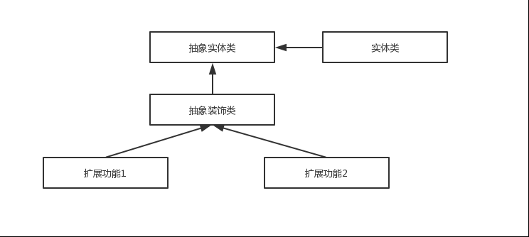

Spring 中配置 DataSource 的时候，DataSource  可能是不同的数据库和数据源。我们能否根据客户的需求在少修改原有类的代码下动态切换不同的数据源？这个时候就要用到装饰者模式(这一点我自己还没太理解具体原理)。Spring 中用到的包装器模式在类名上含有 `Wrapper`或者 `Decorator`。这些类基本上都是动态地给一个对象添加一些额外的职责


## :dolphin: MYSQL

### MySql 基础架构 | 一条 SQL 查询语句是如何执行的


- **连接器：** 身份认证和权限相关(登录 MySQL 的时候)。
- **查询缓存：** 执行查询语句的时候，会先查询缓存（MySQL 8.0 版本后移除，因为这个功能不太实用）。
- **分析器：** 没有命中缓存的话，SQL 语句就会经过分析器，分析器说白了就是要先看你的 SQL 语句要干嘛，再检查你的 SQL 语句语法是否正确。
- **优化器：** 按照 MySQL 认为最优的方案去执行。
- **执行器：** 执行语句，然后从存储引擎返回数据。 执行语句之前会先判断是否有权限，如果没有权限的话，就会报错。
- **插件式存储引擎** ： 主要负责数据的存储和读取，采用的是插件式架构，支持 InnoDB、MyISAM、Memory 等多种存储引擎。


### ⭐MyISAM 和 InnoDB 的区别是什么？

除了6，都是InnoDB支持，前者不支持

**1.是否支持行级锁**

**2.是否支持事务**

**3.是否支持外键**

**4.是否支持数据库异常崩溃后的安全恢复**

>  MyISAM 不支持，而 InnoDB 支持。
>
> 使用 InnoDB 的数据库在异常崩溃后，数据库重新启动的时候会保证数据库恢复到崩溃前的状态。这个恢复的过程依赖于 `redo log` 。

**5.是否支持 MVCC**

**6.索引实现不一样。**

> 虽然 MyISAM 引擎和 InnoDB 引擎都是使用 B+Tree 作为索引结构，但是两者的实现方式不太一样。
>
> InnoDB 引擎中，其数据文件本身就是索引文件。相比 MyISAM，索引文件和数据文件是分离的，其表数据文件本身就是按 B+Tree 组织的一个索引结构，树的叶节点 data 域保存了完整的数据记录。


### 数据库事务？

简单来说，数据库事务可以保证多个对数据库的操作（也就是 SQL 语句）构成一个逻辑上的整体。构成这个逻辑上的整体的这些数据库操作遵循：**要么全部执行成功,要么全部不执行** 。

```sql
# 开启一个事务
START TRANSACTION;
# 多条 SQL 语句
SQL1,SQL2...
## 提交事务
COMMIT;
```


另外，关系型数据库（例如：`MySQL`、`SQL Server`、`Oracle` 等）事务都有 **ACID** 特性：


1. **原子性**（`Atomicity`） ： 事务是最小的执行单位，不允许分割。事务的原子性确保动作要么全部完成，要么完全不起作用；
2. **一致性**（`Consistency`）： 执行事务前后，数据保持一致，例如转账业务中，无论事务是否成功，转账者和收款人的总额应该是不变的；
3. **隔离性**（`Isolation`）： 并发访问数据库时，一个用户的事务不被其他事务所干扰，各并发事务之间数据库是独立的；
4. **持久性**（`Durabilily`）： 一个事务被提交之后。它对数据库中数据的改变是持久的，即使数据库发生故障也不应该对其有任何影响。

🌈 这里要额外补充一点：**只有保证了事务的持久性、原子性、隔离性之后，一致性才能得到保障。也就是说 A、I、D 是手段，C 是目的！** 想必大家也和我一样，被 ACID 这个概念被误导了很久! 

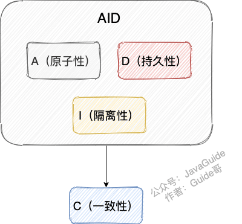

另外，DDIA 也就是 [《Designing Data-Intensive Application（数据密集型应用系统设计）》](https://book.douban.com/subject/30329536/)

 的作者在他的这本书中如是说：

> Atomicity, isolation, and durability are properties of the database, whereas  consis‐ tency (in the ACID sense) is a property of the application. The  application may rely on the database’s atomicity and isolation  properties in order to achieve consistency, but it’s not up to the  database alone.
>
> 翻译过来的意思是：原子性，隔离性和持久性是数据库的属性，而一致性（在 ACID 意义上）是应用程序的属性。应用可能依赖数据库的原子性和隔离属性来实现一致性，但这并不仅取决于数据库。因此，字母 C 不属于 ACID 。


### 并发事务带来了哪些问题

在典型的应用程序中，多个事务并发运行，经常会操作相同的数据来完成各自的任务（多个用户对同一数据进行操作）。并发虽然是必须的，但可能会导致以下的问题。

- **脏读（Dirty read）:** 当一个事务正在访问数据并且对数据进行了修改，而这种修改还没有提交到数据库中，这时另外一个事务也访问了这个数据，然后使用了这个数据。因为这个数据是还没有提交的数据，那么另外一个事务读到的这个数据是“脏数据”，依据“脏数据”所做的操作可能是不正确的。
- **丢失修改（Lost to modify）:**  指在一个事务读取一个数据时，另外一个事务也访问了该数据，那么在第一个事务中修改了这个数据后，第二个事务也修改了这个数据。这样第一个事务内的修改结果就被丢失，因此称为丢失修改。 例如：事务 1 读取某表中的数据 A=20，事务 2 也读取 A=20，事务 1 修改 A=A-1，事务 2 也修改 A=A-1，最终结果  A=19，事务 1 的修改被丢失。
- **不可重复读（Unrepeatable read）:** 指在一个事务内多次读同一数据。在这个事务还没有结束时，另一个事务也访问该数据。那么，在第一个事务中的两次读数据之间，由于第二个事务的修改导致第一个事务两次读取的数据可能不太一样。这就发生了在一个事务内两次读到的数据是不一样的情况，因此称为不可重复读。
- **幻读（Phantom read）:** 幻读与不可重复读类似。它发生在一个事务（T1）读取了几行数据，接着另一个并发事务（T2）插入了一些数据时。在随后的查询中，第一个事务（T1）就会发现多了一些原本不存在的记录，就好像发生了幻觉一样，所以称为幻读。

**不可重复读和幻读区别** ：<u>不可重复读的重点是修改</u>比如多次读取一条记录发现其中某些列的值被修改，<u>幻读的重点在于新增或者删除</u>比如多次查询同一条查询语句（DQL）时，记录发现记录增多或减少了。


### ⭐有哪些事务隔离级别，MySQL 的默认隔离级别是什么?

MySQL 的隔离级别基于锁和 MVCC 机制共同实现的。

- **READ-UNCOMMITTED(读取未提交)** ： 最低的隔离级别，允许读取尚未提交的数据变更，可能会导致脏读、幻读或不可重复读。
- **READ-COMMITTED(读取已提交)** ： 允许读取并发事务已经提交的数据，可以阻止脏读，但是幻读或不可重复读仍有可能发生。
- **REPEATABLE-READ(可重复读)** ： 对同一字段的多次读取结果都是一致的，除非数据是被本身事务自己所修改，可以阻止脏读和不可重复读，但幻读仍有可能发生。
- **SERIALIZABLE(可串行化)** ： 最高的隔离级别，完全服从 ACID 的隔离级别。所有的事务依次逐个执行，这样事务之间就完全不可能产生干扰，也就是说，该级别可以防止脏读、不可重复读以及幻读。

------

|     隔离级别     | 脏读 | 不可重复读 | 幻读 |
| :--------------: | :--: | :--------: | :--: |
| READ-UNCOMMITTED |  √   |     √      |  √   |
|  READ-COMMITTED  |  ×   |     √      |  √   |
| REPEATABLE-READ  |  ×   |     ×      |  √   |
|   SERIALIZABLE   |  ×   |     ×      |  ×   |


### 表级锁和行级锁了解吗？有什么区别？

MyISAM 仅仅支持表级锁(table-level locking)，一锁就锁整张表，这在并发写的情况下性非常差。

InnoDB 不光支持表级锁(table-level locking)，还支持行级锁(row-level  locking)，默认为行级锁。行级锁的粒度更小，仅对相关的记录上锁即可（对一行或者多行记录加锁），所以对于并发写入操作来说， InnoDB  的性能更高。

**表级锁和行级锁对比** ：

- **表级锁：** MySQL 中锁定粒度最大的一种锁，是针对非索引字段加的锁，对当前操作的整张表加锁，实现简单，资源消耗也比较少，加锁快，不会出现死锁。其锁定粒度最大，触发锁冲突的概率最高，并发度最低，MyISAM 和 InnoDB 引擎都支持表级锁。
- **行级锁：** MySQL 中锁定粒度最小的一种锁，是针对索引字段加的锁，只针对当前操作的记录进行加锁。 行级锁能大大减少数据库操作的冲突。其加锁粒度最小，并发度高，但加锁的开销也最大，加锁慢，会出现死锁。


### 共享锁和排他锁

不论是表级锁还是行级锁，都存在共享锁（Share Lock，S 锁）和排他锁（Exclusive Lock，X 锁）这两类：

- **共享锁（S 锁）** ：又称读锁，事务在读取记录的时候获取共享锁，允许多个事务同时获取（锁兼容）。
- **排他锁（X 锁）** ：又称写锁/独占锁，事务在修改记录的时候获取排他锁，不允许多个事务同时获取。如果一个记录已经被加了排他锁，那其他事务不能再对这条事务加任何类型的锁（锁不兼容）。

排他锁与任何的锁都不兼容，共享锁仅和共享锁兼容。

|      | S 锁   | X 锁 |
| :--- | :----- | :--- |
| S 锁 | 不冲突 | 冲突 |
| X 锁 | 冲突   | 冲突 |

由于 MVCC 的存在，对于一般的 `SELECT` 语句，InnoDB 不会加任何锁。不过， 你可以通过以下语句显式加共享锁或排他锁。

```sql
# 共享锁
SELECT ... LOCK IN SHARE MODE;
# 排他锁
SELECT ... FOR UPDATE;
```


### InnoDB 有哪几类行锁

MySQL InnoDB 支持三种行锁定方式：

- **记录锁（Record Lock）** ：也被称为记录锁，属于单个行记录上的锁。
- **间隙锁（Gap Lock）** ：锁定一个范围，不包括记录本身。
- **临键锁（Next-key Lock）** ：Record Lock+Gap Lock，锁定一个范围，包含记录本身。记录锁只能锁住已经存在的记录，为了避免插入新记录，需要依赖间隙锁。

InnoDB 的默认隔离级别 REPEATABLE-READ（可重读）是可以解决幻读问题发生的，主要有下面两种情况：

- **快照读** ：由 MVCC 机制来保证不出现幻读。
- **当前读** ： 使用 Next-Key Lock 进行加锁来保证不出现幻读。


### 为什么MySQL 没有使用Hash表作为索引的数据结构呢？

**1.Hash 冲突问题** ：JDK1.8 之前 `HashMap` 就是通过链地址法来解决哈希冲突的。不过，JDK1.8 以后`HashMap`为了减少链表过长的时候搜索时间过长引入了红黑树，不过对于数据库来说这还不算最大的缺点。

**2.Hash 索引不支持顺序和范围查询(Hash 索引不支持顺序和范围查询是它最大的缺点：** 假如我们要对表中的数据进行排序或者进行范围查询，那 Hash 索引可就不行了。

试想一种情况:

```java
SELECT * FROM tb1 WHERE id < 500;
```

在这种范围查询中，优势非常大，直接遍历比 500 小的叶子节点就够了。而 Hash 索引是根据 hash 算法来定位的，难不成还要把 1 - 499 的数据，每个都进行一次 hash 计算来定位吗?这就是 Hash 最大的缺点了。


### :star:为什么MySQL底层要用B+树？和二叉树有什么区别？

图解B+树：https://zhuanlan.zhihu.com/p/54102723

B 树也称 B-树,全称为 **多路平衡查找树** ，B+ 树是 B 树的一种变体。B 树和 B+树中的 B 是 `Balanced` （平衡）的意思。

目前大部分数据库系统及文件系统都采用 B-Tree 或其变种 B+Tree 作为索引结构。

**B 树& B+树两者有何异同呢？**

- B 树的所有节点既存放键(key) 也存放 数据(data)，而 B+树只有叶子节点存放 key 和 data，其他内节点只存放 key。
- B 树的叶子节点都是独立的;B+树的叶子节点有一条引用链指向与它相邻的叶子节点。
- B 树的检索的过程相当于对范围内的每个节点的关键字做二分查找，可能还没有到达叶子节点，检索就结束了。而 B+树的检索效率就很稳定了，任何查找都是从根节点到叶子节点的过程，叶子节点的顺序检索很明显。

在 MySQL 中，MyISAM 引擎和 InnoDB 引擎都是使用 B+Tree 作为索引结构，但是，两者的实现方式不太一样。

MyISAM 引擎中，B+Tree 叶节点的 data 域存放的是数据记录的地址。在索引检索的时候，首先按照 B+Tree  搜索算法搜索索引，如果指定的 Key 存在，则取出其 data 域的值，然后以 data  域的值为地址读取相应的数据记录。这被称为“非聚簇索引”。

InnoDB 引擎中，其数据文件本身就是索引文件。相比 MyISAM，索引文件和数据文件是分离的，其表数据文件本身就是按 B+Tree  组织的一个索引结构，树的叶节点 data 域保存了完整的数据记录。这个索引的 key 是数据表的主键，因此 InnoDB  表数据文件本身就是主索引。这被称为“聚簇索引（或聚集索引）”，而其余的索引都作为辅助索引，辅助索引的 data  域存储相应记录主键的值而不是地址，这也是和 MyISAM 不同的地方。在根据主索引搜索时，直接找到 key  所在的节点即可取出数据；在根据辅助索引查找时，则需要先取出主键的值，再走一遍主索引。  因此，在设计表的时候，不建议使用过长的字段作为主键，也不建议使用非单调的字段作为主键，这样会造成主索引频繁分裂。


### MySQL三大日志（binlog、redo log、undo log）

`MySQL` 日志 主要包括错误日志、查询日志、慢查询日志、事务日志、二进制日志几大类。其中，比较重要的还要属二进制日志 `binlog`（归档日志）和事务日志 `redo log`（重做日志）和 `undo log`（回滚日志）

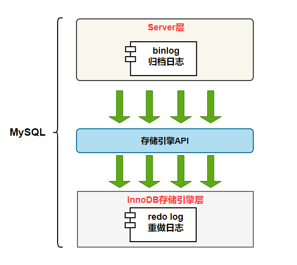

* redo log
  * 刷盘机制
  * 日志文件组
* bin log
  * 记录格式
  * 写入机制
  * 两阶段提交
* undo log


MySQL InnoDB 引擎使用 **redo log(重做日志)** 保证事务的**持久性**，使用 **undo log(回滚日志)** 来保证事务的**原子性**。

`MySQL`数据库的**数据备份、主备、主主、主从**都离不开`binlog`，需要依靠`binlog`来同步数据，保证数据一致性。


### 图解MVCC

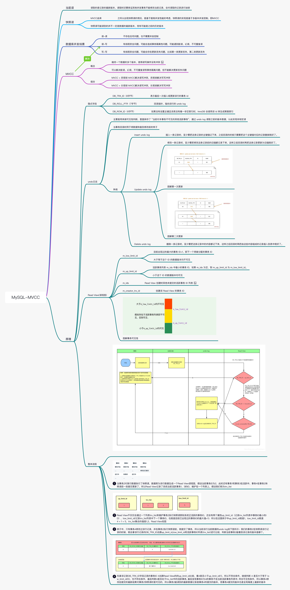


### 读写分离了解吗？

见名思意，根据读写分离的名字，我们就可以知道：**读写分离主要是为了将对数据库的读写操作分散到不同的数据库节点上。** 这样的话，就能够小幅提升写性能，大幅提升读性能。


不论是使用哪一种读写分离具体的实现方案，想要实现读写分离一般包含如下几步：

1. 部署多台数据库，选择其中的一台作为主数据库，其他的一台或者多台作为从数据库。
2. 保证主数据库和从数据库之间的数据是实时同步的，这个过程也就是我们常说的**主从复制**。
3. 系统将写请求交给主数据库处理，读请求交给从数据库处理。

落实到项目本身的话，常用的方式有两种：

**1.代理方式**


我们可以在应用和数据中间加了一个代理层。应用程序所有的数据请求都交给代理层处理，代理层负责分离读写请求，将它们路由到对应的数据库中。

提供类似功能的中间件有 **MySQL Router**（官方）、**Atlas**（基于 MySQL Proxy）、**Maxscale**、**MyCat**。

**2.组件方式**

在这种方式中，我们可以通过引入第三方组件来帮助我们读写请求。

这也是我比较推荐的一种方式。这种方式目前在各种互联网公司中用的最多的，相关的实际的案例也非常多。如果你要采用这种方式的话，推荐使用 `sharding-jdbc` ，直接引入 jar 包即可使用，非常方便。同时，也节省了很多运维的成本。


### 主从复制原理了解么？

MySQL binlog(binary log 即二进制日志文件) 主要记录了 MySQL 数据库中数据的所有变化(数据库执行的所有 DDL 和 DML 语句)。因此，我们根据主库的 MySQL binlog 日志就能够将主库的数据同步到从库中。

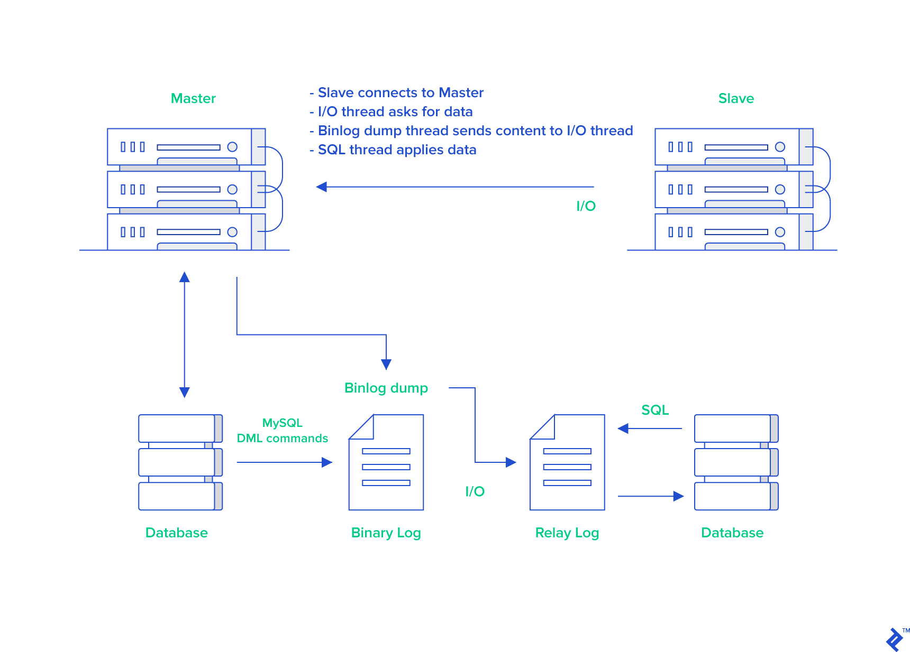

1. 主库将数据库中数据的变化写入到 binlog
2. 从库连接主库
3. 从库会创建一个 I/O 线程向主库请求更新的 binlog
4. 主库会创建一个 binlog dump 线程来发送 binlog ，从库中的 I/O 线程负责接收
5. 从库的 I/O 线程将接收的 binlog 写入到 relay log 中。
6. 从库的 SQL 线程读取 relay log 同步数据本地（也就是再执行一遍 SQL ）。

怎么样？看了我对主从复制这个过程的讲解，你应该搞明白了吧!

你一般看到 binlog 就要想到主从复制。当然，除了主从复制之外，binlog 还能帮助我们实现数据恢复。

🌈 拓展一下：

不知道大家有没有使用过阿里开源的一个叫做 canal 的工具。这个工具可以帮助我们实现 MySQL 和其他数据源比如 Elasticsearch 或者另外一台 MySQL  数据库之间的数据同步。很显然，这个工具的底层原理肯定也是依赖 binlog。canal 的原理就是模拟 MySQL 主从复制的过程，解析  binlog 将数据同步到其他的数据源。

另外，像咱们常用的分布式缓存组件 Redis 也是通过主从复制实现的读写分离。

🌕 简单总结一下：

**MySQL 主从复制是依赖于 binlog 。另外，常见的一些同步 MySQL 数据到其他数据源的工具（比如 canal）的底层一般也是依赖 binlog 。**


### 数据库如何实现分布式锁

#### 基于数据库表（锁表，很少使用）

最简单的方式可能就是直接创建一张锁表，然后通过操作该表中的数据来实现了。当我们想要获得锁的时候，就可以在该表中增加一条记录，想要释放锁的时候就删除这条记录。

为了更好的演示，我们先创建一张数据库表，参考如下：

```sql
CREATE TABLE database_lock (
	`id` BIGINT NOT NULL AUTO_INCREMENT,
	`resource` int NOT NULL COMMENT '锁定的资源',
	`description` varchar(1024) NOT NULL DEFAULT "" COMMENT '描述',
	PRIMARY KEY (id),
	UNIQUE KEY uiq_idx_resource (resource)
) ENGINE=InnoDB DEFAULT CHARSET=utf8mb4 COMMENT='数据库分布式锁表';
```

当我们想要获得锁时，可以插入一条数据：

```sql
INSERT INTO database_lock(resource, description) VALUES (1, 'lock');
```

当需要释放锁的时，可以删除这条数据：

```sql
DELETE FROM database_lock WHERE resource=1;
```

#### 基于悲观锁

**悲观锁实现思路**？

1. 在对任意记录进行修改前，先尝试为该记录加上排他锁（exclusive locking）。
2. 如果加锁失败，说明该记录正在被修改，那么当前查询可能要等待或者抛出异常。 具体响应方式由开发者根据实际需要决定。
3. 如果成功加锁，那么就可以对记录做修改，事务完成后就会解锁了。
4. 其间如果有其他对该记录做修改或加排他锁的操作，都会等待我们解锁或直接抛出异常。

**以MySQL InnoDB中使用悲观锁为例**？

要使用悲观锁，我们必须关闭mysql数据库的自动提交属性，因为MySQL默认使用autocommit模式，也就是说，当你执行一个更新操作后，MySQL会立刻将结果进行提交。set autocommit=0;

```sql
//0.开始事务
begin;/begin work;/start transaction; (三者选一就可以)
//1.查询出商品信息
select status from t_goods where id=1 for update;
//2.根据商品信息生成订单
insert into t_orders (id,goods_id) values (null,1);
//3.修改商品status为2
update t_goods set status=2;
//4.提交事务
commit;/commit work;
```

上面的查询语句中，我们使用了`select…for update`的方式，这样就通过开启排他锁的方式实现了悲观锁。此时在t_goods表中，id为1的 那条数据就被我们锁定了，其它的事务必须等本次事务提交之后才能执行。这样我们可以保证当前的数据不会被其它事务修改。

上面我们提到，使用`select…for update`会把数据给锁住，不过我们需要注意一些锁的级别，MySQL InnoDB默认行级锁。行级锁都是基于索引的，如果一条SQL语句用不到索引是不会使用行级锁的，会使用表级锁把整张表锁住，这点需要注意。

#### 基于乐观锁

乐观并发控制（又名“乐观锁”，Optimistic Concurrency Control，缩写“OCC”）是一种并发控制的方法。它假设多用户并发的事务在处理时不会彼此互相影响，各事务能够在不产生锁的情况下处理各自影响的那部分数据。在提交数据更新之前，每个事务会先检查在该事务读取数据后，有没有其他事务又修改了该数据。如果其他事务有更新的话，正在提交的事务会进行回滚。

**以使用版本号实现乐观锁为例？**

使用版本号时，可以在数据初始化时指定一个版本号，每次对数据的更新操作都对版本号执行+1操作。并判断当前版本号是不是该数据的最新的版本号。

```sql
1.查询出商品信息
select (status,status,version) from t_goods where id=#{id}
2.根据商品信息生成订单
3.修改商品status为2
update t_goods 
set status=2,version=version+1
where id=#{id} and version=#{version};
```

需要注意的是，乐观锁机制往往基于系统中数据存储逻辑，因此也具备一定的局限性。由于乐观锁机制是在我们的系统中实现的，对于来自外部系统的用户数据更新操作不受我们系统的控制，因此可能会造成脏数据被更新到数据库中。在系统设计阶段，我们应该充分考虑到这些情况，并进行相应的调整（如将乐观锁策略在数据库存储过程中实现，对外只开放基于此存储过程的数据更新途径，而不是将数据库表直接对外公开）。

- **缺陷**

对数据库依赖，开销问题，行锁变表锁问题，无法解决数据库单点和可重入的问题。


## :hotsprings: redis

### 说一下redis

简单来说 **Redis 就是一个使用 C 语言开发的数据库**，不过与传统数据库不同的是 **Redis 的数据是存在内存中的** ，也就是它是内存数据库，所以读写速度非常快，因此 Redis 被广泛应用于缓存方向。

另外，**Redis 除了做缓存之外，也经常用来做分布式锁，甚至是消息队列。**

**Redis 提供了多种数据类型来支持不同的业务场景。Redis 还支持事务 、持久化、Lua 脚本、多种集群方案。**


### Redis为什么这么快？

* redis完全基于内存,绝大部分请求是纯粹的内存操作,非常快速.
* 数据结构简单,对数据操作也简单,redis中的数据结构是专门进行设计的
* 采用单线程模型, 避免了不必要的上下文切换和竞争条件, 也不存在多线程或者多线程切换而消耗CPU, 不用考虑各种锁的问题, 不存在加锁, 释放锁的操作, 没有因为可能出现死锁而导致性能消耗
* 使用了多路IO复用模型,非阻塞IO
* 使用底层模型不同,它们之间底层实现方式及与客户端之间的 通信的应用协议不一样,Redis直接构建了自己的VM机制,因为一般的系统调用系统函数的话,会浪费一定的时间去移动和请求


### 为什么要用 Redis/为什么要用缓存？

主要从两个方面讲：

* 高并发
  * QPS
  * 每秒访问的次数更多
* 高性能
  * 下次访问更快


### Redis 除了做缓存，还能做什么？

**分布式锁** ： 通过 Redis 来做分布式锁是一种比较常见的方式。通常情况下，我们都是基于 Redisson 来实现分布式锁。相关阅读：[《分布式锁中的王者方案 - Redisson》](https://mp.weixin.qq.com/s/CbnPRfvq4m1sqo2uKI6qQw)

**限流** ：一般是通过 Redis + Lua 脚本的方式来实现限流。相关阅读：[《我司用了 6 年的 Redis 分布式限流器，可以说是非常厉害了！》](https://mp.weixin.qq.com/s/kyFAWH3mVNJvurQDt4vchA)

**消息队列** ：Redis 自带的 list 数据结构可以作为一个简单的队列使用。Redis 5.0 中增加的 Stream 类型的数据结构更加适合用来做消息队列。它比较类似于 Kafka，有主题和消费组的概念，支持消息持久化以及 ACK 机制。

**复杂业务场景** ：通过 Redis 以及 Redis 扩展（比如 Redisson）提供的数据结构，我们可以很方便地完成很多复杂的业务场景比如通过 bitmap 统计活跃用户、通过 sorted set 维护排行榜。

......


### ⭐基本数据类型、应用场景

#### string

1. **介绍** ：string 数据结构是简单的 key-value 类型。虽然 Redis 是用 C 语言写的，但是 Redis 并没有使用 C 的字符串表示，而是自己构建了一种 **简单动态字符串**（simple dynamic string，**SDS**）。相比于 C 的原生字符串，Redis 的 SDS 不光可以保存文本数据还可以保存二进制数据，并且获取字符串长度复杂度为 O(1)（C 字符串为 O(N)）,除此之外，Redis 的 SDS API 是安全的，不会造成缓冲区溢出。
2. **常用命令：** `set,get,strlen,exists,decr,incr,setex` 等等。
3. **应用场景：** 一般常用在需要计数的场景，比如用户的访问次数、热点文章的点赞转发数量等等。


#### list

1. **介绍** ：**list** 即是 **链表**。链表是一种非常常见的数据结构，特点是易于数据元素的插入和删除并且可以灵活调整链表长度，但是链表的随机访问困难。许多高级编程语言都内置了链表的实现比如 Java 中的 **LinkedList**，但是 C 语言并没有实现链表，所以 Redis 实现了自己的链表数据结构。Redis 的 list 的实现为一个 **双向链表**，即可以支持反向查找和遍历，更方便操作，不过带来了部分额外的内存开销。
2. **常用命令:** `rpush,lpop,lpush,rpop,lrange,llen` 等。
3. **应用场景:** 发布与订阅或者说消息队列、慢查询。


####  hash

1. **介绍** ：hash 类似于 JDK1.8 前的 HashMap，内部实现也差不多(数组 + 链表)。不过，Redis 的 hash 做了更多优化。另外，hash 是一个 string 类型的 field 和 value 的映射表，**特别适合用于存储对象**，后续操作的时候，你可以直接仅仅修改这个对象中的某个字段的值。 比如我们可以 hash 数据结构来存储用户信息，商品信息等等。
2. **常用命令：** `hset,hmset,hexists,hget,hgetall,hkeys,hvals` 等。
3. **应用场景:** 系统中对象数据的存储，**缓存**： 能直观，相比string更节省空间，的维护缓存信息，如用户信息，视频信息等。


#### set

1. **介绍 ：** set 类似于 Java 中的 `HashSet`  。Redis 中的 set 类型是一种无序集合，集合中的元素没有先后顺序。当你需要存储一个列表数据，又不希望出现重复数据时，set  是一个很好的选择，并且 set 提供了判断某个成员是否在一个 set 集合内的重要接口，这个也是 list 所不能提供的。可以基于 set  轻易实现交集、并集、差集的操作。比如：你可以将一个用户所有的关注人存在一个集合中，将其所有粉丝存在一个集合。Redis  可以非常方便的实现如共同关注、共同粉丝、共同喜好等功能。这个过程也就是求交集的过程。
2. **常用命令：** `sadd,spop,smembers,sismember,scard,sinterstore,sunion` 等。
3. **应用场景:** 需要存放的数据不能重复以及需要获取多个数据源交集和并集等场景；**标签**（tag）,给用户添加标签，或者用户给消息添加标签，这样有同一标签或者类似标签的可以给推荐关注的事或者关注的人；**点赞，或点踩，收藏等**，可以放到set中实现。


#### 	Zset

1. **介绍 ：** 和 set 相比，sorted set 增加了一个权重参数 score，使得集合中的元素能够按 score 进行有序排列，还可以通过 score 的范围来获取元素的列表。有点像是 Java 中 HashMap 和 TreeSet 的结合体。

2. **常用命令：** `ZADD 将一个带有给定分值的成员添加到有序集合里面,ZRANGE 根据元素在有序集合中所处的位置，从有序集合中获取多个元素,ZREM 如果给定元素成员存在于有序集合中，那么就移除这个元素` 等。

3. **应用场景:** **排行榜**   需要对数据根据某个权重进行排序的场景。例如小说视频等网站需要对用户上传的小说视频做排行榜，榜单可以按照用户关注数，更新时间，字数等打分，做排行；在直播系统中，实时排行信息包含直播间在线用户列表；各种礼物排行榜，弹幕消息（可以理解为按消息维度的消息排行榜）等信息。

4. 有序集合是通过两种数据结构实现：

   1. **压缩列表(ziplist)**: ziplist是为了提高存储效率而设计的一种特殊编码的双向链表。它可以存储字符串或者整数，存储整数时是采用整数的二进制而不是字符串形式存储。它能在O(1)的时间复杂度下完成list两端的push和pop操作。但是因为每次操作都需要重新分配ziplist的内存，所以实际复杂度和ziplist的内存使用量相关

   1. **跳跃表（zSkiplist)**: 跳跃表的性能可以保证在查找，删除，添加等操作的时候在对数期望时间内完成，这个性能是可以和平衡树来相比较的，而且在实现方面比平衡树要优雅，这是采用跳跃表的主要原因。跳跃表的复杂度是O(log(n))。


随着 Redis 版本的更新，后面又支持了四种数据类型：BitMap（2.2 版新增）、HyperLogLog（2.8 版新增）、GEO（3.2 版新增）、Stream（5.0 版新增）

#### 特殊类型： bitmap

1. **介绍：** bitmap 存储的是连续的二进制数字（0 和 1），通过 bitmap, 只需要一个 bit 位来表示某个元素对应的值或者状态，key 就是对应元素本身 。我们知道 8 个 bit 可以组成一个 byte，所以 bitmap 本身会极大的节省储存空间。
2. **常用命令：** `setbit` 、`getbit` 、`bitcount`、`bitop`
3. **应用场景：** 适合需要保存状态信息（比如是否签到、是否登录...）并需要进一步对这些信息进行分析的场景。比如用户签到情况、活跃用户情况、用户行为统计（比如是否点赞过某个视频）。


### Redis 单线程模型了解吗？

**Redis 基于 Reactor 模式来设计开发了自己的一套高效的事件处理模型** （Netty 的线程模型也基于 Reactor 模式，Reactor 模式不愧是高性能 IO 的基石），这套事件处理模型对应的是 Redis 中的文件事件处理器（file  event handler）。由于文件事件处理器（file event handler）是单线程方式运行的，所以我们一般都说 Redis  是单线程模型。

**既然是单线程，那怎么监听大量的客户端连接呢？**

Redis 通过**IO 多路复用程序** 来监听来自客户端的大量连接（或者说是监听多个 socket），它会将感兴趣的事件及类型（读、写）注册到内核中并监听每个事件是否发生。

这样的好处非常明显： **I/O 多路复用技术的使用让 Redis 不需要额外创建多余的线程来监听客户端的大量连接，降低了资源的消耗**（和 NIO 中的 `Selector` 组件很像）。

另外， Redis 服务器是一个事件驱动程序，服务器需要处理两类事件：1. 文件事件; 2. 时间事件。

时间事件不需要多花时间了解，我们接触最多的还是 **文件事件**（客户端进行读取写入等操作，涉及一系列网络通信）。

《Redis 设计与实现》有一段话是如是介绍文件事件的，我觉得写得挺不错。

> Redis 基于 Reactor 模式开发了自己的网络事件处理器：这个处理器被称为文件事件处理器（file event  handler）。文件事件处理器使用 I/O  多路复用（multiplexing）程序来同时监听多个套接字，并根据套接字目前执行的任务来为套接字关联不同的事件处理器。
>
> 当被监听的套接字准备好执行连接应答（accept）、读取（read）、写入（write）、关 闭（close）等操作时，与操作相对应的文件事件就会产生，这时文件事件处理器就会调用套接字之前关联好的事件处理器来处理这些事件。
>
> **虽然文件事件处理器以单线程方式运行，但通过使用 I/O 多路复用程序来监听多个套接字**，文件事件处理器既实现了高性能的网络通信模型，又可以很好地与 Redis 服务器中其他同样以单线程方式运行的模块进行对接，这保持了 Redis 内部单线程设计的简单性。

可以看出，文件事件处理器（file event handler）主要是包含 4 个部分：

- 多个 socket（客户端连接）
- IO 多路复用程序（支持多个客户端连接的关键）
- 文件事件分派器（将 socket 关联到相应的事件处理器）
- 事件处理器（连接应答处理器、命令请求处理器、命令回复处理器）

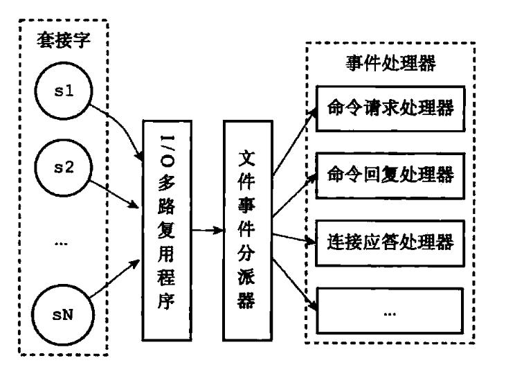


### Redis 是如何判断数据是否过期的呢？

Redis 通过一个叫做过期字典（可以看作是 hash 表）来保存数据过期的时间。过期字典的键指向 Redis 数据库中的某个  key(键)，过期字典的值是一个 long long 类型的整数，这个整数保存了 key 所指向的数据库键的过期时间（毫秒精度的 UNIX  时间戳）。

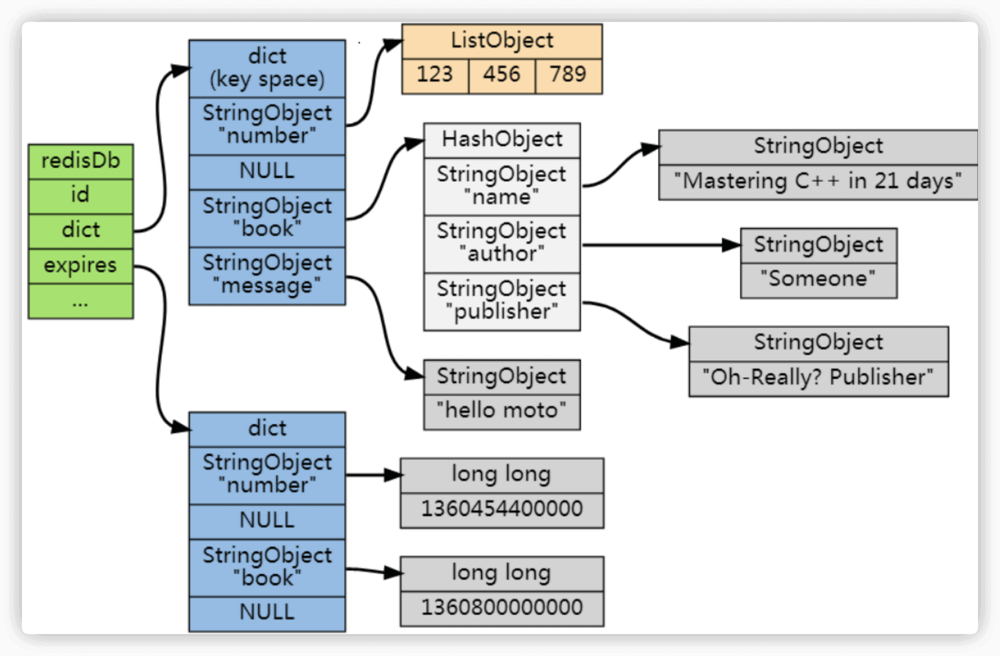

过期字典是存储在 redisDb 这个结构里的：

```c
typedef struct redisDb {
    ...

    dict *dict;     //数据库键空间,保存着数据库中所有键值对
    dict *expires   // 过期字典,保存着键的过期时间
    ...
} redisDb;
```


> 拓展：过期的数据的删除策略了解么？

常用的过期数据的删除策略就两个（重要！自己造缓存轮子的时候需要格外考虑的东西）：

1. **惰性删除** ：只会在取出 key 的时候才对数据进行过期检查。这样对 CPU 最友好，但是可能会造成太多过期 key 没有被删除。
2. **定期删除** ： 每隔一段时间抽取一批 key 执行删除过期 key 操作。并且，Redis 底层会通过限制删除操作执行的时长和频率来减少删除操作对 CPU 时间的影响。


> 再拓展：大量 key 集中过期问题

因为导致客户端请求没办法被及时处理，响应速度会比较慢。

如何解决呢？下面是两种常见的方法：

1. 给 key 设置随机过期时间。
2. 开启 lazy-free（惰性删除/延迟释放） 。lazy-free 特性是 Redis 4.0 开始引入的，指的是让 Redis 采用异步方式延迟释放 key 使用的内存，将该操作交给单独的子线程处理，避免阻塞主线程。

个人建议不管是否开启 lazy-free，我们都尽量给 key 设置随机过期时间。


### Redis 内存淘汰机制了解么？

Redis 提供 6 种数据淘汰策略：

1. **volatile-lru（least recently used）**：从已设置过期时间的数据集（server.db[i].expires）中挑选最近最少使用的数据淘汰
2. **volatile-ttl**：从已设置过期时间的数据集（server.db[i].expires）中挑选将要过期的数据淘汰
3. **volatile-random**：从已设置过期时间的数据集（server.db[i].expires）中任意选择数据淘汰
4. **allkeys-lru（least recently used）**：当内存不足以容纳新写入数据时，在键空间中，移除最近最少使用的 key（这个是最常用的）
5. **allkeys-random**：从数据集（server.db[i].dict）中任意选择数据淘汰
6. **no-eviction**：禁止驱逐数据，也就是说当内存不足以容纳新写入数据时，新写入操作会报错。这个应该没人使用吧！

4.0 版本后增加以下两种：

1. **volatile-lfu（least frequently used）**：从已设置过期时间的数据集（server.db[i].expires）中挑选最不经常使用的数据淘汰
2. **allkeys-lfu（least frequently used）**：当内存不足以容纳新写入数据时，在键空间中，移除最不经常使用的 key


### ⭐怎么保证 Redis 挂掉之后再重启数据可以进行恢复？（持久化策略）

很多时候我们需要持久化数据也就是将内存中的数据写入到硬盘里面，大部分原因是为了之后重用数据（比如重启机器、机器故障之后恢复数据），或者是为了防止系统故障而将数据备份到一个远程位置。

Redis 不同于 Memcached 的很重要一点就是，Redis 支持持久化，而且支持两种不同的持久化操作。**Redis 的一种持久化方式叫快照（snapshotting，RDB），另一种方式是只追加文件（append-only file, AOF）**。


#### 什么是 RDB 持久化？

Redis 可以通过创建快照来获得存储在内存里面的数据在某个时间点上的副本。Redis  创建快照之后，可以对快照进行备份，可以将快照复制到其他服务器从而创建具有相同数据的服务器副本（Redis 主从结构，主要用来提高 Redis  性能），还可以将快照留在原地以便重启服务器的时候使用。

快照持久化是 Redis 默认采用的持久化方式，在 `redis.conf` 配置文件中默认有此下配置：

```shell
save 900 1           #在900秒(15分钟)之后，如果至少有1个key发生变化，Redis就会自动触发BGSAVE命令创建快照。

save 300 10          #在300秒(5分钟)之后，如果至少有10个key发生变化，Redis就会自动触发BGSAVE命令创建快照。

save 60 10000        #在60秒(1分钟)之后，如果至少有10000个key发生变化，Redis就会自动触发BGSAVE命令创建快照。
```


#### 什么是 AOF 持久化？

与快照持久化相比，AOF 持久化的实时性更好，因此已成为主流的持久化方案。默认情况下 Redis 没有开启 AOF（append only file）方式的持久化，可以通过 appendonly 参数开启：

```conf
appendonly yes
```

开启 AOF 持久化后每执行一条会更改 Redis 中的数据的命令，Redis 就会将该命令写入到内存缓存 `server.aof_buf` 中，然后再根据 `appendfsync` 配置来决定何时将其同步到硬盘中的 AOF 文件。

AOF 文件的保存位置和 RDB 文件的位置相同，都是通过 dir 参数设置的，默认的文件名是 `appendonly.aof`。

在 Redis 的配置文件中存在三种不同的 AOF 持久化方式，它们分别是：

```conf
appendfsync always    #每次有数据修改发生时都会写入AOF文件,这样会严重降低Redis的速度
appendfsync everysec  #每秒钟同步一次，显式地将多个写命令同步到硬盘
appendfsync no        #让操作系统决定何时进行同步
```

为了兼顾数据和写入性能，用户可以考虑 `appendfsync everysec` 选项 ，让 Redis 每秒同步一次 AOF 文件，Redis 性能几乎没受到任何影响。而且这样即使出现系统崩溃，用户最多只会丢失一秒之内产生的数据。当硬盘忙于执行写入操作的时候，Redis 还会优雅的放慢自己的速度以便适应硬盘的最大写入速度。


#### AOF 重写了解吗？

AOF 重写可以产生一个新的 AOF 文件，这个新的 AOF 文件和原有的 AOF 文件所保存的数据库状态一样，但体积更小。

AOF 重写是一个有歧义的名字，该功能是通过读取数据库中的键值对来实现的，程序无须对现有 AOF 文件进行任何读入、分析或者写入操作。

在执行 `BGREWRITEAOF` 命令时，Redis 服务器会维护一个 AOF 重写缓冲区，该缓冲区会在子进程创建新 AOF  文件期间，记录服务器执行的所有写命令。当子进程完成创建新 AOF 文件的工作之后，服务器会将重写缓冲区中的所有内容追加到新 AOF  文件的末尾，使得新的 AOF 文件保存的数据库状态与现有的数据库状态一致。最后，服务器用新的 AOF 文件替换旧的 AOF 文件，以此来完成  AOF 文件重写操作。

> 拓展

Redis 4.0 开始支持 RDB 和 AOF 的混合持久化（默认关闭，可以通过配置项 `aof-use-rdb-preamble` 开启）。

如果把混合持久化打开，AOF 重写的时候就直接把 RDB 的内容写到 AOF 文件开头。这样做的好处是可以结合 RDB 和 AOF 的优点,  快速加载同时避免丢失过多的数据。当然缺点也是有的， AOF 里面的 RDB 部分是压缩格式不再是 AOF 格式，可读性较差。


### 缓存穿透

**解释 1：**缓存查询一个没有的 key，同时数据库也没有，如果黑客大量的使用这种方式，那么就会导致 DB 宕机。

**解决方案：**我们可以使用一个默认值来防止，例如，当访问一个不存在的 key，然后再去访问数据库，还是没有，那么就在缓存里放一个占位符，下次来的时候，检查这个占位符，如果发生时占位符，就不去数据库查询了，防止 DB 宕机。

**解释 2：**大量请求查询一个刚刚失效的 key，导致 DB 压力倍增，可能导致宕机，但实际上，查询的都是相同的数据。

**解决方案：**可以在这些请求代码加上双重检查锁。但是那个阶段的请求会变慢。不过总比 DB 宕机好。


其他：

**1）缓存无效 key**

如果缓存和数据库都查不到某个 key 的数据就写一个到 Redis 中去并设置过期时间，具体命令如下： `SET key value EX 10086` 。这种方式可以解决请求的 key 变化不频繁的情况，如果黑客恶意攻击，每次构建不同的请求 key，会导致 Redis 中缓存大量无效的 key 。很明显，这种方案并不能从根本上解决此问题。如果非要用这种方式来解决穿透问题的话，尽量将无效的 key 的过期时间设置短一点比如 1 分钟。

**2）布隆过滤器**

布隆过滤器是一个非常神奇的数据结构，通过它我们可以非常方便地判断一个给定数据是否存在于海量数据中。我们需要的就是判断 key 是否合法，有没有感觉布隆过滤器就是我们想要找的那个“人”。

具体是这样做的：把所有可能存在的请求的值都存放在布隆过滤器中，当用户请求过来，先判断用户发来的请求的值是否存在于布隆过滤器中。不存在的话，直接返回请求参数错误信息给客户端，存在的话才会走下面的流程。

加入布隆过滤器之后的缓存处理流程图如下。


### 缓存雪崩

> 🌰举个例子：系统的缓存模块出了问题比如宕机导致不可用。造成系统的所有访问，都要走数据库。
>
> 还有一种缓存雪崩的场景是：有一些被大量访问数据（热点缓存）在某一时刻大面积失效，导致对应的请求直接落到了数据库上。 这样的情况，有下面几种解决办法：
>
> 🌰举个例子 ：秒杀开始 12 个小时之前，我们统一存放了一批商品到 Redis 中，设置的缓存过期时间也是 12 个小时，那么秒杀开始的时候，这些秒杀的商品的访问直接就失效了。导致的情况就是，相应的请求直接就落到了数据库上，就像雪崩一样可怕。

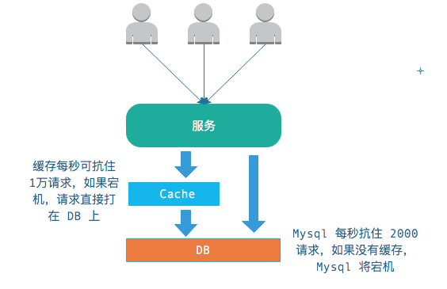

通常，我们会使用缓存用于缓冲对 DB 的冲击，如果缓存宕机，所有请求将直接打在 DB，造成 DB 宕机——从而导致整个系统宕机。


**2 种策略（同时使用）：**

* 对缓存做高可用，防止缓存宕机
* 使用断路器，如果缓存宕机，为了防止系统全部宕机，限制部分流量进入 DB，保证部分可用，其余的请求返回断路器的默认值。


其他：

**针对 Redis 服务不可用的情况：**

1. 采用 Redis 集群，避免单机出现问题整个缓存服务都没办法使用。
2. 限流，避免同时处理大量的请求。

**针对热点缓存失效的情况：**

1. 设置不同的失效时间比如随机设置缓存的失效时间。
2. 缓存永不失效。


### 主从复制方案是怎么做的？

主从复制，是指将一台Redis服务器的数据，复制到其他的Redis服务器。前者称为主节点(master)，后者称为从节点(slave)；数据的复制是单向的，只能由主节点到从节点。

主从库之间采用的是**读写分离**的方式。

- 读操作：主库、从库都可以接收；
- 写操作：首先到主库执行，然后，主库将写操作同步给从库。


> 注意：在2.8版本之前只有全量复制，而2.8版本后有全量和增量复制：

- `全量（同步）复制`：比如第一次同步时
- `增量（同步）复制`：只会把主从库网络断连期间主库收到的命令，同步给从库

著作权归https://pdai.tech所有。 链接：https://www.pdai.tech/md/db/nosql-redis/db-redis-x-copy.html

#### 全量复制

> 当我们启动多个 Redis 实例的时候，它们相互之间就可以通过 replicaof（Redis 5.0 之前使用 slaveof）命令形成主库和从库的关系，之后会按照三个阶段完成数据的第一次同步。

- **确立主从关系**

例如，现在有实例 1（ip：172.16.19.3）和实例 2（ip：172.16.19.5），我们在实例 2 上执行以下这个命令后，实例 2 就变成了实例 1 的从库，并从实例 1 上复制数据：

```bash
replicaof 172.16.19.3 6379
```

- **全量复制的三个阶段**

你可以先看一下下面这张图，有个整体感知，接下来我再具体介绍。


* **第一阶段是主从库间建立连接、协商同步的过程**
* **第二阶段，主库将所有数据同步给从库**
* **第三个阶段，主库会把第二阶段执行过程中新收到的写命令，再发送给从库**


#### 增量复制

> 在 Redis 2.8 版本引入了增量复制。

- **为什么会设计增量复制**？

如果主从库在命令传播时出现了网络闪断，那么，从库就会和主库重新进行一次全量复制，开销非常大。从 Redis 2.8 开始，网络断了之后，主从库会采用增量复制的方式继续同步。

- **增量复制的流程**

你可以先看一下下面这张图，有个整体感知，接下来我再具体介绍。


先看两个概念： `replication buffer` 和 `repl_backlog_buffer`

`repl_backlog_buffer`：它是为了从库断开之后，如何找到主从差异数据而设计的环形缓冲区，从而避免全量复制带来的性能开销。如果从库断开时间太久，repl_backlog_buffer环形缓冲区被主库的写命令覆盖了，那么从库连上主库后只能乖乖地进行一次全量复制，所以**repl_backlog_buffer配置尽量大一些，可以降低主从断开后全量复制的概率**。而在repl_backlog_buffer中找主从差异的数据后，如何发给从库呢？这就用到了replication buffer。

`replication buffer`：Redis和客户端通信也好，和从库通信也好，Redis都需要给分配一个 内存buffer进行数据交互，客户端是一个client，从库也是一个client，我们每个client连上Redis后，Redis都会分配一个client buffer，所有数据交互都是通过这个buffer进行的：Redis先把数据写到这个buffer中，然后再把buffer中的数据发到client socket中再通过网络发送出去，这样就完成了数据交互。所以主从在增量同步时，从库作为一个client，也会分配一个buffer，只不过这个buffer专门用来传播用户的写命令到从库，保证主从数据一致，我们通常把它叫做replication buffer。


### Sentinel（哨兵）  有什么作用？

> Redis Sentinel，即Redis哨兵，在Redis 2.8版本开始引入。哨兵的核心功能是主节点的自动故障转移。

下图是一个典型的哨兵集群监控的逻辑图：


哨兵实现了什么功能呢？下面是Redis官方文档的描述：

- **监控（Monitoring）**：哨兵会不断地检查主节点和从节点是否运作正常。
- **自动故障转移（Automatic failover）**：当主节点不能正常工作时，哨兵会开始自动故障转移操作，它会将失效主节点的其中一个从节点升级为新的主节点，并让其他从节点改为复制新的主节点。
- **配置提供者（Configuration provider）**：客户端在初始化时，通过连接哨兵来获得当前Redis服务的主节点地址。
- **通知（Notification）**：哨兵可以将故障转移的结果发送给客户端。

其中，监控和自动故障转移功能，使得哨兵可以及时发现主节点故障并完成转移；而配置提供者和通知功能，则需要在与客户端的交互中才能体现。


### ⭐MySQL 和 Redis 怎么保持数据一致?

个人觉得引入缓存之后，如果为了短时间的不一致性问题，选择让系统设计变得更加复杂的话，完全没必要。
下面单独对 Cache Aside Pattern（旁路缓存模式） 来聊聊。
Cache Aside Pattern 中遇到写请求是这样的：更新 DB，然后直接删除 cache 。
如果更新数据库成功，而删除缓存这一步失败的情况的话，简单说两个解决方案：

1. **缓存失效时间变短（不推荐，治标不治本）** ：我们让缓存数据的过期时间变短，样的话缓存就会从数据库中加载数据。另外，这种解决办法对于先操作缓存后操作数据库的场景不适用。
2. **增加cache更新重试机制（常用）**： 如果 cache 服务当前不可用导致缓存删除失败的话，我们就隔一段时间进行重试，重试次数可以自己定。如果多次重试还是失败的话，我们可以把当前更新失败的 key 存入队列中，等缓存服务可用之后，再将 缓存中对应的 key 删除即可。


### redis如何实现分布式锁？

**分布式锁**：当多个进程不在同一个系统中(比如分布式系统中控制共享资源访问)，用分布式锁控制多个进程对资源的访问。

[Redis的官网](https://redis.io/docs/reference/patterns/distributed-locks/)上对使用分布式锁提出至少需要满足如下三个要求：

1. **互斥**（属于安全性）：在任何给定时刻，只有一个客户端可以持有锁。
2. **无死锁**（属于有效性）：即使锁定资源的客户端崩溃或被分区，也总是可以获得锁；通常通过超时机制实现。
3. **容错性**（属于有效性）：只要大多数 Redis 节点都启动，客户端就可以获取和释放锁。

**基于 redis 实现分布式锁**:

- 单个Redis实例：setnx(key,当前时间+过期时间) + Lua
- Redis集群模式：Redlock


#### set NX PX + Lua

**加锁**： set NX PX + 重试 + 重试间隔

向Redis发起如下命令: `SET productId:lock 0xx9p03001 NX PX 30000` 其中，"productId"由自己定义，可以是与本次业务有关的id，"0xx9p03001"是一串随机值，必须保证全局唯一(原因在后文中会提到)，“NX"指的是当且仅当key(也就是案例中的"productId:lock”)在Redis中不存在时，返回执行成功，否则执行失败。"PX 30000"指的是在30秒后，key将被自动删除。执行命令后返回成功，表明服务成功的获得了锁。

```java
@Override
public boolean lock(String key, long expire, int retryTimes, long retryDuration) {
    // use JedisCommands instead of setIfAbsense
    boolean result = setRedis(key, expire);

    // retry if needed
    while ((!result) && retryTimes-- > 0) {
        try {
            log.debug("lock failed, retrying..." + retryTimes);
            Thread.sleep(retryDuration);
        } catch (Exception e) {
            return false;
        }

        // use JedisCommands instead of setIfAbsense
        result = setRedis(key, expire);
    }
    return result;
}

private boolean setRedis(String key, long expire) {
    try {
        RedisCallback<String> redisCallback = connection -> {
            JedisCommands commands = (JedisCommands) connection.getNativeConnection();
            String uuid = SnowIDUtil.uniqueStr();
            lockFlag.set(uuid);
            return commands.set(key, uuid, NX, PX, expire); // 看这里
        };
        String result = redisTemplate.execute(redisCallback);
        return !StringUtil.isEmpty(result);
    } catch (Exception e) {
        log.error("set redis occurred an exception", e);
    }
    return false;
}
```

**解锁**：采用lua脚本

在删除key之前，一定要判断服务A持有的value与Redis内存储的value是否一致。如果贸然使用服务A持有的key来删除锁，则会误将服务B的锁释放掉。

```java
if redis.call("get", KEYS[1])==ARGV[1] then
	return redis.call("del", KEYS[1])
else
	return 0
end
```

#### 基于RedLock实现分布式锁

> 这是Redis作者推荐的分布式集群情况下的方式，请看这篇文章[Is Redlock safe?](http://antirez.com/news/101)

假设有两个服务A、B都希望获得锁，有一个包含了5个redis master的Redis Cluster，执行过程大致如下:

1. 客户端获取当前时间戳，单位: 毫秒
2. 服务A轮寻每个master节点，尝试创建锁。(这里锁的过期时间比较短，一般就几十毫秒) RedLock算法会尝试在大多数节点上分别创建锁，假如节点总数为n，那么大多数节点指的是n/2+1。
3. 客户端计算成功建立完锁的时间，如果建锁时间小于超时时间，就可以判定锁创建成功。如果锁创建失败，则依次(遍历master节点)删除锁。
4. 只要有其它服务创建过分布式锁，那么当前服务就必须轮寻尝试获取锁。

#### 基于Redis的客户端

> 这里Redis的客户端（Jedis, Redisson, Lettuce等）都是基于上述两类形式来实现分布式锁的，只是两类形式的封装以及一些优化（比如Redisson的watch dog)。

以基于Redisson实现分布式锁为例（支持了 单实例、Redis哨兵、redis cluster、redis master-slave等各种部署架构）：

**特色**？

1. redisson所有指令都通过lua脚本执行，保证了操作的原子性
2. redisson设置了watchdog看门狗，“看门狗”的逻辑保证了没有死锁发生
3. redisson支持Redlock的实现方式。

**过程**？

1. 线程去获取锁，获取成功: 执行lua脚本，保存数据到redis数据库。
2. 线程去获取锁，获取失败: 订阅了解锁消息，然后再尝试获取锁，获取成功后，执行lua脚本，保存数据到redis数据库。

**互斥**？

如果这个时候客户端B来尝试加锁，执行了同样的一段lua脚本。第一个if判断会执行“exists myLock”，发现myLock这个锁key已经存在。接着第二个if判断，判断myLock锁key的hash数据结构中，是否包含客户端B的ID，但明显没有，那么客户端B会获取到pttl myLock返回的一个数字，代表myLock这个锁key的剩余生存时间。此时客户端B会进入一个while循环，不听的尝试加锁。

**watch dog自动延时机制**？

客户端A加锁的锁key默认生存时间只有30秒，如果超过了30秒，客户端A还想一直持有这把锁，怎么办？其实只要客户端A一旦加锁成功，就会启动一个watch dog看门狗，它是一个后台线程，会每隔10秒检查一下，如果客户端A还持有锁key，那么就会不断的延长锁key的生存时间。

**可重入**？

每次lock会调用incrby，每次unlock会减一


## :mailbox_with_no_mail: 消息队列

### RocketMQ的架构图

`RocketMQ` 技术架构中有四大角色 `NameServer` 、`Broker` 、`Producer` 、`Consumer` 。我来向大家分别解释一下这四个角色是干啥的。

`Broker`： 主要负责消息的存储、投递和查询以及服务高可用保证。说白了就是消息队列服务器嘛，生产者生产消息到 `Broker` ，消费者从 `Broker` 拉取消息并消费。

这里，我还得普及一下关于 `Broker` 、`Topic` 和 队列的关系。上面我讲解了 `Topic` 和队列的关系——一个 `Topic` 中存在多个队列，那么这个 `Topic` 和队列存放在哪呢？

**一个 `Topic` 分布在多个 `Broker`上，一个 `Broker` 可以配置多个 `Topic` ，它们是多对多的关系**。

如果某个 `Topic` 消息量很大，应该给它多配置几个队列(上文中提到了提高并发能力)，并且 **尽量多分布在不同 `Broker` 上，以减轻某个 `Broker` 的压力** 。

`Topic` 消息量都比较均匀的情况下，如果某个 `broker` 上的队列越多，则该 `broker` 压力越大。


- > 所以说我们需要配置多个Broker。

- `NameServer`： 不知道你们有没有接触过 `ZooKeeper` 和 `Spring Cloud` 中的 `Eureka` ，它其实也是一个 **注册中心** ，主要提供两个功能：**Broker管理** 和 **路由信息管理** 。说白了就是 `Broker` 会将自己的信息注册到 `NameServer` 中，此时 `NameServer` 就存放了很多 `Broker` 的信息(Broker的路由表)，消费者和生产者就从 `NameServer` 中获取路由表然后照着路由表的信息和对应的 `Broker` 进行通信(生产者和消费者定期会向 `NameServer` 去查询相关的 `Broker` 的信息)。

- `Producer`： 消息发布的角色，支持分布式集群方式部署。说白了就是生产者。

- `Consumer`： 消息消费的角色，支持分布式集群方式部署。支持以push推，pull拉两种模式对消息进行消费。同时也支持集群方式和广播方式的消费，它提供实时消息订阅机制。说白了就是消费者。

听完了上面的解释你可能会觉得，这玩意好简单。不就是这样的么？

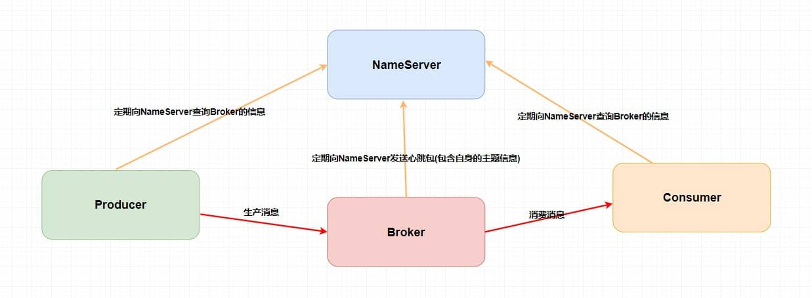


### 消息队列有哪些使用场景 （or 为什么使用消息队列）

其实就是问问你消息队列都有哪些使用场景，然后你项目里具体是什么场景，说说你在这个场景里用消息队列是什么？

面试官问你这个问题，**期望的一个回答**是说，你们公司有个什么**业务场景**，这个业务场景有个什么技术挑战，如果不用 MQ 可能会很麻烦，但是你现在用了 MQ 之后带给了你很多的好处。

先说一下消息队列常见的使用场景吧，其实场景有很多，但是比较核心的有 3 个：**解耦**、**异步**、**削峰**。

#### 应用解耦

举个常见业务场景：下单扣库存，用户下单后，订单系统去通知库存系统扣减。

传统的做法就是订单系统直接调用库存系统：


* 如果库存系统无法访问，下单就会失败，订单和库存系统存在耦合关系
* 如果业务又接入一个营销积分服务，那订单下游系统要扩充，如果未来接入越来越多的下游系统，那订单系统代码需要经常修改

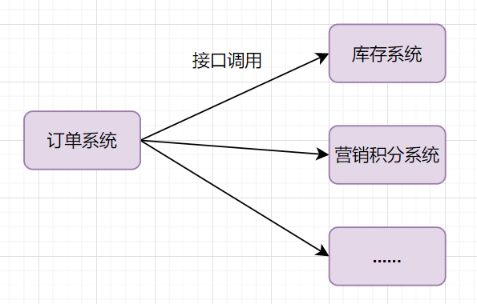

如何解决这个问题呢？可以引入消息队列


1. 订单系统：用户下单后，消息写入到消息队列，返回下单成功
2. 库存系统：订阅下单消息，获取下单信息，进行库存操作

#### 流量削峰

流量削峰也是消息队列的常用场景。我们做秒杀实现的时候，需要避免流量暴涨，打垮应用系统的风险。可以在应用前面加入消息队列。

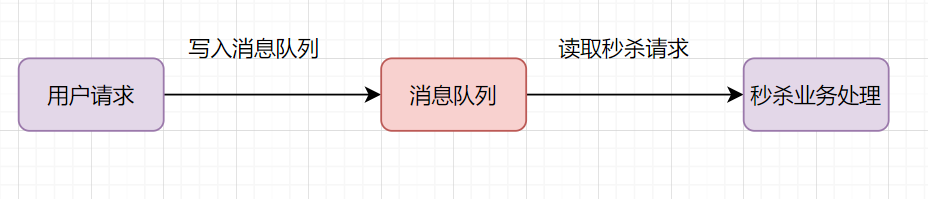

假设秒杀系统每秒最多可以处理 2k 个请求，每秒却有 5k 的请求过来，可以引入消息队列，秒杀系统每秒从消息队列拉 2k 请求处理得了。

有些伙伴担心这样会出现消息积压的问题，

* 首先秒杀活动不会每时每刻都那么多请求过来，高峰期过去后，积压的请求可以慢
  慢处理；
* 其次，如果消息队列长度超过最大数量，可以直接抛弃用户请求或跳转到错误页面；


#### 异步处理

我们经常会遇到这样的业务场景：用户注册成功后，给它发个短信和发个邮件。

如果注册信息入库是 30ms，发短信、邮件也是 30ms，三个动作串行执行的话，会比较耗时，响应 90ms：


如果采用并行执行的方式，可以减少响应时间。注册信息入库后，同时异步发短信和邮件。如何实现异步呢，用消息队列即可，就是说，注册信息入库成功后，写入到消息队列（这个一般比较快，如只需要3ms），然后异步读取发邮件和短信。

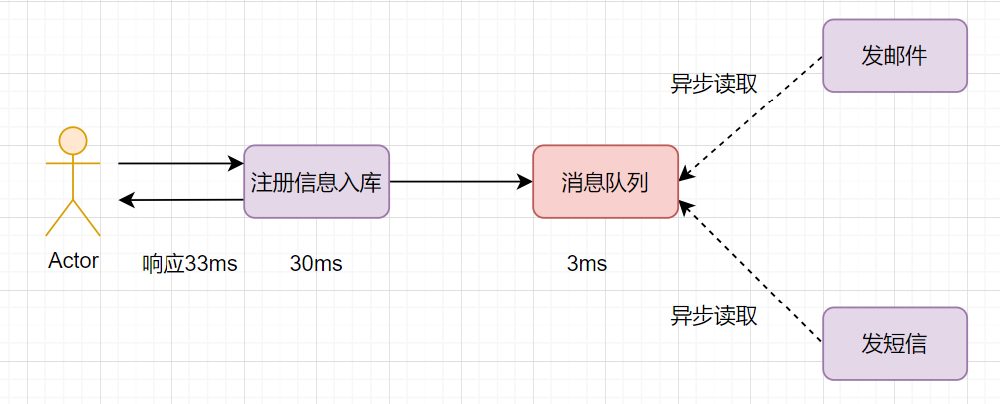


### 消息队列中，如何保证消息的顺序性？

#### RocketMQ

**`RocketMQ` 在主题上是无序的、它只有在队列层面才是保证有序** 的。

这又扯到两个概念——**普通顺序** 和 **严格顺序** 。

所谓普通顺序是指 消费者通过 **同一个消费队列收到的消息是有顺序的** ，不同消息队列收到的消息则可能是无顺序的。普通顺序消息在 `Broker` **重启情况下不会保证消息顺序性** (短暂时间) 。

所谓严格顺序是指 消费者收到的 **所有消息** 均是有顺序的。严格顺序消息 **即使在异常情况下也会保证消息的顺序性** 。

但是，严格顺序看起来虽好，实现它可会付出巨大的代价。如果你使用严格顺序模式，`Broker` 集群中只要有一台机器不可用，则整个集群都不可用。你还用啥？现在主要场景也就在 `binlog` 同步。

一般而言，我们的 `MQ` 都是能容忍短暂的乱序，所以推荐使用普通顺序模式。

那么，我们现在使用了 **普通顺序模式** ，我们从上面学习知道了在 `Producer` 生产消息的时候会进行轮询(取决你的负载均衡策略)来向同一主题的不同消息队列发送消息。那么如果此时我有几个消息分别是同一个订单的创建、支付、发货，在轮询的策略下这 **三个消息会被发送到不同队列** ，因为在不同的队列此时就无法使用 `RocketMQ` 带来的队列有序特性来保证消息有序性了。


那么，怎么解决呢？

其实很简单，我们需要处理的仅仅是将同一语义下的消息放入同一个队列(比如这里是同一个订单)，那我们就可以使用 **Hash取模法** 来保证同一个订单在同一个队列中就行了。


#### RabbitMQ

我举个例子，我们以前做过一个 mysql `binlog` 同步的系统，压力还是非常大的，日同步数据要达到上亿，就是说数据从一个 mysql 库原封不动地同步到另一个 mysql 库里面去（mysql -> mysql）。常见的一点在于说比如大数据 team，就需要同步一个 mysql 库过来，对公司的业务系统的数据做各种复杂的操作。

你在 mysql 里增删改一条数据，对应出来了增删改 3 条 `binlog` 日志，接着这三条 `binlog` 发送到 MQ 里面，再消费出来依次执行，起码得保证人家是按照顺序来的吧？不然本来是：增加、修改、删除；你楞是换了顺序给执行成删除、修改、增加，不全错了么。

本来这个数据同步过来，应该最后这个数据被删除了；结果你搞错了这个顺序，最后这个数据保留下来了，数据同步就出错了。

先看看顺序会错乱的俩场景：

一个 queue，多个 consumer。比如，生产者向 RabbitMQ 里发送了三条数据，顺序依次是 data1/data2/data3，压入的是 RabbitMQ 的一个内存队列。有三个消费者分别从 MQ 中消费这三条数据中的一条，结果消费者2先执行完操作，把 data2 存入数据库，然后是 data1/data3。这不明显乱了。

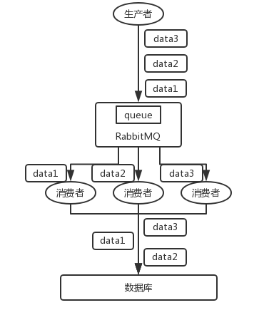

解决：拆分多个 queue，每个 queue 一个 consumer，就是多一些 queue 而已，确实是麻烦点；或者就一个 queue 但是对应一个 consumer，然后这个 consumer 内部用内存队列做排队，然后分发给底层不同的 worker 来处理。

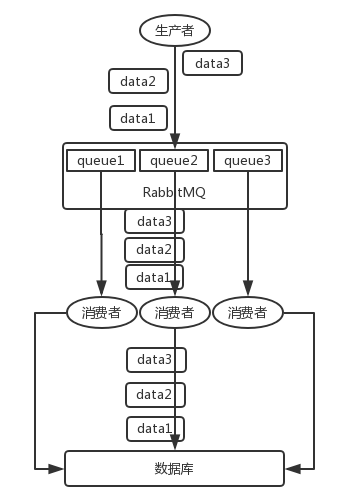


#### Kafka

比如说我们建了一个 topic，有三个 partition。生产者在写的时候，其实可以指定一个 key，比如说我们指定了某个订单 id 作为 key，那么这个订单相关的数据，一定会被分发到同一个 partition 中去，而且这个 partition 中的数据一定是有顺序的。

消费者从 partition 中取出来数据的时候，也一定是有顺序的。到这里，顺序还是 ok 的，没有错乱。接着，我们在消费者里可能会搞**多个线程来并发处理消息**。因为如果消费者是单线程消费处理，而处理比较耗时的话，比如处理一条消息耗时几十 ms，那么 1 秒钟只能处理几十条消息，这吞吐量太低了。而多个线程并发跑的话，顺序可能就乱掉了。


解决：

- 一个 topic，一个 partition，一个 consumer，内部单线程消费，单线程吞吐量太低，一般不会用这个。
- 写 N 个内存 queue，具有相同 key 的数据都到同一个内存 queue；然后对于 N 个线程，每个线程分别消费一个内存 queue 即可，这样就能保证顺序性。

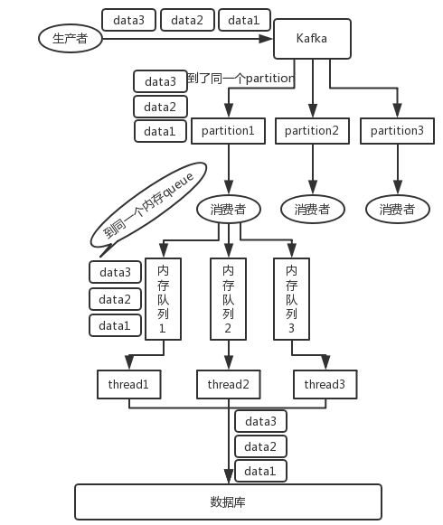


### 如何保证数据一致性，事务消息如何实现

一条普通的 MQ 消息，从产生到被消费，大概流程如下：


1. 生产者产生消息，发送带 MQ 服务器
2. MQ 收到消息后，将消息持久化到存储系统。
3. MQ 服务器返回 ACk 到生产者。
4. MQ 服务器把消息 push 给消费者
5. 消费者消费完消息，响应 ACK
6. MQ 服务器收到 ACK，认为消息消费成功，即在存储中删除消息。

我们举个下订单的例子吧。订单系统创建完订单后，再发送消息给下游系统。如果订单创建成功，然后消息没有成功发送出去，下游系统就无法感知这个事情，出导致数据不一致。
如何保证数据一致性呢？可以使用事务消息。一起来看下事务消息是如何实现的

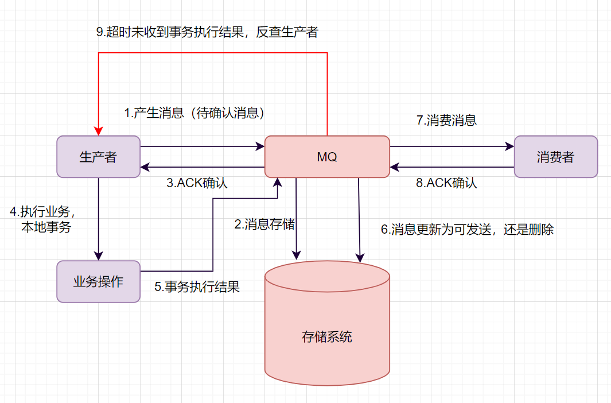

1. 生产者产生消息，发送一条半事务消息到 MQ 服务器
2. MQ 收到消息后，将消息持久化到存储系统，这条消息的状态是待发送状态。
3. MQ 服务器返回 ACK 确认到生产者，此时 MQ 不会触发消息推送事件
4. 生产者执行本地事务
5. 如果本地事务执行成功，即 commit 执行结果到 MQ 服务器；如果执行失败，发
    送 rollback。
6. 如果是正常的 commit，MQ 服务器更新消息状态为可发送；如果是 rollback，即
    删除消息。
7. 如果消息状态更新为可发送，则 MQ 服务器会 push 消息给消费者。消费者消费完
    就回 ACK。
8. 如果 MQ 服务器长时间没有收到生产者的 commit 或者 rollback，它会反查生产
    者，然后根据查询到的结果执行最终状态。


### 如何解决重复消费

就两个字—— **幂等** 。在编程中一个*幂等*  操作的特点是其任意多次执行所产生的影响均与一次执行的影响相同。比如说，这个时候我们有一个订单的处理积分的系统，每当来一个消息的时候它就负责为创建这个订单的用户的积分加上相应的数值。可是有一次，消息队列发送给订单系统 FrancisQ 的订单信息，其要求是给 FrancisQ 的积分加上 500。但是积分系统在收到 FrancisQ  的订单信息处理完成之后返回给消息队列处理成功的信息的时候出现了网络波动(当然还有很多种情况，比如Broker意外重启等等)，这条回应没有发送成功。

那么，消息队列没收到积分系统的回应会不会尝试重发这个消息？问题就来了，我再发这个消息，万一它又给 FrancisQ 的账户加上 500 积分怎么办呢？

所以我们需要给我们的消费者实现 **幂等** ，也就是对同一个消息的处理结果，执行多少次都不变。

那么如何给业务实现幂等呢？这个还是需要结合具体的业务的。你可以使用 **写入 `Redis`** 来保证，因为 `Redis` 的 `key` 和 `value` 就是天然支持幂等的。当然还有使用 **数据库插入法** ，基于数据库的唯一键来保证重复数据不会被插入多条。

不过最主要的还是需要 **根据特定场景使用特定的解决方案** ，你要知道你的消息消费是否是完全不可重复消费还是可以忍受重复消费的，然后再选择强校验和弱校验的方式。毕竟在 CS 领域还是很少有技术银弹的说法。

而在整个互联网领域，幂等不仅仅适用于消息队列的重复消费问题，这些实现幂等的方法，也同样适用于，**在其他场景中来解决重复请求或者重复调用的问题** 。比如将HTTP服务设计成幂等的，**解决前端或者APP重复提交表单数据的问题** ，也可以将一个微服务设计成幂等的，解决 `RPC` 框架自动重试导致的 **重复调用问题** 。


### 分布式事务

我接触和了解到的分布式事务大概分为：

- 2pc（两段式提交）
- 3pc（三段式提交）
- TCC（Try、Confirm、Cancel）
- 最大努力通知
- XA
- 本地消息表（ebay研发出的）
- 半消息/最终一致性（RocketMQ）

这里我就介绍下最简单的**2pc（两段式）**，以及大家以后可能比较常用的**半消息事务**也就是**最终一致性**，目的是让大家理解下分布式事务里面**消息中间件的作用**，别的事务都大同小异，都有很多优点。

当然也都有**种种弊端**：

例如**长时间锁定数据库资源**，导致系统的**响应不快**，**并发上不去**。

网络抖动出现**脑裂**情况，导致事物参与者，不能很好地执行协调者的指令，导致**数据不一致**。

**单点故障**：例如事物协调者，在某一时刻宕机，虽然可以通过选举机制产生新的Leader，但是这过程中，必然出现问题，而TCC，只有强悍的技术团队，才能支持开发，**成本太高**。

不多BB了，我们开始介绍这个两个事物吧。

**2pc（两段式提交）** :


**2pc（两段式提交）**可以说是分布式事务的最开始的样子了，像极了**媒婆**，就是通过消息中间件协调多个系统，在两个系统操作事务的时候都锁定资源但是不提交事务，等两者都准备好了，告诉消息中间件，然后再分别提交事务。

**但是我不知道大家看到问题所在没有？**

是的你可能已经发现了，如果A系统事务提交成功了，但是B系统在提交的时候网络波动或者各种原因提交失败了，其实还是会失败的。

**最终一致性**：


整个流程中，我们能保证是：

- 业务主动方本地事务提交失败，业务被动方不会收到消息的投递。
- 只要业务主动方本地事务执行成功，那么消息服务一定会投递消息给下游的业务被动方，并最终保证业务被动方一定能成功消费该消息（消费成功或失败，即最终一定会有一个最终态）。

不过呢技术就是这样，**各种极端的情况我们都需要考虑**，也很难有完美的方案，所以才会有这么多的方案**三段式**、**TCC**、**最大努力通知**等等分布式事务方案，大家只需要知道为啥要做，做了有啥好处，有啥坏处，在实际开发的时候都注意下就好好了，**系统都是根据业务场景设计出来的，离开业务的技术没有意义，离开技术的业务没有底气**。

还是那句话：**没有最完美的系统，只有最适合的系统。**


### 消息堆积问题

在上面我们提到了消息队列一个很重要的功能——**削峰** 。那么如果这个峰值太大了导致消息堆积在队列中怎么办呢？

其实这个问题可以将它广义化，因为产生消息堆积的根源其实就只有两个——生产者生产太快或者消费者消费太慢。

我们可以从多个角度去思考解决这个问题，当流量到峰值的时候是因为生产者生产太快，我们可以使用一些 **限流降级** 的方法，当然你也可以增加多个消费者实例去水平扩展增加消费能力来匹配生产的激增。如果消费者消费过慢的话，我们可以先检查 **是否是消费者出现了大量的消费错误** ，或者打印一下日志查看是否是哪一个线程卡死，出现了锁资源不释放等等的问题。

> 当然，最快速解决消息堆积问题的方法还是增加消费者实例，不过 **同时你还需要增加每个主题的队列数量** 。
>
> 别忘了在 `RocketMQ` 中，**一个队列只会被一个消费者消费** ，如果你仅仅是增加消费者实例就会出现我一开始给你画架构图的那种情况


## :link: 分布式

### 了解RPC吗？

一言蔽之：**RPC （Remote Procedure Call）的出现就是为了让你调用远程方法像调用本地方法一样简单。**

为了能够帮助小伙伴们理解 RPC 原理，我们可以将整个 RPC的 核心功能看作是下面👇 6 个部分实现的：

1. **客户端（服务消费端）** ：调用远程方法的一端。
2. **客户端 Stub（桩）** ： 这其实就是一代理类。代理类主要做的事情很简单，就是把你调用方法、类、方法参数等信息传递到服务端。
3. **网络传输** ： 网络传输就是你要把你调用的方法的信息比如说参数啊这些东西传输到服务端，然后服务端执行完之后再把返回结果通过网络传输给你传输回来。网络传输的实现方式有很多种比如最近基本的 Socket或者性能以及封装更加优秀的 Netty（推荐）。
4. **服务端 Stub（桩）** ：这个桩就不是代理类了。我觉得理解为桩实际不太好，大家注意一下就好。这里的服务端 Stub 实际指的就是接收到客户端执行方法的请求后，去指定对应的方法然后返回结果给客户端的类。
5. **服务端（服务提供端）** ：提供远程方法的一端。

具体原理图如下，后面我会串起来将整个RPC的过程给大家说一下。


1. 服务消费端（client）以本地调用的方式调用远程服务；
2. 客户端 Stub（client stub） 接收到调用后负责将方法、参数等组装成能够进行网络传输的消息体（序列化）：`RpcRequest`；
3. 客户端 Stub（client stub） 找到远程服务的地址，并将消息发送到服务提供端；
4. 服务端 Stub（桩）收到消息将消息反序列化为Java对象: `RpcRequest`；
5. 服务端 Stub（桩）根据`RpcRequest`中的类、方法、方法参数等信息调用本地的方法；
6. 服务端 Stub（桩）得到方法执行结果并将组装成能够进行网络传输的消息体：`RpcResponse`（序列化）发送至消费方；
7. 客户端 Stub（client stub）接收到消息并将消息反序列化为Java对象:`RpcResponse` ，这样也就得到了最终结果。over!

相信小伙伴们看完上面的讲解之后，已经了解了 RPC 的原理。

虽然篇幅不多，但是基本把 RPC 框架的核心原理讲清楚了！另外，对于上面的技术细节，我会在后面的章节介绍到。

**最后，对于 RPC 的原理，希望小伙伴不单单要理解，还要能够自己画出来并且能够给别人讲出来。因为，在面试中这个问题在面试官问到 RPC 相关内容的时候基本都会碰到。**


### 分布式系统接口，如何避免表单的重复提交？

#### 幂等性

**效果：**系统对某接口的多次请求，都应该返回同样的结果！（网络访问失败的场景除外）

**目的：**避免因为各种原因，重复请求导致的业务重复处理

#### 重复请求场景案例

1，客户端第一次请求后，网络异常导致收到请求执行逻辑但是没有返回给客户端，客户端的重新发起请求

2，客户端迅速点击按钮提交，导致同一逻辑被多次发送到服务器

*简单来划分，业务逻辑无非都可以归纳为增删改查！*

**对于查询**，内部不包含其他操作，属于只读性质的那种业务必然符合幂等性要求的。

**对于删除**，重复做删除请求至少不会造成数据杂乱，不过也有些场景更希望重复点击提示的是删除成功，而不是目标不存在的提示。

**对于新增和修改**，这里是今天要重点关注的部分：新增，需要避免重复插入；修改，避免进行无效的重复修改；

#### 幂等性的实现方式

**实现方法：**客户端做某一请求的时候带上识别参数标识，服务端对此标识进行识别，重复请求则重复返回第一次的结果即可。

**举个栗子：**比如添加请求的表单里，在打开添加表单页面的时候，就生成一个AddId标识，这个AddId跟着表单一起提交到后台接口。

后台接口根据这个AddId，服务端就可以进行缓存标记并进行过滤，缓存值可以是AddId作为缓存key，返回内容作为缓存Value，这样即使添加按钮被多次点下也可以识别出来。

这个AddId什么时候更新呢？只有在保存成功并且清空表单之后，才变更这个AddId标识，从而实现新数据的表单提交


## 👨‍💻计算机基础

### 🌐计算机网络（热门八股文）

#### 👁️前置知识

##### OSI 七层模型

**OSI 七层模型** 是国际标准化组织提出一个网络分层模型，其大体结构以及每一层提供的功能如下图所示：


每一层都专注做一件事情，并且每一层都需要使用下一层提供的功能比如传输层需要使用网络层提供的路由和寻址功能，这样传输层才知道把数据传输到哪里去。

**OSI 的七层体系结构概念清楚，理论也很完整，但是它比较复杂而且不实用，而且有些功能在多个层中重复出现。**

上面这种图可能比较抽象，再来一个比较生动的图片。下面这个图片是我在国外的一个网站上看到的，非常赞！


**既然 OSI 七层模型这么厉害，为什么干不过 TCP/IP 四 层模型呢？**

的确，OSI 七层模型当时一直被一些大公司甚至一些国家政府支持。这样的背景下，为什么会失败呢？我觉得主要有下面几方面原因：

1. OSI 的专家缺乏实际经验，他们在完成 OSI 标准时缺乏商业驱动力
2. OSI 的协议实现起来过分复杂，而且运行效率很低
3. OSI 制定标准的周期太长，因而使得按 OSI 标准生产的设备无法及时进入市场（20 世纪 90 年代初期，虽然整套的 OSI 国际标准都已经制定出来，但基于 TCP/IP 的互联网已经抢先在全球相当大的范围成功运行了）
4. OSI 的层次划分不太合理，有些功能在多个层次中重复出现。

OSI 七层模型虽然失败了，但是却提供了很多不错的理论基础。为了更好地去了解网络分层，OSI 七层模型还是非常有必要学习的。

最后再分享一个关于 OSI 七层模型非常不错的总结图片！


##### TCP/IP 四层模型

**TCP/IP 四层模型** 是目前被广泛采用的一种模型,我们可以将 TCP / IP 模型看作是 OSI 七层模型的精简版本，由以下 4 层组成：

1. 应用层
2. 传输层
3. 网络层
4. 网络接口层

需要注意的是，我们并不能将 TCP/IP 四层模型 和 OSI 七层模型完全精确地匹配起来，不过可以简单将两者对应起来，如下图所示：

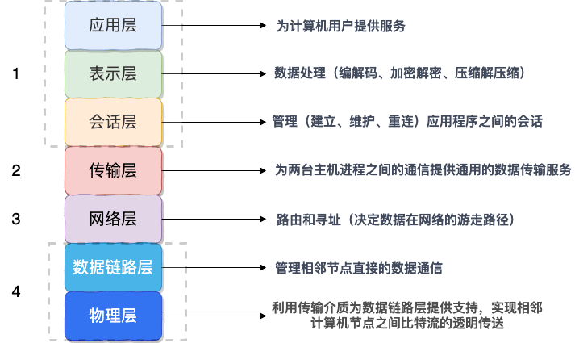

###### 应用层（Application layer）

**应用层位于传输层之上，主要提供两个终端设备上的应用程序之间信息交换的服务，它定义了信息交换的格式，消息会交给下一层传输层来传输。** 我们把应用层交互的数据单元称为报文。


应用层协议定义了网络通信规则，对于不同的网络应用需要不同的应用层协议。在互联网中应用层协议很多，如支持 Web 应用的 HTTP 协议，支持电子邮件的 SMTP 协议等等。


###### 传输层（Transport layer）

**传输层的主要任务就是负责向两台终端设备进程之间的通信提供通用的数据传输服务。** 应用进程利用该服务传送应用层报文。“通用的”是指并不针对某一个特定的网络应用，而是多种应用可以使用同一个运输层服务。

**运输层主要使用以下两种协议：**

1. **传输控制协议 TCP**（Transmisson Control Protocol）--提供**面向连接**的，**可靠的**数据传输服务。
2. **用户数据协议 UDP**（User Datagram Protocol）--提供**无连接**的，尽最大努力的数据传输服务（**不保证数据传输的可靠性**）。


###### 网络层（Network layer）

**网络层负责为分组交换网上的不同主机提供通信服务。** 在发送数据时，网络层把运输层产生的报文段或用户数据报封装成分组和包进行传送。在 TCP/IP 体系结构中，由于网络层使用 IP 协议，因此分组也叫 IP 数据报，简称数据报。

⚠️注意 ：**不要把运输层的“用户数据报 UDP”和网络层的“IP 数据报”弄混**。

**网络层的还有一个任务就是选择合适的路由，使源主机运输层所传下来的分组，能通过网络层中的路由器找到目的主机。**

这里强调指出，网络层中的“网络”二字已经不是我们通常谈到的具体网络，而是指计算机网络体系结构模型中第三层的名称。

互联网是由大量的异构（heterogeneous）网络通过路由器（router）相互连接起来的。互联网使用的网络层协议是无连接的网际协议（Intert Prococol）和许多路由选择协议，因此互联网的网络层也叫做**网际层**或**IP 层**。


###### 网络接口层（Network interface layer）

我们可以把网络接口层看作是数据链路层和物理层的合体。

1. 数据链路层(data link layer)通常简称为链路层（ 两台主机之间的数据传输，总是在一段一段的链路上传送的）。**数据链路层的作用是将网络层交下来的 IP 数据报组装成帧，在两个相邻节点间的链路上传送帧。每一帧包括数据和必要的控制信息（如同步信息，地址信息，差错控制等）。**
2. **物理层的作用是实现相邻计算机节点之间比特流的透明传送，尽可能屏蔽掉具体传输介质和物理设备的差异**

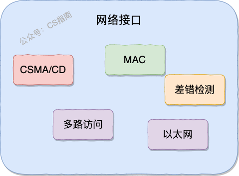


##### TCP流量控制

:chestnut: 直接举栗子说明，请结合图耐心阅读：

1. 主机A通过TCP报文发送给主机B 1-100字节 （seq是序号字段， DATA是表示是数据报文段）
2. 主机A又通过TCP报文发送给主机B 101-200字节（所以这里的seq是101）
3. 主机A又通过TCP报文封装发送给注解B 201-300字节，但是发生了丢失 🏳️
   1. 此时主机B对主机A进行**累计确认**（ACK：TCP报文段首部中的标志位；ack：确认报文段，201是说明201以前的数据已全部正确接收；rwnd滑动窗口字段，300表示可以接收的窗口大小为300）
   2. 滑动窗口，滑到201-600的位置（因为初始窗口的大小为400）
   3. 调整窗口大小，此时窗口位置为201-500（因为rwnd现在为300）
4. 主机A删除1-200的缓存数据（因为步骤3中已经说明了201之前的数据已经确认接收）
5. 主机A讲301-400的数据封装成TCP发送给主机B（此时201-500的数据已经全部发送出去）
6. 重传计时器开始计时，主机A把201-500的数据封装成TCP报文段重新发送出去（给B）
7. 此时主机B对主机A进行**累计确认**（ACK=1，ack=501：确认501之前的数据，rwnd=100：此时主机B还能接收100字节的数据）
   1. 此时滑动窗口从501-800（窗口大小为300）
   2. 因为收到主机B的rwnd=100，所以调整窗口大小为501-600
8. 删除501之前的数据缓存
9. 封装成TCP报文送501-600的数据
10. 此时主机B又对主机A进行**累计确认**（ACK=1，ack=601，rwnd=0）此时主机A不能再发送了，发送窗口被调控为0


💨假设不久之后，主机B又有了一些存储空间：

1. 主机B对主机A发送一个rwnd=300的报文段，但是这个报文段在传输过程中丢失了
   1. A一直等待B发送的非零窗口通知，B也一直等待A发送的数据（经典死锁）
   2. TCP解决方案：设立定时器；所以主机A会启动一个持续计时器
   3. 如果持续计时器超时，就会发送一个零窗口探测报文段（携带1字节数据）【拓展：零窗口探测报文段也有持续计时器，如果丢失了也会进行重传避免死锁】
2. 如果现在主机B又没有空间了，就会发送一个窗口探测报文段进行确认（ACK=1 rwnd=0）
3. 主机A接收到了会又启动一个持续计时器，如果主机B又有了存储空间（假设现在为300），那么就会发送一个接收窗口（ACK=1，rwnd=300）


##### TCP拥塞控制

四种拥塞控制算法：慢开始、拥塞避免、快重传，快恢复

###### 慢开始、拥塞避免

假设发送方cwnd=1,swnd=cwnd,ssthresh=16

慢开始小结：滑动窗口逐渐增大

1. 发送方给接收方发送报文段，发送方接收到了接收方的确认报文段后将窗口增大1 (1+1=2)，此时发送发可以发送2号数据报文段


2. 此时发送发又发送1~2报文段，接收方确认后，发送方将窗口增大为4（2+2=4），发送发现在可以发送3~6号数据报文段


3. 此时发送发又发送3~6报文段，接收方确认后，发送方将窗口增大为4（4+4=8），发送发现在可以发送7~14号数据报文段


4. 同理可以增加到16的窗口大小

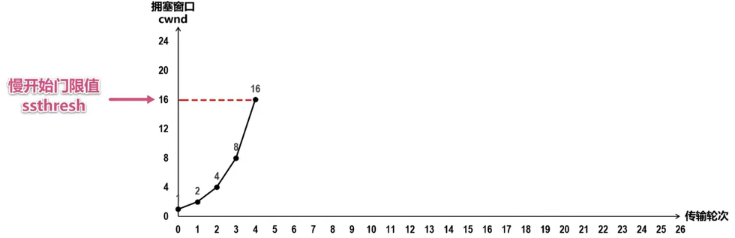

5. 此时开始**拥塞避免**算法：对报文段15~30号进行发送和确认，此时cwnd从16 + 1 = 17，

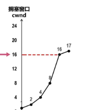

6. 此时可以对TCP报文段31~47号进行发送和确认，发送方收到后窗口从17增大到18（17+1）


7. 以此类推，当增加到24的滑动窗口时，此时TCP对171~194报文段进行发送和确认

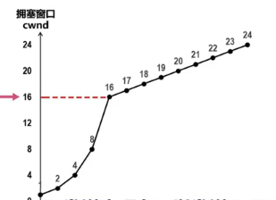

如果此时报文段发生了丢失，那么就会进行重传计时器超时（判断网络出现了拥塞）：

* 将ssthresh值更新为发生拥塞控制时cwnd值的一半（ssthresh = 24 / 2 = 12）
* 将cwnd值减少为1，并开始执行慢开始算法（cwnd=1）


8. 又开始慢开始算法，直到达到慢开始门限值


整体流程：

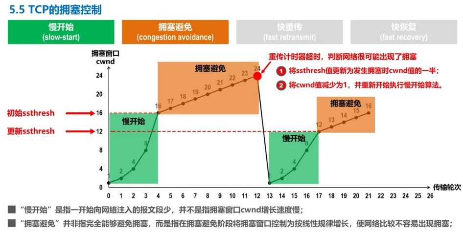


###### 快重传、快恢复

快重传简洁说明：当发送发收到3个连续重复确认，就将相应的报文段立即重传（图中的3个确认报文段为：M4 M5 M6，最后立即重传M3【M3丢失】）

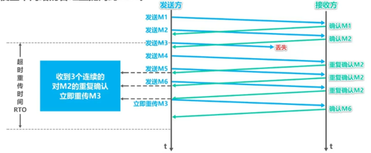

快恢复简洁说明：发送方一旦收到3个重复确认，就知道现在只是丢失了个别的报文段。于是**不启动慢开始**算法，而执行快恢复算法；发送方将慢开始门限ssthresh值和拥塞窗口cwnd值调整为当前窗口的一半；**开始执行拥塞避免算法**。

整体流程：


##### TCP可靠传输

发送方如果发送了32~33号报文段给接收方

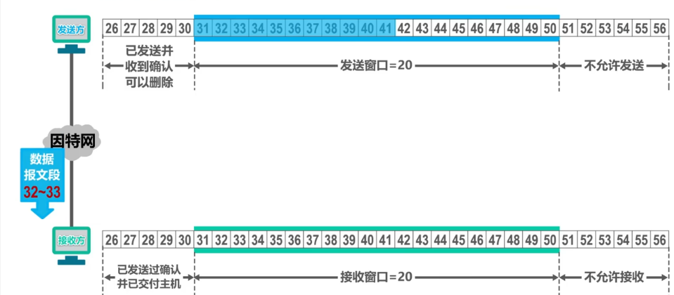

那么接收方会接收它们，存入缓存；因为31号元素还没有到达，这是未按序到达的数据

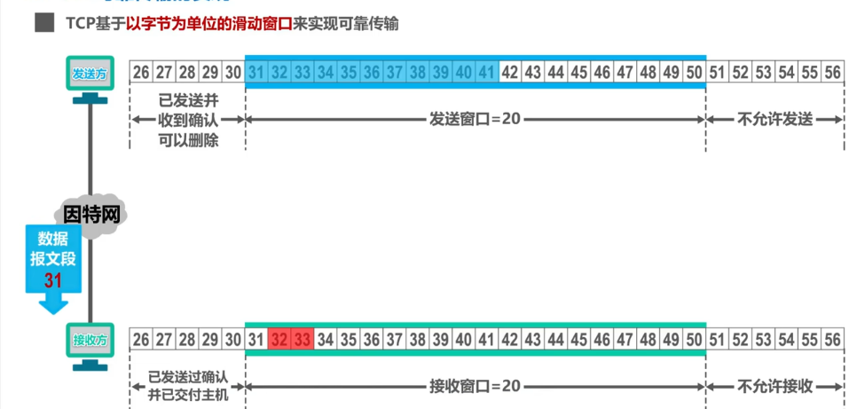

假设31号报文段到达了接收方，存入到接收缓存，接收方接收了之后就会把31~33号数据交付给应用进程；接收方会向右滑动3个窗口，并发送给发送发确认报文段

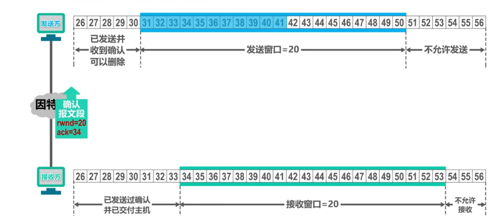

如果发送方又发送了三个数据（37、38、40），接收端接受了之后会发送确认报文段（rwnd=20, ack=34），那么发送方的窗口也会向右移动3位


##### HTTP

HTTP 协议，全称超文本传输协议（Hypertext Transfer Protocol）。顾名思义，HTTP 协议就是用来规范超文本的传输，超文本，也就是网络上的包括文本在内的各式各样的消，具体来说，主要是来规范浏览器和服务器端的行为的。

并且，HTTP 是一个无状态（stateless）协议，也就是说服务器不维护任何有关客户端过去所发请求的消息。这其实是一种懒政，有状态协议会更加复杂，需要维护状态（历史信息），而且如果客户或服务器失效，会产生状态的不一致，解决这种不一致的代价更高。

###### 通信过程

HTTP 是应用层协议，它以 TCP（传输层）作为底层协议，默认端口为 80. 通信过程主要如下：

1. 服务器在 80 端口等待客户的请求。
2. 浏览器发起到服务器的 TCP 连接（创建套接字 Socket）。
3. 服务器接收来自浏览器的 TCP 连接。
4. 浏览器（HTTP 客户端）与 Web 服务器（HTTP 服务器）交换 HTTP 消息。
5. 关闭 TCP 连接。


##### HTTPS

因为 HTTPS 相比 HTTP 协议多一个 TLS 协议握手过程，**目的是为了通过非对称加密握手协商或者交换出对称加密密钥**，这个过程最长可以花费掉 2 RTT，接着后续传输的应用数据都得使用对称加密密钥来加密/解密。

HTTPS 协议（Hyper Text Transfer Protocol Secure），是 HTTP 的加强安全版本。HTTPS  是基于 HTTP 的，也是用 TCP 作为底层协议，并额外使用 SSL/TLS 协议用作加密和安全认证。默认端口号是 443.

HTTPS 协议中，SSL 通道通常使用基于密钥的加密算法，密钥长度通常是 40 比特或 128 比特。

###### SSL/TLS

SSL 指安全套接字协议（Secure Sockets Layer），首次发布与 1996 年。SSL 的首次发布其实已经是他的 3.0  版本，SSL 1.0 从未面世，SSL 2.0 则具有较大的缺陷（DROWN 缺陷——Decrypting RSA with Obsolete  and Weakened eNcryption）。很快，在 1999 年，SSL 3.0 进一步升级，**新版本被命名为 TLS 1.0**。因此，TLS 是基于 SSL 之上的，但由于习惯叫法，通常把 HTTPS 中的核心加密协议混成为 SSL/TLS。

###### 非对称加密

SSL/TLS 的核心要素是**非对称加密**。非对称加密采用两个密钥——一个公钥，一个私钥。在通信时，私钥仅由解密者保存，公钥由任何一个想与解密者通信的发送者（加密者）所知。可以设想一个场景，

> 在某个自助邮局，每个通信信道都是一个邮箱，每一个邮箱所有者都在旁边立了一个牌子，上面挂着一把钥匙：这是我的公钥，发送者请将信件放入我的邮箱，并用公钥锁好。
>
> 但是公钥只能加锁，并不能解锁。解锁只能由邮箱的所有者——因为只有他保存着私钥。
>
> 这样，通信信息就不会被其他人截获了，这依赖于私钥的保密性。

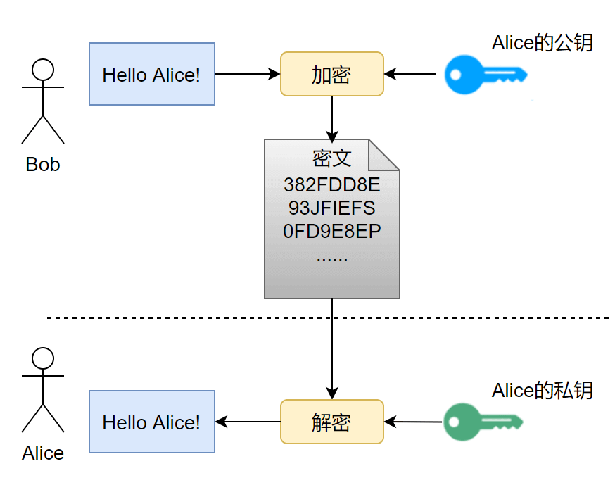

非对称加密的公钥和私钥需要采用一种复杂的数学机制生成（密码学认为，为了较高的安全性，尽量不要自己创造加密方案）。公私钥对的生成算法依赖于单向陷门函数。

> 单向函数：已知单向函数 f，给定任意一个输入 x，易计算输出 y=f(x)；而给定一个输出 y，假设存在 f(x)=y，很难根据 f 来计算出 x。
>
> 单向陷门函数：一个较弱的单向函数。已知单向陷门函数 f，陷门 h，给定任意一个输入 x，易计算出输出 y=f(x;h)；而给定一个输出 y，假设存在 f(x;h)=y，很难根据 f 来计算出 x，但可以根据 f 和 h 来推导出 x。

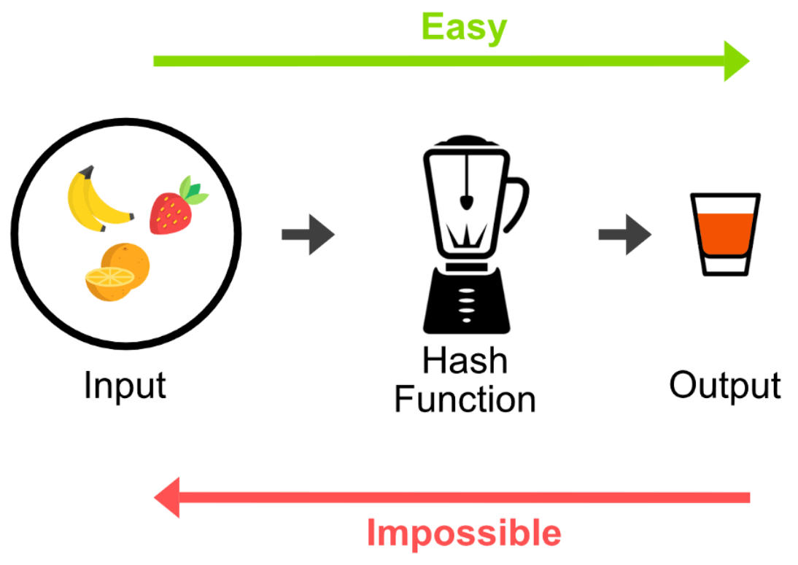

上图就是一个单向函数（不是单项陷门函数），假设有一个绝世秘籍，任何知道了这个秘籍的人都可以把苹果汁榨成苹果，那么这个秘籍就是“陷门”了吧。

在这里，函数 f 的计算方法相当于公钥，陷门 h 相当于私钥。公钥 f 是公开的，任何人对已有输入，都可以用 f 加密，而要想根据加密信息还原出原信息，必须要有私钥才行。

###### 对称加密

使用 SSL/TLS 进行通信的双方需要使用非对称加密方案来通信，但是非对称加密设计了较为复杂的数学算法，在实际通信过程中，计算的代价较高，效率太低，因此，SSL/TLS 实际对消息的加密使用的是对称加密。

> 对称加密：通信双方共享唯一密钥 k，加解密算法已知，加密方利用密钥 k 加密，解密方利用密钥 k 解密，保密性依赖于密钥 k 的保密性。


对称加密的密钥生成代价比公私钥对的生成代价低得多，那么有的人会问了，为什么 SSL/TLS  还需要使用非对称加密呢？因为对称加密的保密性完全依赖于密钥的保密性。在双方通信之前，需要商量一个用于对称加密的密钥。我们知道网络通信的信道是不安全的，传输报文对任何人是可见的，密钥的交换肯定不能直接在网络信道中传输。因此，使用非对称加密，对对称加密的密钥进行加密，保护该密钥不在网络信道中被窃听。这样，通信双方只需要一次非对称加密，交换对称加密的密钥，在之后的信息通信中，使用绝对安全的密钥，对信息进行对称加密，即可保证传输消息的保密性。

###### 数字签名

好，到这一小节，已经是 SSL/TLS 的尾声了。上一小节提到了数字签名，数字签名要解决的问题，是防止证书被伪造。第三方信赖机构 CA 之所以能被信赖，就是 **靠数字签名技术** 。

数字签名，是 CA 在给服务器颁发证书时，使用散列+加密的组合技术，在证书上盖个章，以此来提供验伪的功能。具体行为如下：

> CA 知道服务器的公钥，对该公钥采用散列技术生成一个摘要。CA 使用 CA 私钥对该摘要进行加密，并附在证书下方，发送给服务器。
>
> 现在服务器将该证书发送给客户端，客户端需要验证该证书的身份。客户端找到第三方机构 CA，获知 CA 的公钥，并用 CA 公钥对证书的签名进行解密，获得了 CA 生成的摘要。
>
> 客户端对证书数据（也就是服务器的公钥）做相同的散列处理，得到摘要，并将该摘要与之前从签名中解码出的摘要做对比，如果相同，则身份验证成功；否则验证失败。


总结来说，带有证书的公钥传输机制如下：

1. 设有服务器 S，客户端 C，和第三方信赖机构 CA。
2. S 信任 CA，CA 是知道 S 公钥的，CA 向 S 颁发证书。并附上 CA 私钥对消息摘要的加密签名。
3. S 获得 CA 颁发的证书，将该证书传递给 C。
4. C 获得 S 的证书，信任 CA 并知晓 CA 公钥，使用 CA 公钥对 S 证书上的签名解密，同时对消息进行散列处理，得到摘要。比较摘要，验证 S 证书的真实性。
5. 如果 C 验证 S 证书是真实的，则信任 S 的公钥（在 S 证书中）。


#### :star:键入网址到网页显示，期间发生了什么？

详细：https://xiaolincoding.com/network/1_base/what_happen_url.html

> - 根据域名，进行DNS域名解析；
> - 拿到解析的IP地址，建立TCP连接；
> - 向IP地址，发送HTTP请求；
> - 服务器处理请求；
> - 返回响应结果；
> - 关闭TCP连接；
> - 浏览器解析HTML；
> - 浏览器布局渲染；


#### TCP如何保证可靠传输？

1. 应用数据被分割成 TCP 认为最适合发送的数据块。
2. TCP 给发送的每一个包进行编号，接收方对数据包进行排序，把有序数据传送给应用层。
3. **校验和：** TCP 将保持它首部和数据的检验和。这是一个端到端的检验和，目的是检测数据在传输过程中的任何变化。如果收到段的检验和有差错，TCP 将丢弃这个报文段和不确认收到此报文段。
4. TCP 的接收端会丢弃重复的数据。
5. **流量控制：** TCP 连接的每一方都有固定大小的缓冲空间，TCP  的接收端只允许发送端发送接收端缓冲区能接纳的数据。当接收方来不及处理发送方的数据，能提示发送方降低发送的速率，防止包丢失。TCP  使用的流量控制协议是可变大小的滑动窗口协议。 （TCP 利用滑动窗口实现流量控制）
6. **拥塞控制：** 当网络拥塞时，减少数据的发送。
7. **ARQ 协议：** 也是为了实现可靠传输的，它的基本原理就是每发完一个分组就停止发送，等待对方确认。在收到确认后再发下一个分组。
8. **超时重传：** 当 TCP 发出一个段后，它启动一个定时器，等待目的端确认收到这个报文段。如果不能及时收到一个确认，将重发这个报文段。


#### :star:TCP 三次握手和四次挥手（+++极限拓展）

详细可见：https://xiaolincoding.com/network/3_tcp/tcp_interview.html#tcp-%E8%BF%9E%E6%8E%A5%E5%BB%BA%E7%AB%8B

> 前提概要：
>
> *SYN（同步序列编号 **Synchronize Sequence Numbers** ）*：该位为 `1` 时，表示希望建立连接，并在其「序列号」的字段进行序列号初始值的设定。
>
> *ACK（确认字符 **Acknowledge character**）*：该位为 `1` 时，「确认应答」的字段变为有效，TCP 规定除了最初建立连接时的 `SYN` 包之外该位必须设置为 `1` 。


- 客户端–发送带有 SYN 标志的数据包–一次握手–服务端
- 服务端–发送带有 SYN/ACK 标志的数据包–二次握手–客户端
- 客户端–发送带有带有 ACK 标志的数据包–三次握手–服务端

or 可以这样回答🧏‍♂️：

1. 第一次握手🤝：客户端给服务器发送一个 SYN 报文。
2. 第二次握手🤝：服务器收到 SYN 报文之后，会应答一个 SYN+ACK 报文。
3. 第三次握手🤝：客户端收到 SYN+ACK 报文之后，会回应一个 ACK 报文。

服务器收到 ACK 报文之后，三次握手建立完成。

> 强化理解：
>
> A：是B吗？我要跟你通信，听得到我说话吗？
> B：可以通信，你听得到我说话吗？
> A：我也听得到。


> 前提概要：
>
> *FIN（终止 **FINish**）*：该位为 `1` 时，表示今后不会再有数据发送，希望断开连接。当通信结束希望断开连接时，通信双方的主机之间就可以相互交换 `FIN` 位为 1 的 TCP 段。

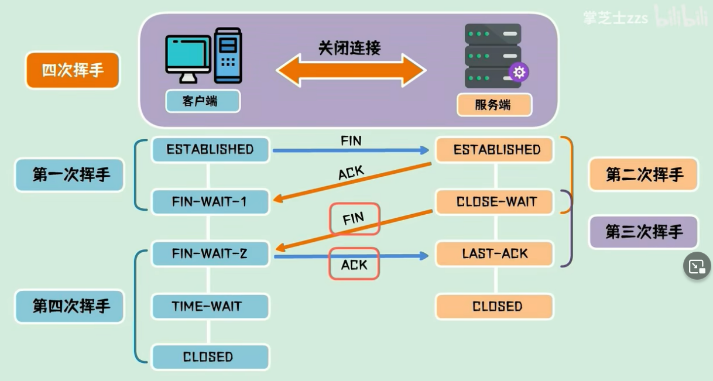

- 客户端-发送一个 FIN，用来关闭客户端到服务器的数据传送
- 服务器-收到这个 FIN，它发回一个 ACK，确认序号为收到的序号加 1 。和 SYN 一样，一个 FIN 将占用一个序号
- 服务器-关闭与客户端的连接，发送一个 FIN 给客户端
- 客户端-发回 ACK 报文确认，并将确认序号设置为收到序号加 1

> 强化理解：
>
> A：呼叫B，我要跟你断开。
> B：知道了，等一下我还有话没说完
> B：我说完了，可以断开了
> A：好的
>
> --------------------------------------------------------------
>
> A：困了，在干嘛？
> B：在刷视频。
> B：你要睡了吗？
> A：对，晚安。（等她看到消息安心入睡）


##### 极限拓展

可以先观看：[一条视频讲清楚TCP协议与UDP协议-什么是三次握手与四次挥手](https://www.bilibili.com/video/BV1kV411j7hA?vd_source=e300c0e56286b6c321abd6aac8da8682)

> 为什么需要三次握手？两次不行？

* 第一次握手：客户端发送网络包，服务端收到了。这样服务端就能得出结论：客户端的发送能力、服务端的接收能力是正常的。
* 第二次握手：服务端发包，客户端收到了。这样客户端就能得出结论：服务端的接收、发送能力，客户端的接收、发送能力是正常的。不过此时服务器并不能确认客户端的接收能力是否正常。
* 第三次握手：客户端发包，服务端收到了。这样服务端就能得出结论：客户端的接收、发送能力正常，服务器自己的发送、接收能力也正常。

因此，需要三次握手才能确认双方的接收与发送能力是否正常。


> 为什么需要四次挥手？三次不行？

可以加入知乎讨论：https://www.zhihu.com/question/50646354

刚开始双方都处于 establised 状态，假如是客户端先发起关闭请求，则：

1. 第一次挥手：客户端发送一个 FIN 报文，报文中会指定一个序列号。此时客户端处于FIN_WAIT1状态。
2. 第二次挥手：服务端收到 FIN 之后，会发送 ACK 报文，且把客户端的序列号值 + 1 作为 ACK 报文的序列号值，表明已经收到客户端的报文了，此时服务端处于 CLOSE_WAIT状态。
3. 第三次挥手：如果服务端也想断开连接了，和客户端的第一次挥手一样，发给 FIN 报文，且指定一个序列号。此时服务端处于 LAST_ACK 的状态。
4. 第四次挥手：客户端收到 FIN 之后，一样发送一个 ACK 报文作为应答，且把服务端的序列号值 + 1 作为自己 ACK 报文的序列号值，此时客户端处于 TIME_WAIT 状态。需要过一阵子以确保服务端收到自己的 ACK 报文之后才会进入 CLOSED 状态
5. 服务端收到 ACK 报文之后，就处于关闭连接了，处于 CLOSED 状态。


> 为什么第二次挥手和第三次挥手不能像握手一样在同一个包中设置 ACK 和 SYN？

https://stackoverflow.com/questions/46212623/why-tcp-termination-need-4-way-handshake

回答来自：http://www.tcpipguide.com/index.htm

在正常情况下，每一方通过发送一个设置了FIN（结束）位的特殊消息来终止其连接的末端。这个消息，有时被称为FIN，作为对另一设备的连接终止请求，同时也可能像普通网段一样携带数据。收到FIN的设备会对FIN进行确认，以表示收到了它。在双方通过发送FIN和接收ACK完成关闭程序之前，整个连接不被认为是终止的。
因此，终止并不像建立那样是一个三方握手：它是一对双向握手。在正常的连接关闭过程中，连接中的两个设备所经历的状态是不同的，因为发起关闭的设备的行为必须与接收终止请求的设备不同。特别是，收到初始终止请求的设备上的TCP必须通知其应用进程，并等待该进程准备继续的信号。发起的设备不需要这样做，因为应用程序是首先开始的。

总结：第二次挥手和第三次挥手不能合并成一个包，因为它们属于不同的状态。但是，如果服务器在从客户端收到 FIN 时没有更多的数据或根本没有要发送的数据，那么可以将第二次挥手和第三次挥手合并到一个包中。


### 💻操作系统


## 🎨设计模式
