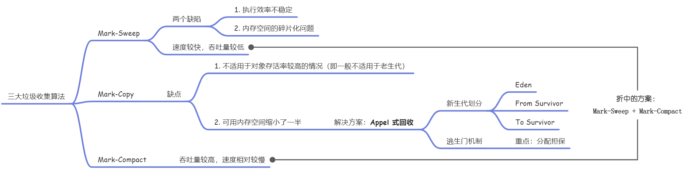
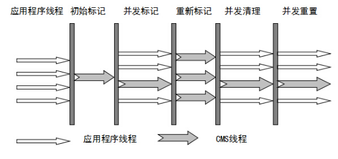

[TOC]

## :fallen_leaf: 个人定制八股文 :leaves:

整理自

1. 吴师兄的1000道Java 程序员必备面试题-V1版
2. JavaGuide突击版
3. 面试鸭

选取理由：本着查缺补漏的木桶原理，只选取高频和不会的，方便面试突袭


## :coffee: Java基础

### Java 8的接⼝新增了哪些特性？

增加了default⽅法和static⽅法，这2种⽅法可以有⽅法体


### 抽象类和接⼝（Java7）的区别

1. 抽象类可以提供成员⽅法的实现细节，⽽接⼝中只能存在public abstract ⽅法；
2. 抽象类中的成员变量可以是各种类型的，⽽接⼝中的成员变量只能是public static final 类型的；
3. 接⼝中不能含有静态代码块以及静态⽅法，⽽抽象类可以有静态代码块和静态⽅法；
4. ⼀个类只能继承⼀个抽象类，⽽⼀个类却可以实现多个接⼝。


### HashSet 如何检查重复

​	当你把对象加⼊HashSet时，HashSet会先计算对象的hashcode值来判断对象加⼊的位置，同时也会与其他已经加⼊的对象的hashcode值作⽐较，如果没有相符的hashcode，HashSet会假设对象没有重复出现。但是如果发现有相同hashcode值的对象，这时会调⽤equals()⽅法来检查hashcode相等的对象是否真的相同。如果两者相同，HashSet就不会让其加⼊操作成功。如果不同的话，就会重新散列到其他位置。（摘⾃我的Java启蒙书《Headfirstjava》第⼆版）。这样我们就⼤⼤减少了equals的次数，相应就⼤⼤提⾼了执⾏速度。


#### hashCode()与equals()：

如果两个对象相等，则hashcode⼀定也是相同的
两个对象相等，对两个对象分别调⽤equals⽅法都返回true
两个对象有相同的hashcode值，它们也不⼀定是相等的


### 构造⽅法有哪些特性？

名字与类名相同；
没有返回值，但不能⽤void声明构造函数；
⽣成类的对象时⾃动执⾏，⽆需调⽤。


### static

1、静态只能访问静态。
2、⾮静态既可以访问⾮静态的，也可以访问静态的。


1、被static修饰的变量或者⽅法是独⽴于该类的任何对象，也就是说，这些变量和⽅法不属于任何⼀个实例对象，⽽是被类的实例对象所共享。怎么理解“被类的实例对象所共享”这句话呢？就是说，⼀个类的静态成员，它是属于⼤伙的【⼤伙指的是这个类的多个对象实例，我们都知道⼀个类可以创建多个实例！】，所有的类对象共享的，不像成员变量是⾃个的【⾃个指的是这个类的单个实例对象】…我觉得我已经讲的很通俗了，你明⽩了咩？

2、在该类被第⼀次加载的时候，就会去加载被static修饰的部分，⽽且只在类第⼀次使⽤时加载并进⾏初始化，注意这是第⼀次⽤就要初始化，后⾯根据需要是可以再次赋值的。

3、static变量值在类加载的时候分配空间，以后创建类对象的时候不会重新分配。赋值的话，是可以任意赋值的！

4、被static修饰的变量或者⽅法是优先于对象存在的，也就是说当⼀个类加载完毕之后，即便没有创建对象，也可以去访问。


#### 存在的意义？

static的主要意义是在于创建独⽴于具体对象的域变量或者⽅法。以致于即使没有创建对象，也能使⽤属性和调⽤⽅法！

static关键字还有⼀个⽐较关键的作⽤就是⽤来形成静态代码块以优化程序性能。static块可以置于类中的任何地⽅，类中可以有多个static块。在类初次被加载的时候，会按照static块的顺序来执⾏每个static块，并且只会执⾏⼀次。

为什么说static块可以⽤来优化程序性能，是因为它的特性:只会在类加载的时候执⾏⼀次。因此，很多时候会将⼀些只需要进⾏⼀次的初始化操作都放在static代码块中进⾏。


### this与super的区别

* super:它引⽤当前对象的直接⽗类中的成员（⽤来访问直接⽗类中被隐藏的⽗类中成员数据或函数，基类与派⽣类中有相同成员定义时如：super.变量名super.成员函数据名（实参）
* this：它代表当前对象名（在程序中易产⽣⼆义性之处，应使⽤this来指明当前对象；如果函数的形参与类中的成员数据同名，这时需⽤this来指明成员变量名）
* super()和this()类似,区别是，super()在⼦类中调⽤⽗类的构造⽅法，this()在本类内调⽤本类的其它构造⽅法。
* super()和this()均需放在构造⽅法内第⼀⾏。
* 尽管可以⽤this调⽤⼀个构造器，但却不能调⽤两个。
* this和super不能同时出现在⼀个构造函数⾥⾯，因为this必然会调⽤其它的构造函数，其它的构造函数必然也会有super语句的存在，所以在同⼀个构造函数⾥⾯有相同的语句，就失去了语句的意义，编译器也不会通过。
* this()和super()都指的是对象，所以，均不可以在static环境中使⽤。包括：static变量,static⽅法，static语句块。
* 从本质上讲，this是⼀个指向本对象的指针,然⽽super是⼀个Java关键字。


super（参数）：调⽤⽗类中的某⼀个构造函数（应该为构造函数中的第⼀条语句）。
this（参数）：调⽤本类中另⼀种形式的构造函数（应该为构造函数中的第⼀条语句）。


### char型变量中能否能不能存储⼀个中⽂汉字，为什么？

char可以存储⼀个中⽂汉字，因为Java中使⽤的编码是Unicode(不选择任何特定的编码，直接使⽤字符在字符集中的编号，这是统⼀的唯⼀⽅法），⼀个char类型占2个字节（16⽐特），所以放⼀个中⽂是没问题的。


### 是否可以继承String类？

String类是final类，不可以被继承。

补充：继承String本身就是⼀个错误的⾏为，对String类型最好的重⽤⽅式是关联关系（Has-A）和依赖关系（Use-A）⽽不是继承关系（Is-A）。


### 谈谈你对多态的理解？

多态就是指程序中定义的引⽤变量所指向的具体类型和通过该引⽤变量发出的⽅法调⽤在编程时并不确定，⽽是在程序运⾏期间才确定，即⼀个引⽤变量到底会指向哪个类的实例对象，该引⽤变量发出的⽅法调⽤到底是哪个类中实现的⽅法，必须在程序运⾏期间才能决定。因为在程序运⾏时才确定具体的类，这样，不⽤修改源代码，就可以让引⽤变量绑定到各种不同的对象上，从⽽导致该引⽤调⽤的具体⽅法随之改变，即不修改程序代码就可以改变程序运⾏时所绑定的具体代码，让程序可以选择多个运⾏状态，这就是多态性。

Java中的多态靠的是⽗类或接⼝定义的引⽤变量可以指向⼦类或具体实现类的实例对象，⽽程序调⽤的⽅法在运⾏期才动态绑定，就是引⽤变量所指向的具体实例对象的⽅法，也就是内存⾥正在运⾏的那个对象的⽅法，⽽不是引⽤变量的类型中定义的⽅法。


### 构造器（constructor）是否可被重写（override）？

构造器不能被继承，因此不能被重写，但可以被重载


### new⼀个对象的过程和clone⼀个对象的区别？

new ： 分配内存 --> 构造函数 --> 返回引用地址

clone：分配内存 --> 填充  --> 返回引用地址


### Java 中操作字符串都有哪些类？它们之间有什么区别？

操作字符串的类有：**String、StringBuffer、StringBuilder**。

String和StringBuffer、StringBuilder的区别在于String声明的是不可变的对象，每次操作都会⽣成新的String对象，再将指针指向新的String对象，⽽StringBuffer、StringBuilder可以在原有对象的基础上进⾏操作，所以在经常改变字符串内容的情况下最好不要使⽤String。

StringBuffer和StringBuilder最⼤的区别在于，StringBuffer是线程安全的，⽽StringBuilder是⾮线程安全的，但StringBuilder的性能却⾼于StringBuffer，所以在单线程环境下推荐使⽤StringBuilder，多线程环境下推荐使⽤StringBuffer


### String str = "i" 和String str = new String("1")⼀样吗？

不⼀样，因为内存的分配⽅式不⼀样。Stringstr="i"的⽅式JVM会将其分配到常量池中，⽽Stringstr=newString("i")JVM会将其分配到堆内存中。


### final finally finalize的区别

* final可以修饰类、变量、⽅法，修饰类表示该类不能被继承、修饰⽅法表示该⽅法不能被重写、修饰变量表示该变量是⼀个常量不能被重新赋值。
* finally⼀般作⽤在try-catch代码块中，在处理异常的时候，通常我们将⼀定要执⾏的代码⽅法finally代码块中，表示不管是否出现异常，该代码块都会执⾏，⼀般⽤来存放⼀些关闭资源的代码。
* finalize是⼀个⽅法，属于Object类的⼀个⽅法，⽽Object类是所有类的⽗类，该⽅法⼀般由垃圾回收器来调⽤，当我们调⽤System.gc()⽅法的时候，由垃圾回收器调⽤finalize()，回收垃圾，⼀个对象是否可回收的最后判断。


> 注：
>
> - Java 语言提供了对象终止（finalization）机制来允许开发人员提供对象被销毁之前的自定义处理逻辑。
> - 当垃圾回收器发现没有引用指向一个对象，即：垃圾回收此对象之前，总会先调用这个对象的 `finalize( )` 方法。
> - `finalize( )` 方法允许在子类中被重写，用于在对象被回收时进行资源释放。通常在这个方法中进行一些资源释放和清理的工作，比如关闭文件、套接字和数据库连接等。
> - <font color='#e67e22'>永远不要主动调用某个对象的 finalize ( ) 方法，应该交给垃圾回收机制调用</font>。理由包括下面三点：   
>   - 在 `finalize( )` 执行时可能会导致对象复活。
>   - `finalize( )` 方法的执行时间是没有保障的，它完全由 GC 线程决定，极端情况下，若不发生 GC，则 `finalize( )` 方法将没有执行机会。
>   - 一个糟糕的 `finalize( )` 会严重影响 GC 的性能。
> - 从功能上来说，`finalize( )` 方法与 C++ 中的析构函数比较相似，但是 Java 采用的是基于垃圾回收器的自动内存管理机制，所以 `finalize( )` 方法在本质上不同于 C++ 中的析构函数。
> - 由于 `finalize( )` 方法的存在，<font color='#fd79a8'>虚拟机中的对象一般处于三种可能的状态</font>。


### final 有什么⽤？

⽤于修饰类、属性和⽅法；

* 修饰的类**不可以被继承**
* 修饰的⽅法**不可以被重写**
* 修饰的变量不可以被改变，被final修饰不可变的是变量的引⽤，⽽不是引⽤指向的内容，引⽤指向的内容是可以改变的


### ⭐Java有哪些数据类型

* 数值：byte，short，int，long
* 浮点：float，double
* 字符：char
* 布尔：boolean

这八种基本类型都有对应的包装类分别为：Byte、Short、Integer、Long、Float、Double、Character、Boolean


拓展：基本类型和包装类型的区别？

- 包装类型不赋值就是 `null` ，而基本类型有默认值且不是 `null`。
- 包装类型可用于泛型，而基本类型不可以。
- 基本数据类型的局部变量存放在 Java 虚拟机栈中的局部变量表中，基本数据类型的成员变量（未被 `static` 修饰 ）存放在 Java 虚拟机的堆中。包装类型属于对象类型，我们知道几乎所有对象实例都存在于堆中。
- 相比于对象类型， 基本数据类型占用的空间非常小。

**为什么说是几乎所有对象实例呢？** 这是因为 HotSpot 虚拟机引入了 JIT 优化之后，会对对象进行逃逸分析，如果发现某一个对象并没有逃逸到方法外部，那么就可能通过标量替换来实现栈上分配，而避免堆上分配内存

⚠️注意 ： **基本数据类型存放在栈中是一个常见的误区！** 基本数据类型的成员变量如果没有被 `static` 修饰的话（不建议这么使用，应该要使用基本数据类型对应的包装类型），就存放在堆中。

```java
class BasicTypeVar{
  private int x;
}
```


再次拓展：包装类型的缓存机制了解么？

Java 基本数据类型的包装类型的大部分都用到了缓存机制来提升性能。

`Byte`,`Short`,`Integer`,`Long` 这 4 种包装类默认创建了数值 **[-128，127]** 的相应类型的缓存数据，`Character` 创建了数值在 **[0,127]** 范围的缓存数据，`Boolean` 直接返回 `True` or `False`。


### float f=3.4;是否正确？

不正确，赋值运算符 "=" 左右两边的精度类型不匹配。

Java中，有小数点的默认被存储为double类型，即双精度；而float类型的变量为单精度。

可以使用强转或加f，即 float f = (folat)3.4，float f = 3.4f。

测试：

```java
public static void main(String[] args) {
    float f = 3.14222222222222222222222;
    double d = 3.4;
    System.out.println(f);
    System.out.println(d);
}
-------------------------------------------
1.java:3: 错误: 不兼容的类型: 从double转换到float可能会有损失
float f = 3.14222222222222222222222;
      ^
1 个错误
```


### 成员变量与局部变量的区别有哪些？

1. 从语法形式上看:成员变量是属于类的，而局部变量是在方法中定义的变量或是方法的参数；成员变量可以被public,private,static等修饰符所修饰，而局部变量不能被访问控制修饰符及static所修饰；但是，成员变量和局部变量都能被final所修饰。
2. 从变量在内存中的存储方式来看:如果成员变量是使用static修饰的，那么这个成员变量是属于类的，如果没有使用static修饰，这个成员变量是属于实例的。对象存于堆内存，如果局部变量类型为基本数据类型，那么存储在栈内存，如果为引用数据类型，那存放的是指向堆内存对象的引用或者是指向常量池中的地址。
3. 从变量在内存中的生存时间上看:成员变量是对象的一部分，它随着对象的创建而存在，而局部变量随着方法的调用而自动消失。
4. 成员变量如果没有被赋初值:则会自动以类型的默认值而赋值（一种情况例外:被final修饰的成员变量也必须显式地赋值），而局部变量则不会自动赋值。


### ⭐接口和抽象类的区别是什么？

1. 接口的方法默认是public，所有方法在接口中不能有实现(Java8开始接口方法可以有默认实现），而抽象类可以有非抽象的方法。
2. 接口中除了static、final变量，不能有其他变量，而抽象类中则不一定。
3. 一个类可以实现多个接口，但只能实现一个抽象类。接口自己本身可以通过extends关键字扩展多个接口。
4. 接口方法默认修饰符是public，抽象方法可以有public、protected和default这些修饰符（抽象方法就是为了被重写所以不能使用private关键字修饰！）。
5. 从设计层面来说，抽象是对类的抽象，是一种模板设计，而接口是对行为的抽象，是一种行为的规范。


### == 与 equals

对于基本类型来说，== 比较的是值是否相等；

对于引用类型来说，== 比较的是两个引用是否指向同一个对象地址（两者在内存中存放的地址

（堆内存地址）是否指向同一个地方）；

对于引用类型（包括包装类型）来说，equals 如果没有被重写，对比它们的地址是否相等；如果equals()方法被重写（例如 String），则比较的是地址里的内容。


### hashCode 与 equals

1. 如果两个对象相等，则 hashcode 一定也是相同的
2. 两个对象相等,对两个 equals() 方法返回 true
3. 两个对象有相同的 hashcode 值，它们也不一定是相等的
4. 综上， equals() 方法被覆盖过，则 hashCode() 方法也必须被覆盖
5. hashCode() 的默认行为是对堆上的对象产生独特值。如果没有重写 hashCode() ，则该class 的两个对象无论如何都不会相等（即使这两个对象指向相同的数据）。


拓展：HashSet如何检查重复？

当你把对象加入HashSet时，HashSet会先计算对象的hashcode值来判断对象加入的位置，同时也会与其他加入的对象的hashcode值作比较，如果没有相符的hashcode，HashSet会假设对象没有重复出现。但是如果发现有相同hashcode值的对象，这时会调用equals()方法来检查hashcode相等的对象是否真的相同。如果两者相同，HashSet就不会让加入操作成功。


### 如何决定使用 HashMap 还是 TreeMap？

`TreeMap<K,V>`的Key值是要求实现java.lang.Comparable，所以迭代的时候TreeMap默认是按照Key值升序排序的；TreeMap的实现是基于红黑树结构。适用于按自然顺序或自定义顺序遍历键（key）。

`HashMap<K,V>`的Key值实现散列hashCode()，分布是散列的、均匀的，不支持排序；数据结构主要是桶(数组)，链表或红黑树。适用于在Map中插入、删除和定位元素。

**结论**
如果你需要得到一个有序的结果时就应该使用TreeMap（因为HashMap中元素的排列顺序是不固定的）。除此之外，由于HashMap有更好的性能，所以大多不需要排序的时候我们会使用HashMap。


### 为什么Java只有值传递

个人理解，不管在方法中如何调用都是只拷贝。例如（int a, int b）就是拷贝传入的值到另外一个地址；如果传入的是（int[] arr）或者（Integer a）则就是拷贝这个的地址到另外一个地址，实质上两个（原值和拷贝的地址）都指向同一个地址。


### 异常处理总结

finally 块不会被执行：

1. 在 try 或 finally 块中用了 System.exit(int) 退出程序。但是，如果 System.exit(int) 在异常
   语句之后， finally 还是会被执行
2. 程序所在的线程死亡。
3. 关闭 CPU。


下面这部分内容来自 issue:https://github.com/Snailclimb/JavaGuide/issues/190。
**注意：** 当 try 语句和 finally 语句中都有 return 语句时，在方法返回之前，finally 语句的内容将被执行，并且 finally 语句的返回值将会覆盖原始的返回值。如下：

```java
public static int f(int value) {
	try {
		return value * value;
	} finally {
	if (value == 2) {
		return 0;
	}
}
```

《java核心技术卷一》中提到过：当finally子句包含return 语句时（当然在设计原则上是不允许在finally块中抛出异常或者 执行return语句的），将会出现一种意想不到的结果。假设利用return语句从try 语句块中退出。在方法返回前，finally子句的内容将被执行。如果finally子句中也有一个return语句，这个返回值将会覆盖原始的返回值。


### BIO,NIO,AIO 有什么区别

* **BIO(BlockingI/O)**  同步阻塞I/O模式，数据的读取写入必须阻塞在一个线程内等待其完成。在活动连接数不是特别高（小于单机1000）的情况下，这种模型是比较不错的，可以让每一个连接专注于自己的I/O并且编程模型简单，也不用过多考虑系统的过载、限流等问题。线程池本身就是一个天然的漏斗，可以缓冲一些系统处理不了的连接或请求。但是，当面对十万甚至百万级连接的时候，传统的BIO模型是无能为力的。因此，我们需要一种更高效的I/O处理模型来应对更高的并发量。
* **NIO(Non-blocking/NewI/O)**   NIO是一种同步非阻塞的I/O模型，在Java1.4中引入了NIO框架，对应java.nio包，提供了Channel,Selector，Buffer等抽象。NIO中的N可以理解为Non-blocking，不单纯是New。它支持面向缓冲的，基于通道的I/O操作方法。NIO提供了与传统BIO模型中的Socket和ServerSocket相对应的SocketChannel和ServerSocketChannel两种不同的套接字通道实现,两种通道都支持阻塞和非阻塞两种模式。阻塞模式使用就像传统中的支持一样，比较简单，但是性能和可靠性都不好；非阻塞模式正好与之相反。对于低负载、低并发的应用程序，可以使用同步阻塞I/O来提升开发速率和更好的维护性；对于高负载、高并发的（网络）应用，应使用NIO的非阻塞模式来开发
* **AIO(AsynchronousI/O)**   AIO也就是NIO2。在Java7中引入了NIO的改进版NIO2,它是异步非阻塞的IO模型。异步IO是基于事件和回调机制实现的，也就是应用操作之后会直接返回，不会堵塞在那里，当后台处理完成，操作系统会通知相应的线程进行后续的操作。AIO是异步IO的缩写，虽然NIO在网络操作中，提供了非阻塞的方法，但是NIO的IO行为还是同步的。对于NIO来说，我们的业务线程是在IO操作准备好时，得到通知，接着就由这个线程自行进行IO操作，IO操作本身是同步的。查阅网上相关资料，我发现就目前来说AIO的应用还不是很广泛，Netty之前也尝试使用过AIO，不过又放弃了。


### ⭐Java集合类框架的基本接口有哪些？

Java中的集合分为value（Conllection），key-value(Map)两种存储结构

> 存储value有分为List 、Set、Queue

List：有序，可存储重复元素

Set：无序，元素不可重复。根据equals和hashcode判断（如果一个对象要存储在Set中，必须重写equals和hashCode方法）

Queue：队列

> 存储key-value的为map


### ⭐ Arraylist 与 LinkedList 区别

1. **是否保证线程安全**： ArrayList 和 LinkedList 都是不同步的，也就是不保证线程安全；
2. **底层数据结构**： Arraylist 底层使用的是 Object 数组； LinkedList 底层使用的是 双向链表数据结构（JDK1.6 之前为循环链表，JDK1.7 取消了循环。注意双向链表和双向循环链表的区别，下面有介绍到！）
3. **插入和删除是否受元素位置的影响**：①ArrayList采用数组存储，所以插入和删除元素的时间复杂度受元素位置的影响。比如：执行add(Ee)方法的时候，ArrayList会默认在将指定的元素追加到此列表的末尾，这种情况时间复杂度就是O(1)。但是如果要在指定位置i插入和删除元素的话（add(intindex,Eelement)）时间复杂度就为O(n-i)。因为在进行上述操作的时候集合中第i和第i个元素之后的(n-i)个元素都要执行向后位/向前移一位的操作。②LinkedList采用链表存储，所以对于add(Ee)方法的插入，删除元素时间复杂度不受元素位置的影响，近似O(1)，如果是要在指定位置i插入和删除元素的话（(add(intindex,Eelement)）时间复杂度近似为o(n))因为需要先移动到指定位置再插入。
4. **是否支持快速随机访问**：LinkedList不支持高效的随机元素访问，而ArrayList支持。快速随机访问就是通过元素的序号快速获取元素对象(对应于get(intindex)方法)。
5. **内存空间占用**：ArrayList的空间浪费主要体现在在list列表的结尾会预留一定的容量空间，而LinkedList的空间花费则体现在它的每一个元素都需要消耗比ArrayList更多的空间（因为要存放直接后继和直接前驱以及数据）。


### HashMap 的⻓度为什么是2的幂次方

​	为了能让HashMap存取高效，尽量较少碰撞，也就是要尽量把数据分配均匀。我们上面也讲到了过了，Hash值的范围值-2147483648到2147483647，前后加起来大概40亿的映射空间，只要哈希函数映射得比较均匀松散，一般应用是很难出现碰撞的。但问题是一个40亿⻓度的数组，内存是放不下的。所以这个散列值是不能直接拿来用的。用之前还要先做对数组的⻓度取模运算，得到的余数才能用来要存放的位置也就是对应的数组下标。这个数组下标的计算方法是“(n-1)&hash”。（n代表数组⻓度）。这也就解释了HashMap的⻓度为什么是2的幂次方。

算法如何设计？

​	我们首先可能会想到采用%取余的操作来实现。但是，重点来了：“取余(%)操作中如果除数是2的幂次则等价于与其除数减一的与(&)操作（也就是说hash%length==hash&(length-1)的前提是length是2的n次方；）。”并且采用二进制位操作&，相对于%能够提高运算效率，这就解释了HashMap的⻓度为什么是2的幂次方


### ConcurrentHashMap 和 Hashtable 的区别

`ConcurrentHashMap` 和 `Hashtable` 的区别主要体现在实现线程安全的方式上不同。

底层数据结构：JDK1.7的`ConcurrentHashMap`底层采用分段的数组+链表实现，JDK1.8采用的数据结构跟`HashMap1.8`的结构一样，数组+链表/红黑二叉树。`Hashtable`和JDK1.8之前的`HashMap`的底层数据结构类似都是采用数组+链表的形式，数组是`HashMap`的主体，链表则是主要为了解决哈希冲突而存在的；

实现线程安全的方式（重要）：①在JDK1.7的时候，ConcurrentHashMap（分段锁）对整个桶数组进行了分割分段(Segment)，每一把锁只锁容器其中一部分数据，多线程访问容器里不同数据段的数据，就不会存在锁竞争，提高并发访问率。到了JDK1.8的时候已经摒弃了Segment的概念，而是直接用Node数组+链表+红黑树的数据结构来实现，并发控制使用synchronized和CAS来操作。（JDK1.6以后对synchronized锁做了很多优化）整个看起来就像是优化过且线程安全的HashMap，虽然在JDK1.8中还能看到Segment的数据结构，但是已经简化了属性，只是为了兼容旧版本；②Hashtable(同一把锁):使用synchronized来保证线程安全，效率非常低下。当一个线程访问同步方法时，其他线程也访问同步方法，可能会进入阻塞或轮询状态，如使用put添加元素，另一个线程不能使用put添加元素，也不能使用get，竞争会越来越激烈效率越低。


**HashTable** ： HashTable和HashMap的实现原理几乎一样，差别无非是**1.HashTable不允许key和value为null；2.HashTable是线程安全的。**但是HashTable线程安全的策略实现代价却太大了，简单粗暴，get/put所有相关操作都是synchronized的，这相当于给整个哈希表加了一把**大锁**，多线程访问时候，只要有一个线程访问或操作该对象，那其他线程只能阻塞，相当于将所有的操作**串行化**，在竞争激烈的并发场景中性能就会非常差。


JDK1.7 的 ConcurrentHashMap：


JDK1.8 的 ConcurrentHashMap：
JDK1.8 的 ConcurrentHashMap 不在是 Segment 数组 + HashEntry 数组 + 链表，而是 Node 数组 + 链表 / 红黑树。不过，Node 只能用于链表的情况，红黑树的情况需要使用 TreeNode 。当冲突链表达到一定⻓度时，链表会转换成红黑树。


### ⭐ConcurrentHashMap线程安全的具体实现方式/底层具体实现

#### JDK1.7


首先将数据分为一段一段的存储，然后给每一段数据配一把锁，当一个线程占用锁访问其中一个段数据时，其他段的数据也能被其他线程访问。

`ConcurrentHashMap` 是由`Segment `数组结构和 `HashEntry` 数组结构组成。

Segment实现了ReentrantLock,所以Segment是一种可重入锁，扮演锁的⻆色。HashEntry用于存储键值对数据。

```JAVA
static class Segment<K,V> extends ReentrantLock implements Serializable {
}
```

一个`ConcurrentHashMap`里包含一个`Segment`数组。`Segment`的结构和`HashMap`类似，是一种数组和链表结构，一个`Segment`包含一个`HashEntry`数组，每个`HashEntry`是一个链表结构的元素，每个Segment守护着一个`HashEntry`数组里的元素，当对`HashEntry`数组的数据进行修改时，必须首先获得对应的Segment的锁。


#### JDK1.8


`ConcurrentHashMap`取消了Segment分段锁，采用`CAS`和`synchronized`来保证并发安全。数据结构跟`HashMap1.8`的结构类似，数组+链表/红黑二叉树。Java 8在链表⻓度超过一定阈值（8）时将链表（寻址时间复杂度为O(N)）转换为红黑树（寻址时间复杂度为O(log(N))）synchronized只锁定当前链表或红黑二叉树的首节点，这样只要hash不冲突，就不会产生并发，效率又提升N倍。


## :clock10: 并发编程

### 请简要描述线程与进程的关系,区别及优缺点？

####  图解进程和线程的关系


从上图可以看出：一个进程中可以有多个线程，多个线程共享进程的堆和方法区(JDK1.8之后的元空间)资源，但是每个线程有自己的程序计数器、虚拟机栈和本地方法栈。

总结：线程是进程划分成的更小的运行单位。线程和进程最大的不同在于基本上各进程是独立的，而各线程则不一定，因为同一进程中的线程极有可能会相互影响。线程执行开销小，但不利于资源的管理和保护；而进程正相反

#### 程序计数器为什么是私有的?

程序计数器主要有下面两个作用：

1. 字节码解释器通过改变程序计数器来依次读取指令，从而实现代码的流程控制，如：顺序执
   行、选择、循环、异常处理。
2. 在多线程的情况下，程序计数器用于记录当前线程执行的位置，从而当线程被切换回来的时
   候能够知道该线程上次运行到哪儿了。

需要注意的是，如果执行的是native方法，那么程序计数器记录的是undefined地址，只有执行的是Java代码时程序计数器记录的才是下一条指令的地址。所以，程序计数器私有主要是为了线程切换后能恢复到正确的执行位置。


#### 虚拟机栈和本地方法栈为什么是私有的?

* 虚拟机栈：每个Java方法在执行的同时会创建一个栈帧用于存储局部变量表、操作数栈、常量池引用等信息。从方法调用直至执行完成的过程，就对应着一个栈帧在Java虚拟机栈中入栈和出栈的过程。
* 本地方法栈：和虚拟机栈所发挥的作用非常相似，区别是：虚拟机栈为虚拟机执行Java方法（也就是字节码）服务，而本地方法栈则为虚拟机使用到的Native方法服务。在HotSpot虚拟机中和Java虚拟机栈合二为一。

所以，为了保证线程中的局部变量不被别的线程访问到，虚拟机栈和本地方法栈是线程私有的。


#### 一句话简单了解堆和方法区

堆和方法区是所有线程共享的资源，其中堆是进程中最大的一块内存，主要用于存放新创建的对象(所有对象都在这里分配内存)，方法区主要用于存放已被加载的类信息、常量、静态变量、即时编译器编译后的代码等数据。


### 说说线程的生命周期和状态?

Java 线程在运行的生命周期中的指定时刻只可能处于下面 6 种不同状态的其中一个状态（图源《Java 并发编程艺术》4.1.4 节）。


线程在生命周期中并不是固定处于某一个状态而是随着代码的执行在不同状态之间切换。Java 线程状态变迁如下图所示


由上图可以看出：线程创建之后它将处于 **NEW（新建）** 状态，调用 `start()` 方法后开始运行，线程这时候处于 **READY（可运行）** 状态。可运行状态的线程获得了 CPU 时间片（timeslice）后就处于 **RUNNING（运行）** 状态。

由上图可以看出：线程创建之后它将处于 **NEW（新建）** 状态，调用 `start()` 方法后开始运行，线程这时候处于 **READY（可运行）** 状态。可运行状态的线程获得了 CPU 时间片（timeslice）后就处于 **RUNNING（运行）** 状态。

> 在操作系统中层面线程有 READY 和 RUNNING 状态，而在 JVM 层面只能看到 RUNNABLE 状态（图源：[HowToDoInJava](https://howtodoinJava.com/)

：[Java Thread Life Cycle and Thread States](https://howtodoinJava.com/Java/multi-threading/Java-thread-life-cycle-and-thread-states/)

），所以 Java 系统一般将这两个状态统称为 **RUNNABLE（运行中）** 状态 。

**为什么 JVM 没有区分这两种状态呢？** （摘自：[java线程运行怎么有第六种状态？ - Dawell的回答](https://www.zhihu.com/question/56494969/answer/154053599)

>  ） 现在的**时分**（time-sharing）**多任务**（multi-task）操作系统架构通常都是用所谓的“**时间分片**（time quantum or time slice）”方式进行**抢占式**（preemptive）轮转调度（round-robin式）。这个时间分片通常是很小的，一个线程一次最多只能在 CPU 上运行比如 10-20ms 的时间（此时处于 running 状态），也即大概只有 0.01  秒这一量级，时间片用后就要被切换下来放入调度队列的末尾等待再次调度。（也即回到 ready  状态）。线程切换的如此之快，区分这两种状态就没什么意义了。


当线程执行 `wait()`方法之后，线程进入 **WAITING（等待）** 状态。进入等待状态的线程需要依靠其他线程的通知才能够返回到运行状态，而 **TIMED_WAITING(超时等待)** 状态相当于在等待状态的基础上增加了超时限制，比如通过 `sleep（long millis）`方法或 `wait（long millis）`方法可以将 Java 线程置于 TIMED_WAITING 状态。当超时时间到达后 Java 线程将会返回到 RUNNABLE 状态。当线程调用同步方法时，在没有获取到锁的情况下，线程将会进入到 **BLOCKED（阻塞）** 状态。线程在执行 Runnable 的`run()`方法之后将会进入到 **TERMINATED（终止）** 状态。

相关阅读：[挑错 |《Java 并发编程的艺术》中关于线程状态的三处错误](https://mp.weixin.qq.com/s/UOrXql_LhOD8dhTq_EPI0w)


### 什么是上下文切换？

多线程编程中一般线程的个数都大于CPU核心的个数，而一个CPU核心在任意时刻只能被一个线程使用，为了让这些线程都能得到有效执行，CPU采取的策略是为每个线程分配时间片并轮转的形式。当一个线程的时间片用完的时候就会重新处于就绪状态让给其他线程使用，这个过程就属于一次上下文切换。

概括来说就是：当前任务在执行完CPU时间片切换到另一个任务之前会先保存自己的状态，以便下次再切换回这个任务时，可以再加载这个任务的状态。任务从保存到再加载的过程就是一次上下文切换。

上下文切换通常是计算密集型的。也就是说，它需要相当可观的处理器时间，在每秒几十上百次的切换中，每次切换都需要纳秒量级的时间。所以，上下文切换对系统来说意味着消耗大量的CPU时间，事实上，可能是操作系统中时间消耗最大的操作。

Linux相比与其他操作系统（包括其他类Unix系统）有很多的优点，其中有一项就是，其上下文切换和模式切换的时间消耗非常少。


### 说说 sleep() 方法和 wait() 方法区别和共同点?

- 两者最主要的区别在于：**`sleep()` 方法没有释放锁，而 `wait()` 方法释放了锁** 。
- 两者都可以暂停线程的执行。
- `wait()` 通常被用于线程间交互/通信，`sleep() `通常被用于暂停执行。
- `wait()` 方法被调用后，线程不会自动苏醒，需要别的线程调用同一个对象上的 `notify() `或者 `notifyAll()` 方法。`sleep() `方法执行完成后，线程会自动苏醒。或者可以使用 `wait(long timeout)` 超时后线程会自动苏醒。


### 为什么我们调用 start() 方法时会执行 run() 方法，为什么我们不能直接调用 run() 方法？

这是另一个非常经典的 Java 多线程面试问题，而且在面试中会经常被问到。很简单，但是很多人都会答不上来！

new 一个 Thread，线程进入了新建状态。调用 `start()`方法，会启动一个线程并使线程进入了就绪状态，当分配到时间片后就可以开始运行了。 `start()` 会执行线程的相应准备工作，然后自动执行 `run()` 方法的内容，这是真正的多线程工作。 但是，直接执行 `run()` 方法，会把 `run()` 方法当成一个 main 线程下的普通方法去执行，并不会在某个线程中执行它，所以这并不是多线程工作。

**总结： 调用 `start()` 方法方可启动线程并使线程进入就绪状态，直接执行 `run()` 方法的话不会以多线程的方式执行。**


### 说说 JDK1.6 之后的 synchronized 关键字底层做了哪些优化，可以详细介绍一下这些优化吗

JDK1.6 对锁的实现引入了大量的优化，如偏向锁、轻量级锁、自旋锁、适应性自旋锁、锁消除、锁粗化等技术来减少锁操作的开销。

锁主要存在四种状态，依次是：无锁状态、偏向锁状态、轻量级锁状态、重量级锁状态，他们会随着竞争的激烈而逐渐升级。注意锁可以升级不可降级，这种策略是为了提高获得锁和释放锁的效率。

关于这几种优化的详细信息可以查看下面这篇文章：[Java6 及以上版本对 synchronized 的优化](https://www.cnblogs.com/wuqinglong/p/9945618.html)


### 说说 synchronized 关键字和 volatile 关键字的区别

`synchronized` 关键字和 `volatile` 关键字是两个互补的存在，而不是对立的存在！

- **`volatile` 关键字**是线程同步的**轻量级实现**，所以 **`volatile `性能肯定比`synchronized`关键字要好** 。但是 **`volatile` 关键字只能用于变量而 `synchronized`   \**同步的\**  关键字可以修饰方法以及代码块** 。
- **`volatile` 关键字能保证数据的可见性，但不能保证数据的原子性。`synchronized` 关键字两者都能保证。**
- **`volatile`关键字主要用于解决变量在多个线程之间的可见性，而 `synchronized` 关键字解决的是多个线程之间访问资源的同步性。**


### ⭐ThreadLocal 原理

简化版：

**如果想实现每一个线程都有自己的专属本地变量该如何解决呢？** JDK 中提供的`ThreadLocal`类正是为了解决这样的问题。 **`ThreadLocal`类主要解决的就是让每个线程绑定自己的值，可以将`ThreadLocal`类形象的比喻成存放数据的盒子，盒子中可以存储每个线程的私有数据。**

下面是ThreadLocal的源码：

```java
public class Thread implements Runnable {
    //......
    //与此线程有关的ThreadLocal值。由ThreadLocal类维护
    ThreadLocal.ThreadLocalMap threadLocals = null;

    //与此线程有关的InheritableThreadLocal值。由InheritableThreadLocal类维护
    ThreadLocal.ThreadLocalMap inheritableThreadLocals = null;
    //......
}

```

可以看出 **最终的变量是放在了当前线程的 `ThreadLocalMap` 中，并不是存在 `ThreadLocal` 上，`ThreadLocal` 可以理解为只是`ThreadLocalMap`的封装，传递了变量值。** `ThrealLocal` 类中可以通过`Thread.currentThread()`获取到当前线程对象后，直接通过`getMap(Thread t)`可以访问到该线程的`ThreadLocalMap`对象。

**每个`Thread`中都具备一个`ThreadLocalMap`，而`ThreadLocalMap`可以存储以`ThreadLocal`为 key ，Object 对象为 value 的键值对。**


> 注：`ThreadLocalMap`是`ThreadLocal`的静态内部类。


【扩展】 ThreadLocal的内存泄露（简化版）：

具体详细看Guide：[ThreadLocal的内存泄露](https://javaguide.cn/java/concurrent/java-concurrent-questions-02.html#threadlocal-%E5%86%85%E5%AD%98%E6%B3%84%E9%9C%B2%E9%97%AE%E9%A2%98)

`ThreadLocalMap` 中使用的 key 为 `ThreadLocal` 的弱引用,而 value 是强引用。所以，如果 `ThreadLocal` 没有被外部强引用的情况下，在垃圾回收的时候，key 会被清理掉，而 value 不会被清理掉。


### 实现 Runnable 接口和 Callable 接口的区别

`Runnable`自 Java 1.0 以来一直存在，但`Callable`仅在 Java 1.5 中引入,目的就是为了来处理`Runnable`不支持的用例。**`Runnable` 接口** 不会返回结果或抛出检查异常，但是 **`Callable` 接口** 可以。所以，如果任务不需要返回结果或抛出异常推荐使用 **`Runnable` 接口** ，这样代码看起来会更加简洁。


### 执行 execute()方法和 submit()方法的区别是什么呢？

1. **`execute()`方法用于提交不需要返回值的任务，所以无法判断任务是否被线程池执行成功与否；**
2. **`submit()`方法用于提交需要返回值的任务。线程池会返回一个 `Future` 类型的对象，通过这个 `Future` 对象可以判断任务是否执行成功**，并且可以通过 `Future` 的 `get()`方法来获取返回值，`get()`方法会阻塞当前线程直到任务完成，而使用 `get(long timeout，TimeUnit unit)`方法则会阻塞当前线程一段时间后立即返回，这时候有可能任务没有执行完。

Execute()源码

```java
public void execute(Runnable command) {
  ...
}
```

submit大致源码

```java
public Future<?> submit(Runnable task) {
    if (task == null) throw new NullPointerException();
    RunnableFuture<Void> ftask = newTaskFor(task, null);
    execute(ftask);
    return ftask;
}

protected <T> RunnableFuture<T> newTaskFor(Runnable runnable, T value) {
    return new FutureTask<T>(runnable, value);
}

```

`newTaskFor` 方法返回了一个 `FutureTask` 对象。


扩展：

`execute()` VS `submit()`

- `execute()`方法用于提交不需要返回值的任务，所以无法判断任务是否被线程池执行成功与否；
- `submit()`方法用于提交需要返回值的任务。线程池会返回一个 Future 类型的对象，通过这个 Future 对象可以判断任务是否执行成功，

`shutdown()` VS `shutdownNow()`

- `shutdown()`: 关闭线程池，线程池的状态变为 SHUTDOWN。线程池不再接受新任务了，但是队列里的任务得执行完毕。
- `shutdownNow()`: 关闭线程池，线程的状态变为 STOP。线程池会终止当前正在运行的任务，并停止处理排队的任务并返回正在等待执行的 List。

`isTerminated()` VS `isShutdown()`

- `isShutDown` 当调用 `shutdown()` 方法后返回为 true。
- `isTerminated` 当调用 `shutdown()` 方法后，并且所有提交的任务完成后返回为 true


### ⭐如何创建线程池

《阿里巴巴 Java 开发手册》中强制线程池不允许使用 Executors 去创建，而是通过 ThreadPoolExecutor 的方式，这样的处理方式让写的同学更加明确线程池的运行规则，规避资源耗尽的风险

> Executors 返回线程池对象的弊端如下：
>
> - **FixedThreadPool 和 SingleThreadExecutor** ： 允许请求的队列长度为 Integer.MAX_VALUE ，可能堆积大量的请求，从而导致 OOM。
> - **CachedThreadPool 和 ScheduledThreadPool** ： 允许创建的线程数量为 Integer.MAX_VALUE ，可能会创建大量线程，从而导致 OOM。


源码：

```java
/**
 * 用给定的初始参数创建一个新的ThreadPoolExecutor。
 */
public ThreadPoolExecutor(int corePoolSize, //线程池的核心线程数量
                      int maximumPoolSize, //线程池的最大线程数
                      long keepAliveTime, //当线程数大于核心线程数时，多余的空闲线程存活的最长时间
                      TimeUnit unit, //时间单位
                      BlockingQueue<Runnable> workQueue, //任务队列，用来储存等待执行任务的队列
                      ThreadFactory threadFactory, //线程工厂，用来创建线程，一般默认即可
                      RejectedExecutionHandler handler //拒绝策略，当提交的任务过多而不能及时处理时，我们可以定制策略来处理任务
                         ) {
    if (corePoolSize < 0 ||
        maximumPoolSize <= 0 ||
        maximumPoolSize < corePoolSize ||
        keepAliveTime < 0)
            throw new IllegalArgumentException();
    if (workQueue == null || threadFactory == null || handler == null)
        throw new NullPointerException();
    this.corePoolSize = corePoolSize;
    this.maximumPoolSize = maximumPoolSize;
    this.workQueue = workQueue;
    this.keepAliveTime = unit.toNanos(keepAliveTime);
    this.threadFactory = threadFactory;
    this.handler = handler;
}

```

****

<details>
    <summary>ThreadPoolExecutor 3 个最重要的参数：</summary>
<p>
    corePoolSize : 核心线程数定义了最小可以同时运行的线程数量。
    </p>
<p>
    maximumPoolSize : 当队列中存放的任务达到队列容量的时候，当前可以同时运行的线程数量变为最大线程数。
    </p>
<p>
    workQueue: 当新任务来的时候会先判断当前运行的线程数量是否达到核心线程数，如果达到的话，新任务就会被存放在队列中。
    </p>
</details>


`ThreadPoolExecutor`其他常见参数:

1. **`keepAliveTime`**:当线程池中的线程数量大于 `corePoolSize` 的时候，如果这时没有新的任务提交，核心线程外的线程不会立即销毁，而是会等待，直到等待的时间超过了 `keepAliveTime`才会被回收销毁；
2. **`unit`** : `keepAliveTime` 参数的时间单位。
3. **`threadFactory`** :executor 创建新线程的时候会用到。
4. **`handler`** :拒绝策略
   1. `ThreadPoolExecutor.AbortPolicy`: 抛出 RejectedExecutionException来拒绝新任务的处理。
   2. `ThreadPoolExecutor.CallerRunsPolicy`: 提交任务的线程自己去执行该任务
   3. `ThreadPoolExecutor.DiscardPolicy`:  不处理新任务，直接丢弃掉。
   4. `ThreadPoolExecutor.DiscardOldestPolicy`:  此策略将丢弃最早的未处理的任务请求。


### JUC 包中的原子类是哪 4 类?

**基本类型**

使用原子的方式更新基本类型

- `AtomicInteger`：整型原子类
- `AtomicLong`：长整型原子类
- `AtomicBoolean`：布尔型原子类

**数组类型**

使用原子的方式更新数组里的某个元素

- `AtomicIntegerArray`：整型数组原子类
- `AtomicLongArray`：长整型数组原子类
- `AtomicReferenceArray`：引用类型数组原子类

**引用类型**

- `AtomicReference`：引用类型原子类
- `AtomicStampedReference`：原子更新带有版本号的引用类型。该类将整数值与引用关联起来，可用于解决原子的更新数据和数据的版本号，可以解决使用 CAS 进行原子更新时可能出现的 ABA 问题。
- `AtomicMarkableReference` ：原子更新带有标记位的引用类型

**对象的属性修改类型**

- `AtomicIntegerFieldUpdater`：原子更新整型字段的更新器
- `AtomicLongFieldUpdater`：原子更新长整型字段的更新器
- `AtomicReferenceFieldUpdater`：原子更新引用类型字段的更新器


### 能不能给我简单介绍一下 AtomicInteger 类

常用类

```java
public final int get() //获取当前的值
public final int getAndSet(int newValue)//获取当前的值，并设置新的值
public final int getAndIncrement()//获取当前的值，并自增
public final int getAndDecrement() //获取当前的值，并自减
public final int getAndAdd(int delta) //获取当前的值，并加上预期的值
boolean compareAndSet(int expect, int update) //如果输入的数值等于预期值，则以原子方式将该值设置为输入值（update）
public final void lazySet(int newValue)//最终设置为newValue,使用 lazySet 设置之后可能导致其他线程在之后的一小段时间内还是可以读到旧的值。
```

AtomicInteger 类主要利用 CAS (compare and swap) + volatile 和 native 方法来保证原子操作，从而避免 synchronized 的高开销，执行效率大为提升。

CAS 的原理是拿期望的值和原本的一个值作比较，如果相同则更新成新的值。UnSafe 类的 objectFieldOffset()  方法是一个本地方法，这个方法是用来拿到“原来的值”的内存地址，返回值是 valueOffset。另外 value 是一个 volatile  变量，在内存中可见，因此 JVM 可以保证任何时刻任何线程总能拿到该变量的最新值。


> 拓展：什么是CAS?
>
> CAS的全称为Compare-And-Swap，直译就是对比交换。是一条CPU的原子指令，其作用是让CPU先进行比较两个值是否相等，然后原子地更新某个位置的值，经过调查发现，其实现方式是基于硬件平台的汇编指令，就是说CAS是靠硬件实现的，JVM只是封装了汇编调用，那些AtomicInteger类便是使用了这些封装后的接口。  `简单解释：CAS操作需要输入两个数值，一个旧值(期望操作前的值)和一个新值，在操作期间先比较下在旧值有没有发生变化，如果没有发生变化，才交换成新值，发生了变化则不交换。`
>
> CAS操作是原子性的，所以多线程并发使用CAS更新数据时，可以不使用锁。JDK中大量使用了CAS来更新数据而防止加锁(synchronized 重量级锁)来保持原子更新。
>
> 相信sql大家都熟悉，类似sql中的条件更新一样：update set id=3 from table where id=2。因为单条sql执行具有原子性，如果有多个线程同时执行此sql语句，只有一条能更新成功。


### :fire: 请你说一下自己对于 AQS 原理的理解

整理：


一般从以下问题出发：

* 什么是AQS? 为什么它是核心?
* AQS的核心思想是什么? 它是怎么实现的? 底层数据结构等
* AQS有哪些核心的方法?
* AQS定义什么样的资源获取方式?

大纲：


文字版：

**AQS  核心思想是，如果被请求的共享资源空闲，则将当前请求资源的线程设置为有效的工作线程，并且将共享资源设置为锁定状态。如果被请求的共享资源被占用，那么就需要一套线程阻塞等待以及被唤醒时锁分配的机制，这个机制 AQS 是用 CLH 队列锁实现的，即将暂时获取不到锁的线程加入到队列中。**

> CLH(Craig,Landin and Hagersten)队列是一个虚拟的双向队列（虚拟的双向队列即不存在队列实例，仅存在结点之间的关联关系）。AQS 是将每条请求共享资源的线程封装成一个 CLH 锁队列的一个结点（Node）来实现锁的分配。

看个 AQS(AbstractQueuedSynchronizer)原理图：


AQS 使用一个 int 成员变量来表示同步状态，通过内置的 FIFO 队列来完成获取资源线程的排队工作。AQS 使用 CAS 对该同步状态进行原子操作实现对其值的修改。

```java
private volatile int state;//共享变量，使用volatile修饰保证线程可见性
```

状态信息通过 protected 类型的 getState，setState，compareAndSetState 进行操作

```java
//返回同步状态的当前值
protected final int getState() {
    return state;
}
//设置同步状态的值
protected final void setState(int newState) {
    state = newState;
}
//原子地（CAS操作）将同步状态值设置为给定值update如果当前同步状态的值等于expect（期望值）
protected final boolean compareAndSetState(int expect, int update) {
    return unsafe.compareAndSwapInt(this, stateOffset, expect, update);
}
```


AQS定义两种资源共享方式

- Exclusive(独占)：只有一个线程能执行，如ReentrantLock。又可分为公平锁和非公平锁：
  - 公平锁：按照线程在队列中的排队顺序，先到者先拿到锁
  - 非公平锁：当线程要获取锁时，无视队列顺序直接去抢锁，谁抢到就是谁的
- Share(共享)：多个线程可同时执行，如Semaphore/CountDownLatch。Semaphore、CountDownLatCh、 CyclicBarrier、ReadWriteLock 我们都会在后面讲到。


## :recycle: JVM

回忆大纲图：


### 如何判断对象是否死亡

* 引用计数法
* 可达性分析


### 虚引用与软引用和弱引用的区别

* **虚引用**：虚引用必须和引用队列（ReferenceQueue）联合使用。当垃圾回收器准备回收一个对象时，如果发现它还有虚引用，就会在回收对象的内存之前，把这个虚引用加入到与之关联的引用队列中。程序可以通过判断引用队列中是否已经加入了虚引用，来了解被引用的对象是否将要被垃圾回收。程序如果发现某个虚引用已经被加入到引用队列，那么就可以在所引用的对象的内存被回收之前采取必要的行动。
* **软引用**：如果内存空间足够，垃圾回收器就不会回收它，如果内存空间不足了，就会回收这些对象的内存
* **弱引用**：只具有弱引用的对象拥有更短暂的生命周期。在垃圾回收器线程扫描它所管辖的内存区域的过程中，一旦发现了只具有弱引用的对象，不管当前内存空间足够与否，都会回收它的内存。不过，由于垃圾回收器是一个优先级很低的线程， 因此不一定会很快发现那些只具有弱引用的对象。


### 使用软引用能带来的好处

实现内存敏感的高速缓存


### 如何判断一个常量是废弃常量

1. **JDK1.7 之前运行时常量池逻辑包含字符串常量池存放在方法区, 此时 hotspot 虚拟机对方法区的实现为永久代**
2. **JDK1.7 字符串常量池被从方法区拿到了堆中, 这里没有提到运行时常量池,也就是说字符串常量池被单独拿到堆,运行时常量池剩下的东西还在方法区, 也就是 hotspot 中的永久代** 。
3. **JDK1.8 hotspot 移除了永久代用元空间(Metaspace)取而代之, 这时候字符串常量池还在堆, 运行时常量池还在方法区, 只不过方法区的实现从永久代变成了元空间(Metaspace)**


### 如何判断一个类是无用的类

- 该类所有的实例都已经被回收，也就是 Java 堆中不存在该类的任何实例。
- 加载该类的 `ClassLoader` 已经被回收。
- 该类对应的 `java.lang.Class` 对象没有在任何地方被引用，无法在任何地方通过反射访问该类的方法。


### 垃圾收集有哪些算法，各自的特点



- 标记-清除算法
- 标记-复制算法
- 标记-整理算法


> 简略版

1）标记-清除算法：这是最基础的算法，主要思想就是先标记出所有需要回收的对象，然后统一回收掉所有被标记的对象。

这个算法主要有两个缺点：

- 执行效率不稳定。如果堆中包含大量对象，而且其中大部分是需要被回收的，这时就必须进行大量的标记和清除的动作，也就是说执行效率和对象数量成反比
- 内存空间的碎片化问题。标记、清除之后会产生大量不连续的内存碎片，空间碎片太多可能会导致当程序运行过程中需要分配较大对象时，因无法找到足够的连续内存而不得不提前触发另一次垃圾收集动作

后续两个算法 标记-复制算法 和 标记-整理算法 都是在 标记-清除算法 的基础上做的改进。

2）标记-复制算法：主要思想就是将可用内存按容量划分为大小相等的两块，每次只使用其中的一块。当这一块的内存用完了，就将还存活着的对象复制到另外一块上面，然后再把已使用过的内存空间一次性全部清理掉。

这个半区复制算法也有两个比较明显的问题：

- 不适用于对象存活率较高的情况（即一般不适用于老生代）
- 可用内存空间缩小了一半（针对这个问题，“Appel 式回收” 进行了改进，就是根据新生代 “朝生夕灭”  的特点，能够在一轮垃圾收集后活下来的对象少之又少，所以，我们其实并不需要这么大一块的保留区域。具体做法是把新生代分为一块较大的 Eden  空间和两块较小的 Survivor 空间，每次分配内存只使用 Eden 和其中一块  Survivor。发生垃圾收集时，在清空之前需要将存活对象复制到另一块 Survivor 中，然后直接清空 Eden 和已用过的那块  Survivor 空间。另外，使用 Apple 式回收的话，还需要有额外的空间进行分配担保，因为我们没有办法百分百保证分配给 To  Survivor 的内存空间能够容纳全部的存活对象，常见的做法就是当 To Survivor 空间不足以容纳一次新生代 GC  之后存活的对象时，这些对象便将通过分配担保机制直接进入老年代）

3）标记-整理算法：主要思想就是让所有存活的对象都向内存空间一端移动，然后直接清理掉边界以外的内存。这种移动式的算法相对于非移动式的标记-清除算法来说，吞吐量更高，不过速度相对较慢，因为移动对象需要 Stop the world。所以，关注延迟/速度的收集器（比如 HotSpot 虚拟机中的 CMS 收集器）应该使用 Mark-Sweep  算法，而关注吞吐量的收集器（比如 HotSpot 虚拟机中的 Parallel Old 收集器）应该使用 Mark-Compact 算法。

另外，其实还有一种折中的办法，Mark-Sweep 算法速度快，可以让虚拟机平时大多数时间都采用 Mark-Sweep  算法，暂时容忍内存碎片的存在，直到内存空间的碎片化程度已经大到影响对象分配的时候，再采用 Mark-Compact  算法收集一次，以获得规整的内存空间（基于 Mark-Sweep 算法的 CMS 收集器面临空间碎片过多时采用的就是这种处理办法）


> 详细版

#### 标记-清除算法，Mark-Sweep

“标记-清除”（Mark-Sweep）算法是最基础的垃圾收集算法，在 1960 年由 Lisp 之父 John McCarthy 所提出，**后面所介绍的两种算法都是基于此改进而来**。

不难理解，从名称上就已经能看出，整个算法分为两个大步骤：

标记 and 清除。

拓展来说：

- **标记，Mark**：指的是标记出所有需要回收的对象（也就是判断对象是否是垃圾，这个前文已经说过了，有两种方法：引用计数法和可达性分析，由于引用计数法无法解决循环引用问题，所以目前主流的虚拟机采用的都是**可达性分析**法）
- **清除，Sweep**：指的是在标记完成后，统一回收掉所有被标记的对象

> 当然了，反过来也是可以的，标记存活的对象，统一回收所有**未被标记**的对象。

我们说这个标记-清除算法是最基础的垃圾收集算法奥，后面两种算法都是基于此改进而来，那么改进改进，既然是改进，这个基础的算法一定是存在一些问题，才能够有改进的空间，对吧。

标记-清除算法的主要缺点有两个：

- First：**执行效率不稳定**。如果堆中包含大量对象，而且其中大部分是需要被回收的，这时就必须进行大量的标记和清除的动作，导致标记和清除两个过程的执行效率都辉随着对象数量的增长而降低，也就是执行效率和对象数量成反比。
- Second：**内存空间的碎片化问题**。标记、清除之后会产生大量不连续的内存碎片，空间碎片太多可能会导致当程序运行过程中需要分配较大对象时，因无法找到足够的连续内存而不得不提前触发另一次垃圾收集动作。

标记-清除算法的执行过程如图：


#### 标记-复制算法，Mark-Copy

“标记-复制”（Mark-Copy）算法常被简称为复制算法。

为了解决标记-清除算法面对大量可回收对象时执行效率低的问题，1969 年 Fenichel 提出了一种称为 “**半区复制**”（Semispace Copying）的垃圾收集算法，具体思想大概是这样：

将可用内存按容量划分为大小相等的两块，每次只使用其中的一块。当这一块的内存用完了，就将还存活着的对象复制到另外一块上面，然后再把已使用过的内存空间一次性全部清理掉。

很显然，这个方法并**不适用于**多数对象都是存活的情况，因为这将会产生大量的内存间复制的开销。

但对于多数对象都是可回收的情况，该算法只需要复制少量的存活对象，而且每次都是针对整个半区进行内存回收，分配内存时也就不用考虑有空间碎片的复杂情况，只要移动堆顶指针，按顺序分配即可。

这样实现简单，运行高效，现在大部分的商用 Java 虚拟机都优先采用了这种垃圾收集算法去回收新生代

该算法的执行过程如图所示：


这样实现简单，运行高效，不过其缺陷也显而易见，这种复制回收算法的代价是**将可用内存缩小为了原来的一半**，空间浪费未免太多了一点。

IBM 公司曾有一项专门研究对新生代 “朝生夕灭” 的特点做了更量化的诠释：**新生代中的对象有 98% 熬不过第一轮收集。因此并不需要按照 1∶1的比例来划分新生代的内存空间**。

更简单的来说，标记-复制算法设计这么一大块的保留区域，目的就是为了把存活对象移动到这块区域上来，方便对之前的区域进行快速清理。

对于新生代对象来说，其具备的鲜明特点就是 “朝生夕灭”，能够在一轮垃圾收集后活下来的对象少之又少。所以，我们其实并不需要这么大一块的保留区域。

1989 年 Andrew Appel 基于此提出了一种更优化的半区复制分代策略，现在称为 “**Appel 式回收**”。HotSpot 虚拟机的 Serial、ParNew 等新生代收集器均采用了这种策略来设计新生代的内存布局。

⭐ Appel 式回收的具体做法是把新生代分为一块较大的 Eden 空间和两块较小的 Survivor 空间，每次分配内存只使用 Eden  和其中一块 Survivor。发生垃圾收集时，直接清空 Eden 和已用过的那块 Survivor  空间，当然，在清空之前需要将存活对象复制到另一块 Survivor 中。

这两块 Survivor 空间也分别被称为 From Survivior 和 To Survivor，很显然，每经过一次新生代 GC，From Survivor 和 To Survivor 的身份就会互换。

简单理解，**Eden 和 From Survivor 其实就是新生代能够使用的真正内存，而 To Survivor 的存在是为了在清空新生代空间时提供一个地方用来存放仍然存活的对象 (也即保留区域)**


HotSpot 虚拟机默认 Eden 和 Survivor 的大小比例是 8∶1，也即每次新生代中可用内存空间为整个新生代容量的  90%（Eden 的 80% 加上一个 Survivor 的 10%），只有一个 Survivor 空间，即 10% 的新生代空间是会被  “浪费” 的。

当然，任何人都没有办法百分百保证每次回收都只有不多于 10% 的对象存活，万一 To Survivor 的内存空间不足以容纳存活的对象怎么办？

别急，我们都能想到，祖宗能想不到？

Appel 式回收还有一个充当罕见情况的 “**逃生门**” 的安全设计：当 To Survivor 空间不足以容纳一次新生代 GC 之后存活的对象时，这些对象便将通过**分配担保**机制（Handle Promotion）直接进入老年代。


#### 标记-整理算法，Mark-Compact

Mark-Copy 算法在对象存活率较高时就要进行较多的复制操作，效率将会降低。更关键的是，如果不想浪费 50% 的空间，使用 Apple 式回收的话，就需要有额外的空间进行分配担保，以应对被使用的内存中所有对象都 100% 存活的极端情况，**所以在老年代一般不能直接选用 Mark-Copy 算法**

针对老年代对象的存亡特征，1974 年 Edward Lueders 提出了另外一种有针对性的 “标记-整理”（Mark-Compact）算法

其中的标记过程还是一样的，但后续步骤不是直接对可回收对象进行清理，而是**让所有存活的对象都向内存空间一端移动，然后直接清理掉边界以外的内存**，如图所示:


Mark-Sweep 算法与 Mark-Compact 算法的本质差异在于前者是一种非移动式的回收算法，而后者是移动式的。**是否移动回收后的存活对象是一项优缺点并存的风险决策**

- 如果移动存活对象，尤其是在老年代这种每次回收都有大量对象存活区域，移动存活对象并更新所有引用这些对象的地方是一种极为负重的操作，而且这种对象移动操作必须**全程暂停用户应用程序才能进行**，像这样的停顿被最初的虚拟机设计者形象地描述为 “`Stop The World (STW)`”。（记住这个名词 STW，后续我们会经常见到他！！！移动存活对象时需要 STW，可达性分析中的根节点枚举也需要 STW）

  总结来说：移动则内存回收时会更复杂

- 如果完全不考虑移动和整理存活对象的话，弥散于堆中的存活对象导致的空间碎片化问题就只能依赖更为复杂的内存分配器和内存访问器来解决，而内存的访问是用户程序最频繁的操作，甚至都没有之一，假如在这个环节上增加了额外的负担，势必会直接影响应用程序的吞吐量。

  总结来说：不移动则内存分配时会更复杂

⭐ 从垃圾收集的**停顿时间**来看，不移动对象的停顿时间会更短，甚至可以不需要停顿，但是从整个程序的**吞吐量**来看，移动对象会更划算。

> 这里的吞吐量，简单理解，就是用户程序和垃圾收集器的效率总和

所以我们其实可以推断出:

- 关注延迟/速度的收集器（比如 HotSpot 虚拟机中的 CMS 收集器）应该使用 Mark-Sweep 算法
- 关注吞吐量的收集器（比如 HotSpot 虚拟机中的 Parallel Old 收集器）应该使用 Mark-Compact 算法

另外，其实还有一种**折中**的办法，Mark-Sweep 算法速度快，可以让虚拟机平时大多数时间都采用 Mark-Sweep  算法，暂时容忍内存碎片的存在，直到内存空间的碎片化程度已经大到影响对象分配的时候，再采用 Mark-Compact  算法收集一次，以获得规整的内存空间（基于 Mark-Sweep 算法的 CMS 收集器面临空间碎片过多时采用的就是这种处理办法）


### HotSpot 为什么要分为新生代和老年代

为了进行高效的垃圾回收，虚拟机把堆内存**逻辑上**划分成三块区域（分代的唯一理由就是优化 GC 性能）


### 常见的垃圾回收器有哪些

新生代收集器

* Serial 垃圾收集器（单线程）
* ParNew 垃圾收集器（多线程）
* Parallel Scavenge 垃圾收集器（多线程）

老年代收集器

* Parallel Scavenge 垃圾收集器（多线程）
* Parallel Old 垃圾收集器（多线程）
* CMS 垃圾收集器

G1 通用垃圾收集器


> 拓展


- 两个收集器间有连线，表明它们可以搭配使用：Serial/Serial Old、Serial/CMS、ParNew/Serial  Old、ParNew/CMS、Parallel Scavenge/Serial Old、Parallel Scavenge/Parallel  Old、G1。
- 其中 Serial Old 作为 CMS 出现"Concurrent Mode Failure"失败的后备预案。
- **（红色虚线）**由于维护和兼容性测试的成本，在 JDK 8 时将 Serial + CMS、ParNew + Serial Old 这两个组合声明为废弃（JEP173），并在 JDK 9 中完全取消了这些组合的支持（JEP214），即：移除。
- **（绿色虚线）**JDK 14 中：弃用 Parallel Scavenge 和 Serialold GC 组合（JEP366）。
- **（青色虚线）**JDK 14 中：删除 CMS 垃圾回收器（JEP363）。


### 介绍一下 CMS,G1 收集器

#### CMS

CMS（Concurrent Mark Sweep，并发标记清除）收集器是以获取最短回收停顿时间为目标的收集器（追求低停顿），它在垃圾收集时使得用户线程和 GC 线程并发执行，因此在垃圾收集过程中用户也不会感到明显的卡顿。

- 初始标记：Stop The World，仅使用一条初始标记线程对所有与 GC Roots 直接关联的对象进行标记。
- 并发标记：使用**多条**标记线程，与用户线程并发执行。此过程进行可达性分析，标记出所有废弃对象。速度很慢。
- 重新标记：Stop The World，使用多条标记线程并发执行，将刚才并发标记过程中新出现的废弃对象标记出来。
- 并发清除：只使用一条 GC 线程，与用户线程并发执行，清除刚才标记的对象。这个过程非常耗时。

并发标记与并发清除过程耗时最长，且可以与用户线程一起工作，因此，**总体上说**，CMS 收集器的内存回收过程是与用户线程**一起并发执行**的。



CMS 的缺点：

- 吞吐量低
- 无法处理浮动垃圾
- 使用“标记-清除”算法产生碎片空间，导致频繁 Full GC

对于产生碎片空间的问题，可以通过开启 -XX:+UseCMSCompactAtFullCollection，在每次 Full GC  完成后都会进行一次内存压缩整理，将零散在各处的对象整理到一块。设置参数 -XX:CMSFullGCsBeforeCompaction 告诉  CMS，经过了 N 次 Full GC 之后再进行一次内存整理。


#### G1

G1 是一款面向服务端应用的垃圾收集器，它没有新生代和老年代的概念，而是将堆划分为一块块独立的 Region。当要进行垃圾收集时，首先估计每个 Region 中垃圾的数量，每次都从垃圾回收价值最大的 Region 开始回收，因此可以获得最大的回收效率。

从整体上看， G1 是基于“标记-整理”算法实现的收集器，从局部（两个 Region 之间）上看是基于“复制”算法实现的，这意味着运行期间不会产生内存空间碎片。

这里抛个问题 👇

> 一个对象和它内部所引用的对象可能不在同一个 Region 中，那么当垃圾回收时，是否需要扫描整个堆内存才能完整地进行一次可达性分析？

并不！每个 Region 都有一个 Remembered Set，用于记录本区域中所有对象引用的对象所在的区域，进行可达性分析时，只要在 GC Roots 中再加上 Remembered Set 即可防止对整个堆内存进行遍历。

如果不计算维护 Remembered Set 的操作，G1 收集器的工作过程分为以下几个步骤：

- 初始标记：Stop The World，仅使用一条初始标记线程对所有与 GC Roots 直接关联的对象进行标记。
- 并发标记：使用**一条**标记线程与用户线程并发执行。此过程进行可达性分析，速度很慢。
- 最终标记：Stop The World，使用多条标记线程并发执行。
- 筛选回收：回收废弃对象，此时也要 Stop The World，并使用多条筛选回收线程并发执行。


### Minor Gc 和 Full GC 有什么不同呢

新生代收集（Minor GC / Young GC）：只对新生代进行垃圾收集

整堆收集 (Full GC)：收集整个 Java 堆和方法区


### new 一个对象在堆中的历程

今天介绍两个 JVM 中的高频基础题：

1. 对象的创建过程（new 一个对象在堆中的历程）
2. 对象在堆上分配的两种方式

对象的创建过程分五步走，如下图：


> 简化版

1）类加载检查：具体来说，当 Java 虚拟机遇到一条字节码 new 指令时，它会首先检查根据 class  文件中的常量池表（Constant Pool  Table）能否找到这个类对应的符号引用，然后去方法区中的运行时常量池中查找该符号引用所指向的类是否已被 JVM 加载、解析和初始化过

- 如果没有，那就先执行相应的类加载过程
- 如果有，那么进入下一步，为新生对象分配内存

2）分配内存：就是在堆中给划分一块内存空间分配给这个新生对象用。具体的分配方式根据堆内存是否规整有两种方式：

- 堆内存规整的话采用的分配方式就是指针碰撞：所有被使用过的内存都被放在一边，空闲的内存被放在另一边，中间放着一个指针作为分界点的指示器，分配内存就是把这个指针向空闲空间方向挪动一段与对象大小相等的距离
- 堆内存不规整的话采用的分配方式就是空闲列表：所谓内存不规整就是已被使用的内存和空闲的内存相互交错在一起，那就没有办法简单地进行指针碰撞了，JVM  就必须维护一个列表，记录哪些内存块是可用的，在分配的时候从列表中找到一块足够大的连续空间划分给这个对象，并更新列表上的记录，这就是空闲列表的方式

3）初始化零值：对象在内存中的布局可以分为 3 块区域：对象头、实例数据和对齐填充，对齐填充仅仅起占位作用，没啥特殊意义，初始化零值这个操作就是初始化实例数据这个部分，比如 boolean 字段初始化为 false 之类的

4）设置对象头：这个步骤就是设置对象头中的一些信息

5）执行 init 方法：最后就是执行构造函数，构造函数即 Class 文件中的 `<init>()` 方法，一般来说，new 指令之后会接着执行 `<init>()` 方法，按照构造函数的意图对这个对象进行初始化，这样一个真正可用的对象才算完全地被构造出来了


> 详细版

#### 类加载检查

对象创建过程的第一步，所谓类加载检查，就是检测我们接下来要 new 出来的这个对象所属的类是否已经被 JVM 成功加载、解析和初始化过了（具体的类加载过程会在后续文章详细解释~）

具体来说，当 Java 虚拟机遇到一条字节码 new 指令时：

1）首先检查根据 class 文件中的常量池表（Constant Pool Table）能否找到这个类对应的符号引用

> 此处可以回顾一波**常量池表 (Constant Pool Table)** 的概念：
>
> 用于存放**编译期**生成的各种字面量（字面量相当于 Java 语言层面常量的概念，如文本字符串，声明为 final 的常量值等）与符号引用。有一些文章会把 class 常量池表称为**静态常量池**。
>
> 都是常量池，常量池表和方法区中的运行时常量池有啥关系吗？运行时常量池是干嘛的呢？
>
> **运行时常量池可以在运行期间将 class 常量池表中的符号引用解析为直接引用**。简单来说，class 常量池表就相当于一堆索引，运行时常量池根据这些索引来查找对应方法或字段所属的类型信息和名称及描述符信息

2）然后去方法区中的运行时常量池中查找该符号引用所指向的类是否已被 JVM 加载、解析和初始化过

- 如果没有，那就先执行相应的类加载过程
- 如果有，那么进入下一步，为新生对象分配内存


#### 分配内存

类加载检查通过后，这个对象待会儿要是被创建出来得有地方放他对吧？

所以接下来 JVM 会为新生对象分配内存空间。

至于 JVM 怎么知道这个空间得分配多大呢？事实上，对象所需内存的大小在类加载完成后就已经可以完全确定了。在 Hotspot 虚拟机中，对象在内存中的布局可以分为 3 块区域：**对象头**、**实例数据**和**对齐填充**。

1）Hotspot 虚拟机的对象头包括两部分信息：

- 第一部分用于存储对象自身的运行时数据（如哈希码（HashCode）、GC 分代年龄、锁状态标志、线程持有的锁、偏向线程 ID、偏向时间戳等，这部分数据的长度在 32 位和 64 位的虚拟机（未开启压缩指针）中分别为  32 个比特和 64 个比特，官方称它为 “Mark Word”。学过 synchronized 的小伙伴对这个一定不陌生~）
- 另一部分是类型指针，即对象指向它的类型元数据的指针，虚拟机通过这个指针来确定这个对象是哪个类的实例

2）**实例数据部分存储的是这个对象真正的有效信息**，即我们在程序代码里面所定义的各种类型的字段内容，无论是从父类继承下来的，还是在子类中定义的字段都必须记录起来。

3）**对齐填充部分不是必须的，也没有什么特别的含义，仅仅起占位作用**。 因为 Hotspot 虚拟机的自动内存管理系统要求对象起始地址必须是 8 字节的整数倍，换句话说就是对象的大小必须是 8 字节的整数倍。而对象头部分正好是 8 字节的倍数（1 倍或 2 倍），因此，当对象实例数据部分没有对齐时，就需要通过对齐填充来补全。


#### 对象在堆上的两种分配方式

**为对象分配内存空间的任务通俗来说把一块确定大小的内存块从 Java 堆中划分出来给这个对象用**。

根据堆中的内存是否规整，有两种划分方式，或者说对象在堆上的分配有两种方式：

1）**假设 Java 堆中内存是绝对规整的**，所有被使用过的内存都被放在一边，空闲的内存被放在另一边，中间放着一个指针作为分界点的指示器，那所分配内存就仅仅是把这个指针 向 空闲空间方向 挪动一段与对象大小相等的距离，这种分配方式称为 **指针碰撞**（Bump The Pointer）


2）**如果 Java 堆中的内存并不是规整的**，已被使用的内存和空闲的内存相互交错在一起，那就没有办法简单地进行指针碰撞了，虚拟机就必须维护一个列表，记录哪些内存块是可用的，在分配的时候从列表中找到一块足够大的连续空间划分给这个对象，并更新列表上的记录，这种分配方式称为 **空闲列表**（Free List）。

> 选择哪种分配方式由 Java 堆是否规整决定，那又有同学会问了，堆是否规整又由谁来决定呢？
>
> Java 堆是否规整由所采用的垃圾收集器是否带有空间压缩整理（Compact）的能力决定的（或者说由垃圾收集器采用的垃圾收集算法来决定的，具体垃圾收集算法见后续文章）：
>
> - 因此，当使用 Serial、ParNew 等带压缩整理过程的收集器时，系统采用的分配算法是指针碰撞，既简单又高效
> - 而当使用 CMS 这种基于清除（Sweep）算法的收集器时，理论上就只能采用较为复杂的空闲列表来分配内存


#### 对象创建时候的并发安全问题

另外，在为对象创建内存的时候，还需要考虑一个问题：**并发安全问题**。

对象创建在虚拟机中是非常频繁的行为，以上面介绍的指针碰撞法为例，即使只修改一个指针所指向的位置，在并发情况下也并不是线程安全的，可能出现某个线程正在给对象 A 分配内存，指针还没来得及修改，另一个线程创建了对象 B 又同时使用了原来的指针来分配内存的情况。

解决这个问题有两种可选方案：

- 方案 1：**CAS + 失败重试**：CAS 大伙应该都熟悉，比较并交换，乐观锁方案，如果失败就重试，直到成功为止
- 方案 2：**本地线程分配缓冲**（Thread Local Allocation Buffer，`TLAB`）：每个线程在堆中预先分配一小块内存，每个线程拥有的这一小块内存就称为 TLAB。哪个线程要分配内存了，就在哪个线程的 TLAB 中进行分配，这样各个线程之间互不干扰。如果某个线程的 TLAB  用完了，那么虚拟机就需要为它分配新的 TLAB，这时才需要进行同步锁定。可以通过 `-XX：+/-UseTLAB` 参数来设定是否使用 TLAB


#### 初始化零值

内存分配完成之后，**JVM 会将分配到的内存空间（当然不包括对象头啦）都初始化为零值**，比如 boolean 字段都初始化为 false 啊，int 字段都初始化为 0 啊之类的

这步操作保证了对象的实例字段在 Java 代码中可以不赋初始值就直接使用，使程序能访问到这些字段的数据类型所对应的零值。

> 如果使用了 TLAB 的话，初始化零值这项工作可以提前至 TLAB 分配时就顺便进行了


#### 设置对象头

上面我们说过，对象在内存中的布局可以分为 3 块区域：对象头（Object Header）、实例数据和对齐填充

对齐填充并不是什么有意义的数据，实例数据我们在上一步操作中进行了初始化零值，那么对于剩下的对象头中的信息来说，自然不必多说，也是要进行一些赋值操作的：例如这个对象是哪个类的实例、如何才能找到类的元数据信息、对象的哈希码、对象的 GC 分代年龄等信息。根据虚拟机当前运行状态的不同，如是否启用偏向锁等，对象头会有不同的设置方式。


#### 执行 init 方法

上面四个步骤都走完之后，从 JVM 的视角来看，其实一个新的对象已经成功诞生了。

但是从我们程序员的视角来看，这个对象确实是创建出来了，但是还没按照我们定义的构造函数来进行赋值呢，所有的字段都还是默认的零值啊。

构造函数即 Class 文件中的 `<init>()` 方法，一般来说，new 指令之后会接着执行 `<init>()` 方法，按照构造函数的意图对这个对象进行初始化，这样一个真正可用的对象才算完全地被构造出来了，皆大欢喜。


### 三色标记法

> 简化版

在可达性分析中，第一阶段 ”根节点枚举“ 是必须 STW  的，不然如果分析过程中用户进程还在运行，就可能会导致根节点集合的对象引用关系不断变化，这样可达性分析结果的准确性显然也就无法保证了。不过 GC  Roots 相比起整个 Java 堆中全部的对象算是极少数，且在各种优化技巧（比如  OopMap）的加持下，它带来的停顿已经是非常短暂且相对固定的了，也就是说，“根节点枚举” 阶段的停顿时间不会随着堆容量的增长而增加。

当我们枚举完了所有的 GC Roots，就得进入第二阶段继续往下遍历对象图了，这一步骤同样需要 STW，并且停顿时间与 Java  堆容量直接成正比例关系，三色标记法就是帮助我们搞清楚在这个阶段如果用户线程和垃圾收集线程同时进行，会出现什么问题，的这么一个工具方法

所谓三色标记法，就是把遍历对象图过程中遇到的对象，按照 “是否访问过” 这个条件标记成以下三种颜色：

- 白色：表示对象尚未被垃圾收集器访问过。显然在可达性分析刚刚开始的阶段，所有的对象都是白色的，若在分析结束的阶段，仍然是白色的对象，即代表不可达（可达性分析到不了的对象，就是死亡对象，需要被回收）
- 黑色：表示对象已经被垃圾收集器访问过，且这个对象的所有引用都已经扫描过。黑色的对象代表已经扫描过，它是安全存活的，如果有其他对象引用指向了黑色对象，无须重新扫描一遍。黑色对象不可能直接（不经过灰色对象）指向某个白色对象。
- 灰色：表示对象已经被垃圾收集器访问过，但这个对象上至少存在一个引用还没有被扫描过

所以对象图遍历的过程，其实就是由灰色从黑向白推进的过程，灰色是黑和白的分界线。

在 “对象图遍历” 这个阶段用户线程与收集器并发工作会出现两个问题：

1）浮动垃圾：所谓浮动垃圾，就是由于垃圾收集和用户线程是并行的，这个对象实际已经死亡了，已经没有其他人引用它了，但是被垃圾收集器错误地标记成了存活对象。

举个例子，a 引用了 b，此时 b 被扫描为可达，但是用户线程随后又执行了 a.b = null，这个时候其实 b 已经是死亡的垃圾对象了，但是由于黑色对象不会被重新扫描，所以在垃圾收集里 b 依然作为存活对象被标记成黑色，因此就成了浮动垃圾

浮动垃圾不是一件好事，但其实是可以容忍的，因为这只不过产生了一点逃过本次收集的浮动垃圾而已，反正还会有下一次垃圾收集，到时候就会被标记为垃圾被清理掉了

2）对象消失：对象消失和浮动垃圾恰恰相反，对象消失是把原本存活的对象错误标记为已消亡（原本应该是黑色的对象被误标为白色），产生对象消失问题需要满足两个条件：

- 插入了一条或多条从黑色对象到白色对象的新引用
- 删除了全部从灰色对象到该白色对象的直接或间接引用

对象消失是一个很致命的问题，程序肯定会因此发生错误，所以 “对象图遍历” 这个阶段最好是进行 STW  的，但是这个阶段的时间又很长，所以我们需要想出一些办法来解决对象消失问题，使得在遍历对象图的过程中不用进行  STW（也就是用户线程和对象线程可以同时工作），从而提升可达性分析的效率

上面总结了对象消失问题的两个条件，所以说，如果我们想要解决并发扫描时的对象消失问题，只需破坏这两个条件的任意一个即可。由此分别产生了两种解决方案：

1. 增量更新（Incremental Update）：增量更新破坏的是第一个条件，当黑色对象插入新的指向白色对象的引用关系时（就是上图中的 a -> c  引用关系），就将这个新插入的引用记录下来，等并发扫描结束之后，再将这些记录过的引用关系中的黑色对象（a）为根，重新扫描一次。这可以简化理解为，黑色对象一旦新插入了指向白色对象的引用之后，它就变回灰色对象了。
2. 原始快照（Snapshot At The Beginning，SATB）：原始快照要破坏的是第二个条件，当灰色对象要删除指向白色对象的引用关系时（上图中的 b -> c  引用关系），就将这个要删除的引用记录下来，在并发扫描结束之后，再将这些记录过的引用关系中的灰色对象（b）为根，重新扫描一次。这也可以简化理解为，无论引用关系删除与否，都会按照刚刚开始扫描那一刻的对象图快照来进行搜索。

在 HotSpot 虚拟机中，增量更新和原始快照这两种解决方案都有实际应用，CMS 是基于增量更新来做并发标记的，G1、Shenandoah 则是用原始快照来实现


> 详细版

可达性分析可以分成两个阶段

1. 根节点枚举
2. 从根节点开始遍历对象图

在可达性分析中，第一阶段 ”根节点枚举“ 是必须 STW  的，不然如果分析过程中用户进程还在运行，就可能会导致根节点集合的对象引用关系不断变化，这样可达性分析结果的准确性显然也就无法保证了；而第二阶段  ”从根节点开始遍历对象图“，如果不进行 STW 的话，会导致一些问题，由于第二阶段时间比较长，长时间的 STW  很影响性能，所以大佬们设计了一些解决方案，从而使得这个第二阶段可以不用 STW，大幅减少时间


#### 前言

事实上，GC Roots 相比起整个 Java 堆中全部的对象毕竟还算是极少数，且在各种优化技巧（比如 OopMap）的加持下，它带来的停顿已经是非常短暂且相对固定的了，也就是说，**“根节点枚举” 阶段的停顿时间不会随着堆容量的增长而增加**。

当我们枚举完了所有的 GC Roots，就得进入第二阶段继续往下遍历对象图了，这一步骤同样需要 STW，并且停顿时间与 Java 堆容量直接成正比例关系：堆越大，存储的对象越多，对象图结构越复杂，要标记更多对象而产生的停顿时间自然就更长，这是理所当然的事情

也就是说，**“从根节点开始遍历对象图” 阶段的停顿时间随着堆容量的增长而增加**。

要知道包含“标记”阶段（也就是可达性分析）是所有追踪式垃圾收集算法的共同特征，如果这个阶段会随着堆变大而等比例增加停顿时间，其影响就会波及几乎所有的垃圾收集器。如果能够减少这部分停顿时间的话，那收益也将会是巨大的

想降低 STW 时间甚至是避免 STW，我们就**要先搞清楚为什么必须在一个能保障一致性的快照上才能进行对象图的遍历**？

为了能解释清楚这个问题，大佬们引入了三色标记法（Tri-color Marking）这个工具

> 需要注意的是，三色标记法只是辅助我们分析的工具，并不是某个垃圾收集器具体使用的算法！！！！！更不是降低 STW 时间 or 消除 STW 的方法，具体解决方法下面还会介绍
>
> 在这里，三色标记法可以帮助我们搞清楚在可达性分析的第二阶段（也就是遍历对象图），如果用户线程和垃圾收集线程同时进行，会出现什么问题


#### 辅助分析的工具：三色标记法

所谓三色标记法，就是把遍历对象图过程中遇到的对象，按照 “是否访问过” 这个条件标记成以下三种颜色：

- **白色**：表示对象尚未被垃圾收集器访问过。显然在可达性分析刚刚开始的阶段，所有的对象都是白色的，若在分析结束的阶段，仍然是白色的对象，即代表不可达（可达性分析到不了的对象，就是死亡对象，需要被回收）

- **黑色**：表示对象已经被垃圾收集器访问过，且这个对象的所有引用都已经扫描过。黑色的对象代表已经扫描过，它是安全存活的，如果有其他对象引用指向了黑色对象，无须重新扫描一遍。黑色对象不可能直接（不经过灰色对象）指向某个白色对象。

- **灰色**：表示对象已经被垃圾收集器访问过，但这个对象上至少存在一个引用还没有被扫描过

  > 灰色可能不好理解，这里举个例子：A(GC roots) → B → C，如果 B 已经被扫描过，但是 B 的引用 C 还没有被扫描过，那么 B 就是灰色的，C 由于还没有被扫描，所以是白色的

所以对象图遍历的过程，其实就是由灰色从黑向白推进的过程，灰色是黑和白的分界线。

下面我们就用三色标记法来分析下，如果在对象图遍历这个阶段用户线程与收集器并发工作会出现什么问题


#### 问题 1：浮动垃圾

所谓浮动垃圾，就是由于垃圾收集和用户线程是并行的，这个对象实际已经死亡了，已经没有其他人引用它了，但是**被垃圾收集器错误地标记成了存活对象**

举个例子，a 引用了 b，此时 b 被扫描为可达，但是用户线程随后又执行了 a.b = null，这个时候其实 b 已经是死亡的垃圾对象了，但是由于**黑色对象不会被重新扫描**，所以在垃圾收集里 b 依然作为存活对象被标记成黑色，因此就成了浮动垃圾。如下图所示：


浮动垃圾当然不是一件好事，但其实是可以容忍的，因为这只不过产生了一点逃过本次收集的浮动垃圾而已，反正还会有下一次垃圾收集，到时候就会被标记为垃圾被清理掉了


#### 问题 2：对象消失

对象消失和浮动垃圾恰恰相反，对象消失是**把原本存活的对象错误标记为已消亡**，这就是非常致命的后果了，程序肯定会因此发生错误，下面表演示了这样的致命错误具体是如何产生的


如上图所示，b -> c 的引用被切断，但同时用户线程建立了一个新的从 a -> c 的引用，由于已经遍历到了  b，不可能再回去遍历 a（黑色对象不会被重新扫描），再遍历 c，所以这个 c  实际是存活的对象，但由于没有被垃圾收集器扫描到，被错误地标记成了白色。

总结下对象消失问题的两个条件：

1. 插入了一条或多条从黑色对象到白色对象的新引用
2. 删除了全部从灰色对象到该白色对象的直接或间接引用

Wilson 于 1994 年在理论上证明了，当且仅当以上两个条件同时满足时，才会产生 “对象消失” 的问题，即原本应该是黑色的对象被误标为白色


#### 遍历对象图不需要 STW 的解决方案

如上所述，如果遍历对象图的过程不 STW 的话，第一个浮动垃圾的问题很好处理，但是第二个对象消失问题就很棘手了。

但是呢，遍历对象图的过程又实在太长，设计 JVM 的大佬们不得不想出一些办法来解决对象消失问题，使得在遍历对象图的过程中不用进行 STW（也就是用户线程和对象线程可以同时工作），从而提升可达性分析的效率

上面总结了对象消失问题的两个条件，所以说，如果我们想要解决并发扫描时的对象消失问题，只需破坏这两个条件的任意一个即可。由此分别产生了两种解决方案：

1. **增量更新**（Incremental Update）：增量更新破坏的是第一个条件，当黑色对象插入新的指向白色对象的引用关系时（就是上图中的 a -> c  引用关系），就将这个新插入的引用记录下来，等并发扫描结束之后，再将这些记录过的引用关系中的黑色对象（a）为根，重新扫描一次。这可以简化理解为，**黑色对象一旦新插入了指向白色对象的引用之后，它就变回灰色对象了**。
2. **原始快照**（Snapshot At The Beginning，SATB）：原始快照要破坏的是第二个条件，当灰色对象要删除指向白色对象的引用关系时（上图中的 b -> c  引用关系），就将这个要删除的引用记录下来，在并发扫描结束之后，再将这些记录过的引用关系中的灰色对象（b）为根，重新扫描一次。这也可以简化理解为，**无论引用关系删除与否，都会按照刚刚开始扫描那一刻的对象图快照来进行搜索**。

在 HotSpot 虚拟机中，增量更新和原始快照这两种解决方案都有实际应用，CMS 是基于增量更新来做并发标记的，G1、Shenandoah 则是用原始快照来实现


## :dolphin: MYSQL

### ⭐MySQL 和 Redis 怎么保持数据一致?

个人觉得引入缓存之后，如果为了短时间的不一致性问题，选择让系统设计变得更加复杂的话，完全没必要。
下面单独对 Cache Aside Pattern（旁路缓存模式） 来聊聊。
Cache Aside Pattern 中遇到写请求是这样的：更新 DB，然后直接删除 cache 。
如果更新数据库成功，而删除缓存这一步失败的情况的话，简单说两个解决方案：

1. **缓存失效时间变短（不推荐，治标不治本）** ：我们让缓存数据的过期时间变短，样的话缓存就会从数据库中加载数据。另外，这种解决办法对于先操作缓存后操作数据库的场景不适用。
2. **增加cache更新重试机制（常用）**： 如果 cache 服务当前不可用导致缓存删除失败的话，我们就隔一段时间进行重试，重试次数可以自己定。如果多次重试还是失败的话，我们可以把当前更新失败的 key 存入队列中，等缓存服务可用之后，再将 缓存中对应的 key 删除即可。


## :mailbox_with_no_mail: 消息队列

### 消息队列中，如何保证消息的顺序性？

#### RocketMQ

**`RocketMQ` 在主题上是无序的、它只有在队列层面才是保证有序** 的。

这又扯到两个概念——**普通顺序** 和 **严格顺序** 。

所谓普通顺序是指 消费者通过 **同一个消费队列收到的消息是有顺序的** ，不同消息队列收到的消息则可能是无顺序的。普通顺序消息在 `Broker` **重启情况下不会保证消息顺序性** (短暂时间) 。

所谓严格顺序是指 消费者收到的 **所有消息** 均是有顺序的。严格顺序消息 **即使在异常情况下也会保证消息的顺序性** 。

但是，严格顺序看起来虽好，实现它可会付出巨大的代价。如果你使用严格顺序模式，`Broker` 集群中只要有一台机器不可用，则整个集群都不可用。你还用啥？现在主要场景也就在 `binlog` 同步。

一般而言，我们的 `MQ` 都是能容忍短暂的乱序，所以推荐使用普通顺序模式。

那么，我们现在使用了 **普通顺序模式** ，我们从上面学习知道了在 `Producer` 生产消息的时候会进行轮询(取决你的负载均衡策略)来向同一主题的不同消息队列发送消息。那么如果此时我有几个消息分别是同一个订单的创建、支付、发货，在轮询的策略下这 **三个消息会被发送到不同队列** ，因为在不同的队列此时就无法使用 `RocketMQ` 带来的队列有序特性来保证消息有序性了。


那么，怎么解决呢？

其实很简单，我们需要处理的仅仅是将同一语义下的消息放入同一个队列(比如这里是同一个订单)，那我们就可以使用 **Hash取模法** 来保证同一个订单在同一个队列中就行了。


#### RabbitMQ

我举个例子，我们以前做过一个 mysql `binlog` 同步的系统，压力还是非常大的，日同步数据要达到上亿，就是说数据从一个 mysql 库原封不动地同步到另一个 mysql 库里面去（mysql -> mysql）。常见的一点在于说比如大数据 team，就需要同步一个 mysql 库过来，对公司的业务系统的数据做各种复杂的操作。

你在 mysql 里增删改一条数据，对应出来了增删改 3 条 `binlog` 日志，接着这三条 `binlog` 发送到 MQ 里面，再消费出来依次执行，起码得保证人家是按照顺序来的吧？不然本来是：增加、修改、删除；你楞是换了顺序给执行成删除、修改、增加，不全错了么。

本来这个数据同步过来，应该最后这个数据被删除了；结果你搞错了这个顺序，最后这个数据保留下来了，数据同步就出错了。

先看看顺序会错乱的俩场景：

一个 queue，多个 consumer。比如，生产者向 RabbitMQ 里发送了三条数据，顺序依次是 data1/data2/data3，压入的是 RabbitMQ 的一个内存队列。有三个消费者分别从 MQ 中消费这三条数据中的一条，结果消费者2先执行完操作，把 data2 存入数据库，然后是 data1/data3。这不明显乱了。


解决：拆分多个 queue，每个 queue 一个 consumer，就是多一些 queue 而已，确实是麻烦点；或者就一个 queue 但是对应一个 consumer，然后这个 consumer 内部用内存队列做排队，然后分发给底层不同的 worker 来处理。


#### Kafka

比如说我们建了一个 topic，有三个 partition。生产者在写的时候，其实可以指定一个 key，比如说我们指定了某个订单 id 作为 key，那么这个订单相关的数据，一定会被分发到同一个 partition 中去，而且这个 partition 中的数据一定是有顺序的。

消费者从 partition 中取出来数据的时候，也一定是有顺序的。到这里，顺序还是 ok 的，没有错乱。接着，我们在消费者里可能会搞**多个线程来并发处理消息**。因为如果消费者是单线程消费处理，而处理比较耗时的话，比如处理一条消息耗时几十 ms，那么 1 秒钟只能处理几十条消息，这吞吐量太低了。而多个线程并发跑的话，顺序可能就乱掉了。


解决：

- 一个 topic，一个 partition，一个 consumer，内部单线程消费，单线程吞吐量太低，一般不会用这个。
- 写 N 个内存 queue，具有相同 key 的数据都到同一个内存 queue；然后对于 N 个线程，每个线程分别消费一个内存 queue 即可，这样就能保证顺序性。


## :link: 分布式

### 了解RPC吗？

一言蔽之：**RPC 的出现就是为了让你调用远程方法像调用本地方法一样简单。**

为了能够帮助小伙伴们理解 RPC 原理，我们可以将整个 RPC的 核心功能看作是下面👇 6 个部分实现的：

1. **客户端（服务消费端）** ：调用远程方法的一端。
2. **客户端 Stub（桩）** ： 这其实就是一代理类。代理类主要做的事情很简单，就是把你调用方法、类、方法参数等信息传递到服务端。
3. **网络传输** ： 网络传输就是你要把你调用的方法的信息比如说参数啊这些东西传输到服务端，然后服务端执行完之后再把返回结果通过网络传输给你传输回来。网络传输的实现方式有很多种比如最近基本的 Socket或者性能以及封装更加优秀的 Netty（推荐）。
4. **服务端 Stub（桩）** ：这个桩就不是代理类了。我觉得理解为桩实际不太好，大家注意一下就好。这里的服务端 Stub 实际指的就是接收到客户端执行方法的请求后，去指定对应的方法然后返回结果给客户端的类。
5. **服务端（服务提供端）** ：提供远程方法的一端。

具体原理图如下，后面我会串起来将整个RPC的过程给大家说一下。


1. 服务消费端（client）以本地调用的方式调用远程服务；
2. 客户端 Stub（client stub） 接收到调用后负责将方法、参数等组装成能够进行网络传输的消息体（序列化）：`RpcRequest`；
3. 客户端 Stub（client stub） 找到远程服务的地址，并将消息发送到服务提供端；
4. 服务端 Stub（桩）收到消息将消息反序列化为Java对象: `RpcRequest`；
5. 服务端 Stub（桩）根据`RpcRequest`中的类、方法、方法参数等信息调用本地的方法；
6. 服务端 Stub（桩）得到方法执行结果并将组装成能够进行网络传输的消息体：`RpcResponse`（序列化）发送至消费方；
7. 客户端 Stub（client stub）接收到消息并将消息反序列化为Java对象:`RpcResponse` ，这样也就得到了最终结果。over!

相信小伙伴们看完上面的讲解之后，已经了解了 RPC 的原理。

虽然篇幅不多，但是基本把 RPC 框架的核心原理讲清楚了！另外，对于上面的技术细节，我会在后面的章节介绍到。

**最后，对于 RPC 的原理，希望小伙伴不单单要理解，还要能够自己画出来并且能够给别人讲出来。因为，在面试中这个问题在面试官问到 RPC 相关内容的时候基本都会碰到。**

