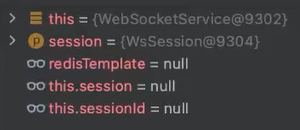

# SpringBoot整合其他框架合集

由于一些框架整合还要临时去搜索，现有的GitHub也有解决方案，但是有些方案过于针对性问题，属于参考性文章，这就需要泛化一下内容，就记录一下SpringBoot是如何整合其他框架的，方便以后工作直接查阅使用，后续还会根据问题再进行改善文档

## RabbitMQ

### 导入POM

```xml
<dependency>
	<groupId>com.rabbitmq</groupId>
    <artifactId>amqp-client</artifactId>
    <version>5.9.0</version>
</dependency>
<dependency>
	<groupId>org.springframework.boot</groupId>
    <artifactId>spring-boot-starter-amqp</artifactId>
</dependency>
```

### 配置类

```java
@Configuration
public class RabbitMQConfig {
    @Bean
    public ConnectionFactory getFactory() {
        ConnectionFactory factory = new ConnectionFactory();
        factory.setHost("192.168.99.101"); //Linux主机的IP地址
		factory.setPort(5672); //RabbitMQ端口号
        return factory;
    }
}
```

### 模板：封装类

```java
@Slf4j
@Component
public class MessageTask {
    @Autowired
    private ConnectionFactory factory;
    @Autowired
    private MessageService messageService;

    /**
     * 同步发送消息
     *
     * @param topic  主题
     * @param entity 消息对象
     */
    public void send(String topic, MessageEntity entity) {
        String id = messageService.insertMessage(entity); //向MongoDB保存消息数据，返回消息ID
        //向RabbitMQ发送消息
        try (Connection connection = factory.newConnection();
             Channel channel = connection.createChannel()) {
            //连接到某个Topic
            channel.queueDeclare(topic, true, false, false, null);
            HashMap header = new HashMap(); //存放属性数据
            header.put("messageId", id);
            //创建AMQP协议参数对象，添加附加属性
            AMQP.BasicProperties properties = new AMQP.BasicProperties().builder().headers(header).build();
            channel.basicPublish("", topic, properties, entity.getMsg().getBytes());
            log.debug("消息发送成功");
        } catch (Exception e) {
            log.error("执行异常", e);
            throw new EmosException("向MQ发送消息失败");
        }
    }
    /**
     * 异步发送消息
     *
     * @param topic  主题
     * @param entity
     */
    @Async
    public void sendAsync(String topic, MessageEntity entity) {
        send(topic, entity);
    }
    /**
     * 同步接收数据
     *
     * @param topic 主题
     * @return 接收消息数量
     */
    public int receive(String topic) {
        int i = 0;
        try (//接收消息数据
             Connection connection = factory.newConnection();
             Channel channel = connection.createChannel()) {
            // 从队列中获取消息，不自动确认
            channel.queueDeclare(topic, true, false, false, null);
            //Topic中有多少条数据未知，所以使用死循环接收数据，直到接收不到消息，退出死循环
            while (true) {
                //创建响应接收数据，禁止自动发送Ack应答
                GetResponse response = channel.basicGet(topic, false);
                if (response != null) {
                    AMQP.BasicProperties properties = response.getProps();
                    Map<String, Object> header = properties.getHeaders(); //获取附加属性对象
                    String messageId = header.get("messageId").toString();
                    byte[] body = response.getBody();//获取消息正文
                    String message = new String(body);
                    log.debug("从RabbitMQ接收的消息：" + message);
                    MessageRefEntity entity = new MessageRefEntity();
                    entity.setMessageId(messageId);
                    entity.setReceiverId(Integer.parseInt(topic));
                    entity.setReadFlag(false);
                    entity.setLastFlag(true);
                    messageService.insertRef(entity); //把消息存储在MongoDB中
                    //数据保存到MongoDB后，才发送Ack应答，让Topic删除这条消息
                    long deliveryTag = response.getEnvelope().getDeliveryTag();
                    channel.basicAck(deliveryTag, false);
                    i++;
                } else {
                    break; //接收不到消息，则退出死循环
                }
            }
        } catch (Exception e) {
            log.error("执行异常", e);
        }
        return i;
    }
    /**
     * 异步接收数据
     *
     * @param topic
     * @return
     */
    @Async
    public int receiveAysnc(String topic) {
        return receive(topic);
    }
    /**
     * 同步删除消息队列
     *
     * @param topic 主题
     */
    public void deleteQueue(String topic) {
        try (Connection connection = factory.newConnection();
             Channel channel = connection.createChannel()) {
            channel.queueDelete(topic);
            log.debug("消息队列成功删除");
        } catch (Exception e) {
            log.error("删除队列失败", e);
            throw new EmosException("删除队列失败");
        }
    }
    /**
     * 异步删除消息队列
     *
     * @param topic 主题
     */
    @Async
    public void deleteQueueAsync(String topic) {
        deleteQueue(topic);
    }
}

```


## RocketMQ

### 导入POM

```xml
<dependency>
    <groupId>org.apache.rocketmq</groupId>
    <artifactId>rocketmq-client</artifactId>
    <version>4.9.3</version>
</dependency>
```

一般配合redis使用

```xml
<dependency>
    <groupId>org.springframework.boot</groupId>
    <artifactId>spring-boot-starter-data-redis</artifactId>
</dependency>
```

### 配置类

YAML文件配置

```yaml
rocketmq:
  name:
    server:
      address: 127.0.0.1:9876
```

模板如下：

```java
@Configuration
public class RocketMQConfig {

    @Value("${rocketmq.name.server.address}")
    private String nameServerAddr;

    @Autowired
    private RedisTemplate<String, String> redisTemplate;

    @Bean(name = "csProducer")
    public DefaultMQProducer csProducer() throws Exception {
        //使用生产者组名实例化一个生产者
        DefaultMQProducer producer = new DefaultMQProducer("ComputerScienceLearnNotes");
        // 指定RocketMQ nameServer地址
        producer.setNamesrvAddr(nameServerAddr);
        // 启动生产者
        producer.start();
        return producer;
    }
    
    @Bean(name = "csConsumer")
    public DefaultMQPushConsumer csConsumer() {
        //实例化消费者，传入消费者组，表示消费同一类消息
        DefaultMQPushConsumer consumer = new DefaultMQPushConsumer("csProducer");
        // 指定RocketMQ nameServer地址
        producer.setNamesrvAddr(nameServerAddr);
        //设置订阅
        consumer.subscribe("ComputerScienceLearnNotes", "*");
        // 监听器
        consumer.registerMessageListener(new MessageListenerConcurrently() {
            @Override
            public ConsumeConcurrentlyStatus consumeMessage(List<MessageExt> msgs, ConsumeConcurrentlyContext context) {
                for (MessageExt msg : msgs) {
                }
                return ConsumeConcurrentlyStatus.CONSUME_SUCCESS;
            }
        });
    }
    //启动消费者
    consumer.start();
    return consumer;
}
```


### 封装：RocketMQ工具类

```java
public class RocketMQUtil {

    // 同步发送消息
    public static void syncSendMsg(DefaultMQProducer producer, Message message) throws Exception {
        SendResult res = producer.send(message);
        System.out.println(res);
    }

    // 异步发送消息
    public static void asyncSendMsg(DefaultMQProducer producer, Message message) throws Exception {
        int messageCount = 2;
        CountDownLatch2 countDownLatch = new CountDownLatch2(messageCount);
        for (int i = 0; i < messageCount; i++) {
            producer.send(message, new SendCallback() {
                @Override
                public void onSuccess(SendResult sendResult) {
                    countDownLatch.countDown();
                    System.out.println(sendResult.getMsgId());
                }

                @Override
                public void onException(Throwable e) {
                    countDownLatch.countDown();
                    System.out.println("发送消息的时候发生了异常！" + e);
                    e.printStackTrace();
                }
            });
        }
        countDownLatch.await(5, TimeUnit.SECONDS);
    }
}
```


## WebSocket

前言：这是在做一个在线人数统计和弹幕系统的时候的解决方案。

### 导入POM

```xml
<dependency>
    <groupId>org.springframework.boot</groupId>
    <artifactId>spring-boot-starter-websocket</artifactId>
</dependency>
```

### 配置

一般在config目录下创建一个WebSocketConfig：

1. 注意写Bean注解
2. 类`ServerEndpointExporter`

```java
@Configuration
public class WebSocketConfig {

    /**
     * 发现websocket服务
     * @return
     */
    @Bean
    public ServerEndpointExporter serverEndpointExporter() {

        return new ServerEndpointExporter();
    }
}
```

### 创建服务

创建webSocket服务，框架如下：

* @Component注解
* @ServerEndpoint()，这时就关联到了配置类了
* logger，slf4j框架日志打印
* AtomicInteger ONLINE_COUNT，在线人数，使用原子类
* ConcurrentHashMap，key保留的客户端和服务端的会话session，value保留Websocket（多例）
* @OnOpen，建立方法
* @OnClose，关闭方法

```java
@Component
@ServerEndpoint("/imserver")
public class WebSocketService {

    private final Logger logger = LoggerFactory.getLogger(this.getClass());

    private static final AtomicInteger ONLINE_COUNT = new AtomicInteger(0);

    public static final ConcurrentHashMap<String, WebSocketService> WEBSOCKET_MAP = new ConcurrentHashMap<>();

    private Session session;

    private String sessionId;

    @OnOpen
    public void openConnection(Session session) {
        this.session = session;
        this.sessionId = session.getId();
        if (WEBSOCKET_MAP.containsKey(sessionId)) {
            WEBSOCKET_MAP.replace(sessionId, this);
        } else {
            WEBSOCKET_MAP.put(sessionId, this);
            ONLINE_COUNT.getAndIncrement();
        }
        logger.info("用户连接成功：" + sessionId + ", 当前在线人数为：" + ONLINE_COUNT.get());
        // 通知前端
        try {
            this.sendMessage("0");
        } catch (Exception e) {
            logger.error("连接异常");
        }
    }

    @OnClose
    public void closeConnection() {
        if (WEBSOCKET_MAP.containsKey(sessionId)) {
            WEBSOCKET_MAP.remove(sessionId);
            ONLINE_COUNT.getAndDecrement();
        }
        logger.info("用户退出：" + sessionId +  ", 当前在线人数为：" + ONLINE_COUNT.get());
    }

    @OnMessage
    public void onMessage(String message) {
        logger.info("用户信息：" + sessionId + ", 报文：" + message);
        if (!StringUtil.isNullOrEmpty(message)) {
            try {
                // 群发消息 (生产者)
                for (Map.Entry<String, WebSocketService> entry : WEBSOCKET_MAP.entrySet()) {
                    WebSocketService webSocketService = entry.getValue();
                    if (webSocketService.session.isOpen()) {
                        webSocketService.sendMessage(message);
                    }
                }
                // 这里还可以添加持久化
            } catch (Exception e) {
                logger.error("接收出现问题");
                e.printStackTrace();
            }
        }
    }

    @OnError
    public void onError(Throwable error) {

    }
}
```

上述这个框架存在一个问题就是websocket不是多例的，比如注入redisTemplate，因为WebSocket是多例的，所以在第二次创建的时候SpringBoot就不会为redisTemplate创建第二次



### 解决方案：使用应用程序上下文

创建一个应用程序上下文在这个服务类（`WebSocketService`）里

```java
private static ApplicationContext APPLICATION_CONTEXT;
```

提供一个设置方法

```java
public static void setApplicationContext(ApplicationContext applicationContext) {
    WebSocketService.APPLICATION_CONTEXT = applicationContext;
}
```

这时再用RedisTemplate进行测试就可以看到已经有类了

```java
(RedisTemplate)WebSocketService.APPLICATION_CONTEXT.getBean("redisTemplate");
```


### 优化：MQ削峰填谷
