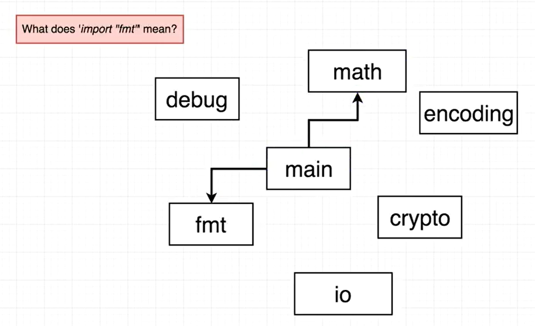

# Golang-Learn-In-Problem 从问题中学习到Go的精髓


## 前言

参考书目及视频：

[《The Way to Go》中文译本](https://github.com/unknwon/the-way-to-go_ZH_CN)

[Go 语言简明教程](https://geektutu.com/post/quick-golang.html)

[Go: The Complete Developer's Guide](https://www.udemy.com/course/go-the-complete-developers-guide/)


注：（[Go: The Complete Developer's Guide](https://www.udemy.com/course/go-the-complete-developers-guide/)）欢迎去购买支持此课程，非常的棒！

## Start!

> Golang为什么要有一个main的包？

这个问题我在第一次学习Go的时候没有深究（因为使用的是Goland进行编写）

Golang的包分为两种：可执行包和可重复使用的包 or 依赖类型的包（里面放了很多可重用的辅助函数或可重用的东西），后者可以再分为包计算者和包上传者，如下图所示


通过实验（使用go build编译）可以看到，如果我把package换成了其他，例如：xiaomi，没有生成文件

```shell
Mode                 LastWriteTime         Length Name

----                 -------------         ------ ----

-a----         2022/5/21     21:17             76 main.go
```

如果归为main包，就可以看到

```shell
Mode                 LastWriteTime         Length Name
----                 -------------         ------ ----
-a----         2022/5/21     21:18        1891328 main.exe
-a----         2022/5/21     21:18             74 main.go
```


代码示例：

```go
package main

import "fmt"

func main() {
	fmt.Println("Hello, world!")
}
```


> Go中的import是个什么原理？

https://pkg.go.dev/std

我的理解是通过import连接其它的可重用文件（链接其他包）




> 【比较学习，举一反三】Go在声明上和Java有什么区别？

Java声明函数举例：

```java
public void main(String[] args) {}
```

Go函数声明：
```go
func main() string {}
```


Java声明变量：

```java
String a = "123";
```

Go声明变量：

```go
var a string = "123"
or
a := "123"
```


Java声明数组：

```java
int[] a = {1,2,3,4}
```

Go的切片：

```
a := []int{1, 2, 3, 4}
```

其中的不同就是Go的切片可以相当于Java使用ArrayList

```go
a = append(a, 5)
```


Java的for循环

```java
for (int i = 0; i < a.length(); i++) {}
or
for (int ac in a) {}
or (if a is a List)
a.stream().forEach(e -> xxx)
```

Go的for循环

```go
for i, num := range a {}
```

Python的for循环

```python
for i,num in range(a):
    xxxx
```


Go的自定义类型：

```go
type num []int
```

甚至可以为这个自定义类型声明一个成员函数

```go
type num []int

func (n num) print() {
	for i, nu := range n {
		fmt.Println(i, nu)
	}
}
```


上述中的 func (n num)中的`(n num)`实际上是接收器参数，每一个num类型的变量都可以调用此函数，老师的意思是实际上这是一个引用！


> Go中的返回类型和Java中有什么区别？

Go可以返回多个，这个就和Java不一样，首先在函数的屁股后面加上返回的类型和个数，然后可以选择分片返回，这是Java8做不到的

```go
func deal(d deck, handSize int) (deck, deck) {
	return d[:handSize], d[handSize:]
}
```

这里的分片又和python有异曲同工之妙，用法都一样


> Go是如何读写文件的？

写

---

首先它返回一个error，原因是这个工具包如果出错会抛出一个异常；另外toString做了把一个数组转换为一坨字符串的效果；最后的0666是权限，这个一般是任何人都可以用

```go
func (d deck) saveToFile(filename string) error {
	return ioutil.WriteFile(filename, []byte(d.toString()), 0666)
}
```

再看[]byte做了什么


最后看它函数的定义

```go
func WriteFile(filename string, data []byte, perm fs.FileMode) error

解释：WriteFile 将数据写入由文件名命名的文件。  如果文件不存在，WriteFile 使用权限 perm（在 umask 之前）创建它；  否则 WriteFile 在写入之前将其截断，而不更改权限。

// 官方例子
func main() {
	message := []byte("Hello, Gophers!")
	err := ioutil.WriteFile("hello", message, 0644)
	if err != nil {
		log.Fatal(err)
	}
}
```


读

---

先看看API函数：

```go
func ReadFile(filename string) ([]byte, error)
ReadFile 读取由 filename 命名的文件并返回内容。  成功的调用返回 err == nil，而不是 err == EOF。  因为 ReadFile 读取整个文件，所以它不会将 Read 中的 EOF 视为要报告的错误。
```

返回值也有不同


当然这时会在想[]byte如何转换成string？当然就是直接转换即可string（[]byte）

```go
bs, err := ioutil.ReadFile(filename)
if err != nil {
    // Option #1 - log the error and return a call to newDeck()
    // Option #2 - log the error and entirely quit the program
    fmt.Println("Error:", err)
    os.Exit(1)
}
s := strings.Split(string(bs), ",")
```


> Go什么时候接收器，什么时候又把这个参数放到括号内？


## 项目实践：单例爬虫、协程并发爬虫

### 使用说明

文件名称：Spiders

初始化mod
> go mod init xxx

安装goquery库（仅微博使用）

### 新浪微博
单例爬虫（需要cookie）

### 美之图
高并发协程爬虫


## 问题汇总

[go语言/golang protobuf windows解决方案](https://blog.csdn.net/qq_26041727/article/details/121728316?spm=1001.2014.3001.5501)