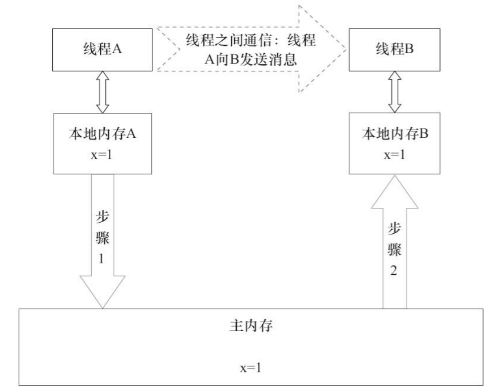
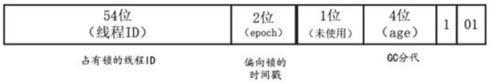
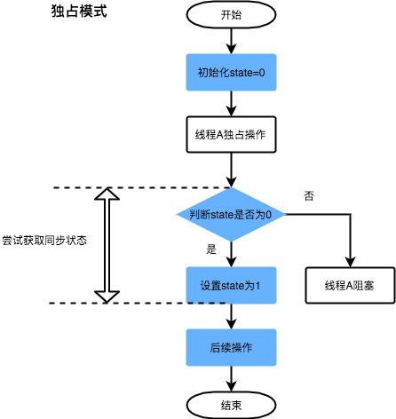
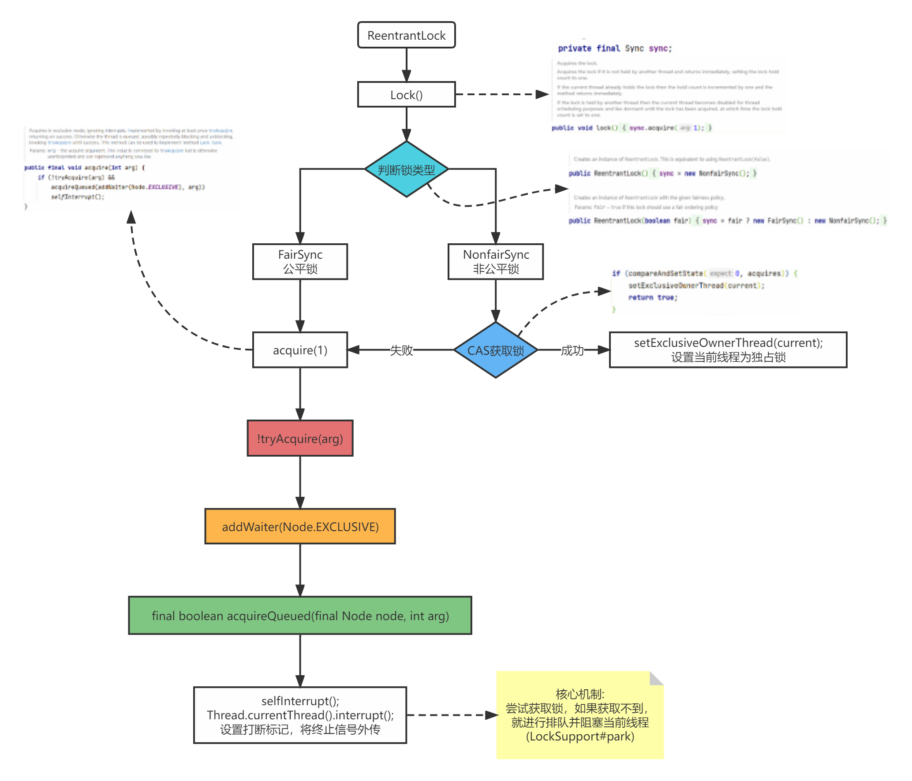
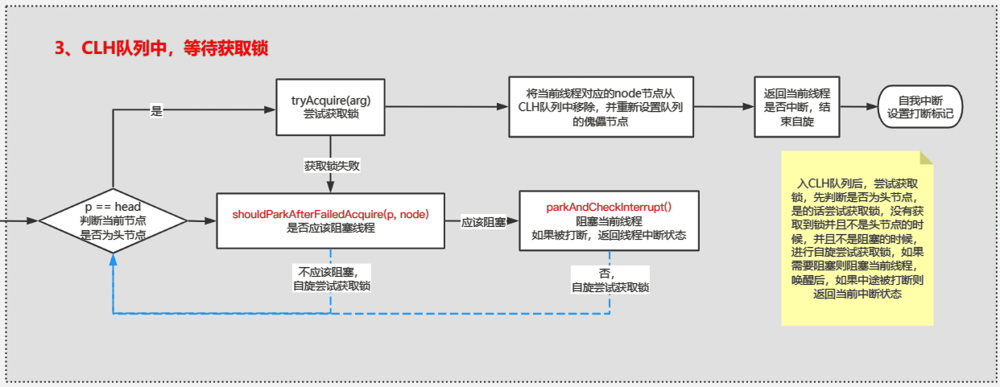

---

order: 3
author: zhiyu1998
title: Java并发
---

## 🕙 Java并发

### 请简要描述线程与进程的关系,区别及优缺点？

#### 图解进程和线程的关系


从上图可以看出：一个进程中可以有多个线程，多个线程共享进程的**堆和方法区(JDK1.8之后的元空间)**资源，但是每个线程有自己的**程序计数器、虚拟机栈和本地方法栈**。

总结：线程是进程划分成的更小的运行单位。线程和进程最大的不同在于基本上各进程是独立的，而各线程则不一定，因为同一进程中的线程极有可能会相互影响。线程执行开销小，但不利于资源的管理和保护；而进程正相反

#### 程序计数器为什么是私有的?

程序计数器主要有下面两个作用：

1. 字节码解释器通过改变程序计数器来依次读取指令，从而实现代码的流程控制，如：顺序执
   行、选择、循环、异常处理。
2. 在多线程的情况下，程序计数器用于记录当前线程执行的位置，从而当线程被切换回来的时
   候能够知道该线程上次运行到哪儿了。

需要注意的是，如果执行的是native方法，那么程序计数器记录的是undefined地址，只有执行的是Java代码时程序计数器记录的才是下一条指令的地址。所以，程序计数器私有主要是为了线程切换后能恢复到正确的执行位置。

#### 虚拟机栈和本地方法栈为什么是私有的?

* 虚拟机栈：每个Java方法在执行的同时会创建一个栈帧用于存储局部变量表、操作数栈、常量池引用等信息。从方法调用直至执行完成的过程，就对应着一个栈帧在Java虚拟机栈中入栈和出栈的过程。
* 本地方法栈：和虚拟机栈所发挥的作用非常相似，区别是：虚拟机栈为虚拟机执行Java方法（也就是字节码）服务，而本地方法栈则为虚拟机使用到的Native方法服务。在HotSpot虚拟机中和Java虚拟机栈合二为一。

所以，为了保证线程中的局部变量不被别的线程访问到，虚拟机栈和本地方法栈是线程私有的。

#### 一句话简单了解堆和方法区

堆和方法区是所有线程共享的资源，其中堆是进程中最大的一块内存，主要用于存放新创建的对象(所有对象都在这里分配内存)，方法区主要用于存放已被加载的类信息、常量、静态变量、即时编译器编译后的代码等数据。

> 精简版

**进程是系统资源分配和调度的基本单位**，它能并发执行较高系统资源的利用率.

**线程**是**比进程更小**的能独立运行的基本单位,创建、销毁、切换成本要小于进程,可以减少程序并发执行时的时间和空间开销，使得操作系统具有更好的并发性。

### Java线程的创建方式

有**四种**方式可以用来创建线程：

- 继承**Thread**类
- 实现**Runnable**接口
- **Callable**和**FutureTask**创建线程：为了解决异步执行的结果问题，Java语言在1.5版本之后提供了一种新的多线程创建方法：通过Callable接口和FutureTask类相结合创建线程。
- **线程池**创建线程
  - 使用Executors创建线程池

实现Runnable接口这种方式更受欢迎，因为这不需要继承Thread类。在应用设计中已经继承了别的对象的情况下，这需要多继承（而Java不支持多继承），只能实现接口。同时，线程池也是非常高效的，很容易实现和使用。

### JMM 是什么？

网上的概念鱼龙混杂，笔者直接摘录部分《Java高并发核心编程》和《Java并发编程的艺术》中的介绍：

> JMM（Java Memory Model and Thread Specification）：定义了一个线程对共享变量写入时，如何确保对另一个线程是可见的。实际上，JMM提供了合理的禁用缓存以及禁止重排序的方法，所以其核心的价值在于解决可见性和有序性。

    Java内存模型规定所有的变量都存储在主存中，JMM的主存类似于物理内存，但有区别，还能包含部分共享缓存。每个Java线程都有自己的工作内存（类似于CPU高速缓存，但也有区别）

1. 主存：主要存储的是Java实例对象，所有线程创建的实例对象都存放在主存中，无论该实例对象是成员变量还是方法中的本地变量（也称局部变量），当然也包括共享的类信息、常量、静态变量。由于是共享数据区域，因此多条线程对同一个变量进行访问可能会发现线程安全问题。
2. 工作内存：主要存储当前方法的所有本地变量信息（工作内存中存储着主存中的变量副本），每个线程只能访问自己的工作内存，即线程中的本地变量对其他线程是不可见的，即使两个线程执行的是同一段代码，它们也会各自在自己的工作内存中创建属于当前线程的本地变量，当然也包括字节码行号指示器、相关Native方法的信息。注意，由于工作内存是每个线程的私有数据，线程间无法相互访问工作内存，因此存储在工作内存的数据不存在线程安全问题。

JMM规定：

1. 所有变量存储在主存中
2. 每个线程都有自己的工作内存，且对变量的操作都是在工作内存中进行的
3. 不同线程之间无法直接访问彼此工作内存中的变量，要想访问只能通过主存来传递。


    JMM将所有的变量都存放在公共主存中，当线程使用变量时，会把公共主存中的变量复制到自己的工作内存（或者叫作私有内存）中，线程对变量的读写操作是自己的工作内存中的变量副本。因此，JMM模型也需要解决代码重排序和缓存可见性问题。JMM提供了一套自己的方案去禁用缓存以及禁止重排序来解决这些可见性和有序性问题。JMM提供的方案包括大家都很熟悉的volatile、synchronized、final等。JMM定义了一些内存操作的抽象指令集，然后将这些抽象指令包含到Java的volatile、synchronized等关键字的语义中，并要求JVM在实现这些关键字时必须具备其包含的JMM抽象指令的能力。

举个🌰 如果线程A与线程B之间要通信的话，必须要经历下面2个步骤。

1）线程A把本地内存A中更新过的共享变量刷新到主内存中去。

2）线程B到主内存中去读取线程A之前已更新过的共享变量。



注意，根据JMM的规定，**线程对共享变量的所有操作都必须在自己的本地内存中进行，不能直接从主内存中读取**。

所以线程B并不是直接去主内存中读取共享变量的值，而是先在本地内存B中找到这个共享变量，发现这个共享变量已经被更新了，然后本地内存B去主内存中读取这个共享变量的新值，并拷贝到本地内存B中，最后线程B再读取本地内存B中的新值。

那么怎么知道这个共享变量的被其他线程更新了呢？这就是JMM的功劳了，也是JMM存在的必要性之一。**JMM通过控制主内存与每个线程的本地内存之间的交互，来提供内存可见性保证**。

> 解决混淆问题：JVM和JMM的区别？

- 区别

  两者是不同的概念层次。JMM是抽象的，他是用来描述一组规则，通过这个规则来控制各个变量的访问方式，围绕原子性、有序性、可见性等展开的。而Java运行时内存的划分是具体的，是JVM运行Java程序时，必要的内存划分。

- 联系

  都存在私有数据区域和共享数据区域。一般来说，JMM中的主内存属于共享数据区域，他是包含了堆和方法区；同样，JMM中的本地内存属于私有数据区域，包含了程序计数器、本地方法栈、虚拟机栈。

最后再附上JVM的运行时数据区


#### 重排序

为了提高性能，编译器和CPU常常会对指令进行重排序。重排序主要分为两类：编译器重排序和CPU重排序


**编译器重排序**指的是在代码编译阶段进行指令重排，不改变程序执行结果的情况下，为了提升效率，编译器对指令进行乱序（Out-of-Order）的编译。

编译器为什么要重排序（Re-Order）呢？它的目的为：与其等待阻塞指令（如等待缓存刷入）完成，不如先去执行其他指令。与CPU乱序执行相比，编译器重排序能够完成更大范围、效果更好的乱序优化。

**CPU重排序**包括两类：指令级重排序和内存系统重排序

* 指令级重排序。在不影响程序执行结果的情况下，CPU内核采用ILP（Instruction-Level Parallelism，指令级并行运算）技术来将多条指令重叠执行，主要是为了提升效率。如果指令之间不存在数据依赖性，CPU就可以改变语句的对应机器指令的执行顺序
* 内存系统重排序：对于现代的CPU来说，在CPU内核和主存之间都具备一个高速缓存，高速缓存的作用主要是减少CPU内核和主存的交互（CPU内核的处理速度要快得多），在CPU内核进行读操作时，如果缓存没有的话就从主存取，而对于写操作都是先写在缓存中，最后再一次性写入主存，原因是减少跟主存交互时CPU内核的短暂卡顿，从而提升性能。但是，内存系统重排序可能会导致一个问题——数据不一致。

#### As-if-Serial规则

在单核CPU的场景下，当指令被重排序之后，如何保障运行的正确性呢？其实很简单，编译器和CPU都需要遵守As-if-Serial规则。

As-if-Serial规则的具体内容为：无论如何重排序，都必须保证代码在单线程下运行正确。

为了遵守As-if-Serial规则，编译器和CPU不会对存在数据依赖关系的操作进行重排序，因为这种重排序会改变执行结果。但是，如果指令之间不存在数据依赖关系，这些指令可能被编译器和CPU重排序。

As-if-Serial规则只能保障单内核指令重排序之后的执行结果正确，不能保障多内核以及跨CPU指令重排序之后的执行结果正确。

#### Happens-Before规则

> **程序次序规则**（Program Order Rule）：在一个线程内，按照控制流顺序，书写在前面的操作先行发生（Happens-before）于书写在后面的操作。注意，这里说的是控制流顺序而不是程序代码顺序，因为要考虑分支、循环等结构。

举的例子：

```java
int a = 1; 		// A
int b = 2;		// B
int c = a + b;	// C
```

根据程序次序规则，上述代码存在 3 个 Happens-before 关系：

- A Happens-before B
- B Happens-before C
- A Happens-before C

> **管程锁定规则**（Monitor Lock Rule）：一个 unlock 操作先行发生于后面对同一个锁的 lock 操作。这里必须强调的是 “同一个锁”，而 “后面” 是指时间上的先后。

这个规则其实就是针对 synchronized 的。JVM 并没有把 `lock` 和 `unlock` 操作直接开放给用户使用，但是却提供了更高层次的字节码指令 `monitorenter` 和 `monitorexit` 来隐式地使用这两个操作。这两个字节码指令反映到 Java 代码中就是同步块 — `synchronized`。

举个例子：

```java
synchronized (this) { // 此处自动加锁
	if (x > 1) {
        x = 1;
    }    
} // 此处自动解锁
```

根据管程锁定规则，假设 x 的初始值是 10，线程 A 执行完代码块后 x 的值会变成 1，执行完自动释放锁，线程 B 进入代码块时，能够看到线程 A 对 x 的写操作，也就是线程 B 能够看到 x == 1。

> **volatile 变量规则**（Volatile Variable Rule）：对一个 volatile 变量的写操作先行发生于后面对这个变量的读操作，这里的 “后面” 同样是指时间上的先后。

这个规则就是 JDK 1.5 版本对 volatile 语义的增强，其意义之重大，靠着这个规则搞定可见性易如反掌。

举个例子：


假设线程 A 执行 writer() 方法之后，线程 B 执行 reader() 方法。

根据根据程序次序规则：1 Happens-before 2；3 Happens-before 4。

根据 volatile 变量规则：2 Happens-before 3。

根据传递性规则：1 Happens-before 3；1 Happens-before 4。

也就是说，如果线程 B 读到了 “flag==true” 或者 “int i = a” 那么线程 A 设置的“a=42”对线程 B 是可见的。

看下图：


> **线程启动规则**（Thread Start Rule）：Thread 对象的 start() 方法先行发生于此线程的每一个动作。

> **线程终止规则**（Thread Termination Rule）：线程中的所有操作都先行发生于对此线程的终止检测，我们可以通过 Thread 对象的 join() 方法是否结束、Thread 对象的 isAlive() 的返回值等手段检测线程是否已经终止执行。

> **线程中断规则**（Thread Interruption Rule）：对线程 interrupt() 方法的调用先行发生于被中断线程的代码检测到中断事件的发生，可以通过 Thread 对象的 interrupted() 方法检测到是否有中断发生。

> **对象终结规则**（Finalizer Rule）：一个对象的初始化完成（构造函数执行结束）先行发生于它的 finalize() 方法的开始。

> **传递性**（Transitivity）：如果操作 A 先行发生于操作 B，操作 B 先行发生于操作 C，那就可以得出操作 A 先行发生于操作 C 的结论。

### 聊聊volatile

先要从 **CPU 缓存模型** 说起

**为什么要弄一个 CPU 高速缓存呢？** **CPU Cache 缓存的是内存数据用于解决 CPU 处理速度和内存不匹配的问题，内存缓存的是硬盘数据用于解决硬盘访问速度过慢的问题。**

为了更好地理解，我画了一个简单的 CPU Cache 示意图如下（实际上，现代的 CPU Cache 通常分为三层，分别叫 L1,L2,L3 Cache）:


**CPU Cache 的工作方式：**

先复制一份数据到 CPU Cache 中，当 CPU 需要用到的时候就可以直接从 CPU Cache 中读取数据，当运算完成后，再将运算得到的数据写回 Main Memory 中。但是，这样存在 **内存缓存不一致性的问题** ！比如我执行一个 i++操作的话，如果两个线程同时执行的话，假设两个线程从 CPU Cache 中读取的 i=1，两个线程做了 1++运算完之后再写回 Main Memory 之后 i=2，而正确结果应该是 i=3。

**CPU 为了解决内存缓存不一致性问题可以通过制定缓存一致协议或者其他手段来解决。**

前面介绍过，为了解决CPU访问主存时主存读写性能的短板，在CPU中增加了高速缓存，但这带来了可见性问题。而Java的**volatile关键字可以保证共享变量的主存可见性，也就是将共享变量的改动值立即刷新回主存**。在正常情况下，系统操作并不会校验共享变量的缓存一致性，只有当共享变量用volatile关键字修饰了，该变量所在的缓存行才被要求进行缓存一致性的校验。

> 📖《Java并发编程实战》中这样说到：
>
>  Java语言提供了一种稍弱的同步机制，即volatile变量，用来确保将变量的更新操作通知到其他线程。当把变量声明为volatile类型后，编译器与运行时都会注意到这个变量是共享的，因此不会将该变量上的操作与其他内存操作一起重排序。volatile变量不会被缓存在寄存器或者对其他处理器不可见的地方，因此在读取volatile类型的变量时总会返回最新写入的值
>
>  volatile变量对可见性的影响比volatile变量本身更为重要。当线程A首先写入一个volatile变量并且线程B随后读取该变量时，在写入volatile变量之前对A可见的所有变量的值，在B读取了volatile变量后，对B也是可见的。因此，**从内存可见性的角度来看，写入volatile变量相当于退出同步代码块，而读取volatile变量就相当于进入同步代码块**。

#### 实现原理

* 字节码层面：`volatile`在字节码层面，就是使用访问标志：**ACC_VOLATILE**来表示，供后续操作此变量时判断访问标志是否为ACC_VOLATILE，来决定是否遵循volatile的语义处理。
* volatile保证可见性跟内存屏障有关。

```java
public class Singleton {  
    private volatile static Singleton instance;  
    private Singleton (){}  
    public static Singleton getInstance() {  
    if (instance == null) {  
        synchronized (Singleton.class) {  
        if (instance == null) {  
            instance = new Singleton();  
        }  
        }  
    }  
    return instance;  
    }  
} 
```

编译后，对比有`volatile`关键字和没有`volatile`关键字时所生成的汇编代码，发现有`volatile`关键字修饰时，会多出一个`lock addl $0x0,(%esp)`，即多出一个lock前缀指令，lock指令相当于一个**内存屏障**

lock指令相当于一个内存屏障，它保证以下这几点：

1. 重排序时不能把后面的指令重排序到内存屏障之前的位置
2. 将本处理器的缓存写入内存
3. 如果是写入动作，会导致其他处理器中对应的缓存无效。

第2点和第3点就是保证volatile保证可见性的体现嘛


#### 内存屏障

> 前言：
>
> 内存屏障本质上是一系列cpu指令。内存屏障是硬件层的概念。语义上，内存屏障之前的所有写操作都要写入内存；内存屏障之后的读操作都可以获得同步屏障之前的写操作的结果。因此，对于敏感的程序块，写操作之后、读操作之前可以插入内存屏障。

如何保障跨CPU指令重排序之后的程序结果正确呢？需要用到内存屏障。

维基百科的定义：

> 也称内存栅栏，内存栅障，屏障指令等，是一类同步屏障指令，它使得 CPU 或编译器在对内存进行操作的时候, 严格按照一定的顺序来执行, 也就是说在内存屏障之前的指令和之后的指令不会由于系统优化等原因而导致乱序。 

是让一个CPU高速缓存的内存状态对其他CPU内核可见的一项技术，也是一项保障跨CPU内核有序执行指令的技术。硬件层常用的内存屏障分为三种：读屏障（Load Barrier）、写屏障（Store Barrier）和全屏障（Full Barrier）

##### 读屏障

读屏障让高速缓存中相应的数据失效。在指令前插入读屏障，可以让高速缓存中的数据失效，强制重新从主存加载数据。并且，读屏障会告诉CPU和编译器，先于这个屏障的指令必须先执行。

读屏障对应着X86处理器上的lfence指令，将强制所有在该指令之后的读操作都在lfence指令执行之后被执行，并且强制本地高速缓冲区的值全部失效，以便从主存中重新读取共享变量的值。

读屏障既使得当前CPU内核对共享变量的更改对所有CPU内核可见，又阻止了一些可能导致读取无效数据的指令重排。

##### 写屏障

在指令后插入写屏障指令能让高速缓存中的最新数据更新到主存，让其他线程可见。并且，写屏障会告诉CPU和编译器，后于这个屏障的指令必须后执行。

写屏障对应X86处理器上的sfence指令，sfence指令会保证所有写操作都在该指令执行之前被完成，并把高速缓冲区的数据都刷新到主存中，使得当前CPU对共享变量的更改对所有CPU可见。

##### 全屏障

全屏障是一种全能型的屏障，具备读屏障和写屏障的能力。Full Barrier又称为StoreLoad Barriers，对应X86处理器上的mfence指令。

在X86处理器平台上mfence指令综合了sfence指令与lfence指令的作用。X86处理器强制所有在mfence之前的store/load指令都在mfence执行之前被执行；所有在mfence之后的store/load指令都在该mfence执行之后被执行。简单来说，X86处理器禁止对mfence指令前后的store/load指令进行重排序。

X86处理器上的lock前缀指令也具有内存全屏障的功能。lock前缀后面可以跟ADD、ADC、AND、BTC、BTR、BTS、CMPXCHG、CMPXCH8B、DEC、INC、NEG、NOT、OR、SBB、SUB、XOR、XADD、XCHG等指令。


##### 作用

（1）阻止屏障两侧的指令重排序

编译器和CPU可能为了使性能得到优化而对指令重排序，但是插入一个硬件层的内存屏障相当于告诉CPU和编译器先于这个屏障的指令必须先执行，后于这个屏障的指令必须后执行。

（2）强制让高速缓存的数据失效

硬件层的内存屏障强制把高速缓存中的最新数据写回主存，让高速缓存中相应的脏数据失效。一旦完成写入，任何访问这个变量的线程将会得到最新的值。


### CAS 是什么？

> 如何实现无锁的递增计数器？CAS

cas 叫做 CompareAndSwap，**比较并交换**，很多地方使用到了它，比如锁升级中自旋锁就有用到，主要是**通过处理器的指令来保证操作的原子性**，它主要包含三个变量：

- **1.变量内存地址**
- **2.旧的预期值 A**
- **3.准备设置的新值 B**

当一个线程需要修改一个共享变量的值，完成这个操作需要先取出共享变量的值，赋给 A，基于 A 进行计算，得到新值 B，在用预期原值 A 和内存中的共享变量值进行比较，**如果相同就认为其他线程没有进行修改**，而将新值写入内存

**CAS的缺点**

- **CPU开销比较大**：在并发量比较高的情况下，如果许多线程反复尝试更新某一个变量，却又一直更新不成功，又因为**自旋**的时候会一直占用CPU，如果CAS一直更新不成功就会一直占用，造成CPU的浪费。
- **ABA 问题**：比如线程 A 去修改 1 这个值，修改成功了，但是中间 线程 B 也修改了这个值，但是修改后的结果还是 1，所以不影响 A 的操作，这就会有问题。可以用**版本号**来解决这个问题。
- **只能保证一个共享变量的原子性**

> 📖《offer来了》这样定义CAS的：**CAS（Compare And Swap）**指比较并交换。CAS算法CAS(V, E, N)包含3个参数，V表示要更新的变量，E表示预期的值，N表示新值。在且仅在V值等于 E值时，才会将V值设为 N，如果 V值和 E值不同，则说明已经有其他线程做了更新，当前线程什么都不做。最后，CAS返回当前V的真实值。
>
> * CAS的特性：乐观锁
> * CAS自旋等待：在JDK的原子包java.util.concurrent.atomic里面提供了一组原子类，这些原子类的基本特性就是在多线程环境下，在有多个线程同时执行这些类的实例包含的方法时，会有排他性。其内部便是基于CAS算法实现的，即在某个线程进入方法中执行其中的指令时，不会被其他线程打断；而别的线程就像自旋锁一样，一直等到该方法执行完成才由JVM从等待的队列中选择另一个线程进入。

> 🙋笔者认为介绍CAS最简单的方法就是举个🌰给面试官听：
>
> 假如某个内存地址（某对象的属性）的值为100，现在有两个线程（线程A和线程B）使用CAS无锁编程对该内存地址进行更新，线程A欲将其值更新为200，线程B欲将其值更新为300，如图3-1所示。
>
> 线程是并发执行的，谁都有可能先执行。但是CAS是原子操作，对同一个内存地址的CAS操作在同一时刻只能执行一个。因此，在这个例子中，要么线程A先执行，要么线程B先执行。假设线程A的CAS(100,200)执行在前，由于内存地址的旧值100与该CAS的期望值100相等，因此线程A会操作成功，内存地址的值被更新为200。（图来自《Java高并发核心编程》）
>
> 
>
> 线程A执行CAS(100,200)成功之后，内存地址的
>
> 
>
> 接下来执行线程B的CAS(100,300)操作，此时内存地址的值为200，不等于CAS的期望值100，线程B操作失败。线程B只能自旋，开始新的循环，这一轮循环首先获取到内存地址的值200，然后进行CAS(200,300)操作，这一次内存地址的值与CAS的预期值（oldValue）相等，线程B操作成功。

#### ABA问题

ABA 是 CAS 操作的一个经典问题，假设有一个变量初始值为 A，修改为 B，然后又修改为 A，这个变量实际被修改过了，但是 CAS 操作可能无法感知到。

如果是整形还好，不会影响最终结果，但如果是对象的引用类型包含了多个变量，引用没有变实际上包含的变量已经被修改，这就会造成大问题。

如何解决？思路其实很简单，在变量前加版本号，每次变量更新了就把版本号加一，结果如下：


最终结果都是 A 但是版本号改变了。

从 JDK 1.5 开始提供了 `AtomicStampedReference`类，这个类的 `compareAndSe `方法首先检查 `当前引用`是否等于 `预期引用`，并且 `当前标志`是否等于 `预期标志`，如果全部相等，则以原子方式将该引用和该标志的值设置为给定的更新值。

#### 自旋开销问题

CAS 出现冲突后就会开始 `自旋`操作，如果资源竞争非常激烈，自旋长时间不能成功就会给 CPU 带来非常大的开销。

解决方案：可以考虑限制自旋的次数，避免过度消耗 CPU；另外还可以考虑延迟执行。

#### 只能保证单个变量的原子性

当对一个共享变量执行操作时，可以使用 CAS 来保证原子性，但是如果要对多个共享变量进行操作时，CAS 是无法保证原子性的，比如需要将 i 和 j 同时加 1：

i++；j++；

这个时候可以使用 synchronized 进行加锁，有没有其他办法呢？有，将多个变量操作合成一个变量操作。从 JDK1.5 开始提供了 `AtomicReference` 类来保证引用对象之间的原子性，你可以把多个变量放在一个对象里来进行CAS操作。

### 什么是上下文切换？

多线程编程中一般线程的个数都大于CPU核心的个数，而一个CPU核心在任意时刻只能被一个线程使用，为了让这些线程都能得到有效执行，CPU采取的策略是为每个线程分配时间片并轮转的形式。当一个线程的时间片用完的时候就会重新处于就绪状态让给其他线程使用，这个过程就属于一次上下文切换。

概括来说就是：**当前任务在执行完CPU时间片切换到另一个任务之前会先保存自己的状态，以便下次再切换回这个任务时，可以再加载这个任务的状态。**任务从保存到再加载的过程就是一次上下文切换。

上下文切换通常是计算密集型的。也就是说，它需要相当可观的处理器时间，在每秒几十上百次的切换中，每次切换都需要纳秒量级的时间。所以，上下文切换对系统来说意味着消耗大量的CPU时间，事实上，可能是操作系统中时间消耗最大的操作。

Linux相比与其他操作系统（包括其他类Unix系统）有很多的优点，其中有一项就是，其上下文切换和模式切换的时间消耗非常少。

### 说说 sleep() 方法和 wait() 方法区别和共同点?

- 两者最主要的区别在于：**`sleep()` 方法没有释放锁，而 `wait()` 方法释放了锁** 。
- 两者都可以暂停线程的执行。
- `wait()` 通常被用于线程间交互/通信，`sleep() `通常被用于暂停执行。
- `wait()` 方法被调用后，线程不会自动苏醒，需要别的线程调用同一个对象上的 `notify() `或者 `notifyAll()` 方法。`sleep() `方法执行完成后，线程会自动苏醒。或者可以使用 `wait(long timeout)` 超时后线程会自动苏醒。

### 为什么我们调用 start() 方法时会执行 run() 方法，为什么我们不能直接调用 run() 方法？

这是另一个非常经典的 Java 多线程面试问题，而且在面试中会经常被问到。很简单，但是很多人都会答不上来！

new 一个 Thread，线程进入了新建状态。调用 `start()`方法，会启动一个线程并使线程进入了就绪状态，当分配到时间片后就可以开始运行了。 `start()` 会执行线程的相应准备工作，然后自动执行 `run()` 方法的内容，这是真正的多线程工作。 但是，直接执行 `run()` 方法，会把 `run()` 方法当成一个 main 线程下的普通方法去执行，并不会在某个线程中执行它，所以这并不是多线程工作。

**总结： 调用 `start()` 方法方可启动线程并使线程进入就绪状态，直接执行 `run()` 方法的话不会以多线程的方式执行。**

### synchronized汇总

#### 说一说自己对于 synchronized 关键字的了解

**`synchronized` 关键字解决的是多个线程之间访问资源的同步性，`synchronized`关键字可以保证被它修饰的方法或者代码块在任意时刻只能有一个线程执行。**

另外，在 Java 早期版本中，`synchronized` 属于 **重量级锁**，效率低下。

**为什么呢？**

因为监视器锁（monitor）是依赖于底层的操作系统的 `Mutex Lock` 来实现的，Java 的线程是映射到操作系统的原生线程之上的。如果要挂起或者唤醒一个线程，都需要操作系统帮忙完成，而操作系统实现线程之间的切换时需要从用户态转换到内核态，这个状态之间的转换需要相对比较长的时间，时间成本相对较高。

庆幸的是在 Java 6 之后 Java 官方对从 JVM 层面对 `synchronized` 较大优化，所以现在的 `synchronized` 锁效率也优化得很不错了。JDK1.6 对锁的实现引入了大量的优化，如自旋锁、适应性自旋锁、锁消除、锁粗化、偏向锁、轻量级锁等技术来减少锁操作的开销。

所以，你会发现目前的话，不论是各种开源框架还是 JDK 源码都大量使用了 `synchronized` 关键字。

> 笔者个人认为《offer来了》里面解释Java中的关键字是真的不错，上述截取的Guide，但是过于晦涩，所以截取了里面对synchronized 的解释：
>
> 🙋‍♂️**synchronized**关键字用于为Java对象、方法、代码块提供线程安全的操作。synchronized属于独占式的悲观锁，同时属于可重入锁。在使用synchronized修饰对象时，同一时刻只能有一个线程对该对象进行访问；在synchronized修饰方法、代码块时，同一时刻只能有一个线程执行该方法体或代码块，其他线程只有等待当前线程执行完毕并释放锁资源后才能访问该对象或执行同步代码块。Java中的每个对象都有个monitor对象，加锁就是在竞争monitor（监视器锁）对象。对代码块加锁是通过在前后分别加上monitorenter和monitorexit指令实现的，对方法是否加锁是通过一个标记位来判断的。

#### 讲一下 synchronized 关键字的底层原理

##### synchronized 同步语句块的情况

```java
public class SynchronizedDemo {
    public void method() {
        synchronized (this) {
            System.out.println("synchronized 代码块");
        }
    }
}
```

通过 JDK 自带的 `javap` 命令查看 `SynchronizedDemo` 类的相关字节码信息：首先切换到类的对应目录执行 `javac SynchronizedDemo.java` 命令生成编译后的 .class 文件，然后执行 `javap -c -s -v -l SynchronizedDemo.class`。


从上面我们可以看出：**`synchronized` 同步语句块的实现使用的是 `monitorenter` 和 `monitorexit` 指令，其中 `monitorenter` 指令指向同步代码块的开始位置，`monitorexit` 指令则指明同步代码块的结束位置。**

当执行 `monitorenter` 指令时，线程试图获取锁也就是获取 **对象监视器 `monitor`** 的持有权。

> 在 Java 虚拟机(HotSpot)中，Monitor 是基于 C++实现的，由[ObjectMonitor](https://github.com/openjdk-mirror/jdk7u-hotspot/blob/50bdefc3afe944ca74c3093e7448d6b889cd20d1/src/share/vm/runtime/objectMonitor.cpp)

> 实现的。每个对象中都内置了一个 `ObjectMonitor`对象。
>
> 另外，`wait/notify`等方法也依赖于 `monitor`对象，这就是为什么只有在同步的块或者方法中才能调用 `wait/notify`等方法，否则会抛出 `java.lang.IllegalMonitorStateException`的异常的原因。

在执行 `monitorenter`时，会尝试获取对象的锁，如果锁的计数器为 0 则表示锁可以被获取，获取后将锁计数器设为 1 也就是加 1。


对象锁的的拥有者线程才可以执行 `monitorexit` 指令来释放锁。在执行 `monitorexit` 指令后，将锁计数器设为 0，表明锁被释放，其他线程可以尝试获取锁。


如果获取对象锁失败，那当前线程就要阻塞等待，直到锁被另外一个线程释放为止。

##### synchronized 修饰方法的的情况

```java
public class SynchronizedDemo2 {
    public synchronized void method() {
        System.out.println("synchronized 方法");
    }
}
```


`synchronized` 修饰的方法并没有 `monitorenter` 指令和 `monitorexit` 指令，取得代之的确实是 `ACC_SYNCHRONIZED` 标识，该标识指明了该方法是一个同步方法。JVM 通过该 `ACC_SYNCHRONIZED` 访问标志来辨别一个方法是否声明为同步方法，从而执行相应的同步调用。

如果是实例方法，JVM 会尝试获取实例对象的锁。如果是静态方法，JVM 会尝试获取当前 class 的锁。

##### 总结

`synchronized` 同步语句块的实现使用的是 `monitorenter` 和 `monitorexit` 指令，其中 `monitorenter` 指令指向同步代码块的开始位置，`monitorexit` 指令则指明同步代码块的结束位置。

`synchronized` 修饰的方法并没有 `monitorenter` 指令和 `monitorexit` 指令，取得代之的确实是 `ACC_SYNCHRONIZED` 标识，该标识指明了该方法是一个同步方法。

**不过两者的本质都是对对象监视器 monitor 的获取。**

#### 说说 synchronized 关键字和 volatile 关键字的区别

`synchronized` 关键字和 `volatile` 关键字是两个互补的存在，而不是对立的存在！

- **`volatile` 关键字**是线程同步的**轻量级实现**，所以 **`volatile `性能肯定比 `synchronized`关键字要好** 。但是 **`volatile` 关键字只能用于变量而 `synchronized`   \**同步的\**  关键字可以修饰方法以及代码块** 。
- **`volatile` 关键字能保证数据的可见性，但不能保证数据的原子性。`synchronized` 关键字两者都能保证。**
- **`volatile`关键字主要用于解决变量在多个线程之间的可见性，而 `synchronized` 关键字解决的是多个线程之间访问资源的同步性。**

#### synchronized 锁升级的过程

在 Java1.6 之前的版本中，synchronized 属于重量级锁，效率低下，**锁是** cpu 一个**总量级的资源**，每次获取锁都要和 cpu 申请，非常消耗性能。

在 **jdk1.6 之后** Java 官方对从 JVM 层面对 synchronized 较大优化，所以现在的 synchronized 锁效率也优化得很不错了，Jdk1.6 之后，为了减少获得锁和释放锁所带来的性能消耗，引入了偏向锁和轻量级锁，增加了锁升级的过程，由**无锁->偏向锁->自旋锁->重量级锁**

增加锁升级的过程主要是**减少用户态到核心态的切换，提高锁的效率，从 jvm 层面优化锁**（图源：深入理解Java虚拟机：JVM高级特性与最佳实践（第2版））


##### 偏向锁简介

**在实际场景中，如果一个同步块（或方法）没有多个线程竞争，而且总是由同一个线程多次重入获取锁**，如果每次还有阻塞线程，唤醒CPU从用户态转为核心态，那么对于CPU是一种资源的浪费，为了解决这类问题，就引入了偏向锁的概念。

**偏向锁**  是指一段同步代码一直被同一个线程所访问，那么该线程会自动获取锁，降低获取锁的代价。如果内置锁处于偏向状态，当有一个线程来竞争锁时，先用偏向锁，表示内置锁偏爱这个线程，这个线程要执行该锁关联的同步代码时，不需要再做任何检查和切换。偏向锁在竞争不激烈的情况下效率非常高。

偏向锁的缺点：如果锁对象时常被多个线程竞争，偏向锁就是多余的，并且其撤销的过程会带来一些性能开销。

> 核心原理是：如果不存在线程竞争的一个线程获得了锁，那么锁就进入偏向状态，此时Mark Word的结构变为偏向锁结构，锁对象的锁标志位（lock）被改为01，偏向标志位（biased_lock）被改为1，然后线程的ID记录在锁对象的Mark Word中（使用CAS操作完成）。以后该线程获取锁时判断一下线程ID和标志位，就可以直接进入同步块，连CAS操作都不需要，这样就省去了大量有关锁申请的操作，从而也就提升了程序的性能。
>
> 

##### 轻量级锁简介

**轻量锁存在的目的是尽可能不动用操作系统层面的互斥锁，因为其性能比较差。线程的阻塞和唤醒需要CPU从用户态转为核心态，频繁地阻塞和唤醒对CPU来说是一件负担很重的工作**。同时我们可以发现，很多对象锁的锁定状态只会持续很短的一段时间，例如整数的自加操作，在很短的时间内阻塞并唤醒线程显然不值得，为此引入了轻量级锁。*轻量级锁是一种自旋锁*，因为JVM本身就是一个应用，所以希望在应用层面上通过自旋解决线程同步问题。

轻量级锁的执行过程：在抢锁线程进入临界区之前，如果内置锁（临界区的同步对象）没有被锁定，JVM首先将在抢锁线程的栈帧中建立一个锁记录（Lock Record），用于存储对象目前Mark Word的拷贝，这时的线程堆栈与内置锁对象头大致如图


然后抢锁线程将使用CAS自旋操作，尝试将内置锁对象头的Mark Word的ptr_to_lock_record（锁记录指针）更新为抢锁线程栈帧中锁记录的地址，如果这个更新执行成功了，这个线程就拥有了这个对象锁。然后JVM将Mark Word中的lock标记位改为00（轻量级锁标志），即表示该对象处于轻量级锁状态。抢锁成功之后，JVM会将Mark Word中原来的锁对象信息（如哈希码等）保存在抢锁线程锁记录的Displaced Mark Word（可以理解为放错地方的Mark Word）字段中，再将抢锁线程中锁记录的owner指针指向锁对象。

在轻量级锁抢占成功之后，锁记录和对象头的状态如图


锁记录是线程私有的，每个线程都有自己的一份锁记录，在创建完锁记录后，会将内置锁对象的Mark Word复制到锁记录的Displaced Mark Word字段。这是为什么呢？因为内置锁对象的Mark Word的结构会有所变化，Mark Word将会出现一个指向锁记录的指针，而不再存着无锁状态下的锁对象哈希码等信息，所以必须将这些信息暂存起来，供后面在锁释放时使用

##### 重量级锁简介

JVM中每个对象都会有一个监视器，监视器和对象一起创建、销毁。监视器相当于一个用来监视这些线程进入的特殊房间，其义务是保证（同一时间）只有一个线程可以访问被保护的临界区代码块。

本质上，监视器是一种同步工具，也可以说是一种同步机制，主要特点是：

（1）同步。监视器所保护的临界区代码是互斥地执行的。一个监视器是一个运行许可，任一线程进入临界区代码都需要获得这个许可，离开时把许可归还。

（2）协作。监视器提供Signal机制，允许正持有许可的线程暂时放弃许可进入阻塞等待状态，等待其他线程发送Signal去唤醒；其他拥有许可的线程可以发送Signal，唤醒正在阻塞等待的线程，让它可以重新获得许可并启动执行。

#### 谈谈 synchronized 和 ReentrantLock 的区别

##### 两者都是可重入锁

**“可重入锁”**  指的是自己可以再次获取自己的内部锁。比如一个线程获得了某个对象的锁，此时这个对象锁还没有释放，当其再次想要获取这个对象的锁的时候还是可以获取的，如果是不可重入锁的话，就会造成死锁。同一个线程每次获取锁，锁的计数器都自增 1，所以要等到锁的计数器下降为 0 时才能释放锁。

##### synchronized 依赖于 JVM 而 ReentrantLock 依赖于 API

`synchronized` 是**依赖于 JVM 实现**的，前面我们也讲到了 虚拟机团队在 JDK1.6 为 `synchronized` 关键字进行了很多优化，但是这些优化都是在虚拟机层面实现的，并没有直接暴露给我们。`ReentrantLock` 是 **JDK 层面实现**的（也就是 API 层面，需要 lock() 和 unlock() 方法配合 try/finally 语句块来完成），所以我们可以通过查看它的源代码，来看它是如何实现的。

##### ReentrantLock 比 synchronized 增加了一些高级功能

相比 `synchronized`，`ReentrantLock`增加了一些高级功能。主要来说主要有三点：

- **等待可中断** : `ReentrantLock`提供了一种能够中断等待锁的线程的机制，通过 `lock.lockInterruptibly()` 来实现这个机制。也就是说*正在等待的线程可以选择放弃等待，改为处理其他事情*。
- **可实现公平锁** : `ReentrantLock`可以指定是公平锁还是非公平锁。而 `synchronized`只能是非公平锁。所谓的公平锁就是先等待的线程先获得锁。`ReentrantLock`默认情况是非公平的，可以通过 `ReentrantLock`类的 `ReentrantLock(boolean fair)`构造方法来制定是否是公平的。
- **可实现选择性通知（锁可以绑定多个条件）**: `synchronized`关键字与 `wait()`和 `notify()`/`notifyAll()`方法相结合可以实现等待/通知机制。`ReentrantLock`类当然也可以实现，但是需要借助于 `Condition`接口与 `newCondition()`方法。

> `Condition`是 JDK1.5 之后才有的，它具有很好的灵活性，比如可以实现多路通知功能也就是在一个 `Lock`对象中可以创建多个 `Condition`实例（即对象监视器），**线程对象可以注册在指定的 `Condition`中，从而可以有选择性的进行线程通知，在调度线程上更加灵活。 在使用 `notify()/notifyAll()`方法进行通知时，被通知的线程是由 JVM 选择的，用 `ReentrantLock`类结合 `Condition`实例可以实现“选择性通知”** ，这个功能非常重要，而且是 Condition 接口默认提供的。而 `synchronized`关键字就相当于整个 Lock 对象中只有一个 `Condition`实例，所有的线程都注册在它一个身上。如果执行 `notifyAll()`方法的话就会通知所有处于等待状态的线程这样会造成很大的效率问题，而 `Condition`实例的 `signalAll()`方法 只会唤醒注册在该 `Condition`实例中的所有等待线程。

**如果你想使用上述功能，那么选择 ReentrantLock 是一个不错的选择。性能已不是选择标准**

### ⭐ThreadLocal 原理

**如果想实现每一个线程都有自己的专属本地变量该如何解决呢？** JDK 中提供的 `ThreadLocal`类正是为了解决这样的问题。 **`ThreadLocal`类主要解决的就是让每个线程绑定自己的值，可以将 `ThreadLocal`类形象的比喻成存放数据的盒子，盒子中可以存储每个线程的私有数据。**

下面是ThreadLocal的源码：

```java
public class Thread implements Runnable {
    //......
    //与此线程有关的ThreadLocal值。由ThreadLocal类维护
    ThreadLocal.ThreadLocalMap threadLocals = null;

    //与此线程有关的InheritableThreadLocal值。由InheritableThreadLocal类维护
    ThreadLocal.ThreadLocalMap inheritableThreadLocals = null;
    //......
}

```

可以看出 **最终的变量是放在了当前线程的 `ThreadLocalMap` 中，并不是存在 `ThreadLocal` 上，`ThreadLocal` 可以理解为只是 `ThreadLocalMap`的封装，传递了变量值。** `ThrealLocal` 类中可以通过 `Thread.currentThread()`获取到当前线程对象后，直接通过 `getMap(Thread t)`可以访问到该线程的 `ThreadLocalMap`对象。

**每个 `Thread`中都具备一个 `ThreadLocalMap`，而 `ThreadLocalMap`可以存储以 `ThreadLocal`为 key ，Object 对象为 value 的键值对。**


> 注：`ThreadLocalMap`是 `ThreadLocal`的静态内部类。

【扩展】 ThreadLocal的内存泄露（简化版）：

具体详细看Guide：[ThreadLocal的内存泄露](https://javaguide.cn/java/concurrent/java-concurrent-questions-02.html#threadlocal-%E5%86%85%E5%AD%98%E6%B3%84%E9%9C%B2%E9%97%AE%E9%A2%98)

`ThreadLocalMap` 中使用的 key 为 `ThreadLocal` 的弱引用,而 value 是强引用。所以，如果 `ThreadLocal` 没有被外部强引用的情况下，在垃圾回收的时候，key 会被清理掉，而 value 不会被清理掉。

### 实现 Runnable 接口和 Callable 接口的区别

继承Thread类或者实现Runnable接口这两种方式来创建线程类，但是这两种方式有一个共同的缺陷：不能获取异步执行的结果。Callable接口类似于Runnable。不同的是，Runnable的唯一抽象方法run()没有返回值，也没有受检异常的异常声明。比较而言，Callable接口的call()有返回值，并且声明了受检异常，其功能更强大一些。

`Runnable`自 Java 1.0 以来一直存在，但 `Callable`仅在 Java 1.5 中引入,目的就是为了来处理 `Runnable`不支持的用例。**`Runnable` 接口** 不会返回结果或抛出检查异常，但是 **`Callable` 接口** 可以。所以，如果任务不需要返回结果或抛出异常推荐使用 **`Runnable` 接口** ，这样代码看起来会更加简洁。

### 执行 execute()方法和 submit()方法的区别是什么呢？

1. **`execute()`方法用于提交不需要返回值的任务，所以无法判断任务是否被线程池执行成功与否；**
2. **`submit()`方法用于提交需要返回值的任务。线程池会返回一个 `Future` 类型的对象，通过这个 `Future` 对象可以判断任务是否执行成功**，并且可以通过 `Future` 的 `get()`方法来获取返回值，`get()`方法会阻塞当前线程直到任务完成，而使用 `get(long timeout，TimeUnit unit)`方法则会阻塞当前线程一段时间后立即返回，这时候有可能任务没有执行完。

Execute()源码

```java
public void execute(Runnable command) {
  ...
}
```

submit大致源码

```java
public Future<?> submit(Runnable task) {
    if (task == null) throw new NullPointerException();
    RunnableFuture<Void> ftask = newTaskFor(task, null);
    execute(ftask);
    return ftask;
}

protected <T> RunnableFuture<T> newTaskFor(Runnable runnable, T value) {
    return new FutureTask<T>(runnable, value);
}

```

`newTaskFor` 方法返回了一个 `FutureTask` 对象。

### ⭐如何创建线程池

《阿里巴巴 Java 开发手册》中强制线程池不允许使用 Executors 去创建，而是通过 ThreadPoolExecutor 的方式，这样的处理方式让写的同学更加明确线程池的运行规则，规避资源耗尽的风险

> Executors 返回线程池对象的弊端如下：
>
> - **FixedThreadPool 和 SingleThreadExecutor** ： 允许请求的队列长度为 Integer.MAX_VALUE ，可能堆积大量的请求，从而导致 OOM。
> - **CachedThreadPool 和 ScheduledThreadPool** ： 允许创建的线程数量为 Integer.MAX_VALUE ，可能会创建大量线程，从而导致 OOM。


源码：

```java
/**
 * 用给定的初始参数创建一个新的ThreadPoolExecutor。
 */
public ThreadPoolExecutor(int corePoolSize, //线程池的核心线程数量
                      int maximumPoolSize, //线程池的最大线程数
                      long keepAliveTime, //当线程数大于核心线程数时，多余的空闲线程存活的最长时间
                      TimeUnit unit, //时间单位
                      BlockingQueue<Runnable> workQueue, //任务队列，用来储存等待执行任务的队列
                      ThreadFactory threadFactory, //线程工厂，用来创建线程，一般默认即可
                      RejectedExecutionHandler handler //拒绝策略，当提交的任务过多而不能及时处理时，我们可以定制策略来处理任务
                         ) {
    if (corePoolSize < 0 ||
        maximumPoolSize <= 0 ||
        maximumPoolSize < corePoolSize ||
        keepAliveTime < 0)
            throw new IllegalArgumentException();
    if (workQueue == null || threadFactory == null || handler == null)
        throw new NullPointerException();
    this.corePoolSize = corePoolSize;
    this.maximumPoolSize = maximumPoolSize;
    this.workQueue = workQueue;
    this.keepAliveTime = unit.toNanos(keepAliveTime);
    this.threadFactory = threadFactory;
    this.handler = handler;
}

```

---

<details>
    <summary>ThreadPoolExecutor 3 个最重要的参数：</summary>
<p>
    corePoolSize : 核心线程数定义了最小可以同时运行的线程数量。
    </p>
<p>
    maximumPoolSize : 当队列中存放的任务达到队列容量的时候，当前可以同时运行的线程数量变为最大线程数。
    </p>
<p>
    workQueue: 当新任务来的时候会先判断当前运行的线程数量是否达到核心线程数，如果达到的话，新任务就会被存放在队列中。
    </p>
</details>
<details>
    <summary>`ThreadPoolExecutor`其他常见参数</summary>
    <p>
    keepAliveTime: 当线程池中的线程数量大于 `corePoolSize` 的时候，如果这时没有新的任务提交，核心线程外的线程不会立即销毁，而是会等待，直到等待的时间超过了 `keepAliveTime`才会被回收销毁；
    </p>
    <p>
    unit: 参数的时间单位
    </p>
    <p>
    threadFactory: executor 创建新线程的时候会用到
    </p>
    <p>
    handler: 拒绝策略
    <p>
    1. `ThreadPoolExecutor.AbortPolicy`: 抛出 RejectedExecutionException来拒绝新任务的处理。
    </p>
    <p>
    2. `ThreadPoolExecutor.CallerRunsPolicy`: 提交任务的线程自己去执行该任务
    </p>
    <p>
    3. `ThreadPoolExecutor.DiscardPolicy`:  不处理新任务，直接丢弃掉。
    </p>
    <p>
    4. `ThreadPoolExecutor.DiscardOldestPolicy`:  此策略将丢弃最早的未处理的任务请求。
    </p>
    </p>
</details>


### JUC 包中的原子类是哪 4 类?

**基本类型**

使用原子的方式更新基本类型

- `AtomicInteger`：整型原子类
- `AtomicLong`：长整型原子类
- `AtomicBoolean`：布尔型原子类

**数组类型**

使用原子的方式更新数组里的某个元素

- `AtomicIntegerArray`：整型数组原子类
- `AtomicLongArray`：长整型数组原子类
- `AtomicReferenceArray`：引用类型数组原子类

**引用类型**

- `AtomicReference`：引用类型原子类
- `AtomicStampedReference`：原子更新带有**版本号**的引用类型。该类将整数值与引用关联起来，可用于解决原子的更新数据和数据的版本号，可以解决使用 CAS 进行原子更新时可能出现的 ABA 问题。
- `AtomicMarkableReference` ：原子更新带有**标记位**的引用类型

**对象的属性修改类型**

- `AtomicIntegerFieldUpdater`：原子更新整型字段的更新器
- `AtomicLongFieldUpdater`：原子更新长整型字段的更新器
- `AtomicReferenceFieldUpdater`：原子更新引用类型字段的更新器

### 能不能给我简单介绍一下 AtomicInteger 类

常用类

```java
public final int get() //获取当前的值
public final int getAndSet(int newValue)//获取当前的值，并设置新的值
public final int getAndIncrement()//获取当前的值，并自增
public final int getAndDecrement() //获取当前的值，并自减
public final int getAndAdd(int delta) //获取当前的值，并加上预期的值
boolean compareAndSet(int expect, int update) //如果输入的数值等于预期值，则以原子方式将该值设置为输入值（update）
public final void lazySet(int newValue)//最终设置为newValue,使用 lazySet 设置之后可能导致其他线程在之后的一小段时间内还是可以读到旧的值。
```

AtomicInteger 类主要利用 CAS (compare and swap) + volatile 和 native 方法来保证原子操作，从而避免 synchronized 的高开销，执行效率大为提升。

AtomicInteger 类的部分源码：

```java
// setup to use Unsafe.compareAndSwapInt for updates（更新操作时提供“比较并替换”的作用）
private static final Unsafe unsafe = Unsafe.getUnsafe();
private static final long valueOffset;

static {
    try {
        valueOffset = unsafe.objectFieldOffset
            (AtomicInteger.class.getDeclaredField("value"));
    } catch (Exception ex) { throw new Error(ex); }
}

private volatile int value;
```

CAS 的原理是拿期望的值和原本的一个值作比较，如果相同则更新成新的值。UnSafe 类的 objectFieldOffset()  方法是一个本地方法，这个方法是用来拿到“原来的值”的内存地址，返回值是 valueOffset。另外 value 是一个 volatile  变量，在内存中可见，因此 JVM 可以保证任何时刻任何线程总能拿到该变量的最新值。

### 🔥 请你说一下自己对于 AQS 原理的理解

#### 前提：LockSupport

> Basic thread blocking primitives (原始) for creating locks and other synchronization (同步) classes.
>
> This class associates, with each thread that uses it, a permit (in the sense of the Semaphore class). A call to park will return immediately if the permit is available, consuming it in the process; otherwise it may block. A call to unpark makes the permit available, if it was not already available. (Unlike with Semaphores (旗语) though, permits do not accumulate (积累) . There is at most one.)

简而言之就是wait/notify的加强版，常用的两个函数如下：

* park()
* unpark()

其他让线程阻塞唤醒的方法：


> 需要注意的是
>
> 1. wait和notify必须要在synchronized代码块中否则会报错
> 2. await和signal必须是在lock（例如ReentrantLock里面）才行，否则报错

LockSupport用来创建锁和其他同步类的基本线程阻塞原语。简而言之，当调用LockSupport.park时，表示当前线程将会等待，直至获得许可，当调用LockSupport.unpark时，必须把等待获得许可的线程作为参数进行传递，好让此线程继续运行。

```java
public static void park() {
    UNSAFE.park(false, 0L);
}
public static void park(Object blocker) {
    Thread t = Thread.currentThread();
    setBlocker(t, blocker);
    UNSAFE.park(false, 0L);
    setBlocker(t, null);
}

...
public static void unpark(Thread thread) {
    if (thread != null)
        UNSAFE.unpark(thread);
}
```

permit默认是0，所以一开始调用park()方法，当前线程就会阻塞，直到别的线程将当前线程的permit设置为1时，park方法会被唤醒，然后会将permit再次设置为0并返回。

unpark(Thread thread) - 唤醒处于阻塞状态的指定线程

调用unpark(thread)方法后，就会将thread线程的许可permit设置成1（注意多次调用unpark方法，不会累加，pemit值还是1）会自动唤醒thead线程，即之前阻塞中的LockSupport.park()方法会立即返回。

#### 设计模式之模板方法

> 该小节参考了《秒懂设计模式》、《设计模式之禅》、《图解设计模式》

Define the skeleton of an algorithm in an operation,deferring some steps to subclasses.Template Method lets subclasses redefine certain steps of an algorithm without changing the algorithm's structure.（定义一个操作中的算法的框架，而将一些步骤延迟到子类中。使得子类可以不改变一个算法的结构即可重定义该算法的某些特定步骤。）


模板模式的关键在于：父类提供框架性的公共逻辑，子类提供个性化的定制逻辑。

模板方法模式确实非常简单，仅仅使用了Java的继承机制，但它是一个应用非常广泛的模式。其中，AbstractClass叫做抽象模板，它的方法分为两类：

* 基本方法

  * 基本方法也叫做基本操作，是由子类实现的方法，并且在模板方法被调用。
* 模板方法

  * 可以有一个或几个，一般是一个具体方法，也就是一个框架，实现对基本方法的调度，完成固定的逻辑。

> 注意　为了防止恶意的操作，一般模板方法都加上final关键字，不允许被覆写

> 代码示例

既然鲸、人类、蝙蝠都是动物，那么一定得具备动物最基本的生存技能，所以我们建模时要体现其“动”与“吃”这两种本能行为，缺一不可

定义一个行为（模板）

```java
public abstract class Mammal {
	public abstract void move( );
	public abstract void eat( );
	public final void live() {
		move();
		eat();
	}
}
```

鲸鱼类

```java
class Whale extends Mammal {
    @Override
    public void move() {
        System.out.print("鲸在水里游着...");
    }
    @Override
    public void eat() {
        System . out. println("捕鱼吃。");
    }
}
```

人类

```java
class Human extends Mammal {
    @Override
    public void move() {
        System.out.print("人类在路上开着车...");
    }
    @Override
    public void eat() {
        System. out. println("去公司挣钱吃饭。");
    }
}
```

哺乳动物统一调用了通用的模板方法live()，以此作为生存法则就能很好地存活下去

AQS的模板方法

加锁：


释放锁：


#### AQS基本原理

AQS为每个共享资源都设置一个共享资源锁，线程在需要访问共享资源时首先需要获取共享资源锁，如果获取到了共享资源锁，便可以在当前线程中使用该共享资源，如果获取不到，则将该线程放入线程等待队列，等待下一次资源调度，具体的流程如图。许多同步类的实现都依赖于AQS，例如常用的ReentrantLock、Semaphore和CountDownLatch。（图片来源于《offer来了》）


**state：状态** Abstract Queued Synchronizer维护了一个volatile int类型的变量，用于表示当前的同步状态。Volatile虽然不能保证操作的原子性，但是能保证当前变量state的可见性。state的访问方式有三种：getState()、setState()和compareAndSetState()，均是原子操作，其中，compareAndSetState的实现依赖于Unsafe的compareAndSwapInt()。具体的JDK代码实现如下：

```java
// 返回同步状态的当前值。此操作具有volatile读取原子操作。
protected final long getState() {
    return state;
}
// 设置同步状态的值。此操作具有volatile写入原子操作。
protected final void setState(long newState) {
    state = newState;
}
//自动将同步状态设置为给定的更新状态值(如果当前状态值等于预期值)
//此操作的内存语义为volatile修饰的原子读写操作
protected final boolean compareAndSetState(long expect, long update) {
    // See below for intrinsics setup to support this
    return unsafe.compareAndSwapLong(this, stateOffset, expect, update);
}
```

#### AQS数据结构

##### CLH

AbstractQueuedSynchronizer类底层的数据结构是使用 `CLH(Craig,Landin,and Hagersten)队列`是一个虚拟的双向队列(虚拟的双向队列即不存在队列实例，仅存在结点之间的关联关系)。AQS是将每条请求共享资源的线程封装成一个CLH锁队列的一个结点(Node)来实现锁的分配。


##### Node

Node即为上面CLH变体队列中的节点。


解释一下几个方法和属性值的含义：

| 方法和属性值 | 含义                                                         |
| :----------- | :----------------------------------------------------------- |
| waitStatus   | 当前节点在队列中的状态                                       |
| thread       | 表示处于该节点的线程                                         |
| prev         | 前驱指针                                                     |
| predecessor  | 返回前驱节点，没有的话抛出npe                                |
| nextWaiter   | 指向下一个处于CONDITION状态的节点（由于本篇文章不讲述Condition Queue队列，这个指针不多介绍） |
| next         | 后继指针                                                     |

线程两种锁的模式：

| 模式      | 含义                           |
| :-------- | :----------------------------- |
| SHARED    | 表示线程以共享的模式等待锁     |
| EXCLUSIVE | 表示线程正在以独占的方式等待锁 |

waitStatus有下面几个枚举值：

| 枚举      | 含义                                           |
| :-------- | :--------------------------------------------- |
| 0         | 当一个Node被初始化的时候的默认值               |
| CANCELLED | 为1，表示线程获取锁的请求已经取消了            |
| CONDITION | 为-2，表示节点在等待队列中，节点线程等待唤醒   |
| PROPAGATE | 为-3，当前线程处在SHARED情况下，该字段才会使用 |
| SIGNAL    | 为-1，表示线程已经准备好了，就等资源释放了     |

#### AQS的资源的共享方式

AQS定义了两种资源共享方式：

* Exclusive（独享锁）：只有一个线程能占有锁资源，如ReentrantLock。独享锁又可分为公平锁和非公平锁。



* Share（共享锁）：多个线程可同时占有锁资源，如Semaphore、CountDownLatch、CyclicBarrier、ReadWriteLock的Read锁。


#### AQS加锁过程

以ReentrantLock为例



##### !tryAcquire(arg)


##### addWaiter


##### acquireQueued



#### AQS抢锁原理

##### 模板方法：acquire

acquire是AQS封装好的获取资源的公共入口，它是AQS提供的利用独占的方式获取资源的方法，源码实现如下：

```java
public final void acquire(int arg) {
    if (!tryAcquire(arg) &&
        acquireQueued(addWaiter(Node.EXCLUSIVE), arg))
        selfInterrupt();
}
```

通过源码可以发现，acquire(arg)至少执行一次tryAcquire(arg)钩子方法。tryAcquire(arg)方法AQS默认抛出一个异常，具体的获取独占资源state的逻辑需要钩子方法来实现。若调用tryAcquire(arg)尝试成功，则acquire()将直接返回，表示已经抢到锁；若不成功，则将线程加入等待队列。

##### 钩子方法：tryAcquire

tryAcquire(int) 独占方式。尝试获取资源，成功则返回true，失败则返回false。

```java
protected boolean tryAcquire(int unused) {
            //CAS操作，更新成功，则设置线程独占，返回true
            if (compareAndSetState(0, 1)) {
                setExclusiveOwnerThread(Thread.currentThread());
                return true;
            }
            return false;
        }
```

##### 直接入队：addWaiter

在acquire模板方法中，如果钩子方法tryAcquire尝试获取同步状态失败的话，就构造同步节点（独占式节点模式为Node.EXCLUSIVE），通过addWaiter(Node node,int args)方法将该节点加入同步队列的队尾。

```java
private Node addWaiter(Node mode) {
        Node node = new Node(Thread.currentThread(), mode);
        // Try the fast path of enq; backup to full enq on failure
        Node pred = tail;
        if (pred != null) {
            node.prev = pred;
            if (compareAndSetTail(pred, node)) {
                pred.next = node;
                return node;
            }
        }
        enq(node);
        return node;
    }
```

##### 自旋入队：enq

addWaiter()第一次尝试在尾部添加节点失败，意味着有并发抢锁发生，需要进行自旋。enq()方法通过CAS自旋将节点添加到队列尾部。

> 节点在第一次入队失败后，就会开始自旋入队，分为以下两种情况：
>
> （1）如果AQS的队列非空，新节点入队的插入位置在队列的尾部，并且通过CAS方式插入，插入之后AQS的tail将指向新的尾节点。
>
> （2）如果AQS的队列为空，新节点入队时，AQS通过CAS方法将新节点设置为头节点head，并且将tail指针指向新节点。
>
> ```java
> private Node enq(final Node node) {
>           for (;;) { //自旋入队
>               Node t = tail;
>               if (t == null) {
>                    //队列为空，初始化尾节点和头节点为新节点
>                   if (compareAndSetHead(new Node()))
>                       tail = head;
>               } else {
>                   //如果队列不为空，将新节点插入队列尾部
>                   node.prev = t; 
>                   if (compareAndSetTail(t, node)) {
>                       t.next = node;
>                       return t;
>                   }
>               }
>           }
>       }
> ```

> 节点出队的算法在acquireQueued()方法中，这是一个非常重要的模板方法。acquireQueued()方法不断在前驱节点上自旋（for死循环），如果前驱节点是头节点并且当前线程使用钩子方法tryAcquire(arg)获得了锁，就移除头节点，将当前节点设置为头节点。
>
> ```java
> final boolean acquireQueued(final Node node, int arg) {
>           boolean failed = true;
>           try {
>               boolean interrupted = false;
>               // 在前驱节点上自旋
>               for (;;) {
>                   // 获取节点的前驱节点
>                   final Node p = node.predecessor();
>                   // （1）前驱节点是头节点
>                   // （2）通过子类的tryAcquire()钩子实现抢占成功
>                   if (p == head && tryAcquire(arg)) {
>                       // 将当前节点设置为头节点，之前的头节点出队
>                       setHead(node);
>                       p.next = null; // help GC
>                       failed = false;
>                       return interrupted;
>                   }
>                  // 省略park（无限期阻塞）线程的代码
>             }
>           } finally {
>              // 省略其他 
>           }
>    }
> ```

##### 自旋抢占：acquireQueued()

在节点入队之后，启动自旋抢锁的流程。acquireQueued()方法的主要逻辑：当前Node节点线程在死循环中不断获取同步状态，并且不断在前驱节点上自旋，只有当前驱节点是头节点时才能尝试获取锁，原因是：

1. 头节点是成功获取同步状态（锁）的节点，而头节点的线程释放了同步状态以后，将会唤醒其后继节点，后继节点的线程被唤醒后要检查自己的前驱节点是否为头节点。
2. 维护同步队列的FIFO原则，节点进入同步队列之后，就进入了自旋的过程，每个节点都在不断地执行for死循环。

```java
final boolean acquireQueued(final Node node, int arg) {
        boolean failed = true;
        try {
            boolean interrupted = false;
            for (;;) {
                final Node p = node.predecessor();
                if (p == head && tryAcquire(arg)) {
                    setHead(node);
                    p.next = null; // help GC
                    failed = false;
                    return interrupted;
                }
                //节点p不是head节点，或者抢锁失败，执行这里，挂起当前线程
                if (shouldParkAfterFailedAcquire(p, node) && parkAndCheckInterrupt())
                    interrupted = true;
            }
        } finally {
            //如果挂起现场异常，则执行取消抢锁操作
            if (failed)
                cancelAcquire(node);
        }
    }
```

##### 挂起预判：shouldParkAfterFailedAcquire()

acquireQueued()自旋在阻塞自己的线程之前会进行挂起预判。shouldParkAfterFailedAcquire()方法的主要功能是：将当前节点的有效前驱节点（是指有效节点不是CANCELLED类型的节点）找到，并且将有效前驱节点的状态设置为SIGNAL，之后返回true代表当前线程可以马上被阻塞了。

具体可以分为三种情况：

1. 如果前驱节点的状态为?1（SIGNAL），说明前驱的等待标志已设好，返回true表示设置完毕。
2. 如果前驱节点的状态为1（CANCELLED），说明前驱节点本身不再等待了，需要跨越这些节点，然后找到一个有效节点，再把当前节点和这个有效节点的唤醒关系建立好：调整前驱节点的next指针为自己。
3. 如果是其他情况：?3（PROPAGATE，共享锁等待）、?2（CONDITION，条件等待）、0（初始状态），那么通过CAS尝试设置前驱节点为SIGNAL，表示只要前驱节点释放锁，当前节点就可以抢占锁了。

```java
private static boolean shouldParkAfterFailedAcquire(Node pred, Node node) {
        int ws = pred.waitStatus;
        if (ws == Node.SIGNAL)
            /*
             * This node has already set status asking a release
             * to signal it, so it can safely park.
             */
            return true;
        if (ws > 0) {
            /*
             * Predecessor was cancelled. Skip over predecessors and
             * indicate retry.
             */
            do {
                node.prev = pred = pred.prev;
            } while (pred.waitStatus > 0);
            pred.next = node;
        } else {
            /*
             * waitStatus must be 0 or PROPAGATE.  Indicate that we
             * need a signal, but don't park yet.  Caller will need to
             * retry to make sure it cannot acquire before parking.
             */
            compareAndSetWaitStatus(pred, ws, Node.SIGNAL);
        }
        return false;
    }
```

##### 线程挂起：parkAndCheckInterrupt()

parkAndCheckInterrupt()的主要任务是暂停当前线程

```java
private final boolean parkAndCheckInterrupt() {
        LockSupport.park(this);
        return Thread.interrupted();
    }
```

#### AQS释放锁原理

##### AQS模板方法：release()

SimpleMockLock的unlock()方法被调用时，会调用AQS的release(…)的模板方法。AQS的release(…)的模板方法代码如下：

```java
public final boolean release(long arg) {
    if (tryRelease(arg)) {
        Node h = head;
        if (h != null && h.waitStatus != 0)
            unparkSuccessor(h);
        return true;
    }
    return false;
}
```

##### 钩子实现：tryRelease()

tryRelease()方法是需要子类提供实现的一个钩子方法，需要子类根据具体业务进行具体的实现。

```java
protected final boolean tryRelease(int releases) {
  
    // 首先将当前持有锁的线程个数减1(回溯到调用源头sync.release(1)可知, releases的值为1)
    // 这里的操作主要是针对可重入锁的情况下, c可能大于1
    int c = getState() - releases; 
  
    // 释放锁的线程当前必须是持有锁的线程
    if (Thread.currentThread() != getExclusiveOwnerThread())
        throw new IllegalMonitorStateException();
  
    // 如果c为0了, 说明锁已经完全释放了
    boolean free = false;
    if (c == 0) {
        free = true;
        setExclusiveOwnerThread(null);
    }
    setState(c);
    return free;
}
```

##### 唤醒后继：unparkSuccessor()

release()钩子执行tryRelease()钩子成功之后，使用unparkSuccessor()唤醒后继节点

```java
private void unparkSuccessor(Node node) {
    int ws = node.waitStatus;
  
    // 如果head节点的ws比0小, 则直接将它设为0
    if (ws < 0)
        compareAndSetWaitStatus(node, ws, 0);

    // 通常情况下, 要唤醒的节点就是自己的后继节点
    // 如果后继节点存在且也在等待锁, 那就直接唤醒它
    // 但是有可能存在 后继节点取消等待锁 的情况
    // 此时从尾节点开始向前找起, 直到找到距离head节点最近的ws<=0的节点
    Node s = node.next;
    if (s == null || s.waitStatus > 0) {
        s = null;
        for (Node t = tail; t != null && t != node; t = t.prev)
            if (t.waitStatus <= 0)
                s = t; // 注意! 这里找到了之并有return, 而是继续向前找
    }
    // 如果找到了还在等待锁的节点,则唤醒它
    if (s != null)
        LockSupport.unpark(s.thread);
}
```

### 聊聊 ReentrantLock

ReentrantLock 指的是一个线程能够对一个临界资源重复加锁。ReentrantLock继承了Lock接口并实现了在接口中定义的方法，是一个可重入的独占锁。ReentrantLock通过自定义队列同步器（Abstract Queued Sychronized，AQS）来实现锁的获取与释放。

> 独占锁指该锁在同一时刻只能被一个线程获取，而获取锁的其他线程只能在同步队列中等待；可重入锁指该锁能够支持一个线程对同一个资源执行多次加锁操作。

    ReentrantLock不但提供了synchronized对锁的操作功能，还提供了诸如可响应中断锁、可轮询锁请求、定时锁等避免多线程死锁的方法。
    
    ReentrantLock之所以被称为可重入锁，是因为ReentrantLock锁可以反复进入。即允许连续两次获得同一把锁，两次释放同一把锁。将上述代码中的注释部分去掉后，程序仍然可以正常执行。如果释放锁的次数少于获取锁的次数，该线程就会一直持有该锁，其他线程将无法获取锁资源。

> 可重入锁主要理解两个概念：
>
> 1）可重入的含义：表示该锁能够支持一个线程对资源的重复加锁，也就是说，一个线程可以多次进入同一个锁所同步的临界区代码块。比如，同一线程在外层函数获得锁后，在内层函数能再次获取该锁，甚至多次抢占到同一把锁。
>
> 2）独占的含义：在同一时刻只能有一个线程获取到锁，而其他获取锁的线程只能等待，只有拥有锁的线程释放了锁后，其他的线程才能够获取锁。

敲黑板：可重入锁的一个好处是可一定程度避免死锁。

#### 避免死锁

**响应中断**  在synchronized中如果有一个线程尝试获取一把锁，则其结果是要么获取锁继续执行，要么保持等待。ReentrantLock还提供了可响应中断的可能，即在等待锁的过程中，线程可以根据需要取消对锁的请求。

**可轮询锁**  通过boolean tryLock()获取锁。如果有可用锁，则获取该锁并返回true，如果无可用锁，则立即返回false。

**定时锁**  通过boolean tryLock(long time,TimeUnit unit) throws InterruptedException获取定时锁。如果在给定的时间内获取到了可用锁，且当前线程未被中断，则获取该锁并返回true。如果在给定的时间内获取不到可用锁，将禁用当前线程，并且在发生以下三种情况之前，该线程一直处于休眠状态。

* 当前线程获取到了可用锁并返回true。
* 当前线程在进入此方法时设置了该线程的中断状态，或者当前线程在获取锁时被中断，则将抛出InterruptedException，并清除当前线程的已中断状态。
* 当前线程获取锁的时间超过了指定的等待时间，则将返回false。如果设定的时间小于等于0，则该方法将完全不等待。

#### 非公平锁

什么是非公平锁呢？非公平锁是指多个线程获取锁的顺序并不一定是其申请锁的顺序，有可能后申请的线程比先申请的线程优先获取锁，抢锁成功的次序不一定体现为FIFO（先进先出）顺序。非公平锁的优点在于吞吐量比公平锁大，它的缺点是有可能会导致线程优先级反转或者线程饥饿现象。


```java
/**
* 创建一个可重入锁，true 表示公平锁，false 表示非公平锁。默认非公平锁
*/
Lock lock = new ReentrantLock(false);
```

#### 公平锁

什么是公平锁呢？公平锁是指多个线程按照申请锁的顺序来获取锁，抢锁成功的次序体现为FIFO（先进先出）顺序。虽然ReentrantLock锁默认是非公平锁，但可以通过构造器指定该锁为公平锁


```java
/**
* 创建一个可重入锁，true 表示公平锁，false 表示非公平锁。默认非公平锁
*/
Lock lock = new ReentrantLock(true);
```

### CyclicBarrier 和 CountDownLatch 的区别

`CountDownLatch` 是计数器，只能使用一次，而 `CyclicBarrier` 的计数器提供 `reset` 功能，可以多次使用。但是我不那么认为它们之间的区别仅仅就是这么简单的一点。我们来从 jdk 作者设计的目的来看，javadoc 是这么描述它们的：

> CountDownLatch: A synchronization aid that allows one or more threads to wait until a  set of operations being performed in other threads  completes.(CountDownLatch: 一个或者多个线程，等待其他多个线程完成某件事情之后才能执行；) CyclicBarrier : A synchronization aid that allows a set of threads to all wait for  each other to reach a common barrier point.(CyclicBarrier :  多个线程互相等待，直到到达同一个同步点，再继续一起执行。)

对于 `CountDownLatch` 来说，重点是“一个线程（多个线程）等待”，而其他的 N 个线程在完成“某件事情”之后，可以终止，也可以等待。而对于 `CyclicBarrier`，重点是多个线程，在任意一个线程没有完成，所有的线程都必须等待。

`CountDownLatch` 是计数器，线程完成一个记录一个，只不过计数不是递增而是递减，而 `CyclicBarrier` 更像是一个阀门，需要所有线程都到达，阀门才能打开，然后继续执行。

### 乐观锁和悲观锁的区别

#### 乐观锁

原理：读多写少，乐观认为并发可能性小。乐观锁一种比较典型的就是CAS原子操作，JUC强大的高并发性能是建立在CAS原子之上的。（CAS：Compare And Set）。

乐观锁是一种思想，而CAS是这种思想的一种实现。

实际上，如果需要完成数据的最终更新，仅仅进行一次CAS操作是不够的，一般情况下，需要进行自旋操作，即不断地循环重试CAS操作直到成功，这也叫CAS自旋。

通过CAS自旋，在不使用锁的情况下实现多线程之间的变量同步，也就是说，在没有线程被阻塞的情况下实现变量的同步，这叫作“非阻塞同步”（Non-Blocking Synchronization），或者说“无锁同步”。使用基于CAS自旋的乐观锁进行同步控制，属于无锁编程（Lock Free）的一种实践。

#### 悲观锁

原理：写多读少，独占锁其实就是一种悲观锁，Java的synchronized是悲观锁。悲观锁可以确保无论哪个线程持有锁，都能独占式访问临界区。虽然悲观锁的逻辑非常简单，但是存在不少问题。悲观锁总是假设会发生最坏的情况，每次线程读取数据时，也会上锁。这样其他线程在读取数据时就会被阻塞，直到它拿到锁。传统的关系型数据库用到了很多悲观锁，比如行锁、表锁、读锁、写锁等；直接加Synchronize，AQS框架是先CAS获取锁，获取不到后加Synchronize悲观锁 eg：ReentranLock。

> 拓展：自旋锁
>
> 原理：如果持有锁的线程很快就释放锁资源，那么这些等待竞争锁的待释放再重新被锁上的线程不用在内核态和用户态的影响下切换并进入阻塞挂起状态，他们只需要自旋等一会等待其他线程释放锁后立即获取锁。