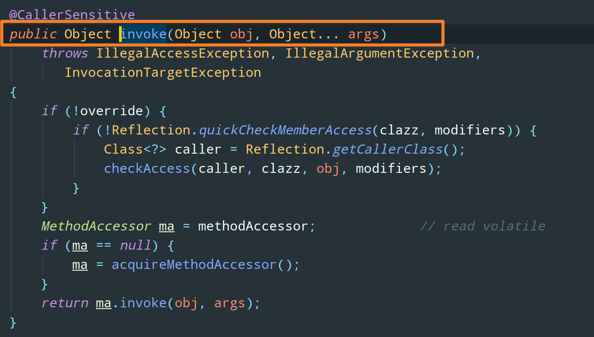
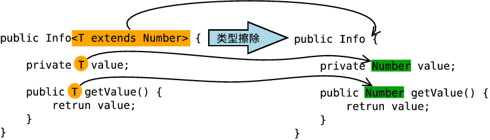
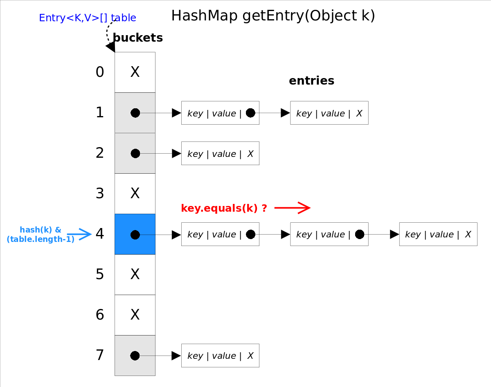
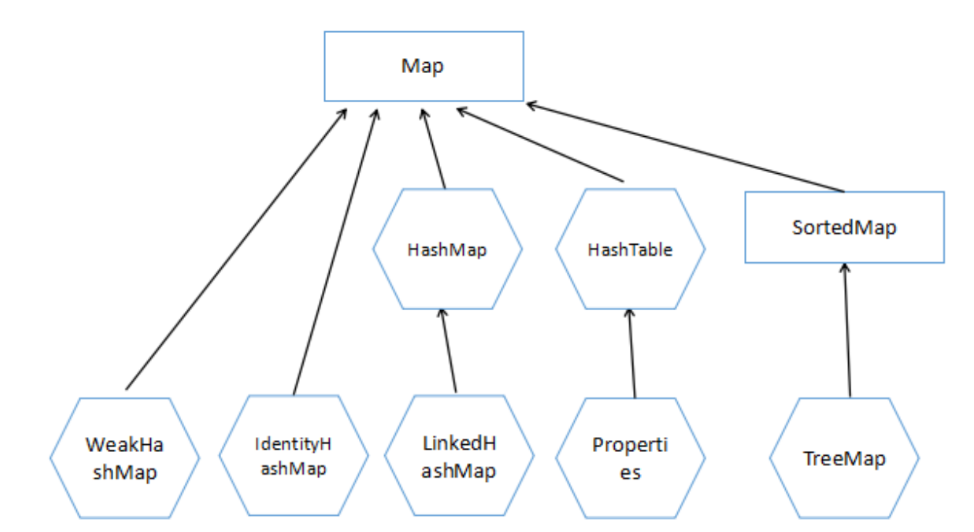

---

order: 1
author: zhiyu1998
title: Java基础
category:
  - Java基础
  - 八股文
---

## 🍂 常见八股文精选集

该模块的所有知识内容整理自

1. 吴师兄的1000道Java 程序员必备面试题
2. JavaGuide
3. 小林coding
4. Java 全栈知识体系
5. Java八股文

选取理由：本着查缺补漏的木桶原理，只选取高频（⭐️、🌠、🌟、✨、💫、🎇、🔥）和不会的，方便面试突袭

## ☕️ Java基础

### Java 8的接⼝新增了哪些特性？

- **Lambda 表达式** − Lambda允许把函数作为一个方法的参数（函数作为参数传递进方法中)。
- **方法引用** − 方法引用提供了非常有用的语法，可以直接引用已有Java类或对象（实例）的方法或构造器。与lambda联合使用，方法引用可以使语言的构造更紧凑简洁，减少冗余代码。
- **默认方法** − 默认方法就是一个在接口里面有了一个实现的方法。
- **新工具** − 新的编译工具，如：Nashorn引擎 jjs、 类依赖分析器jdeps。
- **Stream API** −新添加的Stream API（java.util.stream） 把真正的函数式编程风格引入到Java中。
- **Date Time API** − 加强对日期与时间的处理。
- **Optional 类** − Optional 类已经成为 Java 8 类库的一部分，用来解决空指针异常。
- **Nashorn, JavaScript 引擎** − Java 8提供了一个新的Nashorn javascript引擎，它允许我们在JVM上运行特定的javascript应用。

### 重载和重写的区别？

发生在同一个类中，方法名必须相同，参数类型不同、个数不同、顺序不同，方法返回值和访问
修饰符可以不同。
下面是《Java 核心技术》对重载这个概念的介绍：

综上：重载就是同一个类中多个同名方法根据不同的传参来执行不同的逻辑处理。
重写：
重写发生在运行期，是子类对父类的允许访问的方法的实现过程进行重新编写。

1. 返回值类型、方法名、参数列表必须相同，抛出的异常范围小于等于父类，访问修饰符范围
   大于等于父类。
2. 如果父类方法访问修饰符为 private/final/static 则子类就不能重写该方法，但是被 static 修饰
   的方法能够被再次声明。
3. 构造方法无法被重写
   综上：重写就是子类对父类方法的重新改造，外部样子不能改变，内部逻辑可以改变


### 内部类了解吗？

在Java中，可以将⼀个类的定义放在另外⼀个类的定义内部，这就是 内部类 。内部类本身就 是类的⼀
个属性，与其他属性定义⽅式⼀致。

内部类可以分为四种：

成员内部类：在一个类中直接定义的内部类，成员内部类与普通类的成员没什么区别，可以与普通成员一样进行修饰和限制。

```java
class Circle {
    double radius = 0;
   
    public Circle(double radius) {
        this.radius = radius;
    }
   
    class Draw {     //内部类
        public void drawSahpe() {
            System.out.println("drawshape");
        }
    }
}
```

局部内部类：在方法中定义的内部类称为局部内部类。与局部变量类似

```java
class People{
    public People() {
       
    }
}
 
class Man{
    public Man(){
       
    }
   
    public People getWoman(){
        class Woman extends People{   //局部内部类
            int age =0;
        }
        return new Woman();
    }
}
```

匿名内部类：匿名内部类就是没有名字的内部类

静态内部类（**嵌套类**）：如果你不需要内部类对象与其外围类对象之间有联系，那你可以将内部类声明为static

```java
public class Test {
    public static void main(String[] args)  {
        Outter.Inner inner = new Outter.Inner();
    }
}
 
class Outter {
    public Outter() {
       
    }
   
    static class Inner {
        public Inner() {
           
        }
    }
}
```

### HashSet 如何检查重复

思路整理：hashcode相同 -> equals() 不同-> hash再散列

1. 当你把对象加⼊HashSet时，HashSet会先计算对象的hashcode值来判断对象加⼊的位置，同时也会与其他已经加⼊的对象的hashcode值作⽐较
2. 如果没有相符的hashcode，HashSet会假设对象没有重复出现。但是**如果发现有相同hashcode值的对象，这时会调⽤equals()⽅法**来检查hashcode相等的对象是否真的相同
3. 如果两者相同，HashSet就不会让其加⼊操作成功。如果不同的话，就会重新散列到其他位置。这样我们就⼤⼤减少了equals的次数，相应就⼤⼤提⾼了执⾏速度。

### 构造⽅法有哪些特性？

* 名字与类名相同
* 没有返回值，但不能⽤void声明构造函数
* ⽣成类的对象时⾃动执⾏，⽆需调⽤

### final,static,this,super 关键字总结

#### static

**static 关键字主要有以下四种使用场景：**

1. **修饰成员变量和成员方法:** 被 static 修饰的成员属于类，不属于单个这个类的某个对象，被类中所有对象共享，可以并且建议通过类名调用。被 static 声明的成员变量属于静态成员变量，静态变量 存放在 Java 内存区域的方法区。调用格式：`类名.静态变量名` `类名.静态方法名()`
2. **静态代码块:** 静态代码块定义在类中方法外, 静态代码块在非静态代码块之前执行(静态代码块—>非静态代码块—>构造方法)。 该类不管创建多少对象，静态代码块只执行一次.
3. **静态内部类（static 修饰类的话只能修饰内部类）：** 静态内部类与非静态内部类之间存在一个最大的区别:  非静态内部类在编译完成之后会隐含地保存着一个引用，该引用是指向创建它的外围类，但是静态内部类却没有。没有这个引用就意味着：1.  它的创建是不需要依赖外围类的创建。2. 它不能使用任何外围类的非 static 成员变量和方法。
4. **静态导包(用来导入类中的静态资源，1.5 之后的新特性):** 格式为：`import static` 这两个关键字连用可以指定导入某个类中的指定静态资源，并且不需要使用类名调用类中静态成员，可以直接使用类中静态成员变量和成员方法。

#### final

**final 关键字，意思是最终的、不可修改的，最见不得变化 ，用来修饰类、方法和变量，具有以下特点：**

1. final 修饰的类不能被继承，final 类中的所有成员方法都会被隐式的指定为 final 方法；
2. final 修饰的方法不能被重写；
3. final 修饰的变量是常量，如果是基本数据类型的变量，则其数值一旦在初始化之后便不能更改；如果是引用类型的变量，则在对其初始化之后便不能让其指向另一个对象。

说明：使用 final 方法的原因有两个。第一个原因是把方法锁定，以防任何继承类修改它的含义；第二个原因是效率。在早期的 Java 实现版本中，会将  final 方法转为内嵌调用。但是如果方法过于庞大，可能看不到内嵌调用带来的任何性能提升（现在的 Java 版本已经不需要使用 final  方法进行这些优化了）。类中所有的 private 方法都隐式地指定为 final。

#### this

this 关键字用于引用类的当前实例。 例如：

```java
class Manager {
    Employees[] employees;
    void manageEmployees() {
        int totalEmp = this.employees.length;
        System.out.println("Total employees: " + totalEmp);
        this.report();
    }
    void report() { }
}
```

在上面的示例中，this 关键字用于两个地方：

- this.employees.length：访问类 Manager 的当前实例的变量。
- this.report（）：调用类 Manager 的当前实例的方法。

此关键字是可选的，这意味着如果上面的示例在不使用此关键字的情况下表现相同。 但是，使用此关键字可能会使代码更易读或易懂。

#### super 关键字

super 关键字用于从子类访问父类的变量和方法。 例如：

```java
public class Super {
    protected int number;
    protected showNumber() {
        System.out.println("number = " + number);
    }
}
public class Sub extends Super {
    void bar() {
        super.number = 10;
        super.showNumber();
    }
}
```

在上面的例子中，Sub 类访问父类成员变量 number 并调用其父类 Super 的 `showNumber（）` 方法。

**使用 this 和 super 要注意的问题：**

- 在构造器中使用 `super()` 调用父类中的其他构造方法时，该语句必须处于构造器的首行，否则编译器会报错。另外，this 调用本类中的其他构造方法时，也要放在首行。
- this、super 不能用在 static 方法中。

**简单解释一下：**

被 static 修饰的成员属于类，不属于单个这个类的某个对象，被类中所有对象共享。而 this 代表对本类对象的引用，指向本类对象；而 super 代表对父类对象的引用，指向父类对象；所以， **this 和 super 是属于对象范畴的东西，而静态方法是属于类范畴的东西**。

### this与super的区别

* super:它引⽤当前对象的直接⽗类中的成员（⽤来访问直接⽗类中被隐藏的⽗类中成员数据或函数，基类与派⽣类中有相同成员定义时如：super.变量名super.成员函数据名（实参）
* this：它代表当前对象名（在程序中易产⽣⼆义性之处，应使⽤this来指明当前对象；如果函数的形参与类中的成员数据同名，这时需⽤this来指明成员变量名）
* 👻super()和this()类似，区别是：super()在⼦类中调⽤⽗类的构造⽅法，this()在本类内调⽤本类的其它构造⽅法。
* 👻super()和this()均需放在构造⽅法内第⼀⾏。
* 👻this和super不能同时出现在⼀个构造函数⾥⾯，因为this必然会调⽤其它的构造函数，其它的构造函数必然也会有super语句的存在，所以在同⼀个构造函数⾥⾯有相同的语句，就失去了语句的意义，编译器也不会通过。
* this()和super()都指的是对象，所以，均不可以在static环境中使⽤。包括：static变量,static⽅法，static语句块。
* 👻从本质上讲，this是⼀个指向本对象的指针,然⽽super是⼀个Java关键字。

### 静态代理和动态代理

#### 概述

代理模式就是 **使用代理对象来代替对真实对象的访问，这样就可以在不修改原目标对象的前提下，提供额外的功能操作，扩展目标对象的功能。**

代理模式大致有三种角色：

- Real Subject：真实类，也就是被代理类、委托类。用来真正完成业务服务功能；
- Proxy：代理类。将自身的请求用 Real Subject 对应的功能来实现，代理类对象并不真正的去实现其业务功能；
- Subject：定义 RealSubject 和 Proxy 角色都应该实现的接口。


通俗来说，**代理模式的主要作用是扩展目标对象的功能，比如说在目标对象的某个方法执行前后你可以增加一些额外的操作，并且不用修改这个方法的原有代码**。如果大家学过 Spring 的 AOP，一定能够很好的理解这句话。

举个例子：你找了小红来帮你向小绿问话，小红就看作是代理我的代理类 Proxy，而你是 Real Subject，因为小红要传达的话其实是你说的。那么你和小红都需要实现的接口（Subject）就是说话，由于你俩都能说话，在外界看来你俩就是一样的


看到这里，不知道大家能不能理解了为什么委托类和代理类都需要实现相同的接口？

那是为了保持行为的一致性，在访问者看来两者之间就没有区别。这样，通过代理类这个中间层，很好地隐藏和保护了委托类对象，能**有效屏蔽外界对委托类对象的直接访问**。同时，也可以在代理类上加上额外的操作，比如**小红在说话之前会跳一段舞，外界就会觉得你在说话前会跳一段舞，所以，这就实现了委托类的功能增强**。

代理模式有静态代理和动态代理两种实现方式。

#### 静态代理

先来看静态代理的实现步骤：

1）定义一个接口（Subject）

2）创建一个委托类（Real Subject）实现这个接口

3）创建一个代理类（Proxy）同样实现这个接口

4）**将委托类 Real Subject 注入进代理类 Proxy**，在代理类的方法中调用 Real Subject 中的对应方法。这样的话，我们就可以通过代理类屏蔽对目标对象的访问，并且可以在目标方法执行前后做一些自己想做的事情。

从实现和应用角度来说，静态代理中，我们对目标对象的每个方法的增强都是手动完成的，非常不灵活（比如接口一旦新增加方法，目标对象和代理对象都要进行修改）且麻烦（需要对每个目标类都单独写一个代理类）。 实际应用场景非常非常少，日常开发几乎看不到使用静态代理的场景。

从 JVM 层面来说， **静态代理在编译时就将接口、委托类、代理类这些都变成了一个个实际的 `.class` 文件。**

1）定义发送短信的接口

```java
public interface SmsService {
    String send(String message);
}
```

2）创建一个委托类（Real Subject）实现这个接口

```java
public class SmsServiceImpl implements SmsService {
    public String send(String message) {
        System.out.println("send message:" + message);
        return message;
    }
}
```

3）创建一个代理类（Proxy）同样实现这个接口

4）将委托类 Real Subject 注入进代理类 Proxy，在代理类的方法中调用 Real Subject 中的对应方法。这样的话，我们就可以通过代理类屏蔽对目标对象的访问，并且可以在目标方法执行前后做一些自己想做的事情。

```java
public class SmsProxy implements SmsService {

    // 将委托类注入进代理类
    private final SmsService smsService;

    public SmsProxy(SmsService smsService) {
        this.smsService = smsService;
    }

    @Override
    public String send(String message) {
        // 调用委托类方法之前，我们可以添加自己的操作
        System.out.println("before method send()");
        // 调用委托类方法
        smsService.send(message); 
        // 调用委托类方法之后，我们同样可以添加自己的操作
        System.out.println("after method send()");
        return null;
    }
}
```

那么，如何使用这个被增强的 `send` 方法呢？

```java
public class Main {
    public static void main(String[] args) {
        SmsService smsService = new SmsServiceImpl();
        SmsProxy smsProxy = new SmsProxy(smsService);
        smsProxy.send("Java");
    }
}
```

运行上述代码之后，控制台打印出：

```bash
before method send()
send message:java
after method send()
```

从输出结果可以看出，我们已经增强了委托类 `SmsServiceImpl`  的 `send()` 方法。

当然，从上述代码我们也能看出来，静态代理存在一定的弊端。假如说我们现在新增了一个委托类实现了 `SmsService` 接口，如果我们想要对这个委托类进行增强，就需要重新写一个代理类，然后注入这个新的委托类，非常不灵活。也就是说静态代理是一个委托了对应一个代理类，能不能**将代理类做成一个通用的**呢？为此，动态代理应用而生。


#### Java 字节码生成框架

在讲解动态之前，我们有必要详细说一下 `.class` 字节码文件这个东西。动态代理机制和 Java 字节码生成框架息息相关。

在上文反射中我们提到，一个 `Class` 类对应一个 `.class` 字节码文件，也就说字节码文件中存储了一个类的全部信息。字节码其实是二进制文件，内容是只有 JVM 能够识别的机器码。

解析过程这样的：JVM 读取 `.class` 字节码文件，取出二进制数据，加载到内存中，解析字节码文件内的信息，生成对应的 `Class` 类对象：


显然，上述这个过程是在编译期就发生的。

那么，由于JVM 是通过 `.class` 字节码文件（也就是二进制信息）加载类的，如果我们在运行期遵循 Java 编译系统组织 `.class` 字节码文件的格式和结构，生成相应的二进制数据，然后再把这个二进制数据加载转换成对应的类。这样，我们不就完成了在运行时动态的创建一个类。这个思想其实也就是动态代理的思想。


在运行时期按照 JVM 规范对 `.class` 字节码文件的组织规则，生成对应的二进制数据。当前有很多开源框架可以完成这个功能，如

- ASM
- CGLIB
- Javassist
- ......

需要注意的是，**CGLIB 是基于 ASM 的**。 这里简单对比一下 ASM 和 Javassist：

- Javassist 源代码级 API 比 ASM 中实际的字节码操作更容易使用
- Javassist 在复杂的字节码级操作上提供了更高级别的抽象层。Javassist 源代码级 API 只需要很少的字节码知识，甚至不需要任何实际字节码知识，因此实现起来更容易、更快。
- Javassist 使用反射机制，这使得它比 ASM 慢。

**总的来说 ASM 比 Javassist 快得多，并且提供了更好的性能，但是 Javassist 相对来说更容易使用**，两者各有千秋。

以 Javassist 为例，我们来看看这些框架在运行时生成 `.class` 字节码文件的强大能力。

正常来说，我们创建一个类的代码是这样的：

```java
package com.samples;

public class Programmer {
    public void code(){
        System.out.println("I'm a Programmer,Just Coding.....");
    }
}
```

下面通过 Javassist 创建和上面一模一样的 `Programmer` 类的字节码：

```java
import javassist.ClassPool;
import javassist.CtClass;
import javassist.CtMethod;
import javassist.CtNewMethod;

public class MyGenerator {
    public static void main(String[] args) throws Exception {
        ClassPool pool = ClassPool.getDefault();
          // 创建 Programmer 类        
        CtClass cc= pool.makeClass("com.samples.Programmer");
        // 定义方法
        CtMethod method = CtNewMethod.make("public void code(){}", cc);
        // 插入方法代码
        method.insertBefore("System.out.println(\"I'm a Programmer,Just Coding.....\");");
        cc.addMethod(method);
        // 保存生成的字节码
        cc.writeFile("d://temp");
    }
}
```

通过反编译工具打开 `Programmer.class` 可以看到以下代码：


#### 动态代理

了解了 Java 字节码生成框架，可以开始学习动态代理（Dynamic Proxy）了。

回顾一下静态代理，我们把静态代理的执行过程抽象为下图：


可以看见，代理类无非是在调用委托类方法的前后增加了一些操作。委托类的不同，也就导致代理类的不同。

那么为了做一个通用性的代理类出来，我们把调用委托类方法的这个动作抽取出来，把它封装成一个通用性的处理类，于是就有了动态代理中的 `InvocationHandler` 角色（处理类）。

于是，在代理类和委托类之间就多了一个处理类的角色，这个角色主要是**对代理类调用委托类方法的这个动作进行统一的调用**，也就是由 `InvocationHandler` 来统一处理代理类调用委托类方法这个操作。看下图：


**从 JVM 角度来说，动态代理是在运行时动态生成 `.class` 字节码文件 ，并加载到 JVM 中的**。这个我们在 Java 字节码生成框架中已经提到过。

虽然动态代理在我们日常开发中使用的相对较少，但是在框架中的几乎是必用的一门技术。学会了动态代理之后，对于我们理解和学习各种框架的原理也非常有帮助，**Spring AOP、RPC 等框架的实现都依赖了动态代理**。

就 Java 来说，动态代理的实现方式有很多种，比如：

- JDK 动态代理
- CGLIB 动态代理
- Javassit 动态代理
- ......

下面详细讲解这三种动态代理机制。

#### JDK 动态代理机制

先来看下 JDK 动态代理机制的使用步骤：

1）定义一个接口（Subject）

2）创建一个委托类（Real Subject）实现这个接口

3）创建一个处理类并实现 `InvocationHandler` 接口，重写其 `invoke` 方法（在 `invoke` 方法中利用反射机制调用委托类的方法，并自定义一些处理逻辑），并将委托类注入处理类


该方法有下面三个参数：

- proxy：代理类对象（见下一步）
- method：还记得我们在上篇文章反射中讲到的 `Method.invoke` 吗？就是这个，我们可以通过它来调用委托类的方法（反射）



- args：传给委托类方法的参数列表

4）创建代理对象（Proxy）：通过 `Proxy.newProxyInstance()` 创建委托类对象的代理对象


这个方法需要 3 个参数：

- 类加载器 ClassLoader
- 委托类实现的接口数组，至少需要传入一个接口进去
- 调用的 `InvocationHandler` 实例处理接口方法（也就是第 3 步我们创建的类的实例）

也就是说：我们在通过 `Proxy` 类的 `newProxyInstance()` 创建的代理对象在调用方法的时候，实际会调用到实现了 `InvocationHandler` 接口的处理类的 `invoke()`方法，可以在 `invoke()` 方法中自定义处理逻辑，比如在方法执行前后做什么事情。


1）定义一个接口（Subject）

```java
public interface SmsService {
    String send(String message);
}
```

2）创建一个委托类（Real Subject）实现这个接口

```java
public class SmsServiceImpl implements SmsService {
    public String send(String message) {
        System.out.println("send message:" + message);
        return message;
    }
}
```

3）创建一个处理类，并将委托类注入处理类，另外，这个处理类需要实现 `InvocationHandler` 接口，重写其 `invoke` 方法（在 `invoke` 方法中利用反射机制调用委托类的方法，并自定义一些处理逻辑）

```java
import java.lang.reflect.InvocationHandler;
import java.lang.reflect.InvocationTargetException;
import java.lang.reflect.Method;

public class DebugInvocationHandler implements InvocationHandler {

    // 将委托类注入处理类（这里我们用 Object 代替，方便扩展）
    private final Object target;

    public DebugInvocationHandler(Object target) {
        this.target = target;
    }

    // 重写 invoke 方法
    @Override
    public Object invoke(Object proxy, Method method, Object[] args) throws InvocationTargetException, IllegalAccessException {
        //调用方法之前，我们可以添加自己的操作
        System.out.println("before method " + method.getName());
        Object result = method.invoke(target, args);
        //调用方法之后，我们同样可以添加自己的操作
        System.out.println("after method " + method.getName());
        return result;
    }
}
```

4）定义一个创建代理对象（Proxy）的工厂类：通过 `Proxy.newProxyInstance()` 创建委托类对象的代理对象

```java
public class JdkProxyFactory {
    public static Object getProxy(Object target) {
        return Proxy.newProxyInstance(
                target.getClass().getClassLoader(),
                target.getClass().getInterfaces(),
                new DebugInvocationHandler(target)
        );
    }
}
```

5）实际使用

```java
SmsService smsService = (SmsService) JdkProxyFactory.getProxy(new SmsServiceImpl());
smsService.send("Java");
```

运行上述代码之后，控制台打印出：

```text
before method send
send message:Java
after method send
```

#### CGLIB 动态代理机制

**JDK 动态代理有一个最致命的问题是它只能代理实现了某个接口的实现类，并且代理类也只能代理接口中实现的方法，要是实现类中有自己私有的方法，而接口中没有的话，该方法不能进行代理调用**。

为了解决这个问题，我们可以用 CGLIB 动态代理机制。

上文也提到过，CGLIB（Code Generation Library）是一个基于 ASM 的 Java 字节码生成框架，它允许我们在运行时对字节码进行修改和动态生成。原理就是**通过字节码技术生成一个子类，并在子类中拦截父类方法的调用，织入额外的业务逻辑**。关键词大家注意到没有，拦截！CGLIB 引入一个新的角色就是**方法拦截器** `MethodInterceptor`。和 JDK 中的处理类 `InvocationHandler` 差不多，也是用来实现方法的统一调用的。看下图：


另外由于 CGLIB 采用**继承**的方式，所以被代理的类不能被 `final` 修饰。

很多知名的开源框架都使用到了 CGLIB， 例如 **Spring 中的 AOP 模块中：如果目标对象实现了接口，则默认采用 JDK 动态代理，否则采用 CGLIB 动态代理**。

来看 CGLIB 动态代理的使用步骤：

1）首先创建一个委托类（Real Subject）

2）创建一个方法拦截器实现接口 `MethodInterceptor`，并重写 `intercept` 方法。`intercept` 用于拦截并增强委托类的方法（和 JDK 动态代理 `InvocationHandler` 中的 `invoke` 方法类似）


该方法拥有四个参数：

- Object var1：委托类对象
- Method var2：被拦截的方法（委托类中需要增强的方法）
- Object[] var3：方法入参
- MethodProxy var4：用于调用委托类的原始方法（底层也是通过反射机制，不过不是 `Method.invoke` 了，而是使用 `MethodProxy.invokeSuper` 方法）


3）创建代理对象（Proxy）：通过 `Enhancer.create()` 创建委托类对象的代理对象


也就是说：我们在通过 `Enhancer` 类的 `create()` 创建的代理对象在调用方法的时候，实际会调用到实现了 `MethodInterceptor` 接口的处理类的 `intercept()`方法，可以在 `intercept()` 方法中自定义处理逻辑，比如在方法执行前后做什么事情。

> 可以发现，CGLIB 动态代理机制和 JDK 动态代理机制的步骤差不多，CGLIB 动态代理的核心是方法拦截器 `MethodInterceptor` 和 `Enhancer`，而 JDK 动态代理的核心是处理类 `InvocationHandler` 和 `Proxy`。

不同于 JDK 动态代理不需要额外的依赖。CGLIB 是一个开源项目，如果你要使用它的话，需要手动添加相关依赖。

```xml
<dependency>
  <groupId>cglib</groupId>
  <artifactId>cglib</artifactId>
  <version>3.3.0</version>
</dependency>
```

1）首先创建一个委托类（Real Subject）

```java
public class AliSmsService {
    public String send(String message) {
        System.out.println("send message:" + message);
        return message;
    }
}
```

2）创建一个方法拦截器实现接口 `MethodInterceptor`，并重写 `intercept` 方法

```java
import net.sf.cglib.proxy.MethodInterceptor;
import net.sf.cglib.proxy.MethodProxy;
import java.lang.reflect.Method;

public class DebugMethodInterceptor implements MethodInterceptor {

    @Override
    public Object intercept(Object o, Method method, Object[] args, MethodProxy methodProxy) throws Throwable {
        // 调用方法之前，我们可以添加自己的操作
        System.out.println("before method " + method.getName());
        // 通过反射调用委托类的方法
        Object object = methodProxy.invokeSuper(o, args);
        // 调用方法之后，我们同样可以添加自己的操作
        System.out.println("after method " + method.getName());
        return object;
    }

}
```

3）创建代理对象（Proxy）：通过 `Enhancer.create()` 创建委托类对象的代理对象

```java
import net.sf.cglib.proxy.Enhancer;

public class CglibProxyFactory {
    public static Object getProxy(Class<?> clazz) {
        // 创建动态代理增强类
        Enhancer enhancer = new Enhancer();
        // 设置类加载器
        enhancer.setClassLoader(clazz.getClassLoader());
        // 设置委托类（设置父类）
        enhancer.setSuperclass(clazz);
        // 设置方法拦截器
        enhancer.setCallback(new DebugMethodInterceptor());
        // 创建代理类
        return enhancer.create();
    }
}
```

> 从 `setSuperclass` 我们就能看出，为什么说 CGLIB 是基于继承的。

4）实际使用

```java
AliSmsService aliSmsService = 
    (AliSmsService) CglibProxyFactory.getProxy(AliSmsService.class);
aliSmsService.send("Java");
```

运行上述代码之后，控制台打印出：

```bash
before method send
send message:Java
after method send
```

#### JDK 动态代理和 CGLIB 动态代理对比

1）JDK 动态代理是基于实现了接口的委托类，通过接口实现代理；而 CGLIB 动态代理是基于继承了委托类的子类，通过子类实现代理。

2）JDK 动态代理只能代理实现了接口的类，且只能增强接口中现有的方法；而 CGLIB 可以代理未实现任何接口的类。

3）就二者的效率来说，大部分情况都是 JDK 动态代理的效率更高，随着 JDK 版本的升级，这个优势更加明显。

> 提一嘴，常见的还有 **Javassist 动态代理机制**。和 CGLIB 一样，作为一个 Java 字节码生成框架，Javassist 天生就拥有在运行时动态创建一个类的能力，实现动态代理自然不在话下。 Dubbo 就是默认使用 Javassit 来进行动态代理的。

#### 静态代理和动态代理对比

1. **灵活性** ：动态代理更加灵活，不需要必须实现接口，可以直接代理实现类，并且可以不需要针对每个目标类都创建一个代理类。另外，静态代理中，接口一旦新增加方法，目标对象和代理对象都要进行修改，这是非常麻烦的
2. **JVM 层面** ：静态代理在编译时就将接口、实现类、代理类这些都变成了一个个实际的 `.class` 字节码文件。而动态代理是在运行时动态生成类字节码，并加载到 JVM 中的。

#### 什么情况下使用动态代理

1. 设计模式中有一个设计原则是**开闭原则**，即**对修改关闭，对扩展开放**，我们在工作中有时会接手很多前人的代码，里面代码逻辑让人摸不着头脑，就很难去下手修改代码，那么这时我们就可以通过代理对类进行增强。
2. 我们在使用 **RPC 框架**的时候，框架本身并不能提前知道各个业务方要调用哪些接口的哪些方法 。那么这个时候，就可用通过动态代理的方式来建立一个中间人给客户端使用，也方便框架进行搭建逻辑，某种程度上也是客户端代码和框架松耦合的一种表现。
3. **Spring 的 AOP** 机制同样也是采用了动态代理，此处不做详细讨论。

#### 总结

全部捋一遍下来还是收获蛮多的，我感觉只要理解了字节码在编译期生成还是在运行期生成，就差不多能够把握住静态代理和动态代理了。总结一下静态代理和动态代理中的角色：

静态代理：

- Subject：公共接口
- Real Subject：委托类
- Proxy：代理类

JDK 动态代理：

- Subject：公共接口
- Real Subject：委托类
- Proxy：代理类
- **InvocationHandler**：处理类，统一调用方法

CGLIB 动态代理：

- Subject：公共接口
- Real Subject：委托类
- Proxy：代理类
- **MethodInterceptor**：方法拦截器，统一调用方法


### static{}静态代码块与{}非静态代码块(构造代码块)

**相同点**： 都是在 JVM 加载类时且在构造方法执行之前执行，在类中都可以定义多个，定义多个时按定义的顺序执行，一般在代码块中对一些 static 变量进行赋值。

**不同点**： 静态代码块在非静态代码块之前执行(静态代码块 -> 非静态代码块 -> 构造方法)。静态代码块只在第一次 new  执行一次，之后不再执行，而非静态代码块在每 new 一次就执行一次。 非静态代码块可在普通方法中定义(不过作用不大)；而静态代码块不行。

> 🐛 **修正**：静态代码块可能在第一次 new 对象的时候执行，但不一定只在第一次 new 的时候执行。比如通过 `Class.forName("ClassDemo")`创建 Class 对象的时候也会执行，即 new 或者 `Class.forName("ClassDemo")` 都会执行静态代码块。 一般情况下,如果有些代码比如一些项目最常用的变量或对象必须在项目启动的时候就执行的时候,需要使用静态代码块,这种代码是主动执行的。如果我们想要设计不需要创建对象就可以调用类中的方法，例如：`Arrays` 类，`Character` 类，`String` 类等，就需要使用静态方法, 两者的区别是 静态代码块是自动执行的而静态方法是被调用的时候才执行的.

Example：

```java
public class Test {
    public Test() {
        System.out.print("默认构造方法！--");
    }
    //非静态代码块
    {
        System.out.print("非静态代码块！--");
    }
    //静态代码块
    static {
        System.out.print("静态代码块！--");
    }
    private static void test() {
        System.out.print("静态方法中的内容! --");
        {
            System.out.print("静态方法中的代码块！--");
        }
    }
    public static void main(String[] args) {
        Test test = new Test();
        Test.test();//静态代码块！--静态方法中的内容! --静态方法中的代码块！--
    }
}
```

上述代码输出：

```text
静态代码块！--非静态代码块！--默认构造方法！--静态方法中的内容! --静态方法中的代码块！--
```

当只执行 `Test.test();` 时输出：

```text
静态代码块！--静态方法中的内容! --静态方法中的代码块！--
```

当只执行 `Test test = new Test();` 时输出：

```text
静态代码块！--非静态代码块！--默认构造方法！--
```

非静态代码块与构造函数的区别是：  非静态代码块是给所有对象进行统一初始化，而构造函数是给对应的对象初始化，因为构造函数是可以多个的，运行哪个构造函数就会建立什么样的对象，但无论建立哪个对象，都会先执行相同的构造代码块。也就是说，构造代码块中定义的是不同对象共性的初始化内容。

### char型变量中能否能不能存储⼀个中⽂汉字，为什么？

char可以存储⼀个中⽂汉字，因为Java中使⽤的编码是Unicode(不选择任何特定的编码，直接使⽤字符在字符集中的编号，这是统⼀的唯⼀⽅法），⼀个char类型占2个字节（16⽐特），所以放⼀个中⽂是没问题的。

### 是否可以继承String类？

String类是final类，不可以被继承。

补充：继承String本身就是⼀个错误的⾏为，对String类型最好的重⽤⽅式是关联关系（Has-A）和依赖关系（Use-A）⽽不是继承关系（Is-A）。

### 谈谈你对多态的理解？

多态分为编译时多态和运行时多态:

- 编译时多态主要指方法的重载
- 运行时多态指程序中定义的对象引用所指向的具体类型在运行期间才确定

运行时多态有三个条件:

- 继承
- 覆盖(重写)
- 向上转型

下面的代码中，乐器类(Instrument)有两个子类: Wind 和 Percussion，它们都覆盖了父类的 play() 方法，并且在 main() 方法中使用父类 Instrument 来引用 Wind 和 Percussion 对象。在 Instrument 引用调用 play() 方法时，会执行实际引用对象所在类的 play() 方法，而不是 Instrument 类的方法。

```java
public class Instrument {
    public void play() {
        System.out.println("Instrument is playing...");
    }
}

public class Wind extends Instrument {
    public void play() {
        System.out.println("Wind is playing...");
    }
}

public class Percussion extends Instrument {
    public void play() {
        System.out.println("Percussion is playing...");
    }
}

public class Music {
    public static void main(String[] args) {
        List<Instrument> instruments = new ArrayList<>();
        instruments.add(new Wind());
        instruments.add(new Percussion());
        for(Instrument instrument : instruments) {
            instrument.play();
        }
    }
}
```

> 详细

多态的概念并不难，并且在实际编码中可以说是最最高频使用率。多态就是**使得同一个行为具有多个不同表现形式或形态的能力**。举个形象点的例子：对于 “打印” 这个行为，使用彩色打印机 “打印” 出来的效果就是彩色的，而使用黑白打印机 “打印” 出来的效果就是黑白的。我们就称 “打印” 这个行为是多态的，彩色打印效果和黑白打印效果就是 “打印” 这个行为的两个不同的表现形式。


还可以这样理解，**同一个行为在不同的对象上会产生不同的结果**。再举个形象点的例子：比如我们按下 F1 键这个行为：如果当前在 Word 下弹出的就是 Word 帮助和支持；在 Windows 下弹出的就是 Windows 帮助和支持。

#### 多态发生的三个必要条件

先看下面这段代码，首先，我们有一个基类 `Shape`，三个子类，并且都重写了基类的 `draw` 方法：

```java
class Shape {
    void draw() {}
}
 
class Circle extends Shape {
    void draw() {
        System.out.println("Circle.draw()");
    }
}
 
class Square extends Shape {
    void draw() {
        System.out.println("Square.draw()");
    }
}
 
class Triangle extends Shape {
    void draw() {
        System.out.println("Triangle.draw()");
    }
}
```

下面这几行代码就充分体现了多态性：

```java
Shape circle = new Circle();
Shape square = new Square();
Shape triangle = new Triangle();
```

大家应该不会太陌生，就是**向上转型**，没错，它就是多态的体现。同样的一个 draw 方法，在这三个不同的对象上产生了三种不同的行为，多态在此体现的淋漓尽致。

这里需要注意的是，当使用多态方式调用方法时，编译器会首先检查父类中是否有该方法，如果没有，则编译错误；如果父类中有该方法，并且被子类重写，就会调用子类的这个方法；如果父类的方法没有被子类重写，就会调用父类的方法。

```java
Shape circle = new Circle();
circle.draw(); // 调用的是 Circle 的 eat
```

简单来说：**当父类引用变量指向子类对象后（多态），只能使用父类已声明的方法，但方法如果被重写会执行子类的方法，如果方法未被重写那么将执行父类的方法**。

结合上述这段简单的代码，我们总结一下多态产生的必要条件：

- 1）继承
- 2）重写
- 3）父类引用指向子类对象：`Parent p = new Child();`


#### 多态是如何发生的

❓ 那么，多态到底是如何发生的？编译器是如何知道父类 Shape 引用指向的是 Circle 而不是 Triangle 或 Square 呢？

首先，我们需要了解静态绑定和动态绑定的概念。什么是**绑定**？将一个方法调用同一个方法主体关联起来的过程就称作绑定。

若绑定发生在程序运行前，叫做**静态绑定**，也称**前期绑定**。你可能从来没有听说这个术语，因为它是**面向过程**语言不需选择默认的绑定方式，例如在 C 语言中就只有前期绑定这一种方法调用。

那么对于这段代码：

```java
Shape circle = new Circle();
Shape square = new Square();
circle.draw(); 
```

Shape 即引用类型在编译期可知，不会被改变，而 Circle 作为实例对象类型在运行期才可知，可能会发生变化。所以如果使用前期绑定，在运行之前，编译器只知道有一个 Shape 引用，它无法得知究竟会调用哪个方法。

解决方法就是**动态绑定** Dynamic Binding，在运行时根据对象的类型自动的进行绑定，所以动态绑定也称**运行时绑定**。动态绑定是多态的基础。

注意：Java 中除了 `static`和 `final`方法（`private`方法属于 `final`方法）之外，其他所有方法都是动态绑定。这意味着通常情况下，我们不需要判断动态绑定是否会发生，它是自动发生的。

> `final` 和 `static` 关键字后续会单独出文章讲解，此处就笼统的概述一下为什么这两个关键字修饰的方法是静态绑定的：
>
> - `final` 不允许方法重写，而多态发生的条件之一就是重写，所以 `final` 方法会在编译期间就进行绑定，即静态绑定
> - `static` 方法是类直接拥有的的，与该类的任何一个对象都无关（该类的所有对象共同维护），所以也是静态绑定

#### 重载和重写

重载和重写在之前的文章中都说过了，此处正好借着多态这个主题将这两个容易混淆的概念总结一波。

方法的**重写 Overriding** 和**重载 Overloading** 都是是 Java 多态性的表现。

🔸 1）**方法重写是父类与子类之间多态性的表现**。其子类和父类方法的名字相同，参数个数相同，返回类型也相同，并且子类的访问权限不能比父类的严格，比如父类是 public，那么子类也只能是 public，不能比 public 更严格。也就是说，**方法重写，只有方法体是不一样的，访问权限可以有限制的修改**。

```java
class Shape {
    public void draw() {}
}
 
class Circle extends Shape {
    public void draw() {
        System.out.println("Circle.draw()");
    }
}
```

🚨 其实，上面说的返回类型完全相同并不严格正确。下面我们来解释一下。

首先，我们需要知道**方法的名字和参数列表称为方法的签名**。例如，`draw()`  和  `draw(String)` 是两个具有相同名字， 不同签名的方法。如果在子类中定义了一个与超类签名相同的方法， 那么子类中的这个方法就覆盖/重写了超类中的这个相同签名的方法。

不过，**返回类型不是签名的一部分**， 因此，在覆盖/重写方法时， 一定要保证返回类的兼容性。 **允许子类将覆盖方法的返回类型定义为原返回类型的子类型**。

例如， 假设 `Shape` 类有

```java
class Shape {
    public Shape draw() {
    	......
    }
}
```

在后面的子类 `Circle` 中， 可以按照如下所示的方式覆盖这个方法

```java
class Circle extends Shape {
    public Circle draw() {
        ......
    }
}
```

用专业术语来说，这两个 `draw` 方法具有**可协变的返回类型**。

🔸 2）方法重载并非多态的必要条件，不过可以理解成**某个类的多态性的表现**。所谓方法重载，就是一个类中定义了多个方法名相同，但是参数的数量或者类型不同。方法的返回类型和访问权限可以任意修改，不以它俩作为方法重载的标志。

```java
class Circle extends Shape {
    public void draw() {
        System.out.println("Circle.draw()");
    }
  
    public void draw(int i) {
        System.out.println("Circle.draw()" + i);
    }
}
```


总结一下方法重载和重写：

|            | 方法重载 |                      方法重写                      |
| :--------: | :------: | :------------------------------------------------: |
|   方法名   |   相同   |                        相同                        |
|  参数列表  | 必须不同 |                      必须相同                      |
|  返回类型  | 可以不同 | 子类方法的返回类型可以是原父类方法返回类型的子类型 |
| 访问修饰符 | 可以不同 |       子类不能做更严格的限制（可以降低限制）       |

#### main 方法是否可以重载

IBM 早些年出过这方面的题，考倒了一片人。首先，答案是肯定的，main 既然作为一个方法，那它当然可以被重载。

但是，**如果是作为程序的入口，那么 main 函数只有一种写法，Java 虚拟机在运行的时候只会调用带有参数是 String 数组的那个 `main()` 方法**，而其他重载的写法虚拟机是不认的，只能人为的调用。

举个例子：

```java
class Test {
	public static void main(String[] args) {
		main(1);
	}
	public static void main(int i) {
		System.out.println("重载的 main 方法");
	}
}
```

该程序运行结果如下：

```text
重载的 main 方法
```

可以看出第一个 main 方法正常调用了重载的第二个 main 方法，即 main 方法能够被完美重载。但是程序的入口仍然是第一个 main 方法即参数为 String 数组。


### 构造器（constructor）是否可被重写（override）？

构造器不能被继承，因此不能被重写，但可以被重载

### Java 中操作字符串都有哪些类？它们之间有什么区别？

操作字符串的类有：**String、StringBuffer、StringBuilder**。

第一点: 可变和适用范围。String对象是不可变的，而StringBuffer和StringBuilder是可变字符序列。每次对String的操作相当于生成一个新的String对象，而对StringBuffer和StringBuilder的操作是对对象本身的操作，而不会生成新的对象，所以对于频繁改变内容的字符串避免使用String，因为频繁的生成对象将会对系统性能产生影响。

第二点: 线程安全。String由于有final修饰，是immutable的，安全性是简单而纯粹的。StringBuilder和StringBuffer的区别在于StringBuilder不保证同步，也就是说如果需要线程安全需要使用StringBuffer，不需要同步的StringBuilder效率更高

|               | 可变性 | 线程安全                                                     |
| :-----------: | :----: | ------------------------------------------------------------ |
|    String     | 不可变 | 因为不可变，所以是线程安全的                                 |
| StringBuffer  |  可变  | 线程安全的，因为其内部大多数方法都使用 `synchronized`进行同步。其效率较低 |
| StringBuilder |  可变  | 不是线程安全的，因为没有使用 `synchronized`进行同步，这也是其效率高于 StringBuffer  的原因。单线程下，优先考虑使用 StringBuilder。 |

### String str = "i" 和String str = new String("1")⼀样吗？

不⼀样，因为内存的分配⽅式不⼀样。String str="i"的⽅式，JVM会将其分配到常量池中；⽽String str=new String("i")，JVM会将其分配到堆内存中。

### 什么是序列化反序列化?

如果我们需要持久化 Java 对象比如将 Java 对象保存在文件中，或者在网络传输 Java 对象，这些场景都需要用到序列化。

简单来说：

- **序列化**： 将数据结构或对象转换成二进制字节流的过程
- **反序列化**：将在序列化过程中所生成的二进制字节流转换成数据结构或者对象的过程

对于 Java 这种面向对象编程语言来说，我们序列化的都是对象（Object）也就是实例化后的类(Class)，但是在 C++这种半面向对象的语言中，struct(结构体)定义的是数据结构类型，而 class 对应的是对象类型。

维基百科是如是介绍序列化的：

> **序列化**（serialization）在计算机科学的数据处理中，是指将数据结构或对象状态转换成可取用格式（例如存成文件，存于缓冲，或经由网络中发送），以留待后续在相同或另一台计算机环境中，能恢复原先状态的过程。依照序列化格式重新获取字节的结果时，可以利用它来产生与原始对象相同语义的副本。对于许多对象，像是使用大量引用的复杂对象，这种序列化重建的过程并不容易。面向对象中的对象序列化，并不概括之前原始对象所关系的函数。这种过程也称为对象编组（marshalling）。从一系列字节提取数据结构的反向操作，是反序列化（也称为解编组、deserialization、unmarshalling）。

综上：**序列化的主要目的是通过网络传输对象或者说是将对象存储到文件系统、数据库、内存中。**


### final finally finalize的区别

* final可以修饰类、变量、⽅法，修饰类表示该类不能被继承、修饰⽅法表示该⽅法不能被重写、修饰变量表示该变量是⼀个常量不能被重新赋值。
* finally⼀般作⽤在try-catch代码块中，在处理异常的时候，通常我们将⼀定要执⾏的代码⽅法finally代码块中，表示不管是否出现异常，该代码块都会执⾏，⼀般⽤来存放⼀些关闭资源的代码。

> ⚠️特殊情况：当finally中包含return
>
> 

* finalize是⼀个⽅法，属于Object类的⼀个⽅法，⽽Object类是所有类的⽗类，该⽅法⼀般由垃圾回收器来调⽤，当我们调⽤System.gc()⽅法的时候，由垃圾回收器调⽤finalize()，回收垃圾，⼀个对象是否可回收的最后判断。

> ⚠️注：
>
> - Java 语言提供了对象终止（finalization）机制来允许开发人员提供对象被销毁之前的自定义处理逻辑。
> - 当垃圾回收器发现没有引用指向一个对象，即：垃圾回收此对象之前，总会先调用这个对象的 `finalize( )` 方法。
> - `finalize( )` 方法允许在子类中被重写，用于在对象被回收时进行资源释放。通常在这个方法中进行一些资源释放和清理的工作，比如关闭文件、套接字和数据库连接等。
> - **永远不要主动调用某个对象的 finalize ( ) 方法，应该交给垃圾回收机制调用**。理由包括下面三点：
>   - 在 `finalize( )` 执行时可能会导致对象复活。
>   - `finalize( )` 方法的执行时间是没有保障的，它完全由 GC 线程决定，极端情况下，若不发生 GC，则 `finalize( )` 方法将没有执行机会。
>   - 一个糟糕的 `finalize( )` 会严重影响 GC 的性能。
> - 从功能上来说，`finalize( )` 方法与 C++ 中的析构函数比较相似，但是 Java 采用的是基于垃圾回收器的自动内存管理机制，所以 `finalize( )` 方法在本质上不同于 C++ 中的析构函数。
> - 由于 `finalize( )` 方法的存在，虚拟机中的对象一般处于三种可能的状态

### ⭐Java有哪些数据类型

* 🔢 数值：byte，short，int，long
* 🧿 浮点：float，double
* 🔣 字符：char
* ☑️ 布尔：boolean

这八种基本类型都有对应的包装类分别为：Byte、Short、Integer、Long、Float、Double、Character、Boolean

#### 基本类型和包装类型的区别？

- 包装类型不赋值就是 `null` ，而基本类型有默认值且不是 `null`。
- 包装类型可用于泛型，而基本类型不可以。
- 基本数据类型的局部变量存放在 Java 虚拟机栈中的局部变量表中，基本数据类型的成员变量（未被 `static` 修饰 ）存放在 Java 虚拟机的堆中。包装类型属于对象类型，我们知道几乎所有对象实例都存在于堆中。
- 相比于对象类型， 基本数据类型占用的空间非常小。

**为什么说是几乎所有对象实例呢？** 这是因为 HotSpot 虚拟机引入了 JIT 优化之后，会对对象进行逃逸分析，如果发现某一个对象并没有逃逸到方法外部，那么就可能通过标量替换来实现栈上分配，而避免堆上分配内存

⚠️注意 ： **基本数据类型存放在栈中是一个常见的误区！** 基本数据类型的成员变量如果没有被 `static` 修饰的话（不建议这么使用，应该要使用基本数据类型对应的包装类型），就存放在堆中。

```java
class BasicTypeVar{
  private int x;
}
```

#### 包装类型的缓存机制了解么？

Java 基本数据类型的包装类型的大部分都用到了缓存机制来提升性能。

`Byte`,`Short`,`Integer`,`Long` 这 4 种包装类默认创建了数值 **[-128，127]** 的相应类型的缓存数据，`Character` 创建了数值在 **[0,127]** 范围的缓存数据，`Boolean` 直接返回 `True` or `False`。

#### ⭐️占用的空间大小

👨‍💻面试官 ： 它们的默认值和占用的空间大小知道不？

🙋 我 ：这 8 种基本数据类型的默认值以及所占空间的大小如下：

| 基本类型 | 位数 | 字节 | 默认值  |
| -------- | ---- | ---- | ------- |
| int      | 32   | 4    | 0       |
| short    | 16   | 2    | 0       |
| long     | 64   | 8    | 0L      |
| byte     | 8    | 1    | 0       |
| char     | 16   | 2    | 'u0000' |
| float    | 32   | 4    | 0f      |
| double   | 64   | 8    | 0d      |
| boolean  | 1    |      | false   |

另外，对于 boolean，官方文档未明确定义，它依赖于 JVM 厂商的具体实现。逻辑上理解是占用 1 位，但是实际中会考虑计算机高效存储因素。


#### Java 中 boolean 占多少字节？

Oracle 官方文档地址在此：https://docs.oracle.com/javase/tutorial/java/nutsandbolts/datatypes.html


总共 8 大基础数据类型，其余 7 个都非常明确的标明了占用多少字节，只有 boolean 模棱两可：

> **boolean**: The `boolean` data type has only two possible values: `true` and `false`. Use this data type for simple flags that track true/false conditions. This data type represents one bit of information, but its "size" isn't something that's precisely defined.

翻译下划线部分：这个数据类型表示 1 bit 的信息（true or false，编译后用 0 或 1 来表示），但是它的 size 并没有被精确地定义。也就是说，**不管它占多大的空间，只有 1 个 bit 的信息是有意义的。**

事实上，boolean 到底占用多少大小的空间，“It's virtual machine dependent.”，**完全取决于 Java 虚拟机本身的设计**。

不过显然 boolean 是肯定不可能只占用 1 个 bit 的，最起码也是 1 个 Bytes（字节），因为计算机处理数据的最小单位是 1 个字节

《Java 虚拟机规范》对于 boolean 到底占用多少空间提供了一定的建议（只是建议，具体的实现仍然取决于每个虚拟机是否按照规范来），官方文档在这里：https://docs.oracle.com/javase/specs/jvms/se8/html/jvms-2.html#jvms-2.3.4

> Although the Java Virtual Machine defines a `boolean` type, it only provides very limited support for it. There are no Java Virtual Machine instructions solely dedicated to operations on `boolean` values. Instead, expressions in the Java programming language that operate on `boolean` values are compiled to use values of the Java Virtual Machine `int` data type.

尽管 Java 虚拟机定义了一个布尔类型，但是它只提供了非常有限的支持，**并【没有】专门用于对【boolean 值】进行操作的 Java 虚拟机指令**。相反，**Java 中操作 boolean 值的表达式被编译为使用 int 数据类型的值**。

> The Java Virtual Machine does directly support `boolean` arrays. Its `newarray` instruction (`newarray`) enables creation of `boolean` arrays. Arrays of type `boolean` are accessed and modified using the `byte` array instructions `baload` and `bastore`.

不过，**Java 虚拟机【直接支持】【boolean 数组】**，通过 `newarray` 指令创建 boolean 数组，然后通过 byte 数组指令 `baload` 和 `bastore` 来访问和修改 boolean 数组。

- `newarray` 指令：Create new array
- `baload` 指令：Load `byte` or `boolean` from array
- `bastore` 指令：Store into `byte` or `boolean` array

> In Oracle’s Java Virtual Machine implementation, `boolean` arrays in the Java programming language are encoded as Java Virtual Machine `byte` arrays, using 8 bits per `boolean` element.

**在 Oracle 的 Java 虚拟机实现中，Java 中的 boolean 数组被编码为 byte 数组，每个 boolean 元素使用 1 字节（8 bit）**。

总结下，Java 虚拟机规范提议：

- 如果 boolean 是 “单独使用”：boolean 被编译为 int 类型，占 **4** 个字节
- 如果boolean 是以 “boolean 数组” 的形式使用：boolean 占 **1** 个字节，Java 虚拟机直接支持 boolean 数组，通过 `newarray` 指令创建 boolean 数组，然后通过 byte 数组指令 `baload` 和 `bastore` 来访问和修改 boolean 数组


### float f=3.4;是否正确？

不正确，赋值运算符 "=" 左右两边的精度类型不匹配。

Java中，有小数点的默认被存储为double类型，即双精度；而float类型的变量为单精度。

可以使用强转或加f，即 float f = (folat)3.4，float f = 3.4f。

测试：

```java
public static void main(String[] args) {
    float f = 3.14222222222222222222222;
    double d = 3.4;
    System.out.println(f);
    System.out.println(d);
}
-------------------------------------------
1.java:3: 错误: 不兼容的类型: 从double转换到float可能会有损失
float f = 3.14222222222222222222222;
      ^
1 个错误
```

> 拓展：Integer a = 1000，Integer b = 1000，a==b 的结果是什么？那如果 a，b 都为1，结果又是什么？

Integer a = 1000，Integer b = 1000，a==b 结果为**false**

Integer a = 1，Integer b = 1，a==b 结果为**true**

这道题主要考察 Integer 包装类缓存的范围,**在-128~127之间会缓存起来**,比较的是直接缓存的数据,在此之外比较的是对象

### 成员变量与局部变量的区别有哪些？

1. 从**语法形式上**看:成员变量是属于类的，而局部变量是在方法中定义的变量或是方法的参数；成员变量可以被public,private,static等修饰符所修饰，而**局部变量不能被访问控制修饰符及static所修饰**；但是，成员变量和局部变量都能被final所修饰。
2. 从变量**在内存中的存储方式**来看:如果成员变量是使用static修饰的，那么这个成员变量是属于类的，如果没有使用static修饰，这个成员变量是属于实例的。对象存于堆内存，如果局部变量类型为基本数据类型，那么存储在栈内存，如果为引用数据类型，那存放的是指向堆内存对象的引用或者是指向常量池中的地址。
3. 从变量在**内存中的生存时间上**看:成员变量是对象的一部分，它随着对象的创建而存在，而局部变量随着方法的调用而自动消失。
4. 成员变量**如果没有被赋初值**:则会自动以类型的默认值而赋值（一种情况例外:被final修饰的成员变量也必须显式地赋值），而**局部变量则不会自动赋值**。

### ⭐接口和抽象类的区别是什么？

1. 接口的方法默认是public，所有方法在接口中不能有实现(Java8开始接口方法可以有默认实现），而抽象类可以有非抽象的方法。
2. 接口中除了static、final变量，不能有其他变量，而抽象类中则不一定。
3. 一个类可以实现多个接口，但只能实现一个抽象类。接口自己本身可以通过extends关键字扩展多个接口。
4. 接口方法默认修饰符是public，抽象方法可以有public、protected和default这些修饰符（抽象方法就是为了被重写所以不能使用private关键字修饰！）。
5. 从设计层面来说，抽象是对类的抽象，是一种模板设计，而接口是对行为的抽象，是一种行为的规范。

### 🌠Java 泛型了解么？泛型的作用？什么是类型擦除？

**Java 泛型（Generics）** 是 JDK 5 中引入的一个新特性。使用泛型参数，可以增强代码的可读性以及稳定性。

编译器可以对泛型参数进行检测，并且通过泛型参数可以指定传入的对象类型。比如 `ArrayList<Persion> persons = new ArrayList<Persion>()` 这行代码就指明了该 `ArrayList` 对象只能传入 `Persion` 对象，如果传入其他类型的对象就会报错。

```java
ArrayList<E> extends AbstractList<E>
```

并且，原生 `List` 返回类型是 `Object` ，需要手动转换类型才能使用，使用泛型后编译器自动转换。

泛型一般有三种使用方式:**泛型类**、**泛型接口**、**泛型方法**。

Java泛型的实现采取了“伪泛型”的策略，即Java在语法上支持泛型，但是**在编译阶段会进行所谓的“类型擦除”（Type  Erasure）**，将所有的泛型表示（尖括号中的内容）都替换为具体的类型（其对应的原生态类型），就像完全没有泛型一样。理解**类型擦除**对于用好泛型是很有帮助的，尤其是一些看起来“疑难杂症”的问题，弄明白了类型擦除也就迎刃而解了。

泛型的类型擦除原则是：

- 消除类型参数声明，即删除 `<>`及其包围的部分。
- 根据类型参数的上下界推断并替换所有的类型参数为原生态类型：如果类型参数是无限制通配符或没有上下界限定则替换为Object，如果存在上下界限定则根据子类替换原则取类型参数的最左边限定类型（即父类）。
- 为了保证类型安全，必要时插入强制类型转换代码。
- 自动产生“桥接方法”以保证擦除类型后的代码仍然具有泛型的“多态性”。

#### 擦除类定义中的类型参数

**无限制类型擦除**  当类定义中的类型参数没有任何限制时，在类型擦除中直接被替换为Object，即形如 `<T>`和 `<?>`的类型参数都被替换为Object


**有限制类型擦除**  当类定义中的类型参数存在限制（上下界）时，在类型擦除中替换为类型参数的上界或者下界，比如形如 `<T extends Number>`和 `<? extends Number>`的类型参数被替换为Number，`<? super  Number>`被替换为Object



#### 擦除方法定义中的类型参数

擦除方法定义中的类型参数原则和擦除类定义中的类型参数是一样的，这里仅以擦除方法定义中的有限制类型参数为例


#### 桥接方法和泛型的多态

http://softlab.sdut.edu.cn/blog/subaochen/2017/01/generics-type-erasure/

由于原文的篇幅过长，进行以下总结：

所谓的“桥接方法”（bridge method）来满足Java语法的要求，同时也保证了基于泛型的多态能够有效

运行的时候，会对 `Child`类的方法表进行搜索，先分析一下 `Child`类的方法表里有哪些东西：

```java
1. sayHello(Object value) : 从类型被擦除后的超类中继承过来
2. sayHello(String value) : 自己新增的方法，和超类毫无联系
```


#### 为了更深层次的理解类型擦除，选取了Stackoverflow的高赞回答

原帖：https://stackoverflow.com/questions/339699/java-generics-type-erasure-when-and-what-happens

> 😣问题是：**When does type erasure occur?** At compile time or runtime? When the class is loaded? When the class is instantiated?
>
> 类型擦除何时发生? 在编译时还是运行时? 当类被加载时? 当类被实例化时？

🧐类型擦除适用于泛型的使用。类文件中肯定有元数据来说明方法/类型是否是泛型，以及约束是什么等等。但是当使用泛型时，它们被转换为编译时检查和执行时强制转换。所以这个代码：

```java
List<String> list = new ArrayList<String>();
list.add("Hi");
String x = list.get(0);
```

被编译成

```java
List list = new ArrayList();
list.add("Hi");
String x = (String) list.get(0);
```

在执行时，没有办法找出列表对象的 T = String 这个信息已经消失了。但是 List < T > 界面本身仍然宣称自己是通用的。

原帖：https://stackoverflow.com/questions/313584/what-is-the-concept-of-erasure-in-generics-in-java

> 😣What is the concept of erasure in generics in Java?
>
> 在 Java的类型擦除中，擦除的概念是什么？

🧐这基本上是通过编译器技巧在 Java 中实现泛型的方式。编译后的泛型代码实际上只使用 java.lang。对象，而且有一些元数据（some metadata）可以告诉编译器它实际上是一个泛型类型。

当你针对一个泛型类型或方法编译一些代码时，编译器会计算出你的真正意思(例如 T 的类型参数是什么)  ，并在编译时验证你做的是正确的事情，但是发出的代码再次使用 java.lang。对象-编译器在必要时生成额外的强制转换。在执行时，List  < String > 和 List < Date > 完全相同; 编译器已经擦除了额外的类型信息。

比较一下 C # ，它在执行时保留信息，允许代码包含表达式，例如 typeof (T) ，它等价于 T  类——除非后者是无效的。(两者之间还有进一步的区别。NET 泛型和 Java 泛型，请注意。)在处理 Java  泛型时，类型擦除是许多“奇怪”警告/错误消息的来源。

> 🥱再看一个这个回答的实战内容

擦除，字面意思是从已编译的字节码中擦除源代码中存在的类型信息。让我们用一些代码来理解这一点。

```java
import java.util.ArrayList;
import java.util.Iterator;
import java.util.List;

public class GenericsErasure {
    public static void main(String args[]) {
        List<String> list = new ArrayList<String>();
        list.add("Hello");
        Iterator<String> iter = list.iterator();
        while(iter.hasNext()) {
            String s = iter.next();
            System.out.println(s);
        }
    }
}
```

如果您编译这段代码，然后用 Java 反编译器反编译它，您将得到类似下面的代码。注意，反编译的代码不包含原始源代码中显示的类型信息的跟踪。

```java
import java.io.PrintStream;
import java.util.*;

public class GenericsErasure
{

    public GenericsErasure()
    {
    }

    public static void main(String args[])
    {
        List list = new ArrayList();
        list.add("Hello");
        String s;
        for(Iterator iter = list.iterator(); iter.hasNext(); System.out.println(s))
            s = (String)iter.next();

    }
} 
```

### ⭐== 与 equals

对于**基本类型**来说，== 比较的是值是否相等；

对于**引用类型**来说，== 比较的是两个引用是否指向同一个对象地址（两者在内存中存放的地址（堆内存地址）是否指向同一个地方）；

equals ：用来比较两个对象的内容是否相等。注意：equals 方法不能用于比较基本数据类型的变量。如果没有对 equals 方法进行重写，则比较的是引用类型的变量所指向的对象的地址（很多类重写了 equals 方法，比如 String、Integer 等把它变成了值比较，所以一般情况下 equals 比较的是值是否相等）

### hashCode 与 equals

1. 如果两个对象相等，则 hashcode 一定也是相同的
2. 两个对象相等,对两个 equals() 方法返回 true
3. 两个对象有相同的 hashcode 值，它们也不一定是相等的
4. 综上， equals() 方法被覆盖过，则 hashCode() 方法也必须被覆盖
5. hashCode() 的默认行为是对堆上的对象产生独特值。如果没有重写 hashCode() ，则该class 的两个对象无论如何都不会相等（即使这两个对象指向相同的数据）

### 如何决定使用 HashMap 还是 TreeMap？

> 区别：
> HashMap实现Map接口，而TreeMap实现SortedMap接口，它是Map的子接口。
> HashMap使用哈希来存储键值对，而TreeMap使用红黑树，这是一种自平衡二叉搜索树。
> HashMap不保证键或值的任何顺序，而TreeMap根据键的自然顺序或自定义比较器对键进行排序。
> 对于大多数操作，如插入、删除和检索，HashMap比TreeMap更快，因为散列比树遍历更有效。 但是，TreeMap在某些操作上比HashMap更快，比如查找最小或最大键，因为它不需要扫描整个映射。
> 参考资料：
> 1. https://www.geeksforgeeks.org/hashmap-treemap-java/
> 2. https://howtodoinjava.com/java/collections/java-treemap-vs-hashmap/
> 3. https://stackoverflow.com/questions/2444359/what-is-the-difference-between-a-hashmap-and-a-treemap
> 4. https://www.javatpoint.com/difference-between-hashmap-and-treemap
> 5. https://www.baeldung.com/java-treemap-vs-hashmap

TreeMap 和HashMap 都继承自AbstractMap ，但是需要注意的是TreeMap它还实现了NavigableMap接口和SortedMap 接口。

实现 NavigableMap 接口让 TreeMap 有了对集合内元素的搜索的能力。实现SortedMap接口让 TreeMap 有了对集合中的元素根据键排序的能力。默认是按 key 的升序排序，不过我们也可以指定排序的比较器。示例代码如下：

```java
/**
 * @author shuang.kou
 * @createTime 2020年06月15日 17:02:00
 */
public class Person {
    private Integer age;

    public Person(Integer age) {
        this.age = age;
    }

    public Integer getAge() {
        return age;
    }


    public static void main(String[] args) {
        TreeMap<Person, String> treeMap = new TreeMap<>(new Comparator<Person>() {
            @Override
            public int compare(Person person1, Person person2) {
                int num = person1.getAge() - person2.getAge();
                return Integer.compare(num, 0);
            }
        });
        treeMap.put(new Person(3), "person1");
        treeMap.put(new Person(18), "person2");
        treeMap.put(new Person(35), "person3");
        treeMap.put(new Person(16), "person4");
        treeMap.entrySet().stream().forEach(personStringEntry -> {
            System.out.println(personStringEntry.getValue());
        });
    }
}
// person1
// person4
// person2
// person3

```
可以看出，TreeMap 中的元素已经是按照 Person 的 age 字段的升序来排列了。

上面，我们是通过传入匿名内部类的方式实现的，你可以将代码替换成 Lambda 表达式实现的方式：

```java
TreeMap<Person, String> treeMap = new TreeMap<>((person1, person2) -> {
  int num = person1.getAge() - person2.getAge();
  return Integer.compare(num, 0);
});

```


**结论**
如果你需要得到一个有序的结果时就应该使用TreeMap（因为HashMap中元素的排列顺序是不固定的）。除此之外，由于HashMap有更好的性能，所以大多不需要排序的时候我们会使用HashMap。另外，相比于HashMap来说 TreeMap 主要多了对集合中的元素根据键排序的能力以及对集合内元素的搜索的能力。

### ⭐HashMap 的底层实现

#### JDK1.8 之前

JDK1.8 之前 `HashMap` 底层是 **数组和链表** 结合在一起使用也就是 **链表散列**。**HashMap 通过 key 的 hashCode 经过扰动函数处理过后得到 hash 值，然后通过 (n - 1) & hash  判断当前元素存放的位置（这里的 n 指的是数组的长度），如果当前位置存在元素的话，就判断该元素与要存入的元素的 hash 值以及 key  是否相同，如果相同的话，直接覆盖，不相同就通过拉链法解决冲突。**

**所谓扰动函数指的就是 HashMap 的 hash 方法。使用 hash 方法也就是扰动函数是为了防止一些实现比较差的 hashCode() 方法 换句话说使用扰动函数之后可以减少碰撞。**

**JDK 1.8 HashMap 的 hash 方法源码:**

JDK 1.8 的 hash 方法 相比于 JDK 1.7 hash 方法更加简化，但是原理不变。

```java
    static final int hash(Object key) {
      int h;
      // key.hashCode()：返回散列值也就是hashcode
      // ^ ：按位异或
      // >>>:无符号右移，忽略符号位，空位都以0补齐
      return (key == null) ? 0 : (h = key.hashCode()) ^ (h >>> 16);
  }
```

对比一下 JDK1.7 的 HashMap 的 hash 方法源码.

```java
static int hash(int h) {
    // This function ensures that hashCodes that differ only by
    // constant multiples at each bit position have a bounded
    // number of collisions (approximately 8 at default load factor).

    h ^= (h >>> 20) ^ (h >>> 12);
    return h ^ (h >>> 7) ^ (h >>> 4);
}
```

相比于 JDK1.8 的 hash 方法 ，JDK 1.7 的 hash 方法的性能会稍差一点点，因为毕竟扰动了 4 次。

所谓 **“拉链法”** 就是：将链表和数组相结合。也就是说创建一个链表数组，数组中每一格就是一个链表。若遇到哈希冲突，则将冲突的值加到链表中即可。


#### JDK1.8 之后

相比于之前的版本， JDK1.8 之后在解决哈希冲突时有了较大的变化，当链表长度大于阈值（默认为 8）（将链表转换成红黑树前会判断，如果当前数组的长度小于 64，那么会选择先进行数组扩容，而不是转换为红黑树）时，将链表转化为红黑树，以减少搜索时间。


> TreeMap、TreeSet 以及 JDK1.8 之后的 HashMap 底层都用到了红黑树。红黑树就是为了解决二叉查找树的缺陷，因为二叉查找树在某些情况下会退化成一个线性结构。

> 面试可以这样回答：hashmap的底层是哈希表，是基于hash算法实现的，hashmap通过put(key,value)存储，通过get(key)获取，当传入key时，hashmap会调用key.hashcode()方法计算出hash值，根据 hash 值将 value 保存在 bucket 里。当计算
>
> 出的 hash 值相同时，我们称之为 hash 冲突，HashMap 的做法是用链表和红黑树存储相同 hash 值的value。当 hash 冲突的个数少于等于8个时，使用链表否则使用红黑树。

### ⭐HashMap源码分析

#### get()

`get(Object key)`方法根据指定的 `key`值返回对应的 `value`，该方法调用了 `getEntry(Object key)`得到相应的 `entry`，然后返回 `entry.getValue()`。因此 `getEntry()`是算法的核心。 **算法思想**是首先通过 `hash()`函数得到对应 `bucket`的下标，然后依次遍历冲突链表，通过 `key.equals(k)`方法来判断是否是要找的那个 `entry`。



上图中 `hash(k)&(table.length-1)`等价于 `hash(k)%table.length`，原因是*HashMap*要求 `table.length`必须是2的指数，因此 `table.length-1`就是二进制低位全是1，跟 `hash(k)`相与会将哈希值的高位全抹掉，剩下的就是余数了。

```java
//getEntry()方法
final Entry<K,V> getEntry(Object key) {
	......
	int hash = (key == null) ? 0 : hash(key);
    for (Entry<K,V> e = table[hash&(table.length-1)];//得到冲突链表
         e != null; e = e.next) {//依次遍历冲突链表中的每个entry
        Object k;
        //依据equals()方法判断是否相等
        if (e.hash == hash &&
            ((k = e.key) == key || (key != null && key.equals(k))))
            return e;
    }
    return null;
}
```

#### put()

`put(K key, V value)`方法是将指定的 `key, value`对添加到 `map`里。该方法首先会对 `map`做一次查找，看是否包含该元组，如果已经包含则直接返回，查找过程类似于 `getEntry()`方法；如果没有找到，则会通过 `addEntry(int hash, K key, V value, int bucketIndex)`方法插入新的 `entry`，插入方式为**头插法**。


```java
//addEntry()
void addEntry(int hash, K key, V value, int bucketIndex) {
    if ((size >= threshold) && (null != table[bucketIndex])) {
        resize(2 * table.length);//自动扩容，并重新哈希
        hash = (null != key) ? hash(key) : 0;
        bucketIndex = hash & (table.length-1);//hash%table.length
    }
    //在冲突链表头部插入新的entry
    Entry<K,V> e = table[bucketIndex];
    table[bucketIndex] = new Entry<>(hash, key, value, e);
    size++;
}


```

#### remove()

`remove(Object key)`的作用是删除 `key`值对应的 `entry`，该方法的具体逻辑是在 `removeEntryForKey(Object key)`里实现的。`removeEntryForKey()`方法会首先找到 `key`值对应的 `entry`，然后删除该 `entry`(修改链表的相应引用)。查找过程跟 `getEntry()`过程类似。


```java
//removeEntryForKey()
final Entry<K,V> removeEntryForKey(Object key) {
	......
	int hash = (key == null) ? 0 : hash(key);
    int i = indexFor(hash, table.length);//hash&(table.length-1)
    Entry<K,V> prev = table[i];//得到冲突链表
    Entry<K,V> e = prev;
    while (e != null) {//遍历冲突链表
        Entry<K,V> next = e.next;
        Object k;
        if (e.hash == hash &&
            ((k = e.key) == key || (key != null && key.equals(k)))) {//找到要删除的entry
            modCount++; size--;
            if (prev == e) table[i] = next;//删除的是冲突链表的第一个entry
            else prev.next = next;
            return e;
        }
        prev = e; e = next;
    }
    return e;
}
```

### HashMap 的长度为什么是 2 的幂次方

为了能让 HashMap 存取高效，尽量较少碰撞，也就是要尽量把数据分配均匀。我们上面也讲到了过了，Hash  值的范围值-2147483648 到 2147483647，前后加起来大概 40  亿的映射空间，只要哈希函数映射得比较均匀松散，一般应用是很难出现碰撞的。但问题是一个 40  亿长度的数组，内存是放不下的。所以这个散列值是不能直接拿来用的。用之前还要先做对数组的长度取模运算，得到的余数才能用来要存放的位置也就是对应的数组下标。这个数组下标的计算方法是“ `(n - 1) & hash`”。（n 代表数组长度）。这也就解释了 HashMap 的长度为什么是 2 的幂次方。

**这个算法应该如何设计呢？**

我们首先可能会想到采用%取余的操作来实现。但是，重点来了：**“取余(%)操作中如果除数是 2 的幂次则等价于与其除数减一的与(&)操作（也就是说 hash%length==hash&(length-1)的前提是 length 是 2 的 n 次方；）。”** 并且 **采用二进制位操作 &，相对于%能够提高运算效率，这就解释了 HashMap 的长度为什么是 2 的幂次方。**

🙋‍♂️笔者认为Guide写的这个摸棱两可，所以找了一个StackOverFlow中描述更为清楚的翻译为下：

> 🧚‍♂️原帖：https://stackoverflow.com/questions/53526790/why-are-hashmaps-implemented-using-powers-of-two
>
> 当你从一个幂为2的数字中减去1得到的是一个二进制表示都是1的数字。例如16是2的幂。如果从中减去1，得到15，它的二进制表示是1111。现在，如果你用1111对任何一个数字进行位 AND  运算，你将得到这个数字的最后4位，换句话说，它等于这个数字乘以16的模(除法运算通常是一个昂贵的运算。因此，位操作通常比除法更受欢迎)。最后的4位将计算为0到15之间的任意数字，这些数字是基础数组的索引。
>
> 你可以改成17。在这种情况下，从中减去1得到16也就是二进制的10000。现在你对一个16的数做 AND（与&）  运算，你会失去所有的位，除了从结尾开始的第5位。因此，无论取多少数，数组索引都是16或0。这意味着会有很多冲突，这反过来又意味着性能很差。您将需要 O (log n)而不是 O  (1)进行检索，因为当冲突发生时，给定桶中的所有节点都将存储在一个红黑色树中。不仅如此。如果您在一个多线程环境中使用  ConcurrentHashMap，那么您将经历大量的同步，因为所有新添加的内容最终都会以非常少的存储桶(在上述情况下只有2-0和16个)结束，并且当您在一个已经有其他节点的存储桶中添加新节点时，存储桶将被锁定，以避免由于多个线程的修改而导致的数据不一致。因此，尝试添加新节点的其他线程需要等待当前线程释放锁。
>
> 最后，我还应该提到，Java HashMap 实现还将键的哈希代码的16位向右移动，并在用(length-1)进行位 AND 之前对原哈希代码进行位异或操作，以确保高阶位的效果也被捕获。
>
> 因此，基本上要点是，如果大小是2的幂次方，那么与其他任何不是2的大小相比，键将更均匀地分布在整个数组中，最小的冲突将导致更好的检索性能(在ConcurrentHashMap 的情况下也更少的同步)。

为什么能减少碰撞？这是因为hashmap的hash值是hashCode右移16位得到的，这么做使得hash值的低位保留了高位的信息，所以只要低位就可以了。

一句话，HashMap的长度为2的幂次方的原因是为了减少Hash碰撞，尽量使Hash算法的结果均匀分布。（只有当长度是2^n时，长度-1的二进制低位才全部是1）

> 实际场景可以这样回答

Hash 值的范围值比较大，使用之前需要先对数组的长度取模运算，得到的余数才是元素存放的位置也就是对应的数组下标。

这个数组下标的计算方法是 `(n - 1) & hash`

将HashMap的长度定为2 的幂次方，这样就可以使用 `(n - 1)&hash`位运算代替%取余的操作，提高性能。

> 拓展：**HashMap默认加载因子为什么选择0.75呢？**

0.75是对**空间和时间效率**的一个平衡选择，根据泊松分布，loadFactor 取0.75碰撞最小。一般不会修改，除非在时间和空间比较特殊的情况下 ：

* 如果内存空间很多而又对时间效率要求很高，可以降低负载因子Load factor的值 。
* 如果内存空间紧张而对时间效率要求不高，可以增加负载因子loadFactor的值，这个值可以大于1。


### HashMap 多线程操作导致死循环问题

主要原因在于并发下的 Rehash 会造成元素之间会形成一个循环链表。不过，jdk 1.8 后解决了这个问题，但是还是不建议在多线程下使用  HashMap,因为多线程下使用 HashMap 还是会存在其他问题比如数据丢失。并发环境下推荐使用 ConcurrentHashMap 。

详情请查看：https://coolshell.cn/articles/9606.html

#### 为什么HashMap线程不安全

##### put的时候导致的多线程数据不一致

这个问题比较好想象，比如有两个线程A和B，首先A希望插入一个key-value对到HashMap中，首先计算记录所要落到的桶的索引坐标，然后获取到该桶里面的链表头结点，此时线程A的时间片用完了，而此时线程B被调度得以执行，和线程A一样执行，只不过线程B成功将记录插到了桶里面，假设线程A插入的记录计算出来的桶索引和线程B要插入的记录计算出来的桶索引是一样的，那么当线程B成功插入之后，线程A再次被调度运行时，它依然持有过期的链表头但是它对此一无所知，以至于它认为它应该这样做，如此一来就覆盖了线程B插入的记录，这样线程B插入的记录就凭空消失了，造成了数据不一致的行为。

##### get操作可能因为resize而引起死循环

见上一个问题的回答


### 为什么Java只有值传递

个人理解，不管在方法中如何调用都是只拷贝。例如（int a, int b）就是拷贝传入的值到另外一个地址；如果传入的是（int[] arr）或者（Integer a）则就是拷贝这个的地址到另外一个地址，实质上两个（原值和拷贝的地址）都指向同一个地址。


### 异常处理总结

finally 块不会被执行：

1. 在 try 或 finally 块中用了 System.exit(int) 退出程序。但是，如果 System.exit(int) 在异常
   语句之后， finally 还是会被执行
2. 程序所在的线程死亡。
3. 关闭 CPU。

下面这部分内容来自 issue:https://github.com/Snailclimb/JavaGuide/issues/190。
**注意：** 当 try 语句和 finally 语句中都有 return 语句时，在方法返回之前，finally 语句的内容将被执行，并且 finally 语句的返回值将会覆盖原始的返回值。如下：

```java
public static int f(int value) {
	try {
		return value * value;
	} finally {
	if (value == 2) {
		return 0;
	}
}
```

《java核心技术卷一》中提到过：当finally子句包含return 语句时（当然在设计原则上是不允许在finally块中抛出异常或者 执行return语句的），将会出现一种意想不到的结果。假设利用return语句从try 语句块中退出。在方法返回前，finally子句的内容将被执行。如果finally子句中也有一个return语句，这个返回值将会覆盖原始的返回值。

### 有哪些常见的 IO 模型?

UNIX 系统下， IO 模型一共有 5 种： 同步阻塞 I/O、同步非阻塞 I/O、I/O 多路复用、信号驱动 I/O 和异步 I/O。

#### 阻塞式 I/O

应用进程被阻塞，直到数据复制到应用进程缓冲区中才返回。 应该注意到，在阻塞的过程中，其它程序还可以执行，因此阻塞不意味着整个操作系统都被阻塞。因为其他程序还可以执行，因此不消耗 CPU 时间，这种模型的执行效率会比较高。 下图中，recvfrom 用于接收 Socket 传来的数据，并复制到应用进程的缓冲区 buf 中。这里把 recvfrom() 当成系统调用。


#### 非阻塞式 I/O

应用进程执行系统调用之后，内核返回一个错误码。应用进程可以继续执行，但是需要不断的执行系统调用来获知 I/O 是否完成，这种方式称为轮询(polling)。

由于 CPU 要处理更多的系统调用，因此这种模型是比较低效的。


#### I/O 复用

**使用 select 或者 poll 等待数据**，并且可以等待多个套接字中的任何一个变为可读，这一过程会被阻塞，当某一个套接字可读时返回。之后再使用 recvfrom 把数据从内核复制到进程中。

它可以让单个进程具有处理多个 I/O 事件的能力。又被称为 Event Driven I/O，即事件驱动 I/O。

如果一个 Web 服务器没有 I/O 复用，那么每一个 Socket 连接都需要创建一个线程去处理。如果同时有几万个连接，那么就需要创建相同数量的线程。并且相比于多进程和多线程技术，I/O 复用不需要进程线程创建和切换的开销，系统开销更小。


#### 信号驱动 I/O

应用进程使用 sigaction 系统调用，内核立即返回，应用进程可以继续执行，也就是说等待数据阶段应用进程是非阻塞的。内核在数据到达时向应用进程发送 SIGIO 信号，应用进程收到之后在信号处理程序中调用 recvfrom 将数据从内核复制到应用进程中。

相比于非阻塞式 I/O 的轮询方式，信号驱动 I/O 的 CPU 利用率更高。


#### 异步 I/O

进行 aio_read（asynchronous read） 系统调用会立即返回，应用进程继续执行，不会被阻塞，内核会在所有操作完成之后向应用进程发送信号。

异步 I/O 与信号驱动 I/O 的区别在于，异步 I/O 的信号是通知应用进程 I/O 完成，而信号驱动 I/O 的信号是通知应用进程可以开始 I/O。


### ⭐BIO,NIO,AIO 有什么区别


> Java BIO[Blocking I/O] | 同步阻塞I/O模式


BIO 全称Block-IO 是一种同步且阻塞的通信模式。是一个比较传统的通信方式，模式简单，使用方便。但并发处理能力低，通信耗时，依赖网速

> Java NIO[New I/O] | 同步非阻塞模式


可以看美团技术团队2016年写的文章：[Java NIO浅析](https://tech.meituan.com/2016/11/04/nio.html)

Java 中的 NIO 于 Java 1.4 中引入，对应 `java.nio` 包，提供了Java NIO的实现主要涉及三大核心内容： `Channel` , `Selector`，`Buffer` 等抽象。Selector用于监听多个Channel的事件，比如连接打开或数据到达，因此，一个线程可以实现对多个数据Channel的管理。传统I/O基于数据流进行I/O读写操作；而Java NIO基于Channel和Buffer进行I/O读写操作，并且数据总是被从Channel读取到Buffer中，或者从Buffer写入Channel中。

Java 中的 NIO 可以看作是 **I/O 多路复用模型**。也有很多人认为，Java 中的 NIO 属于同步非阻塞 IO 模型。


同步非阻塞 IO 模型中，应用程序会**一直发起 read 调用，等待数据从内核空间拷贝到用户空间的这段时间里，线程依然是阻塞的，直到在内核把数据拷贝到用户空间**。

相比于同步阻塞 IO 模型，同步非阻塞 IO 模型确实有了很大改进。通过轮询操作，避免了一直阻塞。

但是，这种 IO 模型同样存在问题：**应用程序不断进行 I/O 系统调用轮询数据是否已经准备好的过程是十分消耗 CPU 资源的。**

这个时候，**I/O 多路复用模型** 就上场了。


IO 多路复用模型中，线程**首先发起 select 调用，询问内核数据是否准备就绪**，等内核把数据准备好了，用户线程再发起 read 调用。**read 调用的过程（数据从内核空间 -> 用户空间）还是阻塞的**。

> 目前支持 IO 多路复用的系统调用，有 select，epoll 等等。select 系统调用，目前几乎在所有的操作系统上都有支持。
>
> - **select 调用** ：内核提供的系统调用，它支持一次查询多个系统调用的可用状态。几乎所有的操作系统都支持。
> - **epoll 调用** ：linux 2.6 内核，属于 select 调用的增强版本，优化了 IO 的执行效率。

**IO 多路复用模型，通过减少无效的系统调用，减少了对 CPU 资源的消耗。**

Java 中的 NIO ，有一个非常重要的**选择器 ( Selector )** 的概念，也可以被称为 **多路复用器**。通过它，只需要一个线程便可以管理多个客户端连接。当客户端数据到了之后，才会为其服务。


> Java AIO[Asynchronous I/O] | 异步非阻塞I/O模型


AIO 也就是 NIO 2。Java 7 中引入了 NIO 的改进版 NIO 2,它是异步 IO 模型。

异步 IO 是基于事件和回调机制实现的，也就是应用操作之后会直接返回，不会堵塞在那里，当后台处理完成，操作系统会通知相应的线程进行后续的操作。


目前来说 AIO 的应用还不是很广泛。Netty 之前也尝试使用过 AIO，不过又放弃了。这是因为，Netty 使用了 AIO 之后，在 Linux 系统上的性能并没有多少提升。

最后，来一张图，简单总结一下 Java 中的 BIO、NIO、AIO。


### ⭐Java集合类框架的基本接口有哪些？

Java中的集合分为value（Conllection），key-value(Map)两种存储结构

> 存储value有分为List 、Set、Queue

List：有序，可存储重复元素

Set：无序，元素不可重复。根据equals和hashcode判断（如果一个对象要存储在Set中，必须重写equals和hashCode方法）

Queue：队列

> 存储key-value的为map





### ⭐ Arraylist 与 LinkedList 区别

1. **是否保证线程安全**： ArrayList 和 LinkedList 都是不同步的，也就是不保证线程安全；
2. **底层数据结构**： Arraylist 底层使用的是 Object 数组； LinkedList 底层使用的是 双向链表数据结构（JDK1.6 之前为循环链表，JDK1.7 取消了循环。注意双向链表和双向循环链表的区别，下面有介绍到！）
3. **插入和删除是否受元素位置的影响**：①ArrayList采用数组存储，所以插入和删除元素的时间复杂度受元素位置的影响。比如：执行add(Ee)方法的时候，ArrayList会默认在将指定的元素追加到此列表的末尾，这种情况时间复杂度就是O(1)。但是如果要在指定位置i插入和删除元素的话（add(intindex,Eelement)）时间复杂度就为O(n-i)。因为在进行上述操作的时候集合中第i和第i个元素之后的(n-i)个元素都要执行向后位/向前移一位的操作。②LinkedList采用链表存储，所以对于add(Ee)方法的插入，删除元素时间复杂度不受元素位置的影响，近似O(1)，如果是要在指定位置i插入和删除元素的话（(add(intindex,Eelement)）时间复杂度近似为o(n))因为需要先移动到指定位置再插入。
4. **是否支持快速随机访问**：LinkedList不支持高效的随机元素访问，而ArrayList支持。快速随机访问就是通过元素的序号快速获取元素对象(对应于get(intindex)方法)。
5. **内存空间占用**：ArrayList的空间浪费主要体现在在list列表的结尾会预留一定的容量空间，而LinkedList的空间花费则体现在它的每一个元素都需要消耗比ArrayList更多的空间（因为要存放直接后继和直接前驱以及数据）。


### HashMap和HashTable有什么区别
> 参考：https://www.javatpoint.com/difference-between-hashmap-and-hashtable
- **线程是否安全**： HashMap 是非线程安全的，Hashtable 是线程安全的,因为 Hashtable 内部的方法基本都经过synchronized 修饰。（如果你要保证线程安全的话就使用 ConcurrentHashMap 吧！）；
- **效率**： 因为线程安全的问题，HashMap 要比 Hashtable 效率高一点。另外，Hashtable 基本被淘汰，不要在代码中使用它；
- **对 Null key 和 Null value 的支持**： HashMap 可以存储 null 的 key 和 value，但 null 作为键只能有一个，null 作为值可以有多个；Hashtable 不允许有 null 键和 null 值，否则会抛出 NullPointerException。初始容量大小和每次扩充容量大小的不同 ： ① 创建时如果不指定容量初始值，Hashtable 默认的初始大小为 11，之后每次扩充，容量变为原来的 2n+1。HashMap 默认的初始化大小为 16。之后每次扩充，容量变为原来的 2 倍。② 创建时如果给定了容量初始值，那么 Hashtable 会直接使用你给定的大小，而 HashMap 会将其扩充为 2 的幂次方大小（HashMap 中的tableSizeFor()方法保证，下面给出了源代码）。也就是说 HashMap 总是使用 2 的幂作为哈希表的大小,后面会介绍到为什么是 2 的幂次方。
- **底层数据结构**： JDK1.8 以后的 HashMap 在解决哈希冲突时有了较大的变化，当链表长度大于阈值（默认为 8）时，将链表转化为红黑树（将链表转换成红黑树前会判断，如果当前数组的长度小于 64，那么会选择先进行数组扩容，而不是转换为红黑树），以减少搜索时间（后文中我会结合源码对这一过程进行分析）。Hashtable 没有这样的机制。
- **历史继承**：Hashtable使用了遗留类，实现了过时的Dictionary接口，而HashMap继承了较新的类，实现了Map接口。
- **遍历方式**：Hashtable由Enumeration遍历，而HashMap由Iterator遍历。

HashMap 中带有初始容量的构造函数：

```java
    public HashMap(int initialCapacity, float loadFactor) {
        if (initialCapacity < 0)
            throw new IllegalArgumentException("Illegal initial capacity: " +
                                               initialCapacity);
        if (initialCapacity > MAXIMUM_CAPACITY)
            initialCapacity = MAXIMUM_CAPACITY;
        if (loadFactor <= 0 || Float.isNaN(loadFactor))
            throw new IllegalArgumentException("Illegal load factor: " +
                                               loadFactor);
        this.loadFactor = loadFactor;
        this.threshold = tableSizeFor(initialCapacity);
    }
     public HashMap(int initialCapacity) {
        this(initialCapacity, DEFAULT_LOAD_FACTOR);
    }

```

下面这个方法保证了 HashMap 总是使用 2 的幂作为哈希表的大小。

```java
    /**
     * Returns a power of two size for the given target capacity.
     */
    static final int tableSizeFor(int cap) {
        int n = cap - 1;
        n |= n >>> 1;
        n |= n >>> 2;
        n |= n >>> 4;
        n |= n >>> 8;
        n |= n >>> 16;
        return (n < 0) ? 1 : (n >= MAXIMUM_CAPACITY) ? MAXIMUM_CAPACITY : n + 1;
    }

```


### ConcurrentHashMap 和 Hashtable 的区别

`ConcurrentHashMap` 和 `Hashtable` 的区别主要体现在实现线程安全的方式上不同。

**底层数据结构**：JDK1.7的 `ConcurrentHashMap`底层采用**分段的数组+链表**实现，JDK1.8采用的数据结构跟 `HashMap1.8`的结构一样，**数组+链表/红黑二叉树**。`Hashtable`和JDK1.8之前的 `HashMap`的底层数据结构类似都是采用数组+链表的形式，数组是 `HashMap`的主体，链表则是主要为了解决哈希冲突而存在的；

**实现线程安全的方式（重要）**：

1. 在JDK1.7的时候，ConcurrentHashMap（分段锁）对整个桶数组进行了分割分段(Segment)，每一把锁只锁容器其中一部分数据，多线程访问容器里不同数据段的数据，就不会存在锁竞争，提高并发访问率。到了JDK1.8的时候已经摒弃了Segment的概念，而是直接用Node数组+链表+红黑树的数据结构来实现，并发控制使用synchronized和CAS来操作。（JDK1.6以后对synchronized锁做了很多优化）整个看起来就像是优化过且线程安全的HashMap，虽然在JDK1.8中还能看到Segment的数据结构，但是已经简化了属性，只是为了兼容旧版本；
2. 到了 JDK1.8 的时候，ConcurrentHashMap 已经摒弃了 Segment 的概念，而是直接用 Node 数组+链表+红黑树的数据结构来实现，并发控制使用 synchronized 和 CAS 来操作。（JDK1.6 以后 synchronized 锁做了很多优化） 整个看起来就像是优化过且线程安全的 HashMap，虽然在 JDK1.8 中还能看到 Segment 的数据结构，但是已经简化了属性，只是为了兼容旧版本；
3. Hashtable(同一把锁) :使用 synchronized 来保证线程安全，效率非常低下。当一个线程访问同步方法时，其他线程也访问同步方法，可能会进入阻塞或轮询状态，如使用 put 添加元素，另一个线程不能使用 put 添加元素，也不能使用 get，竞争会越来越激烈效率越低。


JDK1.7 的 ConcurrentHashMap：


JDK1.8 的 ConcurrentHashMap：
JDK1.8 的 ConcurrentHashMap 不在是 Segment 数组 + HashEntry 数组 + 链表，而是 Node 数组 + 链表 / 红黑树。不过，Node 只能用于链表的情况，红黑树的情况需要使用 TreeNode 。当冲突链表达到一定⻓度时，链表会转换成红黑树。

### ⭐ConcurrentHashMap线程安全的具体实现方式/底层具体实现

#### JDK1.7


首先将数据分为一段一段的存储，然后给每一段数据配一把锁，当一个线程占用锁访问其中一个段数据时，其他段的数据也能被其他线程访问。

`ConcurrentHashMap` 是由 `Segment `数组结构和 `HashEntry` 数组结构组成。

Segment实现了ReentrantLock,所以Segment是一种可重入锁，扮演锁的⻆色。HashEntry用于存储键值对数据。

```JAVA
static class Segment<K,V> extends ReentrantLock implements Serializable {
}
```

一个 `ConcurrentHashMap`里包含一个 `Segment`数组。`Segment`的结构和 `HashMap`类似，是一种数组和链表结构，一个 `Segment`包含一个 `HashEntry`数组，每个 `HashEntry`是一个链表结构的元素，每个Segment守护着一个 `HashEntry`数组里的元素，当对 `HashEntry`数组的数据进行修改时，必须首先获得对应的Segment的锁。

#### JDK1.8


`ConcurrentHashMap`取消了Segment分段锁，采用 `CAS`和 `synchronized`来保证并发安全。数据结构跟 `HashMap1.8`的结构类似，数组+链表/红黑二叉树。Java 8在链表⻓度超过一定阈值（8）时将链表（寻址时间复杂度为O(N)）转换为红黑树（寻址时间复杂度为O(log(N))）synchronized只锁定当前链表或红黑二叉树的首节点，这样只要hash不冲突，就不会产生并发，效率又提升N倍。

### 说一说Java反射？

反射是在运行状态中，对于任意一个类，都能够知道这个类的所有属性和方法；对于任意一个对象，都能够调用它的任意一个方法和属性；这种动态获取的信息以及动态调用对象的方法的功能称为 Java 语言的反射机制。

- 优点：能够运行时动态获取类的实例，提高灵活性；可与动态编译结合`Class.forName('com.mysql.jdbc.Driver.class');`，加载[MySQL](https://www.wkcto.com/courses/mysql.html)的驱动类。
- 缺点：使用反射性能较低，需要解析字节码，将内存中的对象进行解析。其解决方案是：通过setAccessible(true)关闭JDK的安全检查来提升反射速度；多次创建一个类的实例时，有缓存会快很多；ReflflectASM工具类，通过字节码生成的方式加快反射速度。

> 应用场景

1. JDBC连接数据库时使用`Class.forName()`通过反射加载数据库的驱动程序
2. Eclispe、IDEA等开发工具利用反射动态解析对象的类型与结构，动态提示对象的属性和方法
3. Web服务器中利用反射调用了Sevlet的`service`方法
4. JDK动态代理底层依赖反射实现

