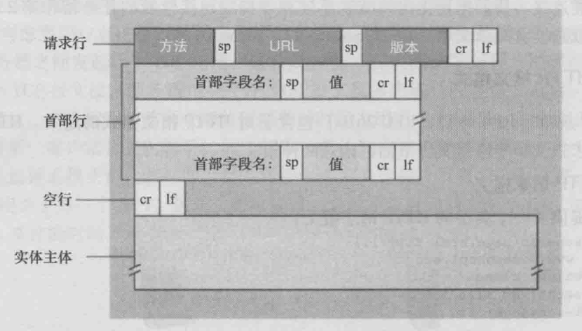

---

order: 15
author: zhiyu1998
title: 2023大厂八股文
category:
  - 八股文
  - 大厂
---


## 前言
2022有的大厂面试题不会在2023再次出现（也有可能会因为粗心加上，欢迎issue或者PR指正和修改），如果想要了解可以先看[2022大厂面试](/Java/eightpart/giant.md)版本。

## 🐦Java 基础
### ArrayList线程安全吗？把ArrayList变成线程安全有哪些方法？（2023美团）
将ArrayList变成线程安全有几种方法：
1. 使用**Collections.synchronizedList()** 方法将ArrayList转换为线程安全的List。该方法会返回一个线程安全的List，使用该List时需要在访问它的方法上添加synchronized关键字，以保证多线程访问的安全性。
```java
import java.util.ArrayList;
import java.util.Collections;
import java.util.List;

public class Main {
    public static void main(String[] args) {
        List<String> list = new ArrayList<>();
        List<String> synchronizedList = Collections.synchronizedList(list);
    }
}
```
2. 使用**CopyOnWriteArrayList**类来代替ArrayList。CopyOnWriteArrayList是一种线程安全的List实现，它通过在写操作时复制整个数组来保证线程安全性，在读操作时不需要加锁，因此可以提高读取效率。

```java
import java.util.concurrent.CopyOnWriteArrayList;

public class Main {
    public static void main(String[] args) {
        CopyOnWriteArrayList<String> list = new CopyOnWriteArrayList<>();
    }
}
```

3. 使用**Lock接口**来实现同步。可以使用ReentrantLock类来实现对ArrayList的同步操作，该类提供了与synchronized类似的功能，但是具有更高的灵活性。比如可以使用tryLock()方法来尝试获取锁，避免了线程的长时间等待。
```java
Lock lock = new ReentrantLock();
...
lock.lock();
try {
    // 对 ArrayList 的操作
} finally {
    lock.unlock();
}
```
4. 使用**读写锁**来实现同步。可以使用ReentrantReadWriteLock类来实现对ArrayList的读写操作的同步。该类提供了读锁和写锁两种锁，多个线程可以同时获取读锁，但是只有一个线程可以获取写锁，在写操作时需要先获取写锁，以保证线程安全。
```java
ReadWriteLock rwLock = new ReentrantReadWriteLock();
...
rwLock.readLock().lock();
try {
    // 对 ArrayList 的读操作
} finally {
    rwLock.readLock().unlock();
}
...
rwLock.writeLock().lock();
try {
    // 对 ArrayList 的写操作
} finally {
    rwLock.writeLock().unlock();
}
```
5. 使用 **Vector**: Vector 是一个线程安全的类，与 ArrayList 非常相似，可以作为替代品。但是，由于 Vector 的所有方法都是同步的，这可能会导致性能问题。

> 参考文献：
> - https://stackoverflow.com/questions/2444005/how-do-i-make-my-arraylist-thread-safe-another-approach-to-problem-in-java 如何使我的ArrayList线程安全？Java问题的另一种方法？
> - https://stackoverflow.com/questions/18983362/how-to-prove-arraylist-is-not-thread-safe-with-a-test 如何用测试证明数组列表不是线程安全的？
> - https://stackoverflow.com/questions/300519/arraylist-vs-vectors-in-java-if-thread-safety-isnt-a-concern ArrayList与vector，Java如果线程安全不是一个问题

### ArrayList的并发修改异常了解吗？单线程情况下会发生吗？（2023小红书）
这种异常通常发生在对ArrayList进行遍历时，同时尝试修改它的结构（例如添加或删除元素）。这种异常被称为ConcurrentModificationException。

在单线程情况下，这种异常也可能发生。当你在使用迭代器遍历ArrayList集合时，如果使用ArrayList的方法（如add()或remove()）修改了集合的结构，就可能触发这个异常。这是因为ArrayList的内部实现使用了一个modCount变量来跟踪结构修改的次数。当迭代器检测到modCount发生变化时，它会抛出ConcurrentModificationException异常。

为了避免这种异常，你可以在遍历ArrayList时采用以下方法：
1. 使用Iterator的remove()方法来删除元素，而不是直接使用ArrayList的remove()方法。这样可以确保modCount的值在迭代过程中保持一致。
2. 如果需要遍历过程中添加元素，可以考虑使用ListIterator，它提供了add()方法，允许在遍历过程中修改列表结构。
3. 另一种方法是使用Java 8的Stream API，它提供了一种更安全的方式来处理集合的并发修改问题。
4. 如果你确实需要在遍历过程中修改ArrayList，可以考虑先复制一个新的ArrayList，然后在新的ArrayList上进行修改。遍历完成后，再将新的ArrayList赋值给原来的引用。这样可以避免在遍历过程中修改原始ArrayList的结构。

> 参考：
> 1. https://stackoverflow.com/questions/602636/why-is-a-concurrentmodificationexception-thrown-and-how-to-debug-it 为什么会抛出它会抛出ConcurrentModificationException异常以及如何调试它
> 2. https://www.javatpoint.com/concurrentmodificationexception-in-java

### 面向过程的方法存在哪些问题？（2023美团）
1. 可维护性较差：面向过程编程主要依赖于函数和过程，随着代码规模的增大，可能会导致代码结构复杂，不易维护。
2. 可复用性较低：面向过程编程难以实现模块化，导致代码难以复用，进一步增加开发时间和成本。
3. 扩展性不足：面向过程编程在代码逻辑发生变化时，往往需要对程序进行大量的修改，这样的代码扩展性不足。
4. 抽象能力有限：面向过程编程主要关注过程和算法，而不是数据结构和对象，这使得它在表达现实世界的复杂问题时抽象能力有限。
5. 封装性差：面向过程编程没有提供良好的封装机制，程序中的数据和处理过程容易暴露，可能导致数据安全性和程序稳定性问题。
6. 强耦合：面向过程编程的方法往往导致程序组件之间存在强耦合，当一个组件发生变化时，可能会影响其他组件的正常工作。

### 面向过程好处是什么？（2023美团）
- 面向过程编程采用自顶向下的编程方式，将问题分解为一个个小的模块，便于理解和编写。
- 每个模块相对独立，出现问题时可以单独调试，降低了调试难度。
- 面向过程编程适合解决简单、逻辑性强的问题，对于初学者来说，学习成本较低。

### object 有哪些方法（2023百度）
当面试官问到 Java 中 Object 类的方法时，如果你无法记住所有的方法，可以采用以下回答策略：

- 强调**基本方法**：首先提及最常用和最基本的几个方法，如 equals()、hashCode()、toString()，这些方法几乎在每个对象中都会用到。
	- equals(Object obj): 检查当前对象是否与另一个对象相等。
	- hashCode(): 返回对象的哈希码值。
	- toString(): 返回对象的字符串表示。
- 提及**重要的方法**：接下来可以提及一些较为重要的方法，如 getClass() 用于获取对象的运行时类，clone() 用于创建对象的副本等。
	- clone(): 创建并返回当前对象的副本。
	- getClass(): 返回对象的运行时类。
- 谈论**对象间的通信**：强调 wait()、notify()、notifyAll() 这些用于线程间通信的方法，说明其在多线程编程中的作用。
	- notify(): 唤醒在该对象上等待的单个线程。
	- notifyAll(): 唤醒在该对象上等待的所有线程。
	- wait(): 导致当前线程等待，直到另一个线程调用该对象的 notify() 或 notifyAll() 方法。
- 谈论**垃圾回收**：提及 finalize() 方法，它在对象被垃圾回收之前调用，可以用于执行一些清理操作。
	- finalize(): 在对象被垃圾回收器回收之前调用。

### 如果让你自己实现一个 map 你会怎么做（2023百度）
我认为这个问题可以转换一个思路：设计一个Map这样的数据结构时，需要考虑以下因素？
- **哈希函数**：哈希函数用于将键转化为数组索引。好的哈希函数应尽量使得每个键都映射到不同的索引上，以减少冲突。
- **冲突处理**：如果两个不同的键哈希到相同的索引上，就会产生冲突。常见的冲突处理方法有链地址法和开放地址法。
- **动态扩容**：如果Map中的元素数量超过了当前数组的大小，就需要对数组进行扩容。扩容的过程通常会重新哈希所有元素，因此需要考虑何时进行扩容以及如何高效地进行扩容。
- **数据类型**：需要考虑存储的数据类型，是基础类型还是自定义类型。如果是自定义类型，需要考虑如何定义哈希函数和相等性判断。
- **线程安全**：是否需要支持多线程环境？如果需要，如何保证线程安全？
- **API设计**：如何设计API使得使用者容易理解和使用？
- **性能考虑**：需要考虑Map的主要操作（插入，删除，查找）的时间复杂性。对于Java的HashMap，这些操作的平均时间复杂性为O(1)。

### 作为 map 的 key 需要重写哪些方法？（2023完美世界）
首先，先理解面试题的意思，可以理解为：**如果你要用自己的类的对象作为Map的键，你需要重写这个类的哪些方法？**
- 在Java中，Map接口是基于键值对的，每个键都必须是唯一的。Java使用键对象的hashCode()方法来计算哈希值，这个哈希值用于确定在Map内部存储结构中的位置。同时，Java也使用键对象的equals()方法来检查两个键是否相等。
- 所以，如果你的类的对象要作为Map的键使用，那么通常需要你重写这个类的hashCode()和equals()方法，以确保它们的行为符合预期。
- 如果不重写这两个方法，那么默认的hashCode()方法将返回每个对象的内存地址，equals()方法将仅比较两个对象的内存地址。这可能会导致不符合预期的行为，比如两个内容完全相同但内存地址不同的对象被视为不同的键。


在Java中，作为Map的键（key），你通常需要重写以下两个方法：
1. **hashCode()**：这个方法返回对象的哈希码，用于确定在哈希表中的存储位置。如果两个对象被认为相等（根据equals()方法），那么它们的hashCode()方法必须返回相同的值。
2. **equals()**：这个方法用来判断两个对象是否相等。在Java的Map中，当我们调用get(key)或containsKey(key)方法时，Map实现会用这个方法来查找与给定键匹配的键。

当你创建自定义的类并打算将其实例用作Map的键时，通常需要覆盖这两个方法以确保它们的行为符合预期。如果不这样做，Map可能无法正确地查找、添加或删除键值对。

### List的实现类（2023阿里）
Java中的List接口有多个实现类，常用的包括：

- ArrayList：基于动态数组实现，优势在于支持随机访问和快速插入/删除元素，适用于频繁读取和遍历的场景。
- LinkedList：基于双向链表实现，优势在于支持快速插入/删除元素，适用于频繁插入/删除元素的场景。
- Vector：和ArrayList类似，但由于其线程安全性，适用于多线程环境。
- Stack：基于Vector实现，是一个后进先出（LIFO）的数据结构，适用于需要按照后进先出顺序处理元素的场景。

### List和Set的区别（2023阿里）
1. 顺序：List是有序的集合，它可以按照元素插入的顺序进行存储和访问。而Set是无序的集合，元素在集合中的位置是不固定的。
2. 重复元素：List允许存储重复的元素，即可以有多个相同的对象。Set不允许存储重复的元素，即每个对象在集合中只能出现一次。
3. 实现类：List的常用实现类有ArrayList和LinkedList，分别使用数组和链表作为底层数据结构。Set的常用实现类有HashSet、LinkedHashSet和TreeSet，分别基于哈希表、链表+哈希表和红黑树实现。
4. 性能：由于底层数据结构的差异，List和Set在增加、删除、查找等操作上的性能表现有所不同。例如，ArrayList在随机访问元素时性能较好，而LinkedList在插入和删除元素时性能较好。HashSet在查找、添加和删除元素时性能较好，但不保证元素顺序。TreeSet在保持元素排序的同时，也能提供较好的查找性能。

> 补充：
> Queue(实现排队功能的叫号机): 按特定的排队规则来确定先后顺序，存储的元素是有序的、可重复的。
> Map(用 key 来搜索的专家): 使用键值对（key-value）存储，类似于数学上的函数 y=f(x)，"x" 代表 key，"y" 代表 value，key 是无序的、不可重复的，value 是无序的、可重复的，每个键最多映射到一个值。

### 针对你说的List和Set的性质，那你会用这两种结构解决哪些问题（2023阿里）
List（列表）适用于以下场景：
1. 有序数据：列表中的元素按照插入顺序存储，因此适用于需要保持元素顺序的场景。
2. 允许重复元素：列表允许存储重复的元素，因此适用于需要统计元素出现次数的场景。
3. 需要根据索引进行查找、插入和删除操作：列表允许通过索引值直接访问、插入或删除元素，适用于需要频繁进行这些操作的场景。

Set（集合）适用于以下场景：
1. 去重：集合中的元素不能重复，因此适用于去除数据中重复元素的场景。
2. 无需关心元素顺序：集合中的元素没有固定顺序，适用于元素顺序无关紧要的场景。
3. 快速判断元素是否存在：集合提供了高效率的查找算法，适用于需要快速判断某个元素是否存在于数据集中的场景。
4. 集合运算：集合支持交集、并集、差集等运算，适用于需要进行这些运算的场景。

## 🕝 并发编程

### 线程池的拒绝策略能自定义拒绝策略吗？（2023阿里）
Java线程池拒绝策略是可以自定义的。你可以使用`RejecttedExecutionHandler`接口来定义你自己的拒绝策略。该接口只有一个方法拒绝执行（Runnable r，ThreadPoolExecator执行器），当执行器无法执行任务时调用。你可以实现这个方法来定义你自己的拒绝策略。

示例：
```java
public class CustomRejectedExecutionHandler implements RejectedExecutionHandler {
    @Override
    public void rejectedExecution(Runnable r, ThreadPoolExecutor executor) {
        // Your custom rejection policy here
    }
}

ThreadPoolExecutor executor = new ThreadPoolExecutor(
        corePoolSize,
        maxPoolSize,
        keepAliveTime,
        TimeUnit.SECONDS,
        new LinkedBlockingQueue<>(),
        new CustomRejectedExecutionHandler()
);
```

### 使用多线程要注意哪些问题？（2023美团）
使用多线程时需要注意以下问题：
1. **线程安全**：当多个线程同时访问某一数据时，如果不进行正确的同步控制，可能会导致数据的不一致。需要通过使用synchronized，Lock，volatile等机制来保证线程安全。
2. **死锁**：死锁是指两个或两个以上的线程在执行过程中，因争夺资源而造成的一种互相等待的现象，若无外力干涉那他们都将无法推进下去。我们应避免在代码中产生死锁。
3. **活锁**：活锁指的是线程虽然没有被阻塞，但是由于某种条件没有被满足，始终无法向前执行，就像在原地踏步。
4. **饥饿**：由于线程的优先级设置不合理或者锁机制不公平，导致某些线程始终无法获取到CPU资源或者锁资源，从而无法进行工作。
5. **资源消耗**：每个线程都会占用一定的内存资源，过多的线程可能会导致系统资源消耗过大。同时，线程上下文切换也会消耗CPU资源，过多的线程也可能会导致CPU负载过大。
6. **数据共享和可见性**：多线程之间共享数据，需要保证一个线程对数据的修改对其他线程可见，可以使用volatile或者Atomic类来保证。
7. **线程的生命周期管理**：需要合理的创建、启动、暂停、恢复、终止线程，不合理的管理可能会导致程序错误或者资源泄漏。
8. **线程异常处理**：线程中的未捕获异常会导致线程终止，而且这个异常不能被外部捕获。需要为线程设置UncaughtExceptionHandler来处理未捕获的异常。

### 保证数据的一致性有哪些方案呢？（2023美团）
在Java中，有多种方式可以保证数据的一致性：
1. **同步语句块(Synchronized Blocks)**：在Java中，你可以使用synchronized关键字对一个对象或者方法进行锁定，来保证在一个时刻只有一个线程可以访问该对象或者方法，从而避免数据的不一致。
2. **Volatile关键字**：volatile关键字可以保证变量的可见性。当一个共享变量被volatile修饰时，它会保证修改的值会立即被更新到主存，当有其他线程需要读取时，它会去主存中读取新值。
3. **原子类（Atomic Classes）**：Java提供了一组原子类（如AtomicInteger、AtomicLong等），它们使用了高效的机器级指令来保证原子性操作，从而避免了复杂的同步。
4. **Lock接口和相关类**：Java并发库提供了显式的锁机制，包括ReentrantLock、ReadWriteLock等，可以提供比synchronized更灵活的锁定机制。
5. **并发集合（Concurrent Collections）**：Java提供了一组并发集合类（如ConcurrentHashMap、CopyOnWriteArrayList等），它们内部已经实现了并发控制，可以在并发环境中安全使用。
6. **事务（Transactions）**：在数据库和某些支持事务的系统中，可以通过事务来保证数据的一致性。Java中的JPA和Spring等框架提供了对事务的支持。

以上就是在Java中保证数据一致性的一些常用方案，选择哪种方案取决于具体的应用场景和需求。

## 🍃 常用框架
### MyBatis运用了哪些常见的设计模式？（2023美团）
- **工厂模式**，工厂模式在 MyBatis 中的典型代表是 SqlSessionFactory
- **建造者模式**，建造者模式在 MyBatis 中的典型代表是 SqlSessionFactoryBuilder
- **单例模式**，单例模式在 MyBatis 中的典型代表是 ErrorContext
- **适配器模式**，适配器模式在 MyBatis 中的典型代表是 Log
- **代理模式**，代理模式在 MyBatis 中的典型代表是 MapperProxyFactory
- **模板方法模式**，模板方法在 MyBatis 中的典型代表是 BaseExecutor
- **装饰器模式**，装饰器模式在 MyBatis 中的典型代表是 Cache
- **迭代器模式**，如迭代器模式Properties tyTokenizer；
- **组合模式**，如SqlNode和每个子类ChooseSqlNode；

> 参考文献：
> - https://programming.vip/docs/6200e8e7b682c.html 【Mybatis源码解析】Mybatis源码涉及的设计模式总结
> - https://programming.vip/docs/mybatis-design-pattern.html Mybatis设计模式

### MyBatis中创建了一个Mapper接口，在写一个xml文件，java的接口是要实现的，为什么这没有实现呢？（2023美团）
MyBatis中的Mapper接口并不需要实现，它只是定义了一组方法签名。MyBatis会根据Mapper接口中的方法名、参数类型和返回值类型，自动生成实现方法。因此，Mapper接口中的方法不需要实现，也不需要在该接口中编写任何方法体。

相反，你需要编写一个与Mapper接口同名的XML文件，来实现这些方法的具体SQL操作。这样，当你在Java代码中调用Mapper接口中的方法时，MyBatis会自动将该方法映射到对应的XML文件中的SQL语句，并执行该语句。

### 与传统的JDBC相比，MyBatis的优点？（2023美团）
在面试中，可以按照以下的方式来回答：
1. 首先，我认为最大的优点是MyBatis提供了更高的**灵活性**。我们可以直接编写SQL，这样可以充分利用数据库的特性并且更好地控制查询。
2. 其次，MyBatis使我们**无需手动**转换数据，它能自动将结果集映射到Java对象，这大大简化了编程工作。
3. 此外，MyBatis支持**动态SQL**，我们可以在SQL语句中使用动态元素，如if、choose等，从而能够创建更复杂的查询。
4. 除此之外，MyBatis将SQL语句放在**XML文件或注解**中，实现了SQL与Java代码的分离，这使得代码更加易于维护。
5. MyBatis也能**更好地处理一对多、多对多**等复杂关系。
6. 最后，MyBatis提供了**一些JDBC无法提供的特性**，如延迟加载，这对于性能优化是非常有用的。

### JDBC连接数据库的步骤吗？（2023美团）
1. **加载数据库驱动程序**：首先，我们需要加载数据库驱动。这可以通过 Class.forName() 方法实现，例如 Class.forName("com.mysql.jdbc.Driver")。
2. **建立数据库连接**：使用DriverManager.getConnection()方法建立与数据库的连接，需要指定数据库的URL、用户名和密码，例如：Connection conn = DriverManager.getConnection("jdbc:mysql://localhost/mydatabase", "username", "password");
3. **创建Statement对象**：使用Connection对象的createStatement()方法创建一个Statement对象，用于执行SQL语句，例如：Statement stmt = conn.createStatement();
4. **执行SQL语句**：使用Statement对象的executeQuery()或executeUpdate()方法执行SQL语句，例如：ResultSet rs = stmt.executeQuery("SELECT * FROM mytable");
5. **处理查询结果**：如果执行的是查询语句，需要使用ResultSet对象来处理查询结果，例如：while (rs.next()) { String name = rs.getString("name"); int age = rs.getInt("age"); }
6. **关闭数据库连接**：在程序结束时，需要使用Connection对象的close()方法关闭数据库连接，例如：conn.close();

### 怎么理解SpringIoc？（2023美团）
**IoC（Inversion of Control）是“控制反转”** 的缩写，是一种设计思想，也是Spring框架的核心。IoC是将你设计好的对象交给容器控制，而不是传统的在你的对象内部直接控制。如何理解好IoC呢？可以从以下几点来看：
1. **控制反转**：传统的程序是由我们自己在对象内部通过new进行创建对象，是由程序控制对象的创建。在Spring框架中，对象的创建是由Spring容器来进行的，它负责控制对象的生命周期。所谓“控制反转”就是把传统的有我们自己控制的对象创建过程交给Spring框架来做。
2. **依赖注入**：IoC的一个重要的具体实现方法是DI（Dependency Injection），也叫作依赖注入。在我们设计好的对象中会有一些其他对象的引用（即依赖），如果没有Spring容器，我们需要使用很多复杂的方法来管理这些依赖。而有了Spring容器，我们只需要告诉Spring这些依赖即可，Spring会自动把这些依赖注入到对象中。
3. **容器**：在Spring的IoC下，Spring容器是一个非常重要的角色，它包含并管理了应用中定义的各种组件，负责实例化、配置、装配对象，管理对象的整个生命周期。
4. **减轻耦合**：通过IoC，对象间的耦合度可以降低，对象只需要关注自身的业务逻辑，而不需要关心其他对象是如何创建和管理的，大大增强了代码的可维护性和可测试性。
5. **提供配置**：Spring容器可以使用XML、Java注解、Java代码等多种方式来进行配置，提供了非常大的灵活性。

### 如果让你设计一个SpringIoc，你觉得会从哪些方面考虑这个设计？（2023美团）
- Bean的生命周期管理：需要设计Bean的创建、初始化、销毁等生命周期管理机制，可以考虑使用工厂模式和单例模式来实现。
- 依赖注入：需要实现依赖注入的功能，包括属性注入、构造函数注入、方法注入等，可以考虑使用反射机制和XML配置文件来实现。
- Bean的作用域：需要支持多种Bean作用域，比如单例、原型、会话、请求等，可以考虑使用Map来存储不同作用域的Bean实例。
- AOP功能的支持：需要支持AOP功能，可以考虑使用动态代理机制和切面编程来实现。
- 异常处理：需要考虑异常处理机制，包括Bean创建异常、依赖注入异常等，可以考虑使用try-catch机制来处理异常。
- 配置文件加载：需要支持从不同的配置文件中加载Bean的相关信息，可以考虑使用XML、注解或者Java配置类来实现。


### Spring给我们提供了很多扩展点，这些有了解吗？（2023美团）
1. BeanFactoryPostProcessor：允许在Spring容器实例化bean之前修改bean的定义。常用于修改bean属性或改变bean的作用域。
2. BeanPostProcessor：可以在bean实例化、配置以及初始化之后对其进行额外处理。常用于代理bean、修改bean属性等。
3. PropertySource：用于定义不同的属性源，如文件、数据库等，以便在Spring应用中使用。
4. ImportSelector和ImportBeanDefinitionRegistrar：用于根据条件动态注册bean定义，实现配置类的模块化。
5. Spring MVC中的HandlerInterceptor：用于拦截处理请求，可以在请求处理前、处理中和处理后执行特定逻辑。
6. Spring MVC中的ControllerAdvice：用于全局处理控制器的异常、数据绑定和数据校验。
7. Spring Boot的自动配置：通过创建自定义的自动配置类，可以实现对框架和第三方库的自动配置。
8. 自定义注解：创建自定义注解，用于实现特定功能或约定，如权限控制、日志记录等。

### 大致了解SpringMVC的处理流程吗？（2023美团）
1. **接收请求**：用户发送请求至前端控制器DispatcherServlet。
2. **查找处理器映射**：DispatcherServlet收到请求后，调用HandlerMapping处理器映射器。
3. **处理器映射返回处理器执行链**：HandlerMapping根据请求的URL找到对应的Controller并返回一个HandlerExecutionChain对象（包含一个Handler处理器（页面控制器）对象，多个HandlerInterceptor拦截器对象）。
4. **调用处理器适配器**：DispatcherServlet通过HandlerAdapter进行多类型的页面控制器的适配，调用对应的Controller（处理器）。
5. **Controller执行业务逻辑**：Controller开始执行页面控制器的处理方法，并返回一个ModelAndView对象（模型和视图）。
6. **视图解析**：DispatcherServlet通过视图解析器进行解析（根据逻辑视图名解析成实际视图/页面），并将ModelAndView对象中的模型数据填充到request域对象中。
7. **返回视图**：DispatcherServlet把返回的视图对象返回给用户。

###  SpringAOP主要想解决什么问题（2023美团）

1. 代码分离：在许多应用程序中，你可能会发现你需要在多个方法或对象中重复相同的代码块，比如日志记录、事务管理、权限检查等。这种情况下，代码不是真正的分离，各部分功能模块的职责并不清晰。通过使用AOP，你可以把这些代码集中在一起，然后应用到程序的其他部分，实现"横切关注点"（cross-cutting concerns）的有效管理。
2. 维护性：如果你需要修改一些重复的代码（比如更改日志记录的格式），你可能需要在多个位置进行更改。使用AOP，你只需要在一个地方更改，减少了出错的可能性，提高了代码的维护性。
3. 可读性：AOP可以使得代码的可读性增强。因为重复的、固定的代码被分离出来，业务代码更加清晰，易于理解。
4. 可重用性：由于AOP能将横切关注点抽象成独立的模块，这些模块可以在多个应用中重用。

总的来说，Spring AOP能够让开发者更好地关注业务逻辑的开发，而将诸如日志记录、安全控制、事务处理等公共任务抽象和集中处理，从而提高代码的可维护性、可读性和可重用性。

### SpringAOP的原理了解吗（2023美团、2023完美世界）
Spring AOP (Aspect-Oriented Programming)其主要目的是将业务逻辑与系统服务解耦。在 Spring 中，AOP 的实现主要通过代理实现。下面是一些关于其工作原理的关键点：
1. **代理模式**：Spring AOP 的实现主要依赖于代理模式。在运行时，Spring AOP 动态地在目标对象与实际对象之间创建一个代理对象，然后通过代理对象实现对目标对象的访问。
2. **JoinPoint**：这是程序执行过程中明确的点，比如方法的调用或特定的异常被抛出。在 Spring AOP 中，一个 JoinPoint 总是代表一个方法的执行。
3. **PointCut**：这是一组 JoinPoint，你可以通过表达式或规则定义。
4. **Advice**：这是实际要在程序特定的 JoinPoint 执行的动作。它的类型可以是 Before, After, AfterReturning, AfterThrowing, Around 等。
5. **Aspect**：这是一个关注点的模块化，这种关注点实现了某一种跨越一个应用程序的功能，通常包含一些 Advices 和 PointCuts。
6. **Target Object**：代理模式的目标对象。
7. **AOP Proxy**：AOP 框架创建的对象，包含了 advice。

Spring AOP 使用这些元素来确保横切关注点（cross-cutting concerns）在应用中适当的位置被执行。Spring 可以在运行时动态地将 Advice 应用到目标对象上，从而实现了解耦和代码重用。

在 Spring AOP 中，有两种类型的 AOP 代理：
- 基于 JDK 的动态代理：如果被代理的目标对象实现了至少一个接口，则会使用 JDK 动态代理。在这种情况下，生成的代理对象会实现被代理对象所实现的接口。
- CGLIB 代理：如果被代理的目标对象没有实现任何接口，则 Spring AOP 会创建一个被代理对象的子类，然后增强被代理对象的方法，这就是所谓的 CGLIB 代理。
所有这些都为开发者提供了一个强大的工具，使他们能够将业务逻辑和系统服务（如事务管理、日志、安全等）分开，从而使业务代码更简洁、更易于维护和复用。

> 面试的时候可以这样回答：
> 🙋‍♂️ "Spring AOP 是一种面向切面编程的实现，它通过动态代理方式解耦了业务逻辑和系统服务。其主要组成部分包括 JoinPoint（程序执行过程中的某个特定点，如方法调用），PointCut（一组可以通过表达式或规则定义的 JoinPoint），Advice（在特定的 JoinPoint 执行的代码），和 Aspect（包含 Advice 和 PointCut 的模块）。
> Spring AOP 根据目标对象是否实现接口来选择使用 JDK 动态代理还是 CGLIB 代理。如果目标对象实现了接口，Spring AOP 就会用 JDK 动态代理，否则会用 CGLIB 代理。这样，在运行时，Spring AOP 可以动态地将 Advice 应用到目标对象，实现系统服务和业务逻辑的解耦。
> 通过这种方式，我们可以将一些通用的系统服务（比如事务管理、日志、安全等）抽象出来，从而使业务代码更简洁、更易于维护和复用。"

### 拦截器有几个方法，分别在什么时候执行，对比过滤器（2023完美世界）
拦截器和过滤器是Web开发中常用的两种处理方法。这里我假设你指的是Spring MVC拦截器和Java Servlet过滤器。
拦截器 (Interceptor) 在Spring MVC中通常有3个方法：
- `preHandle(HttpServletRequest request, HttpServletResponse response, Object handler)`: 在请求被处理之前调用。如果返回true，处理流程继续；如果返回false，处理流程结束，不会调用后续的拦截器和处理器。
- `postHandle(HttpServletRequest request, HttpServletResponse response, Object handler, ModelAndView modelAndView)`: 在请求被处理之后，视图被渲染之前调用。可以通过它来修改数据模型和视图或进行其他处理。
- `afterCompletion(HttpServletRequest request, HttpServletResponse response, Object handler, Exception ex)`: 在请求处理完毕后（视图渲染后）调用，通常用于进行资源清理等工作。

过滤器 (Filter) 在Java Servlet API中通常有三个方法：
- init(FilterConfig filterConfig): 在服务器启动时，创建Filter对象时调用。
- doFilter(ServletRequest request, ServletResponse response, FilterChain chain): 每次在过滤请求时调用。可以进行逻辑处理，然后使用chain.doFilter(request, response);将请求传递到链中的下一个过滤器或资源（servlet或静态内容）。
- destroy(): 在服务器关闭时，销毁Filter对象时调用。

比较：
- 相较于过滤器，拦截器更加灵活和强大。拦截器是基于Java的反射机制的，它在运行时动态地将逻辑插入到方法调用中，而不需要改变源码。此外，拦截器可以获得Spring容器中的各种bean，从而有更多的操作。
- 过滤器则主要用于请求的过滤处理，包括日志记录、请求压缩、安全检查、用户登录校验等。它的运行速度一般比拦截器快，但功能上不如拦截器强大。


### 导入一个 jar 包怎么让 springboot 知道哪些需要自动配置（2023完美世界）
Spring Boot自动配置是通过@EnableAutoConfiguration注解实现的。它基本上是通过查找并加载META-INF/spring.factories配置文件来完成的。
如果你想要将你的jar包在Spring Boot项目中进行自动配置，你需要以下步骤：
1. 在你的jar包中创建一个spring.factories文件，并将其放入META-INF目录下
2. 在spring.factories文件中添加你的自动配置类，格式如下
```
org.springframework.boot.autoconfigure.EnableAutoConfiguration=\
com.yourpackage.YourAutoConfigurationClass
```
3. 确保你的AutoConfiguration类使用了@Configuration，并在需要的bean上使用了@Bean注解。

这样，当Spring Boot项目启动时，它会读取META-INF/spring.factories文件，并自动配置那些bean。

请注意，你的AutoConfiguration类应该尽可能的"幂等"，意味着多次运行结果应该是一致的，并且应该对已有的Bean有所尊重，如果容器中已经存在了你要创建的Bean，你应该避免再次创建。

另外，你可能需要使用@Conditional注解以避免在不需要的情况下创建bean。

## 📑 数据库

### 可重复读和已提交读隔离级别表现的现象是什么，区别是什么样的？（2023美团）
- 读提交，指一个事务提交之后，它做的变更才能被其他事务看到，会有不可重复读、幻读的问题。
- 可重复读，指一个事务执行过程中看到的数据，一直跟这个事务启动时看到的数据是一致的，MySQL InnoDB 引擎的默认隔离级别，解决了不可重复读的问题，并且以很大程度上避免幻读现象的发生。

### 数据文件大体分成哪几种数据文件？（2023美团）
我们每创建一个 database（数据库） 都会在 /var/lib/mysql/ 目录里面创建一个以 database 为名的目录，然后保存表结构和表数据的文件都会存放在这个目录里。

比如，我这里有一个名为 my_test 的 database，该 database 里有一张名为 t_order 数据库表。

然后，我们进入 /var/lib/mysql/my_test 目录，看看里面有什么文件？
```java
[root ~]#ls /var/lib/mysql/my_test
db.opt  
t_order.frm  
t_order.ibd
```
可以看到，共有三个文件，这三个文件分别代表着：
- db.opt，用来存储当前数据库的默认字符集和字符校验规则。
- t_order.frm ，t_order 的表结构会保存在这个文件。在 MySQL 中建立一张表都会生成一个.frm 文件，该文件是用来保存每个表的元数据信息的，主要包含表结构定义。
- t_order.ibd，t_order 的表数据会保存在这个文件。表数据既可以存在共享表空间文件（文件名：ibdata1）里，也可以存放在独占表空间文件（文件名：表名字.ibd）。这个行为是由参数 innodb_file_per_table 控制的，若设置了参数 innodb_file_per_table 为 1，则会将存储的数据、索引等信息单独存储在一个独占表空间，从 MySQL 5.6.6 版本开始，它的默认值就是 1 了，因此从这个版本之后， MySQL 中每一张表的数据都存放在一个独立的 .ibd 文件。

### 对一个慢sql怎么去排查？（2023美团）
可通过开启mysql的慢日志查询，设置好时间阈值，进行捕获

### 索引字段是不是建的越多越好（2023美团）
索引越多，在写入频繁的场景下，对于B+树的维护所付出的性能消耗也会越大

### 什么是覆盖索引？（2023 快手）
> 这个其实在2022年的大厂面试中出现过，但是是以聚簇索引形式提问出现

**覆盖索引是一种数据库查询优化机制**。在覆盖索引中，索引本身包含了查询所需要的所有数据，因此在执行查询时，数据库系统可以只访问索引，而不需要再访问数据行。这样可以显著提高查询速度，因为访问索引通常比访问数据行要快。（在索引 B+Tree 的叶子节点上都能找得到的那些索引，从二级索引中查询得到记录，而不需要通过聚簇索引查询获得，可以避免回表的操作）

> 覆盖索引与聚簇索引和非聚簇索引的主要区别在于数据的存储和访问方式：
> - 覆盖索引：它被称为“覆盖”，因为只需使用索引即可满足查询，而无需访问表数据本身。这可以使查询更快，因为它避免了访问表数据的需要，而是使用通常更小、更紧凑的索引数据
> - 聚簇索引：在聚簇索引中，数据行实际上被存储在索引中，因此每个表只能有一个聚簇索引。索引的顺序与磁盘上行的物理顺序相同。聚簇索引可以快速查找指定的数据行，但如果你需要在同一表上执行许多不同的查询，那么可能会受到限制，因为每个表只能有一个聚簇索引。
> - 非聚簇索引：非聚簇索引是一个单独的结构，与数据行分开存储。非聚簇索引包含索引键值和一个指向每个数据行实际位置的指针。在非聚簇索引中查找数据需要两个步骤：首先在索引中查找，然后使用索引中的指针访问数据行。因此，非聚簇索引的查询通常比聚簇索引要慢一些。

覆盖索引可以看作是非聚簇索引的一个特例，它不仅包含索引键值和数据行的指针，还包含查询所需的其他列的数据。所以，如果查询可以被一个覆盖索引满足，那么查询速度就会比一般的非聚簇索引要快，因为数据库系统不需要再访问数据行，所有需要的数据都在索引中。使用覆盖索引的好处就是，不需要查询出包含整行记录的所有信息，也就减少了大量的 I/O 操作。

使用覆盖索引的例子:

```sql
CREATE TABLE `tbl_user` (
  `id` int(11) NOT NULL,
  `name` varchar(50) NOT NULL,
  `age` int(11) NOT NULL,
  KEY `idx_name_age` (`name`,`age`)
) ENGINE=InnoDB DEFAULT CHARSET=utf8mb4;

SELECT `name`, `age` FROM `tbl_user` WHERE `name` = 'John' AND `age` = 30;
```
这里 (name, age) 组成了一个复合索引 idx_name_age,查询只需要name和age两列,所以这个查询可以使用覆盖索引,数据库只需要扫描索引,不需要访问表数据,所以查询效率高。

具体查询为：
```sql
SELECT `name`, `age` FROM `tbl_user` WHERE `name` = 'John' AND `age` = 30;
```
这个查询只需要name和age两个字段,而idx_name_age索引中就包含这两个字段,所以这个查询可以使用覆盖索引。
覆盖索引的查询语句应该是:

```sql
SELECT 
    idx_name_age.name, 
    idx_name_age.age
FROM tbl_user 
WHERE idx_name_age.name = 'John' AND idx_name_age.age = 30;
```

这里我们直接从idx_name_age索引中选取需要的字段,而不再访问表数据,所以这个查询使用了覆盖索引。
所以,一个查询要使用覆盖索引,需要满足两个条件:
1. 查询所需要的字段都存在于某个索引中
2. 查询语句直接从该索引中选取字段,而不再访问表数据

没使用覆盖索引的例子:

```sql
CREATE TABLE `tbl_user` (
  `id` int(11) NOT NULL,
  `name` varchar(50) NOT NULL,
  `age` int(11) NOT NULL,
  `address` varchar(100) NOT NULL,
  KEY `idx_name_age` (`name`,`age`)  
) ENGINE=InnoDB DEFAULT CHARSET=utf8mb4;

SELECT `name`, `age`, `address` FROM `tbl_user` WHERE `name` = 'John' AND `age` = 30;
```
这里虽然有(name, age)的索引,但是由于查询需要的address字段不在该索引中,所以这个查询无法使用覆盖索引,需要访问表数据获取address字段,查询效率较低。


图示：
在没有使用覆盖索引，数据库查询数据是这样：


使用了覆盖索引避免了从数据服务中获取数据的额外步骤。这导致了相当大的性能改进。


> 参考文献：
> - https://stackoverflow.com/questions/62137/what-is-a-covered-index 什么是覆盖索引？
> - https://xiaolincoding.com/mysql/index/index_interview.html#按字段个数分类 覆盖索引优化-小林coding
> - https://stackoverflow.com/questions/609343/what-are-covering-indexes-and-covered-queries-in-sql-server 在SQL Server中什么是覆盖索引和覆盖查询？
> - https://docs.couchbase.com/server/current/n1ql/n1ql-language-reference/covering-indexes.html Covering Indexes
> - https://www.red-gate.com/simple-talk/databases/sql-server/learn/using-covering-indexes-to-improve-query-performance/ 使用覆盖索引以提高查询性能


### redis怎么实现分布式锁 set nx命令有什么问题 如何解决？（2023小红书）

Redis实现分布式锁的基本思路是使用SET命令的NX（Not eXists）选项。NX选项表示只有当键不存在时，才会设置键值对。这样可以确保在分布式环境中，只有一个客户端能够成功地获取锁。以下是一个简单的示例：
```shell
SET lock_key some_value NX PX 30000
```
这个命令尝试设置一个名为lock_key的键，值为some_value，并且使用NX选项。PX选项表示设置一个过期时间，单位为毫秒，在这个例子中是30000毫秒（30秒）。
然而，使用SET NX命令实现分布式锁存在一些问题：
1. 非原子操作：在某些情况下，客户端可能在设置锁和设置过期时间之间崩溃，导致锁永远不会被释放。这可以通过使用SET命令的PX选项来解决，它可以在设置锁的同时设置过期时间，确保操作是原子的。
2. 无法解决锁超时问题：如果持有锁的客户端在锁过期之前没有完成任务，其他客户端可能会获取到锁，导致并发问题。为了解决这个问题，可以在获取锁时设置一个唯一的值（例如UUID），并在释放锁时检查该值。这样可以确保只有锁的持有者才能释放锁。
3. 无法解决锁释放问题：如果持有锁的客户端在释放锁之前崩溃，锁可能永远不会被释放。为了解决这个问题，可以使用一个后台线程定期检查并释放过期的锁。
4. 无法实现公平锁：SET NX命令无法保证公平性，即等待时间最长的客户端不一定能够优先获取锁。要实现公平锁，可以使用Redis的LIST数据结构，将等待锁的客户端按照先进先出（FIFO）的顺序排队。
综上所述，虽然SET NX命令可以实现基本的分布式锁功能，但在实际应用中可能需要考虑更多的问题。为了解决这些问题，可以使用成熟的Redis分布式锁库，如Redlock。Redlock提供了一个更加健壮和可靠的分布式锁实现，可以解决上述问题

### 什么情况使用 redis 反而降低性能（2023完美世界）

- 数据集过大：Redis 将数据存储在内存中，如果数据集过大，超出了服务器可用内存的限制，就会导致 Redis 使用交换空间（swap space）或者频繁地从磁盘加载数据，从而严重影响性能。
- 内存碎片化：当 Redis 频繁地进行写入、更新和删除操作时，可能会导致内存碎片化。这会导致 Redis 需要更多的内存来存储相同的数据，最终导致性能下降。
- 大量的键过期操作：当 Redis 中有大量的键需要过期处理时，Redis 会执行定期清理操作来删除过期的键。如果这个清理操作耗时较长，会导致 Redis 在执行其他操作时的性能下降。
- 高并发写入操作：当有大量的并发写入操作时，Redis 可能会因为竞争条件而降低性能。这种情况下，可以考虑使用 Redis 的事务功能来减少竞争并发。
- 复杂的数据结构操作：Redis 提供了多种复杂的数据结构，如列表、集合和有序集合等。当对这些数据结构进行复杂的操作时，例如对大型列表进行频繁的插入和删除操作，可能会导致性能下降。

需要注意的是，这些情况并不意味着 Redis 总是会降低性能，而是在特定的场景下可能会出现性能下降的情况。为了优化 Redis 的性能，可以根据具体的情况进行调整和优化，例如增加内存、合理设置过期时间、使用合适的数据结构等。

> 参考资料：
> 1. https://loadforge.com/guides/troubleshooting-redis-performance-issues
> 2. https://severalnines.com/blog/performance-tuning-redis/

### mysql的隔离级别是什么?mysql是如何实现的？（2023阿里）
MySQL InnoDB 引擎的默认隔离级别虽然是「可重复读」，但是它很大程度上避免幻读现象（并不是完全解决了），解决的方案有两种：
- 针对**快照读**（普通 select 语句），是通过 MVCC 方式解决了幻读，因为可重复读隔离级别下，事务执行过程中看到的数据，一直跟这个事务启动时看到的数据是一致的，即使中途有其他事务插入了一条数据，是查询不出来这条数据的，所以就很好了避免幻读问题。
- 针对**当前读**（select ... for update 等语句），是通过 next-key lock（记录锁+间隙锁）方式解决了幻读，因为当执行 select ... for update 语句的时候，会加上 next-key lock，如果有其他事务在 next-key lock 锁范围内插入了一条记录，那么这个插入语句就会被阻塞，无法成功插入，所以就很好了避免幻读问题。
- 
> 参考：https://xiaolincoding.com/mysql/transaction/mvcc.html
## ♻️ JVM

### 堆是如何管理内存的（2023 快手）
1. **堆的划分**：在JVM中，堆被划分为年轻代（Young Generation）和老年代（Old Generation）。年轻代又被划分为Eden区和两个Survivor区（S0和S1）。新创建的对象首先在Eden区创建，当Eden区满时，会触发Minor GC进行垃圾回收。存活的对象会被移动到Survivor区，当Survivor区也满时，对象会被移动到老年代。当老年代满了，会触发Major GC或者Full GC。
2. **垃圾回收**：JVM通过垃圾回收机制自动回收不再使用的对象以释放内存。JVM的垃圾回收算法包括标记-清除、复制、标记-整理、分代收集等。
3. **内存分配**：当创建新对象时，JVM会在堆中为其分配内存。JVM有一个指针叫做TLAB（Thread Local Allocation Buffer），用于在特定的线程中分配对象，这样可以避免线程之间的竞争。如果对象很大，可能直接在老年代分配。
4. **堆大小调整**：JVM的堆大小可以动态调整，以适应程序的需求。可以通过启动参数设置最小堆大小（-Xms）和最大堆大小（-Xmx）。如果程序需要更多内存，堆可以扩展到最大堆大小；如果程序需要的内存减少，堆可以收缩到最小堆大小。

### 跨代引用问题怎么解决（2023 快手）
**跨代引用问题是指在JVM内存模型中，年轻代的对象引用老年代的对象，或者老年代的对象引用年轻代的对象**。这在垃圾回收时可能会导致一些问题，因为垃圾回收通常会针对年轻代和老年代分别进行。

为了解决这个问题，JVM引入了一个叫做 **"卡表"（Card Table）** 的数据结构。卡表的主要作用是快速找到老年代中被年轻代对象引用的对象，从而在进行Minor GC时，减少全堆扫描的开销。

> 卡表概览：卡表是Java虚拟机（JVM）中加速查找引用的一种辅助数据结构。表中每个条目对应于Java堆的一小部分，这里我称为小块。当老年代中的一个对象写入/更新对年轻代中的一个对象的引用时，这个操作会通过一种叫做写屏障的东西。当JVM看到这些写屏障时，它会更新卡片表中的相应条目。
> - 写屏障：垃圾收集器用来跟踪对象引用更改的一种机制。它是一段代码（JVM实现的），每当对象引用更新时就会运行。写屏障确保垃圾收集器可以跟踪堆中的所有引用，并确定哪些对象仍在使用，哪些没有。
> - 当写入屏障发现语句`some_obj.field = other_obj;`将年轻指针存储在旧对象中时，它会这样做：`card_table[(&old_obj - start_of_heap) >> K] = 1;`
> - 其中`&old_obj`是现在有一个年轻代指针的对象的地址（它已经在寄存器中，因为它刚刚被确定引用旧对象）。 在次要GC期间，垃圾收集器查看卡表以确定要扫描哪些堆区域以查找年轻指针。
> 	- for i from 0 to (heap_size >> K):
> 	- if card_table[i]: scan heap[i << K .. (i + 1) << K] for young pointers
> 

卡表将老年代的内存分为多个小块（通常为512字节），每个小块对应卡表中的一项，当老年代中的某个小块内存**被修改时**（例如年轻代的对象引用了该小块中的某个对象），对应的卡表项就被标记为 **"脏（dirty）"** 。

在进行Minor GC（清理年轻代）时，JVM只需要检查标记为"脏"的卡表项对应的内存块，找出被年轻代对象引用的老年代对象，而无需扫描整个老年代。这样就大大提高了垃圾回收的效率。

至于**老年代的对象引用年轻代的对象，这在JVM的分代回收策略中是不推荐的，因为会增加垃圾回收的复杂性**。如果确实存在这种情况，一般需要在进行垃圾回收时，遍历老年代找到所有引用年轻代的对象，确保不会误删。

> 参考文献如下：
> - https://stackoverflow.com/questions/19154607/how-actually-card-table-and-writer-barrier-work 卡表和写屏障是如何工作的？
> - https://tschatzl.github.io/2022/02/15/card-table-card-size.html Card Table Card Size Shenanigans
> - https://www.mo4tech.com/jvm-card-table.html JVM Card Table
> - https://www.cnblogs.com/hongdada/p/12016020.html JVM-卡表（Card Table）
> - http://blog.ragozin.info/2011/06/understanding-gc-pauses-in-jvm-hotspots.html Alexey Ragozin

### 每次回收都要从GC ROOT开始吗（2023 快手）
是的，每次垃圾回收都会从GC Roots开始。GC Roots是垃圾回收算法开始工作的一组必要的"根"对象。

Java中可以作为GC Roots的对象包括：
1. 在虚拟机栈（栈帧中的本地变量表）中引用的对象。
2. 方法区中类静态属性引用的对象。
3. 方法区中常量引用的对象。
4. 本地方法栈中JNI（即一般说的Native方法）引用的对象。

垃圾回收器在对堆进行回收前，会先从GC Roots开始对堆中的对象进行可达性分析。只有当对象在GC Roots到该对象之间没有任何引用链可达时（换句话说，GC Roots到该对象不可达），这个对象才会被判定为可回收的垃圾对象。

这种通过GC Roots进行可达性分析的方式，保证了只有真正不再使用的对象会被回收，从而避免了错误地回收仍在使用的对象。


### 垃圾回收过程如何判断每个阶段已经完成，可以进入下一个阶段（2023 快手）
像是垃圾回收器如CMS（并发标记清除）和G1（Garbage-First）在进行垃圾回收时，会通过一系列的阶段来判断何时可以进入下一步。

CMS垃圾回收器：
CMS垃圾回收器主要包含以下四个阶段：
1. 初始标记（Initial Mark）：标记GC Roots能直接关联的对象，此阶段需要暂停所有的其他线程，但是时间通常较短。
2. 并发标记（Concurrent Mark）：进行GC Roots Tracing的过程，也就是从GC Roots开始对堆中的对象进行可达性分析，此阶段可以与用户线程并发执行。
3. 重新标记（Remark）：修正并发标记期间因用户程序继续运行而导致标记产生变动的那一部分标记记录，防止数据不一致，此阶段需要暂停所有的其他线程。
4. 并发清除（Concurrent Sweep）：清除不再使用的对象，此阶段可以与用户线程并发执行。
CMS在每个阶段完成后会判断是否可以进入下一阶段。例如，在并发标记阶段，当所有从GC Roots开始可达的对象都被标记后，就可以进入重新标记阶段。

G1垃圾回收器：
G1垃圾回收器将堆内存划分为多个小块（Region），每个小块可能属于Eden区、Survivor区或者Old区。G1的垃圾回收过程包括以下几个阶段：
1. 初始标记（Initial Mark）：标记所有的GC Roots能直接关联的对象，此阶段需要暂停所有的其他线程。
2. 并发标记（Concurrent Mark）：进行GC Roots Tracing的过程，此阶段可以与用户线程并发执行。
3. 最终标记（Final Mark）：修正并发标记期间因用户程序继续运行而导致标记产生变动的那一部分标记记录，此阶段需要暂停所有的其他线程。
4. 筛选回收（Cleanup）：首先统计各个Region的存活对象，并对Region进行排序，然后回收垃圾对象最多的Region。
类似地，G1在每个阶段完成后会判断是否可以进入下一阶段。例如，在并发标记阶段，当所有从GC Roots开始可达的对象都被标记后，就可以进入最终标记阶段。

总的来说，垃圾回收器在每个阶段的结束条件主要取决于当前阶段的任务是否完成，例如是否所有的对象都已经被标记，或者是否所有的垃圾都已经被清除。

### 什么时候会发生FULL GC？（2023 小红书）
每当堆满时，就会触发Full GC。在这种情况下，首先收集年轻代，然后收集老年代。如果老年代太满而无法接受年轻代的内容，则省略年轻代GC，并使用旧代GC以并行或串行方式收集完整堆。

另外：
1. Young Generation 已满,而 Old Generation 中又没有足够的空间存活对象时,会触发 full gc。
2. 已使用的内存超过最大堆内存(通过 -Xmx 设置)时,也会触发 full gc 以回收内存。
3. 调用 System.gc() 方法时,如果 JVM 检测到 Old Generation 中有足够的垃圾需要清理,也会触发 full gc。
4. Minor GC 完成后,如果 JVM 检测到 Old Generation 中有足够的垃圾需要清理,也会触发 full gc。

> 参考：
> 1. https://stackoverflow.com/questions/24766118/when-is-a-full-gc-triggered


### 可以在代码中捕获oom异常吗？（2023 小红书）
可以通过代码捕获 OOM(OutOfMemory)异常。例如:
```java
try {
    // 可能触发 OOM 的代码
} catch (OutOfMemoryError e) {
    System.out.println("Out of Memory");
}
```
当 JVM 的可用内存不足以满足应用的内存需求时,会抛出 OOM 异常。捕获这个异常可以让应用优雅地处理 OOM 错误,而不是直接崩溃。


### 能不能说一下堆区具体怎么划分，为什么这样划分（2023百度）
Java虚拟机（JVM）的堆区（Heap）是JVM所管理的最大的一块内存空间，也是Java内存管理中最关键的部分。它主要用于存放各种对象实例，包括Java类的实例和数组。

堆区的具体划分可能会随着不同的JVM实现（例如HotSpot、JRockit、IBM J9等）和版本有所不同，但一般来说，可以划分为以下几个部分：
1. **新生代（Young Generation）**：新生代是堆内存中的一部分，主要存放新创建的对象。新生代又可以分为三部分：
	- **Eden区**：这是新生代的主要部分，大部分新创建的对象首先在Eden区分配内存。
	- **Survivor区**：Survivor区包括两个，通常称为From Survivor和To Survivor，用于存放从Eden区经过一次Minor GC后仍然存活的对象。
2. **老年代（Old Generation）**：当对象在新生代Survivor区中经历了一定次数的GC后，或者Eden区没有足够空间进行分配时，对象会被晋升到老年代。老年代的空间通常比新生代大，用于存放长时间存活的对象。
3. **永久代（Permanent Generation）/元空间（Metaspace）**：这部分内存用于存放JVM加载的类信息、常量、静态变量等数据。在Java 8之后，永久代被移除，改为使用元空间。

堆的这种划分方式主要基于一个观察到的现象，即大部分对象的生命周期都非常短，即“弱代假说”。基于此，JVM采用了分代回收的垃圾收集策略。

新生代中的对象生命周期较短，所以可以通过Minor GC更频繁地收集新生代区域。当Eden区满时，会触发Minor GC，清理掉那些已经死亡的对象，把仍然存活的对象移动到Survivor区，如果Survivor区也满了，就会将对象移动到老年代。

老年代中的对象一般存活时间较长，或者是Survivor空间无法容纳的大对象。因此，相比于新生代，老年代的GC（Major GC或Full GC）会相对少些，但每次GC时间会比Minor GC要长，因为需要对整个老年代进行整理。

永久代/元空间存放的数据类型（如类信息、常量）的生命周期与一般的Java对象有所不同，其内存管理也有特殊之处，比如类的卸载等情况。

这种内存划分和管理方式能够提高垃圾收集的效率，同时也减轻了Full GC的压力，提高了系统的性能和稳定性。

## 🤹‍♂️微服务、分布式
### RPC如何进行序列化？（2023 阿里）
RPC的序列化是将数据结构或对象转换成可以通过网络传输的格式的过程。序列化后的数据可以通过网络传输，并在另一端反序列化，以重建原始数据结构或对象。
有很多方法可以序列化RPC数据，包括使用二进制格式，如Protocol Buffers1、JSON、XML等。


### dubbo 的请求处理流程（2023完美世界）
Dubbo 是一个分布式服务框架，它采用了 RPC 远程调用的方式进行服务间的通信。下面是一个简单的 Dubbo 的请求处理流程：
1. **服务提供者启动**：在服务提供者应用启动的时候，Dubbo 会自动检查所有 Spring 容器中定义的 Service Bean，自动识别出 Dubbo 服务并进行发布。
2. **服务注册**：服务提供者启动后，Dubbo 会将提供的服务信息注册到注册中心（例如 ZooKeeper、Nacos）。这些信息通常包括服务提供者的 IP 地址、端口号、服务名称等。
3. **服务发现**：服务消费者在启动的时候，会从注册中心获取到所有相关的服务信息，并保存在本地。同时，消费者还会向注册中心注册一个监听器，用来监听服务的变化。
4. **服务调用**：当服务消费者需要调用某个服务的时候，首先会从本地的服务列表中选择一个服务提供者。选择的策略有很多种，例如轮询、随机等。选择好后，消费者就会通过 RPC 的方式调用服务提供者的方法。
5. **负载均衡**：在服务调用的过程中，如果一个服务有多个服务提供者，那么就需要使用负载均衡策略来选择一个最合适的服务提供者。Dubbo 内置了多种负载均衡策略，例如随机、最小活跃数、一致性 Hash 等。
6. **容错处理**：在服务调用的过程中，如果发生错误，Dubbo 会根据预先配置的容错策略进行处理。例如失败重试、失败忽略等。
7. **结果返回**：服务提供者处理完消费者的请求后，会将结果返回给消费者。消费者收到结果后，就完成了一次服务调用。


## 🌐 计算机网络
### http协议的报文的格式有了解吗？

HTTP 的请求报文分为三个部分：

请求行、首部行、实体主体。

### http2了解吗？（2023小红书）
HTTP/2是对万维网使用的HTTP网络协议的重大修订。它源自较早的实验性SPDY协议，最初由Google开发。HTTP/2不是对协议的彻底重写；HTTP方法、状态码和语义学与HTTP/1. x相同（可能有一些小的补充）来表示协议。新的二进制成帧机制的引入改变了客户端和服务器之间数据交换的方式。要描述这个过程，可以熟悉HTTP/2术语 -- `Stream`：已建立连接内的双向字节流，它可能携带一条或多条消息。

您还可以提到HTTP/2旨在提高网站性能并减少延迟。它通过引入几个新功能来做到这一点，例如服务器推送、标头压缩和多路复用。

> 参考：
> 1. https://http2.github.io/
> 2. https://en.wikipedia.org/wiki/HTTP/2
> 3. https://web.dev/performance-http2/
> 4. https://www.digitalocean.com/community/tutorials/http-1-1-vs-http-2-what-s-the-difference

### 建立 TCP 连接后，客户端下线了会发生什么（2023百度）

TCP（传输控制协议）连接建立后，如果客户端下线或断开，那么这个TCP连接就会被中断。

在TCP协议中，任何一方（客户端或服务器）都可以主动断开连接。在正常情况下，断开连接会通过一个四步握手过程（四次挥手）来完成。这个过程保证了双方都能清楚地了解连接已经被关闭，而不会造成数据丢失。

然而，如果客户端突然下线（比如因为网络中断、电源切断等原因），服务器可能并不会立刻知道这个情况。这是因为TCP协议的设计使得它能够在短暂的网络中断后恢复连接。所以，如果服务器尝试向客户端发送数据，这些数据可能会被阻塞，直到达到一定的重试次数或者超时，服务器才会认为连接已经断开。

在客户端重新上线后，如果它尝试再次建立与服务器的连接，那么需要完全重新进行TCP的三次握手过程来建立新的连接。

需要注意的是，TCP协议提供的是一种“可靠”的传输服务。即使在网络环境不稳定、丢包率高的情况下，TCP也能确保数据的完整性和有序性。但是，这种可靠性是通过复杂的错误检测和修复机制、以及重传机制来实现的，这也使得TCP在处理断开连接和重连的情况时相对复杂。

## 🖥️操作系统
### linux有几种IO模型（2023阿里）
> 参考：https://linyunwen.github.io/2022/01/02/linux-io-model/

## 🎨 设计模式
### 适配器模式、装饰器模式、代理模式有什么区别？（2023小红书）
- **适配器模式**：适配器模式就像是一个电源适配器，它允许两个不兼容的接口可以一起工作。例如，一个类的接口与客户端代码需要的接口不一致时，可以通过创建一个适配器类来转换接口，使得客户端代码能够利用现有的类。
- **装饰器模式**：装饰器模式可以动态地向对象添加额外的职责，而不改变其实现。装饰器封装了一个类，并提供和该类相同的接口，但在调用其方法时，可以额外执行一些操作。装饰器可以被无限地堆叠，每个装饰器都添加一些额外的行为。
- **代理模式**：代理模式在不改变接口的前提下，为其他对象提供一个代理或占位符以控制对这个对象的访问。代理可以用于许多不同的目的，如安全控制、复杂性隐藏、延迟加载等。代理通常控制对其委托对象的访问，并可能选择创建或删除它。

综上所述，适配器模式用于让不兼容的接口能够一起工作，装饰器模式用于动态添加功能，代理模式用于控制对另一个对象的访问。

## 🖼️场景题

### 服务端出现大量 close_wait 状态，可能的情况？（2023美团）
`CLOSE_WAIT`状态通常意味着你的程序在关闭连接时有一些问题，或者说，它没有正确地关闭套接字连接。这通常发生在程序接收到了服务端的完成（FIN）信号，但是程序自身没有正确地关闭套接字，或者没有在适当的时间内关闭。当这种情况发生时，你会看到大量的连接处于`CLOSE_WAIT`状态。

导致大量CLOSE_WAIT状态的可能情况有很多，以下是一些可能的情况：
1. **应用程序故障**：应用程序可能没有正确地关闭连接。例如，应用程序可能在完成数据交换后忘记关闭连接，或者应用程序可能由于错误而无法关闭连接。这是最常见的原因。
2. **网络故障**：网络连接问题可能会导致套接字无法正确关闭，从而导致大量的CLOSE_WAIT状态。
3. **系统资源不足**：如果系统资源（如文件描述符）不足，可能会导致套接字无法关闭，从而产生大量的CLOSE_WAIT状态。
4. **服务端负载过高**：如果服务器的负载过高，可能会导致套接字无法及时关闭，从而产生大量的CLOSE_WAIT状态。
5. **服务端代码中有一个bug**： 服务器代码中的错误可能导致它意外关闭连接。 这也可能导致新请求处于等待状态。
6. **服务端有硬件问题**： 硬件问题（如内存泄漏或CPU瓶颈）也可能导致服务器关闭连接。 这可能导致新请求处于等待状态。

解决这种问题通常需要找出导致大量CLOSE_WAIT状态的原因，并进行相应的修复。例如，如果是应用程序没有正确关闭连接，那么可能需要修改应用程序的代码，确保它在完成数据交换后正确关闭连接。如果是网络问题，可能需要检查和修复网络连接。如果是系统资源不足，可能需要增加系统资源或优化应用程序以减少资源使用。如果是服务器负载过高，可能需要增加服务器资源或优化服务器配置来降低负载。

> 参考：
> 1. https://stackoverflow.com/questions/21033104/close-wait-state-in-server 服务器中的CLOSE_WAIT状态
> 2. https://superuser.com/questions/173535/what-are-close-wait-and-time-wait-states 什么是CLOSE_WAITTIME_WAIT状态？
> 3. https://learn.microsoft.com/en-us/answers/questions/337518/tcp-connections-locked-in-close-wait-status-with-i
> 4. https://www.cnblogs.com/grey-wolf/p/10936657.html
> 5. https://juejin.cn/post/6844903734300901390#heading-6

### Java 程序运行了一周，发现老年代内存溢出，分析一下？（2023美团）
Java程序的内存溢出常常意味着在Java堆中没有足够的空间分配新的对象。通常，这意味着程序创建了太多的对象并且没有及时的清理，或者是这些对象占用了太大的内存。

Java的垃圾回收机制会自动清理不再使用的对象，释放内存空间。在HotSpot虚拟机中，内存被划分为年轻代和老年代。年轻代主要用于存放生命周期较短的对象，而老年代则用于存放生命周期较长的对象。如果老年代的内存溢出，这通常意味着存在以下可能的问题：
1. **内存泄漏**：这是最常见的问题，程序可能在持续的创建对象，而这些对象没有被及时的清理，比如长生命周期的对象持有短生命周期对象的引用，或者在集合类中添加了对象但是忘记移除等。
2. **配置问题**：JVM的堆大小是可以配置的，如果配置的老年代的大小不合理，也可能会导致内存溢出。例如，如果将堆的大部分空间都分配给了年轻代，那么老年代可能会因为空间不足而导致内存溢出。
3. **程序逻辑问题**：如果程序的某部分代码创建了大量的长生命周期的对象，或者创建了大量的短生命周期的对象但没有足够的时间进行垃圾回收，那么也可能会导致老年代的内存溢出。

分析这个问题，通常需要用到一些工具，比如JVisualVM，MAT，jmap等，通过这些工具我们可以看到堆的使用情况，以及哪些对象占用了大部分的内存，还可以分析对象的引用链，找出可能的内存泄漏点。

要解决这个问题，你需要首先确定问题的根源。如果是内存泄漏，需要修改程序逻辑以确保不再创建不必要的对象或及时地清理不再使用的对象。如果是配置问题，需要调整JVM的参数以合理地分配堆空间。如果是程序逻辑问题，可能需要优化代码以减少对象的创建或提高垃圾回收的效率。

### 如果核心线程数是 5，已经启动 4 个任务，后面又进来 1 个，是优先复用前面四个任务中的空闲线程还是重新创建新线程（2023完美世界）
> 线程池是为了限制系统中执行线程的数量。根据系统的任务负载和资源容量，线程池可以灵活地调整线程的数量，优化线程的管理，这样可以减少线程创建和销毁带来的额外开销。

这个问题的答案取决于你使用的是什么样的线程池。如果你使用的是Java的ThreadPoolExecutor线程池，其行为会按照以下规则：
1. 如果当前运行的线程数量小于核心线程数，即使线程池中存在空闲线程，新任务到来也会创建新的线程处理任务。
2. 只有在运行的线程数量已经达到核心线程数，但是任务队列未满时，新任务会被放到任务队列中等待。
3. 如果当前运行的线程数量等于最大线程数且任务队列已满，新任务将会被拒绝。
所以，在你提供的这种情况下，如果线程池使用的是Java的ThreadPoolExecutor，且核心线程数是5，已经启动4个任务，后面又进来1个任务，会新开一个线程处理新的任务，而不是复用前面四个任务中的空闲线程。这是因为核心线程数没有被用完，线程池会优先创建新的线程。

### 如果大量请求进来你怎么限流（2023美团）
一些通用的限流手段是：
1. **令牌桶**：在令牌桶限流策略中，系统有一个令牌桶，桶中的令牌以一定的速率被添加。当一个新的请求到来时，系统会从桶中取出一个令牌。如果桶是空的，那么新的请求就会被拒绝。这种策略允许突然的大量请求，只要桶中有足够的令牌。在SpringCloud中可以使用spring-boot-starter-data-redis-reactive的令牌桶算法，根据Spring Cloud Gateway的客户端实际IP地址限制传入请求的速率。 简而言之，可以在路由上设置RequestRateLimiter过滤器，然后配置网关使用IP地址限制唯一客户端的请求。
在Spring Cloud中，你可以通过整合Redis以及使用Reactive编程模式来实现令牌桶算法。以下是一个基本的步骤：

首先，你需要在你的pom.xml文件中添加相关的依赖：
```xml
<dependency>
  <groupId>org.springframework.boot</groupId>
  <artifactId>spring-boot-starter-data-redis-reactive</artifactId>
</dependency>
<dependency>
  <groupId>org.springframework.cloud</groupId>
  <artifactId>spring-cloud-starter-gateway</artifactId>
</dependency>
```
在你的Spring Cloud Gateway应用中，你需要创建一个自定义的GatewayFilter。此过滤器将负责检查每个请求的IP地址，并限制每个IP地址的请求速率。
```java
@Component
public class RateLimiterFilter implements GatewayFilterFactory<RateLimiterFilter.Config> {

    private final RateLimiterService rateLimiterService;

    public RateLimiterFilter(RateLimiterService rateLimiterService) {
        this.rateLimiterService = rateLimiterService;
    }

    @Override
    public GatewayFilter apply(Config config) {
        return (exchange, chain) -> {
            // 获取请求的IP地址
            String ipAddress = exchange.getRequest().getRemoteAddress().getAddress().getHostAddress();

            if (!rateLimiterService.isAllowed(ipAddress)) {
                // 如果超过了限制，返回429状态码（Too Many Requests）
                return Mono.error(new ResponseStatusException(HttpStatus.TOO_MANY_REQUESTS));
            }

            return chain.filter(exchange);
        };
    }

    public static class Config {
        // 配置属性可以在这里定义
    }
}
```
然后，你需要创建一个RateLimiterService，在这个服务中，你可以使用令牌桶算法和Reactive Redis操作实现请求速率的限制：
```java
@Service
public class RateLimiterService {

    private final ReactiveStringRedisTemplate redisTemplate;

    public RateLimiterService(ReactiveStringRedisTemplate redisTemplate) {
        this.redisTemplate = redisTemplate;
    }

    public boolean isAllowed(String ipAddress) {
        // 使用Redis和令牌桶算法实现速率限制的逻辑
        // 这个部分需要根据你的具体需求来实现
    }
}
```
最后，在你的路由配置中使用这个过滤器：
```java
@Bean
public RouteLocator customRouteLocator(RouteLocatorBuilder builder, RateLimiterFilter rateLimiterFilter) {
    return builder.routes()
        .route(r -> r.path("/some-path/**")
            .filters(f -> f.filter(rateLimiterFilter.apply(new RateLimiterFilter.Config())))
            .uri("lb://some-service"))
        .build();
}
```

2. **Sentinel 通过注解（@SentinelResource）** 的方式将某个方法或者资源标记为受保护的资源，然后可以对这些资源设置各种规则，比如 QPS 限流，滑动窗口限流等。

例如：
```java
@SentinelResource(value = "test", blockHandler = "exceptionHandler")
public String test() {
    // your logic here
}
```

在这个例子中，test 方法被标记为受 Sentinel 保护的资源，如果这个方法的调用频率超过了设定的限制，Sentinel 就会调用 exceptionHandler 方法来处理这个问题。

3. 使用**消息队列** (MQ) 进行限流也是一个常见的做法。通过将请求放入消息队列中，然后通过调整处理请求的速度来实现限流。例如，你可以使用 RabbitMQ、Kafka 等消息队列技术，这种方式也可以起到异步处理的作用，提高系统的吞吐量。


### 写 MQ 时程序宕机了怎么办？（2023美团）
如果在使用消息队列（MQ）时，生产者（Producer）程序在写入消息队列时宕机，那么你可能会面临消息丢失的问题。以下是一些可行的解决方案：
1. **消息持久化**：大多数消息队列系统（如RabbitMQ，Kafka）都支持消息的持久化。持久化的消息即使在宕机情况下也不会丢失，因为它们被存储在磁盘上。当服务器恢复后，可以继续从存储介质上读取并处理这些消息。但是，使用持久化会增加系统的开销并可能影响性能。
2. **高可用配置**：配置高可用集群可以提高系统的稳定性。对于Kafka，可以配置多个副本，当某个节点宕机时，其他节点可以继续提供服务。RabbitMQ 也支持类似的镜像队列（Mirrored Queues）机制。
3. **生产者确认机制**：许多消息队列系统提供了生产者确认（Producer Acknowledgments）机制，生产者只有在收到消息已成功写入消息队列的确认后，才会认为消息已成功发送。这样，如果在写入过程中服务器宕机，生产者知道消息没有成功发送，并且可以在服务器恢复后重新发送。
4. **使用事务**：如果你的应用场景允许，你可以使用事务来确保消息的完整性。在一次事务中，你可以将消息的发送和你的业务操作放在一起，要么都成功，要么都失败。但是，使用事务会增加系统的复杂性，并可能影响性能。
5. **异步写入 + 本地日志**：对于非常关键的消息，可以采取异步写入+本地日志的方式。先将消息写入本地日志，然后再异步写入消息队列，如果消息队列写入失败，通过后台进程重试，直到写入成功。

在设计和选择方案时，需要根据你的应用的具体需求和可接受的复杂性进行权衡。例如，你需要考虑你的应用是否能接受消息的丢失，是否需要保证消息的顺序，你的系统是否能承受持久化和事务的开销，以及你的系统是否有足够的资源来支持高可用配置。

## 其他
### 讲一讲cms？
内容管理系统（英语：content management system，缩写为 CMS）是指在一个合作模式下，用于管理工作流程的一套制度。该系统可应用于手工操作中，也可以应用到电脑或网络里。作为一种中央储存器（central repository），内容管理系统可将相关内容集中储存并具有群组管理、版本控制等功能。版本控制是内容管理系统的一个主要优势。

内容管理系统在物品或文案或数据的存储、掌管、修订（盘存）、语用充实、文档发布等方面有着广泛的应用。现在流行的开源CMS系统有WordPress、Joomla!、Drupal、Xoops、CmsTop等。

> 参考：
> https://zh.wikipedia.org/wiki/%E5%86%85%E5%AE%B9%E7%AE%A1%E7%90%86%E7%B3%BB%E7%BB%9F

### DTS 了解过吗？
数字剧院系统（DTS，Digital Theater Systems）由DTS公司（DTS Inc.，NASDAQ：DTSI）开发，为多声道音频格式中的一种，广泛应用于DVD音效上。其最普遍的格式为5.1声道。与杜比数字为主要竞争对手。要实现DTS音效输出，需在硬件上及软件上符合DTS的规格，多数会在产品上标示DTS的商标。

> 参考：
> https://zh.wikipedia.org/wiki/DTS

## 💦 算法汇总

1. [二叉树的公共祖先（2023 快手）](https://leetcode.cn/problems/er-cha-shu-de-zui-jin-gong-gong-zu-xian-lcof/)