## 🍤八股文经验&面经精选  

- [八股文学习路线及攻略](https://leetcode-cn.com/circle/discuss/2Ypo9Z/)
- [论如何 4 个月高效刷满 500 题并形成长期记忆](https://leetcode-cn.com/circle/discuss/jq9Zke/)
- [「刷题经验」1000 题留念，附带我的刷题攻略](https://leetcode.cn/circle/discuss/h1JhXf/)
- [后端面经汇总](https://www.nowcoder.com/discuss/987725)
- [怎样刷力扣合适？](https://leetcode.cn/circle/discuss/xdOrsL/)

## 🐦Java 基础

### LinkedList和ArrayList的区别 (2022飞书)

1. **是否保证线程安全：** `ArrayList` 和 `LinkedList` 都是不同步的，也就是不保证线程安全；
2. **底层数据结构：** `Arraylist` 底层使用的是 **`Object` 数组**；`LinkedList` 底层使用的是 **双向链表** 数据结构（JDK1.6 之前为循环链表，JDK1.7 取消了循环。注意双向链表和双向循环链表的区别，下面有介绍到！）
3. **插入和删除是否受元素位置的影响：** ① **`ArrayList` 采用数组存储，所以插入和删除元素的时间复杂度受元素位置的影响。** 比如：执行 `add(E e)`方法的时候， `ArrayList` 会默认在将指定的元素追加到此列表的末尾，这种情况时间复杂度就是 O(1)。但是如果要在指定位置 i 插入和删除元素的话（`add(int index, E element)`）时间复杂度就为 O(n-i)。因为在进行上述操作的时候集合中第 i 和第 i 个元素之后的(n-i)个元素都要执行向后位/向前移一位的操作。 ② **`LinkedList` 采用链表存储，所以对于 `add(E e)`方法的插入，删除元素时间复杂度不受元素位置的影响，近似 O(1)，如果是要在指定位置 `i`插入和删除元素的话（`(add(int index, E element)`） 时间复杂度近似为 `o(n))`因为需要先移动到指定位置再插入。**
4. **是否支持快速随机访问：** `LinkedList` 不支持高效的随机元素访问，而 `ArrayList` 支持。快速随机访问就是通过元素的序号快速获取元素对象(对应于 `get(int index)`方法)。
5. **内存空间占用：** `ArrayList` 的空 间浪费主要体现在在 list 列表的结尾会预留一定的容量空间，而 `LinkedList` 的空间花费则体现在它的每一个元素都需要消耗比 `ArrayList` 更多的空间（因为要存放直接后继和直接前驱以及数据）。

### 所有异常的共同的祖先是？运行时异常有哪几个？


Java 异常的顶层父类是 `Throwable`，它生了两个儿子，大儿子叫 `Error`,二儿子叫 `Exception`。

- **Error**：是程序⽆法处理的错误，一般表示系统错误，例如虚拟机相关的错误 `OutOfMemoryError`
- **Exception**：程序本身可以处理的异常。它可以分为RuntimeException（运行时异常）和CheckedException（可检查的异常）。

**什么是RuntimeException（运行时异常）**？

`运行时异常是不检查异常，程序中可以选择捕获处理，也可以不处理。这些异常一般是由程序逻辑错误引起的，程序应该从逻辑角度尽可能避免这类异常的发生。`

常见的**RuntimeException异常**：

- NullPointerException：空指针异常
- ArithmeticException：出现异常的运算条件时，抛出此异常
- IndexOutOfBoundsException：数组索引越界异常
- ClassNotFoundException：找不到类异常
- IllegalArgumentException(非法参数异常)

什么是**CheckedException（可检查的异常）**？

`从程序语法角度讲是必须进行处理的异常，如果不处理，程序就不能编译通过。如IOException、SQLException等。`

**常见的 Checked Exception 异常：**

- IOException：(操作输入流和输出流时可能出现的异常)
- SQLException

### 动态代理了解吗？说一下原理？

1. 什么是代理？

代理模式是一种比较好理解的设计模式。简单来说就是 **我们使用代理对象来代替对真实对象(real object)的访问，这样就可以在不修改原目标对象的前提下，提供额外的功能操作，扩展目标对象的功能。**

**代理模式的主要作用是扩展目标对象的功能，比如说在目标对象的某个方法执行前后你可以增加一些自定义的操作。**

举个例子：你找了小红来帮你问话，小红就可以看作是代理你的代理对象，代理的行为（方法）是问话。

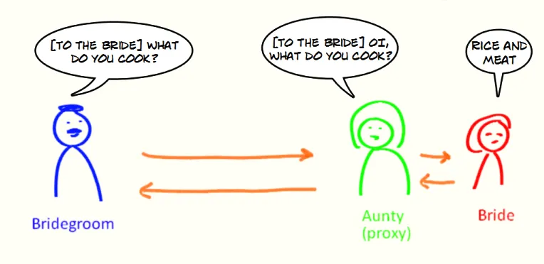

2. 静态代理

**静态代理中，我们对目标对象的每个方法的增强都是手动完成的，非常不灵活（\*比如接口一旦新增加方法，目标对象和代理对象都要进行修改\*）且麻烦(\*需要对每个目标类都单独写一个代理类\*)。** 实际应用场景非常非常少，日常开发几乎看不到使用静态代理的场景。

上面我们是从实现和应用角度来说的静态代理，从 JVM 层面来说， **静态代理在编译时就将接口、实现类、代理类这些都变成了一个个实际的 class 文件。**

静态代理实现步骤:

1. 定义一个接口及其实现类；
2. 创建一个代理类同样实现这个接口
3. 将目标对象注入进代理类，然后在代理类的对应方法调用目标类中的对应方法。这样的话，我们就可以通过代理类屏蔽对目标对象的访问，并且可以在目标方法执行前后做一些自己想做的事情。
4. 动态代理

相比于静态代理来说，动态代理更加灵活。我们不需要针对每个目标类都单独创建一个代理类，并且也不需要我们必须实现接口，我们可以直接代理实现类( *CGLIB 动态代理机制*)。

**从 JVM 角度来说，动态代理是在运行时动态生成类字节码，并加载到 JVM 中的。**

说到动态代理，Spring AOP、RPC 框架应该是两个不得不提的，它们的实现都依赖了动态代理。

**动态代理在我们日常开发中使用的相对较少，但是在框架中的几乎是必用的一门技术。学会了动态代理之后，对于我们理解和学习各种框架的原理也非常有帮助。**

就 Java 来说，动态代理的实现方式有很多种，比如 **JDK 动态代理**、**CGLIB 动态代理**等等。


3.1 机制介绍

**在 Java 动态代理机制中 `InvocationHandler` 接口和 `Proxy` 类是核心。**

 当需要创建一个代理对象时，程序通过Proxy类的静态方法newProxyInstance()来创建一个代理对象，该方法需要传入一个类加载器、一组接口以及一个InvocationHandler对象。 

```java
    public static Object newProxyInstance(ClassLoader loader,
                                          Class<?>[] interfaces,
                                          InvocationHandler h)
        throws IllegalArgumentException
    {
        ......
    }
```

这个方法一共有 3 个参数：

1. **loader** :类加载器，用于加载代理对象。
2. **interfaces** : 被代理类实现的一些接口；
3. **h** : 实现了 `InvocationHandler` 接口的对象；

 代理对象实现了这些接口，并将所有方法的调用委托给InvocationHandler对象进行处理。 

要实现动态代理的话，还必须需要实现 `InvocationHandler` 来自定义处理逻辑。 当我们的动态代理对象调用一个方法时，这个方法的调用就会被转发到实现 `InvocationHandler` 接口类的 `invoke` 方法来调用。 在该方法中，可以执行一些额外的操作，例如记录日志、检查权限、修改参数等，然后将结果返回给代理对象。 

```java
public interface InvocationHandler {

    /**
     * 当你使用代理对象调用方法的时候实际会调用到这个方法
     */
    public Object invoke(Object proxy, Method method, Object[] args)
        throws Throwable;
}
```

`invoke()` 方法有下面三个参数：

1. **proxy** :动态生成的代理类
2. **method** : 与代理类对象调用的方法相对应
3. **args** : 当前 method 方法的参数

也就是说：**你通过 `Proxy` 类的 `newProxyInstance()` 创建的代理对象在调用方法的时候，实际会调用到实现 `InvocationHandler` 接口的类的 `invoke()`方法。** 你可以在 `invoke()` 方法中自定义处理逻辑，比如在方法执行前后做什么事情

3.2 动态代理使用步骤

1. 定义一个接口及其实现类；
2. 自定义 `InvocationHandler` 并重写 `invoke`方法，在 `invoke` 方法中我们会调用原生方法（被代理类的方法）并自定义一些处理逻辑；
3. 通过 `Proxy.newProxyInstance(ClassLoader loader,Class<?>[] interfaces,InvocationHandler h)` 方法创建代理对象

**1.定义发送短信的接口**

```java
public interface SmsService {
    String send(String message);
}
```

**2.实现发送短信的接口**

```java
public class SmsServiceImpl implements SmsService {
    public String send(String message) {
        System.out.println("send message:" + message);
        return message;
    }
}
```

**3.定义一个 JDK 动态代理类**

```java
import java.lang.reflect.InvocationHandler;
import java.lang.reflect.InvocationTargetException;
import java.lang.reflect.Method;

/**
 * @author shuang.kou
 * @createTime 2020年05月11日 11:23:00
 */
public class DebugInvocationHandler implements InvocationHandler {
    /**
     * 代理类中的真实对象
     */
    private final Object target;

    public DebugInvocationHandler(Object target) {
        this.target = target;
    }


    public Object invoke(Object proxy, Method method, Object[] args) throws InvocationTargetException, IllegalAccessException {
        //调用方法之前，我们可以添加自己的操作
        System.out.println("before method " + method.getName());
        Object result = method.invoke(target, args);
        //调用方法之后，我们同样可以添加自己的操作
        System.out.println("after method " + method.getName());
        return result;
    }
}
```

`invoke()` 方法: 当我们的动态代理对象调用原生方法的时候，最终实际上调用到的是 `invoke()` 方法，然后 `invoke()` 方法代替我们去调用了被代理对象的原生方法。

### 讲讲 hashmap，底层原理是什么？

**JDK1.8 之前**

JDK1.8 之前 HashMap 底层是 **数组和链表** 结合在一起使用也就是 链表散列。HashMap 通过 key 的 hashCode 经过扰动函数处理过后得到 hash 值，然后通过 (n - 1) & hash 判断当前元素存放的位置（这里的 n 指的是数组的长度），如果当前位置存在元素的话，就判断该元素与要存入的元素的 hash 值以及 key 是否相同，如果相同的话，直接覆盖，*不相同就通过拉链法解决冲突*。

所谓扰动函数指的就是 HashMap 的 hash 方法。使用 hash 方法也就是扰动函数是为了防止一些实现比较差的 hashCode() 方法 换句话说使用扰动函数之后可以减少碰撞。

JDK 1.8 HashMap 的 hash 方法源码:

JDK 1.8 的 hash 方法 相比于 JDK 1.7 hash 方法更加简化，但是原理不变。

```java
    static final int hash(Object key) {
      int h;
      // key.hashCode()：返回散列值也就是hashcode
      // ^ ：按位异或
      // >>>:无符号右移，忽略符号位，空位都以0补齐
      return (key == null) ? 0 : (h = key.hashCode()) ^ (h >>> 16);
  }
```

对比一下 JDK1.7 的 HashMap 的 hash 方法源码.

```java
static int hash(int h) {
    // This function ensures that hashCodes that differ only by
    // constant multiples at each bit position have a bounded
    // number of collisions (approximately 8 at default load factor).

    h ^= (h >>> 20) ^ (h >>> 12);
    return h ^ (h >>> 7) ^ (h >>> 4);
}
```

相比于 JDK1.8 的 hash 方法 ，JDK 1.7 的 hash 方法的性能会稍差一点点，因为毕竟扰动了 4 次。

所谓 **“拉链法”** 就是：将链表和数组相结合。也就是说创建一个链表数组，数组中每一格就是一个链表。若遇到哈希冲突，则将冲突的值加到链表中即可。


**JDK1.8 之后**

相比于之前的版本， JDK1.8 之后在解决哈希冲突时有了较大的变化，当链表长度大于阈值（默认为 8）（将链表转换成红黑树前会判断，如果当前数组的长度小于 64，那么会选择先进行数组扩容，而不是转换为红黑树）时，将链表转化为红黑树，以减少搜索时间。


TreeMap、TreeSet 以及 JDK1.8 之后的 HashMap 底层都用到了红黑树。红黑树就是为了解决二叉查找树的缺陷，因为二叉查找树在某些情况下会退化成一个线性结构。

### stringbuilder 有用过吗？stringbuilder 和 stringbuffer 什么区别？

可变性

`String` 是不可变的（后面会详细分析原因）。

`StringBuilder` 与 `StringBuffer` 都继承自 `AbstractStringBuilder` 类，在 `AbstractStringBuilder` 中也是使用字符数组保存字符串，不过没有使用 `final` 和 `private` 关键字修饰，最关键的是这个 `AbstractStringBuilder` 类还提供了很多修改字符串的方法比如 `append` 方法。

```java
abstract class AbstractStringBuilder implements Appendable, CharSequence {
    char[] value;
    public AbstractStringBuilder append(String str) {
        if (str == null)
            return appendNull();
        int len = str.length();
        ensureCapacityInternal(count + len);
        str.getChars(0, len, value, count);
        count += len;
        return this;
    }
      //...
}
```

**【重要】线程安全性**

`String` 中的对象是不可变的，也就可以理解为常量，线程安全。`AbstractStringBuilder` 是 `StringBuilder` 与 `StringBuffer` 的公共父类，定义了一些字符串的基本操作，如 `expandCapacity`、`append`、`insert`、`indexOf` 等公共方法。`StringBuffer` 对方法加了同步锁或者对调用的方法加了同步锁，所以是线程安全的。`StringBuilder` 并没有对方法进行加同步锁，所以是非线程安全的。

小结：

- String 不可变，因此是线程安全的
- StringBuilder 不是线程安全的
- StringBuffer 是线程安全的，内部使用 synchronized 进行同步

**性能**

每次对 `String` 类型进行改变的时候，都会生成一个新的 `String` 对象，然后将指针指向新的 `String` 对象。`StringBuffer` 每次都会对 `StringBuffer` 对象本身进行操作，而不是生成新的对象并改变对象引用。相同情况下使用 `StringBuilder` 相比使用 `StringBuffer` 仅能获得 10%~15% 左右的性能提升，但却要冒多线程不安全的风险。

**对于三者使用的总结：**

1. 操作少量的数据: 适用 `String`
2. 单线程操作字符串缓冲区下操作大量数据: 适用 `StringBuilder`
3. 多线程操作字符串缓冲区下操作大量数据: 适用 `StringBuffer`

### stringbuilder 为什么线程不安全？底层原理是什么？

`StringBuilder` 并没有对方法进行加同步锁

以StringBuffer为例，可以看到底层加入了同步锁

```java
@Override
    public synchronized int length() {
        return count;
    }

    @Override
    public synchronized int capacity() {
        return value.length;
    }
```

而StringBuilder则没有：

```java
    /**
     * Returns the length (character count).
     *
     * @return  the length of the sequence of characters currently
     *          represented by this object
     */
    @Override
    public int length() {
        return count;
    }

    /**
     * Returns the current capacity. The capacity is the amount of storage
     * available for newly inserted characters, beyond which an allocation
     * will occur.
     *
     * @return  the current capacity
     */
    public int capacity() {
        return value.length;
    }

```

底层原理：

StringBuilder无参构造方法默认在堆中创建16个长度的char[ ]数组，调用的是父类AbstractStringBuilder的构造方法，StringBuilder的有参构造方法在堆中创建参数的长度+16的char[ ]数组，添加的字符串依次从char[]数组前面为空的位置存入。当再次添加的字符串长度超过创建的char[ ]数组长度,就会进行扩容

```java
    /**
     * Constructs a string builder with no characters in it and an
     * initial capacity of 16 characters.
     */
    public StringBuilder() {
        super(16);
    }

    /**
     * Constructs a string builder with no characters in it and an
     * initial capacity specified by the {@code capacity} argument.
     *
     * @param      capacity  the initial capacity.
     * @throws     NegativeArraySizeException  if the {@code capacity}
     *               argument is less than {@code 0}.
     */
    public StringBuilder(int capacity) {
        super(capacity);
    }

    /**
     * Constructs a string builder initialized to the contents of the
     * specified string. The initial capacity of the string builder is
     * {@code 16} plus the length of the string argument.
     *
     * @param   str   the initial contents of the buffer.
     */
    public StringBuilder(String str) {
        super(str.length() + 16);
        append(str);
    }
```

扩容机制：

当要添加的字符串大于 > 当前字符数组的长度的时候扩容，扩容是： 原来长度*2+2 的方式扩容

```java
    /**
     * Returns a capacity at least as large as the given minimum capacity.
     * Returns the current capacity increased by the same amount + 2 if
     * that suffices.
     * Will not return a capacity greater than {@code MAX_ARRAY_SIZE}
     * unless the given minimum capacity is greater than that.
     *
     * @param  minCapacity the desired minimum capacity
     * @throws OutOfMemoryError if minCapacity is less than zero or
     *         greater than Integer.MAX_VALUE
     */
    private int newCapacity(int minCapacity) {
        // overflow-conscious code
        int newCapacity = (value.length << 1) + 2;
        if (newCapacity - minCapacity < 0) {
            newCapacity = minCapacity;
        }
        return (newCapacity <= 0 || MAX_ARRAY_SIZE - newCapacity < 0)
            ? hugeCapacity(minCapacity)
            : newCapacity;
    }
```

### 深拷贝和浅拷贝区别，工作原理

1. 浅拷贝：对引用数据类型进行引用传递般的拷贝，此为浅拷贝。
2. 深拷贝：对基本数据类型进行值传递，对引用数据类型，创建一个新的对象，并复制其内容，此为深拷贝。

深拷贝的另一种方式，使用序列化和反序列化，获取一个新对象。

浅拷贝的示例代码如下，我们这里实现了 `Cloneable` 接口，并重写了 `clone()` 方法。

`clone()` 方法的实现很简单，直接调用的是父类 `Object` 的 `clone()` 方法。

```java
public class Address implements Cloneable{
    private String name;
    // 省略构造函数、Getter&Setter方法
    @Override
    public Address clone() {
        try {
            return (Address) super.clone();
        } catch (CloneNotSupportedException e) {
            throw new AssertionError();
        }
    }
}

public class Person implements Cloneable {
    private Address address;
    // 省略构造函数、Getter&Setter方法
    @Override
    public Person clone() {
        try {
            Person person = (Person) super.clone();
            return person;
        } catch (CloneNotSupportedException e) {
            throw new AssertionError();
        }
    }
}
```

**深拷贝**

这里我们简单对 `Person` 类的 `clone()` 方法进行修改，连带着要把 `Person` 对象内部的 `Address` 对象一起复制。

```java
@Override
public Person clone() {
    try {
        Person person = (Person) super.clone();
        person.setAddress(person.getAddress().clone());
        return person;
    } catch (CloneNotSupportedException e) {
        throw new AssertionError();
    }
}

```

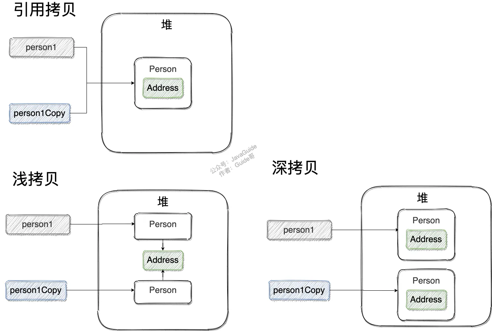

### 序列化和反序列化的概念，方式，例子（2022美团）

如果我们需要持久化 Java 对象比如将 Java 对象保存在文件中，或者在网络传输 Java 对象，这些场景都需要用到序列化。

简单来说：

- **序列化**： 将数据结构或对象转换成二进制字节流的过程
- **反序列化**：将在序列化过程中所生成的二进制字节流转换成数据结构或者对象的过程

对于 Java 这种面向对象编程语言来说，我们序列化的都是对象（Object）也就是实例化后的类(Class)，但是在 C++这种半面向对象的语言中，struct(结构体)定义的是数据结构类型，而 class 对应的是对象类型。

维基百科是如是介绍序列化的：

> **序列化**（serialization）在计算机科学的数据处理中，是指将数据结构或对象状态转换成可取用格式（例如存成文件，存于缓冲，或经由网络中发送），以留待后续在相同或另一台计算机环境中，能恢复原先状态的过程。依照序列化格式重新获取字节的结果时，可以利用它来产生与原始对象相同语义的副本。对于许多对象，像是使用大量引用的复杂对象，这种序列化重建的过程并不容易。面向对象中的对象序列化，并不概括之前原始对象所关系的函数。这种过程也称为对象编组（marshalling）。从一系列字节提取数据结构的反向操作，是反序列化（也称为解编组、deserialization、unmarshalling）。

综上：**序列化的主要目的是通过网络传输对象或者说是将对象存储到文件系统、数据库、内存中。**


例子：

```java
/*
     * 使用序列化和反序列化创建对象，这种方式其实是根据既有的对象进行复制，这个需要事先将可序列化的对象线存到文件里
     */
@SuppressWarnings("resource")
public static Worker createWorker4(String objectPath) {
    ObjectInput input = null;
    Worker worker = null;
    try {
        input = new ObjectInputStream(new FileInputStream(objectPath));
        worker = (Worker) input.readObject();
    } catch (FileNotFoundException e) {
        e.printStackTrace();
    } catch (IOException e) {
        e.printStackTrace();
    } catch (ClassNotFoundException e) {
        e.printStackTrace();
    }
    return worker;
}

/*
     * 将创建的对象存入到文件内
     */
public static void storeObject2File(String objectPath) {
    Worker worker = new Worker();
    ObjectOutputStream objectOutputStream;
    try {
        objectOutputStream = new ObjectOutputStream(new FileOutputStream(
            objectPath));
        objectOutputStream.writeObject(worker);
    } catch (FileNotFoundException e) {
        // TODO Auto-generated catch block
        e.printStackTrace();
    } catch (IOException e) {
        // TODO Auto-generated catch block
        e.printStackTrace();
    }
}
```

### 异常分类，受检异常和非受检异常区别，自定义异常优点

Java 异常类层次结构图：

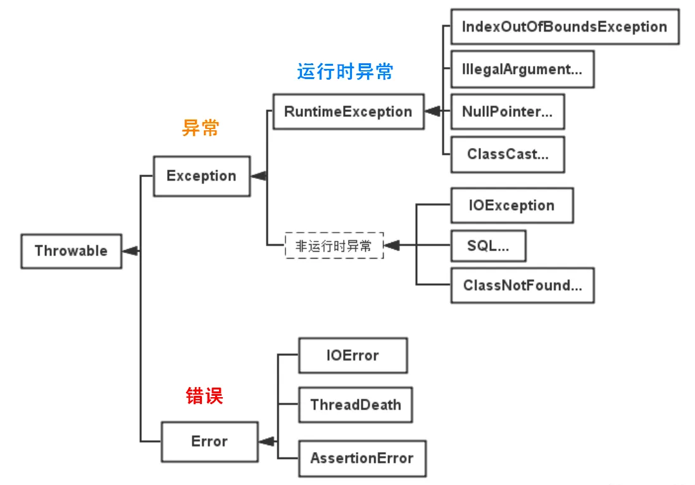

程序本身可以捕获并且可以处理的异常。Exception 这种异常又分为两类：运行时异常和编译时异常。

- **运行时异常**

都是 RuntimeException 类及其子类异常，如 NullPointerException(空指针异常)、IndexOutOfBoundsException(下标越界异常)等，这些异常是不检查异常，程序中可以选择捕获处理，也可以不处理。这些异常一般是由程序逻辑错误引起的，程序应该从逻辑角度尽可能避免这类异常的发生。

运行时异常的特点是 Java 编译器不会检查它，也就是说，当程序中可能出现这类异常，即使没有用 try-catch 语句捕获它，也没有用 throws 子句声明抛出它，也会编译通过。

- **非运行时异常** （编译异常）

是 RuntimeException 以外的异常，类型上都属于 Exception 类及其子类。从程序语法角度讲是必须进行处理的异常，如果不处理，程序就不能编译通过。如 IOException、SQLException 等以及用户自定义的 Exception 异常，一般情况下不自定义检查异常。

受检异常 ：需要用 try...catch... 语句捕获并进行处理，并且可以从异常中恢复；

非受检异常 ：是程序运行时错误，例如除 0 会引发 Arithmetic Exception，此时程序崩溃并且无法恢复

### 有没有用过自定义异常，声明式异常工作流程，和 return 区别，项目中自定义异常工作流程

用过

项目中自定义异常工作流程：

1. 新建异常类，可以继承Exception类，或者继承RuntimeException
2. 定义code和message参数，以便调用时传入对应状态码和错误信息
3. 使用自定义异常

 **throw指抛出异常，并且该方法以及调用该方法的一切方法将不会向下执行。** 

 ***return的作用很简单，意思是方法直接返回了，该方法不在向下执行。但是调用该方法的方法继续执行。*** 

 Java 中的异常处理除了包括捕获异常和处理异常之外，还包括声明异常和拋出异常，可以通过 throws 关键字在方法上声明该方法要拋出的异常，然后在方法内部通过 throw 拋出异常对象 

### 类的生命周期，什么时候回收

其中类加载的过程包括了 `加载`、`验证`、`准备`、`解析`、`初始化`五个阶段。在这五个阶段中，`加载`、`验证`、`准备`和 `初始化`这四个阶段发生的顺序是确定的，_而 `解析`阶段则不一定，它在某些情况下可以在初始化阶段之后开始，这是为了支持 Java 语言的运行时绑定(也称为动态绑定或晚期绑定)_。另外注意这里的几个阶段是按顺序开始，而不是按顺序进行或完成，因为这些阶段通常都是互相交叉地混合进行的，通常在一个阶段执行的过程中调用或激活另一个阶段。

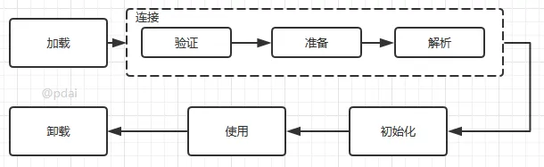

**Java 虚拟机将结束生命周期的几种情况**

- 执行了 System.exit()方法
- 程序正常执行结束
- 程序在执行过程中遇到了异常或错误而异常终止
- 由于操作系统出现错误而导致 Java 虚拟机进程终止

### NIO 和 AIO

**NIO (Non-blocking/New I/O)**

---

Java 中的 NIO 于 Java 1.4 中引入，对应 `java.nio` 包，提供了 `Channel` , `Selector`，`Buffer` 等抽象。NIO 中的 N 可以理解为 Non-blocking，不单纯是 New。它是支持面向缓冲的，基于通道的 I/O 操作方法。 对于高负载、高并发的（网络）应用，应使用 NIO 。

Java 中的 NIO 可以看作是 **I/O 多路复用模型**。也有很多人认为，Java 中的 NIO 属于同步非阻塞 IO 模型。

跟着我的思路往下看看，相信你会得到答案！

我们先来看看 **同步非阻塞 IO 模型**。

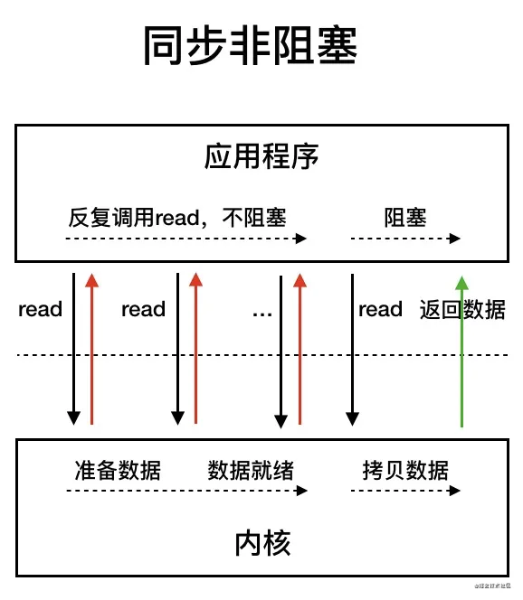

同步非阻塞 IO 模型中，应用程序会一直发起 read 调用，等待数据从内核空间拷贝到用户空间的这段时间里，线程依然是阻塞的，直到在内核把数据拷贝到用户空间。

相比于同步阻塞 IO 模型，同步非阻塞 IO 模型确实有了很大改进。通过轮询操作，避免了一直阻塞。

但是，这种 IO 模型同样存在问题：**应用程序不断进行 I/O 系统调用轮询数据是否已经准备好的过程是十分消耗 CPU 资源的。**

这个时候，**I/O 多路复用模型** 就上场了。

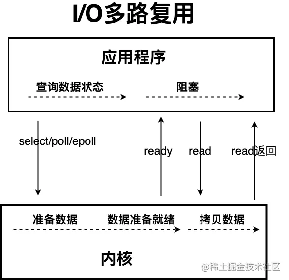

IO 多路复用模型中，线程首先发起 select 调用，询问内核数据是否准备就绪，等内核把数据准备好了，用户线程再发起 read 调用。read 调用的过程（数据从内核空间 -> 用户空间）还是阻塞的。

> 目前支持 IO 多路复用的系统调用，有 select，epoll 等等。select 系统调用，目前几乎在所有的操作系统上都有支持。
>
> - **select 调用** ：内核提供的系统调用，它支持一次查询多个系统调用的可用状态。几乎所有的操作系统都支持。
> - **epoll 调用** ：linux 2.6 内核，属于 select 调用的增强版本，优化了 IO 的执行效率。

**IO 多路复用模型，通过减少无效的系统调用，减少了对 CPU 资源的消耗。**

Java 中的 NIO ，有一个非常重要的**选择器 ( Selector )** 的概念，也可以被称为 **多路复用器**。通过它，只需要一个线程便可以管理多个客户端连接。当客户端数据到了之后，才会为其服务。


**AIO**

---

AIO 也就是 NIO 2。Java 7 中引入了 NIO 的改进版 NIO 2,它是异步 IO 模型。

异步 IO 是基于事件和回调机制实现的，也就是应用操作之后会直接返回，不会堵塞在那里，当后台处理完成，操作系统会通知相应的线程进行后续的操作。


目前来说 AIO 的应用还不是很广泛。Netty 之前也尝试使用过 AIO，不过又放弃了。这是因为，Netty 使用了 AIO 之后，在 Linux 系统上的性能并没有多少提升。

最后，来一张图，简单总结一下 Java 中的 BIO、NIO、AIO。


### Java 多态概念，实现原理

多态分为编译时多态和运行时多态:

- 编译时多态主要指方法的重载
- 运行时多态指程序中定义的对象引用所指向的具体类型在运行期间才确定

运行时多态有三个条件:

- 继承
- 覆盖(重写)
- 向上转型

 Java中的多态（Polymorphism）是指同一个方法在不同情况下的多种实现方式，也就是同一个方法可以根据不同的参数类型、个数或者对象类型而有不同的表现形式。Java中实现多态的方式有两种：方法重载（Overloading）和方法重写（Overriding）。 

1. 方法重载 方法重载是指在同一个类中定义多个方法名相同但是参数类型、个数或者顺序不同的方法。Java编译器根据方法的参数类型、个数或者顺序来确定调用哪个方法，从而实现多态。
2. 方法重写 方法重写是指子类重写了父类中的同名同参数的方法，从而实现多态。在方法重写时，子类必须保证重写方法的返回值类型、方法名和参数类型与父类中的方法相同或者是其子类。

### NIO 的 buffer 区是双向的吗？

是双向的

数据缓存区: 在 JAVA NIO 框架中，为了保证每个通道的数据读写速度 JAVA NIO 框架为每一种需要支持数据读写的通道集成了 Buffer 的支持。

这句话怎么理解呢? 例如 ServerSocketChannel 通道它只支持对 OP_ACCEPT 事件的监听，所以它是不能直接进行网络数据内容的读写的。所以 ServerSocketChannel 是没有集成 Buffer 的。

Buffer 有两种工作模式: 写模式和读模式。在读模式下，应用程序只能从 Buffer 中读取数据，不能进行写操作。但是在写模式下，应用程序是可以进行读操作的，这就表示可能会出现脏读的情况。所以一旦您决定要从 Buffer 中读取数据，一定要将 Buffer 的状态改为读模式。

如下图:

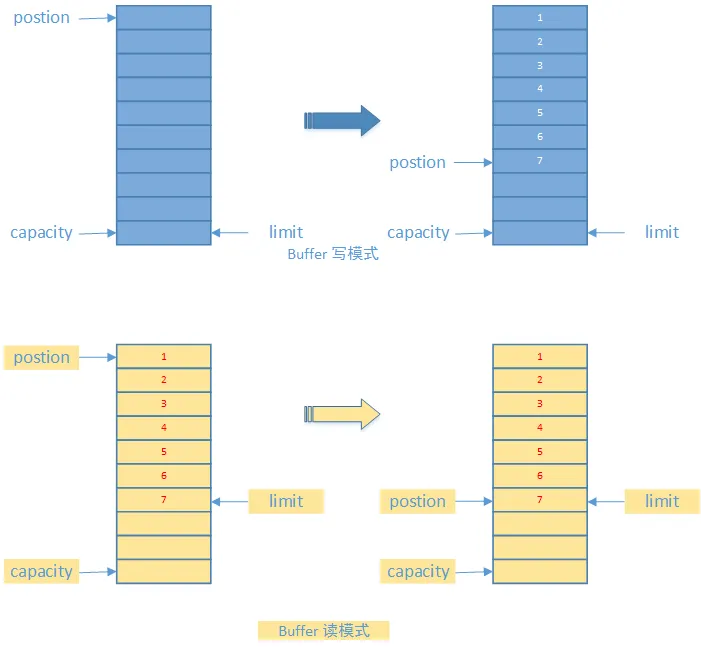

- position: 缓存区目前正在操作的数据块位置
- limit: 缓存区最大可以进行操作的位置。缓存区的读写状态正是由这个属性控制的。
- capacity: 缓存区的最大容量。这个容量是在缓存区创建时进行指定的。由于高并发时通道数量往往会很庞大，所以每一个缓存区的容量最好不要过大。

在下文 JAVA NIO 框架的代码实例中，我们将进行 Buffer 缓存区操作的演示

### 泛型有啥用？泛型擦除是啥？

泛型的本质是为了参数化类型（在不创建新的类型的情况下，通过泛型指定的不同类型来控制形参具体限制的类型）。也就是说在泛型使用过程中，操作的数据类型被指定为一个参数，这种参数类型可以用在类、接口和方法中，分别被称为泛型类、泛型接口、泛型方法。

引入泛型的意义在于：

- **适用于多种数据类型执行相同的代码**（代码复用）
- 泛型中的类型在使用时指定，不需要强制类型转换（**类型安全**，编译器会**检查类型**）

泛型擦除：

 Java语言中的泛型被称为伪泛型，因为这种泛型它只在编写的源码中存在，在经过编译器编译后的字节码文件中不会包含泛型中的类型信息了，泛型信息在编译的时候被擦除了，并且会在相应的地方插入强制类型转换的代码，这个过程就是泛型擦除。例如`new ArrayList<String>()`，泛型擦除后就是`new ArrayList()`，对其元素的操作也会加上(String)强制类型转换。 

### 常见的索引结构有？哈希表结构属于哪种场景？（2022OPPO）

哈希表、有序数组和搜索树。

- 哈希表这种结构适用于只有等值查询的场景
- 有序数组适合范围查询，用二分法快速得到，时间复杂度为 O(log(N))。查询还好，如果是插入，就得挪动后面所有的记录，成本太高。因此它一般只适用静态存储引擎，比如保存2018年某个城市的所有人口信息。
- B+树适合范围查询，我们一般建的索引结构都是B+树。

**拓展**：给你ab,ac,abc字段，你是如何加索引的？

这主要考察联合索引的最左前缀原则知识点。

- 这个最左前缀可以是联合索引的最左 `N`个字段。比如组合索引 `（a,b,c）`可以相当于建了 `（a），（a,b）,(a,b,c)`三个索引，大大提高了索引复用能力。
- 最左前缀也可以是字符串索引的最左 `M`个字符。

因此给你 `ab,ac,abc`字段，你可以直接加 `abc`联合索引和 `ac`联合索引即可。

### 联合索引是什么

 基于多个字段创建的索引我们称为联合索引，比如我们创建索引**create index idx on table(A,B,C)** 我们称在字段A,B,C上创建了一个联合索引

 我们知道，索引存储底层是B+树，在InnoDB存储引擎下，主键索引叶子节点存储的是数据，非主键索引上存储的是主键id，在联合索引下，这个B+树是如何组织的呢，我们通过一个具体的例子来看一下，首先我们先建立一个表，向表里添加一些数据。 

```sql
CREATE TABLE `user`  (
  `id` int(11) NOT NULL AUTO_INCREMENT COMMENT '主键id自增',
  `age` int(11) NULL DEFAULT NULL COMMENT '年龄',
    `money` int(11) NULL DEFAULT NULL COMMENT '账户余额 ,真正开发时候，余额不能用整数哈',
    `ismale` int(11) NULL DEFAULT NULL comment '性别 0男1女',
    `name` varchar(20) CHARACTER SET utf8 COLLATE utf8_general_ci NULL DEFAULT NULL comment '名称',
  PRIMARY KEY (`id`) USING BTREE,
  INDEX `index_bcd`(`age`, `money`) USING BTREE
) ENGINE = InnoDB AUTO_INCREMENT = 1 CHARACTER SET = utf8 COLLATE = utf8_general_ci ROW_FORMAT = Dynamic;
```

联合索引和单个索引对比来讲，联合索引的所有索引项都会出现在索引上，存储引擎会先根据第一个索引项排序，如果第一个索引项相同的话才会去看第二个，所有我们在查询的时候，如果头索引不带的话，联合索引就会失效，因为在根节点他就不知道怎么往下走。比如我们现在**select \* from USER us where us.age=20 and us.money=30**这个sql去查的，首先在根节点上age>1并且<60,那么读下一个节点，依次类推读到叶子节点上取出主键id回表查询所有的字段值。 

 [Mysql系列-联合索引 - 个人文章 - SegmentFault 思否](https://segmentfault.com/a/1190000040866035) 

### Java BIO NIO AIO 三者的区别？

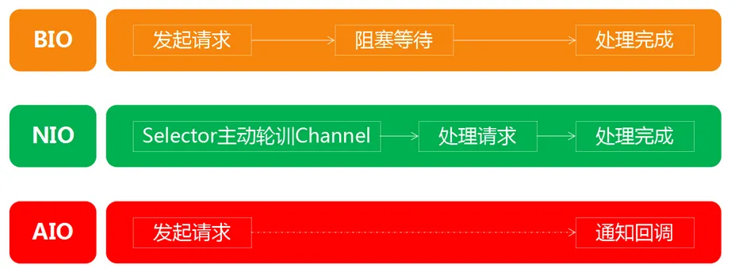

* Java BIO[Blocking I/O] | 同步阻塞I/O模式

  * BIO 全称Block-IO 是一种同步且阻塞的通信模式。是一个比较传统的通信方式，模式简单，使用方便。但并发处理能力低，通信耗时，依赖网速。
* Java NIO[New I/O] | 同步非阻塞模式(也可以称为IO多路复用模型)

  - Java NIO，全程 Non-Block IO ，是Java SE 1.4版以后，针对网络传输效能优化的新功能。是一种非阻塞同步的通信模式。
  - NIO 与原来的 I/O 有同样的作用和目的, 他们之间最重要的区别是数据打包和传输的方式。原来的 I/O 以流的方式处理数据，而 NIO 以块的方式处理数据。
  - 面向流的 I/O 系统一次一个字节地处理数据。一个输入流产生一个字节的数据，一个输出流消费一个字节的数据。
  - 面向块的 I/O 系统以块的形式处理数据。每一个操作都在一步中产生或者消费一个数据块。按块处理数据比按(流式的)字节处理数据要快得多。但是面向块的 I/O  - 缺少一些面向流的 I/O 所具有的优雅性和简单性。
* Java AIO[Asynchronous I/O] | 异步非阻塞I/O模型

  * Java AIO，全程 Asynchronous IO，是异步非阻塞的IO。是一种非阻塞异步的通信模式。在NIO的基础上引入了新的异步通道的概念，并提供了异步文件通道和异步套接字通道的实现。

### hashmap put() 工作流程（2022飞书）

`put(K key, V value)`方法是将指定的 `key, value`对添加到 `map`里。该方法首先会对 `map`做一次查找，看是否包含该元组，如果已经包含则直接返回，查找过程类似于 `getEntry()`方法；如果没有找到，则会通过 `addEntry(int hash, K key, V value, int bucketIndex)`方法插入新的 `entry`，插入方式为**头插法**。


```java
//addEntry()
void addEntry(int hash, K key, V value, int bucketIndex) {
    if ((size >= threshold) && (null != table[bucketIndex])) {
        resize(2 * table.length);//自动扩容，并重新哈希
        hash = (null != key) ? hash(key) : 0;
        bucketIndex = hash & (table.length-1);//hash%table.length
    }
    //在冲突链表头部插入新的entry
    Entry<K,V> e = table[bucketIndex];
    table[bucketIndex] = new Entry<>(hash, key, value, e);
    size++;
}
```

拓展：get()   remove()

`get(Object key)`方法根据指定的 `key`值返回对应的 `value`，该方法调用了 `getEntry(Object key)`得到相应的 `entry`，然后返回 `entry.getValue()`。因此 `getEntry()`是算法的核心。 算法思想是首先通过 `hash()`函数得到对应 `bucket`的下标，然后依次遍历冲突链表，通过 `key.equals(k)`方法来判断是否是要找的那个 `entry`。

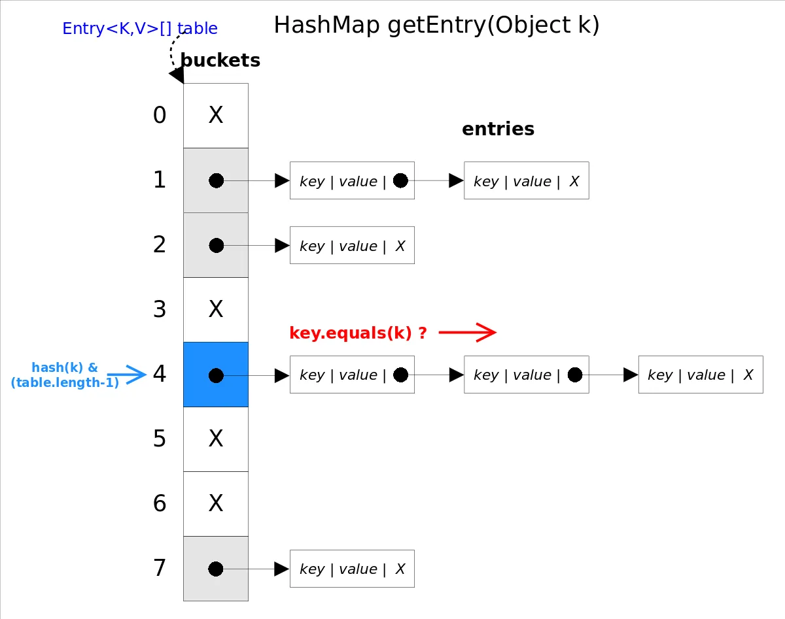


上图中 `hash(k)&(table.length-1)`等价于 `hash(k)%table.length`，原因是*HashMap*要求 `table.length`必须是2的指数，因此 `table.length-1`就是二进制低位全是1，跟 `hash(k)`相与会将哈希值的高位全抹掉，剩下的就是余数了。

```java
//getEntry()方法
final Entry<K,V> getEntry(Object key) {
	......
	int hash = (key == null) ? 0 : hash(key);
    for (Entry<K,V> e = table[hash&(table.length-1)];//得到冲突链表
         e != null; e = e.next) {//依次遍历冲突链表中的每个entry
        Object k;
        //依据equals()方法判断是否相等
        if (e.hash == hash &&
            ((k = e.key) == key || (key != null && key.equals(k))))
            return e;
    }
    return null;
}
```

**remove()**

`remove(Object key)`的作用是删除 `key`值对应的 `entry`，该方法的具体逻辑是在 `removeEntryForKey(Object key)`里实现的。`removeEntryForKey()`方法会首先找到 `key`值对应的 `entry`，然后删除该 `entry`(修改链表的相应引用)。查找过程跟 `getEntry()`过程类似。


```java
//removeEntryForKey()
final Entry<K,V> removeEntryForKey(Object key) {
	......
	int hash = (key == null) ? 0 : hash(key);
    int i = indexFor(hash, table.length);//hash&(table.length-1)
    Entry<K,V> prev = table[i];//得到冲突链表
    Entry<K,V> e = prev;
    while (e != null) {//遍历冲突链表
        Entry<K,V> next = e.next;
        Object k;
        if (e.hash == hash &&
            ((k = e.key) == key || (key != null && key.equals(k)))) {//找到要删除的entry
            modCount++; size--;
            if (prev == e) table[i] = next;//删除的是冲突链表的第一个entry
            else prev.next = next;
            return e;
        }
        prev = e; e = next;
    }
    return e;
}
```

### Unsafe类在硬件层面的实现？

不妨再看看Unsafe的compareAndSwap*方法来实现CAS操作，它是一个本地方法，实现位于unsafe.cpp中。

```c
UNSAFE_ENTRY(jboolean, Unsafe_CompareAndSwapInt(JNIEnv *env, jobject unsafe, jobject obj, jlong offset, jint e, jint x))
  UnsafeWrapper("Unsafe_CompareAndSwapInt");
  oop p = JNIHandles::resolve(obj);
  jint* addr = (jint *) index_oop_from_field_offset_long(p, offset);
  return (jint)(Atomic::cmpxchg(x, addr, e)) == e;
UNSAFE_END
```

可以看到它通过 `Atomic::cmpxchg` 来实现比较和替换操作。其中参数x是即将更新的值，参数e是原内存的值。

如果是Linux的x86，`Atomic::cmpxchg`方法的实现如下：

```c
inline jint Atomic::cmpxchg (jint exchange_value, volatile jint* dest, jint compare_value) {
  int mp = os::is_MP();
  __asm__ volatile (LOCK_IF_MP(%4) "cmpxchgl %1,(%3)"
                    : "=a" (exchange_value)
                    : "r" (exchange_value), "a" (compare_value), "r" (dest), "r" (mp)
                    : "cc", "memory");
  return exchange_value;
}
```

而windows的x86的实现如下：

```c
inline jint Atomic::cmpxchg (jint exchange_value, volatile jint* dest, jint compare_value) {
    int mp = os::isMP(); //判断是否是多处理器
    _asm {
        mov edx, dest
        mov ecx, exchange_value
        mov eax, compare_value
        LOCK_IF_MP(mp)
        cmpxchg dword ptr [edx], ecx
    }
}

// Adding a lock prefix to an instruction on MP machine
// VC++ doesn't like the lock prefix to be on a single line
// so we can't insert a label after the lock prefix.
// By emitting a lock prefix, we can define a label after it.
#define LOCK_IF_MP(mp) __asm cmp mp, 0  \
                       __asm je L0      \
                       __asm _emit 0xF0 \
                       __asm L0:
```

如果是多处理器，为cmpxchg指令添加lock前缀。反之，就省略lock前缀(单处理器会不需要lock前缀提供的内存屏障效果)。这里的lock前缀就是使用了处理器的总线锁(最新的处理器都使用缓存锁代替总线锁来提高性能)。

`cmpxchg(void* ptr, int old, int new)，如果ptr和old的值一样，则把new写到ptr内存，否则返回ptr的值，整个操作是原子的。在Intel平台下，会用lock cmpxchg来实现，使用lock触发缓存锁，这样另一个线程想访问ptr的内存，就会被block住。`

## 🍃常用框架

### Spring

#### 对 spring 和 springboot 的理解

spring

---

我们一般说 Spring 框架指的都是 Spring Framework，它是很多模块的集合，使用这些模块可以很方便地协助我们进行开发。

比如说 Spring 自带 IoC（Inverse of Control:控制反转） 和 AOP(Aspect-Oriented  Programming:面向切面编程)、可以很方便地对数据库进行访问、可以很方便地集成第三方组件（电子邮件，任务，调度，缓存等等）、对单元测试支持比较好、支持 RESTful Java 应用程序的开发。

Spring 最核心的思想就是不重新造轮子，开箱即用！

Spring 提供的核心功能主要是 IoC 和 AOP。学习 Spring ，一定要把 IoC 和 AOP 的核心思想搞懂！

springboot

---

Spring Boot 只是简化了配置，如果你需要构建 MVC 架构的 Web 程序，你还是需要使用 Spring MVC 作为 MVC 框架，只是说 Spring Boot 帮你简化了 Spring MVC 的很多配置，真正做到开箱即用！

#### springboot 是怎么加载 redis 的

个人觉得这个问题应该从[starter出发](https://javaguide.cn/system-design/framework/spring/spring-boot-auto-assembly-principles.html#%E5%A6%82%E4%BD%95%E5%AE%9E%E7%8E%B0%E4%B8%80%E4%B8%AA-starter) -》 [自动装配原理](https://javaguide.cn/system-design/framework/spring/spring-boot-auto-assembly-principles.html#springboot-%E6%98%AF%E5%A6%82%E4%BD%95%E5%AE%9E%E7%8E%B0%E8%87%AA%E5%8A%A8%E8%A3%85%E9%85%8D%E7%9A%84)

#### 加载的 redis 或者 bean 是单例还是多例

默认单例

#### springboot 是怎么实现单例模式的呢？

在我们的系统中，有一些对象其实我们只需要一个，比如说：线程池、缓存、对话框、注册表、日志对象、充当打印机、显卡等设备驱动程序的对象。事实上，这一类对象只能有一个实例，如果制造出多个实例就可能会导致一些问题的产生，比如：程序的行为异常、资源使用过量、或者不一致性的结果。

**使用单例模式的好处:**

- 对于频繁使用的对象，可以省略创建对象所花费的时间，这对于那些重量级对象而言，是非常可观的一笔系统开销；
- 由于 new 操作的次数减少，因而对系统内存的使用频率也会降低，这将减轻 GC 压力，缩短 GC 停顿时间。

**Spring 中 bean 的默认作用域就是 singleton(单例)的。** 除了 singleton 作用域，Spring 中 bean 还有下面几种作用域：

- prototype : 每次请求都会创建一个新的 bean 实例。
- request : 每一次HTTP请求都会产生一个新的bean，该bean仅在当前HTTP request内有效。
- session : 每一次HTTP请求都会产生一个新的 bean，该bean仅在当前 HTTP session 内有效。
- global-session：  全局session作用域，仅仅在基于portlet的web应用中才有意义，Spring5已经没有了。Portlet是能够生成语义代码(例如：HTML)片段的小型Java Web插件。它们基于portlet容器，可以像servlet一样处理HTTP请求。但是，与 servlet 不同，每个 portlet  都有不同的会话

**Spring 实现单例的方式：**

- xml:`<bean id="userService" class="top.snailclimb.UserService" scope="singleton"/>`
- 注解：`@Scope(value = "singleton")`

Spring 通过 `ConcurrentHashMap` 实现单例注册表的特殊方式实现单例模式。Spring 实现单例的核心代码如下：

```java
// 通过 ConcurrentHashMap（线程安全） 实现单例注册表
private final Map<String, Object> singletonObjects = new ConcurrentHashMap<String, Object>(64);

public Object getSingleton(String beanName, ObjectFactory<?> singletonFactory) {
        Assert.notNull(beanName, "'beanName' must not be null");
        synchronized (this.singletonObjects) {
            // 检查缓存中是否存在实例  
            Object singletonObject = this.singletonObjects.get(beanName);
            if (singletonObject == null) {
                //...省略了很多代码
                try {
                    singletonObject = singletonFactory.getObject();
                }
                //...省略了很多代码
                // 如果实例对象在不存在，我们注册到单例注册表中。
                addSingleton(beanName, singletonObject);
            }
            return (singletonObject != NULL_OBJECT ? singletonObject : null);
        }
    }
    //将对象添加到单例注册表
    protected void addSingleton(String beanName, Object singletonObject) {
            synchronized (this.singletonObjects) {
                this.singletonObjects.put(beanName, (singletonObject != null ? singletonObject : NULL_OBJECT));

            }
        }
}
```

#### Spring bean 启动流程和生命周期

长字版本启动流程：https://mp.weixin.qq.com/s/ut3mRwhfqXNjrBtTmI0oWg

1、实例化一个Bean－－也就是我们常说的new；

2、按照Spring上下文对实例化的Bean进行配置－－也就是IOC注入；

3、如果这个Bean已经实现了BeanNameAware接口，会调用它实现的setBeanName(String)方法，此处传递的就是Spring配置文件中Bean的id值

4、如果这个Bean已经实现了BeanFactoryAware接口，会调用它实现的setBeanFactory(setBeanFactory(BeanFactory)传递的是Spring工厂自身（可以用这个方式来获取其它Bean，只需在Spring配置文件中配置一个普通的Bean就可以）；

5、如果这个Bean已经实现了ApplicationContextAware接口，会调用setApplicationContext(ApplicationContext)方法，传入Spring上下文（同样这个方式也可以实现步骤4的内容，但比4更好，因为ApplicationContext是BeanFactory的子接口，有更多的实现方法）；

6、如果这个Bean关联了BeanPostProcessor接口，将会调用postProcessBeforeInitialization(Object obj, String s)方法，BeanPostProcessor经常被用作是Bean内容的更改，并且由于这个是在Bean初始化结束时调用那个的方法，也可以被应用于内存或缓存技术；

7、如果Bean在Spring配置文件中配置了init-method属性会自动调用其配置的初始化方法。

8、如果这个Bean关联了BeanPostProcessor接口，将会调用postProcessAfterInitialization(Object obj, String s)方法、；

`注：以上工作完成以后就可以应用这个Bean了，那这个Bean是一个Singleton的，所以一般情况下我们调用同一个id的Bean会是在内容地址相同的实例，当然在Spring配置文件中也可以配置非Singleton，这里我们不做赘述。`

9、当Bean不再需要时，会经过清理阶段，如果Bean实现了DisposableBean这个接口，会调用那个其实现的destroy()方法；

10、最后，如果这个Bean的Spring配置中配置了destroy-method属性，会自动调用其配置的销毁方法。

#### Spring设计模式（美团）

具体可以参考：[面试官:“谈谈Spring中都用到了那些设计模式?”](https://mp.weixin.qq.com/s?__biz=Mzg2OTA0Njk0OA==&mid=2247485303&idx=1&sn=9e4626a1e3f001f9b0d84a6fa0cff04a&chksm=cea248bcf9d5c1aaf48b67cc52bac74eb29d6037848d6cf213b0e5466f2d1fda970db700ba41&token=255050878&lang=zh_CN#rd)

**工厂设计模式** : Spring 使用工厂模式通过 `BeanFactory`、`ApplicationContext` 创建 bean 对象。

**代理设计模式** : Spring AOP 功能的实现。

**单例设计模式** : Spring 中的 Bean 默认都是单例的。

**模板方法模式** : Spring 中 `jdbcTemplate`、`hibernateTemplate` 等以 Template 结尾的对数据库操作的类，它们就使用到了模板模式。

**包装器设计模式** : 我们的项目需要连接多个数据库，而且不同的客户在每次访问中根据需要会去访问不同的数据库。这种模式让我们可以根据客户的需求能够动态切换不同的数据源。

**观察者模式:** Spring 事件驱动模型就是观察者模式很经典的一个应用。

**适配器模式** : Spring AOP 的增强或通知(Advice)使用到了适配器模式、spring MVC 中也是用到了适配器模式适配 `Controller`。****

#### Spring常用注解

@Value：属性赋值

@Component:与业务层、dao层、控制层不相关的类需要在spring容器中创建使用

@Repository:dao层对象的创建

@Service:业务层层对象的创建

@Controller:控制层对象的创建

@Autowired:引用类型赋值,支持byName。默认是byType

#### Spring声明式事务原理？哪些场景事务会失效？(OPPO)

声明式事务原理

---

spring声明式事务，即 `@Transactional`,它可以帮助我们把事务开启、提交或者回滚的操作，通过Aop的方式进行管理。


在spring的bean的初始化过程中，就需要对实例化的bean进行代理，并且生成代理对象。生成代理对象的代理逻辑中，进行方法调用时，需要先获取切面逻辑，@Transactional注解的切面逻辑类似于@Around，在spring中是实现一种类似代理逻辑。


spring声明式事务哪些场景会失效

---

- 方法的访问权限必须是public，其他private等权限，事务失效
- 方法被定义成了final的，这样会导致事务失效。
- 在同一个类中的方法直接内部调用，会导致事务失效。
- 一个方法如果没交给spring管理，就不会生成spring事务。
- 多线程调用，两个方法不在同一个线程中，获取到的数据库连接不一样的。
- 表的存储引擎不支持事务
- 如果自己try...catch误吞了异常，事务失效。
- 错误的传播

### Spring Boot

#### 接口幂等是如何保证的

**什么是幂等**？

---

`幂等原先是数学中的一个概念，表示进行1次变换和进行N次变换产生的效果相同。`

当我们讨论接口的幂等性时一般是在说：以相同的请求调用这个接口一次和调用这个接口多次，对系统产生的影响是相同的。如果一个接口满足这个特性，那么我们就说这个 接口是一个幂等接口。

- **接口幂等和防止重复提交是一回事吗**？

严格来说，并不是。

1. **幂等**: 更多的是在重复请求已经发生，或是无法避免的情况下，采取一定的技术手段让这些重复请求不给系统带来副作用。
2. **防止重复**: 提交更多的是不让用户发起多次一样的请求。比如说用户在线购物下单时点了提交订单按钮，但是由于网络原因响应很慢，此时用户比较心急多次点击了订单提交按钮。 这种情况下就可能会造成多次下单。一般防止重复提交的方案有：将订单按钮置灰，跳转到结果页等。主要还是从客户端的角度来解决这个问题。

- **哪些情况下客户端是防止不了重复提交的**？

虽然我们可在客户端做一些防止接口重复提交的事（比如将订单按钮置灰，跳转到结果页等）， 但是如下情况依然客户端是很难控制接口重复提交到后台的，这也进一步表明了**接口幂等和防止重复提交不是一回事**以及**后端接口保证接口幂等的必要性**所在。

1. **接口超时重试**：接口可能会因为某些原因而调用失败，出于容错性考虑会加上失败重试的机制。如果接口调用一半，再次调用就会因为脏数据的存在而出现异常。
2. **消息重复消费**：在使用消息中间件来处理消息队列，且手动ack确认消息被正常消费时。如果消费者突然断开连接，那么已经执行了一半的消息会重新放回队列。被其他消费者重新消费时就会导致结果异常，如数据库重复数据，数据库数据冲突，资源重复等。
3. **请求重发**：网络抖动引发的nginx重发请求，造成重复调用；

**什么是幂等接口**？

---

在HTTP/1.1中，对幂等性进行了定义。它描述了一次和多次请求某一个资源对于资源本身应该具有同样的结果（网络超时等问题除外），即第一次请求的时候对资源产生了副作用，但是以后的多次请求都不会再对资源产生副作用。

这里的副作用是不会对结果产生破坏或者产生不可预料的结果。也就是说，其任意多次执行对资源本身所产生的影响均与一次执行的影响相同。

- **对哪些类型的接口需要保证接口幂等**？

我们看下标准的restful请求，幂等情况是怎么样的：

1. SELECT查询操作
   1. GET：只是获取资源，对资源本身没有任何副作用，天然的幂等性。
   2. HEAD：本质上和GET一样，获取头信息，主要是探活的作用，具有幂等性。
   3. OPTIONS：获取当前URL所支持的方法，因此也是具有幂等性的。
2. DELETE删除操作
   1. 删除的操作，如果从删除的一次和删除多次的角度看，数据并不会变化，这个角度看它是幂等的
   2. 但是如果，从另外一个角度，删除数据一般是返回受影响的行数，删除一次和多次删除返回的受影响行数是不一样的，所以从这个角度它需要保证幂等。（折中而言DELETE操作通常也会被纳入保证接口幂等的要求）
3. ADD/EDIT操作
   1. PUT：用于更新资源，有副作用，但是它应该满足幂等性，比如根据id更新数据，调用多次和N次的作用是相同的（根据业务需求而变）。
   2. POST：用于添加资源，多次提交很可能产生副作用，比如订单提交，多次提交很可能产生多笔订单。

**常见的保证幂等的方式**

---

如果你调用下游接口超时了，是不是考虑重试？如果重试，下游接口就需要支持幂等啦。

实现幂等一般有这8种方案：

- select+insert+主键/唯一索引冲突
- 直接insert + 主键/唯一索引冲突
- 状态机幂等
- 抽取防重表
- token令牌
- 悲观锁(如select for update，很少用)
  - 典型的数据库悲观锁：for update
- 乐观锁
  - 针对更新操作。
- 分布式锁
  - 分布式锁实现幂等性的逻辑是，在每次执行方法之前判断，是否可以获取到分布式锁，如果可以，则表示为第一次执行方法，否则直接舍弃请求即可

### Netty

#### 讲讲你理解的Netty 的零拷贝，有什么优点？

`零复制（英语：Zero-copy；也译零拷贝）技术是指计算机执行操作时，CPU 不需要先将数据从某处内存复制到另一个特定区域。这种技术通常用于通过网络传输文件时节省 CPU 周期和内存带宽。`

在 OS 层面上的 `Zero-copy` 通常指避免在 `用户态(User-space)` 与 `内核态(Kernel-space)` 之间来回拷贝数据。而在 Netty 层面 ，零拷贝主要体现在对于数据操作的优化。

Netty 中的零拷贝体现在以下几个方面：

1. 使用 Netty 提供的 `CompositeByteBuf` 类, 可以将多个 `ByteBuf` 合并为一个逻辑上的 `ByteBuf`, 避免了各个 `ByteBuf` 之间的拷贝。
2. `ByteBuf` 支持 slice 操作, 因此可以将 ByteBuf 分解为多个共享同一个存储区域的 `ByteBuf`, 避免了内存的拷贝。
3. 通过 `FileRegion` 包装的 `FileChannel.tranferTo` 实现文件传输, 可以直接将文件缓冲区的数据发送到目标 `Channel`, 避免了传统通过循环 write 方式导致的内存拷贝问题。
4. 在将一个byte数组转换为一个ByteBuf对象的场景下，Netty提供了一系列的包装类，避免了转换过程中的内存拷贝。
5. 如果通道接收和发送ByteBuf都使用直接内存进行Socket读写，就不需要进行缓冲区的二次拷贝。如果使用JVM的堆内存进行Socket读写，那么JVM会先将堆内存Buffer拷贝一份到直接内存再写入Socket中，相比于使用直接内存，这种情况在发送过程中会多出一次缓冲区的内存拷贝。所以，在发送ByteBuffer到Socket时，尽量使用直接内存而不是JVM堆内存

#### 讲讲Reactor线程模型，netty是基于Reactor的哪种模式？

Reactor是一种并发处理客户端请求响应的事件驱动模型。服务端在接收到客户端请求后采用多路复用策略，通过一个非阻塞的线程来异步接收所有的客户端请求，并将这些请求转发到相关的工作线程组上进行处理。Reactor模型常常基于异步线程的方式实现，常用的Reactor线程模型有3种：Reactor单线程模型、Reactor多线程模型和Reactor主从多线程模型

Reactor模式由Reactor线程、Handlers处理器两大角色组成，两大角色的职责分别如下：

（1）Reactor线程的职责：负责响应IO事件，并且分发到Handlers处理器。

（2）Handlers处理器的职责：非阻塞的执行业务处理逻辑。

1.**单线程模型** ：

总体来说，Reactor模式有点类似事件驱动模式。在事件驱动模式中，当有事件触发时，事件源会将事件分发到Handler（处理器），由Handler负责事件处理。Reactor模式中的反应器角色类似于事件驱动模式中的事件分发器（Dispatcher）角色。

具体来说，在Reactor模式中有Reactor和Handler两个重要的组件：

（1）Reactor：负责查询IO事件，当检测到一个IO事件时将其发送给相应的Handler处理器去处理。这里的IO事件就是NIO中选择器查询出来的通道IO事件。

（2）Handler：与IO事件（或者选择键）绑定，负责IO事件的处理，完成真正的连接建立、通道的读取、处理业务逻辑、负责将结果写到通道等。

什么是单线程版本的Reactor模式呢？简单地说，Reactor和Handlers处于一个线程中执行。这是最简单的Reactor模型（图片来自《offer来了》）


2.**多线程模型**

Reactor和Handler挤在单个线程中会造成非常严重的性能缺陷，可以使用多线程来对基础的Reactor模式进行改造和演进

多线程Reactor的演进分为两个方面：

（1）升级Handler。既要使用多线程，又要尽可能高效率，则可以考虑使用线程池。

（2）升级Reactor。可以考虑引入多个Selector（选择器），提升选择大量通道的能力。

总体来说，多线程版本的Reactor模式大致如下：

（1）将负责数据传输处理的IOHandler处理器的执行放入独立的线程池中。这样，业务处理线程与负责新连接监听的反应器线程就能相互隔离，避免服务器的连接监听受到阻塞。

（2）如果服务器为多核的CPU，可以将反应器线程拆分为多个子反应器（SubReactor）线程；同时，引入多个选择器，并且为每一个SubReactor引入一个线程，一个线程负责一个选择器的事件轮询。这样充分释放了系统资源的能力，也大大提升了反应器管理大量连接或者监听大量传输通道的能力

Reactor多线程模型与单线程模型最大的区别就是由一组线程（Thread Poll）处理客户端的I/O请求操作。Reactor多线程模型将Acceptor的操作封装在一组线程池中，采用线程池的方式监听服务端端口、接收客户端的TCP连接请求、处理网络I/O读写等操作。线程池一般使用标准的JDK线程池，在该线程池中包含一个任务队列和一系列NIO线程，这些NIO线程负责具体的消息读取、解码、编码和发送。Reactor多线程模型如图（图片来自《offer来了》）

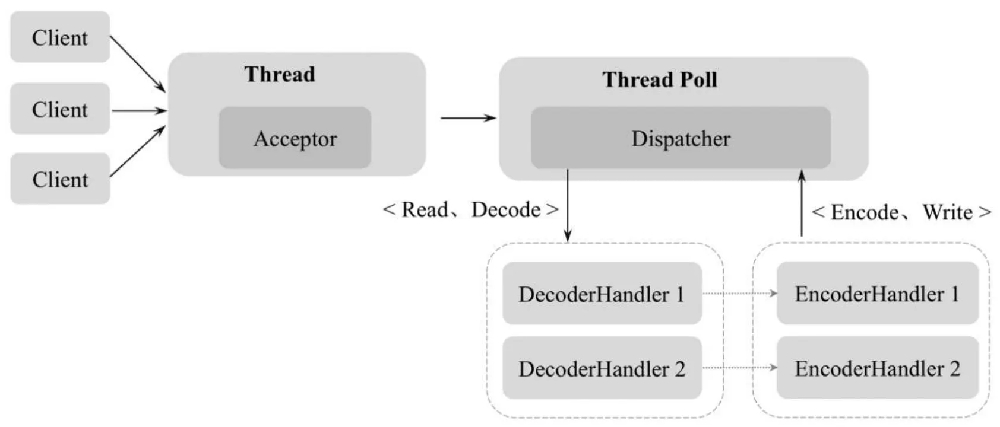

**3.主从多线程模型** [netty使用的方式]

在Reactor主从多线程模型中，服务端用于接收客户端连接的不再是一个NIO线程，而是一个独立的NIO线程池。主线程Acceptor在接收到客户端的TCP连接请求并建立完成连接后（可能要经过鉴权、登录等过程），将新创建的SocketChannel注册到子I/O线程池（Sub Reactor Pool）的某个I/O线程上，由它负责具体的SocketChannel的读写和编解码工作。Reactor主从多线程模型中的Acceptor线程池（Acceptor Thread Pool）只用于客户端的鉴权、登录、握手和安全认证，一旦链路建立成功，就将链路注册到后端Sub Reactor线程池的I/O线程上，由I/O线程负责后续的I/O操作。这样就将客户端连接的建立和消息的响应都以异步线程的方式来实现，大大提高了系统的吞吐量。Reactor主从多线程模型如图（图片来自《offer来了》）


#### 了解NIO 的epoll bug吗？谈谈epoll bug的危害 （滴滴）

epoll是Linux下一种高效的IO复用方式，相较于select和poll机制来说。其高效的原因是将基于事件的fd放到内核中来完成，在内核中基于红黑树+链表数据结构来实现，链表存放有事件发生的fd集合，然后在调用epoll_wait时返回给应用程序，由应用程序来处理这些fd事件。

使用IO多路复用，Linux下一般默认就是epoll，Java  NIO在Linux下默认也是epoll机制，但是JDK中epoll的实现却是有漏洞的。其中一个就是Epoll的空轮询Bug,  就是即使是关注的select轮询事件返回数量为0，NIO照样不断的从select本应该阻塞的Selector.select()/Selector.select(timeout)中wake up出来，导致CPU飙到100%问题。

官方给的Bug复现方法:

A DESCRIPTION OF THE PROBLEM :
The NIO selector wakes up infinitely in this situation..
0. server waits for connection、

1. client connects and write message
2. server accepts and register OP_READ
3. server reads message and remove OP_READ from interest op set
4. client close the connection
5. server write message (without any reading.. surely OP_READ is not set)
6. server’s select wakes up infinitely with return value 0

产生这一Bug的原因：

因为poll和epoll对于突然中断的连接socket会对返回的eventSet事件集合置为EPOLLHUP或者EPOLLERR，eventSet事件集合发生了变化，这就导致Selector会被唤醒，如果仅仅是因为这个原因唤醒且没有感兴趣的时间发生的话，就会变成空轮询。

简而言之：若Selector的轮询结果为空，也没有wakeup或新消息处理，则发生空轮询，CPU使用率100%

**Netty的解决办法**

- 对Selector的select操作周期进行统计，每完成一次空的select操作进行一次计数，
- 若在某个周期内连续发生N次空轮询，则触发了epoll死循环bug。
- 重建Selector，判断是否是其他线程发起的重建请求，若不是则将原SocketChannel从旧的Selector上去除注册，重新注册到新的Selector上，并将原来的Selector关闭。

## 🤹‍♂️微服务、分布式

### 分布式事务了解吗？

**事务**是一个程序执行单元，里面的所有操作要么全部执行成功，要么全部执行失败。在分布式系统中，这些操作可能是位于不同的服务中，那么如果也能保证这些操作要么全部执行成功要么全部执行失败呢？这便是分布式事务要解决的问题。

**以一个网上的经典下单减库存例子为例**：

单体应用所有的业务都使用一个数据库，整个下单流程或许只用在一个方法里同一个事务下操作数据库即可。此时所有操作都在一个事务里，要么全部提交，要么全部回滚。

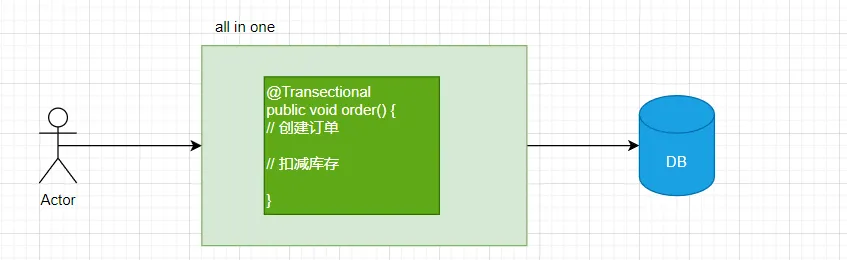

但随着业务量不断增长，业务服务化拆分，就会分离出订单中心、库存中心等。而这样就造成业务间相互隔离，每个业务都维护着自己的数据库，数据的交换只能进行服务调用。

用户再下单时，创建订单和扣减库存，需要同时对订单DB和库存DB进行操作。两步操作必须同时成功，否则就会造成业务混乱，可此时我们只能保证自己服务的数据一致性，无法保证调用其他服务的操作是否成功，所以为了保证整个下单流程的数据一致性，就需要分布式事务介入。


具体理解可以看：https://www.pdai.tech/md/arch/arch-z-transection.html#%E4%BB%80%E4%B9%88%E6%98%AF%E5%88%86%E5%B8%83%E5%BC%8F%E4%BA%8B%E5%8A%A1

以及后续可能会问到：说一下怎么实现的分布式事务？还有没有其他的解决方案？RocketMQ 能做分布式事务吗？

### rpc了解吗

**何为 RPC?**

---

RPC（Remote Procedure Call） 即远程过程调用，通过名字我们就能看出 RPC 关注的是远程调用而非本地调用。

为什么要 RPC ？ 因为，两个不同的服务器上的服务提供的方法不在一个内存空间，所以，需要通过网络编程才能传递方法调用所需要的参数。并且，方法调用的结果也需要通过网络编程来接收。但是，如果我们自己手动网络编程来实现这个调用过程的话工作量是非常大的，因为，我们需要考虑底层传输方式（TCP还是UDP）、序列化方式等等方面。

RPC 能帮助我们做什么呢？ 简单来说，通过 RPC 可以帮助我们调用远程计算机上某个服务的方法，这个过程就像调用本地方法一样简单。并且！我们不需要了解底层网络编程的具体细节。

举个例子：两个不同的服务 A、B 部署在两台不同的机器上，服务 A 如果想要调用服务 B 中的某个方法的话就可以通过 RPC 来做。

一言蔽之：RPC 的出现就是为了让你调用远程方法像调用本地方法一样简单。

**RPC 的原理是什么?**

---

为了能够帮助小伙伴们理解 RPC 原理，我们可以将整个 RPC的 核心功能看作是下面👇 6 个部分实现的：

1. **客户端（服务消费端）** ：调用远程方法的一端。
2. **客户端 Stub（桩）** ： 这其实就是一代理类。代理类主要做的事情很简单，就是把你调用方法、类、方法参数等信息传递到服务端。
3. **网络传输** ： 网络传输就是你要把你调用的方法的信息比如说参数啊这些东西传输到服务端，然后服务端执行完之后再把返回结果通过网络传输给你传输回来。网络传输的实现方式有很多种比如最近基本的 Socket或者性能以及封装更加优秀的 Netty（推荐）。
4. **服务端 Stub（桩）** ：这个桩就不是代理类了。我觉得理解为桩实际不太好，大家注意一下就好。这里的服务端 Stub 实际指的就是接收到客户端执行方法的请求后，去指定对应的方法然后返回结果给客户端的类。
5. **服务端（服务提供端）** ：提供远程方法的一端。

具体原理图如下，后面我会串起来将整个RPC的过程给大家说一下。

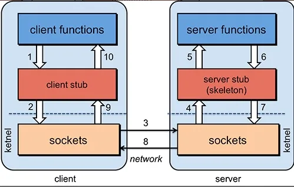

1. 服务消费端（client）以本地调用的方式调用远程服务；
2. 客户端 Stub（client stub） 接收到调用后负责将方法、参数等组装成能够进行网络传输的消息体（序列化）：`RpcRequest`；
3. 客户端 Stub（client stub） 找到远程服务的地址，并将消息发送到服务提供端；
4. 服务端 Stub（桩）收到消息将消息反序列化为Java对象: `RpcRequest`；
5. 服务端 Stub（桩）根据 `RpcRequest`中的类、方法、方法参数等信息调用本地的方法；
6. 服务端 Stub（桩）得到方法执行结果并将组装成能够进行网络传输的消息体：`RpcResponse`（序列化）发送至消费方；
7. 客户端 Stub（client stub）接收到消息并将消息反序列化为Java对象:`RpcResponse` ，这样也就得到了最终结果。over!

相信小伙伴们看完上面的讲解之后，已经了解了 RPC 的原理。

虽然篇幅不多，但是基本把 RPC 框架的核心原理讲清楚了！另外，对于上面的技术细节，我会在后面的章节介绍到。

**最后，对于 RPC 的原理，希望小伙伴不单单要理解，还要能够自己画出来并且能够给别人讲出来。因为，在面试中这个问题在面试官问到 RPC 相关内容的时候基本都会碰到。**

### RPC如何实现的？如何实现调度的？（2022虾皮）

### 讲讲微服务

什么是微服务？

---

- 微服务架构是一个分布式系统，按照业务进行划分成为不同的服务单元，解决单体系统性能等不足。
- 微服务是一种架构风格，一个大型软件应用由多个服务单元组成。系统中的服务单元可以单独部署，各个服务单元之间是松耦合的。

### 微服务两台机器怎么通信呢？ | 微服务之间是怎么联系？

同步通信：dobbo通过 **RPC 远程过程调用、springcloud通过 REST 接口json调用** 等。

异步：消息队列，如：**RabbitMq、ActiveM、Kafka** 等。

### 微服务都有什么部分呢

这里调用阳哥PPT的神图

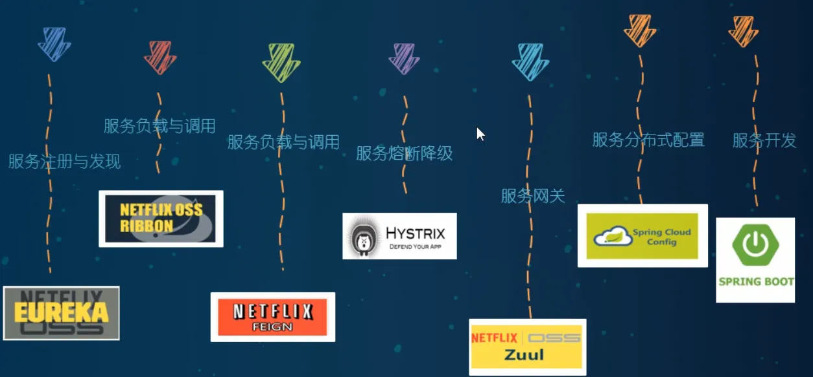


### 注册中心是什么讲讲

参考：

* https://www.nginx.com/blog/service-discovery-in-a-microservices-architecture/

服务发现：

 为了发出请求，您的代码需要知道服务实例的网络位置（IP 地址和端口），传统应用程序中，服务实例的网络位置是相对静态的。  例如，您的代码可以从偶尔更新的配置文件中读取网络位置。  然而，在现代的、基于云的微服务应用程序中，这是一个更难解决的问题，如下图所示：

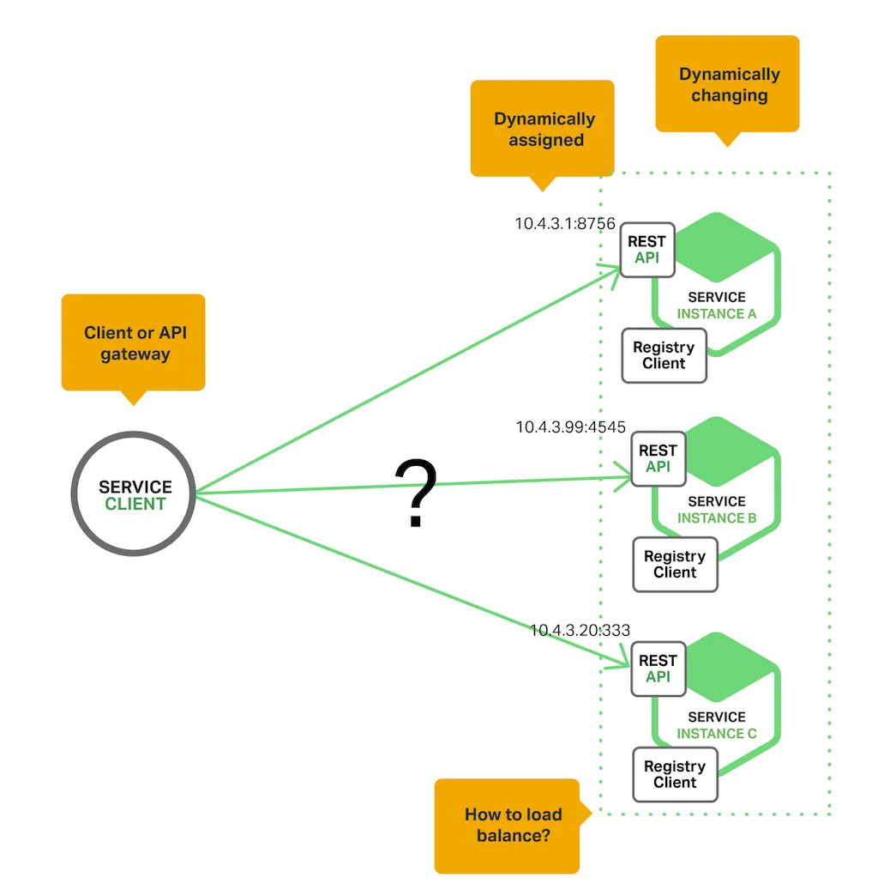

使用注册中心服务实例具有动态分配的网络位置。  此外，服务实例集会因自动缩放、故障和升级而动态变化。

两种主要的服务发现模式：客户端发现和服务器端发现

客户端发现

客户端负责确定可用服务实例的网络位置（例如10.4.3.20:333）并在它们之间实现请求的负载平衡。  客户端查询服务注册表，注册表是可用服务实例的数据库。  然后客户端使用负载平衡算法来选择一个可用的服务实例并发出请求。


服务实例的网络位置在启动时向服务注册表注册；当实例终止时，它会从服务注册表中删除。 服务实例的注册通常使用心跳机制定期刷新。

Netflix OSS 提供了一个很好的客户端发现模式示例。  Netflix Eureka 是一个服务注册中心。  它提供了一个 REST  API 来管理服务实例注册和查询可用实例。  Netflix Ribbon 是一个 IPC 客户端，它与 Eureka  一起在可用服务实例之间负载平衡请求。

服务端发现

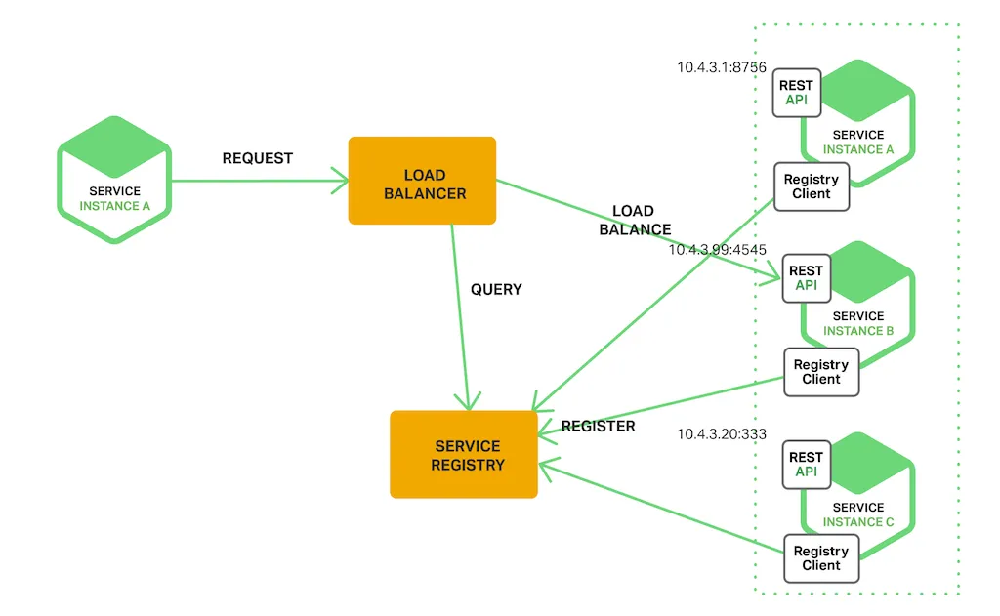

客户端通过负载均衡器向服务发出请求。  负载均衡器查询服务注册表并将每个请求路由到可用的服务实例。  与客户端发现一样，服务实例在服务注册表中注册和注销。

注册中心：

服务注册中心是服务发现的关键部分。  它是一个包含服务实例的网络位置的数据库。  服务注册中心需要高度可用并且是最新的。   客户端可以缓存从服务注册表获得的网络位置。  但是，该信息最终会过时，客户端将无法发现服务实例。   因此，服务注册中心由一组服务器组成，这些服务器使用复制协议来保持一致性。

Netflix Eureka 是服务注册中心的一个很好的例子。  它提供了一个用于注册和查询服务实例的 REST API。  服务实例使用  POST 请求注册其网络位置。  每 30 秒，它必须使用 PUT 请求刷新其注册。  通过使用 HTTP DELETE  请求或实例注册超时来删除注册。  客户端可以使用 HTTP GET 请求检索注册的服务实例。

### 网关是什么呢

何为网关？为什么要网关？

---

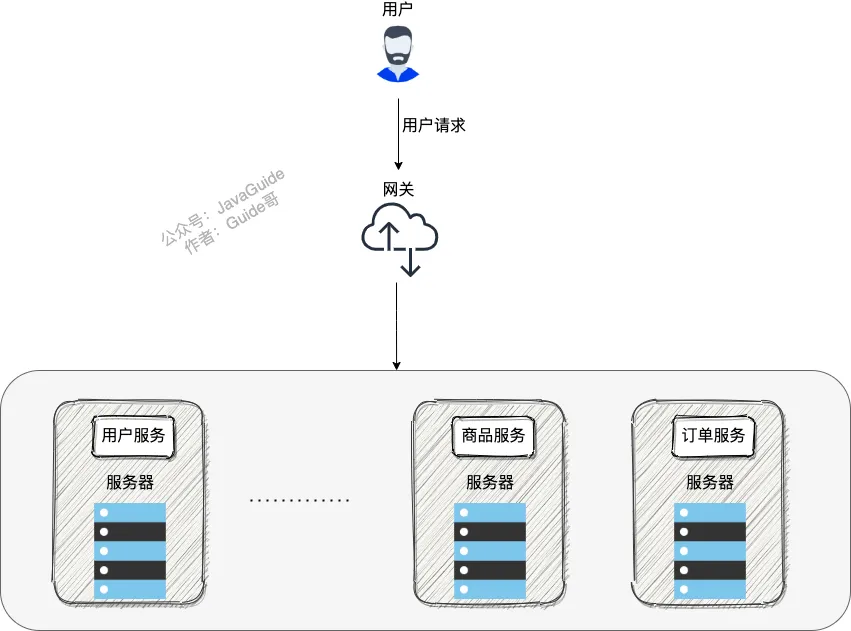

微服务背景下，一个系统被拆分为多个服务，但是像安全认证，流量控制，日志，监控等功能是每个服务都需要的，没有网关的话，我们就需要在每个服务中单独实现，这使得我们做了很多重复的事情并且没有一个全局的视图来统一管理这些功能。

综上：**一般情况下，网关都会提供请求转发、安全认证（身份/权限认证）、流量控制、负载均衡、容灾、日志、监控这些功能。**

上面介绍了这么多功能，实际上，网关主要做了一件事情：**请求过滤**

拓展：有哪些常见的网关系统？

Netflix Zuul

Zuul 是 Netflix 开发的一款提供动态路由、监控、弹性、安全的网关服务。

Zuul 主要通过过滤器（类似于 AOP）来过滤请求，从而实现网关必备的各种功能

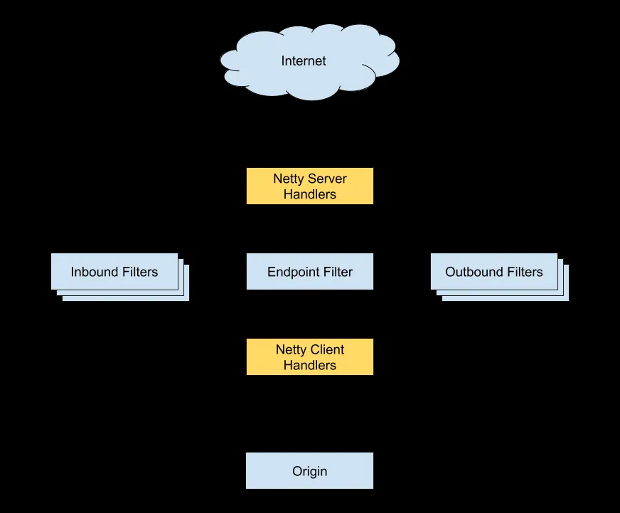

我们可以自定义过滤器来处理请求，并且，Zuul 生态本身就有很多现成的过滤器供我们使用。就比如限流可以直接用国外朋友写的 [spring-cloud-zuul-ratelimit](https://github.com/marcosbarbero/spring-cloud-zuul-ratelimit)

(这里只是举例说明，一般是配合 hystrix 来做限流)：

```xml
<dependency>
    <groupId>org.springframework.cloud</groupId>
    <artifactId>spring-cloud-starter-netflix-zuul</artifactId>
</dependency>
<dependency>
    <groupId>com.marcosbarbero.cloud</groupId>
    <artifactId>spring-cloud-zuul-ratelimit</artifactId>
    <version>2.2.0.RELEASE</version>
</dependency>
```

Zuul 1.x 基于同步 IO，性能较差。Zuul 2.x 基于 Netty 实现了异步 IO，性能得到了大幅改进。

- Github 地址 ： https://github.com/Netflix/zuul
- 官方 Wiki ： https://github.com/Netflix/zuul/wiki

Spring Cloud Gateway

---

SpringCloud Gateway 属于 Spring Cloud 生态系统中的网关，其诞生的目标是为了替代老牌网关 **Zuul **。准确点来说，应该是 Zuul 1.x。SpringCloud Gateway 起步要比 Zuul 2.x 更早。

为了提升网关的性能，SpringCloud Gateway 基于 Spring WebFlux 。Spring WebFlux 使用 Reactor 库来实现响应式编程模型，底层基于 Netty 实现异步 IO。

Spring Cloud Gateway 的目标，不仅提供统一的路由方式，并且基于 Filter 链的方式提供了网关基本的功能，例如：安全，监控/指标，和限流。

Spring Cloud Gateway 和 Zuul 2.x 的差别不大，也是通过过滤器来处理请求。不过，目前更加推荐使用 Spring Cloud Gateway 而非 Zuul，Spring Cloud 生态对其支持更加友好。

- Github 地址 ： https://github.com/spring-cloud/spring-cloud-gateway
- 官网 ： https://spring.io/projects/spring-cloud-gateway

Kong

---

Kong 是一款基于 [OpenResty](https://github.com/openresty/)

的高性能、云原生、可扩展的网关系统。

> OpenResty 是一个基于 Nginx 与 Lua 的高性能 Web 平台，其内部集成了大量精良的 Lua 库、第三方模块以及大多数的依赖项。用于方便地搭建能够处理超高并发、扩展性极高的动态 Web 应用、Web 服务和动态网关。

Kong 提供了插件机制来扩展其功能。比如、在服务上启用 Zipkin 插件

```bash
$ curl -X POST http://kong:8001/services/{service}/plugins \
    --data "name=zipkin"  \
    --data "config.http_endpoint=http://your.zipkin.collector:9411/api/v2/spans" \
    --data "config.sample_ratio=0.001"
```

- Github 地址： https://github.com/Kong/kong
- 官网地址 ： https://konghq.com/kong

APISIX

---

APISIX 是一款基于 Nginx 和 etcd 的高性能、云原生、可扩展的网关系统。

> *etcd*是使用 Go 语言开发的一个开源的、高可用的分布式 key-value 存储系统，使用 Raft 协议做分布式共识。

与传统 API 网关相比，APISIX 具有动态路由和插件热加载，特别适合微服务系统下的 API 管理。并且，APISIX 与 SkyWalking（分布式链路追踪系统）、Zipkin（分布式链路追踪系统）、Prometheus（监控系统） 等 DevOps 生态工具对接都十分方便。

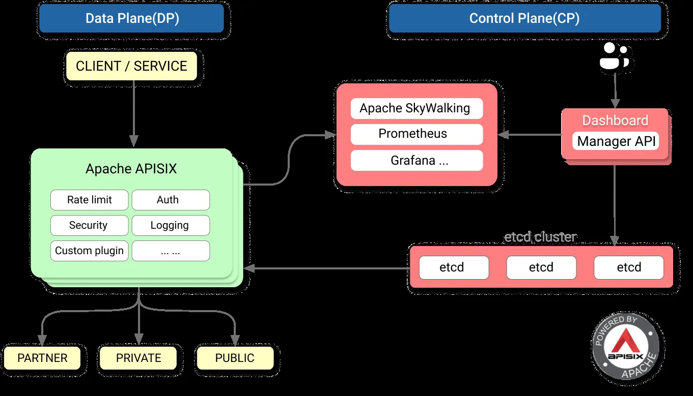

作为 NGINX 和 Kong 的替代项目，APISIX 目前已经是 Apache 顶级开源项目，并且是最快毕业的国产开源项目。国内目前已经有很多知名企业（比如金山、有赞、爱奇艺、腾讯、贝壳）使用 APISIX 处理核心的业务流量。

根据官网介绍：“APISIX 已经生产可用，功能、性能、架构全面优于 Kong”。

- Github 地址 ：https://github.com/apache/apisix
- 官网地址： https://apisix.apache.org/zh/

Shenyu

Shenyu 是一款基于 WebFlux 的可扩展、高性能、响应式网关，Apache 顶级开源项目。

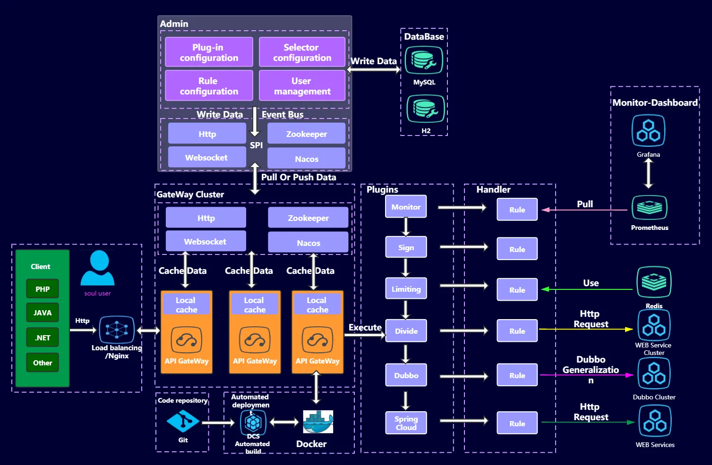

Shenyu 通过插件扩展功能，插件是 ShenYu 的灵魂，并且插件也是可扩展和热插拔的。不同的插件实现不同的功能。Shenyu 自带了诸如限流、熔断、转发 、重写、重定向、和路由监控等插件。

- Github 地址： https://github.com/apache/incubator-shenyu
- 官网地址 ： https://shenyu.apache.org/

### dubbo了解吗？

**什么是 Dubbo?**

---


[Apache Dubbo](https://github.com/apache/dubbo) 是一款高性能、轻量级的开源 Java RPC 框架。

根据 [Dubbo 官方文档](https://dubbo.apache.org/zh/)

的介绍，Dubbo 提供了六大核心能力

1. 面向接口代理的高性能RPC调用。
2. 智能容错和负载均衡。
3. 服务自动注册和发现。
4. 高度可扩展能力。
5. 运行期流量调度。
6. 可视化的服务治理与运维。


简单来说就是： **Dubbo 不光可以帮助我们调用远程服务，还提供了一些其他开箱即用的功能比如智能负载均衡。**

**为什么要用 Dubbo?**

---

随着互联网的发展，网站的规模越来越大，用户数量越来越多。单一应用架构 、垂直应用架构无法满足我们的需求，这个时候分布式服务架构就诞生了。

分布式服务架构下，系统被拆分成不同的服务比如短信服务、安全服务，每个服务独立提供系统的某个核心服务。

我们可以使用 Java RMI（Java Remote Method  Invocation）、Hessian这种支持远程调用的框架来简单地暴露和引用远程服务。但是！当服务越来越多之后，服务调用关系越来越复杂。当应用访问压力越来越大后，负载均衡以及服务监控的需求也迫在眉睫。我们可以用 F5 这类硬件来做负载均衡，但这样增加了成本，并且存在单点故障的风险。

不过，Dubbo 的出现让上述问题得到了解决。**Dubbo 帮助我们解决了什么问题呢？**

1. **负载均衡** ： 同一个服务部署在不同的机器时该调用哪一台机器上的服务。
2. **服务调用链路生成** ： 随着系统的发展，服务越来越多，服务间依赖关系变得错踪复杂，甚至分不清哪个应用要在哪个应用之前启动，架构师都不能完整的描述应用的架构关系。Dubbo 可以为我们解决服务之间互相是如何调用的。
3. **服务访问压力以及时长统计、资源调度和治理** ：基于访问压力实时管理集群容量，提高集群利用率。
4. ......


另外，Dubbo 除了能够应用在分布式系统中，也可以应用在现在比较火的微服务系统中。不过，由于 Spring Cloud 在微服务中应用更加广泛，所以，我觉得一般我们提 Dubbo 的话，大部分是分布式系统的情况。

### 是怎么使用分布式锁的?

分布式锁，是控制分布式系统不同进程共同访问共享资源的一种锁的实现。秒杀下单、抢红包等等业务场景，都需要用到分布式锁，我们项目中经常使用Redis作为分布式锁。

选了Redis分布式锁的几种实现方法，大家来讨论下，看有没有啥问题哈。

- 命令setnx + expire分开写
- setnx + value值是过期时间
- set的扩展命令（set ex px nx）
- set ex px nx + 校验唯一随机值,再删除
- Redisson

**命令setnx + expire分开写**

```
if（jedis.setnx(key,lock_value) == 1）{ //加锁
    expire（key，100）; //设置过期时间
    try {
        do something  //业务请求
    }catch(){
  }
  finally {
       jedis.del(key); //释放锁
    }
}
```

如果执行完 `setnx`加锁，正要执行 `expire`设置过期时间时，进程crash掉或者要重启维护了，那这个锁就“长生不老”了，别的线程永远获取不到锁啦，所以分布式锁不能这么实现。

**setnx + value值是过期时间**

```
long expires = System.currentTimeMillis() + expireTime; //系统时间+设置的过期时间
String expiresStr = String.valueOf(expires);

// 如果当前锁不存在，返回加锁成功
if (jedis.setnx(key, expiresStr) == 1) {
        return true;
} 
// 如果锁已经存在，获取锁的过期时间
String currentValueStr = jedis.get(key);

// 如果获取到的过期时间，小于系统当前时间，表示已经过期
if (currentValueStr != null && Long.parseLong(currentValueStr) < System.currentTimeMillis()) {

     // 锁已过期，获取上一个锁的过期时间，并设置现在锁的过期时间（不了解redis的getSet命令的小伙伴，可以去官网看下哈）
    String oldValueStr = jedis.getSet(key_resource_id, expiresStr);
  
    if (oldValueStr != null && oldValueStr.equals(currentValueStr)) {
         // 考虑多线程并发的情况，只有一个线程的设置值和当前值相同，它才可以加锁
         return true;
    }
}
      
//其他情况，均返回加锁失败
return false;
}
```

笔者看过有开发小伙伴就是这么实现分布式锁的，但是这种方案也有这些缺点：

- 过期时间是客户端自己生成的，分布式环境下，每个客户端的时间必须同步。
- 没有保存持有者的唯一标识，可能被别的客户端释放/解锁。
- 锁过期的时候，并发多个客户端同时请求过来，都执行了 `jedis.getSet()`，最终只能有一个客户端加锁成功，但是该客户端锁的过期时间，可能被别的客户端覆盖。

**set的扩展命令（set ex px nx）（注意可能存在的问题）**

```
if（jedis.set(key, lock_value, "NX", "EX", 100s) == 1）{ //加锁
    try {
        do something  //业务处理
    }catch(){
  }
  finally {
       jedis.del(key); //释放锁
    }
}
```

这个方案可能存在这样的问题：

- 锁过期释放了，业务还没执行完。
- 锁被别的线程误删。

**set ex px nx + 校验唯一随机值,再删除**

```
if（jedis.set(key, uni_request_id, "NX", "EX", 100s) == 1）{ //加锁
    try {
        do something  //业务处理
    }catch(){
  }
  finally {
       //判断是不是当前线程加的锁,是才释放
       if (uni_request_id.equals(jedis.get(key))) {
        jedis.del(key); //释放锁
        }
    }
}
```

在这里，判断当前线程加的锁和释放锁是不是一个原子操作。如果调用jedis.del()释放锁的时候，可能这把锁已经不属于当前客户端，会解除他人加的锁。

一般也是用lua脚本代替。lua脚本如下：

```
if redis.call('get',KEYS[1]) == ARGV[1] then 
   return redis.call('del',KEYS[1]) 
else
   return 0
end;
```

这种方式比较不错了，一般情况下，已经可以使用这种实现方式。但是存在锁过期释放了，业务还没执行完的问题（实际上，估算个业务处理的时间，一般没啥问题了）。

**Redisson**

分布式锁可能存在锁过期释放，业务没执行完的问题。有些小伙伴认为，稍微把锁过期时间设置长一些就可以啦。其实我们设想一下，是否可以给获得锁的线程，开启一个定时守护线程，每隔一段时间检查锁是否还存在，存在则对锁的过期时间延长，防止锁过期提前释放。

当前开源框架Redisson就解决了这个分布式锁问题。我们一起来看下Redisson底层原理是怎样的吧：

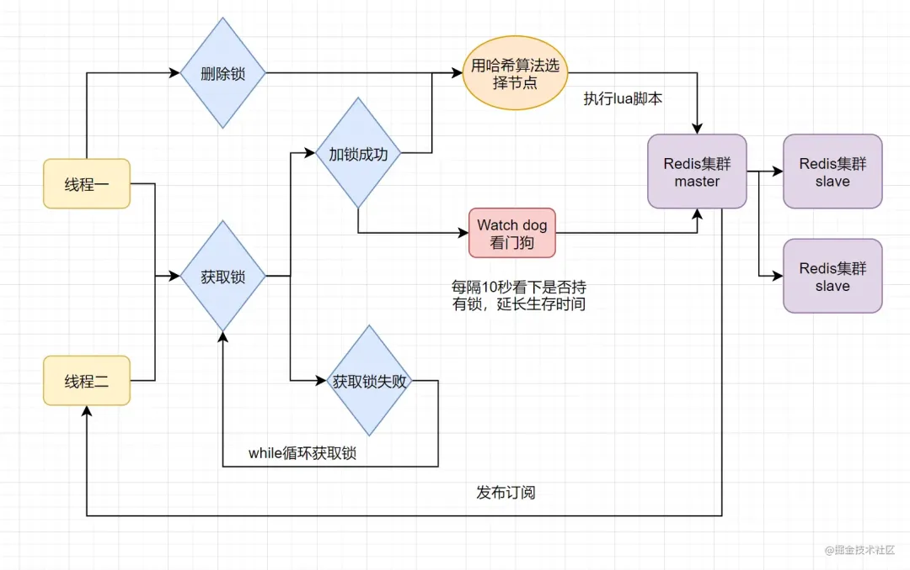

只要线程一加锁成功，就会启动一个 `watch dog`看门狗，它是一个后台线程，会每隔10秒检查一下，如果线程1还持有锁，那么就会不断的延长锁key的生存时间。因此，Redisson就是使用Redisson解决了锁过期释放，业务没执行完问题

### redisson分布式锁，watch机制？

这里Redis的客户端（Jedis, Redisson, Lettuce等）都是基于上述两类形式来实现分布式锁的，只是两类形式的封装以及一些优化（比如Redisson的watch dog)。

以基于Redisson实现分布式锁为例（支持了 单实例、Redis哨兵、redis cluster、redis master-slave等各种部署架构）：

**特色**？

1. redisson所有指令都通过lua脚本执行，保证了操作的原子性
2. redisson设置了watchdog看门狗，“看门狗”的逻辑保证了没有死锁发生
3. redisson支持Redlock的实现方式。

**过程**？

1. 线程去获取锁，获取成功: 执行lua脚本，保存数据到redis数据库。
2. 线程去获取锁，获取失败: 订阅了解锁消息，然后再尝试获取锁，获取成功后，执行lua脚本，保存数据到redis数据库。

**互斥**？

如果这个时候客户端B来尝试加锁，执行了同样的一段lua脚本。第一个if判断会执行“exists myLock”，发现myLock这个锁key已经存在。接着第二个if判断，判断myLock锁key的hash数据结构中，是否包含客户端B的ID，但明显没有，那么客户端B会获取到pttl myLock返回的一个数字，代表myLock这个锁key的剩余生存时间。此时客户端B会进入一个while循环，不听的尝试加锁。

**watch dog自动延时机制**？

客户端A加锁的锁key默认生存时间只有30秒，如果超过了30秒，客户端A还想一直持有这把锁，怎么办？其实只要客户端A一旦加锁成功，就会启动一个watch dog看门狗，它是一个后台线程，会每隔10秒检查一下，如果客户端A还持有锁key，那么就会不断的延长锁key的生存时间。

**可重入**？

每次lock会调用incrby，每次unlock会减一。

### 常见分布式事务解决方案

`**分布式事务**：就是指事务的参与者、支持事务的服务器、资源服务器以及事务管理器分别位于不同的分布式系统的不同节点之上。简单来说，分布式事务指的就是分布式系统中的事务，它的存在就是为了保证不同数据库节点的数据一致性。`

聊到分布式事务，大家记得这两个理论哈：**CAP理论 和 BASE 理论**

分布式事务的几种解决方案：

- 2PC(二阶段提交)方案、3PC
- TCC（Try、Confirm、Cancel）
- 本地消息表
- 最大努力通知
- seata

**2PC(二阶段提交)方案**

2PC，即两阶段提交，它将分布式事务的提交拆分为2个阶段：`prepare和commit/rollback`，即准备阶段和提交执行阶段。在prepare准备阶段需要等待所有参与子事务的反馈，因此可能造成数据库资源锁定时间过长，不适合并发高以及子事务生命周长较长的业务场景。并且协调者宕机的话，所有的参与者都收不到提交或回滚指令。

**3PC**

两阶段提交分别是：`CanCommit，PreCommit 和 doCommit`，这里不再详述。3PC 利用超时机制解决了 2PC 的同步阻塞问题，避免资源被永久锁定，进一步加强了整个事务过程的可靠性。但是 3PC 同样无法应对类似的宕机问题，只不过出现多数据源中数据不一致问题的概率更小。

**TCC**

TCC 采用了补偿机制，其核心思想是：针对每个操作，都要注册一个与其对应的确认和补偿（撤销）操作。它分为三个阶段：`Try-Confirm-Cancel`

- try阶段：尝试去执行，完成所有业务的一致性检查，预留必须的业务资源。
- Confirm阶段：该阶段对业务进行确认提交，不做任何检查，因为try阶段已经检查过了，默认Confirm阶段是不会出错的。
- Cancel 阶段：若业务执行失败，则进入该阶段，它会释放try阶段占用的所有业务资源，并回滚Confirm阶段执行的所有操作。

TCC方案让应用可以自定义数据库操作的粒度，降低了锁冲突，可以提升性能。但是应用侵入性强，try、confirm、cancel三个阶段都需要业务逻辑实现。

**本地消息表**

ebay最初提出本地消息表这个方案，来解决分布式事务问题。业界目前使用这种方案是比较多的，它的核心思想就是将分布式事务拆分成本地事务进行处理。可以看一下基本的实现流程图：

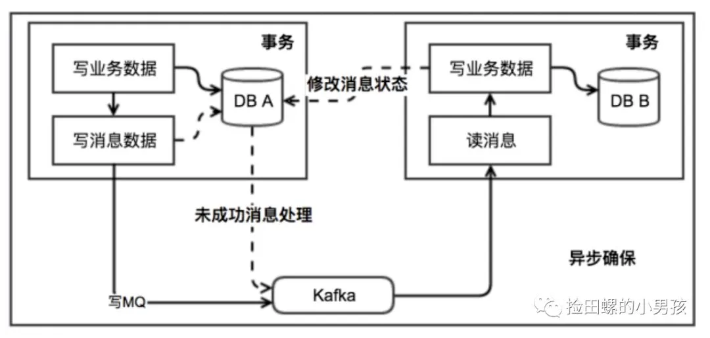

**最大努力通知**

最大努力通知方案的目标，就是发起通知方通过一定的机制，最大努力将业务处理结果通知到接收方。

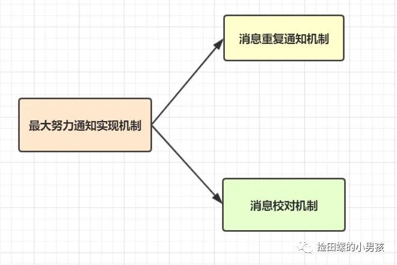

**seata**

Saga 模式是 Seata 提供的长事务解决方案。核心思想是将长事务拆分为多个本地短事务，由Saga事务协调器协调，如果正常结束那就正常完成，如果某个步骤失败，则根据相反顺序一次调用补偿操作。

Saga的并发度高，但是一致性弱，对于转账，可能发生用户已扣款，最后转账又失败的情况。

### 讲讲CAP理论？怎么理解分区容错性？

[CAP 理论/定理](https://zh.wikipedia.org/wiki/CAP定理)

起源于 2000年，由加州大学伯克利分校的Eric Brewer教授在分布式计算原理研讨会（PODC）上提出，因此 CAP定理又被称作 **布鲁尔定理（Brewer’s theorem）**

2年后，麻省理工学院的Seth Gilbert和Nancy Lynch 发表了布鲁尔猜想的证明，CAP理论正式成为分布式领域的定理。

简介

**CAP** 也就是 **Consistency（一致性）**、**Availability（可用性）**、**Partition Tolerance（分区容错性）** 这三个单词首字母组合。


CAP 理论的提出者布鲁尔在提出 CAP 猜想的时候，并没有详细定义 **Consistency**、**Availability**、**Partition Tolerance** 三个单词的明确定义。

因此，对于 CAP 的民间解读有很多，一般比较被大家推荐的是下面 👇 这种版本的解读。

在理论计算机科学中，CAP 定理（CAP theorem）指出对于一个分布式系统来说，当设计读写操作时，只能同时满足以下三点中的两个：

- **一致性（Consistency）** : 所有节点访问同一份最新的数据副本
- **可用性（Availability）**: 非故障的节点在合理的时间内返回合理的响应（不是错误或者超时的响应）。
- **分区容错性（Partition tolerance）** : 分布式系统出现网络分区的时候，仍然能够对外提供服务。

总的来说就是，数据存在的节点越多，分区容忍性越高，但要复制更新的数据就越多，一致性就越难保证。为了保证一致性，更新所有节点数据所需要的时间就越长，可用性就会降低。

### springcloud和dubbo区别在哪？各有什么优缺点？

服务调用方式：dubbo是RPC springcloud Rest Api

注册中心：dubbo 是zookeeper springcloud是eureka，也可以是zookeeper

服务网关，dubbo本身没有实现，只能通过其他第三方技术整合，springcloud有Zuul路由网关，作为路由服务器，进行消费者的请求分发,springcloud支持断路器，与git完美集成配置文件支持版本控制，事物总线实现配置文件的更新与服务自动装配等等一系列的微服务架构要素。

### nacos注册中心和zk有啥区别？

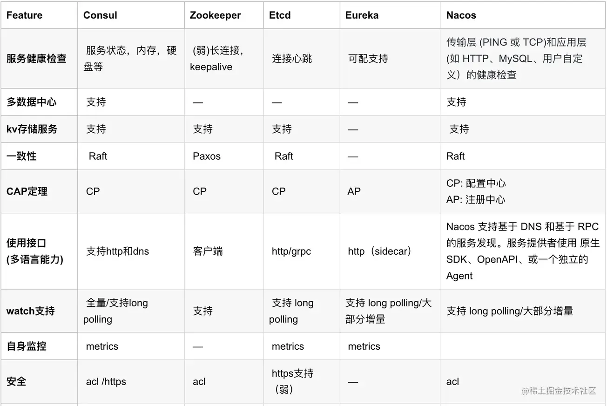

### 分布式登录怎么保持状态 （简而言之：单点登录怎么实现？）

什么是单点登录：https://zhuanlan.zhihu.com/p/66037342

怎么实现单点登录：https://mp.weixin.qq.com/s?__biz=MzI4MTY5NTk4Ng==&mid=2247489168&idx=1&sn=194ade3bfe3ae19436fd80853c135f54&source=41#wechat_redirect

### 分布式系统中，本地缓存和 Redis 中的数据是否是每台服务器上都备份同样的数据（暂时理解为分布式缓存一致性）

分布式缓存的话，使用的比较多的主要是 **Memcached** 和 **Redis**。不过，现在基本没有看过还有项目使用 **Memcached** 来做缓存，都是直接用 **Redis**。

Memcached 是分布式缓存最开始兴起的那会，比较常用的。后来，随着 Redis 的发展，大家慢慢都转而使用更加强大的 Redis 了。

分布式缓存主要解决的是单机缓存的容量受服务器限制并且无法保存通用信息的问题。因为，本地缓存只在当前服务里有效，比如如果你部署了两个相同的服务，他们两者之间的缓存数据是无法共同的。

具体方案：

https://blog.csdn.net/alionsss/article/details/107451485

### 分布式系统相关概念，序列化在分布式系统中的应用，讲一下 thrift

https://thrift.apache.org/

### nacos作为配置中心是基于推还是拉取更新配置？这个过程用长轮询会有什么问题？

答案选自：https://developer.aliyun.com/article/785050

客户端主动拉的：客户端与服务端建立 `TCP`长连接，当服务端配置数据有变动，立刻通过建立的长连接将数据推送给客户端

长轮询可不是什么新技术，它不过是由服务端控制响应客户端请求的返回时间，来减少客户端无效请求的一种优化手段，其实对于客户端来说与短轮询的使用并没有本质上的区别。

客户端发起请求后，服务端不会立即返回请求结果，而是将请求挂起等待一段时间，如果此段时间内服务端数据变更，立即响应客户端请求，若是一直无变化则等到指定的超时时间后响应请求，客户端重新发起长链接。

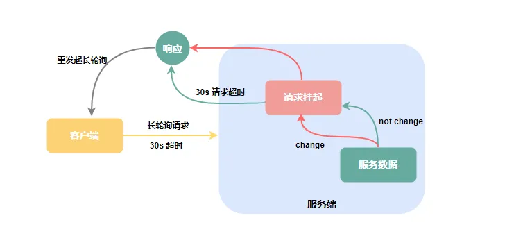

### 通过@Reference注解，dubbo是怎么得到服务提供者的实例化对象？中间的过程能否简单讲一下

### hystrix 工作原理

Hystrix 工作流程图如下:


**构建命令**

> Hystrix 提供了两个命令对象：HystrixCommand和HystrixObservableCommand，它将代表你的一个依赖请求任务，向构造函数中传入请求依赖所需要的参数。

**执行命令**

有四种方式执行Hystrix命令。分别是：

- R execute()：同步阻塞执行的，从依赖请求中接收到单个响应。
- Future queue()：异步执行，返回一个包含单个响应的Future对象。
- Observable observe()：创建Observable后会订阅Observable，从依赖请求中返回代表响应的Observable对象
- Observable toObservable()：cold observable，返回一个Observable，只有订阅时才会执行Hystrix命令，可以返回多个结果

**检查响应是否被缓存**

如果启用了 Hystrix缓存，任务执行前将先判断是否有相同命令执行的缓存。如果有则直接返回包含缓存响应的Observable；如果没有缓存的结果，但启动了缓存，将缓存本次执行结果以供后续使用。

* 检查回路器是否打开 回路器(circuit-breaker)和保险丝类似，保险丝在发生危险时将会烧断以保护电路，而回路器可以在达到我们设定的阀值时触发短路(比如请求失败率达到50%)，拒绝执行任何请求。

如果回路器被打开，Hystrix将不会执行命令，直接进入Fallback处理逻辑。

1. 检查线程池/信号量/队列情况 Hystrix 隔离方式有线程池隔离和信号量隔离。当使用Hystrix线程池时，Hystrix 默认为每个依赖服务分配10个线程，当10个线程都繁忙时，将拒绝执行命令,，而是立即跳到执行fallback逻辑。
2. 执行具体的任务 通过HystrixObservableCommand.construct() 或者 HystrixCommand.run() 来运行用户真正的任务。
3. 计算回路健康情况 每次开始执行command、结束执行command以及发生异常等情况时，都会记录执行情况，例如：成功、失败、拒绝和超时等指标情况，会定期处理这些数据，再根据设定的条件来判断是否开启回路器。
4. 命令失败时执行Fallback逻辑 在命令失败时执行用户指定的 Fallback 逻辑。上图中的断路、线程池拒绝、信号量拒绝、执行执行、执行超时都会进入Fallback处理。
5. 返回执行结果 原始对象结果将以Observable形式返回，在返回给用户之前，会根据调用方式的不同做一些处理。

### 分布式id生成方案有哪些？什么是雪花算法？

分布式id生成方案主要有：

- UUID
- 数据库自增ID
- 基于雪花算法（Snowflake）实现
- 百度 （Uidgenerator）
- 美团（Leaf）

什么是**雪花算法**？

> 雪花算法是一种生成分布式全局唯一ID的算法，生成的ID称为Snowflake IDs。这种算法由Twitter创建，并用于推文的ID。

一个Snowflake ID有64位。

- 第1位：Java中long的最高位是符号位代表正负，正数是0，负数是1，一般生成ID都为正数，所以默认为0。
- 接下来前41位是时间戳，表示了自选定的时期以来的毫秒数。
- 接下来的10位代表计算机ID，防止冲突。
- 其余12位代表每台机器上生成ID的序列号，这允许在同一毫秒内创建多个Snowflake ID。

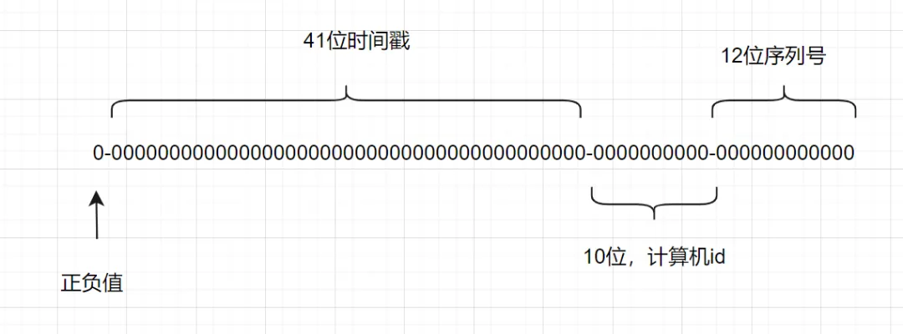

### 分布式锁方案(MySQL到redlock)，讨论锁续期，GC影响 （2022字节番茄）

#### 数据库

##### 基于数据库表（锁表，很少使用）

最简单的方式可能就是直接创建一张锁表，然后通过操作该表中的数据来实现了。当我们想要获得锁的时候，就可以在该表中增加一条记录，想要释放锁的时候就删除这条记录。

为了更好的演示，我们先创建一张数据库表，参考如下：

```sql
CREATE TABLE database_lock (
	`id` BIGINT NOT NULL AUTO_INCREMENT,
	`resource` int NOT NULL COMMENT '锁定的资源',
	`description` varchar(1024) NOT NULL DEFAULT "" COMMENT '描述',
	PRIMARY KEY (id),
	UNIQUE KEY uiq_idx_resource (resource)
) ENGINE=InnoDB DEFAULT CHARSET=utf8mb4 COMMENT='数据库分布式锁表';
```

当我们想要获得锁时，可以插入一条数据：

```sql
INSERT INTO database_lock(resource, description) VALUES (1, 'lock');
```

当需要释放锁的时，可以删除这条数据：

```sql
DELETE FROM database_lock WHERE resource=1;
```

##### 基于悲观锁

在对任意记录进行修改前，先尝试为该记录加上排他锁（exclusive locking）。

如果加锁失败，说明该记录正在被修改，那么当前查询可能要等待或者抛出异常。 具体响应方式由开发者根据实际需要决定。

如果成功加锁，那么就可以对记录做修改，事务完成后就会解锁了。

其间如果有其他对该记录做修改或加排他锁的操作，都会等待我们解锁或直接抛出异常。


要使用悲观锁，我们必须关闭mysql数据库的自动提交属性，因为MySQL默认使用autocommit模式，也就是说，当你执行一个更新操作后，MySQL会立刻将结果进行提交。set autocommit=0;

```sql
//0.开始事务
begin;/begin work;/start transaction; (三者选一就可以)
//1.查询出商品信息
select status from t_goods where id=1 for update;
//2.根据商品信息生成订单
insert into t_orders (id,goods_id) values (null,1);
//3.修改商品status为2
update t_goods set status=2;
//4.提交事务
commit;/commit work;
    
```

上面的查询语句中，我们使用了`select…for update`的方式，这样就通过开启排他锁的方式实现了悲观锁。此时在t_goods表中，id为1的 那条数据就被我们锁定了，其它的事务必须等本次事务提交之后才能执行。这样我们可以保证当前的数据不会被其它事务修改。

上面我们提到，使用`select…for update`会把数据给锁住，不过我们需要注意一些锁的级别，MySQL InnoDB默认行级锁。行级锁都是基于索引的，如果一条SQL语句用不到索引是不会使用行级锁的，会使用表级锁把整张表锁住，这点需要注意。

##### 基于乐观锁

乐观并发控制（又名“乐观锁”，Optimistic Concurrency Control，缩写“OCC”）是一种并发控制的方法。它假设多用户并发的事务在处理时不会彼此互相影响，各事务能够在不产生锁的情况下处理各自影响的那部分数据。在提交数据更新之前，每个事务会先检查在该事务读取数据后，有没有其他事务又修改了该数据。如果其他事务有更新的话，正在提交的事务会进行回滚。

使用版本号时，可以在数据初始化时指定一个版本号，每次对数据的更新操作都对版本号执行+1操作。并判断当前版本号是不是该数据的最新的版本号。

```sql
1.查询出商品信息
select (status,status,version) from t_goods where id=#{id}
2.根据商品信息生成订单
3.修改商品status为2
update t_goods 
set status=2,version=version+1
where id=#{id} and version=#{version};
```

需要注意的是，乐观锁机制往往基于系统中数据存储逻辑，因此也具备一定的局限性。由于乐观锁机制是在我们的系统中实现的，对于来自外部系统的用户数据更新操作不受我们系统的控制，因此可能会造成脏数据被更新到数据库中。在系统设计阶段，我们应该充分考虑到这些情况，并进行相应的调整（如将乐观锁策略在数据库存储过程中实现，对外只开放基于此存储过程的数据更新途径，而不是将数据库表直接对外公开）

#### redis

##### set NX PX + Lua

**加锁**： set NX PX + 重试 + 重试间隔

向Redis发起如下命令: `SET productId:lock 0xx9p03001 NX PX 30000` 其中，"productId"由自己定义，可以是与本次业务有关的id，"0xx9p03001"是一串随机值，必须保证全局唯一(原因在后文中会提到)，“NX"指的是当且仅当key(也就是案例中的"productId:lock”)在Redis中不存在时，返回执行成功，否则执行失败。"PX 30000"指的是在30秒后，key将被自动删除。执行命令后返回成功，表明服务成功的获得了锁。

```java
@Override
public boolean lock(String key, long expire, int retryTimes, long retryDuration) {
    // use JedisCommands instead of setIfAbsense
    boolean result = setRedis(key, expire);

    // retry if needed
    while ((!result) && retryTimes-- > 0) {
        try {
            log.debug("lock failed, retrying..." + retryTimes);
            Thread.sleep(retryDuration);
        } catch (Exception e) {
            return false;
        }

        // use JedisCommands instead of setIfAbsense
        result = setRedis(key, expire);
    }
    return result;
}

private boolean setRedis(String key, long expire) {
    try {
        RedisCallback<String> redisCallback = connection -> {
            JedisCommands commands = (JedisCommands) connection.getNativeConnection();
            String uuid = SnowIDUtil.uniqueStr();
            lockFlag.set(uuid);
            return commands.set(key, uuid, NX, PX, expire); // 看这里
        };
        String result = redisTemplate.execute(redisCallback);
        return !StringUtil.isEmpty(result);
    } catch (Exception e) {
        log.error("set redis occurred an exception", e);
    }
    return false;
}
```

**解锁**：采用lua脚本

在删除key之前，一定要判断服务A持有的value与Redis内存储的value是否一致。如果贸然使用服务A持有的key来删除锁，则会误将服务B的锁释放掉。

```lua
if redis.call("get", KEYS[1])==ARGV[1] then
	return redis.call("del", KEYS[1])
else
	return 0
end
```

##### 基于RedLock实现分布式锁

> 这是Redis作者推荐的分布式集群情况下的方式，请看这篇文章[Is Redlock safe?  (opens new window)](http://antirez.com/news/101)

假设有两个服务A、B都希望获得锁，有一个包含了5个redis master的Redis Cluster，执行过程大致如下:

1. 客户端获取当前时间戳，单位: 毫秒
2. 服务A轮寻每个master节点，尝试创建锁。(这里锁的过期时间比较短，一般就几十毫秒) RedLock算法会尝试在大多数节点上分别创建锁，假如节点总数为n，那么大多数节点指的是n/2+1。
3. 客户端计算成功建立完锁的时间，如果建锁时间小于超时时间，就可以判定锁创建成功。如果锁创建失败，则依次(遍历master节点)删除锁。
4. 只要有其它服务创建过分布式锁，那么当前服务就必须轮寻尝试获取锁。

##### 基于Redis的客户端

> 这里Redis的客户端（Jedis, Redisson, Lettuce等）都是基于上述两类形式来实现分布式锁的，只是两类形式的封装以及一些优化（比如Redisson的watch dog)。

以基于Redisson实现分布式锁为例（支持了 单实例、Redis哨兵、redis cluster、redis master-slave等各种部署架构）：

**特色**？

1. redisson所有指令都通过lua脚本执行，保证了操作的原子性
2. redisson设置了watchdog看门狗，“看门狗”的逻辑保证了没有死锁发生
3. redisson支持Redlock的实现方式。

**过程**？

1. 线程去获取锁，获取成功: 执行lua脚本，保存数据到redis数据库。
2. 线程去获取锁，获取失败: 订阅了解锁消息，然后再尝试获取锁，获取成功后，执行lua脚本，保存数据到redis数据库。

**互斥**？

如果这个时候客户端B来尝试加锁，执行了同样的一段lua脚本。第一个if判断会执行“exists myLock”，发现myLock这个锁key已经存在。接着第二个if判断，判断myLock锁key的hash数据结构中，是否包含客户端B的ID，但明显没有，那么客户端B会获取到pttl myLock返回的一个数字，代表myLock这个锁key的剩余生存时间。此时客户端B会进入一个while循环，不听的尝试加锁。

**watch dog自动延时机制**？

客户端A加锁的锁key默认生存时间只有30秒，如果超过了30秒，客户端A还想一直持有这把锁，怎么办？其实只要客户端A一旦加锁成功，就会启动一个watch dog看门狗，它是一个后台线程，会每隔10秒检查一下，如果客户端A还持有锁key，那么就会不断的延长锁key的生存时间。

**可重入**？

每次lock会调用incrby，每次unlock会减一。

###### 进一步理解

1. 借助Redis实现分布式锁时，有一个共同的缺陷: 当获取锁被拒绝后，需要不断的循环，重新发送获取锁(创建key)的请求，直到请求成功。这就造成空转，浪费宝贵的CPU资源。
2. RedLock算法本身有争议，具体看这篇文章[How to do distributed locking  (opens new window)](https://martin.kleppmann.com/2016/02/08/how-to-do-distributed-locking.html) 以及作者的回复[Is Redlock safe?](http://antirez.com/news/101)

### 怎么用的分布式定时任务，为什么用

`Timer`/`ScheduledExecutorService`/`SpringTask(@Schedule)`都是单机的，但我们一旦上了生产环境，应用部署**往往**都是集群模式的。

在集群下，我们一般是希望**某个定时任务**只在某台机器上执行，那这时候，单机实现的定时任务就不太好处理了。

`Quartz`是有**集群部署**方案的，所以有的人会利用**数据库行锁**或者使用**Redis分布式锁**来自己实现定时任务跑在某一台**应用机器**上；做肯定是能做的，包括有些挺出名的分布式定时任务框架也是这样做的，能解决问题。

但我们遇到的问题不单单只有这些，比如我想要支持**容错**功能（失败重试）、**分片**功能、**手动触发**一次任务、有一个比较好的管理定时任务的**后台界面**、**路由**负载均衡等等。这些功能，就是作为「**分布式定时任务框架**」所具备的。

既然现在已经有这么多的轮子了，那我们作为**使用方/需求方**就没必要自己重新实现一套了，用现有的就好了，我们可以学习现有轮子的实现设计思想。

#### 分布式定时任务基础

`Quartz`是优秀的开源组件，它将定时任务抽象了三个角色：**调度器**、**执行器**和**任务**，以至于市面上的分布式定时任务框架都有类似角色划分。


对于我们使用方而言，一般是引入一个`client`包，然后根据它的规则（可能是使用注解标识，又或是实现某个接口），随后自定义我们自己的定时任务逻辑。


看着上面的执行图对应的角色抽象以及一般使用姿势，应该还是比较容易理解这个过程的。我们又可以再稍微思考两个问题：

**1**、 任务信息以及调度的信息是需要**存储**的，存储在哪？调度器是需要「**通知**」执行器去执行的，那「**通知**」是以什么方式去做？

**2**、调度器是怎么找到即将需要执行的任务的呢？

针对第一个问题，分布式定时任务框架又可以分成了**两个流派**：中心化和去中心化

- 所谓的「中心化」指的是：调度器和执行器**分离**，调度器统一进行调度，通知执行器去执行定时任务
- 所谓的「去中心化」指的是：调度器和执行器**耦合**，自己调度自己执行

对于「中心化」流派来说，存储相关的信息很可能是在**数据库**（DataBase），而我们引入的`client`包实际上就是**执行器**相关的代码。调度器**实现了任务调度**的逻辑，**远程调用**执行器触发对应的逻辑。


调度器「通知」执行器去执行任务时，可以是通过「RPC」调用，也可以是把任务信息写入消息队列给执行器消费来达到目的。

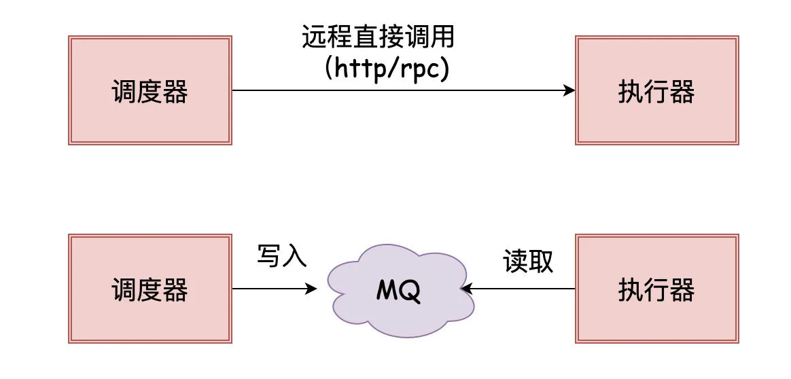

对于「去中心化」流派来说存储相关的信息很可能是在**注册中心**（Zookeeper），而我们引入的`client`包实际上就是**执行器+调度器**相关的代码。

依赖注册中心来完成**任务的分配**，「中心化」流派在调度的时候是需要保证一个任务只被一台机器消费，这就需要在代码里写分布式锁相关逻辑进行保证，而「去中心化」依赖注册中心就免去了这个环节。


针对第二个问题，调度器是怎么找到即将需要执行的任务的呢？现在一般较新的分布式定时任务框架都用了「**时间轮**」。

**1**、如果我们日常要找到准备要执行的任务，可能会把这些任务放在一个`List`里然后进行判断，那此时查询的时间复杂度为O(n)

**2**、稍微改进下，我们可能把这些任务放在一个最小堆里（对时间进行排序），那此时的增删改时间复杂度为O(logn)，而查询是O(1)

**3**、再改进下，我们把这些任务放在一个**环形数组**里，那这时候的增删改查时间复杂度都是O(1)。但此时的环形数组大小决定着我们能存放任务的大小，超出环形数组的任务就需要用另外的数组结构存放。

**4**、最后再改进下，我们可以有**多层**环形数组，不同层次的环形数组的**精度**是不一样的，使用多层环形数组能大大提高我们的精度。

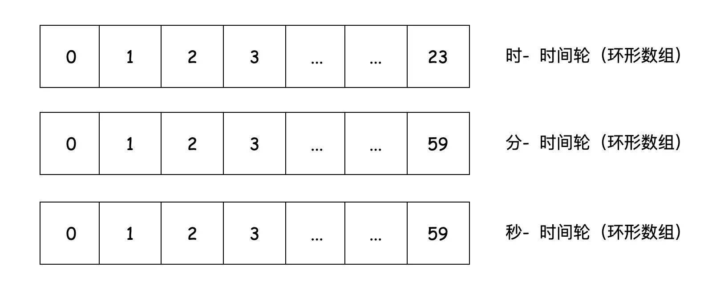

#### 分布式定时任务框架选型

分布式定时任务框架现在可选择的还是挺多的，比较出名的有：`XXL-JOB`/`Elastic-Job`/`LTS`/`SchedulerX`/`Saturn`/`PowerJob`等等等。有条件的公司可能会基于`Quartz`进行拓展，自研一套符合自己的公司内的分布式定时任务框架。

我并不是做这块出身的，对于我而言，我的`austin`项目技术选型主要会关注两块（其实跟选择apollo作为分布式配置中心的理由是一样的）：**成熟、稳定、社区是否活跃**。

这一次我选择了`xxl-job`作为`austin`的分布式任务调度框架。`xxl-job`已经有很多公司都已经接入了（说明他的**开箱即用**还是很到位的）。不过最新的一个版本在`2021-02`，近一年没有比较大的更新了。

[分布式任务调度平台XXL-JOB (xuxueli.com)](https://www.xuxueli.com/xxl-job/#二、快速入门)


## ♻️虚拟机

### 对象创建过程（2022蔚来提前批）


#### 类加载检查

对象创建过程的第一步，所谓类加载检查，就是检测我们接下来要 new 出来的这个对象所属的类是否已经被 JVM 成功加载、解析和初始化过了（具体的类加载过程会在后续文章详细解释~）

具体来说，当 Java 虚拟机遇到一条字节码 new 指令时：

1）首先检查根据 class 文件中的常量池表（Constant Pool Table）能否找到这个类对应的符号引用

> 此处可以回顾一波**常量池表 (Constant Pool Table)** 的概念：
>
> 用于存放**编译期**生成的各种字面量（字面量相当于 Java 语言层面常量的概念，如文本字符串，声明为 final 的常量值等）与符号引用。有一些文章会把 class 常量池表称为**静态常量池**。
>
> 都是常量池，常量池表和方法区中的运行时常量池有啥关系吗？运行时常量池是干嘛的呢？
>
> **运行时常量池可以在运行期间将 class 常量池表中的符号引用解析为直接引用**。简单来说，class 常量池表就相当于一堆索引，运行时常量池根据这些索引来查找对应方法或字段所属的类型信息和名称及描述符信息

2）然后去方法区中的运行时常量池中查找该符号引用所指向的类是否已被 JVM 加载、解析和初始化过

- 如果没有，那就先执行相应的类加载过程
- 如果有，那么进入下一步，为新生对象分配内存

#### 分配内存

类加载检查通过后，这个对象待会儿要是被创建出来得有地方放他对吧？

所以接下来 JVM 会为新生对象分配内存空间。

至于 JVM 怎么知道这个空间得分配多大呢？事实上，对象所需内存的大小在类加载完成后就已经可以完全确定了。

 HotSpot虚拟机是一种Java虚拟机（JVM），它是Oracle JDK中默认的JVM。 在 Hotspot 虚拟机中，对象在内存中的布局可以分为 3 块区域：**对象头**、**实例数据**和**对齐填充**。

1）Hotspot 虚拟机的对象头包括两部分信息：

- 第一部分用于存储对象自身的运行时数据（如哈希码（HashCode）、GC 分代年龄、锁状态标志、线程持有的锁、偏向线程 ID、偏向时间戳等，这部分数据的长度在 32 位和 64 位的虚拟机（未开启压缩指针）中分别为  32 个比特和 64 个比特，官方称它为 “Mark Word”。学过 synchronized 的小伙伴对这个一定不陌生~）
- 另一部分是类型指针，即对象指向它的类型元数据的指针，虚拟机通过这个指针来确定这个对象是哪个类的实例

2）**实例数据部分存储的是这个对象真正的有效信息**，即我们在程序代码里面所定义的各种类型的字段内容，无论是从父类继承下来的，还是在子类中定义的字段都必须记录起来。

3）**对齐填充部分不是必须的，也没有什么特别的含义，仅仅起占位作用**。 因为 Hotspot 虚拟机的自动内存管理系统要求对象起始地址必须是 8 字节的整数倍，换句话说就是对象的大小必须是 8 字节的整数倍。而对象头部分正好是 8 字节的倍数（1 倍或 2 倍），因此，当对象实例数据部分没有对齐时，就需要通过对齐填充来补全。

##### 对象在堆上的两种分配方式

**为对象分配内存空间的任务通俗来说把一块确定大小的内存块从 Java 堆中划分出来给这个对象用**。

根据堆中的内存是否规整，有两种划分方式，或者说对象在堆上的分配有两种方式：

1）**假设 Java 堆中内存是绝对规整的**，所有被使用过的内存都被放在一边，空闲的内存被放在另一边，中间放着一个指针作为分界点的指示器，那所分配内存就仅仅是把这个指针 向 空闲空间方向 挪动一段与对象大小相等的距离，这种分配方式称为 **指针碰撞**（Bump The Pointer）


2）**如果 Java 堆中的内存并不是规整的**，已被使用的内存和空闲的内存相互交错在一起，那就没有办法简单地进行指针碰撞了，虚拟机就必须维护一个列表，记录哪些内存块是可用的，在分配的时候从列表中找到一块足够大的连续空间划分给这个对象，并更新列表上的记录，这种分配方式称为 **空闲列表**（Free List）。

> 选择哪种分配方式由 Java 堆是否规整决定，那又有同学会问了，堆是否规整又由谁来决定呢？
>
> Java 堆是否规整由所采用的垃圾收集器是否带有空间压缩整理（Compact）的能力决定的（或者说由垃圾收集器采用的垃圾收集算法来决定的，具体垃圾收集算法见后续文章）：
>
> - 因此，当使用 Serial、ParNew 等带压缩整理过程的收集器时，系统采用的分配算法是指针碰撞，既简单又高效
> - 而当使用 CMS 这种基于清除（Sweep）算法的收集器时，理论上就只能采用较为复杂的空闲列表来分配内存

##### 对象创建时候的并发安全问题

另外，在为对象创建内存的时候，还需要考虑一个问题：**并发安全问题**。

对象创建在虚拟机中是非常频繁的行为，以上面介绍的指针碰撞法为例，即使只修改一个指针所指向的位置，在并发情况下也并不是线程安全的，可能出现某个线程正在给对象 A 分配内存，指针还没来得及修改，另一个线程创建了对象 B 又同时使用了原来的指针来分配内存的情况。

解决这个问题有两种可选方案：

- 方案 1：**CAS + 失败重试**：CAS 大伙应该都熟悉，比较并交换，乐观锁方案，如果失败就重试，直到成功为止
- 方案 2：**本地线程分配缓冲**（Thread Local Allocation Buffer，`TLAB`）：每个线程在堆中预先分配一小块内存，每个线程拥有的这一小块内存就称为 TLAB。哪个线程要分配内存了，就在哪个线程的 TLAB 中进行分配，这样各个线程之间互不干扰。如果某个线程的 TLAB  用完了，那么虚拟机就需要为它分配新的 TLAB，这时才需要进行同步锁定。可以通过 `-XX：+/-UseTLAB` 参数来设定是否使用 TLAB。

#### 初始化零值

内存分配完成之后，**JVM 会将分配到的内存空间都初始化为零值**，比如 boolean 字段都初始化为 false 啊，int 字段都初始化为 0 啊之类的

这步操作保证了对象的实例字段在 Java 代码中可以不赋初始值就直接使用，使程序能访问到这些字段的数据类型所对应的零值。

> 如果使用了 TLAB 的话，初始化零值这项工作可以提前至 TLAB 分配时就顺便进行了

#### 设置对象头

上面我们说过，对象在内存中的布局可以分为 3 块区域：对象头（Object Header）、实例数据和对齐填充

对齐填充并不是什么有意义的数据，实例数据我们在上一步操作中进行了初始化零值，那么对于剩下的对象头中的信息来说，自然不必多说，也是要进行一些赋值操作的：例如这个对象是哪个类的实例、如何才能找到类的元数据信息、对象的哈希码、对象的 GC 分代年龄等信息。根据虚拟机当前运行状态的不同，如是否启用偏向锁等，对象头会有不同的设置方式。

#### 执行 init 方法

上面四个步骤都走完之后，从 JVM 的视角来看，其实一个新的对象已经成功诞生了。

但是从我们程序员的视角来看，这个对象确实是创建出来了，但是还没按照我们定义的构造函数来进行赋值呢，所有的字段都还是默认的零值啊。

构造函数即 Class 文件中的 `<init>()` 方法，一般来说，new 指令之后会接着执行 `<init>()` 方法，按照构造函数的意图对这个对象进行初始化，这样一个真正可用的对象才算完全地被构造出来了，皆大欢喜。

### 垃圾的判断方法，引用计数法为什么用的没有GCRoot的多，缺点是什么，为什么（2022番茄小说）

#### 引用计数法

给对象中添加一个引用计数器：

- 每当有一个地方引用它，计数器就加 1；
- 当引用失效，计数器就减 1；
- 任何时候计数器为 0 的对象就是不可能再被使用的。

**这个方法实现简单，效率高，但是目前主流的虚拟机中并没有选择这个算法来管理内存，其最主要的原因是它很难解决对象之间相互循环引用的问题。**

所谓对象之间的相互引用问题，如下面代码所示：除了对象 `objA` 和 `objB` 相互引用着对方之外，这两个对象之间再无任何引用。但是他们因为互相引用对方，导致它们的引用计数器都不为 0，于是引用计数算法无法通知 GC 回收器回收他们。

```java
public class ReferenceCountingGc {
    Object instance = null;
    public static void main(String[] args) {
        ReferenceCountingGc objA = new ReferenceCountingGc();
        ReferenceCountingGc objB = new ReferenceCountingGc();
        objA.instance = objB;
        objB.instance = objA;
        objA = null;
        objB = null;
    }
}
```

#### 可达性分析算法

这个算法的基本思想就是通过一系列的称为 **“GC Roots”** 的对象作为起点，从这些节点开始向下搜索，节点所走过的路径称为引用链，当一个对象到 GC Roots 没有任何引用链相连的话，则证明此对象是不可用的，需要被回收。

下图中的 `Object 6 ~ Object 10` 之间虽有引用关系，但它们到 GC Roots 不可达，因此为需要被回收的对象。


**哪些对象可以作为 GC Roots 呢？**

- 虚拟机栈(栈帧中的本地变量表)中引用的对象
- 本地方法栈(Native 方法)中引用的对象
- 方法区中类静态属性引用的对象
- 方法区中常量引用的对象
- 所有被同步锁持有的对象

**对象可以被回收，就代表一定会被回收吗？**

即使在可达性分析法中不可达的对象，也并非是“非死不可”的，这时候它们暂时处于“缓刑阶段”，要真正宣告一个对象死亡，至少要经历两次标记过程；可达性分析法中不可达的对象被第一次标记并且进行一次筛选，筛选的条件是此对象是否有必要执行 `finalize` 方法。当对象没有覆盖 `finalize` 方法，或 `finalize` 方法已经被虚拟机调用过时，虚拟机将这两种情况视为没有必要执行。

被判定为需要执行的对象将会被放在一个队列中进行第二次标记，除非这个对象与引用链上的任何一个对象建立关联，否则就会被真的回收。

> `Object` 类中的 `finalize` 方法一直被认为是一个糟糕的设计，成为了 Java 语言的负担，影响了 Java 语言的安全和 GC 的性能。JDK9 版本及后续版本中各个类中的 `finalize` 方法会被逐渐弃用移除。忘掉它的存在吧！

### 什么时候会OOM，服务OOM怎么办，如何排查（2022 美团）

[系统稳定性——OutOfMemoryError 常见原因及解决方法](https://github.com/StabilityMan/StabilityGuide/blob/master/docs/diagnosis/jvm/exception/%E7%B3%BB%E7%BB%9F%E7%A8%B3%E5%AE%9A%E6%80%A7%E2%80%94%E2%80%94OutOfMemoryError%E5%B8%B8%E8%A7%81%E5%8E%9F%E5%9B%A0%E5%8F%8A%E8%A7%A3%E5%86%B3%E6%96%B9%E6%B3%95.md)

### Java static 变量存在 JVM 哪个区域和生命周期

Static：

- 加载：java虚拟机在加载类的过程中为静态变量分配内存。
- 类变量：static变量在内存中只有一个，存放在方法区，属于类变量，被所有实例所共享
- 销毁：类被卸载时，静态变量被销毁，并释放内存空间。static变量的生命周期取决于类的生命周期

类初始化顺序：

- 静态变量、静态代码块初始化
- 构造函数
- 自定义构造函数

结论：想要用static存一个变量，使得下次程序运行时还能使用上次的值是不可行的。因为静态变量生命周期虽然长（就是类的生命周期），但是当程序执行完，也就是该类的所有对象都已经被回收，或者加载类的ClassLoader已经被回收，那么该类就会从jvm的方法区卸载，即生命期终止。

### GC 的几种算法（2022携程，2022番茄小说）

标记-清除算法

---

该算法分为“标记”和“清除”阶段：首先标记出所有不需要回收的对象，在标记完成后统一回收掉所有没有被标记的对象。它是最基础的收集算法，后续的算法都是对其不足进行改进得到。这种垃圾收集算法会带来两个明显的问题：

1. **效率问题**
2. **空间问题（标记清除后会产生大量不连续的碎片）**


标记-复制算法

---

为了解决效率问题，“标记-复制”收集算法出现了。它可以将内存分为大小相同的两块，每次使用其中的一块。当这一块的内存使用完后，就将还存活的对象复制到另一块去，然后再把使用的空间一次清理掉。这样就使每次的内存回收都是对内存区间的一半进行回收。


标记-整理算法

---

根据老年代的特点提出的一种标记算法，标记过程仍然与“标记-清除”算法一样，但后续步骤不是直接对可回收对象回收，而是让所有存活的对象向一端移动，然后直接清理掉端边界以外的内存。


分代收集算法

---

当前虚拟机的垃圾收集都采用分代收集算法，这种算法没有什么新的思想，只是根据对象存活周期的不同将内存分为几块。一般将 java 堆分为新生代和老年代，这样我们就可以根据各个年代的特点选择合适的垃圾收集算法。

比如在新生代中，每次收集都会有大量对象死去，所以可以选择”标记-复制“算法，只需要付出少量对象的复制成本就可以完成每次垃圾收集。而老年代的对象存活几率是比较高的，而且没有额外的空间对它进行分配担保，所以我们必须选择“标记-清除”或“标记-整理”算法进行垃圾收集。

延伸面试问题： HotSpot 为什么要分为新生代和老年代？

根据上面的对分代收集算法的介绍回答。

> 谈谈你了解的几种垃圾回收器（2022-04-11 携程）

Serial 收集器

---

Serial（串行）收集器是最基本、历史最悠久的垃圾收集器了。大家看名字就知道这个收集器是一个单线程收集器了。它的 **“单线程”** 的意义不仅仅意味着它只会使用一条垃圾收集线程去完成垃圾收集工作，更重要的是它在进行垃圾收集工作的时候必须暂停其他所有的工作线程（ **"Stop The World"** ），直到它收集结束。

**新生代采用标记-复制算法，老年代采用标记-整理算法。**


虚拟机的设计者们当然知道 Stop The World 带来的不良用户体验，所以在后续的垃圾收集器设计中停顿时间在不断缩短（仍然还有停顿，寻找最优秀的垃圾收集器的过程仍然在继续）。

但是 Serial 收集器有没有优于其他垃圾收集器的地方呢？当然有，它**简单而高效（与其他收集器的单线程相比）**。Serial 收集器由于没有线程交互的开销，自然可以获得很高的单线程收集效率。Serial 收集器对于运行在 Client 模式下的虚拟机来说是个不错的选择。

ParNew 收集器

---

**ParNew 收集器其实就是 Serial 收集器的多线程版本，除了使用多线程进行垃圾收集外，其余行为（控制参数、收集算法、回收策略等等）和 Serial 收集器完全一样。**

**新生代采用标记-复制算法，老年代采用标记-整理算法。**


它是许多运行在 Server 模式下的虚拟机的首要选择，除了 Serial 收集器外，只有它能与 CMS 收集器（真正意义上的并发收集器，后面会介绍到）配合工作。

**并行和并发概念补充：**

- **并行（Parallel）** ：指多条垃圾收集线程并行工作，但此时用户线程仍然处于等待状态。
- **并发（Concurrent）**：指用户线程与垃圾收集线程同时执行（但不一定是并行，可能会交替执行），用户程序在继续运行，而垃圾收集器运行在另一个 CPU 上。

Parallel Scavenge 收集器

---

Parallel Scavenge 收集器也是使用标记-复制算法的多线程收集器，它看上去几乎和 ParNew 都一样。 **那么它有什么特别之处呢？**

```java
-XX:+UseParallelGC

    使用 Parallel 收集器+ 老年代串行

-XX:+UseParallelOldGC

    使用 Parallel 收集器+ 老年代并行

```

**Parallel Scavenge 收集器关注点是吞吐量（高效率的利用 CPU）。CMS 等垃圾收集器的关注点更多的是用户线程的停顿时间（提高用户体验）。所谓吞吐量就是 CPU 中用于运行用户代码的时间与 CPU 总消耗时间的比值。** Parallel Scavenge 收集器提供了很多参数供用户找到最合适的停顿时间或最大吞吐量，如果对于收集器运作不太了解，手工优化存在困难的时候，使用 Parallel Scavenge 收集器配合自适应调节策略，把内存管理优化交给虚拟机去完成也是一个不错的选择。

**新生代采用标记-复制算法，老年代采用标记-整理算法。**


**这是 JDK1.8 默认收集器**

使用 java -XX:+PrintCommandLineFlags -version 命令查看

```text
-XX:InitialHeapSize=262921408 -XX:MaxHeapSize=4206742528 -XX:+PrintCommandLineFlags -XX:+UseCompressedClassPointers -XX:+UseCompressedOops -XX:+UseParallelGC
java version "1.8.0_211"
Java(TM) SE Runtime Environment (build 1.8.0_211-b12)
Java HotSpot(TM) 64-Bit Server VM (build 25.211-b12, mixed mode)
```

JDK1.8 默认使用的是 Parallel Scavenge + Parallel Old，如果指定了-XX:+UseParallelGC 参数，则默认指定了-XX:+UseParallelOldGC，可以使用-XX:-UseParallelOldGC 来禁用该功能

Serial Old 收集器

---

**Serial 收集器的老年代版本**，它同样是一个单线程收集器。它主要有两大用途：一种用途是在 JDK1.5 以及以前的版本中与 Parallel Scavenge 收集器搭配使用，另一种用途是作为 CMS 收集器的后备方案。

Parallel Old 收集器

---

**Parallel Scavenge 收集器的老年代版本**。使用多线程和“标记-整理”算法。在注重吞吐量以及 CPU 资源的场合，都可以优先考虑 Parallel Scavenge 收集器和 Parallel Old 收集器。

CMS 收集器

---

**CMS（Concurrent Mark Sweep）收集器是一种以获取最短回收停顿时间为目标的收集器。它非常符合在注重用户体验的应用上使用。**

**CMS（Concurrent Mark Sweep）收集器是 HotSpot 虚拟机第一款真正意义上的并发收集器，它第一次实现了让垃圾收集线程与用户线程（基本上）同时工作。**

从名字中的**Mark Sweep**这两个词可以看出，CMS 收集器是一种 **“标记-清除”算法**实现的，它的运作过程相比于前面几种垃圾收集器来说更加复杂一些。整个过程分为四个步骤：

- **初始标记：** 暂停所有的其他线程，并记录下直接与 root 相连的对象，速度很快 ；
- **并发标记：** 同时开启 GC 和用户线程，用一个闭包结构去记录可达对象。但在这个阶段结束，这个闭包结构并不能保证包含当前所有的可达对象。因为用户线程可能会不断的更新引用域，所以 GC 线程无法保证可达性分析的实时性。所以这个算法里会跟踪记录这些发生引用更新的地方。
- **重新标记：** 重新标记阶段就是为了修正并发标记期间因为用户程序继续运行而导致标记产生变动的那一部分对象的标记记录，这个阶段的停顿时间一般会比初始标记阶段的时间稍长，远远比并发标记阶段时间短
- **并发清除：** 开启用户线程，同时 GC 线程开始对未标记的区域做清扫。


从它的名字就可以看出它是一款优秀的垃圾收集器，主要优点：**并发收集、低停顿**。但是它有下面三个明显的缺点：

- **对 CPU 资源敏感；**
- **无法处理浮动垃圾；**
- **它使用的回收算法-“标记-清除”算法会导致收集结束时会有大量空间碎片产生。**

G1 收集器

---

**G1 (Garbage-First) 是一款面向服务器的垃圾收集器,主要针对配备多颗处理器及大容量内存的机器. 以极高概率满足 GC 停顿时间要求的同时,还具备高吞吐量性能特征.**

被视为 JDK1.7 中 HotSpot 虚拟机的一个重要进化特征。它具备以下特点：

- **并行与并发**：G1 能充分利用 CPU、多核环境下的硬件优势，使用多个 CPU（CPU 或者 CPU 核心）来缩短 Stop-The-World 停顿时间。部分其他收集器原本需要停顿 Java 线程执行的 GC 动作，G1 收集器仍然可以通过并发的方式让 java 程序继续执行。
- **分代收集**：虽然 G1 可以不需要其他收集器配合就能独立管理整个 GC 堆，但是还是保留了分代的概念。
- **空间整合**：与 CMS 的“标记-清理”算法不同，G1 从整体来看是基于“标记-整理”算法实现的收集器；从局部上来看是基于“标记-复制”算法实现的。
- **可预测的停顿**：这是 G1 相对于 CMS 的另一个大优势，降低停顿时间是 G1 和 CMS 共同的关注点，但 G1 除了追求低停顿外，还能建立可预测的停顿时间模型，能让使用者明确指定在一个长度为 M 毫秒的时间片段内。

G1 收集器的运作大致分为以下几个步骤：

- **初始标记**
- **并发标记**
- **最终标记**
- **筛选回收**

**G1 收集器在后台维护了一个优先列表，每次根据允许的收集时间，优先选择回收价值最大的 Region(这也就是它的名字 Garbage-First 的由来)** 。这种使用 Region 划分内存空间以及有优先级的区域回收方式，保证了 G1 收集器在有限时间内可以尽可能高的收集效率（把内存化整为零）

ZGC 收集器

---

与 CMS 中的 ParNew 和 G1 类似，ZGC 也采用标记-复制算法，不过 ZGC 对该算法做了重大改进。

在 ZGC 中出现 Stop The World 的情况会更少！

详情可以看 ： [《新一代垃圾回收器 ZGC 的探索与实践》](https://tech.meituan.com/2020/08/06/new-zgc-practice-in-meituan.html)

### 想要在指定时间结束垃圾回收，选用哪种垃圾回收器（2022-04-11 携程）

G1

### 什么是GCROOT?

**在 Java 语言中，GC Roots 包括以下几类元素：**

- 虚拟机栈中引用的对象

  - 比如：各个线程被调用的方法中使用到的参数、局部变量等。
- 本地方法栈内 JNI（通常说的本地方法）引用的对象
- 方法区中类静态属性引用的对象

  - 比如：Java 类的引用类型静态变量
- 方法区中常量引用的对象

  - 比如：字符串常量池（String Table）里的引用
- 所有被同步锁 synchronized 持有的对象
- Java 虚拟机内部的引用。
- 基本数据类型对应的 Class 对象，一些常驻的异常对象（如：`NullPointerException`、`OutOfMemoryError`），系统类加载器。
- 反映 java 虚拟机内部情况的 JMXBean、JVMTI 中注册的回调、本地代码缓存等。
- 除了这些固定的 GC Roots 集合以外，根据用户所选用的垃圾收集器以及当前回收的内存区域不同，

  还可以有其他对象 “临时性” 地加入，共同构成完整 GC Roots 集合。比如：分代收集和局部回收

  （PartialGC）。

  - 如果只针对 Java 堆中的某一块区域进行垃圾回收（比如：典型的只针对新生代），必须考虑到内存区域是虚拟机自己的实现细节，更不是孤立封闭的，这个区域的对象完全有可能被其他区域的对象所引用，这时候就需要一并将关联的区域对象也加入 GCRoots 集合中去考虑，才能保证可达性分析的准确性。
  - 典型的只针对新生代：因为新生代除外，还有关联的老年代，所以需要将老年代也一并加入 GC Roots 集合中
- 小技巧

  - 由于 Root 采用栈方式存放变量和指针，所以如果一个指针，它保存了堆内存里面的对象，但是自己又不存放在堆内存里面，那它就是一个 Root。

一系列的称为 **“GC Roots”** 的对象作为起点，从这些节点开始向下搜索，节点所走过的路径称为引用链，当一个对象到 GC Roots 没有任何引用链相连的话，则证明此对象是不可用的，需要被回收。

**注意**

- 如果要使用可达性分析算法来判断内存是否可回收，那么分析工作必须在一个能保障**一致性** (某一刻的静止状态) 的快照中进行。这点不满足的话分析结果的准确性就无法保证。
- 这点也是导致 GC 进行时必须 “stop The World” 的一个重要原因。
  - 即使是号称（几乎）不会发生停顿的 CMS 收集器中，枚举根节点时也是必须要停顿的。

### 如何破坏双亲委派？ （字节实习）

在Java中，双亲委派是一种类加载机制，它的工作方式是当一个类加载器需要加载一个类时，它首先将这个请求委派给它的父类加载器去完成，如果父类加载器还有父类加载器，则继续向上委派，直到委派到Bootstrap ClassLoader为止。如果所有的父类加载器都无法加载这个类，那么再由当前类加载器自己去加载。

这个机制的目的是保证Java中的类的唯一性和安全性。由于类的唯一性是由类加载器和类名一起决定的，如果多个类加载器都可以加载同一个类，就可能导致类的唯一性被破坏，从而导致类的功能异常或安全问题。通过双亲委派机制，所有的类都会被先由最顶层的Bootstrap ClassLoader加载，保证了类的唯一性。

例如，当需要加载一个名为"java.lang.Object"的类时，首先由系统自带的Bootstrap ClassLoader加载，如果没有找到，则由Extension ClassLoader加载，如果还是没有找到，则由App ClassLoader加载。如果还是没有找到，则由当前线程的ClassLoader去加载。

这种机制也有利于避免类库的重复加载，因为父类加载器已经加载过类库，子类加载器就不会再次加载，这有助于减少Java虚拟机内存的使用，提高应用程序的性能。

如果不想打破双亲委派模型，就重写ClassLoader类中的findClass()方法即可，无法被父类加载器加载的类最终会通过这个方法被加载。而如果想打破双亲委派模型则需要重写loadClass()方法

典型的打破双亲委派模型的框架和中间件有tomcat与osgi

```java
//破坏双亲委派模型
  @Override
public Class<?> loadClass(String name)
    throws ClassNotFoundException {
      String myPath = "D:/" + name.replace(".","/") + ".class";
      System.out.println(myPath);
      byte[] classBytes = null;
      FileInputStream in = null;

      try {
    File file = new File(myPath);
    in = new FileInputStream(file);
    classBytes = new byte[(int) file.length()];
    in.read(classBytes);
} catch (FileNotFoundException e) {
    e.printStackTrace();
} catch (IOException e) {
    e.printStackTrace();
}finally{
    try {
        in.close();
    } catch (IOException e) {
        e.printStackTrace();
    }
}

      System.out.println();
      Class<?> clazz = defineClass(name, classBytes, 0, classBytes.length);
      return clazz;
}
```

### JVM内存模型？JNI在哪个区域？ （百度）

JVM内存模型是Java虚拟机规范中定义的一种内存管理机制，它将Java虚拟机的内存划分为以下几个区域：

1. 程序计数器（Program Counter Register）：是一个指针，指向当前线程正在执行的字节码的地址。
2. Java虚拟机栈（Java Virtual Machine Stacks）：每个Java线程都有一个自己的Java虚拟机栈，用于存储方法调用的栈帧。每个方法的调用都会在栈上创建一个栈帧，并在方法执行完毕后将其弹出。
3. 本地方法栈（Native Method Stacks）：用于存储本地方法（Native Method）的栈帧。
4. Java堆（Java Heap）：是Java虚拟机管理的内存区域中最大的一块。所有的Java对象都在堆中分配内存。Java堆是垃圾收集器管理的主要区域。
5. 方法区（Method Area）：用于存储已加载的类信息、常量、静态变量、即时编译器编译后的代码等数据。
6. 运行时常量池（Runtime Constant Pool）：是方法区的一部分，用于存储编译期间生成的字面量和符号引用。每个类的运行时常量池都是独立的，包括该类所引用的其他类和接口的运行时常量池。
7. 直接内存（Direct Memory）：不是JVM管理的区域，而是由操作系统管理的一块内存区域，用于实现NIO（New Input/Output）功能。

这些内存区域都具有各自的特点和用途，JVM内存模型的合理使用和优化可以有效地提高Java应用程序的性能和稳定性。

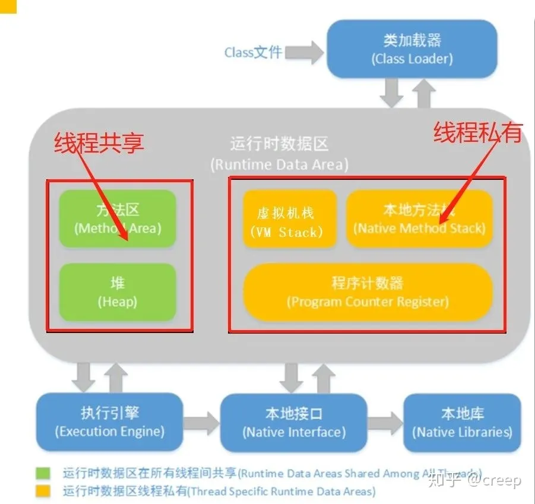

JNI在本地方法栈

JNI（Java Native Interface）是Java语言与本地代码交互的一种技术，它允许Java程序调用本地（C、C++等）代码，也可以使本地代码调用Java代码。

在Java中，通过JNI可以访问操作系统的本地API，以实现一些Java无法完成的任务，例如访问硬件、执行底层系统操作等。同时，通过JNI也可以利用本地代码的性能优势，加速Java应用程序的执行速度。

JNI的工作原理是通过Java Native Method Interface（JNMI）提供了一些Java本地方法，用于与本地代码进行交互。在Java代码中声明本地方法时，需要使用native关键字标记，这表明该方法是一个本地方法，它的具体实现由本地代码提供。在Java程序运行时，JVM会在本地代码库中查找对应的本地方法，并将Java程序传递给它进行处理。

### JVM的运行时数据区有什么？堆栈各放什么，说一下栈帧 （百度）

Java 虚拟机在执行 Java 程序的过程中会把它管理的内存划分成若干个不同的数据区域。JDK 1.8 和之前的版本略有不同，下面会介绍到。

**JDK 1.8 之前** ：


**JDK 1.8** ：


**线程私有的：**

- 程序计数器
- 虚拟机栈
- 本地方法栈

**线程共享的：**

- 堆
- 方法区
- 直接内存 (非运行时数据区的一部分)

Java 虚拟机规范对于运行时数据区域的规定是相当宽松的。以堆为例：堆可以是连续空间，也可以不连续。堆的大小可以固定，也可以在运行时按需扩展 。虚拟机实现者可以使用任何垃圾回收算法管理堆，甚至完全不进行垃圾收集也是可以的。

栈：

和虚拟机栈所发挥的作用非常相似，区别是： **虚拟机栈为虚拟机执行 Java 方法 （也就是字节码）服务，而本地方法栈则为虚拟机使用到的 Native 方法服务。** 在 HotSpot 虚拟机中和 Java 虚拟机栈合二为一。

本地方法被执行的时候，在本地方法栈也会创建一个栈帧，用于存放该本地方法的局部变量表、操作数栈、动态链接、出口信息。

方法执行完毕后相应的栈帧也会出栈并释放内存空间，也会出现 `StackOverFlowError` 和 `OutOfMemoryError` 两种错误。

Java 虚拟机所管理的内存中最大的一块，Java 堆是所有线程共享的一块内存区域，在虚拟机启动时创建。**此内存区域的唯一目的就是存放对象实例，几乎所有的对象实例以及数组都在这里分配内存。**

Java 世界中“几乎”所有的对象都在堆中分配，但是，随着 JIT  编译器的发展与逃逸分析技术逐渐成熟，栈上分配、标量替换优化技术将会导致一些微妙的变化，所有的对象都分配到堆上也渐渐变得不那么“绝对”了。从  JDK 1.7  开始已经默认开启逃逸分析，如果某些方法中的对象引用没有被返回或者未被外面使用（也就是未逃逸出去），那么对象可以直接在栈上分配内存。

Java 堆是垃圾收集器管理的主要区域，因此也被称作 **GC 堆（Garbage Collected Heap）**。从垃圾回收的角度，由于现在收集器基本都采用分代垃圾收集算法，所以 Java 堆还可以细分为：新生代和老年代；再细致一点有：Eden、Survivor、Old 等空间。进一步划分的目的是更好地回收内存，或者更快地分配内存。

在 JDK 7 版本及 JDK 7 版本之前，堆内存被通常分为下面三部分：

1. 新生代内存(Young Generation)
2. 老生代(Old Generation)
3. 永久代(Permanent Generation)

下图所示的 Eden 区、两个 Survivor 区 S0 和 S1 都属于新生代，中间一层属于老年代，最下面一层属于永久代。


**JDK 8 版本之后 PermGen(永久) 已被 Metaspace(元空间) 取代，元空间使用的是直接内存** （我会在方法区这部分内容详细介绍到）。

大部分情况，对象都会首先在 Eden 区域分配，在一次新生代垃圾回收后，如果对象还存活，则会进入 S0 或者 S1，并且对象的年龄还会加 1(Eden  区->Survivor 区后对象的初始年龄变为 1)，当它的年龄增加到一定程度（默认为 15  岁），就会被晋升到老年代中。对象晋升到老年代的年龄阈值，可以通过参数 `-XX:MaxTenuringThreshold` 来设置。

`🐛 修正“Hotspot 遍历所有对象时，按照年龄从小到大对其所占用的大小进行累积，当累积的某个年龄大小超过了 survivor 区的一半时，取这个年龄和 MaxTenuringThreshold 中更小的一个值，作为新的晋升年龄阈值”。`

每个**栈帧**（Stack Frame）中存储着：

- 局部变量表（Local Variables）
- 操作数栈（Operand Stack）(或称为表达式栈)
- 动态链接（Dynamic Linking）：指向运行时常量池的方法引用
- 方法返回地址（Return Address）：方法正常退出或异常退出的地址
- 一些附加信息


## 🕝并发编程

### Java创建线程的几种方式？

1. 继承Thead类创建线程
2. 实现Runnable接口创建线程
3. 使用Callable和Future创建线程

### 线程能不能 start 两次，线程池中的线程为什么能循环利用

首先 demo 眼见为实：

```java
/**
 * 描述：      对比start和run两种启动线程的方式
 */
public class StartAndRunMethod {

    public static void main(String[] args) {
        Runnable runnable = () -> {
            System.out.println(Thread.currentThread().getName());
        };

        runnable.run();

        new Thread(runnable).start();
    }
}
```

运行结果：

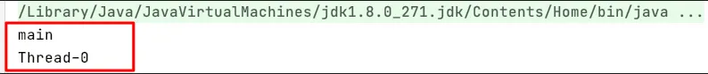

通过运行结果，我们可以总结出，run()方法只是一个普通的方法，start()是一个真正的启动线程的方法
一个线程调用两次 start()会发生什么？

我们还是先 demo：

```java
/**
 * 描述：      演示不能两次调用start方法，否则会报错
 */
public class CantStartTwice {
    public static void main(String[] args) {
        Thread thread = new Thread();
        thread.start();
        thread.start();
    }
}
```

运行结果：报非法的线程状态

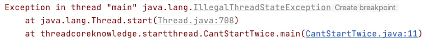

原因分析：

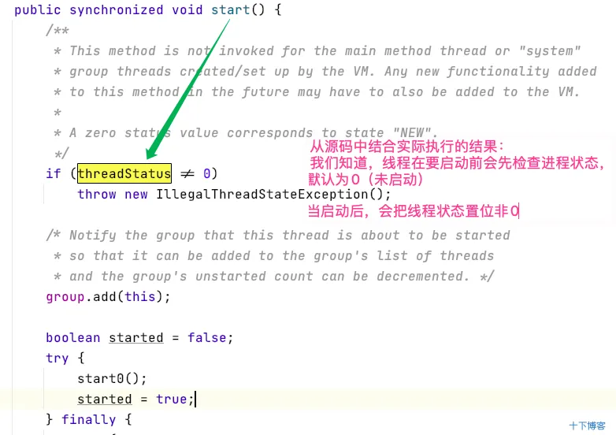

问题 2：线程池将线程和任务进行解耦，线程是线程，任务是任务，摆脱了之前通过 Thread 创建线程时的一个线程必须对应一个任务的限制。

在线程池中，同一个线程可以从阻塞队列中不断获取新任务来执行，其核心原理在于线程池对 Thread 进行了封装，并不是每次执行任务都会调用 Thread.start() 来创建新线程，而是让每个线程去执行一个“循环任务”，在这个“循环任务”中不停的检查是否有任务需要被执行，如果有则直接执行，也就是调用任务中的 run 方法，将 run 方法当成一个普通的方法执行，通过这种方式将只使用固定的线程就将所有任务的 run 方法串联起来

当任务提交之后，线程池首先会检查当前线程数，如果当前的线程数小于核心线程数（corePoolSize），比如最开始创建的时候线程数为 0，则新建线程并执行任务。
当提交的任务不断增加，创建的线程数等于核心线程数（corePoolSize），新增的任务会被添加到 workQueue 任务队列中，等待核心线程执行完当前任务后，重新从 workQueue 中获取任务执行。
假设任务非常多，达到了 workQueue 的最大容量，但是当前线程数小于最大线程数（maximumPoolSize），线程池会在核心线程数（corePoolSize）的基础上继续创建线程来执行任务。
假设任务继续增加，线程池的线程数达到最大线程数（maximumPoolSize），如果任务继续增加，这个时候线程池就会采用拒绝策略来拒绝这些任务。
在任务不断增加的过程中，线程池会逐一进行以下 4 个方面的判断

核心线程数（corePoolSize）
任务队列（workQueue）
最大线程数（maximumPoolSize）
拒绝策略

### 利用多线程时最大的难点是什么，怎么解决多线程安全问题

 多线程的难点是在多个线程同时访问共享的数据或资源时，可能会发生数据冲突或不一致的问题。这就是多线程安全问题。解决多线程安全问题的方法有很多，比如使用原子类、同步锁、可重入锁、线程本地变量

- 原子类是一种使用了原子操作的类，原子操作是指不可被中断的一个或一系列操作。原子类可以保证多线程对共享变量的操作是原子性的，不会出现数据不一致的问题。Java提供了很多原子类，比如AtomicInteger、AtomicLong、AtomicBoolean等。
- 同步锁是一种使用synchronized关键字或者Lock接口实现的锁机制，它可以让多个线程对共享资源进行排他性访问，只有获得锁的线程才能执行临界区代码，其他线程则要等待锁释放后才能竞争锁。
- 可重入锁是一种支持重入功能的锁，重入指的是同一个线程可以多次获取同一个锁。可重入锁可以避免死锁和递归调用导致的栈溢出问题。ReentrantLock就是一种可重入锁，它实现了Lock接口，并提供了公平和非公平两种模式。
- 线程本地变量是一种为每个线程创建一个单独副本的变量，每个线程只能访问自己的副本，而不能访问其他线程的副本。这样就避免了多个线程对同一个变量进行修改而导致数据不一致的问题。ThreadLocal就是一种线程本地变量，它提供了get()和set()方法来获取和设置当前线程的副本¹³。

### 怎么保证多线程下面单例模式安全

在多线程环境下，单例模式需要特别小心以避免多个线程同时创建多个实例，从而违反了单例模式的设计原则。以下是一些保证多线程下单例模式安全的方法：

1. 懒汉式双重校验锁（Double-Checked Locking） 这种方式可以避免多个线程同时创建实例的问题，并且在实例已经存在时可以避免使用锁，从而提高性能。它的核心思想是，首先检查实例是否已经创建，如果没有，才进行同步，只有获取到锁的线程才能创建实例。当其他线程再次尝试创建实例时，因为已经存在实例，所以不会再进入同步块中。
2. 饿汉式单例模式（Eager Initialization） 这种方式在类加载时就创建了实例，因此可以保证线程安全，但是可能会浪费一些系统资源。它的缺点是，如果实例在程序运行期间从未使用过，那么它就浪费了系统资源。
3. 静态内部类方式 这种方式利用了 Java 类加载器的机制来保证多线程下只有一个实例被创建。当静态内部类被加载时，实例就会被创建，而且因为类加载是线程安全的，所以不会有多个线程创建多个实例的情况发生。
4. 使用volatile关键字 在多线程中，volatile关键字可以保证变量的可见性和禁止指令重排，从而可以保证单例模式的正确性。在变量声明时使用volatile关键字可以确保变量的可见性，从而避免多线程下创建多个实例的问题。

需要注意的是，以上方法虽然可以保证单例模式的正确性，但是也会对程序的性能产生一定的影响。因此，在选择实现单例模式时需要根据实际情况进行权衡。

### concurrentMap 和 hashmap 有什么区别

`ConcurrentHashMap` 和 `Hashtable` 的区别主要体现在实现线程安全的方式上不同。

- **底层数据结构：** JDK1.7 的 `ConcurrentHashMap` 底层采用 **分段的数组+链表** 实现，JDK1.8 采用的数据结构跟 `HashMap1.8` 的结构一样，数组+链表/红黑二叉树。`Hashtable` 和 JDK1.8 之前的 `HashMap` 的底层数据结构类似都是采用 **数组+链表** 的形式，数组是 HashMap 的主体，链表则是主要为了解决哈希冲突而存在的；
- **实现线程安全的方式（重要）：** ① **在 JDK1.7 的时候，`ConcurrentHashMap`（分段锁）** 对整个桶数组进行了分割分段(`Segment`)，每一把锁只锁容器其中一部分数据，多线程访问容器里不同数据段的数据，就不会存在锁竞争，提高并发访问率。 **到了 JDK1.8 的时候已经摒弃了 `Segment` 的概念，而是直接用 `Node` 数组+链表+红黑树的数据结构来实现，并发控制使用 `synchronized` 和 CAS 来操作。（JDK1.6 以后 对 `synchronized` 锁做了很多优化）** 整个看起来就像是优化过且线程安全的 `HashMap`，虽然在 JDK1.8 中还能看到 `Segment` 的数据结构，但是已经简化了属性，只是为了兼容旧版本；② **`Hashtable`(同一把锁)** :使用 `synchronized` 来保证线程安全，效率非常低下。当一个线程访问同步方法时，其他线程也访问同步方法，可能会进入阻塞或轮询状态，如使用 put 添加元素，另一个线程不能使用 put 添加元素，也不能使用 get，竞争会越来越激烈效率越低。

HashMap和Hashtable都是用于存储键值对的Java集合框架类，它们的作用都是一样的，但它们有一些不同之处。

主要区别如下：

1. 线程安全性：Hashtable是线程安全的，而HashMap不是。因为Hashtable的所有方法都是同步的，而HashMap不是。如果多个线程并发访问Hashtable，不需要额外的同步措施，而HashMap需要通过同步措施保证线程安全。
2. Null键和值：Hashtable不允许使用null作为键或值，否则会抛出NullPointerException异常，而HashMap则允许使用一个null键和任意数量的null值。
3. 迭代器：Hashtable的迭代器是Enumeration接口的实例，而HashMap的迭代器是Iterator接口的实例。
4. 性能：在大多数情况下，HashMap的性能要比Hashtable更好。这是因为Hashtable的方法都是同步的，而HashMap的方法不是同步的，所以HashMap的访问速度更快。同时，HashMap允许使用null键和值，避免了Hashtable在处理null值时需要进行额外的检查。

综上所述，虽然它们都是用于存储键值对的集合框架类，但由于它们的一些差异，开发人员需要根据具体需求来选择使用哪一个。如果需要线程安全性或不能使用null键或值，则可以选择Hashtable。如果需要更好的性能或可以使用null键或值，则可以选择HashMap。

ConcurrentMap和HashMap都是Java集合框架中用于存储键值对的类，但它们有一些区别：

1. 线程安全性：ConcurrentMap是线程安全的，而HashMap不是。ConcurrentMap提供了多种线程安全的实现，如ConcurrentHashMap，它能够同时支持高并发的读写操作，而HashMap在多线程并发环境下需要进行额外的同步措施来保证线程安全。

**两者的对比图：**

**Hashtable:**


**JDK1.7 的 ConcurrentHashMap：**


**JDK1.8 的 ConcurrentHashMap：**

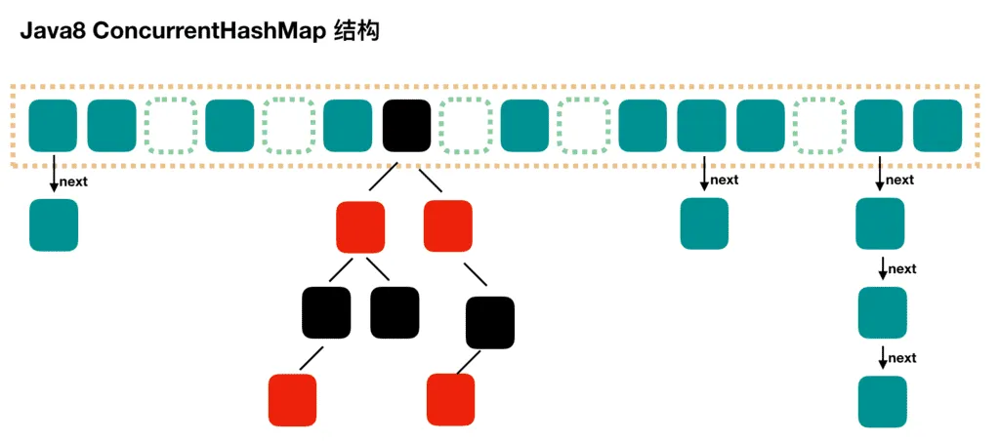

JDK1.8 的 `ConcurrentHashMap` 不再是 **Segment 数组 + HashEntry 数组 + 链表**，而是 **Node 数组 + 链表 / 红黑树**。不过，Node 只能用于链表的情况，红黑树的情况需要使用 **`TreeNode`**。当冲突链表达到一定长度时，链表会转换成红黑树。

### ConcurrentHashMap 线程安全的具体实现方式/底层具体实现

JDK1.7（上面有示意图）

首先将数据分为一段一段的存储，然后给每一段数据配一把锁，当一个线程占用锁访问其中一个段数据时，其他段的数据也能被其他线程访问。

**`ConcurrentHashMap` 是由 `Segment` 数组结构和 `HashEntry` 数组结构组成**。

Segment 实现了 `ReentrantLock`,所以 `Segment` 是一种可重入锁，扮演锁的角色。`HashEntry` 用于存储键值对数据。

```java
static class Segment<K,V> extends ReentrantLock implements Serializable {
}
```

一个 `ConcurrentHashMap` 里包含一个 `Segment` 数组。`Segment` 的结构和 `HashMap` 类似，是一种数组和链表结构，一个 `Segment` 包含一个 `HashEntry` 数组，每个 `HashEntry` 是一个链表结构的元素，每个 `Segment` 守护着一个 `HashEntry` 数组里的元素，当对 `HashEntry` 数组的数据进行修改时，必须首先获得对应的 `Segment` 的锁。

JDK1.8 （上面有示意图）

`ConcurrentHashMap` 取消了 `Segment` 分段锁，采用 CAS 和 `synchronized` 来保证并发安全。数据结构跟 HashMap1.8 的结构类似，数组+链表/红黑二叉树。Java 8 在链表长度超过一定阈值（8）时将链表（寻址时间复杂度为 O(N)）转换为红黑树（寻址时间复杂度为 O(log(N))）

`synchronized` 只锁定当前链表或红黑二叉树的首节点，这样只要 hash 不冲突，就不会产生并发，效率又提升 N 倍。

### 线程安全是什么概念

一个类在可以被多个线程安全调用时就是线程安全的。

线程安全不是一个非真即假的命题，可以将共享数据按照安全程度的强弱顺序分成以下五类: 不可变、绝对线程安全、相对线程安全、线程兼容和线程对立

### hashmap 为什么多线程不安全，能举出例子来吗

 一般来说，Hash表这个容器当有数据要插入时，都会检查容量有没有超过设定的thredhold，如果超过，需要增大Hash表的尺寸，但是这样一来，整个Hash表里的无素都需要被重算一遍。这叫rehash，这个成本相当的大 

主要原因在于并发下的 Rehash 会造成元素之间会形成一个循环链表。不过，jdk 1.8 后解决了这个问题，但是还是不建议在多线程下使用 HashMap,因为多线程下使用 HashMap 还是会存在其他问题比如数据丢失。并发环境下推荐使用 ConcurrentHashMap 。

详情请查看：https://coolshell.cn/articles/9606.html

### 怎么保证线程安全

1. 互斥同步

synchronized 关键字和 ReentrantLock类。

初步了解你可以看：

- Java 并发 - 线程基础：线程互斥同步

详细分析请看：

- 关键字: Synchronized 详解
- JUC 锁: ReentrantLock 详解

synchronized关键字是Java中最常用的同步机制，它可以用来修饰方法和代码块，用于保证多个线程访问共享资源时的互斥性和同步性。具体来说，当一个线程访问一个被synchronized关键字修饰的方法或代码块时，其他线程需要等待该线程执行完毕才能进入临界区访问共享资源。synchronized关键字可以保证互斥性和可见性，是Java中实现线程安全的重要手段。

ReentrantLock类是Java提供的另一种同步机制，它提供了比synchronized关键字更灵活的锁机制。与synchronized关键字不同，ReentrantLock类可以实现可重入锁、公平锁、限时锁等不同类型的锁，并提供了一些额外的特性，如可中断、可轮询等。使用ReentrantLock类需要手动获取锁和释放锁，比较灵活，但也需要注意避免死锁和活锁等问题。

2. 非阻塞同步

互斥同步最主要的问题就是线程阻塞和唤醒所带来的性能问题，因此这种同步也称为阻塞同步。

互斥同步属于一种悲观的并发策略，总是认为只要不去做正确的同步措施，那就肯定会出现问题。无论共享数据是否真的会出现竞争，它都要进行加锁(这里讨论的是概念模型，实际上虚拟机会优化掉很大一部分不必要的加锁)、用户态核心态转换、维护锁计数器和检查是否有被阻塞的线程需要唤醒等操作。

**(一)CAS**

随着硬件指令集的发展，我们可以使用基于冲突检测的乐观并发策略: 先进行操作，如果没有其它线程争用共享数据，那操作就成功了，否则采取补偿措施(不断地重试，直到成功为止)。这种乐观的并发策略的许多实现都不需要将线程阻塞，因此这种同步操作称为非阻塞同步。

乐观锁需要操作和冲突检测这两个步骤具备原子性，这里就不能再使用互斥同步来保证了，只能靠硬件来完成。硬件支持的原子性操作最典型的是: 比较并交换(Compare-and-Swap，CAS)。CAS 指令需要有 3 个操作数，分别是内存地址 V、旧的预期值 A 和新值 B。当执行操作时，只有当 V 的值等于 A，才将 V 的值更新为 B。

**(二)AtomicInteger**

J.U.C 包里面的整数原子类 AtomicInteger，其中的 compareAndSet() 和 getAndIncrement() 等方法都使用了 Unsafe 类的 CAS 操作。

以下代码使用了 AtomicInteger 执行了自增的操作。

```java
private AtomicInteger cnt = new AtomicInteger();

public void add() {
    cnt.incrementAndGet();
}
```

3. 无同步方案

要保证线程安全，并不是一定就要进行同步。如果一个方法本来就不涉及共享数据，那它自然就无须任何同步措施去保证正确性。

(一)栈封闭

多个线程访问同一个方法的局部变量时，不会出现线程安全问题，因为局部变量存储在虚拟机栈中，属于线程私有的。

(二)线程本地存储(Thread Local Storage)

如果一段代码中所需要的数据必须与其他代码共享，那就看看这些共享数据的代码是否能保证在同一个线程中执行。如果能保证，我们就可以把共享数据的可见范围限制在同一个线程之内，这样，无须同步也能保证线程之间不出现数据争用的问题。

符合这种特点的应用并不少见，大部分使用消费队列的架构模式(如“生产者-消费者”模式)都会将产品的消费过程尽量在一个线程中消费完。其中最重要的一个应用实例就是经典 Web 交互模型中的“一个请求对应一个服务器线程”(Thread-per-Request)的处理方式，这种处理方式的广泛应用使得很多 Web 服务端应用都可以使用线程本地存储来解决线程安全问题。

可以使用 java.lang.ThreadLocal 类来实现线程本地存储功能。

对于以下代码，thread1 中设置 threadLocal 为 1，而 thread2 设置 threadLocal 为 2。过了一段时间之后，thread1 读取 threadLocal 依然是 1，不受 thread2 的影响。

```java
public class ThreadLocalExample {
    public static void main(String[] args) {
        ThreadLocal threadLocal = new ThreadLocal();
        Thread thread1 = new Thread(() -> {
            threadLocal.set(1);
            try {
                Thread.sleep(1000);
            } catch (InterruptedException e) {
                e.printStackTrace();
            }
            System.out.println(threadLocal.get());
            threadLocal.remove();
        });
        Thread thread2 = new Thread(() -> {
            threadLocal.set(2);
            threadLocal.remove();
        });
        thread1.start();
        thread2.start();
    }
}
```

为了理解 ThreadLocal，先看以下代码:

```java
public class ThreadLocalExample1 {
    public static void main(String[] args) {
        ThreadLocal threadLocal1 = new ThreadLocal();
        ThreadLocal threadLocal2 = new ThreadLocal();
        Thread thread1 = new Thread(() -> {
            threadLocal1.set(1);
            threadLocal2.set(1);
        });
        Thread thread2 = new Thread(() -> {
            threadLocal1.set(2);
            threadLocal2.set(2);
        });
        thread1.start();
        thread2.start();
    }
}
```

它所对应的底层结构图为:


每个 Thread 都有一个 ThreadLocal.ThreadLocalMap 对象，Thread 类中就定义了 ThreadLocal.ThreadLocalMap 成员。

```java
/* ThreadLocal values pertaining to this thread. This map is maintained
 * by the ThreadLocal class. */
ThreadLocal.ThreadLocalMap threadLocals = null;
```

当调用一个 ThreadLocal 的 set(T value) 方法时，先得到当前线程的 ThreadLocalMap 对象，然后将 ThreadLocal->value 键值对插入到该 Map 中。

```java
public void set(T value) {
    Thread t = Thread.currentThread();
    ThreadLocalMap map = getMap(t);
    if (map != null)
        map.set(this, value);
    else
        createMap(t, value);
}
```

get() 方法类似。

```java
public T get() {
    Thread t = Thread.currentThread();
    ThreadLocalMap map = getMap(t);
    if (map != null) {
        ThreadLocalMap.Entry e = map.getEntry(this);
        if (e != null) {
            @SuppressWarnings("unchecked")
            T result = (T)e.value;
            return result;
        }
    }
    return setInitialValue();
}
```

ThreadLocal 从理论上讲并不是用来解决多线程并发问题的，因为根本不存在多线程竞争。

在一些场景 (尤其是使用线程池) 下，由于 ThreadLocal.ThreadLocalMap 的底层数据结构导致 ThreadLocal 有内存泄漏的情况，应该尽可能在每次使用 ThreadLocal 后手动调用 remove()，以避免出现 ThreadLocal 经典的内存泄漏甚至是造成自身业务混乱的风险。

更详细的分析看：Java 并发 - ThreadLocal 详解

**(三)可重入代码(Reentrant Code)**

这种代码也叫做纯代码(Pure Code)，可以在代码执行的任何时刻中断它，转而去执行另外一段代码(包括递归调用它本身)，而在控制权返回后，原来的程序不会出现任何错误。

可重入代码有一些共同的特征，例如不依赖存储在堆上的数据和公用的系统资源、用到的状态量都由参数中传入、不调用非可重入的方法等。

### volatile 和 synchronize 有什么区别？ / volatile 和 synchronized

`synchronized` 关键字和 `volatile` 关键字是两个互补的存在，而不是对立的存在！

- **`volatile` 关键字**是线程同步的**轻量级实现**，所以 **`volatile `性能肯定比 `synchronized`关键字要好** 。但是 **`volatile` 关键字只能用于变量而 `synchronized` 关键字可以修饰方法以及代码块** 。
- **`volatile` 关键字能保证数据的可见性，但不能保证数据的原子性。`synchronized` 关键字两者都能保证。**
- **`volatile`关键字主要用于解决变量在多个线程之间的可见性，而 `synchronized` 关键字解决的是多个线程之间访问资源的同步性**

### volatile 能保证 i++安全吗 / i++为什么不能保证原子性?

对于原子性，需要强调一点，也是大家容易误解的一点：对 volatile 变量的单次读/写操作可以保证原子性的，如 long 和 double 类型变量，但是并不能保证 i++这种操作的原子性，因为本质上 i++是读、写两次操作。 现在我们就通过下列程序来演示一下这个问题：

```java
public class VolatileTest01 {
    volatile int i;

    public void addI(){
        i++;
    }

    public static void main(String[] args) throws InterruptedException {
        final  VolatileTest01 test01 = new VolatileTest01();
        for (int n = 0; n < 1000; n++) {
            new Thread(new Runnable() {
                @Override
                public void run() {
                    try {
                        Thread.sleep(10);
                    } catch (InterruptedException e) {
                        e.printStackTrace();
                    }
                    test01.addI();
                }
            }).start();
        }
        Thread.sleep(10000);//等待10秒，保证上面程序执行完成
        System.out.println(test01.i);
    }
}
```

大家可能会误认为对变量 i 加上关键字 volatile 后，这段程序就是线程安全的。大家可以尝试运行上面的程序。下面是我本地运行的结果：981 可能每个人运行的结果不相同。不过应该能看出，volatile 是无法保证原子性的(否则结果应该是 1000)。原因也很简单，i++其实是一个复合操作，包括三步骤：

- 读取 i 的值。
- 对 i 加 1。
- 将 i 的值写回内存。 volatile 是无法保证这三个操作是具有原子性的，我们可以通过 AtomicInteger 或者 Synchronized 来保证+1 操作的原子性。 注：上面几段代码中多处执行了 Thread.sleep()方法，目的是为了增加并发问题的产生几率，无其他作用。

### 乐观锁和悲观锁，具体实现

**悲观锁**

`悲观锁`对应于生活中悲观的人，悲观的人总是想着事情往坏的方向发展。

举个生活中的例子，假设厕所只有一个坑位了，悲观锁上厕所会第一时间把门反锁上，这样其他人上厕所只能在门外等候，这种状态就是「阻塞」了。

回到代码世界中，一个共享数据加了悲观锁，那线程每次想操作这个数据前都会假设其他线程也可能会操作这个数据，所以每次操作前都会上锁，这样其他线程想操作这个数据拿不到锁只能阻塞了。

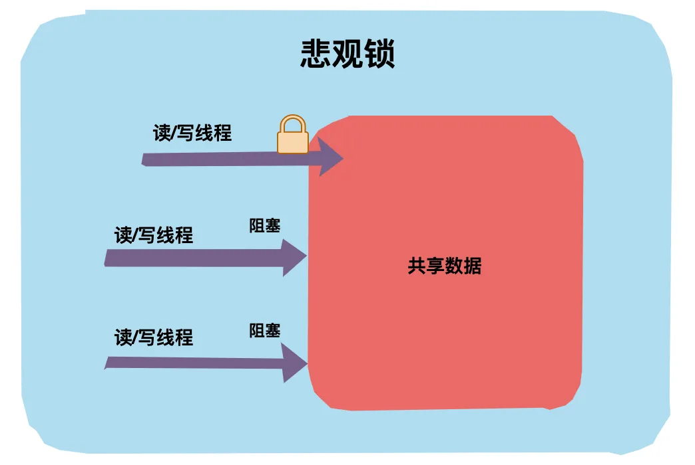

在 Java 语言中 `synchronized` 和 `ReentrantLock`等就是典型的悲观锁，还有一些使用了 synchronized 关键字的容器类如 `HashTable` 等也是悲观锁的应用。

> 《offer来了》解释：
>
> 悲观锁采用悲观思想处理数据，在每次读取数据时都认为别人会修改数据，所以每次在读写数据时都会上锁，这样别人想读写这个数据时就会阻塞、等待直到拿到锁。Java中的悲观锁大部分基于AQS（Abstract Queued Synchronized，抽象的队列同步器）架构实现。AQS定义了一套多线程访问共享资源的同步框架，许多同步类的实现都依赖于它，例如常用的Synchronized、ReentrantLock、Semaphore、CountDownLatch等。该框架下的锁会先尝试以CAS乐观锁去获取锁，如果获取不到，则会转为悲观锁（如RetreenLock）。

**乐观锁**

`乐观锁` 对应于生活中乐观的人，乐观的人总是想着事情往好的方向发展。

举个生活中的例子，假设厕所只有一个坑位了，乐观锁认为：这荒郊野外的，又没有什么人，不会有人抢我坑位的，每次关门上锁多浪费时间，还是不加锁好了。你看乐观锁就是天生乐观！

回到代码世界中，乐观锁操作数据时不会上锁，在更新的时候会判断一下在此期间是否有其他线程去更新这个数据。


乐观锁可以使用 `版本号机制`和 `CAS算法`实现。在 Java 语言中 `java.util.concurrent.atomic`包下的原子类就是使用 CAS 乐观锁实现的。

**两种锁的使用场景**

悲观锁和乐观锁没有孰优孰劣，有其各自适应的场景。

乐观锁适用于写比较少（冲突比较小）的场景，因为不用上锁、释放锁，省去了锁的开销，从而提升了吞吐量。

如果是写多读少的场景，即冲突比较严重，线程间竞争激励，使用乐观锁就是导致线程不断进行重试，这样可能还降低了性能，这种场景下使用悲观锁就比较合适。

```
《offer来了》解释:
乐观锁采用乐观的思想处理数据，在每次读取数据时都认为别人不会修改该数据，所以不会上锁，但在更新时会判断在此期间别人有没有更新该数据，通常采用在写时先读出当前版本号然后加锁的方法。具体过程为：比较当前版本号与上一次的版本号，如果版本号一致，则更新，如果版本号不一致，则重复进行读、比较、写操作。Java中的乐观锁大部分是通过CAS（Compare And Swap，比较和交换）操作实现的，CAS是一种原子更新操作，在对数据操作之前首先会比较当前值跟传入的值是否一样，如果一样则更新，否则不执行更新操作，直接返回失败状态。
```

拓展：自旋锁

`自旋锁`是指线程在没有获得锁时不是被直接挂起，而是执行一个忙循环，这个忙循环就是所谓的自旋。

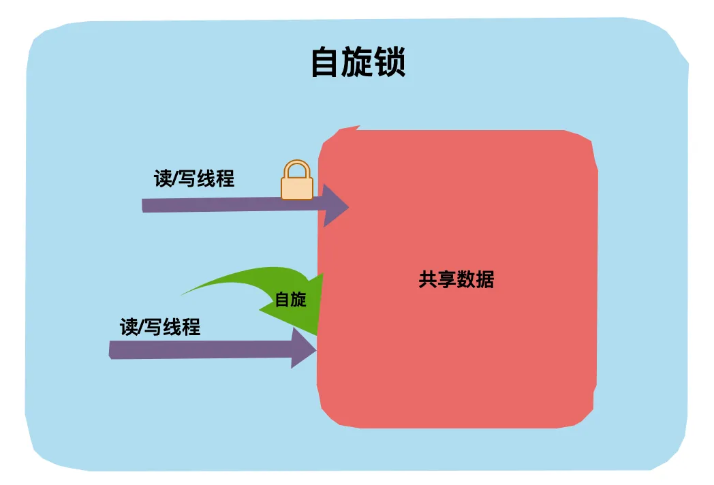

自旋锁的目的是为了减少线程被挂起的几率，因为线程的挂起和唤醒也都是耗资源的操作。

如果锁被另一个线程占用的时间比较长，即使自旋了之后当前线程还是会被挂起，忙循环就会变成浪费系统资源的操作，反而降低了整体性能。因此自旋锁是不适应锁占用时间长的并发情况的。

在 Java 中，`AtomicInteger` 类有自旋的操作，我们看一下代码：

```java
public final int getAndAddInt(Object o, long offset, int delta) {
    int v;
    do {
        v = getIntVolatile(o, offset);
    } while (!compareAndSwapInt(o, offset, v, v + delta));
    return v;
}
```

CAS 操作如果失败就会一直循环获取当前 value 值然后重试。

另外自适应自旋锁也需要了解一下。

在JDK1.6又引入了自适应自旋，这个就比较智能了，自旋时间不再固定，由前一次在同一个锁上的自旋时间以及锁的拥有者的状态来决定。如果虚拟机认为这次自旋也很有可能再次成功那就会持续较多的时间，如果自旋很少成功，那以后可能就直接省略掉自旋过程，避免浪费处理器资源。

```
《offer来了》解释:
自旋锁认为：如果持有锁的线程能在很短的时间内释放锁资源，那么那些等待竞争锁的线程就不需要做内核态和用户态之间的切换进入阻塞、挂起状态，只需等一等（也叫作自旋），在等待持有锁的线程释放锁后即可立即获取锁，这样就避免了用户线程在内核状态的切换上导致的锁时间消耗。线程在自旋时会占用CPU，在线程长时间自旋获取不到锁时，将会产CPU的浪费，甚至有时线程永远无法获取锁而导致CPU资源被永久占用，所以需要设定一个自旋等待的最大时间。在线程执行的时间超过自旋等待的最大时间后，线程会退出自旋模式并释放其持有的锁。
```

### 线程池参数，工作流程，阻塞队列中的任务怎么加载到线程中？

**参数**

---

```java
public ThreadPoolExecutor(int corePoolSize,
                              int maximumPoolSize,
                              long keepAliveTime,
                              TimeUnit unit,
                              BlockingQueue<Runnable> workQueue,
                              RejectedExecutionHandler handler)
```

- `corePoolSize` 线程池中的核心线程数，当提交一个任务时，线程池创建一个新线程执行任务，直到当前线程数等于 corePoolSize, 即使有其他空闲线程能够执行新来的任务, 也会继续创建线程；如果当前线程数为 corePoolSize，继续提交的任务被保存到阻塞队列中，等待被执行；如果执行了线程池的 prestartAllCoreThreads()方法，线程池会提前创建并启动所有核心线程。
- `workQueue` 用来保存等待被执行的任务的阻塞队列. 在 JDK 中提供了如下阻塞队列: 具体可以参考 JUC 集合: BlockQueue 详解
  - `ArrayBlockingQueue`: 基于数组结构的有界阻塞队列，按 FIFO 排序任务；
  - `LinkedBlockingQuene`: 基于链表结构的阻塞队列，按 FIFO 排序任务，吞吐量通常要高于 ArrayBlockingQuene；
  - `SynchronousQuene`: 一个不存储元素的阻塞队列，每个插入操作必须等到另一个线程调用移除操作，否则插入操作一直处于阻塞状态，吞吐量通常要高于 LinkedBlockingQuene；
  - `PriorityBlockingQuene`: 具有优先级的无界阻塞队列；

`LinkedBlockingQueue`比 `ArrayBlockingQueue`在插入删除节点性能方面更优，但是二者在 `put()`, `take()`任务的时均需要加锁，`SynchronousQueue`使用无锁算法，根据节点的状态判断执行，而不需要用到锁，其核心是 `Transfer.transfer()`.

- `maximumPoolSize` 线程池中允许的最大线程数。如果当前阻塞队列满了，且继续提交任务，则创建新的线程执行任务，前提是当前线程数小于 maximumPoolSize；当阻塞队列是无界队列, 则 maximumPoolSize 则不起作用, 因为无法提交至核心线程池的线程会一直持续地放入 workQueue.
- `keepAliveTime` 线程空闲时的存活时间，即当线程没有任务执行时，该线程继续存活的时间；默认情况下，该参数只在线程数大于 corePoolSize 时才有用, 超过这个时间的空闲线程将被终止；
- `unit` keepAliveTime 的单位
- `threadFactory` 创建线程的工厂，通过自定义的线程工厂可以给每个新建的线程设置一个具有识别度的线程名。默认为 DefaultThreadFactory
- `handler` 线程池的饱和策略，当阻塞队列满了，且没有空闲的工作线程，如果继续提交任务，必须采取一种策略处理该任务，线程池提供了 4 种策略:
  - `AbortPolicy`: 直接抛出异常，默认策略；
  - `CallerRunsPolicy`: 用调用者所在的线程来执行任务；
  - `DiscardOldestPolicy`: 丢弃阻塞队列中靠最前的任务，并执行当前任务；
  - `DiscardPolicy`: 直接丢弃任务；

当然也可以根据应用场景实现 RejectedExecutionHandler 接口，自定义饱和策略，如记录日志或持久化存储不能处理的任务。

### ThreadLocal 关键字

通常情况下，我们创建的变量是可以被任何一个线程访问并修改的。**如果想实现每一个线程都有自己的专属本地变量该如何解决呢？** JDK 中提供的 `ThreadLocal`类正是为了解决这样的问题。 **`ThreadLocal`类主要解决的就是让每个线程绑定自己的值，可以将 `ThreadLocal`类形象的比喻成存放数据的盒子，盒子中可以存储每个线程的私有数据。**

**如果你创建了一个 `ThreadLocal`变量，那么访问这个变量的每个线程都会有这个变量的本地副本，这也是 `ThreadLocal`变量名的由来。他们可以使用 `get（）` 和 `set（）` 方法来获取默认值或将其值更改为当前线程所存的副本的值，从而避免了线程安全问题。**

再举个简单的例子：

比如有两个人去宝屋收集宝物，这两个共用一个袋子的话肯定会产生争执，但是给他们两个人每个人分配一个袋子的话就不会出现这样的问题。如果把这两个人比作线程的话，那么 ThreadLocal 就是用来避免这两个线程竞争的

工作原理

---

当一个任务提交至线程池之后:

1. 线程池首先当前运行的线程数量是否少于 corePoolSize。如果是，则创建一个新的工作线程来执行任务。如果都在执行任务，则进入 2.
2. 判断 BlockingQueue 是否已经满了，倘若还没有满，则将任务放入 BlockingQueue。否则进入 3.
3. 如果创建一个新的工作线程将使当前运行的线程数量超过 maximumPoolSize，则交给 RejectedExecutionHandler 来处理任务。

当 ThreadPoolExecutor 创建新线程时，通过 CAS 来更新线程池的状态 ctl.

### CAS 是什么，原理，原子性怎么保证

什么是 CAS？

---

CAS（Compare-And-Swap）是 `比较并交换`的意思，它是一条 CPU 并发原语，用于判断内存中某个值是否为预期值，如果是则更改为新的值，这个过程是 `原子`的。下面用一个小示例解释一下。

CAS 机制当中使用了 3 个基本操作数：内存地址 V，旧的预期值 A，计算后要修改后的新值 B。

（1）初始状态：在内存地址 V 中存储着变量值为 1


（2）线程 1 想要把内存地址为 V 的变量值增加 1。这个时候对线程 1 来说，旧的预期值 A=1，要修改的新值 B=2。


（3）在线程 1 要提交更新之前，线程 2 捷足先登了，已经把内存地址 V 中的变量值率先更新成了 2。

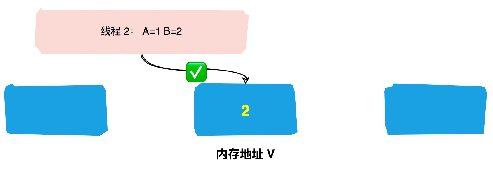

（4）线程 1 开始提交更新，首先将预期值 A 和内存地址 V 的实际值比较（Compare），发现 A 不等于 V 的实际值，提交失败。


（5）线程 1 重新获取内存地址 V 的当前值，并重新计算想要修改的新值。此时对线程 1 来说，A=2，B=3。这个重新尝试的过程被称为 `自旋`。如果多次失败会有多次自旋。


（6）线程 1 再次提交更新，这一次没有其他线程改变地址 V 的值。线程 1 进行 Compare，发现预期值 A 和内存地址 V 的实际值是相等的，进行 Swap 操作，将内存地址 V 的实际值修改为 B。


总结：更新一个变量的时候，只有当变量的预期值 A 和内存地址 V 中的实际值相同时，才会将内存地址 V 对应的值修改为 B，这整个操作就是 `CAS`。

CAS 基本原理

---

CAS 主要包括两个操作：`Compare`和 `Swap`，有人可能要问了：两个操作能保证是原子性吗？可以的。

CAS 是一种 `系统原语`，原语属于操作系统用语，原语由若干指令组成，用于完成某个功能的一个过程，并且原语的执行必须是连续的，在执行过程中不允许被中断，也就是说 CAS 是一条 CPU 的原子指令，由操作系统硬件来保证。

> 在 Intel 的 CPU 中，使用 cmpxchg 指令。

回到 Java 语言，JDK 是在 1.5 版本后才引入 CAS 操作，在 `sun.misc.Unsafe`这个类中定义了 CAS 相关的方法。

```java
public final native boolean compareAndSwapObject(Object o, long offset, Object expected, Object x);

public final native boolean compareAndSwapInt(Object o, long offset, int expected, int x);

public final native boolean compareAndSwapLong(Object o, long offset, long expected, long x);
```

可以看到方法被声明为 `native`，如果对 C++ 比较熟悉可以自行下载 OpenJDK 的源码查看 unsafe.cpp，这里不再展开分析。

CAS 在 Java 语言中的应用：

在 Java 编程中我们通常不会直接使用到 CAS，都是通过 JDK 封装好的并发工具类来间接使用的，这些并发工具类都在 `java.util.concurrent`包中。

`J.U.C 是`java.util.concurrent `的简称，也就是大家常说的 Java 并发编程工具包，面试常考，非常非常重要。`

目前 CAS 在 JDK 中主要应用在 J.U.C 包下的 Atomic 相关类中。

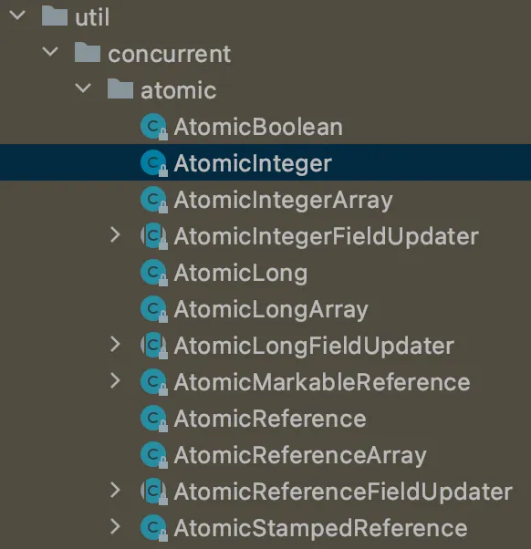

比如说 AtomicInteger 类就可以解决 i++ 非原子性问题，通过查看源码可以发现主要是靠 volatile 关键字和 CAS 操作来实现，具体原理和源码分析后面的文章会展开分析。

=====================原理的精简回答===============================

CAS 叫做 CompareAndSwap，比较并交换，主要是通过处理器的指令来保证操作的原子性，它包含三个操作数：

1. 变量内存地址，V 表示
2. 旧的预期值，A 表示
3. 准备设置的新值，B 表示

当执行 CAS 指令时，只有当 V 等于 A 时，才会用 B 去更新 V 的值，否则就不会执行更新操作。

只能保证单个变量的原子性

---

当对一个共享变量执行操作时，可以使用 CAS 来保证原子性，但是如果要对多个共享变量进行操作时，CAS 是无法保证原子性的，比如需要将 i 和 j 同时加 1：

i++；j++；

这个时候可以使用 synchronized 进行加锁，有没有其他办法呢？有，将多个变量操作合成一个变量操作。从 JDK1.5 开始提供了 `AtomicReference` 类来保证引用对象之间的原子性，你可以把多个变量放在一个对象里来进行 CAS 操作。

### JMM 是什么？ / JMM 内存模型？

 JMM 指的是 Java 内存模型 ，Java 内存模型抽象了线程和主内存之间的关系，就比如说线程之间的共享变量必须存储在主内存中。Java 内存模型主要目的是为了屏蔽系统和硬件的差异，避免一套代码在不同的平台下产生的效果不一致。

在 JDK1.2 之前，Java 的内存模型实现总是从**主存**（即共享内存）读取变量，是不需要进行特别的注意的。而在当前的 Java 内存模型下，线程可以把变量保存**本地内存**（比如机器的寄存器）中，而不是直接在主存中进行读写。这就可能造成一个线程在主存中修改了一个变量的值，而另外一个线程还继续使用它在寄存器中的变量值的拷贝，造成**数据的不一致**。

> - **主内存** ：所有线程创建的实例对象都存放在主内存中，不管该实例对象是成员变量还是方法中的本地变量(也称局部变量)
> - **本地内存** ：每个线程都有一个私有的本地内存来存储共享变量的副本，并且，每个线程只能访问自己的本地内存，无法访问其他线程的本地内存。本地内存是 JMM 抽象出来的一个概念，存储了主内存中的共享变量副本。


要解决这个问题，就需要把变量声明为 **`volatile`** ，这就指示 JVM，这个变量是共享且不稳定的，每次使用它都到主存中进行读取。

所以，**`volatile` 关键字 除了防止 JVM 的指令重排 ，还有一个重要的作用就是保证变量的可见性。**


### 多进程与多线程，多线程与单线程比较（CPU 密集，IO 密集）

从任务的优先级，任务的执行时间长短，任务的性质(CPU 密集/ IO 密集)，任务的依赖关系这四个角度来分析。并且近可能地使用有界的工作队列。

从任务的优先级来看：

多进程与多线程相比，两者都可以通过优先级来实现优先级调度，但是，多线程比多进程更加轻量级，线程的创建、销毁和上下文切换的代价都比进程小，因此在一些需要高并发处理的场景中，多线程往往比多进程更具优势。

从任务的执行时间长短来看：

对于长时间执行的任务，多线程往往比单线程更加合适，因为多线程可以将任务分解成若干个子任务并行执行，提高了执行效率。而多进程则需要更多的进程间通信和数据共享，这增加了进程间的开销和复杂度。

从任务的性质（CPU 密集/IO 密集）来看：

对于 CPU 密集型的任务，多线程往往能够更好地利用多核 CPU 的优势，提高程序的执行效率。而对于 I/O 密集型的任务，多线程往往会因为等待 I/O 操作而浪费 CPU 资源，此时多进程可以更好地利用 CPU 资源，因为每个进程都有自己的 CPU 时间片。

从任务的依赖关系来看：

对于有依赖关系的任务，多线程可以通过线程间的同步和协作来完成任务之间的依赖关系，而多进程则需要通过进程间通信来完成任务之间的依赖关系。因此，对于依赖关系比较简单的任务，多线程更加适合，而对于依赖关系比较复杂的任务，多进程则可能更加适合。

### 介绍一下 Java 不同层面的锁（2022-04-11 携程）

JVM 层面与 JDK 层面，就是 synchronized+Lock，优缺点、对比、AQS

Java 中的锁可以分为多个层次，从 JVM 层面和 JDK 层面来介绍不同层次的锁：

1. JVM 层面的锁： JVM 提供了内置锁（也称为监视器锁）和轻量级锁。内置锁是 Java 中最常见的锁，它基于互斥量的实现方式，使用 synchronized 关键字来获取和释放锁。轻量级锁则是为了在并发场景下减少锁竞争而提供的一种优化，它在竞争不激烈的情况下使用 CAS 操作（Compare-And-Swap）来进行加锁和解锁，避免了互斥量的开销。
2. JDK 层面的锁： JDK 提供了多种锁，其中比较常用的有以下几种：

- ReentrantLock：重入锁，可重入、可中断、可限时、可公平或非公平获取锁。
- ReadWriteLock：读写锁，允许多个线程同时读取共享资源，但只允许一个线程写入共享资源。

以下是各种锁的优缺点和对比：

1. 内置锁 优点：使用简单，不需要手动释放锁，具有很好的互斥性和可见性。 缺点：竞争激烈时性能较差，没有可中断、可限时等高级特性。
2. 轻量级锁 优点：对于竞争不激烈的情况，性能比内置锁要好。 缺点：竞争激烈时性能较差，对锁的状态转换需要额外的开销。
3. ReentrantLock 优点：支持可重入、可中断、可限时、可公平或非公平获取锁，相对于内置锁具有更好的灵活性和可控性。 缺点：使用复杂，需要手动释放锁，使用不当容易出现死锁或者饥饿问题，性能稍差于内置锁。
4. ReadWriteLock 优点：允许多个线程同时读取共享资源，提高了并发性能。 缺点：写入操作需要排他访问，可能出现饥饿问题，读写锁的实现相对复杂，性能开销较大。

 在一些低并发、无需灵活控制的场景下，内置锁是最简单和高效的选择；在一些需要灵活控制并发、实现高级特性的场景下，ReentrantLock 是更好的选择；在读多写少的场景下，ReadWriteLock 可以提高并发性能。 

### synchronized 有了为什么还要 ReentranLock ，有啥不一样？（shopline）

两者都是可重入锁

**“可重入锁”**  指的是自己可以再次获取自己的内部锁。比如一个线程获得了某个对象的锁，此时这个对象锁还没有释放，当其再次想要获取这个对象的锁的时候还是可以获取的，如果是不可重入锁的话，就会造成死锁。同一个线程每次获取锁，锁的计数器都自增 1，所以要等到锁的计数器下降为 0 时才能释放锁。

synchronized 依赖于 JVM 而 ReentrantLock 依赖于 API

`synchronized` 是依赖于 JVM 实现的，前面我们也讲到了 虚拟机团队在 JDK1.6 为 `synchronized` 关键字进行了很多优化，但是这些优化都是在虚拟机层面实现的，并没有直接暴露给我们。`ReentrantLock` 是 JDK 层面实现的（也就是 API 层面，需要 lock() 和 unlock() 方法配合 try/finally 语句块来完成），所以我们可以通过查看它的源代码，来看它是如何实现的。

ReentrantLock 比 synchronized 增加了一些高级功能

相比 `synchronized`，`ReentrantLock`增加了一些高级功能。主要来说主要有三点：

- **等待可中断** : `ReentrantLock`提供了一种能够中断等待锁的线程的机制，通过 `lock.lockInterruptibly()` 来实现这个机制。也就是说正在等待的线程可以选择放弃等待，改为处理其他事情。
- **可实现公平锁** : `ReentrantLock`可以指定是公平锁还是非公平锁。而 `synchronized`只能是非公平锁。所谓的公平锁就是先等待的线程先获得锁。`ReentrantLock`默认情况是非公平的，可以通过 `ReentrantLock`类的 `ReentrantLock(boolean fair)`构造方法来制定是否是公平的。
- **可实现选择性通知（锁可以绑定多个条件）**: `synchronized`关键字与 `wait()`和 `notify()`/`notifyAll()`方法相结合可以实现等待/通知机制。`ReentrantLock`类当然也可以实现，但是需要借助于 `Condition`接口与 `newCondition()`方法。

> `Condition`是 JDK1.5 之后才有的，它具有很好的灵活性，比如可以实现多路通知功能也就是在一个 `Lock`对象中可以创建多个 `Condition`实例（即对象监视器），**线程对象可以注册在指定的 `Condition`中，从而可以有选择性的进行线程通知，在调度线程上更加灵活。 在使用 `notify()/notifyAll()`方法进行通知时，被通知的线程是由 JVM 选择的，用 `ReentrantLock`类结合 `Condition`实例可以实现“选择性通知”** ，这个功能非常重要，而且是 Condition 接口默认提供的。而 `synchronized`关键字就相当于整个 Lock 对象中只有一个 `Condition`实例，所有的线程都注册在它一个身上。如果执行 `notifyAll()`方法的话就会通知所有处于等待状态的线程这样会造成很大的效率问题，而 `Condition`实例的 `signalAll()`方法 只会唤醒注册在该 `Condition`实例中的所有等待线程。

**如果你想使用上述功能，那么选择 ReentrantLock 是一个不错的选择。性能已不是选择标准**

### synchronized实现等待唤醒机制(shopline)

https://blog.csdn.net/it_lihongmin/article/details/109230696

>等待唤醒机制使用场景比较多，`一个完整的等待唤醒机制过程：线程首先获取互斥锁，当线程要求的条件不满足时释放互斥锁，进入等待状态；当要求的条件满足时，通知等待的线程，重新获取互斥锁`。直接在并发编程模式 - Guarded Suspension设计模式中使用ReentrantLock+Condition实现了一个版本，并且也分析了 Dubbo的异步请求Api的异步转同步的过程。`Object的 wait、notify、notifyAll`方法需要配合synchronized使用，即在其内部使用，并且写法基本固定。如果在synchronized外部调用 wait方法等，则会报 java.lang.IllegalMonitorStateException。

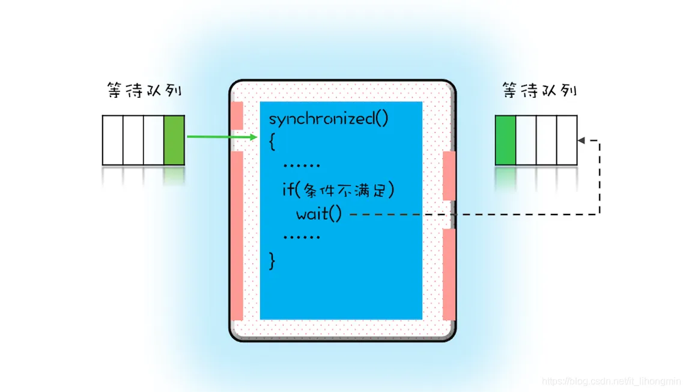


```java
class Allocator {
  private List<Object> als;
  // 一次性申请所有资源
  synchronized void apply(
    Object from, Object to){
    // 经典写法
    while(als.contains(from) ||
         als.contains(to)){
      try{
        wait();
      }catch(Exception e){
      }   
    } 
    als.add(from);
    als.add(to);  
  }
  // 归还资源
  synchronized void free(
    Object from, Object to){
    als.remove(from);
    als.remove(to);
    notifyAll();
  }
}
```

### Atomic类底层原理

AtomicInteger 类主要利用 CAS (compare and swap) + volatile 和 native方法来保证原子操作，从而避免 synchronized 的高开销，执行效率大为提升。

Atomic原子类底层用的不是传统意义的锁机制，而是无锁化的CAS机制，通过CAS机制保证多线程修改一个数值的安全性

### 讲讲**synchronized**

synchronized是Java中的关键字，是一种同步锁。synchronized关键字可以作用于方法或者代码块。

一般面试时。可以这么回答：

- 反编译后，monitorenter、monitorexit、ACC_SYNCHRONIZED
- monitor监视器
- Java Monitor 的工作机理
- 对象与monitor关联

**monitorenter、monitorexit、ACC_SYNCHRONIZED**

如果**synchronized**作用于**代码块**，反编译可以看到两个指令：`monitorenter、monitorexit`，JVM使用 `monitorenter和monitorexit`两个指令实现同步；如果synchronized作用于**方法**,反编译可以看到 `ACCSYNCHRONIZED标记`，JVM通过在方法访问标识符(flags)中加入 `ACCSYNCHRONIZED`来实现同步功能。

- 同步代码块是通过 `monitorenter和monitorexit`来实现，当线程执行到monitorenter的时候要先获得monitor锁，才能执行后面的方法。当线程执行到monitorexit的时候则要释放锁。
- 同步方法是通过中设置 `ACCSYNCHRONIZED`标志来实现，当线程执行有ACCSYNCHRONIZED标志的方法，需要获得monitor锁。每个对象都与一个monitor相关联，线程可以占有或者释放monitor。

**monitor监视器**

monitor是什么呢？操作系统的管程（monitors）是概念原理，ObjectMonitor是它的原理实现。

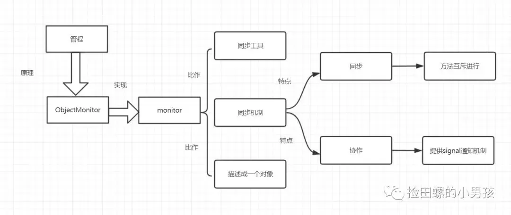

在Java虚拟机（HotSpot）中，Monitor（管程）是由ObjectMonitor实现的，其主要数据结构如下：

```
 ObjectMonitor() {
    _header       = NULL;
    _count        = 0; // 记录个数
    _waiters      = 0,
    _recursions   = 0;
    _object       = NULL;
    _owner        = NULL;
    _WaitSet      = NULL;  // 处于wait状态的线程，会被加入到_WaitSet
    _WaitSetLock  = 0 ;
    _Responsible  = NULL ;
    _succ         = NULL ;
    _cxq          = NULL ;
    FreeNext      = NULL ;
    _EntryList    = NULL ;  // 处于等待锁block状态的线程，会被加入到该列表
    _SpinFreq     = 0 ;
    _SpinClock    = 0 ;
    OwnerIsThread = 0 ;
  }
```

ObjectMonitor中几个关键字段的含义如图所示：

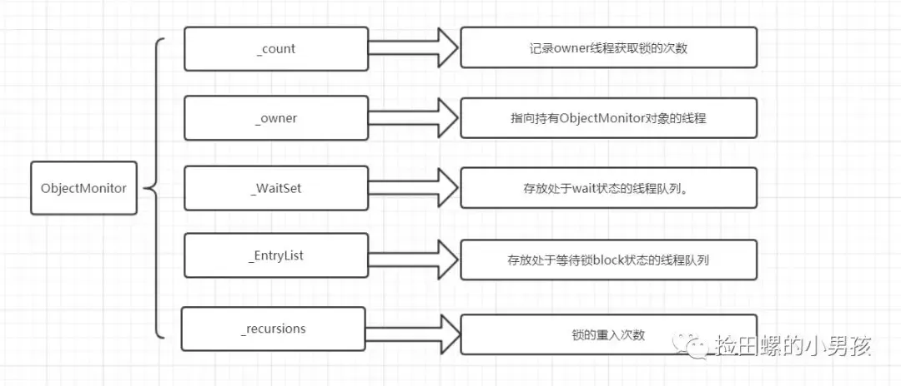

**Java Monitor 的工作机理**

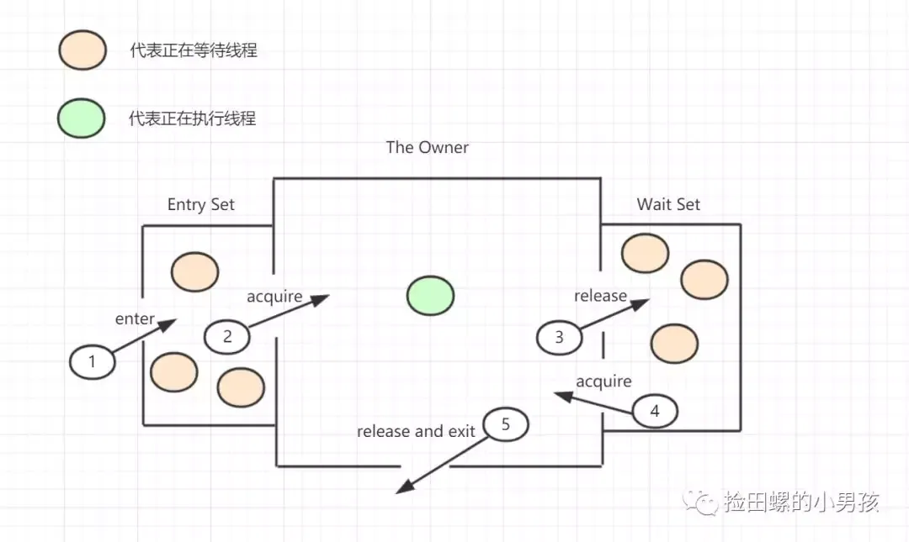

- 想要获取monitor的线程,首先会进入_EntryList队列。
- 当某个线程获取到对象的monitor后,进入Owner区域，设置为当前线程,同时计数器count加1。
- 如果线程调用了wait()方法，则会进入WaitSet队列。它会释放monitor锁，即将owner赋值为null,count自减1,进入WaitSet队列阻塞等待。
- 如果其他线程调用 notify() / notifyAll() ，会唤醒WaitSet中的某个线程，该线程再次尝试获取monitor锁，成功即进入Owner区域。
- 同步方法执行完毕了，线程退出临界区，会将monitor的owner设为null，并释放监视锁。

**对象与monitor关联**


- 在HotSpot虚拟机中,对象在内存中存储的布局可以分为3块区域：**对象头（Header），实例数据（Instance Data）和对象填充（Padding）**。
- 对象头主要包括两部分数据：**Mark Word（标记字段）、Class Pointer（类型指针）**。

Mark Word 是用于存储对象自身的运行时数据，如哈希码（HashCode）、GC分代年龄、锁状态标志、线程持有的锁、偏向线程 ID、偏向时间戳等。

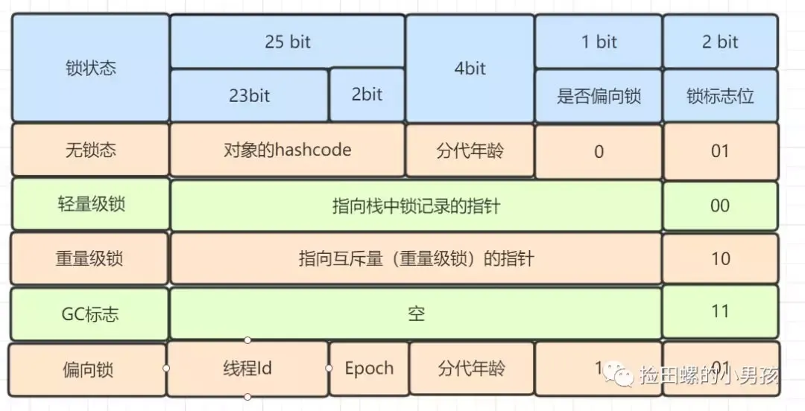

**重量级锁，指向互斥量的指针。其实synchronized是重量级锁，也就是说Synchronized的对象锁，Mark Word锁标识位为10，其中指针指向的是Monitor对象的起始地址。**

## 📑数据库

### Redis

#### 简单介绍一下 Redis

简单来说 **Redis 就是一个使用 C 语言开发的数据库**，不过与传统数据库不同的是 **Redis 的数据是存在内存中的** ，也就是它是内存数据库，所以读写速度非常快，因此 Redis 被广泛应用于缓存方向。

另外，**Redis 除了做缓存之外，也经常用来做分布式锁，甚至是消息队列。**

**Redis 提供了多种数据类型来支持不同的业务场景。Redis 还支持事务 、持久化、Lua 脚本、多种集群方案。**

#### Redis 基本的数据结构都有哪些？具体操作命令是什么？

* String字符串

| 命令   | 简述                   | 使用              |
| ------ | ---------------------- | ----------------- |
| GET    | 获取存储在给定键中的值 | GET name          |
| SET    | 设置存储在给定键中的值 | SET name value    |
| DEL    | 删除存储在给定键中的值 | DEL name          |
| INCR   | 将键存储的值加1        | INCR key          |
| DECR   | 将键存储的值减1        | DECR key          |
| INCRBY | 将键存储的值加上整数   | INCRBY key amount |
| DECRBY | 将键存储的值减去整数   | DECRBY key amount |

* List列表

| 命令   | 简述                                                                                                                   | 使用             |
| ------ | ---------------------------------------------------------------------------------------------------------------------- | ---------------- |
| RPUSH  | 将给定值推入到列表右端                                                                                                 | RPUSH key value  |
| LPUSH  | 将给定值推入到列表左端                                                                                                 | LPUSH key value  |
| RPOP   | 从列表的右端弹出一个值，并返回被弹出的值                                                                               | RPOP key         |
| LPOP   | 从列表的左端弹出一个值，并返回被弹出的值                                                                               | LPOP key         |
| LRANGE | 获取列表在给定范围上的所有值                                                                                           | LRANGE key 0 -1  |
| LINDEX | 通过索引获取列表中的元素。你也可以使用负数下标，以 -1 表示列表的最后一个元素， -2 表示列表的倒数第二个元素，以此类推。 | LINDEX key index |

* Set集合

| 命令      | 简述                                  | 使用                 |
| --------- | ------------------------------------- | -------------------- |
| SADD      | 向集合添加一个或多个成员              | SADD key value       |
| SCARD     | 获取集合的成员数                      | SCARD key            |
| SMEMBERS  | 返回集合中的所有成员                  | SMEMBERS key member  |
| SISMEMBER | 判断 member 元素是否是集合 key 的成员 | SISMEMBER key member |

* Hash散列

| 命令    | 简述                                     | 使用                          |
| ------- | ---------------------------------------- | ----------------------------- |
| HSET    | 添加键值对                               | HSET hash-key sub-key1 value1 |
| HGET    | 获取指定散列键的值                       | HGET hash-key key1            |
| HGETALL | 获取散列中包含的所有键值对               | HGETALL hash-key              |
| HDEL    | 如果给定键存在于散列中，那么就移除这个键 | HDEL hash-key sub-key1        |

* Zset有序集合

| 命令   | 简述                                                     | 使用                           |
| ------ | -------------------------------------------------------- | ------------------------------ |
| ZADD   | 将一个带有给定分值的成员添加到有序集合里面               | ZADD zset-key 178 member1      |
| ZRANGE | 根据元素在有序集合中所处的位置，从有序集合中获取多个元素 | ZRANGE zset-key 0-1 withccores |
| ZREM   | 如果给定元素成员存在于有序集合中，那么就移除这个元素     | ZREM zset-key member1          |

#### Redis 基本数据结构的底层实现原理有了解吗？


https://www.pdai.tech/md/db/nosql-redis/db-redis-x-redis-ds.html

#### Redis 为什么不直接使用 C 字符串，而要自己构建一种字符串抽象类型 SDS(simple dynamic string)？

- **常数复杂度获取字符串长度**

由于 len 属性的存在，我们获取 SDS 字符串的长度只需要读取 len 属性，时间复杂度为 O(1)。而对于 C 语言，获取字符串的长度通常是经过遍历计数来实现的，时间复杂度为 O(n)。通过 `strlen key` 命令可以获取 key 的字符串长度。

- **杜绝缓冲区溢出**

我们知道在 C 语言中使用 `strcat`  函数来进行两个字符串的拼接，一旦没有分配足够长度的内存空间，就会造成缓冲区溢出。而对于 SDS 数据类型，在进行字符修改的时候，**会首先根据记录的 len 属性检查内存空间是否满足需求**，如果不满足，会进行相应的空间扩展，然后在进行修改操作，所以不会出现缓冲区溢出。

- **减少修改字符串的内存重新分配次数**

C语言由于不记录字符串的长度，所以如果要修改字符串，必须要重新分配内存（先释放再申请），因为如果没有重新分配，字符串长度增大时会造成内存缓冲区溢出，字符串长度减小时会造成内存泄露。

而对于SDS，由于 `len`属性和 `alloc`属性的存在，对于修改字符串SDS实现了**空间预分配**和**惰性空间释放**两种策略：

1、`空间预分配`：对字符串进行空间扩展的时候，扩展的内存比实际需要的多，这样可以减少连续执行字符串增长操作所需的内存重分配次数。

2、`惰性空间释放`：对字符串进行缩短操作时，程序不立即使用内存重新分配来回收缩短后多余的字节，而是使用 `alloc` 属性将这些字节的数量记录下来，等待后续使用。（当然SDS也提供了相应的API，当我们有需要时，也可以手动释放这些未使用的空间。）

- **二进制安全**

因为C字符串以空字符作为字符串结束的标识，而对于一些二进制文件（如图片等），内容可能包括空字符串，因此C字符串无法正确存取；而所有 SDS 的API 都是以处理二进制的方式来处理 `buf` 里面的元素，并且 SDS 不是以空字符串来判断是否结束，而是以 len 属性表示的长度来判断字符串是否结束。

- **兼容部分 C 字符串函数**

虽然 SDS 是二进制安全的，但是一样遵从每个字符串都是以空字符串结尾的惯例，这样可以重用 C 语言库 `<string.h>` 中的一部分函数。

`拓展:什么是SDS`

**SDS的总体概览**如下图:


其中 `sdshdr`是头部, `buf`是真实存储用户数据的地方. 另外注意, 从命名上能看出来, 这个数据结构除了能存储二进制数据, 显然是用于设计作为字符串使用的, 所以在buf中, 用户数据后总跟着一个\0. 即图中 `"数据" + "\0"`是为所谓的buf。

- 如下是**6.0源码中sds相关的结构**：


通过上图我们可以看到，SDS有五种不同的头部. 其中sdshdr5实际并未使用到. 所以实际上有四种不同的头部, 分别如下:


其中：

- `len` 保存了SDS保存字符串的长度
- `buf[]` 数组用来保存字符串的每个元素
- `alloc`分别以uint8, uint16, uint32, uint64表示整个SDS, 除过头部与末尾的\0, 剩余的字节数.
- `flags` 始终为一字节, 以低三位标示着头部的类型, 高5位未使用.

#### Redis 的持久化方式有了解吗？能大概说一下吗？

从严格意义上说，Redis服务提供四种持久化存储方案：RDB、AOF、虚拟内存（VM）和　DISKSTORE。虚拟内存（VM）方式，从Redis Version 2.4开始就被官方明确表示不再建议使用，Version 3.2版本中更找不到关于虚拟内存（VM）的任何配置范例，Redis的主要作者Salvatore Sanfilippo还专门写了一篇论文，来反思Redis对虚拟内存（VM）存储技术的支持问题。 至于DISKSTORE方式，是从Redis Version 2.8版本开始提出的一个存储设想，到目前为止Redis官方也没有在任何stable版本中明确建议使用这用方式。在Version 3.2版本中同样找不到对于这种存储方式的明确支持。从网络上能够收集到的各种资料来看，DISKSTORE方式和RDB方式还有着一些千丝万缕的联系，不过各位读者也知道，除了官方文档以外网络资料很多就是大抄。 最关键的是目前官方文档上能够看到的Redis对持久化存储的支持明确的就只有两种方案（https://redis.io/topics/persistence）：RDB和AOF。

具体介绍见：https://www.pdai.tech/md/db/nosql-redis/db-redis-x-rdb-aof.html#redis%E6%8C%81%E4%B9%85%E5%8C%96%E7%AE%80%E4%BB%8B

#### Redis 怎么统计在线用户

见下一个问题的 `bitmap`的使用场景

#### Redis 的数据结构讲一讲 + 使用场景

string

---

1. **介绍** ：string 数据结构是简单的 key-value 类型。虽然 Redis 是用 C 语言写的，但是 Redis 并没有使用 C 的字符串表示，而是自己构建了一种 **简单动态字符串**（simple dynamic string，**SDS**）。相比于 C 的原生字符串，Redis 的 SDS 不光可以保存文本数据还可以保存二进制数据，并且获取字符串长度复杂度为 O(1)（C 字符串为 O(N)）,除此之外，Redis 的 SDS API 是安全的，不会造成缓冲区溢出。
2. **常用命令：** `set,get,strlen,exists,decr,incr,setex` 等等。
3. **应用场景：** 一般常用在需要计数的场景，比如用户的访问次数、热点文章的点赞转发数量等等。

list

---

1. **介绍** ：**list** 即是 **链表**。链表是一种非常常见的数据结构，特点是易于数据元素的插入和删除并且可以灵活调整链表长度，但是链表的随机访问困难。许多高级编程语言都内置了链表的实现比如 Java 中的 **LinkedList**，但是 C 语言并没有实现链表，所以 Redis 实现了自己的链表数据结构。Redis 的 list 的实现为一个 **双向链表**，即可以支持反向查找和遍历，更方便操作，不过带来了部分额外的内存开销。
2. **常用命令:** `rpush,lpop,lpush,rpop,lrange,llen` 等。
3. **应用场景:** 发布与订阅或者说消息队列、慢查询。

hash

---

1. **介绍** ：hash 类似于 JDK1.8 前的 HashMap，内部实现也差不多(数组 + 链表)。不过，Redis 的 hash 做了更多优化。另外，hash 是一个 string 类型的 field 和 value 的映射表，**特别适合用于存储对象**，后续操作的时候，你可以直接仅仅修改这个对象中的某个字段的值。 比如我们可以 hash 数据结构来存储用户信息，商品信息等等。
2. **常用命令：** `hset,hmset,hexists,hget,hgetall,hkeys,hvals` 等。
3. **应用场景:** 系统中对象数据的存储。

set

---

1. **介绍 ：** set 类似于 Java 中的 `HashSet` 。Redis 中的 set 类型是一种无序集合，集合中的元素没有先后顺序。当你需要存储一个列表数据，又不希望出现重复数据时，set 是一个很好的选择，并且 set 提供了判断某个成员是否在一个 set 集合内的重要接口，这个也是 list 所不能提供的。可以基于 set 轻易实现交集、并集、差集的操作。比如：你可以将一个用户所有的关注人存在一个集合中，将其所有粉丝存在一个集合。Redis 可以非常方便的实现如共同关注、共同粉丝、共同喜好等功能。这个过程也就是求交集的过程。
2. **常用命令：** `sadd,spop,smembers,sismember,scard,sinterstore,sunion` 等。
3. **应用场景:** 需要存放的数据不能重复以及需要获取多个数据源交集和并集等场景

sorted set

---

1. **介绍：** 和 set 相比，sorted set 增加了一个权重参数 score，使得集合中的元素能够按 score 进行有序排列，还可以通过 score 的范围来获取元素的列表。有点像是 Java 中 HashMap 和 TreeSet 的结合体。
2. **常用命令：** `zadd,zcard,zscore,zrange,zrevrange,zrem` 等。
3. **应用场景：** 需要对数据根据某个权重进行排序的场景。比如在直播系统中，实时排行信息包含直播间在线用户列表，各种礼物排行榜，弹幕消息（可以理解为按消息维度的消息排行榜）等信息。

bitmap

---

1. **介绍：** bitmap 存储的是连续的二进制数字（0 和 1），通过 bitmap, 只需要一个 bit 位来表示某个元素对应的值或者状态，key 就是对应元素本身 。我们知道 8 个 bit 可以组成一个 byte，所以 bitmap 本身会极大的节省储存空间。
2. **常用命令：** `setbit` 、`getbit` 、`bitcount`、`bitop`
3. **应用场景：** 适合需要保存状态信息（比如是否签到、是否登录...）并需要进一步对这些信息进行分析的场景。比如用户签到情况、活跃用户情况、用户行为统计（比如是否点赞过某个视频）。

**使用场景一：用户行为分析** 很多网站为了分析你的喜好，需要研究你点赞过的内容。

```sh
# 记录你喜欢过 001 号小姐姐
127.0.0.1:6379> setbit beauty_girl_001 uid 1
```

**使用场景二：统计活跃用户**

使用时间作为 key，然后用户 ID 为 offset，如果当日活跃过就设置为 1

那么我该如何计算某几天/月/年的活跃用户呢(暂且约定，统计时间内只要有一天在线就称为活跃)，有请下一个 redis 的命令

```sh
# 对一个或多个保存二进制位的字符串 key 进行位元操作，并将结果保存到 destkey 上。
# BITOP 命令支持 AND 、 OR 、 NOT 、 XOR 这四种操作中的任意一种参数
BITOP operation destkey key [key ...]
```

初始化数据：

```sh
127.0.0.1:6379> setbit 20210308 1 1
(integer) 0
127.0.0.1:6379> setbit 20210308 2 1
(integer) 0
127.0.0.1:6379> setbit 20210309 1 1
(integer) 0
```

统计 20210308~20210309 总活跃用户数: 1

```sh
127.0.0.1:6379> bitop and desk1 20210308 20210309
(integer) 1
127.0.0.1:6379> bitcount desk1
(integer) 1
```

统计 20210308~20210309 在线活跃用户数: 2

```sh
127.0.0.1:6379> bitop or desk2 20210308 20210309
(integer) 1
127.0.0.1:6379> bitcount desk2
(integer) 2
```

**使用场景三：用户在线状态**

对于获取或者统计用户在线状态，使用 bitmap 是一个节约空间且效率又高的一种方法。

只需要一个 key，然后用户 ID 为 offset，如果在线就设置为 1，不在线就设置为 0。

#### Zset 里面跳表是什么

**跳跃表（zSkiplist)**: 跳跃表的性能可以保证在查找，删除，添加等操作的时候在对数期望时间内完成，这个性能是可以和平衡树来相比较的，而且在实现方面比平衡树要优雅，这是采用跳跃表的主要原因。跳跃表的复杂度是O(log(n))。

#### 如何保证缓存和数据库数据的一致性？（2022飞书）

细说的话可以扯很多，但是我觉得其实没太大必要（小声 BB：很多解决方案我也没太弄明白）。我个人觉得引入缓存之后，如果为了短时间的不一致性问题，选择让系统设计变得更加复杂的话，完全没必要。

下面单独对 **Cache Aside Pattern（旁路缓存模式）** 来聊聊。

Cache Aside Pattern 中遇到写请求是这样的：更新 DB，然后直接删除 cache 。

如果更新数据库成功，而删除缓存这一步失败的情况的话，简单说两个解决方案：

1. **缓存失效时间变短（不推荐，治标不治本）** ：我们让缓存数据的过期时间变短，这样的话缓存就会从数据库中加载数据。另外，这种解决办法对于先操作缓存后操作数据库的场景不适用。
2. **增加 cache 更新重试机制（常用）**： 如果 cache 服务当前不可用导致缓存删除失败的话，我们就隔一段时间进行重试，重试次数可以自己定。如果多次重试还是失败的话，我们可以把当前更新失败的 key 存入队列中，等缓存服务可用之后，再将缓存中对应的 key 删除即可。

相关文章推荐：[缓存和数据库一致性问题，看这篇就够了 - 水滴与银弹](https://mp.weixin.qq.com/s?__biz=MzIyOTYxNDI5OA==&mid=2247487312&idx=1&sn=fa19566f5729d6598155b5c676eee62d&chksm=e8beb8e5dfc931f3e35655da9da0b61c79f2843101c130cf38996446975014f958a6481aacf1&scene=178&cur_album_id=1699766580538032128#rd)

> 还有另外的答案（用于理解）

**不管是先写MySQL数据库，再删除Redis缓存；还是先删除缓存，再写库，都有可能出现数据不一致的情况**。举一个例子：

1.如果删除了缓存Redis，还没有来得及写库MySQL，另一个线程就来读取，发现缓存为空，则去数据库中读取数据写入缓存，此时缓存中为脏数据。


2.如果先写了库，在删除缓存前，写库的线程宕机了，没有删除掉缓存，则也会出现数据不一致情况。


因为写和读是并发的，没法保证顺序,就会出现缓存和数据库的数据不一致的问题。

##### 4种相关模式

更新缓存的的Design Pattern有四种：Cache aside, Read through, Write through, Write behind caching; 我强烈建议你看看这篇，左耳朵耗子的文章：[缓存更新的套路](https://coolshell.cn/articles/17416.html)

**节选最最常用的Cache Aside Pattern, 总结来说就是**

- **读的时候**，先读缓存，缓存没有的话，就读数据库，然后取出数据后放入缓存，同时返回响应。
- **更新的时候**，先更新数据库，然后再删除缓存。

其具体逻辑如下：

- **失效**：应用程序先从cache取数据，没有得到，则从数据库中取数据，成功后，放到缓存中。
- **命中**：应用程序从cache中取数据，取到后返回。
- **更新**：先把数据存到数据库中，成功后，再让缓存失效。

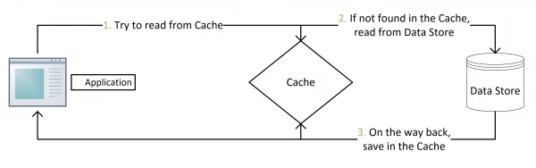


注意，我们的更新是先更新数据库，成功后，让缓存失效。那么，这种方式是否可以没有文章前面提到过的那个问题呢？我们可以脑补一下。

一个是查询操作，一个是更新操作的并发，首先，没有了删除cache数据的操作了，而是先更新了数据库中的数据，此时，缓存依然有效，所以，并发的查询操作拿的是没有更新的数据，但是，更新操作马上让缓存的失效了，后续的查询操作再把数据从数据库中拉出来。而不会像文章开头的那个逻辑产生的问题，后续的查询操作一直都在取老的数据。

这是标准的design pattern，包括Facebook的论文《[Scaling Memcache at Facebook](https://www.usenix.org/system/files/conference/nsdi13/nsdi13-final170_update.pdf)》也使用了这个策略。为什么不是写完数据库后更新缓存？你可以看一下Quora上的这个问答《[Why does Facebook use delete to remove the key-value pair in Memcached instead of updating the Memcached during write request to the backend?](https://www.quora.com/Why-does-Facebook-use-delete-to-remove-the-key-value-pair-in-Memcached-instead-of-updating-the-Memcached-during-write-request-to-the-backend)》，主要是怕两个并发的写操作导致脏数据。

那么，是不是Cache Aside这个就不会有并发问题了？不是的，比如，一个是读操作，但是没有命中缓存，然后就到数据库中取数据，此时来了一个写操作，写完数据库后，让缓存失效，然后，之前的那个读操作再把老的数据放进去，所以，会造成脏数据。

但，这个case理论上会出现，不过，实际上出现的概率可能非常低，因为这个条件需要发生在读缓存时缓存失效，而且并发着有一个写操作。而实际上数据库的写操作会比读操作慢得多，而且还要锁表，而读操作必需在写操作前进入数据库操作，而又要晚于写操作更新缓存，所有的这些条件都具备的概率基本并不大。

所以，这也就是Quora上的那个答案里说的，要么通过2PC或是Paxos协议保证一致性，要么就是拼命的降低并发时脏数据的概率，而Facebook使用了这个降低概率的玩法，因为2PC太慢，而Paxos太复杂。当然，最好还是为缓存设置上过期时间。

##### 方案：队列 + 重试机制

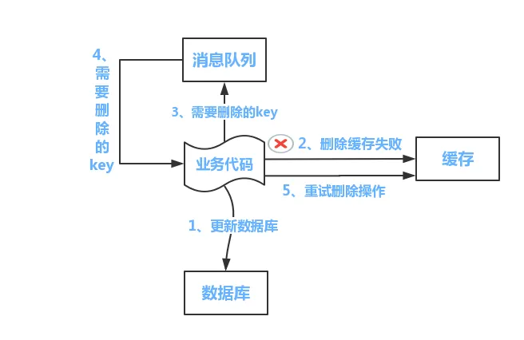

流程如下所示

- 更新数据库数据；
- 缓存因为种种问题删除失败
- 将需要删除的key发送至消息队列
- 自己消费消息，获得需要删除的key
- 继续重试删除操作，直到成功

然而，该方案有一个缺点，对业务线代码造成大量的侵入。于是有了方案二，在方案二中，启动一个订阅程序去订阅数据库的binlog，获得需要操作的数据。在应用程序中，另起一段程序，获得这个订阅程序传来的信息，进行删除缓存操作。

##### 方案：异步更新缓存(基于订阅binlog的同步机制)


MySQL binlog增量订阅消费+消息队列+增量数据更新到redis

1）读Redis：热数据基本都在Redis

2）写MySQL: 增删改都是操作MySQL

3）更新Redis数据：MySQ的数据操作binlog，来更新到Redis

1. **Redis更新**

1）**数据操作**主要分为两大块：

- 一个是全量(将全部数据一次写入到redis)
- 一个是增量（实时更新）

这里说的是增量,指的是mysql的update、insert、delate变更数据。

2）**读取binlog后分析 ，利用消息队列,推送更新各台的redis缓存数据**。

这样一旦MySQL中产生了新的写入、更新、删除等操作，就可以把binlog相关的消息推送至Redis，Redis再根据binlog中的记录，对Redis进行更新。

其实这种机制，很类似MySQL的主从备份机制，因为MySQL的主备也是通过binlog来实现的数据一致性。

这里可以结合使用canal(阿里的一款开源框架)，通过该框架可以对MySQL的binlog进行订阅，而canal正是模仿了mysql的slave数据库的备份请求，使得Redis的数据更新达到了相同的效果。

当然，这里的消息推送工具你也可以采用别的第三方：kafka、rabbitMQ等来实现推送更新Redis。

#### 缓存失效策略（2022蔚来）

#### redis的过期策略

在单机版Redis中，存在两种删除策略：

- **惰性删除**：服务器不会主动删除数据，只有当客户端查询某个数据时，服务器判断该数据是否过期，如果过期则删除。
- **定期删除**：服务器执行定时任务删除过期数据，但是考虑到内存和CPU的折中（删除会释放内存，但是频繁的删除操作对CPU不友好），该删除的频率和执行时间都受到了限制。

在主从复制场景下，为了主从节点的数据一致性，从节点不会主动删除数据，而是由主节点控制从节点中过期数据的删除。由于主节点的惰性删除和定期删除策略，都不能保证主节点及时对过期数据执行删除操作，因此，当客户端通过Redis从节点读取数据时，很容易读取到已经过期的数据。

Redis 3.2中，从节点在读取数据时，增加了对数据是否过期的判断：如果该数据已过期，则不返回给客户端；将Redis升级到3.2可以解决数据过期问题。

#### 如何分配redis空间（2022飞书）

Redis是一种内存数据库，因此，空间的分配主要涉及到内存的管理。以下是一些关于如何分配Redis空间的方法：

1. 配置Redis内存大小：在Redis的配置文件中，可以通过修改“maxmemory”参数来设置Redis的最大内存大小。这个参数值的设置需要考虑服务器的内存容量，以及其他应用程序的内存需求。
2. 使用Redis过期机制：Redis提供了一种键过期机制，可以让过期的键自动从内存中移除，从而释放空间。通过设置键的过期时间，可以有效地管理Redis的空间。
3. 使用Redis内存回收机制：当Redis的内存占用达到了最大限制时，Redis会使用内存回收机制来尝试释放一些内存。这个机制会根据键的使用频率和过期时间等因素来决定要回收哪些键。
4. 使用Redis持久化机制：Redis提供了RDB和AOF两种持久化机制，可以将数据持久化到磁盘上，从而释放内存空间。在使用持久化机制的同时，也需要考虑磁盘空间的使用情况。

总的来说，分配Redis空间的关键在于配置Redis的最大内存大小，并结合使用过期机制、内存回收机制和持久化机制等技术来管理Redis的空间。

#### redis是如何命中的？（2022飞书）

Redis中的键值对是存储在内存中的，当客户端请求某个键的值时，Redis会按照以下步骤进行查找和命中操作：

1. 客户端发送一个命令请求到Redis服务器。
2. Redis服务器接收到请求后，会解析请求命令，获取请求的键名。
3. Redis会根据键名在内部数据结构中查找相应的键值对。Redis使用哈希表来实现键值对的存储和查找，哈希表中的每个元素都包含了一个键和一个值。
4. 如果Redis在哈希表中找到了请求的键值对，那么命中操作就成功了，Redis会将键对应的值返回给客户端。
5. 如果Redis在哈希表中没有找到请求的键值对，那么命中操作就失败了，Redis会返回一个特定的响应，表示该键不存在。

#### 脏读幻读的问题

脏读

---

T1 修改一个数据，T2 随后读取这个数据。如果 T1 撤销了这次修改，那么 T2 读取的数据是脏数据。

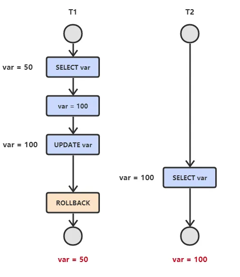

幻读

---

T1 读取某个范围的数据，T2 在这个范围内插入新的数据，T1 再次读取这个范围的数据，此时读取的结果和和第一次读取的结果不同。

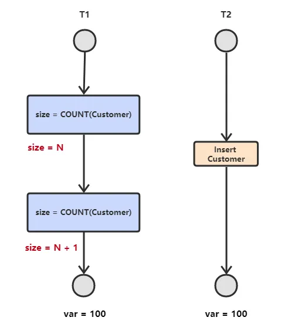

> 不仅从 redis 角度，同时从数据库并发可能产生问题角度答答

除了上述问题的脏读和幻读还有

丢失修改

---

T1 和 T2 两个事务都对一个数据进行修改，T1 先修改，T2 随后修改，T2 的修改覆盖了 T1 的修改。

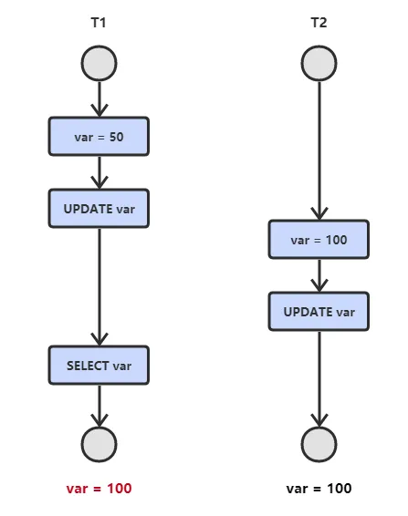

不可重复读

---

T2 读取一个数据，T1 对该数据做了修改。如果 T2 再次读取这个数据，此时读取的结果和第一次读取的结果不同。

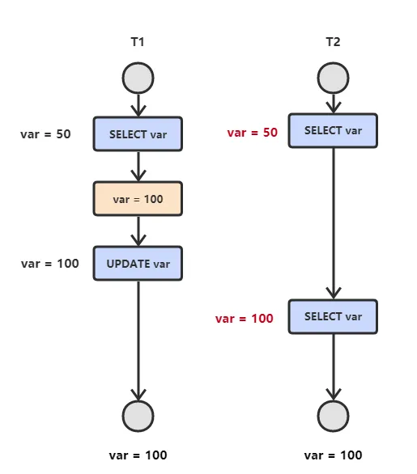

产生并发不一致性问题主要原因是破坏了事务的隔离性，解决方法是通过并发控制来保证隔离性。并发控制可以通过封锁来实现，但是封锁操作需要用户自己控制，相当复杂。数据库管理系统提供了事务的隔离级别，让用户以一种更轻松的方式处理并发一致性问题

#### redis 高并发 & 高可用

一般像 MySQL 这类的数据库的 QPS 大概都在 1w 左右（4 核 8g） ，但是使用 Redis 缓存之后很容易达到 10w+，甚至最高能达到 30w+（就单机 redis 的情况，redis 集群的话会更高）。

由此可见，直接操作缓存能够承受的数据库请求数量是远远大于直接访问数据库的，所以我们可以考虑把数据库中的部分数据转移到缓存中去，这样用户的一部分请求会直接到缓存这里而不用经过数据库。进而，我们也就提高了系统整体的并发。

[高可用：主从复制详解](https://www.pdai.tech/md/db/nosql-redis/db-redis-x-copy.html)

[高可用：哨兵机制（Redis Sentinel）详解](https://www.pdai.tech/md/db/nosql-redis/db-redis-x-sentinel.html)

#### redis 主从是怎么做的（高可用范畴）

主从复制，是指将一台Redis服务器的数据，复制到其他的Redis服务器。前者称为主节点(master)，后者称为从节点(slave)；数据的复制是单向的，只能由主节点到从节点。

**主从复制的作用**主要包括：

- **数据冗余**：主从复制实现了数据的热备份，是持久化之外的一种数据冗余方式。
- **故障恢复**：当主节点出现问题时，可以由从节点提供服务，实现快速的故障恢复；实际上是一种服务的冗余。
- **负载均衡**：在主从复制的基础上，配合读写分离，可以由主节点提供写服务，由从节点提供读服务（即写Redis数据时应用连接主节点，读Redis数据时应用连接从节点），分担服务器负载；尤其是在写少读多的场景下，通过多个从节点分担读负载，可以大大提高Redis服务器的并发量。
- **高可用基石**：除了上述作用以外，主从复制还是哨兵和集群能够实施的基础，因此说主从复制是Redis高可用的基础。

主从库之间采用的是**读写分离**的方式。

- 读操作：主库、从库都可以接收；
- 写操作：首先到主库执行，然后，主库将写操作同步给从库。

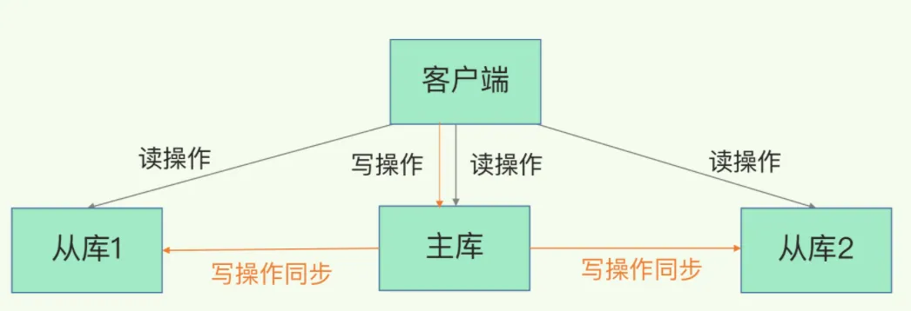

具体可以看：https://www.pdai.tech/md/db/nosql-redis/db-redis-x-copy.html#redis%E8%BF%9B%E9%98%B6---%E9%AB%98%E5%8F%AF%E7%94%A8%EF%BC%9A%E4%B8%BB%E4%BB%8E%E5%A4%8D%E5%88%B6%E8%AF%A6%E8%A7%A3

> 主从复制，是指将一台 Redis 服务器的数据，复制到其他的 Redis 服务器。前者称为主节点(master)，后者称为从节点(slave)；数据的复制是单向的，只能由主节点到从节点。

**主从复制的作用**主要包括：

- **数据冗余**：主从复制实现了数据的热备份，是持久化之外的一种数据冗余方式。
- **故障恢复**：当主节点出现问题时，可以由从节点提供服务，实现快速的故障恢复；实际上是一种服务的冗余。
- **负载均衡**：在主从复制的基础上，配合读写分离，可以由主节点提供写服务，由从节点提供读服务（即写 Redis 数据时应用连接主节点，读 Redis 数据时应用连接从节点），分担服务器负载；尤其是在写少读多的场景下，通过多个从节点分担读负载，可以大大提高 Redis 服务器的并发量。
- **高可用基石**：除了上述作用以外，主从复制还是哨兵和集群能够实施的基础，因此说主从复制是 Redis 高可用的基础。

主从库之间采用的是**读写分离**的方式。

- 读操作：主库、从库都可以接收；
- 写操作：首先到主库执行，然后，主库将写操作同步给从库。


原理

---

> 注意：在 2.8 版本之前只有全量复制，而 2.8 版本后有全量和增量复制：

- `全量（同步）复制`：比如第一次同步时
- `增量（同步）复制`：只会把主从库网络断连期间主库收到的命令，同步给从库

全量复制

---

当我们启动多个 Redis 实例的时候，它们相互之间就可以通过 replicaof（Redis 5.0 之前使用 slaveof）命令形成主库和从库的关系，之后会按照三个阶段完成数据的第一次同步。

- **确立主从关系**

例如，现在有实例 1（ip：172.16.19.3）和实例 2（ip：172.16.19.5），我们在实例 2 上执行以下这个命令后，实例 2 就变成了实例 1 的从库，并从实例 1 上复制数据：

```bash
replicaof 172.16.19.3 6379
```

- **全量复制的三个阶段**

你可以先看一下下面这张图，有个整体感知，接下来我再具体介绍


**第一阶段是主从库间建立连接、协商同步的过程**，主要是为全量复制做准备。在这一步，从库和主库建立起连接，并告诉主库即将进行同步，主库确认回复后，主从库间就可以开始同步了。

具体来说，从库给主库发送 psync 命令，表示要进行数据同步，主库根据这个命令的参数来启动复制。psync 命令包含了主库的 runID 和复制进度 offset 两个参数。runID，是每个 Redis 实例启动时都会自动生成的一个随机 ID，用来唯一标记这个实例。当从库和主库第一次复制时，因为不知道主库的 runID，所以将 runID 设为“？”。offset，此时设为 -1，表示第一次复制。主库收到 psync 命令后，会用 FULLRESYNC 响应命令带上两个参数：主库 runID 和主库目前的复制进度 offset，返回给从库。从库收到响应后，会记录下这两个参数。这里有个地方需要注意，FULLRESYNC 响应表示第一次复制采用的全量复制，也就是说，主库会把当前所有的数据都复制给从库。

**第二阶段，主库将所有数据同步给从库**。从库收到数据后，在本地完成数据加载。这个过程依赖于内存快照生成的 RDB 文件。

具体来说，主库执行 bgsave 命令，生成 RDB 文件，接着将文件发给从库。从库接收到 RDB 文件后，会先清空当前数据库，然后加载 RDB 文件。这是因为从库在通过 replicaof 命令开始和主库同步前，可能保存了其他数据。为了避免之前数据的影响，从库需要先把当前数据库清空。在主库将数据同步给从库的过程中，主库不会被阻塞，仍然可以正常接收请求。否则，Redis 的服务就被中断了。但是，这些请求中的写操作并没有记录到刚刚生成的 RDB 文件中。为了保证主从库的数据一致性，主库会在内存中用专门的 replication buffer，记录 RDB 文件生成后收到的所有写操作。

**第三个阶段，主库会把第二阶段执行过程中新收到的写命令，再发送给从库**。具体的操作是，当主库完成 RDB 文件发送后，就会把此时 replication buffer 中的修改操作发给从库，从库再重新执行这些操作。这样一来，主从库就实现同步了

增量复制

---

> 在 Redis 2.8 版本引入了增量复制。

- **为什么会设计增量复制**？

如果主从库在命令传播时出现了网络闪断，那么，从库就会和主库重新进行一次全量复制，开销非常大。从 Redis 2.8 开始，网络断了之后，主从库会采用增量复制的方式继续同步。

- **增量复制的流程**

你可以先看一下下面这张图，有个整体感知，接下来我再具体介绍。


先看两个概念： `replication buffer` 和 `repl_backlog_buffer`

`repl_backlog_buffer`：它是为了从库断开之后，如何找到主从差异数据而设计的环形缓冲区，从而避免全量复制带来的性能开销。如果从库断开时间太久，repl_backlog_buffer 环形缓冲区被主库的写命令覆盖了，那么从库连上主库后只能乖乖地进行一次全量复制，所以**repl_backlog_buffer 配置尽量大一些，可以降低主从断开后全量复制的概率**。而在 repl_backlog_buffer 中找主从差异的数据后，如何发给从库呢？这就用到了 replication buffer。

`replication buffer`：Redis 和客户端通信也好，和从库通信也好，Redis 都需要给分配一个 内存 buffer 进行数据交互，客户端是一个 client，从库也是一个 client，我们每个 client 连上 Redis 后，Redis 都会分配一个 client buffer，所有数据交互都是通过这个 buffer 进行的：Redis 先把数据写到这个 buffer 中，然后再把 buffer 中的数据发到 client socket 中再通过网络发送出去，这样就完成了数据交互。所以主从在增量同步时，从库作为一个 client，也会分配一个 buffer，只不过这个 buffer 专门用来传播用户的写命令到从库，保证主从数据一致，我们通常把它叫做 replication buffer。

- **如果在网络断开期间，repl_backlog_size 环形缓冲区写满之后，从库是会丢失掉那部分被覆盖掉的数据，还是直接进行全量复制呢**？

对于这个问题来说，有两个关键点：

1. 一个从库如果和主库断连时间过长，造成它在主库 repl_backlog_buffer 的 slave_repl_offset 位置上的数据已经被覆盖掉了，此时从库和主库间将进行全量复制。
2. 每个从库会记录自己的 slave_repl_offset，每个从库的复制进度也不一定相同。在和主库重连进行恢复时，从库会通过 psync 命令把自己记录的 slave_repl_offset 发给主库，主库会根据从库各自的复制进度，来决定这个从库可以进行增量复制，还是全量复制。

总结：

在使用读写分离之前，可以考虑其他方法增加 Redis 的读负载能力：如尽量优化主节点（减少慢查询、减少持久化等其他情况带来的阻塞等）提高负载能力；使用 Redis 集群同时提高读负载能力和写负载能力等。如果使用读写分离，可以使用哨兵，使主从节点的故障切换尽可能自动化，并减少对应用程序的侵入。

#### 缓存雪崩，缓存击穿，缓存穿透

缓存雪崩

---

实际上，缓存雪崩描述的就是这样一个简单的场景：缓存在同一时间大面积的失效，后面的请求都直接落到了数据库上，造成数据库短时间内承受大量请求。 这就好比雪崩一样，摧枯拉朽之势，数据库的压力可想而知，可能直接就被这么多请求弄宕机了。

举个例子：系统的缓存模块出了问题比如宕机导致不可用。造成系统的所有访问，都要走数据库。

还有一种缓存雪崩的场景是：有一些被大量访问数据（热点缓存）在某一时刻大面积失效，导致对应的请求直接落到了数据库上。 这样的情况，有下面几种解决办法：

举个例子 ：秒杀开始 12 个小时之前，我们统一存放了一批商品到 Redis 中，设置的缓存过期时间也是 12 个小时，那么秒杀开始的时候，这些秒杀的商品的访问直接就失效了。导致的情况就是，相应的请求直接就落到了数据库上，就像雪崩一样可怕。

- **问题来源**

缓存雪崩是指缓存中**数据大批量到过期时间，而查询数据量巨大，引起数据库压力过大甚至 down 机**。和缓存击穿不同的是，缓存击穿指并发查同一条数据，缓存雪崩是不同数据都过期了，很多数据都查不到从而查数据库。

- **解决方案**

1. 缓存数据的过期时间设置随机，防止同一时间大量数据过期现象发生。
2. 如果缓存数据库是分布式部署，将热点数据均匀分布在不同的缓存数据库中。
3. 设置热点数据永远不过期

缓存击穿

---

- **问题来源**

缓存击穿是指**缓存中没有但数据库中有的数据**（一般是缓存时间到期），这时由于并发用户特别多，同时读缓存没读到数据，又同时去数据库去取数据，引起数据库压力瞬间增大，造成过大压力。

- **解决方案**

1、设置热点数据永远不过期。

2、接口限流与熔断，降级。重要的接口一定要做好限流策略，防止用户恶意刷接口，同时要降级准备，当接口中的某些 服务 不可用时候，进行熔断，失败快速返回机制。

3、加互斥锁

缓存穿透

---

缓存穿透说简单点就是大量请求的 key 根本不存在于缓存中，导致请求直接到了数据库上，根本没有经过缓存这一层。举个例子：某个黑客故意制造我们缓存中不存在的 key 发起大量请求，导致大量请求落到数据库。

- **问题来源**

缓存穿透是指**缓存和数据库中都没有的数据**，而用户不断发起请求。由于缓存是不命中时被动写的，并且出于容错考虑，如果从存储层查不到数据则不写入缓存，这将导致这个不存在的数据每次请求都要到存储层去查询，失去了缓存的意义。

在流量大时，可能 DB 就挂掉了，要是有人利用不存在的 key 频繁攻击我们的应用，这就是漏洞。

如发起为 id 为“-1”的数据或 id 为特别大不存在的数据。这时的用户很可能是攻击者，攻击会导致数据库压力过大。

- **解决方案**

1. 接口层增加校验，如用户鉴权校验，id 做基础校验，id<=0 的直接拦截；
2. 从缓存取不到的数据，在数据库中也没有取到，这时也可以将 key-value 对写为 key-null，缓存有效时间可以设置短点，如 30 秒（设置太长会导致正常情况也没法使用）。这样可以防止攻击用户反复用同一个 id 暴力攻击
3. 布隆过滤器。bloomfilter 就类似于一个 hash set，用于快速判某个元素是否存在于集合中，其典型的应用场景就是快速判断一个 key 是否存在于某容器，不存在就直接返回。布隆过滤器的关键就在于 hash 算法和容器大小，

#### 缓存有哪些，Ehcache 和 Redis 区别，Ehcache 为什么效率高

缓存有各类特征，而且有不同介质的区别，那么实际工程中我们怎么去对缓存分类呢? 在目前的应用服务框架中，比较常见的是根据缓存与应用的藕合度，分为local cache（本地缓存）和remote cache（分布式缓存）：

- **本地缓存**：指的是在应用中的缓存组件，其最大的优点是应用和cache是在同一个进程内部，请求缓存非常快速，没有过多的网络开销等，在单应用不需要集群支持或者集群情况下各节点无需互相通知的场景下使用本地缓存较合适；同时，它的缺点也是应为缓存跟应用程序耦合，多个应用程序无法直接的共享缓存，各应用或集群的各节点都需要维护自己的单独缓存，对内存是一种浪费。
- **分布式缓存**：指的是与应用分离的缓存组件或服务，其最大的优点是自身就是一个独立的应用，与本地应用隔离，多个应用可直接的共享缓存。

EhCache直接在JVM中进行缓存，速度快，效率高。与Redis相比，操作简单、易用、高效，虽然EhCache也提供有缓存共享的方案，但对分布式集群的支持不太好，缓存共享实现麻烦。

Redis是通过Socket访问到缓存服务，效率比EhCache低，比数据库要快很多，处理集群和分布式缓存方便，有成熟的方案。

**所以，如果是单体应用，或对缓存访问要求很高，可考虑采用EhCache；如果是大型系统，存在缓存共享、分布式部署、缓存内容很大时，则建议采用Redis**。

该框架的特点：

- 简单、快速，拥有多种缓存策略；
- 缓存数据有两级：内存和磁盘，无需担心容量问题；
- 缓存数据会在虚拟机重启的过程中写入磁盘；
- 可以通过RMI、可插入API等方式进行分布式缓存；
- 具有缓存和缓存管理器的侦听接口；
- 支持多缓存管理器实例，以及一个实例的多个缓存区域，并提供Hibernate的缓存实现；

#### Redis 分布式集群是怎么实现的

Redis 分布式集群是通过将数据分散存储在多个节点上来实现高可用性和可扩展性的。Redis 分布式集群采用了一种名为“哈希槽（hash slot）”的技术来将数据分布在多个节点上。

具体来说，Redis 分布式集群将数据分成多个哈希槽，每个槽都有一个唯一的编号。集群中的每个节点都会负责一部分槽，可以负责多个槽。当客户端需要访问一个键值对时，Redis 首先根据该键的哈希值确定它应该被存储在哪个槽中，然后通过集群中的路由算法找到负责该槽的节点，并将请求发送到该节点上。

在 Redis 分布式集群中，每个节点都可以执行读和写操作。为了保证数据的一致性，Redis 采用了一种名为“Redis 哨兵（Redis Sentinel）”的机制来监控集群中的节点，并在节点失效时自动将其替换为一个新的节点。Redis 哨兵还负责监控槽的分配情况，并在需要时重新分配槽以实现负载均衡。

总体来说，Redis 分布式集群通过哈希槽和 Redis 哨兵等技术实现了数据的分布式存储、负载均衡和高可用性，使得 Redis 可以处理大规模数据和高并发请求。

#### Redis应用场景有哪些（2022字节实习）

可以参考上文的Redis数据结构对应的应用场景

- redis 客户端有哪些

Redisson、Jedis、lettuce等等，官方推荐使用Redisson。

Redisson是一个高级的分布式协调Redis客服端，能帮助用户在分布式环境中轻松实现一些Java的对象 (Bloom filter, BitSet, Set, SetMultimap, ScoredSortedSet, SortedSet, Map, ConcurrentMap, List, ListMultimap, Queue, BlockingQueue, Deque, BlockingDeque, Semaphore, Lock, ReadWriteLock, AtomicLong, CountDownLatch, Publish / Subscribe, HyperLogLog)。

- Redis如何做大量数据插入？

  Redis在2.6版本引入了pipeline模式，它可以用于执行大量数据插入操作。Pipeline模式是一种将多个命令一次性发送给Redis服务器并返回结果的技术。这种技术的好处是可以减少客户端和服务器之间的通信次数，从而提高数据插入的性能。

  在使用Redis的pipeline模式时，需要将需要插入的数据预先存储在客户端内存中，然后一次性将这些数据发送给Redis服务器。Redis服务器将这些数据插入到内存中，然后返回插入操作的结果。

- redis实现分布式锁实现? 什么是 RedLock?

  Redis实现分布式锁可以通过使用Redis的单线程特性和原子性操作来保证分布式环境下的互斥访问。下面是一种基于Redis实现分布式锁的常见方式：

  1. 获取锁：使用Redis的SET命令设置一个键值对，键表示锁的名称，值为一个唯一标识符。使用SET命令时可以设置一个NX（Not eXists）选项，表示只有当锁不存在时才能设置成功，防止锁被重复获取。
  2. 释放锁：使用Redis的DEL命令删除锁对应的键值对，表示锁已经释放。
  3. 锁过期时间：为了防止锁被持有者意外宕机或者死锁导致其他进程无法获取锁，需要为锁设置一个过期时间。可以使用Redis的EXPIRE命令设置一个过期时间。

  但是，单纯的Redis锁存在被误用或者竞争环境下锁失效等问题，针对这些问题，RedLock被提出。

  RedLock是一种用于实现分布式锁的算法，它由多个Redis实例组成，提供了更高级别的分布式锁保证。它可以解决由于网络问题或服务器故障等原因导致的分布式锁失效问题。

  RedLock算法的基本原理是使用多个Redis实例来创建一个互斥锁，以确保只有一个客户端可以获得该锁。具体实现方式如下：

  1. 选择N个Redis实例，它们应该在不同的物理位置，避免单点故障。
  2. 每个Redis实例在同一个Key上尝试获取锁，使用SET命令加上NX（不存在则创建）和PX（过期时间）参数，以确保只有一个客户端可以获得该锁。
  3. 如果客户端在至少N/2+1个Redis实例上成功获取了锁，那么客户端就可以获得这个锁。否则，客户端必须释放所有已经获取的锁。

  通过使用RedLock算法，可以解决单点故障和网络问题导致的分布式锁失效问题

- redis缓存有哪些问题，如何解决

  缓存穿透、缓存雪崩、缓存击穿

- redis和其它数据库一致性问题如何解决

  1. 数据同步：将数据从其他数据库同步到Redis中，或者将Redis中的数据同步到其他数据库中。这种方式需要使用额外的工具来完成数据同步，并且可能会增加系统的复杂度和延迟。
  2. 双写模式：在进行写操作时，同时将数据写入Redis和其他数据库。这种方式可以保证数据的一致性，但是需要消耗更多的资源和时间。
  3. 基于消息队列的模式：在进行写操作时，将数据写入Redis，然后通过消息队列将写入请求发送到其他数据库。这种方式可以保证数据的一致性，并且可以减少写入延迟，但是需要消耗更多的资源和时间。

- redis性能问题有哪些，如何分析定位解决

  Redis的性能问题通常可以分为以下几个方面：

  1. CPU 负载高：Redis通常使用单线程模型，如果Redis实例的CPU负载过高，可能会导致请求响应时间增加，甚至导致请求超时等问题。
  2. 内存使用过高：Redis是一个基于内存的数据存储系统，如果Redis实例的内存使用过高，可能会导致内存泄漏和数据被逐出内存等问题。
  3. IO 负载过高：Redis在进行持久化操作和网络通信时会产生IO操作，如果IO负载过高，可能会导致Redis实例响应时间增加。
  4. 网络延迟过高：Redis通常作为应用程序和数据存储之间的中间层，如果网络延迟过高，可能会导致Redis实例响应时间增加。

  针对以上问题，可以采取以下措施进行解决：

  1. 内存占用过高：通过删除不必要的数据或者使用Redis的过期机制来释放内存，或者使用Redis的内存淘汰策略来自动释放内存。
  2. Redis响应延迟过高：可以通过优化Redis的配置、扩容Redis实例、使用Redis集群等方式来提高Redis的性能。
  3. CPU 负载高：可以通过将Redis的负载分散到多个Redis实例中，或者使用多线程的Redis实现来解决单线程模型带来的性能问题。
  4. IO 负载过高： 可以根据实际需求选择适当的持久化方式，如使用RDB或者AOF，或者使用Redis的快照备份功能来进行数据备份或者数据恢复。 

  在分析Redis性能问题时，可以使用Redis自带的性能监控工具或者第三方的性能监控工具来进行定位和解决。常见的工具包括：

  1. Redis自带的监控工具redis-cli，可以使用redis-cli中的monitor、info、slowlog等命令进行性能监控和问题排查。
  2. 第三方监控工具，如RedisInsight、redis-stat、redis-top等，可以通过图形化界面或者命令行方式进行Redis性能监控和问题定位。

  在使用性能监控工具时，需要关注Redis的CPU、内存、网络等指标，尤其是Redis的命令响应时间、命令执行次数等指标，以及Redis的慢查询日志等信息，根据这些信息来进行问题排查和解决。

#### redission怎么实现的？（2022 虾皮）

Redission是一个基于Redis实现的分布式锁和其他分布式数据结构的Java库，其实现主要包括以下几个方面：

1. Redis连接池：Redission通过使用Redisson连接池来管理Redis连接，实现对Redis的访问和操作。通过连接池的机制，可以提高对Redis的并发访问性能，同时避免对Redis的过多连接请求，造成Redis的性能问题。
2. 分布式锁：Redission通过Redis的原子操作实现了分布式锁的机制，主要是使用Redis的setnx命令实现锁的占用和释放，以及使用Lua脚本实现了锁的自动续期机制，避免了锁的过期和误释放问题。
3. 分布式集合：Redission通过Redis的Sorted Set实现了分布式集合的机制，实现了类似于Java的TreeSet和TreeMap的数据结构，同时支持分布式的并发访问。
4. 分布式队列：Redission通过Redis的List实现了分布式队列的机制，支持先进先出和后进先出两种方式，同时支持分布式的并发访问。
5. 分布式限流：Redission通过Redis的计数器和限流器实现了分布式限流的机制，可以根据业务需求和性能需求进行自定义配置，同时支持分布式的并发访问。

总之，Redission是一个基于Redis实现的高性能、可扩展、易用的Java分布式库，提供了多种分布式数据结构和机制的实现，可以满足各种分布式场景的需求。

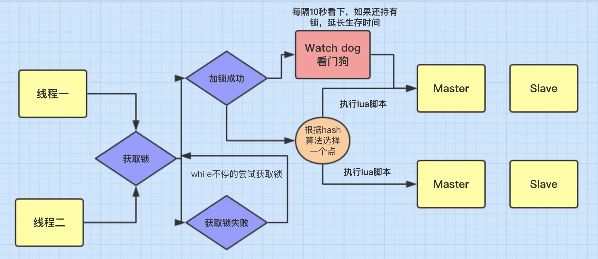

##### 加锁机制

线程去获取锁，获取成功: 执行lua脚本，保存数据到redis数据库。

线程去获取锁，获取失败: 一直通过while循环尝试获取锁，获取成功后，执行lua脚本，保存数据到redis数据库。

##### watch dog自动延期机制

这个比较难理解，找了些许资料感觉也并没有解释的很清楚。这里我自己的理解就是:

在一个分布式环境下，假如一个线程获得锁后，突然服务器宕机了，那么这个时候在一定时间后这个锁会自动释放，你也可以设置锁的有效时间(不设置默认30秒），这样的目的主要是防止死锁的发生。

但在实际开发中会有下面一种情况:

```java
      //设置锁1秒过去
        redissonLock.lock("redisson", 1);
        /**
         * 业务逻辑需要咨询2秒
         */
        redissonLock.release("redisson");

      /**
       * 线程1 进来获得锁后，线程一切正常并没有宕机，但它的业务逻辑需要执行2秒，这就会有个问题，在 线程1 执行1秒后，这个锁就自动过期了，
       * 那么这个时候 线程2 进来了。那么就存在 线程1和线程2 同时在这段业务逻辑里执行代码，这当然是不合理的。
       * 而且如果是这种情况，那么在解锁时系统会抛异常，因为解锁和加锁已经不是同一线程了，具体后面代码演示。
       */
```

Redis的watch dog机制是一种自动延期机制，用于处理客户端在执行事务时出现并发冲突的情况。当客户端在执行事务时，如果另一个客户端在执行watch命令对事务中的某个key进行了修改，那么事务就会被中断，Redis会返回WATCH被修改的键，事务失败。

为了解决这种并发冲突的问题，Redis引入了watch dog机制，该机制可以自动延长客户端在执行事务期间所监控的key的过期时间，从而避免并发冲突。

具体来说，当一个客户端执行watch命令时，Redis会将客户端所监控的key的过期时间设置为当前时间加上一个事务的执行时间长度（以秒为单位）。如果事务在执行期间没有发生冲突，那么在执行完事务后，Redis会自动删除监控的key，并将key的过期时间恢复为原来的值。

如果在事务执行期间，另一个客户端对监控的key进行了修改，那么Redis会取消对该事务的监控，并将key的过期时间恢复为原来的值，从而保证数据的一致性。然后，Redis会返回WATCH被修改的键，让客户端进行重试或者其他处理。

总之，Redis的watch dog机制通过自动延长key的过期时间来解决并发冲突的问题，可以保证数据的一致性和可靠性。

##### 为啥要用lua脚本呢？

这个不用多说，主要是如果你的业务逻辑复杂的话，通过封装在lua脚本中发送给redis，而且redis是单线程的，这样就保证这段复杂业务逻辑执行的**原子性**。

##### 可重入加锁机制

Redisson可以实现可重入加锁机制的原因，我觉得跟两点有关：

1. Redis存储锁的数据类型是 Hash类型
2. Hash数据类型的key值包含了当前线程信息。

下面是redis存储的数据


这里表面数据类型是Hash类型,Hash类型相当于我们java的 `<key,<key1,value>>` 类型,这里key是指 'redisson'

它的有效期还有9秒，我们再来看里们的key1值为`078e44a3-5f95-4e24-b6aa-80684655a15a:45`它的组成是:

guid + 当前线程的ID。后面的value是就和可重入加锁有关。

Redission的可重入锁机制是一种允许同一个线程多次获取同一把锁的机制。在Redission中，可重入锁通过ReentrantLock对象实现，它具有以下特点：

1. 同一个线程可以多次获取同一把锁：如果一个线程已经获取了某个可重入锁，并且没有释放，那么它可以再次获取同一把锁，而不会被阻塞。
2. 锁的持有计数器：Redission会为每个线程维护一个持有计数器，用于记录该线程已经获取某个可重入锁的次数。在该线程释放锁时，计数器的值会减少，直到为零时才会真正释放锁。
3. 公平性和非公平性：Redission的可重入锁既支持公平性也支持非公平性，可以根据业务需求进行配置。当使用公平锁时，线程会按照获取锁的顺序依次获取锁；而使用非公平锁时，线程可以插队获取锁，这样可以提高锁的并发性能。

**举图说明**

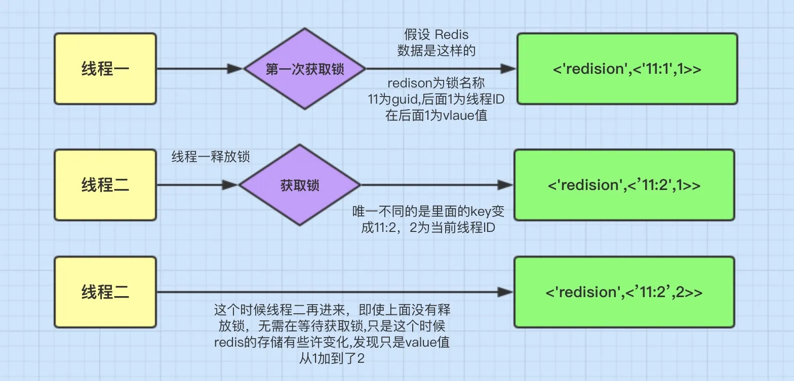

上面这图的意思就是可重入锁的机制，它最大的优点就是相同线程不需要在等待锁，而是可以直接进行相应操作。

### MySql

#### sqlserver 和 MySQL 区别

1. SQL适合使用“.NET”，而MySQL可以与几乎所有其他语言配对，如“PHP”
2. sqlserver和mysql的语法不同
3. SQL使用单个存储引擎，而不是为MySQL提供的多个引擎

#### Mysql sql 执行过程，用 JDBC 时 sql 执行流程 / mysql一个select语句的执行过程

> 推荐阅读：[执行一条 select 语句，期间发生了什么？](https://xiaolincoding.com/mysql/base/how_select.html)

##### MySql

下图是 MySQL 的一个简要架构图，从下图你可以很清晰的看到用户的 SQL 语句在 MySQL 内部是如何执行的。

先简单介绍一下下图涉及的一些组件的基本作用帮助大家理解这幅图，在 1.2 节中会详细介绍到这些组件的作用。

- **连接器：** 身份认证和权限相关(登录 MySQL 的时候)。
- **查询缓存：** 执行查询语句的时候，会先查询缓存（MySQL 8.0 版本后移除，因为这个功能不太实用）。
- **分析器：** 没有命中缓存的话，SQL 语句就会经过分析器，分析器说白了就是要先看你的 SQL 语句要干嘛，再检查你的 SQL 语句语法是否正确。
- **优化器：** 按照 MySQL 认为最优的方案去执行。
- **执行器：** 执行语句，然后从存储引擎返回数据。


简单来说 MySQL 主要分为 Server 层和存储引擎层：

- **Server 层**：主要包括连接器、查询缓存、分析器、优化器、执行器等，所有跨存储引擎的功能都在这一层实现，比如存储过程、触发器、视图，函数等，还有一个通用的日志模块 binlog 日志模块。
- **存储引擎**： 主要负责数据的存储和读取，采用可以替换的插件式架构，支持 InnoDB、MyISAM、Memory 等多个存储引擎，其中 InnoDB 引擎有自有的日志模块 redolog 模块。**现在最常用的存储引擎是 InnoDB，它从 MySQL 5.5 版本开始就被当做默认存储引擎了。**

##### JDBC

1. 注册驱动
2. 获得连接
3. 获取执行SQL语句的对象
4. 执行SQL语句
5. 处理结果
6. 释放资源

#### Mysql 监听 binlog，binlog 是什么

那 `binlog` 到底是用来干嘛的？

可以说 `MySQL`数据库的**数据备份、主备、主主、主从**都离不开 `binlog`，需要依靠 `binlog`来同步数据，保证数据一致性。


`binlog`会记录所有涉及更新数据的逻辑操作，并且是顺序写。

记录格式：

`binlog` 日志有三种格式，可以通过 `binlog_format`参数指定。

- **statement**
- **row**
- **mixed**

指定 `statement`，记录的内容是 `SQL`语句原文，比如执行一条 `update T set update_time=now() where id=1`，记录的内容如下。


同步数据时，会执行记录的 `SQL`语句，但是有个问题，`update_time=now()`这里会获取当前系统时间，直接执行会导致与原库的数据不一致。

为了解决这种问题，我们需要指定为 `row`，记录的内容不再是简单的 `SQL`语句了，还包含操作的具体数据，记录内容如下。


`row`格式记录的内容看不到详细信息，要通过 `mysqlbinlog`工具解析出来。

`update_time=now()`变成了具体的时间 `update_time=1627112756247`，条件后面的@1、@2、@3 都是该行数据第 1 个~3 个字段的原始值（**假设这张表只有 3 个字段**）。

这样就能保证同步数据的一致性，通常情况下都是指定为 `row`，这样可以为数据库的恢复与同步带来更好的可靠性。

但是这种格式，需要更大的容量来记录，比较占用空间，恢复与同步时会更消耗 `IO`资源，影响执行速度。

所以就有了一种折中的方案，指定为 `mixed`，记录的内容是前两者的混合。

`MySQL`会判断这条 `SQL`语句是否可能引起数据不一致，如果是，就用 `row`格式，否则就用 `statement`格式。

写入机制：

`binlog`的写入时机也非常简单，事务执行过程中，先把日志写到 `binlog cache`，事务提交的时候，再把 `binlog cache`写到 `binlog`文件中。

因为一个事务的 `binlog`不能被拆开，无论这个事务多大，也要确保一次性写入，所以系统会给每个线程分配一个块内存作为 `binlog cache`。

我们可以通过 `binlog_cache_size`参数控制单个线程 binlog cache 大小，如果存储内容超过了这个参数，就要暂存到磁盘（`Swap`）。

`binlog`日志刷盘流程如下


- **上图的 write，是指把日志写入到文件系统的 page cache，并没有把数据持久化到磁盘，所以速度比较快**
- **上图的 fsync，才是将数据持久化到磁盘的操作**

`write`和 `fsync`的时机，可以由参数 `sync_binlog`控制，默认是 `0`。

为 `0`的时候，表示每次提交事务都只 `write`，由系统自行判断什么时候执行 `fsync`。

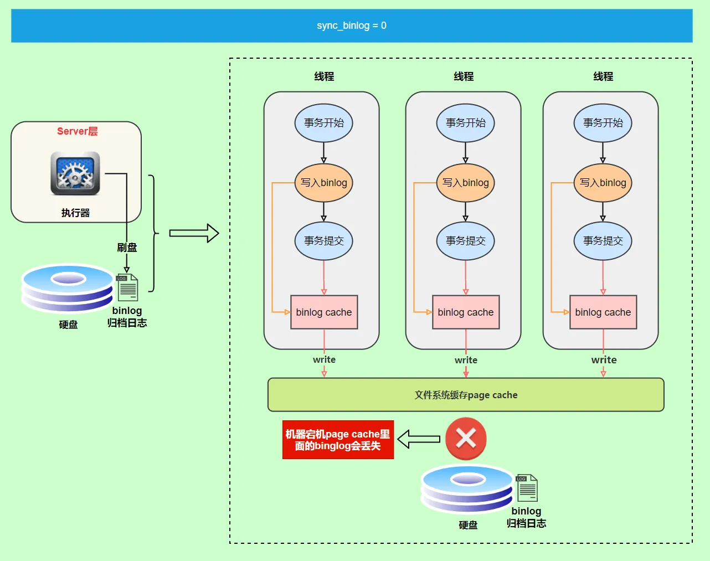

虽然性能得到提升，但是机器宕机，`page cache`里面的 binlog 会丢失。

为了安全起见，可以设置为 `1`，表示每次提交事务都会执行 `fsync`，就如同 **redo log 日志刷盘流程** 一样。

最后还有一种折中方式，可以设置为 `N(N>1)`，表示每次提交事务都 `write`，但累积 `N`个事务后才 `fsync`。


在出现 `IO`瓶颈的场景里，将 `sync_binlog`设置成一个比较大的值，可以提升性能。

同样的，如果机器宕机，会丢失最近 `N`个事务的 `binlog`日志。

#### redo log，undo log，bin log

* binlog 主要用于数据库还原，属于数据级别的数据恢复，主从复制是 binlog 最常见的一个应用场景。
* redolog 主要用于保证事务的持久性，属于事务级别的数据恢复。
* 如果想要保证事务的原子性，就需要在异常发生时，对已经执行的操作进行**回滚**，在 MySQL 中，恢复机制是通过 **回滚日志（undo log）** 实现的，所有事务进行的修改都会先记录到这个回滚日志中，然后再执行相关的操作。

#### redolog 和 binlog 的区别

`redo log` 它是物理日志，记录内容是“在某个数据页上做了什么修改”，属于 `InnoDB` 存储引擎。

而 `binlog` 是逻辑日志，记录内容是语句的原始逻辑，类似于“给 ID=2 这一行的 c 字段加 1”，属于 `MySQL Server` 层。

不管用什么存储引擎，只要发生了表数据更新，都会产生 `binlog` 日志。

#### Mysql 里面为什么用 B+树？那能不能用哈希呢？

使用 B+树而不是二叉搜索树或者红黑树的原因是，由于存储介质的特性，磁盘本身存取就比主存慢很多，每次搜索的磁盘 IO 的开销过大，而 B+树可以使用较少次的磁盘 IO 搜索到对象。

- B-Tree 中一次检索最多需要 h-1 次 I/O（根节点常驻内存），渐进复杂度为 O(h)=O(logdN)。
- 红黑树这种结构，h 明显要深的多。效率明显比 B-Tree 差很多。

哈希表是键值对的集合，通过键(key)即可快速取出对应的值(value)，因此哈希表可以快速检索数据（接近 O（1））。

**为何能够通过 key 快速取出 value 呢？** 原因在于 **哈希算法**（也叫散列算法）。通过哈希算法，我们可以快速找到 key 对应的 index，找到了 index 也就找到了对应的 value。

```java
hash = hashfunc(key)
index = hash % array_size
```

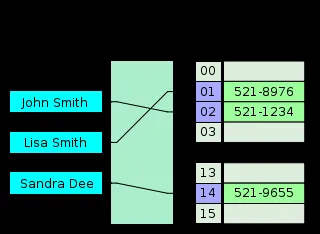

但是！哈希算法有个 **Hash 冲突** 问题，也就是说多个不同的 key 最后得到的 index 相同。通常情况下，我们常用的解决办法是 **链地址法**。链地址法就是将哈希冲突数据存放在链表中。就比如 JDK1.8 之前 `HashMap` 就是通过链地址法来解决哈希冲突的。不过，JDK1.8 以后 `HashMap`为了减少链表过长的时候搜索时间过长引入了红黑树。


为了减少 Hash 冲突的发生，一个好的哈希函数应该“均匀地”将数据分布在整个可能的哈希值集合中。

既然哈希表这么快，**为什么 MySQL 没有使用其作为索引的数据结构呢？**

**1.Hash 冲突问题** ：我们上面也提到过 Hash 冲突了，不过对于数据库来说这还不算最大的缺点。

**2.Hash 索引不支持顺序和范围查询(Hash 索引不支持顺序和范围查询是它最大的缺点：** 假如我们要对表中的数据进行排序或者进行范围查询，那 Hash 索引可就不行了。

试想一种情况:

```java
SELECT * FROM tb1 WHERE id < 500;
```

在这种范围查询中，优势非常大，直接遍历比 500 小的叶子节点就够了。而 Hash 索引是根据 hash 算法来定位的，难不成还要把 1 - 499 的数据，每个都进行一次 hash 计算来定位吗?这就是 Hash 最大的缺点了.

#### B+树和二叉树区别？(2022飞书)

- B 树的所有节点既存放键(key) 也存放 数据(data)，而 B+树只有叶子节点存放 key 和 data，其他内节点只存放 key。
- B 树的叶子节点都是独立的;B+树的叶子节点有一条引用链指向与它相邻的叶子节点。
- B 树的检索的过程相当于对范围内的每个节点的关键字做二分查找，可能还没有到达叶子节点，检索就结束了。而 B+树的检索效率就很稳定了，任何查找都是从根节点到叶子节点的过程，叶子节点的顺序检索很明显。

#### 【高频问题】什么是 MVCC？

MVCC，全称 Multi-Version Concurrency Control，即多版本并发控制。MVCC 是一种并发控制的方法，一般在数据库管理系统中，实现对数据库的并发访问，在编程语言中实现事务内存。

在 Mysql 的 InnoDB 引擎中就是指在已提交读(READ COMMITTD)和可重复读(REPEATABLE READ)这两种隔离级别下的事务对于 SELECT 操作会访问版本链中的记录的过程。

这就使得别的事务可以修改这条记录，反正每次修改都会在版本链中记录。SELECT 可以去版本链中拿记录，这就实现了读-写，写-读的并发执行，提升了系统的性能。

**MySQL 的 InnoDB 引擎实现 MVCC 的 3 个基础点**

MVCC 的目的就是多版本并发控制，在数据库中的实现，就是为了解决读写冲突，它的实现原理主要是依赖记录中的 3 个隐式字段，undo 日志 ，Read View 来实现的。

1. 隐式字段：

每行记录除了我们自定义的字段外，还有数据库隐式定义的 DB_TRX_ID,DB_ROLL_PTR,DB_ROW_ID 等字段

- **DB_ROW_ID** 6byte, 隐含的自增 ID（隐藏主键），如果数据表没有主键，InnoDB 会自动以 DB_ROW_ID 产生一个聚簇索引
- **DB_TRX_ID** 6byte, 最近修改(修改/插入)事务 ID：记录创建这条记录/最后一次修改该记录的事务 ID
- **DB_ROLL_PTR** 7byte, 回滚指针，指向这条记录的上一个版本（存储于 rollback segment 里）
- **DELETED_BIT** 1byte, 记录被更新或删除并不代表真的删除，而是删除 flag 变了


如上图，DB_ROW_ID 是数据库默认为该行记录生成的唯一隐式主键；DB_TRX_ID 是当前操作该记录的事务 ID； 而 DB_ROLL_PTR 是一个回滚指针，用于配合 undo 日志，指向上一个旧版本；delete flag 没有展示出来

2. undo 日志

InnoDB 把这些为了回滚而记录的这些东西称之为 undo log。这里需要注意的一点是，由于查询操作（SELECT）并不会修改任何用户记录，所以在查询操作执行时，并不需要记录相应的 undo log。undo log 主要分为 3 种：

- **Insert undo log** ：插入一条记录时，至少要把这条记录的主键值记下来，之后回滚的时候只需要把这个主键值对应的记录删掉就好了。
- **Update undo log**：修改一条记录时，至少要把修改这条记录前的旧值都记录下来，这样之后回滚时再把这条记录更新为旧值就好了。
- Delete undo log

  ：删除一条记录时，至少要把这条记录中的内容都记下来，这样之后回滚时再把由这些内容组成的记录插入到表中就好了。

  - 删除操作都只是设置一下老记录的 DELETED_BIT，并不真正将过时的记录删除。
  - 为了节省磁盘空间，InnoDB 有专门的 purge 线程来清理 DELETED_BIT 为 true 的记录。为了不影响 MVCC 的正常工作，purge 线程自己也维护了一个 read view（这个 read view 相当于系统中最老活跃事务的 read view）;如果某个记录的 DELETED_BIT 为 true，并且 DB_TRX_ID 相对于 purge 线程的 read view 可见，那么这条记录一定是可以被安全清除的。

对 MVCC 有帮助的实质是**update undo log** ，undo log 实际上就是存在 rollback segment 中旧记录链，它的执行流程如下：

1. **比如一个有个事务插入 persion 表插入了一条新记录，记录如下，name 为 Jerry, age 为 24 岁，隐式主键是 1，事务 ID 和回滚指针，我们假设为 NULL**


2. **现在来了一个事务 1 对该记录的 name 做出了修改，改为 Tom**
   1. 在事务 1 修改该行(记录)数据时，数据库会先对该行加排他锁
   2. 然后把该行数据拷贝到 undo log 中，作为旧记录，既在 undo log 中有当前行的拷贝副本
   3. 拷贝完毕后，修改该行 name 为 Tom，并且修改隐藏字段的事务 ID 为当前事务 1 的 ID, 我们默认从 1 开始，之后递增，回滚指针指向拷贝到 undo log 的副本记录，既表示我的上一个版本就是它
   4. 事务提交后，释放锁


3. **又来了个事务 2 修改 person 表的同一个记录，将 age 修改为 30 岁**
   1. 在事务 2 修改该行数据时，数据库也先为该行加锁
   2. 然后把该行数据拷贝到 undo log 中，作为旧记录，发现该行记录已经有 undo log 了，那么最新的旧数据作为链表的表头，插在该行记录的 undo log 最前面
   3. 修改该行 age 为 30 岁，并且修改隐藏字段的事务 ID 为当前事务 2 的 ID, 那就是 2，回滚指针指向刚刚拷贝到 undo log 的副本记录
   4. 事务提交，释放锁


从上面，我们就可以看出，不同事务或者相同事务的对同一记录的修改，会导致该记录的 undo log 成为一条记录版本线性表，既链表，undo log 的链首就是最新的旧记录，链尾就是最早的旧记录（当然就像之前说的该 undo log 的节点可能是会 purge 线程清除掉，向图中的第一条 insert undo log，其实在事务提交之后可能就被删除丢失了，不过这里为了演示，所以还放在这里）

3. Read View(读视图)

什么是 Read View，说白了 Read View 就是事务进行快照读操作的时候生产的读视图(Read View)，在该事务执行的快照读的那一刻，会生成数据库系统当前的一个快照，记录并维护系统当前活跃事务的 ID(当每个事务开启时，都会被分配一个 ID, 这个 ID 是递增的，所以最新的事务，ID 值越大)

所以我们知道 Read View 主要是用来做可见性判断的, 即当我们某个事务执行快照读的时候，对该记录创建一个 Read View 读视图，把它比作条件用来判断当前事务能够看到哪个版本的数据，既可能是当前最新的数据，也有可能是该行记录的 undo log 里面的某个版本的数据。

Read View 遵循一个可见性算法，主要是将要被修改的数据的最新记录中的 DB_TRX_ID（即当前事务 ID）取出来，与系统当前其他活跃事务的 ID 去对比（由 Read View 维护），如果 DB_TRX_ID 跟 Read View 的属性做了某些比较，不符合可见性，那就通过 DB_ROLL_PTR 回滚指针去取出 Undo Log 中的 DB_TRX_ID 再比较，即遍历链表的 DB_TRX_ID（从链首到链尾，即从最近的一次修改查起），直到找到满足特定条件的 DB_TRX_ID, 那么这个 DB_TRX_ID 所在的旧记录就是当前事务能看见的最新老版本

那么这个判断条件是什么呢？


如上，它是一段 MySQL 判断可见性的一段源码，即 changes_visible 方法（不完全哈，但能看出大致逻辑），该方法展示了我们拿 DB_TRX_ID 去跟 Read View 某些属性进行怎么样的比较

在展示之前，我先简化一下 Read View，我们可以把 Read View 简单的理解成有三个全局属性

> - **trx_list** 未提交事务 ID 列表，用来维护 Read View 生成时刻系统正活跃的事务 ID
> - **up_limit_id** 记录 trx_list 列表中事务 ID 最小的 ID
> - **low_limit_id** ReadView 生成时刻系统尚未分配的下一个事务 ID，也就是目前已出现过的事务 ID 的最大值+1

- 首先比较 DB_TRX_ID < up_limit_id, 如果小于，则当前事务能看到 DB_TRX_ID 所在的记录，如果大于等于进入下一个判断
- 接下来判断 DB_TRX_ID 大于等于 low_limit_id , 如果大于等于则代表 DB_TRX_ID 所在的记录在 Read View 生成后才出现的，那对当前事务肯定不可见，如果小于则进入下一个判断
- 判断 DB_TRX_ID 是否在活跃事务之中，trx_list.contains(DB_TRX_ID)，如果在，则代表我 Read View 生成时刻，你这个事务还在活跃，还没有 Commit，你修改的数据，我当前事务也是看不见的；如果不在，则说明，你这个事务在 Read View 生成之前就已经 Commit 了，你修改的结果，我当前事务是能看见的

整体流程：

我们在了解了隐式字段，undo log， 以及 Read View 的概念之后，就可以来看看 MVCC 实现的整体流程是怎么样了

整体的流程是怎么样的呢？我们可以模拟一下

当事务 2 对某行数据执行了快照读，数据库为该行数据生成一个 Read View 读视图，假设当前事务 ID 为 2，此时还有事务 1 和事务 3 在活跃中，事务 4 在事务 2 快照读前一刻提交更新了，所以 Read View 记录了系统当前活跃事务 1，3 的 ID，维护在一个列表上，假设我们称为 trx_list

| 事务 1   | 事务 2   | 事务 3   | 事务 4       |
| -------- | -------- | -------- | ------------ |
| 事务开始 | 事务开始 | 事务开始 | 事务开始     |
| …       | …       | …       | 修改且已提交 |
| 进行中   | 快照读   | 进行中   |              |
| …       | …       | …       |              |

Read View 不仅仅会通过一个列表 trx_list 来维护事务 2 执行快照读那刻系统正活跃的事务 ID，还会有两个属性 up_limit_id（记录 trx_list 列表中事务 ID 最小的 ID），low_limit_id(记录 trx_list 列表中下一个事务 ID，也就是目前已出现过的事务 ID 的最大值+1)；所以在这里例子中 up_limit_id 就是 1，low_limit_id 就是 4 + 1 = 5，trx_list 集合的值是 1,3，Read View 如下图

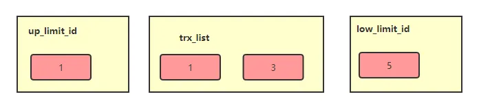

我们的例子中，只有事务 4 修改过该行记录，并在事务 2 执行快照读前，就提交了事务，所以当前该行当前数据的 undo log 如下图所示；我们的事务 2 在快照读该行记录的时候，就会拿该行记录的 DB_TRX_ID 去跟 up_limit_id,low_limit_id 和活跃事务 ID 列表(trx_list)进行比较，判断当前事务 2 能看到该记录的版本是哪个。


所以先拿该记录 DB_TRX_ID 字段记录的事务 ID 4 去跟 Read View 的的 up_limit_id 比较，看 4 是否小于 up_limit_id(1)，所以不符合条件，继续判断 4 是否大于等于 low_limit_id(5)，也不符合条件，最后判断 4 是否处于 trx_list 中的活跃事务, 最后发现事务 ID 为 4 的事务不在当前活跃事务列表中, 符合可见性条件，所以事务 4 修改后提交的最新结果对事务 2 快照读时是可见的，所以事务 2 能读到的最新数据记录是事务 4 所提交的版本，而事务 4 提交的版本也是全局角度上最新的版本

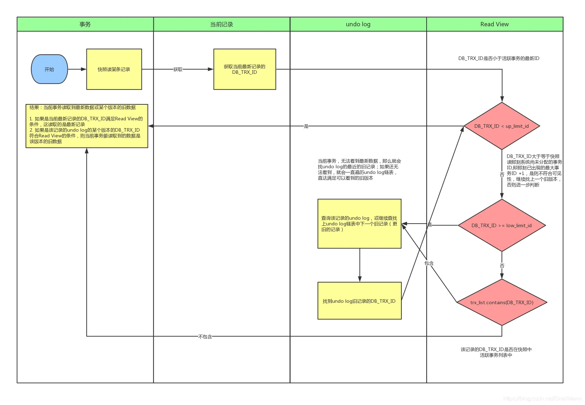

也正是 Read View 生成时机的不同，从而造成 RC,RR 级别下快照读的结果的不同

#### MVCC 版本查看，为什么还会出现幻读?

先解释一下什么是，幻读(间隙锁)

对“幻读”做一个说明：

1. 在可重复读隔离级别下，普通的查询是快照读，是不会看到别的事务插入的数据的。因此，幻读在“当前读”下才会出现。
2. session B 的修改结果，被 session A 之后的 select 语句用“当前读”看到，不能称为幻读。 **幻读仅专指“新插入的行**”。


session A 里执行了三次查询，分别是 Q1、 Q2 和 Q3。 它们的 SQL 语句相同，都是 select \* from t where d=5 for update。 表示查所有 d=5 的行，而且使用的是当前读，并且加上写锁。
其中，Q3 读到 id=1 这一行的现象，被称为“幻读”。 也就是说，幻读指的是一个事务在前后两次查询同一个范围的时候，后一次查询看到了前一次查询没有看到的行

幻读会导致数据一致性的问题。 锁的设计是为了保证数据的一致性。 而这个一致性，不止是数据库内部数据状态在此刻的一致性，还包含了数据和日志在逻辑上的一致性。

1. 在可重复读隔离级别下，普通的查询是快照读，是不会看到别的事务插入的数据的。 因此，幻读在“当前读”下才会出现。
2. 上面 session B 的修改结果，被 session A 之后的 select 语句用“当前读”看到，不能称为幻读。幻读仅专指“新插入的行”

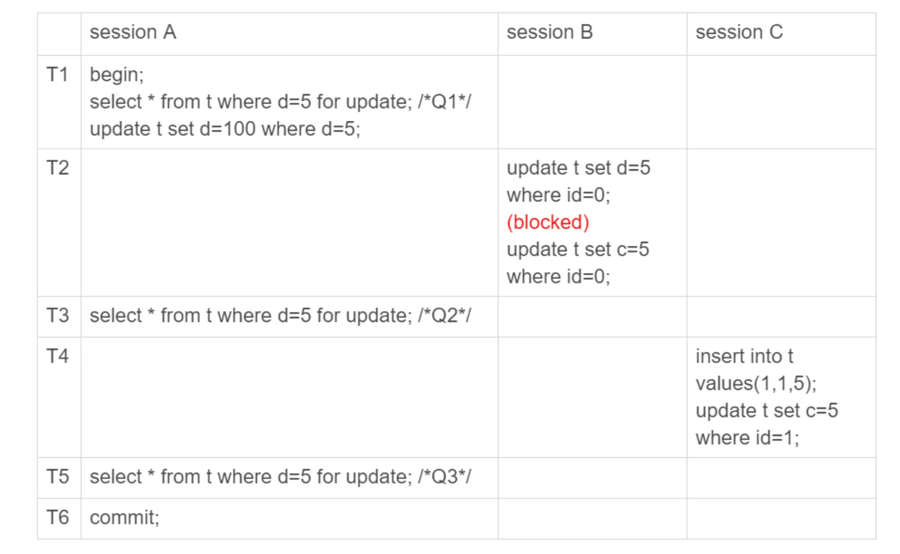

尝试解决幻读，把所有语句都上锁，查询语句改成 `select * from t for update`。但是仍然无法解决插入新语句出现的幻读现象。

如何解决幻读？

InnoDB 引入新的锁，也就是间隙锁(Gap Lock)。在一行行扫描的过程中，不仅将给行加上了行锁，还给行两边的空隙，也加上了间隙锁。

间隙锁之间的冲突：跟间隙锁存在冲突关系的，是“往这个间隙中插入一个记录”这个操作。 间隙锁之间都不存在冲突关系。

间隙锁和行锁合称 next-key lock，每个 next-key lock 是前开后闭区间。

- 如果用 `select * from t for update`要把整个表所有记录锁起来，就形成了 7 个 next-key lock，分别是 (-∞,0]、 (0,5]、 (5,10]、 (10,15]、 (15,20]、 (20, 25]、 (25, +supremum]。
- InnoDB 给每个索引加了一个不存在的最大值 supremum。

间隙锁的引入，可能会导致同样的语句锁住更大的范围，这其实是影响了并发度的。

#### sql 慢查询（优化），如果没有索引怎么办？加了索引也比较慢怎么办？（2022虾皮）

慢查询日志默认是关闭的，我们可以通过下面的命令将其开启：

```sh
SET GLOBAL slow_query_log=ON
```

加了索引页很慢，参考：https://mp.weixin.qq.com/s/pJQwnNOwRKw1MvcDTOrjqQ

没有索引怎么办：https://mp.weixin.qq.com/s/WnO_4SoEL6jugkxPHW4KCg

#### 什么是事务？事务 ACID 特性，隔离级别，隔离级别对应问题对其描述

事务指的是满足 ACID 特性的一组操作，可以通过 Commit 提交一个事务，也可以使用 Rollback 进行回滚。


**事务基本特性 ACID**?：

- **A 原子性(atomicity)** 指的是一个事务中的操作要么全部成功，要么全部失败。
- **C 一致性(consistency)** 指的是数据库总是从一个一致性的状态转换到另外一个一致性的状态。比如 A 转账给 B100 块钱，假设中间 sql 执行过程中系统崩溃 A 也不会损失 100 块，因为事务没有提交，修改也就不会保存到数据库。
- **I 隔离性(isolation)** 指的是一个事务的修改在最终提交前，对其他事务是不可见的。
- **D 持久性(durability)** 指的是一旦事务提交，所做的修改就会永久保存到数据库中。

四大数据库隔离级别，分别是 `读未提交，读已提交，可重复读，串行化（Serializable）`。

- **未提交读(READ UNCOMMITTED)** 事务中的修改，即使没有提交，对其它事务也是可见的。
- **提交读(READ COMMITTED)** 一个事务只能读取已经提交的事务所做的修改。换句话说，一个事务所做的修改在提交之前对其它事务是不可见的。
- **可重复读(REPEATABLE READ)** 保证在同一个事务中多次读取同样数据的结果是一样的。
- **可串行化(SERIALIZABLE)** 强制事务串行执行。

| 隔离级别 | 脏读 | 不可重复读 | 幻影读 |
| :------: | :--: | :--------: | :----: |
| 未提交读 |  √  |     √     |   √   |
|  提交读  |  ×  |     √     |   √   |
| 可重复读 |  ×  |     ×     |   √   |
| 可串行化 |  ×  |     ×     |   ×   |

#### 能说下 myisam 和 innodb 的区别吗？(2022番茄小说)

myisam 引擎是 5.1 版本之前的默认引擎，支持全文检索、压缩、空间函数等，但是不支持事务和行级锁，所以一般用于有大量查询少量插入的场景来使用，而且 myisam 不支持外键，并且索引和数据是分开存储的。

innodb 是基于 B+Tree 索引建立的，和 myisam 相反它支持事务、外键，并且通过 MVCC 来支持高并发，索引和数据存储在一起。

#### 聚簇索引和非聚簇索引的区别

从物理存储的角度来看，索引分为聚簇索引（主键索引）、二级索引（非聚簇索引）。

这两个区别在前面也提到了：

- 主键索引的 B+Tree  的叶子节点存放的是实际数据，所有完整的用户记录都存放在主键索引的 B+Tree 的叶子节点里；
- 二级索引的 B+Tree  的叶子节点存放的是主键值，而不是实际数据。

所以，在查询时使用了二级索引，如果查询的数据能在二级索引里查询的到，那么就不需要回表，这个过程就是覆盖索引。如果查询的数据不在二级索引里，就会先检索二级索引，找到对应的叶子节点，获取到主键值后，然后再检索主键索引，就能查询到数据了，这个过程就是回表。

#### 了解 mysql 的索引吗？

首先，索引是在**存储引擎层实现**的，而不是在服务器层实现的，所以不同存储引擎具有不同的索引类型和实现。

有哪些？

- **B+Tree 索引**
  - 是大多数 MySQL 存储引擎的默认索引类型。
- **哈希索引**
  - 哈希索引能以 O(1) 时间进行查找，但是失去了有序性；
  - InnoDB 存储引擎有一个特殊的功能叫“自适应哈希索引”，当某个索引值被使用的非常频繁时，会在 B+Tree 索引之上再创建一个哈希索引，这样就让 B+Tree 索引具有哈希索引的一些优点，比如快速的哈希查找。
- **全文索引**
  - MyISAM 存储引擎支持全文索引，用于查找文本中的关键词，而不是直接比较是否相等。查找条件使用 MATCH AGAINST，而不是普通的 WHERE。
  - 全文索引一般使用倒排索引实现，它记录着关键词到其所在文档的映射。
  - InnoDB 存储引擎在 MySQL 5.6.4 版本中也开始支持全文索引。
- **空间数据索引**
  - MyISAM 存储引擎支持空间数据索引(R-Tree)，可以用于地理数据存储。空间数据索引会从所有维度来索引数据，可以有效地使用任意维度来进行组合查询。

#### 为什么要用 b+树索引？树的高度是多少？

**什么是 B+Tree?**

B+ Tree 是基于 B Tree 和叶子节点顺序访问指针进行实现，它具有 B Tree 的平衡性，并且通过顺序访问指针来提高区间查询的性能。在 B+ Tree 中，一个节点中的 key 从左到右非递减排列，如果某个指针的左右相邻 key 分别是 keyi 和 keyi+1，且不为 null，则该指针指向节点的所有 key 大于等于 keyi 且小于等于 keyi+1。

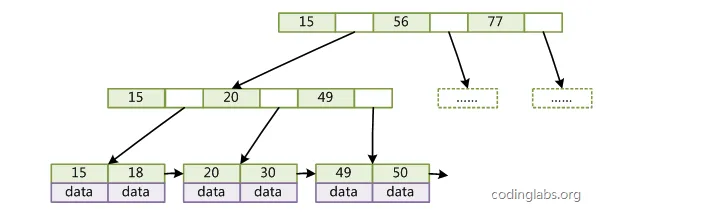

**为什么是 B+Tree**?

- 为了减少磁盘读取次数，决定了树的高度不能高，所以必须是先 B-Tree；
- 以页为单位读取使得一次 I/O 就能完全载入一个节点，且相邻的节点也能够被预先载入；所以数据放在叶子节点，本质上是一个 Page 页；
- 为了支持范围查询以及关联关系， 页中数据需要有序，且页的尾部节点指向下个页的头部；

#### 什么是表锁（MyISAM）

MySQL 5.5 之前，MyISAM 引擎是 MySQL 的默认存储引擎，可谓是风光一时。

虽然，MyISAM 的性能还行，各种特性也还不错（比如全文索引、压缩、空间函数等）。但是，MyISAM 不支持事务和行级锁，而且最大的缺陷就是崩溃后无法安全恢复。

MySQL 5.5.5 之前，MyISAM 是 MySQL 的默认存储引擎。5.5.5 版本之后，InnoDB 是 MySQL 的默认存储引擎。

大多数时候我们使用的都是 InnoDB 存储引擎，在某些读密集的情况下，使用 MyISAM 也是合适的。不过，前提是你的项目不介意 MyISAM 不支持事务、崩溃恢复等缺点

《MySQL 高性能》上面有一句话这样写到:

`不要轻易相信“MyISAM 比 InnoDB 快”之类的经验之谈，这个结论往往不是绝对的。在很多我们已知场景中，InnoDB 的速度都可以让 MyISAM 望尘莫及，尤其是用到了聚簇索引，或者需要访问的数据都可以放入内存的应用。`

#### MySQL的行锁怎么实现的（2022番茄小说）

InnoDB行锁是通过给索引上的 `索引项加锁`来实现的。所以，只有通过索引条件检索数据，InnoDB才使用行级锁，否则，InnoDB将使用表锁。

#### 并发事务带来了哪些问题?

在典型的应用程序中，多个事务并发运行，经常会操作相同的数据来完成各自的任务（多个用户对同一数据进行操作）。并发虽然是必须的，但可能会导致以下的问题。

- **脏读（Dirty read）:** 当一个事务正在访问数据并且对数据进行了修改，而这种修改还没有提交到数据库中，这时另外一个事务也访问了这个数据，然后使用了这个数据。因为这个数据是还没有提交的数据，那么另外一个事务读到的这个数据是“脏数据”，依据“脏数据”所做的操作可能是不正确的。
- **丢失修改（Lost to modify）:**  指在一个事务读取一个数据时，另外一个事务也访问了该数据，那么在第一个事务中修改了这个数据后，第二个事务也修改了这个数据。这样第一个事务内的修改结果就被丢失，因此称为丢失修改。 例如：事务 1 读取某表中的数据 A=20，事务 2 也读取 A=20，事务 1 修改 A=A-1，事务 2 也修改 A=A-1，最终结果  A=19，事务 1 的修改被丢失。
- **不可重复读（Unrepeatable read）:** 指在一个事务内多次读同一数据。在这个事务还没有结束时，另一个事务也访问该数据。那么，在第一个事务中的两次读数据之间，由于第二个事务的修改导致第一个事务两次读取的数据可能不太一样。这就发生了在一个事务内两次读到的数据是不一样的情况，因此称为不可重复读。
- **幻读（Phantom read）:** 幻读与不可重复读类似。它发生在一个事务（T1）读取了几行数据，接着另一个并发事务（T2）插入了一些数据时。在随后的查询中，第一个事务（T1）就会发现多了一些原本不存在的记录，就好像发生了幻觉一样，所以称为幻读。

**不可重复读和幻读区别** ：不可重复读的重点是修改比如多次读取一条记录发现其中某些列的值被修改，幻读的重点在于新增或者删除比如多次查询同一条查询语句（DQL）时，记录发现记录增多或减少了。

#### 问一下 MySQL 默认隔离级别，可以解决幻读吗？

MySQL选择**Repeatable Read（可重复读）作为默认隔离级别**，我们的数据库隔离级别选的是读已提交。

在这之前要先了解数据库默认的隔离级别：

MySQL InnoDB 存储引擎的默认支持的隔离级别是 **REPEATABLE-READ（可重读）**。我们可以通过 `SELECT @@tx_isolation;`命令来查看，MySQL 8.0 该命令改为 `SELECT @@transaction_isolation;`

```sql
mysql> SELECT @@tx_isolation;
+-----------------+
| @@tx_isolation  |
+-----------------+
| REPEATABLE-READ |
+-----------------+
```

关于 MySQL 事务隔离级别的详细介绍，可以看看guide写的这篇文章：[MySQL 事务隔离级别详解](https://javaguide.cn/database/mysql/transaction-isolation-level.html)。

很显然，回顾上一个问题，幻读和不可重复读是差不多的，那么这个默认的可重复读就对立。

拓展：为什么选择RR为默认隔离级别？

binlog的格式也有三种：statement，row，mixed。设置为 `statement`格式，binlog记录的是SQL的原文。又因为MySQL在主从复制的过程是通过 `binlog`进行数据同步，如果设置为读已提交（RC）隔离级别，当出现事务乱序的时候，就会导致备库在 SQL 回放之后，结果和主库内容不一致。

比如一个表t，表中有两条记录：

```
CREATE TABLE t (  
     a int(11) DEFAULT NULL,  
     b int(11) DEFAULT NULL,  
     PRIMARY KEY a (a),
     KEY b(b)
   ) ENGINE=InnoDB DEFAULT CHARSET=latin1;  
   insert into t1 values(10,666),(20,233); 
```

两个事务并发写操作，如下：

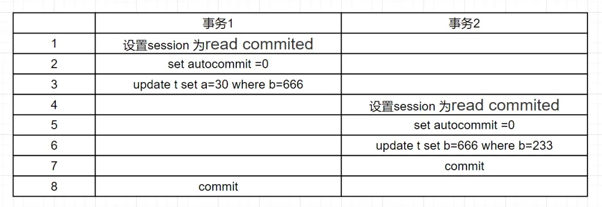

在 `读已提交（RC）`隔离级别下，两个事务执行完后，数据库的两条记录就变成了 `（30,666）、(20,666)`。这两个事务执行完后，binlog也就有两条记录，因为事务binlog用的是 `statement`格式，事务2先提交，因此 `update t set b=666 where b=233`优先记录，而 `update t set a=30 where b=666`记录在后面。

当 `bin log`同步到从库后，执行 `update t set b=666 where b=233`和 `update t set a=30 where b=666`记录，数据库的记录就变成 `（30,666）、(30,666)`，这时候主从数据不一致啦。

因此MySQL的**默认隔离离别**选择了 `RR`而不是 `RC`。`RR`隔离级别下，更新数据的时候不仅对更新的行加行级锁，还会加间隙锁 `（gap lock）`。事务2要执行时，因为事务1增加了间隙锁，就会导致事务2执行被卡住，只有等事务1提交或者回滚后才能继续执行。

并且，MySQL还禁止在使用 `statement`格式的 `binlog`的情况下，使用 `READ COMMITTED`作为事务隔离级别。

**再拓展**：选择RC（读已提交）作为默认的隔离级别：

那为什么MySQL官方默认隔离级别是RR，而有些大厂选择了RC作为默认的隔离级别呢？

- 提升并发

RC 在加锁的过程中，不需要添加 `Gap Lock`和 `Next-Key Lock `的，只对要修改的记录添加行级锁就行了。因此RC的支持的并发度比RR高得多，

- 减少死锁

正是因为RR隔离级别增加了 `Gap Lock`和 `Next-Key Lock `锁，因此它相对于RC，更容易产生死锁。

#### RR隔离级别实现原理，它是如何解决不可重复读的？（OPPO）

什么是不可重复读

---

先回忆下什么是**不可重复读**。假设现在有两个事务A和B：

- 事务A先查询Jay的余额，查到结果是100
- 这时候事务B 对Jay的账户余额进行扣减，扣去10后，提交事务
- 事务A再去查询Jay的账户余额发现变成了90


事务A被事务B干扰到了！在事务A范围内，两个相同的查询，**读取同一条记录，却返回了不同的数据，这就是不可重复读**。

undo log版本链 + Read View可见性规则

---

RR隔离级别实现原理，就是MVCC多版本并发控制，而MVCC是是通过 `Read View+ Undo Log`实现的，Undo Log 保存了历史快照，Read View可见性规则帮助判断当前版本的数据是否可见。

`Undo Log`版本链长这样：


Read view 的几个重要属性

- `m_ids`:当前系统中那些活跃(未提交)的读写事务ID, 它数据结构为一个List。
- `min_limit_id`:表示在生成Read View时，当前系统中活跃的读写事务中最小的事务id，即m_ids中的最小值。
- `max_limit_id`:表示生成Read View时，系统中应该分配给下一个事务的id值。
- `creator_trx_id`: 创建当前Read View的事务ID

Read view 可见性规则如下：

1. 如果数据事务ID `trx_id < min_limit_id`，表明生成该版本的事务在生成Read View前，已经提交(因为事务ID是递增的)，所以该版本可以被当前事务访问。
2. 如果 `trx_id>= max_limit_id`，表明生成该版本的事务在生成Read View后才生成，所以该版本不可以被当前事务访问。
3. 如果 `min_limit_id =<trx_id< max_limit_id`,需要分3种情况讨论

* 3.1 如果 `m_ids`包含 `trx_id`,则代表Read View生成时刻，这个事务还未提交，但是如果数据的 `trx_id`等于 `creator_trx_id`的话，表明数据是自己生成的，因此是可见的。
* 3.2 如果 `m_ids`包含 `trx_id`，并且 `trx_id`不等于 `creator_trx_id`，则Read View生成时，事务未提交，并且不是自己生产的，所以当前事务也是看不见的；
* 3.3 如果 `m_ids`不包含 `trx_id`，则说明你这个事务在Read View生成之前就已经提交了，修改的结果，当前事务是能看见的。

RR 如何解决不可重复读

---

查询一条记录，基于MVCC，是怎样的流程

1. 获取事务自己的版本号，即事务ID
2. 获取Read View
3. 查询得到的数据，然后Read View中的事务版本号进行比较。
4. 如果不符合Read View的可见性规则， 即就需要Undo log中历史快照;
5. 最后返回符合规则的数据

假设存在事务A和B，SQL执行流程如下


在可重复读（RR）隔离级别下，**一个事务里只会获取一次Read View**，都是副本共用的，从而保证每次查询的数据都是一样的。

假设当前有一张core_user表，插入一条初始化数据,如下：


基于MVCC，我们来看看执行流程

1. A开启事务，首先得到一个事务ID为100
2. B开启事务，得到事务ID为101
3. 事务A生成一个Read View，read view对应的值如下

| 变量           | 值       |
| :------------- | :------- |
| m_ids          | 100，101 |
| max_limit_id   | 102      |
| min_limit_id   | 100      |
| creator_trx_id | 100      |

然后回到版本链：开始从版本链中挑选可见的记录：


由图可以看出，最新版本的列name的内容是孙权，该版本的trx_id值为100。开始执行**read view可见性规则**校验：

```mysql
min_limit_id(100)=<trx_id（100）<102;
creator_trx_id = trx_id =100;
```

由此可得，trx_id=100的这个记录，当前事务是可见的。所以查到是**name为孙权**的记录。

4. 事务B进行修改操作，把名字改为曹操。把原数据拷贝到undo log,然后对数据进行修改，标记事务ID和上一个数据版本在undo log的地址。


5. 事务B提交事务
6. 事务A再次执行查询操作，因为是RR（可重复读）隔离级别，因此**会复用老的Read View副本**，Read View对应的值如下

| 变量           | 值       |
| :------------- | :------- |
| m_ids          | 100，101 |
| max_limit_id   | 102      |
| min_limit_id   | 100      |
| creator_trx_id | 100      |

然后再次回到版本链：从版本链中挑选可见的记录：


从图可得，最新版本的列name的内容是曹操，该版本的trx_id值为101。开始执行read view可见性规则校验：

```mysql
min_limit_id(100)=<trx_id（101）<max_limit_id（102);
因为m_ids{100,101}包含trx_id（101），
并且creator_trx_id (100) 不等于trx_id（101）
```

所以，`trx_id=101`这个记录，对于当前事务是不可见的。这时候呢，版本链 `roll_pointer`跳到下一个版本，`trx_id=100`这个记录，再次校验是否可见：

```mysql
min_limit_id(100)=<trx_id（100）< max_limit_id（102);
因为m_ids{100,101}包含trx_id（100），
并且creator_trx_id (100) 等于trx_id（100）
```

所以，trx_id=100这个记录，对于当前事务是可见的，所以两次查询结果，都是name=孙权的那个记录。即在可重复读（RR）隔离级别下，复用老的Read View副本，解决了不可重复读的问题。

#### MySQL 的隔离级别是基于锁实现的吗？

MySQL 的隔离级别基于锁和 MVCC 机制共同实现的。

SERIALIZABLE 隔离级别，是通过锁来实现的。除了 SERIALIZABLE 隔离级别，其他的隔离级别都是基于 MVCC 实现。

不过， SERIALIZABLE 之外的其他隔离级别可能也需要用到锁机制，就比如 REPEATABLE-READ 在当前读情况下需要使用加锁读来保证不会出现幻读。

#### mysql存储引擎有哪些？

| 存储引擎  | 描述                                                           |
| --------- | -------------------------------------------------------------- |
| ARCHIVE   | 用于数据存档的引擎，数据被插入后就不能在修改了，且不支持索引。 |
| CSV       | 在存储数据时，会以逗号作为数据项之间的分隔符。                 |
| BLACKHOLE | 会丢弃写操作，该操作会返回空内容。                             |
| FEDERATED | 将数据存储在远程数据库中，用来访问远程表的存储引擎。           |
| InnoDB    | 具备外键支持功能的事务处理引擎                                 |
| MEMORY    | 置于内存的表                                                   |
| MERGE     | 用来管理由多个 MyISAM 表构成的表集合                           |
| MyISAM    | 主要的非事务处理存储引擎                                       |
| NDB       | MySQL 集群专用存储引擎                                         |

MySQL 支持多种存储引擎，你可以通过 show engines 命令来查看 MySQL 支持的所有存储引擎。

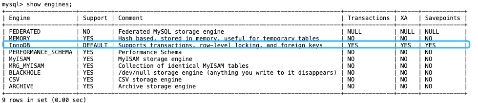

从上图我们可以查看出， MySQL 当前默认的存储引擎是 InnoDB。并且，所有的存储引擎中只有 InnoDB 是事务性存储引擎，也就是说只有 InnoDB 支持事务。

我这里使用的 MySQL 版本是 8.x，不同的 MySQL 版本之间可能会有差别。

MySQL 5.5.5 之前，MyISAM 是 MySQL 的默认存储引擎。5.5.5 版本之后，InnoDB 是 MySQL 的默认存储引擎。

你可以通过 `select version()` 命令查看你的 MySQL 版本。

```bash
 mysql> select version();
+-----------+
| version() |
+-----------+
| 8.0.27    |
+-----------+
1 row in set (0.00 sec)
```

你也可以通过 `show variables like '%storage_engine%'` 命令直接查看 MySQL 当前默认的存储引擎。

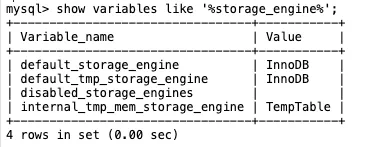

如果你只想查看数据库中某个表使用的存储引擎的话，可以使用 `show table status from db_name where name='table_name'`命令。


如果你想要深入了解每个存储引擎以及它们之间的区别，推荐你去阅读以下 MySQL 官方文档对应的介绍(面试不会问这么细，了解即可)：

- InnoDB 存储引擎详细介绍：https://dev.mysql.com/doc/refman/8.0/en/innodb-storage-engine.html 。
- 其他存储引擎详细介绍：https://dev.mysql.com/doc/refman/8.0/en/storage-engines.html 。

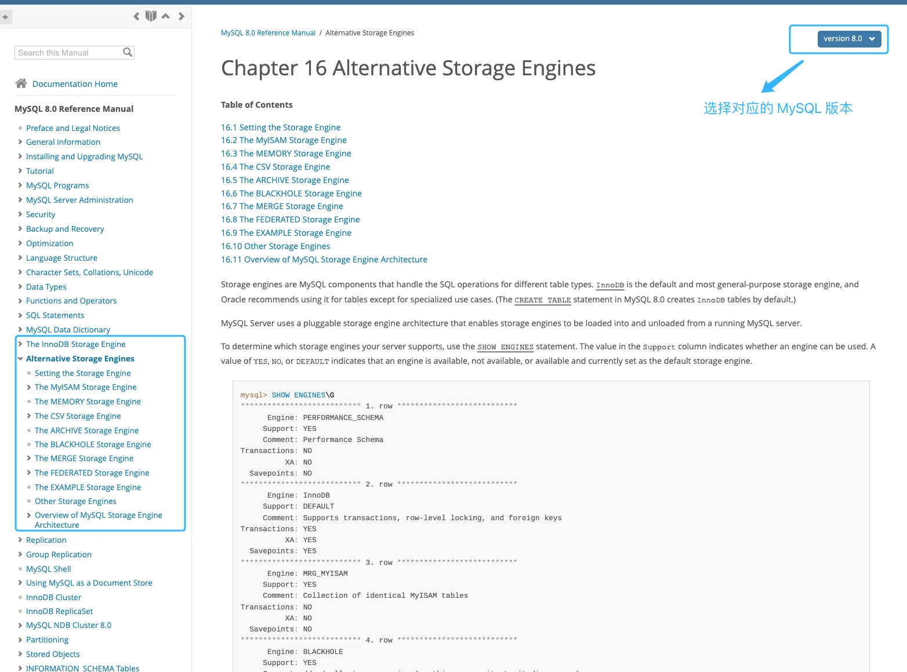

#### 说下myisam 和 innodb的区别

myisam引擎是5.1版本之前的默认引擎，支持全文检索、压缩、空间函数等，但是不支持事务和行级锁，所以一般用于有大量查询少量插入的场景来使用，而且myisam不支持外键，并且索引和数据是分开存储的。

 innodb是基于B+Tree索引建立的，和myisam相反它支持事务、外键，并且通过MVCC来支持高并发，索引和数据存储在一起。

---

**是否支持行级锁**  MyISAM 只有表级锁(table-level locking)，而 InnoDB 支持行级锁(row-level locking)和表级锁,默认为行级锁

**是否支持事务**  MyISAM 不提供事务支持。InnoDB 提供事务支持

**是否支持外键**  MyISAM 不支持，而 InnoDB 支持。

#### mySQL架构是怎样的？

数据的库高可用方案

- 双机主备
- 一主一从
- 一主多从
- MariaDB同步多主机
- 数据库中间件

双机主备

---


- 优点：一个机器故障了可以自动切换，操作比较简单。
- 缺点：只有一个库在工作，读写压力大，未能实现读写分离，并发也有一定限制

一主一从

---

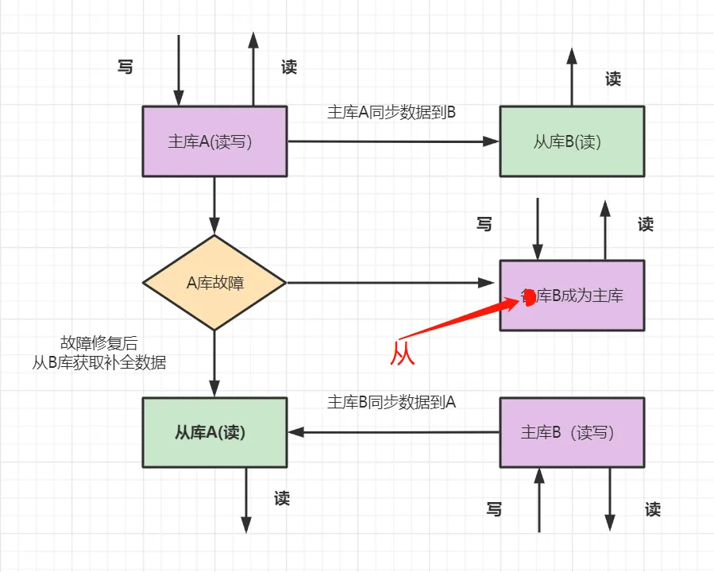

- 优点：从库支持读，分担了主库的压力，提升了并发度。一个机器故障了可以自动切换，操作比较简单。
- 缺点：一台从库，并发支持还是不够，并且一共两台机器，还是存在同时故障的机率，不够高可用。

一主多从

---

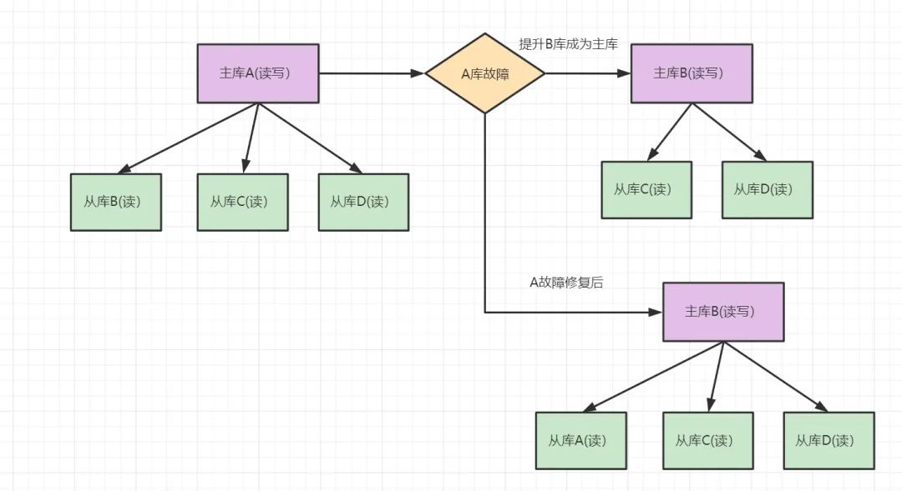

- 优点：多个从库支持读，分担了主库的压力，明显提升了读的并发度。
- 缺点：只有一台主机写，因此写的并发度不高

数据库中间件

---

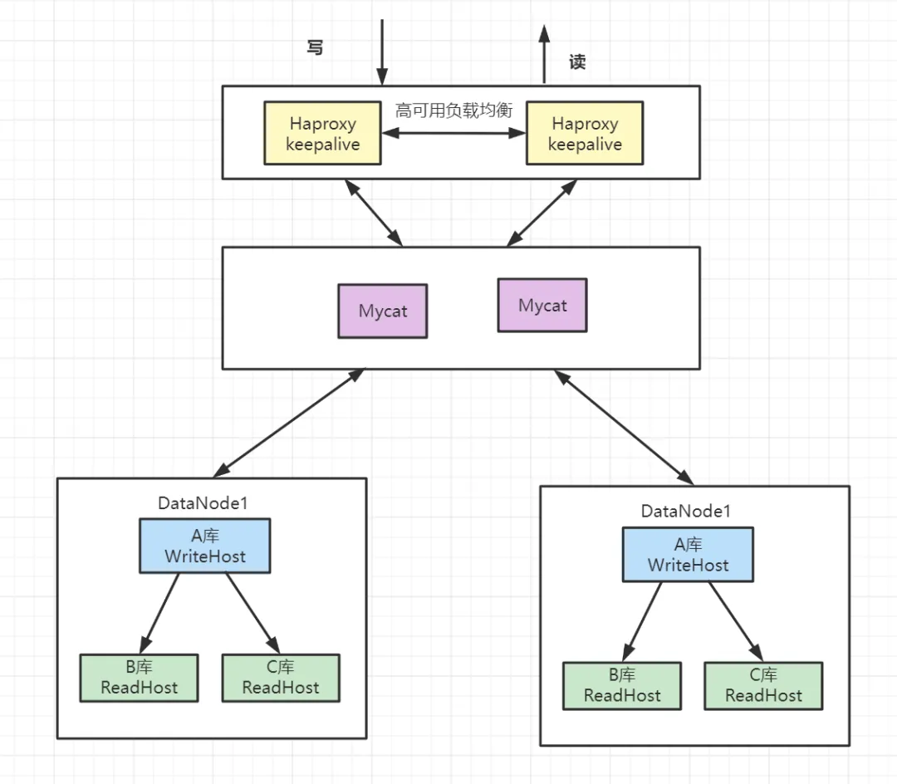

- mycat分片存储，每个分片配置一主多从的集群。
- 优点：解决高并发高数据量的高可用方案
- 缺点：维护成本比较大。

#### 怎么同步mysql数据库到ES？（滴滴）

具体参考：https://developer.aliyun.com/article/761356

* 方案1：阿里云数据传输DTS
* 方案2：Logstash将MySQL数据同步到ElasticSearch
* 方案3：使用阿里云开源工具Canal

#### Mysql的锁（行锁，间隙锁，临键锁，共享锁/排他锁等）

共享锁(简称S锁)和排他锁(简称X锁)

- **读锁**是共享的，可以通过lock in share mode实现，这时候只能读不能写。
- **写锁**是排他的，它会阻塞其他的写锁和读锁。从颗粒度来区分，可以分为表锁和行锁两种。

表锁和行锁

- **表锁**会锁定整张表并且阻塞其他用户对该表的所有读写操作，比如alter修改表结构的时候会锁表。
- 行锁

  又可以分为乐观锁和悲观锁

  - 悲观锁可以通过for update实现
  - 乐观锁则通过版本号实现。

#### 聊聊索引在哪些场景下会失效？

- 查询条件包含or，可能导致索引失效
- 如何字段类型是字符串，where时一定用引号括起来，否则索引失效
- like通配符可能导致索引失效。
- 联合索引，查询时的条件列不是联合索引中的第一个列，索引失效。
- 在索引列上使用mysql的内置函数，索引失效。
- 对索引列运算（如，+、-、*、/），索引失效。
- 索引字段上使用（！= 或者 < >，not in）时，可能会导致索引失效。
- 索引字段上使用is null， is not null，可能导致索引失效。
- 左连接查询或者右连接查询查询关联的字段编码格式不一样，可能导致索引失效。
- mysql估计使用全表扫描要比使用索引快,则不使用索引。

#### MySQL怎么解决死锁的（2022番茄小说）

##### 为什么会形成死锁？

看到这里，也许你会有这样的疑问，事务和谈判不一样，为什么事务不能使用完锁之后立马释放呢？居然还要操作完了之后一直持有锁？这就涉及到 MySQL 的并发控制了。

MySQL的并发控制有两种方式，一个是 MVCC，一个是两阶段锁协议。那么为什么要并发控制呢？是因为多个用户同时操作 MySQL 的时候，为了提高并发性能并且要求如同多个用户的请求过来之后如同串行执行的一样（`可串行化调度`）。具体的并发控制这里不再展开。咱们继续深入讨论两阶段锁协议。

两阶段锁协议（2PL）

官方定义：

> 两阶段锁协议是指所有事务必须分两个阶段对数据加锁和解锁，在对任何数据进行读、写操作之前，事务首先要获得对该数据的封锁；在释放一个封锁之后，事务不再申请和获得任何其他封锁。

对应到 MySQL 上分为两个阶段：

1. 扩展阶段（事务开始后，commit 之前）：获取锁
2. 收缩阶段（commit 之后）：释放锁

就是说呢，只有遵循两段锁协议，才能实现 `可串行化调度`。

但是两阶段锁协议不要求事务必须一次将所有需要使用的数据加锁，并且在加锁阶段没有顺序要求，所以这种并发控制方式会形成死锁。

##### MySQL 如何处理死锁？

MySQL有两种死锁处理方式：

    等待，直到超时（innodb_lock_wait_timeout=50s）。
    发起死锁检测，主动回滚一条事务，让其他事务继续执行（innodb_deadlock_detect=on）。

由于性能原因，一般都是使用死锁检测来进行处理死锁。

###### 死锁检测

死锁检测的原理是构建一个以事务为顶点、锁为边的有向图，判断有向图是否存在环，存在即有死锁。

###### 回滚

检测到死锁之后，选择插入更新或者删除的行数最少的事务回滚，基于 INFORMATION_SCHEMA.INNODB_TRX 表中的 trx_weight 字段来判断。

#### 联合索引中间可以有null值吗，为什么，测试过吗？（2022番茄小说）

Mysql官方文档中有这样的解释

> A UNIQUE index creates a constraint such that all values in the index must be distinct. An error occurs if you try to add a new row with a key value that matches an existing row. This constraint does not apply to NULL values except for the BDB storage engine. For other engines, a UNIQUE index allows multiple NULL values for columns that can contain NULL.

唯一约束对NULL值不适用。原因可以这样解释： 比如我们有一个单列的唯一索引，既然实际会有空置的情况，那么这列一定不是NOT NULL的，如果唯一约束对空值也有起作用，就会导致仅有一行数据可以为空，这可能会和实际的业务需求想冲突的，所以通常Mysql的存储引擎的唯一索引对NULL值是不适用的。 这也就倒是联合唯一索引的情况下，只要某一列为空，就不会报唯一索引冲突。

> 解决方案：给会为空的列定义一个为空的特殊值来表示NULL，比如数字类型使用0值，字符串类型使用空字符串。

#### 有没有做过SQL优化吗？ （2022番茄小说）

[MySQL高性能优化规范建议](https://javaguide.cn/database/mysql/mysql-high-performance-optimization-specification-recommendations.html#_12-%E7%A6%81%E6%AD%A2%E4%BD%BF%E7%94%A8-order-by-rand-%E8%BF%9B%E8%A1%8C%E9%9A%8F%E6%9C%BA%E6%8E%92%E5%BA%8F)

#### 联合索引，最左匹配原则（2022蔚来）

对主键字段建立的索引叫做聚簇索引，对普通字段建立的索引叫做二级索引。

那么**多个普通字段组合在一起创建的索引就叫做联合索引**，也叫组合索引。

创建联合索引时，我们需要注意创建时的顺序问题，因为联合索引 (a, b, c) 和 (c, b, a) 在使用的时候会存在差别。

联合索引要能正确使用需要遵循**最左匹配原则**，也就是按照最左优先的方式进行索引的匹配。

最左前缀匹配原则指的是，在使用联合索引时，**MySQL** 会根据联合索引中的字段顺序，从左到右依次到查询条件中去匹配，如果查询条件中存在与联合索引中最左侧字段相匹配的字段，则就会使用该字段过滤一批数据，直至联合索引中全部字段匹配完成，或者在执行过程中遇到范围查询，如 **`>`**、**`<`**、**`between`** 和 **`以%开头的like查询`** 等条件，才会停止匹配。

所以，我们在使用联合索引时，可以将区分度高的字段放在最左边，这也可以过滤更多数据。

## 🦸‍♀️中间件

### 消息队列

#### 什么是消息队列

我们可以把消息队列看作是一个存放消息的容器，当我们需要使用消息的时候，直接从容器中取出消息供自己使用即可。


消息队列是分布式系统中重要的组件之一。使用消息队列主要是为了通过异步处理提高系统性能和削峰、降低系统耦合性。

我们知道队列 Queue 是一种先进先出的数据结构，所以消费消息时也是按照顺序来消费的。

#### 为什么要用消息队列

通常来说，使用消息队列能为我们的系统带来下面三点好处：

1. **通过异步处理提高系统性能（减少响应所需时间）。**
2. **削峰/限流**
3. **降低系统耦合性。**

如果在面试的时候你被面试官问到这个问题的话，一般情况是你在你的简历上涉及到消息队列这方面的内容，这个时候推荐你结合你自己的项目来回答。

通过异步处理提高系统性能（减少响应所需时间）


将用户的请求数据存储到消息队列之后就立即返回结果。随后，系统再对消息进行消费。

因为用户请求数据写入消息队列之后就立即返回给用户了，但是请求数据在后续的业务校验、写数据库等操作中可能失败。因此，**使用消息队列进行异步处理之后，需要适当修改业务流程进行配合**，比如用户在提交订单之后，订单数据写入消息队列，不能立即返回用户订单提交成功，需要在消息队列的订单消费者进程真正处理完该订单之后，甚至出库后，再通过电子邮件或短信通知用户订单成功，以免交易纠纷。这就类似我们平时手机订火车票和电影票

削峰/限流

**先将短时间高并发产生的事务消息存储在消息队列中，然后后端服务再慢慢根据自己的能力去消费这些消息，这样就避免直接把后端服务打垮掉。**

举例：在电子商务一些秒杀、促销活动中，合理使用消息队列可以有效抵御促销活动刚开始大量订单涌入对系统的冲击。如下图所示：


降低系统耦合性

使用消息队列还可以降低系统耦合性。我们知道如果模块之间不存在直接调用，那么新增模块或者修改模块就对其他模块影响较小，这样系统的可扩展性无疑更好一些。还是直接上图吧：

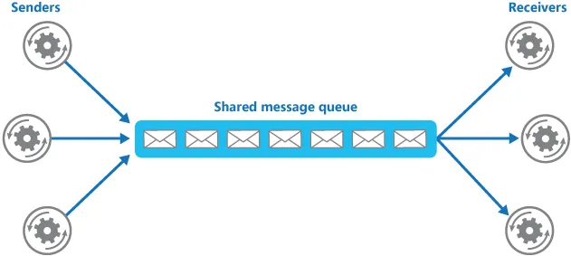

生产者（客户端）发送消息到消息队列中去，接受者（服务端）处理消息，需要消费的系统直接去消息队列取消息进行消费即可而不需要和其他系统有耦合，这显然也提高了系统的扩展性。

**消息队列使用发布-订阅模式工作，消息发送者（生产者）发布消息，一个或多个消息接受者（消费者）订阅消息。** 从上图可以看到**消息发送者（生产者）和消息接受者（消费者）之间没有直接耦合**，消息发送者将消息发送至分布式消息队列即结束对消息的处理，消息接受者从分布式消息队列获取该消息后进行后续处理，并不需要知道该消息从何而来。**对新增业务，只要对该类消息感兴趣，即可订阅该消息，对原有系统和业务没有任何影响，从而实现网站业务的可扩展性设计**。

消息接受者对消息进行过滤、处理、包装后，构造成一个新的消息类型，将消息继续发送出去，等待其他消息接受者订阅该消息。因此基于事件（消息对象）驱动的业务架构可以是一系列流程。

另外，为了避免消息队列服务器宕机造成消息丢失，会将成功发送到消息队列的消息存储在消息生产者服务器上，等消息真正被消费者服务器处理后才删除消息。在消息队列服务器宕机后，生产者服务器会选择分布式消息队列服务器集群中的其他服务器发布消息。

**备注：** 不要认为消息队列只能利用发布-订阅模式工作，只不过在解耦这个特定业务环境下是使用发布-订阅模式的。除了发布-订阅模式，还有点对点订阅模式（一个消息只有一个消费者），我们比较常用的是发布-订阅模式。另外，这两种消息模型是 JMS 提供的，AMQP 协议还提供了 5 种消息模型。

#### RabbitMQ 讲讲对 RabbitMQ 的了解

RabbitMQ 整体上是一个生产者与消费者模型，主要负责接收、存储和转发消息。可以把消息传递的过程想象成：当你将一个包裹送到邮局，邮局会暂存并最终将邮件通过邮递员送到收件人的手上，RabbitMQ 就好比由邮局、邮箱和邮递员组成的一个系统。从计算机术语层面来说，RabbitMQ 模型更像是一种交换机模型。

RabbitMQ 的整体模型架构：

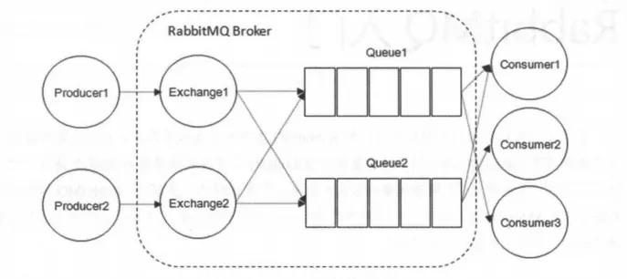

#### RabbitMQ 的交换机和队列是怎样一个联系

在 RabbitMQ 中，消息并不是直接被投递到 **Queue(消息队列)** 中的，中间还必须经过 **Exchange(交换器)** 这一层，**Exchange(交换器)** 会把我们的消息分配到对应的 **Queue(消息队列)** 中。

**Exchange(交换器)** 用来接收生产者发送的消息并将这些消息路由给服务器中的队列中，如果路由不到，或许会返回给 **Producer(生产者)** ，或许会被直接丢弃掉 。这里可以将 RabbitMQ 中的交换器看作一个简单的实体。

**RabbitMQ 的 Exchange(交换器) 有 4 种类型，不同的类型对应着不同的路由策略**：**direct(默认)**，**fanout**, **topic**, 和 **headers**，不同类型的 Exchange 转发消息的策略有所区别。这个会在介绍 **Exchange Types(交换器类型)** 的时候介绍到。

Exchange(交换器) 示意图如下：


生产者将消息发给交换器的时候，一般会指定一个 **RoutingKey(路由键)**，用来指定这个消息的路由规则，而这个 **RoutingKey 需要与交换器类型和绑定键(BindingKey)联合使用才能最终生效**。

RabbitMQ 中通过 **Binding(绑定)** 将 **Exchange(交换器)** 与 **Queue(消息队列)** 关联起来，在绑定的时候一般会指定一个 **BindingKey(绑定建)** ,这样 RabbitMQ 就知道如何正确将消息路由到队列了,如下图所示。一个绑定就是基于路由键将交换器和消息队列连接起来的路由规则，所以可以将交换器理解成一个由绑定构成的路由表。Exchange 和 Queue 的绑定可以是多对多的关系。

Binding(绑定) 示意图：


生产者将消息发送给交换器时，需要一个 RoutingKey,当 BindingKey 和 RoutingKey 相匹配时，消息会被路由到对应的队列中。在绑定多个队列到同一个交换器的时候，这些绑定允许使用相同的 BindingKey。BindingKey 并不是在所有的情况下都生效，它依赖于交换器类型，比如 fanout 类型的交换器就会无视，而是将消息路由到所有绑定到该交换器的队列中。

#### 保证kafka消息顺序性

我们在使用消息队列的过程中经常有业务场景需要严格保证消息的消费顺序，比如我们同时发了 2 个消息，这 2 个消息对应的操作分别对应的数据库操作是：

1. 更改用户会员等级。
2. 根据会员等级计算订单价格。

假如这两条消息的消费顺序不一样造成的最终结果就会截然不同。

我们知道 Kafka 中 Partition(分区)是真正保存消息的地方，我们发送的消息都被放在了这里。而我们的 Partition(分区) 又存在于 Topic(主题) 这个概念中，并且我们可以给特定 Topic 指定多个 Partition。

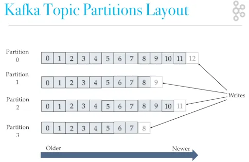

每次添加消息到 Partition(分区) 的时候都会采用尾加法，如上图所示。 **Kafka 只能为我们保证 Partition(分区) 中的消息有序。**

> 消息在被追加到 Partition(分区)的时候都会分配一个特定的偏移量（offset）。Kafka 通过偏移量（offset）来保证消息在分区内的顺序性。

所以，我们就有一种很简单的保证消息消费顺序的方法：**1 个 Topic 只对应一个 Partition**。这样当然可以解决问题，但是破坏了 Kafka 的设计初衷。

Kafka 中发送 1 条消息的时候，可以指定 topic, partition, key,data（数据） 4 个参数。如果你发送消息的时候指定了  Partition 的话，所有消息都会被发送到指定的 Partition。并且，同一个 key 的消息可以保证只发送到同一个  partition，这个我们可以采用表/对象的 id 来作为 key 。

总结一下，对于如何保证 Kafka 中消息消费的顺序，有了下面两种方法：

1. 1 个 Topic 只对应一个 Partition。
2. （推荐）发送消息的时候指定 key/Partition。

当然不仅仅只有上面两种方法，上面两种方法是我觉得比较好理解的

#### kafka怎么保证消息可靠性的？

生产者丢失消息的情况：

生产者(Producer) 调用 `send`方法发送消息之后，消息可能因为网络问题并没有发送过去。

所以，我们不能默认在调用 `send`方法发送消息之后消息发送成功了。为了确定消息是发送成功，我们要判断消息发送的结果。但是要注意的是 Kafka 生产者(Producer) 使用 `send` 方法发送消息实际上是异步的操作，我们可以通过 `get()`方法获取调用结果，但是这样也让它变为了同步操作，示例代码如下：

> **详细代码见我的这篇文章：[Kafka系列第三篇！10 分钟学会如何在 Spring Boot 程序中使用 Kafka 作为消息队列?](https://mp.weixin.qq.com/s?__biz=Mzg2OTA0Njk0OA==&mid=2247486269&idx=2&sn=ec00417ad641dd8c3d145d74cafa09ce&chksm=cea244f6f9d5cde0c8eb233fcc4cf82e11acd06446719a7af55230649863a3ddd95f78d111de&token=1633957262&lang=zh_CN#rd)**

```java
SendResult<String, Object> sendResult = kafkaTemplate.send(topic, o).get();
if (sendResult.getRecordMetadata() != null) {
  logger.info("生产者成功发送消息到" + sendResult.getProducerRecord().topic() + "-> " + sendRe
              sult.getProducerRecord().value().toString());
}
```

但是一般不推荐这么做！可以采用为其添加回调函数的形式，示例代码如下：

```java
        ListenableFuture<SendResult<String, Object>> future = kafkaTemplate.send(topic, o);
        future.addCallback(result -> logger.info("生产者成功发送消息到topic:{} partition:{}的消息", result.getRecordMetadata().topic(), result.getRecordMetadata().partition()),
                ex -> logger.error("生产者发送消失败，原因：{}", ex.getMessage()));
```

如果消息发送失败的话，我们检查失败的原因之后重新发送即可！

**另外这里推荐为 Producer 的 `retries `（重试次数）设置一个比较合理的值，一般是 3  ，但是为了保证消息不丢失的话一般会设置比较大一点。设置完成之后，当出现网络问题之后能够自动重试消息发送，避免消息丢失。另外，建议还要设置重试间隔，因为间隔太小的话重试的效果就不明显了，网络波动一次你3次一下子就重试完了**

消费者丢失消息的情况：

我们知道消息在被追加到 Partition(分区)的时候都会分配一个特定的偏移量（offset）。偏移量（offset)表示 Consumer  当前消费到的 Partition(分区)的所在的位置。Kafka 通过偏移量（offset）可以保证消息在分区内的顺序性。


当消费者拉取到了分区的某个消息之后，消费者会自动提交了 offset。自动提交的话会有一个问题，试想一下，当消费者刚拿到这个消息准备进行真正消费的时候，突然挂掉了，消息实际上并没有被消费，但是 offset 却被自动提交了。

**解决办法也比较粗暴，我们手动关闭自动提交 offset，每次在真正消费完消息之后再自己手动提交 offset 。** 但是，细心的朋友一定会发现，这样会带来消息被重新消费的问题。比如你刚刚消费完消息之后，还没提交 offset，结果自己挂掉了，那么这个消息理论上就会被消费两次。

3. 保证消息不重复

**kafka出现消息重复消费的原因：**

- 服务端侧已经消费的数据没有成功提交 offset（根本原因）。
- Kafka 侧 由于服务端处理业务时间长或者网络链接等等原因让 Kafka 认为服务假死，触发了分区 rebalance。

**解决方案：**

- 消费消息服务做幂等校验，比如 Redis 的set、MySQL 的主键等天然的幂等功能。这种方法最有效。
- 将

  `enable.auto.commit`

  参数设置为 false，关闭自动提交，开发者在代码中手动提交 offset。那么这里会有个问题：

  什么时候提交offset合适？

  - 处理完消息再提交：依旧有消息重复消费的风险，和自动提交一样
  - 拉取到消息即提交：会有消息丢失的风险。允许消息延时的场景，一般会采用这种方式。然后，通过定时任务在业务不繁忙（比如凌晨）的时候做数据兜底。

#### 如何保证消息不丢失

RocketMQ 篇

---

一个消息从生产者产生，到被消费者消费，主要经过这3个过程：

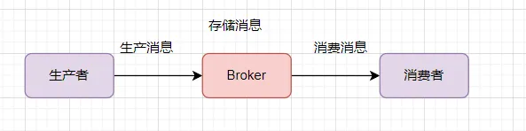

1. 生产者产生消息
2. 消息发送到存储端，保存下来
3. 消息推送到消费者，消费者消费完，ack应答。

因此如何保证MQ不丢失消息，可以从这三个阶段阐述：

- 生产者保证不丢消息
- 存储端不丢消息
- 消费者不丢消息

生产者保证不丢消息

生产端如何保证不丢消息呢？确保生产的消息能顺利到达存储端。

如果是 `RocketMQ`消息中间件的话，`Producer`生产者提供了三种发送消息的方式，分别是：

- 同步发送
- 异步发送
- 单向发送

生产者要想发消息时保证消息不丢失，可以：

- 采用同步方式发送，send消息方法返回成功状态，即消息正常到达了存储端 `Broker`。
- 如果 `send`消息异常或者返回非成功状态，可以发起重试。
- 可以使用事务消息，`RocketMQ`的事务消息机制就是为了保证零丢失来设计的

存储端不丢消息

如何保证存储端的消息不丢失呢？确保消息持久化到磁盘，那就是刷盘机制嘛。

刷盘机制分**同步刷盘和异步刷盘**：

- 同步刷盘：生产者消息发过来时，只有持久化到磁盘，`RocketMQ`的存储端 `Broker`才返回一个成功的ACK响应。它保证消息不丢失，但是影响了性能。
- 异步刷盘：只要消息写入 `PageCache`缓存，就返回一个成功的ACK响应。这样提高了MQ的性能，但是如果这时候机器断电了，就会丢失消息。

除了同步刷盘机制，还有一个维度需要考虑。`Broker`一般是集群部署的，有主节点和从节点。消息到 `Broker`存储端，只有主节点和从节点都写入成功，才反馈成功的 `ack`给生产者。这就是**同步复制**，它保证了消息不丢失，但是降低了系统的吞吐量。与之对应即是**异步复制**，只要消息写入主节点成功，就返回成功的 `ack`，它速度快，但是会有性能问题。

消费阶段不丢消息

费者**执行完业务逻辑**，再反馈会 `Broker`说消费成功，这样才可以保证消费阶段不丢消息。

#### 事务消息是否了解？

事务消息主要用来解决消息生产者和消息消费者的**数据一致性**问题。我们先来回忆一下：一条普通的消息队列消息，从产生到被消费，经历的流程：


1. 生产者产生消息，发送到MQ服务器
2. MQ收到消息后，将消息持久化到存储系统。
3. MQ服务器返回ACk到生产者。
4. MQ服务器把消息push给消费者
5. 消费者消费完消息，响应ACK
6. MQ服务器收到ACK，认为消息消费成功，即在存储中删除消息。

**消息队列的事务消息流程是怎样的呢？**

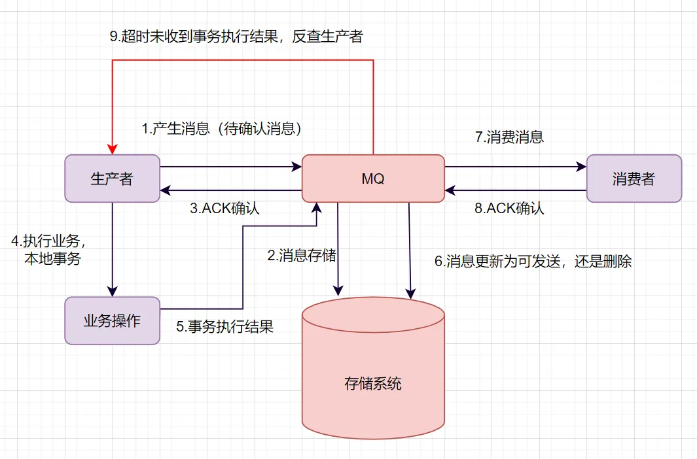

1. 生产者产生消息，发送一条半事务消息到MQ服务器
2. MQ收到消息后，将消息持久化到存储系统，这条消息的状态是待发送状态。
3. MQ服务器返回ACK确认到生产者，此时MQ不会触发消息推送事件
4. 生产者执行本地事务
5. 如果本地事务执行成功，即commit执行结果到MQ服务器；如果执行失败，发送rollback。
6. 如果是正常的commit，MQ服务器更新消息状态为可发送；如果是rollback，即删除消息。
7. 如果消息状态更新为可发送，则MQ服务器会push消息给消费者。消费者消费完就回ACK。
8. 如果MQ服务器长时间没有收到生产者的commit或者rollback，它会反查生产者，然后根据查询到的结果执行最终状态。

#### kafka批量消费，如果消费过长，会导致消费超时，触发rebalance？（2022虾皮）

## 🧩数据结构和算法

### LRU 介绍，底层数据结构，高并发情况下如何设计 LRU or  LRU缓存原理？手写，要支持泛型

[146. LRU 缓存](https://leetcode-cn.com/problems/lru-cache/)

[BM100 设计LRU缓存结构](https://www.nowcoder.com/practice/5dfded165916435d9defb053c63f1e84?tpId=295&tqId=2427094&ru=/exam/oj&qru=/ta/format-top101/question-ranking&sourceUrl=%2Fexam%2Foj%3Ftab%3D%E7%AE%97%E6%B3%95%E7%AF%87%26topicId%3D295)

双向链表（`LinkedHashMap`，不过面试的时候最好自己实现一个双向链表） + 哈希

最常使用的节点都直接放在链表的头部，这样，链表的尾部就是最不常访问的

**解法一：**

```java
import java.util.*;

public class Solution {
  
    // 定义双向链表的节点结构
    static class Node {
        int key, value;
        Node pre, next;
        public Node(int key, int value) {
            this.key = key;
            this.value = value;
        }
    }
  
    // 链表头(头节点，不存储任何数据)
    private Node head = new Node(-1, -1);
    // 链表尾(尾节点，不存储任何数据)
    private Node tail = new Node(-1, -1);
    // 哈希表，以达到 O(1) 级别的 set 和 get
    private Map<Integer, Node> map;
  
    private int capacity;
  
    public Solution(int capacity) {
        this.capacity = capacity;
        this.map = new HashMap<>();
        head.next = tail;
        tail.next = head;
    }
  
    public int get(int key) {
        if (map.containsKey(key)) {
            Node node = map.get(key);
            // 1. 从链表中删除这个元素
            node.pre.next = node.next;
            node.next.pre = node.pre;
            // 2. node 添加到链表头
            addHead(node);
          
            return node.value;
        }
      
        // 不存在则返回 -1
        return -1;
    }

    public void set(int key, int value) {
        // 如果 key 已经存在，则更新 value
        if (get(key) != -1) {
            // 注意如果 get(key) != -1 的话，那么就已经把 key 对应的 node 添加到最前面了，我们这里只需要改下 value 的值就行
            map.get(key).value = value;
        }
        // 如果 key 不存在，则插入新节点 key-value
        else {
            // 如果节点的数量已经超过 capacity，则弹出最久未使用的节点(最后面那个节点，注意不是尾节点)
            if (map.size() == capacity) {
                int removeKey = tail.pre.key;
                tail.pre.pre.next = tail;
                tail.pre = tail.pre.pre;
                map.remove(removeKey);
            }
            // 插入新节点 key-value
            Node node = new Node(key, value);
            map.put(key, node);
            addHead(node);
        }
      
    }
  
    // 将 node 节点添加到链表头部(head 节点之后)
    private void addHead(Node node) {
        node.next = head.next;
        head.next.pre = node;
      
        head.next = node;
        node.pre = head;
    }
}

/**
 * Your Solution object will be instantiated and called as such:
 * Solution solution = new Solution(capacity);
 * int output = solution.get(key);
 * solution.set(key,value);
 */
```

**解法二：LinkedHashMap**

LinkedHashMap 的特性， 每个节点间由一个 before 引用 和 after 引用串联起来成为一个双向链表。链表节点按照访问时间进行排序，**最近访问过的链表放在链表尾**。

```java
// 10 是初始大小，0.75 是装载因子，true 是表示按照访问时间排序
HashMap<Integer, Integer> m = new LinkedHashMap<>(10, 0.75f, true);
m.put(3, 11);
m.put(1, 12);
m.put(5, 23);
m.put(2, 22);

m.put(3, 26);
m.get(5);

for (Map.Entry e : m.entrySet()) {
  System.out.println(e.getKey());
    // 输出的结果是 1，2，3，5
}
```

### 什么是回溯（2022蔚来）

回溯算法是对树形或者图形结构执行一次深度优先遍历，实际上类似枚举的搜索尝试过程，在遍历的过程中寻找问题的解。

深度优先遍历有个特点：当发现已不满足求解条件时，就返回，尝试别的路径。此时对象类型变量就需要重置成为和之前一样，称为「状态重置」。

许多复杂的，规模较大的问题都可以使用回溯法，有「通用解题方法」的美称。实际上，回溯算法就是暴力搜索算法，它是早期的人工智能里使用的算法，借助计算机强大的计算能力帮助我们找到问题的解。

### 有哪些搜索算法（2022蔚来）

常见的有

* 深度优先搜索

* 广度优先搜索

* 回溯

  

### 什么是剪枝（2022蔚来）

剪枝顾名思义，就是删去一些不重要的节点，来减小计算或搜索的复杂度。剪枝在很多算法中都有很好的应用，如：决策树，神经网络，搜索算法,数据库的设计等。在决策树和神经网络中，剪枝可以有效缓解过拟合问题并减小计算复杂度；在搜索算法中，可以减小搜索范围，提高搜索效率。

### 什么排序的时间复杂度下限可以突破O(nlogn)（2022蔚来）


### 排序的时间复杂度（2022蔚来）

| 排序法 | 平均时间 | 最差情形    | 稳定度 | 额外空间 | 备注                          |
| ------ | -------- | ----------- | ------ | -------- | ----------------------------- |
| 冒泡   | O(n2)    | O(n2)       | 稳定   | O(1)     | n小时较好                     |
| 选择   | O(n2)    | O(n2)       | 不稳定 | O(1)     | n小时较好                     |
| 插入   | O(n2)    | O(n2)       | 稳定   | O(1)     | 大部分已排序时较好            |
| 基数   | O(logRB) | O(logRB)    | 稳定   | O(n)     | B是真数(0-9)，R是基数(个十百) |
| Shell  | O(nlogn) | O(ns) 1<s<2 | 不稳定 | O(1)     | s是所选分组                   |
| 快速   | O(nlogn) | O(n2)       | 不稳定 | O(nlogn) | n大时较好                     |
| 归并   | O(nlogn) | O(nlogn)    | 稳定   | O(1)     | n大时较好                     |
| 堆     | O(nlogn) | O(nlogn)    | 不稳定 | O(1)     | n大时较好                     |

### 基数排序的场景（2022蔚来）

把一系列单词，按照英文字典的顺序排序

输入： ["banana","apple","orange","ape","he"]

输出： ["ape","apple","banana","he","orange"]

## 🖥️操作系统

### （重点中的战斗机）IO多路复用，重点介绍epoll

I/O多路复用的本质是使用select,poll或者epoll函数，挂起进程，当一个或者多个I/O事件发生之后，将控制返回给用户进程。以服务器编程为例，传统的多进程(多线程)并发模型，在处理用户连接时都是开启一个新的线程或者进程去处理一个新的连接，而I/O多路复用则可以在一个进程(线程)当中同时监听多个网络I/O事件，也就是多个文件描述符。select、poll 和 epoll 都是 Linux API 提供的 IO 复用方式。

操作系统级别提供了一些接口来支持IO多路复用，最早的是select、poll，其后epoll是Linux下的IO多路复用的实现。

- select接口最早实现存在需要调用多次、线程不安全以及限制只能监视1024个链接的问题
- poll接口修复了select函数的一些问题，但是依然不是线程安全的。
- epoll接口修复了上述的问题，并且线程安全，会通知具体哪个连接有新数据。
  - epoll通过epoll_ctl()来注册一个文件描述符,一旦基于某个文件描述符就绪时,内核会采用类似**callback的回调机制**,迅速激活这个文件描述符,当进程调用epoll_wait()时便得到通知(不再需要遍历文件描述符,通过监听回调的机制,也是epoll的魅力)

> 推荐yue'du

[ I/O 多路复用：select/poll/epoll](https://xiaolincoding.com/os/8_network_system/selete_poll_epoll.html)

最基础的 TCP 的 Socket 编程，它是阻塞 I/O 模型，基本上只能一对一通信，那为了服务更多的客户端，我们需要改进网络 I/O 模型。

比较传统的方式是使用多进程/线程模型，每来一个客户端连接，就分配一个进程/线程，然后后续的读写都在对应的进程/线程，这种方式处理 100 个客户端没问题，但是当客户端增大到 10000 个时，10000 个进程/线程的调度、上下文切换以及它们占用的内存，都会成为瓶颈。

为了解决上面这个问题，就出现了 I/O 的多路复用，可以只在一个进程里处理多个文件的 I/O，Linux 下有三种提供 I/O 多路复用的 API，分别是：select、poll、epoll。

select 和 poll 并没有本质区别，它们内部都是使用「线性结构」来存储进程关注的 Socket 集合。

在使用的时候，首先需要把关注的 Socket 集合通过 select/poll 系统调用从用户态拷贝到内核态，然后由内核检测事件，当有网络事件产生时，内核需要遍历进程关注 Socket 集合，找到对应的 Socket，并设置其状态为可读/可写，然后把整个 Socket 集合从内核态拷贝到用户态，用户态还要继续遍历整个 Socket 集合找到可读/可写的 Socket，然后对其处理。

很明显发现，select 和 poll 的缺陷在于，当客户端越多，也就是 Socket 集合越大，Socket 集合的遍历和拷贝会带来很大的开销，因此也很难应对 C10K。

epoll 是解决 C10K 问题的利器，通过两个方面解决了 select/poll 的问题。

- epoll 在内核里使用「红黑树」来关注进程所有待检测的 Socket，红黑树是个高效的数据结构，增删改一般时间复杂度是 O(logn)，通过对这棵黑红树的管理，不需要像 select/poll 在每次操作时都传入整个 Socket 集合，减少了内核和用户空间大量的数据拷贝和内存分配。
- epoll 使用事件驱动的机制，内核里维护了一个「链表」来记录就绪事件，只将有事件发生的 Socket 集合传递给应用程序，不需要像 select/poll 那样轮询扫描整个集合（包含有和无事件的 Socket ），大大提高了检测的效率。

而且，epoll 支持边缘触发和水平触发的方式，而 select/poll 只支持水平触发，一般而言，边缘触发的方式会比水平触发的效率高

### 聊聊零拷贝（2022蔚来）

零拷贝就是不需要将数据从一个存储区域复制到另一个存储区域。它是指在传统IO模型中，指CPU拷贝的次数为0。它是IO的优化方案

- DMA技术
- 传统IO流程
- 零拷贝实现之mmap+write
- 零拷贝实现之sendfile
- 零拷贝实现之带有DMA收集拷贝功能的sendfile

**DMA技术概述**

在没有 DMA 技术前，I/O 的过程是这样的：

- CPU 发出对应的指令给磁盘控制器，然后返回；
- 磁盘控制器收到指令后，于是就开始准备数据，会把数据放入到磁盘控制器的内部缓冲区中，然后产生一个**中断**；
- CPU 收到中断信号后，停下手头的工作，接着把磁盘控制器的缓冲区的数据一次一个字节地读进自己的寄存器，然后再把寄存器里的数据写入到内存，而在数据传输的期间 CPU 是无法执行其他任务的。

为了方便你理解，我画了一副图：


可以看到，整个数据的传输过程，都要需要 CPU 亲自参与搬运数据的过程，而且这个过程，CPU 是不能做其他事情的。

简单的搬运几个字符数据那没问题，但是如果我们用千兆网卡或者硬盘传输大量数据的时候，都用 CPU 来搬运的话，肯定忙不过来。

计算机科学家们发现了事情的严重性后，于是就发明了 DMA 技术，也就是**直接内存访问（\*Direct Memory Access\*）** 技术。

什么是 DMA 技术？简单理解就是，**在进行 I/O 设备和内存的数据传输的时候，数据搬运的工作全部交给 DMA 控制器，而 CPU 不再参与任何与数据搬运相关的事情，这样 CPU 就可以去处理别的事务**。

那使用 DMA 控制器进行数据传输的过程究竟是什么样的呢？下面我们来具体看看。

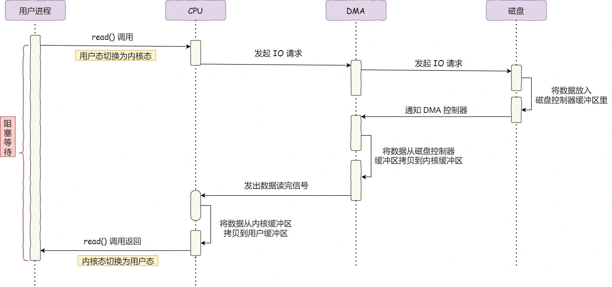

具体过程：

- 用户进程调用 read 方法，向操作系统发出 I/O 请求，请求读取数据到自己的内存缓冲区中，进程进入阻塞状态；
- 操作系统收到请求后，进一步将 I/O 请求发送 DMA，然后让 CPU 执行其他任务；
- DMA 进一步将 I/O 请求发送给磁盘；
- 磁盘收到 DMA 的 I/O 请求，把数据从磁盘读取到磁盘控制器的缓冲区中，当磁盘控制器的缓冲区被读满后，向 DMA 发起中断信号，告知自己缓冲区已满；
- **DMA 收到磁盘的信号，将磁盘控制器缓冲区中的数据拷贝到内核缓冲区中，此时不占用 CPU，CPU 可以执行其他任务**；
- 当 DMA 读取了足够多的数据，就会发送中断信号给 CPU；
- CPU 收到 DMA 的信号，知道数据已经准备好，于是将数据从内核拷贝到用户空间，系统调用返回；

可以看到， 整个数据传输的过程，CPU 不再参与数据搬运的工作，而是全程由 DMA 完成，但是 CPU 在这个过程中也是必不可少的，因为传输什么数据，从哪里传输到哪里，都需要 CPU 来告诉 DMA 控制器。

早期 DMA 只存在在主板上，如今由于 I/O 设备越来越多，数据传输的需求也不尽相同，所以每个 I/O 设备里面都有自己的 DMA 控制器。

**传统IO流程**

**流程图如下：**

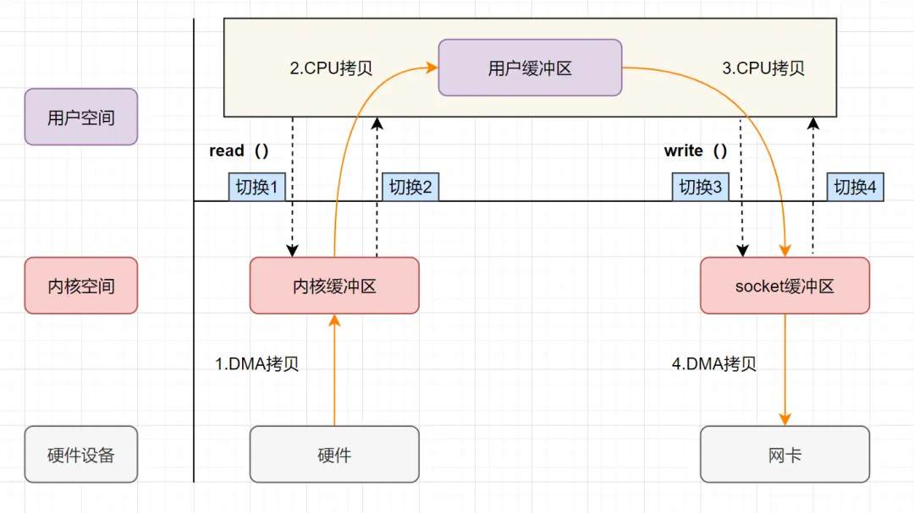

- 用户应用进程调用read函数，向操作系统发起IO调用，**上下文从用户态转为内核态（切换1）**
- DMA控制器把数据从磁盘中，读取到内核缓冲区。
- CPU把内核缓冲区数据，拷贝到用户应用缓冲区，**上下文从内核态转为用户态（切换2）**，read函数返回
- 用户应用进程通过write函数，发起IO调用，**上下文从用户态转为内核态（切换3）**
- CPU将应用缓冲区中的数据，拷贝到socket缓冲区
- DMA控制器把数据从socket缓冲区，拷贝到网卡设备，**上下文从内核态切换回用户态（切换4）**，write函数返回

从流程图可以看出，传统IO的读写流程，包括了4次上下文切换（4次用户态和内核态的切换），4次数据拷贝（**两次CPU拷贝以及两次的DMA拷贝**)。

**mmap+write实现的零拷贝**

mmap 的函数原型如下：

```
void *mmap(void *addr, size_t length, int prot, int flags, int fd, off_t offset);
```

- addr：指定映射的虚拟内存地址
- length：映射的长度
- prot：映射内存的保护模式
- flags：指定映射的类型
- fd:进行映射的文件句柄
- offset:文件偏移量

mmap使用了**虚拟内存**，可以把内核空间和用户空间的虚拟地址映射到同一个物理地址，从而减少数据拷贝次数！

`mmap+write`实现的零拷贝流程如下：

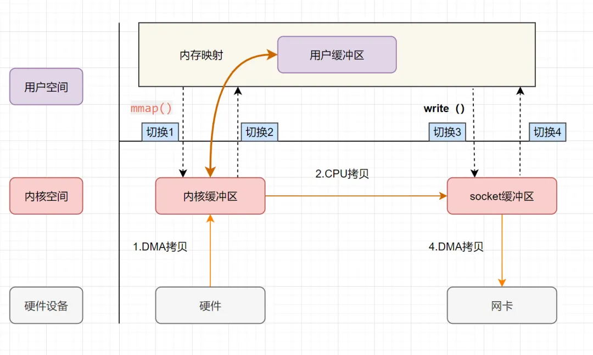

- 用户进程通过 `mmap方法`向操作系统内核发起IO调用，**上下文从用户态切换为内核态**。
- CPU利用DMA控制器，把数据从硬盘中拷贝到内核缓冲区。
- **上下文从内核态切换回用户态**，mmap方法返回。
- 用户进程通过 `write`方法向操作系统内核发起IO调用，**上下文从用户态切换为内核态**。
- CPU将内核缓冲区的数据拷贝到的socket缓冲区。
- CPU利用DMA控制器，把数据从socket缓冲区拷贝到网卡，**上下文从内核态切换回用户态**，write调用返回。

可以发现，`mmap+write`实现的零拷贝，I/O发生了**4**次用户空间与内核空间的上下文切换，以及3次数据拷贝。其中3次数据拷贝中，包括了**2次DMA拷贝和1次CPU拷贝**。

`mmap`是将读缓冲区的地址和用户缓冲区的地址进行映射，内核缓冲区和应用缓冲区共享，所以节省了一次CPU拷贝‘’并且用户进程内存是**虚拟的**，只是**映射**到内核的读缓冲区，可以节省一半的内存空间。

**sendfile实现的零拷贝**

`sendfile`是Linux2.1内核版本后引入的一个系统调用函数，API如下：

```
ssize_t sendfile(int out_fd, int in_fd, off_t *offset, size_t count);
```

- out_fd:为待写入内容的文件描述符，一个socket描述符。，
- in_fd:为待读出内容的文件描述符，必须是真实的文件，不能是socket和管道。
- offset：指定从读入文件的哪个位置开始读，如果为NULL，表示文件的默认起始位置。
- count：指定在fdout和fdin之间传输的字节数。

sendfile表示在两个文件描述符之间传输数据，它是在**操作系统内核**中操作的，**避免了数据从内核缓冲区和用户缓冲区之间的拷贝操作**，因此可以使用它来实现零拷贝。

sendfile实现的零拷贝流程如下：

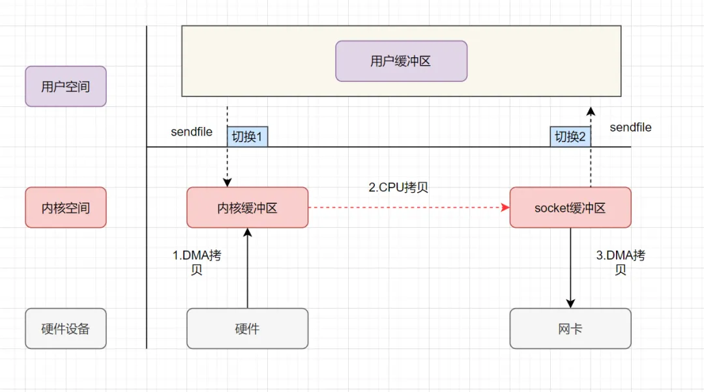

sendfile实现的零拷贝

1. 用户进程发起sendfile系统调用，**上下文（切换1）从用户态转向内核态**
2. DMA控制器，把数据从硬盘中拷贝到内核缓冲区。
3. CPU将读缓冲区中数据拷贝到socket缓冲区
4. DMA控制器，异步把数据从socket缓冲区拷贝到网卡，
5. **上下文（切换2）从内核态切换回用户态**，sendfile调用返回。

可以发现，`sendfile`实现的零拷贝，I/O发生了**2**次用户空间与内核空间的上下文切换，以及3次数据拷贝。其中3次数据拷贝中，包括了**2次DMA拷贝和1次CPU拷贝**。那能不能把CPU拷贝的次数减少到0次呢？有的，即 `带有DMA收集拷贝功能的sendfile`！

**sendfile+DMA scatter/gather实现的零拷贝**

linux 2.4版本之后，对 `sendfile`做了优化升级，引入SG-DMA技术，其实就是对DMA拷贝加入了 `scatter/gather`操作，它可以直接从内核空间缓冲区中将数据读取到网卡。使用这个特点搞零拷贝，即还可以多省去**一次CPU拷贝**。

sendfile+DMA scatter/gather实现的零拷贝流程如下：

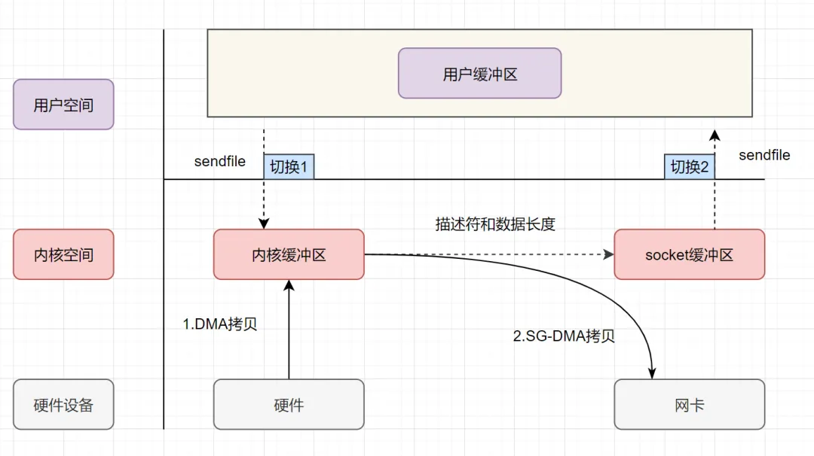

1. 用户进程发起sendfile系统调用，**上下文（切换1）从用户态转向内核态**
2. DMA控制器，把数据从硬盘中拷贝到内核缓冲区。
3. CPU把内核缓冲区中的**文件描述符信息**（包括内核缓冲区的内存地址和偏移量）发送到socket缓冲区
4. DMA控制器根据文件描述符信息，直接把数据从内核缓冲区拷贝到网卡
5. **上下文（切换2）从内核态切换回用户态**，sendfile调用返回。

可以发现，`sendfile+DMA scatter/gather`实现的零拷贝，I/O发生了**2**次用户空间与内核空间的上下文切换，以及2次数据拷贝。其中2次数据拷贝都是包**DMA拷贝**。这就是真正的 **零拷贝（Zero-copy)** 技术，全程都没有通过CPU来搬运数据，所有的数据都是通过DMA来进行传输的。

 **Java NIO零拷贝**

在 Java NIO 中的**通道（Channel）\**就相当于操作系统的\**内核空间**（kernel space）的缓冲区，而**缓冲区**（Buffer）对应的相当于操作系统的**用户空间**（user space）中的**用户缓冲区**（user buffer）。

- **通道**（Channel）是全双工的（双向传输），它既可能是读缓冲区（read buffer），也可能是网络缓冲区（socket buffer）。
- **缓冲区**（Buffer）分为堆内存（HeapBuffer）和堆外内存（DirectBuffer），这是通过 malloc() 分配出来的用户态内存。

堆外内存（DirectBuffer）在使用后需要应用程序手动回收，而堆内存（HeapBuffer）的数据在 GC 时可能会被自动回收。因此，在使用 HeapBuffer 读写数据时，为了避免缓冲区数据因为 GC 而丢失，NIO 会先把 HeapBuffer 内部的数据拷贝到一个临时的 DirectBuffer 中的本地内存（native memory），这个拷贝涉及到 `sun.misc.Unsafe.copyMemory()` 的调用，背后的实现原理与 `memcpy()` 类似。 最后，将临时生成的 DirectBuffer 内部的数据的内存地址传给 I/O 调用函数，这样就避免了再去访问 Java 对象处理 I/O 读写。

1️⃣ **MappedByteBuffer** 是 NIO 基于**内存映射（mmap）**这种零拷贝方式的提供的一种实现，它继承自 ByteBuffer。FileChannel 定义了一个 map() 方法，它可以把一个文件从 position 位置开始的 size 大小的区域映射为内存映像文件。

2️⃣ **DirectByteBuffer** 的对象引用位于 Java 内存模型的堆里面，JVM 可以对 DirectByteBuffer 的对象进行内存分配和回收管理，一般使用 DirectByteBuffer 的静态方法 allocateDirect() 创建 DirectByteBuffer 实例并分配内存。

3️⃣ **FileChannel** 是一个用于文件读写、映射和操作的通道，同时它在并发环境下是线程安全的，基于 FileInputStream、FileOutputStream 或者 RandomAccessFile 的 getChannel() 方法可以创建并打开一个文件通道。FileChannel 定义了 transferFrom() 和 transferTo() 两个抽象方法，它通过在通道和通道之间建立连接实现数据传输的。

### 进程和线程的区别

👨‍💻**面试官**: 好的！我明白了！那你再说一下： **进程和线程的区别**。

🙋 **我：** 好的！ 下图是 Java 内存区域，我们从 JVM 的角度来说一下线程和进程之间的关系吧！

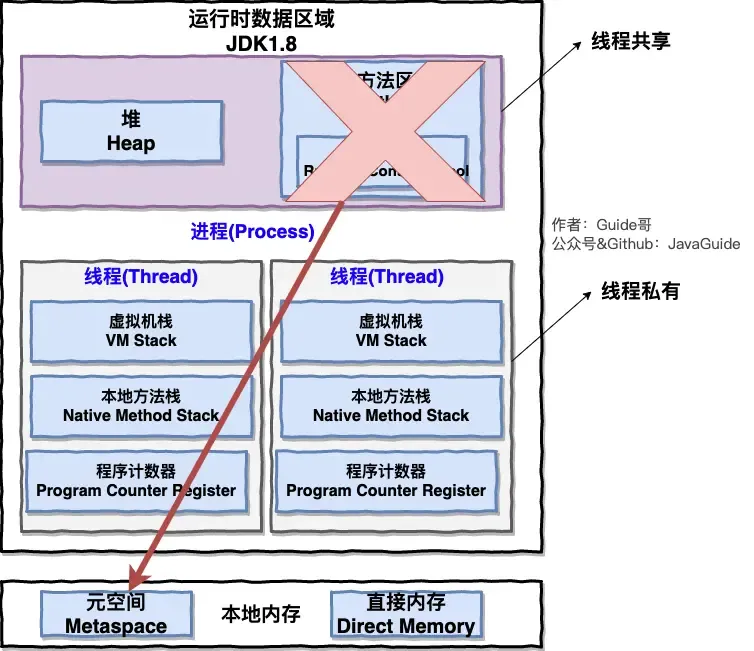

从上图可以看出：一个进程中可以有多个线程，多个线程共享进程的**堆**和**方法区 (JDK1.8 之后的元空间)\*\*资源，但是每个线程有自己的\*\*程序计数器**、**虚拟机栈** 和 **本地方法栈**。

**总结：** 线程是进程划分成的更小的运行单位,一个进程在其执行的过程中可以产生多个线程。线程和进程最大的不同在于基本上各进程是独立的，而各线程则不一定，因为同一进程中的线程极有可能会相互影响。线程执行开销小，但不利于资源的管理和保护；而进程正相反

> 哪些资源是线程共享的，哪些是线程独占的？(2022字节提前批)

线程共享全局变量，独占局部变量

> 使用线程有哪些好处？

上下文切换代价小，通信方便

> 使用线程有哪些坏处？

资源同步麻烦，容易出错

> 进程有哪些同步的机制？

临界区、互斥、信号量、事件

### 协程的实现原理？无栈协程和有栈协程？独立栈和共享栈？

协程本质是一个用户态的线程，通过跳转来实现

有栈协程把局部变量放在新开的空间上，无栈协程直接使用系统栈使得CPU cache局部性更好，同时也使得无栈协程的中断和函数返回几乎没有区别

通过独立栈实现的协程库中的每一个协程都有自己独立的栈空间，协程栈大小固定且互不干扰。

通过共享栈实现的协程库中的每一个协程在运行时都使用一个公共的栈空间，当协程挂起时将自己的数据从共享栈拷贝到自己的独立栈，协程运行时又将数据从独立栈拷贝到共享栈运行

### 【高频】进程线程都怎么通信

👨‍💻**面试官** ：**进程间的通信常见的的有哪几种方式呢?**

🙋 **我** ：大概有 7 种常见的进程间的通信方式。

> 下面这部分总结参考了:[《进程间通信 IPC (InterProcess Communication)》](https://www.jianshu.com/p/c1015f5ffa74)

1. **管道/匿名管道(Pipes)** ：用于具有亲缘关系的父子进程间或者兄弟进程之间的通信。
2. **有名管道(Names Pipes)** : 匿名管道由于没有名字，只能用于亲缘关系的进程间通信。为了克服这个缺点，提出了有名管道。有名管道严格遵循**先进先出(first in first out)**。有名管道以磁盘文件的方式存在，可以实现本机任意两个进程通信。
3. **信号(Signal)** ：信号是一种比较复杂的通信方式，用于通知接收进程某个事件已经发生；
4. **消息队列(Message Queuing)** ：消息队列是消息的链表,具有特定的格式,存放在内存中并由消息队列标识符标识。管道和消息队列的通信数据都是先进先出的原则。与管道（无名管道：只存在于内存中的文件；命名管道：存在于实际的磁盘介质或者文件系统）不同的是消息队列存放在内核中，只有在内核重启(即，操作系统重启)或者显式地删除一个消息队列时，该消息队列才会被真正的删除。消息队列可以实现消息的随机查询,消息不一定要以先进先出的次序读取,也可以按消息的类型读取.比 FIFO 更有优势。**消息队列克服了信号承载信息量少，管道只能承载无格式字 节流以及缓冲区大小受限等缺点。**
5. **信号量(Semaphores)** ：信号量是一个计数器，用于多进程对共享数据的访问，信号量的意图在于进程间同步。这种通信方式主要用于解决与同步相关的问题并避免竞争条件。
6. **共享内存(Shared memory)** ：使得多个进程可以访问同一块内存空间，不同进程可以及时看到对方进程中对共享内存中数据的更新。这种方式需要依靠某种同步操作，如互斥锁和信号量等。可以说这是最有用的进程间通信方式。
7. **套接字(Sockets)** : 此方法主要用于在客户端和服务器之间通过网络进行通信。套接字是支持 TCP/IP 的网络通信的基本操作单元，可以看做是不同主机之间的进程进行双向通信的端点，简单的说就是通信的两方的一种约定，用套接字中的相关函数来完成通信过程。

### 线程之间如何实现通信，有没有用到过？ （2022字节）

管道，信号量，共享内存，消息队列，套接字通信

### 进程上下文切换做了哪些事？流程是怎么样的？（2022字节）

保存虚拟内存，栈，寄存器，程序计数器等

进程上下文切换是指操作系统从一个进程转换到另一个进程时，需要将当前进程的上下文（也称进程控制块）保存起来，并恢复下一个进程的上下文，以保证程序能够正确运行。

进程的上下文包括了进程的所有状态信息，包括进程的程序计数器、寄存器、内存映像、文件打开表、内核栈、进程ID等等。在进程上下文切换过程中，操作系统需要完成以下几个步骤：

1. 保存当前进程的上下文

当操作系统需要切换进程时，会先将当前进程的所有寄存器、程序计数器、内存映像等状态信息保存到该进程对应的进程控制块中。这样，在下一次执行该进程时，就可以恢复到之前的状态继续执行。

2. 执行进程调度

操作系统会从就绪队列中选择一个新的进程，将其设置为当前进程，并将该进程的上下文从进程控制块中恢复。

3. 恢复新进程的上下文

操作系统会将新进程的所有寄存器、程序计数器、内存映像等状态信息从进程控制块中恢复，并将其设置为当前进程。这样，新进程就可以从上次执行的状态继续执行下去。

4. 切换内核栈

每个进程都有自己的内核栈，用于保存内核态的函数调用栈。在进程切换时，操作系统还需要切换内核栈，以保证当前进程和新进程都能正常使用自己的内核栈。

5. 恢复用户态执行

进程切换完成后，操作系统会将控制权交还给用户态，让新进程开始执行用户态的程序。

总体来说，进程上下文切换是操作系统进行多任务调度和资源管理的重要手段。它的流程是一个比较复杂的过程，需要保存和恢复大量的状态信息，所以需要消耗一定的时间和资源。在实际应用中，为了提高系统的性能，需要尽可能地减少进程上下文切换的次数。

> 进程在哪些场景会进行上下文切换？

时间片到了，IO 堵塞

进程上下文切换是指从一个进程切换到另一个进程时，需要保存当前进程的上下文，恢复另一个进程的上下文的过程。进程上下文切换通常发生在以下几种情况：

1. 时间片轮转

在时间片轮转调度算法中，操作系统将每个进程分配一个固定的时间片，在时间片用完后，操作系统将该进程挂起并保存其上下文，并执行下一个就绪的进程。这个过程涉及到进程上下文的切换。

2. I/O操作

当一个进程执行I/O操作时，I/O设备的处理速度比CPU快，所以进程会等待I/O操作完成，此时操作系统会挂起该进程并执行其他进程。当I/O操作完成后，操作系统将该进程恢复并继续执行，这个过程也涉及到进程上下文的切换。

3. 多进程协作

在多进程协作的应用程序中，不同进程之间需要进行通信和同步。当一个进程需要等待另一个进程的信号或消息时，操作系统会挂起该进程并执行其他进程。当等待的事件发生后，操作系统会将该进程恢复并继续执行，这个过程也需要进程上下文的切换。

4. 系统调用

当一个进程执行系统调用时，操作系统会将进程从用户态切换到内核态，并将进程的上下文保存在内核栈中。在系统调用执行完毕后，操作系统会将进程从内核态切换回用户态，并恢复进程的上下文，这个过程也需要进程上下文的切换。

> 上下文切换为什么资源消耗会比较高？消耗在什么地方？

虚拟内存、栈、全局变量等用户空间的资源，还包括了内核堆栈、寄存器等内核空间的资源。

上面哪个资源的切换效率更低？

虚拟内存

为什么虚拟内存的切换效率更低？

因为切换后 TLB 无法被命中

### 进程的状态（2022字节）

👨‍💻**面试官** ： 那你再说说**进程有哪几种状态?**

🙋 **我** ：我们一般把进程大致分为 5 种状态，这一点和[线程](https://github.com/Snailclimb/JavaGuide/blob/master/docs/java/Multithread/JavaConcurrencyBasicsCommonInterviewQuestionsSummary.md#6-说说线程的生命周期和状态)

很像！

- **创建状态(new)** ：进程正在被创建，尚未到就绪状态。
- **就绪状态(ready)** ：进程已处于准备运行状态，即进程获得了除了处理器之外的一切所需资源，一旦得到处理器资源(处理器分配的时间片)即可运行。
- **运行状态(running)** ：进程正在处理器上上运行(单核 CPU 下任意时刻只有一个进程处于运行状态)。
- **阻塞状态(waiting)** ：又称为等待状态，进程正在等待某一事件而暂停运行如等待某资源为可用或等待 IO 操作完成。即使处理器空闲，该进程也不能运行。
- **结束状态(terminated)** ：进程正在从系统中消失。可能是进程正常结束或其他原因中断退出运行。

> 订正：下图中 running 状态被 interrupt 向 ready 状态转换的箭头方向反了。


### 了解操作系统的锁吗？讲讲操作系统实现锁的底层原理

在操作系统中，锁是一种同步机制，用于防止多个线程或进程同时访问共享资源而导致的数据竞争问题。在实现锁的底层原理中，最常见的方法是使用原子操作和硬件指令。

原子操作是指一组操作被看作是一个不可分割的操作单元，即这些操作要么全部执行成功，要么全部不执行，不能只执行其中的一部分。

在使用锁时，一般会有两种方式：自旋锁和互斥锁。自旋锁是一种忙等待的锁，即当线程尝试获取锁时，如果锁已被其他线程占用，则线程会不断地进行自旋等待，直到锁被释放。而互斥锁则是一种阻塞式的锁，即当线程尝试获取锁时，如果锁已被其他线程占用，则线程会被阻塞，直到锁被释放。

在底层实现中，自旋锁和互斥锁的实现方式也有所不同。自旋锁通常使用原子操作实现，而互斥锁通常使用信号量或者互斥量来实现，信号量或互斥量是由操作系统提供的一种同步机制，可以保证在任何时刻只有一个线程或进程可以访问共享资源。

总的来说，锁的实现底层原理涉及到操作系统的原子操作、硬件指令、信号量和互斥量等多方面的知识。

### 生产者和消费者模式怎么理解，举个例子

下面我们利用信号量和 PV 操作来解决经典的进程同步和互斥问题：生产者和消费者问题。

【问题描述】：系统中有一组生产者进程和一组消费者进程，生产者进程每次生产一个产品放入缓冲区，消费者进程每次从缓冲区中取出一个产品并使用。任何时刻，只能有一个生产者或消费者可以访问缓冲区。

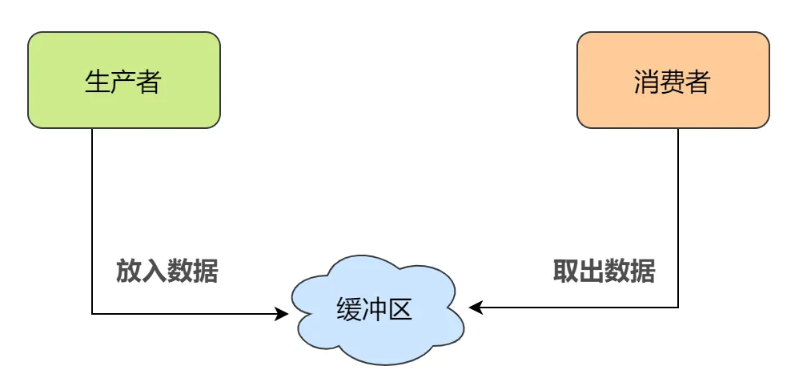

由题可知，生产者、消费者共享一个初始为空、大小为 n 的缓冲区，我们从题目中提炼出同步与互斥关系：

- 同步关系 1：只有缓冲区没满时（优先级高），生产者才能把产品放入缓冲区（优先级低），否则必须等待
- 同步关系 2：只有缓冲区不空时（优先级高），消费者才能从中取出产品（优先级低），否则必须等待
- 互斥关系：缓冲区是临界资源，各进程必须互斥地访问。

既然这个题目有两个同步关系和一个互斥关系，那么我们就需要两个同步信号量和一个互斥信号量：

- empty：同步信号量（对应同步关系 1），表示生产者还能生产多少，即还能放入缓冲区多少产品，该数量小于等于 0，则生产者不能进行生产。 初始化为 n。
- full：同步信号量（对应同步关系 2），表示消费者还能从缓冲区取出多少，即当前缓冲区已有产品的数量，该数量小于等于 0，则消费者不能进行读取。初始化为 0。
- mutex：互斥信号量，实现对缓冲区的互斥访问。初始化为 1。

代码如下，注意各个 PV 操作的配对：

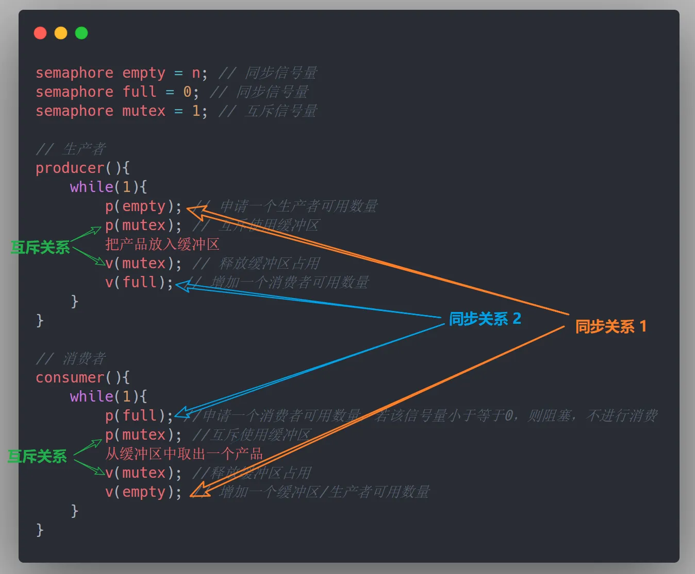

### 进程调度有哪些算法？（2022字节）

👨‍💻**面试官** ：**你知道操作系统中进程的调度算法有哪些吗?**

🙋 **我** ：嗯嗯！这个我们大学的时候学过，是一个很重要的知识点！

为了确定首先执行哪个进程以及最后执行哪个进程以实现最大 CPU 利用率，计算机科学家已经定义了一些算法，它们是：

- **先到先服务(FCFS)调度算法** : 从就绪队列中选择一个最先进入该队列的进程为之分配资源，使它立即执行并一直执行到完成或发生某事件而被阻塞放弃占用 CPU 时再重新调度。
- **短作业优先(SJF)的调度算法** : 从就绪队列中选出一个估计运行时间最短的进程为之分配资源，使它立即执行并一直执行到完成或发生某事件而被阻塞放弃占用 CPU 时再重新调度。
- **时间片轮转调度算法** : 时间片轮转调度是一种最古老，最简单，最公平且使用最广的算法，又称 RR(Round robin)调度。每个进程被分配一个时间段，称作它的时间片，即该进程允许运行的时间。
- **多级反馈队列调度算法** ：前面介绍的几种进程调度的算法都有一定的局限性。如**短进程优先的调度算法，仅照顾了短进程而忽略了长进程** 。多级反馈队列调度算法既能使高优先级的作业得到响应又能使短作业（进程）迅速完成。，因而它是目前**被公认的一种较好的进程调度算法**，UNIX 操作系统采取的便是这种调度算法。
- **优先级调度** ： 为每个流程分配优先级，首先执行具有最高优先级的进程，依此类推。具有相同优先级的进程以 FCFS 方式执行。可以根据内存要求，时间要求或任何其他资源要求来确定优先级。

细分

---

**批处理系统**

<details open="">
<summary>先来先服务 first-come first-serverd（FCFS）</summary>
<p dir="auto">按照请求的顺序进行调度。非抢占式，开销小，无饥饿问题，响应时间不确定（可能很慢）；</p>
<p dir="auto">对短进程不利，对IO密集型进程不利。</p>
</details>

<details open="">
<summary>最短作业优先 shortest job first（SJF）</summary>
<p dir="auto">按估计运行时间最短的顺序进行调度。非抢占式，吞吐量高，开销可能较大，可能导致饥饿问题；</p>
<p dir="auto">对短进程提供好的响应时间，对长进程不利。</p>
</details>

<details open="">
<summary>最短剩余时间优先 shortest remaining time next（SRTN）</summary>
<p dir="auto">按剩余运行时间的顺序进行调度。(最短作业优先的抢占式版本)。吞吐量高，开销可能较大，提供好的响应时间；</p>
<p dir="auto">可能导致饥饿问题，对长进程不利。</p>
</details>

<details open="">
<summary>最高响应比优先 Highest Response Ratio Next（HRRN）</summary>
<p dir="auto">响应比 = 1+ 等待时间/处理时间。同时考虑了等待时间的长短和估计需要的执行时间长短，很好的平衡了长短进程。非抢占，吞吐量高，开销可能较大，提供好的响应时间，无饥饿问题。</p>
</details>

**交互式系统**
交互式系统有大量的用户交互操作，在该系统中调度算法的目标是快速地进行响应。

<details open="">
<summary>时间片轮转 Round Robin</summary>
<p dir="auto">将所有就绪进程按 FCFS 的原则排成一个队列，用完时间片的进程排到队列最后。抢占式（时间片用完时），开销小，无饥饿问题，为短进程提供好的响应时间；</p>
<p dir="auto">若时间片小，进程切换频繁，吞吐量低；若时间片太长，实时性得不到保证。</p>
</details>

<details open="">
<summary>优先级调度算法</summary>
<p dir="auto">为每个进程分配一个优先级，按优先级进行调度。为了防止低优先级的进程永远等不到调度，可以随着时间的推移增加等待进程的优先级。</p>
</details>

<details open="">
<summary>多级反馈队列调度算法 Multilevel Feedback Queue</summary>
<p dir="auto">设置多个就绪队列1、2、3...，优先级递减，时间片递增。只有等到优先级更高的队列为空时才会调度当前队列中的进程。如果进程用完了当前队列的时间片还未执行完，则会被移到下一队列。</p>
<p dir="auto">抢占式（时间片用完时），开销可能较大，对IO型进程有利，可能会出现饥饿问题。</p>
</details>
### Linux 里进程通信有几种方式？

分为消息传递模型和共享内存模型

上文

### 进程同步有几种方式？（滴滴，2022字节）

👨‍💻**面试官** ：**那线程间的同步的方式有哪些呢?**

🙋 **我** ：线程同步是两个或多个共享关键资源的线程的并发执行。应该同步线程以避免关键的资源使用冲突。操作系统一般有下面三种线程同步的方式：

1. **互斥量(Mutex)**：采用互斥对象机制，只有拥有互斥对象的线程才有访问公共资源的权限。因为互斥对象只有一个，所以可以保证公共资源不会被多个线程同时访问。比如 Java 中的 synchronized 关键词和各种 Lock 都是这种机制。
2. **信号量(Semaphore)** ：它允许同一时刻多个线程访问同一资源，但是需要控制同一时刻访问此资源的最大线程数量。
3. **事件(Event)** :Wait/Notify：通过通知操作的方式来保持多线程同步，还可以方便的实现多线程优先级的比较操作。

### 孤儿进程和僵尸进程的区别？

**孤儿进程**：一个父进程退出，而它的一个或多个子进程还在运行，那么那些子进程将成为孤儿进程。孤儿进程将被init进程(进程号为1)所收养，并由init进程对它们完成状态收集工作。

**僵尸进程**：一个进程使用fork创建子进程，如果子进程退出，而父进程并没有调用wait或waitpid获取子进程的状态信息，那么子进程的进程描述符仍然保存在系统中。这种进程称之为僵尸进程。

### 什么是虚拟内存（虾皮）

`虚拟内存，是虚拟出来的内存，它的核心思想就是确保每个程序拥有自己的地址空间，地址空间被分成多个块，每一块都有连续的地址空间。同时物理空间也分成多个块，块大小和虚拟地址空间的块大小一致，操作系统会自动将虚拟地址空间映射到物理地址空间，程序只需关注虚拟内存，请求的也是虚拟内存，真正使用却是物理内存。`

现代操作系统使用**虚拟内存**，即虚拟地址取代物理地址，使用虚拟内存可以有2个好处：

- 虚拟内存空间可以远远大于物理内存空间
- 多个虚拟内存可以指向同一个物理地址

零拷贝实现思想，就利用了**虚拟内存**这个点：多个虚拟内存可以指向同一个物理地址，可以把内核空间和用户空间的虚拟地址映射到同一个物理地址，这样的话，就可以减少IO的数据拷贝次数啦，示意图如下：


### 了解死锁吗？（2022番茄小说）

如果系统中以下四个条件同时成立，那么就能引起死锁：

- **互斥**：资源必须处于非共享模式，即一次只有一个进程可以使用。如果另一进程申请该资源，那么必须等待直到该资源被释放为止。
- **占有并等待**：一个进程至少应该占有一个资源，并等待另一资源，而该资源被其他进程所占有。
- **非抢占**：资源不能被抢占。只能在持有资源的进程完成任务后，该资源才会被释放。
- **循环等待**：有一组等待进程 `{P0, P1,..., Pn}`， `P0` 等待的资源被 `P1` 占有，`P1` 等待的资源被 `P2` 占有，......，`Pn-1` 等待的资源被 `Pn` 占有，`Pn` 等待的资源被 `P0` 占有。

注意，只有四个条件同时成立时，死锁才会出现。

> 平时遇到过死锁吗，怎么解决的

- 收集死锁信息：
  1. 利用命令 `SHOW ENGINE INNODB STATUS`查看死锁原因。
  2. 调试阶段开启 innodb_print_all_deadlocks，收集所有死锁日志。
- 减少死锁：
  1. 使用事务，不使用 `lock tables` 。
  2. 保证没有长事务。
  3. 操作完之后立即提交事务，特别是在交互式命令行中。
  4. 如果在用 `(SELECT ... FOR UPDATE or SELECT ... LOCK IN SHARE MODE)`，尝试降低隔离级别。
  5. 修改多个表或者多个行的时候，`将修改的顺序保持一致`。
  6. 创建索引，可以使创建的锁更少。
  7. 最好不要用 `(SELECT ... FOR UPDATE or SELECT ... LOCK IN SHARE MODE)`。
  8. 如果上述都无法解决问题，那么尝试使用 `lock tables t1, t2, t3` 锁多张表

### select、poll、epoll？（2022字节提前批）


### epoll的两种触发模式？（2022字节提前批）

level 模式：该模式就是只要还有没有处理的事件就会一直通知
edge 模式：该模式是当状态发生变化时才会通知

### 为什么要用虚拟内存？（2022字节提前批、2022蔚来提前批）

1. 将主存当作辅存的高速缓存，经常活动的东西放在主存中，就像 GTA5 几十 GB 大的东西都放主存中是放不下的，因此可以高效利用主存
2. 每个进程地址空间都一样，方便管理
3. 避免进程破坏其他进程的地址空间

- 虚拟内存空间可以远远大于物理内存空间
- 多个虚拟内存可以指向同一个物理地址

ps：思考虚拟内存和交换空间的区别？

### 虚拟地址映射为物理地址的过程？（2022字节提前批）

❶ 直接映射


直接映射是页表缓存映射（TLB）的一种实现方式，它使用一个简单的哈希函数将虚拟页号映射到 TLB 中的一个条目。

下面是直接映射的过程：

1. CPU 发出一个虚拟地址请求。
2. MMU 中的地址转换部分从虚拟地址中获取页号。
3. MMU 使用哈希函数将页号映射到 TLB 中的一个条目。
4. 如果 TLB 中存在该条目，则 MMU 直接从该条目中获取物理地址，并将其传递给存储器系统进行访问。
5. 如果 TLB 中不存在该条目，则 MMU 发送一个缺页异常（Page Fault Exception）给操作系统。
6. 操作系统从磁盘中读取缺失的页面并将其加载到物理内存中。
7. 操作系统更新页表并将缺失的页表项写入到 TLB 中。
8. MMU 重新执行地址转换，并从更新后的 TLB 条目中获取物理地址。
9. MMU 将物理地址传递给存储器系统进行访问，并将访问结果返回给 CPU。

直接映射的主要优点是实现简单，速度较快，但缺点是容易出现冲突，因为多个虚拟页号可能会被映射到同一个 TLB 条目中。这会导致 TLB 中的某些条目被频繁替换，从而降低缓存命中率。为了解决这个问题，还可以使用其他的页表缓存映射方案，如全相联映射或组相联映射。

❷ 使用页表缓存映射

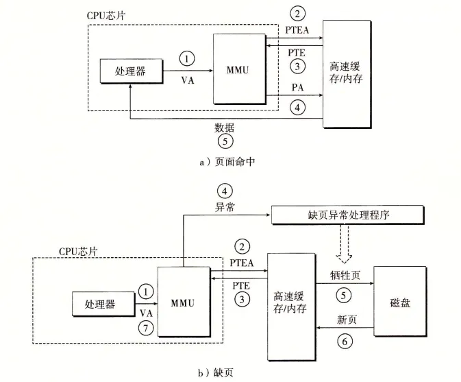

1. 应用程序生成虚拟地址。
2. 虚拟地址被传递给 CPU 中的内存管理单元（MMU）。
3. MMU 中的地址转换部分将虚拟地址的页号与页表中的页表项进行匹配。
4. 如果页表项中存在物理地址，则将页表项中的物理地址与虚拟地址中的页内偏移量组合成最终的物理地址。
5. 如果页表项不存在，则引发页错误（Page Fault），操作系统需要从磁盘中将该页调入物理内存，更新页表，然后再次尝试访问该地址。
6. 最终的物理地址被传递给存储器系统，从而访问所需的数据或指令。

在这个过程中，CPU 通过 MMU 来进行地址转换，把应用程序中使用的虚拟地址转换为实际的物理地址。MMU 实现地址转换的方式是通过页表来进行的，页表是由操作系统维护的数据结构，它记录了虚拟地址与物理地址的对应关系。

❸ 使用 TLB 映射

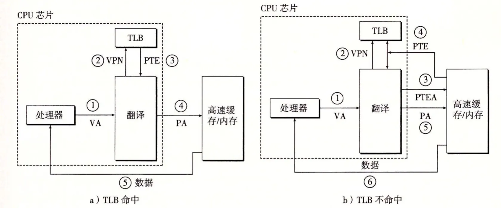


使用 TLB 映射的过程包括以下步骤：

1. CPU 发出一个虚拟地址请求。
2. MMU 中的地址转换部分从虚拟地址中获取页号。
3. MMU 在 TLB 中查找与该虚拟页号对应的物理页号，并检查 TLB 是否命中。
4. 如果 TLB 命中，则 MMU 直接从 TLB 中获取该虚拟地址对应的物理地址，并将其传递给存储器系统进行访问。
5. 如果 TLB 未命中，则 MMU 发送一个缺页异常（Page Fault Exception）给操作系统。
6. 操作系统从磁盘中读取缺失的页面并将其加载到物理内存中。
7. 操作系统更新页表并将缺失的页表项写入到 TLB 中。
8. MMU 重新执行地址转换，并从更新后的 TLB 条目中获取物理地址。
9. MMU 将物理地址传递给存储器系统进行访问，并将访问结果返回给 CPU。

使用 TLB 映射的主要优点是可以加快虚拟地址到物理地址的转换速度，因为 TLB 中存储的是最近访问过的页表项，可以直接获取物理地址，而不需要再去访问内存中的页表。这可以显著降低转换的延迟，提高计算机系统的整体性能。此外，由于 TLB 可以缓存最近访问过的页表项，因此它还可以减少内存带宽的占用，从而使计算机系统更加高效地利用资源。

### 用户态和内核态切换都做了什么？（2022蔚来）

在计算机系统中，用户态和内核态是操作系统中的两种运行模式。当应用程序运行时，它们运行在用户态，而当操作系统内核执行时，它们运行在内核态。在这两种模式之间进行切换时，需要执行以下操作：

1. 用户态到内核态切换

当应用程序需要执行需要特权级别的操作时，例如系统调用、中断处理、异常处理等，需要从用户态切换到内核态。切换的过程如下：

- 应用程序调用系统调用指令，将控制权转移到操作系统内核。
- 操作系统内核保存应用程序的上下文，包括 CPU 寄存器、程序计数器、堆栈指针等等。
- 操作系统内核执行需要特权级别的操作，例如处理系统调用请求。
- 操作系统内核将结果返回给应用程序。
- 操作系统内核恢复应用程序的上下文，并将控制权转移回应用程序。

2. 内核态到用户态切换

当操作系统内核执行完成，并需要将控制权返回给应用程序时，需要从内核态切换回用户态。切换的过程如下：

- 操作系统内核保存当前的内核上下文，包括 CPU 寄存器、程序计数器、堆栈指针等等。
- 操作系统内核将应用程序的上下文恢复回来。
- 操作系统内核返回到应用程序调用系统调用指令的位置。
- 应用程序继续执行。

在切换过程中，由于需要保存和恢复上下文，因此会带来一定的开销。为了减少这种开销，操作系统通常会尽可能地保持应用程序在用户态运行，只在必要时才切换到内核态执行需要特权级别的操作。

### 为什么有用户态和内核态（2022蔚来）

在计算机系统中，有用户态和内核态的存在主要是为了保证系统的安全性和稳定性。

用户态是指应用程序在执行过程中所处的一种状态，这种状态下应用程序只能访问自己的内存空间，无法访问操作系统内核或其他进程的内存空间。这种限制有助于防止应用程序越权访问系统资源，保证了系统的安全性。

内核态是指操作系统内核在执行过程中所处的一种状态，这种状态下操作系统内核可以访问系统的所有资源，包括硬件设备、系统内存、进程信息等等。操作系统内核的特权级别高于应用程序，这使得操作系统内核可以执行一些需要特殊权限的操作，例如管理系统资源、调度进程、处理中断等等。这种特权级别的限制可以保证操作系统内核的稳定性，防止应用程序对操作系统的影响。

通过将系统分为用户态和内核态两种运行模式，可以实现对系统资源的严格管理和控制，从而保证了系统的安全性和稳定性。同时，这种限制也能够促进操作系统和应用程序之间的分离，使得操作系统的设计更加清晰和模块化，有利于系统的可维护性和可扩展性。

### 用户态和内核态的地址空间区别（2022蔚来）

用户态和内核态的地址空间通常是分开的，这是为了保证系统的安全性和稳定性。下面是它们的主要区别：

1. 用户态地址空间

用户态地址空间是指应用程序运行时所能访问的内存空间。它通常被分为几个不同的区域，包括：

- 代码段：用于存放应用程序的可执行代码。
- 数据段：用于存放应用程序的全局变量和静态变量。
- 堆区：用于存放动态分配的内存空间，由应用程序自己管理。
- 栈区：用于存放函数的局部变量和函数调用的上下文信息，由系统自动管理。

用户态地址空间通常是被限制在应用程序自身的内存空间中，无法访问操作系统内核或其他进程的内存空间。这种限制有助于防止应用程序越权访问系统资源，保证了系统的安全性。

1. 内核态地址空间

内核态地址空间是指操作系统内核所能访问的内存空间。它通常包括：

- 内核代码段：用于存放操作系统内核的可执行代码。
- 内核数据段：用于存放操作系统内核的全局变量和静态变量。
- 内核堆区：用于存放动态分配的内存空间，由操作系统内核自己管理。
- 内核栈区：用于存放内核函数的局部变量和函数调用的上下文信息，由系统自动管理。

内核态地址空间通常包括整个系统的所有内存空间，操作系统内核可以访问任何进程的内存空间，包括应用程序和其他进程。由于操作系统内核有特权级别更高的权限，因此它可以执行一些需要特殊权限的操作，例如管理系统资源、调度进程、处理中断等等。这种特权级别的限制可以保证操作系统内核的稳定性，防止应用程序对操作系统的影响。

### 内存4个G，虚拟内存8个G，数据存在哪（2022蔚来）

在这种情况下，数据可以同时存在于物理内存和虚拟内存中，具体取决于进程的需求和操作系统的管理方式。

操作系统通过虚拟内存技术将进程的虚拟地址空间映射到物理内存或磁盘交换文件中，以提供更大的可用地址空间。当进程需要访问某个虚拟地址时，操作系统会先查找该地址对应的物理地址是否已经在内存中，如果没有则将其从磁盘交换文件中读入内存。如果物理内存已经被占用，则操作系统会使用页面置换算法将某些不常用的页置换到磁盘交换文件中，以腾出物理内存空间来存储新的数据。

因此，当进程访问的数据位于已经被加载到物理内存中的页面时，数据存在于物理内存中。当进程访问的数据位于尚未被加载到物理内存中的页面时，数据存在于磁盘交换文件中。无论数据存在于物理内存还是磁盘交换文件中，操作系统都会负责将其正确地映射到进程的虚拟地址空间中。

### 什么样的内存访问是效率最高的（2022蔚来）

在现代计算机中，缓存是提高内存访问效率的关键。因此，对于访问效率最高的内存访问模式，应该是能够最大程度利用 CPU 缓存的访问模式。

具体而言，以下几种内存访问模式通常具有较高的效率：

1. 顺序访问：顺序访问是指程序按顺序访问内存中的数据，例如遍历数组、循环访问连续内存块等。由于顺序访问的内存访问模式具有良好的空间局部性和时间局部性，能够利用 CPU 缓存的预取和缓存行填充机制，因此访问效率较高。
2. 向量化访问：向量化访问是指程序以向量的形式同时访问多个内存位置的数据，例如使用 SSE、AVX 等 SIMD 指令集进行计算。由于向量化访问能够充分利用 CPU 的 SIMD 并行计算能力，以及 CPU 缓存的高速预取和填充机制，因此具有很高的访问效率。

### 页面置换算法有哪些（2022蔚来）

👨‍💻**面试官** ：虚拟内存管理很重要的一个概念就是页面置换算法。那你说一下 **页面置换算法的作用?常见的页面置换算法有哪些?**

🙋 **我** ：

> 这个题目经常作为笔试题出现，网上已经给出了很不错的回答，我这里只是总结整理了一下。

地址映射过程中，若在页面中发现所要访问的页面不在内存中，则发生缺页中断 。

> **缺页中断** 就是要访问的**页**不在主存，需要操作系统将其调入主存后再进行访问。 在这个时候，被内存映射的文件实际上成了一个分页交换文件。

当发生缺页中断时，如果当前内存中并没有空闲的页面，操作系统就必须在内存选择一个页面将其移出内存，以便为即将调入的页面让出空间。用来选择淘汰哪一页的规则叫做页面置换算法，我们可以把页面置换算法看成是淘汰页面的规则。

- **OPT 页面置换算法（最佳页面置换算法）** ：最佳(Optimal,  OPT)置换算法所选择的被淘汰页面将是以后永不使用的，或者是在最长时间内不再被访问的页面,这样可以保证获得最低的缺页率。但由于人们目前无法预知进程在内存下的若千页面中哪个是未来最长时间内不再被访问的，因而该算法无法实现。一般作为衡量其他置换算法的方法。
- **FIFO（First In First Out） 页面置换算法（先进先出页面置换算法）** : 总是淘汰最先进入内存的页面，即选择在内存中驻留时间最久的页面进行淘汰。
- **LRU （Least Recently Used）页面置换算法（最近最久未使用页面置换算法）** ：LRU 算法赋予每个页面一个访问字段，用来记录一个页面自上次被访问以来所经历的时间 T，当须淘汰一个页面时，选择现有页面中其 T 值最大的，即最近最久未使用的页面予以淘汰。
- **LFU （Least Frequently Used）页面置换算法（最少使用页面置换算法）** : 该置换算法选择在之前时期使用最少的页面作为淘汰页。

### 为什么页表一般是4KB - 16KB（2022蔚来）

#### 导语

我们都知道 Linux 会以页为单位管理内存，无论是将磁盘中的数据加载到内存中，还是将内存中的数据写回磁盘，操作系统都会以页面为单位进行操作，哪怕我们只向磁盘中写入一个字节的数据，我们也需要将整个页面中的全部数据刷入磁盘中。

Linux 同时支持正常大小的内存页和大内存页（Huge Page）[1](https://draveness.me/whys-the-design-linux-default-page/#fn:1)，绝大多数处理器上的内存页的默认大小都是 4KB，虽然部分处理器会使用 8KB、16KB 或者 64KB 作为默认的页面大小，但是 4KB 的页面仍然是操作系统默认内存页配置的主流；除了正常的内存页大小之外，不同的处理器上也包含不同大小的大页面，我们在 x86 处理器上就可以使用 2MB 的内存页。

4KB 的内存页其实是一个历史遗留问题，在上个世纪 80 年代确定的 4KB 一直保留到了今天。虽然今天的硬件比过去丰富了很多，但是我们仍然沿用了过去主流的内存页大小。如下图所示，装过机的人应该对这里的内存条非常熟悉：


在今天，4KB 的内存页大小可能不是最佳的选择，8KB 或者 16KB 说不定是更好的选择，但是这是过去在特定场景下做出的权衡。我们在这篇文章中不要过于纠结于 4KB 这个数字，应该更重视决定这个结果的几个因素，这样当我们在遇到类似场景时才可以从这些方面考虑当下最佳的选择，我们在这篇文章中会介绍以下两个影响内存页大小的因素，它们分别是：

- 过小的页面大小会带来较大的页表项增加寻址时 TLB（Translation lookaside buffer）的查找速度和额外开销；
- 过大的页面大小会浪费内存空间，造成内存碎片，降低内存的利用率；

上个世纪在设计内存页大小时充分考虑了上述的两个因素，最终选择了 4KB 的内存页作为操作系统最常见的页大小，我们接下来将详细介绍以上它们对操作系统性能的影响。

#### 页表项

 Linux 中的虚拟内存，每个进程能够看到的都是独立的虚拟内存空间，虚拟内存空间只是逻辑上的概念，进程仍然需要访问虚拟内存对应的物理内存，从虚拟内存到物理内存的转换就需要使用每个进程持有页表。

为了存储 64 位操作系统中 128 TiB 虚拟内存的映射数据，Linux 在 2.6.10 中引入了四层的页表辅助虚拟地址的转换，引入了五层的页表结构，在未来还可能会引入更多层的页表结构以支持 64 位的虚拟地址。

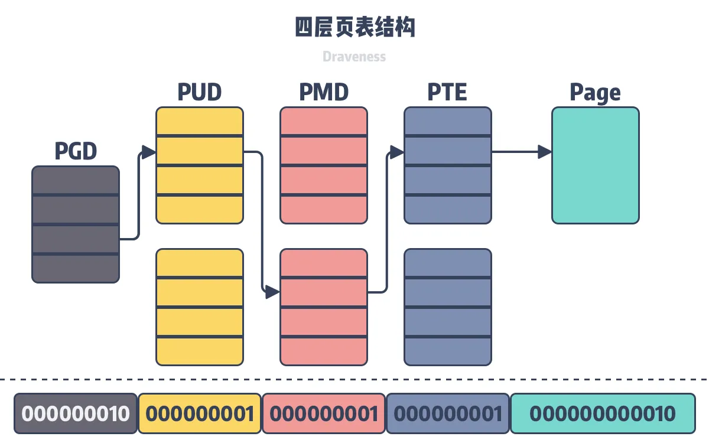

在如上图所示的四层页表结构中，操作系统会使用最低的 12 位作为页面的偏移量，剩下的 36 位会分四组分别表示当前层级在上一层中的索引，所有的虚拟地址都可以用上述的多层页表查找到对应的物理地址。

因为操作系统的虚拟地址空间大小都是一定的，整片虚拟地址空间被均匀分成了 N 个大小相同的内存页，所以内存页的大小最终会决定每个进程中页表项的层级结构和具体数量，虚拟页的大小越小，单个进程中的页表项和虚拟页也就越多。
$$
PagesCount=\frac{VirtualMemory}{PageSize}
$$
因为目前的虚拟页大小为 4096 字节，所以虚拟地址末尾的 12 位可以表示虚拟页中的地址，如果虚拟页的大小降到了 512 字节，那么原本的四层页表结构或者五层页表结构会变成五层或者六层，这不仅会增加内存访问的额外开销，还会增加每个进程中页表项占用的内存大小。

#### 碎片化

因为内存映射设备会在内存页的层面工作，所以操作系统认为内存分配的最小单元就是虚拟页。哪怕用户程序只是申请了 1 字节的内存，操作系统也会为它申请一个虚拟页，如下图所示，如果内存页的大小为 24KB，那么申请 1 字节的内存会浪费 ~99.9939% 的空间。

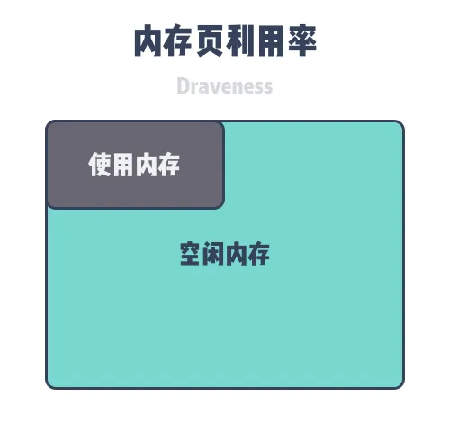

随着内存页大小的增加，内存的碎片化严情况会越来越严重，小的内存页会减少内存空间中的内存碎片，提高内存的利用率。上个世纪的内存资源还没有像今天这么丰富，在大多数情况下，内存都不是限制程序运行的资源，多数的在线服务都需要更多的CPU，而不是更多的内存。不过在上个世纪内存其实也是稀缺资源，所以提高稀缺资源的利用率是我们不得不考虑的事情：

上个世纪八九十年代的内存条只有 512KB 或者 2MB，价格也贵得离谱，但是几 GB 的内存在今天却非常常见，所以虽然内存的利用率仍然十分重要，但是在内存的价格大幅降低的今天，碎片化的内存不再是需要解决的关键问题了。

除了内存的利用率之外，较大的内存页也会增加内存拷贝时的额外开销，因为 Linux 上的写时拷贝机制，在多个进程共享同一块内存时，当其中的一个进程修改了共享的虚拟内存会触发内存页的拷贝，这时操作系统的内存页越小，写时拷贝带来的额外开销也就越小。

#### 总结

就像我们在上面提到的，4KB 的内存页是上个世纪决定的默认设置，从今天的角度来看，这很可能已经是错误的选择了，arm64、ia64 等架构已经可以支持 8KB、16KB 等大小的内存页，随着内存的价格变得越来越低、系统的内存变得越来越大，更大的内存可能是操作系统更好的选择，我们重新回顾一下两个决定内存页大小的要素：

- 过小的页面大小会带来较大的页表项增加寻址时 TLB（Translation lookaside buffer）的查找时间和额外开销，但是也会减少程序中的内存碎片，提高内存的利用率；
- 过大的页面大小会浪费内存空间，造成内存碎片，降低内存的利用率，但是可以减少进程中的页表项以及 TLB 的寻址时间；

这种类似的场景在我们做系统设计时也比较常见，举一个不是特别恰当的例子，当我们想要在集群上部署服务时，每个节点上的资源是有限的，单个服务占用的资源可能会影响集群的资源利用率或者系统的额外开销。如果我们在集群中部署 32 个占用 1 CPU 的服务，那么可以充分利用集群中的资源，但是如此多的实例数会带来较大的额外开销；如果我们在集群中部署 4 个占用 8 CPU 的服务，那么这些服务的额外开销虽然很小，但是可能会在节点中留下很多空隙。到最后，我们还是来看一些比较开放的相关问题，有兴趣的读者可以仔细思考一下下面的问题：

- Linux 中的扇区、块和页都有什么区别和联系？
- Linux 中的块大小是如何决定的？常见的大小有哪些？


## 🌐计算机网络

### 计算机网络输入 URL 到看到网页

百度好像最喜欢问这个问题。

打开一个网页，整个过程会使用哪些协议？

图解（图片来源：《图解 HTTP》）：

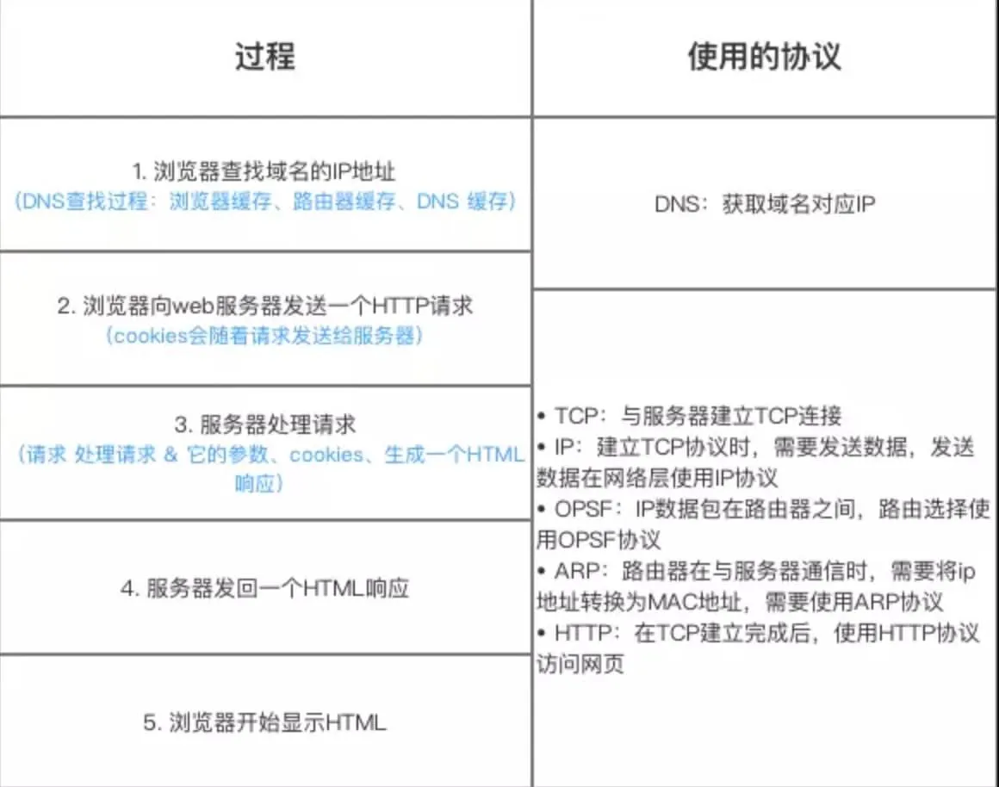

> 上图有一个错误，请注意，是 OSPF 不是 OPSF。 OSPF（Open Shortest Path First，ospf）开放最短路径优先协议, 是由 Internet 工程任务组开发的路由选择协议

总体来说分为以下几个过程:

1. DNS 解析
2. TCP 连接
3. 发送 HTTP 请求
4. 服务器处理请求并返回 HTTP 报文
5. 浏览器解析渲染页面
6. 连接结束

详细：https://segmentfault.com/a/1190000006879700

### 三次握手四次挥手

如下图所示，下面的两个机器人通过 3 次握手确定了对方能正确接收和发送消息(图片来源：《图解 HTTP》)。

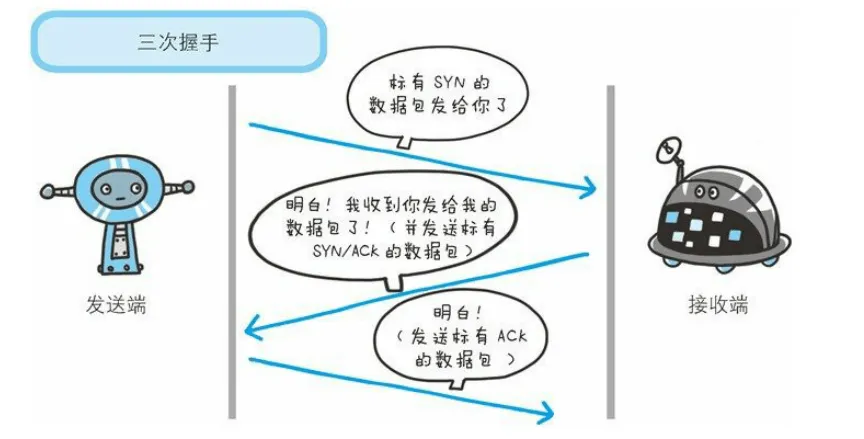

**简单示意图：**


- 客户端–发送带有 SYN 标志的数据包–一次握手–服务端
- 服务端–发送带有 SYN/ACK 标志的数据包–二次握手–客户端
- 客户端–发送带有带有 ACK 标志的数据包–三次握手–服务端

**详细示意图（图片来源不详）**


### tcp协议的四次挥手的详细过程（抖音）

建立一个 TCP 连接需要三次握手，而终止一个 TCP 连接要经过四次挥手（也有将四次挥手叫做四次握手的）。这是由于 TCP 的**半关闭**（half-close）特性造成的，TCP 提供了连接的一端在结束它的发送后还能接收来自另一端数据的能力。

TCP 连接的释放需要发送四个包（执行四个步骤），因此称为四次挥手(`Four-way handshake`)，**客户端或服务端均可主动发起挥手动作**。

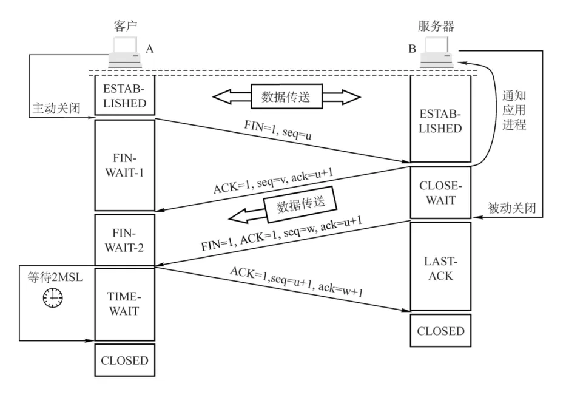

回顾一下上图中符号的意思：

- `FIN` ：连接终止位
- `seq`：发送的第一个字节的序号
- `ACK`：确认报文段
- `ack`：确认号。希望收到的下一个数据的第一个字节的序号

刚开始双方都处于 `ESTABLISHED` 状态，假设是客户端先发起关闭请求。四次挥手的过程如下：

**1）第一次挥手**：客户端发送一个 FIN 报文（请求连接终止：FIN = 1），报文中会指定一个序列号 seq = u。并**停止再发送数据，主动关闭 TCP 连接**。此时客户端处于 `FIN_WAIT1` 状态，等待服务端的确认。

`FIN-WAIT-1` - 等待远程TCP的连接中断请求，或先前的连接中断请求的确认；

**2）第二次挥手**：服务端收到 FIN 之后，会发送 ACK 报文，且把客户端的序号值 +1 作为 ACK 报文的序列号值，表明已经收到客户端的报文了，此时服务端处于 `CLOSE_WAIT` 状态。

`CLOSE-WAIT` - 等待从本地用户发来的连接中断请求；

**此时的 TCP 处于半关闭状态，客户端到服务端的连接释放**。客户端收到服务端的确认后，进入 `FIN_WAIT2`（终止等待 2）状态，等待服务端发出的连接释放报文段。

`FIN-WAIT-2` - 从远程TCP等待连接中断请求；

**3）第三次挥手**：如果服务端也想断开连接了（没有要向客户端发出的数据），和客户端的第一次挥手一样，发送 FIN 报文，且指定一个序列号。此时服务端处于 `LAST_ACK` 的状态，等待客户端的确认。

`LAST-ACK` - 等待原来发向远程TCP的连接中断请求的确认；

**4）第四次挥手**：客户端收到 FIN 之后，一样发送一个 ACK 报文作为应答，且把服务端的序列值 +1 作为自己 ACK 报文的序号值，此时客户端处于 **`TIME_WAIT` （时间等待）状态**。

`TIME-WAIT` - 等待足够的时间以确保远程TCP接收到连接中断请求的确认；

🚨 注意 ！！！这个时候由服务端到客户端的 TCP 连接并未释放掉，**需要经过时间等待计时器设置的时间 2MSL（一个报文的来回时间） 后才会进入 `CLOSED` 状态**（这样做的目的是确保服务端收到自己的 ACK 报文。如果服务端在规定时间内没有收到客户端发来的 ACK 报文的话，服务端会重新发送 FIN 报文给客户端，客户端再次收到 FIN  报文之后，就知道之前的 ACK 报文丢失了，然后再次发送 ACK 报文给服务端）。服务端收到 ACK 报文之后，就关闭连接了，处于 `CLOSED` 状态。

### tcp协议的四次挥手当中第二步和第三步能否合并成一步

`参考：https://www.zhihu.com/question/50646354`

很多人有一个误区，即认为TCP连接是通信的全部，其实并不是这样，让我们来复习一下TCP连接断开的过程。

假定TCP client端主动发起断开连接

1. client端的application 接受用户断开TCP连接请求，这个是由用户触发的请求，以消息的方式到达client TCP
2. client TCP 发送 FIN=1 给 server 端 TCP
3. server 端TCP 接收到FIN=1 断开连接请求，需要咨询 application的意见，需要发消息给application，消息内容：对方要断开连接，请问您老人家还有数据要发送吗？如果有数据请告知，没有数据也请告知！然后就是等待application 的回应。既然需要等待application的回复，为何不早点把对client FIN 的ACK发出去呢？ 事实上TCP也是这么做的，收到对方的断开连接请求，立马发ACK予以确认，client --> server 方向连接断开。
4. 如果 server端有数据需要发送，则继续发送一直到数据发送完毕，然后application 发close消息给TCP，现在可以关闭连接，然后Server TCP 发FIN=1 断开 server -->client方向的连接。
   1. ·如果 server端没有数据发送，application回应close消息给TCP，现在可以关闭连接，然后Server TCP 发FIN=1 断开 server -->client方向的连接。

### 为什么要三次握手？ / 为什么不能两次握手

**三次握手的目的是建立可靠的通信信道，说到通讯，简单来说就是数据的发送与接收，而三次握手最主要的目的就是双方确认自己与对方的发送与接收是正常的。**

第一次握手：Client 什么都不能确认；Server 确认了对方发送正常，自己接收正常

第二次握手：Client 确认了：自己发送、接收正常，对方发送、接收正常；Server 确认了：对方发送正常，自己接收正常

第三次握手：Client 确认了：自己发送、接收正常，对方发送、接收正常；Server 确认了：自己发送、接收正常，对方发送、接收正常

所以三次握手就能确认双方收发功能都正常，缺一不可

### TCP 为什么要三次握手和四次挥手？

三次握手是为了确认双方的收发能力都没有问题，四次挥手是确保数据都发送完了才结束

### 为什么 TCP 第二次握手的 SYN 和 ACK 要合并成一次？（2022字节提前批）

分开两次发送，浪费资源

### TCP握手的目的有哪些？（2022字节提前批）

确认双方的收发能力都没有问题，初始化序列号，确认窗口大小即 MSS 等信息

### SYN Flood 的原理？有哪些防范的方法？（2022字节提前批）

客户端发送三次握手的第一个 SYN 报文后收到服务器的报文却不回应，从而导致服务器的半开资源浪费直到超时释放

可以使用 SYN Cookie，即通过将源目地址及 IP 地址和端口号哈希为序列号，将返回的 ACK-1 得到原来的序列号判断是否正确，直到连接建立才分配资源

### url 解析过程

不知道有没有同学会混淆域名和 URL 的概念，可以这样理解，URL 就是我们输入的网址，而网址里面含有域名。举个例子：`www.baidu.com/veal98` 是一个网址，而 `www.baidu.com` 就是服务器的域名。

URL 各元素的组成如下（当然，下述请求文件的路径名可以省略）：

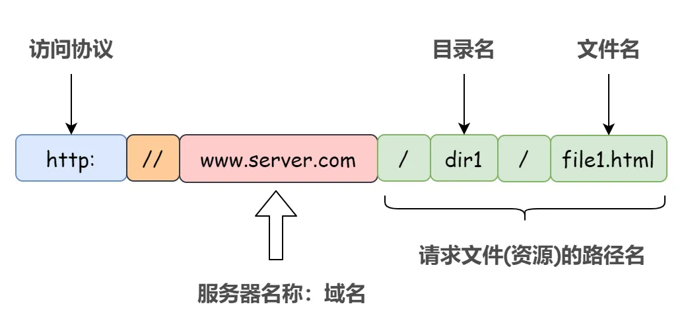

这个 URL 请求的目标服务器上的文件路径就是：

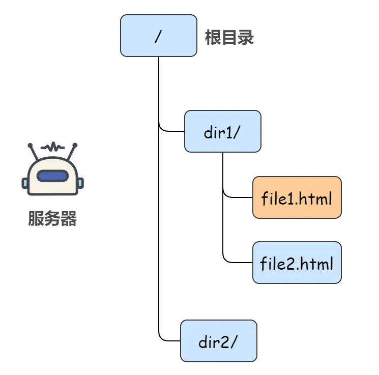

那么首先，浏览器做的第一步就是解析 URL 得到里面的参数，将域名和需要请求的资源分离开来，从而了解需要请求的是哪个服务器，请求的是服务器上什么资源等等。

### 七层协议

**OSI 七层模型** 是国际标准化组织提出一个网络分层模型，其大体结构以及每一层提供的功能如下图所示：


每一层都专注做一件事情，并且每一层都需要使用下一层提供的功能比如传输层需要使用网络层提供的路由和寻址功能，这样传输层才知道把数据传输到哪里去。

**OSI 的七层体系结构概念清楚，理论也很完整，但是它比较复杂而且不实用，而且有些功能在多个层中重复出现。**

上面这种图可能比较抽象，再来一个比较生动的图片。下面这个图片是我在国外的一个网站上看到的，非常赞！


**既然 OSI 七层模型这么厉害，为什么干不过 TCP/IP 四 层模型呢？**

的确，OSI 七层模型当时一直被一些大公司甚至一些国家政府支持。这样的背景下，为什么会失败呢？我觉得主要有下面几方面原因：

1. OSI 的专家缺乏实际经验，他们在完成 OSI 标准时缺乏商业驱动力
2. OSI 的协议实现起来过分复杂，而且运行效率很低
3. OSI 制定标准的周期太长，因而使得按 OSI 标准生产的设备无法及时进入市场（20 世纪 90 年代初期，虽然整套的 OSI 国际标准都已经制定出来，但基于 TCP/IP 的互联网已经抢先在全球相当大的范围成功运行了）
4. OSI 的层次划分不太合理，有些功能在多个层次中重复出现。

OSI 七层模型虽然失败了，但是却提供了很多不错的理论基础。为了更好地去了解网络分层，OSI 七层模型还是非常有必要学习的。

最后再分享一个关于 OSI 七层模型非常不错的总结图片！


- Physical, Data Link, Network, Transport, Application
- 应用层：常见协议：
  - FTP(21 端口)：文件传输协议
  - SSH(22 端口)：远程登陆
  - TELNET(23 端口)：远程登录
  - SMTP(25 端口)：发送邮件
  - POP3(110 端口)：接收邮件
  - HTTP(80 端口)：超文本传输协议
  - DNS(53 端口)：运行在 UDP 上，域名解析服务
- 传输层：TCP/UDP
- 网络层：IP、ARP、NAT、RIP...

### TCP 的底层原理知道吗？TCP 是怎么实现通信的？

我们先来看看 TCP 头的格式，标注颜色的表示与本文关联比较大的字段，其他字段不做详细阐述。


**序列号**：在建立连接时由计算机生成的随机数作为其初始值，通过 SYN 包传给接收端主机，每发送一次数据，就「累加」一次该「数据字节数」的大小。**用来解决网络包乱序问题。**

**确认应答号**：指下一次「期望」收到的数据的序列号，发送端收到这个确认应答以后可以认为在这个序号以前的数据都已经被正常接收。**用来解决丢包的问题。**

**控制位：**

- *ACK*：该位为 `1` 时，「确认应答」的字段变为有效，TCP 规定除了最初建立连接时的 `SYN` 包之外该位必须设置为 `1` 。
- *RST*：该位为 `1` 时，表示 TCP 连接中出现异常必须强制断开连接。
- *SYN*：该位为 `1` 时，表示希望建立连接，并在其「序列号」的字段进行序列号初始值的设定。
- *FIN*：该位为 `1` 时，表示今后不会再有数据发送，希望断开连接。当通信结束希望断开连接时，通信双方的主机之间就可以相互交换 `FIN` 位为 1 的 TCP 段。

TCP（传输控制协议）是一种面向连接的、可靠的传输层协议，它为应用程序提供了可靠的数据传输服务。TCP的底层原理可以分为以下几个方面：

1.三次握手建立连接：

当客户端要与服务器建立连接时，首先发送一个 SYN（同步）分节给服务器。服务器收到该分节后，回复一个 SYN-ACK（同步-确认）分节给客户端。客户端再回复一个 ACK（确认）分节给服务器，从而完成连接的建立。这个过程就是TCP连接的“三次握手”。

2.数据传输：

TCP将数据分割成以报文段为单位的数据块，并使用序列号和确认号来保证数据传输的可靠性。发送方发送报文段时，将该报文段的序列号和数据一起发送给接收方，并等待接收方的确认。如果发送方没有收到确认，它会重新发送该报文段，直到收到确认为止。接收方收到报文段后，会回复一个确认报文段，确认收到该报文段，并将下一个期望接收的报文段的序列号告诉发送方。

3.流量控制：

TCP使用滑动窗口协议来控制数据传输的速率。发送方和接收方各维护一个窗口，发送方的窗口大小表示可以发送的数据量，接收方的窗口大小表示可以接收的数据量。发送方只能发送接收方窗口大小以内的数据，以避免接收方接收不了太多数据而导致的丢包。

4.拥塞控制：

TCP使用拥塞控制算法来避免网络拥塞。当网络中的数据包过多时，TCP会采取措施减少发送的数据量，以避免拥塞的发生。常见的拥塞控制算法包括慢开始、拥塞避免和拥塞恢复等。

总的来说，TCP协议在传输数据的过程中，采用了多种技术来保证数据的可靠性、传输速度和网络拥塞的避免。

通信可以参考：TCP如何保证可靠传输

TCP实现通信主要有以下几个步骤：

1. 建立连接：客户端向服务器发送一个SYN报文段，服务器收到后回复一个SYN+ACK报文段，客户端再回复一个ACK报文段，完成三次握手，建立TCP连接。
2. 数据传输：TCP使用序列号和确认号来保证数据传输的可靠性。发送方将数据分割成以报文段为单位的数据块，加上一个序列号，发送给接收方。接收方收到报文段后，回复一个确认报文段，包含期望接收的下一个序列号，发送方收到确认报文段后，将下一个需要发送的序列号更新为期望接收的下一个序列号。
3. 拥塞控制：TCP使用拥塞控制算法来避免网络拥塞，保证数据传输的可靠性和网络的稳定性。常见的拥塞控制算法包括慢启动、拥塞避免和快速重传等。
4. 流量控制：TCP使用滑动窗口协议来控制数据传输的速率。发送方和接收方各维护一个窗口，发送方的窗口大小表示可以发送的数据量，接收方的窗口大小表示可以接收的数据量。发送方只能发送接收方窗口大小以内的数据，以避免接收方接收不了太多数据而导致的丢包。
5. 断开连接：TCP使用四次挥手来断开连接。当客户端要关闭连接时，发送一个FIN报文段给服务器，服务器回复一个ACK报文段，然后向客户端发送一个FIN报文段，客户端回复一个ACK报文段，完成四次挥手，断开TCP连接。

### TCP, UDP 协议的区别【腾讯光子工作室】

|            | TCP      | UDP    |
| ---------- | -------- | ------ |
| 连接       | 面向连接 | 无连接 |
| 可靠性     | 可靠     | 不可靠 |
| 数据流方式 | 字节流   | 报文流 |
| 速度       | 慢       | 块     |

UDP 在传送数据之前不需要先建立连接，远地主机在收到 UDP 报文后，不需要给出任何确认。虽然 UDP 不提供可靠交付，但在某些情况下 UDP 却是一种最有效的工作方式（一般用于即时通信），比如： QQ 语音、 QQ 视频 、直播等等

TCP 提供面向连接的服务。在传送数据之前必须先建立连接，数据传送结束后要释放连接。 TCP 不提供广播或多播服务。由于 TCP 要提供可靠的，面向连接的传输服务（TCP 的可靠体现在 TCP 在传递数据之前，会有三次握手来建立连接，而且在数据传递时，有确认、窗口、重传、拥塞控制机制，在数据传完后，还会断开连接用来节约系统资源），这难以避免增加了许多开销，如确认，流量控制，计时器以及连接管理等。这不仅使协议数据单元的首部增大很多，还要占用许多处理机资源。TCP 一般用于文件传输、发送和接收邮件、远程登录等场景


### TCP 协议如何保证可靠传输【腾讯光子工作室】

`短文回答参考：https://www.iamshuaidi.com/1298.html or https://github.com/wolverinn/Waking-Up/blob/master/Computer%20Network.md#TCP%E5%A6%82%E4%BD%95%E4%BF%9D%E8%AF%81%E4%BC%A0%E8%BE%93%E7%9A%84%E5%8F%AF%E9%9D%A0%E6%80%A7`

下面是理解：

首先解释一下，什么是可靠传输：**可靠传输就是保证接收方收到的字节流和发送方发出的字节流是完全一样的**。

网络层是没有可靠传输机制的，尽自己最大的努力进行交付。而传输层使用 TCP 实现可靠传输，TCP 保证可靠传输的机制有如下几种：

- 1）校验和 Checksum（稍作了解即可）
- 2）序列号和确认应答机制（重要）
- 3）重传机制（重要）
- 4）流量控制（滑动窗口协议）（非常重要）
- 5）拥塞控制（重要）

以上除了校验和大家可以只稍作了解之外，其他都是非常重要的，务必烂熟于心

校验和

---

所谓 TCP 的校验和（Checksum）就是说：由发送端计算待发送 TCP 报文段的校验和，然后接收端对接收到的 TCP 报文段验证其校验和（TCP 的校验和是一个端到端的校验和）。**其目的是为了发现 TCP 的首部和数据在发送端到接收端之间是否发生了变动。如果接收方检测到校验和有差错，则该 TCP 报文段会被直接丢弃**。

关于校验和是如何计算和验证的，并非高频重点知识，本文就不详细解释了，感兴趣的童鞋可自行百度

TCP 在计算校验和时，需要加上一个 12 字节的**伪首部**。

其实 UDP 也有校验和机制，只不过是可选的，而 TCP 的校验和是必须的，TCP 和 UDP 在计算校验和时都需要加上一个 12 字节的伪首部。

解释下伪首部的概念，伪首部的数据是从 IP 数据报头获取的，共有 12 字节，包含如下信息：源 IP 地址、目的 IP 地址、保留字节 (置 0)、传输层协议号 (TCP 是 6)、TCP 报文长度 (首部 + 数据)：


**伪首部是为了增加 TCP 校验和的检错能力：如根据目的 IP 地址检查这个 TCP 报文是不是传给我的、根据传输层协议号检查传输层协议是否选对了...... 伪首部只在校验的时候使用**。

序列号和确认应答机制

---

TCP 报文段的首部中有一个序号字段：指的是该报文段第一个字节的序号（一个字节占一个序号）

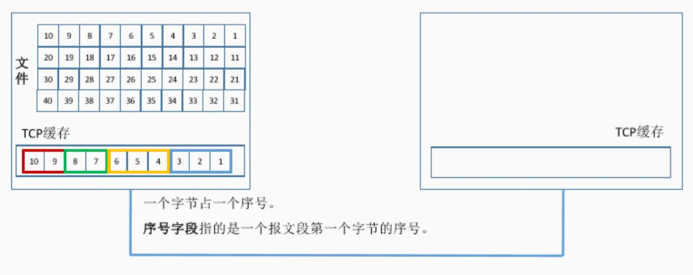

确认应答机制就是**接收方收到 TCP 报文段后就会返回一个确认应答消息**：

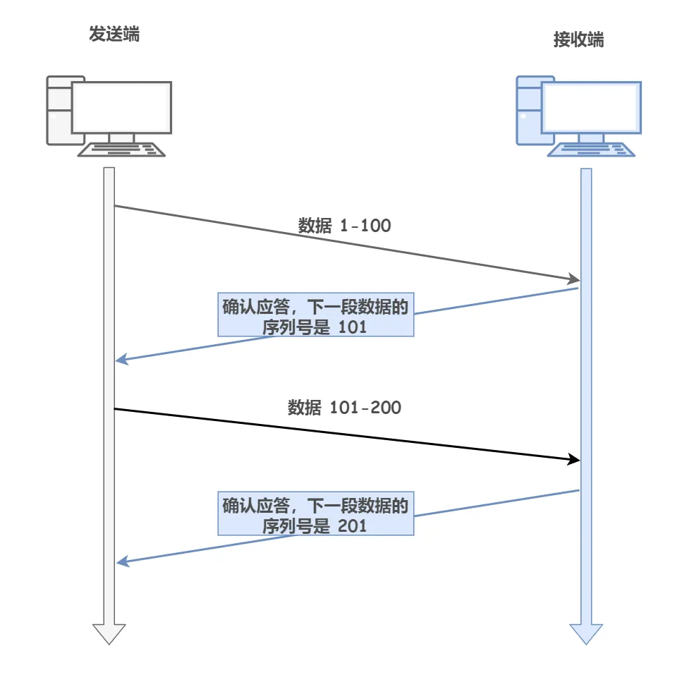

确认应答机制和重传机制不分家，两者紧密相连。

重传机制

---

在错综复杂的网络，并不一定能如上图那么顺利的传输报文，报文存在丢失的可能性。报文丢失的可能因素有很多种，包括应用故障，路由设备过载，或暂时的服务宕机。报文级别速度是很高的，**通常来说报文的丢失是暂时的，因此 TCP 能够发现和恢复报文丢失显得尤为重要**。

**重传机制**是 TCP 最基本的错误恢复功能，常见的重传机制有如下：

- 超时重传
- 快速重传

① 超时重传

大概一说到重传大家第一个想到的就是超时重传吧。超时重传就是 TCP 发送方在发送报文的时候，设定一个定时器，如果在规定的时间内没有收到接收方发来的 ACK 确认报文，发送方就会重传这个已发送的报文段。

对于发送方没有正确接收到接收方发来的 ACK 确认报文的情况，有以下两种（也就是在这两种情况下会发生超时重传）：

- 第一种情况：**报文段丢失**

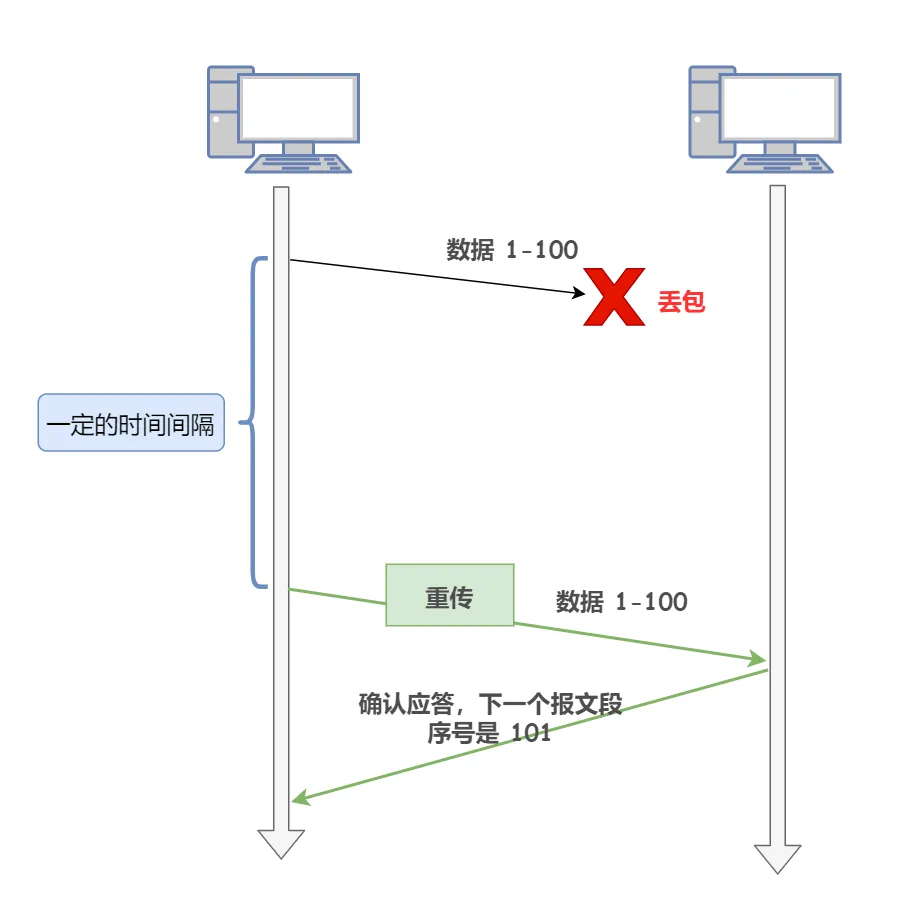

第二种情况：**接收方的 ACK 确认报文丢失**


超时重传时间我们一般用 **RTO**（Retransmission Timeout） 来表示，那么，这个 RTO 设置为多少最合适呢，也就是说经过多长时间进行重传最好？

在这之前，我们先讲解一下 **RTT（Round-Trip Time 往返时延）** 的概念：RTT 就是**数据从网络一端传送到另一端所需的时间**，也就是报文段的往返时间。

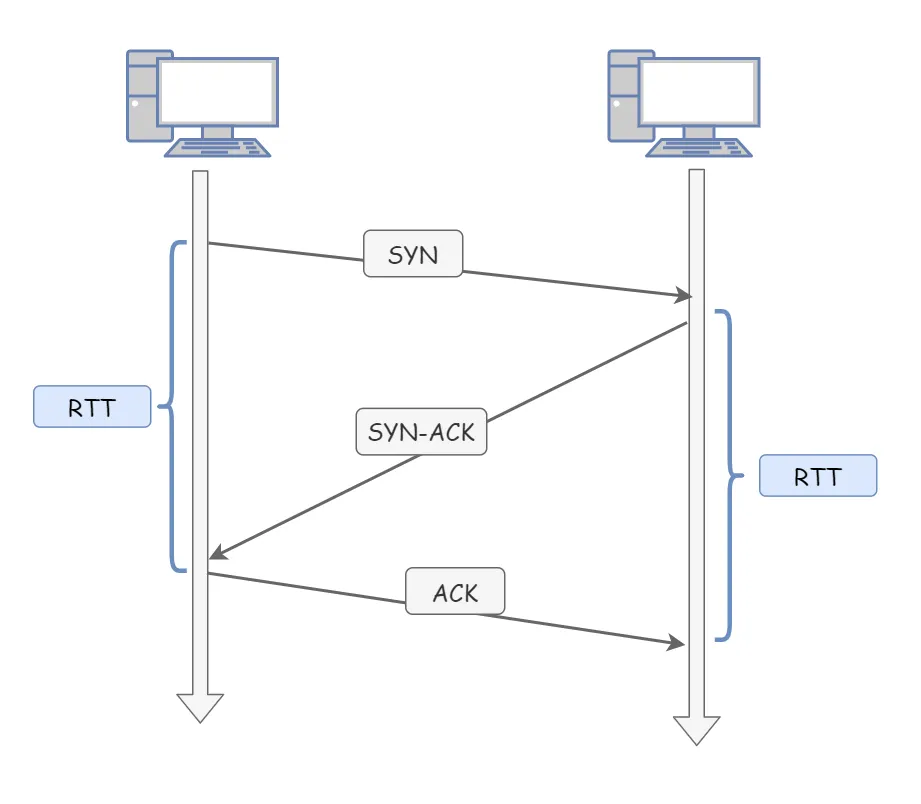

显然，⭐ **超时重传时间 RTO 的值应该略大于报文往返  RTT 的值**：


可以假想一下，如果超时重传时间 RTO 远大于或小于 RTT，会发生什么情况：

- **RTO 远大于 RTT**：网络的空闲时间增大，降低了网络传输效率

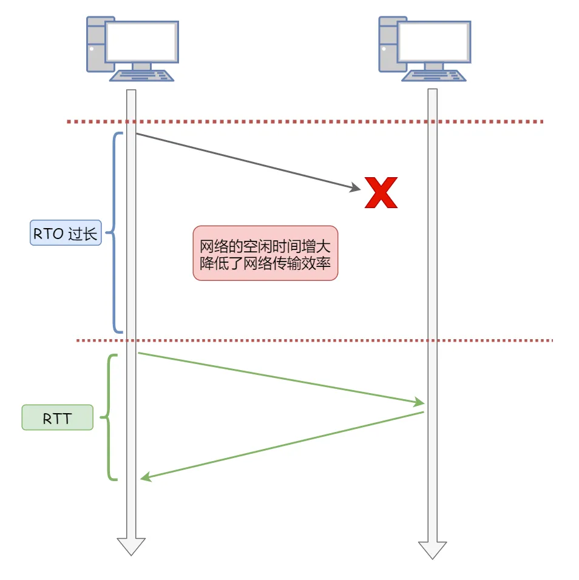

**RTO 小于 RTT**：不必要的重传，导致网络负荷增大

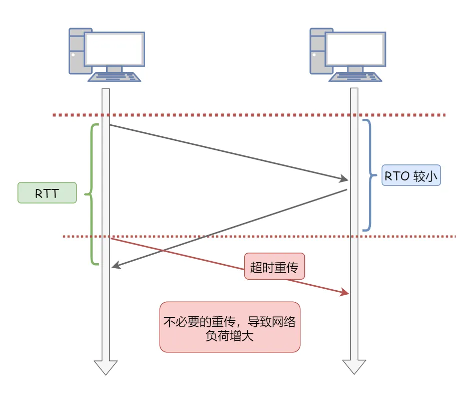

如果超时重传的数据又超时了该怎么办呢？TCP 的策略是**重传的超时间隔加倍**。

也就是说，**每进行一次超时重传，都会将下一次重传的超时时间间隔设为先前值的两倍**。

超时触发重传存在的问题是，超时周期可能相对较长。**有没有一种机制可以减少超时重传的等待时间呢**？于是 「快速重传」 机制应运而生

② 快速重传

**快速重传（Fast Retransmit）机制不以时间为驱动，而是以数据驱动重传**。

快速重传机制的原理：每当接收方收到比期望序号大的失序报文段到达时，就向发送方发送一个**冗余 ACK**，指明下一个期待字节的序号。

举个例子：发送方已经发送 1、2、3、4、5报文段

- 接收方收到报文段 1，返回 1 的 ACK 确认报文（确认号为报文段 2 的第一个字节）
- 接收方收到报文段 3，仍然返回 1 的 ACK 确认报文（确认号为报文段 2 的第一个字节）
- 接收方收到报文段 4，仍然返回 1 的 ACK 确认报文（确认号为报文段 2 的第一个字节）
- 接收方收到报文段 5，仍然返回 1 的 ACK 确认报文（确认号为报文段 2 的第一个字节）
- **接收方收到 3 个对于报文段 1 的冗余 ACK，认为报文段 2 丢失，于是重传报文段 2**
- 最后，接收方收到了报文段 2，此时因为报文段 3、4、5 都收到了，所以返回 5 的 ACK 确认报文（确认号为报文段 6 的第一个字节）

一图胜千言：


滑动窗口协议

---

可以说不知道滑动窗口协议 = 不知道 TCP。该知识点的分量之重，大家一定好好把握。

① 累积确认

上文讲快速重传的时候，不知道大家有没有注意到这句话 “最后，接收方收到了报文段 2，此时因为报文段 3、4、5 都收到了，所以返回 6 的 ACK 确认报文 ”。

**为什么这里会直接返回报文段 6 的确认应答呢**，之前我们不是说每发送一个 TCP 报文段，就进行一次确认应答吗（只有收到了上一个报文段的确认应答后才能发送下一个报文段的）？按照这个模式，我们应该先返回报文段 3 的确认应答啊。

其实只有收到了上一个报文段的确认应答后才能发送下一个报文段的这种模式效率非常低下。每个报文段的往返时间越长，网络的吞吐量就越低，通信的效率就越低。

举个例子：如果你说完一句话，我在处理其他事情，没有及时回复你，你就等着我做完其他事情后回复你，你才能说下一句话，很显然这不现实。

为此，TCP 引入了 **窗口** 的概念。对于发送方来说，窗口大小就是指**无需等待确认应答，可以连续发送数据的最大值**。

⭐ 窗口的实现实际上是操作系统开辟的一个**内核缓冲区**，发送方在等待确认应答报文返回之前，必须在缓冲区中保留已发送的数据。如果在规定时间间隔内收到确认应答报文，就可以将数据从缓冲区中清除。

假设窗口大小为 `5` 个 TCP 段，那么发送方就可以「连续发送」 `5` 个 TCP 段

还是上面那个例子：发送方已经发送 1、2、3、4、5报文段

- 接收方收到报文段 1，返回 1 的 ACK 确认报文（确认号为报文段 2 的第一个字节）
- 接收方收到报文段 3，仍然返回 1 的 ACK 确认报文（确认号为报文段 2 的第一个字节）
- 接收方收到报文段 4，仍然返回 1 的 ACK 确认报文（确认号为报文段 2 的第一个字节）
- 接收方收到报文段 5，仍然返回 1 的 ACK 确认报文（确认号为报文段 2 的第一个字节）
- **发送方收到 3 个对于报文段 1 的冗余 ACK（or 等待超时），认为报文段 2 丢失，于是重传报文段 2**
- 最后，接收方收到了报文段 2，此时因为报文段 3、4、5 都收到了，所以返回 6 的 ACK 确认报文（确认号为报文段 6 的第一个字节）

简单说，**只要发送方收到了 ACK 600 的确认应答，就意味着第 600 字节之前的所有数据「接收方」都收到了**。这个模式就叫**累积确认**或者**累积应答**。

② 发送方的滑动窗口

先来看看发送方的窗口，下图就是发送方的数据，根据处理的情况分成四个部分：

- 已发送并收到 ACK 确认应答的数据
- 已发送但未收到 ACK 确认应答的数据
- 未发送但总大小在接收方处理范围内的数据
- 未发送但总大小超过接收方处理范围的数据

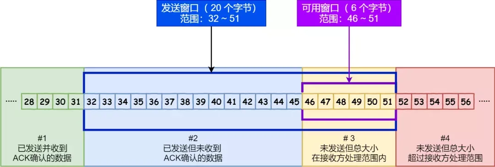

当发送方把数据全部发送出去后，可用窗口的大小就为 0 了，表明可用窗口耗尽，在没收到 ACK 确认之前无法继续发送数据：


当收到之前发送的数据 `32~36` 字节的 ACK 确认应答后，如果发送窗口的大小没有变化，则**滑动窗口往右边移动 5 个字节，因为有 5 个字节的数据被确认应答**，接下来 `52~56` 字节又变成了可用窗口，那么后续也就可以发送 `52~56` 这 5 个字节的数据了：

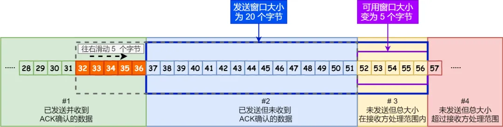

③ 接收方的滑动窗口

接收方的滑动窗口可分为三个部分：

- 已成功接收并确认的数据
- 未收到数据但可以接收的数据
- 未收到数据且不可以接收的数据（超出接收方窗口大小）


同样的，接收方的滑动窗口在成功接收并确认的数据后，窗口右移。

流量控制

---

想象一下这个场景：主机 A 一直向主机 B 发送数据，不考虑主机 B 的接收能力，则可能导致主机 B  的接收缓冲区满了而无法再接收数据，从而导致大量的数据丢包，引发重传机制。而在重传的过程中，若主机 B  的接收缓冲区情况仍未好转，则会将大量的时间浪费在重传数据上，降低传送数据的效率。

所以引入了流量控制机制，主机 B 通过告诉主机 A 自己接收缓冲区的大小，来使主机 A 控制发送的数据量。**总结来说：所谓流量控制就是控制发送方发送速率，保证接收方来得及接收**。

⭐ **TCP 实现流量控制主要就是通过 滑动窗口协议**。

上文我们提到了滑动窗口大小，但是没说窗口大小在哪里设置，其实这个和 TCP 报文首部中的 **窗口大小 Window** 字段有关。TCP 报文的首部格式，其中就有一个 16 位的 **窗口大小 Window** 字段：


该字段的含义是**指自己接收缓冲区的剩余大小**，于是发送端就可以根据这个接收端的处理能力来发送数据，而不会导致接收端处理不过来。

所以，通常来说**窗口大小是由接收方来决定的**。

💡 这段话大家一定要理解哦：接收端会在发送 ACK 确认应答报文时，将自己的即时窗口大小（接收窗口 `rwnd`）填入，并跟随 ACK 报文一起发送出去。而发送方根据接收到的 ACK 报文中的窗口大小的值改变自己的发送速度。如果接收到窗口大小的值为 0，那么发送方将停止发送数据。并定期的向接收端发送窗口探测数据段，提醒接收端把窗口大小告诉发送端。

一图胜前言：


拥塞控制

---

所谓拥塞就是说：在某段时间，对网络中某一资源的需求超过了该资源所能提供的可用部分（**即 需大于供**)，网络的性能变差。

如果网络出现拥塞，TCP 报文可能会大量丢失，此时就会大量触发重传机制，从而导致网络拥塞程度更高，严重影响传输。

其实只要「发送方」没有在规定时间内接收到 ACK 应答报文，也就是**触发了重传机制，就会认为网络出现了拥塞。**

因此当出现拥塞时，应当控制发送方的速率。这一点和流量控制很像，但是**出发点不同**。

流量控制是为了让接收方能来得及接收，而拥塞控制是为了降低整个网络的拥塞程度，**防止过多的数据注入到网络中。**

为了调节发送方所要发送数据的量，定义了「**拥塞窗口** `cwnd`」的概念。拥塞窗口是发送方维护的一个状态变量，它会根据**网络的拥塞程度动态变化**：

- 只要网络中出现了拥塞，`cwnd` 就会减少
- 若网络中没有出现拥塞，`cwnd` 就会增大

在引入拥塞窗口概念之前，发送窗口大小和接收窗口大小基本是相等的关系（取决于接收窗口大小）。**引入拥塞窗口后，发送窗口的大小就等于拥塞窗口和接收窗口的最小值**。

TCP 的拥塞控制采用了四种算法：

- 慢开始
- 拥塞避免
- 快重传
- 快恢复

下面详细讲解这四种算法 👇

① 慢开始

**慢开始**的思路就是：TCP 在刚建立连接完成后，如果立即把大量数据字节注入到网络，那么很有可能引起网络阻塞。好的方法是先探测一下，一点一点的提高发送数据包的数量，即由小到大逐渐增大拥塞窗口数值。**cwnd 初始值为 1，每经过一个传播轮次，cwnd 加倍**（指数增长）。

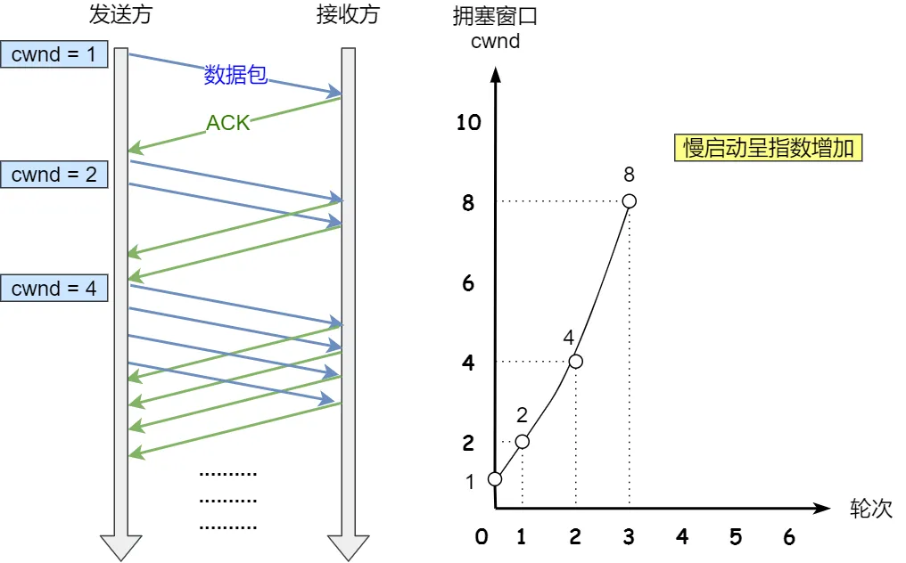

当然不能一直执行慢启动，这里会设置一个**慢启动轮限 ssthresh** 状态变量：

- 当 `cwnd < ssthresh` 时，继续使用慢启动算法
- 当 `cwnd >= ssthresh` 时，开始使用「拥塞避免算法」

② 拥塞避免

拥塞避免算法的思路是让拥塞窗口 cwnd 缓慢增大，即每经过一个往返时间 cwnd 加 1


🚨 注意，无论是慢开始阶段还是拥塞避免，只要出现了网络拥塞（**触发超时重传机制**），慢开始轮限 `sshresh` 和 拥塞窗口大小 `cwnd` 的值会发生变化（乘法减小）：

- `ssthresh` 设为 `cwnd/2`
- `cwnd` 重置为 `1`

由于拥塞窗口大小重置为 1 了，所以就会重新开始执行慢启动算法。


③ 快重传和快恢复

快速重传和快速恢复算法一般同时使用。

当触发快速重传机制，即接收方收到三个重复的 ACK 确认的时候，就会执行快重传算法（触发快速重传机制和超时重传机制的情况不同，TCP 认为触发快速重传的情况并不严重，因为大部分没丢，只丢了一小部分），快速重传做的事情有：

- `cwnd = cwnd/2`
- `ssthresh = cwnd`
- 重新进入拥塞避免阶段

后来的 “快速恢复” 算法是在上述的“快速重传”算法后添加的，当收到 3 个重复ACK时，TCP 最后进入的不是拥塞避免阶段，而是快速恢复阶段。

快速恢复的思想是“**数据包守恒**”原则，即同一个时刻在网络中的数据包数量是恒定的，只有当“老”数据包离开了网络后，才能向网络中发送一 个“新”的数据包，如果发送方收到一个重复的 ACK，那么根据 TCP 的 ACK 机制就表明有一个数据包离开了网络，于是 `cwnd` 加 1。如果能够严格按照该原则那么网络中很少会发生拥塞，事实上拥塞控制的目的也就在修正违反该原则的地方。

具体来说快速恢复的主要步骤是：

- 把 `cwnd` 设置为 `ssthresh` 的值加 3，然后重传丢失的报文段，加 3 的原因是因为收到 3 个重复的 ACK，表明有 3 个“老”的数据包离开了网络。
- 再收到重复的 ACK 时，拥塞窗口 `cwnd` 增加 1
- 当收到新的数据包的 ACK 时，把 `cwnd` 设置为第一步中的 `ssthresh` 的值。原因是因为该 ACK 确认了新的数据，说明从重复 ACK 时的数据都已收到，该恢复过程已经结束，可以回到恢复之前的状态了，也即再次进入拥塞避免状态。


### TCP 和 HTTP 有什么区别？

- HTTP 通常使用 80 端口 — 这是服务器“监听”或是从 Web 客户端接收的端口。 而 TCP 不需要监听端口来工作。
- 与 TCP 相比，HTTP 更快，因为它以更高的速度运行并立即执行该过程。 TCP 相对较慢。
- TCP 告诉目标计算机哪个应用程序应该接收数据并确保正确传递所述数据，而 HTTP 通常 用于在 Internet 上搜索和查找所需的文档。
- TCP 包含有关已收到或尚未收到哪些数据的信息，而 HTTP 包含有关在收到数据后如何读取和处理数据的具体说明。
- TCP 管理数据流，而 HTTP 描述流中的数据包含什么。
- TCP 作为三向通信协议运行，而 HTTP 是单向协议。

### TCP 的 accept()函数发生在第几次握手（腾讯）

发生在三次握手之后

### 讲一下 http：结构，和 tcp 关系等，状态码有什么

结构

---

HTTP的名字「超文本协议传输」，它可以拆成三个部分：

- 超文本
- 传输
- 协议


关系

---

    **TPC/IP协议是传输层协议，主要解决数据如何在网络中传输，而HTTP是应用层协议，主要解决如何包装数据。**关于TCP/IP和HTTP协议的关系，网络有一段比较容易理解的介绍：“我们在传输数据时，可以只使用（传输层）TCP/IP协议，但是那样的话，如果没有应用层，便无法识别数据内容，如果想要使传输的数据有意义，则必须使用到应用层协议，应用层协议有很多，比如HTTP、FTP、TELNET等，也可以自己定义应用层协议。WEB使用HTTP协议作应用层协议，以封装HTTP 文本信息，然后使用TCP/IP做传输层协议将它发到网络上。”
    
    把**IP想像成一种高速公路**，它允许其它协议在上面行驶并找到到其它电脑的出口。**TCP和UDP是高速公路上的“卡车”，它们携带的货物就是像HTTP**，文件传输协议FTP这样的协议等。


状态码

---


`1xx` 类状态码属于**提示信息**，是协议处理中的一种中间状态，实际用到的比较少。

`2xx` 类状态码表示服务器**成功**处理了客户端的请求，也是我们最愿意看到的状态。

- 「**200 OK**」是最常见的成功状态码，表示一切正常。如果是非 `HEAD` 请求，服务器返回的响应头都会有 body 数据。
- 「**204 No Content**」也是常见的成功状态码，与 200 OK 基本相同，但响应头没有 body 数据。
- 「**206 Partial Content**」是应用于 HTTP 分块下载或断点续传，表示响应返回的 body 数据并不是资源的全部，而是其中的一部分，也是服务器处理成功的状态。

`3xx` 类状态码表示客户端请求的资源发生了变动，需要客户端用新的 URL 重新发送请求获取资源，也就是**重定向**。

- 「**301 Moved Permanently**」表示永久重定向，说明请求的资源已经不存在了，需改用新的 URL 再次访问。
- 「**302 Found**」表示临时重定向，说明请求的资源还在，但暂时需要用另一个 URL 来访问。

301 和 302 都会在响应头里使用字段 `Location`，指明后续要跳转的 URL，浏览器会自动重定向新的 URL。

- 「**304 Not Modified**」不具有跳转的含义，表示资源未修改，重定向已存在的缓冲文件，也称缓存重定向，也就是告诉客户端可以继续使用缓存资源，用于缓存控制。

`4xx` 类状态码表示客户端发送的**报文有误**，服务器无法处理，也就是错误码的含义。

- 「**400 Bad Request**」表示客户端请求的报文有错误，但只是个笼统的错误。
- 「**403 Forbidden**」表示服务器禁止访问资源，并不是客户端的请求出错。
- 「**404 Not Found**」表示请求的资源在服务器上不存在或未找到，所以无法提供给客户端。

`5xx` 类状态码表示客户端请求报文正确，但是**服务器处理时内部发生了错误**，属于服务器端的错误码。

- 「**500 Internal Server Error**」与 400 类型，是个笼统通用的错误码，服务器发生了什么错误，我们并不知道。
- 「**501 Not Implemented**」表示客户端请求的功能还不支持，类似“即将开业，敬请期待”的意思。
- 「**502 Bad Gateway**」通常是服务器作为网关或代理时返回的错误码，表示服务器自身工作正常，访问后端服务器发生了错误。
- 「**503 Service Unavailable**」表示服务器当前很忙，暂时无法响应客户端，类似“网络服务正忙，请稍后重试”的意思

### HTTP 和 HTTPs 的区别（2022番茄小说）

- **端口号** ：HTTP 默认是 80，HTTPS 默认是 443。
- **URL 前缀** ：HTTP 的 URL 前缀是 `http://`，HTTPS 的 URL 前缀是 `https://`。
- **安全性和资源消耗** ： HTTP 协议运行在 TCP 之上，所有传输的内容都是明文，客户端和服务器端都无法验证对方的身份。HTTPS 是运行在 SSL/TLS 之上的 HTTP 协议，SSL/TLS 运行在 TCP 之上。所有传输的内容都经过加密，加密采用对称加密，但对称加密的密钥用服务器方的证书进行了非对称加密。所以说，HTTP 安全性没有 HTTPS 高，但是 HTTPS 比 HTTP 耗费更多服务器资源。

### HTTPS 加密过程（2022番茄小说）

HTTP 有以下安全性问题:

- 使用明文进行通信，内容可能会被窃听；
- 不验证通信方的身份，通信方的身份有可能遭遇伪装；
- 无法证明报文的完整性，报文有可能遭篡改。

HTTPs 并不是新协议，而是让 HTTP 先和 SSL(Secure Sockets Layer)通信，再由 SSL 和 TCP 通信，也就是说 HTTPs 使用了隧道进行通信。

通过使用 SSL，HTTPs 具有了加密(防窃听)、认证(防伪装)和完整性保护(防篡改)。

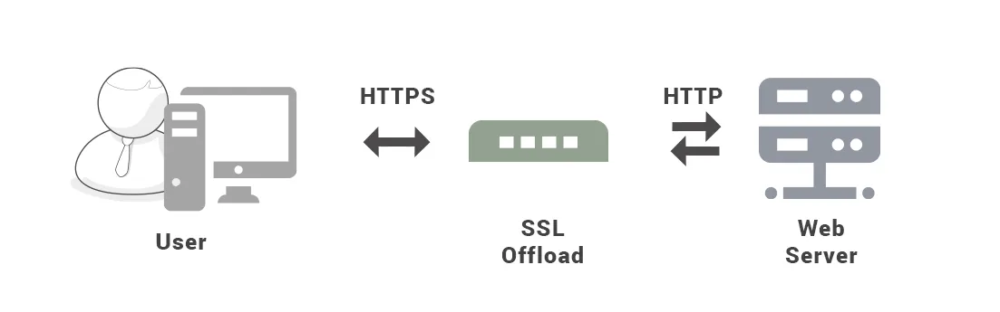

加密

---

1. 对称密钥加密

对称密钥加密(Symmetric-Key Encryption)，加密和解密使用同一密钥。

- 优点: 运算速度快；
- 缺点: 无法安全地将密钥传输给通信方。


2. 非对称密钥加密

非对称密钥加密，又称公开密钥加密(Public-Key Encryption)，加密和解密使用不同的密钥。

公开密钥所有人都可以获得，通信发送方获得接收方的公开密钥之后，就可以使用公开密钥进行加密，接收方收到通信内容后使用私有密钥解密。

非对称密钥除了用来加密，还可以用来进行签名。因为私有密钥无法被其他人获取，因此通信发送方使用其私有密钥进行签名，通信接收方使用发送方的公开密钥对签名进行解密，就能判断这个签名是否正确。

- 优点: 可以更安全地将公开密钥传输给通信发送方；
- 缺点: 运算速度慢。


3. 【答案】HTTPs 采用的加密方式

HTTPs 采用混合的加密机制，使用非对称密钥加密用于传输对称密钥来保证传输过程的安全性，之后使用对称密钥加密进行通信来保证通信过程的效率。(下图中的 Session Key 就是对称密钥)

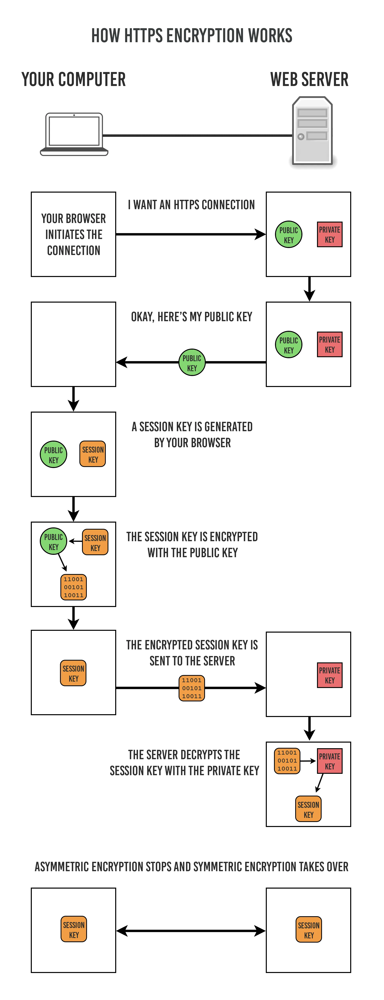

简化版本

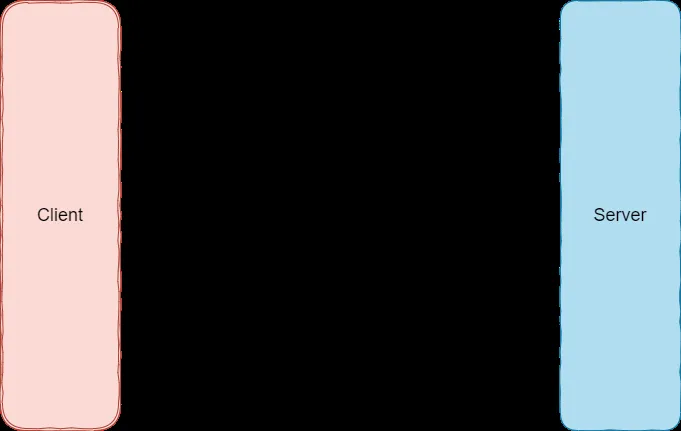

HTTPS（Hypertext Transfer Protocol Secure）是一种加密传输协议，它在 HTTP 协议的基础上添加了安全套接层（SSL/TLS）的支持。下面是 HTTPS 加密过程的简要描述：

1. 客户端发起连接请求：客户端向服务器发送 HTTPS 连接请求。请求中包括连接请求头和连接请求体。
2. 服务器响应：服务器接收到连接请求后，向客户端返回 SSL 证书，该证书包含了服务器公钥、证书颁发机构（CA）的信息等。
3. 客户端验证 SSL 证书：客户端收到 SSL 证书后，会对其进行验证，包括证书是否过期、证书颁发机构是否可信等。如果验证失败，客户端会提示用户存在安全风险，如果验证通过，则进入下一步。
4. 客户端生成对称密钥：客户端生成一个对称密钥，并使用服务器公钥进行加密，然后将加密后的密钥发送给服务器。
5. 服务器解密对称密钥：服务器收到客户端发送的加密后的对称密钥后，使用自己的私钥进行解密，得到对称密钥。
6. 建立安全通道：客户端和服务器使用对称密钥进行通信，实现数据的加密和解密。
7. 数据传输：客户端和服务器之间进行数据传输，数据会经过 SSL/TLS 协议的加密和解密处理。

上述过程中，SSL/TLS 协议的作用是保证数据的安全性和完整性，主要包括以下方面：

- 认证服务器身份：客户端验证服务器 SSL 证书，确保连接的服务器是合法的，防止中间人攻击。
- 加密数据传输：使用对称密钥对数据进行加密，保证数据在传输过程中不被窃听。
- 数据完整性验证：使用消息摘要算法（如 SHA256）对数据进行签名，保证数据在传输过程中不被篡改。

### https 数字证书交换的过程详细说一下？

数字证书认证机构(CA，Certificate Authority)是客户端与服务器双方都可信赖的第三方机构。

服务器的运营人员向 CA 提出公开密钥的申请，CA 在判明提出申请者的身份之后，会对已申请的公开密钥做数字签名，然后分配这个已签名的公开密钥，并将该公开密钥放入公开密钥证书后绑定在一起。

进行 HTTPs 通信时，服务器会把证书发送给客户端。客户端取得其中的公开密钥之后，先使用数字签名进行验证，如果验证通过，就可以开始通信了。

通信开始时，客户端需要使用服务器的公开密钥将自己的私有密钥传输给服务器，之后再进行对称密钥加密。

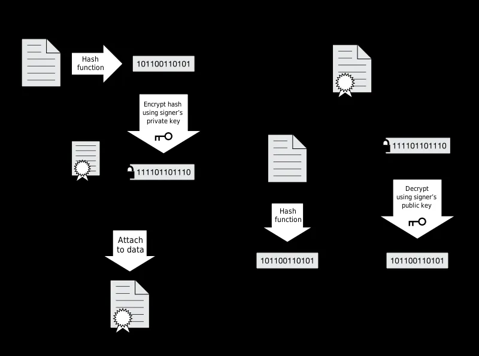

### DNS 解析过程，给个 URL 一层一层具体分析

.com.fi 国际金融域名 DNS 解析的步骤一共分为 9 步，如果每次解析都要走完 9 个步骤，大家浏览网站的速度也不会那么快，现在之所以能保持这么快的访问速度，其实一般的解析都是跑完第 4 步就可以了。除非一个地区完全是第一次访问（在都没有缓存的情况下）才会走完 9 个步骤，这个情况很少。

- 1、本地客户机提出域名解析请求，查找本地 HOST 文件后将该请求发送给本地的域名服务器。
- 2、将请求发送给本地的域名服务器。
- 3、当本地的域名服务器收到请求后，就先查询本地的缓存。
- 4、如果有该纪录项，则本地的域名服务器就直接把查询的结果返回浏览器。
- 5、如果本地 DNS 缓存中没有该纪录，则本地域名服务器就直接把请求发给根域名服务器。
- 6、然后根域名服务器再返回给本地域名服务器一个所查询域（根的子域）的主域名服务器的地址。
- 7、本地服务器再向上一步返回的域名服务器发送请求，然后接受请求的服务器查询自己的缓存，如果没有该纪录，则返回相关的下级的域名服务器的地址。
- 8、重复第 7 步，直到找到正确的纪录。
- 9、本地域名服务器把返回的结果保存到缓存，以备下一次使用，同时还将结果返回给客户机。


注意事项：

**递归查询**：在该模式下 DNS 服务器接收到客户机请求，必须使用一个准确的查询结果回复客户机。如果 DNS 服务器本地没有存储查询 DNS 信息，那么该服务器会询问其他服务器，并将返回的查询结果提交给客户机。

**迭代查询**：DNS 所在服务器若没有可以响应的结果，会向客户机提供其他能够解析查询请求的 DNS 服务器地址，当客户机发送查询请求时，DNS 服务器并不直接回复查询结果，而是告诉客户机另一台 DNS 服务器地址，客户机再向这台 DNS 服务器提交请求，依次循环直到返回查询的结果为止。

### 7 层网络，4 层网络，5 层网络，各层有哪些协议

OSI7 层：应用层（Application）、表示层（Presentation）、会话层（Session）、传输层（Transport）、网络层（Network）、数据链路层（Data Link）、物理层（Physical）

4 层是指 TCP/IP 四层模型，主要包括：应用层、运输层、网际层和网络接口层。

5 层（五层协议只是 OSI 和 TCP/IP 的综合，实际应用还是 TCP/IP 的四层结构）：应用层、运输层、网络层、数据链路层和物理层。

协议参考图：


### 已经封装好的消息，不考虑 DNS 等，怎么寻址

对于已经封装好的消息，如何寻址取决于它所使用的协议。下面以常用的 TCP/IP 协议为例，介绍如何对已封装消息进行寻址：

在 TCP/IP 协议中，已经封装好的消息通常包含了目标主机的 IP 地址。因此，寻址的过程就是将消息中的 IP 地址与当前主机的 IP 地址进行比较，确定消息是否要传递到当前主机上。如果目标主机与当前主机不在同一个网络中，则需要通过路由器进行转发。路由器将根据消息中的目标 IP 地址和路由表信息，选择一条最佳的路径将消息转发到下一个网络节点，直到到达目标主机。

在局域网中，可以通过 ARP 协议将 IP 地址解析为 MAC 地址，以便在链路层上传输数据。

总之，不同的协议会采用不同的寻址方式和协议，但它们的共同点是都需要某种形式的地址信息来确定数据传输的目的地。

### 局域网内怎么寻址，网关怎么找到

在局域网内部，设备之间通常使用 MAC 地址进行通信。MAC 地址是硬件地址，是由网卡厂商预设在网卡中的，每个网卡都有唯一的 MAC 地址。因此，当一台设备要发送数据到另一台设备时，它需要知道目标设备的 MAC 地址。

为了实现 IP 地址到 MAC 地址的映射，局域网内部通常使用 ARP（Address Resolution Protocol）协议。当一台设备需要与另一台设备通信时，它会在 ARP 缓存中查找目标设备的 IP 地址对应的 MAC 地址。如果 ARP 缓存中没有这条记录，它就会广播一个 ARP 请求消息到局域网上，请求与目标 IP 地址对应的设备回复自己的 MAC 地址。目标设备收到 ARP 请求消息后，会将自己的 MAC 地址打包成 ARP 响应消息返回给请求设备。请求设备收到 ARP 响应消息后，就可以将目标设备的 MAC 地址存储到 ARP 缓存中，并使用这个 MAC 地址发送数据包。

对于网关，它通常是局域网中与外部网络相连的设备，它具有两个 IP 地址，一个是在局域网中使用的 IP 地址，另一个是在外部网络中使用的 IP 地址。当局域网内的设备需要与外部网络通信时，它们会将数据包发送到网关的局域网 IP 地址，网关会收到这个数据包并将其转发到外部网络中。当外部网络中的设备返回响应数据包时，网关会将响应数据包转发回局域网，并将其发送到相应的目标设备。

在 TCP/IP 协议中，每个设备都需要配置一个默认网关的 IP 地址。当设备需要与外部网络通信时，它会将数据包发送到默认网关的 IP 地址，网关会收到这个数据包并将其转发到外部网络中。因此，找到网关的过程是在设备配置中指定其默认网关的 IP 地址。

### 网际路由协议，怎么确定最短路由

网际路由协议使用了一种叫做"距离向量算法"（distance vector algorithm）的算法来确定最短路由。这个算法的核心思想是，每个路由器将自己到目标地址的距离（通常用跳数或者实际距离等量来度量）告诉相邻的路由器，相邻的路由器再将这些信息传递给它们的相邻路由器，以此类推，最终所有的路由器都会知道到达目标地址的最短路径。

具体来说，每个路由器会周期性地向它的相邻路由器发送一个"路由更新消息"（routing update message），这个消息包含了该路由器的路由表信息，其中包括了到目标地址的距离以及下一跳路由器的信息。当一个路由器收到了相邻路由器的路由更新消息后，会根据这个消息更新自己的路由表。如果更新后的路由表发生了变化，那么这个路由器就会向它的相邻路由器发送自己的路由更新消息，以此类推，直到所有的路由器的路由表都收敛到最短路径为止。

距离向量算法的优点是简单易实现，但它也存在一些问题。例如，当路由器之间的链路出现故障时，路由器的路由表可能会出现不一致，从而导致路由环路、路由震荡等问题。为了解决这些问题，网际路由协议还引入了一些机制，例如路由聚合、路由汇总、路由重分发等。

### DNS（DNS 过程，DNS 负载均衡）

解析过程（参照上面问题：DNS 解析过程，给个 URL 一层一层具体分析）

**DNS 负载均衡**

最早的负载均衡技术，利用域名解析实现负载均衡，在 DNS 服务器，配置多个 A 记录，这些 A 记录对应的服务器构成集群。大型网站总是部分使用 DNS 解析，作为第一级负载均衡。如下图：

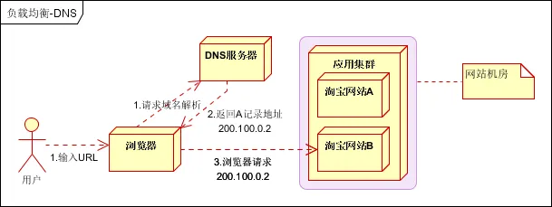

**实践建议**

将 DNS 作为第一级负载均衡，A 记录对应着内部负载均衡的 IP 地址，通过内部负载均衡将请求分发到真实的 Web 服务器上。一般用于互联网公司，复杂的业务系统不合适使用。如下图：

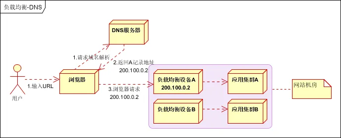

### 第三次握手失败会发生什么

第三次握手失败后：

1. 在第二次握手，服务器端向客户端发送SYN+ACK报文后，就会启动一个定时器，等待客户端返回的ACK报文。
2. 如果第三次握手失败的话，客户端给服务端返回了ACK报文，服务端并不能收到这个ACK报文。那么服务端就会启动超时重传机制，超过规定时间后重新发起第二次握手，向客户端发送SYN+ACK。重传次数根据/proc/sys/net/ipv4/tcp_synack_retries来指定，默认是5次。
3. 如果重传指定次数到了后，仍然未收到ACK应答，那么一段时间后，服务端会自动关闭这个连接。但客户端认为这个连接已经建立，如果客户端向服务端写数据，服务端将回应RST包、强制关闭TCP连接，以防止SYN攻击。

扩展：TCP为什么需要第三次握手？

`https://www.iamshuaidi.com/675.html`

原因：

  1）两次握手是最基本的，一般情况下能保证tcp连接正常进行。

   2）需要第三次握手是为了防止已失效的请求报文段突然又传送到了服务端而产生连接的误判 。

    假如没有第三次握手，服务端接收到失效的请求报文段就会认为连接已建立，从而进入等待客户端发送数据的状态。但客户端并没有发出请求，所以不会发送数据。于是服务端就会一直处于等待状态，从而浪费资源。

### 数据链路层怎么传输数据的，展开说说（2022字节）

**数据链路层的主要作用就是加强物理层传输原始比特流的功能。其负责将物理层提供的可能出错的物理连接，改造成逻辑上无差错的数据链路，使之对网络层表现为一条无差错的链路**。

数据链路层包括三个基本问题：**封装成帧、透明传输、差错控制**。

#### 封装成帧

在物理层发送的信号本身是没有起始与结束标志的，同时数据链路层又需要将IP数据报也添加到帧中，这个问题综合而言就是封装成帧的问题。

将IP数据报封装成帧很简单，只需在数据部分的前面添加一个帧开始符SOH，并在数据部分的后面添加一个帧结尾符EOT。在接收数据时如果遇到了帧开始符就表示需要开始接收数据了，如果没有遇到就说明前面收到的可能都是噪声不用做处理。然后在此遇到帧结束符就说明数据传输结束，后面的部分数据不同在处理，数据封装示意图如下：

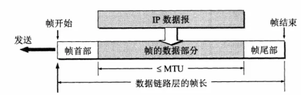

#### 透明传输

透明传输是指不管所传数据是什么样的比特组合，都应当能够在链路上传送。在数据链路层将网络层协议封装成帧时，会在首部和尾部分别添加SOH以及EOT这两个特殊字符，接收方是根据这两个字符来确定帧首和帧尾的（产生了二义性），如果上层协议发送过来的数据(即链路层的数据部分)包含EOT，那么接收方在解析这个帧的时候就会误以为数据已经结束，这种情况下传输数据就会产生问题。所以，如果链路层对这种情况没有特殊处理，那么就可以理解链路层为非透明传输(因为无法传输EOT这个字符)。

通常情况下解决这个问题可以在数据部分的SOH、EOT字符前添加一转义字符ESC,在传输时如果直接接收到SOH、EOT字符还是表示为帧的开始与结束标志，但是如果接收时接收到了ESC然后接收到SOH、EOT，就说明这两个字符不是帧的开始与结束标志，是帧数据的一部分。这样就完成了透明传输的问题。

#### 差错控制

现实的通信链路都不会是理想的。这就是说，比特在传输过程中可能会产生差错:1可能会变成0，而0也可能变成1。

为了检测这种差错，数据链路层采用了校验码。数据链路层在传输前生成校验码同数据一起发送，接受后通过校验码校验数据是否正确，如果校验出错就直接丢弃该帧，如果没有出错就直接保存，解析，并将数据部分上交给网络层。在使用中使用最为广泛的就是CRC循环冗余校验。

### Arp协议中网关怎么去转换ip地址到对应MAC地址的（2022字节）

在传输一个 IP 数据报的时候，确定了源 IP 地址和目标 IP 地址后，就会通过主机「路由表」确定 IP 数据包下一跳。然而，网络层的下一层是数据链路层，所以我们还要知道「下一跳」的 MAC 地址。

由于主机的路由表中可以找到下一跳的 IP 地址，所以可以通过 **ARP 协议**，求得下一跳的 MAC 地址。

> 那么 ARP 又是如何知道对方 MAC 地址的呢？

简单地说，ARP 是借助 **ARP 请求与 ARP 响应**两种类型的包确定 MAC 地址的。


- 主机会通过**广播发送 ARP 请求**，这个包中包含了想要知道的 MAC 地址的主机 IP 地址。
- 当同个链路中的所有设备收到 ARP 请求时，会去拆开 ARP 请求包里的内容，如果 ARP 请求包中的目标 IP 地址与自己的 IP 地址一致，那么这个设备就将自己的 MAC 地址塞入 **ARP 响应包**返回给主机。

操作系统通常会把第一次通过 ARP 获取的 MAC 地址缓存起来，以便下次直接从缓存中找到对应 IP 地址的 MAC 地址。

不过，MAC 地址的缓存是有一定期限的，超过这个期限，缓存的内容将被清除。

> RARP 协议你知道是什么吗？

ARP 协议是已知 IP 地址求 MAC 地址，那 RARP 协议正好相反，它是**已知 MAC 地址求 IP 地址**。例如将打印机服务器等小型嵌入式设备接入到网络时就经常会用得到。

通常这需要架设一台 `RARP` 服务器，在这个服务器上注册设备的 MAC 地址及其 IP 地址。然后再将这个设备接入到网络，接着：

- 该设备会发送一条「我的 MAC 地址是XXXX，请告诉我，我的IP地址应该是什么」的请求信息。
- RARP 服务器接到这个消息后返回「MAC地址为 XXXX 的设备，IP地址为 XXXX」的信息给这个设备。

最后，设备就根据从 RARP 服务器所收到的应答信息设置自己的 IP 地址。


### pop3属于哪个层的协议（2022字节）

很明显属于：应用层

| 应用层     | DHCP · DNS · FTP · Gopher · HTTP · IMAP4 · IRC · NNTP · XMPP · POP3 · SIP · SMTP · SNMP · SSH · TELNET · RPC · RTCP · RTP ·RTSP · SDP · SOAP · GTP · STUN · NTP · SSDP |
| ---------- | ---------------------------------------------------------------------------------------------------------------------------------------------------------------------------------------------- |
| 表示层     | HTTP/HTML · FTP · Telnet · ASN.1（具有表示层功能）                                                                                                                                          |
| 会话层     | ADSP·ASP·H.245·ISO-SP·iSNS·NetBIOS·PAP·RPC· RTCP·SMPP·SCP·SSH·ZIP·SDP（具有会话层功能）                                                                                           |
| 传输层     | TCP · UDP · TLS · DCCP · SCTP ·RSVP · PPTP                                                                                                                                               |
| 网络层     | IP (IPv4 · IPv6) · ICMP · ICMPv6 · IGMP ·IS-IS · IPsec · BGP · RIP · OSPF ·ARP · RARP                                                                                               |
| 数据链路层 | Wi-Fi(IEEE 802.11) · WiMAX(IEEE 802.16) ·ATM · DTM · 令牌环 · 以太网路 · FDDI · 帧中继 · GPRS · EVDO · HSPA · HDLC · PPP · L2TP · ISDN ·STP                                     |
| 物理层     | 以太网路卡 · 调制解调器 · 电力线通信(PLC) · SONET/SDH（光同步数字传输网） · G.709（光传输网络） · 光导纤维 · 同轴电缆 · 双绞线                                                          |

### TCP 拥塞控制？慢启动的时候窗口在什么情况下会增长？为什么会呈指数增长？

慢启动：每次收到一个 ACK 报文将拥塞窗口（cwnd）加上一个 MSS，从 1 开始成指数级增长

拥塞避免：当 cwnd ≥ 慢启动阈值（sstresh）时，窗口按线性增长，当收到三个连续的冗余 ACK 后，进入快重启

快重启：sstresh=cwnd, cwnd = sstresh + 3*MSS（三次冗余的）并发送丢失的报文，每次收到冗余的就指数级增长直到收到新的 ACK，进入拥塞避免或者超时进入慢重启

TCP拥塞控制是一种流量控制机制，它用于确保网络不会因为发送的数据量过大而发生拥塞，从而导致网络性能下降或崩溃。TCP拥塞控制通过动态调整发送方的拥塞窗口大小来实现这一目的。

在TCP连接建立之初，发送方会通过慢启动（Slow Start）算法来逐渐增加其发送窗口大小，以便在网络出现拥塞之前，尽可能充分利用网络带宽。在慢启动阶段，每个回合（Round Trip Time，RTT）结束时，发送窗口大小将加倍，从而呈指数增长，直到网络出现拥塞或者发送窗口大小达到某个限制（如接收方的接收窗口大小）。

窗口大小增长的指数性增长是因为TCP发送方希望尽快探测出网络的带宽容量，并且在不超过网络容量的情况下尽可能快地将数据发送出去。因此，在慢启动期间，发送方会通过呈指数增长的方式增加窗口大小，以尽可能快地占用网络带宽。

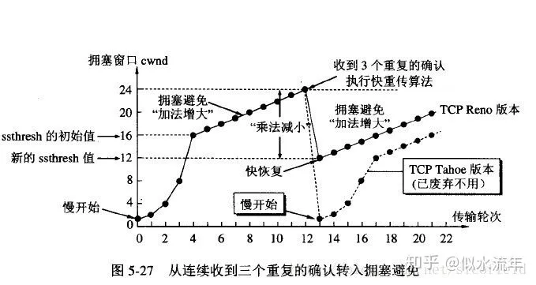


### 什么是 TIME_WAIT 状态，为什么需要 TIME_WAIT 状态？时间是多久，为什么？（2022字节提前批）

四次挥手客户端接受到服务端 FIN 报文后返回 ACK 报文的状态
可以防止 ACK 报文丢失，服务器没有收到会重复发 FIN 报文
而 TIME_WAIT 的长度为 2*MSL 这样 ACK 丢失了，FIN 再次发送，在这时间里客户端还能收到 FIN 报文


### HTTP各个版本 (1.0，1.1，2.0，3.0) （2022蔚来）

#### HTTP/1.0

1996年5月，HTTP/1.0 版本发布，为了提高系统的效率，HTTP/1.0规定浏览器与服务器只保持短暂的连接，浏览器的每次请求都需要与服务器建立一个TCP连接，服务器完成请求处理后立即断开TCP连接，服务器不跟踪每个客户也不记录过去的请求。

这种方式就好像我们打电话的时候，只能说一件事儿一样，说完之后就要挂断，想要说另外一件事儿的时候就要重新拨打电话。

HTTP/1.0中浏览器与服务器只保持短暂的连接，连接无法复用。也就是说每个TCP连接只能发送一个请求。发送数据完毕，连接就关闭，如果还要请求其他资源，就必须再新建一个连接。

我们知道TCP连接的建立需要三次握手，是很耗费时间的一个过程。所以，HTTP/1.0版本的性能比较差。

> HTTP1.0 其实也可以强制开启长链接，例如接受Connection: keep-alive 这个字段，但是，这不是标准字段，不同实现的行为可能不一致，因此不是根本的解决办法。

#### HTTP/1.1

为了解决HTTP/1.0存在的缺陷，HTTP/1.1于1999年诞生。相比较于HTTP/1.0来说，最主要的改进就是引入了持久连接。所谓的持久连接即TCP连接默认不关闭，可以被多个请求复用。

由于之前打一次电话只能说一件事儿，效率很低。后来人们提出一种想法，就是电话打完之后，先不直接挂断，而是持续一小段时间，这一小段时间内，如果还有事情沟通可以再次进行沟通。

客户端和服务器发现对方一段时间没有活动，就可以主动关闭连接。或者客户端在最后一个请求时，主动告诉服务端要关闭连接。

HTTP/1.1版还引入了管道机制（pipelining），即在同一个TCP连接里面，客户端可以同时发送多个请求。这样就进一步改进了HTTP协议的效率。

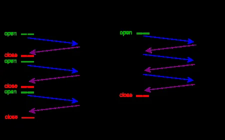

有了持久连接和管道，大大的提升了HTTP的效率。但是服务端还是顺序执行的，效率还有提升的空间。

#### HTTP/2

HTTP/2 是 HTTP 协议自 1999 年 HTTP 1.1 发布后的首个更新，主要基于 SPDY 协议。

HTTP/2 为了解决HTTP/1.1中仍然存在的效率问题，HTTP/2 采用了多路复用。即在一个连接里，客户端和浏览器都可以同时发送多个请求或回应，而且不用按照顺序一一对应。能这样做有一个前提，就是HTTP/2进行了二进制分帧，即 HTTP/2 会将所有传输的信息分割为更小的消息和帧（frame）,并对它们采用二进制格式的编码。

也就是说，老板可以同时下达多个命令，员工也可以收到了A请求和B请求，于是先回应A请求，结果发现处理过程非常耗时，于是就发送A请求已经处理好的部分， 接着回应B请求，完成后，再发送A请求剩下的部分。A请求的两部分响应在组合到一起发给老板。


而这个负责拆分、组装请求和二进制帧的一层就叫做二进制分帧层。

除此之外，还有一些其他的优化，比如做Header压缩、服务端推送等。

Header压缩就是压缩老板和员工之间的对话。

服务端推送就是员工事先把一些老板可能询问的事情提现发送到老板的手机（缓存）上。这样老板想要知道的时候就可以直接读取短信（缓存）了。

目前，主流的HTTP协议还是HTTP/1.1 和 HTTP/2。并且各大网站的HTTP/2的使用率也在逐年增加。

* [HTTP3](https://xiaolincoding.com/network/2_http/http3.html)

### HTTP2.0之前怎么实现服务器推送机制（2022蔚来）

HTTP/1.1 不支持服务器主动推送资源给客户端，都是由客户端向服务器发起请求后，才能获取到服务器响应的资源。

比如，客户端通过  HTTP/1.1 请求从服务器那获取到了 HTML 文件，而 HTML 可能还需要依赖 CSS 来渲染页面，这时客户端还要再发起获取 CSS 文件的请求，需要两次消息往返，如下图左边部分：


如上图右边部分，在 HTTP/2 中，客户端在访问 HTML 时，服务器可以直接主动推送 CSS 文件，减少了消息传递的次数。

在 Nginx 中，如果你希望客户端访问 /test.html 时，服务器直接推送 /test.css，那么可以这么配置：

```text
location /test.html { 
  http2_push /test.css; 
}
```

那 HTTP/2 的推送是怎么实现的？

客户端发起的请求，必须使用的是奇数号 Stream，服务器主动的推送，使用的是偶数号 Stream。服务器在推送资源时，会通过 `PUSH_PROMISE` 帧传输 HTTP 头部，并通过帧中的 `Promised Stream ID` 字段告知客户端，接下来会在哪个偶数号 Stream 中发送包体。

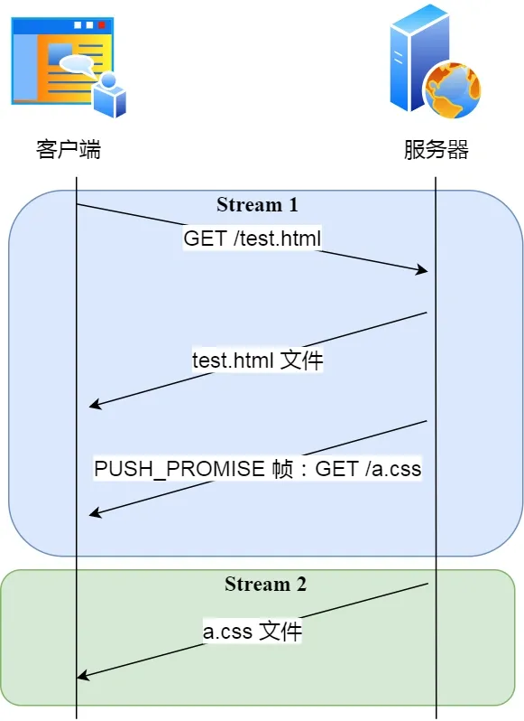

如上图，在 Stream 1 中通知客户端 CSS 资源即将到来，然后在 Stream 2 中发送 CSS 资源，注意 Stream 1 和 2 是可以**并发**的。

### tcp粘包是什么原因，如何解决？（2022虾皮）

#### 什么是粘包

在进行 Java NIO 学习时，可能会发现：如果客户端连续不断的向服务端发送数据包时，服务端接收的数据会出现两个数据包粘在一起的情况。
 TCP 是基于字节流的，虽然应用层和 TCP 传输层之间的数据交互是大小不等的数据块，但是 TCP 把这些数据块仅仅看成一连串无结构的字节流，没有边界；
 从 TCP 的帧结构也可以看出，在 TCP 的首部没有表示数据长度的字段。
基于上面两点，在使用 TCP 传输数据时，才有粘包或者拆包现象发生的可能。一个数据包中包含了发送端发送的两个数据包的信息，这种现象即为粘包。
接收端收到了两个数据包，但是这两个数据包要么是不完整的，要么就是多出来一块，这种情况即发生了拆包和粘包。拆包和粘包的问题导致接收端在处理的时候会非常困难，因为无法区分一个完整的数据包。

#### 黏包是怎么产生的？

* 发送方产生粘包
  采用 TCP 协议传输数据的客户端与服务器经常是保持一个长连接的状态（一次连接发一次数据不存在粘包），双方在连接不断开的情况下，可以一直传输数据。但当发送的数据包过于的小时，那么 TCP 协议默认的会启用 Nagle 算法，将这些较小的数据包进行合并发送（缓冲区数据发送是一个堆压的过程）；这个合并过程就是在发送缓冲区中进行的，也就是说数据发送出来它已经是粘包的状态了。
* 接收方产生粘包
  接收方采用 TCP 协议接收数据时的过程是这样的：数据到接收方，从网络模型的下方传递至传输层，传输层的 TCP 协议处理是将其放置接收缓冲区，然后由应用层来主动获取（C 语言用 recv、read 等函数）；这时会出现一个问题，就是我们在程序中调用的读取数据函数不能及时的把缓冲区中的数据拿出来，而下一个数据又到来并有一部分放入的缓冲区末尾，等我们读取数据时就是一个粘包。（放数据的速度 > 应用层拿数据速度）

#### 如何解决

粘包的问题出现是因为不知道一个用户消息的边界在哪，如果知道了边界在哪，接收方就可以通过边界来划分出有效的用户消息。

一般有三种方式分包的方式：

- 固定长度的消息；
- 特殊字符作为边界；
- 自定义消息结构。

##### 固定长度的消息

这种是最简单方法，即每个用户消息都是固定长度的，比如规定一个消息的长度是 64 个字节，当接收方接满 64 个字节，就认为这个内容是一个完整且有效的消息。

但是这种方式灵活性不高，实际中很少用。

##### 特殊字符作为边界

我们可以在两个用户消息之间插入一个特殊的字符串，这样接收方在接收数据时，读到了这个特殊字符，就把认为已经读完一个完整的消息。

HTTP 是一个非常好的例子。


HTTP 通过设置回车符、换行符作为 HTTP 报文协议的边界。

有一点要注意，这个作为边界点的特殊字符，如果刚好消息内容里有这个特殊字符，我们要对这个字符转义，避免被接收方当作消息的边界点而解析到无效的数据。

## 🖼️场景题

### 很多短任务线程，选择 synchronized 还是 lock（2022-04-11 携程）
> 参考资料：https://stackoverflow.com/questions/4201713/synchronization-vs-lock、https://www.geeksforgeeks.org/lock-framework-vs-thread-synchronization-in-java/、https://www.baeldung.com/java-concurrent-locks

synchronized 和 lock 是两种不同的 Java 线程同步机制。synchronized 是基于隐式的监视器锁，而 lock 是基于显式的锁接口。
synchronized 和 lock 之间的选择取决于你的具体需求和场景。一般来说，lock 比 synchronized 更灵活和复杂，可以支持更细粒度的锁控制和更多的功能。

如果你有很多短任务线程，那么你可能需要考虑以下几个方面：

- 性能：lock 通常比 synchronized 有更好的性能，因为它可以避免不必要的上下文切换和阻塞。
- 可重入性：synchronized 和 lock 都支持可重入性，即一个线程可以多次获取同一个锁。
- 公平性：synchronized 是非公平的，即无法保证等待的线程按照请求顺序获取锁。lock 可以是公平的或非公平的，取决于你使用哪种实现类。
- 中断性：synchronized 是不可中断的，即一个线程在等待获取锁时无法响应中断。lock 是可中断的，即一个线程可以在等待获取锁时被中断并释放锁。
- 超时性：synchronized 是无超时的，即一个线程在等待获取锁时无法设置超时时间。lock 是有超时的，即一个线程可以在等待获取锁时设置超时时间，并在超时后放弃获取锁。
- 条件变量：synchronized 只能配合 Object 类的 wait() 和 notify() 方法使用条件变量。lock 可以配合 Condition 接口使用多个条件变量，并支持更多的操作。

根据以上比较，你可以根据你的具体需求和场景选择 synchronized 或 lock。一般来说，如果你需要更简单和快速的同步机制，你可以选择 synchronized；如果你需要更灵活和复杂的同步机制，你可以选择 lock。

### 多个人给一个主播打赏怎么设计？我说是一个高并发写的操作，对一个记录频繁写，分批操作，比如 10 个记录 操作一次。他说这个方案可以 但是有 100 个记录 怎么去做一个一个操作呢？我说如果在一个进程可以 分多个线程分批。他说还是不够快 我们是用的 MQ 多个消费者 一个打赏就发一个消息 （2022-6-3   58同城）


### 怎么实现一个点赞功能？

项目是是 SpringCloud + Dubbo的结构这是Controller层代码

主要的流程解释下：先查询数据库改用户是否进行点赞，如果已经点赞则抛出异常，如果没有则new一个对象来一个一个Set，然后将已点赞的信息存入redis中，相反，取消点赞的操作就是删除redis中的数据即可，然后通过Dubbo调用API来完成保存操作，因为我这里是还要获取点赞数和评论数啥的，所以会对动态表进行更新操作。

### 比如下单清空购物车，你是如何设计的？

1. 生产者（订单系统）产生消息，发送一条半事务消息到MQ服务器
2. MQ收到消息后，将消息持久化到存储系统，这条消息的状态是待发送状态。
3. MQ服务器返回ACK确认到生产者，此时MQ不会触发消息推送事件
4. 生产者执行本地事务（订单创建成功，提交事务消息）
5. 如果本地事务执行成功，即commit执行结果到MQ服务器；如果执行失败，发送rollback。
6. 如果是commit正常提交，MQ服务器更新消息状态为**可发送**；如果是rollback，即**删除消息**。
7. 如果消息状态更新为可发送，则MQ服务器会push消息给消费者（购物车系统）。消费者消费完（即拿到订单消息，清空购物车成功）就应答ACK。
8. 如果MQ服务器长时间没有收到生产者的commit或者rollback，它会反查生产者，然后根据查询到的结果（回滚操作或者重新发送消息）执行最终状态。

有些伙伴可能有疑惑，如果消费者消费失败怎么办呢？那数据是不是不一致啦？所以就需要消费者消费成功，执行业务逻辑成功，再反馈ack嘛。如果消费者消费失败，那就自动重试嘛，接口支持幂等即可。

### 排行榜的实现，比如高考成绩排序（2022 虾皮）

排行版的实现，一般使用redis的**zset**数据类型。

- 使用格式如下：

```
zadd key score member [score member ...]，zrank key member
```

- 层内部编码：ziplist（压缩列表）、skiplist（跳跃表）
- 使用场景如排行榜，社交需求（如用户点赞）

实现demo如下：

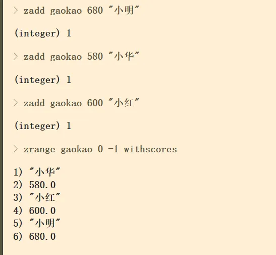

### 有一批帖子，会根据类别搜索，但是现在是单独一个表，现在查询非常慢，如何提高搜索性能？（2022 虾皮）

根据类别分库分表，库可以放到不同的实例上，经常查询的不变的数据]可以放到缓存里。
数据有更新时，需要刷新下缓存
因为分表后，只能是固定类别，所以需要根据类别去分开查找。
如果还有另一个重要的字段也需要查，可以再建一个分表，user-ses/ses-user就是这么做的，但是冗余就比较大

### 如果有多个表，进行聚合查询，如何解决深分页的问题（2022 虾皮）

就是保存每个节点的表id给前端，前端查询时把id返回过来了，然后加到SQL里，但是不一定准。这里回答的是单个表吧

### 分表的数据，动态增加一张表，不停服如何实现？（2022 虾皮）

分区策略使用一致性哈希
然后新表的数据，查询的时候，先查老的，再插入新的。如果老数据没有动，需要有对应的迁移服务进行定时迁移。插入的时候优先插入到新的表。

### 迁移线程和用户线程同时执行，会有数据库不一致的问题，怎么解决？（2022 虾皮）

加分布式锁

### 两个机房，某个机房可能断电，如何做多机房容灾（2022 虾皮）

负载均衡层，支持切换机房
写数据的时候，中间件（db/redis/es）都要进行双写。
kafka容灾，mirror maker: https://cloud.tencent.com/developer/article/1358933

### 主从机房同步有什么问题呢？ （2022 虾皮）

> 会有比较大的延迟。
> 一些分布式的问题，例如分布式事务，可能就执行了几步，然后就挂了，需要有一定的策略，进行回滚或者提交。
> 切换机房的过程中，可能存在数据丢失，重复数据等

- 双向同步，两个机房都能写入，如果操作的是各自的数据的话，问题不大。如果操作的是相同数据，必然会有冲突，需要解决。所以上层保证相同数据到同一个机房即可，然后同步到另外一个机房，保证每个机房都有全量的数据。各种中间件都要做改造。
- 总之，分片的核心思路在于，让同一个用户的相关请求，只在一个机房内完成所有业务「闭环」，不再出现「跨机房」访问。
- 阿里在实施这种方案时，给它起了个名字，叫做「单元化」。
- 这里还有一种情况，是无法做数据分片的：全局数据。例如系统配置、商品库存这类需要强一致的数据，这类服务依旧只能采用写主机房，读从机房的方案，不做双活。
- 双活的重点，是要优先保证「核心」业务先实现双活，并不是「全部」业务实现双活。

https://mp.weixin.qq.com/s/hWCmnsa3rdtMFTE_BSyg2w

### 冷机房新请求过来，发现缓存没有，会把数据库打挂，这个怎么解决？（2022 虾皮）

预热，提前加载到缓存。
或者平时保持一定的流量。
用了缓存的，一般需要预热下，防止雪崩。

### 定时任务这种，怎么改变执行的机房（2022 虾皮）

加开关，任何时候都有一个条件不满足，在空跑。

## 🐧Linux

### 自由发挥题目

* 怎么学习的linux (2022蔚来)
* Linux知道哪些命令?（2022美团）

### 查看系统里CPU和内存使用情况，用哪些命令执行？

#### top

**top命令** 可以实时动态地查看系统的整体运行情况，是一个综合了多方信息监测系统性能和运行信息的实用工具。通过top命令所提供的互动式界面，用热键可以管理。

**实例**

```shell
top - 09:44:56 up 16 days, 21:23,  1 user,  load average: 9.59, 4.75, 1.92
Tasks: 145 total,   2 running, 143 sleeping,   0 stopped,   0 zombie
Cpu(s): 99.8%us,  0.1%sy,  0.0%ni,  0.2%id,  0.0%wa,  0.0%hi,  0.0%si,  0.0%st
Mem:   4147888k total,  2493092k used,  1654796k free,   158188k buffers
Swap:  5144568k total,       56k used,  5144512k free,  2013180k cached
```

**解释：**

- top - 09:44:56[当前系统时间],
- 16 days[系统已经运行了16天],
- 1 user[个用户当前登录],
- load average: 9.59, 4.75, 1.92[系统负载，即任务队列的平均长度]
- Tasks: 145 total[总进程数],
- 2 running[正在运行的进程数],
- 143 sleeping[睡眠的进程数],
- 0 stopped[停止的进程数],
- 0 zombie[冻结进程数],
- Cpu(s): 99.8%us[用户空间占用CPU百分比],
- 0.1%sy[内核空间占用CPU百分比],
- 0.0%ni[用户进程空间内改变过优先级的进程占用CPU百分比],
- 0.2%id[空闲CPU百分比], 0.0%wa[等待输入输出的CPU时间百分比],
- 0.0%hi[],
- 0.0%st[],
- Mem: 4147888k total[物理内存总量],
- 2493092k used[使用的物理内存总量],
- 1654796k free[空闲内存总量],
- 158188k buffers[用作内核缓存的内存量]
- Swap: 5144568k total[交换区总量],
- 56k used[使用的交换区总量],
- 5144512k free[空闲交换区总量],
- 2013180k cached[缓冲的交换区总量]

#### ps

**ps命令**  用于报告当前系统的进程状态。可以搭配kill指令随时中断、删除不必要的程序。ps命令是最基本同时也是非常强大的进程查看命令，使用该命令可以确定有哪些进程正在运行和运行的状态、进程是否结束、进程有没有僵死、哪些进程占用了过多的资源等等，总之大部分信息都是可以通过执行该命令得到的。

```shell
ps axo pid,comm,pcpu # 查看进程的PID、名称以及CPU 占用率
ps aux | sort -rnk 4 # 按内存资源的使用量对进程进行排序
ps aux | sort -nk 3  # 按 CPU 资源的使用量对进程进行排序
ps -A # 显示所有进程信息
ps -u root # 显示指定用户信息
ps -efL # 查看线程数
ps -e -o "%C : %p :%z : %a"|sort -k5 -nr # 查看进程并按内存使用大小排列
ps -ef # 显示所有进程信息，连同命令行
ps -ef | grep ssh # ps 与grep 常用组合用法，查找特定进程
ps -C nginx # 通过名字或命令搜索进程
ps aux --sort=-pcpu,+pmem # CPU或者内存进行排序,-降序，+升序
ps -f --forest -C nginx # 用树的风格显示进程的层次关系
ps -o pid,uname,comm -C nginx # 显示一个父进程的子进程
ps -e -o pid,uname=USERNAME,pcpu=CPU_USAGE,pmem,comm # 重定义标签
ps -e -o pid,comm,etime # 显示进程运行的时间
ps -aux | grep named # 查看named进程详细信息
ps -o command -p 91730 | sed -n 2p # 通过进程id获取服务名称
```

#### pmap

报告进程的内存映射关系。**pmap命令** 用于报告进程的内存映射关系，是Linux调试及运维一个很好的工具。

#### free

显示内存的使用情况。**free命令** 可以显示当前系统未使用的和已使用的内存数目，还可以显示被内核使用的内存缓冲区。

```sh
free -t    # 以总和的形式显示内存的使用信息
free -s 10 # 周期性的查询内存使用信息，每10s 执行一次命令
```

### 如果想统计一个服务的请求文件，统计每个接口的QPS的话，用什么命令能实现？

举个🌰命令是 `tail -f info.log | grep RecommendServiceImpl | cut -f1 -d'.' | uniq -c` 每个打的日志格式不一样，所以需要理解一下里面的意思

* `grep RecommendServiceImpl`是过滤出要测的接口
* `cut`是截取一下时间，其中 `-d‘.’`表示字符串风格表示符号，单引号里面的就是分割符，例如因为我日志是有打毫秒值的，所以我根据 `.`来分段，`-f1`表示我要取分段以后的第一段(从1开始数)，同理 `-f2`就是第二段也就是 `.`后面这部分，
* `uniq`显示或者忽略重复的行，但是加上-c就可以累计相同行数，所以我们这边累加起来


### Linux 中一个进程的虚拟内存分布长什么样？内核空间+用户空间（6 种不同的内存段）

.init：程序初始化的引导
.text：已编译的机器代码
.rodata：只读数据，存放字符串字面量，全局常量以及 switch 跳转表之类
.data：存放已经初始化的全局和静态变量
.bss：存放未初始化或初始化为 0 的全局和静态变量，仅仅是占位符，不占空间，名称可以理解为 Better Save Space（实际起源并不是这个）


### linux 命令，如何查看主机 CPU 核数？如何查看内存还剩多少？

cat /proc/cpuinfo

cat /proc/meminfo

### 如何查看哪个进程正在监听 80 端口？

lsof -i:80

netstat -tunlp | grep 80

### netstat -n 是什么意思？-a 是什么意思？-p 是什么意思？

- a (all)显示所有选项，默认不显示LISTEN相关
- p 显示建立相关链接的程序名
- n 拒绝显示别名，能显示数字的全部转化成数字。

### linux中写文件write的流程（2022蔚来）

1. 应用程序发起写请求，触发系统调用write()函数，用户态切换为内核态；
2. 文件系统通过目录项→inode→address_space→页缓存树，查询Page Cache是否存在，如果不存在则需要创建；
3. Page Cache存在后，CPU将数据从用户缓冲区拷贝到内核缓冲区，Page Cache变为脏页（Dirty Page），写流程返回；
4. 用户主动触发刷盘或者达到特定条件内核触发刷盘，唤醒pdflush线程将内核缓冲区的数据刷入磁盘；


【拓展】读流程

1. 应用程序发起读请求，触发系统调用read()函数，用户态切换为内核态；
2. 文件系统通过目录项→inode→address_space→页缓存树，查询Page Cache是否存在；
3. Page Cache不存在产生缺页中断，CPU向DMA发出控制指令；
4. DMA 控制器将数据从主存或硬盘拷贝到内核空间（kernel space）的缓冲区（read buffer）；
5. DMA 磁盘控制器向 CPU 发出数据读完的信号，由 CPU 负责将数据从内核缓冲区拷贝到用户缓冲区；
6. 用户进程由内核态切换回用户态，获得文件数据；

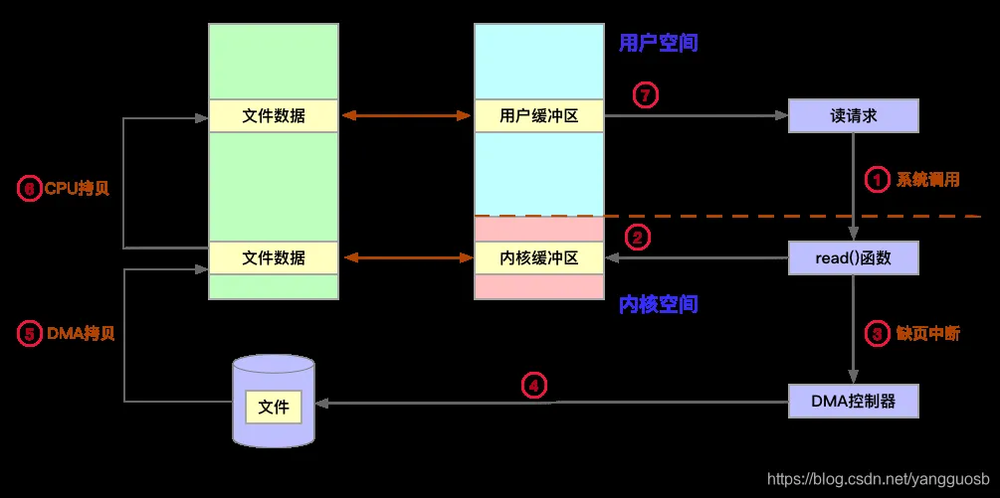

## 🛡️安全

### 讲讲 JWT

JWT（Json Web Token）, 是为了在网络应用环境间传递声明而执行的一种基于 JSON 的开放标准。JWT 一般被用来在身份提供者和服务提供者间传递被认证的用户身份信息，以便于从资源服务器获取资源，也可以增加一些额外的其它业务逻辑所必须的声明信息，该 token 也可直接被用于认证，也可被加密。


一般用它来替换掉 Session 实现数据共享。

使用基于 Token 的身份验证方法，在服务端不需要存储用户的登录记录。大概的流程是这样的：

- 1、客户端通过用户名和密码登录服务器；
- 2、服务端对客户端身份进行验证；
- 3、服务端对该用户生成 Token，返回给客户端；
- 4、客户端将 Token 保存到本地浏览器，一般保存到 cookie 中；
- 5、客户端发起请求，需要携带该 Token；
- 6、服务端收到请求后，首先验证 Token，之后返回数据。

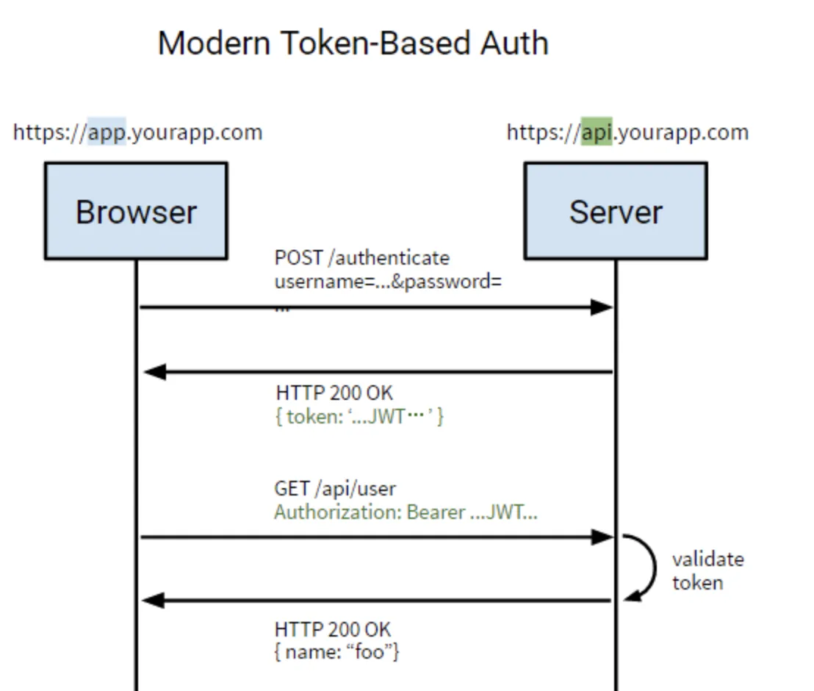

如上图为 Token 实现方式，浏览器第一次访问服务器，根据传过来的唯一标识 userId，服务端会通过一些算法，如常用的 HMAC-SHA256 算法，然后加一个密钥，生成一个 token，然后通过 BASE64 编码一下之后将这个 token 发送给客户端；客户端将 token 保存起来，下次请求时，带着 token，服务器收到请求后，然后会用相同的算法和密钥去验证 token，如果通过，执行业务操作，不通过，返回不通过信息。

可以对比下图 session 实现方式，流程大致一致。


**优点**：

- 无状态、可扩展 ：在客户端存储的 Token 是无状态的，并且能够被扩展。基于这种无状态和不存储 Session 信息，负载均衡器能够将用户信息从一个服务传到其他服务器上。
- 安全：请求中发送 token 而不再是发送 cookie 能够防止 CSRF(跨站请求伪造)。
- 可提供接口给第三方服务：使用 token 时，可以提供可选的权限给第三方应用程序。
- 多平台跨域

JWT 可以用在单点登录的系统中

传统的 JavaWeb 项目，利用 HttpSession 保存用户的登陆凭证。如果后端系统采用了负载均衡设计，当用户在 A 节点成功登陆，那么登陆凭证保存在 A 节点的 HttpSession 中。如果用户下一个请求被负载均衡到了 B 节点，因为 B 节点上面没有用户的登陆凭证，所以需要用户重新登录，这个体验太糟糕了。

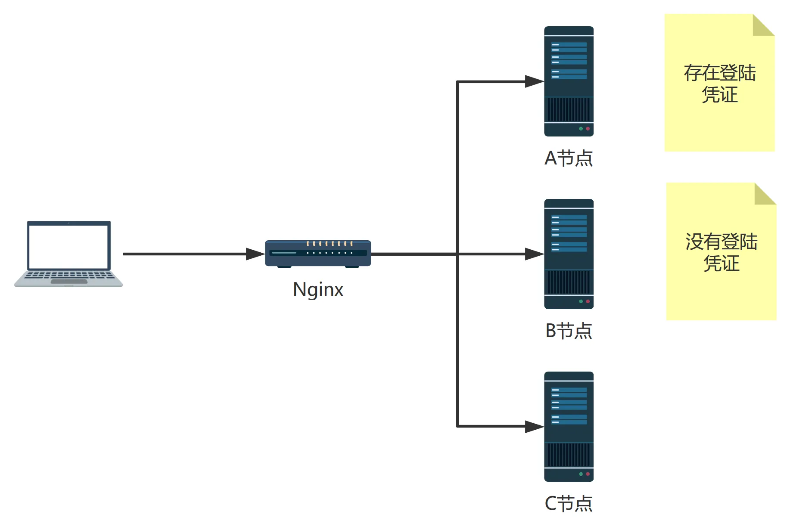

如果用户的登陆凭证经过加密（`Token`）保存在客户端，客户端每次提交请求的时候，把 `Token`上传给后端服务器节点。即便后端项目使用了负载均衡，每个后端节点接收到客户端上传的 Token 之后，经过检测，是有效的 `Token`，于是就断定用户已经成功登陆，接下来就可以提供后端服务了。

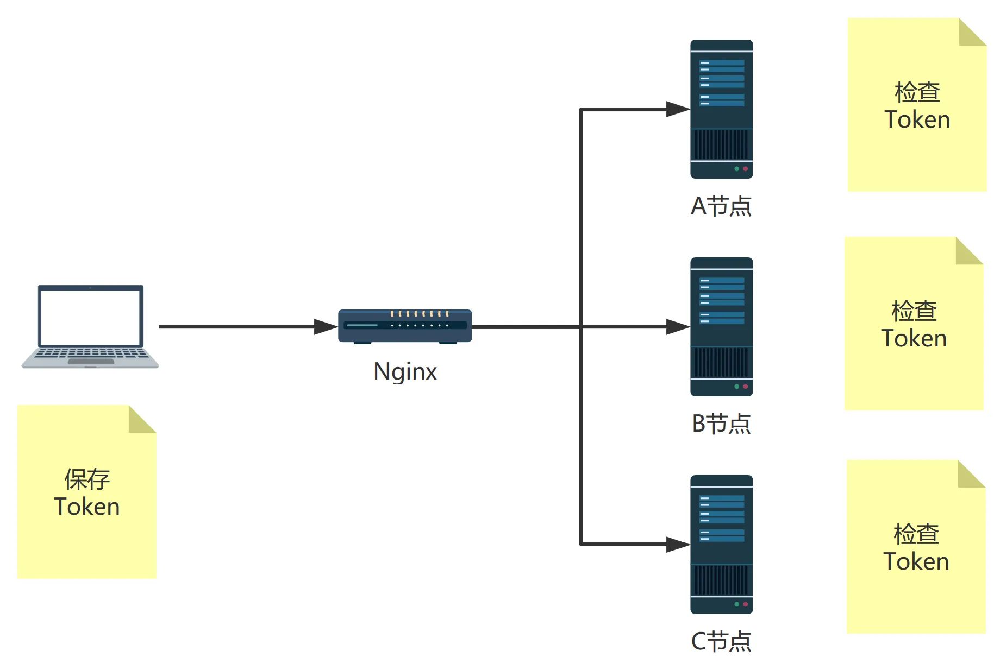

JWT 兼容更多的客户端

传统的 `HttpSession`依靠浏览器的 `Cookie`存放 `SessionId`，所以要求客户端必须是浏览器。现在的 JavaWeb 系统，客户端可以是浏览器、APP、小程序，以及物联网设备。为了让这些设备都能访问到 JavaWeb 项目，就必须要引入 JWT 技术。JWT 的 `Token`是纯字符串，至于客户端怎么保存，没有具体要求。只要客户端发起请求的时候，附带上 `Token`即可。所以像物联网设备，我们可以用 `SQLite`存储 `Token`数据。

### RBAC 是什么？怎么实现的？

RBAC 的基本思想是，对系统操作的各种权限不是直接授予具体的用户，而是在用户集合与权限集合之间建立一个角色集合。每一种角色对应一组相应的权限。一旦用户被分配了适当的角色后，该用户就拥有此角色的所有操作权限。这样做的好处是，不必在每次创建用户时都进行分配权限的操作，只要分配用户相应的角色即可，而且角色的权限变更比用户的权限变更要少得多，这样将简化用户的权限管理，减少系统的开销。

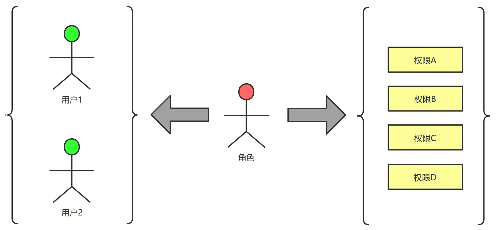

RBAC 模型中的权限是由模块和行为合并在一起而产生的，在 MySQL 中，有 `模块表（tb_module）`和 `行为表（tb_action）`，这两张表的记录合并在一起就行程了权限记录，保存在 `权限表（tb_permission）`中。


现在知道了权限记录是怎么来的，下面我们看看怎么把权限关联到角色中。传统一点的做法是创建一个交叉表，记录角色拥有什么权限。但是现在 `MySQL5.7`之后引入了 `JSON`数据类型，所以我在 `角色表（tb_role）`中设置的 permissions 字段，类型是 JSON 格式的。

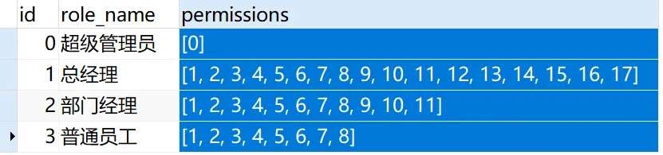

到目前为止，JSON 类型已经支持索引机制，所以我们不用担心存放在 JSON 字段中的数据检索速度慢了。MySQL 为 JSON 类型配备了很多函数，我们可以很方便的读写 JSON 字段中的数据。

接下来我们看看角色是怎么关联到用户的，其实我在 `用户表（tb_user）`上面设置 role 字段，类型依旧是 JSON 的。这样我就可以把多个角色关联到某个用户身上了。

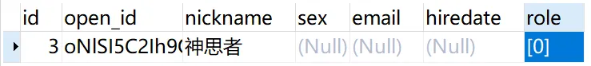

如何查询用户的权限列表？

```sql
<select id="searchUserPermissions" parameterType="int" resultType="String">
    SELECT p.permission_name
    FROM tb_user u
    JOIN tb_role r ON JSON_CONTAINS(u.role, CAST(r.id AS CHAR))
    JOIN tb_permission p ON JSON_CONTAINS(r.permissions, CAST(p.id AS CHAR))
    WHERE u.id = #{userId} AND u.status = 1;
</select>
```

## 🎨设计模式

### 你能说说设计模式吗

24 大设计模式和 7 个原则

7 个原则

单一职责原则【SINGLE RESPONSIBILITY PRINCIPLE】: 一个类负责一项职责。

里氏替换原则【LISKOV SUBSTITUTION PRINCIPLE】: 继承与派生的规则。

依赖倒置原则【DEPENDENCE INVERSION PRINCIPLE】: 高层模块不应该依赖低层模块，二者都应该依赖其抽象；抽象不应该依赖细节；细节应该依赖抽象。即针对接口编程，不要针对实现编程。

接口隔离原则【INTERFACE SEGREGATION PRINCIPLE】: 建立单一接口，不要建立庞大臃肿的接口，尽量细化接口，接口中的方法尽量少。

迪米特法则【LOW OF DEMETER】: 低耦合，高内聚。

开闭原则【OPEN CLOSE PRINCIPLE】: 一个软件实体如类、模块和函数应该对扩展开放，对修改关闭。

组合/聚合复用原则【Composition/Aggregation Reuse Principle(CARP) 】: 尽量使用组合和聚合少使用继承的关系来达到复用的原则

24 大设计模式


### 为什么设计模式更好，你能说说用和不用的区别吗

设计模式是软件开发中经常出现的问题的常见解决方案。 它们可以帮助您编写更干净、更可重用、更易维护的代码2。 使用设计模式的一些好处是：
- 为开发人员提供了一个共享的词汇表，以便更有效地进行交流。
- 包含了最佳实践，避免重新发明车轮。
- 它们适应不断变化的需求并促进代码重用。

使用设计模式的一些缺点是：
- 可能在不需要或应用不正确时被过度使用或误用。
- 可能会引入额外的复杂性和抽象，而这可能是不必要的。
- 对于初学者或不熟悉的开发人员来说，它们可能很难学习和理解。

使用和不使用设计模式之间的区别取决于上下文和您试图解决的问题。 在某些情况下，使用设计模式可以使您的代码更加优雅和健壮。 在其他情况下，不使用设计模式可以使您的代码更简单，更直接。 关键是明智而恰当地使用设计模式，而不是盲目地将其作为规则。

> 其余参考：https://www.javatpoint.com/design-patterns-in-java、https://java-design-patterns.com/

### 会什么设计模式，讲一下模板方法设计模式，应用 | 对于模版模式的理解，应用场景，你在项目中是怎么使用的（2022美团）

#### 什么是模板模式？

**模板模式（Template Pattern）** 又叫模板方法模式，其定义了操作的流程，并将流程中的某些步骤延迟到子类中进行实现，使得子类在不改变操作流程的前提下，即可重新定义该操作的某些特定步骤。例如做菜，操作流程一般为  “准备菜”->“放油”->“炒菜”->“调味”->“装盘”，但可能对于不同的菜要放不同类型的油，不同的菜调味方式也可能不一样。

#### 何时使用模板模式？

当一个操作的流程较为复杂，可分为多个步骤，且对于不同的操作实现类，流程步骤相同，只有部分特定步骤才需要自定义，此时可以考虑使用模板模式。如果一个操作不复杂（即只有一个步骤），或者不存在相同的流程，那么应该使用策略模式。从这也可看出模板模式和策略模式的区别：策略模式关注的是多种策略（广度），而模板模式只关注同种策略（相同流程），但是具备多个步骤，且特定步骤可自定义（深度）。

#### 背景

我们平台的动态表单在配置表单项的过程中，每新增一个表单项，都要根据表单项的组件类型（例如 单行文本框、下拉选择框）和当前输入的各种配置来转换好对应的 Schema 并保存在 DB 中。一开始，转换的代码逻辑大概是这样的：

```java
public class FormItemConverter {

    /**
     * 将输入的配置转变为表单项
     *
     * @param config 前端输入的配置
     * @return 表单项
     */
    public FormItem convert(FormItemConfig config) {
        FormItem formItem = new FormItem();

        // 公共的表单项属性
        formItem.setTitle(config.getTitle());
        formItem.setCode(config.getCode());
        formItem.setComponent(config.getComponent());

        // 创建表单组件的属性
        FormComponentProps props = new FormComponentProps();
        formItem.setComponentProps(props);
      
        // 公共的组件属性
        if (config.isReadOnly()) {
            props.setReadOnly(true);
        }

        FormItemTypeEnum type = config.getType();

        // 下拉选择框的特殊属性处理
        if (type == ComponentTypeEnum.DROPDOWN_SELECT) {
            props.setAutoWidth(false);

            if (config.isMultiple()) {
                props.setMode("multiple");
            }
        }

        // 模糊搜索框的特殊属性处理
        if (type == ComponentTypeEnum.FUZZY_SEARCH) {
            formItem.setFuzzySearch(true);
            props.setAutoWidth(false);
        }

        // ...  其他组件的特殊处理

        // 创建约束规则
        List<FormItemRule> rules = new ArrayList<>(2);
        formItem.setRules(rules);

        // 每个表单项都可有的约束规则
        if (config.isRequired()) {
            FormItemRule requiredRule = new FormItemRule();
            requiredRule.setRequired(true);
            requiredRule.setMessage("请输入" + config.getTitle());

            rules.add(requiredRule);
        }

        // 文本输入框才有的规则
        if (type == ComponentTypeEnum.TEXT_INPUT || type == ComponentTypeEnum.TEXT_AREA) {
            Integer minLength = config.getMinLength();

            if (minLength != null && minLength > 0) {
                FormItemRule minRule = new FormItemRule();
                minRule.setMin(minLength);
                minRule.setMessage("请至少输入 " + minLength + " 个字");

                rules.add(minRule);
            }

            Integer maxLength = config.getMaxLength();

            if (maxLength != null && maxLength > 0) {
                FormItemRule maxRule = new FormItemRule();
                maxRule.setMax(maxLength);
                maxRule.setMessage("请最多输入 " + maxLength + " 个字");

                rules.add(maxRule);
            }
        }

        // ... 其他约束规则

        return formItem;
    }
}
```

很明显，这份代码违反了 开闭原则（对扩展开放，对修改关闭）：如果此时需要添加一种新的表单项（包含特殊的组件属性），那么不可避免的要修改 convert 方法来进行新表单项的特殊处理。观察上面的代码，将配置转变为表单项 这个操作，满足以下流程：

1. 创建表单项，并设置通用的表单项属性，然后再对不同表单项的特殊属性进行处理
2. 创建组件属性，处理通用的组件属性，然后再对不同组件的特殊属性进行处理
3. 创建约束规则，处理通用的约束规则，然后再对不同表单项的特性约束规则进行处理

这不正是符合模板模式的使用场景（操作流程固定，特殊步骤可自定义处理）吗？基于上面这个场景，下面我就分享一下我目前基于 Spring 实现模板模式的 “最佳套路”（如果你有更好的套路，欢迎赐教和讨论哦）~

#### 方案

- **定义出模板**

即首先定义出表单项转换的操作流程，即如下的 convert 方法（使用 final 修饰，确保子类不可修改操作流程）：

```java
public abstract class FormItemConverter {

    /**
     * 子类可处理的表单项类型
     */
    public abstract FormItemTypeEnum getType();

    /**
     * 将输入的配置转变为表单项的操作流程
     *
     * @param config 前端输入的配置
     * @return 表单项
     */
    public final FormItem convert(FormItemConfig config) {
        FormItem item = createItem(config);
        // 表单项创建完成之后，子类如果需要特殊处理，可覆写该方法
        afterItemCreate(item, config);

        FormComponentProps props = createComponentProps(config);
        item.setComponentProps(props);
        // 组件属性创建完成之后，子类如果需要特殊处理，可覆写该方法
        afterPropsCreate(props, config);

        List<FormItemRule> rules = createRules(config);
        item.setRules(rules);
        // 约束规则创建完成之后，子类如果需要特殊处理，可覆写该方法
        afterRulesCreate(rules, config);

        return item;
    }

    /**
     * 共用逻辑：创建表单项、设置通用的表单项属性
     */
    private FormItem createItem(FormItemConfig config) {
        FormItem formItem = new FormItem();

        formItem.setCode(config.getCode());
        formItem.setTitle(config.getTitle());
        formItem.setComponent(config.getComponent());

        return formItem;
    }

    /**
     * 表单项创建完成之后，子类如果需要特殊处理，可覆写该方法
     */
    protected void afterItemCreate(FormItem item, FormItemConfig config) { }

    /**
     * 共用逻辑：创建组件属性、设置通用的组件属性
     */
    private FormComponentProps createComponentProps(FormItemConfig config) {
        FormComponentProps props = new FormComponentProps();

        if (config.isReadOnly()) {
            props.setReadOnly(true);
        }

        if (StringUtils.isNotBlank(config.getPlaceholder())) {
            props.setPlaceholder(config.getPlaceholder());
        }

        return props;
    }

    /**
     * 组件属性创建完成之后，子类如果需要特殊处理，可覆写该方法
     */
    protected void afterPropsCreate(FormComponentProps props, FormItemConfig config) { }

    /**
     * 共用逻辑：创建约束规则、设置通用的约束规则
     */
    private List<FormItemRule> createRules(FormItemConfig config) {
        List<FormItemRule> rules = new ArrayList<>(4);

        if (config.isRequired()) {
            FormItemRule requiredRule = new FormItemRule();
            requiredRule.setRequired(true);
            requiredRule.setMessage("请输入" + config.getTitle());

            rules.add(requiredRule);
        }

        return rules;
    }

    /**
     * 约束规则创建完成之后，子类如果需要特殊处理，可覆写该方法
     */
    protected void afterRulesCreate(List<FormItemRule> rules, FormItemConfig config) { }
}

    模板的实现

针对不同的表单项，对特殊步骤进行自定义处理：

/**
 * 下拉选择框的转换器
 */
@Component
public class DropdownSelectConverter extends FormItemConverter {

    @Override
    public FormItemTypeEnum getType() {
        return FormItemTypeEnum.DROPDOWN_SELECT;
    }

    @Override
    protected void afterPropsCreate(FormComponentProps props, FormItemConfig config) {
        props.setAutoWidth(false);

        if (config.isMultiple()) {
            props.setMode("multiple");
        }
    }
}

/**
 * 模糊搜索框的转换器
 */
@Component
public class FuzzySearchConverter extends FormItemConverter {

    @Override
    public FormItemTypeEnum getType() {
        return FormItemTypeEnum.FUZZY_SEARCH;
    }

    @Override
    protected void afterItemCreate(FormItem item, FormItemConfig config) {
        item.setFuzzySearch(true);
    }

    @Override
    protected void afterPropsCreate(FormComponentProps props, FormItemConfig config) {
        props.setAutoWidth(false);
    }
}

/**
 * 通用文本类转换器
 */
public abstract class CommonTextConverter extends FormItemConverter {

    @Override
    protected void afterRulesCreate(List<FormItemRule> rules, FormItemConfig config) {
        Integer minLength = config.getMinLength();

        if (minLength != null && minLength > 0) {
            FormItemRule minRule = new FormItemRule();
            minRule.setMin(minLength);
            minRule.setMessage("请至少输入 " + minLength + " 个字");

            rules.add(minRule);
        }

        Integer maxLength = config.getMaxLength();

        if (maxLength != null && maxLength > 0) {
            FormItemRule maxRule = new FormItemRule();
            maxRule.setMax(maxLength);
            maxRule.setMessage("请最多输入 " + maxLength + " 个字");

            rules.add(maxRule);
        }
    }
}

/**
 * 单行文本框的转换器
 */
@Component
public class TextInputConverter extends CommonTextConverter {

    @Override
    public FormItemTypeEnum getType() {
        return FormItemTypeEnum.TEXT_INPUT;
    }
}

/**
 * 多行文本框的转换器
 */
@Component
public class TextAreaConvertor extends FormItemConverter {

    @Override
    public FormItemTypeEnum getType() {
        return FormItemTypeEnum.TEXT_AREA;
    }
}
```

* **制作简单工厂**

```java
@Component
public class FormItemConverterFactory {

    private static final 
    EnumMap<FormItemTypeEnum, FormItemConverter> CONVERTER_MAP = new EnumMap<>(FormItemTypeEnum.class);

    /**
     * 根据表单项类型获得对应的转换器
     *
     * @param type 表单项类型
     * @return 表单项转换器
     */
    public FormItemConverter getConverter(FormItemTypeEnum type) {
        return CONVERTER_MAP.get(type);
    }

    @Autowired
    public void setConverters(List<FormItemConverter> converters) {
        for (final FormItemConverter converter : converters) {
            CONVERTER_MAP.put(converter.getType(), converter);
        }
    }
}
```

- **投入使用**

```java
@Component
public class FormItemManagerImpl implements FormItemManager {

    @Autowired
    private FormItemConverterFactory converterFactory;

    @Override
    public List<FormItem> convertFormItems(JSONArray inputConfigs) {
        return IntStream.range(0, inputConfigs.size())
                        .mapToObj(inputConfigs::getJSONObject)
                        .map(this::convertFormItem)
                        .collect(Collectors.toList());
    }

    private FormItem convertFormItem(JSONObject inputConfig) {
        FormItemConfig itemConfig = inputConfig.toJavaObject(FormItemConfig.class);
        FormItemConverter converter = converterFactory.getConverter(itemConfig.getType());

        if (converter == null) {
            throw new IllegalArgumentException("不存在转换器：" + itemConfig.getType());
        }

        return converter.convert(itemConfig);
    }
}
```

**Factory 只负责获取 Converter，每个 Converter 只负责对应表单项的转换功能，Manager 只负责逻辑编排，从而达到功能上的 “低耦合高内聚”。**

- **设想一次扩展**

此时要加入一种新的表单项 —— 数字选择器（NUMBER_PICKER），它有着特殊的约束条件：最小值和最大值，输入到 FormItemConfig 时分别为 minNumer 和 maxNumber。

```java
@Component
public class NumberPickerConverter extends FormItemConverter {

    @Override
    public FormItemTypeEnum getType() {
        return FormItemTypeEnum.NUMBER_PICKER;
    }

    @Override
    protected void afterRulesCreate(List<FormItemRule> rules, FormItemConfig config) {
        Integer minNumber = config.getMinNumber();
        // 处理最小值
        if (minNumber != null) {
            FormItemRule minNumRule = new FormItemRule();

            minNumRule.setMinimum(minNumber);
            minNumRule.setMessage("输入数字不能小于 " + minNumber);

            rules.add(minNumRule);
        }

        Integer maxNumber = config.getMaxNumber();
        // 处理最大值
        if (maxNumber != null) {
            FormItemRule maxNumRule = new FormItemRule();

            maxNumRule.setMaximum(maxNumber);
            maxNumRule.setMessage("输入数字不能大于 " + maxNumber);

            rules.add(maxNumRule);
        }
    }
}
```

此时，我们只需要添加对应的枚举和实现对应的 FormItemConverter，并不需要修改任何逻辑代码，因为 Spring 启动时会自动帮我们处理好 NUMBER_PICKER 和  NumberPickerConverter 的关联关系 —— 完美符合 “开闭原则”。

### 讲一下单例模式，详细说饿汉式的写法和原因（2022蔚来）

在我们的系统中，有一些对象其实我们只需要一个，比如说：线程池、缓存、对话框、注册表、日志对象、充当打印机、显卡等设备驱动程序的对象。事实上，这一类对象只能有一个实例，如果制造出多个实例就可能会导致一些问题的产生，比如：程序的行为异常、资源使用过量、或者不一致性的结果。

**使用单例模式的好处:**

- 对于频繁使用的对象，可以省略创建对象所花费的时间，这对于那些重量级对象而言，是非常可观的一笔系统开销；
- 由于 new 操作的次数减少，因而对系统内存的使用频率也会降低，这将减轻 GC 压力，缩短 GC 停顿时间。

**Spring 中 bean 的默认作用域就是 singleton(单例)的。** 除了 singleton 作用域，Spring 中 bean 还有下面几种作用域：

- prototype : 每次请求都会创建一个新的 bean 实例。
- request : 每一次HTTP请求都会产生一个新的bean，该bean仅在当前HTTP request内有效。
- session : 每一次HTTP请求都会产生一个新的 bean，该bean仅在当前 HTTP session 内有效。
- global-session：  全局session作用域，仅仅在基于portlet的web应用中才有意义，Spring5已经没有了。Portlet是能够生成语义代码(例如：HTML)片段的小型Java Web插件。它们基于portlet容器，可以像servlet一样处理HTTP请求。但是，与 servlet 不同，每个 portlet  都有不同的会话

**Spring 实现单例的方式：**

- xml : `<bean id="userService" class="top.snailclimb.UserService" scope="singleton"/>`
- 注解：`@Scope(value = "singleton")`

**Spring 通过 `ConcurrentHashMap` 实现单例注册表的特殊方式实现单例模式。Spring 实现单例的核心代码如下**

```java
// 通过 ConcurrentHashMap（线程安全） 实现单例注册表
private final Map<String, Object> singletonObjects = new ConcurrentHashMap<String, Object>(64);

public Object getSingleton(String beanName, ObjectFactory<?> singletonFactory) {
        Assert.notNull(beanName, "'beanName' must not be null");
        synchronized (this.singletonObjects) {
            // 检查缓存中是否存在实例  
            Object singletonObject = this.singletonObjects.get(beanName);
            if (singletonObject == null) {
                //...省略了很多代码
                try {
                    singletonObject = singletonFactory.getObject();
                }
                //...省略了很多代码
                // 如果实例对象在不存在，我们注册到单例注册表中。
                addSingleton(beanName, singletonObject);
            }
            return (singletonObject != NULL_OBJECT ? singletonObject : null);
        }
    }
    //将对象添加到单例注册表
    protected void addSingleton(String beanName, Object singletonObject) {
            synchronized (this.singletonObjects) {
                this.singletonObjects.put(beanName, (singletonObject != null ? singletonObject : NULL_OBJECT));

            }
        }
}
```

#### 饿汉式写法

“饿汉模式”（eager initialization），即在初始阶段就主动进行实例化，并时刻保持一种渴求的状态，无论此单例是否有人使用

以后羿射日为例：

```java
public class Sun {
    // “private”关键字确保太阳实例的私有性、不可见性和不可访问性
    // “static”关键字确保太阳的静态性，将太阳放入内存里的静态区，在类加载的时候就初始化了，它与类同在，也就是说它是与类同时期且早于内存堆中的对象实例化的，该实例在内存中永生，内存垃圾收集器也不会对其进行回收
    // “final”关键字则确保这个太阳是常量、恒量，它是一颗终极的恒星，引用一旦被赋值就不能再修改
    // “new”关键字初始化太阳类的静态实例，并赋予静态常量sun
    private static final Sun sun = new Sun();

    private Sun() {
        // 构造方法私有化，实例化工作完全归属于内部事务，任何外部类都无权干预
    }

    public static Sun getInstance() {
        return sun;
    }
}
```

#### 懒汉式写法

如果始终没人获取日光，那岂不是白造了太阳，一块内存区域被白白地浪费了？

```java
public class Sun {
    // volatile对静态变量的修饰则能保证变量值在各线程访问时的同步性、唯一性
    private volatile static Sun sun;

    private Sun() {
        // 构造方法私有化
    }

    public static Sun getInstance() {
        if (sun == null) {
            // 以防止多个线程进入
            synchronized(Sun.class) {
                if (sun == null) {
                    sun = new Sun();
                }
            }
        }
        return sun;
    }
}
```

这就是懒加载模式的“双检锁”：外层放宽入口，保证线程并发的高效性；内层加锁同步，保证实例化的单次运行。

### git中merge和rebase区别（2022蔚来）


### 单例模式线程安全（2022蔚来）

#### 多线程安全单例模式实例一(不使用同步锁)

```java
public class Singleton
{
    private static Singleton sin = new Singleton(); ///直接初始化一个实例对象
    private Singleton()
    { ///private类型的构造函数，保证其他类对象不能直接new一个该对象的实例
    }
    public static Singleton getSin()
    { ///该类唯一的一个public方法    
        return sin;
    }
}
```

上述代码中的一个缺点是该类加载的时候就会直接new 一个静态对象出来，当系统中这样的类较多时，会使得启动速度变慢 。现在流行的设计都是讲**“延迟加载”**，我们可以在第一次使用的时候才初始化第一个该类对象。所以这种适合在小系统。 

#### 多线程安全单例模式实例二(使用同步方法)

```java
public class Singleton
{
    private static Singleton instance;
    private Singleton()
    {}
    public static synchronized Singleton getInstance()
    { //对获取实例的方法进行同步
        if(instance == null) instance = new Singleton();
        return instance;
    }
}
```

上述代码中的一次锁住了一个方法， 这个粒度有点大 ，改进就是只锁住其中的new语句就OK。就是所谓的“双重锁”机制。

#### 多线程安全单例模式实例三(使用双重同步锁)

```java
public class Singleton
{
    private static Singleton instance;
    private Singleton()
    {}
    public static Singleton getInstance()
    { //对获取实例的方法进行同步
        if(instance == null)
        {
            synchronized(Singleton.class)
            {
                if(instance == null) instance = new Singleton();
            }
        }
        return instance;
    }
}
```


## 问题解答选取的 github 仓库

如果不是在 github 上查找到的答案会给予标注

1. https://github.com/Snailclimb/JavaGuide 「Java 学习+面试指南」一份涵盖大部分 Java 程序员所需要掌握的核心知识。准备 Java 面试，首选 JavaGuide！
2. [Java 全栈知识体系](https://www.pdai.tech/)
3. https://github.com/rbmonster/learning-note java 开发 面试八股文（个人的面试及工作总结）
4. https://github.com/CoderLeixiaoshuai/java-eight-part 『Java 八股文』Java 面试套路
5. https://github.com/doocs/advanced-java 互联网 Java 工程师进阶知识完全扫盲
6. https://www.iamshuaidi.com/ 帅地玩编程
7. https://github.com/xiaolincoder/CS-Base 小林 x 图解计算机基础
8. https://www.mianshiya.com/ 面试鸭
9. 国外网站