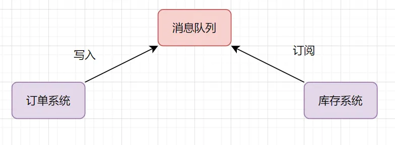
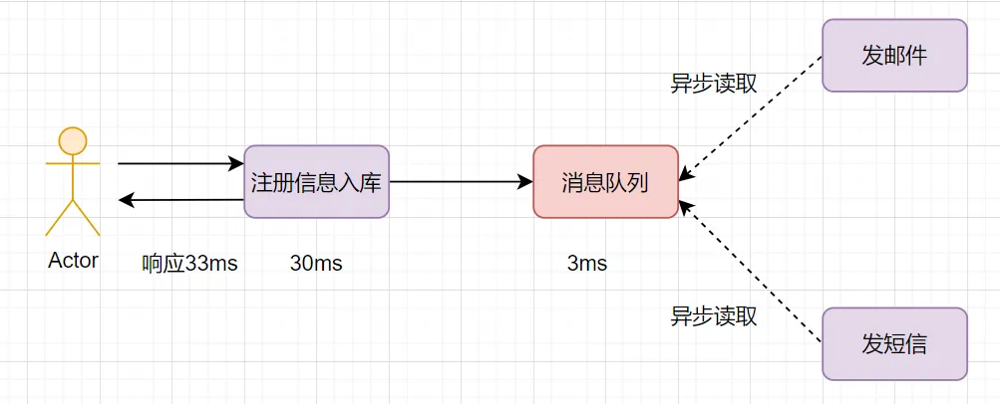
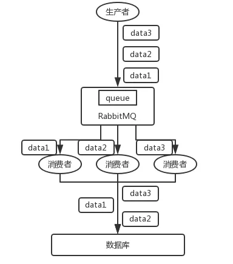
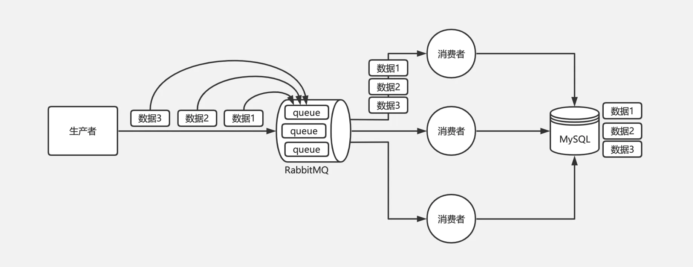
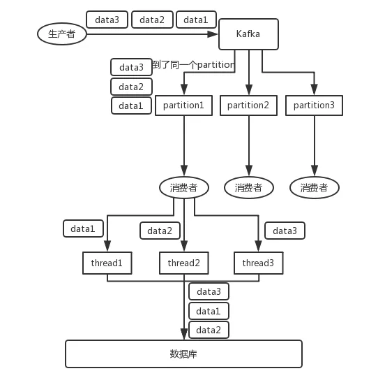
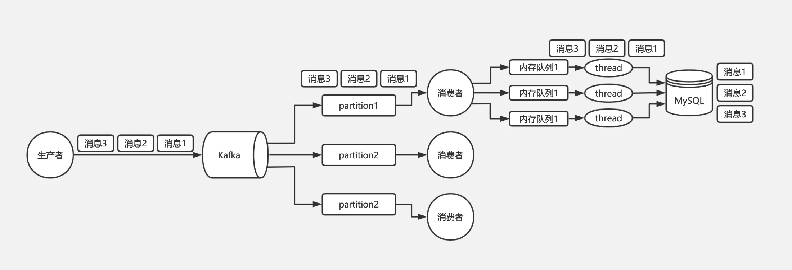
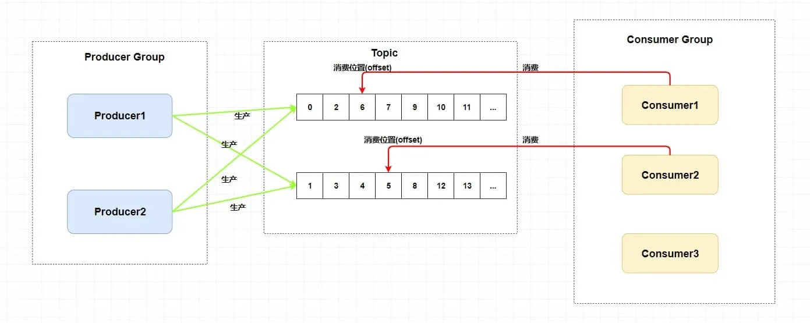

---

order: 9
author: zhiyu1998
title: 消息队列
category:
  - 消息队列
  - 八股文
---

## 📭 消息队列

### 消息队列有哪些使用场景 （or 为什么使用消息队列）

其实就是问问你消息队列都有哪些使用场景，然后你项目里具体是什么场景，说说你在这个场景里用消息队列是什么？

面试官问你这个问题，**期望的一个回答**是说，你们公司有个什么**业务场景**，这个业务场景有个什么技术挑战，如果不用 MQ 可能会很麻烦，但是你现在用了 MQ 之后带给了你很多的好处。

先说一下消息队列常见的使用场景吧，其实场景有很多，但是比较核心的有 3 个：**解耦**、**异步**、**削峰**。

#### 应用解耦

举个常见业务场景：下单扣库存，用户下单后，订单系统去通知库存系统扣减。

传统的做法就是订单系统直接调用库存系统：


* 如果库存系统无法访问，下单就会失败，订单和库存系统存在耦合关系
* 如果业务又接入一个营销积分服务，那订单下游系统要扩充，如果未来接入越来越多的下游系统，那订单系统代码需要经常修改


如何解决这个问题呢？可以引入消息队列



1. 订单系统：用户下单后，消息写入到消息队列，返回下单成功
2. 库存系统：订阅下单消息，获取下单信息，进行库存操作

#### 流量削峰

流量削峰也是消息队列的常用场景。我们做秒杀实现的时候，需要避免流量暴涨，打垮应用系统的风险。可以在应用前面加入消息队列。


假设秒杀系统每秒最多可以处理 2k 个请求，每秒却有 5k 的请求过来，可以引入消息队列，秒杀系统每秒从消息队列拉 2k 请求处理得了。

有些伙伴担心这样会出现消息积压的问题，

* 首先秒杀活动不会每时每刻都那么多请求过来，高峰期过去后，积压的请求可以慢
  慢处理；
* 其次，如果消息队列长度超过最大数量，可以直接抛弃用户请求或跳转到错误页面；

> 假设你正在开发一个电商网站，其中有一个特别受欢迎的商品会在特定时间段（例如，黑五或双十一）进行秒杀。为了公平，你决定谁先下单谁就先得到商品。但是在秒杀开始的时刻，可能会有数以千计的用户试图同时下单，这会对你的服务器和数据库产生巨大的压力，可能导致服务器崩溃或数据库连接超载。
> 这就是消息队列可以派上用场的地方。当秒杀开始时，你不是直接将订单写入数据库，而是将其发送到消息队列中。消息队列将暂时存储这些订单，然后以一种可控制的方式，按照一定速度将它们发送到处理订单的后端服务。这样，你可以根据后端服务的处理能力，控制处理订单的速度，避免服务器或数据库过载。
> 例如，假设你的后端服务每秒可以处理100个订单，而在秒杀开始时有10000个订单到来。如果没有消息队列，这可能会立即压垮你的服务器。但是，如果你使用了消息队列，你可以将这10000个订单放入队列，然后每秒从队列中取出100个订单进行处理。这样，你的服务器只需要持续处理订单100秒，就可以处理完这10000个订单，而不会因为一开始的大量订单而崩溃。
> 这就是消息队列在秒杀场景中削峰填谷的作用。你的服务器只需要处理稳定的订单流量，而不需要应对大量订单同时到来的压力。此外，使用消息队列还可以帮助你在系统出现问题时保护数据。例如，如果你的后端服务在处理订单时崩溃，那么还在队列中的订单仍然是安全的，当服务恢复后可以继续处理。

#### 异步处理

我们经常会遇到这样的业务场景：用户注册成功后，给它发个短信和发个邮件。

如果注册信息入库是 30ms，发短信、邮件也是 30ms，三个动作串行执行的话，会比较耗时，响应 90ms：


如果采用并行执行的方式，可以减少响应时间。注册信息入库后，同时异步发短信和邮件。如何实现异步呢，用消息队列即可，就是说，注册信息入库成功后，写入到消息队列（这个一般比较快，如只需要3ms），然后异步读取发邮件和短信。



### 死信队列&延迟队列

消费失败的消息存放的队列。

消息消费失败的原因：

- 消息被拒绝并且消息没有重新入队（requeue=false）
- 消息超时未消费
- 达到最大队列长度


### MQ常用通信协议

- **AMQP协议** AMQP即Advanced Message Queuing Protocol,一个提供统一消息服务的应用层标准高级消息队列协议,是应用层协议的一个开放标准,为面向消息的中间件设计。基于此协议的客户端与消息中间件可传递消息，并不受客户端/中间件不同产品，不同开发语言等条件的限制。

  > 优点：可靠、通用

- **MQTT协议** MQTT（Message Queuing Telemetry Transport，消息队列遥测传输）是IBM开发的一个即时通讯协议，有可能成为物联网的重要组成部分。该协议支持所有平台，几乎可以把所有联网物品和外部连接起来，被用来当做传感器和致动器（比如通过Twitter让房屋联网）的通信协议。

  > 优点：格式简洁、占用带宽小、移动端通信、PUSH、嵌入式系统

- **STOMP协议** STOMP（Streaming Text Orientated Message Protocol）是流文本定向消息协议，是一种为MOM(Message Oriented Middleware，面向消息的中间件)设计的简单文本协议。STOMP提供一个可互操作的连接格式，允许客户端与任意STOMP消息代理（Broker）进行交互。

  > 优点：命令模式（非topic/queue模式）

- **XMPP协议** XMPP（可扩展消息处理现场协议，Extensible Messaging and Presence Protocol）是基于可扩展标记语言（XML）的协议，多用于即时消息（IM）以及在线现场探测。适用于服务器之间的准即时操作。核心是基于XML流传输，这个协议可能最终允许因特网用户向因特网上的其他任何人发送即时消息，即使其操作系统和浏览器不同。

  > 优点：通用公开、兼容性强、可扩展、安全性高，但XML编码格式占用带宽大

- **其他基于TCP/IP自定义的协议**：有些特殊框架（如：redis、kafka、zeroMq等）根据自身需要未严格遵循MQ规范，而是基于TCP\IP自行封装了一套协议，通过网络socket接口进行传输，实现了MQ的功能。


### 如何保证消息队列的高可用？

> 简洁回答

消息队列的高可用性主要通过冗余、故障转移和数据持久化来实现。下面是一些具体的策略：
- **冗余**：在多台服务器上运行消息队列服务，创建一个消息队列集群。每个消息都在集群中的多个节点上有副本，这样即使一台或者多台服务器故障，其他的服务器仍然可以提供服务。
- **故障转移**：如果一台服务器发生故障，那么集群中的其他服务器可以接管它的工作，这被称为故障转移。故障转移可以是手动的，也可以是自动的。在一些高级的消息队列系统中，比如RabbitMQ和Kafka，支持自动的故障转移。
- **数据持久化**：消息队列服务通常会将数据保存在内存中以提高性能，但是如果服务器故障或者重启，那么内存中的数据会丢失。为了防止这种情况，可以将数据持久化到硬盘上。在RabbitMQ和Kafka中，都可以设置消息的持久化。
- **负载均衡**：通过负载均衡器，请求可以在消息队列的各个节点之间进行分配，以免某个节点压力过大，影响系统的稳定性。
这些策略的实现方式取决于你使用的消息队列服务。不同的服务可能会有不同的特性和配置选项，你需要查阅相应的文档以了解详情。比如，如果你使用的是RabbitMQ，你可以在其官方网站上找到关于如何创建高可用集群的指南。

#### RabbitMQ 的高可用性

RabbitMQ 是比较有代表性的，因为是**基于主从**（非分布式）做高可用性的，我们就以 RabbitMQ 为例子讲解第一种 MQ 的高可用性怎么实现。

RabbitMQ 有三种模式：单机模式、普通集群模式、镜像集群模式。

##### 单机模式

单机模式，就是 Demo 级别的，一般就是你本地启动了玩玩儿的，没人生产用单机模式。

##### 普通集群模式（无高可用性）

普通集群模式，意思就是在多台机器上启动多个 RabbitMQ 实例，每台机器启动一个。你**创建的 queue，只会放在一个 RabbitMQ 实例上**，但是每个实例都同步 queue 的元数据（元数据可以认为是 queue 的一些配置信息，通过元数据，可以找到 queue 所在实例）。你消费的时候，实际上如果连接到了另外一个实例，那么那个实例会从 queue 所在实例上拉取数据过来。


这种方式确实很麻烦，也不怎么好，**没做到所谓的分布式**，就是个普通集群。因为这导致你要么消费者每次随机连接一个实例然后拉取数据，要么固定连接那个 queue 所在实例消费数据，前者有**数据拉取的开销**，后者导致**单实例性能瓶颈**。

而且如果那个放 queue 的实例宕机了，会导致接下来其他实例就无法从那个实例拉取，如果你**开启了消息持久化**，让 RabbitMQ 落地存储消息的话，**消息不一定会丢**，得等这个实例恢复了，然后才可以继续从这个 queue 拉取数据。

所以这个事儿就比较尴尬了，这就**没有什么所谓的高可用性**，**这方案主要是提高吞吐量的**，就是说让集群中多个节点来服务某个 queue 的读写操作。

##### 镜像集群模式（高可用性）

这种模式，才是所谓的 RabbitMQ 的高可用模式。跟普通集群模式不一样的是，在镜像集群模式下，你创建的 queue，无论是元数据还是 queue 里的消息都会**存在于多个实例上**，就是说，每个 RabbitMQ 节点都有这个 queue 的一个**完整镜像**，包含 queue 的全部数据的意思。然后每次你写消息到 queue 的时候，都会自动把**消息同步**到多个实例的 queue 上。


那么**如何开启这个镜像集群模式**呢？其实很简单，RabbitMQ 有很好的管理控制台，就是在后台新增一个策略，这个策略是**镜像集群模式的策略**，指定的时候是可以要求数据同步到所有节点的，也可以要求同步到指定数量的节点，再次创建 queue 的时候，应用这个策略，就会自动将数据同步到其他的节点上去了。

这样的话，好处在于，你任何一个机器宕机了，没事儿，其它机器（节点）还包含了这个 queue 的完整数据，别的 consumer 都可以到其它节点上去消费数据。坏处在于，第一，这个性能开销也太大了吧，消息需要同步到所有机器上，导致网络带宽压力和消耗很重！第二，这么玩儿，不是分布式的，就**没有扩展性可言**了，如果某个 queue 负载很重，你加机器，新增的机器也包含了这个 queue 的所有数据，并**没有办法线性扩展**你的 queue。你想，如果这个 queue 的数据量很大，大到这个机器上的容量无法容纳了，此时该怎么办呢？

#### Kafka 的高可用性

Kafka 一个最基本的架构认识：由多个 broker 组成，每个 broker 是一个节点；你创建一个 topic，这个 topic 可以划分为多个 partition，每个 partition 可以存在于不同的 broker 上，每个 partition 就放一部分数据。

这就是**天然的分布式消息队列**，就是说一个 topic 的数据，是**分散放在多个机器上的，每个机器就放一部分数据**。

实际上 RabbitMQ 之类的，并不是分布式消息队列，它就是传统的消息队列，只不过提供了一些集群、HA(High Availability, 高可用性) 的机制而已，因为无论怎么玩儿，RabbitMQ 一个 queue 的数据都是放在一个节点里的，镜像集群模式下，也是每个节点都放这个 queue 的完整数据。

Kafka 0.8 以前，是没有 HA 机制的，就是任何一个 broker 宕机了，那个 broker 上的 partition 就废了，没法写也没法读，没有什么高可用性可言。

比如说，我们假设创建了一个 topic，指定其 partition 数量是 3 个，分别在三台机器上。但是，如果第二台机器宕机了，会导致这个 topic 的 1/3 的数据就丢了，因此这个是做不到高可用的。


Kafka 0.8 以后，提供了 HA 机制，就是 replica（复制品） 副本机制。每个 partition 的数据都会同步到其它机器上，形成自己的多个 replica 副本。所有 replica 会选举一个 leader 出来，那么生产和消费都跟这个 leader 打交道，然后其他 replica 就是 follower。写的时候，leader 会负责把数据同步到所有 follower 上去，读的时候就直接读 leader 上的数据即可。只能读写 leader？很简单，**要是你可以随意读写每个 follower，那么就要 care 数据一致性的问题**，系统复杂度太高，很容易出问题。Kafka 会均匀地将一个 partition 的所有 replica 分布在不同的机器上，这样才可以提高容错性。


这么搞，就有所谓的**高可用性**了，因为如果某个 broker 宕机了，没事儿，那个 broker 上面的 partition 在其他机器上都有副本的。如果这个宕机的 broker 上面有某个 partition 的 leader，那么此时会从 follower 中**重新选举**一个新的 leader 出来，大家继续读写那个新的 leader 即可。这就有所谓的高可用性了。

**写数据**的时候，生产者就写 leader，然后 leader 将数据落地写本地磁盘，接着其他 follower 自己主动从 leader 来 pull 数据。一旦所有 follower 同步好数据了，就会发送 ack 给 leader，leader 收到所有 follower 的 ack 之后，就会返回写成功的消息给生产者。（当然，这只是其中一种模式，还可以适当调整这个行为）

**消费**的时候，只会从 leader 去读，但是只有当一个消息已经被所有 follower 都同步成功返回 ack 的时候，这个消息才会被消费者读到。


### 如何保证消息的顺序性？
> 简洁回答

在分布式系统中，确保消息的顺序性是一个复杂的问题。消息队列中的消息可能会因为网络延迟、服务故障等原因被消费的顺序与发送的顺序不一致。然而，有一些方法可以帮助你在一定程度上保证消息的顺序性：

- **在一个队列中只使用一个消费者**：这是最简单的方法，因为只有一个消费者，所以它按顺序消费消息是很自然的事情。但是这种方法的缺点是不能充分利用多核或多服务器的并行处理能力，可能会限制你的应用的性能。
- **将顺序相关的消息发送到同一个队列**：比如，如果你需要处理的是用户的订单，你可以将同一个用户的订单发送到同一个队列，这样即使不同用户的订单可能会被处理的顺序与发送的顺序不一致，但是同一个用户的订单的处理顺序仍然是保证的。这种方法需要你的生产者知道如何路由消息到正确的队列，可能会使得你的生产者的逻辑变得更复杂。
- **使用支持顺序消费的消息队列服务**：有一些消息队列服务，比如Apache Kafka，它们支持顺序消费。在Kafka中，你可以将顺序相关的消息发送到同一个分区，消费者可以按顺序消费同一个分区的消息。
- **在消费者中实现顺序处理**：消费者可以通过某种方式（例如，保存一个状态）来判断接收到的消息是否是需要的下一个消息，如果不是，就将其缓存起来，等到需要的消息到来时再进行处理。这种方法需要消费者能够处理重复的消息，因为一个消息可能会被多次接收。

要注意的是，保证消息的顺序性可能会牺牲一些性能和可扩展性，你需要根据你的应用的需求来做出权衡。

#### RocketMQ

**`RocketMQ` 在主题上是无序的、它只有在队列层面才是保证有序** 的。

这又扯到两个概念——**普通顺序** 和 **严格顺序** 。

所谓普通顺序是指 消费者通过 **同一个消费队列收到的消息是有顺序的** ，不同消息队列收到的消息则可能是无顺序的。普通顺序消息在 `Broker` **重启情况下不会保证消息顺序性** (短暂时间) 。

所谓严格顺序是指 消费者收到的 **所有消息** 均是有顺序的。严格顺序消息 **即使在异常情况下也会保证消息的顺序性** 。

但是，严格顺序看起来虽好，实现它可会付出巨大的代价。如果你使用严格顺序模式，`Broker` 集群中只要有一台机器不可用，则整个集群都不可用。你还用啥？现在主要场景也就在 `binlog` 同步。

一般而言，我们的 `MQ` 都是能容忍短暂的乱序，所以推荐使用普通顺序模式。

那么，我们现在使用了 **普通顺序模式** ，我们从上面学习知道了在 `Producer` 生产消息的时候会进行轮询(取决你的负载均衡策略)来向同一主题的不同消息队列发送消息。那么如果此时我有几个消息分别是同一个订单的创建、支付、发货，在轮询的策略下这 **三个消息会被发送到不同队列** ，因为在不同的队列此时就无法使用 `RocketMQ` 带来的队列有序特性来保证消息有序性了。


那么，怎么解决呢？

其实很简单，我们需要处理的仅仅是将同一语义下的消息放入同一个队列(比如这里是同一个订单)，那我们就可以使用 **Hash取模法** 来保证同一个订单在同一个队列中就行了。

> 另外有说法是这样，但大意一致，方便理解放在一起
>
> 要解决 RocketMQ 的乱序问题，我们只需要想办法让同一个订单的 binlog 进入到同一个 MessageQueue  中就可以了。因为同一个 MessageQueue 内的消息是一定有序的，一个 MessageQueue 中的消息只能交给一个 Consumer  来进行处理，所以 Consumer 消费的时候就一定会是有序的。

#### RabbitMQ

我举个例子，我们以前做过一个 mysql `binlog` 同步的系统，压力还是非常大的，日同步数据要达到上亿，就是说数据从一个 mysql 库原封不动地同步到另一个 mysql 库里面去（mysql -> mysql）。常见的一点在于说比如大数据 team，就需要同步一个 mysql 库过来，对公司的业务系统的数据做各种复杂的操作。

你在 mysql 里增删改一条数据，对应出来了增删改 3 条 `binlog` 日志，接着这三条 `binlog` 发送到 MQ 里面，再消费出来依次执行，起码得保证人家是按照顺序来的吧？不然本来是：增加、修改、删除；你楞是换了顺序给执行成删除、修改、增加，不全错了么。

本来这个数据同步过来，应该最后这个数据被删除了；结果你搞错了这个顺序，最后这个数据保留下来了，数据同步就出错了。

先看看顺序会错乱的俩场景：

一个 queue，多个 consumer。比如，生产者向 RabbitMQ 里发送了三条数据，顺序依次是 data1/data2/data3，压入的是 RabbitMQ 的一个内存队列。有三个消费者分别从 MQ 中消费这三条数据中的一条，结果消费者2先执行完操作，把 data2 存入数据库，然后是 data1/data3。这不明显乱了。



解决：拆分多个 queue，每个 queue 一个 consumer，就是多一些 queue 而已，确实是麻烦点；或者就一个 queue 但是对应一个 consumer，然后这个 consumer 内部用内存队列做排队，然后分发给底层不同的 worker 来处理。同一个订单号的消息发送到同一个 queue 中，由于同一个 queue 的消息是一定会保证有序的，那么同一个订单号的消息就只会被一个消费者顺序消费，从而保证了消息的顺序性。



#### Kafka

Kafka  从生产者到消费者消费消息这一整个过程其实都是可以保证有序的，导致最终乱序是由于消费者端需要使用多线程并发处理消息来提高吞吐量，比如消费者消费到了消息以后，开启 32 个线程处理消息，每个线程线程处理消息的快慢是不一致的，所以才会导致最终消息有可能不一致。

比如说我们建了一个 topic，有三个 partition。生产者在写的时候，其实可以指定一个 key，比如说我们指定了某个订单 id 作为 key，那么这个订单相关的数据，一定会被分发到同一个 partition 中去，而且这个 partition 中的数据一定是有顺序的。

消费者从 partition 中取出来数据的时候，也一定是有顺序的。到这里，顺序还是 ok 的，没有错乱。接着，我们在消费者里可能会搞**多个线程来并发处理消息**。因为如果消费者是单线程消费处理，而处理比较耗时的话，比如处理一条消息耗时几十 ms，那么 1 秒钟只能处理几十条消息，这吞吐量太低了。而多个线程并发跑的话，顺序可能就乱掉了。



解决：

- 一个 topic，一个 partition，一个 consumer，内部单线程消费，单线程吞吐量太低，一般不会用这个。
- 所以对于 Kafka 的消息顺序性保证，其实我们只需要保证同一个订单号的消息只被同一个线程处理的就可以了。由此我们可以在线程处理前增加个内存队列，每个线程只负责处理其中一个内存队列的消息，同一个订单号的消息发送到同一个内存队列中即可。



### 如何保证数据一致性，事务消息如何实现

一条普通的 MQ 消息，从产生到被消费，大概流程如下：


1. 生产者产生消息，发送带 MQ 服务器
2. MQ 收到消息后，将消息持久化到存储系统。
3. MQ 服务器返回 ACk 到生产者。
4. MQ 服务器把消息 push 给消费者
5. 消费者消费完消息，响应 ACK
6. MQ 服务器收到 ACK，认为消息消费成功，即在存储中删除消息。

我们举个下订单的例子吧。订单系统创建完订单后，再发送消息给下游系统。如果订单创建成功，然后消息没有成功发送出去，下游系统就无法感知这个事情，出导致数据不一致。
如何保证数据一致性呢？可以使用事务消息。一起来看下事务消息是如何实现的


1. 生产者产生消息，发送一条半事务消息到 MQ 服务器
2. MQ 收到消息后，将消息持久化到存储系统，这条消息的状态是待发送状态。
3. MQ 服务器返回 ACK 确认到生产者，此时 MQ 不会触发消息推送事件
4. 生产者执行本地事务
5. 如果本地事务执行成功，即 commit 执行结果到 MQ 服务器；如果执行失败，发
   送 rollback。
6. 如果是正常的 commit，MQ 服务器更新消息状态为可发送；如果是 rollback，即
   删除消息。
7. 如果消息状态更新为可发送，则 MQ 服务器会 push 消息给消费者。消费者消费完
   就回 ACK。
8. 如果 MQ 服务器长时间没有收到生产者的 commit 或者 rollback，它会反查生产
   者，然后根据查询到的结果执行最终状态。


### 如何保证消息的可靠性传输？

1. **持久化**：在消息发送和接收的过程中，可能会因为网络问题或者服务器故障导致消息丢失。因此，需要把消息持久化到磁盘，以便在系统崩溃后可以从磁盘中恢复。例如，在RabbitMQ中，你可以将消息持久化设置为 true，使得消息可以被存储在磁盘中。
2. **消息确认机制**：发送方发送消息后，等待接收方确认收到消息。如果在一定时间内没有收到确认，发送方会再次发送消息。这样可以避免消息因为网络问题或者接收方崩溃而丢失。例如，在RabbitMQ中，有publisher confirm机制，可以让生产者知道消息是否成功到达了broker。
3. **消息重试**：当消费者消费消息失败时，可以进行重试操作。例如，在RabbitMQ中，你可以通过配置dead letter exchange和queue来实现消息的死信处理，当消息消费失败或者重试达到一定次数后，消息会被发送到死信队列，后续可以对死信队列中的消息进行人工处理或者再次消费。
4. **消费者幂等操作**：为了避免消费者重复消费，需要在消费者端实现幂等操作。例如，你可以设计一个全局唯一的消息ID，消费者消费前先判断这个ID是否被消费过，如果已经被消费过，就不再消费。
5. **备份交换机（Alternate Exchange）**：在RabbitMQ中，你可以配置一个备份交换机，当消息不能被正确路由到队列时，这些消息会被发送到备份交换机。
6. **集群和镜像队列**：如果你使用的是RabbitMQ或者其他支持集群的消息队列，可以通过配置集群和镜像队列来增加消息的可靠性。这样即使某个节点挂掉，其他节点还可以继续提供服务。

例如RabbitMQ 的 Java 代码例子，使用持久化和消息确认机制：
发送方（生产者）的代码：
```java
import com.rabbitmq.client.Channel;
import com.rabbitmq.client.Connection;
import com.rabbitmq.client.ConnectionFactory;
import com.rabbitmq.client.MessageProperties;

public class Send {
  // 定义一个名为QUEUE_NAME的静态常量，表示队列的名称
  private final static String QUEUE_NAME = "hello";

  public static void main(String[] argv) throws Exception {
	// 创建一个ConnectionFactory实例，并设置RabbitMQ服务器的主机名
    ConnectionFactory factory = new ConnectionFactory();
    factory.setHost("localhost");
    // 使用try-with-resources语句创建一个连接和通道，并在代码块结束时自动关闭连接和通道，以确保资源得到正确释放
    try (Connection connection = factory.newConnection();
         Channel channel = connection.createChannel()) {
         // 声明一个名为QUEUE_NAME的队列，如果队列不存在则创建，设置队列为持久化的、非排他的、非自动删除的
        channel.queueDeclare(QUEUE_NAME, true, false, false, null);
		// 定义一个字符串message，表示要发送的消息内容
        String message = "Hello World!";
        // 使用basicPublish方法将消息发布到队列中，设置消息的路由键为空字符串表示使用默认的交换机，设置消息为持久化的文本消息，使用UTF-8编码将消息内容转换为字节数组
        channel.basicPublish("", QUEUE_NAME, 
                             MessageProperties.PERSISTENT_TEXT_PLAIN,
                             message.getBytes("UTF-8"));
        System.out.println(" [x] Sent '" + message + "'");
    }
  }
}
```

以下是接收方（消费者）的代码，使用手动确认模式：
```java
import com.rabbitmq.client.*;

public class Recv {
  private final static String QUEUE_NAME = "hello";

  public static void main(String[] argv) throws Exception {
    ConnectionFactory factory = new ConnectionFactory();
    factory.setHost("localhost");
    try (Connection connection = factory.newConnection();
         Channel channel = connection.createChannel()) {
        channel.queueDeclare(QUEUE_NAME, true, false, false, null);
        System.out.println(" [*] Waiting for messages. To exit press CTRL+C");
		// 定义了一个回调函数`deliverCallback`，用于处理接收到的消息。当从队列中接收到消息时，RabbitMQ会调用此回调函数来处理消息
        DeliverCallback deliverCallback = (consumerTag, delivery) -> {
            String message = new String(delivery.getBody(), "UTF-8");
            System.out.println(" [x] Received '" + message + "'");
            // 手动确认消息 (手动确认消息已经被消费，防止消息丢失或重复消费)
            channel.basicAck(delivery.getEnvelope().getDeliveryTag(), false);
        };
        // 使用`basicConsume`方法开始消费队列，设置为手动确认模式，指定回调函数`deliverCallback`来处理接收到的消息，消费者标签为空字符串
        channel.basicConsume(QUEUE_NAME, false, deliverCallback, consumerTag -> { });
    }
  }
}
```

在这个例子中，我们创建了一个名为 hello 的队列，并设置为持久化（通过 channel.queueDeclare 方法的第二个参数）。生产者发布消息时，将消息设置为持久化（通过 MessageProperties.PERSISTENT_TEXT_PLAIN）。消费者在接收到消息后，进行手动确认（通过 channel.basicAck 方法）。这样就保证了消息的可靠性传输。

### 如何解决重复消费

就两个字—— **幂等** 。在编程中一个*幂等*  操作的特点是其任意多次执行所产生的影响均与一次执行的影响相同。比如说，这个时候我们有一个订单的处理积分的系统，每当来一个消息的时候它就负责为创建这个订单的用户的积分加上相应的数值。可是有一次，消息队列发送给订单系统 FrancisQ 的订单信息，其要求是给 FrancisQ 的积分加上 500。但是积分系统在收到 FrancisQ  的订单信息处理完成之后返回给消息队列处理成功的信息的时候出现了网络波动(当然还有很多种情况，比如Broker意外重启等等)，这条回应没有发送成功。

那么，消息队列没收到积分系统的回应会不会尝试重发这个消息？问题就来了，我再发这个消息，万一它又给 FrancisQ 的账户加上 500 积分怎么办呢？

所以我们需要给我们的消费者实现 **幂等** ，也就是对同一个消息的处理结果，执行多少次都不变。

那么如何给业务实现幂等呢？这个还是需要结合具体的业务的。你可以使用 **写入 `Redis`** 来保证，因为 `Redis` 的 `key` 和 `value` 就是天然支持幂等的。当然还有使用 **数据库插入法** ，基于数据库的唯一键来保证重复数据不会被插入多条。

不过最主要的还是需要 **根据特定场景使用特定的解决方案** ，你要知道你的消息消费是否是完全不可重复消费还是可以忍受重复消费的，然后再选择强校验和弱校验的方式。毕竟在 CS 领域还是很少有技术银弹的说法。

而在整个互联网领域，幂等不仅仅适用于消息队列的重复消费问题，这些实现幂等的方法，也同样适用于，**在其他场景中来解决重复请求或者重复调用的问题** 。比如将HTTP服务设计成幂等的，**解决前端或者APP重复提交表单数据的问题** ，也可以将一个微服务设计成幂等的，解决 `RPC` 框架自动重试导致的 **重复调用问题** 。

> 常用的业务幂等性保证方法

1. 利用数据库的唯一约束实现幂等

比如将订单表中的订单编号设置为唯一索引，创建订单时，根据订单编号就可以保证幂等

2. 去重表

这个方案本质也是根据数据库的唯一性约束来实现。其实现大体思路是：首先在去重表上建唯一索引，其次操作时把业务表和去重表放在同个本地事务中，如果出现重现重复消费，数据库会抛唯一约束异常，操作就会回滚

3. 利用redis的原子性

每次操作都直接set到redis里面，然后将redis数据定时同步到数据库中

4. 多版本（乐观锁）控制

此方案多用于更新的场景下。其实现的大体思路是：给业务数据增加一个版本号属性，每次更新数据前，比较当前数据的版本号是否和消息中的版本一致，如果不一致则拒绝更新数据，更新数据的同时将版本号+1

5. 状态机机制

此方案多用于更新且业务场景存在多种状态流转的场景

6. token机制

生产者发送每条数据的时候，增加一个全局唯一的id，这个id通常是**业务的唯一标识**，比如订单编号。在消费端消费时，则验证该id是否被消费过，如果还没消费过，则进行业务处理。处理结束后，在把该id存入redis，同时设置状态为已消费。如果已经消费过了，则不进行处理。

### 消息堆积问题

在上面我们提到了消息队列一个很重要的功能——**削峰** 。那么如果这个峰值太大了导致消息堆积在队列中怎么办呢？

其实这个问题可以将它广义化，因为产生消息堆积的根源其实就只有两个——生产者生产太快或者消费者消费太慢。

我们可以从多个角度去思考解决这个问题，当流量到峰值的时候是因为生产者生产太快，我们可以使用一些 **限流降级** 的方法，当然你也可以增加多个消费者实例去水平扩展增加消费能力来匹配生产的激增。如果消费者消费过慢的话，我们可以先检查 **是否是消费者出现了大量的消费错误** ，或者打印一下日志查看是否是哪一个线程卡死，出现了锁资源不释放等等的问题。

> 当然，最快速解决消息堆积问题的方法还是增加消费者实例，不过 **同时你还需要增加每个主题的队列数量** 。
>
> 别忘了在 `RocketMQ` 中，**一个队列只会被一个消费者消费** ，如果你仅仅是增加消费者实例就会出现我一开始给你画架构图的那种情况


