---

order: 6
author: zhiyu1998
title: MySQL
category:
  - 数据库
  - 八股文
---

## 🐬 MYSQL

### MySql 基础架构 | 一条 SQL 查询语句是如何执行的


- **连接器：** 身份认证和权限相关(登录 MySQL 的时候)。
- **查询缓存：** 执行查询语句的时候，会先查询缓存（MySQL 8.0 版本后移除，因为这个功能不太实用）。
- **分析器：** 没有命中缓存的话，SQL 语句就会经过分析器，分析器说白了就是要先看你的 SQL 语句要干嘛，再检查你的 SQL 语句语法是否正确。
- **优化器：** 按照 MySQL 认为最优的方案去执行。
- **执行器：** 执行语句，然后从存储引擎返回数据。 执行语句之前会先判断是否有权限，如果没有权限的话，就会报错。
- **插件式存储引擎** ： 主要负责数据的存储和读取，采用的是插件式架构，支持 InnoDB、MyISAM、Memory 等多种存储引擎。


### ⭐MyISAM 和 InnoDB 的区别是什么？

除了6，都是InnoDB支持，前者不支持

**1.是否支持行级锁**

**2.是否支持事务**

**3.是否支持外键**

**4.是否支持数据库异常崩溃后的安全恢复**

> MyISAM 不支持，而 InnoDB 支持。
>
> 使用 InnoDB 的数据库在异常崩溃后，数据库重新启动的时候会保证数据库恢复到崩溃前的状态。这个恢复的过程依赖于 `redo log` 。

**5.是否支持 MVCC**

**6.索引实现不一样。**

> 虽然 MyISAM 引擎和 InnoDB 引擎都是使用 B+Tree 作为索引结构，但是两者的实现方式不太一样。
>
> InnoDB 引擎中，其数据文件本身就是索引文件。相比 MyISAM，索引文件和数据文件是分离的，其表数据文件本身就是按 B+Tree 组织的一个索引结构，树的叶节点 data 域保存了完整的数据记录。


### 什么是回表？

先检二级索引中的 B+Tree 的索引值（商品编码，product_no），找到对应的叶子节点，然后获取主键值，然后再通过主键索引中的 B+Tree 树查询到对应的叶子节点，然后获取整行数据。**这个过程叫「回表」，也就是说要查两个 B+Tree 才能查到数据**。

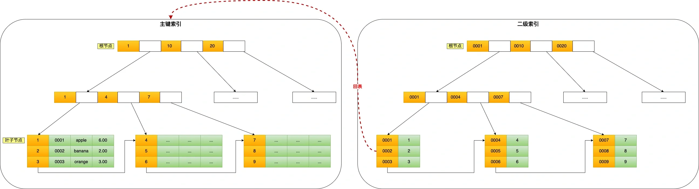


### 🪐数据库的索引分类

- 按「数据结构」分类：**B+tree索引、Hash索引、Full-text索引**。
- 按「物理存储」分类：**聚簇索引（主键索引）、二级索引（辅助索引）**。
- 按「字段特性」分类：**主键索引、唯一索引、普通索引、前缀索引**。
- 按「字段个数」分类：**单列索引、联合索引**。

另一种分类：
1. **B-Tree索引（B+ 树索引）**：是MySQL中最常用的索引类型，用于InnoDB、MyISAM、NDB等存储引擎。在B-Tree索引中，索引项按照键值的大小进行排序，每一个索引页中的索引项是有序的。
2. **哈希索引**：哈希索引基于哈希表，适用于等值查询的场景，MySQL的Memory引擎提供了可选的哈希索引。
3. **空间数据索引**：这是MyISAM的特殊索引类型，主要用于地理空间数据的查询，比如查找附近的点等等。
4. **全文索引**：这也是MyISAM的特殊索引，主要用于文本数据的全文搜索。InnoDB从MySQL 5.6版本开始也支持全文索引。
5. **复合索引**：复合索引是由两个或更多的列构成一个索引，主要用于复合查询，其效果远超多个单列索引。
6. **唯一索引**：唯一索引是不允许其中任何两行具有相同索引值的索引。
7. **主键索引**：主键索引是一种特殊的唯一索引，不允许有空值。每个表可以有一个主键。

#### 按数据结构分类

从数据结构的角度来看，MySQL 常见索引有 B+Tree 索引、HASH 索引、Full-Text 索引。

每一种存储引擎支持的索引类型不一定相同，我在表中总结了 MySQL 常见的存储引擎 InnoDB、MyISAM 和 Memory 分别支持的索引类型。

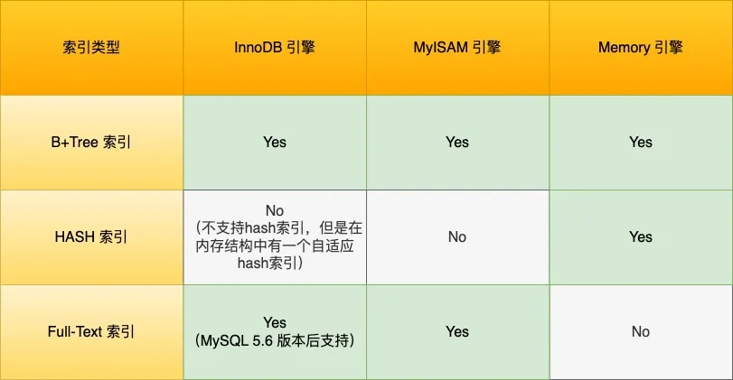

InnoDB 是在 MySQL 5.5 之后成为默认的 MySQL 存储引擎，B+Tree 索引类型也是 MySQL 存储引擎采用最多的索引类型。

在创建表时，InnoDB 存储引擎会根据不同的场景选择不同的列作为索引：

- 如果有主键，默认会使用主键作为聚簇索引的索引键（key）；
- 如果没有主键，就选择第一个不包含 NULL 值的唯一列作为聚簇索引的索引键（key）；
- 在上面两个都没有的情况下，InnoDB 将自动生成一个隐式自增 id 列作为聚簇索引的索引键（key）；

其它索引都属于辅助索引（Secondary Index），也被称为二级索引或非聚簇索引。**创建的主键索引和二级索引默认使用的是 B+Tree 索引**。

举个🌰，有这样一个表

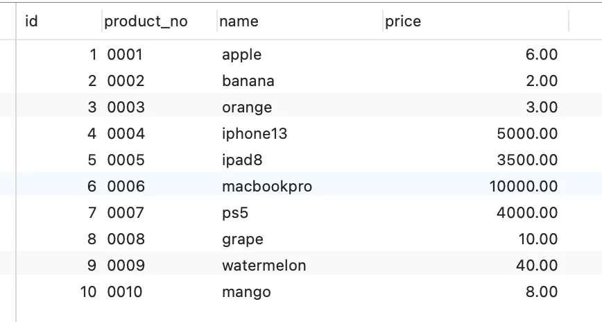

这些行数据，存储在 B+Tree 索引时是长什么样子的？

B+Tree 是一种多叉树，叶子节点才存放数据，非叶子节点只存放索引，而且每个节点里的数据是**按主键顺序存放**的。每一层父节点的索引值都会出现在下层子节点的索引值中，因此在叶子节点中，包括了所有的索引值信息，并且每一个叶子节点都指向下一个叶子节点，形成一个链表。

主键索引的 B+Tree 如图所示：


##### 通过主键查询商品数据的过程

比如，我们执行了下面这条查询语句，这条语句使用了主键索引查询 id 号为 5 的商品。查询过程是这样的，B+Tree 会自顶向下逐层进行查找：

- 将 5 与根节点的索引数据 (1，10，20) 比较，5 在 1 和 10 之间，所以根据 B+Tree的搜索逻辑，找到第二层的索引数据 (1，4，7)；
- 在第二层的索引数据  (1，4，7)中进行查找，因为 5 在 4 和 7 之间，所以找到第三层的索引数据（4，5，6）；
- 在叶子节点的索引数据（4，5，6）中进行查找，然后我们找到了索引值为 5 的行数据。

数据库的索引和数据都是存储在硬盘的，我们可以把读取一个节点当作一次磁盘 I/O 操作。那么上面的整个查询过程一共经历了 3 个节点，也就是进行了 3 次 I/O 操作。

B+Tree 存储千万级的数据只需要 3-4 层高度就可以满足，这意味着从千万级的表查询目标数据最多需要 3-4 次磁盘 I/O，所以**B+Tree 相比于 B 树和二叉树来说，最大的优势在于查询效率很高，因为即使在数据量很大的情况，查询一个数据的磁盘 I/O 依然维持在 3-4次。**

##### 通过二级索引查询商品数据的过程

主键索引的 B+Tree  和二级索引的 B+Tree 区别如下：

- 主键索引的 B+Tree  的叶子节点存放的是实际数据，所有完整的用户记录都存放在主键索引的 B+Tree 的叶子节点里；
- 二级索引的 B+Tree  的叶子节点存放的是主键值，而不是实际数据。

我这里将前面的商品表中的 product_no （商品编码）字段设置为二级索引，那么二级索引的 B+Tree 如下图，其中非叶子的 key 值是 product_no（图中橙色部分），叶子节点存储的数据是主键值（图中绿色部分）。


如果我用 product_no 二级索引查询商品，如下查询语句：

```sql
select * from product where product_no = '0002';
```

会先检二级索引中的 B+Tree 的索引值（商品编码，product_no），找到对应的叶子节点，然后获取主键值，然后再通过主键索引中的 B+Tree 树查询到对应的叶子节点，然后获取整行数据。**这个过程叫「回表」，也就是说要查两个 B+Tree 才能查到数据**。如下图：


不过，当查询的数据是能在二级索引的 B+Tree 的叶子节点里查询到，这时就不用再查主键索引查，比如下面这条查询语句：

```sql
select id from product where product_no = '0002';
```

**这种在二级索引的 B+Tree 就能查询到结果的过程就叫作「覆盖索引」，也就是只需要查一个 B+Tree 就能找到数据**。

#### 按物理存储分类

从物理存储的角度来看，索引分为聚簇索引（主键索引）、二级索引（辅助索引）。

这两个区别在前面也提到了：

- 主键索引的 B+Tree  的叶子节点存放的是实际数据，所有完整的用户记录都存放在主键索引的 B+Tree 的叶子节点里；
- 二级索引的 B+Tree  的叶子节点存放的是主键值，而不是实际数据。

#### 按字段特性分类

从字段特性的角度来看，索引分为主键索引、唯一索引、普通索引、前缀索引。

* **主键索引**就是建立在主键字段上的索引，通常在创建表的时候一起创建，一张表最多只有一个主键索引，索引列的值不允许有空值。
* **唯一索引**建立在 UNIQUE 字段上的索引，一张表可以有多个唯一索引，索引列的值必须唯一，但是允许有空值。
* **普通索引**就是建立在普通字段上的索引，既不要求字段为主键，也不要求字段为 UNIQUE。
* **前缀索引**是指对字符类型字段的前几个字符建立的索引，而不是在整个字段上建立的索引，前缀索引可以建立在字段类型为 char、 varchar、binary、varbinary 的列上。
  * 使用前缀索引的目的是为了减少索引占用的存储空间，提升查询效率。

#### 按字段个数分类

从字段个数的角度来看，索引分为单列索引、联合索引（复合索引）。

- 建立在单列上的索引称为单列索引，比如主键索引；
- 建立在多列上的索引称为联合索引；

##### 联合索引

通过将多个字段组合成一个索引，该索引就被称为联合索引。比如将商品表中的 product_no 和 name 字段组合成联合索引 `(product_no, name)`，创建联合索引的方式如下：

```sql
CREATE INDEX index_product_no_name ON product(product_no, name);
```

联合索引 `(product_no, name)` 的 B+Tree 示意图如下：

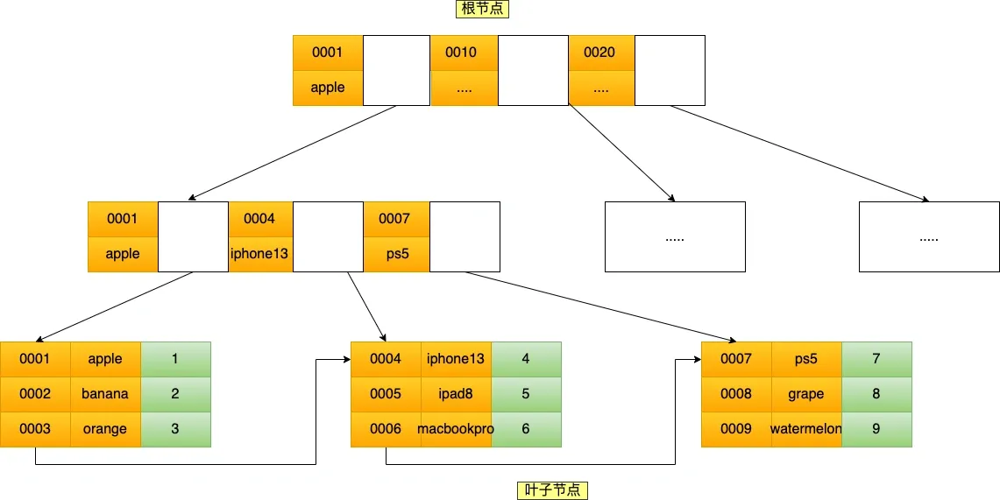

### ⭐️聚簇索引和非聚簇索引

> 简洁回答

- 一个表中只能拥有一个聚集索引，而非聚集索引一个表可以存在多个。
- 索引是通过二叉树的数据结构来描述的，我们可以这么理解聚簇索引：索引的叶节点就是数据节点。而非聚簇索引的叶节点仍然是索引节点，只不过有一个指针指向对应的数据块。
- 聚集索引：物理存储按照索引排序；非聚集索引：物理存储不按照索引排序

> 详细

另外，索引又可以分成聚簇索引和非聚簇索引（二级索引），它们区别就在于叶子节点存放的是什么数据：

- 聚簇索引的叶子节点存放的是实际数据，所有完整的用户记录都存放在聚簇索引的叶子节点；
- 二级索引的叶子节点存放的是主键值，而不是实际数据。

因为表的数据都是存放在聚簇索引的叶子节点里，所以 InnoDB 存储引擎一定会为表创建一个聚簇索引，且由于数据在物理上只会保存一份，所以聚簇索引只能有一个。

InnoDB 在创建聚簇索引时，会根据不同的场景选择不同的列作为索引：

- 如果有主键，默认会使用主键作为聚簇索引的索引键；
- 如果没有主键，就选择第一个不包含 NULL 值的唯一列作为聚簇索引的索引键；
- 在上面两个都没有的情况下，InnoDB 将自动生成一个隐式自增 id 列作为聚簇索引的索引键；

一张表只能有一个聚簇索引，那为了实现非主键字段的快速搜索，就引出了二级索引（非聚簇索引/辅助索引），它也是利用了 B+ 树的数据结构，但是二级索引的叶子节点存放的是主键值，不是实际数据。

二级索引的 B+ 树如下图，数据部分为主键值：

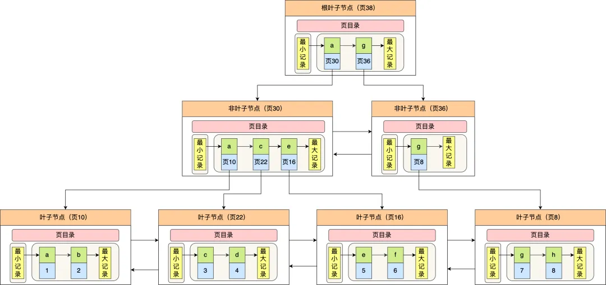

因此，**如果某个查询语句使用了二级索引，但是查询的数据不是主键值，这时在二级索引找到主键值后，需要去聚簇索引中获得数据行，这个过程就叫作「回表」，也就是说要查两个 B+  树才能查到数据。不过，当查询的数据是主键值时，因为只在二级索引就能查询到，不用再去聚簇索引查，这个过程就叫作「索引覆盖」，也就是只需要查一个  B+ 树就能找到数据。**

### 数据库事务？

简单来说，数据库事务可以保证多个对数据库的操作（也就是 SQL 语句）构成一个逻辑上的整体。构成这个逻辑上的整体的这些数据库操作遵循：**要么全部执行成功,要么全部不执行** 。

```sql
# 开启一个事务
START TRANSACTION;
# 多条 SQL 语句
SQL1,SQL2...
## 提交事务
COMMIT;
```


另外，关系型数据库（例如：`MySQL`、`SQL Server`、`Oracle` 等）事务都有 **ACID** 特性：

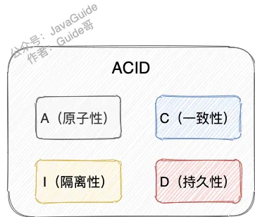

1. **原子性**（`Atomicity`） ： 事务是最小的执行单位，不允许分割。事务的原子性确保动作要么全部完成，要么完全不起作用；
2. **一致性**（`Consistency`）： 执行事务前后，数据保持一致，例如转账业务中，无论事务是否成功，转账者和收款人的总额应该是不变的；
3. **隔离性**（`Isolation`）： 并发访问数据库时，一个用户的事务不被其他事务所干扰，各并发事务之间数据库是独立的；
4. **持久性**（`Durabilily`）： 一个事务被提交之后。它对数据库中数据的改变是持久的，即使数据库发生故障也不应该对其有任何影响。

🌈 这里要额外补充一点：**只有保证了事务的持久性、原子性、隔离性之后，一致性才能得到保障。也就是说 A、I、D 是手段，C 是目的！** 想必大家也和我一样，被 ACID 这个概念被误导了很久!

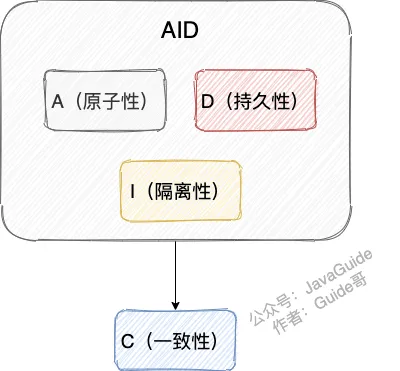

另外，DDIA 也就是 [《Designing Data-Intensive Application（数据密集型应用系统设计）》](https://book.douban.com/subject/30329536/)

 的作者在他的这本书中如是说：

> Atomicity, isolation, and durability are properties of the database, whereas  consis‐ tency (in the ACID sense) is a property of the application. The  application may rely on the database’s atomicity and isolation  properties in order to achieve consistency, but it’s not up to the  database alone.
>
> 翻译过来的意思是：原子性，隔离性和持久性是数据库的属性，而一致性（在 ACID 意义上）是应用程序的属性。应用可能依赖数据库的原子性和隔离属性来实现一致性，但这并不仅取决于数据库。因此，字母 C 不属于 ACID 。

### 并发事务带来了哪些问题

> 部分图选自《MySQL是怎样运行的》

在典型的应用程序中，多个事务并发运行，经常会操作相同的数据来完成各自的任务（多个用户对同一数据进行操作）。并发虽然是必须的，但可能会导致以下的问题。

- **脏读（Dirty read）:** 当一个事务正在访问数据并且对数据进行了修改，而这种修改还没有提交到数据库中，这时另外一个事务也访问了这个数据，然后使用了这个数据。因为这个数据是还没有提交的数据，那么另外一个事务读到的这个数据是“脏数据”，依据“脏数据”所做的操作可能是不正确的。

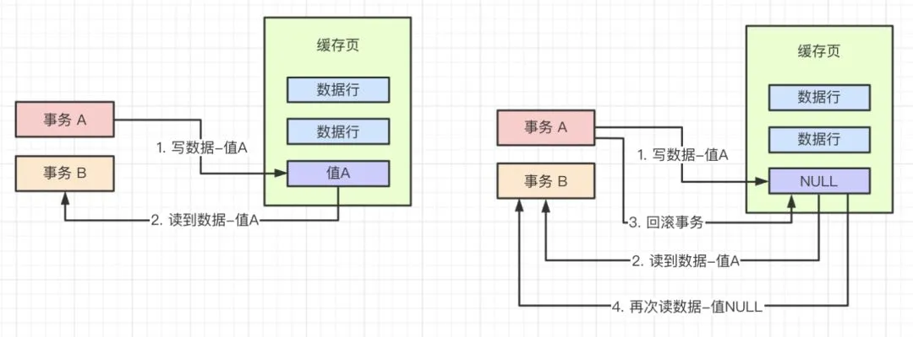

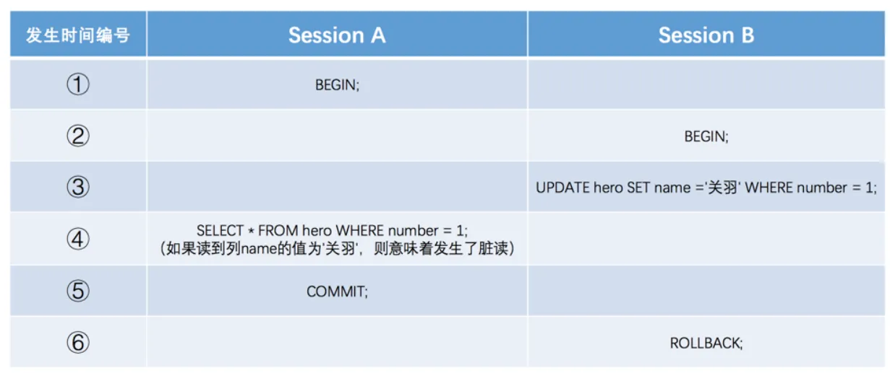

- **丢失修改（Lost to modify）/ 脏写:**  指在一个事务读取一个数据时，另外一个事务也访问了该数据，那么在第一个事务中修改了这个数据后，第二个事务也修改了这个数据。这样第一个事务内的修改结果就被丢失，因此称为丢失修改。 例如：事务 1 读取某表中的数据 A=20，事务 2 也读取 A=20，事务 1 修改 A=A-1，事务 2 也修改 A=A-1，最终结果  A=19，事务 1 的修改被丢失。


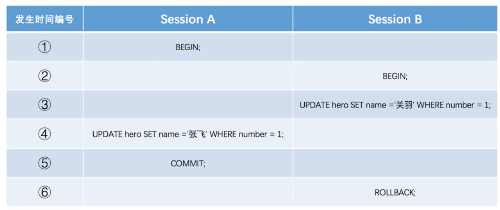

- **不可重复读（Unrepeatable read）:** 指在一个事务内多次读同一数据。在这个事务还没有结束时，另一个事务也访问该数据。那么，在第一个事务中的两次读数据之间，由于第二个事务的修改导致第一个事务两次读取的数据可能不太一样。这就发生了在一个事务内两次读到的数据是不一样的情况，因此称为不可重复读。


- **幻读（Phantom read）:** 幻读与不可重复读类似。它发生在一个事务（T1）读取了几行数据，接着另一个并发事务（T2）插入了一些数据时。在随后的查询中，第一个事务（T1）就会发现多了一些原本不存在的记录，就好像发生了幻觉一样，所以称为幻读。

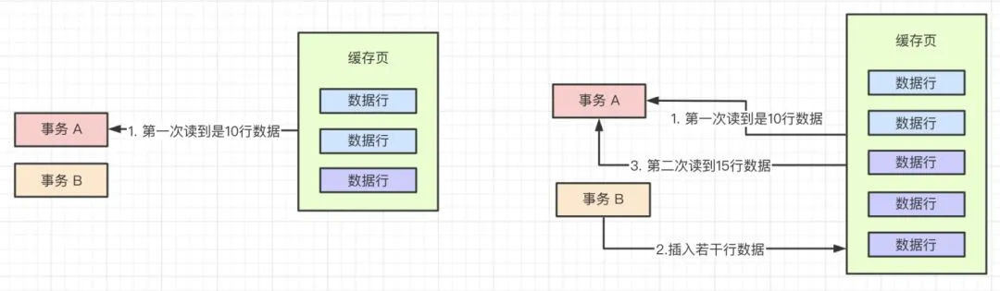

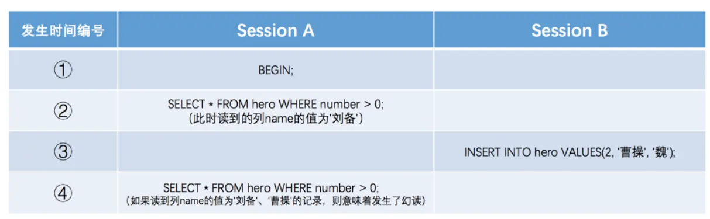

**不可重复读和幻读区别** ：`<u>`不可重复读的重点是修改`</u>`比如多次读取一条记录发现其中某些列的值被修改，`<u>`幻读的重点在于新增或者删除`</u>`比如多次查询同一条查询语句（DQL）时，记录发现记录增多或减少了。

> 混淆理解：脏读和脏写有什么区别？
> 脏读（Dirty Read）和脏写（Dirty Write）是两个并发事务的问题，它们的区别在于操作的对象和后果。
> 脏读是指一个事务读取了另一个事务未提交的数据。例如，事务A读取了事务B修改但未提交的数据，然后事务B回滚了操作，这导致事务A读取到的数据是无效的或不一致的。
> 脏写则发生在两个事务尝试同时修改相同数据的情况下。例如，事务A和事务B同时修改相同的数据，但是事务B先提交操作，这样事务A的修改将被覆盖，意味着事务A的操作是无效的。

> 加深理解：
> 1. 脏读（Dirty Read）：一个事务读取到了另一个未提交的事务的数据。这意味着，在并发事务中，一个事务可以读取其他事务尚未提交的数据，这些数据可能会在提交之前被回滚，因此读取的数据可能是无效的或不一致的。
> 2. 脏写（Dirty Write）：一个事务读取到了另一个修改了数据但是未提交的数据。这经常发生在两个事务试图同时修改相同的数据时。当一个事务尝试写入一个被另一个事务修改但未提交的数据时，就会发生脏写。
> 3. 不可重复读（Non-repeatable Read）：一个事务读取数据的同时另一个事务对事务进行了修改导致第一个事务读到的数据不是第一次读到的数据导致没法进行回滚。不可重复读是指在串行事务的隔离级别下是不会发生的现象，但在并行事务的情况下会出现。
> 4. 幻读（Phantom Read）：一个事务在读取数据的同时另一个事务对数据进行插入导致第一个事务读取到的数据和第一次看到的还多出很多数据。幻读是在修改数据时，一个事务读取了数据的一部分，然后另一个事务插入了新的数据，并且在提交之后，第一个事务再次读取时发现了新的数据。

### ⭐有哪些事务隔离级别，MySQL 的默认隔离级别是什么?

MySQL 的隔离级别基于锁和 MVCC 机制共同实现的。

- **READ-UNCOMMITTED(读取未提交)** ： 最低的隔离级别，允许读取尚未提交的数据变更，可能会导致脏读、幻读或不可重复读。
- **READ-COMMITTED(读取已提交)** ： 允许读取并发事务已经提交的数据，可以阻止脏读，但是幻读或不可重复读仍有可能发生。
- **REPEATABLE-READ(可重复读)** ： 对同一字段的多次读取结果都是一致的，除非数据是被本身事务自己所修改，可以阻止脏读和不可重复读，但幻读仍有可能发生。
- **SERIALIZABLE(可串行化)** ： 最高的隔离级别，完全服从 ACID 的隔离级别。所有的事务依次逐个执行，这样事务之间就完全不可能产生干扰，也就是说，该级别可以防止脏读、不可重复读以及幻读。

---

|     隔离级别     | 脏读 | 不可重复读 | 幻读 |
| :--------------: | :--: | :--------: | :--: |
| READ-UNCOMMITTED |  √   |     √      |  √   |
|  READ-COMMITTED  |  ×   |     √      |  √   |
| REPEATABLE-READ  |  ×   |     ×      |  √   |
|   SERIALIZABLE   |  ×   |     ×      |  ×   |

### 表级锁和行级锁了解吗？有什么区别？

MyISAM 仅仅支持表级锁(table-level locking)，一锁就锁整张表，这在并发写的情况下性非常差。

InnoDB 不光支持表级锁(table-level locking)，还支持行级锁(row-level  locking)，默认为行级锁。行级锁的粒度更小，仅对相关的记录上锁即可（对一行或者多行记录加锁），所以对于并发写入操作来说， InnoDB  的性能更高。

**表级锁和行级锁对比** ：

- **表级锁：** MySQL 中锁定粒度最大的一种锁，是针**对非索引字段加的锁**，对当前操作的整张表加锁，实现简单，资源消耗也比较少，加锁快，不会出现死锁。其锁定粒度最大，触发锁冲突的概率最高，并发度最低，MyISAM 和 InnoDB 引擎都支持表级锁。
- **行级锁：** MySQL 中锁定粒度最小的一种锁，是针**对索引字段加的锁**，只针对当前操作的记录进行加锁。 行级锁能大大减少数据库操作的冲突。其加锁粒度最小，并发度高，但加锁的开销也最大，加锁慢，会出现死锁。

### 共享锁和排他锁

不论是表级锁还是行级锁，都存在共享锁（Share Lock，S 锁）和排他锁（Exclusive Lock，X 锁）这两类：

- **共享锁（S 锁）** ：又称读锁，事务在读取记录的时候获取共享锁，允许多个事务同时获取（锁兼容）。
- **排他锁（X 锁）** ：又称写锁/独占锁，事务在修改记录的时候获取排他锁，不允许多个事务同时获取。如果一个记录已经被加了排他锁，那其他事务不能再对这条事务加任何类型的锁（锁不兼容）。

排他锁与任何的锁都不兼容，共享锁仅和共享锁兼容。

|      | S 锁   | X 锁 |
| :--- | :----- | :--- |
| S 锁 | 不冲突 | 冲突 |
| X 锁 | 冲突   | 冲突 |

由于 MVCC 的存在，对于一般的 `SELECT` 语句，InnoDB 不会加任何锁。不过， 你可以通过以下语句显式加共享锁或排他锁。

```sql
# 共享锁
SELECT ... LOCK IN SHARE MODE;
# 排他锁
SELECT ... FOR UPDATE;
```

### 数据库索引失效有哪些

[详细查看文章](https://xiaolincoding.com/mysql/index/index_lose.html)

MySQL数据库中的索引主要用于提高查询效率，但在某些情况下，索引可能失效，不能正常工作。以下是一些常见的索引失效的情况：

- **使用!=或<>运算符**: 当我们在查询中使用不等于的条件时，MySQL无法有效地使用索引。

```sql
SELECT * FROM users WHERE age != 30;
```

在这个例子中，即使age字段有索引，也无法有效使用，因为MySQL无法预测哪些行将满足这个条件。

- **对字段进行函数操作**: 如果你对一个索引字段进行函数操作，那么索引也不会被使用。例如，使用YEAR(date)，LOWER(name)等函数操作字段。

```sql
SELECT * FROM users WHERE LOWER(username) = 'john';
```

在这个例子中，username字段上的索引不会被使用，因为查询是对函数操作的结果进行比较。

- **使用OR关键字**: 如果你在WHERE子句中使用OR，那么MySQL只会在OR条件两边的字段都进行了索引的情况下才使用索引。

```sql
SELECT * FROM users WHERE id = 123 OR username = 'john';
```

在这个例子中，即使id和username都有索引，但只有当它们都被索引时，索引才会被使用。

- **索引列的顺序**: 如果你在多列上创建了复合索引，那么你在查询时必须按照创建索引时列的顺序来查询，否则索引可能不会被使用。

```sql
CREATE INDEX idx_name_age ON users(name, age);
SELECT * FROM users WHERE age = 30;
```

在这个例子中，虽然在name和age上创建了复合索引，但是查询没有按照索引列的顺序，因此索引不会被使用。

- **采用范围查询**：在复合索引中，如果在查询中对第一列用了范围查询（>, <, between, like），那么后面的列索引都会失效。

```sql
CREATE INDEX idx_name_age ON users(name, age);
SELECT * FROM users WHERE name like 'J%' AND age = 30;
```

在这个例子中，尽管我们创建了复合索引，但由于在复合索引的第一列上使用了范围查询，age上的索引将不会被使用。

- **LIKE操作以通配符开始**: 如果你在LIKE操作中以%开始，那么索引将不会被使用。

```sql
SELECT * FROM users WHERE name LIKE '%john';
```

- **数据类型不一致**: 如果在查询中，字段的数据类型和索引的数据类型不一致，那么索引不会被使用。例如，如果一个列是数字类型，但你以字符串形式在WHERE子句中引用它，索引将无法使用。

```sql
SELECT * FROM users WHERE age = '30';
```

在这个例子中，尽管age字段有索引，但因为在查询中将数字类型的age和字符串进行比较，所以索引将无法使用。

- **使用NULL**: 在MySQL中，对NULL的比较是特殊的，如果列中包含NULL值，那么即使有索引，也可能不会被使用。

```sql
SELECT * FROM users WHERE age IS NULL;
```


### 数据库sql优化有哪些方法

> 规范

[MySQL高性能优化规范建议](https://javaguide.cn/database/mysql/mysql-high-performance-optimization-specification-recommendations.html#%E6%95%B0%E6%8D%AE%E5%BA%93%E5%91%BD%E4%BB%A4%E8%A7%84%E8%8C%83)

1. 尽量避免使用子查询
2. 用IN来替换OR
3. 读取适当的记录LIMIT M,N，而不要读多余的记录
4. 禁止不必要的Order By排序
5. 总和查询可以禁止排重用union all
6. 避免随机取记录
7. 将多次插入换成批量Insert插入
8. 只返回必要的列，用具体的字段列表代替 select * 语句
9. 区分in和exists
10. 优化Group By语句
11. 尽量使用数字型字段
12. 优化Join语句

> 步骤

[SQL语句优化](https://www.pdai.tech/md/db/sql-lan/sql-lan-optimize.html#sql%E8%AF%AD%E8%A8%80---sql%E8%AF%AD%E5%8F%A5%E4%BC%98%E5%8C%96)


### InnoDB 有哪几类行锁

MySQL InnoDB 支持三种行锁定方式：

- **记录锁（Record Lock）** ：也被称为记录锁，属于单个行记录上的锁。记录锁锁定单个数据行。当一个事务试图修改或删除某行数据时，它会对该行数据加上记录锁，以防止其他事务同时修改或删除该行。
- **间隙锁（Gap Lock）** ：锁定一个范围，不包括记录本身。间隙锁锁定记录之间的间隙。它可以确保在锁定范围内不会插入新的数据行，从而有效地解决幻读问题。
- **临键锁（Next-key Lock）** ：Record Lock+Gap Lock（ps. 意思是它结合了Record Lock（记录锁）和Gap Lock（间隙锁）），锁定一个范围，包含记录本身。记录锁只能锁住已经存在的记录，为了避免插入新记录，需要依赖间隙锁。

> 间隙锁：（参考阅读：https://www.percona.com/blog/innodbs-gap-locks/）
> 在 MySQL 的 InnoDB 存储引擎中，**"间隙锁"（Gap Locks）** 是一种特殊的锁机制，主要用于处理范围查询和防止幻读。
> 当我们执行范围查询（例如 SELECT * FROM table WHERE id BETWEEN 1 AND 100 FOR UPDATE）或使用类似 "BETWEEN", "<>", "<=", ">=", "IN" 的查询条件时，InnoDB 存储引擎会对查询的范围加上 "gap lock"，以确保在事务处理过程中，其他事务不能在这个范围内插入新的记录，从而避免了幻读的问题。
>
> 1. Next-key Locks: 这是 InnoDB 默认的锁定方式，它锁定一个索引记录以及它之前的 gap。这种方式可以解决幻读的问题，但可能会对并发性能产生影响。
> 2. True Gap Locks: 这种锁定方式只锁定 gap，不包括索引记录本身。
> ==需要注意的是==，对于 READ COMMITTED 和 READ UNCOMMITTED 的隔离级别，InnoDB 不会使用 gap locks 来防止幻读。另外，如果一个表中定义了多个唯一索引，即使其中一个唯一索引已经加了锁，其他事务仍然可以通过其他唯一索引在锁定范围内插入新的记录，这可能会导致出现幻读的情况，因此在设计表结构和编写 SQL 查询时，需要特别注意这一点。

> 记录锁：（参考阅读：https://dev.mysql.com/doc/refman/8.0/en/innodb-locking.html）
> **记录锁（Record Locks）**: 记录锁是一种行锁，它锁定的是索引记录。当我们对一个记录执行 SELECT ... LOCK IN SHARE MODE 或 SELECT ... FOR UPDATE 操作时，InnoDB 存储引擎会在该记录上加一个记录锁。记录锁只阻止其他事务修改或删除该记录，但不阻止在该记录前后插入新的记录。

> 临键锁：（参考阅读：https://dev.mysql.com/doc/refman/8.0/en/innodb-locking.html）
> **临键锁（Next-key Locks）**: 临键锁是记录锁和中间隙锁的组合，它锁定的是一个索引记录以及它之前的 gap。当我们对一个记录执行 SELECT ... LOCK IN SHARE MODE 或 SELECT ... FOR UPDATE 操作时，如果 InnoDB 存储引擎不能确定是否存在符合条件的下一个记录，它会在当前记录以及之前的 gap 上加一个 next-key lock。next-key lock 可以防止其他事务修改或删除当前记录，同时也防止在当前记录前后插入新的记录，因此可以有效地防止幻读。


InnoDB 的默认隔离级别 REPEATABLE-READ（可重读）是可以解决幻读问题发生的，主要有下面两种情况：

- **快照读** ：由 MVCC 机制来保证不出现幻读。它在事务开始时创建一个数据快照。在事务期间的所有普通SELECT操作都将基于这个快照进行，这意味着在同一个事务中，多次读取相同的数据会得到相同的结果，即使在此期间其他事务对数据进行了修改。快照读不会对数据加锁，因此可以实现非阻塞读操作，提高并发性能。
- **当前读** ： 使用 Next-Key Lock 进行加锁来保证不出现幻读。当前读是针对需要修改数据的操作（如SELECT ... FOR UPDATE、UPDATE、DELETE等）进行的一种读取方式。与快照读不同，当前读会读取最新版本的数据，并对所读取的数据加锁，以确保在当前事务完成之前其他事务无法修改这些数据。这种加锁方式有助于解决幻读问题，并确保修改操作的正确性和隔离性。

在REPEATABLE READ（可重读）隔离级别下，快照读和当前读的引入分别满足了不同场景的需求：快照读适用于不需要修改数据的查询操作，能保证事务期间看到的数据一致性；当前读适用于需要修改数据的操作，可以解决幻读问题并确保数据的正确性和隔离性。


### 为什么MySQL 没有使用Hash表作为索引的数据结构呢？

**1.Hash 冲突问题** ：JDK1.8 之前 `HashMap` 就是通过链地址法来解决哈希冲突的。不过，JDK1.8 以后 `HashMap`为了减少链表过长的时候搜索时间过长引入了红黑树，不过对于数据库来说这还不算最大的缺点。

**2.Hash 索引不支持顺序和范围查询(Hash 索引不支持顺序和范围查询是它最大的缺点：** 假如我们要对表中的数据进行排序或者进行范围查询，那 Hash 索引可就不行了。

试想一种情况:

```java
SELECT * FROM tb1 WHERE id < 500;
```

在这种范围查询中，优势非常大，直接遍历比 500 小的叶子节点就够了。而 Hash 索引是根据 hash 算法来定位的，难不成还要把 1 - 499 的数据，每个都进行一次 hash 计算来定位吗?这就是 Hash 最大的缺点了。


### ⭐️为什么MySQL底层要用B+树？和B树有什么区别？

图解B+树：https://zhuanlan.zhihu.com/p/54102723

B 树也称 B-树,全称为 **多路平衡查找树** ，B+ 树是 B 树的一种变体。B 树和 B+树中的 B 是 `Balanced` （平衡）的意思。

目前大部分数据库系统及文件系统都采用 B-Tree 或其变种 B+Tree 作为索引结构。

**MySQL数据库底层选择使用B+树，而不是B树，主要有以下几个原因**：

- **范围查询的优化**：B+树的所有关键字数据都出现在叶子节点，所有数据记录都链在一起，因此对整个区间的数据能够进行快速地遍历，适合文件索引和数据库索引。而在B树中，数据分布在整个树中，如果进行范围查询，可能需要遍历整个树，效率较低。
- **查询效率的稳定性**：B+树的内部节点并不包含数据信息，只包含子节点的指针，这意呈现每个内部节点所能保存的子节点指针数量更多，树的高度较低，查询的效率更加稳定。而B树因为非叶子节点也可能包含数据，所以每个节点能保存的子节点指针数量较少，树的高度可能会增加，导致查询效率的波动。
- **磁盘I/O操作优化**：因为磁盘I/O操作相对于内存访问来说，代价要高得多，B+树的设计更加注重减少磁盘I/O次数。B+树每一个节点的子节点数量都较多，这意味着可以通过一次I/O取得更多的索引信息。

**B 树& B+树两者有何异同呢？**

- B 树的所有节点既存放键(key) 也存放 数据(data)，而 B+树只有叶子节点存放 key 和 data，其他内节点只存放 key。
- B 树的叶子节点都是独立的;B+树的叶子节点有一条引用链指向与它相邻的叶子节点。
- B 树的检索的过程相当于对范围内的每个节点的关键字做二分查找，可能还没有到达叶子节点，检索就结束了。而 B+树的检索效率就很稳定了，任何查找都是从根节点到叶子节点的过程，叶子节点的顺序检索很明显。

在 MySQL 中，MyISAM 引擎和 InnoDB 引擎都是使用 B+Tree 作为索引结构，但是，两者的实现方式不太一样。

MyISAM 引擎中，B+Tree 叶节点的 data 域存放的是数据记录的地址。在索引检索的时候，首先按照 B+Tree  搜索算法搜索索引，如果指定的 Key 存在，则取出其 data 域的值，然后**以 data  域的值为地址读取相应的数据记录**。这被称为“**非聚簇索引**”。

InnoDB 引擎中，其数据文件本身就是索引文件。相比 MyISAM，索引文件和数据文件是分离的，其表数据文件本身就是按 B+Tree  组织的一个索引结构，**树的叶节点 data 域保存了完整的数据记录**。这个索引的 key 是数据表的主键，因此 InnoDB  表数据文件本身就是主索引。这被称为**“聚簇索引（或聚集索引）**”，而其余的索引都作为辅助索引，辅助索引的 data  域存储相应记录主键的值而不是地址，这也是和 MyISAM 不同的地方。在根据主索引搜索时，直接找到 key  所在的节点即可取出数据；在根据辅助索引查找时，则需要先取出主键的值，再走一遍主索引。  因此，在设计表的时候，不建议使用过长的字段作为主键，也不建议使用非单调的字段作为主键，这样会造成主索引频繁分裂。


### 详解B+树

#### 什么是 B+ 树？

B+ 树就是对 B 树做了一个升级，MySQL 中索引的数据结构就是采用了 B+ 树，B+ 树结构如下图：


B+ 树与 B 树差异的点，主要是以下这几点：

- 叶子节点（最底部的节点）才会存放实际数据（索引+记录），非叶子节点只会存放索引；
- 所有索引都会在叶子节点出现，叶子节点之间构成一个有序链表；
- 非叶子节点的索引也会同时存在在子节点中，并且是在子节点中所有索引的最大（或最小）。
- 非叶子节点中有多少个子节点，就有多少个索引；

下面通过三个方面，比较下 B+ 和 B 树的性能区别。

#### B+ 树是如何进行查询的？

一个数据页中的记录检索，因为一个数据页中的记录是有限的，且主键值是有序的，所以通过对所有记录进行分组，然后将组号（槽号）存储到页目录，使其起到索引作用，通过二分查找的方法快速检索到记录在哪个分组，来降低检索的时间复杂度。

但是，当我们需要存储大量的记录时，就需要多个数据页，这时我们就需要考虑如何建立合适的索引，才能方便定位记录所在的页。

为了解决这个问题，**InnoDB 采用了 B+ 树作为索引**。磁盘的 I/O 操作次数对索引的使用效率至关重要，因此在构造索引的时候，我们更倾向于采用“矮胖”的 B+ 树数据结构，这样所需要进行的磁盘 I/O 次数更少，而且 B+ 树 更适合进行关键字的范围查询。

InnoDB 里的 B+ 树中的**每个节点都是一个数据页**，结构示意图如下：


通过上图，我们看出  B+ 树的特点：

- 只有叶子节点（最底层的节点）才存放了数据，非叶子节点（其他上层节）仅用来存放目录项作为索引。
- 非叶子节点分为不同层次，通过分层来降低每一层的搜索量；
- 所有节点按照索引键大小排序，构成一个双向链表，便于范围查询；

我们再看看 B+ 树如何实现快速查找主键为 6 的记录，以上图为例子：

- 从根节点开始，通过二分法快速定位到符合页内范围包含查询值的页，因为查询的主键值为 6，在[1, 7)范围之间，所以到页 30 中查找更详细的目录项；
- 在非叶子节点（页30）中，继续通过二分法快速定位到符合页内范围包含查询值的页，主键值大于 5，所以就到叶子节点（页16）查找记录；
- 接着，在叶子节点（页16）中，通过槽查找记录时，使用二分法快速定位要查询的记录在哪个槽（哪个记录分组），定位到槽后，再遍历槽内的所有记录，找到主键为 6 的记录。

可以看到，在定位记录所在哪一个页时，也是通过二分法快速定位到包含该记录的页。定位到该页后，又会在该页内进行二分法快速定位记录所在的分组（槽号），最后在分组内进行遍历查找。

#### 单点查询

B 树进行单个索引查询时，最快可以在 O(1) 的时间代价内就查到，而从平均时间代价来看，会比 B+ 树稍快一些。

但是 B 树的查询波动会比较大，因为每个节点即存索引又存记录，所以有时候访问到了非叶子节点就可以找到索引，而有时需要访问到叶子节点才能找到索引。

**B+ 树的非叶子节点不存放实际的记录数据，仅存放索引，因此数据量相同的情况下，相比存储即存索引又存记录的 B 树，B+树的非叶子节点可以存放更多的索引，因此 B+ 树可以比 B 树更「矮胖」，查询底层节点的磁盘 I/O次数会更少**。

#### 插入和删除效率

B+ 树有大量的冗余节点，这样使得删除一个节点的时候，可以直接从叶子节点中删除，甚至可以不动非叶子节点，这样删除非常快，

比如下面这个动图是删除 B+ 树 0004 节点的过程，因为非叶子节点有 0004 的冗余节点，所以在删除的时候，树形结构变化很小：


> 注意，：B+ 树对于非叶子节点的子节点和索引的个数，定义方式可能会有不同，有的是说非叶子节点的子节点的个数为 M  阶，而索引的个数为 M-1（这个是维基百科里的定义），因此我本文关于 B+ 树的动图都是基于这个。但是我在前面介绍 B+ 树与 B+  树的差异时，说的是「非叶子节点中有多少个子节点，就有多少个索引」，主要是 MySQL 用到的 B+ 树就是这个特性。

下面这个动图是删除 B 树 0008 节点的过程，可能会导致树的复杂变化：


甚至，B+ 树在删除根节点的时候，由于存在冗余的节点，所以不会发生复杂的树的变形，比如下面这个动图是删除 B+ 树根节点的过程：


B 树则不同，B 树没有冗余节点，删除节点的时候非常复杂，比如删除根节点中的数据，可能涉及复杂的树的变形，比如下面这个动图是删除 B 树根节点的过程：


B+ 树的插入也是一样，有冗余节点，插入可能存在节点的分裂（如果节点饱和），但是最多只涉及树的一条路径。而且 B+ 树会自动平衡，不需要像更多复杂的算法，类似红黑树的旋转操作等。

因此，**B+ 树的插入和删除效率更高**。

#### 范围查询

B 树和 B+ 树等值查询原理基本一致，先从根节点查找，然后对比目标数据的范围，最后递归的进入子节点查找。

因为 **B+ 树所有叶子节点间还有一个链表进行连接，这种设计对范围查找非常有帮助**，比如说我们想知道 12 月 1 日和 12 月 12 日之间的订单，这个时候可以先查找到 12 月 1 日所在的叶子节点，然后利用链表向右遍历，直到找到 12 月12 日的节点，这样就不需要从根节点查询了，进一步节省查询需要的时间。

而 B 树没有将所有叶子节点用链表串联起来的结构，因此只能通过树的遍历来完成范围查询，这会涉及多个节点的磁盘 I/O 操作，范围查询效率不如 B+ 树。

因此，存在大量范围检索的场景，适合使用 B+树，比如数据库。而对于大量的单个索引查询的场景，可以考虑 B 树，比如 nosql 的MongoDB

#### MySQL 中的 B+ 树

MySQL 的存储方式根据存储引擎的不同而不同，我们最常用的就是 Innodb 存储引擎，它就是采用了 B+ 树作为了索引的数据结构。

下图就是 Innodb 里的 B+ 树：


但是 Innodb 使用的  B+ 树有一些特别的点，比如：

- B+ 树的叶子节点之间是用「双向链表」进行连接，这样的好处是既能向右遍历，也能向左遍历。
- B+ 树点节点内容是数据页，数据页里存放了用户的记录以及各种信息，每个数据页默认大小是 16 KB。

Innodb 根据索引类型不同，分为聚集和二级索引。他们区别在于，聚集索引的叶子节点存放的是实际数据，所有完整的用户记录都存放在聚集索引的叶子节点，而二级索引的叶子节点存放的是主键值，而不是实际数据。

因为表的数据都是存放在聚集索引的叶子节点里，所以 InnoDB 存储引擎一定会为表创建一个聚集索引，且由于数据在物理上只会保存一份，所以聚簇索引只能有一个，而二级索引可以创建多个。

### MySQL三大日志（binlog、redo log、undo log）

> 简洁介绍

当然可以。在MySQL中，binlog、redo log和undo log都是用于保证数据一致性和可恢复性的重要组件，但它们的用途和工作方式各有不同。

- **bin log（二进制日志）**：Binlog主要是用于记录数据库所有的DDL（Data Definition Language，数据定义语言，如CREATE、DROP、ALTER等）和DML（Data Manipulation Language，数据操作语言，如INSERT、UPDATE、DELETE等）语句，以及这些语句的执行时间。它的主要作用是**用于MySQL的主从复制（Replication）和数据的恢复（Point-In-Time Recovery）**。在主从复制中，主服务器上的改动通过Binlog同步到从服务器，以保持数据的一致性。在数据恢复中，可以利用Binlog回放事务，将数据恢复到某一特定的时间点。
- **undo log（回滚日志）**：undo log是InnoDB存储引擎特有的日志，用来**保存旧数据的，即在事务开始之前，数据的状态**。Undo日志主要是为了实现事务的原子性和一致性。undo log记录了数据在进行修改前的原始值。如果一个事务执行失败，或者一个正在执行的**事务需要被中断**（例如，由于其他事务的回滚或者明确的撤销要求），MySQL可以利用undo log中的信息把数据**恢复到之前的状态**。此外，undo日志也用于实现MVCC（多版本并发控制），使得每个事务都能看到一致的“快照”数据，而不会受到其他并发事务的影响。
- **redo log（重做日志）**：redo log是InnoDB存储引擎特有的日志文件，是物理日志，**记录的是在某个数据页上做了什么修改，即在事务执行过程中，数据的变更情况**。它确保了即使**MySQL意外崩溃**，通过redo log也可以恢复数据。当我们对数据进行更改时，首先会将更改写入到redo log（这个过程叫做prepare），并且此时更改还未真正地应用到磁盘的数据页上，然后再把更改应用到磁盘的数据页上，这个过程称为commit。

----

`MySQL` 日志 主要包括错误日志、查询日志、慢查询日志、事务日志、二进制日志几大类。其中，比较重要的还要属二进制日志 `binlog`（归档日志）和事务日志 `redo log`（重做日志）和 `undo log`（回滚日志）

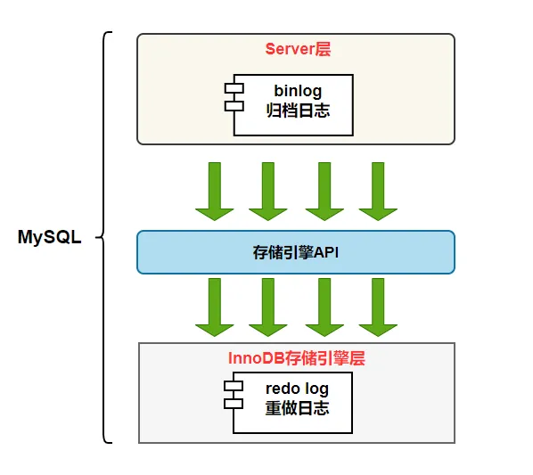

#### redo log

`redo log`（重做日志）是 `InnoDB`存储引擎独有的，它让 `MySQL`拥有了崩溃恢复能力。

比如 `MySQL` 实例挂了或宕机了，重启时，`InnoDB`存储引擎会使用 `redo log`恢复数据，保证数据的持久性与完整性。


`MySQL` 中数据是以页为单位，你查询一条记录，会从硬盘把一页的数据加载出来，加载出来的数据叫数据页，会放入到 `Buffer Pool` 中。

后续的查询都是先从 `Buffer Pool` 中找，没有命中再去硬盘加载，减少硬盘 `IO` 开销，提升性能。

更新表数据的时候，也是如此，发现 `Buffer Pool` 里存在要更新的数据，就直接在 `Buffer Pool` 里更新。

然后会把“在某个数据页上做了什么修改”记录到重做日志缓存（`redo log buffer`）里，接着刷盘到 `redo log` 文件里。


> 图片笔误提示：第 4 步 “清空 redo log buffe 刷盘到 redo 日志中”这句话中的 buffe 应该是 buffer。

理想情况，事务一提交就会进行刷盘操作，但实际上，刷盘的时机是根据策略来进行的。

> 小贴士：每条 redo 记录由“表空间号+数据页号+偏移量+修改数据长度+具体修改的数据”组成


##### PageCache

我们知道文件一般存放在硬盘（机械硬盘或固态硬盘）中，CPU 并不能直接访问硬盘中的数据，而是需要先将硬盘中的数据读入到内存中，然后才能被 CPU 访问。

由于读写硬盘的速度比读写内存要慢很多（DDR4 内存读写速度是机械硬盘500倍，是固态硬盘的200倍），所以为了避免每次读写文件时，都需要对硬盘进行读写操作，Linux 内核使用 `页缓存（Page Cache）` 机制来对文件中的数据进行缓存。

> 本文使用的 Linux 内核版本为：Linux-2.6.23

###### 什么是页缓存

为了提升对文件的读写效率，Linux 内核会以页大小（4KB）为单位，将文件划分为多数据块。当用户对文件中的某个数据块进行读写操作时，内核首先会申请一个内存页（称为 `页缓存`）与文件中的数据块进行绑定。如下图所示：

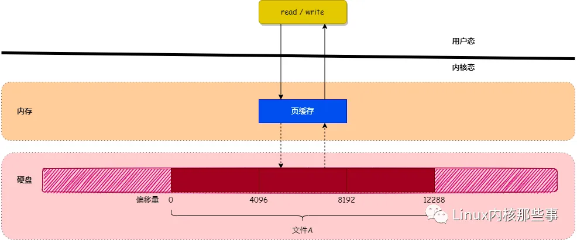

如上图所示，当用户对文件进行读写时，实际上是对文件的 `页缓存` 进行读写。所以对文件进行读写操作时，会分以下两种情况进行处理：

- 当从文件中读取数据时，如果要读取的数据所在的页缓存已经存在，那么就直接把页缓存的数据拷贝给用户即可。否则，内核首先会申请一个空闲的内存页（页缓存），然后从文件中读取数据到页缓存，并且把页缓存的数据拷贝给用户。
- 当向文件中写入数据时，如果要写入的数据所在的页缓存已经存在，那么直接把新数据写入到页缓存即可。否则，内核首先会申请一个空闲的内存页（页缓存），然后从文件中读取数据到页缓存，并且把新数据写入到页缓存中。对于被修改的页缓存，内核会定时把这些页缓存刷新到文件中。

###### 页缓存的实现

前面主要介绍了页缓存的作用和原理，接下来我们将会分析 Linux 内核是怎么实现页缓存机制的。

1. address_space

在 Linux 内核中，使用 `file` 对象来描述一个被打开的文件，其中有个名为 `f_mapping` 的字段，定义如下：

```c
struct file {
    ...
    struct address_space *f_mapping;
};
```

从上面代码可以看出，`f_mapping` 字段的类型为 `address_space` 结构，其定义如下：

```c
struct address_space {
    struct inode           *host;      /* owner: inode, block_device */
    struct radix_tree_root page_tree;  /* radix tree of all pages */
    rwlock_t               tree_lock;  /* and rwlock protecting it */
    ...
};
```

`address_space` 结构其中的一个作用就是用于存储文件的 `页缓存`，下面介绍一下各个字段的作用：

- `host`：指向当前 `address_space` 对象所属的文件 `inode` 对象（每个文件都使用一个 `inode` 对象表示）。
- `page_tree`：用于存储当前文件的 `页缓存`。
- `tree_lock`：用于防止并发访问 `page_tree` 导致的资源竞争问题。

从 `address_space` 对象的定义可以看出，文件的 `页缓存` 使用了 `radix树` 来存储。

> `radix树`：又名基数树，它使用键值（key-value）对的形式来保存数据，并且可以通过键快速查找到其对应的值。内核以文件读写操作中的数据 `偏移量` 作为键，以数据偏移量所在的 `页缓存` 作为值，存储在 `address_space` 结构的 `page_tree` 字段中。

下图展示了上述各个结构之间的关系：

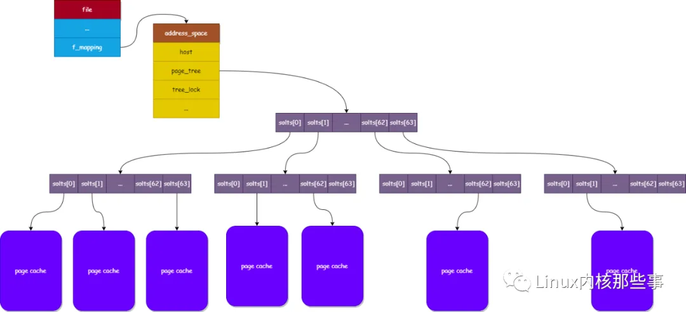

如果对 `radix树` 不太了解，可以简单将其看成可以通过文件偏移量快速找到其所在 `页缓存` 的结构，有机会我会另外写一篇关于 `radix树` 的文章。

2. 读文件操作

现在我们来分析一下读取文件数据的过程，用户可以通过调用 `read` 系统调用来读取文件中的数据，其调用链如下：

```
read()
└→ sys_read()
   └→ vfs_read()
      └→ do_sync_read()
         └→ generic_file_aio_read()
            └→ do_generic_file_read()
               └→ do_generic_mapping_read()
```

从上面的调用链可以看出，`read` 系统调用最终会调用 `do_generic_mapping_read` 函数来读取文件中的数据，其实现如下：

```c
void do_generic_mapping_read(struct address_space *mapping,
                        struct file_ra_state *_ra,
                        struct file *filp,
                        loff_t *ppos,
                        read_descriptor_t *desc,
                        read_actor_t actor)
{
    struct inode *inode = mapping->host;
    unsigned long index;
    struct page *cached_page;
    ...

    cached_page = NULL;
    index = *ppos >> PAGE_CACHE_SHIFT;
    ...

    for (;;) {
        struct page *page;
        ...

find_page:
        // 1. 查找文件偏移量所在的页缓存是否存在
        page = find_get_page(mapping, index);
        if (!page) {
            ...
            // 2. 如果页缓存不存在, 那么跳到 no_cached_page 进行处理
            goto no_cached_page; 
        }
        ...

page_ok:
        ...
        // 3. 如果页缓存存在, 那么把页缓存的数据拷贝到用户应用程序的内存中
        ret = actor(desc, page, offset, nr);
        ...
        if (ret == nr && desc->count)
            continue;
        goto out;
        ...

readpage:
        // 4. 从文件读取数据到页缓存中
        error = mapping->a_ops->readpage(filp, page);
        ...
        goto page_ok;
        ...

no_cached_page:
        if (!cached_page) {
            // 5. 申请一个内存页作为页缓存
            cached_page = page_cache_alloc_cold(mapping);
            ...
        }

        // 6. 把新申请的页缓存添加到文件页缓存中
        error = add_to_page_cache_lru(cached_page, mapping, index, GFP_KERNEL);
        ...
        page = cached_page;
        cached_page = NULL;
        goto readpage;
    }

out:
    ...
}
```

`do_generic_mapping_read` 函数的实现比较复杂，经过精简后，上面代码只留下最重要的逻辑，可以归纳为以下几个步骤：

- 通过调用 `find_get_page` 函数查找要读取的文件偏移量所对应的页缓存是否存在，如果存在就把页缓存中的数据拷贝到应用程序的内存中。
- 否则调用 `page_cache_alloc_cold` 函数申请一个空闲的内存页作为新的页缓存，并且通过调用 `add_to_page_cache_lru` 函数把新申请的页缓存添加到文件页缓存和 LRU 队列中（后面会介绍）。
- 通过调用 `readpage` 接口从文件中读取数据到页缓存中，并且把页缓存的数据拷贝到应用程序的内存中。

从上面代码可以看出，当页缓存不存在时会申请一块空闲的内存页作为页缓存，并且通过调用 `add_to_page_cache_lru` 函数把其添加到文件的页缓存和 LRU 队列中。我们来看看 `add_to_page_cache_lru` 函数的实现：

```c
 int add_to_page_cache_lru(struct page *page, struct address_space *mapping,
                           pgoff_t offset, gfp_t gfp_mask)
{
    // 1. 把页缓存添加到文件页缓存中
    int ret = add_to_page_cache(page, mapping, offset, gfp_mask);
    if (ret == 0)
        lru_cache_add(page); // 2. 把页缓存添加到 LRU 队列中
    return ret;
}
```

`add_to_page_cache_lru` 函数主要完成两个工作：

- 通过调用 `add_to_page_cache` 函数把页缓存添加到文件页缓存中，也就是添加到 `address_space` 结构的 `page_tree` 字段中。
- 通过调用 `lru_cache_add` 函数把页缓存添加到 LRU 队列中。LRU 队列用于当系统内存不足时，对页缓存进行清理时使用。

###### 总结

本文主要介绍了 `页缓存` 的作用和原理，并且介绍了在读取文件数据时对页缓存的处理过程。本文并没有介绍写文件操作对应的页缓存处理和当系统内存不足时怎么释放页缓存，有兴趣的话可以自行阅读相关的代码实现。


##### 刷盘时机

`InnoDB` 存储引擎为 `redo log` 的刷盘策略提供了 `innodb_flush_log_at_trx_commit` 参数，它支持三种策略：

- **0** ：设置为 0 的时候，表示每次事务提交时不进行刷盘操作
- **1** ：设置为 1 的时候，表示每次事务提交时都将进行刷盘操作（默认值）
- **2** ：设置为 2 的时候，表示每次事务提交时都只把 redo log buffer 内容写入 page cache

`innodb_flush_log_at_trx_commit` 参数默认为 1 ，也就是说当事务提交时会调用 `fsync` 对 redo log 进行刷盘

另外，`InnoDB` 存储引擎有一个后台线程，每隔 `1` 秒，就会把 `redo log buffer` 中的内容写到文件系统缓存（`page cache`），然后调用 `fsync` 刷盘。

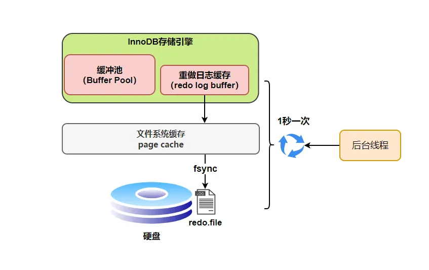

也就是说，一个没有提交事务的 `redo log` 记录，也可能会刷盘。

**为什么呢？**

因为在事务执行过程 `redo log` 记录是会写入 `redo log buffer` 中，这些 `redo log` 记录会被后台线程刷盘。

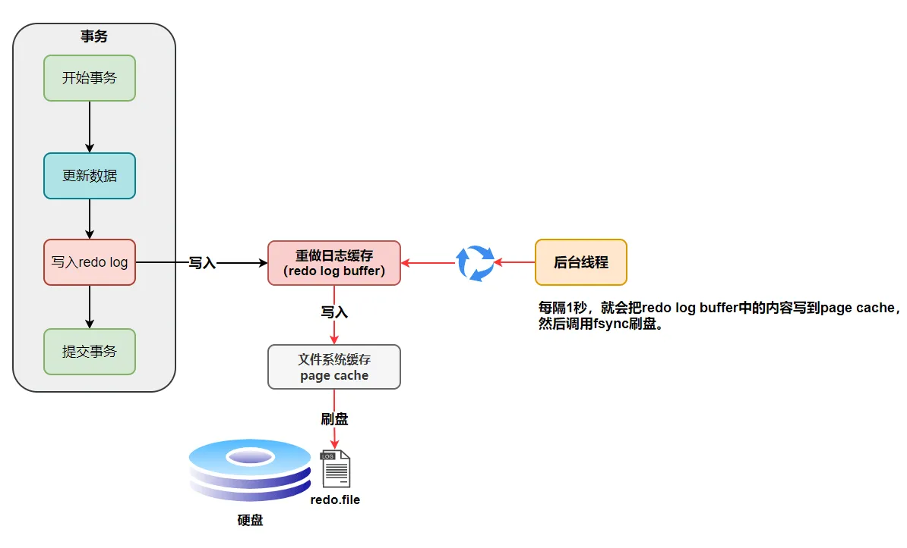

除了后台线程每秒 `1`次的轮询操作，还有一种情况，当 `redo log buffer` 占用的空间即将达到 `innodb_log_buffer_size` 一半的时候，后台线程会主动刷盘。

下面是不同刷盘策略的流程图

innodb_flush_log_at_trx_commit=0


为 `0`时，如果 `MySQL`挂了或宕机可能会有 `1`秒数据的丢失。

innodb_flush_log_at_trx_commit=1


为 `1`时， 只要事务提交成功，`redo log`记录就一定在硬盘里，不会有任何数据丢失。

如果事务执行期间 `MySQL`挂了或宕机，这部分日志丢了，但是事务并没有提交，所以日志丢了也不会有损失。

innodb_flush_log_at_trx_commit=2


为 `2`时， 只要事务提交成功，`redo log buffer`中的内容只写入文件系统缓存（`page cache`）。

如果仅仅只是 `MySQL`挂了不会有任何数据丢失，但是宕机可能会有 `1`秒数据的丢失。

##### 日志文件组

 硬盘上存储的 `redo log` 日志文件不只一个，而是以一个**日志文件组**的形式出现的，每个的 `redo`日志文件大小都是一样的。

比如可以配置为一组 `4`个文件，每个文件的大小是 `1GB`，整个 `redo log` 日志文件组可以记录 `4G`的内容。

它采用的是环形数组形式，从头开始写，写到末尾又回到头循环写，如下图所示。

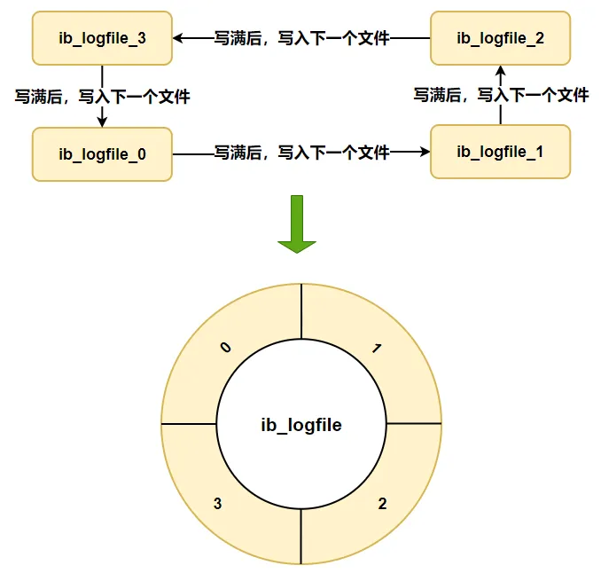

在个**日志文件组**中还有两个重要的属性，分别是 `write pos、checkpoint`

- **write pos** 是当前记录的位置，一边写一边后移
- **checkpoint** 是当前要擦除的位置，也是往后推移

每次刷盘 `redo log` 记录到**日志文件组**中，`write pos` 位置就会后移更新。

每次 `MySQL` 加载**日志文件组**恢复数据时，会清空加载过的 `redo log` 记录，并把 `checkpoint` 后移更新。

`write pos` 和 `checkpoint` 之间的还空着的部分可以用来写入新的 `redo log` 记录。

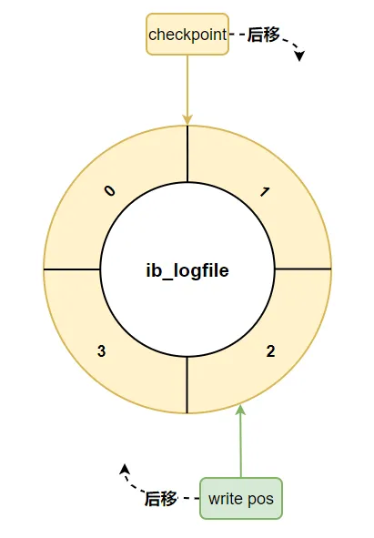

如果 `write pos` 追上 `checkpoint` ，表示**日志文件组**满了，这时候不能再写入新的 `redo log` 记录，`MySQL` 得停下来，清空一些记录，把 `checkpoint` 推进一下。

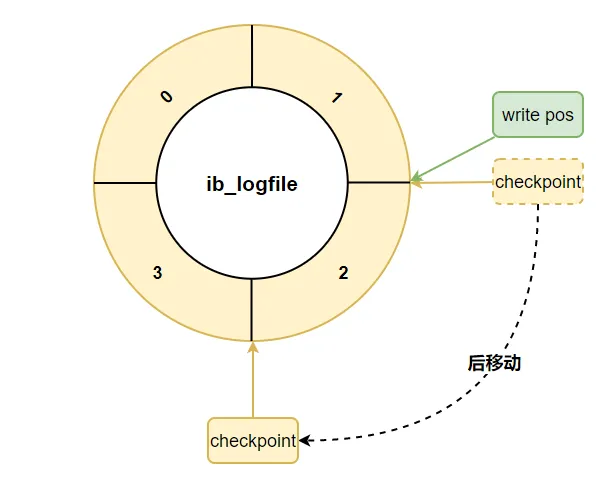

##### redo log 小结

相信大家都知道 `redo log` 的作用和它的刷盘时机、存储形式。

现在我们来思考一个问题： **只要每次把修改后的数据页直接刷盘不就好了，还有 `redo log` 什么事？**

它们不都是刷盘么？差别在哪里？

```java
1 Byte = 8bit
1 KB = 1024 Byte
1 MB = 1024 KB
1 GB = 1024 MB
1 TB = 1024 GB
```

实际上，数据页大小是 `16KB`，刷盘比较耗时，可能就修改了数据页里的几 `Byte` 数据，有必要把完整的数据页刷盘吗？

而且数据页刷盘是随机写，因为一个数据页对应的位置可能在硬盘文件的随机位置，所以性能是很差。

如果是写 `redo log`，一行记录可能就占几十 `Byte`，只包含表空间号、数据页号、磁盘文件偏移 量、更新值，再加上是顺序写，所以刷盘速度很快。

所以用 `redo log` 形式记录修改内容，性能会远远超过刷数据页的方式，这也让数据库的并发能力更强。

> 其实内存的数据页在一定时机也会刷盘，我们把这称为页合并，讲 `Buffer Pool`的时候会对这块细说

#### binlog

`redo log` 它是物理日志，记录内容是“在某个数据页上做了什么修改”，属于 `InnoDB` 存储引擎。

而 `binlog` 是逻辑日志，记录内容是语句的原始逻辑，类似于“给 ID=2 这一行的 c 字段加 1”，属于 `MySQL Server` 层。

不管用什么存储引擎，只要发生了表数据更新，都会产生 `binlog` 日志。

那 `binlog` 到底是用来干嘛的？

可以说 `MySQL`数据库的**数据备份、主备、主主、主从**都离不开 `binlog`，需要依靠 `binlog`来同步数据，保证数据一致性。

##### 记录格式

`binlog` 日志有三种格式，可以通过 `binlog_format`参数指定。

- **statement**
- **row**
- **mixed**

指定 `statement`，记录的内容是 `SQL`语句原文，比如执行一条 `update T set update_time=now() where id=1`，记录的内容如下

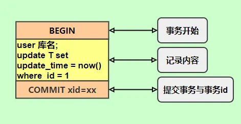

同步数据时，会执行记录的 `SQL`语句，但是

有个问题，`update_time=now()`这里会获取当前系统时间，直接执行会导致与原库的数据不一致。

为了解决这种问题，我们需要指定为 `row`，记录的内容不再是简单的 `SQL`语句了，还包含操作的具体数据，记录内容如下


`row`格式记录的内容看不到详细信息，要通过 `mysqlbinlog`工具解析出来。

`update_time=now()`变成了具体的时间 `update_time=1627112756247`，条件后面的@1、@2、@3 都是该行数据第 1 个~3 个字段的原始值（**假设这张表只有 3 个字段**）。

这样就能保证同步数据的一致性，通常情况下都是指定为 `row`，这样可以为数据库的恢复与同步带来更好的可靠性。

但是这种格式，需要更大的容量来记录，比较占用空间，恢复与同步时会更消耗 `IO`资源，影响执行速度。

所以就有了一种折中的方案，指定为 `mixed`，记录的内容是前两者的混合。

`MySQL`会判断这条 `SQL`语句是否可能引起数据不一致，如果是，就用 `row`格式，否则就用 `statement`格式

##### 写入机制

`binlog`的写入时机也非常简单，事务执行过程中，先把日志写到 `binlog cache`，事务提交的时候，再把 `binlog cache`写到 `binlog`文件中。

因为一个事务的 `binlog`不能被拆开，无论这个事务多大，也要确保一次性写入，所以系统会给每个线程分配一个块内存作为 `binlog cache`。

我们可以通过 `binlog_cache_size`参数控制单个线程 binlog cache 大小，如果存储内容超过了这个参数，就要暂存到磁盘（`Swap`）。

`binlog`日志刷盘流程如下

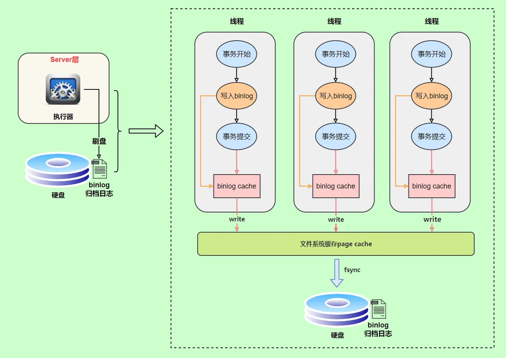

- **上图的 write，是指把日志写入到文件系统的 page cache，并没有把数据持久化到磁盘，所以速度比较快**
- **上图的 fsync，才是将数据持久化到磁盘的操作**

`write`和 `fsync`的时机，可以由参数 `sync_binlog`控制，默认是 `0`。

为 `0`的时候，表示每次提交事务都只 `write`，由系统自行判断什么时候执行 `fsync`。


虽然性能得到提升，但是机器宕机，`page cache`里面的 binlog 会丢失。

为了安全起见，可以设置为 `1`，表示每次提交事务都会执行 `fsync`，就如同 **redo log 日志刷盘流程** 一样。

最后还有一种折中方式，可以设置为 `N(N>1)`，表示每次提交事务都 `write`，但累积 `N`个事务后才 `fsync`


在出现 `IO`瓶颈的场景里，将 `sync_binlog`设置成一个比较大的值，可以提升性能。

同样的，如果机器宕机，会丢失最近 `N`个事务的 `binlog`日志

#### 两阶段提交

`redo log`（重做日志）让 `InnoDB`存储引擎拥有了崩溃恢复能力。

`binlog`（归档日志）保证了 `MySQL`集群架构的数据一致性。

虽然它们都属于持久化的保证，但是侧重点不同。

在执行更新语句过程，会记录 `redo log`与 `binlog`两块日志，以基本的事务为单位，`redo log`在事务执行过程中可以不断写入，而 `binlog`只有在提交事务时才写入，所以 `redo log`与 `binlog`的写入时机不一样。


回到正题，`redo log`与 `binlog`两份日志之间的逻辑不一致，会出现什么问题？

我们以 `update`语句为例，假设 `id=2`的记录，字段 `c`值是 `0`，把字段 `c`值更新成 `1`，`SQL`语句为 `update T set c=1 where id=2`。

假设执行过程中写完 `redo log`日志后，`binlog`日志写期间发生了异常，会出现什么情况呢？

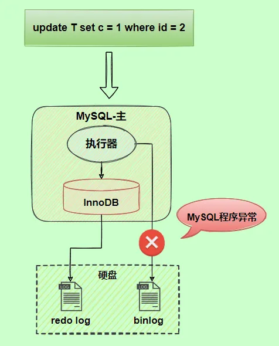

由于 `binlog`没写完就异常，这时候 `binlog`里面没有对应的修改记录。因此，之后用 `binlog`日志恢复数据时，就会少这一次更新，恢复出来的这一行 `c`值是 `0`，而原库因为 `redo log`日志恢复，这一行 `c`值是 `1`，最终数据不一致。


为了解决两份日志之间的逻辑一致问题，`InnoDB`存储引擎使用**两阶段提交**方案。

原理很简单，将 `redo log`的写入拆成了两个步骤 `prepare`和 `commit`，这就是**两阶段提交**。


使用**两阶段提交**后，写入 `binlog`时发生异常也不会有影响，因为 `MySQL`根据 `redo log`日志恢复数据时，发现 `redo log`还处于 `prepare`阶段，并且没有对应 `binlog`日志，就会回滚该事务。

再看一个场景，`redo log`设置 `commit`阶段发生异常，那会不会回滚事务呢？


并不会回滚事务，它会执行上图框住的逻辑，虽然 `redo log`是处于 `prepare`阶段，但是能通过事务 `id`找到对应的 `binlog`日志，所以 `MySQL`认为是完整的，就会提交事务恢复数据

#### undo log

我们在执行执行一条“增删改”语句的时候，虽然没有输入 begin 开启事务和 commit 提交事务，但是 MySQL 会**隐式开启事务**来执行“增删改”语句的，执行完就自动提交事务的，这样就保证了执行完“增删改”语句后，我们可以及时在数据库表看到“增删改”的结果了。

执行一条语句是否自动提交事务，是由 `autocommit` 参数决定的，默认是开启。所以，执行一条 update 语句也是会使用事务的。

那么，考虑一个问题。一个事务在执行过程中，在还没有提交事务之前，如果MySQL 发生了崩溃，要怎么回滚到事务之前的数据呢？

如果我们每次在事务执行过程中，都记录下回滚时需要的信息到一个日志里，那么在事务执行中途发生了 MySQL 崩溃后，就不用担心无法回滚到事务之前的数据，我们可以通过这个日志回滚到事务之前的数据。

实现这一机制就是  **undo log（回滚日志），它保证了事务的 ACID 特性 (opens new window)中的原子性（Atomicity）。**

undo log 是一种用于撤销回退的日志。在事务没提交之前，MySQL 会先记录更新前的数据到 undo log 日志文件里面，当事务回滚时，可以利用 undo log 来进行回滚。如下图：


每当 InnoDB 引擎对一条记录进行操作（修改、删除、新增）时，要把回滚时需要的信息都记录到 undo log 里，比如：

- 在**插入**一条记录时，要把这条记录的主键值记下来，这样之后回滚时只需要把这个主键值对应的记录**删掉**就好了；
- 在**删除**一条记录时，要把这条记录中的内容都记下来，这样之后回滚时再把由这些内容组成的记录**插入**到表中就好了；
- 在**更新**一条记录时，要把被更新的列的旧值记下来，这样之后回滚时再把这些列**更新为旧值**就好了。

在发生回滚时，就读取 undo log 里的数据，然后做原先相反操作。比如当 delete 一条记录时，undo log 中会把记录中的内容都记下来，然后执行回滚操作的时候，就读取 undo log 里的数据，然后进行 insert 操作。

不同的操作，需要记录的内容也是不同的，所以不同类型的操作（修改、删除、新增）产生的 undo log 的格式也是不同的，具体的每一个操作的 undo log 的格式我就不详细介绍了，感兴趣的可以自己去查查。

一条记录的每一次更新操作产生的 undo log 格式都有一个 roll_pointer 指针和一个 trx_id 事务id：

- 通过 trx_id 可以知道该记录是被哪个事务修改的；
- 通过 roll_pointer 指针可以将这些 undo log 串成一个链表，这个链表就被称为版本链；

版本链如下图：

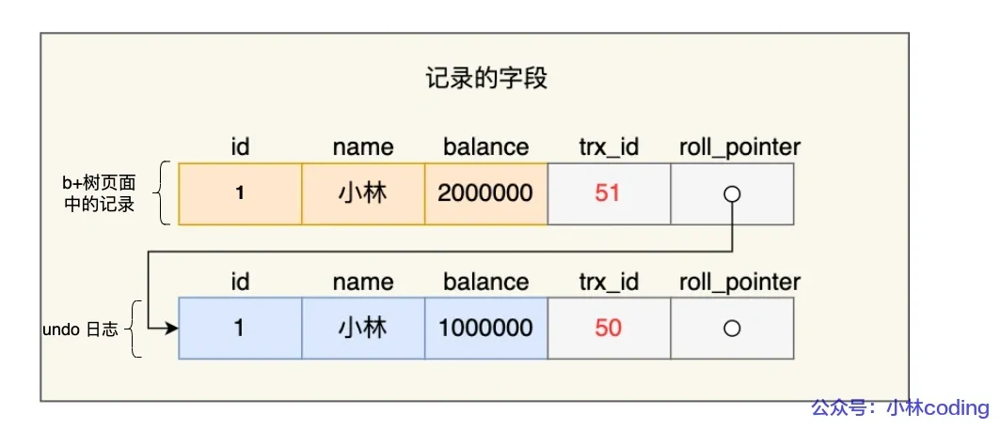

另外，**undo log 还有一个作用，通过 ReadView + undo log 实现 MVCC（多版本并发控制）**。

对于「读提交」和「可重复读」隔离级别的事务来说，它们的快照读（普通 select 语句）是通过 Read View  + undo log 来实现的，它们的区别在于创建 Read View 的时机不同：

- 「读提交」隔离级别是在每个 select 都会生成一个新的 Read View，也意味着，事务期间的多次读取同一条数据，前后两次读的数据可能会出现不一致，因为可能这期间另外一个事务修改了该记录，并提交了事务。
- 「可重复读」隔离级别是启动事务时生成一个 Read View，然后整个事务期间都在用这个 Read View，这样就保证了在事务期间读到的数据都是事务启动前的记录。

这两个隔离级别实现是通过「事务的 Read View 里的字段」和「记录中的两个隐藏列（trx_id 和 roll_pointer）」的比对，如果不满足可见行，就会顺着  undo log 版本链里找到满足其可见性的记录，从而控制并发事务访问同一个记录时的行为，这就叫  MVCC（多版本并发控制）。具体的实现可以看：[事务隔离级别是怎么实现的](https://xiaolincoding.com/mysql/transaction/mvcc.html#%E4%BA%8B%E5%8A%A1%E7%9A%84%E9%9A%94%E7%A6%BB%E7%BA%A7%E5%88%AB%E6%9C%89%E5%93%AA%E4%BA%9B)？ 因此，undo log 两大作用：

- **实现事务回滚，保障事务的原子性**。事务处理过程中，如果出现了错误或者用户执 行了 ROLLBACK 语句，MySQL 可以利用 undo log 中的历史数据将数据恢复到事务开始之前的状态。
- **实现 MVCC（多版本并发控制）关键因素之一**。MVCC 是通过 ReadView + undo log 实现的。undo log 为每条记录保存多份历史数据，MySQL 在执行快照读（普通  select 语句）的时候，会根据事务的 Read View 里的信息，顺着 undo log 的版本链找到满足其可见性的记录。

### 图解MVCC

**MVCC**，全称为**Multi-Version Concurrency Control**，中文可以翻译为**多版本并发控制**。它是一种并发控制的方法，主要用于解决数据库系统中读写冲突的问题，允许多个用户同时对同一份数据进行读写操作，提高了数据库的并发性能。

在不使用MVCC的数据库中，读写操作往往需要对数据进行加锁，但这样会导致并发性能下降。MVCC通过为每一条数据维护多个版本，让读操作和写操作可以同时进行，提高了并发性能。具体来说：

读操作：在MVCC中，读操作不会阻塞写操作，也不会被写操作阻塞。当进行读操作时，MVCC会找到符合条件的数据版本，返回给用户。这样可以保证读操作的快速性，也避免了因写操作而导致的读操作阻塞。

写操作：当进行写操作时，MVCC会创建一个新的数据版本，而不是直接修改原始数据。这样就不会影响到正在进行的读操作。当新的数据版本创建完成后，MVCC会进行版本管理，把旧的数据版本删除。

在MySQL数据库中，InnoDB存储引擎就使用了MVCC技术。它通过使用undolog（回滚日志）和read view（读视图）来实现MVCC，使得数据库在处理高并发的读写请求时，可以保证数据的一致性，同时也能提高性能。

纲要：

* 当前读和快照读的概念
* 事务隔离级别
* MVCC 的两个概念
  * 版本链
  * 读视图（读已提交和可重复读）


* 当理解了上述概念可以对此例子进行加深理解


> **个人理解**：**MVCC（多版本并发控制）** 可以在某种程度上看作是实现了乐观锁的一种手段。乐观锁假定大多数事务在执行时并不会发生冲突，即对于读操作而言，大多数情况下并不需要等待写操作。因此，读操作可以立即进行，而不需要获得锁。只有在实际进行写操作时，才会检查是否存在版本冲突，如果存在，则需要进行相应的处理。
> 在MVCC的实现中，**read view（读视图）** 用于确定哪个版本的数据可以被当前事务看到，保证了读一致性和非阻塞性读。undolog（回滚日志）则用于存储每个事务对数据的修改操作，在事务失败或并发冲突时，可以根据undolog进行回滚，恢复数据到事务开始之前的状态。
> 需要注意的是，虽然MVCC实现了类似乐观锁的特性，但这两者之间还是有区别的。乐观锁是一种并发控制策略，可以在任何数据库系统中实现，而MVCC是MySQL数据库中InnoDB存储引擎的一种实现方式，它更加关注于版本控制和并发性能的提升。
> 在MySQL的InnoDB存储引擎中，Read View（读视图）是一个系统级的概念，它并不会因为读操作而进行写入，而是用于确定在当前事务中，哪些行的版本是可见的。
> **读提交（Read Committed）** 是MySQL中的一种事务隔离级别。在这个隔离级别下，每个SELECT操作都会生成一个新的Read View，这意味着在这个隔离级别下，一个事务中后发生的SELECT可以看到该事务开始后其他事务提交的修改。这也是为什么在"读提交"隔离级别下，可以避免不可重复读的现象。


### MVCC是每个select都会创建一个快照吗？

MVCC（多版本并发控制）在事务进行读取操作时会创建一个数据快照，但并非每个SELECT操作都会创建一个新的快照。实际上，快照的创建取决于事务的隔离级别和操作类型。

在MySQL的InnoDB存储引擎中，有四种事务隔离级别：读未提交（READ UNCOMMITTED）、读已提交（READ COMMITTED）、可重复读（REPEATABLE READ）和串行化（SERIALIZABLE）。MVCC的快照创建方式与这些隔离级别有关。

- 对于**读未提交（READ UNCOMMITTED）**级别，事务可以看到其他事务未提交的修改，因此不需要创建快照。
- 对于**读已提交（READ COMMITTED）**级别，每个SELECT操作都会创建一个新的快照，这意味着在同一个事务中，不同的SELECT操作可能看到不同版本的数据。
- 对于**可重复读（REPEATABLE READ）**级别，事务在第一次读取数据时创建一个快照。在同一个事务中，多个SELECT操作将使用相同的快照，从而确保在事务期间看到的数据保持一致。
- 对于**串行化（SERIALIZABLE）**级别，所有事务都会串行执行，因此快照不是必需的，但会在必要时创建。


### InnoDB存储引擎对MVCC的实现

MVCC 的实现依赖于：隐藏字段、Read View、undo log。在内部实现中，InnoDB 通过数据行的 DB_TRX_ID 和 Read View 来判断数据的可见性，如不可见，则通过数据行的 DB_ROLL_PTR 找到 undo log 中的历史版本。每个事务读到的数据版本可能是不一样的，在同一个事务中，用户只能看到该事务创建 Read View 之前已经提交的修改和该事务本身做的修改

#### 隐藏字段

在内部，`InnoDB` 存储引擎为每行数据添加了三个 [隐藏字段](https://dev.mysql.com/doc/refman/5.7/en/innodb-multi-versioning.html)：

- `DB_TRX_ID（6字节）`：表示最后一次插入或更新该行的事务 id。此外，`delete` 操作在内部被视为更新，只不过会在记录头 `Record header` 中的 `deleted_flag` 字段将其标记为已删除
- `DB_ROLL_PTR（7字节）` 回滚指针，指向该行的 `undo log` 。指向该行记录的上一个版本的指针。这个指针用于在Undo Log中找到上一个版本的数据。
- `DB_ROW_ID（6字节）`：如果没有设置主键且该表没有唯一非空索引时，`InnoDB` 会使用该 id 来生成聚簇索引

#### ReadView

```c
class ReadView {
  /* ... */
private:
  trx_id_t m_low_limit_id;      /* 大于等于这个 ID 的事务均不可见 */

  trx_id_t m_up_limit_id;       /* 小于这个 ID 的事务均可见 */

  trx_id_t m_creator_trx_id;    /* 创建该 Read View 的事务ID */

  trx_id_t m_low_limit_no;      /* 事务 Number, 小于该 Number 的 Undo Logs 均可以被 Purge */

  ids_t m_ids;                  /* 创建 Read View 时的活跃事务列表 */

  m_closed;                     /* 标记 Read View 是否 close */
}
```

Read View主要是用来做可见性判断（可以帮助事务根据隐藏字段DB_TRX_ID和DB_ROLL_PTR判断某一行记录是否可见。），里面保存了 “当前对本事务不可见的其他活跃事务”。

主要有以下字段：

- `m_low_limit_id`：目前出现过的最大的事务 ID+1，即下一个将被分配的事务 ID。大于等于这个 ID 的数据版本均不可见
- `m_up_limit_id`：活跃事务列表 `m_ids` 中最小的事务 ID，如果 `m_ids` 为空，则 `m_up_limit_id` 为 `m_low_limit_id`。小于这个 ID 的数据版本均可见
- `m_ids`：`Read View` 创建时其他未提交的活跃事务 ID 列表。创建 `Read View`时，将当前未提交事务 ID 记录下来，后续即使它们修改了记录行的值，对于当前事务也是不可见的。`m_ids` 不包括当前事务自己和已提交的事务（正在内存中）
- `m_creator_trx_id`：创建该 `Read View` 的事务 ID

**事务可见性示意图**

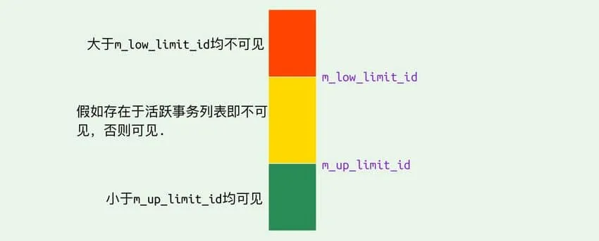

#### undo-log

`undo log` 主要有两个作用：

- 当事务回滚时用于将数据恢复到修改前的样子
- 另一个作用是 `MVCC` ，当读取记录时，若该记录被其他事务占用或当前版本对该事务不可见，则可以通过 `undo log` 读取之前的版本数据，以此实现非锁定读

**在 `InnoDB` 存储引擎中 `undo log` 分为两种： `insert undo log` 和 `update undo log`：**

1. **`insert undo log`** ：指在 `insert` 操作中产生的 `undo log`。因为 `insert` 操作的记录只对事务本身可见，对其他事务不可见，故该 `undo log` 可以在事务提交后直接删除。不需要进行 `purge` 操作

**`insert` 时的数据初始状态：**


2. **`update undo log`** ：`update` 或 `delete` 操作中产生的 `undo log`。该 `undo log`可能需要提供 `MVCC` 机制，因此不能在事务提交时就进行删除。提交时放入 `undo log` 链表，等待 `purge线程` 进行最后的删除

**数据第一次被修改时：**

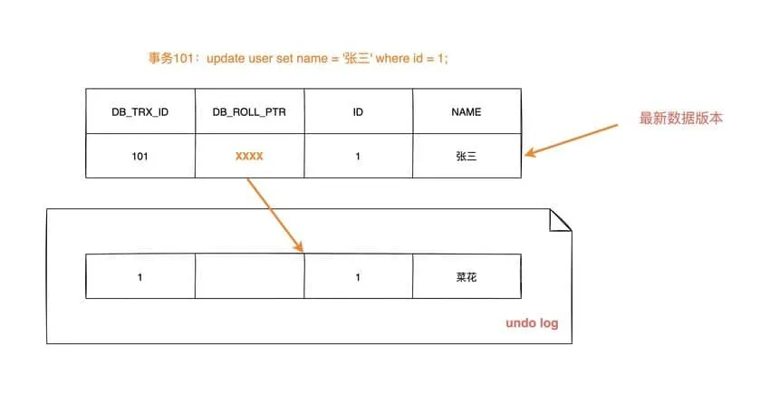

**数据第二次被修改时：**


不同事务或者相同事务的对同一记录行的修改，会使该记录行的 `undo log` 成为一条链表，链首就是最新的记录，链尾就是最早的旧记录

#### 数据可见性算法

在 `InnoDB` 存储引擎中，创建一个新事务后，执行每个 `select` 语句前，都会创建一个快照（Read View），**快照中保存了当前数据库系统中正处于活跃（没有 commit）的事务的 ID 号**。其实简单的说保存的是系统中当前不应该被本事务看到的其他事务 ID 列表（即 m_ids）。当用户在这个事务中要读取某个记录行的时候，`InnoDB` 会将该记录行的 `DB_TRX_ID` 与 `Read View` 中的一些变量及当前事务 ID 进行比较，判断是否满足可见性条件

具体的比较算法如下


1. 如果记录 DB_TRX_ID < m_up_limit_id，那么表明最新修改该行的事务（DB_TRX_ID）在当前事务创建快照之前就提交了，所以该记录行的值对当前事务是可见的
2. 如果 DB_TRX_ID >= m_low_limit_id，那么表明最新修改该行的事务（DB_TRX_ID）在当前事务创建快照之后才修改该行，所以该记录行的值对当前事务不可见。跳到步骤 5
3. m_ids 为空，则表明在当前事务创建快照之前，修改该行的事务就已经提交了，所以该记录行的值对当前事务是可见的
4. 如果 m_up_limit_id <= DB_TRX_ID <  m_low_limit_id，表明最新修改该行的事务（DB_TRX_ID）在当前事务创建快照的时候可能处于“活动状态”或者“已提交状态”；所以就要对活跃事务列表 m_ids 进行查找（源码中是用的二分查找，因为是有序的）
   - 如果在活跃事务列表 m_ids 中能找到  DB_TRX_ID，表明：① 在当前事务创建快照前，该记录行的值被事务 ID 为 DB_TRX_ID 的事务修改了，但没有提交；或者 ②  在当前事务创建快照后，该记录行的值被事务 ID 为 DB_TRX_ID 的事务修改了。这些情况下，这个记录行的值对当前事务都是不可见的。跳到步骤 5
   - 在活跃事务列表中找不到，则表明“id 为 trx_id 的事务”在修改“该记录行的值”后，在“当前事务”创建快照前就已经提交了，所以记录行对当前事务可见
5. 在该记录行的 DB_ROLL_PTR 指针所指向的 `undo log` 取出快照记录，用快照记录的 DB_TRX_ID 跳到步骤 1 重新开始判断，直到找到满足的快照版本或返回空


### MySQL有几种高可用方案

- 主从或主主半同步复制
- 半同步复制优化
- 高可用架构优化
- 共享存储
- 分布式协议

#### 主从或主主半同步复制

用双节点数据库，搭建单向或者双向的半同步复制。架构如下：


通常会和proxy、keepalived等第三方软件同时使用，即可以用来监控数据库的健康，又可以执行一系列管理命令。如果主库发生故障，切换到备库后仍然可以继续使用数据库。

**这种方案优点**是架构、部署比较简单，主机宕机直接切换即可。**缺点**是完全依赖于半同步复制，半同步复制退化为异步复制，无法保证数据一致性；另外，还需要额外考虑**haproxy、keepalived**的高可用机制。

#### 半同步复制优化

半同步复制机制是可靠的，可以保证数据一致性的。但是如果网络发生波动，半同步复制发生超时会切换为异步复制，异复制是无法保证数据的一致性的。因此，可以在半同复制的基础上优化一下，尽可能保证半同复制。如**双通道复制**方案


- 优点：这种方案架构、部署也比较简单，主机宕机也是直接切换即可。比方案1的半同步复制，更能保证数据的一致性。
- 缺点：需要修改内核源码或者使用mysql通信协议，没有从根本上解决数据一致性问题

#### 高可用架构优化

保证高可用，可以把主从双节点数据库扩展为数据库集群。Zookeeper可以作为集群管理，它使用分布式算法保证集群数据的一致性，可以较好的避免网络分区现象的产生。


- 优点：保证了整个系统的高可用性，扩展性也较好，可以扩展为大规模集群。
- 缺点：数据一致性**仍然依赖于原生的mysql半同步复制**；引入Zookeeper使系统逻辑更复杂。

#### 共享存储

> 共享存储实现了数据库服务器和存储设备的解耦，不同数据库之间的数据同步不再依赖于MySQL的原生复制功能，而是通过磁盘数据同步的手段，来保证数据的一致性。

##### DRBD磁盘复制

DRBD是一个用软件实现的、无共享的、服务器之间镜像块设备内容的存储复制解决方案。主要用于对服务器之间的磁盘、分区、逻辑卷等进行数据镜像，当用户将数据写入本地磁盘时，还会将数据发送到网络中另一台主机的磁盘上，这样的本地主机(主节点)与远程主机(备节点)的数据就可以保证实时同步。常用架构如下：

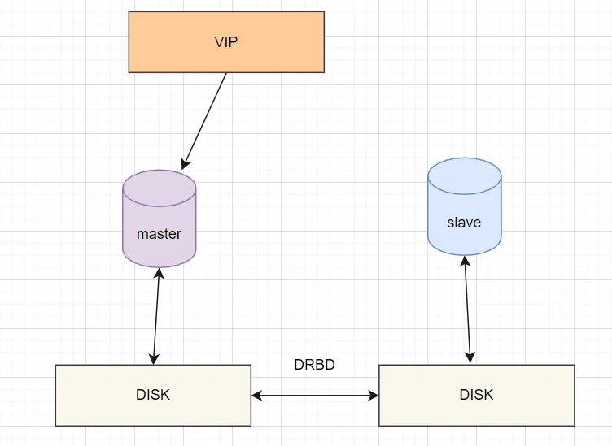

当本地主机出现问题，远程主机上还保留着一份相同的数据，即可以继续使用，保证了数据的安全。

- 优点：部署简单，价格合适，保证数据的强一致性
- 缺点：对IO性能影响较大，从库不提供读操作

#### 分布式协议

分布式协议可以很好解决数据一致性问题。常见的部署方案就是**MySQL cluster**，它是官方集群的部署方案，通过使用NDB存储引擎实时备份冗余数据，实现数据库的高可用性和数据一致性。如下：


- 优点：不依赖于第三方软件，可以实现数据的强一致性；
- 缺点：配置较复杂；需要使用NDB储存引擎；至少三节点；


### 读写分离了解吗？

见名思意，根据读写分离的名字，我们就可以知道：**读写分离主要是为了将对数据库的读写操作分散到不同的数据库节点上。** 这样的话，就能够小幅提升写性能，大幅提升读性能。

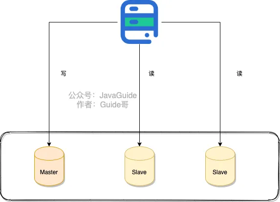

不论是使用哪一种读写分离具体的实现方案，想要实现读写分离一般包含如下几步：

1. 部署多台数据库，选择其中的一台作为主数据库，其他的一台或者多台作为从数据库。
2. 保证主数据库和从数据库之间的数据是实时同步的，这个过程也就是我们常说的**主从复制**。
3. 系统将写请求交给主数据库处理，读请求交给从数据库处理。

落实到项目本身的话，常用的方式有两种：

**1.代理方式**


我们可以在应用和数据中间加了一个代理层。应用程序所有的数据请求都交给代理层处理，代理层负责分离读写请求，将它们路由到对应的数据库中。

提供类似功能的中间件有 **MySQL Router**（官方）、**Atlas**（基于 MySQL Proxy）、**Maxscale**、**MyCat**。

**2.组件方式**

在这种方式中，我们可以通过引入第三方组件来帮助我们读写请求。

这也是我比较推荐的一种方式。这种方式目前在各种互联网公司中用的最多的，相关的实际的案例也非常多。如果你要采用这种方式的话，推荐使用 `sharding-jdbc` ，直接引入 jar 包即可使用，非常方便。同时，也节省了很多运维的成本。


### 聊聊分库分表,分表为什么要停服这种操作，如果不停服可以怎么做

#### 分库分表方案

- 水平分库：以字段为依据，按照一定策略（hash、range等），将一个库中的数据拆分到多个库中。
- 水平分表：以字段为依据，按照一定策略（hash、range等），将一个表中的数据拆分到多个表中。
- 垂直分库：以表为依据，按照业务归属不同，将不同的表拆分到不同的库中。
- 垂直分表：以字段为依据，按照字段的活跃性，将表中字段拆到不同的表（主表和扩展表）中。


#### 常用的分库分表中间件

- sharding-jdbc（当当）
- Mycat
- TDDL（淘宝）
- Oceanus(58同城数据库中间件)
- vitess（谷歌开发的数据库中间件）
- Atlas(Qihoo 360)


#### 分库分表可能遇到的问题

- 事务问题：需要用分布式事务啦
- 跨节点Join的问题：解决这一问题可以分两次查询实现
- 跨节点的count,order by,group by以及聚合函数问题：分别在各个节点上得到结果后在应用程序端进行合并。
- 数据迁移，容量规划，扩容等问题
- ID问题：数据库被切分后，不能再依赖数据库自身的主键生成机制啦，最简单可以考虑UUID
- 跨分片的排序分页问题（后台加大pagesize处理？）


#### 分表要停服嘛？不停服怎么做？

不用。不停服的时候，应该怎么做呢，分五个步骤：

1. 编写代理层，加个开关（控制访问新的DAO还是老的DAO，或者是都访问），灰度期间，还是访问老的DAO。
2. 发版全量后，开启双写，既在旧表新增和修改，也在新表新增和修改。日志或者临时表记下新表ID起始值，旧表中小于这个值的数据就是存量数据，这批数据就是要迁移的。
3. 通过脚本把旧表的存量数据写入新表。
4. 停读旧表改读新表，此时新表已经承载了所有读写业务，但是这时候不要立刻停写旧表，需要保持双写一段时间。
5. 当读写新表一段时间之后，如果没有业务问题，就可以停写旧表


### 主从复制原理了解么？

MySQL binlog(binary log 即二进制日志文件) 主要记录了 MySQL 数据库中数据的所有变化(数据库执行的所有 DDL 和 DML 语句)。因此，我们根据主库的 MySQL binlog 日志就能够将主库的数据同步到从库中。


1. 主库将数据库中数据的变化写入到 binlog
2. 从库连接主库
3. 从库会创建一个 I/O 线程向主库请求更新的 binlog
4. 主库会创建一个 binlog dump 线程来发送 binlog ，从库中的 I/O 线程负责接收
5. 从库的 I/O 线程将接收的 binlog 写入到 relay log 中。
6. 从库的 SQL 线程读取 relay log 同步数据本地（也就是再执行一遍 SQL ）。

怎么样？看了我对主从复制这个过程的讲解，你应该搞明白了吧!

你一般看到 binlog 就要想到主从复制。当然，除了主从复制之外，binlog 还能帮助我们实现数据恢复。

🌈 拓展一下：

不知道大家有没有使用过阿里开源的一个叫做 canal 的工具。这个工具可以帮助我们实现 MySQL 和其他数据源比如 Elasticsearch 或者另外一台 MySQL  数据库之间的数据同步。很显然，这个工具的底层原理肯定也是依赖 binlog。canal 的原理就是模拟 MySQL 主从复制的过程，解析  binlog 将数据同步到其他的数据源。

另外，像咱们常用的分布式缓存组件 Redis 也是通过主从复制实现的读写分离。

🌕 简单总结一下：

**MySQL 主从复制是依赖于 binlog 。另外，常见的一些同步 MySQL 数据到其他数据源的工具（比如 canal）的底层一般也是依赖 binlog 。**


### 数据库如何实现分布式锁

#### 基于数据库表（锁表，很少使用）

最简单的方式可能就是直接创建一张锁表，然后通过操作该表中的数据来实现了。当我们想要获得锁的时候，就可以在该表中增加一条记录，想要释放锁的时候就删除这条记录。

为了更好的演示，我们先创建一张数据库表，参考如下：

```sql
CREATE TABLE database_lock (
	`id` BIGINT NOT NULL AUTO_INCREMENT,
	`resource` int NOT NULL COMMENT '锁定的资源',
	`description` varchar(1024) NOT NULL DEFAULT "" COMMENT '描述',
	PRIMARY KEY (id),
	UNIQUE KEY uiq_idx_resource (resource)
) ENGINE=InnoDB DEFAULT CHARSET=utf8mb4 COMMENT='数据库分布式锁表';
```

当我们想要获得锁时，可以插入一条数据：

```sql
INSERT INTO database_lock(resource, description) VALUES (1, 'lock');
```

当需要释放锁的时，可以删除这条数据：

```sql
DELETE FROM database_lock WHERE resource=1;
```

#### 基于悲观锁

**悲观锁实现思路**？

1. 在对任意记录进行修改前，先尝试为该记录加上排他锁（exclusive locking）。
2. 如果加锁失败，说明该记录正在被修改，那么当前查询可能要等待或者抛出异常。 具体响应方式由开发者根据实际需要决定。
3. 如果成功加锁，那么就可以对记录做修改，事务完成后就会解锁了。
4. 其间如果有其他对该记录做修改或加排他锁的操作，都会等待我们解锁或直接抛出异常。


**以MySQL InnoDB中使用悲观锁为例**？

要使用悲观锁，我们必须关闭mysql数据库的自动提交属性，因为MySQL默认使用autocommit模式，也就是说，当你执行一个更新操作后，MySQL会立刻将结果进行提交。set autocommit=0;

```sql
//0.开始事务
begin;/begin work;/start transaction; (三者选一就可以)
//1.查询出商品信息
select status from t_goods where id=1 for update;
//2.根据商品信息生成订单
insert into t_orders (id,goods_id) values (null,1);
//3.修改商品status为2
update t_goods set status=2;
//4.提交事务
commit;/commit work;
```

上面的查询语句中，我们使用了 `select…for update`的方式，这样就通过开启排他锁的方式实现了悲观锁。此时在t_goods表中，id为1的 那条数据就被我们锁定了，其它的事务必须等本次事务提交之后才能执行。这样我们可以保证当前的数据不会被其它事务修改。

上面我们提到，使用 `select…for update`会把数据给锁住，不过我们需要注意一些锁的级别，MySQL InnoDB默认行级锁。行级锁都是基于索引的，如果一条SQL语句用不到索引是不会使用行级锁的，会使用表级锁把整张表锁住，这点需要注意。

#### 基于乐观锁

乐观并发控制（又名“乐观锁”，Optimistic Concurrency Control，缩写“OCC”）是一种并发控制的方法。它假设多用户并发的事务在处理时不会彼此互相影响，各事务能够在不产生锁的情况下处理各自影响的那部分数据。在提交数据更新之前，每个事务会先检查在该事务读取数据后，有没有其他事务又修改了该数据。如果其他事务有更新的话，正在提交的事务会进行回滚。

**以使用版本号实现乐观锁为例？**

使用版本号时，可以在数据初始化时指定一个版本号，每次对数据的更新操作都对版本号执行+1操作。并判断当前版本号是不是该数据的最新的版本号。

```sql
1.查询出商品信息
select (status,status,version) from t_goods where id=#{id}
2.根据商品信息生成订单
3.修改商品status为2
update t_goods 
set status=2,version=version+1
where id=#{id} and version=#{version};
```

需要注意的是，乐观锁机制往往基于系统中数据存储逻辑，因此也具备一定的局限性。由于乐观锁机制是在我们的系统中实现的，对于来自外部系统的用户数据更新操作不受我们系统的控制，因此可能会造成脏数据被更新到数据库中。在系统设计阶段，我们应该充分考虑到这些情况，并进行相应的调整（如将乐观锁策略在数据库存储过程中实现，对外只开放基于此存储过程的数据更新途径，而不是将数据库表直接对外公开）

- **缺陷**

对数据库依赖，开销问题，行锁变表锁问题，无法解决数据库单点和可重入的问题。