---

order: 11
author: zhiyu1998
title: 计算机网络
category:
  - 计算机基础
  - 八股文
---

## 🌐计算机网络（热门八股文）

### 👁️前置知识

#### OSI 七层模型

**OSI 七层模型** 是国际标准化组织提出一个网络分层模型，其大体结构以及每一层提供的功能如下图所示：

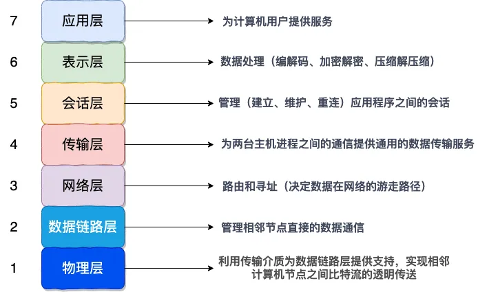

每一层都专注做一件事情，并且每一层都需要使用下一层提供的功能比如传输层需要使用网络层提供的路由和寻址功能，这样传输层才知道把数据传输到哪里去。

从顶向下分解：
假设你想给你的朋友寄一封信，信中有一张你刚拍的照片。下面是如何将这个过程与 OSI 七层模型进行对比：
1. **应用层（Application Layer）**：你用文字和照片表达自己的想法，这相当于你在计算机上使用的应用程序（如浏览器、邮件客户端等）来创建数据。
2. **表示层（Presentation Layer）**：你将照片打印出来，确保它们的格式（如尺寸、颜色）适合放在信封里。在计算机网络中，表示层负责处理数据的格式，例如加密、解密和数据压缩。
3. **会话层（Session Layer）**：你决定何时开始写信，何时结束。会话层在网络中负责建立、维护和关闭连接。
4. **传输层（Transport Layer）**：你把信放进信封，写上你朋友的地址，以及你自己的回邮地址。传输层在计算机网络中负责建立端到端的通信，如 TCP 和 UDP 协议。
5. **网络层（Network Layer）**：你把信封投递到邮局，邮局负责将信封从一个地方运送到另一个地方。网络层在计算机网络中负责将数据包从源地址路由到目的地址，如 IP 协议。
6. **数据链路层（Data Link Layer）**：邮局将信封从一个中转站传递到另一个中转站。在计算机网络中，数据链路层负责在同一个网络中的设备之间传输数据，如以太网或 Wi-Fi。
7. **物理层（Physical Layer）**：信封通过各种交通工具（如卡车、飞机）进行传输。物理层涉及到数据在物理介质（如电缆、无线电波）中的传输。

**OSI 的七层体系结构概念清楚，理论也很完整，但是它比较复杂而且不实用，而且有些功能在多个层中重复出现。**

上面这种图可能比较抽象，再来一个比较生动的图片。下面这个图片是我在国外的一个网站上看到的，非常赞！


**既然 OSI 七层模型这么厉害，为什么干不过 TCP/IP 四 层模型呢？**

的确，OSI 七层模型当时一直被一些大公司甚至一些国家政府支持。这样的背景下，为什么会失败呢？我觉得主要有下面几方面原因：

1. OSI 的专家缺乏实际经验，他们在完成 OSI 标准时缺乏商业驱动力
2. OSI 的协议实现起来过分复杂，而且运行效率很低
3. OSI 制定标准的周期太长，因而使得按 OSI 标准生产的设备无法及时进入市场（20 世纪 90 年代初期，虽然整套的 OSI 国际标准都已经制定出来，但基于 TCP/IP 的互联网已经抢先在全球相当大的范围成功运行了）
4. OSI 的层次划分不太合理，有些功能在多个层次中重复出现。

OSI 七层模型虽然失败了，但是却提供了很多不错的理论基础。为了更好地去了解网络分层，OSI 七层模型还是非常有必要学习的。

最后再分享一个关于 OSI 七层模型非常不错的总结图片！


#### TCP/IP 四层模型

**TCP/IP 四层模型** 是目前被广泛采用的一种模型,我们可以将 TCP / IP 模型看作是 OSI 七层模型的精简版本，由以下 4 层组成：

1. 应用层
2. 传输层
3. 网络层
4. 网络接口层

需要注意的是，我们并不能将 TCP/IP 四层模型 和 OSI 七层模型完全精确地匹配起来，不过可以简单将两者对应起来，如下图所示：

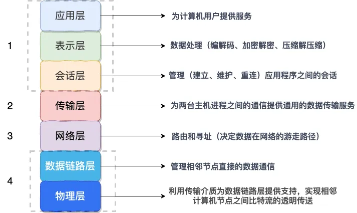

###### 应用层（Application layer）

**应用层位于传输层之上，主要提供两个终端设备上的应用程序之间信息交换的服务，它定义了信息交换的格式，消息会交给下一层传输层来传输。** 我们把应用层交互的数据单元称为报文。

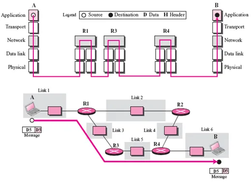

应用层协议定义了网络通信规则，对于不同的网络应用需要不同的应用层协议。在互联网中应用层协议很多，如支持 Web 应用的 HTTP 协议，支持电子邮件的 SMTP 协议等等。


###### 传输层（Transport layer）

**传输层的主要任务就是负责向两台终端设备进程之间的通信提供通用的数据传输服务。** 应用进程利用该服务传送应用层报文。“通用的”是指并不针对某一个特定的网络应用，而是多种应用可以使用同一个运输层服务。

**运输层主要使用以下两种协议：**

1. **传输控制协议 TCP**（Transmisson Control Protocol）--提供**面向连接**的，**可靠的**数据传输服务。
2. **用户数据协议 UDP**（User Datagram Protocol）--提供**无连接**的，尽最大努力的数据传输服务（**不保证数据传输的可靠性**）。

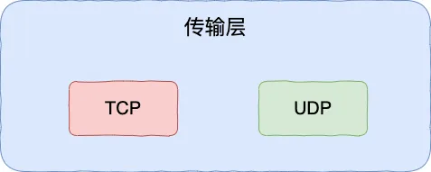

###### 网络层（Network layer）

**网络层负责为分组交换网上的不同主机提供通信服务。** 在发送数据时，网络层把运输层产生的报文段或用户数据报封装成分组和包进行传送。在 TCP/IP 体系结构中，由于网络层使用 IP 协议，因此分组也叫 IP 数据报，简称数据报。

⚠️注意 ：**不要把运输层的“用户数据报 UDP”和网络层的“IP 数据报”弄混**。

**网络层的还有一个任务就是选择合适的路由，使源主机运输层所传下来的分组，能通过网络层中的路由器找到目的主机。**

这里强调指出，网络层中的“网络”二字已经不是我们通常谈到的具体网络，而是指计算机网络体系结构模型中第三层的名称。

互联网是由大量的异构（heterogeneous）网络通过路由器（router）相互连接起来的。互联网使用的网络层协议是无连接的网际协议（Intert Prococol）和许多路由选择协议，因此互联网的网络层也叫做**网际层**或**IP 层**。

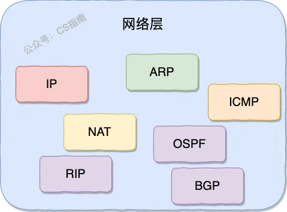

###### 网络接口层（Network interface layer）

我们可以把网络接口层看作是数据链路层和物理层的合体。

1. 数据链路层(data link layer)通常简称为链路层（ 两台主机之间的数据传输，总是在一段一段的链路上传送的）。**数据链路层的作用是将网络层交下来的 IP 数据报组装成帧，在两个相邻节点间的链路上传送帧。每一帧包括数据和必要的控制信息（如同步信息，地址信息，差错控制等）。**
2. **物理层的作用是实现相邻计算机节点之间比特流的透明传送，尽可能屏蔽掉具体传输介质和物理设备的差异**


#### TCP流量控制

**TCP 利用滑动窗口实现流量控制。流量控制是为了控制发送方发送速率，保证接收方来得及接收。** 接收方发送的确认报文中的窗口字段可以用来控制发送方窗口大小，从而影响发送方的发送速率。将窗口字段设置为 0，则发送方不能发送数据

🌰 直接举栗子说明，请结合图耐心阅读：

1. 主机A通过TCP报文发送给主机B 1-100字节 （seq是序号字段， DATA是表示是数据报文段）
2. 主机A又通过TCP报文发送给主机B 101-200字节（所以这里的seq是101）
3. 主机A又通过TCP报文封装发送给注解B 201-300字节，但是发生了丢失 🏳️
   1. 此时主机B对主机A进行**累计确认**（ACK：TCP报文段首部中的标志位；ack：确认报文段，201是说明201以前的数据已全部正确接收；rwnd滑动窗口字段，300表示可以接收的窗口大小为300）
   2. 滑动窗口，滑到201-600的位置（因为初始窗口的大小为400）
   3. 调整窗口大小，此时窗口位置为201-500（因为rwnd现在为300）
4. 主机A删除1-200的缓存数据（因为步骤3中已经说明了201之前的数据已经确认接收）
5. 主机A讲301-400的数据封装成TCP发送给主机B（此时201-500的数据已经全部发送出去）
6. 重传计时器开始计时，主机A把201-500的数据封装成TCP报文段重新发送出去（给B）
7. 此时主机B对主机A进行**累计确认**（ACK=1，ack=501：确认501之前的数据，rwnd=100：此时主机B还能接收100字节的数据）
   1. 此时滑动窗口从501-800（窗口大小为300）
   2. 因为收到主机B的rwnd=100，所以调整窗口大小为501-600
8. 删除501之前的数据缓存
9. 封装成TCP报文送501-600的数据
10. 此时主机B又对主机A进行**累计确认**（ACK=1，ack=601，rwnd=0）此时主机A不能再发送了，发送窗口被调控为0


💨假设不久之后，主机B又有了一些存储空间：

1. 主机B对主机A发送一个rwnd=300的报文段，但是这个报文段在传输过程中丢失了
   1. A一直等待B发送的非零窗口通知，B也一直等待A发送的数据（经典死锁）
   2. TCP解决方案：设立定时器；所以主机A会启动一个持续计时器
   3. 如果持续计时器超时，就会发送一个零窗口探测报文段（携带1字节数据）【拓展：零窗口探测报文段也有持续计时器，如果丢失了也会进行重传避免死锁】
2. 如果现在主机B又没有空间了，就会发送一个窗口探测报文段进行确认（ACK=1 rwnd=0）
3. 主机A接收到了会又启动一个持续计时器，如果主机B又有了存储空间（假设现在为300），那么就会发送一个接收窗口（ACK=1，rwnd=300）

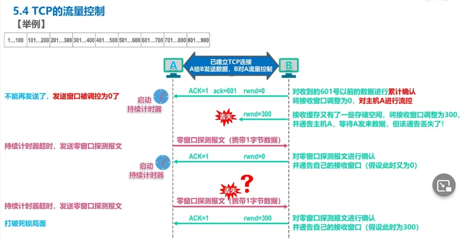

#### TCP拥塞控制

四种拥塞控制算法：慢开始、拥塞避免、快重传，快恢复

###### 慢开始、拥塞避免

假设发送方cwnd=1,swnd=cwnd,ssthresh=16

慢开始小结：滑动窗口逐渐增大

1. 发送方给接收方发送报文段，发送方接收到了接收方的确认报文段后将窗口增大1 (1+1=2)，此时发送发可以发送2号数据报文段


2. 此时发送发又发送1~2报文段，接收方确认后，发送方将窗口增大为4（2+2=4），发送发现在可以发送3~6号数据报文段

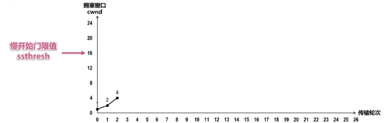

3. 此时发送发又发送3~6报文段，接收方确认后，发送方将窗口增大为4（4+4=8），发送发现在可以发送7~14号数据报文段

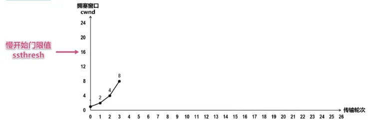

4. 同理可以增加到16的窗口大小


5. 此时开始**拥塞避免**算法：对报文段15~30号进行发送和确认，此时cwnd从16 + 1 = 17，

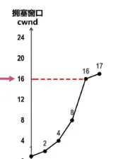

6. 此时可以对TCP报文段31~47号进行发送和确认，发送方收到后窗口从17增大到18（17+1）

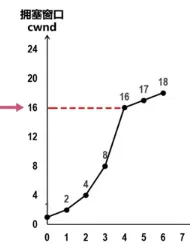

7. 以此类推，当增加到24的滑动窗口时，此时TCP对171~194报文段进行发送和确认

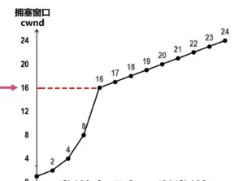

如果此时报文段发生了丢失，那么就会进行重传计时器超时（判断网络出现了拥塞）：

* 将ssthresh值更新为发生拥塞控制时cwnd值的一半（ssthresh = 24 / 2 = 12）
* 将cwnd值减少为1，并开始执行慢开始算法（cwnd=1）

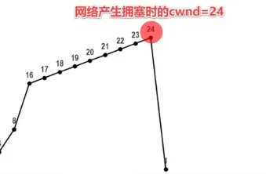

8. 又开始慢开始算法，直到达到慢开始门限值

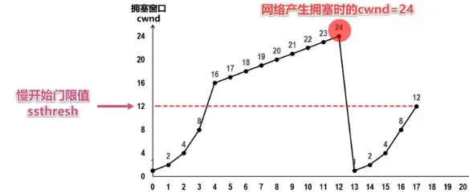

整体流程：

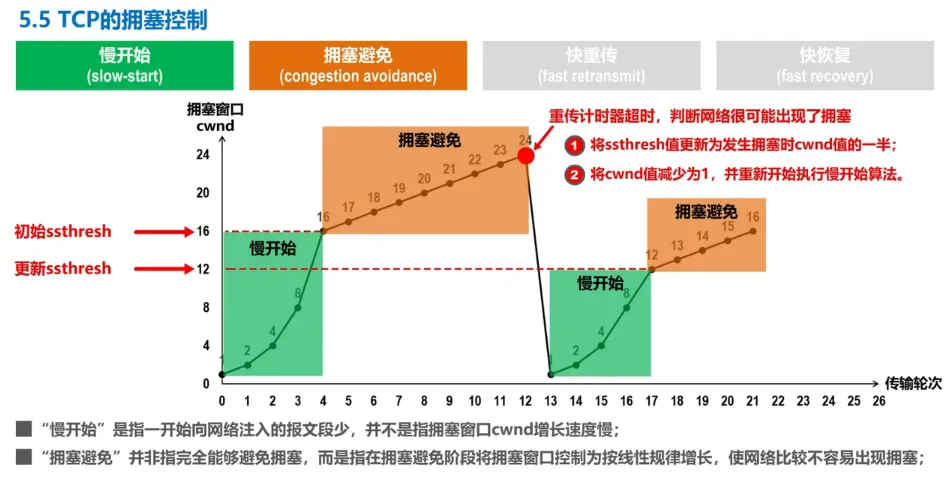

###### 快重传、快恢复

快重传简洁说明：当发送发收到3个连续重复确认，就将相应的报文段立即重传（图中的3个确认报文段为：M4 M5 M6，最后立即重传M3【M3丢失】）

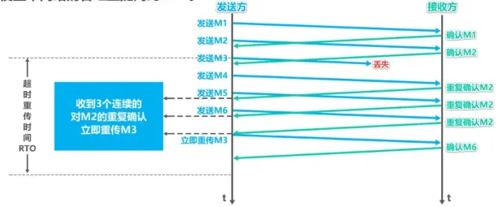

快恢复简洁说明：发送方一旦收到3个重复确认，就知道现在只是丢失了个别的报文段。于是**不启动慢开始**算法，而执行快恢复算法；发送方将慢开始门限ssthresh值和拥塞窗口cwnd值调整为当前窗口的一半；**开始执行拥塞避免算法**。

整体流程：

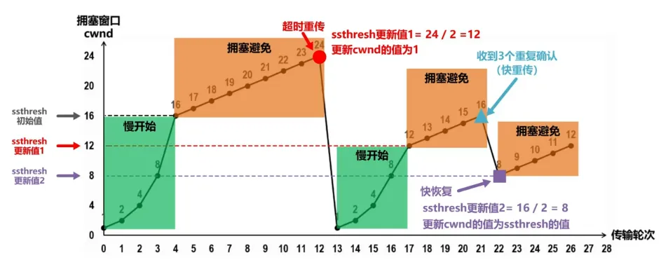

#### TCP可靠传输

发送方如果发送了32~33号报文段给接收方


那么接收方会接收它们，存入缓存；因为31号元素还没有到达，这是未按序到达的数据

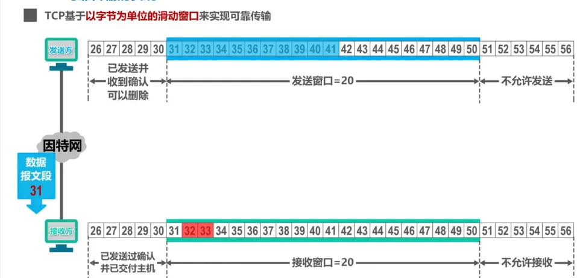

假设31号报文段到达了接收方，存入到接收缓存，接收方接收了之后就会把31~33号数据交付给应用进程；接收方会向右滑动3个窗口，并发送给发送发确认报文段


如果发送方又发送了三个数据（37、38、40），接收端接受了之后会发送确认报文段（rwnd=20, ack=34），那么发送方的窗口也会向右移动3位

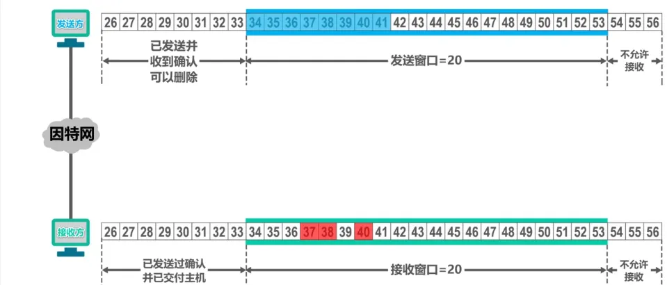

#### HTTP

HTTP 协议，全称超文本传输协议（Hypertext Transfer Protocol）。顾名思义，HTTP 协议就是用来规范超文本的传输，超文本，也就是网络上的包括文本在内的各式各样的消，具体来说，主要是来规范浏览器和服务器端的行为的。

并且，HTTP 是一个无状态（stateless）协议，也就是说服务器不维护任何有关客户端过去所发请求的消息。这其实是一种懒政，有状态协议会更加复杂，需要维护状态（历史信息），而且如果客户或服务器失效，会产生状态的不一致，解决这种不一致的代价更高。

###### 通信过程

HTTP 是应用层协议，它以 TCP（传输层）作为底层协议，默认端口为 80. 通信过程主要如下：

1. 服务器在 80 端口等待客户的请求。
2. 浏览器发起到服务器的 TCP 连接（创建套接字 Socket）。
3. 服务器接收来自浏览器的 TCP 连接。
4. 浏览器（HTTP 客户端）与 Web 服务器（HTTP 服务器）交换 HTTP 消息。
5. 关闭 TCP 连接。

#### HTTPS

因为 HTTPS 相比 HTTP 协议多一个 TLS 协议握手过程，**目的是为了通过非对称加密握手协商或者交换出对称加密密钥**，这个过程最长可以花费掉 2 RTT，接着后续传输的应用数据都得使用对称加密密钥来加密/解密。

HTTPS 协议（Hyper Text Transfer Protocol Secure），是 HTTP 的加强安全版本。HTTPS  是基于 HTTP 的，也是用 TCP 作为底层协议，并额外使用 SSL/TLS 协议用作加密和安全认证。默认端口号是 443.

HTTPS 协议中，SSL 通道通常使用基于密钥的加密算法，密钥长度通常是 40 比特或 128 比特。

###### SSL/TLS

SSL 指安全套接字协议（Secure Sockets Layer），首次发布与 1996 年。SSL 的首次发布其实已经是他的 3.0  版本，SSL 1.0 从未面世，SSL 2.0 则具有较大的缺陷（DROWN 缺陷——Decrypting RSA with Obsolete  and Weakened eNcryption）。很快，在 1999 年，SSL 3.0 进一步升级，**新版本被命名为 TLS 1.0**。因此，TLS 是基于 SSL 之上的，但由于习惯叫法，通常把 HTTPS 中的核心加密协议混成为 SSL/TLS。

###### 非对称加密

SSL/TLS 的核心要素是**非对称加密**。非对称加密采用两个密钥——一个公钥，一个私钥。在通信时，私钥仅由解密者保存，公钥由任何一个想与解密者通信的发送者（加密者）所知。可以设想一个场景，

> 在某个自助邮局，每个通信信道都是一个邮箱，每一个邮箱所有者都在旁边立了一个牌子，上面挂着一把钥匙：这是我的公钥，发送者请将信件放入我的邮箱，并用公钥锁好。
>
> 但是公钥只能加锁，并不能解锁。解锁只能由邮箱的所有者——因为只有他保存着私钥。
>
> 这样，通信信息就不会被其他人截获了，这依赖于私钥的保密性。

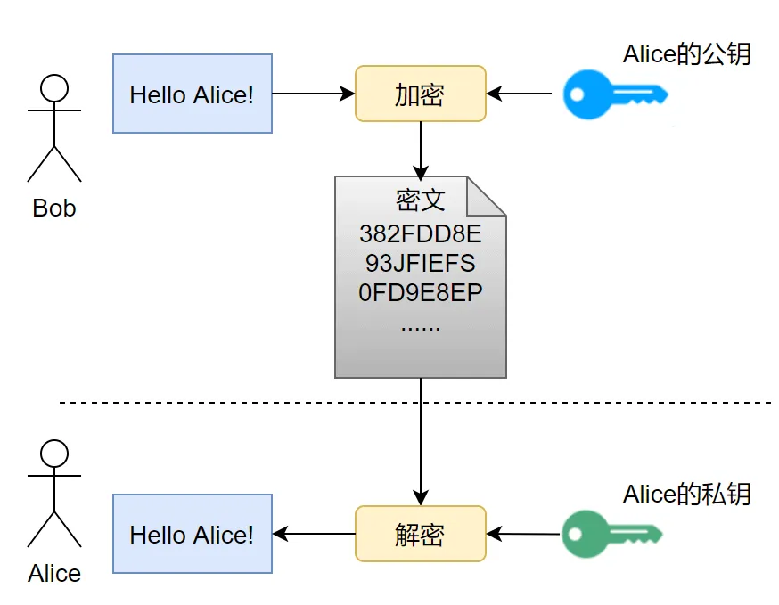

非对称加密的公钥和私钥需要采用一种复杂的数学机制生成（密码学认为，为了较高的安全性，尽量不要自己创造加密方案）。公私钥对的生成算法依赖于单向陷门函数。

> 单向函数：已知单向函数 f，给定任意一个输入 x，易计算输出 y=f(x)；而给定一个输出 y，假设存在 f(x)=y，很难根据 f 来计算出 x。
>
> 单向陷门函数：一个较弱的单向函数。已知单向陷门函数 f，陷门 h，给定任意一个输入 x，易计算出输出 y=f(x;h)；而给定一个输出 y，假设存在 f(x;h)=y，很难根据 f 来计算出 x，但可以根据 f 和 h 来推导出 x。


上图就是一个单向函数（不是单项陷门函数），假设有一个绝世秘籍，任何知道了这个秘籍的人都可以把苹果汁榨成苹果，那么这个秘籍就是“陷门”了吧。

在这里，函数 f 的计算方法相当于公钥，陷门 h 相当于私钥。公钥 f 是公开的，任何人对已有输入，都可以用 f 加密，而要想根据加密信息还原出原信息，必须要有私钥才行。

###### 对称加密

使用 SSL/TLS 进行通信的双方需要使用非对称加密方案来通信，但是非对称加密设计了较为复杂的数学算法，在实际通信过程中，计算的代价较高，效率太低，因此，SSL/TLS 实际对消息的加密使用的是对称加密。

> 对称加密：通信双方共享唯一密钥 k，加解密算法已知，加密方利用密钥 k 加密，解密方利用密钥 k 解密，保密性依赖于密钥 k 的保密性。


对称加密的密钥生成代价比公私钥对的生成代价低得多，那么有的人会问了，为什么 SSL/TLS  还需要使用非对称加密呢？因为对称加密的保密性完全依赖于密钥的保密性。在双方通信之前，需要商量一个用于对称加密的密钥。我们知道网络通信的信道是不安全的，传输报文对任何人是可见的，密钥的交换肯定不能直接在网络信道中传输。因此，使用非对称加密，对对称加密的密钥进行加密，保护该密钥不在网络信道中被窃听。这样，通信双方只需要一次非对称加密，交换对称加密的密钥，在之后的信息通信中，使用绝对安全的密钥，对信息进行对称加密，即可保证传输消息的保密性。

###### 数字签名

好，到这一小节，已经是 SSL/TLS 的尾声了。上一小节提到了数字签名，数字签名要解决的问题，是防止证书被伪造。第三方信赖机构 CA 之所以能被信赖，就是 **靠数字签名技术** 。

数字签名，是 CA 在给服务器颁发证书时，使用散列+加密的组合技术，在证书上盖个章，以此来提供验伪的功能。具体行为如下：

> CA 知道服务器的公钥，对该公钥采用散列技术生成一个摘要。CA 使用 CA 私钥对该摘要进行加密，并附在证书下方，发送给服务器。
>
> 现在服务器将该证书发送给客户端，客户端需要验证该证书的身份。客户端找到第三方机构 CA，获知 CA 的公钥，并用 CA 公钥对证书的签名进行解密，获得了 CA 生成的摘要。
>
> 客户端对证书数据（也就是服务器的公钥）做相同的散列处理，得到摘要，并将该摘要与之前从签名中解码出的摘要做对比，如果相同，则身份验证成功；否则验证失败。


总结来说，带有证书的公钥传输机制如下：

1. 设有服务器 S，客户端 C，和第三方信赖机构 CA。
2. S 信任 CA，CA 是知道 S 公钥的，CA 向 S 颁发证书。并附上 CA 私钥对消息摘要的加密签名。
3. S 获得 CA 颁发的证书，将该证书传递给 C。
4. C 获得 S 的证书，信任 CA 并知晓 CA 公钥，使用 CA 公钥对 S 证书上的签名解密，同时对消息进行散列处理，得到摘要。比较摘要，验证 S 证书的真实性。
5. 如果 C 验证 S 证书是真实的，则信任 S 的公钥（在 S 证书中）。


> [数字签名 及 数字证书 原理](https://www.bilibili.com/video/BV18N411X7ty/)
>
> 补充：部分内容节选自《图解HTTP》
>
> 公开密钥加密使用一对非对称的密钥。一把叫做私有密钥（privatekey），另一把叫做公开密钥（public key）。顾名思义，私有密钥不能让其他任何人知道，而公开密钥则可以随意发布，任何人都可以获得。
>
> 使用公开密钥加密方式，发送密文的一方使用对方的公开密钥进行加密处理，对方收到被加密的信息后，再使用自己的私有密钥进行解密。利用这种方式，不需要发送用来解密的私有密钥，也不必担心密钥被攻击者窃听而盗走。
>
> 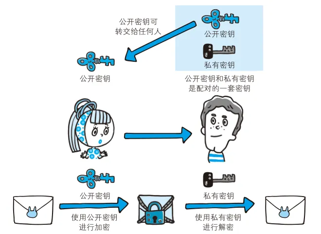
>
> 为了解决上述问题，可以使用由**数字证书认证机构（CA，CertificateAuthority）**和其相关机关颁发的公开密钥证书。数字证书认证机构处于客户端与服务器双方都可信赖的第三方机构的立场上。威瑞信（VeriSign）就是其中一家非常有名的数字证书认证机构。数字证书认证机构在判明提出申请者的身份之后，会对已申请的公开密钥做数字签名，然后分配这个已签名的公开密钥，并将该公开密钥放入公钥证书后绑定在一起。服务器会将这份由数字证书认证机构颁发的公钥证书发送给客户端，以进行公开密钥加密方式通信。公钥证书也可叫做数字证书或直接称为证书。接到证书的客户端可使用数字证书认证机构的公开密钥，对那张证书上的数字签名进行验证，一旦验证通过，客户端便可明确两件事：
>
> 1. 认证服务器的公开密钥的是真实有效的数字证书认证机构。
> 2. 服务器的公开密钥是值得信赖的。
>
> 

#### ARQ 协议

**自动重传请求**（Automatic Repeat-reQuest，ARQ）是 OSI 模型中数据链路层和传输层的错误纠正协议之一。它通过使用确认和超时这两个机制，在不可靠服务的基础上实现可靠的信息传输。如果发送方在发送后一段时间之内没有收到确认帧，它通常会重新发送。ARQ 包括停止等待 ARQ 协议和连续 ARQ 协议。

###### 停止等待 ARQ 协议

停止等待协议是为了实现可靠传输的，它的基本原理就是每发完一个分组就停止发送，等待对方确认（回复 ACK）。如果过了一段时间（超时时间后），还是没有收到 ACK 确认，说明没有发送成功，需要重新发送，直到收到确认后再发下一个分组。

在停止等待协议中，若接收方收到重复分组，就丢弃该分组，但同时还要发送确认。

**优缺点：**

- **优点：** 简单
- **缺点：** 信道利用率低，等待时间长

**1) 无差错情况:**

发送方发送分组, 接收方在规定时间内收到, 并且回复确认. 发送方再次发送。

**2) 出现差错情况（超时重传）:**

停止等待协议中超时重传是指只要超过一段时间仍然没有收到确认，就重传前面发送过的分组（认为刚才发送过的分组丢失了）。因此每发送完一个分组需要设置一个超时计时器，其重传时间应比数据在分组传输的平均往返时间更长一些。这种自动重传方式常称为 **自动重传请求 ARQ** 。另外在停止等待协议中若收到重复分组，就丢弃该分组，但同时还要发送确认。**连续 ARQ 协议** 可提高信道利用率。发送维持一个发送窗口，凡位于发送窗口内的分组可连续发送出去，而不需要等待对方确认。接收方一般采用累积确认，对按序到达的最后一个分组发送确认，表明到这个分组位置的所有分组都已经正确收到了。

**3) 确认丢失和确认迟到**

- **确认丢失** ：确认消息在传输过程丢失。当 A 发送 M1 消息，B 收到后，B 向 A 发送了一个 M1 确认消息，但却在传输过程中丢失。而 A 并不知道，在超时计时过后，A 重传 M1 消息，B 再次收到该消息后采取以下两点措施：1. 丢弃这个重复的 M1 消息，不向上层交付。 2. 向 A 发送确认消息。（不会认为已经发送过了，就不再发送。A 能重传，就证明 B 的确认消息丢失）。
- **确认迟到** ：确认消息在传输过程中迟到。A 发送 M1 消息，B 收到并发送确认。在超时时间内没有收到确认消息，A 重传 M1 消息，B 仍然收到并继续发送确认消息（B 收到了 2 份 M1）。此时 A 收到了 B 第二次发送的确认消息。接着发送其他数据。过了一会，A 收到了 B 第一次发送的对 M1 的确认消息（A 也收到了 2 份确认消息）。处理如下：1. A 收到重复的确认后，直接丢弃。2. B 收到重复的 M1 后，也直接丢弃重复的 M1。

**连续 ARQ 协议**

连续 ARQ 协议可提高信道利用率。发送方维持一个发送窗口，凡位于发送窗口内的分组可以连续发送出去，而不需要等待对方确认。接收方一般采用累计确认，对按序到达的最后一个分组发送确认，表明到这个分组为止的所有分组都已经正确收到了。


#### 滑动窗口

> 引入窗口概念的原因

我们都知道 TCP 是每发送一个数据，都要进行一次确认应答。当上一个数据包收到了应答了， 再发送下一个。

这个模式就有点像我和你面对面聊天，你一句我一句。但这种方式的缺点是效率比较低的。

如果你说完一句话，我在处理其他事情，没有及时回复你，那你不是要干等着我做完其他事情后，我回复你，你才能说下一句话，很显然这不现实。

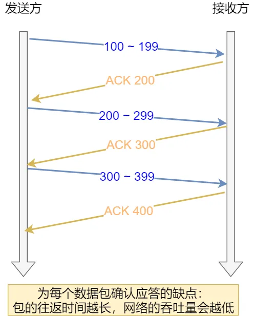

所以，这样的传输方式有一个缺点：数据包的**往返时间越长，通信的效率就越低**。

为解决这个问题，TCP 引入了**窗口**这个概念。即使在往返时间较长的情况下，它也不会降低网络通信的效率。

那么有了窗口，就可以指定窗口大小，窗口大小就是指**无需等待确认应答，而可以继续发送数据的最大值**。

窗口的实现实际上是操作系统开辟的一个缓存空间，发送方主机在等到确认应答返回之前，必须在缓冲区中保留已发送的数据。如果按期收到确认应答，此时数据就可以从缓存区清除。

假设窗口大小为 `3` 个 TCP 段，那么发送方就可以「连续发送」 `3` 个 TCP 段，并且中途若有 ACK 丢失，可以通过「下一个确认应答进行确认」。如下图：


图中的 ACK 600 确认应答报文丢失，也没关系，因为可以通过下一个确认应答进行确认，只要发送方收到了 ACK 700 确认应答，就意味着 700 之前的所有数据「接收方」都收到了。这个模式就叫**累计确认**或者**累计应答**。

> 窗口大小由哪一方决定？

TCP 头里有一个字段叫 `Window`，也就是窗口大小。

**这个字段是接收端告诉发送端自己还有多少缓冲区可以接收数据。于是发送端就可以根据这个接收端的处理能力来发送数据，而不会导致接收端处理不过来。**

所以，通常窗口的大小是由接收方的窗口大小来决定的。

发送方发送的数据大小不能超过接收方的窗口大小，否则接收方就无法正常接收到数据。

> 发送方的滑动窗口

我们先来看看发送方的窗口，下图就是发送方缓存的数据，根据处理的情况分成四个部分，其中深蓝色方框是发送窗口，紫色方框是可用窗口：

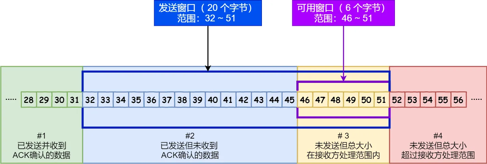

- \#1 是已发送并收到 ACK确认的数据：1~31 字节
- \#2 是已发送但未收到 ACK确认的数据：32~45 字节
- \#3 是未发送但总大小在接收方处理范围内（接收方还有空间）：46~51字节
- \#4 是未发送但总大小超过接收方处理范围（接收方没有空间）：52字节以后

在下图，当发送方把数据「全部」都一下发送出去后，可用窗口的大小就为 0 了，表明可用窗口耗尽，在没收到 ACK 确认之前是无法继续发送数据了。


在下图，当收到之前发送的数据 `32~36` 字节的 ACK 确认应答后，如果发送窗口的大小没有变化，则**滑动窗口往右边移动 5 个字节，因为有 5 个字节的数据被应答确认**，接下来 `52~56` 字节又变成了可用窗口，那么后续也就可以发送 `52~56` 这 5 个字节的数据了。


> 程序是如何表示发送方的四个部分的呢？

TCP 滑动窗口方案使用三个指针来跟踪在四个传输类别中的每一个类别中的字节。其中两个指针是绝对指针（指特定的序列号），一个是相对指针（需要做偏移）。


- `SND.WND`：表示发送窗口的大小（大小是由接收方指定的）；
- `SND.UNA`（*Send Unacknoleged*）：是一个绝对指针，它指向的是已发送但未收到确认的第一个字节的序列号，也就是 #2 的第一个字节。
- `SND.NXT`：也是一个绝对指针，它指向未发送但可发送范围的第一个字节的序列号，也就是 #3 的第一个字节。
- 指向 #4 的第一个字节是个相对指针，它需要 `SND.UNA` 指针加上 `SND.WND` 大小的偏移量，就可以指向 #4 的第一个字节了。

那么可用窗口大小的计算就可以是：

**可用窗口大 = SND.WND -（SND.NXT - SND.UNA）**

> 接收方的滑动窗口

接下来我们看看接收方的窗口，接收窗口相对简单一些，根据处理的情况划分成三个部分：

- \#1 + #2 是已成功接收并确认的数据（等待应用进程读取）；
- \#3 是未收到数据但可以接收的数据；
- \#4 未收到数据并不可以接收的数据；


其中三个接收部分，使用两个指针进行划分:

- `RCV.WND`：表示接收窗口的大小，它会通告给发送方。
- `RCV.NXT`：是一个指针，它指向期望从发送方发送来的下一个数据字节的序列号，也就是 #3 的第一个字节。
- 指向 #4 的第一个字节是个相对指针，它需要 `RCV.NXT` 指针加上 `RCV.WND` 大小的偏移量，就可以指向 #4 的第一个字节了。

> 接收窗口和发送窗口的大小是相等的吗？

并不是完全相等，接收窗口的大小是**约等于**发送窗口的大小的。

因为滑动窗口并不是一成不变的。比如，当接收方的应用进程读取数据的速度非常快的话，这样的话接收窗口可以很快的就空缺出来。那么新的接收窗口大小，是通过 TCP 报文中的 Windows 字段来告诉发送方。那么这个传输过程是存在时延的，所以接收窗口和发送窗口是约等于的关系。


#### 粘包

在进行 Java NIO 学习时，可能会发现：如果客户端连续不断的向服务端发送数据包时，服务端接收的数据会出现两个数据包粘在一起的情况。

1. TCP 是基于字节流的，虽然应用层和 TCP 传输层之间的数据交互是大小不等的数据块，但是 TCP 把这些数据块仅仅看成一连串无结构的字节流，没有边界
2. 从 TCP 的帧结构也可以看出，在 TCP 的首部没有表示数据长度的字段。

基于上面两点，在使用 TCP 传输数据时，才有粘包或者拆包现象发生的可能。一个数据包中包含了发送端发送的两个数据包的信息，这种现象即为粘包。

接收端收到了两个数据包，但是这两个数据包要么是不完整的，要么就是多出来一块，这种情况即发生了拆包和粘包。拆包和粘包的问题导致接收端在处理的时候会非常困难，因为无法区分一个完整的数据包。

- **发送方产生粘包**

采用 TCP 协议传输数据的客户端与服务器经常是保持一个长连接的状态（一次连接发一次数据不存在粘包），双方在连接不断开的情况下，可以一直传输数据。但当发送的数据包过于的小时，那么 TCP 协议默认的会启用 Nagle 算法，将这些较小的数据包进行合并发送（缓冲区数据发送是一个堆压的过程）；这个合并过程就是在发送缓冲区中进行的，也就是说数据发送出来它已经是粘包的状态了。

- **接收方产生粘包**

接收方采用 TCP 协议接收数据时的过程是这样的：数据到接收方，从网络模型的下方传递至传输层，传输层的 TCP 协议处理是将其放置接收缓冲区，然后由应用层来主动获取（C 语言用 recv、read 等函数）；这时会出现一个问题，就是我们在程序中调用的读取数据函数不能及时的把缓冲区中的数据拿出来，而下一个数据又到来并有一部分放入的缓冲区末尾，等我们读取数据时就是一个粘包。（放数据的速度 > 应用层拿数据速度


### ⭐️键入网址到网页显示，期间发生了什么？

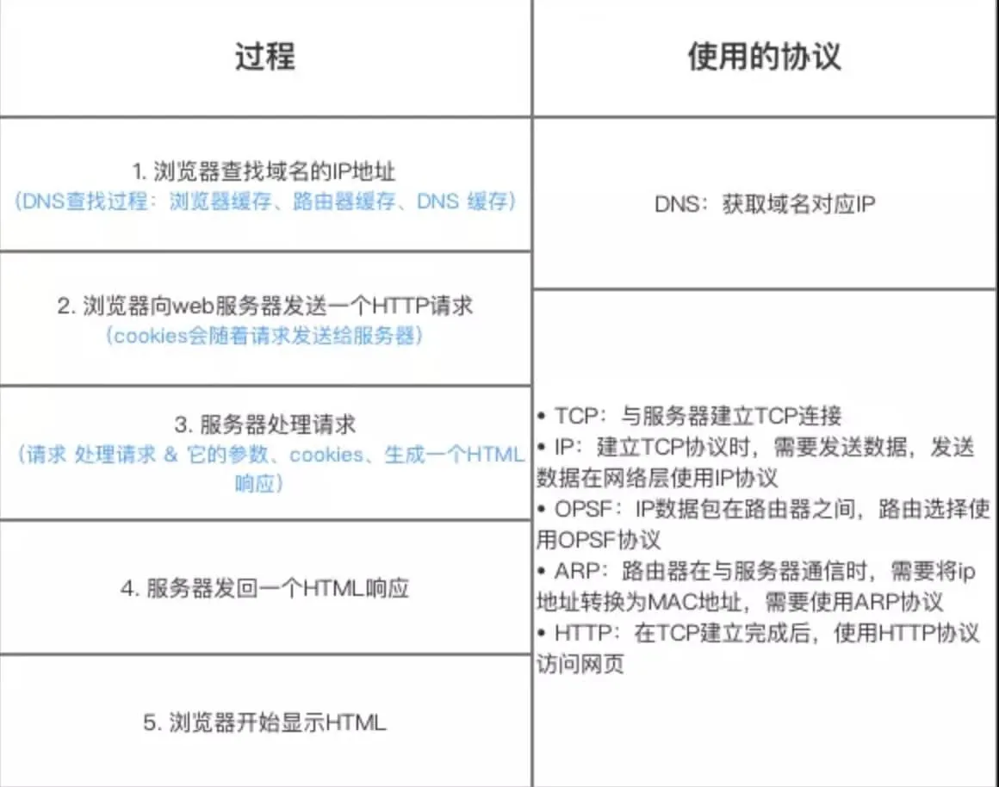

> 上图有一个错误，请注意，是 OSPF 不是 OPSF。 OSPF（Open Shortest Path First，ospf）开放最短路径优先协议, 是由 Internet 工程任务组开发的路由选择协议

总体来说分为以下几个过程:
1. DNS 解析
2. TCP 连接
3. 发送 HTTP 请求
4. 服务器处理请求并返回 HTTP 报文
5. 浏览器解析渲染页面
6. 连接结束

具体来说是：
> 🧙‍♂️ 值得注意的是，在键入网址到显示网页的过程中，不能从上到下（应用层到物理层）的直接思考，因为**解析完DNS后首先会进行的是TCP连接而不是HTTP连接**，因为TCP的连接是建立在传输层以下的基础（网络层、数据链路层、物理层。这个遵守了下层为上层服务的原则）。

1. **浏览器查找域名的IP地址（域名 -> DNS -> IP）**：这被称为`DNS查找`。浏览器首先检查其缓存中是否有该域名的IP地址，如果没有，就会发送一个请求到系统配置的DNS服务器进行查找。DNS服务器也会检查其缓存，如果没有，它会进行递归或迭代查询以获取IP地址。
2. **建立TCP连接（TCP握手【传输层】）**：HTTP请求在网络上传输时，是基于TCP/IP协议的。在发送HTTP请求之前，浏览器会与服务器建立一个TCP连接，这通常涉及一个叫做`"三次握手"`的过程。值得一提的是，POST请求的请求主体通常包含用户提交的表单数据，而GET请求通常没有请求主体。
	1. 在这个过程中，数据包会经历（网络层）的交换机/路由器
	2. 然后通过ARP广播获取MAC地址（数据链路层）
	3. 最后通过WIFI信号（物理层）在发送端和接收端之间传输，除了WIFI信号外，还可能是有线连接。
	4. 同样服务器也一样，从物理层再到服务器的传输层
3. **浏览器向服务器发送HTTP请求（IP -> HTTP请求【应用层】）**：浏览器`使用IP地址来找到服务器`，并`发送HTTP请求`。请求包括请求行（请求类型，如GET、POST等，URL和HTTP版本）、请求头部（包含许多关于客户端信息的元数据）和请求主体（对于POST请求可能会有）。HTTP/1.1默认使用持久连接（也称为连接保持），也就是说，TCP连接在发送完HTTP请求之后，默认是不会断开的，以便继续发送请求。但如果浏览器或服务器明确地发送了一个"Connection: close"头，那么TCP连接将在数据传输完后被关闭。现代的Web应用普遍采用HTTPS协议，这需要在TCP握手后执行SSL/TLS握手过程，进行证书验证和密钥交换，以保证数据的加密传输。
4. **服务器处理请求并返回HTTP响应**：服务器接收到HTTP请求后，会进行处理（例如，查找请求的资源），然后返回一个`HTTP响应`。响应包括一个`状态码`（如200表示成功，404表示未找到），响应头部和响应主体（通常是请求的资源，如HTML文件）。
5. **TCP连接终止（HTTP响应【应用层】 -> TCP挥手【传输层】）**：数据传输完成后，TCP连接将被终止，通常是通过一个叫做`"四次挥手"`的过程。
6. **浏览器解析HTML并渲染页面**：浏览器收到服务器的响应后，会解析HTML代码，并构建一个DOM树。在这个过程中，浏览器可能还需要请求其他资源，例如CSS文件、JavaScript文件、图片等。当所有的资源都加载完成后，浏览器会根据CSS规则对页面进行渲染，然后显示给用户。

> 最近看面试题要求说的越详细越好发现越来越卷，所以加入了详细内容，下面是我列出来的大纲，方便快速查询：
> - **HTTP**：HTTP是应用层的协议，它定义了浏览器和服务器之间如何交换数据的规则。当你在浏览器中键入网址并按下Enter后，浏览器会创建一个HTTP请求，并将其发送给服务器。
> - **DNS**：为了发送HTTP请求，浏览器需要知道服务器的IP地址。这就需要进行DNS查找。浏览器会检查自己的缓存，如果没有找到相关信息，就会查询系统配置的DNS服务器。
> - **协议栈**：协议栈是一种用于实现网络协议的软件结构。在你的设备中，协议栈会处理与网络通信相关的所有任务，包括数据包的发送和接收。
> - **TCP**：HTTP请求通常使用TCP协议进行传输，这需要在浏览器和服务器之间建立一个TCP连接。TCP协议会通过"三次握手"的过程确保连接的建立。
> - **IP**：IP是一个用于在网络中标识和定位设备的协议。HTTP请求被分成多个数据包进行传输，每个数据包都包含了源IP地址（你的设备）和目标IP地址（服务器）。
> - **MAC**：MAC地址是网络接口控制器（网卡）的唯一标识符。在本地网络中，数据包是通过MAC地址进行路由的。
> - **网卡**：网卡是一种硬件设备，它允许计算机连接并通信到网络。当数据包准备好被发送时，它们会被传递给网卡，然后由网卡发送到网络。
> - **交换器**：交换器是一种网络设备，它用于连接网络中的设备，并根据数据包的MAC地址将其转发到正确的设备。
> - **路由器**：路由器是一种网络设备，它可以将数据包从一个网络转发到另一个网络。在发送HTTP请求的过程中，数据包可能需要经过多个路由器，才能最终到达服务器。
> - **数据包**：数据包是网络通信的基本单位。HTTP请求和响应都会被分割成多个数据包，每个数据包都会独立地通过网络传输。

#### HTTP

> 浏览器做的第一步工作是解析 URL

首先浏览器做的第一步工作就是要对 `URL` 进行解析，从而生成发送给 `Web` 服务器的请求信息。

让我们看看一条长长的 URL 里的各个元素的代表什么，见下图：

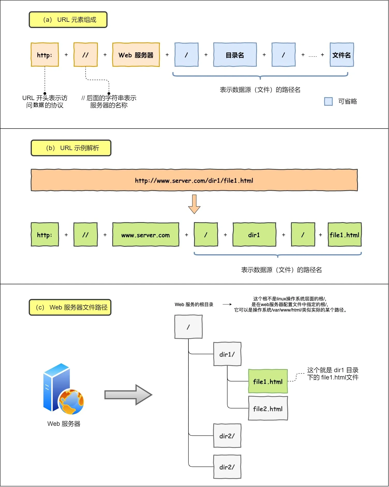

所以图中的长长的 URL 实际上是请求服务器里的文件资源。

> 要是上图中的蓝色部分 URL 元素都省略了，那应该是请求哪个文件呢？

当没有路径名时，就代表访问根目录下事先设置的**默认文件**，也就是 `/index.html` 或者 `/default.html` 这些文件，这样就不会发生混乱了。

> 生产 HTTP 请求信息

对 `URL` 进行解析之后，浏览器确定了 Web 服务器和文件名，接下来就是根据这些信息来生成 HTTP 请求消息了。

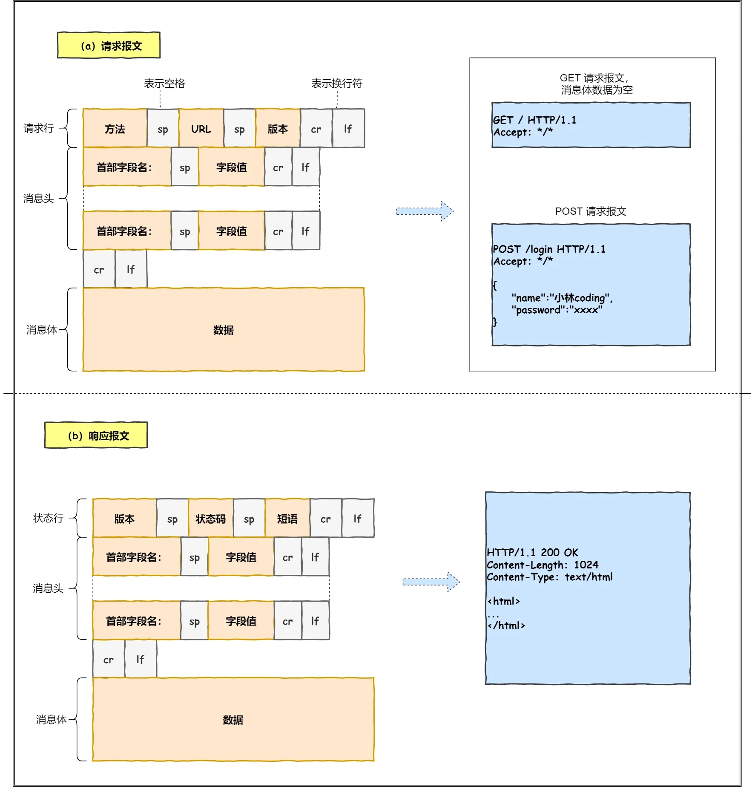

> 一个孤单 HTTP 数据包表示：“我这么一个小小的数据包，没亲没友，直接发到浩瀚的网络，谁会知道我呢？谁能载我一程呢？谁能保护我呢？我的目的地在哪呢？”。充满各种疑问的它，没有停滞不前，依然踏上了征途！

#### DNS

通过浏览器解析 URL 并生成 HTTP 消息后，需要委托操作系统将消息发送给 `Web`  服务器。

但在发送之前，还有一项工作需要完成，那就是**查询服务器域名对应的 IP 地址**，因为委托操作系统发送消息时，必须提供通信对象的 IP 地址。

比如我们打电话的时候，必须要知道对方的电话号码，但由于电话号码难以记忆，所以通常我们会将对方电话号 + 姓名保存在通讯录里。

所以，有一种服务器就专门保存了 `Web` 服务器域名与 `IP` 的对应关系，它就是 `DNS` 服务器。

> 域名的层级关系

DNS 中的域名都是用**句点**来分隔的，比如 `www.server.com`，这里的句点代表了不同层次之间的**界限**。

在域名中，**越靠右**的位置表示其层级**越高**。

毕竟域名是外国人发明，所以思维和中国人相反，比如说一个城市地点的时候，外国喜欢从小到大的方式顺序说起（如 XX 街道 XX 区 XX 市 XX 省），而中国则喜欢从大到小的顺序（如 XX 省 XX 市 XX 区 XX 街道）。

实际上域名最后还有一个点，比如 `www.server.com.`，这个最后的一个点代表根域名。

也就是，`.` 根域是在最顶层，它的下一层就是 `.com` 顶级域，再下面是 `server.com`。

所以域名的层级关系类似一个树状结构：

- 根 DNS 服务器（.）
- 顶级域 DNS 服务器（.com）
- 权威 DNS 服务器（server.com）


根域的 DNS 服务器信息保存在互联网中所有的 DNS 服务器中。

这样一来，任何 DNS 服务器就都可以找到并访问根域 DNS 服务器了。

因此，客户端只要能够找到任意一台 DNS 服务器，就可以通过它找到根域 DNS 服务器，然后再一路顺藤摸瓜找到位于下层的某台目标 DNS 服务器。

> 域名解析的工作流程

1. 客户端首先会发出一个 DNS 请求，问 `www.server.com` 的 IP 是啥，并发给本地 DNS 服务器（也就是客户端的 TCP/IP 设置中填写的 DNS 服务器地址）。
2. 本地域名服务器收到客户端的请求后，如果缓存里的表格能找到`www.server.com`，则它直接返回 IP 地址。如果没有，本地 DNS 会去问它的根域名服务器：“老大， 能告诉我  `www.server.com` 的 IP 地址吗？” 根域名服务器是最高层次的，它不直接用于域名解析，但能指明一条道路。
3. 根 DNS 收到来自本地 DNS 的请求后，发现后置是 .com，说：`www.server.com` 这个域名归 .com 区域管理”，我给你 .com 顶级域名服务器地址给你，你去问问它吧。”
4. 本地 DNS 收到顶级域名服务器的地址后，发起请求问“老二， 你能告诉我 `www.server.com`  的 IP 地址吗？”
5. 顶级域名服务器说：“我给你负责`www.server.com`区域的权威 DNS 服务器的地址，你去问它应该能问到”。
6. 本地 DNS 于是转向问权威 DNS 服务器：“老三，`www.server.com`对应的IP是啥呀？`www.server.com` 的权威 DNS 服务器，它是域名解析结果的原出处。为啥叫权威呢？就是我的域名我做主。
7. 权威 DNS 服务器查询后将对应的 IP 地址 X.X.X.X 告诉本地 DNS。
8. 本地 DNS 再将 IP 地址返回客户端，客户端和目标建立连接。

至此，我们完成了 DNS 的解析过程。现在总结一下，整个过程我画成了一个图。

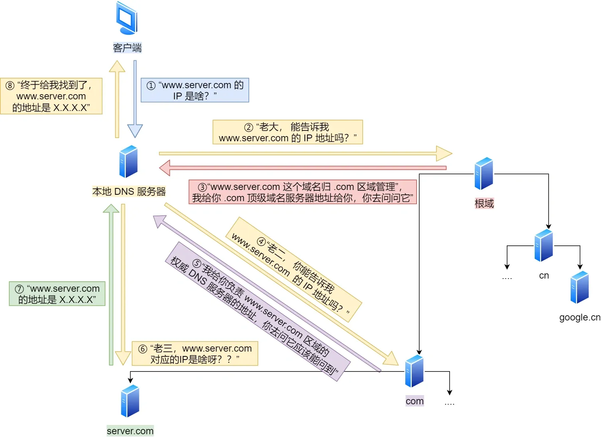

DNS 域名解析的过程蛮有意思的，整个过程就和我们日常生活中找人问路的过程类似，**只指路不带路**。

> 那是不是每次解析域名都要经过那么多的步骤呢？

当然不是了，还有缓存这个东西的嘛。

浏览器会先看自身有没有对这个域名的缓存，如果有，就直接返回，如果没有，就去问操作系统，操作系统也会去看自己的缓存，如果有，就直接返回，如果没有，再去 hosts 文件看，也没有，才会去问「本地 DNS 服务器」。

> 数据包表示：“DNS 老大哥厉害呀，找到了目的地了！我还是很迷茫呀，我要发出去，接下来我需要谁的帮助呢?”

#### 协议栈

通过 DNS 获取到 IP 后，就可以把 HTTP 的传输工作交给操作系统中的**协议栈**。

协议栈的内部分为几个部分，分别承担不同的工作。上下关系是有一定的规则的，上面的部分会向下面的部分委托工作，下面的部分收到委托的工作并执行。


应用程序（浏览器）通过调用 Socket 库，来委托协议栈工作。协议栈的上半部分有两块，分别是负责收发数据的 TCP 和 UDP 协议，这两个传输协议会接受应用层的委托执行收发数据的操作。

协议栈的下面一半是用 IP 协议控制网络包收发操作，在互联网上传数据时，数据会被切分成一块块的网络包，而将网络包发送给对方的操作就是由 IP 负责的。

此外 IP 中还包括 `ICMP` 协议和 `ARP` 协议。

- `ICMP` 用于告知网络包传送过程中产生的错误以及各种控制信息。
- `ARP` 用于根据 IP 地址查询相应的以太网 MAC 地址。

IP 下面的网卡驱动程序负责控制网卡硬件，而最下面的网卡则负责完成实际的收发操作，也就是对网线中的信号执行发送和接收操作。

> 数据包看了这份指南表示：“原来我需要那么多大佬的协助啊，那我先去找找 TCP 大佬！”

#### TCP

HTTP 是基于 TCP 协议传输的，所以在这我们先了解下 TCP 协议。

> TCP 包头格式

我们先看看 TCP 报文头部的格式：

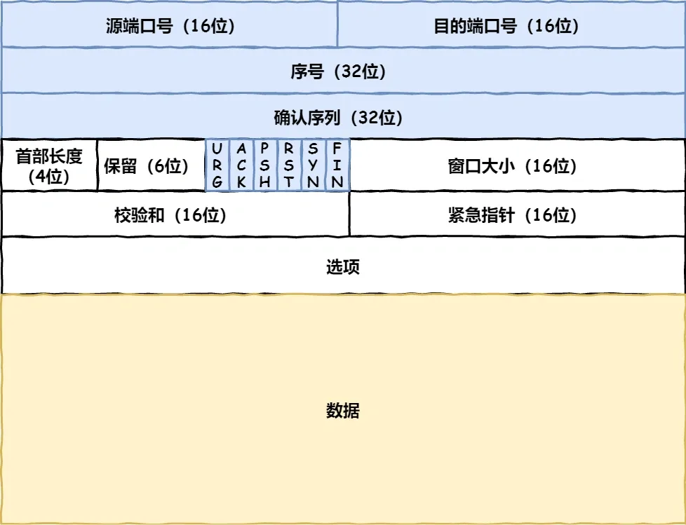

首先，**源端口号**和**目标端口**号是不可少的，如果没有这两个端口号，数据就不知道应该发给哪个应用。

接下来有包的**序**号，这个是为了解决包乱序的问题。

还有应该有的是**确认号**，目的是确认发出去对方是否有收到。如果没有收到就应该重新发送，直到送达，这个是为了解决不丢包的问题。

接下来还有一些**状态位**。例如 `SYN` 是发起一个连接，`ACK` 是回复，`RST` 是重新连接，`FIN` 是结束连接等。TCP 是面向连接的，因而双方要维护连接的状态，这些带状态位的包的发送，会引起双方的状态变更。

还有一个重要的就是**窗口大小**。TCP 要做**流量控制**，通信双方各声明一个窗口（缓存大小），标识自己当前能够的处理能力，别发送的太快，撑死我，也别发的太慢，饿死我。

除了做流量控制以外，TCP还会做**拥塞控制**，对于真正的通路堵车不堵车，它无能为力，唯一能做的就是控制自己，也即控制发送的速度。不能改变世界，就改变自己嘛。

> TCP 传输数据之前，要先三次握手建立连接

在 HTTP 传输数据之前，首先需要 TCP 建立连接，TCP 连接的建立，通常称为**三次握手**。

这个所谓的「连接」，只是双方计算机里维护一个状态机，在连接建立的过程中，双方的状态变化时序图就像这样。

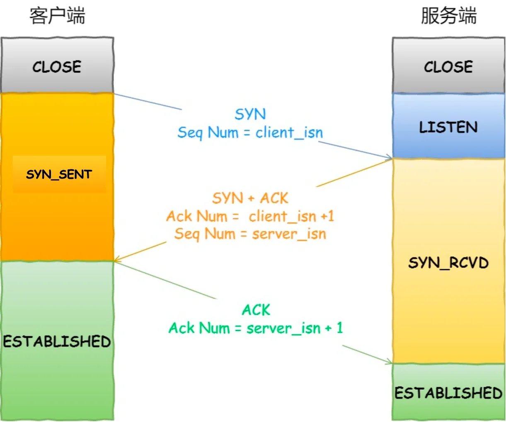

- 一开始，客户端和服务端都处于 `CLOSED` 状态。先是服务端主动监听某个端口，处于 `LISTEN` 状态。
- 然后客户端主动发起连接 `SYN`，之后处于 `SYN-SENT` 状态。
- 服务端收到发起的连接，返回 `SYN`，并且 `ACK` 客户端的 `SYN`，之后处于 `SYN-RCVD` 状态。
- 客户端收到服务端发送的 `SYN` 和 `ACK` 之后，发送对 `SYN` 确认的 `ACK`，之后处于 `ESTABLISHED` 状态，因为它一发一收成功了。
- 服务端收到 `ACK` 的 `ACK` 之后，处于 `ESTABLISHED` 状态，因为它也一发一收了。

所以三次握手目的是**保证双方都有发送和接收的能力**。

> 如何查看 TCP 的连接状态？

TCP 的连接状态查看，在 Linux 可以通过 `netstat -napt` 命令查看。

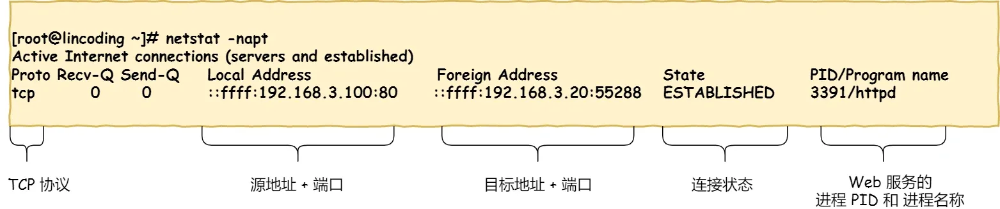

> TCP 分割数据

如果 HTTP 请求消息比较长，超过了 `MSS` 的长度，这时 TCP 就需要把 HTTP 的数据拆解成一块块的数据发送，而不是一次性发送所有数据。


- `MTU`：一个网络包的最大长度，以太网中一般为 `1500` 字节。
- `MSS`：除去 IP 和 TCP 头部之后，一个网络包所能容纳的 TCP 数据的最大长度。

数据会被以 `MSS` 的长度为单位进行拆分，拆分出来的每一块数据都会被放进单独的网络包中。也就是在每个被拆分的数据加上 TCP 头信息，然后交给 IP 模块来发送数据。


> TCP 报文生成

TCP 协议里面会有两个端口，一个是浏览器监听的端口（通常是随机生成的），一个是 Web 服务器监听的端口（HTTP 默认端口号是 `80`， HTTPS 默认端口号是 `443`）。

在双方建立了连接后，TCP 报文中的数据部分就是存放 HTTP 头部 + 数据，组装好 TCP 报文之后，就需交给下面的网络层处理。

至此，网络包的报文如下图。

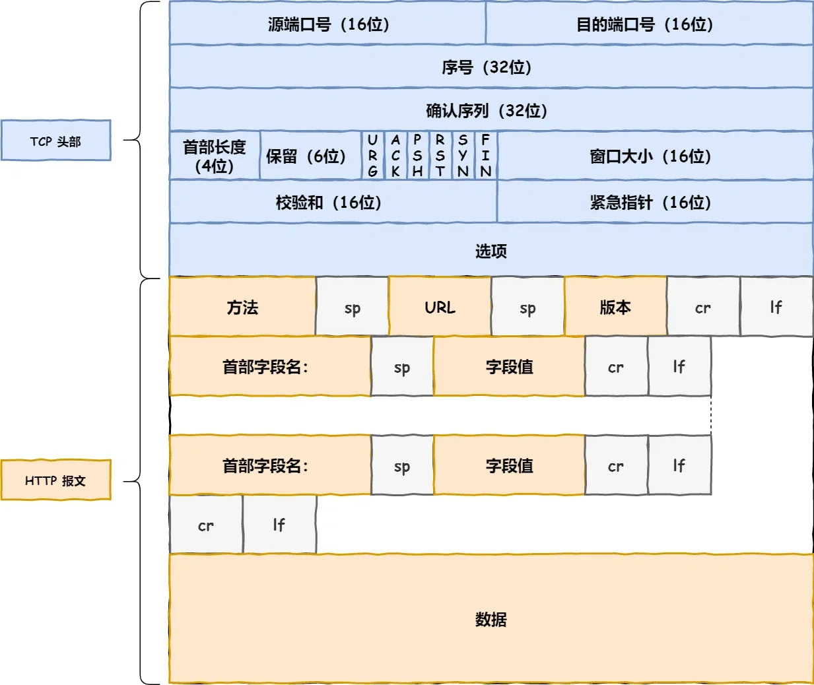

> 此时，遇上了 TCP 的  数据包激动表示：“太好了，碰到了可靠传输的 TCP 传输，它给我加上 TCP 头部，我不再孤单了，安全感十足啊！有大佬可以保护我的可靠送达！但我应该往哪走呢？”

#### IP

TCP 模块在执行连接、收发、断开等各阶段操作时，都需要委托 IP 模块将数据封装成**网络包**发送给通信对象。

> IP 包头格式

我们先看看 IP 报文头部的格式：


在 IP 协议里面需要有**源地址 IP** 和 **目标地址 IP**：

- 源地址IP，即是客户端输出的 IP 地址；
- 目标地址，即通过 DNS 域名解析得到的 Web 服务器 IP。

因为 HTTP 是经过 TCP 传输的，所以在 IP 包头的**协议号**，要填写为 `06`（十六进制），表示协议为 TCP。

> 假设客户端有多个网卡，就会有多个 IP 地址，那 IP 头部的源地址应该选择哪个 IP 呢？

当存在多个网卡时，在填写源地址 IP 时，就需要判断到底应该填写哪个地址。这个判断相当于在多块网卡中判断应该使用哪个一块网卡来发送包。

这个时候就需要根据**路由表**规则，来判断哪一个网卡作为源地址 IP。

在 Linux 操作系统，我们可以使用 `route -n` 命令查看当前系统的路由表。


举个例子，根据上面的路由表，我们假设 Web 服务器的目标地址是 `192.168.10.200`。


1. 首先先和第一条目的子网掩码（`Genmask`）进行 **与运算**，得到结果为 `192.168.10.0`，但是第一个条目的 `Destination` 是 `192.168.3.0`，两者不一致所以匹配失败。
2. 再与第二条目的子网掩码进行 **与运算**，得到的结果为 `192.168.10.0`，与第二条目的 `Destination 192.168.10.0` 匹配成功，所以将使用 `eth1` 网卡的 IP 地址作为 IP 包头的源地址。

那么假设 Web 服务器的目标地址是 `10.100.20.100`，那么依然依照上面的路由表规则判断，判断后的结果是和第三条目匹配。

第三条目比较特殊，它目标地址和子网掩码都是 `0.0.0.0`，这表示**默认网关**，如果其他所有条目都无法匹配，就会自动匹配这一行。并且后续就把包发给路由器，`Gateway` 即是路由器的 IP 地址。

> IP 报文生成

至此，网络包的报文如下图。

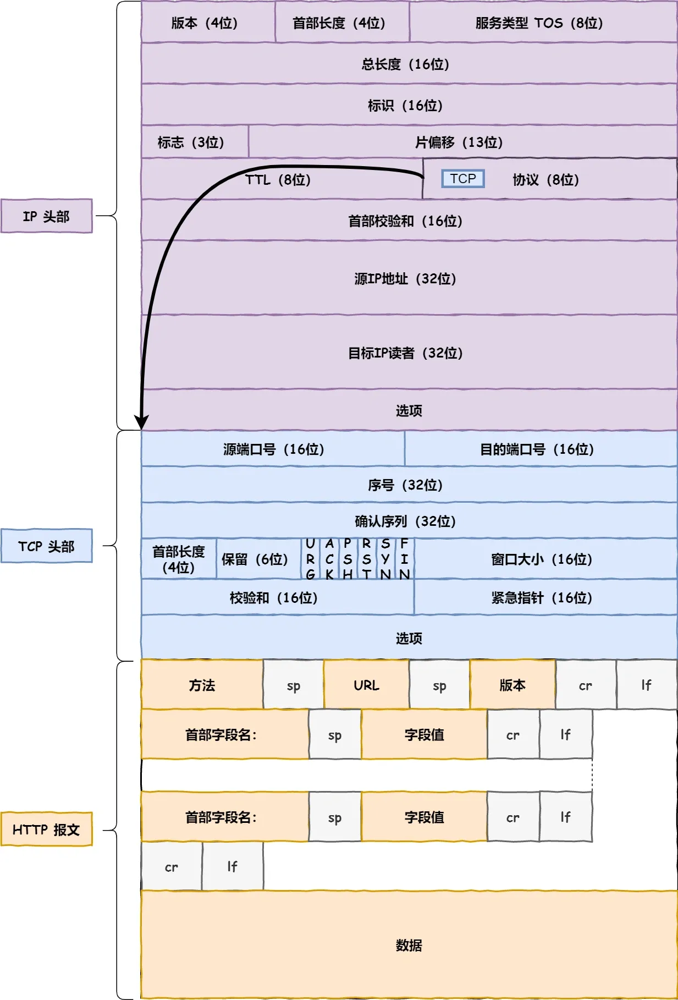

> 此时，加上了 IP 头部的数据包表示 ：“有 IP 大佬给我指路了，感谢 IP 层给我加上了 IP 包头，让我有了远程定位的能力！不会害怕在浩瀚的互联网迷茫了！可是目的地好远啊，我下一站应该去哪呢？”

#### MAC

生成了 IP 头部之后，接下来网络包还需要在 IP 头部的前面加上 **MAC 头部**。

> MAC 包头格式

MAC 头部是以太网使用的头部，它包含了接收方和发送方的 MAC 地址等信息。


在 MAC 包头里需要**发送方 MAC 地址**和**接收方目标 MAC 地址**，用于**两点之间的传输**。

一般在 TCP/IP 通信里，MAC 包头的**协议类型**只使用：

- `0800` ： IP 协议
- `0806` ： ARP 协议

> MAC 发送方和接收方如何确认?

**发送方**的 MAC 地址获取就比较简单了，MAC 地址是在网卡生产时写入到 ROM 里的，只要将这个值读取出来写入到 MAC 头部就可以了。

**接收方**的 MAC 地址就有点复杂了，只要告诉以太网对方的 MAC 的地址，以太网就会帮我们把包发送过去，那么很显然这里应该填写对方的 MAC 地址。

所以先得搞清楚应该把包发给谁，这个只要查一下**路由表**就知道了。在路由表中找到相匹配的条目，然后把包发给 `Gateway` 列中的 IP 地址就可以了。

> 既然知道要发给谁，按如何获取对方的 MAC 地址呢？

不知道对方 MAC 地址？不知道就喊呗。

此时就需要 `ARP` 协议帮我们找到路由器的 MAC 地址。

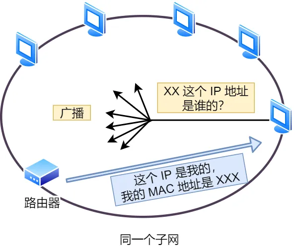

ARP 协议会在以太网中以**广播**的形式，对以太网所有的设备喊出：“这个 IP 地址是谁的？请把你的 MAC 地址告诉我”。

然后就会有人回答：“这个 IP 地址是我的，我的 MAC 地址是 XXXX”。

如果对方和自己处于同一个子网中，那么通过上面的操作就可以得到对方的 MAC 地址。然后，我们将这个 MAC 地址写入 MAC 头部，MAC 头部就完成了。

> 好像每次都要广播获取，这不是很麻烦吗？

放心，在后续操作系统会把本次查询结果放到一块叫做 **ARP 缓存**的内存空间留着以后用，不过缓存的时间就几分钟。

也就是说，在发包时：

- 先查询 ARP 缓存，如果其中已经保存了对方的 MAC 地址，就不需要发送 ARP 查询，直接使用 ARP 缓存中的地址。
- 而当 ARP 缓存中不存在对方 MAC 地址时，则发送 ARP 广播查询。

> 查看 ARP 缓存内容

在 Linux 系统中，我们可以使用 `arp -a` 命令来查看 ARP 缓存的内容。


> MAC 报文生成

至此，网络包的报文如下图。


> 此时，加上了 MAC 头部的数据包万分感谢，说道 ：“感谢 MAC 大佬，我知道我下一步要去哪了！我现在有很多头部兄弟，相信我可以到达最终的目的地！”。 带着众多头部兄弟的数据包，终于准备要出门了。

#### 网卡

网络包只是存放在内存中的一串二进制数字信息，没有办法直接发送给对方。因此，我们需要将**数字信息转换为电信号**，才能在网线上传输，也就是说，这才是真正的数据发送过程。

负责执行这一操作的是**网卡**，要控制网卡还需要靠**网卡驱动程序**。

网卡驱动获取网络包之后，会将其**复制**到网卡内的缓存区中，接着会在其**开头加上报头和起始帧分界符，在末尾加上用于检测错误的帧校验序列**。


- 起始帧分界符是一个用来表示包起始位置的标记
- 末尾的 `FCS`（帧校验序列）用来检查包传输过程是否有损坏

最后网卡会将包转为电信号，通过网线发送出去。

> 唉，真是不容易，发一个包，真是历经千辛万苦。致此，一个带有许多头部的数据终于踏上寻找目的地的征途了！

#### 交换机

下面来看一下包是如何通过交换机的。交换机的设计是将网络包**原样**转发到目的地。交换机工作在 MAC 层，也称为**二层网络设备**。

> 交换机的包接收操作

首先，电信号到达网线接口，交换机里的模块进行接收，接下来交换机里的模块将电信号转换为数字信号。

然后通过包末尾的 `FCS` 校验错误，如果没问题则放到缓冲区。这部分操作基本和计算机的网卡相同，但交换机的工作方式和网卡不同。

计算机的网卡本身具有 MAC 地址，并通过核对收到的包的接收方 MAC 地址判断是不是发给自己的，如果不是发给自己的则丢弃；相对地，交换机的端口不核对接收方 MAC 地址，而是直接接收所有的包并存放到缓冲区中。因此，和网卡不同，**交换机的端口不具有 MAC 地址**。

将包存入缓冲区后，接下来需要查询一下这个包的接收方 MAC 地址是否已经在 MAC 地址表中有记录了。

交换机的 MAC 地址表主要包含两个信息：

- 一个是设备的 MAC 地址，
- 另一个是该设备连接在交换机的哪个端口上。

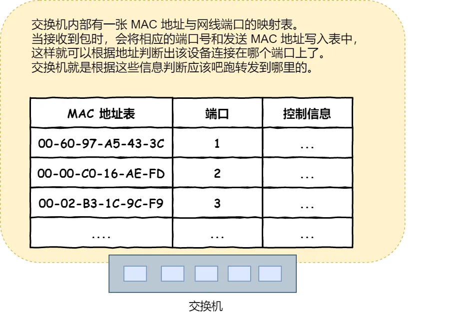

举个例子，如果收到的包的接收方 MAC 地址为 `00-02-B3-1C-9C-F9`，则与图中表中的第 3 行匹配，根据端口列的信息，可知这个地址位于 `3` 号端口上，然后就可以通过交换电路将包发送到相应的端口了。

所以，**交换机根据 MAC 地址表查找 MAC 地址，然后将信号发送到相应的端口**。

> 当 MAC 地址表找不到指定的 MAC 地址会怎么样？

地址表中找不到指定的 MAC 地址。这可能是因为具有该地址的设备还没有向交换机发送过包，或者这个设备一段时间没有工作导致地址被从地址表中删除了。

这种情况下，交换机无法判断应该把包转发到哪个端口，只能将包转发到除了源端口之外的所有端口上，无论该设备连接在哪个端口上都能收到这个包。

这样做不会产生什么问题，因为以太网的设计本来就是将包发送到整个网络的，然后**只有相应的接收者才接收包，而其他设备则会忽略这个包**。

有人会说：“这样做会发送多余的包，会不会造成网络拥塞呢？”

其实完全不用过于担心，因为发送了包之后目标设备会作出响应，只要返回了响应包，交换机就可以将它的地址写入 MAC 地址表，下次也就不需要把包发到所有端口了。

局域网中每秒可以传输上千个包，多出一两个包并无大碍。

此外，如果接收方 MAC 地址是一个**广播地址**，那么交换机会将包发送到除源端口之外的所有端口。

以下两个属于广播地址：

- MAC 地址中的 `FF:FF:FF:FF:FF:FF`
- IP 地址中的 `255.255.255.255`

> 数据包通过交换机转发抵达了路由器，准备要离开土生土长的子网了。此时，数据包和交换机离别时说道：“感谢交换机兄弟，帮我转发到出境的大门，我要出远门啦！”

#### 路由器

> 路由器与交换机的区别

网络包经过交换机之后，现在到达了**路由器**，并在此被转发到下一个路由器或目标设备。

这一步转发的工作原理和交换机类似，也是通过查表判断包转发的目标。

不过在具体的操作过程上，路由器和交换机是有区别的。

- 因为**路由器**是基于 IP 设计的，俗称**三层**网络设备，路由器的各个端口都具有 MAC 地址和 IP 地址；
- 而**交换机**是基于以太网设计的，俗称**二层**网络设备，交换机的端口不具有 MAC 地址。

> 路由器基本原理

路由器的端口具有 MAC 地址，因此它就能够成为以太网的发送方和接收方；同时还具有 IP 地址，从这个意义上来说，它和计算机的网卡是一样的。

当转发包时，首先路由器端口会接收发给自己的以太网包，然后**路由表**查询转发目标，再由相应的端口作为发送方将以太网包发送出去。

> 路由器的包接收操作

首先，电信号到达网线接口部分，路由器中的模块会将电信号转成数字信号，然后通过包末尾的 `FCS` 进行错误校验。

如果没问题则检查 MAC 头部中的**接收方 MAC 地址**，看看是不是发给自己的包，如果是就放到接收缓冲区中，否则就丢弃这个包。

总的来说，路由器的端口都具有 MAC 地址，只接收与自身地址匹配的包，遇到不匹配的包则直接丢弃。

> 查询路由表确定输出端口

完成包接收操作之后，路由器就会**去掉**包开头的 MAC 头部。

**MAC 头部的作用就是将包送达路由器**，其中的接收方 MAC 地址就是路由器端口的 MAC 地址。因此，当包到达路由器之后，MAC 头部的任务就完成了，于是 MAC 头部就会**被丢弃**。

接下来，路由器会根据 MAC 头部后方的 `IP` 头部中的内容进行包的转发操作。

转发操作分为几个阶段，首先是查询**路由表**判断转发目标。


具体的工作流程根据上图，举个例子。

假设地址为 `10.10.1.101` 的计算机要向地址为 `192.168.1.100` 的服务器发送一个包，这个包先到达图中的路由器。

判断转发目标的第一步，就是根据包的接收方 IP 地址查询路由表中的目标地址栏，以找到相匹配的记录。

路由匹配和前面讲的一样，每个条目的子网掩码和 `192.168.1.100` IP 做 **& 与运算**后，得到的结果与对应条目的目标地址进行匹配，如果匹配就会作为候选转发目标，如果不匹配就继续与下个条目进行路由匹配。

如第二条目的子网掩码 `255.255.255.0` 与 `192.168.1.100` IP 做 **& 与运算**后，得到结果是 `192.168.1.0` ，这与第二条目的目标地址 `192.168.1.0` 匹配，该第二条目记录就会被作为转发目标。

实在找不到匹配路由时，就会选择**默认路由**，路由表中子网掩码为 `0.0.0.0` 的记录表示「默认路由」。

> 路由器的发送操作

接下来就会进入包的**发送操作**。

首先，我们需要根据**路由表的网关列**判断对方的地址。

- 如果网关是一个 IP 地址，则这个IP 地址就是我们要转发到的目标地址，**还未抵达终点**，还需继续需要路由器转发。
- 如果网关为空，则 IP 头部中的接收方 IP 地址就是要转发到的目标地址，也是就终于找到 IP 包头里的目标地址了，说明**已抵达终点**。

知道对方的 IP 地址之后，接下来需要通过 `ARP` 协议根据 IP 地址查询 MAC 地址，并将查询的结果作为接收方 MAC 地址。

路由器也有 ARP 缓存，因此首先会在 ARP 缓存中查询，如果找不到则发送 ARP 查询请求。

接下来是发送方 MAC 地址字段，这里填写输出端口的 MAC 地址。还有一个以太类型字段，填写 `0800` （十六进制）表示 IP 协议。

网络包完成后，接下来会将其转换成电信号并通过端口发送出去。这一步的工作过程和计算机也是相同的。

发送出去的网络包会通过**交换机**到达下一个路由器。由于接收方 MAC 地址就是下一个路由器的地址，所以交换机会根据这一地址将包传输到下一个路由器。

接下来，下一个路由器会将包转发给再下一个路由器，经过层层转发之后，网络包就到达了最终的目的地。

不知你发现了没有，在网络包传输的过程中，**源 IP 和目标 IP 始终是不会变的，一直变化的是 MAC 地址**，因为需要 MAC 地址在以太网内进行**两个设备**之间的包传输。

> 数据包通过多个路由器道友的帮助，在网络世界途经了很多路程，最终抵达了目的地的城门！城门值守的路由器，发现了这个小兄弟数据包原来是找城内的人，于是它就将数据包送进了城内，再经由城内的交换机帮助下，最终转发到了目的地了。数据包感慨万千的说道：“多谢这一路上，各路大侠的相助！”

#### 服务器 与 客户端

数据包抵达了服务器，服务器肯定高兴呀，正所谓有朋自远方来，不亦乐乎？

服务器高兴的不得了，于是开始扒数据包的皮！就好像你收到快递，能不兴奋吗？

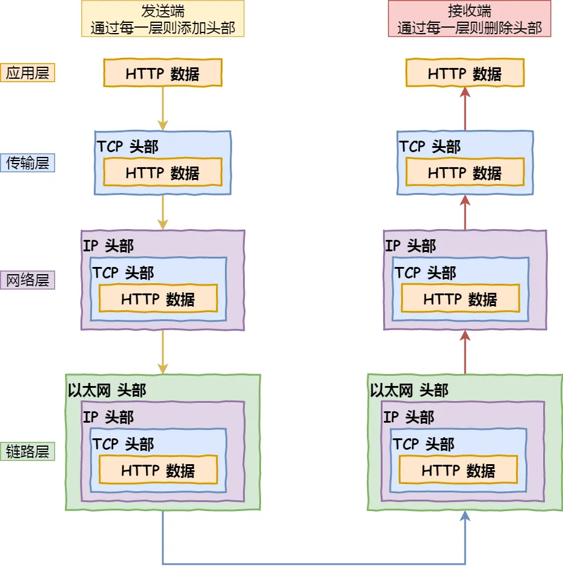

数据包抵达服务器后，服务器会先扒开数据包的 MAC 头部，查看是否和服务器自己的 MAC 地址符合，符合就将包收起来。

接着继续扒开数据包的 IP 头，发现 IP 地址符合，根据 IP 头中协议项，知道自己上层是 TCP 协议。

于是，扒开 TCP 的头，里面有序列号，需要看一看这个序列包是不是我想要的，如果是就放入缓存中然后返回一个 ACK，如果不是就丢弃。TCP头部里面还有端口号， HTTP 的服务器正在监听这个端口号。

于是，服务器自然就知道是 HTTP 进程想要这个包，于是就将包发给 HTTP 进程。

服务器的 HTTP 进程看到，原来这个请求是要访问一个页面，于是就把这个网页封装在 HTTP 响应报文里。

HTTP 响应报文也需要穿上 TCP、IP、MAC 头部，不过这次是源地址是服务器 IP 地址，目的地址是客户端 IP 地址。

穿好头部衣服后，从网卡出去，交由交换机转发到出城的路由器，路由器就把响应数据包发到了下一个路由器，就这样跳啊跳。

最后跳到了客户端的城门把守的路由器，路由器扒开 IP 头部发现是要找城内的人，于是又把包发给了城内的交换机，再由交换机转发到客户端。

客户端收到了服务器的响应数据包后，同样也非常的高兴，客户能拆快递了！

于是，客户端开始扒皮，把收到的数据包的皮扒剩 HTTP 响应报文后，交给浏览器去渲染页面，一份特别的数据包快递，就这样显示出来了！

最后，客户端要离开了，向服务器发起了 TCP 四次挥手，至此双方的连接就断开了。

#### 数据包

> 下面内容的 「我」，代表「臭美的数据包角色」。注：（括号的内容）代表我的吐槽，三连呸！

我一开始我虽然孤单、不知所措，但没有停滞不前。我依然满怀信心和勇气开始了征途。（**你当然有勇气，你是应用层数据，后面有底层兄弟当靠山，我呸！**）

我很庆幸遇到了各路神通广大的大佬，有可靠传输的 TCP、有远程定位功能的 IP、有指明下一站位置的 MAC 等（**你当然会遇到，因为都被计算机安排好的，我呸！**）。

这些大佬都给我前面加上了头部，使得我能在交换机和路由器的转发下，抵达到了目的地！（**哎，你也不容易，不吐槽了，放过你！**）

这一路上的经历，让我认识到了网络世界中各路大侠协作的重要性，是他们维护了网络世界的秩序，感谢他们！（**我呸，你应该感谢众多计算机科学家！**）

### 网卡从收到数据到进程拿到数据的过程
- **物理层**：首先，数据包会通过物理媒介（例如，以太网电缆或者Wi-Fi信号）到达你的设备的网络接口卡（网卡）。在这个阶段，数据包是由二进制信号组成。
- **数据链路层**：接着，网卡将这些二进制信号转化为数据帧。每一个数据帧包含有目标MAC地址、源MAC地址、有效载荷（即实际的数据）和一些其它的控制信息。
- **网络层**：网卡把这些数据帧传给设备的操作系统。操作系统在网络层将数据帧解封装为数据包，并根据其中的IP地址进行路由。
- **传输层**：数据包继续向上到达传输层，在这一层，数据包会被进一步解封装为数据段，并根据其中的端口号，决定将数据发送给哪个应用程序。
- **应用层**：最后，数据段会被传输到应用层，此时，操作系统的内核把数据从内核空间复制到用户空间，应用程序可以通过系统调用（例如，Unix的read或Windows的recv）来读取这些数据。
- **系统调用**：应用程序通过系统调用（如read或recv）从内核空间获取数据，然后在用户空间进行处理。

### TCP如何保证可靠传输？

1. 应用数据被分割成 TCP 认为最适合发送的数据块。
2. TCP 给发送的每一个包进行编号，接收方对数据包进行排序，把有序数据传送给应用层。
3. **校验和：** TCP 将保持它首部和数据的检验和。这是一个端到端的检验和，目的是检测数据在传输过程中的任何变化。如果收到段的检验和有差错，TCP 将丢弃这个报文段和不确认收到此报文段。
4. TCP 的接收端会丢弃重复的数据。
5. **流量控制：** TCP 连接的每一方都有固定大小的缓冲空间，TCP  的接收端只允许发送端发送接收端缓冲区能接纳的数据。当接收方来不及处理发送方的数据，能提示发送方降低发送的速率，防止包丢失。TCP  使用的流量控制协议是可变大小的滑动窗口协议。 （TCP 利用滑动窗口实现流量控制）
6. **拥塞控制：** 当网络拥塞时，减少数据的发送。
7. **ARQ 协议：** 也是为了实现可靠传输的，它的基本原理就是每发完一个分组就停止发送，等待对方确认。在收到确认后再发下一个分组。
8. **超时重传：** 当 TCP 发出一个段后，它启动一个定时器，等待目的端确认收到这个报文段。如果不能及时收到一个确认，将重发这个报文段。

### ⭐️TCP 三次握手和四次挥手（+++极限拓展）

详细可见：https://xiaolincoding.com/network/3_tcp/tcp_interview.html#tcp-%E8%BF%9E%E6%8E%A5%E5%BB%BA%E7%AB%8B

> 前提概要：
>
> *SYN（同步序列编号 **Synchronize Sequence Numbers** ）*：该位为 `1` 时，表示希望建立连接，并在其「序列号」的字段进行序列号初始值的设定。
>
> *ACK（确认字符 **Acknowledge character**）*：该位为 `1` 时，「确认应答」的字段变为有效，TCP 规定除了最初建立连接时的 `SYN` 包之外该位必须设置为 `1` 。

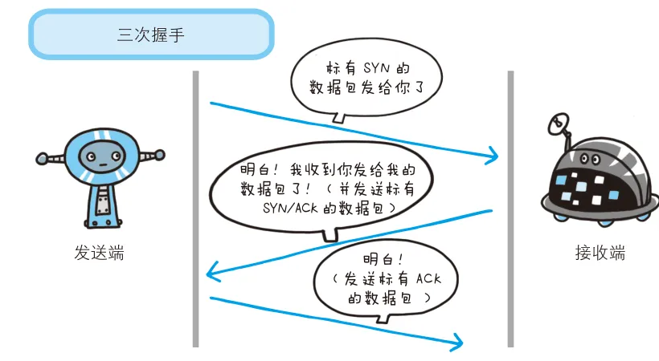

- 客户端–发送带有 SYN 标志的数据包–一次握手–服务端
- 服务端–发送带有 SYN/ACK 标志的数据包–二次握手–客户端
- 客户端–发送带有带有 ACK 标志的数据包–三次握手–服务端

or 可以这样回答🧏‍♂️：

1. 第一次握手🤝：客户端给服务器发送一个 SYN 报文。
2. 第二次握手🤝：服务器收到 SYN 报文之后，会应答一个 SYN+ACK 报文。
3. 第三次握手🤝：客户端收到 SYN+ACK 报文之后，会回应一个 ACK 报文。

服务器收到 ACK 报文之后，三次握手建立完成。

> 强化理解：
>
> A：是B吗？我要跟你通信，听得到我说话吗？
> B：可以通信，你听得到我说话吗？
> A：我也听得到。

> 前提概要：
>
> *FIN（终止 **FINish**）*：该位为 `1` 时，表示今后不会再有数据发送，希望断开连接。当通信结束希望断开连接时，通信双方的主机之间就可以相互交换 `FIN` 位为 1 的 TCP 段。


- 客户端-发送一个 FIN，用来关闭客户端到服务器的数据传送
- 服务器-收到这个 FIN，它发回一个 ACK，确认序号为收到的序号加 1 。和 SYN 一样，一个 FIN 将占用一个序号
- 服务器-关闭与客户端的连接，发送一个 FIN 给客户端
- 客户端-发回 ACK 报文确认，并将确认序号设置为收到序号加 1

> 强化理解：
>
> A：呼叫B，我要跟你断开。
> B：知道了，等一下我还有话没说完
> B：我说完了，可以断开了
> A：好的
>
> ---
>
> A：困了，在干嘛？
> B：在刷视频。
> B：你要睡了吗？
> A：对，晚安。（等她看到消息安心入睡）

##### 极限拓展

可以先观看：[一条视频讲清楚TCP协议与UDP协议-什么是三次握手与四次挥手](https://www.bilibili.com/video/BV1kV411j7hA?vd_source=e300c0e56286b6c321abd6aac8da8682)

> 为什么需要三次握手？两次不行？

* 第一次握手：客户端发送网络包，服务端收到了。这样服务端就能得出结论：客户端的发送能力、服务端的接收能力是正常的。
* 第二次握手：服务端发包，客户端收到了。这样客户端就能得出结论：服务端的接收、发送能力，客户端的接收、发送能力是正常的。不过此时服务器并不能确认客户端的接收能力是否正常。
* 第三次握手：客户端发包，服务端收到了。这样服务端就能得出结论：客户端的接收、发送能力正常，服务器自己的发送、接收能力也正常。

因此，需要三次握手才能确认双方的接收与发送能力是否正常。

另外还有：
- [第一次握手丢失了-会发生什么](https://www.xiaolincoding.com/network/3_tcp/tcp_interview.html#第一次握手丢失了-会发生什么)
- [第二次握手丢失了，会发生什么？](https://www.xiaolincoding.com/network/3_tcp/tcp_interview.html#第二次握手丢失了-会发生什么)
- [第三次握手丢失了，会发生什么？](https://www.xiaolincoding.com/network/3_tcp/tcp_interview.html#第三次握手丢失了-会发生什么)

> 为什么需要四次挥手？三次不行？

可以加入知乎讨论：https://www.zhihu.com/question/50646354

刚开始双方都处于 establised 状态，假如是客户端先发起关闭请求，则：

1. 第一次挥手：客户端发送一个 FIN 报文，报文中会指定一个序列号。此时客户端处于FIN_WAIT1状态。
2. 第二次挥手：服务端收到 FIN 之后，会发送 ACK 报文，且把客户端的序列号值 + 1 作为 ACK 报文的序列号值，表明已经收到客户端的报文了，此时服务端处于 CLOSE_WAIT状态。
3. 第三次挥手：如果服务端也想断开连接了，和客户端的第一次挥手一样，发给 FIN 报文，且指定一个序列号。此时服务端处于 LAST_ACK 的状态。
4. 第四次挥手：客户端收到 FIN 之后，一样发送一个 ACK 报文作为应答，且把服务端的序列号值 + 1 作为自己 ACK 报文的序列号值，此时客户端处于 TIME_WAIT 状态。需要过一阵子以确保服务端收到自己的 ACK 报文之后才会进入 CLOSED 状态
5. 服务端收到 ACK 报文之后，就处于关闭连接了，处于 CLOSED 状态。

另外推荐阅读：
- [第一次挥手丢失了，会发生什么？](https://www.xiaolincoding.com/network/3_tcp/tcp_interview.html#第一次挥手丢失了-会发生什么)
- [第二次挥手丢失了，会发生什么？](https://www.xiaolincoding.com/network/3_tcp/tcp_interview.html#第二次挥手丢失了-会发生什么)
- [第三次挥手丢失了，会发生什么？](https://www.xiaolincoding.com/network/3_tcp/tcp_interview.html#第三次挥手丢失了-会发生什么)
- [第四次挥手丢失了，会发生什么？](https://www.xiaolincoding.com/network/3_tcp/tcp_interview.html#第四次挥手丢失了-会发生什么)

> 为什么第二次挥手和第三次挥手不能像握手一样在同一个包中设置 ACK 和 SYN？

https://stackoverflow.com/questions/46212623/why-tcp-termination-need-4-way-handshake
回答来自：http://www.tcpipguide.com/index.html

在正常情况下，每一方通过发送一个设置了FIN（结束）位的特殊消息来终止其连接的末端。这个消息，有时被称为FIN，作为对另一设备的连接终止请求，同时也可能像普通网段一样携带数据。收到FIN的设备会对FIN进行确认，以表示收到了它。在双方通过发送FIN和接收ACK完成关闭程序之前，整个连接不被认为是终止的。
因此，终止并不像建立那样是一个三方握手：它是一对双向握手。在正常的连接关闭过程中，连接中的两个设备所经历的状态是不同的，因为发起关闭的设备的行为必须与接收终止请求的设备不同。特别是，收到初始终止请求的设备上的TCP必须通知其应用进程，并等待该进程准备继续的信号。发起的设备不需要这样做，因为应用程序是首先开始的。

总结：第二次挥手和第三次挥手不能合并成一个包，因为它们属于不同的状态。但是，如果服务器在从客户端收到 FIN 时没有更多的数据或根本没有要发送的数据，那么可以将第二次挥手和第三次挥手合并到一个包中。

#### 握手的一些细节（全连接队列和半连接队列）

**前言**

服务端代码，对socket执行bind方法可以绑定监听端口，然后执行listen方法后，就会进入监听（LISTEN）状态。内核会为每一个处于LISTEN状态的socket 分配两个队列，分别叫半连接队列和全连接队列。


每个listen Socket都有一个全连接和半连接队列

**半连接队列、全连接队列是什么？**
- 半连接队列（SYN队列）用于存储尚未完成三次握手的连接请求，当收到客户端发送的SYN报文时，服务器会将连接信息存储在半连接队列中，等待客户端发送的第二次握手报文。半连接队列中的连接状态为SYN_RECEIVED。
- 全连接队列（ACCEPT队列）用于存储已经完成三次握手的连接。当服务器收到客户端发送的第三次握手报文后，会将对应的连接从半连接队列移至全连接队列，并将连接状态设为ESTABLISHED。此时，服务器可以调用accept()函数来接收连接，进行数据传输和处理。


**半连接全连接队列的内部结构**

全连接队列是一个链表结构，用来存放已完成三次握手的连接，等待服务端执行accept()来取出连接并进行处理。而半连接队列则是一个哈希表，存放着SYN_RECV状态的连接。通过将半连接队列设计为哈希表，可以在收到第三次握手后快速找到对应的连接，提高效率。


**为什么半连接队列要设计成哈希表**

先对比下全连接里队列，他本质是个链表，因为也是线性结构，说它是个队列也没毛病。它里面放的都是已经建立完成的连接，这些连接正等待被取走。而服务端取走连接的过程中，并不关心具体是哪个连接，只要是个连接就行，所以直接从队列头取就行了。这个过程算法复杂度为O(1)。

而半连接队列却不太一样，因为队列里的都是不完整的连接，嗷嗷等待着第三次握手的到来。那么现在有一个第三次握手来了，则需要从队列里把相应IP端口的连接取出，如果半连接队列还是个链表，那我们就需要依次遍历，才能拿到我们想要的那个连接，算法复杂度就是O(n)。

而如果将半连接队列设计成哈希表，那么查找半连接的算法复杂度就回到O(1)了。

因此出于效率考虑，全连接队列被设计成链表，而半连接队列被设计为哈希表。

**如果全连接队列满了**
如果队列满了,服务端还收到客户端的第三次握手ACK,默认当然会丢弃这个ACK。

但除了丢弃之外,还有一些附带行为,这会受tcp_abort_on_overflow 参数的影响。
```shell
# cat /proc/sys/net/ipv4/tcp_abort_on_overflow  
0 
```

*tcp_abort_on_overflow*设置为 0
- 全连接队列满了之后,会丢弃这个第三次握手ACK包
- 开启定时器,重传第二次握手的SYN+ACK
- 如果重传超过一定限制次数,还会把对应的半连接队列里的连接给删除
- 这种情况下,连接可能会失败,但只会在超过重试次数后断开。

*tcp_abort_on_overflow*设置为 1
- 全连接队列满了之后,就直接发RST给客户端
- 效果上看就是连接断了

这种情况下，连接会被立即拒绝并断开。

这个现象是不是很熟悉，服务端端口未监听时，客户端尝试去连接，服务端也会回一个RST。这两个情况长一样，所以客户端这时候收到RST之后，其实无法区分到底是端口未监听，还是全连接队列满了。

总结：
当tcp_abort_on_overflow=0时，全连接队列满了会重试，可能会导致连接失败，这时客户端收到RST时无法判断原因。
当tcp_abort_on_overflow=1时，全连接队列满了会立即拒绝连接，这时客户端也收到RST，同样无法判断原因。

所以无论tcp_abort_on_overflow参数如何设置，当全连接队列满时，客户端都无法准确判断原因。

**如果半连接队列满了**
一般半连接队列满了会被丢弃，但这个行为可以通过tcp_syncookies参数去控制。更重要的是先理解半连接队列为什么会被打满。

正常情况下，半连接只存在于第一次和第三次握手之间，生存时间很短。如果半连接队列满了，说明服务端疯狂收到大量第一次握手请求，这通常意味着：
- 如果是线上服务,业务火爆到此程度,可以富了
- 更有可能遭遇了SYN Flood攻击


> SYN Flood攻击：SYN Flood攻击原理:攻击者模拟大量客户端第一次握手请求,服务端回复第二次握手后,客户端不发第三次握手。这样可以填满服务端半连接队列,使正常连接无法建立。

解决方法：使用tcp_syncookies可以绕过半连接队列。
当tcp_syncookies=1时：
- 客户端第一次握手，服务端不放入半连接队列，直接生成cookies发回
- 客户端第三次握手包含cookies，服务端验证通过直接建立连接
- 整个连接建立过程不需要半连接队列


*是否有cookies队列？*
如果有cookies队列，依然可以被SYN Flood攻击填满。实际上cookies不保存于队列，而是通过IP、端口、时间戳、MSS等信息实时计算，保存在TCP报文序列号字段。

服务端收到第三次握手时通过序列号反算出cookies信息进行验证。

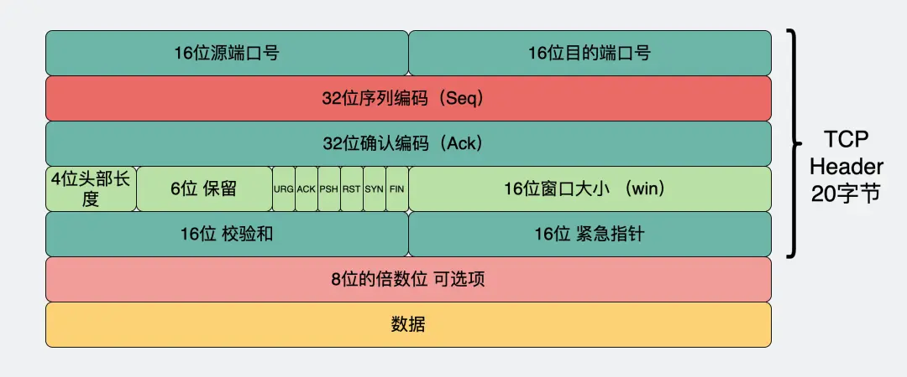

*为何不直接使用cookies替代半连接队列？*
虽然cookies可以防御SYN Flood，但也有缺点：
- 服务端不保存连接信息，数据包丢失时无法重传第二次握手
- cookies编码解码消耗CPU资源，攻击者可以构造大量伪ACK包消耗服务端CPU，这种攻击称为ACK攻击

所以，cookies不会完全替代半连接队列。两者会根据需要共同使用，实现连接的建立与管理。

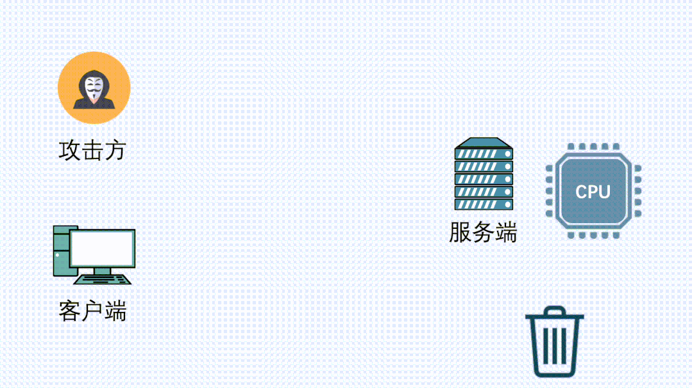

总之，无论设置tcp_syncookies为何值，当半连接队列满时，客户端都无法准确判断原因。这点与全连接队列相同。

**为什么没有listen也能建立连接？**
执行listen方法时，内核为socket创建半连接队列和全连接队列，用于保存连接信息并完成三次握手。

那么，没有执行listen是否就没有队列来保存连接信息了? 不是的，内核还有个全局hash表用于保存所有socket的连接信息，包含：
- ehash - 用于保存已建立连接的socket信息
- bhash - 用于socket绑定到某地址后的socket信息
- listen_hash - 用于保存执行了listen的socket信息

在TCP自连接或同时打开的情况下，客户端在执行connect方法时，会将socket信息保存到全局hash表。然后发出连接请求，该请求会被回环接口接收，根据IP和端口再从全局hash表中取出连接信息，完成三次握手。

所以，尽管没有执行listen，但由于全局hash表的存在，连接信息得以保存，三次握手得以完成，连接得以建立。

**客户端是否有半连接队列?**
没有，因为半连接队列是在执行listen时内核自动创建的。客户端没有执行listen，所以没有半连接队列。

总结
- 执行listen会创建半连接队列和全连接队列，用于三次握手和保存连接信息
- 内核的全局hash表也可以保存连接信息，用于没有listen的情况下完成三次握手
- 所以，无论是否执行listen，连接信息总有地方保存，这使得连接得以建立

### CLOSE_WAIT的作用

远程 TCP 对等方（另一端的计算机或服务器）已经发送了一个 FIN 包，要求关闭连接。这意味着对等方已经完成了数据的发送。本地应用程序一旦接收到这个信号，就会进入 `CLOSE_WAIT` 状态。

在此状态下，计算机正在等待本地应用程序关闭套接字连接。也就是说，这是一种“半关闭”的状态，其中远程对等方已经完成了数据的发送，但本地应用程序还未关闭连接。本地应用程序可能仍然需要发送一些数据，或者它可能只是需要一些时间来确认它已经接收到了所有的数据。

当本地应用程序完成所有的数据发送，并准备好关闭连接时，它会发送一个 FIN 包给远程对等方，并进入 `LAST_ACK` 状态。然后，它就会关闭连接，并从 `CLOSE_WAIT` 状态转移到 `CLOSED` 状态。


### 服务器出现大量 CLOSE_WAIT 状态的原因有哪些？

CLOSE_WAIT 状态是「被动关闭方」才会有的状态，而且如果「被动关闭方」没有调用 close 函数关闭连接，那么就无法发出 FIN 报文，从而无法使得 CLOSE_WAIT 状态的连接转变为 LAST_ACK 状态。

所以，**当服务端出现大量 CLOSE_WAIT 状态的连接的时候，说明服务端的程序没有调用 close 函数关闭连接**。

那什么情况会导致服务端的程序没有调用 close 函数关闭连接？这时候通常需要排查代码。

我们先来分析一个普通的 TCP 服务端的流程：

1. 创建服务端 socket，bind 绑定端口、listen 监听端口
2. 将服务端 socket 注册到 epoll
3. epoll_wait 等待连接到来，连接到来时，调用 accpet 获取已连接的 socket
4. 将已连接的 socket 注册到 epoll
5. epoll_wait 等待事件发生
6. 对方连接关闭时，我方调用 close

可能导致服务端没有调用 close 函数的原因，如下。

**第一个原因**：第 2 步没有做，没有将服务端 socket 注册到 epoll，这样有新连接到来时，服务端没办法感知这个事件，也就无法获取到已连接的 socket，那服务端自然就没机会对 socket 调用 close 函数了。

不过这种原因发生的概率比较小，这种属于明显的代码逻辑 bug，在前期 read view 阶段就能发现的了。

**第二个原因**： 第 3 步没有做，有新连接到来时没有调用 accpet 获取该连接的 socket，导致当有大量的客户端主动断开了连接，而服务端没机会对这些 socket 调用 close 函数，从而导致服务端出现大量 CLOSE_WAIT 状态的连接。

发生这种情况可能是因为服务端在执行 accpet 函数之前，代码卡在某一个逻辑或者提前抛出了异常。

**第三个原因**：第 4 步没有做，通过 accpet 获取已连接的 socket 后，没有将其注册到 epoll，导致后续收到 FIN 报文的时候，服务端没办法感知这个事件，那服务端就没机会调用 close 函数了。

发生这种情况可能是因为服务端在将已连接的 socket 注册到 epoll 之前，代码卡在某一个逻辑或者提前抛出了异常。之前看到过别人解决 close_wait 问题的实践文章，感兴趣的可以看看：[一次 Netty 代码不健壮导致的大量 CLOSE_WAIT 连接原因分析(opens new window)](https://mp.weixin.qq.com/s?__biz=MzU3Njk0MTc3Ng==&mid=2247486020&idx=1&sn=f7cf41aec28e2e10a46228a64b1c0a5c&scene=21#wechat_redirect)

**第四个原因**：第 6 步没有做，当发现客户端关闭连接后，服务端没有执行 close 函数，可能是因为代码漏处理，或者是在执行 close 函数之前，代码卡在某一个逻辑，比如发生死锁等等。

可以发现，**当服务端出现大量 CLOSE_WAIT 状态的连接的时候，通常都是代码的问题，这时候我们需要针对具体的代码一步一步的进行排查和定位，主要分析的方向就是服务端为什么没有调用 close**。


### TIME_WAIT的作用


TCP连接中的TIME_WAIT状态是一个重要的状态，它有几个作用：

1. **确保最后的ACK被接收**：当TCP连接被关闭时，主动关闭方会发送一个FIN包，被动关闭方会回应一个ACK包，然后也发送一个FIN包，最后主动关闭方再回应一个ACK包。TIME_WAIT状态确保主动关闭方的最后一个ACK包被接收。如果这个ACK丢失，被动关闭方会重新发送FIN包，主动关闭方在TIME_WAIT状态就能重新发送ACK。
2. **让重复的FIN包消逝**：TIME_WAIT状态能持续足够长的时间（一般是4分钟），让网络中可能存在的重复的FIN包消逝。
3. **避免旧的数据包在新的连接中出现**：如果立即关闭后再打开一个相同的TCP连接，那么之前连接留下的数据可能会被误认为是新连接的数据，这会引发错误。TIME_WAIT状态能防止这种情况发生，因为在这个状态期间，相同的TCP连接不能被打开。

Or 观看[为什么需要 TIME_WAIT 状态](https://xiaolincoding.com/network/3_tcp/tcp_interview.html#%E4%B8%BA%E4%BB%80%E4%B9%88%E9%9C%80%E8%A6%81-time-wait-%E7%8A%B6%E6%80%81)

> 参考：
> 1. https://www.baeldung.com/linux/close-socket-time_wait
> 2. https://www.sobyte.net/post/2021-12/whys-the-design-tcp-time-wait/

### 大量TIME_WAIT出现是可能是什么原因导致的？如何解决？
大量的TIME_WAIT状态出现可能是由于以下几种原因：

1. **高并发或高频率的TCP连接**：如果应用程序频繁地创建和关闭连接，比如某些HTTP请求，可能导致大量的TIME_WAIT状态。
2. **TCP连接过早关闭**：如果服务器过早地关闭了连接，例如立即关闭了接收到请求后的连接，那么服务器就可能进入TIME_WAIT状态。

解决：
- 减小TIME_WAIT的时长：可以调整系统参数，减小TIME_WAIT的时长，但这也可能影响TCP的稳定性。
- 启用TCP端口复用（SO_REUSEADDR和SO_REUSEPORT）：SO_REUSEADDR可以让你在TIME_WAIT状态下绑定相同的端口，SO_REUSEPORT可以让你在已经打开的端口上启动多个监听。这两个选项都能在某种程度上解决TIME_WAIT导致的端口耗尽问题。
- 优化应用程序的连接管理：如果可能，避免频繁创建和关闭连接。例如，对于HTTP请求，可以使用长连接（Keep-Alive）代替短连接。对于数据库连接，可以使用连接池。


### HTTP2 相对于 HTTP1 有什么不同？

这个属于2023年秋季招聘比较热门的大厂的问题了。主要新增了以下概念：

- 二进制协议：与HTTP/1.1使用的文本协议相比，二进制协议消耗的带宽更少，解析效率更高，出错率更低。此外，它们可以更好地处理空格、大写和行尾等元素。
- 多路复用+流：HTTP/2是多路复用的，即它可以通过单个传输控制协议并行发起多个请求。因此，包含多个元素的网页通过一个传输控制协议传递。这些功能解决了HTTP/1.1中的行头阻塞问题，即行前面的数据包阻止其他数据包被传输。且多个流可以在同一TCP连接上并发传输，解决了HTTP/1.1的队头阻塞问题
- 头部压缩：通过静态表和动态表索引重复字段，同时采用Huffman编码等方式 compression，可以压缩50%至90%的头部体积
- 服务端推送：HTTP/2允许服务器主动推送客户端可能需要的资源，如CSS、JS等,大大提高传递效率


> 参考：
>
> 1. [HTTP/2 牛逼在哪？](https://xiaolincoding.com/network/2_http/http2.html)
> 2. [Introduction to HTTP/2](https://web.dev/performance-http2/)
> 3. [HTTP/1.1 vs HTTP/2: What's the Difference?](https://www.digitalocean.com/community/tutorials/http-1-1-vs-http-2-what-s-the-difference)
> 4. [HTTP/2](https://www.imperva.com/learn/performance/http2/)


### HTTP3 前瞻：释放QUIC的力量

#### 序言

HTTP/2已经做出很多与传输层耦合的设计，直接运行在QUIC上效率不高，存在功能重复。

此外，HTTP/2本身仍依赖于不断进行改进的TCP，任何TCP级别问题都会影响HTTP/2。

> HTTP2：TCP限制了哥们的性能啦！💢


#### 无队头阻塞

TCP不知道传输的是多个独立资源，它只把所有数据视为一个文件流。所以如果某个包丢失，它会阻塞后续所有流的数据发送，直到丢失包重传成功。这里可以阅读[TCP的重传机制](https://xiaolincoding.com/network/3_tcp/tcp_feature.html#%E9%87%8D%E4%BC%A0%E6%9C%BA%E5%88%B6)

而QUIC不同，它由于支持多个字节流的概念（会针对每个字节流单独进行包丢失检测和重传，只对相关流数据进行阻塞，而非阻塞所有流。这样就避免了TCP层面发生的头阻塞问题）。比如独立的流A、B、C等。如果流B的一个包丢失了，QUIC只会阻塞B流后续包的传输，而不会影响A和C流。所以通过将流作为基本传输单元，结合每个流独立处理重传机制，QUIC具备了TCP没有的能力来在流级别隔离丢包引发的延迟影响，从而实现更高效的网络利用。这就是它如何解决头阻塞的原理。


#### 更快的连接建立

标准QUIC使用TLS 1.3直接来建立会话，而非采用独立的TLS握手。这样QUIC就可以把传输层建立和密钥协商“合二为一”，只需一个RTT即可完成，节省了一个轮询时间。QUIC将TLS 深度集成到自己协议内部，而非像TCP+TLS那样作为独立层。它利用TLS记录来封装QUIC自己定义的帧，直接使用TLS握手机制。


进一步解释：

1. **HTTP/1 和 HTTP/2 协议**: 想象一下，你正在用电话与另一个人通话。先要拨通电话号码（TCP 握手），然后再确认彼此的身份（TLS 握手）。这就像先握手确认连接，再确认安全。
2. **HTTP/3 协议**: 相较之下，HTTP/3 就像有一个智能手机应用，一键就可以打电话并确认身份。这是因为它使用了QUIC协议。
   - **QUIC 协议握手**: 就像告诉对方你的昵称（连接ID），所以你们下次通话时会更快速。
   - **QUIC 内部包含 TLS**: 这意味着它不需要分两步进行连接和身份确认。可以同时做到这两件事，就像一个一键拨号和身份确认的应用。
   - **0-RTT 的效果**: 如果你和同一个人再次通话，不仅可以迅速拨号和确认身份，甚至还可以立即开始交谈，无需等待。


#### 连接迁移

1. QUIC不像TCP那样使用IP地址和端口组成四元组（四元组：源 IP、源端口、目的 IP、目的端口）来“绑定”连接。而是由客户端和服务器各自选择一组连接ID来标记通信终端。
2. 通过连接ID，即使移动设备的网络变化导致IP地址变更，只要保存好上下文信息如连接ID和TLS密钥，QUIC就能恢复原来的连接，无须将连接从头再建立。
3. 这使得QUIC连接可以在不同网络之间迁移而不会因为地址变化导致中断，客户端端口感知不到任何卡顿现象。
4. 利用连接ID替代四元组，QUIC从协议层面解决了TCP在动态网络下(如手机wifi与移动数据间切换)连接易中断的问题，实现了真正意义上的连接迁移能力。


#### 其他特性

1. 支持零轮次传输。QUIC可以在TLS握手成功后立即发送数据，避免额外等待一个RTT的时间。
1. 深入加密。QUIC不仅对数据进行加密，连头部字段如包编号都进行了加密，增强了隐私保护能力。
1. 流量控制和拥塞控制。QUIC内置了这些机制为不同连接及应用分配带宽，防止个别连接消耗过多网络资源。
1. 错误检测和恢复能力强。QUIC每个字节流独立处理丢包，只针对相关流进行重传，而不是像TCP那样拖累所有流。
1. 支持多路径传输。理论上QUIC允许同一连接在WiFi和手机网络之间切换，实现网络聚合。
1. 更好的适应性。QUIC作为用户层协议，更容易适应网络环境和应用需求的变化。


> 参考文章：
>
> 1. [HTTP/3 强势来袭](https://xiaolincoding.com/network/2_http/http3.html#_3-7-http-3-%E5%BC%BA%E5%8A%BF%E6%9D%A5%E8%A2%AD)
> 2. [HTTP/3 From A To Z: Core Concepts](https://www.smashingmagazine.com/2021/08/http3-core-concepts-part1/)
> 3. [A Comprehensive Guide To HTTP/3 And QUIC](https://www.debugbear.com/blog/http3-quic-protocol-guide)


### HTTP 与 HTTPS 有哪些区别？

1. HTTP 是超文本传输协议，信息是明文传输，存在安全风险的问题。HTTPS 则解决 HTTP 不安全的缺陷，在 TCP 和 HTTP 网络层之间加入了 SSL/TLS 安全协议，使得报文能够加密传输。
2. HTTP 连接建立相对简单， TCP 三次握手之后便可进行 HTTP 的报文传输。而 HTTPS 在 TCP 三次握手之后，还需进行 SSL/TLS 的握手过程，才可进入加密报文传输。
3. HTTP 的端口号是 80，HTTPS 的端口号是 443。
4. HTTPS 协议需要向 CA（证书权威机构）申请数字证书，来保证服务器的身份是可信的。


### HTTPS 是如何建立连接的？其间交互了什么？

SSL/TLS 协议基本流程：

- 客户端向服务器索要并验证服务器的公钥。
- 双方协商生产「会话秘钥」。
- 双方采用「会话秘钥」进行加密通信。

前两步也就是 SSL/TLS 的建立过程，也就是 TLS 握手阶段。

SSL/TLS 的「握手阶段」涉及**四次**通信，基于 RSA 握手过程的 HTTPS见下图：

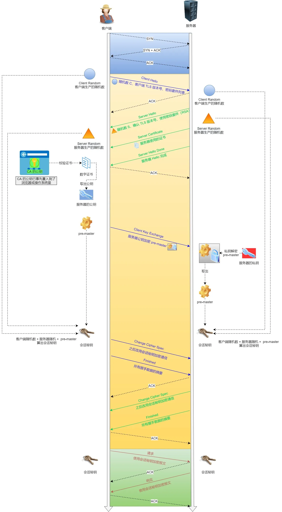

SSL/TLS 协议建立的详细流程：

*1. ClientHello*

首先，由客户端向服务器发起加密通信请求，也就是 `ClientHello` 请求。

在这一步，客户端主要向服务器发送以下信息：

（1）客户端支持的 SSL/TLS 协议版本，如 TLS 1.2 版本。

（2）客户端生产的随机数（`Client Random`），后面用于生成「会话秘钥」条件之一。

（3）客户端支持的密码套件列表，如 RSA 加密算法。

*2. SeverHello*

服务器收到客户端请求后，向客户端发出响应，也就是 `SeverHello`。服务器回应的内容有如下内容：

（1）确认 SSL/ TLS 协议版本，如果浏览器不支持，则关闭加密通信。

（2）服务器生产的随机数（`Server Random`），也是后面用于生产「会话秘钥」条件之一。

（3）确认的密码套件列表，如 RSA 加密算法。

（4）服务器的数字证书。

*3.客户端回应*

客户端收到服务器的回应之后，首先通过浏览器或者操作系统中的 CA 公钥，确认服务器的数字证书的真实性。

如果证书没有问题，客户端会**从数字证书中取出服务器的公钥**，然后使用它加密报文，向服务器发送如下信息：

（1）一个随机数（`pre-master key`）。该随机数会被服务器公钥加密。

（2）加密通信算法改变通知，表示随后的信息都将用「会话秘钥」加密通信。

（3）客户端握手结束通知，表示客户端的握手阶段已经结束。这一项同时把之前所有内容的发生的数据做个摘要，用来供服务端校验。

上面第一项的随机数是整个握手阶段的第三个随机数，会发给服务端，所以这个随机数客户端和服务端都是一样的。

**服务器和客户端有了这三个随机数（Client Random、Server Random、pre-master key），接着就用双方协商的加密算法，各自生成本次通信的「会话秘钥」**。

*4. 服务器的最后回应*

服务器收到客户端的第三个随机数（`pre-master key`）之后，通过协商的加密算法，计算出本次通信的「会话秘钥」。

然后，向客户端发送最后的信息：

（1）加密通信算法改变通知，表示随后的信息都将用「会话秘钥」加密通信。

（2）服务器握手结束通知，表示服务器的握手阶段已经结束。这一项同时把之前所有内容的发生的数据做个摘要，用来供客户端校验。

至此，整个 SSL/TLS 的握手阶段全部结束。接下来，客户端与服务器进入加密通信，就完全是使用普通的 HTTP 协议，只不过用「会话秘钥」加密内容。

> 客户端校验数字证书的流程是怎样的？

接下来，详细说一下实际中数字证书签发和验证流程。

如下图图所示，为数字证书签发和验证流程：


CA 签发证书的过程，如上图左边部分：

- 首先 CA 会把持有者的公钥、用途、颁发者、有效时间等信息打成一个包，然后对这些信息进行 Hash 计算，得到一个 Hash 值；
- 然后 CA 会使用自己的私钥将该 Hash 值加密，生成 Certificate Signature，也就是 CA 对证书做了签名；
- 最后将 Certificate Signature 添加在文件证书上，形成数字证书；

客户端校验服务端的数字证书的过程，如上图右边部分：

- 首先客户端会使用同样的 Hash 算法获取该证书的 Hash 值 H1；
- 通常浏览器和操作系统中集成了 CA 的公钥信息，浏览器收到证书后可以使用 CA 的公钥解密 Certificate Signature 内容，得到一个 Hash 值 H2 ；
- 最后比较 H1 和 H2，如果值相同，则为可信赖的证书，否则则认为证书不可信。

但事实上，证书的验证过程中**还存在一个证书信任链的问题**，因为我们向 CA 申请的证书一般不是根证书签发的，而是由中间证书签发的，比如百度的证书，从下图你可以看到，证书的层级有三级：

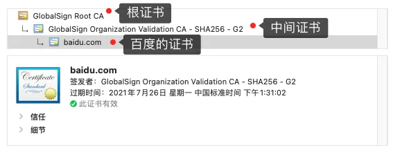

对于这种三级层级关系的证书的验证过程如下：

- 客户端收到 baidu.com 的证书后，发现这个证书的签发者不是根证书，就无法根据本地已有的根证书中的公钥去验证 baidu.com 证书是否可信。于是，客户端根据 baidu.com 证书中的签发者，找到该证书的颁发机构是 “GlobalSign Organization Validation CA - SHA256 - G2”，然后向 CA 请求该中间证书。
- 请求到证书后发现 “GlobalSign Organization Validation CA - SHA256 - G2” 证书是由 “GlobalSign Root CA” 签发的，由于 “GlobalSign Root CA” 没有再上级签发机构，说明它是根证书，也就是自签证书。应用软件会检查此证书有否已预载于根证书清单上，如果有，则可以利用根证书中的公钥去验证 “GlobalSign Organization Validation CA - SHA256 - G2” 证书，如果发现验证通过，就认为该中间证书是可信的。
- “GlobalSign Organization Validation CA - SHA256 - G2” 证书被信任后，可以使用 “GlobalSign Organization Validation CA - SHA256 - G2” 证书中的公钥去验证 baidu.com 证书的可信性，如果验证通过，就可以信任 baidu.com 证书。

在这四个步骤中，最开始客户端只信任根证书 GlobalSign Root CA 证书的，然后 “GlobalSign Root CA” 证书信任 “GlobalSign Organization Validation CA - SHA256 - G2” 证书，而 “GlobalSign Organization Validation CA - SHA256 - G2” 证书又信任 baidu.com 证书，于是客户端也信任 baidu.com 证书。

总括来说，由于用户信任 GlobalSign，所以由 GlobalSign 所担保的 baidu.com 可以被信任，另外由于用户信任操作系统或浏览器的软件商，所以由软件商预载了根证书的 GlobalSign 都可被信任。


操作系统里一般都会内置一些根证书，比如我的 MAC 电脑里内置的根证书有这么多：

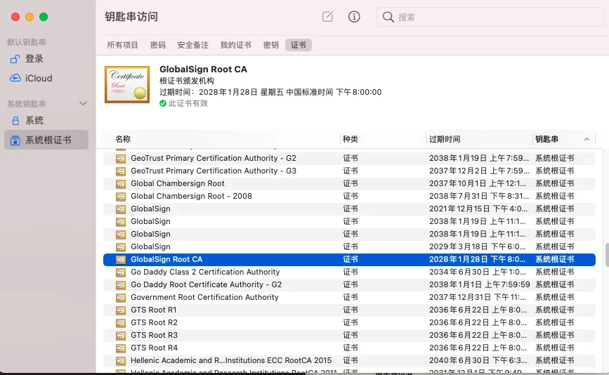

这样的一层层地验证就构成了一条信任链路，整个证书信任链验证流程如下图所示：


最后一个问题，为什么需要证书链这么麻烦的流程？Root CA 为什么不直接颁发证书，而是要搞那么多中间层级呢？

**这是为了确保根证书的绝对安全性，将根证书隔离地越严格越好，不然根证书如果失守了，那么整个信任链都会有问题。**

### TCP, UDP 协议的区别


1. TCP是可靠传输,UDP是不可靠传输;
2. TCP面向连接,UDP无连接;
3. TCP传输数据有序,UDP不保证数据的有序性;
4. TCP不保存数据边界,UDP保留数据边界;
5. TCP传输速度相对UDP较慢;
6. TCP有流量控制和拥塞控制,UDP没有;
7. TCP是重量级协议,UDP是轻量级协议;
8. TCP首部较长20字节,UDP首部较短8字节;

> 扩展：应用场景

TCP应用场景：

效率要求相对低，但对准确性要求相对高的场景。因为传输中需要对数据确认、重发、排序等操作，相比之下效率没有UDP高。举几个例子：文件传输（准确高要求高、但是速度可以相对慢）、接受邮件、远程登录。

UDP应用场景：

效率要求相对高，对准确性要求相对低的场景。举几个例子：QQ聊天、在线视频、网络语音电话（即时通讯，速度要求高，但是出现偶尔断续不是太大问题，并且此处完全不可以使用重发机制）、广播通信（广播、多播）


### TCP 和 UDP 可以同时绑定相同的端口吗？

因为「监听」这个动作是在 TCP 服务端网络编程中才具有的，而 UDP 服务端网络编程中是没有「监听」这个动作的。

TCP 和 UDP 服务端网络相似的一个地方，就是会调用 bind 绑定端口。

给大家贴一下  TCP 和 UDP 网络编程的区别就知道了。

TCP 网络编程如下，服务端执行 listen() 系统调用就是监听端口的动作。


UDP 网络编程如下，服务端是没有监听这个动作的，只有执行  bind()  系统调用来绑定端口的动作。


那么，回归问题：TCP 和 UDP 可以同时绑定相同的端口吗？

答案：**可以的**。

在数据链路层中，通过 MAC 地址来寻找局域网中的主机。在网际层中，通过 IP 地址来寻找网络中互连的主机或路由器。在传输层中，需要通过端口进行寻址，来识别同一计算机中同时通信的不同应用程序。

所以，传输层的「端口号」的作用，是为了区分同一个主机上不同应用程序的数据包。

传输层有两个传输协议分别是 TCP 和 UDP，在内核中是两个完全独立的软件模块。

当主机收到数据包后，可以在 IP 包头的「协议号」字段知道该数据包是 TCP/UDP，所以可以根据这个信息确定送给哪个模块（TCP/UDP）处理，送给 TCP/UDP 模块的报文根据「端口号」确定送给哪个应用程序处理。

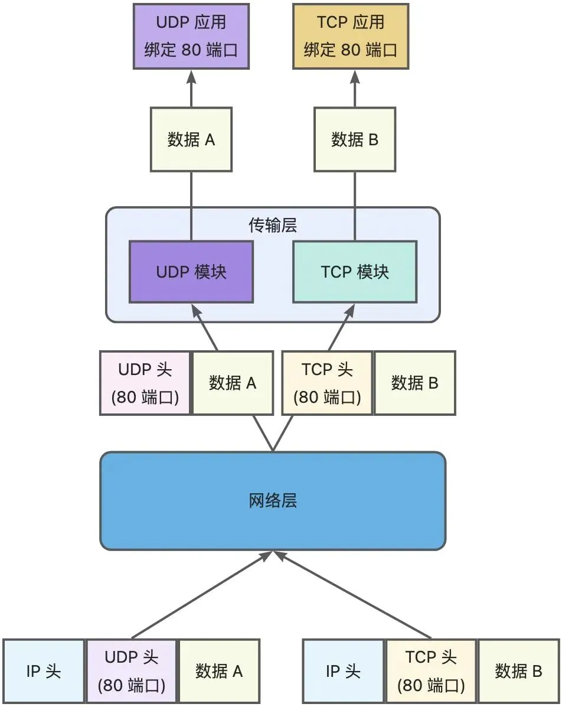

因此， TCP/UDP 各自的端口号也相互独立，如 TCP 有一个 80 号端口，UDP 也可以有一个 80 号端口，二者并不冲突。

> 验证结果

我简单写了 TCP 和 UDP 服务端的程序，它们都绑定同一个端口号 8888。


运行这两个程序后，通过 netstat 命令可以看到，TCP 和 UDP 是可以同时绑定同一个端口号的。


#### 多个 TCP 服务进程可以绑定同一个端口吗？

还是以前面的 TCP 服务端程序作为例子，启动两个同时绑定同一个端口的 TCP 服务进程。

运行第一个  TCP 服务进程之后，netstat 命令可以查看，8888 端口已经被一个 TCP 服务进程绑定并监听了，如下图：


接着，运行第二个 TCP 服务进程的时候，就报错了“Address already in use”，如下图：


我上面的测试案例是两个 TCP 服务进程同时绑定地址和端口是：0.0.0.0 地址和8888端口，所以才出现的错误。

如果两个 TCP 服务进程绑定的 IP 地址不同，而端口相同的话，也是可以绑定成功的，如下图：


所以，默认情况下，针对「多个 TCP 服务进程可以绑定同一个端口吗？」这个问题的答案是：**如果两个 TCP 服务进程同时绑定的 IP 地址和端口都相同，那么执行 bind() 时候就会出错，错误是“Address already in use”**。

注意，如果 TCP 服务进程 A 绑定的地址是  0.0.0.0 和端口 8888，而如果 TCP 服务进程 B 绑定的地址是 192.168.1.100 地址（或者其他地址）和端口 8888，那么执行 bind() 时候也会出错。

这是因为 0.0.0.0  地址比较特殊，代表任意地址，意味着绑定了 0.0.0.0  地址，相当于把主机上的所有 IP 地址都绑定了。

> 重启 TCP 服务进程时，为什么会有“Address in use”的报错信息？

TCP 服务进程需要绑定一个 IP 地址和一个端口，然后就监听在这个地址和端口上，等待客户端连接的到来。

然后在实践中，我们可能会经常碰到一个问题，当 TCP 服务进程重启之后，总是碰到“Address in use”的报错信息，TCP 服务进程不能很快地重启，而是要过一会才能重启成功。

这是为什么呢？

当我们重启 TCP 服务进程的时候，意味着通过服务器端发起了关闭连接操作，于是就会经过四次挥手，而对于主动关闭方，会在 TIME_WAIT 这个状态里停留一段时间，这个时间大约为 2MSL。


**当 TCP 服务进程重启时，服务端会出现 TIME_WAIT 状态的连接，TIME_WAIT 状态的连接使用的 IP+PORT 仍然被认为是一个有效的 IP+PORT 组合，相同机器上不能够在该 IP+PORT 组合上进行绑定，那么执行 bind() 函数的时候，就会返回了 Address already in use 的错误**。

而等 TIME_WAIT 状态的连接结束后，重启 TCP 服务进程就能成功。

> 重启 TCP 服务进程时，如何避免“Address in use”的报错信息？

我们可以在调用 bind 前，对 socket 设置 SO_REUSEADDR 属性，可以解决这个问题。

```c
int on = 1;
setsockopt(listenfd, SOL_SOCKET, SO_REUSEADDR, &on, sizeof(on));
```

因为 SO_REUSEADDR 作用是**：如果当前启动进程绑定的 IP+PORT 与处于TIME_WAIT 状态的连接占用的 IP+PORT 存在冲突，但是新启动的进程使用了 SO_REUSEADDR 选项，那么该进程就可以绑定成功。**

举个例子，服务端有个监听 0.0.0.0 地址和 8888 端口的 TCP 服务进程。


有个客户端（IP地址：192.168.1.100）已经和服务端（IP 地址：172.19.11.200）建立了 TCP 连接，那么在 TCP 服务进程重启时，服务端会与客户端经历四次挥手，服务端的 TCP 连接会短暂处于 TIME_WAIT 状态：

客户端地址:端口      服务端地址:端口    TCP 连接状态
192.168.1.100:37272   172.19.11.200:8888  TIME_WAIT

如果 TCP 服务进程没有对 socket 设置 SO_REUSEADDR 属性，那么在重启时，由于存在一个和绑定 IP+PORT 一样的 TIME_WAIT 状态的连接，那么在执行 bind() 函数的时候，就会返回了 Address already in use 的错误。

如果 TCP 服务进程对 socket 设置 SO_REUSEADDR 属性了，那么在重启时，即使存在一个和绑定 IP+PORT 一样的 TIME_WAIT 状态的连接，依然可以正常绑定成功，因此可以正常重启成功。

因此，在所有 TCP 服务器程序中，调用 bind 之前最好对 socket 设置 SO_REUSEADDR 属性，这不会产生危害，相反，它会帮助我们在很快时间内重启服务端程序。‍

**前面我提到过这个问题：**如果 TCP 服务进程 A 绑定的地址是  0.0.0.0 和端口 8888，而如果 TCP 服务进程 B 绑定的地址是 192.168.1.100 地址（或者其他地址）和端口 8888，那么执行 bind() 时候也会出错。

这个问题也可以由 SO_REUSEADDR 解决，因为它的**另外一个作用是：****绑定的 IP地址 + 端口时，只要 IP 地址不是正好(exactly)相同，那么允许绑定。**

比如，0.0.0.0:8888 和192.168.1.100:8888，虽然逻辑意义上前者包含了后者，但是 0.0.0.0 泛指所有本地 IP，而 192.168.1.100 特指某一IP，两者并不是完全相同，所以在对 socket 设置 SO_REUSEADDR 属性后，那么执行 bind() 时候就会绑定成功。


#### 客户端的端口可以重复使用吗？

客户端在执行 connect 函数的时候，会在内核里随机选择一个端口，然后向服务端发起 SYN 报文，然后与服务端进行三次握手。


所以，客户端的端口选择的发生在 connect 函数，内核在选择端口的时候，会从 `net.ipv4.ip_local_port_range` 这个内核参数指定的范围来选取一个端口作为客户端端口。

该参数的默认值是 32768 61000，意味着端口总可用的数量是 61000 - 32768 = 28232 个。

当客户端与服务端完成 TCP 连接建立后，我们可以通过 netstat 命令查看 TCP 连接。

```sh
$ netstat -napt
协议  源ip地址:端口            目的ip地址：端口         状态
tcp  192.168.110.182.64992   117.147.199.51.443     ESTABLISHED
```

> 那问题来了，上面客户端已经用了 64992 端口，那么还可以继续使用该端口发起连接吗？

这个问题，很多同学都会说不可以继续使用该端口了，如果按这个理解的话， 默认情况下客户端可以选择的端口是 28232 个，那么意味着客户端只能最多建立  28232 个 TCP 连接，如果真是这样的话，那么这个客户端并发连接也太少了吧，所以这是错误理解。

正确的理解是，**TCP 连接是由四元组（源IP地址，源端口，目的IP地址，目的端口）唯一确认的，那么只要四元组中其中一个元素发生了变化，那么就表示不同的 TCP 连接的。所以如果客户端已使用端口 64992 与服务端 A 建立了连接，那么客户端要与服务端 B 建立连接，还是可以使用端口 64992 的，因为内核是通过四元祖信息来定位一个 TCP 连接的，并不会因为客户端的端口号相同，而导致连接冲突的问题。**

比如下面这张图，有 2 个 TCP 连接，左边是客户端，右边是服务端，客户端使用了相同的端口 50004 与两个服务端建立了 TCP 连接。


仔细看，上面这两条 TCP 连接的四元组信息中的「目的 IP 地址」是不同的，一个是 180.101.49.12 ，另外一个是 180.101.49.11。

> 多个客户端可以 bind 同一个端口吗？

bind 函数虽然常用于服务端网络编程中，但是它也是用于客户端的。

前面我们知道，客户端是在调用 connect 函数的时候，由内核随机选取一个端口作为连接的端口。

而如果我们想自己指定连接的端口，就可以用 bind 函数来实现：客户端先通过 bind 函数绑定一个端口，然后调用 connect 函数就会跳过端口选择的过程了，转而使用 bind 时确定的端口。

针对这个问题：多个客户端可以 bind 同一个端口吗？

要看多个客户端绑定的 IP + PORT 是否都相同，如果都是相同的，那么在执行 bind() 时候就会出错，错误是“Address already in use”。

如果一个绑定在 192.168.1.100:6666，一个绑定在 192.168.1.200:6666，因为 IP 不相同，所以执行 bind() 的时候，能正常绑定。

所以， 如果多个客户端同时绑定的 IP 地址和端口都是相同的，那么执行 bind() 时候就会出错，错误是“Address already in use”。

一般而言，客户端不建议使用 bind 函数，应该交由 connect 函数来选择端口会比较好，因为客户端的端口通常都没什么意义。

> 客户端 TCP 连接 TIME_WAIT 状态过多，会导致端口资源耗尽而无法建立新的连接吗？

针对这个问题要看，客户端是否都是与同一个服务器（目标地址和目标端口一样）建立连接。

如果客户端都是与同一个服务器（目标地址和目标端口一样）建立连接，那么如果客户端 TIME_WAIT 状态的连接过多，当端口资源被耗尽，就无法与这个服务器再建立连接了。

但是，**因为只要客户端连接的服务器不同，端口资源可以重复使用的**。

所以，如果客户端都是与不同的服务器建立连接，即使客户端端口资源只有几万个， 客户端发起百万级连接也是没问题的（当然这个过程还会受限于其他资源，比如文件描述符、内存、CPU 等）。

> 如何解决客户端 TCP 连接 TIME_WAIT 过多，导致无法与同一个服务器建立连接的问题？

前面我们提到，如果客户端都是与同一个服务器（目标地址和目标端口一样）建立连接，那么如果客户端 TIME_WAIT 状态的连接过多，当端口资源被耗尽，就无法与这个服务器再建立连接了。

针对这个问题，也是有解决办法的，那就是打开 `net.ipv4.tcp_tw_reuse` 这个内核参数。

**因为开启了这个内核参数后，客户端调用 connect  函数时，如果选择到的端口，已经被相同四元组的连接占用的时候，就会判断该连接是否处于  TIME_WAIT 状态，如果该连接处于 TIME_WAIT 状态并且 TIME_WAIT 状态持续的时间超过了 1 秒，那么就会重用这个连接，然后就可以正常使用该端口了。**

举个例子，假设客户端已经与服务器建立了一个 TCP 连接，并且这个状态处于  TIME_WAIT 状态：

```sh
客户端地址:端口           服务端地址:端口         TCP 连接状态
192.168.1.100:2222      172.19.11.21:8888     TIME_WAIT
```

然后客户端又与该服务器（172.19.11.21:8888）发起了连接，**在调用 connect 函数时，内核刚好选择了 2222 端口，接着发现已经被相同四元组的连接占用了：**

- 如果**没有开启** net.ipv4.tcp_tw_reuse  内核参数，那么内核就会选择下一个端口，然后继续判断，直到找到一个没有被相同四元组的连接使用的端口， 如果端口资源耗尽还是没找到，那么 connect 函数就会返回错误。
- 如果**开启**了 net.ipv4.tcp_tw_reuse  内核参数，就会判断该四元组的连接状态是否处于 TIME_WAIT 状态，**如果连接处于 TIME_WAIT 状态并且该状态持续的时间超过了 1 秒，那么就会重用该连接**，于是就可以使用 2222 端口了，这时 connect 就会返回成功。

再次提醒一次，开启了 net.ipv4.tcp_tw_reuse  内核参数，是客户端（连接发起方） 在调用 connect() 函数时才起作用，所以在服务端开启这个参数是没有效果的。

> 客户端端口选择的流程总结

至此，我们已经把客户端在执行 connect 函数时，内核选择端口的情况大致说了一遍，为了让大家更明白客户端端口的选择过程，我画了一流程图。


#### 总结

> TCP 和 UDP 可以同时绑定相同的端口吗？

可以的。

TCP 和 UDP 传输协议，在内核中是由两个完全独立的软件模块实现的。

当主机收到数据包后，可以在 IP 包头的「协议号」字段知道该数据包是 TCP/UDP，所以可以根据这个信息确定送给哪个模块（TCP/UDP）处理，送给 TCP/UDP 模块的报文根据「端口号」确定送给哪个应用程序处理。

因此， TCP/UDP 各自的端口号也相互独立，互不影响。

> 多个 TCP 服务进程可以同时绑定同一个端口吗？

如果两个 TCP 服务进程同时绑定的 IP 地址和端口都相同，那么执行 bind() 时候就会出错，错误是“Address already in use”。

如果两个 TCP 服务进程绑定的端口都相同，而 IP 地址不同，那么执行 bind() 不会出错。

> 如何解决服务端重启时，报错“Address already in use”的问题？

当我们重启 TCP 服务进程的时候，意味着通过服务器端发起了关闭连接操作，于是就会经过四次挥手，而对于主动关闭方，会在 TIME_WAIT 这个状态里停留一段时间，这个时间大约为 2MSL。

当 TCP 服务进程重启时，服务端会出现 TIME_WAIT 状态的连接，TIME_WAIT 状态的连接使用的 IP+PORT 仍然被认为是一个有效的 IP+PORT 组合，相同机器上不能够在该 IP+PORT 组合上进行绑定，那么执行 bind() 函数的时候，就会返回了 Address already in use 的错误。

要解决这个问题，我们可以对 socket 设置 SO_REUSEADDR 属性。

这样即使存在一个和绑定 IP+PORT 一样的 TIME_WAIT 状态的连接，依然可以正常绑定成功，因此可以正常重启成功。

> 客户端的端口可以重复使用吗？

在客户端执行 connect 函数的时候，只要客户端连接的服务器不是同一个，内核允许端口重复使用。

TCP 连接是由四元组（源IP地址，源端口，目的IP地址，目的端口）唯一确认的，那么只要四元组中其中一个元素发生了变化，那么就表示不同的 TCP 连接的。

所以，如果客户端已使用端口 64992 与服务端 A 建立了连接，那么客户端要与服务端 B 建立连接，还是可以使用端口 64992 的，因为内核是通过四元祖信息来定位一个 TCP 连接的，并不会因为客户端的端口号相同，而导致连接冲突的问题。

> 客户端 TCP 连接 TIME_WAIT 状态过多，会导致端口资源耗尽而无法建立新的连接吗？

要看客户端是否都是与同一个服务器（目标地址和目标端口一样）建立连接。

如果客户端都是与同一个服务器（目标地址和目标端口一样）建立连接，那么如果客户端 TIME_WAIT 状态的连接过多，当端口资源被耗尽，就无法与这个服务器再建立连接了。即使在这种状态下，还是可以与其他服务器建立连接的，只要客户端连接的服务器不是同一个，那么端口是重复使用的。

> 如何解决客户端 TCP 连接 TIME_WAIT 过多，导致无法与同一个服务器建立连接的问题？

打开 net.ipv4.tcp_tw_reuse  这个内核参数。

因为开启了这个内核参数后，客户端调用 connect  函数时，如果选择到的端口，已经被相同四元组的连接占用的时候，就会判断该连接是否处于  TIME_WAIT 状态。

如果该连接处于 TIME_WAIT 状态并且 TIME_WAIT 状态持续的时间超过了 1 秒，那么就会重用这个连接，然后就可以正常使用该端口了。


### HTTP 哪些常用的状态码


`1xx` 类状态码属于**提示信息**，是协议处理中的一种中间状态，实际用到的比较少。

`2xx` 类状态码表示服务器**成功**处理了客户端的请求，也是我们最愿意看到的状态。

- 「**200 OK**」是最常见的成功状态码，表示一切正常。如果是非 `HEAD` 请求，服务器返回的响应头都会有 body 数据。
- 「**204 No Content**」也是常见的成功状态码，与 200 OK 基本相同，但响应头没有 body 数据。
- 「**206 Partial Content**」是应用于 HTTP 分块下载或断点续传，表示响应返回的 body 数据并不是资源的全部，而是其中的一部分，也是服务器处理成功的状态。

`3xx` 类状态码表示客户端请求的资源发生了变动，需要客户端用新的 URL 重新发送请求获取资源，也就是**重定向**。

- 「**301 Moved Permanently**」表示永久重定向，说明请求的资源已经不存在了，需改用新的 URL 再次访问。
- 「**302 Found**」表示临时重定向，说明请求的资源还在，但暂时需要用另一个 URL 来访问。

301 和 302 都会在响应头里使用字段 `Location`，指明后续要跳转的 URL，浏览器会自动重定向新的 URL。

- 「**304 Not Modified**」不具有跳转的含义，表示资源未修改，重定向已存在的缓冲文件，也称缓存重定向，也就是告诉客户端可以继续使用缓存资源，用于缓存控制。

`4xx` 类状态码表示客户端发送的**报文有误**，服务器无法处理，也就是错误码的含义。

- 「**400 Bad Request**」表示客户端请求的报文有错误，但只是个笼统的错误。
- 「**403 Forbidden**」表示服务器禁止访问资源，并不是客户端的请求出错。
- 「**404 Not Found**」表示请求的资源在服务器上不存在或未找到，所以无法提供给客户端。

`5xx` 类状态码表示客户端请求报文正确，但是**服务器处理时内部发生了错误**，属于服务器端的错误码。

- 「**500 Internal Server Error**」与 400 类型，是个笼统通用的错误码，服务器发生了什么错误，我们并不知道。
- 「**501 Not Implemented**」表示客户端请求的功能还不支持，类似“即将开业，敬请期待”的意思。
- 「**502 Bad Gateway**」通常是服务器作为网关或代理时返回的错误码，表示服务器自身工作正常，访问后端服务器发生了错误。
- 「**503 Service Unavailable**」表示服务器当前很忙，暂时无法响应客户端，类似“网络服务正忙，请稍后重试”的意思。


### HTTP如何实现长连接

早期 HTTP/1.0 性能上的一个很大的问题，那就是每发起一个请求，都要新建一次 TCP 连接（三次握手），而且是串行请求，做了无谓的 TCP 连接建立和断开，增加了通信开销。

为了解决上述 TCP 连接问题，HTTP/1.1 提出了**长连接**的通信方式，也叫持久连接。这种方式的好处在于减少了 TCP 连接的重复建立和断开所造成的额外开销，减轻了服务器端的负载。

持久连接的特点是，只要任意一端没有明确提出断开连接，则保持 TCP 连接状态。

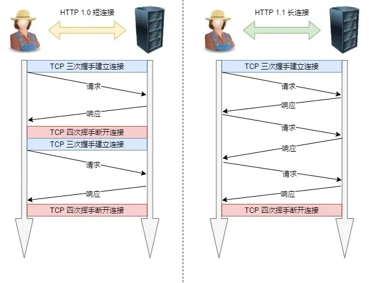

但是**服务器必须按照接收请求的顺序发送对这些管道化请求的响应**。

如果服务端在处理 A 请求时耗时比较长，那么后续的请求的处理都会被阻塞住，这称为「队头堵塞」。

所以，**HTTP/1.1 管道解决了请求的队头阻塞，但是没有解决响应的队头阻塞**。

***注意：实际上 HTTP/1.1 管道化技术不是默认开启，而且浏览器基本都没有支持，所以后面讨论HTTP/1.1 都是建立在没有使用管道化的前提。***


### 交换机和路由器的区别

1. **功能**：
   - 交换机：主要用于连接`同一局域网（LAN）内`的设备，例如计算机、打印机等，并在它们之间传输数据。
   - 路由器：主要用于连接`不同网络`，并在这些网络之间传输数据。
2. **工作层次**：
   - 交换机：在`数据链路层（第2层）`工作。
   - 路由器：在`网络层（第3层）`工作。
3. **地址类型**：
   - 交换机：使用`物理地址（MAC地址）`进行通信。
   - 路由器：使用`逻辑地址（例如IP地址）`进行通信。
4. **数据格式**：
   - 交换机：数据包和数据帧的形式发送数据。
   - 路由器：以数据包的形式发送数据。
5. **传输模式**
   - 交换机：双工传输模式
   - 路由器：双工传输模式


> 参考文献：
>
> 1. [Difference between Router and Switch](https://www.geeksforgeeks.org/difference-between-router-and-switch/)
> 2. [Difference between Router and Switch](https://www.tutorialspoint.com/difference-between-router-and-switch)
> 3. [集线器，交换机和路由器的区别](https://www.youtube.com/watch?v=1z0ULvg_pW8)


### OSI 7层模型每一层都用到什么协议

1. **物理层**：负责在物理媒介上进行数据的传输，常用的标准和协议包括：
   - Ethernet
   - USB
   - Bluetooth
   - 802.11（Wi-Fi）
2. **数据链路层**：负责在两个网络设备之间建立和维护数据链路，常用的协议包括：
   - [Ethernet](https://zh.wikipedia.org/wiki/%E4%BB%A5%E5%A4%AA%E7%BD%91)
   - [PPP (Point-to-Point Protocol)](https://zh.wikipedia.org/wiki/%E7%82%B9%E5%AF%B9%E7%82%B9%E5%8D%8F%E8%AE%AE)
   - [Frame Relay](https://zh.wikipedia.org/wiki/%E5%B8%A7%E4%B8%AD%E7%BB%A7)
3. **网络层**：负责将数据包从源网络转发到目标网络，常用的协议包括：
   - [IP (Internet Protocol)](https://zh.wikipedia.org/wiki/IP%E5%9C%B0%E5%9D%80)
   - [ICMP (Internet Control Message Protocol) 用于告知网络包传送过程中产生的错误以及各种控制信息](https://zh.wikipedia.org/wiki/%E4%BA%92%E8%81%94%E7%BD%91%E6%8E%A7%E5%88%B6%E6%B6%88%E6%81%AF%E5%8D%8F%E8%AE%AE)
   - [IGMP (Internet Group Management Protocol)](https://zh.wikipedia.org/wiki/%E5%9B%A0%E7%89%B9%E7%BD%91%E7%BB%84%E7%AE%A1%E7%90%86%E5%8D%8F%E8%AE%AE)
4. **传输层**：负责在源端和目标端之间提供可靠或者不可靠的数据传输，常用的协议包括：
   - [TCP (Transmission Control Protocol)](https://zh.wikipedia.org/wiki/TCP)
   - [UDP (User Datagram Protocol)](https://zh.wikipedia.org/wiki/%E7%94%A8%E6%88%B7%E6%95%B0%E6%8D%AE%E6%8A%A5%E5%8D%8F%E8%AE%AE)
   - [SCTP (Stream Control Transmission Protocol)](https://zh.wikipedia.org/wiki/%E6%B5%81%E6%8E%A7%E5%88%B6%E4%BC%A0%E8%BE%93%E5%8D%8F%E8%AE%AE)
5. **会话层**：负责在网络设备之间建立、管理和终止会话，它使用的协议不多，而且在现代网络中并不常用。
6. **表示层**：负责数据的编码、解码、加密和解密，它使用的协议也不多，而且在现代网络中大部分功能已经被应用层的协议实现。
7. **应用层**：负责为网络应用提供服务，常用的协议包括：
   - [HTTP (Hypertext Transfer Protocol)](https://zh.wikipedia.org/wiki/%E8%B6%85%E6%96%87%E6%9C%AC%E4%BC%A0%E8%BE%93%E5%8D%8F%E8%AE%AE)
   - [FTP (File Transfer Protocol)](https://zh.wikipedia.org/wiki/%E6%96%87%E4%BB%B6%E4%BC%A0%E8%BE%93%E5%8D%8F%E8%AE%AE)
   - [SMTP (Simple Mail Transfer Protocol)](https://zh.wikipedia.org/wiki/%E7%AE%80%E5%8D%95%E9%82%AE%E4%BB%B6%E4%BC%A0%E8%BE%93%E5%8D%8F%E8%AE%AE)
   - [DNS (Domain Name System)](https://zh.wikipedia.org/wiki/%E5%9F%9F%E5%90%8D%E7%B3%BB%E7%BB%9F)
   - [SNMP (Simple Network Management Protocol)](https://zh.wikipedia.org/wiki/%E7%AE%80%E5%8D%95%E7%BD%91%E7%BB%9C%E7%AE%A1%E7%90%86%E5%8D%8F%E8%AE%AE)


### 什么是粘包？

在进行 Java NIO 学习时，可能会发现：如果客户端连续不断的向服务端发送数据包时，服务端接收的数据会出现两个数据包粘在一起的情况。

1. TCP 是基于字节流的，虽然应用层和 TCP 传输层之间的数据交互是大小不等的数据块，但是 TCP 把这些数据块仅仅看成一连串无结构的字节流，没有边界；
2. 从 TCP 的帧结构也可以看出，在 TCP 的首部没有表示数据长度的字段。

基于上面两点，在使用 TCP 传输数据时，才有粘包或者拆包现象发生的可能。一个数据包中包含了发送端发送的两个数据包的信息，这种现象即为粘包。
接收端收到了两个数据包，但是这两个数据包要么是不完整的，要么就是多出来一块，这种情况即发生了拆包和粘包。拆包和粘包的问题导致接收端在处理的时候会非常困难，因为无法区分一个完整的数据包。

> 强调："粘包"是一个网络编程中常见的现象，它发生在**TCP协议传输层**。由于TCP协议是**基于字节流**的传输，不保证数据的界限，所以在发送方发送多个数据包时，接收方可能会一次性收到多个数据包，这就像把多个数据包粘在一起了，因此得名"粘包"。同样，由于TCP协议的缓冲机制，接收方可能在没有接收到所有数据包的情况下就开始处理部分数据，也可能导致粘包问题。

为什么 TCP 协议有粘包问题

TCP/IP 协议簇建立了互联网中通信协议的概念模型，该协议簇中的两个主要协议就是 TCP 和 IP 协议。TCP/ IP 协议簇中的 TCP  协议能够保证数据段（Segment）的可靠性和顺序，有了可靠的传输层协议之后，应用层协议就可以直接使用 TCP  协议传输数据，不在需要关心数据段的丢失和重复问题

**TCP 协议与应用层协议**如下：


IP 协议解决了数据包（Packet）的路由和传输，上层的 TCP 协议不再关注路由和寻址，那么 TCP 协议解决的是传输的可靠性和顺序问题，上层不需要关心数据能否传输到目标进程，只要写入 TCP 协议的缓冲区的数据，协议栈几乎都能保证数据的送达。

当应用层协议使用 TCP 协议传输数据时，TCP 协议可能会将应用层发送的数据分成多个包依次发送，而数据的接收方收到的数据段可能有多个『应用层数据包』组成，所以当应用层从 TCP 缓冲区中读取数据时发现粘连的数据包时，需要对收到的数据进行拆分。

粘包并不是 TCP 协议造成的，它的出现是因为应用层协议设计者对 TCP 协议的错误理解，忽略了 TCP 协议的定义并且缺乏设计应用层协议的经验。本文将从 TCP 协议以及应用层协议出发，分析我们经常提到的 TCP 协议中的粘包是如何发生的：

- TCP 协议是面向字节流的协议，它可能会组合或者拆分应用层协议的数据；
- 应用层协议的没有定义消息的边界导致数据的接收方无法拼接数据；

很多人可能会认为粘包是一个比较低级的甚至不值得讨论的问题，但是在作者看来这个问题还是很有趣的，不是所有人都系统性地学过基于 TCP 的应用层协议设计，也不是所有人对 TCP  协议都有那么深入的理解，相信很多人学习编程的过程都是自底向上的，所以作者认为这是一个值得回答的问题，我们应该传递正确的知识，而不是负面的和居高临下的情绪。

#### 面向字节流

TCP 协议是面向连接的、可靠的、基于字节流的传输层通信协议[3](https://draveness.me/whys-the-design-tcp-message-frame/#fn:3)，应用层交给 TCP 协议的数据并不会以消息为单位向目的主机传输，这些数据在某些情况下会被组合成一个数据段发送给目标的主机。

Nagle 算法是一种通过减少数据包的方式提高 TCP 传输性能的算法[4](https://draveness.me/whys-the-design-tcp-message-frame/#fn:4)。因为网络 带宽有限，它不会将小的数据块直接发送到目的主机，而是会在本地缓冲区中等待更多待发送的数据，这种批量发送数据的策略虽然会影响实时性和网络延迟，但是能够降低网络拥堵的可能性并减少额外开销。

在早期的互联网中，Telnet 是被广泛使用的应用程序，然而使用 Telnet 会产生大量只有 1 字节负载的有效数据，每个数据包都会有 40 字节的额外开销，带宽的利用率只有 ~2.44%，Nagle 算法就是在当时的这种场景下设计的。

当应用层协议通过 TCP 协议传输数据时，实际上待发送的数据先被写入了 TCP 协议的缓冲区，如果用户开启了 Nagle 算法，那么 TCP  协议可能不会立刻发送写入的数据，它会等待缓冲区中数据超过最大数据段（MSS）或者上一个数据段被 ACK 时才会发送缓冲区中的数据。

**Nagle 算法**如下：


几十年前还会发生网络拥塞的问题，但是今天的网络带宽资源不再像过去那么紧张，在默认情况下，Linux 内核都会使用如下的方式默认关闭 Nagle 算法：

```c
TCP_NODELAY = 1
```

C

Linux 内核中使用如下所示的 [`tcp_nagle_test`](https://github.com/torvalds/linux/blob/bd2463ac7d7ec51d432f23bf0e893fb371a908cd/net/ipv4/tcp_output.c#L1897) 函数测试我们是否应该发送当前的 TCP 数据段，感兴趣的读者可以以这段代码为入口详细了解 Nagle 算法在今天的实现：

```c
static inline bool tcp_nagle_test(const struct tcp_sock *tp, const struct sk_buff *skb,
				  unsigned int cur_mss, int nonagle)
{
	if (nonagle & TCP_NAGLE_PUSH)
		return true;

	if (tcp_urg_mode(tp) || (TCP_SKB_CB(skb)->tcp_flags & TCPHDR_FIN))
		return true;

	if (!tcp_nagle_check(skb->len < cur_mss, tp, nonagle))
		return true;

	return false;
}
```

C

Nagle 算法确实能够在数据包较小时提高网络带宽的利用率并减少 TCP 和 IP  协议头带来的额外开销，但是使用该算法也可能会导致应用层协议多次写入的数据被合并或者拆分发送，当接收方从 TCP  协议栈中读取数据时会发现不相关的数据出现在了同一个数据段中，应用层协议可能没有办法对它们进行拆分和重组。

除了 Nagle 算法之外，TCP 协议栈中还有另一个用于延迟发送数据的选项 `TCP_CORK`，如果我们开启该选项，那么当发送的数据小于 MSS 时，TCP 协议就会延迟 200ms 发送该数据或者等待缓冲区中的数据超过 MSS。

无论是 `TCP_NODELAY` 还是 `TCP_CORK`，它们都会通过延迟发送数据来提高带宽的利用率，它们会对应用层协议写入的数据进行拆分和重组，而这些机制和配置能够出现的最重要原因是 — TCP 协议是基于字节流的协议，其本身没有数据包的概念，不会按照数据包发送数据。

#### 消息边界

如果我们系统性地学习过 TCP 协议以及基于 TCP 的应用层协议设计，那么设计一个能够被 TCP 协议栈任意拆分和组装数据包的应用层协议就不会有什么问题。既然 TCP 协议是基于字节流的，这其实就意味着应用层协议要自己划分消息的边界。

如果我们能在应用层协议中定义消息的边界，那么无论 TCP 协议如何对应用层协议的数据包进程拆分和重组，接收方都能根据协议的规则恢复对应的消息。在应用层协议中，最常见的两种解决方案就是基于长度或者基于终结符（Delimiter）。

**实现消息边界的方法**如下：


基于长度的实现有两种方式，一种是使用固定长度，所有的应用层消息都使用统一的大小，另一种方式是使用不固定长度，但是需要在应用层协议的协议头中增加表示负载长度的字段，这样接收方才可以从字节流中分离出不同的消息，HTTP 协议的消息边界就是基于长度实现的：

```http
HTTP/1.1 200 OK
Content-Type: text/html; charset=UTF-8
Content-Length: 138
...
Connection: close

<html>
  <head>
    <title>An Example Page</title>
  </head>
  <body>
    <p>Hello World, this is a very simple HTML document.</p>
  </body>
</html>
```

HTTP

在上述 HTTP 消息中，我们使用 `Content-Length` 头表示 HTTP 消息的负载大小，当应用层协议解析到足够的字节数后，就能从中分离出完整的 HTTP 消息，无论发送方如何处理对应的数据包，我们都可以遵循这一规则完成 HTTP 消息的重组[6](https://draveness.me/whys-the-design-tcp-message-frame/#fn:6)。

不过 HTTP 协议除了使用基于长度的方式实现边界，也会使用基于终结符的策略，当 HTTP 使用块传输（Chunked Transfer）机制时，HTTP 头中就不再包含 `Content-Length` 了，它会使用负载大小为 0 的 HTTP 消息作为终结符表示消息的边界。

当然除了这两种方式之外，我们可以基于特定的规则实现消息的边界，例如：使用 TCP 协议发送 JSON 数据，接收方可以根据接收到的数据是否能够被解析成合法的 JSON 判断消息是否终结。

#### 总结

TCP 协议粘包问题是因为应用层协议开发者的错误设计导致的，他们忽略了 TCP 协议数据传输的核心机制 —  基于字节流，其本身不包含消息、数据包等概念，所有数据的传输都是流式的，需要应用层协议自己设计消息的边界，即消息帧（Message  Framing），我们重新回顾一下粘包问题出现的核心原因：

1. TCP 协议是基于字节流的传输层协议，其中不存在消息和数据包的概念；
2. 应用层协议没有使用基于长度或者基于终结符的消息边界，导致多个消息的粘连；

网络协议的学习过程非常有趣，不断思考背后的问题能够让我们对定义有更深的认识。到最后，我们还是来看一些比较开放的相关问题，有兴趣的读者可以仔细思考一下下面的问题：

- 基于 UDP 协议的应用层协议应该如何设计？会出现粘包的问题么？
- 有哪些应用层协议使用基于长度的分帧？又有哪些使用基于终结符的分帧？


### 如何解决粘包？

粘包的问题出现是因为不知道一个用户消息的边界在哪，如果知道了边界在哪，接收方就可以通过边界来划分出有效的用户消息。

一般有三种方式分包的方式：

- 固定长度的消息；
- 特殊字符作为边界；
- 自定义消息结构。

#### 固定长度的消息

这种是最简单方法，即每个用户消息都是固定长度的，比如规定一个消息的长度是 64 个字节，当接收方接满 64 个字节，就认为这个内容是一个完整且有效的消息。

但是这种方式灵活性不高，实际中很少用。

#### 特殊字符作为边界

我们可以在两个用户消息之间插入一个特殊的字符串，这样接收方在接收数据时，读到了这个特殊字符，就把认为已经读完一个完整的消息。

HTTP 是一个非常好的例子。


HTTP 通过设置回车符、换行符作为 HTTP 报文协议的边界。

有一点要注意，这个作为边界点的特殊字符，如果刚好消息内容里有这个特殊字符，我们要对这个字符转义，避免被接收方当作消息的边界点而解析到无效的数据

#### 自定义消息结构

我们可以自定义一个消息结构，由包头和数据组成，其中包头包是固定大小的，而且包头里有一个字段来说明紧随其后的数据有多大。

比如这个消息结构体，首先 4 个字节大小的变量来表示数据长度，真正的数据则在后面。

```c
struct { 
    u_int32_t message_length; 
    char message_data[]; 
} message;
```

当接收方接收到包头的大小（比如 4 个字节）后，就解析包头的内容，于是就可以知道数据的长度，然后接下来就继续读取数据，直到读满数据的长度，就可以组装成一个完整到用户消息来处理了。