---

order: 7
author: zhiyu1998
title: Redis
category:
  - Redis
  - 八股文
---

## ♨️ redis

### 说一下redis

简单来说 **Redis 就是一个使用 C 语言开发的数据库**，不过与传统数据库不同的是 **Redis 的数据是存在内存中的** ，也就是它是内存数据库，所以读写速度非常快，因此 Redis 被广泛应用于缓存方向。

另外，**Redis 除了做缓存之外，也经常用来做分布式锁，甚至是消息队列。**

**Redis 提供了多种数据类型来支持不同的业务场景。Redis 还支持事务 、持久化、Lua 脚本、多种集群方案。**

### Redis为什么这么快？

* redis完全**基于内存**,绝大部分请求是纯粹的内存操作,非常快速.
* **数据结构简单**,对数据操作也简单,redis中的数据结构是专门进行设计的
* 采用**单线程模型**, 避免了不必要的上下文切换和竞争条件, 也不存在多线程或者多线程切换而消耗CPU, 不用考虑各种锁的问题, 不存在加锁, 释放锁的操作, 没有因为可能出现死锁而导致性能消耗
* 使用了**多路IO复用模型**,非阻塞IO
* 使用**底层模型不同**，Redis直接自己构建了 VM (虚拟内存)机制 ，因为一般的系统调用系统函数的话，会浪费一定的时间去移动和请求

### 为什么要用 Redis / 为什么要用缓存？/ 为什么用 Redis 作为 MySQL 的缓存？

主要是因为 **Redis 具备「高性能」和「高并发」两种特性**。

主要从两个方面讲：

***1、Redis 具备高性能***

假如用户第一次访问 MySQL 中的某些数据。这个过程会比较慢，因为是从硬盘上读取的。将该用户访问的数据缓存在 Redis 中，这样下一次再访问这些数据的时候就可以直接从缓存中获取了，操作 Redis 缓存就是直接操作内存，所以速度相当快。

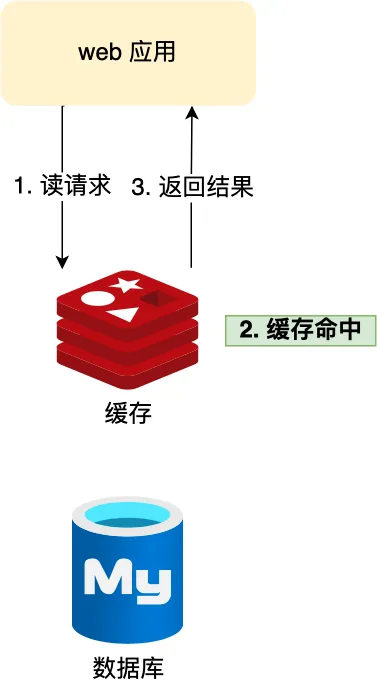

如果 MySQL 中的对应数据改变的之后，同步改变 Redis 缓存中相应的数据即可，不过这里会有 Redis 和 MySQL 双写一致性的问题，后面我们会提到。

***2、 Redis 具备高并发***

单台设备的 Redis 的 QPS（Query Per Second，每秒钟处理完请求的次数） 是 MySQL 的 10 倍，Redis 单机的 QPS 能轻松破 10w，而 MySQL 单机的 QPS 很难破  1w。

所以，直接访问 Redis 能够承受的请求是远远大于直接访问 MySQL 的，所以我们可以考虑把数据库中的部分数据转移到缓存中去，这样用户的一部分请求会直接到缓存这里而不用经过数据库。

### Redis 如何实现服务高可用？

要想设计一个高可用的 Redis 服务，一定要从 Redis 的多服务节点来考虑，比如 Redis 的主从复制、哨兵模式、切片集群。

> 主从复制

主从复制是 Redis 高可用服务的最基础的保证，实现方案就是将从前的一台 Redis 服务器，同步数据到多台从 Redis 服务器上，即一主多从的模式，且主从服务器之间采用的是「读写分离」的方式。

主服务器可以进行读写操作，当发生写操作时自动将写操作同步给从服务器，而从服务器一般是只读，并接受主服务器同步过来写操作命令，然后执行这条命令。


也就是说，所有的数据修改只在主服务器上进行，然后将最新的数据同步给从服务器，这样就使得主从服务器的数据是一致的。

注意，主从服务器之间的命令复制是**异步**进行的。

具体来说，在主从服务器命令传播阶段，主服务器收到新的写命令后，会发送给从服务器。但是，主服务器并不会等到从服务器实际执行完命令后，再把结果返回给客户端，而是主服务器自己在本地执行完命令后，就会向客户端返回结果了。如果从服务器还没有执行主服务器同步过来的命令，主从服务器间的数据就不一致了。

所以，无法实现强一致性保证（主从数据时时刻刻保持一致），数据不一致是难以避免的。

> 哨兵模式

在使用 Redis 主从服务的时候，会有一个问题，就是当 Redis 的主从服务器出现故障宕机时，需要手动进行恢复。

为了解决这个问题，Redis 增加了哨兵模式（**Redis Sentinel**），因为哨兵模式做到了可以监控主从服务器，并且提供**主从节点故障转移的功能。**

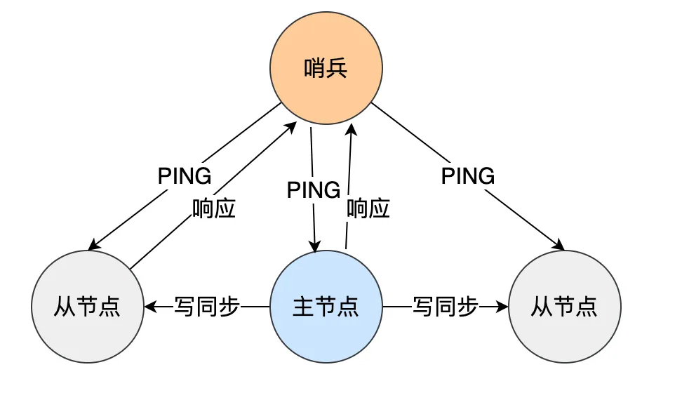

> 切片集群模式

当 Redis 缓存数据量大到一台服务器无法缓存时，就需要使用 **Redis 切片集群**（Redis Cluster ）方案，它将数据分布在不同的服务器上，以此来降低系统对单主节点的依赖，从而提高 Redis 服务的读写性能。

Redis Cluster 方案采用哈希槽（Hash Slot），来处理数据和节点之间的映射关系。在 Redis Cluster 方案中，**一个切片集群共有 16384 个哈希槽**，这些哈希槽类似于数据分区，每个键值对都会根据它的 key，被映射到一个哈希槽中，具体执行过程分为两大步：

- 根据键值对的 key，按照 CRC16 算法计算一个 16 bit 的值。
- 再用 16bit 值对 16384 取模，得到 0~16383 范围内的模数，每个模数代表一个相应编号的哈希槽。

接下来的问题就是，这些哈希槽怎么被映射到具体的 Redis 节点上的呢？有两种方案：

- **平均分配：** 在使用 cluster create 命令创建 Redis 集群时，Redis 会自动把所有哈希槽平均分布到集群节点上。比如集群中有 9 个节点，则每个节点上槽的个数为 16384/9 个。
- **手动分配：** 可以使用 cluster meet 命令手动建立节点间的连接，组成集群，再使用 cluster addslots 命令，指定每个节点上的哈希槽个数。

为了方便你的理解，我通过一张图来解释数据、哈希槽，以及节点三者的映射分布关系。


上图中的切片集群一共有 3 个节点，假设有 4 个哈希槽（Slot 0～Slot 3）时，我们就可以通过命令手动分配哈希槽，比如节点 1 保存哈希槽 0 和 1，节点 2 保存哈希槽 2 和 3。

```c
redis-cli -h 192.168.1.10 –p 6379 cluster addslots 0,1
redis-cli -h 192.168.1.11 –p 6379 cluster addslots 2,3
```

然后在集群运行的过程中，key1 和 key2 计算完 CRC16 值后，对哈希槽总个数 5 进行取模，再根据各自的模数结果，就可以被映射到对应的节点 1 和节点 3 上了。

需要注意的是，在手动分配哈希槽时，需要把 16384 个槽都分配完，否则 Redis 集群无法正常工作。

### Redis 和 Memcached 有什么区别？

很多人都说用 Redis 作为缓存，但是 Memcached 也是基于内存的数据库，为什么不选择它作为缓存呢？要解答这个问题，我们就要弄清楚 Redis 和 Memcached 的区别。 Redis 与 Memcached **共同点**：

1. 都是基于内存的数据库，一般都用来当做缓存使用。
2. 都有过期策略。
3. 两者的性能都非常高。

Redis 与 Memcached **区别**：

- Redis 支持的数据类型更丰富（String、Hash、List、Set、ZSet），而 Memcached 只支持最简单的 key-value 数据类型；
- Redis 支持数据的持久化，可以将内存中的数据保持在磁盘中，重启的时候可以再次加载进行使用，而 Memcached 没有持久化功能，数据全部存在内存之中，Memcached 重启或者挂掉后，数据就没了；
- Redis 原生支持集群模式，Memcached 没有原生的集群模式，需要依靠客户端来实现往集群中分片写入数据；
- Redis 支持发布订阅模型、Lua 脚本、事务等功能，而 Memcached 不支持；

### Redis 除了做缓存，还能做什么？

**分布式锁** ： 通过 Redis 来做分布式锁是一种比较常见的方式。通常情况下，我们都是基于 Redisson 来实现分布式锁。相关阅读：[《分布式锁中的王者方案 - Redisson》](https://mp.weixin.qq.com/s/CbnPRfvq4m1sqo2uKI6qQw)

**限流** ：一般是通过 Redis + Lua 脚本的方式来实现限流。相关阅读：[《我司用了 6 年的 Redis 分布式限流器，可以说是非常厉害了！》](https://mp.weixin.qq.com/s/kyFAWH3mVNJvurQDt4vchA)

**消息队列** ：Redis 自带的 list 数据结构可以作为一个简单的队列使用。Redis 5.0 中增加的 Stream 类型的数据结构更加适合用来做消息队列。它比较类似于 Kafka，有主题和消费组的概念，支持消息持久化以及 ACK 机制。

**复杂业务场景** ：通过 Redis 以及 Redis 扩展（比如 Redisson）提供的数据结构，我们可以很方便地完成很多复杂的业务场景比如通过 bitmap 统计活跃用户、通过 sorted set 维护排行榜。

......

### ⭐基本数据类型、应用场景

> 5种基本数据类型：string、list、hash、set、zset
>
> 推荐阅读：[图解 Redis 数据结构](https://mp.weixin.qq.com/s/qptE172slg_6Tl1yuzdbfw)

#### 1️⃣string

1. **介绍** ：string 数据结构是简单的 key-value 类型。虽然 Redis 是用 C 语言写的，但是 Redis 并没有使用 C 的字符串表示，而是自己构建了一种 **简单动态字符串**（simple dynamic string，**SDS**）。相比于 C 的原生字符串，Redis 的 SDS 不光可以保存文本数据还可以保存二进制数据，并且获取字符串长度复杂度为 O(1)（C 字符串为 O(N)）,除此之外，Redis 的 SDS API 是安全的，不会造成缓冲区溢出。
2. **常用命令：** `set,get,strlen,exists,decr,incr,setex` 等等。
3. **应用场景：** 一般常用在需要**计数**的场景，比如用户的访问次数、热点文章的点赞转发数量；**缓存**，经典使用场景，把常用信息，字符串，图片或者视频等信息放到redis中，redis作为缓存层，mysql做持久化层，降低mysql的读写压力；**session**，常见方案spring session + redis实现session共享等等。

#### 2️⃣list

1. **介绍** ：**list** 即是 **链表**。链表是一种非常常见的数据结构，特点是易于数据元素的插入和删除并且可以灵活调整链表长度，但是链表的随机访问困难。许多高级编程语言都内置了链表的实现比如 Java 中的 **LinkedList**，但是 C 语言并没有实现链表，所以 Redis 实现了自己的链表数据结构。Redis 的 list 的实现为一个 **双向链表**，即可以支持反向查找和遍历，更方便操作，不过带来了部分额外的内存开销。
2. **常用命令:** `rpush,lpop,lpush,rpop,lrange,llen` 等。
3. **应用场景:** 非常适合用于实现队列和栈，以及在特定范围内存储和获取元素，例如消息队列，用户的动态等。

#### 3️⃣hash

1. **介绍** ：hash 类似于 JDK1.8 前的 HashMap，内部实现也差不多(数组 + 链表)。不过，Redis 的 hash 做了更多优化。另外，hash 是一个 string 类型的 field 和 value 的映射表，**特别适合用于存储对象**，后续操作的时候，你可以直接仅仅修改这个对象中的某个字段的值。 比如我们可以 hash 数据结构来存储用户信息，商品信息等等。
2. **常用命令：** `hset,hmset,hexists,hget,hgetall,hkeys,hvals` 等。
3. **应用场景:** 存储和管理对象，比如存储用户的信息，比如用户名，密码，邮箱等。

#### 4️⃣set

1. **介绍 ：** set 类似于 Java 中的 `HashSet`  。Redis 中的 set 类型是一种无序集合，集合中的元素没有先后顺序。当你需要存储一个列表数据，又不希望出现重复数据时，set  是一个很好的选择，并且 set 提供了判断某个成员是否在一个 set 集合内的重要接口，这个也是 list 所不能提供的。可以基于 set  轻易实现交集、并集、差集的操作。比如：你可以将一个用户所有的关注人存在一个集合中，将其所有粉丝存在一个集合。Redis  可以非常方便的实现如共同关注、共同粉丝、共同喜好等功能。这个过程也就是求交集的过程。
2. **常用命令：** `sadd,spop,smembers,sismember,scard,sinterstore,sunion` 等。
3. **应用场景:** Set类型常常被用来处理一些需要快速查找的场景，比如社交网络中的好友关系，标签等。

#### 5️⃣Zset

1. **介绍 ：** 和 set 相比，sorted set 增加了一个权重参数 score，使得集合中的元素能够按 score 进行有序排列，还可以通过 score 的范围来获取元素的列表。有点像是 Java 中 HashMap 和 TreeSet 的结合体。
2. **常用命令：** `ZADD 将一个带有给定分值的成员添加到有序集合里面,ZRANGE 根据元素在有序集合中所处的位置，从有序集合中获取多个元素,ZREM 如果给定元素成员存在于有序集合中，那么就移除这个元素` 等。
3. **应用场景:** **排行榜**   需要对数据根据某个权重进行排序的场景。例如小说视频等网站需要对用户上传的小说视频做排行榜，榜单可以按照用户关注数，更新时间，字数等打分，做排行；在直播系统中，实时排行信息包含直播间在线用户列表；各种礼物**排行榜**，弹幕消息（可以理解为按消息维度的消息排行榜）等信息。
4. 有序集合是通过两种数据结构实现：

Redis在实现有序集合时针对不同的情况采用了不同的数据结构。当**有序集合中的元素数量比较多或者元素的字符串长度较长时，Redis会采用跳表**数据结构来实现有序集合，因为跳表可以提供较快的查找性能。而当有序集合中的**元素数量比较少或者元素的字符串长度较短时，Redis会采用压缩列表**数据结构来实现有序集合，因为压缩列表可以在占用较少内存的情况下存储元素。
   1. **压缩列表(ziplist)**: ziplist是为了提高存储效率而设计的一种特殊编码的双向链表。它可以存储字符串或者整数，存储整数时是采用整数的二进制而不是字符串形式存储。它能在O(1)的时间复杂度下完成list两端的push和pop操作。但是因为每次操作都需要重新分配ziplist的内存，所以实际复杂度和ziplist的内存使用量相关
   2. **跳跃表（zSkiplist)**: 跳跃表的性能可以保证在查找，删除，添加等操作的时候在对数期望时间内完成，这个性能是可以和平衡树来相比较的，而且在实现方面比平衡树要优雅，这是采用跳跃表的主要原因。跳跃表的复杂度是O(log(n))。

> 关于什么时候会用到跳表或者什么时候用到压缩列表官网有介绍：https://redis.io/docs/management/optimization/memory-optimization/
> - Redis中ziplist和zSkiplist有一个阈值，由两个配置参数决定：`zset-max-ziplist-entries`和`zset-max-ziplist-value`
> - 官网给的都不一样，假设使用的Redis7.2，这两个参数的默认值分别为128和64，这意味着如果一个排序集的元素超过128个或任何元素长度超过64字节，它将被转换为跳表
> - 在 Redis 7.0 中，压缩列表数据结构已经废弃了，交由 listpack 数据结构来实现了。

随着 Redis 版本的更新，后面又支持了四种数据类型：BitMap（2.2 版新增）、HyperLogLog（2.8 版新增）、GEO（3.2 版新增）、Stream（5.0 版新增）

#### 特殊类型： bitmap

1. **介绍：** bitmap 存储的是连续的二进制数字（0 和 1），通过 bitmap, 只需要一个 bit 位来表示某个元素对应的值或者状态，key 就是对应元素本身 。我们知道 8 个 bit 可以组成一个 byte，所以 bitmap 本身会极大的节省储存空间。
2. **常用命令：** `setbit` 、`getbit` 、`bitcount`、`bitop`
3. **应用场景：** 适合需要保存状态信息（比如是否签到、是否登录...）并需要进一步对这些信息进行分析的场景。比如用户签到情况、活跃用户情况、用户行为统计（比如是否点赞过某个视频）。

### Redis 单线程模型了解吗？

**Redis 基于 Reactor 模式来设计开发了自己的一套高效的事件处理模型** （Netty 的线程模型也基于 Reactor 模式，Reactor 模式不愧是高性能 IO 的基石），这套事件处理模型对应的是 Redis 中的文件事件处理器（file  event handler）。由于文件事件处理器（file event handler）是单线程方式运行的，所以我们一般都说 Redis  是单线程模型。

**既然是单线程，那怎么监听大量的客户端连接呢？**

Redis 通过**IO 多路复用程序** 来监听来自客户端的大量连接（或者说是监听多个 socket），它会将感兴趣的事件及类型（读、写）注册到内核中并监听每个事件是否发生。

这样的好处非常明显： **I/O 多路复用技术的使用让 Redis 不需要额外创建多余的线程来监听客户端的大量连接，降低了资源的消耗**（和 NIO 中的 `Selector` 组件很像）。

另外， Redis 服务器是一个事件驱动程序，服务器需要处理两类事件：1. 文件事件; 2. 时间事件。

时间事件不需要多花时间了解，我们接触最多的还是 **文件事件**（客户端进行读取写入等操作，涉及一系列网络通信）。

《Redis 设计与实现》有一段话是如是介绍文件事件的，我觉得写得挺不错。

> Redis 基于 Reactor 模式开发了自己的网络事件处理器：这个处理器被称为文件事件处理器（file event  handler）。文件事件处理器使用 I/O  多路复用（multiplexing）程序来同时监听多个套接字，并根据套接字目前执行的任务来为套接字关联不同的事件处理器。
>
> 当被监听的套接字准备好执行连接应答（accept）、读取（read）、写入（write）、关 闭（close）等操作时，与操作相对应的文件事件就会产生，这时文件事件处理器就会调用套接字之前关联好的事件处理器来处理这些事件。
>
> **虽然文件事件处理器以单线程方式运行，但通过使用 I/O 多路复用程序来监听多个套接字**，文件事件处理器既实现了高性能的网络通信模型，又可以很好地与 Redis 服务器中其他同样以单线程方式运行的模块进行对接，这保持了 Redis 内部单线程设计的简单性。

可以看出，文件事件处理器（file event handler）主要是包含 4 个部分：

- 多个 socket（客户端连接）
- IO 多路复用程序（支持多个客户端连接的关键）
- 文件事件分派器（将 socket 关联到相应的事件处理器）
- 事件处理器（连接应答处理器、命令请求处理器、命令回复处理器）


图中的蓝色部分是一个事件循环，是由主线程负责的，可以看到网络 I/O 和命令处理都是单线程。 Redis 初始化的时候，会做下面这几年事情：

- 首先，调用 epoll_create() 创建一个 epoll 对象和调用 socket() 一个服务端 socket
- 然后，调用 bind() 绑定端口和调用 listen() 监听该 socket；
- 然后，将调用 epoll_crt() 将 listen socket 加入到 epoll，同时注册「连接事件」处理函数。

初始化完后，主线程就进入到一个**事件循环函数**，主要会做以下事情：

- 首先，先调用**处理发送队列函数**，看是发送队列里是否有任务，如果有发送任务，则通过 write 函数将客户端发送缓存区里的数据发送出去，如果这一轮数据没有发生完，就会注册写事件处理函数，等待 epoll_wait 发现可写后再处理 。
- 接着，调用 epoll_wait 函数等待事件的到来：
  - 如果是**连接事件**到来，则会调用**连接事件处理函数**，该函数会做这些事情：调用 accpet 获取已连接的 socket ->  调用 epoll_ctr 将已连接的 socket 加入到 epoll -> 注册「读事件」处理函数；
  - 如果是**读事件**到来，则会调用**读事件处理函数**，该函数会做这些事情：调用 read 获取客户端发送的数据 -> 解析命令 -> 处理命令 -> 将客户端对象添加到发送队列 -> 将执行结果写到发送缓存区等待发送；
  - 如果是**写事件**到来，则会调用**写事件处理函数**，该函数会做这些事情：通过 write 函数将客户端发送缓存区里的数据发送出去，如果这一轮数据没有发生完，就会继续注册写事件处理函数，等待 epoll_wait 发现可写后再处理 。

> ⚠️ 提醒：篇幅过长，如果没有耐心建议直接背诵即可
>
> [深入了解Reactor直通车](https://xiaolincoding.com/os/8_network_system/reactor.html#%E5%8D%95-reactor-%E5%8D%95%E8%BF%9B%E7%A8%8B-%E7%BA%BF%E7%A8%8B)
>
> [I/O多路复用直通车](https://mp.weixin.qq.com/s/Qpa0qXxuIM8jrBqDaXmVNA)

### Redis6.0 之后为何引入了多线程？

**Redis6.0 引入多线程主要是为了提高网络 IO 读写性能**，因为这个算是 Redis 中的一个性能瓶颈（Redis 的瓶颈主要受限于内存和网络）。

虽然，Redis6.0 引入了多线程，但是 Redis 的多线程只是在网络数据的读写这类耗时操作上使用了，执行命令仍然是单线程顺序执行。因此，你也不需要担心线程安全问题。

Redis6.0 的多线程默认是禁用的，只使用主线程。如需开启需要修改 redis 配置文件 `redis.conf` ：

```bash
io-threads-do-reads yes
```

开启多线程后，还需要设置线程数，否则是不生效的。同样需要修改 redis 配置文件 `redis.conf` :

```bash
io-threads 4 #官网建议4核的机器建议设置为2或3个线程，8核的建议设置为6个线程
```

### Redis 是如何判断数据是否过期

每当我们对一个 key 设置了过期时间时，Redis  会把该 key 带上过期时间存储到一个**过期字典**（expires dict）中，也就是说「过期字典」保存了数据库中所有 key 的过期时间。

过期字典存储在 redisDb 结构中，如下：

```c
typedef struct redisDb {
    dict *dict;    /* 数据库键空间，存放着所有的键值对 */
    dict *expires; /* 键的过期时间 */
    ....
} redisDb;
```

过期字典数据结构结构如下：

- 过期字典的 key 是一个指针，指向某个键对象；
- 过期字典的 value 是一个 long long 类型的整数，这个整数保存了 key 的过期时间；

过期字典的数据结构如下图所示：


字典实际上是哈希表，哈希表的最大好处就是让我们可以用 O(1) 的时间复杂度来快速查找。当我们查询一个 key 时，Redis 首先检查该 key 是否存在于过期字典中：

- 如果不在，则正常读取键值；
- 如果存在，则会获取该 key 的过期时间，然后与当前系统时间进行比对，如果比系统时间大，那就没有过期，否则判定该 key 已过期。

过期键判断流程如下图所示：

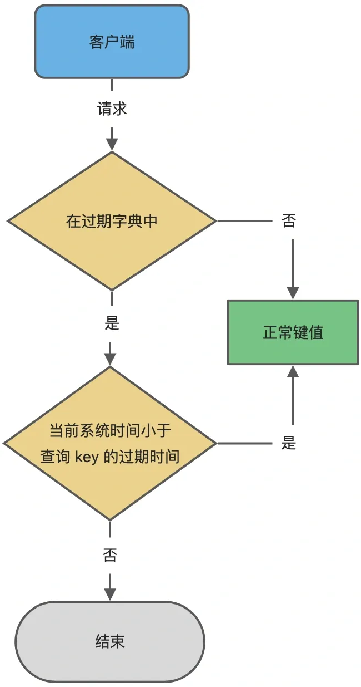

> 拓展：大量 key 集中过期问题

因为导致客户端请求没办法被及时处理，响应速度会比较慢。

如何解决呢？下面是两种常见的方法：

1. 给 key 设置**随机过期时间**。
2. 开启 lazy-free（**惰性删除**/延迟释放） 。lazy-free 特性是 Redis 4.0 开始引入的，指的是让 Redis 采用异步方式延迟释放 key 使用的内存，将该操作交给单独的子线程处理，避免阻塞主线程。

个人建议不管是否开启 lazy-free，我们都尽量给 key 设置随机过期时间。

### 过期的数据的删除策略

常用的过期数据的删除策略就前两个（重要！自己造缓存轮子的时候需要格外考虑的东西）：

> 惰性删除

惰性删除策略的做法是，**不主动删除过期键，每次从数据库访问 key 时，都检测 key 是否过期，如果过期则删除该 key。**

惰性删除策略的**优点**：

- 因为每次访问时，才会检查 key 是否过期，所以此策略只会使用很少的系统资源，因此，惰性删除策略对 CPU 时间最友好。

惰性删除策略的**缺点**：

- 如果一个 key 已经过期，而这个 key 又仍然保留在数据库中，那么只要这个过期 key 一直没有被访问，它所占用的内存就不会释放，造成了一定的内存空间浪费。所以，惰性删除策略对内存不友好。

> 定期删除

定期删除策略的做法是，**每隔一段时间「随机」从数据库中取出一定数量的 key 进行检查，并删除其中的过期key。**

定期删除策略的**优点**：

- 通过限制删除操作执行的时长和频率，来减少删除操作对 CPU 的影响，同时也能删除一部分过期的数据减少了过期键对空间的无效占用。

定期删除策略的**缺点**：

- 内存清理方面没有定时删除效果好，同时没有惰性删除使用的系统资源少。
- 难以确定删除操作执行的时长和频率。如果执行的太频繁，定期删除策略变得和定时删除策略一样，对CPU不友好；如果执行的太少，那又和惰性删除一样了，过期 key 占用的内存不会及时得到释放。

> 定时删除

定时删除策略的做法是，**在设置 key 的过期时间时，同时创建一个定时事件，当时间到达时，由事件处理器自动执行 key 的删除操作。**

定时删除策略的**优点**：

- 可以保证过期 key 会被尽快删除，也就是内存可以被尽快地释放。因此，定时删除对内存是最友好的。

定时删除策略的**缺点**：

- 在过期 key 比较多的情况下，删除过期 key 可能会占用相当一部分 CPU 时间，在内存不紧张但 CPU 时间紧张的情况下，将 CPU  时间用于删除和当前任务无关的过期键上，无疑会对服务器的响应时间和吞吐量造成影响。所以，定时删除策略对 CPU 不友好。

#### Redis 内存满了，会发生什么？

在 Redis 的运行内存达到了某个阀值，就会触发**内存淘汰机制**，这个阀值就是我们设置的最大运行内存，此值在 Redis 的配置文件中可以找到，配置项为 maxmemory。

#### 如何设置过期时间？

先说一下对 key 设置过期时间的命令。 设置 key 过期时间的命令一共有 4 个：

- `expire <key> <n>`：设置 key 在 n 秒后过期，比如 expire key 100 表示设置 key 在 100 秒后过期；
- `pexpire <key> <n>`：设置 key 在 n 毫秒后过期，比如 pexpire key2 100000 表示设置 key2 在 100000 毫秒（100 秒）后过期。
- `expireat <key> <n>`：设置 key 在某个时间戳（精确到秒）之后过期，比如 expireat key3 1655654400 表示 key3 在时间戳 1655654400 后过期（精确到秒）；
- `pexpireat <key> <n>`：设置 key 在某个时间戳（精确到毫秒）之后过期，比如 pexpireat key4 1655654400000 表示 key4 在时间戳 1655654400000 后过期（精确到毫秒）

当然，在设置字符串时，也可以同时对 key 设置过期时间，共有 3 种命令：

- `set <key> <value> ex <n>` ：设置键值对的时候，同时指定过期时间（精确到秒）；
- `set <key> <value> px <n>` ：设置键值对的时候，同时指定过期时间（精确到毫秒）；
- `setex <key> <n> <valule>` ：设置键值对的时候，同时指定过期时间（精确到秒）。

如果你想查看某个 key 剩余的存活时间，可以使用 `TTL <key>` 命令。

```bash
# 设置键值对的时候，同时指定过期时间位 60 秒
> setex key1 60 value1
OK

# 查看 key1 过期时间还剩多少
> ttl key1
(integer) 56
> ttl key1
(integer) 52
```

如果突然反悔，取消 key 的过期时间，则可以使用 `PERSIST <key>` 命令。

```bash
# 取消 key1 的过期时间
> persist key1
(integer) 1

# 使用完 persist 命令之后，
# 查下 key1 的存活时间结果是 -1，表明 key1 永不过期 
> ttl key1 
(integer) -1
```

### Redis 内存淘汰机制

Redis 内存淘汰策略共有八种，这八种策略大体分为「不进行数据淘汰」和「进行数据淘汰」两类策略。

*1、不进行数据淘汰的策略*

**noeviction**（Redis3.0之后，默认的内存淘汰策略） ：它表示当运行内存超过最大设置内存时，不淘汰任何数据，而是不再提供服务，直接返回错误。

*2、进行数据淘汰的策略*

针对「进行数据淘汰」这一类策略，又可以细分为「在设置了过期时间的数据中进行淘汰」和「在所有数据范围内进行淘汰」这两类策略。

在设置了过期时间的数据中进行淘汰：

- **volatile-random**：随机淘汰设置了过期时间的任意键值；
- **volatile-lru**（Redis3.0 之前，默认的内存淘汰策略）：淘汰所有设置了过期时间的键值中，最久未使用的键值；
- **volatile-lfu**（Redis 4.0 后新增的内存淘汰策略）：淘汰所有设置了过期时间的键值中，最少使用的键值；
- **volatile-ttl**：优先淘汰更早过期的键值。

在所有数据范围内进行淘汰：

- **allkeys-random**：随机淘汰任意键值;
- **allkeys-lru**：淘汰整个键值中最久未使用的键值；
- **allkeys-lfu**（Redis 4.0 后新增的内存淘汰策略）：淘汰整个键值中最少使用的键值。

> LRU 算法

**LRU** 全称是 Least Recently Used 翻译为**最近最少使用**，会选择淘汰最近最少使用的数据。

传统 LRU 算法的实现是基于「链表」结构，链表中的元素按照操作顺序从前往后排列，最新操作的键会被移动到表头，当需要内存淘汰时，只需要删除链表尾部的元素即可，因为链表尾部的元素就代表最久未被使用的元素。

Redis 并没有使用这样的方式实现 LRU 算法，因为传统的 LRU 算法存在两个问题：

- 需要用链表管理所有的缓存数据，这会带来额外的空间开销；
- 当有数据被访问时，需要在链表上把该数据移动到头端，如果有大量数据被访问，就会带来很多链表移动操作，会很耗时，进而会降低 Redis 缓存性能。

> Redis 是如何实现 LRU 算法的？

Redis 实现的是一种**近似 LRU 算法**，目的是为了更好的节约内存，它的**实现方式是在 Redis 的对象结构体中添加一个额外的字段，用于记录此数据的最后一次访问时间**。

当 Redis 进行内存淘汰时，会使用**随机采样的方式来淘汰数据**，它是随机取 5 个值（此值可配置），然后**淘汰最久没有使用的那个**。

Redis 实现的 LRU 算法的优点：

- 不用为所有的数据维护一个大链表，节省了空间占用；
- 不用在每次数据访问时都移动链表项，提升了缓存的性能；

但是 LRU 算法有一个问题，**无法解决缓存污染问题**，比如应用一次读取了大量的数据，而这些数据只会被读取这一次，那么这些数据会留存在 Redis 缓存中很长一段时间，造成缓存污染。

因此，在 Redis 4.0 之后引入了 LFU 算法来解决这个问题。

> 什么是 LFU 算法？

LFU 全称是 Least Frequently Used 翻译为**最近最不常用的，**LFU 算法是根据数据访问次数来淘汰数据的，它的核心思想是“如果数据过去被访问多次，那么将来被访问的频率也更高”。

所以， LFU 算法会记录每个数据的访问次数。当一个数据被再次访问时，就会增加该数据的访问次数。这样就解决了偶尔被访问一次之后，数据留存在缓存中很长一段时间的问题，相比于 LRU 算法也更合理一些。

> Redis 是如何实现 LFU 算法的？

LFU 算法相比于  LRU 算法的实现，多记录了「数据的访问频次」的信息。Redis 对象的结构如下：

```c
typedef struct redisObject {
    ...
    
    // 24 bits，用于记录对象的访问信息
    unsigned lru:24;  
    ...
} robj;
```

Redis 对象头中的 lru 字段，在 LRU 算法下和 LFU 算法下使用方式并不相同。

**在 LRU 算法中**，Redis 对象头的 24 bits 的 lru 字段是用来记录 key 的访问时间戳，因此在 LRU 模式下，Redis可以根据对象头中的 lru 字段记录的值，来比较最后一次 key 的访问时间长，从而淘汰最久未被使用的 key。

**在 LFU 算法中**，Redis对象头的 24 bits 的 lru 字段被分成两段来存储，高 16bit 存储 ldt(Last Decrement Time)，低 8bit 存储 logc(Logistic Counter)。


- ldt 是用来记录 key 的访问时间戳；
- logc 是用来记录 key 的访问频次，它的值越小表示使用频率越低，越容易淘汰，每个新加入的 key 的logc 初始值为 5。

注意，logc 并不是单纯的访问次数，而是访问频次（访问频率），因为 **logc  会随时间推移而衰减的**。

在每次 key 被访问时，会先对 logc 做一个衰减操作，衰减的值跟前后访问时间的差距有关系，如果上一次访问的时间与这一次访问的时间差距很大，那么衰减的值就越大，这样实现的 LFU 算法是根据**访问频率**来淘汰数据的，而不只是访问次数。访问频率需要考虑 key 的访问是多长时间段内发生的。key 的先前访问距离当前时间越长，那么这个 key 的访问频率相应地也就会降低，这样被淘汰的概率也会更大。

对 logc 做完衰减操作后，就开始对 logc  进行增加操作，增加操作并不是单纯的 + 1，而是根据概率增加，如果 logc 越大的 key，它的 logc 就越难再增加。

所以，Redis 在访问 key 时，对于 logc  是这样变化的：

1. 先按照上次访问距离当前的时长，来对 logc 进行衰减；
2. 然后，再按照一定概率增加 logc 的值

redis.conf 提供了两个配置项，用于调整 LFU 算法从而控制 logc 的增长和衰减：

- `lfu-decay-time` 用于调整 logc 的衰减速度，它是一个以分钟为单位的数值，默认值为1，lfu-decay-time 值越大，衰减越慢；
- `lfu-log-factor` 用于调整 logc 的增长速度，lfu-log-factor 值越大，logc 增长越慢。

### 如何判定 key 已过期了？

每当我们对一个 key 设置了过期时间时，Redis 会把该 key 带上过期时间存储到一个**过期字典**（expires dict）中，也就是说「过期字典」保存了数据库中所有 key 的过期时间。

过期字典存储在 redisDb 结构中，如下：

```c
typedef struct redisDb {
    dict *dict;    /* 数据库键空间，存放着所有的键值对 */
    dict *expires; /* 键的过期时间 */
    ....
} redisDb;
```

过期字典数据结构结构如下：

- 过期字典的 key 是一个指针，指向某个键对象；
- 过期字典的 value 是一个 long long 类型的整数，这个整数保存了 key 的过期时间；


字典实际上是哈希表，哈希表的最大好处就是让我们可以用 O(1) 的时间复杂度来快速查找。当我们查询一个 key 时，Redis 首先检查该 key 是否存在于过期字典中：

- 如果不在，则正常读取键值；
- 如果存在，则会获取该 key 的过期时间，然后与当前系统时间进行比对，如果比系统时间大，那就没有过期，否则判定该 key 已过期。

### 跳跃表

> 快速向面试官介绍：
>
> 跳跃表是一种可以进行快速查找、插入、删除操作的数据结构。它是一种扩展了有序链表的数据结构，通过在链表上增加多级索引层，以实现快速查找。
>
> 我们可以这样想象跳跃表的构造：首先，我们有一个基础层，这就是一个**有序的链表**。然后，我们在这个基础层上添加一些索引层。每一层的索引节点都是从下一层中随机选择出来的。每一个节点都可能有一个或者多个向右的指针，这些指针指向的是该节点在下一层的节点。
>
> 通过这种方式，我们就可以通过跳过一些不必要的节点，以达到更快的查找速度。在查找一个元素的时候，我们从最顶层的索引开始，如果下一个节点的值比我们要查找的值大，我们就降到下一层继续查找，直到找到我们想要的元素。

#### 概述

Redis的zset（sorted set）是一种将元素按照权重排序的数据类型，它能够将元素进行快速的插入、删除、查找和范围查询。zset内部使用的主要数据结构是跳跃表（Skip List）。

**跳跃表的基本原理**

跳跃表是一种随机化的数据结构，实质就是一种可以进行二分查找的有序链表。跳跃表在原有的有序链表之上增加了多级索引层，通过这种方式，跳跃表对于插入、删除和查找等操作都能达到近乎对数级的时间复杂度，即`O(logN)`。

在跳跃表中，每一个节点包含了两部分内容，一是节点所存储的值，二是一个指向其他节点的指针数组。指针数组的长度是随机生成的，长度为`n`的指针数组就代表这个节点在`n`级索引中都有位置。

**跳跃表的操作**

1. **查找**：查找过程从跳跃表的顶层开始，如果下一个节点的值大于查找的值，就转到当前层的下一个节点继续查找，如果下一个节点的值小于或等于查找的值，就转到下一层继续查找，直到找到相应的值或者查找失败。
2. **插入**：插入过程首先进行查找，找到应该插入的位置，然后随机生成一个高度，根据这个高度更新节点的指针数组，更新过程需要维护跳跃表的有序性。
3. **删除**：删除过程首先进行查找，找到要删除的节点，然后更新所有涉及该节点的指针数组，删除这个节点。


#### 简介

跳跃表（skiplist）是一种随机化的数据结构，由 **William Pugh** 在论文《Skip lists: a probabilistic alternative to balanced trees》中提出，是一种可以与平衡树媲美的层次化链表结构——查找、删除、添加等操作都可以在对数期望时间下完成，以下是一个典型的跳跃表例子：

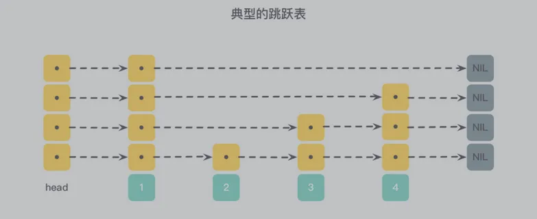

我们在上一篇中提到了 Redis 的五种基本结构中，有一个叫做 **有序列表 zset** 的数据结构，它类似于 Java 中的 **SortedSet** 和 **HashMap** 的结合体，一方面它是一个 set 保证了内部 value 的唯一性，另一方面又可以给每个 value 赋予一个排序的权重值 score，来达到 **排序** 的目的。

它的内部实现就依赖了一种叫做 **「跳跃列表」** 的数据结构。

#### 为什么使用跳跃表

首先，因为 zset 要支持随机的插入和删除，所以它 **不宜使用数组来实现**，关于排序问题，我们也很容易就想到 **红黑树/ 平衡树** 这样的树形结构，为什么 Redis 不使用这样一些结构呢？

1. **性能考虑：** 在高并发的情况下，树形结构需要执行一些类似于 rebalance 这样的可能涉及整棵树的操作，相对来说跳跃表的变化只涉及局部 *(下面详细说)*；
2. **实现考虑：** 在复杂度与红黑树相同的情况下，跳跃表实现起来更简单，看起来也更加直观；

基于以上的一些考虑，Redis 基于 **William Pugh** 的论文做出一些改进后采用了 **跳跃表** 这样的结构。

#### 本质是解决查找问题

我们先来看一个普通的链表结构：


我们需要这个链表按照 score 值进行排序，这也就意味着，当我们需要添加新的元素时，我们需要定位到插入点，这样才可以继续保证链表是有序的，通常我们会使用 **二分查找法**，但二分查找是有序数组的，链表没办法进行位置定位，我们除了遍历整个找到第一个比给定数据大的节点为止 *（时间复杂度 O(n))* 似乎没有更好的办法。

但假如我们每相邻两个节点之间就增加一个指针，让指针指向下一个节点，如下图：


这样所有新增的指针连成了一个新的链表，但它包含的数据却只有原来的一半 *（图中的为 3，11）*。

现在假设我们想要查找数据时，可以根据这条新的链表查找，如果碰到比待查找数据大的节点时，再回到原来的链表中进行查找，比如，我们想要查找 7，查找的路径则是沿着下图中标注出的红色指针所指向的方向进行的：


这是一个略微极端的例子，但我们仍然可以看到，通过新增加的指针查找，我们不再需要与链表上的每一个节点逐一进行比较，这样改进之后需要比较的节点数大概只有原来的一半。

利用同样的方式，我们可以在新产生的链表上，继续为每两个相邻的节点增加一个指针，从而产生第三层链表：


在这个新的三层链表结构中，我们试着 **查找 13**，那么沿着最上层链表首先比较的是 11，发现 11 比 13 小，于是我们就知道只需要到 11 后面继续查找，**从而一下子跳过了 11 前面的所有节点。**

可以想象，当链表足够长，这样的多层链表结构可以帮助我们跳过很多下层节点，从而加快查找的效率。

#### 更进一步的跳跃表

**跳跃表 skiplist** 就是受到这种多层链表结构的启发而设计出来的。按照上面生成链表的方式，上面每一层链表的节点个数，是下面一层的节点个数的一半，这样查找过程就非常类似于一个二分查找，使得查找的时间复杂度可以降低到 *O(logn)*。

但是，这种方法在插入数据的时候有很大的问题。新插入一个节点之后，就会打乱上下相邻两层链表上节点个数严格的 2:1 的对应关系。如果要维持这种对应关系，就必须把新插入的节点后面的所有节点 *（也包括新插入的节点）* 重新进行调整，这会让时间复杂度重新蜕化成 *O(n)*。删除数据也有同样的问题。

**skiplist** 为了避免这一问题，它不要求上下相邻两层链表之间的节点个数有严格的对应关系，而是 **为每个节点随机出一个层数(level)**。比如，一个节点随机出的层数是 3，那么就把它链入到第 1 层到第 3 层这三层链表中。为了表达清楚，下图展示了如何通过一步步的插入操作从而形成一个 skiplist 的过程：


从上面的创建和插入的过程中可以看出，每一个节点的层数（level）是随机出来的，而且新插入一个节点并不会影响到其他节点的层数，因此，**插入操作只需要修改节点前后的指针，而不需要对多个节点都进行调整**，这就降低了插入操作的复杂度。

现在我们假设从我们刚才创建的这个结构中查找 23 这个不存在的数，那么查找路径会如下图：


#### 跳跃表的实现

Redis 中的跳跃表由 `server.h/zskiplistNode` 和 `server.h/zskiplist` 两个结构定义，前者为跳跃表节点，后者则保存了跳跃节点的相关信息，同之前的 `集合 list` 结构类似，其实只有 `zskiplistNode` 就可以实现了，但是引入后者是为了更加方便的操作：

```c
/* ZSETs use a specialized version of Skiplists */
typedef struct zskiplistNode {
    // value
    sds ele;
    // 分值
    double score;
    // 后退指针
    struct zskiplistNode *backward;
    // 层
    struct zskiplistLevel {
        // 前进指针
        struct zskiplistNode *forward;
        // 跨度
        unsigned long span;
    } level[];
} zskiplistNode;

typedef struct zskiplist {
    // 跳跃表头指针
    struct zskiplistNode *header, *tail;
    // 表中节点的数量
    unsigned long length;
    // 表中层数最大的节点的层数
    int level;
} zskiplist;
```

正如文章开头画出来的那张标准的跳跃表那样。

##### 随机层数

对于每一个新插入的节点，都需要调用一个随机算法给它分配一个合理的层数，源码在 `t_zset.c/zslRandomLevel(void)` 中被定义：

```c
int zslRandomLevel(void) {
    int level = 1;
    while ((random()&0xFFFF) < (ZSKIPLIST_P * 0xFFFF))
        level += 1;
    return (level<ZSKIPLIST_MAXLEVEL) ? level : ZSKIPLIST_MAXLEVEL;
}
```

直观上期望的目标是 50% 的概率被分配到 `Level 1`，25% 的概率被分配到 `Level 2`，12.5% 的概率被分配到 `Level 3`，以此类推...有 2-63 的概率被分配到最顶层，因为这里每一层的晋升率都是 50%。

**Redis 跳跃表默认允许最大的层数是 32**，被源码中 `ZSKIPLIST_MAXLEVEL` 定义，当 `Level[0]` 有 264 个元素时，才能达到 32 层，所以定义 32 完全够用了。

##### 创建跳跃表

这个过程比较简单，在源码中的 `t_zset.c/zslCreate` 中被定义：

```c
zskiplist *zslCreate(void) {
    int j;
    zskiplist *zsl;

    // 申请内存空间
    zsl = zmalloc(sizeof(*zsl));
    // 初始化层数为 1
    zsl->level = 1;
    // 初始化长度为 0
    zsl->length = 0;
    // 创建一个层数为 32，分数为 0，没有 value 值的跳跃表头节点
    zsl->header = zslCreateNode(ZSKIPLIST_MAXLEVEL,0,NULL);
  
    // 跳跃表头节点初始化
    for (j = 0; j < ZSKIPLIST_MAXLEVEL; j++) {
        // 将跳跃表头节点的所有前进指针 forward 设置为 NULL
        zsl->header->level[j].forward = NULL;
        // 将跳跃表头节点的所有跨度 span 设置为 0
        zsl->header->level[j].span = 0;
    }
    // 跳跃表头节点的后退指针 backward 置为 NULL
    zsl->header->backward = NULL;
    // 表头指向跳跃表尾节点的指针置为 NULL
    zsl->tail = NULL;
    return zsl;
}
```

即执行完之后创建了如下结构的初始化跳跃表：


##### 插入节点实现

这几乎是最重要的一段代码了，但总体思路也比较清晰简单，如果理解了上面所说的跳跃表的原理，那么很容易理清楚插入节点时发生的几个动作 *（几乎跟链表类似）*：

1. 找到当前我需要插入的位置 *（其中包括相同 score 时的处理）*；
2. 创建新节点，调整前后的指针指向，完成插入；

为了方便阅读，我把源码 `t_zset.c/zslInsert` 定义的插入函数拆成了几个部分

###### 第一部分：声明需要存储的变量

```c
// 存储搜索路径
zskiplistNode *update[ZSKIPLIST_MAXLEVEL], *x;
// 存储经过的节点跨度
unsigned int rank[ZSKIPLIST_MAXLEVEL];
int i, level;
```

###### 第二部分：搜索当前节点插入位置

```c
serverAssert(!isnan(score));
x = zsl->header;
// 逐步降级寻找目标节点，得到 "搜索路径"
for (i = zsl->level-1; i >= 0; i--) {
    /* store rank that is crossed to reach the insert position */
    rank[i] = i == (zsl->level-1) ? 0 : rank[i+1];
    // 如果 score 相等，还需要比较 value 值
    while (x->level[i].forward &&
            (x->level[i].forward->score < score ||
                (x->level[i].forward->score == score &&
                sdscmp(x->level[i].forward->ele,ele) < 0)))
    {
        rank[i] += x->level[i].span;
        x = x->level[i].forward;
    }
    // 记录 "搜索路径"
    update[i] = x;
}
```

**讨论：** 有一种极端的情况，就是跳跃表中的所有 score 值都是一样，zset 的查找性能会不会退化为 O(n) 呢？

从上面的源码中我们可以发现 zset 的排序元素不只是看 score 值，也会比较 value 值 *（字符串比较）*

###### 第三部分：生成插入节点

```c
/* we assume the element is not already inside, since we allow duplicated
 * scores, reinserting the same element should never happen since the
 * caller of zslInsert() should test in the hash table if the element is
 * already inside or not. */
level = zslRandomLevel();
// 如果随机生成的 level 超过了当前最大 level 需要更新跳跃表的信息
if (level > zsl->level) {
    for (i = zsl->level; i < level; i++) {
        rank[i] = 0;
        update[i] = zsl->header;
        update[i]->level[i].span = zsl->length;
    }
    zsl->level = level;
}
// 创建新节点
x = zslCreateNode(level,score,ele);
```

###### 第四部分：重排前向指针

```c
for (i = 0; i < level; i++) {
    x->level[i].forward = update[i]->level[i].forward;
    update[i]->level[i].forward = x;

    /* update span covered by update[i] as x is inserted here */
    x->level[i].span = update[i]->level[i].span - (rank[0] - rank[i]);
    update[i]->level[i].span = (rank[0] - rank[i]) + 1;
}

/* increment span for untouched levels */
for (i = level; i < zsl->level; i++) {
    update[i]->level[i].span++;
}
```

###### 第五部分：重排后向指针并返回

```c
x->backward = (update[0] == zsl->header) ? NULL : update[0];
if (x->level[0].forward)
    x->level[0].forward->backward = x;
else
    zsl->tail = x;
zsl->length++;
return x;
```

##### 节点删除实现

删除过程由源码中的 `t_zset.c/zslDeleteNode` 定义，和插入过程类似，都需要先把这个 **"搜索路径"** 找出来，然后对于每个层的相关节点重排一下前向后向指针，同时还要注意更新一下最高层数 `maxLevel`，直接放源码 *(如果理解了插入这里还是很容易理解的)*：

```c
/* Internal function used by zslDelete, zslDeleteByScore and zslDeleteByRank */
void zslDeleteNode(zskiplist *zsl, zskiplistNode *x, zskiplistNode **update) {
    int i;
    for (i = 0; i < zsl->level; i++) {
        if (update[i]->level[i].forward == x) {
            update[i]->level[i].span += x->level[i].span - 1;
            update[i]->level[i].forward = x->level[i].forward;
        } else {
            update[i]->level[i].span -= 1;
        }
    }
    if (x->level[0].forward) {
        x->level[0].forward->backward = x->backward;
    } else {
        zsl->tail = x->backward;
    }
    while(zsl->level > 1 && zsl->header->level[zsl->level-1].forward == NULL)
        zsl->level--;
    zsl->length--;
}

/* Delete an element with matching score/element from the skiplist.
 * The function returns 1 if the node was found and deleted, otherwise
 * 0 is returned.
 *
 * If 'node' is NULL the deleted node is freed by zslFreeNode(), otherwise
 * it is not freed (but just unlinked) and *node is set to the node pointer,
 * so that it is possible for the caller to reuse the node (including the
 * referenced SDS string at node->ele). */
int zslDelete(zskiplist *zsl, double score, sds ele, zskiplistNode **node) {
    zskiplistNode *update[ZSKIPLIST_MAXLEVEL], *x;
    int i;

    x = zsl->header;
    for (i = zsl->level-1; i >= 0; i--) {
        while (x->level[i].forward &&
                (x->level[i].forward->score < score ||
                    (x->level[i].forward->score == score &&
                     sdscmp(x->level[i].forward->ele,ele) < 0)))
        {
            x = x->level[i].forward;
        }
        update[i] = x;
    }
    /* We may have multiple elements with the same score, what we need
     * is to find the element with both the right score and object. */
    x = x->level[0].forward;
    if (x && score == x->score && sdscmp(x->ele,ele) == 0) {
        zslDeleteNode(zsl, x, update);
        if (!node)
            zslFreeNode(x);
        else
            *node = x;
        return 1;
    }
    return 0; /* not found */
}
```

##### 节点更新实现

当我们调用 `ZADD` 方法时，如果对应的 value 不存在，那就是插入过程，如果这个 value 已经存在，只是调整一下 score 的值，那就需要走一个更新流程。

假设这个新的 score 值并不会带来排序上的变化，那么就不需要调整位置，直接修改元素的 score 值就可以了，但是如果排序位置改变了，那就需要调整位置，该如何调整呢？

从源码 `t_zset.c/zsetAdd` 函数 `1350` 行左右可以看到，Redis 采用了一个非常简单的策略：

```c
/* Remove and re-insert when score changed. */
if (score != curscore) {
    zobj->ptr = zzlDelete(zobj->ptr,eptr);
    zobj->ptr = zzlInsert(zobj->ptr,ele,score);
    *flags |= ZADD_UPDATED;
}
```

**把这个元素删除再插入这个**，需要经过两次路径搜索，从这一点上来看，Redis 的 `ZADD` 代码似乎还有进一步优化的空间。

##### 元素排名的实现

跳跃表本身是有序的，Redis 在 skiplist 的 forward 指针上进行了优化，给每一个 forward 指针都增加了 `span` 属性，用来 **表示从前一个节点沿着当前层的 forward 指针跳到当前这个节点中间会跳过多少个节点**。在上面的源码中我们也可以看到 Redis 在插入、删除操作时都会小心翼翼地更新 `span` 值的大小。

所以，沿着 **"搜索路径"**，把所有经过节点的跨度 `span` 值进行累加就可以算出当前元素的最终 rank 值了：

```c
/* Find the rank for an element by both score and key.
 * Returns 0 when the element cannot be found, rank otherwise.
 * Note that the rank is 1-based due to the span of zsl->header to the
 * first element. */
unsigned long zslGetRank(zskiplist *zsl, double score, sds ele) {
    zskiplistNode *x;
    unsigned long rank = 0;
    int i;

    x = zsl->header;
    for (i = zsl->level-1; i >= 0; i--) {
        while (x->level[i].forward &&
            (x->level[i].forward->score < score ||
                (x->level[i].forward->score == score &&
                sdscmp(x->level[i].forward->ele,ele) <= 0))) {
            // span 累加
            rank += x->level[i].span;
            x = x->level[i].forward;
        }

        /* x might be equal to zsl->header, so test if obj is non-NULL */
        if (x->ele && sdscmp(x->ele,ele) == 0) {
            return rank;
        }
    }
    return 0;
}
```

### Redis为什么选择跳表而不选择使用红黑树？

Redis选择跳表（Skip Lists）而不是红黑树（Red-Black Trees）作为其排序数据结构的实现主要有以下原因：

1. **易于实现**：跳表相比红黑树更容易实现和理解。红黑树的实现涉及到许多复杂的旋转和颜色变换操作，而跳表则只需要简单的指针操作。
2. **高效的搜索和插入操作**：跳表的搜索和插入操作的平均时间复杂度都是O(log n)，与红黑树相同。然而在实践中，跳表的插入操作往往比红黑树更快，因为跳表的结构更为简单，操作的代价更低。
3. **内存使用优化**：虽然跳表的空间复杂度高于红黑树（因为每个节点可能有多个指向其的指针），但Redis的作者发现，在实际应用中，跳表的内存利用效率比红黑树更高。这主要是因为Redis的内存分配器可以更有效地处理跳表的节点分配。
4. **有序性**：跳表是有序的数据结构，这使得在Redis中实现范围查询等操作非常方便。
5. **并发控制**：跳表更适合进行并发控制。在并发环境下，跳表的结构允许多个线程同时对不同的部分进行操作，而红黑树的结构则需要更复杂的同步控制。


### ⭐ 持久化策略（RDB、AOF） / 怎么保证 Redis 挂掉之后再重启数据可以进行恢复

> 概述：
>
> RDB持久化是把当前进程数据生成快照保存到磁盘上的过程; 针对RDB不适合实时持久化的问题，Redis提供了AOF持久化方式来解决.
>
> AOF是“写后”日志，Redis先执行命令，把数据写入内存，然后才记录日志。日志里记录的是Redis收到的每一条命令，这些命令是以文本形式保存。
>
> Redis 4.0 中提出了一个**混合使用 AOF 日志和内存快照**的方法。简单来说，内存快照以一定的频率执行，在两次快照之间，使用 AOF 日志记录这期间的所有命令操作

很多时候我们需要持久化数据也就是将内存中的数据写入到硬盘里面，大部分原因是为了之后重用数据（比如重启机器、机器故障之后恢复数据），或者是为了防止系统故障而将数据备份到一个远程位置。

Redis 不同于 Memcached 的很重要一点就是，Redis 支持持久化，而且支持两种不同的持久化操作。**Redis 的一种持久化方式叫快照（snapshotting，RDB），另一种方式是只追加文件（append-only file, AOF）**。


#### RDB 概述

Redis 可以通过创建快照来获得存储在内存里面的数据在某个时间点上的副本。Redis  创建快照之后，可以对快照进行备份，可以将快照复制到其他服务器从而创建具有相同数据的服务器副本（Redis 主从结构，主要用来提高 Redis  性能），还可以将快照留在原地以便重启服务器的时候使用。

Redis 提供了两个命令来生成 RDB 文件，分别是 `save` 和 `bgsave`，他们的区别就在于是否在「主线程」里执行：

- 执行了 save 命令，就会在主线程生成 RDB 文件，由于和执行操作命令在同一个线程，所以如果写入 RDB 文件的时间太长，**会阻塞主线程**；
- 执行了 bgsave 命令，会创建一个子进程来生成 RDB 文件，这样可以**避免主线程的阻塞**；

快照持久化是 Redis 默认采用的持久化方式，在 `redis.conf` 配置文件中默认有此下配置：

```shell
save 60 1000
```

则在60秒内如果有1000个key发生变化，就会触发一次RDB快照的执行


#### RDB 原理

Redis 在持久化时会调用 glibc 的函数 fork 产生一个子进程（执行 bgsave 命令的时候，会通过 `fork()` 创建子进程，此时子进程和父进程是共享同一片内存数据的，因为创建子进程的时候，会复制父进程的页表，但是页表指向的物理内存还是一个）。子进程做数据持久化，不会修改现有的内存数据结构，它只是对数据结构进行遍历读取，然后序列化写到磁盘中。父进程则持续服务客户端请求，并对内存数据结构进行不间断的修改。这个时候就会使用操作系统的 COW（Copy-On-Write）机制来进行数据段页面的分离。


具体来说，当父进程对数据段中的一个页面进行修改时，被共享的页面会复制一份分离出来，然后对这个复制的页面进行修改，而子进程相应的页面是没有变化的，还是进程产生时那一瞬间的数据。随着父进程修改操作的持续进行，越来越多的共享页面被分离出来，**内存就会持续增长，但不会超过原有数据内存的 2 倍大小**。


另外，Redis 实例里冷数据占的比例往往是比较高的，所以很少会出现所有的页面都被分离的情况，被分离的往往只有其中一部分页面。每个页面的大小只有 4KB，一个 Redis 实例里面一般都会有成千上万个页面。

子进程能看到的内存里的数据在进程产生的一瞬间就凝固了，再也不会改变，这也是为什么 Redis 的持久化叫“快照”的原因。接下来子进程就可以非常安心地遍历数据，进行序列化写磁盘了。

> ⚠️ 注意：bgsave 快照过程中，如果主线程修改了共享数据，**发生了写时复制后，RDB 快照保存的是原本的内存数据**，而主线程刚修改的数据，是没办法在这一时间写入 RDB 文件的，只能交由下一次的 bgsave 快照。
>
> 所以 Redis 在使用 bgsave 快照过程中，如果主线程修改了内存数据，不管是否是共享的内存数据，RDB 快照都无法写入主线程刚修改的数据，因为此时主线程（父进程）的内存数据和子进程的内存数据已经分离了，子进程写入到 RDB 文件的内存数据只能是原本的内存数据。
>
> 如果系统恰好在 RDB 快照文件创建完毕后崩溃了，那么 Redis 将会丢失主线程在快照期间修改的数据。
>
> 另外，写时复制的时候会出现这么个极端的情况。
>
> 在 Redis 执行 RDB 持久化期间，刚 fork 时，主进程和子进程共享同一物理内存，但是途中主进程处理了写操作，修改了共享内存，于是当前被修改的数据的物理内存就会被复制一份。

总结一下：

1. 在 RDB 快照生成过程中，Redis 主进程会执行 bgsave 命令，创建一个子进程来生成 RDB 文件。这个子进程会将 Redis 内存中的数据写入到磁盘中，生成一个快照文件。在生成快照文件期间，主进程可以继续处理客户端的请求（被修改），因为子进程是独立于主进程的。
2. 当主进程需要修改共享数据时，会使用写时复制技术COW，创建一个新的副本，以便主进程可以对副本进行修改，而不会影响子进程正在生成的快照文件中的原始数据。主进程对副本的修改不会影响子进程正在生成的快照文件中的原始数据，因为子进程只会将内存中的原始数据写入到磁盘中，而不会包括主进程对副本的修改。


> 参考：
>
> 1. https://xiaolincoding.com/redis/storage/rdb.html#%E5%BF%AB%E7%85%A7%E6%80%8E%E4%B9%88%E7%94%A8 RDB 快照是怎么实现的？
> 2. 《redis深度历险》- 第二章 持久化


#### AOF 日志


这种保存写操作命令到日志的持久化方式，就是 Redis 里的 AOF(Append Only File) 持久化功能，注意只会记录写操作命令，读操作命令是不会被记录的，因为没意义。

在 Redis 中 AOF 持久化功能默认是不开启的，需要我们修改 redis.conf 配置文件中的以下参数：
```shell
// redis .conf
appendonly yes // 表示是否开启AOF持久化(默认 no，关闭):
“appendonly.aof” // AOF持久化文件的名称
appendfilename
```

AOF 日志文件其实就是普通的文本，我们可以通过 cat 命令查看里面的内容，不过里面的内容如果不知道一定的规则的话，可能会看不懂。

我这里以「set name xiaolin」命令作为例子，Redis 执行了这条命令后，记录在 AOF 日志里的内容如下图：


「\*3」表示当前命令有三个部分，每部分都是以「$+数字」开头，后面紧跟着具体的命令、键或值。然后，这里的「数字」表示这部分中的命令、键或值一共有多少字节。例如，「$3 set」表示这部分有 3 个字节，也就是「set」命令这个字符串的长度。

不知道大家注意到没有，Redis 是先执行写操作命令后，才将该命令记录到 AOF 日志里的，这么做其实有两个好处。

第一个好处，**避免额外的检查开销。**

因为如果先将写操作命令记录到 AOF 日志里，再执行该命令的话，如果当前的命令语法有问题，那么如果不进行命令语法检查，该错误的命令记录到 AOF 日志里后，Redis 在使用日志恢复数据时，就可能会出错。

而如果先执行写操作命令再记录日志的话，只有在该命令执行成功后，才将命令记录到 AOF 日志里，这样就不用额外的检查开销，保证记录在 AOF 日志里的命令都是可执行并且正确的。

第二个好处，**不会阻塞当前写操作命令的执行**，因为当写操作命令执行成功后，才会将命令记录到 AOF 日志。

当然，AOF 持久化功能也不是没有潜在风险。

第一个风险，执行写操作命令和记录日志是两个过程，那当 Redis 在还没来得及将命令写入到硬盘时，服务器发生宕机了，这个数据就会有**丢失的风险**。

第二个风险，前面说道，由于写操作命令执行成功后才记录到 AOF 日志，所以不会阻塞当前写操作命令的执行，但是**可能会给「下一个」命令带来阻塞风险**。

因为将命令写入到日志的这个操作也是在主进程完成的（执行命令也是在主进程），也就是说这两个操作是同步的。

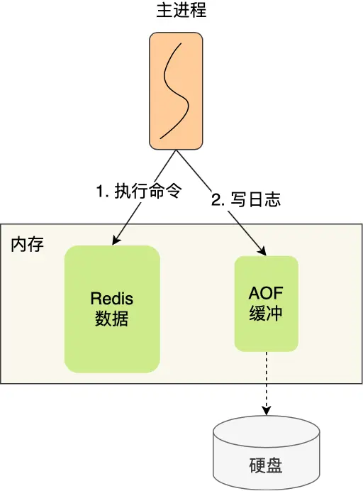
如果在将日志内容写入到硬盘时，服务器的硬盘的 I/O 压力太大，就会导致写硬盘的速度很慢，进而阻塞住了，也就会导致后续的命令无法执行。

认真分析一下，其实这两个风险都有一个共性，都跟「 AOF 日志写回硬盘的时机」有关。

#### 三种写回策略
AOF持久化最终需要将缓冲区中的内容写入一个文件，写文件通过操作系统提供的write函数执行。但是write之后数据只是保存在kernel的缓冲区中，真正写入磁盘还需要调用fsync函数。fsync是一个阻塞并且缓慢的操作，所以Redis通过appendfsync配置控制执行fsync的频次。具体有如下3种模式：

- **Always**，这个单词的意思是「总是」，所以它的意思是每次写操作命令执行完后，同步将 AOF 日志数据写回硬盘；
- **Everysec**，这个单词的意思是「每秒」，所以它的意思是每次写操作命令执行完后，先将命令写入到 AOF 文件的内核缓冲区，然后每隔一秒将缓冲区里的内容写回到硬盘；
- **No**，意味着不由 Redis 控制写回硬盘的时机，转交给操作系统控制写回的时机，也就是每次写操作命令执行完后，先将命令写入到 AOF 文件的内核缓冲区，再由操作系统决定何时将缓冲区内容写回硬盘。

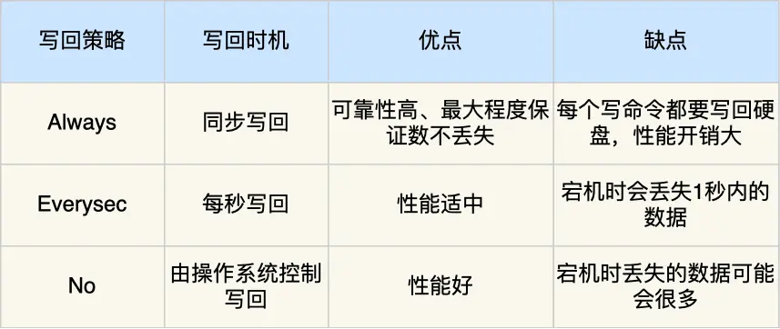

如果将AOF持久化策略设置为always（总是），你可以使用CONFIG SET命令。在Redis的命令行接口（CLI）中，输入以下命令：
```shell
CONFIG SET appendfsync always
```
这会立即更改Redis服务器的持久化策略。注意，这个配置会立即生效，但如果你重启Redis服务器，更改不会被保存。如果你想让这个配置在重启后仍然生效，你需要在Redis的配置文件(redis.conf)中进行修改。找到appendfsync这一行，修改为：
```shell
appendfsync always
```
然后重启Redis服务器，这个配置就会在启动时生效。

#### AOF 重写

AOF 日志是一个文件，随着执行的写操作命令越来越多，文件的大小会越来越大。

如果当 AOF 日志文件过大就会带来性能问题，比如重启 Redis 后，需要读 AOF 文件的内容以恢复数据，如果文件过大，整个恢复的过程就会很慢。

所以，Redis 为了避免 AOF 文件越写越大，提供了 AOF 重写机制，当 AOF 文件的大小超过所设定的阈值后，Redis 就会启用 AOF 重写机制，来压缩 AOF 文件。

AOF 重写机制是在重写时，读取当前数据库中的所有键值对，然后将每一个键值对用一条命令记录到「新的 AOF 文件」，等到全部记录完后，就将新的 AOF 文件替换掉现有的 AOF 文件。

举个例子，在没有使用重写机制前，假设前后执行了「set name xiaolin」和「set name xiaolincoding」这两个命令的话，就会将这两个命令记录到 AOF 文件。
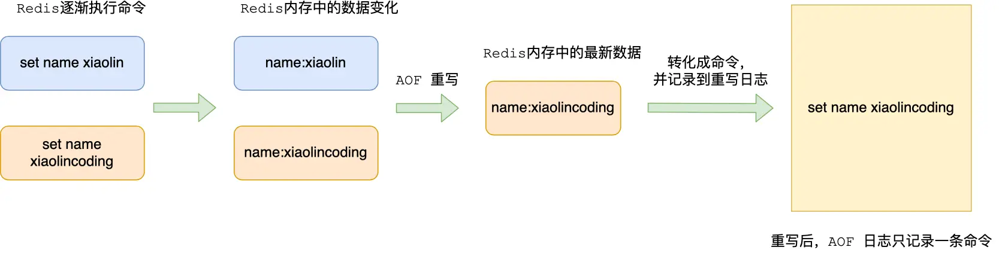

但是在使用重写机制后，就会读取 name 最新的 value（键值对） ，然后用一条 「set name xiaolincoding」命令记录到新的 AOF 文件，之前的第一个命令就没有必要记录了，因为它属于「历史」命令，没有作用了。这样一来，一个键值对在重写日志中只用一条命令就行了。

重写工作完成后，就会将新的 AOF 文件覆盖现有的 AOF 文件，这就相当于压缩了 AOF 文件，使得 AOF 文件体积变小了。

然后，在通过 AOF 日志恢复数据时，只用执行这条命令，就可以直接完成这个键值对的写入了。

所以，重写机制的妙处在于，尽管某个键值对被多条写命令反复修改，最终也只需要根据这个「键值对」当前的最新状态，然后用一条命令去记录键值对，代替之前记录这个键值对的多条命令，这样就减少了 AOF 文件中的命令数量。最后在重写工作完成后，将新的 AOF 文件覆盖现有的 AOF 文件。

这里说一下为什么重写 AOF 的时候，不直接复用现有的 AOF 文件，而是先写到新的 AOF 文件再覆盖过去。

因为如果 AOF 重写过程中失败了，现有的 AOF 文件就会造成污染，可能无法用于恢复使用。

所以 AOF 重写过程，先重写到新的 AOF 文件，重写失败的话，就直接删除这个文件就好，不会对现有的 AOF 文件造成影响。

#### RDB和AOF抉择
**实现方式1**：RDB保存的是一个时间点的快照，那么如果Redis出现了故障，丢失的就是从最后一次RDB执行的时间点到故障发生的时间间隔之内产生的数据。如果Redis数据量很大，QPS很高，那么执行一次RDB需要的时间会相应增加，发生故障时丢失的数据也会增多。而AOF保存的是一条条命令，理论上可以做到发生故障时只丢失一条命令。

**实现方式2**：RDB保存的是最终的数据，是一个最终状态，而AOF保存的是达到这个最终状态的过程。很明显，如果Redis有大量的修改操作，RDB中一个数据的最终态可能会需要大量的命令才能达到，这会造成AOF文件过大并且加载时速度过慢

AOF和RDB文件的**加载过程**：RDB只需要把相应数据加载到内存并生成相应的数据结构（有些结构如intset、ziplist，保存时直接按字符串保存，所以加载时速度会更快），而AOF文件的加载需要先创建一个伪客户端，然后把命令一条条发送给Redis服务端，服务端再完整执行一遍相应的命令。根据Redis作者做的测试，RDB10s～20s能加载1GB的文件，AOF的速度是RDB速度的一半（如果做了AOF重写会加快）。

#### 混合持久化

尽管 RDB 比 AOF 的数据恢复速度快，但是快照的频率不好把握：

- 如果频率太低，两次快照间一旦服务器发生宕机，就可能会比较多的数据丢失；
- 如果频率太高，频繁写入磁盘和创建子进程会带来额外的性能开销。
那有没有什么方法不仅有 RDB 恢复速度快的优点和，又有 AOF 丢失数据少的优点呢？

当然有，那就是将 RDB 和 AOF 合体使用，这个方法是在 Redis 4.0 提出的，该方法叫混合使用 AOF 日志和内存快照，也叫混合持久化。

如果想要开启混合持久化功能，可以在 Redis 配置文件将下面这个配置项设置成 yes：
```shell
aof-use-rdb-preamble yes
```
混合持久化工作在 AOF 日志重写过程。

当开启了混合持久化时，在 AOF 重写日志时，fork 出来的重写子进程会先将与主线程共享的内存数据以 RDB 方式写入到 AOF 文件，然后主线程处理的操作命令会被记录在重写缓冲区里，重写缓冲区里的增量命令会以 AOF 方式写入到 AOF 文件，写入完成后通知主进程将新的含有 RDB 格式和 AOF 格式的 AOF 文件替换旧的的 AOF 文件。
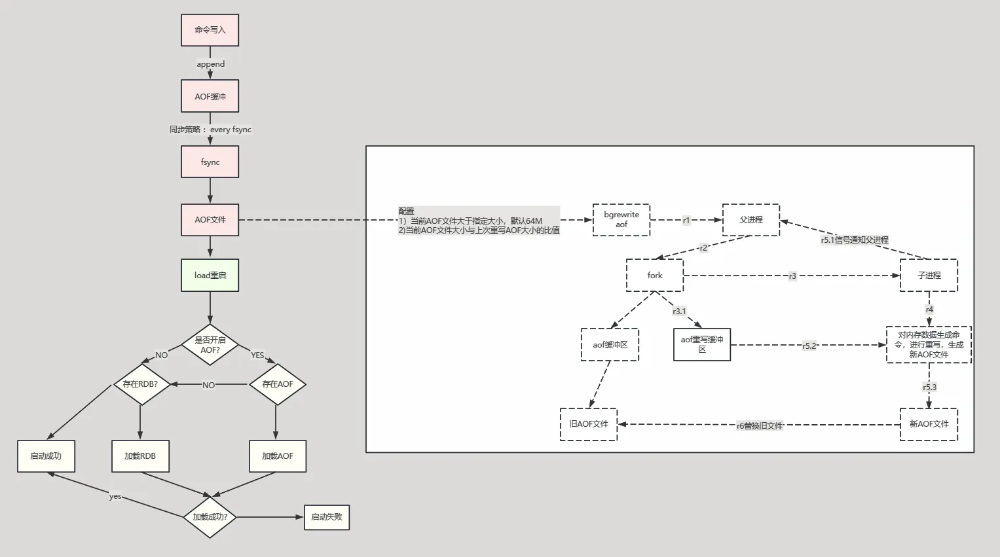

也就是说，使用了混合持久化，AOF 文件的前半部分是 RDB 格式的全量数据，后半部分是 AOF 格式的增量数据。

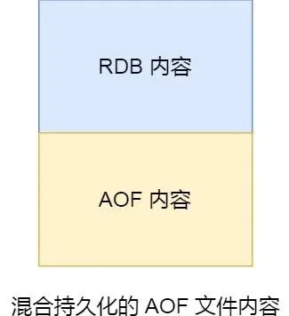

这样的好处在于，重启 Redis 加载数据的时候，由于前半部分是 RDB 内容，这样加载的时候速度会很快。

加载完 RDB 的内容后，才会加载后半部分的 AOF 内容，这里的内容是 Redis 后台子进程重写 AOF 期间，主线程处理的操作命令，可以使得数据更少的丢失。

> 参考：
> 1. Redis 5 设计与源码分析
> 2. https://xiaolincoding.com/redis/storage/aof.html#aof-持久化是怎么实现的


### Redis 大 Key 对持久化有什么影响？

> 概述：
>
> Redis的持久化主要有两种方式：AOF日志和RDB快照。大Key会对这两种持久化方式产生不同的影响：
>
> 1. AOF日志使用Always策略时，每次写命令后会立即将数据fsync到磁盘。写入大Key时，fsync阻塞主线程，影响性能。
>
> 2. AOF重写和RDB快照都需要通过fork创建子进程。在这个过程中，页表复制和写时复制(COW)都会随着Key大小和内存使用量的增加而变慢，导致主线程阻塞。
>
> 3. 开启内存大页也会使写时复制的内存拷贝变慢，降低性能。

#### AOF 日志的影响

在使用 Always 策略的时候，主线程在执行完命令后，会把数据写入到 AOF 日志文件，然后会调用 fsync() 函数，将内核缓冲区的数据直接写入到硬盘，等到硬盘写操作完成后，该函数才会返回。

**当使用 Always 策略的时候，如果写入是一个大 Key，主线程在执行 fsync() 函数的时候，阻塞的时间会比较久，因为当写入的数据量很大的时候，数据同步到硬盘这个过程是很耗时的**。

当使用 Everysec 策略的时候，由于是异步执行 fsync() 函数，所以大 Key 持久化的过程（数据同步磁盘）不会影响主线程。

当使用 No 策略的时候，由于永不执行 fsync() 函数，所以大 Key 持久化的过程不会影响主线程。

#### AOF 重写和 RDB 的影响

当 AOF 日志写入了很多的大 Key，AOF 日志文件的大小会很大，那么很快就会触发 **AOF 重写机制**。

AOF 重写机制和 RDB 快照（bgsave 命令）的过程，都会分别通过 `fork()` 函数创建一个子进程来处理任务。

在创建子进程的过程中，操作系统会把父进程的「页表」复制一份给子进程，这个页表记录着虚拟地址和物理地址映射关系，而不会复制物理内存，也就是说，两者的虚拟空间不同，但其对应的物理空间是同一个。

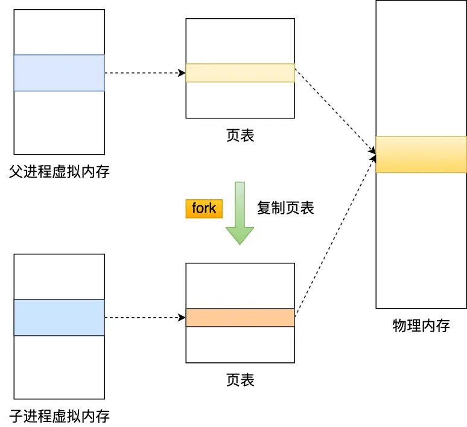

这样一来，子进程就共享了父进程的物理内存数据了，这样能够节约物理内存资源，页表对应的页表项的属性会标记该物理内存的权限为**只读**。

随着 Redis 存在越来越多的大 Key，那么 Redis 就会占用很多内存，对应的页表就会越大。

在通过 `fork()` 函数创建子进程的时候，虽然不会复制父进程的物理内存，但是**内核会把父进程的页表复制一份给子进程，如果页表很大，那么这个复制过程是会很耗时的，那么在执行 fork 函数的时候就会发生阻塞现象**。

而且，fork 函数是由 Redis 主线程调用的，如果 fork 函数发生阻塞，那么意味着就会阻塞 Redis 主线程。由于 Redis 执行命令是在主线程处理的，所以当 Redis 主线程发生阻塞，就无法处理后续客户端发来的命令。

我们可以执行 `info` 命令获取到 latest_fork_usec 指标，表示 Redis 最近一次 fork 操作耗时。

```sql
# 最近一次 fork 操作耗时
latest_fork_usec:315
```

如果 fork 耗时很大，比如超过1秒，则需要做出优化调整：

- 单个实例的内存占用控制在 10 GB 以下，这样 fork 函数就能很快返回。
- 如果 Redis 只是当作纯缓存使用，不关心 Redis 数据安全性问题，可以考虑关闭 AOF 和 AOF 重写，这样就不会调用 fork 函数了。
- 在主从架构中，要适当调大 repl-backlog-size，避免因为 repl_backlog_buffer 不够大，导致主节点频繁地使用全量同步的方式，全量同步的时候，是会创建 RDB 文件的，也就是会调用 fork 函数。

> 那什么时候会发生物理内存的复制呢？

当父进程或者子进程在向共享内存发起写操作时，CPU 就会触发**写保护中断**，这个「写保护中断」是由于违反权限导致的，然后操作系统会在「写保护中断处理函数」里进行物理内存的复制，并重新设置其内存映射关系，将父子进程的内存读写权限设置为可读写，最后才会对内存进行写操作，这个过程被称为「**写时复制(Copy On Write)**」。

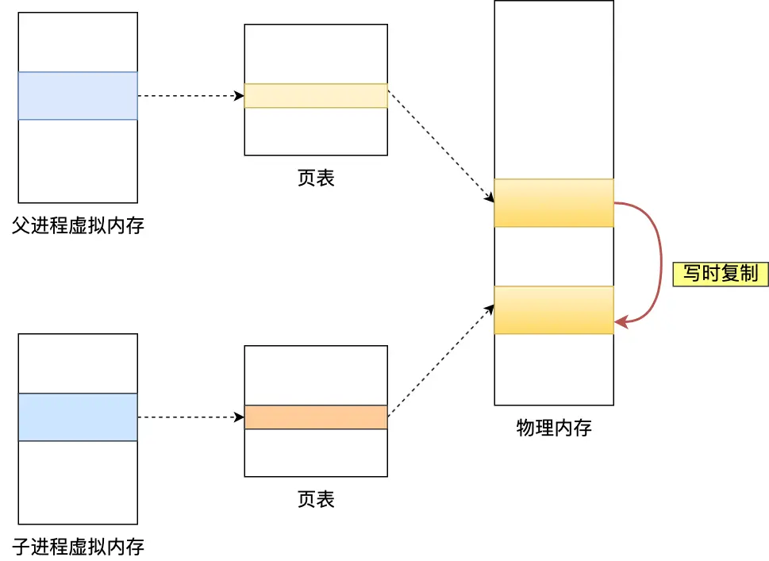

写时复制顾名思义，在发生写操作的时候，操作系统才会去复制物理内存，这样是为了防止 fork 创建子进程时，由于物理内存数据的复制时间过长而导致父进程长时间阻塞的问题。

如果创建完子进程后，**父进程对共享内存中的大 Key 进行了修改，那么内核就会发生写时复制，会把物理内存复制一份，由于大 Key 占用的物理内存是比较大的，那么在复制物理内存这一过程中，也是比较耗时的，于是父进程（主线程）就会发生阻塞**。

所以，有两个阶段会导致阻塞父进程：

- 创建子进程的途中，由于要复制父进程的页表等数据结构，阻塞的时间跟页表的大小有关，页表越大，阻塞的时间也越长；
- 创建完子进程后，如果子进程或者父进程修改了共享数据，就会发生写时复制，这期间会拷贝物理内存，如果内存越大，自然阻塞的时间也越长；

这里额外提一下， 如果 **Linux 开启了内存大页，会影响 Redis 的性能的**。

Linux 内核从 2.6.38 开始支持内存大页机制，该机制支持 2MB 大小的内存页分配，而常规的内存页分配是按 4KB 的粒度来执行的。

如果采用了内存大页，那么即使客户端请求只修改 100B 的数据，在发生写时复制后，Redis 也需要拷贝 2MB 的大页。相反，如果是常规内存页机制，只用拷贝 4KB。

两者相比，你可以看到，每次写命令引起的**复制内存页单位放大了 512 倍，会拖慢写操作的执行时间，最终导致 Redis 性能变慢**。

那该怎么办呢？很简单，关闭内存大页（默认是关闭的）。

禁用方法如下：

```shell
echo never >  /sys/kernel/mm/transparent_hugepage/enabled
```


当 AOF 写回策略配置了 Always 策略，如果写入是一个大 Key，主线程在执行 fsync() 函数的时候，阻塞的时间会比较久，因为当写入的数据量很大的时候，数据同步到硬盘这个过程是很耗时的。

AOF 重写机制和 RDB 快照（bgsave 命令）的过程，都会分别通过 `fork()` 函数创建一个子进程来处理任务。会有两个阶段会导致阻塞父进程（主线程）：

- 创建子进程的途中，由于要复制父进程的页表等数据结构，阻塞的时间跟页表的大小有关，页表越大，阻塞的时间也越长；
- 创建完子进程后，如果父进程修改了共享数据中的大 Key，就会发生写时复制，这期间会拷贝物理内存，由于大 Key 占用的物理内存会很大，那么在复制物理内存这一过程，就会比较耗时，所以有可能会阻塞父进程。

大 key 除了会影响持久化之外，还会有以下的影响。

- 客户端超时阻塞。由于 Redis 执行命令是单线程处理，然后在操作大 key 时会比较耗时，那么就会阻塞 Redis，从客户端这一视角看，就是很久很久都没有响应。
- 引发网络阻塞。每次获取大 key 产生的网络流量较大，如果一个 key 的大小是 1 MB，每秒访问量为 1000，那么每秒会产生 1000MB 的流量，这对于普通千兆网卡的服务器来说是灾难性的。
- 阻塞工作线程。如果使用 del 删除大 key 时，会阻塞工作线程，这样就没办法处理后续的命令。
- 内存分布不均。集群模型在 slot 分片均匀情况下，会出现数据和查询倾斜情况，部分有大 key 的 Redis 节点占用内存多，QPS 也会比较大。

如何避免大 Key 呢？

最好在设计阶段，就把大 key 拆分成一个一个小 key。或者，定时检查 Redis 是否存在大 key ，如果该大 key 是可以删除的，不要使用 DEL 命令删除，因为该命令删除过程会阻塞主线程，而是用 unlink 命令（Redis 4.0+）删除大 key，因为该命令的删除过程是异步的，不会阻塞主线程。


### 🌟 缓存穿透 & 缓存雪崩 & 缓存击穿

> 概要：redis`缓存穿透`、缓存击穿和缓存雪崩都是Redis缓存中的问题。（面试问到直接这样答就完事了，如果问到更细节的问题可以看下面的内容）
>
> 1. 缓存穿透是指`查询一个不存在的数据`，由于缓存中没有，所以每次请求都会到数据库中查询，这样会对数据库造成很大的压力
>
> 2. `缓存击穿`是指一个key非常热点，在不停的`扛着大并发`，大量的请求同时访问这个key，当这个key在失效的瞬间，持续的大并发就穿破缓存，直接请求数据库
>
> 3. 而`缓存雪崩`是指`在某一个时间段，缓存集中过期失效`。这样，在失效的一瞬间，大量的请求直接打到数据库上，导致数据库短时间内承受巨大压力。
>
>    解决方案如下：
>
> - 对于缓存穿透问题，可以采用`布隆过滤器`或者将查询结果为空也写入缓存（使用RedisBloom模块实现布隆过滤器）
> - 对于缓存击穿问题，可以采用`互斥锁`或者使用`分布式锁`（使用`synchronized`关键字或`ReentrantLock`实现互斥锁、使用Redlock算法或基于ZooKeeper的分布式锁）
> - 对于缓存雪崩问题，可以采用`加过期时间随机值`或者使用`消息队列`来削峰填谷（常见的消息队列有RabbitMQ、Kafka等。）

#### 穿透

当发生缓存雪崩或击穿时，数据库中还是保存了应用要访问的数据，一旦缓存恢复相对应的数据，就可以减轻数据库的压力，而缓存穿透就不一样了。

当用户访问的数据，**既不在缓存中，也不在数据库中**，导致请求在访问缓存时，发现缓存缺失，再去访问数据库时，发现数据库中也没有要访问的数据，没办法构建缓存数据，来服务后续的请求。那么当有大量这样的请求到来时，数据库的压力骤增，这就是**缓存穿透**的问题。

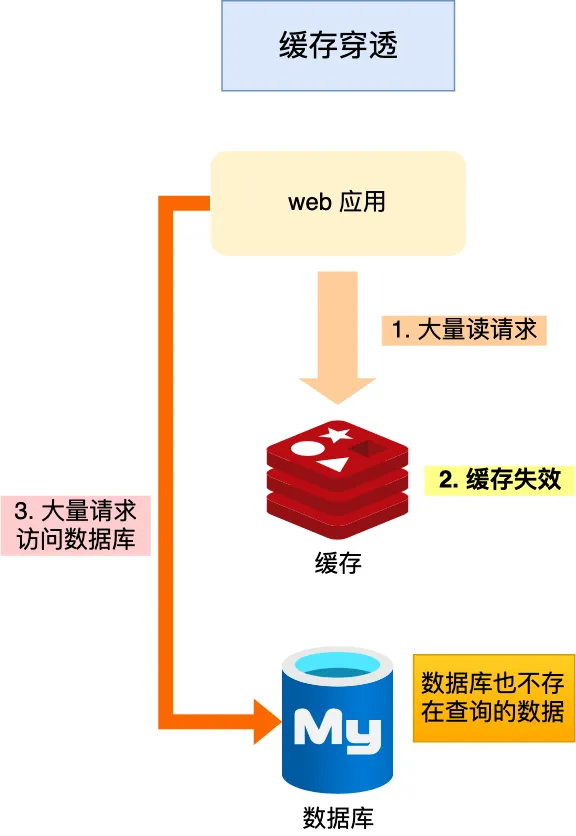

缓存穿透的发生一般有这两种情况：

- 业务误操作，缓存中的数据和数据库中的数据都被误删除了，所以导致缓存和数据库中都没有数据；
- 黑客恶意攻击，故意大量访问某些读取不存在数据的业务；

应对缓存穿透的方案，常见的方案有三种。

- **非法请求的限制**：当有大量恶意请求访问不存在的数据的时候，也会发生缓存穿透，因此在 API 入口处我们要判断求请求参数是否合理，请求参数是否含有非法值、请求字段是否存在，如果判断出是恶意请求就直接返回错误，避免进一步访问缓存和数据库。
- **设置空值或者默认值**：当我们线上业务发现缓存穿透的现象时，可以针对查询的数据，在缓存中设置一个空值或者默认值，这样后续请求就可以从缓存中读取到空值或者默认值，返回给应用，而不会继续查询数据库。
- **使用布隆过滤器快速判断数据是否存在，避免通过查询数据库来判断数据是否存在**：我们可以在写入数据库数据时，使用布隆过滤器做个标记，然后在用户请求到来时，业务线程确认缓存失效后，可以通过查询布隆过滤器快速判断数据是否存在，如果不存在，就不用通过查询数据库来判断数据是否存在，即使发生了缓存穿透，大量请求只会查询 Redis 和布隆过滤器，而不会查询数据库，保证了数据库能正常运行，Redis 自身也是支持布隆过滤器的。

> 详细说明

**1）缓存无效 key**

如果缓存和数据库都查不到某个 key 的数据就写一个到 Redis 中去并设置过期时间，具体命令如下： `SET key value EX 10086` 。这种方式可以解决请求的 key 变化不频繁的情况，如果黑客恶意攻击，每次构建不同的请求 key，会导致 Redis 中缓存大量无效的 key 。很明显，这种方案并不能从根本上解决此问题。如果非要用这种方式来解决穿透问题的话，尽量将无效的 key 的过期时间设置短一点比如 1 分钟。

**2）布隆过滤器**

布隆过滤器是一个非常神奇的数据结构，通过它我们可以非常方便地判断一个给定数据是否存在于海量数据中。我们需要的就是判断 key 是否合法，有没有感觉布隆过滤器就是我们想要找的那个“人”。

具体是这样做的：把所有可能存在的请求的值都存放在布隆过滤器中，当用户请求过来，先判断用户发来的请求的值是否存在于布隆过滤器中。不存在的话，直接返回请求参数错误信息给客户端，存在的话才会走下面的流程。

加入布隆过滤器之后的缓存处理流程图如下。

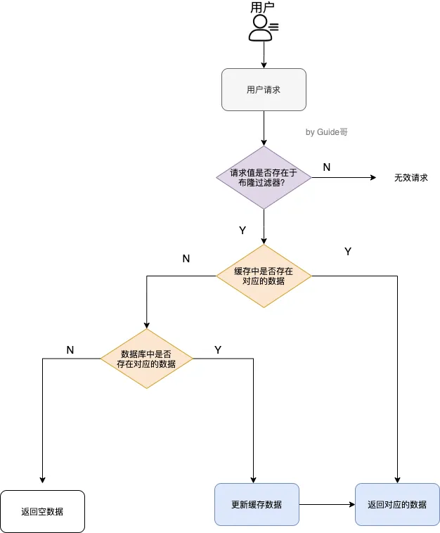

但是，需要注意的是布隆过滤器可能会存在误判的情况。总结来说就是： **布隆过滤器说某个元素存在，小概率会误判。布隆过滤器说某个元素不在，那么这个元素一定不在。**

*为什么会出现误判的情况呢? 我们还要从布隆过滤器的原理来说！*

我们先来看一下，**当一个元素加入布隆过滤器中的时候，会进行哪些操作：**

1. 使用布隆过滤器中的哈希函数对元素值进行计算，得到哈希值（有几个哈希函数得到几个哈希值）。
2. 根据得到的哈希值，在位数组中把对应下标的值置为 1。

我们再来看一下，**当我们需要判断一个元素是否存在于布隆过滤器的时候，会进行哪些操作：**

1. 对给定元素再次进行相同的哈希计算；
2. 得到值之后判断位数组中的每个元素是否都为 1，如果值都为 1，那么说明这个值在布隆过滤器中，如果存在一个值不为 1，说明该元素不在布隆过滤器中。

然后，一定会出现这样一种情况：**不同的字符串可能哈希出来的位置相同。** （可以适当增加位数组大小或者调整我们的哈希函数来降低概率）

更多关于布隆过滤器的内容可以看我的这篇原创：[《不了解布隆过滤器？一文给你整的明明白白！》open in new window](https://javaguide.cn/cs-basics/data-structure/bloom-filter/) ，强烈推荐，个人感觉网上应该找不到总结的这么明明白白的文章了

#### 【拓展1】布隆过滤器

什么是布隆过滤器？

首先，我们需要了解布隆过滤器的概念。

布隆过滤器（Bloom Filter）是一个叫做 Bloom 的老哥于 1970 年提出的。我们可以把它看作由二进制向量（或者说位数组）和一系列随机映射函数（哈希函数）两部分组成的数据结构。相比于我们平时常用的的 List、Map 、Set 等数据结构，它占用空间更少并且效率更高，但是缺点是其返回的结果是概率性的，而不是非常准确的。理论情况下添加到集合中的元素越多，误报的可能性就越大。并且，存放在布隆过滤器的数据不容易删除。

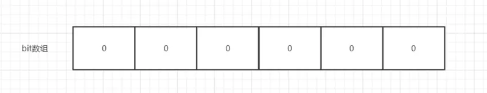

位数组中的每个元素都只占用 1 bit ，并且每个元素只能是 0 或者 1。这样申请一个 100w 个元素的位数组只占用 1000000Bit / 8 = 125000 Byte = 125000/1024 kb ≈ 122kb 的空间。

总结：**一个名叫 Bloom 的人提出了一种来检索元素是否在给定大集合中的数据结构，这种数据结构是高效且性能很好的，但缺点是具有一定的错误识别率和删除难度。并且，理论情况下，添加到集合中的元素越多，误报的可能性就越大。**

布隆过滤器的原理

**当一个元素加入布隆过滤器中的时候，会进行如下操作：**

1. 使用布隆过滤器中的哈希函数对元素值进行计算，得到哈希值（有几个哈希函数得到几个哈希值）。
2. 根据得到的哈希值，在位数组中把对应下标的值置为 1。

**当我们需要判断一个元素是否存在于布隆过滤器的时候，会进行如下操作：**

1. 对给定元素再次进行相同的哈希计算；
2. 得到值之后判断位数组中的每个元素是否都为 1，如果值都为 1，那么说明这个值在布隆过滤器中，如果存在一个值不为 1，说明该元素不在布隆过滤器中。

举个简单的例子：

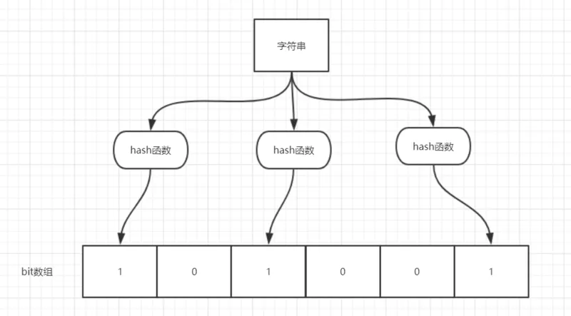

如图所示，当字符串存储要加入到布隆过滤器中时，该字符串首先由多个哈希函数生成不同的哈希值，然后将对应的位数组的下标设置为 1（当位数组初始化时，所有位置均为 0）。当第二次存储相同字符串时，因为先前的对应位置已设置为 1，所以很容易知道此值已经存在（去重非常方便）。

如果我们需要判断某个字符串是否在布隆过滤器中时，只需要对给定字符串再次进行相同的哈希计算，得到值之后判断位数组中的每个元素是否都为 1，如果值都为 1，那么说明这个值在布隆过滤器中，如果存在一个值不为 1，说明该元素不在布隆过滤器中。

**不同的字符串可能哈希出来的位置相同，这种情况我们可以适当增加位数组大小或者调整我们的哈希函数。**

综上，我们可以得出：**布隆过滤器说某个元素存在，小概率会误判。布隆过滤器说某个元素不在，那么这个元素一定不在**

#### 【拓展2】布谷鸟过滤器（Cuckoo Filter）

##### 布谷鸟哈希

布谷鸟过滤器用更低的空间开销解决了布隆过滤器不能删除元素的问题，做到了更好的效果，具体的

- 支持动态的添加和删除元素
- 提供了比传统布隆过滤器更高的查找性能，即使在接近满的情况下（比如空间利用率达到 95% 的时候）
- 比起商过滤器它更容易实现
- 如果要求误判率低于3%，它比布隆过滤器有更低的空间开销

本质上来说它为解决哈希冲突提供了另一种策略，利用较少计算换取了较大空间。它具有占用空间小、查询迅速等特性。名称源于采取了一种和布谷鸟一样的养娃方法

> 布谷鸟交配后，雌性**布谷鸟**就准备产蛋了，但它却不会自己筑巢。它会来到像知更**鸟**、刺嘴莺等那些比它小的**鸟**类的巢中，移走原来的那窝蛋中的一个，用自己的蛋来取而代之。相对于它的体形来说，它的蛋是偏小的，而且蛋上的斑纹同它混入的其他**鸟**的蛋也非常相似，所以不易被分辨出来。如果不是这样，它的蛋肯定会被扔出去。

最原始的布谷鸟哈希方法是使用两个哈希函数对一个 `key`进行哈希，得到桶中的两个位置，此时

- 如果两个位置都为为空则将 `key`随机存入其中一个位置
- 如果只有一个位置为空则存入为空的位置
- 如果都不为空，则随机踢出一个元素，踢出的元素再重新计算哈希找到相应的位置

当然假如存在绝对的空间不足，那老是踢出也不是办法，所以一般会设置一个**踢出阈值**，如果在某次插入行为过程中连续踢出超过阈值，则进行扩容。

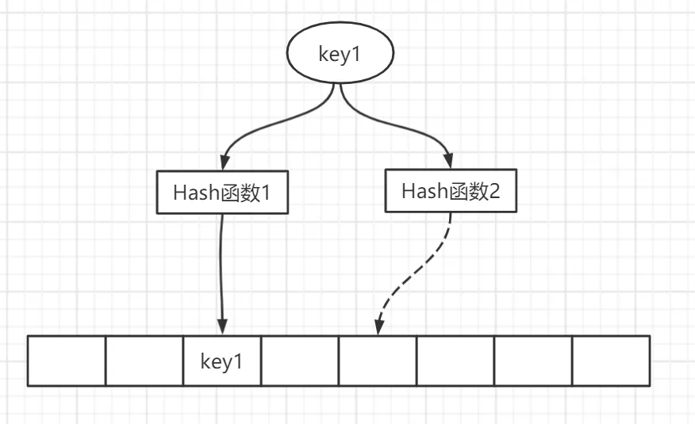

##### 布谷鸟过滤器

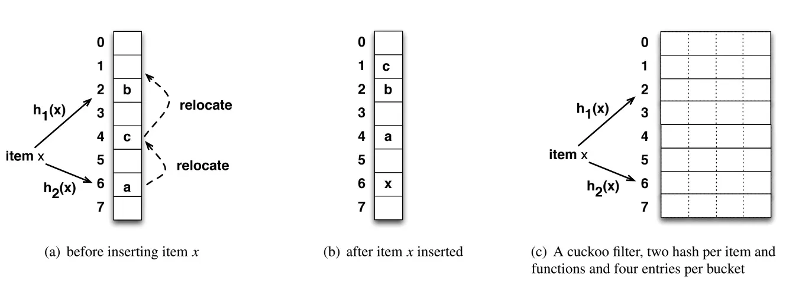

上图（a）(b)展示了一个基本的布谷鸟哈希表的插入操作，是由一个桶数组组成，每个插入项都有由散列函数h1(x)和h2(x)确定的两个候选桶，具体操作上文中已经描述，此处不再赘述。

而基本的布谷鸟过滤器也是由两个或者多个哈希函数构成，布谷鸟过滤器的布谷鸟哈希表的基本单位称为**条目（entry）**。 每个条目存储一个**指纹（fingerprint）**，指纹指的是使用一个哈希函数生成的n位比特位，n的具体大小由所能接受的误判率来设置，论文中的例子使用的是8bits的指纹大小。

哈希表由一个桶数组组成，其中一个桶可以有多个条目（比如上述图c中有四个条目）。而每个桶中有四个指纹位置，意味着一次哈希计算后布谷鸟有四个“巢“可用，而且四个巢是连续位置，可以更好的利用cpu高速缓存。也就是说每个桶的大小是4*8bits

#### 雪崩

什么是缓存雪崩？

实际上，缓存雪崩描述的就是这样一个简单的场景：**缓存在同一时间大面积的失效，后面的请求都直接落到了数据库上，造成数据库短时间内承受大量请求。** 这就好比雪崩一样，摧枯拉朽之势，数据库的压力可想而知，可能直接就被这么多请求弄宕机了

> 另一种说法是：
>
> 当**大量缓存数据在同一时间过期（失效）\**时，如果此时有大量的用户请求，都无法在 Redis 中处理，于是全部请求都直接访问数据库，从而导致数据库的压力骤增，严重的会造成数据库宕机，从而形成一系列连锁反应，造成整个系统崩溃，这就是缓存雪崩**的问题。


通常，我们会使用缓存用于缓冲对 DB 的冲击，如果缓存宕机，所有请求将直接打在 DB，造成 DB 宕机——从而导致整个系统宕机。

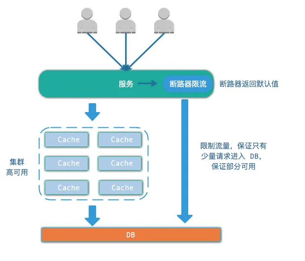

**2 种策略：**

- **将缓存失效时间随机打散：** 我们可以在原有的失效时间基础上增加一个随机值（比如 1 到 10 分钟）这样每个缓存的过期时间都不重复了，也就降低了缓存集体失效的概率。
- **设置缓存不过期：** 我们可以通过后台服务来更新缓存数据，从而避免因为缓存失效造成的缓存雪崩，也可以在一定程度上避免缓存并发问题。

#### 击穿

**缓存击穿**是指某一个热点数据缓存中没有但数据库中有数据（一般是缓存时间到期，比如秒杀活动，这类被频地访问的数据被称为热点数据）。这时由于并发用户特别多，同时读缓存没读到数据（**某个热点数据过期**了，此时大量的请求访问了该热点数据，就无法从缓存中读取），就去数据库去取数据，引起数据库压力瞬间增大，被高并发的请求冲垮，这就是**缓存击穿**的问题。

解决：

1. **设置热点数据永远不过期**。
2. **接口限流与熔断**，降级。重要的接口一定要做好限流策略，防止用户恶意刷接口，同时要降级准备，当接口中的某些服务不可用时候，进行熔断，失败快速返回机制。
3. **设置互斥锁**。在并发的多个请求中，只有第一个请求线程能拿到锁并执行数据库查询操作，其他的线程拿不到锁就阻塞等着，等到第一个线程将数据写入缓存后，直接走缓存。（可以使用 Redis 分布式锁）

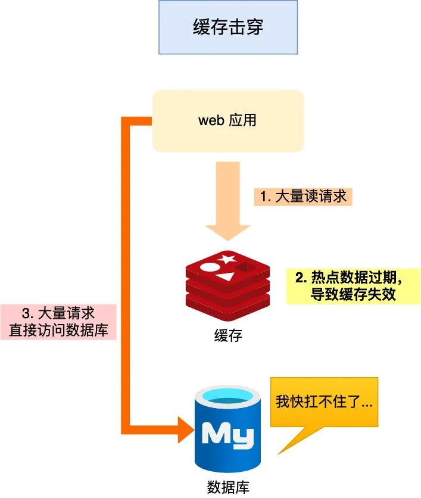


> redis中缓存击穿的概念是扛着大量的并发突然失效导致并发打在数据库上，和雪崩有什么区别？
>
> 它们的定义和区别如下：
>
> - **缓存击穿（Cache penetration）**: 这种情况通常发生在大量并发请求针对一个已过期或不存在的缓存key时，这些请求会直接打到数据库上，可能会对数据库造成较大的压力。这种情况的“失效”通常指的是一个特定的key已经过期或者不存在。
> - **缓存雪崩（Cache avalanche）**: 缓存雪崩是指在一个很短的时间内，大量的缓存项同时过期。这样，大量的请求将直接打到数据库上，可能会导致数据库过载甚至崩溃。这通常发生在大量缓存数据的过期时间设置得过于集中，或者因系统故障导致的全局缓存失效。
>
> 两者的主要区别在于：缓存击穿通常是由一个特定的热点key引发的，而缓存雪崩则是由大量的key同时过期引发的。
>
> 解决这两种问题的方法也有所不同。缓存击穿可以通过设置热点数据永不过期，或者使用互斥锁等方式控制并发访问来防止；而缓存雪崩则可以通过设置不同的过期时间，或者使用备份缓存等方式来防止。


### Redis 如何实现延迟队列？

延迟队列是指把当前要做的事情，往后推迟一段时间再做。延迟队列的常见使用场景有以下几种：

- 在淘宝、京东等购物平台上下单，超过一定时间未付款，订单会自动取消；
- 打车的时候，在规定时间没有车主接单，平台会取消你的单并提醒你暂时没有车主接单；
- 点外卖的时候，如果商家在10分钟还没接单，就会自动取消订单；
在 Redis 可以使用有序集合（ZSet）的方式来实现延迟消息队列的，ZSet 有一个 Score 属性可以用来存储延迟执行的时间。

使用 zadd score1 value1 命令就可以一直往内存中生产消息。再利用 zrangebysocre 查询符合条件的所有待处理的任务， 通过循环执行队列任务即可。


### 主从复制方案是怎么做的？


多台服务器要保存同一份数据，这里问题就来了。

这些服务器之间的数据如何保持一致性呢？数据的读写操作是否每台服务器都可以处理？

Redis 提供了**主从复制模式**，来避免上述的问题。

这个模式可以保证多台服务器的数据一致性，且主从服务器之间采用的是「读写分离」的方式。

主服务器可以进行读写操作，当发生写操作时自动将写操作同步给从服务器，而从服务器一般是只读，并接受主服务器同步过来写操作命令，然后执行这条命令。


也就是说，所有的数据修改只在主服务器上进行，然后将最新的数据同步给从服务器，这样就使得主从服务器的数据是一致的。

同步这两个字说的简单，但是这个同步过程并没有想象中那么简单，要考虑的事情不是一两个。

我们先来看看，主从服务器间的第一次同步是如何工作的？

#### 第一次同步

多台服务器之间要通过什么方式来确定谁是主服务器，或者谁是从服务器呢？

我们可以使用 `replicaof`（Redis 5.0 之前使用 slaveof）命令形成主服务器和从服务器的关系。

比如，现在有服务器 A 和 服务器 B，我们在服务器 B 上执行下面这条命令：

```text
# 服务器 B 执行这条命令
replicaof <服务器 A 的 IP 地址> <服务器 A 的 Redis 端口号>
```

接着，服务器 B 就会变成服务器 A 的「从服务器」，然后与主服务器进行第一次同步。

主从服务器间的第一次同步的过程可分为三个阶段：

- 第一阶段是建立链接、协商同步；
- 第二阶段是主服务器同步数据给从服务器；
- 第三阶段是主服务器发送新写操作命令给从服务器。

为了让你更清楚了解这三个阶段，我画了一张图。

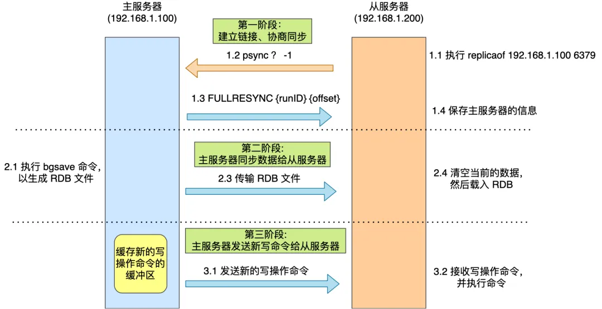

> 接下来，我在具体介绍每一个阶段都做了什么。

*第一阶段：建立链接、协商同步*

执行了 replicaof 命令后，从服务器就会给主服务器发送 `psync` 命令，表示要进行数据同步。

psync 命令包含两个参数，分别是**主服务器的 runID** 和**复制进度 offset**。

- runID，每个 Redis 服务器在启动时都会自动生产一个随机的 ID 来唯一标识自己。当从服务器和主服务器第一次同步时，因为不知道主服务器的 run ID，所以将其设置为 "?"。
- offset，表示复制的进度，第一次同步时，其值为 -1。

主服务器收到 psync 命令后，会用 `FULLRESYNC` 作为响应命令返回给对方。

并且这个响应命令会带上两个参数：主服务器的 runID 和主服务器目前的复制进度 offset。从服务器收到响应后，会记录这两个值。

FULLRESYNC 响应命令的意图是采用**全量复制**的方式，也就是主服务器会把所有的数据都同步给从服务器。

所以，第一阶段的工作时为了全量复制做准备。

那具体怎么全量同步呀呢？我们可以往下看第二阶段。

*第二阶段：主服务器同步数据给从服务器*

接着，主服务器会执行 `bgsave` 命令来生成 RDB 文件，然后把文件发送给从服务器。

从服务器收到 RDB 文件后，会先清空当前的数据，然后载入 RDB 文件。

这里有一点要注意，主服务器生成 RDB 这个过程是不会阻塞主线程的，因为 bgsave 命令是产生了一个子进程来做生成 RDB 文件的工作，是异步工作的，这样 Redis 依然可以正常处理命令。

但是，这期间的写操作命令并没有记录到刚刚生成的 RDB 文件中，这时主从服务器间的数据就不一致了。那么为了保证主从服务器的数据一致性，**主服务器在下面这三个时间间隙中将收到的写操作命令，写入到 replication buffer 缓冲区里。**

- 主服务器生成 RDB 文件期间；
- 主服务器发送 RDB 文件给从服务器期间；
- 「从服务器」加载 RDB 文件期间；

*第三阶段：主服务器发送新写操作命令给从服务器*

在主服务器生成的 RDB 文件发送完，从服务器加载完 RDB 文件后，然后将 replication buffer 缓冲区里所记录的写操作命令发送给从服务器，然后「从服务器」重新执行这些操作，至此主从服务器的数据就一致了。

至此，主从服务器的第一次同步的工作就完成了。

#### 命令传播

主从服务器在完成第一次同步后，双方之间就会维护一个 TCP 连接。


后续主服务器可以通过这个连接继续将写操作命令传播给从服务器，然后从服务器执行该命令，使得与主服务器的数据库状态相同。

而且这个连接是长连接的，目的是避免频繁的 TCP 连接和断开带来的性能开销。

上面的这个过程被称为**基于长连接的命令传播**，通过这种方式来保证第一次同步后的主从服务器的数据一致性。

#### 分摊主服务器的压力

在前面的分析中，我们可以知道主从服务器在第一次数据同步的过程中，主服务器会做两件耗时的操作：生成 RDB 文件和传输 RDB 文件。

主服务器是可以有多个从服务器的，如果从服务器数量非常多，而且都与主服务器进行全量同步的话，就会带来两个问题：

- 由于是通过 bgsave 命令来生成 RDB 文件的，那么主服务器就会忙于使用 fork() 创建子进程，如果主服务器的内存数据非大，在执行 fork() 函数时是会阻塞主线程的，从而使得 Redis 无法正常处理请求；
- 传输 RDB 文件会占用主服务器的网络带宽，会对主服务器响应命令请求产生影响。

这种情况就好像，刚创业的公司，由于人不多，所以员工都归老板一个人管，但是随着公司的发展，人员的扩充，老板慢慢就无法承担全部员工的管理工作了。

要解决这个问题，老板就需要设立经理职位，由经理管理多名普通员工，然后老板只需要管理经理就好。

Redis 也是一样的，从服务器可以有自己的从服务器，我们可以把拥有从服务器的从服务器当作经理角色，它不仅可以接收主服务器的同步数据，自己也可以同时作为主服务器的形式将数据同步给从服务器，组织形式如下图：

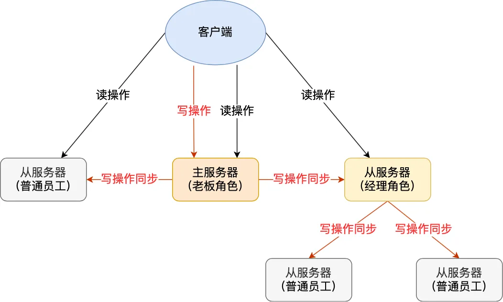

通过这种方式，**主服务器生成 RDB 和传输 RDB 的压力可以分摊到充当经理角色的从服务器**。

那具体怎么做到的呢？

其实很简单，我们在「从服务器」上执行下面这条命令，使其作为目标服务器的从服务器：

```text
replicaof <目标服务器的IP> 6379
```

此时如果目标服务器本身也是「从服务器」，那么该目标服务器就会成为「经理」的角色，不仅可以接受主服务器同步的数据，也会把数据同步给自己旗下的从服务器，从而减轻主服务器的负担。

#### 增量复制

主从服务器在完成第一次同步后，就会基于长连接进行命令传播。

可是，网络总是不按套路出牌的嘛，说延迟就延迟，说断开就断开。

如果主从服务器间的网络连接断开了，那么就无法进行命令传播了，这时从服务器的数据就没办法和主服务器保持一致了，客户端就可能从「从服务器」读到旧的数据。


那么问题来了，如果此时断开的网络，又恢复正常了，要怎么继续保证主从服务器的数据一致性呢？

在 Redis 2.8 之前，如果主从服务器在命令同步时出现了网络断开又恢复的情况，从服务器就会和主服务器重新进行一次全量复制，很明显这样的开销太大了，必须要改进一波。

所以，从 Redis 2.8 开始，网络断开又恢复后，从主从服务器会采用**增量复制**的方式继续同步，也就是只会把网络断开期间主服务器接收到的写操作命令，同步给从服务器。

网络恢复后的增量复制过程如下图：


主要有三个步骤：

- 从服务器在恢复网络后，会发送 psync 命令给主服务器，此时的 psync 命令里的 offset 参数不是 -1；
- 主服务器收到该命令后，然后用 CONTINUE 响应命令告诉从服务器接下来采用增量复制的方式同步数据；
- 然后主服务将主从服务器断线期间，所执行的写命令发送给从服务器，然后从服务器执行这些命令。

那么关键的问题来了，**主服务器怎么知道要将哪些增量数据发送给从服务器呢？**

答案藏在这两个东西里：

- **repl_backlog_buffer**，是一个「**环形**」缓冲区，用于主从服务器断连后，从中找到差异的数据；
- **replication offset**，标记上面那个缓冲区的同步进度，主从服务器都有各自的偏移量，主服务器使用 master_repl_offset 来记录自己「*写*」到的位置，从服务器使用 slave_repl_offset 来记录自己「*读*」到的位置。

那repl_backlog_buffer 缓冲区是什么时候写入的呢？

在主服务器进行命令传播时，不仅会将写命令发送给从服务器，还会将写命令写入到 repl_backlog_buffer 缓冲区里，因此 这个缓冲区里会保存着最近传播的写命令。

网络断开后，当从服务器重新连上主服务器时，从服务器会通过 psync 命令将自己的复制偏移量 slave_repl_offset 发送给主服务器，主服务器根据自己的  master_repl_offset 和 slave_repl_offset 之间的差距，然后来决定对从服务器执行哪种同步操作：

- 如果判断出从服务器要读取的数据还在 repl_backlog_buffer 缓冲区里，那么主服务器将采用**增量同步**的方式；
- 相反，如果判断出从服务器要读取的数据已经不存在 repl_backlog_buffer 缓冲区里，那么主服务器将采用**全量同步**的方式。

当主服务器在 repl_backlog_buffer 中找到主从服务器差异（增量）的数据后，就会将增量的数据写入到 replication buffer 缓冲区，这个缓冲区我们前面也提到过，它是缓存将要传播给从服务器的命令。


repl_backlog_buffer 缓行缓冲区的默认大小是 1M，并且由于它是一个环形缓冲区，所以当缓冲区写满后，主服务器继续写入的话，就会覆盖之前的数据。

因此，当主服务器的写入速度远超于从服务器的读取速度，缓冲区的数据一下就会被覆盖。

那么在网络恢复时，如果从服务器想读的数据已经被覆盖了，主服务器就会采用全量同步，这个方式比增量同步的性能损耗要大很多。

因此，为了避免在网络恢复时，主服务器频繁地使用全量同步的方式，我们应该调整下 repl_backlog_buffer 缓冲区大小，尽可能的大一些，减少出现从服务器要读取的数据被覆盖的概率，从而使得主服务器采用增量同步的方式。

那 repl_backlog_buffer 缓冲区具体要调整到多大呢？

repl_backlog_buffer 最小的大小可以根据这面这个公式估算。

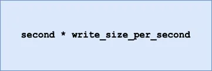

我来解释下这个公式的意思：

- second 为从服务器断线后重新连接上主服务器所需的平均 时间(以秒计算)。
- write_size_per_second 则是主服务器平均每秒产生的写命令数据量大小。

举个例子，如果主服务器平均每秒产生 1 MB 的写命令，而从服务器断线之后平均要 5 秒才能重新连接主服务器。

那么 repl_backlog_buffer 大小就不能低于 5 MB，否则新写地命令就会覆盖旧数据了。

当然，为了应对一些突发的情况，可以将 repl_backlog_buffer 的大小设置为此基础上的 2 倍，也就是 10 MB。

关于 repl_backlog_buffer 大小修改的方法，只需要修改配置文件里下面这个参数项的值就可以。

```shell
repl-backlog-size 1mb
```

#### 总结

主从复制共有三种模式：**全量复制、基于长连接的命令传播、增量复制**。

主从服务器第一次同步的时候，就是采用全量复制，此时主服务器会两个耗时的地方，分别是生成 RDB 文件和传输 RDB  文件。为了避免过多的从服务器和主服务器进行全量复制，可以把一部分从服务器升级为「经理角色」，让它也有自己的从服务器，通过这样可以分摊主服务器的压力。

第一次同步完成后，主从服务器都会维护着一个长连接，主服务器在接收到写操作命令后，就会通过这个连接将写命令传播给从服务器，来保证主从服务器的数据一致性。

如果遇到网络断开，增量复制就可以上场了，不过这个还跟 repl_backlog_size 这个大小有关系。

如果它配置的过小，主从服务器网络恢复时，可能发生「从服务器」想读的数据已经被覆盖了，那么这时就会导致主服务器采用全量复制的方式。所以为了避免这种情况的频繁发生，要调大这个参数的值，以降低主从服务器断开后全量同步的概率。

### Sentinel（哨兵）  

> Redis Sentinel，即Redis哨兵，在Redis 2.8版本开始引入。哨兵的核心功能是主节点的自动故障转移。

下图是一个典型的哨兵集群监控的逻辑图：


哨兵实现了什么功能呢？下面是Redis官方文档的描述：

- **监控（Monitoring）**：哨兵会不断地检查主节点和从节点是否运作正常。
- **自动故障转移（Automatic failover）**：当主节点不能正常工作时，哨兵会开始自动故障转移操作，它会将失效主节点的其中一个从节点升级为新的主节点，并让其他从节点改为复制新的主节点。
- **配置提供者（Configuration provider）**：客户端在初始化时，通过连接哨兵来获得当前Redis服务的主节点地址。
- **通知（Notification）**：哨兵可以将故障转移的结果发送给客户端。

其中，监控和自动故障转移功能，使得哨兵可以及时发现主节点故障并完成转移；而配置提供者和通知功能，则需要在与客户端的交互中才能体现。


在 Redis 的主从架构中，由于主从模式是读写分离的，如果主节点（master）挂了，那么将没有主节点来服务客户端的写操作请求，也没有主节点给从节点（slave）进行数据同步了。


这时如果要恢复服务的话，需要人工介入，选择一个「从节点」切换为「主节点」，然后让其他从节点指向新的主节点，同时还需要通知上游那些连接 Redis 主节点的客户端，将其配置中的主节点 IP 地址更新为「新主节点」的 IP 地址。

这样也不太“智能”了，要是有一个节点能监控「主节点」的状态，当发现主节点挂了 ，它自动将一个「从节点」切换为「主节点」的话，那么可以节省我们很多事情啊！

Redis 在 2.8 版本以后提供的**哨兵（\*Sentinel\*）机制**，它的作用是实现**主从节点故障转移**。它会监测主节点是否存活，如果发现主节点挂了，它就会选举一个从节点切换为主节点，并且把新主节点的相关信息通知给从节点和客户端。

#### 哨兵机制是如何工作的？

哨兵其实是一个运行在特殊模式下的 Redis 进程，所以它也是一个节点。从“哨兵”这个名字也可以看得出来，它相当于是“观察者节点”，观察的对象是主从节点。

当然，它不仅仅是观察那么简单，在它观察到有异常的状况下，会做出一些“动作”，来修复异常状态。

哨兵节点主要负责三件事情：**监控、选主、通知**。


所以，我们重点要学习这三件事情：

- 哨兵节点是如何监控节点的？又是如何判断主节点是否真的故障了？
- 根据什么规则选择一个从节点切换为主节点？
- 怎么把新主节点的相关信息通知给从节点和客户端呢？

#### 如何判断主节点真的故障了？

哨兵会每隔 1 秒给所有主从节点发送 PING 命令，当主从节点收到 PING 命令后，会发送一个响应命令给哨兵，这样就可以判断它们是否在正常运行。


如果主节点或者从节点没有在规定的时间内响应哨兵的 PING 命令，哨兵就会将它们标记为「**主观下线**」。这个「规定的时间」是配置项  `down-after-milliseconds` 参数设定的，单位是毫秒。

> 主观下线？难道还有客观下线？

是的没错，客观下线只适用于主节点。

之所以针对「主节点」设计「主观下线」和「客观下线」两个状态，是因为有可能「主节点」其实并没有故障，可能只是因为主节点的系统压力比较大或者网络发送了拥塞，导致主节点没有在规定时间内响应哨兵的 PING 命令。

所以，为了减少误判的情况，哨兵在部署的时候不会只部署一个节点，而是用多个节点部署成**哨兵集群**（*最少需要三台机器来部署哨兵集群*），**通过多个哨兵节点一起判断，就可以就可以避免单个哨兵因为自身网络状况不好，而误判主节点下线的情况**。同时，多个哨兵的网络同时不稳定的概率较小，由它们一起做决策，误判率也能降低。

具体是怎么判定主节点为「客观下线」的呢？

当一个哨兵判断主节点为「主观下线」后，就会向其他哨兵发起命令，其他哨兵收到这个命令后，就会根据自身和主节点的网络状况，做出赞成投票或者拒绝投票的响应。


当这个哨兵的赞同票数达到哨兵配置文件中的 quorum 配置项设定的值后，这时主节点就会被该哨兵标记为「客观下线」。

例如，现在有 3 个哨兵，quorum 配置的是 2，那么一个哨兵需要 2 张赞成票，就可以标记主节点为“客观下线”了。这 2 张赞成票包括哨兵自己的一张赞成票和另外两个哨兵的赞成票。

PS：quorum 的值一般设置为哨兵个数的二分之一加1，例如 3 个哨兵就设置 2。

哨兵判断完主节点客观下线后，哨兵就要开始在多个「从节点」中，选出一个从节点来做新主节点。

#### 由哪个哨兵进行主从故障转移？

前面说过，为了更加“客观”的判断主节点故障了，一般不会只由单个哨兵的检测结果来判断，而是多个哨兵一起判断，这样可以减少误判概率，所以**哨兵是以哨兵集群的方式存在的**。

问题来了，由哨兵集群中的哪个节点进行主从故障转移呢？

所以这时候，还需要在哨兵集群中选出一个 leeder，让 leeder 来执行主从切换。

选举 leeder 的过程其实是一个投票的过程，在投票开始前，肯定得有个「候选者」。

> 那谁来作为候选者呢？

哪个哨兵节点判断主节点为「客观下线」，这个哨兵节点就是候选者，所谓的候选者就是想当 Leader 的哨兵。

举个例子，假设有三个哨兵。当哨兵 B 先判断到主节点「主观下线后」，就会给其他实例发送 is-master-down-by-addr 命令。接着，其他哨兵会根据自己和主节点的网络连接情况，做出赞成投票或者拒绝投票的响应。

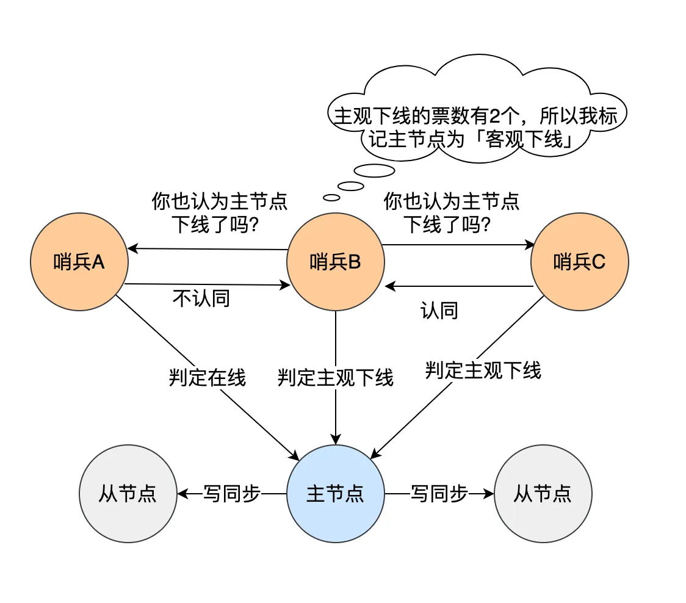

当哨兵 B 收到赞成票数达到哨兵配置文件中的 quorum 配置项设定的值后，就会将主节点标记为「客观下线」，此时的哨兵 B 就是一个Leader 候选者。

> 候选者如何选举成为 Leader？

候选者会向其他哨兵发送命令，表明希望成为 Leader 来执行主从切换，并让所有其他哨兵对它进行投票。

每个哨兵只有一次投票机会，如果用完后就不能参与投票了，可以投给自己或投给别人，但是只有候选者才能把票投给自己。

那么在投票过程中，任何一个「候选者」，要满足两个条件：

- 第一，拿到半数以上的赞成票；
- 第二，拿到的票数同时还需要大于等于哨兵配置文件中的 quorum 值。

举个例子，假设哨兵节点有  3 个，quorum 设置为 2，那么任何一个想成为 Leader 的哨兵只要拿到 2 张赞成票，就可以选举成功了。如果没有满足条件，就需要重新进行选举。

这时候有的同学就会问了，如果某个时间点，刚好有两个哨兵节点判断到主节点为客观下线，那这时不就有两个候选者了？这时该如何决定谁是 Leader 呢？

每位候选者都会先给自己投一票，然后向其他哨兵发起投票请求。如果投票者先收到「候选者 A」的投票请求，就会先投票给它，如果投票者用完投票机会后，收到「候选者 B」的投票请求后，就会拒绝投票。这时，候选者 A  先满足了上面的那两个条件，所以「候选者 A」就会被选举为 Leader。

> 为什么哨兵节点至少要有 3 个？

如果哨兵集群中只有 2 个哨兵节点，此时如果一个哨兵想要成功成为 Leader，必须获得 2 票，而不是 1 票。

所以，如果哨兵集群中有个哨兵挂掉了，那么就只剩一个哨兵了，如果这个哨兵想要成为 Leader，这时票数就没办法达到 2 票，就无法成功成为 Leader，这时是无法进行主从节点切换的。

因此，通常我们至少会配置 3 个哨兵节点。这时，如果哨兵集群中有个哨兵挂掉了，那么还剩下两个个哨兵，如果这个哨兵想要成为 Leader，这时还是有机会达到 2 票的，所以还是可以选举成功的，不会导致无法进行主从节点切换。

当然，你要问，如果 3 个哨兵节点，挂了 2 个怎么办？这个时候得人为介入了，或者增加多一点哨兵节点。

再说一个问题，Redis 1 主 4 从，5 个哨兵 ，quorum 设置为 3，如果 2 个哨兵故障，当主节点宕机时，哨兵能否判断主节点“客观下线”？主从能否自动切换？

- **哨兵集群可以判定主节点“客观下线”**。哨兵集群还剩下 3 个哨兵，当一个哨兵判断主节点“主观下线”后，询问另外 2 个哨兵后，有可能能拿到 3 张赞同票，这时就达到了 quorum 的值，因此，哨兵集群可以判定主节点为“客观下线”。
- **哨兵集群可以完成主从切换**。当有个哨兵标记主节点为「客观下线」后，就会进行选举 Leader 的过程，因为此时哨兵集群还剩下 3 个哨兵，那么还是可以拿到半数以上（5/2+1=3）的票，而且也达到了 quorum  值，满足了选举 Leader 的两个条件， 所以就能选举成功，因此哨兵集群可以完成主从切换。

如果 quorum 设置为 2 ，并且如果有 3 个哨兵故障的话。此时哨兵集群还是可以判定主节点为“客观下线”，但是哨兵不能完成主从切换了，大家可以自己推演下。

如果 quorum 设置为 3，并且如果有 3 个哨兵故障的话，哨兵集群即不能判定主节点为“客观下线”，也不能完成主从切换了。

可以看到，quorum 为 2 的时候，并且如果有 3 个哨兵故障的话，虽然可以判定主节点为“客观下线”，但是不能完成主从切换，这样感觉「判定主节点为客观下线」这件事情白做了一样，既然这样，还不如不要做，quorum 为 3 的时候，就可以避免这种无用功。

所以，**quorum 的值建议设置为哨兵个数的二分之一加1**，例如 3 个哨兵就设置 2，5 个哨兵设置为 3，而且**哨兵节点的数量应该是奇数**。

#### 主从故障转移的过程是怎样的？

在哨兵集群中通过投票的方式，选举出了哨兵 leader 后，就可以进行主从故障转移的过程了，如下图：


主从故障转移操作包含以下四个步骤：

- 第一步：在已下线主节点（旧主节点）属下的所有「从节点」里面，挑选出一个从节点，并将其转换为主节点。
- 第二步：让已下线主节点属下的所有「从节点」修改复制目标，修改为复制「新主节点」；
- 第三步：将新主节点的 IP 地址和信息，通过「发布者/订阅者机制」通知给客户端；
- 第四步：继续监视旧主节点，当这个旧主节点重新上线时，将它设置为新主节点的从节点；

> 这块具体还是看https://xiaolincoding.com/redis/cluster/sentinel.html#%E6%AD%A5%E9%AA%A4%E4%B8%80-%E9%80%89%E5%87%BA%E6%96%B0%E4%B8%BB%E8%8A%82%E7%82%B9

#### 哨兵集群是如何组成的？

前面提到了  Redis 的发布者/订阅者机制，那就不得不提一下哨兵集群的组成方式，因为它也用到了这个技术。

在我第一次搭建哨兵集群的时候，当时觉得很诧异。因为在配置哨兵的信息时，竟然只需要填下面这几个参数，设置主节点名字、主节点的 IP 地址和端口号以及 quorum 值。

```c
sentinel monitor <master-name> <ip> <redis-port> <quorum> 
```

不需要填其他哨兵节点的信息，我就好奇它们是如何感知对方的，又是如何组成哨兵集群的？

后面才了解到，**哨兵节点之间是通过 Redis 的发布者/订阅者机制来相互发现的**。

在主从集群中，主节点上有一个名为 `__sentinel__:hello`的频道，不同哨兵就是通过它来相互发现，实现互相通信的。

在下图中，哨兵 A 把自己的 IP 地址和端口的信息发布到 `__sentinel__:hello` 频道上，哨兵 B 和 C 订阅了该频道。那么此时，哨兵 B 和 C 就可以从这个频道直接获取哨兵 A 的 IP 地址和端口号。然后，哨兵 B、C 可以和哨兵 A 建立网络连接。

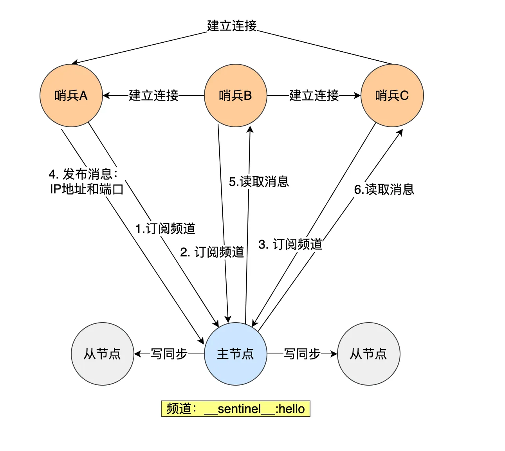

通过这个方式，哨兵 B 和 C 也可以建立网络连接，这样一来，哨兵集群就形成了。

> 哨兵集群会对「从节点」的运行状态进行监控，那哨兵集群如何知道「从节点」的信息？

主节点知道所有「从节点」的信息，所以哨兵会每 10 秒一次的频率向主节点发送 INFO 命令来获取所有「从节点」的信息。

如下图所示，哨兵 B 给主节点发送 INFO  命令，主节点接受到这个命令后，就会把从节点列表返回给哨兵。接着，哨兵就可以根据从节点列表中的连接信息，和每个从节点建立连接，并在这个连接上持续地对从节点进行监控。哨兵 A 和 C 可以通过相同的方法和从节点建立连接。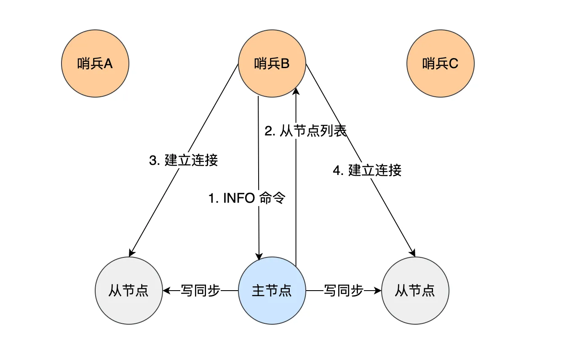

正式通过  Redis 的发布者/订阅者机制，哨兵之间可以相互感知，然后组成集群，同时，哨兵又通过 INFO 命令，在主节点里获得了所有从节点连接信息，于是就能和从节点建立连接，并进行监控了。

#### 总结

Redis 在 2.8 版本以后提供的**哨兵（\*Sentinel\*）机制**，它的作用是实现**主从节点故障转移**。它会监测主节点是否存活，如果发现主节点挂了，它就会选举一个从节点切换为主节点，并且把新主节点的相关信息通知给从节点和客户端。

哨兵一般是以集群的方式部署，至少需要 3 个哨兵节点，哨兵集群主要负责三件事情：**监控、选主、通知**。

哨兵节点通过 Redis 的发布者/订阅者机制，哨兵之间可以相互感知，相互连接，然后组成哨兵集群，同时哨兵又通过 INFO 命令，在主节点里获得了所有从节点连接信息，于是就能和从节点建立连接，并进行监控了。

*1、第一轮投票：判断主节点下线*

当哨兵集群中的某个哨兵判定主节点下线（主观下线）后，就会向其他哨兵发起命令，其他哨兵收到这个命令后，就会根据自身和主节点的网络状况，做出赞成投票或者拒绝投票的响应。

当这个哨兵的赞同票数达到哨兵配置文件中的 quorum 配置项设定的值后，这时主节点就会被该哨兵标记为「客观下线」。

*2、第二轮投票：选出哨兵leader*

某个哨兵判定主节点客观下线后，该哨兵就会发起投票，告诉其他哨兵，它想成为 leader，想成为 leader 的哨兵节点，要满足两个条件：

- 第一，拿到半数以上的赞成票；
- 第二，拿到的票数同时还需要大于等于哨兵配置文件中的 quorum 值。

*3、由哨兵 leader 进行主从故障转移*

选举出了哨兵 leader 后，就可以进行主从故障转移的过程了。该操作包含以下四个步骤：

- 第一步：在已下线主节点（旧主节点）属下的所有「从节点」里面，挑选出一个从节点，并将其转换为主节点，选择的规则：
  - 过滤掉已经离线的从节点；
  - 过滤掉历史网络连接状态不好的从节点；
  - 将剩下的从节点，进行三轮考察：优先级、复制进度、ID 号。在每一轮考察过程中，如果找到了一个胜出的从节点，就将其作为新主节点。
- 第二步：让已下线主节点属下的所有「从节点」修改复制目标，修改为复制「新主节点」；
- 第三步：将新主节点的 IP 地址和信息，通过「发布者/订阅者机制」通知给客户端；
- 第四步：继续监视旧主节点，当这个旧主节点重新上线时，将它设置为新主节点的从节点；

### Cluster（集群）的原理

#### 启动

Redis服务器在启动时会根据`cluster-enabled`配置选项是否为yes来决定是否开启服务器的集群模式


#### 节点

一个Redis集群通常由多个节点（node）组成，在刚开始的时候，每个节点都是相互独立的，它们都处于一个只包含自己的集群当中，要组建一个真正可工作的集群，我们必须将各个独立的节点连接起来，构成一个包含多个节点的集群。


连接各个节点的工作可以使用CLUSTER MEET命令来完成

```bash
CIUSTER MEET ＜ip＞ ＜port>
```

向一个节点node发送CLUSTER MEET命令，可以让node节点与ip和port所指定的节点进行握手（handshake），当握手成功时，node节点就会将ip和port所指定的节点添加到node节点当前所在的集群中。


例子：

现在有三个节点需要集群：127.0.0.1:8080，127.0.0.1:8081，127.0.0.1:8082


可以通过`CLUSTER NODES`查看当前节点的集群状况


#### 节点连接原理


1. 节点A会为节点B创建一个`clusterNode`结构，并将该结构添加到自己的`clusterState.nodes`字典里面。
2. 之后，节点A将根据`CLUSTER MEET`命令给定的IP地址和端口号，向节点B发送一条MEET消息（message）。
3. 如果一切顺利，节点B将接收到节点A发送的MEET消息，节点B会为节点A创建一个`clusterNode`结构，并将该结构添加到自己的`clusterState.nodes`字典里面。
4. 之后，节点B将向节点A返回一条PONG消息。
5. 如果一切顺利，节点A将接收到节点B返回的PONG消息，通过这条PONG消息节点A可以知道节点B已经成功地接收到了自己发送的MEET消息。
6. 之后，节点A将向节点B返回一条PING消息。
7. 如果一切顺利，节点B将接收到节点A返回的PING消息，通过这条PING消息节点B可以知道节点A已经成功地接收到了自己返回的PONG消息，握手完成。


其中`clusterNode`的C语言代码如下：

```c
struct clusterNode {
    //创建节点的时间
    mstime_t ctime;
    //节点的名字，由40个十六进制字符组成
    //例如68eef66df23420a5862208ef5b1a7005b806f2ff
    char name[REDIS_CLUSTER_NAMELEN];
    //节点标识
    //使用各种不同的标识值记录节点的角色（比如主节点或者从节点），
    //以及节点目前所处的状态（比如在线或者下线）。
    int flags;
    //节点当前的配置纪元，用于实现故障转移
    uint64_t configEpoch;
    //节点的IP地址
    char ip[REDIS_IP_STR_LEN];
    //节点的端口号
    int port;
    //保存连接节点所需的有关信息
    clusterLink *link;
    // ...
};
```

clusterState的C语言代码如下：

```c
typedef struct clusterState {
    //指向当前节点的指针
    clusterNode *myself;
    //集群当前的配置纪元，用于实现故障转移
    uint64_t currentEpoch;
    //集群当前的状态：是在线还是下线
    int state;
    //集群中至少处理着一个槽的节点的数量
    int size;
    //集群节点名单（包括myself节点）
    //字典的键为节点的名字，字典的值为节点对应的clusterNode结构
    dict *nodes;
    // ...
} clusterState;
```


#### 插槽

Redis集群通过分片的方式来保存数据库中的键值对：集群的整个数据库被分为16384个槽（slot），数据库中的每个键都属于这16384个槽的其中一个，集群中的每个节点可以处理0个或最多16384个槽。算法实现如下：

```bash
HASH_SLOT = CRC16(key) mod 16384
```

计算出每个key所属的slot。客户端可以请求任意一个节点，每个节点中都会保存所有16384个slot对应到哪一个节点的信息。如果一个key所属的slot正好由被请求的节点提供服务，则直接处理并返回结果，否则返回MOVED重定向信息，如下：

```bash
GET key
-MOVED slot IP:PORT
```

由-MOVED开头，接着是该key计算出的slot，然后是该slot对应到的节点IP和Port。客户端应该处理该重定向信息，并且向拥有该key的节点发起请求。实际应用中，Redis客户端可以通过向集群请求slot和节点的映射关系并缓存，然后通过本地计算要操作的key所属的slot，查询映射关系，直接向正确的节点发起请求，这样可以获得几乎等价于单节点部署的性能。


我们使用`CLUSTER MEET`命令将8080、8081、8082三个节点连接到了同一个集群里面，不过这个集群目前仍然处于下线状态，因为集群中的三个节点都没有在处理任何槽：


通过向节点发送`CLUSTER ADDSLOTS`命令，我们可以将一个或多个槽指派（assign）给节点负责：

```bash
CLUSTER ADDSLOTS ＜slot＞ [slot ...]
```


@todo


#### 参考书籍

1. 《Redis 设计与实现》
2. 《Redis5 设计与源码分析》

#### 参考文档

1. https://redis.io/commands/cluster-meet/
2. https://redis.io/commands/cluster-addslots/


### 高并发场景下，到底先更新缓存还是先更新数据库
#### Cache aside
`Cache aside`也就是旁路缓存，是比较常用的缓存策略。
（1）读请求常见流程

应用首先会判断缓存是否有该数据，缓存命中直接返回数据，缓存未命中即缓存穿透到数据库，从数据库查询数据然后回写到缓存中，最后返回数据给客户端。
（2）写请求常见流程


首先更新数据库，然后从缓存中删除该数据。
看了写请求的图之后，有些同学可能要问了：为什么要删除缓存，直接更新不就行了？这里涉及到几个坑，我们一步一步踩下去。

#### Cache aside踩坑
Cache aside策略如果用错就会遇到深坑，下面我们来逐个踩。

##### 踩坑一：先更新数据库，再更新缓存
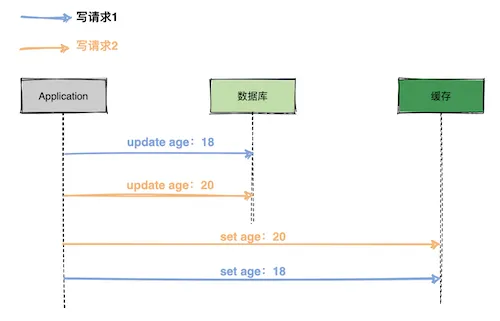
如果同时有两个写请求需要更新数据，每个写请求都先更新数据库再更新缓存，在并发场景可能会出现数据不一致的情况。

如上图的执行过程：

（1）写请求1更新数据库，将 age 字段更新为18；

（2）写请求2更新数据库，将 age 字段更新为20；

（3）写请求2更新缓存，缓存 age 设置为20；

（4）写请求1更新缓存，缓存 age 设置为18；

执行完预期结果是数据库 age 为20，缓存 age 为20，结果缓存 age为18，这就造成了缓存数据不是最新的，出现了脏数据。

##### 踩坑二：先删缓存，再更新数据库

如果写请求的处理流程是先删缓存再更新数据库，在一个读请求和一个写请求并发场景下可能会出现数据不一致情况。
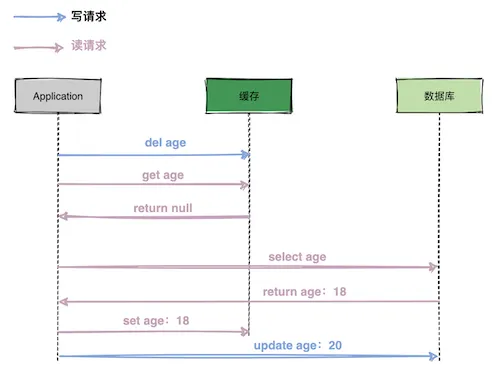
如上图的执行过程：

（1）写请求删除缓存数据；

（2）读请求查询缓存未击中(Hit Miss)，紧接着查询数据库，将返回的数据回写到缓存中；

（3）写请求更新数据库。

整个流程下来发现数据库中age为20，缓存中age为18，缓存和数据库数据不一致，缓存出现了脏数据。

##### 踩坑三：先更新数据库，再删除缓存
在实际的系统中针对写请求还是推荐先更新数据库再删除缓存，但是在理论上还是存在问题，以下面这个例子说明。
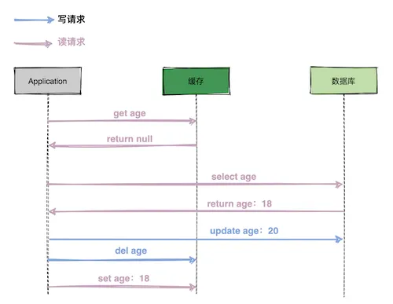
如上图的执行过程：

（1）读请求先查询缓存，缓存未击中，查询数据库返回数据；

（2）写请求更新数据库，删除缓存；

（3）读请求回写缓存；

整个流程操作下来发现数据库age为20，缓存age为18，即数据库与缓存不一致，导致应用程序从缓存中读到的数据都为旧数据。

但我们仔细想一下，上述问题发生的概率其实非常低，因为通常数据库更新操作比内存操作耗时多出几个数量级，上图中最后一步回写缓存（set age 18）速度非常快，通常会在更新数据库之前完成。

如果这种极端场景出现了怎么办？我们得想一个兜底的办法：缓存数据设置过期时间。通常在系统中是可以允许少量的数据短时间不一致的场景出现。

#### Read through
在 Cache Aside 更新模式中，应用代码需要维护两个数据源头：一个是缓存，一个是数据库。而在 Read-Through 策略下，应用程序无需管理缓存和数据库，只需要将数据库的同步委托给缓存提供程序 Cache Provider 即可。所有数据交互都是通过抽象缓存层完成的。
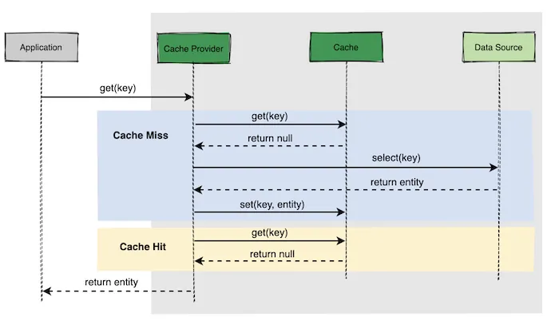
如上图，应用程序只需要与Cache Provider交互，不用关心是从缓存取还是数据库。

在进行大量读取时，Read-Through 可以减少数据源上的负载，也对缓存服务的故障具备一定的弹性。如果缓存服务挂了，则缓存提供程序仍然可以通过直接转到数据源来进行操作。

Read-Through 适用于多次请求相同数据的场景，这与 Cache-Aside 策略非常相似，但是二者还是存在一些差别，这里再次强调一下：

在 Cache-Aside 中，应用程序负责从数据源中获取数据并更新到缓存。
在 Read-Through 中，此逻辑通常是由独立的缓存提供程序（Cache Provider）支持。

#### Write-Through

Write-Through 策略下，当发生数据更新(Write)时，缓存提供程序 Cache Provider 负责更新底层数据源和缓存。

缓存与数据源保持一致，并且写入时始终通过抽象缓存层到达数据源。

Cache Provider类似一个代理的作用。


#### Write behind

Write behind在一些地方也被成为Write back， 简单理解就是：应用程序更新数据时只更新缓存， Cache Provider每隔一段时间将数据刷新到数据库中。说白了就是延迟写入。

如上图，应用程序更新两个数据，Cache Provider 会立即写入缓存中，但是隔一段时间才会批量写入数据库中。

这种方式有优点也有缺点：

- 优点是数据写入速度非常快，适用于频繁写的场景。
- 缺点是缓存和数据库不是强一致性，对一致性要求高的系统慎用。

#### 总结
学了这么多，相信大家对缓存更新的策略都已经有了清晰的认识。最后稍稍总结一下。

缓存更新的策略主要分为三种：
- Cache aside
- Read/Write through
- Write behind
Cache aside 通常会先更新数据库，然后再删除缓存，为了兜底通常还会将数据设置缓存时间。

Read/Write through 一般是由一个 Cache Provider 对外提供读写操作，应用程序不用感知操作的是缓存还是数据库。

Write behind简单理解就是延迟写入，Cache Provider 每隔一段时间会批量输入数据库，优点是应用程序写入速度非常快。

### ⭐MySQL 和 Redis 怎么保持数据一致?

对于缓存和数据库的操作，主要有以下两种方式。

#### 先删缓存，再更新数据库

举个 🌰 假设某个用户的年龄是 20，请求 A 要更新用户年龄为 21，所以它会删除缓存中的内容。这时，另一个请求 B  要读取这个用户的年龄，它查询缓存发现未命中后，会从数据库中读取到年龄为 20，并且写入到缓存中，然后请求 A 继续更改数据库，将用户的年龄更新为 21。


最终，该用户年龄在缓存中是 20（旧值），在数据库中是 21（新值），缓存和数据库的数据不一致。

可以看到，**先删除缓存，再更新数据库，在「读 + 写」并发的时候，还是会出现缓存和数据库的数据不一致的问题**。

> 核心理解：
>
> 用户A购买了一件商品，我们需要更新库存。这个过程如下：
>
> 1. 删除Redis中的库存缓存。
> 2. 更新MySQL中的库存数据。
>
> 问题是，在这两步操作之间，如果用户B查询了库存，他会发现Redis中没有缓存，因此他会从MySQL数据库读取库存数据（此时还未更新），并将旧的库存数据存入Redis。然后用户A的购买操作完成，MySQL的库存数据更新，但Redis中的数据仍是旧的，因此用户B看到的库存信息是错误的。
>
> 使用分布式锁可以解决这个问题。当用户A购买商品时，他首先获取商品库存的锁，然后删除Redis的缓存，更新MySQL的数据，最后释放锁。在此期间，如果用户B查询库存，他需要等待用户A释放锁。这样用户B总是能获得最新的库存信息。

##### 解决方案:延时双删

流程如下：

1. 线程1删除缓存，然后去更新数据库
2. 线程2来读缓存，发现缓存已经被删除，所以直接从数据库中读取，这时候由于线程1还没有更新完成，所以读到的是旧值，然后把旧值写入缓存
3. 线程1，根据估算的时间，sleep，由于sleep的时间大于线程2读数据+写缓存的时间，所以缓存被再次删除
4. 如果还有其他线程来读取缓存的话，就会再次从数据库中读取到最新值

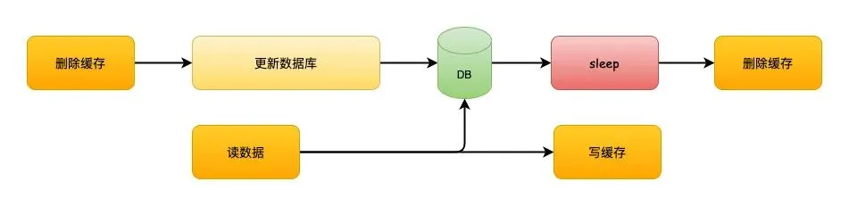

> 核心理解：
>
> "延迟双删"是一种解决Redis缓存和MySQL数据库一致性问题的策略，这个策略的基本思想是在更新数据库之后和删除缓存之后都执行一个小的延迟操作。下面是"延迟双删"策略的具体步骤：
>
> 1. 删除Redis缓存。
> 2. 更新MySQL数据库。
> 3. 延迟一段时间（比如几十毫秒）。
> 4. 再次删除Redis缓存。
>
> 这种策略的关键在于，第3步的延迟时间需要足够长，以确保在这段时间内任何其他可能从MySQL读取旧数据并写入Redis缓存的操作都已经完成。这样，当执行第4步的时候，我们可以确保删除的是最新的缓存数据。
>
> 在这种情况下，即使在步骤1和步骤2之间有其他请求从MySQL读取了旧数据并写入Redis，由于我们在步骤4中再次删除了缓存，所以这样的旧数据也会被删除，不会出现数据不一致的问题。
>
> 需要注意的是，"延迟双删"策略并不能完全保证数据的一致性，比如在步骤3的延迟期间，如果有新的请求更新了数据库并更新了缓存，然后步骤4的删除操作可能会把这个新的缓存数据也删除了，导致数据不一致的问题。但在实际应用中，由于我们可以通过控制延迟时间来极大地减小这种情况发生的概率，所以"延迟双删"策略通常是一个有效的解决方案。

#### 先更新数据库，再删除缓存

继续用「读 + 写」请求的并发的场景来分析。

假如某个用户数据在缓存中不存在，请求 A 读取数据时从数据库中查询到年龄为 20，在未写入缓存中时另一个请求 B 更新数据。它更新数据库中的年龄为 21，并且清空缓存。这时请求 A 把从数据库中读到的年龄为 20 的数据写入到缓存中。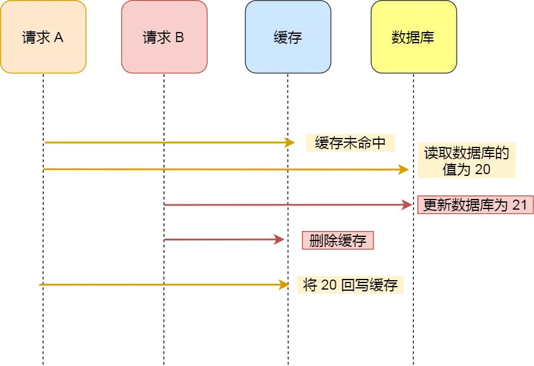

最终，该用户年龄在缓存中是 20（旧值），在数据库中是 21（新值），缓存和数据库数据不一致。

从上面的理论上分析，先更新数据库，再删除缓存也是会出现数据不一致性的问题，**但是在实际中，这个问题出现的概率并不高**。

**因为缓存的写入通常要远远快于数据库的写入**，所以在实际中很难出现请求 B 已经更新了数据库并且删除了缓存，请求 A 才更新完缓存的情况。

而一旦请求 A 早于请求 B 删除缓存之前更新了缓存，那么接下来的请求就会因为缓存不命中而从数据库中重新读取数据，所以不会出现这种不一致的情况。

所以，**「先更新数据库 + 再删除缓存」的方案，是可以保证数据一致性的**。

> 核心理解：
>
> 用户A购买了一件商品，我们需要更新库存。这个过程如下：
>
> 1. 更新MySQL中的库存数据。
> 2. 删除Redis中的库存缓存。
>
> 问题是，在这两步操作之间，如果用户B查询了库存，他可能从Redis中读到了旧的库存数量（因为缓存还未删除）。然后即使MySQL的库存数据更新了，用户B看到的库存信息仍是旧的。

##### 解决方案1:消息队列

这是网上很多文章里都有写过的方案。但是这个方案的缺陷会更明显一点。

先更新数据库，成功后往消息队列发消息，消费到消息后再删除缓存，借助消息队列的重试机制来实现，达到最终一致性的效果。


这个解决方案其实问题更多。

1. 引入消息中间件之后，问题更复杂了，怎么保证消息不丢失更麻烦
2. 就算更新数据库和删除缓存都没有发生问题，消息的延迟也会带来短暂的不一致性，不过这个延迟相对来说还是可以接受的

##### 解决方案2:进阶版消息队列

为了解决缓存一致性的问题单独引入一个消息队列，太复杂了。

其实，一般大公司本身都会有监听binlog消息的消息队列存在，主要是为了做一些核对的工作。

这样，我们可以借助监听binlog的消息队列来做删除缓存的操作。这样做的好处是，不用你自己引入，侵入到你的业务代码中，中间件帮你做了解耦，同时，中间件的这个东西本身就保证了高可用。

当然，这样消息延迟的问题依然存在，但是相比单纯引入消息队列的做法更好一点。

而且，如果并发不是特别高的话，这种做法的实时性和一致性都还算可以接受的。


##### 解决方案3:设置缓存过期时间

每次放入缓存的时候，设置一个过期时间，比如5分钟，以后的操作只修改数据库，不操作缓存，等待缓存超时后从数据库重新读取。

如果对于一致性要求不是很高的情况，可以采用这种方案。

这个方案还会有另外一个问题，就是如果数据更新的特别频繁，不一致性的问题就很大了。

在实际生产中，我们有一些活动的缓存数据是使用这种方式处理的。

因为活动并不频繁发生改变，而且对于活动来说，短暂的不一致性并不会有什么大的问题。

详细问题可以看：[数据库和缓存如何保证一致性？](https://xiaolincoding.com/redis/architecture/mysql_redis_consistency.html#%E5%85%88%E6%9B%B4%E6%96%B0%E6%95%B0%E6%8D%AE%E5%BA%93-%E8%BF%98%E6%98%AF%E5%85%88%E5%88%A0%E9%99%A4%E7%BC%93%E5%AD%98)

### ⭐️Redis如何实现分布式锁？

**分布式锁**：当多个进程不在同一个系统中(比如分布式系统中控制共享资源访问)，用分布式锁控制多个进程对资源的访问。

[Redis的官网](https://redis.io/docs/reference/patterns/distributed-locks/)上对使用分布式锁提出至少需要满足如下三个要求：

1. **互斥**（属于安全性）：在任何给定时刻，只有一个客户端可以持有锁。
2. **无死锁**（属于有效性）：即使锁定资源的客户端崩溃或被分区，也总是可以获得锁；通常通过超时机制实现。
3. **容错性**（属于有效性）：只要大多数 Redis 节点都启动，客户端就可以获取和释放锁。

**基于 redis 实现分布式锁**:

- 单个Redis实例：setnx(key,当前时间+过期时间) + Lua
- Redis集群模式：Redlock

#### 最简化版本

首先，当然是搭建一个最简单的实现方式，直接用Redis的setnx命令，这个命令的语法是：**setnx key value**

如果key不存在，则会将key设置为value，并返回1；如果key存在，不会有任务影响，返回0。

基于这个特性，我们就可以用setnx实现加锁的目的：通过setnx加锁，加锁之后其他服务无法加锁，用完之后，再通过delete解锁，深藏功与名


#### 支持过期时间

最简化版本有一个问题：**如果获取锁的服务挂掉了，那么锁就一直得不到释放**，就像石沉大海，杳无音信。所以，我们需要一个超时来兜底。

Redis中有expire命令，用来设置一个key的超时时间。但是setnx和expire不具备原子性，如果setnx获取锁之后，服务挂掉，依旧是泥牛入海。

很自然，我们会想到，set和expire，有没有原子操作？

当然有，Redis早就考虑到了这种场景，推出了如下执行语句：**set key value nx ex seconds**

nx表示具备setnx特定，ex表示增加了过期时间，最后一个参数就是过期时间的值。

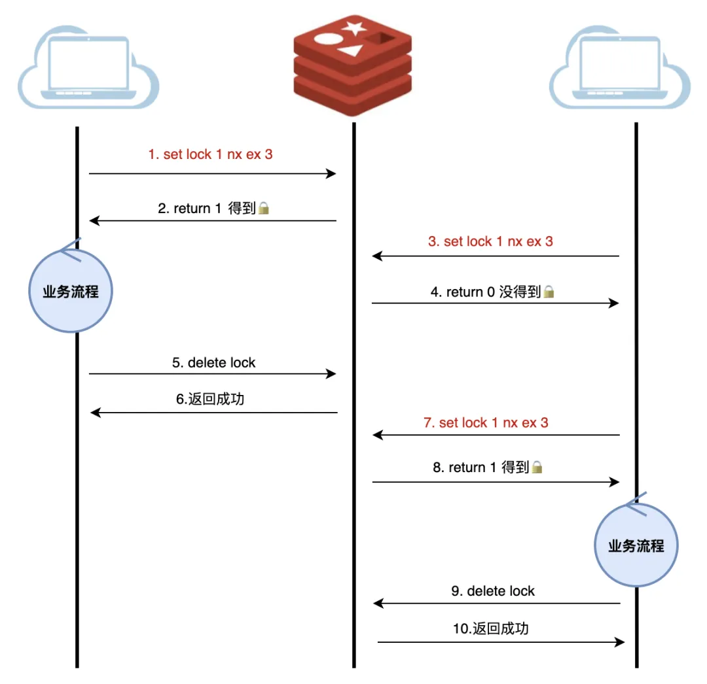

能够支持过期时间，目前这个锁基本上是能用了。

但是存在一个问题：会存在服务A释放掉服务B的锁的可能。

#### 加上owner

我们来试想一下如下场景：服务A获取了锁，由于业务流程比较长，或者网络延迟、GC卡顿等原因，导致锁过期，而业务还会继续进行。这时候，业务B已经拿到了锁，准备去执行，这个时候服务A恢复过来并做完了业务，就会释放锁，而B却还在继续执行。

在真实的分布式场景中，可能存在几十个竞争者，那么上述情况发生概率就很高，导致同一份资源频繁被不同竞争者同时访问，分布式锁也就失去了意义。

基于这个场景，我们可以发现，问题关键在于，竞争者可以释放其他人的锁。那么在异常情况下，就会出现问题，所以我们可以进一步给出解决方案：**分布式锁需要满足谁申请谁释放原则，不能释放别人的锁，也就是说，分布式锁，是要有归属的**


#### 引入Lua

加入owner后的版本可以称得上是完善了吗？还有没有什么隐患呢？

我也不卖关子了，到这一步其实还存在一个小问题，我们完整的流程是竞争者获取锁执行任务，执行完毕后检查锁是不是自己的，最后进行释放。

流程一梳理，你们肯定明白了，执行完毕后，**检查锁，再释放，这些操作不是原子化的。**

**可能锁获取时还是自己的，删除时却已经是别人的**了。这可怎么办呢？

Redis可没有直接提供这种场景原子化的操作啊。遇事不要慌，仔细想一想，Redis是不是还有个特性，专门整合原子操作，对，就是它——**Lua**

Redis➕Lua，可以说是专门为解决原子问题而生。

有了Lua的特性，Redis才真正在分布式锁、秒杀等场景，有了用武之地，下面便是改造之后的流程：

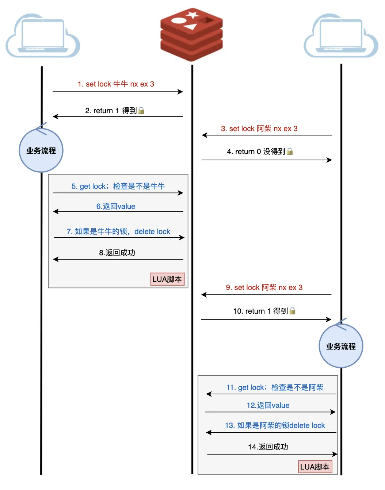

其实到了这一步，分布式锁的前三个特性：对称性、安全性、可靠性，就满足了。可以说是一个可用的分布式锁了，能满足大多数场景的需要

#### Redisson

对于可能存在**锁过期释放，业务没执行完** 的问题。我们可以稍微把锁过期时间设置长一些，大于正常业务处理时间就好啦。如果你觉得不是很稳，还可以给获得锁的线程，开启一个定时守护线程，每隔一段时间检查锁是否还存在，存在则对锁的过期时间延长，防止锁过期提前释放。

当前开源框架Redisson解决了这个问题。可以看下Redisson底层原理图：

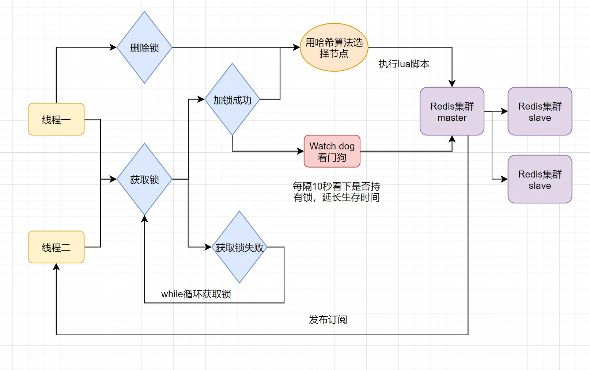

只要线程一加锁成功，就会启动一个 `watch dog`看门狗，它是一个后台线程，会每隔10秒检查一下，如果线程1还持有锁，那么就会不断的延长锁key的生存时间。因此，Redisson就是使用watch dog解决了**「锁过期释放，业务没执行完」**问题。

#### Redlock+Redisson

其实Redis一般都是集群部署的：


如果线程一在Redis的master节点上拿到了锁，但是加锁的key还没同步到slave节点。恰好这时，master节点发生故障，一个slave节点就会升级为master节点。线程二就可以获取同个key的锁啦，但线程一也已经拿到锁了，锁的安全性就没了。

为了解决这个问题，Redis作者 antirez提出一种高级的分布式锁算法：Redlock。Redlock核心思想是这样的：

> ❝
>
> 搞多个Redis master部署，以保证它们不会同时宕掉。并且这些master节点是完全相互独立的，相互之间不存在数据同步。同时，需要确保在这多个master实例上，是与在Redis单实例，使用相同方法来获取和释放锁。
>
> ❞

我们假设当前有5个Redis master节点，在5台服务器上面运行这些Redis实例。


RedLock的实现步骤:如下

> ❝
>
> - 1.获取当前时间，以毫秒为单位。
> - 2.按顺序向5个master节点请求加锁。客户端设置网络连接和响应超时时间，并且超时时间要小于锁的失效时间。（假设锁自动失效时间为10秒，则超时时间一般在5-50毫秒之间,我们就假设超时时间是50ms吧）。如果超时，跳过该master节点，尽快去尝试下一个master节点。
> - 3.客户端使用当前时间减去开始获取锁时间（即步骤1记录的时间），得到获取锁使用的时间。当且仅当超过一半（N/2+1，这里是5/2+1=3个节点）的Redis master节点都获得锁，并且使用的时间小于锁失效时间时，锁才算获取成功。（如上图，10s> 30ms+40ms+50ms+4m0s+50ms）
> - 如果取到了锁，key的真正有效时间就变啦，需要减去获取锁所使用的时间。
> - 如果获取锁失败（没有在至少N/2+1个master实例取到锁，有或者获取锁时间已经超过了有效时间），客户端要在所有的master节点上解锁（即便有些master节点根本就没有加锁成功，也需要解锁，以防止有些漏网之鱼）。
>
> ❞

简化下步骤就是：

- 按顺序向5个master节点请求加锁
- 根据设置的超时时间来判断，是不是要跳过该master节点。
- 如果大于等于3个节点加锁成功，并且使用的时间小于锁的有效期，即可认定加锁成功啦。
- 如果获取锁失败，解锁！

#### Zookeeper分布式锁

Zookeeper的节点Znode有四种类型：

- **持久节点** ：默认的节点类型。创建节点的客户端与zookeeper断开连接后，该节点依旧存在。
- **持久节点顺序节点** ：所谓顺序节点，就是在创建节点时，Zookeeper根据创建的时间顺序给该节点名称进行编号，持久节点顺序节点就是有顺序的持久节点。
- **临时节点** ：和持久节点相反，当创建节点的客户端与zookeeper断开连接后，临时节点会被删除。
- **临时顺序节点** ：有顺序的临时节点。

Zookeeper分布式锁实现应用了**临时顺序节点** 。这里不贴代码啦，来讲下zk分布式锁的实现原理吧。

##### zk获取锁过程

当第一个客户端请求过来时，Zookeeper客户端会创建一个持久节点`locks`。如果它（Client1）想获得锁，需要在`locks`节点下创建一个顺序节点`lock1`.如图

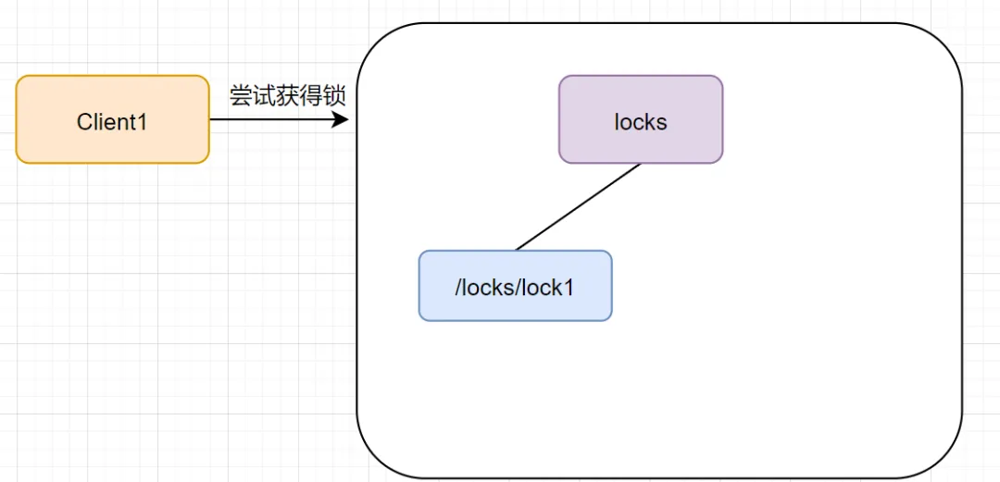

接着，客户端Client1会查找`locks`下面的所有临时顺序子节点，判断自己的节点`lock1`是不是排序最小的那一个，如果是，则成功获得锁。

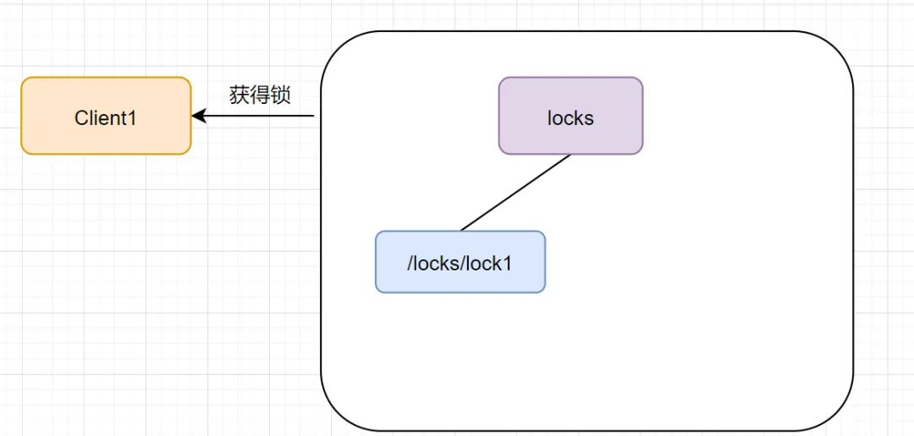

这时候如果又来一个客户端client2前来尝试获得锁，它会在locks下再创建一个临时节点`lock2`


客户端client2一样也会查找locks下面的所有临时顺序子节点，判断自己的节点lock2是不是最小的，此时，发现lock1才是最小的，于是获取锁失败。获取锁失败，它是不会甘心的，client2向它排序靠前的节点lock1注册Watcher事件，用来监听lock1是否存在，也就是说client2抢锁失败进入等待状态。

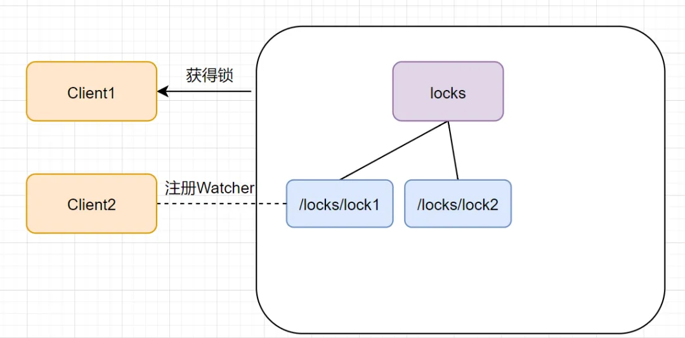

此时，如果再来一个客户端Client3来尝试获取锁，它会在locks下再创建一个临时节点lock3


同样的，client3一样也会查找locks下面的所有临时顺序子节点，判断自己的节点lock3是不是最小的，发现自己不是最小的，就获取锁失败。它也是不会甘心的，它会向在它前面的节点lock2注册Watcher事件，以监听lock2节点是否存在。


### 集群脑裂导致数据丢失怎么办？

> 什么是脑裂？

先来理解集群的脑裂现象，这就好比一个人有两个大脑，那么到底受谁控制呢？

那么在 Redis 中，集群脑裂产生数据丢失的现象是怎样的呢？

在 Redis 主从架构中，部署方式一般是「一主多从」，主节点提供写操作，从节点提供读操作。 如果主节点的网络突然发生了问题，它与所有的从节点都失联了，但是此时的主节点和客户端的网络是正常的，这个客户端并不知道 Redis  内部已经出现了问题，还在照样的向这个失联的主节点写数据（过程A），此时这些数据被旧主节点缓存到了缓冲区里，因为主从节点之间的网络问题，这些数据都是无法同步给从节点的。

这时，哨兵也发现主节点失联了，它就认为主节点挂了（但实际上主节点正常运行，只是网络出问题了），于是哨兵就会在「从节点」中选举出一个 leeder 作为主节点，这时集群就有两个主节点了 —— **脑裂出现了**。

然后，网络突然好了，哨兵因为之前已经选举出一个新主节点了，它就会把旧主节点降级为从节点（A），然后从节点（A）会向新主节点请求数据同步，**因为第一次同步是全量同步的方式，此时的从节点（A）会清空掉自己本地的数据，然后再做全量同步。所以，之前客户端在过程 A 写入的数据就会丢失了，也就是集群产生脑裂数据丢失的问题**。

总结一句话就是：由于网络问题，集群节点之间失去联系。主从数据不同步；重新平衡选举，产生两个主服务。等网络恢复，旧主节点会降级为从节点，再与新主节点进行同步复制的时候，由于会从节点会清空自己的缓冲区，所以导致之前客户端写入的数据丢失了。

> 解决方案

当主节点发现从节点下线或者通信超时的总数量小于阈值时，那么禁止主节点进行写数据，直接把错误返回给客户端。

在 Redis 的配置文件中有两个参数我们可以设置：

- min-slaves-to-write x，主节点必须要有至少 x 个从节点连接，如果小于这个数，主节点会禁止写数据。
- min-slaves-max-lag x，主从数据复制和同步的延迟不能超过 x 秒，如果超过，主节点会禁止写数据。

我们可以把 min-slaves-to-write 和 min-slaves-max-lag 这两个配置项搭配起来使用，分别给它们设置一定的阈值，假设为 N 和 T。

这两个配置项组合后的要求是，主库连接的从库中至少有 N 个从库，和主库进行数据复制时的 ACK 消息延迟不能超过 T 秒，否则，主库就不会再接收客户端的写请求了。

即使原主库是假故障，它在假故障期间也无法响应哨兵心跳，也不能和从库进行同步，自然也就无法和从库进行 ACK 确认了。这样一来，min-slaves-to-write 和 min-slaves-max-lag 的组合要求就无法得到满足，**原主库就会被限制接收客户端写请求，客户端也就不能在原主库中写入新数据了**。

**等到新主库上线时，就只有新主库能接收和处理客户端请求，此时，新写的数据会被直接写到新主库中。而原主库会被哨兵降为从库，即使它的数据被清空了，也不会有新数据丢失。**

再来举个例子。

假设我们将 min-slaves-to-write 设置为 1，把 min-slaves-max-lag 设置为 12s，把哨兵的  down-after-milliseconds 设置为 10s，主库因为某些原因卡住了 15s，导致哨兵判断主库客观下线，开始进行主从切换。

同时，因为原主库卡住了 15s，没有一个从库能和原主库在 12s 内进行数据复制，原主库也无法接收客户端请求了。

这样一来，主从切换完成后，也只有新主库能接收请求，不会发生脑裂，也就不会发生数据丢失的问题了。
