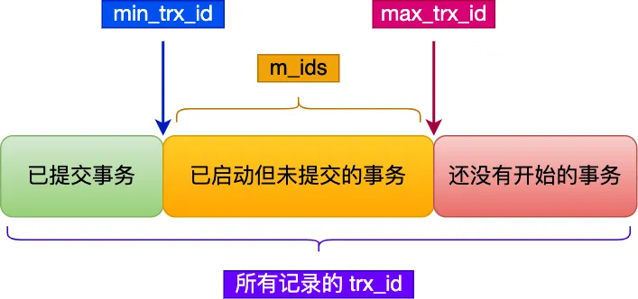

---

order: 16
author: zhiyu1998
title: 中小厂面试指南
category:
  - 中小厂
  - 八股文
---

# 中小厂面试指南

## 🚶前言
这个系列是精选的补集，精选主要是补充知识，但是后面又加入了一些中小厂的内容也是用来补充知识，但是随着知识的增多有些感觉没法融入进去，就开创了这个小节，收录一些中小厂的面试题，有些以前有的内容就不会加入到这里（可能有一些企业都没听说过，但没关系，如果你面试的是中小厂那应该会非常有用）。

## 🐦Java
### 泛型的桥方法？
桥方法是Java编译器在进行泛型擦除的时候生成的一个机制。因为泛型擦除可能会导致子类方法的签名和父类方法的签名不同，Java编译器会自动插入一个桥方法来保持多态性。桥方法的主要目标就是确保子类方法在参数类型上和父类保持一致，这就意味着它将子类方法的参数类型转换成父类方法的参数类型。

例如：
```java
public class Node<T> {

    public T data;

    public Node(T data) { this.data = data; }

    public void setData(T data) {
        System.out.println("Node.setData");
        this.data = data;
    }
}

public class MyNode extends Node<Integer> {
    public MyNode(Integer data) { super(data); }

    public void setData(Integer data) {
        System.out.println("MyNode.setData");
        super.setData(data);
    }
}
```

因为泛型擦除，MyNode类的setData方法和它的超类Node的setData方法签名不同。所以编译器会生成一个桥方法在MyNode类里面，它看起来大概是这样：

```java
public void setData(Object data) {
    setData((Integer) data);
}
```

这个桥方法会保持多态性并使得泛型代码在运行时期能正确执行。


### try catch 应该在 for 循环里面还是外面？

1. ##### try  catch  在 for 循环 外面

```java
public static void tryOutside() {
    try {
        for (int count = 1; count <= 5; count++) {
            if (count == 3) {
                //故意制造一下异常
                int num = 1 / 0;
            } else {
                System.out.println("count:" + count + " 业务正常执行");
            }
        }
    } catch (Exception e) {
        System.out.println("try catch  在for 外面的情形， 出现了异常，for循环显然被中断");
    }
}
```

try  catch  在 for 循环 外面 的时候， 如果 for循环过程中出现了异常， 那么for循环会终止。


2. ##### try  catch  在 for 循环 里面

```java
public static void tryInside() {

    for (int count = 1; count <= 5; count++) {
        try {
            if (count == 3) {
                //故意制造一下异常
                int num = 1 / 0;
            } else {
                System.out.println("count:" + count + " 业务正常执行");
            }
        } catch (Exception e) {
            System.out.println("try catch  在for 里面的情形， 出现了异常，for循环显然继续执行");
        }
    }
}
```

try  catch  在 for 循环 里面 的时候， 如果 for循环过程中出现了异常，异常被catch抓掉，不影响for循环 继续执行。


总结：

如果说代码没出错的话， try catch 在 for 里面 和 外面 ，都是几乎没区别的。

- 其实就是看业务。我需要出现异常就终止循环的，就放外边；

- 不需要终止循环，就搞里边


### HashMap是否可以存null？

是的，Java的HashMap允许空键和空值。您可以在HashMap中存储一个空键和任意数量的空值。这是一个例子：

```java
import java.util.HashMap;

public class Main {
    public static void main(String[] args) {
        HashMap<String, String> map = new HashMap<>();

        // Storing null key
        map.put(null, "value for null key");

        // Storing null value
        map.put("key1", null);
        map.put("key2", null);

        // Printing the HashMap
        for(String key: map.keySet()){
            System.out.println("Key: " + key + ", Value: " + map.get(key));
        }
    }
}

```

输出：

```java
Key: null, Value: value for null key
Key: key1, Value: null
Key: key2, Value: null
```

注意，当使用null键或值时，如果某些方法不是为处理null而设计的，它们可能会抛出NullPointerException。因此，在将null键或值与HashMap一起使用之前，最好先检查方法。


## ♻️JVM

### 元空间是起到什么作用？

在Java虚拟机（JVM）中，元空间（Metaspace）主要用于存放类的元数据。这些元数据包括类的结构、方法、字段等信息。元空间的引入主要是为了解决永久代（PermGen）的一些限制和问题。

在Java 8之前，JVM使用永久代来存储这些类的元数据。然而，永久代的大小是固定的，当加载的类过多时，可能会导致永久代空间不足，从而引发`java.lang.OutOfMemoryError: PermGen space`错误。

为了解决这个问题，Java 8引入了元空间来替代永久代。元空间位于本地内存（native memory）中，而不是Java堆内存。这意味着元空间的大小不再受到Java堆大小的限制，而是受到本地内存的限制。这样可以避免因类加载过多导致的内存溢出问题。

总结一下，元空间在JVM中起到以下作用：

1. 存储类的元数据，包括类的结构、方法、字段等信息。
2. 解决了永久代空间不足的问题，因为元空间位于本地内存，不受Java堆大小的限制。
3. 提高了类加载和卸载的效率。

需要注意的是，虽然元空间可以解决永久代空间不足的问题，但仍然需要关注类的加载和卸载情况。如果元空间中的类元数据过多，也可能导致内存溢出。在这种情况下，需要对类加载器、类的生命周期等方面进行优化。


### 双亲委派机制的双亲是哪双亲呢？

类加载器（ClassLoader）


## 🕝并发
### 为什么不推荐使用内置线程池创建方式？
Java中的内置线程池创建方式（如Executors.newFixedThreadPool()、Executors.newCachedThreadPool()）并不是最佳实践，原因如下：
1. Executors.newFixedThreadPool(int)和Executors.newSingleThreadExecutor()的问题在于它们默认使用的是无界的任务队列，也就是说，当所有线程都处于忙碌状态时，新提交的任务会继续在队列中等待，而不是被拒绝。这可能会导致在负载很高时，任务队列会持续无限制地增长，最终可能耗尽内存。
2. Executors.newCachedThreadPool()的问题在于它允许创建无限数量的线程。如果传入的任务过多，会创建大量的线程，可能导致系统过载。

因此，建议使用ThreadPoolExecutor类创建自定义线程池，以便更好地控制线程池的配置。


### 如何不使用锁来进行重用和保证线程安全

为了在Java中实现线程安全而不使用显式的锁，有几种替代方法：

**不可变性**：第一种方法是创建不可变对象，这些对象在创建后不能被修改。不可变对象从创建到销毁始终保持不变，因此天然线程安全。Java中的String类就是一个不可变类的例子。要创建一个不可变类，需要：

- 确保该类声明为final
- 确保所有字段都为final和private
- 不提供“setter”方法——修改字段或对象的方法
- 如果有任何可变字段（例如，如果您的类具有数组或Collection对象），请确保独占访问。不要提供访问这些对象引用的方法。相反，您可以提供返回这些对象副本的方法。

**原子变量**：Java提供了java.util.concurrent.atomic包，其中包括AtomicInteger、AtomicLong等类。这些类使用高效的机器级指令来确保原子性，而不是使用锁。当执行简单的原子操作（如增加值）时，可以使用这些类。

**ThreadLocal变量**：ThreadLocal变量可以通过为每个线程提供变量的实例来提供线程安全，因此每个线程都将拥有其自己的变量副本。这是一种替代同步的方法，但应谨慎使用，因为如果不小心使用，可能会导致高内存消耗。

**Volatile变量**：Java中的volatile关键字用作指示器，告诉JVM访问变量的线程必须始终将其私有副本与内存中的主副本协调一致。虽然volatile不执行任何互斥，但它是从写线程到读线程的一种通信方式，表示变量的值已被修改。

**并发工具**：java.util.concurrent包提供了几个并发工具，如CountDownLatch、Semaphore、CyclicBarrier、Exchanger等，可以在不使用synchronized关键字的情况下实现线程安全。但是请注意，在底层，这些工具可能仍然使用锁或其他同步机制。

**非阻塞算法**：非阻塞算法旨在避免使用锁，而是使用低级原子机器指令，例如CAS。这种方法非常复杂，只有在绝对必要时才应使用，因为生成的代码可能非常难以理解和维护。


## 📑MySQL
### 主键索引和唯一索引可以存储NULL值吗？
在MySQL中，主键索引和唯一索引对于NULL值的处理是不同的。
- 主键索引：**主键索引不允许存储NULL值**。在MySQL中，主键是一种特殊的唯一索引，不仅要求索引的值唯一，而且要求索引的值非空。这是因为主键的主要任务是唯一标识表中的每一行记录，如果允许主键包含NULL值，那么就无法保证能够唯一标识每一行记录。
- 唯一索引：**唯一索引允许存储NULL值**。在MySQL中，唯一索引要求索引的值唯一，但是可以包含NULL值。这是因为在SQL标准中，NULL表示未知或者不适用，所以两个NULL值并不被认为是相等的，因此可以在唯一索引中存储多个NULL值。

总的来说，主键索引不允许存储NULL值，而唯一索引允许存储NULL值。


### 数据量很大的情况下，数据库要怎么加快查询？（SQL优化策略）
1. **优化索引**：为经常用于查询条件的列创建适当的索引，这可以大大加快查询速度。在创建索引时，要注意选择性高的列，避免创建过多不必要的索引，以免影响写性能
2. **分区表**：对于非常大的表，可以使用分区技术将数据划分到多个物理子表中。这样，在查询数据时，MySQL只需要在一个或多个相关的分区上进行搜索，而不是扫描整个表。
3. **分页查询**：避免一次性查询大量数据，而是使用`LIMIT`和`OFFSET`进行分页查询。这样可以减少单次查询的数据量，提高响应速度。
4. **使用缓存**：对于常用的查询结果，可以将其缓存到内存中，如Redis或Memcached。当需要查询相同的数据时，可以直接从缓存中获取，而不需要再次查询数据库。
5. **查询优化**：分析和优化SQL查询，避免使用子查询、全表扫描和笛卡尔积。使用`EXPLAIN`命令来查看查询的执行计划，找出性能瓶颈。
6. **使用视图和存储过程**：视图可以将复杂的查询逻辑封装起来，简化查询操作。存储过程可以在数据库服务器上执行逻辑，减少数据在网络中传输的开销。
7. **数据库服务器调优**：根据实际情况调整数据库服务器的配置参数，如InnoDB缓冲池大小、日志缓冲区大小、最大连接数等，以提高查询性能。
8. **数据存储引擎选择**：根据需要选择合适的存储引擎。例如，InnoDB引擎支持行级锁定和事务，适合高并发读写；MyISAM引擎适用于只读或读多写少的场景，查询性能较好。
9. **数据归档和清理**：定期归档或清理不再需要的数据，以减少数据量，提高查询速度。
10. **横向扩展**：在必要时，可以对数据库进行分片（sharding），将数据分配到多个数据库服务器上。这样可以实现横向扩展，提高查询性能。


### 说说 mvcc 机制？

> 这里写一个简化版本

我们需要了解两个知识：

- Read View 中四个字段作用；
- 聚簇索引记录中两个跟事务有关的隐藏列；

Read View 有四个重要的字段：

- m_ids ：指的是在创建 Read View 时，当前数据库中「活跃事务」的**事务 id 列表**，注意是一个列表，**“活跃事务”指的就是，启动了但还没提交的事务**。
- min_trx_id ：指的是在创建 Read View 时，当前数据库中「活跃事务」中事务 **id 最小的事务**，也就是 m_ids 的最小值。
- max_trx_id ：这个并不是 m_ids 的最大值，而是**创建 Read View 时当前数据库中应该给下一个事务的 id 值**，也就是全局事务中最大的事务 id 值 + 1；
- creator_trx_id ：指的是**创建该 Read View 的事务的事务 id**。

对于使用 InnoDB 存储引擎的数据库表，它的聚簇索引记录中都包含下面两个隐藏列：

- trx_id，当一个事务对某条聚簇索引记录进行改动时，就会**把该事务的事务 id 记录在 trx_id 隐藏列里**；
- roll_pointer，每次对某条聚簇索引记录进行改动时，都会把旧版本的记录写入到 undo 日志中，然后**这个隐藏列是个指针，指向每一个旧版本记录**，于是就可以通过它找到修改前的记录。

在创建 Read View 后，我们可以将记录中的 trx_id 划分这三种情况：



一个事务去访问记录的时候，除了自己的更新记录总是可见之外，还有这几种情况：

- 如果记录的 trx_id 值小于 Read View 中的 `min_trx_id` 值，表示这个版本的记录是在创建 Read View **前**已经提交的事务生成的，所以该版本的记录对当前事务**可见**。

- 如果记录的 trx_id 值大于等于 Read View 中的 `max_trx_id` 值，表示这个版本的记录是在创建 Read View **后**才启动的事务生成的，所以该版本的记录对当前事务**不可见**。

- 如果记录的 trx_id 值在 Read View 的min_trx_id和max_trx_id之间，需要判断 trx_id 是否在 m_ids 列表中：

- - 如果记录的 trx_id **在** `m_ids` 列表中，表示生成该版本记录的活跃事务依然活跃着（还没提交事务），所以该版本的记录对当前事务**不可见**。
  - 如果记录的 trx_id **不在** `m_ids`列表中，表示生成该版本记录的活跃事务已经被提交，所以该版本的记录对当前事务**可见**。

**这种通过「版本链」来控制并发事务访问同一个记录时的行为就叫 MVCC（多版本并发控制）。**


### mvcc 会加锁吗？

MVCC并不会完全避免加锁，而是使用一种更精细的锁定策略，使得加锁的冲突可能性大大降低。

MVCC通过创建数据行的快照（snapshot）来实现，这样，事务在读取数据时看到的是一个一致性视图，而不是实际数据。这意味着，多个事务可以同时读取相同的数据行，而无需加锁。然而，在对数据进行写操作时，MVCC会使用行级锁来确保数据的一致性。

以下是MySQL中InnoDB存储引擎的MVCC与锁定的关系：

1. **共享锁（S锁）**：当事务需要读取一行数据时，它会请求一个共享锁。多个事务可以同时持有共享锁，但只要有一个事务持有排他锁，其他事务就不能获取共享锁。
2. **排他锁（X锁）**：当事务需要修改或删除一行数据时，它会请求一个排他锁。如果一个事务持有排他锁，其他事务不能获取该行的共享锁或排他锁。
3. **意向共享锁（IS锁）\**和\**意向排他锁（IX锁）**：这些锁是InnoDB为了减少锁定冲突而引入的。它们不会锁定数据行，而是表明事务打算在某行上请求共享锁或排他锁。

总的来说，MVCC在MySQL的InnoDB存储引擎中使用了行级锁定，但它允许多个事务在没有冲突的情况下同时进行。当事务需要对数据进行写操作时，MVCC会使用行级锁来确保数据的一致性。


### mvcc 解决了幻读吗？

MySQL InnoDB 引擎的默认隔离级别虽然是「可重复读」，但是它很大程度上避免幻读现象（并不是完全解决了），解决的方案有两种：

- 针对**快照读**（普通 select 语句），是**通过 MVCC 方式解决了幻读**，因为可重复读隔离级别下，事务执行过程中看到的数据，一直跟这个事务启动时看到的数据是一致的，即使中途有其他事务插入了一条数据，是查询不出来这条数据的，所以就很好了避免幻读问题。
- 针对**当前读**（select ... for update 等语句），是**通过 next-key lock（记录锁+间隙锁）方式解决了幻读**，因为当执行 select ... for update 语句的时候，会加上 next-key lock，如果有其他事务在 next-key lock 锁范围内插入了一条记录，那么这个插入语句就会被阻塞，无法成功插入，所以就很好了避免幻读问题。

这两个解决方案是很大程度上解决了幻读现象，但是还是有个别的情况造成的幻读现象是无法解决的。

比如这个场景：


在可重复读隔离级别下，事务 A 第一次执行普通的 select 语句时生成了一个 ReadView，之后事务 B 向表中新插入了一条 id = 5 的记录并提交。接着，事务 A 对 id = 5 这条记录进行了更新操作，在这个时刻，这条新记录的 trx_id 隐藏列的值就变成了事务 A 的事务 id，之后事务 A 再使用普通 select 语句去查询这条记录时就可以看到这条记录了，于是就发生了幻读。

因为这种特殊现象的存在，所以我们认为 **MySQL Innodb 中的 MVCC 并不能完全避免幻读现象**。


### mysql 默认的隔离级别是可重复读，那是如何保证可重复读的呢？

可重复读隔离级别是启动事务时生成一个 Read View，然后整个事务期间都在用这个 Read View。


### 读已提交是啥, 怎么保证的？

读提交隔离级别是在每次读取数据时，都会生成一个新的 Read View。也意味着，事务期间的多次读取同一条数据，前后两次读的数据可能会出现不一致，因为可能这期间另外一个事务修改了该记录，并提交了事务。


### 联合索引在b+树怎么表示的？在对数据排序时，什么时候会根据第二个字段排序?

通过将多个字段组合成一个索引，该索引就被称为联合索引。

比如，将商品表中的 product_no 和 name 字段组合成联合索引`(product_no, name)`，创建联合索引的方式如下：

```
CREATE INDEX index_product_no_name ON product(product_no, name);
```

联合索引`(product_no, name)` 的 B+Tree 示意图如下（图中叶子节点之间我画了单向链表，但是实际上是双向链表，原图我找不到了，修改不了，偷个懒我不重画了，大家脑补成双向链表就行）。


可以看到，联合索引的非叶子节点用两个字段的值作为 B+Tree 的 key 值。当在联合索引查询数据时，先按 product_no 字段比较，在 product_no 相同的情况下再按 name 字段比较。

也就是说，联合索引查询的 B+Tree 是先按 product_no 进行排序，然后再 product_no 相同的情况再按 name 字段排序。

因此，使用联合索引时，存在**最左匹配原则**，也就是按照最左优先的方式进行索引的匹配。在使用联合索引进行查询的时候，如果不遵循「最左匹配原则」，联合索引会失效，这样就无法利用到索引快速查询的特性了。


### 索引底层数据是有序排序的，你知道它是怎样有序排序的原理吗？

二叉树会比较数据，从上至下以此分配和排序数据


### 如果 SQL 和索引都没问题，查询还是很慢怎么办？

- 大查询改造为分批查询
- 数据库分表，降低数据库表的数量
- 引入redis缓存 ，减少 mysql 的访问


### 在 mybatis-plus 有封装好的分页配置类，如果是在mysql 的话，你怎么写分页语句的？

在mybatis-plus中，有一个内置的分页插件`PaginationInterceptor`，它可以帮助你轻松地实现分页功能。首先，你需要在你的配置类中注册这个分页插件。以下是一个示例：

```java
@Configuration
public class MybatisPlusConfig {

    @Bean
    public PaginationInterceptor paginationInterceptor() {
        return new PaginationInterceptor();
    }
}
```

然后，你可以在你的mapper接口中使用`Page`类作为参数，编写相应的分页查询方法。例如：

```java
public interface UserMapper extends BaseMapper<User> {
    List<User> selectUserPage(Page<User> page, @Param("ew") Wrapper<User> wrapper);
}
```

在你的service实现类中，你可以调用这个分页方法，传入一个`Page`对象作为参数。例如：

```java
@Service
public class UserServiceImpl extends ServiceImpl<UserMapper, User> implements UserService {

    @Autowired
    private UserMapper userMapper;

    @Override
    public IPage<User> selectUserPage(Page<User> page, Wrapper<User> wrapper) {
        return userMapper.selectUserPage(page, wrapper);
    }
}
```

在你的controller中，你可以创建一个`Page`对象，并设置当前页和每页显示的记录数。然后调用对应的service方法，获取分页结果。例如：

```java
@RestController
@RequestMapping("/users")
public class UserController {

    @Autowired
    private UserService userService;

    @GetMapping
    public IPage<User> getUserList(@RequestParam(defaultValue = "1") int current,
                                   @RequestParam(defaultValue = "10") int size) {
        Page<User> page = new Page<>(current, size);
        return userService.selectUserPage(page, null);
    }
}
```

这样，你就可以在MySQL数据库中实现分页查询功能了。mybatis-plus会根据当前的数据库类型自动选择合适的分页语句。在MySQL中，分页语句通常使用`LIMIT`和`OFFSET`子句，例如：

```mysql
SELECT * FROM user LIMIT #{size} OFFSET #{offset}
```


如果使用MyBatis而非MySQL进行分页查询：

1. 首先，我们需要在MyBatis的Mapper XML文件中写一个分页查询的SQL语句。例如：

```xml
<select id="findUserByPage" parameterType="map" resultType="User">
    SELECT * FROM user LIMIT #{offset}, #{limit}
</select>
```

这里，`#{offset}`和`#{limit}`是我们将要传入的参数，分别代表查询的起始位置和查询的数量。在MySQL中，`LIMIT #{offset}, #{limit}`表示跳过`#{offset}`条记录，取出`#{limit}`条记录。

2. 然后，我们在Mapper接口中添加一个对应的方法：

```java
interface UserMapper {
    List<User> findUserByPage(@Param("offset") int offset, @Param("limit") int limit);
}
```

3. 最后，在服务类中，我们可以计算出`offset`和`limit`的值，然后调用上面的方法：

```java
@Service
public class UserServiceImpl implements UserService {

    @Autowired
    private UserMapper userMapper;

    public List<User> findUserByPage(int pageNum, int pageSize) {
        // 计算起始位置
        int offset = (pageNum - 1) * pageSize;
        // 查询
        return userMapper.findUserByPage(offset, pageSize);
    }
}
```

这里，`pageNum`表示当前页码，`pageSize`表示每页的记录数。`offset`表示查询的起始位置，等于`(pageNum - 1) * pageSize`


### 深分页如何优化？

深分页是一种在大数据量的情况下查询后面页数的数据的情况。在MySQL中，如果你使用`LIMIT offset, count`进行分页，当`offset`非常大的时候，查询性能会急剧下降，因为MySQL需要遍历从表头到`offset`位置的所有记录。

这种情况下，可以使用以下几种方法来优化：

1. **索引优化**：在查询字段上添加索引可以显著提高查询速度。如果你经常按某个字段进行分页，比如按创建时间，那么可以在这个字段上添加索引。

2. **记住上次的位置**：如果用户是按顺序查看每一页的，那么在查询下一页的时候，可以记住上一页的最后一条记录，然后查询大于这条记录的数据，而不是从头开始查询。例如：

   ```mysql
   SELECT * FROM user WHERE id > #{lastId} ORDER BY id LIMIT #{pageSize}
   ```

   这样，无论`lastId`是多少，查询速度都是一样的。

3. **ID范围查询**：如果ID是连续的，可以根据ID的范围来查询，而不是根据页码。例如，如果每页100条记录，那么第一页查询ID为1-100的记录，第二页查询ID为101-200的记录，以此类推。

   ```mysql
   SELECT * FROM user WHERE id BETWEEN #{startId} AND #{endId}
   ```

4. **分区表**：如果数据量非常大，可以使用分区表，将数据分布到多个表中，可以显著提高查询速度。

5. **数据异步加载**：可以在用户浏览页面的时候，后台异步加载数据，用户看到的是已经加载完成的数据，不需要等待。

6. **减少每页的记录数**：每页的记录数越多，查询和渲染的时间就越长。可以适当减少每页的记录数，提高用户体验。

7. **只显示前N页**：有的网站会限制只显示前N页的数据，如果用户想查询更多的数据，需要使用其他的条件进行筛选。

8. **使用搜索引擎**：对于全文搜索、复杂查询等场景，可以使用`Elasticsearch`等搜索引擎进行分页查询，它们一般具有更好的查询性能和更丰富的功能。


### 导致索引失效有哪些？

> 简化版

- 当我们使用左或者左右模糊匹配的时候，也就是 `like %xx` 或者 `like %xx%`这两种方式都会造成索引失效；
- 当我们在查询条件中对索引列使用函数，就会导致索引失效。
- 当我们在查询条件中对索引列进行表达式计算，也是无法走索引的。
- MySQL 在遇到字符串和数字比较的时候，会自动把字符串转为数字，然后再进行比较。如果字符串是索引列，而条件语句中的输入参数是数字的话，那么索引列会发生隐式类型转换，由于隐式类型转换是通过 CAST 函数实现的，等同于对索引列使用了函数，所以就会导致索引失效。
- 联合索引要能正确使用需要遵循最左匹配原则，也就是按照最左优先的方式进行索引的匹配，否则就会导致索引失效。
- 在 WHERE 子句中，如果在 OR 前的条件列是索引列，而在 OR 后的条件列不是索引列，那么索引会失效。


### or 一定会导致索引失效吗？，分析例如 where a = 1 or b = 1, 三种情况，a和b是联合索引，a是主键索引 b不是索引，a不是索引，b是主键索引

不一定，如果 or 左右两个字段都是索引，就能走索引。

如果 a 和b 是联合索引，会发生索引失效，对于联合索引（比如 bc），如果使用了 b =xxx or c=xxx，会走不了索引。


### 模糊查询是哪些情况导致索引失效啊？为什么左模糊和全模糊查询会失效啊？

左模糊和全模糊查询

---

**因为索引 B+ 树是按照「索引值」有序排列存储的，只能根据前缀进行比较。**

举个例子，下面这张二级索引图（图中叶子节点之间我画了单向链表，但是实际上是双向链表，原图我找不到了，修改不了，偷个懒我不重画了，大家脑补成双向链表就行），是以 name 字段有序排列存储的。


假设我们要查询 name 字段前缀为「林」的数据，也就是 `name like '林%'`，扫描索引的过程：

- 首节点查询比较：林这个字的拼音大小比首节点的第一个索引值中的陈字大，但是比首节点的第二个索引值中的周字小，所以选择去节点2继续查询；
- 节点 2 查询比较：节点2的第一个索引值中的陈字的拼音大小比林字小，所以继续看下一个索引值，发现节点2有与林字前缀匹配的索引值，于是就往叶子节点查询，即叶子节点4；
- 节点 4 查询比较：节点4的第一个索引值的前缀符合林字，于是就读取该行数据，接着继续往右匹配，直到匹配不到前缀为林的索引值。

如果使用 `name like '%林'` 方式来查询，因为查询的结果可能是「陈林、张林、周林」等之类的，所以不知道从哪个索引值开始比较，于是就只能通过全表扫描的方式来查询。


## 📕Redis

### 数据量很大的数据放到Redis中，需要做什么处理比较好？
一般就是询问Redis的高可用方案你们是怎么做的？

1. **主从复制**：Redis的主从复制功能允许从服务器复制主服务器的数据。这不仅可以用于数据备份，还可以用于分担读取操作的负载。如果主服务器出现故障，其中一个从服务器可以提升为主服务器，以保持服务的可用性。
2. **哨兵模式**：Redis Sentinel是一个分布式系统，用于监控Redis服务器实例，并在主服务器出现故障时进行自动故障转移。它可以自动选择一个从服务器并将其提升为新的主服务器，然后其他从服务器将开始复制新的主服务器。
3. **集群模式**：Redis Cluster提供了一种方式，可以将数据自动分片到多个Redis节点上。这不仅可以提高数据处理能力，还可以在某个节点出现故障时，通过复制的数据保持服务的可用性。


### RDB会造成数据的缺失吗？

Redis提供了两种主要的持久化方式：RDB（Redis DataBase）和AOF（Append Only File）。每种方式都有其自身的优点和可能的问题。

RDB持久化是通过创建快照（snapshot）来保存数据库在某一时刻的所有数据。这种方法有可能会造成数据丢失，这主要取决于Redis配置和系统环境。具体来说，如果Redis被配置为在某一时刻（例如，每10分钟或每写入10000次操作）进行一次快照，那么在最后一次快照之后的数据可能会在系统崩溃或者意外关闭的情况下丢失。

举个例子，如果你的Redis服务器在10:00进行了快照，然后在10:09的时候系统崩溃，那么从10:00到10:09这9分钟内的所有数据更新都会丢失。下一次启动Redis服务器时，数据会回滚到10:00的快照。

这就是为什么在一些对数据一致性要求非常高的应用场景中，可能更倾向于使用AOF持久化，因为AOF持久化方式会记录每一条写入操作的日志，可以提供更好的数据一致性保证。但AOF方式相比于RDB，会对性能和磁盘空间造成更大的压力。

总的来说，RDB持久化方式确实可能会造成数据的缺失，但这取决于你的配置和数据一致性的需求。如果你的应用可以接受短时间的数据丢失，RDB可能是一个更高效的选择。如果你需要更高的数据一致性，可能需要考虑使用AOF或者RDB和AOF的混合模式。


### 缓存一致性策略有哪些？

缓存一致性是一个关键的问题，特别是在多级缓存和分布式系统中。一致性策略的选择会直接影响系统性能和可靠性。下面是一些常见的缓存一致性策略：

1. **读取时复制（Read-Through）**：这种策略下，当缓存查询结果为空时，系统会从数据源中读取数据，更新缓存，并返回请求的数据。这样可以确保缓存和数据源中的数据一致性。
2. **写入时更新（Write-Through）**：这种策略下，每次数据的更新或者插入操作都会同时对缓存和数据源进行操作。这样可以确保数据源和缓存的一致性，但是可能会引起一些性能问题，因为每次写操作都需要同时更新缓存和数据源。
3. **写回/延迟写入（Write-Back/Write-Behind）**：这种策略下，数据的更新和插入操作首先更新缓存，然后在某个时刻（例如，某个固定的时间点，或者当缓存满的时候）再将缓存的数据批量更新到数据源。这种策略可以提高性能，因为写操作只需要对缓存操作，但是如果在缓存数据还没来得及写回数据源的时候系统崩溃，可能会导致数据丢失。
4. **失效时更新（Refresh-Ahead）**：这种策略下，系统会预测哪些数据可能会在将来被访问，并在数据失效之前就从数据源中读取数据，更新缓存。这种策略可以减少因为缓存失效而导致的延迟，但是需要有良好的数据访问预测算法。
5. **事务性一致性（Transactional Consistency）**：这种策略下，缓存和数据源的更新操作是事务性的，即要么都成功要么都失败。这可以确保一致性，但是实现复杂，且可能影响性能。


### 在缓存一致性过程中如果MQ宕机了怎么办？

在分布式系统中，消息队列（Message Queue，简称 MQ）通常被用于在服务之间异步传递信息，以保证数据一致性。如果消息队列宕机，会影响到整个系统的正常运行，可能导致数据的丢失或不一致。

对于这种情况，可以考虑以下的应对策略：

1. **消息持久化**：消息持久化是防止消息队列宕机数据丢失的一个重要手段。例如，RabbitMQ提供了消息持久化的功能，即使消息队列服务宕机，消息也不会丢失，待服务恢复后，可以继续处理这些消息。
2. **高可用性配置**：许多消息队列服务支持高可用性配置，比如RabbitMQ和Kafka等。这通常是通过集群和镜像等技术实现的。当一个节点宕机时，其他节点可以接管它的任务，保证服务的连续性。
3. **自动故障转移**：通过在系统设计时引入自动故障转移的机制，当主要服务宕机时，可以自动切换到备份服务。
4. **重试机制**：对于那些因为MQ宕机而暂时无法处理的消息，可以通过引入重试机制，在MQ恢复后重新处理这些消息。
5. **监控和报警**：对MQ的运行状态进行实时监控，并在MQ宕机时发送报警，这样可以在问题发生时及时进行处理，减小系统宕机对业务的影响。


## 🍃Spring

### spring(boot)中拦截器和过滤器的区别？
在Spring中，拦截器（Interceptor）和过滤器（Filter）都是用于在请求处理过程中添加额外的功能。尽管它们具有相似的目的，但它们在实现和用途方面存在一些不同。下面是它们的主要区别：
- 处理位置：
	- **过滤器（Filter）**：过滤器是在Java Servlet规范中定义的，当请求进入Web容器后，过滤器会在请求到达Servlet之前进行预处理。它可以处理HTTP请求和响应，并且可以修改请求和响应的头和数据。
	- **拦截器（Interceptor）**：拦截器是Spring MVC框架中的一个概念。在请求进入Controller方法之前，拦截器可以对请求进行处理。拦截器可以访问和修改请求处理的上下文。
- 实现方式：
	- **过滤器（Filter）**：过滤器需要实现javax.servlet.Filter接口，并重写init(), doFilter(), 和 destroy()方法。
	- **拦截器（Interceptor）**：拦截器需要实现org.springframework.web.servlet.HandlerInterceptor接口或者继承org.springframework.web.servlet.handler.HandlerInterceptorAdapter类，然后重写preHandle(), postHandle(), 和 afterCompletion()方法。
- 功能范围：
	- **过滤器（Filter）**：过滤器可以处理所有类型的请求，包括静态资源和动态资源。过滤器主要用于处理通用的前置和后置功能，比如日志记录、请求和响应的压缩、字符集设置等。
	- **拦截器（Interceptor）**：拦截器主要用于处理与业务相关的前置和后置功能，比如权限验证、请求参数验证等。拦截器只处理动态资源，不处理静态资源。
- 执行顺序：
	- 过滤器和拦截器都支持多个实例

在Spring中，拦截器和过滤器都可以用于在请求处理过程中添加额外的功能。过滤器更适用于通用、全局的前置和后置处理，而拦截器更适用于与业务相关的前置和后置处理。在实际开发中，可以根据具体需求选择使用它们。

### spring 如何管理事务？
1. **编程式事务管理**：通过在代码中显式调用 TransactionManager 来管理事务。
```java
TransactionStatus status = transactionManager.getTransaction(new DefaultTransactionDefinition());
try {
    // 执行业务逻辑
    transactionManager.commit(status);
} catch (Exception e) {
    transactionManager.rollback(status);
}
```

2. **声明式事务管理**：通过在配置文件中声明事务来管理事务。这种方式 shield 了事务的细节,简化了编程模型。

在 Spring 中,声明式事务通常通过 XML 或 Java 注解来实现。

XML 配置:
```xml
<bean id="txManager" class="org.springframework.jdbc.datasource.DataSourceTransactionManager">
    <property name="dataSource" ref="dataSource" />
</bean>

<tx:advice id="txAdvice" transaction-manager="txManager">
    <tx:attributes>
        <tx:method name="*" propagation="REQUIRED" />
    </tx:attributes> 
</tx:advice>

<aop:config>
    <aop:advisor advice-ref="txAdvice" pointcut="execution(* com.foo.service.*.*(..))" />
</aop:config>
```

注解配置:
```java
@Transactional
public void doSomething() {
    // ...
}
```

### spring(boot) 的几个事务传播级别 / spring数据传播行为？

传播是调用事务方法时来自客户端的事务行为。在Spring管理的事务中，有两种类型的事务——物理事务和逻辑事务。物理事务始终是外部事务，而逻辑事务是内部事务，在事务传播时，根据传播类型映射到物理事务。

Spring 支持 7 种事务传播行为：

| 键入            | 定义                                                         |
| --------------- | ------------------------------------------------------------ |
| `REQUIRED`      | 使用当前事务，创建一个新事务，如果不存在事务，则使用它。     |
| `REQUIRED_NEW`  | 始终创建一个新事务，如果存在，则挂起当前事务。               |
| `NESTED`        | 如果当前事务存在，则在当前事务内执行事务，否则创建一个新事务并使用它。 |
| `SUPPORTS`      | 如果存在，则使用当前事务，否则以非事务性方式执行事务。       |
| `NOT_SUPPORTED` | 以非事务性方式执行事务，如果存在，则挂起当前事务。           |
| `MANDATORY`     | 使用当前事务，如果不存在事务，则抛出异常。                   |
| `NEVER`         | 以非事务性方式执行事务，如果存在事务，则抛出异常。           |

例如：
```java
@Transactional (propagation = Propagation.SUPPORTS)
public void someServiceFacade() {
    // calling the repository layer.
}
```
如果未指定传播属性，则默认值为REQUIRED。

### servlet 是用来干嘛的
servlet是一种Java的编程语言类，用于扩展服务器的功能，服务器托管通过请求-响应编程模型访问的应用程序。Servlet用于处理从网络服务器获得的请求，处理请求，生成响应，然后将响应发送回网络服务器。servlet主要用于处理客户端传来的HTTP请求，并返回一个响应，它能够处理的请求有doGet()和doPost()等方法。

> 参考：
> https://www.baeldung.com/intro-to-servlets
> https://docs.oracle.com/javaee/5/tutorial/doc/bnafe.html

### SpringBootApplication 注解？
[SpringBoot 自动装配](/Java/eightpart/spring#SpringBoot 自动装配)


### SpringMVC 和 SpringBoot 的区别？

Spring MVC和Spring Boot是两个在Java开发中常用的框架，它们有以下几个主要区别：

1. 目标和定位：Spring MVC是一个在Java企业级应用中构建Web应用程序的框架，它提供了一套完整的MVC（模型-视图-控制器）架构，用于处理HTTP请求和响应。而Spring Boot是一个快速构建独立、可运行的、生产级的Spring应用程序的框架，它简化了Spring应用程序的配置和部署过程。
2. 配置方式：Spring MVC需要通过XML文件或Java配置类进行显式的配置，包括配置控制器、视图解析器、拦截器等。而Spring Boot采用约定大于配置的原则，提供了自动配置功能，可以根据应用程序的依赖和配置文件中的设置，自动完成大部分配置工作，简化了开发者的配置过程。
3. 依赖管理：Spring MVC需要开发者手动管理依赖的版本和冲突。而Spring Boot使用了一个叫做"Starter"的概念，它提供了一组预定义的依赖，可以通过简单的引入Starter来管理依赖，减少了开发者的工作量。


### 说说 MVC？

MVC（Model-View-Controller）是一种软件设计模式，用于将应用程序的逻辑分离为三个不同的组件：模型（Model）、视图（View）和控制器（Controller）。

- 模型（Model）表示应用程序的数据和业务逻辑。它负责处理数据的读取、存储、验证以及与数据库的交互等操作。
- 视图（View）是用户界面的呈现部分，负责展示模型中的数据给用户。它可以是一个网页、一个图形界面或者其他任何形式。
- 控制器（Controller）充当模型和视图之间的中介，负责处理用户的请求、更新模型的状态，以及决定要显示哪个视图。它接收用户的输入，调用相应的模型方法来处理请求，并最终将结果返回给视图进行显示。

通过MVC的分层结构，实现了应用程序的解耦和可维护性。模型、视图和控制器各司其职，彼此之间的依赖关系降低，使得应用程序的开发、测试和维护更加灵活和高效。

MVC模式被广泛应用于Web开发、桌面应用程序以及移动应用程序等领域，是一种重要的软件设计模式。


### 说说SpringMVC 的组件？

- `DispatcherServlet`：前置控制器，负责接收 HTTP 请求并委托给 HandlerMapping、HandlerAdapter 和 ViewResolver 等组件处理。
- `Handler`：处理器，完成具体的业务逻辑，相当于 Servlet 或 Action。HandlerMapping：负责将请求映射到对应的 Handler 即控制器(Controller)。
- `HandlerInterceptor`：处理器拦截器，是一个接口，如果需要完成一些拦截处理，可以实现该接口。HandlerExecutionChain：处理器执行链，包括两部分内容：Handler 和 HandlerInterceptor（系统会有一个默认的 HandlerInterceptor，如果需要额外设置拦截，可以添加拦截器）。
- `HandlerAdapter`：负责调用处理器方法并封装处理结果，将其传递给 DispatcherServlet。ModelAndView：装载了模型数据和视图信息，作为 Handler 的处理结果，返回给 DispatcherServlet。
- `ViewResolver`：视图解析器，负责根据视图名称解析出对应的 View，最终将渲染结果响应给客户端。


## 💽MyBatis

### 🌟 mybatis # 和 $ 区别？（中小厂热门问题）
- #{}：这是预编译的方式。将参数放入 #{} 中，MyBatis 会在 SQL 执行前将 #{} 替换成占位符 ?，并通过预编译的 SQL 语句进行数据库操作，参数通过 JDBC 驱动的 PreparedStatement 的参数设置方法动态设置进去。这种方式可以防止 SQL 注入攻击。
- ${}：这是字符串替换的方式。将参数放入 ${} 中，MyBatis 会直接将 SQL 语句中的 ${} 替换成参数值，然后执行 SQL 语句。这种方式可能会引起 SQL 注入攻击，因为参数值在 SQL 语句拼接后，不会再被 JDBC 驱动进行任何的安全检查，而是直接被执行。所以在处理字符串类型的参数时，特别要注意可能引发的 SQL 注入问题。

### 🌟 mybatis 的一级缓存和二级缓存能不能介绍下？

**一级缓存**：一级缓存是 MyBatis 的默认缓存，当我们开启一个 SqlSession 并执行查询时，MyBatis 会将查询结果放到这个 SqlSession 关联的缓存中，这个缓存就是一级缓存。也就是说，一级缓存是 SqlSession 级别的缓存，只对当前 SqlSession 的多次查询有效。如果我们在同一个 SqlSession 中对同一个查询两次，第二次查询就可以直接从一级缓存中获取结果，而不需要再次访问数据库。但是，如果我们开启了另一个 SqlSession 或者清空了缓存，那么一级缓存就无法使用。

**二级缓存**：二级缓存是 namespace 级别的缓存，也就是在同一个 namespace 中，不同的 SqlSession 可以共享这个缓存。二级缓存的生命周期和 SqlSessionFactory 的生命周期相同，只要 SqlSessionFactory 还在，二级缓存就在。二级缓存可以跨 SqlSession，甚至可以在不同的用户间共享。当一个 SqlSession 从二级缓存中获取数据时，它会先获取一个读锁，防止其他 SqlSession 更新缓存。当这个 SqlSession 结束后，读锁就会被释放。如果在一个 SqlSession 更新了数据，并且提交了事务，那么它就会清空这个二级缓存，以防止脏读。

一级缓存是 SqlSession 级别的，它的生命周期较短，不同的 SqlSession 之间无法共享缓存。而二级缓存是全局的，生命周期较长，不同的 SqlSession 之间可以共享缓存。但是二级缓存会引入复杂性，因为它需要考虑到脏读的问题。因此，在决定是否使用二级缓存时，你需要考虑到它的优点和潜在的复杂性。

### mybatis中resultmap的继承
在 MyBatis 中，ResultMap 的继才意味着一个 ResultMap 可以继承另一个 ResultMap 的映射属性。这是一种复用机制，可以避免在每个 ResultMap 中重复相同的映射配置。

具体来说，如果你有一个 base ResultMap，它定义了一些基本的字段映射，然后你可以创建另一个 ResultMap，使用 "extends" 属性来继承 base ResultMap，这样就会自动包含 base ResultMap 中所有的映射定义。

```xml
<resultMap id="BaseResultMap" type="com.example.YourClass">
    <result column="id" property="id" />
    <result column="name" property="name" />
</resultMap>

<resultMap id="ExtendedResultMap" extends="BaseResultMap" type="com.example.YourExtendedClass">
    <result column="extra_field" property="extraField" />
</resultMap>
```

在这个例子中，ExtendedResultMap 继承了 BaseResultMap，并添加了一个额外的字段映射。因此，ExtendedResultMap 会包含 id、name 和 extraField 这三个字段的映射。

### mybatis plus分页插件底层原理
[源代码](https://github.com/baomidou/mybatis-plus/blob/3.0/mybatis-plus-extension/src/main/java/com/baomidou/mybatisplus/extension/plugins/inner/PaginationInnerInterceptor.java)

MyBatis-Plus 的分页插件原理主要是基于 MyBatis 的 Interceptor 拦截器机制实现的。

1. 注册分页插件：首先在 MyBatis 配置文件中注册分页插件（PaginationInterceptor），这样 MyBatis 在执行 SQL 前会调用这个插件。
2. SQL 拦截：当执行 SQL 时，分页插件会拦截 SQL 语句，然后根据分页信息（页数、每页数量等）重写 SQL。重写的过程包括将原始 SQL 转换为分页 SQL，同时生成一个用于查询总记录数的 count SQL。
3. 执行 SQL：然后分页插件会执行重写后的分页 SQL 和 count SQL，返回查询结果和总记录数。
4. 返回结果：最后，插件会把查询结果和总记录数封装成 Page 对象，返回给调用者。

> 参考：
> 1. https://github.com/baomidou/mybatis-plus
> 2. https://www.programmersought.com/article/750810271891/


## 🧭Web & 安全

### jwt是由什么组成？为什么要用jwt？

JWT（JSON Web Token）由三部分组成：

- 头部（Header）：头部通常包含两部分：token 的类型（即 JWT）和所使用的签名算法，例如 HMAC SHA256 或 RSA。
例如：
```json
{
  "alg": "HS256",
  "typ": "JWT"
}
```
然后，这个JSON被Base64Url编码以形成JWT的第一部分。

- 负载（Payload）：负载包含声明。声明是关于实体（通常是用户）和其他额外的元数据的语句。声明有三种类型：注册声明（registered claims）、公共声明（public claims）和私有声明（private claims）。
```json
{
  "sub": "1234567890",
  "name": "John Doe",
  "admin": true
}
```
- 签名（Signature）：签名用于验证发送者是否为消息的真实发送者，以及消息是否被篡改。要创建签名部分，您必须获取编码的标头、编码的有效负载、秘密、标头中指定的算法，并对其进行签名。

例如，如果您想使用HMAC SHA256算法，签名将通过以下方式创建：
```javascript
HMACSHA256(
  base64UrlEncode(header) + "." +
  base64UrlEncode(payload),
  secret)
```

使用 JWT 的原因：
1. 简洁：JWT 是为了在网络应用环境间传递声明而执行的。由于数据量小，因此速度快。
2. 自包含：JWT 可以包含所有用户需要验证的信息，避免了多次查询数据库。
3. 安全：JWT 可用于防止信息被篡改，因为它们可以被签名和加密。
4. 跨域验证：JWT 提供了一种方式，使得服务提供者可以跨域进行身份验证。
5. 无状态、可扩展：JWT 在客户端存储状态信息，使得应用可以轻易扩展。

> 参考：
> https://jwt.io/introduction/ JWT官网介绍


### 使用jwt如何实现踢人下线？
JWT（JSON Web Token）本身并不能直接实现踢人下线的功能，因为JWT是无状态的，当一旦颁发给了用户，除非它过期，否则服务器无法控制它的生命周期。

1. **黑名单制度：** 当需要踢出某个用户时，可以将该用户当前的JWT加入到一个黑名单中。每当有请求到来，服务端除了需要校验JWT的有效性外，还需要查看这个JWT是否在黑名单中。如果在黑名单中，那么就拒绝该请求，从而达到踢人下线的效果。这种方式的缺点是需要存储黑名单，可能会增加系统的复杂性和性能开销。
2. **更改用户的密钥：** JWT的生成是基于密钥的，你可以在需要踢出某个用户时，更改用于生成JWT的用户密钥。这样旧的JWT在下一次请求时，由于密钥不匹配，验证将会失败，用户被迫下线。这种方式的缺点是可能需要改变系统原有的JWT生成方式，并且在密钥更新后，所有使用旧密钥生成的JWT都将失效，不仅仅是被踢出的用户。

### 从cookie到jwt解决了什么？
Cookie 和 JWT 都用于存储用户相关的信息，但它们解决问题的方式不同。

Cookie 是一种存储在用户本地终端上的数据，它记录用户的信息，比如语言偏好、主题、其他设置等，还可以记录用户的登录状态。服务器可以在用户的请求中读取或设置 Cookie，以跟踪和理解用户的行为和状态。

JWT（JSON Web Tokens）主要用于身份验证和信息交换。服务器通过验证用户的凭据后生成一个 JWT，然后发送给客户端。客户端在后续的请求中，包括 JWT 在内，服务器就能识别这个用户。

### 什么RESTful？为什么要用RESTful风格？
RESTful是一种应用程序接口（API）的架构风格，它使用HTTP请求来访问和使用数据。它是构建轻量级，易维护和可扩展的Web服务的一种方式。RESTful API旨在是无状态的，这意味着服务器不会跟踪客户端的状态。相反，客户端在每个请求中发送所有必要的信息。这使得RESTful API比其他类型的API更灵活，更易于扩展。

使用RESTful风格的好处包括：
- 可扩展性：RESTful API旨在可扩展。它们可以处理大量的流量而不会降速或崩溃。
- 灵活性：RESTful API灵活，可以与任何编程语言或平台一起使用。
- 简单性：RESTful API易于使用和理解。
- 易于开发：RESTful API易于开发，因为它们使用标准的HTTP方法，如GET，POST，PUT和DELETE。

> 参考：
> 1. https://www.techtarget.com/searchapparchitecture/definition/RESTful-API
> 2. https://www.codecademy.com/article/what-is-rest
> 3. https://stackoverflow.com/questions/1568834/whats-the-difference-between-rest-restful
> 4. https://aws.amazon.com/cn/what-is/restful-api/


## 🎨设计模式

### 怎样使用策略模式实现用户认证？
使用策略模式实现用户认证可以提供一种灵活的方式，允许根据不同的策略选择不同的认证方式。下面是一个使用策略模式实现用户认证的简单示例：

首先，定义一个用户认证接口（AuthenticationStrategy），其中包含一个认证方法（authenticate）：
```java
interface AuthenticationStrategy {
    authenticate(username, password);
}
```

然后，实现不同的认证策略类，每个策略类都实现了认证接口，并提供了自己的认证逻辑。例如，可以实现基于用户名和密码的认证（UsernamePasswordAuthentication）和基于指纹的认证（FingerprintAuthentication）：
```java
class UsernamePasswordAuthentication implements AuthenticationStrategy {
    authenticate(username, password) {
        // 实现基于用户名和密码的认证逻辑
        // 返回认证结果
    }
}

class FingerprintAuthentication implements AuthenticationStrategy {
    authenticate(username, password) {
        // 实现基于指纹的认证逻辑
        // 返回认证结果
    }
}
```

接下来，创建一个用户认证类（AuthenticationContext），该类接受一个认证策略作为参数，并提供一个方法（executeAuthentication）执行认证过程：
```java
class AuthenticationContext {
    constructor(strategy) {
        this.strategy = strategy;
    }

    executeAuthentication(username, password) {
        return this.strategy.authenticate(username, password);
    }
}
```

使用：
```java
# 创建认证策略对象
usernamePasswordAuth = new UsernamePasswordAuthentication()
fingerprintAuth = new FingerprintAuthentication()

# 创建认证上下文对象，并指定认证策略
context = new AuthenticationContext(usernamePasswordAuth)

# 执行认证过程
result = context.executeAuthentication("username", "password")
```

在这个示例中，可以根据需要选择不同的认证策略，通过认证上下文对象执行认证过程，从而实现用户认证。你可以根据具体的需求和技术栈进行相应的修改和扩展。

### 代理模式是什么？代码模式的具体使用场景
代理模式是一种结构型设计模式，它为其他对象提供一个代理或替身以控制对这个对象的访问。代理模式通常会创建一个接口，这个接口被两个类实现：一个是实际的类，另一个是代理类。客户端则通过代理类与实际的类进行交互。

Java 语言中的代理模式也有广泛的应用（用于任何需要增强对象功能或控制对象访问的场合）。下面是一些具体的例子：
1. Java 远程方法调用 (RMI)：Java RMI 用代理模式允许在 JVM 中调用另一台机器上 JVM 的方法。这是远程代理的一个例子。
2. Java 接口和实现类：Java中的接口和实现类也可以看作是代理模式的一种表现形式，接口充当代理角色，而具体的实现类则是实际对象。
3. Spring AOP：在 Spring 框架中，AOP（面向切面编程）就使用了代理模式，通过代理在已有功能前后添加其他操作，比如日志、事务等，这是智能引用代理的一种形式。
4. Hibernate 懒加载：Hibernate ORM 框架使用代理模式实现了懒加载。在需要访问对象的相关数据时，数据才会被实际加载和返回，这是虚拟代理的一个实例。