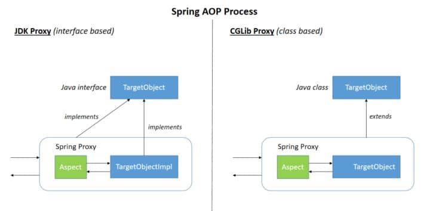

---

order: 5
author: zhiyu1998
title: Spring系列
category:
  - Spring
  - 八股文
---

## 🍃 Spring系列

### ⭐️ spring中都有哪些设计模式？（2022热门问题）

1、**简单工厂模式**：`BeanFactory`就是简单工厂模式的体现，根据传入一个唯一标识来获得 Bean 对象。

```java
@Override
public Object getBean(String name) throws BeansException {
    assertBeanFactoryActive();
    return getBeanFactory().getBean(name);
} 
```

2、**工厂方法模式**：`FactoryBean`就是典型的工厂方法模式。spring在使用`getBean()`调用获得该bean时，会自动调用该bean的`getObject()`方法。每个 Bean 都会对应一个 `FactoryBean`，如 `SqlSessionFactory` 对应 `SqlSessionFactoryBean`。

3、**单例模式**：一个类仅有一个实例，提供一个访问它的全局访问点。Spring 创建 Bean 实例默认是单例的。

4、**适配器模式**：SpringMVC中的适配器`HandlerAdatper`。由于应用会有多个Controller实现，如果需要直接调用Controller方法，那么需要先判断是由哪一个Controller处理请求，然后调用相应的方法。当增加新的 Controller，需要修改原来的逻辑，违反了开闭原则（对修改关闭，对扩展开放）。

为此，Spring提供了一个适配器接口，每一种 Controller 对应一种 `HandlerAdapter` 实现类，当请求过来，SpringMVC会调用`getHandler()`获取相应的Controller，然后获取该Controller对应的 `HandlerAdapter`，最后调用`HandlerAdapter`的`handle()`方法处理请求，实际上调用的是Controller的`handleRequest()`。每次添加新的 Controller 时，只需要增加一个适配器类就可以，无需修改原有的逻辑。

常用的处理器适配器：`SimpleControllerHandlerAdapter`，`HttpRequestHandlerAdapter`，`AnnotationMethodHandlerAdapter`。

```java
// Determine handler for the current request.
mappedHandler = getHandler(processedRequest);

HandlerAdapter ha = getHandlerAdapter(mappedHandler.getHandler());

// Actually invoke the handler.
mv = ha.handle(processedRequest, response, mappedHandler.getHandler());

public class HttpRequestHandlerAdapter implements HandlerAdapter {

    @Override
    public boolean supports(Object handler) {//handler是被适配的对象，这里使用的是对象的适配器模式
        return (handler instanceof HttpRequestHandler);
    }

    @Override
    @Nullable
    public ModelAndView handle(HttpServletRequest request, HttpServletResponse response, Object handler)
        throws Exception {

        ((HttpRequestHandler) handler).handleRequest(request, response);
        return null;
    }
}
```

5、**代理模式**：spring 的 aop 使用了动态代理，有两种方式`JdkDynamicAopProxy`和`Cglib2AopProxy`。

6、**观察者模式**：spring 中 observer 模式常用的地方是 listener 的实现，如`ApplicationListener`。

7、**模板模式**： Spring 中 `jdbcTemplate`、`hibernateTemplate` 等，就使用到了模板模式。


> 详细

#### 工厂设计模式

Spring使用工厂模式可以通过 `BeanFactory` 或 `ApplicationContext` 创建 bean 对象。

**两者对比：**

- `BeanFactory` ：延迟注入(使用到某个 bean 的时候才会注入),相比于 `ApplicationContext` 来说会占用更少的内存，程序启动速度更快。
- `ApplicationContext` ：容器启动的时候，不管你用没用到，一次性创建所有 bean 。`BeanFactory` 仅提供了最基本的依赖注入支持，` ApplicationContext` 扩展了 `BeanFactory` ,除了有 `BeanFactory`的功能还有额外更多功能，所以一般开发人员使用 ` ApplicationContext`会更多。

ApplicationContext的三个实现类：

1. `ClassPathXmlApplication`：把上下文文件当成类路径资源。
2. `FileSystemXmlApplication`：从文件系统中的 XML 文件载入上下文定义信息。
3. `XmlWebApplicationContext`：从Web系统中的XML文件载入上下文定义信息。

Example:

```java
import org.springframework.context.ApplicationContext;
import org.springframework.context.support.FileSystemXmlApplicationContext;
 
public class App {
	public static void main(String[] args) {
		ApplicationContext context = new FileSystemXmlApplicationContext(
				"C:/work/IOC Containers/springframework.applicationcontext/src/main/resources/bean-factory-config.xml");
 
		HelloApplicationContext obj = (HelloApplicationContext) context.getBean("helloApplicationContext");
		obj.getMsg();
	}
}
```

#### 单例设计模式

在我们的系统中，有一些对象其实我们只需要一个，比如说：线程池、缓存、对话框、注册表、日志对象、充当打印机、显卡等设备驱动程序的对象。事实上，这一类对象只能有一个实例，如果制造出多个实例就可能会导致一些问题的产生，比如：程序的行为异常、资源使用过量、或者不一致性的结果。

**使用单例模式的好处:**

- 对于频繁使用的对象，可以省略创建对象所花费的时间，这对于那些重量级对象而言，是非常可观的一笔系统开销；
- 由于 new 操作的次数减少，因而对系统内存的使用频率也会降低，这将减轻 GC 压力，缩短 GC 停顿时间。

**Spring 中 bean 的默认作用域就是 singleton(单例)的。** 除了 singleton 作用域，Spring 中 bean 还有下面几种作用域：

- prototype : 每次请求都会创建一个新的 bean 实例。
- request : 每一次HTTP请求都会产生一个新的bean，该bean仅在当前HTTP request内有效。
- session : 每一次HTTP请求都会产生一个新的 bean，该bean仅在当前 HTTP session 内有效。
- global-session：  全局session作用域，仅仅在基于portlet的web应用中才有意义，Spring5已经没有了。Portlet是能够生成语义代码(例如：HTML)片段的小型Java Web插件。它们基于portlet容器，可以像servlet一样处理HTTP请求。但是，与 servlet 不同，每个 portlet  都有不同的会话

**Spring 实现单例的方式：**

- xml : `<bean id="userService" class="top.snailclimb.UserService" scope="singleton"/>`
- 注解：`@Scope(value = "singleton")`

**Spring 通过 `ConcurrentHashMap` 实现单例注册表的特殊方式实现单例模式。Spring 实现单例的核心代码如下**

```java
// 通过 ConcurrentHashMap（线程安全） 实现单例注册表
private final Map<String, Object> singletonObjects = new ConcurrentHashMap<String, Object>(64);

public Object getSingleton(String beanName, ObjectFactory<?> singletonFactory) {
        Assert.notNull(beanName, "'beanName' must not be null");
        synchronized (this.singletonObjects) {
            // 检查缓存中是否存在实例  
            Object singletonObject = this.singletonObjects.get(beanName);
            if (singletonObject == null) {
                //...省略了很多代码
                try {
                    singletonObject = singletonFactory.getObject();
                }
                //...省略了很多代码
                // 如果实例对象在不存在，我们注册到单例注册表中。
                addSingleton(beanName, singletonObject);
            }
            return (singletonObject != NULL_OBJECT ? singletonObject : null);
        }
    }
    //将对象添加到单例注册表
    protected void addSingleton(String beanName, Object singletonObject) {
            synchronized (this.singletonObjects) {
                this.singletonObjects.put(beanName, (singletonObject != null ? singletonObject : NULL_OBJECT));

            }
        }
}
```

#### 代理设计模式

##### 代理模式在 AOP 中的应用

AOP(Aspect-Oriented Programming:面向切面编程)能够将那些与业务无关，**却为业务模块所共同调用的逻辑或责任（例如事务处理、日志管理、权限控制等）封装起来**，便于**减少系统的重复代码**，**降低模块间的耦合度**，并**有利于未来的可拓展性和可维护性**。

**Spring AOP 就是基于动态代理的**，如果要代理的对象，实现了某个接口，那么Spring AOP会使用**JDK Proxy**，去创建代理对象，而对于没有实现接口的对象，就无法使用 JDK Proxy 去进行代理了，这时候Spring AOP会使用 **Cglib** 生成一个被代理对象的子类来作为代理，如下图所示：



当然你也可以使用 AspectJ ,Spring AOP 已经集成了AspectJ ，AspectJ 应该算的上是 Java 生态系统中最完整的 AOP 框架了。

使用 AOP 之后我们可以把一些通用功能抽象出来，在需要用到的地方直接使用即可，这样大大简化了代码量。我们需要增加新功能时也方便，这样也提高了系统扩展性。日志功能、事务管理等等场景都用到了 AOP 。

#### 模板方法

模板方法模式是一种行为设计模式，它定义一个操作中的算法的骨架，而将一些步骤延迟到子类中。 模板方法使得子类可以不改变一个算法的结构即可重定义该算法的某些特定步骤的实现方式。

```java
public abstract class Template {
    //这是我们的模板方法
    public final void TemplateMethod(){
        PrimitiveOperation1();  
        PrimitiveOperation2();
        PrimitiveOperation3();
    }

    protected void  PrimitiveOperation1(){
        //当前类实现
    }
  
    //被子类实现的方法
    protected abstract void PrimitiveOperation2();
    protected abstract void PrimitiveOperation3();

}
public class TemplateImpl extends Template {

    @Override
    public void PrimitiveOperation2() {
        //当前类实现
    }
  
    @Override
    public void PrimitiveOperation3() {
        //当前类实现
    }
}
```

Spring 中 `jdbcTemplate`、`hibernateTemplate` 等以 Template 结尾的对数据库操作的类，它们就使用到了模板模式。一般情况下，我们都是使用继承的方式来实现模板模式，但是 Spring 并没有使用这种方式，而是使用Callback 模式与模板方法模式配合，既达到了代码复用的效果，同时增加了灵活性。

#### 观察者模式

观察者模式是一种对象行为型模式。它表示的是一种对象与对象之间具有依赖关系，当一个对象发生改变的时候，这个对象所依赖的对象也会做出反应。Spring 事件驱动模型就是观察者模式很经典的一个应用。Spring  事件驱动模型非常有用，在很多场景都可以解耦我们的代码。比如我们每次添加商品的时候都需要重新更新商品索引，这个时候就可以利用观察者模式来解决这个问题。

##### Spring 事件驱动模型中的三种角色

###### 事件角色

`ApplicationEvent` (`org.springframework.context`包下)充当事件的角色,这是一个抽象类，它继承了 `java.util.EventObject`并实现了 `java.io.Serializable`接口。

Spring 中默认存在以下事件，他们都是对 `ApplicationContextEvent` 的实现(继承自 `ApplicationContextEvent`)：

- `ContextStartedEvent`：`ApplicationContext` 启动后触发的事件;
- `ContextStoppedEvent`：`ApplicationContext` 停止后触发的事件;
- `ContextRefreshedEvent`：`ApplicationContext` 初始化或刷新完成后触发的事件;
- `ContextClosedEvent`：`ApplicationContext` 关闭后触发的事件。


###### 事件监听者角色

`ApplicationListener` 充当了事件监听者角色，它是一个接口，里面只定义了一个 `onApplicationEvent（）`方法来处理 `ApplicationEvent`。`ApplicationListener`接口类源码如下，可以看出接口定义看出接口中的事件只要实现了 `ApplicationEvent`就可以了。所以，在 Spring中我们只要实现 `ApplicationListener` 接口的 `onApplicationEvent()` 方法即可完成监听事件

```java
package org.springframework.context;
import java.util.EventListener;
@FunctionalInterface
public interface ApplicationListener<E extends ApplicationEvent> extends EventListener {
    void onApplicationEvent(E var1);
}
```

###### 事件发布者角色

`ApplicationEventPublisher` 充当了事件的发布者，它也是一个接口。

```java
@FunctionalInterface
public interface ApplicationEventPublisher {
    default void publishEvent(ApplicationEvent event) {
        this.publishEvent((Object)event);
    }

    void publishEvent(Object var1);
}
```

`ApplicationEventPublisher` 接口的 `publishEvent（）`这个方法在 `AbstractApplicationContext`类中被实现，阅读这个方法的实现，你会发现实际上事件真正是通过 `ApplicationEventMulticaster`来广播出去的。

#### 适配器模式

适配器模式(Adapter Pattern) 将一个接口转换成客户希望的另一个接口，适配器模式使接口不兼容的那些类可以一起工作，其别名为包装器(Wrapper)。

##### spring AOP中的适配器模式

我们知道 Spring AOP 的实现是基于代理模式，但是 Spring AOP 的增强或通知(Advice)使用到了适配器模式，与之相关的接口是 `AdvisorAdapter ` 。Advice 常用的类型有：`BeforeAdvice`（目标方法调用前,前置通知）、`AfterAdvice`（目标方法调用后,后置通知）、`AfterReturningAdvice`(目标方法执行结束后，return之前)等等。每个类型Advice（通知）都有对应的拦截器:`MethodBeforeAdviceInterceptor`、`AfterReturningAdviceAdapter`、`AfterReturningAdviceInterceptor`。Spring预定义的通知要通过对应的适配器，适配成 `MethodInterceptor`接口(方法拦截器)类型的对象（如：`MethodBeforeAdviceInterceptor` 负责适配 `MethodBeforeAdvice`）。

##### spring MVC中的适配器模式

在Spring MVC中，`DispatcherServlet` 根据请求信息调用 `HandlerMapping`，解析请求对应的 `Handler`。解析到对应的 `Handler`（也就是我们平常说的 `Controller` 控制器）后，开始由 `HandlerAdapter` 适配器处理。`HandlerAdapter` 作为期望接口，具体的适配器实现类用于对目标类进行适配，`Controller` 作为需要适配的类。

**为什么要在 Spring MVC 中使用适配器模式？** Spring MVC 中的 `Controller` 种类众多，不同类型的 `Controller` 通过不同的方法来对请求进行处理。如果不利用适配器模式的话，`DispatcherServlet` 直接获取对应类型的 `Controller`，需要的自行来判断，像下面这段代码一样：

```java
if(mappedHandler.getHandler() instanceof MultiActionController){  
   ((MultiActionController)mappedHandler.getHandler()).xxx  
}else if(mappedHandler.getHandler() instanceof XXX){  
    ...  
}else if(...){  
   ...  
}  
```

假如我们再增加一个 `Controller`类型就要在上面代码中再加入一行 判断语句，这种形式就使得程序难以维护，也违反了设计模式中的开闭原则 – 对扩展开放，对修改关闭。

#### 装饰者模式

装饰者模式可以动态地给对象添加一些额外的属性或行为。相比于使用继承，装饰者模式更加灵活。简单点儿说就是当我们需要修改原有的功能，但我们又不愿直接去修改原有的代码时，设计一个Decorator套在原有代码外面。其实在 JDK 中就有很多地方用到了装饰者模式，比如 `InputStream`家族，`InputStream` 类下有 `FileInputStream` (读取文件)、`BufferedInputStream` (增加缓存,使读取文件速度大大提升)等子类都在不修改 `InputStream` 代码的情况下扩展了它的功能。


Spring 中配置 DataSource 的时候，DataSource  可能是不同的数据库和数据源。我们能否根据客户的需求在少修改原有类的代码下动态切换不同的数据源？这个时候就要用到装饰者模式(这一点我自己还没太理解具体原理)。Spring 中用到的包装器模式在类名上含有 `Wrapper`或者 `Decorator`。这些类基本上都是动态地给一个对象添加一些额外的职责

### SpringBoot启动流程

1. **初始化**：Spring Boot应用程序首先初始化SpringApplication对象，该对象负责管理应用程序的启动和运行。在这个阶段，Spring Boot会加载应用程序的配置文件和命令行参数。
2. **创建Spring应用上下文**：Spring Boot会创建一个Spring应用上下文（ApplicationContext），它是Spring容器的核心，负责管理应用程序中的所有Bean。在这个阶段，Spring Boot会扫描应用程序中的所有组件（如@Service、@Controller等），并将它们注册到Spring容器中。
3. **自动配置**：Spring Boot会自动配置应用程序，根据应用程序的依赖关系和配置文件，自动创建和配置Bean。这使得开发人员可以专注于业务逻辑的实现，而不需要手动配置大量的Bean。
4. **启动嵌入式Web服务器**（如果有的话）：如果应用程序是一个Web应用程序，Spring Boot会启动一个嵌入式的Web服务器（如Tomcat、Jetty等），并将应用程序部署到该服务器上。
5. **应用程序启动完成**：在这个阶段，Spring Boot会触发ApplicationReadyEvent事件，表示应用程序已经启动并准备好接受请求。你可以在这个阶段执行一些自定义的初始化逻辑，例如设置数据库、启动定时任务等。


### 🌟 Spring Bean生命周期


首先简要介绍 Spring Bean 和 Spring IoC（控制反转）容器的基本概念。

Spring Bean 是 Spring 框架中的一个基本组成部分，它们是由 Spring IoC 容器管理的 Java 对象。Spring Bean 生命周期描述了从对象创建到销毁的整个过程，这个过程由容器管理并通过各种回调方法来执行。

**生命周期阶段**：详细介绍 Spring Bean 生命周期的各个阶段。
- 实例化（Instantiation）：Spring IoC 容器创建 Bean 实例。
- 属性赋值（Populate properties）：容器根据 Bean 定义的依赖关系，为 Bean 的属性赋值。
- 初始化（Initialization）：Bean 初始化的几个步骤：
	- 如果 Bean 实现了 `BeanNameAware` 接口，容器会调用 `setBeanName()` 方法传入 Bean 的名称。
	- 如果 Bean 实现了 `BeanFactoryAware` 接口，容器会调用 `setBeanFactory()` 方法传入 Bean 工厂。
	- 如果 Bean 实现了 `ApplicationContextAware` 接口，容器会调用 `setApplicationContext()` 方法传入应用上下文。
	- 如果 Bean 配置了 `BeanPostProcessor`，则在初始化前后调用 `postProcessBeforeInitialization()` 和 `postProcessAfterInitialization()` 方法。
	- 如果 Bean 实现了 `InitializingBean` 接口，容器会调用 `afterPropertiesSet()` 方法。
	- 如果 Bean 配置了自定义的初始化方法，容器会调用该方法。
- 销毁（Destruction）：Bean 销毁的几个步骤：
	- 如果 Bean 实现了 `DisposableBean` 接口，容器会调用 `destroy()` 方法。
	- 如果 Bean 配置了自定义的销毁方法，容器会调用该方法。

实际意义：了解 Spring Bean 生命周期有助于更好地理解和使用 Spring 框架。通过实现不同的接口或配置自定义方法，开发者可以在 Bean 生命周期的各个阶段执行特定操作，如添加日志、资源释放等。这有助于实现更高效、可维护的代码。

### @Autowired 和 @Resource 的区别是什么？

Spring 内置的 `@Autowired` 以及 JDK 内置的 `@Resource` 和 `@Inject` 都可以用于注入 Bean。

| Annotaion    | Package                            | Source       |
| :----------- | :--------------------------------- | :----------- |
| `@Autowired` | `org.springframework.bean.factory` | Spring 2.5+  |
| `@Resource`  | `javax.annotation`                 | Java JSR-250 |
| `@Inject`    | `javax.inject`                     | Java JSR-330 |

`@Autowired` 和 `@Resource`使用的比较多一些。

`Autowired` 属于 Spring 内置的注解，默认的注入方式为 `byType`（根据类型进行匹配），也就是说会优先根据接口类型去匹配并注入 Bean （接口的实现类）。

**这会有什么问题呢？** 当一个接口存在多个实现类的话，`byType`这种方式就无法正确注入对象了，因为这个时候 Spring 会同时找到多个满足条件的选择，默认情况下它自己不知道选择哪一个。

这种情况下，注入方式会变为 `byName`（根据名称进行匹配），这个名称通常就是类名（首字母小写）。就比如说下面代码中的 `smsService` 就是我这里所说的名称，这样应该比较好理解了吧。

```java
// smsService 就是我们上面所说的名称
@Autowired
private SmsService smsService;
```

举个例子，`SmsService` 接口有两个实现类: `SmsServiceImpl1`和 `SmsServiceImpl2`，且它们都已经被 Spring 容器所管理。

```java
// 报错，byName 和 byType 都无法匹配到 bean
@Autowired
private SmsService smsService;
// 正确注入 SmsServiceImpl1 对象对应的 bean
@Autowired
private SmsService smsServiceImpl1;
// 正确注入  SmsServiceImpl1 对象对应的 bean
// smsServiceImpl1 就是我们上面所说的名称
@Autowired
@Qualifier(value = "smsServiceImpl1")
private SmsService smsService;
```

我们还是建议通过 `@Qualifier` 注解来显示指定名称而不是依赖变量的名称。

`@Resource`属于 JDK 提供的注解，默认注入方式为 `byName`。如果无法通过名称匹配到对应的实现类的话，注入方式会变为 `byType`。

`@Resource` 有两个比较重要且日常开发常用的属性：`name`（名称）、`type`（类型）。

```java
public @interface Resource {
    String name() default "";
    Class<?> type() default Object.class;
}
```

如果仅指定 `name` 属性则注入方式为 `byName`，如果仅指定 `type`属性则注入方式为 `byType`，如果同时指定 `name` 和 `type`属性（不建议这么做）则注入方式为 `byType`+`byName`。

```java
// 报错，byName 和 byType 都无法匹配到 bean
@Resource
private SmsService smsService;
// 正确注入 SmsServiceImpl1 对象对应的 bean
@Resource
private SmsService smsServiceImpl1;
// 正确注入 SmsServiceImpl1 对象对应的 bean（比较推荐这种方式）

@Resource(name = "smsServiceImpl1")
private SmsService smsService;
```

简单总结一下：

- `@Autowired` 是 Spring 提供的注解，`@Resource` 是 JDK 提供的注解。
- `Autowired` 默认的注入方式为 `byType`（根据类型进行匹配），`@Resource`默认注入方式为 `byName`（根据名称进行匹配）。
- 当一个接口存在多个实现类的情况下，`@Autowired` 和 `@Resource`都需要通过名称才能正确匹配到对应的 Bean。`Autowired` 可以通过 `@Qualifier` 注解来显示指定名称，`@Resource`可以通过 `name` 属性来显示指定名称。

### 🌟 请描述Spring MVC的工作流程？描述一下 DispatcherServlet 的工作流程？

1. 用户发送request请求到前端控制器DispatcherServlet。
2. 前端控制器DispatcherServlet通过request请求的url地址，向映射器HandlerMapping请求调用对应的处理器handler。
3. 映射器HandlerMapping通过url地址生产处理器执行链并返回。
4. DispatcherServlet根据处理器Handler获取处理器适配器HandlerAdapter执行HandlerAdapter处理一系列的操作，如：参数封装，数据格式转换，数据验证等操作。
5. 适配器执行处理器，即执行Controller中的方法。
6. 处理器完成业务逻辑后返回ModelAndView。
7. 适配器将处理器的处理结果返回给前端控制器DispatcherServlet。
8. 将ModelAndView中的view名称传给viewReslover。
9. viewReslover通过view名称返回具体的view。
10. 将ModelAndView中的model注入到view。
11. 将最终经过视图渲染的view页面响应给用户。


### Spring中构造方法注入和设值注入有什么区别

构造器通过构造方法实现，构造方法有无参数都可以。在大部分情况下我们都是通过类的构造器来创建对象，Spring也可以采用反射机制通过构造器完成注入，这就是构造器注入的原理。

```java
public class Role {

    private long id;
    private String roleName;

    public Role(long id,String roleName){
        this.id=id;
        this.roleName=roleName;

    }
    public void getCount(){
        System.out.println("Role已被调用"+"\n"+"id:"+id+"\n"+"roleName:"+roleName);
    }
}
```

setter注入是Spring中最主流的注入方法（常用），好处就不用多说了。原理也是通过反射注入，直接上代码。（注意对应的实体类属性必须实现set，get方法。如果实体类没有属性也会被注入）。

```java
public class Role {

    public long getId() {
        return id;
    }
    public void setId(long id) {
        this.id = id;
    }
    public String getRoleName() {
        return roleName;
    }
    public void setRoleName(String roleName) {
        this.roleName = roleName;
    }
    private long id;
    private String roleName;
}
```


### ✨ Spring怎么解决循环依赖的问题？
>《概览》
>1. 通过三级缓存解决。Spring的三级缓存分别是 singletonObjects、earlySingletonObjects 和 singletonFactories。当BeanA依赖于BeanB,而BeanB又依赖于BeanC时，Spring会先创建BeanA并将其放入singletonObjects中，然后创建BeanB并将其放入singletonFactories中，最后再创建BeanC。这样就避免了循环引用的问题。
>2. 通过使用延迟加载解决。这种方法是将一个Bean使用延时加载，也就是说这个Bean并没有完全初始化完，实际上它注入的是一个代理，只有当它首次被使用的时候才会被完全初始化。
>3. 通过使用构造函数注入解决。这种方法是将一个Bean的属性通过构造函数注入到另一个Bean中，从而避免了循环引用的问题。

#### 三级缓存

**构造器注入的循环依赖：Spring处理不了**，直接抛出`BeanCurrentlylnCreationException`异常。

单例模式下属性注入的循环依赖：通过**三级缓存处理循环依赖**。

非单例循环依赖：无法处理。

> **Spring为何不能解决非单例属性之外的循环依赖？**
>
> Spring为什么不能解决构造器的循环依赖？
>
> 构造器注入形成的循环依赖： 也就是beanB需要在beanA的构造函数中完成初始化，beanA也需要在beanB的构造函数中完成初始化，这种情况的结果就是两个bean都不能完成初始化，循环依赖难以解决。
>
> Spring解决循环依赖主要是依赖三级缓存，但是的**在调用构造方法之前还未将其放入三级缓存之中**，因此后续的依赖调用构造方法的时候并不能从三级缓存中获取到依赖的Bean，因此不能解决。
>
> ---
>
> Spring为什么不能解决prototype作用域循环依赖？
>
> 这种循环依赖同样无法解决，因为spring不会缓存‘prototype’作用域的bean，而spring中循环依赖的解决正是通过缓存来实现的。
>
> ---
>
> Spring为什么不能解决多例的循环依赖？
>
> 多实例Bean是每次调用一次getBean都会执行一次构造方法并且给属性赋值，根本没有三级缓存，因此不能解决循环依赖。

下面分析单例模式下属性注入的循环依赖是怎么处理的：

首先，Spring单例对象的初始化大略分为三步：

1. `createBeanInstance`：实例化bean，使用构造方法创建对象，为对象分配内存。
2. `populateBean`：进行依赖注入。
3. `initializeBean`：初始化bean。

Spring为了解决单例的循环依赖问题，使用了**三级缓存（这个缓存机制包括singletonObjects、earlySingletonObjects以及singletonFactories）**：

```java
/** Cache of singleton objects: bean name --> bean instance */
private final Map<String, Object> singletonObjects = new ConcurrentHashMap<String, Object>(256);
 
/** Cache of early singleton objects: bean name --> bean instance */
private final Map<String, Object> earlySingletonObjects = new HashMap<String, Object>(16);

/** Cache of singleton factories: bean name --> ObjectFactory */
private final Map<String, ObjectFactory<?>> singletonFactories = new HashMap<String, ObjectFactory<?>>(16);
    
```

* **第一层缓存（singletonObjects）**：单例对象缓存池，已经实例化并且属性赋值，这里的对象是**成熟对象**，具体而言这个缓存用于存储已经完全初始化好的单例bean；
* **第二层缓存（earlySingletonObjects）**：单例对象缓存池，已经实例化但尚未属性赋值，这里的对象是**半成品对象**，这个缓存用于存储已经实例化但尚未完全初始化的bean。这个缓存主要用于解决循环依赖的问题；
* **第三层缓存（singletonFactories）**: 单例工厂的缓存，这个缓存用于存储用于创建bean的工厂对象。当一个bean需要被提前暴露（即尚未完全初始化）时，可以通过这个缓存获取对应的工厂对象，然后调用工厂对象的方法获取bean实例。

现在让我们详细了解一下在解决循环依赖时，这三个缓存是如何发挥作用的：

1. 当Spring开始实例化A时，首先会创建一个A的实例，然后将A的实例放入`singletonFactories`缓存。
2. 接下来，Spring开始处理A的属性，发现A依赖B。因此，Spring开始实例化B。
3. 跟A类似，B的实例首先被放入`singletonFactories`缓存。
4. 当处理B的属性时，发现B依赖A。这时，Spring会尝试从`singletonObjects`缓存中获取A的实例。但是，由于A尚未完全初始化，所以获取不到。
5. 接着，Spring会尝试从earlySingletonObjects缓存中获取A的实例。由于A已经被实例化，所以这个时候可以从这个缓存中获取到A的实例。
6. 由于已经获取到了A的实例，Spring可以继续完成B的属性注入。完成后，将B的实例从`singletonFactories`移除，同时将B的实例放入`earlySingletonObjects`和`singletonObjects`缓存。
7. 此时，Spring回到处理A的属性，由于已经获取到了B的实例，可以完成A的属性注入。完成后，将A的实例从`singletonFactories`移除，同时将A的实例放入`earlySingletonObjects`和`singletonObjects`缓存。
> 这个解决方案只适用于单例作用域的bean（默认作用域）。对于其他作用域的bean，例如原型作用域，Spring不会解决循环依赖问题。

#### 使用@Lazy
使用一个简单的例子进行说明：
```java
@Component
public class CircularDependencyA {

    private CircularDependencyB circB;

    @Autowired
    public CircularDependencyA(CircularDependencyB circB) {
        this.circB = circB;
    }
}
```
```java
@Component
public class CircularDependencyB {

    private CircularDependencyA circA;

    @Autowired
    public CircularDependencyB(CircularDependencyA circA) {
        this.circA = circA;
    }
}
```

使用@Lazy
```java
@Component
public class CircularDependencyA {

    private CircularDependencyB circB;

    @Autowired
    public CircularDependencyA(@Lazy CircularDependencyB circB) {
        this.circB = circB;
    }
}
```

#### 使用Setter/字段注入
简而言之，我们可以通过改变bean的连接方式来解决这个问题——使用setter注入（或字段注入）而不是构造函数注入。这样，Spring创建bean，但依赖项在需要之前不会注入。

```java
@Component
public class CircularDependencyA {

    private CircularDependencyB circB;

    @Autowired
    public void setCircB(CircularDependencyB circB) {
        this.circB = circB;
    }

    public CircularDependencyB getCircB() {
        return circB;
    }
}
```

```java
@Component
public class CircularDependencyB {

    private CircularDependencyA circA;

    private String message = "Hi!";

    @Autowired
    public void setCircA(CircularDependencyA circA) {
        this.circA = circA;
    }

    public String getMessage() {
        return message;
    }
}
```

#### 使用@PostConstruct

```java
@Component
public class CircularDependencyA {

    @Autowired
    private CircularDependencyB circB;

    @PostConstruct
    public void init() {
        circB.setCircA(this);
    }

    public CircularDependencyB getCircB() {
        return circB;
    }
}
```

```java
@Component
public class CircularDependencyB {

    private CircularDependencyA circA;
	
    private String message = "Hi!";

    public void setCircA(CircularDependencyA circA) {
        this.circA = circA;
    }
	
    public String getMessage() {
        return message;
    }
}
```

#### 实现应用上下文感知和初始化Bean

```java
@Component
public class CircularDependencyA implements ApplicationContextAware, InitializingBean {

    private CircularDependencyB circB;

    private ApplicationContext context;

    public CircularDependencyB getCircB() {
        return circB;
    }

    @Override
    public void afterPropertiesSet() throws Exception {
        circB = context.getBean(CircularDependencyB.class);
    }

    @Override
    public void setApplicationContext(final ApplicationContext ctx) throws BeansException {
        context = ctx;
    }
}
```

```java
@Component
public class CircularDependencyB {

    private CircularDependencyA circA;

    private String message = "Hi!";

    @Autowired
    public void setCircA(CircularDependencyA circA) {
        this.circA = circA;
    }

    public String getMessage() {
        return message;
    }
}
```


### Transactional失效场景

#### Transactional注解标注方法修饰符为非public

如果`Transactional`注解应用在非`public` 修饰的方法上，Transactional将会失效。

之所以会失效是因为在Spring AOP 代理时，如上图所示 `TransactionInterceptor` （事务拦截器）在目标方法执行前后进行拦截，`DynamicAdvisedInterceptor`（CglibAopProxy 的内部类）的 intercept 方法或 `JdkDynamicAopProxy` 的 invoke 方法会间接调用 `AbstractFallbackTransactionAttributeSource`的 `computeTransactionAttribute` 方法，获取Transactional 注解的事务配置信息。

```java
protected TransactionAttribute computeTransactionAttribute(Method method,
    Class<?> targetClass) {
        // Don't allow no-public methods as required.
        if (allowPublicMethodsOnly() && !Modifier.isPublic(method.getModifiers())) {
        return null;
}
```

此方法会检查目标方法的修饰符是否为 public，不是 public则不会获取`@Transactional` 的属性配置信息。

**注意：`protected`、`private` 修饰的方法上使用 `@Transactional` 注解，虽然事务无效，但不会有任何报错，这是我们很容犯错的一点。**

#### 注解属性 propagation 设置错误

这种失效是由于配置错误，若是错误的配置以下三种 propagation，事务将不会发生回滚。

`TransactionDefinition.PROPAGATION_SUPPORTS`：如果当前存在事务，则加入该事务；如果当前没有事务，则以非事务的方式继续运行。

`TransactionDefinition.PROPAGATION_NOT_SUPPORTED`：以非事务方式运行，如果当前存在事务，则把当前事务挂起。

`TransactionDefinition.PROPAGATION_NEVER`：以非事务方式运行，如果当前存在事务，则抛出异常。

#### 注解属性 rollbackFor 设置错误

`rollbackFor` 可以指定**能够触发事务回滚**的异常类型。Spring**默认**抛出了未检查`unchecked`异常（**继承自** **`RuntimeException`** 的异常）或者 `Error`才回滚事务；其他异常不会触发回滚事务。**如果在事务中抛出其他类型的异常，但却期望 Spring 能够回滚事务，就需要指定 rollbackFor 属性，如果未指定 rollbackFor 属性则事务不会回滚。**

```java
// 希望自定义的异常可以进行回滚
@Transactional(propagation= Propagation.REQUIRED,rollbackFor= MyException.class)
```

若在目标方法中抛出的异常是 `rollbackFor` **指定的异常的子类**，事务同样会回滚。Spring 源码如下：

```java
private int getDepth(Class<?> exceptionClass, int depth) {
  if (exceptionClass.getName().contains(this.exceptionName)) {
    // Found it!    return depth;
}
// If we've gone as far as we can go and haven't found it...
if (exceptionClass == Throwable.class) {
    return -1;
}
return getDepth(exceptionClass.getSuperclass(), depth + 1);
}
```

#### 同一个类中方法调用

开发中避免不了会对同一个类里面的方法调用，比如有一个类Test，它的一个方法A，A再调用本类的方法B（不论方法B是用public还是private修饰），但方法A没有声明注解事务，而B方法有。则**外部调用方法A**之后，方法B的事务是不会起作用的。这也是经常犯错误的一个地方。

那为啥会出现这种情况？其实这还是由于使用 `Spring AOP `代理造成的，因为 **只有当事务方法被 当前类以外的代码 调用时，才会由`Spring`生成的代理对象来管理。**

```java
//@Transactional
@GetMapping("/test")
private Integer A() throws Exception {
    CityInfoDict cityInfoDict = new CityInfoDict();
    cityInfoDict.setCityName("2");
    /**
     * B 插入字段为 3的数据
     */
    this.insertB();
    /**
     * A 插入字段为 2的数据
     */
    int insert = cityInfoDictMapper.insert(cityInfoDict);
    return insert;
}
 
@Transactional()
public Integer insertB() throws Exception {
    CityInfoDict cityInfoDict = new CityInfoDict();
    cityInfoDict.setCityName("3");
    cityInfoDict.setParentCityId(3);
    return cityInfoDictMapper.insert(cityInfoDict);
}
```

#### 事务方法内部捕捉了异常

这种情况是最常见的一种 `@Transactional` 注解失效场景，

```java
@Transactional
private Integer A() throws Exception {
    int insert = 0;
    try {
        CityInfoDict cityInfoDict = new CityInfoDict();
        cityInfoDict.setCityName("2");
        cityInfoDict.setParentCityId(2);
        /**
         * A 插入字段为 2的数据
         */
        insert = cityInfoDictMapper.insert(cityInfoDict);
        /**
         * B 插入字段为 3的数据
         */
        b.insertB();
    } catch (Exception e) {
        e.printStackTrace();
    }
}
```

如果B方法内部抛了异常，而A方法此时try catch了B方法的异常，那这个事务还能正常回滚吗？

答案：不能！

会抛出异常：

```
org.springframework.transaction.UnexpectedRollbackException: Transaction rolled back because it has been marked as rollback-only
```

因为当`ServiceB`中抛出了一个异常以后，`ServiceB`标识当前事务需要`rollback`。但是`ServiceA`中由于你手动的捕获这个异常并进行处理，`ServiceA`认为当前事务应该正常`commit`。此时就出现了前后不一致，也就是因为这样，抛出了前面的`UnexpectedRollbackException`异常。

`spring`的事务是在调用业务方法之前开始的，业务方法执行完毕之后才执行`commit` or `rollback`，事务是否执行取决于是否抛出`runtime异常`。如果抛出`runtime exception` 并在你的业务方法中没有catch到的话，事务会回滚。

在业务方法中一般不需要catch异常，如果**非要catch一定要抛出`throw new RuntimeException()`**，或者注解中指定抛异常类型**`@Transactional(rollbackFor=Exception.class)`**，否则会导致事务失效，数据commit造成数据不一致，所以有些时候 try catch反倒会画蛇添足。

#### 数据库引擎不支持事务

这种情况出现的概率并不高，事务能否生效数据库引擎是否支持事务是关键。常用的MySQL数据库默认使用支持事务的`innodb`引擎。一旦数据库引擎切换成不支持事务的`myisam`，那事务就从根本上失效了。

