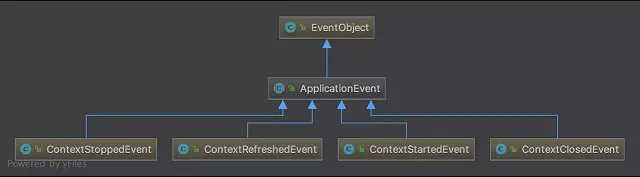
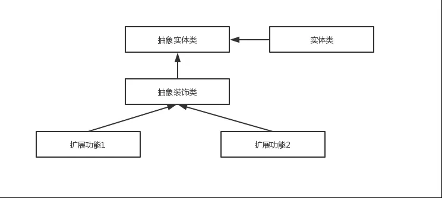
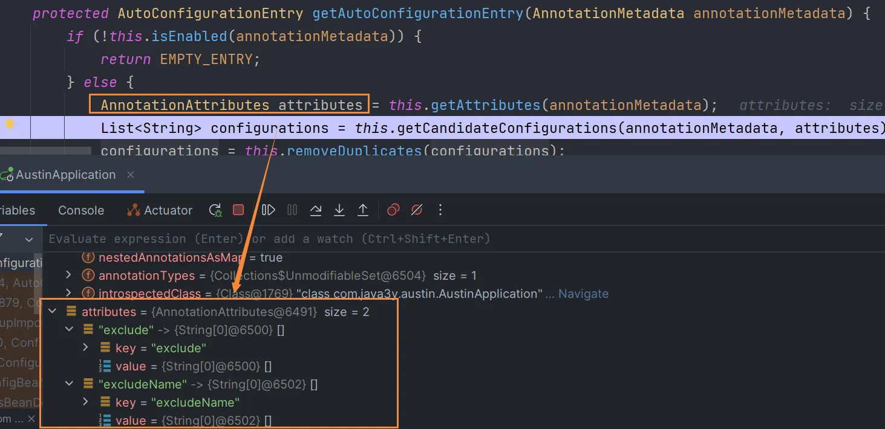
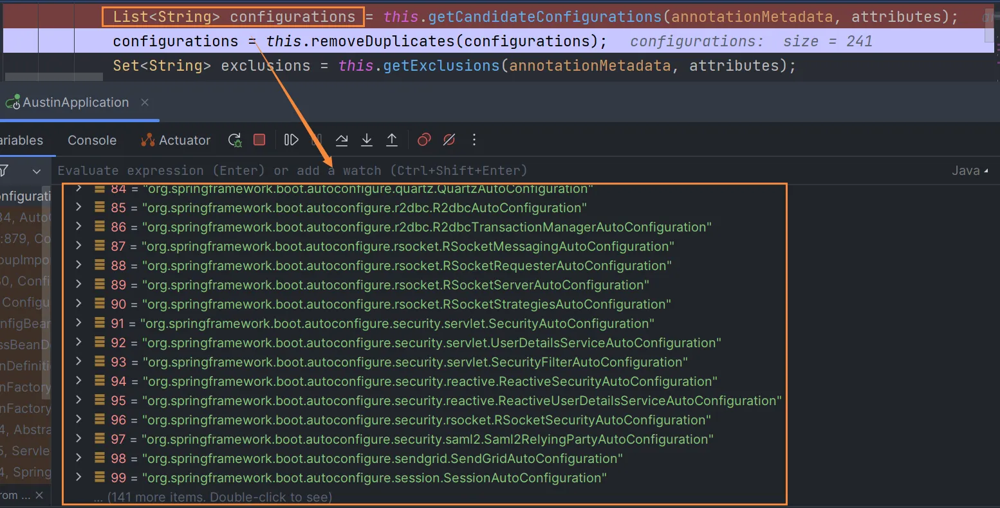
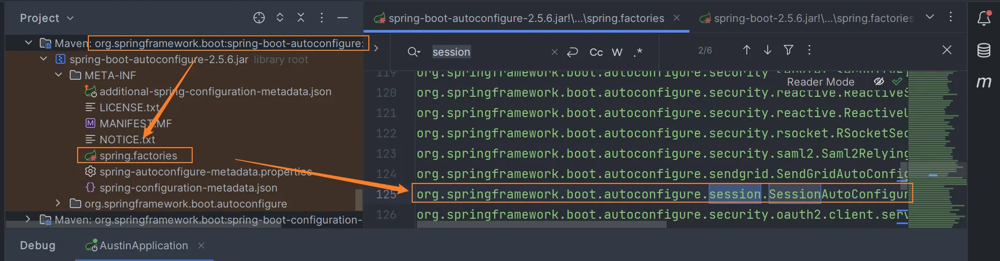

---

order: 5
author: zhiyu1998
title: Spring系列
category:
  - Spring
  - 八股文
---

## 🍃 Spring系列

### ⭐️ spring中都有哪些设计模式？（2022热门问题）

> 概述

1、**简单工厂模式**：`BeanFactory`就是简单工厂模式的体现，根据传入一个唯一标识来获得 Bean 对象。在Spring Boot中具体实现的类是`AnnotationConfigApplicationContext`。

2、**工厂方法模式**：`FactoryBean`就是典型的工厂方法模式。spring在使用`getBean()`调用获得该bean时，会自动调用该bean的`getObject()`方法。每个 Bean 都会对应一个 `FactoryBean`，如 `SqlSessionFactory` 对应 `SqlSessionFactoryBean`。

3、**单例模式**：一个类仅有一个实例，提供一个访问它的全局访问点。Spring 创建 Bean 实例默认是单例的。

4、**适配器模式**：SpringMVC中的适配器`HandlerAdatper`。这个`HandlerAdatper`的理解有点复杂，具体来说是将不同的Handler(比如Controller)适配转换为DispatcherServlet可以调用的handle方法。比如现在有一个controller叫作SimpleController，就可以通过SimpleControllerHandlerAdapter的handle方法将它转换成可以被DispatcherServlet识别的方法，这样就可以请求来了 -> DispatcherServlet找适配器 -> 找到SimpleControllerHandlerAdapter -> 调用它的handle方法 -> handle方法内部调用SimpleController的handleRequest方法 -> 最后将结果返回给DispatcherServlet。同样的，如果有一个PigController，就使用PigControllerHandlerAdapter将其转换成DispatcherServlet可以调用的接口。

```java
public ModelAndView handle(HttpServletRequest request, HttpServletResponse response, Object handler) {
    ((SimpleController) handler).handleRequest(request, response);
    // 返回ModelAndView
}
```

5、**代理模式**：spring 的 aop 使用了动态代理，有两种方式`JdkDynamicAopProxy`和`Cglib2AopProxy`。

6、**观察者模式**：spring 中 observer 模式常用的地方是 listener 的实现，如`ApplicationListener`。

7、**模板模式**： Spring 中 `jdbcTemplate`、`hibernateTemplate` 等，就使用到了模板模式。


> 详细

#### 工厂设计模式

Spring使用工厂模式可以通过 `BeanFactory` 或 `ApplicationContext` 创建 bean 对象。

**两者对比：**

- `BeanFactory` ：延迟注入(使用到某个 bean 的时候才会注入),相比于 `ApplicationContext` 来说会占用更少的内存，程序启动速度更快。
- `ApplicationContext` ：容器启动的时候，不管你用没用到，一次性创建所有 bean 。`BeanFactory` 仅提供了最基本的依赖注入支持，` ApplicationContext` 扩展了 `BeanFactory` ,除了有 `BeanFactory`的功能还有额外更多功能，所以一般开发人员使用 ` ApplicationContext`会更多。

ApplicationContext的三个实现类：

1. `ClassPathXmlApplication`：把上下文文件当成类路径资源。
2. `FileSystemXmlApplication`：从文件系统中的 XML 文件载入上下文定义信息。
3. `XmlWebApplicationContext`：从Web系统中的XML文件载入上下文定义信息。

Example:

```java
import org.springframework.context.ApplicationContext;
import org.springframework.context.support.FileSystemXmlApplicationContext;
 
public class App {
	public static void main(String[] args) {
		ApplicationContext context = new FileSystemXmlApplicationContext(
				"C:/work/IOC Containers/springframework.applicationcontext/src/main/resources/bean-factory-config.xml");
 
		HelloApplicationContext obj = (HelloApplicationContext) context.getBean("helloApplicationContext");
		obj.getMsg();
	}
}
```

#### 单例设计模式

在我们的系统中，有一些对象其实我们只需要一个，比如说：线程池、缓存、对话框、注册表、日志对象、充当打印机、显卡等设备驱动程序的对象。事实上，这一类对象只能有一个实例，如果制造出多个实例就可能会导致一些问题的产生，比如：程序的行为异常、资源使用过量、或者不一致性的结果。

**使用单例模式的好处:**

- 对于频繁使用的对象，可以省略创建对象所花费的时间，这对于那些重量级对象而言，是非常可观的一笔系统开销；
- 由于 new 操作的次数减少，因而对系统内存的使用频率也会降低，这将减轻 GC 压力，缩短 GC 停顿时间。

**Spring 中 bean 的默认作用域就是 singleton(单例)的。** 除了 singleton 作用域，Spring 中 bean 还有下面几种作用域：

- prototype : 每次请求都会创建一个新的 bean 实例。
- request : 每一次HTTP请求都会产生一个新的bean，该bean仅在当前HTTP request内有效。
- session : 每一次HTTP请求都会产生一个新的 bean，该bean仅在当前 HTTP session 内有效。
- global-session：  全局session作用域，仅仅在基于portlet的web应用中才有意义，Spring5已经没有了。Portlet是能够生成语义代码(例如：HTML)片段的小型Java Web插件。它们基于portlet容器，可以像servlet一样处理HTTP请求。但是，与 servlet 不同，每个 portlet  都有不同的会话

**Spring 实现单例的方式：**

- xml : `<bean id="userService" class="top.snailclimb.UserService" scope="singleton"/>`
- 注解：`@Scope(value = "singleton")`

**Spring 通过 `ConcurrentHashMap` 实现单例注册表的特殊方式实现单例模式。Spring 实现单例的核心代码如下**

```java
// 通过 ConcurrentHashMap（线程安全） 实现单例注册表
private final Map<String, Object> singletonObjects = new ConcurrentHashMap<String, Object>(64);

public Object getSingleton(String beanName, ObjectFactory<?> singletonFactory) {
        Assert.notNull(beanName, "'beanName' must not be null");
        synchronized (this.singletonObjects) {
            // 检查缓存中是否存在实例  
            Object singletonObject = this.singletonObjects.get(beanName);
            if (singletonObject == null) {
                //...省略了很多代码
                try {
                    singletonObject = singletonFactory.getObject();
                }
                //...省略了很多代码
                // 如果实例对象在不存在，我们注册到单例注册表中。
                addSingleton(beanName, singletonObject);
            }
            return (singletonObject != NULL_OBJECT ? singletonObject : null);
        }
    }
    //将对象添加到单例注册表
    protected void addSingleton(String beanName, Object singletonObject) {
            synchronized (this.singletonObjects) {
                this.singletonObjects.put(beanName, (singletonObject != null ? singletonObject : NULL_OBJECT));

            }
        }
}
```

#### 代理设计模式

##### 代理模式在 AOP 中的应用

AOP(Aspect-Oriented Programming:面向切面编程)能够将那些与业务无关，**却为业务模块所共同调用的逻辑或责任（例如事务处理、日志管理、权限控制等）封装起来**，便于**减少系统的重复代码**，**降低模块间的耦合度**，并**有利于未来的可拓展性和可维护性**。

**Spring AOP 就是基于动态代理的**，如果要代理的对象，实现了某个接口，那么Spring AOP会使用**JDK Proxy**，去创建代理对象，而对于没有实现接口的对象，就无法使用 JDK Proxy 去进行代理了，这时候Spring AOP会使用 **Cglib** 生成一个被代理对象的子类来作为代理，如下图所示：


当然你也可以使用 AspectJ ,Spring AOP 已经集成了AspectJ ，AspectJ 应该算的上是 Java 生态系统中最完整的 AOP 框架了。

使用 AOP 之后我们可以把一些通用功能抽象出来，在需要用到的地方直接使用即可，这样大大简化了代码量。我们需要增加新功能时也方便，这样也提高了系统扩展性。日志功能、事务管理等等场景都用到了 AOP 。

#### 模板方法

模板方法模式是一种行为设计模式，它定义一个操作中的算法的骨架，而将一些步骤延迟到子类中。 模板方法使得子类可以不改变一个算法的结构即可重定义该算法的某些特定步骤的实现方式。

```java
public abstract class Template {
    //这是我们的模板方法
    public final void TemplateMethod(){
        PrimitiveOperation1();  
        PrimitiveOperation2();
        PrimitiveOperation3();
    }

    protected void  PrimitiveOperation1(){
        //当前类实现
    }
  
    //被子类实现的方法
    protected abstract void PrimitiveOperation2();
    protected abstract void PrimitiveOperation3();

}
public class TemplateImpl extends Template {

    @Override
    public void PrimitiveOperation2() {
        //当前类实现
    }
  
    @Override
    public void PrimitiveOperation3() {
        //当前类实现
    }
}
```

Spring 中 `jdbcTemplate`、`hibernateTemplate` 等以 Template 结尾的对数据库操作的类，它们就使用到了模板模式。一般情况下，我们都是使用继承的方式来实现模板模式，但是 Spring 并没有使用这种方式，而是使用Callback 模式与模板方法模式配合，既达到了代码复用的效果，同时增加了灵活性。

#### 观察者模式

Spring框架中的观察者模式主要体现在事件监听和发布机制上。Spring提供了ApplicationEvent和ApplicationListener接口，通过这些接口，我们可以在Spring容器中实现观察者模式

1. 首先，我们创建一个自定义的事件，继承自ApplicationEvent：
```java
import org.springframework.context.ApplicationEvent;

public class CustomEvent extends ApplicationEvent {
    private String message;

    public CustomEvent(Object source, String message) {
        super(source);
        this.message = message;
    }

    public String getMessage() {
        return message;
    }
}
```

2. 然后，我们创建一个事件监听器，实现ApplicationListener接口，并指定监听的事件类型为CustomEvent：
```java
import org.springframework.context.ApplicationListener;
import org.springframework.stereotype.Component;

@Component
public class CustomEventListener implements ApplicationListener<CustomEvent> {
    @Override
    public void onApplicationEvent(CustomEvent event) {
        System.out.println("Received custom event: " + event.getMessage());
    }
}
```

3. 接下来，我们需要在Spring容器中发布这个事件。为了实现这一点，我们可以使用ApplicationEventPublisher：
```java
import org.springframework.beans.factory.annotation.Autowired;
import org.springframework.context.ApplicationEventPublisher;
import org.springframework.stereotype.Component;

@Component
public class CustomEventPublisher {
    @Autowired
    private ApplicationEventPublisher applicationEventPublisher;

    public void publishEvent(String message) {
        CustomEvent customEvent = new CustomEvent(this, message);
        applicationEventPublisher.publishEvent(customEvent);
    }
}
```

4. 最后，我们在主程序中使用CustomEventPublisher发布一个自定义事件：
```java
import org.springframework.boot.SpringApplication;
import org.springframework.boot.autoconfigure.SpringBootApplication;
import org.springframework.context.ConfigurableApplicationContext;

@SpringBootApplication
public class ObserverPatternExampleApplication {
    public static void main(String[] args) {
        ConfigurableApplicationContext context = SpringApplication.run(ObserverPatternExampleApplication.class, args);

        CustomEventPublisher publisher = context.getBean(CustomEventPublisher.class);
        publisher.publishEvent("Hello, Observer Pattern in Spring!");
    }
}
```
运行这个程序，你会看到在控制台输出 Received custom event: Hello, Observer Pattern in Spring!，这说明观察者模式在Spring中已经成功实现了。

##### Spring 事件驱动模型中的三种角色

###### 事件角色

`ApplicationEvent` (`org.springframework.context`包下)充当事件的角色,这是一个抽象类，它继承了 `java.util.EventObject`并实现了 `java.io.Serializable`接口。

Spring 中默认存在以下事件，他们都是对 `ApplicationContextEvent` 的实现(继承自 `ApplicationContextEvent`)：

- `ContextStartedEvent`：`ApplicationContext` 启动后触发的事件;
- `ContextStoppedEvent`：`ApplicationContext` 停止后触发的事件;
- `ContextRefreshedEvent`：`ApplicationContext` 初始化或刷新完成后触发的事件;
- `ContextClosedEvent`：`ApplicationContext` 关闭后触发的事件。



###### 事件监听者角色

`ApplicationListener` 充当了事件监听者角色，它是一个接口，里面只定义了一个 `onApplicationEvent（）`方法来处理 `ApplicationEvent`。`ApplicationListener`接口类源码如下，可以看出接口定义看出接口中的事件只要实现了 `ApplicationEvent`就可以了。所以，在 Spring中我们只要实现 `ApplicationListener` 接口的 `onApplicationEvent()` 方法即可完成监听事件

```java
package org.springframework.context;
import java.util.EventListener;
@FunctionalInterface
public interface ApplicationListener<E extends ApplicationEvent> extends EventListener {
    void onApplicationEvent(E var1);
}
```

###### 事件发布者角色

`ApplicationEventPublisher` 充当了事件的发布者，它也是一个接口。

```java
@FunctionalInterface
public interface ApplicationEventPublisher {
    default void publishEvent(ApplicationEvent event) {
        this.publishEvent((Object)event);
    }

    void publishEvent(Object var1);
}
```

`ApplicationEventPublisher` 接口的 `publishEvent（）`这个方法在 `AbstractApplicationContext`类中被实现，阅读这个方法的实现，你会发现实际上事件真正是通过 `ApplicationEventMulticaster`来广播出去的。

#### 适配器模式

适配器模式(Adapter Pattern) 将一个接口转换成客户希望的另一个接口，适配器模式使接口不兼容的那些类可以一起工作，其别名为包装器(Wrapper)。

##### spring AOP中的适配器模式

我们知道 Spring AOP 的实现是基于代理模式，但是 Spring AOP 的增强或通知(Advice)使用到了适配器模式，与之相关的接口是 `AdvisorAdapter ` 。Advice 常用的类型有：`BeforeAdvice`（目标方法调用前,前置通知）、`AfterAdvice`（目标方法调用后,后置通知）、`AfterReturningAdvice`(目标方法执行结束后，return之前)等等。每个类型Advice（通知）都有对应的拦截器:`MethodBeforeAdviceInterceptor`、`AfterReturningAdviceAdapter`、`AfterReturningAdviceInterceptor`。Spring预定义的通知要通过对应的适配器，适配成 `MethodInterceptor`接口(方法拦截器)类型的对象（如：`MethodBeforeAdviceInterceptor` 负责适配 `MethodBeforeAdvice`）。

##### spring MVC中的适配器模式

在Spring MVC中，`DispatcherServlet` 根据请求信息调用 `HandlerMapping`，解析请求对应的 `Handler`。解析到对应的 `Handler`（也就是我们平常说的 `Controller` 控制器）后，开始由 `HandlerAdapter` 适配器处理。`HandlerAdapter` 作为期望接口，具体的适配器实现类用于对目标类进行适配，`Controller` 作为需要适配的类。

**为什么要在 Spring MVC 中使用适配器模式？** Spring MVC 中的 `Controller` 种类众多，不同类型的 `Controller` 通过不同的方法来对请求进行处理。如果不利用适配器模式的话，`DispatcherServlet` 直接获取对应类型的 `Controller`，需要的自行来判断，像下面这段代码一样：

```java
if(mappedHandler.getHandler() instanceof MultiActionController){  
   ((MultiActionController)mappedHandler.getHandler()).xxx  
}else if(mappedHandler.getHandler() instanceof XXX){  
    ...  
}else if(...){  
   ...  
}  
```

假如我们再增加一个 `Controller`类型就要在上面代码中再加入一行 判断语句，这种形式就使得程序难以维护，也违反了设计模式中的开闭原则 – 对扩展开放，对修改关闭。

#### 装饰者模式

装饰者模式可以动态地给对象添加一些额外的属性或行为。相比于使用继承，装饰者模式更加灵活。简单点儿说就是当我们需要修改原有的功能，但我们又不愿直接去修改原有的代码时，设计一个Decorator套在原有代码外面。其实在 JDK 中就有很多地方用到了装饰者模式，比如 `InputStream`家族，`InputStream` 类下有 `FileInputStream` (读取文件)、`BufferedInputStream` (增加缓存,使读取文件速度大大提升)等子类都在不修改 `InputStream` 代码的情况下扩展了它的功能。



Spring 中配置 DataSource 的时候，DataSource  可能是不同的数据库和数据源。我们能否根据客户的需求在少修改原有类的代码下动态切换不同的数据源？这个时候就要用到装饰者模式(这一点我自己还没太理解具体原理)。Spring 中用到的包装器模式在类名上含有 `Wrapper`或者 `Decorator`。这些类基本上都是动态地给一个对象添加一些额外的职责

### Spring IOC 的底层原理

建议阅读大佬的文章：https://www.javadoop.com/post/spring-ioc

下面进行面试的时候快速诉说：

1. 通过XmlApplicationContext子类(如ClassPathXmlApplicationContext)读取xml配置文件,构建ApplicationContext实例。
2. ApplicationContext调用refresh()方法,进行容器初始化工作。
3. refresh()方法中实例化DefaultListableBeanFactory工厂类。
4. 利用XmlBeanDefinitionReader解析xml文件,将每个Bean定义解析成BeanDefinition。
5. XmlBeanDefinitionReader创建BeanDefinitionHolder,持有BeanDefinition实例（BeanDefinitionHolder是对BeanDefinition的包装类，持有BeanDefinition的名称和别名，底层的数据结构是Map和ArrayList，在Spring容器中，BeanDefinitionHolder用来承载BeanDefinition的名称和映射信息。具体而言，BeanDefinitionHolder是一个包含BeanDefinition名称、别名以及其他相关映射信息的数据结构。它可以作为内部Bean的占位符进行注册，并在解析BeanDefinition时起到重要的作用。）。
6. 逐个调用registerBeanDefinition()方法,将BeanDefinition注册到DefaultListableBeanFactory中。
7. 注册完成后进行后续BeanFactoryPostProcessor的执行和容器后置处理工作。
8. 最后调用finishBeanFactoryInitialization(),初始化剩余的单例Bean。


🤔可能进一步思考的问题：

1. 可能需要解释一下什么是`BeanDefinition`，以及它如何用于描述一个Bean。
2. 你可以解释一下`BeanFactoryPostProcessor`的角色和用途。它们在Spring初始化过程中起到了什么样的作用？
3. 你提到了“容器后置处理工作”，这里可以稍微具体一点，比如涉及到什么类型的后置处理，以及这一步为什么是必要的。
4. 对于`finishBeanFactoryInitialization()`方法，可进一步解释其作用，以及它如何与懒加载和非懒加载的Bean有关。
5. 如果可能，提一下Spring如何处理依赖注入，因为这也是IOC容器一个非常重要的功能。
6. 最后，如果面试官特别对性能或者高级特性感兴趣，你也可以提到Spring如何优化Bean的创建和管理，比如单例模式下Bean的缓存等。


关于问题可能的回答：

1. 什么是`BeanDefinition`，以及它如何用于描述一个Bean？

`BeanDefinition`是一个接口，它定义了一个Bean在Spring容器中的行为和如何被创建的元数据。这些元数据可以包括以下几种信息：

- Bean的全类名：告诉Spring应该使用哪个Java类去创建这个Bean。
- Bean的生命周期作用域：比如单例（singleton）或者原型（prototype）。
- 构造器参数和其他属性值：这些用于Bean的初始化。
- 初始化方法和销毁方法：Bean在创建和销毁时需要调用的方法。
- 依赖信息：该Bean依赖哪些其他Bean。

通过`BeanDefinition`，Spring容器能够知道如何去创建一个Bean实例，以及如何初始化它，当需要的时候如何装配与之相关联的其他Bean。

`BeanDefinition`通常是通过XML配置文件或者Java注解来定义的，但也可以通过编程方式在运行时动态创建。

在容器初始化过程中，这些`BeanDefinition`会被解析并注册到`BeanFactory`（通常是`DefaultListableBeanFactory`实现）中，之后就可以用来创建和管理实际的Bean实例。


2. 你可以解释一下BeanFactoryPostProcessor的角色和用途。它们在Spring初始化过程中起到了什么样的作用？

`BeanFactoryPostProcessor`是一个Spring框架的扩展点，用于修改或者自定义Bean定义的元数据。在Spring容器启动并完成Bean定义的注册，但在Bean实例被创建之前，`BeanFactoryPostProcessor`会被调用。

它的主要角色和用途如下：

1. **自定义修改Bean定义**: `BeanFactoryPostProcessor`可以访问所有的Bean定义（即`BeanDefinition`对象），并有机会在Bean实例化之前对其进行修改。
2. **条件化配置**: 通过它，你可以根据环境或配置动态地更改Bean的属性或是依赖。
3. **激活Profile**: 可用于根据不同环境（开发、测试、生产等）激活不同的Bean定义。
4. **注册额外的Bean定义**: 虽然不常用，但理论上也可以动态地添加更多的Bean定义。
5. **设置占位符值**: 例如，使用`PropertyPlaceholderConfigurer`来替换配置文件中的占位符。
6. **类型安全配置**: 可以用于进行类型检查或约束，确保容器中的Bean满足某些条件。

在Spring容器的生命周期中，`BeanFactoryPostProcessor`通常在加载Bean定义之后、初始化Bean之前的阶段执行。由于它能改变Bean定义，这个特点使得`BeanFactoryPostProcessor`成为一个非常强大但需要谨慎使用的工具。

总的来说，`BeanFactoryPostProcessor`提供了一种机制，允许我们在Spring容器完成Bean定义的加载和注册后，但在Bean被实例化和初始化前，对Bean的定义进行自定义或修改。


3. 你提到了“容器后置处理工作”，这里可以稍微具体一点，比如涉及到什么类型的后置处理，以及这一步为什么是必要的。

“容器后置处理工作”通常涉及一系列在Spring容器初始化过程中执行的额外任务和扩展点，这些任务通常出现在Bean定义被解析和注册之后、所有Bean被初始化之前或之后。这些处理工作通常由特定的接口和实现类来完成，比如`BeanFactoryPostProcessor`、`BeanPostProcessor`、`InitializingBean`、`DisposableBean`等。

以下是一些常见类型的后置处理工作：

1. **Bean属性设置与验证**: 在所有的Bean定义被加载和注册后，可能需要进行进一步的属性设置或验证。
2. **依赖解析与注入**: 这是Spring IoC容器最核心的部分，需要解析Bean之间的依赖并进行相应的注入。
3. **Bean的生命周期回调**: 例如，调用标有`@PostConstruct`、`@PreDestroy`注解的方法，或者实现了`InitializingBean`和`DisposableBean`接口的Bean的回调方法。
4. **AOP代理创建**: 如果你使用了Spring AOP，这个阶段会创建相应的AOP代理。
5. **事件发布**: 在某些场景下，你可能希望在容器初始化完成后发布某些事件。
6. **自定义逻辑**: 通过实现`BeanPostProcessor`接口，你可以在Bean初始化前后添加自定义的初始化或销毁逻辑。

这一步为什么是必要的？

- **灵活性与扩展性**: 后置处理提供了一个机会，让你可以插入自己的逻辑，或者更改Spring的默认行为。
- **生命周期管理**: 它允许更精细地控制Bean的生命周期，例如初始化和销毁。
- **依赖解析**: 它是进行依赖注入的关键步骤，确保所有Bean都能得到它们所需的依赖。
- **完整性与验证**: 在所有Bean都准备好之前，你可能需要进行一些完整性检查或配置验证。


4. 对于`finishBeanFactoryInitialization()`方法，可进一步解释其作用，以及它如何与懒加载和非懒加载的Bean有关。

该方法是Spring容器初始化过程中的一个关键步骤，它主要负责：

1. **初始化剩余的单例Bean**: 在这个阶段，Spring容器会尝试创建并初始化所有配置为单例（singleton）作用域的Bean。这包括对Bean属性的注入以及其他自定义初始化方法的调用。
2. **处理`FactoryBean`**: 如果容器中有`FactoryBean`，`finishBeanFactoryInitialization()`会确保它们被正确地初始化，并且会从这些`FactoryBean`中获取相应的Bean实例。
3. **触发`BeanPostProcessor`**: 在Bean初始化的各个阶段，例如属性注入后或自定义初始化方法（如`@PostConstruct`方法）调用后，所有注册的`BeanPostProcessor`都会被触发。


- **非懒加载的Bean**: 在`finishBeanFactoryInitialization()`方法执行时，所有标记为非懒加载（`lazy-init="false"`或者没有设置`lazy-init`属性）的单例Bean都会被立即初始化。
- **懒加载的Bean**: 相反，标记为懒加载（`lazy-init="true"`）的Bean不会在这一步被初始化。它们只会在被实际需要（例如，通过依赖注入或者手动调用`getBean()`方法）时才会被初始化。

这种方式给了开发者更多的控制权，允许他们优化应用的启动性能和资源使用。对于那些初始化代价很高或者很少使用的Bean，开发者通常会选择懒加载。

总体而言，`finishBeanFactoryInitialization()`是Spring容器初始化流程中非常关键的一步，它确保所有必要的Bean都被正确地初始化，同时也处理了懒加载和非懒加载Bean的逻辑。


5. pass
6. 如果面试官特别对性能或者高级特性感兴趣，你也可以提到Spring如何优化Bean的创建和管理，比如单例模式下Bean的缓存等。

单例Bean的缓存

- 在单例模式下，Spring容器会缓存已经初始化的Bean实例，这样当同一个Bean需要被多次注入或通过`getBean()`方法获取时，都会直接从缓存中取，而不会重新创建。

对象池

- 对于某些特定的Bean，比如数据库连接池，Spring使用对象池技术来重用Bean，以减少创建和销毁对象的开销。

延迟加载（懒加载）

- 如前所述，懒加载可以推迟Bean的初始化时间，直到实际需要该Bean时才进行初始化，从而优化应用启动时间。

初始化预测

- Spring有时候会预先解析哪些Bean会在启动过程中立即需要，以便优化启动流程。

属性编辑器和转换服务

- Spring内部使用一组高效的属性编辑器和转换服务，使得从配置源到Bean属性的数据转换更加高效。

AOP代理的优化

- Spring AOP框架使用了一些优化手段，如缓存来提高代理对象的性能。

Event Listener的有选择性触发

- Spring事件监听机制只会触发那些实际对特定事件感兴趣的监听器，以减少不必要的方法调用。

使用索引进行依赖查找

- Spring内部维护了依赖关系的索引，当进行依赖注入时，可以更快地找到相应的Bean。


### Spring AOP 的底层原理

同样是阅读大佬的文章：https://www.javadoop.com/post/spring-aop-intro、https://www.javadoop.com/post/spring-aop-source

1. 当调用ApplicationContext的getBean()方法时,会调用AbstractAutowireCapableBeanFactory的doCreateBean()方法创建Bean实例。
2. 在初始化Bean的过程中,会调用initializeBean()方法。
3. initializeBean()方法会调用BeanPostProcessor的postProcessAfterInitialization()方法。
4. DefaultAdvisorAutoProxyCreator作为BeanPostProcessor,会在此方法中对Bean进行包装生成AOP代理。
   1. DefaultAdvisorAutoProxyCreator实现了BeanPostProcessor接口。
   2. 在Bean初始化的后置处理阶段,DefaultAdvisorAutoProxyCreator的postProcessAfterInitialization方法被调用。
   3. 在这个方法内,它会判断当前Bean是否需要生成代理,如果需要,就利用看文章分析的ProxyFactory机制来创建AopProxy。
   4. 创建好的AopProxy会在postProcessAfterInitialization方法内返回,相当于替换掉了原有的Bean对象。
   5. 这样一来,之后 BeanFactory.getBean()获取到的就是AopProxy代理对象了。
   6. 每次目标方法调用都会委托给AopProxy,它来检查是否需要切面增强。
5. DefaultAdvisorAutoProxyCreator会通过ProxyFactory来创建AopProxy,生成JDK动态代理或CGLIB代理。
6. 如果满足条件会使用JDK动态代理,否则使用CGLIB代理。代理类实现对应的接口和父类方法拦截功能。
7. 当请求代理类方法时,会委派给对应通知组成的MethodInterceptor链进行拦截增强处理。
8. 最终返回增强后的结果,完成一个简单的AOP代理流程,而无需考虑配置方式的具体差异。


### Spring Boot 自动装配

我们现在提到自动装配的时候，一般会和 Spring Boot 联系在一起。但是，实际上 Spring Framework 早就实现了这个功能。Spring Boot 只是在其基础上，通过 SPI 的方式，做了进一步优化。
>SpringBoot 定义了一套接口规范，这套规范规定：SpringBoot 在启动时会扫描外部引用 jar 包中的META-INF/spring.factories文件，将文件中配置的类型信息加载到 Spring 容器（此处涉及到 JVM 类加载机制与 Spring 的容器知识），并执行类中定义的各种操作。对于外部 jar 来说，只需要按照 SpringBoot 定义的标准，就能将自己的功能装置进 SpringBoot。

没有 Spring Boot 的情况下，如果我们需要引入第三方依赖，需要手动配置，非常麻烦。但是，Spring Boot 中，我们直接引入一个 starter 即可。比如你想要在项目中使用 redis 的话，直接在项目中引入对应的 starter 即可。

```xml
<dependency>
    <groupId>org.springframework.boot</groupId>
    <artifactId>spring-boot-starter-data-redis</artifactId>
</dependency>
```

引入 starter 之后，我们通过少量注解和一些简单的配置就能使用第三方组件提供的功能了。

在我看来，自动装配可以简单理解为：通过注解或者一些简单的配置就能在 Spring Boot 的帮助下实现某块功能。

我们先看一下 SpringBoot 的核心注解 `SpringBootApplication` （当前代码spring boot版本：`2.5.6`）。
```java
@Target({ElementType.TYPE})
@Retention(RetentionPolicy.RUNTIME)
@Documented
@Inherited
@SpringBootConfiguration
@EnableAutoConfiguration
@ComponentScan(
    excludeFilters = {@Filter(
    type = FilterType.CUSTOM,
    classes = {TypeExcludeFilter.class}
), @Filter(
    type = FilterType.CUSTOM,
    classes = {AutoConfigurationExcludeFilter.class}
)}
)
public @interface SpringBootApplication {
```
大概可以把 @SpringBootApplication看作是 @Configuration、@EnableAutoConfiguration、@ComponentScan 注解的集合。根据 SpringBoot 官网，这三个注解的作用分别是：
- @EnableAutoConfiguration：启用 SpringBoot 的自动配置机制
- @Configuration：允许在上下文中注册额外的 bean 或导入其他配置类
- @ComponentScan：扫描被@Component (@Service,@Controller)注解的 bean，注解默认会扫描启动类所在的包下所有的类 ，可以自定义不扫描某些 bean。如下图所示，容器中将排除TypeExcludeFilter和AutoConfigurationExcludeFilter。
- @EnableAutoConfiguration 是实现自动装配的重要注解，我们以这个注解入手。

EnableAutoConfiguration 只是一个简单地注解，自动装配核心功能的实现实际是通过 AutoConfigurationImportSelector类。
```java
@Target({ElementType.TYPE})
@Retention(RetentionPolicy.RUNTIME)
@Documented
@Inherited
@AutoConfigurationPackage
@Import({AutoConfigurationImportSelector.class})
public @interface EnableAutoConfiguration {
    String ENABLED_OVERRIDE_PROPERTY = "spring.boot.enableautoconfiguration";

    Class<?>[] exclude() default {};

    String[] excludeName() default {};
}
```

我们现在重点分析下AutoConfigurationImportSelector 类到底做了什么？
AutoConfigurationImportSelector类的继承体系如下：

可以看出，AutoConfigurationImportSelector 类实现了 ImportSelector接口，也就实现了这个接口中的 selectImports方法，该方法主要用于获取所有符合条件的类的全限定类名，这些类需要被加载到 IoC 容器中。
```java
public interface ImportSelector {
    String[] selectImports(AnnotationMetadata importingClassMetadata);

    @Nullable
    default Predicate<String> getExclusionFilter() {
        return null;
    }
}
```
AutoConfigurationImportSelector的实现如下：
```java
public String[] selectImports(AnnotationMetadata annotationMetadata) {
        if (!this.isEnabled(annotationMetadata)) {
            return NO_IMPORTS;
        } else {
            AutoConfigurationEntry autoConfigurationEntry = this.getAutoConfigurationEntry(annotationMetadata);
            return StringUtils.toStringArray(autoConfigurationEntry.getConfigurations());
        }
    }
```
现在我们结合getAutoConfigurationEntry()的源码来详细分析一下：
```java
protected AutoConfigurationEntry getAutoConfigurationEntry(AnnotationMetadata annotationMetadata) {
	if (!this.isEnabled(annotationMetadata)) {
		return EMPTY_ENTRY;
	} else {
		AnnotationAttributes attributes = this.getAttributes(annotationMetadata);
		List<String> configurations = this.getCandidateConfigurations(annotationMetadata, attributes);
		configurations = this.removeDuplicates(configurations);
		Set<String> exclusions = this.getExclusions(annotationMetadata, attributes);
		this.checkExcludedClasses(configurations, exclusions);
		configurations.removeAll(exclusions);
		configurations = this.getConfigurationClassFilter().filter(configurations);
		this.fireAutoConfigurationImportEvents(configurations, exclusions);
		return new AutoConfigurationEntry(configurations, exclusions);
	}
}
```

首先是第一句：
```java
if (!this.isEnabled(annotationMetadata)) {
	return EMPTY_ENTRY;
} 
```
这里的`this.isEnabled(annotationMetadata)`内容（AutoConfigurationImportSelector 99行）是：
```java
protected boolean isEnabled(AnnotationMetadata metadata) {
	return this.getClass() == AutoConfigurationImportSelector.class ? (Boolean)this.getEnvironment().getProperty("spring.boot.enableautoconfiguration", Boolean.class, true) : true;
}
```
这段代码会判断当前类是否为AutoConfigurationImportSelector类，如果是，则会从Spring环境中获取名为spring.boot.enableautoconfiguration的属性值，如果该属性存在且为false，则不启用自动配置，否则启用自动配置。如果当前类不是AutoConfigurationImportSelector类，则始终返回true，表示启用自动配置。

1. 在getAutoConfigurationEntry()的源码中的一段第一段逻辑是：
```java
AnnotationAttributes attributes = this.getAttributes(annotationMetadata);
```


在这段代码中，`AnnotationAttributes attributes = this.getAttributes(annotationMetadata)`用于获取@EnableAutoConfiguration注解中的exclude和excludeName属性。这些属性用于指定要排除的自动配置类，如果存在这些属性，则需要在处理自动配置时将这些自动配置类排除在外（有些情况下，开发者可能不希望使用某些自动配置，默认情况下这些自动配置会被启用。因此，Spring Boot提供了@EnableAutoConfiguration注解的exclude和excludeName属性，以允许开发者排除不需要的自动配置。）

2. 第二段逻辑是：`List<String> configurations = this.getCandidateConfigurations(annotationMetadata, attributes);` 获取需要自动装配的所有配置类，读取META-INF/spring.factories


通过在 Spring Boot 中，自动配置类是用于简化应用配置的一种方式。通过在类路径中提供 spring.factories 文件，框架可以自动发现并应用这些配置。spring.factories 文件通常位于 META-INF 目录下，它包含了一系列以键值对形式定义的配置项，示例中是刚刚截图的`第99个配置项（org.springframework.boot.autoconfigure.session.SessionAutoConfiguration）`


3. 第3个逻辑是：`configurations = this.removeDuplicates(configurations);` 去除重复的自动配置类。
```java
protected Set<String> getExclusions(AnnotationMetadata metadata, AnnotationAttributes attributes) {
	Set<String> excluded = new LinkedHashSet();
	// 从 attributes 参数中的 "exclude" 键获取排除的自动配置类。这些类通常在 @EnableAutoConfiguration 注解中通过 exclude 属性指定。
	excluded.addAll(this.asList(attributes, "exclude"));
	// 从 attributes 参数中的 "excludeName" 键获取排除的自动配置类名称。这些类名通常在 @EnableAutoConfiguration 注解中通过 excludeName 属性指定。
	excluded.addAll(Arrays.asList(attributes.getStringArray("excludeName")));
	// 通过调用 getExcludeAutoConfigurationsProperty() 方法获取 spring.autoconfigure.exclude 属性定义的自动配置类。这个属性通常在 application.properties 或 application.yml 文件中设置。
	excluded.addAll(this.getExcludeAutoConfigurationsProperty());
	return excluded;
}
```

4. 第4个逻辑是`this.checkExcludedClasses(configurations, exclusions);` 和 `configurations.removeAll(exclusions);` 获取需要排除的自动配置类、检查 exclusions 中的类是否存在于 configurations 列表中、从 configurations 列表中移除 exclusions 中的类。

5. 第5个逻辑是`configurations = this.getConfigurationClassFilter().filter(configurations);` 对配置类进行过滤（例如，可能会根据条件过滤掉部分配置类）。到这里，配置类只剩下108个，之前240个（是因为我加了其他的包）


7. 第6个逻辑是`this.fireAutoConfigurationImportEvents(configurations, exclusions);`触发自动配置导入事件。fireAutoConfigurationImportEvents 方法负责触发自动配置导入事件。这个方法的主要目的是通知所有注册的 AutoConfigurationImportListener 实例关于自动配置类的导入情况。这可以让开发者在导入自动配置类时执行一些自定义操作，例如记录日志、处理依赖关系等。
```java
private void fireAutoConfigurationImportEvents(List<String> configurations, Set<String> exclusions) {
	// 调用 getAutoConfigurationImportListeners() 获取所有注册的 AutoConfigurationImportListener 实例。AutoConfigurationImportListener 是一个接口，用于监听自动配置导入事件。
	List<AutoConfigurationImportListener> listeners = this.getAutoConfigurationImportListeners();
	// 检查获取到的监听器列表是否为空。如果为空，则不执行后续步骤，因为没有监听器需要通知。
	if (!listeners.isEmpty()) {
		// 创建一个新的 AutoConfigurationImportEvent 实例，将当前的自动配置类列表（configurations）和排除的自动配置类集合（exclusions）作为参数传递。AutoConfigurationImportEvent 类包含了自动配置导入过程中的相关信息，供监听器处理。
		AutoConfigurationImportEvent event = new AutoConfigurationImportEvent(this, configurations, exclusions);
		Iterator var5 = listeners.iterator();
		// 遍历所有 AutoConfigurationImportListener 实例。对于每个监听器：
		while(var5.hasNext()) {
			AutoConfigurationImportListener listener = (AutoConfigurationImportListener)var5.next();
			// 调用 invokeAwareMethods(listener) 方法，确保监听器实现了 Aware 接口的任何方法（例如 ApplicationContextAware、BeanFactoryAware 等）。
			this.invokeAwareMethods(listener);
			// 调用监听器的 onAutoConfigurationImportEvent(event) 方法，将 AutoConfigurationImportEvent 实例传递给监听器。此时监听器可以处理事件，根据需要执行自定义操作。
			listener.onAutoConfigurationImportEvent(event);
		}
	}

}
```
8. 最后返回一个包含自动配置类和排除的自动配置类的 AutoConfigurationEntry 对象：`return new AutoConfigurationEntry(configurations, exclusions);`
```java
AutoConfigurationEntry(Collection<String> configurations, Collection<String> exclusions) {
	this.configurations = new ArrayList(configurations);
	this.exclusions = new HashSet(exclusions);
}
```


**总结**

1. 启动main方法开始。
2. **初始化配置**：
   - **加载工厂配置文件**：使用`SpringFactoriesLoader`加载`META-INF/spring.factories`配置文件。
   - **创建SpringApplication对象**：解析`spring.factories`中的`SpringApplicationRunListener`，通知监听者应用程序启动开始。
   - **创建环境对象**：创建`ConfigurableEnvironment`环境对象，用于读取环境配置，如`application.properties`或`application.yml`。
3. **创建应用程序上下文** (`ApplicationContext`)：
   - **决定上下文类型**：根据应用类型决定是创建`AnnotationConfigServletWebServerApplicationContext`、`AnnotationConfigReactiveWebServerApplicationContext`还是其他上下文。
   - **初始化Bean工厂**：初始化`BeanFactory`对象。
4. **刷新上下文** （启动核心）:
   - **配置Bean工厂**：为`BeanFactory`设置类加载器、`BeanPostProcessor`等。
   - **处理配置类**：使用`BeanFactoryPostProcessor`对配置类进行处理，如`@Configuration`类会被`ConfigurationClassPostProcessor`处理。
   - **注册Bean处理器**：注册`BeanPostProcessor`，如`AutowiredAnnotationBeanPostProcessor`用于处理`@Autowired`。
   - **初始化特定bean**：初始化特定的bean，如内嵌的Tomcat服务器。
   - **实例化单例bean**：实例化其他单例bean，这些bean可能是应用程序中的组件、配置或者服务。
   - **启动Web服务器**：启动内嵌的Web服务器（如Tomcat）并通知`ContextRefreshedEvent`，表示上下文已经刷新。
5. **通知监听者**：
   - **通知应用启动完成**：使用`SpringApplicationRunListener`通知所有监听者，表明应用启动完成。


### Spring Boot 启动流程

1. 从spring.factories配置文件中加载EventPublishingRunListener对象，该对象拥有SimpleApplicationEventMulticaster属性，即在SpringBoot启动过程的不同阶段用来发射内置的生命周期事件;
2. 准备环境变量，包括系统变量，环境变量，命令行参数，默认变量，servlet相关配置变量，随机值以及配置文件（比如application.properties）等;
3. 控制台打印SpringBoot的bannner标志；
4. 根据不同类型环境创建不同类型的applicationcontext容器，因为这里是servlet环境，所以创建的AnnotationConfigServletWebServerApplicationContext容器对象；
5. 从spring.factories配置文件中加载FailureAnalyzers对象,用来报告SpringBoot启动过程中的异常；
6. 为刚创建的容器对象做一些初始化工作，准备一些容器属性值等，对ApplicationContext应用一些相关的后置处理和调用各个ApplicationContextInitializer的初始化方法来执行一些初始化逻辑等；
7. 刷新容器，这一步至关重要。比如调用bean factory的后置处理器，注册BeanPostProcessor后置处理器，初始化事件广播器且广播事件，初始化剩下的单例bean和SpringBoot创建内嵌的Tomcat服务器等等重要且复杂的逻辑都在这里实现，主要步骤可见代码的注释，关于这里的逻辑会在以后的spring源码分析专题详细分析；
8. 执行刷新容器后的后置处理逻辑，注意这里为空方法；
9. 调用ApplicationRunner和CommandLineRunner的run方法，我们实现这两个接口可以在spring容器启动后需要的一些东西比如加载一些业务数据等;
10. 报告启动异常，即若启动过程中抛出异常，此时用FailureAnalyzers来报告异常;
11. 最终返回容器对象，这里调用方法没有声明对象来接收。


帮助记忆：

1. **事件监听器加载** - 加载EventPublishingRunListener并初始化SimpleApplicationEventMulticaster。
2. **环境变量准备** - 集成各种来源的环境变量。
3. **Banner打印** - 控制台展示Spring Boot的banner。
4. **创建容器对象** - 基于环境类型创建ApplicationContext。
5. **失败分析器加载** - 加载FailureAnalyzers以报告启动异常。
6. **容器初始化** - 对新创建的ApplicationContext进行属性设置和初始化。
7. **容器刷新** - 执行核心逻辑，如Bean初始化和内嵌Tomcat启动。
8. **后置处理** - 执行容器刷新后的额外逻辑（通常为空）。
9. **业务逻辑执行** - 调用ApplicationRunner和CommandLineRunner。
10. **异常报告** - 使用FailureAnalyzers报告启动过程中的异常。
11. **返回容器对象** - 完成启动，返回ApplicationContext对象。


### 🌟 Spring Bean 生命周期


首先简要介绍 Spring Bean 和 Spring IoC（控制反转）容器的基本概念。

Spring Bean 是 Spring 框架中的一个基本组成部分，它们是由 Spring IoC 容器管理的 Java 对象。Spring Bean 生命周期描述了从对象创建到销毁的整个过程，这个过程由容器管理并通过各种回调方法来执行。

**生命周期阶段**：详细介绍 Spring Bean 生命周期的各个阶段。
- 实例化（Instantiation）：Spring IoC 容器创建 Bean 实例。
- 属性赋值（Populate properties）：容器根据 Bean 定义的依赖关系，为 Bean 的属性赋值。
- 初始化（Initialization）：Bean 初始化的几个步骤：
	- 如果 Bean 实现了 `BeanNameAware` 接口，容器会调用 `setBeanName()` 方法传入 Bean 的名称。
	- 如果 Bean 实现了 `BeanFactoryAware` 接口，容器会调用 `setBeanFactory()` 方法传入 Bean 工厂。
	- 如果 Bean 实现了 `ApplicationContextAware` 接口，容器会调用 `setApplicationContext()` 方法传入应用上下文。
	- 如果 Bean 配置了 `BeanPostProcessor`，则在初始化前后调用 `postProcessBeforeInitialization()` 和 `postProcessAfterInitialization()` 方法。
	- 如果 Bean 实现了 `InitializingBean` 接口，容器会调用 `afterPropertiesSet()` 方法。
	- 如果 Bean 配置了自定义的初始化方法，容器会调用该方法。
- 销毁（Destruction）：Bean 销毁的几个步骤：
	- 如果 Bean 实现了 `DisposableBean` 接口，容器会调用 `destroy()` 方法。
	- 如果 Bean 配置了自定义的销毁方法，容器会调用该方法。

### @Autowired 和 @Resource 的区别是什么？

Spring 内置的 `@Autowired` 以及 JDK 内置的 `@Resource` 和 `@Inject` 都可以用于注入 Bean。

| Annotaion    | Package                            | Source       |
| :----------- | :--------------------------------- | :----------- |
| `@Autowired` | `org.springframework.bean.factory` | Spring 2.5+  |
| `@Resource`  | `javax.annotation`                 | Java JSR-250 |
| `@Inject`    | `javax.inject`                     | Java JSR-330 |

>概述

- `@Autowired` 是 Spring 提供的注解，`@Resource` 是 JDK 提供的注解。
- `Autowired` 默认的注入方式为 `byType`（根据类型进行匹配），`@Resource`默认注入方式为 `byName`（根据名称进行匹配）。
- 当一个接口存在多个实现类的情况下，`@Autowired` 和 `@Resource`都需要通过名称才能正确匹配到对应的 Bean。`Autowired` 可以通过 `@Qualifier` 注解来显示指定名称，`@Resource`可以通过 `name` 属性来显示指定名称。

> byType和byName的区别

在Spring框架中，@Autowired注解的默认注入方式是按类型（byType）进行注入的。这意味着Spring会查看你的应用上下文中是否有与你想要注入的属性相同类型的bean，如果有，它就会自动将这个bean注入到属性中。

另一方面，按名称（byName）的注入方式，是根据bean的名称进行注入。在这种情况下，Spring会查看你的应用上下文中是否有与你想要注入的属性同名的bean，如果有，就会将这个bean注入到属性中。

举个例子，假设你有一个属性名为myService的类型为MyService的属性，如果你使用按类型注入，Spring会寻找类型为MyService的bean进行注入，而不关心这个bean的名称是什么；如果你使用按名称注入，Spring会寻找名称为myService的bean进行注入，而不关心这个bean的类型是什么。

> byType和byName出现重复如何解决？

使用 @Autowired注解，并且你的Spring上下文中存在多个相同类型的bean，那么Spring在尝试注入时会抛出异常，因为它不知道应该注入哪一个。

在这种情况下，你可以使用 @Qualifier 注解来指定你想要注入的具体的bean。@Qualifier 注解接受一个字符串参数，这个参数是你想要注入的bean的名称。例如，你可以这样做：
```java
@Autowired
@Qualifier("myService1")
private MyService myService;
```
在这个例子中，Spring会注入名称为 "myService1" 的 MyService bean。

另一方面，@Resource 注解的默认行为是按名称（byName）注入。你可以通过设置它的 name 属性来指定你想要注入的bean的名称。例如，你可以这样做：
```java
@Resource(name="myService1")
private MyService myService;
```

> Spring上下文保存Bean的范围

Spring的上下文（Application Context）是全局的，包含整个应用中所有的bean，而不仅仅是某个包或者类。所以，如果在Spring上下文中存在多个相同类型的bean，无论这些bean定义在哪个包或者类中，使用@Autowired注解进行类型注入都有可能出现问题。

具体来说，如果你在同一个Spring上下文中的任何地方尝试使用@Autowired注解注入MyService类型的bean，并且上下文中存在多个MyService类型的bean，那么Spring将无法确定应该注入哪个bean，因此会抛出异常。即使这些MyService类型的bean分别定义在不同的类或者包中，问题依然存在。

所以，你需要确保在使用@Autowired进行类型注入时，Spring上下文中只有一个与需要注入属性类型相同的bean，或者你可以使用@Qualifier注解来指定需要注入的具体的bean。

> 具体是什么样的情况才会出现需要@Qualifier来解决的？

Spring Boot允许你在其他服务中注入已经创建的服务，这是Spring控制反转（Inversion of Control, IoC）和依赖注入（Dependency Injection, DI）核心理念的一部分。

问题主要出现在当你有多个同一类型的bean实例时。比如，你创建了两个MyService的实现类，并且都被Spring管理（被标记为@Service, @Component, @Repository, @Controller等），那么当你尝试用@Autowired来注入MyService时，Spring就会迷茫，因为它不确定应该注入哪一个实现。

这就是为什么你可能需要使用@Qualifier来显式地告诉Spring你希望注入哪个特定的bean。

例如：
```java
@Service
public class MyServiceImpl1 implements MyService {
    //...
}

@Service
public class MyServiceImpl2 implements MyService {
    //...
}

@Component
public class MyComponent {
    private final MyService myService;

    @Autowired
    public MyComponent(@Qualifier("myServiceImpl1") MyService myService) {
        this.myService = myService;
    }
}
```

`MyServiceImpl1和MyServiceImpl2都是MyService类型的bean（MyServiceImpl1和MyServiceImpl2在spring上下文都是MyService）`，并且它们都在Spring的上下文中。当你尝试使用@Autowired注解来注入MyService类型的bean时，由于存在两个这样的bean，Spring无法确定应该注入哪一个，这就是为什么需要使用@Qualifier注解来指定你希望注入的特定bean。

@Qualifier注解的参数应该是你想要注入的bean的名称。在我的例子中，myServiceImpl1和myServiceImpl2就是bean的名称，这些名称默认是类名的首字母小写的形式。当然，你也可以在@Service注解中指定自定义的bean名称，如@Service("myCustomName")，然后你可以在@Qualifier注解中使用这个自定义的名称


### 🌟 请描述Spring MVC的工作流程？描述一下 DispatcherServlet 的工作流程？

1. 客户端（浏览器）发送请求， `DispatcherServlet`拦截请求。
2. `DispatcherServlet` 根据请求信息调用 `HandlerMapping` 。`HandlerMapping` 根据 uri 去匹配查找能处理的 `Handler`（也就是我们平常说的 `Controller` 控制器） ，并会将请求涉及到的拦截器和 `Handler` 一起封装。
3. `DispatcherServlet` 调用 `HandlerAdapter`适配器执行 `Handler` 。
4. `Handler` 完成对用户请求的处理后，会返回一个 `ModelAndView` 对象给`DispatcherServlet`，`ModelAndView` 顾名思义，包含了数据模型以及相应的视图的信息。`Model` 是返回的数据对象，`View` 是个逻辑上的 `View`。
5. `ViewResolver` 会根据逻辑 `View` 查找实际的 `View`。
6. `DispaterServlet` 把返回的 `Model` 传给 `View`（视图渲染）。
7. 把 `View` 返回给请求者（浏览器）


### 用户提交一个空字段，返回一个错误，在mvc哪里处理
在Spring MVC中，你可以在控制器（Controller）中处理用户提交的空字段。通常来说，我们会使用表单验证（Form Validation）来处理这类问题。Spring MVC内置了很多对于表单验证的支持，如Hibernate Validator。

下面是一个简单的例子来说明如何在Spring MVC中处理用户提交的空字段：

首先，你需要在你的模型（Model）类中使用注解（Annotations）来指定验证规则。例如，假设你有一个User类，你可以这样做：
```java
public class User {

    @NotBlank(message = "Name may not be blank")
    private String name;

    // getters and setters
}
```
在上面的例子中，@NotBlank注解指定了"name"字段不得为空，如果为空，将返回指定的错误消息。

然后，在你的控制器中，你需要对你的模型进行验证：
```java
@PostMapping("/addUser")
public String addUser(@Valid User user, BindingResult result) {

    if (result.hasErrors()) {
        // handle error. For example, return error message or view
    }

    // save user

    return "successView";
}
```
在上面的例子中，@Valid注解告诉Spring MVC去验证user对象，**如果验证失败（比如"name"字段为空），错误信息会被添加到BindingResult对象中。然后你可以检查BindingResult来看是否有错误，并按需要进行处理。**

注意，为了使表单验证工作，你需要在你的Spring MVC配置中启用对应的注解驱动的验证。如果你使用Java Config，你可以添加@EnableWebMvc注解。如果你使用XML配置，你需要包含<mvc:annotation-driven />。

### Spring中构造方法注入和设值注入有什么区别

构造器通过构造方法实现，构造方法有无参数都可以。在大部分情况下我们都是通过类的构造器来创建对象，Spring也可以采用反射机制通过构造器完成注入，这就是构造器注入的原理。

```java
public class Role {

    private long id;
    private String roleName;

    public Role(long id,String roleName){
        this.id=id;
        this.roleName=roleName;

    }
    public void getCount(){
        System.out.println("Role已被调用"+"\n"+"id:"+id+"\n"+"roleName:"+roleName);
    }
}
```

setter注入是Spring中最主流的注入方法（常用），好处就不用多说了。原理也是通过反射注入，直接上代码。（注意对应的实体类属性必须实现set，get方法。如果实体类没有属性也会被注入）。

```java
public class Role {

    public long getId() {
        return id;
    }
    public void setId(long id) {
        this.id = id;
    }
    public String getRoleName() {
        return roleName;
    }
    public void setRoleName(String roleName) {
        this.roleName = roleName;
    }
    private long id;
    private String roleName;
}
```


### ✨ Spring怎么解决循环依赖的问题？
>《概览》
>1. 通过三级缓存解决。Spring的三级缓存分别是 singletonObjects、earlySingletonObjects 和 singletonFactories。当BeanA依赖于BeanB,而BeanB又依赖于BeanC时，Spring会先创建BeanA并将其放入singletonObjects中，然后创建BeanB并将其放入singletonFactories中，最后再创建BeanC。这样就避免了循环引用的问题。
>2. 通过使用延迟加载解决。这种方法是将一个Bean使用延时加载，也就是说这个Bean并没有完全初始化完，实际上它注入的是一个代理，只有当它首次被使用的时候才会被完全初始化。
>3. 通过使用构造函数注入解决。这种方法是将一个Bean的属性通过构造函数注入到另一个Bean中，从而避免了循环引用的问题。

#### 三级缓存

**构造器注入的循环依赖：Spring处理不了**，直接抛出`BeanCurrentlylnCreationException`异常。

单例模式下属性注入的循环依赖：通过**三级缓存处理循环依赖**。

非单例循环依赖：无法处理。

> **Spring为何不能解决非单例属性之外的循环依赖？**
>
> Spring为什么不能解决构造器的循环依赖？
>
> 构造器注入形成的循环依赖： 也就是beanB需要在beanA的构造函数中完成初始化，beanA也需要在beanB的构造函数中完成初始化，这种情况的结果就是两个bean都不能完成初始化，循环依赖难以解决。
>
> Spring解决循环依赖主要是依赖三级缓存，但是的**在调用构造方法之前还未将其放入三级缓存之中**，因此后续的依赖调用构造方法的时候并不能从三级缓存中获取到依赖的Bean，因此不能解决。
>
> ---
>
> Spring为什么不能解决prototype作用域循环依赖？
>
> 这种循环依赖同样无法解决，因为spring不会缓存‘prototype’作用域的bean，而spring中循环依赖的解决正是通过缓存来实现的。
>
> ---
>
> Spring为什么不能解决多例的循环依赖？
>
> 多实例Bean是每次调用一次getBean都会执行一次构造方法并且给属性赋值，根本没有三级缓存，因此不能解决循环依赖。

下面分析单例模式下属性注入的循环依赖是怎么处理的：

首先，Spring单例对象的初始化大略分为三步：

1. `createBeanInstance`：实例化bean，使用构造方法创建对象，为对象分配内存。
2. `populateBean`：进行依赖注入。
3. `initializeBean`：初始化bean。

Spring为了解决单例的循环依赖问题，使用了**三级缓存（这个缓存机制包括singletonObjects、earlySingletonObjects以及singletonFactories）**：

```java
/** Cache of singleton objects: bean name --> bean instance */
private final Map<String, Object> singletonObjects = new ConcurrentHashMap<String, Object>(256);
 
/** Cache of early singleton objects: bean name --> bean instance */
private final Map<String, Object> earlySingletonObjects = new HashMap<String, Object>(16);

/** Cache of singleton factories: bean name --> ObjectFactory */
private final Map<String, ObjectFactory<?>> singletonFactories = new HashMap<String, ObjectFactory<?>>(16);
    
```

* **第一层缓存（singletonObjects）**：单例对象缓存池，已经实例化并且属性赋值，这里的对象是**成熟对象**，具体而言这个缓存用于存储已经完全初始化好的单例bean；
* **第二层缓存（earlySingletonObjects）**：单例对象缓存池，已经实例化但尚未属性赋值，这里的对象是**半成品对象**，这个缓存用于存储已经实例化但尚未完全初始化的bean。这个缓存主要用于解决循环依赖的问题；
* **第三层缓存（singletonFactories）**: 单例工厂的缓存，这个缓存用于存储用于创建bean的工厂对象。当一个bean需要被提前暴露（即尚未完全初始化）时，可以通过这个缓存获取对应的工厂对象，然后调用工厂对象的方法获取bean实例。

现在让我们详细了解一下在解决循环依赖时，这三个缓存是如何发挥作用的：

1. 当Spring开始实例化A时，首先会创建一个A的实例，然后将A的实例放入`singletonFactories`缓存。
2. 接下来，Spring开始处理A的属性，发现A依赖B。因此，Spring开始实例化B。
3. 跟A类似，B的实例首先被放入`singletonFactories`缓存。
4. 当处理B的属性时，发现B依赖A。这时，Spring会尝试从`singletonObjects`缓存中获取A的实例。但是，由于A尚未完全初始化，所以获取不到。
5. 接着，Spring会尝试从`earlySingletonObjects`缓存中获取A的实例。由于A已经被实例化，所以这个时候可以从这个缓存中获取到A的实例。
6. 由于已经获取到了A的实例，Spring可以继续完成B的属性注入。完成后，将B的实例从`singletonFactories`移除，同时将B的实例放入`earlySingletonObjects`和`singletonObjects`缓存。
7. 此时，Spring回到处理A的属性，由于已经获取到了B的实例，可以完成A的属性注入。完成后，将A的实例从`singletonFactories`移除，同时将A的实例放入`earlySingletonObjects`和`singletonObjects`缓存。

小结过程：A 缓存到singletonFactories，但发现依赖B -> B缓存到singletonFactories，发现B依赖A -> 在singletonObjects找A，但A未初始化 -> earlySingletonObjects找A，找到 -> B可以注入，删除singletonFactories，放入singletonObjects、earlySingletonObjects -> A可以注入，删除singletonFactories，放入singletonObjects、earlySingletonObjects

> 这个解决方案只适用于单例作用域的bean（默认作用域）。对于其他作用域的bean，例如原型作用域，Spring不会解决循环依赖问题。

#### 使用@Lazy
使用一个简单的例子进行说明：
```java
@Component
public class CircularDependencyA {

    private CircularDependencyB circB;

    @Autowired
    public CircularDependencyA(CircularDependencyB circB) {
        this.circB = circB;
    }
}
```
```java
@Component
public class CircularDependencyB {

    private CircularDependencyA circA;

    @Autowired
    public CircularDependencyB(CircularDependencyA circA) {
        this.circA = circA;
    }
}
```

使用@Lazy
```java
@Component
public class CircularDependencyA {

    private CircularDependencyB circB;

    @Autowired
    public CircularDependencyA(@Lazy CircularDependencyB circB) {
        this.circB = circB;
    }
}
```

#### 使用Setter/字段注入
简而言之，我们可以通过改变bean的连接方式来解决这个问题——使用setter注入（或字段注入）而不是构造函数注入。这样，Spring创建bean，但依赖项在需要之前不会注入。

```java
@Component
public class CircularDependencyA {

    private CircularDependencyB circB;

    @Autowired
    public void setCircB(CircularDependencyB circB) {
        this.circB = circB;
    }

    public CircularDependencyB getCircB() {
        return circB;
    }
}
```

```java
@Component
public class CircularDependencyB {

    private CircularDependencyA circA;

    private String message = "Hi!";

    @Autowired
    public void setCircA(CircularDependencyA circA) {
        this.circA = circA;
    }

    public String getMessage() {
        return message;
    }
}
```

#### 使用@PostConstruct

```java
@Component
public class CircularDependencyA {

    @Autowired
    private CircularDependencyB circB;

    @PostConstruct
    public void init() {
        circB.setCircA(this);
    }

    public CircularDependencyB getCircB() {
        return circB;
    }
}
```

```java
@Component
public class CircularDependencyB {

    private CircularDependencyA circA;
	
    private String message = "Hi!";

    public void setCircA(CircularDependencyA circA) {
        this.circA = circA;
    }
	
    public String getMessage() {
        return message;
    }
}
```

#### 实现应用上下文感知和初始化Bean

```java
@Component
public class CircularDependencyA implements ApplicationContextAware, InitializingBean {

    private CircularDependencyB circB;

    private ApplicationContext context;

    public CircularDependencyB getCircB() {
        return circB;
    }

    @Override
    public void afterPropertiesSet() throws Exception {
        circB = context.getBean(CircularDependencyB.class);
    }

    @Override
    public void setApplicationContext(final ApplicationContext ctx) throws BeansException {
        context = ctx;
    }
}
```

```java
@Component
public class CircularDependencyB {

    private CircularDependencyA circA;

    private String message = "Hi!";

    @Autowired
    public void setCircA(CircularDependencyA circA) {
        this.circA = circA;
    }

    public String getMessage() {
        return message;
    }
}
```


### Transactional失效场景

#### Transactional注解标注方法修饰符为非public

如果`Transactional`注解应用在非`public` 修饰的方法上，Transactional将会失效。

之所以会失效是因为在Spring AOP 代理时，如上图所示 `TransactionInterceptor` （事务拦截器）在目标方法执行前后进行拦截，`DynamicAdvisedInterceptor`（CglibAopProxy 的内部类）的 intercept 方法或 `JdkDynamicAopProxy` 的 invoke 方法会间接调用 `AbstractFallbackTransactionAttributeSource`的 `computeTransactionAttribute` 方法，获取Transactional 注解的事务配置信息。

```java
protected TransactionAttribute computeTransactionAttribute(Method method,
    Class<?> targetClass) {
        // Don't allow no-public methods as required.
        if (allowPublicMethodsOnly() && !Modifier.isPublic(method.getModifiers())) {
        return null;
}
```

此方法会检查目标方法的修饰符是否为 public，不是 public则不会获取`@Transactional` 的属性配置信息。

**注意：`protected`、`private` 修饰的方法上使用 `@Transactional` 注解，虽然事务无效，但不会有任何报错，这是我们很容犯错的一点。**

#### 注解属性 propagation 设置错误

这种失效是由于配置错误，若是错误的配置以下三种 propagation，事务将不会发生回滚。

`TransactionDefinition.PROPAGATION_SUPPORTS`：如果当前存在事务，则加入该事务；如果当前没有事务，则以非事务的方式继续运行。

`TransactionDefinition.PROPAGATION_NOT_SUPPORTED`：以非事务方式运行，如果当前存在事务，则把当前事务挂起。

`TransactionDefinition.PROPAGATION_NEVER`：以非事务方式运行，如果当前存在事务，则抛出异常。

#### 注解属性 rollbackFor 设置错误

`rollbackFor` 可以指定**能够触发事务回滚**的异常类型。Spring**默认**抛出了未检查`unchecked`异常（**继承自** **`RuntimeException`** 的异常）或者 `Error`才回滚事务；其他异常不会触发回滚事务。**如果在事务中抛出其他类型的异常，但却期望 Spring 能够回滚事务，就需要指定 rollbackFor 属性，如果未指定 rollbackFor 属性则事务不会回滚。**

```java
// 希望自定义的异常可以进行回滚
@Transactional(propagation= Propagation.REQUIRED,rollbackFor= MyException.class)
```

若在目标方法中抛出的异常是 `rollbackFor` **指定的异常的子类**，事务同样会回滚。Spring 源码如下：

```java
private int getDepth(Class<?> exceptionClass, int depth) {
  if (exceptionClass.getName().contains(this.exceptionName)) {
    // Found it!    return depth;
}
// If we've gone as far as we can go and haven't found it...
if (exceptionClass == Throwable.class) {
    return -1;
}
return getDepth(exceptionClass.getSuperclass(), depth + 1);
}
```

#### 同一个类中方法调用

开发中避免不了会对同一个类里面的方法调用，比如有一个类Test，它的一个方法A，A再调用本类的方法B（不论方法B是用public还是private修饰），但方法A没有声明注解事务，而B方法有。则**外部调用方法A**之后，方法B的事务是不会起作用的。这也是经常犯错误的一个地方。

那为啥会出现这种情况？其实这还是由于使用 `Spring AOP `代理造成的，因为 **只有当事务方法被 当前类以外的代码 调用时，才会由`Spring`生成的代理对象来管理。**

```java
//@Transactional
@GetMapping("/test")
private Integer A() throws Exception {
    CityInfoDict cityInfoDict = new CityInfoDict();
    cityInfoDict.setCityName("2");
    /**
     * B 插入字段为 3的数据
     */
    this.insertB();
    /**
     * A 插入字段为 2的数据
     */
    int insert = cityInfoDictMapper.insert(cityInfoDict);
    return insert;
}
 
@Transactional()
public Integer insertB() throws Exception {
    CityInfoDict cityInfoDict = new CityInfoDict();
    cityInfoDict.setCityName("3");
    cityInfoDict.setParentCityId(3);
    return cityInfoDictMapper.insert(cityInfoDict);
}
```

#### 事务方法内部捕捉了异常

这种情况是最常见的一种 `@Transactional` 注解失效场景，

```java
@Transactional
private Integer A() throws Exception {
    int insert = 0;
    try {
        CityInfoDict cityInfoDict = new CityInfoDict();
        cityInfoDict.setCityName("2");
        cityInfoDict.setParentCityId(2);
        /**
         * A 插入字段为 2的数据
         */
        insert = cityInfoDictMapper.insert(cityInfoDict);
        /**
         * B 插入字段为 3的数据
         */
        b.insertB();
    } catch (Exception e) {
        e.printStackTrace();
    }
}
```

如果B方法内部抛了异常，而A方法此时try catch了B方法的异常，那这个事务还能正常回滚吗？

答案：不能！

会抛出异常：

```
org.springframework.transaction.UnexpectedRollbackException: Transaction rolled back because it has been marked as rollback-only
```

因为当`ServiceB`中抛出了一个异常以后，`ServiceB`标识当前事务需要`rollback`。但是`ServiceA`中由于你手动的捕获这个异常并进行处理，`ServiceA`认为当前事务应该正常`commit`。此时就出现了前后不一致，也就是因为这样，抛出了前面的`UnexpectedRollbackException`异常。

`spring`的事务是在调用业务方法之前开始的，业务方法执行完毕之后才执行`commit` or `rollback`，事务是否执行取决于是否抛出`runtime异常`。如果抛出`runtime exception` 并在你的业务方法中没有catch到的话，事务会回滚。

在业务方法中一般不需要catch异常，如果**非要catch一定要抛出`throw new RuntimeException()`**，或者注解中指定抛异常类型**`@Transactional(rollbackFor=Exception.class)`**，否则会导致事务失效，数据commit造成数据不一致，所以有些时候 try catch反倒会画蛇添足。

#### 数据库引擎不支持事务

这种情况出现的概率并不高，事务能否生效数据库引擎是否支持事务是关键。常用的MySQL数据库默认使用支持事务的`innodb`引擎。一旦数据库引擎切换成不支持事务的`myisam`，那事务就从根本上失效了。

