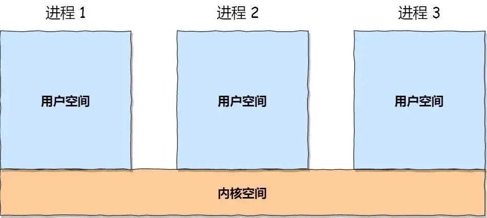
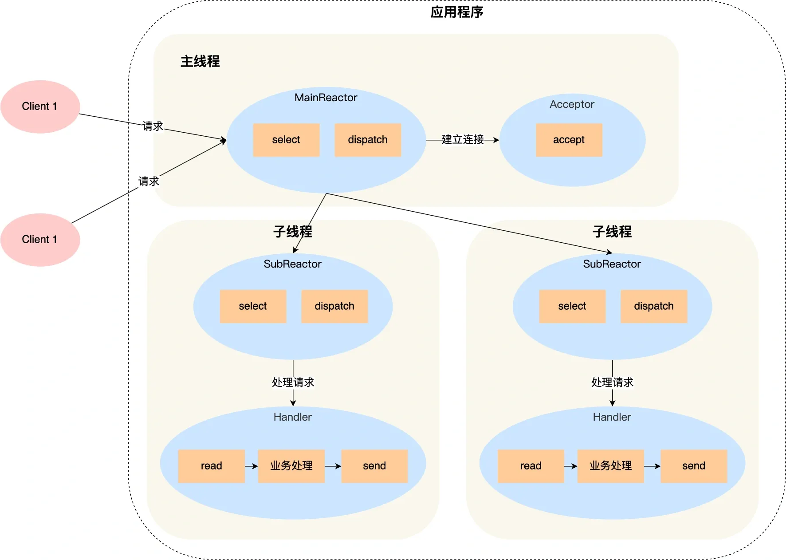
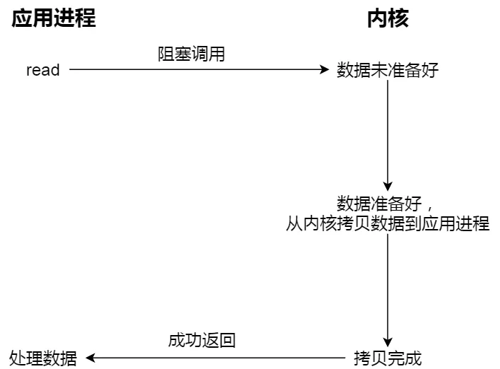
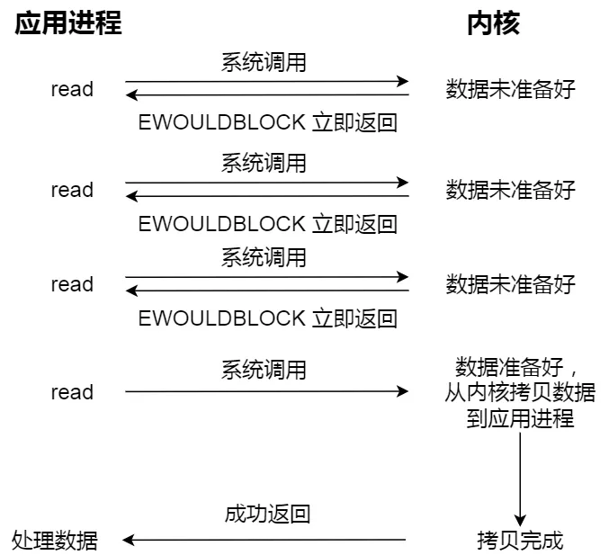
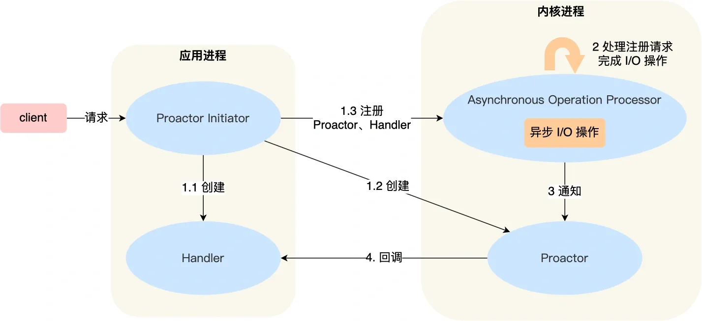
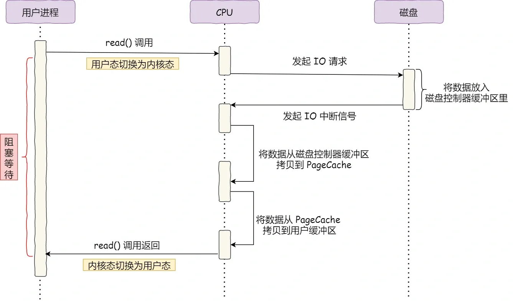
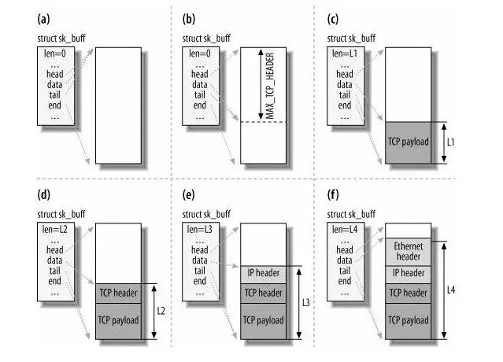
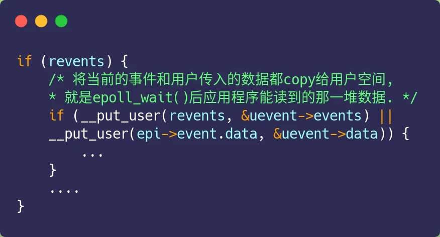

---

order: 12
author: zhiyu1998
title: 操作系统
category:
  - 计算机基础
  - 八股文
---

## 💻操作系统

### 协程 & 虚拟线程

协程是一种用户态的轻量级线程。

协程不是由操作系统内核管理，而是完全由用户程序所控制，这样带来的好处就是性能得到了很大的提升，不会像线程切换那样消耗资源。

协程可以理解为可以暂停执行的函数。它拥有自己的寄存器上下文和栈。协程调度切换时，将寄存器上下文和栈保存到其他地方，在切回来的时候，恢复先前保存的寄存器上下文和栈，直接操作栈则基本没有内核切换的开销，可以不加锁的访问全局变量，所以上下文的切换非常快。

**Kotlin 协程**:

Kotlin 提供了 `kotlinx.coroutines` 库来支持协程。以下是一个简单的示例，演示了如何使用协程执行异步任务：

```kotlin
import kotlinx.coroutines.*

fun main() = runBlocking {
    launch {
        delay(1000L)
        println("World!")
    }
    println("Hello,")
    delay(2000L)
}
```

**Go 协程**:

Go 语言内置了对协程的支持，称为 goroutines。以下是一个简单的示例，演示了如何使用 goroutines 执行并发任务：

```go
package main

import (
	"fmt"
	"time"
)

func main() {
	go func() {
		time.Sleep(1 * time.Second)
		fmt.Println("World!")
	}()

	fmt.Println("Hello,")
	time.Sleep(2 * time.Second)
}
```

**虚拟线程**

虚拟线程是 Java 19 引入的一种轻量级线程，它们旨在提高并发性能。虚拟线程在底层使用一种称为**结构化并发**的模型，该模型允许程序更有效地管理资源。虚拟线程允许程序在单个线程中执行多个任务，而不会消耗过多的系统资源。

以下是一个简单的虚拟线程示例，使用 Java 19 编写：

```java
import java.util.concurrent.*;

public class VirtualThreadExample {
    public static void main(String[] args) {
        ExecutorService executor = Executors.newVirtualThreadExecutor();

        Runnable task1 = () -> {
            try {
                Thread.sleep(1000);
            } catch (InterruptedException e) {
                e.printStackTrace();
            }
            System.out.println("World!");
        };

        Runnable task2 = () -> System.out.println("Hello,");

        executor.submit(task1);
        executor.submit(task2);

        try {
            executor.shutdown();
            executor.awaitTermination(3, TimeUnit.SECONDS);
        } catch (InterruptedException e) {
            e.printStackTrace();
        }
    }
}
```


### 进程和线程的区别

类似”**进程是资源分配的最小单位，线程是CPU调度的最小单位“**这样的回答感觉太抽象，都不太容易让人理解。

做个简单的比喻：进程=火车，线程=车厢

- 线程在进程下行进（单纯的车厢无法运行）

- 一个进程可以包含多个线程（一辆火车可以有多个车厢）

- 不同进程间数据很难共享（一辆火车上的乘客很难换到另外一辆火车，比如站点换乘）

- 同一进程下不同线程间数据很易共享（A车厢换到B车厢很容易）

- 进程要比线程消耗更多的计算机资源（采用多列火车相比多个车厢更耗资源）

- 进程间不会相互影响，一个线程挂掉将导致整个进程挂掉（一列火车不会影响到另外一列火车，但是如果一列火车上中间的一节车厢着火了，将影响到所有车厢）

- 进程可以拓展到多机，进程最多适合多核（不同火车可以开在多个轨道上，同一火车的车厢不能在行进的不同的轨道上）

- 进程使用的内存地址可以上锁，即一个线程使用某些共享内存时，其他线程必须等它结束，才能使用这一块内存。（比如火车上的洗手间）－"互斥锁"

- 进程使用的内存地址可以限定使用量（比如火车上的餐厅，最多只允许多少人进入，如果满了需要在门口等，等有人出来了才能进去）－“信号量”


> [来自biaodianfu回答](https://www.zhihu.com/question/25532384)


### Linux 进程的内存分布长什么样？

在 Linux 操作系统中，虚拟地址空间的内部又被分为**内核空间和用户空间**两部分，不同位数的系统，地址空间的范围也不同。比如最常见的 32 位和 64 位系统，如下所示：


通过这里可以看出：

- `32` 位系统的内核空间占用 `1G`，位于最高处，剩下的 `3G` 是用户空间；
- `64` 位系统的内核空间和用户空间都是 `128T`，分别占据整个内存空间的最高和最低处，剩下的中间部分是未定义的。

再来说说，内核空间与用户空间的区别：

- 进程在用户态时，只能访问用户空间内存；
- 只有进入内核态后，才可以访问内核空间的内存；

虽然每个进程都各自有独立的虚拟内存，但是**每个虚拟内存中的内核地址，其实关联的都是相同的物理内存**。这样，进程切换到内核态后，就可以很方便地访问内核空间内存。



接下来，进一步了解虚拟空间的划分情况，用户空间和内核空间划分的方式是不同的，内核空间的分布情况就不多说了。

我们看看用户空间分布的情况，以 32 位系统为例，我画了一张图来表示它们的关系：

通过这张图你可以看到，用户空间内存从**低到高**分别是 6 种不同的内存段：


- 代码段，包括二进制可执行代码；
- 数据段，包括已初始化的静态常量和全局变量；
- BSS 段，包括未初始化的静态变量和全局变量；
- 堆段，包括动态分配的内存，从低地址开始向上增长；
- 文件映射段，包括动态库、共享内存等，从低地址开始向上增长（[跟硬件和内核版本有关 (opens new window)](http://lishiwen4.github.io/linux/linux-process-memory-location)）；
- 栈段，包括局部变量和函数调用的上下文等。栈的大小是固定的，一般是 `8 MB`。当然系统也提供了参数，以便我们自定义大小；

在这 6 个内存段中，堆和文件映射段的内存是动态分配的。比如说，使用 C 标准库的 `malloc()` 或者 `mmap()` ，就可以分别在堆和文件映射段动态分配内存。


### 什么是上下文切换？

在多线程编程中，通常线程的数量大于 CPU 核心的数量，尽管在一些特定的环境（例如实时系统）或者为了避免上下文切换的开销，可能会将线程数量限制在和 CPU 核心数相等或者更少。无论何时，一个 CPU 核心只能被一个线程使用。为了保证所有线程得到有效执行，CPU 为每个线程分配时间片并采用轮转的形式进行调度。

当一个线程的时间片用完，CPU 会将该线程的状态（例如寄存器值、程序计数器等）保存到内存中，并从内存中加载另一个线程的状态以进行下一轮的执行。这个过程就是我们所说的"上下文切换"。

- **定义**：当前任务在执行完 CPU 时间片切换到另一个任务之前会先保存自己的状态，以便下次再切换回这个任务时，可以再加载这个任务的状态。从保存到再加载的过程就是一次上下文切换。
- **消耗**：上下文切换需要消耗一定的处理器时间，虽然每次切换只需要纳秒量级的时间，但在每秒需要进行几十次甚至上百次的切换中，这种消耗是积累的。因此，上下文切换对系统来说意味着消耗大量的 CPU 时间，可能是操作系统中时间消耗最大的一种操作。虽然上下文切换会消耗 CPU 资源，但它实际上是在不同线程之间共享 CPU 时间，从而实现多任务并发执行。
- **优化**：对于上下文切换，不同的操作系统可能有不同的优化策略。例如，Linux 操作系统相比其他操作系统（包括其他类 Unix 系统）在上下文切换和模式切换（从用户态切换到内核态，或从内核态切换到用户态）的时间消耗上表现出较大的优势。此外，Linux 操作系统还会使用 CFS（完全公平调度算法）进行调度，以降低上下文切换的频率和开销。对于开发者来说，也可以通过避免频繁创建和销毁线程，减少锁的使用，使用线程池复用线程，或者使用更高级的同步机制（如无锁编程，条件变量，信号量等）以及通过优化数据局部性来减少缓存失效等方法，从而减少上下文切换的开销。


### 什么是文件描述符

> 维基百科：文件描述符在形式上是一个非负整数。实际上，它是一个索引值，指向[内核](https://zh.wikipedia.org/wiki/内核)为每一个[进程](https://zh.wikipedia.org/wiki/进程)所维护的该进程打开文件的记录表。当程序打开一个现有文件或者创建一个新文件时，内核向进程返回一个文件描述符。在[程序设计](https://zh.wikipedia.org/wiki/程序设计)中，一些涉及底层的程序编写往往会围绕着文件描述符展开。但是文件描述符这一概念往往只适用于[UNIX](https://zh.wikipedia.org/wiki/UNIX)、[Linux](https://zh.wikipedia.org/wiki/Linux)这样的操作系统。

简单来说，当你打开一个文件时，操作系统会创建一个条目来表示该文件，并存储有关该打开文件的信息。因此，如果在您的操作系统中打开了100个文件，则操作系统中会有100个条目（在内核的某个地方）。这些条目由整数表示，例如（...100、101、102...）。这个条目号码就是文件描述符。因此，它只是一个整数号码，唯一地表示进程打开的文件。如果您的进程打开了10个文件，则进程表中会有10个文件描述符条目。

同样，当您打开网络套接字时，它也由一个整数表示，称为套接字描述符。


> 和pid有什么区别？

文件描述符（file descriptor）和进程ID（process ID）是不同的概念。

- 文件描述符是一个整数，用于唯一标识打开的文件或其他I/O资源，例如管道或套接字。它是一种操作系统提供的机制，用于访问文件或其他I/O资源。
- 进程ID是一个整数，用于唯一标识正在运行的进程。每个进程都有一个唯一的进程ID，它是由操作系统分配的。进程ID是用于操作系统在进程之间进行区分和跟踪的重要标识符。


> 参考：
>
> 1. https://www.computerhope.com/jargon/f/file-descriptor.htm
> 2. https://zh.wikipedia.org/wiki/%E6%96%87%E4%BB%B6%E6%8F%8F%E8%BF%B0%E7%AC%A6
> 3. https://stackoverflow.com/questions/5256599/what-are-file-descriptors-explained-in-simple-terms

 

### 进程有哪几种状态?

- **创建状态(new)** ：进程正在被创建，尚未到就绪状态。
- **就绪状态(ready)** ：进程已处于准备运行状态，即进程获得了除了处理器之外的一切所需资源，一旦得到处理器资源(处理器分配的时间片)即可运行。
- **运行状态(running)** ：进程正在处理器上上运行(单核 CPU 下任意时刻只有一个进程处于运行状态)。
- **阻塞状态(waiting)** ：又称为等待状态，进程正在等待某一事件而暂停运行如等待某资源为可用或等待 IO 操作完成。即使处理器空闲，该进程也不能运行。
- **结束状态(terminated)** ：进程正在从系统中消失。可能是进程正常结束或其他原因中断退出运行。

### 进程间的通信方式

> 下面这部分总结参考了:[《进程间通信 IPC (InterProcess Communication)》](https://www.jianshu.com/p/c1015f5ffa74)这篇文章，推荐阅读，总结的非常不错。

1. **管道/匿名管道(Pipes)** ：用于具有亲缘关系的父子进程间或者兄弟进程之间的通信。
2. **有名管道(Names Pipes)** : 匿名管道由于没有名字，只能用于亲缘关系的进程间通信。为了克服这个缺点，提出了有名管道。有名管道严格遵循**先进先出(first in first out)**。有名管道以磁盘文件的方式存在，可以实现本机任意两个进程通信。
3. **信号(Signal)** ：信号是一种比较复杂的通信方式，用于通知接收进程某个事件已经发生；
4. **消息队列(Message Queuing)**  ：消息队列是消息的链表,具有特定的格式,存放在内存中并由消息队列标识符标识。管道和消息队列的通信数据都是先进先出的原则。与管道（无名管道：只存在于内存中的文件；命名管道：存在于实际的磁盘介质或者文件系统）不同的是消息队列存放在内核中，只有在内核重启(即，操作系统重启)或者显式地删除一个消息队列时，该消息队列才会被真正的删除。消息队列可以实现消息的随机查询,消息不一定要以先进先出的次序读取,也可以按消息的类型读取.比 FIFO 更有优势。**消息队列克服了信号承载信息量少，管道只能承载无格式字 节流以及缓冲区大小受限等缺点。**
5. **信号量(Semaphores)** ：信号量是一个计数器，用于多进程对共享数据的访问，信号量的意图在于进程间同步。这种通信方式主要用于解决与同步相关的问题并避免竞争条件。
6. **共享内存(Shared memory)** ：使得多个进程可以访问同一块内存空间，不同进程可以及时看到对方进程中对共享内存中数据的更新。这种方式需要依靠某种同步操作，如互斥锁和信号量等。可以说这是最有用的进程间通信方式。
7. **套接字(Sockets)** : 此方法主要用于在客户端和服务器之间通过网络进行通信。套接字是支持 TCP/IP 的网络通信的基本操作单元，可以看做是不同主机之间的进程进行双向通信的端点，简单的说就是通信的两方的一种约定，用套接字中的相关函数来完成通信过程。


🦹 *Java中如何做进程间通讯的？*

**套接字（Socket）通信**

套接字允许两个运行在不同进程或不同计算机上的程序之间进行通信。在Java中，使用`java.net.Socket`类和`java.net.ServerSocket`类来实现客户端和服务器之间的TCP通信。对于UDP通信，可以使用`java.net.DatagramSocket`类。

示例代码:

~~~java
import java.io.*;
import java.net.*;

// 服务器端
public class Server {
    public static void main(String[] args) throws IOException {
        ServerSocket serverSocket = new ServerSocket(8888);
        System.out.println("服务器已启动，等待连接...");

        Socket socket = serverSocket.accept();
        DataInputStream input = new DataInputStream(socket.getInputStream());
        DataOutputStream output = new DataOutputStream(socket.getOutputStream());

        String message = input.readUTF();
        System.out.println("收到客户端消息: " + message);

        output.writeUTF("你好，客户端！");

        input.close();
        output.close();
        socket.close();
        serverSocket.close();
    }
}

// 客户端
import java.io.*;
import java.net.*;

public class Client {
    public static void main(String[] args) throws IOException {
        Socket socket = new Socket("localhost", 8888);
        DataOutputStream output = new DataOutputStream(socket.getOutputStream());
        DataInputStream input = new DataInputStream(socket.getInputStream());

        output.writeUTF("你好，服务器！");

        String message = input.readUTF();
        System.out.println("收到服务器消息: " + message);

        input.close();
        output.close();
        socket.close();
    }
}
```
~~~

**管道通信（Pipes）**

管道是一种单向通信方式，可以在两个独立的进程或线程之间传输数据。在Java中，可以使用`java.io.PipedInputStream`和`java.io.PipedOutputStream`实现管道通信。

示例代码:

```java
import java.io.*;

public class PipeExample {
    public static void main(String[] args) throws IOException, InterruptedException {
        final PipedOutputStream output = new PipedOutputStream();
        final PipedInputStream input = new PipedInputStream(output);

        Thread sender = new Thread(new Runnable() {
            @Override
            public void run() {
                try {
                    output.write("Hello, Receiver!".getBytes());
                    output.close();
                } catch (IOException e) {
                    e.printStackTrace();
                }
            }
        });

        Thread receiver = new Thread(new Runnable() {
            @Override
            public void run() {
                try {
                    int data = input.read();
                    while (data != -1) {
                        System.out.print((char) data);
                        data = input.read();
                    }
                    input.close();
                } catch (IOException e) {
                    e.printStackTrace();
                }
            }
        });

        sender.start();
        receiver.start();

        sender.join();
        receiver.join();
    }
}
```


### 线程间的同步的方式

1. **互斥量(Mutex)**：采用互斥对象机制，只有拥有互斥对象的线程才有访问公共资源的权限。因为互斥对象只有一个，所以可以保证公共资源不会被多个线程同时访问。比如 Java 中的 synchronized 关键词和各种 Lock 都是这种机制。
2. **信号量(Semaphore)** ：它允许同一时刻多个线程访问同一资源，但是需要控制同一时刻访问此资源的最大线程数量。
3. **事件(Event)** :Wait/Notify：通过通知操作的方式来保持多线程同步，还可以方便的实现多线程优先级的比较操作


### 进程的调度算法

为了确定首先执行哪个进程以及最后执行哪个进程以实现最大 CPU 利用率，计算机科学家已经定义了一些算法，它们是：

- **先到先服务(FCFS)调度算法** : 从就绪队列中选择一个最先进入该队列的进程为之分配资源，使它立即执行并一直执行到完成或发生某事件而被阻塞放弃占用 CPU 时再重新调度。
- **短作业优先(SJF)的调度算法** : 从就绪队列中选出一个估计运行时间最短的进程为之分配资源，使它立即执行并一直执行到完成或发生某事件而被阻塞放弃占用 CPU 时再重新调度。
- **时间片轮转调度算法** : 时间片轮转调度是一种最古老，最简单，最公平且使用最广的算法，又称 RR(Round robin)调度。每个进程被分配一个时间段，称作它的时间片，即该进程允许运行的时间。
- **多级反馈队列调度算法** ：前面介绍的几种进程调度的算法都有一定的局限性。如**短进程优先的调度算法，仅照顾了短进程而忽略了长进程** 。多级反馈队列调度算法既能使高优先级的作业得到响应又能使短作业（进程）迅速完成。，因而它是目前**被公认的一种较好的进程调度算法**，UNIX 操作系统采取的便是这种调度算法。
- **优先级调度** ： 为每个流程分配优先级，首先执行具有最高优先级的进程，依此类推。具有相同优先级的进程以 FCFS 方式执行。可以根据内存要求，时间要求或任何其他资源要求来确定优先级。


### 什么是死锁

死锁是指两个或两个以上的进程在执行过程中，由于竞争资源或者由于彼此通信而造成的一种阻塞的现象，若无外力作用，它们都将无法推进下去。此时称系统处于死锁状态或系统产生了死锁，这些永远在互相等待的进程称为死锁进程。

> 注：外力作用是指打破死锁的一种机制，例如进程主动放弃已获得的资源、通知其他进程释放资源等。


> 参考：
>
> 1. https://stackoverflow.com/questions/34512/what-is-a-deadlock
> 2. https://www.geeksforgeeks.org/introduction-of-deadlock-in-operating-system/
> 3. [https://baike.baidu.com/item/%E6%AD%BB%E9%94%81/2196938](https://baike.baidu.com/item/死锁/2196938)


### 🌟 死锁的四个条件

- **互斥**：这个条件意味着一次只有一个进程（或线程）可以使用特定的资源。如果其他进程想要使用同一个资源，它必须等待，直到当前占用该资源的进程完成并释放该资源。比如，打印机通常就是一个互斥资源，你不能同时打印两份文件。
- **占有并等待**：这个条件描述的是一个进程在占有至少一个资源的同时，还在等待获取其他资源。这些其他资源可能正被其他进程所占有。比如，一个进程可能已经占有了访问数据库的权限，但它还需要访问网络才能完成其任务。
- **非抢占**：这是指一旦一个进程获取了一个资源，其他进程就不能强行从它那里取走。这个资源只能被占有它的进程主动释放。比如，一个进程在使用CPU进行计算，这时候其他进程不能强行打断它，只能等到这个进程完成计算后，CPU才能被其他进程使用。
- **循环等待**：这个条件形成了一种循环链，其中每一个进程都在等待下一个进程所占有的资源。最后一个进程在等待第一个进程所占有的资源，从而形成了一个等待循环。比如，进程A等待被进程B占有的资源，进程B等待被进程C占有的资源，进程C等待被进程A占有的资源，形成了一个循环等待。


### 死锁的解决方式

> 官方说法：
> 解决死锁的方法可以从多个角度去分析，一般的情况下，有预防，避免，检测和解除四种。
> **预防** 是采用某种策略，限制并发进程对资源的请求，从而使得死锁的必要条件在系统执行的任何时间上都不满足。
> **避免**则是系统在分配资源时，根据资源的使用情况提前做出预测，从而避免死锁的发生
> **检测**是指系统设有专门的机构，当死锁发生时，该机构能够检测死锁的发生，并精确地确定与死锁有关的进程和资源。
> **解除** 是与检测相配套的一种措施，用于将进程从死锁状态下解脱出来。

在Java中，我们可以通过以下方式解决或者防止死锁：
1. **避免嵌套锁**：避免在一个线程内部对多个对象进行加锁。
2. **锁顺序**：如果在程序中的多个线程都需要同时获得多个锁，那么应确保所有的线程都是按照相同的顺序去获得锁，这样就不会因为线程获取锁的顺序不一致而导致死锁。
3. **尝试获取锁**：Java中的Lock接口提供了tryLock方法来尝试获取锁，如果在指定时间内无法获取锁，那么tryLock将返回false。这种方式可以防止线程无限期地等待获取锁。
4. **使用中断**：在Java中，锁定对象的时候可以响应中断，这是一种避免死锁的方式。例如，两个线程互相等待对方释放锁时，可以中断其中一个线程，让它释放已经持有的锁。
5. **使用定时器**：你可以使用ScheduledExecutorService来设置一个定时器，当线程在特定时间内没有完成任务，那么你可以停止它。

> 使用synchronized关键字不当反而是Java中死锁产生的常见原因。当两个或多个线程各自持有一些资源并同时请求对方持有的资源时，就可能发生死锁。


### ✨Reactor模型深入浅出

#### 前言

如果要让服务器服务多个客户端，那么最直接的方式就是为每一条连接创建线程。

其实创建进程也是可以的，原理是一样的，进程和线程的区别在于线程比较轻量级些，线程的创建和线程间切换的成本要小些，为了描述简述，后面都以线程为例。

处理完业务逻辑后，随着连接关闭后线程也同样要销毁了，但是这样不停地创建和销毁线程，不仅会带来性能开销，也会造成浪费资源，而且如果要连接几万条连接，创建几万个线程去应对也是不现实的。

要这么解决这个问题呢？我们可以使用「资源复用」的方式。

也就是不用再为每个连接创建线程，而是创建一个「线程池」，将连接分配给线程，然后一个线程可以处理多个连接的业务。

不过，这样又引来一个新的问题，线程怎样才能高效地处理多个连接的业务？

当一个连接对应一个线程时，线程一般采用「read -> 业务处理 -> send」的处理流程，如果当前连接没有数据可读，那么线程会阻塞在 `read` 操作上（ socket 默认情况是阻塞 I/O），不过这种阻塞方式并不影响其他线程。

但是引入了线程池，那么一个线程要处理多个连接的业务，线程在处理某个连接的 `read` 操作时，如果遇到没有数据可读，就会发生阻塞，那么线程就没办法继续处理其他连接的业务。

要解决这一个问题，最简单的方式就是将 socket 改成非阻塞，然后线程不断地轮询调用 `read` 操作来判断是否有数据，这种方式虽然该能够解决阻塞的问题，但是解决的方式比较粗暴，因为轮询是要消耗 CPU 的，而且随着一个 线程处理的连接越多，轮询的效率就会越低。

上面的问题在于，线程并不知道当前连接是否有数据可读，从而需要每次通过 `read` 去试探。

那有没有办法在只有当连接上有数据的时候，线程才去发起读请求呢？答案是有的，实现这一技术的就是 I/O 多路复用。

I/O 多路复用技术会用一个系统调用函数来监听我们所有关心的连接，也就说可以在一个监控线程里面监控很多的连接。


我们熟悉的 select/poll/epoll 就是内核提供给用户态的多路复用系统调用，线程可以通过一个系统调用函数从内核中获取多个事件。

select/poll/epoll 是如何获取网络事件的呢？

在获取事件时，先把我们要关心的连接传给内核，再由内核检测：

- 如果没有事件发生，线程只需阻塞在这个系统调用，而无需像前面的线程池方案那样轮训调用 read 操作来判断是否有数据。
- 如果有事件发生，内核会返回产生了事件的连接，线程就会从阻塞状态返回，然后在用户态中再处理这些连接对应的业务即可。

当下开源软件能做到网络高性能的原因就是 I/O 多路复用吗？

是的，基本是基于 I/O 多路复用，用过 I/O 多路复用接口写网络程序的同学，肯定知道是面向过程的方式写代码的，这样的开发的效率不高。

于是，大佬们基于面向对象的思想，对 I/O 多路复用作了一层封装，让使用者不用考虑底层网络 API 的细节，只需要关注应用代码的编写。

大佬们还为这种模式取了个让人第一时间难以理解的名字：**Reactor 模式**。

Reactor 翻译过来的意思是「反应堆」，可能大家会联想到物理学里的核反应堆，实际上并不是的这个意思。

这里的反应指的是「**对事件反应**」，也就是**来了一个事件，Reactor 就有相对应的反应/响应**。

事实上，Reactor 模式也叫 `Dispatcher` 模式，我觉得这个名字更贴合该模式的含义，即 **I/O 多路复用监听事件，收到事件后，根据事件类型分配（Dispatch）给某个进程 / 线程**。

Reactor 模式主要由 Reactor 和处理资源池这两个核心部分组成，它俩负责的事情如下：

- Reactor 负责监听和分发事件，事件类型包含连接事件、读写事件；
- 处理资源池负责处理事件，如 read -> 业务逻辑 -> send；

Reactor 模式是灵活多变的，可以应对不同的业务场景，灵活在于：

- Reactor 的数量可以只有一个，也可以有多个；
- 处理资源池可以是单个进程 / 线程，也可以是多个进程 /线程；

将上面的两个因素排列组设一下，理论上就可以有 4 种方案选择：

- 单 Reactor 单进程 / 线程；
- 单 Reactor 多进程 / 线程；
- 多 Reactor 单进程 / 线程；
- 多 Reactor 多进程 / 线程；

其中，「多 Reactor 单进程 / 线程」实现方案相比「单 Reactor 单进程 / 线程」方案，不仅复杂而且也没有性能优势，因此实际中并没有应用。

剩下的 3 个方案都是比较经典的，且都有应用在实际的项目中：

- 单 Reactor 单进程 / 线程；
- 单 Reactor 多线程 / 进程；
- 多 Reactor 多进程 / 线程；

方案具体使用进程还是线程，要看使用的编程语言以及平台有关：

- Java 语言一般使用线程，比如 Netty;
- C 语言使用进程和线程都可以，例如 Nginx 使用的是进程，Memcache 使用的是线程。

接下来，分别介绍这三个经典的 Reactor 方案。

#### Reactor

##### 单 Reactor 单进程 / 线程

一般来说，C 语言实现的是「**单 Reactor \*单进程\***」的方案，因为 C 语编写完的程序，运行后就是一个独立的进程，不需要在进程中再创建线程。

而 Java 语言实现的是「**单 Reactor \*单线程\***」的方案，因为 Java 程序是跑在 Java 虚拟机这个进程上面的，虚拟机中有很多线程，我们写的 Java 程序只是其中的一个线程而已。

我们来看看「**单 Reactor 单进程**」的方案示意图：


可以看到进程里有 **Reactor、Acceptor、Handler** 这三个对象：

- Reactor 对象的作用是监听和分发事件；
- Acceptor 对象的作用是获取连接；
- Handler 对象的作用是处理业务；

对象里的 select、accept、read、send 是系统调用函数，dispatch 和 「业务处理」是需要完成的操作，其中 dispatch 是分发事件操作。

接下来，介绍下「单 Reactor 单进程」这个方案：

- Reactor 对象通过 select （IO 多路复用接口） 监听事件，收到事件后通过 dispatch 进行分发，具体分发给 Acceptor 对象还是 Handler 对象，还要看收到的事件类型；
- 如果是连接建立的事件，则交由 Acceptor 对象进行处理，Acceptor 对象会通过 accept 方法 获取连接，并创建一个 Handler 对象来处理后续的响应事件；
- 如果不是连接建立事件， 则交由当前连接对应的 Handler 对象来进行响应；
- Handler 对象通过 read -> 业务处理 -> send 的流程来完成完整的业务流程。

单 Reactor 单进程的方案因为全部工作都在同一个进程内完成，所以实现起来比较简单，不需要考虑进程间通信，也不用担心多进程竞争。

但是，这种方案存在 2 个缺点：

- 第一个缺点，因为只有一个进程，**无法充分利用 多核 CPU 的性能**；
- 第二个缺点，Handler 对象在业务处理时，整个进程是无法处理其他连接的事件的，**如果业务处理耗时比较长，那么就造成响应的延迟**；

所以，单 Reactor 单进程的方案**不适用计算机密集型的场景，只适用于业务处理非常快速的场景**。

Redis 是由 C 语言实现的，在 Redis 6.0 版本之前采用的正是「单 Reactor 单进程」的方案，因为 Redis 业务处理主要是在内存中完成，操作的速度是很快的，性能瓶颈不在 CPU 上，所以 Redis 对于命令的处理是单进程的方案。


##### 单 Reactor 多线程 / 多进程

如果要克服「单 Reactor 单线程 / 进程」方案的缺点，那么就需要引入多线程 / 多进程，这样就产生了**单 Reactor 多线程 / 多进程**的方案。

闻其名不如看其图，先来看看「单 Reactor 多线程」方案的示意图如下：


详细说一下这个方案：

- Reactor 对象通过 select （IO 多路复用接口） 监听事件，收到事件后通过 dispatch 进行分发，具体分发给 Acceptor 对象还是 Handler 对象，还要看收到的事件类型；
- 如果是连接建立的事件，则交由 Acceptor 对象进行处理，Acceptor 对象会通过 accept 方法 获取连接，并创建一个 Handler 对象来处理后续的响应事件；
- 如果不是连接建立事件， 则交由当前连接对应的 Handler 对象来进行响应；

上面的三个步骤和单 Reactor 单线程方案是一样的，接下来的步骤就开始不一样了：

- Handler 对象不再负责业务处理，只负责数据的接收和发送，Handler 对象通过 read 读取到数据后，会将数据发给子线程里的 Processor 对象进行业务处理；
- 子线程里的 Processor 对象就进行业务处理，处理完后，将结果发给主线程中的 Handler 对象，接着由 Handler 通过 send 方法将响应结果发送给 client；

单 Reator 多线程的方案优势在于**能够充分利用多核 CPU 的能**，那既然引入多线程，那么自然就带来了多线程竞争资源的问题。

例如，子线程完成业务处理后，要把结果传递给主线程的 Handler 进行发送，这里涉及共享数据的竞争。

要避免多线程由于竞争共享资源而导致数据错乱的问题，就需要在操作共享资源前加上互斥锁，以保证任意时间里只有一个线程在操作共享资源，待该线程操作完释放互斥锁后，其他线程才有机会操作共享数据。

聊完单 Reactor 多线程的方案，接着来看看单 Reactor 多进程的方案。

事实上，单 Reactor 多进程相比单 Reactor 多线程实现起来很麻烦，主要因为要考虑子进程 <-> 父进程的双向通信，并且父进程还得知道子进程要将数据发送给哪个客户端。

而多线程间可以共享数据，虽然要额外考虑并发问题，但是这远比进程间通信的复杂度低得多，因此实际应用中也看不到单 Reactor 多进程的模式。

另外，「单 Reactor」的模式还有个问题，**因为一个 Reactor 对象承担所有事件的监听和响应，而且只在主线程中运行，在面对瞬间高并发的场景时，容易成为性能的瓶颈的地方**。


##### 多 Reactor 多进程 / 线程

要解决「单 Reactor」的问题，就是将「单 Reactor」实现成「多 Reactor」，这样就产生了第 **多 Reactor 多进程 / 线程**的方案。

老规矩，闻其名不如看其图。多 Reactor 多进程 / 线程方案的示意图如下（以线程为例）：



方案详细说明如下：

- 主线程中的 MainReactor 对象通过 select 监控连接建立事件，收到事件后通过 Acceptor 对象中的 accept  获取连接，将新的连接分配给某个子线程；
- 子线程中的 SubReactor 对象将 MainReactor 对象分配的连接加入 select 继续进行监听，并创建一个 Handler 用于处理连接的响应事件。
- 如果有新的事件发生时，SubReactor 对象会调用当前连接对应的 Handler 对象来进行响应。
- Handler 对象通过 read -> 业务处理 -> send 的流程来完成完整的业务流程。

多 Reactor 多线程的方案虽然看起来复杂的，但是实际实现时比单 Reactor 多线程的方案要简单的多，原因如下：

- 主线程和子线程分工明确，主线程只负责接收新连接，子线程负责完成后续的业务处理。
- 主线程和子线程的交互很简单，主线程只需要把新连接传给子线程，子线程无须返回数据，直接就可以在子线程将处理结果发送给客户端。

大名鼎鼎的两个开源软件 Netty 和 Memcache 都采用了「多 Reactor 多线程」的方案。

采用了「多 Reactor 多进程」方案的开源软件是 Nginx，不过方案与标准的多 Reactor 多进程有些差异。

具体差异表现在主进程中仅仅用来初始化 socket，并没有创建 mainReactor 来 accept 连接，而是由子进程的 Reactor 来 accept  连接，通过锁来控制一次只有一个子进程进行 accept（防止出现惊群现象），子进程 accept 新连接后就放到自己的 Reactor  进行处理，不会再分配给其他子进程。


#### Proactor

前面提到的 Reactor 是非阻塞同步网络模式，而 **Proactor 是异步网络模式**。

这里先给大家复习下阻塞、非阻塞、同步、异步 I/O 的概念。

先来看看**阻塞 I/O**，当用户程序执行 `read` ，线程会被阻塞，一直等到内核数据准备好，并把数据从内核缓冲区拷贝到应用程序的缓冲区中，当拷贝过程完成，`read` 才会返回。

注意，**阻塞等待的是「内核数据准备好」和「数据从内核态拷贝到用户态」这两个过程**。过程如下图：



知道了阻塞 I/O ，来看看**非阻塞 I/O**，非阻塞的 read 请求在数据未准备好的情况下立即返回，可以继续往下执行，此时应用程序不断轮询内核，直到数据准备好，内核将数据拷贝到应用程序缓冲区，`read` 调用才可以获取到结果。过程如下图：



注意，**这里最后一次 read 调用，获取数据的过程，是一个同步的过程，是需要等待的过程。这里的同步指的是内核态的数据拷贝到用户程序的缓存区这个过程。**

举个例子，如果 socket 设置了 `O_NONBLOCK` 标志，那么就表示使用的是非阻塞 I/O 的方式访问，而不做任何设置的话，默认是阻塞 I/O。

因此，无论 read 和 send 是阻塞 I/O，还是非阻塞 I/O 都是同步调用。因为在 read  调用时，内核将数据从内核空间拷贝到用户空间的过程都是需要等待的，也就是说这个过程是同步的，如果内核实现的拷贝效率不高，read  调用就会在这个同步过程中等待比较长的时间。

而真正的**异步 I/O** 是「内核数据准备好」和「数据从内核态拷贝到用户态」这**两个过程都不用等待**。

当我们发起 `aio_read` （异步 I/O） 之后，就立即返回，内核自动将数据从内核空间拷贝到用户空间，这个拷贝过程同样是异步的，内核自动完成的，和前面的同步操作不一样，**应用程序并不需要主动发起拷贝动作**。过程如下图：


举个你去饭堂吃饭的例子，你好比应用程序，饭堂好比操作系统。

阻塞 I/O 好比，你去饭堂吃饭，但是饭堂的菜还没做好，然后你就一直在那里等啊等，等了好长一段时间终于等到饭堂阿姨把菜端了出来（数据准备的过程），但是你还得继续等阿姨把菜（内核空间）打到你的饭盒里（用户空间），经历完这两个过程，你才可以离开。

非阻塞 I/O 好比，你去了饭堂，问阿姨菜做好了没有，阿姨告诉你没，你就离开了，过几十分钟，你又来饭堂问阿姨，阿姨说做好了，于是阿姨帮你把菜打到你的饭盒里，这个过程你是得等待的。

异步 I/O 好比，你让饭堂阿姨将菜做好并把菜打到饭盒里后，把饭盒送到你面前，整个过程你都不需要任何等待。

很明显，异步 I/O 比同步 I/O 性能更好，因为异步 I/O 在「内核数据准备好」和「数据从内核空间拷贝到用户空间」这两个过程都不用等待。

Proactor 正是采用了异步 I/O 技术，所以被称为异步网络模型。

现在我们再来理解 Reactor 和 Proactor 的区别，就比较清晰了。

- **Reactor 是非阻塞同步网络模式，感知的是就绪可读写事件**。在每次感知到有事件发生（比如可读就绪事件）后，就需要应用进程主动调用 read 方法来完成数据的读取，也就是要应用进程主动将 socket 接收缓存中的数据读到应用进程内存中，这个过程是同步的，读取完数据后应用进程才能处理数据。
- **Proactor 是异步网络模式， 感知的是已完成的读写事件**。在发起异步读写请求时，需要传入数据缓冲区的地址（用来存放结果数据）等信息，这样系统内核才可以自动帮我们把数据的读写工作完成，这里的读写工作全程由操作系统来做，并不需要像 Reactor 那样还需要应用进程主动发起 read/write 来读写数据，操作系统完成读写工作后，就会通知应用进程直接处理数据。

因此，**Reactor 可以理解为「来了事件操作系统通知应用进程，让应用进程来处理」**，而 **Proactor 可以理解为「来了事件操作系统来处理，处理完再通知应用进程」**。这里的「事件」就是有新连接、有数据可读、有数据可写的这些 I/O 事件这里的「处理」包含从驱动读取到内核以及从内核读取到用户空间。

举个实际生活中的例子，Reactor 模式就是快递员在楼下，给你打电话告诉你快递到你家小区了，你需要自己下楼来拿快递。而在 Proactor 模式下，快递员直接将快递送到你家门口，然后通知你。

无论是 Reactor，还是 Proactor，都是一种基于「事件分发」的网络编程模式，区别在于 **Reactor 模式是基于「待完成」的 I/O 事件，而 Proactor 模式则是基于「已完成」的 I/O 事件**。

接下来，一起看看 Proactor 模式的示意图：



介绍一下 Proactor 模式的工作流程：

- Proactor Initiator 负责创建 Proactor 和 Handler 对象，并将 Proactor 和 Handler 都通过 Asynchronous Operation Processor 注册到内核；
- Asynchronous Operation Processor 负责处理注册请求，并处理 I/O 操作；
- Asynchronous Operation Processor 完成 I/O 操作后通知 Proactor；
- Proactor 根据不同的事件类型回调不同的 Handler 进行业务处理；
- Handler 完成业务处理；

可惜的是，在 Linux 下的异步 I/O 是不完善的， `aio` 系列函数是由 POSIX  定义的异步操作接口，不是真正的操作系统级别支持的，而是在用户空间模拟出来的异步，并且仅仅支持基于本地文件的 aio 异步操作，网络编程中的  socket 是不支持的，这也使得基于 Linux 的高性能网络程序都是使用 Reactor 方案。

而 Windows 里实现了一套完整的支持 socket 的异步编程接口，这套接口就是 `IOCP`，是由操作系统级别实现的异步 I/O，真正意义上异步 I/O，因此在 Windows 里实现高性能网络程序可以使用效率更高的 Proactor 方案。


### :star:零拷贝深入浅出

#### DMA

在没有 DMA 技术前，I/O 的过程是这样的：

- CPU 发出对应的指令给磁盘控制器，然后返回；
- 磁盘控制器收到指令后，于是就开始准备数据，会把数据放入到磁盘控制器的内部缓冲区中，然后产生一个**中断**；
- CPU 收到中断信号后，停下手头的工作，接着把磁盘控制器的缓冲区的数据一次一个字节地读进自己的寄存器，然后再把寄存器里的数据写入到内存，而在数据传输的期间 CPU 是无法执行其他任务的。

为了方便你理解，我画了一副图：



可以看到，整个数据的传输过程，都要需要 CPU 亲自参与搬运数据的过程，而且这个过程，CPU 是不能做其他事情的。

简单的搬运几个字符数据那没问题，但是如果我们用千兆网卡或者硬盘传输大量数据的时候，都用 CPU 来搬运的话，肯定忙不过来。

计算机科学家们发现了事情的严重性后，于是就发明了 DMA 技术，也就是**直接内存访问（\*Direct Memory Access\*）** 技术。

什么是 DMA 技术？简单理解就是，**在进行 I/O 设备和内存的数据传输的时候，数据搬运的工作全部交给 DMA 控制器，而 CPU 不再参与任何与数据搬运相关的事情，这样 CPU 就可以去处理别的事务**。

那使用 DMA 控制器进行数据传输的过程究竟是什么样的呢？下面我们来具体看看。


具体过程：

- 用户进程调用 read 方法，向操作系统发出 I/O 请求，请求读取数据到自己的内存缓冲区中，进程进入阻塞状态；
- 操作系统收到请求后，进一步将 I/O 请求发送 DMA，然后让 CPU 执行其他任务；
- DMA 进一步将 I/O 请求发送给磁盘；
- 磁盘收到 DMA 的 I/O 请求，把数据从磁盘读取到磁盘控制器的缓冲区中，当磁盘控制器的缓冲区被读满后，向 DMA 发起中断信号，告知自己缓冲区已满；
- **DMA 收到磁盘的信号，将磁盘控制器缓冲区中的数据拷贝到内核缓冲区中，此时不占用 CPU，CPU 可以执行其他任务**；
- 当 DMA 读取了足够多的数据，就会发送中断信号给 CPU；
- CPU 收到 DMA 的信号，知道数据已经准备好，于是将数据从内核拷贝到用户空间，系统调用返回；

可以看到， 整个数据传输的过程，CPU 不再参与数据搬运的工作，而是全程由 DMA 完成，但是 CPU 在这个过程中也是必不可少的，因为传输什么数据，从哪里传输到哪里，都需要 CPU 来告诉 DMA 控制器。

早期 DMA 只存在在主板上，如今由于 I/O 设备越来越多，数据传输的需求也不尽相同，所以每个 I/O 设备里面都有自己的 DMA 控制器

#### 如何实现零拷贝？

零拷贝技术实现的方式通常有 2 种：

- mmap + write
- sendfile

下面就谈一谈，它们是如何减少「上下文切换」和「数据拷贝」的次数。

#### mmap + write

在前面我们知道，`read()` 系统调用的过程中会把内核缓冲区的数据拷贝到用户的缓冲区里，于是为了减少这一步开销，我们可以用 `mmap()` 替换 `read()` 系统调用函数。

```c
buf = mmap(file, len);
write(sockfd, buf, len);
```

`mmap()` 系统调用函数会直接把内核缓冲区里的数据「**映射**」到用户空间，这样，操作系统内核与用户空间就不需要再进行任何的数据拷贝操作。


具体过程如下：

- 应用进程调用了 `mmap()` 后，DMA 会把磁盘的数据拷贝到内核的缓冲区里。接着，应用进程跟操作系统内核「共享」这个缓冲区；
- 应用进程再调用 `write()`，操作系统直接将内核缓冲区的数据拷贝到 socket 缓冲区中，这一切都发生在内核态，由 CPU 来搬运数据；
- 最后，把内核的 socket 缓冲区里的数据，拷贝到网卡的缓冲区里，这个过程是由 DMA 搬运的。

我们可以得知，通过使用 `mmap()` 来代替 `read()`， 可以减少一次数据拷贝的过程。

但这还不是最理想的零拷贝，因为仍然需要通过 CPU 把内核缓冲区的数据拷贝到 socket 缓冲区里，而且仍然需要 4 次上下文切换，因为系统调用还是 2 次。

#### sendfile

在 Linux 内核版本 2.1 中，提供了一个专门发送文件的系统调用函数 `sendfile()`，函数形式如下：

```c
#include <sys/socket.h>
ssize_t sendfile(int out_fd, int in_fd, off_t *offset, size_t count);
```

它的前两个参数分别是目的端和源端的文件描述符，后面两个参数是源端的偏移量和复制数据的长度，返回值是实际复制数据的长度。

首先，它可以替代前面的 `read()` 和 `write()` 这两个系统调用，这样就可以减少一次系统调用，也就减少了 2 次上下文切换的开销。

其次，该系统调用，可以直接把内核缓冲区里的数据拷贝到 socket 缓冲区里，不再拷贝到用户态，这样就只有 2 次上下文切换，和 3 次数据拷贝。如下图：


但是这还不是真正的零拷贝技术，如果网卡支持 SG-DMA（*The Scatter-Gather Direct Memory Access*）技术（和普通的 DMA 有所不同），我们可以进一步减少通过 CPU 把内核缓冲区里的数据拷贝到 socket 缓冲区的过程。

你可以在你的 Linux 系统通过下面这个命令，查看网卡是否支持 scatter-gather 特性：

```bash
$ ethtool -k eth0 | grep scatter-gather
scatter-gather: on
```

于是，从 Linux 内核 `2.4` 版本开始起，对于支持网卡支持 SG-DMA 技术的情况下， `sendfile()` 系统调用的过程发生了点变化，具体过程如下：

- 第一步，通过 DMA 将磁盘上的数据拷贝到内核缓冲区里；
- 第二步，缓冲区描述符和数据长度传到 socket 缓冲区，这样网卡的 SG-DMA 控制器就可以直接将内核缓存中的数据拷贝到网卡的缓冲区里，此过程不需要将数据从操作系统内核缓冲区拷贝到 socket 缓冲区中，这样就减少了一次数据拷贝；

所以，这个过程之中，只进行了 2 次数据拷贝，如下图：


这就是所谓的**零拷贝（\*Zero-copy\*）技术，因为我们没有在内存层面去拷贝数据，也就是说全程没有通过 CPU 来搬运数据，所有的数据都是通过 DMA 来进行传输的。**。

零拷贝技术的文件传输方式相比传统文件传输的方式，减少了 2 次上下文切换和数据拷贝次数，**只需要 2 次上下文切换和数据拷贝次数，就可以完成文件的传输，而且 2 次的数据拷贝过程，都不需要通过 CPU，2 次都是由 DMA 来搬运。**

所以，总体来看，**零拷贝技术可以把文件传输的性能提高至少一倍以上**

#### 使用零拷贝技术的项目

事实上，Kafka 这个开源项目，就利用了「零拷贝」技术，从而大幅提升了 I/O 的吞吐率，这也是 Kafka 在处理海量数据为什么这么快的原因之一。

如果你追溯 Kafka 文件传输的代码，你会发现，最终它调用了 Java NIO 库里的 `transferTo` 方法：

```java
@Overridepublic 
long transferFrom(FileChannel fileChannel, long position, long count) throws IOException { 
    return fileChannel.transferTo(position, count, socketChannel);
}
```

如果 Linux 系统支持 `sendfile()` 系统调用，那么 `transferTo()` 实际上最后就会使用到 `sendfile()` 系统调用函数。

曾经有大佬专门写过程序测试过，在同样的硬件条件下，传统文件传输和零拷拷贝文件传输的性能差异，你可以看到下面这张测试数据图，使用了零拷贝能够缩短 `65%` 的时间，大幅度提升了机器传输数据的吞吐量。


另外，Nginx 也支持零拷贝技术，一般默认是开启零拷贝技术，这样有利于提高文件传输的效率，是否开启零拷贝技术的配置如下：

```text
http {
...
    sendfile on
...
}
```

sendfile 配置的具体意思:

- 设置为 on 表示，使用零拷贝技术来传输文件：sendfile ，这样只需要 2 次上下文切换，和 2 次数据拷贝。
- 设置为 off 表示，使用传统的文件传输技术：read + write，这时就需要 4 次上下文切换，和 4 次数据拷贝。

当然，要使用 sendfile，Linux 内核版本必须要 2.1 以上的版本。

#### 总结

早期 I/O 操作，内存与磁盘的数据传输的工作都是由 CPU 完成的，而此时 CPU 不能执行其他任务，会特别浪费 CPU 资源。

于是，为了解决这一问题，DMA 技术就出现了，每个 I/O 设备都有自己的 DMA 控制器，通过这个 DMA 控制器，CPU 只需要告诉 DMA  控制器，我们要传输什么数据，从哪里来，到哪里去，就可以放心离开了。后续的实际数据传输工作，都会由 DMA 控制器来完成，CPU  不需要参与数据传输的工作。

传统 IO 的工作方式，从硬盘读取数据，然后再通过网卡向外发送，我们需要进行 4 上下文切换，和 4  次数据拷贝，其中 2 次数据拷贝发生在内存里的缓冲区和对应的硬件设备之间，这个是由 DMA 完成，另外 2  次则发生在内核态和用户态之间，这个数据搬移工作是由 CPU 完成的。

为了提高文件传输的性能，于是就出现了零拷贝技术，它通过一次系统调用（`sendfile` 方法）合并了磁盘读取与网络发送两个操作，降低了上下文切换次数。另外，拷贝数据都是发生在内核中的，天然就降低了数据拷贝的次数。

Kafka 和 Nginx 都有实现零拷贝技术，这将大大提高文件传输的性能。

零拷贝技术是基于 PageCache 的，PageCache 会缓存最近访问的数据，提升了访问缓存数据的性能，同时，为了解决机械硬盘寻址慢的问题，它还协助  I/O 调度算法实现了 IO 合并与预读，这也是顺序读比随机读性能好的原因。这些优势，进一步提升了零拷贝的性能。

需要注意的是，零拷贝技术是不允许进程对文件内容作进一步的加工的，比如压缩数据再发送。

另外，当传输大文件时，不能使用零拷贝，因为可能由于 PageCache 被大文件占据，而导致「热点」小文件无法利用到 PageCache，并且大文件的缓存命中率不高，这时就需要使用「异步 IO + 直接 IO 」的方式。

在 Nginx 里，可以通过配置，设定一个文件大小阈值，针对大文件使用异步 IO 和直接 IO，而对小文件使用零拷贝。

### 守护线程

> 顶级理解：在非守护线程全部结束之后才结束的线程（只有当所有的非守护线程都结束运行后，守护线程才会自动结束。这就是守护线程“守护”的含义）

**守护线程（Daemon Thread）** 是一种特殊的线程，在计算机编程中，它的作用主要是在后台为其他线程提供服务。例如，在Java中，垃圾回收线程就是一种典型的守护线程。当程序中所有的非守护线程都结束时，守护线程会自动结束，而不需要明确的被停止或者销毁。这种线程的存在，可以帮助主程序在不需要处理一些常规任务时，可以继续执行更重要的任务。

在Java虚拟机（JVM）中，守护线程主要用于执行一些后台任务，如垃圾回收、系统监控等。它们通常在后台运行，为应用程序提供服务，而用户通常并不直接与它们交互。一个重要的特性是，当所有的非守护线程（如用户主动创建的线程）都结束运行时，JVM会自动退出。这是因为此时只剩下守护线程在运行，而JVM认为只有守护线程的存在不足以继续保持程序的运行，因此会选择退出。这样的设计可以避免程序因为守护线程的运行而无法退出的情况，有助于系统资源的释放和管理。

### 僵尸进程和孤儿进程

#### 僵尸进程

一个子进程结束后，它的父进程并没有等待它（调用wait或者waitpid），那么这个子进程将成为一个僵尸进程。僵尸进程是一个已经死亡的进程，但是并没有真正被销毁。它已经放弃了几乎所有内存空间，没有任何可执行代码，也不能被调度，仅仅在进程表中保留一个位置，记载该进程的进程ID、终止状态以及资源利用信息(CPU时间，内存使用量等等)供父进程收集，除此之外，僵尸进程不再占有任何内存空间。这个僵尸进程可能会一直留在系统中直到系统重启。

> - 《百度百科》解释：僵尸进程是当子进程比父进程先结束，而父进程又没有回收子进程，释放子进程占用的资源，此时子进程将成为一个僵尸进程。如果父进程先退出 ，子进程被init接管，子进程退出后init会回收其占用的相关资源
> - [维基百科](https://zh.wikipedia.org/wiki/%E5%83%B5%E5%B0%B8%E8%BF%9B%E7%A8%8B)：在类UNIX系统中，僵尸进程是指完成执行（通过exit系统调用，或运行时发生致命错误或收到终止信号所致），但在操作系统的进程表中仍然存在其进程控制块，处于"终止状态"的进程。这发生于子进程需要保留表项以允许其父进程读取子进程的退出状态：一旦退出态通过wait系统调用读取，僵尸进程条目就从进程表中删除，称之为"回收"（reaped）。正常情况下，进程直接被其父进程wait并由系统回收。进程长时间保持僵尸状态一般是错误的并导致资源泄漏。

危害：占用进程号，而系统所能使用的进程号是有限的；占用内存。

以下情况不会产生僵尸进程：

- 该进程的父进程先结束了。每个进程结束的时候，系统都会扫描是否存在子进程，如果有则用Init进程接管，成为该进程的父进程，并且会调用wait等待其结束。
- 父进程调用wait或者waitpid等待子进程结束（需要每隔一段时间查询子进程是否结束）。wait系统调用会使父进程暂停执行，直到它的一个子进程结束为止。waitpid则可以加入 `WNOHANG`(wait-no-hang)选项，如果没有发现结束的子进程，就会立即返回，不会将调用waitpid的进程阻塞。同时，waitpid还可以选择是等待任一子进程（同wait），还是等待指定pid的子进程，还是等待同一进程组下的任一子进程，还是等待组ID等于pid的任一子进程；
- 子进程结束时，系统会产生 `SIGCHLD`(signal-child)信号，可以注册一个信号处理函数，在该函数中调用waitpid，等待所有结束的子进程（注意：一般都需要循环调用waitpid，因为在信号处理函数开始执行之前，可能已经有多个子进程结束了，而信号处理函数只执行一次，所以要循环调用将所有结束的子进程回收）；
- 也可以用 `signal(SIGCLD, SIG_IGN)`(signal-ignore)通知内核，表示忽略 `SIGCHLD`信号，那么子进程结束后，内核会进行回收。

#### 孤儿进程

> 百度百科：在操作系统领域中，孤儿进程指的**是在其父进程执行完成或被终止后仍继续运行的一类进程**。这些孤儿进程将被init进程 (进程号为1)所收养，并由init进程对它们完成状态收集工作。
> [维基百科](https://zh.wikipedia.org/wiki/%E5%AD%A4%E5%84%BF%E8%BF%9B%E7%A8%8B)：在操作系统领域中，孤儿进程（Orphan Process）指的是在其父进程执行完成或被终止后仍继续运行的一类进程。

一个父进程已经结束了，但是它的子进程还在运行，那么这些子进程将成为孤儿进程。孤儿进程会被Init（进程ID为1）接管，当这些孤儿进程结束时由Init完成状态收集工作。


### 💫I/O 多路复用：select/poll/epoll

#### 最基本的 Socket 模型

要想客户端和服务器能在网络中通信，那必须得使用 Socket  编程，它是进程间通信里比较特别的方式，特别之处在于它是可以跨主机间通信。

Socket  的中文名叫作插口，咋一看还挺迷惑的。事实上，双方要进行网络通信前，各自得创建一个  Socket，这相当于客户端和服务器都开了一个“口子”，双方读取和发送数据的时候，都通过这个“口子”。这样一看，是不是觉得很像弄了一根网线，一头插在客户端，一头插在服务端，然后进行通信。

创建 Socket 的时候，可以指定网络层使用的是 IPv4 还是 IPv6，传输层使用的是 TCP 还是 UDP。

UDP 的 Socket 编程相对简单些，这里我们只介绍基于 TCP 的 Socket 编程。

服务器的程序要先跑起来，然后等待客户端的连接和数据，我们先来看看服务端的 Socket 编程过程是怎样的。

服务端首先调用 `socket()` 函数，创建网络协议为 IPv4，以及传输协议为 TCP 的 Socket ，接着调用 `bind()` 函数，给这个 Socket 绑定一个 **IP 地址和端口**，绑定这两个的目的是什么？

- 绑定端口的目的：当内核收到 TCP 报文，通过 TCP 头里面的端口号，来找到我们的应用程序，然后把数据传递给我们。
- 绑定 IP 地址的目的：一台机器是可以有多个网卡的，每个网卡都有对应的 IP 地址，当绑定一个网卡时，内核在收到该网卡上的包，才会发给我们；

绑定完 IP 地址和端口后，就可以调用 `listen()` 函数进行监听，此时对应 TCP 状态图中的 `listen`，如果我们要判定服务器中一个网络程序有没有启动，可以通过 `netstat` 命令查看对应的端口号是否有被监听。

服务端进入了监听状态后，通过调用 `accept()` 函数，来从内核获取客户端的连接，如果没有客户端连接，则会阻塞等待客户端连接的到来。

那客户端是怎么发起连接的呢？客户端在创建好 Socket 后，调用 `connect()` 函数发起连接，该函数的参数要指明服务端的 IP 地址和端口号，然后万众期待的 TCP 三次握手就开始了。

在  TCP 连接的过程中，服务器的内核实际上为每个 Socket 维护了两个队列：

- 一个是还没完全建立连接的队列，称为 **TCP 半连接队列**，这个队列都是没有完成三次握手的连接，此时服务端处于 `syn_rcvd` 的状态；
- 一个是一件建立连接的队列，称为 **TCP 全连接队列**，这个队列都是完成了三次握手的连接，此时服务端处于 `established` 状态；

当 TCP 全连接队列不为空后，服务端的 `accept()` 函数，就会从内核中的 TCP 全连接队列里拿出一个已经完成连接的  Socket 返回应用程序，后续数据传输都用这个 Socket。

注意，监听的 Socket 和真正用来传数据的 Socket 是两个：

- 一个叫作**监听 Socket**；
- 一个叫作**已连接 Socket**；

连接建立后，客户端和服务端就开始相互传输数据了，双方都可以通过 `read()` 和 `write()` 函数来读写数据。

至此， TCP 协议的 Socket 程序的调用过程就结束了，整个过程如下图：


看到这，不知道你有没有觉得读写 Socket  的方式，好像读写文件一样。

是的，基于 Linux 一切皆文件的理念，在内核中 Socket 也是以「文件」的形式存在的，也是有对应的文件描述符。

> PS : 下面会说到内核里的数据结构，不感兴趣的可以跳过这一部分，不会对后续的内容有影响。

文件描述符的作用是什么？每一个进程都有一个数据结构 `task_struct`，该结构体里有一个指向「文件描述符数组」的成员指针。该数组里列出这个进程打开的所有文件的文件描述符。数组的下标是文件描述符，是一个整数，而数组的内容是一个指针，指向内核中所有打开的文件的列表，也就是说内核可以通过文件描述符找到对应打开的文件。

然后每个文件都有一个 inode，Socket 文件的 inode 指向了内核中的 Socket 结构，在这个结构体里有两个队列，分别是**发送队列**和**接收队列**，这个两个队列里面保存的是一个个 `struct sk_buff`，用链表的组织形式串起来。

sk_buff 可以表示各个层的数据包，在应用层数据包叫 data，在 TCP 层我们称为 segment，在 IP 层我们叫 packet，在数据链路层称为 frame。

你可能会好奇，为什么全部数据包只用一个结构体来描述呢？协议栈采用的是分层结构，上层向下层传递数据时需要增加包头，下层向上层数据时又需要去掉包头，如果每一层都用一个结构体，那在层之间传递数据的时候，就要发生多次拷贝，这将大大降低 CPU 效率。

于是，为了在层级之间传递数据时，不发生拷贝，只用 sk_buff 一个结构体来描述所有的网络包，那它是如何做到的呢？是通过调整 sk_buff 中 `data` 的指针，比如：

- 当接收报文时，从网卡驱动开始，通过协议栈层层往上传送数据报，通过增加 skb->data 的值，来逐步剥离协议首部。
- 当要发送报文时，创建 sk_buff 结构体，数据缓存区的头部预留足够的空间，用来填充各层首部，在经过各下层协议时，通过减少 skb->data 的值来增加协议首部。

你可以从下面这张图看到，当发送报文时，data 指针的移动过程。



#### 如何服务更多的用户？

前面提到的 TCP Socket 调用流程是最简单、最基本的，它基本只能一对一通信，因为使用的是同步阻塞的方式，当服务端在还没处理完一个客户端的网络 I/O 时，或者 读写操作发生阻塞时，其他客户端是无法与服务端连接的。

可如果我们服务器只能服务一个客户，那这样就太浪费资源了，于是我们要改进这个网络 I/O 模型，以支持更多的客户端。

在改进网络 I/O 模型前，我先来提一个问题，你知道服务器单机理论最大能连接多少个客户端？

相信你知道 TCP 连接是由四元组唯一确认的，这个四元组就是：**本机IP, 本机端口, 对端IP, 对端端口**。

服务器作为服务方，通常会在本地固定监听一个端口，等待客户端的连接。因此服务器的本地 IP 和端口是固定的，于是对于服务端 TCP 连接的四元组只有对端 IP 和端口是会变化的，所以**最大 TCP 连接数 = 客户端 IP 数×客户端端口数**。

对于 IPv4，客户端的 IP 数最多为 2 的 32 次方，客户端的端口数最多为 2 的 16 次方，也就是**服务端单机最大 TCP 连接数约为 2 的 48 次方**。

这个理论值相当“丰满”，但是服务器肯定承载不了那么大的连接数，主要会受两个方面的限制：

- **文件描述符**，Socket 实际上是一个文件，也就会对应一个文件描述符。在 Linux 下，单个进程打开的文件描述符数是有限制的，没有经过修改的值一般都是 1024，不过我们可以通过 ulimit 增大文件描述符的数目；
- **系统内存**，每个 TCP 连接在内核中都有对应的数据结构，意味着每个连接都是会占用一定内存的；

那如果服务器的内存只有 2 GB，网卡是千兆的，能支持并发 1 万请求吗？

并发 1 万请求，也就是经典的 C10K 问题 ，C 是 Client 单词首字母缩写，C10K 就是单机同时处理 1 万个请求的问题。

从硬件资源角度看，对于 2GB 内存千兆网卡的服务器，如果每个请求处理占用不到 200KB 的内存和 100Kbit 的网络带宽就可以满足并发 1 万个请求。

不过，要想真正实现 C10K 的服务器，要考虑的地方在于服务器的网络 I/O 模型，效率低的模型，会加重系统开销，从而会离 C10K 的目标越来越远。

#### 多进程模型

基于最原始的阻塞网络 I/O， 如果服务器要支持多个客户端，其中比较传统的方式，就是使用**多进程模型**，也就是为每个客户端分配一个进程来处理请求。

服务器的主进程负责监听客户的连接，一旦与客户端连接完成，accept() 函数就会返回一个「已连接 Socket」，这时就通过 `fork()` 函数创建一个子进程，实际上就把父进程所有相关的东西都**复制**一份，包括文件描述符、内存地址空间、程序计数器、执行的代码等。

这两个进程刚复制完的时候，几乎一摸一样。不过，会根据**返回值**来区分是父进程还是子进程，如果返回值是 0，则是子进程；如果返回值是其他的整数，就是父进程。

正因为子进程会**复制父进程的文件描述符**，于是就可以直接使用「已连接 Socket 」和客户端通信了，

可以发现，子进程不需要关心「监听 Socket」，只需要关心「已连接 Socket」；父进程则相反，将客户服务交给子进程来处理，因此父进程不需要关心「已连接 Socket」，只需要关心「监听 Socket」。

下面这张图描述了从连接请求到连接建立，父进程创建生子进程为客户服务。


另外，当「子进程」退出时，实际上内核里还会保留该进程的一些信息，也是会占用内存的，如果不做好“回收”工作，就会变成**僵尸进程**，随着僵尸进程越多，会慢慢耗尽我们的系统资源。

> 一个子进程的进程描述符在子进程退出时不会释放，只有当父进程通过 wait() 或 waitpid() 获取了子进程信息后才会释放。如果子进程退出，而父进程并没有调用 wait() 或 waitpid()，那么子进程的进程描述符仍然保存在系统中，这种进程称之为僵尸进程。

因此，父进程要“善后”好自己的孩子，怎么善后呢？那么有两种方式可以在子进程退出后回收资源，分别是调用 `wait()` 和 `waitpid()` 函数。

这种用多个进程来应付多个客户端的方式，在应对 100 个客户端还是可行的，但是当客户端数量高达一万时，肯定扛不住的，因为每产生一个进程，必会占据一定的系统资源，而且进程间上下文切换的“包袱”是很重的，性能会大打折扣。

进程的上下文切换不仅包含了虚拟内存、栈、全局变量等用户空间的资源，还包括了内核堆栈、寄存器等内核空间的资源。

#### 多线程模型

既然进程间上下文切换的“包袱”很重，那我们就搞个比较轻量级的模型来应对多用户的请求 —— **多线程模型**。

线程是运行在进程中的一个“逻辑流”，单进程中可以运行多个线程，同进程里的线程可以共享进程的部分资源的，比如文件描述符列表、进程空间、代码、全局数据、堆、共享库等，这些共享些资源在上下文切换时是不需要切换，而只需要切换线程的私有数据、寄存器等不共享的数据，因此同一个进程下的线程上下文切换的开销要比进程小得多。

当服务器与客户端 TCP 完成连接后，通过 `pthread_create()` 函数创建线程，然后将「已连接 Socket」的文件描述符传递给线程函数，接着在线程里和客户端进行通信，从而达到并发处理的目的。

如果每来一个连接就创建一个线程，线程运行完后，还得操作系统还得销毁线程，虽说线程切换的上写文开销不大，但是如果频繁创建和销毁线程，系统开销也是不小的。

那么，我们可以使用**线程池**的方式来避免线程的频繁创建和销毁，所谓的线程池，就是提前创建若干个线程，这样当由新连接建立时，将这个已连接的 Socket 放入到一个队列里，然后线程池里的线程负责从队列中取出已连接 Socket 进程处理。


需要注意的是，这个队列是全局的，每个线程都会操作，为了避免多线程竞争，线程在操作这个队列前要加锁。

上面基于进程或者线程模型的，其实还是有问题的。新到来一个 TCP 连接，就需要分配一个进程或者线程，那么如果要达到 C10K，意味着要一台机器维护 1 万个连接，相当于要维护 1 万个进程/线程，操作系统就算死扛也是扛不住的。

#### I/O 多路复用

既然为每个请求分配一个进程/线程的方式不合适，那有没有可能只使用一个进程来维护多个 Socket 呢？答案是有的，那就是 **I/O 多路复用**技术。


一个进程虽然任一时刻只能处理一个请求，但是处理每个请求的事件时，耗时控制在 1 毫秒以内，这样 1 秒内就可以处理上千个请求，把时间拉长来看，多个请求复用了一个进程，这就是多路复用，这种思想很类似一个 CPU 并发多个进程，所以也叫做时分多路复用。

我们熟悉的 select/poll/epoll 内核提供给用户态的多路复用系统调用，**进程可以通过一个系统调用函数从内核中获取多个事件**。

select/poll/epoll 是如何获取网络事件的呢？在获取事件时，先把所有连接（文件描述符）传给内核，再由内核返回产生了事件的连接，然后在用户态中再处理这些连接对应的请求即可。

select/poll/epoll 这是三个多路复用接口，都能实现 C10K 吗？接下来，我们分别说说它们。

#### select/poll

select 实现多路复用的方式是，将已连接的 Socket 都放到一个**文件描述符集合**，然后调用 select 函数将文件描述符集合**拷贝**到内核里，让内核来检查是否有网络事件产生，检查的方式很粗暴，就是通过**遍历**文件描述符集合的方式，当检查到有事件产生后，将此 Socket 标记为可读或可写， 接着再把整个文件描述符集合**拷贝**回用户态里，然后用户态还需要再通过**遍历**的方法找到可读或可写的 Socket，然后再对其处理。

所以，对于 select 这种方式，需要进行 **2 次「遍历」文件描述符集合**，一次是在内核态里，一个次是在用户态里 ，而且还会发生 **2 次「拷贝」文件描述符集合**，先从用户空间传入内核空间，由内核修改后，再传出到用户空间中。

select 使用固定长度的 BitsMap，表示文件描述符集合，而且所支持的文件描述符的个数是有限制的，在 Linux 系统中，由内核中的 FD_SETSIZE 限制， 默认最大值为 `1024`，只能监听 0~1023 的文件描述符。

poll 不再用 BitsMap 来存储所关注的文件描述符，取而代之用动态数组，以链表形式来组织，突破了 select 的文件描述符个数限制，当然还会受到系统文件描述符限制。

但是 poll 和 select 并没有太大的本质区别，**都是使用「线性结构」存储进程关注的 Socket 集合，因此都需要遍历文件描述符集合来找到可读或可写的 Socket，时间复杂度为 O(n)，而且也需要在用户态与内核态之间拷贝文件描述符集合**，这种方式随着并发数上来，性能的损耗会呈指数级增长。

> select 和 poll 的区别总结
>
> - https://www.mo4tech.com/io-multiplexing-in-select-poll-epoll-differences.html
> - https://notes.shichao.io/unp/ch6/
> - https://www.techrepublic.com/article/using-the-select-and-poll-methods/

select和poll都是I/O多路复用的机制，都需要轮询来检查哪些文件描述符可以读写或出错。它们的主要区别在于：

1. 可以监视的文件描述符数量不同：select有FD_SETSIZE的限制，一般为1024，而poll没有限制，可以动态添加文件描述符。
2. 事件触发模式不同：select是水平触发，即只要文件描述符可读写或出错，就会一直通知应用程序；而poll既可以是水平触发，也可以是边缘触发，由应用程序指定。
3. 对于大量文件描述符的处理效率不同：select每次需要轮询整个文件描述符集合，效率较低，而poll每次只需要遍历当前添加的文件描述符，效率较高。
4. 平台兼容性不同：select在不同平台上的实现略有差异，而poll是POSIX标准的一部分，更加稳定和可靠。

#### epoll

先复习下 epoll 的用法。如下的代码中，先用epoll_create 创建一个 epoll对象 epfd，再通过 epoll_ctl 将需要监视的 socket 添加到epfd中，最后调用 epoll_wait 等待数据。

```c
int s = socket(AF_INET, SOCK_STREAM, 0);
bind(s, ...);
listen(s, ...)

int epfd = epoll_create(...);
epoll_ctl(epfd, ...); //将所有需要监听的socket添加到epfd中

while(1) {
    int n = epoll_wait(...);
    for(接收到数据的socket){
        //处理
    }
}
```

epoll 通过两个方面，很好解决了 select/poll 的问题。

*第一点*，epoll 在内核里使用**红黑树来跟踪进程所有待检测的文件描述字**，把需要监控的 socket 通过 `epoll_ctl()` 函数加入内核中的红黑树里，红黑树是个高效的数据结构，增删改一般时间复杂度是 `O(logn)`。而 select/poll 内核里没有类似 epoll 红黑树这种保存所有待检测的 socket 的数据结构，所以 select/poll  每次操作时都传入整个 socket 集合给内核，而 epoll 因为在内核维护了红黑树，可以保存所有待检测的 socket  ，所以只需要传入一个待检测的 socket，减少了内核和用户空间大量的数据拷贝和内存分配。

*第二点*， epoll 使用**事件驱动**的机制，内核里**维护了一个链表来记录就绪事件**，当某个 socket 有事件发生时，通过**回调函数**内核会将其加入到这个就绪事件列表中，当用户调用 `epoll_wait()` 函数时，只会返回有事件发生的文件描述符的个数，不需要像 select/poll 那样轮询扫描整个 socket 集合，大大提高了检测的效率。

从下图你可以看到 epoll 相关的接口作用：


epoll 的方式即使监听的 Socket 数量越多的时候，效率不会大幅度降低，能够同时监听的 Socket 的数目也非常的多了，上限就为系统定义的进程打开的最大文件描述符个数。因而，**epoll 被称为解决 C10K 问题的利器**。

插个题外话，网上文章不少说，`epoll_wait` 返回时，对于就绪的事件，epoll 使用的是共享内存的方式，即用户态和内核态都指向了就绪链表，所以就避免了内存拷贝消耗。

这是错的！看过 epoll 内核源码的都知道，**压根就没有使用共享内存这个玩意**。你可以从下面这份代码看到， epoll_wait 实现的内核代码中调用了 `__put_user` 函数，这个函数就是将数据从内核拷贝到用户空间。



##### 边缘触发和水平触发

这两个术语还挺抽象的，其实它们的区别还是很好理解的。

- 使用边缘触发模式时，当被监控的 Socket 描述符上有可读事件发生时，**服务器端只会从 epoll_wait 中苏醒一次**，即使进程没有调用 read 函数从内核读取数据，也依然只苏醒一次，因此我们程序要保证一次性将内核缓冲区的数据读取完；
- 使用水平触发模式时，当被监控的 Socket 上有可读事件发生时，**服务器端不断地从 epoll_wait 中苏醒，直到内核缓冲区数据被 read 函数读完才结束**，目的是告诉我们有数据需要读取；

举个🌰：
1. **水平触发（Level Triggered，LT）**：想象你有一个邮箱，邮差在你的邮箱里放了一封信，邮差会给你敲门告诉你有新信件。你取出信件读了一部分，剩下的留着稍后读，邮差看到你的信箱里还有信，就会再次敲门提醒你。只要你的信箱里还有信，无论你是否已经开始阅读，邮差都会每次过来时敲门。
2. **边缘触发（Edge Triggered，ET）**：还是那个邮箱的例子，但这次邮差只在放入新信件时敲门一次。如果你没有完全读完信件，邮差不会再敲门提醒你。除非有新的信件放入你的信箱，邮差才会再次敲门。因此，如果你没在邮差第一次敲门时就把所有信件读完，你可能会遗漏一些信件。

> 在这个比喻中，邮差就像是 epoll_wait，信件就是文件描述符的就绪状态，你读信就像处理就绪的文件描述符。水平触发和边缘触发的区别就在于 epoll_wait（邮差）是如何通知你文件描述符的就绪状态（信件）的。
> ps. **🙋‍♂️小技巧**：水平触发是只要有数据还在就绪epoll_wait就会直接返回；边缘触发是，要有新的（ 只在文件描述符的状态从“非就绪”变为“就绪” ），注意是新的数据就绪epoll_wait才会返回，但没有新的数据到来，那么 epoll_wait 不会返回这个文件描述符。

这就是两者的区别，水平触发的意思是只要满足事件的条件，比如内核中有数据需要读，就一直不断地把这个事件传递给用户；而边缘触发的意思是只有第一次满足条件的时候才触发，之后就不会再传递同样的事件了。

如果使用水平触发模式，当内核通知文件描述符可读写时，接下来还可以继续去检测它的状态，看它是否依然可读或可写。所以在收到通知后，没必要一次执行尽可能多的读写操作。

如果使用边缘触发模式，I/O 事件发生时只会通知一次，而且我们不知道到底能读写多少数据，所以在收到通知后应尽可能地读写数据，以免错失读写的机会。因此，我们会**循环**从文件描述符读写数据，那么如果文件描述符是阻塞的，没有数据可读写时，进程会阻塞在读写函数那里，程序就没办法继续往下执行。所以，**边缘触发模式一般和非阻塞 I/O 搭配使用**，程序会一直执行 I/O 操作，直到系统调用（如 `read` 和 `write`）返回错误，错误类型为 `EAGAIN` 或 `EWOULDBLOCK`。

一般来说，边缘触发的效率比水平触发的效率要高，因为边缘触发可以减少 epoll_wait 的系统调用次数，系统调用也是有一定的开销的的，毕竟也存在上下文的切换。

select/poll 只有水平触发模式，epoll 默认的触发模式是水平触发，但是可以根据应用场景设置为边缘触发模式。

另外，使用 I/O 多路复用时，最好搭配非阻塞 I/O 一起使用，Linux 手册关于 select 的内容中有如下说明：

> Under Linux, select() may report a socket file descriptor as "ready for  reading", while nevertheless a subsequent read blocks. This could for  example happen when data has arrived but upon examination has wrong  checksum and is discarded. There may be other circumstances in which a  file descriptor is spuriously reported as ready. Thus it may be safer to use O_NONBLOCK on sockets that should not block.
>
> 在Linux下，select（）可能会将套接字文件描述符报告为“准备好读取”，但随后的读取块仍然存在。例如，当数据已到达但检查后校验和错误并被丢弃时，可能会发生这种情况。在其他情况下，文件描述符可能会被虚假地报告为准备就绪。因此，在不应该屏蔽的套接字上使用O_NONBLOCK可能更安全。

简单点理解，就是**多路复用 API 返回的事件并不一定可读写的**，如果使用阻塞 I/O， 那么在调用 read/write 时则会发生程序阻塞，因此最好搭配非阻塞 I/O，以便应对极少数的特殊情况。

#### 总结

最基础的 TCP 的 Socket 编程，它是阻塞 I/O 模型，基本上只能一对一通信，那为了服务更多的客户端，我们需要改进网络 I/O 模型。

比较传统的方式是使用多进程/线程模型，每来一个客户端连接，就分配一个进程/线程，然后后续的读写都在对应的进程/线程，这种方式处理 100 个客户端没问题，但是当客户端增大到 10000  个时，10000 个进程/线程的调度、上下文切换以及它们占用的内存，都会成为瓶颈。

为了解决上面这个问题，就出现了 I/O 的多路复用，可以只在一个进程里处理多个文件的  I/O，Linux 下有三种提供 I/O 多路复用的 API，分别是： select、poll、epoll。

select 和 poll 并没有本质区别，它们内部都是使用「线性结构」来存储进程关注的 Socket 集合。

在使用的时候，首先需要把关注的 Socket 集合通过 select/poll 系统调用从用户态拷贝到内核态，然后由内核检测事件，当有网络事件产生时，内核需要遍历进程关注  Socket 集合，找到对应的 Socket，并设置其状态为可读/可写，然后把整个 Socket  集合从内核态拷贝到用户态，用户态还要继续遍历整个 Socket 集合找到可读/可写的 Socket，然后对其处理。

很明显发现，select 和 poll 的缺陷在于，当客户端越多，也就是 Socket 集合越大，Socket 集合的遍历和拷贝会带来很大的开销，因此也很难应对 C10K。

epoll 是解决 C10K 问题的利器，通过两个方面解决了 select/poll 的问题。

- epoll 在内核里使用「红黑树」来关注进程所有待检测的 Socket，红黑树是个高效的数据结构，增删改一般时间复杂度是  O(logn)，通过对这棵黑红树的管理，不需要像 select/poll 在每次操作时都传入整个 Socket  集合，减少了内核和用户空间大量的数据拷贝和内存分配。
- epoll 使用事件驱动的机制，内核里维护了一个「链表」来记录就绪事件，只将有事件发生的 Socket 集合传递给应用程序，不需要像 select/poll 那样轮询扫描整个集合（包含有和无事件的 Socket ），大大提高了检测的效率。

而且，epoll 支持边缘触发和水平触发的方式，而 select/poll 只支持水平触发，一般而言，边缘触发的方式会比水平触发的效率高。


### Linux内存申请的系统调用是什么？

在Linux系统中，用于申请内存的系统调用主要有两个：`brk`和`sbrk`，以及`mmap`和`mremap`。

1. `brk` 和 `sbrk`：这两个系统调用是用来管理程序数据段（也称为堆）的大小。数据段在程序的地址空间中存储动态分配的内存，例如由`malloc`分配的内存。`brk`设置新的堆末尾的地址，而`sbrk`增加堆的大小。如果成功，系统调用将返回零；如果失败（例如，由于内存不足），则返回非零值。当调用`malloc`或类似的函数来分配内存时，C库可能首先检查是否有足够的已分配但未使用的堆空间来满足请求。如果没有，它将使用`sbrk`或`brk`来增加堆的大小。然后，库将返回新分配的内存块的指针。


2. `mmap`：这个系统调用在程序的虚拟地址空间中创建一个新的映射。`mmap`可以用于多种目的，包括内存分配。实际上，许多现代的C库实现在分配大块内存时使用`mmap`，而不是`brk`或`sbrk`。当调用`mmap`时，必须指定要映射的长度，并且可以选择一个首选的虚拟地址（尽管操作系统可能会忽略这个地址）。如果成功，`mmap`将返回映射的起始地址。这块内存现在可以用于程序使用。对于通过`mmap`分配的内存，可以使用`munmap`来释放。


3. `mremap`：这个系统调用用于改变已存在的内存区域的大小，一般在使用realloc函数时可能会调用这个系统调用。


> 什么场景下 malloc() 会通过 brk() 分配内存？又是什么场景下通过 mmap() 分配内存？

malloc() 源码里默认定义了一个阈值：

- 如果用户分配的内存小于 128 KB，则通过 brk() 申请内存；
- 如果用户分配的内存大于 128 KB，则通过 mmap() 申请内存；

注意，不同的 glibc 版本定义的阈值也是不同的。

以上提到的这些系统调用都是底层的机制，直接与内核交互，因此一般我们不会直接使用他们，而是使用封装了这些系统调用的库函数，如`malloc`，`calloc`，`realloc`等。


> 为什么不全部使用 mmap 来分配内存？

因为向操作系统申请内存，是要通过系统调用的，执行系统调用是要进入内核态的，然后在回到用户态，运行态的切换会耗费不少时间。

所以，申请内存的操作应该避免频繁的系统调用，如果都用 mmap 来分配内存，等于每次都要执行系统调用。

另外，因为 mmap 分配的内存每次释放的时候，都会归还给操作系统，于是每次 mmap 分配的虚拟地址都是缺页状态的，然后在第一次访问该虚拟地址的时候，就会触发缺页中断。

也就是说，**频繁通过 mmap 分配的内存话，不仅每次都会发生运行态的切换，还会发生缺页中断（在第一次访问虚拟地址后），这样会导致 CPU 消耗较大**。

为了改进这两个问题，malloc 通过 brk() 系统调用在堆空间申请内存的时候，由于堆空间是连续的，所以直接预分配更大的内存来作为内存池，当内存释放的时候，就缓存在内存池中。

**等下次在申请内存的时候，就直接从内存池取出对应的内存块就行了，而且可能这个内存块的虚拟地址与物理地址的映射关系还存在，这样不仅减少了系统调用的次数，也减少了缺页中断的次数，这将大大降低 CPU 的消耗**。


> 既然 brk 那么牛逼，为什么不全部使用 brk 来分配？

如果我们连续申请了 10k，20k，30k 这三片内存，如果 10k 和 20k 这两片释放了，变为了空闲内存空间，如果下次申请的内存小于 30k，那么就可以重用这个空闲内存空间。

但是如果下次申请的内存大于 30k，没有可用的空闲内存空间，必须向 OS 申请，实际使用内存继续增大。

因此，随着系统频繁地 malloc 和 free ，尤其对于小块内存，堆内将产生越来越多不可用的碎片，导致“内存泄露”。而这种“泄露”现象使用 valgrind 是无法检测出来的。

所以，malloc 实现中，充分考虑了 brk 和 mmap 行为上的差异及优缺点，默认分配大块内存 (128KB) 才使用 mmap 分配内存空间。


> 参考：
>
> 1. https://xiaolincoding.com/os/3_memory/malloc.html#linux-进程的内存分布长什么样
> 2. https://profoundadvices.com/what-is-brk-and-sbrk-system-calls/
> 3. https://linux.die.net/man/2/brk
> 4. https://stackoverflow.com/questions/31261790/sbrk-system-call-in-unix
> 5. https://stackoverflow.com/questions/6988487/what-does-the-brk-system-call-do
> 6. https://www.man7.org/linux/man-pages/man2/brk.2.html
> 7. https://stackoverflow.com/questions/1754451/memory-mapped-files-system-call-linux

