---

order: 4
author: zhiyu1998
title: Java虚拟机
category:
  - 虚拟机
  - JVM
  - 八股文
---

## ♻️ JVM


### 图解JVM结构

#### 整体架构图：建议默写


#### 程序计数器

程序计数器是一块较小的内存空间，它可以看作是当前线程所执行的字节码的行号指示器。**字节码解释器工作时就是通过改变这个计数器的值来选取下一条需要执行的字节码指令，分支、循环、跳转、异常处理、线程恢复等基础功能都需要依赖这个计数器来完成**。

由于 Java 虚拟机的多线程是通过线程轮流切换、分配处理器执行时间的方式来实现的，在任何一个确定的时刻，一个处理器（对于多核处理器来说是一个内核）都只会执行一条线程中的指令。

**因此，为了线程切换后能恢复到正确的执行位置，每条线程都需要有一个独立的程序计数器，各个线程之间的计数器互不影响**。

那么程序计数器里存的到底是什么东西呢？

- 如果线程正在执行的是一个 Java 方法，这个计数器记录的是正在执行的虚拟机字节码指令的地址
- 如果正在执行的是本地（Native）方法，这个计数器值则应为空（Undefined）。至于什么是 Native 方法，在本地方法栈那一小节会详细解释

> 注意！此内存区域是唯一一个在《Java虚拟机规范》中没有规定任何 OutOfMemoryError（内存溢出）情况的区域。这个问题也算是一个比较常见的面试题了

#### 虚拟机栈

每个线程在创建的时候都会创建一个虚拟机栈，其内部保存一个个的栈帧(Stack Frame）

每个**栈帧**（Stack Frame）中存储着：

- **局部变量表**（Local Variables）：主要存放了编译期可知的各种数据类型（boolean、byte、char、short、int、float、long、double）、对象引用（reference 类型
- **操作数栈**（Operand Stack）(或称为表达式栈)：主要作为方法调用的中转站使用，用于存放方法执行过程中产生的中间计算结果。另外，计算过程中产生的临时变量也会放在操作数栈中。
- **动态链接**（Dynamic Linking）：主要服务一个方法需要调用其他方法的场景。Class 文件的常量池里保存有大量的符号引用比如方法引用的符号引用。当一个方法要调用其他方法，需要将常量池中指向方法的符号引用转化为其在内存地址中的直接引用。动态链接的作用就是为了将符号引用转换为调用方法的直接引用
- **方法返回地址**（Return Address）：方法正常退出或异常退出的地址
- **一些附加信息**


简单总结一下程序运行中栈可能会出现两种错误：
- `StackOverFlowError`： 若栈的内存大小不允许动态扩展，那么当线程请求栈的深度超过当前 Java 虚拟机栈的最大深度的时候，就抛出 StackOverFlowError 错误。
- `OutOfMemoryError`： 如果栈的内存大小可以动态扩展， 如果虚拟机在动态扩展栈时无法申请到足够的内存空间，则抛出OutOfMemoryError异常。

#### 本地方法栈

本地方法栈和上面我们所说的虚拟机栈作用基本一样，区别只不过是本地方法栈为虚拟机使用到的 Native 方法服务，而虚拟机栈为虚拟机执行 Java 方法（也就是字节码）服务。

这里解释一下 **Native 方法**的概念，其实不仅 Java，很多语言中都有这个概念。

"A native method is a Java method whose implementation is provided by non-java code."

就是说一个 Native 方法其实就是一个接口，但是它的具体实现是在外部由非 Java 语言比如 C 或 C++ 等来写的。Java 通过 JNI  来调用本地方法， 而本地方法是以库文件的形式存放的（在 WINDOWS 平台上是 DLL 文件形式，在 UNIX 机器上是 SO 文件形式）。

所以同一个 Native 方法，如果用不同的虚拟机去调用它，那么得到的结果和运行效率可能是不一样的，因为不同的虚拟机对于某个 Native 方法都有自己的实现，比如 Object 类的 `hashCode` 方法。

**那么为什么需要 Native 方法呢**？

其主要原因就是 Java 虽然使用起来很方便，但是有些层次的任务用 Java 实现起来不容易，或者对程序的效率有比较高的要求时，Java  语言可能并不是最好的选择。所以 Native 方法使得 Java 程序能够超越 Java 运行时的界限，有效地扩充了 JVM。

> 与虚拟机栈一样，本地方法栈也会在栈深度溢出或者栈扩展失败时分别抛出 StackOverflowError 和 OutOfMemoryError 异常

#### 堆

Java 堆是虚拟机所管理的内存中最大的一块。**堆是被所有线程共享的一块内存区域，在虚拟机启动时创建。此内存区域的唯一目的就是存放对象实例，“几乎” 所有的对象实例都在这里分配内存**。

注意！这里我们用的是几乎，技术发展至今，**其实并非所有的对象实例都会分配到堆上**，比如逃逸技术，这个我们后续文章我再做解释~

堆是垃圾收集器管理的内存区域，因此一些资料中它也被称作 “GC 堆”（Garbage Collected Heap）。

对于堆这个概念小伙伴们肯定还听说过各种诸如新生代、老年代、永久代、Eden 空间、From Survivor 空间、To Survivor 空间等名词，需要注意的是，**这些区域划分仅仅是一部分垃圾收集器的共同特性或者说设计风格而已，只是为了通过这种分代设计来更好地回收内存，或者更快地分配内存，而非某个 Java 虚拟机具体实现的固有内存布局，更不是《Java虚拟机规范》里对 Java 堆的进一步细致划分**

根据《Java虚拟机规范》的规定，Java  堆可以处于物理上不连续的内存空间中，但在逻辑上它应该被视为连续的，这点就像我们用磁盘空间去存储文件一样，并不要求每个文件都连续存放。但对于大对象（典型的如数组对象），多数虚拟机实现出于实现简单、存储高效的考虑，很可能会要求连续的内存空间。

Java 堆既可以被实现成固定大小的，也可以是可扩展的，当前主流的 Java 虚拟机都是按照可扩展来实现的（通过参数 `-Xmx` 和 `-Xms` 设定）

> 如果在堆中没有内存来完成对象实例的分配，并且堆也无法再扩展时，JVM 就会抛出 OutOfMemoryError 异常

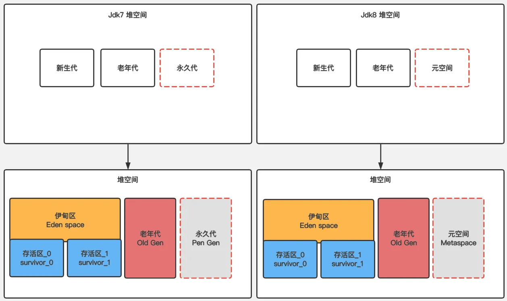

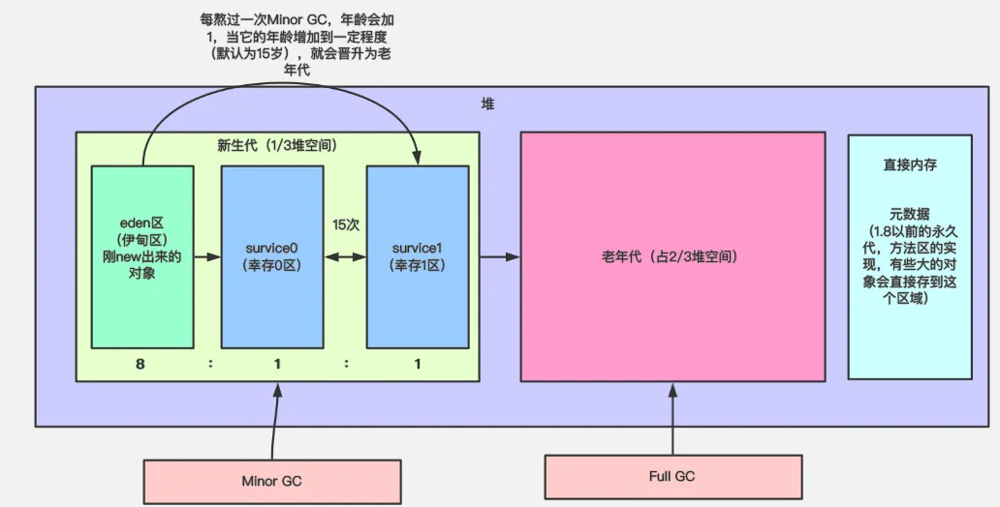


#### 方法区 

**方法区和永久代以及元空间是什么关系呢？** 方法区和永久代以及元空间的关系很像 Java 中接口和类的关系，类实现了接口，这里的类就可以看作是永久代和元空间，接口可以看作是方法区，也就是说永久代以及元空间是 HotSpot 虚拟机对虚拟机规范中方法区的两种实现方式。并且，永久代是 JDK 1.8 之前的方法区实现，JDK 1.8 及以后方法区的实现变成了元空间。


> 周志明老师在《深入理解 Java 虚拟机（第 3 版）》：**运行时常量池、方法区、字符串常量池**这些都是不随虚拟机实现而改变的逻辑概念，是公共且**抽象的**，**Metaspace、Heap** 是与具体某种虚拟机实现相关的物理概念，是私有且**具体的**。
> 扯皮——这符合马克思主义哲学，马克思主义中的抽象和具体是指从抽象的规定上升到具体的再现，是一种研究方法。在研究方法上，马克思归纳出两条道路，“在第一条道路上，完整的表象蒸发为抽象的规定；在第二条道路上，抽象的规定在思维行程中导致具体的再现。”

**方法区通俗点理解就是，在虚拟机完成类加载之后，存储这个类相关的类型信息、常量、静态变量、即时编译器编译后的代码缓存等数据**。

> It stores `per-class structures` such as the `run-time constant pool`, `field` and `method data`, and `the code for methods and constructors`, including the special methods used in class and instance initialization and interface initialization.  它存储每个类的结构，如运行时的常量池、字段和方法数据，以及方法和构造函数的代码，包括类和实例初始化和接口初始化中使用的特殊方法

举个简单的小例子：

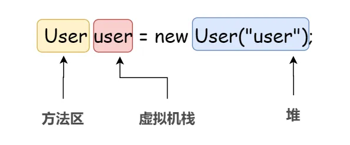

方法区其实本身很好理解，但是《Java 虚拟机规范》/ 《深入理解 Java 虚拟机》提到的一句话：**方法区是堆的一个逻辑部分**，真的是让我困惑了很长时间。

下面我来结合我的理解给大家解释下，我觉得这个 “方法区是堆的一个逻辑部分” 应该适用于 JDK 8 以前，而不适用 JDK 8

先来看 JDK 8 之前:

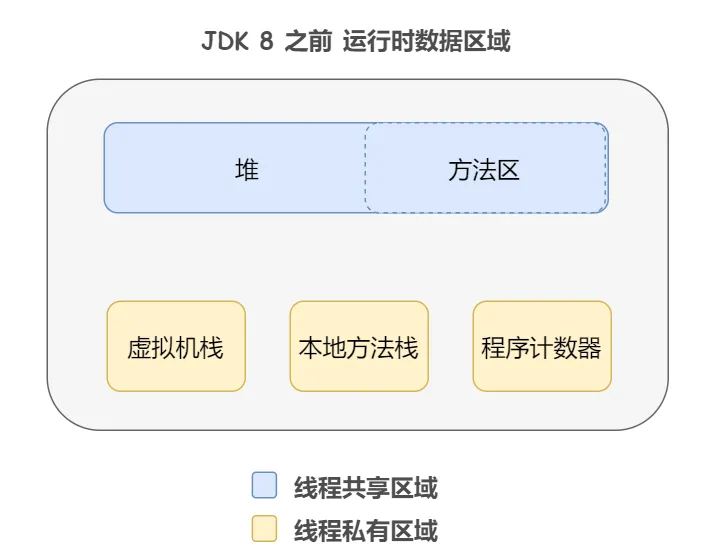

可以看到，**JDK 8 之前，堆和方法区其实是连在一起的，或者说，方法区就是堆的一部分**。

但是呢，**方法区存储的东西又有些特别**，在过去自定义类加载器使用不普遍的时候，类几乎是 “静态的” 并且很少被卸载和回收，因此类也可以被看成 “永久的”（这也就是永久代的含义），另外由于类作为 JVM 实现的一部分，它们不由程序来创建，**所以为了和堆区分开来呢**，就给了 “方法区” 这样一个名字用来存储类的信息，也有人把方法区称为 “非堆”。

⭐ 需要注意的是，**无论是方法区还是非堆，其实都只是一个逻辑上的概念，在 JDK 8 之前，其具体的实现方法是永久代**。

永久代是 HotSpot 虚拟机给出的实现，但是对于其他虚拟机实现，譬如 BEA JRockit、IBM J9 等来说，是不存在永久代的概念的。

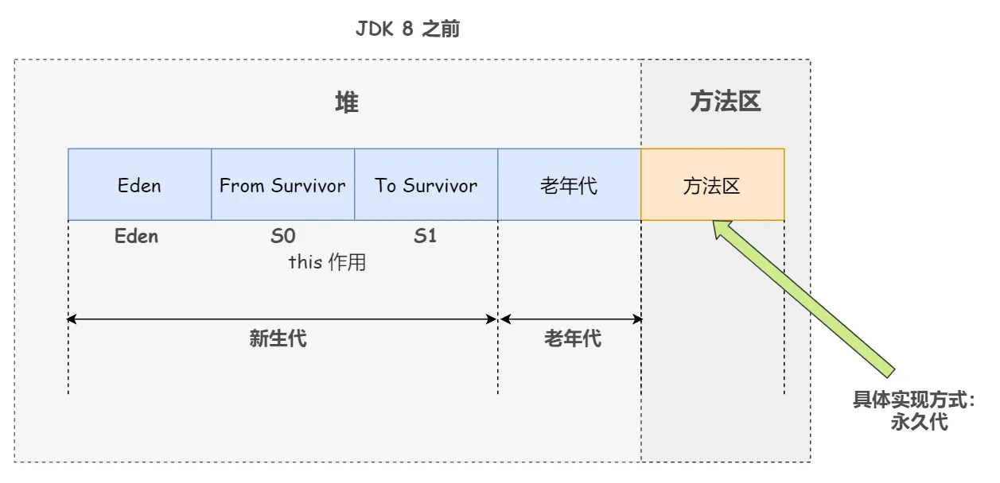

**永久代是一段连续的内存空间**，我们在 JVM 启动之前可以通过设置 `-XX:MaxPermSize` 的值来控制永久代的大小，32 位机器默认的永久代的大小为 64M，64 位的机器则为 85M。

**永久代的垃圾回收和老年代的垃圾回收是绑定的，一旦其中一个区域被占满，这两个区都要进行垃圾回收**。

显然这种设计并不是一个好的主意，由于我们可以通过 `‑XX:MaxPermSize` 设置永久代的大小，一旦类的元数据超过了设定的大小，程序就会耗尽内存，并出现内存溢出错误 (`java.lang.OutOfMemoryError: PermGen space`)。

**而且有极少数的方法**（例如适用 `String`的 `intern()`方法可以在运行过程中手动的将字符串添加到 字符串常量池中，在 JDK1.7 之前的 HotSpot 虚拟机中，字符串常量池被存储在永久代中）**会因永久代的原因而导致不同虚拟机下有不同的表现**（比如 JRockit 虚拟机就没有永久代的概念）

所以我们总结下 HotSpots 在 JDK 8 抛弃永久代，转而用元空间来实现方法区的**两大原因**：

1. 由于永久代的垃圾回收和老年代的垃圾回收是绑定的，一旦其中一个区域被占满，这两个区都要进行垃圾回收，增大了 OOM 发生的概率
2. 有少数的方法例如 `String` 的 `intern()` 方法会因永久代的原因而导致不同虚拟机下有不同的表现，不利于代码迁移

那么元空间到底是个啥，和方法区有啥区别？

**元空间与永久代之间最大的区别在于：元空间不再与堆连续，并且是存在于本地内存（Native memory）中的**。

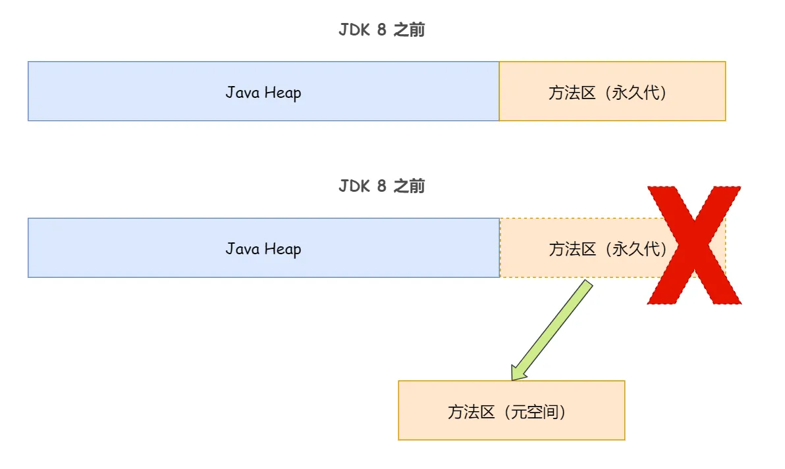

运行时数据区域的对比如下图：


> **元空间存在于本地内存，意味着只要本地内存足够，它就不会 OOM**，不会出现像永久代中的 `java.lang.OutOfMemoryError: PermGenspace`


##### 运行时常量池

**运行时常量池是方法区的一部分**。上面我们说过方法区包含类信息，而描述类信息的 Class 文件中除了有类的版本、字段、方法、接口等描述信息外，还有一项信息是**常量池表 (Constant Pool Table)**，用于存放**编译期**生成的各种字面量（字面量相当于 Java 语言层面常量的概念，如文本字符串，声明为 final 的常量值等）与符号引用。有一些文章会把 class 常量池表称为**静态常量池**。

都是常量池，常量池表和运行时常量池有啥关系吗？运行时常量池是干嘛的呢？

**运行时常量池可以在运行期间将 class 常量池表中的符号引用解析为直接引用**。简单来说，class 常量池表就相当于一堆索引，运行时常量池根据这些索引来查找对应方法或字段所属的类型信息和名称及描述符信息
> 那么运行时常量池中的引用到底是什么东西呢？
> System.out.println("Hello, world!");
> 上面这段代码生成以下字节码（javap输出）：
> 0:   getstatic       #2; java.
> 3:   ldc     #3; //String Hello, world!
> 5:   invokevirtual   #4; java.
> **# n这里是常量池的引用**。 #2 是对System.out字段的符号引用，#3 是一个Hello, world!字符串和#4 是对PrintStream.println(String)方法的符号引用。
> 符号引用不仅仅是名称。例如，还有对方法的符号引用，包含有关其参数（Ljava/lang/String;）和返回类型（V表示void）的信息。
> 参考：
> - https://stackoverflow.com/questions/10209952/what-is-the-purpose-of-the-java-constant-pool
> - https://stackoverflow.com/questions/22921010/what-is-run-time-constant-pool-and-method-area-in-java
> - https://stackoverflow.com/questions/17406159/symbolic-references-in-java
> - https://docs.oracle.com/javase/specs/jvms/se6/html/ConstantPool.doc.html

为什么需要常量池这个东西呢？主要是为了避免频繁的创建和销毁对象而影响系统性能，其实现了对象的共享。以**字符串常量池**为例，字符串 `String` 既然作为 `Java` 中的一个类，那么它和其他的对象分配一样，需要耗费高昂的时间与空间代价，作为最基础最常用的数据类型，大量频繁的创建字符串，将会极大程度的影响程序的性能。为此，JVM 为了提高性能和减少内存开销，在实例化字符串常量的时候进行了一些优化：

- 为字符串开辟了一个**字符串常量池 String Pool**，可以理解为缓存区
- 创建字符串常量时，首先检查字符串常量池中是否存在该字符串
- **若字符串常量池中存在该字符串，则直接返回该引用实例，无需重新实例化**；若不存在，则实例化该字符串并放入池中。

> 字符串常量池支持的引用类型：（参考：https://www.baeldung.com/jvm-constant-pool）
> - Integer, Float: with 32-bit constants
> - Double, Long: with 64-bit constants
> - String: a 16-bit string constant that points at another entry in the pool which contains the actual bytes
> - Class: contains the fully qualified class name
> - Utf8: a stream of bytes
> - NameAndType: a colon-separated pair of values, first entry represents the name while the second entry indicates the type
> - Fieldref, Methodref, InterfaceMethodref: a dot-separated pair of values, first value points at Class entry whereas the second value points as NameAndType entry

需要注意的是，字符串常量池的位置在 JDK 1.7 前后有所变化，可以参考下面这张表：

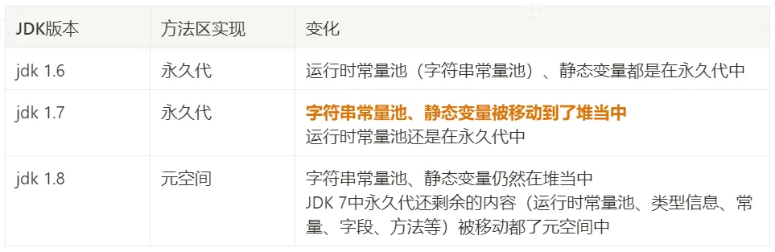

> 具体来说，JDK 1.8中的**字符串常量池**和**运行时常量池**被存储在堆中的"永久代"（PermGen）中，而JDK 1.8之后的版本则将永久代移除，将字符串常量池和运行时常量池存储在了堆中的"元空间"（Metaspace）中。
> 在JDK 1.8及之后的版本中，**字符串常量池和运行时常量池的存储位置仍然是堆**，只是具体的存储实现方式有所不同。

### ⭐️类的生命周期、类加载的过程

#### 类的生命周期

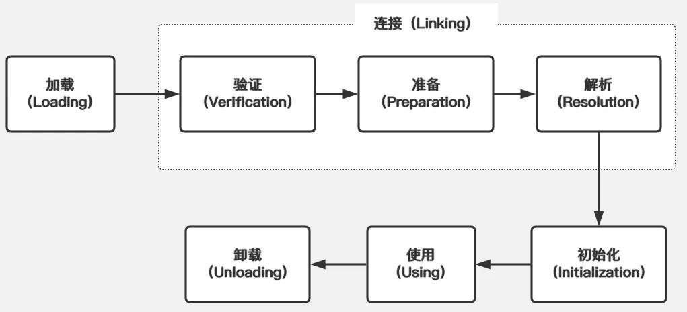

#### 类的加载过程

粗略


详细过程


### 为什么程序计数器是在JVM运行时数据区唯一一个不会出现 OutOfMemoryError 的内存区域

1. **简单的结构与功能**：程序计数器是一个非常小且简单的内存结构。它的作用是记录线程正在执行的字节码指令的地址或者说是指令的行号。对于正在执行的方法，程序计数器记录的是当前线程正在执行的字节码指令地址；如果是调用的本地方法，则计数器的值为空（undefined）。因此，它的内存需求是非常有限且固定的。
2. **不共享**：每个线程在创建时都会创建一个属于自己的程序计数器，它们之间不会相互影响，也不需要进行线程间的同步，所以在这个区域是不可能出现内存溢出的情况。
3. **无需动态扩展**：程序计数器的生命周期与线程相同，且在创建时即确定了大小，不需要在运行时动态扩展，因此不存在内存溢出的情况。

因此，程序计数器是 JVM 中唯一一个不会出现 `OutOfMemoryError` 的内存区域。


### JDK 中有哪些默认的类加载器

> 这里参考了[JVM 底层原理最全知识总结](https://doocs.github.io/jvm/)


系统提供了 3 种类加载器：

- **启动类加载器（Bootstrap ClassLoader）**： 负责将存放在 `<JAVA_HOME>\lib` 目录中的，并且能被虚拟机识别的（仅按照文件名识别，如 rt.jar，名字不符合的类库即使放在 lib 目录中也不会被加载）类库加载到虚拟机内存中。
- **扩展类加载器（Extension ClassLoader）**： 负责加载 `<JAVA_HOME>\lib\ext` 目录中的所有类库，开发者可以直接使用扩展类加载器。
- **应用程序类加载器（Application ClassLoader）**： 由于这个类加载器是 ClassLoader 中的 `getSystemClassLoader()` 方法的返回值，所以一般也称它为“系统类加载器”。它负责加载用户类路径（classpath）上所指定的类库，开发者可以直接使用这个类加载器，如果应用程序中没有自定义过自己的类加载器，一般情况下这个就是程序中默认的类加载器。

### 如何对栈进行参数调优

* 可以通过-Xss：调整每个线程栈空间的大小
* -XXThreadStackSize：设置线程栈的大小

### 说一下方法区和永久代的关系

方法区和永久代以及元空间的关系很像 Java  中接口和类的关系，类实现了接口，这里的类就可以看作是永久代和元空间，接口可以看作是方法区，也就是说永久代以及元空间是 HotSpot  虚拟机对虚拟机规范中方法区的两种实现方式。并且，永久代是 JDK 1.8 之前的方法区实现，JDK 1.8 及以后方法区的实现变成了元空间。

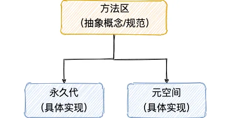

### 如何判断对象是否死亡

#### 引用计数法

在对象头维护着一个 counter 计数器，对象被引用一次则计数器 +1；若引用失效则计数器 -1。当计数器为 0 时，就认为该对象无效了。

引用计数算法的实现简单，判定效率也很高，在大部分情况下它都是一个不错的算法。但是主流的 Java 虚拟机里没有选用引用计数算法来管理内存，主要是因为它很难解决对象之间循环引用的问题。（虽然循环引用的问题可通过 Recycler 算法解决，但是在多线程环境下，引用计数变更也要进行昂贵的同步操作，性能较低，早期的编程语言会采用此算法。）

#### 可达性分析

可达性分析是通过一系列被称为 `GC Roots` 的根对象作为起始节点集，从这些节点开始，根据引用关系向下搜索，搜索过程所走过的路径被称为引用链（Reference Chain），如果某个对象到 `GC Roots` 间没有任何引用链相连，这代表 `GC Roots` 到该对象不可达， 此时证明此该对象不可能再被使用。

GC Roots 是指：

- **虚拟机栈**（栈帧中的本地变量表）中引用的对象
- **本地方法栈**中引用的对象
- **方法区**中**常量**引用的对象
- 方法区中类**静态**属性引用的对象

GC Roots 并不包括堆中对象所引用的对象，这样就不会有循环引用的问题。


☠️要真正宣告一个对象死亡，需要经过至少✌️次标记过程：

- 1️⃣如果对象在进行可达性分析后发现 `GC Roots` 不可达，将会进行第一次标记；
- 2️⃣随后进行一次筛选，筛选的条件是此对象是否有必要执行 `finalized()` 方法。如果对象没有覆盖 `finalized()` 方法，或者 `finalized()` 已经被虚拟机调用过，这两种情况都会视为没有必要执行。如果判定结果是有必要执行，此时对象会被放入名为 `F-Queue` 的队列，等待 Finalizer 线程执行其 `finalized()` 方法。在这个过程中，收集器会进行第二次小规模的标记，如果对象在 `finalized()` 方法中重新将自己与引用链上的任何一个对象进行了关联，如将自己（this 关键字）赋值给某个类变量或者对象的成员变量，此时它就实现了自我拯救，则第二次标记会将其移除 “即将回收” 的集合，否则该对象就将被真正回收，走向死亡。

### 什么是GC Root？有哪些常见的GC Root？
在Java中，GC（Garbage Collection）Roots 是垃圾收集器在进行**垃圾回收时用作起始点的一组对象**。垃圾回收器从这些GC Roots开始，通过引用关系，找到所有从GC Roots开始可达的对象。如果一个对象从GC Roots开始无法达到，那么这个对象就是不可达的，垃圾收集器就可以认为它是“垃圾”，并且可以回收这个对象占用的内存。

以下是在Java中一些常见的GC Roots：
1. 系统类加载器加载的类。这些类通常包括Java API类和用户定义的类。一旦类被加载，除非对应的ClassLoader被回收，否则类的定义对象（java.lang.Class）就会一直存在。
2. 活动线程。在Java程序运行过程中，至少存在一个非守护线程。垃圾收集器把当前执行的线程当作GC Roots。
3. 方法区和堆中静态变量引用的对象。
4. JNI引用。Java Native Interface，即Java本地接口。通常，它指的是Java代码与native代码（如C/C++代码）进行交互的接口。如果一个Java对象正在被native代码使用，那么该对象就是一个GC Roots。
5. 帧栈中的本地变量和输入参数。

> 参考：
> 1. https://www.baeldung.com/java-gc-roots
> 2. https://stackoverflow.com/questions/27186799/what-are-gc-roots-for-classes
> 3. https://www.baeldung.com/java-nth-root

### ⭐️虚引用与软引用和弱引用的区别

* **虚引用**：1️⃣虚引用是Java中一种特殊的引用类型。它的作用是帮助程序员在对象被回收之前，了解对象的状态，并且在对象被回收之前执行一些必要的操作。2️⃣虚引用必须和引用队列（ReferenceQueue）联合使用。虚引用必须和引用队列一起使用。当一个对象被垃圾回收器准备回收时，如果它还有虚引用，垃圾回收器会把这个虚引用加入到与之关联的引用队列中。程序可以通过判断引用队列中是否已经加入了虚引用，来了解对象是否将要被垃圾回收。3️⃣虚引用并不会阻止垃圾回收器回收对象，只是提供了一个通知机制，使程序有机会在对象被回收之前执行一些必要的操作，例如清理操作或保存对象状态到磁盘上等。

  * **虚引用主要用来跟踪对象被垃圾回收的活动**。
* **软引用**：如果内存空间足够，垃圾回收器就不会回收它，如果内存空间不足了，就会回收这些对象的内存

  * 实现内存敏感的高速缓存
* **弱引用**：只具有弱引用的对象拥有更短暂的生命周期。在垃圾回收器线程扫描它所管辖的内存区域的过程中，一旦发现了只具有弱引用的对象，不管当前内存空间足够与否，都会回收它的内存。不过，由于垃圾回收器是一个优先级很低的线程， 因此不一定会很快发现那些只具有弱引用的对象。


### 变量在JVM中的不同区域

- **局部变量**：局部变量存储在`虚拟机栈`中。`局部变量是在方法内声明的变量`，它们的作用域仅限于声明它们的方法。局部变量包括方法参数和在方法内声明的临时变量。
- **实例变量**：实例变量是与类的实例关联的变量。它们存储在`堆内存`中，作为对象实例的一部分。实例变量的生命周期与它们所属的对象实例相同。
- **静态变量**：静态变量是类的静态成员，它们在`方法区`中存储。静态变量的生命周期与类的生命周期相同，即从类被加载到卸载。

> 提示：方法区只是一个抽象概念，Java分别在不同版本对它进行了具体的实现（永久代，元空间）。在Java 7及其之前的版本中，这个区域通常被称为"永久代" (Perm Gen)。然而在Java 8中，这个区域被重新设计为"元空间" (Metaspace)，将Java对象和JVM特定的数据进行了明确的分离。元空间中不再包含Java对象，Java对象被移到了老年代 (Old Gen)，而元空间则包含JVM特定的数据，如运行时常量池，字段和方法数据，以及方法和构造器的代码等，这些都是非Java对象
>
> 在Java 8之后，也对元空间进行了进一步的优化。在Java 9中，引入了G1垃圾收集器作为默认的垃圾收集器，它将整个堆分为固定大小的区域，这些区域被分组为各种世代，如新生代、老年代、存活区等
>
> 然后在Java 16中，引入了JEP 387，对元空间进行了重大改造，被称为"弹性元空间"（Elastic Metaspace）。主要的改变包括更细粒度的内存分配和释放，以及基于“伙伴分配”算法的新的内存管理策略
>
> 参考资料：
>
> - https://stackoverflow.com/questions/50163218/is-method-area-still-present-in-java-8
> - http://karunsubramanian.com/websphere/one-important-change-in-memory-management-in-java-9/
> - https://blogs.sap.com/2021/07/16/jep-387-elastic-metaspace-a-new-classroom-for-the-java-virtual-machine/

因此，除了方法内的局部变量存储在虚拟机栈中之外，实例变量存储在堆中，静态变量存储在方法区中。运行时常量池是方法区的一部分，它主要用于存储编译期间生成的字面量和符号引用。


补充一下：实例变量

实例变量是类中声明的非静态变量。实例变量在每个类的实例中都有一个单独的副本。实例变量的值对于每个对象实例是唯一的，因此每个实例可以具有不同的实例变量值。

```java
public class Person {
    // 实例变量
    private String name;
    private int age;

    // 静态变量
    private static int personCount = 0;

    // 构造方法
    public Person(String name, int age) {
        this.name = name;
        this.age = age;
        personCount++;
    }

    // ... 其他方法 ...
}
```

在这个示例中，`name` 和 `age` 是实例变量，因为它们不是静态的。当您创建一个 `Person` 类的实例时，每个实例都有自己的 `name` 和 `age` 变量副本。而 `personCount` 是一个静态变量，它在整个类中只有一个副本。

以下是一个简单的示例，说明如何使用实例变量和静态变量：

```java
public class Main {
    public static void main(String[] args) {
        Person person1 = new Person("Alice", 25);
        Person person2 = new Person("Bob", 30);

        System.out.println("Person 1: Name: " + person1.getName() + ", Age: " + person1.getAge());
        System.out.println("Person 2: Name: " + person2.getName() + ", Age: " + person2.getAge());
        System.out.println("Total persons: " + Person.getPersonCount());
    }
}
```

输出结果：

```java
Person 1: Name: Alice, Age: 25
Person 2: Name: Bob, Age: 30
Total persons: 2
```

可以看到，每个 `Person` 实例都有自己的 `name` 和 `age` 实例变量，而静态变量 `personCount` 是所有实例共享的。


### 如何判断一个常量是废弃常量

1. JDK1.7 之前运行时常量池逻辑包含字符串常量池存放在方法区, 此时 hotspot 虚拟机对方法区的实现为永久代
2. JDK1.7 字符串常量池被从方法区拿到了堆中, 这里没有提到运行时常量池,也就是说字符串常量池被单独拿到堆,运行时常量池剩下的东西还在方法区, 也就是 hotspot 中的永久代
3. JDK1.8 hotspot 移除了永久代用元空间(Metaspace)取而代之, 这时候字符串常量池还在堆, 运行时常量池还在方法区, 只不过方法区的实现从永久代变成了元空间(Metaspace)

假如在字符串常量池中存在字符串 "abc"，如果当前没有任何 String 对象引用该字符串常量的话，就说明常量 "abc" 就是废弃常量，如果这时发生内存回收的话而且有必要的话，"abc" 就会被系统清理出常量池了。

### 双亲委派模型？如果我们不想用双亲委派模型怎么办？

每一个类都有一个对应它的类加载器。系统中的 ClassLoader 在协同工作的时候会默认使用 **双亲委派模型** 。即在类加载的时候，系统会首先判断当前类是否被加载过。已经被加载的类会直接返回，否则才会尝试加载。加载的时候，首先会把该请求委派给父类加载器的 `loadClass()` 处理，因此所有的请求最终都应该传送到顶层的启动类加载器 `BootstrapClassLoader` 中。当父类加载器无法处理时，才由自己来处理。当父类加载器为 null 时，会使用启动类加载器 `BootstrapClassLoader` 作为父类加载器。

假设有一个类A需要被加载
1. 首先，加载类A的请求到达一个称为"应用类加载器"的类加载器。这个应用类加载器并不会立即加载类A，而是将请求传递给它的父类加载器，也就是"扩展类加载器"。
2. 扩展类加载器同样不会立即加载类A，而是将请求传递给它的父类加载器，也就是"引导类加载器"。
3. 引导类加载器会首先尝试加载类A。如果找到了类A，它就会加载类A并结束请求。如果没有找到，加载请求会返回到扩展类加载器。
4. 现在，扩展类加载器会尝试加载类A。如果找到了类A，它就会加载类A并结束请求。如果没有找到，加载请求会返回到应用类加载器。
5. 最后，如果前面的所有父加载器都没有加载类A，应用类加载器才会自己尝试加载类A。


**如果我们不想用双亲委派模型怎么办 ？**
> 不得不说能问出这种问题的面试官是真的变态

自定义加载器的话，需要继承 `ClassLoader` 。如果我们不想打破双亲委派模型，就重写 `ClassLoader` 类中的 `findClass()` 方法即可，无法被父类加载器加载的类最终会通过这个方法被加载。但是，如果想打破双亲委派模型则需要重写 `loadClass()` 方法。

举例说明 >> 假设我们现在需要使用一个名为`"mylib.jar"的第三方库`，这个库中包含了一些自己实现的类，并且这些类名与JVM默认提供的类名相同。此时，如果我们直接使用JVM默认提供的类加载器来加载这个库，有可能会出现类名冲突的问题。

为了解决这个问题，我们可以`自定义一个ClassLoader`，来加载这个库中的类。`自定义ClassLoader可以不遵循双亲委派模型`，而是先在自己的类路径下查找类，如果找不到再加载第三方库中的类。这样就可以避免类名冲突的问题。

```java
public class MyClassLoader extends ClassLoader {
    private String libPath;
    
    public MyClassLoader(String path) {
        this.libPath = path;
    }
    
    @Override
    protected Class<?> findClass(String name) throws ClassNotFoundException {
        // 先在自己的类路径下查找类
        try {
            return super.findClass(name);
        } catch (ClassNotFoundException e) {
            // 如果找不到就到第三方库中查找类
            byte[] classData = getClassData(name);
            if (classData == null) {
                throw new ClassNotFoundException();
            } else {
                return defineClass(name, classData, 0, classData.length);
            }
        }
    }
    
    private byte[] getClassData(String className) {
        // 从第三方库中读取类字节码
        // ...
    }
}
```

在使用这个自定义ClassLoader加载第三方库中的类时，我们可以使用以下代码：

```java
MyClassLoader classLoader = new MyClassLoader("mylib.jar");
Class<?> clazz = classLoader.loadClass("com.example.MyClass");
```
这样就可以避免类名冲突的问题。但需要注意的是，自定义ClassLoader可能会导致类加载器的冲突和内存泄漏等问题，因此需要谨慎使用。


### 如何判断一个类是无用的类

- 该类所有的实例都已经被回收，也就是 Java 堆中不存在该类的任何实例。
- 加载该类的 `ClassLoader` 已经被回收。
- 该类对应的 `java.lang.Class` 对象没有在任何地方被引用，无法在任何地方通过反射访问该类的方法。

### ⭐️垃圾收集有哪些算法，各自的特点

- 标记-清除算法
- 标记-复制算法
- 标记-整理算法

**标记阶段：** 标记阶段的工作就是从根节点（root）开始，对所有可以访问到的对象进行标记。这些标记的对象就是目前还在使用或者尚未被垃圾回收的对象。这个阶段通常需要暂停所有的应用线程，也就是所谓的 "Stop-The-World"。

#### 标记-清除算法，Mark-Sweep

它是最基础的垃圾收集算法，收集过程分为两个阶段：首先标记出所有需要回收的对象，在标记完成后，统一回收掉所有被标记的对象；也可以反过来，标记存活对象，统一回收所有未被标记的对象。


它主要有以下两个缺点：

- 执行效率不稳定：如果 Java 堆上包含大量需要回收的对象，则需要进行大量标记和清除动作；
- 内存空间碎片化：标记清除后会产生大量不连续的空间，从而可能导致无法为大对象分配足够的连续内存。

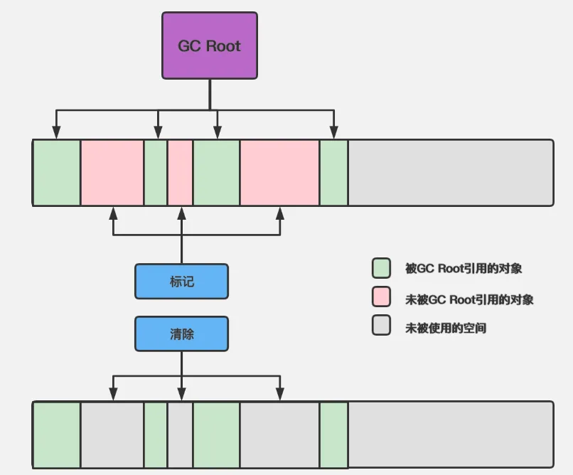

#### 标记-复制算法，Mark-Copy

标记-复制算法基于 ”半区复制“  算法：它将可用内存按容量划分为大小相等的两块，每次只使用其中一块，当这一块的内存使用完了，就将还存活着的对象复制到另外一块上面，然后再把已经使用过的那块内存空间一次性清理掉。其优点在于避免了内存空间碎片化的问题，其缺点如下：

- 如果内存中多数对象都是存活的，这种算法将产生大量的复制开销；
- 浪费内存空间，内存空间变为了原有的一半。


基于新生代 “朝生夕灭” 的特点，大多数虚拟机都不会按照 1:1 的比例来进行内存划分，例如 HotSpot 虚拟机会将内存空间划分为一块较大的 `Eden` 和 两块较小的 `Survivor` 空间，它们之间的比例是 8:1:1 。 每次分配时只会使用 `Eden` 和其中的一块 `Survivor` ，发生垃圾回收时，只需要将存活的对象一次性复制到另外一块 `Survivor` 上，这样只有 10% 的内存空间会被浪费掉。当 `Survivor` 空间不足以容纳一次 `Minor GC` 时，此时由其他内存区域（通常是老年代）来进行分配担保。


#### 标记-整理算法，Mark-Compact

标记-整理算法是在标记完成后，让所有存活对象都向内存的一端移动，然后直接清理掉边界以外的内存。其优点在于可以避免内存空间碎片化的问题，也可以充分利用内存空间；其缺点在于根据所使用的收集器的不同，在移动存活对象时可能要全程暂停用户程序：

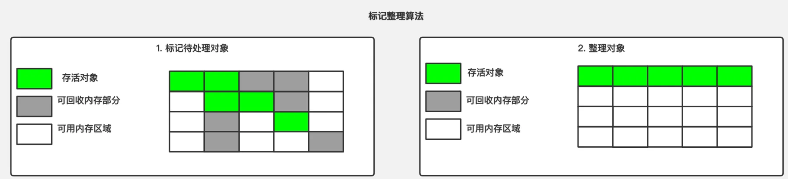


缺点（中小厂会问到所以加入）：
1. **停顿时间长**：标记-整理算法在进行垃圾回收时，需要首先标记所有可达对象，然后再进行移动和清理。在这个过程中，应用程序的所有线程都需要暂停，这将导致较长的暂停时间，尤其是在处理大量对象或大型堆内存时。
2. **处理速度慢**：在标记阶段，标记-整理算法需要遍历所有的对象。而在整理阶段，它需要移动对象并更新所有的引用。这个过程比其他的垃圾收集算法（如复制、标记-清除）要慢。

#### 分代收集算法
当前虚拟机的垃圾收集都采用分代收集算法，这种算法没有什么新的思想，只是根据对象存活周期的不同将内存分为几块。一般将 Java 堆分为新生代和老年代，这样我们就可以根据各个年代的特点选择合适的垃圾收集算法。比如在新生代中，每次收集都会有大量对象死去，所以可以选择”标记-复制“算法，只需要付出少量对象的复制成本就可以完成每次垃圾收集。而老年代的对象存活几率是比较高的，而且没有额外的空间对它进行分配担保，所以我们必须选择“标记-清除”或“标记-整理”算法进行垃圾收集。

### 跨代引用假说、弱分代假说 和 强分代假说
> 为了保证知识的正确性这里摘录周志明老师的《深入理解Java虚拟机》

当前商业虚拟机的垃圾收集器，大多数都遵循了“分代收集”（Generational Collection）的理论进行设计，分代收集名为理论，实质是一套符合大多数程序运行实际情况的经验法则，它建立在两个分代假说之上：

1. **弱分代假说（Weak Generational Hypothesis）**：绝大多数对象都是朝生夕灭的。
2. **强分代假说（Strong Generational Hypothesis）**：熬过越多次垃圾收集过程的对象就越难以消亡。

这两个分代假说共同奠定了多款常用的垃圾收集器的一致的设计原则：收集器应该将Java堆划分出不同的区域，然后将回收对象依据其年龄（年龄即对象熬过垃圾收集过程的次数）分配到不同的区域之中存储。显而易见，如果一个区域中大多数对象都是朝生夕灭，难以熬过垃圾收集过程的话，那么把它们集中放在一起，每次回收时只关注如何保留少量存活而不是去标记那些大量将要被回收的对象，就能以较低代价回收到大量的空间；如果剩下的都是难以消亡的对象，那把它们集中放在一块，虚拟机便可以使用较低的频率来回收这个区域，这就同时兼顾了垃圾收集的时间开销和内存的空间有效利用。

在Java堆划分出不同的区域之后，垃圾收集器才可以每次只回收其中某一个或者某些部分的区域——因而才有了“Minor GC”“Major GC”“Full GC”这样的回收类型的划分；也才能够针对不同的区域安排与里面存储对象存亡特征相匹配的垃圾收集算法——因而发展出了“标记-复制算法”“标记-清除算法”“标记-整理算法”等针对性的垃圾收集算法。这里笔者提前提及了一些新的名词，它们都是本章的重要角色，稍后都会逐一登场，现在读者只需要知道，这一切的出现都始于分代收集理论。

把分代收集理论具体放到现在的商用Java虚拟机里，设计者一般至少会把Java堆划分为新生代（Young Generation）和老年代（Old Generation）两个区域。顾名思义，在新生代中，每次垃圾收集时都发现有大批对象死去，而每次回收后存活的少量对象，将会逐步晋升到老年代中存放。如果读者有兴趣阅读HotSpot虚拟机源码的话，会发现里面存在着一些名为“*Generation”的实现，如“DefNewGeneration”和“ParNewGeneration”等，这些就是HotSpot的“分代式垃圾收集器框架”。原本HotSpot鼓励开发者尽量在这个框架内开发新的垃圾收集器，但除了最早期的两组四款收集器之外，后来的开发者并没有继续遵循。导致此事的原因有很多，最根本的是分代收集理论仍在不断发展之中，如何实现也有许多细节可以改进，被既定的代码框架约束反而不便。其实我们只要仔细思考一下，也很容易发现分代收集并非只是简单划分一下内存区域那么容易，它至少存在一个明显的困难：对象不是孤立的，对象之间会存在跨代引用。

假如要现在进行一次只局限于新生代区域内的收集（Minor GC），但新生代中的对象是完全有可能被老年代所引用的，为了找出该区域中的存活对象，不得不在固定的GC Roots之外，再额外遍历整个老年代中所有对象来确保可达性分析结果的正确性，反过来也是一样。遍历整个老年代所有对象的方案虽然理论上可行，但无疑会为内存回收带来很大的性能负担。为了解决这个问题，就需要对分代收集理论添加第三条经验法则：

3. **跨代引用假说（Intergenerational Reference Hypothesis）**：跨代引用相对于同代引用来说仅占极少数。

这其实是可根据前两条假说逻辑推理得出的隐含推论：存在互相引用关系的两个对象，是应该倾向于同时生存或者同时消亡的。举个例子，如果某个新生代对象存在跨代引用，由于老年代对象难以消亡，该引用会使得新生代对象在收集时同样得以存活，进而在年龄增长之后晋升到老年代中，这时跨代引用也随即被消除了。

依据这条假说，我们就不应再为了少量的跨代引用去扫描整个老年代，也不必浪费空间专门记录每一个对象是否存在及存在哪些跨代引用，只需在新生代上建立一个全局的数据结构（该结构被称为“记忆集”，Remembered Set），这个结构把老年代划分成若干小块，标识出老年代的哪一块内存会存在跨代引用。此后当发生Minor GC时，只有包含了跨代引用的小块内存里的对象才会被加入到GCRoots进行扫描。虽然这种方法需要在对象改变引用关系（如将自己或者某个属性赋值）时维护记录数据的正确性，会增加一些运行时的开销，但比起收集时扫描整个老年代来说仍然是划算的。

### HotSpot 为什么要分为新生代和老年代
> 这部分内容基于上述的弱分代引用假说，请先补充上面的知识，如果有可忽略

HotSpot JVM 的内存结构分为新生代（Young Generation）和老年代（Old Generation）的设计，是基于一个称为 "弱分代假说"（Weak Generational Hypothesis）的观察：
1. **大部分对象都会很快变得无用**：许多对象在创建后，只会被短暂地使用，然后就可以被回收。比如，一些临时变量、函数调用的栈帧等，都是生命周期很短的对象。
2. **存活的对象通常能活很久**：一旦对象存活了一段时间，它们通常会继续存活很久。例如，系统中的全局配置、常驻内存的缓存、持久化对象等。
根据这种假说，将内存分为新生代和老年代可以更有效地进行垃圾收集：

- **新生代**：新创建的对象首先分配在新生代。由于这里的对象大多生命周期较短，所以新生代频繁进行垃圾回收。这部分使用的是 Minor GC。
- **老年代**：新生代中经过多次垃圾回收仍然存活的对象，会被移动到老年代。这部分的对象预期存活时间长，所以老年代的垃圾收集频率较低，这部分使用的是 Major GC 或 Full GC。

这种内存管理方式的优点是可以针对不同代的对象特点采用不同的垃圾收集策略，从而提高垃圾收集的效率。例如，新生代中经常使用复制算法（因为新生代中大部分对象都是短命的，少数存活对象复制成本低），而老年代由于存活对象较多，一般使用标记-清除或标记-整理算法。

### ⭐️常见的垃圾回收器有哪些

#### Serial 收集器

Serial（串行）收集器是JVM最古老的收集器，也是单线程收集器，它使用“标记-清除”算法进行垃圾回收。Serial收集器适用于小型或中等规模的应用程序，以及单核CPU的环境。它的 **“单线程”** 的意义不仅仅意味着它只会使用一条垃圾收集线程去完成垃圾收集工作，更重要的是它在进行垃圾收集工作的时候必须暂停其他所有的工作线程（ **"Stop The World"** ），直到它收集结束。

👶**新生代采用标记-复制算法，👴老年代采用标记-整理算法。**


#### ParNew 收集器

**ParNew 收集器其实就是 Serial 收集器的多线程版本**，它同样使用“标记-清除”算法进行垃圾回收。ParNew收集器适用于多核CPU，但仍然不太适合大型应用程序。

👶**新生代采用标记-复制算法，👴老年代可以选择使用“标记-整理”算法或者“标记-清除”算法。**

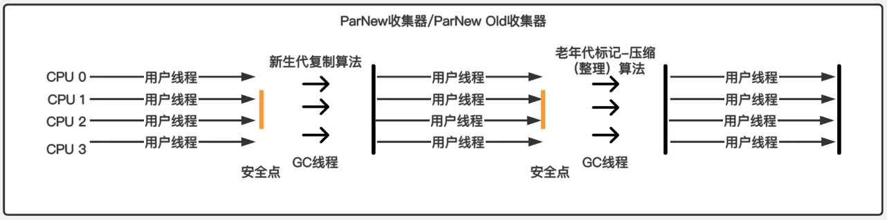

#### Parallel Scavenge 收集器

Parallel Scavenge 收集器也是使用标记-复制算法的多线程收集器，具有高吞吐量和低延迟的优点。Parallel Scavenge收集器适用于需要高吞吐量的大型应用程序。

```text
-XX:+UseParallelGC

    使用 Parallel 收集器+ 老年代串行

-XX:+UseParallelOldGC

    使用 Parallel 收集器+ 老年代并行
```

**Parallel Scavenge 收集器关注点是吞吐量（高效率的利用 CPU）。CMS 等垃圾收集器的关注点更多的是用户线程的停顿时间（提高用户体验）。所谓吞吐量就是 CPU 中用于运行用户代码的时间与 CPU 总消耗时间的比值。** Parallel Scavenge  收集器提供了很多参数供用户找到最合适的停顿时间或最大吞吐量，如果对于收集器运作不太了解，手工优化存在困难的时候，使用 Parallel  Scavenge 收集器配合自适应调节策略，把内存管理优化交给虚拟机去完成也是一个不错的选择。

**👶新生代采用[标记-复制算法](#标记-复制算法，Mark-Copy)，👴老年代采用[标记-整理算法](#标记-整理算法，Mark-Compact)。**

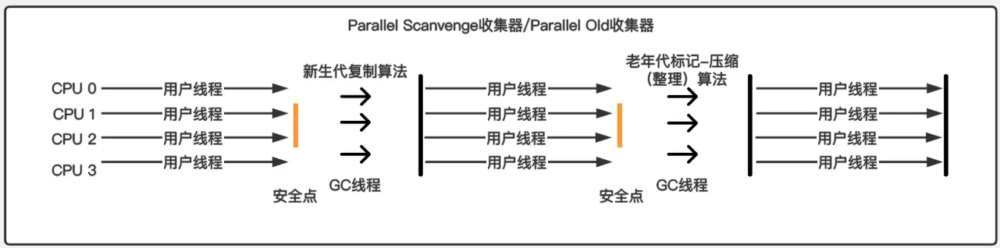

**这是 JDK1.8 默认收集器**

使用 java -XX:+PrintCommandLineFlags -version 命令查看

```text
-XX:InitialHeapSize=262921408 -XX:MaxHeapSize=4206742528 -XX:+PrintCommandLineFlags -XX:+UseCompressedClassPointers -XX:+UseCompressedOops -XX:+UseParallelGC
java version "1.8.0_211"
Java(TM) SE Runtime Environment (build 1.8.0_211-b12)
Java HotSpot(TM) 64-Bit Server VM (build 25.211-b12, mixed mode)
```

JDK1.8  默认使用的是 Parallel Scavenge + Parallel Old，如果指定了-XX:+UseParallelGC  参数，则默认指定了-XX:+UseParallelOldGC，可以使用-XX:-UseParallelOldGC 来禁用该功能

#### Serial Old 收集器

**Serial 收集器的👴老年代版本**，它同样是一个单线程收集器。它主要有两大用途：一种用途是在 JDK1.5 以及以前的版本中与 Parallel Scavenge 收集器搭配使用，另一种用途是作为 CMS 收集器的后备方案。


#### Paralled Old 收集器

**Parallel Scavenge 收集器的👴老年代版本**。使用多线程和“标记-整理”算法。在注重吞吐量以及 CPU 资源的场合，都可以优先考虑 Parallel Scavenge 收集器和 Parallel Old 收集器。


#### CMS 收集器

**CMS（Concurrent Mark Sweep）** 收集器是一种以获取最短回收停顿时间为目标的收集器。在每个主要GC周期中，CMS收集器在收集开始时短暂暂停所有应用程序线程，并在收集过程中再次暂停。第二个暂停往往是两个暂停中较长的一个。在两个暂停期间，多个线程用于执行收集工作。收集的其余部分（包括大部分活动对象的跟踪和无法访问的对象的清除）由一个或多个与应用程序同时运行的垃圾收集器线程完成。

从名字中的**Mark Sweep**这两个词可以看出，CMS 收集器是一种 **“标记-清除”算法**实现的，它的运作过程相比于前面几种垃圾收集器来说更加复杂一些。整个过程分为四个步骤：

1. **初始标记 (inital mark)**：在这个阶段，CMS GC会标记所有的`GC Roots`，以及从这些GC Roots可直接关联到的对象。这个过程需要`“Stop The World”`，也就是暂停所有的用户线程，以保证在对象图遍历过程中，对象图不会发生变化。因为只是标记GC Roots直接可达的对象，所以这个阶段的时间通常会比较短。
2. **并发标记 (concurrent mark)**：从初始标记结束后，开始进行并发标记阶段，这个阶段 GC 线程会遍历对象图，标记所有从 `GC Roots` 开始的可达对象，这个过程是与用户线程并发执行的，也就是说在这个过程中，用户线程并不会停止。因此，这个阶段可能会随着堆内存对象数量的增加而耗时较长。
3. **重新标记 (remark)**：并发标记阶段结束后，会进行一次`“Stop The World”`操作，目的是修正并发标记阶段由于用户线程继续运行而导致的可达对象的变化。`这个过程也称为"并发标记的第二次"`，由于只是修正，并且使用了`增量更新（Incremental Update）算法`，所以这个过程的耗时通常比初始标记阶段稍长，但远小于并发标记阶段。
4. **并发清除 (inital sweep)**：在标记完所有的存活对象后，GC 线程会进行并发清除，清除所有未被标记的对象，也就是不可达的对象。`这个过程是与用户线程并发执行的，因此不会造成用户线程的停顿`。但是这个阶段的耗时可能会比较长，因为需要清理的对象可能会比较多。

> 需要注意的是，CMS收集器由于其“标记-清除”算法的特性，会导致内存碎片问题，可能会触发一次Full GC以进行内存整理。而G1收集器则通过“标记-整理”算法有效解决了这个问题。


从它的名字就可以看出它是一款优秀的垃圾收集器，主要优点：**并发收集、低停顿**。但是它有下面三个明显的缺点：

- **对 CPU 资源敏感；**
- **无法处理浮动垃圾；**
- **它使用的回收算法-“标记-清除”算法会导致收集结束时会有大量空间碎片产生。**

> 细节：CMS通常有两个阶段会进行STW（🕊️ 妙记：并发的不会STW）
> ==第一阶段和第三阶段==
> - **初始标记（Initial-Mark）阶段**：在这个阶段中，程序中所有的工作线程 (用户线程) 都将会因为  “Stop-The-World” 机制而出现短暂的暂停，这个阶段的主要任务仅仅只是标记出 GC Roots  能直接关联到的对象。一旦标记完成之后就会恢复之前被暂停的所有应用线程。由于直接关联对象比较小，所以这里的速度非常快。
> - **重新标记（Remark）阶段**：由于在并发标记阶段中，程序的工作线程会和垃圾收集线程同时运行或者交叉运行，因此为了修正并发标记期间，因用户程序继续运作而导致标记产生变动的那一部分对象的标记记录，这个阶段的停顿时间通常会比初始标记阶段稍长一些，但也远比并发标记阶段的时间短。

> 参考文献：
> - https://en.wikipedia.org/wiki/Concurrent_mark_sweep_collector
> - https://www.baeldung.com/jvm-garbage-collectors
> - https://docs.oracle.com/javase/8/docs/technotes/guides/vm/gctuning/cms.html
> - https://www.herongyang.com/Java-GC/Concurrent-What-Is-CMS-Collector.html

#### G1 收集器
> 根据网上搜集的资料：
> - https://www.oracle.com/technical-resources/articles/java/g1gc.html Oracle官网解释G1
> - https://docs.oracle.com/javase/8/docs/technotes/guides/vm/gctuning/g1_gc.html Oracle官网解释G1
> - https://www.datadoghq.com/blog/java-memory-management/ datadoghq的文章
> - https://tech.meituan.com/2016/09/23/g1.html 美团技术团队-Java Hotspot G1 GC的一些关键技术
> - https://ericfu.me/g1-garbage-collector/ G1 垃圾收集器

首先，我们介绍 G1 种最核心的两个概念：Region 和 Remember Set。
##### Heap Regions
如下图所示，G1 垃圾收集器将堆内存空间分成等分的 Regions，物理上不一定连续，逻辑上构成连续的堆地址空间。各个 Mutator 线程（即用户应用的线程）拥有各自的 Thread-Local Allocation Buffer (TLAB），用于降低各个线程分配内存的冲突。
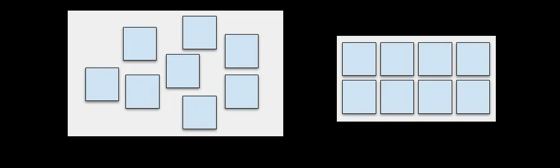
要特别注意的是，**巨型对象（Humongous Object）**，即大小超过 3/4 的 Region 大小的对象会作特殊处理，分配到由一个或多个连续 Region 构成的区域。巨型对象会引起其他一些问题，不过这些已经超出了本文的范畴，总之记得尽量别用就好了。

默认配置下，在满足 Region Size 是 2 的整数幂的前提下，G1 将总内存尽量划分成大约 2048 个 Region。

##### Remember Set (RSet)
为什么要把堆空间分成 Region 呢？其主要目的是让各个 Region 相对独立，可以分别进行 GC，而不是一次性地把所有垃圾收集掉。我们知道现代 GC 算法都是基于可达性标记，而这个过程必须遍历所有 Live Objects 才能完成。那问题来了，如果为了收集一个 Region 的垃圾，却完整的遍历所有 Live Objects，这也太浪费了！

所以，我们需要一个机制来让各个 Region 能独立地进行垃圾收集，这也就是 Remember Set 存在的意义。`每个 Region 会有一个对应的 Remember Set`，它记录了哪些内存区域中存在对当前 Region 中对象的引用（all locations that might contain pointers to (live) objects within the region）。当一个Region被标记为收集目标时，G1会扫描其对应的RSet，而不是整个Java堆。这样，G1可以在局部（部分Region）执行回收，而不需要停止整个应用（stop-the-world）。

`卡表（Card Table）`，它是RSet实现的一个重要组成部分。Java堆被分割成一定大小（通常为512字节）的块，称为"cards"。每个card对应于堆中的一部分区域。卡表是一个字节数组，数组的每个元素（字节）对应一个card。当一个对象引用发生改变时（比如新的跨区域引用被创建），对应的card就被标记为"dirty"。在并发标记阶段，G1会处理dirty cards，更新RSet。

注意 Remember Set 不是直接记录对象地址，而是记录了那些对象所在的 Card 编号。所谓 Card 就是表示一小块（512 bytes）的内存空间，这里面很可能存在不止一个对象。但是这已经足够了：当我们需要确定当前 Region 有哪些对象存在外部引用时（这些对象是可达的，不能被回收），只要扫描一下这块 Card 中的所有对象即可，这比扫描所有 live objects 要容易的多。

实现上，Remember Set 的实现就是一个 Card 的 Hash Set，并且为每个 GC 线程都有一个本地的 Hash Set，最后的 Remember Set 实际上是这些 Hash Set 的并集。当 Card 数量特别多的时候会退化到 Region 粒度，这时候就要扫描更多的区域来寻找引用，时间换空间。

>"dirty"这个术语主要用来表达“该区域有东西被改动了，可能需要注意或处理”。这里的“脏”并不是指“不需要的”或者“应该被清除的”，而是指在该区域中有引用关系发生了变化。这是一种常见的在计算机科学中使用"dirty"的方式，例如在缓存(coherent cache)系统中也存在类似的用法。所以，在G1中，当一个Card被标记为"dirty"时，它表示该Card对应的内存区域有新的或者被修改的对象引用，需要在并发标记阶段进行扫描和处理。（在并发标记阶段，G1会扫描所有dirty的Cards，将新的引用关系（标记为dirty的）添加到对应的Remembered Set中。）

##### Remember Set 的维护
维护上面所说的 Remember Set 势必需要记录对象的引用，通常的做法是在 set 一个引用的时候插入一段代码，这称为 Write Barrier。为了尽可能降低对 Mutator 线程的影响，Write Barrier 的代码应当尽可能简化。G1 的 Write Barrier 实际上只是一个“通知”：将当前 set 引用的事件放到 Remember Set Log 队列中，交给后台专门的 GC 线程处理。
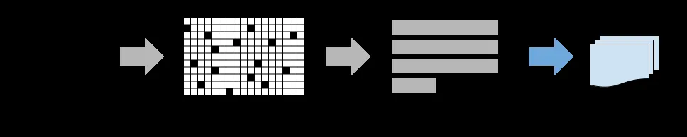
Write Barrier 具体实现如下。当发生 X.f = Y 时，假设 rX 为 X 对象的地址，rY 为 Y 对象的地址，则 Write 的同时还会执行以下逻辑：


```
t = (rX XOR rY) >> LogOfRegionSize  // 对 X, Y 地址右移得到 Region 编号，并将二者做个 XOR
if (rY == NULL ? 0 : t)  // 忽略两种情况： X.f 被赋值为 NULL，或 X 和 Y 位于同一个 Region 内
   rs_enqueue(rX)        // 如果 Card(X) 还不是 dirty 的，将 X 的地址放进 Log，并把该 card 置为 dirty
```

这里 Dirty Bit 的作用是去除重复的 Cards，考虑到一个 Cards 内经常发生密集的引用赋值（比如对象初始化），去重一下能大幅减少冗余。

最后，后台的 GC 线程则负责从 Remember Set Log 不断取出这些引用赋值发生的 Cards，扫描上面所有的对象，然后更新相应 Region 的 Remember Set。在并发标记发生之前，G1 会确保 Remember Set Log 中的记录都处理完，从而保证并发标记算法一定能拿到最新的、正确的 Remember Set。

极端情况下，如果后台的 GC 进程追不上 Mutator 进程写入的速度，这时候 Mutator 线程会退化到自己处理更新，形成反压机制。


##### Generational Garbage-First
G1 名字来自于 Garbage-First 这个理念，即，以收集到尽可能多的垃圾为第一目标。每次收集时 G1 会选出垃圾最多的几个 Region，进行一次 Stop-the-world 的收集过程。

有趣的是，另一方面 G1 又是一个 Generational （分代）的垃圾收集器，它会从逻辑上将 Region 分成 Young、Old 等不同的 Generation，然后针对它们各自特点应用不同的策略。

G1 论文中提到它有一个 Pure Garbage-First 的模式，但在现在的资料中已经很难看到它的踪影，我猜测实际使用中 Generational 模式要效果好的多。以下我们也会只讨论 Generational 模式的工作方式。

经典的内存布局中，各代的内存区域是完全分开的，而 G1 中的 Generation 只是 Region 的一个动态标志，下图是一个标记了 Generation 的例子。各个 Region 的 Generation 是随着 GC 的进行而不断变化的，甚至各个代有多少 Region 这个比例也是随时调整的。

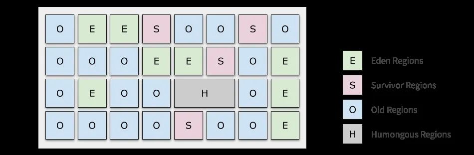


##### 总结 面试用：清除阶段

1. **初始标记 (Inital Marking)**：标记 GC Roots 能直接关联到的对象，并且修改 TAMS（Top at Mark Start）指针的值，让下一阶段用户线程并发运行时，能够正确的在 Reigin 中分配新对象。G1 为每一个 Reigin 都设计了两个名为 TAMS 的指针，新分配的对象必须位于这两个指针位置以上，位于这两个指针位置以上的对象默认被隐式标记为存活的，不会纳入回收范围；
2. **并发标记 (Concurrent Marking)**：从 GC Roots 能直接关联到的对象开始遍历整个对象图。遍历完成后，还需要处理 SATB 记录中变动的对象。SATB（snapshot-at-the-beginning，开始阶段快照）能够有效的解决并发标记阶段因为用户线程运行而导致的对象变动，其效率比 CMS 重新标记阶段所使用的增量更新算法效率更高；
3. **最终标记 (Final Marking)**：对用户线程做一个短暂的暂停，用于处理并发阶段结束后仍遗留下来的少量的 STAB 记录。虽然并发标记阶段会处理 SATB 记录，但由于处理时用户线程依然是运行中的，因此依然会有少量的变动，所以需要最终标记来处理；
4. **筛选回收 (Live Data Counting and Evacuation)**：负责更新 Regin 统计数据，按照各个 Regin 的回收价值和成本进行排序，在根据用户期望的停顿时间进行来指定回收计划，可以选择任意多个 Regin 构成回收集。然后将回收集中 Regin 的存活对象复制到空的 Regin 中，再清理掉整个旧的 Regin 。此时因为涉及到存活对象的移动，所以需要暂停用户线程，并由多个收集线程并行执行。


##### 详解垃圾回收（Evacuation）
Generational 模式下 G1 的垃圾收集分为两种：Young GC 和 Mixed GC。Young GC 只会涉及到 Young Regions，它将 Eden Region 中存活的对象移动到一个或多个新分配的 Survivor Region，之前的 Eden Region 就被归还到 Free list，供以后的新对象分配使用。

当区域中对象的 Survive 次数超过阈值（TenuringThreshold）时，Survivor Regions 的对象被移动到 Old Regions；否则和 Eden 的对象一样，继续留在 Survivor Regions 里。

多次 Young GC 之后，Old Regions 慢慢累积，直到到达阈值（InitiatingHeapOccupancyPercent，简称 IHOP），我们不得不对 Old Regions 做收集。这个阈值在 G1 中是根据用户设定的 GC 停顿时间动态调整的，也可以人为干预。

对 Old Regions 的收集会同时涉及若干个 Young 和 Old Regions，因此被称为 Mixed GC。Mixed GC 很多地方都和 Young GC 类似，不同之处是：它还会选择若干最有潜力的 Old Regions（收集垃圾的效率最高的 Regions），这些选出来要被 Evacuate 的 Region 称为本次的 Collection Set (CSet)。

Mixed GC 的重要性不言而喻：Old Regions 的垃圾就是在这个阶段被收集掉的，也正是因为这样，Mixed GC 是工作量最为繁重的一个环节，如果不加以控制，就会像 CMS 一样发生长时间的 Full GC 停顿。这时候 Region 的设计就发挥出优越性了：只要把每次的 Collection Set 规模控制在一定范围，就能把每次收集的停顿时间软性地控制在 MaxGCPauseMillis 以内。起初这个控制可能不太精准，随着 JVM 的运行估算会越来越准确。

那来不及收集的那些 Region 呢？多来几次就可以了。所以你在 GC 日志中会看到 continue mixed GCs 的字样，代表分批进行的各次收集。这个过程会多次重复，直到垃圾的百分比降到 G1HeapWastePercent 以内，或者到达 G1MixedGCCountTarget 上限。

对于 Young Regions，我们对它有以下特殊优化：

1. Evacuation 的时候，Young Regions 一定会被放到待收集的 Regions 集合（Collection Set）中，原因很简单，绝大多数对象寿命都很短，在 Young Regions 做收集往往绝大部分都是垃圾。
2. 由于 Young Regions 一定会被收集，我们获得了一个可观的收益：Remember Set 的维护工作不需要考虑 Young 内的引用修改（换句话说 RSet 只关心 old-to-young 和 old-to-old 的引用），当 Young Region 上发生 Evacuation 时我们再去扫描并构建出它的 RSet 即可。

##### 详解并发标记（Concurrent Marking）
在 Evacuation 之前，我们要通过并发标记来确定哪些对象是垃圾、哪些还活着。G1 中的 Concurrent Marking 是以 Region 为单位的，为了保证结果的正确性，这里用到了 Snapshot-at-the-beginning（SATB）算法。

SATB 算法顾名思义是对 Marking 开始时的一个（逻辑上的）Snapshot 进行标记。为什么要用 Snapshot 呢？下面就是一个直接标记导致问题的例子：对象 X 由于没有被标记到而被标记为垃圾，导致 B 引用失效。
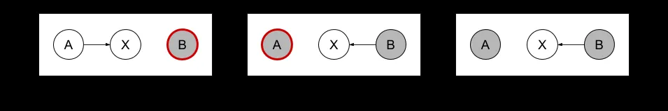
SATB 算法为了解决这一问题，在修改引用 X.f = B 之前插入了一个 Write Barrier，记录下被覆写之前的引用地址。这些地址最终也会被 Marking 线程处理，从而确保了所有在 Marking 开始时的引用一定会被标记到。这个 Write Barrier 伪代码如下：


```
t = the previous referenced address  // 记录原本的引用地址
if (t has been marked && t != NULL)  // 如果地址 t 还没来的及标记，且 t 不为 NULL
    satb_enqueue(t) // 放到 SATB 的待处理队列中，之后会去扫描这个引用
通过以上措施，SATB 确保 Marking 开始时存活的对象一定会被标记到。
```


标记的过程和 CMS 中是类似的，可以看作一个优化版的 DFS：记当前已经标记到的 offset 为 cur，随着标记的进行 cur 不断向后推进。每当访问到地址 < cur 的对象，就对它做深度扫描，递归标记所有应用；反之，对于地址 > cur 的对象，只标记不扫描，等到 cur 推进到那边的时候再去做扫描。
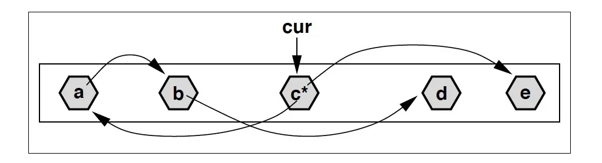
上图中，假设当前 cur 指向对象 c，c有两个引用：a 和 e，其中 a 的地址小于 cur，因而做了扫描；而 e 则仅仅是标记。扫描 a 的过程中又发现了对象 b，b 同样被标记并继续扫描。但是 b 引用的 d 在 cur 之后，所以 d 仅仅是被标记，不再继续扫描。

最后一个问题是：如何处理 Concurrent Marking 中新产生的对象？因为 SATB 算法只保证能标记到开始时 snapshot 的对象，对于新出现的那些对象，我们可以简单地认为它们全都是存活的，毕竟数量不是很多。


#### CMS和G1有什么区别
> 个人理解：**G1（Garbage-First）和CMS（Concurrent Mark Sweep）** 都是JVM中的垃圾收集器，它们之间的主要区别在于**G1引入了分区（Region）的概念**，而CMS没有。G1将整个堆内存分成了多个大小相等的区域（region），每个区域都可以是Eden区、Survivor区或Old区。

- 算法实现：**CMS使用标记-清除算法**，而**G1使用标记-整理算法**。标记-清除算法会在垃圾回收过程中产生内存碎片，可能会影响应用程序的性能。而标记-整理算法会在回收时整理内存，减少内存碎片，并将可用内存块紧凑排列，从而提高应用程序的性能。
- 回收时机：CMS是一种并发垃圾回收器，它会在应用程序运行时并发进行垃圾回收，以减少STW（Stop-The-World）暂停时间。而G1也是一种并发垃圾回收器，但它会根据需要在后台进行垃圾回收，并在必要时执行STW暂停。
- 内存分配：CMS和G1都使用分代垃圾回收算法，但它们在堆内存的划分和使用方面有所不同。**CMS**将堆内存分为新生代和老年代两个区域。**新生代使用复制算法，老年代使用标记-清除算法**。而**G1将堆内存分为许多大小相等的区域**，每个区域可以是Eden区、Survivor区或Old区。**G1使用复制算法来回收Eden区和Survivor区，使用标记-整理算法来回收Old区**。
- 性能：CMS和G1在不同的场景下表现不同。CMS适用于需要快速响应时间和较小内存占用的应用程序，因为它的暂停时间短。G1适用于大型堆内存的应用程序，因为它可以更好地管理内存碎片，并且在执行垃圾回收时可以更好地利用多核CPU。

另外下面是**G1有但是CMS没有**的：
- 分区（Region）：G1将堆内存划分为多个固定大小的分区（Region），每个分区可以是Eden、Survivor或Old区。这使得G1能够更高效地并行回收垃圾，并有助于实现可预测的停顿时间。相比之下，CMS的内存布局采用了传统的分代模型（Young和Old代）。
- 并发与停顿时间：G1旨在实现低停顿时间，因为它可以在并发阶段执行部分垃圾收集工作，避免了全局停顿。另外，G1可以基于用户指定的停顿时间目标来调整自身的行为。相比之下，CMS的并发能力较弱，它在收集Old代时可能导致较长的停顿时间。
- 碎片整理（Compaction）：由于G1的分区设计，它可以在回收过程中执行局部的碎片整理，减少内存碎片。而CMS在垃圾回收过程中不执行碎片整理，可能导致内存碎片问题。CMS需要依赖Full GC（包括STW的Serial Old GC）来进行碎片整理，但这会导致较长的停顿时间。
- 可预测性：G1通过跟踪每个分区的垃圾比例和回收时间，可以更好地预测垃圾回收的效果和停顿时间。这有助于在满足停顿时间目标的前提下，最大限度地提高垃圾回收效率。相比之下，CMS的可预测性较差。

#### ZGC 收集器
> https://tech.meituan.com/2020/08/06/new-zgc-practice-in-meituan.html 美团技术团队-新一代垃圾回收器ZGC的探索与实践

**ZGC（The Z Garbage Collector）** 是JDK 11中推出的一款低延迟垃圾回收器，它的设计目标包括：

停顿时间不超过10ms；
停顿时间不会随着堆的大小，或者活跃对象的大小而增加；
支持8MB~4TB级别的堆（未来支持16TB）。
从设计目标来看，我们知道ZGC适用于大内存低延迟服务的内存管理和回收。本文主要介绍ZGC在低延时场景中的应用和卓越表现，文章内容主要分为四部分：
##### GC之痛
GC之痛：介绍实际业务中遇到的GC痛点，并分析CMS收集器和G1收集器停顿时间瓶颈；
ZGC原理：分析ZGC停顿时间比G1或CMS更短的本质原因，以及背后的技术原理；
ZGC调优实践：重点分享对ZGC调优的理解，并分析若干个实际调优案例；
升级ZGC效果：展示在生产环境应用ZGC取得的效果。

##### CMS与G1停顿时间瓶颈
在介绍ZGC之前，首先回顾一下CMS和G1的GC过程以及停顿时间的瓶颈。CMS新生代的Young GC、G1和ZGC都基于标记-复制算法，但算法具体实现的不同就导致了巨大的性能差异。

标记-复制算法应用在CMS新生代（ParNew是CMS默认的新生代垃圾回收器）和G1垃圾回收器中。标记-复制算法可以分为三个阶段：

标记阶段，即从GC Roots集合开始，标记活跃对象；
转移阶段，即把活跃对象复制到新的内存地址上；
重定位阶段，因为转移导致对象的地址发生了变化，在重定位阶段，所有指向对象旧地址的指针都要调整到对象新的地址上。
下面以G1为例，通过G1中标记-复制算法过程（G1的Young GC和Mixed GC均采用该算法），分析G1停顿耗时的主要瓶颈。G1垃圾回收周期如下图所示：

G1的混合回收过程可以分为标记阶段、清理阶段和复制阶段。

**标记阶段停顿分析**
- 初始标记阶段：初始标记阶段是指从GC Roots出发标记全部直接子节点的过程，该阶段是STW的。由于GC Roots数量不多，通常该阶段耗时非常短。
- 并发标记阶段：并发标记阶段是指从GC Roots开始对堆中对象进行可达性分析，找出存活对象。该阶段是并发的，即应用线程和GC线程可以同时活动。并发标记耗时相对长很多，但因为不是STW，所以我们不太关心该阶段耗时的长短。
- 再标记阶段：重新标记那些在并发标记阶段发生变化的对象。该阶段是STW的。

**清理阶段停顿分析**
- 清理阶段清点出有存活对象的分区和没有存活对象的分区，该阶段不会清理垃圾对象，也不会执行存活对象的复制。该阶段是STW的。

**复制阶段停顿分析**
- 复制算法中的转移阶段需要分配新内存和复制对象的成员变量。转移阶段是STW的，其中内存分配通常耗时非常短，但对象成员变量的复制耗时有可能较长，这是因为复制耗时与存活对象数量与对象复杂度成正比。对象越复杂，复制耗时越长。
四个STW过程中，初始标记因为只标记GC Roots，耗时较短。再标记因为对象数少，耗时也较短。清理阶段因为内存分区数量少，耗时也较短。转移阶段要处理所有存活的对象，耗时会较长。因此，G1停顿时间的瓶颈主要是标记-复制中的转移阶段STW。为什么转移阶段不能和标记阶段一样并发执行呢？主要是G1未能解决转移过程中准确定位对象地址的问题。

G1的Young GC和CMS的Young GC，其标记-复制全过程STW，这里不再详细阐述。

##### ZGC原理
与CMS中的ParNew和G1类似，ZGC也采用标记-复制算法，不过ZGC对该算法做了重大改进：ZGC在标记、转移和重定位阶段几乎都是并发的，这是ZGC实现停顿时间小于10ms目标的最关键原因。

ZGC垃圾回收周期如下图所示：

ZGC只有三个STW阶段：初始标记，再标记，初始转移。其中，初始标记和初始转移分别都只需要扫描所有GC Roots，其处理时间和GC Roots的数量成正比，一般情况耗时非常短；再标记阶段STW时间很短，最多1ms，超过1ms则再次进入并发标记阶段。即，ZGC几乎所有暂停都只依赖于GC Roots集合大小，停顿时间不会随着堆的大小或者活跃对象的大小而增加。与ZGC对比，G1的转移阶段完全STW的，且停顿时间随存活对象的大小增加而增加。

##### ZGC关键技术
ZGC通过着色指针和读屏障技术，解决了转移过程中准确访问对象的问题，实现了并发转移。大致原理描述如下：并发转移中“并发”意味着GC线程在转移对象的过程中，应用线程也在不停地访问对象。假设对象发生转移，但对象地址未及时更新，那么应用线程可能访问到旧地址，从而造成错误。而在ZGC中，应用线程访问对象将触发“读屏障”，如果发现对象被移动了，那么“读屏障”会把读出来的指针更新到对象的新地址上，这样应用线程始终访问的都是对象的新地址。那么，JVM是如何判断对象被移动过呢？就是利用对象引用的地址，即着色指针。下面介绍着色指针和读屏障技术细节。

**着色指针**
> 着色指针是一种将信息存储在指针中的技术。

ZGC仅支持64位系统，它把64位虚拟地址空间划分为多个子空间，如下图所示：

其中，[0~4TB) 对应Java堆，[4TB ~ 8TB) 称为M0地址空间，[8TB ~ 12TB) 称为M1地址空间，[12TB ~ 16TB) 预留未使用，[16TB ~ 20TB) 称为Remapped空间。

当应用程序创建对象时，首先在堆空间申请一个虚拟地址，但该虚拟地址并不会映射到真正的物理地址。ZGC同时会为该对象在M0、M1和Remapped地址空间分别申请一个虚拟地址，且这三个虚拟地址对应同一个物理地址，但这三个空间在同一时间有且只有一个空间有效。ZGC之所以设置三个虚拟地址空间，是因为它使用“空间换时间”思想，去降低GC停顿时间。“空间换时间”中的空间是虚拟空间，而不是真正的物理空间。后续章节将详细介绍这三个空间的切换过程。

与上述地址空间划分相对应，ZGC实际仅使用64位地址空间的第0~41位，而第42~45位存储元数据，第47~63位固定为0。

ZGC将对象存活信息存储在42~45位中，这与传统的垃圾回收并将对象存活信息放在对象头中完全不同。

**读屏障**
> 读屏障是JVM向应用代码插入一小段代码的技术。当应用线程从堆中读取对象引用时，就会执行这段代码。需要注意的是，仅“从堆中读取对象引用”才会触发这段代码。

读屏障示例：

```
Object o = obj.FieldA   // 从堆中读取引用，需要加入屏障
<Load barrier>
Object p = o  // 无需加入屏障，因为不是从堆中读取引用
o.dosomething() // 无需加入屏障，因为不是从堆中读取引用
int i =  obj.FieldB  //无需加入屏障，因为不是对象引用
```
ZGC中读屏障的代码作用：在对象标记和转移过程中，用于确定对象的引用地址是否满足条件，并作出相应动作。

##### ZGC并发处理演示
接下来详细介绍ZGC一次垃圾回收周期中地址视图的切换过程：

- **初始化**：ZGC初始化之后，整个内存空间的地址视图被设置为Remapped。程序正常运行，在内存中分配对象，满足一定条件后垃圾回收启动，此时进入标记阶段。
- **并发标记阶段**：第一次进入标记阶段时视图为M0，如果对象被GC标记线程或者应用线程访问过，那么就将对象的地址视图从Remapped调整为M0。所以，在标记阶段结束之后，对象的地址要么是M0视图，要么是Remapped。如果对象的地址是M0视图，那么说明对象是活跃的；如果对象的地址是Remapped视图，说明对象是不活跃的。
- **并发转移阶段**：标记结束后就进入转移阶段，此时地址视图再次被设置为Remapped。如果对象被GC转移线程或者应用线程访问过，那么就将对象的地址视图从M0调整为Remapped。
其实，在标记阶段存在两个地址视图M0和M1，上面的过程显示只用了一个地址视图。之所以设计成两个，是为了区别前一次标记和当前标记。也即，第二次进入并发标记阶段后，地址视图调整为M1，而非M0。

着色指针和读屏障技术不仅应用在并发转移阶段，还应用在并发标记阶段：将对象设置为已标记，传统的垃圾回收器需要进行一次内存访问，并将对象存活信息放在对象头中；而在ZGC中，只需要设置指针地址的第42~45位即可，并且因为是寄存器访问，所以速度比访问内存更快。
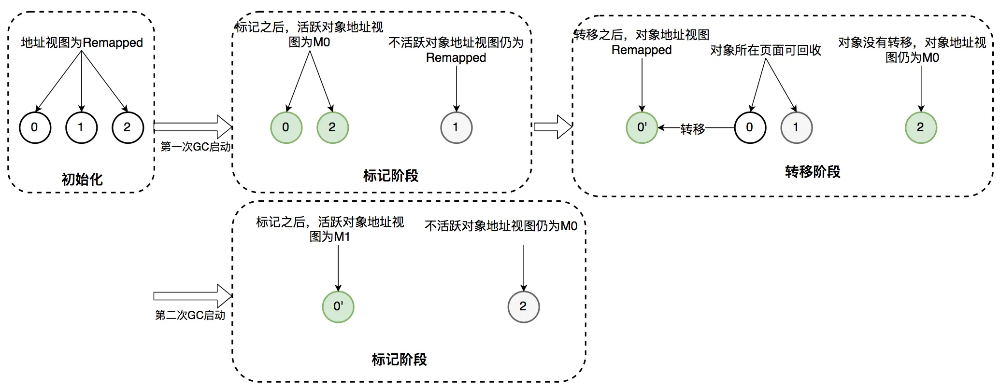


#### 其他

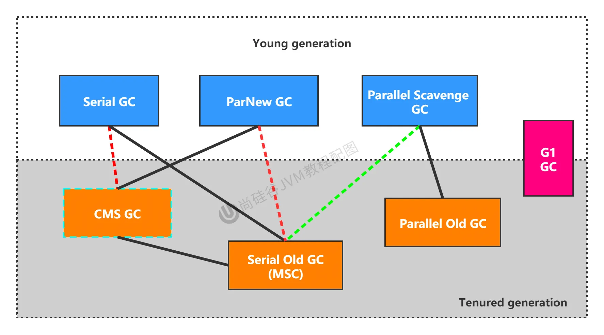

- 两个收集器间有连线，表明它们可以搭配使用：Serial/Serial Old、Serial/CMS、ParNew/Serial  Old、ParNew/CMS、Parallel Scavenge/Serial Old、Parallel Scavenge/Parallel  Old、G1。
- 其中 Serial Old 作为 CMS 出现"Concurrent Mode Failure"失败的后备预案。
- **（红色虚线）**由于维护和兼容性测试的成本，在 JDK 8 时将 Serial + CMS、ParNew + Serial Old 这两个组合声明为废弃（JEP173），并在 JDK 9 中完全取消了这些组合的支持（JEP214），即：移除。
- **（绿色虚线）**JDK 14 中：弃用 Parallel Scavenge 和 Serialold GC 组合（JEP366）。
- **（青色虚线）**JDK 14 中：删除 CMS 垃圾回收器（JEP363）。

### 卡表
对于HotSpot JVM，使用了**卡标记（Card Marking）** 技术来解决**老年代到新生代的引用问题（也就是跨代引用问题，2023面试题目之一）**。具体是，使用**卡表（Card Table）** 和**写屏障（Write Barrier）** 来进行标记并加快对GC Roots的扫描。

#### 卡表（Card Table）的概念
卡表（Card Table）是一种用于垃圾收集优化的数据结构，主要用于跟踪从老年代到新生代的对象引用。在Java的HotSpot虚拟机中，卡表与写屏障（Write Barrier）一起工作，用于标记并加快对GC Roots的扫描。

在基于卡表的设计中，通常将堆空间划分为一系列2次幂大小的卡页（Card Page）。每个卡页在卡表中都有一个对应的标记项。当对一个对象引用进行写操作时（例如，改变一个对象的字段为另一个对象的引用），写屏障逻辑将会标记对象所在的卡页为dirty，这个过程被称为卡标记（Card Marking）。

写屏障和卡表的交互：当对一个对象引用进行写操作时（对象引用改变），写屏障逻辑将会标记对象所在的卡页为dirty。这样，每次对引用的更新，无论是否更新了老年代对新生代对象的引用，都会进行一次写屏障操作。这会增加一些额外的开销。
> 写屏障是一种运行时技术，用于在对象引用发生更改时进行操作。在HotSpot JVM中，写屏障的主要任务是标记脏卡，即那些包含了被修改的对象引用的卡页。

在卡表中，被标记为dirty的卡页被称为脏卡（Dirty Card）。这意味着该卡页中的某个对象引用发生了更改。在进行垃圾收集时，只需要扫描这些脏卡，而不是整个老年代，从而大大提高了垃圾收集的效率。

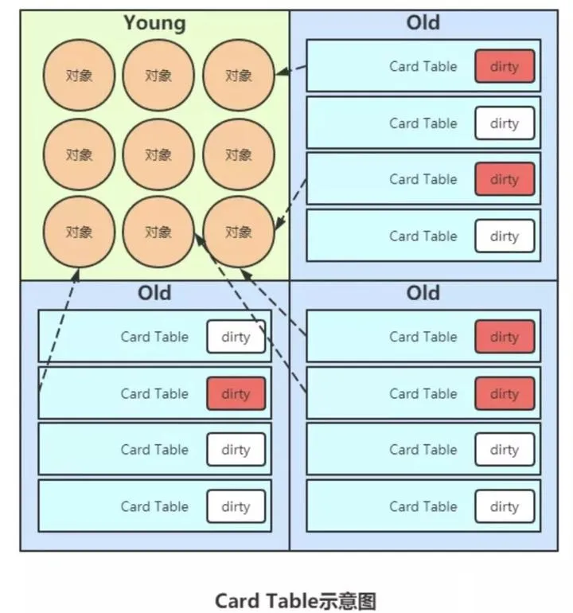


#### 卡表在垃圾收集中的作用
在进行垃圾收集时，卡表可以帮助我们快速找到那些可能包含从老年代到新生代的引用的对象，从而避免扫描整个老年代。这对于新生代的垃圾收集（Minor GC）尤其重要，因为新生代的垃圾收集通常比老年代的垃圾收集（Major GC）要频繁得多。

#### 卡表在CMS GC和G1 GC中的应用
CMS（Concurrent Mark Sweep）和G1（Garbage-First）是HotSpot JVM中的两种垃圾收集器。它们都使用卡表来优化垃圾收集过程。在CMS的并发标记阶段，应用线程和GC线程是并发执行的，因此可能产生新的对象或对象关系发生变化。为了提高重新标记的效率，并发标记阶段会把这些发生变化的对象所在的Card标识为Dirty，这样后续阶段就只需要扫描这些Dirty Card的对象，从而避免扫描整个老年代。

#### 虚共享（False Sharing）问题
在高并发环境下，写屏障可能会引发虚共享（false sharing）问题。在高并发情况下，频繁的写屏障很容易发生虚共享，从而带来性能开销。为了解决这个问题，JDK 7引入了一个新的JVM参数-XX:+UseCondCardMark，在执行写屏障之前，先简单的做一下判断。如果卡页已被标识过，则不再进行标识。

> 参考文献如下：
> - https://stackoverflow.com/questions/19154607/how-actually-card-table-and-writer-barrier-work 卡表和写屏障是如何工作的？
> - https://tschatzl.github.io/2022/02/15/card-table-card-size.html Card Table Card Size Shenanigans
> - https://www.mo4tech.com/jvm-card-table.html JVM Card Table
> - https://www.cnblogs.com/hongdada/p/12016020.html JVM-卡表（Card Table）
> - http://blog.ragozin.info/2011/06/understanding-gc-pauses-in-jvm-hotspots.html Alexey Ragozin

###  TLAB（Thread Local Allocation Buffer）
> 关于TLAB的基本理解，它是一个专用于单个线程的小块Eden区域。这种设计可以实现无锁并发快速分配，因为每个线程都有自己的专用区域，所以在对象分配时无需担心其他线程的争用。TLAB的使用提高了在多线程环境中对象分配的性能。

在Java中，所有新的对象分配都应该发生在Eden Space中。将整个堆的子区域用于新的分配是JVM中新分配如此之快的原因之一。为了更快地分配，JVM将Eden空间划分为更多的子区域，每个子区域专用于特定的线程。每个专用区域都称为线程本地分配缓冲区或简称**TLAB（Thread Local Allocation Buffer）**。该机制允许每个线程有一个自己可以使用的TLAB区域，并且只有该线程可以使用该区域。因此，TLAB是每个线程独立的。只要对象在TLAB区域内进行分配，就不需要进行任何类型的同步。在TLAB区域内部进行分配只需要简单的指针碰撞操作。
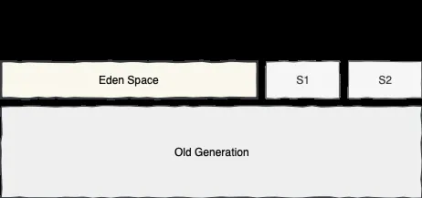


**分配满的情况**：
然而，TLAB并非无限的，某些时刻，它会变满。如果某个线程需要分配一个新对象，但当前的TLAB几乎已满，可能会发生以下两件事情：
- 在TLAB之外分配对象。由于分配直接发生在Eden空间内，因此称为慢速分配（Slow Allocation）。
- 创建一个新的TLAB并在新的TLAB中分配该对象。从技术上讲，JVM淘汰了旧的TLAB。

如果对象较大（大于TLAB的大小），那么对象将被分配到Eden的非TLAB区域，即直接在Eden区分配，这被称为慢速分配（Slow Allocation）。由于这种情况下可能会有多个线程尝试在Eden区域分配对象，因此需要同步处理：

如果对象较小，可能会为该线程分配新的TLAB，并在新的TLAB中分配对象。旧的TLAB将被视为已满，并在下次Minor GC时清理：


默认情况下，TLAB会为每个线程单独动态调整大小。TLAB的大小会根据Eden的大小、线程数量及分配率等参数重新计算。如果某个线程需要分配一个超出TLAB大小限制的大对象（比如大数组），那么它将被分配到Eden中的共享区域。这样一来，就会需要同步操作。在我的应用程序中，某些对象因其尺寸过大，从未在TLAB中分配过。

此外，如果你的应用程序有特定的需求，JVM也允许手动设置TLAB的大小：
- `-XX:TLABWasteTargetPercent=N` 该参数指定了TLAB（Thread-Local Allocation Buffer）的浪费空间目标百分比。当TLAB内存空间分配后被使用的比例小于该百分比时，JVM会尝试将TLAB的大小调整为更小的值，以减少浪费的空间。默认值是 1%。
- `-XX:TLABWasteIncrement=N `该参数指定了TLAB内存空间大小的最小增量。当JVM调整TLAB大小时，会将调整后的大小向上增加最小增量的整数倍。默认值是 1KB。
- `-XX:+PrintTLAB` 该参数使JVM输出有关TLAB分配使用情况的详细日志信息。这些信息包括TLAB的总分配次数、使用次数、空闲次数以及使用的总空间大小。这些信息可帮助开发人员调整和优化应用程序的内存使用情况。

**分配的对象过大问题**：
在某些情况下，通过TLAB之外的分配机制来分配对象并不是一件坏事。例如，在小GC之前就可以这样进行。但是，与TLAB内部相比，使用TLAB之外进行的对象分配数量较大。此时，有两种选择：
- 让对象变小
- 调整TLAB的大小

手动调整TLAB大小并不是最好的选择。毕竟，只有较少的对象类型会分配到TLAB之外。因此，在修复代码时，我们应优先考虑使对象满足分配到TLAB区域内部的条件。具体可以根据以下选择：
- 如果你的应用程序经常需要创建大对象，那么可能需要调整TLAB的大小，以减少在Eden区域进行的慢速分配。但是，增大TLAB的大小也会减少可以同时活动的线程数量，因此需要谨慎权衡。
- 如果只有少数类型的对象是大对象，那么可能更好的策略是尝试减小这些对象的大小，或者更改程序设计，以避免创建这些大对象。

>参考文献：
>- https://stackoverflow.com/questions/43747221/what-is-a-tlab-thread-local-allocation-buffer
>- https://alidg.me/blog/2019/6/21/tlab-jvm
>- https://www.opsian.com/blog/jvm-tlabs-important-multicore/

### Minor Gc 和 Full GC 有什么不同呢

新生代收集（Minor GC / Young GC）：只对新生代进行垃圾收集

整堆收集 (Full GC)：收集整个 Java 堆和方法区

> 拓展1：有哪些常见的 GC？

针对 HotSpot VM 的实现，它里面的 GC 其实准确分类只有两大种：

部分收集 (Partial GC)：

- 新生代收集（Minor GC / Young GC）：只对新生代进行垃圾收集；
- 老年代收集（Major GC / Old GC）：只对老年代进行垃圾收集。需要注意的是 Major GC 在有的语境中也用于指代整堆收集；
- 混合收集（Mixed GC）：对整个新生代和部分老年代进行垃圾收集。

整堆收集 (Full GC)：收集整个 Java 堆和方法区。

> 拓展2：谈谈你对 Minor GC、还有 Full GC 的理解。Minor GC 与 Full GC 分别在什么时候发生？ Minor GC 会发生 STW(stop the world) 现象吗？

 **Minor GC**

* 当年轻代空间不足时，就会触发Minor GC，这里的年轻代满指的是 `Eden区满`，Survivor区满不会触发GC。（每次Minor GC会清理年轻代的内存）
* 因为Java对象大多都具备朝生夕灭的特性，所以**Minor GC非常频繁**，一般回收速度也比较快。这一定义既清晰又易于理解。
* Minor GC会引发 `STW`，`暂停其它用户的线程，等待垃圾回收线程结束，用户线程才恢复运行`

**Major GC**

* 指发生在老年代的GC，对象从老年代消失时，我们说 “Major Gc” 或 “Full GC” 发生了
* 出现了MajorGc，经常会伴随至少一次的Minor GC
  * 但非绝对的，在Parallel Scavenge收集器的收集策略里就有直接进行Major GC的策略选择过程
  * 也就是在老年代空间不足时，会先尝试触发Minor GC，如果之后空间还不足，则触发Major GC
* **Major GC的速度一般会比Minor GC慢10倍以上**，STW的时间更长
* 如果Major GC后，内存还不足，就报OOM了

**Full GC**

* 调用System.gc( )时，系统建议执行Full GC，但是不必然执行
* 老年代空间不足
* 方法区空间不足
* **通过Minor GC后进入老年代的平均大小 大于 老年代的可用内存**
* 由Eden区、survivor space0（From Space）区 向survivor space1（To Space）区复制时，对象大小大于To Space可用内存，则把该对象转存到老年代，且老年代的可用内存 小于 该对象大小

### ⭐️对象的创建过程

#### 概述

首先在文件内创建一个空对象

```java
public class VM {
}
```

再随便new一个空对象，就可以看到它的字节码

```java
public class newObject {

    public static void main(String[] args) {
        VM vm = new VM();
    }
}
```

```java
0 new #2 <cn/zhiyucs/test/VM>
3 dup
4 invokespecial #3 <cn/zhiyucs/test/VM.<init> : ()V>
7 astore_1
8 return
```

- **new指令** 相当于去对应的内存空间申请一块内存大小 用于存放对象数据 对象的大小是可以确定的 比如int占用4个字节 引用也占用4个字节 所以这个时候申请的内存空间大小是固定的
- **dup指令** 相当于将对应的内存地址的引用复制了一份压到栈中，那么对应栈中会有2个对象的引用，这2个对象的引用一个用于操作对象赋值，一个用于对象的方法调用
- **invokespecial指令** 是调用对象的构造器初始化对象我这里使用的是默认构造器空参构造一般用于初始化对象数据，在 `new`的时候JVM会给对象的全局变量赋默认值
- **astore指令** 就是将对应对象的引用存储到局部变量表中

#### 从JVM层面分析

##### 1️⃣类加载

> Java虚拟机（JVM）需要找到这个类的字节码并将其加载到内存中

具体来说，当 Java 虚拟机遇到一条字节码 new 指令时：

1）首先检查根据 class 文件中的常量池表（Constant Pool Table）能否找到这个类对应的符号引用

> 此处可以回顾一波**常量池表 (Constant Pool Table)** 的概念：
>
> 用于存放**编译期**生成的各种字面量（字面量相当于 Java 语言层面常量的概念，如文本字符串，声明为 final 的常量值等）与符号引用。有一些文章会把 class 常量池表称为**静态常量池**。
>
> 都是常量池，常量池表和方法区中的运行时常量池有啥关系吗？运行时常量池是干嘛的呢？
>
> **运行时常量池可以在运行期间将 class 常量池表中的符号引用解析为直接引用**。简单来说，class 常量池表就相当于一堆索引，运行时常量池根据这些索引来查找对应方法或字段所属的类型信息和名称及描述符信息

2）然后去方法区中的运行时常量池中查找该符号引用所指向的类是否已被 JVM 加载、解析和初始化过

- 如果没有，那就先执行相应的类加载过程
- 如果有，那么进入下一步，为新生对象分配内存

##### 2️⃣分配内存（对象在堆上分配的两种方式）

> JVM会为新对象分配内存。内存分配位置通常是在堆上。此时，JVM只是原始分配，并没有开始初始化过程

根据堆中的内存是否规整，有两种划分方式，或者说对象在堆上的分配有两种方式：

1）**假设 Java 堆中内存是绝对规整的**，所有被使用过的内存都被放在一边，空闲的内存被放在另一边，中间放着一个指针作为分界点的指示器，那所分配内存就仅仅是把这个指针 向 空闲空间方向 挪动一段与对象大小相等的距离，这种分配方式称为 **指针碰撞**（Bump The Pointer）

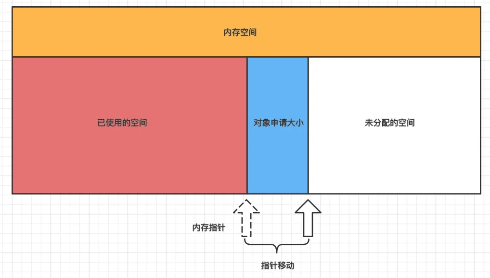

2）**如果 Java 堆中的内存并不是规整的**，已被使用的内存和空闲的内存相互交错在一起，那就没有办法简单地进行指针碰撞了，虚拟机就必须维护一个列表，记录哪些内存块是可用的，在分配的时候从列表中找到一块足够大的连续空间划分给这个对象，并更新列表上的记录，这种分配方式称为 **空闲列表**（Free List）。

> 选择哪种分配方式由 Java 堆是否规整决定，那又有同学会问了，堆是否规整又由谁来决定呢？
>
> Java 堆是否规整由所采用的垃圾收集器是否带有空间压缩整理（Compact）的能力决定的（或者说由垃圾收集器采用的垃圾收集算法来决定的，具体垃圾收集算法见后续文章）：
>
> - 因此，当使用 Serial、ParNew 等带压缩整理过程的收集器时，系统采用的分配算法是指针碰撞，既简单又高效
> - 而当使用 CMS 这种基于清除（Sweep）算法的收集器时，理论上就只能采用较为复杂的空闲列表来分配内存

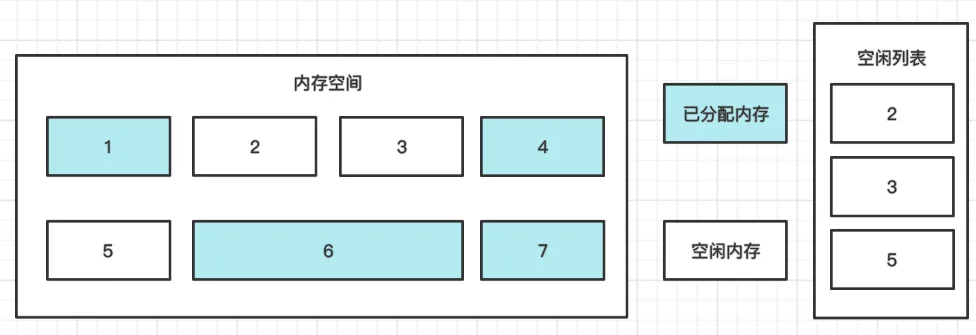

##### 3️⃣初始化零值

> 简而言之：在内存分配之后，JVM将所有属性设置为默认值，这是Java的零值策略。例如，对于数值类型，这个默认值是0；对于布尔类型，这个默认值是false；对于引用类型，这个默认值是null。

举个🌰

```java
public class VM  {

    private int value = 100;
    private Object data;

}
```

比如我们对象中 定义了 `value`和 `data`

JVM为了实现我们不做赋值操作的对象也可以拿来直接使用在申请空间的会给对象赋值为 `null`，**基本数据类型会赋值为默认值,引用数据为赋值为null**

比如上面代码 `value`会赋值为 `0` ,`data`会赋值为 `null` ,这里是赋为默认值，不是赋值

这步操作保证了对象的实例字段在 Java 代码中可以不赋初始值就直接使用，使程序能访问到这些字段的数据类型所对应的零值。

> 如果使用了 TLAB 的话，初始化零值这项工作可以提前至 TLAB 分配时就顺便进行了

##### 4️⃣设置对象头

> 简而言之：JVM会在对象的内存中设置对象头，其中包括了类的元数据信息、对象的哈希码、对象的GC分代年龄等信息。

对象在内存中的布局可以分为 3 块区域：对象头（Object Header）、实例数据和对齐填充

对齐填充并不是什么有意义的数据，实例数据我们在上一步操作中进行了初始化零值，那么对于剩下的对象头中的信息来说，自然不必多说，也是要进行一些赋值操作的：例如这个对象是哪个类的实例、如何才能找到类的元数据信息、对象的哈希码、对象的 GC 分代年龄等信息。根据虚拟机当前运行状态的不同，如是否启用偏向锁等，对象头会有不同的设置方式。

> 对象头


##### 5️⃣执行init

> 简而言之：最后，JVM将会调用构造函数（在字节码中是`<init>`方法）来进行对象的初始化，这个过程是执行你在构造函数中写的代码，也就是对实例变量进行显式初始化。

上面四个步骤都走完之后，从 JVM 的视角来看，其实一个新的对象已经成功诞生了。

但是从我们程序员的视角来看，这个对象确实是创建出来了，但是还没按照我们定义的构造函数来进行赋值呢，所有的字段都还是默认的零值啊。

构造函数即 Class 文件中的 `<init>()` 方法，一般来说，new 指令之后会接着执行 `<init>()` 方法，按照构造函数的意图对这个对象进行初始化，这样一个真正可用的对象才算完全地被构造出来了

举个🌰，上述代码编译成字节码之后

```java
 0 aload_0
 1 invokespecial #1 <java/lang/Object.<init> : ()V>
 4 aload_0
 5 bipush 100
 7 putfield #2 <cn/zhiyucs/test/VM.value : I>
 10 return
```

##### 💦 再举几个例子加深印象
假设我们有以下Java代码：

```java
public class Test {
    private int x;

    public Test(int x) {
        this.x = x;
    }

    public static void main(String[] args) {
        Test test = new Test(10);
    }
}

```

当我们编译这段代码后，我们可以使用`javap -c Test`命令来查看main方法的字节码：

```java
public static void main(java.lang.String[]);
    Code:
       0: new           #2                  // class Test
       3: dup
       4: bipush        10
       6: invokespecial #3                  // Method "<init>":(I)V
       9: astore_1
      10: return

```

这段字节码表示了创建一个新的Test对象的过程。让我们一步步看：
1. `new # 2`：这个操作是创建一个新的Test对象。#2表示常量池中的一个条目，这个条目指向Test类。在这个阶段，JVM会加载Test类（如果它还没被加载过），然后在堆上为新对象`分配内存`。
2. `dup`：这个操作将栈顶的元素（也就是新创建的Test对象的引用）复制一份，并将复制的那份压入栈顶。这是因为接下来的invokespecial操作会消耗掉栈顶的对象引用，而我们后面还需要这个引用来存储到本地变量表。
3. `bipush 10`：将整数10压入操作数栈，为接下来的`<init>`方法调用做准备。
4. `invokespecial # 3`：这个操作是调用新对象的`<init>`方法。#3表示常量池中的一个条目，这个条目指向Test类的构造函数。在这个阶段，JVM会对新对象进行初始化，包括`初始化零值`、`设置对象头`、执行`<init>`方法中的代码。
5. `astore_1`：将栈顶的对象引用（也就是新创建的Test对象的引用）存储到本地变量表的第1个位置（本地变量表的第0个位置通常用于存储this引用或者方法的参数）。

以上就是从字节码角度来看创建一个Java对象的过程。通过这个过程，你应该能更好地理解在JVM层面上，new关键字所做的工作。衍生一下，对于`ArrayList`在字节码层面上，在构造函数的调用过程和我在上面的回答中描述的Test类的构造函数的调用过程类似，都是通过new和invokespecial指令来完成的。不同之处在于，ArrayList的构造函数内部会做一些额外的工作，例如分配内存和添加元素。


##### 🤏总览


> 对象创建时候的并发安全问题

另外，在为对象创建内存的时候，还需要考虑一个问题：**并发安全问题**。

对象创建在虚拟机中是非常频繁的行为，以上面介绍的指针碰撞法为例，即使只修改一个指针所指向的位置，在并发情况下也并不是线程安全的，可能出现某个线程正在给对象 A 分配内存，指针还没来得及修改，另一个线程创建了对象 B 又同时使用了原来的指针来分配内存的情况。

解决这个问题有两种可选方案：

- 方案 1：**CAS + 失败重试**：CAS 大伙应该都熟悉，比较并交换，乐观锁方案，如果失败就重试，直到成功为止
- 方案 2：**本地线程分配缓冲**（Thread Local Allocation Buffer，`TLAB`）：每个线程在堆中预先分配一小块内存，每个线程拥有的这一小块内存就称为 TLAB。哪个线程要分配内存了，就在哪个线程的 TLAB 中进行分配，这样各个线程之间互不干扰。如果某个线程的 TLAB  用完了，那么虚拟机就需要为它分配新的 TLAB，这时才需要进行同步锁定。可以通过 `-XX：+/-UseTLAB` 参数来设定是否使用 TLAB。

### 对象访问方式

或是这样问你：👩‍💻对象的访问定位的两种方式知道吗？各有什么优缺点

#### 句柄池

如果使用句柄的话，那么Java堆中将会划分出一块内存来作为句柄池，reference 中存储的就是对象的句柄地址，而句柄中包含了对象实例数据与类型数据各自的具体地址信息


缺点 显然而见 需要单独开辟一块空间记录句柄池存储,并且访问的时候需要中转 访问效率偏低一点

优点 当对象数据变更的时候比如垃圾回收器 需要整理对象 需要移动复制，Stack栈空间中的引用 是不需要修改的 只需要修改句柄池中的引用

#### 直接引用

如果使用直接指针访问，那么 Java 堆对象的布局中就必须考虑如何放置访问类型数据的相关信息，而reference 中存储的直接就是对象的地址。


缺点 当对象数据变更引用的时候 需要修改Stack的指针

优点 不需要额外的开辟一块空间存储引用，在原有对象头中添加指针指向即可，访问对象实体数据的时候效率高

### 安全点和安全区各代表什么？
#### 概览
**安全点（Safepoint）**：安全点是JVM用于停止所有的Java线程以进行全局操作（如全局垃圾收集）的一种机制。在这些点上，JVM可以确保对象引用和对象状态的一致性。一般来说，JVM会在特定的、可以预知的指令序列上设置安全点。比如方法调用、循环跳转和异常抛出等地方。这些地方的共同特点是，在执行到这些指令时，Java线程的执行状态可以明确地被JVM知晓。

**安全区（Safe Region）**：安全区是在安全点的基础上进一步扩展的概念。在某些情况下，如果一个线程长时间运行在一个无法设置安全点的代码片段中，会阻碍JVM进行全局操作。这时候，就需要引入"安全区"的概念。安全区可以认为是一段代码片段，在这段代码中，所有的引用关系不会发生变化。一旦线程运行在安全区中，那么JVM就可以直接将其挂起。

----
给面试官解释这两个概念时，可以这样说：
安全点和安全区都是JVM在进行全局操作时用来确保系统状态的一致性的机制。安全点可以看作是在程序运行过程中的特定位置，这些位置可以确保JVM对对象的引用关系和状态有准确的认知。而安全区则是一段特定的代码区域，在这个区域中，线程的引用关系不会发生变化，这样JVM就可以安全地挂起这个线程。这两个概念在垃圾收集和线程同步等操作中都非常重要。


> 本节内容摘自周志明老师的《深入理解Java虚拟机》内容

#### OopMap

由于目前主流Java虚拟机使用的都是准确式垃圾收集（这个概念在第1章介绍Exact VM相对于Classic VM的改进时介绍过），所以当用户线程停顿下来之后，其实并不需要一个不漏地检查完所有执行上下文和全局的引用位置，虚拟机应当是有办法直接得到哪些地方存放着对象引用的。在HotSpot的解决方案里，是使用一组称为OopMap（Oop是普通对象指针的意思：ordinary object pointer）的数据结构来达到这个目的。一旦类加载动作完成的时候，HotSpot就会把对象内什么偏移量上是什么类型的数据计算出来，在即时编译过程中，也会在特定的位置记录下栈里和寄存器里哪些位置是引用。这样收集器在扫描时就可以直接得知这些信息了，并不需要真正一个不漏地从方法区等GC Roots开始查找。因此，在 HotSpot 中采取了空间换时间的方法，使用 OopMap 来存储栈上的对象引用的信息。

在 GC Roots 枚举时，只需要遍历每个栈桢的 OopMap，通过 OopMap 存储的信息，快捷地找到 GC Roots。

OopMap 中存储了两种对象的引用：

> ◉ 栈里和寄存器内的引用
> 在即时编译中，在特定的位置记录下栈里和寄存器里哪些位置是引用
>
> ◉ 对象内的引用
> 类加载动作完成时，HotSpot 就会计算出对象内什么偏移量上是什么类型的数据
> 注：把存储单元的实际地址与其所在段的段地址之间的距离称为段内偏移，也称为有效地址或偏移量，因此，实际地址=所在段的起始地址+偏移量

在 JVM中，一个线程为一个栈，一个栈由多个栈桢组成，一个栈桢对应一个方法，一个栈帧可能有多个 OopMap。

假设，这两个方法都只有一个 OopMap，并且是在方法返回之前：

```java
// 方法1存储在栈帧3
public void testMethod1() {
    // 栈里和寄存器内的引用
    DemoD demoD = new DemoD();
}

// 方法2存储在栈帧8
public void testMethod2() {
    // 栈里和寄存器内的引用
    DemoA demoA = new DemoA();
    // 对象内的引用
    demoA.setDemoC(new DemoC());
    
    // 栈里和寄存器内的引用
    DemoA demoB = new DemoB();
} 
```

那么 testMethod1() 和 testMethod2() 的 OopMap 如下图所示：

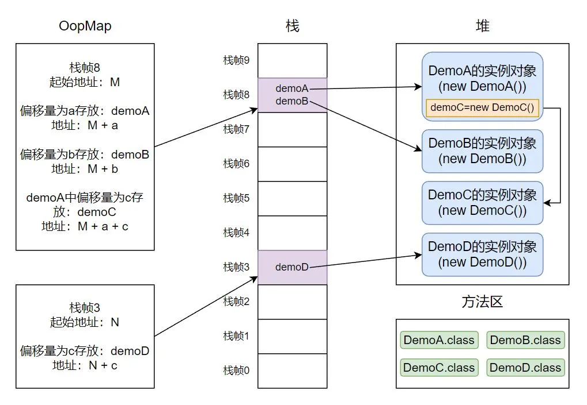


#### 安全点

在 OopMap 的协助下，HotSpot 可以快速完成根节点枚举了，但一个很现实的问题随之而来：由于引用关系可能会发生变化，这就会导致  OopMap 内容变化的指令非常多，如果为每一条指令都生成对应的  OopMap，那将会需要大量的额外存储空间，这样垃圾收集伴随而来的空间成本就会变得无法忍受的高昂。

所以实际上 HotSpot 也确实没有为每条指令都生成 OopMap，只是在 “特定的位置” 生成 OopMap，换句话说，只有在某些 ”特定的位置“ 上才会把对象引用的相关信息给记录下来，这些位置也被称为**安全点**（Safepoint）。

有了安全点的设定，也就决定了用户程序执行时并不是随便哪个时候都能够停顿下来开始 GC 的，而是强制要求**程序必须执行到达安全点后才能够进行 GC**（因为不到达安全点话，没有 OopMap，虚拟机就没法快速知道对象引用的位置呀，没法进行根节点枚举）。


因此，**安全点的设定既不能太少以至于让垃圾收集器等待时间过长，也不能太多以至于频繁进行垃圾收集从而导致运行时的内存负荷大幅增大**。所以，安全点的选定基本上是以 “**是否具有让程序长时间执行的特征**” 为标准进行选定的，最典型的就是**指令序列的复用**：例如方法调用、循环跳转、异常跳转等，所以只有具有这些功能的指令才会产生安全点。

对于安全点，另外一个需要考虑的问题是，**如何在 GC 发生时让所有用户线程都执行到最近的安全点，然后停顿下来呢？**。这里有两种方案可供选择：

1. **抢先式中断**（Preemptive Suspension）：这种思路很简单，就是在 GC 发生时，系统先把所有用户线程全部中断掉。然后如果发现有用户线程中断的位置不在安全点上，就恢复这条线程执行，直到跑到安全点上再重新中断。

   抢先式中断的最大问题是时间成本的不可控，进而导致性能不稳定和吞吐量的波动，特别是在高并发场景下这是非常致命的，所以现在几乎没有虚拟机实现采用抢先式中断来暂停线程响应 GC 事件

2. **主动式中断**（Voluntary Suspension）：主动式中断不会直接中断线程，而是全局设置一个标志位，用户线程会不断的轮询这个标志位，当发现标志位为真时，线程会在最近的一个安全点主动中断挂起。现在的虚拟机基本都是用这种方式

#### 安全区域 Safe Region

安全点机制保证了程序执行时，在不太长的时间内就会遇到可进入垃圾收集过程的安全点。

对于主动式中断来说，用户线程需要不断地去轮询标志位，那对于那些处于 sleep 或者 blocked 状态的线程（不在活跃状态的线程）来说怎么办？

这些不在活跃状态的线程没有获得 CPU 时间，没法去轮询标志位，自然也就没法找到最近的安全点主动中断挂起了。

换句话说，对于这些不活跃的线程，我们没法掌控它们醒过来的时间。很可能其他线程都已经通过轮询标志位到达安全点被中断了，然后虚拟机开始根节点枚举了（根节点枚举需要暂停所有用户线程），但是这时候那些本不活跃的用户线程又醒过来了开始执行，破坏了对象之间的引用关系，那显然是不行的。

对于这种情况，就必须引入**安全区域**（Safe Region）来解决。

安全区域的定义是这样的：确保在某一段代码片段之中，引用关系不会发生变化，因此，在这个区域中的任意地方开始 GC 都是安全的。

可以简单地把安全区域看作**被拉长了的安全点**。

**当用户线程执行到安全区域里面的代码时，首先会标识自己已经进入了安全区域。那样当这段时间里虚拟机要发起 GC  时，就不必去管这些在安全区域内的线程了。**

当安全区域中的线程被唤醒并离开安全区域时，它需要检查下主动式中断策略的标志位是否为真（虚拟机是否处于  STW 状态

* 如果为真则继续挂起等待（防止根节点枚举过程中这些被唤醒线程的执行破坏了对象之间的引用关系）
* 如果为假则标识还没开始 STW 或者 STW 刚刚结束，那么线程就可以被唤醒然后继续执行。

### 三色标记法

可达性分析可以分成两个阶段

1. 根节点枚举
2. 从根节点开始遍历对象图

在可达性分析中，第一阶段 ”根节点枚举“ 是必须 STW  的，不然如果分析过程中用户进程还在运行，就可能会导致根节点集合的对象引用关系不断变化，这样可达性分析结果的准确性显然也就无法保证了；而第二阶段  ”从根节点开始遍历对象图“，如果不进行 STW 的话，会导致一些问题，由于第二阶段时间比较长，长时间的 STW  很影响性能，所以大佬们设计了一些解决方案，从而使得这个第二阶段可以不用 STW，大幅减少时间

#### 前言

事实上，GC Roots 相比起整个 Java 堆中全部的对象毕竟还算是极少数，且在各种优化技巧（比如 OopMap）的加持下，它带来的停顿已经是非常短暂且相对固定的了，也就是说，**“根节点枚举” 阶段的停顿时间不会随着堆容量的增长而增加**。

当我们枚举完了所有的 GC Roots，就得进入第二阶段继续往下遍历对象图了，这一步骤同样需要 STW，并且停顿时间与 Java 堆容量直接成正比例关系：堆越大，存储的对象越多，对象图结构越复杂，要标记更多对象而产生的停顿时间自然就更长，这是理所当然的事情

也就是说，**“从根节点开始遍历对象图” 阶段的停顿时间随着堆容量的增长而增加**。

要知道包含“标记”阶段（也就是可达性分析）是所有追踪式垃圾收集算法的共同特征，如果这个阶段会随着堆变大而等比例增加停顿时间，其影响就会波及几乎所有的垃圾收集器。如果能够减少这部分停顿时间的话，那收益也将会是巨大的

想降低 STW 时间甚至是避免 STW，我们就**要先搞清楚为什么必须在一个能保障一致性的快照上才能进行对象图的遍历**？

为了能解释清楚这个问题，大佬们引入了三色标记法（Tri-color Marking）这个工具

> 需要注意的是，三色标记法只是辅助我们分析的工具，并不是某个垃圾收集器具体使用的算法！！！！！更不是降低 STW 时间 or 消除 STW 的方法，具体解决方法下面还会介绍
>
> 在这里，三色标记法可以帮助我们搞清楚在可达性分析的第二阶段（也就是遍历对象图），如果用户线程和垃圾收集线程同时进行，会出现什么问题

#### 辅助分析的工具：三色标记法

所谓三色标记法，就是把遍历对象图过程中遇到的对象，按照 “是否访问过” 这个条件标记成以下三种颜色：

- **白色**：表示对象尚未被垃圾收集器访问过。显然在可达性分析刚刚开始的阶段，所有的对象都是白色的，若在分析结束的阶段，仍然是白色的对象，即代表不可达（可达性分析到不了的对象，就是死亡对象，需要被回收）

- **黑色**：表示对象已经被垃圾收集器访问过，且这个对象的所有引用都已经扫描过。黑色的对象代表已经扫描过，它是安全存活的，如果有其他对象引用指向了黑色对象，无须重新扫描一遍。黑色对象不可能直接（不经过灰色对象）指向某个白色对象。

- **灰色**：表示对象已经被垃圾收集器访问过，但这个对象上至少存在一个引用还没有被扫描过

  > 灰色可能不好理解，这里举个例子：A(GC roots) → B → C，如果 B 已经被扫描过，但是 B 的引用 C 还没有被扫描过，那么 B 就是灰色的，C 由于还没有被扫描，所以是白色的

所以对象图遍历的过程，其实就是由灰色从黑向白推进的过程，灰色是黑和白的分界线。

下面我们就用三色标记法来分析下，如果在对象图遍历这个阶段用户线程与收集器并发工作会出现什么问题

#### 问题 1：浮动垃圾

所谓浮动垃圾，就是由于垃圾收集和用户线程是并行的，这个对象实际已经死亡了，已经没有其他人引用它了，但是**被垃圾收集器错误地标记成了存活对象**

举个例子，a 引用了 b，此时 b 被扫描为可达，但是用户线程随后又执行了 a.b = null，这个时候其实 b 已经是死亡的垃圾对象了，但是由于**黑色对象不会被重新扫描**，所以在垃圾收集里 b 依然作为存活对象被标记成黑色，因此就成了浮动垃圾。如下图所示：

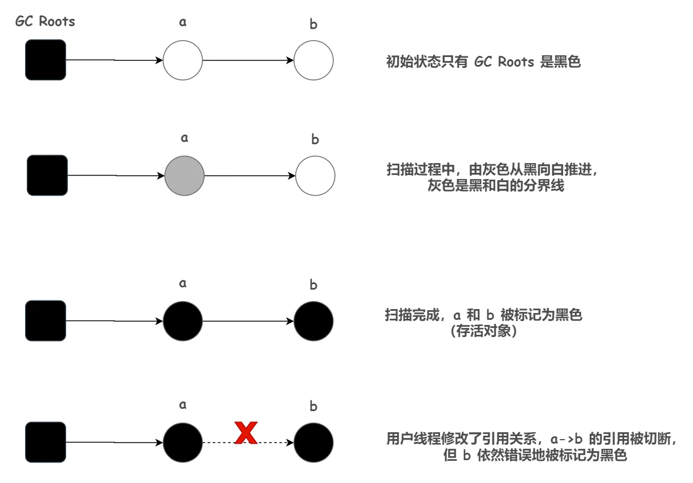

浮动垃圾当然不是一件好事，但其实是可以容忍的，因为这只不过产生了一点逃过本次收集的浮动垃圾而已，反正还会有下一次垃圾收集，到时候就会被标记为垃圾被清理掉了

#### 问题 2：对象消失

对象消失和浮动垃圾恰恰相反，对象消失是**把原本存活的对象错误标记为已消亡**，这就是非常致命的后果了，程序肯定会因此发生错误，下面表演示了这样的致命错误具体是如何产生的


如上图所示，b -> c 的引用被切断，但同时用户线程建立了一个新的从 a -> c 的引用，由于已经遍历到了  b，不可能再回去遍历 a（黑色对象不会被重新扫描），再遍历 c，所以这个 c  实际是存活的对象，但由于没有被垃圾收集器扫描到，被错误地标记成了白色。

总结下对象消失问题的两个条件：

1. 插入了一条或多条从黑色对象到白色对象的新引用
2. 删除了全部从灰色对象到该白色对象的直接或间接引用

Wilson 于 1994 年在理论上证明了，当且仅当以上两个条件同时满足时，才会产生 “对象消失” 的问题，即原本应该是黑色的对象被误标为白色

#### 遍历对象图不需要 STW 的解决方案

如上所述，如果遍历对象图的过程不 STW 的话，第一个浮动垃圾的问题很好处理，但是第二个对象消失问题就很棘手了。

但是呢，遍历对象图的过程又实在太长，设计 JVM 的大佬们不得不想出一些办法来解决对象消失问题，使得在遍历对象图的过程中不用进行 STW（也就是用户线程和对象线程可以同时工作），从而提升可达性分析的效率

上面总结了对象消失问题的两个条件，所以说，如果我们想要解决并发扫描时的对象消失问题，只需破坏这两个条件的任意一个即可。由此分别产生了两种解决方案：

1. **增量更新**（Incremental Update）：增量更新破坏的是第一个条件，当黑色对象插入新的指向白色对象的引用关系时（就是上图中的 a -> c  引用关系），就将这个新插入的引用记录下来，等并发扫描结束之后，再将这些记录过的引用关系中的黑色对象（a）为根，重新扫描一次。这可以简化理解为，**黑色对象一旦新插入了指向白色对象的引用之后，它就变回灰色对象了**。
2. **原始快照**（Snapshot At The Beginning，SATB）：原始快照要破坏的是第二个条件，当灰色对象要删除指向白色对象的引用关系时（上图中的 b -> c  引用关系），就将这个要删除的引用记录下来，在并发扫描结束之后，再将这些记录过的引用关系中的灰色对象（b）为根，重新扫描一次。这也可以简化理解为，**无论引用关系删除与否，都会按照刚刚开始扫描那一刻的对象图快照来进行搜索**。

在 HotSpot 虚拟机中，增量更新和原始快照这两种解决方案都有实际应用，CMS 是基于增量更新来做并发标记的，G1、Shenandoah 则是用原始快照来实现


### 什么是字节码？类文件结构的组成了解吗？

**Java 字节码**（英语：Java bytecode）是[Java虚拟机](https://zh.wikipedia.org/wiki/Java虚拟机)执行的一种[指令](https://zh.wikipedia.org/wiki/指令)格式。大多数[操作码](https://zh.wikipedia.org/w/index.php?title=操作码&action=edit&redlink=1)都是一个[字节](https://zh.wikipedia.org/wiki/字节)长，而有些操作需要参数，导致了有一些多字节的操作码。而且并不是所有可能的256个操作码都被使用；其中有51个操作码被保留做将来使用。除此之外，原始[Java平台](https://zh.wikipedia.org/wiki/Java平台)开发商，[太阳微系统](https://zh.wikipedia.org/wiki/昇陽微系統)，额外保留了3个代码永久不使用。

> 一个[Java](https://zh.wikipedia.org/wiki/Java)程序员并不需要理解所有的Java字节码。但是，就像[IBM](https://zh.wikipedia.org/wiki/IBM) developerWorks周刊建议的那样：“理解字节码以及理解Java编译器如何生成Java字节码与学习[汇编](https://zh.wikipedia.org/wiki/汇编语言)知识对于[C](https://zh.wikipedia.org/wiki/C)/[C++](https://zh.wikipedia.org/wiki/C%2B%2B)程序员有一样的意义。”


#### Class 文件结构总结

根据 Java 虚拟机规范，Class 文件通过 `ClassFile` 定义，有点类似 C 语言的结构体。

`ClassFile` 的结构如下：

```java
ClassFile {
    u4             magic; //Class 文件的标志
    u2             minor_version;//Class 的小版本号
    u2             major_version;//Class 的大版本号
    u2             constant_pool_count;//常量池的数量
    cp_info        constant_pool[constant_pool_count-1];//常量池
    u2             access_flags;//Class 的访问标记
    u2             this_class;//当前类
    u2             super_class;//父类
    u2             interfaces_count;//接口
    u2             interfaces[interfaces_count];//一个类可以实现多个接口
    u2             fields_count;//Class 文件的字段属性
    field_info     fields[fields_count];//一个类可以有多个字段
    u2             methods_count;//Class 文件的方法数量
    method_info    methods[methods_count];//一个类可以有个多个方法
    u2             attributes_count;//此类的属性表中的属性数
    attribute_info attributes[attributes_count];//属性表集合
}
```

通过分析 `ClassFile` 的内容，我们便可以知道 class 文件的组成。


下面这张图是通过 IDEA 插件 `jclasslib` 查看的，你可以更直观看到 Class 文件结构。

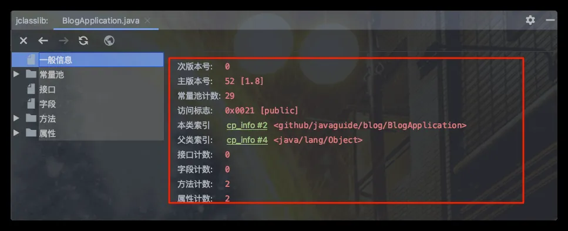

使用 `jclasslib` 不光可以直观地查看某个类对应的字节码文件，还可以查看类的基本信息、常量池、接口、属性、函数等信息。

下面详细介绍一下 Class 文件结构涉及到的一些组件。

#### 魔数（Magic Number）

```java
    u4             magic; //Class 文件的标志
```

每个 Class 文件的头 4 个字节称为魔数（Magic Number）,它的唯一作用是**确定这个文件是否为一个能被虚拟机接收的 Class 文件**。

程序设计者很多时候都喜欢用一些特殊的数字表示固定的文件类型或者其它特殊的含义。

#### Class 文件版本号（Minor&Major Version）

```java
    u2             minor_version;//Class 的小版本号
    u2             major_version;//Class 的大版本号
```

紧接着魔数的四个字节存储的是 Class 文件的版本号：第 5 和第 6 位是**次版本号**，第 7 和第 8 位是**主版本号**。

每当 Java 发布大版本（比如 Java 8，Java9）的时候，主版本号都会加 1。你可以使用 `javap -v` 命令来快速查看 Class 文件的版本号信息。

高版本的 Java 虚拟机可以执行低版本编译器生成的 Class 文件，但是低版本的 Java 虚拟机不能执行高版本编译器生成的 Class 文件。所以，我们在实际开发的时候要确保开发的的 JDK 版本和生产环境的 JDK 版本保持一致。

#### 常量池（Constant Pool）

```java
    u2             constant_pool_count;//常量池的数量
    cp_info        constant_pool[constant_pool_count-1];//常量池
```

紧接着主次版本号之后的是常量池，常量池的数量是 `constant_pool_count-1`（**常量池计数器是从 1 开始计数的，将第 0 项常量空出来是有特殊考虑的，索引值为 0 代表“不引用任何一个常量池项”**）。

常量池主要存放两大常量：字面量和符号引用。字面量比较接近于 Java 语言层面的的常量概念，如文本字符串、声明为 final 的常量值等。而符号引用则属于编译原理方面的概念。包括下面三类常量：

- 类和接口的全限定名
- 字段的名称和描述符
- 方法的名称和描述符

常量池中每一项常量都是一个表，这 14 种表有一个共同的特点：**开始的第一位是一个 u1 类型的标志位 -tag 来标识常量的类型，代表当前这个常量属于哪种常量类型．**

|               类型               | 标志（tag） |          描述          |
| :------------------------------: | :---------: | :--------------------: |
|        CONSTANT_utf8_info        |      1      |   UTF-8 编码的字符串   |
|      CONSTANT_Integer_info       |      3      |       整形字面量       |
|       CONSTANT_Float_info        |      4      |      浮点型字面量      |
|        CONSTANT_Long_info        |     ５      |      长整型字面量      |
|       CONSTANT_Double_info       |     ６      |   双精度浮点型字面量   |
|       CONSTANT_Class_info        |     ７      |   类或接口的符号引用   |
|       CONSTANT_String_info       |     ８      |    字符串类型字面量    |
|      CONSTANT_Fieldref_info      |     ９      |     字段的符号引用     |
|     CONSTANT_Methodref_info      |     10      |   类中方法的符号引用   |
| CONSTANT_InterfaceMethodref_info |     11      |  接口中方法的符号引用  |
|    CONSTANT_NameAndType_info     |     12      |  字段或方法的符号引用  |
|     CONSTANT_MothodType_info     |     16      |      标志方法类型      |
|    CONSTANT_MethodHandle_info    |     15      |      表示方法句柄      |
|   CONSTANT_InvokeDynamic_info    |     18      | 表示一个动态方法调用点 |

`.class` 文件可以通过`javap -v class类名` 指令来看一下其常量池中的信息(`javap -v class类名-> temp.txt` ：将结果输出到 temp.txt 文件)。

#### 访问标志(Access Flags)

在常量池结束之后，紧接着的两个字节代表访问标志，这个标志用于识别一些类或者接口层次的访问信息，包括：这个 Class 是类还是接口，是否为 `public` 或者 `abstract` 类型，如果是类的话是否声明为 `final` 等等。

类访问和属性修饰符:

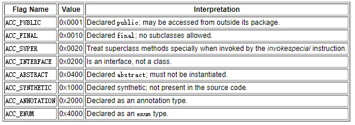

我们定义了一个 Employee 类

```java
package top.snailclimb.bean;
public class Employee {
   ...
}
```

通过`javap -v class类名` 指令来看一下类的访问标志。

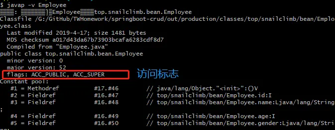

#### 当前类（This Class）、父类（Super Class）、接口（Interfaces）索引集合

```java
    u2             this_class;//当前类
    u2             super_class;//父类
    u2             interfaces_count;//接口
    u2             interfaces[interfaces_count];//一个类可以实现多个接口
```

类索引用于确定这个类的全限定名，父类索引用于确定这个类的父类的全限定名，由于 Java 语言的单继承，所以父类索引只有一个，除了 `java.lang.Object` 之外，所有的 java 类都有父类，因此除了 `java.lang.Object` 外，所有 Java 类的父类索引都不为 0。

接口索引集合用来描述这个类实现了那些接口，这些被实现的接口将按 `implements` (如果这个类本身是接口的话则是`extends`) 后的接口顺序从左到右排列在接口索引集合中。

#### 字段表集合（Fields）

```java
    u2             fields_count;//Class 文件的字段的个数
    field_info     fields[fields_count];//一个类会可以有个字段
```

字段表（field info）用于描述接口或类中声明的变量。字段包括类级变量以及实例变量，但不包括在方法内部声明的局部变量。

**field info(字段表) 的结构:**


- **access_flags:** 字段的作用域（`public` ,`private`,`protected`修饰符），是实例变量还是类变量（`static`修饰符）,可否被序列化（transient 修饰符）,可变性（final）,可见性（volatile 修饰符，是否强制从主内存读写）。
- **name_index:** 对常量池的引用，表示的字段的名称；
- **descriptor_index:** 对常量池的引用，表示字段和方法的描述符；
- **attributes_count:** 一个字段还会拥有一些额外的属性，attributes_count 存放属性的个数；
- **attributes[attributes_count]:** 存放具体属性具体内容。

上述这些信息中，各个修饰符都是布尔值，要么有某个修饰符，要么没有，很适合使用标志位来表示。而字段叫什么名字、字段被定义为什么数据类型这些都是无法固定的，只能引用常量池中常量来描述。

**字段的 access_flag 的取值:**


#### 方法表集合（Methods）

```java
    u2             methods_count;//Class 文件的方法的数量
    method_info    methods[methods_count];//一个类可以有个多个方法
```

methods_count 表示方法的数量，而 method_info 表示方法表。

Class 文件存储格式中对方法的描述与对字段的描述几乎采用了完全一致的方式。方法表的结构如同字段表一样，依次包括了访问标志、名称索引、描述符索引、属性表集合几项。

**method_info(方法表的) 结构:**


方法表的 access_flag 取值：


注意：因为`volatile`修饰符和`transient`修饰符不可以修饰方法，所以方法表的访问标志中没有这两个对应的标志，但是增加了`synchronized`、`native`、`abstract`等关键字修饰方法，所以也就多了这些关键字对应的标志。

#### 属性表集合（Attributes）

```java
   u2             attributes_count;//此类的属性表中的属性数
   attribute_info attributes[attributes_count];//属性表集合
```

在  Class 文件，字段表，方法表中都可以携带自己的属性表集合，以用于描述某些场景专有的信息。与 Class  文件中其它的数据项目要求的顺序、长度和内容不同，属性表集合的限制稍微宽松一些，不再要求各个属性表具有严格的顺序，并且只要不与已有的属性名重复，任何人实现的编译器都可以向属性表中写 入自己定义的属性信息，Java 虚拟机运行时会忽略掉它不认识的属性。


### OOM 常见原因及解决方法

> 节选自：StabilityGuide 

当 JVM 内存严重不足时，就会抛出 java.lang.OutOfMemoryError 错误。本文总结了常见的 OOM 原因及其解决方法，如下图所示。如有遗漏或错误，欢迎补充指正。

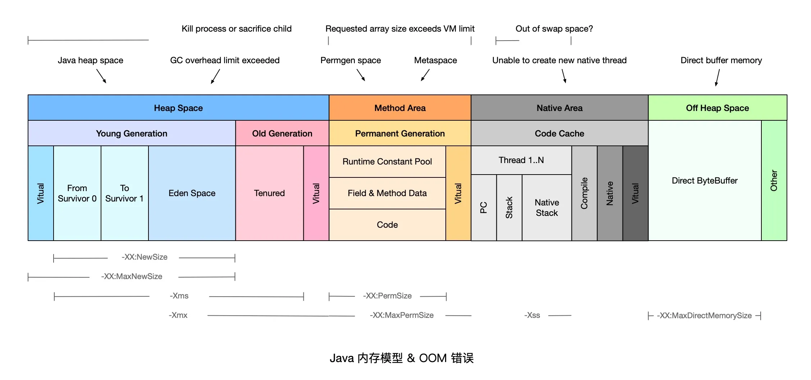

#### Java heap space

当堆内存（Heap Space）没有足够空间存放新创建的对象时，就会抛出 `java.lang.OutOfMemoryError: Java heap space` 错误（根据实际生产经验，可以对程序日志中的 OutOfMemoryError 配置关键字告警，一经发现，立即处理）

##### 原因分析

`Java heap space` 错误产生的常见原因可以分为以下几类：

- 请求创建一个超大对象，通常是一个大数组。
- 超出预期的访问量/数据量，通常是上游系统请求流量飙升，常见于各类促销/秒杀活动，可以结合业务流量指标排查是否有尖状峰值。
- 过度使用终结器（Finalizer），该对象没有立即被 GC。
- 内存泄漏（Memory Leak），大量对象引用没有释放，JVM 无法对其自动回收，常见于使用了 File 等资源没有回收。

##### 解决方案

针对大部分情况，通常只需要通过 `-Xmx` 参数调高 JVM 堆内存空间即可。如果仍然没有解决，可以参考以下情况做进一步处理：

- 如果是超大对象，可以检查其合理性，比如是否一次性查询了数据库全部结果，而没有做结果数限制。
- 如果是业务峰值压力，可以考虑添加机器资源，或者做限流降级。
- 如果是内存泄漏，需要找到持有的对象，修改代码设计，比如关闭没有释放的连接。

#### GC overhead limit exceeded

当 Java 进程花费 98% 以上的时间执行 GC，但只恢复了不到 2% 的内存，且该动作连续重复了 5 次，就会抛出 `java.lang.OutOfMemoryError:GC overhead limit exceeded` 错误。简单地说，就是应用程序已经基本耗尽了所有可用内存， GC 也无法回收。

此类问题的原因与解决方案跟 `Java heap space` 非常类似，可以参考上文。

#### Permgen space

该错误表示永久代（Permanent Generation）已用满，通常是因为加载的 class 数目太多或体积太大。

##### 原因分析

永久代存储对象主要包括以下几类：

- 加载/缓存到内存中的 class 定义，包括类的名称，字段，方法和字节码；
- 常量池；
- 对象数组/类型数组所关联的 class；
- JIT 编译器优化后的 class 信息。

PermGen 的使用量与加载到内存的 class 的数量/大小正相关。

##### 解决方案

根据 Permgen space 报错的时机，可以采用不同的解决方案，如下所示：

- 程序启动报错，修改 `-XX:MaxPermSize` 启动参数，调大永久代空间。
- 应用重新部署时报错，很可能是没有应用没有重启，导致加载了多份 class 信息，只需重启 JVM 即可解决。
- 运行时报错，应用程序可能会动态创建大量 class，而这些 class 的生命周期很短暂，但是 JVM 默认不会卸载 class，可以设置 `-XX:+CMSClassUnloadingEnabled` 和 `-XX:+UseConcMarkSweepGC` 这两个参数允许 JVM 卸载 class。

如果上述方法无法解决，可以通过 jmap 命令 dump 内存对象 `jmap -dump:format=b,file=dump.hprof <process-id>` ，然后利用 [Eclipse MAT](https://www.eclipse.org/mat/) 功能逐一分析开销最大的 classloader 和重复 class。

#### Metaspace

DK 1.8 使用 Metaspace 替换了永久代（Permanent Generation），该错误表示 Metaspace 已被用满，通常是因为加载的 class 数目太多或体积太大。

此类问题的原因与解决方法跟 `Permgen space` 非常类似，可以参考上文。需要特别注意的是调整 Metaspace 空间大小的启动参数为 `-XX:MaxMetaspaceSize`。

#### Unable to create new native thread

每个 Java 线程都需要占用一定的内存空间，当 JVM 向底层操作系统请求创建一个新的 native 线程时，如果没有足够的资源分配就会报此类错误。

##### 原因分析

JVM 向 OS 请求创建 native 线程失败，就会抛出 `Unable to create new native thread`，常见的原因包括以下几类：

- 线程数超过操作系统最大线程数 ulimit 限制。
- 线程数超过 kernel.pid_max（只能重启）。
- native 内存不足。

该问题发生的常见过程主要包括以下几步：

1. JVM 内部的应用程序请求创建一个新的 Java 线程；
2. JVM native 方法代理了该次请求，并向操作系统请求创建一个 native 线程；
3. 操作系统尝试创建一个新的 native 线程，并为其分配内存；
4. 如果操作系统的虚拟内存已耗尽，或是受到 32 位进程的地址空间限制，操作系统就会拒绝本次 native 内存分配；
5. JVM 将抛出 `java.lang.OutOfMemoryError: Unable to create new native thread` 错误。

##### 解决方案

- 升级配置，为机器提供更多的内存；
- 降低 Java Heap Space 大小；
- 修复应用程序的线程泄漏问题；
- 限制线程池大小；
- 使用 -Xss 参数减少线程栈的大小；
- 调高 OS 层面的线程最大数：执行 `ulimia -a` 查看最大线程数限制，使用 `ulimit -u xxx` 调整最大线程数限制。

```
ulimit -a
.... 省略部分内容 .....
max user processes              (-u) 16384
```

#### Out of swap space？

该错误表示所有可用的虚拟内存已被耗尽。虚拟内存（Virtual Memory）由物理内存（Physical Memory）和交换空间（Swap Space）两部分组成。当运行时程序请求的虚拟内存溢出时就会报 `Out of swap space?` 错误。

##### 原因分析

该错误出现的常见原因包括以下几类：

- 地址空间不足；
- 物理内存已耗光；
- 应用程序的本地内存泄漏（native leak），例如不断申请本地内存，却不释放。
- 执行 `jmap -histo:live <pid>` 命令，强制执行 Full GC；如果几次执行后内存明显下降，则基本确认为 Direct ByteBuffer 问题。

##### 解决方案

根据错误原因可以采取如下解决方案：

- 升级地址空间为 64 bit；
- 使用 [Arthas](https://github.com/alibaba/arthas) 检查是否为 Inflater/Deflater 解压缩问题，如果是，则显式调用 end 方法。
- Direct ByteBuffer 问题可以通过启动参数 `-XX:MaxDirectMemorySize` 调低阈值。
- 升级服务器配置/隔离部署，避免争用。

#### Kill process or sacrifice child

有一种内核作业（Kernel Job）名为 Out of Memory Killer，它会在可用内存极低的情况下“杀死”（kill）某些进程。OOM Killer 会对所有进程进行打分，然后将评分较高的进程“杀死”，具体的评分规则可以参考 [Surviving the Linux OOM Killer](https://dev.to/rrampage/surviving-the-linux-oom-killer-2ki9)。

不同于其他的 OOM 错误，`Kill process or sacrifice child` 错误不是由 JVM 层面触发的，而是由操作系统层面触发的。当系统空闲内存突然大幅被释放，有较大概率触发了 OOM Killer 杀掉了某些进程。

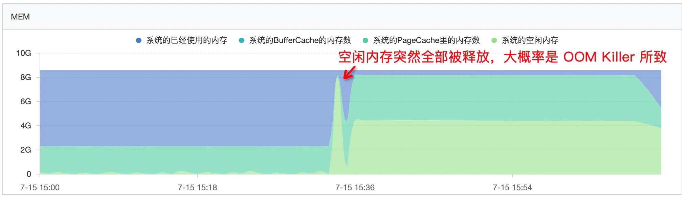

##### 原因分析

默认情况下，Linux 内核允许进程申请的内存总量大于系统可用内存，通过这种“错峰复用”的方式可以更有效的利用系统资源。

然而，这种方式也会无可避免地带来一定的“超卖”风险。例如某些进程持续占用系统内存，然后导致其他进程没有可用内存。此时，系统将自动激活 OOM Killer，寻找评分高的进程，并将其“杀死”，释放内存资源。

##### 解决方案

- 升级服务器配置/隔离部署，避免争用。
- [OOM Killer 调优](https://access.redhat.com/documentation/en-us/red_hat_enterprise_linux/6/html/performance_tuning_guide/s-memory-captun)。

#### Requested array size exceeds VM limit

JVM 限制了数组的最大长度，该错误表示程序请求创建的数组超过最大长度限制。

JVM 在为数组分配内存前，会检查要分配的数据结构在系统中是否可寻址，通常为 `Integer.MAX_VALUE - 2`。

此类问题比较罕见，通常需要检查代码，确认业务是否需要创建如此大的数组，是否可以拆分为多个块，分批执行。

#### Direct buffer memory

Java 允许应用程序通过 Direct ByteBuffer 直接访问堆外内存，许多高性能程序通过 Direct ByteBuffer 结合内存映射文件（Memory Mapped File）实现高速 IO。

##### 原因分析

Direct ByteBuffer 的默认大小为 64 MB，一旦使用超出限制，就会抛出 `Direct buffer memory` 错误。

##### 解决方案

- Java 只能通过 ByteBuffer.allocateDirect 方法使用 Direct ByteBuffer，因此，可以通过 [Arthas](https://github.com/alibaba/arthas) 等在线诊断工具拦截该方法进行排查。
- 检查是否直接或间接使用了 NIO，如 netty，jetty 等。
- 通过启动参数 `-XX:MaxDirectMemorySize` 调整 Direct ByteBuffer 的上限值。
- 检查 JVM 参数是否有 `-XX:+DisableExplicitGC` 选项，如果有就去掉，因为该参数会使 `System.gc()` 失效。
- 检查堆外内存使用代码，确认是否存在内存泄漏；或者通过反射调用 `sun.misc.Cleaner` 的 `clean()` 方法来主动释放被 Direct ByteBuffer 持有的内存空间。
- 内存容量确实不足，升级配置。

