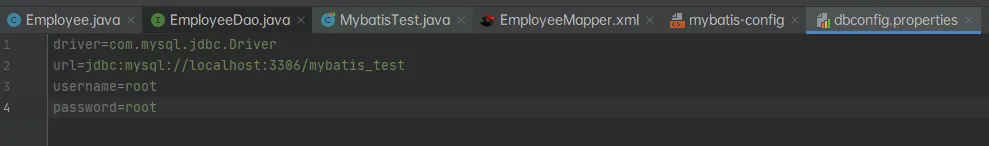
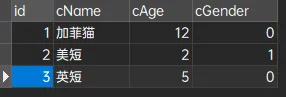
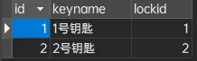
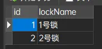
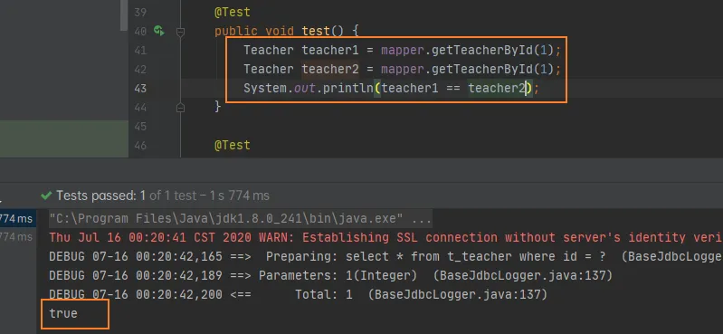
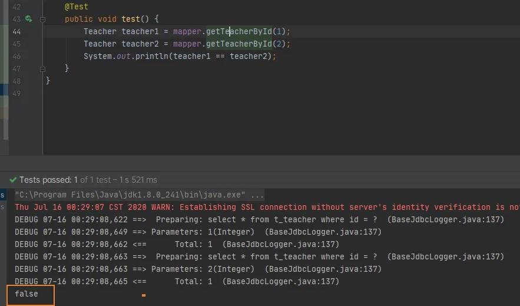
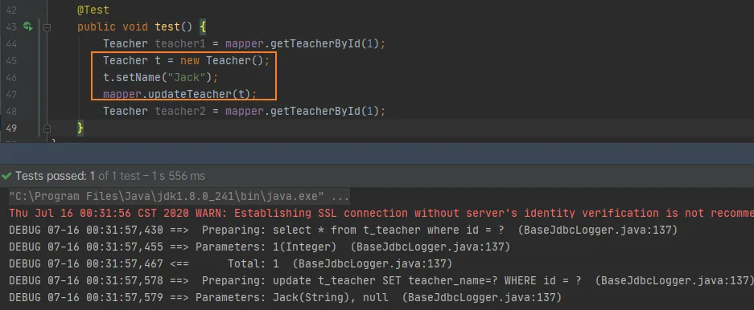
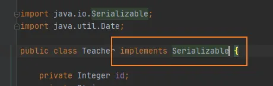
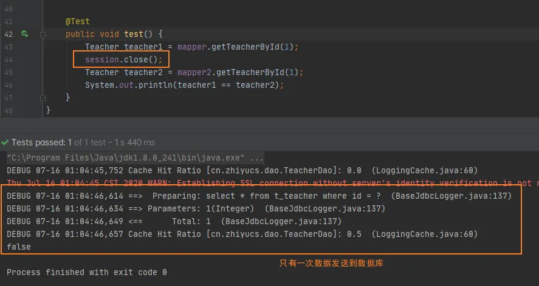
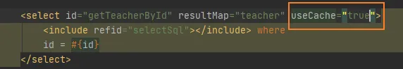

MyBatis ALL IN ONE

- [环境搭建](#环境搭建)
  - [Mybatis配置文件](#mybatis配置文件)
- [mybatis基础增删改查](#mybatis基础增删改查)
- [使用外部properties引用数据库连接](#使用外部properties引用数据库连接)
- [使用setttings修改行为](#使用setttings修改行为)
- [typeAliases（类型别名）和typeHandlers（类型处理器）](#typealiases类型别名和typehandlers类型处理器)
  - [类型处理器](#类型处理器)
- [【了解】plugins（插件）](#了解plugins插件)
- [环境配置（environments）](#环境配置environments)
  - [环境](#环境)
- [数据库厂商标识（databaseIdProvider）](#数据库厂商标识databaseidprovider)
- [映射器（mappers）](#映射器mappers)
  - [mappers](#mappers)
- [SQL映射 获取自增ID](#sql映射-获取自增id)
  - [在SQL映射文件内的 mapper 标签下可以写的主要标签有](#在sql映射文件内的-mapper-标签下可以写的主要标签有)
  - [简述：delete update insert select 的属性](#简述delete-update-insert-select-的属性)
  - [获取主键自增属性](#获取主键自增属性)
  - [获取非主键自增属性](#获取非主键自增属性)
- [SQL映射 传入多个参数](#sql映射-传入多个参数)
  - [传入Map](#传入map)
  - [#{}取值属性](#取值属性)
  - [两种取值方式：${} #{}](#两种取值方式-)
- [SQL映射 查询集合](#sql映射-查询集合)
  - [封装成LIST](#封装成list)
  - [封装成MAP](#封装成map)
- [SQL映射 自定义resultType](#sql映射-自定义resulttype)
- [SQL映射 级联属性查询](#sql映射-级联属性查询)
  - [序言: 一对一关联](#序言-一对一关联)
- [SQL映射 级联 一对多 多对多](#sql映射-级联-一对多-多对多)
  - [一对多](#一对多)
- [SQL映射 分步查询](#sql映射-分步查询)
  - [association分步查询](#association分步查询)
  - [Collection分布查询](#collection分布查询)
- [SQL映射 延迟加载 按需加载](#sql映射-延迟加载-按需加载)
- [动态SQL IF](#动态sql-if)
  - [实战动态SQL IF](#实战动态sql-if)
- [动态SQL WHERE TRIM](#动态sql-where-trim)
  - [**where 元素**](#where-元素)
  - [trim 标签](#trim-标签)
- [动态SQL FOREACH](#动态sql-foreach)
- [动态SQL CHOOSE、WHEN、OTHERWISE](#动态sql-choosewhenotherwise)
- [动态SQL SET](#动态sql-set)
  - [动态更新](#动态更新)
- [OGNL表达式](#ognl表达式)
  - [伪属](#伪属)
- [动态SQL BIND  INCLUDE](#动态sql-bind--include)
  - [bind](#bind)
  - [include](#include)
- [一级缓存](#一级缓存)
  - [一级缓存的失效情况](#一级缓存的失效情况)
- [二级缓存](#二级缓存)
- [缓存的查询顺序和原理](#缓存的查询顺序和原理)
  - [缓存查询顺序](#缓存查询顺序)
  - [缓存原理图](#缓存原理图)
- [缓存的属性](#缓存的属性)

## 环境搭建

导入Maven

```xml
<dependencies>
    <dependency>
        <groupId>mysql</groupId>
        <artifactId>mysql-connector-java</artifactId>
        <version>5.1.43</version>
    </dependency>
    <dependency>
        <groupId>org.mybatis</groupId>
        <artifactId>mybatis</artifactId>
        <version>3.5.5</version>
    </dependency>
    <dependency>
        <groupId>log4j</groupId>
        <artifactId>log4j</artifactId>
        <version>1.2.17</version>
    </dependency>
</dependencies>
```
创建实体类

```java
public class Employee {
​
    private Integer id;
    private String empName;
    private String email;
    private String gender;
}
```
创建一个DAO接口

```java
public interface EmployeeDao {
​
    public Employee getEmpById(Integer id);
}
```
### Mybatis配置文件

全局配置文件：

[http://mybatis.org/dtd/mybatis-3-config.dtd](http://mybatis.org/dtd/mybatis-3-config.dtd)  dtd是一个约束文件

```xml
<?xml version="1.0" encoding="UTF-8" ?>
<!DOCTYPE configuration
        PUBLIC "-//mybatis.org//DTD Config 3.0//EN"
        "http://mybatis.org/dtd/mybatis-3-config.dtd">
<configuration>
    <environments default="development">
        <environment id="development">
            <transactionManager type="JDBC"/>
<!--            配置连接池  -->
            <dataSource type="POOLED">
                <property name="driver" value="com.mysql.jdbc.Driver"/>
                <property name="url" value="jdbc:mysql://localhost:3306/mybatis_test"/>
                <property name="username" value="root"/>
                <property name="password" value="root"/>
            </dataSource>
        </environment>
    </environments>

</configuration>
```
SQL映射文件

```xml
<?xml version="1.0" encoding="UTF-8" ?>
<!DOCTYPE mapper
        PUBLIC "-//mybatis.org//DTD Mapper 3.0//EN"
        "http://mybatis.org/dtd/mybatis-3-mapper.dtd">
<!--
    namespace: 名称空间  写接口的全类名，相当于告诉mybatis这个配置文件实现哪个接口
-->
<mapper namespace="cn.zhiyucs.dao.EmployeeDao">
<!--    select 用来定义个查询操作
            id 方法名 相当于配置是对于某个方法的实现
            resultType 指定方法运行后的返回值类型(查询操作必须指定的)
            #{属性名} 取出传递过来的某个参数的值
-->
    <select id="getEmpById" resultType="cn.zhiyucs.domain.Employee">
        select * from t_employee where id = #{id}
    </select>
</mapper>
```
在全局文件中配置SQL映射文件

```xml
<?xml version="1.0" encoding="UTF-8" ?>
<!DOCTYPE configuration
        PUBLIC "-//mybatis.org//DTD Config 3.0//EN"
        "http://mybatis.org/dtd/mybatis-3-config.dtd">
<configuration>
    ....
    <mappers>
        <mapper resource="EmployeeMapper.xml"/>
    </mappers>
</configuration>
```
使用纯JAVA测试结果：

```java
@Test
public void test() throws IOException {
    String resource = "mybatis-config";
    InputStream inputStream = Resources.getResourceAsStream(resource);
    SqlSessionFactory sqlSessionFactory = new SqlSessionFactoryBuilder().build(inputStream);
    // 获取和数据库的一次会话：getConnection()
    SqlSession session = sqlSessionFactory.openSession();
    // 使用SqlSession操作数据库，获取dao接口的实现
    EmployeeDao mapper = session.getMapper(EmployeeDao.class);
    // 调用之前的方法
    Employee emp = mapper.getEmpById(1);
    System.out.println(emp);
}
```
优化写法：

```java
@Test
public void test() {
    InputStream inputStream = null;
    SqlSession session = null;
    try {
        String resource = "mybatis-config";
        inputStream = Resources.getResourceAsStream(resource);
        SqlSessionFactory sqlSessionFactory = new SqlSessionFactoryBuilder().build(inputStream);
        session = sqlSessionFactory.openSession();
        EmployeeDao mapper = session.getMapper(EmployeeDao.class);
        Employee emp = mapper.getEmpById(1);
        System.out.println(emp);
    } catch (Exception e) {
        e.printStackTrace();
    }finally {
        try {
            inputStream.close();
        } catch (IOException e) {
            e.printStackTrace();
        }
        session.close();
    }
}
```

## mybatis基础增删改查

mybatis的CRUD一般不需要resultType，它自己会自动封装结果

在原来的测试基础上，如果插入要加入SqlSession的commit()，如果要选择自动commit可以把opensession的参数传入true


## 使用外部properties引用数据库连接

创建一个properties



在主配置文件下加入properties属性，属性名可以使用${}引用

```xml
<configuration>

<!--  resource 类路径

​    url 引用类路径下或者网络路径下

-->

   <properties resource="dbconfig.properties"></properties>

  ....

   <dataSource type="POOLED">

​     <property name="driver" value="${driver}"/>

​     <property name="url" value="${url}"/>

​     <property name="username" value="${username}"/>

​     <property name="password" value="${password}"/>

   </dataSource>

  ....

</configuration>
```


## 使用setttings修改行为

这是 MyBatis 中极为重要的调整设置，它们会改变 MyBatis 的运行时行为。  

| 设置名                           | 描述                                                                                                                                                                                                                              | 有效值                                          | 默认值                                                |
| -------------------------------- | --------------------------------------------------------------------------------------------------------------------------------------------------------------------------------------------------------------------------------- | ----------------------------------------------- | ----------------------------------------------------- |
| cacheEnabled                     | 全局性地开启或关闭所有映射器配置文件中已配置的任何缓存。                                                                                                                                                                          | true                                            | false                                                 |
| lazyLoadingEnabled               | 延迟加载的全局开关。当开启时，所有关联对象都会延迟加载。 特定关联关系中可通过设置 fetchType 属性来覆盖该项的开关状态。                                                                                                            | true                                            | false                                                 |
| aggressiveLazyLoading            | 开启时，任一方法的调用都会加载该对象的所有延迟加载属性。 否则，每个延迟加载属性会按需加载（参考 lazyLoadTriggerMethods)。                                                                                                         | true                                            | false                                                 |
| multipleResultSetsEnabled        | 是否允许单个语句返回多结果集（需要数据库驱动支持）。                                                                                                                                                                              | true                                            | false                                                 |
| useColumnLabel                   | 使用列标签代替列名。实际表现依赖于数据库驱动，具体可参考数据库驱动的相关文档，或通过对比测试来观察。                                                                                                                              | true                                            | false                                                 |
| useGeneratedKeys                 | 允许 JDBC 支持自动生成主键，需要数据库驱动支持。如果设置为 true，将强制使用自动生成主键。尽管一些数据库驱动不支持此特性，但仍可正常工作（如 Derby）。                                                                             | true                                            | false                                                 |
| autoMappingBehavior              | 指定 MyBatis 应如何自动映射列到字段或属性。 NONE 表示关闭自动映射；PARTIAL 只会自动映射没有定义嵌套结果映射的字段。 FULL 会自动映射任何复杂的结果集（无论是否嵌套）。                                                             | NONE, PARTIAL, FULL                             | PARTIAL                                               |
| autoMappingUnknownColumnBehavior | 指定发现自动映射目标未知列（或未知属性类型）的行为。NONE: 不做任何反应WARNING: 输出警告日志（'org.apache.ibatis.session.AutoMappingUnknownColumnBehavior' 的日志等级必须设置为 WARN）FAILING: 映射失败 (抛出 SqlSessionException) | NONE, WARNING, FAILING                          | NONE                                                  |
| defaultExecutorType              | 配置默认的执行器。SIMPLE 就是普通的执行器；REUSE 执行器会重用预处理语句（PreparedStatement）； BATCH 执行器不仅重用语句还会执行批量更新。                                                                                         | SIMPLE REUSE BATCH                              | SIMPLE                                                |
| defaultStatementTimeout          | 设置超时时间，它决定数据库驱动等待数据库响应的秒数。                                                                                                                                                                              | 任意正整数                                      | 未设置 (null)                                         |
| defaultFetchSize                 | 为驱动的结果集获取数量（fetchSize）设置一个建议值。此参数只可以在查询设置中被覆盖。                                                                                                                                               | 任意正整数                                      | 未设置 (null)                                         |
| defaultResultSetType             | 指定语句默认的滚动策略。（新增于 3.5.2）                                                                                                                                                                                          | FORWARD_ONLY                                    | SCROLL_SENSITIVE                                      |
| safeRowBoundsEnabled             | 是否允许在嵌套语句中使用分页（RowBounds）。如果允许使用则设置为 false。                                                                                                                                                           | true                                            | false                                                 |
| safeResultHandlerEnabled         | 是否允许在嵌套语句中使用结果处理器（ResultHandler）。如果允许使用则设置为 false。                                                                                                                                                 | true                                            | false                                                 |
| mapUnderscoreToCamelCase         | 是否开启驼峰命名自动映射，即从经典数据库列名 A_COLUMN 映射到经典 Java 属性名 aColumn。                                                                                                                                            | true                                            | false                                                 |
| localCacheScope                  | MyBatis 利用本地缓存机制（Local Cache）防止循环引用和加速重复的嵌套查询。 默认值为 SESSION，会缓存一个会话中执行的所有查询。 若设置值为 STATEMENT，本地缓存将仅用于执行语句，对相同 SqlSession 的不同查询将不会进行缓存。         | SESSION                                         | STATEMENT                                             |
| jdbcTypeForNull                  | 当没有为参数指定特定的 JDBC 类型时，空值的默认 JDBC 类型。 某些数据库驱动需要指定列的 JDBC 类型，多数情况直接用一般类型即可，比如 NULL、VARCHAR 或 OTHER。                                                                        | JdbcType 常量，常用值：NULL、VARCHAR 或 OTHER。 | OTHER                                                 |
| lazyLoadTriggerMethods           | 指定对象的哪些方法触发一次延迟加载。                                                                                                                                                                                              | 用逗号分隔的方法列表。                          | equals,clone,hashCode,toString                        |
| defaultScriptingLanguage         | 指定动态 SQL 生成使用的默认脚本语言。                                                                                                                                                                                             | 一个类型别名或全限定类名。                      | org.apache.ibatis.scripting.xmltags.XMLLanguageDriver |
| defaultEnumTypeHandler           | 指定 Enum 使用的默认 TypeHandler 。（新增于 3.4.5）                                                                                                                                                                               | 一个类型别名或全限定类名。                      | org.apache.ibatis.type.EnumTypeHandler                |
| callSettersOnNulls               | 指定当结果集中值为 null 的时候是否调用映射对象的 setter（map 对象时为 put）方法，这在依赖于 Map.keySet() 或 null 值进行初始化时比较有用。注意基本类型（int、boolean 等）是不能设置成 null 的。                                    | true                                            | false                                                 |
| returnInstanceForEmptyRow        | 当返回行的所有列都是空时，MyBatis默认返回 null。 当开启这个设置时，MyBatis会返回一个空实例。 请注意，它也适用于嵌套的结果集（如集合或关联）。（新增于 3.4.2）                                                                     | true                                            | false                                                 |
| logPrefix                        | 指定 MyBatis 增加到日志名称的前缀。                                                                                                                                                                                               | 任何字符串                                      | 未设置                                                |
| logImpl                          | 指定 MyBatis 所用日志的具体实现，未指定时将自动查找。                                                                                                                                                                             | SLF4J                                           | LOG4J                                                 |
| proxyFactory                     | 指定 Mybatis 创建可延迟加载对象所用到的代理工具。                                                                                                                                                                                 | CGLIB                                           | JAVASSIST                                             |
| vfsImpl                          | 指定 VFS 的实现                                                                                                                                                                                                                   | 自定义 VFS 的实现的类全限定名，以逗号分隔。     | 未设置                                                |
| useActualParamName               | 允许使用方法签名中的名称作为语句参数名称。 为了使用该特性，你的项目必须采用 Java 8 编译，并且加上 -parameters 选项。（新增于 3.4.1）                                                                                              | true                                            | false                                                 |
| configurationFactory             | 指定一个提供 Configuration 实例的类。 这个被返回的 Configuration 实例用来加载被反序列化对象的延迟加载属性值。 这个类必须包含一个签名为static Configuration getConfiguration() 的方法。（新增于 3.2.3）                            | 一个类型别名或完全限定类名。                    | 未设置                                                |
| shrinkWhitespacesInSql           | Removes extra whitespace characters from the SQL. Note that this also affects literal strings in SQL. (Since 3.5.5)                                                                                                               | true                                            | false                                                 |

**自动驼峰命名**（**mapUnderscoreToCamelCase**）演示

在数据库中添加字段：login_account

在Java实体类中添加字段：loginAccount

mybatis配置：mapUnderscoreToCamelCase

```xml
<configuration>

  ...

   <settings>

​     <setting name="logImpl" value="LOG4J"/>

​     <setting name="mapUnderscoreToCamelCase" value="true"/>

   </settings>

  ...

</configuration>
```

测试

```
DEBUG 07-13 11:02:02,098 ==> Preparing: select * from t_employee where id = ? (BaseJdbcLogger.java:137) 

DEBUG 07-13 11:02:02,127 ==> Parameters: 1(Integer) (BaseJdbcLogger.java:137) 

DEBUG 07-13 11:02:02,143 <==   Total: 1 (BaseJdbcLogger.java:137) 

Employee{id=1, empName='netty', email='netty@qq.com', gender=1, loginAccount='netty'}
```


## typeAliases（类型别名）和typeHandlers（类型处理器）

起别名的三种方式：

默认方式起别名：别名就是全类名的最后一个类名：Employee

```xml
<configuration>
    ...
    <!--    为常用全类名起别名-->
    <typeAliases>
        <typeAlias type="cn.zhiyucs.domain.Employee" />
    </typeAliases>
```

```xml
<select id="getEmpById" resultType="Employee">
    select * from t_employee where id = #{id}
</select>
```

别名为emp

```xml
<configuration>
    ...
    <!--    为常用全类名起别名-->
    <typeAliases>
        <typeAlias type="cn.zhiyucs.domain.Employee" alias="emp"/>
    </typeAliases>
```

```xml
<select id="getEmpById" resultType="emp">
    select * from t_employee where id = #{id}
</select>
```

批量起别名：

使用注解起别名：

```java
@Alias("emp")
public class Employee {
...
}
```

### 类型处理器

---

MyBatis 在设置预处理语句（PreparedStatement）中的参数或从结果集中取出一个值时， 都会用类型处理器将获取到的值以合适的方式转换成 Java 类型。下表描述了一些默认的类型处理器。

提示 从 3.4.5 开始，MyBatis 默认支持 JSR-310（日期和时间 API） 。

| 类型处理器                 | Java 类型                     | JDBC 类型                                                    |
| -------------------------- | ----------------------------- | ------------------------------------------------------------ |
| BooleanTypeHandler         | java.lang.Boolean, boolean    | 数据库兼容的 BOOLEAN                                         |
| ByteTypeHandler            | java.lang.Byte, byte          | 数据库兼容的 NUMERIC 或 BYTE                                 |
| ShortTypeHandler           | java.lang.Short, short        | 数据库兼容的 NUMERIC 或 SMALLINT                             |
| IntegerTypeHandler         | java.lang.Integer, int        | 数据库兼容的 NUMERIC 或 INTEGER                              |
| LongTypeHandler            | java.lang.Long, long          | 数据库兼容的 NUMERIC 或 BIGINT                               |
| FloatTypeHandler           | java.lang.Float, float        | 数据库兼容的 NUMERIC 或 FLOAT                                |
| DoubleTypeHandler          | java.lang.Double, double      | 数据库兼容的 NUMERIC 或 DOUBLE                               |
| BigDecimalTypeHandler      | java.math.BigDecimal          | 数据库兼容的 NUMERIC 或 DECIMAL                              |
| StringTypeHandler          | java.lang.String              | CHAR, VARCHAR                                                |
| ClobReaderTypeHandler      | java.io.Reader                | \-                                                           |
| ClobTypeHandler            | java.lang.String              | CLOB, LONGVARCHAR                                            |
| NStringTypeHandler         | java.lang.String              | NVARCHAR, NCHAR                                              |
| NClobTypeHandler           | java.lang.String              | NCLOB                                                        |
| BlobInputStreamTypeHandler | java.io.InputStream           | \-                                                           |
| ByteArrayTypeHandler       | byte\[\]                      | 数据库兼容的字节流类型                                       |
| BlobTypeHandler            | byte\[\]                      | BLOB, LONGVARBINARY                                          |
| DateTypeHandler            | java.util.Date                | TIMESTAMP                                                    |
| DateOnlyTypeHandler        | java.util.Date                | DATE                                                         |
| TimeOnlyTypeHandler        | java.util.Date                | TIME                                                         |
| SqlTimestampTypeHandler    | java.sql.Timestamp            | TIMESTAMP                                                    |
| SqlDateTypeHandler         | java.sql.Date                 | DATE                                                         |
| SqlTimeTypeHandler         | java.sql.Time                 | TIME                                                         |
| ObjectTypeHandler          | Any                           | OTHER 或未指定类型                                           |
| EnumTypeHandler            | Enumeration Type              | VARCHAR 或任何兼容的字符串类型，用来存储枚举的名称（而不是索引序数值） |
| EnumOrdinalTypeHandler     | Enumeration Type              | 任何兼容的 NUMERIC 或 DOUBLE 类型，用来存储枚举的序数值（而不是名称）。 |
| SqlxmlTypeHandler          | java.lang.String              | SQLXML                                                       |
| InstantTypeHandler         | java.time.Instant             | TIMESTAMP                                                    |
| LocalDateTimeTypeHandler   | java.time.LocalDateTime       | TIMESTAMP                                                    |
| LocalDateTypeHandler       | java.time.LocalDate           | DATE                                                         |
| LocalTimeTypeHandler       | java.time.LocalTime           | TIME                                                         |
| OffsetDateTimeTypeHandler  | java.time.OffsetDateTime      | TIMESTAMP                                                    |
| OffsetTimeTypeHandler      | java.time.OffsetTime          | TIME                                                         |
| ZonedDateTimeTypeHandler   | java.time.ZonedDateTime       | TIMESTAMP                                                    |
| YearTypeHandler            | java.time.Year                | INTEGER                                                      |
| MonthTypeHandler           | java.time.Month               | INTEGER                                                      |
| YearMonthTypeHandler       | java.time.YearMonth           | VARCHAR 或 LONGVARCHAR                                       |
| JapaneseDateTypeHandler    | java.time.chrono.JapaneseDate | DATE                                                         |


## 【了解】plugins（插件）

MyBatis的四大对象：

- Executor (update, query, flushStatements, commit, rollback, getTransaction, close, isClosed)

- ParameterHandler (getParameterObject, setParameters)

- ResultSetHandler (handleResultSets, handleOutputParameters)

- StatementHandler (prepare, parameterize, batch, update, query)


## 环境配置（environments）

### 环境

  每一个环境都需要一个事务管理器（transactionManager）和数据源（dataSource）

```xml
<!--    default 默认使用哪个环境-->
    <environments default="development">
<!--        id 是当前环境的唯一标识-->
        <environment id="development">
<!--            事务控制和连接池使用的是其他（如spring），这个配置可以暂时使用这个-->
            <transactionManager type="JDBC"/>
<!--            配置连接池  -->
            <dataSource type="POOLED">
                <property name="driver" value="${driver}"/>
                <property name="url" value="${url}"/>
                <property name="username" value="${username}"/>
                <property name="password" value="${password}"/>
            </dataSource>
        </environment>
    </environments>
```


## 数据库厂商标识（databaseIdProvider）

Mybatis配置的先后顺序：

properties?, settings?, typeAliases?, typeHandlers?, objectFactory?, objectWrapperFactory?, reflectorFactory?, plugins?, environments?, databaseIdProvider?, mappers?

1. 首先在主配置文件下配置厂商名字：在environments标签下面（非内部）

```xml
<!--  mybatis用来考虑数据的移植性  -->
<databaseIdProvider type="DB_VENDOR">
    <!--        name 数据库厂商标识 value 给这个标识起一个名字
            MySQL、Oracle、SQL Server
-->
    <property name="MySQL" value="mysql"/>
    <property name="Oracle" value="oracle" />
    <property name="SQL Server" value="sqlserver"/>
</databaseIdProvider>
```

2. 在SQL映射文件中就可以这样执行

```xml
<select id="getEmpById" resultType="Employee" databaseId="mysql">
    select * from t_employee where id = #{id}
</select>
<select id="getEmpById" resultType="Employee" databaseId="oracle">
    select * from t_employee where id = #{id}
</select>
```


## 映射器（mappers）

### mappers

 

```
<!--    写好的SQL映射文件需要使用mappers映射进来-->
<mappers>
    <!--                <mapper resource="EmployeeDao.xml"/>-->
    <!--
            mapper属性：
            class 直接引用接口的【全类名】，但是需要把这个SQL映射文件(.xml)放到通DAO(interface)接口一个文件夹下
                另一种用法：Dao接口直接使用注解的模式@Select @Insert @Update @Delete【不推荐,推荐配合XML使用】
                    重要的DAO写XML，不重要的直接写注解（混合开发）
            【常用】resource 在类路径下找SQL映射文件
            url 可以从磁盘/网络路径
        -->
    <!--                <mapper class="cn.zhiyucs.dao.EmployeeDao"></mapper>-->
    <!--        批量注册
                        dao所在的包名
        -->
    <!--                <mapper resource="EmployeeDao.xml"/>-->
    <package name="cn.zhiyucs.dao"></package>
</mappers>
```

注意：SQL映射文件名最好和Dao的接口**名字一致**，这样在使用class属性和package标签的时候就不会发生错误。


## SQL映射 获取自增ID

### 在SQL映射文件内的 mapper 标签下可以写的主要标签有

- `<cache/>`: 缓存有关
- `<cache-ref namespace=""/>` 缓存有关
- delete update insert select
- `<parameterMap id="" type=""></parameterMap>` 废弃. 原本是做复杂参数映射
- `<resultMap id="">type=""</resultMap>` 结果映射，自定义结果集
- `<sql id=""/>` 抽取可重用的sql

### 简述：delete update insert select 的属性

- id 唯一标识符
- useGeneratedKeys 原生JDBC获取自增主键
- keyProperty 配合useGeneratedKeys 实现获取插入数据后的自增id,让mybatis自动将自增id赋值给对象

### 获取主键自增属性

获取自增ID：

```xml
<insert id="insertEmployee" useGeneratedKeys="true" keyProperty="id">
    insert into t_employee(empname,gender,email) values(#{empName},#{gender},#{email})
</insert>
```

测试：

```
DEBUG 07-15 00:22:24,082 ==>  Preparing: insert into t_employee(empname,gender,email) values(?,?,?)  (BaseJdbcLogger.java:137) 
DEBUG 07-15 00:22:24,111 ==> Parameters: tomcat5(String), 1(Integer), tomcat5@qq.com(String)  (BaseJdbcLogger.java:137) 
DEBUG 07-15 00:22:24,122 <==    Updates: 1  (BaseJdbcLogger.java:137) 
自增ID：8
```

### 获取非主键自增属性

获取最大的ID自增1，加入到实体类的属性里面

`<selectKey>` 查询主键

```xml
<insert id="insertEmployee2">
    <!-- 查询主键
        order="BEFORE" 在核心SQL语句之前运行一个SQL查到ID，将查到的ID赋值给实体类的属性
-->
    <selectKey order="BEFORE" resultType="integer" keyProperty="id">
        select max(id)+1 from t_employee;
    </selectKey>
    insert into t_employee(id,empname,gender,email) values(#{id},#{empName},#{gender},#{email})
</insert>
```

测试：

```
DEBUG 07-15 00:33:11,370 ==>  Preparing: select max(id)+1 from t_employee;  (BaseJdbcLogger.java:137) 
DEBUG 07-15 00:33:11,393 ==> Parameters:   (BaseJdbcLogger.java:137) 
DEBUG 07-15 00:33:11,407 <==      Total: 1  (BaseJdbcLogger.java:137) 
DEBUG 07-15 00:33:11,407 ==>  Preparing: insert into t_employee(id,empname,gender,email) values(?,?,?,?)  (BaseJdbcLogger.java:137) 
DEBUG 07-15 00:33:11,409 ==> Parameters: 10(Integer), tomcat6(String), 0(Integer), tomcat6@qq.com(String)  (BaseJdbcLogger.java:137) 
DEBUG 07-15 00:33:11,410 <==    Updates: 1  (BaseJdbcLogger.java:137) 
10 //代码： Employee emp = new Employee(null, "tomcat6", "tomcat6@qq.com", 0); System.out.println(em
```


## SQL映射 传入多个参数

**传入单个参数**：

​      基本类型：

​        **取值：#{随便写}**

​      传入POJO

**传入多个参数**：

​      **取值：#{param1} #{param2}**

​        原因：只要传入多个参数，mybatis会自动将这些参数封装在一个map，

​        封装时使用的key就是参数的索引和参数的第几个表示

​       ` Map<String, Object> map = new HashMap<>();`

​        \#{key}就是从这个map的取值

​      **【推荐】使用指定方式封装：@Param("id") Integer id, @Param("empName") String empName**

​      为参数指定key(命名参数)

​      **传入POJO**：#{pojo属性名}

示例：

接口1写法：

```java
public Employee getEmpByIdAndName(@Param("id") Integer id, @Param("empName") String empName);
```

 

```xml
<select id="getEmpByIdAndName" resultType="cn.zhiyucs.domain.Employee">
        select * from t_employee where id=#{id} and empname=#{empName};
</select>
```

接口2写法：

```java
public Employee getEmpByIdAndName(Integer id, String empName);
```

 

```xml
<select id="getEmpByIdAndName" resultType="cn.zhiyucs.domain.Employee">
        select * from t_employee where id=#{param1} and empname=#{param2};
</select>
```

### 传入Map

映射配置

```xml
<select id="getEmpByMap" resultType="cn.zhiyucs.domain.Employee">
        select * from t_employee where id=#{id} and empname=#{empName};
</select>
```

接口：

```java
public Employee getEmpByMap(Map<String, Object> map);
```

测试：

```java
// 测试查询
@Test
public void testRetrieveMap() {
    Map<String, Object> map = new HashMap<String, Object>();
    map.put("id", 1);
    map.put("empName", "netty");
    Employee emp = mapper.getEmpByMap(map);
    System.out.println(emp);
}
DEBUG 07-15 00:56:23,844 ==>  Preparing: select * from t_employee where id=? and empname=?;  (BaseJdbcLogger.java:137) 
DEBUG 07-15 00:56:23,872 ==> Parameters: 1(Integer), netty(String)  (BaseJdbcLogger.java:137) 
DEBUG 07-15 00:56:23,886 <==      Total: 1  (BaseJdbcLogger.java:137) 
Employee{id=1, empName='netty', email='netty@qq.com', gender=1, loginAccount='null'}
```

### #{}取值属性

取值规则：

​      \#{key/属性名}

​        如：id = #{id,jdbcType=INTEGER}

​          jdbcType 最可能被指定的属性(case: oracle不知道Java传入NULL是什么)

​          \* numericScale

​          \* resultMap

​          \* typeHandler

​          \* jdbcTypeName

```xml
<select id="getEmpById" resultType="cn.zhiyucs.domain.Employee">
    select * from t_employee where id = #{id, jdbcType=INTEGER}
</select>
```

### 两种取值方式：${} #{}

- \#{} 参数是预编译的方式，参数的方式使用 ? 代替, 参数后来都是预编译设置进去
- ${} 不是参数预编译, 而是直接和sql进行拼串【不安全】, 但可以动态取表名
- 在不支持预编译的位置进行取值就可以使用${}


## SQL映射 查询集合

### 封装成LIST

​    SQL配置：

```xml
<!--  resultType如果返回的集合，写的是集合里面元素的类型  -->
<select id="getAllEmps" resultType="cn.zhiyucs.domain.Employee">
    select * from t_employee;
</select>
```

接口：

```java
public List<Employee> getAllEmps();
```

测试结果：

```
DEBUG 07-15 01:12:58,909 ==>  Preparing: select * from t_employee;  (BaseJdbcLogger.java:137) 
DEBUG 07-15 01:12:58,936 ==> Parameters:   (BaseJdbcLogger.java:137) 
DEBUG 07-15 01:12:58,951 <==      Total: 7  (BaseJdbcLogger.java:137) 
Employee{id=1, empName='netty', email='netty@qq.com', gender=1, loginAccount='null'}
Employee{id=3, empName='tomcat', email='tomcat@qq.com', gender=0, loginAccount='null'}
Employee{id=5, empName='tomcat2', email='tomcat2@qq.com', gender=0, loginAccount='null'}
Employee{id=7, empName='tomcat3', email='tomcat3@qq.com', gender=0, loginAccount='null'}
Employee{id=8, empName='tomcat5', email='tomcat5@qq.com', gender=1, loginAccount='null'}
Employee{id=9, empName='tomcat6', email='tomcat6@qq.com', gender=0, loginAccount='null'}
Employee{id=10, empName='tomcat7', email='tomcat6@qq.com', gender=0, loginAccount='null'}
```

### 封装成MAP

查询单个记录：

```xml
<select id="getEmpByIdRetMap" resultType="map">
    select * from t_employee where id = #{id}
</select>
```

 

```java
public Map<String, Object> getEmpByIdRetMap(Integer id);
```

 

```
DEBUG 07-15 01:18:09,253 ==>  Preparing: select * from t_employee where id = ?  (BaseJdbcLogger.java:137) 
DEBUG 07-15 01:18:09,287 ==> Parameters: 1(Integer)  (BaseJdbcLogger.java:137) 
DEBUG 07-15 01:18:09,307 <==      Total: 1  (BaseJdbcLogger.java:137) 
{empname=netty, gender=1, id=1, login_account=netty, email=netty@qq.com}
```

查询多条记录：关键注解 -- **@MapKey**

注意：查询多个的时候resultType写的是实体类的类型

```xml
<select id="getAllEmpsRetMap" resultType="cn.zhiyucs.domain.Employee">
    select * from t_employee;
</select>
```

 

```java
//    @MapKey把查出的key为id作为Map的key封装进去
@MapKey("id")
public Map<Integer, Employee> getAllEmpsRetMap();
```

 

```java
@Test
public void testRetrieveRetAllMap() {
    Map<Integer, Employee> map = mapper.getAllEmpsRetMap();
    //        System.out.println(map);
    System.out.println(map.get(1));
}
DEBUG 07-15 01:27:03,139 ==>  Preparing: select * from t_employee;  (BaseJdbcLogger.java:137) 
DEBUG 07-15 01:27:03,165 ==> Parameters:   (BaseJdbcLogger.java:137) 
DEBUG 07-15 01:27:03,182 <==      Total: 7  (BaseJdbcLogger.java:137) 
Employee{id=1, empName='netty', email='netty@qq.com', gender=1, loginAccount='null'}
```


## SQL映射 自定义resultType

应用场景：当数据库中的列名和实体类中的属性名不一致时

实体类的属性值：

```java
public class Cat {
    private Integer id;
    private String name;
    private Integer gender;
    private Integer age;
...
}
```

数据库中的属性名：



在SQL映射中自定义规则：

```xml
<!--    自定义结果集：
            type 指定实体类的封装规则：全类名
            id 唯一标识
-->
<resultMap id="cat" type="cn.zhiyucs.domain.Cat">
    <!--
        column 指定在数据库里这个属性对应的列
        property 指定实体类封装这个ID的属性
-->
    <id property="id" column="id"/>
    <result property="age" column="cAge" />
    <result property="name" column="cName" />
    <result property="gender" column="cGender" />
</resultMap>
```

使用自定义规则：**关键属性 -- resultMap**

```xml
<select id="getCatById" resultMap="cat">
    select * from t_cat where id = #{id};
</select>
```

测试结果：

```
DEBUG 07-15 01:47:29,015 ==>  Preparing: select * from t_cat where id = ?;  (BaseJdbcLogger.java:137) 
DEBUG 07-15 01:47:29,043 ==> Parameters: 1(Integer)  (BaseJdbcLogger.java:137) 
DEBUG 07-15 01:47:29,057 <==      Total: 1  (BaseJdbcLogger.java:137) 
Cat{id=1, name='加菲猫', gender=0, age=12}
```


## SQL映射 级联属性查询

### 序言: 一对一关联

key实体类：

```java
public class Key {
    private Integer id;
    private String keyName;
    private Lock lock;
    ...
    }
```

Lock实体类：

```java
public class Lock {
    private Integer id;
    private String lockName;
    ...
    }
```

两个类的数据库属性：



同时映射了外键lockid




在SQL映射文件配置

```xml
<?xml version="1.0" encoding="UTF-8" ?>
<!DOCTYPE mapper
        PUBLIC "-//mybatis.org//DTD Mapper 3.0//EN"
        "http://mybatis.org/dtd/mybatis-3-mapper.dtd">
<mapper namespace="cn.zhiyucs.dao.KeyDao">
    <resultMap id="key" type="cn.zhiyucs.domain.Key">
        <id property="id" column="kid" />
        <result property="keyName" column="keyname" />
        <result property="lock.id" column="kid" />
        <result property="lock.lockName" column="lockname" />
    </resultMap>
    <select id="getKeyById" resultMap="key">
        SELECT
            k.id kid,k.keyname,k.lockid,
            l.id lid,l.lockName
        FROM t_key k
        LEFT JOIN t_lock l ON k.lockid = l.id
        WHERE k.id = #{id}
    </select>
</mapper>
```

使用**association**方式配置

```xml
<resultMap id="key" type="cn.zhiyucs.domain.Key">
    <id property="id" column="kid" />
    <result property="keyName" column="keyname" />
    <!--        自定义对象的封装规则 表示联合了一个对象
                    property：指定哪一个属性
                    javaType： 指定对象类型
    -->
    <association property="lock" javaType="cn.zhiyucs.domain.Lock">
        <id column="lid" property="id" />
        <result column="lockName" property="lockName" />
    </association>
</resultMap>
```

测试结果：

```
DEBUG 07-15 11:47:05,874 ==>  Preparing: SELECT k.id kid,k.keyname,k.lockid, l.id lid,l.lockName FROM t_key k LEFT JOIN t_lock l ON k.lockid = l.id WHERE k.id = ?  (BaseJdbcLogger.java:137) 
DEBUG 07-15 11:47:05,899 ==> Parameters: 1(Integer)  (BaseJdbcLogger.java:137) 
DEBUG 07-15 11:47:05,913 <==      Total: 1  (BaseJdbcLogger.java:137) 
Key{id=1, keyName='1号钥匙', lock=Lock{id=1, lockName='1号锁'}}
```


## SQL映射 级联 一对多 多对多

一对多，外键放在多的一端

多对多，新建中间表存储对应关系

### 一对多

实体类对Lock进行修改：

```java
public class Lock {
    private Integer id;
    private String lockName;
    private List<Key> keys;
```

接口：

```java
public List<Lock> getLockById(Integer id);
```

配置SQL映射：注意是**ofType**

**如果是封装一个集合使用的是collection**

```xml
<?xml version="1.0" encoding="UTF-8" ?>
<!DOCTYPE mapper
        PUBLIC "-//mybatis.org//DTD Mapper 3.0//EN"
        "http://mybatis.org/dtd/mybatis-3-mapper.dtd">
<mapper namespace="cn.zhiyucs.dao.LockDao">
    <resultMap id="lock" type="cn.zhiyucs.domain.Lock">
        <id property="id" column="kid" />
        <result property="lockName" column="lockname"/>
        <!--    定义集合元素的封装
                       property 指定哪个属性时集合属性
                       ofType 指定集合中元素的类型
        -->
        <collection property="keys" ofType="cn.zhiyucs.domain.Key">
            <id column="kid" property="id"/>
            <result column="keyname" property="keyName" />
        </collection>
    </resultMap>
    <select id="getLockById" resultMap="lock">
        SELECT
            k.id kid,k.keyname,k.lockid,
            l.id lid,l.lockName
        FROM t_lock l
        LEFT JOIN t_key k ON l.id = k.lockid
        WHERE l.id = #{id}
    </select>
</mapper>
```

测试结果：

```
DEBUG 07-15 12:36:13,200 ==>  Preparing: SELECT k.id kid,k.keyname,k.lockid, l.id lid,l.lockName FROM t_lock l LEFT JOIN t_key k ON l.id = k.lockid WHERE l.id = ?  (BaseJdbcLogger.java:137) 
DEBUG 07-15 12:36:13,226 ==> Parameters: 3(Integer)  (BaseJdbcLogger.java:137) 
DEBUG 07-15 12:36:13,241 <==      Total: 3  (BaseJdbcLogger.java:137) 
[Lock{id=3, lockName='303锁'}, Lock{id=4, lockName='303锁'}, Lock{id=5, lockName='303锁'}]
```


## SQL映射 分步查询

### association分步查询

------

分步思路：先查询key的lockid传到lock，查询到这个数据返回封装到key的lock属性里

​    分别增加一个测试接口：

```java
public Key getKeyByIdSimple(Integer id);
public Lock getLcokSimple(Integer id);
```

LOCK类的SQL映射：Lock等待一个KEY传送过来的ID进行查询

```xml
<select id="getLcokSimple" resultType="cn.zhiyucs.domain.Lock">
        select * from t_lock where id = #{id};
</select>
```

KEY类的SQL映射：

关键：select column属性

```xml
<!--
        select: 指定查询SQL的唯一标识，mybatis自动调用指定的SQL将查出的lock封装进来
        column: 指定哪一列的数据传送数据到这个SQL
-->
<resultMap id="key2" type="cn.zhiyucs.domain.Key">
    <id property="id" column="id" />
    <result property="keyName" column="keyname" />
    <association property="lock"
                 javaType="cn.zhiyucs.domain.Lock"
                 select="cn.zhiyucs.dao.LockDao.getLcokSimple"
                 column="lockid">
    </association>
</resultMap>
<select id="getKeyByIdSimple" resultMap="key2">
    select * from t_key where id = #{id};
</select>
```

测试结果：

从测试结果可以看出先查询钥匙Preparing: select * from t_key where id = ?

再把查出的锁lockid传入到getLcokSimple：Preparing: select * from t_lock where id = ?

封装到这个Key实体类

```
DEBUG 07-15 12:51:15,968 ==>  Preparing: select * from t_key where id = ?;  (BaseJdbcLogger.java:137) 
DEBUG 07-15 12:51:15,991 ==> Parameters: 1(Integer)  (BaseJdbcLogger.java:137) 
DEBUG 07-15 12:51:16,004 ====>  Preparing: select * from t_lock where id = ?;  (BaseJdbcLogger.java:137) 
DEBUG 07-15 12:51:16,004 ====> Parameters: 1(Integer)  (BaseJdbcLogger.java:137) 
DEBUG 07-15 12:51:16,007 <====      Total: 1  (BaseJdbcLogger.java:137) 
DEBUG 07-15 12:51:16,007 <==      Total: 1  (BaseJdbcLogger.java:137) 
Key{id=1, keyName='1号钥匙', lock=Lock{id=1, lockName='1号锁'}}
```

### Collection分布查询

------

分步思路：先查询到LOCKid，传入到KEY的lockid，查询到多个数据封装到Lock的keys里面

接口:

```java
public Lock getLockByIdByStep(Integer id);
public List<Key> getKeysByLockId(Integer id);
```

KEY的SQL映射：等待一个id传入查询lockid

```xml
<select id="getKeysByLockId" resultType="cn.zhiyucs.domain.Key">
        select * from t_key where lockid = #{id};
</select>
```

LOCK的SQL映射：分布查询集合`<collection>`：

```xml
<resultMap id="lockstep" type="cn.zhiyucs.domain.Lock">
    <id property="id" column="id" />
    <result property="lockName" column="lockname" />
    <collection property="keys" ofType="cn.zhiyucs.domain.Key"
                select="cn.zhiyucs.dao.KeyDao.getKeysByLockId"
                column="id">
    </collection>
</resultMap>
<select id="getLockByIdByStep" resultMap="lockstep">
    select * from t_lock where id = #{id};
</select>
```

测试结果：

```
DEBUG 07-15 13:19:17,367 ==>  Preparing: select * from t_lock where id = ?;  (BaseJdbcLogger.java:137) 
DEBUG 07-15 13:19:17,417 ==> Parameters: 3(Integer)  (BaseJdbcLogger.java:137) 
DEBUG 07-15 13:19:17,475 <==      Total: 1  (BaseJdbcLogger.java:137) 
DEBUG 07-15 13:19:17,476 ==>  Preparing: select * from t_key where lockid = ?;  (BaseJdbcLogger.java:137) 
DEBUG 07-15 13:19:17,476 ==> Parameters: 3(Integer)  (BaseJdbcLogger.java:137) 
DEBUG 07-15 13:19:17,478 <==      Total: 3  (BaseJdbcLogger.java:137) 
303钥匙1
303钥匙2
303钥匙3
```


## SQL映射 延迟加载 按需加载

全局开启按需加载和延时加载

```xml
<configuration>
    <settings>
<!--        延迟加载-->
        <setting name="lazyLoadingEnabled" value="true"/>
<!--        属性按需加载-->
        <setting name="aggressiveLazyLoading" value="true"/>
    </settings>
```

局部开启：fetchType


## 动态SQL IF

数据库数据的列：


实体类的定义：

```java
public class Teacher {
    private Integer id;
    private String name;
    private String course;
    private String address;
    private Date birthday;
```

接口定义：

```java
public List<Teacher> getTeacherByCondition(Teacher teacher);
```

配置SQL映射：

```xml
<?xml version="1.0" encoding="UTF-8" ?>
<!DOCTYPE mapper
        PUBLIC "-//mybatis.org//DTD Mapper 3.0//EN"
        "http://mybatis.org/dtd/mybatis-3-mapper.dtd">
<mapper namespace="cn.zhiyucs.dao.TeacherDao">
    <resultMap id="teacher" type="cn.zhiyucs.domain.Teacher">
        <id column="id" property="id" />
        <result column="teacher_name" property="name" />
        <result column="class_name" property="course" />
        <result column="address" property="address" />
        <result column="birthday" property="birthday" />
    </resultMap>
    <select id="getTeacherById" resultMap="teacher">
        select * from t_teacher where id = #{id}
    </select>
```

### 实战动态SQL IF

------

查询的条件是： 

- ID 大于条件ID
- 名字模糊搜索
- 生日小于条件生日日期

```xml
<select id="getTeacherByCondition" resultMap="teacher">
    select * from t_teacher where
    <!--        test 编写判断条件
                id!=null取出传入的实体类属性的id的值，判断是否为空
                OGNL表达式
                && -> and
                < -> &lt;
-->
    <if test="id != null">
        id > #{id} and
    </if>
    <if test="name != null and name != ''">
        teacher_name like #{name} and
    </if>
    <if test="birthday != null">
        birthday &lt; #{birthday}
    </if>
</select>
```

**注意：**这个test里的属性是Java中的属性而不是数据库中的


## 动态SQL WHERE TRIM

### **where 元素**

只会在子元素返回任何内容的情况下才插入 “WHERE” 子句。而且，若子句的开头为 “AND” 或 “OR”，where 元素也会将它们去除。

完整语句：`select * from t_teacher WHERE id > ? and birthday < ?`

```xml
<select id="getTeacherByCondition" resultMap="teacher">
    select * from t_teacher
    <where>
        <if test="id != null">
            id > #{id}
        </if>
        <if test="name != null and name != ''">
            and teacher_name like #{name}
        </if>
        <if test="birthday != null">
            and birthday &lt; #{birthday}
        </if>
    </where>
</select>
```

### trim 标签

合成的SQL语句是：`select * from t_teacher where id > ? and birthday < ?`

```xml
<select id="getTeacherByCondition" resultMap="teacher">
    select * from t_teacher
    <!--trim标签属性
        prefix 为SQL添加一个前缀
        prefixOverrides 去除字符串多余的字符串
        suffix 为整体添加后缀
        suffixOverrides 后面多了可以去掉
-->
    <trim prefix="where" suffixOverrides="and">
        <if test="id != null">
            id > #{id} and
        </if>
        <if test="name != null and name != ''">
            teacher_name like #{name} and
        </if>
        <if test="birthday != null">
            birthday &lt; #{birthday}
        </if>
    </trim>
</select>
```


## 动态SQL FOREACH

动态 SQL 的另一个常见使用场景是对**集合进行遍历**（尤其是在构建 **IN 条件语句**的时候）

**提示：**你可以将任何可迭代对象（如 List、Set 等）、Map 对象或者数组对象作为集合参数传递给 *foreach*。当使用可迭代对象或者数组时，index 是当前迭代的序号，item 的值是本次迭代获取到的元素。当使用 Map 对象（或者 Map.Entry 对象的集合）时，index 是键，item 是值。

​    接口设计：

```java
public List<Teacher> getTeacherByIdIn(@Param("ids") List<Integer> ids);
```

 

```xml
<select id="getTeacherByIdIn" resultMap="teacher">
    select * from t_teacher where id IN
    <!--
        collection 指定要遍历的集合的key
        index
            如果是list index指定的遍历保存了当前索引
            如果是map index指定的遍历保存了当前遍历的元素的key
        close 以什么结束
        item 每个遍历到的元素,起一个变量名
        open 以什么开始
        separator 每次遍历元素的分隔符
-->
    <foreach
             collection="ids"
             item="id_item"
             separator=","
             open="("
             close=")">
        #{id_item}
    </foreach>
</select>
```

传入方式及结果：

```
List<Teacher> teacher = mapper.getTeacherByIdIn(Arrays.asList(1,2,3,4,5));
DEBUG 07-15 18:28:27,017 ==>  Preparing: select * from t_teacher where id IN ( ? , ? , ? , ? , ? )  (BaseJdbcLogger.java:137) 
DEBUG 07-15 18:28:27,040 ==> Parameters: 1(Integer), 2(Integer), 3(Integer), 4(Integer), 5(Integer)  (BaseJdbcLogger.java:137) 
DEBUG 07-15 18:28:27,057 <==      Total: 3  (BaseJdbcLogger.java:137) 
[Teacher{id=1, name='admin', course='语文', address='保安区', birthday=Wed Jul 01 00:00:00 CST 2020}, Teacher{id=2, name='tomcat', course='数学', address='福田区', birthday=Fri Jul 10 00:00:00 CST 2020}, Teacher{id=3, name='jerry', course='英语', address='罗湖区', birthday=Sun Jul 05 00:00:00 CST 2020}]
```


## 动态SQL CHOOSE、WHEN、OTHERWISE

MyBatis 提供了 choose 元素，它有点像 Java 中的 switch 语句

SQL映射配置：

```xml
<select id="getTeacherByConditionChoose" resultMap="teacher">
        select * from t_teacher
        <where>
            <choose>
                <when test="id != null">
                    id = #{id}
                </when>
                <when test="name != null and name != ''">
                    teacher_name = #{name}
                </when>
                <when test="birthday != null">
                    birthday = #{birthday}
                </when>
                <otherwise>
                    1=1
                </otherwise>
            </choose>
        </where>
    </select>
```

条件一及结果：当id不等于空的时候就成立 -> 只查询id = 传入id(1)的值

```java
@Test
public void test4() {
    Teacher testTeach = new Teacher();
    testTeach.setId(1);
    testTeach.setBirthday(new Date());
    List<Teacher> teacher = mapper.getTeacherByConditionChoose(testTeach);
    System.out.println(teacher);
}
DEBUG 07-15 18:37:42,865 ==>  Preparing: select * from t_teacher WHERE id = ?  (BaseJdbcLogger.java:137) 
DEBUG 07-15 18:37:42,891 ==> Parameters: 1(Integer)  (BaseJdbcLogger.java:137) 
DEBUG 07-15 18:37:42,904 <==      Total: 1  (BaseJdbcLogger.java:137) 
[Teacher{id=1, name='admin', course='语文', address='保安区', birthday=Wed Jul 01 00:00:00 CST 2020}]
```

条件二及结果：相当于测试otherwise（1=1）

```
@Test
public void test4() {
    Teacher testTeach = new Teacher();
    List<Teacher> teacher = mapper.getTeacherByConditionChoose(testTeach);
    System.out.println(teacher);
}
DEBUG 07-15 18:36:46,957 ==>  Preparing: select * from t_teacher WHERE 1=1  (BaseJdbcLogger.java:137) 
DEBUG 07-15 18:36:46,979 ==> Parameters:   (BaseJdbcLogger.java:137) 
DEBUG 07-15 18:36:46,992 <==      Total: 3  (BaseJdbcLogger.java:137) 
[Teacher{id=1, name='admin', course='语文', address='保安区', birthday=Wed Jul 01 00:00:00 CST 2020}, Teacher{id=2, name='tomcat', course='数学', address='福田区', birthday=Fri Jul 10 00:00:00 CST 2020}, Teacher{id=3, name='jerry', course='英语', address='罗湖区', birthday=Sun Jul 05 00:00:00 CST 2020}]
```


## 动态SQL SET

### 动态更新

这个更新只会更新某一个字段，其他仍然保留！

如果不加set在SQL语句中：update xxx set xxx, 就会多出一个逗号

```xml
<select id="updateTeacher" resultMap="teacher">
    <set>
        <if test="name != null and name != ''">
            teacher_name=#{name}
        </if>
        <if test="course != null and course != ''">
            class_name=#{course}
        </if>
        <if test="address != null and address != ''">
            address=#{address}
        </if>
        <if test="birthday != null">
            birthday=#{birthday}
        </if>
    </set>
    <where>
        id = #{id}
    </where>
</select>
```


## OGNL表达式

**OGNL（ Object Graph Navigation Language ）**对象图导航语言，这是一种强大的

表达式语言，通过它可以非常方便的来操作对象属性。 类似于我们的EL，SpEL等

访问对象属性：    person.name

调用方法：        person.getName()

调用静态属性/方法：  @java.lang.Math@PI  

​                   @java.util.UUID@randomUUID()

调用构造方法：    new com.atguigu.bean.Person(‘admin’).name

运算符：   ` +,-*,/,%`

逻辑运算符：    `in,not in,>,>=,<,<=,==,!=`

​    注意：`xml中特殊符号如”,>,<等这些都需要使用转义字符`

### 伪属

------

| 类型           | 伪属性        | 伪属性对应的 Java 方法                     |
| -------------- | ------------- | ------------------------------------------ |
| List、Set、Map | size、isEmpty | List/Set/Map.size(),List/Set/Map.isEmpty() |
| List、Set      | iterator      | List.iterator()、Set.iterator()            |
| Map            | keys、values  | Map.keySet()、Map.values()                 |
| Iterator       | next、hasNext | Iterator.next()、Iterator.hasNext()        |


## 动态SQL BIND  INCLUDE

### bind

`bind` 元素允许你在 OGNL 表达式以外创建一个变量，并将其绑定到当前的上下文。

```xml
<trim prefix="where" suffixOverrides="and">
    <bind name="_name" value="'%' + name + '%'"/>
    <if test="id != null">
        id > #{id} and
    </if>
    <if test="name != null and name != ''">
        teacher_name like #{_name} and
    </if>
    <if test="birthday != null">
        birthday &lt; #{birthday}
    </if>
</trim>
```

### include

提取重复的SQL语句

```xml
<sql id="selectSql"> select * from t_teacher</sql>
<select id="getTeacherById" resultMap="teacher">
    <include refid="selectSql"></include> where
    id = #{id}
</select>
```


## 一级缓存

一级缓存的演示：

一级缓存默认是存在的，只要之前查过的数据，mybatis会保存在一个缓存中（Map），下次获取直接从缓存中拿



### 一级缓存的失效情况

------

一级缓存是SqlSession的缓存

1. 不同的SqlSession，使用不同的一级缓存

  只有在同一个SqlSession期间查询的数据会保存到这个SqlSession缓存中。


2. 同一个方法不同的参数



3. 只要在SqlSession期间执行了一次CRUD，就会清空一级缓存



4. 手动清空缓存：使用SqlSession.clearCache();


## 二级缓存

二级缓存：namespace级别的缓存

一级缓存在SqlSession关闭/提交以后，一级缓存的数据会放在二级缓存中；mybatis默认没有开启

1. 全局配置：开启全局缓存


2. 哪一个SQL映射要用到二级缓存加入`<cache>` 即可


实体类需要序列号：



测试结果：




## 缓存的查询顺序和原理

### 缓存查询顺序

1. 不会出现一级缓存和二级缓存中有同一个数据

- 二级缓存中：一级缓存关闭了就有了
- 一级缓存中：二级缓存中没有此数据，就会看一级缓存，一级缓存没有就去查数据库，数据库查到放到一级缓存

2. 任何时候都是先看二级缓存，再看一级缓存，再去查数据库

### 缓存原理图

一级缓存只能使用自己的

二级缓存只要一级缓存关闭就能使用


## 缓存的属性

局部使用二级缓存的属性**useCache**

增删改的**flushCache** 默认是true，会清空一级缓存和二级缓存

查询默认是false