# Spring-Boot-Note
- [Spring-Boot-Note](#spring-boot-note)
  - [环境搭建 & 简化部署](#环境搭建--简化部署)
    - [环境搭建](#环境搭建)
    - [简化部署](#简化部署)
  - [@SpringBootApplication启动原理](#springbootapplication启动原理)
  - [IDEA 快速构建](#idea-快速构建)
  - [YAML](#yaml)
    - [YAML基本语法](#yaml基本语法)
  - [单元测试](#单元测试)
    - [SSM](#ssm)
    - [SpringBoot](#springboot)
  - [@ConfigurationProperties&@Value](#configurationpropertiesvalue)
  - [@PropertySource&@ImportResource](#propertysourceimportresource)
    - [【推荐】自己创建个配置类](#推荐自己创建个配置类)
    - [配置文件的占位符](#配置文件的占位符)
    - [多Profile支持](#多profile支持)
  - [加载配置文件的位置和优先级](#加载配置文件的位置和优先级)
  - [自动配置原理](#自动配置原理)
    - [自动配置原理](#自动配置原理-1)
    - [以HttpEncodingAutoConfiguration为例解释自动配置原理](#以httpencodingautoconfiguration为例解释自动配置原理)
    - [小结](#小结)
  - [@Conditional相关注解和Debug](#conditional相关注解和debug)
  - [日志框架SL4J](#日志框架sl4j)
    - [其他日志框架转换为SL4J](#其他日志框架转换为sl4j)
    - [SpringBoot和日志关系](#springboot和日志关系)
    - [日志的配置](#日志的配置)
    - [指定日志框架](#指定日志框架)
    - [切换日志框架](#切换日志框架)
  - [静态资源映射规则](#静态资源映射规则)
  - [模板引擎Thymeleaf](#模板引擎thymeleaf)
  - [SpringMVC自动配置原理](#springmvc自动配置原理)
    - [默认配置](#默认配置)
    - [ContentNegotiatingViewResolver](#contentnegotiatingviewresolver)
    - [HttpMessageConverters](#httpmessageconverters)
    - [MessageCodesResolver](#messagecodesresolver)
    - [SpringBoot在SpringMVC的配置模式](#springboot在springmvc的配置模式)
    - [接管SpringBoot的SpringMVC](#接管springboot的springmvc)
    - [小结：](#小结-1)
  - [国际化](#国际化)
    - [使用thymeleaf国际化](#使用thymeleaf国际化)
    - [SpringBoot区域信息解析器](#springboot区域信息解析器)
    - [自定义国际化](#自定义国际化)
  - [拦截器](#拦截器)
  - [错误处理原理](#错误处理原理)
  - [定制错误页面和JSON错误数据](#定制错误页面和json错误数据)
    - [定制一个JSON数据](#定制一个json数据)
  - [嵌入式Servlet](#嵌入式servlet)
    - [Spring两种配置方式：](#spring两种配置方式)
    - [嵌入式Servlet两种修改相关配置](#嵌入式servlet两种修改相关配置)
    - [注册三大组件](#注册三大组件)
      - [定制Servlet](#定制servlet)
      - [定制Filter](#定制filter)
      - [定制Listener](#定制listener)
  - [源码刨析 嵌入式Servlet原理](#源码刨析-嵌入式servlet原理)
      - [以Tomcat为例](#以tomcat为例)
    - [配置是如何修改原理](#配置是如何修改原理)
    - [小结：](#小结-2)
  - [嵌入式Servlet自动配置原理](#嵌入式servlet自动配置原理)
  - [整合JDBC](#整合jdbc)
    - [自动配置原理](#自动配置原理-2)
  - [整合Druid](#整合druid)
  - [整合Mybatis](#整合mybatis)
    - [Maven](#maven)
    - [使用注解](#使用注解)
    - [使用配置文件](#使用配置文件)
  - [SpringBoot启动原理](#springboot启动原理)
    - [第一步：创建SpringApplication对象](#第一步创建springapplication对象)
    - [第二步：启动应用](#第二步启动应用)
  - [（基于原理的测试笔记）测试启动的四个类](#基于原理的测试笔记测试启动的四个类)
  - [自定义starters【暂时无法理解】](#自定义starters暂时无法理解)
  - [SpringBoot缓存基本使用](#springboot缓存基本使用)
    - [基本使用](#基本使用)
    - [几个属性介绍](#几个属性介绍)
  - [缓存自动配置原理](#缓存自动配置原理)
    - [以@Cacheable为例](#以cacheable为例)
    - [小结：](#小结-3)
      - [核心：](#核心)
      - [思路整理](#思路整理)
  - [@CachePut的使用](#cacheput的使用)
  - [@CacheEvict 清除缓存](#cacheevict-清除缓存)
  - [@Caching和@CacheConfig](#caching和cacheconfig)
    - [@Caching](#caching)
    - [@CacheConfig](#cacheconfig)
  - [整合缓存中间件Redis](#整合缓存中间件redis)
  - [自定义RedisCacheManager](#自定义rediscachemanager)
      - [扩展CacheManager的用法](#扩展cachemanager的用法)
  - [SpringSecurity的简单使用](#springsecurity的简单使用)
    - [Thymeleaf整合SpringSecurity](#thymeleaf整合springsecurity)
    - [**记住我**](#记住我)
    - [定制自己的登录页面](#定制自己的登录页面)
  - [Shiro的简单使用](#shiro的简单使用)
    - [开始配置一个shiro](#开始配置一个shiro)
    - [整合Shiro启动器](#整合shiro启动器)
    - [扩展：](#扩展)
      - [shiro默认过滤器](#shiro默认过滤器)
      - [shiro常用的权限控制注解，可以在控制器类上使用](#shiro常用的权限控制注解可以在控制器类上使用)
## 环境搭建 & 简化部署

### 环境搭建

导包：

```xml
<!--Spring Boot的版本仲裁中心-->
<parent>
    <groupId>org.springframework.boot</groupId>
    <artifactId>spring-boot-starter-parent</artifactId>
    <version>2.3.1.RELEASE</version>
</parent>
<!--
Spring Boot将所有的功能场景都抽取出来，做成一个个的starters（启动器），
只需要在项目里面引入这些starter相关场景的所有依赖都会导入进来。要用什么功能就导入什么场景的启动器
-->
<dependencies>
    <dependency>
        <groupId>org.springframework.boot</groupId>
        <artifactId>spring-boot-starter-web</artifactId>
    </dependency>
</dependencies>
```

在默认包下创建一个启动器 标注为SpringBoot程序**@SpringBootApplication**

**注：这个类必须和controller在同一个包下，不然就无法访问controller**

 

```java
@SpringBootApplication
public class HelloWorldApplicationContext {
    public static void main(String[] args) {
        SpringApplication.run(HelloWorldApplicationContext.class, args);
    }
}
```

### 简化部署

Maven下导入这个插件点击package即可打包成功

java -jar 包名既可以运行

```xml
<build>
    <plugins>
        <plugin>
            <groupId>org.springframework.boot</groupId>
            <artifactId>spring-boot-maven-plugin</artifactId>
        </plugin>
    </plugins>
</build>
```

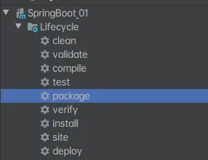

一些场景启动器：

| 名称                                          | 描述                                                                                                     | Pom |
| --------------------------------------------- | -------------------------------------------------------------------------------------------------------- | --- |
| `spring-boot-starter`                         | 核心 starter，包括 auto-configuration 支持，logging 和 YAML                                              | Pom |
| `spring-boot-starter-activemq`                | Starter 使用 Apache ActiveMQ 进行 JMS 消息传递                                                           | Pom |
| `spring-boot-starter-amqp`                    | Starter 用于使用 Spring AMQP 和 Rabbit MQ                                                                | Pom |
| `spring-boot-starter-aop`                     | 使用 Spring AOP 和 AspectJ 进行 aspect-oriented 编程的 Starter                                           | Pom |
| `spring-boot-starter-artemis`                 | Starter 使用 Apache Artemis 进行 JMS 消息传递                                                            | Pom |
| `spring-boot-starter-batch`                   | Starter 使用 Spring Batch                                                                                | Pom |
| `spring-boot-starter-cache`                   | Starter 用于使用 Spring Framework 的缓存支持                                                             | Pom |
| `spring-boot-starter-cloud-connectors`        | Starter 使用 Spring Cloud 连接器简化连接到云平台中的服务，如 Cloud Foundry 和 Heroku                     | Pom |
| `spring-boot-starter-data-cassandra`          | Starter 用于使用 Cassandra 分布式数据库和 Spring Data Cassandra                                          | Pom |
| `spring-boot-starter-data-cassandra-reactive` | Starter 用于使用 Cassandra 分布式数据库和 Spring Data Cassandra Reactive                                 | Pom |
| `spring-boot-starter-data-couchbase`          | Starter 用于使用 Couchbase document-oriented 数据库和 Spring Data Couchbase                              | Pom |
| `spring-boot-starter-data-couchbase-reactive` | Starter 用于使用 Couchbase document-oriented 数据库和 Spring Data Couchbase Reactive                     | Pom |
| `spring-boot-starter-data-elasticsearch`      | Starter 用于使用 Elasticsearch 搜索和分析引擎和 Spring Data Elasticsearch                                | Pom |
| `spring-boot-starter-data-jdbc`               | Starter 使用 Spring Data JDBC                                                                            | Pom |
| `spring-boot-starter-data-jpa`                | Starter 使用 Spring Data JPA 和 Hibernate                                                                | Pom |
| `spring-boot-starter-data-ldap`               | Starter 使用 Spring Data LDAP                                                                            | Pom |
| `spring-boot-starter-data-mongodb`            | Starter 用于使用 MongoDB document-oriented 数据库和 Spring Data MongoDB                                  | Pom |
| `spring-boot-starter-data-mongodb-reactive`   | Starter 用于使用 MongoDB document-oriented 数据库和 Spring Data MongoDB Reactive                         | Pom |
| `spring-boot-starter-data-neo4j`              | Starter 用于使用 Neo4j 图形数据库和 Spring Data Neo4j                                                    | Pom |
| `spring-boot-starter-data-redis`              | Starter 使用 Redis key-value data store 与 Spring Data Redis 和 Lettuce client                           | Pom |
| `spring-boot-starter-data-redis-reactive`     | Starter 用于将 Redis key-value data store 与 Spring Data Redis reactive 和 Lettuce client 一起使用       | Pom |
| `spring-boot-starter-data-rest`               | Starter 使用 Spring Data REST 在 REST 上公开 Spring Data repositories                                    | Pom |
| `spring-boot-starter-data-solr`               | Starter 将 Apache Solr 搜索平台与 Spring Data Solr 一起使用                                              | Pom |
| `spring-boot-starter-freemarker`              | Starter for building MVC web applications 使用 FreeMarker 视图                                           | Pom |
| `spring-boot-starter-groovy-templates`        | Starter for building MVC web applications 使用 Groovy 模板视图                                           | Pom |
| `spring-boot-starter-hateoas`                 | Starter for building hypermedia-based RESTful web application with Spring MVC and Spring HATEOAS         | Pom |
| `spring-boot-starter-integration`             | Starter 使用 Spring Integration                                                                          | Pom |
| `spring-boot-starter-jdbc`                    | Starter 用于将 JDBC 与 HikariCP 连接池一起使用                                                           | Pom |
| `spring-boot-starter-jersey`                  | Starter for building RESTful web applications 使用 JAX-RS 和 Jersey。 spring-boot-starter-web的替代方案  | Pom |
| `spring-boot-starter-jooq`                    | Starter 用于使用 jOOQ 访问 SQL 数据库。 spring-boot-starter-data-jpa或spring-boot-starter-jdbc的替代方案 | Pom |
| `spring-boot-starter-json`                    | Starter 用于读写 json                                                                                    | Pom |
| `spring-boot-starter-jta-atomikos`            | Starter for JTA transactions 使用 Atomikos                                                               | Pom |
| `spring-boot-starter-jta-bitronix`            | Starter for JTA transactions 使用 Bitronix                                                               | Pom |
| `spring-boot-starter-mail`                    | Starter 用于使用 Java Mail 和 Spring Framework 的电子邮件发送支持                                        | Pom |
| `spring-boot-starter-mustache`                | Starter for building web applications 使用 Mustache 视图                                                 | Pom |
| `spring-boot-starter-oauth2-client`           | Starter 使用 Spring Security 的 OAuth2/OpenID Connect client features                                    | Pom |
| `spring-boot-starter-oauth2-resource-server`  | Starter 用于使用 Spring Security 的 OAuth2 资源服务器 features                                           | Pom |
| `spring-boot-starter-quartz`                  | Starter 用于使用 Quartz 调度程序                                                                         | Pom |
| `spring-boot-starter-security`                | Starter 使用 Spring Security                                                                             | Pom |
| `spring-boot-starter-test`                    | Starter 用于测试 Spring Boot applications with libraries，包括 JUnit，Hamcrest 和 Mockito                | Pom |
| `spring-boot-starter-thymeleaf`               | Starter for building MVC web applications 使用 Thymeleaf 视图                                            | Pom |
| `spring-boot-starter-validation`              | Starter 用于使用 Hibernate Validator 进行 Java Bean 验证                                                 | Pom |
| `spring-boot-starter-web`                     | Starter for building web，包括使用 Spring MVC 的 RESTful，applications。使用 Tomcat 作为默认嵌入式容器   | Pom |
| `spring-boot-starter-web-services`            | Starter 使用 Spring Web Services                                                                         | Pom |
| `spring-boot-starter-webflux`                 | Starter for building WebFlux applications 使用 Spring Framework 的 Reactive Web 支持                     | Pom |
| `spring-boot-starter-websocket`               | Starter for building WebSocket applications 使用 Spring Framework 的 WebSocket 支持                      | Pom |


## @SpringBootApplication启动原理

**@SpringBootApplication**

Spring Boot应用标注在某个类上说明这个类是SpringBoot的主配置类，SpringBoot就应该运行这个类的main方法来启动SpringBoot应用

下面是这个注解的内部：组合注解

```java
@Target(ElementType.TYPE)
@Retention(RetentionPolicy.RUNTIME)
@Documented
@Inherited
@SpringBootConfiguration
@EnableAutoConfiguration
@ComponentScan(excludeFilters = { @Filter(type = FilterType.CUSTOM, classes = TypeExcludeFilter.class),
        @Filter(type = FilterType.CUSTOM, classes = AutoConfigurationExcludeFilter.class) })
public @interface SpringBootApplication {
```

**@SpringBootConfiguration：**Spring Boot的配置类；

​    标注在某个类上，表示这是一个Spring Boot的配置类；

这个注解进去后是一个标注了**@Configuration**的类：

配置类上来标注这个注解；配置类 ----- 配置文件；配置类也是容器中的一个组件

```java
@Target(ElementType.TYPE)
@Retention(RetentionPolicy.RUNTIME)
@Documented
@Configuration
public @interface SpringBootConfiguration {
```

**@EnableAutoConfiguration：**开启自动配置功能

```java
@Target(ElementType.TYPE)
@Retention(RetentionPolicy.RUNTIME)
@Documented
@Inherited
@AutoConfigurationPackage
@Import(AutoConfigurationImportSelector.class)
public @interface EnableAutoConfiguration {
```

**@AutoConfigurationPackage：**自动配置包

  **@Import(AutoConfigurationPackages.Registrar.class)：**Spring的底层注解@Import，给容器中导入一个组件；导入的组件由AutoConfigurationPackages.Registrar.class

```java
@Target(ElementType.TYPE)
@Retention(RetentionPolicy.RUNTIME)
@Documented
@Inherited
@Import(AutoConfigurationPackages.Registrar.class)
public @interface AutoConfigurationPackage {
```

内部注册SpringBoot启动器：

```java
static class Registrar implements ImportBeanDefinitionRegistrar, DeterminableImports {
    @Override
    public void registerBeanDefinitions(AnnotationMetadata metadata, BeanDefinitionRegistry registry) {
        register(registry, new PackageImports(metadata).getPackageNames().toArray(new String[0]));
    }
    @Override
    public Set<Object> determineImports(AnnotationMetadata metadata) {
        return Collections.singleton(new PackageImports(metadata));
    }
}
```

通过调试可以看出


再次调试这段：*register(registry, new PackageImports(metadata).getPackageNames().toArray(new String[0]));*

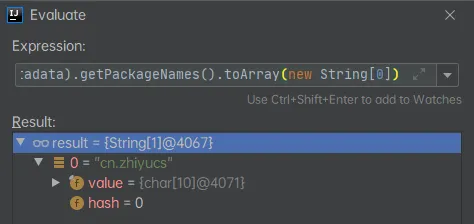

可得出结论：将**主配置类（@SpringBootApplication标注的类）的所在包及下面所有子包里面的所有组件扫描到Spring容器**

再看**EnableAutoConfiguration的****@Import(AutoConfigurationImportSelector.class)**给容器导入组件，将所有需要导入的组件以全类名的方式返回；这些组件就会被添加到容器中；

```java
@Override
public String[] selectImports(AnnotationMetadata annotationMetadata) {
    if (!isEnabled(annotationMetadata)) {
        return NO_IMPORTS;
    }
    AutoConfigurationEntry autoConfigurationEntry = getAutoConfigurationEntry(annotationMetadata);
    return StringUtils.toStringArray(autoConfigurationEntry.getConfigurations());
}
```

通过观察，这个2.0的SpringBoot是跳转到了**getAutoConfigurationEntry**进行了遍历依赖包

通过单步调试可以看到，这个会给容器中导入非常多的自动配置类（xxxAutoConfiguration）；就是给容器中导入这个场景需要的所有组件，并配置好这些组件；自动配置类

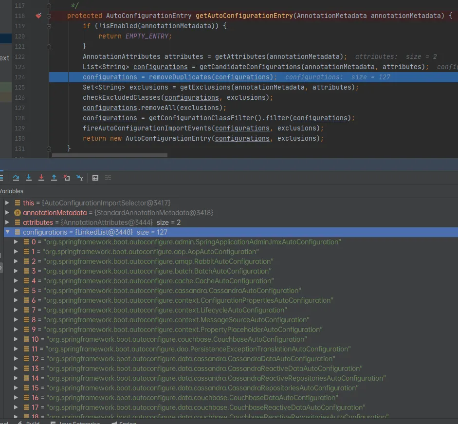


可以观察到这个查到包的调用方式：getCandidateConfigurations

```java
protected AutoConfigurationEntry getAutoConfigurationEntry(AnnotationMetadata annotationMetadata) {
    if (!isEnabled(annotationMetadata)) {
        return EMPTY_ENTRY;
    }
    AnnotationAttributes attributes = getAttributes(annotationMetadata);
    List<String> configurations = getCandidateConfigurations(annotationMetadata, attributes);
    configurations = removeDuplicates(configurations);
    Set<String> exclusions = getExclusions(annotationMetadata, attributes);
    checkExcludedClasses(configurations, exclusions);
    configurations.removeAll(exclusions);
    configurations = getConfigurationClassFilter().filter(configurations);
    fireAutoConfigurationImportEvents(configurations, exclusions);
    return new AutoConfigurationEntry(configurations, exclusions);
}
```

通过调用getSpringFactoriesLoaderFactoryClass

```java
protected List<String> getCandidateConfigurations(AnnotationMetadata metadata, AnnotationAttributes attributes) {
    List<String> configurations = SpringFactoriesLoader.loadFactoryNames(getSpringFactoriesLoaderFactoryClass(),
                                                                         getBeanClassLoader());
    Assert.notEmpty(configurations, "No auto configuration classes found in META-INF/spring.factories. If you "
                    + "are using a custom packaging, make sure that file is correct.");
    return configurations;
}
```

这个方法中：loadFactoryNames就是对这个SpringBoot依赖包进行加载（把得到的properties添加到容器中进行加载）


这个**FACTORIES_RESOURCE_LOCATION**静态变量也标识了这些**包的路径位置**：

```java
public static final String FACTORIES_RESOURCE_LOCATION = "META-INF/spring.factories";
```

仔细看，还真是。SpringBoot将这些值作为自动配置类导入到容器中，自动配置类就生效

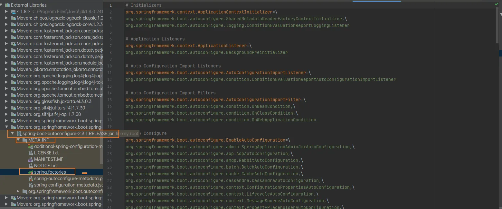

**小结**

将META-INF/spring.factories里面配置的所有通过EnableAutoConfiguration加入到容器中


## IDEA 快速构建

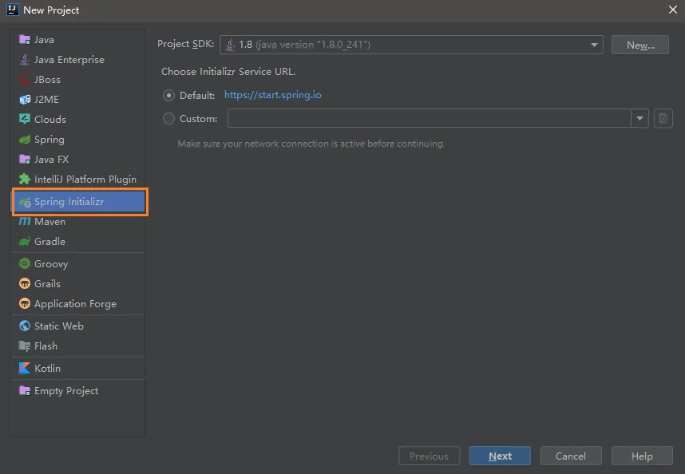

默认生成的Spring Boot项目结果

resources文件夹中目录结构

- **static**：保存所有的静态资源； js css images；
- 
- **templates**：保存所有的模板页面；（Spring Boot默认jar包使用嵌入式的Tomcat，默认不支持JSP页面）；可以使用模板引擎（freemarker、thymeleaf）；
- **application.properties**：Spring Boot应用的配置文件；可以修改一些默认设置；


## YAML

XML和YAML区别：

XML：

 

```
<server>
    <port>8080</port>
</server>
```

YAML:

 

```
server:
  port: 8080
```

### YAML基本语法

写法：Key:(空格)Value

其他数组、对象语法可以阅读：https://juejin.im/post/5c1a4a0fe51d45344a1c3d2a

将YAML的配置的属性映射到实体类中**@ConfigurationProperties**对实体类的配置进行绑定

**prefix：**配置用哪个进行绑定

在YAML可以配置这样一个案例：

```yaml
server:
  port: 8080
person:
  lastName: 张三
  age: 18
  isBoss: true
  birthday: 2020/2/2
  map: {k1: 12,k2: 13}
  list:
    - lisi
    - zhaoliu
  dog:
    name: 小狗
    age: 2
```

可以创建一个实体类进行绑定测试：

```java
@Component
@ConfigurationProperties(prefix = "person")
public class Person {
    private String lastName;
    private Integer age;
    private Boolean isBoss;
    private Date birthday;
    private Map<String, Object> map;
    private List<Object> list;
    private Dog dog;
```

如果使用ConfigurationProperties出现以下错误：


解决方案：导入配置文件处理器

```xml
<dependency>
    <groupId>org.springframework.boot</groupId>
    <artifactId>spring-boot-configuration-processor</artifactId>
    <optional>true</optional>
</dependency>
```

注意：这里必须使用**@Component**把它加入到容器中，就像**@Repository**一样才能使用

测试结果：

```json
Person{lastName='张三', age=18, isBoss=null, birthday=Sun Feb 02 00:00:00 CST 2020, map={k1=12, k2=13}, list=[lisi, zhaoliu], dog=Dog{name='小狗', age=2}}
```


## 单元测试

注：测试类和主类要包名要统一才能启动

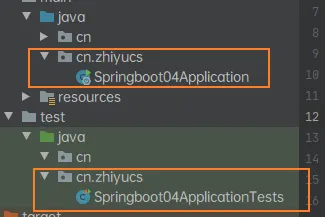

**使用SSM和使用SpringBoot的Test功能的对比**

### SSM 

```java
//@RunWith 指定用哪种驱动进行单元测试，默认是junit
@RunWith(SpringJUnit4ClassRunner.class)
@ContextConfiguration(locations = "classpath:applicationContext.xml") //指定配置文件
public class SpringTest {
    ApplicationContext ioc = null;
    @Autowired
    private BookServlet bookServlet;
    @Test
    public void test() {
        bookServlet.doGet();
    }
}
```

### SpringBoot

```java
@SpringBootTest
class Springboot02ApplicationTests {
    @Autowired
    Person person;
    @Test
    void contextLoads() {
        System.out.println(person);
    }
}
```

如果要使用RunWith需要进入Maven删除exclusions

```xml
<dependency>
    <groupId>org.springframework.boot</groupId>
    <artifactId>spring-boot-starter-test</artifactId>
    <scope>test</scope>
    <exclusions>
        <exclusion>
            <groupId>org.junit.vintage</groupId>
            <artifactId>junit-vintage-engine</artifactId>
        </exclusion>
    </exclusions>
</dependency>
```

就可以使用Runnwith测试啦：

```java
@RunWith(SpringRunner.class)
@SpringBootTest
class Springboot02ApplicationTests {
    @Autowired
    Person person;
    @Test
    void contextLoads() {
        System.out.println(person);
    }
}
```


## @ConfigurationProperties&@Value

|                         | @ConfigurationProperties | @Value     |
| ----------------------- | ------------------------ | ---------- |
| 功能                    | 批量注入配置文件中的属性 | 一个个指定 |
| 松散绑定（松散语法“-”） | 支持                     | 不支持     |
| SpEL                    | 不支持                   | 支持       |
| JSR303数据校验          | 支持                     | 不支持     |
| 复杂类型封装            | 支持                     | 不支持     |

**@Value**测试的实体类：

```java
@Component
//@ConfigurationProperties(prefix = "person")
public class Person {
    @Value("zhiyu")
    private String lastName;
    @Value("#{2*10}")
    private Integer age;
    @Value("true")
    private Boolean isBoss;
    private Date birthday;
```

测试结果：

```json
Person{lastName='zhiyu', age=20, isBoss=true, birthday=null, map=null, list=null, dog=null}
```


## @PropertySource&@ImportResource

**@PropertySource**：加载指定的配置文件

**注：**加载配置文件时需要配置**@ConfigurationProperties(prefix = "")**使用

使用案例：

YAML文件中只有端口：

```yaml
server:
  port: 8080
```

在类路径下创建一个配置文件：person.properties

```properties
person.lastName=李四
person.age=18
person.isBoss=true
person.birthday=2020/2/2
person.map.k1=12
person.map.k2=13
person.list=a,b
person.dog.name=小狗
person.dog.age=2
```

在实体类中使用即可：

```java
@PropertySource("classpath:person.properties")
@Component
@ConfigurationProperties(prefix = "person")
public class Person {
```

测试结果：

```json
Person{lastName='李四', age=18, isBoss=null, birthday=Sun Feb 02 00:00:00 CST 2020, map={k2=13, k1=12}, list=[a, b], dog=Dog{name='小狗', age=2}}
```

**@ImportResource** 导入自定义的Spring文件

创建一个配置文件导入一个自定义的bean

```java
public class HelloService {
}
```

创建一个spring配置文件：beans.xml，加入这个类

```xml
<bean class="cn.zhiyucs.servcie.HelloService" id="helloService"></bean>
```

在入口加入这个注解导入这个spring文件：

```java
@ImportResource(locations = {"classpath:beans.xml"})
@SpringBootApplication
public class Springboot02Application {
```

测试即可：

```java
@Autowired
ApplicationContext ioc;
@Test
void containServiceTest() {
    boolean b = ioc.containsBean("helloService");
    System.out.println(b);
}
// 结果：true
```

当然这是不推荐的，SpringBoot推荐的方式如下：

### 【推荐】自己创建个配置类

使用**@Configuration**指定这是一个配置类

使用**@Bean**把这个返回值加入到容器中，ID就是这个方法的方法名。

```java
@Configuration
public class TestConfig {
    @Bean
    public HelloService helloService() {
        return new HelloService();
    }
}
```


### 配置文件的占位符

在配置文件可以使用${} 取值random

```properties
person.lastName=${random.uuid}
person.age=${random.int}
person.isBoss=true
person.birthday=2020/2/2
person.map.k1=12
person.map.k2=13
person.list=a,b
person.dog.name=${person.last-name}_dog
person.dog.age=2
```

 

```json
Person{lastName='20b50b74-4721-4d80-a786-f0e726b195f3', age=-790018533, isBoss=null, birthday=Sun Feb 02 00:00:00 CST 2020, map={k2=13, k1=12}, list=[a, b], dog=Dog{name='6a1ab7a2-c65c-4df5-be46-3614ef009efd_dog', age=2}}
```


### 多Profile支持

在编写配置文件的时候，文件名可以是，application-{profile}.yml/properties

两种激活方式：创建两个环境 -- 开发/生产

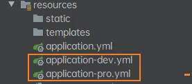

application中写激活哪个：

```yaml
server:
  port: 8080
spring:
  profiles:
    active: dev
```

其他就写生产/开发环境的配置

```yaml
server:
  port: 8080
```

也可以直接都写在一个配置中

```yaml
server:
  port: 8080
spring:
  profiles:
    active: dev
    
---
server:
  port: 80
spring:
  profiles: pro
  
---
server:
  port: 8080
spring:
  profiles: dev
```

还可以使用命令行的方式更换环境

java -jar 包名 --spring.profiles.active=dev/pro

还可以使用IDEA的虚拟环境激活


## 加载配置文件的位置和优先级

测试**类路径下**（port:8080）和**类路径的config**文件夹下（port:8081）：

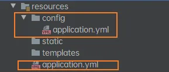


前两个同时存在，再把一个端口为8083的文件放在**根目录下**：

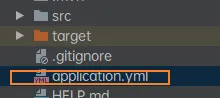


前三个同时存在，把这个文件放到**根目录下的config**（端口为8084）：


**小结**:优先级由高到低
-file:./config > -file:./ > -classpath:/config/ > -classpath:/
SpringBoot这四个位置的配置文件都会加载
并且会互补配置

**测试：使用最低级的配置文件配置路径**

```yaml
server:
  servlet:
    context-path: /admin
```


**运维配置**
还可以使用命令行：
java -jar 包名 --spring.config.location=指定配置文件绝对路径


## 自动配置原理

[在YML/Properties能配置的属性](https://www.docs4dev.com/docs/zh/spring-boot/2.1.1.RELEASE/reference/common-application-properties.html#a-common-application-properties)

### 自动配置原理

SpringBoot启动的时候加载主配置类**@SpringBootApplication**，开启了自动配置功能**@EnableAutoConfiguration**

```java
@SpringBootApplication
public class SpringbootAutoconfigApplication {
```

```java
@Target(ElementType.TYPE)
@Retention(RetentionPolicy.RUNTIME)
@Documented
@Inherited
@SpringBootConfiguration
@EnableAutoConfiguration
@ComponentScan(excludeFilters = { @Filter(type = FilterType.CUSTOM, classes = TypeExcludeFilter.class),
        @Filter(type = FilterType.CUSTOM, classes = AutoConfigurationExcludeFilter.class) })
public @interface SpringBootApplication {
```

[@EnableAutoConfiguration的作用](wiz://open_document?guid=62a96d1e-af78-4e7c-92d5-9a06b8beedf8&kbguid=&private_kbguid=51ed7a20-5f58-11ea-ac04-65f1a2b61811)

### 以HttpEncodingAutoConfiguration为例解释自动配置原理

```java
@Configuration(proxyBeanMethods = false)
@EnableConfigurationProperties(ServerProperties.class)
@ConditionalOnWebApplication(type = ConditionalOnWebApplication.Type.SERVLET)
@ConditionalOnClass(CharacterEncodingFilter.class)
@ConditionalOnProperty(prefix = "server.servlet.encoding", value = "enabled", matchIfMissing = true)
public class HttpEncodingAutoConfiguration {
```

**@Configuration**：配置类（相当于配置文件）

**@EnableConfigurationProperties**：启用[ConfigurationProperties](wiz://open_document?guid=5294ee2c-1921-4f6e-a62d-cd516a7f3bb2&kbguid=&private_kbguid=51ed7a20-5f58-11ea-ac04-65f1a2b61811)（从配置文件中获取值和bean的属性进行绑定）功能（ServerProperties）

```java
@ConfigurationProperties(prefix = "server", ignoreUnknownFields = true)
public class ServerProperties {
    /**
     * Server HTTP port.
     */
    private Integer port;
```

相当于把server的属性绑定到这个ServerProperties类中的属性（比如我们熟悉的port）

**@ConditionalOnWebApplication**：根据不同的条件，如果满足指定的条件，整个配置类的配置才会生效

**@ConditionalOnClass**：判断当前项目有无这个类（CharacterEncodingFilter）

**@ConditionalOnProperty**：“判断文件是否存在这个配置

**@Bean**给容器添加组件

```java
//和SpringBoot的值映射
private final Encoding properties;
//只有一个有参构造器情况，参数从容器中拿
public HttpEncodingAutoConfiguration(ServerProperties properties) {
    this.properties = properties.getServlet().getEncoding();
}
// 给容器添加组件，这个组件从properties获取
@Bean
@ConditionalOnMissingBean
public CharacterEncodingFilter characterEncodingFilter() {
    CharacterEncodingFilter filter = new OrderedCharacterEncodingFilter();
    filter.setEncoding(this.properties.getCharset().name());
    filter.setForceRequestEncoding(this.properties.shouldForce(Encoding.Type.REQUEST));
    filter.setForceResponseEncoding(this.properties.shouldForce(Encoding.Type.RESPONSE));
    return filter;
}
```

这一系列下来相当于可以实现

这个方法在**ServerProperties**中，而自动配置实现了**@EnableConfigurationProperties(ServerProperties.class)**

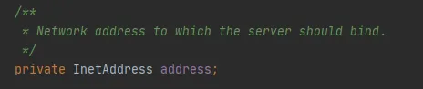

主配置文件就可以写

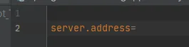

### 小结

SpringBoot 启动的时候加载主配置类，开启了自动配置功能 @EnableAutoConfiguration 。

@EnableAutoConfiguration 给容器导入META-INF/spring.factories 里定义的自动配置类。

筛选有效的自动配置类。

每一个自动配置类结合对应的 xxxProperties.java 读取配置文件进行自动配置功能 。

- `xxxAutoConfiguration`：自动配置类给容器中添加组件。
- `xxxProperties`：封装配置文件中相关属性。


## @Conditional相关注解和Debug

@ConditionalOnBean:仅仅在当前上下文中存在某个对象时，才会实例化一个Bean
@ConditionalOnClass:某个class位于类路径上才会实例化一个Bean
@ConditionalOnExpression:当表达式为true的时候，才会实例化一个Bean
@ConditionalOnMissingBean:仅仅在当前上下文中不存在某个对象时，才会实例化一个Bean
@ConditionalOnMissingClass:某个class不位于类路径上才会实例化一个Bean
@ConditionalOnNotWebApplication:不是web应用


开启SpringBoot debug查看使用了哪些配置类


以及没有启动的

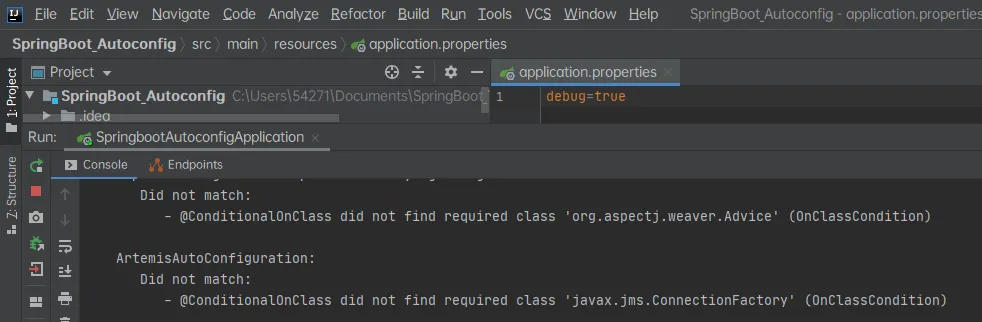


## 日志框架SL4J

SL4J的几种实现方式：


### 其他日志框架转换为SL4J

**SpringBoot（sl4j+lockbcak）**

Spring（commons-logging）

Hibernate（jboss-logging）

转换方式如下：

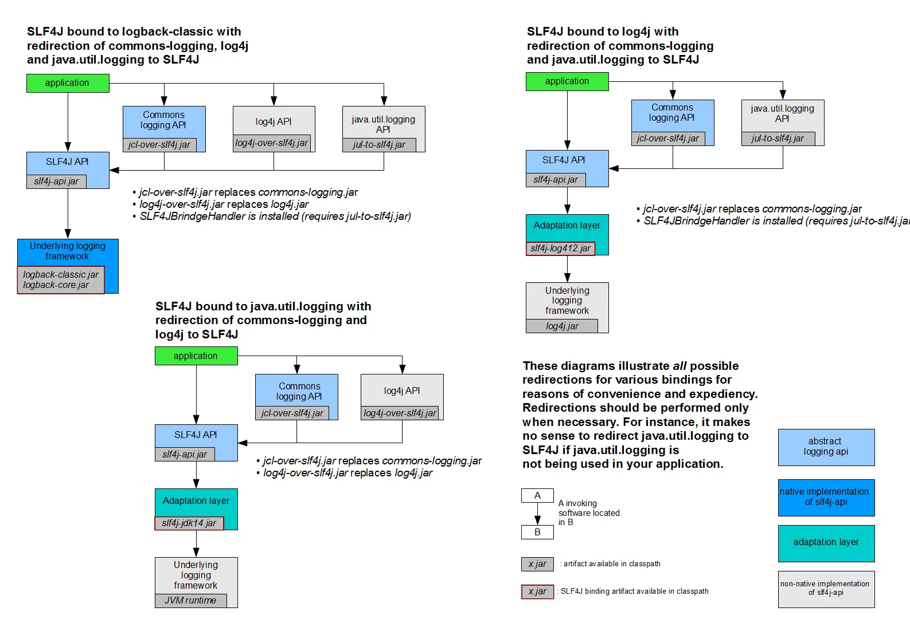


### SpringBoot和日志关系

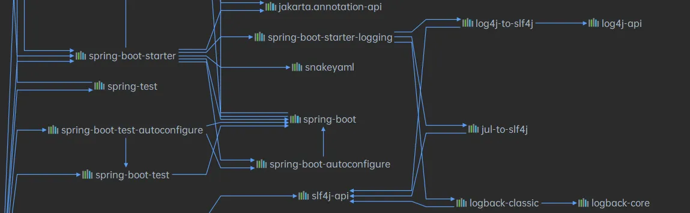

SpringBoot使用spring-boot-starter-logging来记录日志

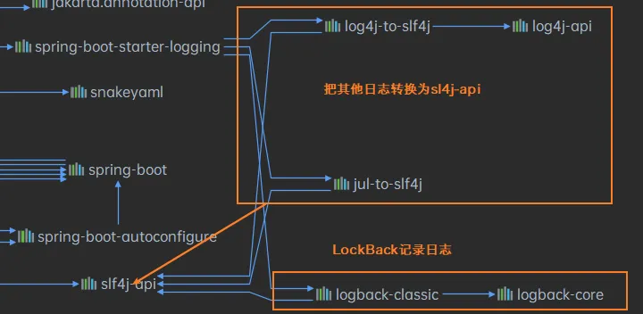

### 日志的配置

路径的配置：

```properties
# 不指定路径当前项目下生成springboot.log日志
#logging.file.name=springboot.log
# 在当前磁盘根路径下创建spring文件夹和里面的log文件，使用spring.log作为默认文件
logging.file.path=/springLog/log
```


日志输出格式控制：

- 日志输出格式：
- %d表示日期时间，
- %thread表示线程名，
- %-5level：级别从左显示5个字符宽度
- %logger{50} 表示logger名字最长50个字符，否则按照句点分割。
- %msg：日志消息，
- %n是换行符

```
# 在控制台输出的日志格式
logging.pattern.console=%d{yyyy-MM-dd} [%thread] %-5level %logger{50} - %msg%n
# 指定文件中日志的输出格式
logging.pattern.file=%d{yyyy-MM-dd} === [%thread] === %-5level === %logger{50} ==== %msg%n
输出结果：
2020-07-18 === [main] === INFO  === cn.zhiyucs.Springboot04ApplicationTests ==== Starting Springboot04ApplicationTests on DESKTOP-J83JFON with PID 3092 (started by 54271 in C:\Users\54271\Documents\SpringBoot_Twice\springboot_04)
2020-07-18 === [main] === DEBUG === cn.zhiyucs.Springboot04ApplicationTests ==== Running with Spring Boot v2.3.1.RELEASE, Spring v5.2.7.RELEASE
2020-07-18 === [main] === INFO  === cn.zhiyucs.Springboot04ApplicationTests ==== No active profile set, falling back to default profiles: default
2020-07-18 === [main] === INFO  === o.s.scheduling.concurrent.ThreadPoolTaskExecutor ==== Initializing ExecutorService 'applicationTaskExecutor'
2020-07-18 === [main] === INFO  === cn.zhiyucs.Springboot04ApplicationTests ==== Started Springboot04ApplicationTests in 1.893 seconds (JVM running for 2.966)
2020-07-18 === [main] === TRACE === cn.zhiyucs.Springboot04ApplicationTests ==== 这是跟踪日志
2020-07-18 === [main] === DEBUG === cn.zhiyucs.Springboot04ApplicationTests ==== 这是调试日志
2020-07-18 === [main] === INFO  === cn.zhiyucs.Springboot04ApplicationTests ==== 这是信息日志
2020-07-18 === [main] === WARN  === cn.zhiyucs.Springboot04ApplicationTests ==== 这是警告日志
2020-07-18 === [main] === ERROR === cn.zhiyucs.Springboot04ApplicationTests ==== 这是错误日志
2020-07-18 === [SpringContextShutdownHook] === INFO  === o.s.scheduling.concurrent.ThreadPoolTaskExecutor ==== Shutting down ExecutorService 'applicationTaskExecutor'
```


### 指定日志框架

在类路径下直接指定：logback.xml logback-spring.xml log4j2-spring.xml log4j2.xml

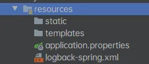

logback.xml：直接被日志框架识别

logback-spring.xml：可以使用SpringBoot日志的Profile的高级功能

 

```
<layout class="ch.qos.logback.classic.PatternLayout">
    <springProfile name="dev">
        <pattern>%d{yyyy-MM-dd HH:mm:ss.SSS} ----> [%thread] ---> %-5level %logger{50} - %msg%n</pattern>
    </springProfile>
    <springProfile name="!dev">
        <pattern>%d{yyyy-MM-dd HH:mm:ss.SSS} ==== [%thread] ==== %-5level %logger{50} - %msg%n</pattern>
    </springProfile>
</layout>
```

### 切换日志框架

直接在Maven的exclude即可


## 静态资源映射规则

```java
@Override
public void addResourceHandlers(ResourceHandlerRegistry registry) {
    if (!this.resourceProperties.isAddMappings()) {
        logger.debug("Default resource handling disabled");
        return;
    }
    Duration cachePeriod = this.resourceProperties.getCache().getPeriod();
    CacheControl cacheControl = this.resourceProperties.getCache().getCachecontrol().toHttpCacheControl();
    if (!registry.hasMappingForPattern("/webjars/**")) {
        customizeResourceHandlerRegistration(registry.addResourceHandler("/webjars/**")
                                             .addResourceLocations("classpath:/META-INF/resources/webjars/")
                                             .setCachePeriod(getSeconds(cachePeriod)).setCacheControl(cacheControl));
    }
    String staticPathPattern = this.mvcProperties.getStaticPathPattern();
    if (!registry.hasMappingForPattern(staticPathPattern)) {
        customizeResourceHandlerRegistration(registry.addResourceHandler(staticPathPattern)
                                             .addResourceLocations(getResourceLocations(this.resourceProperties.getStaticLocations()))
                                             .setCachePeriod(getSeconds(cachePeriod)).setCacheControl(cacheControl));
    }
}
```

1. WebJar+Maven方式加载静态资源

**registry.hasMappingForPattern("/webjars/\**)**

去[WebJars](https://www.webjars.org/)以jars的方式获取静态资源 如：jquery

```xml
<dependency>
    <groupId>org.webjars</groupId>
    <artifactId>jquery</artifactId>
    <version>3.5.1</version>
</dependency>
```


路径是在：org\webjars\jquery\3.5.1\jquery-3.5.1.jar!\META-INF\resources\webjars\jquery\3.5.1\jquery.js
网页访问路径：http://localhost:8080/webjars/jquery/3.5.1/jquery.js


2. 可以设置静态资源的有关参数：（ResourceProperties.class）

 

```java
@ConfigurationProperties(prefix = "spring.resources", ignoreUnknownFields = false)
public class ResourceProperties {
    private static final String[] CLASSPATH_RESOURCE_LOCATIONS = { "classpath:/META-INF/resources/",
                                                                  "classpath:/resources/", "classpath:/static/", "classpath:/public/" };
```

3. 访问当前项目的任何资源

```
"/",
"classpath:/META-INF/resources/",
"classpath:/resources/", 
"classpath:/static/", 
"classpath:/public/"
```

例如添加一个资源包：


**网页访问路径：http://localhost:8080/asserts/js/Chart.min.js**

4. 欢迎页的加载方式：也在WebMvcAutoConfiguration这个类中

```java
@Bean
public WelcomePageHandlerMapping welcomePageHandlerMapping(ApplicationContext applicationContext,
                                                           FormattingConversionService mvcConversionService, ResourceUrlProvider mvcResourceUrlProvider) {
    WelcomePageHandlerMapping welcomePageHandlerMapping = new WelcomePageHandlerMapping(
        new TemplateAvailabilityProviders(applicationContext), applicationContext, getWelcomePage(),
        this.mvcProperties.getStaticPathPattern());
    welcomePageHandlerMapping.setInterceptors(getInterceptors(mvcConversionService, mvcResourceUrlProvider));
    welcomePageHandlerMapping.setCorsConfigurations(getCorsConfigurations());
    return welcomePageHandlerMapping;
}
```

通过查看getWelcomePage方法就可以看出是**加载静态资源的index.html**

```java
private Optional<Resource> getWelcomePage() {
    String[] locations = getResourceLocations(this.resourceProperties.getStaticLocations());
    return Arrays.stream(locations).map(this::getIndexHtml).filter(this::isReadable).findFirst();
}
private Resource getIndexHtml(String location) {
    return this.resourceLoader.getResource(location + "index.html");
}
```


## 模板引擎Thymeleaf

整合SpringBoot

```xml
<dependency>
    <groupId>org.springframework.boot</groupId>
    <artifactId>spring-boot-starter-thymeleaf</artifactId>
</dependency>
```

Thymeleaf的默认配置

```java
@ConfigurationProperties(prefix = "spring.thymeleaf")
public class ThymeleafProperties {
    private static final Charset DEFAULT_ENCODING = StandardCharsets.UTF_8;
    public static final String DEFAULT_PREFIX = "classpath:/templates/";
    public static final String DEFAULT_SUFFIX = ".html";
```

**注：**Controller中的@RequestMapping("/su")不能和return"xx"重复

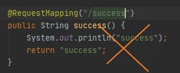


## SpringMVC自动配置原理

[文档参考：SpringMVC](https://www.docs4dev.com/docs/zh/spring-boot/2.1.1.RELEASE/reference/boot-features-developing-web-applications.html#developing-web-applications)

### 默认配置

auto-configuration 在 Spring 的默认值之上添加以下 features：

- 包含`ContentNegotiatingViewResolver`和`BeanNameViewResolver` beans（视图解析器，根据返回值视图对象（View），然后可以进行渲染（转发/重定向））。

- 支持提供静态资源，包括对 WebJars 的支持

- 自动注册`Converter`，`GenericConverter`和`Formatter` beans

- - 转换器 HttpMessageConverters
  - 格式化器

- 支持`HttpMessageConverters 转换 HTTP 请求和响应`

- 自动注册`MessageCodesResolver 定义错误代码的生成规则`

- 静态`index.html`支持。

- 自定义`Favicon`支持

### ContentNegotiatingViewResolver

首先是**ContentNegotiatingViewResolver**：组合所有的视图解析器

```java
@Bean
@ConditionalOnBean(ViewResolver.class)
@ConditionalOnMissingBean(name = "viewResolver", value = ContentNegotiatingViewResolver.class)
public ContentNegotiatingViewResolver viewResolver(BeanFactory beanFactory) {
    ContentNegotiatingViewResolver resolver = new ContentNegotiatingViewResolver();
    resolver.setContentNegotiationManager(beanFactory.getBean(ContentNegotiationManager.class));
    // ContentNegotiatingViewResolver uses all the other view resolvers to locate
    // a view so it should have a high precedence
    resolver.setOrder(Ordered.HIGHEST_PRECEDENCE);
    return resolver;
}
```

在ContentNegotiatingViewResolver中通过resolveViewName解析视图

```java
@Override
@Nullable
public View resolveViewName(String viewName, Locale locale) throws Exception {
    RequestAttributes attrs = RequestContextHolder.getRequestAttributes();
    Assert.state(attrs instanceof ServletRequestAttributes, "No current ServletRequestAttributes");
    List<MediaType> requestedMediaTypes = getMediaTypes(((ServletRequestAttributes) attrs).getRequest());
    if (requestedMediaTypes != null) {
        List<View> candidateViews = getCandidateViews(viewName, locale, requestedMediaTypes);
        View bestView = getBestView(candidateViews, requestedMediaTypes, attrs);
        if (bestView != null) {
            return bestView;
        }
    }
```

通过getCandidateViews进行遍历每个解析

```java
private List<View> getCandidateViews(String viewName, Locale locale, List<MediaType> requestedMediaTypes)
    throws Exception {
    List<View> candidateViews = new ArrayList<>();
    if (this.viewResolvers != null) {
        Assert.state(this.contentNegotiationManager != null, "No ContentNegotiationManager set");
        for (ViewResolver viewResolver : this.viewResolvers) {
            View view = viewResolver.resolveViewName(viewName, locale);
            if (view != null) {
                candidateViews.add(view);
            }
            for (MediaType requestedMediaType : requestedMediaTypes) {
                List<String> extensions = this.contentNegotiationManager.resolveFileExtensions(requestedMediaType);
                for (String extension : extensions) {
                    String viewNameWithExtension = viewName + '.' + extension;
                    view = viewResolver.resolveViewName(viewNameWithExtension, locale);
                    if (view != null) {
                        candidateViews.add(view);
                    }
```

然后组合起来**ContentNegotiatingViewResolver**通过initServletContext的beansOfTypeIncludingAncestors

```java
@Override
protected void initServletContext(ServletContext servletContext) {
    Collection<ViewResolver> matchingBeans =
        BeanFactoryUtils.beansOfTypeIncludingAncestors(obtainApplicationContext(), ViewResolver.class).values();
```

测试并调试：在主类创建一个视图解析器进行测试：

```java
@SpringBootApplication
public class SpringbootCrudApplication {
    public static void main(String[] args) {
        SpringApplication.run(SpringbootCrudApplication.class, args);
    }
    @Bean
    public ViewResolver myViewResovler() {
        return new MyViewResolver();
    }
    private static class MyViewResolver implements ViewResolver {
        @Override
        public View resolveViewName(String viewName, Locale locale) throws Exception {
            return null;
        }
    }
}
```

在doDispatch进行调试：即可看见


### HttpMessageConverters

Spring MVC 使用`HttpMessageConverter`接口转换 HTTP 请求和响应。

这个组件是从容器中确定的（WebMvcAutoConfiguration.class）：

 

```
public WebMvcAutoConfigurationAdapter(ResourceProperties resourceProperties, WebMvcProperties mvcProperties,
                                      ListableBeanFactory beanFactory, ObjectProvider<HttpMessageConverters> messageConvertersProvider,
                                      ObjectProvider<ResourceHandlerRegistrationCustomizer> resourceHandlerRegistrationCustomizerProvider,
                                      ObjectProvider<DispatcherServletPath> dispatcherServletPath) {
    this.resourceProperties = resourceProperties;
    this.mvcProperties = mvcProperties;
    this.beanFactory = beanFactory;
    this.messageConvertersProvider = messageConvertersProvider;
    this.resourceHandlerRegistrationCustomizer = resourceHandlerRegistrationCustomizerProvider.getIfAvailable();
    this.dispatcherServletPath = dispatcherServletPath;
}
```

从构造函数就可以看出这个类是获取了所有的HttpMessageConverter

 

```
public HttpMessageConverters(HttpMessageConverter<?>... additionalConverters) {
    this(Arrays.asList(additionalConverters));
}
```

可知只要自定义Converter就可以像上面视图解析器一样放容器即可

### MessageCodesResolver

这个是用于定义错误代码的生成规则的，如（WebMvcAutoConfiguration.class）：

```java
@Override
public MessageCodesResolver getMessageCodesResolver() {
    if (this.mvcProperties.getMessageCodesResolverFormat() != null) {
        DefaultMessageCodesResolver resolver = new DefaultMessageCodesResolver();
        resolver.setMessageCodeFormatter(this.mvcProperties.getMessageCodesResolverFormat());
        return resolver;
    }
    return null;
}
```

通过查看getMessageCodesResolverFormat（）

```java
/**
     * Formatting strategy for message codes. For instance, `PREFIX_ERROR_CODE`.
     */
private DefaultMessageCodesResolver.Format messageCodesResolverFormat;
```

通过观察注释可以看到错误代码的定义：

```java
public enum Format implements MessageCodeFormatter {
    /**
         * Prefix the error code at the beginning of the generated message code. e.g.:
         * {@code errorCode + "." + object name + "." + field}
         */
    PREFIX_ERROR_CODE {
        @Override
        public String format(String errorCode, @Nullable String objectName, @Nullable String field) {
            return toDelimitedString(errorCode, objectName, field);
        }
    },
    /**
         * Postfix the error code at the end of the generated message code. e.g.:
         * {@code object name + "." + field + "." + errorCode}
         */
    POSTFIX_ERROR_CODE {
        @Override
        public String format(String errorCode, @Nullable String objectName, @Nullable String field) {
            return toDelimitedString(objectName, field, errorCode);
        }
    };
```

### SpringBoot在SpringMVC的配置模式

以HiddenHttpMethodFilter为例：Spring在自动配置很多组件的时候，先看容器是否么有自己配置的（@Bean @Component）如果有就用用户配置的（如hiddenHttpMethodFilter），如果没有才自动配置，如果可以有多个（ViewResolver）将用户配置和自己默认组合一起

```java
@Bean
@ConditionalOnMissingBean(HiddenHttpMethodFilter.class)
@ConditionalOnProperty(prefix = "spring.mvc.hiddenmethod.filter", name = "enabled", matchIfMissing = false)
public OrderedHiddenHttpMethodFilter hiddenHttpMethodFilter() {
    return new OrderedHiddenHttpMethodFilter();
}
```

### 接管SpringBoot的SpringMVC

使用WebMvcConfigurer的接口可以扩展SpringMVC

```java
@Configuration
public class MyMvcConfig implements WebMvcConfigurer {
```

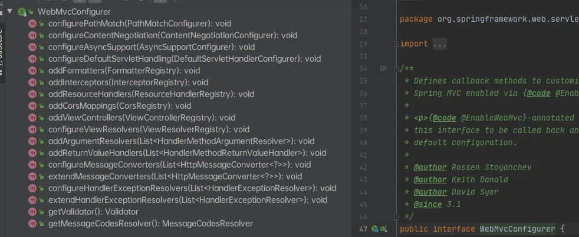

比如使用SpringMVC的Controller：

```java
@Configuration
public class MyMvcConfig implements WebMvcConfigurer {
    @Override
    public void addViewControllers(ViewControllerRegistry registry) {
        registry.addViewController("/hello")
                .setViewName("success");
    }
}
```

分析这个WebMvcAutoConfigurationAdapter（WebMvcAutoConfiguration.class）,查看这个Import(EnableWebMvcConfiguration.class)

```java
@Configuration(proxyBeanMethods = false)
@Import(EnableWebMvcConfiguration.class)
@EnableConfigurationProperties({ WebMvcProperties.class, ResourceProperties.class })
@Order(0)
public static class WebMvcAutoConfigurationAdapter implements WebMvcConfigurer {
```

 

```java
@Configuration(proxyBeanMethods = false)
public static class EnableWebMvcConfiguration extends DelegatingWebMvcConfiguration implements ResourceLoaderAware {
```

在它的父类DelegatingWebMvcConfiguration中，setConfigurers通过addWebMvcConfigurers从容器中获取所有的WebMvcConfigure

```java
@Autowired(required = false)
public void setConfigurers(List<WebMvcConfigurer> configurers) {
    if (!CollectionUtils.isEmpty(configurers)) {
        this.configurers.addWebMvcConfigurers(configurers);
    }
}
```

当然，下面也有很多方法：

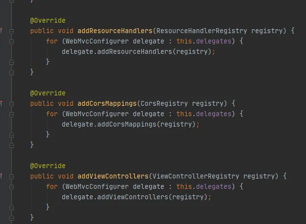


以addViewControllers为例:

```java
@Override
public void addViewControllers(ViewControllerRegistry registry) {
    for (WebMvcConfigurer delegate : this.delegates) {
        delegate.addViewControllers(registry);
    }
}
```

### 小结：

1. 实现了WebMvcConfigurer接口，SpringBoot就会将这个一起实现，如刚刚MyMvcConfig

2. DelegatingWebMvcConfiguration（也就是是实现了WebMvcConfigurer），SpringBoot会扫描整个能使用的Configurer到SpringMVC，然后就能使用SpringMVC的功能啦（setConfigurers -- addWebMvcConfigurers）

【不推荐】*全面接管SpringMVC*：自己配SpringMVC@EnableWebMvc

```java
@EnableWebMvc
@Configuration
public class MyMvcConfig implements WebMvcConfigurer {
    @Override
    public void addViewControllers(ViewControllerRegistry registry) {
        registry.addViewController("/hello")
                .setViewName("success");
    }
}
```

这个的核心就是 -- DelegatingWebMvcConfiguration

```java
@Retention(RetentionPolicy.RUNTIME)
@Target(ElementType.TYPE)
@Documented
@Import(DelegatingWebMvcConfiguration.class)
public @interface EnableWebMvc {
}
```

也是组合自己写的Configurer

```java
@Autowired(required = false)
public void setConfigurers(List<WebMvcConfigurer> configurers) {
    if (!CollectionUtils.isEmpty(configurers)) {
        this.configurers.addWebMvcConfigurers(configurers);
    }
}
```

【重点小结】在**DelegatingWebMvcConfiguration**中与**WebMvcAutoConfiguration**（**@ConditionalOnMissingBean**）比较可知：容器中没有这个组件的时候，这个自动配置类才生效，如果我们使用**@EnableWebMvc**，这个自动配置类就不会生效。

```java
@Configuration(proxyBeanMethods = false)
public class DelegatingWebMvcConfiguration extends WebMvcConfigurationSupport {
```

```java
@Configuration(proxyBeanMethods = false)
@ConditionalOnWebApplication(type = Type.SERVLET)
@ConditionalOnClass({ Servlet.class, DispatcherServlet.class, WebMvcConfigurer.class })
@ConditionalOnMissingBean(WebMvcConfigurationSupport.class)
@AutoConfigureOrder(Ordered.HIGHEST_PRECEDENCE + 10)
@AutoConfigureAfter({ DispatcherServletAutoConfiguration.class, TaskExecutionAutoConfiguration.class,
                     ValidationAutoConfiguration.class })
public class WebMvcAutoConfiguration {
```


## 国际化

创建国际化文件
中文：xxx_zh_CN.properties
English：xxx_en_US.properties

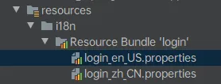

IDEA快速创建国际化文件：


可以切换视图快速开发国际化


然后就可以多个文件开发：


SpringBoot使用MessageSourceAutoConfiguration自动配置了管理国际化的组件：

```java
@Configuration(proxyBeanMethods = false)
@ConditionalOnMissingBean(name = AbstractApplicationContext.MESSAGE_SOURCE_BEAN_NAME, search = SearchStrategy.CURRENT)
@AutoConfigureOrder(Ordered.HIGHEST_PRECEDENCE)
@Conditional(ResourceBundleCondition.class)
@EnableConfigurationProperties
public class MessageSourceAutoConfiguration {
```

```java
@Bean
public MessageSource messageSource(MessageSourceProperties properties) {
    ResourceBundleMessageSource messageSource = new ResourceBundleMessageSource();
    if (StringUtils.hasText(properties.getBasename())) {
        // 设置国际化资源及出门（去掉语言国家代码）
        messageSource.setBasenames(StringUtils
                                   .commaDelimitedListToStringArray(StringUtils.trimAllWhitespace(properties.getBasename())));
    }
    if (properties.getEncoding() != null) {
        messageSource.setDefaultEncoding(properties.getEncoding().name());
    }
    messageSource.setFallbackToSystemLocale(properties.isFallbackToSystemLocale());
    Duration cacheDuration = properties.getCacheDuration();
    if (cacheDuration != null) {
        messageSource.setCacheMillis(cacheDuration.toMillis());
    }
    messageSource.setAlwaysUseMessageFormat(properties.isAlwaysUseMessageFormat());
    messageSource.setUseCodeAsDefaultMessage(properties.isUseCodeAsDefaultMessage());
    return messageSource;
}
```

由此可以配置主配置文件

```properties
spring.messages.basename=i18n/login
```

### 使用thymeleaf国际化


### SpringBoot区域信息解析器

在WebMvcAutoConfiguration中解析区域信息localeResolver

```java
@Bean
@ConditionalOnMissingBean
@ConditionalOnProperty(prefix = "spring.mvc", name = "locale")
public LocaleResolver localeResolver() {
    if (this.mvcProperties.getLocaleResolver() == WebMvcProperties.LocaleResolver.FIXED) {
        return new FixedLocaleResolver(this.mvcProperties.getLocale());
    }
    AcceptHeaderLocaleResolver localeResolver = new AcceptHeaderLocaleResolver();
    localeResolver.setDefaultLocale(this.mvcProperties.getLocale());
    return localeResolver;
}
```

获取区域信息的方式：通过AcceptHeaderLocaleResolver，根据请求头的Accept-Language：zh_CN/ en_US获取

```java
@Override
public Locale resolveLocale(HttpServletRequest request) {
    Locale defaultLocale = getDefaultLocale();
    if (defaultLocale != null && request.getHeader("Accept-Language") == null) {
        return defaultLocale;
    }
    Locale requestLocale = request.getLocale();
    List<Locale> supportedLocales = getSupportedLocales();
    if (supportedLocales.isEmpty() || supportedLocales.contains(requestLocale)) {
        return requestLocale;
    }
    Locale supportedLocale = findSupportedLocale(request, supportedLocales);
    if (supportedLocale != null) {
        return supportedLocale;
    }
    return (defaultLocale != null ? defaultLocale : requestLocale);
}
```

### 自定义国际化

前端设置：thymeleaf的(xxx)表示?xxx

```html
<a class="btn btn-sm" th:href="@{/index(l='zh_CN')}">中文</a>
<a class="btn btn-sm" th:href="@{/index(l='en_US')}">English</a>
```

自定义创建一个判别前端传入的参数：要实现LocaleResolver接口

```java
public class MyLocale implements LocaleResolver {
    @Override
    public Locale resolveLocale(HttpServletRequest request) {
        String l = request.getParameter("l");
        Locale locale = Locale.getDefault();
        if (!StringUtils.isEmpty(l)) {
            String[] s = l.split("_");
            locale = new Locale(s[0], s[1]);
        }
        return locale;
    }
    @Override
    public void setLocale(HttpServletRequest request, HttpServletResponse response, Locale locale) {
    }
}
```

在自定义的MVC中实现这个国际化：

```java
@Bean
public LocaleResolver localeResolver() {
    return new MyLocale();
}
```


## 拦截器

以拦截登录为例

首先把登录名放入到session中：session.setAttribute

```java
@PostMapping("/user/login")
public String login(@RequestParam("username") String username,
                    @RequestParam("password") String password,
                    Map<String, Object> map,
                    HttpSession session) {
    if (!StringUtils.isEmpty(username) && "123".contentEquals(password)) {
        session.setAttribute("username", username);
        return "redirect:/main";
    }
    map.put("msg", "用户名密码错误");
    return "index";
}
```

注册一个拦截器：**HandlerInterceptor**

并且判断，如果用户名为空就不放行，转发到登录页面，并放入没有权限的信息，如果成功就放行

```java
public class LoginHandlerInterceptor implements HandlerInterceptor {
    @Override
    public boolean preHandle(HttpServletRequest request, HttpServletResponse response, Object handler) throws Exception {
        HttpSession session = request.getSession();
        Object username = session.getAttribute("username");
        if (username == null){
            request.setAttribute("msg", "没有权限请先登录");
            request.getRequestDispatcher("/").forward(request, response);
            return false;
        }
        else
            return true;
    }
    @Override
    public void postHandle(HttpServletRequest request, HttpServletResponse response, Object handler, ModelAndView modelAndView) throws Exception {
    }
    @Override
    public void afterCompletion(HttpServletRequest request, HttpServletResponse response, Object handler, Exception ex) throws Exception {
    }
}
```

在SpringMVC中注册这个拦截器，并**拦截响应的访问地址**：

这里拦截了所有的地址：除了/index / /user/login这三个地址

```java
@Override
public void addInterceptors(InterceptorRegistry registry) {
    registry.addInterceptor(new LoginHandlerInterceptor())
        .addPathPatterns("/**")
        .excludePathPatterns("/index","/","/user/login");
}
```

为了防止SpringBoot拦截静态资源可以加入**addResourceHandlers**

```java
@Override
public void addResourceHandlers(ResourceHandlerRegistry registry) {
    registry.addResourceHandler("/**")
        .addResourceLocations("classpath:/static/");
}
```


## 错误处理原理

如果访问了没有的路径网页会：


其他客户端会发送json数据：

```java
{
    "timestamp": "2020-07-18T17:08:27.106+00:00",
    "status": 404,
    "error": "Not Found",
    "message": "No message available",
    "path": "/aaa"
}
```

错误处理的自动配置：ErrorMvcAutoConfiguration

```java
@Configuration(proxyBeanMethods = false)
@ConditionalOnWebApplication(type = Type.SERVLET)
@ConditionalOnClass({ Servlet.class, DispatcherServlet.class })
// Load before the main WebMvcAutoConfiguration so that the error View is available
@AutoConfigureBefore(WebMvcAutoConfiguration.class)
@EnableConfigurationProperties({ ServerProperties.class, ResourceProperties.class, WebMvcProperties.class })
public class ErrorMvcAutoConfiguration {
```

这个类给容器添加了以下组件：

- DefaultErrorAttributes
- BasicErrorController
- ErrorPageCustomizer
- DefaultErrorViewResolver

首先看**ErrorPageCustomizer**：看registerErrorPages -- getRelativePath

```java
static class ErrorPageCustomizer implements ErrorPageRegistrar, Ordered {
    ...
    @Override
    public void registerErrorPages(ErrorPageRegistry errorPageRegistry) {
        ErrorPage errorPage = new ErrorPage(
            this.dispatcherServletPath.getRelativePath(this.properties.getError().getPath()));
        errorPageRegistry.addErrorPages(errorPage);
    }
    ...
}
```

这个getPath的跳转位置：可知 -- 系统出现错误，来到error请求进行处理

```java
@Value("${error.path:/error}")
private String path = "/error";
```

**BasicErrorController**：处理默认/error请求

```java
@Controller
@RequestMapping("${server.error.path:${error.path:/error}}")
public class BasicErrorController extends AbstractErrorController {
```

下面有两种处理方式：（这里就可以解释开头的现象），通过RequestHeader - **accept判断**

产生HTML类型的数据


```java
@RequestMapping(produces = MediaType.TEXT_HTML_VALUE)
public ModelAndView errorHtml(HttpServletRequest request, HttpServletResponse response) {
    HttpStatus status = getStatus(request);
    Map<String, Object> model = Collections
        .unmodifiableMap(getErrorAttributes(request, getErrorAttributeOptions(request, MediaType.TEXT_HTML)));
    response.setStatus(status.value());
    // 去哪个页面作为错误页面，包含页面地址和页面内容
    ModelAndView modelAndView = resolveErrorView(request, response, status, model);
    return (modelAndView != null) ? modelAndView : new ModelAndView("error", model);
}
```

产生JSON数据


```java
@RequestMapping
public ResponseEntity<Map<String, Object>> error(HttpServletRequest request) {
    HttpStatus status = getStatus(request);
    if (status == HttpStatus.NO_CONTENT) {
        return new ResponseEntity<>(status);
    }
    Map<String, Object> body = getErrorAttributes(request, getErrorAttributeOptions(request, MediaType.ALL));
    return new ResponseEntity<>(body, status);
}
```

响应错误页面的解析代码：errorHtml -- resolveErrorView(request, response, status, model);

```java
protected ModelAndView resolveErrorView(HttpServletRequest request, HttpServletResponse response, HttpStatus status,
                                        Map<String, Object> model) {
    for (ErrorViewResolver resolver : this.errorViewResolvers) {
        ModelAndView modelAndView = resolver.resolveErrorView(request, status, model);
        if (modelAndView != null) {
            return modelAndView;
        }
    }
    return null;
}
```

最后看DefaultErrorViewResolver，它首先声明了*SERIES_VIEWS*，用于判断状态码

```java
private static final Map<Series, String> SERIES_VIEWS;
static {
    Map<Series, String> views = new EnumMap<>(Series.class);
    views.put(Series.CLIENT_ERROR, "4xx");
    views.put(Series.SERVER_ERROR, "5xx");
    SERIES_VIEWS = Collections.unmodifiableMap(views);
}
```

注释解释两个方法：SpringBoot是如何找错误页面的

```java
@Override
public ModelAndView resolveErrorView(HttpServletRequest request, HttpStatus status, Map<String, Object> model) {
    ModelAndView modelAndView = resolve(String.valueOf(status.value()), model);
    if (modelAndView == null && SERIES_VIEWS.containsKey(status.series())) {
        modelAndView = resolve(SERIES_VIEWS.get(status.series()), model);
    }
    return modelAndView;
}
private ModelAndView resolve(String viewName, Map<String, Object> model) {
    // 默认Springboot可以找到一个页面 error/404
    String errorViewName = "error/" + viewName;
    // 模板引擎可以解析这个页面地址就用模板引擎解析
    TemplateAvailabilityProvider provider = this.templateAvailabilityProviders.getProvider(errorViewName,
                                                                                           this.applicationContext);
    if (provider != null) {
        // 模板引擎可用的情况下返回errorviewname指定的地址
        return new ModelAndView(errorViewName, model);
    }
    // 模板引擎不可用时，就在静态资源文件下找errorViewName页面 /error/404.html
    return resolveResource(errorViewName, model);
}
```


## 定制错误页面和JSON错误数据

定制错误页面
直接把文件放到error文件夹下，名字为4xx，5xx即可

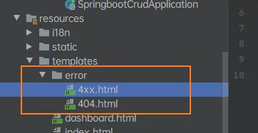

当发生错误页面的时候可以获取错误页面的信息（有模板引擎情况下）：
timestamp 时间戳
status 状态码
error 错误信息
exception 异常对象
message 异常消息
errors JSR303 数据校验的错误

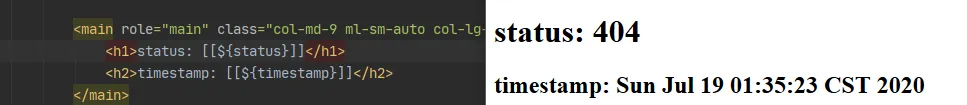


### 定制一个JSON数据

这个错误处理属于Controller：

- **@ControllerAdvice** 是一个特殊的@Component，用于标识一个类，这个类中被以下三种注解标识的方法：@ExceptionHandler，@InitBinder，@ModelAttribute，将作用于所有的@Controller类的接口上

- @ResponseBody
- **@ExceptionHandler** (错误类.class) 统一异常处理，也可以指定要处理的异常类型

第一种写法：

```java
@ControllerAdvice
public class MyExceptionHandler {
    @ResponseBody
    @ExceptionHandler(UserNotException.class)
    public Map<String, Object> handlerException(Exception e) {
        Map<String, Object> map = new HashMap<>();
        map.put("code", "user.notexist");
        map.put("message", e.getMessage());
        return map;
    }
}
```

第二种：注意使用request定制状态码setAttribute("javax.servlet.error.status_code", 500);

设置以后SpringBoot自适应就会进入错误页面：（resource/error/500）

```java
@ExceptionHandler(UserNotException.class)
public String handlerException(Exception e, HttpServletRequest req) {
    Map<String, Object> map = new HashMap<>();
    // 传入错误状态码
    req.setAttribute("javax.servlet.error.status_code", 400);
    map.put("code", "user.notexist");
    map.put("message", e.getMessage());
    return "forward:/error";
}
```

**【推荐】**第三种：响应是自适应的，通过ErrorAttributes改变需要返回的内容

首先定制一个错误控制：定义状态码、错误信息等

```java
@ControllerAdvice
public class MyExceptionHandler {
    @ExceptionHandler(UserNotException.class)
    public String handlerException(Exception e, HttpServletRequest req) {
        Map<String, Object> map = new HashMap<>();
        // 传入错误状态码
        req.setAttribute("javax.servlet.error.status_code", 500);
        map.put("code", "user.notexist");
        //        map.put("message", e.getMessage());
        map.put("message", "用户不存在啦!!");
        req.setAttribute("ext", map);
        return "forward:/error";
    }
}
```

然后创建一个错误数据传输中间，这个类的功能就是把自定义的错误页面的数据传给SpringBoot，然后响应到自适应页面：

```java
public class MyErrorAttributes extends DefaultErrorAttributes {
    @Override
    public Map<String, Object> getErrorAttributes(WebRequest webRequest, ErrorAttributeOptions options) {
        Map<String, Object> map = (Map<String, Object>)webRequest.getAttribute("ext", 0);
        return map;
    }
}
```

至于第二个参数scope是怎么定义的：

0 - request

1 - session

```java
public interface RequestAttributes {
    /**
     * Constant that indicates request scope.
     */
    int SCOPE_REQUEST = 0;
    /**
     * Constant that indicates session scope.
     * <p>This preferably refers to a locally isolated session, if such
     * a distinction is available.
     * Else, it simply refers to the common session.
     */
    int SCOPE_SESSION = 1;
```


## 嵌入式Servlet

### Spring两种配置方式：

- xxxConfigurer扩展配置
- xxxCustomizer定制配置

### 嵌入式Servlet两种修改相关配置

1. 配置文件

```properties
server.port=8083
```

2. 在嵌入式Servlet中修改：在自定义的SpringMVC配置

注：SpringBoot2 使用的是**WebServerFactoryCustomizer**`<ConfigurableWebServerFactory>`

```java
@Configuration
public class MyMvcConfig implements WebMvcConfigurer {
    @Bean
    public WebServerFactoryCustomizer<ConfigurableWebServerFactory> webServerFactoryCustomizer() {
        return new WebServerFactoryCustomizer<ConfigurableWebServerFactory>() {
//            嵌入式servlet容器相关的配置
            @Override
            public void customize(ConfigurableWebServerFactory factory) {
                factory.setPort(8083);
            }
        };
    }
....
}
```

### 注册三大组件

- Filter
- Servlet
- Linstener

#### 定制Servlet

------

创建一个Servlet，继承**HttpServlet**

```java
public class MyServlet extends HttpServlet {
    @Override
    protected void doGet(HttpServletRequest req, HttpServletResponse resp) throws ServletException, IOException {
        doPost(req, resp);
    }
    @Override
    protected void doPost(HttpServletRequest req, HttpServletResponse resp) throws ServletException, IOException {
        resp.getWriter().write("Hello MyServlet");
    }
}
```

创建一个自己的配置类，把这个Servlet加入到容器中（**ServletRegistrationBean**、@Bean）

```java
@Configuration
public class MyServerConfig {
//    注册三大组件
    @Bean
    public ServletRegistrationBean myServelet() {
        ServletRegistrationBean registrationBean = new ServletRegistrationBean(new MyServlet(), "/myservlet");
        return registrationBean;
    }
    ...
}
```

#### 定制Filter

------

先创建一个自己的Filter，继承**HttpFilter**

```java
public class MyFilter extends HttpFilter {
    public MyFilter() {
        super();
    }
    @Override
    public void doFilter(ServletRequest request, ServletResponse response, FilterChain chain) throws IOException, ServletException {
        System.out.println("MyFilter process....");
        chain.doFilter(request, response);
    }
    @Override
    protected void doFilter(HttpServletRequest request, HttpServletResponse response, FilterChain chain) throws IOException, ServletException {
        super.doFilter(request, response, chain);
    }
}
```

同样是在配置类内注册，**FilterRegistrationBean**：

```java
@Configuration
public class MyServerConfig {
//    注册三大组件
...
    @Bean
    public FilterRegistrationBean myFilter() {
        FilterRegistrationBean filterRegistrationBean = new FilterRegistrationBean();
        filterRegistrationBean.setFilter(new MyFilter());
        filterRegistrationBean.setUrlPatterns(Arrays.asList("/", "/index"));
        return filterRegistrationBean;
    }
...
}
```

#### 定制Listener

------

注册一个监听器，实现接口**ServletContextListener**：

```java
public class MyListener implements ServletContextListener {
    @Override
    public void contextInitialized(ServletContextEvent sce) {
        System.out.println("web应用启动!!!!!!!!!!!!!!!");
    }
    @Override
    public void contextDestroyed(ServletContextEvent sce) {
        System.out.println("web销毁!!!!!!!!!!!!!!!");
    }
}
```

把监听器注册到配置类中，并放入容器**ServletListenerRegistrationBean**：

```java
@Configuration
public class MyServerConfig {
//    注册三大组件
...
    @Bean
    public ServletListenerRegistrationBean myListener() {
        ServletListenerRegistrationBean<MyListener> listener = new ServletListenerRegistrationBean<>(new MyListener());
        return listener;
    }
...
}
```

使用其他的嵌入式容器

- Jetty（长连接）
- Undertow（不支持JSP）
- Tomcat（默认）


切换容器的方式：

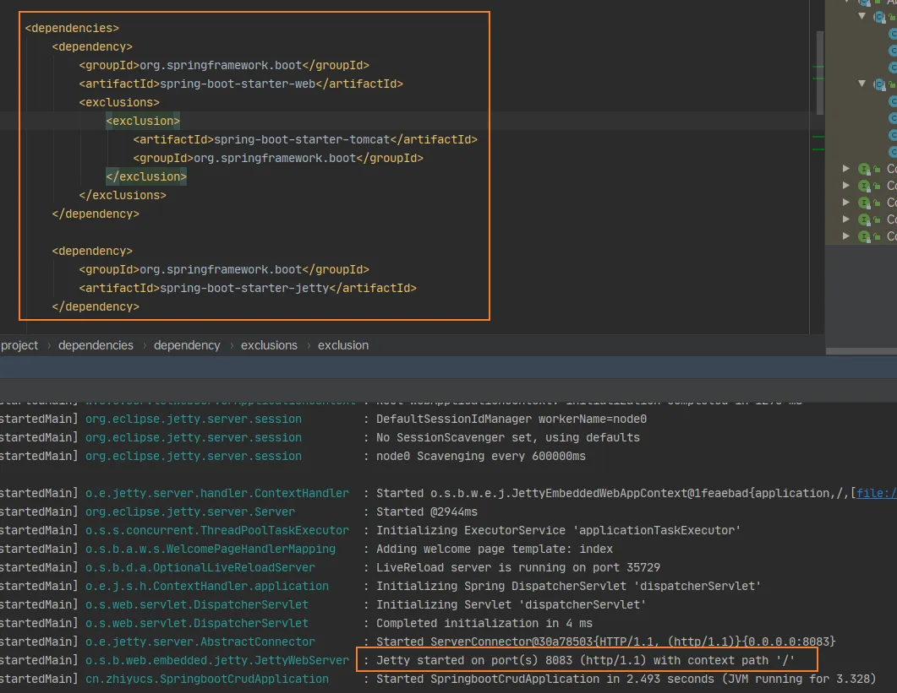


## 源码刨析 嵌入式Servlet原理

WebServerFactoryCustomizer嵌入式Servlet的自动配置类：**ServletWebServerFactoryAutoConfiguration**

```java
@Configuration(proxyBeanMethods = false)
@AutoConfigureOrder(Ordered.HIGHEST_PRECEDENCE)
// 仅在类 ServletRequest 存在于 classpath 上时才生效
@ConditionalOnClass(ServletRequest.class)
// 仅在当前应用是 Servlet Web 应用时才生效
@ConditionalOnWebApplication(type = Type.SERVLET)
// 确保前缀为 server 的配置参数加载到 bean ServerProperties
@EnableConfigurationProperties(ServerProperties.class)
// 1. 导入 ServletWebServerFactoryAutoConfiguration.BeanPostProcessorsRegistrar 以注册
// BeanPostProcessor : WebServerFactoryCustomizerBeanPostProcessor 和 
// ErrorPageRegistrarBeanPostProcessor
// 2. 导入 EmbeddedTomcat/EmbeddedJetty/EmbeddedUndertow 这三个属于
// ServletWebServerFactoryConfiguration 的嵌套配置类，这三个配置类会分别检测
// classpath上存在的类，从而判断当前应用使用的是 Tomcat/Jetty/Undertow,
// 从而决定定义哪一个 Servlet Web服务器的工厂 bean :
// TomcatServletWebServerFactory/JettyServletWebServerFactory/UndertowServletWebServerFactory
@Import({ ServletWebServerFactoryAutoConfiguration.BeanPostProcessorsRegistrar.class,
        ServletWebServerFactoryConfiguration.EmbeddedTomcat.class,
        ServletWebServerFactoryConfiguration.EmbeddedJetty.class,
        ServletWebServerFactoryConfiguration.EmbeddedUndertow.class })
public class ServletWebServerFactoryAutoConfiguration {
```

针对当前Servlet容器是Tomcat时定义该 bean，用于定制化 TomcatServletWebServerFactory

```java
@Bean
// 仅在类 org.apache.catalina.startup.Tomcat 存在于 classpath 上时才生效
@ConditionalOnClass(name = "org.apache.catalina.startup.Tomcat")
public TomcatServletWebServerFactoryCustomizer tomcatServletWebServerFactoryCustomizer(
    ServerProperties serverProperties) {
    return new TomcatServletWebServerFactoryCustomizer(serverProperties);
}
```

ServletWebServerFactoryConfiguration是一个针对ServletWebServerFactory进行配置的配置类。它通过检测应用classpath存在的类，从而判断当前应用要使用哪个Servlet容器:Tomcat,Jetty还是Undertow。检测出来之后，定义相应的Servlet Web服务器工厂组件bean

```java
@Configuration(proxyBeanMethods = false)
class ServletWebServerFactoryConfiguration {
    
    @Configuration(proxyBeanMethods = false)
    @ConditionalOnClass({ Servlet.class, Tomcat.class, UpgradeProtocol.class })
    @ConditionalOnMissingBean(value = ServletWebServerFactory.class, search = SearchStrategy.CURRENT)
    static class EmbeddedTomcat {
    }   
        
        @Configuration(proxyBeanMethods = false)
    @ConditionalOnClass({ Servlet.class, Server.class, Loader.class, WebAppContext.class })
    @ConditionalOnMissingBean(value = ServletWebServerFactory.class, search = SearchStrategy.CURRENT)
    static class EmbeddedJetty {
    }
        
        @Configuration(proxyBeanMethods = false)
    @ConditionalOnClass({ Servlet.class, Undertow.class, SslClientAuthMode.class })
    @ConditionalOnMissingBean(value = ServletWebServerFactory.class, search = SearchStrategy.CURRENT)
    static class EmbeddedUndertow {
    }
    }
```

三个实现类都继承自抽象基类AbstractServletWebServerFactory：


#### 以Tomcat为例

进入TomcatServletWebServerFactory，可以看到这个方法，配置Tomcat基本环境，返回一个嵌入式Servlet容器：

```java
@Override
public WebServer getWebServer(ServletContextInitializer... initializers) {
    if (this.disableMBeanRegistry) {
        Registry.disableRegistry();
    }
    Tomcat tomcat = new Tomcat();
    File baseDir = (this.baseDirectory != null) ? this.baseDirectory : createTempDir("tomcat");
    tomcat.setBaseDir(baseDir.getAbsolutePath());
    Connector connector = new Connector(this.protocol);
    connector.setThrowOnFailure(true);
    tomcat.getService().addConnector(connector);
    customizeConnector(connector);
    tomcat.setConnector(connector);
    tomcat.getHost().setAutoDeploy(false);
    configureEngine(tomcat.getEngine());
    for (Connector additionalConnector : this.additionalTomcatConnectors) {
        tomcat.getService().addConnector(additionalConnector);
    }
    prepareContext(tomcat.getHost(), initializers);
    return getTomcatWebServer(tomcat);
}
```

查看最后返回的getTomcatWebServer，只要端口号大于等于0就自动启动

```java
protected TomcatWebServer getTomcatWebServer(Tomcat tomcat) {
    return new TomcatWebServer(tomcat, getPort() >= 0, getShutdown());
}
```

通过进入TomcatWebServer的initialize方法就可以看到启动容器

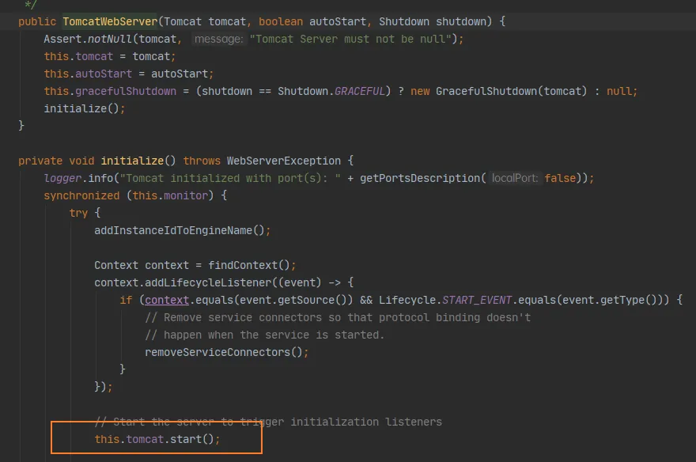


### 配置是如何修改原理

看ServletWebServerFactoryAutoConfiguration中，在自动配置之前先导入了BeanPostProcessorsRegistrar（后置处理器，Bean初始化前后，创建完对象没有赋值的除四害工作）

```java
@Import({ ServletWebServerFactoryAutoConfiguration.BeanPostProcessorsRegistrar.class,
```

 

```java
@Override
public void setBeanFactory(BeanFactory beanFactory) throws BeansException {
    if (beanFactory instanceof ConfigurableListableBeanFactory) {
        this.beanFactory = (ConfigurableListableBeanFactory) beanFactory;
    }
}
```

通过观察下面的：registerBeanDefinitions方法中WebServerFactoryCustomizerBeanPostProcessor，

初始之前，如果当前初始化的一个WebServerFactory就调用postProcessBeforeInitialization

```java
@Override
public Object postProcessBeforeInitialization(Object bean, String beanName) throws BeansException {
    if (bean instanceof WebServerFactory) {
        postProcessBeforeInitialization((WebServerFactory) bean);
    }
    return bean;
}
```

获取所有的定制其，调用每一个定制其的customize方法来给servlet容器赋值（端口...）

```java
private void postProcessBeforeInitialization(WebServerFactory webServerFactory) {
    LambdaSafe.callbacks(WebServerFactoryCustomizer.class, getCustomizers(), webServerFactory)
        .withLogger(WebServerFactoryCustomizerBeanPostProcessor.class)
        .invoke((customizer) -> customizer.customize(webServerFactory));
}
```

再看WebServerFactoryCustomizerBeanPostProcessor中的Collection，这个从容器中获取这个类型的组件。定制servlet容器组件

```java
private Collection<WebServerFactoryCustomizer<?>> getCustomizers() {
    if (this.customizers == null) {
        // Look up does not include the parent context
        this.customizers = new ArrayList<>(getWebServerFactoryCustomizerBeans());
        this.customizers.sort(AnnotationAwareOrderComparator.INSTANCE);
        this.customizers = Collections.unmodifiableList(this.customizers);
    }
    return this.customizers;
}
```

### 小结：

1. 根据导入情况，添加相应的容器工厂：

```java
@Import({ ServletWebServerFactoryAutoConfiguration.BeanPostProcessorsRegistrar.class,
        ServletWebServerFactoryConfiguration.EmbeddedTomcat.class,
        ServletWebServerFactoryConfiguration.EmbeddedJetty.class,
        ServletWebServerFactoryConfiguration.EmbeddedUndertow.class })
```

2. 容器中某个组件创建就会触发**后置处理器（BeanPostProcessorsRegistrar）**

只要是ConfigurableListableBeanFactory就工作：

```java
if (beanFactory instanceof ConfigurableListableBeanFactory)
```

3. 这个后置处理器从容器中**获取所有的定制器，然后定制属性（端口..）**

```java
private Collection<WebServerFactoryCustomizer<?>> getCustomizers() {
        if (this.customizers == null) {
            // Look up does not include the parent context
            this.customizers = new ArrayList<>(getWebServerFactoryCustomizerBeans());
            this.customizers.sort(AnnotationAwareOrderComparator.INSTANCE);
            this.customizers = Collections.unmodifiableList(this.customizers);
        }
        return this.customizers;
    }
```


## 嵌入式Servlet自动配置原理

断点声明：


首先启动SpringBoot


然后调用run方法：

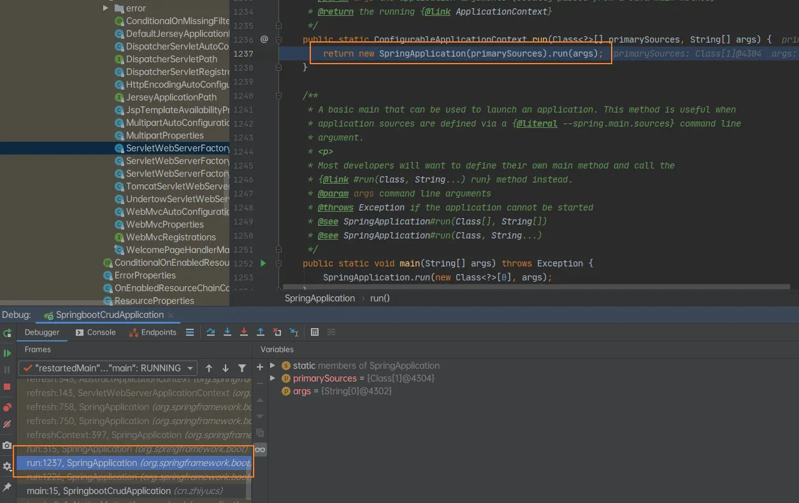

创建和刷新容器


查看是如何创建容器的：

```java
protected ConfigurableApplicationContext createApplicationContext() {
    Class<?> contextClass = this.applicationContextClass;
    if (contextClass == null) {
        try {
            switch (this.webApplicationType) {
                case SERVLET:
                    contextClass = Class.forName(DEFAULT_SERVLET_WEB_CONTEXT_CLASS);
                    break;
                case REACTIVE:
                    contextClass = Class.forName(DEFAULT_REACTIVE_WEB_CONTEXT_CLASS);
                    break;
                default:
                    contextClass = Class.forName(DEFAULT_CONTEXT_CLASS);
            }
        }
```

如果是一个WEB容器：**DEFAULT_SERVLET_WEB_CONTEXT_CLASS**，如果是一个普通容器就创建：**DEFAULT_CONTEXT_CLASS**

```
    /**
     * The class name of application context that will be used by default for non-web
     * environments.
     */
    public static final String DEFAULT_CONTEXT_CLASS = "org.springframework.context."
            + "annotation.AnnotationConfigApplicationContext";
    /**
     * The class name of application context that will be used by default for web
     * environments.
     */
    public static final String DEFAULT_SERVLET_WEB_CONTEXT_CLASS = "org.springframework.boot."
            + "web.servlet.context.AnnotationConfigServletWebServerApplicationContext";
```

主要是刷新IOC容器


刷新IOC容器


以此类推

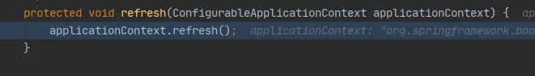


然后就创建嵌入式的servlet容器：


然后就获取到了嵌入式servlet容器

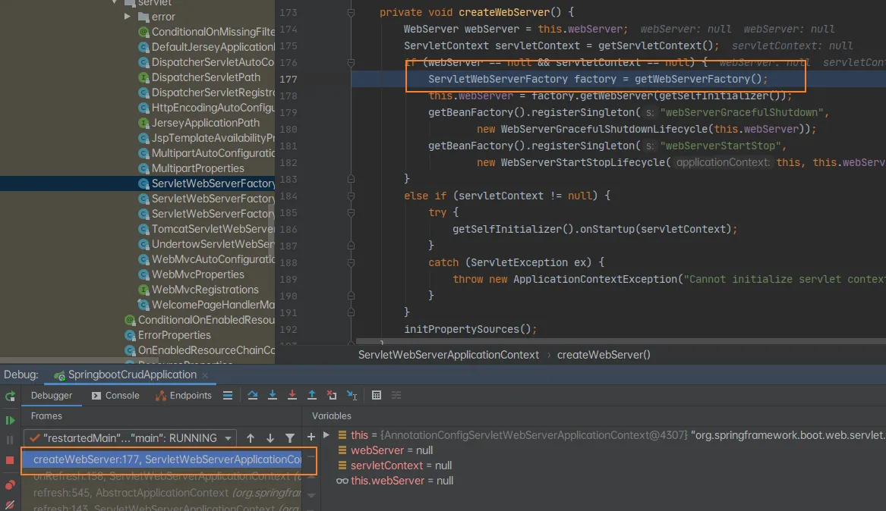

**小结**：IOC容器启动创建嵌入式的servlet容器

1. SpringBoot启动运行run方法

2. 刷新IOC容器（创建IOC容器对象，初始化容器，创建每一个组件）

```java
refreshContext(context);
```

然后开始创建web容器：

```java
context = createApplicationContext();
```

如果是web环境创建：AnnotationConfigServletWebServerApplicationContext

否则创建：AnnotationConfigApplicationContext

3. 刷新刚才创建号的IOC容器：

```java
refresh((ApplicationContext) context);
```

4. 调用onRefresh()，web的IOC容器重写了onRefresh方法

5. webIOC容器会创建嵌入式的Servlet容器

```java
protected void onRefresh() {
    super.onRefresh();
    try {
        createWebServer();
    }
```

6. 获取嵌入式的Servlet容器工厂

```java
ServletWebServerFactory factory = getWebServerFactory();
```

然后从IOC容器中获取TomcatServletWebServerFactory组件；

后置处理器：BeanPostProcessorsRegistrar 获取所有的定制器来定制Servlet的相关配置

7. 嵌入式Servlet容器创建并启动Tomcat


## 整合JDBC

YAML配置：

```yaml
spring:
  datasource:
    url: jdbc:mysql://localhost:3306/mybatis_test
    username: root
    password: root
    driver-class-name: com.mysql.jdbc.Driver
```

### 自动配置原理

DataSourceProperties 

1. DataSourceConfiguration，根据配置创建数据源，默认使用Tomcat连接池，可以使用spring.datasource.type自定义数据源类型

- Tomcat
- Hikari
- Dbcp2
- Generic 自定义数据源

```java
@Configuration(proxyBeanMethods = false)
@ConditionalOnMissingBean(DataSource.class)
@ConditionalOnProperty(name = "spring.datasource.type")
static class Generic {
    @Bean
    DataSource dataSource(DataSourceProperties properties) {
        // 使用DataSourceBuilder创建数据源，利用创建响应type的数据源，并且绑定相关属性
        return properties.initializeDataSourceBuilder().build();
    }
}
```

2. DataSourceAutoConfiguration

3. JdbcTemplateAutoConfiguration


## 整合Druid

导入POM：

```xml
<dependency>
    <groupId>com.alibaba</groupId>
    <artifactId>druid-spring-boot-starter</artifactId>
    <version>1.1.10</version>
</dependency>
<dependency>
    <groupId>log4j</groupId>
    <artifactId>log4j</artifactId>
    <version>1.2.17</version>
</dependency>
```

首先配置YAML：

```yaml
spring:
  datasource:
    url: jdbc:mysql://localhost:3306/mybatis_test
    username: root
    password: root
    driver-class-name: com.mysql.jdbc.Driver
    type: com.alibaba.druid.pool.DruidDataSource
    #   数据源其他配置
    initialSize: 5
    minIdle: 5
    maxActive: 20
    maxWait: 60000
    timeBetweenEvictionRunsMillis: 60000
    minEvictableIdleTimeMillis: 300000
    validationQuery: SELECT 1 FROM DUAL
    testWhileIdle: true
    testOnBorrow: false
    testOnReturn: false
    poolPreparedStatements: true
    #   配置监控统计拦截的filters，去掉后监控界面sql无法统计，'wall'用于防火墙
    filters: stat,wall,log4j
    maxPoolPreparedStatementPerConnectionSize: 20
    useGlobalDataSourceStat: true
    connectionProperties: druid.stat.mergeSql=true;druid.stat.slowSqlMillis=500
```

配置Druid

```java
@Configuration
public class DruidConfig {
    @ConfigurationProperties(prefix = "spring.datasource")
    @Bean
    public DataSource druid() {
        return new DruidDataSource();
    }
//    配置监控
    @Bean
    public ServletRegistrationBean statViewServlet() {
        ServletRegistrationBean bean = new ServletRegistrationBean(new StatViewServlet(), "/druid/*");
        Map<String, String> initParams = new HashMap<>();
        initParams.put("loginUsername", "admin");
        initParams.put("loginPassword", "123");
        initParams.put("allow", ""); // 默认所有
//        initParams.put("deny", ""); // 拒绝访问
        bean.setInitParameters(initParams);
        return bean;
    }
//    配置一个web监控的filter
    @Bean
    public FilterRegistrationBean webStatFilter() {
        FilterRegistrationBean bean = new FilterRegistrationBean();
        bean.setFilter(new WebStatFilter());
        Map<String, String> initParams = new HashMap<>();
        initParams.put("exclusions", "*.js,*.css,/druid/*");
        bean.setInitParameters(initParams);
        bean.setUrlPatterns(Arrays.asList("/*"));
        return bean;
    }
}
```

然后就可以看见查询的信息：


SpringBoot2 使用YAML直接配置监控器和访问地址：

```yaml
spring:
  datasource:
    url: jdbc:mysql://localhost:3306/mybatis_test
    username: root
    password: root
    driver-class-name: com.mysql.jdbc.Driver
    type: com.alibaba.druid.pool.DruidDataSource
    #   数据源其他配置
    initialSize: 5
    minIdle: 5
    maxActive: 20
    maxWait: 60000
    timeBetweenEvictionRunsMillis: 60000
    minEvictableIdleTimeMillis: 300000
    validationQuery: SELECT 1 FROM DUAL
    testWhileIdle: true
    testOnBorrow: false
    testOnReturn: false
    poolPreparedStatements: true
    #   配置监控统计拦截的filters，去掉后监控界面sql无法统计，'wall'用于防火墙
    filters: stat,wall,log4j
    maxPoolPreparedStatementPerConnectionSize: 20
    useGlobalDataSourceStat: true
    connectionProperties: druid.stat.mergeSql=true;druid.stat.slowSqlMillis=500
    druid:
      filters: stat,wall
      aop-patterns: com.javayh.druid.*
      web-stat-filter:
        enabled: true
        url-pattern: /*
        exclusions: /druid/*,*.js,*.gif,*.webp,*.bmp,*.webp,*.css,*.ico
        session-stat-enable: true
        session-stat-max-count: 10
      stat-view-servlet:
        # 是否启用statViewServlet配置
        enabled: true
        # 访问监控页面
        url-pattern: "/druid/*"
        # 禁止手动重置监控数据
        reset-enable: false
        # 设置监控页面的登陆名
        login-username: admin
        # 设置监控页面的登陆密码
        login-password: 123
```


## 整合Mybatis

### Maven

```xml
<dependencies>
    <dependency>
        <groupId>org.springframework.boot</groupId>
        <artifactId>spring-boot-starter-jdbc</artifactId>
    </dependency>
    <dependency>
        <groupId>org.springframework.boot</groupId>
        <artifactId>spring-boot-starter-web</artifactId>
    </dependency>
    <dependency>
        <groupId>org.mybatis.spring.boot</groupId>
        <artifactId>mybatis-spring-boot-starter</artifactId>
        <version>2.1.3</version>
    </dependency>
    <dependency>
        <groupId>mysql</groupId>
        <artifactId>mysql-connector-java</artifactId>
        <scope>runtime</scope>
    </dependency>
    <dependency>
        <groupId>org.springframework.boot</groupId>
        <artifactId>spring-boot-starter-test</artifactId>
        <scope>test</scope>
    </dependency>
</dependencies>
```

### 使用注解

创建实体类进行测试：

```java
public class Employee {
    private Integer id;
    private String lastName;
    private Integer gender;
    private String email;
    private Integer dId;
```

 

```java
public class Department {
    private Integer id;
    private String departmentName;
```

使用注解**@Mapper**标注使用Mybatis

```java
@Mapper
public interface DepartmentMapper {
    @Select("select * from department where id = #{id} ;")
    public Department getDepById(Integer id);
    @Delete("delete from department where id = #{id}")
    public int deleteDepById(Integer id);
    @Options(useGeneratedKeys = true, keyProperty = "id")
    @Insert("insert into department (department_name) values (#{departmentName});")
    public int insert(Department department);
    @Update("update department set department_name=#{departmentName} where id = #{id}")
    public int updateDept(Department department);
}
```

也可以自定义Mybatis：

```java
@org.springframework.context.annotation.Configuration
public class MybatisConfig {
    @Bean
    public ConfigurationCustomizer configurationCustomizer() {
        return new ConfigurationCustomizer() {
            @Override
            public void customize(Configuration configuration) {
                configuration.setMapUnderscoreToCamelCase(true);
            }
        };
    }
}
```

如果@Mapper过多可以在主类中使用**@MapperScan**批量扫描接口

```java
@MapperScan("cn.zhiyucs.mapper")
@SpringBootApplication
public class SpringbootMybatis01Application {
    public static void main(String[] args) {
        SpringApplication.run(SpringbootMybatis01Application.class, args);
    }
}
```

### 使用配置文件

创建Mybatis目录结构：

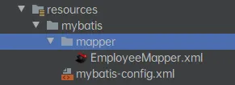

Mybatis主配置environment可以什么都不写：

```xml
<?xml version="1.0" encoding="UTF-8" ?>
<!DOCTYPE configuration
        PUBLIC "-//mybatis.org//DTD Config 3.0//EN"
        "http://mybatis.org/dtd/mybatis-3-config.dtd">
<configuration>
    <settings>
        <setting name="mapUnderscoreToCamelCase" value="true"/>
    </settings>
</configuration>
```

在主配置文件中配置MyBatis：

```yaml
mybatis:
  config-location: classpath:mybatis/mybatis-config.xml
  mapper-locations: classpath:mybatis/mapper/*.xml
```


## SpringBoot启动原理

程序入口：

```java
public static void main(String[] args) {
    SpringApplication.run(SpringbootStartertheoryApplication.class, args);
}
```

### 第一步：创建SpringApplication对象

```java
public static ConfigurableApplicationContext run(Class<?> primarySource, String... args) {
    return run(new Class<?>[] { primarySource }, args);
}
public static ConfigurableApplicationContext run(Class<?>[] primarySources, String[] args) {
    return new SpringApplication(primarySources).run(args);
}
```

可以观察它的构造方法：创建方法见下面

主要是配置两个类

- ApplicationContextInitializer
- SpringApplicationRunListener

```java
public SpringApplication(ResourceLoader resourceLoader, Class<?>... primarySources) {
    this.resourceLoader = resourceLoader;
    Assert.notNull(primarySources, "PrimarySources must not be null");
    // 配置source
    this.primarySources = new LinkedHashSet<>(Arrays.asList(primarySources));
    // 判断是否是web应用
    this.webApplicationType = WebApplicationType.deduceFromClasspath();
    // 创建初始化构造器
    setInitializers((Collection) getSpringFactoriesInstances(ApplicationContextInitializer.class));
    // 创建应用监听器
    setListeners((Collection) getSpringFactoriesInstances(ApplicationListener.class));
    // 推断出main方法类
    this.mainApplicationClass = deduceMainpplicationClass();
}
```

再进入：getSpringFactoriesInstances

```java
private <T> Collection<T> getSpringFactoriesInstances(Class<T> type) {
    return getSpringFactoriesInstances(type, new Class<?>[] {});
}
private <T> Collection<T> getSpringFactoriesInstances(Class<T> type, Class<?>[] parameterTypes, Object... args) {
    // 获取类加载器
    ClassLoader classLoader = getClassLoader();
    // Use names and ensure unique to protect against duplicates
    // 通过类加载器，获取指定的META-INF/spring.factories文件，获取文件中工厂类的全类名
    Set<String> names = new LinkedHashSet<>(SpringFactoriesLoader.loadFactoryNames(type, classLoader));
    // 通过类路径反射得到工厂对象，构造方法
    List<T> instances = createSpringFactoriesInstances(type, parameterTypes, classLoader, args, names);
    AnnotationAwareOrderComparator.sort(instances);
    return instances;
}
```

通过loadFactoryNames就可以知道

```java
public static final String FACTORIES_RESOURCE_LOCATION = "META-INF/spring.factories";
```

### 第二步：启动应用

主类：ConfigurableApplicationContext

```java
public ConfigurableApplicationContext run(String... args) {
    StopWatch stopWatch = new StopWatch();
    // 应用启动计时器开始计时
    stopWatch.start();
    ConfigurableApplicationContext context = null;
    Collection<SpringBootExceptionReporter> exceptionReporters = new ArrayList<>();
    // Headless模式配置（做AWT，暂时不用管）
    configureHeadlessProperty();
    // 获取启动监听器
    SpringApplicationRunListeners listeners = getRunListeners(args);
    // 应用启动监听器开始计时（回调所有的SpringApplicationRunListeners.starting()）
    listeners.starting();
    try {
        // 封装命令行参数
        ApplicationArguments applicationArguments = new DefaultApplicationArguments(args);
        // 配置环境模块（祥见下面prepareEnvironment方法）
        ConfigurableEnvironment environment = prepareEnvironment(listeners, applicationArguments);
        // 配置需要忽略的bean
        configureIgnoreBeanInfo(environment);
        // Banner配置(打印Spring的图标)
        Banner printedBanner = printBanner(environment);
        // 创建应用上下文对象
        context = createApplicationContext();
        // 异常分析报告
        exceptionReporters = getSpringFactoriesInstances(SpringBootExceptionReporter.class,
                                                         new Class[] { ConfigurableApplicationContext.class }, context);
        // 上下文基本属性配置（祥见下面prepareContext方法）
        prepareContext(context, environment, listeners, applicationArguments, printedBanner);
        // 更新应用上下文/刷新IOC容器（祥见下面refresh方法）
        refreshContext(context);
        // 从IOC容器中获取所有的ApplicationRunner和CommandLineRunner进行回调
        // 先ApplicationRunner
        afterRefresh(context, applicationArguments);
        stopWatch.stop();
        if (this.logStartupInfo) {
            new StartupInfoLogger(this.mainApplicationClass).logStarted(getApplicationLog(), stopWatch);
        }
        listeners.started(context);
        callRunners(context, applicationArguments);
    }
    catch (Throwable ex) {
        handleRunFailure(context, ex, exceptionReporters, listeners);
        throw new IllegalStateException(ex);
    }
    try {
        listeners.running(context);
    }
    catch (Throwable ex) {
        handleRunFailure(context, ex, exceptionReporters, null);
        throw new IllegalStateException(ex);
    }
    // 整个SpringBoot启动完成返回IOC容器
    return context;
}
```

获取监听器的方法：**getSpringFactoriesInstances**，可以看出也是从**META-INF**获取

```java
private SpringApplicationRunListeners getRunListeners(String[] args) {
    Class<?>[] types = new Class<?>[] { SpringApplication.class, String[].class };
    return new SpringApplicationRunListeners(logger,
                                             getSpringFactoriesInstances(SpringApplicationRunListener.class, types, this, args));
}
```

配置Listener环境：**prepareEnvironment**(listeners, applicationArguments);

环境完成后回调SpringApplicationRunListeners.environmentPrepared方法，表示环境准备完成

```java
private ConfigurableEnvironment prepareEnvironment(SpringApplicationRunListeners listeners,
                                                   ApplicationArguments applicationArguments) {
    // Create and configure the environment
    // 创建配置环境
    ConfigurableEnvironment environment = getOrCreateEnvironment();
    // 加载属性文件
    configureEnvironment(environment, applicationArguments.getSourceArgs());
    ConfigurationPropertySources.attach(environment);
    // 监听器监听配置
    listeners.environmentPrepared(environment);
    bindToSpringApplication(environment);
    if (!this.isCustomEnvironment) {
        environment = new EnvironmentConverter(getClassLoader()).convertEnvironmentIfNecessary(environment,
                                                                                               deduceEnvironmentClass());
    }
    ConfigurationPropertySources.attach(environment);
    return environment;
}
```

可以看到放行Banner后出现：


然后看**createApplicationContext**：决定创建

WEB（DEFAULT_SERVLET_WEB_CONTEXT_CLASS）

还是

普通IOC（DEFAULT_CONTEXT_CLASS）

```java
protected ConfigurableApplicationContext createApplicationContext() {
    Class<?> contextClass = this.applicationContextClass;
    if (contextClass == null) {
        try {
            switch (this.webApplicationType) {
                case SERVLET:
                    contextClass = Class.forName(DEFAULT_SERVLET_WEB_CONTEXT_CLASS);
                    break;
                case REACTIVE:
                    contextClass = Class.forName(DEFAULT_REACTIVE_WEB_CONTEXT_CLASS);
                    break;
                default:
                    contextClass = Class.forName(DEFAULT_CONTEXT_CLASS);
            }
        }
        catch (ClassNotFoundException ex) {
            throw new IllegalStateException(
                "Unable create a default ApplicationContext, please specify an ApplicationContextClass", ex);
        }
    }
    return (ConfigurableApplicationContext) BeanUtils.instantiateClass(contextClass);
}
```

看**prepareContext**准备上下文：

```java
private void prepareContext(ConfigurableApplicationContext context, ConfigurableEnvironment environment,
                            SpringApplicationRunListeners listeners, ApplicationArguments applicationArguments, Banner printedBanner) {
    // 保存刚刚的environment
    context.setEnvironment(environment);
    // 后置处理器，注册小组件
    postProcessApplicationContext(context);
    // 主要：
    applyInitializers(context);
    listeners.contextPrepared(context);
    if (this.logStartupInfo) {
        logStartupInfo(context.getParent() == null);
        logStartupProfileInfo(context);
    }
    // Add boot specific singleton beans
    ConfigurableListableBeanFactory beanFactory = context.getBeanFactory();
    beanFactory.registerSingleton("springApplicationArguments", applicationArguments);
    if (printedBanner != null) {
        beanFactory.registerSingleton("springBootBanner", printedBanner);
    }
    if (beanFactory instanceof DefaultListableBeanFactory) {
        ((DefaultListableBeanFactory) beanFactory)
        .setAllowBeanDefinitionOverriding(this.allowBeanDefinitionOverriding);
    }
    if (this.lazyInitialization) {
        context.addBeanFactoryPostProcessor(new LazyInitializationBeanFactoryPostProcessor());
    }
    // Load the sources
    Set<Object> sources = getAllSources();
    Assert.notEmpty(sources, "Sources must not be empty");
    load(context, sources.toArray(new Object[0]));
    // 完成后回调contextLoaded
    listeners.contextLoaded(context);
}
```

看关键的applyInitializers，回调之前保存的ApplicationContextInitializer的initialize：

```java
protected void applyInitializers(ConfigurableApplicationContext context) {
    for (ApplicationContextInitializer initializer : getInitializers()) {
        Class<?> requiredType = GenericTypeResolver.resolveTypeArgument(initializer.getClass(),
                                                                        ApplicationContextInitializer.class);
        Assert.isInstanceOf(requiredType, context, "Unable to call initializer.");
        initializer.initialize(context);
    }
}
```

然后看 listeners.contextPrepared(context); 回调之前的SpringApplicationRunListener的contextPrepared方法

```java
void contextPrepared(ConfigurableApplicationContext context) {
    for (SpringApplicationRunListener listener : this.listeners) {
        listener.contextPrepared(context);
    }
}
```

然后开始刷新容器**refreshContext(context)**：（配置、组件、自动配置）

```java
public void refresh() throws BeansException, IllegalStateException {
    Object var1 = this.startupShutdownMonitor;
    synchronized(this.startupShutdownMonitor) {
        //准备更新上下文时的预备工作：1.初始化PropertySource; 2.验证Enrivonment中必要的属性
        this.prepareRefresh();
        //获取上下文中的BeanFactory
        ConfigurableListableBeanFactory beanFactory = this.obtainFreshBeanFactory();
        //对BeanFactory做些预备工作
        this.prepareBeanFactory(beanFactory);
        try {
            //对BeanFactory进行预处理
            this.postProcessBeanFactory(beanFactory);
            //执行容器中的BeanFactoryPostProcessor
            this.invokeBeanFactoryPostProcessors(beanFactory);
            //注册BeanPostProcessor
            this.registerBeanPostProcessors(beanFactory);
            //初始化MessageSource(国际化相关)
            this.initMessageSource();
            //初始化容器事件广播器(用来发布事件)
            this.initApplicationEventMulticaster();
            //初始化一些特殊的Bean,主要做了: 1.初始化ThemeSource(跟国际化相关的接口) 2.创建WebServer
            this.onRefresh();
            //将所有监听器注册到前两步创建的事件广播器中
            this.registerListeners();
            //结束BeanFactory的初始化工作(这一步主要用来将所有的单例BeanDefinition实例化)
            this.finishBeanFactoryInitialization(beanFactory);
            //上下文刷新完毕
            this.finishRefresh();
        } catch (BeansException var9) {
            if (this.logger.isWarnEnabled()) {
                this.logger.warn("Exception encountered during context initialization - cancelling refresh attempt: " + var9);
            }
            this.destroyBeans();
            this.cancelRefresh(var9);
            throw var9;
        } finally {
            this.resetCommonCaches();
        }
    }
}
```


## （基于原理的测试笔记）测试启动的四个类

测试类：

- ApplicationContextInitializer
- SpringApplicationRunListener
- ApplicationRunner
- CommandLineRunner

```java
public class HelloApplicationContextInitializer implements ApplicationContextInitializer<ConfigurableApplicationContext> {
    @Override
    public void initialize(ConfigurableApplicationContext applicationContext) {
        System.out.println("ApplicationContextInitializer............initialize........" + applicationContext);
    }
}
```

 

```java
public class HelloSpringApplicationRunListener implements SpringApplicationRunListener {
    public HelloSpringApplicationRunListener(SpringApplication application, String[] args) {
    }
    @Override
    public void starting() {
        System.out.println("SpringApplicationRunListener......starting.......");
    }
    @Override
    public void environmentPrepared(ConfigurableEnvironment environment) {
        System.out.println(environment.getSystemEnvironment().get("os.name"));
        System.out.println("SpringApplicationRunListener.........environmentPrepared.............");
    }
    @Override
    public void contextPrepared(ConfigurableApplicationContext context) {
        System.out.println("SpringApplicationRunListener.........contextPrepared.............");
    }
    @Override
    public void contextLoaded(ConfigurableApplicationContext context) {
        System.out.println("SpringApplicationRunListener.........contextLoaded.............");
    }
    @Override
    public void started(ConfigurableApplicationContext context) {
        System.out.println("SpringApplicationRunListener.........started.............");
    }
    @Override
    public void running(ConfigurableApplicationContext context) {
    }
    @Override
    public void failed(ConfigurableApplicationContext context, Throwable exception) {
    }
}
```

 

```java
@Component
public class HelloApplicationRunner implements ApplicationRunner {
    @Override
    public void run(ApplicationArguments args) throws Exception {
        System.out.println("ApplicationRunner.........run.........");
    }
}
```

 

```java
@Component
public class HelloCommandLineRunner implements CommandLineRunner {
    @Override
    public void run(String... args) throws Exception {
        System.out.println("CommandLineRunner............run........" + Arrays.asList(args));
    }
}
```

在主配置类中（application.properties）配置前两个类：

```properties
org.springframework.context.ApplicationContextInitializer=\
cn.zhiyucs.listener.HelloApplicationContextInitializer
org.springframework.boot.SpringApplicationRunListener=\
cn.zhiyucs.listener.HelloSpringApplicationRunListener
```


## 自定义starters【暂时无法理解】

编写自动配置类需要的注解：

- **@Configuration** 指定是一个配置类
- **@Conditionalxxx** 指定条件成立的时候自动配置生效
- **@AutoConfigureOrder** 指定自动配置类的顺序
- **@AutoConfigureAfter**
- **@Bean** 给容器添加组件
- **@ConfigurationProperties(prefix = "")** 绑定相关的配置
- **@EnableConfigurationProperties** 让xxxProperties生效加入到容器中

加入到META-INF-factories里面：

```properties
# Initializers
org.springframework.context.ApplicationContextInitializer=\
org.springframework.boot.autoconfigure.
```

引入模式：

启动器依赖自动模式，只需引入starter即可

推荐命名：xxx-spring-boot-starter

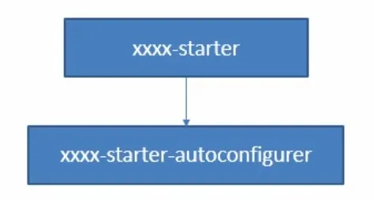

创建一个空工程

创建一个model

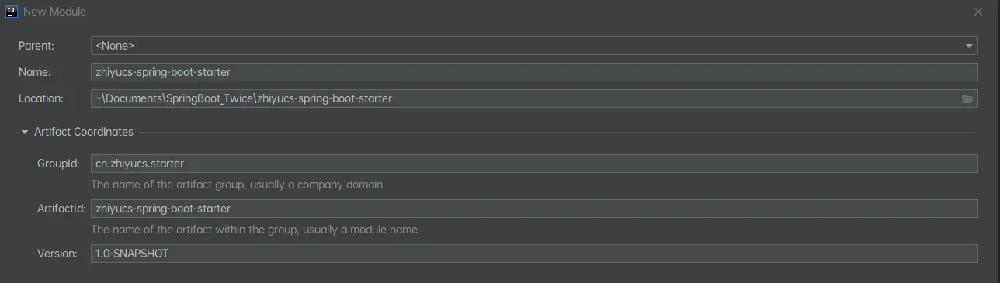

创建一个springbootInitialize


## SpringBoot缓存基本使用

应用--缓存--数据库的关系


几个重要的缓存注解：

| Cache          | 缓存接口，定义缓存操作。实现有：RedisCache、EhCacheCache、ConcurrentMapCache等 |
| -------------- | ------------------------------------------------------------------------------ |
| CacheManager   | 缓存管理器，管理各种缓存（Cache）组件                                          |
| @Cacheable     | 主要针对方法配置，能够根据方法的请求参数对其结果进行缓存                       |
| @CacheEvict    | 清空缓存                                                                       |
| @CachePut      | 保证方法被调用，又希望结果被缓存。                                             |
| @EnableCaching | 开启基于注解的缓存                                                             |
| keyGenerator   | 缓存数据时key生成策略                                                          |
| serialize      | 缓存数据时value序列化策略                                                      |

缓存的spel

| 名字            | 位置               | 描述                                                                                                                          | 示例                 |
| --------------- | ------------------ | ----------------------------------------------------------------------------------------------------------------------------- | -------------------- |
| methodName      | root object        | 当前被调用的方法名                                                                                                            | #root.methodName     |
| method          | root object        | 当前被调用的方法                                                                                                              | #root.method.name    |
| target          | root object        | 当前被调用的目标对象                                                                                                          | #root.target         |
| targetClass     | root object        | 当前被调用的目标对象类                                                                                                        | #root.targetClass    |
| args            | root object        | 当前被调用的方法的参数列表                                                                                                    | #root.args[0]        |
| caches          | root object        | 当前方法调用使用的缓存列表（如@Cacheable(value={"cache1", "cache2"})），则有两个cache                                         | #root.caches[0].name |
| *argument name* | evaluation context | 方法参数的名字. 可以直接 #参数名 ，也可以使用 #p0或#a0 的形式，0代表参数的索引；                                              | #iban 、 #a0 、 #p0  |
| result          | evaluation context | 方法执行后的返回值（仅当方法执行之后的判断有效，如‘unless’，’cache put’的表达式 ’cache evict’的表达式beforeInvocation=false） | #result              |


### 基本使用

在主类开启**@EnableCaching**缓存

```java
@MapperScan("cn.zhiyucs.mapper")
@SpringBootApplication
@EnableCaching
public class SpringbootCache01Application {
    public static void main(String[] args) {
        SpringApplication.run(SpringbootCache01Application.class, args);
    }
}
```

要缓存的方法开启**@Cacheable**：（介绍见注释）

```java
/**
     * @Cacheable :将方法结果放入缓存，以后要有相同的数据直接从缓存中获取，不用调方法
     * CacheManager 管理多个cache组件，对缓存的真正CRUD操作再cache组件中，每一个缓存都有自己唯一的名字
     * @Cacheable几个属性：
     *      cacheNames/value: 指定缓存组件的名字
     *      key: 缓存数据使用的key，默认是使用参数方法参数的值， 1-方法的返回值
     *      keyGenerator: key的生成器，可以自己指定key的生成器的组件id
     *          key / keyGenerator 二选一
     *      cacheManager: 指定缓存管理器/缓存解析器（cacheResolver）
     *      condition: 指定符合条件下才缓存
     *      unless: 否定缓存,当unless指定的条件为true，方法的返回值就不会被缓存
     *          eg. unless = "#result == null" 数据为空不缓存
     *      sync: 是否使用异步模式
     * @param id
     * @return
     */
    @Cacheable(cacheNames = {"emp"},condition = "#id>0",unless = "#result == null")
    public Employee getEmp(Integer id) {
        System.out.println("缓存测试专业SOUT");
        Employee emp = employeeMapper.getEmpById(id);
        return emp;
    }
```

数据库方面：开启驼峰命名自动映射，开启打印SQL：

打印SQL：

```properties
logging.level.cn.zhiyucs.mapper=debug
```

驼峰命名自动映射：

```yaml
mybatis:
  configuration:
    map-underscore-to-camel-case: true
```

### 几个属性介绍

cacheNames/value: 指定缓存组件的名字，将方法的返回结果放在哪个缓存中，是数组的方式，可以指定多个

condition #a0>1的意思是当第一个参数的值大于1才生效

unless 同理，第一个参数为2的话就不会缓存

```java
@Cacheable(cacheNames = {"emp"},key = "keyGenerator", condition = "#a0>1",unless = "#a0==2")
```

**key的两种方法：**

- 直接指定：**key = "#root.methodName+'['+#id+']"**
- 使用配置类指定：

```java
@Configuration
public class MyCacheConfig {
    @Bean
    public KeyGenerator keyGenerator() {
        return new KeyGenerator() {
            @Override
            public Object generate(Object target, Method method, Object... params) {
                return method.getName()+"["+ Arrays.asList(params).toString()+"]";
            }
        };
    }
}
```

然后直接调用即可：

```java
 @Cacheable(cacheNames = {"emp"},key = "keyGenerator")
```


## 缓存自动配置原理

```java
@Configuration(proxyBeanMethods = false)
@ConditionalOnClass(CacheManager.class)
@ConditionalOnBean(CacheAspectSupport.class)
@ConditionalOnMissingBean(value = CacheManager.class, name = "cacheResolver")
@EnableConfigurationProperties(CacheProperties.class)
@AutoConfigureAfter({ CouchbaseAutoConfiguration.class, HazelcastAutoConfiguration.class,
        HibernateJpaAutoConfiguration.class, RedisAutoConfiguration.class })
@Import({ CacheConfigurationImportSelector.class, CacheManagerEntityManagerFactoryDependsOnPostProcessor.class })
public class CacheAutoConfiguration {
```

这个类主要是导入了：CacheConfigurationImportSelector，导入了缓存要用的组件

```java
static class CacheConfigurationImportSelector implements ImportSelector {
    @Override
    public String[] selectImports(AnnotationMetadata importingClassMetadata) {
        CacheType[] types = CacheType.values();
        String[] imports = new String[types.length];
        for (int i = 0; i < types.length; i++) {
            imports[i] = CacheConfigurations.getConfigurationClass(types[i]);
        }
        return imports;
    }
}
```

主要是导入了这几个组件：默认使用的是 -- SimpleCacheConfiguration


**SimpleCacheConfiguration**：给容器中注册了一个cacheManager

```java
@Bean
ConcurrentMapCacheManager cacheManager(CacheProperties cacheProperties,
                                       CacheManagerCustomizers cacheManagerCustomizers) {
    ConcurrentMapCacheManager cacheManager = new ConcurrentMapCacheManager();
    List<String> cacheNames = cacheProperties.getCacheNames();
    if (!cacheNames.isEmpty()) {
        cacheManager.setCacheNames(cacheNames);
    }
    return cacheManagerCustomizers.customize(cacheManager);
}
```

进入**ConcurrentMapCacheManager**

cacheManager的作用是：通过进入**createConcurrentMapCache**方法，可知这个主要是创建了**ConcurrentMapCache**类型的缓存组件

```java
@Override
@Nullable
public Cache getCache(String name) {
    Cache cache = this.cacheMap.get(name);
    if (cache == null && this.dynamic) {
        synchronized (this.cacheMap) {
            cache = this.cacheMap.get(name);
            if (cache == null) {
                cache = createConcurrentMapCache(name);
                this.cacheMap.put(name, cache);
            }
        }
    }
    return cache;
}
```

**ConcurrentMapCache**的作用是把数据保存在ConcurrentMap<Object, Object>中：

```java
private final ConcurrentMap<Object, Object> store;
@Override
@Nullable
protected Object lookup(Object key) {
    return this.store.get(key);
}
```

### 以@Cacheable为例

 

```java
@Cacheable(cacheNames = {"emp"},condition = "#id>0",unless = "#result == null")
```

1. 方法运行之前，先去查询Cache（缓存组件），按照cacheNames指定的名字获取：CacheManager先获取相应的缓存，第一次获取缓存会自动创建出来（createConcurrentMapCache(name)）

```java
@Override
@Nullable
public Cache getCache(String name) {
```


2. Cache查找缓存的内容，使用一个key -- 默认是方法的参数，

key是按照某种策略生成的，默认是使用keyGennerator生成 -- 默认使用的是SimpleKeyGennerator

```java
// 生成策略
public static Object generateKey(Object... params) {
    if (params.length == 0) {
        return SimpleKey.EMPTY;
    } else {
        if (params.length == 1) {
            Object param = params[0];
            if (param != null && !param.getClass().isArray()) {
                return param;
            }
        }
        return new SimpleKey(params);
    }
}
```

 

```java
@Nullable
protected Object generateKey(@Nullable Object result) {
    if (StringUtils.hasText(this.metadata.operation.getKey())) {
        EvaluationContext evaluationContext = createEvaluationContext(result);
        return evaluator.key(this.metadata.operation.getKey(), this.metadata.methodKey, evaluationContext);
    }
    return this.metadata.keyGenerator.generate(this.target, this.metadata.method, this.args);
}
```


查询缓存的方法：（AbstractValueAdaptingCache.class）

```java
@Override
@Nullable
public ValueWrapper get(Object key) {
    Object value = lookup(key);
    return toValueWrapper(value);
}
```

3. 没有查到缓存就调用目标方法

```java
protected Object lookup(Object key) {
    return this.store.get(key);
}
```


4. 将目标方法返回的结果，放进缓存中

```java
@Override
public void put(Object key, @Nullable Object value) {
    this.store.put(key, toStoreValue(value));
}
```


第二次再访问时：lookup和getCache都会被访问到

lookup找到缓存后会转到 ValueWrapper get(Object key) 得到值；


### 小结：

#### 核心：

1. 使用CacheManager（ConcurrentMapCacheManager）按照名字得到Cache组件（ConcurrentMapCache）

2. key使用的是keyGennerator生成，默认是SimpleKeyGennerator


1. @Cacheable标注的方法执行前先检查缓存中有没有这个数据，默认按照参数的值作为key去查询缓存，如果没有就运行方法并将结果放入缓存。 以后再来调用就直接使用缓存中的数据

2. SimpleKeyGennerator生成策略：

- 如果没有参数，key就使用key = new SimpleKey()
- 如果有一个参数key=参数的值
- 如果有多个参数key = new SimpleKey(params)

```java
public class SimpleKeyGenerator implements KeyGenerator {
    @Override
    public Object generate(Object target, Method method, Object... params) {
        return generateKey(params);
    }
```


#### 思路整理

ConcurrentMapCacheManager通过getCache获取到name（key）

1. 第一次访问，没有缓存的情况

createConcurrentMapCache -> lookup根据key(key有生成策略)查找缓存的数据 -> 调用目标方法 -> 把数据放在缓存（store）里(this.store.put(key, toStoreValue(value)))

2. 第二次访问


Cache cache = this.cacheMap.get(name);调回缓存的数据-> 返回方法


## @CachePut的使用

**@CachePut**的key属性有两种写法：

- key = "#employee.id"
- key = "#result.id"

```java
/**
     * @CachePut 既调用方法，又更新缓存
     * 修改了数据库的某个数据，同时更新缓存
     * 运行时机：
     *  1. 先调用目标方法
     *  2. 将目标方法的结果缓存起来
     */
    @CachePut(cacheNames = "emp", key = "#result.id")
    public Employee updateEmp(Employee employee) {
        System.out.println(employee);
        employeeMapper.updateEmp(employee);
        return employee;
    }
```

为了实现同步缓存，这里的cacheNames可以和查询方法的一样，这样就可以实现更新的同时更换缓存的内容，从而达到查询也同步缓存。

```java
@Cacheable(cacheNames = {"emp"})
public Employee getEmp(Integer id) {
```


## @CacheEvict 清除缓存

@CacheEvict要清除name为emp缓存中key为id的所有数据 

```java
/**
     * @CacheEvict 缓存清除
     * key 指定要清除的数据
     * allEntries 要清除这个缓存中的所有数据
     * beforeInvocation = false 缓存的清除是否在方法之前执行，默认时在方法执行之后执行
     *      如果出现异常就不会清除
     */
@CacheEvict(value = "emp",key = "#id", allEntries = false, beforeInvocation = false)
public void deleteEmp(Integer id) {
    System.out.println("deleteEmp:" + id);
    //        employeeMapper.deleteEmpById(id);
}
```


## @Caching和@CacheConfig

### @Caching

​    **@Caching** 这个caching因为使用了**@CachePut**所以第二次还是会执行，但是如果执行了通过id和email查询就在执行了这个方法后就直接执行，因为这个方法已经缓存了这个内容

```java
/**
     * @Caching 定义复杂的缓存规则
     * @param lastName
     * @return
     */
@Caching(
    cacheable = {
        @Cacheable(value = "emp", key = "#lastName")
    },
    put = {
        @CachePut(value = "emp", key = "#result.id"),
        @CachePut(value = "emp", key = "#result.email")
    }
)
public Employee getEmpByLastName(String lastName) {
    return employeeMapper.getEmpByLastName(lastName);
}
```

### @CacheConfig

使用了这个直接之后，之后的所有注解（@Cacheable、@CachePut）就不用写已经在@CacheConfig中写了的属性

```java
@CacheConfig(cacheNames = "emp") //抽取缓存的公共配置
@Service
public class EmployeeService {
```


## 整合缓存中间件Redis

导包：

```xml
<dependency>
    <groupId>org.springframework.boot</groupId>
    <artifactId>spring-boot-starter-data-redis</artifactId>
</dependency>
```

配置Redis：

```yaml
spring:
  redis:
    host: 127.0.0.1
```

在要是有Redis的地方注入redis：

```java
@Autowired
StringRedisTemplate stringRedisTemplate; // 操作字符串
@Autowired
RedisTemplate redisTemplate; // k-v操作对象
```

直接使用Redis类型：

```java
@Test
public void test01() {
    ValueOperations<String, String> ops = stringRedisTemplate.opsForValue();
    String msg = ops.get("msg");
    System.out.println(msg);
}
```

自定义Redis类型（JSON类型）：

```java
@Configuration
public class MyRedisConfig {
    @Bean
    public RedisTemplate<Object, Employee> empRedisTemplate(
            RedisConnectionFactory redisConnectionFactory)
        throws UnknownHostException {
        RedisTemplate<Object, Employee> template = new RedisTemplate<>();
        template.setConnectionFactory(redisConnectionFactory);
        Jackson2JsonRedisSerializer<Employee> redisSerializer = new Jackson2JsonRedisSerializer<Employee>(Employee.class);
        template.setDefaultSerializer(redisSerializer);
        return template;
    }
}
```

然后就可以注入这个自定义的类：

```java
@Autowired
RedisTemplate<Object, Employee> employeeRedisTemplate;
```

 

```java
@Test
public void test02() {
    Employee emp = employeeMapper.getEmpById(1);
    ValueOperations<Object, Employee> ops = employeeRedisTemplate.opsForValue();
    ops.set("emp", emp);
}
```


## 自定义RedisCacheManager

在配置类中直接添加即可：实现序列化转为JSON格式

```java
/**
     * 缓存管理器
     */
@Bean
public CacheManager cacheManager(RedisConnectionFactory redisConnectionFactory) {
    //初始化一个RedisCacheWriter
    RedisCacheWriter redisCacheWriter = RedisCacheWriter.nonLockingRedisCacheWriter(redisConnectionFactory);
    //设置CacheManager的值序列化方式为json序列化
    RedisSerializer<Object> jsonSerializer = new GenericJackson2JsonRedisSerializer();
    RedisSerializationContext.SerializationPair<Object> pair = RedisSerializationContext.SerializationPair
        .fromSerializer(jsonSerializer);
    RedisCacheConfiguration defaultCacheConfig= RedisCacheConfiguration.defaultCacheConfig()
        .serializeValuesWith(pair);
    //设置默认超过期时间是30秒
    defaultCacheConfig.entryTtl(Duration.ofSeconds(30));
    //初始化RedisCacheManager
    return new RedisCacheManager(redisCacheWriter, defaultCacheConfig);
}
```


有两种调用方式：

第一种就是常用的注解：

```java
@Cacheable(cacheNames = "dept")
public Department getDeptById(Integer id) {
    System.out.println("查询部门" + id);
    Department department = departmentMapper.getDeptById(id);
    return department;
}
```

第二种是注入CacheManager后得到缓存，进行API调用：

```java
@Autowired
CacheManager cacheManager;
public Department getDeptById(Integer id) {
    System.out.println("查询部门" + id);
    Department department = departmentMapper.getDeptById(id);
    Cache dept = cacheManager.getCache("dept");
    dept.put("1", department);
    return department;
}
```

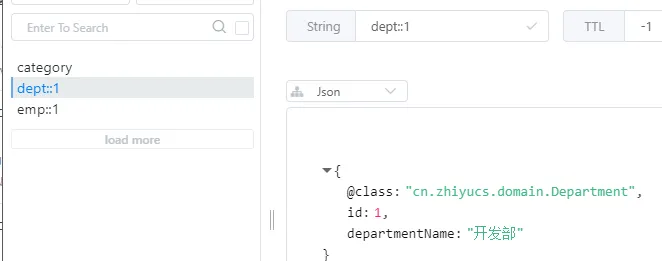


#### 扩展CacheManager的用法

判断在Redis中是否存在这个nosql，如果有就直接使用缓存，不查数据库，如果没有就查数据库缓存数据：

```java
public Department getDeptById(Integer id) {
    Department dp;
    Cache dept = cacheManager.getCache("dept");
    dp = dept.get("1", Department.class);
    if (dp == null) {
        dp = departmentMapper.getDeptById(id);
        dept.put("1", dp);
    }
    return dp;
}
```


## SpringSecurity的简单使用

导包：

 

```
<dependency>
    <groupId>org.springframework.boot</groupId>
    <artifactId>spring-boot-starter-security</artifactId>
</dependency>
```

建立一个配置类：

@EnableWebSecurity 开启安全配置，它里面有@Configuration

继承： WebSecurityConfigurerAdapter

 

```
@EnableWebSecurity
public class MySecurityConfig extends WebSecurityConfigurerAdapter {
```

定义授权规则和定义认证规则

 

```
// 定义授权规则
@Override
protected void configure(HttpSecurity http) throws Exception {
    //        super.configure(http);
    // 定制授权规则
    http.authorizeRequests().antMatchers("/").permitAll()
        .antMatchers("/level1/**").hasRole("VIP1")
        .antMatchers("/level2/**").hasRole("VIP2")
        .antMatchers("/level3/**").hasRole("VIP3");
    // 开启自动配置的登录功能
    // /login来到登录页
    // 重定向到/login/error登录失败
    // 如果没有登录权限就会来到登录页面
    http.formLogin();
    // 开启自动配置的注销功能
    // 访问/login注销用户，清空session
    // 注销成功会返回/login?logout
    http.logout().logoutSuccessUrl("/");
}
// 定义认证规则
@Override
protected void configure(AuthenticationManagerBuilder auth) throws Exception {
    //super.configure(auth);
    auth.inMemoryAuthentication().passwordEncoder(NoOpPasswordEncoder.getInstance())
        .withUser("admin").password("123").roles("VIP1","VIP2")
        .and()
        .withUser("lisi").password("123").roles("VIP2", "VIP3")
        .and()
        .withUser("zhiyu").password("123").roles("VIP1", "VIP3");
}
```

### Thymeleaf整合SpringSecurity

导包：

```xml
<dependency>
    <groupId>org.thymeleaf.extras</groupId>
    <artifactId>thymeleaf-extras-springsecurity5</artifactId>
</dependency>
```

在前端加入额外的xmlns：

```xml
<html xmlns:th="http://www.thymeleaf.org"
      xmlns:sec="http://www.thymeleaf.org/extras/spring-security">
```

判定是否授权了：**sec:authorize="!isAuthenticated()"**

```html
<div sec:authorize="!isAuthenticated()">
    <h2 align="center">游客您好，如果想查看武林秘籍 <a th:href="@{/login}">请登录</a></h2>
</div>
```

- 获取授权名：**sec:authentication="name"**
- 获取授权的权限名：**sec:authentication="principal.authorities"**
- 注销登录：**th:action="@{/logout}"**
- 判断是否存在这个权限：**sec:authorize="hasRole('权限名字')"**

### **记住我**

直接在授权规则的configure配置即可

```java
// 开启记住我功能
// 登录成功将cookie发给浏览器保存，以后登录就会带上这个cookie(14天)
http.rememberMe();
```

### 定制自己的登录页面

直接在授权规则的configure配置，

前端使用post方式：处理凭据，如果有效，则对用户进行身份验证

使用get：处理登录表格

如果action定位到userlogin/error，方法get：重定向到此处以进行失败的身份验证尝试

如果action定位到userlogin/logout，方法get：成功注销后重定向到此处

```java
http.formLogin().usernameParameter("user").passwordParameter("pwd")
                .loginPage("/userlogin"); // 默认post请求的/login是处理登录
```

 

```html
<div align="center">
        <form th:action="@{/userlogin}" th:method="post">
            用户名:<input name="user"/><br>
            密码:<input name="pwd"><br/>
            <input type="checkbox" name=""> 记住我 <br>
            <input type="submit" value="登陆">
        </form>
    </div>
```


## Shiro的简单使用

Shiro的功能框架图：

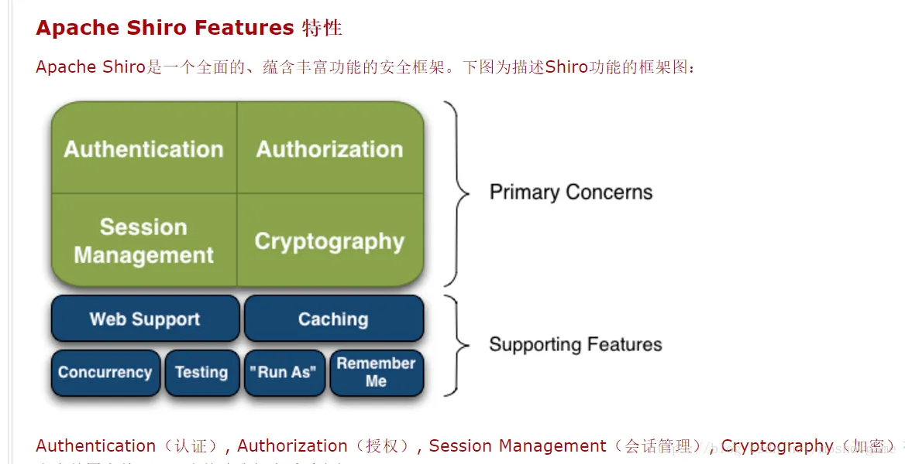

导包：

```xml
<dependency>
    <groupId>org.apache.shiro</groupId>
    <artifactId>shiro-spring</artifactId>
    <version>1.4.0</version>
</dependency>
```

测试环境设置（省略跳转网页的controller）：

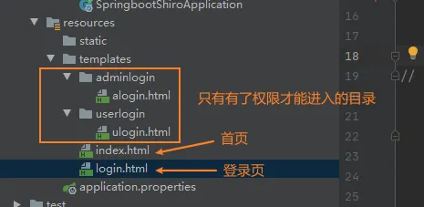

注：使用Thymeleaf模板的时候需要用到跳转页面@{}注意，如：th:href="@{/alogin}"，里面内容需要是controller的内容

### 开始配置一个shiro

Shiro 架构包含三个主要的理念：Subject 认证主体，SecurityManager 安全管理器和 Realm 域对象

- ShiroFilterFactoryBean ShiroFilter是整个Shiro的入口点，用于拦截需要安全控制的请求进行处理
- DefaultWebSecurityManager 安全管理器
- Realm 域对象

```java
@Configuration
public class ShiroConfig {
    @Bean
    ShiroFilterFactoryBean shiroFilterFactoryBean(@Qualifier("securityManager") DefaultWebSecurityManager securityManager) {
        ShiroFilterFactoryBean bean = new ShiroFilterFactoryBean();
        bean.setSecurityManager(securityManager);
        // 设置无权限时跳转的 url;
        shiroFilterFactoryBean.setUnauthorizedUrl("/notRole");
        /**
         * anon
         * 无参，开放权限，可以理解为匿名用户或游客
         * authc
         * 无参，需要认证
         * logout
         * 无参，注销，执行后会直接跳转到shiroFilterFactoryBean.setLoginUrl(); 设置的 url
         * authcBasic
         * 无参，表示 httpBasic 认证
         * user
         * 无参，表示必须存在用户，当登入操作时不做检查
         * ssl
         * 无参，表示安全的URL请求，协议为 https
         * perms[user]
         * 参数可写多个，表示需要某个或某些权限才能通过，多个参数时写 perms["user, admin"]，当有多个参数时必须每个参数都通过才算通过
         * roles[admin]
         * 参数可写多个，表示是某个或某些角色才能通过，多个参数时写 roles["admin，user"]，当有多个参数时必须每个参数都通过才算通过
         * rest[user]
         * 根据请求的方法，相当于 perms[user:method]，其中 method 为 post，get，delete 等
         * port[8081]
         * 当请求的URL端口不是8081时，跳转到schemal://serverName:8081?queryString 其中 schmal 是协议 http 或 https 等等，serverName 是你访问的 Host，8081 是 Port 端口，queryString 是你访问的 URL 里的 ? 后面的参数
         */
        // 设置拦截器
        Map<String, String> filterMap = new HashMap<>();
        filterMap.put("/", "anon");
        filterMap.put("/alogin", "perms[user:add]");
        filterMap.put("/ulogin", "authc");
        bean.setFilterChainDefinitionMap(filterMap);
        bean.setLoginUrl("/login");
        return bean;
    }
    @Bean
    DefaultWebSecurityManager securityManager(@Qualifier("userRealm") UserRealm userRealm) {
        DefaultWebSecurityManager securityManager = new DefaultWebSecurityManager();
        securityManager.setRealm(userRealm);
        return securityManager;
    }
    @Bean
    UserRealm userRealm() {
        return new UserRealm();
    }
}
```

**域对象**的创建

- 继承AuthorizingRealm
- 主要分为：授权和认证

```java
public class UserRealm extends AuthorizingRealm {
    // 授权
    @Override
    protected AuthorizationInfo doGetAuthorizationInfo(PrincipalCollection principals) {
        System.out.println("执行了授权...........");
        SimpleAuthorizationInfo info = new SimpleAuthorizationInfo();
        // 只要登录就有权限
//        info.addStringPermission("user:add");
        String username =  (String) principals.getPrimaryPrincipal();
        System.out.println(username);
        String role = userMapper.getRole(username);
        System.out.println(role);
        Set<String> set = new HashSet<>();
        //需要将 role 封装到 Set 作为 info.setRoles() 的参数
        set.add(role);
        //设置该用户拥有的角色
        //将用户对应的角色和权限信息 放到权限器中
        info.addStringPermissions(set);
        info.setRoles(set);
        return info;
    }
    // 认证
    @Override
    protected AuthenticationInfo doGetAuthenticationInfo(AuthenticationToken token) throws AuthenticationException {
       System.out.println("执行了认证............");
//        一般在数据库中取账号和密码
        UsernamePasswordToken userToken = (UsernamePasswordToken) token;
        String username = userToken.getUsername();
        User user = userMapper.getUserByName(username);
        if (user == null)
            return null;
        // SimpleAuthenticationInfo参数：
        // principle 认证实体，可以是username，也可以是实体类
        // credentials 密码
        // realmName 当前realm对象的name，直接调用父类的getName方法即可
        return new SimpleAuthenticationInfo(username, user.getPassword(), getName());
    }
}
```

使用控制层的请求把数据传输给Shiro和注销

```java
@RequestMapping("/loginAuth")
public String loginAuth(@PathParam("username") String username,
                        @PathParam("password") String password,
                        Model model) {
    // 获取当前用户
    Subject subject = SecurityUtils.getSubject();
    // 封装用户的数据
    UsernamePasswordToken token = new UsernamePasswordToken(username, password);
    // 执行登录的方法
    try {
        subject.login(token);
        return "index";
    } catch (UnknownAccountException e) {
        model.addAttribute("msg", "用户名错误");
        return "login";
    } catch (IncorrectCredentialsException e) {
        model.addAttribute("msg", "密码错误");
        return "login";
    }
}
@RequestMapping(value = "/logout", method = RequestMethod.GET)
public ResultMap logout() {
    Subject subject = SecurityUtils.getSubject();
    //注销
    subject.logout();
    return resultMap.success().message("成功注销！");
}
```


### 整合Shiro启动器

导包：

```xml
<dependency>
    <groupId>org.apache.shiro</groupId>
    <artifactId>shiro-spring-boot-web-starter</artifactId>
    <version>1.4.0</version>
</dependency>
```

项目结构：和security测试的时候一致

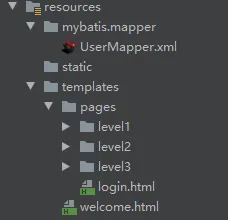

同样的配置类：（加入了MD5盐值加密算法）

```java
@Configuration
public class ShiroConfig {
    // 设置用于匹配密码的CredentialsMatcher
    @Bean
    public HashedCredentialsMatcher credentialsMatcher() {
        HashedCredentialsMatcher credentialsMatcher = new HashedCredentialsMatcher();
        //这里是使用sha256加密
        /*credentialsMatcher.setHashAlgorithmName(Sha256Hash.ALGORITHM_NAME);  // 散列算法，这里使用更安全的sha256算法
        credentialsMatcher.setStoredCredentialsHexEncoded(false);  // 数据库存储的密码字段使用HEX还是BASE64方式加密
        credentialsMatcher.setHashIterations(1024);  // 散列迭代次数*/
        //如果MD5密码加密,可以打开下面配置
        //加密算法的名称
        credentialsMatcher.setHashAlgorithmName("MD5");
        //配置加密的次数
        credentialsMatcher.setHashIterations(1024);
        //是否存储为16进制
        credentialsMatcher.setStoredCredentialsHexEncoded(true);
        return credentialsMatcher;
    }
    // 配置url过滤器
    @Bean
    ShiroFilterChainDefinition shiroFilterChainDefinition() {
        DefaultShiroFilterChainDefinition filter = new DefaultShiroFilterChainDefinition();
        filter.addPathDefinition("/level1/**", "perms[st:vip1]");
        filter.addPathDefinition("/level2/**", "perms[st:vip2]");
        filter.addPathDefinition("/level3/**", "perms[st:vip3]");
        filter.addPathDefinition("/login", "anon");
        filter.addPathDefinition("/", "anon");
        return filter;
    }
    @Bean
    DefaultWebSecurityManager securityManager() {
        DefaultWebSecurityManager manager = new DefaultWebSecurityManager();
        manager.setRealm(userRealm());
        return manager;
    }
    // 配置自定义Realm
    @Bean
    UserRealm userRealm() {
        UserRealm userRealm = new UserRealm();
        userRealm.setCredentialsMatcher(credentialsMatcher());
        return userRealm;
    }
}
```

认证和授权：

```java
public class UserRealm extends AuthorizingRealm {
    @Autowired
    UserMapper userMapper;
//    授权
    @Override
    protected AuthorizationInfo doGetAuthorizationInfo(PrincipalCollection principals) {
        System.out.println("授权........................");
        User user = (User) SecurityUtils.getSubject().getPrincipal();
        SimpleAuthorizationInfo authorizationInfo = new SimpleAuthorizationInfo();
        // 角色
        Set<String> roles = new HashSet<>();
        // 权限
        Set<String> permissions = new HashSet<>();
        // 测试用权限
        String role = userMapper.getRole(user.getUsername());
        roles.add(user.getUsername());
        permissions.add(role);
        authorizationInfo.setRoles(roles);
        authorizationInfo.setStringPermissions(permissions);
        return authorizationInfo;
    }
//    认证
    @Override
    protected AuthenticationInfo doGetAuthenticationInfo(AuthenticationToken token) throws AuthenticationException {
        System.out.println("认证........................");
        String username = (String) token.getPrincipal();
        User user = userMapper.getUserByName(username);
        System.out.println(user.getPassword());
        if (user == null) {
            throw new UnknownAccountException();
        }
//        MD5盐值加密ByteSource.Util.bytes(username)
        SimpleAuthenticationInfo authenticationInfo = new SimpleAuthenticationInfo(user, user.getPassword(), ByteSource.Util.bytes(username), getName());
        return authenticationInfo;
    }
}
```

控制层判断：

```java
@RequestMapping(value = "/loginAuth",method = RequestMethod.POST)
public String loginAuth(@PathParam("username") String username,
                        @PathParam("password") String password,
                        Model model) {
    // 获取当前用户
    Subject subject = SecurityUtils.getSubject();
    // 封装用户的数据
    UsernamePasswordToken token = new UsernamePasswordToken(username, password);
    // 执行登录的方法
    try {
        subject.login(token);
        return "welcome";
    } catch (UnknownAccountException e) {
        model.addAttribute("msg", "用户名错误");
        return PREFIX+"login";
    } catch (IncorrectCredentialsException e) {
        model.addAttribute("msg", "密码错误");
        return PREFIX+"login";
    }
}
```

### 扩展：

#### shiro默认过滤器

- anon	AnonymousFilter	指定url可以匿名访问
- authc	FormAuthenticationFilter	指定url需要form表单登录，默认会从请求中获取username、password,rememberMe等参数并尝试登录，如果登录不了就会跳转到loginUrl配置的路径。我们也可以用这个过滤器做默认的登录逻辑，但是一般都是我们自己在控制器写登录逻辑的，自己写的话出错返回的信息都可以定制嘛。
- authcBasic	BasicHttpAuthenticationFilter	指定url需要basic登录
- logout	LogoutFilter	登出过滤器，配置指定url就可以实现退出功能，非常方便
- noSessionCreation	NoSessionCreationFilter	禁止创建会话
- perms	PermissionsAuthorizationFilter	需要指定权限才能访问
- port	PortFilter	需要指定端口才能访问
- rest	HttpMethodPermissionFilter	将http请求方法转化成相应的动词来构造一个权限字符串，这个感觉意义不大，有兴趣自己看源码的注释
- roles	RolesAuthorizationFilter	需要指定角色才能访问
- ssl	SslFilter	需要https请求才能访问
- user	UserFilter	需要已登录或“记住我”的用户才能访问

#### shiro常用的权限控制注解，可以在控制器类上使用

- @RequiresGuest	只有游客可以访问
- @RequiresAuthentication	需要登录才能访问
- @RequiresUser	已登录的用户或“记住我”的用户能访问
- @RequiresRoles	已登录的用户需具有指定的角色才能访问
- @RequiresPermissions	已登录的用户需具有指定的权限才能访问


