# 前言
观看地址：https://www.bilibili.com/video/BV18E411x7eT

什么是微服务架构：


SpringCloud 是微服务一站式服务解决方案，微服务全家桶。它是微服务开发的主流技术栈。它采用了名称，而非数字版本号。

springCloud 和 springCloud Alibaba 目前是最主流的微服务框架组合。

版本选择：

> 选用 springboot 和 springCloud 版本有约束，不按照它的约束会有冲突。


## Cloud简介


参考资料，尽量去官网


> https://cloud.spring.io/spring-cloud-static/Hoxton.SR1/reference/htmlsingle/

# 工程建造

写一个下图的Hello World


构建父工程，后面的项目模块都在此工程中：


设置编码：Settings -> File Encodings

注解激活：

Java版本确定：


## 父工程pom配置

```xml
<?xml version="1.0" encoding="UTF-8"?>

<project xmlns="http://maven.apache.org/POM/4.0.0" xmlns:xsi="http://www.w3.org/2001/XMLSchema-instance"
  xsi:schemaLocation="http://maven.apache.org/POM/4.0.0 http://maven.apache.org/xsd/maven-4.0.0.xsd">
  <modelVersion>4.0.0</modelVersion>

  <groupId>com.dkf.cloud</groupId>
  <artifactId>cloud2020</artifactId>
  <version>1.0-SNAPSHOT</version>
    <!-- 第一步 -->
  <packaging>pom</packaging>

  <!-- 统一管理 jar 包版本 -->
  <properties>
    <project.build.sourceEncoding>UTF-8</project.build.sourceEncoding>
    <maven.compiler.source>1.8</maven.compiler.source>
    <maven.compiler.target>1.8</maven.compiler.target>
    <junit.version>4.12</junit.version>
    <log4j.version>1.2.17</log4j.version>
    <lombok.version>1.16.18</lombok.version>
    <mysql.version>5.1.47</mysql.version>
    <druid.version>1.1.16</druid.version>
    <mybatis.spring.boot.version>1.3.0</mybatis.spring.boot.version>
  </properties>

  <!-- 子块基础之后，提供作用：锁定版本 + 子module不用写 groupId 和 version -->
  <dependencyManagement>
    <dependencies>
        <dependency>
          <groupId>org.apache.maven.plugins</groupId>
          <artifactId>maven-project-info-reports-plugin</artifactId>
          <version>3.0.0</version>
        </dependency>

        <!-- 下面三个基本是微服务架构的标配 -->
        <!--spring boot 2.2.2-->
        <dependency>
          <groupId>org.springframework.boot</groupId>
          <artifactId>spring-boot-dependencies</artifactId>
          <version>2.2.2.RELEASE</version>
          <type>pom</type>
          <scope>import</scope>
        </dependency>
        <!--spring cloud Hoxton.SR1-->
        <dependency>
          <groupId>org.springframework.cloud</groupId>
          <artifactId>spring-cloud-dependencies</artifactId>
          <version>Hoxton.SR1</version>
          <type>pom</type>
          <scope>import</scope>
        </dependency>
        <!--spring cloud 阿里巴巴-->
        <dependency>
          <groupId>com.alibaba.cloud</groupId>
          <artifactId>spring-cloud-alibaba-dependencies</artifactId>
          <version>2.1.0.RELEASE</version>
          <type>pom</type>
          <scope>import</scope>
        </dependency>

        <!--mysql-->
        <dependency>
          <groupId>mysql</groupId>
          <artifactId>mysql-connector-java</artifactId>
          <version>${mysql.version}</version>
          <scope>runtime</scope>
        </dependency>
        <!-- druid-->
        <dependency>
          <groupId>com.alibaba</groupId>
          <artifactId>druid</artifactId>
          <version>${druid.version}</version>
        </dependency>
        <dependency>
          <groupId>org.mybatis.spring.boot</groupId>
          <artifactId>mybatis-spring-boot-starter</artifactId>
          <version>${mybatis.spring.boot.version}</version>
        </dependency>
        <!--junit-->
        <dependency>
          <groupId>junit</groupId>
          <artifactId>junit</artifactId>
          <version>${junit.version}</version>
        </dependency>
        <!--log4j-->
        <dependency>
          <groupId>log4j</groupId>
          <artifactId>log4j</artifactId>
          <version>${log4j.version}</version>
        </dependency>
    </dependencies>
  </dependencyManagement>

  <build>
    <plugins>
      <plugin>
        <groupId>org.springframework.boot</groupId>
        <artifactId>spring-boot-maven-plugin</artifactId>
        <configuration>
          <fork>true</fork>
          <addResources>true</addResources>
        </configuration>
      </plugin>
    </plugins>
  </build>
</project>
```

上面配置的解释：

> 首先要加 ` <packaging>pom</packaging> ` 这个。
>
> 聚合版本依赖，dependencyManagement 只声明依赖，并不实现引入，所以子项目还需要写要引入的依赖。
>
> 


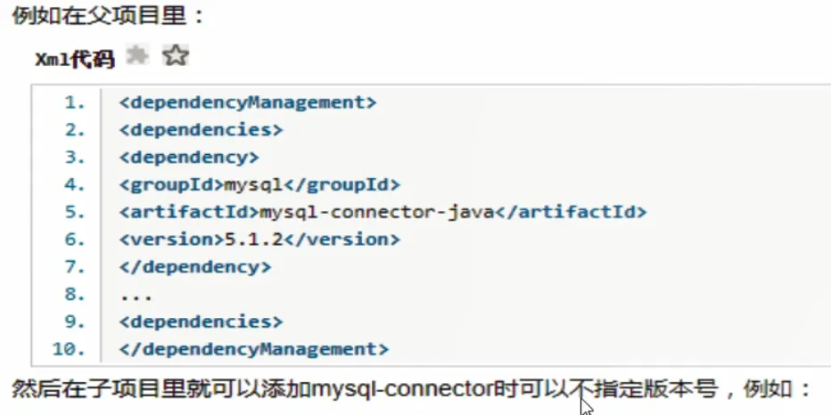


## 第一个微服务架构

> 1. 建模块 module
> 2. 改 pom
> 3. 写yml
> 4. 主启动
> 5. 业务类

### 提供者

cloud-provider-payment8001 子工程的pom文件：

> 这里面的 lombok 这个包，引入以后，实体类不用再写set 和 get
>
> 可以如下写实体类：
>
> ```java
> import lombok.AllArgsConstructor;
> import lombok.Data;
> import lombok.NoArgsConstructor;
> import java.io.Serializable;
> 
> @Data
> @AllArgsConstructor
> @NoArgsConstructor
> public class Payment implements Serializable {
> private Integer id;
> private String serial;
> }
> ```

```xml
<?xml version="1.0" encoding="UTF-8"?>
<project xmlns="http://maven.apache.org/POM/4.0.0"
         xmlns:xsi="http://www.w3.org/2001/XMLSchema-instance"
         xsi:schemaLocation="http://maven.apache.org/POM/4.0.0 http://maven.apache.org/xsd/maven-4.0.0.xsd">
    <parent>
        <artifactId>cloud2020</artifactId>
        <groupId>com.dkf.cloud</groupId>
        <version>1.0-SNAPSHOT</version>
    </parent>
    <modelVersion>4.0.0</modelVersion>

    <artifactId>cloud-provider-payment8001</artifactId>
    <dependencies>
        <!--eureka-client-->
        <dependency>
            <groupId>org.springframework.cloud</groupId>
            <artifactId>spring-cloud-starter-netflix-eureka-client</artifactId>
        </dependency>
        <dependency>
            <!-- 引入自己定义的api通用包，可以使用Payment支付Entity -->
            <groupId>com.atguigu.springcloud</groupId>
            <artifactId>cloud-api-commons</artifactId>
            <version>${project.version}</version>
        </dependency>
        <dependency>
            <groupId>org.springframework.boot</groupId>
            <artifactId>spring-boot-starter-web</artifactId>
        </dependency>
        <dependency>
            <groupId>org.springframework.boot</groupId>
            <artifactId>spring-boot-starter-actuator</artifactId>
        </dependency>
        <dependency>
            <groupId>org.mybatis.spring.boot</groupId>
            <artifactId>mybatis-spring-boot-starter</artifactId>
        </dependency>
        <dependency>
            <groupId>com.alibaba</groupId>
            <artifactId>druid-spring-boot-starter</artifactId>
            <version>1.1.10</version>
        </dependency>
        <!--mysql-connector-java-->
        <dependency>
            <groupId>mysql</groupId>
            <artifactId>mysql-connector-java</artifactId>
        </dependency>
        <!--jdbc-->
        <dependency>
            <groupId>org.springframework.boot</groupId>
            <artifactId>spring-boot-starter-jdbc</artifactId>
        </dependency>
        <dependency>
            <groupId>org.springframework.boot</groupId>
            <artifactId>spring-boot-devtools</artifactId>
            <scope>runtime</scope>
            <optional>true</optional>
        </dependency>
        <dependency>
            <groupId>org.projectlombok</groupId>
            <artifactId>lombok</artifactId>
            <optional>true</optional>
        </dependency>
        <dependency>
            <groupId>org.springframework.boot</groupId>
            <artifactId>spring-boot-starter-test</artifactId>
            <scope>test</scope>
        </dependency>
    </dependencies>

</project>
```

cloud-provider-payment8001 子工程的yml文件：

```yml
server:
  port: 8001

spring:
  application:
    name: cloud-provider-payment8001
  datasource:
    type: com.alibaba.druid.pool.DruidDataSource
    driver-class-name: org.gjt.mm.mysql.Driver
    url: jdbc:mysql://localhost:3306/cloud2020?useUnicode=true&characterEncoding=utf-8&useSSL=false
    username: root
    password: 123456
mybatis:
  mapper-locations: classpath:mapper/*.xml
  type-aliases-package: com.dkf.springcloud.entities  # 所有Entity 别名类所在包
```

cloud-provider-payment8001 子工程的主启动类：

```java
package com.dkf.springcloud;
import org.springframework.boot.SpringApplication;
import org.springframework.boot.autoconfigure.SpringBootApplication;

@SpringBootApplication
public class PaymentMain8001 {
    public static void main(String[] args){
        SpringApplication.run(PaymentMain8001.class, args);
    }
}
```

下面的常规操作：

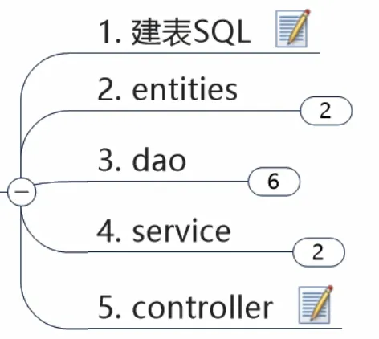

mybatis的mapper文件和service层代码不写了，下面记录一个特殊的Entity类，和Controller

CommonResult:

```java
package com.dkf.springcloud.entities;

import lombok.AllArgsConstructor;
import lombok.Data;
import lombok.NoArgsConstructor;

/**
 * 如果前后端分离，这个是提供给前端信息和数据的类
 * @param <T>
 */
@Data
@AllArgsConstructor
@NoArgsConstructor
public class CommonResult<T> {

    private Integer code;
    private String messgae;
    private T data;

    /**
     * 查询为空的时候使用的构造器
     * @param code
     * @param messgae
     */
    public CommonResult(Integer code, String messgae){
        this(code, messgae, null);
    }
}
```

Controller：

```java
package com.dkf.springcloud.controller;


import com.dkf.springcloud.entities.CommonResult;
import com.dkf.springcloud.entities.Payment;
import com.dkf.springcloud.service.PaymentService;
import lombok.extern.slf4j.Slf4j;
import org.springframework.stereotype.Controller;
import org.springframework.web.bind.annotation.GetMapping;
import org.springframework.web.bind.annotation.PathVariable;
import org.springframework.web.bind.annotation.PostMapping;
import org.springframework.web.bind.annotation.RestController;

import javax.annotation.Resource;

@RestController   //必须是这个注解，因为是模拟前后端分离的restful风格的请求，要求每个方法返回 json
@Slf4j
public class PaymentController {

    @Resource
    private PaymentService paymentService;

    @PostMapping(value = "/payment/create")
    //	    注意这里的 @RequestBody  是必须要写的，虽然 MVC可以自动封装参数成为对象，
    //      但是当消费者项目调用，它传参是 payment 整个实例对象传过来的， 即Json数据，因此需要写这个注解
    public CommonResult create(@RequestBody Payment payment){
        int result = paymentService.create(payment);
        log.info("****插入结果：" + result);
        if(result > 0){
            return new CommonResult(200, "插入数据库成功", result);
        }
        return new CommonResult(444, "插入数据库失败", null);
    }

    @GetMapping(value = "/payment/{id}")
    public CommonResult getPaymentById(@PathVariable("id")Long id){
        Payment result = paymentService.getPaymentById(id);
        log.info("****查询结果：" + result);
        if(result != null){
            return new CommonResult(200, "查询成功", result);
        }
        return new CommonResult(444, "没有对应id的记录", null);
    }
}
```

不但编译有个别地方会报错，启动也会报错，但是测试两个接口都是没问题的，推测启动报错是因为引入了下面才会引入的jar包，目前不影响。

### 热部署配置

1. 具体模块里添加Jar包到工程中，上面的pom文件已经添加上了

```xml
<dependency>    
    <groupId>org.springframework.boot</groupId>    
    <artifactId>spring-boot-devtools</artifactId>    
    <scope>runtime</scope>    
    <optional>true</optional>
</dependency>
```

2. 添加plus到父工程的pom文件中：上i按也已经添加好了

```xml
<build>    <plugins>      <plugin>        <groupId>org.springframework.boot</groupId>        <artifactId>spring-boot-maven-plugin</artifactId>        <configuration>          <fork>true</fork>          <addResources>true</addResources>        </configuration>      </plugin>    </plugins>  </build>
```

3. 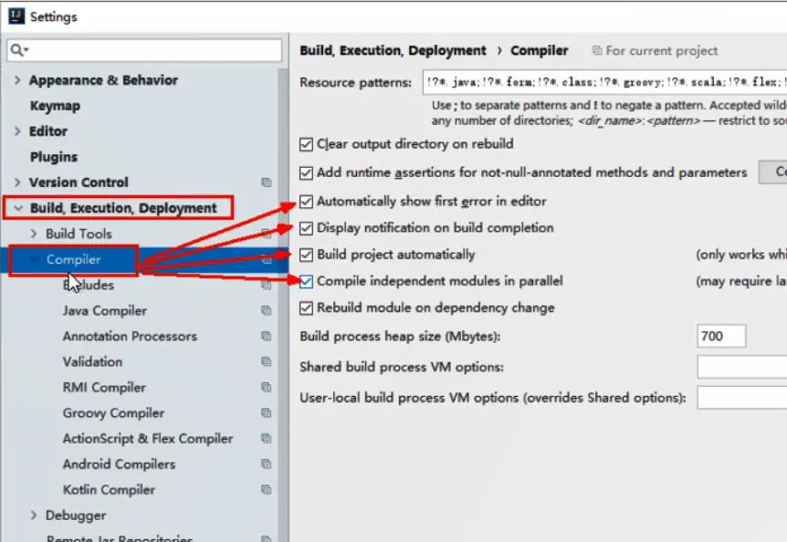

4. shift + ctrl + alt + / 四个按键一块按，选择Reg项：

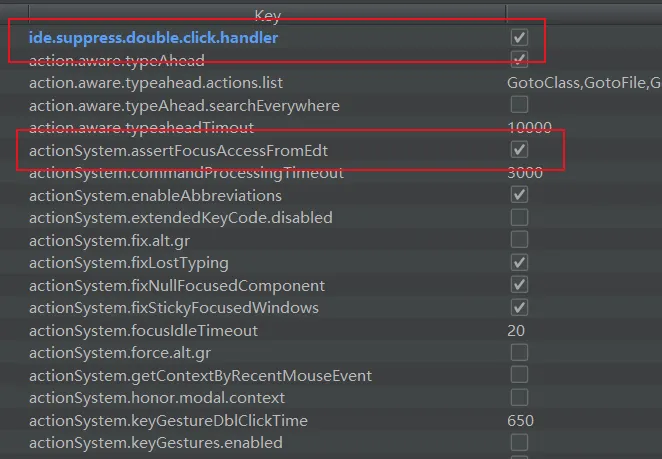

### 消费者

> 消费者现在只模拟调用提供者的Controller方法，没有持久层配置，只有Controller和实体类
>
> 当然也要配置主启动类和启动端口

pom文件：

```xml
<?xml version="1.0" encoding="UTF-8"?><project xmlns="http://maven.apache.org/POM/4.0.0"         xmlns:xsi="http://www.w3.org/2001/XMLSchema-instance"         xsi:schemaLocation="http://maven.apache.org/POM/4.0.0 http://maven.apache.org/xsd/maven-4.0.0.xsd">    <parent>        <artifactId>cloud2020</artifactId>        <groupId>com.dkf.cloud</groupId>        <version>1.0-SNAPSHOT</version>    </parent>    <modelVersion>4.0.0</modelVersion>    <artifactId>cloud-customer-order80</artifactId>    <dependencies>        <dependency>            <groupId>org.springframework.cloud</groupId>            <artifactId>spring-cloud-starter-netflix-eureka-client</artifactId>        </dependency>        <!--<dependency>&lt;!&ndash; 引入自己定义的api通用包，可以使用Payment支付Entity &ndash;&gt;-->            <!--<groupId>com.atguigu.springcloud</groupId>-->            <!--<artifactId>cloud-api-commons</artifactId>-->            <!--<version>${project.version}</version>-->        <!--</dependency>-->        <dependency>            <groupId>org.springframework.boot</groupId>            <artifactId>spring-boot-starter-web</artifactId>        </dependency>        <dependency>            <groupId>org.springframework.boot</groupId>            <artifactId>spring-boot-starter-actuator</artifactId>        </dependency>        <dependency>            <groupId>org.springframework.boot</groupId>            <artifactId>spring-boot-devtools</artifactId>            <scope>runtime</scope>            <optional>true</optional>        </dependency>        <dependency>            <groupId>org.projectlombok</groupId>            <artifactId>lombok</artifactId>            <optional>true</optional>        </dependency>        <dependency>            <groupId>org.springframework.boot</groupId>            <artifactId>spring-boot-starter-test</artifactId>            <scope>test</scope>        </dependency>    </dependencies></project>
```

把CommonResult 和 Payment 两个 实体类也创建出来

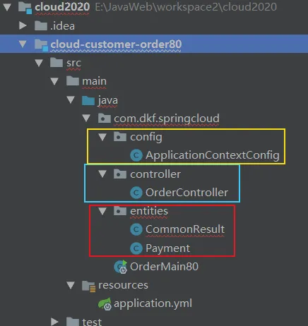

ApplicationContextConfig 内容：

```java
package com.dkf.springcloud.config;import org.springframework.context.annotation.Bean;import org.springframework.context.annotation.Configuration;import org.springframework.web.client.RestTemplate;@Configurationpublic class ApplicationContextConfig {    @Bean    public RestTemplate getRestTemplate(){        return new RestTemplate();    }}
```

Controller ：

```java
package com.dkf.springcloud.controller;import com.dkf.springcloud.entities.CommonResult;import com.dkf.springcloud.entities.Payment;import lombok.extern.slf4j.Slf4j;import org.springframework.stereotype.Controller;import org.springframework.web.bind.annotation.GetMapping;import org.springframework.web.bind.annotation.PathVariable;import org.springframework.web.bind.annotation.PostMapping;import org.springframework.web.bind.annotation.RestController;import org.springframework.web.client.RestTemplate;import javax.annotation.Resource;@RestController@Slf4jpublic class OrderController {    //远程调用的 地址    public static final String PAYMENY_URL = "http://localhost:8001";    @Resource    private RestTemplate restTemplate;    @PostMapping("customer/payment/create")    public CommonResult<Payment> create (Payment payment){        /**        param1 请求地址，param2 请求参数， param3 返回类型        */        return restTemplate.postForObject(PAYMENY_URL + "/payment/create", payment, CommonResult.class);    }    @GetMapping("customer/payment/{id}")    public CommonResult<Payment> getPaymentById(@PathVariable("id")Long id){        return restTemplate.getForObject(PAYMENY_URL + "/payment/" + id, CommonResult.class);    }}
```

如果 runDashboard 控制台没有出来，右上角搜索 即可

### 工程重构

> 上面 两个子项目，有多次重复的 导入 jar，和重复的 Entity 实体类。可以把 多余的部分，加入到一个独立的模块中，将这个模块打包，并提供给需要使用的 module

1. 新建一个 cloud-dkf-commons 子模块
2. 将 entities 包里面的实体类放到这个子模块中，也将 pom 文件中，重复导入的 jar包放到这个新建的 模块的 pom 文件中。如下：

```xml
<?xml version="1.0" encoding="UTF-8"?><project xmlns="http://maven.apache.org/POM/4.0.0"         xmlns:xsi="http://www.w3.org/2001/XMLSchema-instance"         xsi:schemaLocation="http://maven.apache.org/POM/4.0.0 http://maven.apache.org/xsd/maven-4.0.0.xsd">    <parent>        <artifactId>cloud2020</artifactId>        <groupId>com.dkf.cloud</groupId>        <version>1.0-SNAPSHOT</version>    </parent>    <modelVersion>4.0.0</modelVersion>    <artifactId>cloud-api-commons</artifactId>    <dependencies>    <dependency>        <groupId>org.springframework.boot</groupId>        <artifactId>spring-boot-devtools</artifactId>        <scope>runtime</scope>        <optional>true</optional>    </dependency>    <dependency>        <groupId>org.projectlombok</groupId>        <artifactId>lombok</artifactId>        <optional>true</optional>    </dependency>        <!-- 这个是新添加的，之前没用到，后面会用到 -->    <dependency>        <groupId>cn.hutool</groupId>        <artifactId>hutool-all</artifactId>        <version>5.1.0</version>    </dependency>    <!--  		关于这个hutool 是个功能强大的工具包，官网：https://hutool.cn/	--></dependencies></project>
```

将此项目打包 install 到 maven仓库。

3. 将 提供者 和 消费者 两个项目中的 entities 包删除，并删除掉加入到 cloud-api-commons 模块的 依赖配置。
4. 将 打包到 maven 仓库的 cloud-api-commons 模块，引入到 提供者 和 消费者的 pom 文件中，如下所示

```xml
<dependency><!-- 引入自己定义的api通用包，可以使用Payment支付Entity -->    <groupId>com.dkf.cloud</groupId>    <artifactId>cloud-api-commons</artifactId>    <version>${project.version}</version></dependency>
```

完成！

# 服务注册中心

> 如果是上面只有两个微服务，通过 RestTemplate ，是可以相互调用的，但是当微服务项目的数量增大，就需要服务注册中心。目前没有学习服务调用相关技术，使用 SpringCloud 自带的 RestTemplate 来实现RPC

## Eureka

> 官方停更不停用，以后可能用的越来越少。

### 概念和理论

> 它是用来服务治理，以及服务注册和发现，服务注册如下图：


版本说明：

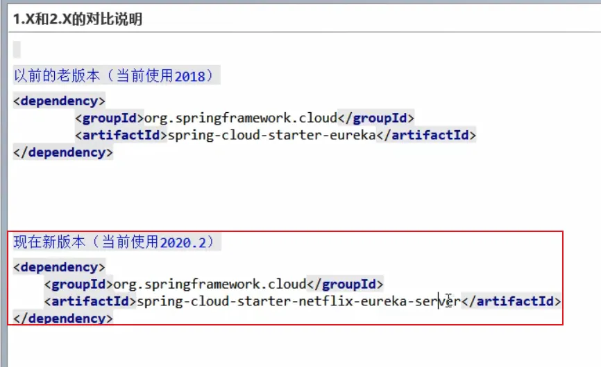

### Server模块

> server 模块使用 7001端口，下面是pom文件需要的依赖：
>
> ```xml
> 	<artifactId>cloud-eureka-server7001</artifactId> <dependencies>     <dependency>         <groupId>org.springframework.cloud</groupId>         <artifactId>spring-cloud-starter-netflix-eureka-server</artifactId>     </dependency>     <dependency>         <groupId>org.springframework.boot</groupId>         <artifactId>spring-boot-starter-web</artifactId>     </dependency>     <dependency>         <groupId>org.springframework.boot</groupId>         <artifactId>spring-boot-starter-actuator</artifactId>     </dependency>     <dependency>         <groupId>org.mybatis.spring.boot</groupId>         <artifactId>mybatis-spring-boot-starter</artifactId>     </dependency>     <dependency>         <groupId>org.springframework.boot</groupId>         <artifactId>spring-boot-devtools</artifactId>         <scope>runtime</scope>         <optional>true</optional>     </dependency>     <dependency>         <groupId>org.springframework.boot</groupId>         <artifactId>spring-boot-starter-test</artifactId>         <scope>test</scope>     </dependency>     <dependency><!-- 引入自己定义的api通用包，可以使用Payment支付Entity -->         <groupId>com.dkf.cloud</groupId>         <artifactId>cloud-api-commons</artifactId>         <version>${project.version}</version>     </dependency> </dependencies>
> ```

> 下面配置 yml 文件：
>
> ```yml
> server:port: 7001eureka:instance: hostname: localhost  # eureka 服务器的实例名称client: # false 代表不向服务注册中心注册自己，因为它本身就是服务中心 register-with-eureka: false # false 代表自己就是服务注册中心，自己的作用就是维护服务实例，并不需要去检索服务 fetch-registry: false service-url:   # 设置与 Eureka Server 交互的地址，查询服务 和 注册服务都依赖这个地址   defaultZone: http://${eureka.instance.hostname}:${server.port}/eureka/
> ```
>
> 最后写主启动类，如果启动报错，说没有配置 DataSource ，就在 主启动类的注解加上 这样的配置：
>
> ```java
> // exclude ：启动时不启用 DataSource的自动配置检查@SpringBootApplication(exclude = DataSourceAutoConfiguration.class)@EnableEurekaServer   // 表示它是服务注册中心public class EurekaServerMain7001 { public static void main(String[] args){     SpringApplication.run(EurekaServerMain7001.class, args); }}
> ```

启动测试，访问 7001 端口

### 提供者

> 这里的提供者，还是使用 上面的 cloud-provider-payment8001 模块，做如下修改：

1. 在 pom 文件的基础上引入 eureka 的client包，pom 的全部依赖如下所示：

```xml
	<artifactId>cloud-provider-payment8001</artifactId>    <dependencies>        <!--eureka-client-->        <dependency>            <groupId>org.springframework.cloud</groupId>            <artifactId>spring-cloud-starter-netflix-eureka-client</artifactId>        </dependency>        <dependency>            <groupId>org.springframework.boot</groupId>            <artifactId>spring-boot-starter-web</artifactId>        </dependency>        <dependency>            <groupId>org.springframework.boot</groupId>            <artifactId>spring-boot-starter-actuator</artifactId>        </dependency>        <dependency>            <groupId>org.mybatis.spring.boot</groupId>            <artifactId>mybatis-spring-boot-starter</artifactId>        </dependency>        <dependency>            <groupId>com.alibaba</groupId>            <artifactId>druid-spring-boot-starter</artifactId>            <version>1.1.10</version>        </dependency>        <!--mysql-connector-java-->        <dependency>            <groupId>mysql</groupId>            <artifactId>mysql-connector-java</artifactId>        </dependency>        <!--jdbc-->        <dependency>            <groupId>org.springframework.boot</groupId>            <artifactId>spring-boot-starter-jdbc</artifactId>        </dependency>        <dependency>            <groupId>org.springframework.boot</groupId>            <artifactId>spring-boot-devtools</artifactId>            <scope>runtime</scope>            <optional>true</optional>        </dependency>        <dependency>            <groupId>org.projectlombok</groupId>            <artifactId>lombok</artifactId>            <optional>true</optional>        </dependency>        <dependency>            <groupId>org.springframework.boot</groupId>            <artifactId>spring-boot-starter-test</artifactId>            <scope>test</scope>        </dependency>        <dependency><!-- 引入自己定义的api通用包，可以使用Payment支付Entity -->            <groupId>com.dkf.cloud</groupId>            <artifactId>cloud-api-commons</artifactId>            <version>${project.version}</version>        </dependency>    </dependencies>
```

2. 主启动类 加上注解 ： @EnableEurekaClient
3. yml 文件添加关于 Eureka 的配置：

```yml
eureka:  client:	# 注册进 Eureka 的服务中心    register-with-eureka: true    # 检索 服务中心 的其它服务    fetch-registry: true    service-url:      # 设置与 Eureka Server 交互的地址      defaultZone: http://localhost:7001/eureka/
```

应用名称：

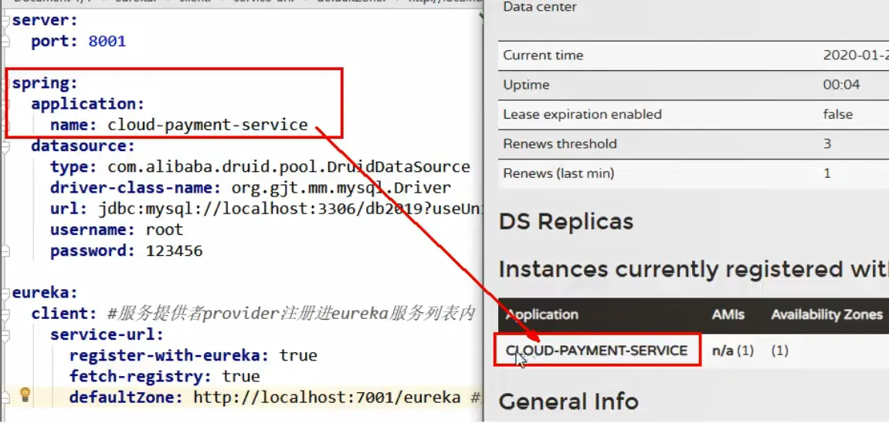

### 消费者

> 这里的消费者 也是上面 的 cloud-customer-order80 模块

1. 修改 pom 文件，加入Eureka 的有关依赖， 全部 pom 依赖如下：

```xml
	<artifactId>cloud-customer-order80</artifactId>    <dependencies>        <dependency>            <groupId>org.springframework.cloud</groupId>            <artifactId>spring-cloud-starter-netflix-eureka-client</artifactId>        </dependency>        <dependency><!-- 引入自己定义的api通用包，可以使用Payment支付Entity -->            <groupId>com.dkf.cloud</groupId>            <artifactId>cloud-api-commons</artifactId>            <version>${project.version}</version>        </dependency>        <dependency>            <groupId>org.springframework.boot</groupId>            <artifactId>spring-boot-starter-web</artifactId>        </dependency>        <dependency>            <groupId>org.springframework.boot</groupId>            <artifactId>spring-boot-starter-actuator</artifactId>        </dependency>        <dependency>            <groupId>org.projectlombok</groupId>            <artifactId>lombok</artifactId>            <optional>true</optional>        </dependency>        <dependency>            <groupId>org.springframework.boot</groupId>            <artifactId>spring-boot-devtools</artifactId>            <scope>runtime</scope>            <optional>true</optional>        </dependency>        <dependency>            <groupId>org.springframework.boot</groupId>            <artifactId>spring-boot-starter-test</artifactId>            <scope>test</scope>        </dependency>    </dependencies>
```

2. 主启动类 加上注解 ： @EnableEurekaClient
3. yml 文件必须添加的内容：

```yml
eureka:  client:    register-with-eureka: true    fetch-registry: true    service-url:      defaultZone: http://localhost:7001/eureka/spring:  application:    name: cloud-order-service
```

### Eureka 集群

> Eureka 集群的原理，就是 相互注册，互相守望
>
> 模拟多个 Eureka Server 在不同机器上 ： 进入C:\Windows\System32\drivers\etc\hosts  添加如下：
>
> 127.0.0.1 eureka7001.com
>
> 127.0.0.1 eureka 7002.com

现在创建 cloud-eureka-server7002 ，也就是第二个 Eureka 服务注册中心，pom 文件和 主启动类，与第一个Server一致。

现在修改这两个 Server 的 yml 配置：

7001 端口的Server yml文件：

```yml
server:  port: 7001eureka:  instance:    hostname: eureka7001.com  # eureka 服务器的实例地址  client:    register-with-eureka: false    fetch-registry: false    service-url:    ## 一定要注意这里的地址，这是搭建集群的关键      defaultZone: http://eureka7002.com:7002/eureka/
```

7002 端口的Server yml文件：

```yml
server:  port: 7002eureka:  instance:    hostname: eureka7002.com  # eureka 服务器的实例地址  client:    register-with-eureka: false    fetch-registry: false    service-url:    ## 一定要注意这里的地址 这是搭建集群的关键      defaultZone: http://eureka7001.com:7001/eureka/
```

> eureka.instance.hostname 才是启动以后 本 Server 的注册地址，而 service-url  是 map 类型，只要保证 key:value 格式就行，它代表 本Server 指向了那些 其它Server 。利用这个，就可以实现Eureka Server 相互之间的注册，从而实现集群的搭建。

将 提供者 和 消费者 注册进两个Eureka Server 中，下面是 消费者和提供者的 yml 文件关于Eureka的配置：

```yml
eureka:  client:    register-with-eureka: true    fetch-registry: true    service-url:      defaultZone: http://eureka7001.com:7001/eureka/,http://eureka7002.com:7002/eureka/
```

> 从这里可以看出，也可以使用列表形式进行Server之间的关联注册。

### 提供者集群

> 为提供者，即 cloud-provider-payment8001 模块创建集群，新建模块为 cloud-provider-payment8002
>
> 最终实现：
>
> 
>
> 注意在 Controller 返回不同的消息，从而区分者两个提供者的工作状态。

其余配置都一致，需要配置集群的配置如下：

配置区别：只要保证消费者项目对服务注册中心提供的名称一致，即完成集群。

```yml
server:  port: 8001  # 端口号不一样spring:  application:    name: cloud-provider-service  # 这次重点是这里，两个要写的一样，这是这个集群的关键  datasource:    type: com.alibaba.druid.pool.DruidDataSource    driver-class-name: org.gjt.mm.mysql.Driver    url: jdbc:mysql://localhost:3306/cloud2020?useUnicode=true&characterEncoding=utf-8&useSSL=false    username: root    password: 123456mybatis:  mapper-locations: classpath:mapper/*.xml  type-aliases-package: com.dkf.springcloud.entities  eureka:  client:    register-with-eureka: true    fetch-registry: true    service-url:      defaultZone: http://eureka7001.com:7001/eureka/,http://eureka7002.com:7002/eureka/
```

消费者的配置

> 就是消费者如何访问 由这两个提供者组成的集群？

Eureka Server 上的提供者的服务名称如下：

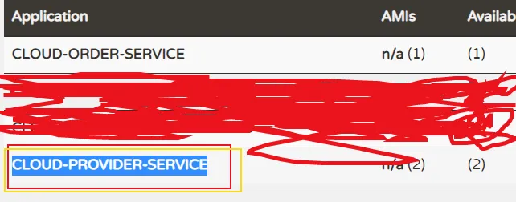

```java
@RestController@Slf4jpublic class OrderController {							    // 重点是这里，改成 提供者在Eureka 上的名称，而且无需写端口号	    public static final String PAYMENY_URL = "http://CLOUD-PROVIDER-SERVICE";    @Resource    private RestTemplate restTemplate;    @PostMapping("customer/payment/create")    public CommonResult<Payment> create (Payment payment){        return restTemplate.postForObject(PAYMENY_URL + "/payment/create", payment, CommonResult.class);    }    @GetMapping("customer/payment/{id}")    public CommonResult<Payment> getPaymentById(@PathVariable("id")Long id){        return restTemplate.getForObject(PAYMENY_URL + "/payment/" + id, CommonResult.class);    }}
```

还有，消费者里面对RestTemplate配置的config文件，需要更改成如下：（就是加一个注解 @LoadBalanced）

```java
package com.dkf.springcloud.config;import org.springframework.cloud.client.loadbalancer.LoadBalanced;import org.springframework.context.annotation.Bean;import org.springframework.context.annotation.Configuration;import org.springframework.web.client.RestTemplate;@Configurationpublic class ApplicationContextConfig {    @Bean    @LoadBalanced  //这个注解，就赋予了RestTemplate 负载均衡的能力    public RestTemplate getRestTemplate(){        return new RestTemplate();    }}
```

测试，完成！

### actuator信息配置

修改 在Eureka 注册中心显示的 主机名：

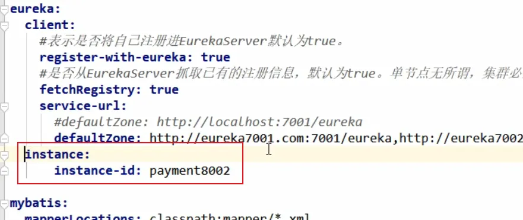

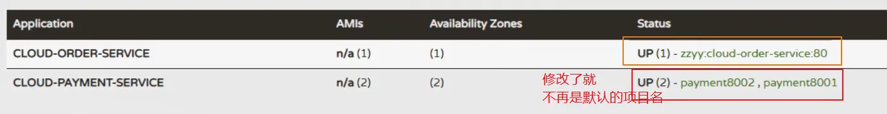

显示微服务所在 的主机地址：


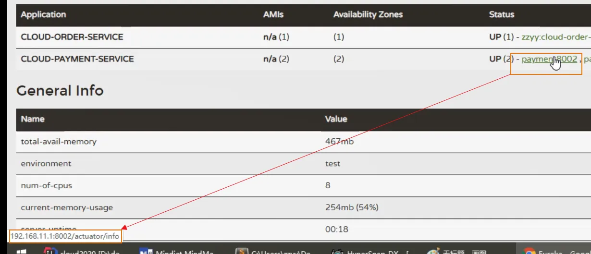

### 服务发现Discovery

> 对于注册进eureka里面的微服务，可以通过服务发现来获得该服务的信息

1. 在主启动类上添加注解：@EnableDiscoveryClient
2. 在 Controller 里面打印信息：

```java
@Resource    private DiscoveryClient discoveryClient;    @GetMapping("/customer/discovery")    public Object discovery(){        List<String> services = discoveryClient.getServices();        for(String service: services){            log.info("*****service: " + service);        }        List<ServiceInstance> instances = discoveryClient.getInstances("CLOUD-ORDER-SERVICE");        for(ServiceInstance serviceInstance:instances){            log.info(serviceInstance.getServiceId() + "\t" + serviceInstance.getHost()                    + "\t" + serviceInstance.getPort() + "\t" + serviceInstance.getUri());        }        return this.discoveryClient;    }
```

### Eureka 自我保护机制


禁止自我保护:

> 在 Eureka Server 的模块中的 yml 文件进行配置：


修改 Eureka Client 模块的 心跳间隔时间：


## Zookeeper

> springCloud 整合 zookeeper

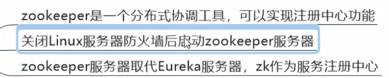

### 提供者

> 创建一个提供者，和之前的一样即可，使用 8004端口

pom文件如下：

```xml
	<artifactId>cloud-provider-payment8004</artifactId>    <dependencies>        <!--springcloud 整合 zookeeper 组件-->        <dependency>            <groupId>org.springframework.cloud</groupId>            <artifactId>spring-cloud-starter-zookeeper-discovery</artifactId>            <exclusions>                <exclusion>                    <groupId>org.apache.zookeeper</groupId>                    <artifactId>zookeeper</artifactId>                </exclusion>            </exclusions>        </dependency>        <dependency>            <groupId>org.apache.zookeeper</groupId>            <artifactId>zookeeper</artifactId>            <version>3.4.9</version>            <exclusions>                <exclusion>                    <groupId>org.slf4j</groupId>                    <artifactId>slf4j-log4j12</artifactId>                </exclusion>            </exclusions>        </dependency>        <dependency>            <groupId>org.springframework.boot</groupId>            <artifactId>spring-boot-starter-web</artifactId>        </dependency>        <dependency>            <groupId>org.springframework.boot</groupId>            <artifactId>spring-boot-starter-actuator</artifactId>        </dependency>        <dependency>            <groupId>org.mybatis.spring.boot</groupId>            <artifactId>mybatis-spring-boot-starter</artifactId>        </dependency>        <dependency>            <groupId>com.alibaba</groupId>            <artifactId>druid-spring-boot-starter</artifactId>            <version>1.1.10</version>        </dependency>        <!--mysql-connector-java-->        <dependency>            <groupId>mysql</groupId>            <artifactId>mysql-connector-java</artifactId>        </dependency>        <!--jdbc-->        <dependency>            <groupId>org.springframework.boot</groupId>            <artifactId>spring-boot-starter-jdbc</artifactId>        </dependency>        <dependency>            <groupId>org.springframework.boot</groupId>            <artifactId>spring-boot-devtools</artifactId>            <scope>runtime</scope>            <optional>true</optional>        </dependency>        <dependency>            <groupId>org.projectlombok</groupId>            <artifactId>lombok</artifactId>            <optional>true</optional>        </dependency>        <dependency>            <groupId>org.springframework.boot</groupId>            <artifactId>spring-boot-starter-test</artifactId>            <scope>test</scope>        </dependency>        <dependency><!-- 引入自己定义的api通用包，可以使用Payment支付Entity -->            <groupId>com.dkf.cloud</groupId>            <artifactId>cloud-api-commons</artifactId>            <version>${project.version}</version>        </dependency>    </dependencies>
```

主启动类：

```java
import org.springframework.boot.SpringApplication;import org.springframework.boot.autoconfigure.SpringBootApplication;import org.springframework.cloud.client.discovery.EnableDiscoveryClient;@SpringBootApplication@EnableDiscoveryClient	public class PaymentMain8004 {    public static void main(String[] args){        SpringApplication.run(PaymentMain8004.class, args);    }}
```

Controller 打印信息：

```java
@RestController@Slf4jpublic class PaymentController {    @Resource    private PaymentService paymentService;    @Value("${server.port}")    private String serverPort;    @RequestMapping("/payment/zk")    public String paymentzk(){        return "springcloud with zookeeper :" + serverPort + "\t" + UUID.randomUUID().toString();    }}
```

***如果 zookeeper 的版本和导入的jar包版本不一致，启动就会报错，由jar包冲突的问题。

解决这种冲突，需要在 pom 文件中，排除掉引起冲突的jar包，添加和服务器zookeeper版本一致的 jar 包，

但是新导入的 zookeeper jar包 又有 slf4j 冲突问题，于是再次排除引起冲突的jar包

```xml
<!--springcloud 整合 zookeeper 组件--><dependency>    <groupId>org.springframework.cloud</groupId>    <artifactId>spring-cloud-starter-zookeeper-discovery</artifactId>    <!-- 排除与zookeeper版本不一致到导致 冲突的 jar包 -->    <exclusions>        <exclusion>            <groupId>org.apache.zookeeper</groupId>            <artifactId>zookeeper</artifactId>        </exclusion>    </exclusions></dependency><!-- 添加对应版本的jar包 --><dependency>    <groupId>org.apache.zookeeper</groupId>    <artifactId>zookeeper</artifactId>    <version>3.4.9</version>    <!-- 排除和 slf4j 冲突的 jar包 -->    <exclusions>        <exclusion>            <groupId>org.slf4j</groupId>            <artifactId>slf4j-log4j12</artifactId>        </exclusion>    </exclusions></dependency>
```

yml文件：

```yml
server:  port: 8004spring:  application:    name: cloud-provider-service  cloud:    zookeeper:      connect-string: 192.168.40.100:2181
```

启动测试：


### 消费者

> 创建测试zookeeper作为服务注册中心的 消费者 模块 cloud-customerzk-order80
>
> 主启动类、pom文件、yml文件和提供者的类似

config类，注入 RestTemplate

```java
@SpringBootConfigurationpublic class ApplicationContextConfig {    @Bean    @LoadBalanced    public RestTemplate getTemplate(){        return new RestTemplate();    }}
```

controller层也是和之前类似：

```java
@RestController@Slf4jpublic class CustomerZkController {    public static final String INVOKE_URL="http://cloud-provider-service";    @Resource    private RestTemplate restTemplate;    @RequestMapping("/customer/payment/zk")    public String paymentInfo(){        String result = restTemplate.getForObject(INVOKE_URL + "/payment/zk",String.class);        return result;    }}
```

关于 zookeeper 的集群搭建，目前使用较少，而且在 yml 文件中的配置也是类似，以列表形式写入 zookeeper 的多个地址即可，而且zookeeper 集群，在 hadoop的笔记中也有记录。总而言之，只要配合zookeeper集群，以及yml文件的配置就能完成集群搭建

## Consul

> consul也是服务注册中心的一个实现，是由go语言写的。官网地址： https://www.consul.io/intro
>
> 中文地址： https://www.springcloud.cc/spring-cloud-consul.html
>
> 功能：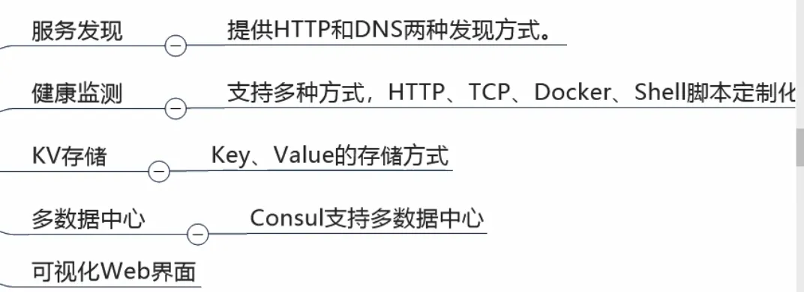

### 安装并运行

>  下载地址：https://www.consul.io/downloads.html
>
>  打开下载的压缩包，只有一个exe文件，实际上是不用安装的，在exe文件所在目录打开dos窗口使用即可。
>
>  使用开发模式启动：consul agent -dev
>
>  访问8500端口，即可访问首页

### 提供者

> 新建提供者模块：cloud-providerconsul-service8006

pom 文件：

```xml
	<artifactId>cloud-providerconsul-service8006</artifactId>    <dependencies>        <!--springcloud consul server-->        <dependency>            <groupId>org.springframework.cloud</groupId>            <artifactId>spring-cloud-starter-consul-discovery</artifactId>        </dependency>        <!-- springboot整合Web组件 -->        <dependency>            <groupId>org.springframework.boot</groupId>            <artifactId>spring-boot-starter-web</artifactId>        </dependency>        <dependency>            <groupId>org.springframework.boot</groupId>            <artifactId>spring-boot-starter-actuator</artifactId>        </dependency>        <!-- 日常通用jar包 -->        <dependency>            <groupId>org.mybatis.spring.boot</groupId>            <artifactId>mybatis-spring-boot-starter</artifactId>        </dependency>        <dependency>            <groupId>org.springframework.boot</groupId>            <artifactId>spring-boot-devtools</artifactId>            <scope>runtime</scope>            <optional>true</optional>        </dependency>        <dependency>            <groupId>org.projectlombok</groupId>            <artifactId>lombok</artifactId>            <optional>true</optional>        </dependency>        <dependency>            <groupId>org.springframework.boot</groupId>            <artifactId>spring-boot-starter-test</artifactId>            <scope>test</scope>        </dependency>        <dependency><!-- 引入自己定义的api通用包，可以使用Payment支付Entity -->            <groupId>com.dkf.cloud</groupId>            <artifactId>cloud-api-commons</artifactId>            <version>${project.version}</version>        </dependency>    </dependencies>
```

yml 文件：

```yml
server:  port: 8006spring:  application:    name: consul-provider-service  cloud:    consul:      host: localhost      port: 8500      discovery:    # 指定注册对外暴露的服务名称        service-name: ${spring.application.name}
```

主启动类：

```java
@SpringBootApplication@EnableDiscoveryClientpublic class ConsulProviderMain8006 {    public static void main(String[] args) {        SpringApplication.run(ConsulProviderMain8006.class,args);    }}
```

controller也是简单的写一下就行。

### 消费者

> 新建 一个 在82端口的 消费者模块。pom和yml和提供者的类似，主启动类不用说，记得注入RestTemplate

controller层：

```java
@RestControllerpublic class CustomerConsulController {    public static final String INVOKE_URL="http://consul-provider-service";    @Resource    private RestTemplate restTemplate;    @RequestMapping("/customer/payment/consul")    public String paymentInfo(){        String result = restTemplate.getForObject(INVOKE_URL + "/payment/consul",String.class);        return result;    }}
```

## 总结


AP:


CP：

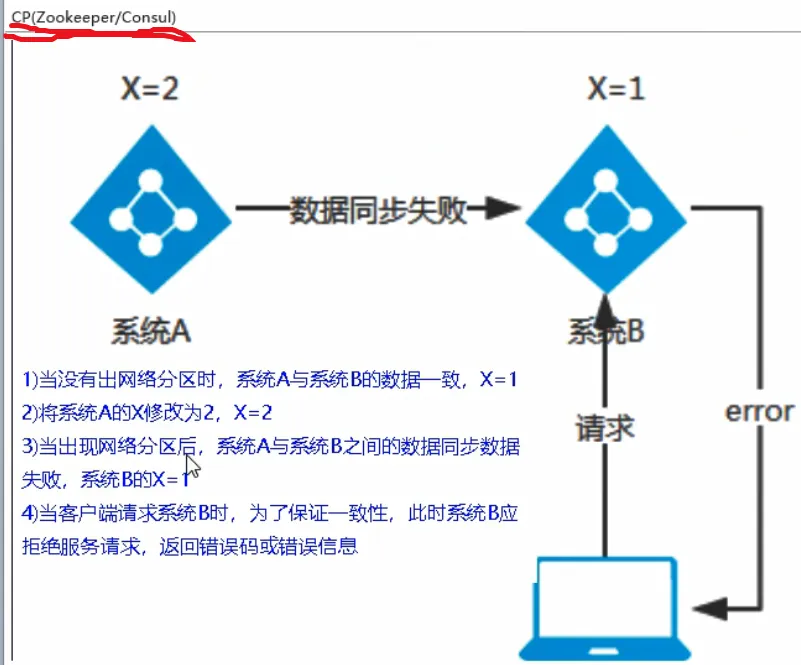

# 服务调用

> 都是使用在 client端，即有 ”消费者“ 需求的模块中。

## Ribbon

> 我们这里提前启动好之前在搭建的 eureka Server 集群（5个模块）
>
> 

### 简介


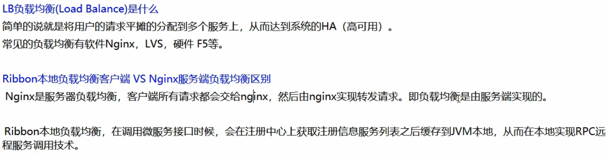


上面在eureka时，确实实现了负载均衡机制，那是因为 eureka-client包里面自带着ribbon：

> 一句话，Ribbon 就是 负载均衡 + RestTemplate 调用。实际上不止eureka的jar包有，zookeeper的jar包，还有consul的jar包都包含了他，就是上面使用的服务调用。


如果自己添加，在 模块的 pom 文件中引入：

```xml
<dependency>    <groupId>org.springframework.cloud</groupId>    <artifactId>spring-cloud-starter-netflix-ribbon</artifactId></dependency>
```

对于RestTemplate 的一些说明：

> 有两种请求方式：post和get ,还有两种返回类型：object 和 Entity

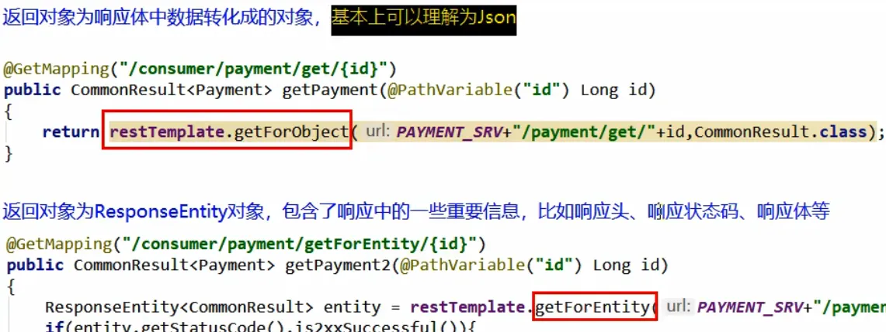

RestTemplate 的 ForEntity 相比 ForObject特殊的地方:


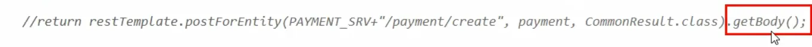

就是 如果使用 ForObject 得到的就是提供者返回的对象，而如果要使用 ForEntity 得到时 ResponstEntity对象，使用getBody()才能得到提供者返回的数据。

```java
	//使用forEnriry示例：	@GetMapping("customer/payment/forEntity/{id}")    public CommonResult<Payment> getPaymentById2(@PathVariable("id")Long id){                ResponseEntity<CommonResult> entity = restTemplate.getForEntity(PAYMENY_URL + "/payment/" + id, CommonResult.class);                if(entity.getStatusCode().is2xxSuccessful()){            return entity.getBody();        }else{            return new CommonResult<>(444, "操作失败");        }    }
```

### 负载均衡

Ribbon 负载均衡规则类型：

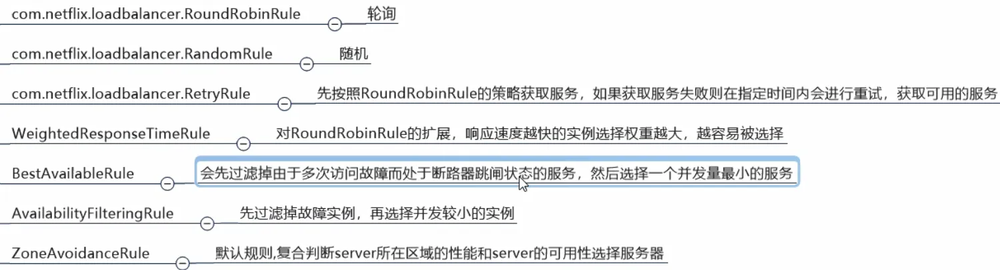

配置负载均衡规则：


> 注意上面说的，而Springboot主启动类上的 @SpringBootApplication 注解，相当于加了@ComponentScan注解，会自动扫描当前包及子包，所以注意不要放在SpringBoot主启动类的包内。

创建包：

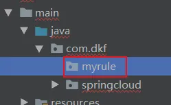

在这个包下新建 MySelfRule类：

```java
package com.dkf.myrule;import com.netflix.loadbalancer.IRule;import com.netflix.loadbalancer.RandomRule;import org.springframework.context.annotation.Bean;import org.springframework.context.annotation.Configuration;@Configurationpublic class MySelfRule {    @Bean    public IRule myrule(){        return new RandomRule(); //负载均衡规则定义为随机    }}
```

然后在主启动类上添加如下注解 @RibbonClient：

```java
package com.dkf.springcloud;import com.dkf.myrule.MySelfRule;import org.springframework.boot.SpringApplication;import org.springframework.boot.autoconfigure.SpringBootApplication;import org.springframework.cloud.client.discovery.EnableDiscoveryClient;import org.springframework.cloud.netflix.eureka.EnableEurekaClient;import org.springframework.cloud.netflix.ribbon.RibbonClient;@SpringBootApplication@EnableEurekaClient@EnableDiscoveryClient	   //指定该负载均衡规则对哪个提供者服务使用    加载自定义规则的配置类@RibbonClient(name="CLOUD-PROVIDER-SERVICE", configuration = MySelfRule.class)public class OrderMain80 {    public static void main(String[] args){        SpringApplication.run(OrderMain80.class, args);    }}
```

### 轮询算法原理


## OpenFeign

### 概述

> 这里和之前学的dubbo很像，例如消费者的controller 可以调用提供者的 service层方法，但是不一样，它貌似只能调用提供者的 controller，即写一个提供者项目的controller的接口，消费者来调用这个接口方法，就还是相当于是调用提供者的 controller ，和RestTemplate 没有本质区别

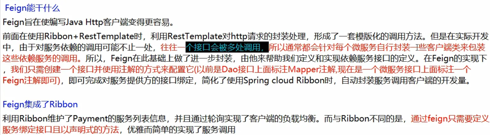

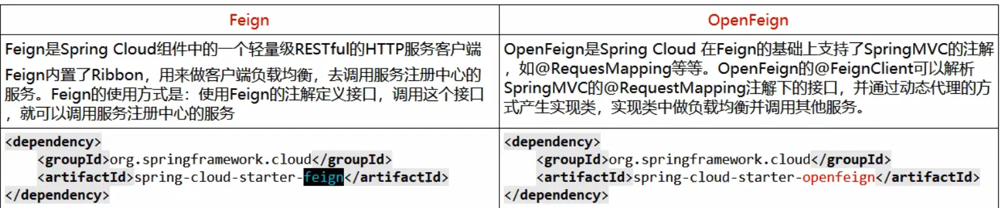

### 使用

> 新建一个消费者募模块。feign自带负载均衡配置，所以不用手动配置

pom ：

```xml
	<dependencies>        <!-- Open Feign -->         <dependency>            <groupId>org.springframework.cloud</groupId>            <artifactId>spring-cloud-starter-openfeign</artifactId>        </dependency>        <!-- eureka Client -->        <dependency>            <groupId>org.springframework.cloud</groupId>            <artifactId>spring-cloud-starter-netflix-eureka-client</artifactId>        </dependency>        <dependency><!-- 引入自己定义的api通用包，可以使用Payment支付Entity -->            <groupId>com.dkf.cloud</groupId>            <artifactId>cloud-api-commons</artifactId>            <version>${project.version}</version>        </dependency>        <dependency>            <groupId>org.springframework.boot</groupId>            <artifactId>spring-boot-starter-web</artifactId>        </dependency>        <dependency>            <groupId>org.springframework.boot</groupId>            <artifactId>spring-boot-starter-actuator</artifactId>        </dependency>        <dependency>            <groupId>org.projectlombok</groupId>            <artifactId>lombok</artifactId>            <optional>true</optional>        </dependency>        <dependency>            <groupId>org.springframework.boot</groupId>            <artifactId>spring-boot-devtools</artifactId>            <scope>runtime</scope>            <optional>true</optional>        </dependency>        <dependency>            <groupId>org.springframework.boot</groupId>            <artifactId>spring-boot-starter-test</artifactId>            <scope>test</scope>        </dependency>    </dependencies>
```

主启动类：

```java
@SpringBootApplication@EnableFeignClients   //关键注解public class CustomerFeignMain80 {    public static void main(String[] args) {        SpringApplication.run(CustomerFeignMain80.class, args);    }}
```

新建一个service

> 这个service还是 customer 模块的接口，和提供者没有任何关系，不需要包类名一致。它使用起来就相当于是普通的service。
>
> 
>
> 推测大致原理，对于这个service 接口，读取它某个方法的注解（GET或者POST注解不写报错），知道了请求方式和请求地址，而抽象方法，只是对于我们来讲，调用该方法时，可以进行传参等。

```java
@Component@FeignClient(value = "CLOUD-PROVIDER-SERVICE")  //服务名称，要和eureka上面的一致才行public interface PaymentFeignService {    //这个就是provider 的controller层的方法定义。    @GetMapping(value = "/payment/{id}")    public CommonResult getPaymentById(@PathVariable("id")Long id);}
```

Controller层：

```java
//使用起来就相当于是普通的service。@RestControllerpublic class CustomerFeignController {    @Resource    private PaymentFeignService paymentFeignService;    @GetMapping("customer/feign/payment/{id}")    public CommonResult<Payment> getPaymentById(@PathVariable("id") Long id){        return paymentFeignService.getPaymentById(id);    }}
```

### 超时控制

> Openfeign默认超时等待为一秒，在消费者里面配置超时时间


### 开启日志打印

首先写一个config配置类：

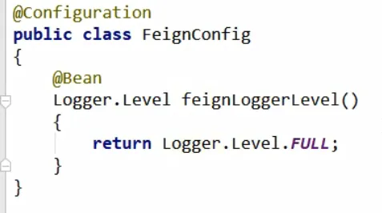

然后在yml文件中开启日志打印配置：


# 中级部分

> 主要是服务降级、服务熔断、服务限流的开发思想和框架实现

# Hystrix 断路器

> 官方地址：https://github.com/Netflix/Hystrix/wiki/How-To-Use

## 概述


服务降级：

> 服务器忙碌或者网络拥堵时，不让客户端等待并立刻返回一个友好提示，fallback
>
> 发生的情况：

服务熔断：

> 

服务限流：

> 

> 可见，上面的技术不论是消费者还是提供者，根据真实环境都是可以加入配置的。

## 案例

> 首先构建一个eureka作为服务中心的单机版微服务架构 ，这里使用之前eureka Server 7001模块，作为服务中心

新建 提供者  cloud-provider-hystrix-payment8001 模块：

pom 文件：

```xml
	<dependencies>        <!-- hystrix -->        <dependency>            <groupId>org.springframework.cloud</groupId>            <artifactId>spring-cloud-starter-netflix-hystrix</artifactId>        </dependency>        <!--eureka-client-->        <dependency>            <groupId>org.springframework.cloud</groupId>            <artifactId>spring-cloud-starter-netflix-eureka-client</artifactId>        </dependency>        <dependency>            <groupId>org.springframework.boot</groupId>            <artifactId>spring-boot-starter-web</artifactId>        </dependency>        <dependency>            <groupId>org.springframework.boot</groupId>            <artifactId>spring-boot-starter-actuator</artifactId>        </dependency>        <dependency>            <groupId>org.springframework.boot</groupId>            <artifactId>spring-boot-devtools</artifactId>            <scope>runtime</scope>            <optional>true</optional>        </dependency>        <dependency>            <groupId>org.projectlombok</groupId>            <artifactId>lombok</artifactId>            <optional>true</optional>        </dependency>        <dependency>            <groupId>org.springframework.boot</groupId>            <artifactId>spring-boot-starter-test</artifactId>            <scope>test</scope>        </dependency>        <dependency><!-- 引入自己定义的api通用包，可以使用Payment支付Entity -->            <groupId>com.dkf.cloud</groupId>            <artifactId>cloud-api-commons</artifactId>            <version>${project.version}</version>        </dependency>    </dependencies>
```

下面主启动类、service、和controller代码都很简单普通。

主启动类：

```java
@SpringBootApplication(exclude = DataSourceAutoConfiguration.class)@EnableEurekaClientpublic class PaymentMain8001 {    public static void main(String[] args) {        SpringApplication.run(PaymentMain8001.class,args);    }}
```

service层：

```java
@Servicepublic class PaymentService {    /**     * 可以正常访问的方法     * @param id     * @return     */    public String paymentinfo_Ok(Integer id){        return "线程池：" + Thread.currentThread().getName() + "--paymentInfo_OK，id:" + id;    }    /**    超时访问的方法    */    public String paymentinfo_Timeout(Integer id){        int interTime = 3;        try{            TimeUnit.SECONDS.sleep(interTime);        }catch (Exception e){            e.printStackTrace();        }        return "线程池：" + Thread.currentThread().getName() + "--paymentInfo_Timeout，id:" + id + "耗时" + interTime + "秒钟--";    }}
```

controller层：

```java
@RestController@Slf4jpublic class PaymentController {    @Resource    private PaymentService paymentService;    @Value("${server.port}")    private String serverPort;    @GetMapping("/payment/hystrix/{id}")    public String paymentInfo_OK(@PathVariable("id")Integer id){        log.info("paymentInfo_OKKKKOKKK");        return paymentService.paymentinfo_Ok(id);    }    @GetMapping("/payment/hystrix/timeout/{id}")    public String paymentInfo_Timeout(@PathVariable("id")Integer id){        log.info("paymentInfo_timeout");        return paymentService.paymentinfo_Timeout(id);    }}
```

### 模拟高并发

> 这里使用一个新东西 JMeter 压力测试器
>
> 下载压缩包，解压，双击 /bin/ 下的 jmeter.bat 即可启动
>
> 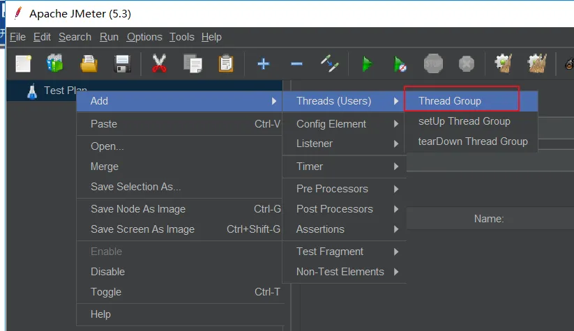
>
> 
>
> ctrl + S 保存。
>
> 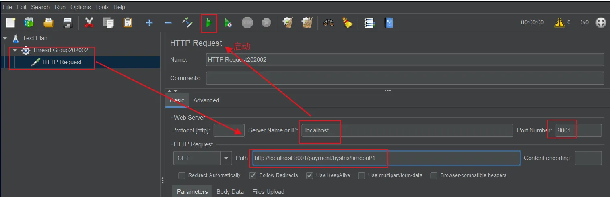

从测试可以看出，当模拟的超长请求被高并发以后，访问普通的小请求速率也会被拉低。

新建消费者 cloud-customer-feign-hystrix-order80 模块：以feign为服务调用，eureka为服务中心的模块，yml、pom等文件不再赘写。

测试可见，当启动高并发测试时，消费者访问也会变得很慢，甚至出现超时报错。

解决思路：

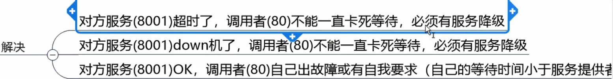

### 服务降级

> 一般服务降级放在客户端，即 消费者端 ，但是提供者端一样能使用。
>
> 首先提供者，即8001 先从自身找问题，设置自身调用超时的峰值，峰值内正常运行，超出峰值需要有兜底的方法处理，作服务降级fallback

首先 对 8001 的service进行配置（对容易超时的方法进行配置) :

```java
	@HystrixCommand(fallbackMethod = "paymentInfo_timeoutHandler", commandProperties = {            //设置峰值，超过 3 秒，就会调用兜底方法，这个时间也可以由feign控制            @HystrixProperty(name="execution.isolation.thread.timeoutInMilliseconds", value = "3000")    })    public String paymentinfo_Timeout(Integer id){        ......会执行5秒.....    }	//兜底方法，根据上述配置，程序内发生异常、或者运行超时，都会执行该兜底方法    public String paymentInfo_timeoutHandler(Integer id){        .......    }}
```

主启动类添加注解： @EnableCircuitBreaker

然后对 80 进行服务降级：很明显 service 层是接口，所以我们对消费者，在它的 controller 层进行降级

```java
	 @HystrixCommand(fallbackMethod = "paymentInfo_timeoutHandler", commandProperties = {            //设置峰值，超过 3 秒，就会调用兜底方法            @HystrixProperty(name="execution.isolation.thread.timeoutInMilliseconds", value = "3000")    })    @GetMapping("/customer/payment/hystrix/timeout/{id}")    public String paymentInfo_Timeout(@PathVariable("id")Integer id){        log.info("paymentInfo_timeout");        return orderService.paymentInfo_Timeout(id);    }	//兜底方法，注意，兜底方法参数随意    public String paymentInfo_timeoutHandler(@PathVariable("id")Integer id){        log.info("paymentInfo_timeout--handler");        return "访问 payment 失败----人工报错";    }
```

主启动类添加注解： @EnableCircuitBreaker

完成测试！ 注意，消费者降级设置的超时时间和提供者的没有任何关系，就算提供者峰值是 5 秒，而消费者峰值是 3秒，那么消费者依然报错。就是每个模块在服务降级上，都是独立的。

### 全局服务降级

> 上面的降级策略，很明显造成了代码的杂乱，提升了耦合度，而且按照这样，每个方法都需要配置一个兜底方法，很繁琐。现在将降级处理方法（兜底方法）做一个全局的配置，设置共有的兜底方法和独享的兜底方法。

问题-每个方法配置一个，解决：

```java
@RestController@Slf4j//全局配置降级方法的注解@DefaultProperties(defaultFallback = "paymentInfo_timeoutHandler")public class OrderController {    .....    // 不写自己的 fallbackMethod 属性，就使用全局默认的    @HystrixCommand(commandProperties = {            @HystrixProperty(name="execution.isolation.thread.timeoutInMilliseconds", value = "3000")    })    @GetMapping("/customer/payment/hystrix/timeout/{id}")    public String paymentInfo_Timeout(@PathVariable("id")Integer id){        ......    }    //兜底方法    public String paymentInfo_timeoutHandler(){        log.info("paymentInfo_timeout--handler");        return "访问 payment 失败----人工报错";    }}
```

问题-跟业务逻辑混合，解决（解耦）：

> 在这种方式一般是在客户端，即消费者端，首先上面再controller中添加的  @HystrixCommand 和 @DefaultProperties 两个注解去掉。就是保持原来的controller

1. yml文件配置

```yml
server:  port: 80spring:  application:    name: cloud-customer-feign-hystrix-serviceeureka:  client:    register-with-eureka: true    fetch-registry: true    service-url:      defaultZone: http://eureka7001.com:7001/eureka/# 用于服务降级 在注解@FeignClient 中添加 fallback 属性值feign:  hystrix:    enabled: true  # 在feign中开启 hystrix
```

2. 修改service 接口：

```java
@Component											// 这里是重点@FeignClient(value = "CLOUD-PROVIDER-HYSTRIX-PAYMENT", fallback = OrderFallbackService.class)public interface OrderService {    @GetMapping("/payment/hystrix/{id}")    public String paymentInfo_OK(@PathVariable("id")Integer id);    @GetMapping("/payment/hystrix/timeout/{id}")    public String paymentInfo_Timeout(@PathVariable("id")Integer id);}
```

3. fallback 指向的类：

```java
package com.dkf.springcloud.service;import org.springframework.stereotype.Component;@Component						//注意这里，它实现了service接口public class OrderFallbackService implements  OrderService{    @Override    public String paymentInfo_OK(Integer id) {        return "OrderFallbackService --发生异常";    }    @Override    public String paymentInfo_Timeout(Integer id) {        return "OrderFallbackService --发生异常--paymentInfo_Timeout";    }}
```

新问题，这样配置如何设置超时时间？

> 首先要知道 下面两个 yml 配置项：
>
> ```properties
> hystrix.command.default.execution.timeout.enable=true    ## 默认值## 为false则超时控制有ribbon控制，为true则hystrix超时和ribbon超时都是用，但是谁小谁生效，默认为truehystrix.command.default.execution.isolation.thread.timeoutInMilliseconds=1000  ## 默认值## 熔断器的超时时长默认1秒，最常修改的参数
> ```
>
> 看懂以后，所以：
>
> 只需要在yml配置里面配置 Ribbon 的 超时时长即可。注意：hystrix 默认自带 ribbon包。
>
> ```yml
> ribbon:	ReadTimeout: xxxx	ConnectTimeout: xxx
> ```

### 服务熔断

> 实际上服务熔断 和 服务降级 没有任何关系，就像 java 和 javaScript
>
> 服务熔断，有点自我恢复的味道


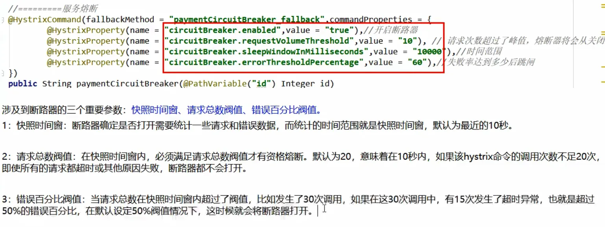

以 8001 项目为示例：

service层的方法设置服务熔断:

```java
 	//=====服务熔断    @HystrixCommand(fallbackMethod = "paymentCircuitBreaker_fallback", commandProperties = {            @HystrixProperty(name="circuitBreaker.enabled", value="true"),  // 是否开启断路器            @HystrixProperty(name="circuitBreaker.requestVolumeThreshold", value="10"),  //请求次数            @HystrixProperty(name="circuitBreaker.sleepWindowInMilliseconds", value="10000"), // 时间窗口期            @HystrixProperty(name="circuitBreaker.errorThresholdPercentage", value="60"),  // 失败率达到多少后跳闸            //整体意思：10秒内 10次请求，有6次失败，就跳闸    })    public String paymentCircuitBreaker(Integer id){        //模拟发生异常        if(id < 0){            throw new RuntimeException("*****id，不能为负数");        }        String serialNumber = IdUtil.simpleUUID();        return Thread.currentThread().getName() + "\t" + "调用成功，流水号：" + serialNumber;    }    public String paymentCircuitBreaker_fallback(Integer id){        return "id 不能为负数，请稍后再试....";    }
```

controller:

```java
	//====服务熔断    @GetMapping("/payment/circuit/{id}")    public String paymentCircuitBreaker(@PathVariable("id")Integer id){        return paymentService.paymentCircuitBreaker(id);    }
```

关于解耦以后的全局配置说明：

例如上面提到的全局服务降级，并且是feign+hystrix整合，即 service 实现类的方式，如何做全局配置？

> 上面有 做全局配置时，设置超时时间的方式，我们可以从中获得灵感，即在yml文件中 进行熔断配置：
>
> ```yml
> hystrix:command: default:   circuitBreaker:     enabled: true     requestVolumeThreshold: 10     sleepWindowInMilliseconds: 10000     errorThresholdPercentage: 60
> ```

## Hystrix DashBoard

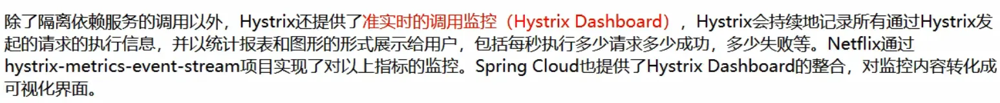

新建模块 cloud-hystrix-dashboard9001 ：

pom 文件：

```xml
	<dependencies>        <!-- hystrix Dashboard-->        <dependency>            <groupId>org.springframework.cloud</groupId>            <artifactId>spring-cloud-starter-netflix-hystrix-dashboard</artifactId>        </dependency>        <!-- 常规 jar 包 -->        <dependency>            <groupId>org.springframework.boot</groupId>            <artifactId>spring-boot-starter-web</artifactId>        </dependency>        <dependency>            <groupId>org.springframework.boot</groupId>            <artifactId>spring-boot-starter-actuator</artifactId>        </dependency>        <dependency>            <groupId>org.springframework.boot</groupId>            <artifactId>spring-boot-devtools</artifactId>            <scope>runtime</scope>            <optional>true</optional>        </dependency>        <dependency>            <groupId>org.projectlombok</groupId>            <artifactId>lombok</artifactId>            <optional>true</optional>        </dependency>        <dependency>            <groupId>org.springframework.boot</groupId>            <artifactId>spring-boot-starter-test</artifactId>            <scope>test</scope>        </dependency>        <!-- 引入自己定义的api通用包，可以使用Payment支付Entity -->        <dependency>            <groupId>com.dkf.cloud</groupId>            <artifactId>cloud-api-commons</artifactId>            <version>${project.version}</version>        </dependency>    </dependencies>
```

yml文件只需要配置端口号，主启动类加上这样注解：@EnableHystrixDashboard

启动测试：访问  http://ocalhost:9001/hystrix

### 监控实战

> 下面使用上面 9001 Hystrix Dashboard 项目，来监控 8001 项目 Hystrix 的实时情况：

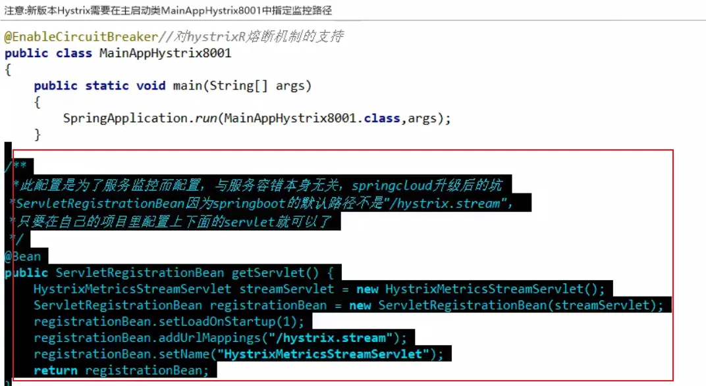

```java
@Beanpublic ServletRegistrationBean getServlet(){        HystrixMetricsStreamServlet streamServlet = new HystrixMetricsStreamServlet();        ServletRegistrationBean servletRegistrationBean = new ServletRegistrationBean(streamServlet);        servletRegistrationBean.setLoadOnStartup(1);        servletRegistrationBean.addUrlMappings("/hystrix.stream");        servletRegistrationBean.setName("HystrixMetricsStreamServlet");        return servletRegistrationBean;    }
```


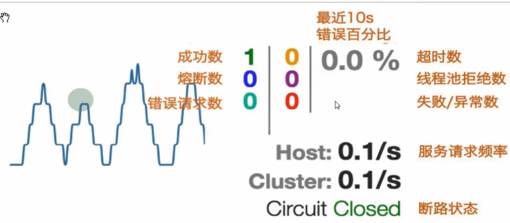

# 服务网关

## Gateway

> 内容过多，开发可参考 https://docs.spring.io/  官网文档

### 简介

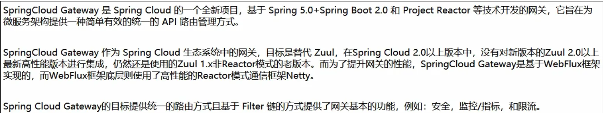


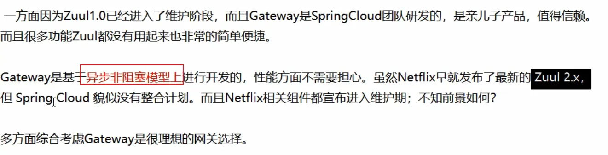


Gateway特性：

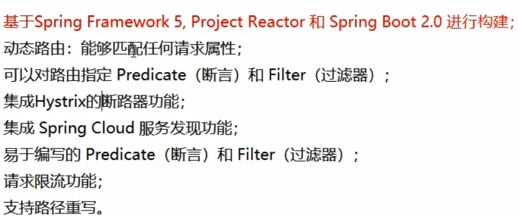

三大核心概念：

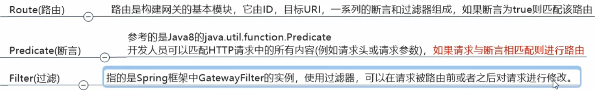


### 入门配置

新建模块 cloud-gateway-gateway9527

> 现在实现，通过Gateway (网关) 来访问其它项目，这里选择之前8001项目，要求注册进Eureka Server 。其它没要求。

pom文件：

```xml
<dependencies>        <!--gateway-->        <dependency>            <groupId>org.springframework.cloud</groupId>            <artifactId>spring-cloud-starter-gateway</artifactId>        </dependency>        <!--eureka-client gateWay作为网关，也要注册进服务中心-->        <dependency>            <groupId>org.springframework.cloud</groupId>            <artifactId>spring-cloud-starter-netflix-eureka-client</artifactId>        </dependency>    <!-- gateway和web不能同时存在，即web相关jar包不能导入 -->        <dependency>            <groupId>org.springframework.boot</groupId>            <artifactId>spring-boot-devtools</artifactId>            <scope>runtime</scope>            <optional>true</optional>        </dependency>        <dependency>            <groupId>org.projectlombok</groupId>            <artifactId>lombok</artifactId>            <optional>true</optional>        </dependency>        <dependency>            <groupId>org.springframework.boot</groupId>            <artifactId>spring-boot-starter-test</artifactId>            <scope>test</scope>        </dependency>        <dependency><!-- 引入自己定义的api通用包，可以使用Payment支付Entity -->            <groupId>com.dkf.cloud</groupId>            <artifactId>cloud-api-commons</artifactId>            <version>${project.version}</version>        </dependency>    </dependencies>
```

yml文件：

```yml
server:  port: 9527spring:  application:    name: cloud-gateway  ## GateWay配置  cloud:    gateway:      routes:        - id: payment_routh  # 路由ID ， 没有固定的规则但要求唯一，建议配合服务名          uri: http://localhost:8001  # 匹配后提供服务的路由地址          predicates:            - Path=/payment/get/**  # 断言，路径相匹配的进行路由        - id: payment_routh2  # 路由ID ， 没有固定的规则但要求唯一，建议配合服务名          uri: http://localhost:8001  # 匹配后提供服务的路由地址          predicates:            - Path=/payment/lb/**  # 断言，路径相匹配的进行路由# 注册进 eureka Servereureka:  client:    service-url:      defaultZone: http://eureka7001.com:7001/eureka/    register-with-eureka: true    fetch-registry: true
```

主启动类，很普通，没有特殊的配置：

```java
@SpringBootApplication@EnableEurekaClientpublic class GatewayMain9527 {    public static void main(String[] args) {        SpringApplication.run(GatewayMain9527.class,args);    }}
```

访问测试：1 启动eureka Server，2 启动 8001 项目，3 启动9527（Gateway项目）

> 可见，当我们访问 http://localhost:9527/payment/get/1 时，即访问网关地址时，会给我们转发到 8001 项目的请求地址，以此作出响应。
>
> 加入网关前：http://localhost:8001/payment/get/1
>
> 加入网关后：http://localhost:9527/payment/get/1

上面是以 yml 文件配置的路由，也有使用config类配置的方式：

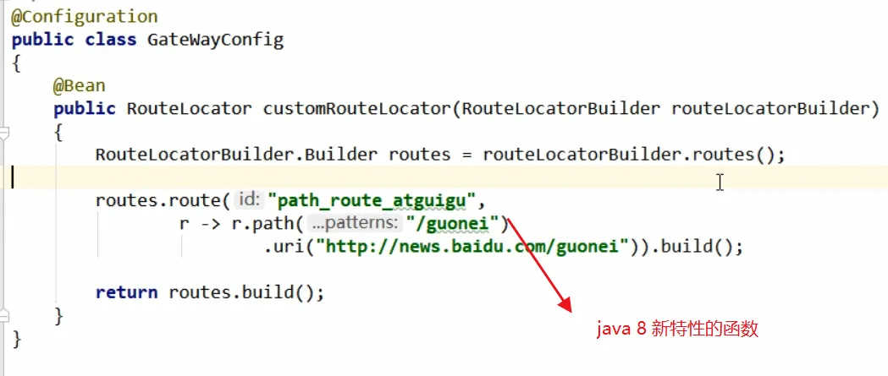

### 动态配置

> 这里所谓的动态配置就是利用服务注册中心，来实现 负载均衡 的调用 多个微服务。
>
> 注意，这是GateWay 的负载均衡

对yml进行配置：

```yml
spring:  application:    name: cloud-gateway  cloud:    gateway:      discovery:        locator:          enabled: true # 开启从注册中心动态创建路由的功能，利用微服务名进行路由      routes:        - id: payment_routh  # 路由ID ， 没有固定的规则但要求唯一，建议配合服务名         # uri: http://localhost:8001  # 匹配后提供服务的路由地址          uri: lb://CLOUD-PROVIDER-SERVICE          predicates:            - Path=/payment/get/**  # 断言，路径相匹配的进行路由        - id: payment_routh2  # 路由ID ， 没有固定的规则但要求唯一，建议配合服务名        #  uri: http://localhost:8001  # 匹配后提供服务的路由地址          uri: lb://CLOUD-PROVIDER-SERVICE          predicates:            - Path=/payment/lb/**  # 断言，路径相匹配的进行路由# uri: lb://CLOUD-PROVIDER-SERVICE  解释：lb 属于GateWay 的关键字，代表是动态uri，即代表使用的是服务注册中心的微服务名，它默认开启使用负载均衡机制 
```

> 下面可以开启 8002 模块，并将它与8001同微服务名，注册到 Eureka Server 进行测试。

### Predicate

> 注意到上面yml配置中，有个predicates 属性值。


具体使用：


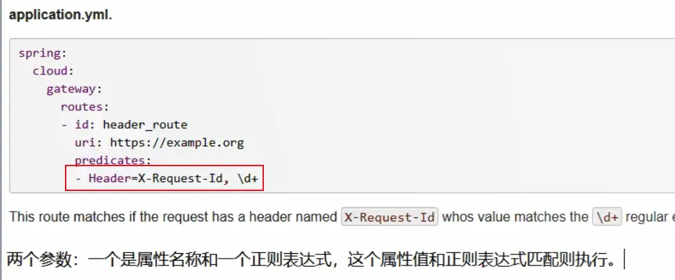

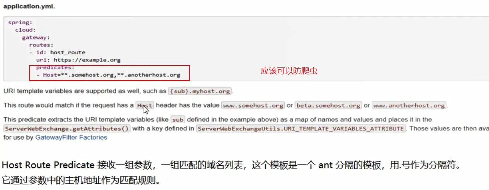

> 放爬虫思路，前后端分离的话，只限定前端项目主机访问，这样可以屏蔽大量爬虫。
>
> 例如我加上： - Host=localhost:**       ** 代表允许任何端口
>
> 就只能是主机来访

配置错误页面:

> 注意，springboot默认/static/error/ 下错误代码命名的页面为错误页面，即 404.html
>
> 而且不需要导入额外的包，Gateway 里面都有。

### Filter

> 主要是配置全局自定义过滤器，其它的小配置具体看官网吧

自定义全局过滤器配置类：

```java
@Componentpublic class GateWayFilter implements GlobalFilter, Ordered {    @Override    public Mono<Void> filter(ServerWebExchange exchange, GatewayFilterChain chain) {        System.out.println("------come in MyGlobalFilter : "+ new Date());        String uname = exchange.getRequest().getQueryParams().getFirst("uname");        //合法性检验        if(uname == null){            System.out.println("----用户名为null,非法用户，请求不被接受");            //设置 response 状态码   因为在请求之前过滤的，so就算是返回NOT_FOUND 也不会返回错误页面            exchange.getResponse().setStatusCode(HttpStatus.NOT_FOUND);            //完成请求调用            return exchange.getResponse().setComplete();        }        return chain.filter(exchange);    }    //返回值是加载顺序，一般全局的都是第一位加载    @Override    public int getOrder() {        return 0;    }}
```

# 服务配置

## Config

> SpringCloud Config 分布式配置中心

### 概述


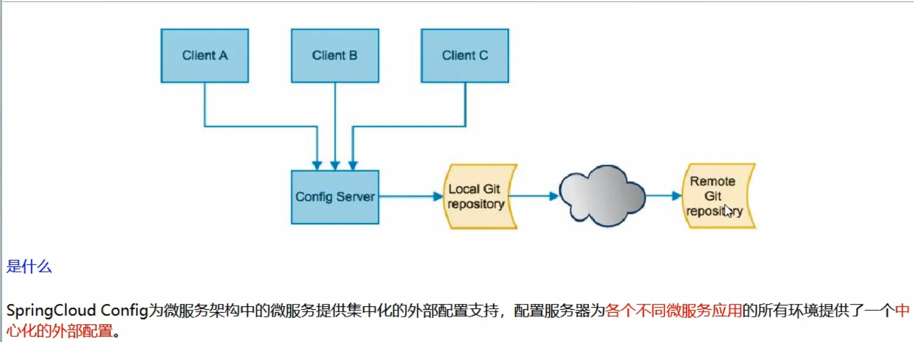

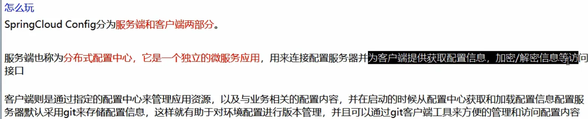

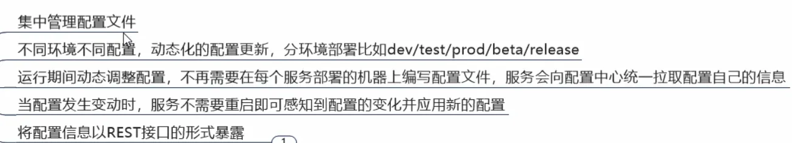

### 服务端配置

> 首先在github上新建一个仓库 springcloud-config
>
> 然后使用git命令克隆到本地，命令：git clone https://github.com/LZXYF/springcloud-config
>
> 注意上面的操作不是必须的，只要github上有就可以，克隆到本地只是修改文件。

新建 cloud-config-center3344 模块：

pom文件：

```xml
	<dependencies>        <!-- config Server -->        <dependency>            <groupId>org.springframework.cloud</groupId>            <artifactId>spring-cloud-config-server</artifactId>        </dependency>        <!--eureka-client config Server也要注册进服务中心-->        <dependency>            <groupId>org.springframework.cloud</groupId>            <artifactId>spring-cloud-starter-netflix-eureka-client</artifactId>        </dependency>        <dependency>            <groupId>org.springframework.boot</groupId>            <artifactId>spring-boot-devtools</artifactId>            <scope>runtime</scope>            <optional>true</optional>        </dependency>        <dependency>            <groupId>org.projectlombok</groupId>            <artifactId>lombok</artifactId>            <optional>true</optional>        </dependency>        <dependency>            <groupId>org.springframework.boot</groupId>            <artifactId>spring-boot-starter-test</artifactId>            <scope>test</scope>        </dependency>        <dependency><!-- 引入自己定义的api通用包，可以使用Payment支付Entity -->            <groupId>com.dkf.cloud</groupId>            <artifactId>cloud-api-commons</artifactId>            <version>${project.version}</version>        </dependency>    </dependencies>
```

yml 配置：

```yml
server:  port: 3344spring:  application:    name: cloud-config-center  # 注册进eureka Server 的微服务名  cloud:    config:      server:        git:          uri: https://github.com/LZXYF/springcloud-config # github 仓库位置          ## 搜索目录          search-paths:            - springcloud-config          # 读取的分支          label: mastereureka:  client:    service-url:      defaultZone: http://eureka7001.com:7001/eureka/
```

主启动类：

```java
@SpringBootApplication@EnableConfigServer   //关键注解public class ConfigCenterMain3344 {    public static void main(String[] args) {        SpringApplication.run(ConfigCenterMain3344.class,args);    }}
```

添加模拟映射：【C:\Windows\System32\drivers\etc\hosts】文件中添加：  127.0.0.1 config-3344.com

启动微服务3344，访问http://config-3344.com:3344/master/config-dev.yml 文件（注意，要提前在git上弄一个这文件）

文件命名和访问的规则：


不加分支名默认是master:


### 客户端配置

> 这里的客户端指的是，使用 Config Server 统一配置文件的项目。既有之前说的消费者，又有提供者

新建 cloud-config-client-3355 模块：

pom文件：

```xml
	<dependencies>        <!-- config Client 和 服务端的依赖不一样 -->        <dependency>            <groupId>org.springframework.cloud</groupId>            <artifactId>spring-cloud-starter-config</artifactId>        </dependency>        <!--eureka-client config Server也要注册进服务中心-->        <dependency>            <groupId>org.springframework.cloud</groupId>            <artifactId>spring-cloud-starter-netflix-eureka-client</artifactId>        </dependency>        <dependency>            <groupId>org.springframework.boot</groupId>            <artifactId>spring-boot-starter-web</artifactId>        </dependency>        <dependency>            <groupId>org.springframework.boot</groupId>            <artifactId>spring-boot-starter-actuator</artifactId>        </dependency>        <dependency>            <groupId>org.springframework.boot</groupId>            <artifactId>spring-boot-devtools</artifactId>            <scope>runtime</scope>            <optional>true</optional>        </dependency>        <dependency>            <groupId>org.projectlombok</groupId>            <artifactId>lombok</artifactId>            <optional>true</optional>        </dependency>        <dependency>            <groupId>org.springframework.boot</groupId>            <artifactId>spring-boot-starter-test</artifactId>            <scope>test</scope>        </dependency>        <dependency><!-- 引入自己定义的api通用包，可以使用Payment支付Entity -->            <groupId>com.dkf.cloud</groupId>            <artifactId>cloud-api-commons</artifactId>            <version>${project.version}</version>        </dependency>    </dependencies>
```

**** bootstrap.yml文件

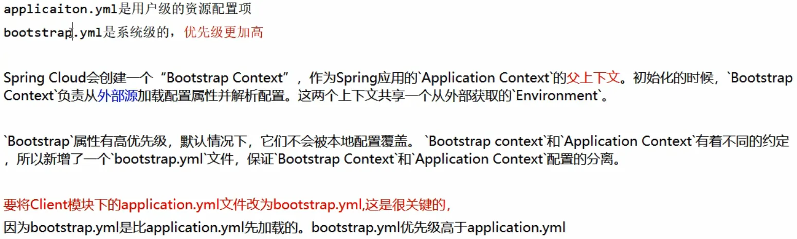

内容：

```yml
server:  port: 3355spring:  application:    name: config-client  cloud:    # config 客户端配置    config:      label: master # 分支名称      name: config # 配置文件名称，文件也可以是client-config-dev.yml这种格式的，这里就写 client-config       profile: dev # 使用配置环境      uri: http://config-3344.com:3344  # config Server 地址      # 综合上面四个 即读取配置文件地址为： http://config-3344.com:3344/master/config-dev.ymleureka:  client:    service-url:      defaultZone: http://eureka7001.com:7001/eureka/
```

主启动类，极其普通：

```java
@SpringBootApplication@EnableEurekaClientpublic class ConfigClientMain3355     public static void main(String[] args) {        SpringApplication.run(ConfigClientMain3355.class, args);    }}
```

controller层，测试读取配置信息

```java
package com.dkf.springcloud.controller;import org.springframework.beans.factory.annotation.Value;import org.springframework.web.bind.annotation.GetMapping;import org.springframework.web.bind.annotation.RestController;@RestControllerpublic class ConfigClientController {    @Value("${config.info}")    private String configInfo;    @GetMapping("/configInfo")    public String getConfigInfo(){        return configInfo;    }}
```

启动测试完成！如果报错，注意github上的 yml 格式有没有写错！

### 动态刷新

问题：


> 就是github上面配置更新了，config Server 项目上是动态更新的，但是，client端的项目中的配置，目前还是之前的，它不能动态更新，必须重启才行。

解决：

1. client端一定要有如下依赖：

   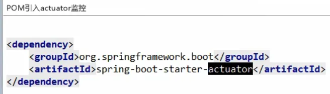

2. client 端增加 yml 配置如下，即在 bootstrap.yml 文件中：

```yml
# 暴露监控端点management:  endpoints:    web:      exposure:        include: "*"
```

3. 在controller 上添加如下注解：

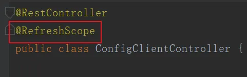

> 到此为止，配置已经完成，但是测试仍然不能动态刷新，需要下一步。

4. 向 client 端发送一个 POST 请求

> 如 curl -X POST "http://localhost:3355/actuator/refresh"
>
> 两个必须：1.必须是 POST 请求，2.请求地址：http://localhost:3355/actuator/refresh

成功！

但是又有一个问题，就是要向每个微服务发送一次POST请求，当微服务数量庞大，又是一个新的问题。

就有下面的消息总线！

# 消息总线

## Bus

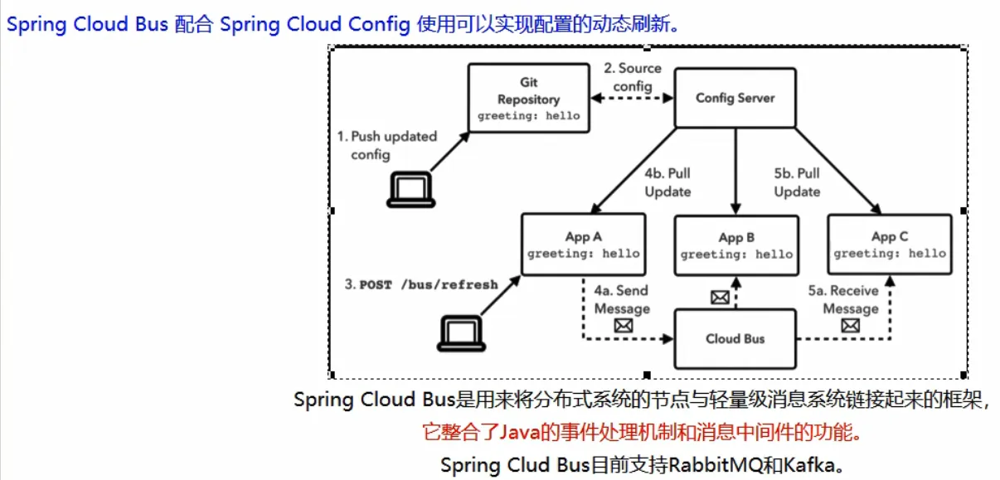


### 安装RabbitMQ

> 在windows 上安装RabbitMQ

1. 安装RabbitMQ的依赖环境 Erlang  下载地址： http://erlang.org/download/otp_win64_21.3.exe
2. 安装RabbitMQ   下载地址： http://dl.bintray.com/rabbitmq/all/rabbitmq-server/3.7.14/rabbitmq-server-3.7.14.exe
3. 进入 rabbitMQ安装目录的sbin目录下，打开cmd窗口，执行 【rabbitmq-plugins enable rabbitmq_management】
4. 访问【http://localhost:15672/】，输入密码和账号：默认都为 guest

### 广播式刷新配置


还是按照之前的 3344（config Server）和  3355（config client）两个项目来增进。

首先给 config Server 和 config client 都添加如下依赖：

```xml
	<!-- 添加rabbitMQ的消息总线支持包 -->        <dependency>            <groupId>org.springframework.cloud</groupId>            <artifactId>spring-cloud-starter-bus-amqp</artifactId>        </dependency>
```

config Server 的yml文件增加如下配置：

```yml
# rabbitMq的相关配置rabbitmq:  host: localhost  port: 5672  # 这里没错，虽然rabbitMQ网页是 15672  username: guest  password: guest# rabbitmq 的相关配置2 暴露bus刷新配置的端点management:  endpoints:    web:      exposure:        include: 'bus-refresh'
```

config Client 的yml文件修改成如下配置：（注意对齐方式，和config Server不一样）

```yml
spring:  application:    name: config-client  cloud:    # config 客户端配置    config:      label: master         # 分支名称      name: client-config       # 配置文件名称      profile: test      # 使用配置环境      uri: http://config-3344.com:3344  # config Server 地址  # 综合上面四个 即读取配置文件地址为： http://config-3344.com:3344/master/config-dev.yml  # rabbitMq的相关配置  rabbitmq:    host: localhost    port: 5672    username: guest    password: guest
```

可在github上修改yml文件进行测试，修改完文件，向 config server 发送 请求：

【curl -X POST "http://localhost:3344/actuator/bus-refresh"】

> 注意，之前是向config client 一个个发送请求，但是这次是向 config Server 发送请求，而所有的config client 的配置也都全部更新。

### 定点通知

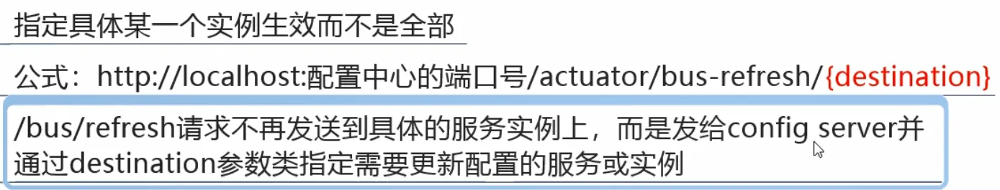


# 消息驱动

## Stream

### 概述

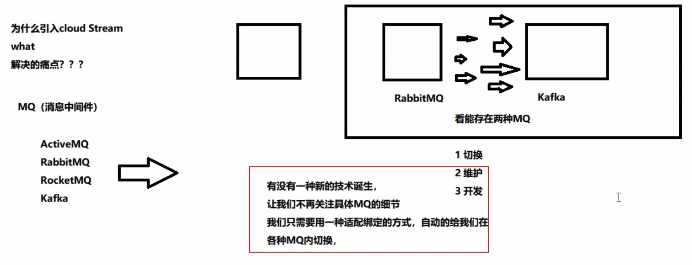


> 就像 JDBC 形成一种规范，统一不同数据库的接口


### 消息生产者

新建模块 cloud-stream-rabbitmq-provider8801

pom依赖：

```xml
<!-- stream-rabbit -->    <dependency>        <groupId>org.springframework.cloud</groupId>        <artifactId>spring-cloud-starter-stream-rabbit</artifactId>    </dependency>    <!--eureka-client 目前，这个不是必须的-->    <dependency>        <groupId>org.springframework.cloud</groupId>        <artifactId>spring-cloud-starter-netflix-eureka-client</artifactId>    </dependency>    <dependency>        <groupId>org.springframework.boot</groupId>        <artifactId>spring-boot-starter-web</artifactId>    </dependency>    <dependency>        <groupId>org.springframework.boot</groupId>        <artifactId>spring-boot-starter-actuator</artifactId>    </dependency>    <dependency>        <groupId>org.springframework.boot</groupId>        <artifactId>spring-boot-devtools</artifactId>        <scope>runtime</scope>        <optional>true</optional>    </dependency>    <dependency>        <groupId>org.projectlombok</groupId>        <artifactId>lombok</artifactId>        <optional>true</optional>    </dependency>    <dependency>        <groupId>org.springframework.boot</groupId>        <artifactId>spring-boot-starter-test</artifactId>        <scope>test</scope>    </dependency>    <dependency><!-- 引入自己定义的api通用包，可以使用Payment支付Entity -->        <groupId>com.dkf.cloud</groupId>        <artifactId>cloud-api-commons</artifactId>        <version>${project.version}</version>    </dependency>
```

yml 配置：

```yml
server:  port: 8801spring:  application:    name: cloud-stream-provider  cloud:    stream:      binders: # 在次配置要绑定的rabbitMQ的服务信息        defaultRabbit: # 表示定义的名称，用于和binding整合          type: rabbit  # 消息组件类型          environment:  # 设置rabbitmq的相关环境配置            spring:              rabbitmq:                host: localhost                port: 5672                username: guest                password: guest      bindings:  # 服务的整合处理        output:   # 表示是生产者，向rabbitMQ发送消息          destination: studyExchange  # 表示要使用的Exchange名称          content-type: application/json  # 设置消息类型，本次是json，文本是 "text/plain"          binder: defaultRabbit  # 设置要绑定的消息服务的具体配置eureka:  client:    service-url:      defaultZone: http://eureka7001.com:7001/eureka/  instance:    lease-renewal-interval-in-seconds: 2 # 设置心跳时间，默认是30秒    lease-expiration-duration-in-seconds: 5 # 最大心跳间隔不能超过5秒,默认90秒    instance-id: send-8801.com # 在信息列表显示主机名称    prefer-ip-address: true # 访问路径变为ip地址
```

主启动类没什么特殊的注解。

业务类：（此业务类不是以前的service，而实负责推送消息的服务类）

```java
package com.dkf.springcloud.service;import org.springframework.cloud.stream.annotation.EnableBinding;import org.springframework.cloud.stream.messaging.Source;import org.springframework.messaging.MessageChannel;import org.springframework.messaging.support.MessageBuilder;import javax.annotation.Resource;import java.util.UUID;@EnableBinding(Source.class)  // 不是和controller打交道的service,而是发送消息的推送服务类public class IMessageProviderImpl implements IMessageProvider {									     //上面是自定义的接口    @Resource    private MessageChannel output;    @Override    public String send() {        String serial = UUID.randomUUID().toString();        output.send(MessageBuilder.withPayload(serial).build());        System.out.println("******serial: " + serial);        return null;    }}
```

controller:

```java
@RestControllerpublic class SendMessageController {    @Resource    private IMessageProvider messageProvider;    @GetMapping("/sendMessage")    public String sendMessage(){        return messageProvider.send();    }}
```

> 启动Eureka Server 7001，再启动8801，进行测试，看是否rabbitMQ中有我们发送的消息。
>
> 

### 消息消费者

新建模块 cloud-stream-rabbitmq-consumer8802

pom依赖和生产者一样。

yml配置: 在 stream的配置上，和生产者只有一处不同的地方，output 改成 input

```yml
server:  port: 8802spring:  application:    name: cloud-stream-provider  cloud:    stream:      binders: # 在次配置要绑定的rabbitMQ的服务信息        defaultRabbit: # 表示定义的名称，用于和binding整合          type: rabbit  # 消息组件类型          environment:  # 设置rabbitmq的相关环境配置            spring:              rabbitmq:                host: localhost                port: 5672                username: guest                password: guest      bindings:  # 服务的整合处理        input:   # 表示是消费者，这里是唯一和生产者不同的地方，向rabbitMQ发送消息          destination: studyExchange  # 表示要使用的Exchange名称          content-type: application/json  # 设置消息类型，本次是json，文本是 "text/plain"          binder: defaultRabbit  # 设置要绑定的消息服务的具体配置eureka:  client:    service-url:      defaultZone: http://eureka7001.com:7001/eureka/  instance:    lease-renewal-interval-in-seconds: 2 # 设置心跳时间，默认是30秒    lease-expiration-duration-in-seconds: 5 # 最大心跳间隔不能超过5秒,默认90秒    instance-id: receive-8802.com # 在信息列表显示主机名称    prefer-ip-address: true # 访问路径变为ip地址
```

接收消息的业务类：

```java
import org.springframework.beans.factory.annotation.Value;import org.springframework.cloud.stream.annotation.EnableBinding;import org.springframework.cloud.stream.annotation.StreamListener;import org.springframework.cloud.stream.messaging.Sink;import org.springframework.messaging.Message;import org.springframework.stereotype.Component;@Component@EnableBinding(Sink.class)public class ConsumerController {    @Value("${server.port}")    private String serverPort;    @StreamListener(Sink.INPUT)    public void input(Message<String> message){        System.out.println("消费者1号，serverport: " + serverPort + "，接受到的消息：" + message.getPayload());    }}
```

### 配置分组消费

新建 cloud-stream-rabbitmq-consumer8802 模块：

> 8803 就是 8802 clone出来的。

当运行时，会有两个问题。

第一个问题，两个消费者都接收到了消息，这属于重复消费。例如，消费者进行订单创建，这样就创建了两份订单，会造成系统错误。


> Stream默认不同的微服务是不同的组


对于重复消费这种问题，导致的原因是默认每个微服务是不同的group，组流水号不一样，所以被认为是不同组，两个都可以消费。

解决的办法就是自定义配置分组：

消费者 yml 文件配置：

```yml
	# 8802 的消费者	bindings:        input:             destination: studyExchange            content-type: application/json            binder: defaultRabbit            group: dkfA  # 自定义分组配置    # 8803 的消费者	bindings:        input:             destination: studyExchange            content-type: application/json            binder: defaultRabbit            group: dkfB  # 自定义分组配置
```

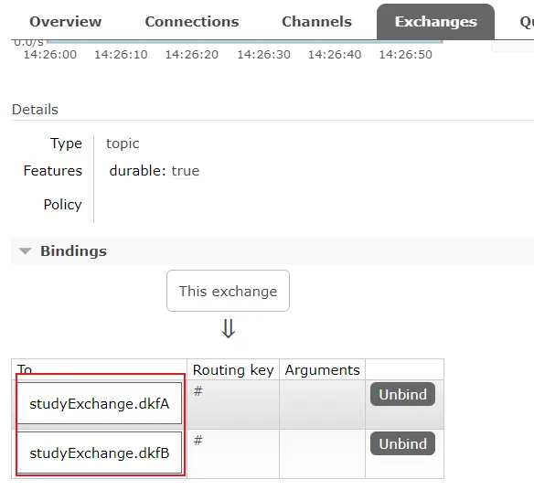

当两个消费者配置的 group 都为 dkfA 时，就属于同一组，就不会被重复消费。


### 消息持久化

> 加上group配置，就已经实现了消息的持久化。

# Sleuth

> 分布式请求链路跟踪，超大型系统。需要在微服务模块极其多的情况下，比如80调用8001的，8001调用8002的，这样就形成了一个链路，如果链路中某环节出现了故障，我们可以使用Sleuth进行链路跟踪，从而找到出现故障的环节。

## 概述

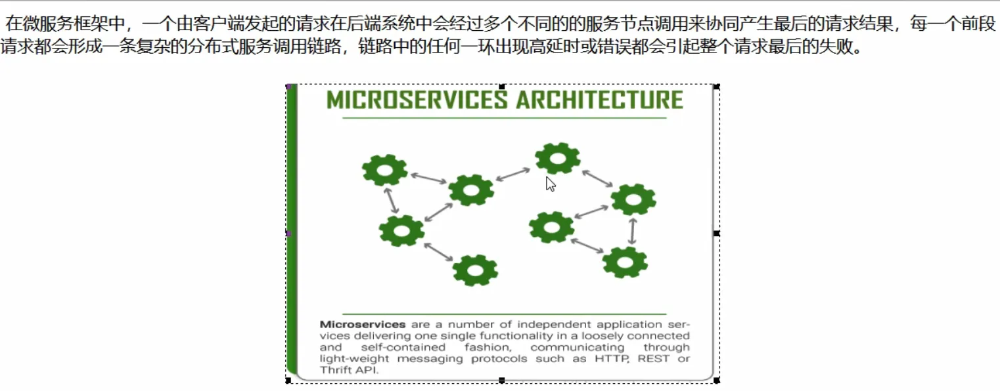

> sleuth 负责跟踪，而zipkin负责展示。
>
> zipkin 下载地址： http://dl.bintray.com/openzipkin/maven/io/zipkin/java/zipkin-server/2.12.9/zipkin-server-2.12.9-exec.jar
>
> 使用 【java -jar】 命令运行下载的jar包，访问地址：【 http://localhost:9411/zipkin/ 】

## 案例

> 使用之前的 提供者8001 和 消费者80

分别给他们引入依赖：

```xml
	<!-- 引入sleuth + zipkin -->        <dependency>            <groupId>org.springframework.cloud</groupId>            <artifactId>spring-cloud-starter-zipkin</artifactId>        </dependency>
```

yml增加配置：

```yml
spring:  zipkin:    base-url: http://localhost:9411  # zipkin 地址  sleuth:    sampler:      # 采样率值 介于0-1之间 ，1表示全部采集      probability: 1
```

# 高级部分

# SpringCloud Alibaba

> alibaba 的 github上有中文文档

## 大简介


##  Nacos

> Nacos = Eureka + Config + Bus

> github地址：  https://github.com/alibaba/Nacos
>
> Nacos 地址：  https://nacos.io/zh-cn/


> nacos可以切换 AP 和 CP ,可使用如下命令切换成CP模式：
>
> 

### 下载

> 下载地址：  https://github.com/alibaba/nacos/releases/tag/1.1.4
>
> 直接下载网址： https://github.com/alibaba/nacos/releases/download/1.1.4/nacos-server-1.1.4.zip
>
> 下载压缩包以后解压，进入bin目录，打开dos窗口，执行startup命令启动它。
>
> 可访问 ： 【 http://192.168.101.105:8848/nacos/index.html】地址，默认账号密码都是nacos

### 服务中心

#### 提供者

新建模块 cloudalibaba-provider-payment9001

pom依赖：

```xml
	<dependencies>        <!-- springcloud alibaba nacos 依赖 -->        <dependency>            <groupId>com.alibaba.cloud</groupId>            <artifactId>spring-cloud-starter-alibaba-nacos-discovery</artifactId>        </dependency>        <!-- springboot整合Web组件 -->        <dependency>            <groupId>org.springframework.boot</groupId>            <artifactId>spring-boot-starter-web</artifactId>        </dependency>        <dependency>            <groupId>org.springframework.boot</groupId>            <artifactId>spring-boot-starter-actuator</artifactId>        </dependency>        <!-- 日常通用jar包 -->        <dependency>            <groupId>org.mybatis.spring.boot</groupId>            <artifactId>mybatis-spring-boot-starter</artifactId>        </dependency>        <dependency>            <groupId>org.springframework.boot</groupId>            <artifactId>spring-boot-devtools</artifactId>            <scope>runtime</scope>            <optional>true</optional>        </dependency>        <dependency>            <groupId>org.projectlombok</groupId>            <artifactId>lombok</artifactId>            <optional>true</optional>        </dependency>        <dependency>            <groupId>org.springframework.boot</groupId>            <artifactId>spring-boot-starter-test</artifactId>            <scope>test</scope>        </dependency>        <dependency><!-- 引入自己定义的api通用包，可以使用Payment支付Entity -->            <groupId>com.dkf.cloud</groupId>            <artifactId>cloud-api-commons</artifactId>            <version>${project.version}</version>        </dependency>    </dependencies>
```

yml 配置：

```yml
server:  port: 9001spring:  application:    name: nacos-provider  cloud:    nacos:      discovery:        server-addr: localhost:8848management:  endpoints:    web:      exposure:        include: '*'
```

主启动类没有特殊的注解。

Nacos 自带负载均衡机制，下面创建第二个提供者。

新建 cloudalibaba-provider-payment9003 提供者模块，clone 9001 就可以

#### 消费者

新建消费者 模块： cloudalibaba-customer-order80

pom依赖和主启动类没有好说的，和提供者一致，yml依赖也是类似配置，作为消费者注册进nacos服务中心。

nacos底层也是ribbon，注入ReatTemplate

```java
@Configurationpublic class ApplicationContextConfig {    @Bean    @LoadBalanced    public RestTemplate getRestTemplate(){        return new RestTemplate();    }}
```

controller :

```java
@RestControllerpublic class OrderController {    //在yml里面写的提供者服务路径，  值为：http://nacos-provider    @Value("${service-url.nacos-user-service}")    private String nacos_user_service;    @Resource    private RestTemplate restTemplate;    @GetMapping("customer/nacos/{id}")    public String orderId(@PathVariable("id")Integer id){        return restTemplate.getForObject(nacos_user_service + "/payment/nacos/" + id, String.class);    }}
```

### 配置中心

> nacos 还可以作为服务配置中心，下面是案例，创建一个模块，从nacos上读取配置信息。
>
> nacos 作为配置中心，不需要像springcloud config 一样做一个Server端模块。

新建模块 cloudalibaba-nacos-config3377

pom依赖：

```xml
 <dependencies>        <!-- 以 nacos 做服务配置中心的依赖 -->        <dependency>            <groupId>com.alibaba.cloud</groupId>            <artifactId>spring-cloud-starter-alibaba-nacos-config</artifactId>        </dependency>        <!-- springcloud alibaba nacos 依赖 -->        <dependency>            <groupId>com.alibaba.cloud</groupId>            <artifactId>spring-cloud-starter-alibaba-nacos-discovery</artifactId>        </dependency>        <!-- springboot整合Web组件 -->        <dependency>            <groupId>org.springframework.boot</groupId>            <artifactId>spring-boot-starter-web</artifactId>        </dependency>        <dependency>            <groupId>org.springframework.boot</groupId>            <artifactId>spring-boot-starter-actuator</artifactId>        </dependency>        <!-- 日常通用jar包 -->        <dependency>            <groupId>org.mybatis.spring.boot</groupId>            <artifactId>mybatis-spring-boot-starter</artifactId>        </dependency>        <dependency>            <groupId>org.springframework.boot</groupId>            <artifactId>spring-boot-devtools</artifactId>            <scope>runtime</scope>            <optional>true</optional>        </dependency>        <dependency>            <groupId>org.projectlombok</groupId>            <artifactId>lombok</artifactId>            <optional>true</optional>        </dependency>        <dependency>            <groupId>org.springframework.boot</groupId>            <artifactId>spring-boot-starter-test</artifactId>            <scope>test</scope>        </dependency>        <dependency><!-- 引入自己定义的api通用包，可以使用Payment支付Entity -->            <groupId>com.dkf.cloud</groupId>            <artifactId>cloud-api-commons</artifactId>            <version>${project.version}</version>        </dependency>    </dependencies>
```

主启动类也是极其普通：

```java
@SpringBootApplication@EnableDiscoveryClientpublic class CloudAlibabaConfigMain3377 {    public static void main(String[] args) {        SpringApplication.run(CloudAlibabaConfigMain3377.class,args);    }}
```

***bootstrap.yml 配置：

```yml
server:  port: 3377spring:  application:    name: nacos-config-client  cloud:    nacos:      discovery:        server-addr: localhost:8848  # nacos作为服务注册中心      config:        server-addr: localhost:8848 # nacos作为服务配置中心        file-extension: yaml # 指定yaml 格式的配置
```

controller 层进行读取配置测试：

```java
@RestController@RefreshScope  //支持Nacos的动态刷新public class ConfigClientController {    @Value("${config.info}")    private String configInfo;    @GetMapping("configclient/getconfiginfo")    public String getConfigInfo(){        return configInfo;    }}
```

> 下面在 Nacos 中添加配置文件，需要遵循如下规则：

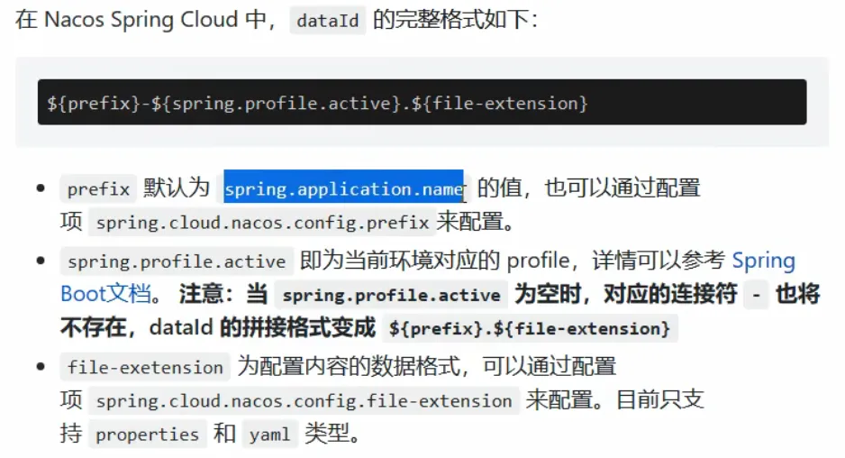

> 从上面可以看到重要的一点，配置文件的名称第二项，spring.profiles.active 是依据当前环境的profile属性值的，也就是这个值如果是 dev，即开发环境，它就会读取 dev 的配置信息，如果是test，测试环境，它就会读取test的配置信息，就是从 spring.profile.active 值获取当前应该读取哪个环境下的配置信息。

所以要配置spring.profiles.active，新建application.yml文件，添加如下配置：

```yaml
spring:  profiles:    active: dev # 表示开发环境
```

综合以上说明，和下面的截图，Nacos 的dataid（类似文件名）应为： nacos-config-client-dev.yaml  (必须是yaml)


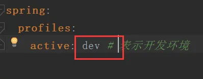


当修改配置值，会发现 3377 上也已经修改，Nacos自带自动刷新功能！

其它说明：

> Nacos 的 Group ,默认创建的配置文件，都是在DEFAULT_GROUP中，可以在创建配置文件时，给文件指定分组。
>
> yml 配置如下，当修改开发环境时，只会从同一group中进行切换。
>
> 
>
> Nacos 的namespace ,默认的命名空间是public ,这个是不允许删除的，可以创建一个新的命名空间，会自动给创建的命名空间一个流水号。
>
> 在yml配置中，指定命名空间：
>
> 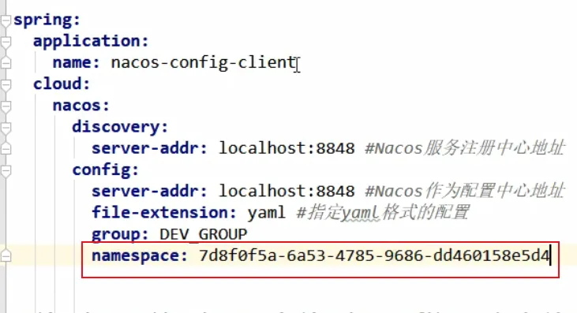
>
> 最后，dataid、group、namespace 三者关系如下：（不同的dataid，是相互独立的，不同的group是相互隔离的，不同的namespace也是相互独立的）
>
> 

### Nacos持久化

> 上面只是小打小闹，下面才是真正的高级操作。

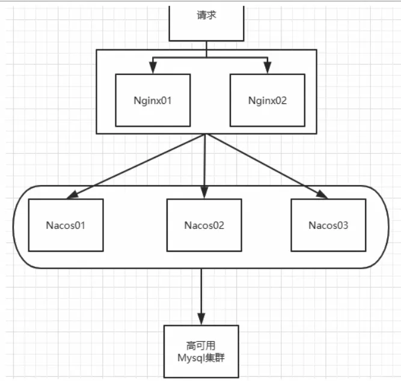

> 搭建集群必须持久化，不然多台机器上的nacos的配置信息不同，造成系统错乱。它不同于单个springcloud config，没有集群一说，而且数据保存在github上，也不同于eureka，配置集群就完事了，没有需要保存的配置信息。
>
> Nacos默认使用它自带的嵌入式数据库derby:
>
> 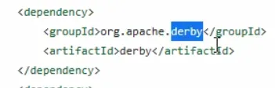

Nacos持久化配置：

> 在 nacos的 conf目录下，有个nacos-mysql.sql 的sql文件，创建一个名为【nacos_config】的数据库，执行里面内容，在nacos_config数据库里面创建数据表。
>
> 找到conf/application.properties 文件，尾部追加如下内容：
>
> ```properties
> spring.datasource.platform=mysqldb.num=1db.url.0=jdbc:mysql://localhost:3306/nacos_config?characterEncoding=utf-8&connectTimeout=1000&socketTimeout=3000&autoReconnect=truedb.user=rootdb.password=123456
> ```
>
> 重启nacos，即完成持久化配置。

### 集群架构

> 现在进行企业中真正需要的nacos集群配置，而不是上面的单机模式，需要准备如下：
>
> 一台linux虚拟机：nginx服务器，3个nacos服务，一个mysql数据库。
>
> nginx的安装参考之前学，使用 ContOs7 至少需要安装gcc库，不然无法编译安装【yum install gcc】
>
> nacos下载linux版本的 tar.gz 包：https://github.com/alibaba/nacos/releases/download/1.1.4/nacos-server-1.1.4.tar.gz
>
> mysql root用户密码为 Dkf!!2020

Nacos集群配置

1. 首先对 nacos 进行持久化操作，操作如上面一致。

2. 修改 nacos/conf 下的cluster文件，最好先复制一份，添加如下内容:

   	

3. 模拟三台nacos服务，编辑nacos的startup启动脚本，使他能够支持不同的端口启动多次。

   	

   

   

   

4. nginx配置负载均衡：

   	

5. 测试完成！

使用 9003 模块注册进Nacos Server 并获取它上面配置文件的信息，进行测试。

## Sentinel

> sentinel在 springcloud Alibaba 中的作用是实现熔断和限流

### 下载

> 下载地址： https://github.com/alibaba/Sentinel/releases/download/1.7.1/sentinel-dashboard-1.7.1.jar
>
> 下载jar包以后，使用【java -jar】命令启动即可。
>
> 它使用 8080 端口，用户名和密码都为 ： sentinel


### Demo

> 新建模块 cloudalibaba-sentinel-service8401 ，使用nacos作为服务注册中心，来测试Sentinel的功能。

pom依赖：

```xml
	<dependencies>        <!-- 后续做Sentinel的持久化会用到的依赖 -->        <dependency>            <groupId>com.alibaba.csp</groupId>            <artifactId>sentinel-datasource-nacos</artifactId>        </dependency>        <!-- sentinel  -->        <dependency>            <groupId>com.alibaba.cloud</groupId>            <artifactId>spring-cloud-starter-alibaba-sentinel</artifactId>        </dependency>        <!-- springcloud alibaba nacos 依赖,Nacos Server 服务注册中心 -->        <dependency>            <groupId>com.alibaba.cloud</groupId>            <artifactId>spring-cloud-starter-alibaba-nacos-discovery</artifactId>        </dependency>        <!-- springboot整合Web组件 -->        <dependency>            <groupId>org.springframework.boot</groupId>            <artifactId>spring-boot-starter-web</artifactId>        </dependency>        <dependency>            <groupId>org.springframework.boot</groupId>            <artifactId>spring-boot-starter-actuator</artifactId>        </dependency>        <!-- 日常通用jar包 -->        <dependency>            <groupId>org.mybatis.spring.boot</groupId>            <artifactId>mybatis-spring-boot-starter</artifactId>        </dependency>        <dependency>            <groupId>org.springframework.boot</groupId>            <artifactId>spring-boot-devtools</artifactId>            <scope>runtime</scope>            <optional>true</optional>        </dependency>        <dependency>            <groupId>org.projectlombok</groupId>            <artifactId>lombok</artifactId>            <optional>true</optional>        </dependency>        <dependency>            <groupId>org.springframework.boot</groupId>            <artifactId>spring-boot-starter-test</artifactId>            <scope>test</scope>        </dependency>        <dependency><!-- 引入自己定义的api通用包，可以使用Payment支付Entity -->            <groupId>com.dkf.cloud</groupId>            <artifactId>cloud-api-commons</artifactId>            <version>${project.version}</version>        </dependency>    </dependencies>
```

yml 配置：

```yml
server:  port: 8401spring:  application:    name: cloudalibaba-sentinel-service  cloud:    nacos:      discovery:        # 服务注册中心        server-addr: localhost:8848    sentinel:      transport:        # 配置 Sentinel Dashboard 的地址        dashboard: localhost:8080        # 默认8719 ，如果端口被占用，端口号会自动 +1，提供给 sentinel 的监控端口        port: 8719management:  endpoints:    web:      exposure:        include: '*'
```

写一个简单的主启动类，再写一个简单的controller测试sentinel的监控。

### 流控规则

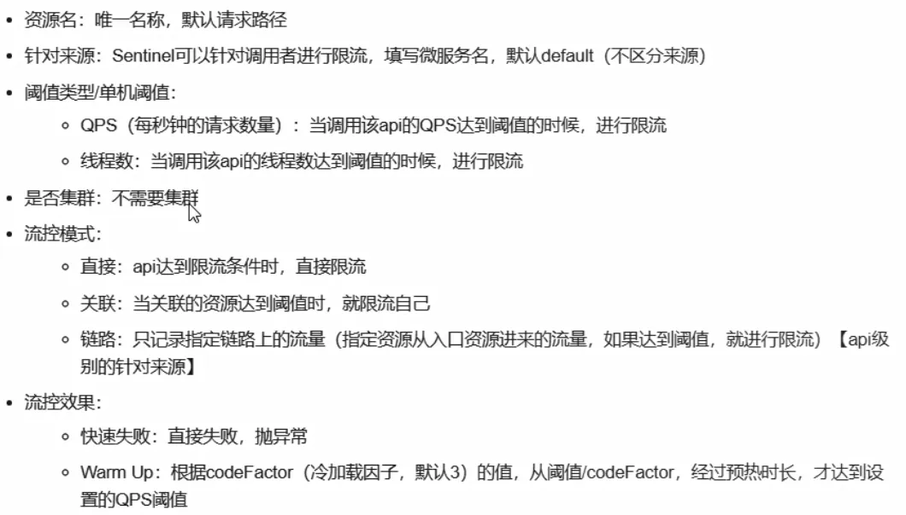

流控模式--直接：

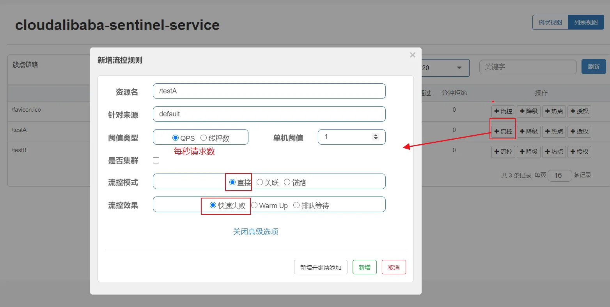

> 限流表现：当超过阀值，就会被降级。
>
> 

流控模式--关联：


流控效果--预热：

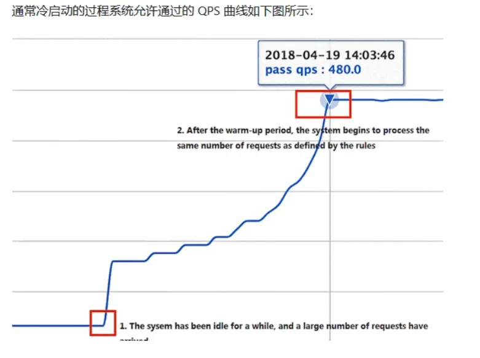

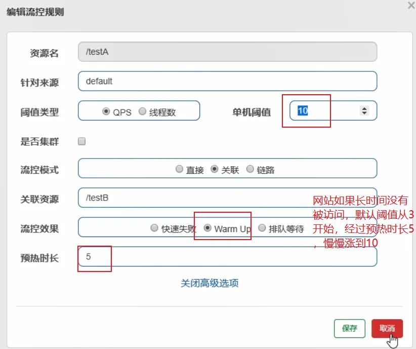

流控效果--排队等待：

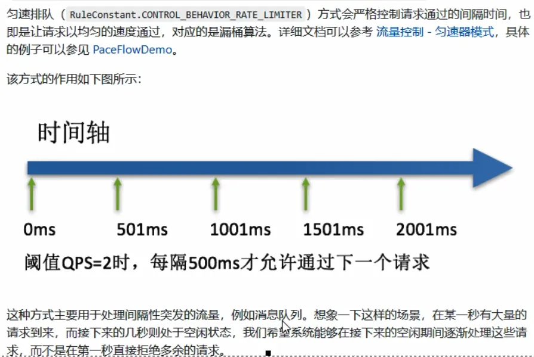

### 熔断降级


降级策略--RT:


降级策略--异常比例：


降级测录--异常数：

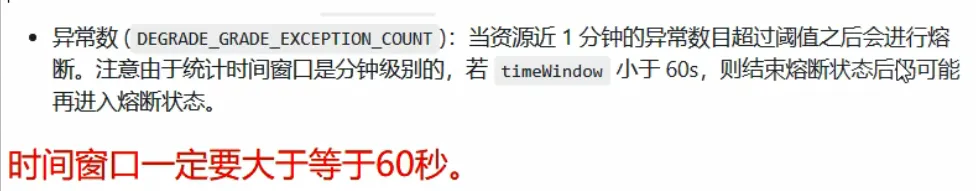


### 热点Key限流


controller层写一个demo:

```java
	@GetMapping("/testhotkey")    @SentinelResource(value = "testhotkey", blockHandler = "deal_testhotkey")    //这个value是随意的值，并不和请求路径必须一致    //在填写热点限流的 资源名 这一项时，可以填 /testhotkey 或者是 @SentinelResource的value的值    public String testHotKey(            @RequestParam(value="p1", required = false) String p1,            @RequestParam(value = "p2", required = false) String p2    ){        return "testHotKey__success";    }	//类似Hystrix 的兜底方法    public String deal_testhotkey(String p1, String p2, BlockException e){        return "testhotkey__fail";     }
```

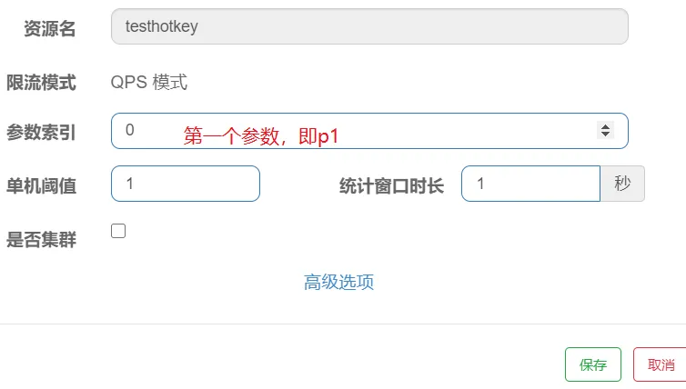


说明：


### 系统规则

> 一般配置在网关或者入口应用中，但是这个东西有点危险，不但值不合适，就相当于系统瘫痪。

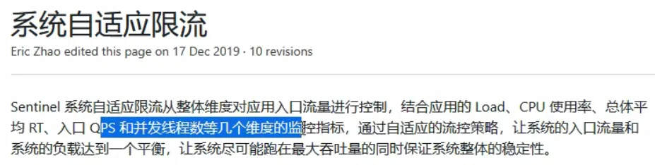

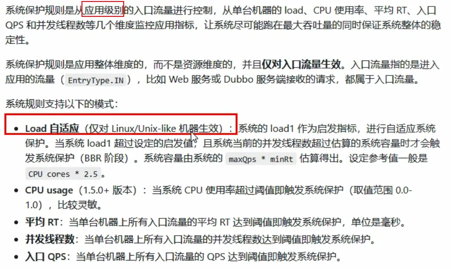

### @SentinelResource配置

> @SentinelResource 注解，主要是指定资源名（也可以用请求路径作为资源名），和指定降级处理方法的。

例如：

```java
package com.dkf.springcloud.controller;import com.alibaba.csp.sentinel.annotation.SentinelResource;import com.alibaba.csp.sentinel.slots.block.BlockException;import com.dkf.springcloud.entities.CommonResult;import com.dkf.springcloud.entities.Payment;import org.springframework.web.bind.annotation.GetMapping;import org.springframework.web.bind.annotation.RestController;@RestControllerpublic class RateLimitController {    @GetMapping("/byResource")						//处理降级的方法名    @SentinelResource(value = "byResource", blockHandler = "handleException")    public CommonResult byResource(){        return new CommonResult(200, "按照资源名限流测试0K", new Payment(2020L,"serial001"));    }    //降级方法    public CommonResult handleException(BlockException e){        return new CommonResult(444, e.getClass().getCanonicalName() + "\t 服务不可用");    }}
```


很明显，上面虽然自定义了兜底方法，但是耦合度太高，下面要解决这个问题。

#### 自定义全局BlockHandler处理类

写一个 CustomerBlockHandler 自定义限流处理类：


### 整合 openfeign 服务降级

#### 前奏

> 之前有 open-feign 和 hystrix 的整合，现在来实现sentinel 整合 ribbon + open-feign + fallback 进行服务熔断。
>
> 新建三个模块，两个提供者 9004、9005，和一个消费者 84
>
> 目的：
>
> 
>
> 上面使用sentinel有一个很明显的问题，就是sentinel，对程序内部异常（各种异常，包括超时）这种捕捉，显得很乏力，它主要是针对流量控制，系统吞吐量，或者是异常比例这种，会发生降级或熔断，但是当程序内部发生异常，直接返回给用户错误页面，根本不会触发异常比例这种降级。所以才需要整合open-feign 来解决程序内部异常时，配置相应的兜底方法

-----------------------------------------------------------两个提供者模块一致，如下：

pom依赖：

```xml
	<dependencies>        <!-- springcloud alibaba nacos 依赖 -->        <dependency>            <groupId>com.alibaba.cloud</groupId>            <artifactId>spring-cloud-starter-alibaba-nacos-discovery</artifactId>        </dependency>                <!-- springboot整合Web组件 -->        <dependency>            <groupId>org.springframework.boot</groupId>            <artifactId>spring-boot-starter-web</artifactId>        </dependency>        <dependency>            <groupId>org.springframework.boot</groupId>            <artifactId>spring-boot-starter-actuator</artifactId>        </dependency>        <!-- 日常通用jar包 -->        <dependency>            <groupId>org.mybatis.spring.boot</groupId>            <artifactId>mybatis-spring-boot-starter</artifactId>        </dependency>        <dependency>            <groupId>org.springframework.boot</groupId>            <artifactId>spring-boot-devtools</artifactId>            <scope>runtime</scope>            <optional>true</optional>        </dependency>        <dependency>            <groupId>org.projectlombok</groupId>            <artifactId>lombok</artifactId>            <optional>true</optional>        </dependency>        <dependency>            <groupId>org.springframework.boot</groupId>            <artifactId>spring-boot-starter-test</artifactId>            <scope>test</scope>        </dependency>        <dependency><!-- 引入自己定义的api通用包，可以使用Payment支付Entity -->            <groupId>com.dkf.cloud</groupId>            <artifactId>cloud-api-commons</artifactId>            <version>${project.version}</version>        </dependency>    </dependencies>
```

yml配置：

```yaml
server:  port: 9005  # / 9004spring:  application:    name: nacos-payment-provider  cloud:    nacos:      discovery:        server-addr: localhost:8848management:  endpoints:    web:      exposure:        include: '*'
```

主启动类只是启动，没有其它注解。

controller :

```java
package com.dkf.sprIngcloud.controller;import com.dkf.springcloud.entities.CommonResult;import com.dkf.springcloud.entities.Payment;import org.springframework.beans.factory.annotation.Value;import org.springframework.web.bind.annotation.GetMapping;import org.springframework.web.bind.annotation.PathVariable;import org.springframework.web.bind.annotation.RestController;import java.util.HashMap;@RestControllerpublic class PaymentController {    @Value("${server.port}")    private String serverPort;    //模拟sql查询    public static HashMap<Long, Payment> hashMap = new HashMap<>();    static {        hashMap.put(1L, new Payment(1L, "xcxcxcxcxcxcxcxcxcxcxcxcxc11111111"));        hashMap.put(2L, new Payment(2L, "xcxcxcxcggggggggg2222222222222222"));        hashMap.put(3L, new Payment(3L, "xcxcxcxccxxcxcfafdgdgdsgdsgds33333"));    }    @GetMapping("/payment/get/{id}")    public CommonResult paymentSql(@PathVariable("id")Long id){        Payment payment = hashMap.get(id);        CommonResult result = new CommonResult(200, "from mysql, server port : " + serverPort + " ,查询成功", payment);        return result;    }}
```

---------------------------------------------------------------------------------消费者：

pom依赖：

```xml
	<dependencies>        <!-- 后续做Sentinel的持久化会用到的依赖 -->        <dependency>            <groupId>com.alibaba.csp</groupId>            <artifactId>sentinel-datasource-nacos</artifactId>        </dependency>        <!-- sentinel  -->        <dependency>            <groupId>com.alibaba.cloud</groupId>            <artifactId>spring-cloud-starter-alibaba-sentinel</artifactId>        </dependency>        <!-- springcloud alibaba nacos 依赖 -->        <dependency>            <groupId>com.alibaba.cloud</groupId>            <artifactId>spring-cloud-starter-alibaba-nacos-discovery</artifactId>        </dependency>        <!-- springboot整合Web组件 -->        <dependency>            <groupId>org.springframework.boot</groupId>            <artifactId>spring-boot-starter-web</artifactId>        </dependency>        <dependency>            <groupId>org.springframework.boot</groupId>            <artifactId>spring-boot-starter-actuator</artifactId>        </dependency>        <!-- 日常通用jar包 -->        <dependency>            <groupId>org.mybatis.spring.boot</groupId>            <artifactId>mybatis-spring-boot-starter</artifactId>        </dependency>        <dependency>            <groupId>org.springframework.boot</groupId>            <artifactId>spring-boot-devtools</artifactId>            <scope>runtime</scope>            <optional>true</optional>        </dependency>        <dependency>            <groupId>org.projectlombok</groupId>            <artifactId>lombok</artifactId>            <optional>true</optional>        </dependency>        <dependency>            <groupId>org.springframework.boot</groupId>            <artifactId>spring-boot-starter-test</artifactId>            <scope>test</scope>        </dependency>        <dependency><!-- 引入自己定义的api通用包，可以使用Payment支付Entity -->            <groupId>com.dkf.cloud</groupId>            <artifactId>cloud-api-commons</artifactId>            <version>${project.version}</version>        </dependency>    </dependencies>
```

yml配置：

```yaml
server:  port: 84spring:  cloud:    nacos:      discovery:        server-addr: localhost:8848    sentinel:      transport:        dashboard: localhost:8080        port: 8719  application:    name: nacos-order-consumer
```

主启动类不用说了。

config类里面注入 Resttemplate：

```java
@Configurationpublic class ApplicationContextConfig {    @Bean    @LoadBalanced    public RestTemplate getRestTemplate(){        return new RestTemplate();    }}
```

controller 层：

```java
@RestControllerpublic class OrderController {    private static final String PAYMENT_URL="http://nacos-payment-provider";    @Resource    private RestTemplate restTemplate;    @GetMapping("/consutomer/payment/get/{id}")    public CommonResult getPayment(@PathVariable("id")Long id){        if(id >= 4){            throw new IllegalArgumentException("非法参数异常...");        }else {            return restTemplate.getForObject(PAYMENT_URL + "/payment/get/" + id, CommonResult.class);        }    }}
```

上面只实现了 以nacos 作为服务注册中心，消费者使用ribbon 实现负载均衡调用提供者的效果。

#### 正式

只配置 fallback:

```java
	@GetMapping("/consutomer/payment/get/{id}")    @SentinelResource(value = "fallback", fallback = "handleFallback") //fallback只处理业务异常    public CommonResult getPayment(@PathVariable("id")Long id){        if(id >= 4){            throw new IllegalArgumentException("非法参数异常...");        }else {            return restTemplate.getForObject(PAYMENT_URL + "/payment/get/" + id, CommonResult.class);        }    }    //兜底方法    public CommonResult handleFallback(@PathVariable("id")Long id, Throwable e){        return new CommonResult(414, "---非法参数异常--", e);    }
```

> 业务异常会被 fallback 处理，返回我们自定义的提示信息，而如果给它加上流控，并触发阈值，只能返回sentinel默认的提示信息。

只配置blockHandler:

```java
	//@SentinelResource(value = "fallback", fallback = "handleFallback") //fallback只处理业务异常    @GetMapping("/consutomer/payment/get/{id}")    @SentinelResource(value = "fallback", blockHandler = "handleblockHandler")    public CommonResult getPayment(@PathVariable("id")Long id){        if(id >= 4){            throw new IllegalArgumentException("非法参数异常...");        }else {            return restTemplate.getForObject(PAYMENT_URL + "/payment/get/" + id, CommonResult.class);        }    }//    //====fallback//    public CommonResult handleFallback(@PathVariable("id")Long id, Throwable e){//        return new CommonResult(414, "---非法参数异常--", e);//    }    //====blockHandler                                       blockHandler的方法必须有这个参数    public CommonResult handleblockHandler(@PathVariable("id")Long id, BlockException e){        return new CommonResult(414, "---非法参数异常--", e);    }
```

> 这时候的效果就是，运行异常直接报错错误页面。在sentinel上添加一个降级规则，设置2s内触发异常2次，触发阈值以后，返回的是我们自定义的 blockhanlder 方法返回的内容。

两者都配置：

```java
  //@SentinelResource(value = "fallback", fallback = "handleFallback") //fallback只处理业务异常    @GetMapping("/consutomer/payment/get/{id}")    @SentinelResource(value = "fallback", blockHandler = "handleblockHandler", fallback = "handleFallback")    public CommonResult getPayment(@PathVariable("id")Long id){        if(id >= 4){            throw new IllegalArgumentException("非法参数异常...");        }else {            return restTemplate.getForObject(PAYMENT_URL + "/payment/get/" + id, CommonResult.class);        }    }    //====fallback    public CommonResult handleFallback(@PathVariable("id")Long id, Throwable e){        return new CommonResult(414, "---非法参数异常--form fallback的提示", e);    }    //====blockHandler                                       blockHandler的方法必须有这个参数    public CommonResult handleblockHandler(@PathVariable("id")Long id, BlockException e){        return new CommonResult(414, "---非法参数异常--", e);    }
```

> 明显两者都是有效的，可以同时配置。

#### 全局降级

> 上面是单个进行 fallback 和 blockhandler 的测试，下面是整合 openfeign 实现把降级方法解耦。和Hystrix 几乎一摸一样！

还是使用上面 84 这个消费者做测试：

1. 先添加open-feign依赖：

```xml
<dependency>    <groupId>org.springframework.cloud</groupId>    <artifactId>spring-cloud-starter-openfeign</artifactId></dependency>
```

2. yml 追加如下配置：

```yaml
# 激活Sentinel对Feign的支持feign:  sentinel:    enabled: true
```

3. 主启动类添加注解 ： @EnableFeignClients  激活open-feign
4. service :

```java
@FeignClient(value = "nacos-payment-provider", fallback = PaymentServiceImpl.class)public interface PaymentService {    @GetMapping("/payment/get/{id}")    public CommonResult paymentSql(@PathVariable("id")Long id);}
```

5. service 实现类：

```java
@Componentpublic class PaymentServiceImpl implements PaymentService {    @Override    public CommonResult paymentSql(Long id) {        return new CommonResult(414, "open-feign 整合 sentinel 实现的全局服务降级策略",null);    }}
```

6. controller 层代码没什么特殊的，和普通调用service 一样即可。
7. 测试，关闭提供者的项目，会触发 service 实现类的方法。
8. 总结: 这种全局熔断，是针对 “访问提供者” 这个过程的，只有访问提供者过程中发生异常才会触发降级，也就是这些降级，是给service接口上这些提供者的方法加的，以保证在远程调用时能顺利进行。而且这明显是 fallback ，而不是 blockHandler，注意区分。

> fallback 和 blockHandler 肤浅的区别：
>
> F ： 不需要指定规则，程序内部异常均可触发（超时异常需要配置超时时间）
>
> B :  配上也没用，必须去 Sentinel 上指定规则才会被触发。

### 异常忽略

> 这是 @SentinelResource 注解的一个值：
>
> 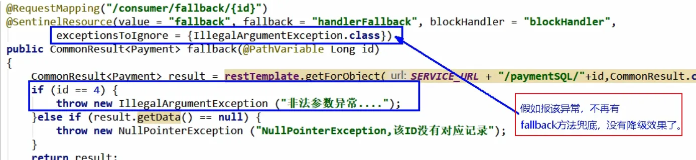

### 持久化

> 目前的sentinel 当重启以后，数据都会丢失，和 nacos 类似原理。需要持久化。它可以被持久化到 nacos 的数据库中。

1. pom依赖：

```xml
<dependency>    <groupId>com.alibaba.csp</groupId>    <artifactId>sentinel-datasource-nacos</artifactId></dependency>
```

2. yml配置：

```yaml
spring:  cloud:    sentinel:      datasource:        ds1:            nacos:            server-addr: localhost:8848            dataId: ${spring.application.name}            group: DEFAULT_GROUP            data-type: json            rule-type: flow
```

3. 去nacos上创建一个dataid ,名字和yml配置的一致，json格式，内容如下：

```json
[    {        "resource": "/testA",        "limitApp": "default",        "grade": 1,        "count": 1,        "strategy": 0,        "controlBehavior": 0,        "clusterMode": false    }]
```


4. 启动应用，发现存在 关于 /testA 请求路径的流控规则。
5. 总结: 就是在 sentinel 启动的时候，去 nacos 上读取相关规则配置信息，实际上它规则的持久化，就是第三步，粘贴到nacos上保存下来，就算以后在 sentinel 上面修改了，重启应用以后也是无效的。

## Seata

> Seate 处理分布式事务。
>
> 微服务模块，连接多个数据库，多个数据源，而数据库之间的数据一致性需要被保证。
>
> 官网：  http://seata.io/zh-cn/

Seata术语： 一 + 三


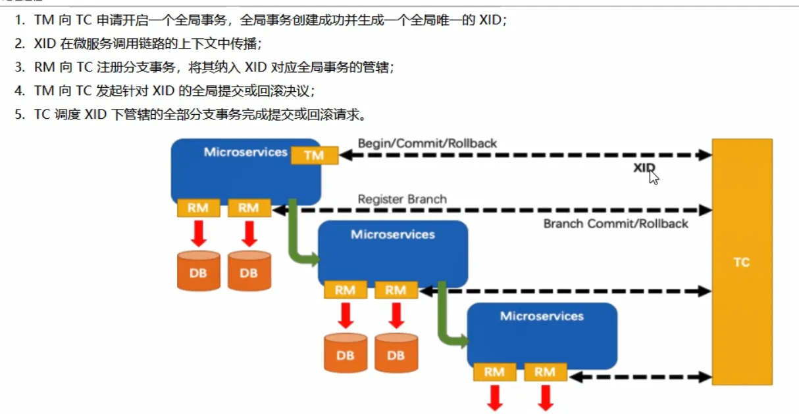

### 下载安装

> 下载地址 ： https://github.com/seata/seata/releases/download/v1.0.0/seata-server-1.0.0.zip


### 初始化操作

1. 修改 conf/file.conf 文件：

> 主要修改自定义事务组名称 + 事务日志存储模式为db + 数据库连接信息
>
> 

2. 创建名和 file.conf 指定一致的数据库。

3. 在新建的数据库里面创建数据表，db_store.sql文件在 conf 目录下（1.0.0有坑，没有sql文件，下载0.9.0的，使用它的sql文件即可）

4. 修改 conf/registry.conf 文件内容：

   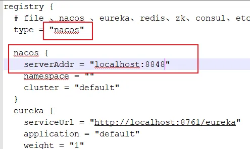

5. 先启动 nacos Server 服务，再启动seata Server 。

6. 启动 Seata Server 报错，在bin目录创建 /logs/seata_gc.log 文件。再次双击 bat文件启动。

### 案例

#### 数据库准备


创建三个数据库： 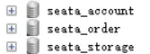

每个数据库创建数据表：

order 库：

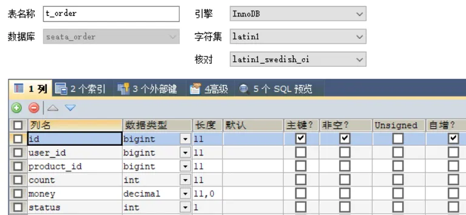

account 库：


storage 库：


三个数据库都创建一个回滚日志表，seata/conf/ 有相应的sql文件（1.0.0没有，依然使用0.9.0中的）。

最终效果：


#### 开发

> 实现 下订单-> 减库存 -> 扣余额 -> 改（订单）状态
>
> 需要注意的是，下面做了 seata 与 mybatis 的整合，所以注意一下，和以往的mybatis的使用不太一样。

新建模块 cloudalibaba-seata-order2001 ：

pom依赖：

```xml
	<dependencies>        <!-- seata -->        <dependency>            <groupId>com.alibaba.cloud</groupId>            <artifactId>spring-cloud-starter-alibaba-seata</artifactId>            <exclusions>                <exclusion>                    <artifactId>seata-all</artifactId>                    <groupId>io.seata</groupId>                </exclusion>            </exclusions>        </dependency>        <dependency>            <groupId>io.seata</groupId>            <artifactId>seata-all</artifactId>            <version>1.0.0</version>        </dependency>        <!-- springcloud alibaba nacos 依赖,Nacos Server 服务注册中心 -->        <dependency>            <groupId>com.alibaba.cloud</groupId>            <artifactId>spring-cloud-starter-alibaba-nacos-discovery</artifactId>        </dependency>        <!-- open feign 服务调用 -->        <dependency>            <groupId>org.springframework.cloud</groupId>            <artifactId>spring-cloud-starter-openfeign</artifactId>        </dependency>        <!-- springboot整合Web组件 -->        <dependency>            <groupId>org.springframework.boot</groupId>            <artifactId>spring-boot-starter-web</artifactId>        </dependency>        <dependency>            <groupId>org.springframework.boot</groupId>            <artifactId>spring-boot-starter-actuator</artifactId>        </dependency>        <!-- 持久层支持 -->        <dependency>            <groupId>com.alibaba</groupId>            <artifactId>druid-spring-boot-starter</artifactId>            <version>1.1.10</version>        </dependency>        <!--mysql-connector-java-->        <dependency>            <groupId>mysql</groupId>            <artifactId>mysql-connector-java</artifactId>        </dependency>        <!--jdbc-->        <dependency>            <groupId>org.springframework.boot</groupId>            <artifactId>spring-boot-starter-jdbc</artifactId>        </dependency>        <!-- mybatis -->        <dependency>            <groupId>org.mybatis.spring.boot</groupId>            <artifactId>mybatis-spring-boot-starter</artifactId>        </dependency>        <!-- 日常通用jar包 -->        <dependency>            <groupId>org.mybatis.spring.boot</groupId>            <artifactId>mybatis-spring-boot-starter</artifactId>        </dependency>        <dependency>            <groupId>org.springframework.boot</groupId>            <artifactId>spring-boot-devtools</artifactId>            <scope>runtime</scope>            <optional>true</optional>        </dependency>        <dependency>            <groupId>org.projectlombok</groupId>            <artifactId>lombok</artifactId>            <optional>true</optional>        </dependency>        <dependency>            <groupId>org.springframework.boot</groupId>            <artifactId>spring-boot-starter-test</artifactId>            <scope>test</scope>        </dependency>        <dependency><!-- 引入自己定义的api通用包，可以使用Payment支付Entity -->            <groupId>com.dkf.cloud</groupId>            <artifactId>cloud-api-commons</artifactId>            <version>${project.version}</version>        </dependency>    </dependencies>
```

yml配置：

```yaml
server:  port: 2001spring:  application:    name: seata-order-service  cloud:    alibaba:      seata:        # 自定义事务组，需要和当时在 seata/conf/file.conf 中的一致        tx-service-group: dkf_tx_group    nacos:      discovery:        server-addr: localhost:8848  datasource:    driver-class-name: com.mysql.jdbc.Driver    url: jdbc:mysql://localhost:3306/seata_order    username: root    password: 123456# 注意，这是自定义的，原来的是mapper_locationsmybatis:  mapperLocations: classpath:mapper/*.xmllogging:  level:    io:      seata: info
```

将 seata/conf/ 下的 file.conf 和 registry.cong 两个文件拷贝到 resource 目录下。

创建 domain 实体类 ： Order 和 CommonResult`<T>` 两个实体类。

dao :

```java
package com.dkf.springcloud.dao;import org.apache.ibatis.annotations.Mapper;import com.dkf.springcloud.domain.Order;import org.apache.ibatis.annotations.Param;@Mapperpublic class OrderDao {    //创建订单    public void create(Order order);    //修改订单状态    public void update(@Param("userId") Long userId, @Param("status") Integer status);}
```

Mapper文件：

```xml
<?xml version="1.0" encoding="UTF-8" ?><!DOCTYPE mapper PUBLIC "-//mybatis.org//DTD Mapper 3.0//EN" "http://mybatis.org/dtd/mybatis-3-mapper.dtd" ><mapper namespace="com.dkf.springcloud.dao.OrderDao">    <!-- 以备后面会用到 -->    <resultMap id="BaseResultMap" type="com.dkf.springcloud.domain.Order">        <id column="id" property="id" jdbcType="BIGINT"></id>        <result column="user_id" property="userId" jdbcType="BIGINT"></result>        <result column="product_id" property="productId" jdbcType="BIGINT"></result>        <result column="count" property="count" jdbcType="INTEGER"></result>        <result column="money" property="money" jdbcType="DECIMAL"></result>        <result column="status" property="status" jdbcType="INTEGER"></result>    </resultMap>    <insert id="create">        insert into t_order(id, user_id, product_id, count, money, status)        values (null, #{userId},#{productId},#{count},#{money},0)    </insert>    <update id="update">        update t_order set status = 1 where user_id=#{userId} and status=#{status}    </update></mapper>
```

创建service ：

> 注意，红框标记的是通过 open-feign 远程调用微服务的service


serviceImpl :

```java
@Service@Slf4jpublic class OrderServiceImpl  implements OrderService {    @Resource    private OrderDao orderDao;    @Resource    private StorageService storageService;    @Resource    private AccountService accountService;    @Override    public void create(Order order) {        log.info("--------》 开始创建订单");        orderDao.create(order);        log.info("--------》 订单微服务开始调用库存，做扣减---Count-");        storageService.decrease(order.getProductId(), order.getCount());        log.info("--------》 订单微服务开始调用库存，库存扣减完成！！");        log.info("--------》 订单微服务开始调用账户，账户扣减---money-");        accountService.decrease(order.getUserId(),order.getMoney());        log.info("--------》 订单微服务开始调用账户，账户扣减完成!!");        //修改订单状态，从0到1        log.info("--------》 订单微服务修改订单状态，start");        orderDao.update(order.getUserId(),0);        log.info("--------》 订单微服务修改订单状态，end");        log.info("--订单结束--");    }    @Override    public void update(Long userId, Integer status) {    }}
```

config （特殊点）:

```java
//下面是两个配置类，这个是和mybatis整合需要的配置@Configuration@MapperScan({"com.dkf.springcloud.alibaba.dao"})public class MybatisConfig {}//这个是配置使用 seata 管理数据源，所以必须配置package com.dkf.springcloud.config;import com.alibaba.druid.pool.DruidDataSource;import io.seata.rm.datasource.DataSourceProxy;import org.apache.ibatis.session.SqlSessionFactory;import org.mybatis.spring.SqlSessionFactoryBean;import org.mybatis.spring.transaction.SpringManagedTransactionFactory;import org.springframework.beans.factory.annotation.Value;import org.springframework.boot.context.properties.ConfigurationProperties;import org.springframework.context.annotation.Bean;import org.springframework.context.annotation.Configuration;import org.springframework.core.io.support.PathMatchingResourcePatternResolver;import javax.sql.DataSource;@Configurationpublic class DataSourceProxyConfig {    @Value("${mybatis.mapperLocations}")    private String mapperLocations;    @Bean    @ConfigurationProperties(prefix = "spring.datasource")    public DataSource druidDataSource(){        return new DruidDataSource();    }    @Bean    public DataSourceProxy dataSourceProxy(DataSource dataSource){        return new DataSourceProxy(dataSource);    }    @Bean    public SqlSessionFactory sqlSessionFactoryBean(DataSourceProxy dataSourceProxy) throws Exception {        SqlSessionFactoryBean sqlSessionFactoryBean = new SqlSessionFactoryBean();        sqlSessionFactoryBean.setDataSource(dataSourceProxy);        sqlSessionFactoryBean.setMapperLocations(new PathMatchingResourcePatternResolver().getResources(mapperLocations));        sqlSessionFactoryBean.setTransactionFactory(new SpringManagedTransactionFactory());        return sqlSessionFactoryBean.getObject();    }}
```

主启动类：

```java
//这里必须排除数据源自动配置，因为写了配置类，让 seata 管理数据源@SpringBootApplication(exclude = DataSourceAutoConfiguration.class)@EnableFeignClients@EnableDiscoveryClientpublic class SeataOrderMain2001 {    public static void main(String[] args) {        SpringApplication.run(SeataOrderMain2001.class,args);    }}
```

controller 层调用 orderService 方法即可。

先启动 nacos  --》 再启动 seata --> 再启动此order服务，测试，可以启动。

仿照上面 创建  cloudalibaba-seata-storage2002 和  cloudalibaba-seata-account2003 两个模块，唯一大的区别就是这两个不需要导入 open-feign 远程调用其它模块。

操，累死老子啦，测试可以正常使用！

#### Seata使用

```java
	@Override	//只需要在业务类的方法上加上该注解，name值自定义唯一即可。    @GlobalTransactional(name = "dkf-create-order", rollbackFor = Exception.class)    public void create(Order order) {        log.info("--------》 开始创建订单");        orderDao.create(order);        log.info("--------》 订单微服务开始调用库存，做扣减---Count-");        storageService.decrease(order.getProductId(), order.getCount());        log.info("--------》 订单微服务开始调用库存，库存扣减完成！！");        log.info("--------》 订单微服务开始调用账户，账户扣减---money-");        accountService.decrease(order.getUserId(),order.getMoney());        log.info("--------》 订单微服务开始调用账户，账户扣减完成!!");        //修改订单状态，从0到1        log.info("--------》 订单微服务修改订单状态，start");        orderDao.update(order.getUserId(),0);        log.info("--------》 订单微服务修改订单状态，end");        log.info("--订单结束--");    }
```


原理三个阶段：


