# Spring Data JPA ALL IN ONE
- [Spring Data JPA ALL IN ONE](#spring-data-jpa-all-in-one)
  - [概述](#概述)
  - [Hibernate JPA](#hibernate-jpa)
    - [注解实现](#注解实现)
    - [Hibernate JPA的CRUD](#hibernate-jpa的crud)
      - [查询操作以及区别](#查询操作以及区别)
      - [删除操作](#删除操作)
      - [更新操作](#更新操作)
      - [JPQL查询](#jpql查询)
        - [查询全部](#查询全部)
        - [倒叙查询](#倒叙查询)
        - [统计查询](#统计查询)
        - [分页查询](#分页查询)
        - [条件查询](#条件查询)
  - [环境搭建](#环境搭建)
  - [入门编写JPA实现](#入门编写jpa实现)
    - [功能测试](#功能测试)
  - [源码分析](#源码分析)
  - [复杂查询](#复杂查询)
  - [JPQL查询](#jpql查询-1)
  - [SQL查询](#sql查询)
    - [条件查询](#条件查询-1)
  - [方法名称规则查询](#方法名称规则查询)
  - [JpaSpecificationExecutor方法](#jpaspecificationexecutor方法)
    - [自定义查询条件 / 动态查询](#自定义查询条件--动态查询)
    - [多条件查询](#多条件查询)
    - [模糊查询](#模糊查询)
    - [排序](#排序)
    - [分页查询](#分页查询-1)
  - [多表查询](#多表查询)
    - [一对多](#一对多)
    - [多对多](#多对多)
    - [实体类中的关系](#实体类中的关系)
    - [ORM分析步骤](#orm分析步骤)
    - [一对多案例](#一对多案例)
    - [多对多案例](#多对多案例)
  - [对象导航查询](#对象导航查询)
  - [解决中文乱码问题](#解决中文乱码问题)
    - [数据库检测](#数据库检测)
## 概述

描述：Spring Data JPA, part of the larger Spring Data family, makes it easy to easily implement JPA based repositories. This module deals with enhanced support for JPA based data access layers. It makes it easier to build Spring-powered applications that use data access technologies.

功能：

- Sophisticated support to build repositories based on Spring and JPA
- Support for [Querydsl](http://www.querydsl.com/) predicates and thus type-safe JPA queries
- Transparent auditing of domain class
- Pagination support, dynamic query execution, ability to integrate custom data access code
- Validation of @Query annotated queries at bootstrap time
- Support for XML based entity mapping
- JavaConfig based repository configuration by introducing @EnableJpaRepositories

**SpringData只需写接口就可以完成增删改查、分页操作等**


## Hibernate JPA

要求必须在类路径下创建META-INF文件夹下的xml文件：

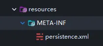

查看JPA的XML写法：


编写XML的配置：

```xml
<?xml version="1.0" encoding="UTF-8"?>
<persistence xmlns="http://java.sun.com/xml/ns/persistence" version="2.0">
    <!--需要配置persistence-unit节点
        持久化单元：
            name:持久化单元名称
            transaction-type:事务管理方式
                JTA:分布式事务管理
                RESOURCE_LOCAL:本地事务管理
    -->
    <persistence-unit name="myJpa" transaction-type="RESOURCE_LOCAL">
        <!--jap的实现方式-->
        <provider>org.hibernate.jpa.HibernatePersistenceProvider</provider>
        <!--数据库信息-->
        <!--可选配置：配置jap实现方的配置信息-->
        <properties>
<!--            数据库信息
                用户名:javax.persistence.jdbc.user
                密码:javax.persistence.jdbc.password
                驱动:javax.persistence.jdbc.driver
                数据库地址:javax.persistence.jdbc.url
-->
            <property name="javax.persistence.jdbc.user" value="root"/>
            <property name="javax.persistence.jdbc.password" value="root"/>
            <property name="javax.persistence.jdbc.driver" value="com.mysql.jdbc.Driver"/>
            <property name="javax.persistence.jdbc.url" value="jdbc:mysql:///jpa"/>

<!--            配置JPA实现方(hibernate)的配置信息
                显示SQL hibernate.show_sql
                自动创建数据库表 hibernate.hbm2ddl.auto
                    create  程序运行时创建数据库表（如果有表先删除表再创建）
                    update  程序运行时创建表（如果有表不会创建表）
                    none    不会创建表
-->
            <property name="hibernate.show_sql" value="false"/>
            <property name="hibernate.hbm2ddl.auto" value="create"/>
        </properties>
    </persistence-unit>

</persistence>
```

编写实体类:


### 注解实现

1. 实体类和表的映射关系
* @Entity: 声明实体类
* @Table: 配置实体类和表的映射关系
*      name: 配置数据库表的名称

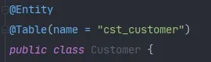

2. 实体类中属性和表中字段的映射关系
 * @Id 声明主键的配置
 * @GeneratedValue 配置主键生成策略
   * strategy
     * GenerationType.IDENTITY：自增 MySQL
       * 底层数据库必须支持自动增长（底层数据库支持的自动增长方式，对id自增）
     * GenerationType.SEQUENCE： 序列，Oracle
       * 底层数据库必须支持序列
     * GenerationType.TABLE：JPA提供的一种机制，通过一张数据库的形式帮助我们主键完成自增
     * GenerationType.AUTO：由程序自动帮助我们选择主键生成策略
 * @Column 配置属性和字段的映射关系
   * name：数据库表中字段的名称


 **JPA的操作步骤：**

1. 加载配置文件创建工厂（实体管理器工厂）对象

* Persisitence：静态方法（根据持久化单元名称创建实体管理器工厂）
* createEntityMnagerFactory（持久化单元名称）

作用：创建实体管理器工厂

2. 通过实体管理器工厂实体管理器

* EntityManagerFactory ：获取EntityManager对象
  * 方法：createEntityManager
  * 内部维护的很多的内容
    * 内部维护了数据库信息，
  * 维护了缓存信息
  * 维护了所有的实体管理器对象
  * 再创建EntityManagerFactory的过程中会根据配置创建数据库表
* EntityManagerFactory的创建过程比较浪费资源
  * 特点：线程安全的对象
  * 多个线程访问同一个EntityManagerFactory不会有线程安全问题
  * *如何解决EntityManagerFactory的创建过程浪费资源（耗时）的问题？*
    * 思路：创建一个公共的EntityManagerFactory的对象
    * **静态代码块的形式创建EntityManagerFactory**

3. 获取事务对象，开启事务

* EntityManager对象：实体类管理器
  * beginTransaction : 创建事务对象
  * presist ： 保存
  * merge  ： 更新
  * remove ： 删除
  * find/getRefrence ： 根据id查询
* Transaction 对象 ： 事务
  * begin：开启事务
  * commit：提交事务
  * rollback：回滚

4. 完成CRUD操作

5. 提交事务（回滚事务）

6. 释放资源


注意：

解决中文乱码问题：更改URL


### Hibernate JPA的CRUD

#### 查询操作以及区别

使用EntityManager 的 find 和 getReference 对比

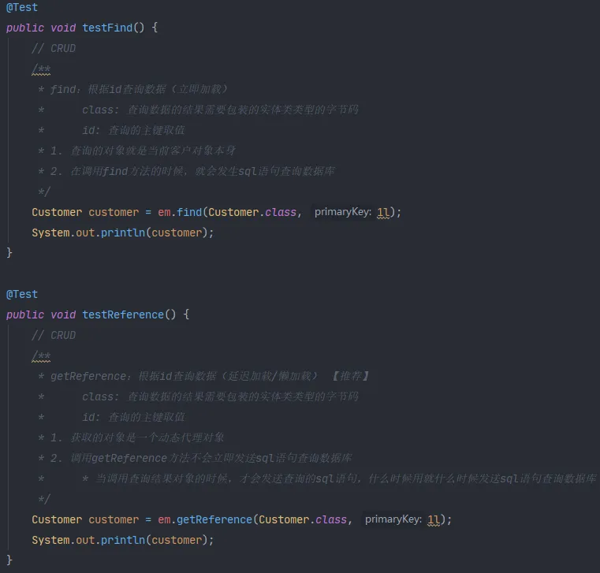

#### 删除操作


#### 更新操作

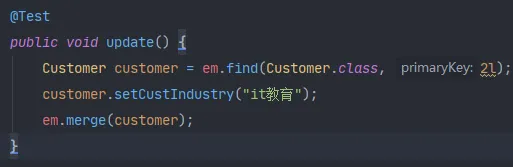

#### JPQL查询

*1.* *创建**query**查询对象**

* **getResultList:** 直接将查询封装为List集合

* **getSingleResult:** 得到唯一的结果集

*2.* *对参数进行赋值*

*3.* 查询，并得到返回结果


##### 查询全部


##### 倒叙查询


##### 统计查询


##### 分页查询


##### 条件查询

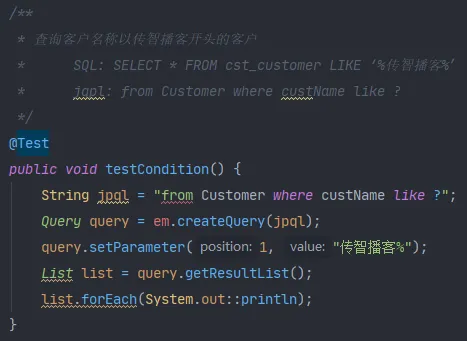


## 环境搭建

pom.xml

```xml
<properties>
    <spring.version>5.0.2.RELEASE</spring.version>
    <hibernate.version>5.0.7.Final</hibernate.version>
    <slf4j.version>1.6.6</slf4j.version>
    <log4j.version>1.2.12</log4j.version>
    <c3p0.version>0.9.1.2</c3p0.version>
    <mysql.version>5.1.6</mysql.version>
</properties>

<dependencies>
    <!-- junit单元测试 -->
    <dependency>
        <groupId>junit</groupId>
        <artifactId>junit</artifactId>
        <version>4.9</version>
        <scope>test</scope>
    </dependency>

    <!-- spring beg -->
    <dependency>
        <groupId>org.aspectj</groupId>
        <artifactId>aspectjweaver</artifactId>
        <version>1.6.8</version>
    </dependency>

    <dependency>
        <groupId>org.springframework</groupId>
        <artifactId>spring-aop</artifactId>
        <version>${spring.version}</version>
    </dependency>

    <dependency>
        <groupId>org.springframework</groupId>
        <artifactId>spring-context</artifactId>
        <version>${spring.version}</version>
    </dependency>

    <dependency>
        <groupId>org.springframework</groupId>
        <artifactId>spring-context-support</artifactId>
        <version>${spring.version}</version>
    </dependency>

    <!--Spring对ORM的支持包-->
    <dependency>
        <groupId>org.springframework</groupId>
        <artifactId>spring-orm</artifactId>
        <version>${spring.version}</version>
    </dependency>

    <dependency>
        <groupId>org.springframework</groupId>
        <artifactId>spring-beans</artifactId>
        <version>${spring.version}</version>
    </dependency>

    <dependency>
        <groupId>org.springframework</groupId>
        <artifactId>spring-core</artifactId>
        <version>${spring.version}</version>
    </dependency>

    <!-- spring end -->

    <!-- hibernate beg -->
    <dependency>
        <groupId>org.hibernate</groupId>
        <artifactId>hibernate-core</artifactId>
        <version>${hibernate.version}</version>
    </dependency>
    <dependency>
        <groupId>org.hibernate</groupId>
        <artifactId>hibernate-entitymanager</artifactId>
        <version>${hibernate.version}</version>
    </dependency>
    <dependency>
        <groupId>org.hibernate</groupId>
        <artifactId>hibernate-validator</artifactId>
        <version>5.2.1.Final</version>
    </dependency>
    <!-- hibernate end -->

    <!-- c3p0 beg -->
    <dependency>
        <groupId>c3p0</groupId>
        <artifactId>c3p0</artifactId>
        <version>${c3p0.version}</version>
    </dependency>
    <!-- c3p0 end -->

    <!-- log end -->
    <dependency>
        <groupId>log4j</groupId>
        <artifactId>log4j</artifactId>
        <version>${log4j.version}</version>
    </dependency>

    <dependency>
        <groupId>org.slf4j</groupId>
        <artifactId>slf4j-api</artifactId>
        <version>${slf4j.version}</version>
    </dependency>

    <dependency>
        <groupId>org.slf4j</groupId>
        <artifactId>slf4j-log4j12</artifactId>
        <version>${slf4j.version}</version>
    </dependency>
    <!-- log end -->


    <dependency>
        <groupId>mysql</groupId>
        <artifactId>mysql-connector-java</artifactId>
        <version>${mysql.version}</version>
    </dependency>

    <!--spring data jpa的坐标-->
    <dependency>
        <groupId>org.springframework.data</groupId>
        <artifactId>spring-data-jpa</artifactId>
        <version>1.9.0.RELEASE</version>
    </dependency>

    <dependency>
        <groupId>org.springframework</groupId>
        <artifactId>spring-test</artifactId>
        <version>${spring.version}</version>
    </dependency>

    <!-- el beg 使用spring data jpa 必须引入 -->
    <dependency>
        <groupId>javax.el</groupId>
        <artifactId>javax.el-api</artifactId>
        <version>2.2.4</version>
    </dependency>

    <dependency>
        <groupId>org.glassfish.web</groupId>
        <artifactId>javax.el</artifactId>
        <version>2.2.4</version>
    </dependency>
    <!-- el end -->
</dependencies>
```


## 入门编写JPA实现

创建一个Spring和JPA的配置：

```xml
<?xml version="1.0" encoding="UTF-8"?>
<beans xmlns="http://www.springframework.org/schema/beans"
       xmlns:xsi="http://www.w3.org/2001/XMLSchema-instance" xmlns:aop="http://www.springframework.org/schema/aop"
       xmlns:context="http://www.springframework.org/schema/context"
       xmlns:jdbc="http://www.springframework.org/schema/jdbc" xmlns:tx="http://www.springframework.org/schema/tx"
       xmlns:jpa="http://www.springframework.org/schema/data/jpa" xmlns:task="http://www.springframework.org/schema/task"
       xsi:schemaLocation="
      http://www.springframework.org/schema/beans http://www.springframework.org/schema/beans/spring-beans.xsd
      http://www.springframework.org/schema/aop http://www.springframework.org/schema/aop/spring-aop.xsd
      http://www.springframework.org/schema/context http://www.springframework.org/schema/context/spring-context.xsd
      http://www.springframework.org/schema/jdbc http://www.springframework.org/schema/jdbc/spring-jdbc.xsd
      http://www.springframework.org/schema/tx http://www.springframework.org/schema/tx/spring-tx.xsd
      http://www.springframework.org/schema/data/jpa
      http://www.springframework.org/schema/data/jpa/spring-jpa.xsd">
<!--    Spring 和 Spring data jpa 的配置-->

<!--    创建entityManagerFactory对象交给spring容器管理-->
    <bean id="entityManagerFactory" class="org.springframework.orm.jpa.LocalContainerEntityManagerFactoryBean">
        <property name="dataSource" ref="dataSource" />
<!--        配置的扫描的包（实体类所在的包）-->
        <property name="packagesToScan" value="com.zhiyu.domain" />
<!--        JPA的实现方式-->
        <property name="persistenceProvider">
            <bean class="org.hibernate.jpa.HibernatePersistenceProvider" />
        </property>
<!--        JPA的供应商适配器-->
        <property name="jpaVendorAdapter">
            <bean class="org.springframework.orm.jpa.vendor.HibernateJpaVendorAdapter">
<!--                配置是否自动创建数据库表-->
                <property name="generateDdl" value="false" />
<!--                指定数据库类型-->
                <property name="database" value="MYSQL" />
<!--                数据库方言（支持的特有语法）-->
                <property name="databasePlatform" value="org.hibernate.dialect.MySQLDialect" />
<!--                是否显示SQL语句-->
                <property name="showSql" value="true" />
            </bean>
        </property>

<!--        JPA的方言(高级特性)-->
        <property name="jpaDialect">
            <bean class="org.springframework.orm.jpa.vendor.HibernateJpaDialect">

            </bean>
        </property>
    </bean>

<!--    创建数据库连接池-->
    <bean id="dataSource" class="com.mchange.v2.c3p0.ComboPooledDataSource">
        <property name="user" value="root" />
        <property name="password" value="root" />
        <property name="jdbcUrl" value="jdbc:mysql:///jpa" />
        <property name="driverClass" value="com.mysql.jdbc.Driver" />
    </bean>

<!--    整合SpringDataJpa-->
    <jpa:repositories base-package="com.zhiyu.dao" transaction-manager-ref="tx" entity-manager-factory-ref="entityManagerFactory">

    </jpa:repositories>

<!--    配置事务管理器-->
    <bean id="tx" class="org.springframework.orm.jpa.JpaTransactionManager">
        <property name="entityManagerFactory" ref="entityManagerFactory" />
    </bean>

<!--    声明式事务-->

<!--    配置包扫描-->
    <context:component-scan base-package="com.zhiyu" />
</beans>
```

创建一个实现类：

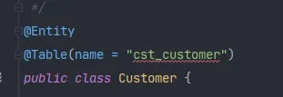

* 符合SpringJpa的dao层接口规范
  * JpaRepository <操作的实体类类型, 实体类的主键属性的类型>
    * 封装了基本CRUD操作
  * JpaSpecificationExecutor <操作的实体类类型>
    * 封装了复杂查询（分页）

```java
public interface CustomerDao extends JpaRepository<Customer, Long>, JpaSpecificationExecutor<Customer> {
}
```

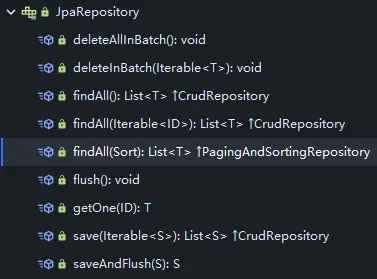

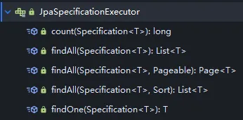

### 功能测试

根据ID查询一个


**save保存或更新**

* 根据传递的对象是否存在主键id
* 如果没有id主键属性，保存
* 存在id主键属性，根据id查询数据，更新数据


删除：

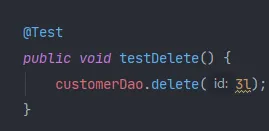

查询所有：

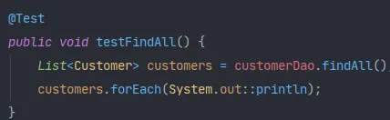

小结：

1. 搭建环境
   1. 创建工程导入坐标
   2. 配置spring的配置文件（配置spring Data jpa的整合）
   3. 编写实体类（Customer），使用jpa注解配置映射关系
2. 编写一个符合springDataJpa的dao层接口
   1. 只需要编写dao层接口，不需要编写dao层接口的实现类
   2. dao层接口规范
      1. 需要继承两个接口（JpaRepository，JpaSpecificationExecutor）
      2. 需要提供响应的泛型


* findOne（id） ：根据id查询
* save(customer):保存或者更新（依据：传递的实体类对象中，是否包含id属性）
* delete（id） ：根据id删除
* findAll() : 查询全部


## 源码分析

以findOne为例分析：

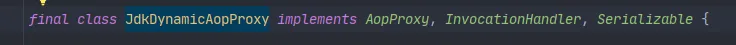

继承了动态代理：InvocationHandler
生成的代理对象是：SimpleJpaRepository


SimpleJpaRepository 对基本的JPA增删改查进行了封装


通过EntityManager进行查询（em）


basepackage：对此包下的DAO接口进行动态代理增强


**小结：**

1. 通过JdkDynamicAopProxy的invoke方法创建了一个动态代理对象
2. SimpleJpaRepository当中封装了JPA的操作（借助JPA的api完成数据库的CRUD）
3. 通过hibernate完成数据库操作（封装了jdbc）


## 复杂查询

统计查询：


判断是否存在：

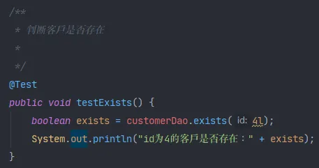

延迟加载getOne

注：需要加上@Transactional注解


## JPQL查询

* 需要将JPQL语句配置到接口方法上

1. 特有的查询：需要在dao接口上配置方法

2. 在新添加的方法上，使用注解的形式配置jpql查询语句

3. 注解 ： @Query

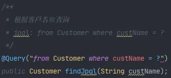

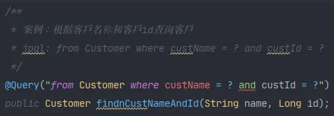


注意：

* 需要手动添加事务的支持
* 默认执行之后会回滚事务
* **@Rollback** *设置自动回滚*
  * true | false


## SQL查询

1. 特有的查询：需要在dao接口上配置方法
2. 在新添加的方法上，使用注解的形式配置sql查询语句
3. 注解 ： @Query
   1. value ：jpql语句 | sql语句
   2. **nativeQuery** ：false（使用jpql查询） | true（使用本地查询：sql查询）是否使用本地查询


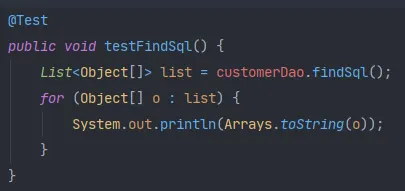

### 条件查询


## 方法名称规则查询

findBy+对象中属性的名称（首字母大写）：代表查询
含义：根据属性名称进行查询
例如： custName -> CustName

*      findByCustName -> 根据客户名称查询
*      在SpingDataJPA的运行阶段：会根据名称进行解析: find from xxx(实体类) 属性名称 where custName = ？

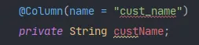

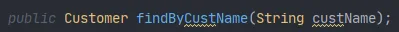

**findBy + 属性名称（根据属性名称进行完成匹配的查询=） + 查询方式（Like | isnull）**：条件查询
findByCustNameLike

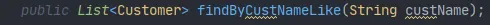

**findBy + 属性名 + 多条件连接符(and | or) + 属性名 + 查询方式**：多条件查询

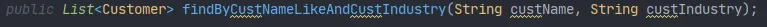


## JpaSpecificationExecutor方法

**Specification**  查询条件

1. 自定义我们自己的 *Specification* 实现类
2. 需要实现的方法：toPredicate 
   1. *Root*：查询的根对象（查询的任何属性都可以从根对象获取）
   2. *CriteriaQuery*：顶层查询对象，自定义查询方式
   3. *CriteriaBuilder* ：查询的构造器，封装了很多的查询条件


查询单个对象：

T findOne(*Specification*``<T>`` spec);


查询列表：

*List*`<T>` findAll(*Specification*`<T>` spec);


查询全部，分页

- pageable 分页参数
- 返回分页：PageBean

*Page*`<T>` findAll(*Specification*`<T>` spec, *Pageable* pageable);


查询列表，排序

- Sort 排序参数

*List*`<T>` findAll(*Specification*`<T>` spec, Sort sort);


统计查询：

*long* count(*Specification*`<T>` spec);


### 自定义查询条件 / 动态查询

1. 实现Specification接口（提供泛型，查询的对象类型）
2. 实现toPredicate方法（构造查询条件）
3. 需要借助方法中的两个参数（
   1. root:获取需要查询的对象属性
   2. CriteriaQuery  CriteriaBuilder:构造查询条件,内部封装了很多查询条件 *）*

```java
Specification<Customer> spec = new Specification<Customer>() {
    public Predicate toPredicate(Root<Customer> root, CriteriaQuery<?> query, CriteriaBuilder cb) {
        // 获取比较的属性
        Path<Object> custName = root.get("custName");
        // 构造查询条件
        //      参数一：比较的属性（path对象）
        //      参数二：当前需要比较的取值
        Predicate predicate = cb.equal(custName, "传智播客");
        return predicate;
    }
};
Customer customer = customerDao.findOne(spec);
System.out.println(customer);
```


### 多条件查询

root： 用来获取属性

* 客户名称
* 所属行业

cb: 构造查询

1. 构造客户没的精准匹配查询
2. 构造所属行业的精准匹配查询
3. 将以上两个查询联系起来

```java
Specification<Customer> spec = new Specification<Customer>() {
    public Predicate toPredicate(Root<Customer> root, CriteriaQuery<?> query, CriteriaBuilder cb) {
        Path<Object> custName = root.get("custName");
        Path<Object> custIndustry = root.get("custIndustry");

        Predicate p1 = cb.equal(custName, "传智播客");
        Predicate p2 = cb.equal(custIndustry, "it教育");

        // 组合条件
        Predicate res = cb.and(p1, p2);
        //                cb.or(); // 或拼接多个查询条件
        return res;
    }
};
Customer customer = customerDao.findOne(spec);
System.out.println(customer);
```


### 模糊查询

* equal: 直接得到path对象（属性）,然后进行比较即可
*  gt, lt, ge, le, like, 得到path对象,根据path指定比较的参数类型,再去进行比较
  * 指定方式：path.as(类型的字节码对象)

```java
Specification<Customer> spec = new Specification<Customer>() {
    public Predicate toPredicate(Root<Customer> root, CriteriaQuery<?> query, CriteriaBuilder cb) {
        Path<Object> custName = root.get("custName");
        Predicate like = cb.like(custName.as(String.class), "传智播客");
        return like;
    }
};
List<Customer> list = customerDao.findAll(spec);
list.forEach(System.out::println);
```


### 排序

创建排序对象,需要调用构造方法实例化sort对象

* 参数一： 排序的顺序 Sort.Direction.ASC(DESC)
* 参数二： 排序的属性名

```java
Sort sort = new Sort(Sort.Direction.DESC, "custId");
List<Customer> list1 = customerDao.findAll(spec, sort);
list1.forEach(System.out::println);
```


### 分页查询

用法及三个比较重要的方法：


## 多表查询

### 一对多

- 一的一方：主表
- 多的一方：从表
- 外键：需要在从表上新建一列作为外键，它的取值源于主表的主键

### 多对多

- 中间表：中间表中最少应该由两个字段组成，这两个字段作为外键指向两张表的主键，又组合成了联合主键。

### 实体类中的关系

- 包含关系
- 继承关系

### ORM分析步骤

1. 明确表关系
2. 描述外键|中间表
3. 编写实体类，在实体类中描述表关系（包含关系）
4. 配置映射关系


### 一对多案例

客户和联系人的案例（一对多关系）
	客户：一家公司
	联系人：这家公司的员工

一个客户可以具有多个联系人
一个联系人从属于一家公司

配置客户和联系人之间的关系（一对多关系）

使用注解的形式配置多表关系

声明关系

 *    @OneToMany : 配置一对多关系
 *    targetEntity:对方对象的字节码

配置外键（中间表）

 *    @JoinColumn 配置外键
 *    name: 外键字段名称
 *    referencedColumnName：参照的主表的主键字段名称（在主表配置）

在客户实体类上（一的一方）添加了外键配置,所以对于客户而言,也具备了维护外键的作用


**配置联系人到客户的多对一的关系**

使用注解的形式配置多对一关系

* @ManyToOne： 配置多对一关系
* targetEntity:对方的实体类字节码

配置外键（中间表）

配置外键的过程中，配置到多的一方,就会在多的一方维护外键


(**注**：设置getter和setter)


 **注入JPA的配置信息**

加载JPA的基本配置信息和JPA实现方式的配置信息

* hibernate.hbm2ddl.auto:自动创建数据库表
  * create:每次都会创建数据库表
  * pdate:有表不会重新创建,没有表才会重新创建

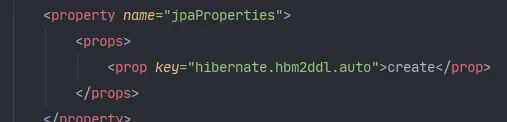

**测试**

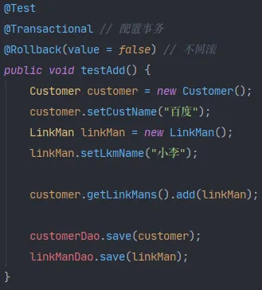

配置客户到联系人：

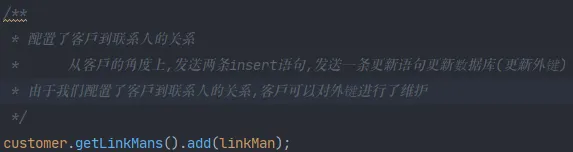

配置联系人到客户：


多了一条update语句：

* 由于一的一方可以维护外键，会发送update语句

* 解决：只需要在一的一方放弃维护权即可

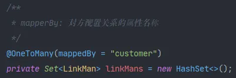

**级联删除**

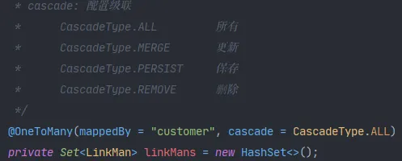

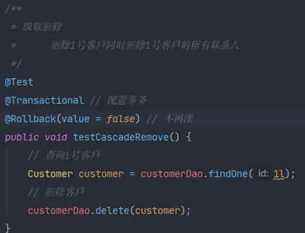

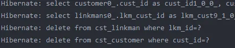

### 多对多案例

案例：用户和角色（多对多关系）
			用户：
			角色：
		分析步骤

1. 明确表关系
   1. 多对多关系

2. 确定表关系（描述 外键|中间表）
   1. 中间间表

3. 编写实体类，再实体类中描述表关系（包含关系）
   1. 用户：包含角色的集合
   2. 角色：包含用户的集合

4. 配置映射关系

**配置多对多映射关系**

1. 声明表关系的配置
   1. @ManyToMany 代表对方实体类的字节码
2. 配置中间表（包含两个外键）
   1. @JoinTable
      1. joinColumns 当前对象在中间表中的外键
   2. @JoinColumn
      1. name: 外键名
      2. referencedColumnName:参照的主表的主键名
      3. inverseJoinColumns 对方对象在中间表的外键
   3. @JoinColumn


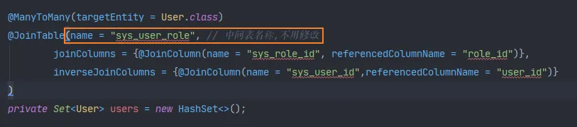

放弃维护：

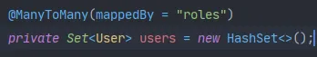

这个roles来源于另外一张表：

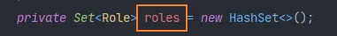

**级联操作**

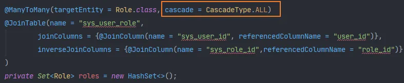

级联添加

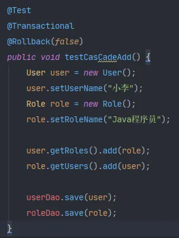

级联删除

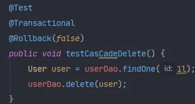


## 对象导航查询

1.对象导航查询

​	查询一个对象的同时，通过此对象查询他的关联对象

​	案例：客户和联系人

​	从一方查询多方

​		* 默认：使用延迟加载（****）	

​	从多方查询一方

​		* 默认：使用立即加载

一方查多方：默认延迟加载

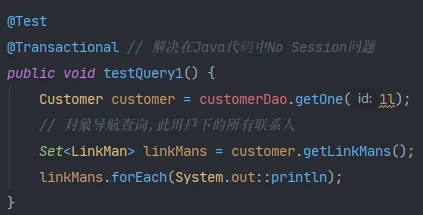

更改加载方式：（不推荐使用）

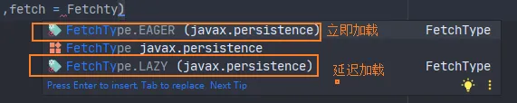


**从多方查询一方（默认立即加载）**

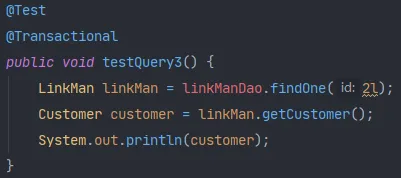


## 解决中文乱码问题


### 数据库检测

使用：**show variables like 'character%';** 检查数据库是否是UTF-8
如果是：


解决：


设置：

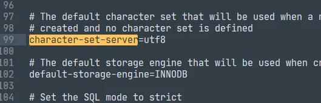


更改完后：


