# SpringMVC ALL IN ONE

- [SpringMVC ALL IN ONE](#springmvc-all-in-one)
  - [SpringMVC的配置](#springmvc的配置)
    - [**细节补充：**](#细节补充)
  - [@RequestMapping的其他属性](#requestmapping的其他属性)
    - [method](#method)
    - [params](#params)
    - [headers](#headers)
    - [consume](#consume)
    - [produces](#produces)
  - [ant风格的url和@PathVariable](#ant风格的url和pathvariable)
    - [@RequestMapping的ant风格url](#requestmapping的ant风格url)
    - [@PathVariable](#pathvariable)
  - [获取请求信息](#获取请求信息)
    - [@RequestMapping 获取参数 path?xxx= xxx](#requestmapping-获取参数-pathxxx-xxx)
    - [@RequestHeader 获取请求头](#requestheader-获取请求头)
    - [@CookieValue 获取Cookie的值](#cookievalue-获取cookie的值)
  - [使用 POJO 对象绑定请求参数值](#使用-pojo-对象绑定请求参数值)
  - [使用tomcat原生API](#使用tomcat原生api)
  - [数据输出 Model和ModelMap](#数据输出-model和modelmap)
    - [使用Model](#使用model)
    - [使用ModelMap](#使用modelmap)
  - [数据输出 ModelAndView使用](#数据输出-modelandview使用)
  - [数据输出 @SessionAttributes](#数据输出-sessionattributes)
  - [数据输出 @ModelAttribute](#数据输出-modelattribute)
  - [源码分析 DispatcherServlet](#源码分析-dispatcherservlet)
    - [概览](#概览)
    - [整体](#整体)
    - [doDispatch的详细细节](#dodispatch的详细细节)
    - [getHandler的详细](#gethandler的详细)
    - [getHandlerAdapter](#gethandleradapter)
  - [源码分析 SpringMVC的九大组件](#源码分析-springmvc的九大组件)
    - [初始化](#初始化)
  - [源码分析 @ModelAttribute](#源码分析-modelattribute)
  - [视图解析 转发和重定向](#视图解析-转发和重定向)
  - [源码分析 视图解析](#源码分析-视图解析)
  - [视图解析 JSTL 国际化](#视图解析-jstl-国际化)
  - [数据绑定 mvc:annotation-driver](#数据绑定-mvcannotation-driver)
    - [序言：JSP两种获取项目路径的方式](#序言jsp两种获取项目路径的方式)
    - [自定义数据绑定类型和静态资源的拦截](#自定义数据绑定类型和静态资源的拦截)
    - [日期格式化](#日期格式化)
  - [数据校验 校验注解&去错误页面](#数据校验-校验注解去错误页面)
    - [提示：IDEA使用 alt + shift + insert 进入多行编辑模式](#提示idea使用-alt--shift--insert-进入多行编辑模式)
    - [数据校验](#数据校验)
    - [国际化定制错误消息](#国际化定制错误消息)
  - [SpringMVC对AJAX的支持](#springmvc对ajax的支持)
  - [请求体 @ResponseBody](#请求体-responsebody)
  - [获取请求头 @HttpEntity](#获取请求头-httpentity)
  - [@ResponseEntity 返回响应式数据](#responseentity-返回响应式数据)
  - [文件下载及文件上传](#文件下载及文件上传)
    - [文件下载](#文件下载)
    - [文件上传](#文件上传)
      - [HttpMessageConverter](#httpmessageconverter)
    - [多文件上传](#多文件上传)
  - [拦截器及多拦截器](#拦截器及多拦截器)
    - [多拦截器](#多拦截器)
    - [小结](#小结)
  - [源码分析 拦截器](#源码分析-拦截器)
    - [具体调试](#具体调试)
  - [国际化](#国际化)
    - [自定义国际化文件](#自定义国际化文件)
    - [使用SessionLocaleResolver进行国际化](#使用sessionlocaleresolver进行国际化)
    - [拦截器配合国际化](#拦截器配合国际化)
  - [异常处理 @ExceptionHandler](#异常处理-exceptionhandler)
    - [处理异常的一般步骤](#处理异常的一般步骤)
  - [异常处理 @ResponseStatus](#异常处理-responsestatus)
    - [@ResponseStatus的基本使用](#responsestatus的基本使用)
      - [错误的请求方式](#错误的请求方式)
  - [源码分析 异常处理](#源码分析-异常处理)
    - [HandlerExceptionResolver的实现类](#handlerexceptionresolver的实现类)
  - [【小结】SpringMVC的运行流程](#小结springmvc的运行流程)
      - [1. 所有请求，前端控制器（DispatcherServlet）调用doDispatch进行处理](#1-所有请求前端控制器dispatcherservlet调用dodispatch进行处理)
      - [2. 根据HandlerMapping的请求应色号信息找到，处理当前的请求，处理执行链](#2-根据handlermapping的请求应色号信息找到处理当前的请求处理执行链)
      - [3. 根据当前处理器找到它的适配器](#3-根据当前处理器找到它的适配器)
      - [4. 拦截器的preHandler先执行](#4-拦截器的prehandler先执行)
      - [5. 适配器执行目标方法，返回ModelAndView](#5-适配器执行目标方法返回modelandview)
      - [6. 拦截器的postHandler执行](#6-拦截器的posthandler执行)
      - [7. 渲染页面，处理结果](#7-渲染页面处理结果)
  - [SpringMVC和Spring的整合（分工明确）](#springmvc和spring的整合分工明确)
    - [合并](#合并)
    - [分容器](#分容器)

## SpringMVC的配置

新增的Maven包

```xml
<dependency>
    <groupId>org.springframework</groupId>
    <artifactId>spring-web</artifactId>
    <version>${spring-version}</version>
</dependency>
<dependency>
    <groupId>org.springframework</groupId>
    <artifactId>spring-webmvc</artifactId>
    <version>${spring-version}</version>
</dependency>
```

​    在web.xml配置DispatcherServlet：

```xml
<!--  SpringMVC思想是一个前端控制器拦截所有请求，并只能派发：这个前端控制器是一个Servlet
      可以在web.xml配置拦截
-->
  <servlet>
    <servlet-name>springDispatcherServlet</servlet-name>
    <servlet-class>org.springframework.web.servlet.DispatcherServlet</servlet-class>
    <init-param>
<!--      contextConfigLocation指定SpringMVC的配置文件-->
      <param-name>contextConfigLocation</param-name>
      <param-value>classpath:springmvc.xml</param-value>
    </init-param>
<!--    Servlet启动加载，servlet第一次访问创建对象
        load-on-startup 服务器启动的时候创建对象，值越小，越先创建对象
-->
    <load-on-startup>1</load-on-startup>
  </servlet>
  <servlet-mapping>
    <servlet-name>springDispatcherServlet</servlet-name>
<!--      /* 和 /都是拦截所有请求
          /* 的范围更大,还会拦截.jsp请求
-->
    <url-pattern>/</url-pattern>
  </servlet-mapping>
```

配置IOC：注 -- 视图解析器是用来方便跳转页面用的

```xml
<?xml version="1.0" encoding="UTF-8"?>
<beans xmlns="http://www.springframework.org/schema/beans"
       xmlns:xsi="http://www.w3.org/2001/XMLSchema-instance"
       xmlns:context="http://www.springframework.org/schema/context"
       xsi:schemaLocation="http://www.springframework.org/schema/beans http://www.springframework.org/schema/beans/spring-beans.xsd http://www.springframework.org/schema/context http://www.springframework.org/schema/context/spring-context.xsd">
    <context:component-scan base-package="cn.zhiyucs.controller" />
<!--    视图解析器-->
    <bean class="org.springframework.web.servlet.view.InternalResourceViewResolver">
        <property name="prefix" value="/WEB-INF/pages/"></property>
        <property name="suffix" value=".jsp"></property>
    </bean>
</beans>
```

编写Controller

```xml
@Controller
public class MyFirstController {
    @RequestMapping("/hello")
    public String index() {
        return "success";
    }
}
```

不指定配置文件的用法：

如果**不用 ` <init-param> </init-param>`** 指定配置文件，它会在WEB-INF下找到**`<servlet-name>springmvc</servlet-name>`**的springmvc-servlet：

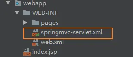

### **细节补充：**

如果前端的请求不同：

```xml
<a href="hello">进入Hello页面</a>
```

地址是：http://localhost:8080/SpringMVC_01_war_exploded/hello

```xml
<a href="/hello">进入Hello页面</a>
```

地址是：http://localhost:8080/hello


## @RequestMapping的其他属性

### method

```java
//    默认是全接收
    @ResponseBody
    @RequestMapping(value = "/index", method = RequestMethod.GET)
    public String index() {
        return "index";
    }
```

### params

```java
//    发送请求携带的username必须是123
//    请求规则必须满足以上规则,必须有pwd,不能有age
    @ResponseBody
    @RequestMapping(value = "/index",
            method = RequestMethod.GET,
            params = {"username==123", "pwd", "!age"}
    )
    public String index() {
        return "index";
    }
```

### headers

```java
//    规定请求头
    @ResponseBody
    @RequestMapping(value = "/index",
            method = RequestMethod.GET,
            params = {"username==123", "pwd", "!age"},
            headers = {""}
    )
    public String index() {
        return "index";
    }
```

### consume

规定请求头中的content-type

### produces

给响应头加上content-type：text/html;charset=utf-8


## ant风格的url和@PathVariable

### @RequestMapping的ant风格url

```java
//    URL地址可以写模糊匹配
//    ?: 能代替任意一个字符
//    *: 能代替任意多个字符,和一层路径
//    **: 能代替多层路径
    @ResponseBody
    @RequestMapping("/antTest0?")
    public  String antTest01() {
        return "模糊匹配antTest";
    } // 匹配 http://localhost:8080/SpringMVC_01_war_exploded/antTest03
    @ResponseBody
    @RequestMapping("/antTest0*")
    public  String antTest02() {
        System.out.println("*的测试");
        return "模糊匹配antTest";
    } // http://localhost:8080/SpringMVC_01_war_exploded/antTest0321312
    @ResponseBody
    @RequestMapping("/a*/antTest0*")
    public  String antTest03() {
        System.out.println("*的路径测试");
        return "模糊匹配antTest";
    } // http://localhost:8080/SpringMVC_01_war_exploded/adas/antTest0321312
    @ResponseBody
    @RequestMapping("/a/**/antTest0*")
    public  String antTest04() {
        System.out.println("**的测试");
        return "模糊匹配antTest";
    } //http://localhost:8080/SpringMVC_01_war_exploded/a/das/antTest0321312
```

### @PathVariable

```java
// 占位符只能占一层路径
@ResponseBody
@RequestMapping(value = "/login/{username}", method = RequestMethod.GET)
public String login(@PathVariable("username") String username) {
    System.out.println(username); // zhiyu
    return "login successful!";
} //http://localhost:8080/SpringMVC_01_war_exploded/login/zhiyu
```

REST的解释：

- Re（Resource）资源
- Re（Representation） 表现层
- ST（State Transfer）状态转化


## 获取请求信息

### @RequestMapping 获取参数 path?xxx= xxx

```java
// @RequestParam参数
    // required 这个参数是否必须
    // defaultValue 默认值:没带参数是null
    @ResponseBody
    @RequestMapping(value = "/login", method = RequestMethod.GET)
    public String login(@RequestParam(value = "username", required = false, defaultValue = "JOJO") String username) {
        System.out.println(username);
        return "login successful!";
    } 
// http://localhost:8080/SpringMVC_01_war_exploded/login?username=zhiyu -- zhiyu
// http://localhost:8080/SpringMVC_01_war_exploded/login -- JOJO
```

### @RequestHeader 获取请求头

```java
//    相当于@RequestHeader("User-Agent") == userAgent = request.getHeader("User-Agent")
//    如果请求头没有这个参数会报错, 参数一样:value required defaultValue
    @ResponseBody
    @RequestMapping("/head")
    public String getHeaderFunc(@RequestHeader("User-Agent") String userAgent) {
        System.out.println("请求头中的信息" + userAgent);
        return "header!!";
    }
```

### @CookieValue 获取Cookie的值

```java
    // 以前获取cookie : Cookie[] cookies = request.getCookies();
    @ResponseBody
    @RequestMapping("/cookie")
    public String getCookies(@CookieValue("JSESSIONID") String jid) {
        System.out.println(jid);
        return "cookie!!";
    }
```


## 使用 POJO 对象绑定请求参数值

前端：

```html
<form method="post" action="hello">
    <label>书名</label>
    <input name="bookName" type="text">
    <label>作者</label>
    <input name="author" type="text">
    <label>价格</label>
    <input name="price" type="text">
    <input type="submit" value="提交">
</form>
```

实体类：

```java
public class Book {
    private String bookName;
    private String author;
    private Integer price;
    ...
    }
```

控制层：

```java
    @RequestMapping(value = "/hello", method = RequestMethod.POST)
    public String hello(Book book) {
        System.out.println(book);
        return "success";
    }
```

解决中文乱码的方案：

在web.xml配置：

```xml
<filter>
    <filter-name>characterEncodingFilter</filter-name>
    <filter-class>org.springframework.web.filter.CharacterEncodingFilter</filter-class>
    <init-param>
        <param-name>encoding</param-name>
        <param-value>utf-8</param-value>
    </init-param>
    <init-param>
        <!--      解决响应乱码:response.setCharacter()-->
        <param-name>foreceEncoding</param-name>
        <param-value>true</param-value>
    </init-param>
</filter>
<filter-mapping>
    <filter-name>characterEncodingFilter</filter-name>
    <url-pattern>/*</url-pattern>
</filter-mapping>
```

**注意：**这个字符过滤器的配置必须在之前：

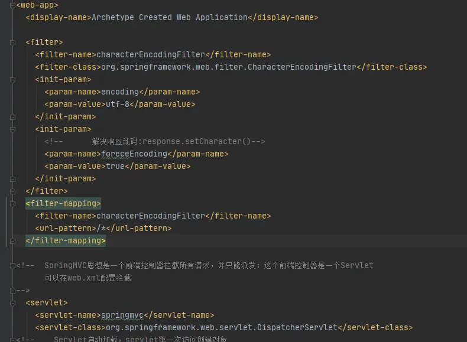


## 使用tomcat原生API

在Maven中加入依赖：

```xml
<dependency>
    <groupId>javax.servlet</groupId>
    <artifactId>servlet-api</artifactId>
    <version>2.5</version>
</dependency>
```

控制层：

```java
    // 原生API
    @RequestMapping("/origin")
    public String originalAPI(HttpSession session,
                              HttpServletRequest req,
                              HttpServletResponse res) {
        req.setAttribute("req", "请求测试");
        session.setAttribute("session", "session测试");
        return "origin";
    }
```

JSP通过EL表达式可以取到数据：

注意：isELIgnored="false"

```xml
<%@ page contentType="text/html;charset=UTF-8" language="java" isELIgnored="false" %>
<html>
<head>
    <title>Origin</title>
</head>
<body>
    <h2>
        ${ requestScope.req }
    </h2>
    <h2>
        ${ sessionScope.session }
    </h2>
</body>
</html>
```


## 数据输出 Model和ModelMap

### 使用Model

```java
@RequestMapping("/handler01")
public String handler01(Model model) {
    System.out.println("handler01");
    model.addAttribute("msg", "你好");
    return "modelTest";
}
```

### 使用ModelMap

```java
@RequestMapping("/handler01")
public String handler01(ModelMap model) {
    System.out.println("handler01");
    model.addAttribute("msg", "你好");  
    return "modelTest";
}
```

Map、Model、ModelMap最终都是绑定在类**BindingAwareModelMap**工作

BindingAwareModelMap保存的数据都会放在**请求域**中


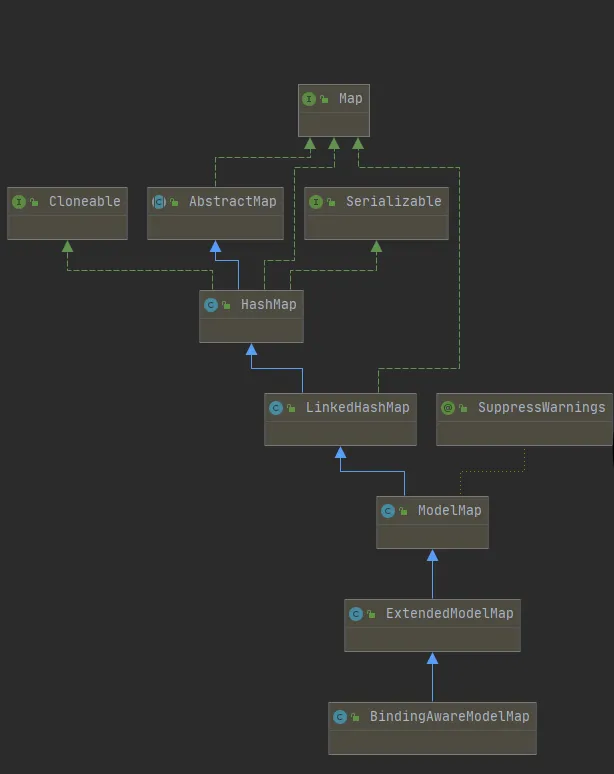


## 数据输出 ModelAndView使用

```java
 /**
     * 既包含视图信息（页面地址）也包括模型数据（给页面的数据）
     * 而且数据放在请求域中
     * @return
     */
    @RequestMapping("/handler03")
    public ModelAndView hadnler03() {
//        ModelAndView的构造器参数是视图名，视图解析器会帮助拼串
        ModelAndView mv = new ModelAndView("modelTest");
        // 或者 mv.setViewName("modelTest");
        mv.addObject("msg", "你好会啊");
        return mv;
    }
```


## 数据输出 @SessionAttributes

@SessionAttributes 有三个属性：

names：声明需要存储到session中数据的名称

types：声明存储到session中参数类型，将模型中对应类型的参数存储到session中

value：其实和names是一样的。names 和 value 同时使用会报错

```java
/**
 * 使用注解：
 * 只能放在类上
 * 给BindingAwareModelMap中保存数据，同时给session中放一份
 */
@SessionAttributes(names = {"msg"})
@Controller
public class IndexController {
```

**注意：**@SessionAttributes的参数 -- names必须包含要传入session的key，如果没有sesssion域中就没有这个数据


## 数据输出 @ModelAttribute

被@ModelAttribute注释的方法会在此controller每个方法执行前被执行，因此对于一个controller映射多个URL的用法来说，要谨慎使用

应用场景：

- 方法上
- 方法的参数上

Controller

```java
@Controller
public class ModelAttributeTestController {
    @ModelAttribute
    public void modelTest(@RequestParam String a, Model model) {
        model.addAttribute("a", a);
        System.out.println(a);
    }
    @RequestMapping("/He")
    public String  test() {
        return "modelTest";
    }
}
```

JSP：

```html
<h1>${requestScope.a}</h1>
```

结果：

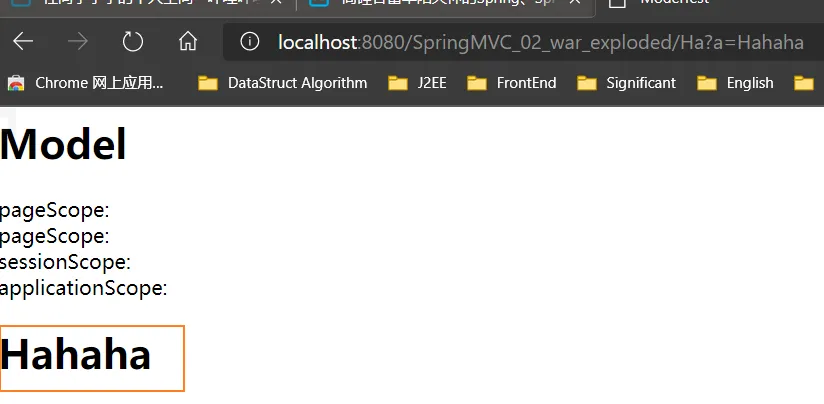

示例及大致流程：


```java
@Controller
public class Hello2ModelController {

    @ModelAttribute("book")
    public User populateModel() {
       Book book=new Book();
       book.setName("西游记");
       return book;
    }

    @RequestMapping(value = "/index")
    public String index(@ModelAttribute("book") Book book) {
       System.out.println(book);
       return "index";
    }
}
```


## 源码分析 DispatcherServlet

### 概览

------

1. 所有请求过来DispatcherServlet收到请求

2. 调用doDispatch方法进行处理

3. 1. getHandler() 根据当前请求地址找到能处理这个请求的目标处理器

   2. 1. 根据当前请求在HandlerMapping中找到这个请求的映射信息，获取到目标处理器类

   3. getHandlerAdapter() 根据当前处理器能获取到能执行这个处理器方法的适配器

   4. 1. 根据处理器类，找到当前类的HandlerAdapter 适配器

   5. 使用获取到的（RequestMappingHandlerAdapter）执行目标方法

   6. 目标方法执行会返回ModelAndView对象

   7. 根据ModelAndView的信息转发到具体页面，并可以在请求域中获取

4. getHandlerAdapter

### 整体

------

整个DispatcherServlet的继承关系

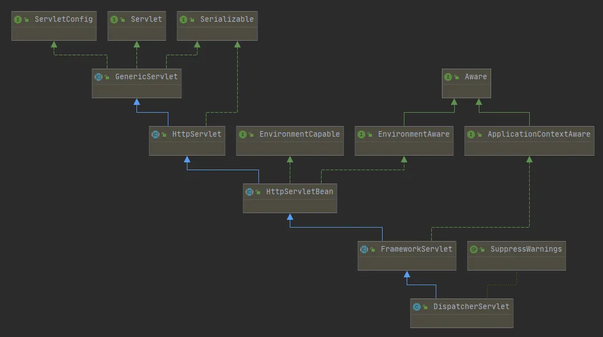

FrameworkServlet有两个核心方法：

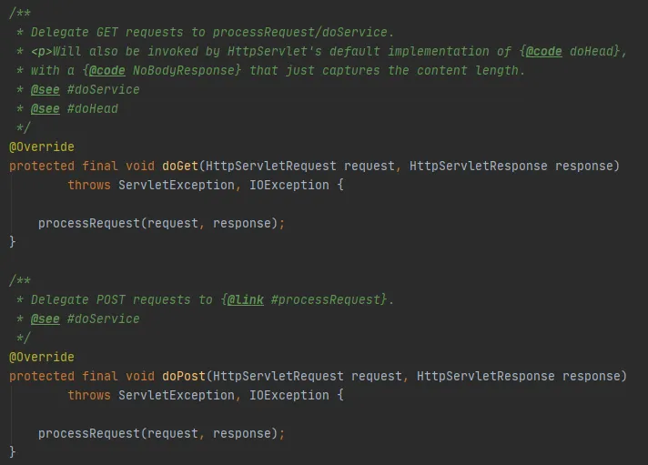

核心使用了同一个函数：**processRequest(request, response);**

在processRequest方法中有一个核心函数：**doService(request, response);**

它是一个抽象函数：

```java
protected abstract void doService(HttpServletRequest request, HttpServletResponse response)
```

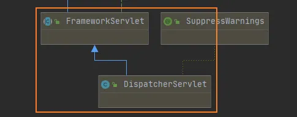

然后可以根据继承关系找到DispatcherServlet的doService：

```java
@Override
protected void doService(HttpServletRequest request, HttpServletResponse response) throws Exception 
```

这个方法有一个核心函数：**doDispatch**，这个函数也在这个类中：

```java
protected void doDispatch(HttpServletRequest request, HttpServletResponse response) throws Exception
```

整理路线：


### doDispatch的详细细节

DispathcerServlet类中的doDispatch函数：

```java
    /**
     * Process the actual dispatching to the handler.
     * <p>The handler will be obtained by applying the servlet's HandlerMappings in order.
     * The HandlerAdapter will be obtained by querying the servlet's installed HandlerAdapters
     * to find the first that supports the handler class.
     * <p>All HTTP methods are handled by this method. It's up to HandlerAdapters or handlers
     * themselves to decide which methods are acceptable.
     * @param request current HTTP request
     * @param response current HTTP response
     * @throws Exception in case of any kind of processing failure
     */
    protected void doDispatch(HttpServletRequest request, HttpServletResponse response) throws Exception {
```

两个核心函数：

```java
// Actually invoke the handler. 处理器的方法被调用
// 真正去执行方法的处理器 ha在下下面的笔记
mv = ha.handle(processedRequest, response, mappedHandler.getHandler());
....
    // 转发到目标页面
processDispatchResult(processedRequest, response, mappedHandler, mv, dispatchException);
```

检查是否是文件上传请求：

```java
processedRequest = checkMultipart(request);
```

 

```java
// Determine handler for the current request.
// 根据当前请求决定（哪个类来处理）处理器
mappedHandler = getHandler(processedRequest);
```

如果没有找到处理器能处理这个请求就404抛异常：

```java
if (mappedHandler == null) {
    noHandlerFound(processedRequest, response);
    return;
}
```

 

```java
// Determine handler adapter for the current request.
// 拿到能执行这个类方法的适配器（反射工具），如注解适配器：AnnotationMethodHandlerAdapter
HandlerAdapter ha = getHandlerAdapter(mappedHandler.getHandler());
```

适配器来执行目标方法，执行完后返回的返回值作为视图名，保存在**ModelAndView**

```java
mv = ha.handle(processedRequest, response, mappedHandler.getHandler());
```

如果这个modelandview没有名字就使用默认的名字（请求的地址名）：

```java
applyDefaultViewName(processedRequest, mv);
```

根据方法执行完成后封装的ModelAndView转发到对应页面，而且ModelAndView数据可以从请求域获取

```java
/*
processedRequest 包装后的请求
response 响应
mappedHandler 目标处理器
mv modelandview，要转到的地址
*/
processDispatchResult(processedRequest, response, mappedHandler, mv, dispatchException);
```


### getHandler的详细

原函数：

```java
@Nullable
protected HandlerExecutionChain getHandler(HttpServletRequest request) throws Exception {
    if (this.handlerMappings != null) {
        for (HandlerMapping mapping : this.handlerMappings) {
            HandlerExecutionChain handler = mapping.getHandler(request);
            if (handler != null) {
                return handler;
            }
        }
    }
    return null;
}
```

**handlerMappings**：处理器映射器，保存了每个处理器能处理的映射（比如创建了一个类HelloController）

**handlerMap**：IOC容器启动Controller对象的时候扫描每个处理器能处理什么请求，保存在handlerMappings的handlerMap属性（**spring5封装到了mappingRegistry -- mappingLookup**）

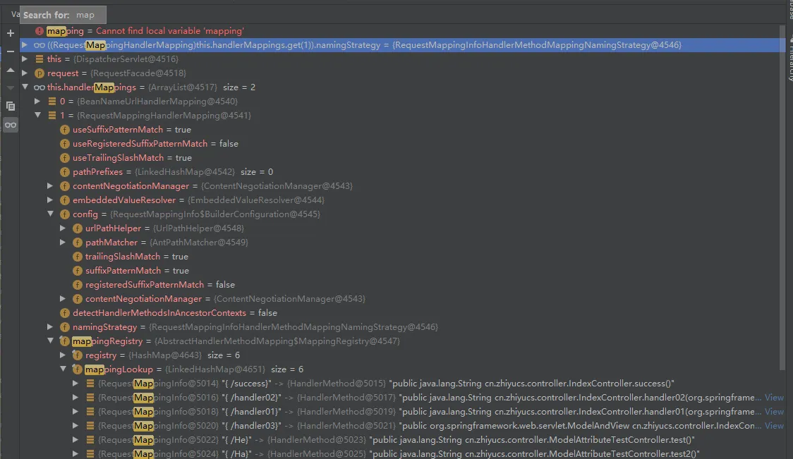

### getHandlerAdapter

------

这是通过调用IndexController里的“/success”得到的：

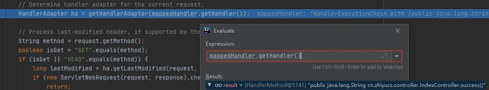

可知返回的resultHandler就是这个

为了找到目标处理器的适配器，要去拿适配器才能执行方法：

```java
protected HandlerAdapter getHandlerAdapter(Object handler) throws ServletException {
    if (this.handlerAdapters != null) {
        for (HandlerAdapter adapter : this.handlerAdapters) {
            if (adapter.supports(handler)) {
                return adapter;
            }
        }
    }
    throw new ServletException("No adapter for handler [" + handler +
                               "]: The DispatcherServlet configuration needs to include a HandlerAdapter that supports this handler");
}
```

调试时只有RequestMappingHandlerAdapter：


判断该适配器是否有方法：

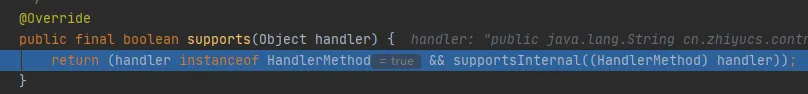

```java
// Process last-modified header, if supported by the handler.
String method = request.getMethod();
```

最终这个method 只要处理器有标了注解@RequestMapping的方法就能使用

HandlerMapping的实现类：


## 源码分析 SpringMVC的九大组件

以下组件都来自类：**DispatcherServlet**

```java
    /** 文件上传解析器 */
    @Nullable
    private MultipartResolver multipartResolver;
    /** 国际化解析器 */
    @Nullable
    private LocaleResolver localeResolver;
    /** 主题解析器 */
    @Nullable
    private ThemeResolver themeResolver;
    /** Handler映射信息 */
    @Nullable
    private List<HandlerMapping> handlerMappings;
    /**Handler适配器 */
    @Nullable
    private List<HandlerAdapter> handlerAdapters;
    /** 异常解析起 */
    @Nullable
    private List<HandlerExceptionResolver> handlerExceptionResolvers;
    /** 视图名转换 */
    @Nullable
    private RequestToViewNameTranslator viewNameTranslator;
    /** SpringMVC允许重定向携带数据 */
    @Nullable
    private FlashMapManager flashMapManager;
    /** 视图解析器 */
    @Nullable
    private List<ViewResolver> viewResolvers;
```

将组件设计成接口的好处：接口就是规范，提供扩展性

### 初始化

初始化函数：去容器找这个组件，如果没有找到就用默认配置

```java
@Override
protected void onRefresh(ApplicationContext context) {
    initStrategies(context);
}
protected void initStrategies(ApplicationContext context) {
        initMultipartResolver(context);
        initLocaleResolver(context);
        initThemeResolver(context);
        initHandlerMappings(context);
        initHandlerAdapters(context);
        initHandlerExceptionResolvers(context);
        initRequestToViewNameTranslator(context);
        initViewResolvers(context);
        initFlashMapManager(context);
    }
```


## 源码分析 @ModelAttribute

1. 有注解：保存注解信息了，最终得到这个注解应该对应的值

2. 没注解：

3. 1. 看是否是原生API

   2. 看是否Model或者Map、XXX

   3. 都不是，看是否是简单类型，paramName

   4. 给attrName赋值（参数标了@ModelAttribute("")就是指定的，没标就是""）

   5. 1. 确定自定义参数

      2. 1. attrName使用参数类型的首字母小写，或者之前@ModelAttribute("")的值
         2. 先看隐含模型中每个attrName作为key对应的值，如果有就从隐含模型中获取并赋值
         3. 看是否是@SessionAttributes(value="haha")；标注的属性，如果是从session，如果不是就抛出异常
         4. 如果不是@SessionAttributes标注的属性，就利用反射创建一个对象

   6. 拿到之前创建好的对象，使用数据绑定器（WebDataBinder）将请求中每一个数据绑定到这个对象中

4. 

5. 

## 视图解析 转发和重定向

**forward**：前缀的转发，不会有配置的视图解析器拼串

```java
    @RequestMapping("/success")
    public String success() {
        return "forward:/success.jsp";
    }
```

**重定向redirect**：使用redirect**不会携带数据**

```java
    @RequestMapping("/success")
    public String success() {
        return "forward:/success.jsp";
    }
```


## 源码分析 视图解析

**【源码调试提示】**IDEA中可以使用**Ctrl+Alt+方向键左/右**控制上一次/下一次代码**跳转的位置**

调试doDispatcher的

```java
mv = ha.handle(processedRequest, response, mappedHandler.getHandler());
```

会进入到：RequestMappingHandlerAdapter类中的**handleInternal**

然后封装成：ModelAndView

```java
ModelAndView mav;
...
mav = invokeHandlerMethod(request, response, handlerMethod);
```

​    任何方法的返回值，最终都会被包装成ModelAndView对象

视图渲染函数：（页面就是渲染数据模型）

```java
processDispatchResult(processedRequest, response, mappedHandler, mv, dispatchException);
```

在processDispatchResult中调用render(mv, request, response);渲染函数

在render中：view

```java
View view;
        String viewName = mv.getViewName();
        if (viewName != null) {
            // We need to resolve the view name.
            view = resolveViewName(viewName, mv.getModelInternal(), locale, request);
```

resolveViewName实现的是ViewResolver的接口：得到View对象

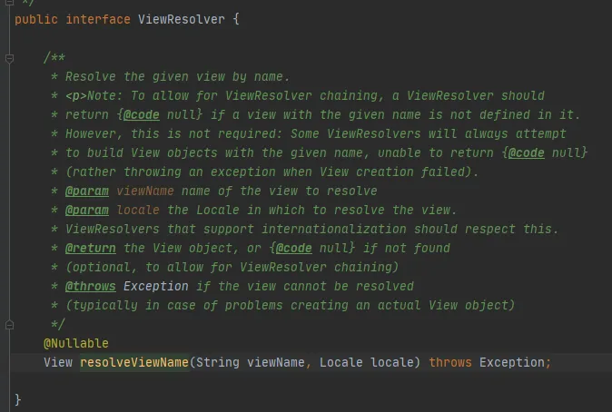

视图解析名字：ViewResolver属于SpringMVC九大组件

ViewResolver根据方法的返回值，得到一个view对象

```java
for (ViewResolver viewResolver : this.viewResolvers) {
    View view = viewResolver.resolveViewName(viewName, locale);
    if (view != null) {
        return view;
    }
}
```

通过调试在resolveViewName里：

如果没有缓冲区，就创建一个view

```java
if (!isCache()) {
    return createView(viewName, locale);
}
```

源码：

```java
@Override
protected View createView(String viewName, Locale locale) throws Exception {
    // If this resolver is not supposed to handle the given view,
    // return null to pass on to the next resolver in the chain.
    if (!canHandle(viewName, locale)) {
        return null;
    }
    // Check for special "redirect:" prefix.
    if (viewName.startsWith(REDIRECT_URL_PREFIX)) {
        String redirectUrl = viewName.substring(REDIRECT_URL_PREFIX.length());
        RedirectView view = new RedirectView(redirectUrl,
                                             isRedirectContextRelative(), isRedirectHttp10Compatible());
        String[] hosts = getRedirectHosts();
        if (hosts != null) {
            view.setHosts(hosts);
        }
        return applyLifecycleMethods(REDIRECT_URL_PREFIX, view);
    }
    // Check for special "forward:" prefix.
    if (viewName.startsWith(FORWARD_URL_PREFIX)) {
        String forwardUrl = viewName.substring(FORWARD_URL_PREFIX.length());
        InternalResourceView view = new InternalResourceView(forwardUrl);
        return applyLifecycleMethods(FORWARD_URL_PREFIX, view);
    }
    // Else fall back to superclass implementation: calling loadView.
    return super.createView(viewName, locale);
}
```

**分析：**

如果是以redirect为前缀，下面的forward同理

```java
// Check for special "redirect:" prefix.
if (viewName.startsWith(REDIRECT_URL_PREFIX)) {
    ...
    RedirectView view = new RedirectView(redirectUrl,
```

如果没有前缀就调用父类默认创建对象

```java
return super.createView(viewName, locale);
```

1. 视图解析器得到view对象的流程：所有配置的视图解析器来长沙根据视图名（返回值）得到View（视图）对象，如果能得到就返回，得不到就换下一个视图解析器

2. 调用view对象的render

```java
@Override
public void render(@Nullable Map<String, ?> model, HttpServletRequest request,
                   HttpServletResponse response) throws Exception {
    if (logger.isDebugEnabled()) {
        logger.debug("View " + formatViewName() +
                     ", model " + (model != null ? model : Collections.emptyMap()) +
                     (this.staticAttributes.isEmpty() ? "" : ", static attributes " + this.staticAttributes));
    }
    Map<String, Object> mergedModel = createMergedOutputModel(model, request, response);
    prepareResponse(request, response);
    // 渲染要给页面输出的所有数据
    renderMergedOutputModel(mergedModel, getRequestToExpose(request), response);
}
```

InternalResourceView中的renderMergedOutputModel（传递数据的方法）

将模型中的数据取出来放到请求域request中

```java
@Override
protected void renderMergedOutputModel(
    Map<String, Object> model, HttpServletRequest request, HttpServletResponse response) throws Exception {
    // Expose the model object as request attributes.
    // 将模型的数据放在请求域中
    exposeModelAsRequestAttributes(model, request);
    // Expose helpers as request attributes, if any.
    exposeHelpers(request);
    // Determine the path for the request dispatcher.
    String dispatcherPath = prepareForRendering(request, response);
    // Obtain a RequestDispatcher for the target resource (typically a JSP).
    RequestDispatcher rd = getRequestDispatcher(request, dispatcherPath);
    if (rd == null) {
        throw new ServletException("Could not get RequestDispatcher for [" + getUrl() +
                                   "]: Check that the corresponding file exists within your web application archive!");
    }
    // If already included or response already committed, perform include, else forward.
    if (useInclude(request, response)) {
        response.setContentType(getContentType());
        if (logger.isDebugEnabled()) {
            logger.debug("Including [" + getUrl() + "]");
        }
        rd.include(request, response);
    }
    else {
        // Note: The forwarded resource is supposed to determine the content type itself.
        if (logger.isDebugEnabled()) {
            logger.debug("Forwarding to [" + getUrl() + "]");
        }
        rd.forward(request, response);
    }
}
```

**总结：**

视图解析器只是为了得到视图对象，视图对象才能真正的转发（将模型数据放在请求域中）或者重定向到页面，视图对象才能真正的渲染视图


## 视图解析 JSTL 国际化

导入Maven -- taglib

```xml
<dependency>
    <groupId>org.apache.taglibs</groupId>
    <artifactId>taglibs-standard-impl</artifactId>
    <version>1.2.1</version>
</dependency>
<dependency>
    <groupId>org.apache.taglibs</groupId>
    <artifactId>taglibs-standard-spec</artifactId>
    <version>1.2.1</version>
</dependency>
```

写入国际化的配置：

```xml
<!--    国际化资源文件配置-->
<bean class="org.springframework.context.support.ResourceBundleMessageSource" id="messageSource">
    <!--        制定基础名-->
    <property name="basename" value="cn.zhiyucs.conf.i18n"></property>
</bean>
```

创建国际化的配置文件

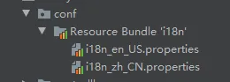


使用JSP的jstl的fmt编写国际化：

```html
<%@ page contentType="text/html;charset=UTF-8" language="java" %>
<%@ taglib prefix="fmt" uri="http://java.sun.com/jsp/jstl/fmt" %>
<html>
<head>
    <title>登录</title>
</head>
<body>
<h1>
    <fmt:message key="welcomeinfo"/>
</h1>
<form action="">
    <fmt:message key="loginBtn"/> ：<input type="text">
    <fmt:message key="password"/> ：<input type="text">
</form>
<button><fmt:message key="loginBtn"/> </button>
</body>
</html>
```


## 数据绑定 mvc:annotation-driver

### 序言：JSP两种获取项目路径的方式

```xml
<%@ taglib uri="http://java.sun.com/jsp/jstl/core" prefix="c" %>
<c:set var="ctx" value="${pageContext.request.contextPath}"/>
<%=request.getContextPath()%>
${pageContext.request.contextPath }
<%
    String contextPath = request.getServletPath();
%>
    <%
        String contextPath = request.getRequestURI();
    %>
```

### 自定义数据绑定类型和静态资源的拦截

自定义一个转换类：

```xml
<mvc:annotation-driven conversion-service="conversionService" />
<bean class="org.springframework.context.support.ConversionServiceFactoryBean" id="conversionService">
    <property name="converters">
        <set>
            <bean class="自定义的转换类"></bean>
        </set>
    </property>
</bean>
```

静态资源拦截：

```xml
<!--    静态资源可以访问，动态资源的请求不能
            静态资源能访问的原因：所有请求都映射给tomcat
-->
    <mvc:default-servlet-handler />
    <!--使用自己定义的转换组件-->
    <mvc:annotation-driven />
```

### 日期格式化

在 Date 类型的属性上加入 @DateTimeFormat 注解

```java
@Repository
public class Person {
    private Integer id;
    private String name;
    @DateTimeFormat(pattern="yyyy-MM-dd")
    private Date birthday;
...
}
```

加入 joda 相关的包

```xml
<dependency>
      <groupId>joda-time</groupId>
      <artifactId>joda-time</artifactId>
      <version>2.9.9</version>
    </dependency>
```

在 SpringMVC 配置文件中加入 <mvc:annotation-driven />

```xml
<mvc:annotation-driven />
```

注册一个自定义既具有转换器也有格式化功能：

```xml
<mvc:annotation-driven conversion-service="formattingConversionService" />
    <bean class="org.springframework.format.support.FormattingConversionServiceFactoryBean" id="formattingConversionService">
    </bean>
```


## 数据校验 校验注解&去错误页面

### 提示：IDEA使用 alt + shift + insert 进入多行编辑模式

### 数据校验

------

\1. 导包

 

```
<dependency>
    <groupId>org.hibernate</groupId>
    <artifactId>hibernate-validator</artifactId>
    <version>5.4.1.Final</version>
</dependency>
<dependency>
    <groupId>javax.validation</groupId>
    <artifactId>validation-api</artifactId>
    <version>2.0.1.Final</version>
</dependency>
<dependency>
    <groupId>org.jboss.logging</groupId>
    <artifactId>jboss-logging</artifactId>
    <version>3.4.1.Final</version>
</dependency>
```

\2. 给实体类加上需要的校验注解

 

```
@NotEmpty
private Integer id;
@Length(min = 6, max = 18)
private String name;
//    @Past是一个过去的时间
@Past
@DateTimeFormat(pattern="yyyy-MM-dd")
private Date birthday;
private String gender;
@Email
private String email;
```

\3. 告诉SpringMVC这个实体类需要校验 **@Valid**

 

```
@RequestMapping(value = "/birth", method = RequestMethod.POST)
public String birth(@Valid Person person, Model model) {
...
}
```

\4. 获取校验结果：BindingResult，紧跟@Valid后面

 

```
@RequestMapping(value = "/birth", method = RequestMethod.POST)
public String birth(@Valid Person person, BindingResult result, Model model) {
    System.out.println(person);
    //        获取是否有校验错误
    boolean errors = result.hasErrors();
    if (!errors)
        model.addAttribute("person", person);
    return "success";
}
```

携带错误消息到页面：BindingResult的**getFieldErrors**方法

获取错误消息：**getDefaultMessage**

获取错误字段：**getField**

 

```
@RequestMapping(value = "/birth", method = RequestMethod.POST)
public String birth(@Valid Person person, BindingResult result, Model model) {
    System.out.println(person);
    //        获取是否有校验错误
    boolean errors = result.hasErrors();
    if (!errors) {
        model.addAttribute("person", person);
    }
    else {
        // 获取错误
        List<FieldError> fErrors = result.getFieldErrors();
        Map<String, Object> map = new HashMap<>();
        for (FieldError fError : fErrors) {
            map.put(fError.getField(), fError.getDefaultMessage());
        }
        // 渲染到视图
        model.addAttribute("errorInfo", map);
        return "forward:/index.jsp";
    }
    return "success";
}
```

### 国际化定制错误消息

------

Email.类名.email  校验规则.隐含模型中这个对象的key.对象的属性

Email.email      校验规则.属性名

Email.java.lang.String  校验规则.属性类型

Email

- 如果是隐含模型中Person对象的email属性字段发生了@Email校验错误，就会生出Email.Person.email
- Email.email：所有的email属性只要发生了@Email错误
- Email.java.lang.String：只要是String类型发生了@Email错误
- Email：只要发生了@Email校验错误

新建国际化文件：

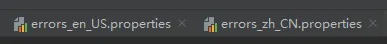

写入配置：

```java
Email.email = Email invalidate
```

配置SpringMVC

```xml
<!--    管理国际化资源文件-->
<bean class="org.springframework.context.support.ResourceBundleMessageSource" id="messageSource">
    <property name="basename" value="cn.zhiyucs.conf.errors"></property>
</bean>
```

使用带参数的国际化：

```java
# 国际化配置
Length.java.lang.String=length must be between {1} and {2}.
// 实体类    
    @Length(min = 6, max = 18)
    private String name;
```

也可以自定义错误消息类型的注解：

```java
@NotEmpty(message = "不能为空")
private Integer id;
```


## SpringMVC对AJAX的支持

导包：

```xml
<dependency>
    <groupId>com.fasterxml.jackson.core</groupId>
    <artifactId>jackson-core</artifactId>
    <version>2.10.2</version>
</dependency>
<dependency>
    <groupId>com.fasterxml.jackson.core</groupId>
    <artifactId>jackson-annotations</artifactId>
    <version>2.10.2</version>
</dependency>
<dependency>
    <groupId>com.fasterxml.jackson.core</groupId>
    <artifactId>jackson-databind</artifactId>
    <version>2.10.2</version>
</dependency>
```

Jackson的使用：

@JsonIgnore 忽略输出JSON

@JsonFormat(pattern="yyyy-MM-dd") 格式化输出的JSON数据

```java
//    @Past是一个过去的时间
@JsonIgnore
@Past
@DateTimeFormat(pattern="yyyy-MM-dd")
private Date birthday;
```

返回json到前台：@ResponseBody

```java
@ResponseBody
@RequestMapping("/getallajax")
public Collection<Person> ajaxGetAll() {
    Person zhiyu = new Person(1, "zhiyu", null, "男", "123546@qq.com");
    Person zs = new Person(2, "ZHANGSAN", null, "男", "zhangsan@qq.com");
    Person ls = new Person(3, "lisi", null, "男", "lisi@qq.com");
    Collection<Person> people = new ArrayList<>();
    people.add(zs);
    people.add(ls);
    people.add(zhiyu);
    return people;
}
```

前端使用jQuery接收数据：

```html
<a href="#">获取所有信息</a>
<div>
</div>
<script src="https://cdn.bootcdn.net/ajax/libs/jquery/3.5.1/jquery.min.js"></script>
<script>
    $("a:first").click(function () {
        $.ajax({
            url:'${ctp}/getallajax',
            type: "GET",
            success(data) {
                console.log(data)
                $.each(data, function () {
                    let personInfo = this.id + "-->" + this.name + "-->" + this.gender;
                    $("div").append(personInfo + '<br/>')
                })
            }
        })
    })
</script>
```


## 请求体 @ResponseBody

使用的要求：

- method为POST
- enctype="multipart/form-data"时，文件内容设置为UTF-8

前端：记得**写name属性**

```html
<form action="testRequestBody" method="post">
    用户名 <input type="text" name="username">
    密 码 <input type="text" name="password">
    <input type="submit" value="提交">
</form>
```

后台

```java
@ResponseBody
@RequestMapping(value = "/testRequestBody", method = RequestMethod.POST)
public String testRequestBody(@RequestBody(required = false)String content) {
    System.out.println("content:" + content);
    return "success";
}
```

**@ResponseBody也可以接收JSON数据**，所以可以POJO

前端：

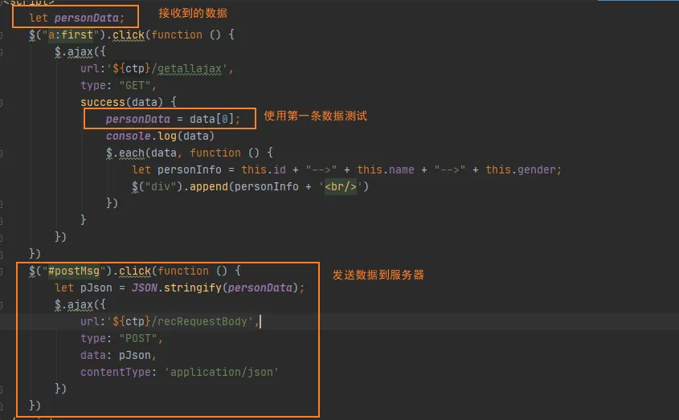

控制层：

```java
@ResponseBody
@RequestMapping(value = "/recRequestBody", method = RequestMethod.POST)
public String recRequestBody(@RequestBody(required = false)Person person) {
    System.out.println(person);
    return "success";
}
```

结果：

```
Person{id=2, name='ZHANGSAN', birthday=null, gender='男'
```


## 获取请求头 @HttpEntity

**@HttpEntity**比**@RequestBody**更强，可以直接拿到请求头的所有，

**@RequestHeader**只能拿到某个请求头

```java
    @RequestMapping("/httpEntityTest")
    public String httpEntityTest(HttpEntity<String> httpEntity) {
        System.out.println(httpEntity);
        return "forward:/index.jsp";
    }
```

结果：

```
<{host=[localhost:8080], user-agent=[Mozilla/5.0 (Windows NT 10.0; Win64; x64; rv:78.0) Gecko/20100101 Firefox/78.0], accept=[text/html,application/xhtml+xml,application/xml;q=0.9,image/webp,*/*;q=0.8], accept-language=[zh-CN,zh;q=0.8,zh-TW;q=0.7,zh-HK;q=0.5,en-US;q=0.3,en;q=0.2], accept-encoding=[gzip, deflate], connection=[keep-alive], referer=[http://localhost:8080/SpringMVC_04_war_exploded/], cookie=[JSESSIONID=3944762874A51FC04663B252095F6AB7; Idea-c46feb8f=7b368810-f802-4784-8798-e6c8a43ae387], upgrade-insecure-requests=[1]}>
```


## @ResponseEntity 返回响应式数据

基本用法：

```java
@GetMapping("/hello")
ResponseEntity<String> hello() {
    return new ResponseEntity<>("Hello World!", HttpStatus.OK);
}
```

通过编程方式指明响应状态，所以根据不同场景返回不同状态：

```java
@GetMapping("/age")
ResponseEntity<String> age(
  @RequestParam("yearOfBirth") int yearOfBirth) {
    if (isInFuture(yearOfBirth)) {
        return new ResponseEntity<>(
          "Year of birth cannot be in the future", 
          HttpStatus.BAD_REQUEST);
    }
    return new ResponseEntity<>(
      "Your age is " + calculateAge(yearOfBirth), 
      HttpStatus.OK);
}
```

还可以设置http响应头

```java
@GetMapping("/customHeader")
ResponseEntity<String> customHeader() {
    HttpHeaders headers = new HttpHeaders();
    headers.add("Custom-Header", "foo");
    return new ResponseEntity<>(
      "Custom header set", headers, HttpStatus.OK);
}
```

@ResponseEntity 的链式编程：

```java
@GetMapping("/customHeader")
ResponseEntity<String> customHeader() {
    return ResponseEntity.ok()
        .header("Custom-Header", "foo")
        .body("Custom header set");
}
```


## 文件下载及文件上传

### 文件下载

```java
@RequestMapping("/download")
public ResponseEntity<byte[]> download(HttpServletRequest req) throws Exception {
    //        得到要下载的文件的流
    String location = "";
    //        找到要下载的文件的真实路径
    String path = req.getSession().getServletContext().getRealPath("/jqeruy-2.1.1.js");
    System.out.println(path);
    FileInputStream is = new FileInputStream(path);
    byte[] temp = new byte[is.available()];
    is.read();
    is.close();
    //        下载的文件流返回
    HttpHeaders headers = new HttpHeaders();
    headers.set("Content-Disposition", "attachment;filename="+"jqeruy-2.1.1.js");
    return new ResponseEntity<byte[]>(temp, headers, HttpStatus.OK);
}
```

### 文件上传

#### HttpMessageConverter

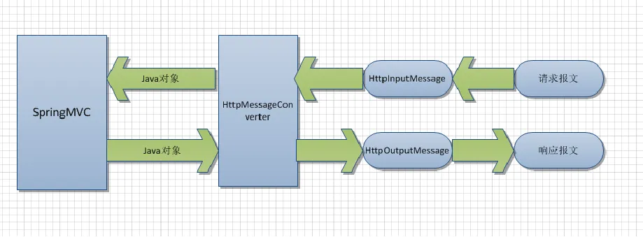

上传表单：

```html
<form action="" method="post" enctype="multipart/form-data">
    用户头像： <input type="file" name="headerimages"><br>
    用户名： <input type="text" name="username"><br>
    <input type="submit" value="提交">
</form>
```

导包：

```xml
<dependency>
    <groupId>org.apache.commons</groupId>
    <artifactId>commons-io</artifactId>
    <version>1.3.2</version>
</dependency>
<dependency>
    <groupId>commons-fileupload</groupId>
    <artifactId>commons-fileupload</artifactId>
    <version>1.3.3</version>
</dependency>
```

配置SpringMVC

```xml
<!--    配置文件上传解析器,id必须是multipartResolver-->
<bean id="multipartResolver" class="org.springframework.web.multipart.commons.CommonsMultipartResolver">
    <!--        最大允许的上传大小-->
    <property name="maxInMemorySize" value="#{1024*1024*20}" />
    <!--        默认的字符编码-->
    <property name="defaultEncoding" value="utf-8" />
```

编写文件上传：

@RequestParam("headerimages")**MultipartFile** file 封装了当前文件的信息

```java
@RequestMapping("/upload")
public String upload(@RequestParam("username") String username,@RequestParam("password") String password,
                     @RequestParam("headerimages")MultipartFile file,
                     Model model) {
    System.out.println(username);
    System.out.println("文件大小" + file.getSize());
    System.out.println("文件名字" +file.getOriginalFilename());
    try {
        file.transferTo(new File("C:\\Users\\54271\\Documents\\Spring_Twice\\SpringMVC_04\\src\\main\\resources\\" + file.getOriginalFilename()));
        model.addAttribute("msg", "文件上传成功");
    } catch (IOException e) {
        e.printStackTrace();
        model.addAttribute("msg", "文件上传失败"+e.getMessage());
    }
    return "forward:/index.jsp";
}
```

### 多文件上传

前端：

```html
<form action="upload" method="post" enctype="multipart/form-data">
    用户头像： <input type="file" name="headerimages"><br>
    用户头像： <input type="file" name="headerimages"><br>
    用户头像： <input type="file" name="headerimages"><br>
    用户头像： <input type="file" name="headerimages"><br>
    用户名： <input type="text" name="username" value="admin"><br>
    密码： <input type="text" name="password" value="123">
    <input type="submit" value="提交">
</form>
```

控制器：

```java
@RequestMapping("/upload")
public String upload(@RequestParam("username") String username,@RequestParam("password") String password,
                     @RequestParam("headerimages")MultipartFile[] files,
                     Model model) {
    System.out.println(username);
    try {
        for (MultipartFile file : files) {
            if (!file.isEmpty()){
                file.transferTo(new File("C:\\Users\\54271\\Documents\\Spring_Twice\\SpringMVC_04\\src\\main\\resources\\" + file.getOriginalFilename()));
            }
        }
        model.addAttribute("msg", "文件上传成功");
    } catch (IOException e) {
        e.printStackTrace();
        model.addAttribute("msg", "文件上传失败"+e.getMessage());
    }
    return "forward:/index.jsp";
}
```


## 拦截器及多拦截器

拦截器的基本方法：


preHandle：在目标方法之前调用，返回boolean，return true目标方法放行

postHandle：在目标方法运行之后调用

afterCompletion：在请求整个完成（来到目标页面）：chain.dofilter()放行（资源响应之后）

创建一个拦截器：

```java
public class FirstInterceptor implements HandlerInterceptor {
    @Override
    public boolean preHandle(HttpServletRequest request, HttpServletResponse response, Object handler) throws Exception {
        System.out.println("FirstInterceptor preHandle invoke....");
        return true;
    }
    @Override
    public void postHandle(HttpServletRequest request, HttpServletResponse response, Object handler, ModelAndView modelAndView) throws Exception {
        System.out.println("FirstInterceptor postHandle invoke....");
    }
    @Override
    public void afterCompletion(HttpServletRequest request, HttpServletResponse response, Object handler, Exception ex) throws Exception {
        System.out.println("FirstInterceptor afterCompletion invoke....");
    }
}
```

配置拦截器到SpringMVC

```xml
<mvc:interceptors>
    <!--        配置某个拦截器，默认拦截所有请求-->
    <!--        <bean class="cn.zhiyucs.interceptor.FirstInterceptor"></bean>-->
    <!--        配置某个拦截器更详细的信息-->
    <mvc:interceptor>
        <!--            只拦截success-->
        <mvc:mapping path="/success"/>
        <bean class="cn.zhiyucs.interceptor.FirstInterceptor"></bean>
    </mvc:interceptor>
</mvc:interceptors>
```

测试后拦截器的运行流程：

```
FirstInterceptor preHandle invoke....
FirstInterceptor postHandle invoke....
FirstInterceptor afterCompletion invoke....
```

注意：

- 只要preHandler不放行，以后的流程就不会执行
- **只要放行了，afterCompletion都会执行**

### 多拦截器

多拦截器的执行流程：

```
FirstInterceptor preHandle invoke....
SecondInterceptor preHandle invoke....
SecondInterceptor postHandle invoke....
FirstInterceptor postHandle invoke....
SecondInterceptor afterCompletion invoke....
FirstInterceptor afterCompletion invoke....
```

 只要有一个拦截器不放行，以后都没有执行

如果有一个不放行，另外一个afterCompletion还是会执行

```
FirstInterceptor preHandle invoke....
SecondInterceptor preHandle invoke....
FirstInterceptor afterCompletion invoke....
```

### 小结

拦截器的preHadnle是按照顺序执行

拦截器的postHandle是按照逆序执行

拦截器的afterCompletion是按照逆序执行


## 源码分析 拦截器

同样是在doDispatch方法中，第一次执行到的位置是：

这里执行拦截器的preHandle：

```java
if (!mappedHandler.applyPreHandle(processedRequest, response)) {
    return;
}
```

因为在前面的getHander可以获取到三个拦截器（自己写了2个）

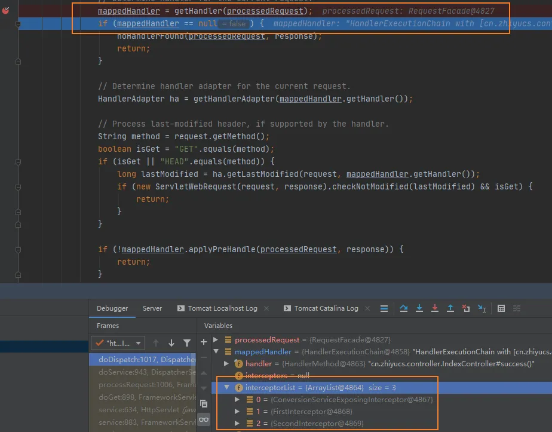

applyPreHandle分析：

```java
boolean applyPreHandle(HttpServletRequest request, HttpServletResponse response) throws Exception {
    HandlerInterceptor[] interceptors = getInterceptors();
    if (!ObjectUtils.isEmpty(interceptors)) {
        for (int i = 0; i < interceptors.length; i++) {
            HandlerInterceptor interceptor = interceptors[i];
            // true=放行
            if (!interceptor.preHandle(request, response, this.handler)) {
                // 执行完afterCompletion（）
                triggerAfterCompletion(request, response, null);
                // 有一个拦截器返回false目标方法不会执行，直接跳到afterCompletion
                return false;
            }
            // 索引记录已经拦截的拦截器
            this.interceptorIndex = i;
        }
    }
    return true;
}
```

目标方法正常会执行postHadnler：

```java
mappedHandler.applyPostHandle(processedRequest, response, mv);
// 分析方法
void applyPostHandle(HttpServletRequest request, HttpServletResponse response, @Nullable ModelAndView mv)
    throws Exception {
    HandlerInterceptor[] interceptors = getInterceptors();
    if (!ObjectUtils.isEmpty(interceptors)) {
        // 逆序执行每个拦截器的postHandle
        for (int i = interceptors.length - 1; i >= 0; i--) {
            HandlerInterceptor interceptor = interceptors[i];
            interceptor.postHandle(request, response, this.handler, mv);
        }
    }
}
```

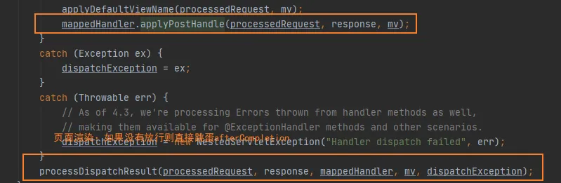

processDispatchResult方法：这就是afterCompletion总会执行的原因

```java
if (mappedHandler != null) {
    // Exception (if any) is already handled..
    mappedHandler.triggerAfterCompletion(request, response, null);
}
```

这个拦截器的具体执行流程是：

```java
void triggerAfterCompletion(HttpServletRequest request, HttpServletResponse response, @Nullable Exception ex)
    throws Exception {
    HandlerInterceptor[] interceptors = getInterceptors();
    if (!ObjectUtils.isEmpty(interceptors)) {
        // 有记录最后一个拦截器的索引，把它之前所有放行的拦截器的afterCompletion都执行
        for (int i = this.interceptorIndex; i >= 0; i--) {
            HandlerInterceptor interceptor = interceptors[i];
            try {
                interceptor.afterCompletion(request, response, this.handler, ex);
            }
            catch (Throwable ex2) {
                logger.error("HandlerInterceptor.afterCompletion threw exception", ex2);
            }
        }
    }
}
```

### 具体调试

第一次执行的拦截器是：conversionService interceptorIndex=0

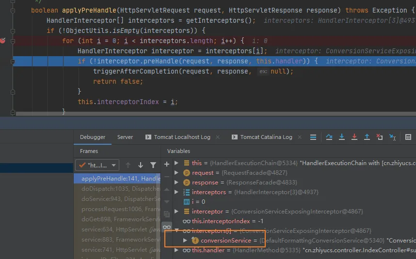

第二次执行 FirstInterceptor interceptorIndex =1

 

第三次执行：SecondInterceptor interceptorIndex = 2


全部执行完，会返回true：

```java
if (!mappedHandler.applyPreHandle(processedRequest, response)) {
    return;
}
```


## 国际化

一般国际化的步骤：SpringMVC国际化核心 -- ResourceBundleMessageSource

[视图解析 JSTL 国际化](wiz://open_document?guid=f3227501-5a15-48bf-ae86-9936e13306cf&kbguid=&private_kbguid=51ed7a20-5f58-11ea-ac04-65f1a2b61811)

获取区域信息：
Locale locale = request.getLocale();

获取国际化的信息：

```java
@Autowired
private MessageSource messageSource;
@RequestMapping("/login")
public String login(Locale locale) {
    System.out.println(locale);
    String welcomeinfo = messageSource.getMessage("welcomeinfo", null, locale);
    System.out.println(welcomeinfo);
    return "login";
}
```

### 自定义国际化文件


1. 实现LocaleResolver接口

```java
public class MyLocaleResolver implements LocaleResolver {
    @Override
    public Locale resolveLocale(HttpServletRequest request) {
        return null;
    }
    @Override
    public void setLocale(HttpServletRequest request, HttpServletResponse response, Locale locale) {
    }
}
```

在前端配置访问路径：

```html
<a href="login?locale=zh_CN">切换中文</a>
<a href="login?locale=en_US">切换英文</a>
```

自己写国际化：

```java
@Override
public Locale resolveLocale(HttpServletRequest request) {
    Locale l = null;
    // 获取地址栏的locale后的信息 如：zh_CN
    String localeSt = request.getParameter("locale");
    //        如果带了Locale参数指定的区域信息，没有带就用浏览器
    if (localeSt != null && !"".equals(localeSt)){
        l = new Locale(localeSt.split("_")[0], localeSt.split("_")[1]);
    } else {
        l = request.getLocale();
    }
    return l;
}
```

配置MVC：

```xml
<!--    自定义国际化-->
<bean id="localeResolver" class="cn.zhiyucs.component.MyLocaleResolver">
```

### 使用SessionLocaleResolver进行国际化

```java
@RequestMapping("/login")
// locale是传入的zh_CN/en_US 这里的参数需要传入session
public String login(@RequestParam(value = "locale", defaultValue = "zh_CN") String localeSt, Locale locale, HttpSession session) {
    Locale l = null;
    if (localeSt != null && !"".equals(localeSt)){
        l = new Locale(localeSt.split("_")[0], localeSt.split("_")[1]);
    } else {
        l = locale;
    }
    // 关键点：这里SessionLocaleResolver.class.getName() + ".LOCALE"固定写法
    session.setAttribute(SessionLocaleResolver.class.getName() + ".LOCALE", l);
    return "login";
}
```

配置到MVC

```xml
<!--    区域信息从session中拿-->
<bean class="org.springframework.web.servlet.i18n.SessionLocaleResolver" id="localeResolver"></bean>
```

### 拦截器配合国际化

直接在MVC中配置拦截器：

```xml
<mvc:interceptors>
    <bean class="org.springframework.web.servlet.i18n.LocaleChangeInterceptor"></bean>
</mvc:interceptors>
```

只要想国际化在页面添加locale参数即可：

```html
<a href="login?locale=zh_CN">切换中文</a>
<a href="login?locale=en_US">切换英文</a>
```

SessionLocaleResolver & LocaleChangeInterceptor 工作原理

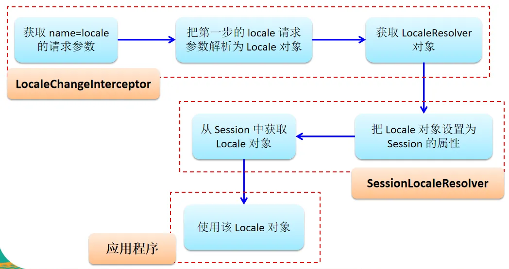


## 异常处理 @ExceptionHandler

### 处理异常的一般步骤

首先假设一个异常的存在： 

```java
@RequestMapping("/handler01")
public String handler01(@RequestParam("i")int i) {
    System.out.println(10 / i);
    return "success";
}
```

设置一个异常捕获/处理：

@ExceptionHandler 的 value 标识处理的异常，比如案例中只能处理数学异常

```java
/**
     * 告诉SpringMVC这个方法专门处理这个类的发生的异常
     * 1。 给方法随便写一个Exception，用来接受发生的异常
     * 2. 要携带异常信息不能给参数位置写Model
     * 3. 返回ModelAndView就可以
     * @param e
     * @return
     */
@ExceptionHandler(value = {ArithmeticException.class})
public ModelAndView handleException01(Exception e) {
    System.out.println("handleException01"+ e);
    ModelAndView mv = new ModelAndView("myerror");
    mv.addObject("ex", e);
    return mv;
}
```

前端JSP接收

```html
<h2>${ex}</h2>
```

当访问参数i = 0时，就会处理这个异常

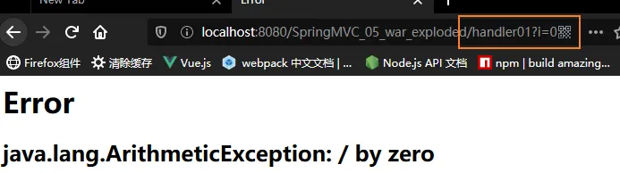


## 异常处理 @ResponseStatus

### @ResponseStatus的基本使用

创建一个异常类

```java
@ResponseStatus(reason = "用户被拒绝登录", value = HttpStatus.NOT_EXTENDED)
public class UsernameNotFoundException extends RuntimeException{
}
```

创建一个请求控制器：

```java
@RequestMapping("/handler02")
public String handler02(@RequestParam("username")String username) {
    if (!"admin".equals(username)) {
        System.out.println("登录失败");
        throw new UsernameNotFoundException();
    }
    System.out.println("登录成功");
    return "success";
}
```

当发送一个错误参数就会报出错误：


#### 错误的请求方式

如果使用GET方式来请求POST：

```java
@RequestMapping(value = "/handler03", method = RequestMethod.POST)
public String handler03(){}
```

```
[org.springframework.web.HttpRequestMethodNotSupportedException: Request method 'GET' not supported]
```


## 源码分析 异常处理

同样出发点时doDispatch 

```java
processDispatchResult(processedRequest, response, mappedHandler, mv, dispatchException);
```

在这个方法来到：

```java
mv = processHandlerException(request, response, handler, exception);
```

在processHandlerException中轮流解析异常：

```java
if (this.handlerExceptionResolvers != null) {
    for (HandlerExceptionResolver resolver : this.handlerExceptionResolvers) {
        exMv = resolver.resolveException(request, response, handler, ex);
        if (exMv != null) {
            break;
        }
    }
}
```

经过调试：出现三个异常处理类：

- **ExceptionHandlerExceptionResolver**
- **ResponseStatusExceptionResolver**
- **DefaultHandlerExceptionResolver**

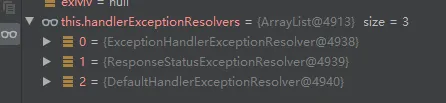

在DefaultHandlerExceptionResolver中就有一些默认的处理机制

```java
if (ex instanceof HttpRequestMethodNotSupportedException) {
    return handleHttpRequestMethodNotSupported(
        (HttpRequestMethodNotSupportedException) ex, request, response, handler);
}
else if (ex instanceof HttpMediaTypeNotSupportedException) {
    return handleHttpMediaTypeNotSupported(
        (HttpMediaTypeNotSupportedException) ex, request, response, handler);
}
else if (ex instanceof HttpMediaTypeNotAcceptableException) {
    return handleHttpMediaTypeNotAcceptable(
        (HttpMediaTypeNotAcceptableException) ex, request, response, handler);
}
else if (ex instanceof MissingPathVariableException) {
    return handleMissingPathVariable(
        (MissingPathVariableException) ex, request, response, handler);
}
else if (ex instanceof MissingServletRequestParameterException) {
    return handleMissingServletRequestParameter(
        (MissingServletRequestParameterException) ex, request, response, handler);
}
else if (ex instanceof ServletRequestBindingException) {
    return handleServletRequestBindingException(
        (ServletRequestBindingException) ex, request, response, handler);
}
else if (ex instanceof ConversionNotSupportedException) {
    return handleConversionNotSupported(
        (ConversionNotSupportedException) ex, request, response, handler);
}
else if (ex instanceof TypeMismatchException) {
    return handleTypeMismatch(
        (TypeMismatchException) ex, request, response, handler);
}
else if (ex instanceof HttpMessageNotReadableException) {
    return handleHttpMessageNotReadable(
        (HttpMessageNotReadableException) ex, request, response, handler);
}
else if (ex instanceof HttpMessageNotWritableException) {
    return handleHttpMessageNotWritable(
        (HttpMessageNotWritableException) ex, request, response, handler);
}
else if (ex instanceof MethodArgumentNotValidException) {
    return handleMethodArgumentNotValidException(
        (MethodArgumentNotValidException) ex, request, response, handler);
}
else if (ex instanceof MissingServletRequestPartException) {
    return handleMissingServletRequestPartException(
        (MissingServletRequestPartException) ex, request, response, handler);
}
else if (ex instanceof BindException) {
    return handleBindException((BindException) ex, request, response, handler);
}
else if (ex instanceof NoHandlerFoundException) {
    return handleNoHandlerFoundException(
        (NoHandlerFoundException) ex, request, response, handler);
}
else if (ex instanceof AsyncRequestTimeoutException) {
    return handleAsyncRequestTimeoutException(
        (AsyncRequestTimeoutException) ex, request, response, handler);
}
```

### HandlerExceptionResolver的实现类

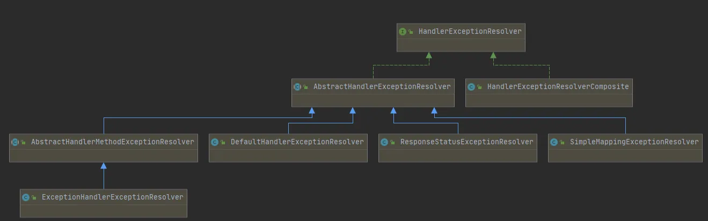

使用SimpleMappingExceptionResolver进行配置异常

```xml
<!--    区域信息从session中拿-->
<bean class="org.springframework.web.servlet.i18n.SessionLocaleResolver" id="localeResolver"></bean>
<bean class="org.springframework.web.servlet.handler.SimpleMappingExceptionResolver" id="exceptionResolver">
    <property name="exceptionMappings">
        <props>
            <!--                key 异常的全类名 value 要去页面的视图名-->
            <prop key="java.lang.NullPointerException">myerror</prop>
        </props>
    </property>
    <!--        指定错误信息取出时的值-->
    <property name="exceptionAttribute" value="ex"></property>
</bean>
```

前端：如果指定了exceptionAttribute，就可以用ex，如果不指定就用${exception}

```html
<h1>Error</h1>
<h2>${ex}</h2>
<h3>${exception}</h3>
```

注意：如果全局指定了Exception，就不会执行SimpleMappingExceptionResolver

同样的调试位置，最后处理的是SimpleMappingExceptionResolver

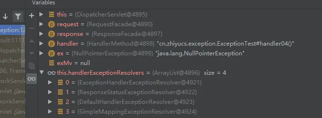


## 【小结】SpringMVC的运行流程

#### 1. 所有请求，前端控制器（DispatcherServlet）调用doDispatch进行处理

#### 2. 根据HandlerMapping的请求应色号信息找到，处理当前的请求，处理执行链

```java
mappedHandler = getHandler(processedRequest);
```

#### 3. 根据当前处理器找到它的适配器

```java
HandlerAdapter ha = getHandlerAdapter(mappedHandler.getHandler());
```

#### 4. 拦截器的preHandler先执行

```java
if (!mappedHandler.applyPreHandle(processedRequest, response)) {
    return;
}
```

#### 5. 适配器执行目标方法，返回ModelAndView

```java
mv = ha.handle(processedRequest, response, mappedHandler.getHandler());
```

#### 6. 拦截器的postHandler执行

```java
mappedHandler.applyPostHandle(processedRequest, response, mv);
```

#### 7. 渲染页面，处理结果

```java
processDispatchResult(processedRequest, response, mappedHandler, mv, dispatchException);
```

（1）processDispatchResult如果有异常，先处理异常

```java
Object handler = (mappedHandler != null ? mappedHandler.getHandler() : null);
```

（2）处理完成后接着返回ModelAndView

```java
mv = processHandlerException(request, response, handler, exception);
```

（3）渲染视图

```java
render(mv, request, response);
```


## SpringMVC和Spring的整合（分工明确）

Spring配置业务有关（事务控制、数据源...）

SpringMVC配置网站逻辑和功能（视图解析器，文件上传解析器，支持AJAX...）

### 合并

在SpringMVC中导入Spring配置文件

```
<import resource="spring.xml" />
```

### 分容器