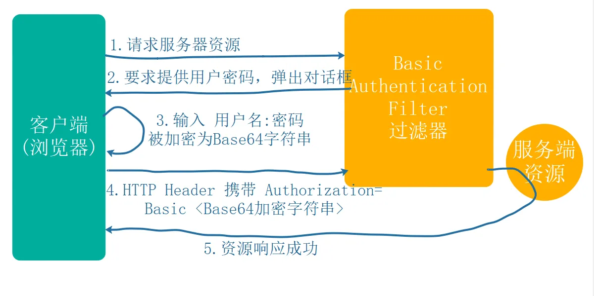
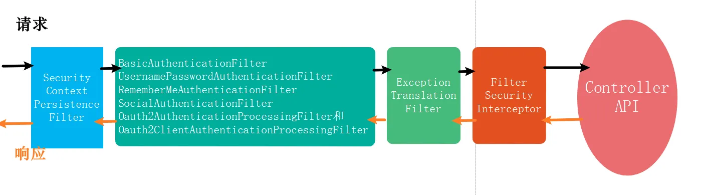
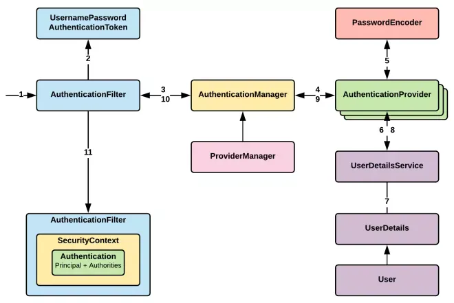

- [Spring Security 基础](#spring-security-基础)
  - [Spring Security 对比 Shiro](#spring-security-对比-shiro)
    - [Spring Security 核心](#spring-security-核心)
    - [对比shiro](#对比shiro)
  - [Http Basic认证模式](#http-basic认证模式)
    - [Http Basic不够安全的原因](#http-basic不够安全的原因)
      - [POSTMAN测试](#postman测试)
      - [HttpBasic模式的原理说明](#httpbasic模式的原理说明)
  - [Hash算法](#hash算法)
    - [PasswordEncoder 接口](#passwordencoder-接口)
      - [测试](#测试)
      - [测试结论](#测试结论)
  - [formLogin登录模式](#formlogin登录模式)
    - [认证初体验](#认证初体验)
      - [登录认证及资源访问权限的控制【重要】](#登录认证及资源访问权限的控制重要)
      - [创建自定义角色](#创建自定义角色)
      - [开放静态资源](#开放静态资源)
    - [源码解析](#源码解析)
    - [自定义验证登录处理【重要】](#自定义验证登录处理重要)
      - [后端处理 \[JSON\]](#后端处理-json)
      - [前端处理](#前端处理)
    - [Session会话安全管理器](#session会话安全管理器)
      - [基本用法](#基本用法)
      - [以下方法都是在HttpSecurity方法中和配置中实现 ↓](#以下方法都是在httpsecurity方法中和配置中实现-)
      - [session超时](#session超时)
      - [session保护](#session保护)
      - [cookie安全](#cookie安全)
      - [同账号多端登录踢下线](#同账号多端登录踢下线)
- [Spring Security 进阶篇](#spring-security-进阶篇)
  - [RBAC权限模型](#rbac权限模型)
  - [动态加载RBAC数据](#动态加载rbac数据)
    - [实现Dao层接口和Service接口](#实现dao层接口和service接口)
      - [实现Dao层](#实现dao层)
      - [实现Service层](#实现service层)
      - [实现后的配置](#实现后的配置)
    - [资源鉴权规则](#资源鉴权规则)
      - [创建一个RBAC类](#创建一个rbac类)
      - [配置类更换](#配置类更换)
  - [SPEL权限表达式](#spel权限表达式)
    - [常用权限表达式](#常用权限表达式)
      - [permitALL()权限示例](#permitall权限示例)
    - [Method表达式安全控制](#method表达式安全控制)
  - [RememberMe 记住我](#rememberme-记住我)
    - [基础知识](#基础知识)
    - [自定义配置](#自定义配置)
    - [数据库实现](#数据库实现)
  - [退出登录](#退出登录)
    - [核心配置](#核心配置)
    - [自定义配置](#自定义配置-1)
    - [配置LogoutSuccessHandler](#配置logoutsuccesshandler)
  - [图片验证](#图片验证)
    - [引入Kaptcha](#引入kaptcha)
    - [引入配置](#引入配置)
    - [验证码在Session中的生成](#验证码在session中的生成)
      - [创建验证码信息类](#创建验证码信息类)
      - [把验证码传到Session前端](#把验证码传到session前端)
      - [实现后端验证--验证码](#实现后端验证--验证码)
  - [前后端分离的应用](#前后端分离的应用)
    - [JWT工具类](#jwt工具类)
      - [JWT工具类模板 1](#jwt工具类模板-1)
        - [引入JWT工具包](#引入jwt工具包)
        - [JWT模板引入](#jwt模板引入)
        - [获取Token](#获取token)
        - [接口访问鉴权过滤器](#接口访问鉴权过滤器)
    - [配置CORS解决跨站访问](#配置cors解决跨站访问)

# Spring Security 基础

## Spring Security 对比 Shiro

### Spring Security 核心

* Authentication：身份认证，用户登录的验证
* Authorization：访问授权，授权资源的访问权限
* 安全防护，防止跨站请求，session攻击等

### 对比shiro

* Spring Security对OAuth支持更友好
* Spring Security在网络安全方面更好
* 通常来说，shiro入门更加容易，使用起来也非常简单，这也是造成shiro的使用量一直高于Spring Security的主要原因

## Http Basic认证模式

HttpBasic登录验证模式是Spring Security实现登录验证最简单的一种方式，也可以说是最简陋的一种方式。它的目的并不是保障登录验证的绝对安全，而是提供一种“防君子不防小人”的登录验证。

**如果使用的Spring Boot版本为1.X版本,依赖的Security 4.X版本，那么就无需任何配置，启动项目访问则会弹出默认的httpbasic认证.**

我们现在使用的是spring boot2.0版本（依赖Security 5.X版本），HttpBasic不再是默认的验证模式，在spring security 5.x默认的验证模式已经是表单模式。所以我们要使用Basic模式，需要自己调整一下。

```java
@Configuration
public class SecurityConfig  extends WebSecurityConfigurerAdapter {

    @Override
    protected void configure (HttpSecurity http) throws Exception {
        http.httpBasic()// 开启httpbasic认证
            .and()
            .authorizeRequests()
            .anyRequest()
            .authenticated();// 所有请求都需要登录认证才能访问
    }
}
```

Spring Boot启动后会出现密码，账号默认：user

> Using generated security password: 33ff7198-ce12-4fd4-a24a-0cea0965959d

如果要自定义用户、密码，必须在yaml中配置：

```yaml
spring:
    security:
      user:
        name: admin
        password: admin
```

### Http Basic不够安全的原因

#### POSTMAN测试

登录认证后，在Header中Authorization对应的值有Basic YWRtaW46YWRtaW4=

其中YWRtaW46YWRtaW4=通过Base64解密后可以看出


#### HttpBasic模式的原理说明



## Hash算法

Hash算法特别的地方在于它是一种单向算法，用户可以通过hash算法对某个数据生成一段特定长度的唯一hash值，却不能通过这个hash值逆向获取原始数据。因此Hash算法常用在不可还原的密码存储、数据完整性校验等领域。

### PasswordEncoder 接口

```java
package org.springframework.security.crypto.password;

public interface PasswordEncoder {
    String encode(CharSequence rawPassword);

    boolean matches(CharSequence rawPassword, String encodedPassword);

    default boolean upgradeEncoding(String encodedPassword) {
        return false;
    }
}
```

* encode 加密密码，hash值是不能被逆向解密的。
* matches 用来校验用户输入密码rawPassword，和加密后的hash值encodedPassword是否匹配。
* upgradeEncoding 判断当前的密码是否需要升级。也就是是否需要重新加密？需要的话返回true，不需要的话返回fasle。默认实现是返回false。

#### 测试

测试代码：

```java
@Test
void bCryptPasswordTetst(){
    PasswordEncoder passwordEncoder =  new BCryptPasswordEncoder();
    String rawPassword = "123456";  //原始密码
    String encodedPassword = passwordEncoder.encode(rawPassword); //加密后的密码

    System.out.println("原始密码" + rawPassword);
    System.out.println("加密之后的hash密码:" + encodedPassword);

    System.out.println(rawPassword + "是否匹配" + encodedPassword + ":"   //密码校验：true
                       + passwordEncoder.matches(rawPassword, encodedPassword));

    System.out.println("654321是否匹配" + encodedPassword + ":"   //定义一个错误的密码进行校验:false
                       + passwordEncoder.matches("654321", encodedPassword));
}
```

第一次测试的结果：

>原始密码123456
>加密之后的hash密码:$2a$10$xgd6LM8FfwgghM.4KLacIugcVxqY5hvvfuTgg9tXZxseiBGBc4GEi
>123456是否匹配$2a$10$xgd6LM8FfwgghM.4KLacIugcVxqY5hvvfuTgg9tXZxseiBGBc4GEi:true
>654321是否匹配$2a$10$xgd6LM8FfwgghM.4KLacIugcVxqY5hvvfuTgg9tXZxseiBGBc4GEi:false

第二次测试结果：

>原始密码123456
>加密之后的hash密码:$2a$10$HfB1IINOH2AG6bCbJ67h0OHBkeb.hL/1nwc84rnjTeAG6mXJWXo3m
>123456是否匹配$2a$10$HfB1IINOH2AG6bCbJ67h0OHBkeb.hL/1nwc84rnjTeAG6mXJWXo3m:true
>654321是否匹配$2a$10$HfB1IINOH2AG6bCbJ67h0OHBkeb.hL/1nwc84rnjTeAG6mXJWXo3m:false

#### 测试结论

可以看出**对于同一个原始密码，每次加密之后的hash密码都是不一样的**，这是因为**BCrypt产生随机盐**（盐的作用就是每次做出来的菜味道都不一样）

BCrypt加密后的密码有三个部分，由 $分隔：（共60位）

1. "2a"表示 BCrypt 算法版本
2. "10"表示算法的强度
3. "zt6dUMTjNSyzINTGyiAglu"部分实际上是随机生成的盐。通常来说前 22 个字符是盐，剩余部分是纯文本的实际哈希值

## formLogin登录模式

Spring Security的登录认证并不需要我们自己去写登录认证的Controller方法，而是使用过滤器UsernamePasswordAuthenticationFilter。

### 认证初体验

#### 登录认证及资源访问权限的控制【重要】

1. 继承**WebSecurityConfigurerAdapter**
2. 重写configure (HttpSecurity http)

```java
@Override
protected void configure (HttpSecurity http) throws Exception {
    http.csrf().disable()// 禁用跨站csrf攻击防御
        .formLogin()
        	.loginPage("/login.html") // 一旦用户的请求没有权限就跳转到这个页面
        	.loginProcessingUrl("/login") // 登录表单form中action的地址，也就是处理认证请求的路径
        	.usernameParameter("username") // 登录表单form中用户名输入框input的name名，不修改的话默认是username
        	.passwordParameter("password") // form中密码输入框input的name名，不修改的话默认是password
        	.defaultSuccessUrl("/") // 登录认证成功后默认转跳的路径
        .and()
        	.authorizeRequests()
        	.antMatchers("/login.html","/login").permitAll()// 不需要通过登录验证就可以被访问的资源路径
        	.antMatchers("/","/biz1","/biz2") // 资源路径匹配
        		.hasAnyAuthority("ROLE_user","ROLE_admin")  // user角色和admin角色都可以访问
        //                    .antMatchers("/syslog","/sysuser")  // 资源路径匹配
        //                        .hasAnyRole("admin")  // admin角色可以访问
        	.antMatchers("/syslog").hasAuthority("sys:log")
        	.antMatchers("/sysuser").hasAuthority("sys:user")
        .anyRequest()
        .authenticated();// 所有请求都需要登录认证才能访问
}
```

逻辑小结：

* 首先关闭跨站攻击防御（*scrf*）
* 使用.*formLogin*() 开启模式
* 配置登录页、前端传入的账号和密码、成功后跳转
* 然后（*and*）开始认证（*authorizeRequests*）
* 添加认证的跳转地址（*antMatchers*）和跳转该地址需要的权限（*permitAll*、*hasAuthority*）
* 最后加上任何请求（*anyRequest*）和认证才能访问（*authenticated*）

#### 创建自定义角色

```java
@Override
public void configure(AuthenticationManagerBuilder auth) throws Exception {
    auth.inMemoryAuthentication()
        .withUser("user")
        .password(passwordEncoder().encode("123456"))
        .roles("user")
        .and()
        .withUser("admin")
        .password(passwordEncoder().encode("123456"))
        .authorities("sys:log","sys:user")
        //.roles("admin")
        .and()
        .passwordEncoder(passwordEncoder());//配置BCrypt加密
}

@Bean
public PasswordEncoder passwordEncoder(){
    return new BCryptPasswordEncoder();
}
```

- `inMemoryAuthentication`指的是在内存里面存储用户的身份认证和授权信息。
- `withUser("user")`用户名是user
- `password(passwordEncoder().encode("123456"))`密码是加密之后的123456
- `authorities("sys:log","sys:user")`指的是admin用户拥有资源ID对应的资源访问的的权限："/syslog"和"/sysuser"
- `roles()`方法用于指定用户的角色，一个用户可以有多个角色

#### 开放静态资源

```java
@Override
public void configure(WebSecurity web) {
    web.ignoring().antMatchers("/css/**", "/font/**", "/img/**", "/js/**");
}
```

### 源码解析

登录认证的执行流程



登录认证的细节



### 自定义验证登录处理【重要】

#### 后端处理 [JSON]

预先定义一个前后端处理的JSON类

```java
package cn.zhiyucs.commons.exception;

import lombok.Data;

@Data
public class AjaxResponse {
    private boolean isok;  //请求是否处理成功

    private int code; //请求响应状态码（200、400、500）

    private String message;  //请求结果描述信息

    private Object data; //请求结果数据（通常用于查询操作）

    private AjaxResponse(){}

    public static AjaxResponse userInputError(String error) {
        AjaxResponse resultBean = new AjaxResponse();
        resultBean.setIsok(false);
        resultBean.setCode(500);
        resultBean.setMessage(error);
        return resultBean;
    }

    //请求出现异常时的响应数据封装
    public static AjaxResponse error(CustomException e) {
        AjaxResponse resultBean = new AjaxResponse();
        resultBean.setIsok(false);
        resultBean.setCode(e.getCode());
        resultBean.setMessage(e.getMessage());
        return resultBean;
    }

    //请求出现异常时的响应数据封装
    public static AjaxResponse error(CustomExceptionType customExceptionType,
                                     String errorMessage) {
        AjaxResponse resultBean = new AjaxResponse();
        resultBean.setIsok(false);
        resultBean.setCode(customExceptionType.getCode());
        resultBean.setMessage(errorMessage);
        return resultBean;
    }

    //请求成功的响应，不带查询数据（用于删除、修改、新增接口）
    public static AjaxResponse success(){
        AjaxResponse ajaxResponse = new AjaxResponse();
        ajaxResponse.setIsok(true);
        ajaxResponse.setCode(200);
        ajaxResponse.setMessage("请求响应成功!");
        return ajaxResponse;
    }

    //请求成功的响应，带有查询数据（用于数据查询接口）
    public static AjaxResponse success(Object obj){
        AjaxResponse ajaxResponse = new AjaxResponse();
        ajaxResponse.setIsok(true);
        ajaxResponse.setCode(200);
        ajaxResponse.setMessage("请求响应成功!");
        ajaxResponse.setData(obj);
        return ajaxResponse;
    }

    //请求成功的响应，带有查询数据（用于数据查询接口）
    public static AjaxResponse success(Object obj,String message){
        AjaxResponse ajaxResponse = new AjaxResponse();
        ajaxResponse.setIsok(true);
        ajaxResponse.setCode(200);
        ajaxResponse.setMessage(message);
        ajaxResponse.setData(obj);
        return ajaxResponse;
    }
}
```

继承跳转成功处理和失败处理

成功处理，以下为代码和注意事项：

* 记得@Component
* 继承的是SavedRequestAwareAuthenticationSuccessHandler
* ObjectMapper是Spring Boot默认集成的JSON数据处理类库Jackson中的类

```java
@Component
public class MyAuthenticationSuccessHandler
    extends SavedRequestAwareAuthenticationSuccessHandler {

    @Value("${spring.security.logintype}")
    private String loginType;

    private static ObjectMapper objectMapper = new ObjectMapper();

    @Override
    public void onAuthenticationSuccess(HttpServletRequest request,
                                        HttpServletResponse response,
                                        Authentication authentication) throws IOException, ServletException {
        if (loginType.equalsIgnoreCase("JSON")) {
            response.setContentType("application/json;charset=UTF-8");
            response.getWriter().write(objectMapper.writeValueAsString(
                AjaxResponse.success()
            ));
        } else {
            // 会帮我们跳转到上一次请求的页面上
            super.onAuthenticationSuccess(request, response, authentication);
        }
    }
}
```

失败处理同理，继承（SimpleUrlAuthenticationFailureHandler）。

在Spring Security中修改默认的跳转页为自定义的跳转页即可（*successHandler*、*failureHandler*）：

```java
http.csrf().disable()// 禁用跨站csrf攻击防御
    .formLogin()
    	.loginPage("/login.html") // 一旦用户的请求没有权限就跳转到这个页面
    	.loginProcessingUrl("/login") // 登录表单form中action的地址，也就是处理认证请求的路径
    	.usernameParameter("username") // 登录表单form中用户名输入框input的name名，不修改的话默认是username
    	.passwordParameter("password") // form中密码输入框input的name名，不修改的话默认是password
    //                    .defaultSuccessUrl("/") // 登录认证成功后默认转跳的路径
    	.successHandler(mySuccessHandler)
    	.failureHandler(myFailureHandler)
```

#### 前端处理

前端使用Ajax发送登录即可，注意：

> ```html
> <input type="button" onclick="login()" value="登陆">
> ```

不是type="submit"而是button，不然接收到的就是一串JSON（Vue框架忽略）

然后就可以发起AJAX请求：

```javascript
$.ajax({
    type: 'POST',
    url: '/login',
    data: {
        username,
        password
    },
    success(resp) {
		....
    },
    error(e) {
		...
    }
});
```

### Session会话安全管理器

#### 基本用法

Spring Security提供4种方式精确的控制会话的创建：

- **always**：如果当前请求没有对应的session存在，Spring Security创建一个session。
- **ifRequired（默认）**： Spring Security在需要使用到session时才创建session
- **never**： Spring Security将永远不会主动创建session，但是如果session在当前应用中已经存在，它将使用该session
- **stateless**：Spring Security不会创建或使用任何session。适合于接口型的无状态应用（前后端分离无状态应用），这种方式节省内存资源

一般不建议修改，如果非要修改session，可以在**参数为：HttpSecurity 函数中修改**：

```java
    .antMatchers("/syslog").hasAuthority("sys:log")
                    .antMatchers("/sysuser").hasAuthority("sys:user")
                .anyRequest()
                .authenticated()// 所有请求都需要登录认证才能访问
                .and().sessionManagement()
                       .sessionCreationPolicy(SessionCreationPolicy.IF_REQUIRED);
```

#### 以下方法都是在HttpSecurity方法中和配置中实现 ↓

#### session超时

在Spring boot应用中有两种设置会话超时时间的方式，Spring Security对这两种方式完全兼容，即：当会话超时之后用户需要重新登录才能访问应用：

- server.servlet.session.timeout=15m
- spring.session.timeout = 15m

第一种方式是springBoot应用自带的session超时配置，第二种方式是我们使用Spring Session之后，提供的session超时配置。第二种方式的优先级更高。

超时会话处理：

```java
http.sessionManagement()
    .invalidSessionUrl("/invalidSession.html");    //非法超时session跳转页面
```

#### session保护

session-fixation-protection 即session的固化保护功能，该功能的目的是一定程度上防止非法用户窃取用户session及cookies信息，进而模拟session的行为。

```java
http.sessionManagement().sessionFixation().migrateSession()
```

- 设置为“*none*”时，原始会话不会无效
- 设置“*newSession*”后，将创建一个干净的会话，而不会复制旧会话中的任何属性
- `migrateSession` - 即对于同一个cookies的SESSIONID用户，每次登录访问之后访问将创建一个新的HTTP Session会话，旧的HTTP Session会话将无效，并且旧Session会话的属性将被复制。**在Servlet 3.0及其之前的版本，这种方式是默认的**
- `changeSessionId` - 这种方式不会创建新的session，作为替代，使用Servlet 容器(`HttpServletRequest#changeSessionId()`)提供的会话固化保护功能 。**这个选项在Servlet 3.1 (Java EE 7) 或者更新版本的web容器下默认生效。** 每次登录访问之后都更换sessionid，但是没有新建session会话。

#### cookie安全

熟悉Session实现原理的朋友一定都知道，提高Cookies的安全性，实际上就是提高session的安全性。在Spring Boot中可以通过配置方式来实现：

```properties
server.servlet.session.cookie.http-only=true
server.servlet.session.cookie.secure=true
```

- httpOnly：如果为true，则浏览器脚本将无法访问cookie
- secure：如果为true，则仅通过HTTPS连接发送cookie，HTTP无法携带cookie

#### 同账号多端登录踢下线

核心：

```java
.sessionManagement()
    .maximumSessions(1)
    .maxSessionsPreventsLogin(false)
    .expiredSessionStrategy(new CustomExpiredSessionStrategy())
```

- **maximumSessions** 表示同一个用户最大的登录数量
- **maxSessionsPreventsLogin** 提供两种session保护策略：
  - true表示已经登录就不予许再次登录，
  - false表示允许再次登录但是之前的登录账户会被踢下线
- **expiredSessionStrategy **表示自定义一个session被下线(超时)之后的处理策略。

如果不使用前后端分离，被踢下线后的策略可以：

```java
public class CustomExpiredSessionStrategy implements SessionInformationExpiredStrategy {

    //页面跳转的处理逻辑
    private RedirectStrategy redirectStrategy = new DefaultRedirectStrategy();

    @Override
    public void onExpiredSessionDetected(SessionInformationExpiredEvent event) throws IOException, ServletException {
        // 是跳转html页面，url代表跳转的地址
        redirectStrategy.sendRedirect(event.getRequest(), event.getResponse(), "某个url");
    }
}
```

如果采用前后端分离的JSON，可以使用：

```java
private static ObjectMapper objectMapper = new ObjectMapper();

@Override
public void onExpiredSessionDetected(SessionInformationExpiredEvent event)
    throws IOException, ServletException {
    //        redirectStrategy.sendRedirect(event.getRequest(), event.getResponse(), "");
    Map<String, Object> map = new HashMap<>();
    map.put("code", 403);
    map.put("msg", "您的登录已经超时或者已经在另一台机器登录，您被迫下线。"
            + event.getSessionInformation().getLastRequest());

    String json = objectMapper.writeValueAsString(map);

    event.getResponse().setContentType("application/json;charset=UTF-8");
    event.getResponse().getWriter().write(json);
}
```


# Spring Security 进阶篇

## RBAC权限模型

RBAC权限模型（Role-Based Access Control）即：基于角色的权限控制：

- 用户：系统接口及功能访问的操作者
- 权限：能够访问某接口或者做某操作的授权资格
- 角色：具有一类相同操作权限的用户的总称

RBAC权限模型核心授权逻辑如下：

- 某用户是什么角色？
- 某角色具有什么权限？
- 通过角色的权限推导用户的权限


## 动态加载RBAC数据

提纲：

* Dao层实现UserDetails接口，设置set方法
* Service层实现UserDetailsService接口，完成loadUserByUsername方法
* 配置Security中的configure(AuthenticationManagerBuilder auth)

### 实现Dao层接口和Service接口

#### 实现Dao层

首先创建自己的DAO层类，实现UserDetails接口：

> ```java
> public class MyUserDetails implements UserDetails
> ```

加入相应的实体类：

```java
String password;  //密码
String username;  //用户名
boolean accountNonExpired;   //是否没过期
boolean accountNonLocked;   //是否没被锁定
boolean credentialsNonExpired;  //密码是否没过期
boolean enabled;  //账号是否可用
```

设置对应的实体类

>  IDEA中Generator -- Setter即可设置成功

实例代码如下：

注意点（此坑整整浪费了3天时间）：

* 在设置enable的时候注意书写enable，不要写成enabled或者其他，不然无法从Mybatis中取出数据，导致默认是false一直登陆不上去！
* 在数据库中保存enable字段应使用tinyint

```java
public class MyUserDetails implements UserDetails {

    String password;  //密码
    String username;  //用户名
    boolean accountNonExpired;   //是否没过期
    boolean accountNonLocked;   //是否没被锁定
    boolean credentialsNonExpired;  //密码是否没过期
    boolean enable;  //账号是否可用
    Collection<? extends GrantedAuthority> authorities;  //用户的权限集合

    @Override
    public Collection<? extends GrantedAuthority> getAuthorities() {
        return authorities;
    }

    @Override
    public String getPassword() {
        return password;
    }

    @Override
    public String getUsername() {
        return username;
    }

    @Override
    public boolean isAccountNonExpired() {
        return true;
    }

    @Override
    public boolean isAccountNonLocked() {
        return true;
    }

    @Override
    public boolean isCredentialsNonExpired() {
        return true;
    }

    @Override
    public boolean isEnabled() {
        return enable;
    }

    public void setPassword(String password) {
        this.password = password;
    }

    public void setUsername(String username) {
        this.username = username;
    }

    public void setAccountNonExpired(boolean accountNonExpired) {
        this.accountNonExpired = accountNonExpired;
    }

    public void setAccountNonLocked(boolean accountNonLocked) {
        this.accountNonLocked = accountNonLocked;
    }

    public void setCredentialsNonExpired(boolean credentialsNonExpired) {
        this.credentialsNonExpired = credentialsNonExpired;
    }

    public void setEnable(boolean enable) {
        this.enable = enable;
    }

    public void setAuthorities(Collection<? extends GrantedAuthority> authorities) {
        this.authorities = authorities;
    }
}
```

#### 实现Service层

首先创建自己的Service层类，实现UserDetailsService接口：

> ```java
> public class MyUserDetailService implements UserDetailsService
> ```

紧接着实现loadUserByUsername接口（username是在SecurityConfig中的 .usernameParameter("username") 获取到的），然后就可以实现loadUserByUsername方法

在实现接口之前要创建一个查询数据库查询，查询出用户的账号密码和是否可用的信息：

```java
public interface MyUserDetailsServiceMapper {

    //根据userID查询用户信息
    @Select("SELECT username,password,enable\n" +
            "FROM sys_user u\n" +
            "WHERE u.username = #{userId}")
    MyUserDetails findByUserName(@Param("userId") String userId);
```

1. 创建成功后就可以开始继续实现UserDetailsService接口，首先查询数据库中的基本信息、角色、权限：

```java
// 用户基础数据
MyUserDetails userDetails = mapper.findByUserName(username);
if (userDetails == null) {
    throw new UsernameNotFoundException("用户名不存在");
}
System.out.println("current user enable: " + userDetails.isEnabled());

// 用户角色列表
List<String> roleCodes = mapper.findRoleByUserName(username);
// 根据角色列表加载当前用户具有的权限
List<String> authorities = mapper.findAuthorityByRoleCodes(roleCodes);
```

2. 为角色标识加上ROLE_前缀（Spring Security规范）

```java
roleCodes = roleCodes.stream()
                .map(rc -> "ROLE_" + rc)
                .collect(Collectors.toList());
```

3. 合并角色权限，以‘，’分开权限：

```java
//角色是一种特殊的权限，所以合并
authorities.addAll(roleCodes);
//转成用逗号分隔的字符串，为用户设置权限标识
userDetails.setAuthorities(AuthorityUtils.commaSeparatedStringToAuthorityList(
    String.join(",", authorities)
));
```

4. 最后返回实体类，加上@Component到类上即可即可

```java
return userDetails;
```

完整的示例代码如下：

```java
@Component
public class MyUserDetailService implements UserDetailsService {

    @Resource
    private MyUserDetailsServiceMapper mapper;

    @Override
    public UserDetails loadUserByUsername(String username) throws UsernameNotFoundException {
        // 用户基础数据
        MyUserDetails userDetails = mapper.findByUserName(username);
        if (userDetails == null) {
            throw new UsernameNotFoundException("用户名不存在");
        }
        System.out.println("current user enable: " + userDetails.isEnabled());

        // 用户角色列表
        List<String> roleCodes = mapper.findRoleByUserName(username);
        // 根据角色列表加载当前用户具有的权限
        List<String> authorities = mapper.findAuthorityByRoleCodes(roleCodes);

        //为角色标识加上ROLE_前缀（Spring Security规范）
        roleCodes = roleCodes.stream()
                .map(rc -> "ROLE_" + rc)
                .collect(Collectors.toList());
        //角色是一种特殊的权限，所以合并
        authorities.addAll(roleCodes);
        //转成用逗号分隔的字符串，为用户设置权限标识
        userDetails.setAuthorities(AuthorityUtils.commaSeparatedStringToAuthorityList(
                String.join(",", authorities)
        ));
        System.out.println(userDetails);
        return userDetails;
    }
}
```

#### 实现后的配置

完成以后，在Spring Security的配置类中，注入Service，配置AuthenticationManagerBuilder：

```java
@Resource
private MyUserDetailService myUserDetailService;

...
    
@Override
public void configure(AuthenticationManagerBuilder auth) throws Exception {
    auth.userDetailsService(myUserDetailService)
        .passwordEncoder(passwordEncoder());
}
```


### 资源鉴权规则

简而言之：当前访问的路径和当前用户所拥有权限的路径是否匹配

#### 创建一个RBAC类

1. 创建一个属于自己的RBAC类

> ```java
> public class MyRBACService
> ```

2. 定义一个方法，方法名可以自拟，方法固定

> ```java
> public boolean hasPermission(HttpServletRequest request, Authentication authentication)
> ```

3. 获取主体信息 -> 判断是否是UserDetails -> 转换 -> 获取本次访问的资源（路径） -> 判断主体是否含有这个资源 -> 返回

```java
public boolean hasPermission(HttpServletRequest request, Authentication authentication) {
    // 当前认证的主体信息
    Object principal = authentication.getPrincipal();

    if (principal instanceof UserDetails) {
        UserDetails userDetails = (UserDetails) principal;

        // 本次要访问的资源
        SimpleGrantedAuthority simpleGrantedAuthority
            = new SimpleGrantedAuthority(request.getRequestURI());

        // userDetails.getAuthorities()该用户所能访问的所有资源
        return userDetails.getAuthorities().contains(simpleGrantedAuthority);
    }
    return false;
}
```

#### 配置类更换

原先在配置类中配置写死的方法就可以去除：


将antMatchers().hasAuthority换为这个SPEL表达式即可：

> ```java
> .anyRequest().access("@rbacService.hasPermission(request,authentication)")
> ```


## SPEL权限表达式

Spring Express Language

### 常用权限表达式

| 表达式函数                       | 描述                                                                                                                                                                   |
| :------------------------------- | :--------------------------------------------------------------------------------------------------------------------------------------------------------------------- |
| `hasRole([role]`)                | 用户拥有指定的角色时返回true （`Spring security`默认会带有`ROLE_`前缀）,去除前缀参考[Remove the ROLE_](https://github.com/spring-projects/spring-security/issues/4134) |
| `hasAnyRole([role1,role2])`      | 用户拥有任意一个指定的角色时返回true                                                                                                                                   |
| `hasAuthority([authority])`      | 拥有某资源的访问权限时返回true                                                                                                                                         |
| `hasAnyAuthority([auth1,auth2])` | 拥有某些资源其中部分资源的访问权限时返回true                                                                                                                           |
| `permitAll`                      | 永远返回true                                                                                                                                                           |
| `denyAll`                        | 永远返回false                                                                                                                                                          |
| `anonymous`                      | 当前用户是`anonymous`时返回true                                                                                                                                        |
| `rememberMe`                     | 当前用户是`rememberMe`用户返回true                                                                                                                                     |
| `authentication`                 | 当前登录用户的`authentication`对象                                                                                                                                     |
| `fullAuthenticated`              | 当前用户既不是`anonymous`也不是`rememberMe`用户时返回true                                                                                                              |
| `hasIpAddress('192.168.1.0/24')` | 请求发送的IP匹配时返回true                                                                                                                                             |

#### permitALL()权限示例

在security全局配置文件中，我们是这样配置任何人都可以进入的路径的：

> ```java
> .antMatchers("/login.html","/login").permitAll()
> ```

然而，我们还可以用另外一种方式来实现它：

> ```java
> .antMatchers("/login.html","/login").access("permitAll()")
> ```

### Method表达式安全控制

* @PreAuthorize 注解适合进入方法前的权限验证。

> ```java
> @PreAuthorize("hasRole('admin')")
> ```

* @PostAuthorize 在方法执行后再进行权限验证,适合根据返回值结果进行权限验证。

> ```java
> @PostAuthorize("returnObject.name == authentication.name")
> ```

* @PreFilter 针对参数进行过滤,下文代码表示针对ids参数进行过滤，只有id为偶数的元素才被作为参数传入函数。

```java
//当有多个对象是使用filterTarget进行标注
@PreFilter(filterTarget="ids", value="filterObject%2==0")
public void delete(List<Integer> ids, List<String> usernames) {

}
```

* @PostFilter 针对返回结果进行过滤，特别适用于集合类返回值，过滤集合中不符合表达式的对象。

```java
@PostFilter("filterObject.name == authentication.name")
public List<PersonDemo> findAllPD(){

    List<PersonDemo> list = new ArrayList<>();
    list.add(new PersonDemo("kobe"));
    list.add(new PersonDemo("admin"));

    return list;
}
```

在全局配置中开启注解：

```java
@Configuration
@EnableGlobalMethodSecurity(prePostEnabled = true)
public class MySecurityConfig extends WebSecurityConfigurerAdapter {
```

## RememberMe 记住我

### 基础知识

在Spring Security中，Remember Me的两大核心是

后端全局配置类加上rememberMe()：

```java
@Configuration
public class SecurityConfig extends WebSecurityConfigurerAdapter {
    @Override
    protected void configure(HttpSecurity http) throws Exception {
        http.rememberMe();   //实现记住我自动登录配置，核心的代码只有这一行
    }
}
```

前端传入用户是否点击了Checkbox：

> ```html
> <label><input type="checkbox" name="remember-me"/>记住密码</label>
> ```


它有两个默认行为：

* 前后端分离的项目，如果要判断是否为记住我，上传的数据名默认为"remember-me"：

```json
data: {
    username,
    password,
    'remember-me': rememberMe
},
```

* 2周内免登录


Spring Security的记住我cookie使用Base64实现的：

> YWRtaW46MTYyMzQ5MzU2MTE2NTo2ZTk0NTNlZjkxZDcyYTU1MDU0YTczNWI0Y2I0YmM5Mw

解密后：

> admin:1623493561165:6e9453ef91d72a55054a735b4cb4bc93

signatureValue = username、expirationTime和passwod和一个预定义的key，并将他们经过MD5进行签名

它有这样的执行流程：


- 第一次登录请求的时候，用户使用其他验证方式进行登录（如用户名密码），勾选remember-me，并生成RememberMeToken 令牌。
- 第二次登陆的时候使用RememberMeToken令牌（就不用输入用户名密码了），RememberMeAuthenticationFilter在Spring Security过滤器链中处于整体偏后的位置，所以只有当各种传统的登录方式都无法完成验证的情况下，才走RememberMeAuthenticationFilter，这也是符合实际需求的。

### 自定义配置

如下：

```java
.rememberMe()
    .rememberMeParameter("remember-me-new")
    .rememberMeCookieName("remember-me-cookie")
    .tokenValiditySeconds(2 * 24 * 60 * 60);  
```

- tokenValiditySeconds用于设置token的有效期，即多长时间内可以免除重复登录，单位是秒。不修改配置情况下默认是2周。
- 通过rememberMeParameter设置from表单“自动登录”勾选框的参数名称。如果这里改了，from表单中checkbox的name属性要对应的更改。如果不设置默认是remember-me。
- rememberMeCookieName设置了保存在浏览器端的cookie的名称，如果不设置默认也是remember-me。如下图中查看浏览器的cookie。

### 数据库实现

流程执行图：


1. 首先，我们需要键一张数据库表**persistent_logins**:

```sql
CREATE TABLE `persistent_logins` (
  `username` varchar(64) NOT NULL,
  `series` varchar(64) NOT NULL,
  `token` varchar(64) NOT NULL,
  `last_used` timestamp NOT NULL DEFAULT CURRENT_TIMESTAMP ON UPDATE CURRENT_TIMESTAMP,
  PRIMARY KEY (`series`)
) ENGINE=InnoDB DEFAULT CHARSET=utf8;
```

2. 在全局配置文件中加入类，返回PersistentTokenRepository：

```java
@Autowired
private DataSource dataSource;

 @Bean
 public PersistentTokenRepository persistentTokenRepository(){
     JdbcTokenRepositoryImpl tokenRepository = new JdbcTokenRepositoryImpl();
     tokenRepository.setDataSource(dataSource);
     return tokenRepository;
 }
```

3. 在全局配置文件中configure(HttpSecurity http)再加入：

```java
.rememberMe()
    .tokenRepository(persistentTokenRepository())
```

## 退出登录

### 核心配置

后端在configure(final HttpSecurity http) 配置：

```java
@Configuration
@EnableWebSecurity
public class SecSecurityConfig extends WebSecurityConfigurerAdapter {
    @Override
    protected void configure(final HttpSecurity http) throws Exception {
        http.logout();
   }
}
```

前端加入默认路径：

> ```html
> <a href="/logout" >退出</a>
> ```

在这一过程中，Spring Security的默认行为是：

- 当前session失效，即：logout的核心需求，session失效就是访问权限的回收。
- 删除当前用户的 remember-me“记住我”功能信息（内存和数据库）
- clear清除当前的 SecurityContext
- 重定向到登录页面，loginPage配置项指定的页面

### 自定义配置

```java
 http.logout()
     .logoutUrl("/signout")
     .logoutSuccessUrl("/aftersignout.html")
     .deleteCookies("JSESSIONID")
```

- logoutUrl  配置改变退出请求的默认路径，当然html退出按钮的请求url也要修改
- logoutSuccessUrl  配置，来显式指定退出之后的跳转页面
- deleteCookies  删除指定的cookie，参数为cookie的名称

### 配置LogoutSuccessHandler

如果要对注销登录的一些业务操作，可以自定义创建类实现LogoutSuccessHandler 的接口：

> ```java
> public class MyLogoutSuccessHandler implements LogoutSuccessHandler
> ```

在接口函数onLogoutSuccess中实现完了业务，返回response.sendRedirect("/login.html");

完成以后在全局配置configure (HttpSecurity http)中加入logoutSuccessHandler：

```java
http.logout()
                    .deleteCookies("JSESSIONID")
                    .logoutSuccessHandler(myLogoutSuccessHandler)
```

**【注意】**实现完LogoutSuccessHandler以后，需要注释logoutUrl("")，不然无法使用

## 图片验证

### 引入Kaptcha

```xml
<dependency>
   <groupId>com.github.penggle</groupId>
   <artifactId>kaptcha</artifactId>
   <version>2.3.2</version>
   <exclusions>
      <exclusion>
         <artifactId>javax.servlet-api</artifactId>
         <groupId>javax.servlet</groupId>
      </exclusion>
   </exclusions>
</dependency>
```

### 引入配置

详细配置表有如下：

| kaptcha.border                   | 图片边框，合法值：yes , no                                                                                                                                             | yes                                                   |
| -------------------------------- | ---------------------------------------------------------------------------------------------------------------------------------------------------------------------- | ----------------------------------------------------- |
| kaptcha.border.color             | 边框颜色，合法值： r,g,b (and optional alpha) 或者 white,black,blue.                                                                                                   | black                                                 |
| kaptcha.image.width              | 图片宽                                                                                                                                                                 | 200                                                   |
| kaptcha.image.height             | 图片高                                                                                                                                                                 | 50                                                    |
| kaptcha.producer.impl            | 图片实现类                                                                                                                                                             | com.google.code.kaptcha.impl.DefaultKaptcha           |
| kaptcha.textproducer.impl        | 文本实现类                                                                                                                                                             | com.google.code.kaptcha.text.impl.DefaultTextCreator  |
| kaptcha.textproducer.char.string | 文本集合，验证码值从此集合中获取                                                                                                                                       | abcde2345678gfynmnpwx                                 |
| kaptcha.textproducer.char.length | 验证码长度                                                                                                                                                             | 5                                                     |
| kaptcha.textproducer.font.names  | 字体                                                                                                                                                                   | Arial, Courier                                        |
| kaptcha.textproducer.font.size   | 字体大小                                                                                                                                                               | 40px.                                                 |
| kaptcha.textproducer.font.color  | 字体颜色，合法值： r,g,b 或者 white,black,blue.                                                                                                                        | black                                                 |
| kaptcha.textproducer.char.space  | 文字间隔                                                                                                                                                               | 2                                                     |
| kaptcha.noise.impl               | 干扰实现类                                                                                                                                                             | com.google.code.kaptcha.impl.DefaultNoise             |
| kaptcha.noise.color              | 干扰 颜色，合法值： r,g,b 或者 white,black,blue.                                                                                                                       | black                                                 |
| kaptcha.obscurificator.impl      | 图片样式：<br />水纹 com.google.code.kaptcha.impl.WaterRipple <br />鱼眼 com.google.code.kaptcha.impl.FishEyeGimpy <br />阴影 com.google.code.kaptcha.impl.ShadowGimpy | com.google.code.kaptcha.impl.WaterRipple              |
| kaptcha.background.impl          | 背景实现类                                                                                                                                                             | com.google.code.kaptcha.impl.DefaultBackground        |
| kaptcha.background.clear.from    | 背景颜色渐变，开始颜色                                                                                                                                                 | light grey                                            |
| kaptcha.background.clear.to      | 背景颜色渐变， 结束颜色                                                                                                                                                | white                                                 |
| kaptcha.word.impl                | 文字渲染器                                                                                                                                                             | com.google.code.kaptcha.text.impl.DefaultWordRenderer |
| kaptcha.session.key              | session key                                                                                                                                                            | KAPTCHA_SESSION_KEY                                   |
| kaptcha.session.date             | session date                                                                                                                                                           | KAPTCHA_SESSION_DATE                                  |

在Spring Boot中我们不能使用YAML的方式，只能使用Properties的方式来配置：

```properties
kaptcha.border=no
kaptcha.border.color=105,179,90
kaptcha.image.width=100
kaptcha.image.height=45
kaptcha.textproducer.font.color=blue
kaptcha.textproducer.font.size=35
kaptcha.textproducer.char.length=4
kaptcha.textproducer.font.names=宋体,楷体,微软雅黑
```

配置完之后创建配置类，倒入配置信息：

* 使用@Value从配置中导入值
* 创建DefaultKaptcha 方法，一般取名为：kaptchaProducer，加上@Bean注解
  * 实例化DefaultKaptcha、Properties 类
  * 利用properties.setProperty导入配置
  * 实例化Config 类，传入properties
  * DefaultKaptcha利用设置配置的方法
  * 返回DefaultKaptcha
* 加上@Component注解和@PropertySource（标注peoperties的位置）

示例代码如下：

```java
@Component
@PropertySource(value = {"classpath:kaptcha.properties"})
public class CaptchaConfig {

    @Value("${kaptcha.border}")
    private String border;
    @Value("${kaptcha.border.color}")
    private String borderColor;
    @Value("${kaptcha.textproducer.font.color}")
    private String fontColor;
    @Value("${kaptcha.image.width}")
    private String imageWidth;
    @Value("${kaptcha.image.height}")
    private String imageHeight;
    @Value("${kaptcha.textproducer.char.length}")
    private String charLength;
    @Value("${kaptcha.textproducer.font.names}")
    private String fontNames;
    @Value("${kaptcha.textproducer.font.size}")
    private String fontSize;

    @Bean(name = "captchaProducer")
    public DefaultKaptcha getKaptchaBean() {
        DefaultKaptcha defaultKaptcha = new DefaultKaptcha();
        Properties properties = new Properties();
        properties.setProperty("kaptcha.border", border);
        properties.setProperty("kaptcha.border.color", borderColor);
        properties.setProperty("kaptcha.textproducer.font.color", fontColor);
        properties.setProperty("kaptcha.image.width", imageWidth);
        properties.setProperty("kaptcha.image.height", imageHeight);
        properties.setProperty("kaptcha.session.key", sessionKey);
        properties.setProperty("kaptcha.textproducer.char.length", charLength);
        properties.setProperty("kaptcha.textproducer.font.names", fontNames);
        properties.setProperty("kaptcha.textproducer.font.size",fontSize);
        Config config = new Config(properties);
        defaultKaptcha.setConfig(config);
        return defaultKaptcha;
    }
}
```

### 验证码在Session中的生成

导读：

* captchaProducer.createText() 生成验证码文字
* KaptchaForm 保存Session中验证码的信息（验证码、过期时间）

#### 创建验证码信息类

```java
public class KaptchaForm {

    private String code;

    public LocalDateTime expireTime;

    public KaptchaForm(String code, int expireAfterSeconds) {
        this.code = code;
        this.expireTime = LocalDateTime.now().plusSeconds(expireAfterSeconds);
    }

    public boolean isExpired() {
        return LocalDateTime.now().isAfter(expireTime);
    }

    public String getCode() {
        return code;
    }
}
```


#### 把验证码传到Session前端

创建一个Controller：

```java
@RestController
public class KaptchaController {

    @Resource
    private DefaultKaptcha kaptchaProducer;

    @GetMapping("/kaptcha")
    public void kaptcha(HttpSession session, HttpServletResponse response) {
        response.setDateHeader("Expires", 0);
        response.setHeader("Cache-Control", "no-store, no-cache, must-revalidate");
        response.addHeader("Cache-Control", "post-check=0, pre-check=0");
        response.setHeader("Pragma", "no-cache");
        response.setContentType("image/jpeg");

        String kaptchaText = kaptchaProducer.createText();
        session.setAttribute(MyContent.KAPTCHA_SESSION_KEY, new KaptchaForm(kaptchaText, 2*60));
        try(ServletOutputStream out = response.getOutputStream()) {
            BufferedImage defaultKaptchaImage = kaptchaProducer.createImage(kaptchaText);
            ImageIO.write(defaultKaptchaImage, .webp", out);
            out.flush();
        } catch (IOException e) {
            e.printStackTrace();
        }
    }
}
```

在前端，可以置随机数改变验证码的内容：

````javascript
<script>
    window.onload=function(){
        var kaptchaImg = document.getElementById("kaptcha");
        kaptchaImg.onclick = function(){
            kaptchaImg.src = "/kaptcha?" + Math.floor(Math.random() * 100)
        }
    }
</script>
````

#### 实现后端验证--验证码

执行流程图如下：


- 编写我们的自定义图片验证码过滤器KaptchaCodeFilter，过滤器中拦截登录请求
- KaptchaCodeFilter过滤器中从seesion获取验证码文字与用户输入比对，比对通过执行其他过滤器链
- 比对不通过，抛出SessionAuthenticationException异常，交给AuthenticationFailureHandler处理
- 最后将KaptchaCodeFilter放在UsernamePasswordAuthenticationFilter表单过滤器之前执行。


首先，创建一个Filter类继承OncePerRequestFilter 

> ```java
> public class KaptchaFilter extends OncePerRequestFilte
> ```

实现doFilterInternal函数，在里面主要做前端传入的验证码是否正确的校验

获取前端校验码：

> ```java
> String codeInRequest = ServletRequestUtils.getStringParameter(
>         request.getRequest(),"kaptchaCode");
> ```

获取Session中的验证码：

> ```java
> KaptchaForm codeInSession = (KaptchaForm)
>         session.getAttribute(放入Session中的key);
> ```

接着就可以判断验证码：空、过期、不匹配的操作，如果成功就不做操作，放行；如果失败则拦截，拦截代码如下：

> ```java
> filterChain.doFilter(request, response);
> ```

最后在类上加上@Component注解，完整的示例代码如下：

注：return 放在catch中，如果放在外面前端会返回undefined

```java
@Component
public class KaptchaFilter extends OncePerRequestFilter {

    @Resource
    private MyAuthenticationFailureHandler authenticationFailureHandler;

    @Override
    protected void doFilterInternal(HttpServletRequest request,
                                    HttpServletResponse response,
                                    FilterChain filterChain) throws ServletException, IOException {
        if (StrUtil.equals("/login", request.getRequestURI())
            && StrUtil.equalsIgnoreCase(request.getMethod(), "POST")) {
            // 验证谜底与用户输入是否匹配
            try {
                validate(new ServletWebRequest(request));
            } catch (AuthenticationException e) {
                authenticationFailureHandler.onAuthenticationFailure(request,response, e);
                return;
            }
        }

        filterChain.doFilter(request, response);
    }

    private void validate(ServletWebRequest request) throws ServletRequestBindingException {
        HttpSession session = request.getRequest().getSession();

        // 获取用户登录界面输入的kaptchaCode(前端AJAX传入)
        String codeInRequest = ServletRequestUtils.getStringParameter(
                request.getRequest(),"kaptchaCode");
        if(StrUtil.isEmpty(codeInRequest)){
            throw new SessionAuthenticationException("验证码不能为空");
        }

        // 获取session池中的验证码谜底
        KaptchaForm codeInSession = (KaptchaForm)
                session.getAttribute(MyContent.KAPTCHA_SESSION_KEY);
        System.out.println(codeInSession.getCode());
        if(Objects.isNull(codeInSession)) {
            throw new SessionAuthenticationException("验证码不存在");
        }

        // 校验服务器session池中的验证码是否过期
        if(codeInSession.isExpired()) {
            session.removeAttribute(MyContent.KAPTCHA_SESSION_KEY);
            throw new SessionAuthenticationException("验证码已经过期");
        }

        // 请求验证码校验
        if(!StrUtil.equals(codeInSession.getCode(), codeInRequest)) {
            throw new SessionAuthenticationException("验证码不匹配");
        }

    }
}
```

最后在全局配置类中（configure (HttpSecurity http)）中加入addFilterBefore即可：

```java
@Override
    protected void configure (HttpSecurity http) throws Exception {
        http.addFilterBefore(kaptchaFilter, UsernamePasswordAuthenticationFilter.class)
```

至此，验证码的功能都实现了。

## 前后端分离的应用

### JWT工具类

#### JWT工具类模板 1

##### 引入JWT工具包

```xml
<dependency>
    <groupId>io.jsonwebtoken</groupId>
    <artifactId>jjwt</artifactId>
    <version>0.9.1</version>
</dependency>
```

在YAML文件中配置：

```yaml
jwt: 
  header: JWTHeaderName
  secret: aabbccdd  
  expiration: 3600000
```

* secret是用来为JWT基础信息加密和解密的密钥
* expiration是JWT令牌的有效时间（毫秒）

##### JWT模板引入

```java
@Data
@ConfigurationProperties(prefix = "jwt")
@Component
public class JWTUtil {

    private String secret;
    private Long expiration;
    private String header;


    /**
     * 生成token令牌
     *
     * @param userDetails 用户
     * @return 令token牌
     */
    public String generateToken(UserDetails userDetails) {
        Map<String, Object> claims = new HashMap<>(2);
        claims.put("sub", userDetails.getUsername());
        claims.put("created", new Date());

        return generateToken(claims);
    }

    /**
     * 从令牌中获取用户名
     *
     * @param token 令牌
     * @return 用户名
     */
    public String getUsernameFromToken(String token) {
        String username;
        try {
            Claims claims = getClaimsFromToken(token);
            username = claims.getSubject();
        } catch (Exception e) {
            username = null;
        }
        return username;
    }

    /**
     * 判断令牌是否过期
     *
     * @param token 令牌
     * @return 是否过期
     */
    public Boolean isTokenExpired(String token) {
        try {
            Claims claims = getClaimsFromToken(token);
            Date expiration = claims.getExpiration();
            return expiration.before(new Date());
        } catch (Exception e) {
            return false;
        }
    }

    /**
     * 刷新令牌
     *
     * @param token 原令牌
     * @return 新令牌
     */
    public String refreshToken(String token) {
        String refreshedToken;
        try {
            Claims claims = getClaimsFromToken(token);
            claims.put("created", new Date());
            refreshedToken = generateToken(claims);
        } catch (Exception e) {
            refreshedToken = null;
        }
        return refreshedToken;
    }

    /**
     * 验证令牌
     *
     * @param token       令牌
     * @param userDetails 用户
     * @return 是否有效
     */
    public Boolean validateToken(String token, UserDetails userDetails) {

        String username = getUsernameFromToken(token);
        return (username.equals(userDetails.getUsername()) && !isTokenExpired(token));
    }


    /**
     * 从claims生成令牌,如果看不懂就看谁调用它
     *
     * @param claims 数据声明
     * @return 令牌
     */
    private String generateToken(Map<String, Object> claims) {
        Date expirationDate = new Date(System.currentTimeMillis() + expiration);
        return Jwts.builder().setClaims(claims)
                .setExpiration(expirationDate)
                .signWith(SignatureAlgorithm.HS512, secret)
                .compact();
    }

    /**
     * 从令牌中获取数据声明,如果看不懂就看谁调用它
     *
     * @param token 令牌
     * @return 数据声明
     */
    private Claims getClaimsFromToken(String token) {
        Claims claims;
        try {
            claims = Jwts.parser().setSigningKey(secret).parseClaimsJws(token).getBody();
        } catch (Exception e) {
            claims = null;
        }
        return claims;
    }
}
```

##### 获取Token

先序：（官方文档）介绍AuthenticationManager 、SecurityContextHolder、SecurityContext

* AuthenticationManager ：AuthenticationManager 是一个API，定义了Spring Security如何过滤的认证方式，然后由调用AuthenticationManager 的控制器在 SecurityContextHolder 上设置返回的身份验证。

* SecurityContextHolder：SecurityContextHolder是Spring Security存储已认证身份的细节。Spring Security 不关心 SecurityContextHolder 是如何填充的。如果它包含一个值，则将其用作当前经过身份验证的用户。指定用户已通过身份验证的最简单方法是直接设置 SecurityContextHolder。


* SecurityContext：SecurityContext 是从 SecurityContextHolder 获得的。 SecurityContext 包含一个 Authentication 对象（包含如下信息）
  * 主体（principal） - 标识用户。当使用用户名/密码进行身份验证时，这通常是 UserDetails 的一个实例。 
  * 凭据（credentials） - 通常是密码。在许多情况下，这将在用户通过身份验证后被清除，以确保它不会泄露。 
  * 权限（authorities） - GrantedAuthoritys 是授予用户的高级权限。一些示例是角色或范围。

认证拦截的流程如下：


有了这些先行知识，我们就可以在全局配置类中创建一个AuthenticationManager：

```java
@Bean(name= BeanIds.AUTHENTICATION_MANAGER)
@Override
public AuthenticationManager authenticationManager() throws Exception{
    return super.authenticationManager();
}
```

首先创建一个Service，用于对JWTController中对JWT的处理：

> ```java
> @Service
> public class JWTAuthService
> ```

紧接着，要对Login进行处理，当获取当账号和密码时，先对账号和密码创建认证Token：

> ```java
> UsernamePasswordAuthenticationToken upToken =
>         new UsernamePasswordAuthenticationToken(username, password);
> ```

在AuthenticationManager中获取用户的权限：

> Authentication authenticate = manager.authenticate(upToken);

把用户的权限放入到SecurityContext中，从SecurityContextHolder获取并设置：

> ```java
> SecurityContextHolder.getContext().setAuthentication(authenticate);
> ```

最后生成JWT返回：

```java
UserDetails userDetails = userDetailsService.loadUserByUsername(username);
return jwtUtil.generateToken(userDetails);
```

完整示例代码如下：

```java
@Resource
AuthenticationManager manager;

@Resource
UserDetailsService userDetailsService;

@Resource
JWTUtil jwtUtil;

/**
     * 登录认证换取JWT令牌
     *
     * @return
     */
public String login(String username, String password) throws CustomException{
    try {
        UsernamePasswordAuthenticationToken upToken =
            new UsernamePasswordAuthenticationToken(username, password);
        Authentication authenticate = manager.authenticate(upToken);
        SecurityContextHolder.getContext().setAuthentication(authenticate);
    } catch (AuthenticationException e) {
        throw new CustomException(CustomExceptionType.USER_INPUT_ERROR,
                                  "用户名或者密码不正确");
    }
    UserDetails userDetails = userDetailsService.loadUserByUsername(username);
    return jwtUtil.generateToken(userDetails);
}
```

最后通过Controller处理响应，刷新令牌同理：

```java
 @PostMapping("/authentication")
public R login(@RequestBody Map<String, String> map) {
    String username = map.get("username");
    String password = map.get("password");
    if (StrUtil.isEmpty(username) || StrUtil.isEmpty(password)) {
        return R.error(
            new CustomException(CustomExceptionType.USER_INPUT_ERROR
                                , "用户名或者密码不能为空")
        );
    }
    try {
        return R.success(jwtAuthService.login(username, password));
    } catch (CustomException e) {
        return R.error(e);
    }
}
```

刷新令牌的业务层处理和控制层处理如下：

```java
/**
* 刷新令牌(controller)
* @return
*/
@PostMapping("/refreshToken")
public R refresh(@RequestHeader("token") String token) {
    return R.success(jwtAuthService.refreshToken(token));
}
```

```java
// service
public String refreshToken(String oldToken) {
    if (!jwtUtil.isTokenExpired(oldToken)) {
        return jwtUtil.refreshToken(oldToken);
    }
    return null;
}
```

##### 接口访问鉴权过滤器

定义一个拦截器：

- 拦截接口请求，从请求request获取token，从token中解析得到用户名
- 通过UserDetailsService获得系统用户（从数据库、或其他其存储介质）
- 根据用户信息和JWT令牌，验证系统用户与用户输入的一致性，并判断JWT是否过期。如果没有过期，至此表明了该用户的确是该系统的用户。
- 系统用户不代表你可以访问所有的接口。所以需要构造UsernamePasswordAuthenticationToken传递用户、权限信息，并将这些信息通过authentication告知Spring Security。Spring Security会以此判断你的接口访问权限。

注意：

1. 这里之所以能获取到身份权限，是因为在登录时设置了权限：

> ```java
> SecurityContextHolder.getContext().setAuthentication(authenticate);
> ```

2. 携带@Component注解

```java
@Component
public class JwtAuthenticationTokenFilter extends OncePerRequestFilter {

    @Resource
    JWTUtil jwtUtil;

    @Resource
    MyUserDetailService userDetailService;

    @Override
    protected void doFilterInternal(HttpServletRequest request,
                                    HttpServletResponse response,
                                    FilterChain filterChain) throws ServletException, IOException {
        String token = request.getHeader(jwtUtil.getHeader());
        if (token != null && StrUtil.isNotEmpty(token)) {
            String username = jwtUtil.getUsernameFromToken(token);
            // JWT中提取用户信息，并且该用户未被授权
            if (username != null && SecurityContextHolder.getContext().getAuthentication() == null) {
                UserDetails userDetails = userDetailService.loadUserByUsername(username);
                if (jwtUtil.validateToken(token, userDetails)) {
                    //给使用该JWT令牌的用户进行授权
                    UsernamePasswordAuthenticationToken authenticationToken =
                            new UsernamePasswordAuthenticationToken(userDetails, null, userDetails.getAuthorities());
                    SecurityContextHolder.getContext().setAuthentication(authenticationToken);
                }
            }
        }
        filterChain.doFilter(request, response);
    }
}
```

### 配置CORS解决跨站访问

在spring security的WebSecurityConfigurerAdapter中的configure(HttpSecurity http)配置方法，加上http.cors()配置

```java
public class WebSecurityConfig extends WebSecurityConfigurerAdapter {
    @Override
    protected void configure(HttpSecurity http) throws Exception {
        http.cors().and()
        ...
    }
}
```

同样在全局配置文件中，Spring Security为我们提供了一种新的CORS规则的配置方法：CorsConfigurationSource 。使用这种方法实现的效果等同于注入一个CorsFilter过滤器。

```java
@Bean
CorsConfigurationSource corsConfigurationSource() {
    CorsConfiguration configuration = new CorsConfiguration();
    configuration.setAllowedOrigins(Arrays.asList("http://localhost:8888"));
    configuration.setAllowedMethods(Arrays.asList("GET","POST"));
    configuration.applyPermitDefaultValues();
    UrlBasedCorsConfigurationSource source = new UrlBasedCorsConfigurationSource();
    source.registerCorsConfiguration("/**", configuration);
    return source;
}
```

