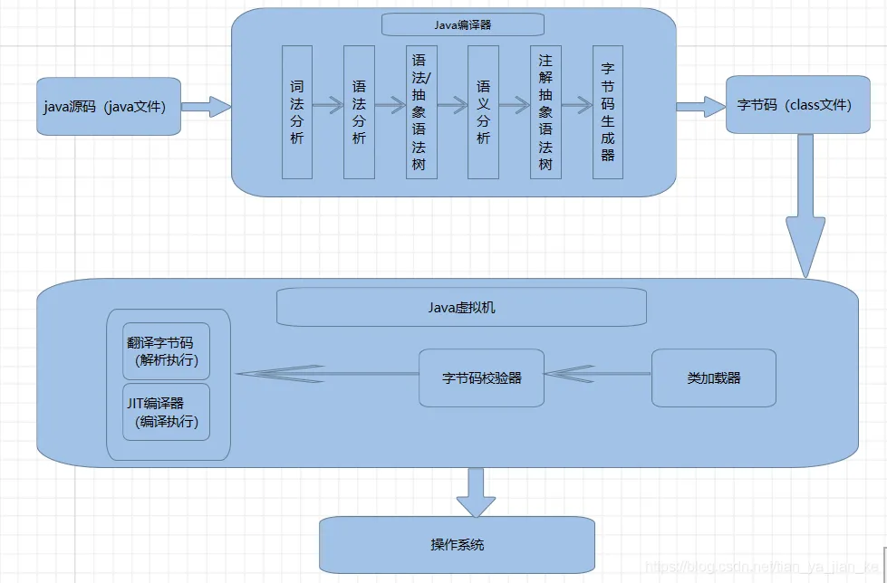

[toc]

# 简介
## JVM位置


JVM是运行在操作系统之上，它与硬件没有直接的交互

### JDK的构成


## JVM整体结构
【要求会画】


## JAVA代码执行流程





## 区分栈的指令集架构和寄存器的指令集架构
Java编译器输入的指令流基本上是一种基于栈的指令集架构，另外一种指令集架构则是基于寄存器的指令集架构。

栈的指令集架构：

* 跨平台性
* 指令集小，指令多
* 执行性能比寄存器差

基于寄存器的指令集架构:

* 性能优秀、执行更快 
* 完全依赖硬件，可移植性差


### 查看Java反编译以后字节码的生产情况
代码：

```java
public class StackStruTest {
    public static void main(String[] args) {
//        int i = 2 + 3;
        int i = 2;
        int j = 3;
        int k = i + j;
    }
}
```
> javap -v xxxxx.class

主要可以看：Code部分

```Plain Text
Classfile /C:/Users/54271/Documents/Java/JVMDemo/target/classes/chapter01/StackStruTest.class
  Last modified 2021-11-9; size 468 bytes
  MD5 checksum 3ba8eef9c3a64cdb9cb67f7b00c5f548
  Compiled from "StackStruTest.java"
public class chapter01.StackStruTest
  minor version: 0
  major version: 52
  flags: ACC_PUBLIC, ACC_SUPER
Constant pool:
   #1 = Methodref          #3.#21         // java/lang/Object."<init>":()V
   #2 = Class              #22            // chapter01/StackStruTest
   #3 = Class              #23            // java/lang/Object
   #4 = Utf8               <init>
   #5 = Utf8               ()V
   #6 = Utf8               Code
   #7 = Utf8               LineNumberTable
   #8 = Utf8               LocalVariableTable
   #9 = Utf8               this
  #10 = Utf8               Lchapter01/StackStruTest;
  #11 = Utf8               main
  #12 = Utf8               ([Ljava/lang/String;)V
  #13 = Utf8               args
  #14 = Utf8               [Ljava/lang/String;
  #15 = Utf8               i
  #16 = Utf8               I
  #17 = Utf8               j
  #18 = Utf8               k
  #19 = Utf8               SourceFile
  #20 = Utf8               StackStruTest.java
  #21 = NameAndType        #4:#5          // "<init>":()V
  #22 = Utf8               chapter01/StackStruTest
  #23 = Utf8               java/lang/Object
{
  public chapter01.StackStruTest();
    descriptor: ()V
    flags: ACC_PUBLIC
    Code:
      stack=1, locals=1, args_size=1
         0: aload_0
         1: invokespecial #1                  // Method java/lang/Object."<init>":()V
         4: return
      LineNumberTable:
        line 3: 0
      LocalVariableTable:
        Start  Length  Slot  Name   Signature
            0       5     0  this   Lchapter01/StackStruTest;

  public static void main(java.lang.String[]);
    descriptor: ([Ljava/lang/String;)V
    flags: ACC_PUBLIC, ACC_STATIC
    Code:
      stack=2, locals=4, args_size=1
         0: iconst_2
         1: istore_1
         2: iconst_3
         3: istore_2
         4: iload_1
         5: iload_2
         6: iadd
         7: istore_3
         8: return
      LineNumberTable:
        line 6: 0
        line 7: 2
        line 8: 4
        line 9: 8
      LocalVariableTable:
        Start  Length  Slot  Name   Signature
            0       9     0  args   [Ljava/lang/String;
            2       7     1     i   I
            4       5     2     j   I
            8       1     3     k   I
}
SourceFile: "StackStruTest.java"
```


## JVM生命周期
### 虚拟机的启动
Java虚拟机的启动是通过引导类加载器(bootstrap class loader) 创建一个初始类(initial class) 来完成的，这个类是由虚拟机的具体实现指定的。


### 虚拟机执行
测试代码：

```java
public class StackStruTest {
    public static void main(String[] args) {
        try {
            Thread.sleep(6000);
        } catch (InterruptedException e) {
            e.printStackTrace();
        }

        System.out.println("Hello JVM");
    }
}

```
查看当前JVM执行的进程

> jps

执行后即可看到以下内容：

执行中

```Plain Text
15936
24208 RemoteMavenServer36
26468 StackStruTest
13656 Jps
16504
22764 Launcher
```
执行后：

```Plain Text
15936
24208 RemoteMavenServer36
24964 Jps
16504
22764 Launcher
```


### 虚拟机退出
* 正常结束
* 发生异常或错误
* 存储系统错误导致虚拟机终止
* 某线程调用Runtime类或System类的exit方法，或Runtime类的halt方法，并且Java安全管理器也允许这次exit或halt操作（主动结束程序）
* JNI（Java Native Interface）