[TOC]

# String的基本特性

- String：字符串，使用一对" "引起来表示

  ```java
  String s1 = “baidu”; //字面量的定义方式
  String s2 = new String("hello");
  12
  ```

- String声明为final的，不可被继承

- String实现了Serializable接口：表示字符串是支持序列化的

- String实现了Comparable接口：表示string可以比较大小

- String在jdk8及以前内部定义了final char[ ] value用于存储字符串数据。JDK9时改为byte[ ]


## String在jdk9中存储结构变更

官网地址：[JEP 254: Compact Strings (java.net)](http://openjdk.java.net/jeps/254)

> Motivation
>
> The current implementation of the `String` class stores characters in a `char` array, using two bytes (sixteen bits) for each character. Data gathered from many different applications indicates that strings are a major  component of heap usage and, moreover, that most `String` objects contain only Latin-1 characters. Such characters require only  one byte of storage, hence half of the space in the internal `char` arrays of such `String` objects is going unused.
>
> Description
>
> We propose to change the internal representation of the `String` class from a UTF-16 `char` array to a `byte` array plus an encoding-flag field. The new `String` class will store characters encoded either as ISO-8859-1/Latin-1 (one  byte per character), or as UTF-16 (two bytes per character), based upon  the contents of the string. The encoding flag will indicate which  encoding is used.
>
> String-related classes such as `AbstractStringBuilder`, `StringBuilder`, and `StringBuffer` will be updated to use the same representation, as will the HotSpot VM’s intrinsic string operations.
>
> This is purely an implementation change, with no changes to existing public interfaces. There are no plans to add any new public APIs or  other interfaces.
>
> The prototyping work done to date confirms the expected reduction in memory footprint, substantial reductions of GC activity, and minor  performance regressions in some corner cases.

> **动机**
>
> 该类的当前实现`String`将字符存储在一个 `char`数组中，每个字符使用两个字节（十六位）。从许多不同应用程序收集的数据表明，字符串是堆使用的主要组成部分，而且大多数`String`对象仅包含 Latin-1 字符。此类字符仅需要一个字节的存储空间，因此此类对象的内部`char`数组中的 一半空间未使用。`String`
>
> **描述**
>
> 我们建议将`String`类的内部表示从 UTF-16`char`数组更改为`byte`数组加上编码标志字段。新`String`类将根据字符串的内容存储编码为 ISO-8859-1/Latin-1（每个字符一个字节）或 UTF-16（每个字符两个字节）的字符。编码标志将指示使用哪种编码。
>
> 与字符串相关的类（例如`AbstractStringBuilder`、`StringBuilder`和 ）`StringBuffer`将被更新为使用相同的表示形式，HotSpot VM 的内在字符串操作也是如此。
>
> 这纯粹是一个实现更改，对现有的公共接口没有任何更改。没有计划添加任何新的公共 API 或其他接口。
>
> 迄今为止完成的原型设计工作证实了内存占用的预期减少、GC 活动的大幅减少以及在某些极端情况下的轻微性能回归。

> 结论：String再也不用char[ ] 来存储了，改成了byte[ ] 加上编码标记，节约了一些空间

```java
public final class String implements java.io.Serializable, Comparable<String>, CharSequence {
    @Stable
    private final byte[] value;
}
```


## String的基本特性

- String：代表不可变的字符序列。简称：不可变性   
  - 当对字符串重新赋值时，需要重写指定内存区域赋值，不能使用原有的value进行赋值
  - 当对现有的字符串进行连接操作时，也需要重新指定内存区域赋值，不能使用原有的value进行赋值
  - 当调用string的replace( )方法修改指定字符或字符串时，也需要重新指定内存区域赋值，不能使用原有的value进行赋值
- 通过字面量的方式（区别于new）给一个字符串赋值，此时的字符串值声明在字符串常量池中
- 字符串常量池是不会存储相同内容的字符串的   
  - String的String Pool是一个固定大小的Hashtable，默认值大小长度是1009。如果放进String  Pool的String非常多，就会造成Hash冲突严重，从而导致链表会很长，而链表长了后直接会造成的影响就是当调用String.intern时性能会大幅下降
  - 使用`-XX:StringTablesize`可设置StringTable的长度
  - 在JDK6中StringTable是固定的，就是1009的长度，所以如果常量池中的字符串过多就会导致效率下降很快。`StringTablesize`设置没有要求
  - 在JDK7中，StringTable的长度默认值是60013，`StringTablesize`设置没有要求
  - 在<u>*JDK8开始，设置StringTable长度的话，1009是可以设置的最小值*</u>

> 代码示例：体现 String 的不可变性

```java
/**
 * String的基本使用:体现String的不可变性
 */
public class StringTest1 {

    @Test
    public void test1() {
        String s1 = "abc"; //字面量定义的方式，"abc"存储在字符串常量池中
        String s2 = "abc";
        s1 = "hello";

        System.out.println(s1 == s2); //判断地址：true  --> false

        System.out.println(s1); //hello
        System.out.println(s2); //abc
    }

    @Test
    public void test2() {
        String s1 = "abc";
        String s2 = "abc";
        s2 += "def";
        System.out.println(s2); //abcdef
        System.out.println(s1); //abc
    }

    @Test
    public void test3() {
        String s1 = "abc";
        String s2 = s1.replace('a', 'm');
        System.out.println(s1); //abc
        System.out.println(s2); //mbc
    }

}
```

> 在JDK8开始，设置StringTable长度的话，1009是可以设置的最小值

```java
public static void main(String[] args) {
        //测试StringTableSize参数
//        System.out.println("我来打个酱油");
//        try {
//            Thread.sleep(1000000);
//        } catch (InterruptedException e) {
//            e.printStackTrace();
//        }
}
```

- 默认什么都不设置，运行
- 命令行输入指令查看 StringTable 的长度

```
jps
jinfo -flag StringTableSize
```


- 可以看到默认长度就是60013
- 设置JVM参数

> -XX:StringTableSize=10

发生报错


StringTable 大小为 10 无效；必须介于 1009 和 2305843009213693951 之间


> String 笔试题：考察对String不可变性的认识

```java
public class StringExer {

    String str = new String("good");
    char[] ch = {'t', 'e', 's', 't'};

    public void change(String str, char ch[]) {
        str = "test ok";
        ch[0] = 'b';
    }

    public static void main(String[] args) {
        StringExer ex = new StringExer();
        ex.change(ex.str, ex.ch);
        System.out.println(ex.str); //good
        System.out.println(ex.ch); //best
    }

}
```


> 测试StringTable大小对性能的影响

1. 生成10万个字符串

```java
/**
 * 产生10万个长度不超过10的字符串，包含a-z,A-Z
 */
public class GenerateString {

    public static void main(String[] args) throws IOException {
        FileWriter fw =  new FileWriter("words.txt");

        for (int i = 0; i < 100000; i++) {
            //1 - 10
            int length = (int)(Math.random() * (10 - 1 + 1) + 1);
            fw.write(getString(length) + "\n");
        }

        fw.close();
    }

    public static String getString(int length){
        String str = "";
        for (int i = 0; i < length; i++) {
            //65 - 90, 97-122
            int num = (int)(Math.random() * (90 - 65 + 1) + 65) + (int)(Math.random() * 2) * 32;
            str += (char)num;
        }
        return str;
    }

}
```

再将这 10万 个字符串存入字符串常量池中，测试不同的StringTable对性能的影响

```java
/**
 *  -XX:StringTableSize=1009
 */
public class StringTest2 {

    public static void main(String[] args) {

        // 测试StringTableSize参数
//        System.out.println("我来打个酱油");
//        try {
//            Thread.sleep(1000000);
//        } catch (InterruptedException e) {
//            e.printStackTrace();
//        }

        BufferedReader br = null;
        try {
            br = new BufferedReader(new FileReader("words.txt"));
            long start = System.currentTimeMillis();
            String data;
            while((data = br.readLine()) != null){
                data.intern(); //如果字符串常量池中没有对应data的字符串的话，则在常量池中生成
            }

            long end = System.currentTimeMillis();

            System.out.println("花费的时间为：" + (end - start)); // 1009:206ms  10000:51ms
        } catch (IOException e) {
            e.printStackTrace();
        } finally {
            if(br != null){
                try {
                    br.close();
                } catch (IOException e) {
                    e.printStackTrace();
                }

            }
        }
    }
}
```

- 设置 StringTable 大小为默认最小值 1009

```java
-XX:StringTableSize=1009
1
```

- 结果为：206ms

```java
花费的时间为：206
1
```

- 再将 StringTable 大小设置为 100009

```java
-XX:StringTableSize=100009
1
```

- 结果为：51ms

```java
花费的时间为：51
```


# String的内存分配

- 在Java语言中有8种基本数据类型和一种比较特殊的类型String。这些类型为了使它们在运行过程中速度更快、更节省内存，都提供了一种常量池的概念。
- 常量池就类似一个Java系统级别提供的缓存。8种基本数据类型的常量池都是系统协调的，String类型的常量池比较特殊。它的主要使用方法有两种。   
  - 直接使用双引号声明出来的String对象会直接存储在常量池中。     
    - 比如：`String info = “cn.bing.com”`;
  - 如果不是用双引号声明的String对象，可以使用String提供的intern( )方法。这个后面重点谈
- Java 6及以前，字符串常量池存放在永久代
- Java 7中 Oracle的工程师对字符串池的逻辑做了很大的改变，即将字符串常量池的位置调整到Java堆内   
  - 所有的字符串都保存在堆（Heap）中，和其他普通对象一样，这样可以让你在进行调优应用时仅需要调整堆大小就可以了。
  - 字符串常量池概念原本使用得比较多，但是这个改动使得我们有足够的理由让我们重新考虑在Java 7中使用`String.intern()`
- Java8元空间，字符串常量在堆空间中

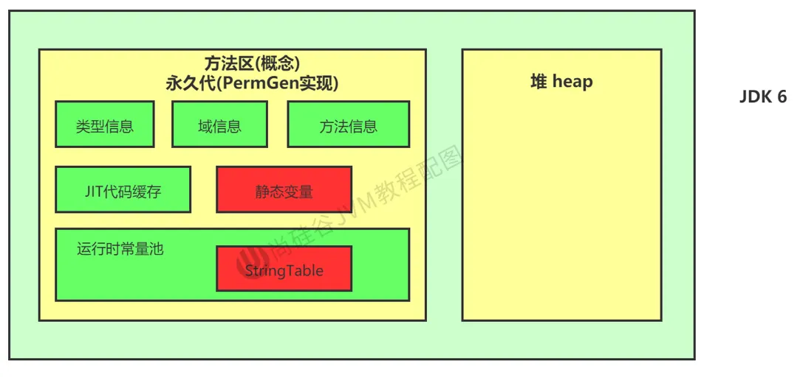


> StringTable为什么要调整？

- permSize默认比较小
- 永久代垃圾回收频率低

官网地址：[Java SE 7 Features and Enhancements (oracle.com)](https://www.oracle.com/java/technologies/javase/jdk7-relnotes.html#jdk7changes)

> **Synopsis:** In JDK 7, interned strings are no longer  allocated in the permanent generation of the Java heap, but are instead  allocated in the main part of the Java heap (known as the young and old  generations), along with the other objects created by the application.  This change will result in more data residing in the main Java heap, and less data in the permanent generation, and thus may require heap sizes  to be adjusted. Most applications will see only relatively small  differences in heap usage due to this change, but larger applications  that load many classes or make heavy use of the `String.intern()` method will see more significant differences.

> 简介：在JDK  7中，内部字符串不再分配在Java堆的永久代中，而是分配在Java堆的主要部分（称为年轻代和老年代），与应用程序创建的其他对象一起。这种变化将导致更多的数据驻留在主Java堆中，而更少的数据在永久代中，因此可能需要调整堆的大小。大多数应用程序将看到由于这一变化而导致的堆使用的相对较小的差异，但加载许多类或大量使用String.intern( )方法的大型应用程序将看到更明显的差异。

> 代码示例

```java
/**
 * jdk6中：
 * -XX:PermSize=6m -XX:MaxPermSize=6m -Xms6m -Xmx6m
 *
 * jdk8中：
 * -XX:MetaspaceSize=6m -XX:MaxMetaspaceSize=6m -Xms6m -Xmx6m
 */
public class StringTest3 {

    public static void main(String[] args) {
        //使用Set保持着常量池引用，避免full gc回收常量池行为
        Set<String> set = new HashSet<String>();
        //在short可以取值的范围内足以让6MB的PermSize或heap产生OOM了。
        short i = 0;
        while(true){
            set.add(String.valueOf(i++).intern());
        }
    }

}

```

可以看到OOM是发生在堆空间中，所以字符串常量池在JDK8中确实是存在堆空间中的


# String 基本操作

> Java语言规范里要求完全相同的字符串字面量，应该包含同样的Unicode字符序列（包含同一份码点序列的常量），并且必须是指向同一个String类实例。

```java
public class StringTest4 {

    public static void main(String[] args) {
        System.out.println();//1230
        System.out.println("1");//1231
        System.out.println("2");
        System.out.println("3");
        System.out.println("4");
        System.out.println("5");
        System.out.println("6");
        System.out.println("7");
        System.out.println("8");
        System.out.println("9");
        System.out.println("10");//1240
        //如下的字符串"1" 到 "10"不会再次加载
        System.out.println("1");//1241
        System.out.println("2");//1241
        System.out.println("3");
        System.out.println("4");
        System.out.println("5");
        System.out.println("6");
        System.out.println("7");
        System.out.println("8");
        System.out.println("9");
        System.out.println("10");//1241
    }

}
```

- 对一些代码进行打断点操作
- 初始化有 2123 个字符串

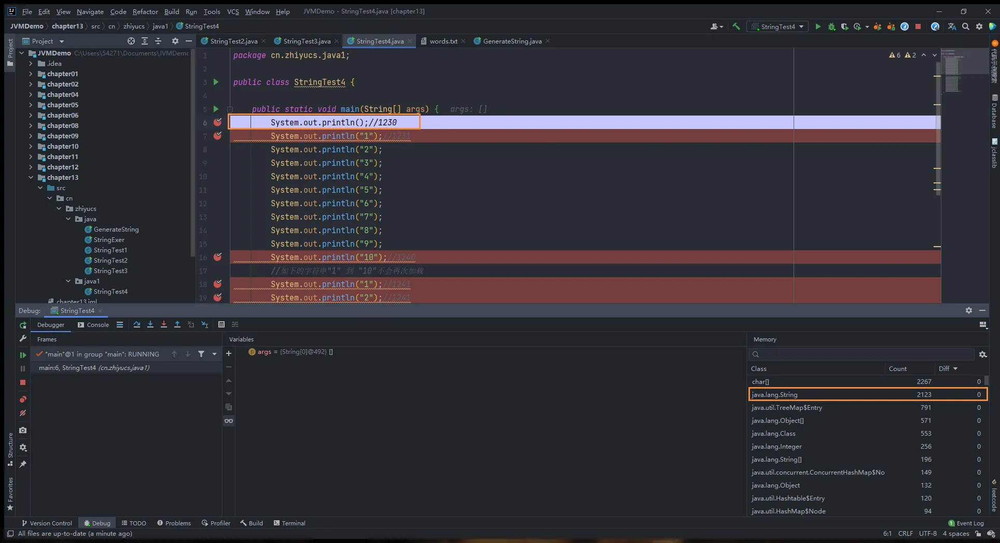

执行字符串”1”，可以发现字符串数量变成了2124个


执行字符串”10”，可以发现字符串数量变成了2133个

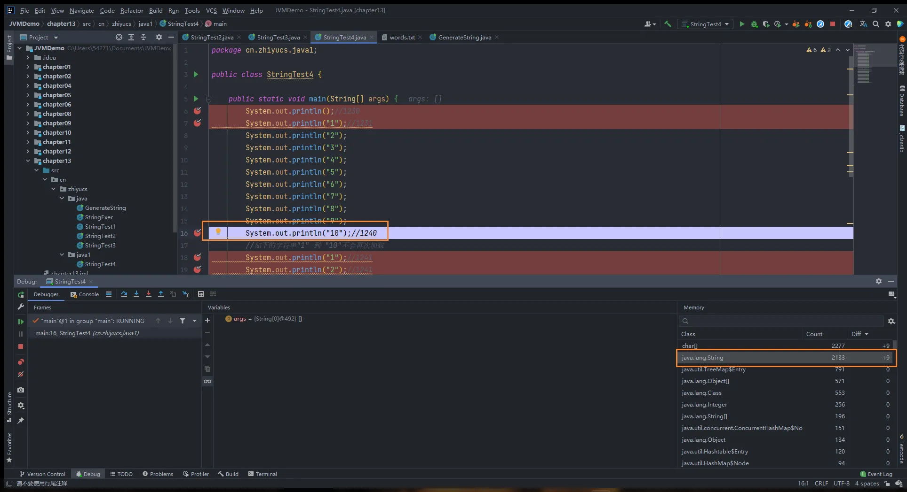

下面相同的字符串都在字符串常量池加载过一次了，所以下面相同的字符串都不会再被加载了

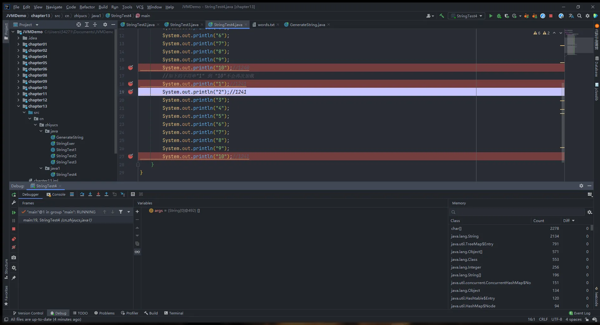


> 代码示例2

```java
class Memory {

    public static void main(String[] args) {//line 1
        int i = 1;//line 2
        Object obj = new Object();//line 3
        Memory mem = new Memory();//line 4
        mem.foo(obj);//line 5
    }//line 9

    private void foo(Object param) {//line 6
        String str = param.toString();//line 7
        System.out.println(str);
    }//line 8

}
```

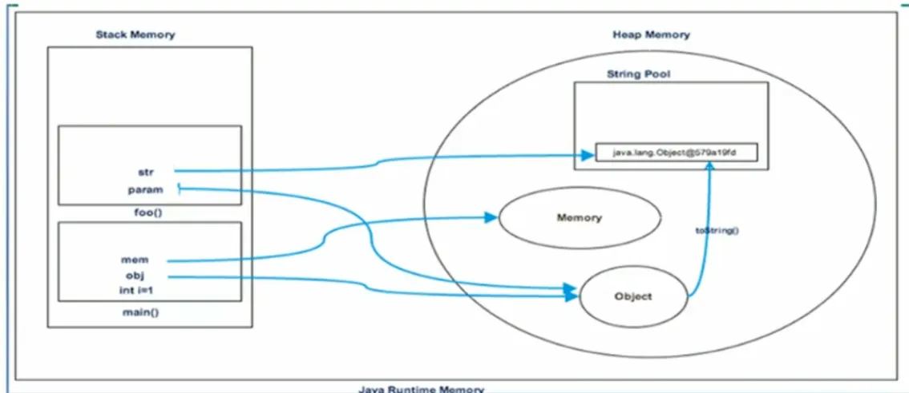

上面图片的局部变量表还缺少几个参数，下面列出正确的局部变量表数量

* 注意这里是非静态方法所以第一个位置放得是this，第二个才是param


全过程解析：

1. main方法的param对应的是mem这个变量
2. 把这个param给了字符串str，然后记录在字符串常量池中（当前对象类型和存储地址）

注：这里的toString调用的是Object的，底层通过StringBuilder进行拼接，会在堆内存中new一个String对象，因此这时的字符串常量池没字符串对象。str指向堆String对象


# 字符串拼接操作

- 常量与常量的拼接结果在常量池，原理是编译期优化
- 常量池中不会存在相同内容的变量
- 只要其中有一个是变量，结果就在堆中。变量拼接的原理是`StringBuilder`
- 如果拼接的结果调用intern( )方法，则主动将常量池中还没有的字符串对象放入池中，并返回此对象地址


> 代码示例1

```java
@Test
public void test1() {
    String s1 = "a" + "b" + "c"; //编译期优化：等同于"abc"
    String s2 = "abc"; //"abc"一定是放在字符串常量池中，将此地址赋给s2
    /*
         * 最终.java编译成.class,再执行.class
         * String s1 = "abc";
         * String s2 = "abc"
         */
    System.out.println(s1 == s2); //true
    System.out.println(s1.equals(s2)); //true
}
```

通过编译后查看class文件可以看到

```java
@Test
public void test1() {
    String s1 = "abc";
    String s2 = "abc";
    System.out.println(s1 == s2);
    System.out.println(s1.equals(s2));
}
```

再次查看jclasslib的情况

* 可以看到ldc是从字符串常量池中取出的，放入局部变量表中，不仅是第二个，第一个字符串也是从常量池取出，所以显然是值一样

```python
 0 ldc #2 <abc>
 2 astore_1
 3 ldc #2 <abc>
 5 astore_2
 6 getstatic #3 <java/lang/System.out : Ljava/io/PrintStream;>
 9 aload_1
10 aload_2
11 if_acmpne 18 (+7)
14 iconst_1
15 goto 19 (+4)
18 iconst_0
19 invokevirtual #4 <java/io/PrintStream.println : (Z)V>
22 getstatic #3 <java/lang/System.out : Ljava/io/PrintStream;>
25 aload_1
26 aload_2
27 invokevirtual #5 <java/lang/String.equals : (Ljava/lang/Object;)Z>
30 invokevirtual #4 <java/io/PrintStream.println : (Z)V>
33 return
```


> 代码示例2

这就解释了：只要其中有一个是变量，结果就在堆中。变量拼接的原理是`StringBuilder`

* 如果拼接符号的前后出现了变量，则相当于在堆空间中new String()
* intern
  * 判断字符串常量池中是否存在javaEEhadoop值，如果存在，则返回常量池中javaEEhadoop的地址
  * 如果字符串常量池中不存在javaEEhadoop，则在常量池中加载一份javaEEhadoop，并返回此对象的地址。

```java
@Test
public void test2() {
    String s1 = "javaEE";
    String s2 = "hadoop";

    String s3 = "javaEEhadoop";
    String s4 = "javaEE" + "hadoop";//编译期优化
    //如果拼接符号的前后出现了变量，则相当于在堆空间中new String()，具体的内容为拼接的结果：javaEEhadoop
    String s5 = s1 + "hadoop";
    String s6 = "javaEE" + s2;
    String s7 = s1 + s2;

    System.out.println(s3 == s4);//true
    System.out.println(s3 == s5);//false
    System.out.println(s3 == s6);//false
    System.out.println(s3 == s7);//false
    System.out.println(s5 == s6);//false
    System.out.println(s5 == s7);//false
    System.out.println(s6 == s7);//false
    //intern():判断字符串常量池中是否存在javaEEhadoop值，如果存在，则返回常量池中javaEEhadoop的地址；
    //如果字符串常量池中不存在javaEEhadoop，则在常量池中加载一份javaEEhadoop，并返回此对象的地址。
    String s8 = s6.intern();
    System.out.println(s3 == s8);//true
}
```


> 代码示例3

比如s1，它在栈结构里面，里面有test3的栈帧，栈帧里面有一个局部变量表是一个数组，索引为0是this，索引为1是s1，指向的就是堆空间里面的常量池中的'a'

```java
@Test
public void test3(){
    String s1 = "a";
    String s2 = "b";
    String s3 = "ab";
    /*
        如下的s1 + s2 的执行细节：(变量s是我临时定义的）
        ① StringBuilder s = new StringBuilder();
        ② s.append("a")
        ③ s.append("b")
        ④ s.toString()  --> 约等于 new String("ab")

        补充：在jdk5.0之后使用的是StringBuilder,在jdk5.0之前使用的是StringBuffer
         */
    String s4 = s1 + s2;//
    System.out.println(s3 == s4);//false
}
```

反编译字节码文件

```python
 0 ldc #14 <a>
 2 astore_1
 3 ldc #15 <b>
 5 astore_2
 6 ldc #16 <ab>
 8 astore_3
 9 new #9 <java/lang/StringBuilder>
12 dup
13 invokespecial #10 <java/lang/StringBuilder.<init> : ()V>
16 aload_1
17 invokevirtual #11 <java/lang/StringBuilder.append : (Ljava/lang/String;)Ljava/lang/StringBuilder;>
20 aload_2
21 invokevirtual #11 <java/lang/StringBuilder.append : (Ljava/lang/String;)Ljava/lang/StringBuilder;>
24 invokevirtual #12 <java/lang/StringBuilder.toString : ()Ljava/lang/String;>
27 astore 4
29 getstatic #3 <java/lang/System.out : Ljava/io/PrintStream;>
32 aload_3
33 aload 4
35 if_acmpne 42 (+7)
38 iconst_1
39 goto 43 (+4)
42 iconst_0
43 invokevirtual #4 <java/io/PrintStream.println : (Z)V>
46 return
```


可以看到 String s4 = s1 + s2; 相当于new了一个 StringBuilder，然后使用append拼接 s1 和 s2  字符串，最后再使用toString( )方法约等于new  了一个String对象存放在堆中，这里要和字符串常量池区分开，s3存放在字符串常量池中，s4存放在堆中，所以 s3 不等于 s4

> 知识补充：在 JDK 5 之后，使用的是 StringBuilder，在 JDK 5 之前使用的是 StringBuffer

| String                                                                                                                | StringBuffer                                                                                                                                                                                                                    | StringBuilder    |
| --------------------------------------------------------------------------------------------------------------------- | ------------------------------------------------------------------------------------------------------------------------------------------------------------------------------------------------------------------------------- | ---------------- |
| String 的值是不可变的，这就导致每次对 String 的操作都会生成新的 String 对象，不仅效率低下，而且浪费大量优先的内存空间 | StringBuffer 是可变类，和线程安全的字符串操作类，任何对它指向的字符串的操作都不会产生新的对象。每个 StringBuffer 对象都有一定的缓冲区容量，当字符串大小没有超过容量时，不会分配新的容量，当字符串大小超过容量时，会自动增加容量 | 可变类，速度更快 |
| 不可变                                                                                                                | 可变                                                                                                                                                                                                                            | 可变             |
|                                                                                                                       | 线程安全                                                                                                                                                                                                                        | 线程不安全       |
|                                                                                                                       | 多线程操作字符串                                                                                                                                                                                                                | 单线程操作字符串 |


> 代码示例4

1. 字符串拼接操作不一定使用的是StringBuilder
   1. 如果拼接符号左右两边都是字符串常量或常量引用，则仍然使用编译期优化，即非StringBuilder的方式。
2. 针对于final修饰类、方法、基本数据类型、引用数据类型的量的结构时，能使用上final的时候建议使用上。

```java
		/*
    1. 字符串拼接操作不一定使用的是StringBuilder!
       如果拼接符号左右两边都是字符串常量或常量引用，则仍然使用编译期优化，即非StringBuilder的方式。
    2. 针对于final修饰类、方法、基本数据类型、引用数据类型的量的结构时，能使用上final的时候建议使用上。
     */
    @Test
    public void test4(){
        final String s1 = "a";
        final String s2 = "b";
        String s3 = "ab";
        String s4 = s1 + s2; //s4:常量
        System.out.println(s3 == s4);//true
    }

```

- 注意，我们左右两边如果是变量的话，就是需要 new StringBuilder 进行拼接，但是如果使用的是 final  修饰，则是从常量池中获取。所以说拼接符号左右两边都是字符串常量或常量引用 则仍然使用编译器优化。也就是说被 final  修饰的变量，将会变成常量，类和方法将不能被继承。   
  - 在开发中，能够使用 final 的时候，建议使用上


> 代码示例5

通过StringBuilder的append()的方式添加字符串的效率要远高于使用String的字符串拼接方式

```java
/*
        体会执行效率：通过StringBuilder的append()的方式添加字符串的效率要远高于使用String的字符串拼接方式！
        详情：① StringBuilder的append()的方式：自始至终中只创建过一个StringBuilder的对象
          使用String的字符串拼接方式：创建过多个StringBuilder和String的对象
         ② 使用String的字符串拼接方式：内存中由于创建了较多的StringBuilder和String的对象，内存占用更大；如果进行GC，需要花费额外的时间。

        改进的空间：在实际开发中，如果基本确定要前前后后添加的字符串长度不高于某个限定值highLevel的情况下,建议使用构造器实例化：
               StringBuilder s = new StringBuilder(highLevel);//new char[highLevel]
    */
    @Test
    public void test6() {

        long start = System.currentTimeMillis();

        method1(100000);// 3375
//        method2(100000);// 5

        long end = System.currentTimeMillis();

        System.out.println("花费的时间为：" + (end - start));
    }

    public void method1(int highLevel) {
        String src = "";
        for (int i = 0; i < highLevel; i++) {
            src = src + "a";//每次循环都会创建一个StringBuilder、String
        }
//        System.out.println(src);
    }

    public void method2(int highLevel) {
        //只需要创建一个StringBuilder
        StringBuilder src = new StringBuilder();
        for (int i = 0; i < highLevel; i++) {
            src.append("a");
        }
//        System.out.println(src);
    }
```


# intern( )的使用

> 官方API文档中的解释
>
> public String intern( )
>
> Returns a canonical representation for the string object.
>
> A pool of strings, initially empty, is maintained privately by the class `String`.
>
> When the intern method is invoked, if the pool already contains a string equal to this `String` object as determined by the `[equals(Object)] method, then the string from the pool is returned. Otherwise, this `String` object is added to the pool and a reference to this `String` object is returned.
>
> It follows that for any two strings `s` and `t`, `s.intern() == t.intern()` is `true` if and only if `s.equals(t)` is `true`.
>
> All literal strings and string-valued constant expressions are  interned. String literals are defined in section 3.10.5 of the The Java™ Language Specification.
>
> - **Returns:**a string that has the same contents as this string, but is guaranteed to be from a pool of unique strings.
>
> 中文：
>
> ```
> public String intern()
> ```
>
> 返回字符串对象的规范表示。
>
> 最初为空的字符串池由`String`类`String` 。
>
> 当调用intern方法时，如果池已经包含与`equals(Object)`方法确定的相当于此`String`对象的字符串，则返回来自池的字符串。 否则，此`String`对象将添加到池中，并返回对此`String`对象的引用。
>
> 由此可见，对于任何两个字符串`s`和`t` ， `s.intern() == t.intern()`是`true`当且仅当`s.equals(t)`是`true` 。
>
> 所有文字字符串和字符串值常量表达式都被实体化。 字符串文字在The Java™ Language Specification的 3.10.5节中定义。
>
> - **结果**
>
>   一个字符串与该字符串具有相同的内容，但保证来自一个唯一的字符串池。

> 当调用intern方法时，如果池子里已经包含了一个与这个String对象相等的字符串，正如equals(Object)方法所确定的，那么池子里的字符串会被返回。否则，这个String对象被添加到池中，并返回这个String对象的引用。
>
> 由此可见，对于任何两个字符串s和t，当且仅当s.equals(t)为真时，s.intern( ) == t.intern( )为真。
>
> 所有字面字符串和以字符串为值的常量表达式都是interned。
>
> 返回一个与此字符串内容相同的字符串，但保证是来自一个唯一的字符串池。

- `intern()` 是一个 native 方法，调用的是底层 C 的方法。

```java
public native String intern();
1
```

- 如果不是用双引号声明的String对象，可以使用String提供的intern方法，它会从字符串常量池中查询当前字符串是否存在，若不存在就会将当前字符串放入常量池中。

```java
String myInfo = new string("I love alibaba").intern();
1
```

- 也就是说，如果在任意字符串上调用String.intern方法，那么其返回结果所指向的那个类实例，必须和直接以常量形式出现的字符串实例完全相同。因此，下列表达式的值必定是true

```java
("a"+"b"+"c").intern() == "abc"
1
```

- 通俗点讲，Interned string就是确保字符串在内存里只有一份拷贝，这样可以节约内存空间，加快字符串操作任务的执行速度。注意，这个值会被存放在字符串内部池（String Intern Pool）

```java
/**
 * 如何保证变量s指向的是字符串常量池中的数据呢？
 * 有两种方式：
 * 方式一： String s = "shkstart";//字面量定义的方式
 * 方式二： 调用intern()
 *         String s = new String("shkstart").intern();
 *         String s = new StringBuilder("shkstart").toString().intern();
 */
```

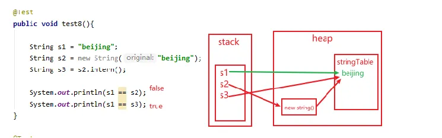


## 面试题

> new String(“ab”)会创建几个对象

```java
/**
 * new String("ab") 会创建几个对象？ 
 * 看字节码就知道是2个对象
 */
public class StringNewTest {
    public static void main(String[] args) {
        String str = new String("ab");
    }
}
```

转换成字节码来查看

```python
 0 new #2 <java/lang/String>
 3 dup
 4 ldc #3 <ab>
 6 invokespecial #4 <java/lang/String.<init> : (Ljava/lang/String;)V>
 9 astore_1
10 return
```

这里面就是两个对象   

- 一个对象是：new 关键字在堆空间中创建 （new #2 `<java/lang/String>`）
- 另一个对象：字符串常量池中的对象*“ab”* （ldc #3 `<ab>`）


> new String(“a”) + new String(“b”) 会创建几个对象

```java
/**
 * new String("a") + new String("b") 会创建几个对象? 
 */
public class StringNewTest {
    public static void main(String[] args) {
        String str = new String("a") + new String("b");
    }
}
```

转换成字节码来查看

```python
 0 new #2 <java/lang/StringBuilder>
 3 dup
 4 invokespecial #3 <java/lang/StringBuilder.<init> : ()V>
 7 new #4 <java/lang/String>
10 dup
11 ldc #5 <a>
13 invokespecial #6 <java/lang/String.<init> : (Ljava/lang/String;)V>
16 invokevirtual #7 <java/lang/StringBuilder.append : (Ljava/lang/String;)Ljava/lang/StringBuilder;>
19 new #4 <java/lang/String>
22 dup
23 ldc #8 <b>
25 invokespecial #6 <java/lang/String.<init> : (Ljava/lang/String;)V>
28 invokevirtual #7 <java/lang/StringBuilder.append : (Ljava/lang/String;)Ljava/lang/StringBuilder;>
31 invokevirtual #9 <java/lang/StringBuilder.toString : ()Ljava/lang/String;>
34 astore_1
35 return
```

我们创建了 6 个对象   

- 对象1：`new StringBuilder()`  （ 0 new #2 `<java/lang/StringBuilder>`）
- 对象2：`new String("a")`  （7 new #4 `<java/lang/String>`）
- 对象3：常量池中的 “a”  （11 ldc #5 `<a>`）
- 对象4：`new String("b")`  （19 new #4 `<java/lang/String>`）
- 对象5：常量池中的 “b”  （23 ldc #8 `<b>`）
- 对象6：toString 中会创建一个 `new String("ab")` （31 invokevirtual #9 `<java/lang/StringBuilder.toString : ()Ljava/lang/String;>`）
  - toString( )的调用，在字符串常量池中，没有生成"ab"


StringBuilder中toString( )源码

```java
@Override
public String toString() {
    // Create a copy, don't share the array
    return new String(value, 0, count);
}
```

我们转换成字节码来查看


可以看到toString( )里面只是new了一个String对象，并没有存放到字符串常量池中


## intern的使用：JDK6 vs JDK7/8

注意观看注释：

```java
public class StringIntern {

    public static void main(String[] args) {
        /**
         * ① String s = new String("1")
         * 创建了两个对象
         * 		堆空间中一个new对象
         * 		字符串常量池中一个字符串常量"1"（注意：此时字符串常量池中已有"1"）
         * ② s.intern()由于字符串常量池中已存在"1"
         *
         * s  指向的是堆空间中的对象地址
         * s2 指向的是堆空间中常量池中"1"的地址
         * 所以不相等
         */
        String s = new String("1");
        s.intern();//调用此方法之前，字符串常量池中已经存在了"1"
        String s2 = "1";
        System.out.println(s == s2);//jdk6：false   jdk7/8：false

        /**
         * ① String s3 = new String("1") + new String("1")
         * 等价于new String（"11"），但是，常量池中并不生成字符串"11"；
         *
         * ② s3.intern()
         * 由于此时常量池中并无"11"，所以把s3中记录的对象的地址存入常量池
         * 所以s3 和 s4 指向的都是一个地址
         */
        String s3 = new String("1") + new String("1"); // s3变量记录的地址为：new String("11")
        // 执行完上一行代码以后，字符串常量池中，是否存在"11"呢？答案：不存在！！
        s3.intern(); // 在字符串常量池中生成"11"。
        // 如何理解：jdk6:在常量池中真正创建了一个新的对象"11",也就有新的地址。
        //         jdk7:此时常量池中并没有真正创建"11",而是创建一个指向堆空间中new String("11")的地址
        String s4 = "11";// s4变量记录的地址：使用的是上一行代码代码执行时，在常量池中生成的"11"的地址
        System.out.println(s3 == s4); // jdk6：false  jdk7/8：true
    }
}
```

详细解释第二段代码：

```java
String s3 = new String("1") + new String("1"); 
s3.intern();
String s4 = "11";的"11"的地址
System.out.println(s3 == s4); // jdk6：false  jdk7/8：true
```

这段代码中在jdk6的时候intern会在堆中创建一个字符串对象，而s4使用的是常量池的对象，所以两者对象不同；而JDK7的时候，因为s3已经在堆里创建了一个11的对象了，所以intern--字符串常量池就可以引用这个对象，此时在再创建s4的时候是从字符串常量池中取出的，所以两者相等。


> JDK6


> JDK7

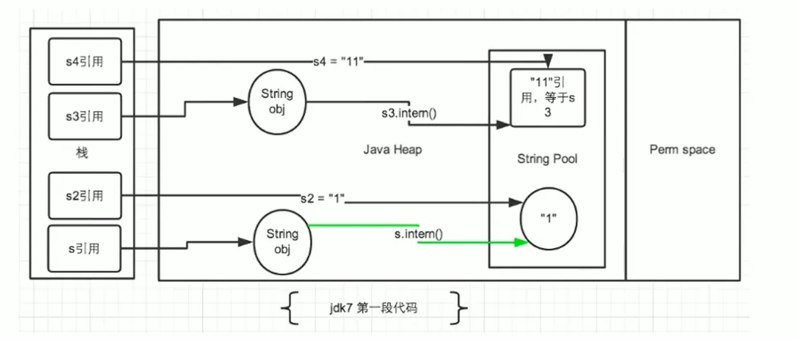


> 拓展

调换了上一份代码的两个位置后结果发生了变化

```java
public class StringIntern1 {

    public static void main(String[] args) {
        //StringIntern.java中练习的拓展：
        String s3 = new String("1") + new String("1");//new String("11")
        //执行完上一行代码以后，字符串常量池中，是否存在"11"呢？答案：不存在！！
        String s4 = "11";//在字符串常量池中生成对象"11"
        String s5 = s3.intern();
        System.out.println(s3 == s4);//false
        System.out.println(s5 == s4);//true
    }
}
```


> 总结

- JDK1.6中，将这个字符串对象尝试放入字符串常量池中。   
  - 如果字符串常量池中有，则并不会放入。返回已有的字符串常量池中的对象的地址
  - 如果没有，会把<u>此对象复制一份</u>，放入字符串常量池，并返回字符串常量池中的对象地址
- JDK1.7起，将这个字符串对象尝试放入字符串常量池中。   
  - 如果字符串常量池中有，则并不会放入。返回已有的字符串常量池中的对象的地址
  - 如果没有，则会把<u>对象的引用地址复制一份</u>，放入字符串常量池，并返回字符串常量池中的引用地址


## 练习

> 练习1

```java
public class StringExer1 {
    
    public static void main(String[] args) {
        String s = new String("a") + new String("b");//new String("ab")
        //在上一行代码执行完以后，字符串常量池中并没有"ab"

        String s2 = s.intern();//jdk6中：在字符串常量池中创建一个字符串"ab",并把字符串常量池中的"ab"地址返回给s2
                               //jdk8中：字符串常量池中没有创建字符串"ab",而是创建一个引用，指向new String("ab")，将此引用返回给s2

        System.out.println(s2 == "ab");//jdk6:true  jdk8:true
        System.out.println(s == "ab");//jdk6:false  jdk8:true
    }
    
}
```


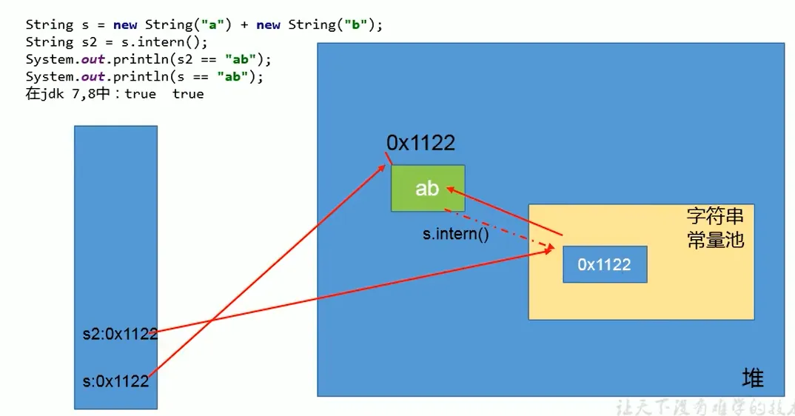


> 练习2

总结： String s1 = new String("a") + new String("b"); 类似这样的代码是不会在字符串常量池中生成的

```java
public class StringExer2 {

    public static void main(String[] args) {
//        String s1 = new String("ab"); // 执行完以后，会在字符串常量池中生成“ab”
        String s1 = new String("a") + new String("b"); // 执行完以后，不会在字符串常量池中生成“ab”
        s1.intern();
        String s2 = "ab";
        System.out.println(s1 == s2);
    }

}
```


## intern的效率测试：空间角度

```java
/**
 * 使用intern()测试执行效率：空间使用上
 */
public class StringIntern2 {
    static final int MAX_COUNT = 1000 * 10000;
    static final String[] arr = new String[MAX_COUNT];

    public static void main(String[] args) {
        Integer[] data = new Integer[]{1, 2, 3, 4, 5, 6, 7, 8, 9, 10};

        long start = System.currentTimeMillis();
        for (int i = 0; i < MAX_COUNT; i++) {
            arr[i] = new String(String.valueOf(data[i % data.length]));
//            arr[i] = new String(String.valueOf(data[i % data.length])).intern();

        }
        long end = System.currentTimeMillis();
        System.out.println("花费的时间为：" + (end - start));

        try {
            Thread.sleep(1000000);
        } catch (InterruptedException e) {
            e.printStackTrace();
        }
        System.gc();
    }
}
```

- 运行结果

```java
不使用intern：4385ms
使用intern：901ms
```

不使用intern的情况下，产生了1千多万个String的实例对象

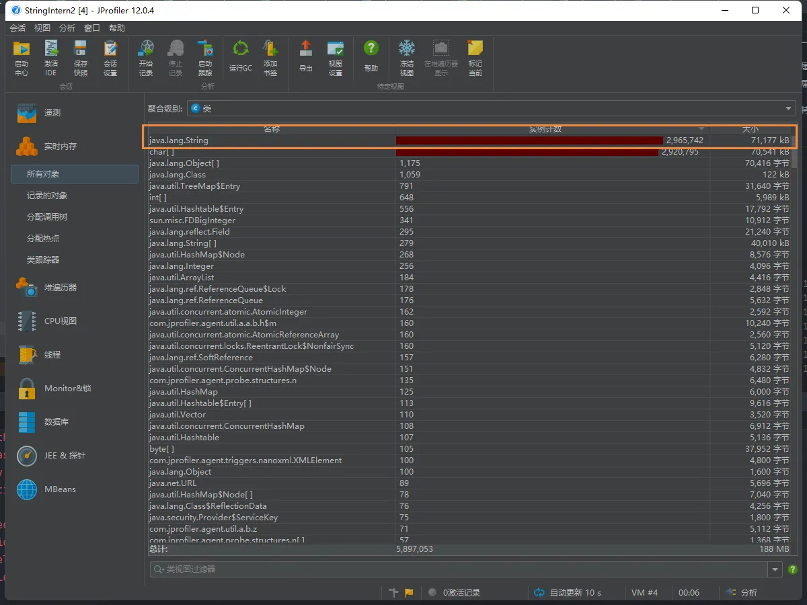

使用intern的情况下，只产生了2百多万个String的实例对象

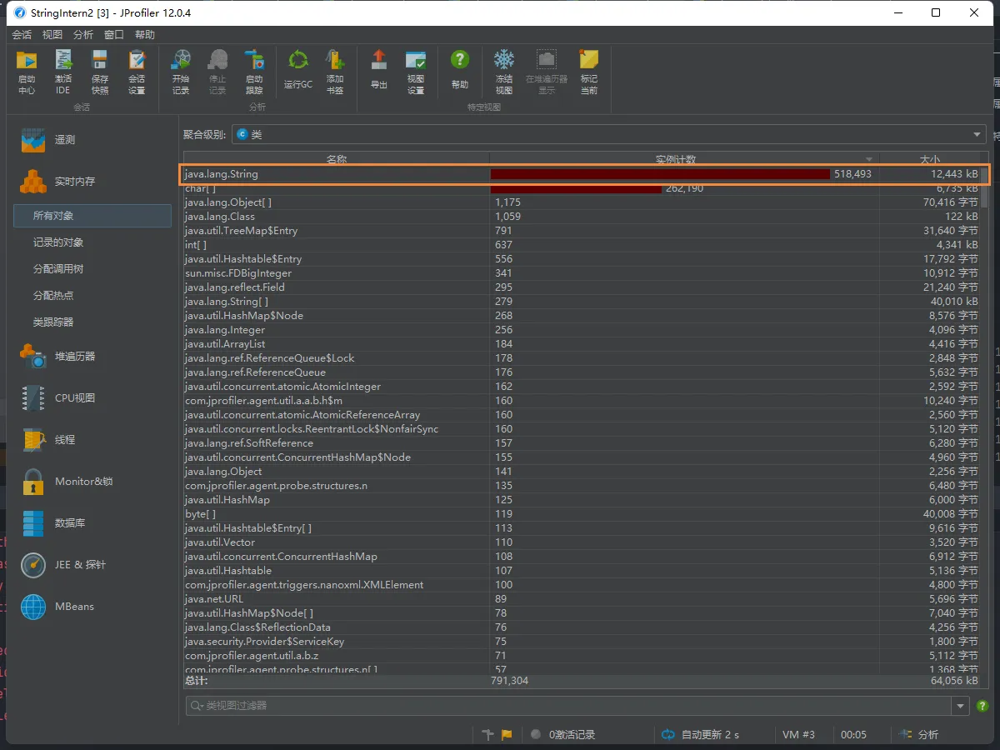

> 结论

- 对于程序中大量使用存在的字符串时，尤其存在很多已经重复的字符串时，使用intern( )方法能够节省内存空间。
- 大的网站平台，需要内存中存储大量的字符串。比如社交网站，很多人都存储：北京市、海淀区等信息。这时候如果字符串都调用intern( )方法，就会很明显降低内存的大小。


# StringTable垃圾回收

```java
/**
 * String的垃圾回收:
 * -Xms15m -Xmx15m -XX:+PrintStringTableStatistics -XX:+PrintGCDetails
 */
public class StringGCTest {

    public static void main(String[] args) {
        for (int j = 0; j < 100000; j++) {
            String.valueOf(j).intern();
        }
    }

}
```

当循环次数为00时，没有发生GC


当循环次数达到，发生了GC


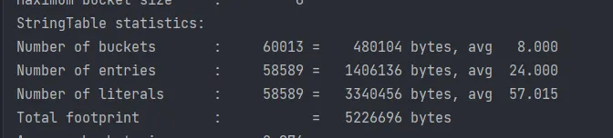


# G1中的String去重操作

官网地址：[JEP 192: String Deduplication in G1 (java.net)](http://openjdk.java.net/jeps/192)

> Motivation
>
> Many large-scale Java applications are currently bottlenecked on  memory. Measurements have shown that roughly 25% of the Java heap live  data set in these types of applications is consumed by `String` objects. Further, roughly half of those `String` objects are duplicates, where duplicates means `string1.equals(string2)` is true. Having duplicate `String` objects on the heap is, essentially, just a waste of memory. This project will implement automatic and continuous `String` deduplication in the G1 garbage collector to avoid wasting memory and reduce the memory footprint.

> 目前，许多大规模的Java应用程序在内存上遇到了瓶颈。测量表明，在这些类型的应用程序中，大约25%的Java堆实时数据集被`String'对象所消耗。此外，这些 "String "对象中大约有一半是重复的，其中重复意味着 "string1.equals(string2) "是真的。在堆上有重复的`String’对象，从本质上讲，只是一种内存的浪费。这个项目将在G1垃圾收集器中实现自动和持续的`String’重复数据删除，以避免浪费内存，减少内存占用。

> 注意这里说的重复，指的是在堆中的数据，而不是常量池中的，因为常量池中的本身就不会重复

> 背景：对许多Java应用（有大的也有小的）做的测试得出以下结果：

- 堆存活数据集合里面string对象占了25%
- 堆存活数据集合里面重复的string对象有13.5%
- string对象的平均长度是45

> 许多大规模的Java应用的瓶颈在于内存，测试表明，在这些类型的应用里面，Java堆中存活的数据集合差不多25%是String对象。更进一步，这里面差不多一半string对象是重复的，重复的意思是说： `string1.equals(string2) == true`。堆上存在重复的String对象必然是一种内存的浪费。这个项目将在G1垃圾收集器中实现自动持续对重复的string对象进行去重，这样就能避免浪费内存。

> **实现**

- 当垃圾收集器工作的时候，会访问堆上存活的对象。对每一个访问的对象都会检查是否是候选的要去重的String对象
- 如果是，把这个对象的一个引用插入到队列中等待后续的处理。一个去重的线程在后台运行，处理这个队列。处理队列的一个元素意味着从队列删除这个元素，然后尝试去重它引用的string对象。
- 使用一个hashtable来记录所有的被String对象使用的不重复的char数组。当去重的时候，会查这个hashtable，来看堆上是否已经存在一个一模一样的char数组。
- 如果存在，String对象会被调整引用那个数组，释放对原来的数组的引用，最终会被垃圾收集器回收掉。
- 如果查找失败，char数组会被插入到hashtable，这样以后的时候就可以共享这个数组了。

> **命令行选项**

```java
# 开启String去重，默认是不开启的，需要手动开启。 
UseStringDeduplication(bool)  
# 打印详细的去重统计信息 
PrintStringDeduplicationStatistics(bool)  
# 达到这个年龄的String对象被认为是去重的候选对象
StringpeDuplicationAgeThreshold(uintx)
```
