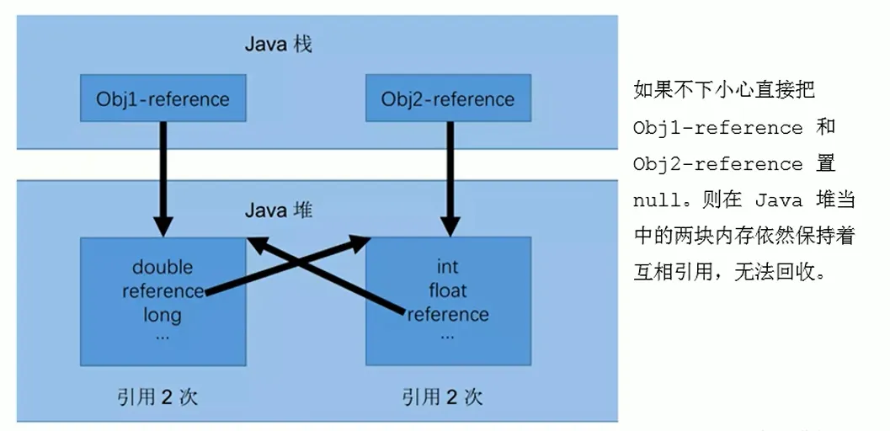
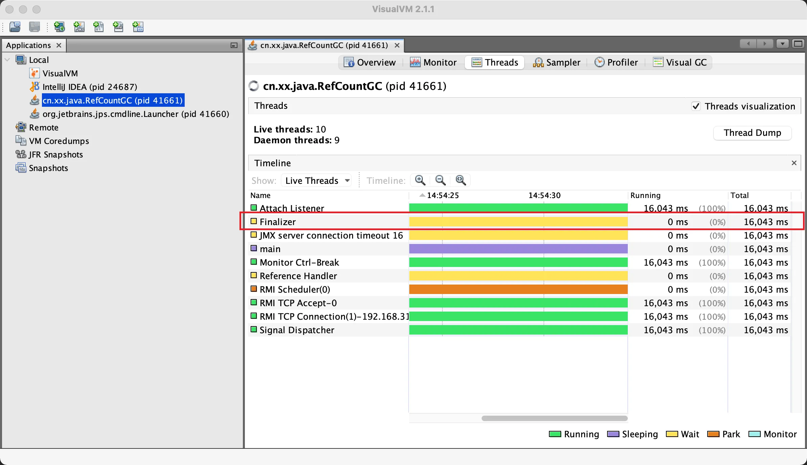
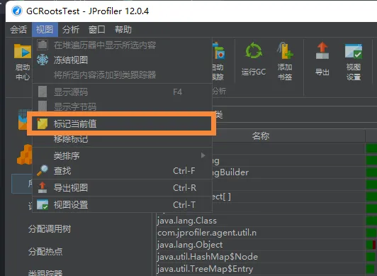
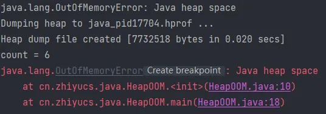
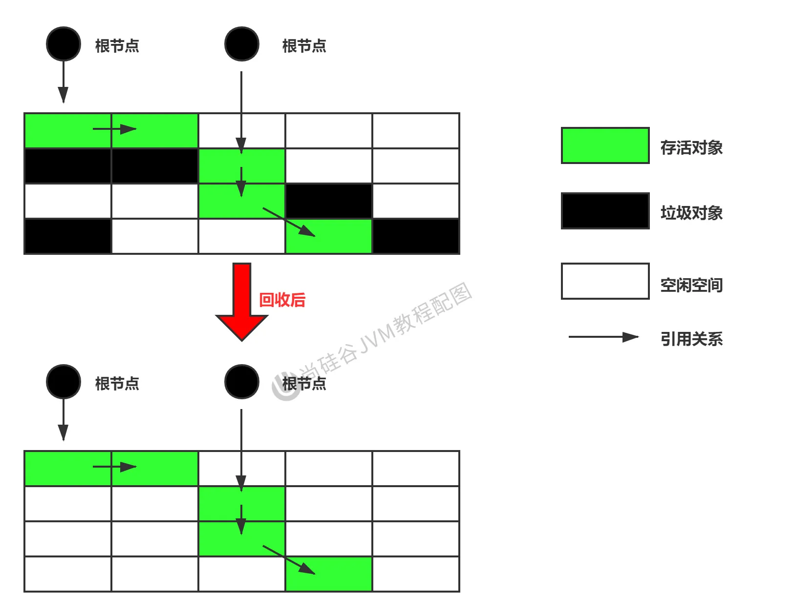
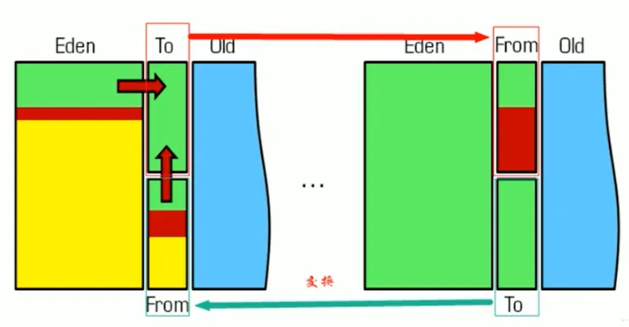

[TOC]

# 标记阶段：引用计数算法

## 垃圾标记阶段：对象存活判断

- 在堆里存放着几乎所有的 Java 对象实例，在 GC 执行垃圾回收之前，首先需要区分出内存中哪些是存活对象，哪些是已经死亡的对象。只有被标记为己经死亡的对象，GC 才会在执行垃圾回收时，释放掉其所占用的内存空间，因此这个过程我们可以称为垃圾标记阶段。
- 那么在 JVM 中究竟是如何标记一个死亡对象呢？简单来说，当一个对象已经不再被任何的存活对象继续引用时，就可以宣判为已经死亡。
- 判断对象存活一般有两种方式：引用计数算法和可达性分析算法。


## 引用计数算法

- 引用计数算法（Reference Counting）比较简单，对每个对象保存一个整型的引用计数器属性。用于记录对象被引用的情况。
- 对于一个对象 A，只要有任何一个对象引用了 A，则 A 的引用计数器就加 1；当引用失效时，引用计数器就减 1。只要对象 A 的引用计数器的值为 0，即表示对象 A 不可能再被使用，可进行回收。
- 优点：实现简单，垃圾对象便于辨识；判定效率高，回收没有延迟性。
- 缺点：   
  - 它需要单独的字段存储计数器，这样的做法增加了存储空间的开销
  - 每次赋值都需要更新计数器，伴随着加法和减法操作，这增加了时间开销
  - 引用计数器有一个严重的问题，即无法处理循环引用的情况。这是一条致命缺陷，导致在 Java 的垃圾回收器中没有使用这类算法。

> 何为**循环引用**？

当 p 的指针断开的时候，内部的引用形成一个循环，这就是循环引用


> 代码实例：测试 Java 中是否采用的是引用计数算法

```java
/**
 * -XX:+PrintGCDetails
 * 证明：java使用的不是引用计数算法
 */
public class RefCountGC {

    //这个成员属性唯一的作用就是占用一点内存
    private byte[] bigSize = new byte[5 * 1024 * 1024]; //5MB

    Object reference = null;

    public static void main(String[] args) {
        RefCountGC obj1 = new RefCountGC();
        RefCountGC obj2 = new RefCountGC();

        obj1.reference = obj2;
        obj2.reference = obj1;

        obj1 = null;
        obj2 = null;
        //显式的执行垃圾回收行为
        //这里发生GC，obj1和obj2能否被回收？
        System.gc();
    }

}
```

如果不使用最后一行的gc()

```java
Heap
 PSYoungGen      total 75776K, used 15459K [0x000000076bd00000, 0x0000000771180000, 0x00000007c0000000)
  eden space 65024K, 23% used [0x000000076bd00000,0x000000076cc18ee8,0x000000076fc80000)
  from space 10752K, 0% used [0x0000000770700000,0x0000000770700000,0x0000000771180000)
  to   space 10752K, 0% used [0x000000076fc80000,0x000000076fc80000,0x0000000770700000)
 ParOldGen       total 173568K, used 0K [0x00000006c3600000, 0x00000006cdf80000, 0x000000076bd00000)
  object space 173568K, 0% used [0x00000006c3600000,0x00000006c3600000,0x00000006cdf80000)
 Metaspace       used 3294K, capacity 4496K, committed 4864K, reserved 1056768K
  class space    used 358K, capacity 388K, committed 512K, reserved 1048576K
```

此时把GC开起来

```java
[GC (System.gc()) [PSYoungGen: 14158K->744K(75776K)] 14158K->752K(249344K), 0.0015050 secs] [Times: user=0.00 sys=0.00, real=0.00 secs] 
[Full GC (System.gc()) [PSYoungGen: 744K->0K(75776K)] [ParOldGen: 8K->601K(173568K)] 752K->601K(249344K), [Metaspace: 3287K->3287K(1056768K)], 0.0040297 secs] [Times: user=0.00 sys=0.00, real=0.00 secs] 
Heap
 PSYoungGen      total 75776K, used 3251K [0x000000076bd00000, 0x0000000771180000, 0x00000007c0000000)
  eden space 65024K, 5% used [0x000000076bd00000,0x000000076c02ce68,0x000000076fc80000)
  from space 10752K, 0% used [0x000000076fc80000,0x000000076fc80000,0x0000000770700000)
  to   space 10752K, 0% used [0x0000000770700000,0x0000000770700000,0x0000000771180000)
 ParOldGen       total 173568K, used 601K [0x00000006c3600000, 0x00000006cdf80000, 0x000000076bd00000)
  object space 173568K, 0% used [0x00000006c3600000,0x00000006c36964f0,0x00000006cdf80000)
 Metaspace       used 3307K, capacity 4496K, committed 4864K, reserved 1056768K
  class space    used 360K, capacity 388K, committed 512K, reserved 1048576K
```

逻辑整理：

1. 因为引用计数算法如果遇到这种类型（两个相互指向循环）就不会发生回收的状态
2. 而上述没有使用GC的状态为：15459K， 使用了GC的状态为744K，说明这种循环状态被回收了
3. 由此可以判断Java没有使用引用计数算法




## 小结

引用计数算法，是很多语言的资源回收选择，例如因人工智能而更加火热的 Python，它更是同时支持引用计数和垃圾收集机制。

具体哪种最优是要看场景的，业界有大规模实践中仅保留引用计数机制，以提高吞吐量的尝试。

Java 并没有选择引用计数，是因为其存在一个基本的难题，也就是很难处理循环引用关系。

Python 如何解决循环引用？   

- 手动解除：很好理解，就是在合适的时机，解除引用关系。
- 使用弱引用 weakref，weakref 是 Python 提供的标准库，旨在解决循环引用


# 标记阶段：可达性分析算法

## 可达性分析算法（根搜索算法、追踪性垃圾收集）

- 相对于引用计数算法而言，可达性分析算法不仅同样具备实现简单和执行高效等特点，更重要的是该算法可以有效地解决在引用计数算法中循环引用的问题，防止内存泄漏的发生。
- 相较于引用计数算法，这里的可达性分析就是 Java、C# 选择的。这种类型的垃圾收集通常也叫作追踪性垃圾收集（Tracing Garbage Collection）
- 所谓 "GCRoots” 根集合就是一组必须活跃的引用。


> 基本思路

- 可达性分析算法是以根对象集合（GCRoots）为起始点，按照从上至下的方式搜索被根对象集合所连接的目标对象是否可达。
- 使用可达性分析算法后，内存中的存活对象都会被根对象集合直接或间接连接着，搜索所走过的路径称为引用链（Reference Chain）。
- 如果目标对象没有任何引用链相连，则是不可达的，就意味着该对象己经死亡，可以标记为垃圾对象。
- 在可达性分析算法中，只有能够被根对象集合直接或者间接连接的对象才是存活对象。


## GC Roots【面试高频】

> **在 Java 语言中，GC Roots 包括以下几类元素：**

- 虚拟机栈中引用的对象   
  - 比如：各个线程被调用的方法中使用到的参数、局部变量等。
- 本地方法栈内 JNI（通常说的本地方法）引用的对象
- 方法区中类静态属性引用的对象   
  - 比如：Java 类的引用类型静态变量
- 方法区中常量引用的对象   
  - 比如：字符串常量池（String Table）里的引用
- 所有被同步锁 synchronized 持有的对象
-  Java 虚拟机内部的引用。   
  - 基本数据类型对应的 Class 对象，一些常驻的异常对象（如：`NullPointerException`、`OutOfMemoryError`），系统类加载器。
- 反映 java 虚拟机内部情况的 JMXBean、JVMTI 中注册的回调、本地代码缓存等。
- 除了这些固定的 GC Roots 集合以外，根据用户所选用的垃圾收集器以及当前回收的内存区域不同，<u>还可以有其他对象 “临时性” 地加入，共同构成完整 GC Roots 集合。比如：分代收集和局部回收</u>（PartialGC）。   
  - 如果只针对 Java  堆中的某一块区域进行垃圾回收（比如：典型的只针对新生代），必须考虑到内存区域是虚拟机自己的实现细节，更不是孤立封闭的，这个区域的对象完全有可能被其他区域的对象所引用，这时候就需要一并将关联的区域对象也加入 GCRoots 集合中去考虑，才能保证可达性分析的准确性。
  - 典型的只针对新生代：因为新生代除外，还有关联的老年代，所以需要将老年代也一并加入 GC Roots 集合中
- 小技巧
  - 由于 Root 采用栈方式存放变量和指针，所以如果一个指针，它保存了堆内存里面的对象，但是自己又不存放在堆内存里面，那它就是一个 Root。

 

红色的都没有被 GC Roots 所引用，所以都是垃圾


> **注意**

- 如果要使用可达性分析算法来判断内存是否可回收，那么分析工作必须在一个能保障**一致性** (某一刻的静止状态) 的快照中进行。这点不满足的话分析结果的准确性就无法保证。
- 这点也是导致 GC 进行时必须 “stop The World” 的一个重要原因。   
  - 即使是号称（几乎）不会发生停顿的 CMS 收集器中，枚举根节点时也是必须要停顿的。


# 对象的 finalization 机制

>```
>protected void finalize()
>                 throws Throwable
>```
>
>当垃圾收集确定不再有对该对象的引用时，垃圾收集器在对象上调用该对象。一个子类覆盖了处理系统资源或执行其他清理的`finalize`方法。
>
>`finalize`的一般合同是，如果Java¢虚拟机已经确定不再有任何方法可以被任何尚未死亡的线程访问的方法被调用，除非是由于最后确定的其他对象或类的准备工作所采取的行动。 `finalize`方法可以采取任何行动，包括使此对象再次可用于其他线程; 然而， `finalize`的通常目的是在对象不可撤销地丢弃之前执行清除动作。 例如，表示输入/输出连接的对象的finalize方法可能会在对象被永久丢弃之前执行显式I / O事务来中断连接。
>
>所述`finalize`类的方法`Object`执行任何特殊操作; 它只是返回正常。 Object的`Object`可以覆盖此定义。
>
>Java编程语言不能保证哪个线程将为任何给定的对象调用`finalize`方法。 但是，确保调用finalize的线程在调用finalize时不会持有任何用户可见的同步锁。 如果finalize方法抛出未捕获的异常，则会忽略该异常，并终止该对象的定类。
>
>在为对象调用`finalize`方法之后，在Java虚拟机再次确定不再有任何方式可以通过任何尚未被死亡的线程访问此对象的任何方法的情况下，将采取进一步的操作，包括可能的操作由准备完成的其他对象或类别，此时可以丢弃对象。
>
>`finalize`方法从不被任何给定对象的Java虚拟机调用多次。
>
>`finalize`方法抛出的任何异常都会导致该对象的终止被停止，否则被忽略。
>
>- **异常**
>
>  `Throwable` - 这个方法提出的 `异常`
>
>- **另请参见：**
>
>  `WeakReference` ， `PhantomReference`
>
>- **See The Java™ Language Specification:**
>
>  12.6类实例的定稿

- Java 语言提供了对象终止（finalization）机制来允许开发人员提供对象被销毁之前的自定义处理逻辑。
- 当垃圾回收器发现没有引用指向一个对象，即：垃圾回收此对象之前，总会先调用这个对象的 `finalize( )` 方法。
- `finalize( )` 方法允许在子类中被重写，用于在对象被回收时进行资源释放。通常在这个方法中进行一些资源释放和清理的工作，比如关闭文件、套接字和数据库连接等。
- 永远不要主动调用某个对象的 finalize ( ) 方法，应该交给垃圾回收机制调用。理由包括下面三点：   
  - 在 `finalize( )` 执行时可能会导致对象复活。
  - `finalize( )` 方法的执行时间是没有保障的，它完全由 GC 线程决定，极端情况下，若不发生 GC，则 `finalize( )` 方法将没有执行机会。
  - 一个糟糕的 `finalize( )` 会严重影响 GC 的性能。
- 从功能上来说，`finalize( )` 方法与 C++ 中的析构函数比较相似，但是 Java 采用的是基于垃圾回收器的自动内存管理机制，所以 `finalize( )` 方法在本质上不同于 C++ 中的析构函数。
- 由于 `finalize( )` 方法的存在，虚拟机中的对象一般处于三种可能的状态。


## 三种可能的状态

- 如果从所有的根节点都无法访问到某个对象，说明对象己经不再使用了。一般来说，此对象需要被回收。但事实上，也并非是 “非死不可” 的，这时候它们暂时处于 “缓刑” 阶段。一个无法触及的对象有可能在某一个条件下 “复活” 自己，如果这样，那么对它的回收就是不合理的，为此，定义虚拟机中的对象可能的三种状态。如下：   
  - **可触及的**：从根节点开始，可以到达这个对象。（===> 不是垃圾）
  - **可复活的**：对象的所有引用都被释放，但是对象有<u>可能</u>在 `finalize()` 中<u>复活</u>。
  - **不可触及的**：对象的 `finalize()` 被调用，并且<u>没有复活</u>，那么就会进入不可触及状态。不可触及的对象不可能被复活，因为 `finalize()` 只会被调用一次。
- 以上 3 种状态中，是由于 `finalize()` 方法的存在，进行的区分。只有在对象不可触及时才可以被回收。


## 具体过程

判定一个对象 objA 是否可回收，至少要经历两次标记过程：   

1. 如果对象 objA 到 GC Roots 没有引用链，则进行第一次标记。

2. 进行筛选，判断此对象是否有必要执行 

```
finalize()
```

 方法     

1. 如果对象 objA 没有重写 `finalize()` 方法，或者 `finalize()` 方法已经被虚拟机调用过，则虚拟机视为 “没有必要执行”，objA 被判定为不可触及的。

2. 如果对象 objA 重写了 `finalize()` 方法，且还未执行过，那么 objA 会被插入到 `F-Queue` 队列中，由一个虚拟机自动创建的、低优先级的 `Finalizer` 线程触发其 `finalize()` 方法执行。

3. `finalize()` 方法是对象逃脱死亡的最后机会，稍后 GC 会对 F-Queue 队列中的对象进行第二次标记。如果 objA 在 `finalize()` 方法中与引用链上的任何一个对象建立了联系，那么在第二次标记时，objA 会被移出 “即将回收” 集合。之后，对象如果再次出现没有引用存在的情况。在这个情况下， `finalize()` 方法不会被再次调用，对象会直接变成不可触及的状态，也就是说，**一个对象的 `finalize()` 方法只会被调用一次。**


```java
public class RefCountGC {

    //这个成员属性唯一的作用就是占用一点内存
    private byte[] bigSize = new byte[5 * 1024 * 1024]; //5MB

    Object reference = null;

    public static void main(String[] args) {
        RefCountGC obj1 = new RefCountGC();
        RefCountGC obj2 = new RefCountGC();

        obj1.reference = obj2;
        obj2.reference = obj1;

        obj1 = null;
        obj2 = null;
        //显式的执行垃圾回收行为
        //这里发生GC，obj1和obj2能否被回收？
         System.gc();

        try {
            Thread.sleep(1000000);
        } catch (InterruptedException e) {
            e.printStackTrace();
        }
    }
}
```




> 代码示例

重写 `finalize()` 方法，然后在方法的内部，重写将其存放到 GC Roots 中

```java
/**
 * 测试Object类中finalize()方法，即对象的finalization机制。
 */
public class CanReliveObj {

    public static CanReliveObj obj; //类变量，属于 GC Root

    //此方法只能被调用一次
    @Override
    protected void finalize() throws Throwable {
        super.finalize();
        System.out.println("调用当前类重写的finalize()方法");
        obj = this;//当前待回收的对象在finalize()方法中与引用链上的一个对象obj建立了联系
    }

    public static void main(String[] args) {
        try {
            obj = new CanReliveObj();
            // 对象第一次成功拯救自己
            obj = null;
            System.gc();//调用垃圾回收器
            System.out.println("-----------------第一次gc操作------------");
            // 因为Finalizer线程优先级很低，暂停2秒，以等待它
            Thread.sleep(2000);
            if (obj == null) {
                System.out.println("obj is dead");
            } else {
                System.out.println("obj is still alive");
            }
            System.out.println("-----------------第二次gc操作------------");
            // 下面这段代码与上面的完全相同，但是这次自救却失败了
            obj = null;
            System.gc();
            // 因为Finalizer线程优先级很低，暂停2秒，以等待它
            Thread.sleep(2000);
            if (obj == null) {
                System.out.println("obj is dead");
            } else {
                System.out.println("obj is still alive");
            }
        } catch (InterruptedException e) {
            e.printStackTrace();
        }
    }
}
```

程序运行结果 

```
-----------------第一次gc操作------------
调用当前类重写的finalize()方法
obj is still alive
-----------------第二次gc操作------------
obj is dead
```

在进行第一次清除的时候，我们会执行 `finalize()` 方法，然后对象进行了一次自救操作，但是因为 `finalize()` 方法只会被调用一次，因此第二次该对象将会被垃圾清除。


# MAT 与 JProfiler 的 GC Roots 溯源


## JProfiler 的 GC Roots 溯源

我们在实际的开发中，一般不会查找全部的 GC Roots，可能只是查找某个对象的整个链路，或者称为 GC Roots 溯源，这个时候，我们就可以使用 JProfiler。

> 代码示例

```java
public class GCRootsTest {

    public static void main(String[] args) {
        List<Object> numList = new ArrayList<>();
        Date birth = new Date();

        for (int i = 0; i < 100; i++) {
            numList.add(String.valueOf(i));
            try {
                Thread.sleep(10);
            } catch (InterruptedException e) {
                e.printStackTrace();
            }
        }

        System.out.println("数据添加完毕，请操作：");
        new Scanner(System.in).next();
        numList = null;
        birth = null;

        System.out.println("numList、birth已置空，请操作：");
        new Scanner(System.in).next();

        System.out.println("结束");
    }

}
```

可以查看当前值，然后条就会变成绿色




可以查看选中的的堆，在引用中可以查看来源引用、追溯


## JProfiler 查看OOM

> 代码示例

```java
/**
 * 内存溢出排查
 * -Xms8m -Xmx8m -XX:+HeapDumpOnOutOfMemoryError
 */
public class HeapOOM {
    byte[] buffer = new byte[1 * 1024 * 1024];//1MB

    public static void main(String[] args) {
        ArrayList<HeapOOM> list = new ArrayList<>();

        int count = 0;
        try {
            while (true) {
                list.add(new HeapOOM());
                count++;
            }
        } catch (Throwable e) {
            System.out.println("count = " + count);
            e.printStackTrace();
        }
    }
}
```

> 结果



可以看到已经保存了dump，使用jprofiler打开后可以看到，有一个大对象


然后我们通过线程，还能够定位到哪里出现 OOM


然后就可以定位到代码位置


# 清除阶段：标记 - 清除算法（Mark-Sweep）

当成功区分出内存中存活对象和死亡对象后，GC 接下来的任务就是执行垃圾回收，释放掉无用对象所占用的内存空间，以便有足够的可用内存空间为新对象分配内存。目前在 JVM 中比较常见的三种垃圾收集算法是：   

- 标记一清除算法（Mark-Sweep）
- 复制算法（Copying）
- 标记 - 压缩算法（Mark-Compact）

> 背景

标记 - 清除算法（Mark-Sweep）是一种非常基础和常见的垃圾收集算法，该算法被 J.McCarthy 等人在 1960 年提出并并应用于 Lisp 语言。


> 执行过程

当堆中的有效内存空间（Available Memory）被耗尽的时候，就会停止整个程序（也被称为 Stop The World），然后进行两项工作，第一项则是标记，第二项则是清除。

- 标记

  ：Collector 从引用根节点开始遍历，

  标记所有被引用的对象

  。一般是在对象的 Header 中记录为可达对象。   

  - **标记的是引用的对象，不是垃圾！！**

- **清除**：Collector 对堆内存从头到尾进行线性的遍历，如果发现某个对象在其 Header 中没有标记为可达对象，则将其回收。



> 缺点

- 效率不算高（相当于进行了两次的全遍历，O(n)级别）
- 在进行 GC 的时候，需要停止整个应用程序，导致用户体验较差
- 这种方式清理出来的空闲内存是不连续的，产生**内存碎片**，需要维护一个空闲列表（空闲列表在创建对象的那一章讲过）


> 注意：何为清除？

- 这里所谓的<u>清除并不是真的置空</u>，而是把<u>需要清除的对象地址保存在空闲的地址列表里</u>。下次有新对象需要加载时，判断垃圾的位置空间是否够，如果够，就存放覆盖原有的地址。
- 关于空闲列表是在为对象分配内存的时候：   
  - 如果内存规整     
    - 采用指针碰撞的方式进行内存分配
  - 如果内存不规整     
    - 虚拟机需要维护一个列表
    - 空闲列表分配


# 清除阶段：复制算法（Copying）

> 背景

为了解决标记 - 清除算法在垃圾收集效率方面的缺陷，M.L.Minsky 于 1963 年发表了著名的论文，“使用双存储区的 Lisp 语言垃圾收集器 CA LISP Garbage Collector Algorithm Using Serial Secondary Storage）”。M.L.Minsky 在该论文中描述的算法被人们称为复制（Copying）算法，它也被 M.L.Minsky 本人成功地引入到了 Lisp 语言的一个实现版本中。


> 核心思想

将活着的内存空间分为两块，每次只使用其中一块，在垃圾回收时将正在使用的内存中的存活对象复制到未被使用的内存块中，之后清除正在使用的内存块中的所有对象，交换两个内存的角色，最后完成垃圾回收


> 优点

- 没有标记和清除过程，实现简单，**运行高效**
- 复制过去以后保证空间的连续性，不会出现 “碎片” 问题


> 缺点

- 此算法的缺点也是很明显的，就是需要**两倍**的内存空间。
- 对于 G1 这种拆分成为大量 region 的 GC，复制而不是移动，意味着 GC 需要维护 region 之间对象的引用关系，不管是内存占用或者时间开销也不小


> 注意

- 如果系统中的垃圾对象非常多，复制算法可能不会很理想
- 复制算法需要复制的存活对象数量并不会太大，或者说非常低才行


> 应用场景

在**新生代**，对常规应用的垃圾回收，一次通常可以回收 70% - 99% 的内存空间。回收性价比很高。所以现在的商业虚拟机都是用这种收集算法回收新生代。




# 清除阶段：标记 - 压缩（整理）算法（Mark - Compact）

> 背景

- 复制算法的高效性是建立在存活对象少、垃圾对象多的前提下的。这种情况在新生代经常发生，但是在老年代，更常见的情况是大部分对象都是存活对象。如果依然使用复制算法，由于存活对象较多，复制的成本也将很高。因此，**基于老年代垃圾回收的特性，需要使用其他的算法。**
- 标记 - 清除算法的确可以应用在老年代中，但是该算法不仅执行效率低下，而且在执行完内存回收后还会产生内存碎片，所以 JVM 的设计者需要在此基础之上进行改进。标记 - 压缩（Mark-Compact）算法由此诞生。
- 1970 年前后，G.L.Steele、C.J.Chene 和 D.s.Wise 等研究者发布标记 - 压缩算法。在许多现代的垃圾收集器中，人们都使用了标记 - 压缩算法或其改进版本。


> 执行过程

- 第一阶段和标记清除算法一样，从根节点开始标记所有被引用对象
- 第二阶段将所有的存活对象压缩到内存的一端，按顺序排放。
- 之后，清理边界外所有的空间。


>  标记清除和标记压缩的区别

* 标记 - 压缩算法的最终效果等同于标记 - 清除算法执行完成后，再进行一次内存碎片整理，因此，也可以把它称为**标记 - 清除 - 压缩（Mark-Sweep-Compact）算法。**
* 二者的本质差异在于标记 - 清除算法是一种**非移动式的回收算法**，标记 - 压缩是**移动式的**。是否移动回收后的存活对象是一项优缺点并存的风险决策。
* 可以看到，标记的存活对象将会被整理，按照内存地址依次排列，而未被标记的内存会被清理掉。如此一来，当我们需要给新对象分配内存时，JVM 只需要持有一个内存的起始地址即可，这比维护一个空闲列表显然少了许多开销

> 标记压缩算法内部使用指针碰撞

如果内存空间以规整和有序的方式分布，即已用和未用的内存都各自一边，彼此之间维系着一个记录下一次分配起始点的标记指针，当为新对象分配内存时，只需要通过修改指针的偏移量将新对象分配在第一个空闲内存位置上，这种分配方式就叫做指针碰撞（Bump the Pointer）


> 优点

- 消除了标记 - 清除算法当中，内存区域分散的缺点，我们需要给新对象分配内存时，JVM 只需要持有一个内存的起始地址即可。
- 消除了复制算法当中，内存减半的高额代价。


> 缺点

- 从效率上来说，标记 - 整理算法要低于复制算法，甚至要低于标记 - 清除算法
- 移动对象的同时，如果对象被其他对象引用，则还需要调整引用的地址
- 移动过程中，需要全程暂停用户应用程序。即：STW


# 小结

|          | 标记清除（Mark-Sweep） | 标记整理（Mark-Compact） | 复制（Copying）                         |
| -------- | ---------------------- | ------------------------ | --------------------------------------- |
| 速率     | 中等                   | 最慢                     | 最快                                    |
| 空间开销 | 少（但会堆积碎片）     | 少（不堆积碎片）         | 通常需要活对象的 2 倍空间（不堆积碎片） |
| 移动对象 | 否                     | 是                       | 是                                      |

- 效率上来说，复制算法是当之无愧的老大，但是却浪费了太多内存。
- 而为了尽量兼顾上面提到的三个指标，标记 - 整理算法相对来说更平滑一些，但是效率上不尽如人意，它比复制算法多了一个标记的阶段，比标记 - 清除多了一个整理内存的阶段。
- 综合我们可以看到，没有最好的算法，只有最合适的算法


# 分代收集算法

- 前面所有这些算法中，并没有一种算法可以完全替代其他算法，它们都具有自己独特的优势和特点。分代收集算法应运而生。
- 分代收集算法，是基于这样一个事实：不同的对象的生命周期是不一样的。因此，不同生命周期的对象可以采取不同的收集方式，以便提高回收效率。一般是把 Java 堆分为新生代和老年代，这样就可以根据各个年代的特点使用不同的回收算法，以提高垃圾回收的效率。
- 在 Java 程序运行的过程中，会产生大量的对象，其中有些对象是与业务信息相关，比如 **Http 请求中的 Session 对象、线程、Socket 连接**，这类对象跟业务直接挂钩，因此生命周期比较长。但是还有一些对象，主要是程序运行过程中生成的临时变量，这些对象生命周期会比较短，比如：**String 对象**，由于其不变类的特性，系统会产生大量的这些对象，有些对象甚至只用一次即可回收。


> **目前几乎所有的 GC 都采用分代收集算法执行垃圾回收的。**

在 HotSpot 中，基于分代的概念，GC 所使用的内存回收算法必须结合年轻代和老年代各自的特点。

- **年轻代（Young Gen）**

年轻代特点：区域相对老年代较小，对象生命周期短、存活率低，回收频繁。

这种情况**复制算法**的回收整理，速度是最快的。复制算法的效率只和当前存活对象大小有关，因此很适用于年轻代的回收。而复制算法内存利用率不高的问题，通过 HotSpot 中的两个 Survivor 的设计得到缓解。

- **老年代（Tenured Gen）**

老年代特点：区域较大，对象生命周期长、存活率高，回收不及年轻代频繁。

这种情况存在大量存活率高的对象，复制算法明显变得不合适。**一般是由标记 - 清除或者是标记 - 清除与标记 - 整理的混合实现**。

- Mark 阶段的开销与存活对象的数量成正比。
- Sweep 阶段的开销与所管理区域的大小成正相关。
- Compact 阶段的开销与存活对象的数据成正比。

以 HotSpot 中的 CMS 回收器（老年代回收器）为例，CMS 是基于 Mark-Sweep 实现的，对于对象的回收效率很高。而对于碎片问题，CMS 采用基于 Mark-Compact 算法的 Serial Old 回收器作为补偿措施：当内存回收不佳（碎片导致的 Concurrent  Mode Failure 时），将采用 Serial Old 执行 Full GC 以达到对老年代内存的整理。

分代的思想被现有的虚拟机广泛使用，几乎所有的垃圾回收器都区分新生代和老年代。


# 增量收集算法

> 概述

上述现有的算法，在垃圾回收过程中，应用软件将处于一种 Stop the World 的状态。在 Stop the World 状态下，应用程序所有的线程都会挂起，暂停一切正常的工作，等待垃圾回收的完成。如果垃圾回收时间过长，应用程序会被挂起很久，将严重影响用户体验或者系统的稳定性。为了解决这个问题，即对实时垃圾收集算法的研究直接导致了增量收集（Incremental Collecting）算法的诞生。


> 基本思想

- 如果一次性将所有的垃圾进行处理，需要造成系统长时间的停顿，那么就可以让垃圾收集线程和应用程序线程**交替执行**。每次，**垃圾收集线程只收集一小片区域的内存空间，接着切换到应用程序线程。依次反复，直到垃圾收集完成。**
- 总的来说，增量收集算法的基础仍是传统的标记 - 清除和复制算法。**增量收集算法通过对线程间冲突的妥善处理允许垃圾收集线程以分阶段的方式完成标记、清理或复制工作。**


> 缺点

使用这种方式，由于在垃圾回收过程中，间断性地还执行了应用程序代码，所以能减少系统的停顿时间。但是，因为线程切换和上下文转换的消耗，会使得垃圾回收的总体成本上升，**造成系统吞吐量的下降**。


# 分区算法

- 一般来说，在相同条件下，堆空间越大，一次 GC 时所需要的时间就越长，有关 GC 产生的停顿也越长。为了更好地控制 GC  产生的停顿时间，将一块大的内存区域分割成多个小块，根据目标的停顿时间，每次合理地回收若干个小区间，而不是整个堆空间，从而减少一次 GC  所产生的停顿。
- 分代算法将按照对象的生命周期长短划分成两个部分，分区算法将整个堆空间划分成连续的不同小区间。
- 每一个小区间都独立使用，独立回收。这种算法的好处是可以控制一次回收多少个小区间。


