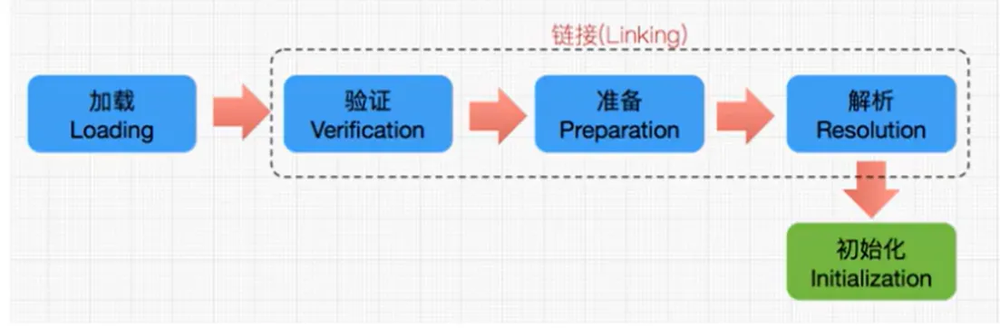
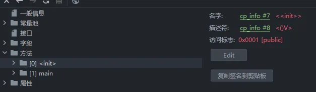
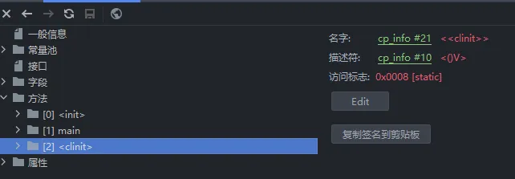
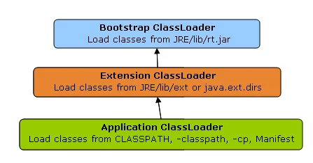
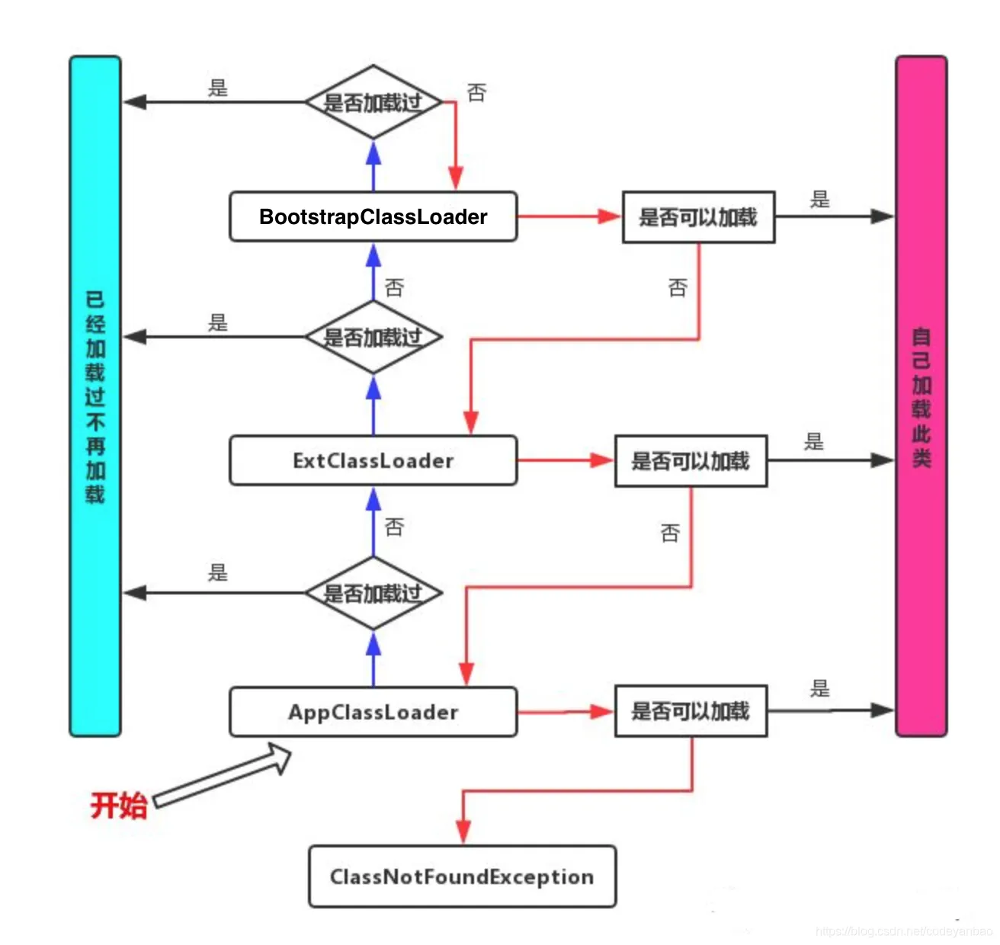

[toc]


## 内存结构概述


## 类加载器子系统的作用


* 类加载器子系统负责从文件系统或者网络中加载Class文件，class文件在文件开头有特定的文件标识。
* ClassLoader只负责class文件的加载，至于它是否可以运行，则由ExecutionEngine决定。
* 加载的类信息存放于一块称为方法区的内存空间。除了类的信息外，方法区中还会存放运行时常量池信息，可能还包括字符串字面量和数字常量(这部分常量信息是Class文件中常量池部分的内存映射)


## 类加载过程 -- 3个阶段



### 加载过程1：loading
1. 通过一个类的全限定名获取定义此类的二进制字节流
2. 将这个字节流所代表的静态存储结构转换为方法区的运行时数据结构
3. 在内存中生成一个代表这个类的Java.lang.Class对象，作为方法区这个类的各种数据的访问入口


### 加载过程2：Linking
#### 验证(Verify)

* 目的在于确保cClass文件的字节流中包含信息符合当前虚拟机要求，保证被加载类的正确性，不会危害虚拟机自身安全。
* 主要包括四种验证，文件格式验证，元数据验证，字节码验证，符号引用验证。


#### 准备(Prepare)

* 为类变量分配内存并且设置该类变量的默认初始值，即零值。
* 这里不包含用final修饰的static,因为final在编译的时候就会分配了，准备阶段会显式初始化;
* 这里不会为实例变量分配初始化，类变量会分配在方法区中，而实例变量是会随着对象一起分配到Java堆中


#### 解析(Resolve)

* 将常量池内的符号引用转换为直接引用的过程。
* 事实上，解析操作往往会伴随着JVM在执行完初始化之后再执行。
* 符号引用就是一组符号来描述所引用的目标。符号引用的字面量形式明确定义在《java虚拟机规范》的Class文件格式中。直接引用就是直接指向目标的指针、相对偏移量或一个间接定位到目标的句柄。
* 解析动作主要针对类或接口、字段、类方法、接口方法、方法类型等。对应常量池中的CONSTANT Class info、 CONSTANT Fieldref info、 CONSTANT Methodref info等 


### 类的加载过程：initialization
* 初始化阶段就是执行类构造器方法`<clinit>` ()的过程。
* 此方法不需定义，是javac编译器自动收集类中的所有类变量的赋值动作和静态代码块中的语句合并而来。
* 构造器方法中指令按语句在源文件中出现的顺序执行。
* `<clinit>`()不同于类的构造器。(关联: 构造器是虚拟机视角下的`<init>`())
* 若该类具有父类，JVM会 保证子类的`<clinit>`()执行前，父类的`<clinit>` ()已经执行完毕。
* 虚拟机必须保证一个类的`<clinit>`()方法在多线程下被同步加锁。


#### Clinit的使用
当Java代码为这样时

```java
public class ClassInitTest {
    public static int num = 1;

    public static void main(String[] args) {
        System.out.println(ClassInitTest.num);
    }
}
```
clinit会显示字节码为：

> 提示：当int取值**-1\~5**时，JVM采用**iconst**指令将常量压入栈中。

```Plain Text
0 iconst_1
1 putstatic #3 <chapter02/ClassInitTest.num : I>
4 return
```


当Java代码为这样时（加入static 并修改了原先的值）：

```java
public class ClassInitTest {
    public static int num = 1;

    static {
        num = 2;
    }

    public static void main(String[] args) {
        System.out.println(ClassInitTest.num);
    }
}
```
clinit显示字节码：

```Plain Text
0 iconst_1
1 putstatic #3 <chapter02/ClassInitTest.num : I>
4 iconst_2
5 putstatic #3 <chapter02/ClassInitTest.num : I>
8 return
```


当在原先代码中加入number（>5）之后：

```java
public class ClassInitTest {
    public static int num = 1;

    static {
        num = 2;
        number = 20;
    }

    public static int number = 10;

    public static void main(String[] args) {
        System.out.println(ClassInitTest.num);
    }
}
```
clinit显示字节码为：

> 提示：当int取值**-128\~127**时，JVM采用**bipush**指令将常量压入栈中。

```Plain Text
 0 iconst_1
 1 putstatic #3 <chapter02/ClassInitTest.num : I>
 4 iconst_2
 5 putstatic #3 <chapter02/ClassInitTest.num : I>
 8 bipush 20
10 putstatic #5 <chapter02/ClassInitTest.number : I>
13 bipush 10
15 putstatic #5 <chapter02/ClassInitTest.number : I>
18 return
```


#### 非法的前向引用
当调用num时能顺利看到结果，如果在static中再次调用print -- number的结果，则会报非法前向调用的错误

```java
public class ClassInitTest {
    public static int num = 1;

    static {
        num = 2;
        number = 20;
        System.out.println(num);
        System.out.println(number); // 报错：非法前向引用
    }

    public static int number = 10;

    public static void main(String[] args) {
        System.out.println(ClassInitTest.num);
    }
}
```


#### 理解`<clinit>`()不同于类的构造器
示例：当前代码没有静态变量和静态代码块

```java
public class ClinitTest {

    private int a = 1;

    public static void main(String[] args) {
        int b = 2;
    }
}
```
此时没有clinit（javac编译器自动收集类中的所有类变量的赋值动作和静态代码块中的语句合并而来）


加入static以后

```java
public class ClinitTest {

    private int a = 1;

    public static int c = 3;

    public static void main(String[] args) {
        int b = 2;
    }
}
```
此时就会生成一个clinit



#### 构造器在JVM的字节码
任何一个类声明以后，内部至少存在一个类的构造器：

```java
public class ClinitTest {

    // 任何一个类声明以后，内部至少存在一个类的构造器
    private int a = 1;

    public static int c = 3;

    public static void main(String[] args) {
        int b = 2;
    }
}
```
在  init  中的字节码显示为：

```Plain Text
0 aload_0
1 invokespecial #1 <java/lang/Object.<init> : ()V>
4 aload_0
5 iconst_1
6 putfield #2 <chapter02/ClinitTest.a : I>
9 return
```


#### 具有父类，JVM会 保证子类的`<clinit>`()执行前，父类的`<clinit> `()已经执行完毕
```java
public class ClinitTest1 {

    static class Father {
        public static int A = 1;
        static {
            A = 2;
        }
    }

    static class Son extends Father {
        public static int B = A;
    }

    public static void main(String[] args) {
        // 加载Father, 加载Son
        System.out.println(Son.B); // 2
    }
}
```
如上代码，加载流程如下：

* 首先，执行 main() 方法需要加载 ClinitTest1 类
* 获取 Son.B 静态变量，需要加载 Son 类
* Son 类的父类是 Father 类，所以需要先执行 Father 类的加载，再执行 Son 类的加载


#### 虚拟机必须保证一个类只会加载一次（同步加锁）
```java
public class DeadThreadTest {
    public static void main(String[] args) {
        Runnable r = () -> {
            System.out.println(Thread.currentThread().getName() + "开始");
            DeadTread dead = new DeadTread();
            System.out.println(Thread.currentThread().getName() + "结束");
        };

        Thread t1 = new Thread(r, "线程1");
        Thread t2 = new Thread(r, "线程2");

        t1.start();
        t2.start();
    }
}

class DeadTread {
    static {
        if (true) {
            System.out.println(Thread.currentThread().getName() + "初始化当前类");
            while (true) {

            }
        }
    }
}
```
执行结果：

```Plain Text
线程1开始
线程2开始
线程1初始化当前类
```
程序卡死，分析原因：

* 两个线程同时去加载 DeadThread 类，而 DeadThread 类中静态代码块中有一处死循环
* 先加载 DeadThread 类的线程抢到了同步锁，然后在类的静态代码块中执行死循环，而另一个线程在等待同步锁的释放
* 所以无论哪个线程先执行 DeadThread 类的加载，另外一个类也不会继续执行。（一个类只会被加载一次）


## 类加载器的分类



系统提供了 3 种类加载器：

* 启动类加载器（Bootstrap ClassLoader）
* 扩展类加载器（Extension ClassLoader）
* 应用程序类加载器（Application ClassLoader）


```java
public static void main(String[] args) {
        // 获取系统类加载器
        ClassLoader systemClassLoader = ClassLoader.getSystemClassLoader();
        System.out.println(systemClassLoader); // sun.misc.Launcher$AppClassLoader@18b4aac2

        // 获取其上层：扩展类加载器
        ClassLoader extClassLoader = systemClassLoader.getParent();
        System.out.println(extClassLoader); // sun.misc.Launcher$ExtClassLoader@1b6d3586

        // 获取其上层：启动类加载器
        ClassLoader bootstrapClassLoader = extClassLoader.getParent();
        System.out.println(bootstrapClassLoader); // null

        // 用户自定义类: 使用系统类加载器进行加载
        ClassLoader classLoader = ClassLoaderTest.class.getClassLoader();
        System.out.println(classLoader); // sun.misc.Launcher$AppClassLoader@18b4aac2

        // String使用的是启动类加载器 -----> JAVA的核心类库都是使用引导类加载器进行加载的
        ClassLoader stringClassLoader = String.class.getClassLoader();
        System.out.println(stringClassLoader); // null
    }
```


#### 启动类加载器
> **启动类加载器（引导类加载器，Bootstrap ClassLoader）**

1. 这个类加载使用C/C++语言实现的，嵌套在JVM内部
2. 它用来加载Java的核心库即负责将存放在 `<JAVA_HOME>\lib`（JAVA\_HOME/jre/lib/rt.jar、resources.jar或sun.boot.class.path路径下的内容），用于提供JVM自身需要的类
3. 并不继承自java.lang.ClassLoader，没有父加载器
4. 加载扩展类和应用程序类加载器，并作为他们的父类加载器
5. 出于安全考虑，Bootstrap启动类加载器只加载包名为java、javax、sun等开头的类


#### 扩展类加载器
> **扩展类加载器（Extension ClassLoader）**

1. Java语言编写，由sun.misc.Launcher\$ExtClassLoader实现
2. 派生于ClassLoader类
3. 父类加载器为启动类加载器
4. 从java.ext.dirs系统属性所指定的目录中加载类库，或负责加载 `<JAVA_HOME>\lib\ext` 目录中的所有类库。如果用户创建的JAR放在此目录下，也会自动由扩展类加载器加载


#### 系统类加载器
> **应用程序类加载器（也称为系统类加载器，AppClassLoader）**

1. Java语言编写，由sun.misc.LaunchersAppClassLoader实现
2. 派生于ClassLoader类
3. 父类加载器为扩展类加载器
4. 它负责加载环境变量classpath或系统属性java.class.path指定路径下的类库
5. 该类加载是程序中默认的类加载器，一般来说，Java应用的类都是由它来完成加载
6. 通过classLoader.getSystemclassLoader()方法可以获取到该类加载器


#### 查看加载器
```java
System.out.println("*****************启动类加载器*****************");
// 获取BootstrapClassLoader能够加载的api路径
URL[] urls = Launcher.getBootstrapClassPath().getURLs();
for (URL url : urls) {
    System.out.println(url.toExternalForm());
}
```
输出结果：

```Plain Text
*****************启动类加载器*****************
file:/D:/Software/Java/jdk1.8.0_321/jre/lib/resources.jar
file:/D:/Software/Java/jdk1.8.0_321/jre/lib/rt.jar
file:/D:/Software/Java/jdk1.8.0_321/jre/lib/sunrsasign.jar
file:/D:/Software/Java/jdk1.8.0_321/jre/lib/jsse.jar
file:/D:/Software/Java/jdk1.8.0_321/jre/lib/jce.jar
file:/D:/Software/Java/jdk1.8.0_321/jre/lib/charsets.jar
file:/D:/Software/Java/jdk1.8.0_321/jre/lib/jfr.jar
file:/D:/Software/Java/jdk1.8.0_321/jre/classes
```
验证这些jar中的某个类是否是这个加载器所加载的：

```java
ClassLoader classLoader = Provider.class.getClassLoader();
System.out.println(classLoader); // null
```
同理可以验证扩展类加载器：

```java
String extDirs = System.getProperty("java.ext.dirs");
for (String path : extDirs.split(";")) {
    System.out.println(path);
}
// 从上面的路径中随意选择一个类，看看他的类加载器是什么:引导类加载器
ClassLoader classLoader1 = Point.class.getClassLoader();
System.out.println(classLoader1); // sun.misc.Launcher$ExtClassLoader@38af3868
```


#### 用户自定义加载器
在Java的日常应用程序开发中，类的加载几乎是由上述3种类加载器相互配合执行的，在必要时，我们还可以自定义类加载器，来定制类的加载方式。那为什么还需要自定义类加载器？

1. 隔离加载类（比如说我假设现在Spring框架，和RocketMQ有包名路径完全一样的类，类名也一样，这个时候类就冲突了。不过一般的主流框架和中间件都会自定义类加载器，实现不同的框架，中间价之间是隔离的）
2. 修改类加载的方式
3. 扩展加载源（还可以考虑从数据库中加载类，路由器等等不同的地方）
4. 防止源码泄漏（对字节码文件进行解密，自己用的时候通过自定义类加载器来对其进行解密）


如何自己自定义类加载器：

1. 开发人员可以通过继承抽象类java.lang.ClassLoader类的方式，实现自己的类加载器，以满足一些特殊的需求
2. 在JDK1.2之前，在自定义类加载器时，总会去继承ClassLoader类并重写loadClass()方法，从而实现自定义的类加载类，但是在JDK1.2之后已不再建议用户去覆盖loadClass()方法，而是建议把自定义的类加载逻辑写在findclass()方法中
3. 在编写自定义类加载器时，如果没有太过于复杂的需求，可以直接继承URIClassLoader类，这样就可以避免自己去编写findclass()方法及其获取字节码流的方式，使自定义类加载器编写更加简洁。

示例：

```java
public class CustomClassLoader extends ClassLoader {
    @Override
    protected Class<?> findClass(String name) throws ClassNotFoundException {

        try {
            byte[] result = getClassFromCustomPath(name);
            if (result == null) {
                throw new FileNotFoundException();
            } else {
                //defineClass和findClass搭配使用
                return defineClass(name, result, 0, result.length);
            }
        } catch (FileNotFoundException e) {
            e.printStackTrace();
        }

        throw new ClassNotFoundException(name);
    }
    //自定义流的获取方式
    private byte[] getClassFromCustomPath(String name) {
        //从自定义路径中加载指定类:细节略
        //如果指定路径的字节码文件进行了加密，则需要在此方法中进行解密操作。
        return null;
    }

    public static void main(String[] args) {
        CustomClassLoader customClassLoader = new CustomClassLoader();
        try {
            Class<?> clazz = Class.forName("One", true, customClassLoader);
            Object obj = clazz.newInstance();
            System.out.println(obj.getClass().getClassLoader());
        } catch (Exception e) {
            e.printStackTrace();
        }
    }
}

```


## 双亲委派机制
JVM中提供了三层的ClassLoader：

* **Bootstrap classLoader**:主要负责加载核心的类库(java.lang.\*等)，构造ExtClassLoader和APPClassLoader。
* **ExtClassLoader**：主要负责加载jre/lib/ext目录下的一些扩展的jar。
* **AppClassLoader**：主要负责加载应用程序的主函数类

解释：Java虚拟机对class文件采用的是**按需加载**的方式，也就是说当需要使用该类时才会将它的class文件加载到内存生成class对象。而且加载某个类的class文件时，Java虚拟机采用的是双亲委派模式，即把请求交由父类处理，它是一种任务委派模式

1. 如果一个类加载器收到了类加载请求，它并不会自己先去加载，而是把这个请求委托给父类的加载器去执行；
2. 如果父类加载器还存在其父类加载器，则进一步向上委托，依次递归，请求最终将到达顶层的启动类加载器；
3. 如果父类加载器可以完成类加载任务，就成功返回，倘若父类加载器无法完成此加载任务，子加载器才会尝试自己去加载，这就是双亲委派模式。
4. 父类加载器一层一层往下分配任务，如果子类加载器能加载，则加载此类，如果将加载任务分配至系统类加载器也无法加载此类，则抛出异常



**理解：**当一个Hello.class这样的文件要被加载时。不考虑我们自定义类加载器，首先会在AppClassLoader中检查是否加载过，如果有那就无需再加载了。如果没有，那么会拿到父加载器，然后调用父加载器的loadClass方法。父类中同理也会先检查自己是否已经加载过，如果没有再往上。注意这个类似递归的过程，直到到达Bootstrap classLoader之前，都是在检查是否加载过，并不会选择自己去加载。直到BootstrapClassLoader，已经没有父加载器了，这时候开始考虑自己是否能加载了，如果自己无法加载，会下沉到子加载器去加载，一直到最底层，如果没有任何加载器能加载，就会抛出ClassNotFoundException。

**设计的好处：**这种设计有个好处是，如果有人想替换系统级别的类：String.java。篡改它的实现，在这种机制下这些系统的类已经被Bootstrap classLoader加载过了（为什么？因为当一个类需要加载的时候，最先去尝试加载的就是BootstrapClassLoader），所以其他类加载器并没有机会再去加载，从一定程度上防止了危险代码的植入。

小结优势：

1. 避免类的重复加载
2. 保护程序安全，防止核心API被随意篡改

* 自定义类：自定义java.lang.String 没有被加载。
* 自定义类：java.lang.ShkStart（报错：阻止创建 java.lang开头的类）


### 示例
如果在包下创建一个java.lang.String的类：

```java
package java.lang;

public class String {

    // static在初始化阶段
    static {
        System.out.println("我是自定义的String类的静态代码块");
    }
    // 错误: 在类 java.lang.String 中找不到 main 方法
    // 这里String类已经被加载过了，方法区已经有该类对象，但是该类对象没有main方法，所以报了这个错误
    public static void main(String[] args) {
        System.out.println("Hello. String");
    }
}
```
在另外的程序中加载 String 类，看看加载的 String 类是 JDK 自带的 String 类，还是我们自己编写的 String 类

```java
public class StringTest {

    public static void main(String[] args) {
        String str = new String();
        System.out.println("hello, zhiyucs.cn");

        StringTest test = new StringTest();
        System.out.println(test.getClass().getClassLoader());
    }
}
```
输出结果：可见仍然加载的是 JDK 自带的 String 类

```java
hello, zhiyucs.cn
sun.misc.Launcher$AppClassLoader@18b4aac2
```


## 沙箱安全机制
* 自定义String类时：在加载自定义String类的时候会率先使用引导类加载器加载，而引导类加载器在加载的过程中会先加载jdk自带的文件（rt.jar包中java.lang.String.class），报错信息说没有main方法，就是因为加载的是rt.jar包中的String类。
* 这样可以保证对java核心源代码的保护，这就是沙箱安全机制。


## 其他
### 如何判断两个class对象是否相同？
在JVM中表示两个class对象是否为同一个类存在两个必要条件：

1. 类的完整类名必须一致，包括包名
2. **加载这个类的ClassLoader（指ClassLoader实例对象）必须相同**
3. 换句话说，在JVM中，即使这两个类对象（class对象）来源同一个Class文件，被同一个虚拟机所加载，但只要加载它们的ClassLoader实例对象不同，那么这两个类对象也是不相等的


### 对类加载器的引用
1. JVM必须知道一个类型是由启动加载器加载的还是由用户类加载器加载的
2. **如果一个类型是由用户类加载器加载的，那么JVM会将这个类加载器的一个引用作为类型信息的一部分保存在方法区中**
3. 当解析一个类型到另一个类型的引用的时候，JVM需要保证这两个类型的类加载器是相同的（后面讲）

