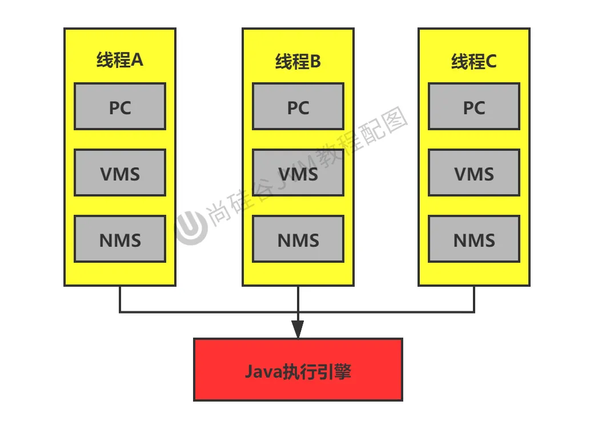

[TOC]

# 程序计数器（PC寄存器）

> 官方文档网址：[https://docs.oracle.com/javase/specs/jvms/se8/html/index.html](https://docs.oracle.com/javase/specs/jvms/se8/html/index.html)


## 概述

每一个线程一份

### 定义

程序计数器是一块较小的内存空间，是当前线程正在执行的那条字节码指令的地址。若当前线程正在执行的是一个本地方法，那么此时程序计数器为`Undefined`。


### 作用

* 字节码解释器通过改变程序计数器来依次读取指令，从而实现代码的流程控制。
* 在多线程情况下，程序计数器记录的是当前线程执行的位置，从而当线程切换回来时，就知道上次线程执行到哪了。


### 特点

* 是一块较小的内存空间。
* 线程私有，每条线程都有自己的程序计数器。
* 生命周期：随着线程的创建而创建，随着线程的结束而销毁。
* 是唯一一个不会出现 `OutOfMemoryError` 的内存区域。


### 示例

```java
public class PCRegisterTest {
    public PCRegisterTest() {
    }

    public static void main(String[] args) {
        int i = 10;
        int j = 20;
        int var10000 = i + j;
    }
}
```

通过

> javap -v .\\PCRegisterTest.class

```Plain Text
 stack=2, locals=4, args_size=1
         0: bipush        10
         2: istore_1
         3: bipush        20
         5: istore_2
         6: iload_1
         7: iload_2
         8: iadd
         9: istore_3
        10: return
```

加入新的内容后：

```java
public class PCRegisterTest {

    public static void main(String[] args) {
        int i = 10;
        int j = 20;
        int k = i + j;

        String s = "abc";

        System.out.println(i);
        System.out.println(k);
    }
}
```

再执行命令就可以看到：

注：第一列 -- 指令地址（或偏移地址）-- 0 2 3 5 6....

第二列字符串 -- 操作指令 -- bitpush  istore....

```Plain Text
Code:
      stack=2, locals=5, args_size=1
         0: bipush        10
         2: istore_1
         3: bipush        20
         5: istore_2
         6: iload_1
         7: iload_2
         8: iadd
         9: istore_3
        10: ldc           #2                  // String abc
        12: astore        4
        14: getstatic     #3                  // Field java/lang/System.out:Ljava/io/PrintStream;
        17: iload_1
        18: invokevirtual #4                  // Method java/io/PrintStream.println:(I)V
        21: getstatic     #3                  // Field java/lang/System.out:Ljava/io/PrintStream;
        24: iload_3
        25: invokevirtual #4                  // Method java/io/PrintStream.println:(I)V
        28: return

```

1. ldc：从常量池中取出常量，可以看到指向#2

> #2 = String             #27            // abc

#2又指向#27

> #27 = Utf8               abc

2. 12（astore）步骤相当于做了一下保存
3. 接下来进行打印操作，涉及到System.out，这就指向了#3

>   #3 = Fieldref           #28.#29        // java/lang/System.out:Ljava/io/PrintStream;

4. 又指向了28和29

>   #28 = Class              #34            // java/lang/System

>     #29 = NameAndType        #35:#36        // out:Ljava/io/PrintStream;

5. 又指向34、35和36

> #34 = Utf8               java/lang/System

> #35 = Utf8               out

> #36 = Utf8               Ljava/io/PrintStream;


此时PC寄存器的作用就如下图所示


## 两个常见的面试问题

**使用PC寄存器存储字节码指令地址有什么用呢？**或者问**为什么使用 PC 寄存器来记录当前线程的执行地址呢？**

1. 因为CPU需要不停的切换各个线程，这时候切换回来以后，就得知道接着从哪开始继续执行
2. JVM的字节码解释器就需要通过改变PC寄存器的值来明确下一条应该执行什么样的字节码指令




**PC寄存器为什么被设定为私有的？**

1. 我们都知道所谓的多线程在一个特定的时间段内只会执行其中某一个线程的方法，CPU会不停地做任务切换，这样必然导致经常中断或恢复，如何保证分毫无差呢？**为了能够准确地记录各个线程正在执行的当前字节码指令地址，最好的办法自然是为每一个线程都分配一个PC寄存器**，这样一来各个线程之间便可以进行独立计算，从而不会出现相互干扰的情况。
2. 由于CPU时间片轮限制，众多线程在并发执行过程中，任何一个确定的时刻，一个处理器或者多核处理器中的一个内核，只会执行某个线程中的一条指令。
3. 这样必然导致经常中断或恢复，如何保证分毫无差呢？每个线程在创建后，都会产生自己的程序计数器和栈帧，程序计数器在各个线程之间互不影响。

> 注意并行和并发的区别，并行可以和串行作对比（并行是同一个时间段几个线程一起运作），并发是（假如一个CPU只能处理一个线程）CPU处理的时候切换着线程来看似像是并行一样的操作（也可以联想时间片轮转法）。


## CPU 时间片

1. CPU时间片即CPU分配给各个程序的时间，每个线程被分配一个时间段，称作它的时间片。
2. 在宏观上：我们可以同时打开多个应用程序，每个程序并行不悖，同时运行。
3. 但在微观上：由于只有一个CPU，一次只能处理程序要求的一部分，如何处理公平，一种方法就是引入时间片，**每个程序轮流执行**。


