[TOC]

# 栈、堆、方法区的交互关系

> 从内存结构看


> 从线程共享与否的角度看

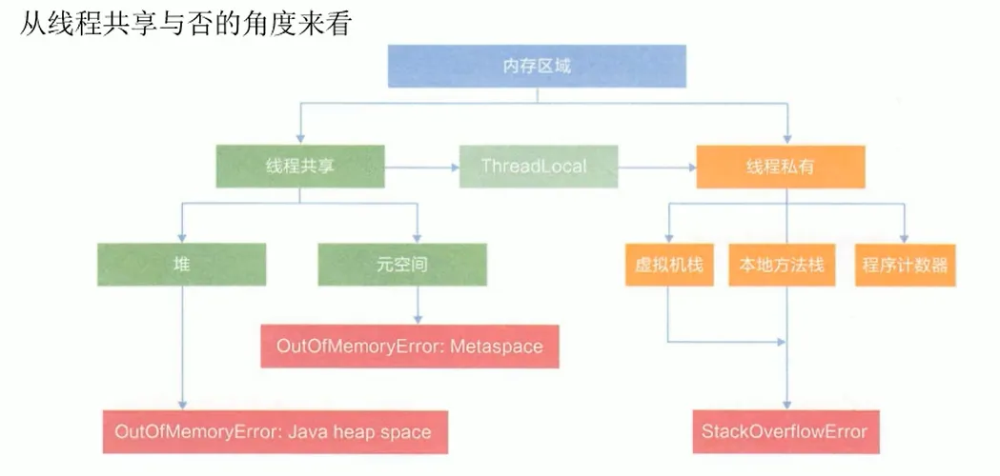

> 栈、堆、方法区的交互关系

- Person 类的 .class 信息存放在方法区中
- person 变量存放在 Java 栈的局部变量表中
- 真正的 person 对象存放在 Java 堆中


在 person 对象中，有个指针指向方法区中的 person 类型数据，表明这个 person 对象是用方法区中的 Person 类 new 出来的

回顾：下面这个图中左边的本地变量表（int、short、reference、double、float这些）每一个是一个slot，double和long占两个槽


# 方法区的理解

> 官方文档：https://docs.oracle.com/javase/specs/jvms/se8/html/jvms-2.html#jvms-2.5.4

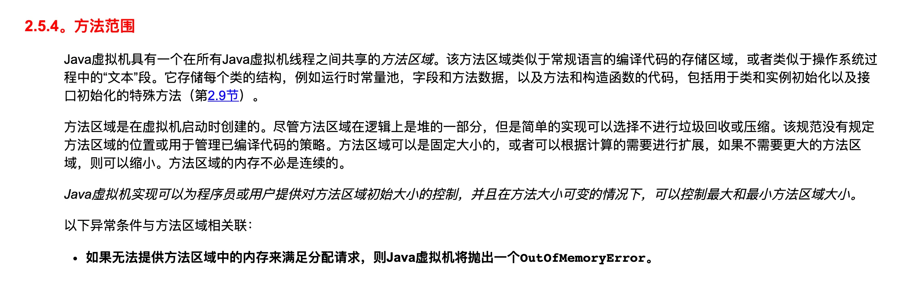


## 方法区的位置

- 《Java虚拟机规范》中明确说明：尽管所有的方法区在逻辑上是属于堆的一部分，但一些简单的实现可能不会选择去进行垃圾收集或者进行压缩。
- 但对于HotSpotJVM而言，**方法区还有一个别名叫做Non-Heap**（非堆），目的就是要和堆分开。
- 所以，**方法区可以看作是一块独立于Java堆的内存空间**。


## 方法区的理解

**方法区主要存放的是 Class，而堆中主要存放的是实例化的对象**

- 方法区（Method Area）与Java堆一样，是**各个线程共享的内存区域**
- 多个线程同时加载统一个类时，只能有一个线程能加载该类，其他线程只能等等待该线程加载完毕，然后直接使用该类，即**类只能加载一次**。
- 方法区在JVM启动的时候被创建，并且它的实际物理内存空间和Java堆区一样都可以是**不连续**的。
- 方法区的大小，跟堆空间一样，可以选择**固定大小或者可扩展**。
- 方法区是接口，元空间或者永久代是方法区的实现
- 方法区的大小决定了系统可以保存多少个类，如果系统<u>定义了太多的类，导致方法区溢出</u>，虚拟机同样会抛出内存溢出错误：   
  - java.lang.OutofMemoryError:PermGen space（JDK7之前）
  - 或者 java.lang.OutOfMemoryError:Metaspace（JDK8之后）
- 举例说明方法区 OOM   
  - 加载大量的第三方的jar包
  - Tomcat部署的工程过多（30~50个）
  - 大量动态的生成反射类
- 关闭JVM就会释放这个区域的内存。


> 代码示例

```java
public class MethodAreaDemo {

    public static void main(String[] args) {
        System.out.println("start....");
        try {
            Thread.sleep(1000000);
        } catch (InterruptedException e) {
            e.printStackTrace();
        }
        System.out.println("end....");
    }
}
```

下图可以看到，加载一个简单的类远不止创建一个类

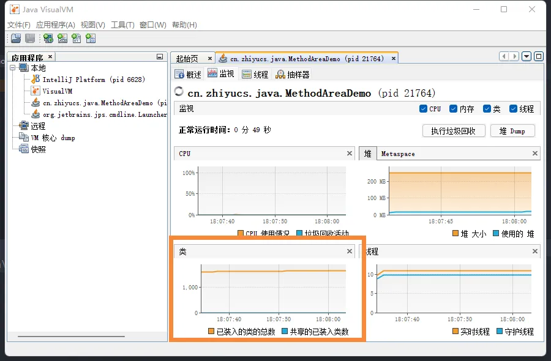


## Hotspot中方法区的演进过程

- **在 JDK7 及以前，习惯上把方法区，称为永久代。JDK8开始，使用元空间取代了永久代**。JDK 1.8之后，元空间存放在**堆外内存中**
- 我们可以将方法区类比为Java中的接口，将永久代或元空间类比为Java中具体的实现类
- 本质上，方法区和永久代并不等价。仅是对Hotspot而言的可以看作等价。《Java虚拟机规范》对如何实现方法区，不做统一要求。例如：BEAJRockit / IBM J9 中不存在永久代的概念。
- 现在来看，当年使用永久代，不是好的idea。导致Java程序更容易OOm（超过-XX:MaxPermsize上限）
- 而到了JDK8，终于完全废弃了永久代的概念，改用与JRockit、J9一样在本地内存中实现的元空间（Metaspace）来代替
- 元空间的本质和永久代类似，都是对JVM规范中方法区的实现。不过元空间与永久代最大的区别在于：**元空间不在虚拟机设置的内存中，而是使用本地内存**
- <u>永久代、元空间</u>二者并不只是名字变了，**内部结构也调整了**
- 根据《Java虚拟机规范》的规定，如果方法区无法满足新的内存分配需求时，将抛出OOM异常

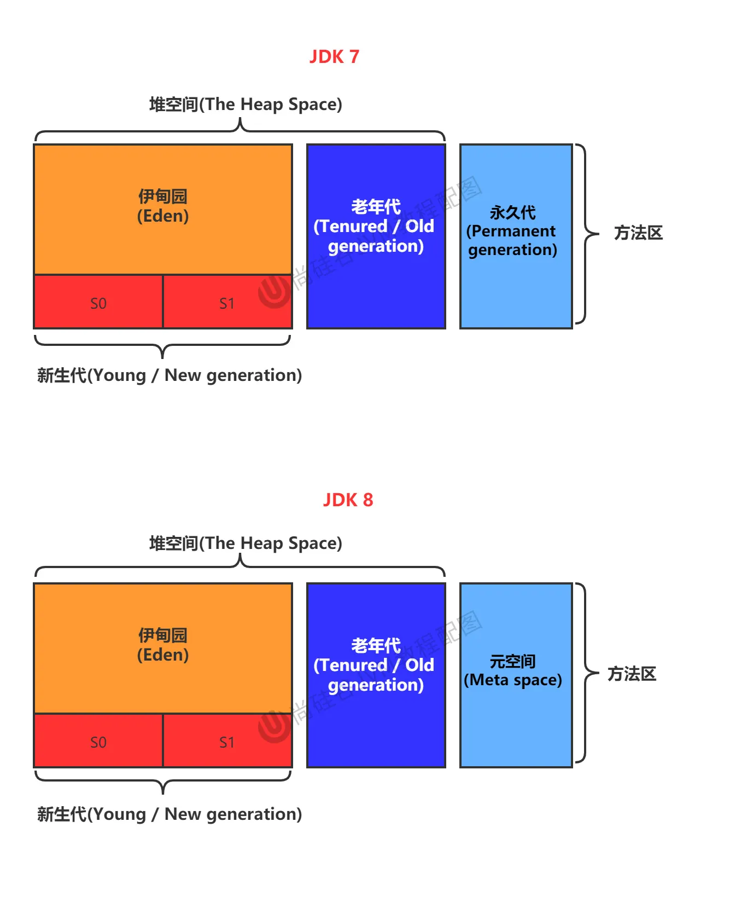


# 设置方法区大小与OOM

方法区的大小不必是固定的，JVM可以根据应用的需要动态调整

## JDK7 永久代

- 通过-XX:Permsize来设置永久代初始分配空间。默认值是20.75M
- -XX:MaxPermsize来设定永久代最大可分配空间。32位机器默认是64M，64位机器模式是82M
- 当JVM加载的类信息容量超过了这个值，会报异常OutofMemoryError:PermGen space。


如果在JDK8的环境下使用会出现以下状况，是因为JDK8中已经被弃用了


如果在JDK7的环境下运行命令

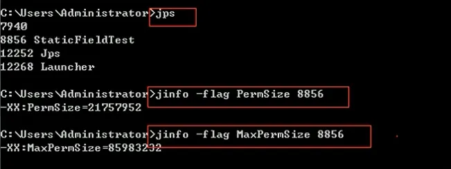

如果要在JDK 8的环境下运行可以使用以下命令：

> jinfo -flag MetaspaceSize xxxxx

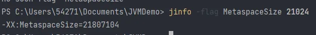


## JDK8 元空间

- 元数据区大小可以使用参数 **-XX:MetaspaceSize** 和 **-XX:MaxMetaspaceSize** 指定

- 默认值依赖于平台，Windows下，-XX:MetaspaceSize 约为21M，**-XX:MaxMetaspaceSize的值是-1，即没有限制**。

- 与永久代不同，如果不指定大小，默认情况下，虚拟机会耗尽所有的可用系统内存。如果元数据区发生溢出，虚拟机一样会抛出异常OutOfMemoryError:Metaspace

- -XX:MetaspaceSize：设置初始的元空间大小。对于一个 64位 的服务器端 JVM 来说，其默认的 -XX:MetaspaceSize值为21MB。这就是初始的高水位线，一旦触及这个水位线，Full GC将会被触发并卸载没用的类（即这些类对应的类加载器不再存活），

  然后这个高水位线将会重置

  。新的高水位线的值取决于GC后释放了多少元空间。   

  - 如果释放的空间不足，那么在不超过MaxMetaspaceSize时，适当提高该值。
  - 如果释放空间过多，则适当降低该值。

- 如果初始化的高水位线设置过低，上述高水位线调整情况会发生很多次。通过垃圾回收器的日志可以观察到Full GC多次调用。**为了避免频繁地GC，建议将-XX:MetaspaceSize设置为一个相对较高的值**。

> 配置元空间大小示例

```java
/**
 * 测试设置方法区大小参数的默认值
 *
 * jdk7及以前：
 * -XX:PermSize=100m -XX:MaxPermSize=100m
 *
 * jdk8及以后：
 * -XX:MetaspaceSize=100m  -XX:MaxMetaspaceSize=100m
 */
public class MethodAreaDemo {
    public static void main(String[] args) {
        System.out.println("start...");
        try {
            Thread.sleep(1000000);
        } catch (InterruptedException e) {
            e.printStackTrace();
        }

        System.out.println("end...");
    }
}

```

JVM参数

> -XX:MetaspaceSize=100m  -XX:MaxMetaspaceSize=100m

终端命令查看设置的元空间大小

> jps
> jinfo -flag MetaspaceSize xxx
> jinfo -flag MaxMetaspaceSize xxxx


可以通过计算得到

> 104857600 / 1024 / 1024 = 100M


## 方法区OOM

OOMTest 类继承 ClassLoader 类，获得 defineClass() 方法，可自己进行类的加载

```java
/**
 * jdk6/7中：
 * -XX:PermSize=10m -XX:MaxPermSize=10m
 *
 * jdk8中：
 * -XX:MetaspaceSize=10m -XX:MaxMetaspaceSize=10m
 */
public class OOMTest extends ClassLoader {
    public static void main(String[] args) {
        int j = 0;
        try {
            OOMTest test = new OOMTest();
            for (int i = 0; i < 10000; i++) {
                //创建ClassWriter对象，用于生成类的二进制字节码
                ClassWriter classWriter = new ClassWriter(0);
                //指明版本号，修饰符，类名，包名，父类，接口
                classWriter.visit(Opcodes.V1_8, Opcodes.ACC_PUBLIC, "Class" + i, null, "java/lang/Object", null);
                //返回byte[]
                byte[] code = classWriter.toByteArray();
                //类的加载
                test.defineClass("Class" + i, code, 0, code.length); //Class对象
                j++;
            }
        } finally {
            System.out.println(j);
        }
    }
}
```

如果不设置元空间上限结果为

> 10000

设置元空间上限 VM参数

> -XX:MetaspaceSize=10m -XX:MaxMetaspaceSize=10m

就会出现以下结果
```
3331
Exception in thread "main" java.lang.OutOfMemoryError: Compressed class space
	at java.lang.ClassLoader.defineClass1(Native Method)
	at java.lang.ClassLoader.defineClass(ClassLoader.java:756)
	at java.lang.ClassLoader.defineClass(ClassLoader.java:635)
	at cn.zhiyucs.java.OOMTest.main(OOMTest.java:26)
```


## 如何解决OOM

- 要解决OOM异常或heap space的异常，一般的手段是首先通过内存映像分析工具（如Eclipse Memory  Analyzer）对dump出来的堆转储快照进行分析，重点是确认内存中的对象是否是必要的，也就是要先分清楚到底是出现了内存泄漏（Memory  Leak）还是内存溢出（Memory Overflow）
- **内存泄漏就是有大量的引用指向某些对象，但是这些对象以后不会使用了**，但是因为它们还和GC ROOT有关联，所以导致以后这些对象也不会被回收，这就是内存泄漏的问题
- 如果是内存泄漏，可进一步通过工具查看泄漏对象到GC Roots的引用链。于是就能**找到泄漏对象是通过怎样的路径与GC Roots相关联并导致垃圾收集器无法自动回收它们的**。掌握了泄漏对象的类型信息，以及GC Roots引用链的信息，就可以比较准确地定位出泄漏代码的位置。
- 如果不存在内存泄漏，换句话说就是内存中的对象确实都还必须存活着，那就应当检查虚拟机的堆参数（-Xmx与-Xms），与机器物理内存对比看是否还可以调大，从代码上检查是否存在某些对象生命周期过长、持有状态时间过长的情况，尝试减少程序运行期的内存消耗。


# 方法区的内部结构

## 内部结构

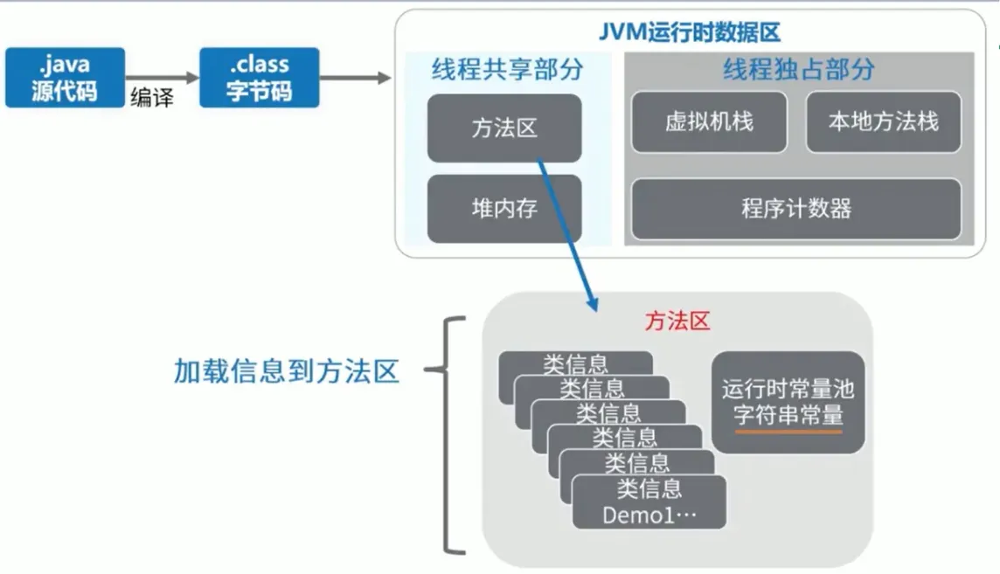

方法区都存储了什么？

《深入理解Java虚拟机》书中对方法区（Method Area）存储内容描述如下：它用于存储已被虚拟机**加载的类型信息、常量、静态变量、即时编译器编译后的代码缓存**等。

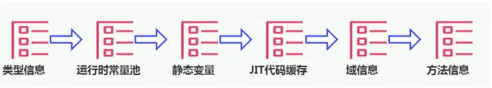


### 类型信息

对每个加载的类型（类class、接口interface、枚举enum、注解annotation），JVM必须在方法区中存储以下类型信息：

- 这个类型的完整有效名称（全类名=包名.类名）
- 这个类型直接父类的完整有效名（对于interface或是java.lang.Object，都没有父类）
- 这个类型的修饰符（public，abstract，final的某个子集）
- 这个类型直接接口的一个有序列表


### 域（Field）信息

- JVM必须在方法区中保存类型的所有域的相关信息以及域的声明顺序。
- `域信息`通俗来讲是类的成员变量
- 域的相关信息包括：   
  - 域名称
  - 域类型
  - 域修饰符（public，private，protected，static，final，volatile，transient的某个子集）


### 方法（Method）信息

JVM必须保存所有方法的以下信息，同域信息一样包括声明顺序：

- 方法名称
- 方法的返回类型（包括 void 返回类型），void 在 Java 中对应的类为 void.class
- 方法参数的数量和类型（按顺序）
- 方法的修饰符（public，private，protected，static，final，synchronized，native，abstract的一个子集）
- 方法的字节码（bytecodes）、操作数栈、局部变量表及大小（abstract和native方法除外）
- 异常表（abstract和native方法除外）
  - 异常表记录每个异常处理的开始位置、结束位置、代码处理在程序计数器中的偏移地址、被捕获的异常类的常量池索引


### 代码举例

```java
/**
 * 测试方法区的内部构成
 */
public class MethodInnerStrucTest extends Object implements Comparable<String>, Serializable {
    //属性
    public int num = 10;
    private static String str = "测试方法的内部结构";

    //构造器没写

    //方法
    public void test1() {
        int count = 20;
        System.out.println("count = " + count);
    }

    public static int test2(int cal) {
        int result = 0;
        try {
            int value = 30;
            result = value / cal;
        } catch (Exception e) {
            e.printStackTrace();
        }
        return result;
    }

    @Override
    public int compareTo(String o) {
        return 0;
    }
}

```

反编译之后就可以看到

> 类型信息

- 在运行时方法区中，类信息中记录了哪个加载器加载了该类，同时类加载器也记录了它加载了哪些类
- 从反编译文件可以看出，字节码文件记录了 MethodInnerStrucTest 继承了哪些类，实现了哪些方法

```
public class cn.zhiyucs.java.MethodInnerStrucTest extends java.lang.Object implements java.lang.Comparable<java.lang.String>, java.io.Serializable
  minor version: 0
  major version: 52
  flags: ACC_PUBLIC, ACC_SUPER
```

> 域信息

- descriptor: I 表示字段类型为 Integer
- flags: ACC_PUBLIC 表示字段权限修饰符为 public

```
public int num;
    descriptor: I
    flags: ACC_PUBLIC

  private static java.lang.String str;
    descriptor: Ljava/lang/String;
    flags: ACC_PRIVATE, ACC_STATIC
```

> 方法信息（以test1为例）

- descriptor: ( )V 表示方法返回值类型为 void
- flags: ACC_PUBLIC 表示方法权限修饰符为 public
- stack=3 表示操作数栈深度为 3
- locals=2 表示局部变量个数为 2 个（实力方法包含 this）
- test1( ) 方法虽然没有参数，但是其 args_size=1 ，这是因为将 this 作为了参数

```
  public void test1();
    descriptor: ()V
    flags: ACC_PUBLIC
    Code:
      stack=3, locals=2, args_size=1
         0: bipush        20
         2: istore_1
         3: getstatic     #3                  // Field java/lang/System.out:Ljava/io/PrintStream;
         6: new           #4                  // class java/lang/StringBuilder
         9: dup
        10: invokespecial #5                  // Method java/lang/StringBuilder."<init>":()V
        13: ldc           #6                  // String count =
        15: invokevirtual #7                  // Method java/lang/StringBuilder.append:(Ljava/lang/String;)Ljava/lang/StringBuilder;
        18: iload_1
        19: invokevirtual #8                  // Method java/lang/StringBuilder.append:(I)Ljava/lang/StringBuilder;
        22: invokevirtual #9                  // Method java/lang/StringBuilder.toString:()Ljava/lang/String;
        25: invokevirtual #10                 // Method java/io/PrintStream.println:(Ljava/lang/String;)V
        28: return
      LineNumberTable:
        line 17: 0
        line 18: 3
        line 19: 28
      LocalVariableTable:
        Start  Length  Slot  Name   Signature
            0      29     0  this   Lcn/zhiyucs/java/MethodInnerStrucTest;
            3      26     1 count   I

```


## 域信息特殊情况

### non-final 类型的类变量

- **静态变量和类关联在一起，随着类的加载而加载**，他们成为类数据在逻辑上的一部分
- 类变量被类的所有实例共享，即使没有类实例时，你也可以访问它


> 代码示例

```java
/**
 * non-final的类变量
 */
public class MethodAreaTest {
    public static void main(String[] args) {
        Order order = null;
        order.hello();
        System.out.println(order.count);
    }
}

class Order {
    public static int count = 1;
    public static final int number = 2;


    public static void hello() {
        System.out.println("hello!");
    }
}
```

> 执行结果

```
hello!
1
```

如何体现：类变量被类的所有实例共享，即使没有类实例时，你也可以访问它？

```java
Order order = null;
order.hello();
```


### 全局常量：static final

- 全局常量就是使用 static final 进行修饰
- 被声明为final的类变量的处理方法则不同，每个全局常量在编译的时候就会被分配了。

> 代码示例

```java
class Order {
    public static int count = 1;
    public static final int number = 2;


    public static void hello() {
        System.out.println("hello!");
    }
}
```

通过反编译字节码可以看到区别：number 的值已经写死在字节码文件中了

```java
// Java文件
public static int count = 1;
public static final int number = 2;

// 字节码文件
  public static int count;
    descriptor: I
    flags: ACC_PUBLIC, ACC_STATIC

  public static final int number;
    descriptor: I
    flags: ACC_PUBLIC, ACC_STATIC, ACC_FINAL
    ConstantValue: int 2
```


## 运行时常量池

[点此进入官方文档](https://docs.oracle.com/javase/specs/jvms/se8/html/jvms-4.html)

> 运行时常量池 VS 常量池

- **方法区，内部包含了运行时常量池**
- **字节码文件，内部包含了常量池**
- 要弄清楚方法区，需要理解清楚ClassFile，因为加载类的信息都在方法区。
- 要弄清楚方法区的运行时常量池，需要理解清楚ClassFile中的常量池。


## 常量池

- 一个有效的字节码文件中除了包含类的版本信息、字段、方法以及接口等描述符信息外
- 还包含一项信息就是**常量池表**（**Constant Pool Table**），包括**各种字面量和对类型、域和方法的符号引用**

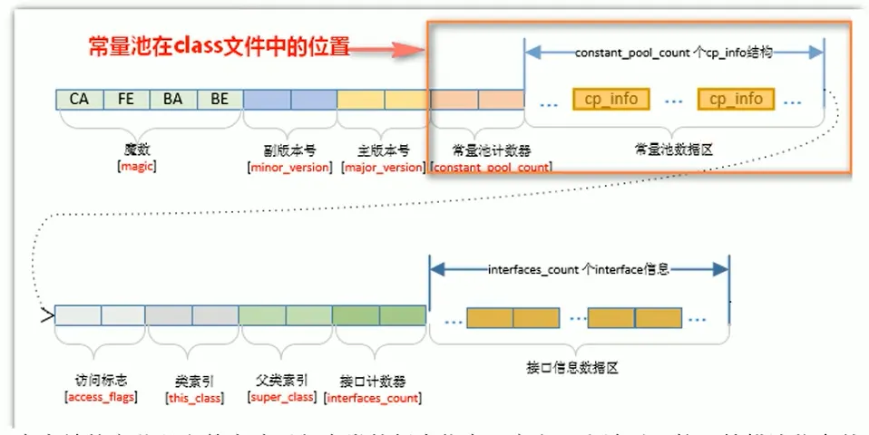


> 为什么需要常量池？

- 一个java源文件中的类、接口，编译后产生一个字节码文件。而Java中的字节码需要数据支持，通常这种数据会很大以至于不能直接存到字节码里，换另一种方式，可以存到常量池

- 这个字节码包含了指向常量池的引用。在动态链接的时候会用到运行时常量池，之前有介绍

  比如：如下的代码：

```java
public class SimpleClass {
    public void sayHello() {
        System.out.println("hello");
    }
}
```

- 虽然上述代码只有194字节，但是里面却使用了String、System、PrintStream及Object等结构。
- 如果不使用常量池，就需要将用到的类信息、方法信息等记录在当前的字节码文件中，造成文件臃肿
- 所以我们将所需用到的结构信息记录在常量池中，并通过**引用的方式**，来加载、调用所需的结构
- 这里的代码量其实很少了，如果代码多的话，引用的结构将会更多，这里就需要用到常量池了。


> 代码举例

```java
/**
 * 测试方法区的内部构成
 */
public class MethodInnerStrucTest extends Object implements Comparable<String>, Serializable {
    //属性
    public int num = 10;
    private static String str = "测试方法的内部结构";

    //构造器没写

    //方法
    public void test1() {
        int count = 20;
        System.out.println("count = " + count);
    }

    public static int test2(int cal) {
        int result = 0;
        try {
            int value = 30;
            result = value / cal;
        } catch (Exception e) {
            e.printStackTrace();
        }
        return result;
    }

    @Override
    public int compareTo(String o) {
        return 0;
    }
}
```

1. 反编译之后以静态字符串为例

> private static String str = "测试方法的内部结构";

```python
0 ldc #15 <测试方法的内部结构>
2 putstatic #16 <cn/zhiyucs/java/MethodInnerStrucTest.str : Ljava/lang/String;>
5 return
```

ldc是官方的JVM规范这样解释：从运行时常量池推送项目（Push item from run-time constant pool）

2. 再以test1为例

```java
public void test1() {
    int count = 20;
    System.out.println("count = " + count);
}
```

字节码为

```python
 0 bipush 20
 2 istore_1
 3 getstatic #3 <java/lang/System.out : Ljava/io/PrintStream;>
 6 new #4 <java/lang/StringBuilder>
 9 dup
10 invokespecial #5 <java/lang/StringBuilder.<init> : ()V>
13 ldc #6 <count = >
15 invokevirtual #7 <java/lang/StringBuilder.append : (Ljava/lang/String;)Ljava/lang/StringBuilder;>
18 iload_1
19 invokevirtual #8 <java/lang/StringBuilder.append : (I)Ljava/lang/StringBuilder;>
22 invokevirtual #9 <java/lang/StringBuilder.toString : ()Ljava/lang/String;>
25 invokevirtual #10 <java/io/PrintStream.println : (Ljava/lang/String;)V>
28 return
```

> getstatic #3为例

可以从常量池中看到，#3 调用了#54和#55


#54


#55


可以看到最后调用了#75

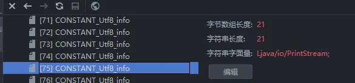

>  new #4 <java/lang/StringBuilder> 为例

为什么会有StringBuilder？

> "count = " + count 底层会创建一个StringBuilder
>
> count 底层会实现一个append（15 invokevirtual #7 <java/lang/StringBuilder.append）

#4

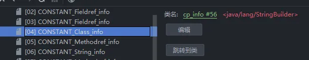

#56


> 常量池总结

常量池，可以看做是一张表，虚拟机指令根据这张常量表找到要执行的类名、方法名、参数类型、字面量等信息


## 运行时常量池理解

- **运行时常量池（Runtime Constant Pool）是方法区的一部分**。
- **常量池表（Constant Pool Table）是Class字节码文件的一部分，用于存放编译期生成的各种字面量与符号引用，这部分内容将在类加载后存放到方法区的运行时常量池中**。
- 运行时常量池，在<u>加载类和接口到虚拟机后</u>，就会<u>创建</u>对应的运行时常量池。
- **JVM为每个已加载的类型（类或接口）都维护一个常量池。池中的数据项像数组项一样，是通过索引访问的**。
- 运行时常量池中包含多种不同的常量，包括编译期就已经明确的数值字面量，也包括到运行期解析后才能够获得的方法或者字段引用。**此时不再是常量池中的符号地址了，这里换为真实地址**。
  - 运行时常量池，相对于Class文件常量池的另一重要特征是：`具备动态性`。
    - String.intern()
- 运行时常量池类似于传统编程语言中的符号表（symbol table），但是它所包含的数据却比符号表要更加丰富一些。
- 当创建类或接口的运行时常量池时，如果构造运行时常量池所需的内存空间超过了方法区所能提供的最大值，则JVM会抛OutOfMemoryError异常。


#  方法区举例

```java
public class MethodAreaDemo {
    public static void main(String[] args) {
        int x = 500;
        int y = 100;
        int a = x / y;
        int b = 50;
        System.out.println(a + b);
    }
}
```

>  字节码

```python
Classfile /C:/Users/54271/Documents/JVMDemo/out/production/chapter09/cn/zhiyucs/java/MethodAreaDemo.class
  Last modified 2022-2-27; size 839 bytes
  MD5 checksum e17c57e62cf2a5912af9d32aae38242b
  Compiled from "MethodAreaDemo.java"
public class cn.zhiyucs.java.MethodAreaDemo
  minor version: 0
  major version: 52
  flags: ACC_PUBLIC, ACC_SUPER
Constant pool:
   #1 = Methodref          #12.#30        // java/lang/Object."<init>":()V
   #2 = Fieldref           #31.#32        // java/lang/System.out:Ljava/io/PrintStream;
   #3 = String             #33            // start....
   #4 = Methodref          #34.#35        // java/io/PrintStream.println:(Ljava/lang/String;)V
   #5 = Long               1000000l
   #7 = Methodref          #36.#37        // java/lang/Thread.sleep:(J)V
   #8 = Class              #38            // java/lang/InterruptedException
   #9 = Methodref          #8.#39         // java/lang/InterruptedException.printStackTrace:()V
  #10 = String             #40            // end....
  #11 = Class              #41            // cn/zhiyucs/java/MethodAreaDemo
  #12 = Class              #42            // java/lang/Object
  #13 = Utf8               <init>
  #14 = Utf8               ()V
  #15 = Utf8               Code
  #16 = Utf8               LineNumberTable
  #17 = Utf8               LocalVariableTable
  #18 = Utf8               this
  #19 = Utf8               Lcn/zhiyucs/java/MethodAreaDemo;
  #20 = Utf8               main
  #21 = Utf8               ([Ljava/lang/String;)V
  #22 = Utf8               e
  #23 = Utf8               Ljava/lang/InterruptedException;
  #24 = Utf8               args
  #25 = Utf8               [Ljava/lang/String;
  #26 = Utf8               StackMapTable
  #27 = Class              #38            // java/lang/InterruptedException
  #28 = Utf8               SourceFile
  #29 = Utf8               MethodAreaDemo.java
  #30 = NameAndType        #13:#14        // "<init>":()V
  #31 = Class              #43            // java/lang/System
  #32 = NameAndType        #44:#45        // out:Ljava/io/PrintStream;
  #33 = Utf8               start....
  #34 = Class              #46            // java/io/PrintStream
  #35 = NameAndType        #47:#48        // println:(Ljava/lang/String;)V
  #36 = Class              #49            // java/lang/Thread
  #37 = NameAndType        #50:#51        // sleep:(J)V
  #38 = Utf8               java/lang/InterruptedException
  #39 = NameAndType        #52:#14        // printStackTrace:()V
  #40 = Utf8               end....
  #41 = Utf8               cn/zhiyucs/java/MethodAreaDemo
  #42 = Utf8               java/lang/Object
  #43 = Utf8               java/lang/System
  #44 = Utf8               out
  #45 = Utf8               Ljava/io/PrintStream;
  #46 = Utf8               java/io/PrintStream
  #47 = Utf8               println
  #48 = Utf8               (Ljava/lang/String;)V
  #49 = Utf8               java/lang/Thread
  #50 = Utf8               sleep
  #51 = Utf8               (J)V
  #52 = Utf8               printStackTrace
{
  public cn.zhiyucs.java.MethodAreaDemo();
    descriptor: ()V
    flags: ACC_PUBLIC
    Code:
      stack=1, locals=1, args_size=1
         0: aload_0
         1: invokespecial #1                  // Method java/lang/Object."<init>":()V
         4: return
      LineNumberTable:
        line 12: 0
      LocalVariableTable:
        Start  Length  Slot  Name   Signature
            0       5     0  this   Lcn/zhiyucs/java/MethodAreaDemo;

  public static void main(java.lang.String[]);
    descriptor: ([Ljava/lang/String;)V
    flags: ACC_PUBLIC, ACC_STATIC
    Code:
      stack=2, locals=2, args_size=1
         0: getstatic     #2                  // Field java/lang/System.out:Ljava/io/PrintStream;
         3: ldc           #3                  // String start....
         5: invokevirtual #4                  // Method java/io/PrintStream.println:(Ljava/lang/String;)V
         8: ldc2_w        #5                  // long 1000000l
        11: invokestatic  #7                  // Method java/lang/Thread.sleep:(J)V
        14: goto          22
        17: astore_1
        18: aload_1
        19: invokevirtual #9                  // Method java/lang/InterruptedException.printStackTrace:()V
        22: getstatic     #2                  // Field java/lang/System.out:Ljava/io/PrintStream;
        25: ldc           #10                 // String end....
        27: invokevirtual #4                  // Method java/io/PrintStream.println:(Ljava/lang/String;)V
        30: return
      Exception table:
         from    to  target type
             8    14    17   Class java/lang/InterruptedException
      LineNumberTable:
        line 15: 0
        line 17: 8
        line 20: 14
        line 18: 17
        line 19: 18
        line 21: 22
        line 22: 30
      LocalVariableTable:
        Start  Length  Slot  Name   Signature
           18       4     1     e   Ljava/lang/InterruptedException;
            0      31     0  args   [Ljava/lang/String;
      StackMapTable: number_of_entries = 2
        frame_type = 81 /* same_locals_1_stack_item */
          stack = [ class java/lang/InterruptedException ]
        frame_type = 4 /* same */
}
SourceFile: "MethodAreaDemo.java"

```


## 图解字节码指令执行流程

字节码执行过程展示：初始状态


首先将操作数500压入操作数栈中（sipush 500）

* 记录当前位置为程序计数器0的位置
* 把500放入到操作数栈上


然后将操作数 500 从操作数栈中取出，存储到局部变量表中索引为 1 的位置

* 一般来说0的位置是放this，但是这是一个静态方法，所以第一个位置放入形参args

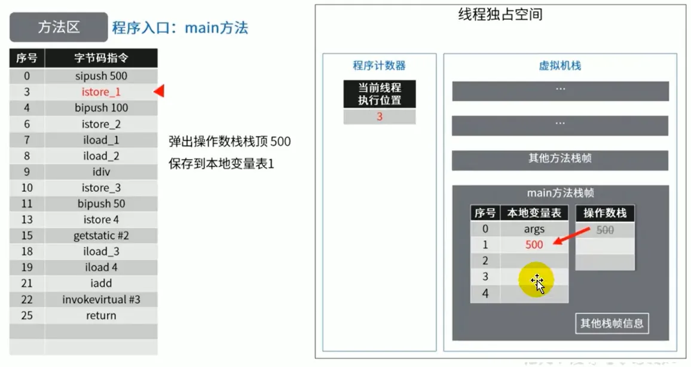

bitpush 100：将操作数100压入操作数栈中


itore_2：然后操作数 100 从操作数栈中取出，<u>存储到局部变量表</u>中索引为 2 的位置

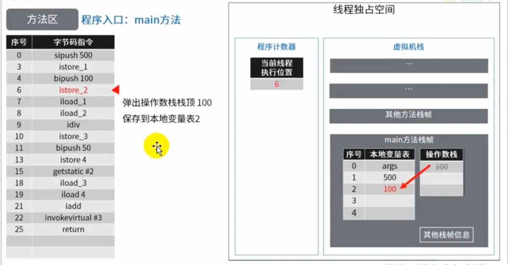

读取本地变量 1 ，压入操作数栈


读取本地变量 2 ，压入操作数栈

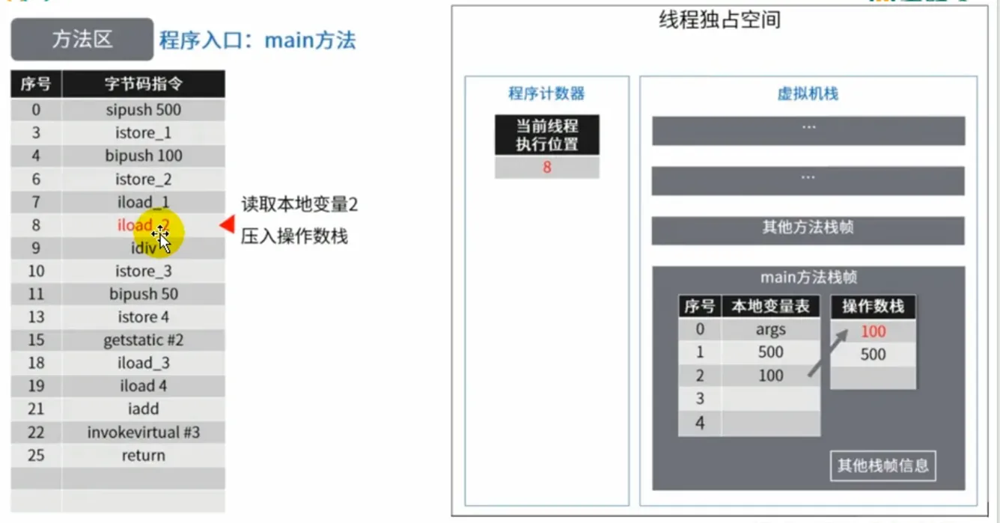

idiv：两数相除，计算结果放在操作数栈顶

之后执行 istore_3 指令，将计算结果从操作数栈中弹出，存入本地变量表 3 中


bipush 50：将操作数 50 压入操作数栈


将操作数 50 从栈顶弹出，保存在局部变量表 4 中

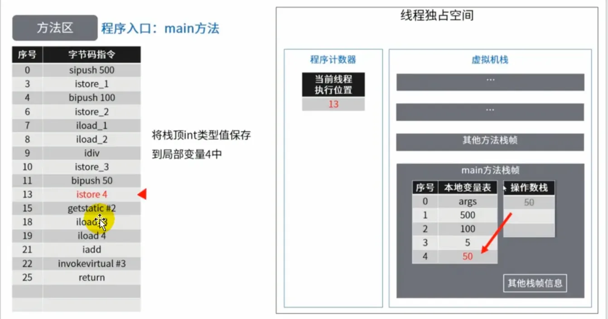

获取 System.out 输出流的引用

> #2 = Fieldref           #31.#32        // java/lang/System.out:Ljava/io/PrintStream;
>
> #31 = Class              #43            // java/lang/System
> #32 = NameAndType        #44:#45        // out:Ljava/io/PrintStream;


将本地变量表 3 的值取出，压入操作数栈中，准备进行加法运算

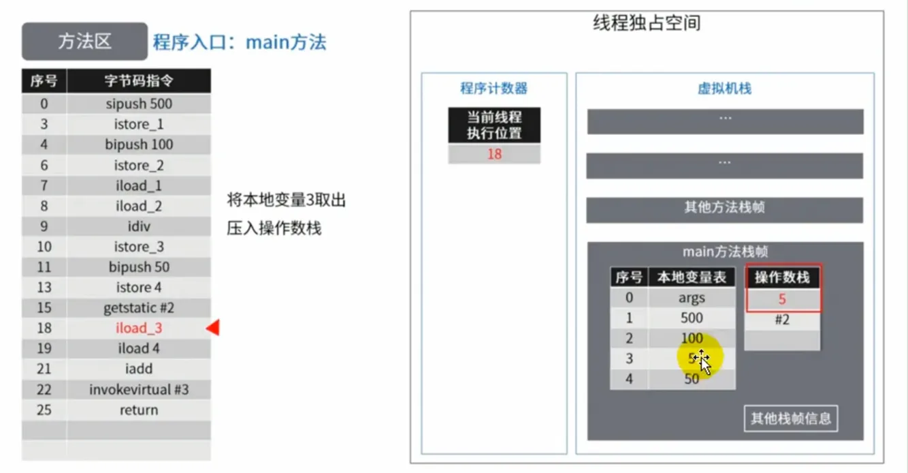

将本地变量表 4 的值取出，压入操作数栈中，准备进行加法运算

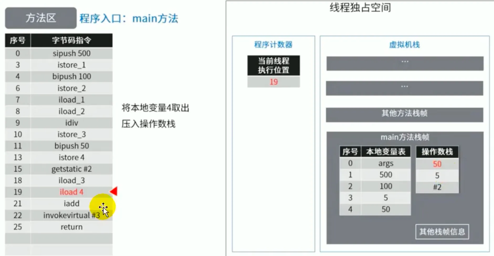

执行加法运算后，将计算结果放在操作数栈顶

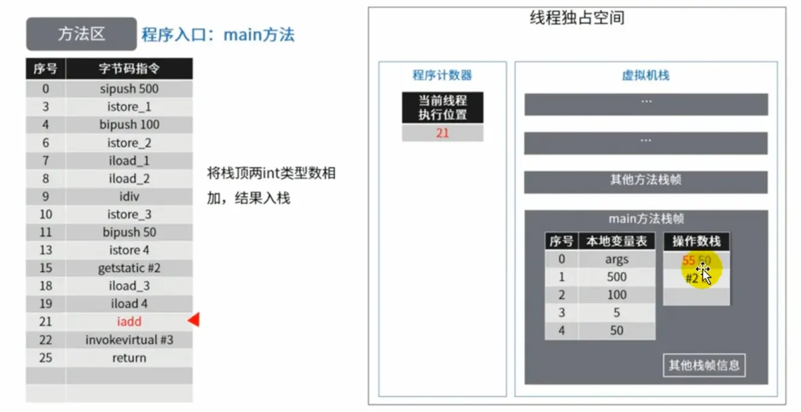

调用静态方法 println( ) ，输出加法结果

> #3 = String             #33            // start....
>
> 


main( ) 方法执行结束

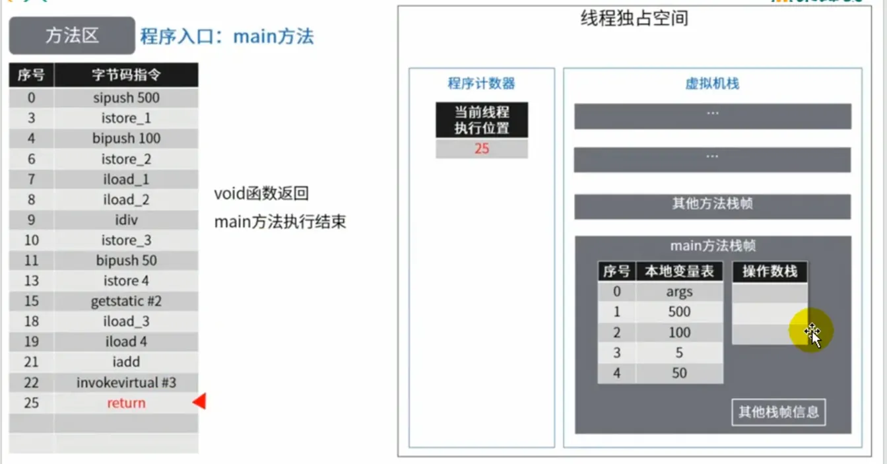


# 方法区的演进细节

## 永久代演进过程

- 首先明确：只有Hotspot才有`永久代`。
- BEA JRockit、IBMJ9等来说，是不存在永久代的概念的。原则上如何实现方法区属于虚拟机实现细节，不受《Java虚拟机规范》管束，并不要求统一
- Hotspot中方法区的变化：

| JDK 版本     | 演变细节                                                                                         |
| ------------ | ------------------------------------------------------------------------------------------------ |
| JDK1.6及以前 | 有永久代（permanent generation），静态变量存储在永久代上                                         |
| JDK1.7       | 有永久代，但已经逐步 “去永久代”，**字符串常量池、静态变量从永久代中移除，保存在堆中**            |
| JDK1.8       | 无永久代，类型信息，字段，方法，常量保存在本地内存的元空间，但字符串常量池、静态变量仍然在堆中。 |


> 永久代为什么要被元空间替换？

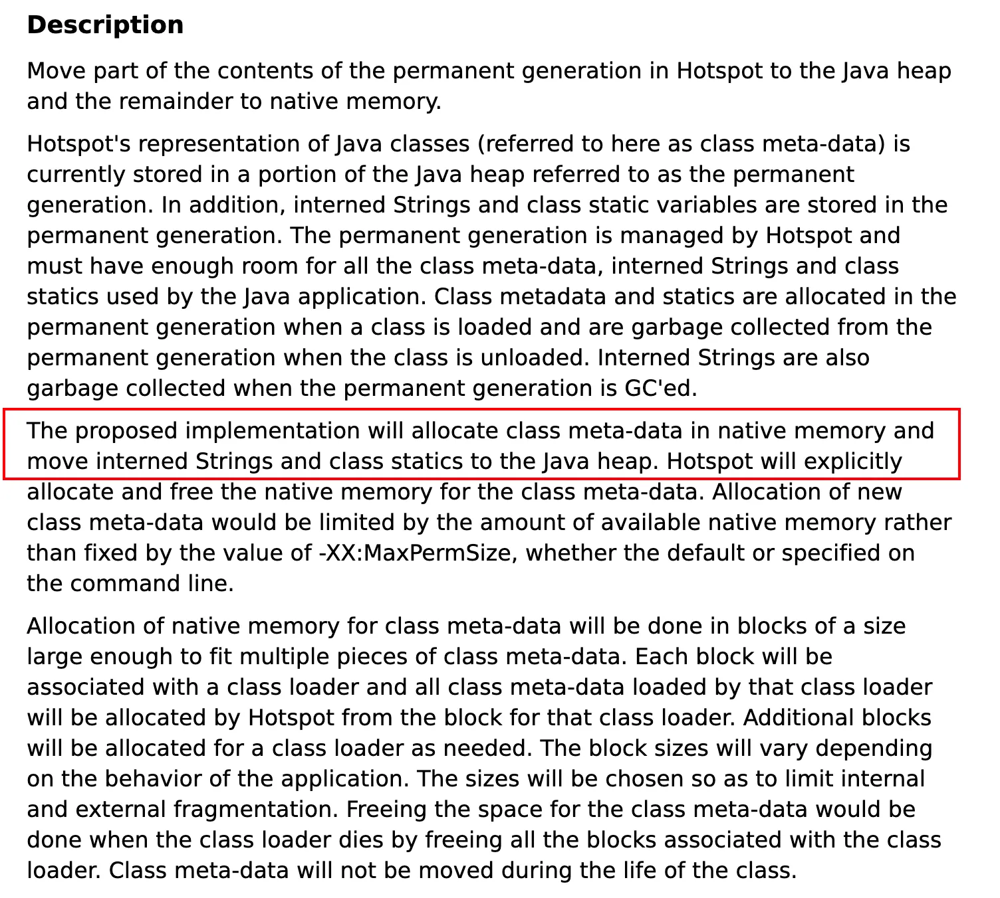


> JDK6

方法区由永久代实现，使用 JVM 虚拟机内存


> JDK7

方法区由永久代实现，使用 JVM 虚拟机内存


> JDK8

方法区由元空间实现，使用物理机本地内存


## 永久代为什么要被元空间替代？

[点击进入官方文档](http://openjdk.java.net/jeps/122)

- 官方的牵强解释：JRockit是和HotSpot融合后的结果，因为JRockit没有永久代，所以他们不需要配置永久代，HotSpot也就取消了永久代
- 随着Java8的到来，HotSpot VM中再也见不到永久代了。但是这并不意味着类的元数据信息也消失了。这些数据被移到了一个与堆不相连的本地内存区域，这个区域叫做元空间（Metaspace）。

> 由于类的元数据分配在本地内存中，元空间的最大可分配空间就是系统可用内存空间，这项改动是很有必要的，原因有：

- 为永久代设置空间大小是很难确定的。   
  - 在某些场景下，如果动态加载类过多，容易产生Perm区的OOM。比如某个实际Web工程中，因为功能点比较多，在运行过程中，要不断动态地加载很多类，经常出现致命错误。`Exception in thread 'dubbo client x.x connector' java.lang.OutOfMemoryError:PermGen space`
  - 而元空间和永久代之间最大的区别在于：**元空间并不在虚拟机中，而是使用本地内存**。因此，**默认情况下，元空间的大小仅受本地内存限制**。
- 对永久代进行调优是很困难的。   
  - 方法区的垃圾收集主要回收两部分内容：常量池中废弃的常量和不再用的类型，方法区的调优主要是为了降低Full GC
  - 有些人认为方法区（如HotSpot虚拟机中的元空间或者永久代）是没有垃圾收集行为的，其实不然。《Java虚拟机规范》对方法区的约束是非常宽松的，提到过可以不要求虚拟机在方法区中实现垃圾收集。事实上也确实有未实现或未能完整实现方法区类型卸载的收集器存在（如JDK11时期的ZGC收集器就不支持类卸载）。
  - **一般来说这个区域的回收效果比较难令人满意，尤其是类型的卸载，条件相当苛刻**。但是这部分区域的回收有时又确实是必要的。以前Sun公司的Bug列表中，曾出现过的若干个严重的Bug就是由于低版本的HotSpot虚拟机对此区域未完全回收而导致内存泄漏


## 字符串常量池

> 字符串常量池 StringTable 为什么要调整位置？

- **JDK7中将StringTable放到了堆空间中**。因为永久代的回收效率很低，在Full GC的时候才会执行永久代的垃圾回收，而Full GC是老年代的空间不足、永久代不足时才会触发。
- 这就**导致StringTable回收效率不高**，而我们开发中会有大量的字符串被创建，回收效率低，导致永久代内存不足。**放到堆里，能及时回收内存**。


## 静态变量位置

>  静态变量存放在哪里？

```java
/**
 * 结论：
 *  静态变量在jdk6/7存在与永久代中，在jdk8存在于堆中 //private static byte[] arr
 *  静态引用对应的对象实体始终都存在堆空间 //new byte[1024 * 1024 * 100];
 *
 * jdk7：
 * -Xms200m -Xmx200m -XX:PermSize=300m -XX:MaxPermSize=300m -XX:+PrintGCDetails
 * jdk 8：
 * -Xms200m -Xmx200m -XX:MetaspaceSize=300m -XX:MaxMetaspaceSize=300m -XX:+PrintGCDetails
 */
public class StaticFieldTest {
    private static byte[] arr = new byte[1024 * 1024 * 100]; //100MB

    public static void main(String[] args) {
        System.out.println(StaticFieldTest.arr);
    }
}

```


> VM 选项： -Xms200m -Xmx200m -XX:MetaspaceSize=300m -XX:MaxMetaspaceSize=300m -XX:+PrintGCDetails

通过 GC 日志可以看出：**静态变量引用对应的对象实体始终都在堆空间中**（arr 数组对象直接怼到老年区去了）


> 示例2

```java
/**
 * 《深入理解Java虚拟机》中的案例：
 * staticObj、instanceObj、localObj存放在哪里？
 */
public class StaticObjTest {
    static class Test {
        //静态属性
        static ObjectHolder staticObj = new ObjectHolder();
        //非静态属性
        ObjectHolder instanceObj = new ObjectHolder();

        void foo() {
            //局部变量
            ObjectHolder localObj = new ObjectHolder();
            System.out.println("done");
        }
    }

    private static class ObjectHolder {
    }

    public static void main(String[] args) {
        Test test = new StaticObjTest.Test();
        test.foo();
    }
}
```

- 可以使用 JHSDB.exe，在JDK9的时候才引入的
- 分析：staticObj随着Test的类型信息存放在方法区，instanceObj随着Test的对象实例存放在Java堆，localObject则是存放在foo( )方法栈帧的局部变量表中。
- 测试发现：三个对象的数据在内存中的地址都落在Eden区范围内，所以结论：**只要是对象实例必然会在Java堆中分配**。

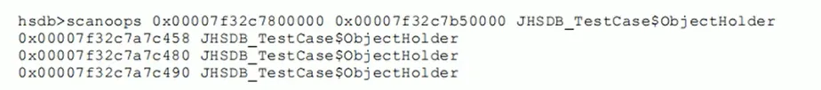

接着，找到了一个引用该staticObj对象的地方，是在一个java.lang.Class的实例里，并且给出了这个实例的地址，通过Inspector查看该对象实例，可以清楚看到这确实是一个java.lang.Class类型的对象实例，里面有一个名为staticobj的实例字段：

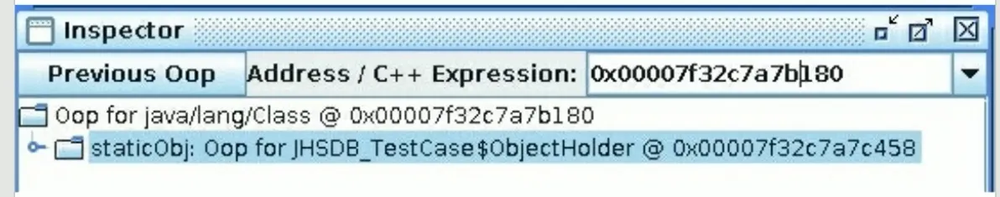

从《Java虚拟机规范》所定义的概念模型来看，所有Class相关的信息都应该存放在方法区之中，但方法区该如何实现，《Java虚拟机规范》并未做出规定，这就成了一件允许不同虚拟机自己灵活把握的事情。JDK7及其以后版本的HotSpot虚拟机选择把静态变量与类型在Java语言一端的映射Class对象存放在一起，**存储于Java堆之中**，从我们的实验中也明确验证了这一点


# 方法区的垃圾回收

- 有些人认为方法区（如Hotspot虚拟机中的元空间或者永久代）是没有垃圾收集行为的，其实不然。
- 《Java虚拟机规范》对方法区的约束是非常宽松的，提到过可以不要求虚拟机在方法区中实现垃圾收集。事实上也确实有未实现或未能完整实现方法区类型卸载的收集器存在（如JDK11时期的ZGC收集器就不支持类卸载）。
- 一般来说这个区域的回收效果比较难令人满意，尤其是类型的卸载，条件相当苛刻。但是这部分区域的回收有时又确实是必要的。以前sun公司的Bug列表中，曾出现过的若干个严重的Bug就是由于低版本的HotSpot虚拟机对此区域未完全回收而导致内存泄漏。
- 方法区的垃圾收集主要回收两部分内容：**常量池中废弃的常量和不再使用的类型**。


## 方法区常量的回收

- 先来说说方法区内常量池之中主要存放的两大类常量：字面量和符号引用   
  - 字面量比较接近Java语言层次的常量概念，如文本字符串、被声明为final的常量值等
  - 而符号引用则属于编译原理方面的概念，包括下面三类常量：     
    - 类和接口的全限定名
    - 字段的名称和描述符
    - 方法的名称和描述符
- HotSpot虚拟机对常量池的回收策略是很明确的，`只要常量池中的常量没有被任何地方引用，就可以被回收`。
- 回收废弃常量与回收Java堆中的对象非常类似。（关于常量的回收比较简单，重点是类的回收）


## 方法区类的回收

判定一个常量是否“废弃”还是相对简单，而要判定一个类型是否属于“不再被使用的类”的条件就比较苛刻了。需要同时满足下面三个条件：   

- 该类所有的实例都已经被回收，也就是Java堆中不存在该类及其任何派生子类的实例。
- 加载该类的类加载器已经被回收，这个条件除非是经过精心设计的可替换类加载器的场景，如OSGi、JSP的重加载等，否则通常是很难达成的。
- 该类对应的java.lang.Class对象没有在任何地方被引用，无法在任何地方通过反射访问该类的方法。

Java虚拟机被允许对满足上述三个条件的无用类进行回收，这里说的仅仅是“被允许”，而并不是和对象一样，没有引用了就必然会回收。关于是否要对类型进行回收，HotSpot虚拟机提供了`-Xnoclassgc`参数进行控制，还可以使用`-verbose:class` 以及 `-XX：+TraceClass-Loading`、`-XX：+TraceClassUnLoading`查看类加载和卸载信息

在大量使用反射、动态代理、CGLib等字节码框架，动态生成JSP以及 OSGi 这类频繁自定义类加载器的场景中，<u>通常都需要Java虚拟机具备类型卸载的能力，以保证不会对方法区造成过大的内存压力</u>。


# 运行时数据区总结

- 线程私有结构：程序计数器、虚拟机栈、本地方法栈
- 每个虚拟机栈由具体的栈帧组成，在栈帧的动态链接中，保存至对方法的引用
- 方法区在 JDK7 之前，使用永久代实现，在 JDK8 之后，使用元空间实现
- Minor GC 针对于新生区，Major GC 针对于老年区，Full GC 针对于整个堆空间和方法区


# 大厂面试题

> 百度

1. 三面：说一下JVM内存模型吧，有哪些区？分别干什么的？

> 字节跳动

1. 二面：Java的内存分区
2. 二面：讲讲vm运行时数据库区
3. 什么时候对象会进入老年代？

> 蚂蚁金服

1. Java8的内存分代改进
2. JVM内存分哪几个区，每个区的作用是什么？
3. 一面：JVM内存分布/内存结构？栈和堆的区别？堆的结构？为什么两个survivor区？
4. 二面：Eden和survior的比例分配

> 小米

1. jvm内存分区，为什么要有新生代和老年代

> 京东

1. JVM的内存结构，Eden和Survivor比例。
2. JVM内存为什么要分成新生代，老年代，持久代。新生代中为什么要分为Eden和survivor。

> 天猫

1. 一面：Jvm内存模型以及分区，需要详细到每个区放什么。
2. 一面：JVM的内存模型，Java8做了什么改

> 拼多多

1. JVM内存分哪几个区，每个区的作用是什么？

> 美团

1. java内存分配
2. jvm的永久代中会发生垃圾回收吗？
3. 一面：jvm内存分区，为什么要有新生代和老年代？

