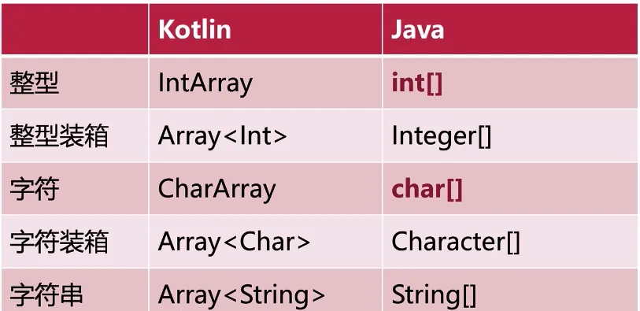
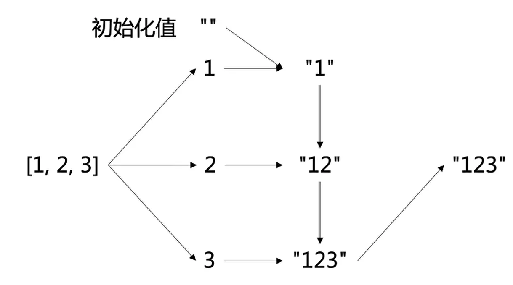
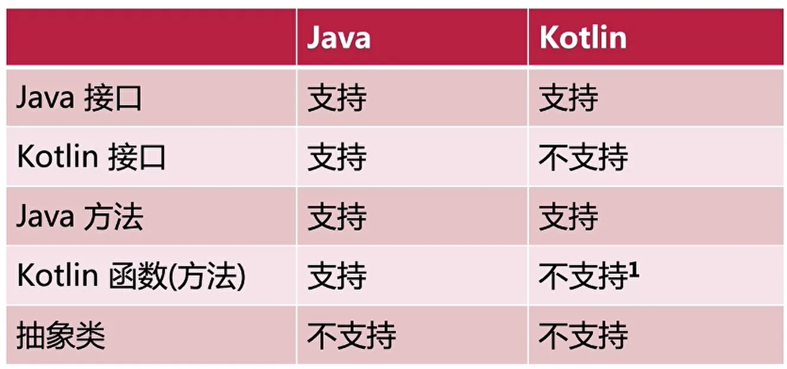
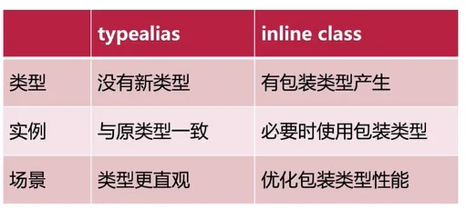
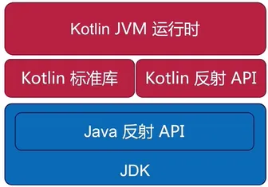

---

order: 1
author: zhiyu1998
title: Kotlin基础&结合Spring
category:
  - Kotlin
---

## 基础知识

### 基础类型

Java中基本类型声明

```java
int a = 2;
final String b = "Hello Java"
```

对照Kotlin中的声明：

```kotlin
var a:Int = 2
val b:String = "Hello Kotlin"
```


### long类型

Java

```java
long c = 12345678910l;
long d = 12345678910L;
```

Kotlin

```kotlin
val c = 12345678910l // error
val d = 12345678910L // fine
```


### 数值转换

Java

```java
int e = 10;
long f = e;
```

Kotlin

```kotlin
val e:Int = 10
val f:Long = e.toLong()
```


### 无符号类型

Java没有，但是kotlin有


### 字符串模板

```kotlin
fun main() {
    val j = "I Love China"
    println("Value of String j is: $j")
}
```


### 比较运算

在Java中==比较引用，`equals()`比较内容，而在Kotlin中===比较的是引用，==比较的是内容

```java
System.out.println(k==m);
System.out.println(k.equals(m));
```


```kotlin
println(k===m)
println(k==m)
```


### 数组




#### 数组的创建

Java

```java
int[] c = new int[]{1,2,3,4,5};
```

Kotlin

```kotlin
val c0 = intArrayOf(1,2,3,4,5)
val c1 = IntArray(5){it + 1} 
```


#### 数组的长度

Java中使用length来计算

```java
int[] a = new int[5];
System.out.println()
```

Kotlin则使用size

```kotlin
val a = IntArray(5)
println(a.size)
```


#### 数组的遍历

Java

```java
float[] e = new float[]{1,3,5,7};
for (float element : e) {
    System.out.println(element);
}
```

Kotlin

```kotlin
val e = floatArrayOf(1f, 3f, 5f, 7f)
for (element in e) {
    println(element)
}
-----------or--------------
e.forEach { element -> println(element) }
```


#### 数组的包含关系

Java中

```java
for (float element:e) {
    if (element == 1f) {
        System.out.println("1f exists in variale 'e'");
        break;
    }
}
```

Kotlin

```kotlin
if (1f in e) {
    println("1f exists in variale 'e'")
}
```


### 区间

#### ..符号

```kotlin
val intRange = 1..10
/*for (i in intRange) {
        println(i)
    }*/
val charRange = 'a'..'z'
val longRange = 1L..10L
val floatRange = 1f..10f
val doubleRange = 1.0..2.0
println(intRange.joinToString())
println(charRange.joinToString())
==================================
1, 2, 3, 4, 5, 6, 7, 8, 9, 10
a, b, c, d, e, f, g, h, i, j, k, l, m, n, o, p, q, r, s, t, u, v, w, x, y, z
```

#### 步距step

```kotlin
val intRangeStep = 1..10 step 2
val charRangeStep = 'a'..'z' step 2
println(intRangeStep.joinToString())
println(charRangeStep.joinToString())
====================================
1, 3, 5, 7, 9
a, c, e, g, i, k, m, o, q, s, u, w, y
```

#### until

until和..的区别在于，它是右闭区间

```kotlin
val intRangeUtil = 1 until 10
val charRangeUtil = 'a' until 'z'
println(intRangeUtil.joinToString())
println(charRangeUtil.joinToString())
=====================================
1, 2, 3, 4, 5, 6, 7, 8, 9
a, b, c, d, e, f, g, h, i, j, k, l, m, n, o, p, q, r, s, t, u, v, w, x, y
```

#### 倒数：downTo

```kotlin
val intRangeDownto = 10 downTo 1
val charRangeDownto = 'z' downTo 'a'
println(intRangeDownto.joinToString())
println(charRangeDownto.joinToString())
```

#### 区间的遍历

在Java中遍历数组是可以是这样

```java
int[] array = new int[]{1,3,5,7};
for (int i = 0; i < array.length; i++) {
    System.out.println(array[i]);
}
```

在kotlin中

```kotlin
val array = intArrayOf(1,3,5,7)
for (i in 0 until array.size) {
    println(array[i])
}
```

更加简化的版本是

```kotlin
for(i in array.indices) {
    println(i)
}
```


### 集合


#### List

Java中创建ArrayList

```java
List<Integer> intList = new ArrayList<>(Arrays.asList(1,2,3));
```

Kotlin中则分为可变List和不可变

```kotlin
val intList: List<Int> = listOf(1, 2, 3)
val intList2: MutableList<Int> = mutableListOf(1, 2, 3)
```

如果想像Java一样创建集合则

```kotlin
val stringList = ArrayList<String>()
```

那么它是如何实现创建集合和Java一样的呢？**类型别名**


##### 增加元素/删除元素

Java中的添加元素

```java
ArrayList<String> stringList = new ArrayList<>();
for (int i = 0; i < 10; i++) {
    stringList.append("num: " + i);
}
```

kotlin的添加元素

```kotlin
val stringList = ArrayList<String>()
for (i in 1..10) {
    stringList += "num: $i"
}
```

Kotlin中的删除元素则是

```kotlin
for (i in 1..10) {
    stringList -= "num: $i"
}
```


##### 读写元素

Java中

```java
stringList.set(5, "HelloWorld");
String valueAt5 = stringList.get(5);
```

Kotlin

```kotlin
stringList[5] = "HelloWorld"
val valueAt5 = stringList[5]
```


#### map

Java中读写元素

```java
HashMap <String, Integer> map = new HashMap<>();
map.put("Hello", 10);
System. out.println(map.get("Hello"));
```

Kotlin

```kotlin
val map = HashMap<String, Int>()
map["Hello"] = 10
println(map["Hello"])
```


#### pair

如何创建？

```kotlin
val pair = "Hello" to "Kotlin"
val pair2 = Pair("Hello", "Kotlin")
```

访问对应元素

```kotlin
val first = pair.first
val second = pair.second
```

对象解构

```kotlin
val (x, y) = pair
```


### 函数

结构如下：


#### 函数引用

这个和Java8的函数应用一致

符号是：`::`

像是定义了一个函数

```kotlin
class Foo {
    fun bar() {
        
    }
}
```

如果要使用它的引用`Foo::bar`


#### 变长参数

```kotlin
fun test1(vararg args: Int) {
    println(args.contentToString())
}
fun main() {
    test1(11,22,33)
}
========================================
[11, 22, 33]
```


#### 多返回值

定义返回一个Triple

```kotlin
fun multiRetureValues(): Triple<Int, Long, Double> {
    return Triple(1, 3L, 4.0)
}
```

使用的时候就可以使用对象解构

```kotlin
val (a, b, c) = multiRetureValues()
```


#### 默认参数

```kotlin
fun defaultParameter(x: Int = 5, y: String, z: Long = 0L) {
    println("$x,$y,$z")
}
```

同时，Kotlin支持具名参数

```kotlin
defaultParameter(y = "Hello")
```


### 类 & 接口

Java中定义类中的成员遍历不需要赋值

```java
public class SimpleClass{
    public int x;
    public void y(){}
}
```

Kotlin中必须给成员变量赋值

```java
class SimpleClass{
    var x: Int = 0
    fun y(){}
}
```


#### 构造方法

Java

```java
public class SimpleClass {
    public int x;
    public SimpleClass(int x) {
    	this.x = x;
    }
    ..
}
```

Kotlin，但是下面的风格不适合Kotlin

```kotlin
class SimpleClass{
    var x: Int
    constructor(x:Int){
        this.x = x
    }
    ..
}
```

下面这个风格才是Kotlin

```kotlin
class SimpleClass
constructor(x: Int) {
    var x:Int = x
}
```

还可以再进一步简化

```kotlin
class SimpleClass(x: Int) {
    
}
```

#### 类的实例化

Java

```java
SimpleClass simpleClass = new SimpleClass(9);
System.outprintln(simpleClass.x);
simpleClass.y();
```

Kotlin，不需要new

```kotlin
val simpleClass = SimpleClass(9)
println(simpleClass.x)
simpleClass.y()
```


#### 接口

Java中的接口

```java
public interface SimpleInf {
void simpleMethod();
}
```

Kotlin中的接口（不需要写public，默认）

```kotlin
interface Simplelnf {
fun simpleMethod()
}
```


#### 实现接口

Java中实现接口的方法

```java
public class SimpleClass implements SimpleInf {
    @Override
    public void simpleMethod() {
    }
}
```

Kotlin（使用override）

```kotlin
class SimpleClass(var x: Int): SimpleInf {
override fun simpleMethod() {
}

```


#### 抽象类定义

Java

```java
public abstract class AbsClass {
    public abstract void absMethod();
    protected void overridable(){ }
    public final void nonOverridable(){ }
}
```

Kotlin（默认不可以覆写，只有通过`open`才能被覆写）

```kotlin
abstract class AbsClass {
    abstract fun absMethod()
    open fun overridable(){}
    fun nonOverridable(){}
}
```


#### 类的继承

Java

```java
public class SimpleClassextends AbsClass implements Simplelnf {
..
}
```

Kotlin（注意继承类的时候`加上括号，表示调用父类的构造方法`）

```kotlin
class SimpleClass(var x:Int) : AbsClass(), SimpleInf{
    ...
}
```


#### 属性引用

这个基本和函数引用差不多

```kotlin
class Person(var name: String, var age: Int) {}

val ageRef = Person::age
val nameRef = person::name
val person = Person(18, "Bennyhuo")
ageRef.set(person, 20)
nameRef.set("Andyhuo")
=======================================
Andyhuo
20
```


### 空类型安全

在类的章节中已经介绍了，如果Kotlin中声明了一个成员变量，就必须给变量赋值，那么怎么为空呢？就是加一个`?`

```kotlin
var nullable: String? = "Hello"
nullable = null
```

如果加了`?`那么在某些情况就会编译错误

```kotlin
var length = nullable.length
```

【不推荐】那么也可以强制使用，就是使用`!!`，使用的时候要知道它肯定有值

```kotlin
var length = nullable!!.length
```

那么也可以安全访问，使用`?`

```kotlin
var length = nullable?.length
```

也可以使用`elvis`运算符 `?:`

```kotlin
var length = nullable?.length ?: 0
```


### 父子替换

父类可以替换为子类，但是反过来不行（Number是Int的父类）`小的可以替换大的`

```kotlin
var x: String = "Hello'
var y: String? = "World"
x=y // Type mismatch
y=x// OK
var a:Int = 2
var b: Number = 10.0
a=b // Type mismatch
b=a//OK
```


### 智能类型转换

例如下面的这段代码：

```kotlin
val kotliner: Kotliner = Person("benny", 20)
if(kotliner is Person){
	println((kotliner as Person).name)
}
```

Kotlin的智能转换可以换成下面，Kotliner自动转换成Person

```kotlin
val kotliner: Kotliner = Person("benny", 20)
if(kotliner is Person){
	println(kotliner.name)
}
```

#### 空类型的自动转换

* 在if之前是是`String?`
* if中：`String`
* if后：`String?`

```kotlin
var value: String? = null
value = "benny"
if(value != nulI){ t
	println(value.length)
}
```


### 表达式

#### 分支表达式

##### if..else区别

Java

```java
c = a == 3 ? 4 : 5;
```

Kotlin

```java
c = if (a == 3) 4 else 5
```


##### switch & when

Java中的switch

```java
switch(a) {
    case 0 :
        c = 5; break;
    case 1 :
        c = 100; break;
    default :
        c = 20
}
```

Kotlin中的when

```kotlin
when(a) {
    0 -> c = 5
    1 -> c = 100
    else -> c = 20
}
```

Kotlin中when的智能转换(如果x是字符串，则在`x.length`自动转换成字符串)

```kotlin
var x: Any = ...
when {
    x is String -> c = x.length
    x == 1 -> c = 100
    else c = 20
}
```

#### 捕获异常

Java和Kotlin都一致

```kotlin
try {
    c = a / b
} catch (e: Exception) {
    e.printStackTrace()
    c = 0
}
```

但是Kotlin可以进一步写为

```kotlin
c = try {
    a / b
} catch (e: Exception) {
    e.printStackTrace()
    c = 0
}
```


#### 中缀表达式

`infix` 定义了Kotlin的简写

infix函数（中缀方法）需要几个条件:

- 只有`一个参数`
- 在方法前必须加`infix`关键字
- 必须是`成员方法`或者`扩展方法`

```kotlin
fun main() {
    println("HelloWorld" rotate 5)
}

infix fun String.rotate(count: Int): String {
    val index = count % length
    return this.substring(index) + this.substring(0, index)
}
==============================================================
WorldHello
```

再例如

```kotlin
class Book
class Desk

infix fun Book.on(desk: Desk) {
    
}

fun main() {
    val book = Book()
    val desk = Desk()
    book on desk // 具体用法
}
```


#### Lambda表达式

##### 匿名函数

func是变量名

```kotlin
val func = fun() {
    println("Hello")
}

func() // 调用
```


##### 匿名函数的类型

```kotlin
val func: () -> Unit = fun() {
    println("Hello")
}
```


##### Lambda表达式

Java

```java
// Jdk 8
Runnable lambda = () -> {
    ....
}
// Jdk 10以上
var lambda = () -> {
    ....
}
```

Kotlin

```kotlin
val lambda = {
    println("Hello")
}
// 有返回参数的
val lambda: () -> Unit = {
    println("Hello")
}
```

表达式参数类型从表达式类型推断出来

```kotlin
val f1: (Int) -> Unit = {
        p: Int -> println(p)
    }
```

```kotlin
val f1: Function1<Int, Unit> = {
        p -> println(p)
    }
```

表达式从声明推断而来

```kotlin
val f1 = {
        p: Int -> println(p)
    }
```

表达式的`最后一行表示返回值`

```kotlin
val f1 = {
        p: Int -> println(p)
        "Hello"
    }
```

另外还有省略参数的形式

```kotlin
val f1: Function1<Int, Unit> = {
        println(it)
        "Hello"
    }
```


#### 自己实现hashcode注意问题

需要注意的是：自己实现hashcode如果某个变量发生了变化要移除是移除不了的，除非定义构造函数的时候使用val而不是var

```kotlin
class Person(var name: String, var age: Int) {
    override fun equals(other: Any?): Boolean {
        val other = other as? Person ?: return false
        return other.age == age && other.name == name
    }

    override fun hashCode(): Int {
        return 1 + 7 * age + 13 * name.hashCode()
    }
}

fun main() {
    val persons = HashSet<Person>()

//    (0..5).forEach{
    val person = Person("Benny", 20)
    persons += person
//    }

    println(persons.size)
    person.age++ // 变化

    persons -= person // 移除不了

    println(persons.size)
}
===========================================
1
1
```


### 高阶函数

#### 内联函数

* public/protected的内联方法只能访问对应类的public成员
* 内联函数的内联函数参数不能被存储(赋值给变量)
* 内联函数的内联函数参数只能传递给其他内联函数参数

```kotlin
fun cost(block: () -> Unit) {
    val start = System.currentTimeMillis()
    block()
    println("${System.currentTimeMillis() - start}ms")
}

fun main() {
    cost {
        println("Hello")
    }
}
```

上述的写法相当于，如果不加`inline`则就是一个Lambda表达式

```kotlin
fun main() {
    val start = System.currentTimeMillis()
    println("Hello")
    println("${System.currentTimeMillis() - start}ms")
}
```


#### non-local return

定义

```kotlin
inline fun nonLocalReturen(block: ()->Unit) {
    
}

nonLocalReturn{
    return
}
```

如何禁止？ `crossinline`


#### 几个有用的高阶函数


#### 集合遍历

##### filter操作

Java

```java
list.stream().filter(e -> e % 2 == 0)
```

Kotlin

```kotlin
list.filter { it % 2 == 0 }
```

Kotlin还可以转换为懒序列

```kotlin
list.asSequence().filter { it % 2 == 0 }
```


##### map

Java

```java
list.stream().map(e -> e * 2 + 1)
```

Kotlin

```kotlin
list.filter { it * 2 + 1 }
```


##### flatMap


Java

```java
var list = new ArrayList<Integer>();
list.addAll(Arrays.asList(1, 2, 3, 4));
list.stream().flatMap(e -> {
    var list1 = new ArrayList<Integer>(e);
    for (int i = 0; i < e; i++) {
        list1.add(i);
    }
    return list1.stream();
}).collect(Collectors.toList()).forEach(System.out::print);
```

Kotlin

```kotlin
list.flatMap { 0 until it }.forEach(::print)
```


##### fold




#### SAM转换

Java

- 一个参数类型为只有一个方法的接口的方法调用时可用Lambda表达式做转换作为参数

Kotlin

- 一个参数类型为只有一个方法的Java接口的Java方法调用时可用Lambda表达式做转换作为参数




### 类的进阶

### 构造器

#### 构造器的基本写法

前一个类内全局可见，name构造器可见（init块，属性初始化）

```kotlin
class Person(var age: Int, name: String)
```


#### init块

init块可以有多个

```java
class Person(var age: Int, name: String) {
    var name: String
    init {
        this.name = name
    }
    var firstName = name.split(",")[0]
    init {
        
    }
}
```


#### 继承及调用副构造器

```kotlin
class Person(var age: Int, name: String) : Animals() {
    constructor(age:Int):this(age, "unknown")
    // 定义了主构造器后在类内部
    // 再定义构造器都称为副构造器
}
```


#### 默认构造器

```kotlin
class Person(var age: Int, var name = "unknown") : Animals()
```

如果要让Java以重载的方式调用可以加上注解`@JvmOverLoads`

```kotlin

class Person
@JvmOverLoads
constructor(var age: Int, var name = "unknown") : Animals()
```


### 类成员的可见性

#### default & internal

* 一般由SDK或公共组件开发者用于隐藏模块内部细节实现
* default可通过外部创建相同包名来访问,访问控制非常弱
* default会导致不同抽象层次的类聚集到相同包之下
* internal可方便处理内外隔离,提升模块代码内聚减少接口暴露
* internal修饰的Kotlin类或成员在Java当中可直接访问


### 延迟初始化

#### 使用null

如果非要初始化（像是安卓里的TextView）那么有以下解决方案

```kotlin
private var nameView? = null
```

#### lateinit

```kotlin
private lateinit var nameView: TextView
```

判断`lateinit`如何初始化

```kotlin
if(::nameView.isInitialized) {}
```

* lateinit会让编译器忽略变量的初始化,不支持Int等基本类型
* 开发者必须能够在完全确定变量值的生命周期下使用lateinit
* 不要在复杂的逻辑中使用lateinit，它只会让你的代码更加脆弱
* Kotlin 1.2加入的判断lateinit属性是否初始化的API最好不要用


#### 【推荐】lazy

```kotlin
private val nameView by lazy {
}
```


### 代理

#### 接口代理

```kotlin
interface Api {
    fun a()
	fun b()
	fun c()
}
-------------
class ApiImpl : Api {
    override fun a() {}
    override fun b() {}
    override fun c() {}
}
```

使用接口代理（日志、埋点）

```kotlin
class ApiWrapper(val api: Api) 
: Api by api {
    override fun c() {
        println("c is called")
        api.c()
    }
}
```


### 单例模式

饿汉式在Java中是体现在new,类加载时实例化对象`Singleton`

```java
class Singleton {
    public static final Singleton INSTANCE = new Singleton();
}
```

Kotlin

```kotlin
object Singleton {}
```


如何访问object成员呢？

kotlin

```kotlin
object Singleton {
    var x: Int = 2
    fun y(){}
}

Singleton.x
Singleton.y()
```

Java

```java
Singleton.INSTANCE.getX();
Singleton.INSTANCE.setX();
Singleton.INSTANCE.y();
```


#### 静态成员 @JvmStatic

这样声明之后是静态的，但是还是需要getter/setter

```kotlin
object Singleton {
    @JvmStatic var x: Int = 2
    @JvmStatic fun y(){}
}
```

如果使用`@JvmField`，在被Java调用的时候就可以不用getter/setter

```kotlin
object Singleton {
    @JvmField var x: Int = 2
    @JvmStatic fun y(){}
}
```


#### 伴生对象

```kotlin
class Foo {
    companion object {
        @JvmStatic fun y(){}
    }
}
```

在Java中是这样

```java
public class Foo {
    public static void y(){}
}
```


### 内部类

Java

```java
class Outer {
    class Inner {}
    static class StaticInner{}
}
```

Kotlin

```kotlin
class Outer {
    inner class Inner
    class StaticInner
}
```


#### 内部object

```kotlin
object OuterObject{
    object StaticInnerObject
}
```


#### 匿名内部类

容易造成泄露,因为它定义在非静态区域

Java

```java
new Runnable() {
    @Override
    public void run() {
        
    }
}
```

Kotlin，可以看到object后直接忽略了名字

```kotlin
object: Runnable{
    override fun run() {
        
    }
}
```

Java中不支持`实现多个接口的匿名内部类`，但是Kotlin支持

```kotlin
object: Cloneable, Runnable{
    override fun run() {
        
    }
}
```


### 数据类

定义之前加一个`data`

```kotlin
data class Book(val id: Long,
               val name: String,
               val author: String)
```

比较Java可以看到这个在干嘛（@Data来源于Lombok）

```java
@Data
public class Book {
    private long id;
    private String name;
    private Person person;
}
```


#### 数据类解构

```kotlin
fun main() {
    val pair = "Hello" to "World"
    val (hello, world) = pair
}
//结构原理
data class Pair<out A, out B> (
    public val first: A,
    public val second: B
):java.io.Serializable
```

Java Bean & data class


#### JSON序列化示例

##### Gson

```kotlin
data class Person(val name:String, val age:Int)

fun main() {
    var str = """
        {
    "name": "请求成功",
    "age": "18"
}
    """.trimIndent()
    
    println(Gson().toJson(Person("Zhiyu 1998", 20)))
    println(Gson().fromJson(str, Person::class.java))
}
```


##### Moshi

导包：

```kotlin
implementation("com.squareup.moshi:moshi-kotlin:1.14.0")
```

使用

```kotlin
val moshi: Moshi = Moshi.Builder()
        .add(KotlinJsonAdapterFactory())
        .build()
val jsonAdapter: JsonAdapter<Person> = moshi.adapter(Person::class.java)
println(jsonAdapter.toJson(Person("Zhiyu", 20)))
println(jsonAdapter.fromJson(
    """
        {
            "name": "zhiyu",
            "age": "199999"
        }
    """.trimIndent()
))
```


##### Kotlinx

导包注意项：

```kotlin
plugins {
    kotlin("jvm") version "1.7.10"
    kotlin("plugin.serialization") version "1.7.10"
}

dependencies {
    ...
    implementation("org.jetbrains.kotlinx:kotlinx-serialization-json:1.4.0")
}
```

就可以编写了

```kotlin
@Serializable
data class Person(var name:String, var age:Int) {
    init {
        if (name.isNullOrBlank()){
            name="kotlinx.serialization";
            age=12
        }
    }
}

fun main() {
    println(
        Json.decodeFromString<Person>(
            """
                {"name":"kotlinx.serialization","age":12}
            """
        )
    )
}
```


### 枚举类

Java

```java
enum State {
    Idle, Busy
}
State.Idle.name(); // Idle
State.Idle.ordinal(); // 0
```

Kotlin

```kotlin
enum class State{
    Idle, Busy
}
State.Idle.name // Idle
State.Idle.ordinal // 0
```


#### 定义构造器

```java
enum State{
    Idle(0), Busy(1);
    int id;
    State(int id) {
        this.id = id;
    }
}
```

Kotlin

```kotlin
enum class State(val id:Int) {
    Idle(0), Busy(1)
}
```


#### 枚举定义扩展

```kotlin
fun State.next(): State {
    return State.values.let {
        val nextOrdinal = (ordinal + 1) % it.size
        it[nextOrdinal]
    }
}
```


### 密封类

* 密封类是一种特殊的`抽象类`
* 密封类的子类定义在与自身相同的文件中
* 密封类的子类的个数是有限的

```kotlin
sealed class PlayerState {
    constructor()
    
    constructor(int: Int)
}
```


#### 密封类&枚举类区别


### 内联类

* 内联类是对某一个类型的包装
* 内联类是类似于Java装箱类型的一种类型
* 编译器会尽可能使用被包装的类型进行优化


定义示例：

```kotlin
inline class BoxInt(val value: Int)
```


#### 内联类的方法

```kotlin
inline class BoxInt(val value: Int) {
    operator fun inc(): BoxInt {
        return BoxInt(value + 1)
    }
}
```


#### 【错误设想】内联类的属性

这样会`报错`：inline class cannot have properties with backing field

```kotlin
inline class BoxInt(val value: Int) {
    val name = "BoxInt($value)"
}
```


#### 内联类的继承结构

内联类可以实现接口，但不能继承父类也不能被继承

```kotlin
inline class BoxInt(val value: Int): Comparable<Int> {
    override fun compareTo(other: Int) = value.compareTo(other)
}
```


#### 编译优化

```kotlin
var boxInt = BoxInt(5)
if (boxInt < 10) {
    println("value is less than 10")
}
```

编译优化成Int类型: var value: Int = 5

使用Int类型: val newValue = value * 200

方法编译成静态方法: BoxInt.inc-impl(value)

必要时使用包装类型: println(BoxInt(value))

```kotlin
var boxInt = BoxInt(5)
val newValue = BoxInt.value * 200
println(newValue)
boxInt++
println(boxInt)
```


#### 使用场景

##### 无符号类型

```kotlin
inline class UInt
internal constructor(internal val data:Int): Comparable<UInt> {
   
}
```

##### 模拟枚举

```kotlin
inline class State(val ordinal: Int) {
    companion object {
        val Idle = State(0)
        val Busy = State(1)
    }
    fun values = arrayOf(Idle, Busy)
    val name: String
    	get() = ...
}
```


#### 限制

* 主构造器必须有且仅有一个只读属性
* 不能定义有backing-field 的其他属性
* 被包装类型必须不能是泛型类型
* 不能继承父类也不能被继承
* 不能定义为其他类的内部类


#### 对比typealias




### 泛型

以maxOf看一下泛型：
```kotlin
public actual fun <T : Comparable<T>> maxOf(a: T, b: T): T {
    return if (a >= b) a else b
}
```

再看一下Java

```java
public static <T extends Comparable<T>> T maxOf(T a,T b) {
    if (a.compareTo(b) > 0) return a;
    else return b;
}

```

#### 给泛型添加约束

其中Comparable就是约束

```kotlin
fun<T:Comparable<T>> maxOf(a: T, b: T): T {
```

可以看一下Java的多个约束

```java
public static <T extends Comparable<T> & Supplier<R>,
    R extends Number>
R callMax(T a, T b) {
    if (a.compareTo(b) > 0) return a.get();
    else return b.get();
}
```


多个泛型参数

```kotlin
fun <T, R> callMax(a: T,b: T): R
	where T : Comparable<T>,T:()-> R,
		R: Number{
	return if(a> b) a() else b()
}
```

更常见的是map的key,value

```kotlin
public interface Map<K, out V>
```


#### 泛型的型变

* 协变:继承关系一致
* 逆变:继承关系相反
* 不变:没有继承关系

##### 不变

此时`val list = List.Cons(1.0, List.Nil)`会报错，Nil不能满足`List<T>`

```kotlin
sealed class List<T> {
    object Nil : List <Nothing>()
}
val list = List.Cons(1.0, List.Nil)
```


##### 协变

out 子类不能替代父类

概念：

Int 继承于 Number

`List<Int>` 继承于 `List<Number>`

意义：子类提供子类，父类提供给父类，提供的保持一致

```kotlin
sealed class List<out T> {
    object Nil : List <Nothing>()
}
val list = List.Cons(1.0, List.Nil)
```

* 子类Derived兼容父类Base
* 生产者`Producer<Derived>` 兼容`Producer <Base>`
* 存在协变点的类的泛型参数必须声明为协变或不变
* 当泛型类作为泛型参数类实例的生产者时用协变


##### 逆变

in 子类可以替代父类

（干垃圾能扔垃圾桶和干垃圾桶， 垃圾只能扔垃圾桶）

```kotlin
public interface Function2<in P1, in P2, out R> : Function<R> {
	public operator fun invoke(p1: P1, p2: P2): R
}
```

* 子类Derived兼容父类Base
* 消费者`Consumer <Base>`兼容`Consumer<Derived>`
* 存在逆变点的类的泛型参数必须声明为逆变或不变
* 当泛型类作为泛型参数类实例的消费者时用逆变


#### 星投影

\'\*\'可用在变量类型声明的位置
\'\*\'可用以描述一个未知的类型
\'\*\'所替换的类型在:

* `协变`点返回泛型参数`上限`类型
* `逆变`点接收泛型参数`下限`类型


#### 泛型实现对比

Java、kotlin使用类型擦除


#### 内联特化


### 反射



Gradle引入

```kotlin
dependencies {
    implementation("org.jetbrains.kotlin:kotlin-reflect:1.6.21")
}
```

Maven引入

```xml
<dependency>
    <groupId>org.jetbrains.kotlin</groupId>
    <artifactId>kotlin-reflect</artifactId>
</dependency>
```

与Java对比反射


Java反射

* 优点:无需引入额外依赖,首次使用速度相对较快
* 缺点:无法访问Kotlin语法特性,需对Kotlin生成的字节码足够了解

Kotlin反射

* 优点:支持访问Kotlin几乎所有特性, API设计更友好
* 缺点:引入Kotlin反射库(2.5MB ,编译后400KB) ,首次调用慢


#### Kotlin中两种找到函数的方法

```kotlin
class UserDTO(val name:String, val age: Int)

interface Api {
    fun getUser(): List<UserDTO>
}

abstract class SuperType<T>

class SubType: SuperType<String>()

fun main() {
    Api::class.declaredFunctions.first {
        it.name == "getUser"
    }.returnType.arguments.forEach {
        println(it)
    }

    Api::getUser.returnType.arguments.forEach {
        println(it)
    }
}
================================================
UserDTO
UserDTO
```

对应Kotlin调用Java反射

```kotlin
(Api::class.java.getDeclaredMethod("getUser").genericReturnType as ParameterizedType)
.actualTypeArguments.forEach {
    println(it)
}
===================================
class UserDTO
```


#### 反射参数

通过下面的这个反射可以看到方法`class SubType: SuperType<String>()`的泛型参数为String

```kotlin
abstract class SuperType<T> {
    val typeParameter by lazy {
        this::class.supertypes.first().arguments.first().type!!
    }

    val typeParameterJava by lazy {
        this.javaClass.genericSuperclass.safeAs<ParameterizedType>()?.actualTypeArguments?.first()
    }
}

class SubType: SuperType<String>()

fun main() {
    val subType = SubType()
    subType.typeParameter.let (::println)
    subType.typeParameterJava.let (::println)
}

fun <T> Any.safeAs(): T? {
    return this as? T
}
================================================
kotlin.String
class java.lang.String
```


#### 深拷贝

前提：

```kotlin
data class Group(val id: Int, val name: String, val location: String)

data class Person2(val id: Int, val name: String, val group: Group)
```


深度拷贝函数：

```kotlin
fun <T : Any> T.deepCopy(): T {
    //如果不是数据类，直接返回
    if (!this::class.isData) {
        return this
    }

    //拿到构造函数
    return this::class.primaryConstructor!!.let { primaryConstructor ->
        primaryConstructor.parameters.map { parameter ->
            //转换类型
            //memberProperties 返回非扩展属性中的第一个并将构造函数赋值给其
            //最终value=第一个参数类型的对象
            val value = (this::class as KClass<T>).memberProperties.first {
                it.name == parameter.name
            }.get(this)

            //如果当前类(这里的当前类指的是参数对应的类型，比如说这里如果非基本类型时)是数据类
            if ((parameter.type.classifier as? KClass<*>)?.isData == true) {
                parameter to value?.deepCopy()
            } else {
                parameter to value
            }


            //最终返回一个新的映射map,即返回一个属性值重新组合的map，并调用callBy返回指定的对象
        }.toMap().let(primaryConstructor::callBy)
    }
}
```


结果：

> 注意：3等号比较的是引用，2等号是比较值

```kotlin
fun main() {
    val person = Person2(
        0,
        "zhiyu",
        Group(
            0,
            "Kotlin.cn",
            "China"
        )
    )

    val copiedPerson = person.copy()
    val deepCopiedPerson = person.deepCopy()

    println(copiedPerson)
    println(deepCopiedPerson)

    println(person === copiedPerson)
    println(person === deepCopiedPerson)
    println(person.group === copiedPerson.group)
    println(person.group === deepCopiedPerson.group)
}
=================================================
Person2(id=0, name=zhiyu, group=Group(id=0, name=Kotlin.cn, location=China))
Person2(id=0, name=zhiyu, group=Group(id=0, name=Kotlin.cn, location=China))
false
false
true
false
```


#### model映射

map转换为任意类型

```kotlin
inline fun <reified To : Any> Map<String, Any?>.mapAs(): To {
    // 主构造器
    return To::class.primaryConstructor!!.let {
        // 泛型参数
        it.parameters.map { parameter ->
            parameter to (this[parameter.name] ?: if (parameter.type.isMarkedNullable) null
            else throw IllegalArgumentException("${parameter.name} is required but missing"))
        }.toMap()
        // 调用
            .let(it::callBy)
    }
}
```

map转换为其他map

```kotlin
inline fun <reified From : Any, reified To : Any> From.mapAs(): To {
    return From::class.memberProperties.map { it.name to it.get(this) }
        .toMap().mapAs()
}
```

实践

```kotlin
class UserDTO2(val id: Int, val login: String, val avatarUrl: String, val url: String, val htmlUrl: String)

class UserVO(val id: Int, val login: String, val avatarUrl: String, val url: String)

fun main() {
    val userDTO = UserDTO2(
        0,
        "Zhiyu",
        "https://static.hetaousercontent.com/labs/squares/random?theme=duskfalling&user_id=2886891",
        "https://github.com/",
        "https://github.com/zhiyu1998/Computer-Science-Learn-Notes"
    )

    val userVO: UserVO = userDTO.mapAs()
    println(userVO)

    val userMap = mapOf(
        "id" to 0,
        "login" to "Zhiyu",
        "avatarUrl" to "https://github.com",
        "url" to "https://github.com/zhiyu1998/Computer-Science-Learn-Notes"
    )

    val userVOFromMap:UserVO = userMap.mapAs()
    println(userVOFromMap)
}
=======================================
UserVO@1046d517
UserVO@3b7d3a38
```


### 注解

关键字：`annotation`

限定标注注解位置`Target`：

```kotlin
@Target(AnnotationTarget.CLASS)
annotation class Api
```

指定作用时机`Retention`：

```kotlin
@Retention(AnnotationRetention.RUNTIME)
@Target(AnnotationTarget.CLASS)
annotation class Api
```

Java相比：

```java
@Retention(RetentionPolicy.RUNTIME)
@Target(ElementType.TYPE)
public @interface Aspect {
    public Class type();
}
```

明确标注对象

```kotlin
@file:JvmName("Hello")
package com.zhiyu.kotlin.annoation.basic
```
